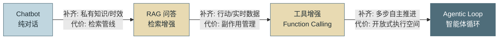
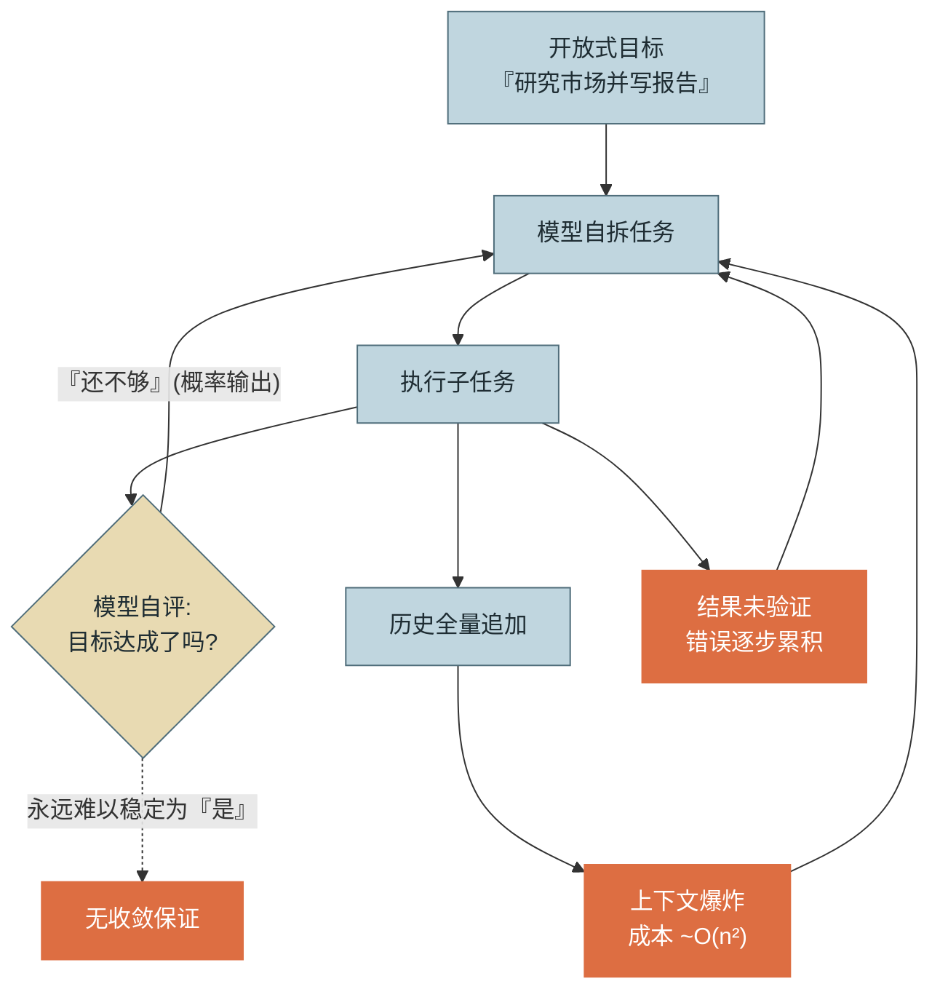
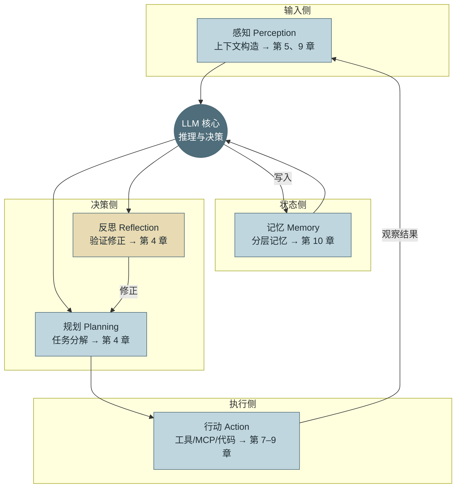
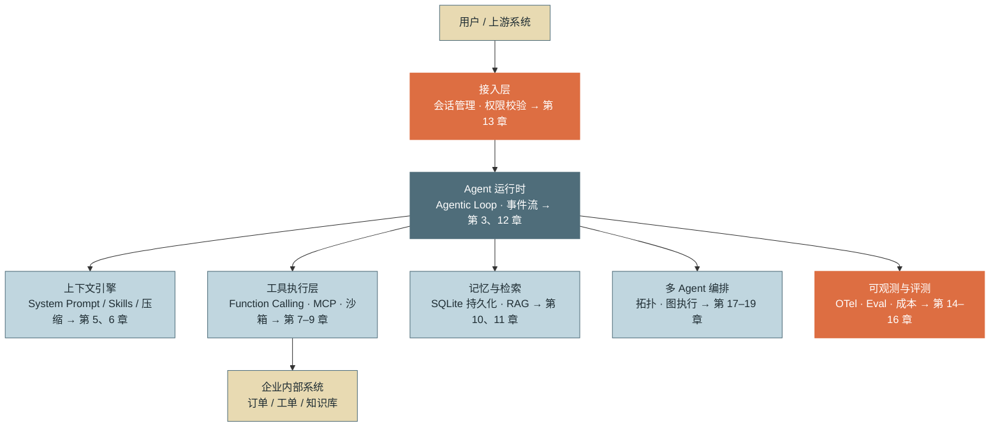

# 第 1 章 Agent 是什么

> 本章是全书的认知地图。读完后你应能清晰回答两个问题：**Agent 与 Chatbot 的本质区别是什么**；以及这本书的 25 章分别在解决 Agent 的哪一块拼图。

---

## 1. 场景引入：一次"看起来只差一步"的需求升级

2024 年底，某电商中台团队上线了一个基于大模型的客服问答机器人。它接了公司知识库，能回答"退货政策是什么""运费怎么算"这类问题，满意度不错。春节前，业务方提了一个"看起来只差一步"的需求：

> "用户问'帮我把上周那单退了'的时候，机器人能不能直接把退货流程走掉，而不是把退货政策念一遍？"

负责的后端工程师老周评估后发现，这一步跨的不是功能，而是**范式**：

- 原来的系统是**一问一答**：输入一段文本，输出一段文本，无状态、无副作用，答错了顶多用户不满意。
- 新需求要求系统**理解意图 → 查询订单 → 校验退货资格 → 调用退款接口 → 确认结果并汇报**。这是一个多步骤流程，中间任何一步失败都要有分支处理；调用退款接口是**不可逆的副作用**，错一单就是真金白银的资损。

老周尝试用"Prompt 里塞流程说明 + 一次调用输出 JSON"的方式硬做，很快遇到三个问题：模型看不到订单系统的实时状态（**时效性缺失**）；模型自己不能执行任何操作，只能"说"不能"做"（**副作用缺失**）；对话跨多轮后模型不记得上一轮查到的订单号（**状态缺失**）。

这三个缺失正是**大语言模型（Large Language Model, LLM）**与生俱来的边界，也是 **Agent（智能体）** 这个工程范式存在的全部理由：**Agent 不是更聪明的模型，而是围绕模型搭建的一套"感知—决策—行动—反馈"运行时系统**，用工程手段补齐模型补不了的能力。本章我们把这件事从头讲清楚。

---

## 2. 原理

### 2.1 演进脉络：从 Chatbot 到 Agentic Loop

Agent 不是凭空出现的，它是四个阶段逐步"补能力"的结果。理解每一步**补齐了什么、付出了什么代价**，比背定义重要得多——因为在生产选型时，你未必需要走到最后一级台阶（参见第 19 章的可行性权衡）。

**阶段一：Chatbot（纯对话）。** 形态是 `文本进 → 文本出`，能力全部来自模型参数内的知识。它的优点恰恰是工程上最珍贵的：**无副作用、延迟低、成本可控、失败模式单一**（最坏就是答错）。代价是三个硬边界：知识截止于训练日期、无法访问私有数据、无法执行任何操作。

**阶段二：RAG 问答（检索增强生成，Retrieval-Augmented Generation）。** 在模型前面加一条检索管线：先从企业知识库召回相关文档，拼进上下文再生成。**补齐的是私有知识与（部分）时效性**——模型不用"记住"你的退货政策，现查现用。代价有二：其一，引入了一整条**数据工程管线**（解析、切分、向量化、检索、重排，参见第 11 章），系统复杂度从"一个 API 调用"跳升为"一套数据基础设施"；其二，回答质量的上限从"模型能力"变成了"检索质量"，检索不到就一定答不对。

**阶段三：工具增强（Tool-Augmented）。** 让模型输出结构化的**函数调用（Function Calling）**请求，由外部运行时执行后把结果喂回去。**补齐的是行动能力与实时数据**——查订单、发邮件、跑 SQL 都成为可能。代价是**副作用管理**问题第一次进入系统：你必须回答"哪些工具允许调、参数错了怎么办、调用失败重试几次、谁来审计"这些以前不存在的问题（参见第 7 章、第 13 章）。此阶段的典型形态是"单轮工具调用"：一次问答中调一两个工具就结束。

**阶段四：Agentic Loop（智能体循环）。** 把"调用工具"从单次动作变成一个**循环**：模型推理 → 选择行动 → 执行 → 观察结果 → 再推理，直到判定任务完成。**补齐的是多步任务的自主推进能力**——它可以先查订单、发现信息不足再查物流、校验资格后才发起退款。代价是系统进入了**开放式执行空间**：步数不确定、成本不确定、终止不确定，一切"确定性系统"的假设都被打破。整个第二、三篇（第 3–16 章）本质上都在为这个循环补上生产级的缰绳。

*图 1：从 Chatbot 到 Agent 的演进阶梯——这张图回答"每上一级台阶，系统补齐了什么能力、付出了什么工程代价"。*

由此可以给出本章最重要的一句结论：

> **Chatbot 与 Agent 的本质区别不在模型，而在控制流的归属。** Chatbot 的控制流由外部固定（一问一答，程序员写死）；Agent 把控制流的一部分交给模型——**由模型在运行时决定下一步做什么、何时结束**。这带来了自主性，也带来了本书后二十几章要处理的所有工程问题。

### 2.2 历史注脚：第一波自主 Agent 的三个失败教训

2023 年春天，**AutoGPT** 和 **BabyAGI** 在 GitHub 上引爆了第一波自主 Agent 热潮——AutoGPT 两个月斩获超过 13 万 star，"给它一个目标，它自己拆任务、自己执行"的演示视频刷屏。但到 2023 年下半年，几乎没有团队能把它们用在真实生产里。复盘这一波失败，有三个教训直到今天仍是每个 Agent 系统设计的起点。

**教训一：无限循环（无终止设计）。** AutoGPT 的循环终止依赖模型自己判断"目标是否达成"，而 GPT-4 时代的模型对开放式目标（如"研究市场并写份报告"）根本没有可靠的完成判据。典型症状是 Agent 在"搜索资料 → 总结 → 觉得不够 → 再搜索"之间打转，或者反复生成几乎相同的子任务。根因在于：**开放式目标 + 模型自评完成度 = 没有收敛保证**。数学上这是一个没有终止条件的循环，模型的"我觉得还没做完"是一个概率输出，不是谓词。工程上的修复方向是把终止权部分收回运行时：最大轮数（max_turns）、token/费用预算熔断、显式的任务完成判定协议（参见第 3 章的终止条件设计）。当年有用户报告一夜之间烧掉数百美元 API 费用而任务毫无进展——这不是模型不够聪明，而是系统没有装刹车。

**教训二：无验证（行动结果不校验）。** BabyAGI 的循环是"生成任务列表 → 执行最高优先级任务 → 根据结果生成新任务"，但"执行结果是否正确"从未被独立校验——模型说做完了就算做完了。症状是错误逐步累积：第 3 步基于第 2 步的幻觉输出继续推进，到第 10 步整个任务方向已经完全偏离。根因是**开环控制**：传统分布式系统里我们靠断言、校验和、幂等重试来对抗不可靠组件，而第一波 Agent 把一个错误率百分之几的概率组件放进循环，却没有配任何反馈校验，误差按步数指数累积（单步正确率 95% 时，20 步全对的概率只有约 36%）。修复方向是引入**反思（Reflection）与批评-重试机制**、独立于执行者的验证步骤，以及用确定性手段（跑测试、schema 校验、业务规则断言）替代模型自评（参见第 4 章、第 15 章）。

**教训三：上下文爆炸（无状态管理）。** 早期实现把每一轮的思考、行动、工具输出全部追加进对话历史。症状分两阶段：先是成本随轮数近似平方增长（每轮都要重新处理全部历史）、模型注意力被海量无关历史稀释导致"忘记最初目标"；然后是干脆撞上上下文窗口上限直接崩溃——当年主力模型只有 8K/32K 窗口，跑几十轮就满了。根因是**把上下文窗口当成了无限内存**，而它实际上是 Agent 最稀缺、最昂贵的资源：既有物理上限，又有"越长越贵、越长越钝"的软退化（参见附录 A.1 关于 KV Cache 与窗口的机制解释）。修复方向催生了今天的**上下文工程（Context Engineering）**：压缩与摘要（Compaction）、分层记忆、把长期状态外置到文件系统与数据库（参见第 5 章、第 10 章）。

*图 2：AutoGPT 式失败模式——这张图回答"没有终止条件、没有验证、没有状态管理的循环为什么必然发散"。*

这段历史的价值不在怀旧，而在于它划定了本书的问题空间：**2023 年之后的 Agent 工程，本质上就是给这个循环逐一装上终止条件、验证反馈和状态管理**。今天的 Claude Code、Deep Research 类产品之所以可用，靠的不是模型"突然会自主了"，而是这三课的工程化落地加上模型能力的同步提升。

### 2.3 基础架构五要素

把 Agentic Loop 拆开，任何一个生产级 Agent 都由五个要素构成。这个五分法也是全书的目录索引——每个要素对应本书的具体章节。

**感知（Perception）**：Agent 获取环境信息的入口。包括用户输入、工具返回的观察结果、注入上下文的文件与检索内容。感知层的核心工程问题是"喂给模型什么、以什么结构喂"——这就是上下文工程（→ 第 5 章 Context Window 管理；环境观察侧 → 第 9 章代码执行与环境交互）。

**记忆（Memory）**：跨越单次上下文窗口的状态保持。分工作记忆（当前窗口内）、情景记忆（历史会话）、语义记忆（沉淀的事实与偏好）等层次。核心问题是"何时记、记什么、如何检索、如何遗忘"（→ 第 10 章记忆系统；检索侧 → 第 11 章 RAG）。

**规划（Planning）**：把目标分解为可执行步骤的能力，从隐式的思维链（Chain-of-Thought, CoT）到显式的 Plan-then-Execute，再到搜索式推理。核心权衡是规划深度与 token 成本、纠错灵活性之间的三角（→ 第 4 章规划与推理）。

**行动（Action）**：对外部世界产生影响的执行通道——工具调用、协议化的能力接入、代码执行。核心问题是接口设计、副作用控制与执行隔离（→ 第 7 章工具调用、第 8 章 MCP 协议、第 9 章代码执行）。

**反思（Reflection）**：对自身输出与行动结果的批评、验证与修正，是对抗"教训二"的直接手段。核心问题是反思的触发时机与验证信号的来源——模型自评是弱信号，测试与业务断言是强信号（→ 第 4 章的 Self-Refine / Reflexion；系统化验证 → 第 15 章评测）。

注意五要素的中心是 LLM，但 LLM 只承担"推理与决策"这一职能；五要素本身全部由**运行时（Harness）**提供——这就是第 12 章"同一模型在不同产品中表现迥异"的根源。

*图 3：Agent 基础架构五要素——这张图回答"一个 Agent 由哪几块构成、信息如何在其间流动、每一块在本书哪一章展开"。注意行动的输出经由感知回流，构成闭环；反思是叠加在闭环上的修正回路。*

### 2.4 LLM 能力边界：模型缺什么，Agent 补什么

最后我们把开篇老周遇到的三个缺失系统化。LLM 作为一个**纯函数**（相同输入近似产生相似分布的输出、不改变外部世界、调用之间无共享状态），天然缺三样东西：

| 模型缺什么 | 为什么缺 | Agent 用什么补 |
|---|---|---|
| **时效与私有数据** | 知识冻结在训练截止日；训练语料不含你的内网数据 | 检索（RAG）与查询类工具，把"现在的事实"注入上下文（第 7、11 章） |
| **副作用（执行能力）** | 模型只输出 token，本身不能调用任何外部接口 | 工具调用运行时 + 权限与沙箱，把"想做"翻译成"做了"并控制爆炸半径（第 7–9、13 章） |
| **状态（持久与跨会话）** | 每次调用都是无状态的；上下文窗口有限且昂贵 | 记忆系统 + 外置存储 + Checkpoint，把状态从窗口移到磁盘（第 10、12 章） |

这张表值得反复回看，因为它给出了一个实用的架构判断法则：**评估任何 Agent 框架或产品时，先问它在这三个缺口上各自给了什么答案；三个答案的质量，基本决定了这个系统的生产可用性。** 模型能力每年都在涨，但这三个缺口是"函数 vs 系统"的结构性差异，不会被更大的模型抹掉——涨的是决策质量，缺的仍是手脚和记性。

### 2.5 Agent 与 Workflow：一条被反复混淆的边界

行业里"Agent"一词被严重滥用——很多产品把"LLM + 固定流程编排"也叫 Agent。按 Anthropic 在《Building Effective Agents》中给出的、目前业界接受度最高的区分：

- **工作流（Workflow）**：LLM 与工具按**预先编排好的代码路径**执行。开发者写死控制流，模型只在每个节点内做"填空"——分类、抽取、生成一段文本。典型模式包括提示链（Prompt Chaining）、路由（Routing）、并行化（Parallelization）、编排者-执行者（Orchestrator-Workers）、评估-优化循环（Evaluator-Optimizer）。
- **Agent**：LLM 在运行时**动态决定自己的执行路径与工具使用**，根据环境反馈调整方向，直到判定任务完成。

用 2.1 节的语言说：这仍是"控制流归属"那条分界线，只是 Workflow 位于阶梯的第三级附近——有工具、有多步，但每一步走哪条边是程序员定的。两者的工程属性差异非常具体：

| 维度 | Workflow | Agent |
|---|---|---|
| 控制流 | 代码写死，图结构确定 | 模型运行时决定，步数不定 |
| 可预测性 | 高：路径可枚举、可单测 | 低：同输入可能走不同路径 |
| 延迟与成本 | 有确定上界 | 无确定上界，需熔断兜底 |
| 排障 | 定位到具体节点 | 需完整轨迹回放（第 14 章） |
| 适用任务 | 路径可预先枚举的任务 | 路径无法枚举、但结果可验证的任务 |

由此得到一条实用的选型法则，也是 Anthropic 原文的核心建议：**能用 Workflow 解决的问题不要用 Agent**。先问"这个任务的步骤能不能提前写出来"——能写出来，就用确定性编排换取可预测性和低成本；写不出来（如开放式排障、代码修改、多轮调研），才值得把控制流交给模型，并配齐第三篇讲的全部缰绳。生产系统的常见终态是**混合结构**：外层是确定性 Workflow（审批、重试、灰度），内层把某几个"路径不可枚举"的节点实现为 Agent——第 18 章的图执行引擎正是为这种混合结构服务的。

---

## 3. 动手实现：贯穿项目预告

本书的每一章代码都累加到同一个贯穿项目——**VaneHub 助手**：一个企业内部的运维/客服混合场景 Agent（Python 实现），最终具备工具调用、MCP 接入、分层记忆、可观测性与多 Agent 协作能力。本章不写代码（第一行代码在第 2 章的最小 ReAct Loop 中出现），只给出项目最终形态的一页纸架构，供你在后续每一章中定位"现在写的这块属于哪里"。

*图 4：贯穿项目 VaneHub 助手的最终形态——这张图回答"全书代码最终拼成一个什么样的系统、每个模块在哪一章落地"。橙色模块（接入层、可观测与评测）是企业落地的两道安全网。*

阅读建议：把这张图打印或收藏。从第 2 章起，每章"动手实现"一节的开头都会指出"本章增量落在图 4 的哪个框里"。

---

## 4. 生产级考量

即使在"认知"章节，也有几条会直接影响你后续所有架构决策的企业级判断，提前立此存照。

**第一，自主性是可调参数，不是越高越好。** 图 1 的四级台阶中，每上一级，能力与风险同涨。企业场景的正确做法是**按任务风险配置自主等级**：查询类任务可以全自主；写操作（发退款、改配置）应降级为"Agent 提案 + 人工确认"（Human-in-the-Loop）；批量或不可逆操作甚至应退回固定工作流。2023–2025 年大量失败项目的共同点是把演示环境的全自主形态直接搬进生产。判断标准很朴素：**这一步做错的代价，是否超过了自动化省下的成本**。

**第二，Agent 是概率组件，架构上必须按"不可靠依赖"对待。** 后端工程师对不可靠依赖有成熟的处理模式——超时、重试、熔断、降级、幂等。这些模式全部适用于 Agent，只是对象从"网络调用"换成了"模型决策"：max_turns 是循环的超时，预算熔断是费用侧的熔断，工具幂等设计是重试的前提（第 3、7、16 章分别展开）。转型 Agent 方向最大的心智资产恰恰是你已有的分布式系统直觉。

**第三，可观测性要从第一天开始，而不是出事之后。** Agent 的每一步决策都由不可见的推理驱动，没有轨迹记录的 Agent 出了问题等于黑盒空难。生产系统应从第一个原型起就记录完整的事件流（每轮的输入上下文、模型输出、工具调用与结果），这既是排障依据，也是第 15 章评测数据集的来源。

**第四，安全边界先于能力接入。** 给 Agent 接一个新工具之前，先回答"它最坏能干什么"。凭据最小化、读写分离、沙箱隔离不是上线前的补丁，而是工具接入的前置条件（参见第 13 章）。

---

## 5. 常见坑

**坑 1：把 Agent 当成"更聪明的 Chatbot"直接替换上线。**
*症状*：团队把原有问答机器人换成带工具的 Agent，上线一周内出现用户诱导 Agent 执行了越权查询、同一问题时答时错、客服投诉"机器人自己乱操作"。
*根因*：Chatbot 的失败模式只有"答错"，而 Agent 的失败模式包括"做错"——控制流交给模型后，输入空间（含恶意输入）直接映射到行动空间，原有的风控假设全部失效。
*修复*：按第 4 节的原则给写操作加确认环节；工具按风险分级授权；上线前用对抗性用例（诱导、注入）做红队测试（参见第 5 章的注入防御与第 13 章）。

**坑 2：用"模型觉得完成了"作为唯一终止条件。**
*症状*：夜间批量任务偶发单个会话跑满数小时、消耗数十万 token，产出却是重复内容。
*根因*：即 2.2 节教训一——模型自评完成度是概率输出，对开放式任务没有收敛保证；低概率的"永不满意"状态在大流量下必然出现。
*修复*：终止条件必须至少三层冗余：max_turns 硬上限、token/费用预算熔断、显式完成协议（如要求模型调用特定的 `task_complete` 工具而非自由文本宣布完成）。参见第 3 章。

**坑 3：把工具原始返回全量塞进上下文。**
*症状*：Agent 接入内部 API 后，前几轮表现正常，多调几次工具后回答质量骤降、成本暴涨；日志显示单条工具结果动辄数万 token（整页 JSON、全量 SQL 结果）。
*根因*：即 2.2 节教训三的现代变体——上下文是稀缺资源，海量低密度信息既烧钱又稀释注意力，模型对长上下文中部信息的利用率显著低于首尾（所谓 "lost in the middle" 现象）。
*修复*：工具返回值为 LLM 设计而非为程序设计——截断、分页、字段裁剪、摘要化；大结果落盘、上下文中只留引用路径（参见第 5、7 章）。

**坑 4：跳过评测，靠"多试几次感觉不错"上线。**
*症状*：Demo 演示流畅，上线后成功率远低于预期；改一版 Prompt 修好了 A 场景却悄悄弄坏了 B 场景，没人发现，两周后才由用户投诉暴露。
*根因*：Agent 行为是概率性的，单次成功不代表成功率；没有回归评测集，任何改动的影响都不可度量，系统进入"玄学调参"状态。
*修复*：从第一个原型起积累失败案例进评测集；每次 Prompt/工具/模型变更跑回归；核心指标看任务成功率分布而非单次演示（参见第 15 章）。

**坑 5：为"未来可能的复杂度"直接上多 Agent 架构。**
*症状*：项目初期就搭了规划 Agent + 执行 Agent + 审核 Agent 的编排框架，联调耗时数周，排障时无法定位是哪个 Agent、哪一轮出的错；而对比实验发现单 Agent + 良好工具集就能达到相同成功率。
*根因*：多 Agent 引入的通信开销、状态一致性与调试复杂度是超线性的，只有当单 Agent 撞上上下文或职责边界时才划算——这与微服务的过早拆分是同构错误。
*修复*：默认从单 Agent 起步，把复杂度先花在工具质量与上下文工程上；拆分的触发条件与拓扑选择参见第 17、19 章。

---

## 6. 面试高频问题

**Q1：Agent 与 Chatbot 的本质区别是什么？**

结论先行：**本质区别是控制流的归属——Chatbot 的控制流由程序固定，Agent 把控制流（下一步做什么、何时结束）在运行时交给模型。**
- Chatbot：`输入 → 模型 → 输出`，单轮、无副作用、失败模式仅为"答错"。
- Agent：`推理 → 行动 → 观察` 的循环，模型决策驱动工具执行，具有副作用，失败模式包括"做错"。
- 推论一：Agent 的复杂度不在模型调用，而在循环的终止、验证与状态管理。
- 推论二：两者不是替代关系而是自主性光谱上的两点，按任务风险选择位置。

**Q2：LLM 本身缺什么能力？Agent 分别如何补齐？**

结论先行：**LLM 是无状态纯函数，结构性缺失时效/私有数据、副作用、持久状态三样，Agent 分别用检索、工具运行时、记忆系统补齐。**
- 时效与私有数据 → RAG 与查询工具，把最新事实注入上下文。
- 副作用 → 工具调用 + 权限沙箱，模型输出结构化意图、运行时负责执行与管控。
- 状态 → 分层记忆 + 外置存储，把长期状态从上下文窗口移到磁盘/数据库。
- 加分点：指出这是"函数 vs 系统"的结构性差异，不随模型规模提升而消失。

**Q3：AutoGPT 那一波自主 Agent 为什么失败？留下了什么教训？**

结论先行：**失败不是因为模型太弱，而是循环缺了三样工程要件：终止条件、结果验证、状态管理。**
- 无限循环：以模型自评作为终止条件，开放式目标下无收敛保证 → 教训：终止权必须部分收回运行时（max_turns、预算熔断）。
- 无验证：开环执行，单步 95% 正确率 20 步后全对概率仅约 36% → 教训：引入反思与确定性验证信号。
- 上下文爆炸：历史全量追加，成本近似平方增长且撞窗口上限 → 教训：上下文是稀缺资源，需要压缩与外置状态。
- 加分点：现代 Agent 产品的可用性 = 这三课的工程化 + 模型能力提升，二者缺一不可。

**Q4：Agent 架构的五要素是什么？各自解决什么问题？**

结论先行：**感知、记忆、规划、行动、反思，中心是只负责推理决策的 LLM，五要素全部由运行时提供。**
- 感知（Perception）：决定模型"看到什么"——上下文构造与环境观察。
- 记忆（Memory）：跨窗口/跨会话的状态保持与检索。
- 规划（Planning）：目标到步骤的分解与重规划。
- 行动（Action）：工具、协议、代码执行等副作用通道。
- 反思（Reflection）：对结果的验证与修正，对抗误差累积。
- 加分点：同一模型在不同产品中表现迥异，差异来源正是运行时对五要素的实现质量（Harness 决定论）。

**Q5：Agent 与 Workflow 如何区分？什么时候不该用 Agent？**

结论先行：**Workflow 是代码写死控制流、模型在节点内填空；Agent 是模型运行时决定路径。能用 Workflow 解决的问题不要用 Agent。**
- 区分标准：控制流归属——路径由代码预先编排（Workflow）还是由模型动态决定（Agent）。
- 路径可枚举：流程固定的任务（如标准审批流）用 Workflow，可预测、可单测、成本低一个量级。
- 错误代价高且难回滚：批量写操作、资金操作应降自主等级为"提案 + 人工确认"。
- 延迟敏感：Agentic Loop 的多轮往返使 P99 延迟不可控，在线核心链路慎用。
- 判断法则：自主性是按风险配置的参数；Agent 的价值区间是"路径不可预先枚举、但结果可验证"的任务。

---

> **下一章预告**：认知地图有了，第 2 章我们不依赖任何框架，手写一个最小可运行的 ReAct Loop——用大约一百行 Python 把图 3 的闭环真正跑起来，并搭好贯穿项目 VaneHub 助手的骨架。
