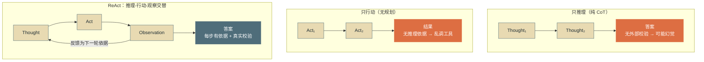
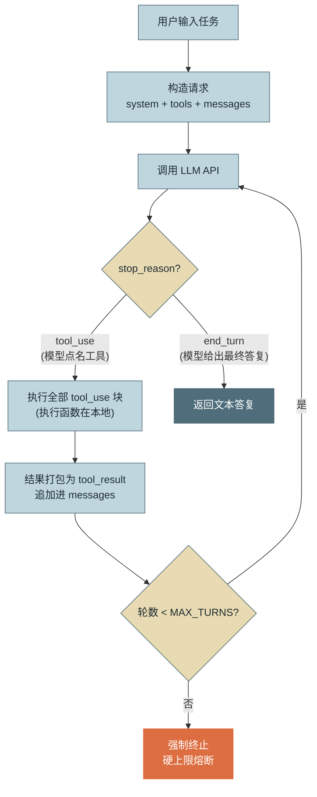
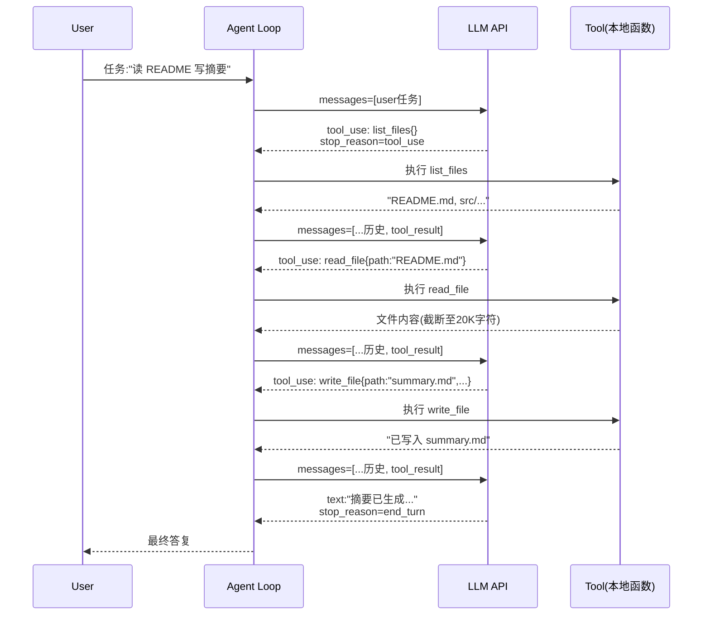

# 第 2 章 第一个 Agent

> 本章另有约十倍篇幅的**详解扩展版**（深读初稿，以正文为准）：[详解扩展版/详解02-第一个Agent.md](../详解扩展版/详解02-第一个Agent.md)。

> 本章目标：不依赖任何框架，用一个单文件、约 150 行的 Python 程序手写最小 **ReAct Loop**，把第 1 章图 3 的闭环真正跑起来，并建立贯穿全书的心智模型——**Agent = LLM + Loop + Tools**。同时搭好贯穿项目示例助手的仓库骨架。

---

## 1. 场景引入：面试题引发的"祛魅"时刻

小江是一位有五年 Java 后端经验的工程师，最近在准备 Agent 方向的面试。刷完各种框架教程后，他被一道面试题问住了：

> "不用 LangChain，不用任何 Agent 框架，你能用任何语言现场写出一个能完成多步任务的 Agent 吗？"

小江的第一反应是"这得写多少代码"——毕竟教程里 Agent 总是伴随着 `AgentExecutor`、`Chain`、`Memory` 一堆抽象类出现。但面试官的追问点破了关键：

> "把框架剥掉，Agent 的最小可运行形态到底有几行？里面每一行在做什么？"

这道题考察的不是编码量，而是**心智模型**：你是否理解 Agent 的本质只是"一个调用 LLM API 的 while 循环，循环体里执行模型点名的工具"。理解了这一点，任何框架都只是这个循环的封装变体；不理解这一点，用框架就是在黑盒上叠魔法。本章我们就把这道面试题完整做一遍——写完你会发现，**核心循环不到 40 行**，其余代码都在做工具注册和 HTTP 拼装这类"体力活"。

---

## 2. 原理

### 2.1 ReAct：推理与行动的交替

**ReAct（Reasoning + Acting）** 由 Yao 等人在 2022 年的论文《ReAct: Synergizing Reasoning and Acting in Language Models》中提出，核心思想是让模型交替产生**推理轨迹（Thought）** 和**行动（Action）**，行动的**观察结果（Observation）** 再反馈给下一轮推理。相比"只推理"（如纯 CoT，容易幻觉出不存在的事实）和"只行动"（无规划，容易乱调工具），交替结构让每一步行动都有推理依据、每一步推理都有真实观察支撑——这正是第 1 章"教训二：无验证"的最小对策：**观察结果就是天然的验证信号**。ReAct 只是范式谱系的起点——它与 CoT/Self-Consistency（推理技术）、Plan-then-Execute/ReWOO（其他循环范式）、Reflexion（修正回路）的分层关系有一张速查表在**附录 5.6**，各范式的工程权衡在第 4 章展开；本章先把这个最基础也最通用的一种亲手跑起来。



*图 1：ReAct 与"只推理/只行动"的对比——这张图回答"为什么推理-行动-观察的交替结构能同时抑制纯推理的幻觉和纯行动的盲目"。观察结果回流构成天然的验证信号（本图重绘自 ReAct 论文要义，原图见附录 6.1）。*

早期 ReAct 靠提示词约定 `Thought:/Action:/Observation:` 文本格式，再用正则解析——脆弱且易被格式错误打断。2023 年中之后，**原生工具调用 API（Tool Use API）** 把"行动"变成了结构化协议：模型输出带 JSON Schema 校验的 `tool_use` 内容块，运行时执行后以 `tool_result` 块回填。本章直接使用原生协议，文本解析式 ReAct 只需了解其历史地位（两种方式的可靠性对比参见第 7 章与附录 1.6）。

### 2.2 最小循环的四个组成部分

剥到最小，一个可运行的 Agent 只需要四部分，与本章代码的四个段落一一对应：

1. **系统提示构造（System Prompt）**：定义 Agent 的身份、工作方式与约束。它决定模型"如何用工具"，是行为的第一控制面（分层设计参见第 6 章）。
2. **工具注册（Tool Registry）**：每个工具 = 名称 + 描述 + 参数 Schema + 本地执行函数。前三者随请求发给模型（模型只看得到"说明书"），执行函数留在本地（模型永远碰不到代码）。
3. **循环驱动（Loop Driver）**：调用 LLM → 检查响应 → 执行工具 → 回填结果 → 再调用。**对话历史（messages 数组）就是循环的全部状态**——这一点是理解一切 Agent 运行时的钥匙。
4. **终止判断（Termination）**：双保险——模型侧信号（`stop_reason` 不再是 `tool_use`，说明模型认为无需继续行动）+ 运行时侧硬上限（`MAX_TURNS`），后者正是第 1 章 AutoGPT 无限循环教训的直接落地。



*图 2：最小 ReAct Loop 的控制流——这张图回答"一个 Agent 循环里到底有几个分支、终止发生在哪两个位置"。橙色的强制终止是运行时收回的刹车权，不依赖模型自觉。*

### 2.3 消息协议：一次三轮任务的完整时序

循环的每一"轮"在网络上是一次完整的 HTTP 请求/响应，**API 本身无状态**——历史由客户端（也就是我们的循环）随每次请求全量重发。以"查文件 → 读内容 → 写报告"任务为例，完整消息时序如下：



*图 3：三轮工具调用任务的完整消息时序——这张图回答"每一轮网络上到底传了什么、历史如何随轮数累积"。注意四次 LLM 调用中，前三次都以 `stop_reason=tool_use` 结束，只有最后一次是 `end_turn`。*

从时序图能直接读出两个工程事实：其一，**n 轮任务要付 n 次"全量历史"的输入 token 费用**，这是第 5 章上下文管理与附录 1.1 提示缓存（Prompt Caching）存在的经济学动因；其二，`tool_use` 与 `tool_result` 靠 `id` 严格配对，配对规则出错是新手最高频的报错来源（详见第 7 章，本章"常见坑 2"先给最典型的一例）。

---

## 3. 动手实现（贯穿项目增量）

本章增量落在第 1 章图 4 的 **"Agent 运行时"** 核心框内：先交付单文件最小实现 `examples/minimal_agent.py`，再抽出接口形成项目骨架。环境要求：Python ≥ 3.10，唯一第三方依赖是 HTTP 客户端 `requests`（`pip install requests`）——刻意不用官方 SDK，就是为了让协议的每个字节都摊在你眼前。

### 3.1 单文件最小 Agent（约 150 行）

**第一段：工具注册。** 这段解决的问题是"模型如何知道它能做什么"。每个工具是一个自包含对象：`name/description/input_schema` 三个字段会被发给模型（模型据此决定调用），`run` 是留在本地的执行函数。注意 `read_file` 对返回值做了截断——这是第 1 章"坑 3"（工具结果撑爆上下文）在第一行代码里就要养成的习惯。

```python
"""examples/minimal_agent.py — 最小 ReAct Agent
依赖：仅 requests（HTTP 客户端），无任何框架
运行：ANTHROPIC_API_KEY=sk-... python minimal_agent.py "你的任务"
"""
import json
import os
import sys
from pathlib import Path

import requests


def list_files(inp: dict) -> str:
    return "\n".join(sorted(p.name for p in Path(inp.get("dir", ".")).iterdir()))


def read_file(inp: dict) -> str:
    # 截断到 20K 字符：保护上下文窗口（参见第 5 章）
    return Path(inp["path"]).read_text("utf-8")[:20_000]


def write_file(inp: dict) -> str:
    Path(inp["path"]).write_text(inp["content"], "utf-8")
    return f"已写入 {inp['path']}（{len(inp['content'])} 字符）"


# 每个工具：name/description/input_schema 发给模型，run 留在本地执行
TOOLS = [
    {
        "name": "list_files",
        "description": "列出指定目录下的文件名，用于了解工作区里有什么。",
        "input_schema": {
            "type": "object",
            "properties": {"dir": {"type": "string", "description": "目录路径，缺省为当前目录"}},
            "required": [],
        },
        "run": list_files,
    },
    {
        "name": "read_file",
        "description": "读取一个文本文件的内容（超长自动截断至约 20K 字符）。",
        "input_schema": {
            "type": "object",
            "properties": {"path": {"type": "string", "description": "文件路径"}},
            "required": ["path"],
        },
        "run": read_file,
    },
    {
        "name": "write_file",
        "description": "将内容写入文件（覆盖），用于产出报告等交付物。",
        "input_schema": {
            "type": "object",
            "properties": {"path": {"type": "string"}, "content": {"type": "string"}},
            "required": ["path", "content"],
        },
        "run": write_file,
    },
]
TOOLS_BY_NAME = {t["name"]: t for t in TOOLS}
```

**第二段：系统提示构造。** 这段解决的问题是"给 Agent 定人设与边界"。哪怕最小实现，也要包含身份、工作方式、约束三层——这是第 6 章分层设计的雏形。"文件不存在时如实报告"这一句是用一行提示词对抗幻觉的实例。

```python
SYSTEM_PROMPT = """你是示例助手，一个严谨的企业内部任务执行 Agent。
工作方式：先思考需要哪些信息，再调用工具获取；信息足够后完成任务，直接给出最终答复。
约束：只操作当前工作目录；文件不存在或读取失败时如实报告，绝不编造内容。"""
```

**第三段：LLM 调用。** 这段解决的问题是"把循环状态变成一次无状态的 HTTP 请求"。没有 SDK，只有一个 `requests.post`：请求体里 `system`、`tools`（剥掉本地的 `run` 字段）、`messages` 三个成员，正对应 2.2 节的前三个组成部分。

```python
def call_llm(messages: list) -> dict:
    res = requests.post(
        "https://api.anthropic.com/v1/messages",
        headers={
            "content-type": "application/json",
            "x-api-key": os.environ["ANTHROPIC_API_KEY"],
            "anthropic-version": "2023-06-01",
        },
        json={
            "model": "claude-opus-5",
            "max_tokens": 16000,
            "system": SYSTEM_PROMPT,
            # 只发"说明书"三字段，run 函数绝不出网
            "tools": [
                {k: t[k] for k in ("name", "description", "input_schema")}
                for t in TOOLS
            ],
            "messages": messages,
        },
        timeout=600,
    )
    if res.status_code != 200:
        raise RuntimeError(f"API {res.status_code}: {res.text}")
    return res.json()
```

**第四段：循环驱动与终止判断。** 这是全文件的心脏，不到 40 行。三个细节值得逐字读：① assistant 的**完整 content 数组**（含 `tool_use` 块）必须原样放回历史，只放文本会破坏 `id` 配对；② 工具**执行失败也要回填**（带 `is_error`），让模型看到错误自行纠错，而不是让进程崩溃——这就是最小形态的**反思（Reflection）**；③ 一轮的多个 `tool_result` 打包进**同一条** user 消息。

```python
MAX_TURNS = 15   # 运行时侧硬刹车（参见第 3 章终止条件设计）


def run_agent(task: str) -> str:
    messages = [{"role": "user", "content": task}]

    for turn in range(1, MAX_TURNS + 1):
        reply = call_llm(messages)
        # 完整 content（含 tool_use 块）原样入历史，保证 id 配对
        messages.append({"role": "assistant", "content": reply["content"]})

        for b in reply["content"]:
            if b["type"] == "text" and b["text"]:
                print(f"\n[思考] {b['text']}")

        if reply["stop_reason"] != "tool_use":
            # 模型不再要求行动：end_turn 即完成（其余分支处理见第 3 章）
            return "\n".join(
                b["text"] for b in reply["content"] if b["type"] == "text"
            )

        results = []
        for t in (b for b in reply["content"] if b["type"] == "tool_use"):
            print(f"[行动] {t['name']}({json.dumps(t['input'], ensure_ascii=False)})")
            try:
                content, is_error = TOOLS_BY_NAME[t["name"]]["run"](t["input"]), False
            except Exception as e:
                content, is_error = f"工具执行失败: {e}", True   # 错误回填，让模型自行纠错
            print(f"[观察] {content[:200]}")
            results.append({
                "type": "tool_result",
                "tool_use_id": t["id"],
                "content": content,
                "is_error": is_error,
            })
        messages.append({"role": "user", "content": results})   # 同轮结果进同一条消息

    raise RuntimeError(f"达到 {MAX_TURNS} 轮上限仍未完成——硬终止生效")


if __name__ == "__main__":
    task = sys.argv[1] if len(sys.argv) > 1 else \
        "列出当前目录文件，读取 README.md，写一份 200 字以内的 summary.md"
    print(f"\n=== 最终答复 ===\n{run_agent(task)}")
```

### 3.2 运行演示：一次多步任务的完整轨迹

在含有 `README.md` 的目录下运行 `python minimal_agent.py`，典型输出（对应图 3 的时序）：

```text
[行动] list_files({})
[观察] README.md
agent-book-outline.md
第一篇-认知与基础

[思考] 目录里有 README.md，我来读取它的内容。
[行动] read_file({"path":"README.md"})
[观察] # 企业级 Agent 从入门到专家（2026版）……

[思考] 内容已足够，我来撰写摘要文件。
[行动] write_file({"path":"summary.md","content":"# 摘要\n本仓库是……"})
[观察] 已写入 summary.md（187 字符）

=== 最终答复 ===
已完成：读取了 README.md 并生成 summary.md，摘要约 180 字，涵盖本书定位与结构。
```

四次 LLM 调用、三次工具执行、零人工干预——**没有任何代码写过"先列目录再读文件"的流程**，执行路径完全由模型逐轮决定。这就是第 1 章 2.5 节"控制流归属"的直观体感：你写的是循环，不是流程。

### 3.3 心智模型总结与贯穿项目骨架

现在可以回答小江的面试题了：**Agent = LLM + Loop + Tools**。LangChain 的 `AgentExecutor`、各类框架的 `Runner`，封装的正是 3.1 节第四段那不到 40 行的循环，附加价值在于回调、重试、可观测等外围设施——"这些外围是否值得引入一个框架"的完整讨论在第 12 章展开，此处只需记住：**你随时写得出这个循环，框架对你就是选择题而非必答题**（常见框架与产品的全景定位见附录 4）。

贯穿项目示例助手在本章正式启动。骨架把单文件按职责拆开，并沉淀两个将贯穿全书的接口——`Tool`（第 7 章起持续扩展）与 `AgentEvent`（第 12 章事件模型、第 14 章可观测性的原料）：

```text
agent-assistant/
├── pyproject.toml          # 仅依赖: requests
├── examples/
│   └── minimal_agent.py    # 本章单文件版，保留作教学参照
└── src/assistant/
    ├── core/
    │   ├── types.py        # 核心接口（下方）
    │   └── agent_loop.py   # AgentLoop：3.1 循环的类封装
    ├── tools/              # 每工具一模块（第 7 章起扩展）
    └── llm/
        └── client.py       # call_llm 的封装：重试/超时（第 12 章扩展）
```

```python
# src/assistant/core/types.py — 全书代码的地基，后续各章只增不改
from dataclasses import dataclass, field
from typing import Any, Callable, Literal, Protocol


class Tool(Protocol):
    """工具接口：name/description/input_schema 发给模型，execute 本地执行"""
    name: str
    description: str
    input_schema: dict[str, Any]

    def execute(self, input: dict[str, Any]) -> str: ...


@dataclass
class AgentEvent:
    """循环产生的生命周期事件：GUI 渲染与可观测性共用（参见第 12、14 章）"""
    type: Literal["llm_call_start", "text", "tool_call",
                  "tool_result", "done", "aborted"]
    turn: int
    payload: dict[str, Any] = field(default_factory=dict)
    # payload 约定：text→{text} / tool_call→{name, input}
    # tool_result→{name, output, is_error} / done→{final_text}
    # aborted→{reason: "max_turns" | "budget" | "user"}


@dataclass
class AgentLoopOptions:
    system_prompt: str
    tools: list[Tool]
    max_turns: int
    on_event: Callable[[AgentEvent], None] | None = None   # 把循环内部翻译给外部世界
```

`AgentLoop` 类只是把 `run_agent` 装进这套接口并逐处发射事件，代码与 3.1 节同构，此处不再重复（完整代码见仓库 `src/assistant/core/agent_loop.py`）。

---

## 4. 生产级考量

最小实现距生产有多远？逐项对照，这也是后续章节的路线图：

**终止与预算：一层刹车不够。** 本章只有 `MAX_TURNS`。生产环境还需要 token/费用累计熔断（每轮响应的 `usage` 字段累加即可实现）与单轮超时——多个用户会话并发时，一个失控循环烧掉的是共享预算（参见第 3、16 章）。

**错误分类处理。** 本章对 HTTP 错误一律 throw。生产上必须区分：429/5xx 应指数退避重试；400 是请求构造 bug，重试无意义应立即告警；`stop_reason` 为 `max_tokens` 说明输出被截断，需要续写或调参处理而非当作完成（参见第 12 章）。

**工具执行的信任边界。** `write_file` 可以覆盖任意路径文件——本章的 Agent 事实上拥有当前用户的全部文件权限。生产环境必须做路径白名单、工作区隔离（chroot/容器）、写操作审批。规则是：**工具的权限边界在注册时划定，而不是指望提示词约束模型**——提示词是概率性引导，不是访问控制（参见第 9、13 章）。

**并发工具调用。** 模型可能在一轮里返回多个 `tool_use` 块。本章顺序执行，语义安全但慢；生产上只读工具可用线程池或 `asyncio.gather` 并行，但含副作用的工具并行前要先回答幂等性问题（参见第 7 章）。

**状态可恢复。** 本章的 `messages` 数组只活在进程内存里，进程一死任务全丢。生产运行时需要把每轮状态持久化，支持断点恢复（第 12 章的 Checkpoint 方案）。

---

## 5. 常见坑

**坑 1：只把文本放回历史，丢掉 `tool_use` 块。**
*症状*：第二轮请求直接返回 400 错误，提示 `tool_result` 块找不到对应的 `tool_use` id；或者不报错但模型表现出"失忆"，反复调用同一个工具。
*根因*：把 `reply.content` 过滤成纯文本再入历史。协议要求 `tool_result.tool_use_id` 必须与上一条 assistant 消息中的 `tool_use.id` 配对，assistant 内容被裁剪后配对链断裂。
*修复*：assistant 的 content 数组**原样、完整**放回 messages；任何裁剪历史的需求都应通过第 5 章的压缩机制实现，而非手工删块。

**坑 2：多个工具结果拆成多条 user 消息回填。**
*症状*：程序能跑，但模型逐渐不再并行调用工具，任务轮数变多、耗时和费用上升；偶发 400 报错。
*根因*：协议要求同一轮的全部 `tool_result` 放进**同一条** user 消息。拆成多条，一方面可能违反"tool_result 必须紧跟对应 assistant 消息"的顺序约束，另一方面等于在示范"一次只处理一个结果"，模型会跟着学。
*修复*：如 3.1 节代码所示，一轮循环收集所有结果后 push 一条 user 消息。

**坑 3：工具抛异常直接让进程崩溃。**
*症状*：Agent 一遇到"文件不存在"就整个任务失败退出；而人类工程师遇到这种情况只会换个路径再试。
*根因*：把工具错误当成程序错误。对 Agent 而言，"执行失败"是一种**合法的观察结果**——模型看到错误信息后完全有能力改参数重试或换策略；截断这条反馈路径，等于亲手拆掉了循环的自愈能力。
*修复*：try/catch 包裹执行，错误文本以 `is_error: true` 的 `tool_result` 回填。只有基础设施级错误（如 API 认证失败）才应终止循环。

**坑 4：System Prompt 里不写约束，指望模型"自然就懂"。**
*症状*：演示任务正常，换个任务模型开始读工作区之外的文件、在没有 README 时编造出一份摘要。
*根因*：模型对"边界在哪里"没有先验——工具 Schema 只说明"能做什么"，不说明"该不该做"。空白之处模型按训练分布自由发挥，幻觉与越界都是这种自由度的表现。
*修复*：系统提示明确写出工作方式与负面约束（本章 `SYSTEM_PROMPT` 的第三行）；同时记住上一节的原则——涉及安全的边界必须在工具执行层硬性校验，提示词只是第一道软防线。

**坑 5：用上一代"文本 ReAct"教程的正则解析方案。**
*症状*：照网上 2023 年的教程实现 `Thought:/Action:` 文本解析，运行中约有百分之几的轮次因模型输出格式偏差（多个空格、中文冒号、代码块包裹）解析失败，任务成功率始终上不去。
*根因*：文本约定没有 Schema 约束，格式正确性本身是概率事件；每轮 97% 的解析成功率，十轮任务的通过率只剩约 74%。
*修复*：一律使用原生 Tool Use API——`tool_use` 块的 `input` 经过服务端 Schema 校验，格式层错误率趋近于零（机制对比参见第 7 章）。唯一注意点：使用响应 JSON 反序列化后的 `input` 对象（本章即 `json.loads` 的产物），不要对序列化字符串做字符串匹配。

---

## 6. 面试高频问题

**Q1：不用框架，手写一个最小 Agent 需要哪几部分？**

结论先行：**四部分——系统提示、工具注册、循环驱动、终止判断；核心循环不到 40 行，本质是"调 LLM → 执行它点名的工具 → 回填结果"的 while 循环。**
- 系统提示：身份 + 工作方式 + 约束，行为的第一控制面。
- 工具注册：name/description/schema 发给模型，执行函数留在本地。
- 循环驱动：messages 数组即全部状态，每轮全量重发（API 无状态）。
- 终止判断：模型侧 `stop_reason` + 运行时侧 `MAX_TURNS` 双保险。
- 加分点：指出框架（LangChain 等）封装的正是这个循环，附加值在外围设施。

**Q2：ReAct 相比纯 CoT 和纯工具调用，解决了什么问题？**

结论先行：**ReAct 用"推理—行动—观察"的交替结构，让推理有真实观察支撑、行动有推理依据，抑制了纯推理的幻觉和纯行动的盲目。**
- 纯 CoT：推理链无外部校验，事实性错误一路传递。
- 纯行动：无规划的工具调用，无法处理多步依赖。
- ReAct：每轮观察都是天然验证信号，是对抗误差累积（参见 AutoGPT 教训二）的最小机制。
- 加分点：现代实现用原生 Tool Use API 承载"行动"，文本解析式 ReAct 已淘汰。

**Q3：Agent 循环中，对话历史扮演什么角色？带来什么工程问题？**

结论先行：**对话历史是循环的全部状态——LLM API 无状态，历史由客户端每轮全量重发；这带来成本二次方增长与上下文上限两大问题。**
- 状态角色：工具结果、中间推理全部以消息形式累积在 messages 数组。
- 成本问题：n 轮任务付 n 次全量历史的输入费用，缓解手段是提示缓存（参见附录 1.1）。
- 上限问题：长任务必然触顶，需要压缩/摘要机制（参见第 5 章）。
- 加分点：`tool_use`/`tool_result` 靠 id 配对，历史不可随意手工裁剪。

**Q4：工具执行失败时，应该重试、报错退出，还是告诉模型？**

结论先行：**默认把错误作为 `tool_result`（标记 `is_error`）回填给模型，让它自行纠错；只有基础设施级错误才终止循环。**
- 对模型而言，失败是合法观察，它能据此改参数、换路径——这是循环自愈能力的来源。
- 直接崩溃 = 拆掉反馈回路；无脑重试 = 对参数错误无效且烧钱。
- 分层处理：参数/业务错误回填；网络/限流错误运行时侧退避重试；认证/配置错误终止并告警。
- 加分点：回填的错误文本要对 LLM 友好（说清失败原因与可行方向），这本身是工具设计的一部分（参见第 7 章）。

**Q5：为什么最小 Agent 也必须有 MAX_TURNS 这类硬终止？**

结论先行：**因为"模型认为任务完成"是概率输出，没有收敛保证；终止权必须部分保留在运行时手里。**
- 反例：第 1 章 AutoGPT 的无限循环——纯靠模型自评终止，一夜烧掉数百美元。
- 硬上限保证最坏情况有界：轮数 × 单轮最大成本 = 可计算的损失上限。
- 生产上还需叠加 token/费用熔断与超时，构成多层刹车（参见第 3、16 章）。
- 加分点：硬终止触发应产生明确的 `aborted` 事件而非静默失败，便于排障与统计（参见第 14 章）。

---

> **下一章预告**：循环能跑了，但它还很"糙"——什么时候该停、怎么判断真的完成了、预算烧穿了怎么办？第 3 章解剖 Agentic Loop 的每一个关节：终止条件设计、内外循环划分、流式输出与中断恢复。
