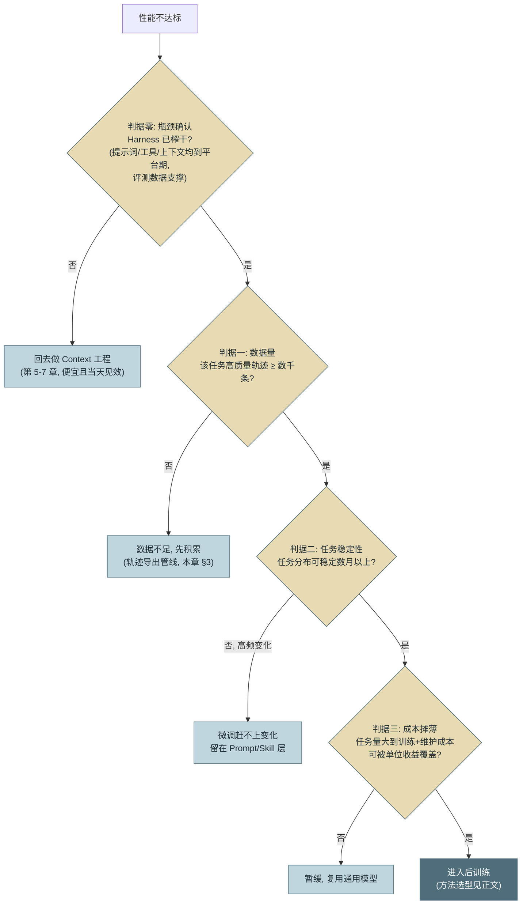
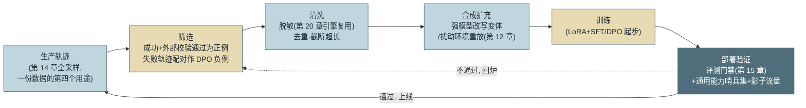
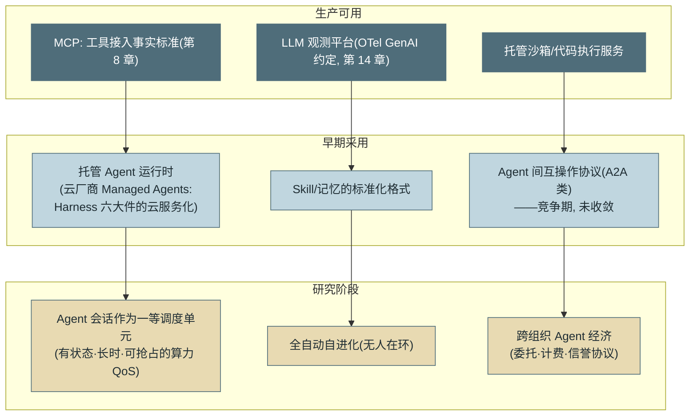

# 第 26 章 前沿方向

> 本章另有约十倍篇幅的**详解扩展版**（深读初稿，以正文为准）：[详解扩展版/详解26-前沿方向.md](../详解扩展版/详解26-前沿方向.md)。

> 第七篇 专家视野
>
> 前瞻章节最容易写成风口清单，本章刻意克制：**只讲有生产信号的方向**，每个方向标注成熟度（**生产可用 / 早期采用 / 研究阶段**），并给出判断框架而非预言。三个主题：Agent 自进化、Agent 后训练（何时该动权重）、Agent 基础设施的演进——外加一条随时可用的试金石：**当一个"前沿方向"无法回答"谁在真实生产里用它"时，它属于关注列表，不属于预算表。**

---

## 1. 场景引入：年度规划会上的三个提案

示例平台组的年度规划会，三个团队各带一个"前沿"提案来争预算：

**提案 A：自进化 Agent。**"让系统自动从成功会话里沉淀 Skill、自动调整提示词——自己越用越聪明。"演示很惊艳，但安全团队当场问："它自动改了提示词，谁批的？出了问题怎么回滚？"没人答得上来。

**提案 B：微调自有模型。**"用我们积累的 40 万条会话轨迹微调，摆脱对通用模型的依赖。"财务问成本，答"GPU 大约 XX 万"；CTO 追问："先回答另一个问题——现在的成功率瓶颈，你确定是模型不是 Harness？上季度那 33 个百分点（第 12 章的实验）可都是 Harness 给的。"

**提案 C：接入 XX 互操作协议。**"这是 Agent 间通信的未来标准，早接入早占位。"有人翻出该协议的 GitHub："提交量三个月环比降了 60%，两个主要发起方各推了各的新方案。"

会议的结论不是否决全部，而是立了一条评审规则：前沿提案必须标注**成熟度档位**并回答**三问**——谁在真实生产用（信号）、试错是否可逆（失败成本）、与既有资产是否兼容（评测集与 Harness 能否复用）。这条规则就是本章的方法论，三个提案则分别对应本章三节。

---

## 2. 原理

### 2.1 Agent 自进化：自动化的变更管理【早期采用】

**自进化（Self-Evolution）** 指 Agent 系统在运行中改进自身。先立边界再谈形态：当前一切可生产化的自进化，改的都是 **Harness 资产**（Skill、记忆、提示词、路由配置），不是模型权重——改权重是 2.2 节的后训练。由此得到本节的核心论断：**自进化 = 自动化的变更管理**，因此变更管理的全部纪律（评测门禁、灰度、回滚、审计）一条都不能少——提案 A 被问倒的地方正是这里。

两个有生产信号的形态：

**Skill 自动沉淀【早期采用】**：第 10 章"语义记忆毕业为 Skill"通道的自动化——系统检测跨会话反复出现的成功做法（同类任务、相似动作序列、高成功率），自动起草 Skill 草案，**人审批后**入库，新 Skill 经第 15 章评测验证触发率与增益。生产可用的版本都有人在环；全自动入库（跳过人审）目前仍是研究阶段——原因见坑 1。

**记忆驱动的策略调整【生产可用（保守形态）→ 研究阶段（激进形态）】**：保守形态已在第 10 章交付——教训写入记忆、强化机制让有效教训置信爬升，本质是数据层的自改进，风险有限。激进形态是闭环自动调参：失败模式统计直接驱动提示词/路由的自动修改——它的正确打开方式是把"自动修改"降级为"**自动提案**"：系统产出变更建议 + 支撑数据，走第 22 章的正常变更流程。判断一个自进化方案是否靠谱的检查点只有一个：**它产出的每个变更是否经过与人工变更同等的门禁**。没有评测门禁的自进化，等于给系统装了一台无回归测试的自动发版机。

### 2.2 Agent 后训练：什么时候该动权重

**后训练（Post-Training）** 是企业最容易花冤枉钱的方向，先给决策框架再讲技术。三判据按顺序判定：



*图 1：后训练决策树——这张图回答"什么时候该微调、什么时候该回去改提示词"。判据零最常被跳过：多数"模型不行"的结论，在 Harness 审计后变成"工具描述不行"（第 12 章的教训在预算会上的重演）。四个出口里三个通向"不训练"——这个比例符合真实世界。*

过了决策树，四种方法速览（只讲适用场景；训练谱系的机制背景参见附录 1.4）：

**SFT（监督微调，Supervised Fine-Tuning）【生产可用】**：拿高质量轨迹做模仿学习。适用：把稳定的行为模式"压进"权重——领域术语与格式规范、固定的工具调用惯例、内部框架的代码风格。特征是**有标准答案**：你能拿出"就该这么做"的轨迹。收益形态：把原本靠几千 token 提示词维持的行为固化，换来上下文瘦身与稳定性。

**LoRA（低秩适配，Low-Rank Adaptation）【生产可用】**：参数高效微调的主流实现——冻结基座、只训小的适配器矩阵。它与 SFT/DPO 不是并列关系而是**实现手段**（训练目标正交于是否用 LoRA）。适用信号：预算有限、数据量中小（数千到数万条）、需要多个任务变体（每个变体一个适配器，部署时热切换）、迭代要快。企业后训练的默认起点几乎总是"LoRA + SFT"。

**DPO（直接偏好优化，Direct Preference Optimization）【生产可用】**：用"A 比 B 好"的**偏好对**直接优化，无需训练奖励模型。适用信号：你没有唯一标准答案，但有大量成对判断——评审通过的 patch vs 被打回的 patch（第 22 章流程的副产品）、用户采纳的回答 vs 被重新生成的回答。Agent 场景的天然偏好对来源：同任务的成功轨迹 vs 失败轨迹（第 15 章 k 采样天然产生）。

**GRPO（组相对策略优化，Group Relative Policy Optimization）【早期采用】**：强化学习路线——同一任务采样一组轨迹，按**可验证奖励**（测试通过率、Verifier 得分）组内相对比较来优化。适用信号：任务有自动可验证的结果（代码、数学、可断言的业务产出——第 23 章论证过 Coding 恰好满足），且要优化的是**多步决策链**而非单步输出。成熟度注记：前沿实验室已生产化，企业自用仍偏研究阶段——对奖励设计与训练稳定性的工程要求显著高于 SFT/DPO，且第 24 章坑 1 的"奖励被钻空子"在训练场景以更隐蔽的方式重演（reward hacking）。

**轨迹数据的回流管线**是后训练的地基，也是本章动手实现的对象：



*图 2：轨迹数据回流管线——这张图回答"生产数据怎么变成训练数据、闭环在哪"。两个关键闸门：筛选（不是所有轨迹都配进权重）与部署验证（微调模型过的评测门禁比提示词变更更严——它的行为漂移面更大）。*

### 2.3 Agent 基础设施：三条演进线



*图 3：Agent 基础设施成熟度光谱——这张图回答"每条基建线走到了哪一档"。箭头表示演进方向而非因果；档位判定用的是"谁在真实生产用"的信号标准，而非声量。*

三条线各说一段判断：

**运行时标准化【早期采用】**。本书的 Harness 六大件（第 12 章）正在被云厂商打包成**托管 Agent 运行时**——循环、沙箱、状态、事件流成为云服务，你提交的是 Agent 定义而非进程。判断：方向确定（与"自建 K8s → 托管 K8s"的历史同构），采购时用第 12 章的六大件清单逐件检查可替换性——**托管的收益是运维，代价是 Harness 定制深度**，第 20 章三档光谱的逻辑在运行时层重演（具体产品与托管运行时的定位见附录 4）。

**Agent 间协议【早期采用，未收敛】**。MCP 解决了"Agent 用工具"（第 8 章，已收敛）；"Agent 找 Agent"的互操作协议（任务委托、能力发现、跨组织通信）仍在竞争期——2025 年 ACP 并入 A2A [C-26] 是一次真实的整合信号，但 ANP、AGNTCY 等方案仍在场（家族盘点见第 18 章 2.7）。判断标准回到场景引入那条：**协议成熟的信号是"两个以上互不隶属的生产系统靠它互通"**——在此之前，企业的正确姿势是内部用自己的图执行与交接包（第 18 章），对外暴露标准 API，协议赌注保持在"一周可接入"的轻量级。

**计算资源调度【研究阶段】**。Agent 会话是一种新的工作负载画像：有状态、长时程、可抢占（Checkpoint 使抢占无损，第 12 章）、算力需求脉冲式。推理侧的会话级 QoS、prefill/decode 分离调度、按会话优先级的抢占腾挪——这些正在从论文走向实验集群。对企业的现实含义：暂不投入，但**保持自己的运行时"可被调度"**（Checkpoint 完备、状态外置）——这是未来接入这类调度器的入场券，而它恰好也是第 12 章本来就要求的。

### 2.4 判断框架收束

三问检验任何前沿方向：**生产信号**（谁在真用？拿得出案例还是只有 demo？）；**失败成本**（试错可逆吗？接入一周能退出，还是要重构半年？）；**资产兼容**（我的评测集、Harness、轨迹数据能复用吗？——能复用，方向错了损失也有限；不能复用，方向对了也要重付一遍学费）。用这三问过一遍场景引入的提案：A 补上门禁后值得试点（早期采用，失败可逆），B 被判据零打回先做 Harness 审计，C 不满足生产信号——进关注列表，设"两个互不隶属生产系统互通"的触发条件后归档。

---

## 3. 动手实现（贯穿项目增量）

本章增量：`src/assistant/training/export.py`——**轨迹导出器**：从第 12 章事件记录（JSONL）重建会话轨迹，按质量筛选、脱敏后输出训练格式，并为 DPO 生成同任务的成功/失败配对。这是图 2 管线的第一公里——**今天不训练，也要让数据通路今天就存在**：轨迹的价值随时间累积，而补采是不可能的。

```python
# src/assistant/training/export.py — 轨迹导出：为后训练预留数据通路
import json
import re
from collections import defaultdict
from dataclasses import dataclass
from pathlib import Path

PII = re.compile(r"\b\d{11}\b|\b\d{15,19}\b|[\w.]+@[\w.]+")   # 演示级脱敏, 生产用第 20 章引擎


@dataclass
class ExportPolicy:
    min_turns: int = 2            # 太短的会话无学习价值
    max_turns: int = 40           # 太长的多半是徘徊(第 14 章行为健康的复用)
    require_verified: bool = True # 正例必须过外部校验, 不认自报成功(第 3 章)


class TrajectoryExporter:
    def __init__(self, policy: ExportPolicy = ExportPolicy()):
        self.policy = policy
        self.stats = defaultdict(int)

    def load_sessions(self, trace_file: Path) -> dict[str, dict]:
        """按 session 聚合事件流, 重建轨迹与结局元数据"""
        sessions: dict[str, dict] = defaultdict(
            lambda: {"events": [], "status": None, "task_type": None, "turns": 0})
        for line in trace_file.read_text("utf-8").splitlines():
            ev = json.loads(line)
            s = sessions[ev["session_id"]]
            s["events"].append(ev)
            if ev["type"] == "session_end":
                s["status"] = ev["payload"].get("status")
                s["task_type"] = ev["payload"].get("task_type")
                s["turns"] = ev["payload"].get("turns", 0)
        return dict(sessions)

    def _accept(self, s: dict, as_positive: bool) -> bool:
        if not (self.policy.min_turns <= s["turns"] <= self.policy.max_turns):
            self.stats["rejected_turns"] += 1
            return False
        if as_positive and self.policy.require_verified \
                and s["status"] != "verified_success":
            self.stats["rejected_unverified"] += 1
            return False
        return True

    def _render(self, s: dict) -> dict:
        """事件 → 训练样本: messages 结构 + 元数据(脱敏在此统一执行)"""
        msgs = [{"role": e["payload"]["role"], "content":
                 PII.sub("<REDACTED>", str(e["payload"]["content"]))}
                for e in s["events"] if e["type"] == "message"]
        return {"messages": msgs,
                "meta": {"task_type": s["task_type"], "turns": s["turns"],
                         "status": s["status"]}}

    def export_sft(self, trace_file: Path, out: Path) -> int:
        """正例导出: 已验证成功的轨迹 → SFT 格式 JSONL"""
        n = 0
        with out.open("w", encoding="utf-8") as f:
            for s in self.load_sessions(trace_file).values():
                if s["status"] and self._accept(s, as_positive=True):
                    f.write(json.dumps(self._render(s), ensure_ascii=False) + "\n")
                    n += 1
        self.stats["exported_sft"] = n
        return n

    NEGATIVE_STATUSES = {"verify_failed", "aborted", "budget_aborted"}

    def export_dpo_pairs(self, trace_file: Path, out: Path) -> int:
        """偏好对导出: 同 task_type 的 成功×失败 轨迹配对(第 15 章 k 采样的副产品)。
        注意: 负例必须是"明确失败"——自报成功但未验证的轨迹可能是好的,
        两边都不进(拿它当负例, 等于教模型避开可能正确的行为)"""
        by_task = defaultdict(lambda: {"pos": [], "neg": []})
        for s in self.load_sessions(trace_file).values():
            if not s["status"] or not self._accept(s, as_positive=False):
                continue
            if s["status"] == "verified_success":
                by_task[s["task_type"]]["pos"].append(self._render(s))
            elif s["status"] in self.NEGATIVE_STATUSES:
                by_task[s["task_type"]]["neg"].append(self._render(s))
            else:
                self.stats["skipped_ambiguous"] += 1   # 未验证成功: 弃用不误用
        n = 0
        with out.open("w", encoding="utf-8") as f:
            for task, group in by_task.items():
                for good, bad in zip(group["pos"], group["neg"]):
                    f.write(json.dumps({"task_type": task, "chosen": good,
                                        "rejected": bad}, ensure_ascii=False) + "\n")
                    n += 1
        self.stats["exported_dpo_pairs"] = n
        return n
```

接线说明：`message` 事件由 `agent_loop` 在每条消息定稿时发射（第 12 章总线的又一消费场景——事件流的第五个用途：GUI、观测、审计、成本之后是训练数据）。两条纪律写进了代码：**正例只认外部校验**（`verified_success`，第 3 章"自报不可信"贯彻到训练数据——用自报成功的轨迹训练，等于把幻觉蒸馏进权重）；**脱敏在导出层统一执行**（数据一旦进入训练集就再也洗不掉，第 20 章"进了库就是持久化风险"在权重上加倍成立：**进了权重连删除权都无法执行**）。

---

## 4. 生产级考量

**训练用数据的授权先于技术。** 用户会话轨迹用于训练，需要条款与授权支撑——第 20 章你审查供应商的五要点，现在反过来审查自己：用户是否同意、能否退出、脱敏是否充分、保留期多长。**尤其注意删除权与权重的冲突**：已训进权重的数据无法响应删除请求——合规上的通行做法是训练数据集保留完整的来源清单，高风险数据类别（个人敏感信息）在筛选层一律排除而不是依赖脱敏。

**微调模型的门禁要比提示词变更更严。** 提示词变更影响面可估，权重变更的行为漂移面是全域的：回归必须全量 + **通用能力哨兵集**（一组与目标任务无关的标准任务，检测灾难性遗忘）+ 影子流量对比（第 15/14 章设施复用）。微调模型在第 20 章评分卡里作为一个新候选走完整流程——**自家微调的模型不享受任何评审豁免**。

**托管微调 vs 自托管权重。** 供应商的托管微调服务（交数据得端点）运维近零，但数据出域审查（第 20 章）适用、且适配器绑定该供应商；自托管开源权重自由度最高，第 20 章第三档的全部成本（GPU 利用率、推理运维）照单全收。决策沿用部署光谱的逻辑，多一条：**微调资产的可迁移性**——训练数据与评测集永远可迁移（好好保管），适配器权重通常不可迁移（换基座重训）。

**给未来留通路，而不是提前上车。** 本章多数方向的正确姿势是"低成本地保持在场"：轨迹导出跑起来（数据在攒）、评测集持续维护（任何新方向的验收器）、Harness 保持模块化（六大件可单件替换）、Checkpoint 完备（可被未来的调度器接管）。这四件事的共同点：**它们同时也是当下就该做的事**——好的前沿准备不是额外投资，是把基本功做扎实的副产品。

---

## 5. 常见坑

**坑 1：自进化不设门禁，坏模式全组扩散。**
*症状*：自动沉淀的某个 Skill 把一个"碰巧成功过几次"的危险做法（跳过校验直接重试）固化入库，两周内该模式出现在 40% 的会话里，成功率反降。
*根因*：把"反复出现"当成"值得沉淀"——频率不等于正确；自动入库跳过了人审与评测，坏模式获得了与好模式同等的分发渠道。
*修复*：自动沉淀降级为自动起草（人审批准入）；新 Skill 过第 15 章评测（触发率 + 分任务增益）再全量；Skill 带来源追溯（源自哪些会话），出问题可召回；2.1 节检查点——自进化产物过与人工变更同等的门禁。

**坑 2：全量轨迹直接喂训练。**
*症状*：微调后模型"学会"了徘徊——重复调用、冗长道歉、无效重试的频率反而上升；离线 loss 很好看，评测分下降。
*根因*：垃圾进权重出——生产轨迹里混着大量失败与低质量会话，模仿学习不分好坏照单全收；自报成功的幻觉轨迹尤其毒。
*修复*：筛选层三关（本章 `ExportPolicy`）：外部校验通过才算正例、轮数区间过滤徘徊、失败轨迹只作 DPO 负例；训练前对样本集抽检（人看 50 条的成本远低于训坏一版模型）。

**坑 3：用微调解决本该提示词解决的问题。**
*症状*：花两个月微调让模型学会内部工单格式，效果达成；三周后新人用一段 300 token 的系统提示词 + 两个示例达到同等效果——两个月与两小时的差距。
*根因*：跳过了决策树判据零——没有先榨干 Context 工程就动权重；"微调更高级"的技术审美压过了成本判断。
*修复*：图 1 决策树顺序强制执行（提案必须附"Context 工程已到平台期"的评测证据）；把这个案例讲给每个提微调的团队听——它在多数组织都真实发生过。

**坑 4：微调后只回归目标任务。**
*症状*：目标任务 +6 个百分点，上线两周后陆续发现：通用问答变生硬、某些工具调用格式偶发错乱、非目标语言能力明显回退——每个都不致命，合起来用户口碑崩了。
*根因*：**灾难性遗忘（Catastrophic Forgetting）**——微调向目标分布倾斜时侵蚀了通用能力，而回归只测了目标任务，漂移发生在没测的地方（第 24 章"错误藏在验收标准没覆盖的地方"的训练版）。
*修复*：通用能力哨兵集（与目标无关的固定任务组）进入微调门禁；影子流量全类型对比而非只看目标类型；LoRA 的低侵入性在此也是优点——遗忘通常轻于全参微调，且可随时摘掉适配器回退。

**坑 5：追协议风口，半年后协议死了。**
*症状*：投入一个季度把内部系统重构到某"未来标准"协议上，半年后该协议社区分裂、主要发起方转向，迁移投入全额沉没。
*根因*：把声量当成熟度——协议的价值全在网络效应，而网络效应只能用"互不隶属的生产系统是否靠它互通"验证，declarations 和 logo 墙都不算数。
*修复*：三问框架把关（生产信号/失败成本/资产兼容）；协议类投入限定"一周可接入、一周可退出"的适配层厚度；给关注列表里的方向设显式触发条件（如"出现两家生产互通"），条件未到只观察不投入。

---

## 6. 面试高频问题

**Q1：什么时候该后训练，什么时候继续做 Prompt/Context 工程？**

结论先行：**四道闸门顺序判定——瓶颈确认（Harness 榨干了吗，评测为证）、数据量（高质量轨迹数千条起）、任务稳定性（分布可稳数月，否则微调赶不上变化）、成本摊薄（任务量覆盖训练+维护）；四个出口三个通向"不训练"。**
- 判据零最常被跳过：多数"模型不行"经审计是工具描述/上下文不行（33pp 的 Harness 教训）。
- Context 工程当天见效、随时回滚；微调以周计、门禁更重——顺序即性价比。
- 反例警示：两个月微调 vs 300 token 提示词同效的真实案例。
- 加分点：正确姿势是"边用 Context 工程边攒轨迹"——数据通路先行，训练时机后置。

**Q2：SFT / LoRA / DPO / GRPO 各适用什么场景？**

结论先行：**SFT 固化有标准答案的稳定行为（格式/术语/工具惯例）；LoRA 是参数高效的实现手段（与目标正交，企业默认起点=LoRA+SFT）；DPO 吃偏好对（评审通过 vs 打回、成功 vs 失败轨迹）；GRPO 走可验证奖励的强化路线（代码/数学类多步任务，早期采用）。**
- 选型看数据形态：有金标轨迹→SFT；有成对判断→DPO；有自动 Verifier→GRPO 可考虑。
- Agent 场景的偏好对天然来源：第 15 章 k 采样的成功/失败轨迹配对。
- GRPO 的企业风险：奖励设计门槛高 + reward hacking（"让测试变绿"的训练版，第 24 章坑 1）。
- 加分点：LoRA 的可摘除性是回滚优势——适配器下线即回退，全参微调没有这个退路。

**Q3：轨迹数据回流管线怎么设计？关键闸门在哪？**

结论先行：**五段管线——生产轨迹（全采样的第 N 个用途）→ 筛选（外部校验通过为正例，失败作 DPO 负例）→ 清洗（脱敏/去重）→ 合成扩充 → 训练与部署验证（评测门禁+哨兵集+影子流量）；两个关键闸门是筛选与部署验证。**
- 正例只认外部校验：自报成功的轨迹会把幻觉蒸馏进权重。
- 脱敏在导出层强制：数据进了权重连删除权都无法执行，合规风险不可逆。
- 轮数过滤复用行为健康口径：过长=徘徊，过短=无学习价值。
- 加分点：今天不训练也要今天建通路——轨迹价值随时间累积且不可补采。

**Q4：Agent 自进化的边界在哪里？**

结论先行：**当前可生产化的自进化改的都是 Harness 资产（Skill/记忆/提示词）而非权重，本质是自动化的变更管理——因此评测门禁、灰度、回滚、审计一条不能少；检验标准：自进化产物是否过与人工变更同等的门禁。**
- 生产可用形态都有人在环：自动沉淀降级为自动起草，人批准入。
- "反复出现"≠"值得沉淀"：频率不是正确性，坏模式的自动分发是全组事故。
- 记忆层的强化/衰减（第 10 章）是低风险自进化的已交付形态。
- 加分点：无门禁的自进化 = 无回归测试的自动发版机——一句话可以终结多数过热提案。

**Q5：怎么判断一个 Agent 领域的"前沿方向"值不值得投入？**

结论先行：**三问框架——生产信号（谁在真用，案例而非 demo）、失败成本（一周可退出还是半年重构）、资产兼容（评测集/Harness/轨迹能否复用）；配套动作是给每个方向标成熟度档位并设显式触发条件。**
- 协议类的成熟信号：两个以上互不隶属的生产系统靠它互通——声量与 logo 墙不算数。
- 资产兼容是被低估的一问：可复用则方向错了损失有限，不可复用则方向对了也要重付学费。
- 最好的前沿准备是基本功副产品：数据通路、评测集、模块化 Harness、完备 Checkpoint。
- 加分点：关注列表 + 触发条件的机制让"不投入"也成为一个被管理的决策，而非遗忘。

---

> **下一章预告**：全书最后一章。第 27 章完整实战收尾：把二十六章的部件装配成贯穿项目的最终形态，从 0 到生产级的完整复盘——以及这套体系之外，你还需要自己走的路。
