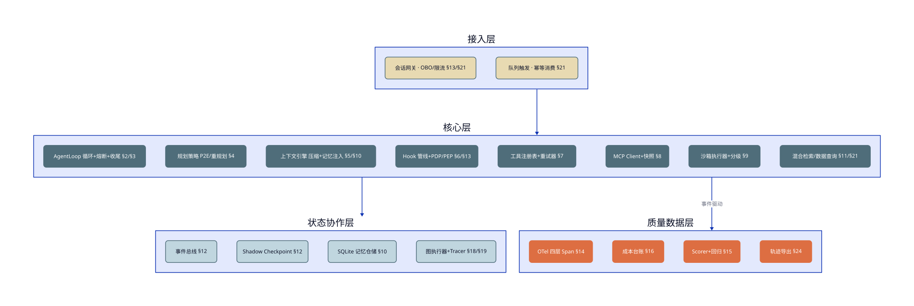
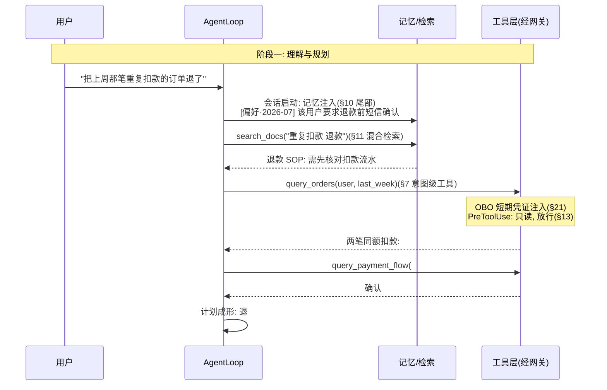
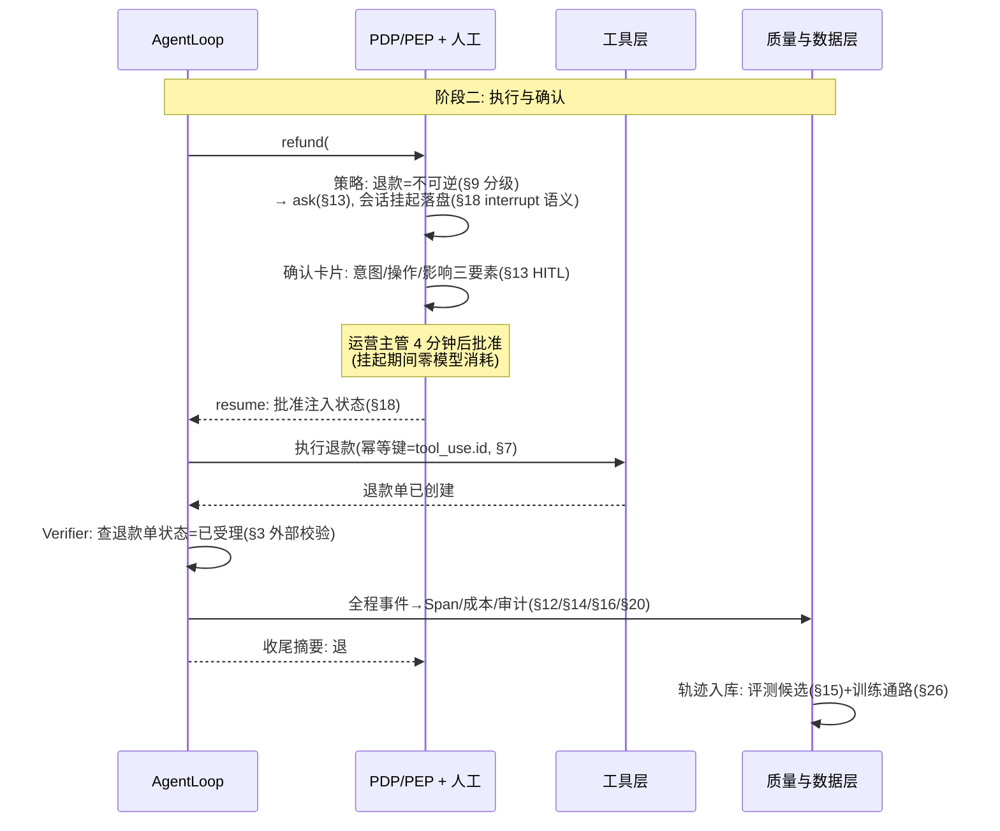
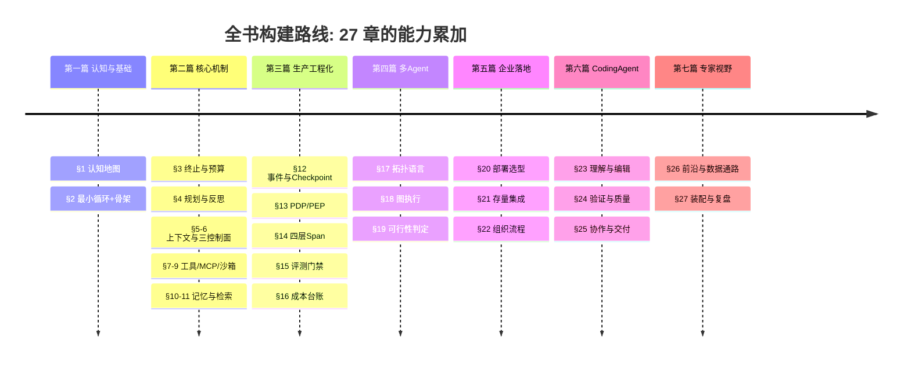

# 第 27 章 完整实战收尾

> 本章另有约十倍篇幅的**详解扩展版**：[详解扩展版/ch27-完整实战收尾.md](../详解扩展版/ch27-完整实战收尾.md)——独立成文的深读版（初稿，未经审读与来源核验，体例与正文不同；两版内容以正文为准）。

> 第七篇 专家视野
>
> 全书最后一章做三件事：把 26 章累加的部件装配成贯穿项目的**最终形态**并端到端跑一个复杂任务；以"如果重来一次"的姿势做**从 0 到生产级的诚实复盘**；最后给出读者的三条延伸路径。第 1 章的承诺在此兑现：你现在可以指着架构图上的任何一个框，说出它是哪一章加入的、解决什么问题、坏掉时症状是什么。

---

## 1. 场景引入：回到那个"看起来只差一步"的需求

上线终审会。评审组抽中的演示任务，团队故意选了全书开篇的那一个——第 1 章老周接到的需求：**"帮我把上周那笔重复扣款的订单退了。"**

一年前，这句话让一个问答机器人团队意识到自己面对的是范式鸿沟：模型看不到订单系统（时效）、不能执行退款（副作用）、记不住上一轮查到的订单号（状态）。一年后的演示里，这句话触发的是一条 14 个机制接力的流水线：记忆注入认出这位用户的偏好、检索召回退款 SOP、工具经网关查到两笔可疑扣款、策略引擎认出"退款 = 不可逆"挂起等待人工、运营主管在确认卡片上看到意图/操作/影响三要素后批准、退款执行、Verifier 核对退款单状态、收尾摘要送达用户——全程 6 分钟，其中 4 分钟是人在审批（系统等待零消耗），模型调用成本 $0.31，每一步在追踪系统里可回放。

评审组的最后一个问题不是技术的："如果今天要裁掉这套系统的任何一个模块，你们最不敢裁哪个？"团队的答案是事件总线——"裁了它，我们就同时失去观测、审计、成本核算和训练数据，等于回到盲飞。"这个答案本身就是全书的复盘线索：**最不起眼的地基件，往往是最不可裁的**。本章把这套系统完整摊开，然后诚实地回答"如果重来，什么该更早做"。

---

## 2. 原理

### 2.1 项目终态巡礼：每个框都有出生证

示例助手的最终架构——与第 1 章图 4 的"一页纸预告"对照，当年的六个框已经长成了四层十六个模块，每个模块标注出生章节：



<!-- 架构/分层图用 D2（见《图表规范》）；源 diagrams/d2/ch25-final-arch.d2 -->

*图 1：贯穿项目最终架构（§n = 出生章节）——这张图回答"每个模块从哪来、在哪层、和谁说话"。两个结构事实值得注意：事件总线是唯一被三个下游共同依赖的模块（终审会那个"最不敢裁"的答案），评测以门禁虚线而非数据流实线接入——它不在请求路径上，却卡着每次变更。*

逐模块回顾按"解决什么问题"归纳为四类：**让它能干活**（§2 循环、§7 工具、§9 沙箱、§11 检索）；**让它停得下来**（§3 熔断、§4 重规划上限、§18 有界回边——同一条有界性铁律的又几处落地（完整清单见附录 E.4））；**让它可被信任**（§6/§13 拦截与策略、§14 观测、§15 评测、§20 审计）；**让它可持续**（§5/§10 状态管理、§16 成本、§26 数据通路）。第二与第三类的每一个模块，都对应第 1 章 AutoGPT 三教训中的一条——全书的机制没有一个是凭空发明的，全部是对失败模式的应答。

### 2.2 端到端演示：一个任务途经的十四个机制

演示任务的完整链路，拆成两段时序：





*图 2（两联）：端到端任务的完整时序——这两张图回答"一句用户请求途经哪些机制、每个机制在哪一步兑现价值"。数一下：记忆、检索、意图工具、凭证、策略分级、HITL、interrupt、幂等、Verifier、事件、观测、成本、审计、数据回流——十四个机制，没有一个是为演示临时加的。*

这条链路上最值得指出的是**三处"没有发生的事"**：模型没有看到凭证（§21 注入在执行层）；退款没有在模型"想退"的瞬间发生（§13 的闸门站在意图与副作用之间）；挂起的 4 分钟没有烧一分钱（§18 落盘挂起，不是轮询等待）。**成熟系统的标志不是它做了什么，而是它结构性地做不了什么。**

### 2.3 从 0 到生产级复盘：如果重来一次

诚实的复盘比成功的总结有用。三个"会提前做"与两个"顺序没错"：

**提前做之一：事件系统先行（§12 → 应在 §2）。** 事件总线第 12 章才登场，但它的五个消费者（GUI/观测/审计/成本/训练数据）证明它是地基而非高级功能。重来一次，第 2 章的最小循环就该带 `on_event` 回调——事实上我们正是这么补写的（第 2 章的 `AgentEvent` 接口），但真实项目里这个补写发生在被排障折磨几周之后。教训一句话：**概率系统的第一优先级是可见性，因为你无法用读代码的方式理解它的行为。**

**提前做之二：Eval 先于功能（§15 → 应在 §4 前）。** 评测基建第 15 章才建成，而第 4 章就开始调规划策略、第 6 章就开始改提示词——中间这段"玄学调参窗口期"的代价在第 15 章场景里已经展示（78%→71% 两周无人发现）。重来一次：**第一个提示词写完的当天就建第一个评测用例**，十个用例的冒烟集两小时可建，它买到的是此后每次变更的方向感。

**提前做之三：权限内建而非外挂（§13 → 应与 §6 同步）。** 第 6 章的 Hook 是拦截机制，第 13 章的 PDP/PEP 才是策略体系——中间隔着七章，真实项目里这意味着策略散落在正则里跑了几个月才被重构（第 13 章场景的 40 分钟应急发版就是利息）。重来一次：第一个 Hook 写下时就让它咨询一个哪怕只有三条规则的策略表——**执行点与决策点的分离不增加初期成本，只改变代码放哪**。

**顺序没错之一：先单后多。** 第 17–19 章压在全书后段是刻意的——单 Agent 的每一课（有界性、验证、观测）都是多 Agent 的前置课，顺序反过来的团队会在双倍复杂度下重学一遍基础。**顺序没错之二：先跑通后优化。** 成本与性能（§16）在质量四件套之后——没有评测与观测，优化是盲目的（你不知道优化掉的是浪费还是质量）。



*图 3：全书构建时间线——这张图回答"能力按什么顺序累加、你现在在哪"。复盘的三个"提前做"都指向同一个方向：把第三篇的地基件（事件/评测/策略）尽早前移——它们的成本在早期最低，价值在早期最高。*

### 2.4 通往下一步：三条路径

本书体系之外，读者的延伸路径按志趣分三条：

**深耕领域 Agent。** 第 23 章的推论是路线图：任何领域的 Agent 化 = 为该领域构造验证信号 + 数字化环境。法律（判例核对可验证）、数据工程（管道测试天然存在）、金融运营（对账即 Verifier）——每个领域都在等自己的"编译器时刻"。你的领域知识 + 本书的机制学 = 这条路的入场券。

**构建 Agent 平台。** 把六大件（§12）做成企业内的多租户平台——本书每章的"生产级考量"合起来就是平台需求清单（配额、审计、评测即服务、成本归因）。这条路的读者应重读第 20 章的三档光谱：平台的价值主张正是"让业务团队不必重修这 25 章"。

**参与开源与标准。** MCP 生态的 Server 与工具、评测基准的去污染化、Agent 观测的语义约定——这些正在成形的公共基础都缺工程手。参与的私利也直接：第 26 章三问框架里"生产信号"的最佳获取方式，就是站在信号产生的地方。

---

## 3. 动手实现（贯穿项目增量）

最终交付两个动作：**打 tag** 与 **README**。

```bash
git tag -a v1.0.0 -m "示例助手: 全书贯穿项目最终形态（§2-§26 全部增量）"
git push origin v1.0.0
```

`README.md` 全文（项目的门面，也是全书的地图索引）：

```markdown
# 示例助手

《企业级 Agent 从入门到专家（2026 版）》贯穿项目——一个企业运维/客服场景的
Agent 系统。从约 150 行的最小 ReAct 循环（§2）增量生长为具备完整生产件的参考
实现。**它是教学参考实现，不是生产框架**（见下方"教学简化清单"）。

## 快速开始
    pip install requests            # 唯一硬依赖; 观测/评测另见 extras
    export ANTHROPIC_API_KEY=...
    python examples/minimal_agent.py "列出当前目录文件并生成摘要"

## 模块地图（§n = 对应书章）
| 路径 | 模块 | 出生章节 |
|---|---|---|
| src/assistant/core/agent_loop.py | 循环/熔断/收尾轮 | §2 §3 |
| src/assistant/core/planning.py | Plan-then-Execute | §4 |
| src/assistant/core/compaction.py | 上下文压缩 | §5 |
| src/assistant/core/hooks.py | Hook 管线 | §6 |
| src/assistant/core/tools.py, retry.py | 工具注册表/重试器 | §7 |
| src/assistant/mcp/ | MCP Client/桥接 | §8 |
| src/assistant/tools/shell.py | 沙箱执行器 | §9 |
| src/assistant/memory/store.py | 记忆仓储 | §10 |
| src/assistant/tools/doc_search.py | 混合检索 | §11 |
| src/assistant/core/events.py, checkpoint.py | 事件总线/Checkpoint | §12 |
| src/assistant/security/ | PDP/PEP | §13 |
| src/assistant/obs/otel_bridge.py | OTel 四层 Span | §14 |
| src/assistant/eval/ | Scorer/回归运行器 | §15 |
| src/assistant/cost/ledger.py | 成本台账 | §16 |
| src/assistant/orchestration/ | 图执行器/Tracer | §18 §19 |
| src/assistant/tools/data_query.py | 数据查询防护 | §21 |
| src/assistant/coding/repo_map.py | Repo Map 构建器 | §23 |
| src/assistant/coding/repair.py | 测试驱动修复环 | §24 |
| src/assistant/coding/wt_dispatch.py | worktree 分派与合并预检 | §25 |
| src/assistant/training/export.py | 轨迹导出 | §26 |

## 教学简化清单（生产化前必须补齐）
1. LLM 客户端无连接池/无流式——生产见 §3 SSE 与 §12 客户端封装讨论
2. 沙箱是进程级白名单——生产必须外套容器/microVM（§9 第 4 节）
3. 记忆/评测存储用 SQLite——多实例部署换 Postgres（§10 §15）
4. 脱敏是演示级正则——生产用专门引擎（§20）
5. 图执行器为串行推进——并行分支与 reducer 见 §18 第 4 节；
   interrupt 的下一跳在挂起前确定，人工输入不参与路由（代码内已注明）
6. OTel 桥接假定单会话（单槽 Span 状态）——并发会话需按 session_id 分槽（§14）
7. 各模块的错误处理偏教学直白——按各章"生产级考量"逐条加固

## 评测
    python -m assistant.eval.runner --cases eval/regression --k 3
    # verdict=BLOCK 时禁止合入（§15 门禁语义）
    pytest tests/contracts/test_event_contract.py
    # 跨章事件契约：观测与成本必须由同一份 turn_end/tool_* 事件驱动（§12）

## 变更流程
非琐碎变更走 openspec/ 提案流程（§22）。策略与提示词的变更等同代码变更。
```

README 的两处设计意图：**模块地图即全书索引**——新成员按表读代码，每个文件都有"为什么存在"的出处；**教学简化清单是诚实条款**——它防止这套代码被直接搬进生产（坑 5），同时给出每处简化的补齐路标。教学项目的正确姿势不是假装自己是框架，而是做一张**带比例尺的地图**。

---

## 4. 生产级考量

**交付即移交的开始。** 建设团队与运维团队往往不是同一批人，移交包五件套：Runbook（每类告警的处置动线，含第 14 章五步排障与第 19 章归因演练的脚本化版本）、值班演练记录（没演练过的 Runbook 是文学作品）、架构决策记录（图 1 每个模块的取舍理由——本书各章"生产级考量"的项目化摘录）、**在跑的评测与回流管线**（移交的不是代码快照，是持续运转的质量闭环），以及**契约与来源清单**（第 12 章事件契约回归记录 + 附录 C 的版本核验记录）。后两者确保“指标看起来有数”和“文中事实看起来有出处”都能在上线后持续成立。

**演示成功与生产就绪之间隔着分布。** 终审会的演示任务再复杂也是一个点，生产是一个分布：上线用灰度爬坡（1%→10%→50%），每档停留期间盯第 14 章行为健康指标与第 15 章"评测-线上剪刀差"；演示脚本本身入回归集——它是最不该坏的用例。

**系统会退化，闭环是抗体。** 上线庆祝后最常见的死法是静默退化：上游 API 漂移、提示词被"顺手优化"、记忆库堆积过期条目——每一章的"坑"都在等纪律松懈。抗体已经建好，只需保持运转：合同测试（§7）、变更门禁（§15/§22）、行为漂移告警（§14）、记忆自清洁（§10）。**运维一个 Agent 系统的日常，就是保卫这些闭环不被"暂时跳过一次"侵蚀。**

**能力模型的最后一块：判断力的复利。** 走完 25 章的工程师真正带走的不是代码，是一组可迁移的判断：有界性铁律、确定性下沉、验证外置、窗口即预算、拓扑即成本。新的框架和模型会不断出现，这些判断的半衰期远长于任何 API——**它们是你在这个快速折旧的领域里唯一不折旧的资产**。

---

## 5. 常见坑

**坑 1：演示成功当成生产就绪。**
*症状*：终审演示完美，全量放开后成功率比演示低二十个点；复盘发现演示任务恰是评测集里被反复调优过的类型。
*根因*：一个点不能代表分布——演示任务经过隐式过拟合（团队排练过），生产流量的长尾没被代表。
*修复*：灰度爬坡 + 每档观察行为健康指标；上线判据用第 15 章 held-out 集而非演示脚本；把"演示排练次数"当成过拟合警报——排练越多的演示，代表性越差。

**坑 2：文档在合并那天开始腐烂。**
*症状*：三个月后 README 的模块地图缺了两个新模块，CLAUDE.md 里的构建命令已失效，新人按文档操作报错后学会了"别信文档"——文档从资产变成陷阱。
*根因*：文档没有进入变更闭环——代码有评审与 CI，文档全凭自觉。
*修复*：文档随 PR 更新作为评审检查项（§22 Spec 流程天然覆盖行为文档）；CLAUDE.md 的命令类内容配冒烟脚本定期执行（文档也要合同测试）；README 模块地图由目录结构生成校验，漂移即 CI 告警。

**坑 3：移交没有 Runbook，值班靠喊建设者。**
*症状*：上线两个月后建设团队仍在实质值班——每个告警都被转给"最懂的人"；那个人休假的一周，一个熔断率告警挂了三天没人处置。
*根因*：移交了代码没移交操作知识——排障动线、归因方法、参数含义都在建设者脑子里。
*修复*：Runbook 覆盖每类告警的处置步骤；移交验收用演练（第 19 章"30 分钟归因"扩展为全场景）；建设团队的值班义务设明确退出日期——deadline 会倒逼知识显性化。

**坑 4：上线后评测回流停摆，系统静默退化。**
*症状*：上线季度末抽查发现任务成功率比上线时低 9 个点，但没有任何告警——因为评测集还是上线时的版本，线上早已漂移的任务分布在旧集合上依然"全绿"。
*根因*：把评测当成上线前的关卡而非持续的闭环——bad case 回流（§15）在庆祝之后无人认领。
*修复*：回流管线设 owner 与周例行（第 15 章闭环的组织化）；"评测集新鲜度"（最近 30 天入集用例数）本身成为指标；剪刀差（评测分-线上分）扩大即告警。

**坑 5：把贯穿项目代码直接搬进生产。**
*症状*：某团队照抄教学实现上线，首周即遭遇：进程级沙箱被解释器绕过（§9 坑 1 的原样重演）、SQLite 写锁在多实例下超时、演示级脱敏漏掉了工单号。
*根因*：教学实现为可读性刻意简化（单文件、零依赖、串行），这些简化点在书里逐处标注过，但"能跑"给了错误的信心。
*修复*：README 教学简化清单逐条核对后再谈上线（本章第 3 节的诚实条款正为此存在）；每处简化对应章节的"生产级考量"是补齐说明书；更务实的路径：用本书的机制清单去评估成熟框架/托管运行时（§12/§20 选型法），而不是把教材当产品。

---

## 6. 面试高频问题

**Q1：请描述一个生产级 Agent 系统的完整架构。**

结论先行：**四层十六模块——接入层（网关/队列）、核心层（循环/规划/上下文/拦截/工具族/沙箱）、状态与协作层（事件/Checkpoint/记忆/图执行）、质量与数据层（观测/成本/评测/训练通路）；枢纽是事件总线（一次发射，观测/审计/成本/训练四方消费），门禁是评测（不在请求路径，卡住每次变更）。**
- 按问题归纳四类：能干活、停得下来、可被信任、可持续。
- 最不可裁的模块是事件总线——裁掉它同时失去四种能力。
- 每个机制都是对某个失败模式的应答（可追溯到 AutoGPT 三教训）。
- 加分点：成熟系统的标志是"结构性做不了什么"——凭证模型不可见、副作用过闸门、挂起零消耗。

**Q2：如果从零构建，你的顺序是什么？哪些要提前？**

结论先行：**主线顺序不变（最小循环→终止预算→工具→上下文→生产件→多 Agent），但三件地基提前——事件系统进第一版循环、第一个提示词当天建评测用例、第一个拦截点就分离策略与执行。**
- 事件先行的理由：概率系统无法靠读代码理解，第一优先级是可见性。
- Eval 先于功能：十用例冒烟集两小时建成，买断此后所有变更的方向感。
- 权限内建：PDP/PEP 分离不增加初期成本，只改变代码放哪——外挂重构的利息是应急发版 40 分钟。
- 加分点：两个顺序不能反——先单后多（单 Agent 每课都是多 Agent 前置课）、先跑通后优化（无评测的优化分不清浪费与质量）。

**Q3：单 Agent 到多 Agent 的演进怎么判断？**

结论先行：**三道关卡依次过——单 Agent 实测失败且原因属于上下文墙/职责冲突/并行需求（第 17 章 Checklist）、拓扑与基础设施可行性核算（第 19 章判定法）、下游容量与组织归因能力就绪；多数系统终态停在单 Agent + Parallel，这是收益/成本比的自然结果。**
- 判断用证据不用愿景：评测数据证明单 Agent 不行，才谈拆分。
- 拓扑是成本不是荣誉：没有量化增益的升级应该回滚。
- 协调税四项：token 放大、协调失败模式、归因成本、运维翻倍。
- 加分点：先为单 Agent 建好的设施（worktree/事件/评测）恰是多 Agent 的地基——演进是增量而非重写。

**Q4：教学实现和生产系统的差距在哪里？**

结论先行：**六类典型简化——无连接池流式的客户端、进程级而非容器级沙箱、SQLite 而非分布式存储、演示级脱敏、串行图执行、直白错误处理；差距的通用形态是"机制正确但强度不足"，补齐说明书就是各章的生产级考量。**
- "能跑"不等于"能扛"：简化点在正常路径不可见，在故障与规模下现形。
- 评估成熟框架的正确姿势：拿机制清单（六大件+质量四件）逐项核对，而非抄教学代码。
- 诚实条款（README 简化清单）是教学项目对使用者的义务。
- 加分点：能逐条说出"这里为什么简化、生产怎么补"本身就是体系掌握度的证明。

**Q5：转型 Agent 方向的工程师，能力模型是什么？**

结论先行：**三层——底层是既有工程直觉的迁移（分布式系统的超时/幂等/背压全部适用）；中层是 Agent 特有机制学（本书 25 章：有界性、验证外置、确定性下沉、窗口即预算）；顶层是对概率组件的判断力（何时信模型、何时用代码、何时找人）。**
- 后端/大数据经验不是包袱是资产：Checkpoint 对标流处理、拓扑对标微服务、台账对标 FinOps。
- 机制学的判断比 API 熟练度值钱：框架半年一换，"簿记不交给模型"十年不变。
- 顶层判断力的训练方式：读轨迹、做归因、建评测——与系统相处而非与文档相处。
- 加分点：这个领域唯一不折旧的资产是可迁移的判断——这也是整本书真正想交付的东西。

---

> **全书终。** 从"帮我把上周那单退了"开始，到同一句话在 14 个机制护送下安全落地结束——范式鸿沟被一座一座桥填平，而每座桥的图纸现在都在你手里。附录 A/B/C 作为工具书常备案头；贯穿项目 v1.0.0 已打 tag。剩下的路，是把这些判断用在你自己的领域里——祝构建顺利。
