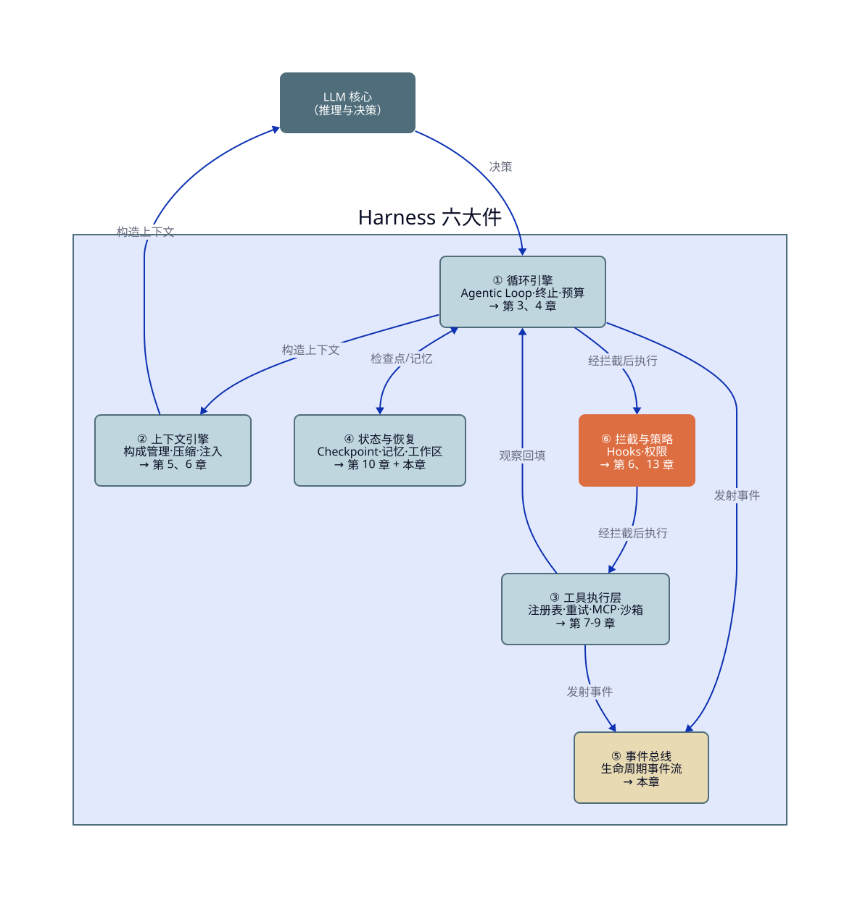
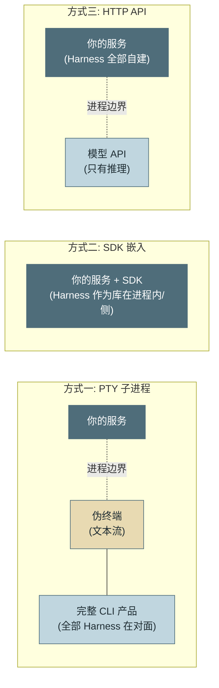
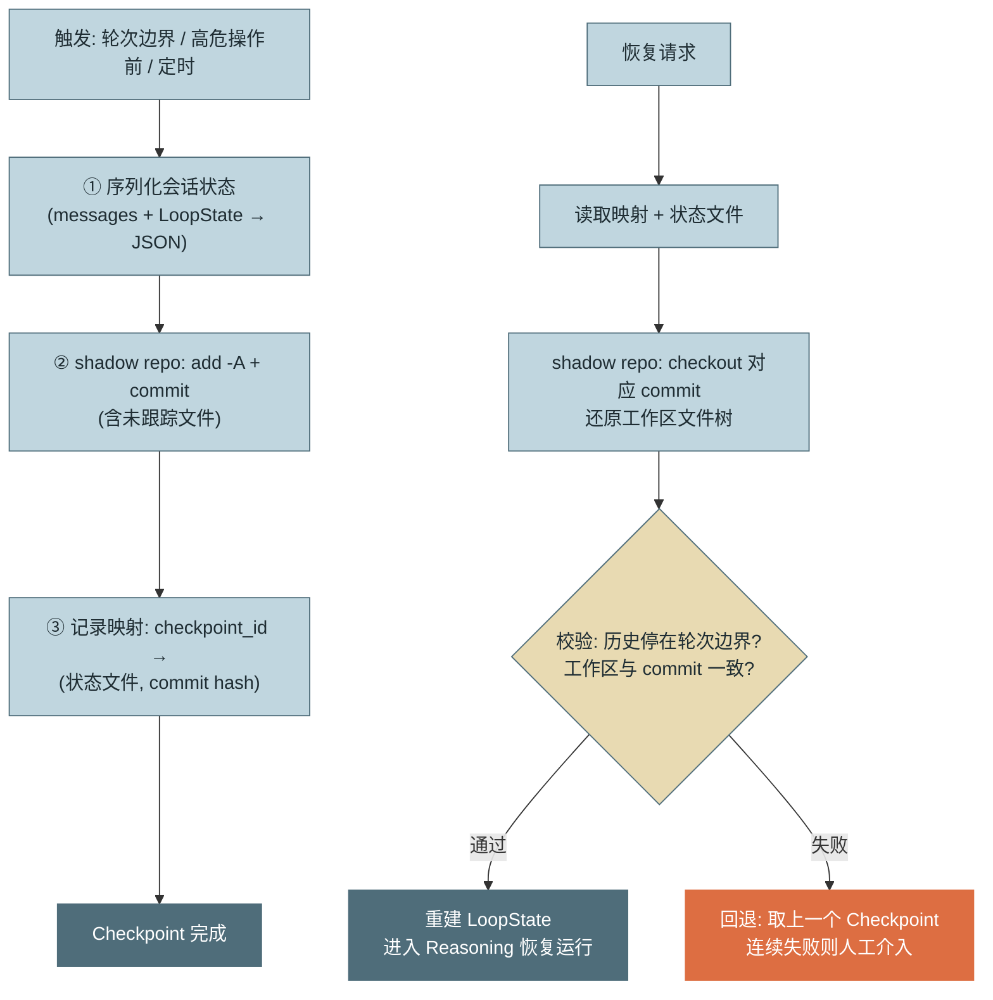
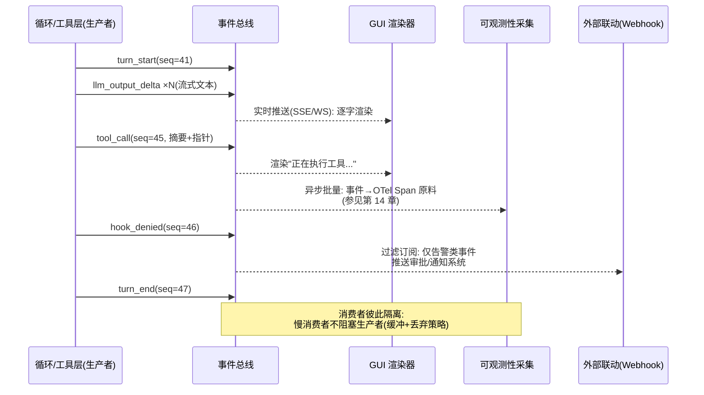

# 第 12 章 运行时架构

> 本章另有约十倍篇幅的**详解扩展版**：[详解扩展版/ch12-运行时架构.md](../详解扩展版/ch12-运行时架构.md)——独立成文的深读版（初稿，未经审读与来源核验，体例与正文不同；两版内容以正文为准）。

> 第三篇 单 Agent 生产工程化（质量层）
>
> 本章确立贯穿第三篇的 **Harness（运行时脚手架）** 视角：模型决定能力上限，**Harness 决定实际发挥出几成**。我们把第二篇散落各章的机制收拢为一张架构图，然后补齐三块生产级地基——进程生命周期、Checkpoint 状态恢复、事件模型。事件模型是本章的重心：它是 GUI、可观测性与外部联动的共同地基。

---

## 1. 场景引入：同一个模型，两种命运

示例团队做过一次内部对照实验，起因是一场争论。业务方试用了市面上一款 Coding Agent 产品后质问："人家也用同一家的模型，为什么你们的助手感觉笨得多？"技术侧的第一反应是"模型版本差异"，于是团队做了个实验：**同一个模型、同一批任务**（20 个内部工单处理与代码修改任务），分别跑在自研的早期运行时和一个精心搭建的参照运行时上。

结果让争论立刻转向：早期运行时成功率 45%，参照运行时 78%——**33 个百分点的差距，模型贡献为零**。逐项归因，差距全部来自第二篇讲过的机制是否在场：参照侧的工具返回值做过 LLM 友好化改造（第 7 章）、失败自动分类重试（第 3 章）、上下文有压缩与位置管理（第 5 章）、危险操作有确定性拦截兜底试错成本（第 6 章）；早期侧这些全是裸奔。

这个实验的价值在于给全书一个正式命名：这些机制的总和叫 **Harness**——直译"马具"，即套在模型这匹马身上的全部装备。行业内的公开评测也反复印证同一结论：同一模型在不同脚手架下的 Agent 基准得分差距可达数十个百分点（SWE-bench 等榜单上，同模型不同 scaffold 的成绩差异长期存在，参见附录 B.6）。**转型 Agent 方向的工程师真正的工作物，不是模型，是 Harness**——这也是为什么本书用了整整一篇讲它的生产化。

---

## 2. 原理

### 2.1 Harness 组成清单：把第二篇装进一张图

Harness 的六大件，每件对应第二篇的章节，本章补齐其中最后两件（状态与事件）：



<!-- 架构/分层图用 D2（本书制图规范见根目录《图表规范》）；源文件 diagrams/d2/ch12-harness.d2，构建命令见 diagrams/render.sh -->

*图 1：Harness 完整组成——这张图回答"一个生产级运行时由哪六件构成、数据与控制如何流动"。LLM 只是中央的推理器；六大件的质量差异，就是"同一模型两种命运"的全部解释。*

这张图也是评估任何 Agent 框架/产品的检查单：逐件问"它对这一件给了什么实现、可替换性如何"——六件里缺件或不可替换的，生产化时都会变成你的工作量。市面主流产品与框架按这张检查单的逐一定位见附录 D。

### 2.2 集成方式：把别人的 Harness 接进你的系统

自研之外，企业更常见的处境是**集成**一个现成 Agent 运行时（如 Claude Code 及同类）。三种集成方式的本质区别在**进程边界画在哪里**：



*图 2：三种集成方式的进程边界——这张图回答"Harness 在谁手里、你的代码和它隔着什么"。PTY 隔着文本流拿到整个产品；SDK 把 Harness 变成可编程的库；HTTP API 只拿推理、Harness 全部自建。*

三维对比与适用场景：

| | PTY 子进程 | SDK | HTTP API（裸模型） |
|---|---|---|---|
| **控制力** | 低：只能喂文本、读文本，内部机制黑盒 | 高：钩子、工具注册、事件回调都是编程接口 | 完全：每个字节都是你写的 |
| **开销** | 每会话一个子进程 + 终端仿真；解析输出脆弱 | 库调用级；进程模型由你定 | 无集成开销，但**开发开销最大**（六大件全自建） |
| **升级成本** | 低：换二进制版本即可，但输出格式变更会打破解析 | 中：跟随 SDK 版本节奏，API 变更需适配 | 高：模型行为变化全由自家 Harness 消化 |
| **适用场景** | 快速把成熟 CLI 产品包成内部服务；POC | 主流选择：产品化集成、定制工具与策略 | Harness 本身就是你的产品/核心竞争力时 |

选型判断一句话：**你想拥有多少 Harness，就选进程边界画在哪里的方式**。本书贯穿项目走第三条路（教学需要拥有每个字节）；企业落地的默认解是第二条（第 20 章展开部署选型）。

### 2.3 进程生命周期：冷启动、健康、退场

Agent 会话是**有状态长进程**，生命周期管理比无状态服务多三件事：

**冷启动的量化与摊销。** 一个会话就绪前的开销链：进程/容器拉起（数百毫秒—数秒）+ MCP Server 子进程启动与能力发现（`server/discover`，每个数百毫秒，第 8 章）+ 语言服务器索引（大仓库分钟级，第 9 章）+ 记忆召回与上下文组装（数百毫秒，第 10 章）。合计轻则一两秒、重则分钟级——对交互式产品不可接受。摊销手段分层：会话池（预热通用部分：容器与常驻 Server）、按项目的热缓存（LSP 索引、文档索引持久化复用）、懒加载（重资源推迟到首次用到，代价是首次调用慢——把冷启动成本从会话建立挪到循环中段，是否划算取决于该资源的使用概率）。

**健康检查要检查到"循环活性"。** 存活探针（进程在）与就绪探针（依赖通了）照抄 Kubernetes 惯例即可，Agent 特有的是第三层：**进展探针**——进程活着但循环卡死（等一个永不返回的工具、SSE 连接半死）的状态，只能靠"距上次事件的时间"检测（事件总线的第一个内部消费者，2.5 节）。超过阈值（如 5 分钟无任何事件）判定为僵死，走中断恢复路径。

**优雅退出的顺序问题。** 收到 SIGTERM 后的正确次序：① 停止接收新任务；② 若有**未完成的工具调用**——等它完成并回填（副作用在途不能丢，第 3 章 2.4 节的不变式）或对可中止的只读工具主动取消；③ 落 Checkpoint；④ 发射 `session_end` 事件并冲刷事件缓冲；⑤ 退出。K8s 的 `terminationGracePeriodSeconds` 必须覆盖"最长工具执行 + Checkpoint 落盘"的和——默认 30 秒对带长工具的 Agent 通常不够。

**用户中断是第三条生命周期路径。** 除了平台发的 SIGTERM 与僵死判定，还有用户主动打断（终端 Ctrl-C、GUI 的停止按钮）——它不是异常而是产品功能，语义要拆成两种并在事件流上可见：**暂停**（跑到下一个安全点——工具回填完成的轮次边界——落 Checkpoint 后挂起，可恢复续跑）与**取消**（中止当前轮次，未完成的副作用按第 3 章不变式处理，回滚到上一个 Checkpoint）。两者共用优雅退出的机制件（安全点、Checkpoint、事件冲刷），差别只在"之后还回不回来"。第 13 章的暂停/取消/恢复 UX 契约与第 18 章的图级 interrupt 都落在这条路径上。

### 2.4 Checkpoint 与状态恢复：shadow git repo

会话状态 = **对话历史（messages + LoopState）** + **工作区文件**。前者是结构化数据，序列化落盘即可（落点在轮次边界，第 3 章不变式）；后者的难点是"高效存多版本文件树"——而这正好是 git 已解决的问题。**shadow git repo** 方案：在工作区之外维护一个隐藏的 git 仓库（`--git-dir` 指向影子目录、`--work-tree` 指向工作区），每个 Checkpoint 做一次 commit——**不污染用户自己的 git 仓库**（用户的 `.git` 与影子库互不感知），版本历史、增量存储、任意回滚全部白拿。



*图 3：Checkpoint 的创建与恢复流程——这张图回答"一个检查点包含什么、恢复时如何校验与回退"。会话状态与文件树各走各的介质（JSON 与 git commit），映射表把两者钉在同一时刻。*

**方案的局限要如实交代**：其一，git 只管文件——**工作区之外的副作用**（已发的网络请求、数据库写入）不在 Checkpoint 里，回滚文件不等于回滚世界（这正是第 9 章副作用分级的意义：不可逆操作在 Checkpoint 语义之外，只能靠事前审批）；其二，**二进制大文件**让 git 存储膨胀（每版全量对象）——对构建产物、数据文件类工作区，用忽略清单排除 + 单独的对象存储引用；其三，**未跟踪文件**默认不在 commit 里——影子库必须显式 `add -A`（含新文件），这是实现时最常见的遗漏（坑 3）。

**检查点的完整状态清单。** "messages + 文件树"只是最低配——恢复后循环要能继续满足全部既有不变式，清单还有五个易漏成员：**LoopState 的预算余额**（轮数/token/费用计数——丢了它，恢复后的会话领到一份全新预算，第 3 章的熔断形同虚设）；**事件 seq 计数器**（2.5 节的定序基准——从 0 重来会让消费者把恢复后的事件判为重复或乱序）；**回边与重试计数**（第 18 章图执行的 visits 表、会话级重试池——有界性铁律的账本本身就是状态）；**在途异步句柄**（第 21 章的批查询句柄、外部任务 id——不入册就成了恢复后无人认领的孤儿任务）；**会话内批准记忆**（第 13 章 PEP 的已批模式集合——丢了会让用户把批过的操作再批一遍；保留则要确认恢复后语境未变，否则宁可重问）。判据一句话：**凡是"丢了会破坏某条既有不变式"的运行时状态，都属于检查点**——用它过一遍你的 LoopState 字段表，比背清单可靠。

**分叉与迁移：git 白拿的两笔延伸红利。** 其一，**时间分叉**——checkpoint 是 commit，从任一 commit 开分支就得到"平行会话"：排障时从肇事轮前分叉重放验证修复（第 14 章回放调试的机制底座）；高价值任务从同一现场并行尝试两种方案再择优（第 17 章 Arena 的时间轴版）。分叉时把状态文件按新 checkpoint_id 复制一份，两条时间线互不污染。其二，**跨机迁移**——影子库可以 push 到远端裸仓：粘性路由的实例排水（第 4 节）不必等会话跑完，"push 检查点 → 新实例 clone + restore"即完成迁移，git 的增量传输让搬运成本只与改动量成正比——这也是会话能被未来的调度器抢占腾挪（第 26 章）的入场券。

### 2.5 Agent 事件模型：一条流，三类消费者

循环内部发生的一切——轮次开始、文本增量、工具调用、拦截、熔断——如果只存在于进程内存，GUI 要渲染就得侵入循环代码，观测要采集就得再侵入一次。正确结构是第二篇已埋下伏笔的**事件总线（Event Bus）**：循环与工具层只负责**发射**语义化事件，消费者各取所需。

**事件类型分类**（三组）：**会话级**（`session_start` / `session_end` / `checkpoint_created`）、**轮次级**（`turn_start` / `llm_output_delta` / `turn_end`）、**行动级**（`tool_call` / `tool_result` / `hook_denied` / `budget_aborted`）。类型集是可扩展的——后续章节将按需增补（第 5 章的 `compaction`、第 18 章的 `node_*` 图级事件、第 26 章的 `message` 训练数据事件），扩展的纪律只有一条：新类型同样遵守下述载荷 Schema 与定序规则。**载荷 Schema 纪律**：每个事件必带 `session_id / seq / ts / type`，业务载荷放 `payload`；Schema 版本化（消费者跨版本兼容）；**载荷带引用不带大对象**（工具结果放摘要 + 轨迹存储的指针，防事件流自身成为带宽与存储黑洞）。

**顺序保证**：单会话内事件按 `seq` 单调递增、发射即定序（循环是单线程的天然定序者；并行工具的结果按回填顺序取号）；跨会话不承诺任何顺序。消费者按 `seq` 检测空洞即可发现丢失。

**三类消费者**各自的消费形态：



*图 4：事件流从产生到三类消费者的分发时序——这张图回答"一条事件流如何同时喂饱 GUI、观测与外部联动"。三类消费速率与可靠性要求不同：GUI 要低延迟可容丢、观测要完整可容迟、外部联动只订阅子集。*

与第 14 章的关系一句话说清：**事件是 OTel Span 的原料**——`turn_start/turn_end` 配对成轮次 Span，`tool_call/tool_result` 配对成工具 Span，追踪系统只是事件流的一个消费者，而不是另一套埋点。这个"一次发射、多方消费"的设计避免了 GUI 埋点、观测埋点、审计埋点三套侵入代码的常见惨状。

**跨章契约：事件不是“差不多长得像”就能接上。** 第 2 章的 `AgentEvent` 从这里起以本节 Schema 为准：事件外壳固定为 `session_id / seq / ts / type / payload / schema_version`，消费者不得再猜测不同章节的字段名。尤其是 `turn_end` 的 `payload` 必含 `usage`（保留供应商原始分类）与 `model`；`tool_call/tool_result` 必含同一个 `call_id`；`session_end` 必含规范化状态。第 14 章只从该 Schema 取 Span 属性，第 16 章只从 `usage + model` 计价。这样“观测”和“成本”不是两套埋点，而是同一事件的两个投影。

外壳的代码形态（本片段由 `tools/check_snippets.py` 与贯穿项目源码保持同步，漂移即 CI 失败）：

<!-- snippet: examples/reference-assistant/src/assistant/contracts/event.py#ch12-event-envelope mode=executable verified_by=examples/reference-assistant/tests/test_event_contract.py -->
```python
@dataclass(frozen=True, slots=True)
class AgentEvent:
    """版本化的运行时事实。第 2 章的 AgentEvent 以此为准。"""

    session_id: str
    seq: int
    ts: datetime
    type: EventType
    payload: Mapping[str, Any]
    schema_version: int = 1

    def __post_init__(self) -> None:
        if self.schema_version not in SUPPORTED_SCHEMA_VERSIONS:
            # 不支持的 Schema 版本 fail-fast，不静默解释（第 12 章契约）
            raise ContractError(
                f"unsupported schema_version={self.schema_version}; "
                f"supported={sorted(SUPPORTED_SCHEMA_VERSIONS)}"
            )
        _validate_payload(self.type, self.payload)
```

| 事件 | 必填 `payload` | 消费者 |
|---|---|---|
| `session_start` | `task_type`、`model` | GUI、OTel、审计 |
| `turn_start` | `turn` | GUI、OTel |
| `turn_end` | `turn`、`model`、`usage`（`input_tokens`、`output_tokens` 及可选缓存分类）、`stop_reason` | OTel、成本台账、Eval 回放 |
| `tool_call` | `call_id`、`name`、`effect`、`pointer` | GUI、OTel、审计 |
| `tool_result` | `call_id`、`name`、`is_error`、`retries`、`pointer` | OTel、Eval 回放 |
| `session_end` | `status`（`success` / `aborted` / `failed`）、`turns`、`task_type` | OTel、成本台账、运营指标 |

兼容规则只有三条：新增字段只能新增可选字段；删除或改变含义必须提升 `v`；消费者遇到更高版本只能忽略已知之外的字段，不能静默臆测缺失字段。协议、SDK 与语义约定的时效性来源见 [C-03]/[C-04]。

---

## 3. 动手实现（贯穿项目增量）

本章增量：`src/assistant/core/events.py`（事件总线）+ `src/assistant/core/checkpoint.py`（shadow git 最小实现）。第 2 章定义的 `AgentEvent` 与 `on_event` 回调在此升级为正式总线；`agent_loop.py` 的各 `_emit` 调用点保留，但必须按上表适配为统一事件。

```python
# src/assistant/core/events.py — 事件总线：单会话定序 + 多消费者隔离
import json
import time
from dataclasses import dataclass, field, asdict
from typing import Callable

EVENT_SCHEMA_VERSION = 1


@dataclass
class Event:
    session_id: str
    seq: int                 # 会话内单调递增：消费者按此排序与查漏
    type: str                # session_* / turn_* / tool_* / hook_* / budget_*
    ts: float
    payload: dict            # 纪律：带摘要与指针，不带大对象
    v: int = EVENT_SCHEMA_VERSION


class EventBus:
    def __init__(self, session_id: str):
        self.session_id = session_id
        self._seq = 0
        self._subs: list[tuple[Callable[[Event], None], set[str] | None]] = []
        self.last_event_ts = time.time()      # 进展探针的数据源（2.3 节）

    def subscribe(self, handler: Callable[[Event], None],
                  types: set[str] | None = None):
        """types=None 订阅全量（观测）；给定集合则过滤订阅（外部联动）"""
        self._subs.append((handler, types))

    def emit(self, type: str, **payload) -> Event:
        self._seq += 1
        ev = Event(self.session_id, self._seq, type, time.time(), payload)
        self.last_event_ts = ev.ts
        for handler, types in self._subs:
            if types is None or type in types:
                try:
                    handler(ev)               # 消费者隔离：单个失败不影响其他与主流程
                except Exception as e:
                    print(f"[event-consumer-error] {type}: {e}")
        return ev


def jsonl_recorder(path: str) -> Callable[[Event], None]:
    """观测类消费者示例：全量事件落 JSONL（第 14 章 Span 的原料带）"""
    def record(ev: Event):
        with open(path, "a", encoding="utf-8") as f:
            f.write(json.dumps(asdict(ev), ensure_ascii=False) + "\n")
    return record
```

```python
# src/assistant/core/checkpoint.py — shadow git repo 最小 Checkpoint
import json
import subprocess
from pathlib import Path


class ShadowCheckpoint:
    """影子 git 库：--git-dir 在工作区之外，不污染用户自己的 .git"""

    def __init__(self, workdir: Path, shadow_dir: Path):
        self.workdir, self.shadow = workdir.resolve(), shadow_dir.resolve()
        self.state_dir = self.shadow / "states"
        self.state_dir.mkdir(parents=True, exist_ok=True)
        if not (self.shadow / "HEAD").exists():
            self._git("init", "--quiet")
            # 影子库专用身份，避免依赖全局 git 配置
            self._git("config", "user.email", "harness@assistant.local")
            self._git("config", "user.name", "agent-harness")

    def _git(self, *args: str) -> str:
        r = subprocess.run(
            ["git", f"--git-dir={self.shadow}", f"--work-tree={self.workdir}",
             *args], capture_output=True, text=True)
        if r.returncode != 0:
            raise RuntimeError(f"shadow git {args[0]} 失败: {r.stderr.strip()}")
        return r.stdout.strip()

    def create(self, checkpoint_id: str, session_state: dict) -> str:
        """① 状态落盘 ② add -A 含未跟踪文件 ③ commit ④ 记录映射"""
        (self.state_dir / f"{checkpoint_id}.json").write_text(
            json.dumps(session_state, ensure_ascii=False), "utf-8")
        self._git("add", "-A")                # 显式 -A：未跟踪的新文件必须入册（坑 3）
        self._git("commit", "--allow-empty", "--quiet", "-m", checkpoint_id)
        commit = self._git("rev-parse", "HEAD")
        (self.state_dir / f"{checkpoint_id}.ref").write_text(commit, "utf-8")
        return commit

    def restore(self, checkpoint_id: str) -> dict:
        """还原文件树 + 返回会话状态；校验失败抛错交上层走回退（图 3）"""
        ref = (self.state_dir / f"{checkpoint_id}.ref").read_text("utf-8").strip()
        self._git("reset", "--hard", "--quiet", ref)
        self._git("clean", "-fdq")   # 检查点之后新建的文件必须删：checkout -- . 不会删, 残留即漂移
        if self._git("status", "--porcelain"):
            raise RuntimeError("恢复后工作区与 commit 不一致")   # 图 3 的第二项校验
        state = json.loads(
            (self.state_dir / f"{checkpoint_id}.json").read_text("utf-8"))
        msgs = state.get("messages", [])
        if msgs and msgs[-1]["role"] == "assistant" and any(
                b.get("type") == "tool_use" for b in msgs[-1]["content"]
                if isinstance(b, dict)):
            raise RuntimeError("状态未停在轮次边界（存在未回填的 tool_use）")
        return state
```

`agent_loop.py` 的接线（节选）——发射点即第 2 章以来所有 `_emit` 的位置，Checkpoint 挂在轮次边界：

```python
bus = EventBus(session_id)
bus.subscribe(jsonl_recorder(f"trace-{session_id}.jsonl"))            # 观测：全量
bus.subscribe(alert_webhook, types={"hook_denied", "budget_aborted"})  # 联动：子集
ckpt = ShadowCheckpoint(Path("./workspace"), Path(f"./.shadow/{session_id}"))
# 循环内：每轮观察回填完成后（轮次边界，第 3 章不变式的落盘点）
bus.emit("turn_end", turn=state.turn, model=reply["model"],
         usage=reply["usage"], stop_reason=reply["stop_reason"])
ckpt.create(f"turn-{state.turn}", {"messages": messages, "turn": state.turn})
```

这里保留供应商的原始 `usage` 分类，而不是预先压成一个聚合 `tokens`：第 14 章可分别观测输入/输出，第 16 章可按模型和缓存类别正确计价。

### 3.1 跨章契约回归集

事件 Schema 的改变同时影响第 2、3、5、14、15、16、18、19、24 章，不能靠人工通读确认。把以下用例固化为 `tests/contracts/test_event_contract.py`；它们是每次改循环、事件或消费者时必跑的最小回归集：

```python
def test_required_event_sequence_and_monotonic_seq():
    events = run_recorded_session("read_then_write")
    assert [e.type for e in events if e.type in {"session_start", "session_end"}] \
           == ["session_start", "session_end"]
    assert [e.seq for e in events] == sorted(e.seq for e in events)

def test_one_turn_feeds_both_observability_and_cost():
    event = make_turn_end(model="test-model", usage={
        "input_tokens": 100, "output_tokens": 20})
    bridge.on_event(event); ledger.on_event(event)
    assert exported_turn_span_has("gen_ai.usage.input_tokens", 100)
    assert ledger.sessions[event.session_id].tokens["input"] == 100

def test_tool_call_and_result_pair_by_call_id():
    events = run_recorded_session("one_tool_call")
    calls = {e.payload["call_id"] for e in events if e.type == "tool_call"}
    results = {e.payload["call_id"] for e in events if e.type == "tool_result"}
    assert calls == results

def test_unknown_optional_field_is_forward_compatible():
    ledger.on_event(make_turn_end(model="test-model", usage={}, future_field="ignored"))
```

另设反向用例：缺 `usage`、`model`、`call_id` 或非法状态时，生产者在发射处失败；不得让 OTel 或台账在消费者侧静默丢数。第 15 章的回归运行器将这些契约测试视为 `BLOCK` 门禁，第 27 章交付时附上一次通过记录。

回测场景引入的实验清单：六大件到位后，贯穿项目自身就是那个"参照运行时"——第 13–16 章将继续给它补上权限、观测、评测与成本四块生产件。

---

## 4. 生产级考量

**事件流的背压与丢弃策略要分级。** 生产者（循环）绝不能被慢消费者拖住：GUI 通道用有界缓冲 + 丢弃中间的 `llm_output_delta`（只保最新，界面最多闪一下）；观测通道用持久化队列（可迟到不可丢失——它是审计与计费的依据）；外部联动通道带重试与死信。同一条流，三种投递语义——按消费者的可靠性需求配置，而不是一刀切。

**Checkpoint 的保留与成本策略。** 每轮一个 Checkpoint 在长会话下是数百个 commit：保留策略学备份系统——近端全保（最近 10 个）、中端抽稀（每 10 轮保 1）、会话结束保首尾与标记点；影子库随会话归档或清理，磁盘配额纳入会话资源限额（第 9 章 cgroup 的邻居）。高危操作前强制加一个标记 Checkpoint——"出事前的最后现场"是排障最想要的那一个。三个补充注记：**创建成本随工作区增长**——`add -A` 每次全量扫描，代码仓级工作区的每轮 checkpoint 可达百毫秒级，第一优化是把依赖与构建产物进影子库忽略清单，其次才考虑"小改动轮次降频"（跳过的轮次在下个检查点补齐，标记点与高危前的检查点永不跳）；**恢复不等于原价续跑**——恢复会话重发全量历史时，供应商侧提示缓存多半已过 TTL（第 16 章），首轮按未命中价计，批量恢复（发布迁移）要把这笔"缓存重建税"计入变更窗口预算；**检查点是敏感数据存储面**——影子库与状态文件里是完整对话与工作区，访问控制与保留期对齐轨迹存储的标准（第 14、20 章），不能当临时文件放任。

**会话调度与亲和性。** 有状态会话要求**粘性路由**（同一会话固定到同一实例，否则工作区与影子库跨实例失联）；实例下线走"排水"——停接新会话、存量会话跑完或 Checkpoint 后迁移（恢复语义在 2.4 节已备好）。这套模式对有大数据背景的读者不陌生：与有状态流处理（Flink 的 checkpoint + 状态后端 + 任务迁移）几乎同构——Agent 运行时就是一种"每条消息都很贵"的流处理。

**多租户的资源与故障隔离。** 会话间：进程/容器级隔离（第 9 章沙箱即边界）；租户间：配额分层（第 3 章预算的上层）、事件与轨迹存储按租户分区（第 13 章数据边界的地基）。核心原则是**一个会话的失控不能波及邻居**——OOM、事件风暴、影子库写满，全部要有会话级上限先兜住。

**Durable Execution：崩了也要恰好一次。** 2.4 的 Checkpoint 让**单实例**能恢复，但长任务还要扛住 worker 崩溃、供应商抖动与重试放大。可靠性的第一纪律是**重试归属**——每层只重试**自己那层**的故障，绝不越权重试下层，否则同一个副作用被多层叠着重试、成本翻倍。把故障分层、每层钉一个唯一责任方：

| 故障层 | 重试责任方 |
|---|---|
| HTTP 传输故障 | Transport / SDK |
| Tool 瞬时故障 | Tool Adapter（第 7 章重试器） |
| Agent Step 失败 | Agent Runtime |
| Worker 崩溃 | Durable Executor（本节） |
| 整个任务失败 | Workflow / Operator |

<!-- snippet: examples/reference-assistant/src/assistant/durable/executor.py#ch12-retry-ownership mode=executable verified_by=examples/reference-assistant/tests/test_durable.py -->
```python
class FailureLayer(Enum):
    TRANSPORT = "transport"        # HTTP 传输故障
    TOOL = "tool"                  # Tool 瞬时故障
    AGENT_STEP = "agent_step"      # Agent Step 失败
    WORKER = "worker"              # Worker 崩溃
    TASK = "task"                  # 整个任务失败


# 故障层 → 唯一重试责任方（计划 13.2 的归属表）
RETRY_OWNER: dict[FailureLayer, str] = {
    FailureLayer.TRANSPORT: "transport_sdk",
    FailureLayer.TOOL: "tool_adapter",
    FailureLayer.AGENT_STEP: "agent_runtime",
    FailureLayer.WORKER: "durable_executor",
    FailureLayer.TASK: "workflow_operator",
}


def owns_retry(actor: str, layer: FailureLayer) -> bool:
    """actor 是否**应当**重试 layer 层的故障。只有归属方返回 True——
    其他层必须原样上抛，由归属层处理，避免叠加重试。"""
    return RETRY_OWNER[layer] == actor
```

配套三块（贯穿项目 `src/assistant/durable/executor.py`，均有测试）：**幂等键**——有副作用的操作按业务键 execute-once，重试/重放命中缓存不再触发（付款、发工单必须带幂等键，否则崩溃重放就是重复扣款）；**租约 + 心跳 + 回收**——worker 领任务拿一个带 TTL 的租约、定期心跳续租，崩溃后停止心跳、租约过期即被别的 worker 安全接管（避免"崩了就卡死"与"两个 worker 抢同一任务"）；**退避 + 死信**——瞬时故障指数退避重试，超过尝试上限进**死信队列**人工处置，不无限重试烧钱。

跨进程副作用要靠 **outbox/inbox**（业务写与消息发在同一事务里落 outbox，投递器再异步发，去重靠 inbox）而非"先写库再发消息"的双写；多步骤的不可逆链路用 **Saga 补偿**（每步配一个逆操作，失败时反向补偿）而非分布式事务——Saga 的经典语义见 [C-20]。这些与 2.4 的 Checkpoint 是互补的两层：Checkpoint 管**会话内状态**回滚，Durable 层管**跨会话/跨进程**的恰好一次与故障接管。

---

## 5. 常见坑

**坑 1：GUI、观测、审计各自侵入循环埋点。**
*症状*：循环代码里散布三套回调；加一种消费者改一遍循环；三套数据对不上（GUI 显示 12 轮、账单记 13 轮）。
*根因*：没有统一事件模型，每个消费者直连生产现场——同一事实被采集三次，就有三个版本。
*修复*：单一事件总线（本章 `EventBus`），循环只发射一次；三类消费者订阅同一条流，数据同源则必然一致；新消费者零侵入接入。

**坑 2：慢消费者拖死主循环。**
*症状*：接入某审计服务后，Agent 响应显著变慢；审计服务抖动时会话成批超时——排障半天发现瓶颈不在模型也不在工具。
*根因*：事件分发同步调用消费者，消费者的延迟与故障直接串联进循环关键路径。
*修复*：消费者隔离（本章 emit 的 try/except 是最小版；生产用队列异步化）；按通道配缓冲与丢弃策略（第 4 节）；消费者延迟单独监控，超阈自动降级为丢弃。

**坑 3：Checkpoint 漏掉未跟踪文件。**
*症状*：恢复后 Agent 报"我刚创建的分析脚本不见了"，随后基于不完整的工作区继续推进，产出错乱；只在"新建文件后恢复"的场景复现。
*根因*：影子库 commit 用了 `git add -u`（只加已跟踪文件）或依赖了用户仓库的 .gitignore——Agent 新建的文件恰恰是未跟踪的。
*修复*：影子库显式 `add -A`（本章实现）；影子库用独立的忽略清单（只排除构建产物与大文件），与用户仓库的 .gitignore 解耦；"新建文件→Checkpoint→恢复→文件在"进回归用例。

**坑 4：恢复时只还原了文件，没校验对话状态。**
*症状*：恢复后第一次 LLM 调用直接 400（未配对的 tool_use）；或不报错但模型引用的"当前文件内容"与磁盘不一致，行为诡异。
*根因*：文件树与对话历史是同一时刻的两半，恢复时只取了一半，或两半来自不同 Checkpoint（映射表缺失/错乱）。
*修复*：映射表把状态文件与 commit hash 钉在同一 checkpoint_id 下（本章 `.ref` 文件）；恢复后双校验——历史停在轮次边界 + 工作区与 commit 一致（本章 `restore` 的两项检查）；任一失败回退上一个 Checkpoint（图 3 警示路径）。还原动作本身也有讲究：`checkout <ref> -- .` 只覆盖 ref 里有的文件、**不删除检查点之后新建的文件**——残留文件就是"工作区与 commit 不一致"的最常见来源，还原要用 `reset --hard` + `clean` 的组合。

**坑 5：优雅退出窗口小于工具执行时间。**
*症状*：滚动发布期间出现"幽灵操作"——数据库里有 Agent 写入的记录，轨迹里却没有对应的 tool_result；个别会话恢复后重复执行了已成功的写操作。
*根因*：SIGTERM 后 30 秒宽限期不够长工具跑完，进程被 SIGKILL——副作用已发生、回填与 Checkpoint 都没来得及（第 3 章"副作用在途"的进程版）。
*修复*：宽限期 ≥ 最长工具超时 + Checkpoint 时间；长工具异步化（第 3 章建议的运行时落地）；恢复路径对写操作先查后重放（幂等键，第 7 章）；发布窗口避开长任务高峰。

---

## 6. 面试高频问题

**Q1：为什么同一个模型在不同产品里表现差距巨大？**

结论先行：**因为决定实际表现的是 Harness——循环、上下文、工具、状态、事件、拦截六大件的工程质量；同模型不同脚手架的任务成功率差距可达数十个百分点。**
- 归因清单：工具返回值设计、错误分类重试、上下文压缩与位置、确定性拦截——每件都直接改变成功率。
- 实证：内部对照实验 45% vs 78%（模型相同）；公开基准上同模型不同 scaffold 的得分差异长期存在。
- 推论：Agent 工程师的工作物是 Harness 而非模型；评估框架按六大件逐件检查可替换性。
- 加分点：这也是"模型升级红利"的分配规律——Harness 好的产品能立刻吃到新模型的增益，Harness 差的会被新模型的行为变化打崩。

**Q2：集成一个 Agent 运行时，PTY / SDK / HTTP API 怎么选？**

结论先行：**看你想拥有多少 Harness——PTY 隔着文本流拿整个产品（控制力最低、上手最快），SDK 把 Harness 变成可编程库（主流选择），HTTP API 只拿推理、六大件全自建（Harness 即产品时才选）。**
- 控制力：PTY 黑盒 < SDK 钩子/工具/事件可编程 < 裸 API 完全自主。
- 开销与脆弱性：PTY 的输出解析随版本升级易碎；SDK 随版本节奏适配；裸 API 开发成本最大。
- 适用：POC 内部包装用 PTY；产品化集成用 SDK；运行时本身是核心竞争力用裸 API。
- 加分点：判断维度是进程边界位置——边界越靠近自己，控制力与责任同步增加。

**Q3：Agent 的 Checkpoint 怎么设计？shadow git 方案的局限是什么？**

结论先行：**会话状态（messages+LoopState）JSON 落盘 + 工作区文件树用影子 git 库 commit，映射表钉住同一时刻；局限有三——管不了工作区外的副作用、二进制大文件膨胀、未跟踪文件需显式 add -A。**
- 落点纪律：只在轮次边界创建（历史完整、无未配对 tool_use）；高危操作前强制加标记点。
- 影子库不污染用户 .git（--git-dir 外置）；增量存储与任意回滚白拿 git 的能力。
- 恢复双校验：历史停在边界 + 工作区与 commit 一致，失败回退上一检查点。
- 状态清单超出 messages+文件树：预算余额、事件 seq、回边/重试计数、在途异步句柄、批准记忆——判据是"丢了会破坏哪条不变式"。
- 加分点：回滚文件≠回滚世界——不可逆副作用在 Checkpoint 语义之外，只能靠事前分级审批（第 9 章）；checkpoint=commit 还白拿分叉（平行会话重放/择优）与跨机迁移（push/clone）两笔红利。

**Q4：Agent 事件模型怎么设计？和链路追踪什么关系？**

结论先行：**循环与工具层单点发射语义化事件（会话/轮次/行动三组），单会话按 seq 定序，载荷带引用不带大对象；GUI、可观测、外部联动作为隔离的消费者各取所需——事件是 OTel Span 的原料，追踪只是消费者之一。**
- Schema 纪律：session_id/seq/ts/type 必带，版本化，payload 放摘要+轨迹指针。
- 顺序：单会话单调递增（循环天然定序），跨会话不承诺；消费者按 seq 查漏。
- 三通道三语义：GUI 低延迟可丢（丢中间 delta）、观测完整可迟（持久队列）、联动子集订阅带重试。
- 加分点："一次发射、多方消费"消灭了三套埋点导致的数据不一致；turn/tool 事件配对即 Span。

**Q5：有状态 Agent 会话的进程生命周期比无状态服务多什么？**

结论先行：**三件——冷启动摊销（会话池/热缓存/懒加载）、循环活性检测（进展探针：距上次事件的时间）、优雅退出的副作用处理（等未完成工具回填 → Checkpoint → 冲刷事件 → 退出）。**
- 冷启动链路：容器 + MCP 启动发现 + LSP 索引 + 记忆注入，轻则秒级重则分钟级，逐层摊销。
- 进展探针补上"进程活着但循环僵死"的盲区——存活/就绪探针都测不出来。
- 宽限期 ≥ 最长工具超时 + Checkpoint 时间，否则出"幽灵副作用"。
- 加分点：整套模式与有状态流处理同构（checkpoint/状态后端/粘性路由/排水迁移）——大数据经验直接迁移。

---

> **下一章预告**：运行时的骨架立起来了，但它现在"什么都敢做"。第 13 章进入安全与权限：把第 6 章的 PreToolUse 闸门升级为完整的策略体系——身份、最小权限、审批流与数据边界。
