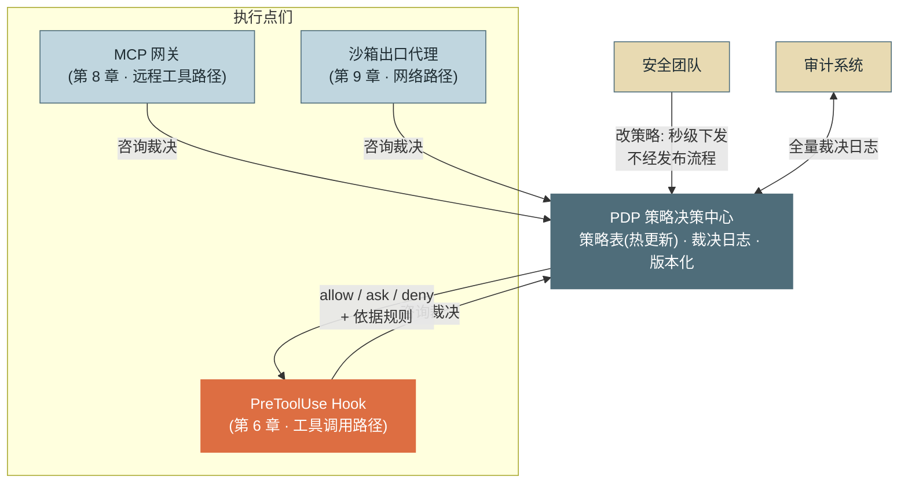
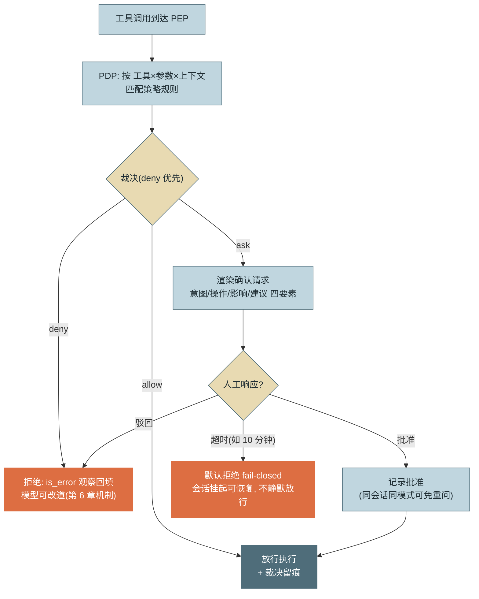
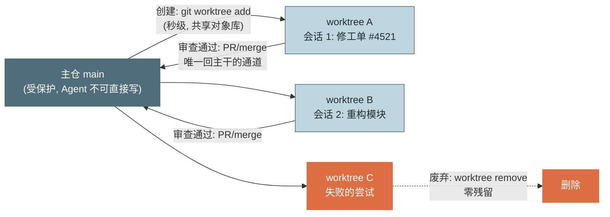

# 第 13 章 安全与权限

> 第三篇 单 Agent 生产工程化（质量层）
>
> 企业能否让 Agent 上线，最终不取决于它多能干，而取决于安全团队的三个问题能否被回答：**它凭什么权限做事？出事能不能立刻停住并查清？被骗了最坏会怎样？** 本章把第 6 章的单点 Hook 升级为完整的 **PDP/PEP 权限架构**，配上三级策略、人机确认的 UX 工程、Worktree 隔离与系统化威胁建模。

---

## 1. 场景引入：一次没通过的安全评审示例助手准备从试点走向全员开放，卡在了安全评审会上。安全团队没有质疑模型能力，而是提了三个工程问题，每个都直击现有实现的软肋：

**质疑一："封禁一个危险操作要多久？"** 现状是第 6 章的拦截规则硬编码在 Hook 里——改一条正则要走完整发布流程。评审官追问："如果今晚发现 Agent 在执行某类危险查询，你们要 40 分钟才能发版拦截？"没人能反驳。**策略与代码耦合，意味着安全响应速度等于发布速度。**

**质疑二："这个确认弹窗，用户真的在看吗？"** 现有的"询问用户"实现把工具名和参数 JSON 原样弹出。抽样数据难看至极：确认请求的平均响应时间 1.4 秒——没人能在 1.4 秒里读懂一段 JSON，这是**盲目放行**；而弹窗频率高达每会话 11 次，用户已经把"批准"练成了肌肉记忆。**过度询问的安全价值等于零，还搭上了体验。**

**质疑三："它读过客户数据之后，还能发外网请求吗？"** 红队演示了一条组合链：`read_file` 读配置（只读，策略放行）→ 注入的内容诱导 Agent 把读到的凭据填进一个"日志上报"的 HTTP 调用（常规工具，策略也放行）。**每一步都合规，串起来就是数据外渗**——逐工具的安全评审看不见组合攻击。

三个质疑对应本章的三块内容：策略与执行分离（PDP/PEP）、确认交互的 UX 工程（HITL）、会话级威胁建模。评审结论是"补齐后复审"——这一章就是那份补齐方案。

---

## 2. 原理

### 2.1 PDP/PEP：策略与执行分离

借用零信任架构的标准语言：**PEP（Policy Enforcement Point，策略执行点）** 部署在行动的必经之路上，负责拦截与执行裁决；**PDP（Policy Decision Point，策略决策点）** 集中承载策略并做出裁决。PEP 问"这个调用能不能做"，PDP 答"允许/询问/拒绝，依据规则 X"。

分离的三个动机，每个都对应场景引入的一个质疑：**策略可热更**——策略是数据不是代码，封禁一类操作是改一行策略表并下发，秒级生效，不走发布（治质疑一）；**执行点多处复用**——第 6 章的 PreToolUse Hook 只是 PEP 之一，MCP 网关（第 8 章）、沙箱出口代理（第 9 章）、API 网关都是 PEP，它们咨询**同一个** PDP，策略只写一份、语义处处一致；**审计集中**——所有裁决在 PDP 留痕（谁、什么调用、什么裁决、依据哪条规则），"出事能不能查清"的答案从此是一条 SQL。



*图 1：PDP/PEP 架构——这张图回答"策略住在哪、有几个执行点、为什么改策略不用发版"。高亮的 PreToolUse Hook 是最重要的 PEP（工具调用的必经之路），但不是唯一的：多个 PEP 咨询同一个 PDP，策略语义全局一致。*

### 2.2 权限分级：三级裁决的策略表达

裁决只有三种：**自动放行（allow）**、**询问（ask）**、**拒绝（deny）**。策略的表达力来自匹配条件的三个维度：

- **工具维度**：工具名或模式（`run_command`、`mcp_*`）。
- **参数模式维度**：对参数字段的模式匹配——命令白名单之外的路径（`command ~ "curl .*"`）、金额阈值（`amount > 1000`）、目标环境（`env == "prod"`）。这一维让策略从"工具级"细到"调用级"：同一个工具，读 dev 配置 allow、读 prod 配置 ask。
- **上下文条件维度**：与本次调用无关但与会话有关的条件——用户角色、任务风险画像、会话已消耗预算、**参数值的来源可信度**（源自不可信内容的参数自动升级处理，2.5 节）、会话污点状态（读过敏感数据与否）。

求值语义两条铁律：**deny 优先**（同时命中 allow 与 deny 时 deny 赢——策略冲突宁可误杀）；**默认策略显式声明**（未匹配任何规则的调用走什么？生产环境默认 ask 或 deny，绝不默认 allow）。第 9 章的副作用分级在这里就位为策略输入：`effect == "irreversible"` 是最常用的上下文条件之一。



*图 2：一次工具调用的权限判定全流程——这张图回答"三级裁决怎么分流、询问路径挂起与超时怎么处理"。两个警示设计：超时走 fail-closed（不静默放行），拒绝以观察回填（循环不崩、模型可改道）。*

### 2.3 Human-in-the-loop：确认交互是一门 UX 工程

ask 这一级的安全价值完全取决于**人真的在做判断**——而判断质量由信息设计与询问频率共同决定。

**确认请求的四要素信息设计**：①**意图**——Agent 为什么要做这件事，一句话（来自当前任务与最近推理，"为了修复工单 #4521 需要重启服务 A"）；②**操作**——具体做什么，**人类可读渲染**而非裸 JSON（"执行：`systemctl restart svc-a`（生产环境）"）；③**影响**——副作用等级、爆炸半径、可否回滚（"不可逆 · 影响生产流量 · 预计中断 3 秒"）；④**建议**——策略引擎的风险标注（"该参数值源自外部网页内容，建议核对"）。四要素的目标是让一个懂业务的人**在 10 秒内做出有信息量的判断**——超过 10 秒的认知负担会滑向盲批。

**疲劳问题的量化治理**。询问率与盲批率正相关是 HITL 的铁律——场景引入的每会话 11 次询问 + 1.4 秒平均响应就是疲劳曲线的终点。治理手段按优先级：**分级默认**（只读与可逆操作根本不问，把询问留给真正的高危——第 9 章分级的价值兑现）；**批准记忆**（同会话内同模式已批准的不再重复问；用户可把会话内批准升级为持久规则——"本次允许"与"总是允许"两个按钮）；**会话前置授权**（任务开始时展示计划所需的权限集一次批准，执行中零打扰——与第 4 章"计划过人眼"合流）；**询问率入监控**（健康目标：需人工确认的调用占比 < 5%，超标说明策略分级失当，回头修策略而不是怪用户盲批）。

### 2.4 Git Worktree 隔离：爆炸半径的空间控制

第 12 章的 shadow repo 解决**时间轴**问题（同一工作区的多版本快照），**git worktree** 解决**空间**问题：同一仓库检出多个并行工作树——共享对象库（磁盘开销只有检出文件本身）、各自独立分支与文件状态。Agent 的全部改动被物理限制在自己的 worktree 内：



*图 3：Worktree 隔离模型——这张图回答"多个 Agent 会话如何并行改同一个仓库而互不伤害"。改动的爆炸半径 = 自己的 worktree；回主干只有审查这一条通道；失败的尝试删目录即消失。*

这个模型给安全架构补上两块：**变更审查闸门**——Agent 永远不直接写主干，merge 是人类（或第 15 章的自动评测）持有的钥匙，与 2.2 节的运行时权限正交（运行时管"能执行什么"，worktree 管"改动能到哪"）；**多 Agent 并行的隔离地基**——多个会话各占一个 worktree 互不踩踏，这是第 19 章多 Agent 并行工程的前提设施，此处先立好。

### 2.5 威胁建模：三类攻击，一套方法

Agent 特有的威胁面归为三类，共同的分析方法是第 5 章那句"**问被骗后最坏能执行什么，而不是会不会被骗**"的系统化：

**注入驱动的越权**。攻击路径已在第 5、8、9 章逐段出现（工具结果/检索内容/文件/工具描述），本章补上策略侧的闭环：**参数来源标记进入策略条件**——运行时对上下文中的不可信片段打标（第 5 章 L1），当工具调用的参数值与不可信片段高度重合时，PDP 自动把裁决升一级（allow→ask、ask→deny）。模型可以被说服，但"这个 URL 来自刚抓取的网页"是运行时可判定的事实。

**工具链组合攻击**。单工具逐个评审全部安全，组合起来致命：`读敏感文件（只读，安全）→ 网络调用（常规，安全）= 外渗`；`查客户数据（合规）→ 写公开工单评论（常规）= 泄露`。防御思想借自**污点分析（Taint Analysis）**：会话携带污点状态——读取过敏感级数据后置位，此后本会话的外向通道（网络、对外写入）自动升级为 ask/deny。这是**会话级信息流约束**，逐工具策略表达不了，必须是 2.2 节上下文条件维度的一等公民。

**数据外渗路径枚举**。防外渗先枚举出口：网络请求（最直接，第 9 章默认断网 + 出口白名单）、对外可见的写入（工单评论、commit 到公开仓、发邮件）、日志与轨迹（敏感参数被记进可广泛访问的日志——观测管道也要脱敏，第 14 章）。枚举的纪律：每新增一个有对外写能力的工具，威胁模型文档加一条出口并配对策略——出口清单与工具清单同步演进。

---

## 3. 动手实现（贯穿项目增量）

本章增量：`src/assistant/security/policy.py`——**策略表驱动的 PDP** + **Hook 形态的 PEP**。策略是数据（可从 JSON/DB 热加载），引擎实现 deny 优先、上下文条件与污点升级；PEP 接进第 6 章的 Hook 管线，ask 路径带超时默认拒绝与会话批准记忆。

```python
# src/assistant/security/policy.py — 策略表驱动的 PDP
import fnmatch
import re
from dataclasses import dataclass, field
from typing import Literal

Verdict = Literal["allow", "ask", "deny"]
_RANK = {"deny": 2, "ask": 1, "allow": 0}      # deny 优先的裁决序


@dataclass
class PolicyRule:
    tool: str                                   # 工具名模式: "run_command" / "mcp_*"
    decision: Verdict
    param_patterns: dict[str, str] = field(default_factory=dict)   # 字段→regex
    context_conditions: dict[str, object] = field(default_factory=dict)
    reason: str = ""

    def matches(self, tool: str, params: dict, ctx: dict) -> bool:
        if not fnmatch.fnmatch(tool, self.tool):
            return False
        for key, pattern in self.param_patterns.items():
            if not re.search(pattern, str(params.get(key, ""))):
                return False
        for key, expected in self.context_conditions.items():
            if ctx.get(key) != expected:
                return False
        return True


@dataclass
class Decision:
    verdict: Verdict
    rule_reason: str
    escalated: bool = False        # 因来源/污点被升级过


class PolicyEngine:
    """PDP：策略即数据（可热加载），deny 优先，污点与来源自动升级"""

    def __init__(self, rules: list[PolicyRule],
                 default: Verdict = "ask"):     # 默认策略必须显式声明，绝不默认 allow
        self.rules, self.default = rules, default

    def evaluate(self, tool: str, params: dict, ctx: dict) -> Decision:
        hits = [r for r in self.rules if r.matches(tool, params, ctx)]
        if hits:
            top = max(hits, key=lambda r: _RANK[r.decision])   # deny > ask > allow
            verdict, reason = top.decision, top.reason
        else:
            verdict, reason = self.default, "未匹配任何规则，走默认策略"
        # 升级条款一：参数值源自不可信内容（第 5 章 L1 标记的运行时事实）
        if ctx.get("param_from_untrusted") and verdict == "allow":
            return Decision("ask", f"{reason}；参数源自不可信内容，升级为询问", True)
        # 升级条款二：会话污点——读过敏感数据后，外向通道升级（组合攻击防御）
        if ctx.get("session_tainted") and ctx.get("tool_is_egress") \
                and verdict != "deny":
            return Decision("deny",
                            "会话已读取敏感数据，外向操作被信息流策略拒绝", True)
        return Decision(verdict, reason)
```

PEP：接入第 6 章 Hook 管线的执行点，含确认四要素渲染、超时 fail-closed 与批准记忆：

```python
# src/assistant/security/pep.py — Hook 形态的 PEP
from assistant.core.hooks import HookDecision


class PolicyPEP:
    def __init__(self, pdp: PolicyEngine, confirmer, ask_timeout: int = 600):
        self.pdp, self.confirmer = pdp, confirmer   # confirmer: 确认请求的投递通道
        self.ask_timeout = ask_timeout
        self._approved: set[tuple] = set()          # 会话批准记忆（治疲劳）

    def pre_tool_use(self, tool_name: str, tool_input: dict,
                     ctx: dict) -> HookDecision:
        d = self.pdp.evaluate(tool_name, tool_input, ctx)
        if d.verdict == "allow":
            return HookDecision("allow")
        if d.verdict == "deny":
            return HookDecision("deny", reason=f"策略拒绝：{d.rule_reason}")
        pattern = (tool_name, ctx.get("effect"), d.rule_reason)
        if pattern in self._approved:               # 同会话同模式免重问
            return HookDecision("allow")
        approved = self.confirmer.ask(              # 渲染四要素, 阻塞等待或超时
            intent=ctx.get("intent", "（无意图说明）"),
            operation=self._render(tool_name, tool_input),
            impact=f"副作用等级: {ctx.get('effect', '未知')}",
            advice=d.rule_reason,
            timeout_seconds=self.ask_timeout)
        if approved:
            self._approved.add(pattern)
            return HookDecision("allow")
        return HookDecision("deny",                  # 驳回与超时同路：fail-closed
            reason="操作未获人工批准（驳回或超时）。请改用低风险方式或说明理由。")

    @staticmethod
    def _render(tool: str, params: dict) -> str:
        args = ", ".join(f"{k}={str(v)[:80]}" for k, v in params.items())
        return f"{tool}({args})"
```

策略表示例（热加载的数据形态）与组装——三条规则直接对应场景引入的三个质疑：

```python
RULES = [
    PolicyRule("run_command", "deny", {"command": r"\brm\b|\bdrop\b"},
               reason="破坏性命令一律拒绝"),                      # 质疑一: 改这里秒级生效
    PolicyRule("run_command", "ask", {"command": r"^curl|^wget"},
               reason="网络命令需确认"),
    PolicyRule("run_command", "allow", {"command": r"^(ls|cat|grep|git status)"},
               reason="只读命令自动放行"),                        # 治疲劳: 低危不问
    PolicyRule("*", "ask", context_conditions={"env": "prod"},
               reason="生产环境操作默认询问"),
]
pdp = PolicyEngine(RULES, default="ask")
registry_hooks.register("pre_tool_use",
    lambda t, i: pep.pre_tool_use(t, i, ctx=session_ctx), priority=0)
```

回测红队的组合链：`read_file` 读到密级文件后运行时置 `session_tainted`，随后的 HTTP 工具（`tool_is_egress=True`）被升级条款二直接 deny——**两步各自合法，组合被会话级信息流策略拦截**，正是逐工具评审看不见的那一层。

---

## 4. 生产级考量

**策略即代码地治理，数据般地分发。** 策略表进版本库、变更走评审、上线走灰度（先对 1% 会话生效观察误杀率）、可一键回滚；但**分发是数据通道**——PDP 热加载，安全应急封禁的时效以秒计。两者不矛盾：治理流程管"改得对不对"，分发通道管"生效快不快"。

**身份贯通：Agent 以谁的名义行动。** 共享服务账号是最大的隐性风险——权限并集 + 审计里全是同一个身份。正确模型是**用户委托（On-Behalf-Of）**：会话携带发起用户的身份令牌，下游系统看到的是"用户 X（经由 Agent）"，有效权限 = min(Agent 服务权限, 用户权限)。这样一次注入的最坏损失被限定在**当前用户的权限内**，而非服务账号能触达的全量数据（坑 5）。

**审计的验收标准：三问三秒。** 谁批准的、执行了什么、影响了哪里——PDP 裁决日志（含确认人与依据规则）+ 第 12 章事件流 + 第 9 章执行留痕三处关联，用会话 ID 串起来。上线前用一次模拟事故演练验收：从告警到答齐三问的实际耗时。

**红队常态化。** 注入用例（第 5 章三路径 + 第 8 章描述投毒）与组合攻击用例（污点链）进入第 15 章的评测集，每次策略与提示词变更跑回归；新工具接入的准入包含"与既有工具的组合威胁分析"——出口清单同步更新（2.5 节纪律）。

---

## 5. 常见坑

**坑 1：策略硬编码在 Hook 里，应急封禁要走发布。**
*症状*：发现危险行为到完成拦截耗时 40 分钟（改代码、过 CI、发布）；期间只能人肉盯着或整体停服。
*根因*：策略与执行耦合——第 6 章的单点 Hook 形态被直接带进了生产，规则变更等于代码变更。
*修复*：PDP 外置、策略表热加载（本章实现）；封禁操作成为安全团队的运营动作而非研发动作；策略变更自身留痕并可回滚。

**坑 2：确认弹窗渲染裸 JSON，盲批率超过 90%。**
*症状*：平均响应 1.4 秒、批准率 98%——询问机制在数据上等于不存在；出事后复盘，用户说"根本看不懂它在问什么"。
*根因*：把面向机器的载荷直接投给人，认知成本高到只能盲批；且低危操作也在问，疲劳叠加。
*修复*：四要素渲染（意图/操作/影响/建议）；分级默认把询问率压到 5% 以下；批准记忆消重复；把询问率与平均响应时长做成仪表盘——响应时长过短本身就是盲批告警。

**坑 3：allow 规则把 deny 规则"顺序覆盖"。**
*症状*：明明写了拒绝规则，某些调用仍被放行；只在特定规则排列下复现——策略表调整顺序后行为变了。
*根因*：引擎实现是"先匹配先赢"，而运营同学按直觉把宽松规则加在了表前面——策略语义依赖书写顺序是隐患温床。
*修复*：语义改为 deny 优先（命中集合取最严，本章 `_RANK`）；策略表配单元测试（给定调用与期望裁决的用例集）；上线前跑"新旧策略对全量历史调用的裁决 diff"。

**坑 4：逐工具评审通过，组合链外渗。**
*症状*：红队两步拿走凭据（读文件→HTTP 上报），事后检查每一步的策略裁决都是合规放行。
*根因*：策略只表达"单次调用可不可以"，不表达"这个会话已经发生过什么"——组合攻击住在调用之间的状态里。
*修复*：会话污点机制（读敏感数据置位→外向通道升级，本章升级条款二）；出口工具显式标记 `tool_is_egress`；组合攻击用例进红队回归。

**坑 5：Agent 共享一个高权限服务账号。**
*症状*：一次注入事故的影响评估结论是"理论上可触达全部客户数据"——因为服务账号有全库读权限；审计日志里所有操作的主体都是同一个账号，无法定责到人。
*根因*：把 Agent 当成又一个后台服务来授权——但后台服务不会被文本说服，Agent 会；服务账号的权限并集在注入面前就是爆炸半径。
*修复*：用户委托（OBO）令牌贯通，有效权限取交集；Agent 服务账号本身降到最小（只保注入面之外的基础能力）；按用户/租户分密钥，审计主体到人。

---

## 6. 面试高频问题

**Q1：为什么要把 PDP 和 PEP 分开？**

结论先行：**策略是会频繁变更、需要集中治理的数据，执行是分布在多条路径上的机制——分离后策略可热更（安全响应秒级）、多执行点复用同一语义、审计集中一处。**
- 不分离的代价：改策略=发版（应急封禁 40 分钟）；多个拦截点各写各的规则，语义漂移。
- PEP 清单：PreToolUse Hook（主）、MCP 网关、沙箱出口代理、API 网关——都咨询同一 PDP。
- 治理与分发分层：策略变更走版本库+评审+灰度，分发走热加载通道。
- 加分点：这是零信任架构的标准分解（XACML 谱系），Agent 只是多了"参数来源""会话污点"这类新上下文维度。

**Q2：三级权限的策略怎么表达？求值语义有什么讲究？**

结论先行：**allow/ask/deny 三级裁决，匹配条件三维——工具模式 × 参数模式 × 上下文条件；求值两铁律：deny 优先（命中取最严）、默认策略显式声明且绝不默认 allow。**
- 参数维让策略细到调用级：同一工具，dev 放行、prod 询问。
- 上下文维承载 Agent 特有条件：副作用等级（第 9 章）、参数来源可信度、会话污点、已耗预算。
- 顺序无关语义（取最严）防"宽松规则排前面"的运营事故；策略表要配单测与裁决 diff。
- 加分点：ask 超时必须 fail-closed——静默放行等于把超时变成绕过手段。

**Q3：Human-in-the-loop 的疲劳问题怎么治？**

结论先行：**询问率与盲批率正相关，治理靠四件套——分级默认（低危不问）、批准记忆（同模式免重问）、会话前置授权（批计划不批单步）、询问率入监控（目标 <5%）。**
- 信息设计四要素：意图/操作（人类可读渲染）/影响（等级与可回滚性）/建议——目标 10 秒内可判断。
- 反面数据：每会话 11 次询问 + 1.4 秒平均响应 = 盲批，安全价值为零。
- 响应时长过短本身是盲批告警信号，纳入仪表盘。
- 加分点：前置授权与第 4 章"计划过人眼"合流——批一份可读的计划，比批 11 个弹窗既安全又体面。

**Q4：git worktree 隔离和第 12 章的 shadow repo 是什么关系？**

结论先行：**正交互补——shadow repo 管时间轴（同一工作区的多版本快照与回滚），worktree 管空间（多个并行工作区的物理隔离）；生产系统两个都要。**
- worktree 共享对象库，创建秒级、磁盘只多检出文件；废弃即删目录零残留。
- 安全语义：Agent 永不直接写主干，merge 是人（或自动评测）持有的唯一通道。
- 与运行时权限正交：策略管"能执行什么"，worktree 管"改动能到达哪"。
- 加分点：worktree 隔离是多 Agent 并行的地基设施（参见第 19 章）——先为单 Agent 立好，多 Agent 白拿。

**Q5：什么是工具链组合攻击？为什么逐工具评审防不住？**

结论先行：**单工具各自合规、串联起来完成攻击（读敏感文件→网络上报 = 外渗）；逐工具评审只看"单次调用可不可以"，而组合攻击住在调用之间的会话状态里——防御要靠会话级信息流约束（污点机制）。**
- 污点思想：读过敏感数据置位会话状态，此后外向通道（网络/对外写入）自动升级 ask/deny。
- 前提设施：出口工具显式标记、数据敏感级作为读取工具的元数据。
- 外渗出口要枚举齐：网络、工单评论、公开仓 commit、日志与轨迹（观测管道也要脱敏）。
- 加分点：威胁建模的方法论一以贯之——问"被骗后最坏能执行什么"，答案的上界由确定性机制（策略/沙箱/污点）而非模型判断力决定。

---

> **下一章预告**：权限体系让 Agent"不敢乱来"，但"它到底在干什么"仍是黑盒。第 14 章进入可观测性：把第 12 章的事件流加工成 OTel Trace、指标与告警——Agent 的每一次决策都应留下可回放的证据链。
