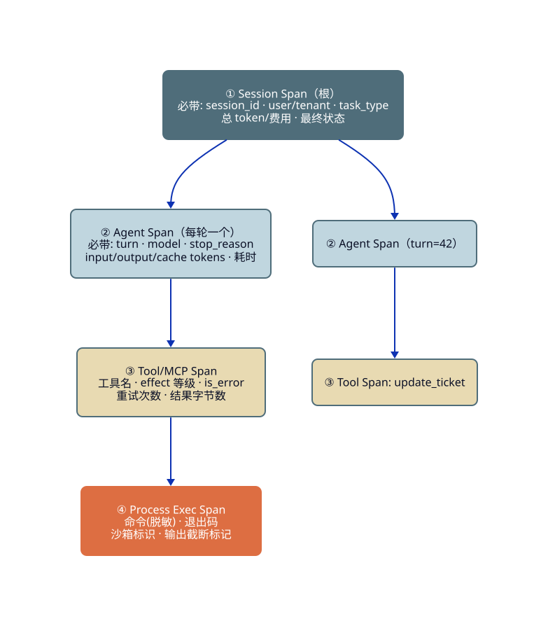
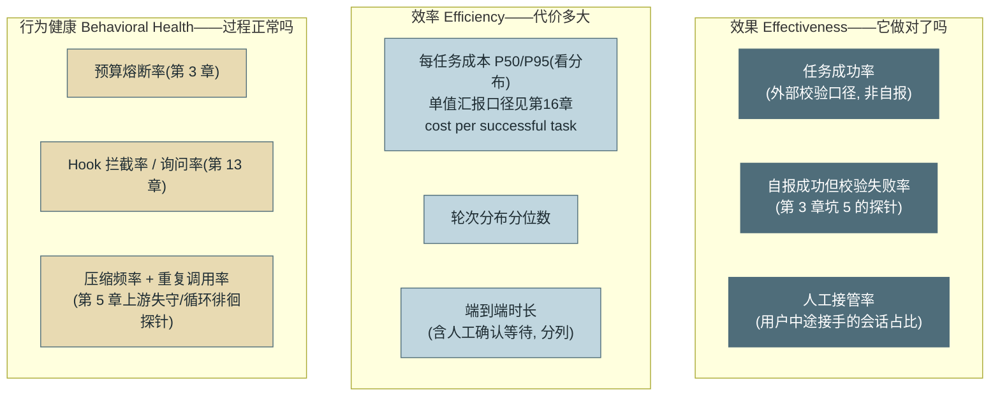
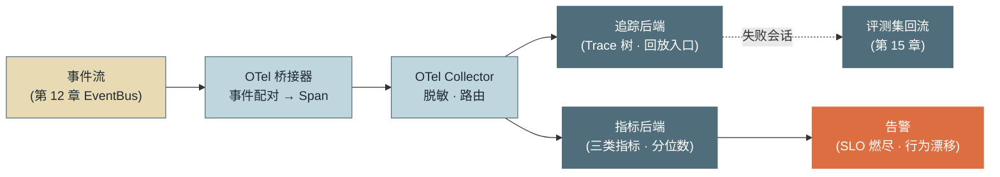

# 第 14 章 可观测性

> 本章另有约十倍篇幅的**详解扩展版**：[详解扩展版/ch14-可观测性.md](../详解扩展版/ch14-可观测性.md)——独立成文的深读版（初稿，未经审读与来源核验，体例与正文不同；两版内容以正文为准）。

> 第三篇 单 Agent 生产工程化（质量层）
>
> 看不见的 Agent 不可运维。本章把第 12 章的事件流加工成完整观测体系：**四层 Span 的追踪树、三类指标框架（效果/效率/行为健康）、以及用完整 Trace 回放一次失败会话的排查方法**。核心立场：Agent 的可观测性不是微服务观测的照搬——采样策略、指标口径、排障动线都因"概率组件 + 长会话"而不同。

---

## 1. 场景引入：凌晨两点，三个答不上来的问题

周四凌晨，值班群炸了：一位运营在下班前让示例助手批量更新 30 个工单的状态，早上发现其中 6 个被改错了字段。值班工程师打开日志，只找到几行 `session started ... session ended (ok)`——应用日志显示一切正常。接下来的三个问题，把团队按在了原地：

**"它为什么这么改？"**——答不上。对话历史存了，但 30 个工单的处理散在几百轮里，没有结构化的轮次视图，肉眼从 JSONL 里翻出"第几轮、基于什么观察、做了哪个调用"花了两个小时。

**"哪一步出的问题？"**——答不上。没有耗时与状态的层级视图，无法快速定位"错误开始于哪一轮"；最后发现根因是第 41 轮一次工单查询接口返回了错位的字段映射（上游变更），此后的 6 次更新全部基于错误映射——**一次坏观察污染了后续所有决策**，而这条传播链在日志里完全不可见。

**"这类错误多常见？"**——答不上。没有指标：工具成功率、任务成功率、字段校验失败率都无处可查，无法回答"这是首例还是每天都在发生"。

对有分布式系统经验的读者，诊断很熟悉：这个系统缺**三支柱**（Trace/Metrics/Logs）中的前两根。第 12 章的事件流已经把原料备好了——本章的工作是把它加工成追踪、指标与告警，并且回答一个前置问题：Agent 的观测和微服务的观测，哪里一样，哪里必须不一样。

---

## 2. 原理

### 2.1 四层 Span 层级：把会话变成一棵树

**Span** 是一段有起止时间、有属性、有父子关系的工作单元。Agent 会话天然是四层嵌套结构，与第 12 章事件的配对关系确定（`turn_start/turn_end` 配对成一个 Agent Span，`tool_call/tool_result` 配对成 Tool Span）：



<!-- 架构/分层图用 D2（见《图表规范》）；源 diagrams/d2/ch14-span-tree.d2 -->

*图 1：四层 Span 层级树与各层必带属性——这张图回答"一次会话在追踪系统里长什么样、每层必须记什么"。层级即排障动线：从 Session 的最终状态下钻到出错的轮次，再下钻到肇事的工具调用与进程执行。*

四层的设计依据：**每层对应一个排障问题**。Session 层答"这次任务成没成、花了多少"；Agent 层答"哪一轮开始不对劲"（场景引入的第 41 轮就在这一层现形——该轮之后所有 Tool Span 的参数都携带了错误字段）；Tool 层答"哪个调用出了错、重试了几次"；Process 层答"沙箱里到底跑了什么"。属性纪律沿用第 12 章事件载荷的规则：**带摘要与指针，不带大对象**——完整消息体住在轨迹存储，Span 属性里只放轨迹指针。

### 2.2 关键指标：采集点与计算口径

三个核心指标的采集点与口径，口径必须写到分子分母级别——**没有口径的指标是争吵的种子**：

**Token 消耗。** 采集点：每次 LLM 响应的 `usage` 字段（第 3 章 `LoopState.record_usage` 已在采）。口径：input/output/缓存读写**分列**（单价不同，混在一起无法算钱——参见第 16 章）；聚合维度 per-turn（发现异常轮）、per-session（成本分布）、per-task_type（预算制定）。

**工具成功率。** 采集点：`tool_result` 的 `is_error` 与重试器记录。口径陷阱在此：**同一个名字下藏着两个指标**——面向"工具对 Agent 是否可用"，分母应为**重试后的最终结果**（`成功的最终结果 / 全部最终结果`）；面向"上游依赖健不健康"，分母应为**含重试的原始尝试**（`成功尝试 / 全部尝试`）。前者 98%、后者 85% 完全可能同时成立（重试掩盖了上游劣化）——必须拆成两个名字：`tool.final_success_rate` 与 `tool.attempt_success_rate`，各自服务各自的告警。

**循环轮次分布。** 采集点：`turn_end` 事件计数，会话结束时观测。口径：**只统计已结束会话**的轮数直方图（进行中的会话计入会造成分布左移的假象）；看分位数不看均值——P50=6 轮、P95=48 轮的双峰形态里，均值毫无意义；P95 漂移是任务变难或循环徘徊的早期信号。

### 2.3 指标方法论：三类框架与 SLI→SLO 推导

指标不是越多越好，要有分类框架防"仪表盘堆砌"。Agent 指标分三类，每类回答一个管理层问题：



*图 2：三类指标分类框架与示例——这张图回答"该建哪些指标、每个指标属于哪类问题"。效果类面向业务，效率类面向预算，行为健康类面向工程——第三类最独特：它监控的是"过程的形态"，往往比结果指标早数小时报警。*

**行为健康类值得多说一句**：它是 Agent 观测区别于传统服务的部分。熔断率突增=上游劣化或提示词回归（第 3 章）；询问率突增=策略分级失当（第 13 章）；压缩频率突增=工具截断失守（第 5 章）；**重复调用率**（同参数同工具在一个会话内出现 ≥3 次）=循环徘徊的直接探针。这些指标在任务还"勉强成功"时就开始漂移——**行为先于结果劣化**，这是把它们单列一类的理由。

效果类还有一路常被漏掉的输入：**用户反馈信号**——显式的（结果页的 👍/👎、纠正性追问）与隐式的（用户重述同一请求、中途放弃会话）。它们是唯一直接来自"需求方"的效果证据，但要防**样本偏差**：主动点评的多是极端体验，反馈率通常只有个位数百分比——适合当趋势与告警信号、当第 15 章回流池的入口，不适合直接当成功率的分母。

**SLI→SLO 推导示范**（以任务成功率为例）：SLI 定义——`外部校验通过的会话 / 全部结束会话`（注意：用第 3 章 Verifier 的口径而非模型自报；排除用户主动取消）；基线测量——两周真实流量得 92%±2%；SLO 设定——90%（周窗口），保留缓冲而非贴着基线；错误预算——10%，预算耗尽触发变更冻结（提示词与策略的变更也算变更——它们与代码变更同权，这是 Agent 系统的特殊纪律）。效率类同理：每任务成本 P95 < $1.5 的 SLO 直接对接第 16 章的预算治理。

**指标定义方式：登记表即制度。** "新指标不过登记不上盘"（坑 2）不能停在口号，登记表要有固定字段——七项缺一不可，外加一名 owner（口径争议的仲裁人）：

| 字段 | 说明 | 填写示例（tool.final_success_rate） |
|---|---|---|
| **名称** | `域.对象.度量` 三段式，量词后缀显式（_rate/_count/_seconds） | `assistant.tool.final_success_rate` |
| **类型** | Counter / Gauge / Histogram——决定聚合方式与仪表选择 | 两个 Counter 相除（成功数/总数） |
| **口径** | 分子 / 分母 / 排除项，写到可仲裁 | 分子=重试后最终成功；分母=全部最终结果；排除=用户取消 |
| **采集点** | 来自哪个事件的哪个字段（第 12 章契约） | `tool_result.is_error` + `retries` |
| **维度** | 聚合标签，只允许有界枚举（防高基数，第 4 节） | `tool.name` × `task.type` |
| **窗口与统计量** | 滑窗长度；比率还是分位数（长尾指标禁均值） | 1h 滑窗，比率 |
| **告警语义** | 阈值型 / 同比漂移型 / SLO 燃尽型，三选一必填 + 响应动作 | 漂移型：周同比 −5pp 告警 → 查上游依赖 |

这张表的价值坑 2 已经演示过：两个同名不同义的"成功率"打架时，登记表是唯一的判决书。类型一栏与第 3 节桥接器直接对应——Counter 进 `create_counter`、分布进 `create_histogram`，登记落库的同时代码就知道该用哪个仪表；采集点一栏则保证每个指标都能溯源到第 12 章事件契约的具体字段——**登记表登记不出来的指标，就是采集不到的指标**。

**三类指标的完整速查清单**（图 2 的九宫格展开为可抄清单；★ 为最小集——新系统先上这五个，一天可建、靠事件流零侵入，其余按需增补）：

| 类 | 指标 | 口径一句话 | 采集事件 | 告警方式 |
|---|---|---|---|---|
| 效果 | ★ task.success_rate | 外部校验通过 / 全部结束会话（排除用户取消） | `session_end.status` | SLO 燃尽 |
| 效果 | self_report_mismatch_rate | 自报成功但校验失败 / 自报成功 | `session_end` + Verifier | 阈值（>3% 查终止判定） |
| 效果 | human_takeover_rate | 人工中途接管 / 全部会话 | `session_end.status` | 同比漂移 |
| 效果 | user_feedback_negative_rate | 显式差评 / 有反馈会话（样本偏差警示见前文） | 反馈事件 | 趋势观察 |
| 效率 | ★ cost_per_successful_task | 总成本 / 成功任务数，P50/P95 分列（第 16 章北极星） | `turn_end.usage` | SLO |
| 效率 | ★ session.turns P95 | 已结束会话的轮数分位 | `session_end.turns` | 漂移（同比 +30%） |
| 效率 | e2e_duration P95 | 端到端时长，人工等待时间分列（`approval.wait` 跨度，2.6 节） | `session_start/end` | 阈值 |
| 效率 | cache_hit_rate | 缓存读 / 全部输入侧 token（第 16 章口径） | `turn_end.usage` | 阈值（跌破基线） |
| 效率 | tool_latency P95 | 工具执行时长分位，按 `tool.name` 分列 | `tool_call/result` 配对 | 漂移 |
| 健康 | ★ budget_abort_rate | 预算熔断会话 / 全部会话 | `budget_aborted` | 漂移（+50%） |
| 健康 | ★ ask_rate / hook_denied_rate | 需人工确认（或被拦截）的调用占比 | `hook_denied` 等 | 阈值（ask >5% 修策略，第 13 章） |
| 健康 | repeat_call_rate | 同工具同参数 ≥3 次的会话占比（徘徊探针） | `tool_call` 去重统计 | 阈值 |
| 健康 | attempt_vs_final_gap | 尝试成功率 − 最终成功率（重试掩盖的上游劣化，2.2 节） | `tool_result.retries` | 漂移 |
| 健康 | compaction_frequency | 每会话压缩次数（上游截断失守的前兆，第 5 章） | `compaction` | 漂移 |
| 健康 | progress_stall_count | 距上次事件超阈的会话数（僵死探针，第 12 章） | 事件时间戳 | 阈值即告警 |

两条使用纪律补在清单后：长尾分布（轮次/成本/时长）只报分位数，均值只进总账（坑 4）；"告警方式"一栏必填——**没有告警语义的指标是仪表盘装饰品**，它的存在只会稀释真正该被看见的信号。

### 2.4 OTel 生态对接：全采样的理由

对接 **OpenTelemetry（OTel）** 生态，先把体系本身钉清楚，再谈三个要点。

**OTel 体系速查：三支柱、四组件、一条管线。** **三支柱**是数据类型：Traces（因果链，本章主角）、Metrics（聚合时序，2.2/2.3 节）、Logs（离散事件——GenAI 的消息内容采集若开启，推荐以关联 trace_id 的日志/事件承载而非塞进 Span 属性，见第 4 节）。**四组件**是软件分层：**API**（埋点接口，库代码只依赖它——零实现开销，这是"库不绑定后端"的设计根基）；**SDK**（API 的具体实现：采样器、处理器、导出器，由部署方组装——本章第 3 节的桥接器就是一个 SDK 用户）；**OTLP**（统一导出协议，gRPC/HTTP 两种载体——换观测后端不改埋点的技术基础，下文选型三问里"语义兼容即反锁定"的另一半）；**Collector**（独立进程的遥测管道：`receiver → processor → exporter` 三段流水线）。四组件的字段级详解、traceparent 结构解剖与 Collector 配置骨架见附录 7。Collector 值得多说一句，因为本书多处纪律的**现成落点**就在它的 processor 里：`batch`（批量导出，背压友好）、`attributes`/脱敏类 processor（第 4 节"Collector 层统一脱敏、先于出边界"的执行者）、`tail_sampling`（**尾部采样**——会话结束后按状态决定保留，坑 3 修复方案的现成组件，失败与超预算会话 100% 保留无需自研）。部署形态两档：**agent 模式**（每节点边车，就近收取）与 **gateway 模式**（集中集群，统一做脱敏/采样/路由再分发到后端）——生产常见"agent 收取 + gateway 治理"两级串联，图 3 里那个"脱敏 · 路由"的 Collector 就是 gateway 位。

在此之上，对接的三个要点：

**语义约定优先。** OTel 的 **GenAI 语义约定**（`gen_ai.*` 属性族：`gen_ai.request.model`、`gen_ai.usage.input_tokens` / `output_tokens`、`gen_ai.operation.name` 等）目前处于 **Development（活跃演进）** 阶段，已独立成专门仓库维护——**属性名相对稳定，但整体尚未定稿，勿当成永久标准**（版本以 [C-04] pin 的 semconv 发布为准）。自定义属性名之前先查约定，用标准名的直接收益是现成工具链（各家 LLM 观测平台）零适配接入；本书自定义的非 `gen_ai.*` 属性（见 4 节）随规范推进再对齐。

**主流方案四阵营对比。** 桥接器输出标准 OTel 后，后端接谁是独立决策。市面方案按"LLM 原生程度 × 部署形态"分四个阵营（名单为 2026 年中快照，时效纪律同附录 4；本表回答"观测视角选阵营"，第 15 章 2.3 的平台表回答"评测视角选平台"，两表交叉着看）：

| 阵营 | 代表 | 接入方式 | 强项 | 注意 |
|---|---|---|---|---|
| **LLM 原生 · 开源可自托管** | Langfuse、Arize Phoenix、OpenLLMetry（Traceloop）；MLflow（ML 平台谱系扩入） | OTel/SDK | 数据不出域；与 GenAI 语义约定对齐最快；Trace-评测同库 | 自运维；告警与长期存储要自己配套 |
| **LLM 原生 · SaaS** | LangSmith、W&B Weave、Braintrust、Helicone | SDK 或代理 | 开箱即用，标注队列/实验对比/评测一体 | Trace 含敏感内容——第 20 章出域三类通道审查先行 |
| **通用 APM 扩展** | Datadog LLM Observability、New Relic、Grafana 栈（Tempo/Loki） | OTel | 与既有基础设施观测同屏；告警/值班体系成熟 | LLM 专项深度浅（rubric 评测、回放弱）；按量计费在全采样下要先算账 |
| **国内云 APM 线** | 阿里云 ARMS、腾讯云 APM、火山引擎 APMPlus 等（LLM 语义陆续跟进） | OTel | 合规域内、与国内云生态与账单整合 | LLM 专项能力以当期文档实测为准 |

选型三问，全部回扣本章原则：**其一，语义兼容即反锁定**——只认标准 OTel/`gen_ai.*` 摄入的方案，自定义属性与 Trace 能整体导出，换后端不用改埋点（"事件是 Span 原料"架构的收益兑现处）；**其二，数据边界先于功能**——Trace 里是对话与业务数据，SaaS 阵营先过第 20 章出域与条款审查，受监管行业通常落在开源自托管或国内云阵营；**其三，观测与评测别分家**——失败会话回流评测集（图 3 的回流边）要求两者共享一份轨迹存储，选型时把第 15 章的平台表放在旁边一起看，避免"Trace 在 A 家、评测在 B 家"的数据搬运税。

**采样策略：Agent 场景倾向全采。** 微服务用 1% 头部采样的两个前提在 Agent 场景都不成立：其一**量级**——微服务百万 QPS，采样是存储生死线；Agent 会话每天数千量级，全采的 Span 数不过百万级，存储可承受。其二**价值分布**——微服务单请求同质化，采样损失小；Agent 单会话价值高且**长尾即主角**（要排障的恰是那 5% 的失败会话，头部采样大概率把它们扔了），且完整 Trace 还是评测集与回放调试的原料（2.5 节），一份数据三处用。成本控制的正确位置不在采样率，在**载荷瘦身**（大对象留指针）与**保留期分级**（全量 Trace 保 30 天、失败会话保 180 天、指标聚合保两年）。

**数据流水线全景**：



*图 3：从事件到 Span 到指标到告警的流水线——这张图回答"第 12 章的事件流如何一路加工成可运维的观测资产"。注意最右的回流边：失败会话的 Trace 是第 15 章评测集最好的用例来源，观测与评测共享同一份原料。*

### 2.5 Trace 回放：用完整证据链排查失败会话

有了四层 Trace，场景引入的排障从两小时压缩为一条标准动线（实际复盘约八分钟）：

① **从指标进入**：`task.success_rate` 周四凌晨下跌 → 按 `task_type=工单批量更新` + `状态=校验失败` 过滤出 6 个 Session。② **打开 Trace 树**：6 棵树形态一致——前 40 轮正常，第 41 轮起 `update_ticket` 的参数出现同一个错误字段名。③ **下钻肇事轮**：turn=41 的 Tool Span 显示 `query_ticket` 结果字节数比历史均值大 3 倍（上游加了字段），顺轨迹指针取完整返回体，确认字段映射错位。④ **确认传播链**：其后所有 Agent Span 的输入里都携带了这份坏观察——一次采样，污染六次决策。⑤ **回放验证**：从轨迹存储取该会话第 40 轮的完整历史，灌回本地循环（第 12 章 Checkpoint 恢复语义的调试用法），复现坏字段被模型采信的过程；再用修复后的工具重放，确认第 41 轮走向正确。

这套动线的前提正是本章的三个设计：四层结构（快速定位层级）、全采样（失败会话必在）、载荷指针（能从 Span 下钻到完整消息）。**回放调试是 Agent 观测的终局能力**——传统服务的 Trace 只能"看过程"，Agent 的 Trace + 轨迹 + Checkpoint 能"重新经历过程"，这也是修复验证与回归用例的来源（回流到第 15 章）。

### 2.6 Agent Span 语义、跨边界传播与内容采集分级

2.1 的四层结构（Session/Agent/Tool/Process）是骨架，但 Agent 的活远不止"轮次 + 工具"。把整条生命周期用**一张统一的 span 名字表**钉死，检索、记忆、策略裁决、人工审批、交接、产物落盘都各有其名——好处和第 12 章事件契约一样：**全链路名字一致，跨章、跨团队、跨工具的 Trace 能拼成一棵树而非各说各话**：

| span 名 | 覆盖环节 | 本书位置 |
|---|---|---|
| `task.run` / `agent.turn` / `model.call` / `tool.call` | 主干执行 | 2.1 四层 |
| `retrieval.query` | 检索 | 第 11 章 |
| `memory.read` / `memory.write` | 记忆读写 | 第 10 章 |
| `policy.evaluate` | PDP 裁决 | 第 13 章 |
| `approval.wait` | 等待人工确认 | 第 13 章 HITL |
| `handoff` | 交接 / A2A 委派 | 第 18 章 |
| `artifact.write` | 产物落盘 | 第 18 章 |

**跨边界传播是 Agent Trace 的真难点。** Agent 的一次任务会跨进程、跨协议、跨组织——MCP 调工具、A2A 委派子 Agent、任务进消息队列/后台、浏览器执行器、人工审批、异步 resume。每跨一道边界，都要把 **W3C `traceparent`** 沿载体透传（HTTP 头 / A2A 的 `_meta` / 队列消息属性），远端的 span 才能挂回同一 `trace_id`。与它同行的还有 **baggage**（W3C 的键值对随行机制）：`traceparent` 只带 trace 身份，跨服务要随行的业务键——`tenant`、`session_id`、`graph_run`（第 19 章）——走 baggage 传播，远端 span 据此打上归因标签。一条纪律：**baggage 会明文出现在每一跳的传输头里，敏感值绝不入 baggage**（放 id 不放内容，第 4 节隐私纪律的传播版）。否则每跨一次边界 Trace 就断一次，排障退回"各查各的日志"。这与第 18 章 A2A 的 `RemoteTask.trace_context`、第 8 章 MCP 的 `_meta` OTel 键是同一件事的两端。

**内容采集分级，默认最严。** 承接 §4 的"内容默认不采"，把它做成三个可配置级别、脱敏可机器执行：

<!-- snippet: examples/reference-assistant/src/assistant/obs/spans.py#ch14-capture-level mode=executable verified_by=examples/reference-assistant/tests/test_spans.py -->
```python
def apply_capture(level: CaptureLevel, attrs: dict[str, Any]) -> dict[str, Any]:
    """按采集级别过滤/脱敏 Span 属性。默认 metadata_only：内容字段一律不落。"""
    if level is CaptureLevel.FULL:
        return dict(attrs)
    out: dict[str, Any] = {}
    for k, v in attrs.items():
        if k not in CONTENT_KEYS:
            out[k] = v                                   # 元数据总是保留
        elif level is CaptureLevel.REDACTED:
            out[k] = redact_text(v) if isinstance(v, str) else v
        # METADATA_ONLY：内容字段直接丢弃
    return out
```

三级的用法：**metadata_only**（默认，也是生产默认）——只留 token/时延/状态等元数据，prompt、completion、工具入参结果整体丢弃；**redacted**——内容保留但机器脱敏（邮箱、长数字等 PII 打码），供需要看内容又不能泄敏的排障；**full**——仅在合规许可的隔离环境短期开启。级别是**每租户/每环境**的配置项，不是散落在代码里的开关——审计要能一眼看出"这条 Trace 按哪级采的"。

---

## 3. 动手实现（贯穿项目增量）

本章增量：`src/assistant/obs/otel_bridge.py`——作为事件总线的一个消费者接入 **OTel SDK**（`pip install opentelemetry-sdk`），把事件配对成四层 Span，并落三个核心指标。GenAI 语义约定的版本、稳定级别与弃用状态以 [C-04] pin 的 semconv 发布为准（核验于 2026-08-24，Development 稳定级；随 SDK 依赖的 semconv schema 版本锁定）；升级 SDK 时先跑事件契约回归。零侵入：循环代码一行不改（第 12 章"一次发射、多方消费"的兑现）。

```python
# src/assistant/obs/otel_bridge.py — 事件流 → OTel Span/指标 桥接器
from opentelemetry import trace, metrics
from opentelemetry.sdk.resources import Resource
from opentelemetry.sdk.trace import TracerProvider
from opentelemetry.sdk.trace.export import BatchSpanProcessor
from opentelemetry.sdk.metrics import MeterProvider

RESOURCE = Resource.create({"service.name": "agent-assistant"})


def init_otel(span_exporter, metric_reader):
    """生产环境换 OTLPSpanExporter / PeriodicExportingMetricReader 指向 Collector"""
    tp = TracerProvider(resource=RESOURCE)
    tp.add_span_processor(BatchSpanProcessor(span_exporter))
    trace.set_tracer_provider(tp)
    metrics.set_meter_provider(
        MeterProvider(resource=RESOURCE, metric_readers=[metric_reader]))


class OtelBridge:
    """订阅第 12 章 EventBus 的全量事件，配对成 Span 树并打指标。
    此处实现前三层（task.run/agent.turn/tool.call）；Process 层由执行类工具
    的 process_* 事件同法挂到 Tool Span 下（第 9 章执行留痕，接线从简）"""

    def __init__(self):
        self.tracer = trace.get_tracer("assistant")
        meter = metrics.get_meter("assistant")
        # 三个核心指标（2.2 节口径）
        self.tokens = meter.create_counter(
            "assistant.tokens.used", description="token 消耗, 按类别分列")
        self.tool_calls = meter.create_counter(
            "assistant.tool.calls", description="工具调用数, 按工具与最终结果分列")
        self.turns_hist = meter.create_histogram(
            "assistant.session.turns", description="已结束会话的轮次分布")
        self._session = None            # 当前打开的各层 Span（教学简化: 单会话单槽;
        self._turn = None               #  并发会话按 session_id 分槽维护）
        self._tools: dict[str, object] = {}

    def on_event(self, ev) -> None:                      # EventBus 消费者接口
        p, t = ev.payload, ev.type
        # span 名用 2.6 节统一表且保持低基数：轮次号、工具名放属性，不进名字
        if t == "session_start":
            self._session = self.tracer.start_span("task.run", attributes={
                "session.id": ev.session_id,
                "task.type": p.get("task_type", "unknown")})
        elif t == "turn_start":
            ctx = trace.set_span_in_context(self._session)
            self._turn = self.tracer.start_span(
                "agent.turn", context=ctx,
                attributes={"turn": p["turn"]})
        elif t == "turn_end":
            usage = p["usage"]                            # 契约: usage 嵌套 (第 12 章)
            for k in ("input_tokens", "output_tokens"):
                if k in usage:                            # gen_ai 语义约定的属性名
                    self._turn.set_attribute(f"gen_ai.usage.{k}", usage[k])
                    self.tokens.add(usage[k], {"category": k.split("_")[0]})
            self._turn.set_attribute("stop_reason", p.get("stop_reason", ""))
            self._turn.end()
        elif t == "tool_call":
            ctx = trace.set_span_in_context(self._turn)
            self._tools[p["call_id"]] = self.tracer.start_span(
                "tool.call", context=ctx, attributes={
                    "tool.name": p["name"], "tool.effect": p.get("effect", ""),
                    "trace.pointer": p.get("pointer", "")})   # 大对象留指针
        elif t == "tool_result":
            span = self._tools.pop(p["call_id"])
            outcome = "error" if p.get("is_error") else "ok"
            span.set_attribute("tool.outcome", outcome)
            span.set_attribute("tool.retries", p.get("retries", 0))
            span.end()
            self.tool_calls.add(1, {"tool": p["name"], "outcome": outcome})
        elif t == "session_end":
            self._session.set_attribute("session.status", p.get("status", ""))
            self.turns_hist.record(p.get("turns", 0),
                                   {"task.type": p.get("task_type", "unknown")})
            self._session.end()
```

组装（开发环境用控制台导出器；生产换 OTLP 指向 Collector，代码只改 `init_otel` 两个实参）：

```python
from opentelemetry.sdk.trace.export import ConsoleSpanExporter
from opentelemetry.sdk.metrics.export import InMemoryMetricReader

reader = InMemoryMetricReader()
init_otel(ConsoleSpanExporter(), reader)
bridge = OtelBridge()
bus.subscribe(bridge.on_event)          # 第 12 章总线的又一个消费者, 循环零改动
```

回测场景故障：接入后同样的事故，排障动线即 2.5 节五步——指标过滤定位 6 个会话、Trace 树看到 41 轮分界、Tool Span 的字节数异常与轨迹指针给出根因。三个"答不上来的问题"分别由 Trace 层级、Tool Span 属性、三类指标接住。

---

## 4. 生产级考量

**观测管道是敏感数据管道。** Span 属性与轨迹存储里流的是用户对话与业务数据——第 13 章枚举的外渗出口在此新增一个。纪律：Collector 层统一脱敏（正则/字段级，先于出企业边界）；轨迹存储的访问控制与审计对齐生产数据库标准；"谁看过哪个会话的 Trace"本身留痕。**不要让排障便利变成合规事故**——观测系统的读权限往往是全公司最松的，而它现在装着最敏感的内容。

**内容采集默认关闭，与元数据分开。** GenAI 语义约定刻意**不把消息内容放进默认属性集**：模型名、token 数、时延这类元数据默认采集，而 prompt、completion、工具入参/结果这些**可能含姓名/邮箱/账号/业务机密的内容默认不采**——它们不像模型名或 token 数，用户常把敏感信息直接键入其中。需要时才由显式开关打开（各家自动埋点库的 `OTEL_INSTRUMENTATION_GENAI_CAPTURE_MESSAGE_CONTENT` 一类环境变量，默认 `false`），且宜以关联 `trace_id/span_id` 的日志/事件承载、而非塞进 Span 属性。本书桥接器只写元数据（token/状态/指针），内容留在受访问控制的轨迹存储——与“带指针不带大对象”（坑 1）同一条纪律的隐私侧。

**规范属性与自定义属性分开登记。** 桥接器写的属性分两类，代码注释须标清来源：`gen_ai.*` 是**规范属性**（`gen_ai.usage.input_tokens` / `output_tokens` 等，随 semconv 演进，可能改名或升级稳定级）；`session.id` / `task.type` / `tool.name` / `tool.effect` / `tool.outcome` / `trace.pointer` 是**本书自定义**属性（规范尚未覆盖的运行时维度）。规范补齐对应概念时优先迁到标准名——**不要把自定义名或实验性属性伪装成“已是标准”**。

**高基数属性会撑爆指标。** 属性一旦进入**指标维度**（而非仅 Span 属性），每个不同取值就是一条新时间序列：把 `session.id`、用户 id、完整错误串这类**无界高基数**值当指标标签，会让后端时间序列爆炸、账单失控。纪律：高基数值只进 Span（可采样、可过期）；指标标签只用**有界枚举**维度（`task.type`、`tool.name`、`outcome`）——本章三个核心指标的标签正是按此挑的。

**告警面向行为漂移，不只面向阈值。** 静态阈值适合效果类（成功率 < SLO）；行为健康类更适合**同比漂移**告警（熔断率相对上周同时段 +50%、P95 轮次 +30%）——因为这类指标的绝对值因任务组合而异，漂移才是信号。变更标记（提示词/策略/模型版本的发布事件）叠加在指标时间线上，让"漂移始于哪次变更"一眼可见——这要求提示词与策略的发布也走正式的变更管道（2.3 节的纪律再次出现）。

**成本归属与观测自身的成本。** 全采样的存储费用要有主：按租户/任务类型分摊（Span 属性里的 tenant 标签即计费维度，与第 16 章成本体系共用）；观测自身设预算——当轨迹存储增速异常，先查第 5 章工具截断是否失守（观测成本暴涨常是上游质量问题的账单形态）。

**评测回流的通道要自动化。** 失败会话 → 评测用例的转化（图 3 的回流边）不能靠人记得：校验失败与人工接管的会话自动打标入池，每周由第 15 章的流程筛选入集。观测与评测共享轨迹存储这一份原料，是两个体系互相喂养的物质基础。

---

## 5. 常见坑

**坑 1：把完整工具结果塞进 Span 属性。**
*症状*：追踪后端存储费用一个月翻了八倍；查询大 Trace 时前端卡死；个别 Span 因超过后端属性大小上限被静默丢弃——最需要的现场恰好丢了。
*根因*：违反"带指针不带大对象"纪律——工具返回的数万字符 JSON 被原样写进属性，Span 从索引变成了数据仓库。
*修复*：属性只放摘要（字节数、状态、前 200 字符）+ 轨迹指针（本章 `trace.pointer`）；桥接层加属性大小硬校验；已膨胀的历史数据按保留期分级清理。

**坑 2：工具成功率一个名字两种口径，告警互相打架。**
*症状*：工具健康仪表盘显示 98% 一切正常，另一个团队的依赖监控却在报"同一工具 85% 频繁告警"；两边各执一词争论数据谁对——都对。
*根因*：一个用了重试后最终结果口径，一个用了含重试的尝试口径，指标同名不同义（2.2 节的陷阱原型）。
*修复*：拆成两个显式命名的指标各配告警语义（final 面向 Agent 可用性、attempt 面向上游健康）；建立指标口径登记表——每个指标的分子/分母/排除项白纸黑字，新指标不过登记不上盘（登记表的七字段模板见 2.3 节）。

**坑 3：Trace 采样沿用微服务的 1% 头采。**
*症状*：接到投诉去查会话，Trace 十有九空；失败会话恰好都"没采到"；观测系统沦为摆设，排障退回翻 JSONL。
*根因*：头部采样在决定采不采时不知道会话会不会失败——而 Agent 排障要的恰是失败长尾；1% 采样在千级日会话量下连统计意义都勉强。
*修复*：全采样 + 载荷瘦身 + 保留期分级（2.4 节）；若量级真到必须采样，用**尾部采样**（会话结束后按状态决定保留，失败与超预算会话 100% 保留）。

**坑 4：只看均值仪表盘，双峰分布掩盖劣化。**
*症状*：平均轮次稳定在 9，一切"正常"；两周后爆出某类任务大量熔断——回看数据，P95 轮次早已从 20 爬到 45，被 P50 的稳定平均掉了。
*根因*：Agent 的轮次与成本天然是长尾双峰分布（简单任务 5 轮、复杂任务 40 轮），均值是两个峰的加权噪声。
*修复*：分位数仪表盘（P50/P95/P99 分列）+ 按 task_type 拆分后再看分布；P95 漂移告警（同比 +30%）；均值只用于算总账，不用于健康判断。

**坑 5：提示词变更不打变更标记，漂移无从归因。**
*症状*：行为健康指标周三开始集体漂移，排查三天无果；最后偶然发现是周三某次"顺手优化了一下措辞"的提示词调整——没走发布流程，时间线上没有任何标记。
*根因*：组织把提示词当文案不当代码——但它对系统行为的影响力不亚于代码（第 6 章的三控制面之一），无标记的变更让归因变成考古。
*修复*：提示词/策略/模型版本全部纳入正式变更管道，发布事件自动打到指标时间线；变更前后自动跑第 15 章回归；"无标记变更导致的排障耗时"作为流程改进的量化依据。

---

## 6. 面试高频问题

**Q1：Agent 的追踪体系怎么分层？每层记什么？**

结论先行：**四层——Session（任务级状态与总账）→ Agent（每轮的模型/token/stop_reason）→ Tool/MCP（工具名/effect/is_error/重试）→ Process Exec（命令/退出码/沙箱），层级即排障动线。**
- 与事件的关系：turn_start/end 配成 Agent Span，tool_call/result 配成 Tool Span——事件是 Span 的原料（第 12 章）。
- 属性纪律：带摘要与指针不带大对象；属性名优先用 OTel GenAI 语义约定（gen_ai.*）。
- 每层对应一个问题：成没成→哪轮不对→哪个调用错→沙箱跑了什么。
- 加分点：Trace+轨迹+Checkpoint 三件合起来支持"回放调试"——不止看过程，能重新经历过程。

**Q2：Agent 场景为什么倾向全采样？**

结论先行：**微服务采样的两个前提（海量同质请求、单条价值低）在 Agent 场景都不成立——会话量级低（日千级）、失败长尾恰是主角、完整 Trace 还是评测与回放的原料。**
- 头采的致命伤：决定采样时不知道会话将失败——最该保留的恰被扔掉。
- 成本控制移位：不省在采样率，省在载荷瘦身（指针化）与保留期分级（失败会话保更久）。
- 真到量级瓶颈用尾部采样：会话结束后按状态决定，失败/超预算 100% 保留。
- 加分点：一份 Trace 三处用（排障/评测集/回放验证）改变了它的成本收益算式。

**Q3：Agent 的指标体系怎么设计？**

结论先行：**三类框架——效果（做对了吗：任务成功率/自报虚假成功率/接管率）、效率（代价多大：成本与轮次分位数/时长）、行为健康（过程正常吗：熔断率/拦截询问率/压缩与重复调用率）；每个指标口径写到分子分母。**
- 行为健康类是 Agent 特有：行为先于结果劣化，往往提前数小时报警。
- 口径示范：工具成功率必须拆 final（重试后）与 attempt（含重试）两个指标——重试会掩盖上游劣化。
- 指标定义走七字段登记表（名称三段式/类型/口径/采集点/有界维度/窗口统计量/告警语义 + owner）——登记表是同名不同义之争的判决书。
- 分位数不均值：轮次与成本是长尾双峰分布，均值是噪声。
- 加分点：SLI→SLO→错误预算的推导照搬 SRE 方法，特殊点是"提示词变更也消耗错误预算"。

**Q4：拿到一个失败会话，标准排查动线是什么？**

结论先行：**指标过滤定位会话 → Trace 树找分界轮 → 下钻肇事 Tool Span → 顺轨迹指针看完整载荷 → 本地回放验证根因与修复。**
- 分界轮特征：某轮起参数/行为形态突变——一次坏观察会污染其后所有决策（传播链在树上可见）。
- Tool Span 的字节数/重试数异常是上游变更的高频信号。
- 回放：从 Checkpoint/轨迹恢复到肇事轮前，灌回循环复现与验证（第 12 章恢复语义的调试用法）。
- 加分点：排查完的会话自动转化为评测回归用例——事故的终点是用例库的增量（第 15 章）。

**Q5：Agent 观测管道有哪些容易被忽视的风险？**

结论先行：**三个——观测管道本身是敏感数据出口（需脱敏与访问审计）、指标口径不登记导致同名不同义、变更（含提示词）不打标记使漂移无法归因。**
- 脱敏在 Collector 层统一做，先于出边界；轨迹访问权限对齐生产库而非日志系统。
- 口径登记表：分子/分母/排除项成文，新指标不过登记不上盘。
- 提示词/策略/模型版本入正式变更管道，发布事件叠加到指标时间线。
- 加分点：观测成本暴涨常是上游质量问题的账单形态——先查工具截断，再扩容存储。

---

> **下一章预告**：观测让你看见"发生了什么"，评测回答"改了之后会更好还是更坏"。第 15 章进入 Eval：评测集怎么建、LLM-as-Judge 怎么用、以及为什么没有评测的 Agent 团队永远在"玄学调参"。
