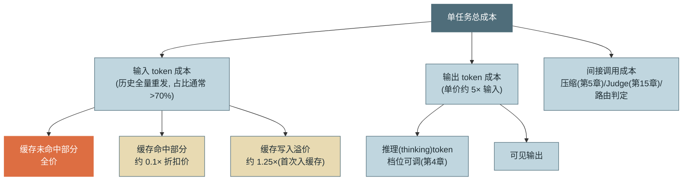
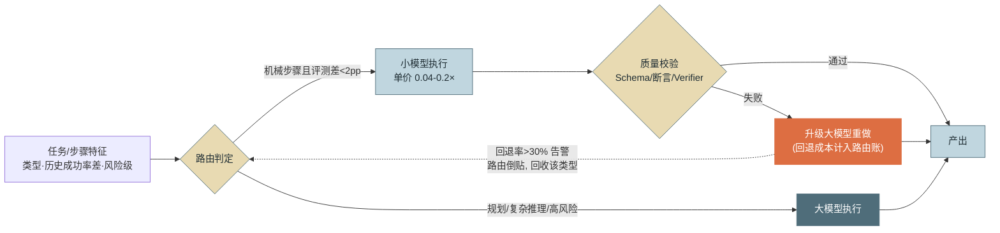
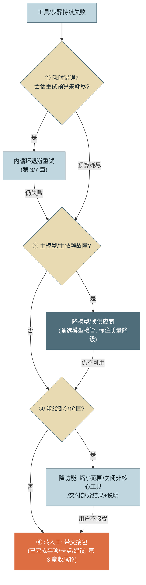

# 第 16 章 成本与性能

> 本章另有约十倍篇幅的**详解扩展版**：[详解扩展版/详解16-成本与性能.md](../详解扩展版/详解16-成本与性能.md)——独立成文的深读版（初稿，未经审读与来源核验，体例与正文不同；两版内容以正文为准）。

> 第三篇 单 Agent 生产工程化（质量层）
>
> Agent 能不能规模化，最终是一道**单位经济学**题：每个任务花多少钱、多少秒，失败的任务又摊掉多少。本章拆解 token 成本结构、给出缓存与模型路由两根最大的成本杠杆、量化延迟优化的收益，并回答一个常被回避的问题：**失败的任务才是最烧钱的任务**。

---

## 1. 场景引入：毛利为负的月度账单会

示例助手全员开放三个月后，财务把团队拉进了月度经营会。数字摆在桌上：当月模型调用账单 **$48,000**，处理任务 3.2 万个——平均每任务 $1.5，而这项内部服务立项时按每任务 $0.5 编的预算。更尴尬的是追问环节："一个工单处理任务到底多少钱？"没人答得上来——只有供应商的总账单，没有按任务、按租户的归因。

会后一周的拆账给出了三个刺眼的事实。**第一，缓存命中率只有 11%**——按第 5、6 章的分层设计本应有 70% 以上，排查发现 System Prompt 里有人加了一行"当前时间：2026-08-14 09:32:17"，精确到秒，**每次请求都在击穿整个缓存前缀**。**第二，所有任务无差别使用最大模型**——包括"提取工单编号"这类小模型几乎同样胜任的机械步骤。**第三，失败任务的平均成本是成功任务的 2.8 倍**——失败的会话往往在反复重试与徘徊中烧到熔断才停，钱花了，产出为零；而失败任务占 22%，贡献了近一半账单。

三个事实对应本章的三个主题：**token 经济学**（缓存与路由）、**失败经济学**（重试预算与降级）、**成本可观测**（归因与异常检测）。两个月的治理后，该系统每任务成本降到 $0.42——没有换模型，全部来自工程。

---

## 2. 原理

### 2.1 Token 经济学：成本结构与两根杠杆

先看清钱的构成。一次任务的成本分解树：



*图 1：单任务成本分解树——这张图回答"钱花在哪、杠杆在哪"。输入侧占大头且存在 10 倍价差的缓存折扣，所以成本优化第一杠杆永远是缓存命中率；输出侧单价高但量小，第二杠杆是路由与推理档位。*

**杠杆一：Prompt Caching。** 价差决定杠杆强度：缓存读约为全价的 **0.1×**，写入溢价约 **1.25×**——一段被后续轮次反复命中的前缀，成本近乎降一个数量级。命中条件三要素（机制参见附录 1.1）：**前缀逐字节一致**（system + 工具定义 + 历史的前段）、**超过最小可缓存长度**（约千 token 级，太短不缓存）、**TTL 内被再次访问**（分钟级滑动窗口，长间隔会话缓存已凉）。失效陷阱全部违反第一条：动态时间戳/请求 ID 混进前缀（场景引入的事故）、工具列表顺序不稳定（从无序集合渲染，每次排列不同）、每轮微调 System Prompt、压缩改写历史（第 5 章的滞回设计正是为此）。**命中率是必须上仪表盘的一级指标**——它跌，成本就涨，而且跌得无声无息。

**杠杆二：模型路由（Model Routing）。** 不是所有步骤都需要最强模型：分类、抽取、格式转换、摘要这类"机械步骤"，小模型的成功率与大模型相差无几，单价差 5–25 倍。路由的判定信号按可靠性排序：**历史成功率差**（评测集上两档模型的分数差 <2pp 的任务类型，闭眼切小模型——第 15 章基建的直接变现）> **步骤角色**（第 4 章已给结构：Planner/反思用大，执行器机械轮用小）> **输入复杂度启发**（长度、工具数）。路由必须配**质量校验回退**：小模型输出过不了校验（Schema、断言、Verifier）就升级大模型重做——回退经济学要算清：净收益 ≈ 切换流量 ×（价差 × 命中部分 − 回退率 × 重做成本）；**回退率超过约 30% 时路由通常倒贴**（白花小模型的钱还多付一轮延迟），所以回退率必须入监控。



*图 2：模型路由决策流——这张图回答"什么信号送小模型、失败怎么兜底、路由什么时候反而亏钱"。回退路径既是质量保险也是经济红线：回退率入监控，超 30% 即回收该任务类型的路由。*

**杠杆三：批处理折扣（Batch API）。** 供应商的批量接口对**非实时**负载给约五折——代价是异步返回（小时级 SLA）。判据只有一条：**这个调用有没有人在等**。Agent 体系里天然适合批处理的三类调用：第 15 章的评测夜跑（全量集 × k 次采样正是账单大户）、第 10 章会话结束后的隐式记忆提取、第 11 章的入库 embedding 与 GraphRAG 建图。交互式会话主链路与批处理无缘，但把这三类"后台调用"迁过去，常能砍掉总账单的一到两成——而且零质量代价，是三根杠杆里唯一不需要权衡的。

### 2.2 延迟优化：并行的收益与投机的赌注

Agent 的端到端延迟 ≈ **轮次数 ×（首 token 延迟 + 生成时长 + 工具执行时长）**。三个优化点按杠杆大小排序：

**减少轮次是最大杠杆**——每省一轮就省一整个往返。手段已在前文：意图级工具粒度（第 7 章：40→9 工具让平均轮数 11→5）、鼓励并行工具调用（一轮办三件事）、显式规划减少徘徊（第 4 章）。

**并行工具执行的收益可精确量化**：一轮内 n 个独立调用，串行耗时 Σtᵢ、并行耗时 max(tᵢ)。典型数字：三个查询各 300ms，串行 900ms → 并行 300ms，单轮省 600ms；十轮的会话里若三成轮次可并行，端到端省约 2 秒。前提照旧：只并行无副作用冲突的调用（第 7 章）。

**投机执行（Speculative Execution）**是更激进的赌注：在结果尚未确定时预先做大概率需要的事——模型还在生成时**预热**下一步（预启动沙箱、预连接检索）；用户还在审批时（第 13 章 ask 挂起），先在 worktree 里**试跑**待批操作，批准后瞬间交付、驳回则丢弃。适用判据是一道期望值算术：`期望收益 = P(命中) × 省下的时长 − (1−P) × 白花的成本`——**副作用可逆是硬前提**（worktree 丢弃≈零成本，这是第 13 章隔离设施的又一次变现），预执行的模型/计算费用是纯沉没，所以只对高命中率（P>0.7）且用户在等的路径投机。

### 2.3 失败经济学：重试预算与降级阶梯

场景引入的第三个事实值得命名：**失败税**——失败任务成本 2.8× 成功任务，因为失败的路径天然更长（重试、徘徊、烧到熔断）。治理分两层：

**重试预算。** 第 7 章的错误分类已保证"只重试可能成功的错误"，本章补上**会话级总预算**：重试不是每工具独立无限的，而是全会话共享的池（如总计 5 次）——预算耗尽即触发降级，而不是换个工具继续试。理由：单点重试各自"合理"，加总就是失败税的主要税基；共享池天然实现"越早失败越便宜"（fail fast 的预算化表达）。

**降级阶梯。** 四级顺序，每级都比上一级便宜或更确定：



*图 3：降级阶梯的顺序决策——这张图回答"失败之后按什么顺序退、每级的触发条件是什么"。每往下一级，成本更低或确定性更高；关键纪律：转人工永远带交接包（第 3 章收尾轮的产物），裸转人工是把成本转嫁成同事的时间。*

两个设计细节：**降模型**主要是可用性手段（主供应商故障/限流时备选接管）而非成本手段——质量降级要显式标注给用户与轨迹；**降功能**是被低估的一级——"只处理前 10 个工单并说明剩余"往往比"全部失败"的业务价值高得多，而多数系统只实现了全有或全无。

### 2.4 成本可观测：归因与失控预警

**per-task 归因**依赖第 14 章已埋好的 Span 属性：token 计量按 `session/turn/tool` 层级聚合，`tenant/task_type/model` 标签就是账单维度——"一个工单任务多少钱"从此是一条查询。两个口径纪律：**分 token 类别计价**（input/output/缓存读写单价不同，混算必错）；北极星指标用 **cost per successful task**（总成本 ÷ 成功任务数）而非 cost per task——前者把失败税摊进去，才是真实的单位经济学；后者会奖励"成本降了因为成功率也降了"的假优化（坑 4）。

**成本异常检测是循环失控的最早信号**，比第 3 章的熔断更早给人介入窗口。三个探测器：**成本速率**（$/分钟滑窗，超任务画像基线 3× 告警）；**重复调用计数**（同工具同参数 ≥3 次，徘徊探针——与第 14 章行为健康共用）；**token 增速趋势**（连续多轮 input 增量递增 = 上下文雪球，压缩失守的前兆）。告警动作分级：先通知（人看一眼）、再限速（降低该会话优先级）、最后熔断（第 3 章接管）。

---

## 3. 动手实现（贯穿项目增量）

本章增量：`src/assistant/cost/ledger.py`——**per-session 成本核算**（分类别计价、按模型定价表）与**缓存命中率统计**，作为事件总线的又一消费者接入（第 12 章模式第三次复用，循环零改动）。

```python
# src/assistant/cost/ledger.py — 成本台账：分类别计价 + 缓存命中率
from dataclasses import dataclass, field

# 单价表（$/1M token）：input/output/缓存读/缓存写。价格会变——从配置加载, 此处示例
PRICING = {
    "claude-opus-5":  {"input": 5.00, "output": 25.00,
                       "cache_read": 0.50, "cache_write": 6.25},
    "claude-haiku-4-5": {"input": 1.00, "output": 5.00,
                         "cache_read": 0.10, "cache_write": 1.25},
}


@dataclass
class SessionCost:
    by_category: dict[str, float] = field(default_factory=dict)   # 类别→美元
    tokens: dict[str, int] = field(default_factory=dict)          # 类别→token 数

    def add(self, model: str, usage: dict) -> None:
        p = PRICING[model]
        # usage 四字段: input_tokens(未命中全价) / cache_read_input_tokens /
        #              cache_creation_input_tokens / output_tokens
        mapping = {"input_tokens": "input",
                   "cache_read_input_tokens": "cache_read",
                   "cache_creation_input_tokens": "cache_write",
                   "output_tokens": "output"}
        for k, cat in mapping.items():
            n = usage.get(k, 0)
            self.tokens[cat] = self.tokens.get(cat, 0) + n
            self.by_category[cat] = self.by_category.get(cat, 0) \
                + n * p[cat] / 1e6

    @property
    def total(self) -> float:
        return round(sum(self.by_category.values()), 6)

    @property
    def cache_hit_rate(self) -> float:
        """命中率口径: 缓存读 / 全部输入侧 token（读+未命中+写）"""
        read = self.tokens.get("cache_read", 0)
        all_in = read + self.tokens.get("input", 0) \
                      + self.tokens.get("cache_write", 0)
        return round(read / all_in, 4) if all_in else 0.0


class CostLedger:
    """事件总线消费者：turn_end 记账；会话结束汇入聚合指标"""

    def __init__(self, cost_rate_alert_usd_per_min: float = 1.0):
        self.sessions: dict[str, SessionCost] = {}
        self._first_ts: dict[str, float] = {}
        self.rate_limit = cost_rate_alert_usd_per_min
        self.alerts: list[str] = []
        self.finished: list[tuple[str, float, bool]] = []   # (id, cost, success)

    def on_event(self, ev) -> None:
        if ev.type == "turn_end" and "usage" in ev.payload:
            sc = self.sessions.setdefault(ev.session_id, SessionCost())
            self._first_ts.setdefault(ev.session_id, ev.ts)
            sc.add(ev.payload["model"], ev.payload["usage"])
            minutes = max((ev.ts - self._first_ts[ev.session_id]) / 60, 1 / 60)
            if sc.total / minutes > self.rate_limit:        # 失控预警先于熔断
                self.alerts.append(
                    f"{ev.session_id}: 成本速率 ${sc.total/minutes:.2f}/min 超限")
        elif ev.type == "session_end":
            sc = self.sessions.get(ev.session_id, SessionCost())
            self.finished.append(
                (ev.session_id, sc.total,
                 ev.payload.get("status") == "success"))

    def cost_per_successful_task(self) -> float:
        """北极星：失败任务的成本也摊进分子——失败税显形"""
        succ = sum(1 for *_, ok in self.finished if ok)
        total = sum(c for _, c, _ in self.finished)
        return round(total / succ, 4) if succ else float("inf")
```

接入与验证算例（手算核对：单价表 × token 数，见测试）：

```python
ledger = CostLedger()
bus.subscribe(ledger.on_event, types={"turn_end", "session_end"})
# 会话结束时输出成本卡片: 总额/分类构成/缓存命中率——运营与用户各看一份
sc = ledger.sessions[session_id]
print(f"本次任务成本 ${sc.total} · 缓存命中率 {sc.cache_hit_rate:.0%}")
```

回测场景事故：时间戳击穿缓存的形态在台账上一目了然——`cache_read` 近零、`input` 全价占比 90%+、命中率 11%；修复后同类会话命中率回到 74%，input 侧成本降约 62%。**没有这张台账，缓存击穿永远只是账单尾部一个无名的数字。**

---

## 4. 生产级考量

**预算治理三层联动。** 会话级熔断（第 3 章）管单任务失控，租户配额（第 13 章）管平台公平，本章补最上层：**财务预算**——按月按业务线的预算与预测（用 cost per successful task × 预期任务量），超支预警在月中而非月底。三层用同一份台账数据（第 14 章归因维度），只是聚合窗口不同。

**与供应商账单对账。** 自算台账与账单的差异常见来源：计数口径（供应商按请求头的 usage，流式中断的请求也计费）、失败请求（4xx/5xx 中部分仍产生计费）、时区与账期切分。纪律：**所有请求含失败都入台账**（usage 从响应或错误体取，取不到用估算标记），月度对账差异超 3% 必查——对账差异本身是计量管道 bug 的探针（坑 5）。

**容量规划从费用延伸到限流。** 供应商的 TPM/RPM 限额决定并发会话上限：峰值并发 × 单会话 token 速率 ≤ 限额 × 安全系数（0.7）。超限的表现不是账单而是 429 风暴——限流重试在内循环里消化（第 3 章），但容量规划要让它成为异常而非常态。预留容量/批量折扣的采购谈判，用台账的稳定基线数据做筹码。

**多供应商的对冲与代价。** 备选模型（降级阶梯第②级）意味着多供应商集成：收益是可用性与议价权，代价是双份的评测基线（第 15 章——同一任务在两家模型上的行为差异必须量化）、双份的提示词适配与双份的对账。经验判断：月账单没到六位数之前，多供应商的工程成本通常高于其对冲价值——先把缓存和路由做好。

---

## 5. 常见坑

**坑 1：一行时间戳击穿全部缓存。**
*症状*：缓存命中率 11%（预期 70%+），账单比预估高 3 倍；功能一切正常，没有任何报错——纯粹的静默烧钱。
*根因*：System Prompt 里的动态内容（精确到秒的时间、请求 ID、随机数）位于缓存前缀，逐字节一致性被每次请求破坏；变体：工具列表从 set 渲染导致顺序漂移。
*修复*：动态内容移到消息尾部或粗粒度化（日期而非秒）；工具列表稳定排序；命中率上仪表盘并设告警——它是唯一能暴露此坑的信号（本章台账的 `cache_hit_rate`）。

**坑 2：模型路由省小钱、回退赔大钱。**
*症状*：切了 40% 流量到小模型，月账单只降 5%，P95 延迟反而涨了——拆账发现被路由流量的回退率 38%，每次回退 = 小模型白跑 + 大模型重做 + 一轮额外延迟。
*根因*：路由判定只用了"任务类型"这个粗粒度信号，把小模型实际不胜任的子类也切了过去。
*修复*：路由依据换成评测集上的历史成功率差（<2pp 才切）；回退率按任务类型监控，超 30% 自动回收；把回退成本计入路由收益公式再谈"省了多少"。

**坑 3：重试无会话级预算，失败税吃掉毛利。**
*症状*：失败任务平均成本 2.8× 成功任务；单看每处重试都"符合规范"（每工具 3 次退避），加总后失败会话动辄几十次工具尝试烧到熔断。
*根因*：重试预算按工具局部配置，无全局视角——失败的会话恰好会遍历最多的工具、触发最多的"局部合理"重试。
*修复*：会话级共享重试池（耗尽即入降级阶梯）；快速失败原则——连续多个不同工具失败说明环境或任务有系统性问题，早降级早省钱；失败税（失败/成功任务成本比）作为月度治理指标。

**坑 4：用 cost per task 汇报，奖励假优化。**
*症状*：季度汇报"单任务成本下降 30%"，同期用户投诉上升——拆开看，成功率从 82% 掉到 71%，失败任务便宜（早早放弃）拉低了均值。
*根因*：cost per task 的分母包含失败任务，于是"多失败、快失败"也能"降成本"——指标与业务价值脱钩（第 15 章 Goodhart 的成本版）。
*修复*：北极星换 cost per successful task（本章实现），失败成本摊进成功任务的账；成对汇报（成本 + 成功率）永不单报其一。

**坑 5：自算账本与供应商账单对不上，差 8%。**
*症状*：月度对账长期差 6–9%，财务质疑计量可信度，成本优化的效果汇报失去公信力。
*根因*：三处漏计——流式中断的请求（供应商计费、自家没记 usage）、返回 4xx/5xx 但已产生计费的请求、重试器内层请求没走记账路径。
*修复*：记账挂在 HTTP 客户端最底层（所有请求含失败必经）；usage 缺失时按请求体估算并打"估算"标记；对账差异 >3% 触发计量管道排查——把对账当成计量系统的持续测试。

---

## 6. 面试高频问题

**Q1：Agent 的成本优化杠杆按什么顺序拉？**

结论先行：**按杠杆强度排序——缓存命中率（10 倍价差，input 占比 >70%）> 模型路由（5–25 倍单价差）> 上下文瘦身与压缩（减少 input 基数）> 输出与推理档位控制；先修杠杆大的，别在小杠杆上绣花。**
- 缓存：前缀逐字节一致 + 最小长度 + TTL 三条件；动态内容与顺序漂移是两大杀手。
- 路由：依据评测成功率差而非直觉；回退率 >30% 即倒贴。
- 结构性手段最持久：意图级工具减轮次、摘要纪律减 input——省的是基数不是单价。
- 加分点：命中率必须上仪表盘——缓存击穿无任何功能症状，只有账单知道。

**Q2：模型路由怎么设计才不亏钱？**

结论先行：**判定信号按可靠性取历史成功率差 > 步骤角色 > 输入启发；必须配质量校验回退，且把回退成本计入收益公式——净收益 ≈ 价差收益 − 回退率 × 重做成本，回退率超约 30% 路由倒贴。**
- 适合小模型：分类/抽取/格式转换/摘要等机械步骤（评测差 <2pp）。
- 必须大模型：规划、反思、高风险决策（第 4 章的结构化分工）。
- 回退 = 质量保险 + 经济红线：按任务类型监控回退率，超限自动回收。
- 加分点：路由决策本身可以用小模型/规则做——用大模型做路由是本末倒置。

**Q3：什么是"失败税"？怎么治理？**

结论先行：**失败任务的平均成本显著高于成功任务（典型 2–3 倍），因为失败路径天然更长（重试/徘徊/烧到熔断）；治理靠会话级重试预算 + 降级阶梯 + 用 cost per successful task 让失败税显形。**
- 局部合理的重试加总成失败税主体——预算必须会话级共享，耗尽即降级。
- 降级四级顺序：重试→降模型（可用性手段，标注质量降级）→降功能（部分价值优于全败）→转人工（带交接包）。
- 北极星用 cost per successful task：失败成本摊进分子，堵死"快失败降成本"的假优化。
- 加分点：成本速率/重复调用/token 增速三探测器在熔断前给人介入窗口——异常检测比熔断早，熔断比账单早。

**Q4：Prompt Caching 的命中条件和常见失效原因？**

结论先行：**三条件——缓存前缀逐字节一致、超最小可缓存长度、TTL 内复用；失效几乎全是第一条被破坏：动态时间戳/ID 入前缀、工具列表顺序不稳、每轮改 System Prompt、压缩改写历史。**
- 价差：读约 0.1×、写溢价约 1.25×——命中部分成本近乎降一个数量级。
- 设计对策：分层 Prompt 稳定层前置（第 6 章）、动态内容移尾部、压缩用滞回拉开间隔（第 5 章）。
- 验证手段：usage 中的缓存读字段——持续为零即有静默失效者。
- 加分点：缓存击穿无功能症状，唯一暴露渠道是命中率指标——这是"成本可观测"存在的理由。

**Q5：怎么回答"一个任务到底多少钱"？**

结论先行：**per-task 归因 = 分类别计价的台账（input/output/缓存读写各按单价）× 第 14 章的 Span 归因维度（session/task_type/tenant）；汇报口径用 cost per successful task 并与成功率成对出现。**
- 台账挂在事件流/HTTP 底层，所有请求含失败必入账。
- 与供应商月度对账，差异 >3% 查计量管道（流式中断与失败请求是高频漏计点）。
- 三层预算共用一份数据：会话熔断（第 3 章）、租户配额（第 13 章）、财务月度预算。
- 加分点：这个数字是产品定价与 ROI 论证的地基——算不清单位成本的 Agent 业务无法规模化。

---

> **下一章预告**：第三篇到此把单 Agent 打磨成了可运维、可审计、可评测、算得清账的生产系统。第四篇把镜头拉远：什么时候一个 Agent 不够用？第 17 章从多 Agent 拓扑分类学开始——在复制粘贴"多智能体框架"之前，先看清拓扑空间里到底有哪几种形状。
