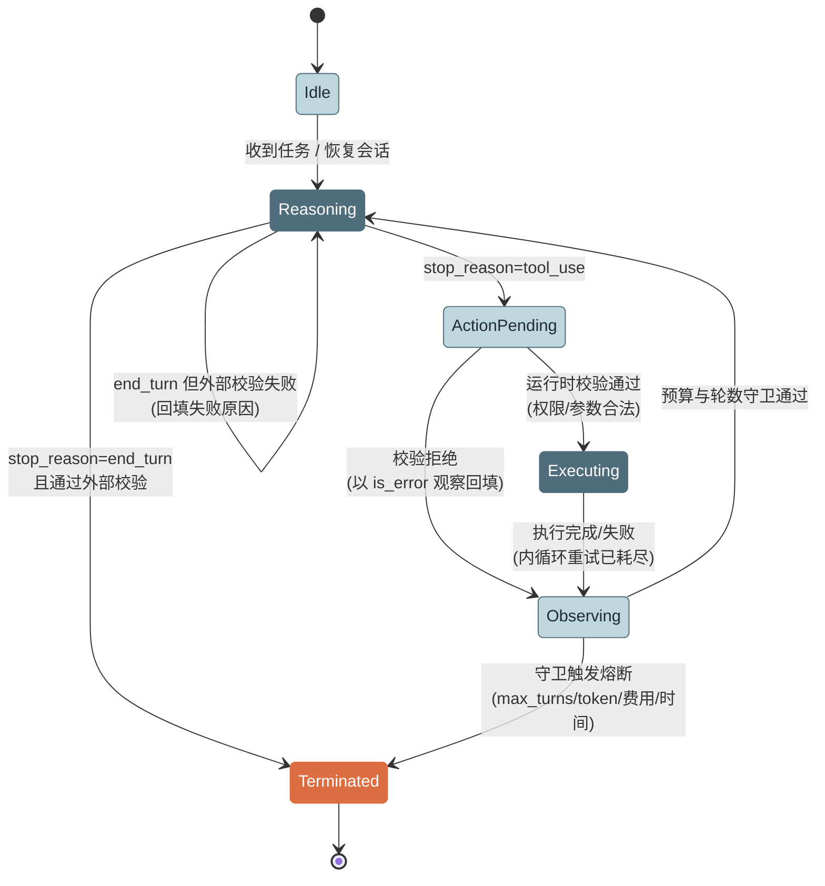
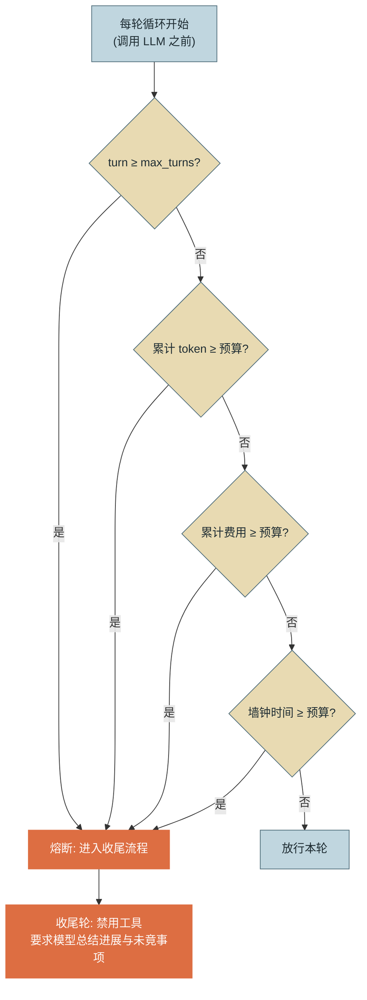
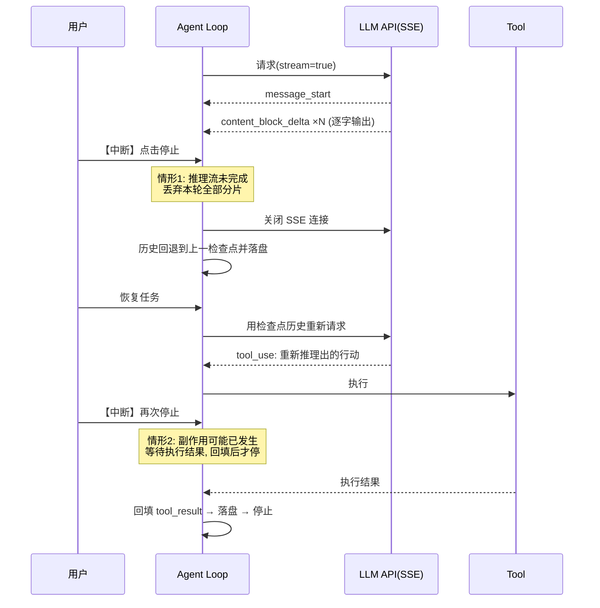

# 第 3 章 Agentic Loop 解剖

> 本章另有约十倍篇幅的**详解扩展版**（深读初稿，以正文为准）：[详解扩展版/详解03-AgenticLoop解剖.md](../详解扩展版/详解03-AgenticLoop解剖.md)。

> 第二篇 A. 核心循环（心智模型层）
>
> 第 2 章的最小循环"能跑"，但每个设计决策点都还停留在默认值。本章把这个循环拆到关节：**ReAct 三阶段的输入输出契约、终止条件的多层设计、内外循环的分离、流式输出下的中断与恢复**。读完本章，你应能对任何 Agent 运行时的循环实现做出结构化的 Code Review。本章四节合起来就是附录 2.3 **Loop Engineering（循环工程）** 方法论的主体——"何时继续、何时终止、何时升级"的全部设计决策。

---

## 1. 场景引入：一条烧了 46 美元的夜间会话

示例助手灰度上线两周后，某个周一早晨，平台组收到费用告警：昨夜一条会话消耗了约 920 万 token、46 美元，持续 3 小时 41 分——而这条会话的任务只是"汇总上周的工单并生成周报"。

值班工程师拉出轨迹一看，问题不是死循环，而是**慢性失控**：模型在第 11 轮时发现某个工单接口偶发超时，于是开始"自我修复"——换参数重查、逐条重试、把每次失败的完整报错都留在历史里。每一轮都在"合理地"推进，没有触发第 2 章的 `MAX_TURNS = 15`——因为团队上线前把它调成了 200，"免得复杂任务被误杀"。

复盘会上暴露出三个空白：**只有轮数一种刹车**（token、费用、时间都没有上限）；**接口超时这种确定性故障消耗了昂贵的模型轮次**（重试本该发生在循环之外）；**任务"完成"由模型自己宣布**（周报实际只写了一半，模型却在第 60 轮宣称完成过一次，被用户追问后又"勤奋"地重新开始）。这三个空白，分别对应本章要系统化的三个主题：预算熔断、内外循环分离、完成判定。第 1 章 AutoGPT 的教训（参见第 1 章 2.2 节）不是历史故事——把 max_turns 调大之后，2023 年的失败模式会在你的生产环境原样复现，只是烧钱的速度取决于今天的模型单价。

---

## 2. 原理

### 2.1 ReAct 形式化：三阶段的输入输出契约

第 2 章把 ReAct 当直觉讲，本章把它当**接口契约（Contract）** 讲。把循环体切成三个阶段，各自的输入输出严格定义如下：

| 阶段 | 输入 | 输出 | 契约要点 |
|---|---|---|---|
| **Reason（推理）** | 完整上下文：System Prompt + 历史 messages + 上一轮观察 | ① 文本块（可见思考/答复）② 零或多个 `tool_use` 块（行动意图）③ `stop_reason`（继续/结束信号） | 输出是**意图不是执行**；`tool_use.input` 大概率符合 Schema 但 API 不保证严格通过（除非启用严格工具调用）——结构与业务合法性（如路径越界）都需运行时二次校验 |
| **Act（行动）** | 经运行时二次校验的 `tool_use`（name + input） | 原始执行结果或异常 | 唯一产生**副作用**的阶段；执行者是运行时代码，不是模型；权限、超时、重试都在此层 |
| **Observe（观察）** | Act 的原始结果 | 写回历史的规范化 `tool_result`（截断、脱敏、格式化、`is_error` 标记） | 观察是**主动加工**而非被动透传——原始结果对机器友好，回填内容必须对 LLM 友好且对上下文预算负责 |

契约化的直接收益是**可测试性**：三个阶段可以独立替换与单测——用录制的模型响应测 Act/Observe（不花钱、确定性），用 Mock 工具测 Reason 的选择行为（第 15 章评测的基础设施正建立在这个切面上）。另一个收益是**职责清晰**：后面所有设计决策都能落位——终止判断挂在 Reason 的输出上，重试挂在 Act 内部，截断挂在 Observe 上。

把三阶段加上守卫条件，就得到循环的完整状态机：



*图 1：Agentic Loop 的完整状态机——这张图回答"循环里一共有几个状态、每条转移边由谁触发"。注意 Terminated 有两条入边：正常完成走 Reasoning，熔断走 Observing 之后的守卫；而"外部校验失败"会把 end_turn 打回 Reasoning。*

状态机视角还有一个工程含义：**每个状态都是一个可持久化的检查点候选**。第 12 章的 Checkpoint 方案，本质是在 Observing→Reasoning 这条边上落盘——因为此刻历史完整、无未配对的 `tool_use`，是唯一"随时可安全恢复"的状态（2.4 节会回到这一点）。

### 2.2 终止条件设计：谁有权说"停"

终止是 Agent 循环最重要的设计决策，因为它是唯一"不做对就会烧钱"的决策。生产级设计需要三层，权力依次从模型移向运行时：

**第一层：模型自报完成。** 两种实现：靠 `stop_reason = end_turn`（模型不再请求工具即视为完成，第 2 章的做法），或更显式的 **`task_complete` 工具**——要求模型必须调用它并提交结构化的完成摘要（做了什么、产出在哪）才算完成。后者优于前者的理由：`end_turn` 会把"闲聊式追问"也当成完成，而显式工具把完成变成一个**有 Schema 的承诺**，可以被下一层校验，也给轨迹分析提供了明确锚点。

**第二层：外部校验（Verifier）。** 模型说完成≠真完成——这是第 1 章教训二的直接推论。对可验证任务，用确定性谓词做二次判定：产出文件是否存在且非空、代码是否通过测试、JSON 是否过 Schema、业务规则是否满足。校验失败不终止，而是把失败原因作为新观察回填，打回 Reasoning（图 1 的自环边）。**能写出 Verifier 的任务才是 Agent 的舒适区**——这与第 1 章"路径不可枚举、但结果可验证"的适用判据是同一句话。

**第三层：预算熔断（Budget Circuit Breaker）。** 前两层都可能失效（模型永不自报、校验永不通过），所以运行时必须握有无条件的最终裁决权。四种预算，各防一类失控：

- **轮数（max_turns）**：防逻辑死循环。最直观但最粗糙——不同任务的合理轮数差异极大。
- **token 预算**：防上下文膨胀式失控（场景引入中的慢性失控正是这类：轮数不多，每轮都很贵）。注意必须累计 `input + output`——由于历史全量重发，input 通常占总量的 90% 以上（参见第 2 章 2.3 节）。
- **费用预算**：token 的货币化视图，跨模型可比（token 数在不同单价的模型间不可比），适合作为面向业务方的 SLA 语言。
- **墙钟时间**：防外部依赖挂起（工具卡死、API 排队）。它是唯一能捕获"什么都没发生"型失控的预算。



*图 2：预算熔断的判定顺序——这张图回答"四种预算按什么顺序查、在循环的哪个位置查"。两条铁律：检查发生在调用 LLM **之前**（宁可少跑一轮，不可超支一轮）；判定顺序按检查成本从低到高排列（整数比较 → 累加值比较 → 乘法 → 时钟读取），任一命中立即短路。*

熔断触发后不应硬杀进程。正确的收尾是**收尾轮（Finalization Turn）**：以禁用工具的最后一次调用，要求模型总结"已完成什么、卡在哪里、建议下一步"——成本是一轮推理，换来的是可交接的残局而非黑盒尸体。用户看到"我完成了 70%，卡在 X 接口超时"与看到"任务失败"是完全不同的产品体验。

### 2.3 循环结构选型：单轮 vs 多轮、内循环 vs 外循环

**单轮还是多轮**是接到需求后的第一个选型。**单轮（single-turn）** 指固定的"一次推理（可含一批并行工具调用）+ 一次汇总"，本质是第 1 章 2.5 节的 Workflow 形态；**多轮（multi-turn）** 才是开放的 Agentic Loop。选型判据延续"路径可枚举性"：意图分类、单次检索问答、结构化抽取用单轮——延迟与成本有确定上界，P99 可控；开放式排障、代码修改、多源调研才值得多轮。一个常被忽略的中间态：**外层单轮、内层多轮**——把 Agent 循环包在一个固定 Workflow 节点里，享受两层的各自优点，这是第 18 章图执行引擎的基本单元。

**内循环与外循环的分离**是本章最重要的架构原则。定义：

- **外循环（Outer Loop）**：模型驱动的任务推进——每转一圈花一次 LLM 调用，处理"概率性决策"。
- **内循环（Inner Loop）**：运行时驱动的确定性故障处理——工具的超时重试、退避、限流等待，每转一圈只花机器时间，处理"确定性故障"。

分离的理由可以量化：网络超时重试三次，若放进外循环，成本是 3 次全量历史的 LLM 调用（长会话下单次可达数万 token）外加 3 条污染历史的报错观察；放进内循环，成本是几次 HTTP 重试，历史里只出现最终结果。**判断一个故障该进哪个循环，看处理它是否需要智能**：换个重试间隔不需要（内循环），换个查询思路需要（外循环）。工程上的落点是：内循环封装在工具执行层（Act 阶段内部），对模型完全透明；只有重试耗尽后的最终失败，才作为一条观察进入外循环。这条原则同样适用于限流：429 退避重试属于内循环，模型永远不应该"看到"限流（错误分类的完整讨论参见第 12 章）。

### 2.4 流式输出与中断恢复

生产 Agent 几乎总是用**流式（Streaming）**响应，原因有二：单轮推理可长达数十秒甚至数分钟，非流式请求会撞 HTTP 超时；用户体验需要逐字输出与"正在调用工具"的实时反馈。流式的载体是 **SSE（Server-Sent Events）**：一次响应被拆成事件序列，客户端按事件类型驱动一个**解析状态机**：

`message_start`（响应开始，携带初始 usage）→ 若干组 `content_block_start / content_block_delta / content_block_stop`（每组对应一个内容块：文本块累积 `text_delta`，工具块累积 `input_json_delta` 的**分片 JSON 字符串**）→ `message_delta`（携带 `stop_reason` 与最终 usage）→ `message_stop`。

解析器的两个要点：其一，`tool_use` 的参数是分片传输的字符串，必须**收齐整个块后**才能 `json.loads`——对半截字符串做解析是流式实现最常见的崩溃点；其二，`stop_reason` 直到 `message_delta` 才出现，此前不能做任何终止判断。

`stop_reason` 还有一个必须处理的取值：**`max_tokens`——非中断的不完整轮次**。输出在 token 上限处被硬截断，流程上却会正常收到 `message_stop`，最容易被当成完整消息放行。截断落在文本块上只是答复没写完；落在 `tool_use` 的分片 JSON 上，这条 assistant 消息就带着永远解析不出的半截参数——与下文的中断情形殊途同归，同样违反"完整轮次边界"不变式。处理原则：检测到该 `stop_reason`，要么提高 `max_tokens` 后整轮重推，要么将截断轮丢弃并回填一条"输出超限，请精简后重试"的观察；绝不能对半截 JSON 做"尽力解析"。

流式带来的真正难题是**中断（Interruption）**：用户点了停止、网关超时、进程收到 SIGTERM，此刻循环可能停在任何位置。状态一致性规则只有一条主律：**历史里不能存在残缺的轮次**。展开为三种情形：

1. **推理流中途中断**：本轮 assistant 消息不完整（可能有未收齐的 `tool_use` 块）——**整轮丢弃**，历史回退到上一个 Observing 检查点。已产生的 token 费用照付，但一致性比这点沉没成本重要。
2. **工具执行中中断**：副作用可能已发生（退款已发出、文件已写入）。**不能假装没发生**——必须等待或查询执行结果，把 `tool_result` 回填完成后再停。这也是工具幂等性设计的动因之一（参见第 7 章）。
3. **观察回填后中断**：最安全的位置，历史完整，直接落盘即可。



*图 3：两种中断位置的处理时序——这张图回答"用户中断发生在推理流与工具执行两个位置时，运行时分别怎样保住状态一致性"。核心不变式：落盘的历史永远停在完整轮次边界上。*

恢复（Resume）因此变得简单：从最后一个完整检查点加载历史，重新进入 Reasoning。模型看到的世界与中断前的检查点一致，多付的代价只是被丢弃的那半轮推理。这套"检查点 + 完整轮次边界"机制在第 12 章扩展为完整的状态恢复方案。

---

## 3. 动手实现（贯穿项目增量）

本章增量落在骨架的 `src/assistant/core/`：新增 `budget.py`（终止策略），改造 `agent_loop.py`（熔断接入 + 收尾轮 + 外部校验）。接口延续第 2 章 `types.py`，只增不改。

### 3.1 可组合的终止策略（budget.py）

设计要点：每种预算实现同一个 `StopCondition` 协议，循环对"有哪些刹车"零感知——新增一种预算（如企业内部的部门配额）不需要动循环代码。

```python
# src/assistant/core/budget.py — 终止策略与预算熔断
import time
from dataclasses import dataclass, field
from typing import Protocol


@dataclass
class LoopState:
    """循环的可观测状态：所有终止判定的唯一信息来源"""
    turn: int = 0
    input_tokens: int = 0
    output_tokens: int = 0
    started_at: float = field(default_factory=time.monotonic)

    def record_usage(self, usage: dict) -> None:
        self.input_tokens += usage.get("input_tokens", 0)
        self.output_tokens += usage.get("output_tokens", 0)


@dataclass
class StopDecision:
    should_stop: bool
    reason: str = ""


class StopCondition(Protocol):
    def check(self, state: LoopState) -> StopDecision: ...


@dataclass
class MaxTurns:
    limit: int
    def check(self, s: LoopState) -> StopDecision:
        return StopDecision(s.turn >= self.limit, f"max_turns({s.turn}/{self.limit})")


@dataclass
class TokenBudget:
    limit: int
    def check(self, s: LoopState) -> StopDecision:
        used = s.input_tokens + s.output_tokens   # input 必须计入：占比通常 >90%
        return StopDecision(used >= self.limit, f"token_budget({used}/{self.limit})")


@dataclass
class CostBudget:
    limit_usd: float
    price_in: float = 5.0     # $/1M token，claude-opus-5 单价
    price_out: float = 25.0
    def check(self, s: LoopState) -> StopDecision:
        cost = (s.input_tokens * self.price_in
                + s.output_tokens * self.price_out) / 1e6
        return StopDecision(cost >= self.limit_usd,
                            f"cost_budget(${cost:.2f}/${self.limit_usd})")


@dataclass
class WallClock:
    limit_seconds: float
    def check(self, s: LoopState) -> StopDecision:
        elapsed = time.monotonic() - s.started_at
        return StopDecision(elapsed >= self.limit_seconds,
                            f"wall_clock({elapsed:.0f}s/{self.limit_seconds:.0f}s)")
```

### 3.2 循环改造：熔断、收尾轮与外部校验（agent_loop.py 节选）

与第 2 章 `run_agent` 的差异只有三处，均以注释标出。`verifier` 是一个可选的确定性谓词——本章用"产出文件存在且非空"这类检查即可，更系统的评测在第 15 章。

```python
# src/assistant/core/agent_loop.py — 本章增量节选（工具执行部分与第 2 章相同，略）
from .budget import LoopState, StopCondition
from .types import AgentEvent, AgentLoopOptions


class AgentLoop:
    def __init__(self, opts: AgentLoopOptions,
                 stop_conditions: list[StopCondition],
                 verifier=None):          # verifier: Callable[[list], str | None]
        self.opts, self.stop_conditions, self.verifier = opts, stop_conditions, verifier

    def run(self, task: str) -> str:
        state = LoopState()
        messages = [{"role": "user", "content": task}]

        while True:
            # 【增量 1】熔断检查在调用 LLM 之前：宁可少跑一轮，不可超支一轮
            for cond in self.stop_conditions:
                d = cond.check(state)
                if d.should_stop:
                    self._emit("aborted", state.turn, reason=d.reason)
                    return self._finalize(messages, d.reason)

            state.turn += 1
            reply = self._call_llm(messages)
            state.record_usage(reply["usage"])          # 【增量 2】usage 逐轮累计
            messages.append({"role": "assistant", "content": reply["content"]})

            if reply["stop_reason"] != "tool_use":
                final = self._extract_text(reply)
                # 【增量 3】外部校验：失败不终止，回填原因打回推理（图 1 自环边）
                if self.verifier and (err := self.verifier(messages)):
                    messages.append({"role": "user",
                                     "content": f"任务未通过外部校验：{err}。请修正后继续。"})
                    continue
                self._emit("done", state.turn, final_text=final)
                return final

            messages.append({"role": "user",
                             "content": self._execute_tools(reply)})  # 同第 2 章

    def _finalize(self, messages: list, reason: str) -> str:
        """收尾轮：禁用工具的最后一次调用，把残局翻译成可交接的总结"""
        messages.append({"role": "user", "content":
                         f"运行预算已耗尽（{reason}）。请立即停止行动，"
                         f"总结：已完成事项、未完成事项、建议的下一步。"})
        reply = self._call_llm(messages, tools=[])       # tools=[] 保证不再产生行动
        return f"[任务因 {reason} 中止]\n" + self._extract_text(reply)
```

组装示例——四种刹车叠加，任务级参数按风险配置：

```python
loop = AgentLoop(
    opts,
    stop_conditions=[MaxTurns(30), TokenBudget(500_000),
                     CostBudget(5.0), WallClock(600)],
    verifier=lambda msgs: None if Path("weekly.md").exists() else "weekly.md 未生成",
)
```

用场景引入的事故回测：同样的接口故障下，`WallClock(600)` 会在 10 分钟处触发收尾轮，损失上限从 46 美元变成 `CostBudget` 与 `WallClock` 中先命中者封顶的可计算值——这正是"最坏情况有界"的含义。

---

## 4. 生产级考量

**预算是分层的资源池，不是单个数字。** 单会话预算之上，企业环境还需要用户级（防单人刷爆）、租户级、全局级配额，与 API 网关的限流联动。会话级熔断保护的是任务，上层配额保护的是平台——两者缺一不可，实现上共享 `LoopState` 的上报流（成本治理体系参见第 16 章）。

**熔断参数应按任务风险画像配置，而非全局一套。** 查询类任务 `MaxTurns(10)/CostBudget(0.5)` 足够；代码修改类任务可放宽到数百轮——用一套全局参数，要么误杀复杂任务，要么放纵简单任务。实践做法是把终止策略作为任务模板的一部分下发，并让熔断率成为被监控的指标：某类任务熔断率突增，通常意味着上游接口劣化或提示词回归，是比用户投诉早得多的告警信号（参见第 14 章）。

**中断必须处理"副作用在途"。** SIGTERM 收到时若有工具正在执行，优雅退出的等待窗口（Kubernetes 默认 30 秒）必须覆盖工具的最长执行时间，否则就会出现"退款发出去了但历史里没记录"的最坏情形。设计上的配套：长耗时工具异步化（提交任务返回句柄，查询进度作为独立工具），使单次工具执行时间有硬上界。

**收尾轮本身也要设防。** 收尾调用同样可能超时或失败，且它发生在"预算已耗尽"的语境下。给收尾轮单独的小额预算（例如固定 max_tokens 且不计入已耗尽的会话预算），失败时降级为纯运行时生成的摘要（"任务在第 N 轮因 X 中止，最后一次行动是 Y"）——用轨迹数据拼装，零模型调用。

---

## 5. 常见坑

**坑 1：熔断检查放在 LLM 调用之后。**
*症状*：费用报表显示大量会话的最终花费超出预算 10%–30%；预算越小的任务超得越离谱。
*根因*：先调用再检查，意味着超支发生在检查之前——最后一轮的成本（长历史 + 大 `max_tokens` 输出）不受控，对小预算任务这一轮可占预算的一半以上。
*修复*：如图 2 与 3.2 节代码：检查前置到每轮调用之前；若需更精确，可在调用前用估算（历史 token 数 + max_tokens 上界）做"预扣费"式判断。

**坑 2：预算只统计 output token。**
*症状*：自建的费用看板与账单对不上，差距接近一个数量级，且会话越长偏差越大。
*根因*：忽略了历史全量重发——n 轮会话的 input token 是历史长度的累进求和，通常占总费用的 90% 以上（input/output 单价差进一步放大误差）。
*修复*：`input + output` 都累计（3.1 节 `record_usage`）；对账时纳入缓存读写的差异化计价（参见附录 1.1 与第 16 章）。

**坑 3：中断时把半截 assistant 消息写入历史。**
*症状*：用户中断后恢复会话，请求直接 400（`tool_use` 无配对的 `tool_result`）；或不报错但模型行为诡异——引用一个"没说完的想法"继续推进。
*根因*：SSE 中断时把已收到的分片拼成消息入了历史，违反"完整轮次边界"不变式；未收齐的 `tool_use` 块尤其致命（参见第 2 章坑 1 的同族问题）。
*修复*：推理流中断 = 整轮丢弃，回退到上一检查点（2.4 节情形 1）；落盘动作只发生在 Observing 完成后的边界上。

**坑 4：把工具重试放进外循环。**
*症状*：外部接口抖动期间，任务平均轮数翻倍、费用翻倍，历史里充满重复报错；更糟的是模型开始"学习"失败——主动放弃本可用的工具，绕远路。
*根因*：确定性故障进入了概率层。每次重试付一次全量历史的推理费用，且失败观察污染上下文，改变模型后续决策分布。
*修复*：重试/退避/限流封装进工具执行层（内循环），模型只看到最终结果；耗尽后回填一条**聚合的**失败观察（"重试 3 次均超时"），而非三条原始报错。

**坑 5：`task_complete` 自报完成后不做校验。**
*症状*：任务标记成功率 98%，抽检真实完成率不足 80%；典型案例是模型宣称"报告已生成"，产出文件为空或根本不存在。
*根因*：把模型的结构化承诺当成了事实。显式完成工具解决的是"完成信号的清晰度"，不解决"完成声明的真实性"——后者只能靠确定性校验。
*修复*：接 Verifier（3.2 节增量 3）：文件存在性、非空、Schema、测试通过等谓词；校验失败回填原因打回循环，并把"自报成功但校验失败"作为独立指标监控——它是模型或提示词回归的敏感探针（参见第 15 章）。

---

## 6. 面试高频问题

**Q1：ReAct 循环的三个阶段各自的输入输出契约是什么？**

结论先行：**Reason 输入完整上下文、输出行动意图与终止信号；Act 输入经校验的意图、输出原始结果，是唯一有副作用的阶段；Observe 输入原始结果、输出对 LLM 友好的规范化观察。**
- Reason：产出是"意图"（`tool_use` 块 + `stop_reason`），不是执行；Schema 合法≠业务合法。
- Act：执行者是运行时；权限校验、超时、内循环重试都封装在此。
- Observe：主动加工（截断/脱敏/格式化/`is_error`），对上下文预算负责。
- 加分点：契约化的收益是三阶段可独立测试与替换，是评测体系的切面基础。

**Q2：生产级 Agent 的终止条件应该怎么设计？**

结论先行：**三层设计，权力从模型逐层移向运行时：模型自报完成 → 外部确定性校验 → 无条件预算熔断。**
- 自报：显式 `task_complete` 工具优于裸 `end_turn`——完成变成有 Schema 的承诺。
- 校验：确定性谓词（文件/测试/Schema）；失败不终止而是回填打回循环。
- 熔断：轮数/token/费用/墙钟四种预算，检查前置于每轮 LLM 调用之前，任一命中即短路。
- 反例：AutoGPT 只有第一层，且是最弱形式（模型自由文本自评）——无限循环的根因。
- 加分点：熔断后走"收尾轮"（禁用工具的总结调用），交付可交接残局而非硬杀。

**Q3：什么是内循环与外循环？为什么必须分离？**

结论先行：**外循环是模型驱动的任务推进（每圈一次 LLM 调用），内循环是运行时驱动的确定性故障处理（重试/退避/限流）；分离的本质是把确定性故障挡在概率层之外。**
- 成本论证：超时重试 3 次，放外循环 = 3 次全量历史推理费；放内循环 = 几次 HTTP 请求。
- 质量论证：失败观察污染上下文，会改变模型后续的工具选择分布。
- 判据：处理该故障是否需要智能——换重试间隔不需要（内），换查询思路需要（外）。
- 加分点：重试耗尽后回填聚合失败观察，而非逐条原始报错。

**Q4：流式输出下用户中断，如何保证状态一致性？**

结论先行：**唯一不变式是"落盘历史永远停在完整轮次边界"；按中断位置分三种处理：推理中整轮丢弃、执行中等副作用落定后回填再停、观察后直接落盘。**
- 推理流中断：分片消息（尤其未收齐的 `tool_use`）绝不入历史，回退上一检查点。
- 执行中中断：副作用可能已发生，必须回填 `tool_result` 后才停——幂等性设计的动因。
- 恢复：从检查点加载历史重新进入推理，代价只是被丢弃的半轮。
- 加分点：SSE 解析要点——`tool_use` 参数分片传输，收齐才能解析；`stop_reason` 到 `message_delta` 才可用。
- 加分点：`stop_reason=max_tokens` 是非中断的不完整轮次——半截 `tool_use` JSON 不得入历史，提高上限重推或丢弃回填观察。

**Q5：四种预算熔断各防什么？顺序与位置有什么讲究？**

结论先行：**轮数防死循环、token 防上下文膨胀、费用提供跨模型可比的业务语言、墙钟防外部挂起；全部在每轮调用 LLM 之前检查，按检查成本从低到高短路求值。**
- 轮数最粗糙：不同任务合理轮数差异大，需按任务画像配置。
- token 必须含 input：历史全量重发使 input 占比通常超 90%。
- 墙钟唯一能捕获"什么都没发生"型失控（工具挂起、API 排队）。
- 位置铁律：检查后置一轮 = 超支一轮，小预算任务尤其明显。
- 加分点：会话级熔断之上还需用户/租户/全局配额分层，保护对象从任务上升到平台。

---

> **下一章预告**：循环有了骨架和刹车，下一个问题是"方向盘"——模型如何把大任务拆成步骤、何时重新规划、反思机制怎样接入循环。第 4 章比较隐式 CoT、显式 Plan-then-Execute、TODO List 驱动与解耦式 ReWOO 四种规划取向的工程权衡。
