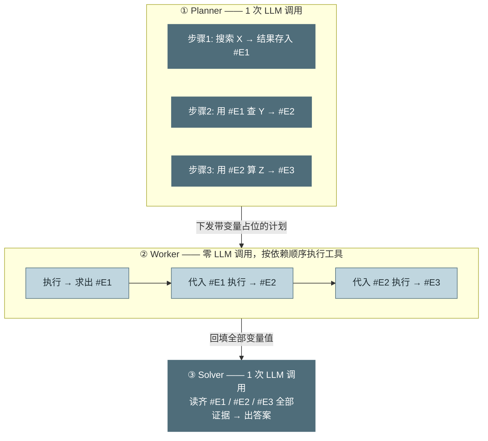
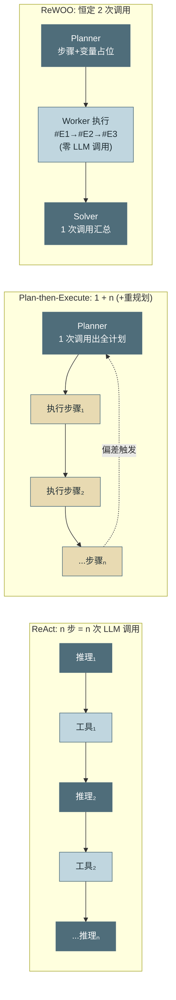
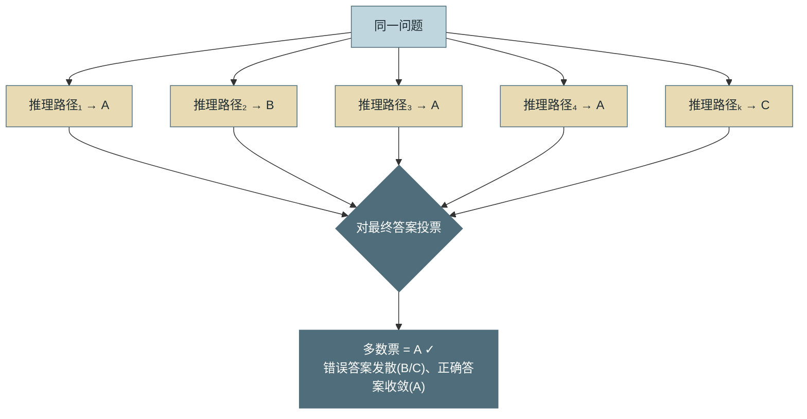
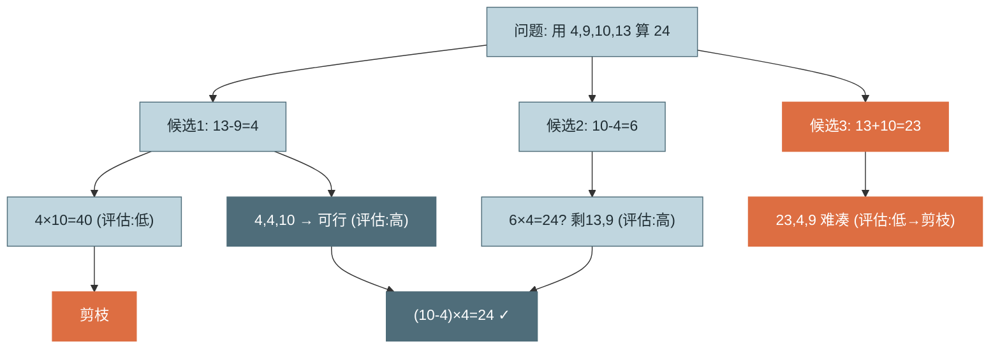
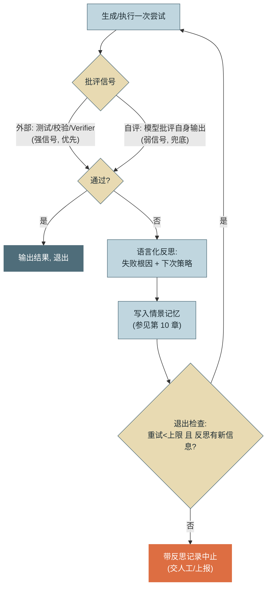

# 第 4 章 规划与推理

> 第二篇 A. 核心循环（心智模型层）
>
> 第 3 章给循环装上了刹车，本章解决方向盘：模型如何把大任务拆成步骤、计划以什么形态存在、何时推翻重来。核心交付是一个**四种规划取向的谱系**与一套**三维选型框架（token 成本 / 并行度 / 纠错能力）**——规划范式没有最优解，只有与任务形态的匹配度。

---

## 1. 场景引入：一次"边走边想"走丢的审计任务

示例助手接到一个新任务类型：月度合规审计——遍历 12 个数据源（工单库、发布记录、权限变更日志……），逐一检查三条合规规则，汇总成审计报告。工程师直接复用第 3 章的 ReAct 循环上线，预算给足，结果第一次试运行就暴露了问题。

轨迹显示：模型前 5 轮表现正常，逐个数据源检查；第 8 轮开始出现**状态漂移**——它重复检查了已经查过的发布记录（历史太长，早期观察被注意力稀释），第 14 轮又跳过了两个尚未检查的数据源直接开始写报告。最终报告覆盖了 12 个源中的 9 个，且没人能从报告本身看出缺了哪三个。费用方面同样难看：每轮都背着全量历史推理"下一步查哪个"，而这个决策本可以在任务开始时一次性做完——12 个源的检查彼此独立，完全可以并行。

问题的本质：**ReAct 的计划是隐式的**——"接下来做什么"分散在每一轮的即时推理里，没有任何一个地方存在一份可核对的清单。对路径不可预知的探索型任务，这种"边走边想"是优势（每一步都基于最新观察）；对结构清晰、可预先分解的任务，它同时输掉了成本、并行度和完备性。本章把"计划以什么形态存在"变成一个显式的架构决策。

---

## 2. 原理

### 2.1 规划谱系：计划存在于哪里

按"计划的显式化程度"排列，四种取向构成一条谱系：

**取向一：隐式规划（CoT，Chain-of-Thought）。** 计划只存在于模型的**思维链**里——每轮推理时模型临时想"下一步做什么"，想完即弃。ReAct 就是隐式规划的循环化。优点：零额外调用成本、每步都基于最新观察（纠错能力最强）；缺点：计划不可见、不可审计、不可持久——长任务下必然漂移（场景引入的病灶），且步骤只能串行发现、无法并行。

**取向二：显式规划（Plan-then-Execute）。** 先用一次专门的**规划调用（Planner）** 产出结构化步骤清单，再由**执行器（Executor）** 逐步执行。计划成为一等公民：可展示给用户确认、可持久化断点续跑、可静态分析依赖以并行执行无依赖步骤。代价：多一次规划调用；且计划基于零观察做出，环境与预期不符时需要**重规划（Replanning）** 机制兜底（2.4 节）。这一取向在文献与社区里也常被称作 **Plan-and-Solve**（Wang 等人 2023 年在纯推理任务上提出的同名提示范式 [C-23]）——名字不同，"先全局规划、再分步执行"的骨架相同，检索资料时可互为线索。

**取向三：TODO List 驱动。** 显式规划的工程化变体，也是 2025 年后 Coding Agent 的主流形态（Claude Code 的 TodoWrite 即此）：计划不是一次性产物，而是一份**由模型通过工具持续读写的活文档**——每轮循环把当前 TODO 状态注入上下文，模型执行中可以勾选、追加、改写条目。它在谱系上介于一和二之间：保留了 ReAct 的逐步纠错，又把"还剩什么没做"从易失的注意力搬进了稳定的结构化状态，直接治愈状态漂移。代价是每轮上下文多一份 TODO 视图，以及工具读写的少量轮次开销。

**取向四：解耦规划（ReWOO，Reasoning WithOut Observation）。** Xu 等人 2023 年提出的激进形态：Planner **一次性**生成全部步骤，步骤间用**变量占位符**串联（步骤 3 的输入引用步骤 1 的输出 `#E1`）；Worker 按依赖图执行工具，**全程不调用 LLM**；最后 Solver 用一次调用汇总全部证据出答案。整个任务只有 **2 次 LLM 调用**（Planner + Solver），且历史不随步数累积——论文在 HotpotQA 上以约 1/5 的 token 消耗达到超过 ReAct 的准确率。代价是纠错能力归零：免观察执行意味着任何中间结果偏离预期，后续步骤都会拿着错误变量继续跑，直到 Solver 阶段才暴露。同族近亲 **LLMCompiler**（Kim 等，2023）把这一思路推向并行：Planner 产出带依赖关系的任务 DAG，无依赖的工具调用并发执行——省调用之外再赢延迟，依赖图并行的工程落地见第 18 章。



*图 1：ReWOO 的规划-免观察执行-求解三段——这张图回答"为什么全程只需 2 次 LLM 调用、变量如何串联"。Planner 一次产出带 `#E` 占位符的全计划，Worker 按依赖顺序执行工具、逐个回填变量（零 LLM），Solver 再一次调用读齐证据出答案。代价一目了然：Worker 不看结果照代入，中间错值会一路传到 Solver 才暴露（本图重绘自 ReWOO 论文要义，原图见附录 6.1）。*



*图 2：三种范式的控制流并排对比——这张图回答"LLM 调用次数（深色节点）随任务步数如何增长"。ReAct 线性增长且每次背全量历史；P2E 是 1+n（执行步可以是轻量调用）；ReWOO 恒定 2 次，与步数无关。*

三维权衡框架汇总（这张表是本章的选型工具）：

| 维度 | 隐式（CoT/ReAct） | 显式（P2E / TODO 驱动） | 解耦（ReWOO） |
|---|---|---|---|
| **token 成本** | 高：n 次调用 × 递增历史 | 中：1 次规划 + n 次轻执行；TODO 版另加每轮清单视图 | 最低：恒定 2 次调用，历史不累积 |
| **并行度** | 无：下一步依赖上一步观察 | 高：计划期可静态分析依赖，无依赖步骤并行（参见第 18 章） | 最高：依赖图显式，Worker 层自由并行 |
| **纠错能力** | 最强：每步基于最新观察 | 中：靠重规划触发，有一步延迟 | 最弱：免观察执行，错误传播到 Solver 才暴露 |
| **适用形态** | 探索型：路径不可预知 | 可分解型：结构清晰但步骤内有变数 | 流水线型：路径稳定、工具可靠 |

选型口诀：**任务像调试用隐式，像项目用显式，像 ETL 用解耦**。

### 2.2 搜索式推理：把一条思路变成一棵树

规划解决"步骤怎么排"，搜索式推理解决另一个问题："当单条推理路径不可靠时，如何用多条路径换取正确率"。

**自洽性采样（Self-Consistency）**：同一问题独立采样 k 条推理路径，对**最终答案**投票取多数。Wang 等人 2022 年的结果：GSM8K 数学题上比单路径 CoT 提升 17.9 个百分点 [C-01]。成本是线性的 k 倍，收益来自一个统计事实——推理错误路径的答案是发散的，正确路径的答案是收敛的。



*图 3：Self-Consistency 的多路径采样与投票——这张图回答"独立采样 k 条路径再对最终答案投票，为什么能提正确率"。机制核心：错误答案朝各方向发散、正确答案收敛于一点，故多数票偏向正确（本图重绘自 Wang 2022 要义，原图见附录 6.1）。*

**思维树（ToT，Tree of Thoughts）**：把推理组织成树——每个节点是一个中间思考状态，向下扩展多个候选，用**评估器**（模型自评或规则）给节点打分，剪掉低分支，按 BFS/DFS 搜索。Yao 等人 2023 年的标志性结果：24 点游戏上 GPT-4 单路径 CoT 成功率 4%，ToT 达到 74% [C-02]——差距来自任务本身需要"试错回溯"，而线性推理不具备回头能力。



*图 4：ToT 的树形展开与剪枝——这张图回答"搜索式推理如何用'展开多个候选 + 评估打分 + 剪掉低分支'换取线性推理不具备的回溯能力"。*

适用边界必须说清楚：**搜索式推理适合离散决策，不适合开放生成**。投票需要"答案可比较"——数学结果、多选项、SQL 语句、路由决策都行；而"写一份审计报告"没有多数可投（k 份报告两两不同），ToT 的评估器也难以给开放文本打出可比的分。开放生成任务若要多路径，正确形态是 **best-of-n + 评审器（Judge）选优**，那是第 15 章 LLM-as-Judge 的领域。另一个现代注脚：**扩展思考（Extended Thinking）在相当程度上内化了搜索**——推理型模型在思考过程中自行尝试、回溯、验证，2023 年需要手工搭 ToT 脚手架才能获得的收益，如今相当部分由模型原生提供（2.5 节展开）。手工搜索式推理如今的价值区间收窄为：高价值、离散、且需要跨调用并行采样的决策点。

### 2.3 反思机制：批评-重试闭环

反思（Reflection）是五要素中最后就位的一块（参见第 1 章 2.3 节），机制上是一个**批评-重试循环**。两个代表性设计的区别在于**批评信号的来源**：

**Self-Refine**（Madaan 等，2023）：同一模型分饰三角——生成 → 自我批评 → 依批评修订，循环直至自评通过。零外部依赖，适合纯文本产物的打磨；弱点也在"自"字上：模型对自己输出的批评与生成共享同一套盲区，改进有天花板，且容易出现"表面修订"（换措辞不换实质）。

**Reflexion**（Shinn 等，2023）：批评信号来自**外部环境**——测试失败、校验报错、任务超时。失败后模型做一次**语言化反思**（"失败是因为我假设了 X，下次应先检查 Y"），反思文本存入**情景记忆**，下次尝试时注入上下文。论文在 HumanEval 代码生成上把 GPT-4 从 80% 提升到 91%——增量正来自"外部信号 + 跨尝试记忆"两个自评不具备的要素。



*图 5：Reflexion 式批评-重试闭环——这张图回答"反思循环的信号从哪来、教训存在哪、什么条件下退出"。退出条件是双重的：通过即出，或"重试达上限 / 反思不再产生新信息"时带记录中止——后者防的是第 3 章同款的无界循环。 经典原图出处见附录 6.1。*

与评测体系的结合是反思机制的生产化关键：**第 15 章的 Eval 断言就是最好的外部批评信号源**。离线评测里积累的校验器（Schema 检查、业务规则断言、单元测试）可以直接复用为在线反思的 Verifier——同一份断言，离线用来度量版本质量，在线用来驱动当次重试。这样反思不再依赖模型自评的弱信号，且断言的每次在线失败又回流成评测集的新用例，形成闭环（参见第 15 章）。

### 2.4 任务分解与重规划触发

显式规划的成败一半在分解质量，一半在**重规划时机**。分解的三条实操原则：每步有独立的**完成判据**（可被第 3 章的 Verifier 检查）；步骤粒度对齐"执行器的一次小循环能完成"（经验值 3–8 轮）；显式标注步骤间依赖（并行调度与 ReWOO 变量串联的前提）。

重规划不能靠模型"觉得不对劲"——那又回到概率信号。生产系统监听三类**确定性触发信号**：

1. **连续失败**：同一步骤失败 ≥ N 次（N 通常取 2）。一次失败可能是抖动，交给第 3 章的内循环重试；连续失败说明计划对这一步的假设错了，属于外循环层面的问题。
2. **环境变化**：执行中的观察与计划前提矛盾——计划假设接口 A 可用而它已下线、假设文件存在而它没有。识别方式是把计划的关键假设写成谓词随步骤携带，执行器逐步校验。
3. **预算-进度失衡**：预算消耗过半而完成步骤不足一半（数据都在第 3 章的 `LoopState` 与步骤状态里，一个除法就能算）。这是三类信号中最"分布式系统直觉"的一个——本质是 SLO 燃尽率告警在 Agent 上的翻版。

重规划的正确姿势是**增量的**：已完成步骤保留（沉没成本已付，结果是资产），把失败记录与剩余目标一起交回 Planner，只重排剩余工作。全量推倒重来会丢弃已验证的进展，还可能在同一个坑里再摔一次。

### 2.5 Extended Thinking：推理预算的成本收益曲线

现代模型把"想多久"变成了 API 参数（自适应思考 + 档位控制，参数细节参见附录 1.2）。工程视角需要建立的是**成本收益曲线**的直觉：思考 token 的边际收益是**先陡后平、任务相关**的。

- 简单任务（分类、抽取、格式转换）：曲线几乎从零开始就平了——多想不提升正确率，纯付费。低档位甚至关闭思考是正解。
- 复杂推理（多约束规划、代码调试、数学）：曲线前段很陡——从无思考到中等思考，正确率可提升数十个百分点；随后进入平台期，继续加预算收益趋近于零，偶尔还会**过度思考**（在已正确的答案上反复自疑改错）。
- Agent 场景的特殊性：思考发生在**每一轮**，成本随轮数放大。合理配置是不对称的——Planner/反思这类"一次决策影响全局"的调用给高档位，执行器的机械轮次给低档位。这与 2.1 节的谱系呼应：显式规划把"值得深思的决策"集中到了少数调用上，恰好为差异化思考预算创造了结构。

一条实用的调参路径：从中档开始，用第 15 章的评测集对比相邻档位的"正确率增量 / 成本增量"，增量比低于业务阈值就停——这条曲线必须用自己的任务量出来，论文数字只能定性参考。

---

## 3. 动手实现（贯穿项目增量）

本章增量：`src/assistant/core/planning.py`——把 **Plan-then-Execute 作为可选策略**叠在第 3 章的 `AgentLoop` 之上（`AgentLoop` 零改动：执行器就是一个小预算的 ReAct 循环）。设计上计划通过**工具调用获取结构化输出**——比"请输出 JSON"的提示词约定可靠（理由参见第 2 章坑 5 的同型论证）。

```python
# src/assistant/core/planning.py — Plan-then-Execute 策略
from dataclasses import dataclass
from typing import Literal

@dataclass
class Step:
    id: int
    goal: str          # 该步要达成什么（交给执行器的任务描述）
    done_when: str     # 完成判据：可被 Verifier 检查（参见第 3 章）
    status: Literal["pending", "done", "failed"] = "pending"
    result: str = ""   # 执行摘要：只保留结论，供后续步骤引用

PLAN_TOOL = {
    "name": "submit_plan",
    "description": "提交任务执行计划。每步必须有可验证的完成判据；"
                   "一般 3-8 步，批量同构任务（对 N 个对象重复同一检查）可按对象逐一列步。",
    "input_schema": {
        "type": "object",
        "properties": {"steps": {"type": "array", "items": {
            "type": "object",
            "properties": {"goal": {"type": "string"},
                           "done_when": {"type": "string"}},
            "required": ["goal", "done_when"]}}},
        "required": ["steps"],
    },
}


class PlanThenExecute:
    """一次显式规划 + 逐步执行 + 增量重规划"""

    def __init__(self, llm, make_executor, max_replans: int = 2):
        # make_executor: 工厂函数，每步创建一个小预算 AgentLoop（第 3 章）
        self.llm, self.make_executor = llm, make_executor
        self.max_replans = max_replans

    def plan(self, task: str, context: str = "") -> list[Step]:
        reply = self.llm.call(
            [{"role": "user", "content": f"任务：{task}\n{context}\n请规划执行步骤。"}],
            tools=[PLAN_TOOL],
            tool_choice={"type": "tool", "name": "submit_plan"},  # 强制结构化输出
        )
        block = next(b for b in reply["content"] if b["type"] == "tool_use")
        return [Step(i, s["goal"], s["done_when"])
                for i, s in enumerate(block["input"]["steps"], 1)]

    def run(self, task: str) -> str:
        steps, replans = self.plan(task), 0
        while pending := [s for s in steps if s.status == "pending"]:
            step = pending[0]
            done_ctx = "\n".join(f"步骤{s.id}[{s.goal}]：{s.result}"
                                 for s in steps if s.status == "done")
            try:
                # 执行器只看到"已完成结论 + 当前步骤"，不背全量历史——成本优势的来源
                step.result = self.make_executor().run(
                    f"已完成进展：\n{done_ctx or '（无）'}\n\n"
                    f"当前步骤：{step.goal}\n完成判据：{step.done_when}")
                step.status = "done"
            except Exception as e:            # 小循环熔断/失败上浮为步骤失败
                step.status, step.result = "failed", str(e)

            if any(s.status == "failed" for s in steps):   # 触发信号之一：步骤失败
                if replans >= self.max_replans:
                    return self._abort_summary(steps)
                replans += 1
                steps = self._replan(task, steps)

        return "\n\n".join(f"## {s.goal}\n{s.result}"
                           for s in steps if s.status == "done")

    def _replan(self, task: str, steps: list[Step]) -> list[Step]:
        """增量重规划：done 步骤保留为资产，只重排剩余工作"""
        done = [s for s in steps if s.status == "done"]
        report = "\n".join(f"[{s.status}] {s.goal}：{s.result[:200]}" for s in steps)
        fresh = self.plan(task, context=f"既有进展与失败记录：\n{report}\n"
                                        f"只规划剩余工作，不要重复已完成步骤。")
        return done + [Step(len(done) + i, s.goal, s.done_when)
                       for i, s in enumerate(fresh, 1)]

    def _abort_summary(self, steps: list[Step]) -> str:
        return ("[重规划次数耗尽，任务中止]\n" +
                "\n".join(f"[{s.status}] {s.goal}：{s.result[:200]}" for s in steps))
```

策略选型入口——按任务画像在两种策略间切换，`AgentLoop` 与 `PlanThenExecute` 共享同一套工具与预算设施：

```python
# 组装示例：探索型走 ReAct，可分解型走 Plan-then-Execute
def build_agent(task_profile: str):
    if task_profile == "exploratory":
        return AgentLoop(opts, stop_conditions=[MaxTurns(30), CostBudget(5.0)])
    return PlanThenExecute(
        llm=client,
        make_executor=lambda: AgentLoop(
            opts, stop_conditions=[MaxTurns(8), CostBudget(0.5)]),  # 每步小预算
        max_replans=2,
    )
```

用场景引入的审计任务回测：Planner 一次产出 12+1 个步骤（12 个源各一步 + 汇总一步），每步执行器只携带"已完成结论"而非全量历史——不再漏源（清单是显式的）、不再重复（状态是结构化的），且 12 个检查步骤依赖图上互相独立，为第 18 章的并行执行留好了接口。

---

## 4. 生产级考量

**计划要过人的眼睛。** 显式计划最被低估的价值是**审批点**：高风险任务（涉及写操作、外部通知）在 Planner 与 Executor 之间插入人工确认，用户批准的是一份可读的步骤清单而非一个黑盒承诺。这是第 1 章"自主性按风险配置"原则最自然的落点——批计划比批每一步操作的打扰少一个数量级，比全自主的风险低一个数量级。

**重规划要设全局上限并纳入预算。** `max_replans` 防的是"规划层的死循环"——环境持续劣化时，无上限的重规划等于把第 3 章的无界循环上移了一层。重规划调用的成本同样计入会话 `LoopState`，熔断裁决权始终在运行时（参见第 3 章）。

**步骤结果的摘要纪律。** 执行器返回给计划层的 `result` 必须是结论级摘要而非过程转储——它会进入后续每一步的上下文，是 P2E 成本优势的成立前提。工程上给 `result` 设硬性长度上限，超限强制摘要（压缩策略参见第 5 章）。

**思考预算差异化下发。** 把推理档位作为任务模板的字段随策略下发：Planner 高档、执行器低档、反思中档；并把"档位-正确率-成本"三元组纳入第 14 章的观测指标，让 2.5 节的曲线可以持续用真实流量校准，而不是一次性调参后失效。

---

## 5. 常见坑

**坑 1：计划一次生成，从此僵化。**
*症状*：环境变化后（接口下线、数据迁移），Executor 机械地把失败步骤重试到熔断，整个任务耗尽预算失败；轨迹里模型甚至"看到"了环境变化的报错，但计划没有任何调整。
*根因*：P2E 只实现了 Plan 和 Execute，没有实现重规划触发——计划基于零观察做出，却被当成了不可变契约。
*修复*：接入 2.4 节三信号（连续失败/假设失效/预算-进度失衡），重规划走增量式（保留 done 步骤），并设 `max_replans` 上限。

**坑 2：把 ReWOO 用在探索型任务上。**
*症状*：变量串联断裂——步骤 4 引用的 `#E2` 是空值或错误格式，Worker 不报错继续跑，Solver 输出一本正经的错误结论；离线测试通过率高，线上真实数据下骤降。
*根因*：免观察执行的前提是"路径稳定、中间结果形态可预测"。探索型任务的中间结果本身决定下一步走向，砍掉观察等于砍掉任务的信息结构；离线数据干净所以测不出来。
*修复*：选型判据回到 2.1 节表格——步骤间需要"根据中间结果做决策"的任务不用 ReWOO；必须用时给 Worker 加轻量结果校验（Schema/非空断言），断裂即上浮触发重规划。

**坑 3：对开放生成任务上 self-consistency。**
*症状*：报告生成任务采样 k=5 投票，成本 5 倍，质量与单次生成无统计差异；投票代码经常因"五个答案两两不同"落到随机选一个。
*根因*：投票的前提是答案空间离散可比。开放文本没有多数可言，多样性采样的收益无法通过投票机制兑现。
*修复*：离散决策（路由、SQL、数值）用投票；开放生成改用 best-of-n + 评审器选优（参见第 15 章），或干脆把预算换成更高的思考档位。

**坑 4：反思循环没有退出条件，输出震荡。**
*症状*：批评-重试跑满 10 轮，diff 显示输出在两个版本间来回摆动；自评每轮都能"挑出问题"，费用线性烧掉，质量原地踏步。
*根因*：纯自评信号噪声大——模型被要求批评就一定能产出批评（指令遵循压过了真实判断），与生成共享盲区又导致修订不收敛。
*修复*：如图 5——外部信号优先（测试/Verifier），纯自评场景强制双退出条件：重试上限（通常 2–3 次）+ "本轮批评与上轮无实质差异即退出"；把每轮 diff 记入轨迹便于事后审计。

**坑 5：TODO 状态只活在对话历史里。**
*症状*：长任务后期模型"忘记"或悄悄改写已完成步骤——声称第 3 步已完成（实际失败过），或把 12 项清单复述成 10 项；与场景引入同型的漂移在显式规划下复发。
*根因*：计划虽然显式生成了，但之后只以纯文本形式躺在越来越长的历史里——它退化回了隐式状态，同样受注意力稀释影响。
*修复*：TODO 外置为结构化状态（本章 `Step` 列表，或文件/数据库），**每轮由运行时注入当前权威视图**，模型只能通过工具修改状态——读写分离后，"清单说了算"而不是"模型记忆说了算"（状态外置的一般原则参见第 10 章）。

---

## 6. 面试高频问题

**Q1：Agent 的规划范式有哪几类？如何选型？**

结论先行：**按计划显式化程度分四档——隐式（CoT/ReAct）、显式（Plan-then-Execute）、TODO List 驱动、解耦（ReWOO）；用 token 成本、并行度、纠错能力三维匹配任务形态。**
- 隐式：零额外成本、纠错最强，但计划不可见、长任务漂移、无并行——适合探索型。
- 显式：1+n 次调用，计划可审计/断点/并行，需重规划兜底——适合可分解型。
- TODO 驱动：显式计划变成活文档，兼得逐步纠错与结构化状态——Coding Agent 主流。
- ReWOO：恒定 2 次调用最省 token、并行度最高、纠错归零——适合流水线型。
- 加分点：口诀"像调试用隐式，像项目用显式，像 ETL 用解耦"。

**Q2：ReWOO 为什么能大幅省 token？代价是什么？**

结论先行：**它把"每步一次带全量历史的推理"压缩成"Planner+Solver 两次调用"，靠变量占位符让工具执行完全脱离 LLM；代价是纠错能力归零。**
- 省的来源：LLM 调用次数与步数解耦，历史不随步数累积（对比 ReAct 的近平方成本）。
- 论文数据：HotpotQA 上约 1/5 token 达到超过 ReAct 的准确率。
- 代价：免观察执行下中间错误一路传播到 Solver 才暴露，且模型无法据中间结果改道。
- 加分点：适用前提是路径稳定 + 工具可靠；生产上需给 Worker 加结果断言做早期熔断。

**Q3：ToT 和 self-consistency 分别适合什么场景？为什么不适合开放生成？**

结论先行：**两者都是"多路径换正确率"，只适用于离散、可比较的决策；开放生成没有多数可投、评估分不可比，应改用 best-of-n + 评审器。**
- self-consistency：k 路采样对最终答案投票，GSM8K +17.9pp；成本线性 k 倍。
- ToT：树形展开 + 评估剪枝 + 回溯，24 点游戏 4%→74%，赢在"能回头"。
- 失效原因：开放文本答案空间连续，投票退化为随机选择，评估器打分方差大。
- 加分点：Extended Thinking 已内化大量搜索行为，手工 ToT 的现代价值区间收窄为高价值离散决策的跨调用并行采样。

**Q4：Reflexion 与 Self-Refine 的本质区别是什么？如何与评测体系结合？**

结论先行：**区别在批评信号来源——Self-Refine 是模型自评（弱信号、共享盲区），Reflexion 用外部环境信号（测试/校验失败）加语言化反思存入记忆（HumanEval 80%→91%）。**
- Self-Refine：零外部依赖，适合文本打磨，但易表面修订、不收敛。
- Reflexion：外部信号 + 跨尝试情景记忆，是增量的两个来源。
- 结合评测：Eval 断言复用为在线反思的批评信号；在线失败回流为评测新用例，形成闭环（参见第 15 章）。
- 加分点：反思循环必须有双退出条件——重试上限 + 批评无新信息；防无界循环（参见第 3 章）。

**Q5：什么信号应该触发重规划？为什么不能靠模型自己判断？**

结论先行：**三类确定性信号——同一步骤连续失败、执行观察与计划假设矛盾、预算过半而进度不足；靠模型"觉得不对"是概率信号，与终止判定不能靠自报是同一个论证。**
- 连续失败（N≥2）：单次失败归内循环重试，连续失败说明计划假设错误。
- 环境变化：计划假设写成谓词随步骤携带，执行器逐步校验。
- 预算-进度失衡：LoopState 消耗过半而完成步骤不足半——SLO 燃尽率告警的 Agent 版。
- 加分点：重规划必须增量式（保留 done 步骤为资产）且有全局次数上限，成本计入会话预算。

---

> **下一章预告**：规划把"想什么"安排好了，但模型每轮实际"看到什么"仍是一笔糊涂账——System Prompt、历史、工具结果、注入内容在有限窗口里如何排布与取舍？第 5 章进入上下文工程：Context Window 的构成、压缩与污染防御。

> **延伸阅读**：本章另有约十倍篇幅的**详解扩展版**（深读初稿，以正文为准）：[详解扩展版/详解04-规划与推理.md](../详解扩展版/详解04-规划与推理.md)。
