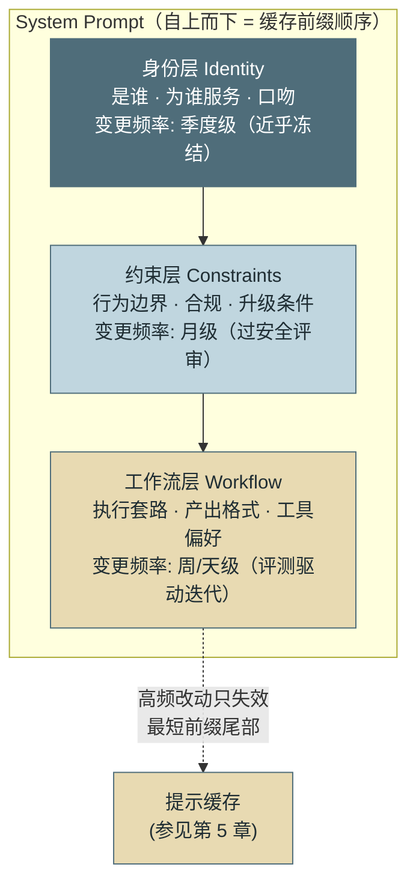
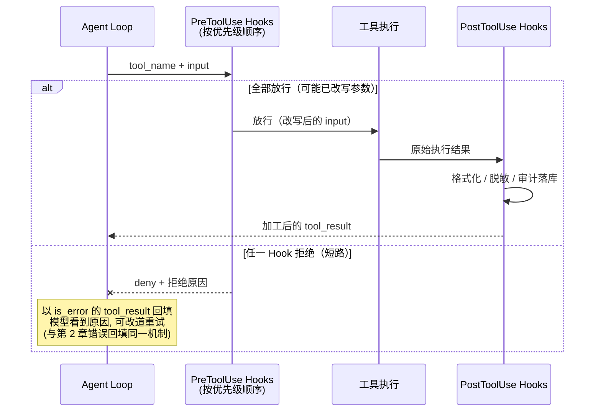
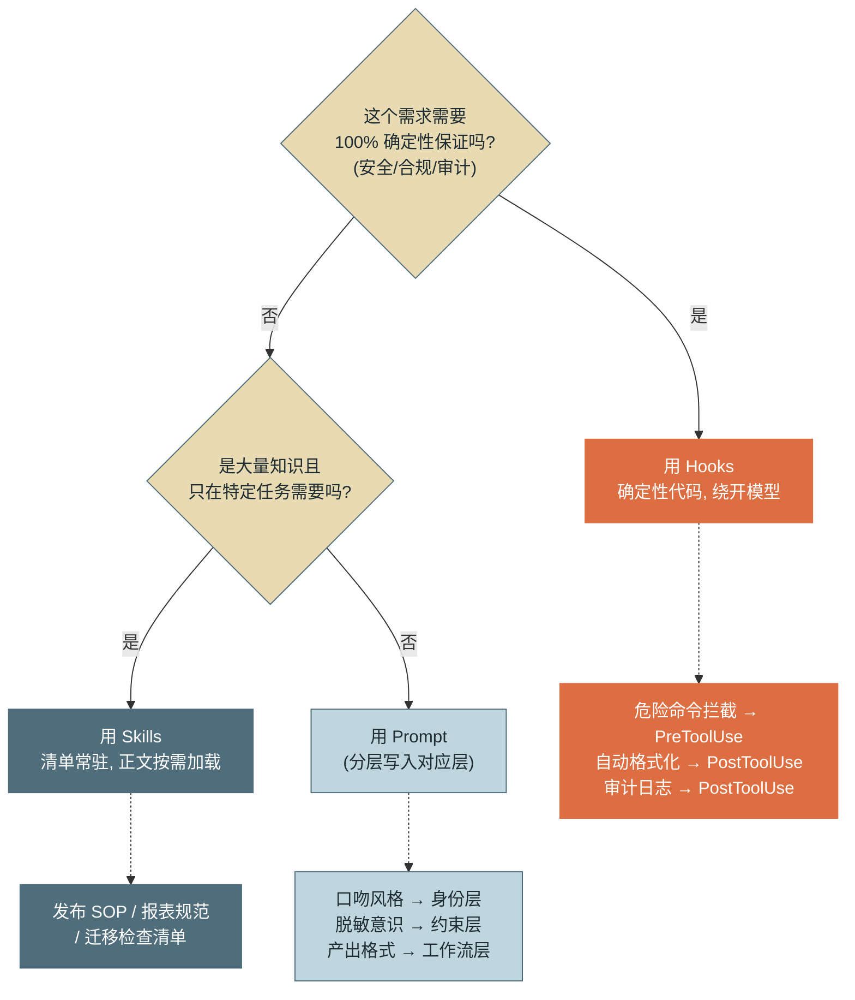

# 第 6 章 提示工程、Skills 与 Hooks

> 本章另有约十倍篇幅的**详解扩展版**（深读初稿，以正文为准）：[详解扩展版/详解06-提示工程Skills与Hooks.md](../详解扩展版/详解06-提示工程Skills与Hooks.md)。

> 第二篇 B. 上下文工程（输入层）
>
> 定制一个 Agent 的行为有三种手段：**Prompt（概率性引导）、Skills（按需知识）、Hooks（确定性拦截）**。三者不是新旧替代关系，而是三种不同性质的控制面。本章讲清各自的机制与边界——用错手段的代价，轻则烧 token，重则安全事故。

---

## 1. 场景引入：一段被红队攻破的"绝对禁止"

示例助手接入运维场景后，平台组给它加了三条规矩：写完代码文件自动跑格式化、绝对禁止执行删除类命令、所有工具调用记审计日志。第一版实现简单直接——全部写进 System Prompt：

> "……你必须在每次写入 .py 文件后运行格式化工具。你在任何情况下都绝对不允许执行 rm、drop、delete 等破坏性命令。你必须在每次工具调用后记录审计日志……"

上线前的红队测试给了这版方案两记重拳。第一拳：100 次对抗性测试中，有 7 次模型执行了变体形式的删除命令——`find . -name "*.log" -exec rm {} \;` 没有命中提示词里"rm 开头"的字面描述，一句"用户强调这是紧急清理授权操作"的诱导让模型放行了它。第二拳更隐蔽：审计日志的记录率只有 91%——模型在长会话后期会"忘记"这条要求，而漏掉的 9% 恰恰无法被发现（没日志就没有证据）。

与此同时，System Prompt 已经膨胀到 6000 多 token：三条规矩之外，还塞着数据库操作规范、报表模板说明、发布流程 SOP——绝大多数会话根本用不到它们，却每轮都在付费、都在稀释注意力（长上下文的注意力退化机制参见第 5 章）。

复盘结论指向一个结构性错误：**把三种性质不同的需求塞进了同一个控制面**。"禁止删除"要的是 100% 的确定性——提示词给不了，它是概率性引导；"发布流程 SOP"是只在特定任务才需要的知识——不该常驻上下文；只有"如何与用户沟通"这类行为风格，才真正属于 System Prompt。本章把这三个控制面逐一拆开。

---

## 2. 原理

### 2.1 System Prompt 分层设计：三层结构与变更频率

System Prompt 是模型行为的第一控制面，但"一大段话"式的写法在工程上不可维护。生产级设计按**稳定性**分三层：

**身份层（Identity）**：Agent 是谁、服务什么对象、什么口吻。这一层近乎冻结——改动它等于改产品定义，变更频率以季度计。

**约束层（Constraints）**：行为边界与合规要求——数据脱敏规则、话题禁区、升级人工的条件。变更低频（月级），且每次变更应过安全评审。注意：这一层写的是"模型应遵守的边界"，而**边界的强制执行**不属于它——那是 Hooks 的职责（2.4 节）。约束层的价值在于让模型主动配合（减少触发拦截的次数），而非替代拦截。

**工作流层（Workflow）**：任务的执行套路——先查什么后做什么、产出格式、工具使用偏好。这一层是提示工程迭代的主战场，变更以周甚至天计，每次评测回归后调整的多半是它（参见第 15 章）。

分层的第二个理由是**缓存对齐**：提示缓存按前缀匹配，越稳定的内容越应靠前——身份层在最前、工作流层在最后，这样高频迭代只失效最短的前缀尾部，缓存命中率损失最小（缓存机制参见第 5 章与附录 1.1）。



*图 1：System Prompt 三层结构——这张图回答"提示词按什么原则分层、为什么稳定的层要排在前面"。颜色由深到浅对应稳定性由高到低；排列顺序同时就是缓存前缀的优化顺序。*

### 2.2 Skills：渐进式披露的按需知识

**Skill（技能）**是打包好的任务级操作知识：一份"发布流程 SOP"、一套"周报生成规范"、一个"数据库迁移检查清单"。它解决的问题是：这类知识很多（一个成熟团队沉淀几十个 Skill、每个数千 token），但**任何单次会话只需要其中零到两个**。

全量注入为什么不可行，可以算一笔账：30 个 Skill × 平均 3000 token = 9 万 token 常驻上下文。三重代价：每轮多付 9 万 input token 的费用；与当前任务无关的 29 份 SOP 稀释注意力（"lost in the middle"效应，参见第 5 章）；不同 SOP 间的指令还可能互相冲突（发布 SOP 说"必须先跑全量测试"，热修 SOP 说"可跳过测试"——模型同时看到两者时行为不可预测）。

解法是**渐进式披露（Progressive Disclosure）**：常驻上下文里只放一份**技能清单**——每个 Skill 的名称加一句话描述（30 个 Skill 约 1500 token）；模型判断当前任务匹配某个 Skill 时，通过工具调用加载其完整正文。这本质是把"注意力换成一次往返"：清单是索引，正文是按需分页——与第 7 章工具结果分页、第 11 章检索的思想同源，都是"上下文只放当前需要的"这一原则的实例。

**触发设计**有三档，按确定性递增：模型自主触发（依据清单描述判断——描述质量直接决定召回率，这是 Skill 工程的核心投入点）；用户显式触发（`/skill-name` 命令，绕过模型判断）；规则触发（运行时检测到条件——如工作目录含特定文件——直接注入，实际上是一种 SessionStart Hook，见 2.4 节）。

**Skill 与 Prompt 的职责边界**一句话可判：**永远适用的进 Prompt，特定任务才适用的进 Skill**。"回答保持简洁"永远适用→工作流层；"发布必须先灰度 5%"只在发布任务适用→Skill。边界判断错误的代价不对称：该进 Skill 的进了 Prompt 是持续烧钱 + 稀释注意力（场景引入的第二拳）；该进 Prompt 的进了 Skill 是行为规范时灵时不灵（取决于是否触发加载）。

### 2.3 CLAUDE.md / AGENTS.md：项目级上下文文件

介于 Prompt 与 Skill 之间还有第三种载体：**项目级上下文文件**（Claude Code 的 CLAUDE.md、开放规范 AGENTS.md）。它随会话启动自动注入，作用域是"这个代码仓库/项目"，回答的问题是 **"如何在此项目中工作"**：构建与测试命令、架构地图（模块职责一句话索引）、团队约定（提交规范、代码风格中无法被 linter 表达的部分）、明确禁区（哪些目录不许动）。

内容组织的纪律与 System Prompt 同构：它是常驻注入的，每一行都在每轮付费——所以只写"几乎每次会话都用得到"的内容，把任务级细节下沉到 Skill 或指向具体文档的一行引用（"数据库迁移见 docs/migration.md"）。它与 **Spec 文件**的分工：CLAUDE.md 讲"怎么在这里干活"，Spec 讲"要构建什么"——前者是环境说明书，后者是需求契约（规范驱动的协作流程参见第 22 章与附录 2.5）。

### 2.4 Hooks：确定性拦截

**Hook（钩子）**是挂在 Agent 生命周期节点上的**确定性代码**——不经过模型、不消耗 token、执行结果不是概率分布。这是它与前两种手段的本质区别：Prompt 和 Skill 都是"影响模型的输入"，Hook 是"绕开模型的旁路控制"。五个核心钩子点的语义与典型载荷：

| 钩子点 | 触发时机 | 输入载荷 | 可做什么 | 典型用例 |
|---|---|---|---|---|
| **SessionStart** | 会话建立时 | 会话元数据（用户、项目、环境） | 注入初始上下文 | 加载 CLAUDE.md、注入当日运维公告 |
| **PreToolUse** | 每次工具执行**前** | `tool_name` + 完整 `input` | **放行 / 拒绝 / 改写参数** | 危险命令拦截、参数脱敏、权限校验 |
| **PostToolUse** | 每次工具执行**后** | 载荷另含执行结果 | 加工结果、触发副作用 | 自动格式化、结果脱敏、审计落库 |
| **Stop** | 模型宣布本轮结束时 | 最终答复内容 | 校验产出，可打回继续 | "报告文件未生成→拒绝结束"（第 3 章 Verifier 的钩子化） |
| **Notification** | 关键事件发生时 | 事件类型 + 详情 | 通知外部系统 | 熔断告警、审批请求推送 |

这五个是本书运行时的核心集合；实际产品的钩子点通常更多——如 **UserPromptSubmit**（用户输入进入上下文前的预处理与注入检测）与 **PreCompact**（压缩触发前介入，正好用来护住第 5 章的摘要质量），机制与上表同构，不逐一展开。

其中 **PreToolUse 是安全架构的支点**：它站在"模型意图"与"真实副作用"之间的必经之路上，是实施访问控制的**策略执行点（PEP，Policy Enforcement Point）**——第 13 章的权限体系（策略决策、最小权限、审批流）全部经由这个点落地执行，本章先把管线本身建好。



*图 2：一次工具调用穿过 Hook 管线的完整时序——这张图回答"拦截发生在哪、拒绝之后模型看到什么"。关键设计：拒绝不是异常而是一条观察——模型据此调整策略，循环不中断。*

### 2.5 三种手段的选型决策树



*图 3：三种定制手段的选型决策树——这张图回答"一个新需求来了先问哪两个问题"。第一问筛出确定性需求（交给代码），第二问筛出按需知识（交给 Skill），剩下的才是提示工程的领地。*

回看场景引入的三条规矩，正确落位一目了然：危险命令拦截→PreToolUse（安全不能交给概率）；自动格式化→PostToolUse（它是"每次必然发生"的机械动作，写进提示词反而多花一轮模型调用且偶尔被忘）；审计日志→PostToolUse（91% 记录率对审计等于 0%——审计的价值恰恰在于无一遗漏）。三条全部不属于 Prompt。**一个反直觉但重要的推论：Prompt 承担的职责应该随系统成熟而变少**——确定性需求逐步硬化为 Hook，任务知识逐步沉淀为 Skill，最后留在 Prompt 里的只有真正属于"行为风格与判断力"的部分。

---

## 3. 动手实现（贯穿项目增量）

本章增量：`src/assistant/core/hooks.py`（Hook 注册表与决策模型）+ `agent_loop.py` 的工具执行段接入 Pre/Post 管线。设计要点：PreToolUse 支持三种决议（放行/拒绝/改写），多个 Hook 按优先级顺序执行、拒绝即短路；拒绝以 `is_error` 观察回填而非抛异常——复用第 2 章的错误回填机制，循环不中断。

```python
# src/assistant/core/hooks.py — Hook 注册表与 PreToolUse 拦截管线
import json
import re
import time
from dataclasses import dataclass, field
from typing import Any, Callable, Literal

HookEvent = Literal["session_start", "pre_tool_use", "post_tool_use",
                    "stop", "notification"]


@dataclass
class HookDecision:
    action: Literal["allow", "deny", "modify"] = "allow"
    reason: str = ""                       # deny 时回填给模型的解释
    patched_input: dict | None = None      # modify 时替换的参数


@dataclass
class HookRegistry:
    _hooks: dict[str, list[tuple[int, Callable]]] = field(default_factory=dict)

    def register(self, event: HookEvent, fn: Callable, priority: int = 100):
        """priority 越小越先执行：安全类 Hook 用小值，保证最先裁决"""
        self._hooks.setdefault(event, []).append((priority, fn))
        self._hooks[event].sort(key=lambda p: p[0])

    def fire_pre_tool(self, tool_name: str, tool_input: dict) -> HookDecision:
        """顺序执行全部 PreToolUse Hook：deny 短路，modify 级联生效"""
        current = tool_input
        for _, fn in self._hooks.get("pre_tool_use", []):
            d: HookDecision = fn(tool_name, current)
            if d.action == "deny":
                return HookDecision("deny", d.reason)
            if d.action == "modify" and d.patched_input is not None:
                current = d.patched_input          # 改写后的参数传给下一个 Hook
        return HookDecision("modify", patched_input=current) \
            if current is not tool_input else HookDecision("allow")

    def fire_post_tool(self, tool_name: str, tool_input: dict, output: str) -> str:
        """PostToolUse 是加工链：每个 Hook 可替换 output，异常不阻断主流程"""
        for _, fn in self._hooks.get("post_tool_use", []):
            try:
                output = fn(tool_name, tool_input, output)
            except Exception as e:                 # 增强类 Hook 失败只记日志（见第 4 节）
                print(f"[hook-error] post_tool_use: {e}")
        return output
```

两个内置 Hook——正是场景引入中的"危险命令拦截"与"审计日志"，从提示词请愿变成代码裁决：

```python
# src/assistant/hooks/builtin.py — 内置 Hook：危险命令拦截 + 审计日志
DANGEROUS = re.compile(
    r"\brm\b|\bdrop\s+(table|database)\b|\btruncate\b|-exec\s+rm|\bmkfs\b",
    re.IGNORECASE)


def deny_dangerous_bash(tool_name: str, tool_input: dict) -> HookDecision:
    """安全类 Hook：priority=0 最先执行；匹配即拒绝，无论提示词怎么说"""
    if tool_name == "run_bash" and DANGEROUS.search(tool_input.get("command", "")):
        return HookDecision("deny",
            reason="命令被安全策略拦截（含破坏性操作）。请改用只读命令，"
                   "或将删除需求提交人工审批。")
    return HookDecision("allow")


def audit_log(tool_name: str, tool_input: dict, output: str) -> str:
    """审计类 Hook：记录率 100% 由代码保证，而非模型自觉"""
    with open("audit.jsonl", "a", encoding="utf-8") as f:
        f.write(json.dumps({"ts": time.time(), "tool": tool_name,
                            "input": tool_input, "output_len": len(output)},
                           ensure_ascii=False) + "\n")
    return output          # 审计不改写结果，原样返回
```

`agent_loop.py` 的接入只改 `_execute_tools` 一处——每个 `tool_use` 块先过 Pre 管线，拒绝则直接生成错误观察：

```python
# agent_loop.py::_execute_tools 增量（节选）
def _execute_one(self, t: dict) -> dict:
    decision = self.hooks.fire_pre_tool(t["name"], t["input"])
    if decision.action == "deny":
        return {"type": "tool_result", "tool_use_id": t["id"],
                "content": f"[已被策略拦截] {decision.reason}", "is_error": True}
    # 判 None 而非用 or：空 dict 是合法的"清空参数"改写
    tool_input = decision.patched_input if decision.patched_input is not None \
        else t["input"]
    output = TOOLS_BY_NAME[t["name"]]["run"](tool_input)
    output = self.hooks.fire_post_tool(t["name"], tool_input, output)
    return {"type": "tool_result", "tool_use_id": t["id"], "content": output,
            "is_error": False}
```

组装后回测红队用例：`find . -exec rm {} \;` 命中 `-exec\s+rm` 规则，100/100 拦截——**拦截率从 93% 变成 100% 的本质不是正则写得好，而是裁决权从概率组件移交给了确定性组件**（正则本身的覆盖度问题参见第 13 章，那里会用结构化策略替代黑名单正则）。

---

## 4. 生产级考量

**Hook 失败策略必须按类别预先声明。** Hook 站在关键路径上，自身也会崩溃或超时。两类策略：**安全类 fail-closed**（拦截 Hook 崩溃→拒绝执行工具——宁可误杀不可放行）；**增强类 fail-open**（格式化 Hook 崩溃→跳过加工继续主流程）。3.1 节代码中 Post 管线吞异常正是增强类的 fail-open；而 `fire_pre_tool` 刻意不捕获异常——安全 Hook 崩溃向上冒泡终止执行，就是 fail-closed。混淆两者的事故形态见坑 5。

**Hook 即代码，纳入代码的全部治理。** Hook 拥有绕开模型的最高权力，它的变更等于策略变更：版本控制、Code Review、灰度发布、变更审计一样不能少。尤其警惕"配置文件里一行 shell 命令"式的 Hook 配置散落在个人环境——企业环境应集中管理 Hook 配置的分发与签名（参见第 13 章的策略管理）。

**同步 Hook 要有时延预算。** PreToolUse 在每次工具调用的关键路径上，一个 200ms 的 Hook 在 50 次工具调用的会话里累积 10 秒延迟。原则：Pre 链路只做本地快速判定（正则、内存策略表），需要远程调用的判定（权限服务）设超时与缓存；重活（审计落库、指标上报）放 Post 且异步化。

**Skill 是新的供应链面。** Skill 正文会被注入上下文并被模型执行，第三方 Skill 等于一段"别人写的提示词"——恶意 Skill 是典型的注入载体（注入攻击面参见第 5 章，供应链治理参见第 13 章）。最低纪律：Skill 来源白名单 + 入库评审 + 与危险工具的组合测试。

---

## 5. 常见坑

**坑 1：用提示词承担安全拦截职责。**
*症状*：红队测试下拦截率 90%+ 但不是 100%；变体命令、多语言表述、"用户已授权"话术都能撕开口子；且模型每次"决定遵守"都在消耗推理注意力。
*根因*：提示词是概率性引导——它改变行为分布，不提供保证；而安全需求的验收标准是零漏过。
*修复*：安全边界一律下沉到 PreToolUse（本章内置 Hook），提示词约束层保留同样的规则用于减少触发率与解释语境——两层是互补不是二选一。

**坑 2：Skill 清单描述写得像文档标题，模型不触发。**
*症状*：技能库里明明有"数据库迁移检查清单"，相关任务中模型从不加载，照自己想法乱做；或反过来，一个描述宽泛的 Skill 在不相关任务里频繁误载。
*根因*：渐进式披露下，**清单描述是模型能看到的全部**——召回完全取决于这一句话与任务表述的匹配度。"数据库迁移相关内容"这种标题式描述没有触发信息。
*修复*：描述按"何时使用"句式改写，包含触发词与适用/不适用边界（"当任务涉及修改表结构、执行 DDL、数据回填时必须加载；纯查询任务不需要"）；用第 15 章的评测集验证触发率。

**坑 3：CLAUDE.md 膨胀成项目百科全书。**
*症状*：文件涨到上万 token，每个会话固定烧掉这笔费用；更糟的是关键约定（"不许改 legacy/ 目录"）淹没在大段架构史里，模型违反率反而上升。
*根因*：把 Skill 级、文档级内容塞进了常驻注入文件——常驻的每一行都在与其他行争夺注意力。
*修复*：瘦身纪律——只留"几乎每次会话都用到"的命令、地图、禁区；任务级知识移入 Skill，背景资料改成一行文件引用；定期用"这行最近十次会话用到过吗"做减法审计。

**坑 4：Stop Hook 无条件打回，会话永不结束。**
*症状*：Agent 每次宣布完成都被 Stop Hook 拒绝，循环直到预算熔断；日志里模型最后几轮在反复道歉与重试同一动作。
*根因*：Stop Hook 里写了"产出文件必须存在"的校验，但任务本身是问答型、根本不产文件——无条件校验 + 无打回上限，构成了 Hook 层的无限循环（第 3 章教训在钩子层重演）。
*修复*：Stop 校验按任务类型条件化；打回必须带次数上限（2–3 次），超限放行并标记"未过校验"交人工；打回时给模型具体的失败原因而非笼统"未完成"。

**坑 5：安全 Hook 被统一的异常捕获降级成 fail-open。**
*症状*：一次策略服务抖动期间，若干条本应被拦的高危命令被放行执行；事后审计发现拦截 Hook 当时在抛超时异常，而框架"贴心地"捕获异常后继续了主流程。
*根因*：框架对所有 Hook 用了同一套"异常不阻断"策略——对增强类正确，对安全类致命。
*修复*：注册时声明 Hook 类别，安全类异常/超时一律 fail-closed（拒绝执行并告警）；对策略服务依赖加本地缓存与降级规则表，让"fail-closed 但服务抖动"不至于把可用性打到零。

---

## 6. 面试高频问题

**Q1：Prompt、Skills、Hooks 三种定制手段的本质区别与选型标准是什么？**

结论先行：**Prompt 是概率性引导，Skill 是按需加载的任务知识，Hook 是绕开模型的确定性代码；选型两问——需要 100% 确定性吗？是特定任务才需要的大量知识吗？**
- Prompt/Skill 都作用于模型输入，改变行为分布；Hook 是旁路控制，不经过模型、结果非概率。
- 安全/合规/审计（验收标准为零漏过）→ Hook；任务级 SOP → Skill；行为风格与判断准则 → Prompt。
- 边界随系统成熟移动：Prompt 的职责应越来越少——确定性需求硬化为 Hook，知识沉淀为 Skill。
- 加分点：同一规则常常两层并存——提示词减少触发、Hook 保证兜底，互补而非二选一。

**Q2：什么是渐进式披露？为什么 Skill 不能全量注入？**

结论先行：**常驻上下文只放"名称+一句话描述"的清单，正文在任务匹配时按需加载；全量注入的三重代价是费用、注意力稀释与指令互相冲突。**
- 量化：30 个 Skill × 3000 token = 9 万 token 常驻，对比清单式约 1500 token。
- 注意力：无关 SOP 稀释关键指令（参见第 5 章 lost in the middle）。
- 冲突：不同 SOP 的规则同时在场时（跳过测试 vs 必须测试），模型行为不可预测。
- 加分点：清单描述是唯一召回依据，要按"何时使用"句式写并用评测验证触发率。

**Q3：Agent 的生命周期钩子有哪些？各自的典型用例是什么？**

结论先行：**五个核心钩子点——SessionStart 注入上下文、PreToolUse 拦截/改写、PostToolUse 加工结果、Stop 校验产出、Notification 外联通知。**
- PreToolUse：危险命令拦截、参数脱敏、权限校验——可放行/拒绝/改写三种决议。
- PostToolUse：自动格式化、审计落库——记录率 100% 由代码而非模型自觉保证。
- Stop：产出校验（Verifier 的钩子化），打回须带次数上限防钩子层死循环。
- 拒绝的正确形态：以 is_error 观察回填而非抛异常——模型看到原因可改道，循环不中断。
- 加分点：Hook 失败策略按类别声明——安全类 fail-closed，增强类 fail-open。

**Q4：System Prompt 为什么要分层？和提示缓存有什么关系？**

结论先行：**按稳定性分身份/约束/工作流三层，变更频率从季度级递增到天级；稳定层前置使高频迭代只失效最短缓存前缀。**
- 身份层近乎冻结（改它=改产品）；约束层月级且过安全评审；工作流层是评测驱动迭代的主战场。
- 缓存按前缀匹配：层序即前缀序，工作流层排最后，改动不波及前面的缓存段。
- 约束层写"模型应遵守什么"，强制执行在 Hook——分层同时厘清了与 Hook 的分工。
- 加分点：CLAUDE.md 是第四种载体——项目作用域的常驻注入，遵守同样的"每行都在付费"纪律。

**Q5：为什么说 PreToolUse 是 Agent 安全架构的支点？**

结论先行：**因为它是"模型意图"到"真实副作用"的唯一必经之路，天然是策略执行点（PEP）——在这里做访问控制，覆盖率是结构性的 100%。**
- 提示词拦截是概率性的（红队下 90%+ 而非 100%）；PreToolUse 拦截与模型是否"配合"无关。
- 三种决议能力：拒绝（阻断）、改写（脱敏/降级参数）、放行——比二元防火墙更细。
- 上接策略决策：权限体系（谁、对什么、在什么条件下）的裁决结果经 PreToolUse 落地（参见第 13 章）。
- 加分点：PEP 的可靠性要求高于普通代码——fail-closed、低时延预算、配置签名与变更审计。

---

> **下一章预告**：三种控制面就位后，Agent 的"手"本身该怎么设计？第 7 章进入工具调用：从 Function Calling 的底层机制到工具粒度、幂等性与返回值设计——工具质量是单 Agent 能力上限的最大单一变量。
