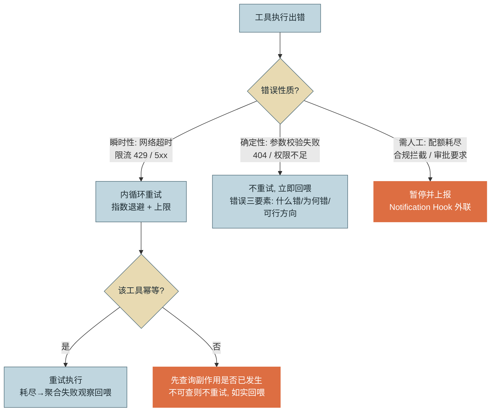
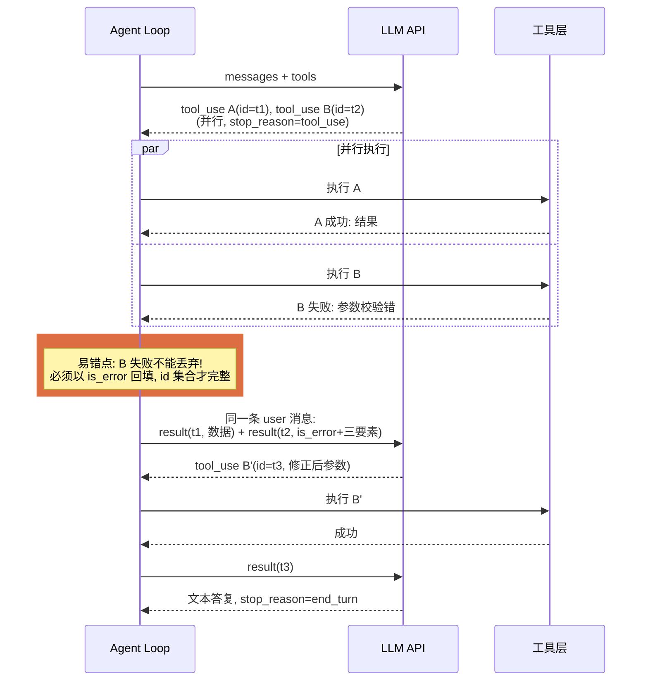

# 第 7 章 工具调用

> 本章另有约十倍篇幅的**详解扩展版**（深读初稿，以正文为准）：[详解扩展版/详解07-工具调用.md](../详解扩展版/详解07-工具调用.md)。

> 第二篇 C. 能力扩展（行动层）
>
> 工具是 Agent 的手。本章从协议层（消息配对与约束解码）讲到设计层（粒度、幂等、返回值），核心论点是：**给 LLM 的 API 与给程序员的 API 是两种东西**——工具质量是单 Agent 能力上限的最大单一变量，而它完全掌握在你手里，与模型无关。

---

## 1. 场景引入：40 个工具的失败与 9 个工具的成功

示例助手要接入公司的工单系统。负责的工程师做了一件看起来天经地义的事：把工单服务的 OpenAPI 文档喂给脚本，**把 40 个 REST 端点一比一翻译成 40 个工具**——`GET /tickets`、`GET /tickets/{id}`、`POST /tickets/{id}/comments`、`GET /tickets/{id}/history`……每个工具原样返回接口的 JSON。

两周试运行的数据很难看：工单类任务成功率 55%。轨迹分析归纳出三类失败：**选错工具**（"查询张三的待办工单"该用带过滤参数的 `list_tickets`，模型却先调了 `search_users` 再逐个 `get_ticket`，五轮才拼出结果）；**参数编造**（接口要求状态值传 `"IN_PROGRESS"`，模型传了 `"处理中"`，400 之后模型又试了 `"in progress"`，还是 400——错误信息只有一句 `Bad Request`，它只能盲试）；**上下文被返回值淹没**（`get_ticket` 返回完整对象 6000 token，其中模型真正需要的标题、状态、处理人不到 100 token，十几次调用后会话撞进第 5 章的压缩水位）。

重构方案只做了一件事：**按意图而非端点重新划分工具**。40 个端点收敛为 9 个意图级工具（`查询工单列表`、`查看工单详情`、`追加处理记录`……），每个工具内部编排一到多个端点调用，参数用枚举约束，返回值裁剪为模型所需字段并附带一行摘要。其他一切不变——同一个模型、同一套提示词——成功率升到 86%，平均轮数从 11 降到 5。这 31 个百分点不是模型给的，是接口设计给的。本章把这背后的完整方法论展开。

---

## 2. 原理

### 2.1 演进脉络：从祈祷到约束

工具调用的实现走过三个阶段，可靠性的跃迁来自把"格式正确"从概率问题变成机制问题：

**阶段一：Prompt 拼 JSON（2022–2023 初）。** 提示词里写"请以 JSON 格式输出要调用的函数"，然后正则/JSON 解析模型的自由文本。失败率高的机制原因：JSON 的每个语法符号都是普通 token，模型以概率生成它们，多一个逗号、中文引号、掉进 Markdown 代码块，解析即失败——实践中格式层失败率约 3–8%，多步任务下按轮数复利放大（第 2 章坑 5 已算过这笔账，不再重复）。

**阶段二：原生 Function Calling API（2023 年中起）。** 工具定义成为 API 的一等参数，模型输出结构化的 `tool_use` 块。可靠性提升来自两层：**训练侧**，模型经过工具调用的专门微调，"何时调用、如何填参"成为被显式优化的能力；**解码侧**，即关键机制**约束解码（Constrained Decoding）**（大规模用于工具调用是 2024 年后的事，与 JSON Mode 的分代关系见附录 1.6）——推理引擎把 JSON Schema 编译成状态机，在采样每个 token 时**屏蔽所有会导致非法输出的候选**：当前位置按 Schema 只能是 `"` 或 `}`，其他 token 的概率被直接置零。格式合法性由此从"模型大概率会遵守"变成"解码器不可能违反"——格式层错误率降到接近零（机制细节参见附录 1.6）。

**阶段三：Tool Use 协议成熟（2024 起）。** 在原生调用之上补齐了多轮配对协议、并行调用、流式参数传输（第 3 章 2.4 节）、动态工具集（2.6 节），工具调用从"一个功能"长成"一套协议"。

一个必须建立的清醒认知：**约束解码只保证格式合法，不保证语义正确**。Schema 能挡住 `"处理中"` 传给 enum 字段（值不在枚举表里，解码器不允许生成），挡不住模型选错工具、把工单 A 的 id 填给工单 B。格式错误靠机制消灭，语义错误靠设计减少——2.4 节的设计原则全部服务于后者。

### 2.2 底层机制：Schema、并行与错误

**Schema 设计要点。** 工具定义中最重要的字段不是 Schema 本身而是 `description`——它是模型选择与使用工具的唯一说明书（与第 6 章 Skill 清单描述同构：召回质量取决于这一段话）。要点清单：工具描述按"做什么 + 何时用 + 何时不用"写；参数描述写清含义、单位、格式与示例（`"created_after: ISO 8601 日期，如 2026-08-01"`）；可枚举的值一律 `enum`（把语义错误转化为解码器可拦截的格式错误——场景引入的状态值问题由此根治）；结构尽量平铺，深嵌套对象既难约束又易错；每个参数是否必填如实声明，`required` 之外的参数在描述里写明缺省行为。

**并行调用的语义。** 一条 assistant 消息含多个 `tool_use` 块，语义是**模型判断这些调用相互独立**。运行时的义务与自由：义务是全部结果打包进同一条 user 消息回填（配对规则，第 2 章已述）；自由是执行层面可以真并行（`asyncio.gather`/线程池），前提是这些工具确实无共享状态冲突。需要禁用并行的场景：工具间有隐式顺序依赖（先锁定再修改）、或下游系统承受不了并发（连接数配额）——协议提供 `disable_parallel_tool_use` 一类开关，但更稳妥的是把"必须串行的操作"封装进单个工具，不把顺序正确性寄托在模型的调用习惯上。

**错误分类与重试。** 工具错误必须分三类处理，各走各的路径——这是第 3 章内外循环分离在工具层的具体化：



*图 1：错误分类决策树——这张图回答"一个工具错误应该由谁处理、走哪条路"。瞬时错误归运行时（模型不应看到限流），确定性错误归模型（它有能力改参数改思路），越权与配额归人（机器不该替人做这个决定）。*

**错误回喂的设计**本身是返回值设计的一部分。三要素缺一不可：**什么错了**（"参数 status 值 '处理中' 非法"）、**为什么**（"该字段只接受枚举值"）、**可行方向**（"合法值为 OPEN / IN_PROGRESS / DONE"）。对比反例 `Bad Request`：模型只能盲试排列组合，每次都是一轮全价推理——场景引入中"三连 400"的病灶。一个实用检验法：把错误消息单独拿出来问自己，"一个只看得到这句话的新手，下一步知道怎么办吗？"

### 2.3 多轮协议：配对规则与三种错法

配对协议的精确表述：每个 `tool_use` 块携带唯一 `id`；**紧随其后的 user 消息**必须为每个 id 提供恰好一个 `tool_result`（`tool_use_id` 关联）；同轮的全部 result 必须在**同一条** user 消息内，块的排列顺序任意但 id 集合必须完全相等；`tool_result` 之外不得混入其他内容块打头。三种典型错法（前两种的初级形态已在第 2 章坑 1/2 出现，这里给协议全景）：

- **漏配对**：某个 id 没有对应 result（并行调用时漏掉失败的那个是高发场景——失败也必须回填，`is_error: true`）。后果：请求 400。
- **乱序错位**：跨轮错位——把上一轮的 result 回填给了本轮的 id（常见于自维护消息队列的实现在重试/恢复时索引错乱）。后果：侥幸不 400 时更糟——模型基于张冠李戴的观察继续推理。
- **孤儿 result**：result 的 id 在上一条 assistant 消息中不存在（历史被手工裁剪或压缩切坏，根因与修复见第 5 章坑 1）。后果：请求 400。



*图 2：多轮工具调用的消息配对时序——这张图回答"并行调用中一个成功一个失败时，回填消息长什么样"。橙色标注的是最高发的协议错误：漏掉失败调用的回填。失败被正确回喂后，模型在下一轮自行修正了参数（B′）。*

### 2.4 工具设计原则：粒度、幂等、返回值

**粒度：一个工具一个意图。** 判据是**模型完成任务需要做多少次决策**。端点粒度（40 个工具）把编排责任推给模型——每次多端点组合都是一串概率决策的连乘；万能粒度（一个 `call_api(path, method, body)`）更糟，模型要凭空构造整个请求。意图粒度把"怎么组合端点"固化在工具内部的确定性代码里，模型只做"选哪个意图 + 填业务参数"两个决策。经验判据：一个任务的典型路径若超过 4 次工具调用，先怀疑粒度切细了；一个工具的参数若超过 7 个，怀疑粒度切粗了或该拆场景。

**幂等性：重试与恢复的前提。** 图 1 的重试分支、第 3 章的中断恢复（副作用在途）都以幂等为前提。实现手段按工具类型分：查询类天然幂等；写入类用**幂等键（Idempotency Key）**——运行时为每个 `tool_use.id` 生成键随请求下发，下游据键去重，重试不复制副作用；不可改造的遗留接口，用"先查后写"模拟（重试前查询副作用是否已发生）。**不幂等的工具默认不自动重试**（改造支持幂等键或先查后写后才可重试）——这是一条纪律而非建议（坑 3 的双重退款就是违反它的代价）。

**返回值对 LLM 的友好度。** 原则：**结构化 + 摘要优先**。返回值的第一行应是人类可读的摘要（"找到 3 条待办工单，最早的已滞留 5 天"），随后才是裁剪过的结构化数据；字段只留模型完成任务所需（内部 UUID、审计字段、HATEOAS 链接全部裁掉）；数字自带单位与语义（`"滞留时长: 5 天"` 优于 `"duration": 432000`）；空结果也要说人话（"未找到匹配工单，可尝试放宽 status 过滤"优于 `[]`）。这些规则的依据同一条：返回值的消费者是一个按 token 计费、靠注意力工作的推理器，不是一段反序列化代码。

### 2.5 工具结果的上下文成本

返回值再友好，量大了仍会压垮窗口（第 5 章已建立"窗口即预算"与压缩机制，此处只讲工具层的上游治理）。处理管线三级：


*图 3：工具结果的入上下文管线——这张图回答"一份原始输出经过哪几道加工才有资格进窗口"。三层各司其职：截断保底线（防单次爆窗），结构化提密度，摘要给结论。*

**分页返回**的正确形态是把翻页主动权交给模型：工具返回第一页 + `next_cursor` 字段 + 描述里说明"如需更多结果，携带 cursor 再次调用"。模型于是可以基于第一页判断"够不够"——多数任务第一页就够，避免了"一次拉全量"的默认浪费。**大结果落盘留指针**（"完整日志 2.3MB 已存至 /tmp/log-a7f3.txt，可用 read_file 分段查看"）则把"要不要看全文"也变成模型的显式决策——两个手段的共同思想：把上下文消耗从工具的默认行为变成模型的按需选择。

### 2.6 动态工具集：当工具多到成为问题

工具定义本身占上下文：每个 100–500 token，百个工具即数万 token 常驻——且工具越多，选择准确率越低（候选集扩大直接抬高误选概率，与检索的精度-召回权衡同构）。三种应对，按改动量递增：

- **按任务画像静态裁剪**：会话启动时按任务类型只注册相关子集（运维会话不带报表工具）。实现最简单，边界是"画像判得准"。
- **工具搜索（Tool Search）**：常驻只注册一个搜索工具，其余标记为延迟加载；模型按需搜索并动态载入命中的工具。本质是第 6 章渐进式披露在工具维度的复刻——清单换正文，一跳延迟换窗口与准确率。适合工具库超过几十个的平台型场景。
- **按需注册**：运行时根据任务进展动态注册/注销（如进入数据库任务才注册 DDL 工具）。控制最精细，复杂度也最高，通常与第 8 章 MCP 的动态发现机制配合实现。

选型经验：工具少于 20 个时全量注册即可，问题不存在；20–50 个先做静态裁剪；更大规模才值得上搜索——不要为尚不存在的规模预付复杂度（第 1 章坑 5 的同款告诫）。三档之外还有一条 2025 年起兴起的正交路线：**代码模式调用**——把工具暴露为代码 API，让模型写一段脚本完成过滤、循环与多工具编排，中间数据在沙箱里流转而不过上下文，同时缓解"定义占窗口"与"逐调用往返"两个问题；机制依托代码执行环境，第 9 章展开。

---

## 3. 动手实现（贯穿项目增量）

本章增量：`src/assistant/core/tools.py`——把第 2 章的工具字典升级为**工具注册表**（注册校验 + Schema 导出），并实现**错误分类重试器**（图 1 决策树的代码化，落位在第 3 章的内循环）。

```python
# src/assistant/core/tools.py — 工具注册表与错误分类
from dataclasses import dataclass, field
from typing import Any, Callable


class ToolError(Exception):
    """工具错误基类：分类由异常类型驱动（见 execute）；retryable / needs_human 是给读者的语义标注，非执行分支依据。对应图 1 决策树。"""
    retryable = False
    needs_human = False

class TransientError(ToolError):      # 网络超时 / 429 / 瞬时 5xx
    retryable = True

class InvalidInputError(ToolError):   # 参数校验失败 / 业务 404 → 立即回喂
    pass

class PermissionDeniedError(ToolError):
    pass

class QuotaExhaustedError(ToolError): # 配额 / 合规拦截 → 暂停上报
    needs_human = True


@dataclass
class RegisteredTool:
    name: str
    description: str
    input_schema: dict[str, Any]
    run: Callable[[dict], str]
    idempotent: bool = False          # 幂等声明：自动重试的准入资格


@dataclass
class ToolRegistry:
    _tools: dict[str, RegisteredTool] = field(default_factory=dict)

    def register(self, tool: RegisteredTool) -> None:
        assert tool.name not in self._tools, f"工具重名: {tool.name}"
        assert len(tool.description) >= 20, \
            f"{tool.name}: 描述过短——它是模型的唯一说明书（参见 2.2 节）"
        assert tool.input_schema.get("type") == "object", \
            f"{tool.name}: input_schema 必须是 object"
        self._tools[tool.name] = tool

    def get(self, name: str) -> RegisteredTool:
        return self._tools[name]

    def specs(self) -> list[dict]:
        """导出 API 所需的三字段格式（run/idempotent 绝不出网）"""
        return [{"name": t.name, "description": t.description,
                 "input_schema": t.input_schema} for t in self._tools.values()]
```

```python
# src/assistant/core/retry.py — 错误分类重试器（第 3 章内循环的实现）
import time
from dataclasses import dataclass


@dataclass
class RetryPolicy:
    max_attempts: int = 3
    base_delay: float = 1.0      # 指数退避：1s, 2s（max_attempts=3 时末次不退避）


class RetryingExecutor:
    def __init__(self, policy: RetryPolicy = RetryPolicy(), notify=None):
        self.policy, self.notify = policy, notify

    def execute(self, tool, tool_input: dict) -> tuple[str, bool]:
        """返回 (观察文本, is_error)。所有分支都产出可回喂的观察，绝不抛出到外循环"""
        failures: list[str] = []
        for attempt in range(1, self.policy.max_attempts + 1):
            try:
                return tool.run(tool_input), False
            except TransientError as e:
                failures.append(f"第{attempt}次: {e}")
                if not tool.idempotent:
                    # 纪律：不幂等的工具不自动重试——超时≠失败，副作用可能已发生
                    return (f"工具执行超时且该工具不可安全重试（副作用状态未知）。"
                            f"请先用查询类工具确认操作是否已生效。原始错误: {e}"), True
                if attempt < self.policy.max_attempts:
                    time.sleep(self.policy.base_delay * 2 ** (attempt - 1))
            except InvalidInputError as e:
                return f"参数错误（不重试）: {e}", True      # 错误三要素由工具层填充
            except PermissionDeniedError as e:
                return f"权限不足: {e}。该操作需要授权，请改用只读方式或说明理由。", True
            except QuotaExhaustedError as e:
                if self.notify:
                    self.notify("quota_exhausted", tool.name, str(e))   # 上报人工
                return f"配额已耗尽，任务需人工介入: {e}", True
        # 重试耗尽：聚合为一条观察（第 3 章坑 4——不回喂逐次原始报错）
        return (f"重试 {self.policy.max_attempts} 次均失败: {failures[-1]}。"
                f"该依赖当前不可用，建议换用其他数据源或稍后再试。"), True
```

`agent_loop.py` 的 `_execute_one` 换用注册表与重试器（Hook 管线保持第 6 章的接法，重试器在 Hook 放行之后执行）：

```python
# agent_loop.py::_execute_one 增量（节选）
tool = self.registry.get(t["name"])
content, is_error = self.executor.execute(tool, tool_input)
```

回测场景引入的三类失败：状态枚举进了 Schema（启用约束解码/严格模式的提供方，编造值在解码层就不可能生成；未启用时也被运行时校验层一次性确定拒绝，而非下游 400 盲试——参见第 3 章契约表）；`Bad Request` 被工具层翻译成三要素错误文本（模型一轮改对参数）；重试与失败聚合收进内循环（历史里不再堆积重复报错）。注册表的三条 `assert` 则把"描述过短"这类设计债挡在了注册时——**工具质量的最低标准应该由代码而非 Code Review 记忆来守**。

---

## 4. 生产级考量

**工具目录是需要治理的资产。** 企业里工具会长到数百个、被多个 Agent 共享，需要目录级治理：每个工具有 owner、版本与变更记录；**描述与 Schema 的变更等于行为变更**——它直接改变模型的选择分布，必须过回归评测再发布（第 15 章）；废弃工具走灰度下线而非直接删除（存量会话与提示词可能仍引用其名字）。

**合同测试防上游漂移。** 工具封装的下游 API 会悄悄变：字段改名、枚举加值、分页参数变更。对每个工具维护**合同测试（Contract Test）**——用录制的请求/响应对每日回放校验，上游漂移在评测掉分之前就被 CI 抓住。这比"成功率下降后排查三天发现是上游改了字段"便宜得多。

**超时与并发预算分级。** 每个工具声明自己的超时档位（快查 5s / 慢查 30s / 长任务异步化，参见第 3 章的异步化建议）；并行执行共享连接池与并发上限，防止模型一轮发起 10 个并行调用打挂下游——Agent 的并发是模型决定的，下游保护必须是运行时决定的。

**工具级指标是上游健康的探针。** 按工具维度采集调用次数、失败率（分错误类别）、P99 延迟、返回 token 量四个指标（采集管道参见第 14 章）。两个高价值告警：某工具**失败率漂移**——十有八九是上游 API 劣化或合同漂移，比业务方投诉早数小时；某工具**返回 token 量漂移**——上游加了字段或数据膨胀，是第 5 章压缩频率异常的上游根因。

---

## 5. 常见坑

**坑 1：把 REST API 一比一翻译成工具。**
*症状*：工具数量膨胀、模型频繁选错或用三四个工具拼一个简单意图、平均轮数居高不下；成功率随工具数量增加不升反降。
*根因*：端点粒度≠意图粒度。REST 面向资源，Agent 面向意图；把编排责任推给模型，等于让每个任务多做一串概率决策的连乘。
*修复*：按意图重新划分（场景引入 40→9 的重构）；编排逻辑固化进工具内部的确定性代码；用"典型任务的调用轮数"作为粒度体检指标。

**坑 2：工具描述写给人看，不写给模型看。**
*症状*：功能明明存在，模型就是不用，或在错误场景滥用；描述形如"调用订单服务 v2 的查询接口"。
*根因*：描述是模型选择工具的唯一依据（约束解码管格式，不管选择），"给维护者看的注释"不含任何触发信息与使用边界。
*修复*：按"做什么 + 何时用 + 何时不用 + 参数示例"重写；与第 6 章 Skill 描述同法，用评测集验证工具的触发准确率。

**坑 3：自动重试了不幂等的工具。**
*症状*：财务对账发现少量订单被双重退款；日志显示这些订单的退款调用都发生过一次超时重试。
*根因*：把"超时"当成"失败"。超时的真相是**结果未知**——请求可能已被下游执行；对不幂等操作重试，就是在赌它没执行。
*修复*：幂等声明进注册表（本章 `idempotent` 字段），重试器对不幂等工具拒绝自动重试并引导"先查后动"；下游改造支持幂等键，用 `tool_use.id` 做去重键。

**坑 4：错误回喂只有错误码。**
*症状*：模型在同一个错误上反复盲试（换大小写、换语言、换空格），三五轮烧掉预算后放弃或幻觉一个结果。
*根因*：`Error 500` / `Bad Request` 对模型是零信息观察——它不知道什么错了，只能在参数空间里随机游走，而每次游走都是一轮全价推理。
*修复*：错误三要素（什么错/为什么/可行方向）作为工具封装层的强制规范；对无法解释的下游错误至少附上"该错误与参数无关，重试或换路径"的分类提示。

**坑 5：可枚举的参数没有用 enum 约束。**
*症状*：模型对状态、类型类参数填入语义正确但字面错误的值（"已完成"/"done"/"DONE" 混用），间歇性 400。
*根因*：Schema 只声明了 `type: string`，约束解码没有可执行的约束——格式层机制在场，却没有被喂给它可以强制的规则。
*修复*：所有有限取值集合一律 `enum`（严格模式下解码层直接杜绝非法值，非严格模式下运行时校验层确定性拒绝）；取值语义在描述中逐个解释；上游新增枚举值靠合同测试发现、同步更新。

---

## 6. 面试高频问题

**Q1：原生 Function Calling 为什么比 Prompt 拼 JSON 可靠？**

结论先行：**两层机制——训练侧的专门微调 + 解码侧的约束解码：Schema 编译为状态机，采样时屏蔽一切非法 token，格式合法性从概率承诺变成机制保证。**
- 文本解析式格式失败率约 3–8%，多轮任务按轮数复利放大；约束解码后格式层趋近零。
- 边界要说清：约束解码只管格式（结构、类型、枚举值），不管语义（选对工具、填对业务值）。
- 推论：能用 enum 表达的约束尽量下沉到 Schema——把语义错误转化为机制可拦截的格式错误。
- 加分点：剩余错误集中在语义层，治理手段是 2.4 节的设计原则 + 评测回归。

**Q2：工具粒度怎么设计？判据是什么？**

结论先行：**一个工具一个意图；判据是模型完成任务所需的决策数——端点粒度把编排推给模型（概率连乘），万能粒度让模型凭空构造请求，意图粒度把编排固化为确定性代码。**
- 反例数据：40 个端点级工具成功率 55%，重构为 9 个意图级工具后 86%。
- 体检指标：典型任务超过 4 次调用怀疑切细；单工具参数超 7 个怀疑切粗。
- REST 面向资源、Agent 面向意图——工具层是翻译层不是透传层。
- 加分点：必须串行的多步操作封装进单个工具，不把顺序正确性寄托在模型习惯上。

**Q3：工具错误怎么分类处理？重试的前提是什么？**

结论先行：**三分法——瞬时错误归内循环（退避重试，模型不可见）、确定性错误立即回喂（模型改道）、配额与合规暂停上报人工；自动重试的前提是幂等。**
- 超时≠失败而是结果未知：不幂等的工具默认禁止自动重试（双重退款事故的根因）。
- 幂等实现：查询天然幂等、写入用幂等键（tool_use.id 作键）、遗留接口先查后写。
- 重试耗尽回喂聚合观察而非逐次报错（防上下文污染，参见第 3 章）。
- 加分点：错误回喂三要素——什么错/为什么/可行方向；检验法是"只看这句话知道下一步吗"。

**Q4：tool_use / tool_result 的配对协议是什么？常见错法有哪些？**

结论先行：**每个 tool_use.id 必须在紧随其后的同一条 user 消息中有且仅有一个 tool_result 对应，顺序任意但 id 集合必须完全相等；三种错法——漏配对、乱序错位、孤儿 result。**
- 漏配对高发场景：并行调用中失败的那个被丢弃——失败也必须以 is_error 回填。
- 乱序错位最阴险：可能不报 400，模型基于张冠李戴的观察继续推理。
- 孤儿 result 根因多在历史裁剪/压缩切坏配对（参见第 5 章）。
- 加分点：协议错误的系统性预防靠"完整轮次边界"不变式，而非逐处小心。

**Q5：工具多了怎么办？动态工具集如何取舍？**

结论先行：**按规模三档——20 个以内全量注册，20–50 个按任务画像静态裁剪，更大规模用工具搜索（清单常驻 + 按需载入）；核心权衡是一跳延迟换窗口与选择准确率。**
- 成本账：每个定义 100–500 token，百个工具数万 token 常驻，且候选越多误选率越高。
- 工具搜索与第 6 章渐进式披露同构——都是"索引常驻、正文按需"。
- 按需注册控制最细、复杂度最高，通常配合 MCP 动态发现（参见第 8 章）。
- 加分点：不为尚不存在的规模预付复杂度——与"过早多 Agent"同款告诫（参见第 1 章）。

---

> **下一章预告**：工具设计好了，下一个问题是"接入标准化"——每个数据源都手写一遍工具封装不可持续。第 8 章进入 MCP 协议：Host/Client/Server 架构、三原语与传输层，以及"什么时候该用 MCP、什么时候原生工具更合适"。
