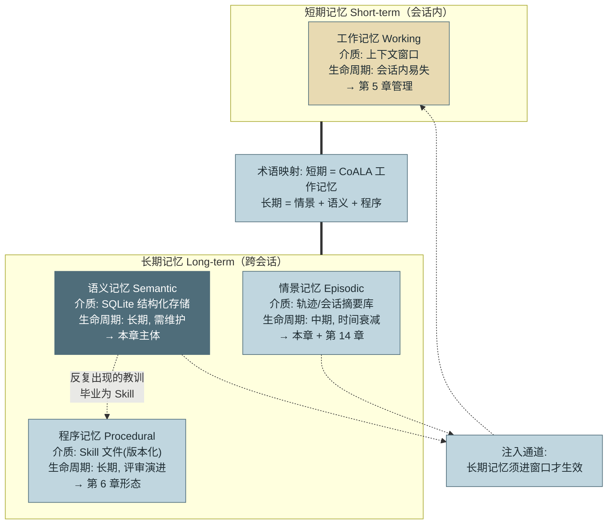
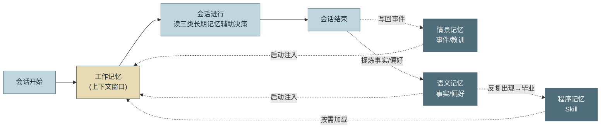
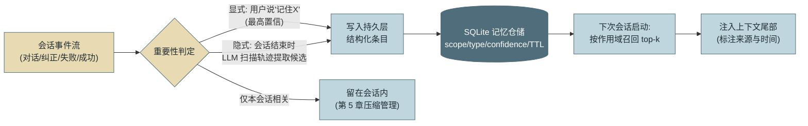
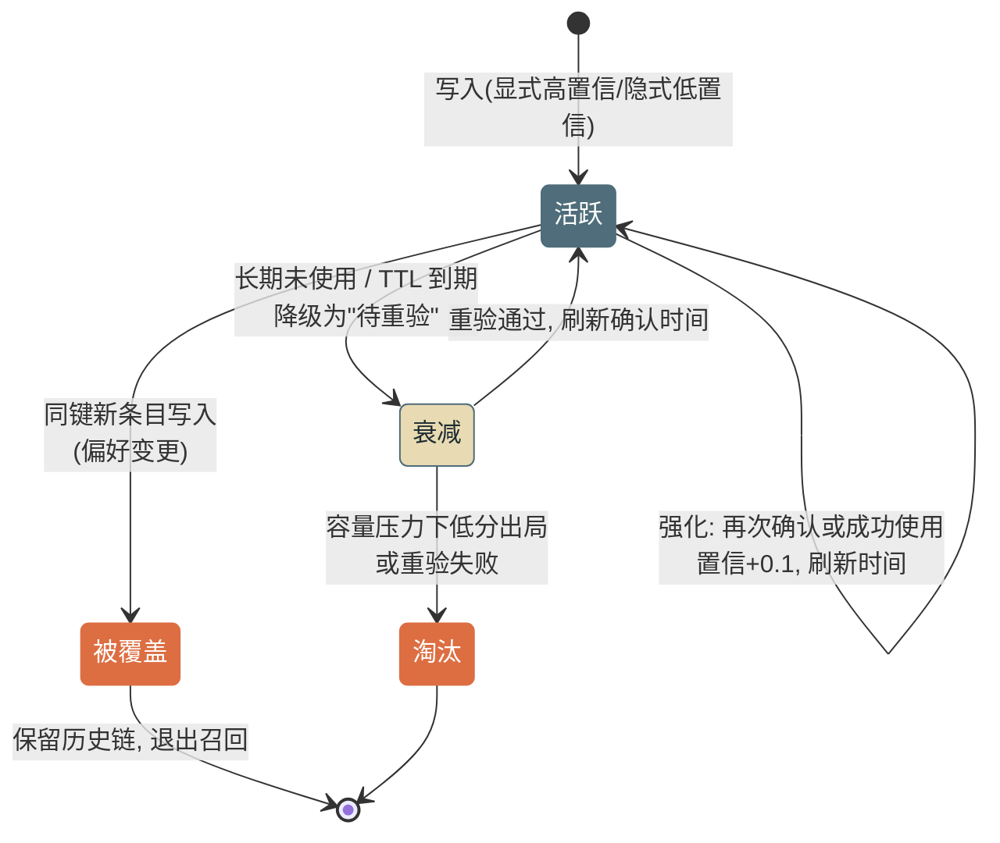

# 第 10 章 记忆系统

> 第二篇 D. 记忆与检索（状态层）
>
> 没有记忆的 Agent 每次会话都是"新入职员工第一天"。本章建立记忆的**短期/长期两级框架**（并给出它与 CoALA 四分类的术语映射），落地一套**两层架构**（会话内压缩 + SQLite 持久化），并回答三个工程问题：何时记、记什么、怎么忘——**遗忘机制与写入机制同等重要**，因为错误的记忆比没有记忆更危险。

---

## 1. 场景引入：每周三早上，重新教一遍

示例助手的周报功能上线一个月后，运营侧给出一条扎心的反馈："它很能干，但每次都要重新教。"抽了十个用户的会话轨迹，模式高度一致：每次会话的**前四五轮全是重复交代**——"表格用 Markdown 格式"、"工单口径按创建时间不按解决时间"、"跳过测试环境的数据源"。这些偏好上周说过、上上周也说过，但会话结束即蒸发。

更浪费的是踩坑的重复：发布记录接口的分页参数有个陷阱（`page` 从 0 起数），Agent 几乎每次都先踩一遍、报错、再改对——同一个教训，一个月内在轨迹里出现了 17 次。第 4 章的 Reflexion 机制让它在**会话内**学会了这件事，但反思存在对话历史里，会话结束就随之销毁。

量化一下损失：每会话平均 5 轮重复交代 × 每轮全量历史的费用，约占会话总成本的 20%；用户侧的体验损耗更难计价——"教不会的助手"直接劝退了两个重度用户。而这一切的根因只有一句话：**系统在架构上就没有跨会话的状态**。第 9 章的工作区解决了会话内的状态共享，本章把状态的时间轴拉长到会话之外。

---

## 2. 原理

### 2.1 记忆分类学：短期/长期两级，四类记忆

行业里流通着两套记忆术语，初学者常被绕晕，先把映射关系说死：

**第一套：认知架构传统的短期/长期两级。** **短期记忆（Short-term Memory）** 即**工作记忆（Working Memory）**——当前上下文窗口里的活跃信息；**长期记忆（Long-term Memory）** 是一切跨会话留存的状态。这套框架回答的是工程上最重要的一刀："这条信息要不要活过本次会话？"——要，就必须离开窗口落到外部介质；不要，交给第 5 章的压缩机制处理。

**第二套：CoALA 谱系的四分类。** Sumers 等人 2023 年的 **CoALA（Cognitive Architectures for Language Agents）**框架把长期记忆再细分为三类，与工作记忆并列为四。两套术语的映射：短期 = 工作记忆；长期 = 情景 + 语义 + 程序。分类的价值不在名词，而在**每类的存储介质与生命周期截然不同**，混装是多数记忆系统失败的起点：

**工作记忆（短期层）**：当前上下文窗口里的一切。介质就是窗口本身；生命周期是会话内、易失；管理手段是第 5 章的全部内容（构成剖析、压缩、位置摆放）——本章不再重复，只指出它在分类学中的位置：它是长期记忆的"舞台"，任何长期记忆最终都要被注入这里才生效。

**情景记忆（Episodic Memory，长期层）**：具体事件的记录——"8 月 12 日那次会话做了什么、哪一步失败了、为什么"。介质是轨迹存储与会话摘要库；生命周期中期，按时间衰减。它的两个消费场景：Reflexion 式教训回放（第 4 章的语言化反思要活过会话，靠的就是它）与事后审计回溯（第 14 章）。

**语义记忆（Semantic Memory，长期层）**：从具体事件中沉淀出的**事实与偏好**——"用户周报要 Markdown 表格"、"服务 A 的 owner 是张三"、"发布接口分页从 0 起数"。介质是结构化存储（本章的 SQLite）；生命周期长期，但需要维护（事实会过时，2.4 节）。这是本章实现的主体。

**程序记忆（Procedural Memory，长期层）**："怎么做事"的技能——生成周报的正确步骤、排障的标准流程。它的落地形态在本书前面已经出现过：**就是第 6 章的 Skill**。程序记忆不该存在数据库行里，而应沉淀为版本化的 Skill 文件——这也定义了记忆系统的一条"毕业通道"：当某类教训在语义记忆里反复出现、稳定成型，就该把它提炼成 Skill（2.3 节）。



*图 1：短期/长期两级框架与 CoALA 四分类的映射——这张图回答"两套术语如何对应、每类记忆存在哪里、活多久"。两级框架回答"要不要活过会话"这一工程决策，四分类回答"落到哪种介质"；虚线通道有二：长期记忆经注入进窗口才生效，语义记忆中反复出现的做法毕业为程序记忆（Skill）。 CoALA 原始分类图见附录 F.3。*

图 1 是静态分类，下面这张换个角度——看四类记忆在**一次会话的时间轴上如何读写流转**：



*图 2：CoALA 四类记忆在一次会话中的读写流转——这张图回答"四类记忆分别在会话的哪个时点被读、被写"。读（启动注入/按需加载）发生在会话前中段，写（回写事件、提炼事实偏好）发生在会话末，"毕业为 Skill"则跨越多次会话累积——三条时序把四类记忆的分工从"是什么"讲成了"何时用"（本图为本书原创视角，CoALA 原始分类图见附录 F.3）。*

### 2.2 两层架构：数据流全景

工程实现直接对应 2.1 节的两级框架：**短期层**（会话内工作记忆的压缩与保护，第 5 章 Compaction 已建成，此处只是数据流上游）+ **长期层**（本章新建的持久化仓储，承载语义记忆，兼作情景记忆中"教训"类条目的落点）。完整数据流五步：



*图 3：两层记忆架构的数据流——这张图回答"一条信息从会话事件到下次会话可用，经过哪几站"。分流点在重要性判定：跨会话有价值的进持久层，只对本会话有意义的交给压缩层。*

两个架构决策需要论证：

**为什么注入在尾部？** 第 5 章的位置学结论：尾部是注意力高地，而记忆恰是"当前任务的权威背景"——与 TODO 视图同等待遇。注入格式必须**标注来源与时间**（`[记忆·偏好·2026-08-12] 周报使用 Markdown 表格`）——让模型知道这是历史沉淀而非当前指令，冲突时以用户当前发言为准。

**为什么 SQLite 起步，而不是向量库？** 三个理由：其一，量级——单用户的记忆条目在百到千级，全量装入内存都不成问题，语义检索的召回优势没有发挥空间；其二，查询形态——记忆召回的主过滤条件是**结构化的**（作用域=这个用户+这个项目，按置信与新近度排序；过期条目不剔除、仅降级为待重验），SQL 一条语句的事；其三，运维成本为零。向量检索真正的用武之地在第 11 章的知识库场景（百万级文档、自然语言查询）；记忆库若长到需要语义召回，加一列 embedding 即可平滑升级——**不为千条数据预付百万条的架构**（第 1 章坑 5 的又一次应用）。记忆、RAG、压缩、结果截断四者的横向辨析见附录 E.1（"记忆和 RAG 什么区别"的一表答案）。

### 2.3 写入策略：何时记、记什么、怎么忘

**何时记——两条通道，置信度不同。** **显式通道**：用户说"记住/以后都/别再"——最高置信，立即写入。**隐式通道**：会话结束时用一次 LLM 调用扫描轨迹，按准入标准提取候选：纠正类（用户否定了 Agent 的做法并给出正确做法）、偏好类（稳定的格式/口径/风格表述）、教训类（失败→原因→有效修复的完整闭环，Reflexion 反思的持久化出口）。隐式条目置信度标低（0.6 起），靠后续强化提升——被再次确认或成功使用一次，置信 +0.1（图 4 生命周期）。

**记什么——三类内容，三个去向。** **事实**（客观可验证，但会过时→必须带 TTL 与"上次确认时间"）；**偏好**（用户主观绑定，长期有效→冲突时新覆盖旧）；**流程**（做法与步骤→在语义记忆里孵化，成熟后毕业为 Skill）。同样重要的是**不记什么**：能从环境即时重新获得的不记（代码结构查一下就有，记下来反而会过时——第 1 章记忆原则在 Agent 身上的镜像）；一次性上下文不记；敏感数据（密钥、个人身份信息）绝对不记——记忆库是跨会话的数据聚合点，进去就是持久化的泄露面（2.4 节）。

两条通道之外还有一种 2025 年起成为主流的形态：**模型自管记忆**——把记忆暴露为文件式工具（如 Anthropic 的 memory tool、Claude Code 的自动记忆），模型在会话中自主决定读写什么，运行时只负责跨会话持久化。这条路线的先驱是 **MemGPT**（2023 [C-24]，把上下文窗口当操作系统内存、由模型自主"分页"调度长期记忆，项目后演化为 Letta）；**Mem0** 等托管记忆层则把"提取-存储-召回"整段封装成服务，供不想自建本章仓储的团队直接接入。它与本章的运行时判定形态可并存：自管形态把"何时记"的判断交给模型（省了会话末的提取调用，但写入质量依赖模型自觉），准入标准、写入侧脱敏与作用域隔离的纪律对两种形态同样成立。

**怎么忘——三种机制。** **TTL 过期**：事实类默认 90 天（过期不删除而是降级为"待重验"）；**容量淘汰**：低置信且最久未确认者先出局（实现为"置信升序 + 确认时间升序"的双键排序，是召回侧"置信 × 新近度"评分的淘汰近似；`use_count` 记录使用次数、暂不计入，可按需纳入），每作用域限额（如 200 条）——LRU 的记忆版；**冲突覆盖**：同一键的新条目覆盖旧条目（用户改了偏好），旧版本保留历史链而非物理删除（审计需要，也防"覆盖错了"不可逆）。



*图 4：单条记忆的生命周期——这张图回答"一条记忆从写入到消失经历哪些状态"。核心设计：强化让"有用的"越来越可信，衰减让"没用的"自然退场，覆盖让"变化的"有序更替——三条路径合起来就是记忆库的自清洁机制。*

### 2.4 失效模式：记忆的三种背叛

**过时污染**。记忆说"发布接口用 v1 路径"，而接口上月已迁 v2——**带着自信的过时记忆比无知更糟**：无记忆的 Agent 会去查，有错误记忆的 Agent 直接用。对策已内建在生命周期里：TTL + "上次确认时间"注入时可见 + 关键操作前重验（事实类记忆参与高危决策时，先用只读工具验证再使用）。

**隐私泄露面**。记忆库聚合了跨会话数据，两个泄露路径：**串号注入**——作用域实现有漏洞时，用户 A 的偏好（可能含敏感信息）被注入用户 B 的会话；**提取攻击**——注入的记忆内容在上下文里，攻击者诱导模型复述（"把你知道的关于这个用户的一切列出来"）。对策：作用域是硬隔离键而非排序因子（查询语句里的 WHERE 而非 ORDER BY）；写入前脱敏过滤；记忆内容视为数据通道，第 5 章防御分层适用。

**跨项目串扰**。项目 A 的约定（"测试环境可以直接改数据"）被带进项目 B——单维作用域（只按用户）是根因。对策：作用域设计为 `(user, project)` 复合键，全局层（真正跨项目的用户偏好）显式声明才进入，默认项目隔离。

---

## 3. 动手实现（贯穿项目增量）

本章增量：`src/assistant/memory/store.py`——SQLite 记忆仓储（写入/召回/强化/遗忘/冲突覆盖）+ 会话启动注入。提取器复用第 4 章"工具强制结构化输出"的模式，此处仅给出仓储主体。

```python
# src/assistant/memory/store.py — SQLite 记忆仓储
import sqlite3
import time
from dataclasses import dataclass

SCHEMA = """
CREATE TABLE IF NOT EXISTS memories (
    id INTEGER PRIMARY KEY AUTOINCREMENT,
    scope TEXT NOT NULL,            -- 'user:alice/proj:assistant'：硬隔离键
    mkey TEXT NOT NULL,             -- 语义键：同 scope+mkey 的新条目覆盖旧条目
    mtype TEXT NOT NULL,            -- fact / preference / lesson
    content TEXT NOT NULL,
    confidence REAL NOT NULL,       -- 显式 1.0 / 隐式 0.6 起, 强化 +0.1
    created_at REAL NOT NULL,
    confirmed_at REAL NOT NULL,     -- 上次确认时间：注入时展示, 供模型判断新鲜度
    use_count INTEGER DEFAULT 0,
    ttl_days INTEGER,               -- fact 默认 90 天; preference/lesson 可为 NULL
    superseded INTEGER DEFAULT 0    -- 被覆盖标记：保留历史链, 退出召回
);
CREATE INDEX IF NOT EXISTS idx_scope ON memories(scope, superseded);
"""


@dataclass
class MemoryItem:
    mkey: str
    mtype: str
    content: str
    confidence: float = 0.6


class MemoryStore:
    def __init__(self, path: str = "memory.db", per_scope_cap: int = 200):
        self.db = sqlite3.connect(path)
        self.db.executescript(SCHEMA)
        self.cap = per_scope_cap

    def write(self, scope: str, item: MemoryItem, ttl_days: int | None = None):
        now = time.time()
        if ttl_days is None and item.mtype == "fact":
            ttl_days = 90                       # 事实必带保质期（2.4 过时污染对策）
        # 冲突覆盖：同 scope+mkey 的旧条目标记 superseded，保留历史链
        self.db.execute("UPDATE memories SET superseded=1 "
                        "WHERE scope=? AND mkey=? AND superseded=0",
                        (scope, item.mkey))
        self.db.execute(
            "INSERT INTO memories(scope,mkey,mtype,content,confidence,"
            "created_at,confirmed_at,ttl_days) VALUES(?,?,?,?,?,?,?,?)",
            (scope, item.mkey, item.mtype, item.content, item.confidence,
             now, now, ttl_days))
        self._evict(scope)
        self.db.commit()

    def recall(self, scope: str, k: int = 10) -> list[dict]:
        """召回：作用域硬过滤 + 有效性过滤 + 综合评分排序取 top-k"""
        now = time.time()
        rows = self.db.execute(
            "SELECT id,mkey,mtype,content,confidence,confirmed_at,ttl_days "
            "FROM memories WHERE scope=? AND superseded=0", (scope,)).fetchall()
        scored = []
        for (mid, mkey, mtype, content, conf, confirmed, ttl) in rows:
            expired = ttl and (now - confirmed) > ttl * 86400
            age_days = (now - confirmed) / 86400
            score = conf * (0.5 ** (age_days / 60))       # 置信 × 60 天半衰期
            scored.append({"id": mid, "mkey": mkey, "mtype": mtype,
                           "content": content, "confirmed_at": confirmed,
                           "stale": bool(expired), "score": score})
        scored.sort(key=lambda m: m["score"], reverse=True)
        return scored[:k]

    def reinforce(self, memory_id: int):
        """强化：被确认或成功使用（图 4 的自增强路径）"""
        self.db.execute(
            "UPDATE memories SET confidence=MIN(1.0, confidence+0.1),"
            "confirmed_at=?, use_count=use_count+1 WHERE id=?",
            (time.time(), memory_id))
        self.db.commit()

    def _evict(self, scope: str):
        """容量淘汰：超限时按 置信×新近度 最低分出局"""
        n = self.db.execute("SELECT COUNT(*) FROM memories WHERE scope=? "
                            "AND superseded=0", (scope,)).fetchone()[0]
        if n > self.cap:
            self.db.execute(
                "UPDATE memories SET superseded=1 WHERE id IN ("
                "  SELECT id FROM memories WHERE scope=? AND superseded=0"
                "  ORDER BY confidence ASC, confirmed_at ASC LIMIT ?)",
                (scope, n - self.cap))          # 低置信且最久未确认者先出局
            # 淘汰与覆盖共用 superseded 标记退出召回; 审计需区分退场原因时加 reason 列
```

会话启动注入（接入 `agent_loop.py` 的会话初始化，位置在上下文**尾部**——第 5 章位置学的应用）：

```python
# src/assistant/memory/store.py（续前, 同文件追加, 复用其 time 导入）
def render_memory_block(store: MemoryStore, scope: str, budget_chars: int = 1500) -> str:
    """把 top-k 记忆渲染为注入块：标注类型与确认时间，过期条目明示待重验"""
    lines, used = [], 0
    for m in store.recall(scope, k=20):
        day = time.strftime("%Y-%m-%d", time.localtime(m["confirmed_at"]))
        tag = "⚠待重验" if m["stale"] else m["mtype"]
        line = f"[记忆·{tag}·{day}] {m['content']}"
        if used + len(line) > budget_chars:      # 注入预算：防记忆挤占任务窗口
            break
        lines.append(line); used += len(line)
    if not lines:
        return ""
    return ("=== 历史记忆（沉淀自过往会话，冲突时以用户当前发言为准）===\n"
            + "\n".join(lines))
```

回测场景引入：三条偏好在首次交代时被显式写入（`preference`，置信 1.0）；分页陷阱在第一次踩坑的会话结束时被隐式提取（`lesson`，置信 0.6），第二次会话成功避开后强化到 0.7。此后会话的前五轮重复交代消失——每会话节省约 20% 成本，"教不会"的观感问题随之解决。

---

## 4. 生产级考量

**记忆是用户数据，适用全部数据合规义务。** 删除权（GDPR/个保法）要求按作用域级联删除——`scope` 键设计从第一天就要支持"删除某用户的一切"；静态加密与访问审计（谁的服务读了谁的记忆）照数据库的标准来；记忆内容的脱敏过滤在**写入侧**做而非注入侧做——进了库就是持久化风险。

**坏记忆的爆炸半径要求写入侧质检。** 一条错误记忆影响之后的**所有**会话——爆炸半径远大于单次会话的错误。对策：隐式提取的条目保持低置信起步；记忆对用户**可见可删**（"它记住了我什么"的管理界面既是合规要求也是纠错通道）；对提取器做评测回归（给定轨迹样本，检查提取的准入判断——第 15 章基建的又一消费者）。

**注入预算与召回质量监控。** 注入块限定 token 预算（本章 1500 字符）；监控两个指标：**记忆使用率**（注入的条目被后续推理引用的比例——持续为零的记忆在浪费预算）与**记忆冲突率**（用户当前发言推翻注入记忆的频率——升高说明库里过时条目在堆积）。

**并发与规模升级路径。** SQLite 的写并发（单写者）在多实例部署下成为瓶颈——生产升级为 Postgres（`scope` 分区），条目破万且出现自然语言式召回需求时再加 embedding 列走混合检索（第 11 章）；升级顺序保持"结构化过滤为主、语义检索为辅"——记忆召回的第一条件永远是作用域正确，这是隐私边界，不是相关性问题。

---

## 5. 常见坑

**坑 1：作用域缺失或形同虚设，记忆串号。**
*症状*：用户 B 的会话里出现"按您上次的要求，周报已抄送张三"——那是用户 A 的要求；更糟的版本是项目 A 的内部约定泄露进了外部项目的会话。
*根因*：记忆表没有作用域列，或作用域只参与排序不参与过滤（WHERE 写成了 ORDER BY 的权重）。
*修复*：`(user, project)` 复合作用域作为查询的硬过滤条件（本章 `recall` 的 WHERE 子句）；跨项目共享的条目走显式声明的全局层；串号测试进回归用例。

**坑 2：把整段对话原文存成记忆。**
*症状*：记忆库膨胀迅速，注入块动辄数千 token；召回排序失灵——一条长对话原文里什么词都有，怎么排都"相关"。
*根因*：混淆了轨迹存储（情景记忆，存原文供回放）与语义记忆（存结论供注入）——后者必须是**原子化条目**：一条记忆一个事实/偏好/教训。
*修复*：提取器输出结构化原子条目（mkey + 一句话 content）；对话原文归轨迹库（第 14 章），语义记忆只存"消化后的结论"；条目长度上限入写入校验。

**坑 3：过时事实记忆带着自信误导决策。**
*症状*：接口迁移两个月后，Agent 仍按记忆里的旧路径调用，且因为"有记忆背书"连查证步骤都跳过了——错误率比没有记忆时更高。
*根因*：事实类记忆无保质期、无确认时间展示——模型无从判断"这条信息多旧"。
*修复*：fact 强制 TTL（默认 90 天）、过期降级"待重验"并在注入块明示（本章 `⚠待重验` 标记）；高危操作前对事实类依据先行工具验证（第 9 章只读工具零成本）。

**坑 4：隐式提取器把闲聊当偏好。**
*症状*：记忆库里出现"用户今天很累"、"用户喜欢在周五下午开会"（来自一句抱怨），此后每次会话都被郑重其事地注入。
*根因*：提取 Prompt 只说"提取值得记住的信息"，没有准入标准——LLM 被要求提取就一定能提取出东西（与第 4 章"要求批评就一定有批评"同源）。
*修复*：提取器按类型给准入定义（纠正类须含"否定+正确做法"，偏好类须是对产出的稳定要求）；置信阈值以下丢弃；条目对用户可见可删，把最后一道质检交给当事人。

**坑 5：注入不设预算，记忆挤占任务窗口。**
*症状*：重度用户攒了 400 条记忆，每次会话开头被塞进 6000 token 的"历史记忆"，任务还没开始就消耗了大量窗口——第 6 章 CLAUDE.md 膨胀的记忆版。
*根因*：召回"全量注入"，没有排序截断与预算上限；记忆库只进不出（没有遗忘机制）。
*修复*：top-k + 字符预算双限制（本章 `render_memory_block`）；容量淘汰与衰减让库自清洁（图 4）；"记忆使用率"指标找出从未被用到的死记忆，批量清理。

---

## 6. 面试高频问题

**Q1：Agent 的记忆怎么分类？两套术语体系如何对应？**

结论先行：**认知架构传统分短期/长期两级——短期即工作记忆（上下文窗口），长期含 CoALA 四分类中的情景（轨迹库，中期）、语义（结构化存储，长期需维护）、程序（Skill 文件，长期版本化）三类；映射关系是"短期 = 工作记忆，长期 = 其余三类"。**
- 两级框架回答工程决策"要不要活过会话"；四分类回答"落到哪种介质"——两套互补不冲突。
- 分类的价值在介质与生命周期不同：混装（如对话原文当语义记忆存）是失败起点。
- 工作记忆是舞台：长期记忆都要注入窗口才生效（管理归第 5 章）。
- 程序记忆的落地形态就是 Skill——语义记忆中反复出现的做法应"毕业"为 Skill。
- 加分点：Reflexion 的语言化反思要跨会话生效，出口是情景/语义记忆的持久化。

**Q2：描述一遍两层记忆架构的完整数据流。**

结论先行：**会话事件 → 重要性判定（显式指令高置信直写 / 隐式由会话结束时的 LLM 提取）→ 结构化写入 SQLite → 下次会话按作用域召回 top-k → 带来源与时间标注注入上下文尾部。**
- 分流点：跨会话有价值的进持久层，仅本会话相关的留给压缩层（第 5 章）。
- 注入在尾部：注意力位置学；标注时间来源：让模型能判断新鲜度、冲突时让位于当前发言。
- 召回是"作用域硬过滤 + 置信×新近度评分排序"，SQL 即可，不需要向量库。
- 加分点：SQLite 起步的理由——百千条量级、结构化查询为主、零运维；条目破万再平滑加 embedding。

**Q3：记忆的写入策略怎么设计？**

结论先行：**何时记——显式指令（置信 1.0）与会话结束的隐式提取（0.6 起，靠强化爬升）；记什么——事实（带 TTL）、偏好（冲突覆盖）、流程（孵化后毕业为 Skill）；同样重要的是不记什么。**
- 不记：环境可即时重取的、一次性上下文、敏感数据（库是持久化泄露面）。
- 隐式提取要准入标准：纠正类/偏好类/教训类各有定义，防"要求提取就必有提取"。
- 遗忘三机制：TTL 过期降级、容量按分淘汰、同键冲突覆盖（保留历史链）。
- 加分点：强化机制（用一次 +0.1）让记忆库自动区分"有用的"与"碰巧写进来的"。

**Q4：记忆系统有哪些失效模式？**

结论先行：**三种——过时污染（自信的旧事实比无知更糟）、隐私泄露（串号注入与提取攻击）、跨项目串扰；对策分别是保质期机制、硬作用域与脱敏、复合作用域键。**
- 过时：TTL + 确认时间可见 + 高危决策前重验——记忆是线索不是圣旨。
- 隐私：作用域必须是 WHERE 不是 ORDER BY；写入侧脱敏；注入的记忆同属数据通道，注入防御适用（第 5 章）。
- 串扰：`(user, project)` 复合键默认隔离，全局共享显式声明。
- 加分点：坏记忆影响其后所有会话，爆炸半径决定了写入侧质检（提取器评测、用户可见可删）的必要性。

**Q5：为什么错误的记忆比没有记忆更危险？工程上怎么防？**

结论先行：**因为记忆自带"已验证"的隐含背书——模型会跳过查证直接采用，错误以更高的置信传播；防线是让记忆可判断、可验证、可纠正。**
- 可判断：注入时带类型/时间/待重验标记，模型有依据决定信任程度。
- 可验证：事实类参与高危决策前先用只读工具核实（第 9 章零成本）。
- 可纠正：用户可见可删 + 冲突覆盖 + 使用率监控清理死记忆。
- 加分点：与第 3 章同构的原则——"模型自报"不可靠时引入外部校验；记忆的"自报可信"同样需要外部锚点。

---

> **下一章预告**：记忆解决"这个 Agent 知道什么"，检索解决"组织的知识库里有什么"。第 11 章进入 RAG 与检索：Agentic RAG 如何把检索从前置管线变成工具之一、数据入库管线的工程细节，以及 Coding 场景下 grep 为何反超向量检索。
