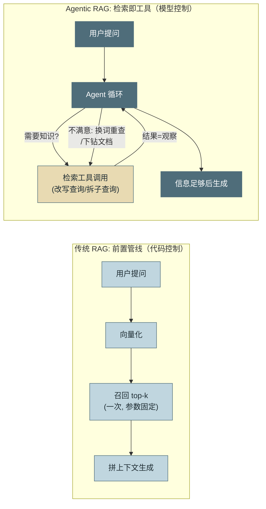
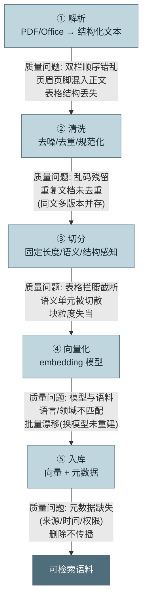
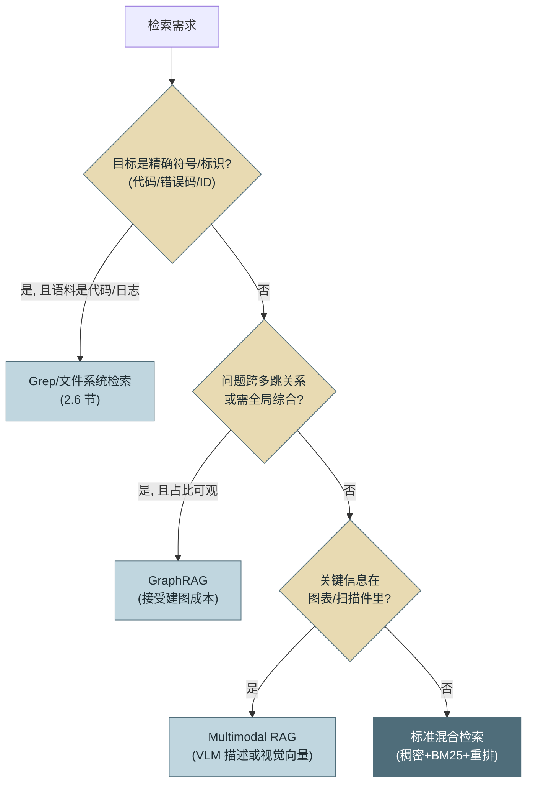

# 第 11 章 RAG 与检索

> 本章另有约十倍篇幅的**详解扩展版**：[详解扩展版/ch11-RAG与检索.md](../详解扩展版/ch11-RAG与检索.md)——独立成文的深读版（初稿，未经审读与来源核验，体例与正文不同；两版内容以正文为准）。

> 第二篇 D. 记忆与检索（状态层）
>
> 第 10 章解决"这个 Agent 记得什么"，本章解决"组织的知识库里有什么"。主线是一个角色转变：**检索从传统 RAG 的"前置管线"降格为 Agent 的"工具之一"**——这个降格反而让它变强了。本章沿"入库 → 检索 → 生成"走完 RAG 全链：入库管线（导入/解析/切分/嵌入）、检索层技术选型（混合/重排/检索前处理：翻译·构建·路由）、生成层的可信答案机制（组装/忠实度/引用/冲突消解）、两个重要变体与一个反直觉结论（Coding 场景下 grep 为何反超向量检索）、向量存储内幕（布局/ANN 索引/增删改/维护），最后以分层评估体系（检索指标/响应指标/黄金集/归因）收束全链。

---

## 1. 场景引入：一条经典 RAG 管线的四种死法

示例助手要接入运维知识库（1.2 万篇 SOP、故障复盘、架构文档）。团队按 2023 年的标准做法搭了**传统 RAG 管线**：用户提问 → 向量化 → 召回 top-5 片段 → 拼进上下文 → 生成答案。上线一个月，评测成功率 61%，失败案例归为四类，每类都指向管线的一个结构性假设：

**死法一：一跳不够。** "查询服务 A 的值班人今天是谁"——需要先查到服务 A 的 owner 团队，再查该团队的值班表。管线只检索一次，第一跳的片段进了上下文，第二跳永远没机会发生。**假设错误：一次检索够用。**

**死法二：检错了没有回头路。** 用户口语化的问题（"那个上传老失败的问题咋处理"）向量化后召回了三篇不相干的文档，生成环节只能硬着头皮编。**假设错误：第一次召回就是最终召回**——管线里没有"发现不对、换个词再查"的回路。

**死法三：不该检索的也检索。** "帮我把刚才的结论整理成表格"——这个请求不需要任何知识库内容，但管线无条件检索，召回的无关 SOP 反而把答案带偏。**假设错误：每问必检。**

**死法四：检索到半张表。** 故障阈值配置表被固定长度切分拦腰截断，召回的片段里数字与行头对不上，Agent 引用了错误的阈值。**假设错误：切分不影响语义。**

前三种死法有同一个解药——把检索的控制权交给循环里的模型；第四种指向入库管线的质量。这正是本章的两大主题。

---

## 2. 原理

### 2.1 Agentic RAG：检索成为工具后得到了什么

**传统 RAG** 是一条固定管线：检索发生在生成之前、由代码触发、参数固定（top-k、单次）、结果无条件进入上下文。**Agentic RAG** 把检索注册为第 7 章标准的工具，进入第 3 章的循环——由此获得三个自由度：

- **何时检索**：模型判断当前任务是否需要外部知识——闲聊与纯推理任务零检索开销（治死法三）。
- **检索什么**：模型把口语问题改写成检索友好的查询、把复合问题拆成子查询逐个检索（治死法一）。
- **是否追加**：召回结果作为**观察**回到循环，模型评估"够不够、对不对"——不满意就换关键词重查、下钻引用的文档（治死法二）。



*图 1：传统 RAG 与 Agentic RAG 的控制流对比——这张图回答"检索的控制权从代码移交给模型后，多出了哪些回路"。左侧是无回路的直线；右侧的检索是循环中的可重入动作，具备观察-调整能力。*

代价也要说清：Agentic 检索平均多 1–3 轮 LLM 调用，延迟与成本上升。因此选型延续第 1 章 2.5 节的判据：**查询形态可预测的高频简单问答（FAQ 类），传统管线仍是正解**（一次调用、延迟可控）；查询开放、需要多跳与纠错的场景才值得 Agentic 化。示例助手的重构采用混合：FAQ 命中走旧管线，未命中降级进 Agent 循环——成功率 61% → 83%，其中很大一部分提升来自"追加检索"回路。

### 2.2 数据入库管线：垃圾进，垃圾出

检索质量的上限在入库时就已锁定。完整管线五步，每步都有典型质量事故：



*图 2：数据入库完整管线与每步的典型质量问题——这张图回答"检索不准时该回头检查哪一步"。经验规律：线上检索问题的归因，解析与切分占大头，向量模型背锅最多但责任最小。*

图 2 从解析画起，但管线还有**第〇步：导入（Loading）**——把散在各处的源数据拉到管线门口，三件事决定后面五步的上限：

**数据源与拉取方式。** 企业语料的典型来源五类：文件与对象存储（PDF/Office 批量）、协作平台（Confluence/飞书/钉钉文档等 wiki 类，走 API 连接器）、网页（站点爬取——内网授权与 robots 合规先行）、业务系统（工单/CRM，结构化记录转文档）、数据库（表与视图的快照或 CDC）。拉取方式三档按变更频率选：**全量批拉**（低频语料，实现最简）、**增量检测**（mtime/内容哈希比对，§4 增量同步的入口）、**事件推送**（源系统 webhook/CDC 实时触发，新鲜度要求高才值得）。

**导入时必须随行的三样东西**——过了这一步就再也补不回来：**源系统的 ACL**（谁能看这篇文档——权限标签在导入时捕获并随块入库，第 4 节红线的数据来源；导入后再补权限等于全库重灌）；**更新时间与版本**（新鲜度提示与冲突消解的依据，2.4 节）；**稳定的文档 id**（跨次导入不变——增量同步的幂等键、删除传播的定位键、2.7 节"文档 id + 块序 + 内容哈希"的第一段）。

**格式归一。** 各路来源统一转成带元数据的中间表示（文本 + 结构标记 + 元数据字典）再进解析——连接器只管"搬运与标注"，理解交给下一步；归一层同时做**编码清理**（乱码、控制字符）与**边界去重**（同一文档在 wiki 与导出 PDF 各存一份的双源问题，按内容哈希在门口拦，比进库后再清便宜得多）。

**解析是被低估的难点。** PDF 不是文本格式而是排版格式——**版面还原**要处理双栏阅读顺序（按坐标天真拼接会把两栏交错成乱码）、页眉页脚剔除、脚注归位；**表格抽取**要处理合并单元格、跨页续表、无框线表格。三个代表性工具的取向：**Docling**（IBM 开源）走"布局模型 + 表格结构识别模型"路线，PDF 学术/技术文档质量高；**MinerU** 对中文文档与公式的处理突出；**Unstructured** 胜在格式覆盖面（Office/HTML/邮件等一站式）。选型建议按语料构成做小样本对比测试——解析质量的方差远大于工具宣传的差异。

**切分策略三档。** **固定长度**（如 512 token + 10% 重叠）：实现最简单，但对语义边界视而不见——死法四的元凶；**语义切分**：按相邻句 embedding 相似度的断崖处切，边界质量好、计算成本高；**结构感知切分**：按文档自身结构（标题层级、段落、表格边界）切，表格作为整块保留——质量上限最高，**前提是解析保留了结构**。这引出本节的核心结论：**切分质量的上限由解析质量决定**——解析丢了结构，最好的切分器也只能在乱码上切。实操默认：结构感知为主、超长节内退化为带重叠的固定长度、表格永不切分（超长表格转"逐行文本化"再切）。

**分块的工程参数**，四个决定落地质量的细节：**块大小**——经验区间 256–512 token 检索精度好、512–1024 token 语境更足，没有普适最优值，与 top-k 和生成层预算联动（块大小 × top-k ≈ 每次检索注入量，第 5 章窗口账）、与父子块方案联动（2.3 节：用了 small-to-big，小块可以更小）；**计数用 token 不用字符**——嵌入模型有输入上限（附录 1.8），**超限部分多被静默截断：块尾内容不进向量、永远检索不到**，这是最隐蔽的暗坑之一，块大小上限必须 ≤ 嵌入模型输入上限并留余量；**重叠 10–20%**——固定长度切分的边界断句保险，结构感知切分下按语义边界落刀、重叠的必要性大幅下降；**切点回退到句边界**——宁可块尺寸不齐，不在句子中间落刀（半句话的向量语义是噪声）。

**元数据与向量同等重要。** 每个块至少携带：来源路径、章节路径（"运维手册 > 存储 > 故障处理"）、更新时间、权限标签。它们支撑过滤检索（只搜某系统的文档）、新鲜度提示（第 10 章过时污染的知识库版）与权限裁剪（第 4 节的合规红线）。

切分的一个残留病灶是**块的语境失忆**：块一旦离开文档，"该阈值调整后故障率降至 0.1%"这样的句子就不知道说的是哪个系统哪次调整——块内文本自身检索不到它省略掉的主语。**上下文检索（Contextual Retrieval，Anthropic 2024 [C-25]）** 的解法是入库时多花一步：用 LLM 通读全文，为每个块生成一两句语境说明（"本块出自服务 A 对象存储 2024-Q3 故障复盘的阈值配置节"）前置到块文本，再做 embedding 与 BM25 索引。官方实验中 top-20 检索失败率约降一半，叠加重排序降幅更大；全库过一遍 LLM 的成本靠提示缓存压到可接受（同一篇文档做 N 个块，文档本体只付一次）。它与结构感知切分互补：切分保住块的**完整性**，语境前置补回块的**归属**。

### 2.3 检索层：混合、重排与选型

**为什么必须混合检索（Hybrid Retrieval）。** 两路检索的失败模式恰好互补：**稠密检索**（Dense，向量相似度；embedding 的机制基础与工程后果参见附录 1.8）擅长语义泛化（"上传失败"匹配到"对象存储写入异常"），但对**精确 token 失灵**——错误码 `ERR-4032`、工单号、函数名在 embedding 空间里与相邻编号几乎等距；**稀疏检索**（Sparse，BM25 词频统计）对精确词命中稳定，但改写同义就抓瞎。混合方案两路各自召回、用 **RRF（Reciprocal Rank Fusion，倒数排名融合）** 合并——RRF 只用排名不用分数（`score = Σ 1/(k + rank_i)`），天然规避了两路分数不可比的问题。经验数据：混合相对单路稠密，在含精确查询的混合负载上召回率普遍提升 10–20 个百分点。两路之外还有第三条路：**学习型稀疏嵌入**（SPLADE 类）——模型产出的词表维度稀疏向量，像 BM25 一样走倒排索引、可解释，又像稠密一样懂同义扩展，可替换或叠加 BM25 通道（嵌入模型的完整谱系——词向量 → BERT → LLM 嵌入 → 稀疏/多模态旁系——见附录 1.8）。

**重排序（Reranking）** 是精度的第二级火箭：粗召回阶段用便宜方法取 top-50–100，再用**交叉编码器（Cross-Encoder）** 对 query-文档对逐一打分取 top-5–10。交叉编码器让 query 与文档在模型内部充分交互，精度显著高于双塔式的向量内积，代价是每对一次前向计算——只能用在精排。延迟预算：50 对重排约几十到百毫秒级，多数场景值得。

**检索前处理：翻译、构建、路由。** 召回失败的原因常在查询而非索引——用户的问题落到索引之前，还有三道工序要过。

**① 查询翻译（Query Translation）**：同一语言内把"人话"变"检索友好"。五个技术按适用场景——**改写（Rewrite）**：口语转检索友好（去代词、补全实体、关键词化），对话式检索还必须带上文消解指代（"那这个的阈值呢"单独检索必败）；**分解（Decompose）**：复合问题拆成子查询各自检索再合并，是多跳问题在管线内的形态；**HyDE（Hypothetical Document Embeddings，假设文档嵌入）**：让模型先写一段"假想答案"，用它而非原问题做向量查询，问题与文档的语域差（疑问句 vs 陈述句）被抹平；**Step-back（后退提问）**：先把具体问题升一层抽象再检索（"这个报错怎么修"先升为"该组件的错误处理机制"），召回原理性文档后再回落细节——专治"问题很具体、答案在概述文档里"；**Multi-Query**：同一问题生成数个措辞变体各自召回、RRF 合并，是廉价的召回保险。

**② 查询构建（Query Construction）**：自然语言变成目标存储的**结构化查询**。三种目标三种形态——向量库的 **self-query / 元数据过滤器构建**（"去年 Q3 之后存储类的故障复盘"→ 过滤条件 `type=复盘 AND dt>2025-07` + 语义查询"存储故障"：LLM 按元数据 Schema 产出过滤器，2.2 节的元数据在此兑现第二次价值——时间与类别约束交给过滤器精确执行，向量只管语义）；关系库的 **text-to-SQL**（第 21 章的受防护形态：只读白名单 + 强制 LIMIT + EXPLAIN 预算——构建出的查询过与人写 SQL 同等的闸）；图库的 **text-to-Cypher**（GraphRAG 的查询侧，2.5 节）。构建的共同纪律：**输出是受 Schema 校验与白名单约束的结构化产物，不是自由文本**——第 7 章约束解码思想的检索版。

**③ 查询路由（Query Routing）**：决定这条查询去哪个索引/引擎。**逻辑路由**——LLM 分类或规则判定（产品问题→产品库、指标口径可答→语义层模板、关系问题→图谱），出口必须枚举、超纲走默认路（第 18 章条件路由的同款纪律）；**语义路由**——查询向量与各库描述向量的相似度选路，零 LLM 调用、毫秒级，适合高 QPS 快速路径。路由错误的代价是整条链全错，所以要有兜底：置信不足时并发多路（费用换召回），或回落"全库混合检索"默认路——**路由是优化不是闸门，宁可多查不可查空**。

与 2.1 节的对应关系要说清：这三道工序正是 Agentic RAG 三个自由度的管线化身——检索即工具时，翻译与路由由循环里的模型自然完成（改写查询 = 翻译，选哪个检索工具 = 路由），构建则以工具参数 Schema 的形态存在；**传统管线（FAQ 快速路径）没有循环可依赖，三道工序必须显式建**——这也再次解释了两种形态的成本差从哪来。

**父子块检索（small-to-big）。** 切分粒度存在两难：块小则向量"纯"、检索准，但语境残缺、生成难用；块大则语境完整，但多主题混入一个向量、检索发糊。解法是**检索与注入用不同粒度**：按小块（句子/小段）建向量索引保检索精度，命中后注入其**父块**（完整小节）供生成使用——"用小块找，用大块读"。它与 2.2 节的上下文检索互补：一个给块前置语境说明（不改块的大小），一个直接换更大的语境单位（不改索引的精度）；两者都在治同一个病——**检索的最优单位与生成的最优单位不是同一个**。

**向量库选型矩阵**（以四个代表为例）：

| | FAISS | Chroma | Qdrant | Milvus |
|---|---|---|---|---|
| **形态** | 库（无服务层） | 嵌入式/轻服务 | 独立服务（Rust） | 分布式平台 |
| **量级甜区** | 单机内存内，原型/研究 | 百万级以内，开发友好 | 千万级，单集群生产 | 亿级以上，多副本 |
| **过滤能力** | 需自行组合 | 基础元数据过滤 | 结构化过滤强（payload 索引） | 强，分区+标量索引 |
| **运维成本** | 无服务可运维（自己兜底） | 低 | 中 | 高（组件多） |
| **适用判断** | 算法验证、嵌入进程内 | 项目起步、单机够用 | 生产主力的性价比之选 | 平台级、多租户、超大规模 |

选型纪律与第 10 章同款：**从量级出发，不为想象中的规模预付运维成本**——示例助手的 1.2 万篇文档，Chroma 甚至 SQLite+numpy 都绰绰有余。

### 2.4 生成层：从召回片段到可信答案

RAG 的 G 常被当成"把片段塞进提示词，剩下听天由命"——检索层的全部投入，都可能在生成这最后一公里被损失掉。生成层有自己的四个机制，对应"直接塞片段"的四种失败：

**① 上下文组装（Context Assembly）。** 三条纪律：**去重与合并**——多路召回的重复片段去重，同文档的相邻块合并回连续段落（恢复语境、省 token）；**位置摆放**——最相关的片段放组装块的两端，次要的居中（第 5 章 U 型曲线在 RAG 的直接应用：塞进上下文 ≠ 被模型用到，中部是注意力盲区）；**元数据随行**——来源路径、章节、更新时间随片段一起注入，它们是模型判断新鲜度与权威度的依据，也是下游引用标注的原料（2.2 节"元数据与向量同等重要"在生成侧的兑现）。

**② 忠实度契约（Faithfulness）。** RAG 的生成不是自由写作，是"带材料的写作"，提示词要立三条契约：**只依据所给材料回答**；**材料不足时显式说"知识库未覆盖"**，而不是用参数化知识补脑（无据不答比错答便宜一个数量级——错答的代价是用户信任与下游纠错）；**区分转述与推断**（"文档说 X"与"由 X 可推出 Y"要可分辨）。要警惕 RAG 幻觉的新形态：不再是无中生有，而是**引了真文档、说了文档没说的话**——引用存在 ≠ 忠实，评测必须把两者分开度量（引用正确性 vs faithfulness，第 15 章 RAGAS 的口径）。

**③ 引用与溯源（Citations）。** 实现很轻：召回片段编号注入（`[1] [2] …`），要求生成时对每条结论做句级/段级标注；有原生 citations 能力的供应商 API 可直接返回结构化引用区间。价值有三重：**用户可验收**（点开原文核对，信任从"它说的"变成"它指给我看的"）；**评测可自动化**（断言与引用的对齐可程序化检查）；**幻觉可定位**（哪句话没有出处一目了然）。Deep Research 类产品能在非代码领域跑通，靠的正是"引用可回查"这个验证信号（附录 4.3）——引用是 RAG 生成层的 Verifier 接口。

**④ 冲突消解（Conflict Resolution）。** 多片段口径矛盾（新旧版本 SOP、不同来源各执一词）时，模型的默认行为是挑"说得更流畅"的那份——雄辩压过正确的 RAG 版。消解要有显式顺序：**更新时间优先**（元数据支撑，新版口径覆盖旧版）→ **来源权威分级**（官方手册 > 会议纪要，分级作为元数据入库）→ **无法裁决时明示冲突**、并列呈现两个口径交给用户——绝不静默二选一。


*图 3：生成层四机制——这张图回答"片段进了上下文之后，到可信答案还差哪几步"。四个机制各治一种失败：组装治位置盲区、契约治补脑幻觉、引用治不可验收、消解治静默二选一；最右的评测钩子提醒：生成层的质量要与检索层分开度量。*

### 2.5 RAG 变体：按问题形态选工具

**GraphRAG**：入库时用 LLM 抽取实体与关系构建知识图谱，并对图社区生成层级摘要；查询时沿图遍历。适用两类标准向量检索做不好的问题：**多跳关系**（"服务 A 依赖的中间件的 owner 是谁"——向量检索每跳都是独立近似，链条越长越碎）与**全局性问题**（"整个知识库反映出哪些系统性风险"——答案不在任何单个片段里，需要社区摘要）。代价同样显著：建图是全量 LLM 处理（成本约为普通入库的一到两个数量级）、增量更新困难。判定：图谱值不值得建，看这两类问题在真实负载中的占比。

**Multimodal RAG**：语料含图表、架构图、扫描件时，纯文本管线会丢失关键信息（财报的结论在图里）。两条技术路线：视觉 embedding 直接对页面图像编码检索；或入库时用视觉语言模型给图表生成文字描述再走文本检索。后者实现简单、可与既有管线融合，前者对"文字说不清的视觉信息"上限更高。



*图 4：检索方案选型决策树——这张图回答"什么问题形态导向什么检索方案"。默认答案是标准混合检索；三个分支都是"特定问题形态 + 愿付对应成本"才成立的例外。*

**Deep Research（深度研究形态）**：它不在图 4 的决策树里——因为它不是第四种检索变体，而是把本章全链推到极限的**应用形态**：输入一个开放调研问题，输出一份带引用的长报告。解剖开是五段机制，没有一段是新发明：

① **研究规划**——问题分解成子课题清单（第 4 章显式规划的应用：研究计划是一等公民，可给用户过目修正后再开跑）；
② **多轮迭代检索**——每个子课题走 2.1 节的 Agentic 回路（检索 → 读 → 发现新线索 → 追加检索），先广度铺开再对高价值线索深度下钻；来源横跨网页搜索、内部知识库、结构化数据——2.3 节的查询路由在此按子课题逐条发生；
③ **证据积累与交叉验证**——跨来源事实核对：单源结论标注低置信，多源冲突走 2.4 节④的消解顺序（时间 > 权威级 > 明示分歧）；中间产物是一张**证据表**（断言 → 支撑来源列表），它同时是下一步引用的原料；
④ **合成长报告**——按大纲合成 + 句级引用（2.4 节③）。**"引用可回查"就是它的 Verifier 信号**——代码领域有编译测试，调研领域的可验证性全靠"每条结论能锚到来源"，这是 Deep Research 能在非代码领域跑通的关键（第 23 章 Q1 推论的现实案例）；
⑤ **覆盖度自检**——对照子课题清单查"哪些证据仍不足"，不足则回到②——照例有界（轮次与预算上限，第 3 章）。

三条工程要点：**长时程即第 12 章的生命周期问题**——数分钟到数十分钟的运行依赖断点续跑与进度事件流（用户要看得到"正在查什么"）；**多 Agent 版就是 Supervisor + Parallel**——主管拆子课题、子 Agent 并行检索、结论经交接包汇总（第 17/18 章原样落地；检索废料留在子会话，第 23 章探索外包的同款收益）；**成本形态要有数**——一次深度研究是数十到数百次检索加数十万 token，预算熔断（第 3 章）与 cost per successful task（第 16 章）照管，它是"单任务成本上限"类告警的代表场景。边界照旧：它解决"广而深的开放调研"，不替代精确问答——FAQ 与单跳查询走快速路径，判据仍是问题形态。

### 2.6 反直觉结论：Coding 场景下 grep 反超向量检索

2024–2025 年 Coding Agent 的实践收敛出一个让 RAG 从业者意外的事实：主流产品（Claude Code 等）的代码检索**不用向量索引，用 grep 与文件系统遍历**。三个结构性理由：

**精确符号主导。** 代码检索的查询多是标识符——函数名、类名、错误消息字面量。它们是精确 token，`grep -rn "calc_fee"` 零误报；而向量空间里 `calc_fee` 与 `calc_tax`、`compute_fee` 距离很近——**语义泛化在这里不是能力而是噪声源**（第 9 章 LSP 一节的重名问题即其表现）。

**实时性硬约束。** Agent 正在**边改边查**自己刚写的代码——向量索引的"修改→重嵌入→可检索"链路有分钟级滞后，等于检索一个旧版本世界；grep 读的是磁盘上此刻的文件，永远最新。

**零索引成本。** 无入库管线、无同步任务、无索引与源码的一致性问题——第 2.2 节的整条管线连同它的全部故障模式一起消失。

还有第四个常被忽略的原因：**Agentic 循环补齐了 grep 的传统短板**。grep 的弱点是"不知道该搜什么词"——而循环中的模型会自己换词、加通配、缩小目录多轮尝试（2.1 节的追加检索回路），这恰是传统 RAG 时代 grep 输给向量检索的那个理由。边界同样要说清：这个结论限于**代码与结构化文本**；自然语言文档（需求文档、用户反馈）的同义改写与跨语言匹配仍是向量检索的主场——图 4 决策树的第一个分支问的就是这条边界。

### 2.7 深入向量存储：布局、索引与增删改

前面把向量库当黑盒选型（2.3 矩阵），本节打开盒子——理解存储与索引的机制，才能解释选型矩阵里那些"量级甜区"从何而来、增删改为什么和传统数据库不一样。

**向量在库里长什么样。** 一条向量记录 = **定长浮点数组**（维度 d × 4 字节 fp32：1536 维 ≈ 6KB/条，百万条仅向量本体 ≈ 6GB——内存账要先算）+ **payload/元数据**（支撑过滤与溯源，2.2 节）+ **索引结构**（下述）。向量本体是定长块、天然适合顺序布局与 mmap；真正吃内存的往往是索引。压缩靠**量化**：标量量化（fp16/int8，压 2–4 倍，精度损失小）、**乘积量化（PQ）**——把向量切成 m 段、每段用小码本聚类编码，压缩数十倍但有损，典型用法是"压缩向量粗筛 + 原始向量重排"；再往上是磁盘方案：热索引驻内存、原始向量落 SSD（DiskANN 谱系），十亿级单机可行。

**ANN 索引：用召回换速度。** 精确检索（Flat，暴力全扫）是 O(N)——百万级毫秒到百毫秒尚可接受，往上必须**近似最近邻（ANN）**。三大家族：

| 索引 | 机制 | 强项 | 代价 | 关键参数 |
|---|---|---|---|---|
| **HNSW**（分层小世界图） | 多层跳表式图，查询沿图贪心下降，近 O(logN) | 高召回高 QPS，**生产默认** | 内存大（图边开销约再吃一份向量体积）；删除靠墓碑，图会退化 | M（边数）、efSearch（越大召回越高越慢） |
| **IVF**（倒排文件） | k-means 聚成 nlist 桶，只扫最近 nprobe 个桶 | 内存省；配 PQ（IVF-PQ）上亿级 | 召回对 nprobe 敏感；数据漂移后聚类中心过时需重训 | nlist、nprobe |
| **DiskANN**（磁盘图） | 图索引放 SSD，内存只留压缩向量 | 十亿级单机，成本低 | 延迟毫秒到十毫秒级；实现复杂 | —— |

经验选择：内存装得下 → HNSW；规模大预算紧 → IVF-PQ；十亿级 → DiskANN 或分布式（Milvus 档，2.3 矩阵的"量级甜区"至此有了机制解释）。所有 ANN 都在**召回-速度-内存三角**上取舍——这就是 2.8 节坚持"用黄金集实测 recall@k、不看相似度分数"的又一层原因：索引参数一调，召回就变。

**增删改：写路径与传统库的三个不同。** **其一，插入批量优先**——逐条建图/入桶开销大，入库管线天然批处理；upsert 按外部 id 幂等，id 设计用"文档 id + 块序 + 内容哈希"，与增量同步的幂等对齐。**其二，删除是墓碑不是原地删**——图和桶结构不支持原地摘除，删除先打**墓碑标记**（查询时过滤掉），墓碑积累会拖慢查询、拉低召回，须靠**后台 compaction/索引重建**真正回收——§4"删除传播"落到向量库，实际动作就是"标记 + 定期重建"。**其三，更新即删加插**——embedding 变了，它在图/桶里的位置整个失效，不存在原地更新；文档更新的正确姿势是按 doc_id 把该文档全部块删旧插新。两个一致性注记：刚写入的数据在部分实现里走"实时小段（暴力扫）+ 批量大段（ANN）"的混合查询，可见性有秒级窗口；**换嵌入模型 = 全量重灌**（附录 1.8 的机制论证），用蓝绿双索引灰度切换，绝不混版本查询（元数据里带 embedding_model_version 字段，混版本是静默事故）。

**选型与评测的补充两条。** 其一，**宿主化趋势**：pgvector（Postgres）、Elasticsearch/OpenSearch、Redis 等存量引擎都已长出向量能力——"数据已经住在哪"常比"专用库快多少"更重要：跟着现有库走，事务、权限、备份、运维全部白拿，中小量级的第一选择（与第 10 章"关系库 + 向量列"的记忆场景同一逻辑）。其二，**评测口径**：公开跑分（ann-benchmarks 类，recall@k-QPS 曲线）只做粗筛；决定性评测必须用**自家向量 + 自家过滤条件**实测——**带过滤的检索（filtered search）是公开跑分的盲区、生产的常态**（作用域/权限/时间过滤叠加向量查询，部分实现在高过滤比下召回骤降），这也是 2.3 矩阵单列"过滤能力"一栏的原因。

**存储侧的数据维护**收进日常运营四件事：**索引健康指标**——墓碑比例、段/图碎片度，以及用 2.8 节黄金集定期跑 recall@k 当索引健康探针（召回缓慢下滑常是墓碑与漂移的复合症状）；**重建窗口**——compaction 与 IVF 重训放低峰期，蓝绿切换零停机；**备份的正确对象**——向量可再生，真正要备的是源文档与元数据，向量库的 RTO 取决于重灌吞吐（嵌入调用走批量接口，第 16 章）；**对账**（§4 的条数/哈希对账在存储侧的延伸：源文档数 × 平均块数 ≈ 向量条数，持续偏离即删除传播失守）。

### 2.8 RAG 评估体系：分层指标、黄金集与归因动线

RAG 是两级火箭（检索 → 生成），端到端一个分数看不出哪级出了问题——评估体系的第一原则就是**分层解耦**：检索层、响应（生成）层、端到端各有指标、各自归因。评测方法学（k 采样、门禁、Judge 校准）归第 15 章，本节给 RAG 专属的三件套：指标、黄金集、归因动线。

**检索评估指标**——回答"该召回的召回了吗、排得靠前吗"，全部可程序化计算，前提是黄金集标注了"问题 → 应命中文档"：

| 指标 | 口径 | 回答什么 |
|---|---|---|
| **hit rate / recall@k** | 应命中文档出现在 top-k 的查询占比 / 应命中集被 top-k 覆盖的比例 | 召回够不够——最先看的一个 |
| **precision@k / context precision** | top-k 中真正相关的占比（相关性可人工标注或 LLM 判定） | 召回纯不纯——低了稀释生成层注意力（坑 6） |
| **MRR** | 首个命中文档排名的倒数均值 | 命中排得靠不靠前——重排序的直接考题 |
| **nDCG@k** | 按分级相关性加位置折扣的排序质量 | 多文档、相关性有梯度时用它替代 MRR |
| **context recall** | 标准答案所需的事实被召回材料覆盖的比例 | 多跳问题专用——单文档命中不够，事实要凑齐 |

两条口径纪律：**分查询类型报告**（语义改写类 / 精确标识类 / 多跳类分开算——坑 5 的教训：混在一起，稠密检索对精确 token 的结构性失灵会被平均掉）；**相似度分数不是指标**（分数高不等于命中对，评估只认黄金集比对）。

**响应评估指标**——回答"拿着召回材料，答得对不对、稳不稳"，对应 2.4 节生成层四机制，多数不需要标准答案（对照召回材料即可判定，LLM-as-Judge 承担，校准纪律见第 15 章）：

| 指标 | 口径 | 需要什么 | 对应机制 |
|---|---|---|---|
| **faithfulness（忠实度）** | 答案中被召回材料支撑的断言占比 | 无需标准答案（对照材料判定） | 2.4 节②——治"引真文档说假话" |
| **answer relevance（切题度）** | 答案与问题的相关程度 | 无需标准答案 | 治"答非所问"（top-k 塞太多的典型症状） |
| **引用正确率** | `[n]` 引用与其支撑断言的对齐率 | 无需标准答案，可程序化 | 2.4 节③——引用存在 ≠ 忠实，两者分开测 |
| **answer correctness（正确性）** | 与标准答案的事实一致性 | 需要标准答案 | 端到端主信号 |
| **拒答质量** | 库外问题正确说"未覆盖"的比例 + 库内问题误拒率 | 需要库外负样本集 | 2.4 节②"无据不答"——只测正样本永远发现不了补脑 |
| **冲突处理率** | 材料含矛盾口径时按序消解或明示冲突的比例 | 需要冲突样本对 | 2.4 节④——不测它，模型默认挑"说得流畅的" |

行业工具的命名对照一句话：RAGAS 的 faithfulness / answer relevancy / context precision / context recall 与 TruLens 的 "RAG 三元组"（context relevance / groundedness / answer relevance）说的都是这套东西，选一家口径用熟即可（第 15 章工具表）。

**黄金集构建，三个来源按成本递增混用**：**线上回流**——真实查询的 bad case 经根因确认后入集（第 15 章闭环，代表性最好）；**LLM 合成**——从文档反向生成问答对，最大优点是"应命中文档"标注天然免费（问题就是从它生成的）；多跳场景别逐块出题，先抽实体关系建轻量知识图谱、沿图生成跨文档问题（Ragas 的做法）才能覆盖多跳与隐式提问。代价是问题带"文档腔"、分布偏离真实用户，必须人工抽检并与真实查询混配，且**生成与评测用不同源的模型**（同源偏差：出题者与判卷者是一家，难度与口径会系统性偏软）；**人工标注**——百例级精标（问题/应命中文档/标准答案三元组），贵但担纲回归门禁主力。集合结构上必须**分层覆盖**：语义改写、精确标识、多跳、**库外负样本**（没有它拒答质量无从测起）、冲突样本对，五类缺一不可。

**归因动线**把两张指标表串成排障顺序：端到端答错 → 先查检索（应命中文档在 top-k 吗？**不在** → 检索层修：检索前处理 / 混合双路 / 切分与语境，2.2–2.3 节；**在** → 继续）→ 再查响应（faithfulness 低 → 生成层修：忠实度契约与组装，2.4 节；faithfulness 高但答案仍错 → 材料本身过时或矛盾 → 回入库管线与冲突消解）。动线之上，**指标组合本身就是诊断书**——两两交叉读，故障定位比单指标精确一个量级：

| 分数组合 | 诊断 |
|---|---|
| recall 高、precision 低 | 信息找到了但噪声大——排序差/缺重排/top-k 过大 |
| precision 高、recall 低 | 找到的都对但缺关键事实——切分丢语义/查询未覆盖实体/多跳不足 |
| faithfulness 低、correctness 高 | 模型凭参数知识答对了，**没依据当前知识库**——下次库更新它就错 |
| faithfulness 高、correctness 低 | 忠实转述了错材料——**知识库本身错误或过期**，回入库管线 |
| relevance 低 | 提示词未约束聚焦问题，或 top-k 塞太多（坑 6） |经验规律重复一遍：端到端失败的归因里检索层责任常超一半，而团队的优化精力往往错配在提示词上——**分层指标的价值就是把力气按账单分配**。

## 3. 动手实现（贯穿项目增量）

本章增量：`src/assistant/tools/doc_search.py`——为项目文档实现**混合检索工具**（BM25 + 词袋余弦双路召回、RRF 融合、结构感知切分）。零外部依赖以保持可运行：稠密通道用词袋余弦作**教学替身**（接口与真 embedding 一致，生产替换为 embedding API 即可）；中文用字符 bigram 近似分词（生产换真分词器）；块预算以字符数近似（`max_chars`）——生产按 2.2 节分块参数的纪律换成 token 计数，并对齐嵌入模型输入上限。

```python
# src/assistant/tools/doc_search.py — 混合检索：结构感知切分 + BM25/余弦双路 + RRF
import math
import re
from collections import Counter
from dataclasses import dataclass
from pathlib import Path


def tokenize(text: str) -> list[str]:
    """英文按词、中文按字符 bigram 的简易分词（生产替换为真分词器）"""
    words = re.findall(r"[a-zA-Z0-9_\-]+|[一-鿿]+", text.lower())
    tokens = []
    for w in words:
        if re.match(r"[a-zA-Z0-9_\-]", w):   # 与 findall 首支一致: _mod/-flag 不落入 bigram 支
            tokens.append(w)
        else:
            tokens += [w[i:i+2] for i in range(len(w)-1)] or [w]
    return tokens


@dataclass
class Chunk:
    doc: str          # 来源路径（元数据：溯源与权限过滤的挂载点）
    section: str      # 章节路径，如 "运维手册 > 存储"
    text: str


CODE_FENCE = "`" * 3   # 拼接写法：避免三连反引号提前终止书中的 Markdown 代码块


def chunk_markdown(path: Path, max_chars: int = 1200) -> list[Chunk]:
    """结构感知切分：按标题层级切；超长节内退化为定长；代码块/表格不拆"""
    chunks, section, buf, in_code = [], path.stem, [], False
    for line in path.read_text("utf-8").splitlines():
        if line.startswith(CODE_FENCE):
            in_code = not in_code        # 围栏状态：不跟踪它, 代码块内的 "# 注释" 会被误判为标题
        if line.startswith("#") and not in_code:
            if buf:
                chunks.append(Chunk(str(path), section, "\n".join(buf)))
            section, buf = line.lstrip("# ").strip(), []
        else:
            buf.append(line)
            over = sum(len(x) for x in buf) > max_chars
            splittable = not (in_code or line.startswith("|")
                              or line.startswith(CODE_FENCE))
            if over and splittable:      # 表格行与代码块（含内部行）不作为切点
                chunks.append(Chunk(str(path), section, "\n".join(buf)))
                buf = []
    if buf:
        chunks.append(Chunk(str(path), section, "\n".join(buf)))
    return [c for c in chunks if c.text.strip()]


class HybridIndex:
    def __init__(self, chunks: list[Chunk], k1: float = 1.5, b: float = 0.75):
        self.chunks = chunks
        # 标题路径拼进索引文本：章节名往往携带块内未复述的关键词（如"上传失败排查"）
        self.docs_tokens = [tokenize(c.section + "\n" + c.text) for c in chunks]
        self.doc_freq: Counter = Counter()
        for toks in self.docs_tokens:
            self.doc_freq.update(set(toks))
        self.avg_len = sum(map(len, self.docs_tokens)) / max(len(chunks), 1)
        self.k1, self.b = k1, b

    def _bm25(self, query: list[str]) -> list[float]:
        n = len(self.chunks)
        scores = []
        for toks in self.docs_tokens:
            tf, ln, s = Counter(toks), len(toks), 0.0
            for q in query:
                if q not in tf:
                    continue
                idf = math.log((n - self.doc_freq[q] + 0.5) / (self.doc_freq[q] + 0.5) + 1)
                s += idf * tf[q] * (self.k1 + 1) / (
                    tf[q] + self.k1 * (1 - self.b + self.b * ln / self.avg_len))
            scores.append(s)
        return scores

    def _cosine(self, query: list[str]) -> list[float]:
        """词袋余弦——稠密通道的教学替身；生产换 embedding API，接口不变"""
        qv = Counter(query)
        out = []
        for toks in self.docs_tokens:
            dv = Counter(toks)
            dot = sum(qv[t] * dv[t] for t in qv)
            norm = math.sqrt(sum(v*v for v in qv.values())) * \
                   math.sqrt(sum(v*v for v in dv.values()))
            out.append(dot / norm if norm else 0.0)
        return out

    def search(self, query: str, top_k: int = 5, rrf_k: int = 60) -> list[dict]:
        """双路召回 → RRF 融合（只用排名不用分数，规避两路分数不可比）"""
        q = tokenize(query)
        fused: dict[int, float] = {}
        for scores in (self._bm25(q), self._cosine(q)):
            ranked = sorted(range(len(scores)), key=lambda i: scores[i], reverse=True)
            for rank, idx in enumerate(ranked):
                if scores[idx] > 0:
                    fused[idx] = fused.get(idx, 0) + 1 / (rrf_k + rank + 1)
        top = sorted(fused, key=fused.get, reverse=True)[:top_k]
        return [{"doc": self.chunks[i].doc, "section": self.chunks[i].section,
                 "text": self.chunks[i].text[:800], "score": round(fused[i], 4)}
                for i in top]
```

注册为工具——描述里写明"何时不用"（治死法三的 Agentic 要领），返回值首行给摘要（第 7 章返回值规范）：

```python
def build_doc_search(docs_dir: str):
    chunks = [c for p in Path(docs_dir).rglob("*.md") for c in chunk_markdown(p)]
    index = HybridIndex(chunks)

    def run(inp: dict) -> str:
        hits = index.search(inp["query"], top_k=inp.get("top_k", 5))
        if not hits:
            return "未检索到相关文档。可尝试更换关键词（如用错误码原文、系统名）再次检索。"
        lines = [f"共 {len(hits)} 条命中（回答时用 [n] 标注每条结论的出处；"
                 f"可换词追加检索）："]
        for i, h in enumerate(hits, 1):     # 片段编号: 生成层引用契约的原料（2.4 节）
            lines.append(f"[{i}] [{h['section']}] 来源: {h['doc']}\n{h['text']}")
        return "\n".join(lines)

    return RegisteredTool(
        name="search_docs",
        description="混合检索项目知识库（SOP/手册/复盘）。当任务需要项目专有知识时使用；"
                    "闲聊、纯推理或整理已有对话内容时不要使用。查询建议用关键词而非整句，"
                    "结果不理想可换词多次检索。",
        input_schema={"type": "object", "properties": {
            "query": {"type": "string", "description": "检索关键词，支持中英文与错误码"},
            "top_k": {"type": "integer", "description": "返回条数，默认 5"}},
            "required": ["query"]},
        run=run, idempotent=True)
```

回测四种死法：死法一、二由循环回路解决（模型可拆查、可换词重查——工具描述明确鼓励）；死法三由描述里的"何时不用"抑制；死法四由 `chunk_markdown` 的结构感知（表格行与代码块不作为切点）缓解。BM25 通道保证 `ERR-4032` 这类精确查询命中，余弦通道兜住同义改写——两路互补正是 2.3 节的设计落地。返回值的 `[n]` 片段编号与元数据（章节/来源）则是 2.4 节生成层的接口：引用标注有了锚点，新鲜度与权威判断有了依据。

---

## 4. 生产级考量

**权限过滤是检索层的红线，不是生成层的。** 检索结果一旦进入上下文，就可能被模型复述——**RAG 是天然的越权通道**：无权限过滤的知识库检索，等于把最高权限账号借给每个提问者。ACL 必须作为元数据在**召回阶段**过滤（WHERE 条件，与第 10 章作用域同一原则），绝不能指望提示词约束"不要展示无权内容"（第 6 章的概率性 vs 确定性论证第三次适用）。

**入库是持续管线，不是一次性任务。** 源文档在变：增量同步（新增/修改文档的检测与重索引）、**删除传播**（源删了索引必须删——检索到已废弃 SOP 比检索不到更糟，与第 10 章过时记忆同构）、按更新时间的新鲜度提示随结果返回。管线用数据工程的标准姿势管理：调度、监控、失败重试、对账（索引条数 vs 源文档数）。落到向量存储侧的具体动作（墓碑与 compaction、删加插式更新、蓝绿重建、索引健康探针）见 2.7 节。

**评估分层落地，别只看端到端。** 指标、黄金集与归因动线已在 2.8 节体系化；生产侧补两条：检索层评测随每次入库管线变更跑（解析器/切分/嵌入模型换了，先看 recall@k 再上线）；响应层的 faithfulness 抽样用便宜模型日常跑、全量用回归门禁跑（第 15 章分层预算同款）。

**成本结构与缓存。** 检索工具的返回值是上下文大户（5 条 × 800 字符/次），沿用第 7 章管线（截断/摘要/落盘指针）；embedding 调用在入库侧批量化（多数供应商批量价约为实时的一半）；高频重复查询在检索层加结果缓存——注意缓存键要包含权限主体，否则缓存本身成为越权通道。

---

## 5. 常见坑

**坑 1：固定长度切分把表格拦腰截断。**
*症状*：Agent 引用的阈值/配置与原文对不上——数字来自表格前半块，行头在后半块；用户核对原文后信任崩塌。
*根因*：固定长度切分对结构视而不见；表格是"行列对齐才有语义"的整体，切开即错乱。
*修复*：结构感知切分，表格与代码块作为不可切分单元（本章 `chunk_markdown` 的处理）；超长表格逐行文本化（每行拼上表头）再切；上线前用"含表格问答"专项用例回归。

**坑 2：检索层没有权限过滤，RAG 成越权通道。**
*症状*：普通员工问薪酬体系，Agent 引用了仅 HR 可见的文档内容作答；安全审计定级为数据泄露事故。
*根因*：入库时丢掉了源系统的 ACL，或过滤逻辑写在生成层提示词里（"请勿透露敏感内容"——概率性防线必被穿透）。
*修复*：权限标签作为块级元数据入库；召回阶段按提问者身份硬过滤；权限模型变更时触发索引元数据同步；越权检索进红队用例（参见第 13 章）。

**坑 3：所有问题一律先检索。**
*症状*：闲聊与"整理上文"类请求也触发检索，延迟与费用白增；更糟的是无关召回内容把答案带偏（评测显示强制检索使这类任务正确率下降约 10 个百分点）。
*根因*：传统管线思维的残留——检索由代码无条件触发，而非模型按需决策。
*修复*：检索 Agentic 化（本章工具形态），描述中写明适用与不适用场景；对确定命中知识库的 FAQ 流量保留旧管线做快速路径——按查询形态分流而非一刀切。

**坑 4：索引不随源文档更新与删除。**
*症状*：SOP 已废弃三个月，Agent 仍按旧流程指导操作——用户照做后触发了新流程明令禁止的操作；"知识库明明更新了，它怎么还在说旧的"。
*根因*：入库当成一次性任务，无增量同步与删除传播；索引成为源文档的"影子拷贝"，影子不随本体动。
*修复*：变更检测（mtime/hash）驱动增量重索引；删除事件级联清理索引；每块携带更新时间并随结果展示（"本内容更新于 2026-05，注意时效"）；对账告警（索引与源的条数/哈希差异）。

**坑 5：只用向量相似度分数评估检索质量。**
*症状*：离线看"平均相似度 0.85，效果很好"，上线后错误码、工单号、配置项名这类精确查询几乎全军覆没。
*根因*：稠密检索对精确 token 结构性失灵（embedding 空间里相邻编号几乎等距），而相似度分数本身无法暴露这一点——分数高不等于命中对。
*修复*：混合检索补上稀疏通道（本章 BM25）；评测集必须分层覆盖查询类型（语义改写类/精确标识类/多跳类），用 recall@k 对黄金集评测而非看分数自我感觉。

**坑 6：把 top-k 调大当召回保险。**
*症状*：召回不稳，有人把 top-k 从 5 调到 20"求个安心"——端到端评测反而下降：答非所问变多、引用开始指向不相干片段、每次检索的 token 成本翻了三倍。
*根因*：生成层不是多多益善——无关片段稀释注意力、把关键片段挤进中部盲区（附录 1.5 的 U 型），还给模型递上了"错误但流畅"的可引用材料；召回率的问题发生在检索层，却被塞给生成层硬吞。
*修复*：top-k 恒定小值（5–10）+ 重排序保精度（2.3 节）；召回问题回检索层修（混合双路/查询改写/父子块），不靠加量；评测把 faithfulness 与答案相关性分开度量（第 15 章 RAGAS 口径）——单看端到端分数，分不清"检索差"与"塞太多"。

---

## 6. 面试高频问题

**Q1：Agentic RAG 与传统 RAG 的本质区别是什么？**

结论先行：**控制权归属——传统 RAG 由代码在生成前无条件检索一次；Agentic RAG 把检索注册为工具，由模型决定何时检、检什么、是否追加，检索结果成为可评估可纠错的观察。**
- 三个自由度分别治三类失败：按需检索（不该检的不检）、查询改写与拆分（多跳）、追加检索（首查不中可重来）。
- 代价：多 1–3 轮调用的延迟与成本——FAQ 类可预测负载保留传统管线更优。
- 生产形态常是混合：快速路径 + Agentic 兜底。
- 加分点：这是第 1 章"Workflow vs Agent"判据在检索上的实例——查询路径可枚举用管线，不可枚举交给循环。

**Q2：切分策略怎么选？和解析质量什么关系？**

结论先行：**三档——固定长度（简单但切断语义）、语义切分（边界好、成本高）、结构感知（上限最高）；而切分质量的上限由解析质量决定——解析丢了结构，最好的切分器也只能在乱码上切。**
- 解析难点：版面还原（双栏顺序/页眉脚）与表格抽取（合并单元格/跨页）——Docling/MinerU/Unstructured 按语料实测选型。
- 实操默认：结构感知为主、超长节退化定长、表格代码块永不切分。
- 线上检索问题归因中，解析与切分占大头——向量模型常背锅但责任最小。
- 加分点：元数据（来源/章节/时间/权限）与向量同等重要，支撑过滤、溯源与权限裁剪。

**Q3：为什么要混合检索？RRF 解决什么问题？**

结论先行：**稠密与稀疏的失败模式互补——稠密强语义泛化但对精确 token（错误码/ID）失灵，BM25 反之；RRF 用倒数排名融合两路结果，只用排名不用分数，规避两路分数不可比。**
- 数据：混合负载上混合检索相对单路稠密召回率普遍 +10–20pp。
- 重排序是第二级：粗召回 top-50–100 后用交叉编码器精排，精度换毫秒级延迟。
- 评测必须分层覆盖查询类型，"平均相似度高"不能证明精确查询可用。
- 加分点：向量库选型从量级出发（FAISS 原型/Chroma 起步/Qdrant 生产主力/Milvus 平台级），不预付运维成本。

**Q4：GraphRAG 和 Multimodal RAG 分别什么时候值得上？**

结论先行：**按问题形态判定——多跳关系与全局综合类问题占比可观时上 GraphRAG（接受建图成本高、更新难）；关键信息在图表/扫描件里时上 Multimodal RAG。**
- GraphRAG 的两个专属场景：跨实体多跳链（向量检索逐跳近似、链长即碎）与需要社区摘要的全局问题。
- 建图是全量 LLM 处理，成本高出普通入库一到两个数量级——用负载占比论证投入。
- Multimodal 两条路线：VLM 生成图表描述入文本管线（简单、易融合）vs 视觉向量直接检索（上限高）。
- 加分点：默认方案永远是标准混合检索，变体是"特定形态 + 愿付成本"的例外。

**Q5：为什么 Coding Agent 用 grep 而不用向量检索？**

结论先行：**三个结构性理由——精确符号主导（语义泛化是噪声源）、实时性（边改边查，向量索引有分钟级滞后）、零索引成本；且 Agentic 循环补齐了 grep"不知道搜什么"的传统短板。**
- 代码查询多是标识符：`grep calc_fee` 零误报；向量空间里 calc_fee 与 calc_tax 距离过近。
- Agent 检索的是自己刚改的代码——grep 读此刻磁盘，索引读的是旧世界。
- 循环让 grep 会"换词重试"，这正是它在传统 RAG 时代输掉的那项能力。
- 加分点：边界清晰——自然语言文档的同义与跨语言匹配仍是向量检索主场；符号级导航进一步交给 LSP（参见第 9 章）。

**Q6：上下文窗口越来越大，RAG 会被取代吗？**

结论先行：**不会，但分工在变——窗口再大也替代不了检索的四件事：成本（每问全量灌入无法摊销）、规模（知识库以千万 token 起步，窗口以百万计）、权限（裁剪必须发生在进窗口之前，第 4 节红线）、新鲜度（源文档持续在变）；长上下文真正改变的是检索的精度压力。**
- 量级算术：示例助手 1.2 万篇文档远超任何窗口；即便塞得下，每次提问按全量 token 计费也不可持续（长上下文的注意力均匀性另见第 5 章 U 型曲线）。
- 权限是硬边界：全库进上下文等于取消 ACL——这一条与窗口大小无关，永远成立。
- 分工怎么变：窗口变大让 top-k 可以放宽、切分容错更高、Agentic 多轮检索的往返成本更可负担——长上下文是检索的减压阀而非替代品。
- 加分点：小语料（如百页以内的项目文档）整体进上下文确实成为合法选项——判据还是量级与变更频率，而不是"RAG 是否过时"的站队。

**Q7：RAG 的生成层怎么设计？把片段塞进提示词就完了吗？**

结论先行：**不够——生成层有四个机制：上下文组装（去重合并、两端摆放、元数据随行）、忠实度契约（只依据材料、无据不答、转述与推断分离）、句级引用（可验收、可评测、可定位）、冲突消解（时间 > 权威级 > 明示冲突）；"直接塞片段"输在位置盲区、补脑幻觉与静默二选一。**
- RAG 幻觉的新形态：引了真文档、说了文档没说的话——引用存在 ≠ 忠实，两者分开评测。
- 引用是生成层的 Verifier 接口：断言与出处可程序化对齐，Deep Research 类产品的验证信号正是"引用可回查"。
- 冲突绝不静默二选一：模型默认挑"说得更流畅"的那份——雄辩压过正确的 RAG 版。
- 加分点：检索最优单位 ≠ 生成最优单位——父子块（小块检索、父块注入）与上下文检索（块前置语境）都在治这条鸿沟。

**Q8：RAG 系统怎么评估？**

结论先行：**分层解耦——检索层（hit rate/recall@k、precision@k、MRR/nDCG、context recall，全部可程序化）、响应层（faithfulness、answer relevance、引用正确率、correctness、拒答质量、冲突处理率，多数无需标准答案）、端到端只做汇总信号；黄金集三来源（线上回流/LLM 合成/人工精标）且五类分层覆盖（语义改写/精确标识/多跳/库外负样本/冲突样本）。**
- 归因动线：应命中文档不在 top-k → 修检索（检索前处理/混合/切分）；在但 faithfulness 低 → 修生成（契约/组装）；faithfulness 高仍错 → 材料过时或矛盾，回入库管线。
- 两个易漏项：库外负样本（不测它发现不了补脑）、冲突样本对（不测它模型默认挑流畅的）。
- 分查询类型报告——混在一起，稠密检索对精确 token 的失灵会被平均掉；相似度分数不是指标。
- 加分点：LLM 合成问答对的"应命中文档"标注天然免费，但带文档腔，须与真实查询混配；RAGAS 与 TruLens 三元组是同一套口径的两种命名。

**Q9：RAG 检索前有哪几道处理工序？**

结论先行：**三道——查询翻译（改写/分解/HyDE/Step-back/Multi-Query，人话变检索友好）、查询构建（自然语言变结构化查询：向量库元数据过滤器、text-to-SQL、text-to-Cypher，输出必须受 Schema 与白名单约束）、查询路由（逻辑路由枚举出口 / 语义路由毫秒选路，兜底并发多路或全库默认——宁可多查不可查空）。**
- 翻译治语域差（疑问句 vs 陈述句）；Step-back 专治"问题具体、答案在概述文档里"。
- 构建的价值：时间/类别约束交给过滤器精确执行、向量只管语义——元数据的第二次兑现。
- 路由错误代价是整链全错：出口枚举、超纲走默认，路由是优化不是闸门。
- 加分点：三道工序是 Agentic RAG 三自由度的管线化身——有循环时模型自然承担翻译与路由，FAQ 快速路径没有循环，必须显式建；这就是两种形态成本差的来源。

**Q10：向量数据库的索引怎么选？增删改和传统数据库有什么不同？**

结论先行：**索引三家族按"召回-速度-内存三角"取舍——HNSW（图索引，高召回高 QPS 吃内存，生产默认）、IVF±PQ（倒排+量化，省内存上亿级，召回对 nprobe 敏感）、DiskANN（磁盘图，十亿级单机）；增删改三个不同——插入批量优先且 upsert 幂等、删除是墓碑标记加后台 compaction、更新只能删加插（embedding 变则索引位置全变）。**
- 内存账先算：向量本体 = 维度 × 4 字节（1536 维百万条约 6GB），HNSW 的图开销约再吃一份。
- 换嵌入模型 = 全量重灌，蓝绿双索引灰度切换；元数据带 embedding_model_version，混版本查询是静默事故。
- 选型两条补充：宿主化趋势（pgvector/ES/Redis——"数据住在哪"比"专用库多快"重要）；评测用自家向量+自家过滤条件实测——带过滤的检索是公开跑分盲区、生产常态。
- 加分点：墓碑积累会同时拖慢查询与拉低召回——用黄金集定期跑 recall@k 当索引健康探针，召回缓慢下滑常是墓碑与数据漂移的复合症状。

**Q11：Deep Research 类产品是怎么实现的？**

结论先行：**五段机制的组合，无一新发明——研究规划（问题分解成子课题清单，计划可过目）→ 多轮迭代检索（每个子课题跑 Agentic 回路，广度铺开后深度下钻）→ 证据积累与交叉验证（证据表：断言→来源列表；多源冲突按时间/权威级消解或明示）→ 带句级引用的长报告合成 → 覆盖度自检回环（有界）。**
- 关键洞察："引用可回查"充当 Verifier 信号——调研领域没有编译测试，可验证性全靠每条结论锚到来源。
- 多 Agent 版 = Supervisor + Parallel：主管拆子课题、子 Agent 并行检索、交接包汇总——检索废料留在子会话。
- 长时程依赖运行时设施：断点续跑、进度事件流、预算熔断——数十万 token 的任务必须先有成本上限。
- 加分点：它是本章全链的极大化形态而非新变体——面试里能把五段各自映射回机制章号（规划§4/回路§11/冲突消解§11/生命周期§12/拓扑§17），比背产品功能高一个段位。

---

> **下一章预告**：第二篇到此把单 Agent 的"脑（循环与规划）、眼（上下文）、手（工具与执行）、记忆（状态与检索）"全部建齐。第三篇转向生产工程化——第 12 章运行时架构先回答一个根本问题：为什么同一个模型，在不同产品里表现天差地别？答案藏在 Harness 里。
