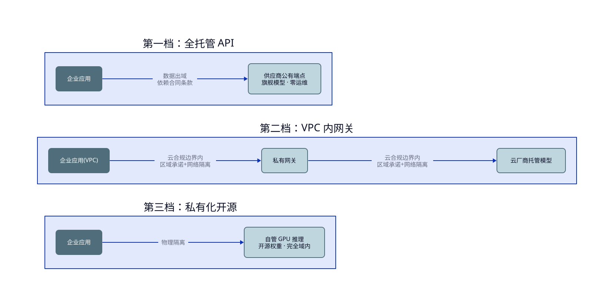
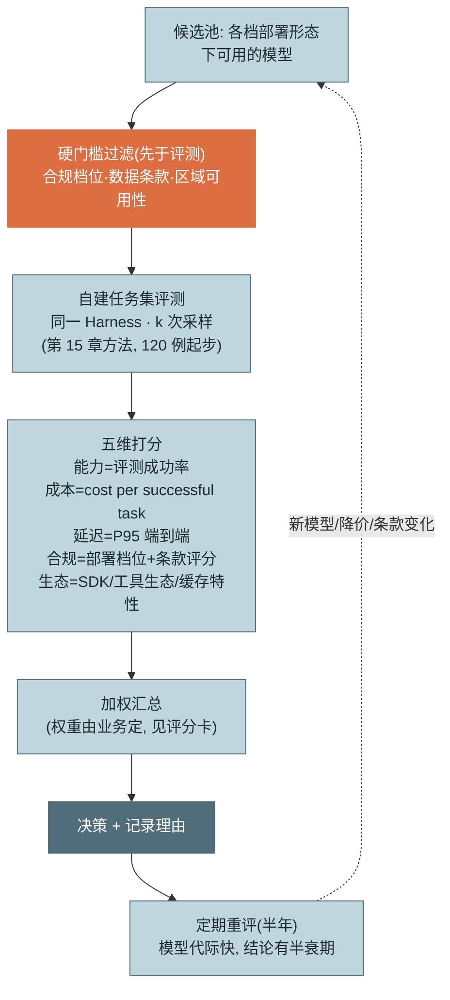
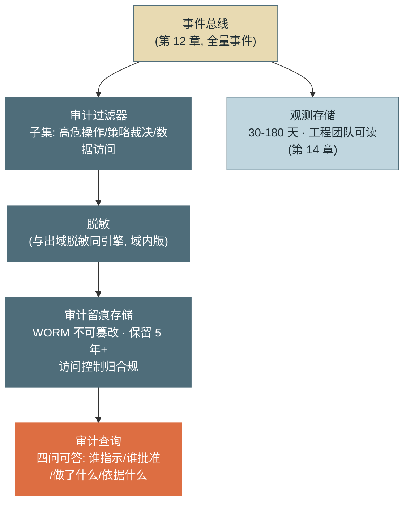

# 第 20 章 部署与选型

> 第五篇 企业落地
>
> 从本章起，读者视角切换到企业决策者：技术已经就绪（前四篇），现在的问题是**在合规、成本与能力的三角里落子**。本章给出私有化部署的三档光谱、评测集驱动（而非榜单驱动）的模型选型方法、数据出域与条款审查要点，以及审计体系与第 14 章观测数据的复用关系。

---

## 1. 场景引入：排行榜第一名，落选

一家保险公司决定把理赔初审 Agent 化，选型会开了三次没有结论。第一次会，技术团队拿着公开榜单主张采购榜首模型："SWE-bench 和 Agentic 榜单都是第一。"第二次会，安全总监一票否决了默认方案："理赔材料含病历与银行卡号，**数据不出域**是监管底线，先回答部署形态再谈模型。"第三次会，财务放了一张表：榜首模型的单价是次席的 2.1 倍——"贵可以，请证明它在**我们的任务**上好 2.1 倍。"

僵局被一个朴素的动作打破：团队花两周，从历史理赔工单里建了 120 例评测集（第 15 章的方法原样照搬），把三个候选模型放进**同一套 Harness**（第 12 章的教训——不控制 Harness 变量的模型对比无意义）跑分。结果推翻了所有直觉：榜首模型在理赔任务上与次席的成功率差距只有 1.8 个百分点（78.3% vs 76.5%），远撑不起 2.1 倍价差；而合规维度直接排除了两档部署形态，可选空间比想象中小得多。最终方案没有"最强模型"，只有"约束下的最优解"——这正是本章要系统化的决策方法：**先用合规画出可行域，再用自家评测集在可行域内比价**。

---

## 2. 原理

### 2.1 私有化部署光谱：三档形态

按数据边界从宽到严，部署形态分三档：

**第一档：全托管 API。** 直连模型供应商的公有云端点。能力最强（旗舰模型与新特性第一时间可用）、运维为零、纯按量计费。数据边界在供应商侧——提示词与产物离开企业网络，合规依赖**合同条款**（零保留选项、不用于训练承诺、传输与静态加密）而非物理隔离。适用：数据敏感度可控、或脱敏后出域可接受的场景。

**第二档：VPC 内网关 / 云上私有接入。** 经云厂商的托管模型服务（Bedrock/Vertex 形态）在**私有网络内**调用模型：流量不过公网、数据处理留在指定区域与合规边界内，模型仍由厂商托管运维。能力接近第一档（模型上新通常滞后数周到数月，个别特性缺位——第 8 章提过的平台特性差异），合规档位显著提升（区域承诺 + 网络隔离 + 云厂商的合规资质背书）。成本单价略高或相当，另加网络与网关设施。这是**多数受监管行业的现实落点**。

**第三档：私有化开源模型。** 开源权重 + 自管 GPU 推理，数据完全域内。合规上限最高（物理隔离，无条款依赖），代价有二：**能力差距**——开源模型与旗舰闭源在 Agentic 任务上的差距比在聊天任务上更显著（工具调用可靠性、长程任务的稳定性是差距重灾区，选型评测必须用 Agentic 任务集而非问答集）；**成本结构翻转**——从按量变成固定（GPU 折旧 + 电力 + 推理运维团队），单位成本由**利用率**决定（第 4 节算这笔账）。



<!-- 架构/分层图用 D2（见《图表规范》）；源 diagrams/d2/ch20-deploy.d2 -->

*图 1：三档部署形态与数据边界——这张图回答"数据在每档形态下走到哪里、边界靠什么保障"。第一档靠条款、第二档靠云合规边界、第三档靠物理隔离；能力与运维成本沿同一方向反向变化。*

三档的权衡速查：

| | 全托管 API | VPC 内网关 | 私有化开源 |
|---|---|---|---|
| **能力** | 最强，特性最全最新 | 接近（上新滞后数周-月） | 有代际差距，Agentic 任务尤甚 |
| **合规** | 依赖条款 | 区域/网络隔离 + 资质 | 物理隔离，上限最高 |
| **成本** | 纯按量 | 按量 + 网关设施 | 固定成本，单位成本看利用率 |
| **运维** | 零 | 低（网关） | 高（推理集群 + 专职团队） |
| **典型采用** | 互联网/低敏场景 | **受监管行业主流** | 强合规/大规模稳定负载 |

一个常被忽略的事实：三档不是单选题——**同一企业按数据分级混用三档**（公开数据任务走第一档吃最强能力，敏感任务走第二/三档）是成熟形态，前提是第 12 章的运行时抽象层让模型端点可替换。

### 2.2 模型选型：评测集驱动，不是榜单驱动

榜单驱动选型的三宗罪：**分布不匹配**（榜单测的是学术任务分布，不是你的理赔工单——场景引入 1.8pp vs 2.1 倍价差的剪刀差就源于此）；**污染与过拟合**（知名基准的成绩区分度逐年下降，第 15 章已论证）；**单指标**（榜单只有"能力"一维，而决策是五维的）。正确流程：



*图 2：评测集驱动的选型流程——这张图回答"选型按什么顺序做、榜单在哪一步（答案：不在任何一步，最多进候选池参考）"。两个关键设计：合规硬门槛先于评测（不可行的选项不值得花评测费），以及定期重评闭环。*

五维打分的口径要点（详细维度速查参见附录 A.7）：**能力**用自家评测集成功率（分任务类型报告，不用总分掩盖偏科——第 15 章坑 2）；**成本**用 **cost per successful task**（第 16 章北极星——单价便宜但成功率低的模型在这个口径下现形）；**延迟**用端到端 P95（含多轮循环，不是单次调用 TTFT）；**合规**是部署档位 + 条款评分的复合；**生态**常被低估——SDK 成熟度、工具调用可靠性、缓存与批量特性直接决定第 16 章优化空间的大小（一个不支持提示缓存的模型，账面单价要按"无缓存折扣"重算，实际成本可能翻数倍）。

**同一 Harness 是评测的铁律**：模型 A 配精调的 Harness、模型 B 用默认配置，比的是 Harness 不是模型（第 12 章 45%/78% 实验的反向应用）。工程上用第 12 章的运行时抽象——只换模型端点，其余全同。

### 2.3 数据安全：出域边界、条款审查与脱敏层

**先把"出域"定义清楚。** 会离开企业边界的不只提示词：①提示词与产物（最显性）；②**嵌入向量**（可部分反演原文，向量出域≈降维的数据出域——第 11 章入库管线选型时常被漏掉）；③**遥测与元数据**（usage 统计、工具名、错误消息——工具名本身可能泄露业务结构，"query_claim_fraud_score" 这个名字就是商业信息）。出域清单要三类全覆盖。

**训练数据条款审查五要点**（法务与技术要联合读）：①**是否用于训练**——默认即不训练还是需主动 opt-out？API 与消费级产品条款常不同；②**保留期**——零保留（zero retention）是否可选、覆盖哪些数据类别（提示词/产物/元数据）；③**子处理商清单**——数据实际会流经哪些第三方；④**区域承诺**——处理与存储的地理边界，跨境传输的法律基础；⑤**事件通知义务**——数据事件的通知时限与范围。审查结论落成**条款基线**文档，供应商条款变更时 diff 复审（条款会变，第 4 节）。

**脱敏层设计。** 位置在出域网关（第 13 章 PEP 家族的新成员：所有出域流量的必经点）：直接标识符（姓名/证件/卡号/电话）规则 + NER 识别后替换为**可逆占位符**（`<PERSON_1>`），映射表**只存域内**——模型看到的是占位符，回答返回后在域内还原，模型能力几乎无损（指代关系保留）而敏感值从未出域。准标识符（职业/地区/日期组合）按场景分级处理。脱敏层自身要过第 15 章式的评测：漏检率（安全）与误检率（可用性）双指标。

### 2.4 合规与审计：同源，分管

受监管行业对 Agent 的留痕要求可以概括为四问可答：**谁指示的**（用户与会话）、**谁批准的**（确认人与依据策略——第 13 章 PDP 裁决日志）、**系统做了什么**（操作与对象）、**依据什么做的**（决策时的输入与上下文——轨迹指针）。

**审计日志最小字段集**：`时间戳（可信时钟）/ 主体（用户身份 + Agent 身份，OBO 双记——第 13 章）/ 操作类型 / 操作对象 / 策略裁决（规则 ID + allow/ask/deny + 确认人）/ 结果状态 / 轨迹指针（可回放完整上下文）`。七个字段是下限，多记不受限，少记过不了审计。

与第 14 章观测数据的关系是本节的架构要点：**同源，分管**。审计日志是观测事件流的**子集**（高危操作、策略裁决、数据访问），但保障等级完全不同——**WORM 存储**（写后不可改）、保留年限按监管（金融常见 5 年+）、**独立的访问控制**（审计库的读权限归合规部门，与排障用的观测库分开——混用一套权限是坑 4）。实现上一条事件流两个 sink：全量进观测（30–180 天，工程可读），审计子集经脱敏进 WORM（多年，合规可读）——不重复埋点（第 12 章"一次发射多方消费"的第 N 次兑现）。



*图 3：审计数据流——这张图回答"审计留痕从哪来、和观测数据如何同源分管"。一条事件流、两个 sink：观测库服务排障（短保留、工程可读），审计库服务监管（WORM、长保留、合规可读）——不重复埋点，但绝不共用访问控制。*

---

## 3. 动手实现（贯穿项目增量）

本章无代码——交付物是**模型选型评分卡模板**，落库为 `docs/model-scorecard.md`。它把 2.2 节的流程固化成一页纸，每次选型/重评填一份，历史评分卡即选型决策的审计轨迹。全文如下：

```markdown
# 模型选型评分卡
> 版本: ____  评估日期: ____  评估人: ____  下次重评: ____(默认 +6 个月)

## 0. 背景
- 目标场景与任务类型: ____________（对应评测集版本: ____）
- 部署形态约束（先于一切）: □ 全托管 API  □ VPC 网关  □ 私有化
- 候选清单: ____________

## 1. 硬门槛（任一不过即出局, 不进入打分）
| 检查项 | 候选A | 候选B | 候选C |
|---|---|---|---|
| 部署档位满足数据分级要求 | □ | □ | □ |
| 训练条款: 不用于训练(或可 opt-out) | □ | □ | □ |
| 保留期: 满足零保留/期限要求 | □ | □ | □ |
| 区域承诺满足监管辖区 | □ | □ | □ |
| 上下文窗口 ≥ 任务需求 | □ | □ | □ |

## 2. 五维打分（1-5 分; 同一 Harness、同一评测集、k≥3 采样）
| 维度 | 权重 | 口径 | 候选A | 候选B | 候选C |
|---|---|---|---|---|---|
| 能力 | __% | 评测集成功率(分任务类型附表, 不用总分) | | | |
| 成本 | __% | cost per successful task(含缓存折扣实测) | | | |
| 延迟 | __% | 端到端 P95(含多轮, 非单次 TTFT) | | | |
| 合规 | __% | 部署档位 + 条款评分(第 1 节余量) | | | |
| 生态 | __% | 工具调用可靠性/缓存与批量特性/SDK 成熟度 | | | |
| **加权总分** | 100% | | | | |

## 3. 成本口径附表（防"账面单价"误导）
- 缓存命中率实测: ____%（无缓存特性的候选按 0% 计, 重算有效单价）
- 评测集上的平均轮次与 token: ____（成本=用量×单价, 两者都要测）
- 失败税: 失败任务成本/成功任务成本 = ____（第 16 章口径）

## 4. 决策记录
- 结论: ________________
- 落选原因摘要（每个候选一句话, 供重评时对照）: ____________
- 已知风险与缓解: ____________
- 触发提前重评的条件: □ 新一代模型发布 □ 价格变动>30% □ 条款变更 □ 评测集大改
```

模板的三个设计意图：**硬门槛先行**（不可行的候选不值得花评测费——与图 2 一致）；**成本口径附表**专治"账面单价"（无缓存特性的模型必须按 0% 命中率重算，这一项经常直接翻转成本排名）；**落选原因留档**——半年后重评时，"当初为什么没选它"的答案不用考古。

---

## 4. 生产级考量

**多模型并存是终态，不是过渡。** 成熟企业的形态是"主力 + 备份 + 特化"：主力模型承载核心任务，备份模型支撑降级阶梯（第 16 章）与供应商故障切换，特化模型（小模型/领域模型）承接路由分流。前提是第 12 章的抽象层与第 15 章的多模型评测基线——**每个在册模型都要有当前评测分，否则切换那天就是盲切**。

**条款是活文档，要有变更监控。** 供应商条款单方面更新是常态：保留期定义、子处理商、训练条款都可能变。把条款基线纳入类似依赖审查的流程——定期抓取 diff，变更触发法务复审；重大变更是评分卡"提前重评"的触发器之一。

**退出成本要在进入时计算。** 供应商锁定在 Agent 场景有个特殊形态：**提示词对模型过拟合**——第 6 章的分层提示词、第 15 章的评测基线在迁移时都要重校。控制手段：提示词写行为意图而非模型癖好（可移植性）；评测集与 Harness 严格模型无关（迁移时直接复用——它们是你最重要的"反锁定资产"）；每半年用评分卡跑一次在册候选，保持"随时可迁"的组织肌肉。

**自建 GPU 的真实账。** 第三档的成本陷阱在利用率：GPU 集群按峰值配置、按均值使用，利用率低于约 40% 时单位 token 成本通常反超第一档 API（还没算推理运维团队的人力）。自建的合理前提是三者之一：合规硬约束（没有选择）、负载大且稳定（利用率有保障）、或有既存 GPU 资产与团队。**"为了省钱自建"在多数负载形态下是伪命题，为了合规自建才是真命题。**

---

## 5. 常见坑

**坑 1：榜单第一直接当选型结论。**
*症状*：采购旗舰模型后，业务任务成功率与次席几乎无差（1.8pp），价差 2.1 倍白付；团队反而因预算压力砍了评测建设。
*根因*：榜单分布 ≠ 业务分布；榜单成绩含污染与针对性调优水分；榜单没有成本/延迟/合规维度。
*修复*：评分卡流程——合规硬门槛先过滤，自建评测集（百例级两周可建）在同一 Harness 下比分，cost per successful task 定成本排名；榜单只用于圈候选池。

**坑 2：以为"提示词不出域"就是数据不出域。**
*症状*：合规复查发现两处遗漏：知识库的嵌入向量存在了域外向量服务（向量可部分反演原文）；遥测里的工具名与错误消息带出了业务结构与客户信息片段。
*根因*：出域清单只盘了显性内容（提示词/产物），漏了嵌入与元数据两类隐性通道。
*修复*：出域边界三类全覆盖（内容/向量/遥测）；嵌入服务纳入部署档位约束；遥测出域前过同一个脱敏网关；出域清单作为架构评审的固定附件。

**坑 3：自建 GPU 只算了卡钱。**
*症状*：立项书写"自建比 API 省 60%"，运行一年后核算：利用率 25%，摊上折旧、电力与三人推理团队，单位 token 成本约为 API 的 2.8 倍。
*根因*：对比时用"满载理论吞吐"算自建单价，用"实际用量"算 API 账单——分母口径不一致；且低估了推理优化（批处理/量化/调度）的持续人力。
*修复*：自建评估用"预期利用率下的全摊成本"（折旧+电力+人力÷实际 token 产出）；利用率没有 40%+ 的把握时，第二档 VPC 网关通常是合规与成本的更优平衡；自建立项的第一张表是负载预测而非 GPU 报价单。

**坑 4：审计日志与观测日志共用一套访问控制。**
*症状*：年度审计发现排障工程师能任意查询含客户敏感操作的审计记录，被开为管理缺陷；反过来，合规人员误改观测配置导致采集中断。
*根因*：图 3 的"同源分管"只做了同源没做分管——一个存储、一套权限，审计库的独立性名存实亡。
*修复*：两个 sink 物理分开：观测库工程可读、短保留；审计库 WORM、合规专属访问、保留按监管年限；审计库的访问本身留痕（谁查了审计记录也是审计事件）。

**坑 5：选型一次管五年。**
*症状*：三年前选的模型仍是全司标准，期间同价位模型能力已迭代两代；新场景被旧选型的能力上限卡死，且供应商中途改过一次保留条款没人发现。
*根因*：把模型选型当成 ERP 采购（十年一换），而模型市场的代际周期是 6–12 个月；没有重评机制与条款监控。
*修复*：评分卡内置半年重评 + 四个提前触发器（新代际/价格变动/条款变更/评测集大改）；重评成本很低——评测集与 Harness 现成，跑一轮只是机时；把"迁移演练"（新模型上评测集 + 影子流量）纳入年度例行。

---

## 6. 面试高频问题

**Q1：企业部署 Agent 的三档形态怎么选？**

结论先行：**按数据分级画可行域——全托管 API（能力最强，合规靠条款）、VPC 内网关（云合规边界内，受监管行业主流落点）、私有化开源（物理隔离，能力有代际差且成本看利用率）；成熟企业按数据分级混用三档。**
- 第一档适合低敏数据 + 条款保障充分；第二档用区域承诺 + 网络隔离换少量能力滞后。
- 第三档的真命题是合规不是省钱：利用率 <40% 时单位成本常反超 API。
- 混用的前提：运行时抽象层使模型端点可替换（第 12 章）。
- 加分点：开源与旗舰闭源的差距在 Agentic 任务（工具调用可靠性/长程稳定性）上大于聊天任务——选型评测必须用 Agentic 任务集。

**Q2：为什么说选型要评测集驱动而不是榜单驱动？流程是什么？**

结论先行：**榜单三宗罪——分布不匹配、污染过拟合、单指标；正确流程：合规硬门槛先过滤 → 自建任务集在同一 Harness 下评测 → 五维打分（能力/成本/延迟/合规/生态）→ 加权决策 → 半年重评。**
- 实证：榜首与次席在业务任务上差 1.8pp，价差却 2.1 倍。
- 同一 Harness 是铁律：不控制脚手架变量的模型对比比的是脚手架。
- 成本口径用 cost per successful task 且按实测缓存命中率重算有效单价。
- 加分点：生态维度常被低估——无缓存/批量特性的模型，账面单价要翻倍重算。

**Q3：审查模型供应商的数据条款，看哪几条？**

结论先行：**五要点——是否用于训练（默认与 opt-out）、保留期（零保留可选否、覆盖哪些数据类别）、子处理商清单、区域承诺、事件通知义务；并把"出域"定义扩到内容/嵌入向量/遥测三类。**
- 嵌入向量可部分反演原文——向量出域是降维的数据出域，常被漏盘。
- 遥测元数据（工具名/错误消息）也携带业务信息。
- 条款是活文档：基线化 + 变更 diff 监控 + 触发复审。
- 加分点：脱敏层设在出域网关，用可逆占位符（映射表域内）——模型能力近无损而敏感值从未出域。

**Q4：Agent 的审计日志怎么设计？和可观测性数据什么关系？**

结论先行：**最小字段集七项——时间/主体（用户+Agent 双身份）/操作/对象/策略裁决（含确认人）/结果/轨迹指针；与观测数据"同源分管"——同一事件流两个 sink，审计子集进 WORM 存储、按监管年限保留、访问控制归合规。**
- 验收标准是四问可答：谁指示/谁批准/做了什么/依据什么。
- 同源：不重复埋点（事件总线一次发射）；分管：存储、保留期、权限三分开。
- 审计库的访问本身也要留痕。
- 加分点：轨迹指针使审计记录可回放完整决策上下文——这是 Agent 审计相对传统系统审计的增量要求。

**Q5：自建推理什么时候划算？**

结论先行：**三个合理前提之一——合规硬约束（没有选择）、负载大且稳定（利用率 40%+ 有把握）、既存 GPU 资产与团队；"为省钱自建"在多数负载下是伪命题。**
- 成本对比的正确口径：预期利用率下的全摊成本（折旧+电力+人力÷实际产出）vs API 实际账单。
- 反例数据：利用率 25% 时全摊单位成本约为 API 的 2.8 倍。
- 中间解常被忽略：第二档 VPC 网关满足多数合规要求，无自建运维负担。
- 加分点：自建立项的第一张表是负载预测曲线，不是 GPU 报价单。

---

> **下一章预告**：形态与模型定了，下一个现实问题是"接进去"——Agent 如何与二十年积累的存量系统（ERP、工单、审批流、老数据库）共存？第 21 章讲集成模式：从 API 包装到界面自动化的梯度，以及"为 Agent 修路"与"让 Agent 适应烂路"的取舍。
