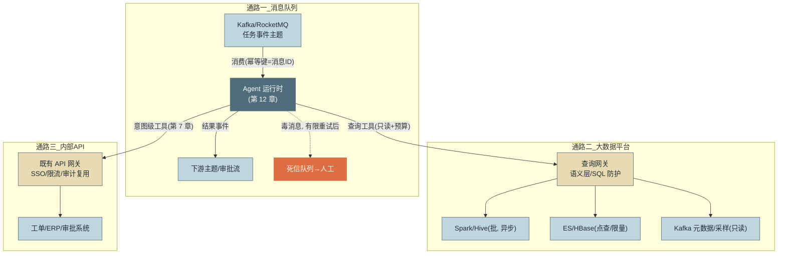
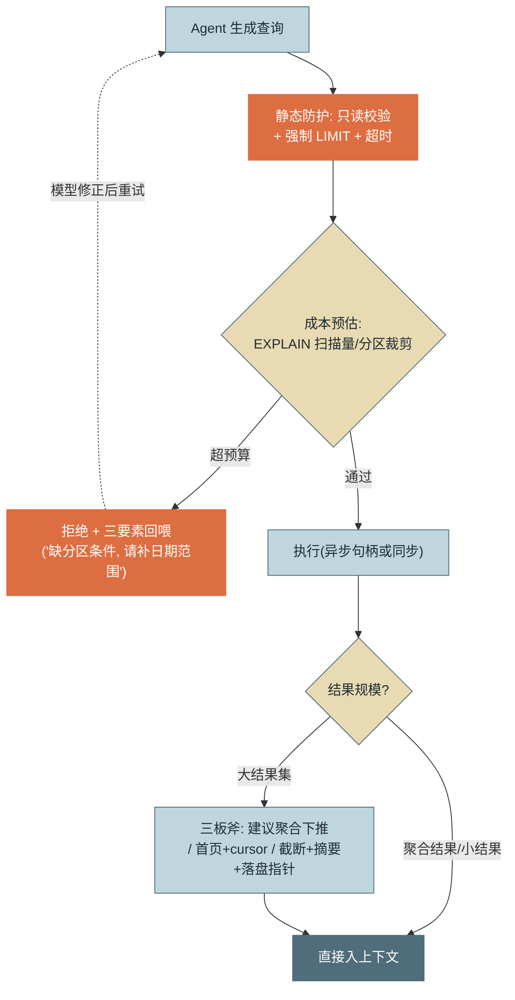
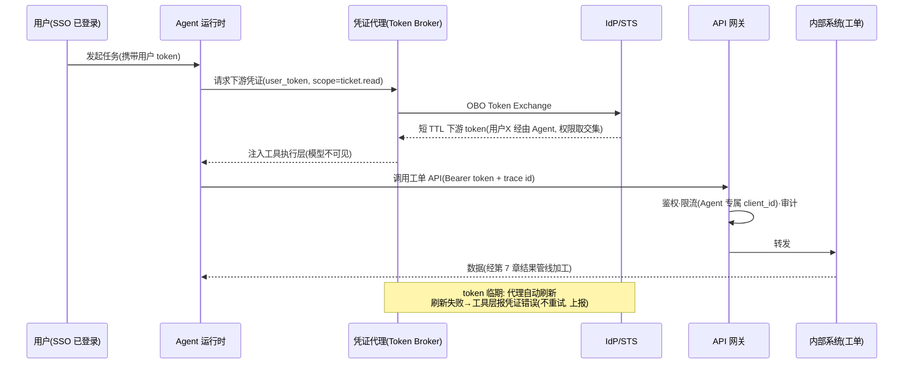

# 第 21 章 与存量系统集成

> 第五篇 企业落地
>
> Agent 的价值兑现发生在它接上企业二十年积累的存量系统那一刻——消息队列、大数据平台、内部 API、SSO 体系。本章的主线判断是：**集成不是"给个连接串"，而是在概率组件与存量基础设施之间建一层受控的翻译与防护**。对有大数据背景的读者，这是全书离你的既有经验最近的一章。

---

## 1. 场景引入：一条 SQL 打爆了数仓队列

业务方给 VaneHub 助手提了个自然的需求："让它能直接回答'上周北区退货率是多少'。"第一版实现也很自然：加一个 `run_sql` 工具，拿一个数仓服务账号直连查询引擎。上线三天，数据平台组找上门来，带着三件事故：

**事故一：全表扫描。** 用户问"最近订单有什么异常"，Agent 生成了 `SELECT * FROM dwd_order_detail WHERE remark LIKE '%异常%'`——对一张 2.4TB 的明细表做无分区裁剪的全表扫，独占计算队列 40 分钟，当晚的 ETL 作业集体延迟。平台组的原话："你们的机器人写的 SQL，比实习生第一周写的还野。"

**事故二：越权查询。** 审计抽查发现 Agent 查过薪酬表——那个服务账号是从某个老 BI 项目继承的，权限范围早已没人说得清（第 13 章坑 5 的数据平台版）。**事故三：结果爆窗。** 一次"导出昨天的失败订单"返回 80 万行，工具层没有任何截断，会话直接撞死在上下文上限（第 5 章的事故形态，这次的肇事者是数仓）。

三件事故对应本章的三个机制：**查询防护**（预算、只读、聚合下推）、**权限收敛**（OBO 与行列级权限）、**大结果集治理**。再加上消息队列与鉴权体系两条通路，构成 Agent 与存量世界的完整接口层。

---

## 2. 原理

### 2.1 消息队列集成：削峰、幂等与"概率组件的重放"

Agent 与 MQ 的两个方向：**作为消费者**——事件驱动的任务入口（工单创建事件 → 触发 Agent 处理会话），天然获得削峰填谷、失败重投、死信兜底这些队列基建的全部好处，是**无人值守批量场景的标准入口**；**作为生产者**——处理结果投递下游（审核结论进审批流），让 Agent 以标准事件形态融入既有的事件总线，下游无需感知"这是 AI 产的"。

关键工程问题是**幂等与重放**，而 Agent 让它有了新面孔。消费语义几乎总是 **at-least-once**，重复投递必然发生——传统消费者靠幂等键去重，Agent 同样：**消息 ID 作为任务幂等键**，处理前查任务结果表，已成功则直接短路返回既有结果。这里有个容易被忽视的 Agent 特性：**重放同一消息可能产生不同结果**（概率组件，第 15 章三重困难之一）——所以"重放 = 重新执行"对 Agent 是危险语义：一张已批准的工单被重放后可能得出不同结论，下游状态被改写。纪律：**成功任务的重放必须短路（查结果表），只有失败任务的重放才重新执行**，且重新执行前先核对副作用是否已部分发生（第 7 章"先查后写"）。毒消息（反复导致 Agent 失败的输入）经有限重试后入死信队列转人工（第 18 章死信、第 16 章降级阶梯的落点）。



*图 1：Agent 与存量系统的三条集成通路——这张图回答"Agent 从哪进（队列）、查哪去（数据平台）、调什么（内部 API）、各经过什么防护层"。共同模式：每条通路都有一个受控网关，Agent 从不裸连存量系统。*

### 2.2 大数据平台集成：接入方式、权限收敛与大结果三板斧

各引擎的接入方式与给 Agent 的正确"剂量"：

| 引擎 | 接入方式 | 给 Agent 的工具形态 | 禁区 |
|---|---|---|---|
| **Spark/Hive** | SQL 网关（Kyuubi/Livy/Thrift） | 异步查询工具：提交返回句柄 + 轮询进度（批查询分钟级，同步等待必超时——第 3 章异步化的硬需求） | 直接 spark-submit 任意作业 |
| **Kafka** | Admin/REST API | **只读元数据 + 限量采样**（"查主题列表 / 采样最近 N 条"） | 让 Agent 直接管理消费组（offset 语义交给概率组件必乱，见坑 4） |
| **Flink** | REST API | 作业状态/指标查询；提交与停止走审批（不可逆级，第 9 章分级） | 无审批的作业操作 |
| **HBase** | 网关封装 | 点查与限定 rowkey 范围的窄 scan | 无边界 scan |
| **ES** | 查询 DSL 封装 | 强制 `size` 上限 + 超时 + 聚合优先 | 深分页、全索引导出 |

三条共同原则：

**权限收敛。** Agent 的数据平台身份必须是**专用、只读、最小化**的：OBO 用户委托（第 13 章）让行为归属到人；行列级权限（Ranger 类体系）把"能查哪些表哪些列"下推到引擎层——**提示词说"不要查薪酬表"是请求，Ranger 说的才是规则**（第 6 章概率 vs 确定的第 N 次应用）。继承来的历史账号一律重新发证。

**查询预算。** 执行前预估成本：`EXPLAIN` 看扫描量与分区裁剪、无分区条件的明细表查询直接拒绝并回喂修改建议（第 7 章错误三要素："缺少分区条件 dt，请补充日期范围"）。LLM 生成 SQL 的四重防护：只读账号（引擎层兜底）、语句白名单（仅 SELECT，禁 DML/DDL/多语句）、**强制 LIMIT 注入**、查询超时。

**大结果集三板斧。** 优先级从高到低：**聚合下推**——用户要的是"退货率"不是 80 万行明细，引导（工具描述 + 回喂建议）Agent 生成聚合查询，让引擎算、只回结果——这是三板斧里唯一"信息无损"的一招，也最贴合大数据直觉（能在 map 端合并的绝不 shuffle 明细）；**分页/采样**——确需明细时首页 + cursor（第 7 章分页模式）或代表性采样；**截断兜底**——超限硬截断 + 结构化摘要（行数/列名/数值分布），完整结果落盘留指针（第 5 章）。



*图 2：大结果集处理流程——这张图回答"一条查询从生成到入上下文经过哪些闸门"。两个回路值得注意：超预算的拒绝带修改建议回喂（模型自行修正），大结果优先引导聚合下推而非默默截断。*

比"防护裸 SQL"更进一步的形态是**语义层（Semantic Layer）**：把高频指标封装为参数化查询模板（"退货率(区域, 时间范围)"），Agent 调用模板而非写 SQL——准确率（口径由数据团队定义，不靠模型现推）与安全性（模板即白名单）双升。经验法则：**高频指标走语义层，长尾探索才放开受防护的 SQL**。

### 2.3 内部工具链接入：网关复用与凭证三形态

内部 API 的接入原则是**复用而非另起炉灶**：Agent 流量走既有 API 网关，鉴权、限流、审计设施全部现成——Agent 只是网关面前又一个（行为特殊的）客户端。工具层的设计规范沿用第 7 章（意图级封装、返回值友好化），本节补企业侧的身份问题——**Agent 用什么凭证调内部系统**，三形态：

- **服务凭证（Client Credentials）**：机器对机器身份，适合与用户无关的平台级操作（读取公共配置）。风险是权限并集（第 13 章坑 5），范围必须最小。
- **用户委托（OBO Token Exchange）**：会话携带用户 token，经 STS 交换成"用户 X 经由 Agent"的下游 token——有效权限取交集、审计归属到人。**用户相关操作的默认形态**（机制见第 13 章，此处是它在 OAuth 体系的落地）。
- **短期凭证下发（Token Broker）**：运行时的凭证代理按需向 IdP/STS 领取短 TTL 凭证，注入工具执行层——**凭证不进提示词、不进上下文、不进沙箱**（第 9 章纪律），模型全程不可见；到期自动刷新。



*图 3：Agent 经网关访问内部系统的完整时序——这张图回答"凭证从哪来、模型为什么看不到它、网关在哪些点介入"。三个关键位：OBO 交换（权限交集）、凭证只注入执行层、网关按 Agent 专属身份治理流量。*

### 2.4 流量治理：Agent 是一种新的流量画像

Agent 流量与人工流量的三点差异，决定治理策略必须分开：**突发性**——一轮并行工具调用瞬间打出 N 个请求（第 7 章并行语义）；**重试放大**——内循环重试在故障时放大流量（第 3 章），撞上下游限流可能共振；**无人值守**——夜间批量任务的流量没有人肉刹车。网关侧的对应设计：**Agent 专属 client_id 分流**（与人工流量分开限流、分开配额、分开计费归因——混在一起时，Agent 故障会挤占人工流量的配额）；配额三层联动（会话/租户/全局，第 3、13、16 章的既有体系在网关的映射）；**审计接入点**——网关访问日志携带会话 trace id（第 14 章），与第 20 章审计流关联：一次跨系统操作从 Agent 决策到网关放行到下游执行，一条 id 链拉通。

---

## 3. 动手实现（贯穿项目增量）

本章增量：`src/vanehub/tools/data_query.py`——**受防护的大数据查询工具**：只读校验、强制 LIMIT 注入、大结果截断 + 结构化摘要 + 聚合下推建议。演示用 SQLite 作查询引擎（DB-API 通用，生产换 Kyuubi/Presto 驱动，防护层不变）。

```python
# src/vanehub/tools/data_query.py — 受防护的数据查询工具
import re
import sqlite3
from dataclasses import dataclass

FORBIDDEN = re.compile(
    r"\b(insert|update|delete|drop|alter|create|truncate|grant|attach"
    r"|replace|merge|vacuum|pragma)\b|;",
    re.IGNORECASE)          # 只读白名单: 仅单条 SELECT（REPLACE/MERGE 也是写入）


@dataclass
class QueryPolicy:
    max_rows: int = 200          # 入上下文的行数上限
    hard_limit: int = 10_000     # 引擎侧强制 LIMIT(兜底, 防内存)
    timeout_seconds: float = 30.0


def guard_sql(sql: str, policy: QueryPolicy) -> str:
    """静态防护: 只读校验 + 强制 LIMIT 注入。返回加固后的 SQL, 非法则抛错"""
    s = sql.strip().rstrip(";")
    if not s.lower().startswith("select"):
        raise ValueError("仅允许 SELECT 查询（只读账号双重兜底）")
    if FORBIDDEN.search(s):
        raise ValueError("查询包含被禁止的关键字或多语句")
    if not re.search(r"\blimit\s+\d+\s*$", s, re.IGNORECASE):
        s += f" LIMIT {policy.hard_limit}"       # 无 LIMIT 一律注入
    return s


def summarize(rows: list[tuple], cols: list[str], shown: int) -> str:
    """截断时的结构化摘要: 让模型知道'被截掉的是什么样的数据'"""
    lines = [f"[结果过大: 共取回 {len(rows)} 行, 仅展示前 {shown} 行]",
             f"列: {', '.join(cols)}"]
    for i, col in enumerate(cols):                # 数值列附分布, 帮模型判断聚合方向
        vals = [r[i] for r in rows if isinstance(r[i], (int, float))]
        if len(vals) > len(rows) * 0.8:
            lines.append(f"  {col}: min={min(vals)}, max={max(vals)}, "
                         f"avg={sum(vals)/len(vals):.2f}")
    lines.append("建议: 明细行数过多时, 请改用聚合查询（GROUP BY/COUNT/AVG）"
                 "让引擎计算, 只取回聚合结果。")
    return "\n".join(lines)


class DataQueryTool:
    def __init__(self, conn: sqlite3.Connection,
                 policy: QueryPolicy = QueryPolicy()):
        self.conn, self.policy = conn, policy

    def run(self, inp: dict) -> str:
        try:
            sql = guard_sql(inp["sql"], self.policy)
        except ValueError as e:                   # 三要素回喂: 什么错/为何/怎么改
            return (f"查询被拒绝: {e}。请检查: ①只写单条 SELECT "
                    f"②优先使用聚合而非明细导出。")
        cur = self.conn.execute(sql)              # 生产: 此处走异步句柄+轮询
        cols = [d[0] for d in cur.description]
        rows = cur.fetchmany(self.policy.hard_limit)

        if len(rows) <= self.policy.max_rows:     # 小结果: 直接入上下文
            body = "\n".join(str(r) for r in rows)
            return f"共 {len(rows)} 行\n列: {', '.join(cols)}\n{body}"
        # 大结果: 截断 + 摘要 + 聚合下推建议（图 2 三板斧的后两板）
        shown = self.policy.max_rows
        body = "\n".join(str(r) for r in rows[:shown])
        return summarize(rows, cols, shown) + f"\n--- 前 {shown} 行 ---\n{body}"
```

注册为第 7 章标准工具——描述里预置聚合下推引导（比事后回喂更省一轮）：

```python
registry.register(RegisteredTool(
    name="query_warehouse",
    description="查询数据仓库（只读 SELECT）。回答指标类问题时必须用聚合查询"
                "（GROUP BY/COUNT/SUM/AVG）让引擎计算，不要导出明细再自己数。"
                "明细查询必须带过滤条件与分区字段（如 dt）。结果超过 200 行会被截断。",
    input_schema={"type": "object", "properties": {
        "sql": {"type": "string", "description": "单条 SELECT 语句"}},
        "required": ["sql"]},
    run=DataQueryTool(conn).run, idempotent=True))
```

回测三件事故：**全表扫**——生产版在 `guard_sql` 后接 EXPLAIN 预算（SQLite 演示省略，接口位置已留在注释），无分区条件即拒绝回喂；**越权**——工具持有的连接来自凭证代理的 OBO 短期凭证（2.3 节），引擎行列权限兜底，工具层无权可越；**爆窗**——200 行截断 + 摘要 + 聚合建议，80 万行事故在结构上不再可能。工具描述里那句"不要导出明细再自己数"，是把大数据工程师的直觉写给模型看——**聚合下推的最佳执行位置是模型生成查询的那一刻**。

---

## 4. 生产级考量

**长查询一律异步化。** Spark/Hive 批查询分钟级起步，同步等待必然撞工具超时并触发重试风暴（坑 5）。异步模式三件套：`submit_query` 返回句柄、`check_query` 查进度、`fetch_result` 取结果（自动走三板斧）——模型在等待期间可以做别的子任务，这正是第 3 章"长耗时工具异步化"的数据平台落地。句柄要可跨会话恢复（查询还在跑，会话可能已经 Checkpoint 过一轮）。

**资源隔离：Agent 专属队列。** Agent 查询进独立的 YARN/K8s 资源队列，配额封顶——它再野也打不着生产 ETL（事故一的制度性根治）。队列标签同时服务成本归因：数据平台账单按队列拆分，Agent 用量自动归到第 16 章的台账维度。

**Schema 变更的合同测试延伸。** 表结构与口径在演进：字段改名、口径调整会让工具描述与查询模板静默过期——Agent 开始生成引用旧字段的查询，或更糟：字段还在但口径变了，**查询成功、数字错误**。对策：语义层模板与工具描述纳入数据平台的变更通知链；核心指标模板配"金丝雀查询"每日跑（结果与 BI 报表对账）——第 7 章合同测试在数据语义层的延伸。

**队列消费的会话成本要预算化。** MQ 触发的无人值守任务没有用户盯着，是成本失控的高危区：每消息的会话预算从紧（第 3 章）、按主题设小时级总预算熔断（消费暂停 + 告警，而不是烧穿月度预算）；毒消息的重试上限要小（3 次内），Agent 处理失败的重试比传统消费者贵两个数量级——每次都是完整会话。

---

## 5. 常见坑

**坑 1：`run_sql` 裸工具直连数仓。**
*症状*：全表扫独占队列、ETL 延迟、平台组封号（事故一）；SQL 质量"比实习生第一周还野"。
*根因*：把连接串当集成——没有预算闸门、没有 LIMIT 强制、没有聚合引导，模型对查询成本没有任何概念（它的训练目标里没有你的队列 SLA）。
*修复*：本章防护链（只读校验 + LIMIT 注入 + EXPLAIN 预算 + 拒绝回喂）；高频指标上语义层模板；Agent 专属资源队列物理兜底。

**坑 2：继承来的高权服务账号。**
*症状*：Agent 查到了薪酬表（事故二）；审计时"这个账号为什么有这些权限"无人能答。
*根因*：图省事复用了历史账号——账号权限是多年需求的沉积层，与 Agent 的实际需要毫无关系；共享账号又使审计无法归属到人。
*修复*：Agent 身份重新发证（专用、只读、最小化）；用户相关查询走 OBO（权限交集 + 归属到人）；行列级权限在引擎层收口——提示词是请求，Ranger 才是规则。

**坑 3：at-least-once 重复消费，Agent 把工单处理了两遍。**
*症状*：同一工单收到两封结论不同的处理通知——重复投递的消息被完整重跑，且两次运行结论不一致（概率组件），下游收到互相矛盾的结果。
*根因*：按传统无状态消费者的思路做了"重复执行无害"的假设——对确定性代码近似成立，对 Agent 完全不成立：重放≠重现。
*修复*：消息 ID 作幂等键，处理前查结果表——**成功任务的重放短路返回既有结果**；失败重试前先核对副作用（第 7 章先查后写）；结果表的写入与下游通知同事务。

**坑 4：把 Kafka 消费组直接交给 Agent 管理。**
*症状*：消费 offset 忽前忽后（模型"决定"从哪继续读）、一条格式异常的毒消息让 Agent 反复重读卡死分区、消费组 rebalance 与会话生命周期互相打架。
*根因*：offset 管理是精确簿记，交给概率组件必乱（第 18 章"簿记下沉"的教训在消费语义上的重演）。
*修复*：架构反转——队列消费由确定性的消费框架负责（含 offset、重试、死信），**每条消息触发一个 Agent 会话**（队列在外、Agent 在内）；Agent 需要"看队列"时给只读元数据/采样工具，绝不给消费组控制权。

**坑 5：批查询同步等待，超时重试三连击。**
*症状*：Spark 查询实际要跑 8 分钟，工具超时设 30 秒——超时、重试、又提交一个同样的查询……一次提问在队列里堆了 4 个相同的重查询，既打爆队列又烧穿会话预算。
*根因*：同步工具模型套在了批处理引擎上；更糟的是超时被内循环当成瞬时错误重试（第 3 章的重试器不知道"查询还在跑"）。
*修复*：异步句柄三件套（submit/check/fetch）；submit 幂等（相同查询指纹返回既有句柄，防重复提交）；超时语义区分"提交失败"（可重试）与"仍在执行"（继续轮询，不重提）。

---

## 6. 面试高频问题

**Q1：Agent 接消息队列，幂等和重放要注意什么？**

结论先行：**at-least-once 下用消息 ID 作任务幂等键；Agent 的特殊性在于"重放≠重现"（概率组件），所以成功任务的重放必须短路查结果表，只有失败任务才重新执行且先核对副作用。**
- 架构方向：队列触发会话（削峰/重试/死信全部白拿），而不是 Agent 管理消费。
- 重复执行的危害升级：两次运行结论可能不同，下游收到矛盾结果。
- 毒消息小上限重试（Agent 重试比传统消费贵两个数量级）后入死信转人工。
- 加分点：结果表写入与下游通知同事务，防"处理成功但通知丢失"的半状态。

**Q2：让 Agent 查大数据平台，怎么防它打爆集群？**

结论先行：**四层防护——静态防护（只读白名单+强制 LIMIT+超时）、成本预算（EXPLAIN 预估，无分区裁剪即拒绝回喂）、资源隔离（Agent 专属队列配额封顶）、大结果三板斧（聚合下推>分页采样>截断摘要）。**
- 聚合下推是唯一信息无损的一招：用户要的是指标不是明细，让引擎算。
- 拒绝要带三要素回喂（"缺分区条件 dt，请补日期范围"），模型能自行修正。
- 批查询必须异步句柄化（submit/check/fetch + 提交幂等），同步等待=超时重试风暴。
- 加分点：高频指标走语义层模板（口径与安全双升），长尾探索才放开受防护 SQL。

**Q3：LLM 生成 SQL 的安全防护怎么做？**

结论先行：**纵深四层——引擎层只读账号与行列权限（Ranger 类，确定性兜底）、语句层白名单（单条 SELECT、禁 DML/DDL）、注入层强制 LIMIT 与超时、预算层 EXPLAIN 拦截全表扫。**
- 提示词约束只是第一层软引导——"不要查薪酬表"是请求，引擎权限才是规则。
- OBO 用户委托使权限取交集且审计归属到人（继承的历史账号一律重发证）。
- Schema/口径变更会让查询"成功但数字错"——语义层模板配金丝雀查询每日对账。
- 加分点：最好的防护是少写 SQL——参数化模板把生成问题变成填空问题。

**Q4：Agent 调内部系统，凭证怎么管理？**

结论先行：**三形态按场景——服务凭证（平台级操作，范围最小化）、OBO 用户委托（用户相关操作默认形态，权限交集）、Token Broker 短期凭证（短 TTL 自动刷新）；铁律是凭证不进提示词、不进上下文、不进沙箱。**
- 凭证由运行时代理注入工具执行层，模型全程不可见。
- 复用既有 API 网关：鉴权/限流/审计设施现成，Agent 只是又一个客户端。
- 刷新失败是凭证类错误：不重试、上报（第 7 章错误分类的凭证分支）。
- 加分点：trace id 从会话贯穿到网关访问日志——跨系统操作一条链拉通（审计四问的技术前提）。

**Q5：Agent 流量和人工流量有什么不同？网关怎么治理？**

结论先行：**三点差异——并行调用的突发性、内循环重试的放大效应、无人值守的夜间批量；治理核心是 Agent 专属 client_id 分流：独立限流、独立配额、独立计费，绝不与人工流量混池。**
- 混池的风险：Agent 故障重试挤占人工用户的配额，一个 bug 打挂整个业务入口。
- 配额三层（会话/租户/全局）在网关的映射，与既有体系联动。
- 无人值守任务按主题设小时级预算熔断——暂停消费优于烧穿预算。
- 加分点：Agent 流量画像本身值得监控——它的突发模式变化往往先于故障暴露（行为健康指标的网关视角）。

---

> **下一章预告**：系统接通了，最后的变量是人。第 22 章组织与流程：Agent 时代的研发分工怎么变、Spec 与提示词谁来管、以及"人机协作的 SOP"如何写进组织制度。
