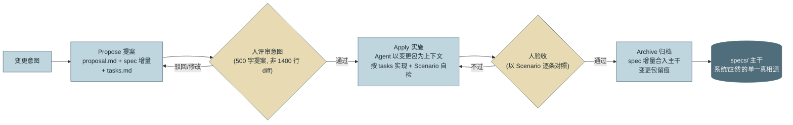
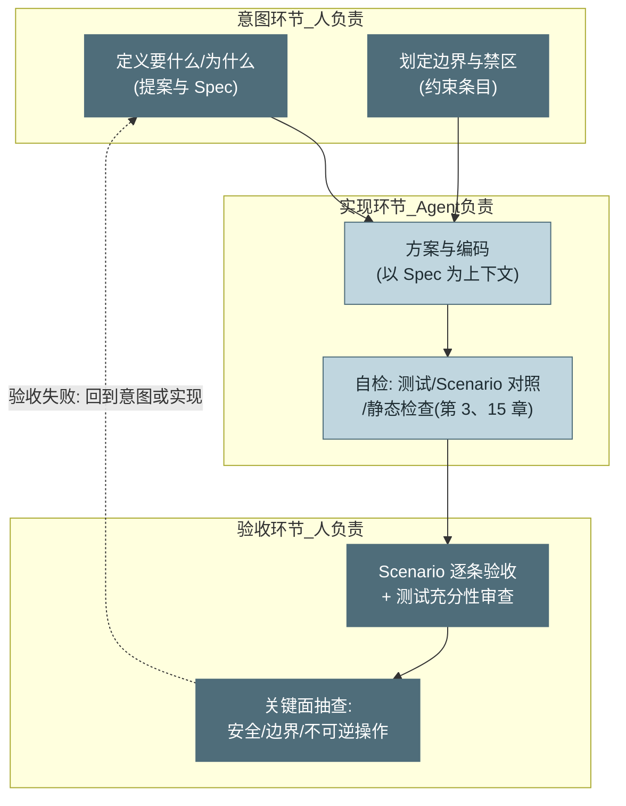
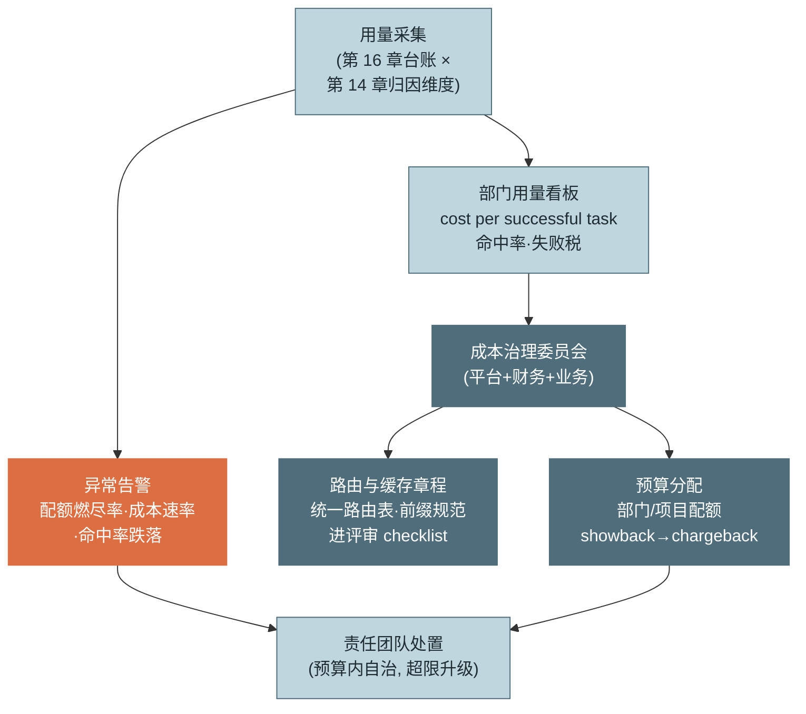

# 第 22 章 组织与流程

> 第五篇 企业落地
>
> 前二十一章解决"系统能不能行"，本章解决"组织会不会用"。三个组织级问题决定落地成败的另一半：**意图如何留痕**（Spec 驱动开发）、**人与 Agent 如何分工**（评审重心的转移）、**钱由谁管**（成本治理的组织化）。工具再好，流程失序照样翻车——本章的每个案例都发生在技术完全正常的系统上。

---

## 1. 场景引入：三件事故，零行代码有 bug

示例团队全面使用 Coding Agent 三个月后，工程 VP 收集到三件"技术上无解释"的事故：

**事故一：蒸发的意图。** 一位工程师在会话里让 Agent"顺手优化一下会话清理逻辑"，Agent 干净利落地改了空闲判定的启发式规则并合入。两周后生产环境出现会话被过早回收的 bug。复盘会上的死结：**没人说得清当时到底要它做什么**——那句"顺手优化"存在于一个早已过期的会话上下文里，无提案、无评审记录、无验收标准。代码是对的（它忠实实现了那句模糊指令），错的是意图管理。

**事故二：30 秒的 LGTM。** 抽查 PR 数据发现：Agent 生成的 PR 平均 1400 行，人工评审的中位停留时间 **38 秒**——评审事实上已经死亡，只是没人宣布。评审者的辩解很诚实："逐行看我一天只能看两个 PR，活儿全堵在我这。"

**事故三：月底的预算战争。** 全公司共用一个模型 API 账号，月底配额吃紧时三个部门互相指责对方"乱烧 token"——没有部门级用量归因，每个人都觉得自己是节约的那个（第 16 章建了台账，但组织层没人认领账单）。

三件事故的共同点：**系统的每一层都在正常工作，失灵的是人与系统之间的协议**。本章依次补上三份协议：意图的协议（Spec）、分工的协议（评审模型）、钱的协议（预算治理）。

---

## 2. 原理

### 2.1 Spec 驱动开发：把意图从会话里救出来

事故一的病理叫**提示词的挥发性**：口头意图 → 会话上下文 → 会话结束即蒸发。传统研发用需求文档对抗挥发，Agent 时代的对应物是 **Spec 驱动开发（Spec-Driven Development）**——以 **OpenSpec** 工作流为例，三阶段：

**Propose（提案）**：任何非琐碎变更先建变更包 `changes/<change-id>/`，含三件套——`proposal.md`（为什么改、改什么、影响面）、**Spec 增量**（`specs/<能力>/spec.md` 的 ADDED/MODIFIED 需求条目，每条带 **Scenario 形式的验收标准**）、`tasks.md`（实现清单）。提案经人评审通过后才进入实现。

**Apply（实施）**：Agent 以变更包为上下文执行 `tasks.md`——注意这一步的角色反转：**Spec 不是写给人看完就扔的，它就是喂给 Agent 的高质量上下文**。实现过程中的自检以 Scenario 为判据（第 3 章 Verifier 的素材来源）。

**Archive（归档）**：实现验收后，Spec 增量合入 `specs/` 主干（系统"应然"状态的单一真相源），变更包归档留痕。主干 Spec 与代码的关系，如同宪法与判例——代码回答"现在是什么样"，Spec 回答"应该是什么样"，两者可对照审计（Spec 漂移检测，第 4 节）。



*图 1：OpenSpec 三阶段工作流与产物流转——这张图回答"意图从产生到成为主干真相经过哪些闸门"。两个人工菱形都作用在意图与验收层，实现层交给 Agent——这正是 2.2 节分工模型的流程化。*

Spec 的**双重价值**要分开说清（细节参见附录 B.5）：**对人**——评审 500 字提案比评审 1400 行 diff 高效一个数量级，且**在意图层拦截错误比在实现层便宜**（事故一若有提案，"顺手优化"会在评审时被追问成明确的规则变更）；**对 Agent**——Spec 是去歧义的需求 + 可执行的验收标准，是比口头指令高一个数量级的上下文质量（第 5 章"喂什么决定行为"的组织级应用）。一份文档同时服务两个读者，这是 Spec 在 Agent 时代复兴的根本原因——**过去写文档是成本，现在写文档是给 Agent 的输入，投入产出比翻转了**。

### 2.2 人-Agent 分工：评审重心的转移

分工模型三环节：



*图 2：人-Agent 分工模型——这张图回答"三个环节各归谁、人的时间应该花在哪"。深色是人的主场（意图与验收），浅色是 Agent 的主场（实现与自检）；人从中间环节撤出，把省下的时间加倍投在两端。*

**评审重心的转移**是这个模型的落地难点。传统评审的隐含假设——"代码是人写的，产量有限，逐行可看"——被 Agent 的 10 倍产量击穿（事故二的 38 秒就是击穿后的残骸）。新的评审分层：

- **审意图（最重）**：提案与 Spec 增量的评审——方向错了，实现再好也是高效地做错事（第 17 章那句话的组织版）。
- **审验收标准（次重）**：测试与 Scenario 是否充分覆盖——**Agent 的系统性错误藏在"没被验收标准覆盖的地方"**，而不是语法层（语法层它比人稳定）。审"测试测了什么"比审"代码写了什么"杠杆高。
- **抽查关键面（定向）**：安全敏感路径、边界条件、不可逆操作的实现细节定向人工深读（第 9 章分级在评审的应用——评审强度按风险分配，不按行数平摊）。

配套的硬约束：PR 尺寸上限（大变更拆包——Spec 的 tasks.md 天然提供拆分单元）；**评审停留时间进指标**（38 秒的 LGTM 应该被仪表盘暴露，如同第 13 章的盲批检测——两者是同一个问题在不同环节的分身）。

工程师的技能栈随之移动：写 Spec 与验收标准、审轨迹（第 14 章的排障动线成为日常技能）、设计 Verifier——一句概括：**从"亲手实现"转向"定义正确"**。这不是降级：定义正确历来是资深工程师最稀缺的能力，Agent 只是把它从隐性技能变成了显性岗位要求。

### 2.3 成本治理的组织化：从台账到章程

第 16 章建好了计量（台账、归因、北极星指标），本节补组织协议——事故三的病根不在计量而在**无人认领**：

**预算分配**：部门/项目级配额（第 16 章三层预算的组织落点），演进路径 **showback → chargeback**——先只晒账单（各部门用量透明化，事故三的互相指责在数据面前自动终结），成熟后计入部门成本（谁受益谁付费，优化动力就位）。配额申请随第 17 章 Checklist 同行：新场景立项时预算与拓扑一起评审。

**缓存策略的团队级落地**：第 16 章讲了缓存是第一杠杆，组织化意味着把它变成规范而非个人手艺——**共享 System Prompt 库**（稳定前缀集中维护、变更走发布，第 6 章分层的组织执行）；"前缀稳定性"进代码评审 checklist（一行时间戳毁掉全团队命中率的事故，靠评审规则防，不靠事后追查）；命中率按团队晒板。

**路由策略集中管理**：模型路由（第 16 章）不由各团队各自拍板——平台层统一维护路由表（基于统一评测基线，第 15/20 章），业务方声明任务画像而非指定模型。理由：路由正确性依赖评测基线，而基线维护是平台能力；分散配置必然退化为"人人默认用最大杆型号"。



*图 3：组织级成本治理架构——这张图回答"预算怎么分、数据怎么流、告警找谁"。闭环设计：台账数据上行到治理层定章程，章程下行到团队执行，异常告警直达责任团队——预算内自治、超限才升级，治理不等于事事审批。*

---

## 3. 动手实现（贯穿项目增量）

本章交付一个**真实的 OpenSpec 变更包**：为贯穿项目提交"会话空闲超时自动收尾"能力（第 3 章收尾轮机制的产品化补全）。变更包位于 `openspec/changes/session-idle-finalize/`，三件套全文如下。

**`proposal.md`**：

```markdown
# 提案：会话空闲超时自动收尾

## Why
生产数据显示 7% 的会话以"用户中途离开"告终：会话既不完成也不释放，
挂到 WallClock 熔断为止——平均多烧 41 分钟的挂起资源，且用户回来
看到的是生硬的熔断中止而非可续接的交接现场（参见第 3、16 章）。

## What Changes
- 新增会话空闲检测：距最后一次用户交互超过阈值（默认 15 分钟）触发
- 空闲触发后执行收尾轮（复用第 3 章 _finalize），产出可续接的交接摘要
- 收尾后会话进入"可恢复的已归档"态，Checkpoint 保留（第 12 章）
- 不改变：预算熔断语义、用户主动中断路径

## Impact
- 受影响 spec：session-lifecycle（MODIFIED）
- 受影响代码：agent_loop.py（空闲检测）、events.py（新增 session_idle 事件）
- 风险：阈值过短会打断"用户在慢慢想"的会话——阈值可按任务类型配置
```

**`specs/session-lifecycle/spec.md` 增量**（Scenario 即验收标准，Apply 阶段的自检判据）：

```markdown
## MODIFIED Requirements

### Requirement: 会话空闲收尾
会话在空闲超过配置阈值后 SHALL 自动执行收尾轮并进入可恢复的归档态。

#### Scenario: 空闲触发收尾
- GIVEN 一个活跃会话，空闲阈值配置为 15 分钟
- WHEN 距最后一次用户交互超过 15 分钟
- THEN 系统执行禁用工具的收尾轮，产出交接摘要
- AND 会话状态变为 archived_resumable，Checkpoint 保留

#### Scenario: 空闲会话可恢复
- GIVEN 一个 archived_resumable 状态的会话
- WHEN 用户返回并发送新消息
- THEN 会话从最后 Checkpoint 恢复，交接摘要作为上下文开场

#### Scenario: 收尾不与熔断冲突
- GIVEN 会话同时接近空闲阈值与预算上限
- WHEN 预算熔断先触发
- THEN 走第 3 章熔断收尾路径，空闲检测不重复执行收尾
```

**`tasks.md`**：

```markdown
## 1. 空闲检测
- [ ] 1.1 LoopState 增加 last_user_interaction_at 字段
- [ ] 1.2 事件总线新增 session_idle 事件（含空闲时长载荷）
## 2. 收尾与归档
- [ ] 2.1 空闲触发复用 _finalize，摘要写入 Checkpoint 元数据
- [ ] 2.2 新增 archived_resumable 状态与恢复路径（复用第 12 章 restore）
## 3. 验证
- [ ] 3.1 三个 Scenario 各一条评测用例（进第 15 章回归集）
- [ ] 3.2 阈值配置按任务画像下发的配置项与文档
```

流程走完的样子：提案评审时，评审者对着 500 字提案问了两个问题（"阈值凭什么是 15 分钟""与熔断谁优先"）——第二个问题直接催生了 Scenario 3，**在写代码之前拦住了一个竞态 bug**；Apply 阶段 Agent 以这三个文件为上下文实现，自检对照 Scenario；验收后 `openspec archive` 把增量合入 `specs/session-lifecycle/spec.md` 主干。对照事故一：同样是"优化会话逻辑"，这一次意图、边界、验收全部留痕——**两周后任何人都能回答"当时到底要它做什么"**。

---

## 4. 生产级考量

**Spec 需要 owner 与漂移检测。** 主干 Spec 是"应然"真相源，前提是它真的被维护：每个能力域的 Spec 有 owner；**Spec 漂移**（代码改了、Spec 没改）用工具检测——CI 里让 Agent 对照 Spec 与实现抽查一致性，漂移即告警（让 Agent 审计 Agent 的产物，成本可忽略）；无 Spec 的存量系统按"改到哪补到哪"渐进建档，不搞运动式补文档。

**转型期的度量纪律：结果指标不变，使用率只作观察。** 交付周期、缺陷率、cost per successful task（第 14–16 章的指标体系）继续是唯一的成绩单；"AI 生成代码占比"“Agent 使用率"是**虚荣指标**——它们上升与交付变好没有必然关系（坑 5）。转型是否成功，看结果指标的趋势线，不看采用率的宣传页。

**责任归属：合入者负责制。** "Agent 写的代码出了事算谁的"必须在制度上提前回答，答案应当保守而清晰：**你合入，你负责**——与传统一致，Agent 是工具不是责任主体。这个答案反向塑造行为：合入者会认真验收（因为签的是自己的名字），而"AI 写的不怪我"的模糊地带被制度性关闭。配套：轨迹留痕（第 14 章）保证事后能还原"人指示了什么、Agent 做了什么、谁批的"——追责与免责都需要证据。

**技能转型要有显式投资。** "从亲手实现到定义正确"不会自然发生：写 Spec 与 Scenario 的培训、审轨迹的演练（第 19 章排障演练的扩员版）、评审新姿势的校准会（拿真实 PR 集体过一遍"审什么不审什么"）。转型最大的阻力不是技能而是身份认同——组织要明确传递：**定义正确比亲手实现更资深，而不是更边缘**。

---

## 5. 常见坑

**坑 1：口头指挥 Agent，意图无痕。**
*症状*：事故一的完整形态——"顺手改一下"式变更合入主干，出问题后无人能还原意图；同类变更的知识散落在过期会话里，组织毫无沉淀。
*根因*：把 Agent 当搜索框用——会话即用即抛，而变更是持久的；意图的生命周期短于其后果的生命周期。
*修复*：轻量 Spec 门槛——超过阈值（如 50 行或涉及行为变更）的改动必须有提案，琐碎修复豁免；提案可以只有十行，但必须存在且可检索；"无提案的行为变更"进评审驳回清单。

**坑 2：评审形同虚设的 38 秒 LGTM。**
*症状*：大 PR 秒批，评审沦为仪式；缺陷率回升但每个 PR 都"有人看过"；评审者疲惫且自责。
*根因*：用逐行评审的旧姿势面对 10 倍产量——不是评审者懈怠，是任务在物理上不可完成，于是退化为橡皮图章。
*修复*：评审分层（意图最重/验收标准次重/关键面定向抽查）；PR 尺寸上限 + 按 tasks.md 拆包；评审停留时间与 PR 行数进仪表盘——38 秒批 1400 行应该像第 13 章的盲批一样被暴露。

**坑 3：Spec 写成实现说明书。**
*症状*：Spec 里写满"用哪个类、加什么字段、循环怎么写"；Agent 的实现自由被锁死，换个实现方式 Spec 就过期；Spec 维护成本高到没人愿意写，流程名存实亡。
*根因*：混淆了 what 与 how——Spec 的价值在"要什么 + 怎么算对"（需求与 Scenario），把 how 写进去等于用文档提前编程，还编得更差。
*修复*：Spec 只写需求与验收标准（SHALL + Scenario），实现细节留给 Apply 阶段；tasks.md 是实现清单但不是实现规定；评审 Spec 时专门检查"有没有越界写 how"。

**坑 4：预算大锅饭。**
*症状*：事故三的月底战争——共用配额、互相指责、没人优化（优化的收益被稀释给全体，成本自己出）。
*根因*：计量到了（第 16 章台账在），但激励缺位——公共资源无主则滥用，经典公地悲剧。
*修复*：部门/项目配额 + showback 起步（账单透明化即止损大半）→ chargeback 成熟（优化收益归自己）；配额与场景立项绑定评审；平台保留全局熔断兜底。

**坑 5：把"AI 使用率"当 KPI。**
*症状*：为用而用——三行配置修改也走完整 Agent 流程反而更慢；团队学会了刷指标（让 Agent 重写一遍人已写好的代码）；使用率 90% 与交付改善之间毫无相关性。
*根因*：Goodhart 定律的组织版（第 15 章坑 5 的同族）——采用率是手段被当成了目标，而手段类指标一旦被考核必然被刷。
*修复*：KPI 锚定结果（交付周期/缺陷率/单位成本），使用率降级为观察性指标；用第 15 章的方法对"Agent 流程 vs 人工"做对照评测，让"什么时候不用 Agent"也成为被尊重的判断——工具的正确率也包括不用它的时刻。

---

## 6. 面试高频问题

**Q1：什么是 Spec 驱动开发？它对人和 Agent 的双重价值是什么？**

结论先行：**以显式规格为协作契约的研发流程（OpenSpec 三阶段：propose→apply→archive）；对人——在意图层评审与拦错（500 字提案优于 1400 行 diff）；对 Agent——Spec 是去歧义需求+可执行验收标准，即最高质量的上下文。**
- Propose：提案+Spec 增量（Scenario 即验收）+任务清单，人评审的是意图。
- Apply：Agent 以变更包为上下文实现并按 Scenario 自检。
- Archive：增量合入主干——系统"应然"的单一真相源，与代码"实然"可对照审计。
- 加分点：写文档的投入产出比在 Agent 时代翻转——文档从成本变成了给 Agent 的输入。

**Q2：Agent 时代的代码评审应该怎么变？**

结论先行：**从逐行看实现转向三层评审——审意图（提案/Spec，最重）、审验收标准（测试与 Scenario 充分性，次重）、定向抽查关键面（安全/边界/不可逆）；因为逐行评审在 10 倍产量下物理上不可扩展。**
- Agent 的系统性错误藏在"验收标准没覆盖的地方"，不在语法层——审测试比审代码杠杆高。
- 硬约束：PR 尺寸上限（按 tasks 拆包）+ 评审停留时间进仪表盘（38 秒 LGTM 要被暴露）。
- 评审强度按风险分配（第 9 章分级），不按行数平摊。
- 加分点：38 秒 LGTM 与确认弹窗盲批（第 13 章）是同一个疲劳问题的两个分身，治法同源。

**Q3：人和 Agent 怎么分工？工程师的技能栈怎么变？**

结论先行：**人负责意图（要什么/为什么/边界）与验收（对不对/能不能上），Agent 负责实现与自检；工程师从"亲手实现"转向"定义正确"——写 Spec、写验收标准、设计 Verifier、审轨迹。**
- 人从实现环节撤出，省下的时间加倍投到两端（意图与验收）。
- 定义正确历来是资深能力，Agent 把它从隐性技能变成显性岗位要求——是升级不是边缘化。
- 责任归属保持传统：合入者负责制，Agent 是工具不是责任主体。
- 加分点：转型需要显式投资（Spec 培训/轨迹演练/评审校准会），不会自然发生。

**Q4：Token 成本怎么在组织层面治理？**

结论先行：**三件套——预算分配（部门配额，showback→chargeback 演进）、缓存章程（共享前缀库+稳定性进评审 checklist）、路由集中管理（平台统一路由表，业务声明画像不指定模型）；原则是预算内自治、超限才升级。**
- showback 先行：账单透明化就能终结"互相指责"，chargeback 补上优化激励。
- 缓存是团队纪律不是个人手艺——一行时间戳能毁掉全团队的命中率（第 16 章坑 1）。
- 路由分散配置必然退化为"人人用最大型号"——基线维护是平台能力。
- 加分点：治理架构是闭环（台账上行定章程、章程下行到团队、告警直达责任方），不是审批流。

**Q5：怎么判断 Agent 转型是否成功？**

结论先行：**看结果指标的趋势线——交付周期、缺陷率、cost per successful task；"AI 使用率/生成代码占比"是虚荣指标，被考核必被刷（Goodhart 组织版）。**
- 结果指标继续沿用既有体系（第 14–16 章），转型不换成绩单。
- 使用率只作观察：它上升与交付变好没有必然关系，为用而用反而更慢。
- 对照评测（Agent 流程 vs 人工）给"什么时候不用"以数据支撑。
- 加分点：成熟组织的标志是"不用 Agent 的判断也被尊重"——工具的正确使用包括不使用它的时刻。

---

> **下一章预告**：第五篇到此完成企业落地的三块拼图（部署选型、系统集成、组织流程）。第六篇进入专家视野：第 23 章深潜 Coding Agent——这个最成熟的 Agent 品类里，藏着所有品类的未来形态。
