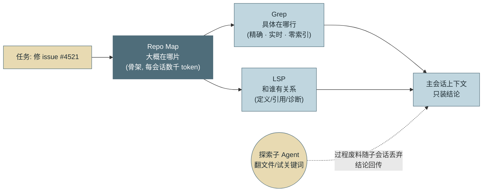
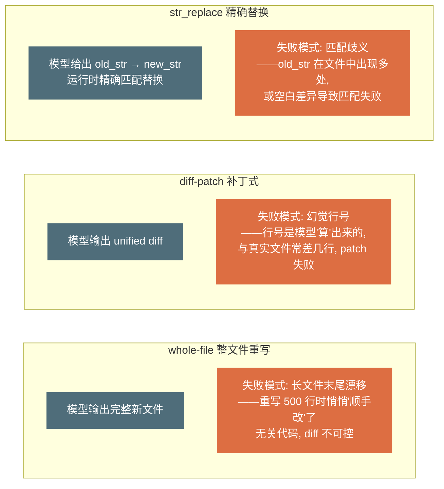
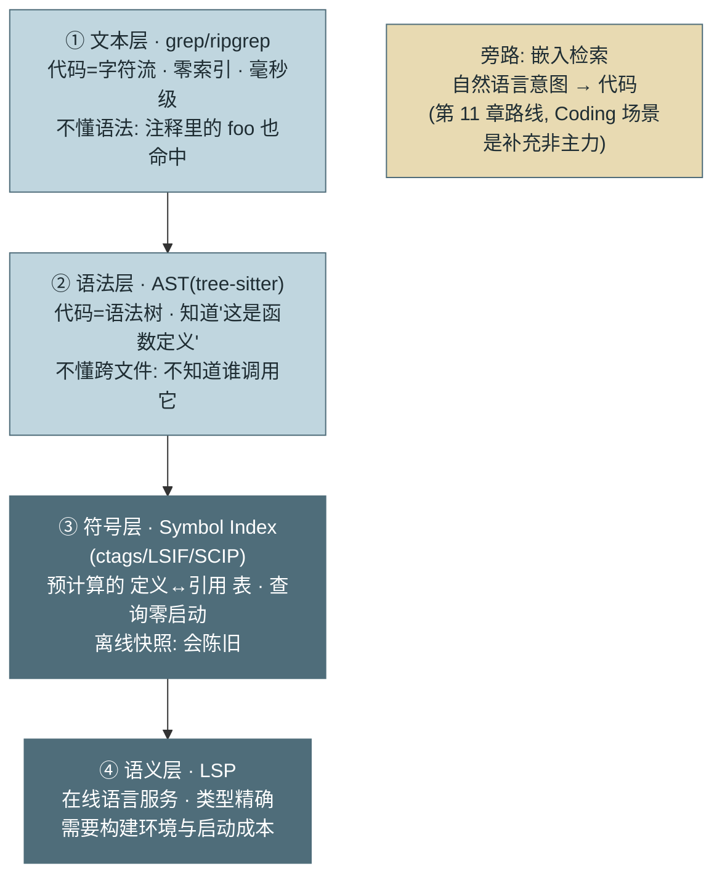

# 第 23 章 代码库理解与编辑

> 第六篇 Coding Agent
>
> 从本章起的三章只讲一个领域：**Coding Agent**——当下最成熟的 Agent 品类，也是本书全部机制的综合验收场。三章分工：本章解决"**看懂与改对**"（代码库理解、项目知识、编辑策略、遗留仓考古），第 24 章解决"**验证与质量**"（修复环、测试基建、领域评测、供应链），第 25 章解决"**协作与交付**"（人机形态、多 Agent 并行、冲突治理）。通用机制不再重讲——每处只讲 Coding 领域**特有**的那一层，机制本身以章号回指前文。

---

## 1. 场景引入：为什么是代码先跑通了

2024–2026 年的 Agent 产品版图有一个显眼的不对称：Coding Agent（Claude Code 及同类，产品全景见附录 D）已经在真实生产里修 bug、写功能、做迁移，而"通用办公 Agent"们还在演示视频里订机票。示例团队复盘自家两条产品线时也看到同样的落差：代码助手线的任务成功率 81%，业务流程线只有 64%——**同一套 Harness，同一个模型**。

差距不是巧合，是领域结构决定的。三个结构性优势让 Coding 成为 Agent 技术的试验田：

**验证信号天然存在。** 编译器、测试套件、类型检查、linter——软件工程五十年积累的全部质量基建，恰好就是 Agent 最稀缺的东西：**廉价、快速、确定性的外部验证**（第 3 章 Verifier、第 4 章 Reflexion 的外部信号，在这里不用建，捡就行）。业务流程任务的"做对了吗"要人判断，代码任务的"做对了吗"一条命令见分晓。

**环境完全数字化。** 任务的全部状态住在文件系统与进程里——可观测、可快照、可回滚（第 9 章工作区四理由的极致形态），没有物理世界的不可逆性，试错成本被 git 压到近零。

**经济价值直接。** 工程师时薪高且短缺，Agent 每完成一个修复的价值可直接计价——单位经济学（第 16 章）从第一天就算得清，这决定了商业投入的密度，投入密度又决定了迭代速度。

本篇沿"理解代码库 → 编辑 → 验证 → 评测 → 多 Agent 协作"的主线走完 Coding Agent 的技术栈，最后（第 25 章）用一张总图回收前文机制——这也是对读者的验收：如果每个组件你都能报出章节号，这本书的体系就长在你身上了。本章先解决最前面的两件事：**面对百万行大仓，Agent 怎么知道东西在哪；找到之后，怎么改才不出错**。

---

## 2. 原理

### 2.1 代码库理解：先建地图，再走路

Agent 面对百万行大仓的第一个问题不是"怎么改"而是"东西在哪"。三层手段：

**Repo Map（仓库地图）**：一份压缩的代码库骨架——目录结构 + 每个文件的顶层符号（类/函数签名，不含实现体）。构建方式是用语法解析器（tree-sitter 类）批量抽取签名，按"与当前任务的相关度 + 被引用度"裁剪到几千 token 注入上下文。它回答"这个仓库大致长什么样、我该往哪看"——相当于给 Agent 的新员工入职导览，成本是一次性索引 + 每会话几千 token。

**按需导航**：地图之后的精确定位交给两件已备好的工具——**Grep**（精确符号与字面量检索，第 11 章 2.6 节论证过它为何在 Coding 场景反超向量检索：精确、实时、零索引）与 **LSP**（definition/references/diagnostics 的符号级理解，第 9 章 2.3 节）。三者的分工可以一句话记住：**Map 管"大概在哪片"，Grep 管"具体在哪行"，LSP 管"和谁有关系"**。

**大仓分块策略**：仓库超出"地图 + 导航"的舒适区（单体巨仓、多语言混合）时，按模块边界切分职责域——每个会话/子 Agent 只领一个域的地图与写权限（第 13 章最小权限在仓库维度的应用），跨域改动升级为多 Agent 协作（第 25 章）或人工协调。判据是实用主义的：**地图裁剪后仍装不进预算，就该分块了**。

**探索外包：把翻文件的过程关进子 Agent。** 理解大仓的另一个敌人不是"找不到"，而是**找到之后留下的废料**：为定位一处定义翻过的几十个文件、跑偏的 grep 尝试、读到一半发现无关的模块——它们全部沉淀进主会话历史，此后每一轮都被重发一遍（第 2 章的计费结构）、稀释一遍注意力（第 5 章）。探索废料因此是**复利成本**：会话越长，为同一堆废料付的钱和注意力越多。成熟 Coding Agent 的通行解法是**外包**——所谓外包，就是派生一个有独立上下文窗口的子会话（子 Agent）代劳，主会话只验收成果、不参与过程（如同装修外包：施工队的草稿与废料留在工地，你家里只出现完工的房间）。把开放式探索整段交给**子 Agent**：它在自己的上下文里读文件、换关键词、走弯路，结束时只向主会话交回一句结论（"鉴权逻辑在 auth/middleware.py 第 45 行起，依赖会话中间件"）——过程性 token 随子会话销毁，主上下文只累积结论，**废料从复利变成一次性买断**。外包判据一句话：**过程对后续决策仍有价值，才留在主上下文；只有结论有价值，就整段外包**。结构上，这是第 17 章 Supervisor 拓扑在单任务内的微缩：主会话当主管，探索子 Agent 是即用即弃的工人。



*图 1：代码库理解的三层导航与探索外包——这张图回答"百万行大仓里，主会话的上下文预算花在哪"。地图给方位、Grep 给行号、LSP 给关系；开放式探索走子 Agent，主上下文只累积结论。*

### 2.2 项目知识文件：给 Agent 的入职手册

机制在第 6 章已经讲透（CLAUDE.md / AGENTS.md 的加载与分层）；这里讲 Coding 领域的**内容学**——写什么才真正有效。四类内容按查询频率排序：

**① 构建与测试命令**（最高频）：怎么装依赖、怎么跑单测、怎么跑单个测试文件、lint 命令是什么。这是 Agent 每个修复环都要用的信息——**错误的命令比没有命令更糟**：每次失败尝试烧一整轮（模型会拿着报错自行"探索"正确命令，把两分钟的事变成十分钟）。

**② 架构导航**：模块地图（"支付逻辑在 payments/，不在 billing/"）、分层约定（"handler 不得直接查库，必须经 service 层"）、跨模块调用的正确姿势。它是 Repo Map 的人工补充——地图给结构，导航给**意图**（哪里是入口、哪里是禁地）。

**③ 风格与禁区**：lint 覆盖不了的约定——错误处理风格（错误码还是异常）、日志规范、"别碰的遗留区"（谁改谁负责的模块）。

**④ 陷阱清单**：踩过的坑——"测试不能并行跑（共享 fixture 会互相污染）"、"gen/ 目录是生成代码，手改必被覆盖"。每一条都省一次踩坑轮次。

三条维护纪律：**命令类内容配冒烟脚本防腐**（文档也要合同测试——命令失效比缺失更伤，第 27 章坑 2 的教训前置）；**按目录分层放置**（子目录的知识文件随进入该目录生效，第 6 章渐进披露的应用——全仓知识堆一个文件里等于给每个会话交上下文税）；**从会话轨迹里长出来**（每次用户"重新教了一遍"的会话，结束时把教的内容沉淀一条进知识文件——第 10 章"语义记忆毕业"通道的 Coding 版，知识文件就是这个仓库的程序记忆）。

### 2.3 编辑策略：三种改法，三种失败

Agent 修改文件的三种策略，失败模式各不相同：



*图 2：三种编辑策略与各自的失败模式——这张图回答"为什么主流产品收敛到 str_replace"。三种失败的性质不同：whole-file 的失败是静默的（改了不该改的），diff 的失败是高频的（行号幻觉），str_replace 的失败是显式的（匹配不上会报错）——**显式失败可以回喂重试，静默失败只能靠事后 diff 审查发现**。*

主流产品的收敛结果与理由：**str_replace 精确替换为主**（Claude Code 的编辑工具即此形态）——`old_str` 必须在文件中**唯一匹配**，不唯一或不存在即报错回喂（第 7 章错误三要素），模型补更多上下文行重试；失败是显式的、可自愈的。**whole-file 仅用于新建或短文件**（阈值经验值百行级）；**裸 diff-patch 基本被弃用**——行号幻觉的失败率随文件长度线性上升，而模型对"数行数"这类精确计数任务的可靠性天然差（与第 18 章"簿记不交给模型"同一个原理：行号就是簿记）。

一个配套纪律：**每次编辑后立即读回验证**（编辑工具返回修改后的片段），让模型确认改动落点——这是把编辑从"开环写入"变成"闭环观察"（第 2 章 Observe 契约的应用）。

### 2.4 遗留仓考古：无文档大仓的进场三步

真实企业仓库的常态：无文档、测试稀薄、风格混杂、无人说得清全貌。Agent 进场的正确顺序是**先考古，后动工**，三步：

**① 建地图先于改代码。** Repo Map + 模块依赖粗图（import 关系聚类），产出"这个仓库大概怎么组织"的一页纸——然后**沉淀进项目知识文件**（2.2 节）供后续所有会话复用。考古成果必须留档：每个会话重新挖一遍，等于把一次性成本变成每会话税。

**② 冒烟测试先于功能改动。** 没有测试的模块，先给要改的函数写**行为快照测试（characterization test）**：用当前实际输出固化断言——它不证明代码正确，只证明"没改变没打算改的行为"，是遗留仓里最便宜的回归保险，也是第 24 章修复环能转起来的前置（没有测试的修复环没有信号）。

**③ 禁区标注。** 从 git log 找出高频救火区（频繁被紧急修复的文件）与无主区（多年无人提交、无 owner），标进知识文件的禁区清单——这些区域的改动自动升级人工评审（第 13 章策略的仓库维度落地）。

风格混杂的仓还有一条专门纪律：**就近风格**——匹配所改文件的现有风格，而不是套"最佳实践"。Agent 的默认倾向是把摸到的代码顺手现代化，在遗留仓里这是噪声 diff 的最大来源：审查者要在三行真改动里找出五十行风格重写。项目知识文件里一句"保持所改文件的既有风格，不做未被要求的重构"能省下大量评审带宽。

### 2.5 理解的技术底座：从字符到语义的四层金字塔

2.1 节讲了"怎么用"（Map/Grep/LSP 各管什么），这一节拆开"它们靠什么工作"——代码理解的工具其实叠在四个抽象层上，每上一层，精度提升、成本也提升：



*图 3：代码理解的四层抽象金字塔——这张图回答"这么多代码工具到底差在哪一层"。层级越高越懂代码、也越贵越脆；Agent 的工具选择本质是在这个金字塔上选层：够用的最低层就是正确的层。*

**语法层：AST 与 tree-sitter。** 抽象语法树（AST）把字符流解析成结构——"这是一个函数定义，名字叫 X，参数是 Y"。Coding Agent 生态几乎统一收敛到 **tree-sitter** 做这一层，三个原因都与 Agent 工况契合：**容错解析**（Agent 编辑到一半的残缺代码也能解析出可用的部分树——编译器级 parser 会直接报错拒绝）；**增量解析**（编辑后只重解析受影响子树，毫秒级，配合 2.3 节"每次编辑后读回"的高频调用）；**统一查询接口**（一套 S-expression 查询语法覆盖上百种语言，Repo Map 的签名抽取不用每种语言写一个解析器）。本章 3 节用 Python 标准库 `ast` 是教学替身，生产实现（aider、各类 Repo Map 工具）走 tree-sitter 正是为了这三条。AST 层还有一类被低估的工具：**结构化检索**（ast-grep/semgrep 类）——按语法模式而非字符匹配（"找出所有调用 `foo()` 且未处理返回值的位置"），在批量重构与安全审计任务里比正则 grep 高一个数量级的信噪比。

**符号层：Symbol Index。** 把"哪个符号在哪定义、被谁引用"预计算成表。谱系三代：**ctags**（老牌轻量，符号→定义位置的单向表）；**LSIF**（Language Server Index Format——把 LSP 的应答离线预计算成快照）；**SCIP**（Sourcegraph 的后继格式，更紧凑、支持跨仓）。它与 LSP 的关系一句话说清：**索引是 LSP 的"罐头"**——查询零启动、不需要构建环境（大规模代码导航平台都靠它），代价是离线快照会陈旧（与 Repo Map 同一个新鲜度问题，4 节）。对 Agent 的取舍：本地会话有活的 LSP 就用 LSP；跨仓检索、单仓库太大 LSP 起不来、或 CI 环境无法构建时，索引是唯一现实选项。

**语义层：LSP 的成本账。** 第 9 章 2.3 节讲了 LSP 给 Agent 带来符号级跃迁（definition/references/diagnostics），这里补 Coding Agent 集成时的三笔账：**启动成本**——语言服务器要索引整个项目才能应答（大仓分钟级），会话短任务可能等不起，这是很多终端 Agent 默认只开 grep、LSP 按需启动的原因；**环境成本**——LSP 的精度依赖项目能解析（依赖装好、构建配置正确），遗留仓恰恰常不满足，此时 LSP 降级为"部分可用"，Agent 要能优雅回退到语法层与文本层；**协议成本**——LSP 是为 IDE 的交互节奏设计的（有状态、长连接、按光标位置查询），Agent 批量查询的用法与之错配，所以生产集成通常包一层"查询工具"（`find_definition(symbol)` 而非裸协议），附录 T/U/V 三份源码解析里可以看到三种不同的包法。

**检索路线选型表**（与第 11 章检索路线表衔接，Coding 场景特化）：

| 路线 | 层 | 擅长 | 失灵于 | 索引成本 | Agent 默认位 |
|---|---|---|---|---|---|
| grep/ripgrep | 文本 | 精确符号/字面量/错误码 | 语义泛化、重命名后的概念 | 零 | **主力**（第 11 章 2.6 三理由） |
| 结构化检索（ast-grep 类） | 语法 | 语法模式（调用形态/反模式） | 跨文件关系 | 零（即时解析） | 批量重构/审计任务时启用 |
| Symbol Index | 符号 | 跳定义/找引用，跨仓、零启动 | 陈旧窗口内的新代码 | 预建+定期刷新 | 大仓/跨仓/无构建环境 |
| LSP | 语义 | 类型精确的定义/引用/诊断 | 项目不可构建、启动等不起 | 在线（启动分钟级） | 长会话按需启动 |
| 嵌入检索 | 意图 | "不知道名字的东西"（自然语言找代码） | 精确 token（第 11 章 2.6） | 入库管线 | 补充位：概念性探索 |
| Repo Map | 全局 | 开局定向（不是查询是地图） | 行级定位 | 一次性+局部刷新 | 会话初始化注入 |

一条压轴的选层纪律：**够用的最低层就是正确的层**——grep 三秒能答的问题不要等 LSP 三分钟的启动；金字塔往上走的每一层都要有"下层答不了"的明确理由。

### 2.6 沙箱与权限：Coding 场景的特化与产品对照

机制在第 9 章（三层沙箱、副作用分级）与第 13 章（PDP/PEP、三级策略）已讲透；这里讲 Coding 领域**特有**的风险面结构与主流产品的落地差异。

**风险面排序：bash 是最大的攻击面。** Coding Agent 的工具面收敛为四类——读、写、执行、检索——风险高度不对称：**命令执行**居首（一条 bash 等于任意副作用：删文件、装依赖、发网络请求都从这里走，第 9 章白名单执行器管的正是它）；**文件写**次之（边界清晰——工作区内 git 兜底可回滚，工作区外才是真风险，所以"写不出工作区"是所有产品的共同底线）；**网络出口**第三（两个方向都危险：进——`npm install` 拉进供应链风险，第 24 章依赖幻觉；出——代码与凭证外泄，第 20 章数据出域）；**读**最低但非零（读到的内容会注入上下文——第 5 章注入防御的 Coding 版：仓库里的恶意注释/README 是攻击载体，第 13 章污点机制的用武之地）。

**审批粒度与风险面对齐，而不是一刀切。** 成熟产品的共同形态：编辑类操作工作区内自动放行（git 可回滚，审批价值低）、命令执行走白名单 + 超白名单询问（第 13 章 ask 档的主战场）、网络出口默认拒绝 + 域名级白名单（最严档）。粒度错配的代价就是第 13 章的 HITL 疲劳：每次编辑都弹窗，用户三天后就点"全部允许"——**审批预算要花在 bash 与网络上，不要花在 str_replace 上**。

**主流产品的沙箱/权限对照**（源码级细节见附录 T/U/V，产品全景见附录 K）：

| 产品形态 | 隔离手段 | 权限模型 | 特色机制 |
|---|---|---|---|
| Claude Code（终端） | 命令沙箱 + 工作区边界 | allow/ask/deny 三级 + hooks 拦截（第 6/13 章形态） | PreToolUse hook 做确定性 PEP；权限规则可版本化进仓库 |
| Codex CLI（终端，Rust） | **OS 级沙箱纵深**（macOS Seatbelt / Linux Landlock）+ 网络代理 | 审批策略 + PermissionProfile | 网络请求域名级审批；Guardian 危险命令判定（附录 V 篇四） |
| Pi（终端，TS） | 工具级边界 | **Project Trust 两阶段**：先决定"是否加载仓库资源"，再谈工具授权（附录 T） | 把"信任这个仓库吗"独立成第一道闸——防的是恶意仓库的资源注入 |
| 云端异步（Codex Cloud/Devin 类） | **容器级隔离**（每任务独立环境） | 以 **PR 为审批点**——环境内全放开，出口收紧 | 隔离最强、交互最弱；审批从"每个动作"聚合为"整个变更"（第 25 章异步委托档） |

表里藏着一条谱系规律：**隔离越强，动作级审批越松**——云端容器里随便跑（反正出不来），本地终端则要靠动作级权限补隔离的不足。选型时先定隔离档位，审批粒度随之推导，方向不要反。

**与平台/通用 Agent 的对比：差异是结构性的。** 第六篇反复出现的"为什么 Coding 先成熟"（本章 Q1），放到与业务平台 Agent（办公自动化、流程 Agent、客服 Agent）的逐维对比里看得更清楚：

| 维度 | Coding Agent | 平台/业务 Agent |
|---|---|---|
| 验证信号 | 编译/测试/lint——免费、快速、确定性 | 人工判断为主，反馈慢且贵 |
| 环境状态 | 文件系统——可快照、可回滚、git 兜底 | 外部 SaaS/数据库——副作用常不可逆（第 12 章 Saga 补偿是补丁不是兜底） |
| 工具面 | 收敛四类（读/写/执行/检索），跨任务复用 | 发散——每个业务一套 API，工具面随场景爆炸 |
| 上下文结构 | 高度结构化（AST/符号/引用图可索引，2.5 节整套金字塔可用） | 非结构化为主（邮件/文档/对话），只有嵌入检索一条路 |
| 风险控制 | 工作区边界 + PR 审批点，天然的变更聚合 | 动作即生效，缺少"合并前"这个缓冲带 |
| 评测 | SWE-bench 类可自动规模化（第 24 章） | 环境难复现，评测集难建（第 15 章三重困难全占） |

这张表的用法不是比高下，而是**迁移清单**：平台 Agent 要复制 Coding 的成功，缺哪个维度就构造哪个——给业务动作建"测试环境"（可回滚的缓冲带）、把生效点聚合成"变更包审批"（PR 的业务版）、为高频判断建自动验证信号。第 25 章机制总图的外溢路径，具体就落在这六行上。

---

## 3. 动手实现（贯穿项目增量）

本章增量：`src/assistant/coding/repo_map.py`——**Repo Map 构建器**：用 Python 标准库 `ast` 抽取签名骨架、按被引用度排序、预算裁剪。零外部依赖（生产按语言换 tree-sitter，接口不变）。

```python
# src/assistant/coding/repo_map.py — Repo Map: 签名骨架 + 引用度排序 + 预算裁剪
import ast
from pathlib import Path


def extract_signatures(py_file: Path) -> list[str]:
    """提取顶层类/函数签名（不含实现体）——地图的最小单元"""
    try:
        tree = ast.parse(py_file.read_text("utf-8"))
    except SyntaxError:
        return []          # 解析失败的文件不进地图——不让一个坏文件毁全图
    sigs = []
    for node in tree.body:
        if isinstance(node, ast.ClassDef):
            sigs.append(f"class {node.name}:")
            for item in node.body:
                if isinstance(item, (ast.FunctionDef, ast.AsyncFunctionDef)):
                    args = ", ".join(a.arg for a in item.args.args)
                    sigs.append(f"    def {item.name}({args})")
        elif isinstance(node, (ast.FunctionDef, ast.AsyncFunctionDef)):
            args = ", ".join(a.arg for a in node.args.args)
            sigs.append(f"def {node.name}({args})")
    return sigs


def top_level_names(sigs: list[str]) -> list[str]:
    """文件的顶层符号名（引用度统计的键）"""
    return [s.split()[1].split("(")[0].rstrip(":")
            for s in sigs if not s.startswith(" ")]


def build_repo_map(root: Path, budget_chars: int = 4000) -> str:
    """全仓地图：每文件签名骨架，按被引用度排序，超预算的只留路径。
    引用度 = 该文件顶层符号名在其他文件中出现的次数
    （教学近似；生产用 LSP references 的精确计数）"""
    files = [p for p in sorted(root.rglob("*.py"))
             if not any(part.startswith(".") for part in p.parts)]
    sigs = {p: extract_signatures(p) for p in files}
    corpus = {p: p.read_text("utf-8", errors="ignore") for p in files}

    def ref_count(p: Path) -> int:
        return sum(text.count(name)
                   for q, text in corpus.items() if q != p
                   for name in top_level_names(sigs[p]))

    ranked = sorted((p for p in files if sigs[p]), key=ref_count, reverse=True)
    blocks, tail, used = [], [], 0
    for p in ranked:
        block = f"## {p.relative_to(root)}\n" + "\n".join(sigs[p]) + "\n"
        if used + len(block) <= budget_chars:
            blocks.append(block)
            used += len(block)
        else:
            tail.append(str(p.relative_to(root)))
    if tail:      # 装不下的只留路径：地图有预算边界, 但目录无遗漏
        blocks.append("## 其余文件（仅路径）: " + ", ".join(tail))
    return "\n".join(blocks)
```

接线说明：地图在会话初始化时构建并注入上下文**前部**——它是稳定内容，与 System Prompt 同属缓存前缀（第 16 章：地图不变则每轮命中缓存，成本近乎免费；地图重建即缓存失效，这是 4 节"新鲜度与成本的对价"的由来）。`budget_chars` 按窗口预算配置（第 5 章水位口径）。回测贯穿项目自身：对 `src/assistant/` 构建地图，`agent_loop.py`、`tools.py` 等被引用大户排前，预算内装下核心模块骨架、其余文件降级为路径行——模型拿到的正是"该往哪看"的最小充分信息。

---

## 4. 生产级考量

**内部框架知识是最高回报的补给。** 企业仓库的内部框架模型没见过——这是 Coding Agent 在企业环境打折的第一原因。补给顺序按性价比：项目知识文件写清框架的调用约定（2.2 节）> 高频任务做成 Skill（第 6 章）> 把框架文档接入检索（第 11 章）。三者成本递增，先便宜后昂贵。

**地图的新鲜度与成本的对价。** Repo Map 是缓存，代码一直在变：编辑后陈旧的地图会让模型引用已删除的符号（坑 2）。刷新策略分层——本会话改过的文件即时局部重建（秒级）；他人合入的变更按会话启动时间戳判断全量重建；地图进缓存前缀意味着**重建即缓存失效**（第 16 章），所以刷新粒度要在"新鲜度"与"命中率"之间显式取舍，而不是每轮全刷。

**多语言仓库的解析覆盖率。** tree-sitter 的语言矩阵覆盖主流语言，但配置文件、DSL、模板语言常在覆盖之外——地图的**解析覆盖率**（能抽出签名的文件占比）要作为健康指标：覆盖率低的目录，地图退化为纯路径列表，模型在该区域的导航质量随之下降，这是"某些模块 Agent 特别笨"的常见根因。

---

## 5. 常见坑

**坑 1：str_replace 的 old_str 太短，改错了地方。**
*症状*：Agent 要改第 3 处 `return None`，替换命中了第 1 处——编辑"成功"、测试更红；或多处匹配报错后模型反复试错烧轮次。
*根因*：唯一匹配语义靠上下文行数保证——old_str 只给一行时，重复代码（return/pass/日志行）大概率多处命中。
*修复*：工具描述要求 old_str 携带足够上下文（前后各 2–3 行）；错误消息给出行动指引（"请增加上下文行"）；编辑后读回验证让错位改动当轮暴露（2.3 节闭环纪律）。

**坑 2：Repo Map 过期，模型引用已删符号。**
*症状*：Agent 自信地调用 `calc_discount()`——那个函数上周已被重命名；报 NameError 后它开始"修复"这个自己制造的错误，越走越偏。
*根因*：地图是缓存而代码在变——会话中的编辑、他人合入的变更都会让启动时构建的地图失真；模型无从区分"地图说有"与"现在真有"。
*修复*：本会话编辑过的文件即时局部重建地图；关键改动前用 Grep/LSP 对地图结论做一次实时核验（地图给方位、导航给真值——分工本就如此）；地图条目带构建时间戳，长会话超时提醒重建。

**坑 3：whole-file 重写混入"顺手改动"。**
*症状*：要求改一个函数，diff 里出现了三处无关改动——重命名了变量、调整了 import 顺序、"优化"了一段没让碰的逻辑；评审负担倍增，还引入了一个新 bug。
*根因*：整文件重写时模型在"复述"整个文件，复述天然有漂移——长文件末尾尤甚；模型的"最佳实践"倾向叠加其上（遗留仓的就近风格纪律正为此设，2.4 节）。
*修复*：编辑策略默认 str_replace（改哪写哪）；whole-file 限定新建与百行内短文件；diff 审查盯"改动范围 vs 任务范围"的溢出（第 24 章 Reviewer 清单的固定项）；知识文件写明"不做未被要求的重构"。

**坑 4：探索废料淹没主会话。**
*症状*：会话进行到第 30 轮，模型开始忘记任务约束、重复读已读过的文件；检查上下文——前 20 轮的探索过程（读了 40 个文件找一处定义）占据了大半窗口。
*根因*：把开放式探索留在主会话——过程性内容进了历史就一直交注意力税与 token 税（第 5 章），压缩也只能缓解。
*修复*：探索外包给子 Agent，主会话只收结论（2.1 节）；Repo Map 先行降低探索量；已读文件清单入 TODO 视图防重复读（第 4 章）。

---

## 6. 面试高频问题

**Q1：为什么 Coding 是 Agent 技术最先成熟的领域？**

结论先行：**三个结构性优势——验证信号天然存在（编译/测试/lint 是免费的确定性 Verifier）、环境完全数字化（可快照可回滚，试错近零成本）、经济价值直接可计价（决定投入密度与迭代速度）。**
- 验证信号是 Agent 最稀缺资源，软件工程五十年质量基建恰好现成。
- 对比：业务流程任务的"做对了吗"要人判断，反馈又慢又贵。
- 推论：其他领域 Agent 化的路径 = 为该领域构造类似的验证信号与数字化环境。
- 加分点：同一 Harness 同一模型下，代码线与业务线成功率差 17pp——差距来自领域结构而非技术。

**Q2：Agent 怎么理解百万行代码库？**

结论先行：**三层导航——Repo Map 管"大概在哪片"（签名骨架，数千 token），Grep 管"具体在哪行"（精确/实时/零索引），LSP 管"和谁有关系"（定义/引用/诊断）；超出舒适区按模块分块，开放式探索外包给子 Agent。**
- 地图构建：语法解析抽签名 + 被引用度排序 + 预算裁剪；地图是缓存，有新鲜度问题（编辑后局部重建）。
- 探索外包的判据：过程有价值进主上下文，只有结论有价值就整段外包——废料在主会话按轮复利计费，外包后一次性买断。
- 大仓分块 = 最小权限的仓库维度：每会话只领一个域的地图与写权限。
- 加分点：地图进缓存前缀（稳定内容），重建即缓存失效——新鲜度与命中率要显式取舍。

**Q3：Agent 编辑代码的三种策略怎么选？**

结论先行：**主流收敛到 str_replace 精确替换（唯一匹配、失败显式可回喂）；whole-file 仅限新建与短文件（长文件末尾漂移是静默失败）；裸 diff-patch 基本弃用（行号幻觉——行号是簿记，模型算不准簿记）。**
- 三种失败的性质：显式失败（str_replace）可自愈，静默失败（whole-file）只能事后 diff 审查。
- str_replace 的纪律：old_str 带足上下文行保唯一；编辑后读回验证形成闭环。
- 行号幻觉与第 18 章"簿记不交模型"同源——精确计数不是概率组件的强项。
- 加分点：匹配失败的错误消息要含行动指引（"增加上下文行"），一轮自愈。

**Q4：项目知识文件（CLAUDE.md 类）在 Coding 场景该写什么？**

结论先行：**四类内容按查询频率——构建与测试命令（最高频，错误的命令比没有更糟）、架构导航（模块地图与分层意图）、风格与禁区（lint 管不了的约定）、陷阱清单（踩过的坑）；纪律是命令配冒烟防腐、按目录分层、从轨迹沉淀。**
- 与 Repo Map 分工：地图给结构，知识文件给意图（入口在哪、禁地在哪）。
- 命令类内容要合同测试——失效的构建命令每次烧一整轮探索。
- "从会话里长出来"：用户重复教的内容沉淀入档——仓库的程序记忆（第 10 章毕业通道）。
- 加分点：遗留仓专项条目——"保持所改文件既有风格，不做未被要求的重构"，一句话省大量评审带宽。

**Q5：grep、AST、Symbol Index、LSP、嵌入检索——Agent 的代码检索该怎么选？**

结论先行：**按四层金字塔选层——文本（grep）、语法（AST/tree-sitter）、符号（ctags/LSIF/SCIP）、语义（LSP），外加嵌入检索旁路；纪律是"够用的最低层就是正确的层"。**
- grep 是主力（精确/实时/零索引，第 11 章 2.6）；结构化检索（ast-grep 类）管语法模式；索引管跨仓与零启动；LSP 管类型精确但有启动与环境成本；嵌入只补"不知道名字的东西"。
- Symbol Index 与 LSP 的关系：索引是 LSP 的"罐头"——预计算、零启动、会陈旧；本地有活 LSP 用 LSP，跨仓/不可构建用索引。
- tree-sitter 统治语法层的三个理由：容错解析（残缺代码可解析）、增量解析（编辑后毫秒级重解析）、统一查询接口（一套语法覆盖百种语言）。
- 加分点：LSP 是为 IDE 交互节奏设计的（有状态/按光标查询），Agent 集成要包一层查询工具而非裸协议——三种包法见附录 T/U/V。

**Q6：Coding Agent 的沙箱与权限该怎么设计？和通用平台 Agent 差在哪？**

结论先行：**风险面不对称——bash 最大、文件写次之（工作区内 git 兜底）、网络出口第三、读非零（注入面）；审批粒度与风险面对齐（编辑放行、命令白名单+询问、网络默认拒），审批预算花在 bash 与网络上；谱系规律是"隔离越强、动作级审批越松"（云端容器全放开、以 PR 为审批点）。**
- 一刀切审批的代价是 HITL 疲劳（第 13 章）——每次编辑都弹窗，三天后用户点"全部允许"，防线归零。
- 产品对照：Claude Code 三级权限+hooks、Codex OS 级沙箱纵深+域名审批、Pi 的 Project Trust 两阶段、云端 agent 容器隔离+PR 审批点。
- 与平台 Agent 的结构性差异六维：验证信号/环境可回滚性/工具面收敛度/上下文可索引性/变更聚合点/评测可自动化——平台 Agent 落地的迁移清单就是"缺哪维构造哪维"。
- 加分点：读操作的风险不是零——仓库内容注入上下文（恶意注释/README），是第 5 章注入防御与第 13 章污点机制的 Coding 落点。

---

> **下一章预告**：能看懂、能改对，还差"证明改对了"。第 24 章进入验证与质量：test-driven repair loop 的完整设计、测试基建怎么为 Agent 适配（分层/选测/flaky）、SWE-bench 的原理与局限，以及生成代码特有的供应链风险。
