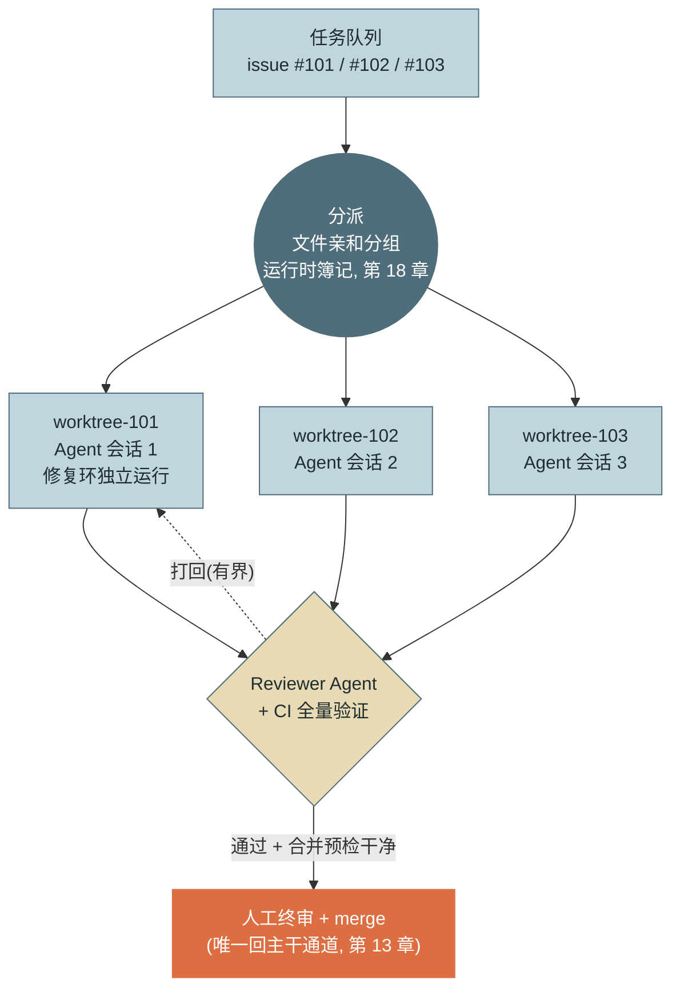
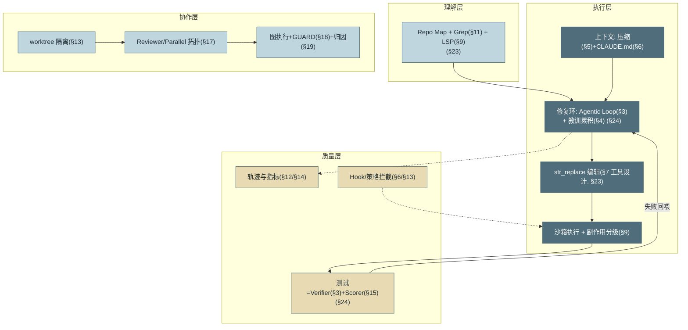

# 第 25 章 协作形态与交付工程

> 第六篇 Coding Agent
>
> 前两章打磨好了单个 Agent 的"改对 + 证明改对"，本章解决**规模化交付**：人与 Agent 以什么形态协作（四档谱系）、多 Agent 怎么落地（Reviewer 与并行 worktree）、并行之后共享资源怎么治理（文件冲突、CI 容量、评审带宽）。收尾是那张回收全书的机制总图——第六篇也在此完成它作为"综合验收场"的使命。

---

## 1. 场景引入：十个 PR 同时到达的下午

第 24 章的修复环稳定后，团队上了并行 worktree：五个会话同时开工，任务队列按 issue 分发。第一周的数据却难看：**吞吐不升反降**。复盘找到三个堵点：

**堵点一：同文件冲突链。** 周二下午三个任务不约而同改了 `utils/date.py`——先合入的赢，后两个 rebase 冲突，Agent 解冲突又引发新的测试失败，返工时间超过了任务本身。**堵点二：CI 排队。** 五个 worktree 各自频繁触发全量验证，CI 队列从 8 分钟排到 40 分钟——第 24 章刚压下去的"修复环心率"被并行自己拖垮。**堵点三：终审积压。** 周五下午评审者面对 17 个待审 PR 连批 9 个——38 秒 LGTM（第 22 章的亡灵）在并行加持下回魂。

三个堵点共同宣告一件事：**并行的瓶颈从来不在 Agent 数量，在共享资源——文件、CI、人的注意力**。本章按"形态选择 → 协作拓扑 → 资源治理"把这三个堵点逐一拆掉。

---

## 2. 原理

### 2.1 人机协作的形态谱系

先于"多 Agent"，要先回答"人与 Agent 的协作距离"。四档从紧到松：

- **内联补全/编辑**：IDE 里逐行接受，人主导、亚秒延迟、逐处审查——人的注意力覆盖每一行。
- **会话式结对**：终端/IDE 会话逐任务确认，人在环批计划、看关键 diff——本书循环的默认形态。
- **异步委托**：任务进队列、云沙箱执行、PR 交付，人只审结果——修复环的托管版。
- **并行队列**：多任务多 worktree 同时推进，人守 merge 闸口——本章 2.3 节的形态。

档位越靠右，吞吐越高、单位改动分到的人工注意力越少——所以**档位选择必须与风险分级联动**（第 4 节信任分级的另一面）：测试与文档改动可以推到右端，核心业务逻辑停在会话式，安全敏感改动留在内联逐处审查。团队常犯的错是把档位当先进程度排座次——**四档是四种工具，不是四个时代**：同一个工程师的一天里，改配置用内联、修 bug 用会话、批量迁移丢进并行队列，才是成熟用法。

### 2.2 Reviewer 模式：独立上下文的守门人

**Reviewer 模式**（第 17 章冗余型拓扑的落地）：执行 Agent 产出 patch，独立上下文的审查 Agent 依据清单（安全/边界/风格/测试充分性）批评，打回带上限（第 17 章图 5 原样落地）。它在 Coding 场景格外有效的原因：评审标准可成文（第 17 章矩阵里"代码审查 × Reviewer 高"的理由），且审查 Agent 可以调用与执行者不同的工具视角（只读 + lint + diff 分析），盲区互补是真实的而非仪式性的。

Reviewer 清单的 Coding 特化条目（承接前两章的失败模式）：**改动范围 vs 任务范围的溢出**（第 23 章坑 3 的"顺手改动"）；**测试是否被动过**（第 24 章坑 1 的刷绿）；**新增依赖清单**（第 24 章 2.4 的供应链）；**风格是否就近**（第 23 章 2.4 的遗留仓纪律）。清单驱动的审查是可评测的——每个条目都能造出违例用例回归 Reviewer 自身（第 15 章：审查者也要被评测）。

### 2.3 并行 worktree 与冲突治理

**并行 worktree 开发**（分解型 Parallel）：多个任务各占一个 worktree 独立推进——第 13 章的隔离设施 + 第 17 章 Parallel 拓扑的合体：



*图 1：并行 worktree 多 Agent 开发——这张图回答"多任务并行如何互不踩踏、质量闸门在哪"。三个已建成设施的合体：worktree 空间隔离（第 13 章）、Parallel 拓扑（第 17 章）、GUARD 门禁与运行时簿记（第 18 章）；人守住 merge 这一个闸口。分派节点新增的"文件亲和分组"是本章的增量——冲突在分派时预防，比在合并时解决便宜一个数量级。*

worktree 解决了"空间隔离"，但**并行任务最终要汇入同一条主干**——冲突治理是并行工程的下半场，四件套：

**① 文件亲和分派。** 分派前静态预估每个任务的触碰文件集（issue 定位 + Repo Map 检索给出候选文件），**触碰集相交的任务进同一串行组**——同组内顺序执行、组间并行。场景引入的堵点一在分派层就被消解：三个都要改 `utils/date.py` 的任务本就不该同时开工。预估会有漏（改着改着摸到了别的文件），所以它是概率优化，兜底靠②。

**② 合并预检。** PR 就绪后、进入终审前，对主干做一次**试合并**（`git merge-tree` 类只读预检）：干净则放行，冲突则先行处理——把"合并时才发现冲突"提前到"排队时就知道"，终审的人永远只看能合的 PR。

**③ 冲突解决回会话，不落人肩上。** 预检发现冲突时，正确动作是**让该任务的 Agent 会话自己 rebase 并重跑修复环尾部验证**（冲突解决需要任务上下文，Agent 手里有、评审者手里没有）；rebase 后目标测试 + 全量验证重新走一遍（第 24 章图 1 的⑤——合并冲突的解决本身就是一次代码改动）。人肉解决 Agent 的冲突是常见反模式：解的人没有任务上下文，解完也没人重跑验证。

**④ 长活任务定期重放主干。** 跑数天的大任务要定期 rebase 主干（如每日），防止偏离越攒越大——一次性解决三周漂移的 rebase 几乎必然失败，每日小步重放把冲突拆成小额分期。

**并行度的现实上限不在机器在人**：merge 终审的人工带宽决定吞吐——第 22 章评审分层因此不是可选优化而是并行开发的前提（终审看意图与验收标准，逐行早在 Reviewer Agent 与 CI 层消化）。

### 2.4 机制总图：一张图回收全书



*图 2：Coding Agent 机制地图（§n = 本书章号）——这张图回答"一个生产级 Coding Agent 由前文哪些机制拼成"。没有一个组件是本篇新发明的：Coding Agent 的领先不在机制新颖，而在每个机制都被验证信号的高频反馈打磨到位。这也是第六篇作为"综合验收场"的验收题：指着任何一个框，说出它是哪一章的机制、在 Coding 领域特化成了什么。*

这张图还有一份现实对照：社区对 Claude Code 泄露版本的逆向分析（附录 D.1"内部设计考古"[C-27]）显示，成熟产品的实际实现与图中机制逐格对应——92% 水位触发的八段式压缩（§5）、TodoWrite 计划簿记（§4）、并发上限 10 的工具调度与读写分治（§7）、独立上下文的子代理（§17/§23）、异步消息队列隔离生产与消费（§12）。**这套机制不是本书的发明，是行业实践收敛出的共识**——逆向结论按非官方"待确认"口径引用，细节随版本演进。

---

## 3. 动手实现（贯穿项目增量）

本章增量：`src/assistant/coding/wt_dispatch.py`——**并行任务的 worktree 分派器**：文件亲和分组（2.3 节①）、worktree 创建/回收、合并预检（2.3 节②）。全部基于 git 原生能力，零外部依赖。

```python
# src/assistant/coding/wt_dispatch.py — worktree 分派: 文件亲和 + 合并预检
import subprocess
from dataclasses import dataclass, field
from pathlib import Path


@dataclass
class Task:
    id: str
    files: set = field(default_factory=set)   # 预估触碰文件集(issue 定位/Map 检索)


def partition(tasks: list[Task]) -> list[list[Task]]:
    """文件亲和分组: 触碰集相交的任务并入同一串行组, 组间可并行。
    注意传递合并: 新任务同时与多个组相交时, 这些组也要并成一个"""
    groups: list[list[Task]] = []
    for t in tasks:
        hit = [g for g in groups if any(t.files & other.files for other in g)]
        merged = [t] + [x for g in hit for x in g]
        groups = [g for g in groups if g not in hit] + [merged]
    return groups


def _git(repo: Path, *args: str) -> subprocess.CompletedProcess:
    return subprocess.run(["git", "-C", str(repo), *args],
                          capture_output=True, text=True)


def create_worktree(repo: Path, task_id: str, base: str = "main") -> Path:
    """为任务开独立 worktree + 专属分支（第 13 章隔离模型）"""
    wt = repo.parent / f"wt-{task_id}"
    r = _git(repo, "worktree", "add", "-b", f"agent/{task_id}", str(wt), base)
    if r.returncode != 0:
        raise RuntimeError(f"worktree 创建失败: {r.stderr.strip()}")
    return wt


def remove_worktree(repo: Path, task_id: str) -> None:
    """任务完结或废弃: 删目录零残留（worktree 隔离的退出语义）"""
    _git(repo, "worktree", "remove", "--force", f"../wt-{task_id}")
    _git(repo, "branch", "-D", f"agent/{task_id}")


def preflight_merge(repo: Path, branch: str, base: str = "main") -> bool:
    """合并预检: merge-tree 只读试合并, 不动工作区——
    干净返回 True(可进终审队列), 冲突返回 False(打回会话 rebase)"""
    r = _git(repo, "merge-tree", "--write-tree", base, branch)
    return r.returncode == 0
```

接线（图 1 的分派节点）：任务入队时 `partition` 分组，组内串行、组间各 `create_worktree` 开工；PR 就绪后 `preflight_merge` 过滤——冲突的打回原会话 rebase 重验（2.3 节③），干净的才进人工终审队列。回测场景堵点一：三个改 `utils/date.py` 的任务被 `partition` 并入同组串行执行，冲突链在分派层消失；漏预估的冲突被 `preflight_merge` 拦在终审之前——**终审的人永远只看能合的 PR**。

---

## 4. 生产级考量

**信任分级放行。** 不同风险的产出走不同流程：测试与文档改动可以自动合入（可逆、低危）；业务逻辑走 Reviewer Agent + 人工终审；涉及安全/数据/基础设施的改动强制人工深评（第 9 章分级 + 第 22 章评审分层的合流）。分级标准写进策略（第 13 章），而不是留给合入者临场判断——它同时也是 2.1 节档位选择的策略化：**风险分级定档位，不是人的心情定档位**。

**产出速度会冲垮下游。** Agent 把"写代码"提速十倍后，瓶颈立刻移动到 CI 容量（并行 worktree × 每次全量验证）、评审带宽（第 22 章）与发布窗口。上并行前先做下游容量核算——第 19 章判定法在软件交付流水线上的应用：**CI 就是你的"数仓队列"**（第 21 章事故一的交付版）。缓解在两端：CI 侧用第 24 章的分层与选测降低单 PR 负载 + 合并队列（merge queue）批量验证；评审侧靠分层与信任分级分流。

**并行度是显式参数，与容量联动。** 扇出多少个 worktree 不该是"有多少任务开多少"——它由三个容量取最小值决定：CI 吞吐（单位时间能验证几个 PR）、终审带宽（人一天能认真审几个）、冲突率（亲和分组后的组数上限）。三者任一饱和就该降并行度——超出容量的并行只是把队列从任务侧搬到了 PR 侧，交付周期不降反升（场景引入的第一周数据正是如此）。

---

## 5. 常见坑

**坑 1：并行任务改同一文件，冲突链吃掉全部收益。**
*症状*：五个并行任务两天产出九个 PR，其中六个在合并时冲突；rebase-重验-再冲突的循环让实际交付比单会话还慢。
*根因*：分派只看任务不看文件——并行的隔离靠 worktree（空间），但主干只有一条（汇入点），触碰集相交的任务并行等于把冲突延后到最贵的时刻。
*修复*：文件亲和分组（本章 `partition`），相交任务串行化；合并预检（`preflight_merge`）把冲突拦在终审前；冲突解决回原会话带上下文处理，人不接盘。

**坑 2：终审带宽不扩，并行度形同虚设。**
*症状*：PR 平均等审 2.8 天——Agent 十分钟产出的修复在队列里躺三天；评审者要么积压要么滑向 38 秒 LGTM（第 22 章坑 2 的并行加强版）。
*根因*：把并行度当独立参数调，没和终审带宽联动——人是 merge 闸口的单点，闸口不扩，上游提速只是加长队列。
*修复*：评审分层先行（意图/验收标准/关键面，第 22 章）——终审只看已过 Reviewer+CI 的 PR；信任分级让低危改动绕过人工（第 4 节）；并行度按"CI 吞吐/终审带宽/冲突率"三者最小值设定并动态调整。

**坑 3：安全敏感改动走了异步后台档。**
*症状*：一个涉及鉴权中间件的改动被丢进并行队列，Reviewer 清单没覆盖该场景、终审者当天面对 17 个 PR——它以"测试全绿"滑了过去；安全复查时才发现权限校验被"顺手简化"了。
*根因*：协作档位与风险分级脱钩——档位按"谁有空"或"任务来源"分配，而不是按改动的风险面分配。
*修复*：档位选择策略化（第 4 节：风险分级定档位）；安全/数据/基础设施路径的改动强制降档到会话式或内联审查（路径匹配规则，第 13 章 PEP 的交付版）；Reviewer 清单含"改动是否触及敏感路径"的升级条目。

**坑 4：并行把 CI 排成数仓队列。**
*症状*：CI 从 8 分钟排到 40 分钟，所有会话的修复环心率集体恶化（第 24 章的基建投资被并行自己吃掉）；工程师的人工 PR 也被拖累，团队开始抱怨"机器人挤占了 CI"。
*根因*：并行度上线时没做 CI 容量核算——n 个 worktree × 每轮全量验证的负载是上线前就能算的乘法（第 19 章判定法），没人算。
*修复*：环内/出口/门禁三层验证分流（第 24 章 2.2）降低单任务 CI 负载；合并队列批量验证摊薄成本；Agent 的 CI 任务与人工任务分池限额（第 21 章"Agent 专属队列"的 CI 版）；并行度与 CI 吞吐联动（第 4 节）。

---

## 6. 面试高频问题

**Q1：Coding 场景的多 Agent 怎么落地？**

结论先行：**两个已验证形态——Reviewer 模式（独立上下文+清单化批评+有界打回）与并行 worktree 开发（文件亲和分派、每任务一个 worktree、GUARD+CI 门禁、合并预检、人守 merge 闸口）；并行度上限在人工终审带宽与 CI 容量，不在机器。**
- Reviewer 在 Coding 有效的原因：标准可成文 + 工具视角互补（只读/lint/diff 分析）；清单条目可造违例用例回归审查者自身。
- worktree 并行 = 第 13 章隔离 + 第 17 章 Parallel + 第 18 章簿记与门禁的合体，零新机制。
- 冲突治理四件套：亲和分派、合并预检、冲突回会话、长活任务定期 rebase。
- 加分点：下游容量（CI/评审/发布窗口）要先核算——第 19 章判定法在交付流水线的应用。

**Q2：人与 Coding Agent 的协作形态怎么选？**

结论先行：**四档谱系——内联补全（人主导逐行审）、会话式结对（人在环逐任务确认）、异步委托（PR 交付人审结果）、并行队列（人守 merge 闸口）；档位越右吞吐越高、单位改动的人工注意力越少，所以档位必须由风险分级决定，而非"先进程度"。**
- 测试/文档改动推右端，核心业务逻辑停会话式，安全敏感留内联逐处审查。
- 四档是四种工具不是四个时代：同一个人的一天里三档并用才是成熟用法。
- 档位选择要策略化（路径/风险匹配规则），不留给临场判断。
- 加分点：档位错配是安全事故的温床——敏感改动走异步档 = 用最少的注意力审最危险的变更。

**Q3：并行 worktree 上线后吞吐反降，从哪查起？**

结论先行：**查三个共享资源——文件（同文件任务并行导致冲突链：上亲和分派+合并预检）、CI（并行负载冲垮反馈周期：三层验证分流+合并队列+分池限额）、人的注意力（终审积压或盲批：评审分层+信任分级+并行度联动）。**
- 并行的瓶颈从来不在 Agent 数量，在共享资源——这句话值得先于任何调参写在白板上。
- 冲突解决回原会话（有任务上下文），人不接盘；解完必须重跑验证。
- 并行度 = min(CI 吞吐, 终审带宽, 亲和组数)，动态调整而非一次设定。
- 加分点：预估触碰文件集是概率优化、合并预检是确定性兜底——又一处"概率提效、确定性保底"的分层。

**Q4：如何证明你掌握了 Coding Agent 的完整技术栈？**

结论先行：**用机制总图自测——理解层（Map/Grep/LSP）、执行层（修复环/编辑/沙箱/上下文）、质量层（Verifier/观测/策略）、协作层（worktree/拓扑/图执行）；对任何一个框能报出：它是哪一章的机制、在 Coding 领域特化成了什么、坏掉时症状是什么。**
- 没有一个组件是本篇新发明的——Coding Agent 的领先在于每个机制被高频验证信号打磨到位。
- 特化举例：Verifier→测试套件、语义记忆→项目知识文件、Parallel→worktree 并行、交接包→教训链。
- 反向推论（第 26 章的判断框架用得上）：其他领域 Agent 化 = 复制这套结构（验证信号+数字化环境）。
- 加分点：面试官问任何 Coding Agent 产品，用"六大件+四层"拆它比背产品功能列表高一个段位。

---

> **下一章预告**：Coding Agent 展示了"机制成熟后"的样子，第七篇回到专家视野看"还没成熟"的地方。第 26 章前沿方向：自进化、后训练的四道闸、基础设施三条演进线——以及判断任何"前沿"值不值得投入的三问框架。
