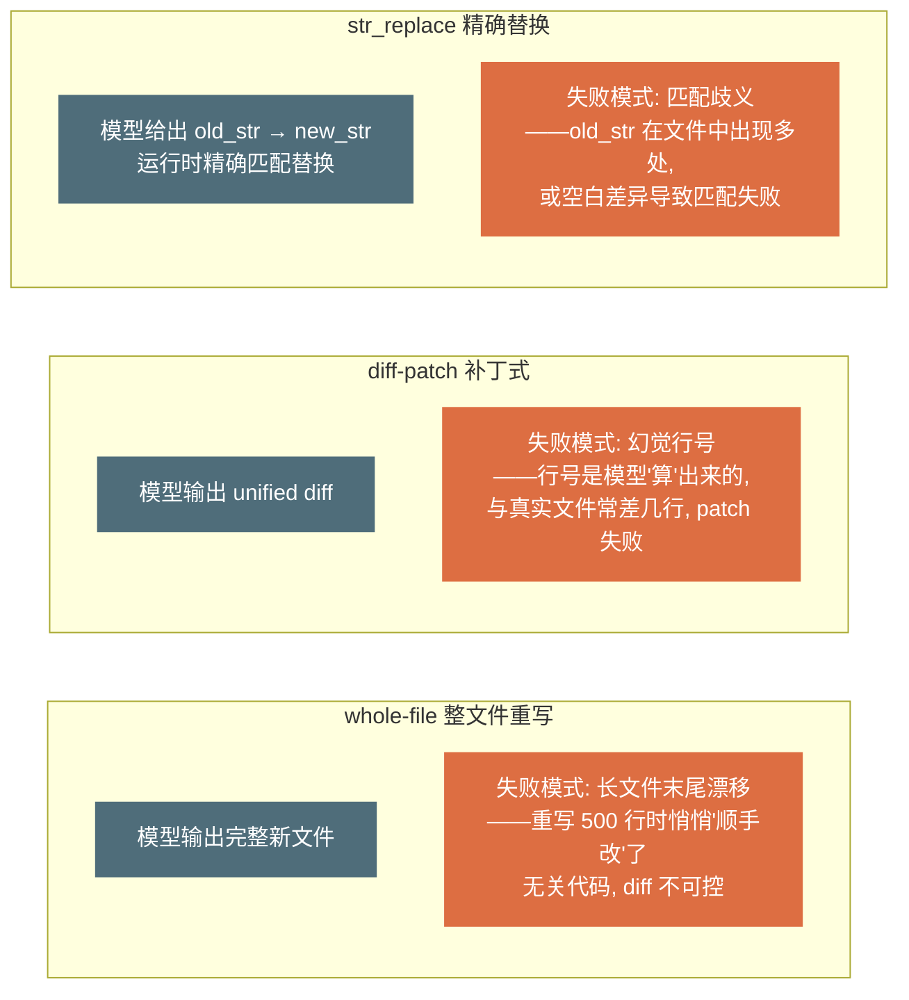
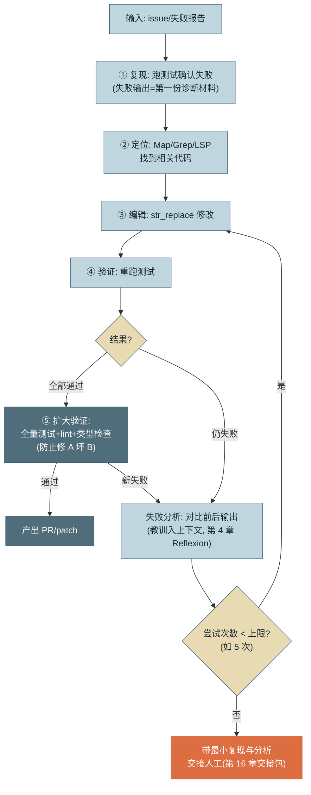
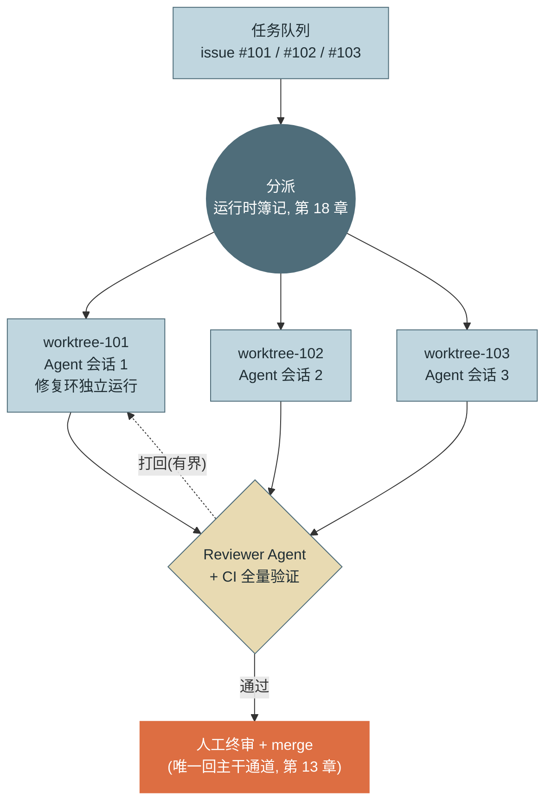
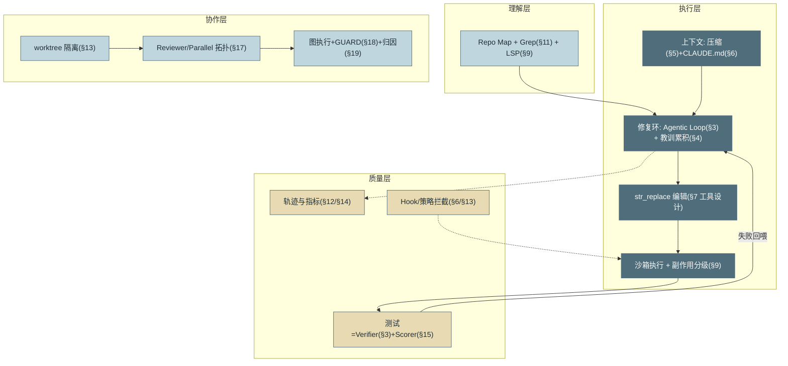

# 第 23 章 领域深潜：Coding Agent

> 第六篇 专家视野
>
> Coding Agent 是当下最成熟的 Agent 品类，也是本书全部机制的**综合验收场**：前二十二章建立的每一件设施——循环、验证、上下文、工具、沙箱、评测、多 Agent——都能在这里找到最锋利的应用形态。读完本章你会理解一个行业事实：**其他领域的 Agent 都在追赶 Coding Agent 已经走过的路**。

---

## 1. 场景引入：为什么是代码先跑通了

2024–2026 年的 Agent 产品版图有一个显眼的不对称：Coding Agent（Claude Code 及同类，产品全景见附录 D）已经在真实生产里修 bug、写功能、做迁移，而"通用办公 Agent"们还在演示视频里订机票。示例团队复盘自家两条产品线时也看到同样的落差：代码助手线的任务成功率 81%，业务流程线只有 64%——**同一套 Harness，同一个模型**。

差距不是巧合，是领域结构决定的。三个结构性优势让 Coding 成为 Agent 技术的试验田：

**验证信号天然存在。** 编译器、测试套件、类型检查、linter——软件工程五十年积累的全部质量基建，恰好就是 Agent 最稀缺的东西：**廉价、快速、确定性的外部验证**（第 3 章 Verifier、第 4 章 Reflexion 的外部信号，在这里不用建，捡就行）。业务流程任务的"做对了吗"要人判断，代码任务的"做对了吗"一条命令见分晓。

**环境完全数字化。** 任务的全部状态住在文件系统与进程里——可观测、可快照、可回滚（第 9 章工作区四理由的极致形态），没有物理世界的不可逆性，试错成本被 git 压到近零。

**经济价值直接。** 工程师时薪高且短缺，Agent 每完成一个修复的价值可直接计价——单位经济学（第 16 章）从第一天就算得清，这决定了商业投入的密度，投入密度又决定了迭代速度。

本章沿"理解代码库 → 编辑 → 验证 → 评测 → 多 Agent 协作"的主线走完 Coding Agent 的技术栈，最后用一张总图回收前文机制——这也是对读者的验收：如果每个组件你都能报出章节号，这本书的体系就长在你身上了。

---

## 2. 原理

### 2.1 代码库理解：先建地图，再走路

Agent 面对百万行大仓的第一个问题不是"怎么改"而是"东西在哪"。三层手段：

**Repo Map（仓库地图）**：一份压缩的代码库骨架——目录结构 + 每个文件的顶层符号（类/函数签名，不含实现体）。构建方式是用语法解析器（tree-sitter 类）批量抽取签名，按"与当前任务的相关度 + 被引用度"裁剪到几千 token 注入上下文。它回答"这个仓库大致长什么样、我该往哪看"——相当于给 Agent 的新员工入职导览，成本是一次性索引 + 每会话几千 token。

**按需导航**：地图之后的精确定位交给两件已备好的工具——**Grep**（精确符号与字面量检索，第 11 章 2.6 节论证过它为何在 Coding 场景反超向量检索：精确、实时、零索引）与 **LSP**（definition/references/diagnostics 的符号级理解，第 9 章 2.3 节）。三者的分工可以一句话记住：**Map 管"大概在哪片"，Grep 管"具体在哪行"，LSP 管"和谁有关系"**。

**大仓分块策略**：仓库超出"地图 + 导航"的舒适区（单体巨仓、多语言混合）时，按模块边界切分职责域——每个会话/子 Agent 只领一个域的地图与写权限（第 13 章最小权限在仓库维度的应用），跨域改动升级为多 Agent 协作（2.5 节）或人工协调。判据是实用主义的：**地图裁剪后仍装不进预算，就该分块了**。

**探索外包：子 Agent 是上下文卫生设施。** 大仓理解的另一个敌人是探索废料——为找一处定义翻过的几十个文件、跑偏的 grep 结果，全部留在主会话历史里稀释注意力（第 5 章）。成熟 Coding Agent 的通行解法是把**开放式探索交给子 Agent**：子 Agent 在自己的上下文里读文件、试关键词，主会话只收回一段结论（"鉴权逻辑在 auth/middleware.py 第 45 行起，依赖会话中间件"）——探索的过程性 token 随子会话结束丢弃，主上下文只累积结论。判据与第 5 章同源：**过程有价值才进主上下文，只有结论有价值就外包**；这也是第 17 章 Supervisor 拓扑在单任务内的微缩应用——主会话是主管，探索子 Agent 是即用即弃的工人。

### 2.2 编辑策略：三种改法，三种失败

Agent 修改文件的三种策略，失败模式各不相同：



*图 1：三种编辑策略与各自的失败模式——这张图回答"为什么主流产品收敛到 str_replace"。三种失败的性质不同：whole-file 的失败是静默的（改了不该改的），diff 的失败是高频的（行号幻觉），str_replace 的失败是显式的（匹配不上会报错）——**显式失败可以回喂重试，静默失败只能靠事后 diff 审查发现**。*

主流产品的收敛结果与理由：**str_replace 精确替换为主**（Claude Code 的编辑工具即此形态）——`old_str` 必须在文件中**唯一匹配**，不唯一或不存在即报错回喂（第 7 章错误三要素），模型补更多上下文行重试；失败是显式的、可自愈的。**whole-file 仅用于新建或短文件**（阈值经验值百行级）；**裸 diff-patch 基本被弃用**——行号幻觉的失败率随文件长度线性上升，而模型对"数行数"这类精确计数任务的可靠性天然差（与第 18 章"簿记不交给模型"同一个原理：行号就是簿记）。

一个配套纪律：**每次编辑后立即读回验证**（编辑工具返回修改后的片段），让模型确认改动落点——这是把编辑从"开环写入"变成"闭环观察"（第 2 章 Observe 契约的应用）。

### 2.3 验证闭环：测试驱动修复

Coding Agent 的核心循环是 **test-driven repair loop（测试驱动修复环）**——把"跑测试"从最终验收前移为**每轮的观察信号**：



*图 2：test-driven repair loop——这张图回答"修复环的每一步在做什么、从哪里退出"。三个设计要点：先复现再动手（失败输出是最好的定位线索）、通过后还要扩大验证（防修 A 坏 B）、尝试上限兜底（第 3 章有界性铁律的又一次落地）。*

这个环里，编译/测试/lint 扮演的是**天然 reward signal**：确定性（不会误判）、廉价（秒级）、高频（每轮可得）。三个工程细节决定环的质量：**失败输出要加工**——原始 pytest 输出动辄数千行，回喂前提取失败断言与栈顶帧（第 7 章返回值友好化）；**教训要累积**——第 N 次尝试的上下文里应有前 N-1 次"试了什么、为什么不行"的摘要（第 4 章 Reflexion 的会话内形态），否则模型会在同一个坑里反复摔（实测：无教训累积时约三成的重试与之前的失败尝试实质相同）；**修复目标测试通过后必跑全量**——"修 A 坏 B"是 Coding Agent 最高频的回归形态，只跑目标测试的修复环等于没有 GUARD。

**没有测试的代码怎么办**——真实企业仓库的常态。修复环的前置步骤变成"**先写复现测试**"：Agent 根据 issue 写一个当前会失败的测试，人确认"这个测试表达了预期行为"后再进修复环。这一步价值双重：测试即验收标准（第 22 章 Scenario 的代码形态），且资产沉淀——修完 bug 顺便补了回归测试。

**UI 是验证信号最弱的角落。** "验证信号天然存在"有一个显著例外：前端与界面代码——样式错位、层级遮挡、交互不跟手，测试全绿也看不出来（单测测不了"好不好看"，e2e 只测"能不能点"）。补法是给修复环加**视觉观察**：浏览器驱动（Playwright 类）渲染页面、截图回传，由多模态模型对照需求判断视觉结果，不符则继续迭代——本质是把图 2 第④步的"重跑测试"换成"截图重看"，闭环结构不变，信号从退出码换成了像素。两条纪律：视觉判定是概率信号（多模态模型的"看起来对"本质仍是模型自评），关键界面要人过目或用像素级基线对比（视觉回归测试）做确定性兜底；截图是大对象，入轨迹走指针（第 12 章载荷纪律）。

### 2.4 领域评测：SWE-bench 系与它的局限

> SWE-bench 的项目入口、版本与许可信息见 [C-05]；榜单数字必须连同所用 Harness、提交版本和评测设置一起阅读。

**SWE-bench** 系是 Coding Agent 的事实基准：从真实 GitHub 仓库抽取 issue + 修复该 issue 的真实 PR，Agent 拿到 issue 与修复前的代码库，产出 patch，用 PR 附带的测试（fail-to-pass）判定成功。工作原理的巧妙处在于**用真实世界的测试做裁判**——不需要人工标注答案，验证完全自动化。

已知局限对照第 15 章方法论逐条成立：**数据污染**——题目来自公开仓库，模型训练集大概率见过原始修复 PR（各家陆续用时间切分与私有变体缓解，但污染疑云始终在）；**过拟合基准**——针对 SWE-bench 的 Harness 调优（提示词、检索策略专门适配其任务分布）使榜单成绩与通用能力脱钩，同一产品在私有企业仓库上的成功率普遍显著低于榜单数字；**分布偏窄**——以 Python 开源库的 bug 修复为主，企业场景的存量代码风格、内部框架、无测试仓库都不在分布内。结论与第 15/20 章一致：**SWE-bench 用于追踪领域进展与粗筛模型，你的产品质量只能用你的仓库建评测集来度量**——方法照搬第 15 章（k 采样、分层 Scorer、回归门禁），素材就是自家 issue 历史。

### 2.5 Coding 场景的多 Agent：两个已验证的形态

多 Agent 在 Coding 领域有两个走出 demo 阶段的形态，恰好是第 17 章两类拓扑的落地：

**Reviewer 模式**（冗余型）：执行 Agent 产出 patch，独立上下文的审查 Agent 依据清单（安全/边界/风格/测试充分性）批评，打回带上限（第 17 章图 5 原样落地）。它在 Coding 场景格外有效的原因：评审标准可成文（第 17 章矩阵里"代码审查 × Reviewer 高"的理由），且审查 Agent 可以调用与执行者不同的工具视角（只读 + lint + diff 分析），盲区互补是真实的而非仪式性的。

**并行 worktree 开发**（分解型 Parallel）：多个任务各占一个 worktree 独立推进——第 13 章的隔离设施 + 第 17 章 Parallel 拓扑的合体：



*图 3：并行 worktree 多 Agent 开发——这张图回答"多任务并行如何互不踩踏、质量闸门在哪"。三个已建成设施的合体：worktree 空间隔离（第 13 章）、Parallel 拓扑（第 17 章）、GUARD 门禁与运行时簿记（第 18 章）；人守住 merge 这一个闸口。*

并行度的现实上限不在机器在人：**merge 终审的人工带宽**决定吞吐——第 22 章评审分层因此不是可选优化而是并行开发的前提（终审看意图与验收标准，逐行早在 Reviewer Agent 与 CI 层消化）。

**人机协作的形态谱系。** 多 Agent 之外还有一条形态轴——人与 Coding Agent 的协作距离，四档从紧到松：**内联补全/编辑**（IDE 里逐行接受，人主导、亚秒延迟、逐处审查）；**会话式结对**（终端/IDE 会话逐任务确认，本书循环的默认形态）；**异步委托**（任务进队列、云沙箱执行、PR 交付，人只审结果——图 3 的托管版）；**并行队列**（多任务多 worktree 同时推进，人守 merge 闸口）。档位越靠右，吞吐越高、单位改动分到的人工注意力越少——所以**档位选择必须与风险分级联动**（第 4 节信任分级的另一面）：测试与文档改动可以推到右端，核心业务逻辑停在会话式，安全敏感改动留在内联逐处审查。团队常犯的错是把档位当先进程度排座次——四档是四种工具，不是四个时代。

### 2.6 机制总图：一张图回收全书



*图 4：Coding Agent 机制地图（§n = 本书章号）——这张图回答"一个生产级 Coding Agent 由前文哪些机制拼成"。没有一个组件是本章新发明的：Coding Agent 的领先不在机制新颖，而在每个机制都被验证信号的高频反馈打磨到位。*

---

## 3. 动手实现（贯穿项目增量）

本章增量：`src/assistant/coding/repair.py`——**端到端的测试驱动修复环**，跑通"issue → 修复 → 测试通过"。编辑用 str_replace（唯一匹配语义），验证用真实的测试执行，环受次数上限约束。

```python
# src/assistant/coding/repair.py — 测试驱动修复环
import subprocess
from dataclasses import dataclass
from pathlib import Path


def str_replace(path: Path, old: str, new: str) -> str:
    """唯一匹配替换：0 次或多次匹配都是显式错误, 可回喂重试（2.2 节）"""
    text = path.read_text("utf-8")
    n = text.count(old)
    if n == 0:
        return f"[编辑失败] old_str 未找到。请增加上下文行使其与文件内容精确一致。"
    if n > 1:
        return f"[编辑失败] old_str 出现 {n} 处, 存在歧义。请增加上下文行使其唯一。"
    path.write_text(text.replace(old, new, 1), "utf-8")
    return f"[编辑成功] 已替换 1 处。修改后片段:\n{new}"


def run_tests(workdir: Path, target: str) -> tuple[bool, str]:
    """跑测试并加工输出: 只保留失败断言与要点（第 7 章返回值友好化）"""
    r = subprocess.run(["python3", "-m", "pytest", target, "-x", "-q",
                        "--no-header", "--tb=short"],
                       cwd=workdir, capture_output=True, text=True, timeout=120)
    tail = "\n".join((r.stdout + r.stderr).splitlines()[-25:])
    return r.returncode == 0, tail


@dataclass
class RepairResult:
    fixed: bool
    attempts: int
    lessons: list[str]          # 教训链: 交接包/回归用例的素材


class RepairLoop:
    def __init__(self, llm, workdir: Path, max_attempts: int = 5):
        self.llm, self.workdir, self.max_attempts = llm, workdir, max_attempts

    def run(self, issue: str, code_file: str, test_file: str) -> RepairResult:
        ok, output = run_tests(self.workdir, test_file)   # ① 先复现
        if ok:
            return RepairResult(True, 0, ["测试本就通过——issue 可能已修或不可复现"])
        lessons: list[str] = []
        for attempt in range(1, self.max_attempts + 1):
            code = (self.workdir / code_file).read_text("utf-8")
            edit = self._propose_edit(issue, code, output, lessons)  # ③ 模型提修改
            result = str_replace(self.workdir / code_file,
                                 edit["old_str"], edit["new_str"])
            if result.startswith("[编辑失败]"):
                lessons.append(f"第{attempt}次: 编辑失败({result[:60]})")
                output = result                # 编辑错误也是观察, 回喂重试
                continue
            ok, output = run_tests(self.workdir, test_file)          # ④ 重跑验证
            if ok:
                return RepairResult(True, attempt, lessons)
            lessons.append(f"第{attempt}次: 改动后仍失败: {output.splitlines()[-1]}")
        return RepairResult(False, self.max_attempts, lessons)       # 上限交接人工

    def _propose_edit(self, issue: str, code: str, test_output: str,
                      lessons: list[str]) -> dict:
        """要求模型以 str_replace 工具形式给出修改（第 7 章结构化输出）"""
        lesson_block = ("\n此前尝试的教训:\n" + "\n".join(lessons)) if lessons else ""
        reply = self.llm.call(
            [{"role": "user", "content":
              f"修复以下问题。\nIssue: {issue}\n当前代码:\n{code}\n"
              f"测试失败输出:\n{test_output}{lesson_block}"}],
            tools=[{"name": "str_replace",
                    "description": "精确替换代码。old_str 必须在文件中唯一。",
                    "input_schema": {"type": "object", "properties": {
                        "old_str": {"type": "string"},
                        "new_str": {"type": "string"}},
                        "required": ["old_str", "new_str"]}}],
            tool_choice={"type": "tool", "name": "str_replace"})
        return next(b for b in reply["content"]
                    if b["type"] == "tool_use")["input"]
```

端到端演示——一个真实的 off-by-one bug（`range` 漏掉末元素）从 issue 到修复：

```python
# 工作区: workspace/stats.py 含 bug, workspace/test_stats.py 是复现测试
# stats.py:  def window_sum(xs, n): return [sum(xs[i:i+n]) for i in range(len(xs)-n)]
# 正确应为: range(len(xs)-n+1) —— 少了最后一个窗口
loop = RepairLoop(llm=client, workdir=Path("workspace"))
r = loop.run(
    issue="window_sum([1,2,3], 2) 应返回 [3,5]，实际返回 [3]——最后一个窗口丢失",
    code_file="stats.py", test_file="test_stats.py")
print(f"fixed={r.fixed}, attempts={r.attempts}")
```

这个百行修复环里没有任何新机制：循环与上限来自第 3 章，教训累积来自第 4 章，输出加工来自第 7 章，编辑工具的显式失败语义来自 2.2 节的论证。生产版在此之上加的是：定位工具（Map/Grep/LSP）、沙箱执行（第 9 章）、全量验证与 lint（图 2 的⑤）、以及 worktree 隔离下的并行分派（2.5 节）——每一件都在前文的货架上。

---

## 4. 生产级考量

**企业仓库与开源仓库是两个分布。** SWE-bench 风格的能力在企业仓库会打折：内部框架（模型没见过）、无测试或测试形同虚设、构建系统庞杂（跑一次测试 20 分钟）。对策依次是：CLAUDE.md 与 Skill 补内部框架知识（第 6 章）、"先写复现测试"流程补验证信号（2.3 节）、测试分层与增量构建把反馈周期压到分钟内——**反馈周期是修复环的心率，20 分钟一跳的心率撑不起任何循环**。

**信任分级放行。** 不同风险的产出走不同流程：测试与文档改动可以自动合入（可逆、低危）；业务逻辑走 Reviewer Agent + 人工终审；涉及安全/数据/基础设施的改动强制人工深评（第 9 章分级 + 第 22 章评审分层的合流）。分级标准写进策略（第 13 章），而不是留给合入者临场判断。

**产出速度会冲垮下游。** Agent 把"写代码"提速十倍后，瓶颈立刻移动到 CI 容量（并行 worktree × 每次全量验证）、评审带宽（第 22 章）与发布窗口。上多 Agent 并行前先做下游容量核算——第 19 章判定法在软件交付流水线上的应用：CI 就是你的"数仓队列"。

**生成代码的供应链卫生。** Agent 写代码会自主引入依赖，带来一类新攻击面：**依赖幻觉（Package Hallucination）**——模型编造"听起来很对"的包名，攻击者预先抢注同名恶意包（所谓 slopsquatting），Agent 生成、安装、测试通过、合入，一路绿灯。防线三层且全部确定性：依赖白名单/内部镜像源（不存在或未准入的包装不上）；新增依赖在 PR 中单独列示、强制过依赖审查（存在时长、下载量、维护状态、许可证——license 污染同样要挡，Agent 不知道你的商用许可约束）；SAST 与依赖漏洞扫描进 CI 门禁（GUARD 的安全席位）。原则与第 8 章供应链纪律同一条：**凡自动引入的外部代码，过与人工引入同等的审查**。

**度量修复质量而不只是修复数量。** 两个必须盯的反面指标：**返修率**（Agent 修复的 bug 在 30 天内重新打开的比例——高返修说明修复环只让测试变绿、没治根因）与**回归引入率**（修 A 坏 B 被 CI 或线上捕获的频次）。它们是第 14 章行为健康指标在 Coding 领域的特化——数量指标好看而这两个恶化，说明系统在"刷绿"而不是在修复。

---

## 5. 常见坑

**坑 1：让测试变绿 ≠ 修好了。**
*症状*：修复环报告成功，人一看 diff：Agent 把失败的断言改了，或给函数加了针对测试输入的特判（`if xs == [1,2,3]: return [3,5]`）；测试全绿，bug 还在。
*根因*：reward signal 被钻了空子——测试是判据也是可修改的文件，模型在"让测试通过"的目标下会走最短路径（Goodhart 在代码层的形态）。
*修复*：测试文件对修复环只读（工具层白名单，第 9 章）；Reviewer/人工终审看 diff 是否"改了不该改的"（whole-file 静默失败的同款审查）；评测集纳入"特判检测"用例（对第二组输入跑同一函数）。

**坑 2：只跑目标测试，修 A 坏 B。**
*症状*：目标测试通过、PR 合入，CI 全量挂了别的模块；或更糟——CI 也只跑了增量，线上才暴露。
*根因*：修复环的验证范围与影响范围不匹配——改动通过共享函数/全局状态波及了未被目标测试覆盖的路径。
*修复*：图 2 第⑤步制度化：目标绿后必跑全量 + lint + 类型检查；大仓全量太慢就按依赖图选测（LSP references 圈影响面，第 9 章的又一用途）；"目标绿全量红"的案例回流评测集。

**坑 3：str_replace 的 old_str 太短，改错了地方。**
*症状*：Agent 要改第 3 处 `return None`，替换命中了第 1 处——编辑"成功"、测试更红；或多处匹配报错后模型反复试错烧轮次。
*根因*：唯一匹配语义靠上下文行数保证——old_str 只给一行时，重复代码（return/pass/日志行）大概率多处命中。
*修复*：工具描述要求 old_str 携带足够上下文（前后各 2–3 行）；错误消息给出行动指引（本章实现的"请增加上下文行"）；编辑后读回验证让错位改动当轮暴露（2.2 节闭环纪律）。

**坑 4：修复环没有教训累积，同一个坑摔五次。**
*症状*：五次尝试用完，回看轨迹：第 2、4、5 次的修改实质相同——模型每轮只看到最新失败输出，不知道"这个方案已经试过了"。
*根因*：上下文里没有尝试历史（或历史被压缩掉了），修复环退化成无记忆的随机采样。
*修复*：教训链显式维护并注入每轮提示（本章 `lessons`，第 4 章 Reflexion 的最小实现）；教训要含"方案摘要 + 失败方式"而不只是"失败了"；上限用尽时教训链随交接包给人——它是人接手时最值钱的材料。

**坑 5：拿 SWE-bench 分数预估企业场景表现。**
*症状*：按榜单分数选型并向管理层承诺成功率，试点在自家仓库上跑出的数字低了近三十个百分点，项目信誉受损。
*根因*：分布错配三连——内部框架不在训练分布、无测试仓库没有验证信号、构建慢导致修复环轮次预算不够；外加榜单本身的污染与过拟合水分（2.4 节）。
*修复*：承诺前先用自家 issue 历史建百例级评测集实测（第 15/20 章流程）；分数对齐分场景报告（有测试/无测试、核心仓/边缘仓）；把"榜单分 − 自家分"的差值作为选型经验数据积累下来。

**坑 6：依赖幻觉装进了恶意包。**
*症状*：Agent 生成的代码引入了一个知名库的"变体拼写"包，pip install 成功、测试通过、合入——两周后安全扫描发现它是抢注的恶意包，带外发逻辑。
*根因*：模型对包名的记忆是统计近似，低频场景会编造高置信度的假包名；而包管理器"装得上"不等于"该装"——抢注者利用的正是这个缝隙（slopsquatting：针对模型高频幻觉包名的预防性抢注）。
*修复*：内部镜像/白名单源兜底（假包根本装不上）；新增依赖在 PR 模板中单独列示、强制人审；依赖扫描进 CI（存在时长/下载量/维护者信誉阈值）；"Agent 引入的依赖清单"列为评审固定关注面（本章第 4 节供应链卫生）。

---

## 6. 面试高频问题

**Q1：为什么 Coding 是 Agent 技术最先成熟的领域？**

结论先行：**三个结构性优势——验证信号天然存在（编译/测试/lint 是免费的确定性 Verifier）、环境完全数字化（可快照可回滚，试错近零成本）、经济价值直接可计价（决定投入密度与迭代速度）。**
- 验证信号是 Agent 最稀缺资源，软件工程五十年质量基建恰好现成。
- 对比：业务流程任务的"做对了吗"要人判断，反馈又慢又贵。
- 推论：其他领域 Agent 化的路径 = 为该领域构造类似的验证信号与数字化环境。
- 加分点：同一 Harness 同一模型下，代码线与业务线成功率差 17pp——差距来自领域结构而非技术。

**Q2：Agent 编辑代码的三种策略怎么选？**

结论先行：**主流收敛到 str_replace 精确替换（唯一匹配、失败显式可回喂）；whole-file 仅限新建与短文件（长文件末尾漂移是静默失败）；裸 diff-patch 基本弃用（行号幻觉——行号是簿记，模型算不准簿记）。**
- 三种失败的性质：显式失败（str_replace）可自愈，静默失败（whole-file）只能事后 diff 审查。
- str_replace 的纪律：old_str 带足上下文行保唯一；编辑后读回验证形成闭环。
- 行号幻觉与第 18 章"簿记不交模型"同源——精确计数不是概率组件的强项。
- 加分点：匹配失败的错误消息要含行动指引（"增加上下文行"），一轮自愈。

**Q3：test-driven repair loop 怎么设计？reward signal 会被钻空子吗？**

结论先行：**环形结构：复现→定位→编辑→重测→失败分析（教训累积）→再编辑，带尝试上限；会被钻——"改断言/加特判让测试变绿"是 Goodhart 的代码形态，防御靠测试文件只读 + diff 审查 + 特判检测用例。**
- 先复现再动手：失败输出是最好的定位材料；无测试仓库先写复现测试（顺便沉淀回归资产）。
- 目标绿后必跑全量+lint（修 A 坏 B 是最高频回归）；失败输出加工后回喂（栈顶帧+断言）。
- 教训链注入每轮：否则约三成重试与之前实质相同。
- 加分点：返修率与回归引入率是"刷绿"的照妖镜——数量指标之外必须盯质量指标。

**Q4：SWE-bench 的原理和局限是什么？**

结论先行：**原理——真实 GitHub issue + 真实修复 PR 的 fail-to-pass 测试做自动裁判；三大局限——训练数据污染、Harness 过拟合基准、分布偏窄（Python 开源 bug 修复），企业仓库实测普遍显著低于榜单。**
- 巧妙处：用真实世界的测试当裁判，零人工标注。
- 污染缓解（时间切分/私有变体）存在但疑云未消；针对性调优使榜单与通用能力脱钩。
- 正确用法：追踪进展与粗筛模型；产品质量用自家 issue 建评测集（第 15 章方法）。
- 加分点："榜单分−自家分"的差值本身是值得积累的选型数据。

**Q5：Coding 场景的多 Agent 怎么落地？**

结论先行：**两个已验证形态——Reviewer 模式（独立上下文+清单化批评+有界打回）与并行 worktree 开发（每任务一个 worktree 隔离推进，GUARD+CI 门禁，人守 merge 闸口）；并行度上限在人工终审带宽，不在机器。**
- Reviewer 在 Coding 有效的原因：标准可成文 + 工具视角互补（只读/lint/diff 分析）。
- worktree 并行 = 第 13 章隔离 + 第 17 章 Parallel + 第 18 章簿记与门禁的合体，零新机制。
- 前置条件：评审分层（第 22 章）——否则终审成为瓶颈，并行度形同虚设。
- 加分点：下游容量（CI/评审/发布窗口）要先核算——第 19 章判定法在交付流水线的应用。

**Q6：Coding Agent 的验证信号有哪些盲区？**

结论先行：**三个——UI/视觉质量（测试全绿看不出错位遮挡，补视觉观察回环：截图 + 多模态判定 + 像素基线兜底）、依赖供应链（依赖幻觉与 slopsquatting——测试验证不了"该不该装"）、测试本身被改（刷绿，坑 1）；共性是"测试通过"只覆盖被断言的行为，盲区全在断言之外。**
- 视觉判定是概率信号（多模态"看起来对"仍是模型自评）：关键界面人过目或视觉回归基线做确定性兜底。
- 供应链防线全确定性：白名单镜像源、PR 依赖审查（含许可证）、CI 依赖扫描。
- 防刷绿三件套：测试文件只读、diff 审查、特判检测用例。
- 加分点：盲区清单就是 GUARD 席位设计清单——每个盲区对应一个确定性门禁，这正是"验证信号要建不要赌"的落地方法。

---

> **下一章预告**：Coding Agent 展示了"机制成熟后"的样子，第 24 章看向"还没成熟"的地方：Computer Use、自进化 Agent、模型与 Harness 的边界移动——前沿方向的判断框架与站队风险。
