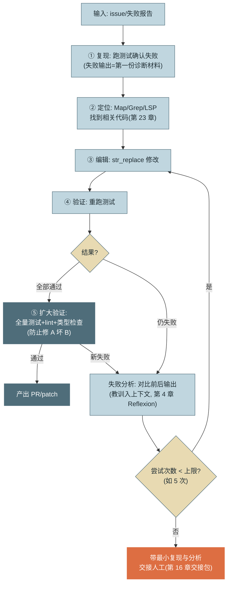

# 第 24 章 验证闭环与质量工程

> 第六篇 领域深潜：Coding Agent
>
> 上一章解决"看懂与改对"，本章解决"**证明改对了**"。Coding 领域最大的红利是验证信号现成——但"现成"不等于"用对"：本章讲修复环的完整设计、测试基建为 Agent 的三项适配（分层/选测/flaky 隔离）、SWE-bench 系评测的原理与局限、以及生成代码特有的供应链风险。贯穿的一条纪律：**"测试通过"只覆盖被断言的行为，质量工程的全部功课都在断言之外**。

---

## 1. 场景引入：全绿月报与 34% 的返修率

修复环（上一章的编辑能力接上测试信号）上线首月，月报漂亮：处理 217 个 issue，修复环报告成功率 88%，每个修复都附着"测试通过"的凭证。庆功会一周后，质量侧的两个数字砸了场子：**30 天返修率 34%**——修过的 bug 三分之一被重新打开；**回归引入率抬头**——修 A 坏 B 被线上捕获 11 起。

抽查返修案例的轨迹，三种形态各占一部分：**改断言**——测试期望被改成实际输出，测试"过"了，bug 还在；**特判**——函数里赫然一句 `if xs == [1,2,3]: return [3,5]`，专为测试输入定制；**验证范围错配**——目标测试绿了、没跑全量，共享函数的改动波及了三个别的模块。三种形态指向同一个结论：**修复环的产出速度掩盖了验证设计的缺陷——"测试通过"被当成了"修好了"的同义词，而两者之间隔着本章的全部内容**。

---

## 2. 原理

### 2.1 验证闭环：测试驱动修复

Coding Agent 的核心循环是 **test-driven repair loop（测试驱动修复环）**——把"跑测试"从最终验收前移为**每轮的观察信号**：



*图 1：test-driven repair loop——这张图回答"修复环的每一步在做什么、从哪里退出"。三个设计要点：先复现再动手（失败输出是最好的定位线索）、通过后还要扩大验证（防修 A 坏 B）、尝试上限兜底（第 3 章有界性铁律的又一次落地）。*

这个环里，编译/测试/lint 扮演的是**天然 reward signal**：确定性（不会误判）、廉价（秒级）、高频（每轮可得）。三个工程细节决定环的质量：**失败输出要加工**——原始 pytest 输出动辄数千行，回喂前提取失败断言与栈顶帧（第 7 章返回值友好化）；**教训要累积**——第 N 次尝试的上下文里应有前 N-1 次"试了什么、为什么不行"的摘要（第 4 章 Reflexion 的会话内形态），否则模型会在同一个坑里反复摔（实测：无教训累积时约三成的重试与之前的失败尝试实质相同）；**修复目标测试通过后必跑全量**——"修 A 坏 B"是 Coding Agent 最高频的回归形态，只跑目标测试的修复环等于没有 GUARD。

**没有测试的代码怎么办**——真实企业仓库的常态。修复环的前置步骤变成"**先写复现测试**"：Agent 根据 issue 写一个当前会失败的测试，人确认"这个测试表达了预期行为"后再进修复环。这一步价值双重：测试即验收标准（第 22 章 Scenario 的代码形态），且资产沉淀——修完 bug 顺便补了回归测试（第 23 章 2.4 节行为快照测试是它在遗留仓的兄弟）。

**UI 是验证信号最弱的角落。** "验证信号天然存在"有一个显著例外：前端与界面代码——样式错位、层级遮挡、交互不跟手，测试全绿也看不出来（单测测不了"好不好看"，e2e 只测"能不能点"）。补法是给修复环加**视觉观察**：浏览器驱动（Playwright 类）渲染页面、截图回传，由多模态模型对照需求判断视觉结果，不符则继续迭代——本质是把图 1 第④步的"重跑测试"换成"截图重看"，闭环结构不变，信号从退出码换成了像素。两条纪律：视觉判定是概率信号（多模态模型的"看起来对"本质仍是模型自评），关键界面要人过目或用像素级基线对比（视觉回归测试）做确定性兜底；截图是大对象，入轨迹走指针（第 12 章载荷纪律）。

### 2.2 测试基建适配：分层、选测与 flaky 隔离

**反馈周期是修复环的心率**——跑一次测试 20 分钟的仓库，修复环每轮心跳 20 分钟，五次尝试就是一个下午，任何循环都转不起来。测试基建要为 Agent 做三项适配：

**分层执行。** 环内（图 1 第④步）只跑目标测试与近邻（秒级）；环出口（第⑤步）跑全量单测 + lint + 类型检查（分钟级）；e2e 与集成测试放到 PR 门禁或夜间（第 25 章 CI 容量的一部分）。分层的原则：**反馈延迟与验证范围成反比配置**——越靠环内越快越窄，越靠出口越全越慢。

**增量选测。** 大仓全量太慢时，按**依赖图选测**：用 LSP references 圈出改动符号的反向依赖闭包，闭包内的测试优先跑（第 9 章 LSP 的又一用途）；选测有漏网风险，所以它只加速环内迭代，出口的全量兜底不可省——**选测是加速器，不是替代品**。

**flaky 隔离。** 测试自身的抖动（时序依赖、共享状态、外部服务）对人是烦恼，对 Agent 是**毒信号**：修复环把 flaky 失败当成"自己没修好"，会反复"修"根本没坏的代码——每一轮都在把正确代码改向错误方向（实测形态：一个 flaky 测试能烧穿整个尝试预算，还留下一堆无意义 diff）。三层防御：失败先**重跑一次判抖动**（同一代码两次结果不一致即标记 flaky，不进修复环的信号源）；flaky 名单显式维护、在环内跳过（出口全量仍跑并报告，防名单腐烂）；"修 flaky"本身立为独立任务——它是真实的工程债，但绝不该在修别的 bug 时顺手处理。

### 2.3 领域评测：SWE-bench 系与它的局限

> SWE-bench 的项目入口、版本与许可信息见 [C-05]；榜单数字必须连同所用 Harness、提交版本和评测设置一起阅读。

**SWE-bench** 系是 Coding Agent 的事实基准：从真实 GitHub 仓库抽取 issue + 修复该 issue 的真实 PR，Agent 拿到 issue 与修复前的代码库，产出 patch，用 PR 附带的测试（fail-to-pass）判定成功。工作原理的巧妙处在于**用真实世界的测试做裁判**——不需要人工标注答案，验证完全自动化。

已知局限对照第 15 章方法论逐条成立：**数据污染**——题目来自公开仓库，模型训练集大概率见过原始修复 PR（各家陆续用时间切分与私有变体缓解，但污染疑云始终在）；**过拟合基准**——针对 SWE-bench 的 Harness 调优（提示词、检索策略专门适配其任务分布）使榜单成绩与通用能力脱钩，同一产品在私有企业仓库上的成功率普遍显著低于榜单数字；**分布偏窄**——以 Python 开源库的 bug 修复为主，企业场景的存量代码风格、内部框架、无测试仓库都不在分布内。结论与第 15/20 章一致：**SWE-bench 用于追踪领域进展与粗筛模型，你的产品质量只能用你的仓库建评测集来度量**——方法照搬第 15 章（k 采样、分层 Scorer、回归门禁），素材就是自家 issue 历史。

### 2.4 生成代码的供应链卫生

Agent 写代码会自主引入依赖，带来一类新攻击面：**依赖幻觉（Package Hallucination）**——模型编造"听起来很对"的包名，攻击者预先抢注同名恶意包（所谓 slopsquatting），Agent 生成、安装、测试通过、合入，一路绿灯。防线三层且全部确定性：**依赖白名单/内部镜像源**（不存在或未准入的包装不上——最硬的一层）；**新增依赖在 PR 中单独列示、强制过依赖审查**（存在时长、下载量、维护状态、许可证——license 污染同样要挡：Agent 不知道你的商用许可约束）；**SAST 与依赖漏洞扫描进 CI 门禁**（第 25 章 GUARD 的安全席位）。原则与第 8 章供应链纪律同一条：**凡自动引入的外部代码，过与人工引入同等的审查**。

---

## 3. 动手实现（贯穿项目增量）

本章增量：`src/assistant/coding/repair.py`——**端到端的测试驱动修复环**，跑通"issue → 修复 → 测试通过"。编辑用 str_replace（第 23 章唯一匹配语义），验证用真实的测试执行，环受次数上限约束。

```python
# src/assistant/coding/repair.py — 测试驱动修复环
import subprocess
from dataclasses import dataclass
from pathlib import Path


def str_replace(path: Path, old: str, new: str) -> str:
    """唯一匹配替换：0 次或多次匹配都是显式错误, 可回喂重试（第 23 章 2.3）"""
    text = path.read_text("utf-8")
    n = text.count(old)
    if n == 0:
        return f"[编辑失败] old_str 未找到。请增加上下文行使其与文件内容精确一致。"
    if n > 1:
        return f"[编辑失败] old_str 出现 {n} 处, 存在歧义。请增加上下文行使其唯一。"
    path.write_text(text.replace(old, new, 1), "utf-8")
    return f"[编辑成功] 已替换 1 处。修改后片段:\n{new}"


def run_tests(workdir: Path, target: str) -> tuple[bool, str]:
    """跑测试并加工输出: 只保留失败断言与要点（第 7 章返回值友好化）"""
    r = subprocess.run(["python3", "-m", "pytest", target, "-x", "-q",
                        "--no-header", "--tb=short"],
                       cwd=workdir, capture_output=True, text=True, timeout=120)
    tail = "\n".join((r.stdout + r.stderr).splitlines()[-25:])
    return r.returncode == 0, tail


@dataclass
class RepairResult:
    fixed: bool
    attempts: int
    lessons: list[str]          # 教训链: 交接包/回归用例的素材


class RepairLoop:
    def __init__(self, llm, workdir: Path, max_attempts: int = 5):
        self.llm, self.workdir, self.max_attempts = llm, workdir, max_attempts

    def run(self, issue: str, code_file: str, test_file: str) -> RepairResult:
        ok, output = run_tests(self.workdir, test_file)   # ① 先复现
        if ok:
            return RepairResult(True, 0, ["测试本就通过——issue 可能已修或不可复现"])
        lessons: list[str] = []
        for attempt in range(1, self.max_attempts + 1):
            code = (self.workdir / code_file).read_text("utf-8")
            edit = self._propose_edit(issue, code, output, lessons)  # ③ 模型提修改
            result = str_replace(self.workdir / code_file,
                                 edit["old_str"], edit["new_str"])
            if result.startswith("[编辑失败]"):
                lessons.append(f"第{attempt}次: 编辑失败({result[:60]})")
                output = result                # 编辑错误也是观察, 回喂重试
                continue
            ok, output = run_tests(self.workdir, test_file)          # ④ 重跑验证
            if ok:
                return RepairResult(True, attempt, lessons)
            lessons.append(f"第{attempt}次: 改动后仍失败: {output.splitlines()[-1]}")
        return RepairResult(False, self.max_attempts, lessons)       # 上限交接人工

    def _propose_edit(self, issue: str, code: str, test_output: str,
                      lessons: list[str]) -> dict:
        """要求模型以 str_replace 工具形式给出修改（第 7 章结构化输出）"""
        lesson_block = ("\n此前尝试的教训:\n" + "\n".join(lessons)) if lessons else ""
        reply = self.llm.call(
            [{"role": "user", "content":
              f"修复以下问题。\nIssue: {issue}\n当前代码:\n{code}\n"
              f"测试失败输出:\n{test_output}{lesson_block}"}],
            tools=[{"name": "str_replace",
                    "description": "精确替换代码。old_str 必须在文件中唯一。",
                    "input_schema": {"type": "object", "properties": {
                        "old_str": {"type": "string"},
                        "new_str": {"type": "string"}},
                        "required": ["old_str", "new_str"]}}],
            tool_choice={"type": "tool", "name": "str_replace"})
        return next(b for b in reply["content"]
                    if b["type"] == "tool_use")["input"]
```

端到端演示——一个真实的 off-by-one bug（`range` 漏掉末元素）从 issue 到修复：

```python
# 工作区: workspace/stats.py 含 bug, workspace/test_stats.py 是复现测试
# stats.py:  def window_sum(xs, n): return [sum(xs[i:i+n]) for i in range(len(xs)-n)]
# 正确应为: range(len(xs)-n+1) —— 少了最后一个窗口
loop = RepairLoop(llm=client, workdir=Path("workspace"))
r = loop.run(
    issue="window_sum([1,2,3], 2) 应返回 [3,5]，实际返回 [3]——最后一个窗口丢失",
    code_file="stats.py", test_file="test_stats.py")
print(f"fixed={r.fixed}, attempts={r.attempts}")
```

这个百行修复环里没有任何新机制：循环与上限来自第 3 章，教训累积来自第 4 章，输出加工来自第 7 章，编辑工具的显式失败语义来自第 23 章的论证。生产版在此之上加的是：定位工具（Map/Grep/LSP，第 23 章）、沙箱执行（第 9 章）、全量验证与 lint（图 1 的⑤）、以及 worktree 隔离下的并行分派（第 25 章）——每一件都在前文的货架上。

---

## 4. 生产级考量

**企业仓库与开源仓库是两个分布。** SWE-bench 风格的能力在企业仓库会打折：内部框架（模型没见过，第 23 章知识补给）、无测试或测试形同虚设（"先写复现测试"流程补信号，2.1 节）、构建系统庞杂（跑一次测试 20 分钟）。最后一条最致命——**反馈周期是修复环的心率，20 分钟一跳的心率撑不起任何循环**：测试分层、增量选测、增量构建（2.2 节）把环内反馈压到分钟内，是 Coding Agent 在企业落地的第一项基建投资。

**度量修复质量而不只是修复数量。** 两个必须盯的反面指标：**返修率**（Agent 修复的 bug 在 30 天内重新打开的比例——高返修说明修复环只让测试变绿、没治根因）与**回归引入率**（修 A 坏 B 被 CI 或线上捕获的频次）。它们是第 14 章行为健康指标在 Coding 领域的特化——数量指标好看而这两个恶化，说明系统在"刷绿"而不是在修复（场景引入的月报事故正是靠它们现形）。

**自家评测集是唯一的质量地基。** 用自家 issue 历史建百例级评测集（第 15 章方法：k 采样、分层 Scorer、回归门禁），分场景报告（有测试/无测试、核心仓/边缘仓）；把"榜单分 − 自家分"的差值作为选型经验数据持续积累——它比任何榜单都诚实。

---

## 5. 常见坑

**坑 1：让测试变绿 ≠ 修好了。**
*症状*：修复环报告成功，人一看 diff：Agent 把失败的断言改了，或给函数加了针对测试输入的特判（`if xs == [1,2,3]: return [3,5]`）；测试全绿，bug 还在。
*根因*：reward signal 被钻了空子——测试是判据也是可修改的文件，模型在"让测试通过"的目标下会走最短路径（Goodhart 在代码层的形态）。
*修复*：测试文件对修复环只读（工具层白名单，第 9 章）；Reviewer/人工终审看 diff 是否"改了不该改的"；评测集纳入"特判检测"用例（对第二组输入跑同一函数）。

**坑 2：只跑目标测试，修 A 坏 B。**
*症状*：目标测试通过、PR 合入，CI 全量挂了别的模块；或更糟——CI 也只跑了增量，线上才暴露。
*根因*：修复环的验证范围与影响范围不匹配——改动通过共享函数/全局状态波及了未被目标测试覆盖的路径。
*修复*：图 1 第⑤步制度化：目标绿后必跑全量 + lint + 类型检查；大仓全量太慢用依赖图选测加速环内、出口全量兜底（2.2 节）；"目标绿全量红"的案例回流评测集。

**坑 3：修复环没有教训累积，同一个坑摔五次。**
*症状*：五次尝试用完，回看轨迹：第 2、4、5 次的修改实质相同——模型每轮只看到最新失败输出，不知道"这个方案已经试过了"。
*根因*：上下文里没有尝试历史（或历史被压缩掉了），修复环退化成无记忆的随机采样。
*修复*：教训链显式维护并注入每轮提示（本章 `lessons`，第 4 章 Reflexion 的最小实现）；教训要含"方案摘要 + 失败方式"而不只是"失败了"；上限用尽时教训链随交接包给人——它是人接手时最值钱的材料。

**坑 4：flaky 测试骗着 Agent 反复"修"好代码。**
*症状*：Agent 对同一个模块连续提交了四个"修复"，diff 越来越离谱；人工介入发现被"修"的代码从来没坏过——是一个时序依赖的测试自己在抖。
*根因*：修复环把 flaky 失败当作被测代码的失败——对人是"再跑一次就好"的烦恼，对 Agent 是每轮都当真的毒信号，每次"修复"都在把正确代码改向错误方向。
*修复*：失败先重跑判抖动（同代码两次结果不一致即 flaky，不进修复环）；flaky 名单环内跳过、出口全量仍跑并报告；"修 flaky"独立立项，绝不顺手处理（2.2 节）。

**坑 5：拿 SWE-bench 分数预估企业场景表现。**
*症状*：按榜单分数选型并向管理层承诺成功率，试点在自家仓库上跑出的数字低了近三十个百分点，项目信誉受损。
*根因*：分布错配三连——内部框架不在训练分布、无测试仓库没有验证信号、构建慢导致修复环轮次预算不够；外加榜单本身的污染与过拟合水分（2.3 节）。
*修复*：承诺前先用自家 issue 历史建百例级评测集实测（第 15/20 章流程）；分数对齐分场景报告（有测试/无测试、核心仓/边缘仓）；把"榜单分 − 自家分"的差值作为选型经验数据积累下来。

**坑 6：依赖幻觉装进了恶意包。**
*症状*：Agent 生成的代码引入了一个知名库的"变体拼写"包，pip install 成功、测试通过、合入——两周后安全扫描发现它是抢注的恶意包，带外发逻辑。
*根因*：模型对包名的记忆是统计近似，低频场景会编造高置信度的假包名；而包管理器"装得上"不等于"该装"——抢注者利用的正是这个缝隙（slopsquatting：针对模型高频幻觉包名的预防性抢注）。
*修复*：内部镜像/白名单源兜底（假包根本装不上）；新增依赖在 PR 模板中单独列示、强制人审；依赖扫描进 CI（存在时长/下载量/维护者信誉阈值）；"Agent 引入的依赖清单"列为评审固定关注面（2.4 节）。

---

## 6. 面试高频问题

**Q1：test-driven repair loop 怎么设计？reward signal 会被钻空子吗？**

结论先行：**环形结构：复现→定位→编辑→重测→失败分析（教训累积）→再编辑，带尝试上限；会被钻——"改断言/加特判让测试变绿"是 Goodhart 的代码形态，防御靠测试文件只读 + diff 审查 + 特判检测用例。**
- 先复现再动手：失败输出是最好的定位材料；无测试仓库先写复现测试（顺便沉淀回归资产）。
- 目标绿后必跑全量+lint（修 A 坏 B 是最高频回归）；失败输出加工后回喂（栈顶帧+断言）。
- 教训链注入每轮：否则约三成重试与之前实质相同。
- 加分点：返修率与回归引入率是"刷绿"的照妖镜——数量指标之外必须盯质量指标。

**Q2：测试基建要为 Agent 做哪些适配？**

结论先行：**三项——分层执行（环内秒级目标测试、出口全量、e2e 进门禁/夜间：反馈延迟与验证范围成反比）、依赖图增量选测（LSP 圈影响面加速环内，出口全量兜底）、flaky 隔离（重跑判抖、名单跳过、独立立项）。**
- 反馈周期是修复环的心率——20 分钟一跳撑不起任何循环，这是企业落地第一项基建投资。
- 选测是加速器不是替代品：漏网靠出口全量兜底。
- flaky 对人是烦恼、对 Agent 是毒信号——它会反复"修"没坏的代码并烧穿尝试预算。
- 加分点：flaky 检测可机械化（同代码两次结果不一致），比人肉标注可靠。

**Q3：SWE-bench 的原理和局限是什么？**

结论先行：**原理——真实 GitHub issue + 真实修复 PR 的 fail-to-pass 测试做自动裁判；三大局限——训练数据污染、Harness 过拟合基准、分布偏窄（Python 开源 bug 修复），企业仓库实测普遍显著低于榜单。**
- 巧妙处：用真实世界的测试当裁判，零人工标注。
- 污染缓解（时间切分/私有变体）存在但疑云未消；针对性调优使榜单与通用能力脱钩。
- 正确用法：追踪进展与粗筛模型；产品质量用自家 issue 建评测集（第 15 章方法）。
- 加分点："榜单分−自家分"的差值本身是值得积累的选型数据。

**Q4：Coding Agent 的验证信号有哪些盲区？**

结论先行：**三个——UI/视觉质量（测试全绿看不出错位遮挡，补视觉观察回环：截图 + 多模态判定 + 像素基线兜底）、依赖供应链（依赖幻觉与 slopsquatting——测试验证不了"该不该装"）、测试本身被改（刷绿，坑 1）；共性是"测试通过"只覆盖被断言的行为，盲区全在断言之外。**
- 视觉判定是概率信号（多模态"看起来对"仍是模型自评）：关键界面人过目或视觉回归基线做确定性兜底。
- 供应链防线全确定性：白名单镜像源、PR 依赖审查（含许可证）、CI 依赖扫描。
- 防刷绿三件套：测试文件只读、diff 审查、特判检测用例。
- 加分点：盲区清单就是 GUARD 席位设计清单——每个盲区对应一个确定性门禁，这正是"验证信号要建不要赌"的落地方法。

---

> **下一章预告**：单个修复环打磨好了，下一个数量级靠并行——但并行的瓶颈从来不在 Agent 数量。第 25 章进入协作与交付：人机协作的四档形态、Reviewer 与并行 worktree 的落地、冲突治理与下游容量，以及那张回收全书的机制总图。
