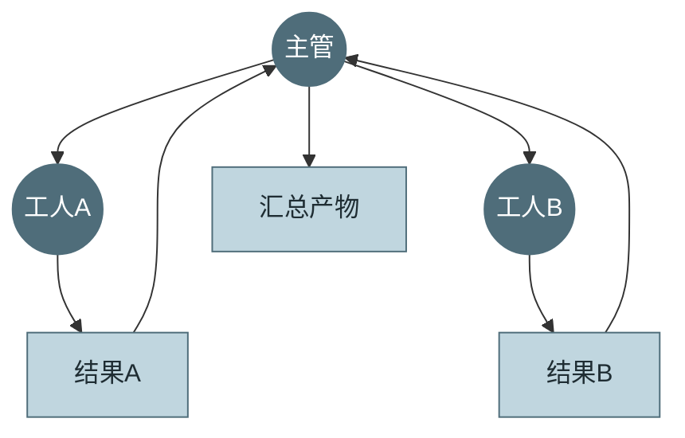
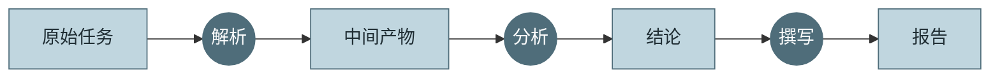
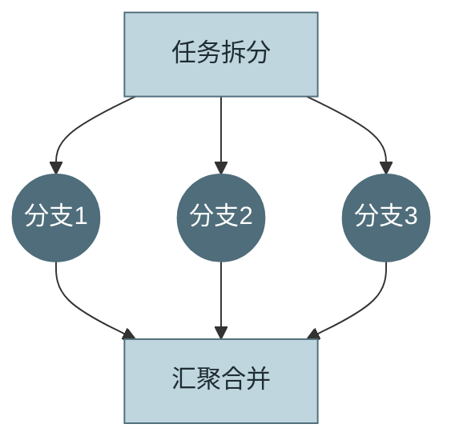
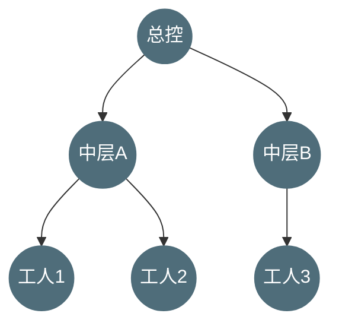
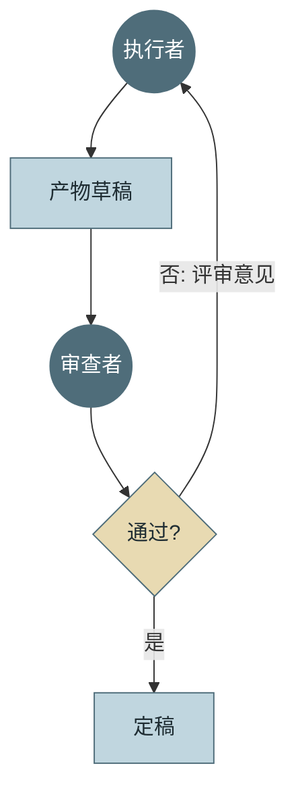
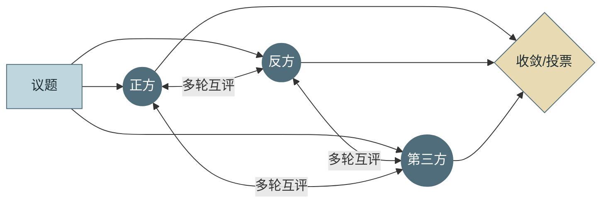
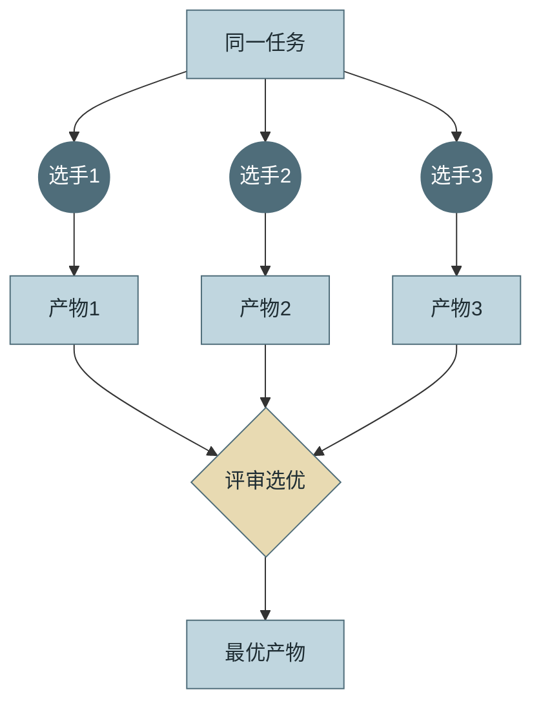
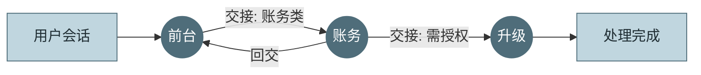
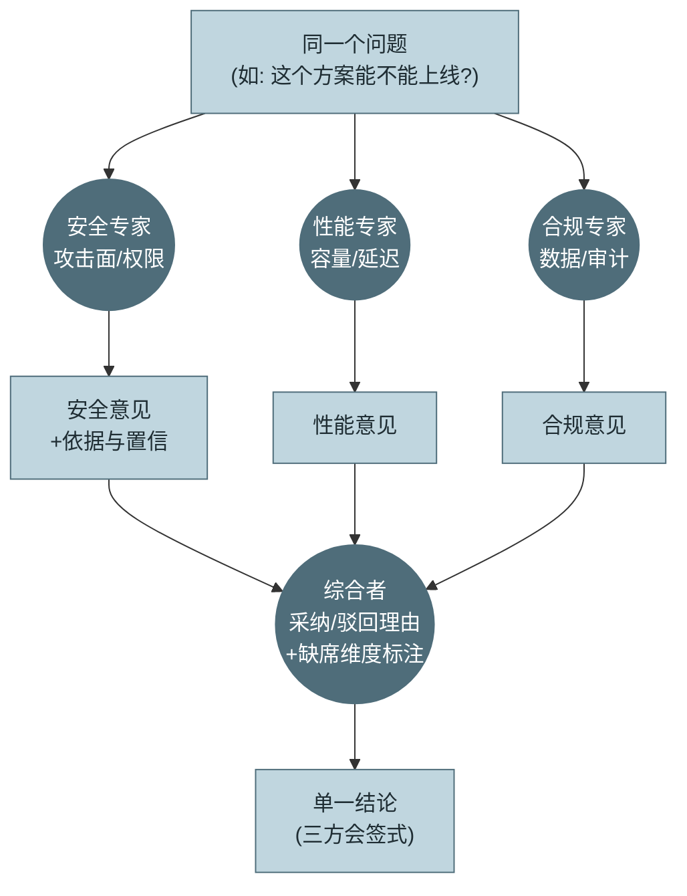
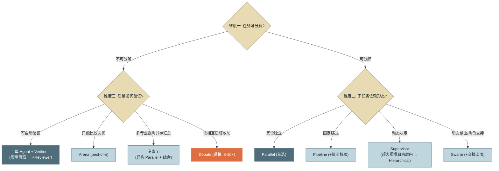

# 第 17 章 多 Agent 拓扑分类学

> 本章另有约十倍篇幅的**详解扩展版**：[详解扩展版/ch17-多Agent拓扑分类学.md](../详解扩展版/ch17-多Agent拓扑分类学.md)——独立成文的深读版（初稿，未经审读与来源核验，体例与正文不同；两版内容以正文为准）。

> 第四篇 多 Agent
>
> "多 Agent"是一个被营销磨平了棱角的词——它名下至少住着八种结构迥异的形态，协调开销与 token 成本差着数量级。本章先建立**分类语言**：八种拓扑的定义、通信模式、适用场景与**代价模型**（协调开销 / token 放大系数 / 失败传播方式），再给出三维选型框架。有了语言，第 18 章才能谈实现。

---

## 1. 场景引入：一场没有共同语言的架构评审

示例助手在单 Agent 形态下稳定运行后，一场"要不要上多 Agent"的架构评审开成了罗生门。支持方演示了某开源多智能体框架的 demo："规划 Agent 拆任务、执行 Agent 干活、审核 Agent 把关，这才是未来。"反对方甩出第 1 章坑 5："过早多 Agent 是微服务过早拆分的同构错误。"两边说的"多 Agent"根本不是同一个东西——支持方脑中是三个角色的流水线，反对方警惕的是层层转包的科层制，而业务方想要的其实只是"20 个数据源并行审计再汇总"（第 4 章审计任务的规模化版本）。

会议的转折点是有人算了一笔账：拿同一个"月度合规审计"任务，按三种不同的"多 Agent"方案估 token——**并行扇出**方案约为单 Agent 的 1.2 倍（各分支独立、无重复上下文），**层级转包**方案约 4 倍（每层都要转述任务与汇总结果），**多轮辩论**方案约 9 倍（n 个 Agent × 多轮 × 各自携带全部历史）。三个方案在会议里都被叫做"多 Agent"，成本差 7 倍多。

结论不是选出了方案，而是意识到**团队缺一套分类语言**：不给拓扑命名、不写清每种的代价模型，"要不要多 Agent"的争论就永远在鸡同鸭讲。这正是本章的任务——它也是全书方法论的一次重申：先有分类学，后有工程学。

---

## 2. 原理

### 2.1 八种拓扑：定义、通信、适用、代价

统一图例：**圆 = Agent，方 = 任务/产物，菱形 = 判定**。八种拓扑按"协调结构从集中到分散"排列。

**① Supervisor（主管式）**：一个协调 Agent 持有任务全局，动态拆分并派发给工人 Agent，回收结果后决定下一步。通信是**星型**（工人间不直接通信，一切经主管）。适用：子任务需要**动态决定**（做完 A 才知道要不要 B）的可分解任务。代价：协调开销中等——主管每次派发/回收都是 LLM 调用；**token 放大约 1.5–2.5×**（主管上下文里累积所有工人的摘要）；失败传播良性——工人失败被主管观察到，可重派或绕行，但**主管是单点**（它犯糊涂全局跟着错）。



*图 1：Supervisor——这张图回答"谁持有全局、信息如何星型汇聚"。*

**② Pipeline（流水线）**：任务切成固定阶段，每个 Agent 负责一段，产物依次传递（解析 → 分析 → 撰写）。通信是**单向链**。适用：阶段边界清晰稳定、各段技能差异大的任务（正是第 1 章 Workflow 的多 Agent 版）。代价：协调开销最低（衔接由代码写死）；**token 放大约 1–1.5×**（各段只接前段产物，不背全历史）；失败传播**最恶性**——级联污染，上游的错误被下游当成事实加工，链越长越难归因（垃圾进垃圾出的多级版）。



*图 2：Pipeline——这张图回答"产物如何单向流经技能各异的环节"。*

**③ Parallel（并行扇出）**：任务静态拆成 n 个**互相独立**的子任务，n 个 Agent 同时执行，结果汇聚合并。通信是**扇出-扇入**，执行期零通信。适用：子任务同构且独立（20 个数据源各查各的、100 个文件各自迁移）。代价：协调开销低（拆分与合并各一次）；**token 放大约 1.1–1.3×**（唯一的重复是各分支携带的公共任务说明）；失败传播**最良性**——分支彻底隔离，单分支失败只缺一块，汇总时显式处理缺块即可。**这是收益/成本比最高的拓扑**，也是多数团队真正需要的那种"多 Agent"。



*图 3：Parallel——这张图回答"独立子任务如何零通信地并行再汇聚"。*

**④ Hierarchical（层级式）**：Supervisor 的递归版——主管下面还有主管，形成多层树。通信沿树边上下。适用：超大任务且中层确有"局部全局观"价值（整仓代码迁移：总控 → 模块负责人 → 文件工人）。代价：协调开销**随层数超线性增长**；**token 放大约 3–6×**——任务逐层转述、结果逐层汇总，每层都是一次有损压缩+一次全价调用；失败模式独特：**信息衰减**——底层的关键细节经两层转述后消失，顶层基于失真摘要决策。经验红线：**两层封顶**，三层几乎总是设计错误。



*图 4：Hierarchical——这张图回答"树形转包如何层层放大协调成本与信息衰减"。*

**⑤ Reviewer（审查式）**：执行 Agent 产出，审查 Agent 依据标准批评，不过关则打回重做——第 4 章批评-重试闭环的**双 Agent 化**：审查者独立上下文，避免与执行者共享盲区。通信是**产物+评审意见的往返**。适用：产出质量关键、且评审标准可写清的任务（代码 PR、报告）。代价：**token 放大约 2–3×**（含一轮重做的期望值）；失败传播：审查者漏放 = 单 Agent 等价，审查者过严 = 打回循环（须带上限，第 4 章坑 4 同款）。



*图 5：Reviewer——这张图回答"独立上下文的审查者如何打破自评盲区"。*

**⑥ Debate（辩论式）**：n 个 Agent 对同一问题各自表态，然后**多轮互相阅读并修正**立场，最终收敛或投票。通信是**全连接多轮广播**。适用：高价值的离散判断（方案 A 还是 B、这段代码有没有安全漏洞）——多视角互质能暴露单视角盲区。代价：**token 放大约 5–10×**（n 个 Agent × r 轮 × 各自携带全部发言史）——八种里最贵的之一；失败模式：**趋同压力**（后发言者向先发言者靠拢，辩论退化为附和）与雄辩压过正确。红线：只用于单点高价值决策，绝不用于流程性任务。



*图 6：Debate——这张图回答"全连接多轮互评为何是最贵的拓扑"。*

**⑦ Arena（竞技场 / best-of-n）**：n 个 Agent **互不通信**、独立完成同一个完整任务，评审（Judge 或规则）选出最优产物。通信只有终点的评选。适用：产出方差大、优劣可比较的生成任务（方案设计、复杂修复）——第 4 章 best-of-n 的多 Agent 化。代价：**token 放大精确 = n + 评审**（成本完全可预测，这是它相对 Debate 的核心优势）；失败传播极佳——彻底隔离，单实例失败只是少一个候选。



*图 7：Arena——这张图回答"零通信的独立竞争如何用可预测的 n 倍成本换产出质量"。*

**⑧ Swarm（群蜂式 / 交接网络）**：去中心化——没有常设协调者，Agent 之间按规则**移交（Handoff）**控制权：客服 Agent 判断是账务问题，把会话连同上下文移交账务 Agent，后者又可移交升级 Agent。通信是**点对点交接**，任一时刻只有一个活跃 Agent。适用：角色边界清晰但路由动态的会话型场景（多技能客服）。代价：单时刻单 Agent，**token 放大约 1.2–2×**（交接时的上下文传递）；失败模式是八种里**可预测性最低**的——交接环（A→B→A→B）、烫手山芋（人人往外推）、上下文在多次交接中磨损；调试难度最高（没有中心视角，轨迹散在交接链上）。



*图 8：Swarm——这张图回答"无中心的控制权交接如何工作、为何最难调试"。*

八种拓扑的代价模型速查（本章最实用的一张表）：

| 拓扑 | 协调开销 | token 放大 | 失败传播 | 一句话适用 |
|---|---|---|---|---|
| Supervisor | 中（每派发一次调用） | 1.5–2.5× | 工人可重派；主管单点 | 子任务需动态决定 |
| Pipeline | 最低（代码衔接） | 1–1.5× | **级联污染**，最恶性 | 阶段固定、技能异质 |
| Parallel | 低（拆/合各一次） | 1.1–1.3× | 分支隔离，最良性 | 子任务独立同构 |
| Hierarchical | 随层数超线性 | 3–6× | 信息逐层衰减 | 超大任务；两层封顶 |
| Reviewer | 低 | 2–3× | 过严则循环，过松则漏 | 质量关键、标准可写清 |
| Debate | 高（全连接多轮） | 5–10× | 趋同/雄辩压过正确 | 单点高价值离散判断 |
| Arena | 低（终点评选） | 精确 n + 评审 | 彻底隔离 | 产出方差大、可比优劣 |
| Swarm | 低但不可预测 | 1.2–2× | 交接环/上下文磨损 | 边界清晰、路由动态 |

**一个高频变体：专家团（Mixture-of-Agents / LLM Council）。** 它不是第九种原子拓扑，而是 Parallel 的**异构版组合**，值得单独点名因为它极易与 Arena/Debate 混淆。三者都是"多个 Agent 面对同一问题"，区别在成员是否异构、结果如何收敛：**Parallel 原型是同构分工**（n 个相同角色各做一块**不同的**子任务，结果拼合）；**专家团是异构视角**（n 个**不同专业角色**——如"安全专家/性能专家/合规专家"——各自对**同一个**问题给出本领域意见，再由一个综合者汇总成单一结论）；**Arena 是同构竞争**（n 个相同角色做**同一个完整**任务，评审选**一个**最优）；**Debate 是异构/同构均可的多轮互辩**（成员相互阅读并修正立场直到收敛）。一句话辨析：**专家团综合（synthesize）、Arena 选优（select）、Debate 收敛（converge）**——收敛方式不同，代价也不同。专家团的代价模型：协调开销中等（一次综合调用），**token 放大约 n + 综合**（各专家独立、无多轮互读，故显著低于 Debate 的 5–10×），失败传播良性（专家间隔离，某专家失灵只丢一个视角，综合者可标注"某维度缺席"）。适用：**单点决策需要多个不可替代的专业视角、且这些视角可以并存汇总而非互斥选一**——架构评审（安全×性能×成本三方会签）、诊断（多科室会诊）、风险评估。不适用：视角同质（退化为浪费的重复，该用单 Agent）、或必须在互斥方案里选一个（该用 Arena）、或视角间需要相互质证攻防（该用 Debate，接受其更高成本）。落地时它常与 Supervisor 组合——主管把问题分发给专家团、回收后综合，即"Supervisor 派发 + 异构 Parallel + 综合"。



*图 9：专家团（MoA / LLM Council）——这张图回答"异构视角如何并行出意见、再综合成一份结论"。与 Arena 的区别一眼可见：产物不是"选一个最优"而是"综合成一份"；专家间零通信（区别于 Debate 的多轮互读）。*

专家团从图到落地，四个设计要点决定它是"会诊"还是"走过场"：**其一，异构必须是真异构**——专家的差异要落在评审维度与工具视角上（安全专家带只读扫描工具、性能专家带压测数据读取），只换开场白的"伪异构"等于花 n 倍钱做重复采样（Parallel 退化的专家团版）。**其二，综合者不是投票器**——要求它对每位专家的意见给出采纳/驳回理由、对失灵专家标注"某维度缺席"，产出是**可审计的会签记录**而非一句"综上所述"（第 4 章"要求批评就必有批评"的镜像：要求综合就必有综合，理由才是质量所在）。**其三，席位可以异构到模型与人**——按席位路由模型档位（安全席用强模型、格式席用小模型，第 16 章路由的拓扑应用）；某个席位放人类评审，就得到了带 AI 意见的会签流程（第 13 章 HITL 的拓扑化）。**其四，席位要有运营指标**——按"被综合者采纳率"度量各席位贡献度（第 15 章分层评测：每席独立评 + 综合结论端到端评），从不贡献的专家席位应当裁掉——拓扑不是荣誉，是成本。

### 2.2 选型的第一性原则：三维定位

拓扑不该按"哪个看起来先进"选，而按任务的三个属性定位：

- **维度一：可分解性**——任务能不能拆成子任务？拆不开的任务上任何分解型拓扑都是浪费，但仍可用**冗余型**拓扑（Reviewer/Debate/Arena）提升质量——它们复制的是整个任务而非拆分它。
- **维度二：子任务独立性**——拆出来的子任务之间什么依赖形态？完全独立 → Parallel；固定链式依赖 → Pipeline；依赖要边做边定 → Supervisor（超大规模再考虑 Hierarchical）；依赖是"该谁接手"的路由问题 → Swarm。
- **维度三：质量验证方式**——产出怎么判好坏？可自动验证（测试/断言）→ 单 Agent + Verifier 往往就够（第 3 章），质量要求再高加 Reviewer；只能比较选优 → Arena；需要多个不可替代专业视角**并存汇总** → 专家团（异构 Parallel + 综合）；视角间需要**相互质证攻防** → Debate。



*图 10：拓扑选型决策树——这张图回答"三个维度按什么顺序问、答案指向哪个拓扑"。注意第一问的"不可分解"分支并不终结于单 Agent：冗余型拓扑（Reviewer/Arena/Debate）不拆任务、只复制任务，走的是质量换成本的另一条路。*

三条使用纪律：**先过单 Agent 检验**——第 19 章将展开的前提在此预告：只有当单 Agent 确实撞上上下文墙或职责冲突时，分解才有正收益；**拓扑可组合**——生产系统常是复合体（Supervisor 派发 + 每个工人配 Reviewer + 关键决策点用 Arena），组合时代价模型相乘，要重新算账（主流多 Agent 框架各自内置的拓扑模板与代价定位见附录 4——用框架前先认清它默认给的是哪种拓扑）；**从最便宜的可行拓扑起步**——表中 Parallel 与 Pipeline 覆盖了大多数真实需求，Debate 与三层 Hierarchical 几乎总是过度设计。

### 2.3 拓扑 ≠ 图：组织形态与执行模型

最后厘清一对将在第 18 章反复出现的概念：**拓扑（Topology）是组织形态**——谁存在、谁与谁通信、谁对什么负责，回答的是"团队怎么组建"；**图（Graph）是执行模型**——节点、边、状态、调度器，回答的是"运行时怎么驱动"。类比后端工程师熟悉的一对：组织架构图 vs 工作流引擎里的 DAG——前者是设计语言，后者是可执行制品。

两点推论：其一，**同一拓扑可编译为不同的图**——Supervisor 拓扑既可实现为"主管节点 + 动态子图生成"，也可实现为"固定图 + 条件边"；Parallel 拓扑在图里就是一次 fan-out/fan-in。其二，**图的机制问题不属于拓扑层**——状态如何在节点间传递、失败节点如何重启、边上的消息 Schema 长什么样，这些是第 18 章图执行引擎的主题。本章刻意不写一行执行代码，就是为了把两层分干净：**拓扑选错了，图写得再好也是高效地做错事。**

---

## 3. 动手实现（贯穿项目增量）

本章无新代码——按分类学的定位，交付物是一份**拓扑选型 Checklist**，落库为 `docs/topology-checklist.md`，作为示例助手后续每个"要不要多 Agent"提案的必答卷。全文如下：

```markdown
# 示例项目多 Agent 拓扑选型 Checklist
> 任何多 Agent 提案必须附上本表答案。答不出的项，回去补调研而不是补热情。

## A. 前置检验（任一为"否"则停在单 Agent）
- [ ] A1. 单 Agent 方案已实际尝试并量化失败？（附评测数据，参见第 15 章）
- [ ] A2. 失败原因确属"上下文墙 / 职责冲突 / 并行需求"之一？
       （若是提示词或工具质量问题，先修第 6/7 章的功课）
- [ ] A3. 任务价值能覆盖预估的 token 放大？（用 2.1 节表格的系数估算）

## B. 三维定位（对照图 10 决策树）
- [ ] B1. 可分解性：任务能否拆分？拆分后的子任务清单写出来了吗？
- [ ] B2. 独立性：子任务依赖形态是哪种？
       独立 / 固定链 / 动态决定 / 动态路由（四选一，写判断依据）
- [ ] B3. 验证方式：自动验证 / 比较选优 / 多视角判断（写出具体验证器）
- [ ] B4. 据此定位的拓扑：＿＿＿＿；被排除的相邻拓扑及理由：＿＿＿＿

## C. 代价核算（对照 2.1 节代价模型表）
- [ ] C1. 预估 token 放大系数与月成本增量（第 16 章口径）
- [ ] C2. 失败传播方式是什么？最坏情形下的爆炸半径？
- [ ] C3. 协调者/评审者是否构成新的单点？其失败的兜底是什么？

## D. 运维就绪（多 Agent 使第三篇的每一章都翻倍）
- [ ] D1. 跨 Agent 的轨迹如何关联？（第 14 章 trace 的父子会话设计）
- [ ] D2. 每个成员 Agent 的预算与熔断如何分配？（第 3/16 章）
- [ ] D3. 成员间的权限是否隔离？（第 13 章：工人不应继承主管的全部权限）
- [ ] D4. 评测集是否覆盖"协作失败"类用例？（交接丢上下文/级联污染/趋同）

## E. 红线（触碰任一条，提案打回）
- [ ] E1. Hierarchical 超过两层
- [ ] E2. Debate 用于流程性任务（非单点高价值决策）
- [ ] E3. 任何成员 Agent 无独立预算熔断
- [ ] E4. 选型理由中出现"业界都在用"而无本表 B 节答案
```

这份 Checklist 的设计意图值得说明：A 节把第 19 章的可行性前提做成了闸门（先证明单 Agent 不行）；B/C 节强制使用本章的分类语言与代价模型（让争论有共同坐标系）；D 节预告了多 Agent 对第三篇全部基建的放大效应；E 节把 2.1 节的经验红线制度化。**Checklist 不产生正确答案，它消灭不合格的提案**——这正是分类学文档的工程价值。

---

## 4. 生产级考量

**拓扑要为组织沟通服务，不只为机器。** 多 Agent 系统的结构会出现在故障复盘、成本汇报与安全评审里——用本章的命名词汇写设计文档（"Supervisor + 工人各挂 Reviewer"），比"我们有一套智能协作机制"能让评审者在一分钟内建立正确心智模型。分类语言的第一个用户是同事，不是运行时。

**代价系数要用自己的负载校准。** 2.1 节的放大系数是行业经验区间——上线前用真实任务样本实测（同一任务在候选拓扑与单 Agent 上各跑 k 次，第 15 章的评测基建直接复用），把"约 2×"变成"我们的工单场景实测 1.7×"。实测值进 Checklist C1，估算值只配出现在草稿里。

**警惕拓扑的隐性演化。** 生产系统的拓扑会悄悄长歪：Supervisor 里有人给工人加了直接互调的捷径（星型变网状）、Pipeline 中段悄悄加了回环（链变圈）。每次演化都改变失败传播方式，却往往不过架构评审。对策：拓扑声明为配置而非散落代码（第 18 章图定义的价值之一），diff 拓扑配置 = 审查组织变更。

**成员异构是常态，路由到人也是拓扑的一部分。** 真实系统里成员不必都是同档模型（第 16 章路由在拓扑层的应用：工人用小模型、主管与 Reviewer 用大模型），甚至不必都是 Agent——Reviewer 位置放人类（第 13 章 HITL）就是审批流，Arena 的 Judge 放人类就是提案评选。把"人"当成拓扑中一种特殊节点看待，很多"人机协作流程"的设计会突然清晰。

---

## 5. 常见坑

**坑 1：把"多 Agent"当成一个单一方案来争论。**
*症状*：架构会上两派各执一词互不服气，最后靠嗓门或职级定案；上线后发现双方争的东西都不是业务需要的。
*根因*：无分类语言——"多 Agent"名下八种拓扑代价差数量级，不指名拓扑的争论没有可判定性。
*修复*：讨论必须落到具体拓扑名 + 代价模型（本章表格）；用 Checklist B 节强制三维定位；场景引入那笔"同一任务三种方案 1.2×/4×/9×"的账，每个团队都该自己算一遍。

**坑 2：三层 Hierarchical 的信息衰减。**
*症状*：整仓迁移项目，底层工人明明报告了"模块 X 有循环依赖需先解"，顶层总控的计划里却没有这条——两层转述后关键细节变成了"部分模块存在技术债"；返工两天。
*根因*：每层汇总都是有损压缩（第 5 章摘要损耗的拓扑版），层数即压缩次数；三层结构让底层事实到达顶层时平均经过两次改写。
*修复*：两层封顶（红线 E1）；关键事实用结构化字段直通顶层（绕过自然语言转述——类似日志系统的 structured logging）；若真需要三层，先质疑任务是不是该拆成两个独立项目。

**坑 3：Pipeline 无级间校验，级联污染到终点才暴露。**
*症状*：报告终稿数字离谱，逐级回查发现第一级解析就把表格读错了——后面三级都在认真加工垃圾；单级评测各自达标，端到端成功率却远低于各级乘积的预期。
*根因*：Pipeline 的失败传播是乘性的且**下游无法自证上游**——分析 Agent 没有渠道怀疑解析产物，它的世界里那就是事实。
*修复*：级间加确定性校验（Schema/数值范围/完整性断言——第 3 章 Verifier 挂在每条边上）；校验失败打回上游而非继续传递；端到端评测与单级评测并行做（第 15 章分层）。

**坑 4：Debate 用于流程任务，账单爆炸且质量无增益。**
*症状*：有团队把日常工单分类也走三 Agent 辩论，"更严谨"；月成本涨 6 倍，分类准确率与单 Agent 差异在噪声范围内；辩论轨迹显示第二轮起三个 Agent 基本在互相复述。
*根因*：Debate 的收益前提是"多视角能暴露盲区"——对有标准答案的低难度任务，视角本就不多元，多轮互评只剩趋同表演；5–10× 的放大系数没有对应的质量回报。
*修复*：Debate 只保留给单点高价值离散判断（红线 E2）；流程任务用单 Agent + 抽样 Reviewer 审计；上 Debate 前用 Arena（n 独立 + 评选）做对照——多数场景 Arena 以更低成本拿到同等收益。

**坑 5：Swarm 交接环与上下文磨损。**
*症状*：客服会话在账务 Agent 与前台 Agent 之间来回转了 7 次，用户重复陈述问题三遍后怒挂；轨迹里每次交接都丢了一部分先前的确认信息。
*根因*：交接规则由各 Agent 局部判断，没有全局的交接预算与环检测；交接时上下文靠自然语言"总结移交"，每次都是有损的。
*修复*：交接计数上限（如 3 次）超限升级人工；环检测（A→B→A 即告警）；交接包结构化（已确认事实/未决问题/用户情绪标记为字段，不靠转述——与第 3 章收尾轮、第 16 章转人工交接包同构）。

---

## 6. 面试高频问题

**Q1：多 Agent 有哪些拓扑？按什么给它们建立秩序？**

结论先行：**八种——Supervisor/Pipeline/Parallel/Hierarchical/Reviewer/Debate/Arena/Swarm，按"协调结构从集中到分散"排列；每种用四元组刻画：结构、通信模式、适用场景、代价模型（协调开销/token 放大/失败传播）。**
- 分解型：Supervisor（动态拆）、Pipeline（固定链）、Parallel（独立扇出）、Hierarchical（递归主管）。
- 冗余型：Reviewer（产出+批评）、Debate（多轮互质）、Arena（独立竞争+评选）——不拆任务，复制任务换质量。
- 交接型：Swarm——无中心的控制权移交。
- 加分点：token 放大系数从 Parallel 的 1.1× 到 Debate 的 10×——"多 Agent"内部的成本差比"单 vs 多"还大。

**Q2：拓扑怎么选？**

结论先行：**三维定位——可分解性（拆得开吗）× 子任务独立性（什么依赖形态）× 质量验证方式（怎么判好坏）；前置条件是单 Agent 已实测失败且原因属于上下文墙/职责冲突/并行需求。**
- 独立→Parallel（收益/成本比最高的拓扑）；固定链→Pipeline+级间校验；动态依赖→Supervisor；动态路由→Swarm。
- 不可分解≠单 Agent 终局：Arena/Reviewer/Debate 走"复制换质量"路线。
- 从最便宜的可行拓扑起步；组合拓扑要重算代价乘积。
- 加分点：选型 Checklist 的价值不是产生答案而是消灭不合格提案——"业界都在用"不是理由。

**Q3：各拓扑的失败传播方式有何不同？哪个最危险？**

结论先行：**Parallel/Arena 隔离最好（分支失败只缺一块）；Supervisor 可重派但主管是单点；Pipeline 最危险——级联污染，上游错误被下游当事实加工且下游无法自证上游。**
- Hierarchical 的独特失败是信息衰减：每层汇总是有损压缩，两层封顶。
- Reviewer 的双向失败：过松漏放、过严死循环（打回须带上限）。
- Debate 的失败是趋同与雄辩压过正确；Swarm 是交接环与上下文磨损。
- 加分点：Pipeline 的防御是把 Verifier 挂在每条边上——确定性校验打断乘性传播。

**Q4：拓扑和图是什么关系？**

结论先行：**拓扑是组织形态（谁存在、谁通信、谁负责），图是执行模型（节点/边/状态/调度）；类比组织架构图 vs 工作流引擎的 DAG——一个是设计语言，一个是可执行制品。**
- 同一拓扑可编译为不同图：Supervisor 可以是动态子图生成，也可以是固定图+条件边。
- 状态传递、失败重启、消息 Schema 是图层的机制问题，不进拓扑讨论。
- 分层的工程价值：拓扑选错，图写得再好也是高效地做错事。
- 加分点：拓扑应声明为配置——diff 拓扑配置即审查组织变更，防隐性演化。

**Q5：Debate 和 Arena 都是"多个 Agent 做同一件事"，怎么取舍？**

结论先行：**Arena 是零通信的独立竞争 + 终点评选，成本精确可预测（n+评审）、失败彻底隔离；Debate 是全连接多轮互评，成本 5–10× 且有趋同风险——默认先试 Arena，Debate 只留给"互相质证本身有价值"的场合。**
- Arena 的收益来自产出方差：方差越大，best-of-n 提升越明显（与第 4 章 best-of-n 同源）。
- Debate 的独特价值是"看到对方论证后修正"——适合安全审计式的对抗质证。
- 趋同风险的表征：第二轮起发言互相复述——轨迹审计可检测。
- 加分点：多数团队的 Debate 需求用"Arena + 评审给出对比理由"即可满足，成本减半以上。

**Q6：专家团（MoA / LLM Council）模式什么时候用？怎么设计才不退化？**

结论先行：**单点决策需要多个不可替代的专业视角、且视角可并存汇总时用——异构专家零通信并行出意见、综合者汇总成单一结论；三词辨析记牢：专家团综合（synthesize）、Arena 选优（select）、Debate 收敛（converge）；代价约 n + 综合，显著低于 Debate。**
- 退化头号原因是伪异构：只换开场白不换评审维度与工具视角，等于花 n 倍钱做重复采样。
- 综合者不是投票器：对每份意见给采纳/驳回理由、对失灵专家标注"维度缺席"——产出是可审计的会签记录。
- 席位可异构到模型（按席位路由档位）与人（某席位放人类评审 = 带 AI 意见的会签流程，HITL 的拓扑化）。
- 加分点：席位贡献度（被综合者采纳率）做运营指标——从不贡献的专家席位裁掉；常见组合形态是"Supervisor 派发 + 异构 Parallel + 综合"。

---

> **下一章预告**：分类语言建好了，该造机器了。第 18 章进入编排与图执行：把拓扑编译成可运行的图——节点状态如何传递、消息如何路由、失败的分支如何重启，以及贯穿项目将实装的最小图执行引擎。
