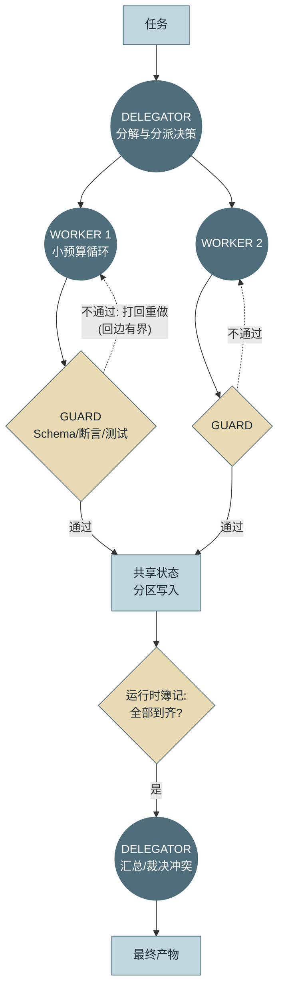
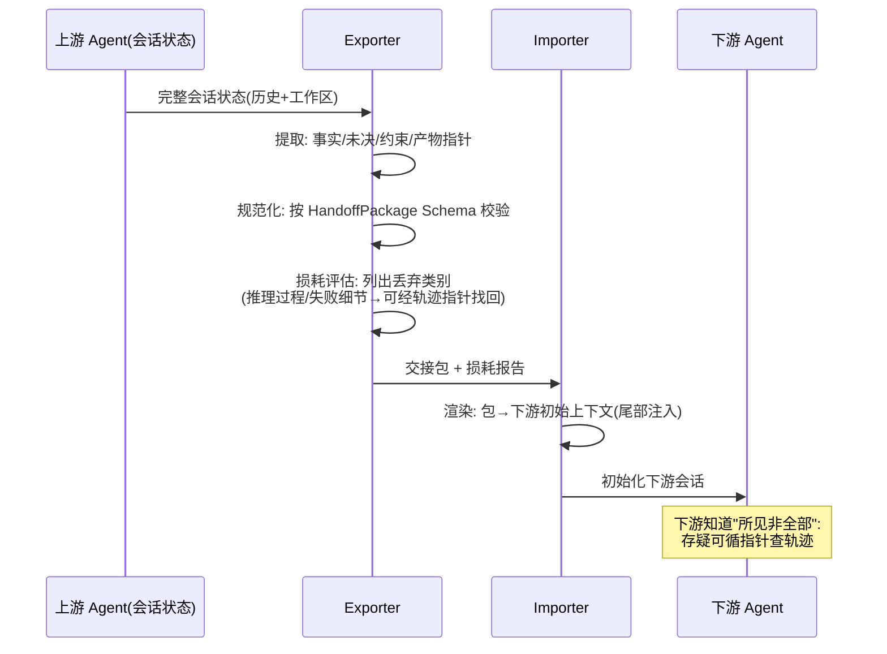
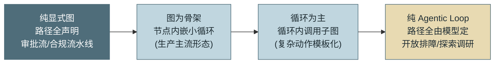
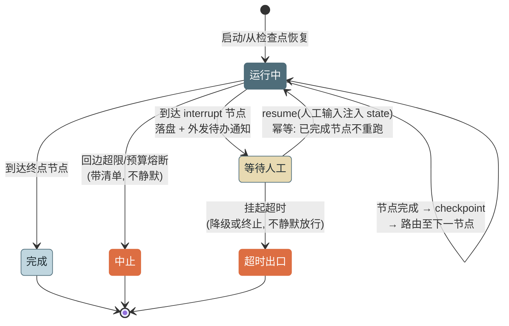

# 第 18 章 编排、通信与图执行

> 第四篇 多 Agent
>
> 第 17 章选好了拓扑，本章把它造成机器。核心立场一句话：**协调是确定性逻辑，必须下沉到运行时；把协调交给模型的记忆力，是多 Agent 系统最普遍的死因**。本章给出三角色框架（DELEGATOR/WORKER/GUARD）、通信与上下文交接的工程设计，以及一个可运行的最小图执行器——含条件路由、有界回边与人工介入。

---

## 1. 场景引入：靠提示词当主管的第三天

Parallel 拓扑的合规审计上线顺利后（第 17 章 Checklist 走完的第一个多 Agent 场景），团队信心大增，用同样的思路做"发布前检查"：一个 Supervisor 拓扑——主管 Agent 拆解检查项、派发给工人、回收汇总。实现方式很自然：**给主管写一段提示词**："你负责协调，把任务拆给工人，等全部返回后汇总。"

第三天就出了两起事故。**事故一：漏收**。五个检查项派出去，主管在收到三个结果后"觉得差不多了"直接汇总——遗漏的两项里恰有一项是数据库迁移脚本检查，带病发布，回滚半小时。轨迹显示主管的上下文里工人回执散落在十几轮之间，第 5 章的注意力稀释让"还有谁没交作业"这个簿记事实丢了。**事故二：重派**。另一次运行中，主管把同一个检查项派了两遍给不同工人，两份结论还不一致，主管挑了错的那份。

复盘的定性很准确：**这两起事故里没有任何"智能"问题——拆解质量很好，工人干活也没错——错的全是簿记**：谁被派了活、谁交了、还差谁。簿记是确定性逻辑，交给概率组件维持，抖动是必然而非偶然（同一论证第三次出现：终止判定不能靠自报、重规划不能靠感觉、现在是协调不能靠记忆）。解法也与前两次相同：**把确定性的部分下沉到运行时**——这就是图执行引擎存在的理由，也是第 17 章"拓扑 ≠ 图"在工程侧的兑现：拓扑说"主管与工人"，图说"派发表、回执表、完成判定由谁维护"——由代码维护。

---

## 2. 原理

### 2.1 三角色框架：DELEGATOR / WORKER / GUARD

把多 Agent 系统的成员抽象为三种职责角色（角色是职责而非进程——一个 Agent 可以兼任，但职责边界必须清晰）：

- **DELEGATOR（分派者）**：负责任务分解与分派决策——"拆成什么、派给谁、何时算齐"。它**不做业务**，也**不做簿记**（簿记归图运行时）；它做的是那部分真正需要智能的决定：怎么拆、结果冲突时信谁。
- **WORKER（工人）**：执行单一子任务的完整 Agent——内部就是第 3 章的小预算循环，带自己的工具、熔断与沙箱。对外契约是结构化的：接收任务包，返回结果包（成功/失败 + 产物 + 摘要）。
- **GUARD（门禁）**：质量校验角色，站位在**每条 WORKER 输出流向下游的边上**——而不是只守在终点。校验优先用确定性手段（Schema/断言/测试，第 3 章 Verifier 与第 15 章 RuleScorer/ExecScorer 直接复用），软质量才用 LLM 评审。GUARD 的存在把第 17 章坑 3（Pipeline 级联污染）的修复制度化：**坏产物在进入共享状态之前被拦截**，而不是在终点被发现。



*图 1：三角色框架的任务流与门禁位置——这张图回答"智能决策、机械执行与质量校验各站在哪里"。两个关键站位：GUARD 在每条输出边上（不是终点）；"全部到齐"的判定是运行时簿记（菱形），不进任何 Agent 的上下文。*

### 2.2 A2A 通信：消息模式与状态共享的取舍

**Agent 间通信（A2A，Agent-to-Agent）** 的消息分三种模式：**指令**（DELEGATOR→WORKER：任务目标 + 上下文交接包 + 预算配额——预算随指令下发是第 3 章分层熔断的多 Agent 落地）；**汇报**（WORKER→上游：结构化结果包，成功失败都要报——与第 2 章"错误也是观察"同构）；**广播**（状态变更通知全体成员）——广播要克制：它是 token 放大器（n 个成员各自消化一遍），仅用于确实全员相关的事实（"数据源 X 已确认不可用，各分支不要再试"）。

**共享状态 vs 消息传递**是通信设计的根本取舍。**共享黑板（Blackboard）**：所有成员读写同一份状态——实现简单、信息天然汇聚；代价是并发写冲突、权限混杂（每个成员都看到并可改一切——第 13 章最小权限的反面）、污染全局扩散（一个成员写入坏数据，全员中毒）。**消息传递**：成员间只经显式消息交互——隔离好、每条消息可审计可校验（Schema 约束 = GUARD 的天然挂点）；代价是复杂拓扑下的消息风暴与"信息孤岛"。

工程答案通常是**混合**：图级维护一份**类型化共享状态**，但**按 key 分区写权限**（每个 WORKER 只能写自己的结果分区——数据库行级权限的直觉）；成员间的定向信息走边上的消息。一句话原则：**读可以宽，写必须窄**。

### 2.3 Context Handoff：交接是有损压缩，损耗要显式

多 Agent 的每条边都有上下文交接问题。两个极端都错：**转发全部历史**——贵（token 放大的主要来源）、且下游被上游的无关细节稀释注意力；**一句话总结**——第 17 章坑 5 的上下文磨损。工程解是**规范化交接包（Normalized Handoff Package）**：为任务域定义显式 Schema——

- `task_goal`：本子任务要达成什么（含完成判据，供 GUARD 用）
- `established_facts[]`：已确认的事实（结构化条目，带来源）
- `open_questions[]`：未决问题与当前假设
- `constraints[]`：约束与禁区（不可丢——丢了就是越界事故）
- `artifacts[]`：产物指针（文件路径/轨迹引用，内容不随包走——第 12 章事件纪律同款）
- `budget`：分配的预算配额

配套两个抽象：**Exporter** 从上游会话状态提取并规范化成包；**Importer** 把包渲染成下游 Agent 的初始上下文（渲染到尾部——第 5 章位置学）。以及本节的关键设计——**损耗报告（Loss Report）**：交接必然有损（推理过程、失败尝试的细节、语气与不确定度都会丢），与其假装无损，不如让 Exporter 显式列出**丢弃了哪些类别、哪些可经指针找回**，随包传递。损耗报告的价值有二：下游 Agent 知道"我看到的不是全部，存疑可查轨迹"；人排障时一眼看到每条边丢了什么——第 17 章坑 2 的信息衰减从"悄悄发生"变成"记录在案"。



*图 2：一次 Context Handoff 的完整时序——这张图回答"交接包如何生成、损耗在哪一步被显式化"。交接的诚实设计：不承诺无损，承诺"丢了什么有账可查"。*

### 2.4 图执行范式：节点、边、状态与有界回边

**图执行（Graph Execution）**的四个构件：**节点（Node）**——接收共享状态、返回状态更新的函数（可以是纯代码，也可以内嵌一个完整 Agent 循环）；**边（Edge）**——固定边（A 完成必到 B）与**条件边**（路由函数依据状态选择出口；路由函数可以是代码规则，也可以是一次 LLM 判定——但 LLM 路由必须枚举合法出口，超纲输出按默认路由处理）；**共享状态（State）**——类型化、分区写（2.2 节）；**回边（Cycle）**——实现打回重做、迭代精化的循环结构。

回边是图里最危险的构件，必须服从**有界性约束：每条回边携带计数上限，超限强制走出口边**。论证无需重复——图里的无限循环就是拓扑级的 AutoGPT（第 1 章教训一），GUARD 与 WORKER 打乒乓烧穿预算的事故形态（第 4 章坑 4 的图版）在每个没有有界约束的系统里都会重演。上限触发后的去向也要显式：进入降级出口（带着"未过门禁"标记继续）或人工介入节点（2.6 节），绝不静默续转。

### 2.5 显式图 vs 隐式循环：一条光谱，不是一场战争

**声明式编排**（LangGraph 式显式图）与 **Agentic Loop 自主决策**（第 3 章的循环）常被摆成对立阵营，实际是一条光谱：



*图 3：显式图与隐式循环的适用光谱——这张图回答"两种执行模型如何取舍与混合"。生产系统绝大多数落在中间两格：图管可枚举的骨架，循环管不可枚举的血肉。*

判据仍是第 1 章那条"路径可枚举性"，多 Agent 语境下加两条：**审计与合规要求高的流程用图**——图的路径是声明的、可证明的（"高危操作必经人工节点"是图结构保证，不是提示词祈祷——第 13 章评审语言）；**协作结构本身用图，成员内部用循环**——这正是三角色框架的执行形态：DELEGATOR 的派发结构、GUARD 的站位、到齐判定都是图（确定性簿记），每个 WORKER 内部是循环（开放执行）。两个反模式对称：用图模拟开放探索（条件边组合爆炸，图退化成状态机地狱）；用循环模拟审批流（合规路径靠模型自觉，审计不可证）。

### 2.6 图的持久化：断点恢复与 interrupt 语义

图执行是长时程的（人工介入可能挂起数小时），必须可持久化。机制复用第 12 章的设施：**每个节点执行完成后 checkpoint**（状态 + 图位置 + 回边计数器落盘）——节点边界天然是一致性边界（第 3 章轮次边界的图版）。

**interrupt（人工介入节点）**是图对第 13 章 ask 语义的一等公民化：执行到达 interrupt 节点即**暂停并落盘**，向外发出待办通知（第 12 章事件总线的外联通道），然后进程可以退出；人工完成决策后，**resume** 从 checkpoint 加载状态、把人工输入注入 state、从暂停位置继续。三条语义纪律：resume 必须**幂等**（重复 resume 同一 checkpoint 不重复执行已完成节点）；人工输入是**状态更新**而非旁路指令（它和其他节点的输出走同一条 state 通道，可审计）；超时策略显式（挂起超过 N 小时走超时出口——fail-closed 或降级，与第 13 章确认超时同款）。



*图 4：含 interrupt 的图执行状态机——这张图回答"图在哪些状态间迁移、人工介入如何挂起与恢复"。三条出边都拒绝静默：超时、超限、熔断全部带着记录离场。*

### 2.7 A2A 协议：跨组织 Agent 互操作

2.2 讲的是**通信设计**（本组织内成员怎么传消息、共享还是隔离）；本节讲**跨信任边界的标准协议**——当 Supervisor 要调用**别的团队甚至别的公司**运维的 Agent 时，靠的不是共享内存，而是 **A2A（Agent2Agent，Linux Foundation）** [C-21]。先把三个边界分清楚，别用错工具：

| 边界 | 协议 | 解决什么 | 本书位置 |
|---|---|---|---|
| Agent → 工具/数据 | **MCP**（第 8 章） | 标准化"接一个能力" | 无状态请求/响应 + Tasks |
| Agent → Agent（跨信任域） | **A2A** | 标准化"把活外包给另一个自治 Agent" | 本节 |
| Agent 内部编排 | **内部图**（本章 2.4） | 进程内节点/边/状态 | 共享状态 + 消息 |

**协议家族与收敛动态。** "Agent 找 Agent"这个位置上出现过不止一个协议，认名字也要认走向 [C-26]：**ACP（Agent Communication Protocol）**——IBM BeeAI 谱系，设计取向是 REST 优先、异步优先、MIME 多部分消息与**离线发现**（Agent 的打包元数据即名片，不依赖在线端点）；2025 年并入 Linux Foundation 旗下的 A2A——两者本就解决同一问题，而标准的价值全在网络效应，合并是这个逻辑的必然结局，ACP 的 REST-first 与离线发现经验随之流入 A2A 的演进。仍在场的还有 **ANP（Agent Network Protocol）**（社区谱系，DID 去中心身份 + 点对点发现，面向开放互联网上的 Agent 互联而非企业集成）与 **AGNTCY**（思科发起的"Agent 互联网"技术栈，2025 年加入 Linux Foundation、与 A2A 生态对齐）。判读用第 24 章的信号标准：A2A 手握三张牌——LF 中立治理（与 MCP 同一屋檐）、吸收 ACP 的整合、主流框架陆续内建客户端——是最接近"两个互不隶属的生产系统靠它互通"这条收敛线的候选；但接入姿势不变：**薄适配层、一周可退出**——第 24 章坑 5 的教训不因看好谁而豁免。

**能力发现靠 Agent Card。** 对方在 `/.well-known/agent-card.json` 发布一张 JSON 名片：身份、服务端点、`capabilities`（streaming / pushNotifications）、`skills` 列表、鉴权方式。客户端先取名片、再决定调不调、怎么鉴权——这是 A2A 版的"服务发现 + 契约"。

**任务是有生命周期的 Task。** 与 MCP 一次调用即完的工具不同，A2A 的活是长任务：**Task 由服务端生成 id**（客户端不得自造 id），在九个状态间迁移——运行（submitted / working）、中断（input-required / auth-required，等客户端补输入或鉴权后恢复）、终态（completed / failed / canceled / rejected，吸收态、不再接受消息），外加规范保留的 unknown 兜底态（状态不可判定时的诚实声明，不参与正常迁移）。取消只允许在非终态发起，否则报 `TaskNotCancelableError`：

<!-- snippet: examples/reference-assistant/src/assistant/interop/a2a.py#ch18-a2a-state-machine mode=executable verified_by=examples/reference-assistant/tests/test_a2a.py -->
```python
# 合法迁移：运行→中断/终态，中断→恢复运行/终态；终态是吸收态（不可再迁移）。
_TRANSITIONS: dict[TaskState, frozenset] = {
    TaskState.SUBMITTED: frozenset({TaskState.WORKING, TaskState.REJECTED,
                                    TaskState.CANCELED}),
    TaskState.WORKING: frozenset({TaskState.INPUT_REQUIRED, TaskState.AUTH_REQUIRED,
                                  TaskState.COMPLETED, TaskState.FAILED,
                                  TaskState.CANCELED}),
    TaskState.INPUT_REQUIRED: frozenset({TaskState.WORKING, TaskState.CANCELED,
                                         TaskState.FAILED}),
    TaskState.AUTH_REQUIRED: frozenset({TaskState.WORKING, TaskState.CANCELED,
                                        TaskState.FAILED}),
}


def can_transition(src: TaskState, dst: TaskState) -> bool:
    return dst in _TRANSITIONS.get(src, frozenset())


def can_cancel(state: TaskState) -> bool:
    """终态不可取消（规范：返回 TaskNotCancelableError）。"""
    return state not in TERMINAL


def can_accept_message(state: TaskState) -> bool:
    """终态 Task 不再接受消息（规范明文）。"""
    return state not in TERMINAL
```

**通信与产物分离。** Message 是交互回合（`role` 为 user/agent，含若干 Part：文本/文件/数据）；结果放 **Artifact**（挂在 `Task.artifacts`）。这条分离让"对话"与"交付物"各归各管——审计看 Message、验收看 Artifact。

**贯通身份、权限与 Trace 是跨组织的真难点。** 一条 `用户 → Supervisor → A2A Research Agent → MCP Search/DB` 的链路，跨了两种协议、可能跨了组织，必须让三样东西端到端贯通：**身份**（谁的授权在流动——委托令牌而非共享服务账号，跨域用 OAuth/OIDC 式的受众限定令牌）、**权限**（远端 Agent 只应拿到完成本任务所需的最小授权，第 13 章最小权限跨到了组织外）、**Trace**（`traceparent` 沿 A2A 与 MCP 边界透传，才能把远端 Task 的 span 挂回本地会话树——第 14 章的观测在这里跨了进程）。落地纪律：把远端 A2A Task 的**终态映射回本书内部 Run 的会话状态**（completed→success、failed/rejected→failed、canceled→aborted），远端 Task 就并进了统一的审计、计费与评测——外包出去的活，账要能收回来。

---

## 3. 动手实现（贯穿项目增量）

本章增量：`src/assistant/orchestration/graph.py`——**最小图执行器**：节点/固定边/条件路由/有界回边/interrupt 与断点恢复。刻意不依赖任何编排框架——百行代码把 2.4–2.6 节的机制全部落地，也让你此后读任何图编排框架的源码都有坐标系。

```python
# src/assistant/orchestration/graph.py — 最小图执行器
import json
from dataclasses import dataclass, field
from pathlib import Path
from typing import Callable

END = "__end__"
INTERRUPT = "__interrupt__"      # 节点返回它: 暂停等人工


@dataclass
class Graph:
    nodes: dict[str, Callable[[dict], dict]] = field(default_factory=dict)
    edges: dict[str, str] = field(default_factory=dict)              # 固定边
    routers: dict[str, Callable[[dict], str]] = field(default_factory=dict)
    cycle_limits: dict[tuple[str, str], int] = field(default_factory=dict)

    def add_node(self, name: str, fn: Callable[[dict], dict]):
        self.nodes[name] = fn

    def add_edge(self, src: str, dst: str, max_visits: int | None = None):
        """max_visits: 回边必须设上限——图里的无限循环是拓扑级 AutoGPT"""
        self.edges[src] = dst
        if max_visits is not None:
            self.cycle_limits[(src, dst)] = max_visits

    def add_router(self, src: str, fn: Callable[[dict], str],
                   allowed: set[str]):
        """条件路由: 出口必须枚举, 超纲输出视为图定义错误"""
        def guarded(state: dict) -> str:
            dst = fn(state)
            assert dst in allowed | {END}, f"路由越界: {src} -> {dst}"
            return dst
        self.routers[src] = guarded


@dataclass
class RunResult:
    status: str                  # done / paused / aborted
    state: dict
    position: str = ""           # paused 时: 挂起在哪个节点之后


class GraphExecutor:
    def __init__(self, graph: Graph, checkpoint_dir: Path):
        self.g = graph
        self.dir = checkpoint_dir
        self.dir.mkdir(parents=True, exist_ok=True)

    def _save(self, run_id: str, node: str, state: dict, visits: dict):
        (self.dir / f"{run_id}.json").write_text(json.dumps(
            {"next": node, "state": state,
             "visits": {f"{a}->{b}": v for (a, b), v in visits.items()}},
            ensure_ascii=False), "utf-8")

    def run(self, run_id: str, entry: str, state: dict) -> RunResult:
        return self._drive(run_id, entry, state, {})

    def resume(self, run_id: str, human_input: dict) -> RunResult:
        """幂等恢复: 从检查点取位置与状态, 人工输入作为状态更新注入"""
        ck = json.loads((self.dir / f"{run_id}.json").read_text("utf-8"))
        visits = {tuple(k.split("->")): v for k, v in ck["visits"].items()}
        state = ck["state"] | human_input        # 人工输入走 state 通道, 可审计
        return self._drive(run_id, ck["next"], state, visits)

    def _drive(self, run_id: str, node: str, state: dict,
               visits: dict) -> RunResult:
        while node != END:
            updates = self.g.nodes[node](state)
            if updates.get(INTERRUPT):           # 到达人工介入点: 落盘即退
                # 教学简化: 下一跳在挂起前确定, 人工输入不改变路由;
                # 若需"驳回走另一条边", 在 interrupt 节点之后接读取人工输入的 router
                nxt = self._next(node, state)
                self._save(run_id, nxt, state | updates, visits)
                return RunResult("paused", state | updates, position=nxt)
            state = state | updates              # 节点输出合入共享状态
            nxt = self._next(node, state)
            edge = (node, nxt)
            if edge in self.g.cycle_limits:      # 有界回边: 超限强制中止
                visits[edge] = visits.get(edge, 0) + 1
                if visits[edge] > self.g.cycle_limits[edge]:
                    state["abort_reason"] = f"回边 {node}->{nxt} 超过上限"
                    return RunResult("aborted", state)
            self._save(run_id, nxt, state, visits)   # 节点边界 = 一致性边界
            node = nxt
        return RunResult("done", state)

    def _next(self, node: str, state: dict) -> str:
        if node in self.g.routers:
            return self.g.routers[node](state)
        return self.g.edges.get(node, END)
```

用它拼出图 1 的三角色结构（节选——WORKER 节点内嵌第 3 章的 `AgentLoop`，GUARD 复用第 15 章 Scorer）：

```python
g = Graph()
g.add_node("delegate", lambda s: {"assignments": split_task(s["task"])})
g.add_node("worker", lambda s: {"draft": run_worker_loop(s)})       # 内嵌小循环
g.add_node("guard", lambda s: {"passed": rule_check(s["draft"])})
g.add_node("approve", lambda s: {INTERRUPT: True})                  # 人工介入节点
g.add_node("finalize", lambda s: {"result": merge(s)})

g.add_edge("delegate", "worker")
g.add_edge("worker", "guard")
g.add_router("guard",
             lambda s: "finalize" if s["passed"] else "worker",
             allowed={"finalize", "worker"})
g.add_edge("guard", "worker", max_visits=2)      # 打回最多 2 次, 乒乓有界
g.add_edge("finalize", "approve")
g.add_edge("approve", END)

ex = GraphExecutor(g, Path(".graph_ckpt"))
r = ex.run("release-check-42", "delegate", {"task": "发布前检查"})
# r.status == "paused"（挂在 approve）→ 人工批准后:
r = ex.resume("release-check-42", {"approved_by": "alice"})
```

回测场景的两起事故：**漏收**不可能发生——"全部到齐"由 `_drive` 的确定性推进保证，不依赖任何 Agent 的记忆；**重派**不可能发生——派发表在 state 里，节点函数按表工作。主管 Agent 仍然存在（`delegate` 节点内做拆解），但它只做智能决策，簿记归了运行时——**智能与簿记的分工，就是本章全部内容的一句话总结**。

---

## 4. 生产级考量

**图定义要版本化，在跑的实例 pin 旧版。** 图升级时存量运行中的实例怎么办？答案与数据库迁移同构：图定义带版本号，运行实例在启动时绑定版本、跑完为止（长挂起的实例可能跨版本存活数天）；不兼容的紧急修复走"排空 + 从检查点迁移"，迁移脚本要处理 state Schema 的演化——**图的 state Schema 与 API Schema 同等对待**。

**并行分支的状态合并要声明 reducer。** 本章执行器是串行推进；生产的图有并行分支，两个分支同时写状态就有合并语义问题。解法是按 key 声明 **reducer**（追加列表/取最新/自定义合并——大数据读者会认出这是 combiner 的老朋友）；没有声明 reducer 的 key 不允许多分支写入——把冲突从运行时提前到图定义时。

**跨 Agent 的观测要有图级关联。** 每个 WORKER 是独立会话，各有自己的 Trace（第 14 章四层结构）；图执行再加一层：**graph_run_id 作为所有成员会话的共同父标识**，节点执行是父 Span、成员会话的 Session Span 挂在其下——一次图运行在追踪系统里是一棵五层树。没有这层关联，多 Agent 排障就是在 n 个独立轨迹里人肉对时间戳。

**中止与超时要有死信收容。** 回边超限、interrupt 超时、预算熔断的实例不能凭空消失：进入**死信队列**（携带完整 state 与中止原因），由人工兜底流程消费——第 16 章降级阶梯"转人工带交接包"的图级实现。死信队列的深度是系统健康度指标：持续增长说明图设计与真实任务分布脱节。

---

## 5. 常见坑

**坑 1：协调簿记写在提示词里。**
*症状*：漏收、重派、提前汇总（场景引入的两起事故）；发生率随任务规模上升——五个子任务偶发，二十个子任务必然。
*根因*：派发表与回执表是精确簿记，放在长上下文里靠注意力维持，第 5 章的稀释效应保证它会丢。
*修复*：簿记下沉图运行时（state 里的结构化表 + 确定性推进）；DELEGATOR 只做拆解与冲突裁决这类真智能决策；"协调逻辑在提示词还是在代码"作为多 Agent 设计评审的第一个问题。

**坑 2：回边不设上限，GUARD 与 WORKER 打乒乓。**
*症状*：某类任务的图实例持续运行数小时，轨迹显示 guard→worker→guard 循环了几十圈：产物每次微调一点，门禁每次挑出新毛病，谁也不让步，烧到预算熔断。
*根因*：回边隐含"总会收敛"的乐观假设——但门禁标准与工人能力之间可能存在结构性缺口（永不收敛），第 4 章反思循环震荡的图版。
*修复*：一切回边带 `max_visits`（本章执行器强制语义）；超限走降级出口（带"未过门禁"标记 + 死信）或 interrupt 转人工；把"回边平均圈数"做成指标——接近上限说明门禁或工人有一方需要修。

**坑 3：共享状态全员可写，结果被同伴覆盖。**
*症状*：Parallel 分支跑完，汇总时发现只有最后完成的分支的结果——先完成的被后完成的覆盖了；偶发且与完成顺序相关，复现率随机。
*根因*：所有 WORKER 写同一个 `results` key，后写覆盖先写——共享黑板的并发写冲突教科书案例。
*修复*：分区写（每 WORKER 写 `results[worker_id]`）或声明 append 型 reducer；执行器对未声明 reducer 的 key 拒绝多写者（第 4 节纪律）；"读可以宽，写必须窄"。

**坑 4：交接用自然语言总结，"待确认"变"已确认"。**
*症状*：下游 Agent 把上游标记为"疑似原因，待验证"的结论当成既定事实直接采取行动；事后看交接摘要，那句"疑似"在转述中变成了陈述句。
*根因*：自然语言交接对**认知状态**（确认/假设/存疑）无保护——转述天然抹平不确定度，这正是损耗报告要显式化的类别之一。
*修复*：规范化交接包把事实与未决问题分成两个字段（`established_facts` vs `open_questions`），认知状态由 Schema 保证而非措辞保证；Importer 渲染时对未决问题显式标注"未验证"；损耗报告随包传递。

**坑 5：interrupt 恢复依赖进程内存，重启即失联。**
*症状*：挂起等审批的图实例在一次发布重启后全部消失——审批人点了批准，系统说"找不到该流程"；用户重新发起，前半段全部重跑（含已执行的副作用）。
*根因*：暂停状态只存在执行器进程的内存里；interrupt 的本义是"可能挂起数小时并跨进程存活"，内存实现从根上违背语义。
*修复*：interrupt 即落盘（本章 `_save` 在暂停时先于返回）；resume 从磁盘检查点加载且幂等（已完成节点不重跑）；恢复路径纳入发布演练——"挂起 → 重启 → 恢复"是图执行器的验收用例而非边缘场景。

---

## 6. 面试高频问题

**Q1：多 Agent 编排里，哪些该交给模型、哪些必须下沉运行时？**

结论先行：**智能决策（怎么拆、冲突信谁、质量软判断）交给模型；簿记（谁被派活/谁交了/是否到齐/派发去重）必须下沉运行时——簿记是确定性逻辑，靠模型记忆维持必然抖动。**
- 事故形态：漏收、重派、提前汇总——全是簿记错误，与拆解质量无关。
- 论证与终止判定/重规划触发同构：概率组件不承担精确状态维护。
- 三角色框架的分工：DELEGATOR 只做智能决策，图运行时管状态推进，GUARD 管质量门禁。
- 加分点："协调逻辑在提示词还是在代码"是多 Agent 设计评审的第一问。

**Q2：Agent 间通信怎么设计？共享状态和消息传递怎么选？**

结论先行：**三种消息模式——指令（含交接包与预算）、汇报（结构化结果，失败也报）、广播（克制使用）；状态设计用混合方案：图级类型化共享状态 + 按 key 分区写权限，定向信息走边上消息——读可以宽，写必须窄。**
- 纯黑板的代价：并发写冲突、权限混杂、污染全局扩散。
- 纯消息的代价：复杂拓扑下消息风暴与信息孤岛。
- 并行分支写同 key 必须声明 reducer，否则图定义期拒绝。
- 加分点：预算随指令下发——分层熔断在多 Agent 的落地；广播是 token 放大器。

**Q3：Context Handoff 怎么做才不丢关键信息？**

结论先行：**规范化交接包（目标/已确认事实/未决问题/约束/产物指针/预算）+ Exporter/Importer 抽象 + 损耗报告——交接必然有损，工程目标不是无损而是"丢了什么有账可查"。**
- 两个极端都错：全量转发（贵+稀释）与一句话总结（磨损）。
- Schema 保护认知状态：事实与未决分字段，"疑似"不会在转述中变陈述。
- 产物走指针不走内容；渲染到下游上下文尾部（位置学）。
- 加分点：损耗报告让信息衰减从"悄悄发生"变"记录在案"——排障时每条边丢了什么一眼可见。

**Q4：图里的循环（回边）为什么必须有界？超限之后怎么办？**

结论先行：**回边隐含"会收敛"的乐观假设，而门禁与工人间可能存在结构性缺口（永不收敛）——无界回边是拓扑级的 AutoGPT 无限循环；每条回边必须带 max_visits，超限走降级出口或转人工，绝不静默续转。**
- 事故形态：GUARD 与 WORKER 打乒乓几十圈烧到熔断。
- 超限去向显式：带"未过门禁"标记降级、死信收容、或 interrupt 转人工。
- "回边平均圈数"做指标：逼近上限=门禁或工人需要修。
- 加分点：与 max_turns/重试预算/重规划上限同属一族——一切迭代结构都要运行时握有终止权。

**Q5：显式图和 Agentic Loop 怎么选？interrupt 的实现语义是什么？**

结论先行：**一条光谱不是二选一——可枚举/需审计的协作骨架用图，开放探索的成员内部用循环，生产主流是"图为骨架、节点内嵌循环"；interrupt 是图对人工审批的一等公民化：到达即落盘挂起，resume 幂等且人工输入走 state 通道。**
- 图的优势是路径可证明（"高危必经人工节点"是结构保证不是提示词祈祷）。
- 反模式对称：图模拟探索=条件边爆炸；循环模拟审批=合规不可证。
- interrupt 三纪律：落盘先于返回（跨进程存活）、resume 幂等（不重跑已完成节点）、超时显式出口。
- 加分点：节点边界=checkpoint 边界=一致性边界，与单 Agent 的轮次边界不变式一脉相承。

---

> **下一章预告**：机器造好了，什么时候该开动它？第 19 章回到冷静的工程判断：多 Agent 的可行性权衡——上下文墙的实测方法、协作开销的盈亏平衡点、以及"什么任务多 Agent 反而更差"的证据清单。
