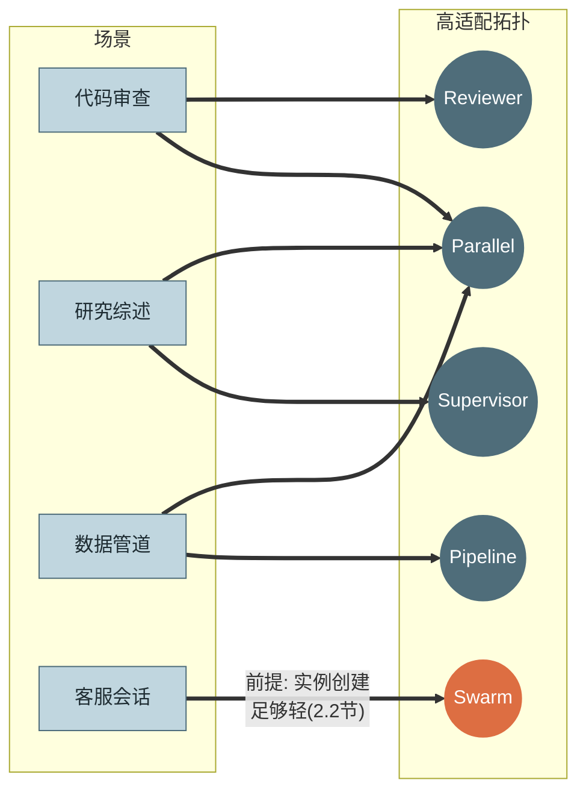
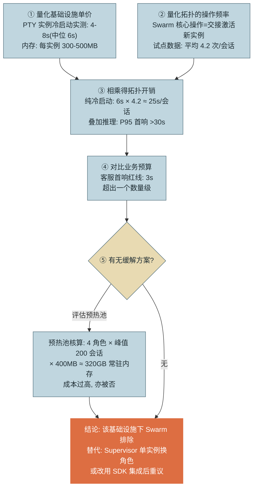
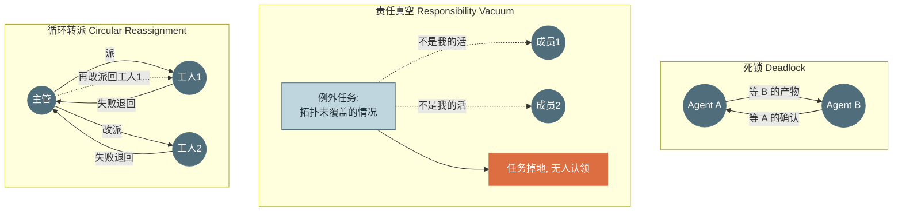

# 第 19 章 可行性权衡与工程约束

> 本章另有约十倍篇幅的**详解扩展版**：[详解扩展版/详解19-可行性权衡与工程约束.md](../详解扩展版/详解19-可行性权衡与工程约束.md)——独立成文的深读版（初稿，未经审读与来源核验，体例与正文不同；两版内容以正文为准）。

> 第四篇 多 Agent
>
> 这是多 Agent 的"劝退章"。第 17 章给了语言、第 18 章给了机器，本章负责诚实：**大多数任务不需要多 Agent，一部分任务用了会更差，还有一部分任务——你的基础设施根本撑不起你想要的拓扑**。本章给出场景-拓扑匹配矩阵、一套"基础设施约束 → 拓扑排除"的量化判定法（以 PTY 冷启动否决 Swarm 为完整案例），并直面隐性成本与归因难题。

---

## 1. 场景引入：一个 POC 的死亡，死于一道乘法

多 Agent 审计场景成功后（Parallel，token 放大实测 1.24×），团队乘胜追击立了第二个项目：**客服 Swarm**——前台、账务、技术支持、升级四个角色 Agent，按第 17 章图 8 的交接模型运转。拓扑选型没有问题：客服正是"边界清晰、路由动态"的教科书场景，Checklist B 节全绿。

POC 却在第一周就死了，死因与拓扑无关。团队的 Agent 运行时走的是 **PTY 子进程集成**（第 12 章方式一：每个 Agent 实例 = 拉起一个完整 CLI 产品）。实测数字：单实例冷启动 **4–8 秒**（进程拉起 + 运行时初始化 + 两个 MCP Server 启动与能力发现 + 上下文注入，取中位 6 秒）。而试点数据显示客服会话平均 **4.2 次交接**——若每次交接新建目标角色实例，仅冷启动就累计 **25 秒**，叠上推理与工具时间，P95 首响超过 30 秒。客服业务的红线是**首响 3 秒**。一道乘法（6 × 4.2）就宣判了死刑——不是 Swarm 不适合客服，是 **PTY 集成撑不起 Swarm 的实例创建频率**。

更有价值的是复盘时的反思：这道乘法**在写第一行代码之前就能算**。团队把它提炼成一套判定法（2.2 节），并立下规矩：每个多 Agent 提案在第 17 章 Checklist 之外，再加一页"基础设施可行性核算"。本章就是那页核算的方法论——外加多 Agent 的另外两笔隐账：协调失败与归因成本。

---

## 2. 原理

### 2.1 场景-拓扑匹配矩阵

四类高频任务与八种拓扑的适配度（评分基于第 17 章代价模型 + 各场景的结构特征）：

| 场景 \ 拓扑 | Supervisor | Pipeline | Parallel | Hierarchical | Reviewer | Debate | Arena | Swarm |
|---|---|---|---|---|---|---|---|---|
| **代码审查** | 低 | 中（分析→评论） | **高**（按文件/维度分片） | 低 | **高**（标准可写清） | 中（仅安全审计值回票价） | 中（方差大的重构建议） | 低 |
| **研究综述** | **高**（子题动态展开） | 中（检索→综合两段） | **高**（多源独立检索） | 中（超大课题，两层内） | 中（综述质量把关） | 低 | 低 | 低 |
| **数据管道** | 低 | **高**（阶段天然固定） | **高**（分片同构处理） | 低 | 中（关键级校验） | 低 | 低 | 低 |
| **客服会话** | 中（单实例换角色） | 低 | 低 | 低 | 低 | 低 | 低 | **高**（前提：基础设施过关，见 2.2） |



*图 1：场景-拓扑高适配连线（矩阵的图示化）——这张图回答"四类高频任务各自的第一候选拓扑是什么"。注意 Parallel 出现在三个场景里——再次印证它是收益/成本比最高的拓扑；Swarm 的连线带条件标注：拓扑合适 ≠ 可行。*

评分理由抽样：代码审查 × Reviewer 高——评审标准可成文（lint 规则、安全清单），正是 Reviewer 的适用前提；研究综述 × Supervisor 高——子题要随发现动态展开（查完 A 才知道要不要深挖 B）；数据管道 × Swarm 低——管道没有"该谁接手"的路由问题，用交接模型纯属自找调试地狱。矩阵的用法是**先看行再看列**：从你的场景出发找高适配项，而不是拿着喜欢的拓扑找场景——后者是"拿锤子找钉子"的经典病。

### 2.2 不可行拓扑判定法：一道乘法的方法论

场景引入的案例展开为完整推理链：



*图 2：Swarm 否决案例的量化推理链——这张图回答"一个拓扑如何在写代码之前被一道乘法否决"。全链只用了两个实测数字（冷启动 6s、交接 4.2 次）和一条业务红线（3s）。*

从案例提炼**通用判定法**，四步：

1. **识别拓扑的资源敏感操作**——每种拓扑有自己的高频动作：Swarm 是实例创建/交接，Debate 是全连接消息轮次，Hierarchical 是层间转述调用，Parallel 是峰值并发。
2. **量化基础设施单价**——该动作在你的集成方式与部署形态下的实测成本（延迟/内存/token/费用）。注意"你的"三个字：SDK 集成下实例创建可能是 200ms，PTY 下是 6s——**同一拓扑的可行性随基础设施翻转**（第 12 章集成方式选型的回响）。
3. **乘以拓扑的操作频率**——用试点或历史数据，不用拍脑袋。
4. **对比业务预算**——延迟 SLO、成本红线（第 16 章口径）、内存配额。超出即排除，或改基础设施后重议。

这套判定法的价值在于**把架构争论变成算术**："Swarm 好不好"吵不出结果，"6 × 4.2 > 3"没有争论空间。它同时给了被否决方案一条体面的复活路径——换掉约束项（迁移到 SDK 集成）后数字重算，结论可以翻转。

### 2.3 隐性成本：token 放大与三种协调失败

**token 放大的机制拆解**（第 17 章给了系数，这里给来源）：三个来源按占比排序——**固定上下文的 n 份复制**（每个成员都要背 System Prompt + 工具定义 + 任务背景，n 个成员就是 n 份，成员数直接线性放大这块固定成本）；**交接包的重复注入**（同一批事实在每条边上被传递一次，边越多重复越多——Hierarchical 的 3–6× 主要来自这里）；**协调本身的调用**（派发、汇总、门禁、路由中的 LLM 判定）。压缩手段对应三个来源：成员共享的稳定前缀用缓存扛（第 16 章——多 Agent 让缓存命中率的重要性再乘一倍）；交接走指针化规范包（第 18 章）；协调簿记下沉运行时（第 18 章——下沉的不只是可靠性，还有这部分 token）。

**三种协调失败模式**，结构如图：



*图 3：三种协调失败模式的结构——这张图回答"多 Agent 特有的失败长什么形状"。死锁是循环等待，责任真空是覆盖缺口，循环转派是无记忆的重试——三者的共性是每个成员局部都"合理"。*

各自的检测信号与预防：**死锁**——信号是双方长时间零事件（第 12 章进展探针在图级的应用：graph run 超时无节点完成即告警）；预防靠图结构（第 18 章的图执行天然无死锁——串行推进 + 有界回边；死锁主要发生在绕开图、靠消息自由协作的实现里，这本身就是"用图"的又一论据）。**责任真空**——信号是死信队列增长（第 18 章）与任务超时无认领；预防是显式 default owner：拓扑必须声明"所有未匹配情况归谁"（通常是转人工），例外不允许静默掉地。**循环转派**——信号是同一任务的派发次数计数；预防是转派携带失败历史（工人 2 必须看到工人 1 的失败原因——否则它会在同一块石头上摔第二次）+ 转派总次数上限（有界性铁律的又一实例）。

### 2.4 归因难题："谁做错了"是多 Agent 税的大头

单 Agent 排障是一条轨迹上的时间旅行（第 14 章五步动线）；多 Agent 排障先要回答一个前置问题：**错误属于哪个成员**。一份错误的最终产物，根因可能是四种之一，责任方各不相同：**上游给错输入**（上游 Agent 的错）、**本节点推理错**（本 Agent 的错）、**交接丢了信息**（Exporter/Importer 的错——第 18 章损耗报告就是为此存证）、**门禁漏放**（GUARD 的错）。

归因的工程方法两件套：**边快照**——每条边上的交接包在传递时落盘（本章实现），排障时先看"进入该节点的输入是否已经错了"——输入已错则向上游递归，输入正确则锁定本节点；**二分重放**——对长链路，用正确输入从中间节点重放下游（第 12 章 Checkpoint 的图级应用），对分定位第一个出错的边，动作与 `git bisect` 完全同构。归因成本必须计入多 Agent 的总账：**没有边快照的多 Agent 系统，每次排障都是全员嫌疑的罗生门**——这也是为什么本章的动手实现做的是 trace 关联而不是任何"智能"。

---

## 3. 动手实现（贯穿项目增量）

本章增量：为第 18 章的图执行器加**跨节点 trace 关联**——`graph_run_id` 贯穿全部节点与成员会话，节点级事件 + 边快照落盘，使第 14 章的追踪树长出图这一层（五层树：Graph Run → Node → Session → Turn → Tool）。执行器零侵入：通过包装节点函数实现。

```python
# src/assistant/orchestration/graph_trace.py — 跨节点 trace 关联与边快照
import json
import time
import uuid
from pathlib import Path


class GraphTracer:
    """把图执行接入事件总线(第 12 章): 节点事件 + 边快照 = 归因证据链"""

    def __init__(self, bus, snapshot_dir: Path):
        self.bus = bus
        self.dir = snapshot_dir
        self.dir.mkdir(parents=True, exist_ok=True)
        self.run_id = f"g-{uuid.uuid4().hex[:8]}"
        self._prev_node: str | None = None
        self._seq = 0

    def wrap(self, name: str, fn):
        """包装节点函数: 前后发事件, 输入状态快照落盘(边快照)"""
        def traced(state: dict) -> dict:
            # 边快照: 记录"进入该节点时的输入"——归因的第一证据
            # 文件名带执行序号: 回边下同一节点多次执行, 每次现场都要留档不覆盖
            self._seq += 1
            snap = self.dir / f"{self.run_id}.{self._seq:03d}.{name}.in.json"
            snap.write_text(json.dumps(state, ensure_ascii=False, default=str),
                            "utf-8")
            self.bus.emit("node_start", graph_run=self.run_id, node=name,
                          prev=self._prev_node, input_snapshot=str(snap))
            t0 = time.monotonic()
            try:
                updates = fn(state)
            except Exception as e:
                self.bus.emit("node_error", graph_run=self.run_id, node=name,
                              error=str(e)[:500])
                raise
            self.bus.emit("node_end", graph_run=self.run_id, node=name,
                          duration_ms=int((time.monotonic() - t0) * 1000),
                          updated_keys=sorted(updates.keys()))
            self._prev_node = name
            return updates
        return traced

    def child_session_tags(self, node: str) -> dict:
        """WORKER 内嵌 AgentLoop 时, 会话事件携带图坐标——五层树的粘合剂"""
        return {"graph_run": self.run_id, "graph_node": node}


def instrument(graph, tracer: GraphTracer):
    """对既有 Graph 的全部节点就地包装, 执行器无感知"""
    for name in list(graph.nodes):
        graph.nodes[name] = tracer.wrap(name, graph.nodes[name])
    return graph


def attribute(run_id: str, snapshot_dir: Path, check) -> str | None:
    """归因辅助: 沿节点序检查各边快照, 返回第一个'输入已错'的节点。
    check(node, state) -> bool: 该节点的输入是否已包含错误"""
    snaps = sorted(snapshot_dir.glob(f"{run_id}.*.in.json"))   # 序号即执行序
    for p in snaps:
        node = p.name.split(".")[2]
        if check(node, json.loads(p.read_text("utf-8"))):
            return node          # 错误最早出现在此节点的输入 → 责任在其上游边
    return None
```

接线与用法（第 18 章示例图零改动）：

```python
tracer = GraphTracer(bus, Path(".graph_snapshots"))
instrument(g, tracer)
ex = GraphExecutor(g, Path(".graph_ckpt"))
r = ex.run(tracer.run_id, "delegate", {"task": "发布前检查"})
# WORKER 节点内创建 AgentLoop 时:
#   session_tags = tracer.child_session_tags("worker")  → 会话事件带图坐标
# 排障时: 第一问不再是"谁做错了", 而是一次确定性检索:
bad_node = attribute(tracer.run_id, Path(".graph_snapshots"),
                     check=lambda n, s: "错误字段" in json.dumps(s, ensure_ascii=False))
```

三个设计点：**边快照记录的是"节点的输入"** 而非输出——归因动线（2.4 节）的第一问永远是"进来的时候错了没有"；`updated_keys` 只记 key 不记值——事件载荷纪律（第 12 章）的延续，值在快照文件里；`child_session_tags` 让成员会话的第 14 章 Trace 挂到图坐标下，观测后端按 `graph_run` 聚合即得五层树。测试将验证：事件序完整、快照可用于归因检索、异常节点留下 `node_error`。

---

## 4. 生产级考量

**多 Agent 的组织门槛先于技术门槛。** 排障一个图实例需要同时读图定义、跨会话 Trace 与边快照——值班同学没有这套素养，系统技术上可行、组织上不可运维。上线核查表里要有一条："值班组是否完成过一次多 Agent 排障演练（给一个注入了错误的 run，30 分钟内归因到节点）？"演练不过，不上线。

**图级总预算封顶。** 每个成员各有熔断（第 3 章）不等于总账可控：n 个成员 × 各自上限 = 图级最坏成本，可能远超任务价值。图运行时要有**总预算**（Σ成员消耗 + 协调消耗实时累计，第 16 章台账按 `graph_run` 聚合即得），触顶走图级收尾（各成员优雅终止 + 汇总现状——第 3 章收尾轮的图版）。

**供应商限流是并发拓扑的隐形天花板。** Parallel 扇出 20 个 WORKER，瞬时 token 吞吐是单 Agent 的 20 倍——第 16 章的 TPM 容量规划在多 Agent 下要按"图峰值并发"重算；否则拓扑上线日就是 429 风暴日。扇出度要成为图定义里的显式参数并与容量联动，而非"有多少任务开多少工人"。

**渐进路线，每步带对照。** 从单 Agent → Parallel → 更复杂拓扑的每次升级，都保留旧方案作为评测对照组（第 15 章 A/B 跑同一任务集）——"新拓扑比旧方案好多少"用数字说话。复杂度只在证明了增益后才被保留；没有增益的拓扑升级要有勇气回滚——**拓扑不是荣誉，是成本**。

---

## 5. 常见坑

**坑 1：选拓扑时不核算基础设施约束。**
*症状*：POC 阶段一切美好（单会话、无并发、开发机上跑），试点接真实流量后延迟/内存/费用瞬间穿顶；场景案例的 Swarm 之死即此。
*根因*：拓扑适配度（第 17 章三维）与基础设施可行性（本章判定法）是两道独立的关卡，团队只过了第一道。
*修复*：判定法四步核算成为提案必附页；关键单价（实例冷启动、单交接 token、峰值并发内存）实测而非引用文档；基础设施升级（PTY→SDK）可以翻转结论——把"现在不行"与"永远不行"区分开。

**坑 2：只测端到端，归因靠开会猜。**
*症状*：多 Agent 版本评测掉了 8 个点，四个成员的负责人各自认为"我的部分没问题"，复盘会开成甩锅会；修复方案靠投票产生。
*根因*：评测只有图级端到端分数，没有分员归因手段——错误产物的四种根因（上游/本节点/交接/门禁）不可判别。
*修复*：边快照 + `attribute` 检索（本章实现）先定位错误首现节点；成员级评测独立跑（给定正确输入测单节点，第 15 章分层思想的图版）；交接层单独测（Exporter/Importer 的往返一致性用例）。

**坑 3：成员各自合规，图级总账爆炸。**
*症状*：每个 WORKER 都规规矩矩在自己 $0.5 的熔断内，一次 20 工人 + 2 次整体重试的图运行花了 $23——单任务价值 $2。
*根因*：预算只在会话层封顶，没有图级总预算；重试在图层又引入一个乘数（整图重跑 = 全员成本 × 次数）。
*修复*：图级总预算实时累计并封顶（触顶走图级收尾）；图重试改为"从失败节点续跑"（第 18 章 checkpoint 本就支持）而非整图重跑；成本-价值比进入图启动前的准入检查。

**坑 4：例外情况无人认领，任务静默掉地。**
*症状*：用户投诉"提交了三天没人理"；排查发现该请求属于四个角色都不匹配的类型，每个 Agent 都礼貌地判断"非我职责"后结束——没有报错，没有告警，任务蒸发。
*根因*：拓扑只覆盖了预期的任务分布，对"分布之外"没有显式归属——责任真空是覆盖缺口而非成员故障，所以不触发任何失败信号。
*修复*：拓扑声明 default owner（未匹配一律转人工/死信，第 18 章死信队列）；"无认领超时"独立告警；死信内容定期分析——它是拓扑该演化的方向指示器。

**坑 5：把组织边界问题当技术问题解。**
*症状*：跨部门的多 Agent 流程（客服 Agent 调用财务 Agent）技术联调一周搞定，上线卡了两个月——卡在财务部门不同意自己的 Agent 被外部门流量驱动，审计与配额谈不拢。
*根因*：拓扑天然映射组织边界（康威定律的 Agent 版）——跨 owner 的边不只是 API 调用，是权责协议：谁的预算、谁的审计、出错算谁的。
*修复*：拓扑设计阶段标注每个成员与每条边的 owner；跨组织的边按服务契约管理（SLA/配额/审计归属成文——第 13 章 OBO 身份贯通是技术侧的对应物）；这条边谈不拢时，考虑拓扑绕行（改为本部门 Agent 走对方的标准 API，而非驱动对方的 Agent）。

---

## 6. 面试高频问题

**Q1：怎么判断一个拓扑在你的环境里不可行？**

结论先行：**四步判定法——识别拓扑的资源敏感操作、实测基础设施单价、乘以操作频率、对比业务预算；超出即排除或换基础设施重议。**
- 案例：PTY 冷启动 6s × Swarm 交接 4.2 次/会话 = 25s ≫ 客服首响红线 3s，写代码前即可否决。
- 每种拓扑的敏感操作不同：Swarm=实例创建，Debate=全连接轮次，Parallel=峰值并发。
- 单价必须是"你的集成方式下"的实测值——SDK 与 PTY 下同一操作差 30 倍，结论随之翻转。
- 加分点：判定法把架构争论变成算术，同时给出复活路径（换约束项后重算）。

**Q2：多 Agent 的 token 放大从哪来？怎么压？**

结论先行：**三个来源——固定上下文 n 份复制（成员数线性放大）、交接包沿边重复注入（Hierarchical 3-6× 的主因）、协调自身的调用；对应三剂药——共享前缀吃缓存、交接指针化规范包、簿记下沉运行时。**
- 系数实感：Parallel 1.1-1.3×、Supervisor 1.5-2.5×、Debate 5-10×（第 17 章表）。
- 多 Agent 使缓存命中率的重要性再乘一倍——n 个成员共享的稳定前缀是最大可缓存资产。
- 图级总预算封顶：成员各自合规不等于总账可控（n × 上限 × 重试次数）。
- 加分点：整图重试是被忽视的乘数——用"从失败节点续跑"替代整图重跑。

**Q3：多 Agent 特有的协调失败有哪几种？怎么防？**

结论先行：**三种——死锁（循环等待）、责任真空（覆盖缺口，任务静默掉地）、循环转派（无记忆的重试转圈）；共性是每个成员局部都"合理"，所以防御必须在结构层。**
- 死锁：图执行的串行推进+有界回边天然免疫——死锁多发于绕开图的自由消息协作。
- 责任真空：最阴险（不触发任何失败信号）——default owner + 无认领超时告警 + 死信分析。
- 循环转派：转派必须携带前任失败历史 + 总次数上限。
- 加分点：检测信号分别是"图级零事件超时 / 死信增长 / 同任务派发计数"——都是行为健康指标（第 14 章）的图级延伸。

**Q4：多 Agent 系统怎么回答"谁做错了"？**

结论先行：**先建证据链再谈归因——graph_run_id 贯穿的五层 Trace 树 + 每条边的交接包快照；归因动线是"查输入是否已错"的沿边递归，长链用正确输入二分重放（git bisect 同构）。**
- 四种根因四个责任方：上游输入错 / 本节点推理错 / 交接丢信息 / 门禁漏放。
- 边快照记"节点的输入"——第一问永远是"进来时错了没有"。
- 损耗报告（第 18 章）是交接类根因的直接证据。
- 加分点：没有边快照的多 Agent 排障是全员嫌疑的罗生门——归因成本必须计入多 Agent 总账，这也是"劝退"的重要一票。

**Q5：什么情况下多 Agent 反而比单 Agent 差？**

结论先行：**四种——任务本可单 Agent 完成（纯付协调税）、基础设施撑不起拓扑的操作频率、组织没有归因与排障能力、拓扑跨组织边界而权责谈不拢。**
- 协调税清单：token 放大 + 协调失败模式 + 归因成本 + 运维复杂度翻倍（第三篇每章 ×2）。
- 判别手段已成体系：第 17 章 Checklist（单 Agent 先实测失败）+ 本章判定法（基础设施核算）+ 渐进路线（每步 A/B 对照）。
- 组织维度常被忽略：排障演练不过不上线；跨部门的边是权责协议不是 API。
- 加分点：拓扑不是荣誉是成本——没有量化增益的拓扑升级应该回滚，这句话值得写在架构评审室墙上。

---

> **下一章预告**：单 Agent 打磨完、多 Agent 想清楚，第五篇进入企业落地的现实世界。第 20 章部署与选型：私有化部署的三档光谱、评测集驱动（而非榜单驱动）的模型选型，以及数据出域与审计的企业约束。
