# 第 12 章 运行时架构：从 Agentic Loop 到生产级 Harness

> 第三篇：单 Agent 生产工程化（质量层）
>
> 本章是原《第 12 章 运行时架构》的详解扩展版。它不再只回答“Agent 运行时有哪些组件”，而是进一步回答：**组件之间如何协作、状态如何持久化、故障如何恢复、事件如何定序、工具副作用如何控制、会话如何调度、运行时如何部署，以及如何用测试与指标证明它能进入生产环境。**

---

## 本章摘要

**结论先行：大模型只是 Agent 的推理内核，真正决定任务成功率、稳定性、安全性与可运营性的，是模型外部的运行时 Harness。** 一个生产级 Agent Runtime 至少需要同时处理以下问题：

1. **执行语义**：一次任务、一次会话、一轮推理、一次工具调用分别是什么，何时开始、何时结束。
2. **状态语义**：哪些状态必须持久化，哪些可以重建，恢复后如何保证不重复执行副作用。
3. **生命周期**：冷启动、预热、运行、暂停、取消、排水、优雅退出、崩溃接管。
4. **调度与隔离**：多会话如何排队、限流、分配 Worker、保持亲和性并隔离故障。
5. **事件与观测**：如何让 GUI、链路追踪、成本台账、审计和外部系统消费同一份运行时事实。
6. **可靠执行**：如何用 Checkpoint、租约、心跳、幂等键、Outbox/Inbox 与补偿机制承受进程崩溃和网络抖动。
7. **安全边界**：模型的“意图”不能直接变成操作系统权限，必须经过策略、审批、沙箱和资源限制。

可以把生产级 Agent 的实际能力近似理解为：

\[
\text{Agent Effective Capability}
= \text{Model Capability}
\times \text{Harness Quality}
\times \text{Tool Reliability}
\times \text{Context Quality}
\times \text{Operational Safety}
\]

这里是乘法关系，而不是加法关系：任何一项接近零，整体效果都会快速坍塌。

---

## 学习目标

完成本章后，你应该能够：

- 区分 **模型、Agent、Harness、Runtime、Workflow Engine、Sandbox、Control Plane** 等概念。
- 画出生产级单 Agent 运行时的控制面、执行面、状态面和观测面。
- 定义 `Task / Session / Run / Turn / Step / ToolCall` 的稳定标识与生命周期。
- 设计可暂停、可恢复、可迁移、可分叉的会话状态机。
- 设计单会话严格有序、跨会话可并行的事件模型。
- 正确处理流式输出、并行工具、背压、事件丢失、重复投递和消费者故障。
- 为工具副作用定义幂等、重试归属、超时、取消、审批和补偿语义。
- 设计 Shadow Git、对象存储或混合式 Checkpoint。
- 将运行时事件映射为 OpenTelemetry Trace、Metric、Log 与成本台账。
- 建立覆盖单元测试、契约测试、恢复测试、混沌测试和回放测试的质量体系。

---

## 目录

- [1. 为什么运行时比“再换一个模型”更重要](#1-为什么运行时比再换一个模型更重要)
- [2. 核心概念与边界](#2-核心概念与边界)
- [3. Harness 六大件与生产级扩展](#3-harness-六大件与生产级扩展)
- [4. 总体架构：四个平面与十二个核心模块](#4-总体架构四个平面与十二个核心模块)
- [5. 运行时领域模型与执行语义](#5-运行时领域模型与执行语义)
- [6. Agent 会话状态机](#6-agent-会话状态机)
- [7. 一轮 Agentic Loop 的完整执行链路](#7-一轮-agentic-loop-的完整执行链路)
- [8. 集成现成 Agent 的五种方式](#8-集成现成-agent-的五种方式)
- [9. 生命周期：启动、健康、暂停、取消与优雅退出](#9-生命周期启动健康暂停取消与优雅退出)
- [10. 会话调度、亲和性、租约与背压](#10-会话调度亲和性租约与背压)
- [11. 状态分类与一致性边界](#11-状态分类与一致性边界)
- [12. Checkpoint：创建、恢复、分叉与迁移](#12-checkpoint创建恢复分叉与迁移)
- [13. 事件模型：运行时事实的统一协议](#13-事件模型运行时事实的统一协议)
- [14. 异步事件总线、投递语义与持久化](#14-异步事件总线投递语义与持久化)
- [15. 模型网关：屏蔽供应商差异](#15-模型网关屏蔽供应商差异)
- [16. 工具运行时：从函数调用到受控副作用](#16-工具运行时从函数调用到受控副作用)
- [17. 沙箱、权限与资源隔离](#17-沙箱权限与资源隔离)
- [18. Context、Memory、RAG 与 Runtime 的协作](#18-contextmemoryrag-与-runtime-的协作)
- [19. Durable Execution：崩溃后继续，而不是从头再来](#19-durable-execution崩溃后继续而不是从头再来)
- [20. 可观测性、成本与 SLO](#20-可观测性成本与-slo)
- [21. 部署拓扑与技术选型](#21-部署拓扑与技术选型)
- [22. 参考实现骨架](#22-参考实现骨架)
- [23. 测试、混沌工程与回放验证](#23-测试混沌工程与回放验证)
- [24. 常见反模式与排障方法](#24-常见反模式与排障方法)
- [25. 成熟度模型与生产上线清单](#25-成熟度模型与生产上线清单)
- [26. 面试高频问题](#26-面试高频问题)
- [27. 本章总结](#27-本章总结)
- [附录 1：事件类型建议表](#附录-a事件类型建议表)
- [附录 2：核心指标字典](#附录-b核心指标字典)
- [附录 3：参考资料](#附录-c参考资料)

---

# 1. 为什么运行时比“再换一个模型”更重要

很多 Agent 项目的第一反应是：

- 成功率低，换更强模型；
- 工具经常失败，提高温度或重写 Prompt；
- 长任务中断，增加最大轮数；
- 输出不稳定，再套一层结构化输出；
- 误操作太多，在系统提示词里写“请谨慎”。

这些措施并非完全无效，但它们经常把**运行时工程问题错误地归因于模型能力问题**。

例如：

| 表面现象 | 常见误判 | 更可能的运行时根因 |
|---|---|---|
| 模型重复调用同一工具 | 模型推理差 | 工具结果缺少可判定的成功标志；重试计数没有进入状态；循环检测缺失 |
| 长任务后半程失忆 | 上下文窗口不够大 | Context 组装无预算、压缩破坏关键约束、状态只存在于自然语言历史 |
| 恢复后重复写数据库 | 模型不可靠 | Checkpoint 只保存对话，没有保存幂等键与已完成副作用记录 |
| GUI 显示成功但账单显示失败 | 前端 Bug | GUI、成本、审计使用三套独立埋点，事实源不一致 |
| 滚动发布时出现“幽灵操作” | 网络偶发问题 | SIGTERM 后直接退出，工具副作用完成但 `tool_result` 与 Checkpoint 尚未落盘 |
| 同一模型在两个产品里表现悬殊 | 模型版本不同 | 工具、上下文、循环、权限、状态与事件体系不同 |

## 1.1 模型上限与运行时兑现率

可以把模型能力看成理论上限，把运行时看成兑现机制：

```text
最终任务成功率
= 模型能否推理出正确动作
× 上下文是否提供了正确事实
× 工具是否可靠执行
× 状态是否没有漂移
× 策略是否阻止高风险错误
× 故障后是否能正确恢复
```

运行时做得不好时，更强的模型有时反而会放大风险：它更主动、更会使用工具，也更容易在权限过宽、幂等缺失的系统里造成真实副作用。

## 1.2 Agent Runtime 的真正职责

生产级 Runtime 不是一个 `while True` 循环，也不是把 LLM SDK 和几个函数绑在一起。它是一个面向高成本、不确定推理的**有状态执行系统**，同时具备以下角色：

- **解释器**：把模型输出解释为文本、工具调用、结束、拒绝或结构化结果。
- **调度器**：决定任务何时运行、在哪个 Worker 上运行、是否可抢占。
- **状态机**：维护会话、轮次、预算、重试、审批、工具与恢复状态。
- **事务协调器**：在 Checkpoint、工具副作用和事件之间建立一致性边界。
- **安全执行器**：把模型提出的动作送入策略与沙箱，而不是直接执行。
- **事件生产者**：把每个关键事实转化为可订阅、可回放、可审计的事件。
- **资源管理器**：限制 CPU、内存、磁盘、网络、并发、Token 与费用。
- **适配层**：屏蔽模型供应商、工具协议、部署环境和 UI 通道的差异。

---

# 2. 核心概念与边界

概念不清是架构失控的起点。下面先建立统一词汇。

## 2.1 概念对照表

| 概念 | 定义 | 主要职责 | 不应承担的职责 |
|---|---|---|---|
| **LLM / Model** | 输入上下文并生成输出的推理服务 | 文本生成、结构化决策、工具选择 | 进程管理、权限、持久化、可靠重试 |
| **Agent** | 有目标、可感知状态、可选择动作的逻辑实体 | 围绕任务做规划、推理与行动 | 直接拥有无限操作系统权限 |
| **Agentic Loop** | `观察 → 推理 → 行动 → 回填 → 再推理` 的循环 | 单次会话内的控制流 | 多租户调度、部署、存储治理 |
| **Harness** | 包裹模型的全部工程机制 | Context、工具、状态、事件、拦截、循环 | 特定业务流程本身 |
| **Agent Runtime** | 承载 Harness 并执行 Agent 会话的系统 | 生命周期、状态、调度、恢复、隔离、观测 | 决定业务目标 |
| **Workflow Engine** | 编排多个确定或半确定步骤的系统 | DAG、条件、补偿、长事务、人工节点 | 替代模型的开放式推理 |
| **Durable Executor** | 保证长任务在 Worker 故障后继续的执行层 | 事件历史、租约、重放、重试、接管 | 自动让非幂等副作用变安全 |
| **Sandbox** | 限制代码与工具能力的隔离环境 | 文件、进程、网络、资源、Secrets 隔离 | 业务审批与组织权限建模 |
| **Control Plane** | 管理策略、配置、调度和生命周期的控制系统 | Admission、策略、配额、版本、路由 | 执行每一次 Token 流和工具命令 |
| **Data Plane** | 真正运行 Agent Loop 与工具的执行系统 | 模型调用、工具执行、事件发射 | 全局配置治理与运营分析 |

## 2.2 Runtime 与 Workflow Engine 的区别

二者经常组合，但不能混为一谈：

- Runtime 更关注“**一个 Agent 会话如何可靠运行**”。
- Workflow Engine 更关注“**多个步骤或多个 Agent 如何按图编排**”。
- Runtime 内部可以实现轻量状态机，但不必天然支持复杂 DAG。
- Workflow 的某个节点可以调用一个 Agent Runtime；Agent 也可以把 Workflow 当作工具。

一个实用的判断方法：

> 当问题是“模型下一步做什么”时，属于 Agent Runtime；当问题是“无论模型怎么想，业务流程下一步必须走到哪里”时，属于 Workflow。

## 2.3 Command、Event、State 与 Artifact

这四类对象必须区分：

| 类型 | 含义 | 示例 | 是否可修改 |
|---|---|---|---|
| **Command** | 希望系统执行的意图 | `PauseSession`、`ExecuteTool` | 尚未发生，可拒绝 |
| **Event** | 已经发生的事实 | `session.paused`、`tool.completed` | 不应修改，只追加 |
| **State** | 由历史事实折叠得到的当前视图 | 当前轮数、剩余预算、会话状态 | 可更新，但应能解释来源 |
| **Artifact** | 运行过程中生成的大对象 | 工具完整输出、补丁、截图、日志包 | 通常不可直接塞进事件流 |

错误做法是把四者揉成一个 JSON：既当命令，又当状态，又当事件。正确做法是：

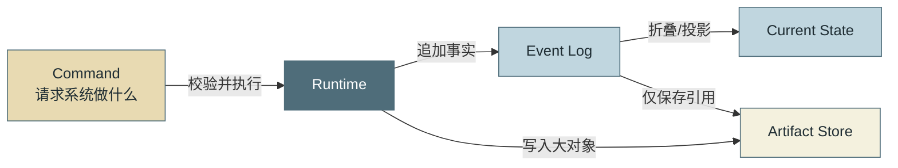

## 2.4 运行时设计的五条底层原则

### 原则一：模型输出是提案，不是授权

模型可以提出 `rm -rf`、数据库更新或网络请求，但是否允许执行必须由确定性系统判定。

### 原则二：状态必须显式化

轮数、预算、重试、已批准操作、在途工具、Checkpoint、异步任务句柄等不能只藏在自然语言历史里。

### 原则三：事件是事实源，日志只是诊断文本

日志适合人读，事件适合机器消费。不要依赖正则从日志中恢复业务语义。

### 原则四：所有重试都必须有唯一责任方

SDK、工具适配器、Runtime、Worker 和 Workflow 不能同时重试同一个故障。

### 原则五：所谓“恰好一次”通常来自幂等与去重

分布式系统很难真正保证物理执行仅发生一次。生产系统通常实现的是：**消息可能至少投递一次，但业务效果只生效一次。**

---

# 3. Harness 六大件与生产级扩展

原章把 Harness 概括为六大件：

1. 循环引擎；
2. 上下文引擎；
3. 工具执行层；
4. 状态与恢复；
5. 事件总线；
6. 拦截与策略。

## 3.1 六大件架构图

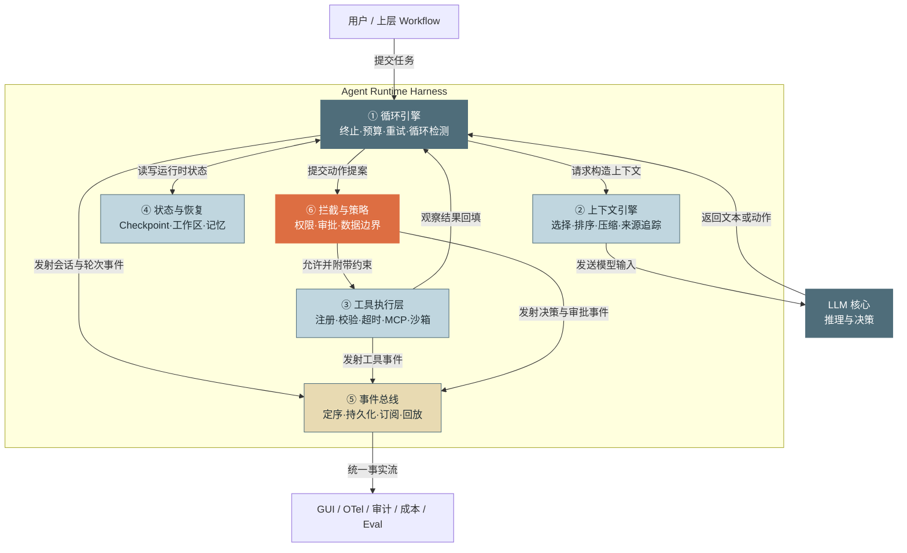

## 3.2 六大件不是六个孤立模块

生产事故往往发生在组件交界处：

- 工具执行成功，但事件没有持久化；
- Checkpoint 已写入状态文件，但文件树提交失败；
- GUI 发出取消命令，但工具进程没有响应；
- Context 压缩完成，但恢复时使用了旧压缩版本；
- 权限审批通过，但恢复后工作区和原审批语境已经变化；
- 模型响应已产生费用，但 `turn_end` 未发射，成本台账少算。

因此，架构的重点不只是“有这些模块”，而是定义模块间的**契约、不变式和事务边界**。

## 3.3 从六大件扩展为十二个生产模块

六大件是认知框架；真正落地时通常拆成十二个可替换模块：

| 模块 | 关键接口 | 核心产物 |
|---|---|---|
| API / Channel Adapter | `submit / stream / pause / resume / cancel` | 命令与流式响应 |
| Session Manager | `create / load / transition` | 会话状态机 |
| Admission & Scheduler | `admit / enqueue / lease / preempt` | 运行许可与 Worker 分配 |
| Loop Kernel | `run_turn / stop / interrupt` | 推理—行动循环 |
| Context Engine | `assemble / compact / verify` | 带来源的模型上下文 |
| Model Gateway | `complete / stream / normalize_usage` | 统一模型响应 |
| Policy Engine | `evaluate / request_approval` | 允许、拒绝或约束决策 |
| Tool Runtime | `prepare / execute / cancel / reconcile` | 受控工具结果 |
| Sandbox Manager | `provision / limit / destroy` | 隔离环境与资源配额 |
| State & Checkpoint | `snapshot / restore / fork / migrate` | 可恢复状态 |
| Event Backbone | `append / subscribe / replay` | 有序运行时事实 |
| Telemetry & Governance | `project / aggregate / retain` | Trace、Metric、Audit、Cost、Eval |

---

# 4. 总体架构：四个平面与十二个核心模块

生产架构最好按职责拆成四个平面，而不是把所有代码都塞进“Agent Service”。

## 4.1 四平面架构

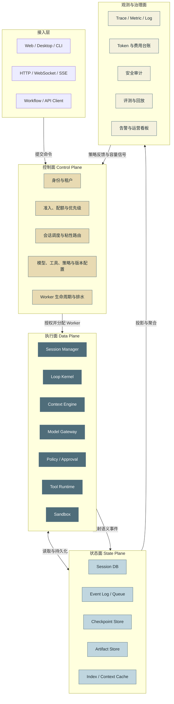

## 4.2 控制面与执行面为什么必须分开

执行面需要：

- 低延迟；
- 高吞吐；
- 处理流式 Token；
- 快速调用工具；
- 尽量减少全局锁与远程配置读取。

控制面需要：

- 强治理；
- 全局视图；
- 配额与公平调度；
- 版本与策略发布；
- Worker 排水和故障转移。

把二者混在一起，会出现两个典型问题：

1. 每次 Token 或工具调用都访问全局配置数据库，执行路径变慢且脆弱。
2. Worker 本地状态反过来成为全局事实，导致扩缩容、迁移和恢复困难。

一个稳健的做法是：**控制面下发不可变的运行配置快照，执行面在会话开始时绑定版本，运行中只接受显式变更命令。**

## 4.3 Ports & Adapters：让运行时核心不依赖外部实现

Runtime 核心应依赖抽象端口，而不是直接依赖某个模型 SDK、Kafka、Git 或 Docker。

```mermaid
flowchart LR
    subgraph ADAPTER_IN["输入适配器"]
        HTTP["HTTP API"]
        WS["WebSocket"]
        CLI["CLI / PTY"]
        JOB["Job / Workflow"]
    end

    subgraph CORE["Runtime Domain Core"]
        APP["Application Services"]
        DOMAIN["Session / Loop / Policy<br/>领域模型与不变式"]
        PORTS["Ports<br/>Model·Tool·State·Event·Sandbox"]
        APP --> DOMAIN --> PORTS
    end

    subgraph ADAPTER_OUT["输出适配器"]
        MODEL["OpenAI / Anthropic / Local Model"]
        MCP["MCP / Native Tools"]
        STORE["SQLite / Postgres / Object Store"]
        BUS["In-memory / Kafka / NATS"]
        BOX["Process / Container / WASM Sandbox"]
    end

    ADAPTER_IN -->|"命令"| APP
    PORTS -->|"调用抽象接口"| ADAPTER_OUT

    classDef core fill:#4F6D7A,stroke:#4F6D7A,color:#ffffff
    classDef adapter fill:#C0D6DF,stroke:#4F6D7A,color:#1f2d33
    class APP,DOMAIN,PORTS core
    class HTTP,WS,CLI,JOB,MODEL,MCP,STORE,BUS,BOX adapter
```

建议至少抽象以下端口：

```python
from __future__ import annotations

from collections.abc import AsyncIterator, Mapping, Sequence
from dataclasses import dataclass
from typing import Any, Protocol


@dataclass(frozen=True, slots=True)
class ModelChunk:
    kind: str
    data: Mapping[str, Any]


class ModelPort(Protocol):
    async def stream(
        self,
        *,
        messages: Sequence[Mapping[str, Any]],
        tools: Sequence[Mapping[str, Any]],
        request_meta: Mapping[str, Any],
    ) -> AsyncIterator[ModelChunk]: ...


class ToolPort(Protocol):
    async def execute(
        self,
        *,
        call_id: str,
        name: str,
        arguments: Mapping[str, Any],
        idempotency_key: str,
    ) -> Mapping[str, Any]: ...


class CheckpointPort(Protocol):
    async def create(self, manifest: Mapping[str, Any]) -> str: ...
    async def restore(self, checkpoint_id: str) -> Mapping[str, Any]: ...


class EventPort(Protocol):
    async def append(self, event: Mapping[str, Any]) -> None: ...
```

## 4.4 关键依赖方向

必须保持以下依赖方向：

```text
UI / API / CLI
      ↓
Application Service
      ↓
Domain Core
      ↓
Ports
      ↓
Infrastructure Adapters
```

领域层不能反向 import 某个厂商 SDK。否则模型替换、离线测试和故障注入都会变得困难。

---

# 5. 运行时领域模型与执行语义

Agent 系统最容易出现“大家都在说会话，但指的不是同一件事”。生产系统必须给每一层对象明确命名。

## 5.1 标识层级

推荐使用以下层级：

| 对象 | 含义 | 是否可跨恢复保持 | 示例 |
|---|---|---:|---|
| `tenant_id` | 租户或组织 | 是 | `tenant_acme` |
| `user_id` | 发起用户 | 是 | `user_42` |
| `task_id` | 业务任务，可能经历多次尝试 | 是 | `task_fix_123` |
| `session_id` | 一条可持续对话与工作现场 | 是 | `sess_01J...` |
| `run_id` | 一次从运行到暂停/结束的尝试 | 否，恢复后新建 | `run_01J...` |
| `turn_id` | 一次模型推理轮次 | 是 | `turn_00017` |
| `step_id` | 运行时内部可观测步骤 | 是 | `step_plan_17` |
| `call_id` | 一次模型声明的工具调用 | 是 | `call_abc` |
| `attempt_id` | 同一逻辑调用的某次物理尝试 | 否 | `attempt_03` |
| `checkpoint_id` | 一个可恢复一致性点 | 是 | `ckpt_turn_17` |
| `event_id` | 一个不可变事件 | 是 | `evt_01J...` |

关键区别：

- **逻辑操作 ID** 必须在重试和恢复后保持不变，例如 `call_id`。
- **物理尝试 ID** 每次重试都变化，例如 `attempt_id`。
- 如果把二者混在一起，系统无法区分“新操作”和“旧操作的重试”。

## 5.2 Task、Session 与 Run

### Task

Task 是业务层目标，例如“修复 issue #123 并提交补丁”。一个 Task 可能：

- 创建多个平行 Session 做方案探索；
- 因失败进行多次 Run；
- 最终被取消、失败或完成。

### Session

Session 是可恢复的逻辑工作现场，通常绑定：

- 对话历史；
- 工作区；
- Context 与 Memory 版本；
- 工具集合；
- 策略快照；
- Checkpoint 时间线；
- 事件序列。

### Run

Run 是 Session 的一次活跃执行区间：

```text
Session 创建
  └─ Run #1：运行 → 用户暂停
  └─ Run #2：恢复 → Worker 崩溃
  └─ Run #3：恢复 → 成功完成
```

把 `session_id` 和 `run_id` 分开，才能正确统计：

- 会话总耗时；
- 每次恢复的启动成本；
- Worker 崩溃次数；
- 首次运行成功率和最终成功率。

## 5.3 Turn、Step 与 Action

- **Turn**：一次完整的模型请求与响应周期。
- **Step**：运行时内部的一个阶段，例如 `assemble_context`、`invoke_model`、`execute_tools`、`checkpoint`。
- **Action**：模型决定执行的外部动作，例如调用工具。

一个 Turn 可以包含多个并行 Tool Action，也可以完全没有工具调用。

## 5.4 核心不变式

生产级运行时至少应固化以下不变式：

### I1：单会话事件序号严格递增

```text
next_event.seq = previous_event.seq + 1
```

恢复后序号不能从零开始。

### I2：工具调用与结果必须配对

每个已接受的 `tool_call(call_id)` 最终必须对应以下之一：

- `tool_succeeded(call_id)`；
- `tool_failed(call_id)`；
- `tool_cancelled(call_id)`；
- `tool_unknown(call_id)`，表示副作用结果需要人工或对账确认。

不能让调用永远停在“执行中”。

### I3：预算只能消耗，不能因恢复重置

Token、费用、轮数、时间和工具次数都应保持单调消耗。

### I4：同一 Session 同一时刻只能有一个状态写入者

可以有多个观察者，但不能有两个 Worker 同时推进同一条时间线。

### I5：Checkpoint 必须对应一个安全点

不能在存在未配对工具调用、半写入状态或未决审批时，把状态标记为“可直接恢复”。

### I6：有副作用工具必须具备幂等或对账能力

若既不能幂等，又不能查询最终结果，也不能补偿，则崩溃后无法安全自动恢复。

### I7：策略决策必须绑定上下文

批准记录不能只写“允许执行 shell”，而应至少绑定：

- 工具名；
- 规范化参数或参数模式；
- 工作区/资源范围；
- 策略版本；
- 过期时间；
- 发起用户与会话。

---

# 6. Agent 会话状态机

状态机不是 UI 状态枚举，而是恢复、调度和权限决策的共同契约。

## 6.1 推荐状态

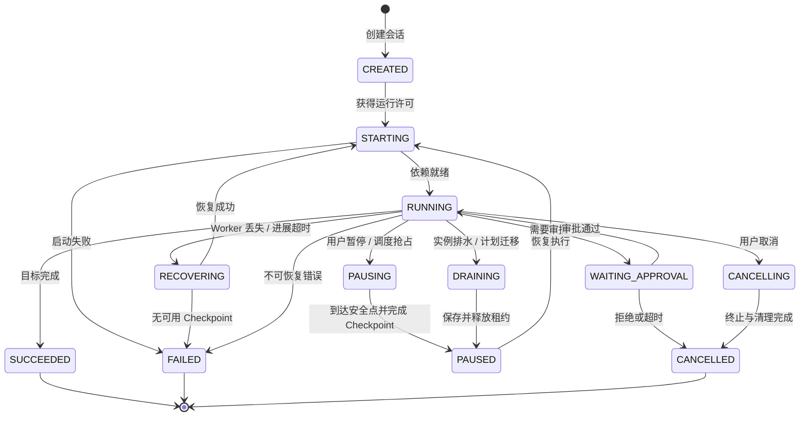

## 6.2 状态与命令矩阵

| 当前状态 | 允许命令 | 不允许命令 |
|---|---|---|
| `CREATED` | start、cancel | pause、resume |
| `STARTING` | cancel | start、resume |
| `RUNNING` | pause、cancel、inject_message | resume、start |
| `WAITING_APPROVAL` | approve、deny、cancel | pause 通常转为 cancel 或挂起审批 |
| `PAUSED` | resume、cancel、fork | pause |
| `RECOVERING` | cancel、operator_fail | resume、再次 recover |
| 终态 | replay、fork、archive | 改写原时间线 |

## 6.3 暂停与取消不是同义词

### 暂停 Pause

目标是未来继续：

1. 停止发起新模型调用和新工具调用；
2. 等待或安全中断当前只读操作；
3. 对写操作完成回填或进入 `unknown` 对账状态；
4. 到达安全点；
5. 创建 Checkpoint；
6. 发射 `session.paused`；
7. 释放 Worker 租约。

### 取消 Cancel

目标是永久结束当前时间线：

1. 传播取消信号；
2. 中止可中止操作；
3. 对不可逆在途操作进行对账；
4. 记录最终状态；
5. 冲刷事件；
6. 清理临时资源；
7. 发射 `session.cancelled`。

### 强制终止 Kill

Kill 是运维兜底，不是正常产品功能。强制终止后，Session 应进入 `RECOVERING` 或 `FAILED_NEEDS_RECONCILIATION`，而不是假装“已取消”。

---

# 7. 一轮 Agentic Loop 的完整执行链路

## 7.1 标准时序

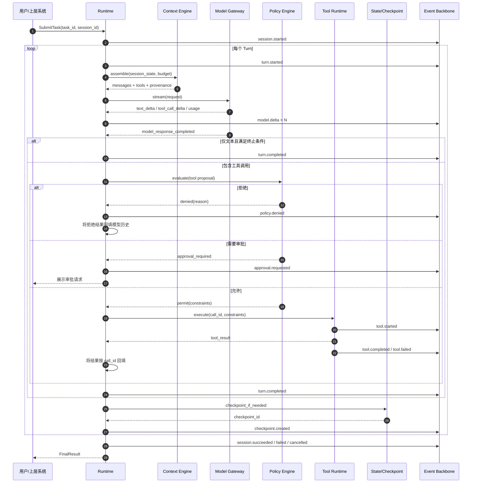

## 7.2 循环内的阶段划分

推荐把一轮拆成明确阶段：

```text
BEGIN_TURN
  → ASSEMBLE_CONTEXT
  → INVOKE_MODEL
  → PARSE_RESPONSE
  → VALIDATE_ACTIONS
  → AUTHORIZE_ACTIONS
  → EXECUTE_ACTIONS
  → RECONCILE_RESULTS
  → UPDATE_STATE
  → EMIT_TURN_END
  → CHECKPOINT
END_TURN
```

每个阶段都应具备：

- 开始与结束事件；
- 超时；
- 错误分类；
- 可观测耗时；
- 是否可安全重试；
- 是否属于 Checkpoint 安全点。

## 7.3 循环伪代码

```python
async def run_session(ctx: RuntimeContext) -> FinalResult:
    await ctx.events.emit("session.started", payload=ctx.start_payload())

    try:
        while True:
            ctx.budget.assert_available()
            ctx.cancellation.raise_if_cancelled()

            turn = ctx.state.begin_turn()
            await ctx.events.emit("turn.started", payload={"turn": turn.number})

            assembled = await ctx.context_engine.assemble(
                state=ctx.state,
                budget=ctx.budget.context_budget(),
            )

            response = await ctx.model_gateway.invoke(
                messages=assembled.messages,
                tools=assembled.tools,
                cancellation=ctx.cancellation,
            )
            ctx.budget.consume(response.usage)

            decision = ctx.loop_policy.classify(response)

            if decision.is_final:
                ctx.state.accept_final(response)
                await ctx.events.emit("turn.completed", payload=turn.payload(response))
                await ctx.checkpoints.create_safe_point(ctx.state)
                await ctx.events.emit("session.succeeded", payload=ctx.final_payload())
                return ctx.final_result()

            tool_results = await ctx.tool_coordinator.execute_all(
                calls=decision.tool_calls,
                state=ctx.state,
                cancellation=ctx.cancellation,
            )
            ctx.state.append_tool_results(tool_results)

            await ctx.events.emit("turn.completed", payload=turn.payload(response))
            await ctx.checkpoints.create_safe_point(ctx.state)

    except PauseRequested:
        await ctx.lifecycle.pause_at_safe_point(ctx)
        raise
    except CancelRequested:
        await ctx.lifecycle.cancel(ctx)
        raise
    except Exception as exc:
        await ctx.lifecycle.fail_or_recover(ctx, exc)
        raise
```

这段伪代码有意没有在最外层写一个泛化“无限重试”。恢复与重试必须依据错误层级、幂等能力和预算进行。

---

# 8. 集成现成 Agent 的五种方式

企业通常不会永远从裸模型开始。你可能要接入一个成熟 CLI、一个 Agent SDK、一个远程 Agent 服务，或者保留自研 Runtime。真正的选型变量不是“哪个 API 看起来更简单”，而是：

> **进程边界、状态所有权、事件所有权、权限边界和升级责任分别掌握在谁手里。**

## 8.1 五种集成形态

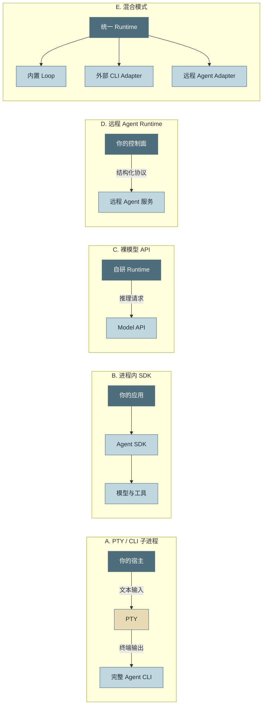

## 8.2 详细对比

| 维度 | PTY / CLI | SDK 嵌入 | 裸模型 API | 远程 Agent 服务 | 混合模式 |
|---|---|---|---|---|---|
| 上手速度 | 快 | 中 | 慢 | 快 | 中 |
| Harness 所有权 | 外部产品 | 双方共享 | 完全自有 | 服务端持有 | 按 Adapter 划分 |
| 结构化事件 | 通常弱，依赖 CLI 输出 | 通常较好 | 完全自定义 | 取决于协议 | 可统一归一化 |
| 生命周期控制 | 进程信号、PTY 输入 | SDK API | 完全自定义 | RPC 命令 | 统一命令映射 |
| 状态恢复 | 依赖 CLI 能力 | 依赖 SDK 暴露 | 完全自建 | 服务端负责 | 需统一恢复语义 |
| 工具注入 | 受 CLI 机制限制 | 较强 | 最强 | 受远端平台限制 | 分级支持 |
| 权限控制 | 宿主外层拦截，内部较黑盒 | Hook / Callback | 完全自建 | 双边策略 | 统一策略 + Adapter 约束 |
| 升级风险 | 输出格式漂移 | SDK API 漂移 | 模型行为漂移 | 服务协议漂移 | 复杂度最高 |
| 运行隔离 | 天然进程隔离 | 需自行隔离 | 自行设计 | 服务端隔离 | 可按类型选择 |
| 适合场景 | POC、桌面封装、快速接入 | 产品化定制 | Runtime 是核心竞争力 | SaaS 化能力复用 | 多供应商统一平台 |

## 8.3 PTY 子进程：看似简单，实际是协议适配

PTY 的优点是可以快速复用完整 CLI 产品，但不能把它当成普通 `subprocess`。

### PTY 集成需要处理的细节

- ANSI 转义序列、光标移动、清屏和进度动画；
- 行缓冲与字符缓冲差异；
- 终端尺寸变化；
- 交互式确认提示；
- Ctrl-C、EOF、SIGTERM 与强制 Kill；
- 子进程树回收，而不只是杀主进程；
- CLI 输出格式升级导致解析漂移；
- 终端文本与结构化事实之间的语义鸿沟；
- Windows ConPTY、Unix PTY 等平台差异；
- 进程已退出但输出读取线程未退出的死锁。

### 最佳实践：双通道

如果外部 CLI 支持扩展，最好建立两条通道：

1. **PTY 通道**：保留人类可读交互与兼容性；
2. **结构化事件通道**：JSONL、Unix Socket、本地 HTTP 或命名管道。

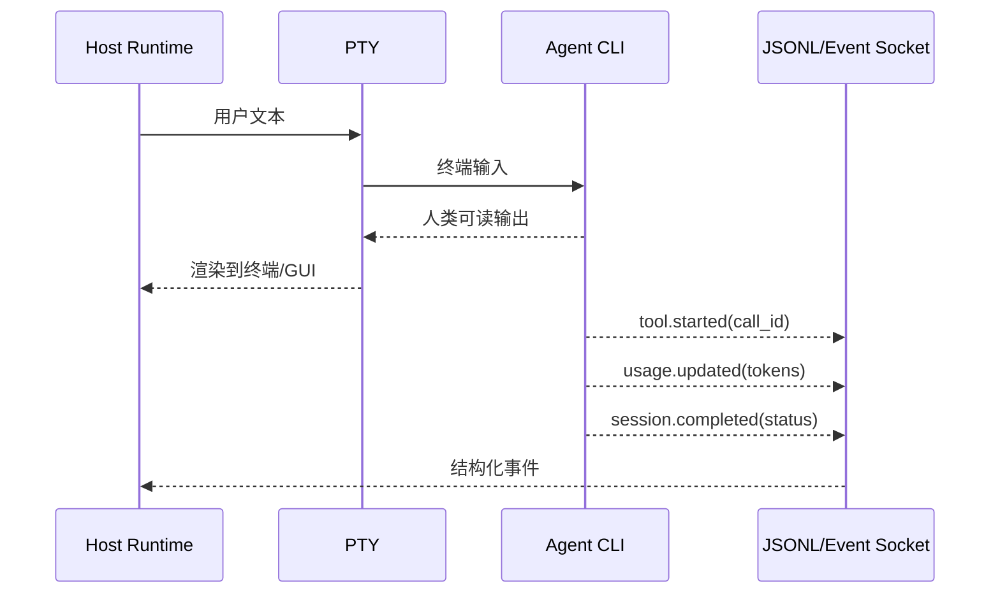

仅从终端文本中用正则猜测 `tool_call`、Token 和最终状态，长期一定会变脆。

## 8.4 SDK 嵌入：默认的产品化选择

SDK 模式适合需要以下能力的系统：

- 自定义工具注册；
- Hook / Guardrail；
- 流式事件回调；
- 自定义存储；
- 会话恢复；
- 自定义 UI；
- 对模型或工具调用做统一观测。

但 SDK 嵌入不等于没有边界。仍需增加 Anti-Corruption Layer，把供应商对象转换成内部契约：

```python
class VendorAgentAdapter:
    """把供应商 SDK 事件归一化为内部 RuntimeEvent。"""

    def normalize_event(self, vendor_event: object) -> "RuntimeEvent":
        # 禁止把供应商事件对象直接传播到领域层和数据库。
        ...

    def normalize_usage(self, vendor_usage: object) -> "Usage":
        # 保留原始字段，同时生成内部统一字段。
        ...
```

内部数据库不要直接存某个 SDK 的 Python 类序列化结果，否则升级 SDK 时历史状态难以迁移。

## 8.5 裸模型 API：最大控制力，也承担全部责任

裸 API 只提供推理能力。你需要自行实现：

- Tool Calling 解析；
- Context Window 管理；
- Prompt / Skill / Hook；
- 预算与终止；
- 状态和 Checkpoint；
- 权限与审批；
- 事件、观测和成本；
- 并发、重试、故障恢复；
- 沙箱和多租户隔离。

它适合以下情况：

- Harness 本身就是核心产品；
- 需要跨多个模型供应商保持一致语义；
- 对数据边界、审计或私有部署要求极高；
- 需要深度控制工具、记忆、上下文和运行时调度。

## 8.6 远程 Agent 服务

远程 Agent 服务提供完整 Runtime，你通过 HTTP/gRPC/WebSocket 调用。重点不再是进程管理，而是协议契约：

- 是否支持稳定的 `session_id` 与恢复；
- 是否提供事件重放，而不仅是实时流；
- 是否能明确暂停、取消与超时；
- 工具在客户端还是服务端执行；
- Secrets 和工作区位于哪一侧；
- 数据保留、地域和租户隔离；
- 供应商是否支持幂等提交；
- 网络断开后如何重新订阅；
- 费用和 Token 是否提供可核对明细。

## 8.7 混合模式：统一平台的现实答案

统一 Agent 平台经常同时支持：

- 内置自研 Agent；
- 本地 CLI Agent；
- 云端 Agent 服务；
- SDK 型 Agent；
- Workflow 节点型 Agent。

此时不要试图让它们“内部实现完全一致”，而应定义一个**最小公共运行时契约**：

```text
create_session
start_run
stream_events
pause
resume
cancel
provide_approval
get_state
list_checkpoints
restore_checkpoint
collect_usage
```

然后为每个 Adapter 声明能力矩阵：

| 能力 | 内置 Runtime | CLI Adapter | SDK Adapter | Remote Adapter |
|---|---:|---:|---:|---:|
| 精确暂停 | ✅ | 视 CLI 而定 | 视 SDK 而定 | 视协议而定 |
| Checkpoint 恢复 | ✅ | 可能仅保存 CLI 会话 | 通常可扩展 | 服务端负责 |
| 结构化工具事件 | ✅ | 可能降级 | 通常支持 | 通常支持 |
| 自定义策略 | ✅ | 外层策略为主 | Hook + 外层 | 双边策略 |
| 工作区分叉 | ✅ | 需宿主实现 | 可实现 | 取决于远端 |

**能力缺失必须显式暴露，不能用“接口返回成功但实际不支持”来伪装统一。**

---

# 9. 生命周期：启动、健康、暂停、取消与优雅退出

Agent 会话往往持续数分钟甚至数小时，且伴随外部进程、工作区、模型流和工具调用。它更接近有状态流处理 Worker，而不是普通无状态 HTTP 请求。

## 9.1 启动阶段拆分

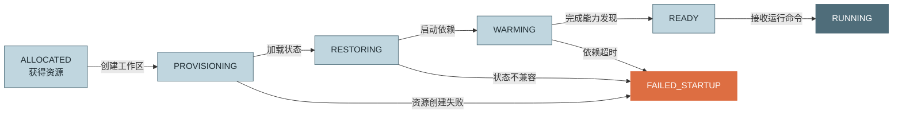

启动链路通常包括：

1. 分配 Worker、CPU、内存、磁盘与并发槽位；
2. 创建或挂载工作区；
3. 加载会话状态与最近 Checkpoint；
4. 准备模型客户端和凭据；
5. 启动 MCP Server、LSP、索引器或本地 Sidecar；
6. 恢复事件序号、预算、工具注册表和策略版本；
7. 完成健康检查；
8. 发射 `run.ready`。

## 9.2 冷启动预算

不要只记录“启动耗时”，应拆成阶段指标：

```text
T_ready = T_queue
        + T_worker_allocate
        + T_workspace_mount
        + T_checkpoint_restore
        + T_dependency_start
        + T_index_warmup
        + T_context_prepare
```

建议为不同任务类型设置不同 SLO。例如：

- 纯问答会话不应等待 LSP 全仓索引；
- Coding Agent 可以先进入 Ready，再异步预热索引；
- 需要强一致代码导航的任务则必须等待索引版本匹配。

## 9.3 三级预热

| 级别 | 预热内容 | 优点 | 成本 |
|---|---|---|---|
| 进程级 | Worker、模型连接池、通用 MCP | 会话启动快 | 常驻资源占用 |
| 项目级 | 仓库、LSP、符号索引、RAG 索引 | Coding 首轮快 | 需缓存失效策略 |
| 会话级 | Memory 召回、Context 前缀、工具权限 | 首次推理快 | 容易产生无效预取 |

## 9.4 健康检查不只有 Liveness

| 探针 | 回答的问题 | 失败后的动作 |
|---|---|---|
| `startup` | 进程是否完成初始化 | 延迟其他探针，超时则重启 |
| `liveness` | 进程是否还能执行基本代码 | 重启进程 |
| `readiness` | 是否能接收新任务 | 从路由摘除，不一定重启 |
| `progress` | 当前会话是否持续推进 | 中断、对账或恢复 |
| `dependency` | 模型、存储、MCP 是否可用 | 降级、熔断或拒绝新任务 |
| `capacity` | 是否还有并发、内存、磁盘预算 | 限流与排队 |

### 进展探针为什么必要

进程可能仍然存活，HTTP 健康接口也能响应，但某个 Session 已经卡住：

- 等待永不返回的工具；
- SSE 连接半开；
- 子进程 stdout 管道死锁；
- 审批状态丢失；
- 事件消费者阻塞主循环；
- 模型流结束帧丢失。

进展探针不应只看“距离最后一条事件多久”，还应结合当前阶段：

```python
PROGRESS_TIMEOUTS = {
    "invoke_model": 180,
    "execute_read_tool": 60,
    "execute_build": 900,
    "waiting_approval": None,   # 等待人类时不能判死
    "checkpoint": 120,
}
```

## 9.5 进展事件与心跳

长工具不能十分钟没有任何事件。可以发射低频心跳：

```json
{
  "type": "tool.progress",
  "payload": {
    "call_id": "call_123",
    "phase": "compiling",
    "completed": 431,
    "total": 1200,
    "message": "正在编译第 431/1200 个目标"
  }
}
```

心跳需要低频、可丢弃，避免事件风暴。

## 9.6 优雅退出顺序

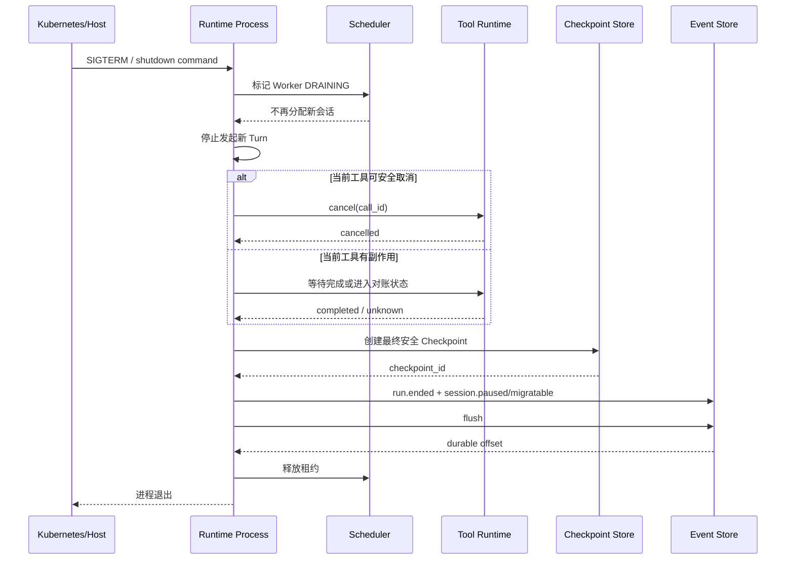

Kubernetes 的终止宽限时间包含 PreStop 与进程退出过程，不能把全部时间都留给应用清理；实际值应覆盖最长不可中断工具、对账、Checkpoint 和事件冲刷的总和。[^k8s-lifecycle]

### 退出期限计算

```text
termination_grace
≥ T_pre_stop
+ max(T_inflight_non_cancelable_tool)
+ T_reconcile
+ T_checkpoint
+ T_event_flush
+ safety_margin
```

若最长工具可能运行一小时，不应简单把宽限期设为一小时。更好的设计是：

- 长工具异步化；
- 工具返回外部任务句柄；
- Runtime 保存句柄后即可 Checkpoint；
- 恢复后继续轮询任务状态。

## 9.7 子进程树与强制回收

Agent Runtime 经常启动 shell、MCP、LSP、浏览器和构建进程。退出时必须管理整个进程树：

1. 先发软取消；
2. 等待短暂宽限；
3. 向进程组发送终止信号；
4. 继续等待；
5. 最后强制 Kill；
6. 记录是否发生强制终止；
7. 将相关工具调用标记为 `unknown` 或 `cancelled`，而不是无条件 `failed`。

---

# 10. 会话调度、亲和性、租约与背压

单机 Demo 可以创建一个协程直接运行；生产系统必须面对多用户、多会话、不同优先级和有限资源。

## 10.1 调度链路

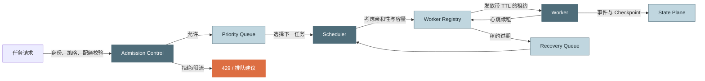

## 10.2 Admission Control：先决定能不能运行

准入控制负责在进入队列前判断：

- 用户和租户是否有权限；
- 并发配额是否足够；
- Token/费用预算是否可用；
- 所需模型是否可用；
- 工作区和数据地域是否匹配；
- 所需工具与沙箱是否可提供；
- 请求体和附件是否超过限制；
- 当前系统是否处于降级模式。

不要等任务排队十分钟后才发现租户余额不足或工具在该地域不可用。

## 10.3 优先级与公平性

纯优先级队列会饿死低优先级任务。推荐组合：

- 租户级加权公平队列；
- 队列内优先级；
- 等待时间 Aging；
- 每租户并发上限；
- 全局突发容量；
- 高优先级任务的预留槽位。

一个简单的调度分数可以是：

\[
score = w_p \cdot priority
      + w_a \cdot waiting\_time
      + w_f \cdot affinity
      - w_c \cdot estimated\_cost
\]

其中 `affinity` 表示目标 Worker 是否已经缓存该项目、索引和模型连接。

## 10.4 粘性路由

有状态 Session 最适合继续落到原 Worker，因为原 Worker 可能持有：

- 已挂载工作区；
- 热 LSP 索引；
- MCP 进程；
- 模型连接；
- 本地 Context Cache；
- 未持久化但可重建的派生状态。

但粘性不能成为不可迁移。正确关系是：

```text
优先亲和原 Worker
    ↓ 原 Worker 不可用
从最新安全 Checkpoint 恢复到新 Worker
```

## 10.5 租约与单写者

调度器不要只在数据库里写 `worker_id`。应发放带版本和过期时间的租约：

```text
lease = {
  session_id,
  run_id,
  worker_id,
  lease_epoch,
  expires_at
}
```

每次 Worker 写状态或事件时携带 `lease_epoch`。状态存储拒绝旧 epoch 的写入，从而避免“旧 Worker 网络恢复后继续写”的脑裂。

### SQL 风格的租约获取

```sql
UPDATE session_leases
SET worker_id = :worker_id,
    lease_epoch = lease_epoch + 1,
    expires_at = :new_expiry
WHERE session_id = :session_id
  AND (expires_at < :now OR worker_id = :worker_id)
RETURNING lease_epoch;
```

实际实现需要事务和行锁，或使用支持 Compare-And-Set 的协调存储。

## 10.6 抢占必须发生在安全点

高优先级任务到来时，不能在任意机器指令处暂停低优先级 Agent。推荐的可抢占点：

- 一个 Turn 结束后；
- 工具调用结果已回填后；
- 长异步工具已返回任务句柄后；
- Checkpoint 完成后。

不可安全抢占的情况：

- 写工具已发出但结果未知；
- 文件树与会话状态正在两阶段提交；
- 审批结果正在落盘；
- 正在迁移或恢复。

## 10.7 背压的三层位置

### 入口背压

- 限制请求速率；
- 返回排队位置；
- 提供预计不是时间承诺，而是负载级别；
- 拒绝超大任务。

### 运行时背压

- 限制并行工具数；
- 限制并行模型请求数；
- 对同一仓库限制写操作并发；
- 动态降低低优先级任务的并行度。

### 事件背压

- 流式 delta 可合并或丢弃中间帧；
- 审计和成本事件不可丢，应持久化排队；
- Webhook 超时不能阻塞 Loop；
- 队列达到上限时触发降级或停止接收新任务。

## 10.8 过载时的正确降级顺序

建议从低价值、可恢复的功能开始降级：

1. 降低 UI Token delta 刷新频率；
2. 关闭非必要实时分析消费者；
3. 延后低优先级 Eval；
4. 降低低优先级会话并行工具数；
5. 拒绝新低优先级任务；
6. 保留运行中副作用操作、Checkpoint、审计和成本数据；
7. 最后才暂停存量会话。

---

# 11. 状态分类与一致性边界

“把 messages 存起来”远远不等于可恢复。应先按恢复价值对状态分类。

## 11.1 四类状态

| 类别 | 定义 | 示例 | 恢复策略 |
|---|---|---|---|
| **权威持久状态** | 丢失会破坏不变式 | 事件 seq、预算、工具逻辑状态、Checkpoint 映射 | 必须同步或可靠持久化 |
| **可重建派生状态** | 可从权威数据计算 | 当前 UI 视图、聚合指标、Context Cache | 丢失后重算 |
| **短暂运行状态** | 仅在本 Run 有意义 | 网络连接、协程、文件句柄 | 恢复时重新创建 |
| **外部世界状态** | Runtime 不能直接回滚 | 数据库写入、工单、支付、邮件 | 幂等、查询、对账或补偿 |

## 11.2 推荐的 SessionState

```python
from __future__ import annotations

from dataclasses import dataclass, field
from enum import StrEnum
from typing import Any


class SessionStatus(StrEnum):
    CREATED = "created"
    RUNNING = "running"
    WAITING_APPROVAL = "waiting_approval"
    PAUSED = "paused"
    RECOVERING = "recovering"
    SUCCEEDED = "succeeded"
    FAILED = "failed"
    CANCELLED = "cancelled"


@dataclass(slots=True)
class BudgetState:
    max_turns: int
    used_turns: int = 0
    max_input_tokens: int = 0
    used_input_tokens: int = 0
    max_output_tokens: int = 0
    used_output_tokens: int = 0
    max_cost_micros: int = 0
    used_cost_micros: int = 0


@dataclass(slots=True)
class ToolCallState:
    call_id: str
    name: str
    arguments_digest: str
    idempotency_key: str
    status: str
    attempt_count: int = 0
    external_operation_id: str | None = None
    result_artifact_id: str | None = None


@dataclass(slots=True)
class SessionState:
    schema_version: int
    tenant_id: str
    task_id: str
    session_id: str
    run_id: str
    status: SessionStatus
    config_snapshot_id: str
    policy_snapshot_id: str
    event_seq: int
    turn_number: int
    messages: list[dict[str, Any]] = field(default_factory=list)
    budget: BudgetState | None = None
    tool_calls: dict[str, ToolCallState] = field(default_factory=dict)
    approved_grants: list[dict[str, Any]] = field(default_factory=list)
    async_handles: list[dict[str, Any]] = field(default_factory=list)
    latest_checkpoint_id: str | None = None
```

## 11.3 状态中必须保留配置快照

会话运行中，管理员可能修改：

- 模型版本；
- System Prompt；
- 工具定义；
- Skill；
- 权限策略；
- 费用单价；
- Context 压缩算法。

若恢复时直接读取“当前最新配置”，同一 Session 的行为会突然变化。应保存：

- `config_snapshot_id`；
- `policy_snapshot_id`；
- `tool_registry_version`；
- `prompt_bundle_digest`；
- `runtime_build_version`。

是否允许升级配置，应通过显式迁移命令完成，并产生事件。

## 11.4 状态版本迁移

Checkpoint 不能只写一个 Python pickle。推荐使用稳定格式和显式 Schema：

```json
{
  "schema_version": 3,
  "runtime_version": "1.8.0",
  "min_reader_version": "1.6.0",
  "session": {"...": "..."}
}
```

迁移规则：

1. 小版本新增可选字段，旧 Reader 可忽略；
2. 删除字段或改变语义必须提升 Schema；
3. 迁移函数必须可测试；
4. 迁移前保留原 Checkpoint；
5. 不支持的未来版本必须 fail-fast；
6. 禁止静默填充会改变安全语义的默认值。

## 11.5 Secrets 不应直接进入 Checkpoint

Checkpoint 中只保存 Secret 引用：

```json
{
  "credential_ref": "vault://tenant-acme/model-provider/default"
}
```

恢复时重新鉴权并读取。否则：

- Checkpoint 复制会扩散 Secrets；
- 轮换后历史明文仍存在；
- Shadow Git 对象难以彻底擦除；
- 运维人员访问恢复包即获得凭据。

## 11.6 一致性边界

可以把一次安全 Turn Commit 看成以下逻辑事务：

```text
模型响应与 usage 已确定
工具结果已全部进入终态或可恢复状态
消息历史已回填
预算已扣减
事件 seq 已推进
工作区已快照
Checkpoint manifest 已提交
turn.completed 已持久化
```

这些数据可能分布在不同介质中，无法用一个数据库事务覆盖。此时应使用“准备—提交—恢复校验”的协议，而不是假设天然原子。

---

# 12. Checkpoint：创建、恢复、分叉与迁移

Checkpoint 的目标不是“备份一下”，而是建立一个**可验证的恢复一致性点**。

## 12.1 RPO 与 RTO

- **RPO（Recovery Point Objective）**：崩溃后最多丢多少进度。
- **RTO（Recovery Time Objective）**：多久能恢复继续运行。

每轮都 Checkpoint，RPO 小但写放大大；只在会话结束 Checkpoint，几乎无法恢复。需要按任务价值和副作用风险调整。

## 12.2 Checkpoint 触发策略

| 触发点 | 是否强制 | 原因 |
|---|---:|---|
| Session 首次开始 | 建议 | 保留初始现场 |
| 每个 Turn 安全边界 | 可配置 | 控制 RPO |
| 高风险写操作前 | 强制 | 保留操作前现场 |
| 高风险写操作后已对账 | 强制 | 固化副作用结果 |
| Context 压缩后 | 建议 | 压缩是信息形态变化 |
| 用户暂停 | 强制 | 恢复契约 |
| Worker 排水/迁移 | 强制 | 跨机恢复 |
| 定时阈值 | 建议 | 长工具或长推理任务 |
| 会话结束 | 强制 | 归档与回放 |

## 12.3 Checkpoint 内容清单

### 会话状态

- messages；
- 当前状态机状态；
- 轮数、预算和费用；
- 事件序号；
- 重试与循环检测账本；
- 工具调用状态；
- 异步任务句柄；
- 审批与授权记录；
- Context 压缩摘要与来源；
- Memory/RAG 引用版本；
- 配置和策略快照 ID。

### 工作现场

- 工作区文件树；
- 允许保存的未跟踪文件；
- 补丁与构建配置；
- 必要的索引版本指针；
- 大对象引用。

### 恢复元数据

- Checkpoint Schema；
- Runtime 版本；
- 父 Checkpoint；
- 分支/时间线 ID；
- 内容摘要；
- 创建原因；
- 完整性校验；
- 加密和租户信息。

## 12.4 Shadow Git 方案

Shadow Git 的核心思想是：

- `--git-dir` 指向 Runtime 管理的影子仓库；
- `--work-tree` 指向 Agent 实际工作区；
- 用户自己的 `.git` 与影子仓库互不依赖；
- 每次安全点将文件树 commit；
- 状态 JSON 和 commit hash 通过 manifest 绑定。

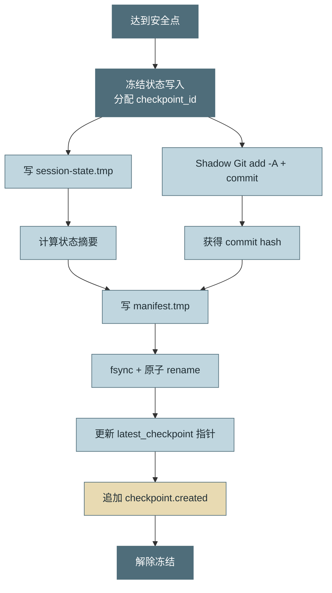

## 12.5 为什么要用 Manifest

不要只创建：

```text
turn-17.json
turn-17.ref
```

更稳健的是一个不可变 Manifest：

```json
{
  "checkpoint_id": "ckpt_01J...",
  "session_id": "sess_01J...",
  "timeline_id": "main",
  "parent_checkpoint_id": "ckpt_prev",
  "created_at": "2026-08-31T08:30:00Z",
  "reason": "turn_boundary",
  "state": {
    "uri": "file:///.../state.json",
    "sha256": "...",
    "schema_version": 3
  },
  "workspace": {
    "driver": "shadow_git",
    "commit": "a1b2c3d4",
    "ignore_profile": "coding-v2"
  },
  "artifacts": [
    {"artifact_id": "art_42", "sha256": "..."}
  ],
  "event_seq": 417,
  "runtime_version": "1.8.0",
  "status": "committed"
}
```

Manifest 是状态文件、文件树、事件位置和运行版本之间的“钉子”。

## 12.6 两阶段创建协议

### 阶段一：Prepare

- 分配 `checkpoint_id`；
- 冻结 Session 单写者；
- 序列化状态到临时文件；
- 创建工作区快照；
- 计算摘要；
- 写入 `status=prepared` 的临时 Manifest。

### 阶段二：Commit

- 原子发布 Manifest；
- 更新 `latest_checkpoint_id`；
- 追加 `checkpoint.created` 事件；
- 解除冻结。

若进程在 Prepare 后崩溃，恢复器扫描并清理未提交临时对象。若更新 latest 指针后事件未写入，恢复时可以根据 Manifest 补发事件，但必须使用同一 `event_id` 或恢复专用事件，避免重复语义。

## 12.7 恢复算法

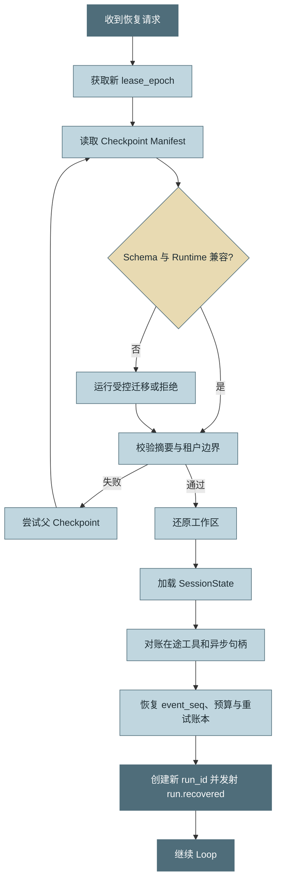

恢复不是简单反序列化，还需要：

1. 获得新的写租约；
2. 校验 Checkpoint 完整性；
3. 检查版本兼容；
4. 还原文件树并清理检查点后新增文件；
5. 恢复事件 seq；
6. 恢复预算和重试计数；
7. 对账所有 `RUNNING/UNKNOWN` 工具；
8. 重新获取 Secrets；
9. 重新建立模型、MCP、LSP 等短暂资源；
10. 创建新的 `run_id`，保持原 `session_id`。

## 12.8 Shadow Git 的常见陷阱

### 未跟踪文件

必须使用 `git add -A`，并通过测试验证新建文件可恢复。

### `.gitignore` 语义

用户仓库的 `.gitignore` 不一定适合运行时恢复。建议影子库使用独立忽略策略：

- 排除依赖目录；
- 排除构建产物；
- 排除大二进制；
- 排除 Secrets；
- 但保留 Agent 新建的源码和配置。

### 大文件

对大文件使用对象存储，Git 中仅保存内容寻址指针：

```json
{
  "path": "data/model.bin",
  "artifact_ref": "sha256:...",
  "size": 734003200
}
```

### 删除文件

恢复时仅执行 `checkout <ref> -- .` 不会删除 Checkpoint 之后新增的文件。通常需要受控执行 `reset --hard` 与 `clean`，并确保工作区边界绝不会指错。

## 12.9 文件恢复不等于外部世界回滚

Checkpoint 无法自动撤销：

- 已发送的邮件；
- 已创建的工单；
- 已写入数据库的记录；
- 已触发的部署；
- 已调用的支付；
- 已向外部 API 提交的任务。

因此，外部副作用必须配套：

- 幂等键；
- 外部操作 ID；
- 查询状态 API；
- 补偿操作；
- 人工对账流程。

## 12.10 分叉、回放与迁移

### 分叉 Fork

从 Checkpoint 创建新 `timeline_id`：

```text
main: ckpt-1 → ckpt-2 → ckpt-3
                       ├─ experiment-a → ckpt-a4
                       └─ experiment-b → ckpt-b4
```

适用于：

- 并行尝试两种修复方案；
- 事故前现场重放；
- Arena 式候选方案比较；
- Eval 的反事实实验。

### 回放 Replay

回放有三种模式：

1. **UI 回放**：只按事件重建界面，不调用模型和工具；
2. **确定性回放**：使用录制的模型和工具结果验证状态折叠；
3. **再执行回放**：重新调用模型或工具，用于评测，不保证结果一致。

### 跨机迁移

迁移包至少包含：

- Checkpoint Manifest；
- 状态对象；
- Shadow Git 增量或工作区快照；
- Artifact 引用；
- 配置与策略版本；
- 最新事件 offset；
- 必需的租户和加密元数据。

## 12.11 保留与垃圾回收

推荐分层保留：

- 最近 N 个全保；
- 中期按每 M 轮抽稀；
- 高风险操作前后永久标记；
- 会话结束保留首、尾和人工标记点；
- 过期后删除 Manifest 引用，再做对象引用计数 GC；
- Shadow Git 定期 repack，但避免影响运行中会话。

Checkpoint 是完整对话和工作区的敏感数据面，必须具备租户隔离、加密、访问审计和生命周期策略。

---

# 13. 事件模型：运行时事实的统一协议

事件模型是 Runtime 的脊柱。GUI、Trace、Metric、成本、审计、Webhook、Eval 和回放都应来自同一份运行时事实，而不是分别侵入 Loop。

## 13.1 事件不是日志

```text
日志："tool grep completed in 42ms"
事件：{
  type: "tool.completed",
  call_id: "call_123",
  duration_ms: 42,
  result_ref: "artifact://...",
  ...
}
```

日志可以改变文案；事件是跨组件契约。

## 13.2 推荐事件外壳

```python
from dataclasses import dataclass
from datetime import datetime
from typing import Any, Mapping


@dataclass(frozen=True, slots=True)
class RuntimeEvent:
    event_id: str
    event_type: str
    schema_version: int
    occurred_at: datetime

    tenant_id: str
    task_id: str
    session_id: str
    run_id: str
    seq: int

    source: str
    subject: str
    correlation_id: str
    causation_id: str | None

    trace_id: str | None
    classification: str
    payload: Mapping[str, Any]
```

### 字段说明

| 字段 | 作用 |
|---|---|
| `event_id` | 全局去重与审计 |
| `event_type` | 稳定语义名称，例如 `agent.tool.completed` |
| `schema_version` | 载荷版本 |
| `occurred_at` | 事实发生时间，不等于入库时间 |
| `session_id + seq` | 单会话定序 |
| `run_id` | 区分恢复前后的执行尝试 |
| `correlation_id` | 关联同一业务任务或请求链 |
| `causation_id` | 指明哪个命令或事件导致当前事件 |
| `trace_id` | 与分布式 Trace 关联 |
| `classification` | 数据分级，如 public/internal/confidential |
| `payload` | 类型特定业务载荷 |

## 13.3 与 CloudEvents 的关系

CloudEvents 提供跨服务的标准事件外壳，当前稳定核心规范为 1.0.2。内部 Runtime 可以保持更强的领域 Schema，再在跨服务出口映射为 CloudEvents，避免内部语义被传输规范绑死。[^cloudevents]

映射示例：

| Runtime 字段 | CloudEvents 字段 |
|---|---|
| `event_id` | `id` |
| `event_type` | `type` |
| `source` | `source` |
| `subject` | `subject` |
| `occurred_at` | `time` |
| `schema_version` | `dataschema` 或扩展属性 |
| `payload` | `data` |
| `session_id` | 扩展属性 `sessionid` |
| `seq` | 扩展属性 `sequence` |
| `trace_id` | Trace Context 扩展/协议 Header |

## 13.4 事件命名

推荐使用领域前缀和过去式事实：

```text
agent.session.started
agent.run.ready
agent.turn.started
agent.model.requested
agent.model.completed
agent.tool.proposed
agent.policy.denied
agent.approval.requested
agent.tool.started
agent.tool.progressed
agent.tool.completed
agent.checkpoint.created
agent.session.paused
agent.session.succeeded
```

不要用模糊名称：

```text
update
message
status_changed
callback
result
```

## 13.5 事件层级

### 会话级

- `session.created`
- `session.started`
- `session.paused`
- `session.resumed`
- `session.cancelled`
- `session.succeeded`
- `session.failed`

### Run 级

- `run.allocated`
- `run.ready`
- `run.draining`
- `run.recovered`
- `run.ended`

### Turn 级

- `turn.started`
- `context.assembled`
- `model.requested`
- `model.delta`
- `model.completed`
- `turn.completed`

### Tool 级

- `tool.proposed`
- `tool.authorized`
- `tool.started`
- `tool.progressed`
- `tool.completed`
- `tool.failed`
- `tool.cancelled`
- `tool.unknown`

### 治理级

- `policy.evaluated`
- `policy.denied`
- `approval.requested`
- `approval.granted`
- `budget.warning`
- `budget.exhausted`
- `checkpoint.created`
- `recovery.started`

## 13.6 因果关系

仅靠时间排序无法说明“为什么发生”。例如：

```text
command PauseSession(cmd-9)
  → event session.pause_requested(evt-10)
  → event tool.cancel_requested(evt-11)
  → event tool.cancelled(evt-12)
  → event checkpoint.created(evt-13)
  → event session.paused(evt-14)
```

其中 `causation_id` 构成因果链，`correlation_id` 将它们归入同一业务操作。

## 13.7 顺序保证

推荐保证：

- 单 Session 内 `seq` 严格递增；
- 同一 `call_id` 的工具生命周期遵守状态机；
- 跨 Session 不承诺全局顺序；
- 事件发生时间可能与入库顺序不同；
- 消费者必须按 `(session_id, seq)` 检查空洞和重复。

并行工具结果应由 Session 单写者在回填时分配 seq，而不是让多个工具线程直接争抢全局顺序。

## 13.8 大对象只存引用

事件中不应直接放：

- 完整仓库补丁；
- 数 MB 的工具 stdout；
- 截图和音频；
- 全量 Prompt；
- 大型检索文档。

推荐：

```json
{
  "event_type": "agent.tool.completed",
  "payload": {
    "call_id": "call_123",
    "summary": "发现 7 个测试失败",
    "result_ref": "artifact://tenant/session/art_789",
    "sha256": "...",
    "size": 1820342
  }
}
```

## 13.9 事件 Schema 的兼容规则

1. 新增字段应优先为可选字段；
2. 改变字段含义必须提升版本；
3. 枚举新增值时，消费者必须有 unknown 分支；
4. 删除字段前先统计消费者使用情况；
5. 生产者必须在发射处校验必填字段；
6. 未知未来版本不能静默按旧版本解释；
7. Event Schema 与 UI ViewModel 分离。

## 13.10 隐私与数据分级

事件默认会进入多个系统，因此必须在源头标注：

- `public`：无敏感数据；
- `internal`：内部运行数据；
- `confidential`：可能含代码、Prompt、工具参数；
- `restricted`：凭据、个人数据或高敏业务数据。

对 Prompt、Completion 和工具参数应默认摘要化或 Opt-In 采集。OpenTelemetry 的 GenAI 语义约定也将部分完整内容字段视为需要显式选择的高敏遥测；而且相关 Agent 语义约定仍处于演进状态，因此内部事件协议不应直接等同于某个版本的 OTel 属性集合。[^otel-genai]

---

# 14. 异步事件总线、投递语义与持久化

教程中的同步 `for handler in subscribers` 可以说明概念，但生产系统不能让慢消费者阻塞 Agent Loop。

## 14.1 三类消费者，三种 QoS

| 消费者 | 关注点 | 可否丢失 | 可否延迟 | 推荐通道 |
|---|---|---:|---:|---|
| GUI 实时渲染 | 低延迟 | 中间 delta 可丢 | 低 | 内存有界队列 + SSE/WS |
| 观测、成本、审计 | 完整性 | 不应丢 | 可迟到 | 持久化日志/消息队列 |
| Webhook / 外部联动 | 子集事件 | 不应静默丢 | 可重试 | Outbox + 重试 + DLQ |
| Eval / 离线分析 | 可回放 | 不应丢关键事件 | 高 | Event Store / Data Lake |

## 14.2 投递语义

### At-most-once

最多一次，可能丢。适合：

- UI 中间 Token delta；
- 高频进度刷新；
- 非关键调试事件。

### At-least-once

至少一次，可能重复。适合：

- 审计；
- 成本；
- Webhook；
- 状态投影。

消费者必须以 `event_id` 去重。

### Effectively-once

底层仍可能重复投递，但通过：

- 不可变 `event_id`；
- 消费者 Inbox；
- 幂等更新；
- 单调 offset；

让最终业务效果只发生一次。

## 14.3 异步事件总线参考实现

```python
from __future__ import annotations

import asyncio
from collections.abc import Awaitable, Callable
from dataclasses import dataclass
from enum import StrEnum


class OverflowPolicy(StrEnum):
    BLOCK = "block"
    DROP_NEWEST = "drop_newest"
    DROP_OLDEST = "drop_oldest"
    COALESCE = "coalesce"


EventHandler = Callable[["RuntimeEvent"], Awaitable[None]]


@dataclass(slots=True)
class Subscription:
    name: str
    queue: asyncio.Queue["RuntimeEvent"]
    handler: EventHandler
    accepted_types: set[str] | None
    overflow: OverflowPolicy
    worker_task: asyncio.Task[None] | None = None


class AsyncEventBus:
    def __init__(self) -> None:
        self._subscriptions: list[Subscription] = []
        self._closed = False

    async def subscribe(
        self,
        *,
        name: str,
        handler: EventHandler,
        max_queue: int,
        overflow: OverflowPolicy,
        accepted_types: set[str] | None = None,
    ) -> None:
        sub = Subscription(
            name=name,
            queue=asyncio.Queue(maxsize=max_queue),
            handler=handler,
            accepted_types=accepted_types,
            overflow=overflow,
        )
        sub.worker_task = asyncio.create_task(self._consume(sub), name=f"event:{name}")
        self._subscriptions.append(sub)

    async def publish(self, event: "RuntimeEvent") -> None:
        if self._closed:
            raise RuntimeError("event bus is closed")

        for sub in self._subscriptions:
            if sub.accepted_types is not None and event.event_type not in sub.accepted_types:
                continue
            await self._offer(sub, event)

    async def _offer(self, sub: Subscription, event: "RuntimeEvent") -> None:
        if not sub.queue.full():
            sub.queue.put_nowait(event)
            return

        if sub.overflow == OverflowPolicy.BLOCK:
            await sub.queue.put(event)
        elif sub.overflow == OverflowPolicy.DROP_NEWEST:
            return
        elif sub.overflow == OverflowPolicy.DROP_OLDEST:
            _ = sub.queue.get_nowait()
            sub.queue.task_done()
            sub.queue.put_nowait(event)
        elif sub.overflow == OverflowPolicy.COALESCE:
            # 生产实现应按 session_id + event_type 合并进度类事件，
            # 不能简单清空所有事件。
            return

    async def _consume(self, sub: Subscription) -> None:
        while True:
            event = await sub.queue.get()
            try:
                await sub.handler(event)
            except asyncio.CancelledError:
                raise
            except Exception as exc:
                # 真实实现应记录消费者失败、重试或写入 DLQ。
                print(f"consumer={sub.name} failed: {exc}")
            finally:
                sub.queue.task_done()

    async def close(self) -> None:
        self._closed = True
        for sub in self._subscriptions:
            await sub.queue.join()
        for sub in self._subscriptions:
            if sub.worker_task:
                sub.worker_task.cancel()
```

注意：关键审计和成本消费者不应只依赖进程内队列。应先将事件写入持久化 Event Store 或 Outbox，再异步分发。

## 14.4 持久化优先级

对于关键事件，推荐路径：

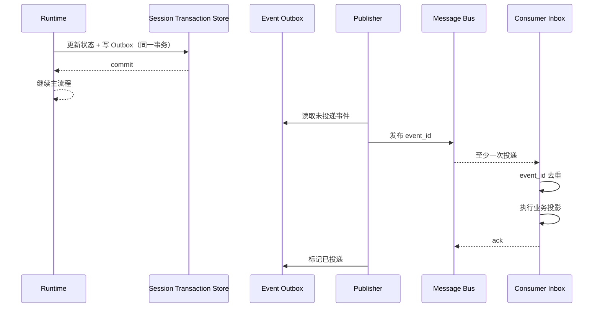

这解决“状态已更新但事件没发出”和“事件已发出但状态没提交”的双写问题。

## 14.5 UI 流的重连

SSE 或 WebSocket 断开后，客户端应携带最后已见位置：

```text
Last-Event-ID: sess_123:417
```

服务端：

1. 从 Event Store 回放 `seq > 417` 的关键事件；
2. 对高频 delta 可只回放聚合后的文本快照；
3. 再切换到实时订阅；
4. 若保留期已过，返回一个完整 Session View Snapshot。

## 14.6 Delta 合并

模型可能每几十毫秒产生一个 delta。直接全量持久化会造成巨大写放大。可以分层：

- 实时通道：原始 delta；
- 事件存储：按 100～500ms 合并；
- 会话快照：保存最终完整 assistant message；
- 调试模式：可选保存原始 chunk。

必须确保最终文本可由持久化数据完整重建。

## 14.7 Webhook 与死信

外部联动必须具备：

- 事件签名；
- HTTPS；
- 幂等 `event_id`；
- 指数退避；
- 最大重试次数；
- Dead Letter Queue；
- 人工重放；
- 租户级速率限制；
- SSRF 防护与目标白名单。

## 14.8 Event Store 是否等于 Event Sourcing

不一定。

- 你可以用 Event Store 做观测和回放，但 SessionState 仍是权威状态。
- 完整 Event Sourcing 要求所有状态均可由事件重建，设计成本更高。
- 对高价值、长生命周期 Runtime，可选择“关键状态 Event Sourcing + 大量遥测事件旁路”。

务实做法是：

```text
领域关键事件：可靠持久化，可重建核心状态
高频遥测事件：允许采样、聚合或分层保留
大对象：Artifact Store
当前查询：物化视图 / SessionState
```

---

# 15. 模型网关：屏蔽供应商差异

Model Gateway 不是简单包装 `client.chat.completions.create()`。它承担 Runtime 与模型供应商之间的反腐层，避免供应商差异扩散到 Loop、成本、观测和状态结构。

## 15.1 模型网关职责

- 统一请求模型；
- 统一流式 chunk；
- 统一文本、推理片段和工具调用增量；
- 保留供应商原始响应；
- 归一化 Token 与缓存使用量；
- 分类错误；
- 控制超时、重试、熔断和限流；
- 支持模型路由与降级；
- 生成稳定的 request/response ID；
- 对高敏 Prompt 与 Completion 执行采集策略；
- 记录价格版本，而不是用“当前价格”重算历史费用。

## 15.2 统一响应模型

```python
from dataclasses import dataclass, field
from typing import Any


@dataclass(frozen=True, slots=True)
class Usage:
    input_tokens: int
    output_tokens: int
    reasoning_tokens: int | None = None
    cache_read_input_tokens: int | None = None
    cache_write_input_tokens: int | None = None
    raw: dict[str, Any] = field(default_factory=dict)


@dataclass(frozen=True, slots=True)
class NormalizedToolCall:
    call_id: str
    name: str
    arguments_json: str


@dataclass(frozen=True, slots=True)
class ModelResponse:
    provider: str
    requested_model: str
    resolved_model: str
    provider_request_id: str | None
    text: str
    tool_calls: tuple[NormalizedToolCall, ...]
    stop_reason: str
    usage: Usage
    raw_ref: str | None
```

不要把不同供应商的 `finish_reason`、`usage` 和 Tool Call 格式直接传播到领域层。

## 15.3 流式响应状态机

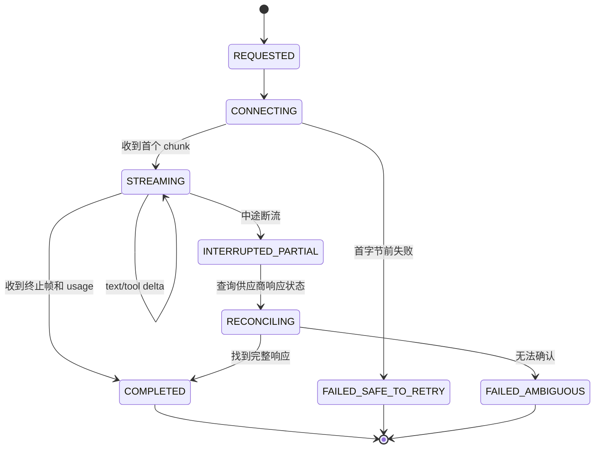

### 首字节前失败与中途断流不同

- 连接建立前或首字节前失败，通常可安全重试同一模型请求。
- 已收到部分文本或工具参数后断流，直接重试可能产生不同回答或新的工具调用。
- 如果供应商支持按响应 ID 查询，应先对账。
- 若无法对账，可将当前 Turn 标为 `ambiguous`，由 Loop 决定丢弃部分输出、重新请求或人工介入。

## 15.4 请求幂等

模型推理通常不是传统意义上的副作用，但重复调用会产生：

- 重复费用；
- 不同结果；
- 不同工具调用；
- UI 重复内容。

因此仍应生成内部 `model_request_id`，并维护：

```text
(session_id, turn_id, model_request_id)
```

如果供应商支持幂等键或可查询请求 ID，应传递并持久化。

## 15.5 错误分类

| 错误 | 示例 | 默认处理 |
|---|---|---|
| 参数错误 | Context 超限、非法工具 Schema | 不重试，修复请求 |
| 身份错误 | Key 失效、权限不足 | 不自动重试，切换凭据需显式策略 |
| 速率限制 | 429 | 读取 Retry-After，带预算退避 |
| 供应商瞬时错误 | 5xx | Gateway 层有限重试 |
| 网络连接错误 | DNS、握手、连接重置 | 首字节前可重试 |
| 中途断流 | 已收到 delta | 对账后决定 |
| 内容安全拒绝 | 安全策略触发 | 作为语义结果，不当作普通网络故障 |
| 模型不存在 | 路由配置漂移 | 熔断该路由，控制面告警 |

## 15.6 重试预算

不要让 429 在 SDK、Gateway、Runtime 和 Workflow 四层各重试三次，最终放大为 81 次请求。

Model Gateway 应接收一个剩余重试预算：

```python
@dataclass(slots=True)
class RetryBudget:
    max_attempts: int
    max_elapsed_seconds: float
    consumed_attempts: int = 0
```

每次重试都应产生事件并消耗预算。

## 15.7 模型路由与降级

路由维度可以包括：

- 任务类型；
- 所需 Context 长度；
- Tool Calling 能力；
- 多模态能力；
- 数据地域；
- 租户白名单；
- 延迟 SLO；
- 预算；
- 当前供应商健康度。

降级不能仅按“主模型失败就换次模型”。需要判断语义兼容性：

- 工具 Schema 是否支持；
- System Prompt 是否针对特定模型；
- Context 是否超过备选模型窗口；
- 输出结构是否兼容；
- 安全策略是否一致；
- 缓存计价是否变化。

模型切换必须发射 `model.routed` 或 `model.fallback` 事件，并将实际模型写入 `turn.completed`。

## 15.8 Usage 与成本

始终保存：

1. 供应商原始 usage；
2. 内部统一 usage；
3. 实际 resolved model；
4. 价格表版本；
5. 币种；
6. 估算或最终账单状态。

不要只保存 `total_tokens`，否则无法分析输入、输出、推理和缓存成本。

## 15.9 Prompt 缓存

Prompt Cache 可能降低成本和延迟，但 Runtime 不能假设恢复后必然命中：

- Cache 可能有 TTL；
- 供应商可能按前缀和模型版本计算；
- 配置或工具 Schema 的细小变化会失效；
- 跨区域恢复可能不共享缓存。

因此，Cache 是优化，不是正确性基础。

## 15.10 测试替身

运行时测试不应依赖真实模型。至少提供：

- 固定响应模型；
- 流式 chunk 模型；
- 工具调用模型；
- 中途断流模型；
- 429 后成功模型；
- usage 缺失模型；
- 非法 Tool Call 参数模型；
- 超长输出模型。

---

# 16. 工具运行时：从函数调用到受控副作用

工具是 Agent 真正改变世界的地方，也是运行时风险最高的边界。

## 16.1 工具注册元数据

一个生产工具不能只有 `name + description + JSON Schema`。建议注册：

```python
@dataclass(frozen=True, slots=True)
class ToolDescriptor:
    name: str
    version: str
    description: str
    input_schema: dict
    output_schema: dict | None

    effect: str                 # read / local_write / external_write / destructive
    idempotency: str            # native / runtime_key / queryable / none
    cancellable: bool
    default_timeout_seconds: int
    max_timeout_seconds: int
    max_parallelism: int

    required_capabilities: tuple[str, ...]
    allowed_network_scopes: tuple[str, ...]
    data_classification: str
    implementation_digest: str
```

## 16.2 副作用分级

| 级别 | 示例 | 审批 | Checkpoint | 重试策略 |
|---|---|---:|---:|---|
| `READ_ONLY` | 搜索、读取文件、查询 API | 通常不需要 | 可选 | 瞬时错误可重试 |
| `LOCAL_REVERSIBLE` | 修改工作区文件 | 按范围 | 操作前后建议 | 可由文件快照恢复 |
| `EXTERNAL_IDEMPOTENT` | 带幂等键创建工单 | 通常需要策略许可 | 操作前后 | 可安全重试 |
| `EXTERNAL_QUERYABLE` | 外部任务可按 ID 查询 | 需要 | 操作前后 | 先查后重试 |
| `DESTRUCTIVE_REVERSIBLE` | 删除有回收站资源 | 强审批 | 强制 | 优先补偿，不盲重试 |
| `IRREVERSIBLE` | 付款、永久删除、发布生产 | 强审批/双人复核 | 强制 | 不自动重试，必须对账 |

## 16.3 工具调用状态机

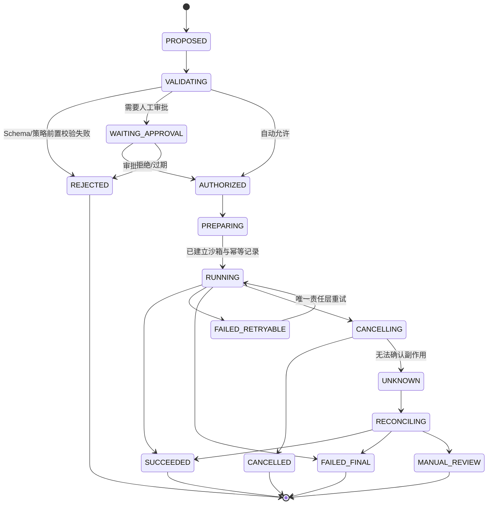

## 16.4 执行前校验

Tool Runtime 应按顺序执行：

1. 工具名称和版本存在；
2. 输入 JSON 可解析；
3. JSON Schema 校验；
4. 规范化路径、URL、命令与资源 ID；
5. 生成参数摘要；
6. 检查策略和能力；
7. 判断是否需要审批；
8. 生成幂等键；
9. 检查历史执行回执；
10. 创建沙箱和资源限额；
11. 发射 `tool.started`；
12. 执行。

## 16.5 参数规范化

幂等键不能直接基于原始 JSON 字符串，因为字段顺序、空白和路径表达可能不同。应先规范化：

```python
import hashlib
import json


def canonical_json(value: object) -> str:
    return json.dumps(value, ensure_ascii=False, sort_keys=True, separators=(",", ":"))


def make_idempotency_key(
    *, tenant_id: str, session_id: str, call_id: str,
    tool_name: str, tool_version: str, arguments: object,
) -> str:
    material = "|".join([
        tenant_id,
        session_id,
        call_id,
        tool_name,
        tool_version,
        canonical_json(arguments),
    ])
    return hashlib.sha256(material.encode("utf-8")).hexdigest()
```

注意：业务幂等键有时不应包含 `attempt_id`，否则每次重试都会变成新的业务操作。

## 16.6 Tool Execution Receipt

每次工具执行保存回执：

```json
{
  "idempotency_key": "sha256:...",
  "call_id": "call_123",
  "attempt_id": "attempt_2",
  "tool": "ticket.create@2.1.0",
  "arguments_digest": "sha256:...",
  "status": "succeeded",
  "started_at": "...",
  "completed_at": "...",
  "external_operation_id": "TICKET-9481",
  "result_ref": "artifact://...",
  "effect_summary": "创建工单 TICKET-9481"
}
```

恢复时先查 Receipt，再决定是否执行。

## 16.7 超时、Deadline 与取消

工具应接收绝对 Deadline，而不仅是一个独立 timeout：

```text
工具最大可用时间
= min(
    工具自身上限,
    当前 Turn 剩余时间,
    Session 剩余时间,
    宿主终止宽限期,
    用户请求 Deadline
  )
```

取消令牌应从 Session 传播到：

- 模型流；
- Tool Coordinator；
- 沙箱主进程；
- 子进程树；
- HTTP 请求；
- MCP Call；
- Artifact 上传。

但取消不是保证。对于已经提交的外部请求，需要查询结果或补偿。

## 16.8 重试归属

| 故障 | 责任层 | Runtime 是否再次重试 |
|---|---|---:|
| HTTP 连接瞬时失败 | Tool Adapter 内部 | 否，除非 Adapter 上报最终 retryable |
| 工具进程 OOM | Sandbox/Tool Runtime | 可按策略更换资源后重试 |
| 输入参数业务非法 | 不重试 | 否，应回填模型 |
| 外部 API 429 | Adapter | Runtime 不叠加同类重试 |
| Worker 崩溃 | Durable Executor | 恢复后查 Receipt |
| Agent 选择了错误工具 | Loop | 可把错误结果回填后重新推理 |

## 16.9 并行工具

并行仅适用于没有依赖和冲突的调用：

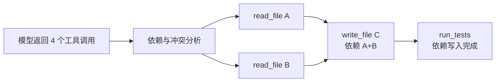

需要考虑：

- 两个工具是否写同一文件；
- 一个工具是否依赖另一个结果；
- 外部系统是否有速率限制；
- 工具输出回填顺序；
- 某个工具失败后是否取消兄弟调用；
- 并行结果如何占用 Context。

## 16.10 输出整形

工具输出要同时服务两类消费者：

### 给模型

- 简洁；
- 可判定成功/失败；
- 有关键字段；
- 有下一步建议；
- 大内容用引用；
- 对不可信内容加边界和来源标签。

### 给人类与审计

- 完整 stdout/stderr；
- 退出码；
- 耗时；
- 资源使用；
- 实际副作用；
- Artifact；
- 敏感字段脱敏。

推荐结构：

```json
{
  "ok": false,
  "error": {
    "category": "validation",
    "code": "FILE_NOT_FOUND",
    "message": "文件不存在",
    "retryable": false
  },
  "summary": "无法读取 src/a.py",
  "details_ref": "artifact://...",
  "observed_state": {
    "parent_exists": true,
    "suggested_candidates": ["src/app.py"]
  }
}
```

## 16.11 工具结果也是不可信输入

网页、代码仓、MCP Server 和命令输出可能包含 Prompt Injection。Runtime 应：

- 标注来源；
- 区分数据与指令；
- 不让工具输出自动提升权限；
- 对新出现的工具调用重新走策略；
- 限制工具结果中的隐藏控制标记；
- 对外部内容做大小、编码和类型校验。

## 16.12 MCP 在 Runtime 中的位置

MCP 是工具与资源协议，不是完整 Runtime。MCP Adapter 仍需接入：

- 工具注册表；
- 连接生命周期；
- Server 能力发现；
- 版本与信任策略；
- 超时、取消和重试；
- 输入输出 Schema 校验；
- 沙箱和网络策略；
- 事件与审计；
- Secrets 管理。

---

# 17. 沙箱、权限与资源隔离

**沙箱解决“即使允许执行，也只能在受限环境中执行”；策略解决“这次到底应不应该允许”。** 二者互补。

## 17.1 七层隔离

| 层 | 控制对象 | 示例 |
|---|---|---|
| 身份 | 进程以谁的身份运行 | 非 root、独立 UID、租户身份 |
| 文件系统 | 可读写哪些路径 | 工作区可写，宿主目录不可见 |
| 进程 | 可启动什么、能否看到邻居 | PID namespace、进程组、命令白名单 |
| 网络 | 可访问哪些地址与端口 | 默认拒绝、域名/服务白名单、代理 |
| Secrets | 哪些凭据可见 | 按工具短期注入，不落盘 |
| 资源 | CPU、内存、磁盘、进程数 | cgroup/Job Object/配额 |
| 时间与系统调用 | 最长运行和内核能力 | Deadline、seccomp、WASM 能力 |

## 17.2 策略决策链

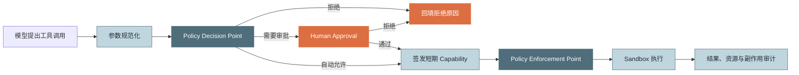

## 17.3 Capability 不等于布尔允许

一个许可应描述具体范围：

```json
{
  "capability_id": "cap_123",
  "tenant_id": "tenant_acme",
  "session_id": "sess_42",
  "tool": "shell.exec@1",
  "constraints": {
    "cwd_prefix": "/workspace/project-a",
    "command_prefixes": ["npm test", "cargo test"],
    "network": "deny",
    "max_seconds": 900,
    "max_output_bytes": 10485760
  },
  "policy_version": "policy-17",
  "expires_at": "2026-08-31T09:00:00Z"
}
```

执行层必须再次校验 Capability，不能只相信上游传来的 `approved=true`。

## 17.4 文件系统边界

至少要防止：

- `../` 路径逃逸；
- 符号链接穿越；
- 大小写和 Unicode 规范化绕过；
- 通过挂载点访问宿主文件；
- 写入运行时自身状态目录；
- 读取 SSH、云凭据和浏览器数据；
- 超大文件填满磁盘。

路径判断应基于解析后的真实路径和打开文件句柄，而不是字符串前缀比较。

## 17.5 网络出口

默认开放任意网络会带来：

- 数据外泄；
- SSRF；
- 扫描内网；
- 访问云元数据服务；
- 下载未审计二进制；
- 绕过工具层审计。

推荐通过 Egress Proxy：

- 域名与服务白名单；
- DNS 解析后再次校验 IP；
- 禁止私网和元数据地址；
- TLS 与证书校验；
- 请求大小和速率限制；
- 按 Session 记录网络审计；
- 必要时对高敏数据做 DLP。

## 17.6 Secrets 注入

最佳实践：

- Secrets 只在真正需要的工具执行窗口注入；
- 使用短期凭据；
- 限制到具体资源和动作；
- 不写入 Prompt、事件、日志、Checkpoint；
- stdout/stderr 做脱敏；
- 执行完成后撤销或过期；
- 审计“谁、在何会话、因何策略、使用了哪个 Secret 引用”。

## 17.7 资源限制

每个 Session 或工具调用应限制：

- CPU 时间；
- 内存；
- PIDs；
- 打开文件数；
- 临时磁盘；
- 工作区磁盘；
- 网络带宽；
- stdout/stderr 大小；
- 最长运行时间；
- 并发子进程数。

资源超限要产生明确事件，而不是统一成“工具失败”。

## 17.8 本地桌面与云端差异

| 维度 | 本地桌面 Agent | 云端 Worker |
|---|---|---|
| 用户文件 | 通常需要显式选择目录 | 由平台挂载受控工作区 |
| 隔离技术 | 子进程、系统权限、Tauri/OS 能力 | 容器、VM、WASM、K8s |
| 网络策略 | 宿主防火墙/代理较难统一 | Egress Policy 更可控 |
| Secrets | 可能来自系统 Keychain | Vault / Workload Identity |
| 资源管理 | OS 特定 API | cgroup / Pod 资源限制 |
| 信任边界 | 用户设备本身 | 多租户平台 |

无论本地还是云端，都不能因为“用户在自己电脑上运行”就放弃确认、审计和路径边界。

## 17.9 Fail Closed

以下情况默认拒绝：

- 策略服务不可用；
- 工具元数据缺失；
- Capability 过期；
- 参数无法规范化；
- 工作区边界不确定；
- Secret Scope 不匹配；
- Checkpoint 前置要求失败；
- 无法判定副作用等级。

只读、低风险能力可以设计受控降级，但必须显式配置。

---

# 18. Context、Memory、RAG 与 Runtime 的协作

Context Engine 负责“这一轮模型能看到什么”；Memory 负责“跨轮次或跨会话保留什么”；RAG 负责“从外部语料检索什么”；Runtime 负责决定它们何时运行、占多少预算、使用哪个版本并如何观测。

## 18.1 Context 组装流水线

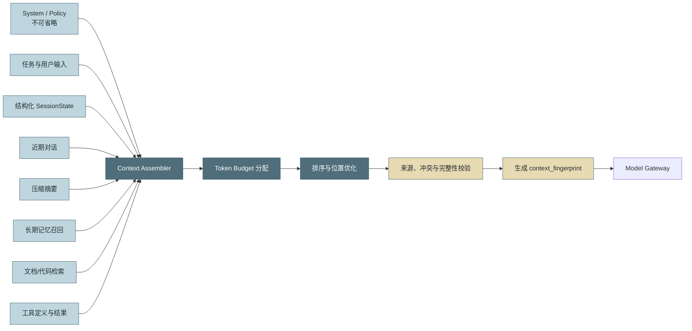

## 18.2 Context 是一个带预算的编译产物

不要把 Context 当字符串拼接。它应有构建报告：

```json
{
  "context_fingerprint": "sha256:...",
  "token_budget": 120000,
  "used_tokens_estimate": 104320,
  "sections": [
    {
      "kind": "system_policy",
      "required": true,
      "source_id": "policy-17",
      "digest": "...",
      "estimated_tokens": 4200
    },
    {
      "kind": "retrieved_code",
      "required": false,
      "source_id": "index-v42",
      "estimated_tokens": 18300
    }
  ],
  "dropped": [
    {"source_id": "doc-9", "reason": "budget_exhausted"}
  ]
}
```

## 18.3 预算分区

推荐预留：

```text
总 Context 窗口
- 最大输出预算
- System/Policy 固定预算
- 工具 Schema 预算
- 当前任务与结构化状态预算
- 历史/摘要预算
- Memory/RAG 可变预算
- 安全余量
```

必需内容不能与可选检索结果一起做简单 Top-K 竞争。

## 18.4 来源与冲突

每个注入片段应带：

- 来源；
- 抓取或生成时间；
- 版本；
- 权威等级；
- 内容摘要；
- 数据分类；
- 是否可信指令源。

当长期记忆与当前用户输入冲突时，通常应以当前明确输入为准，并记录冲突，而不是静默合并。

## 18.5 Context Fingerprint

Fingerprint 可以帮助：

- 解释模型为什么做出某个决定；
- 检测恢复后 Context 是否漂移；
- 评测同一任务在不同 Context 策略下的差异；
- 识别 Prompt Cache 失效；
- 关联模型请求与完整构建报告。

Fingerprint 应基于规范化后的内容引用、版本和顺序，而不是包含易变时间戳。

## 18.6 压缩与 Checkpoint

Context 压缩不是纯优化，它改变了未来模型可见事实。建议：

1. 发射 `context.compaction.started`；
2. 保存压缩前的消息范围；
3. 生成结构化摘要；
4. 做关键约束覆盖校验；
5. 发射 `context.compaction.completed`；
6. 创建 Checkpoint；
7. 将摘要版本写入 SessionState。

若压缩失败，不应直接删除原历史。

## 18.7 Memory 写入时机

长期记忆提取通常不应阻塞每个 Turn 的主路径，可采用：

- 会话结束异步提取；
- 达到轮数或 Token 阈值时后台提取；
- 用户显式保存；
- 高价值事实触发候选记忆；
- 先写候选区，经校验后晋升权威记忆。

但 Memory 写入事件和来源必须关联原 Session，以便删除、纠错和审计。

## 18.8 RAG 作为预处理还是工具

### 预处理型 RAG

每轮自动检索并注入。优点是模型无需主动调用；缺点是可能浪费预算和引入噪声。

### 工具型 RAG

模型通过 `search_docs` 主动检索。优点是按需；缺点是模型可能忘记调用。

### 混合型

- 首轮做轻量预检索；
- 深入问题由工具继续检索；
- Runtime 对检索次数和 Token 设预算；
- 所有结果带来源和索引版本。

## 18.9 恢复时的 Context 一致性

恢复后不要简单重新检索“最新数据”，否则模型可能看到与故障前不同的事实。按业务选择：

- **历史一致模式**：使用原检索结果 Artifact 和索引版本；
- **最新事实模式**：重新检索，并发射 `context.refreshed`；
- **混合模式**：保留原证据，同时增加最新变化。

---

# 19. Durable Execution：崩溃后继续，而不是从头再来

Checkpoint 解决“状态在哪里”；Durable Execution 还要解决“谁接管、哪些步骤重放、哪些副作用不能重复、历史如何推进”。成熟 Durable 系统通常依赖持久事件历史、可重放状态机和幂等 Activity。Temporal 等系统也强调 Worker 崩溃后的状态重建，以及 Activity 在重试下必须具备幂等性。[^temporal-workflow][^temporal-idempotency]

## 19.1 故障分层与唯一重试责任

| 故障层 | 示例 | 唯一责任方 |
|---|---|---|
| Transport | HTTP 连接、TLS、DNS | SDK / Transport Adapter |
| Provider | 429、短暂 5xx | Model/Tool Gateway |
| Tool Attempt | 子进程崩溃、临时文件锁 | Tool Runtime |
| Agent Step | 模型给出无效动作 | Loop Kernel |
| Worker | 进程 OOM、节点宕机 | Durable Executor |
| Task | 多次恢复仍无法完成 | Workflow / Operator |

## 19.2 至少一次执行的现实

考虑以下序列：

```text
Worker 调用外部 API
外部 API 已成功创建工单
Worker 在写回结果前崩溃
新 Worker 只看到工具状态仍为 RUNNING
```

新 Worker 无法知道外部操作是否成功。如果直接重试，可能创建第二个工单。因此需要：

- 幂等键；或
- 外部操作 ID；或
- 按业务键查询；或
- 对账队列；或
- 人工确认。

## 19.3 幂等执行表

```sql
CREATE TABLE idempotent_operations (
    tenant_id TEXT NOT NULL,
    idempotency_key TEXT NOT NULL,
    tool_name TEXT NOT NULL,
    arguments_digest TEXT NOT NULL,
    status TEXT NOT NULL,
    result_ref TEXT,
    external_operation_id TEXT,
    lease_epoch INTEGER NOT NULL,
    updated_at TEXT NOT NULL,
    PRIMARY KEY (tenant_id, idempotency_key)
);
```

执行逻辑：

```python
async def execute_effect_once(request: ToolRequest) -> ToolResult:
    record = await store.get(request.tenant_id, request.idempotency_key)

    if record and record.status == "succeeded":
        return await load_result(record.result_ref)

    if record and record.status in {"running", "unknown"}:
        reconciled = await adapter.reconcile(record.external_operation_id, request)
        if reconciled.is_final:
            return await store.complete_from_reconciliation(reconciled)
        raise ManualReconciliationRequired(request.idempotency_key)

    claimed = await store.claim(request)
    if not claimed:
        raise ConcurrentExecutionDetected(request.idempotency_key)

    try:
        result = await adapter.execute(request)
        await store.mark_succeeded(request, result)
        return result
    except AmbiguousCompletion as exc:
        await store.mark_unknown(request, exc.external_operation_id)
        raise
    except Exception:
        await store.mark_failed(request)
        raise
```

## 19.4 外部异步任务句柄

长操作最好转换为：

```text
submit → external_task_id → poll/watch → final result
```

SessionState 保存：

```json
{
  "kind": "external_task",
  "provider": "build-service",
  "external_task_id": "build-9481",
  "submitted_by_call_id": "call_123",
  "status": "running",
  "next_poll_after": "..."
}
```

Worker 可以安全退出，恢复后继续观察，而不是一直占用进程和终止宽限期。

## 19.5 租约、心跳与接管

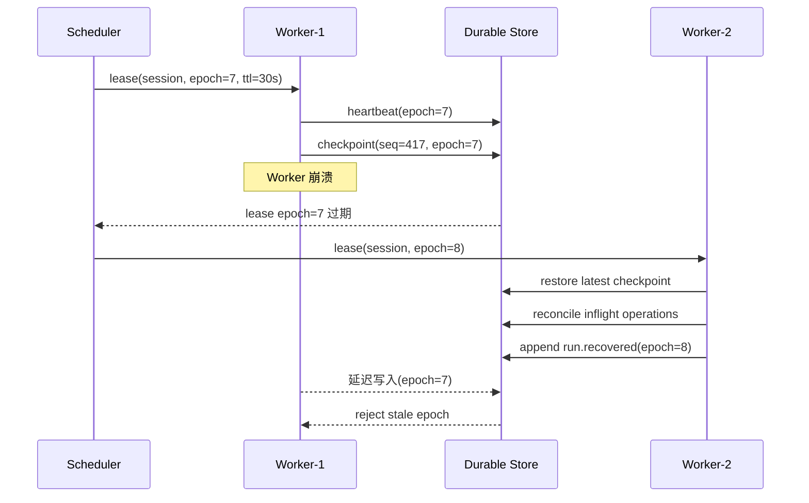

## 19.6 Outbox / Inbox

Outbox 解决业务状态与消息发布双写；Inbox 解决重复投递。二者是“有效恰好一次”的基础组件。

适用事件：

- 成本扣账；
- 工具副作用完成通知；
- 审批状态；
- 外部 Webhook；
- Workflow 节点推进；
- Session 终态。

## 19.7 Saga 补偿

多步骤不可逆流程，例如：

```text
创建分支 → 修改代码 → 提交 PR → 触发部署 → 更新工单
```

发生失败时，不一定能数据库事务回滚。可以为每步定义补偿：

| 正向步骤 | 补偿 |
|---|---|
| 创建临时分支 | 删除临时分支 |
| 创建草稿 PR | 关闭 PR |
| 创建测试环境 | 销毁环境 |
| 标记工单处理中 | 恢复原状态 |
| 发送通知 | 发送更正通知，无法“收回” |

Saga 是业务补偿，不保证回到物理上完全相同的世界。Temporal 的 Saga 设计资料也强调为前向 Activity 使用幂等键，并在失败时执行补偿。[^temporal-saga]

## 19.8 Retry、Circuit Breaker 与 Retry Storm

重试策略至少需要：

- 指数退避；
- 随机抖动；
- 最大次数；
- 最大总时间；
- 不可重试错误集合；
- 租户级与供应商级重试预算；
- Circuit Breaker；
- 全局 Retry Storm 保护。

当供应商大面积故障时，所有 Session 同时重试会加剧故障。应：

1. 快速熔断；
2. 排队而非立即重试；
3. 允许高优先级流量探测；
4. 使用半开状态；
5. 对恢复任务和新任务分别限流。

## 19.9 恢复决策树

```mermaid
flowchart TB
    F["检测到 Worker/Step 故障"] --> C{"存在安全 Checkpoint?"}
    C -->|"否"| FAIL["失败或人工处置"]
    C -->|"是"| INFLIGHT{"存在在途副作用?"}
    INFLIGHT -->|"否"| RESTORE["恢复并继续"]
    INFLIGHT -->|"是"| IDEM{"工具原生幂等?"}
    IDEM -->|"是"| RETRY["使用同一幂等键恢复/重试"]
    IDEM -->|"否"| QUERY{"可按业务键或外部 ID 查询?"}
    QUERY -->|"是"| RECON["对账最终状态"]
    QUERY -->|"否"| COMP{"存在可靠补偿?"}
    COMP -->|"是"| SAGA["执行补偿后再决定"]
    COMP -->|"否"| MANUAL["进入人工对账，禁止自动重试"]
    RECON -->|"已成功"| RECORD["补写回执并继续"]
    RECON -->|"未执行"| RETRY
    RECON -->|"仍不确定"| MANUAL

    classDef core fill:#4F6D7A,stroke:#4F6D7A,color:#ffffff
    classDef judge fill:#E8DAB2,stroke:#4F6D7A,color:#1f2d33
    classDef warn fill:#DD6E42,stroke:#DD6E42,color:#ffffff
    class RESTORE,RETRY,RECORD core
    class C,INFLIGHT,IDEM,QUERY,COMP judge
    class FAIL,MANUAL warn
```

## 19.10 Durable 不等于无限运行

可靠执行必须仍然有界：

- 最大恢复次数；
- 最大总墙钟时间；
- 最大 Token 与费用；
- 最大外部副作用次数；
- 最大人工等待时间；
- 最大事件历史与 Checkpoint 数；
- Dead Letter / Operator Queue。

---

# 20. 可观测性、成本与 SLO

事件是事实原料，OpenTelemetry、成本台账、审计和 Eval 是不同投影。不要在 Loop 中分别写四套埋点。

## 20.1 统一投影架构

```mermaid
flowchart LR
    E["Runtime Event Stream"] --> T["Trace Projector"]
    E --> M["Metric Projector"]
    E --> L["Structured Log Projector"]
    E --> C["Cost Ledger"]
    E --> A["Audit Ledger"]
    E --> V["Eval / Replay Dataset"]

    T --> OT["OpenTelemetry Backend"]
    M --> OT
    L --> OT
    C --> BI["FinOps / Billing"]
    A --> SEC["Security / Compliance"]
    V --> EVAL["Offline & Online Eval"]

    classDef source fill:#4F6D7A,stroke:#4F6D7A,color:#ffffff
    classDef projector fill:#C0D6DF,stroke:#4F6D7A,color:#1f2d33
    classDef sink fill:#E8DAB2,stroke:#4F6D7A,color:#1f2d33
    class E source
    class T,M,L,C,A,V projector
    class OT,BI,SEC,EVAL sink
```

## 20.2 推荐 Trace 层级

```text
invoke_agent / session.run
├─ context.assemble
│  ├─ memory.retrieve
│  └─ rag.search
├─ turn 1
│  ├─ model.chat
│  ├─ policy.evaluate
│  ├─ tool.execute
│  └─ checkpoint.create
├─ turn 2
│  ├─ model.chat
│  └─ ...
└─ session.finalize
```

当前 OpenTelemetry GenAI Agent 语义约定定义了诸如 `invoke_agent`、`invoke_workflow`、`plan`、`execute_tool` 等操作，但相关规范仍标记为 Development。内部 Runtime 应通过 Telemetry Adapter 做版本隔离，避免把尚在演进的属性名写成领域数据库的永久字段。[^otel-genai]

## 20.3 Event 到 Span 的映射

| 开始事件 | 结束事件 | Span | 关键属性 |
|---|---|---|---|
| `run.started` | `run.ended` | Agent Run | session、run、tenant、status |
| `turn.started` | `turn.completed` | Turn | turn、stop_reason、usage |
| `context.assembly.started` | `.completed` | Context | token estimate、source count |
| `model.requested` | `model.completed` | Model | provider、model、usage、TTFT |
| `tool.started` | `tool.completed/failed` | Tool | name、effect、retries、duration |
| `checkpoint.started` | `.created/failed` | Checkpoint | bytes、driver、duration |
| `recovery.started` | `.completed/failed` | Recovery | source checkpoint、RTO |

## 20.4 核心指标分类

### 成功与质量

- `agent_task_success_rate`
- `agent_task_first_run_success_rate`
- `agent_task_eventual_success_rate`
- `agent_task_human_intervention_rate`
- `agent_goal_completion_score`
- `agent_regression_pass_rate`

### 延迟

- `agent_queue_duration`
- `agent_time_to_ready`
- `agent_time_to_first_token`
- `agent_turn_duration`
- `agent_tool_duration`
- `agent_checkpoint_duration`
- `agent_recovery_duration`
- `agent_time_to_final_answer`

### 可靠性

- `agent_stuck_session_count`
- `agent_worker_crash_rate`
- `agent_recovery_success_rate`
- `agent_checkpoint_failure_rate`
- `agent_event_gap_count`
- `agent_duplicate_effect_prevented_count`
- `agent_unknown_side_effect_count`

### 工具

- `agent_tool_call_count`
- `agent_tool_error_rate`
- `agent_tool_retry_count`
- `agent_tool_denied_count`
- `agent_tool_approval_rate`
- `agent_tool_forced_kill_count`

### Context 与 Memory

- `agent_context_tokens`
- `agent_context_compaction_count`
- `agent_context_dropped_source_count`
- `agent_retrieval_latency`
- `agent_retrieval_hit_rate`
- `agent_memory_recall_acceptance_rate`

### 成本

- 输入、输出、推理、缓存读写 Token；
- 每 Turn 成本；
- 每成功任务成本；
- 无效重试成本；
- 恢复后的缓存重建成本；
- Tool/Sandbox 计算成本。

## 20.5 SLI 与 SLO 示例

| 用户目标 | SLI | 示例 SLO |
|---|---|---|
| 快速开始 | `time_to_ready` | 交互式会话 P95 < 5s |
| 快速反馈 | `time_to_first_token` | P95 < 3s |
| 长任务可靠 | `eventual_success_rate` | 关键任务 7 天滚动 ≥ 95% |
| 不重复副作用 | 重复业务效果数 | 关键写操作 0 次 |
| 可恢复 | `recovery_success_rate` | 有安全 Checkpoint 的恢复 ≥ 99% |
| 成本可控 | 成功任务平均成本 | 不超过任务类型预算 |
| 审计完整 | 关键事件缺失率 | 0 |

这些只是示例，必须按任务类型分层。简单问答与代码仓级长任务不能使用同一延迟 SLO。

## 20.6 First-run 与 Eventual Success

只看最终成功率会掩盖恢复和重试成本：

```text
first_run_success_rate
= 首次 Run 成功的 Task / 总 Task

eventual_success_rate
= 在允许恢复窗口内最终成功的 Task / 总 Task
```

两者差距过大，说明系统表面可靠，但依赖大量重试、恢复或人工介入。

## 20.7 卡死检测指标

卡死判定应结合：

- 当前阶段；
- 距最后进展事件；
- 工具声明的 Deadline；
- 是否在等待审批；
- 子进程 CPU/IO 活性；
- 模型连接状态；
- 心跳是否存在。

告警不要只写“Session 超过 5 分钟”，否则长构建会产生大量误报。

## 20.8 高基数控制

不要把以下字段直接当 Metric Label：

- `session_id`；
- `user_id`；
- `prompt`；
- `file_path`；
- `call_id`；
- 任意错误消息。

这些字段适合 Trace/Log。Metric 标签应使用低基数维度：

- task_type；
- model_family；
- tool_name；
- error_category；
- tenant_tier；
- region；
- runtime_version。

## 20.9 成本台账

成本台账应是追加式：

```json
{
  "ledger_entry_id": "cost_123",
  "session_id": "sess_42",
  "turn_id": "turn_17",
  "provider": "provider-x",
  "model": "model-y",
  "usage": {
    "input_tokens": 10000,
    "output_tokens": 1300,
    "cache_read_input_tokens": 8000
  },
  "price_version": "2026-08-01",
  "estimated_cost_micros": 48120,
  "source_event_id": "evt_417"
}
```

价格变化时不能重写历史业务事实；可另做“按当前价格模拟”。

## 20.10 Eval 与运行时事件

离线 Eval 需要保留：

- 任务输入；
- 配置快照；
- Context 构建报告；
- 模型与工具事件；
- 工作区前后差异；
- 最终结果；
- 人工反馈；
- 成本与耗时；
- Runtime 版本。

没有这些信息，评测只能给出分数，无法定位 Harness 哪一层导致退化。

## 20.11 推荐告警

- P95 `time_to_ready` 连续升高；
- `event_gap_count > 0`；
- `unknown_side_effect_count > 0`；
- Checkpoint 失败率超过阈值；
- 某工具 retry storm；
- 某模型 429/5xx 熔断；
- Worker 租约频繁过期；
- Shadow Git / Artifact 磁盘接近配额；
- 强制 Kill 比率异常；
- 审计消费者延迟超过保留窗口。

---

# 21. 部署拓扑与技术选型

不存在唯一正确的部署形态。应根据数据边界、工具类型、并发规模、恢复要求和桌面/云端产品形态选择。

## 21.1 本地单体

```text
Desktop/CLI Process
├─ UI
├─ Runtime
├─ Model Gateway
├─ Tool Runtime
├─ Local Sandbox
├─ SQLite
└─ Local Workspace
```

适合：

- 个人 Coding Agent；
- 本地数据不能上传；
- 低并发；
- 快速开发。

风险：

- 进程故障影响全部模块；
- 资源隔离较弱；
- 本地升级与数据迁移复杂；
- 多设备同步困难。

## 21.2 桌面 Host + Sidecar

```mermaid
flowchart LR
    UI["Desktop UI"] -->|"IPC"| HOST["Host Runtime"]
    HOST -->|"结构化 RPC"| SIDECAR["Agent Sidecar"]
    SIDECAR --> MCP["MCP/LSP/Tools"]
    SIDECAR --> BOX["Sandbox Processes"]
    HOST --> DB["SQLite / Event Store"]
    HOST --> CLOUD["Model API / Optional Cloud Control"]
```

优点：

- UI 与执行进程隔离；
- Sidecar 可独立重启；
- 可以为不同 Agent 使用不同 Runtime；
- 更容易管理进程树和权限。

## 21.3 云端 Worker Pool

```mermaid
flowchart TB
    CLIENT["Web / API / Desktop"] --> GW["API Gateway"]
    GW --> CTRL["Agent Control Plane"]
    CTRL --> Q["Task / Recovery Queue"]
    CTRL --> REG["Worker Registry & Scheduler"]

    subgraph WORKERS["Agent Worker Pool"]
        W1["Worker A<br/>Session 1"]
        W2["Worker B<br/>Session 2"]
        W3["Worker C<br/>Warm Pool"]
    end

    Q --> REG
    REG --> W1
    REG --> W2
    REG --> W3

    W1 --> MODEL["Model Providers"]
    W2 --> MODEL
    W1 --> TOOLS["Tool/MCP Services"]
    W2 --> TOOLS

    W1 --> STATE["Session DB / Event Log / Checkpoint / Artifact"]
    W2 --> STATE
    STATE --> OBS["OTel / Cost / Audit / Eval"]
```

## 21.4 Kubernetes 部署要点

- Worker 使用明确的 requests/limits；
- Readiness 表示能否接新 Session；
- Liveness 不要误杀合法长工具；
- Startup Probe 覆盖慢启动；
- PreStop 触发排水；
- `terminationGracePeriodSeconds` 覆盖清理路径；
- Pod 被终止前创建迁移 Checkpoint；
- 工作区使用可迁移存储或快照；
- Worker 使用租约防脑裂；
- StatefulSet 不自动等于 Session 粘性；
- HPA 指标应包含队列深度、活跃会话、内存和模型并发，不只看 CPU。

## 21.5 混合云 / 本地执行

敏感工具在本地执行，控制与模型可能在云端：

```mermaid
sequenceDiagram
    participant C as Cloud Control Plane
    participant D as Desktop Runtime
    participant L as Local Sandbox
    participant M as Model Provider

    D->>C: 注册能力与健康状态
    C-->>D: 下发任务与策略快照
    D->>M: 模型调用（可选本地模型）
    M-->>D: Tool Call Proposal
    D->>D: 本地策略与用户审批
    D->>L: 执行本地工具
    L-->>D: 工具结果
    D->>C: 摘要事件/可选遥测
```

重点是明确哪些数据离开本地：

- 完整文件；
- Prompt；
- 工具参数；
- 工具结果；
- 仅摘要；
- 仅指标。

## 21.6 存储选型

| 数据 | 单机 | 分布式 |
|---|---|---|
| Session 元数据 | SQLite | Postgres / 分布式 SQL |
| Event Log | JSONL / SQLite WAL | Kafka / Pulsar / DB Outbox |
| Checkpoint State | 本地文件 | 对象存储 + 元数据库 |
| 工作区快照 | Shadow Git | 远端 Git/Object Snapshot |
| Artifact | 本地 CAS | S3 兼容对象存储 |
| 热缓存 | 内存/本地磁盘 | Redis / 分布式 Cache |
| Trace/Metric | 本地开发后端 | OTel Collector + Backend |

## 21.7 扩缩容

扩容考虑：

- Worker 冷启动；
- 项目索引预热；
- 模型并发上限；
- 沙箱创建速率；
- 存储写入能力；
- 新 Worker 是否具备所需工具和策略版本。

缩容必须先排水：

1. 标记 Worker `DRAINING`；
2. 不接新 Session；
3. 在安全点暂停或迁移；
4. 上传最新 Checkpoint；
5. 释放租约；
6. 终止 Sidecar 与子进程；
7. 确认事件已冲刷。

## 21.8 滚动升级

升级前必须定义：

- 新 Runtime 是否能读取旧 Checkpoint；
- 旧 Runtime 是否会收到新事件 Schema；
- 是否允许同一 Session 跨版本恢复；
- Tool Registry 和 Policy Snapshot 是否兼容；
- 是否需要 Session 迁移；
- 是否支持回滚。

建议采用：

```text
旧版本停止接新 Session
→ 存量自然结束或在安全点迁移
→ 新版本只恢复已通过兼容验证的 Checkpoint
→ 观测关键 SLO
→ 再扩大流量
```

## 21.9 多地域

多地域会增加：

- 数据驻留约束；
- Event 顺序和复制延迟；
- Checkpoint 对象复制；
- 模型与工具可用性差异；
- 故障转移后的 Prompt Cache 失效；
- 租约一致性。

默认采用 Session Home Region，只有在明确迁移协议后跨地域恢复。

---

# 22. 参考实现骨架

本节给出一个偏工程化的 Python 参考骨架。重点不是提供完整框架，而是展示模块边界、数据表和单写者执行模型。

## 22.1 目录结构

```text
src/agent_runtime/
├── api/
│   ├── http.py
│   ├── sse.py
│   └── commands.py
├── application/
│   ├── session_service.py
│   ├── scheduler_service.py
│   └── recovery_service.py
├── domain/
│   ├── ids.py
│   ├── session.py
│   ├── state_machine.py
│   ├── events.py
│   ├── budget.py
│   ├── tool_call.py
│   └── errors.py
├── runtime/
│   ├── session_actor.py
│   ├── loop_kernel.py
│   ├── lifecycle.py
│   ├── context_engine.py
│   ├── tool_coordinator.py
│   └── cancellation.py
├── ports/
│   ├── model.py
│   ├── tools.py
│   ├── checkpoint.py
│   ├── event_store.py
│   ├── artifact.py
│   ├── sandbox.py
│   └── policy.py
├── adapters/
│   ├── models/
│   ├── mcp/
│   ├── native_tools/
│   ├── sqlite/
│   ├── postgres/
│   ├── shadow_git/
│   ├── object_store/
│   └── sandbox/
├── telemetry/
│   ├── otel_projector.py
│   ├── cost_projector.py
│   └── audit_projector.py
└── durable/
    ├── leases.py
    ├── idempotency.py
    ├── outbox.py
    └── reconciliation.py
```

## 22.2 数据库核心表

```sql
CREATE TABLE sessions (
    tenant_id TEXT NOT NULL,
    session_id TEXT NOT NULL,
    task_id TEXT NOT NULL,
    timeline_id TEXT NOT NULL,
    status TEXT NOT NULL,
    state_version INTEGER NOT NULL,
    event_seq INTEGER NOT NULL,
    latest_checkpoint_id TEXT,
    config_snapshot_id TEXT NOT NULL,
    policy_snapshot_id TEXT NOT NULL,
    created_at TEXT NOT NULL,
    updated_at TEXT NOT NULL,
    PRIMARY KEY (tenant_id, session_id, timeline_id)
);

CREATE TABLE session_events (
    tenant_id TEXT NOT NULL,
    session_id TEXT NOT NULL,
    timeline_id TEXT NOT NULL,
    seq INTEGER NOT NULL,
    event_id TEXT NOT NULL UNIQUE,
    event_type TEXT NOT NULL,
    schema_version INTEGER NOT NULL,
    occurred_at TEXT NOT NULL,
    run_id TEXT NOT NULL,
    correlation_id TEXT NOT NULL,
    causation_id TEXT,
    classification TEXT NOT NULL,
    payload_json TEXT NOT NULL,
    PRIMARY KEY (tenant_id, session_id, timeline_id, seq)
);

CREATE TABLE checkpoints (
    tenant_id TEXT NOT NULL,
    checkpoint_id TEXT NOT NULL,
    session_id TEXT NOT NULL,
    timeline_id TEXT NOT NULL,
    parent_checkpoint_id TEXT,
    event_seq INTEGER NOT NULL,
    manifest_uri TEXT NOT NULL,
    manifest_digest TEXT NOT NULL,
    status TEXT NOT NULL,
    created_at TEXT NOT NULL,
    PRIMARY KEY (tenant_id, checkpoint_id)
);

CREATE TABLE session_leases (
    tenant_id TEXT NOT NULL,
    session_id TEXT NOT NULL,
    timeline_id TEXT NOT NULL,
    worker_id TEXT,
    lease_epoch INTEGER NOT NULL DEFAULT 0,
    expires_at TEXT,
    heartbeat_at TEXT,
    PRIMARY KEY (tenant_id, session_id, timeline_id)
);

CREATE TABLE tool_operations (
    tenant_id TEXT NOT NULL,
    idempotency_key TEXT NOT NULL,
    session_id TEXT NOT NULL,
    call_id TEXT NOT NULL,
    tool_name TEXT NOT NULL,
    tool_version TEXT NOT NULL,
    arguments_digest TEXT NOT NULL,
    status TEXT NOT NULL,
    attempt_count INTEGER NOT NULL DEFAULT 0,
    external_operation_id TEXT,
    result_ref TEXT,
    error_json TEXT,
    updated_at TEXT NOT NULL,
    PRIMARY KEY (tenant_id, idempotency_key)
);

CREATE TABLE event_outbox (
    outbox_id TEXT PRIMARY KEY,
    event_id TEXT NOT NULL UNIQUE,
    topic TEXT NOT NULL,
    payload_json TEXT NOT NULL,
    attempts INTEGER NOT NULL DEFAULT 0,
    next_attempt_at TEXT NOT NULL,
    published_at TEXT
);
```

## 22.3 Session Actor：单会话单写者

Actor 模式可以把所有状态变更串行化，避免 Loop、暂停命令、工具回调和恢复逻辑并发写同一 SessionState。

```mermaid
flowchart LR
    API["API Commands"] --> MB["Session Mailbox"]
    TOOL["Tool Completion"] --> MB
    TIMER["Deadline / Progress Timer"] --> MB
    REC["Recovery Command"] --> MB
    MB --> ACTOR["Session Actor<br/>单线程处理状态变更"]
    ACTOR --> STATE["SessionState"]
    ACTOR --> EVT["Event Store"]
    ACTOR --> LOOP["Loop Kernel"]
```

```python
from __future__ import annotations

import asyncio
from dataclasses import dataclass
from typing import Any


@dataclass(frozen=True, slots=True)
class Start:
    command_id: str


@dataclass(frozen=True, slots=True)
class Pause:
    command_id: str


@dataclass(frozen=True, slots=True)
class Cancel:
    command_id: str
    reason: str


@dataclass(frozen=True, slots=True)
class ToolFinished:
    call_id: str
    result: dict[str, Any]


SessionCommand = Start | Pause | Cancel | ToolFinished


class SessionActor:
    def __init__(self, deps: "RuntimeDependencies", state: "SessionState") -> None:
        self._deps = deps
        self._state = state
        self._mailbox: asyncio.Queue[SessionCommand] = asyncio.Queue(maxsize=1024)
        self._loop_task: asyncio.Task[None] | None = None
        self._closed = False

    async def send(self, command: SessionCommand) -> None:
        if self._closed:
            raise RuntimeError("session actor closed")
        await self._mailbox.put(command)

    async def run(self) -> None:
        while not self._closed:
            command = await self._mailbox.get()
            try:
                await self._handle(command)
            finally:
                self._mailbox.task_done()

    async def _handle(self, command: SessionCommand) -> None:
        match command:
            case Start(command_id=command_id):
                self._state.assert_can_start()
                await self._transition("running", causation_id=command_id)
                self._loop_task = asyncio.create_task(self._run_loop())

            case Pause(command_id=command_id):
                self._state.assert_can_pause()
                await self._transition("pausing", causation_id=command_id)
                self._deps.cancellation.request_pause()

            case Cancel(command_id=command_id, reason=reason):
                self._state.assert_can_cancel()
                await self._transition(
                    "cancelling",
                    causation_id=command_id,
                    payload={"reason": reason},
                )
                self._deps.cancellation.request_cancel()

            case ToolFinished(call_id=call_id, result=result):
                self._state.complete_tool_call(call_id, result)
                await self._deps.repository.save_state_and_event(
                    state=self._state,
                    event=self._state.new_event(
                        "agent.tool.completed",
                        payload={"call_id": call_id},
                    ),
                )

    async def _transition(
        self,
        target: str,
        *,
        causation_id: str,
        payload: dict[str, Any] | None = None,
    ) -> None:
        event = self._state.transition(
            target,
            causation_id=causation_id,
            payload=payload or {},
        )
        await self._deps.repository.save_state_and_event(self._state, event)

    async def _run_loop(self) -> None:
        try:
            await self._deps.loop_kernel.run(self)
        except Exception as exc:
            await self.send(
                Cancel(command_id=f"internal:{id(exc)}", reason=type(exc).__name__)
            )
```

真实实现要进一步处理：

- Actor 重启；
- Mailbox 命令去重；
- Loop Task 与 Actor 生命周期；
- Tool 回调在 Actor 已迁移时的路由；
- 旧 `lease_epoch` 消息拒绝；
- 终态后残余消息。

## 22.4 原子保存 State 与 Event

若 SessionState 与 Event 在同一数据库中，可以使用事务：

```python
async def save_state_and_event(
    self,
    state: SessionState,
    event: RuntimeEvent,
) -> None:
    async with self._db.transaction() as tx:
        current = await tx.fetch_session_for_update(
            tenant_id=state.tenant_id,
            session_id=state.session_id,
            timeline_id=state.timeline_id,
        )

        if current.lease_epoch != state.lease_epoch:
            raise StaleLeaseError(state.lease_epoch)
        if event.seq != current.event_seq + 1:
            raise EventSequenceError(current.event_seq, event.seq)
        if state.state_version != current.state_version + 1:
            raise OptimisticConcurrencyError()

        await tx.insert_event(event)
        await tx.update_session(state)
        await tx.insert_outbox(event)
```

这保证：

- State 和领域 Event 同时提交；
- seq 不跳跃；
- 旧 Worker 无法写入；
- Outbox 与事件同事务落盘。

## 22.5 Command 去重

客户端可能因网络超时重复提交暂停、取消或审批。命令应携带 `command_id`：

```sql
CREATE TABLE processed_commands (
    tenant_id TEXT NOT NULL,
    session_id TEXT NOT NULL,
    command_id TEXT NOT NULL,
    result_event_id TEXT NOT NULL,
    processed_at TEXT NOT NULL,
    PRIMARY KEY (tenant_id, session_id, command_id)
);
```

Actor 先查询是否已处理，再执行状态迁移。

## 22.6 Lifecycle Controller

```python
class LifecycleController:
    async def pause(self, runtime: "RuntimeContext") -> None:
        runtime.cancellation.stop_new_work()
        await runtime.tools.quiesce_for_pause()
        checkpoint = await runtime.checkpoints.create_safe_point(runtime.state)
        await runtime.repository.transition_with_event(
            runtime.state,
            target="paused",
            event_type="agent.session.paused",
            payload={"checkpoint_id": checkpoint.checkpoint_id},
        )
        await runtime.leases.release(runtime.state.lease_epoch)

    async def graceful_shutdown(self, runtime: "RuntimeContext", deadline: float) -> None:
        runtime.cancellation.stop_new_work()
        await runtime.tools.quiesce_until(deadline)
        await runtime.checkpoints.try_create_before(deadline)
        await runtime.events.flush_before(deadline)
        await runtime.leases.release(runtime.state.lease_epoch)
```

`try_create_before` 若失败，不能仍然发送“可迁移”状态；应写明退出不完整，交给恢复器使用上一个安全 Checkpoint。

## 22.7 Tool Coordinator

```python
class ToolCoordinator:
    def __init__(
        self,
        registry: "ToolRegistry",
        policy: "PolicyPort",
        sandbox: "SandboxPort",
        operations: "IdempotencyStore",
        artifacts: "ArtifactPort",
    ) -> None:
        self._registry = registry
        self._policy = policy
        self._sandbox = sandbox
        self._operations = operations
        self._artifacts = artifacts

    async def execute(self, ctx: "ToolExecutionContext") -> "ToolResult":
        descriptor = self._registry.require(ctx.name, ctx.requested_version)
        args = descriptor.validate_and_normalize(ctx.arguments)

        decision = await self._policy.evaluate(
            subject=ctx.subject,
            descriptor=descriptor,
            arguments=args,
            workspace=ctx.workspace,
        )
        decision.raise_if_denied()

        key = make_idempotency_key(
            tenant_id=ctx.tenant_id,
            session_id=ctx.session_id,
            call_id=ctx.call_id,
            tool_name=descriptor.name,
            tool_version=descriptor.version,
            arguments=args,
        )

        existing = await self._operations.get(key)
        if existing and existing.status == "succeeded":
            return await self._artifacts.load_result(existing.result_ref)

        capability = decision.issue_capability()
        execution = await self._sandbox.start(
            descriptor=descriptor,
            capability=capability,
            deadline=ctx.deadline,
        )
        return await execution.run(args=args, idempotency_key=key)
```

## 22.8 API 契约

建议提供：

```text
POST   /v1/tasks
POST   /v1/sessions/{session_id}/runs
POST   /v1/sessions/{session_id}:pause
POST   /v1/sessions/{session_id}:resume
POST   /v1/sessions/{session_id}:cancel
POST   /v1/sessions/{session_id}/approvals/{approval_id}:grant
POST   /v1/sessions/{session_id}/approvals/{approval_id}:deny
GET    /v1/sessions/{session_id}
GET    /v1/sessions/{session_id}/events?after_seq=417
GET    /v1/sessions/{session_id}/stream
GET    /v1/sessions/{session_id}/checkpoints
POST   /v1/sessions/{session_id}/checkpoints/{checkpoint_id}:restore
POST   /v1/sessions/{session_id}/checkpoints/{checkpoint_id}:fork
```

所有写命令支持：

- `Idempotency-Key`；
- `If-Match` 或状态版本；
- 请求 Deadline；
- 租户与用户身份；
- 审计原因。

## 22.9 配置快照

```yaml
runtime_config_version: 7
session_type: coding
model:
  route: coding-primary
  fallback_routes:
    - coding-secondary
  max_output_tokens: 16000
loop:
  max_turns: 80
  max_wall_time_seconds: 14400
  loop_detection_window: 8
context:
  assembler_version: context-v5
  max_input_tokens: 120000
  compaction_policy: structured-v3
tools:
  registry_snapshot: tools-2026-08-31
  max_parallel_calls: 4
policy:
  snapshot: policy-prod-42
checkpoint:
  driver: shadow_git_object_store
  every_turns: 1
  before_external_write: true
events:
  schema_version: 3
  durable_types:
    - agent.session.*
    - agent.tool.*
    - agent.checkpoint.*
```

配置在会话创建时解析、校验并冻结成快照。Runtime 内部尽量使用强类型配置，而非每个阶段临时读 YAML。

---

# 23. 测试、混沌工程与回放验证

Agent Runtime 的测试不能只检查最终回答文本。必须测试状态不变式、事件序列、副作用、恢复和资源清理。

## 23.1 测试金字塔

```mermaid
flowchart TB
    E2E["少量端到端真实模型/真实工具测试"]
    CHAOS["混沌、崩溃、恢复与迁移测试"]
    INT["组件集成测试<br/>DB·Checkpoint·Sandbox·Queue"]
    CONTRACT["跨章/跨模块契约测试<br/>Event·Tool·State·API"]
    UNIT["大量领域单元测试<br/>状态机·预算·重试·规范化"]

    UNIT --> CONTRACT --> INT --> CHAOS --> E2E

    classDef base fill:#C0D6DF,stroke:#4F6D7A,color:#1f2d33
    classDef core fill:#4F6D7A,stroke:#4F6D7A,color:#ffffff
    class UNIT,CONTRACT,INT base
    class CHAOS,E2E core
```

## 23.2 领域单元测试

重点测试：

- 非法状态迁移被拒绝；
- 预算单调消耗；
- 恢复不重置预算；
- Tool Call 状态机完整；
- 参数规范化稳定；
- 幂等键在重试后不变；
- `event_seq` 严格递增；
- Capability 过期被拒绝；
- 配置版本不兼容 fail-fast；
- Context 必需区不会被可选检索挤掉。

## 23.3 事件契约测试

```python
def test_tool_call_lifecycle_is_complete(recorded_events):
    calls = {
        e.payload["call_id"]
        for e in recorded_events
        if e.event_type == "agent.tool.proposed"
    }
    terminals = {
        e.payload["call_id"]
        for e in recorded_events
        if e.event_type in {
            "agent.tool.completed",
            "agent.tool.failed",
            "agent.tool.cancelled",
            "agent.tool.unknown",
            "agent.tool.rejected",
        }
    }
    assert calls == terminals


def test_session_sequence_has_no_gap(recorded_events):
    seqs = [event.seq for event in recorded_events]
    assert seqs == list(range(seqs[0], seqs[0] + len(seqs)))


def test_turn_completion_contains_usage(recorded_events):
    ends = [e for e in recorded_events if e.event_type == "agent.turn.completed"]
    assert ends
    for event in ends:
        assert "model" in event.payload
        assert "usage" in event.payload
        assert "input_tokens" in event.payload["usage"]
        assert "output_tokens" in event.payload["usage"]
```

## 23.4 Checkpoint 测试矩阵

| 场景 | 预期 |
|---|---|
| 修改已跟踪文件后恢复 | 内容回到 Checkpoint |
| 新建未跟踪文件后恢复 | 文件存在于 Checkpoint |
| Checkpoint 后新建文件再恢复 | 新文件被清理 |
| 删除文件后 Checkpoint | 恢复后保持删除状态 |
| 状态 JSON 损坏 | 回退父 Checkpoint |
| Git commit 缺失 | 恢复失败且不推进状态 |
| Manifest 摘要不匹配 | 拒绝恢复 |
| 未来 Schema | fail-fast |
| 旧 Schema | 经过迁移后恢复 |
| 恢复后 event seq | 从原值继续 |
| 恢复后预算 | 不重置 |
| 在途工具 | 进入对账，不盲重试 |
| Secret 引用过期 | 重新鉴权或暂停 |
| 工作区超配额 | Checkpoint 失败并告警 |

## 23.5 故障注入点

在代码中显式设计 Fault Injection：

```text
checkpoint.after_state_write
checkpoint.after_workspace_commit
checkpoint.before_manifest_commit
event.after_state_commit_before_publish
tool.after_external_success_before_receipt
model.after_partial_stream
lease.before_heartbeat
shutdown.before_event_flush
restore.after_workspace_reset
```

这样可以稳定复现最危险的“恰好在两步之间崩溃”。

## 23.6 混沌测试场景

1. 模型首字节前超时；
2. 模型中途断流；
3. 工具完成后 Worker 立即被 Kill；
4. Event Bus 暂时不可用；
5. Artifact Store 上传失败；
6. Checkpoint 磁盘写满；
7. 租约续租失败；
8. 旧 Worker 网络恢复后提交写入；
9. MCP Server 重启；
10. LSP 索引损坏；
11. 审批服务不可用；
12. Webhook 连续失败进入 DLQ；
13. 用户在写操作中点击取消；
14. Kubernetes 终止宽限期即将耗尽；
15. 新版本 Runtime 恢复旧 Checkpoint。

Temporal 的预生产测试指南也建议直接杀死 Worker 再重启，以验证至少一次执行、幂等 Activity 和可重放性。[^temporal-preprod]

## 23.7 录制—回放测试

将模型和工具交互录制为 Fixture：

```json
{
  "request_match": {
    "turn": 3,
    "context_fingerprint": "sha256:..."
  },
  "response": {
    "chunks": ["..."],
    "tool_calls": [{"call_id": "call_3", "name": "read_file"}],
    "usage": {"input_tokens": 1000, "output_tokens": 120}
  }
}
```

回放可验证：

- 相同事件序列；
- 相同状态转移；
- 相同工具参数；
- 相同 Checkpoint；
- 成本投影一致；
- UI 重建一致。

不要要求真实模型输出逐字确定；确定性来自录制替身。

## 23.8 性能测试

### 延迟

- 首轮 Time to Ready；
- Time to First Token；
- Event Bus 发布开销；
- 每轮 Checkpoint 时间；
- 恢复时间；
- Tool Sandbox 创建时间。

### 吞吐

- 每 Worker 并发 Session；
- 每秒事件数；
- 每秒 Artifact 写入；
- Scheduler 派发能力；
- Event Projector 延迟。

### 长稳

- 24/72 小时长会话；
- 上千 Turn 的事件与 Checkpoint 保留；
- 长时间 MCP/LSP 子进程；
- 内存泄漏；
- 文件描述符泄漏；
- Shadow Git 对象增长。

## 23.9 安全测试

- 路径穿越；
- 符号链接逃逸；
- 命令注入；
- SSRF；
- 云元数据地址访问；
- Secret 出现在日志/事件/Checkpoint；
- Prompt Injection 诱导提升权限；
- 过期 Capability 重放；
- 跨租户 Session/Artifact 读取；
- Webhook 签名绕过；
- 恶意超大工具输出；
- 压缩炸弹与异常编码。

## 23.10 发布门禁

建议至少设置以下 Block Gate：

```text
[BLOCK] 所有状态机与事件契约测试通过
[BLOCK] 新建文件 Checkpoint 恢复通过
[BLOCK] Worker Kill 后无重复副作用
[BLOCK] 恢复后预算与 seq 不重置
[BLOCK] 跨租户访问测试通过
[BLOCK] Secret 扫描通过
[BLOCK] 关键事件投影到成本与审计无缺失
[BLOCK] 旧 Checkpoint 兼容性测试通过
[BLOCK] 优雅退出测试在目标平台通过
[WARN ] P95 性能回退不超过约定阈值
```

---

# 24. 常见反模式与排障方法

## 24.1 反模式一：一个 `while True` 承担所有职责

**症状**：Loop 文件数千行，包含模型、工具、存储、权限、UI 回调和重试。

**根因**：没有领域边界和端口。

**修复**：拆分 Loop Kernel、Context、Gateway、Policy、Tool、State 和 Event；Loop 只做阶段协调。

## 24.2 反模式二：同步调用所有事件消费者

**症状**：接入审计服务后模型变慢；审计故障拖垮所有会话。

**修复**：关键事件先持久化；消费者使用独立队列和 QoS；UI delta 可降级，审计不可丢。

## 24.3 反模式三：恢复后 `seq=0`

**症状**：UI 丢事件、消费者把新事件当重复、成本投影错乱。

**修复**：事件 seq 属于 Checkpoint 权威状态；恢复后从原 seq 继续。

## 24.4 反模式四：只恢复文件，不恢复运行时账本

**症状**：预算重置、工具重复、审批丢失、循环检测失效。

**修复**：按“不保存会破坏哪条不变式”审计全部 SessionState 字段。

## 24.5 反模式五：所有层都自动重试

**症状**：一次故障触发几十次调用，费用和副作用放大。

**修复**：故障分层和唯一 Retry Owner；下层最终失败后上抛分类结果。

## 24.6 反模式六：把暂停实现成 Kill

**症状**：恢复后出现未配对 Tool Call、工作区不一致或重复写操作。

**修复**：暂停是状态机命令；传播停止新工作，进入安全点，Checkpoint 后释放租约。

## 24.7 反模式七：直接使用最新配置恢复历史会话

**症状**：恢复后工具集合、权限或模型行为突变。

**修复**：绑定配置快照；升级必须显式迁移并记录事件。

## 24.8 反模式八：没有租约 epoch

**症状**：网络分区后两个 Worker 同时推进同一 Session。

**修复**：带 TTL 和单调 epoch 的租约；每次状态写校验 epoch。

## 24.9 反模式九：事件携带完整 Prompt 与工具输出

**症状**：消息总线爆量、成本上升、敏感数据扩散。

**修复**：事件保存摘要与 Artifact 引用；完整内容按分类和授权存储。

## 24.10 反模式十：把 Session ID 当 Metric Label

**症状**：时序数据库高基数、查询变慢、成本失控。

**修复**：Session ID 放 Trace/Log；Metric 使用低基数维度。

## 24.11 反模式十一：Liveness 只按固定时长判死

**症状**：合法长构建被反复重启。

**修复**：结合阶段、Deadline、心跳和等待审批状态；区分进程健康与会话进展。

## 24.12 反模式十二：Checkpoint 当临时目录

**症状**：完整代码、对话和敏感信息长期裸存；磁盘被写满。

**修复**：加密、租户隔离、保留策略、配额、GC、审计和 Secret 排除。

## 24.13 反模式十三：工具输出无限进入 Context

**症状**：Context 被日志淹没，模型忽略任务约束。

**修复**：工具输出摘要、结构化错误、大对象引用、按需读取详情。

## 24.14 反模式十四：审批只记录一个布尔值

**症状**：恢复后在不同路径或不同参数上复用旧审批。

**修复**：审批绑定工具版本、参数摘要、资源范围、策略版本和有效期。

## 24.15 反模式十五：从 PTY 文本猜全部语义

**症状**：CLI 升级后工具状态、费用和完成条件全部解析错误。

**修复**：结构化旁路；无法获得时显式标记能力降级，并做版本化解析器与录制回归。

## 24.16 反模式十六：宣称 Exactly-Once，却没有幂等表

**症状**：Worker 崩溃窗口内重复创建外部资源。

**修复**：承认至少一次投递；使用业务幂等键、Receipt、Inbox 和对账。

## 24.17 反模式十七：删除旧事件字段但不提升版本

**症状**：消费者静默漏数，问题数周后才在账单或审计中暴露。

**修复**：Schema Registry、契约测试、双写迁移、消费统计和版本门禁。

## 24.18 反模式十八：恢复成功只看进程启动成功

**症状**：进程恢复了，但工具在途状态、工作区和事件 seq 已漂移。

**修复**：恢复完成必须通过完整性、版本、文件树、状态机、在途对账和租约校验。

## 24.19 排障顺序

遇到“Agent 卡住/重复/状态不一致”，推荐按以下顺序：

1. 查 Session 状态机当前状态；
2. 查最新 `seq` 和是否有事件空洞；
3. 查当前 lease owner 与 epoch；
4. 查在途 Tool Call 及 Receipt；
5. 查最近 Checkpoint Manifest；
6. 查 Worker 与子进程状态；
7. 查模型流是否完整结束；
8. 查 Event Projector 延迟；
9. 查预算、Deadline 与取消令牌；
10. 最后再读非结构化日志。

---

# 25. 成熟度模型与生产上线清单

## 25.1 六级成熟度

| 级别 | 名称 | 能力特征 | 主要风险 |
|---|---|---|---|
| L0 | Prompt Script | 单次模型调用 | 无工具、无状态 |
| L1 | Basic Agent Loop | Tool Calling、轮数限制 | 故障即丢失、权限粗糙 |
| L2 | Recoverable Runtime | 显式状态、事件、Checkpoint、暂停恢复 | 多租户与副作用仍薄弱 |
| L3 | Governed Runtime | 策略、审批、沙箱、审计、成本 | 分布式故障接管不足 |
| L4 | Durable Multi-tenant | 租约、幂等、Outbox、迁移、SLO | 复杂度与运维成本高 |
| L5 | Evaluated & Adaptive | 回放评测、策略实验、容量优化、自适应路由 | 需要严格防止反馈污染 |

## 25.2 架构上线清单

### 执行语义

- [ ] `Task / Session / Run / Turn / ToolCall / Attempt` 定义清楚。
- [ ] 逻辑 ID 与物理尝试 ID 分离。
- [ ] 终止条件有最大轮数、时间、Token 和费用边界。
- [ ] Tool Call 有完整终态。
- [ ] 同一 Session 有单写者保证。

### 生命周期

- [ ] Startup、Liveness、Readiness、Progress 探针分离。
- [ ] 暂停、取消、Kill 语义分离。
- [ ] SIGTERM 先排水再退出。
- [ ] 子进程树可回收。
- [ ] 终止宽限期经过最坏路径测试。

### 状态与 Checkpoint

- [ ] 预算、seq、重试、审批和异步句柄进入状态。
- [ ] Checkpoint 只在安全点创建。
- [ ] Manifest 绑定状态、工作区和事件位置。
- [ ] 新建/删除/大文件恢复测试通过。
- [ ] Schema 版本与迁移机制存在。
- [ ] Secrets 不进入 Checkpoint。
- [ ] 保留、加密、配额和 GC 已配置。

### 事件

- [ ] 事件命名稳定且使用过去式事实。
- [ ] `event_id` 全局唯一。
- [ ] 单 Session `seq` 严格递增。
- [ ] `correlation_id / causation_id` 可追因果。
- [ ] 关键事件持久化。
- [ ] 消费者有独立 QoS 和失败隔离。
- [ ] UI 支持断线回放。
- [ ] Schema 契约测试已纳入 CI。

### 模型

- [ ] 供应商格式通过 Gateway 归一化。
- [ ] 保存原始 usage 与实际模型。
- [ ] 中途断流与首字节前失败分开处理。
- [ ] 重试归属明确。
- [ ] 模型降级有语义兼容校验。
- [ ] 价格表版本化。

### 工具与副作用

- [ ] 每个工具声明副作用等级。
- [ ] 输入经过 Schema 与规范化校验。
- [ ] 写操作具备幂等、查询或补偿能力。
- [ ] 执行 Receipt 可查询。
- [ ] `unknown` 副作用有人工对账流程。
- [ ] 超时、Deadline 和取消传播完整。
- [ ] 大输出进入 Artifact Store。
- [ ] 工具结果按不可信内容处理。

### 权限与沙箱

- [ ] 模型输出只被视为动作提案。
- [ ] PDP 与 PEP 分离。
- [ ] Capability 绑定参数、范围、版本和有效期。
- [ ] 文件、进程、网络、Secret、资源均有边界。
- [ ] 策略不可用时默认 Fail Closed。
- [ ] 跨租户访问测试通过。

### Durable Execution

- [ ] Worker 使用租约与 epoch。
- [ ] 旧 Worker 写入会被拒绝。
- [ ] 幂等键跨恢复保持不变。
- [ ] Outbox/Inbox 覆盖关键跨进程事件。
- [ ] 恢复前对账在途副作用。
- [ ] Retry Budget 与 Circuit Breaker 已配置。
- [ ] 失败超过上限进入 DLQ/Operator Queue。

### 可观测性

- [ ] Event 是 GUI、OTel、成本、审计和 Eval 的共同来源。
- [ ] First-run 与 Eventual Success 分开统计。
- [ ] TTFT、Turn、Tool、Checkpoint、Recovery 延迟可见。
- [ ] 重复副作用阻止数和 unknown 副作用数可见。
- [ ] Metric 标签没有 Session ID 等高基数字段。
- [ ] Prompt/Completion 采集遵守数据分类。

### 部署

- [ ] Worker 能排水。
- [ ] Session 能从 Checkpoint 迁移。
- [ ] 扩容考虑预热和索引。
- [ ] 升级前做 Checkpoint 兼容测试。
- [ ] 多地域有 Home Region 与复制策略。
- [ ] 存储容量和事件滞后有告警。

### 测试

- [ ] 单元、契约、集成、混沌和 E2E 分层。
- [ ] Worker Kill 后恢复测试通过。
- [ ] 工具成功后回执前崩溃测试通过。
- [ ] Checkpoint 各阶段崩溃测试通过。
- [ ] PTY/子进程退出测试覆盖目标平台。
- [ ] 安全测试覆盖路径逃逸、SSRF 和 Secret 泄漏。

---

# 26. 面试高频问题

## Q1：为什么同一模型在不同 Agent 产品中表现差异很大？

**结论：模型只决定推理上限，Harness 决定能力兑现率。**

应从六层回答：Loop 是否有边界和错误恢复、Context 是否正确组装、工具是否 LLM 友好且可靠、状态能否恢复、事件能否形成一致事实源、权限是否阻止高风险错误。更强模型放在糟糕 Runtime 中，仍会因错误工具结果、状态漂移、重复副作用和上下文污染而失败。

## Q2：Agent Runtime 与 Workflow Engine 有什么区别？

**结论：Runtime 负责一个 Agent 会话如何可靠运行；Workflow 负责多个步骤如何按确定业务规则编排。**

Agent Runtime 的核心是开放式推理、Tool Calling、Context、状态和恢复；Workflow 的核心是 DAG、条件、补偿、人工节点和长事务。常见组合是 Workflow 节点调用 Agent，或者 Agent 把 Workflow 当作受控工具。

## Q3：PTY、SDK、裸模型 API 如何选？

**结论：看进程边界与 Harness 所有权。**

PTY 复用完整产品但控制力低，适合快速集成；SDK 提供工具、Hook 和事件接口，是产品化默认选择；裸模型 API 控制力最高，但六大件全部自建。还应比较状态恢复、结构化事件、权限、版本升级和数据边界，而不只看开发速度。

## Q4：Session、Run、Turn 为什么要分开？

**结论：它们分别代表持久工作现场、一次活跃执行尝试和一次模型推理周期。**

Session 跨暂停和恢复保持不变；Run 在每次恢复后新建；Turn 属于 Session 时间线。分开后才能统计首次成功率、恢复次数、Worker 崩溃影响和每轮成本。

## Q5：Checkpoint 应保存什么？

**结论：凡是丢失会破坏不变式的状态都必须保存。**

除 messages 和文件树外，还包括预算、event seq、重试账本、Tool Call 状态、异步句柄、审批授权、Context 摘要、配置快照和最新外部操作引用。恢复还要重建短暂资源并对账在途副作用。

## Q6：Shadow Git 的优点和局限是什么？

**结论：它低成本获得增量文件树、回滚、分叉和迁移，但不能回滚外部世界。**

要显式 `add -A` 处理未跟踪文件，使用独立 ignore 策略，避免大二进制膨胀，并通过 Manifest 将 commit 与 SessionState 绑定。数据库写、邮件和部署需要幂等、查询或补偿。

## Q7：为什么暂停不能直接杀进程？

**结论：暂停承诺未来可继续，必须到达安全点。**

正确流程是停止新工作、处理在途工具、回填结果、创建 Checkpoint、冲刷关键事件、释放租约。直接 Kill 会留下未配对工具调用和不确定副作用。

## Q8：如何保证同一 Session 不被两个 Worker 同时执行？

**结论：使用带 TTL 和单调 epoch 的租约，并在每次状态写入时校验 epoch。**

仅记录 `worker_id` 不足以应对网络分区。旧 Worker 即使恢复网络，也会因 epoch 过期而被存储层拒绝写入。

## Q9：事件模型与 OpenTelemetry 是什么关系？

**结论：运行时事件是领域事实，OTel Trace/Metric/Log 是事件投影之一。**

`turn.started/completed` 可生成 Turn Span，`tool.started/completed` 可生成 Tool Span。内部事件 Schema 应稳定且版本化，Telemetry Adapter 再映射到不断演进的 OTel GenAI 语义约定。

## Q10：事件总线为什么不能同步调用消费者？

**结论：消费者延迟和故障不能进入 Agent Loop 的关键路径。**

GUI、审计和 Webhook 的可靠性要求不同，应使用独立有界队列、持久化队列、重试和 DLQ。UI delta 可丢中间帧，成本与审计不可丢。

## Q11：分布式系统中的 Exactly-Once 如何实现？

**结论：通常不是物理执行一次，而是至少一次投递加业务幂等，达到效果一次。**

使用稳定幂等键、执行 Receipt、消费者 Inbox、Outbox、外部操作 ID 和对账。无法幂等、无法查询、无法补偿的不可逆操作不能自动重试。

## Q12：模型流中途断开能否直接重试？

**结论：不能一概而论。**

首字节前失败通常可重试；已收到部分输出后重试可能产生不同文本或新工具调用。应优先按供应商响应 ID 对账，否则将 Turn 标记为 ambiguous，由 Runtime 明确选择丢弃重做或人工处理。

## Q13：工具重试应该由谁负责？

**结论：每个故障层只有一个 Retry Owner。**

HTTP 连接由 Adapter，工具尝试由 Tool Runtime，Agent 语义错误由 Loop，Worker 崩溃由 Durable Executor，整体 Task 失败由 Workflow/Operator。多层叠加重试会造成成本和副作用放大。

## Q14：如何处理“工具可能成功，但结果没回来”？

**结论：进入 `unknown` 状态，不应直接判失败。**

先使用幂等键、外部操作 ID或业务键查询；若已成功则补写 Receipt，若明确未执行才重试，仍不确定则进入人工对账。

## Q15：为什么恢复后不能直接使用最新 Prompt 和工具配置？

**结论：这会破坏同一 Session 的行为连续性和审计解释。**

会话应绑定配置、策略、工具和 Prompt 快照。升级需要显式迁移、兼容校验和事件记录。

## Q16：Agent 健康检查为什么需要 Progress Probe？

**结论：进程活着不代表会话在推进。**

模型流半开、工具死锁、PTY 管道阻塞等问题无法由普通 Liveness 检出。Progress Probe 应结合阶段、Deadline、心跳和是否在等待人工审批。

## Q17：如何设计 Tool Sandbox？

**结论：策略决定能不能做，Sandbox 限制即使允许也只能在给定边界内做。**

回答应覆盖身份、文件、进程、网络、Secrets、资源、时间/系统调用七层，并说明 Capability 必须绑定工具、参数、范围、版本和有效期。

## Q18：如何衡量 Runtime 是否真的变好了？

**结论：同时看成功、延迟、可靠性、安全和成本，而不是只看最终答案。**

至少区分 First-run Success 与 Eventual Success，观察 TTFT、Turn/Tool/Checkpoint/Recovery 延迟、人工介入率、重复副作用阻止数、unknown 副作用数、每成功任务成本和回归评测。

## Q19：Kubernetes 上部署 Agent Worker 最容易踩什么坑？

**结论：把有状态长会话当成无状态 Web 服务。**

典型问题包括固定 30 秒退出窗口、Liveness 误杀长工具、没有排水、工作区不可迁移、无租约防脑裂、HPA 只看 CPU。正确做法是安全点 Checkpoint、粘性优先但可迁移、分阶段健康探针和队列驱动扩缩容。

## Q20：什么时候应该引入完整 Durable Workflow 平台？

**结论：当任务跨小时/天、需要跨 Worker 接管、包含多步骤副作用和人工等待时，自研简单 Checkpoint 很快不够。**

但即使使用 Durable 平台，Tool Activity 仍需幂等，模型与工具输出仍需领域 Schema，权限和 Sandbox 仍是 Runtime 的职责。平台不能自动修复业务副作用语义。

---

# 27. 本章总结

本章建立了一套从单 Agent Loop 走向生产系统的完整架构：

1. **Harness 是模型能力的兑现机制。** 循环、上下文、工具、状态、事件与策略共同决定实际表现。
2. **Runtime 是有状态执行系统。** 它需要明确的 Task、Session、Run、Turn 和 ToolCall 语义。
3. **单会话必须保持单写者。** Actor 或租约 epoch 可以防止并发推进和脑裂。
4. **Checkpoint 是一致性点，而不是备份文件。** 它必须绑定 SessionState、工作区、事件位置、配置版本和外部操作状态。
5. **事件是统一事实源。** GUI、OTel、成本、审计和 Eval 都从同一事件流投影。
6. **副作用需要幂等与对账。** 文件回滚不能撤销数据库、邮件、工单和部署。
7. **重试必须有唯一责任层。** 否则会形成 Retry Storm 和重复业务效果。
8. **暂停、取消、Kill 必须区分。** 暂停需要安全点和可恢复 Checkpoint。
9. **沙箱与策略缺一不可。** 模型只能提出动作，确定性系统决定并约束执行。
10. **可观测性要覆盖质量、延迟、可靠性、安全与成本。** 最终成功率之外还要看到首次成功、恢复和副作用。
11. **部署时优先亲和，但必须可迁移。** Worker 排水、租约接管和版本兼容是长任务运行的基础。
12. **生产可信来自测试。** 要在最危险的两步之间主动注入崩溃，证明恢复后不会丢状态或重复副作用。

## 27.1 一句话架构原则

> **让模型负责不确定推理，让 Runtime 负责确定性边界；让事件记录发生过什么，让 Checkpoint 说明从哪里继续，让幂等与对账保证外部世界不会因恢复而被重复改变。**

## 27.2 实践练习

1. 为现有 Agent 项目画出六大件架构图，并标出缺失模块。
2. 列出当前 `LoopState` 所有字段，逐一回答“丢失后会破坏什么不变式”。
3. 给每个工具补充 effect、idempotency、timeout、cancellable 和 capability 元数据。
4. 实现单 Session `seq`，并在恢复后继续递增。
5. 将 GUI 和日志回调改为统一 Event Bus 消费者。
6. 创建一个工具成功后立即 Kill Worker 的测试，验证不会重复副作用。
7. 实现 Shadow Git Checkpoint，并测试新建文件、删除文件和恢复后残留文件。
8. 给 Session 增加租约 epoch，模拟旧 Worker 恢复网络后的写入。
9. 将一次 Turn 的事件投影为 OTel Span 和成本 Ledger，确认二者使用同一 usage。
10. 为运行时编写一份终止宽限期计算表，并用最长工具场景验证。

---

# 附录 1：事件类型建议表

| 事件类型 | 必填载荷 | 是否关键持久化 | 主要消费者 |
|---|---|---:|---|
| `agent.task.created` | task_type、requester | 是 | 运营、审计 |
| `agent.session.created` | config_snapshot_id | 是 | UI、审计 |
| `agent.session.started` | task_type、model_route | 是 | UI、Trace |
| `agent.session.pause_requested` | command_id、actor | 是 | UI、审计 |
| `agent.session.paused` | checkpoint_id | 是 | UI、调度 |
| `agent.session.resume_requested` | checkpoint_id | 是 | 调度、审计 |
| `agent.session.cancel_requested` | reason、actor | 是 | UI、审计 |
| `agent.session.cancelled` | final_checkpoint_id | 是 | UI、成本 |
| `agent.session.succeeded` | turns、result_ref | 是 | UI、运营、Eval |
| `agent.session.failed` | error_category、recoverable | 是 | UI、告警 |
| `agent.run.allocated` | worker_id、lease_epoch | 是 | 调度 |
| `agent.run.ready` | startup_breakdown | 是 | SLO |
| `agent.run.draining` | reason、deadline | 是 | 调度 |
| `agent.run.recovered` | checkpoint_id、previous_run_id | 是 | 可靠性 |
| `agent.run.ended` | status、duration | 是 | 运营 |
| `agent.turn.started` | turn | 是 | UI、Trace |
| `agent.context.assembly.started` | budget | 否/采样 | Trace |
| `agent.context.assembly.completed` | fingerprint、tokens、sources | 是 | Eval、Trace |
| `agent.context.compaction.started` | source_range | 是 | UI、Eval |
| `agent.context.compaction.completed` | summary_ref、before/after tokens | 是 | Eval、成本 |
| `agent.model.requested` | provider、model、request_id | 是 | Trace、成本 |
| `agent.model.first_chunk` | ttft_ms | 否 | Metric |
| `agent.model.delta` | text_delta/tool_delta | 可降级 | UI |
| `agent.model.completed` | model、usage、stop_reason | 是 | Trace、成本 |
| `agent.model.failed` | error_category、retryable | 是 | 告警 |
| `agent.model.fallback` | from、to、reason | 是 | 运营、成本 |
| `agent.policy.evaluated` | decision、policy_version | 是 | 审计 |
| `agent.policy.denied` | reason、tool | 是 | UI、审计 |
| `agent.approval.requested` | approval_id、scope、expires_at | 是 | UI、审计 |
| `agent.approval.granted` | actor、capability_id | 是 | 审计 |
| `agent.approval.denied` | actor、reason | 是 | 审计 |
| `agent.tool.proposed` | call_id、name、args_digest | 是 | UI、审计 |
| `agent.tool.authorized` | capability_id | 是 | 审计 |
| `agent.tool.started` | call_id、attempt_id、deadline | 是 | UI、Trace |
| `agent.tool.progressed` | call_id、phase、progress | 可降级 | UI |
| `agent.tool.completed` | call_id、result_ref、effect_summary | 是 | UI、Trace、Eval |
| `agent.tool.failed` | call_id、error_category、retryable | 是 | UI、Trace |
| `agent.tool.cancelled` | call_id、reason | 是 | UI |
| `agent.tool.unknown` | call_id、external_operation_id | 是 | 告警、对账 |
| `agent.budget.warning` | dimension、remaining | 是 | UI、运营 |
| `agent.budget.exhausted` | dimension、used、limit | 是 | UI、成本 |
| `agent.checkpoint.started` | reason | 否/采样 | Trace |
| `agent.checkpoint.created` | checkpoint_id、event_seq、bytes | 是 | 恢复、审计 |
| `agent.checkpoint.failed` | reason、recoverable | 是 | 告警 |
| `agent.recovery.started` | checkpoint_id | 是 | UI、可靠性 |
| `agent.recovery.reconciled` | operation_count、unknown_count | 是 | 审计 |
| `agent.recovery.completed` | rto_ms、new_run_id | 是 | SLO |
| `agent.recovery.failed` | reason、fallback_checkpoint | 是 | 告警 |
| `agent.lease.acquired` | worker_id、epoch、ttl | 是 | 调度 |
| `agent.lease.expired` | worker_id、epoch | 是 | 调度、告警 |
| `agent.security.sandbox_violation` | rule、tool、resource | 是 | 安全告警 |

---

# 附录 2：核心指标字典

| 指标 | 类型 | 推荐维度 | 说明 |
|---|---|---|---|
| `agent.sessions.active` | Gauge | region、runtime_version | 活跃 Session 数 |
| `agent.sessions.queued` | Gauge | priority、tenant_tier | 排队 Session 数 |
| `agent.session.startup.duration` | Histogram | task_type、region | 从分配到 Ready |
| `agent.session.duration` | Histogram | task_type、status | Session 总时长 |
| `agent.run.count` | Counter | status、runtime_version | Run 尝试数 |
| `agent.run.recovery.count` | Counter | reason | 恢复次数 |
| `agent.recovery.duration` | Histogram | checkpoint_driver | RTO |
| `agent.recovery.success` | Counter | result | 恢复成败 |
| `agent.turn.count` | Counter | model_family、stop_reason | Turn 数 |
| `agent.turn.duration` | Histogram | model_family | Turn 延迟 |
| `agent.model.ttft` | Histogram | provider、model_family | 首 Token 延迟 |
| `agent.model.duration` | Histogram | provider、model_family | 模型总延迟 |
| `agent.model.errors` | Counter | provider、error_category | 模型错误 |
| `agent.model.fallbacks` | Counter | from_route、to_route | 降级次数 |
| `agent.tokens.input` | Counter | model_family、task_type | 输入 Token |
| `agent.tokens.output` | Counter | model_family、task_type | 输出 Token |
| `agent.tokens.reasoning` | Counter | model_family | 推理 Token |
| `agent.tokens.cache_read` | Counter | model_family | 缓存读取 Token |
| `agent.cost.estimated` | Counter | model_family、task_type、currency | 估算费用 |
| `agent.cost.per_success` | Histogram | task_type | 每成功任务成本 |
| `agent.tool.calls` | Counter | tool_name、effect | 工具调用数 |
| `agent.tool.duration` | Histogram | tool_name、result | 工具延迟 |
| `agent.tool.errors` | Counter | tool_name、error_category | 工具错误 |
| `agent.tool.retries` | Counter | tool_name、reason | 重试次数 |
| `agent.tool.denied` | Counter | tool_name、policy_rule | 策略拒绝 |
| `agent.tool.approvals` | Counter | tool_name、result | 审批结果 |
| `agent.tool.unknown_effects` | Gauge/Counter | tool_name | 不确定副作用 |
| `agent.tool.duplicate_prevented` | Counter | tool_name | 幂等命中 |
| `agent.checkpoint.duration` | Histogram | driver、reason | Checkpoint 延迟 |
| `agent.checkpoint.bytes` | Histogram | driver | Checkpoint 大小 |
| `agent.checkpoint.errors` | Counter | driver、reason | Checkpoint 失败 |
| `agent.event.append.duration` | Histogram | store | 事件持久化延迟 |
| `agent.event.consumer.lag` | Gauge | consumer | 消费滞后 |
| `agent.event.gaps` | Counter | consumer | seq 空洞 |
| `agent.event.duplicates` | Counter | consumer | 重复事件 |
| `agent.context.tokens` | Histogram | section_kind | Context 占用 |
| `agent.context.compactions` | Counter | strategy | 压缩次数 |
| `agent.context.sources.dropped` | Counter | reason | 丢弃来源 |
| `agent.memory.retrieve.duration` | Histogram | store | 记忆检索延迟 |
| `agent.rag.retrieve.duration` | Histogram | index | RAG 延迟 |
| `agent.policy.duration` | Histogram | decision | 策略延迟 |
| `agent.sandbox.start.duration` | Histogram | sandbox_type | 沙箱启动延迟 |
| `agent.sandbox.violations` | Counter | rule | 沙箱违规 |
| `agent.worker.lease_expired` | Counter | region | 租约过期 |
| `agent.worker.forced_kill` | Counter | reason | 强制 Kill |
| `agent.worker.memory` | Gauge | worker_pool | Worker 内存 |
| `agent.workspace.disk` | Gauge | worker_pool | 工作区磁盘 |
| `agent.task.first_run_success` | Counter | task_type、result | 首次成功 |
| `agent.task.eventual_success` | Counter | task_type、result | 最终成功 |
| `agent.task.human_intervention` | Counter | task_type、reason | 人工介入 |

---

# 附录 3：参考资料

> 以下资料用于原章核对与扩展内容中的标准、生命周期和 Durable Execution 设计。标准会持续演进，生产实现应通过 Adapter 与内部稳定契约隔离。

1. 原始章节：[`第12章-运行时架构.md`](https://github.com/cdavid817/awesome-agent-tutorial/blob/main/%E7%AC%AC%E4%B8%89%E7%AF%87-%E5%8D%95Agent%E7%94%9F%E4%BA%A7%E5%B7%A5%E7%A8%8B%E5%8C%96/%E7%AC%AC12%E7%AB%A0-%E8%BF%90%E8%A1%8C%E6%97%B6%E6%9E%B6%E6%9E%84.md)
2. 原章 Harness 六大件 D2 源图：[`ch12-harness.d2`](https://raw.githubusercontent.com/cdavid817/awesome-agent-tutorial/refs/heads/main/diagrams/d2/ch12-harness.d2)
3. CloudEvents Specification：<https://github.com/cloudevents/spec>
4. OpenTelemetry GenAI Semantic Conventions：<https://github.com/open-telemetry/semantic-conventions-genai>
5. OpenTelemetry Semantic Conventions：<https://opentelemetry.io/docs/specs/semconv/>
6. Kubernetes Container Lifecycle Hooks：<https://kubernetes.io/docs/concepts/containers/container-lifecycle-hooks/>
7. Kubernetes Pod Lifecycle：<https://kubernetes.io/docs/concepts/workloads/pods/pod-lifecycle/>
8. Kubernetes Probes：<https://kubernetes.io/docs/concepts/workloads/pods/probes/>
9. Temporal Workflow：<https://docs.temporal.io/workflows>
10. Temporal Activity Definition：<https://docs.temporal.io/activity-definition>
11. Temporal Error Handling / Idempotency：<https://docs.temporal.io/best-practices/error-handling>
12. Temporal Saga Pattern：<https://docs.temporal.io/design-patterns/saga-pattern>
13. Temporal Pre-production Testing：<https://docs.temporal.io/best-practices/pre-production-testing>

[^k8s-lifecycle]: Kubernetes 官方文档说明，Pod 的终止宽限期倒计时在 PreStop 执行前开始，宽限期需要覆盖 PreStop 与容器正常退出的总时间；超期后会进入强制终止路径。参见 Kubernetes Container Lifecycle Hooks 与 Pod Lifecycle 文档。

[^cloudevents]: CloudEvents 官方仓库将核心规范的最新稳定发布列为 v1.0.2，并提供 HTTP、Kafka、JSON、Protobuf 等绑定或格式规范。本文仅借鉴其跨服务事件外壳，不要求内部领域事件完全照搬。

[^otel-genai]: OpenTelemetry 的 GenAI Agent 与 Framework Span 语义约定当前处于 Development，已定义 `invoke_agent`、`invoke_workflow`、`plan`、`execute_tool` 等方向。由于规范仍在演进，建议内部事件 Schema 与 OTel 导出属性解耦。

[^temporal-workflow]: Temporal 官方文档说明 Workflow 通过持久事件历史在应用崩溃后重建故障前状态并继续执行。本文引用的是 Durable Execution 的通用设计思想，并不要求必须采用 Temporal。

[^temporal-idempotency]: Temporal 官方文档强调 Activity 在重试时可能执行多次，因此应设计为幂等；尤其存在“Activity 已完成，但 Worker 在报告结果前崩溃”的经典不确定窗口。

[^temporal-saga]: Temporal 的 Saga Pattern 文档强调通过补偿保持最终一致性，并建议前向 Activity 使用幂等键。Saga 不等同于数据库原子回滚。

[^temporal-preprod]: Temporal 的预生产测试建议包括杀死全部 Worker 后重启，用以验证至少一次执行语义、Activity 幂等性与 Workflow 回放能力。

---

> **下一章衔接**：运行时骨架完成后，下一步是把“工具能执行”升级为“只有正确身份在正确范围内、经过正确策略与审批后才能执行”。因此第 13 章应继续展开身份、最小权限、Policy Decision Point、Policy Enforcement Point、Capability、审批流、数据边界与审计。
