# 第 14 章 可观测性：从看见到可诊断、可回放、可治理

> 第三篇：单 Agent 生产工程化（质量层）
>
> **看不见的 Agent 不可运维；不能回放的 Agent 难以修复；没有指标口径与评测回流的 Agent 无法持续改进。**

本章在原文“四层 Span、三类指标、OpenTelemetry 对接、失败会话回放”的基础上，进一步扩展为一套可直接落地的生产级 Agent 可观测体系，覆盖：

- Agent Session、Turn、Model、Tool、MCP、Process、RAG、Memory、Skill、Hook、Policy、HITL、Artifact 与 Eval；
- Trace、Metrics、Logs/Events、Checkpoint/Replay、Evaluation/Feedback 五类证据；
- 指标登记、SLI/SLO、错误预算、行为漂移告警与变更归因；
- 全采样、尾部采样、分级存储、高基数治理与观测成本预算；
- 内容采集、脱敏、权限、审计、租户隔离与数据出域控制；
- OpenTelemetry Collector、OTLP、W3C Trace Context、MCP 上下文传播；
- 生产仪表盘、故障排查手册、回放调试、评测回流与成熟度路线图。

---

## 0. 阅读指南

### 0.1 本章要解决的核心问题

一个生产 Agent 出现异常时，团队至少要能回答下面十个问题：

1. 这次任务最终是否真正完成，而不是模型“自报成功”？
2. 错误从哪一轮、哪一次观察、哪一个工具调用开始？
3. 模型当时看到了什么上下文、使用了哪个 Prompt、模型和策略版本？
4. Tool/MCP 调用是业务错误、协议错误、权限拒绝、超时，还是重试掩盖了依赖劣化？
5. RAG 取回了什么，Memory 为什么被召回或写入，是否发生陈旧、冲突或污染？
6. Agent 是否陷入重复调用、无进展循环、过度压缩、频繁改计划或预算熔断？
7. 这次异常是个例，还是某个模型、租户、任务类型、Prompt 版本的系统性回归？
8. 为完成任务消耗了多少时间、Token、工具配额、沙箱资源和人工审批时间？
9. 是否能在隔离环境中恢复到故障前状态，重放并验证修复？
10. 事故是否自动沉淀为评测用例、回归门禁和新的告警规则？

传统应用日志通常只能回答“程序有没有报错”。Agent 可观测性必须进一步回答“为什么形成了这个决策轨迹，以及错误如何沿状态传播”。

### 0.2 核心结论

本章的核心结论可以压缩为七条：

1. **事件是事实原料，Trace 是因果索引，轨迹存储是完整证据，Checkpoint 是重放起点。**
2. **Agent Trace 不应只画模型调用，而应覆盖任务、轮次、计划、工具、检索、记忆、策略、审批与进程执行。**
3. **指标必须同时衡量效果、效率、可靠性、行为健康、安全与观测管道自身健康。**
4. **长会话、高价值、失败长尾使 Agent 更适合全采样或失败优先的尾部采样，而不是照搬微服务的低比例头部采样。**
5. **Span 只放可索引元数据、摘要、哈希和指针；大对象留在受控轨迹存储。**
6. **Prompt、模型、Skill、策略和权限变更都必须像代码发布一样留下版本与变更标记。**
7. **观测的终点不是“看见”，而是故障回放、修复验证、评测回流和发布门禁。**

### 0.3 一张图理解完整闭环

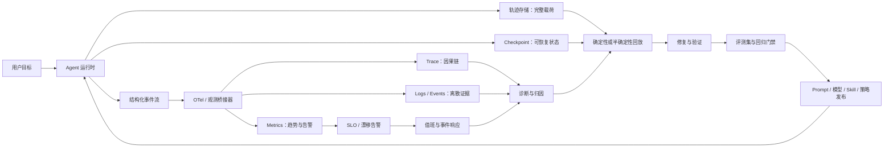

---

## 1. 为什么 Agent 可观测性不能照搬传统微服务

### 1.1 从确定性服务变成概率型执行系统

传统服务通常围绕固定代码路径运行。相同请求在相同版本和相同依赖状态下，执行路径大体可预测。Agent 则把概率模型引入控制流：

- 模型可能选择不同工具；
- 同一目标可能形成不同计划；
- 工具结果会改变后续上下文；
- 上下文压缩、记忆召回、检索排序会改变模型所见事实；
- Prompt、模型路由、温度、推理强度等配置会影响轨迹；
- 一次错误观察可能污染后续多轮决策。

因此，Agent 的异常并不总表现为异常堆栈。很多失败在技术上“全部调用成功”，但业务结果错误。例如：

- 查询工具返回字段语义变化，HTTP 仍是 200；
- RAG 召回了相关但已过期的文档；
- Memory 召回了一条属于其他项目的偏好；
- 模型误解工具描述并传入合法但错误的参数；
- Agent 在预算内结束，却没有完成用户目标；
- 权限 Hook 放行了本应询问的高风险动作。

### 1.2 Agent 的七个特殊性

| 特殊性 | 对观测设计的影响 |
|---|---|
| 概率决策 | 需要记录模型、Prompt、上下文摘要、候选动作与最终动作，而不只记录异常 |
| 长会话 | 需要层级 Trace、进度探针、僵死检测、分位数和尾部采样 |
| 有状态 | 需要记录上下文版本、压缩、Memory、Checkpoint 与状态变更 |
| 工具副作用 | 需要区分只读/写入/危险操作，记录幂等键、审批、补偿和结果校验 |
| 跨边界 | 需要跨 HTTP、队列、MCP、stdio、子进程、浏览器和远程 Agent 传播 Trace Context |
| 质量非二元 | 需要外部 Verifier、用户反馈、Rubric 评测和自报不一致指标 |
| 单会话价值高 | 失败会话不能轻易采样丢弃，完整轨迹还能用于回放和评测集建设 |

### 1.3 微服务黄金信号到 Agent 黄金信号

传统 SRE 常关注延迟、流量、错误、饱和度。Agent 仍需要这些信号，但必须增加“结果正确性”和“行为健康”。

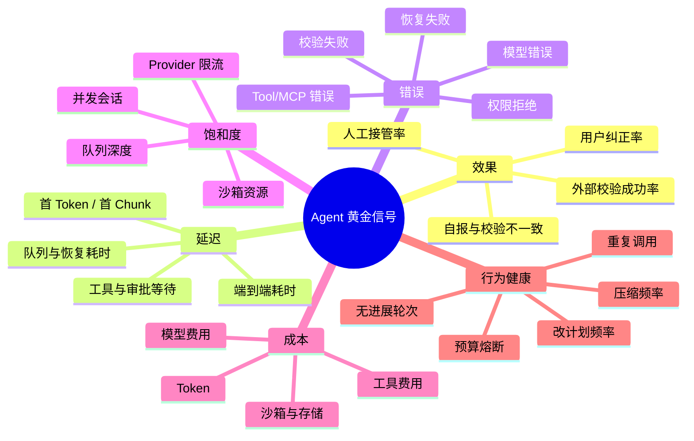

### 1.4 “没有报错”不等于“任务成功”

Agent 的最终状态至少应拆成以下维度：

- **runtime_status**：运行时是否正常结束；
- **agent_claim**：模型是否声称完成；
- **verifier_status**：外部校验是否通过；
- **user_outcome**：用户是否接受、纠正、接管或放弃；
- **side_effect_status**：外部副作用是否完整、部分完成、回滚或未知；
- **safety_status**：是否命中策略、越权、敏感数据或高风险操作；
- **budget_status**：是否正常、软超限、硬熔断。

只用一个 `success=true` 会把完全不同的失败压扁成同一个状态，导致指标失真，也无法指导排障。

---

## 2. 可观测性的目标、边界与证据模型

### 2.1 Monitoring 与 Observability 的区别

**监控（Monitoring）** 回答预先定义的问题，例如“过去 5 分钟错误率是否超过 5%”。

**可观测性（Observability）** 要求面对未知故障时，仍能从系统输出推断内部状态，例如“为什么某个 Prompt 版本只在长上下文、特定工具组合下出现错误字段传播”。

因此，生产 Agent 不能只做若干固定仪表盘，还要保留足以自由下钻、关联和回放的证据。

### 2.2 五类证据

传统“三支柱”仍是基础，但对 Agent 来说还不够。完整体系建议使用五类证据：

| 证据 | 回答的问题 | 典型数据 |
|---|---|---|
| Trace | 因果链如何形成 | Session、Turn、Model、Tool、RAG、Memory、Policy、Process Span |
| Metrics | 是否在系统性变坏 | 成功率、分位数、熔断率、重复调用率、成本、队列深度 |
| Logs / Events | 某个时间点发生了什么 | 状态迁移、审批、重试、发布标记、异常、审计事件 |
| Checkpoint / Replay | 能否重新经历故障 | 对话状态、计划、工具结果、外部快照、随机与配置版本 |
| Eval / Feedback | 结果到底好不好 | Verifier、规则评测、LLM Judge、人工标注、用户纠正 |

可以把它写成一个工程公式：

> **可诊断性 = 因果 Trace × 完整轨迹 × 可恢复状态 × 正确指标口径 × 外部质量证据**

任何一项接近零，整体诊断能力都会明显下降。

### 2.3 五个观测平面

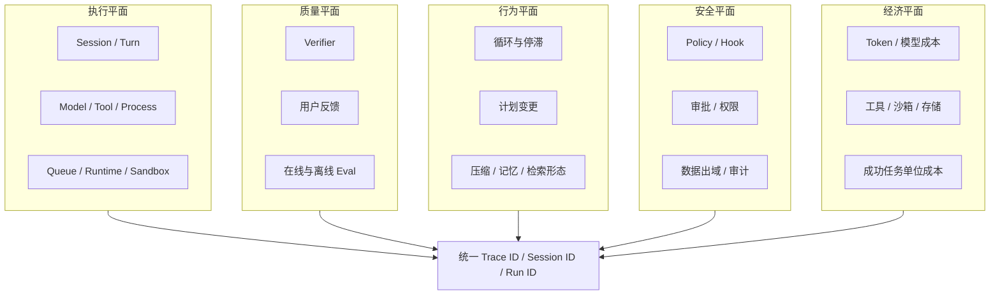

### 2.4 观测不是无限采集

“为了排障什么都记”会迅速演变成成本与合规事故。观测边界必须明确：

- 不默认采集 Prompt、Completion、工具完整输入输出；
- 不记录隐藏思维链或要求模型暴露私有推理过程；
- 可记录**可审计的行动摘要、计划节点、理由标签、证据引用和结果状态**；
- 大对象进入受控轨迹存储，Span 只保存指针、哈希、大小和摘要；
- 高基数标识可进入 Trace，但不得随意进入 Metrics 标签；
- 敏感值不得进入 W3C Baggage，因为 Baggage 会沿每一跳传播；
- 采集级别、保留期和访问策略必须按环境、租户和数据等级配置。

---

## 3. 统一观测对象模型

### 3.1 从四层骨架扩展到完整生命周期

原文使用 Session → Agent Turn → Tool/MCP → Process 四层结构，这是一条非常好的排障主干。生产实现中建议保留这条主干，并把 Model、Plan、RAG、Memory、Skill、Policy、Approval、Handoff、Artifact 和 Eval 作为明确的子 Span 或关联 Span。

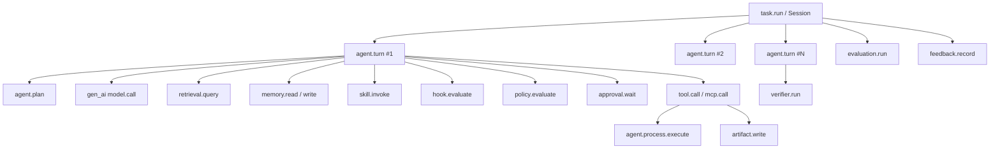

### 3.2 推荐 Span 分类

| Span 名 | 含义 | 关键属性 | 常见子 Span |
|---|---|---|---|
| `task.run` | 一次用户目标或后台任务 | task_type、run_id、status、verifier_status、budget | `agent.turn`、`evaluation.run` |
| `agent.turn` | 一轮观察—决策—行动 | turn_index、progress、stop_reason、context_size | model、retrieval、memory、tool |
| `agent.plan` | 计划创建或修订 | plan_version、step_count、change_reason | 无或 model.call |
| `model.call` | 一次逻辑模型操作 | provider、request/response model、token、TTFT、finish reason | provider HTTP/RPC |
| `tool.call` | 本地或远程工具逻辑调用 | tool_name、effect、attempt_count、outcome、idempotency | MCP、HTTP、process |
| `mcp.client.operation` | MCP 客户端操作 | method、server、transport、protocol_version | transport span |
| `process.exec` | 沙箱/宿主进程执行 | command_digest、exit_code、signal、sandbox、resource usage | 文件/网络事件 |
| `retrieval.query` | RAG 检索 | query_hash、top_k、filters、index_version、result_count | embedding、vector/db query |
| `memory.read` | Memory 查询与召回 | store、query_hash、record_count、score distribution | embedding/query |
| `memory.write` | Memory 写入/更新/删除 | mutation、reason、source、conflict、policy | storage write |
| `skill.load` | Skill 发现、解析、校验 | skill_name、version、source、signature | 文件/网络读取 |
| `skill.invoke` | Skill 执行 | skill_name、version、implementation_status、outcome | model/tool/process |
| `hook.evaluate` | Hook 前后置处理 | hook_name、phase、decision、latency | policy/tool |
| `policy.evaluate` | 权限或安全策略裁决 | policy_version、resource、action、decision、reason_code | approval.wait |
| `approval.wait` | 等待人工确认 | request_type、risk_level、wait_seconds、decision | 无 |
| `handoff` | 委派给子 Agent/远程 Agent | target_agent、protocol、task_digest、outcome | remote task |
| `artifact.write` | 产物写入 | artifact_type、path_hash、bytes、content_hash | storage write |
| `verifier.run` | 外部结果校验 | verifier_name、version、score、pass | tool/model |
| `evaluation.run` | 在线/离线评测 | dataset、metric、score、judge_model | model/tool |

### 3.3 Parent/Child、Link 与事件的选择

不是所有关系都适合硬塞进父子树：

- **Parent/Child**：调用关系明确、时间上基本包含，例如 Turn 调用 Tool；
- **Span Link**：一个 Span 由多个上游共同触发，或异步恢复不适合单父节点，例如批处理聚合、多个检索结果触发一次综合判断；
- **Span Event**：Span 生命周期中的离散事实，例如重试、速率限制、压缩、审批提醒、输出校验失败；
- **独立日志**：载荷较大、访问控制不同、生命周期与 Span 不同的内容，例如脱敏后的模型输入输出；
- **轨迹对象**：完整消息、工具结果、文件 diff、浏览器快照等大对象。

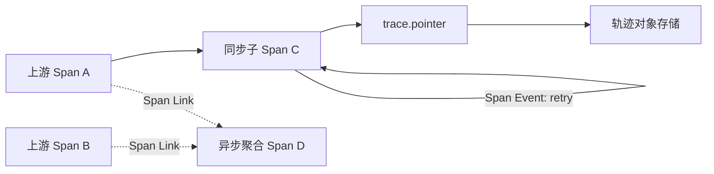

### 3.4 身份与关联键

一个可靠的观测模型要区分多种 ID：

| ID | 生命周期 | 用途 | 是否适合作指标标签 |
|---|---|---|---|
| `trace_id` | 一条分布式因果链 | OTel 全链路关联 | 否 |
| `span_id` | 一个操作 | 精确定位操作 | 否 |
| `run_id` | 一次任务执行 | 重试、恢复、回放归属 | 否 |
| `session_id` / `conversation_id` | 一段会话 | 跨多次 run 关联 | 否 |
| `turn_id` | 一轮执行 | 配对事件和顺序 | 否 |
| `call_id` | Tool/Model 调用 | 请求结果配对 | 否 |
| `tenant_class` | 有界租户类别 | 容量与 SLO 分组 | 可以，需有界 |
| `task_type` | 有界任务类型 | 指标拆分 | 可以 |
| `prompt_version` | 发布版本 | 回归与变更归因 | 可以，需控制活跃版本数 |
| `model_family` | 模型族 | 成本和质量分组 | 可以 |
| `error.type` | 低基数错误分类 | 告警与归因 | 可以 |

**不要把 `trace_id`、用户 ID、完整异常文本、文件路径、SQL、URL 查询串作为 Metrics 标签。**

### 3.5 一次典型 Agent Turn 的时序

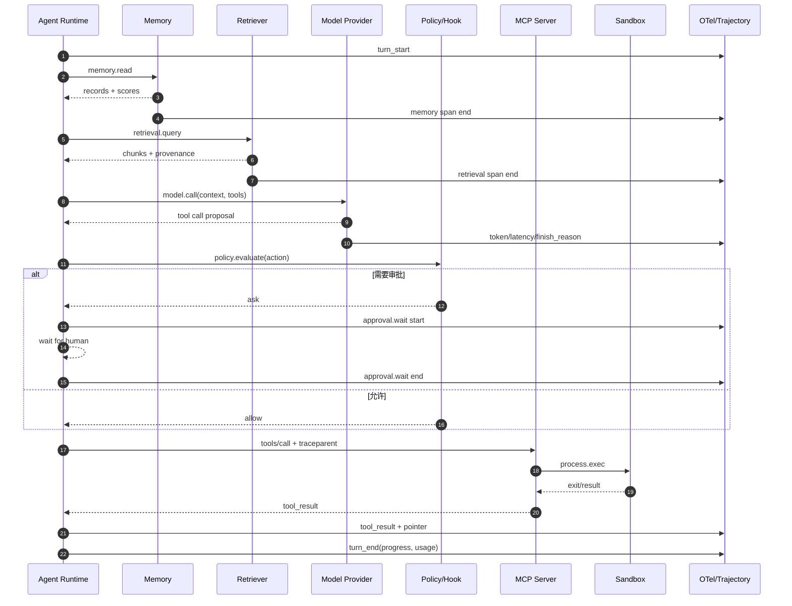

---

## 4. 从事件流构建 Trace

### 4.1 为什么先有事件，再有 OTel 桥接器

把可观测代码直接散落在 Agent Loop 中，会产生三个问题：

1. 业务控制流被埋点代码污染；
2. 更换后端、调整采集策略时需要修改核心循环；
3. Trace、持久化、WebSocket、审计、评测回流各自重复理解运行状态。

更稳妥的架构是：运行时只发出稳定的领域事件，观测桥接器订阅事件并配对为 Span、Metrics 和 Logs。

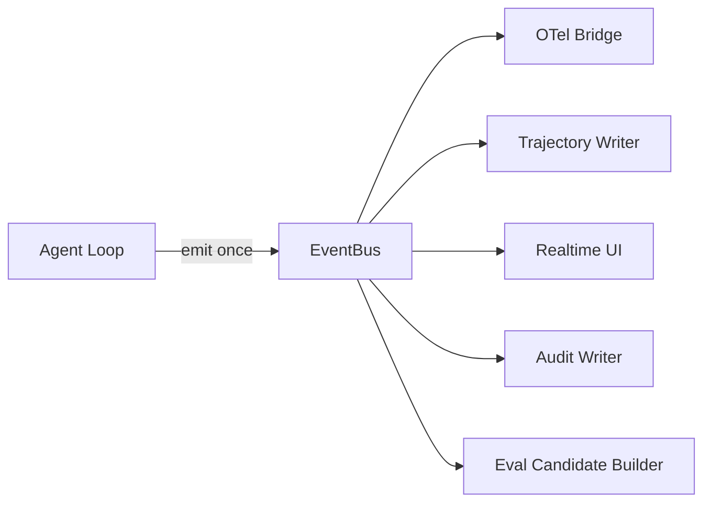

这种方式的关键不是“多一个总线”，而是建立**单一事实来源**：同一个 `tool_result` 事件同时驱动 Trace 结束、轨迹写入、UI 更新与指标累计，各消费者不再各自猜测状态。

### 4.2 推荐事件信封

```json
{
  "event_id": "evt_01J...",
  "schema_version": 3,
  "event_type": "tool_result",
  "occurred_at": "2026-08-31T15:04:05.123Z",
  "observed_at": "2026-08-31T15:04:05.129Z",
  "run_id": "run_...",
  "session_id": "conv_...",
  "turn_id": "turn_41",
  "call_id": "call_...",
  "sequence": 184,
  "trace_context": {
    "traceparent": "00-...-...-01",
    "tracestate": "..."
  },
  "producer": {
    "service": "agent-runtime",
    "version": "2.7.0",
    "instance": "runtime-a17"
  },
  "payload": {
    "tool_name": "query_ticket",
    "is_error": false,
    "attempt": 1,
    "duration_ms": 238,
    "result_bytes": 48192,
    "result_sha256": "...",
    "trajectory_pointer": "traj://..."
  }
}
```

信封字段中最容易被忽略的是：

- `schema_version`：允许事件契约演进；
- `occurred_at` 与 `observed_at`：区分真实发生时间和被总线观察时间，便于识别排队和时钟问题；
- `sequence`：解决同一 run 中的稳定排序；
- `event_id`：实现幂等消费与重复事件去重；
- `trace_context`：支持跨进程恢复；
- `producer.version`：将异常归因到运行时版本。

### 4.3 事件与 Span 的配对规则

| 开始事件 | 结束事件 | Span | 配对键 |
|---|---|---|---|
| `session_start` | `session_end` | `task.run` | `run_id` |
| `turn_start` | `turn_end` | `agent.turn` | `turn_id` |
| `model_request` | `model_response` / `model_error` | `model.call` | `call_id` |
| `tool_call` | `tool_result` / `tool_error` | `tool.call` | `call_id` |
| `process_start` | `process_exit` | `process.exec` | `process_id` |
| `retrieval_start` | `retrieval_end` | `retrieval.query` | `query_id` |
| `memory_op_start` | `memory_op_end` | `memory.read/write` | `operation_id` |
| `approval_requested` | `approval_decided/expired` | `approval.wait` | `approval_id` |
| `evaluation_start` | `evaluation_end` | `evaluation.run` | `evaluation_id` |

### 4.4 处理缺失、乱序和重复事件

真实生产环境一定会遇到不完整事件，桥接器不能假设所有 start/end 成对出现。

建议规则：

- 重复 `event_id`：幂等丢弃；
- end 先于 start：暂存一个短窗口，超过窗口创建“缺失父事件”的降级 Span；
- start 永远没有 end：在 Session 结束、进程退出或超时清理时强制结束，标记 `telemetry.incomplete=true`；
- Session 崩溃：启动恢复任务扫描未闭合 Span 状态，写入 synthetic end event；
- 时钟倒退：以单进程单调时钟计算 duration，以 UTC 时间做跨系统展示；
- 同一 `call_id` 冲突：记录契约违规指标并隔离，不覆盖已有状态；
- 事件积压：观测桥接器不得阻塞 Agent 主循环，应采用有界队列、批量导出和丢弃策略；
- 丢弃时：优先保留错误、结束和审计事件，丢弃低价值调试事件，并增加 `telemetry.events.dropped`。

### 4.5 状态机比 if/else 更可靠

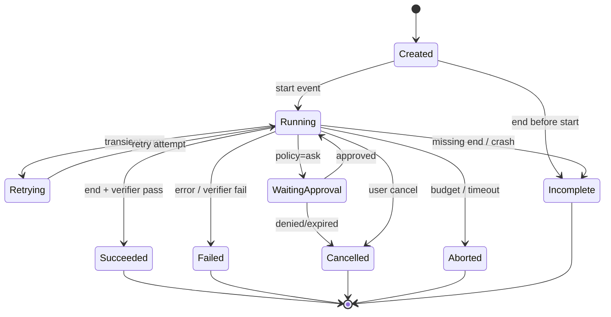

状态机可以同时用于运行时、Trace 桥接器和离线一致性检查，避免三套状态定义各自演化。


---

## 5. OpenTelemetry 语义约定与上下文传播

### 5.1 OpenTelemetry 在体系中的位置

OpenTelemetry（OTel）负责的是**生成、收集、处理和导出遥测数据的标准化层**，不是最终的存储与查询后端。一个典型链路由四部分组成：

1. **API**：业务代码或框架使用的埋点接口；
2. **SDK**：采样、Span Processor、Metric Reader、Exporter 等实现；
3. **OTLP**：统一遥测协议，常用 gRPC 或 HTTP；
4. **Collector**：独立遥测管道，完成接收、批处理、过滤、脱敏、采样、路由与导出。

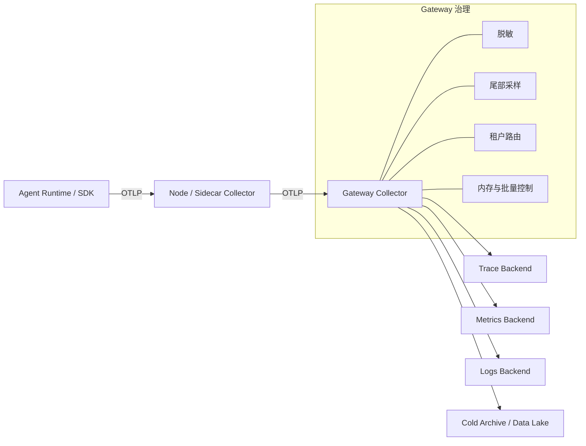

### 5.2 GenAI 语义约定的状态

截至 2026-08-31，OpenTelemetry 的 GenAI 语义约定已迁移到独立的 `semantic-conventions-genai` 仓库，整体仍标记为 **Development**。它已经覆盖：

- 模型调用 Span；
- Agent 与 Workflow Span；
- GenAI 输入输出事件；
- Token 与操作时长指标；
- Provider 特定约定；
- Model Context Protocol（MCP）Span、Metrics 与上下文传播；
- Agent、Conversation、Prompt、Memory、Tool、Evaluation 等属性。

因此，工程上应采用两层策略：

- **优先使用标准属性**，获得跨后端兼容能力；
- **锁定语义约定版本并保留自定义命名空间**，避免 Development 阶段变更直接破坏查询和仪表盘。

### 5.3 标准属性与自定义属性分层

推荐建立属性注册表，并给每个属性标记来源：

| 类别 | 示例 | 治理方式 |
|---|---|---|
| OTel 核心语义 | `service.name`、`server.address`、`error.type` | 跟随核心 semconv 版本 |
| OTel GenAI 语义 | `gen_ai.operation.name`、`gen_ai.request.model`、`gen_ai.usage.input_tokens` | 锁定 GenAI semconv 版本 |
| OTel MCP 语义 | `mcp.*` 指标与操作属性 | 跟随 MCP semconv |
| 应用自定义 | `agent.run.id`、`agent.tool.effect`、`agent.progress.state` | 使用稳定应用前缀 |
| 实验属性 | `experimental.agent.plan.churn` | 必须注明实验状态和淘汰计划 |

不要把自定义字段伪装成正式标准，也不要因为标准仍在演进就完全拒绝标准化。

### 5.4 推荐的 GenAI 属性

下面给出一个实用子集。具体 Required/Recommended/Opt-In 要以锁定版本的官方语义约定为准。

| 领域 | 推荐属性 | 说明 |
|---|---|---|
| Provider | `gen_ai.provider.name` | 模型或托管 Agent Provider |
| Operation | `gen_ai.operation.name` | chat、generate_content、invoke_agent 等逻辑操作 |
| Model | `gen_ai.request.model`、`gen_ai.response.model` | 请求模型与实际响应模型 |
| Conversation | `gen_ai.conversation.id` | 已有真实会话 ID 时记录，不要临时伪造 |
| Agent | `gen_ai.agent.id/name/version` | Hosted Agent 或稳定逻辑 Agent 身份 |
| Prompt | `gen_ai.prompt.name/version` | Prompt 模板版本，用于变更归因 |
| Usage | `gen_ai.usage.input_tokens`、`gen_ai.usage.output_tokens` | Token 使用 |
| Cache | `gen_ai.usage.text.cache_read.input_tokens` | Provider 缓存读取 Token |
| Reasoning usage | `gen_ai.usage.reasoning.output_tokens` | 推理 Token 数量，不是推理内容 |
| Streaming | `gen_ai.request.stream`、`gen_ai.response.time_to_first_chunk` | 流式响应与首块延迟 |
| Memory | `gen_ai.memory.store.id`、`gen_ai.memory.query.text`、`gen_ai.memory.record.count` | 内容字段应按采集等级控制 |
| Evaluation | `gen_ai.evaluation.name`、`gen_ai.evaluation.score.value/label` | 将评测结果与执行链关联 |
| Error | `error.type` | 使用低基数错误分类，不放完整异常文本 |

> **注意**：`gen_ai.usage.reasoning.output_tokens` 只表示推理 Token 用量。不要把隐藏思维链、内部推理原文或模型私有 reasoning 内容作为默认遥测采集目标。

### 5.5 Span 命名纪律

Span 名应保持低基数、可聚合：

```text
正确：invoke_agent customer_support
正确：chat gpt-x
正确：tool.call
正确：retrieval.query
错误：tool.call /home/alice/private/project/a.py
错误：agent.turn 8e19c949-...
错误：query SELECT * FROM users WHERE email='...'
```

动态值放属性，不放 Span 名。推荐应用层固定名字：

```text
task.run
agent.turn
agent.plan
model.call
tool.call
process.exec
retrieval.query
memory.read
memory.write
skill.load
skill.invoke
hook.evaluate
policy.evaluate
approval.wait
artifact.write
verifier.run
evaluation.run
```

当官方 GenAI 约定有直接对应 Span 时，映射到官方命名；当标准尚未覆盖时，保留稳定自定义名，并在注册表中声明迁移策略。

### 5.6 Span Status 与业务 Outcome 分开

OTel Span Status 主要表达操作技术上是否发生错误。业务结果应使用独立属性：

```text
otel.status_code = ERROR              # 调用抛异常、超时、协议失败
agent.operation.outcome = failed      # 业务操作失败
agent.verifier.outcome = failed       # 外部校验未通过
agent.safety.outcome = denied         # 策略拒绝
agent.budget.outcome = aborted        # 预算熔断
```

典型反例：模型正常返回文本，Span Status 应为 OK/Unset，但 Verifier 判断答案错误。若直接把这类情况全标成技术 ERROR，会污染 Provider 可靠性指标。

### 5.7 错误分类体系

完整异常文本适合进日志或轨迹，不适合当指标维度。建议先归一化为低基数 `error.type`：

| 一级分类 | 二级示例 |
|---|---|
| `provider_error` | rate_limit、timeout、overloaded、invalid_request |
| `tool_error` | not_found、invalid_argument、dependency_failure、non_idempotent_retry |
| `mcp_error` | protocol_error、session_lost、capability_mismatch、transport_closed |
| `sandbox_error` | exit_nonzero、oom、cpu_limit、network_denied、timeout |
| `policy_error` | denied、approval_expired、policy_unavailable |
| `retrieval_error` | index_unavailable、empty_result、stale_index、filter_mismatch |
| `memory_error` | write_conflict、wrong_scope、stale_record、poisoned_record |
| `agent_error` | loop_detected、no_progress、budget_exceeded、invalid_state |
| `verifier_error` | check_failed、verifier_unavailable、ambiguous_result |
| `telemetry_error` | export_failed、queue_full、orphan_span、schema_violation |

### 5.8 W3C Trace Context

跨服务传播的核心是 `traceparent` 与可选的 `tracestate`。一个常见 `traceparent` 形态如下：

```text
00-4bf92f3577b34da6a3ce929d0e0e4736-00f067aa0ba902b7-01
│  │                                │                └─ flags
│  │                                └─ parent-id
│  └─ trace-id
└─ version
```

传播纪律：

- HTTP：使用标准 `traceparent` / `tracestate` 请求头；
- 消息队列：写入消息属性，不写入业务 JSON 的任意字段；
- 异步任务：入队时注入，消费时提取并创建远程父 Span；
- 重试：逻辑操作可用一个父 Span，单次 attempt 作为事件或子 Span；
- 批处理：用 Span Link 关联多个来源，不强行选择一个父 Span；
- 恢复：Checkpoint 中保存可恢复 Trace Context，恢复 run 可选择新 Trace，并用 Link 指向旧 Trace；
- 浏览器/远程执行器：跨进程边界显式注入，不假设线程本地上下文自动有效。

### 5.9 Baggage 的使用边界

Baggage 用于传播应用自定义键值，但它会沿链路明文传播，且可能被下游继续转发。

适合放：

```text
tenant.class=enterprise
agent.task_type=code_review
deployment.ring=canary
```

不适合放：

```text
user.email=alice@example.com
prompt=完整用户输入
access_token=...
file.path=/home/alice/secret
```

此外，不要把所有 Baggage 自动复制为 Metrics 标签。应通过 allowlist 选择有界属性。

### 5.10 MCP 上下文传播

MCP 基于 JSON-RPC，且可能运行在 stdio 或 Streamable HTTP 上。仅依赖 HTTP Trace Context 不足以关联流中的每条 MCP 消息。当前 OTel MCP 语义约定建议把传播上下文注入 `params._meta`：

```json
{
  "jsonrpc": "2.0",
  "method": "tools/call",
  "params": {
    "name": "query_ticket",
    "arguments": {"ticket_id": "T-1042"},
    "_meta": {
      "traceparent": "00-4bf92f3577b34da6a3ce929d0e0e4736-00f067aa0ba902b7-01",
      "tracestate": "vendor=value",
      "baggage": "tenant.class=enterprise"
    }
  },
  "id": 17
}
```

MCP 观测至少应覆盖：

- initialize / capability negotiation；
- session 生命周期；
- tools/list、tools/call；
- resources 与 prompts 操作；
- notification；
- transport 建连、断开、重连；
- client 与 server 操作时长；
- capability mismatch；
- request/response/notification 关联；
- stdio 子进程状态与 Streamable HTTP 连接状态。

### 5.11 子进程与沙箱传播

对于 Agent 启动的受控子进程，可通过环境变量或启动协议传入 Trace Context：

```bash
TRACEPARENT='00-...-...-01' \
TRACESTATE='vendor=value' \
AGENT_RUN_ID='run_...' \
agent-sandbox-exec -- command args
```

但不要把敏感 Baggage 原样注入不可信代码。沙箱边界通常应使用最小化上下文：

- traceparent；
- 非敏感 run ID；
- operation ID；
- 只读的遥测出口配置。

### 5.12 恢复与回放时的 Trace 关系

恢复任务有两种合理模型：

1. **继续原 Trace**：短暂停顿、上下文仍连续，适合队列延迟或人工审批；
2. **创建新 Trace，并 Link 原 Trace**：跨天恢复、灾难恢复、离线回放、修复验证。

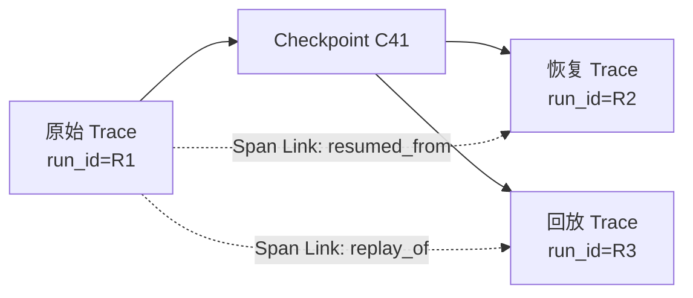

用新 Trace + Link 的好处是不会伪造一条持续数天的超长 Span，同时保留可导航关系。

---

## 6. Trace、Metrics、Logs、Replay 与 Eval 如何分工

### 6.1 Trace：回答“哪一步导致了后果”

Trace 是因果与时间结构的索引，适合：

- 查看会话树与关键路径；
- 定位第一处异常轮次；
- 对比成功与失败会话的结构差异；
- 查看工具重试、审批等待与沙箱执行；
- 从 Span 跳转到完整轨迹对象；
- 关联 Prompt、模型、策略、Skill 和运行时版本；
- 生成 exemplars，从指标峰值下钻到具体 Trace。

Trace 不适合承载：

- 完整大型工具结果；
- 长文本 Prompt/Completion 默认全文；
- 长期聚合报表；
- 无界标签；
- 需要独立权限模型的敏感内容。

### 6.2 Metrics：回答“这类问题多常见、是否在变坏”

Metrics 是预聚合时序数据，适合：

- 计算成功率、错误率、成本与吞吐；
- 观察 P50/P95/P99；
- SLO 与错误预算；
- 漂移、突变和容量告警；
- 对比任务类型、模型族、工具名、版本等有界维度。

Metrics 的核心约束是**维度必须有界，口径必须登记**。

### 6.3 Logs / Events：回答“某个时刻发生了什么”

推荐使用结构化日志：

```json
{
  "timestamp": "2026-08-31T15:04:05.123Z",
  "severity": "WARN",
  "event_name": "agent.loop.no_progress_detected",
  "trace_id": "...",
  "span_id": "...",
  "run_id": "run_...",
  "turn_index": 41,
  "error_type": "no_progress",
  "progress_fingerprint": "sha256:...",
  "repeated_action_count": 3,
  "message": "No externally observable progress across three turns"
}
```

结构化日志中：

- `event_name` 使用稳定枚举；
- `message` 用于人读，不参与指标分组；
- `error_type` 使用低基数；
- `trace_id/span_id` 保证与 Trace 关联；
- 大内容保存 pointer；
- 审计日志与调试日志分开存储和授权。

### 6.4 Replay：回答“能否复现与验证修复”

回放所需信息通常超出 OTel 范围，包括：

- 对话与上下文快照；
- Prompt/Skill/Policy/Hook 版本；
- 模型参数与路由结果；
- Tool/MCP 请求和响应快照；
- 文件、数据库或浏览器状态摘要；
- Checkpoint；
- 随机种子或响应录制；
- 外部依赖版本；
- 副作用抑制与沙箱策略。

Replay 是 Agent 可观测性区别于普通 APM 的关键能力。普通 Trace 往往只能“看见”；Replay 允许“重新经历”。

### 6.5 Eval / Feedback：回答“结果是否真正有价值”

Eval 与观测要共享运行标识和轨迹指针：

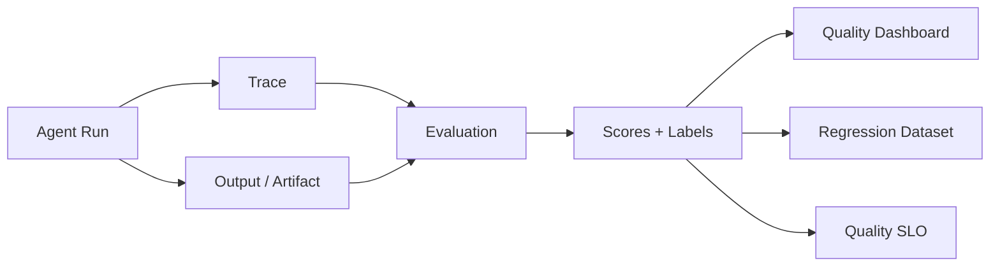

评测信号可以来自：

- 规则和确定性 Verifier；
- 测试执行与编译结果；
- 检索相关性与引用完整性；
- LLM-as-Judge；
- 人工标注；
- 用户显式反馈；
- 用户纠正、重述、撤销、接管等隐式行为。

### 6.6 同一个事实放在哪里

| 事实 | Span 属性 | Span Event | Metric | Log | 轨迹存储 |
|---|---:|---:|---:|---:|---:|
| 模型名 | ✓ |  | ✓（有界） | ✓ | ✓ |
| Token 数 | ✓ |  | ✓ |  | ✓ |
| 完整 Prompt | 默认否 | 可选但不推荐 | 否 | 受控可选 | ✓ |
| Prompt 版本 | ✓ |  | ✓ | ✓ | ✓ |
| 工具结果字节数 | ✓ |  | ✓ |  | ✓ |
| 完整工具结果 | 否 | 否 | 否 | 摘要/指针 | ✓ |
| 重试发生 |  | ✓ | ✓ | ✓ | ✓ |
| 用户邮箱 | 否 | 否 | 否 | 脱敏 | 受控存储 |
| Verifier 分数 | ✓ |  | ✓ | ✓ | ✓ |
| 文件 diff | 指针 |  | 否 | 指针 | ✓ |
| 发布事件 |  | ✓ | 注解 | ✓ | ✓ |

### 6.7 Exemplar：从指标跳到具体会话

对成本、延迟、轮次等直方图，建议保留 exemplar，让仪表盘中的 P95 峰值可以直接跳到代表性 Trace。例如：

```text
assistant.session.duration_seconds_bucket{task_type="code_fix",le="120"} 183 # {trace_id="..."} 117.2
```

这样值班人员不需要先猜查询条件，而能从异常桶直接打开一条真实长尾会话。


---

## 7. Agent 指标体系：从三类框架扩展到七类治理

### 7.1 指标设计原则

Agent 指标不是“把能采的字段全做成图”。每个指标都应满足以下原则：

1. **先明确问题，再定义指标。** 没有决策动作的指标只是装饰。
2. **结果以外部证据为准。** 模型自报只能作为一个信号，不能替代 Verifier。
3. **分子、分母、排除项必须写清。** 尤其是成功率、接管率、反馈率。
4. **逻辑结果与原始尝试分开。** 重试后的最终成功和每次尝试成功不能同名。
5. **长尾看分位数。** 轮次、成本、延迟、结果大小主要看 P50/P95/P99。
6. **标签必须有界。** 用户、会话、路径、异常原文只进 Trace，不进 Metric 标签。
7. **指标必须可追溯到事件或 Span。** 无法指出采集点的指标不应上线。
8. **指标必须有 Owner。** 口径争议、告警处置和淘汰都要有人负责。
9. **指标版本化。** 口径发生不兼容变化时不要悄悄覆盖，应新建版本或记录生效时间。
10. **观测本身也要被观测。** 导出失败、事件丢弃和脱敏失败必须可告警。

### 7.2 七类指标框架

原文将指标分为效果、效率、行为健康三类。生产体系建议扩展为七类：

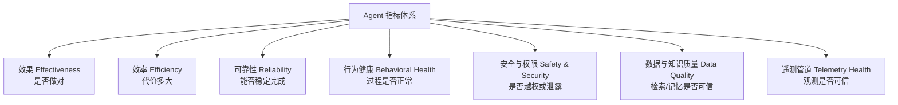

七类分别回答：

| 类别 | 管理问题 |
|---|---|
| 效果 | Agent 最终是否真正满足目标？ |
| 效率 | 完成一次任务花了多少时间、钱、Token 与人工等待？ |
| 可靠性 | 模型、工具、MCP、沙箱和运行时是否稳定？ |
| 行为健康 | Agent 是否在徘徊、反复、压缩、改计划或失去进展？ |
| 安全与权限 | 是否发生越权、敏感数据暴露、危险操作或策略失效？ |
| 数据与知识质量 | RAG、Memory、工具观察是否新鲜、相关、正确且作用域正确？ |
| 遥测管道健康 | Trace/Metrics/Logs 是否完整、及时、未丢弃且脱敏有效？ |

### 7.3 指标登记表

所有新指标先登记，再实现，再上盘。推荐字段如下：

| 字段 | 说明 | 示例 |
|---|---|---|
| Name | 稳定名称 | `agent.task.verified_success.rate` |
| Purpose | 要回答的问题 | 发布后任务正确率是否下降 |
| Owner | 负责团队/个人 | Agent Runtime Team |
| Type | Counter/Gauge/Histogram | 两个 Counter 的记录规则 |
| Unit | UCUM 或明确单位 | `s`、`{token}`、`By`、`1` |
| Numerator | 分子 | Verifier 通过的 eligible run |
| Denominator | 分母 | 所有 eligible ended run |
| Exclusions | 排除项 | 用户主动取消、测试流量 |
| Source | 事件/Span 字段 | `session_end.verifier_status` |
| Dimensions | 有界标签 | task_type、prompt_version、model_family |
| Window | 聚合窗口 | 5m/1h/7d |
| Statistic | rate/P50/P95/P99 | 7d rolling rate |
| Alert | 阈值、漂移或燃尽 | 1h/6h 多窗口燃尽 |
| Runbook | 告警动作 | 打开质量仪表盘并过滤最近变更 |
| Version | 口径版本 | `v2` |
| Retention | 保存期限 | 25 个月聚合 |

YAML 示例：

```yaml
name: agent.task.verified_success.rate
version: v2
owner: agent-runtime
purpose: Measure externally verified task success.
source:
  event: session_end
  fields:
    numerator: verifier_status == "passed"
    denominator: status in ["succeeded", "failed"]
    exclusions:
      - cancellation_source == "user"
      - traffic_class == "synthetic"
dimensions:
  - task_type
  - prompt_version
  - model_family
window: 7d
statistic: ratio
slo:
  target: 0.90
alert:
  type: burn_rate
  runbook: runbooks/agent-quality-slo.md
```

### 7.4 指标命名与导出

推荐 OTel 自定义指标使用点分层级：

```text
agent.task.count
agent.task.duration
agent.task.turn.count
agent.tool.attempt.count
agent.tool.final.count
agent.loop.no_progress.count
agent.memory.operation.duration
agent.telemetry.event.dropped
```

Counter 在导出到 Prometheus 后通常会转换为带 `_total` 的累计序列。不要在 OTel 名称和 Prometheus 名称之间手工重复添加后缀，具体遵循所用 exporter 的转换规则。

### 7.5 最小可用指标集

新系统第一阶段不应一口气上线上百个指标。下面 12 个指标可以形成最小闭环：

| 类别 | 指标 | 推荐统计 |
|---|---|---|
| 效果 | `task.verified_success_rate` | 7d rate + SLO |
| 效果 | `task.self_report_mismatch_rate` | 1d/7d rate |
| 效率 | `cost_per_verified_success` | P50/P95 + 总账 |
| 效率 | `task.duration` | P50/P95/P99 |
| 效率 | `task.turn.count` | P50/P95/P99 |
| 可靠性 | `tool.final_success_rate` | 1h rate |
| 可靠性 | `tool.attempt_success_rate` | 5m/1h rate |
| 行为 | `loop.no_progress_rate` | 1h rate |
| 行为 | `budget_abort_rate` | 1h/1d rate |
| 安全 | `policy.denied_or_asked_rate` | 1h rate |
| 数据质量 | `retrieval.empty_result_rate` | 1h rate |
| 遥测 | `telemetry.event_drop_rate` | 5m rate |

---

## 8. 分域指标详解

### 8.1 Task / Session 指标

| 指标 | 类型 | 口径与用途 |
|---|---|---|
| `agent.task.count` | Counter | 每个结束任务计数，按 outcome 分列 |
| `agent.task.duration` | Histogram(s) | 从任务接受到最终结束，人工等待可另分列 |
| `agent.task.active` | UpDownCounter/Gauge | 当前运行中的任务数 |
| `agent.task.queue.duration` | Histogram(s) | 入队到开始执行 |
| `agent.task.turn.count` | Histogram(`{turn}`) | 只在结束任务时记录轮次 |
| `agent.task.verified_success.count` | Counter | 外部校验通过任务数 |
| `agent.task.self_report_mismatch.count` | Counter | 模型自报成功但 Verifier 失败 |
| `agent.task.human_takeover.count` | Counter | 人工中途接管 |
| `agent.task.resume.count` | Counter | 从 Checkpoint 恢复次数 |
| `agent.task.replay.count` | Counter | 调试/验证回放次数 |
| `agent.task.partial_side_effect.count` | Counter | 外部写操作部分成功、状态不完整 |
| `agent.task.rollback.count` | Counter | 触发补偿或回滚 |

#### 8.1.1 任务成功率

```text
verified_success_rate =
  count(eligible ended runs where verifier_status = passed)
  / count(all eligible ended runs)
```

推荐排除：

- 用户在执行前主动取消；
- 明确标记的测试流量；
- 未获得足够输入而被产品定义为“不具备执行条件”的请求；
- Verifier 自身不可用且没有替代证据的 run，应单列 unknown，而不是强行算成功或失败。

#### 8.1.2 自报不一致率

```text
self_report_mismatch_rate =
  count(agent_claim = success AND verifier_status = failed)
  / count(agent_claim = success AND verifier_status in [passed, failed])
```

这个指标直接暴露终止判定、验证缺失或模型过度自信问题。

#### 8.1.3 成功任务单位成本

```text
cost_per_verified_success =
  total_model_tool_sandbox_observability_cost
  / verified_success_count
```

注意它不是“每次调用平均成本”。一个便宜但经常失败的模型可能拥有更差的成功任务单位成本。

#### 8.1.4 端到端时长拆分

```text
e2e_duration =
    queue_duration
  + active_compute_duration
  + provider_wait_duration
  + tool_wait_duration
  + approval_wait_duration
  + retry_backoff_duration
  + resume_gap_duration
```

仪表盘应同时展示总时长和分解时长，否则“Agent 慢”无法转化为具体工程动作。

### 8.2 LLM / Model 指标

优先使用或映射到当前 OTel GenAI 语义约定中的标准指标，例如：

- `gen_ai.client.operation.duration`；
- `gen_ai.client.token.usage`。

在应用层可增加以下指标：

| 指标 | 类型 | 说明 |
|---|---|---|
| `agent.model.request.count` | Counter | 逻辑模型请求数，按 provider/model/operation/outcome |
| `agent.model.time_to_first_chunk` | Histogram(s) | 流式请求首块延迟 |
| `agent.model.stream.duration` | Histogram(s) | 首块到流结束 |
| `agent.model.stream.interruption.count` | Counter | 流中断次数 |
| `agent.model.token.usage` | Histogram(`{token}`) | 输入、输出、缓存读写、推理 Token 分列 |
| `agent.model.context.utilization` | Histogram(`1`) | 有效输入 Token / 模型上下文上限 |
| `agent.model.output_truncated.count` | Counter | max token 或长度上限导致截断 |
| `agent.model.structured_output.invalid.count` | Counter | JSON/Schema 校验失败 |
| `agent.model.tool_call.invalid.count` | Counter | 工具名不存在或参数不合法 |
| `agent.model.fallback.count` | Counter | 路由到备用模型 |
| `agent.model.retry.count` | Counter | Provider 重试 |
| `agent.model.rate_limit.count` | Counter | 限流错误 |
| `agent.model.cache_hit.token` | Counter(`{token}`) | Provider 管理缓存读取 Token |
| `agent.model.response.model_mismatch.count` | Counter | 实际响应模型与请求模型不一致且未预期 |

推荐维度：

```text
gen_ai.provider.name
model_family                 # 有界归一化族，不要无限细分临时部署 ID
gen_ai.operation.name
prompt_version
traffic_class
outcome
error.type
```

不推荐维度：完整 Prompt、用户 ID、response ID、trace ID、动态 endpoint URL。

#### 8.2.1 Context Window 利用率

```text
context_utilization = effective_input_tokens / model_context_limit
```

需要同时观察：

- P50：普通任务上下文使用；
- P95/P99：接近上限的长尾；
- compaction 后利用率；
- 触发截断的比例；
- 每类内容占比：system、history、retrieval、memory、tool results。

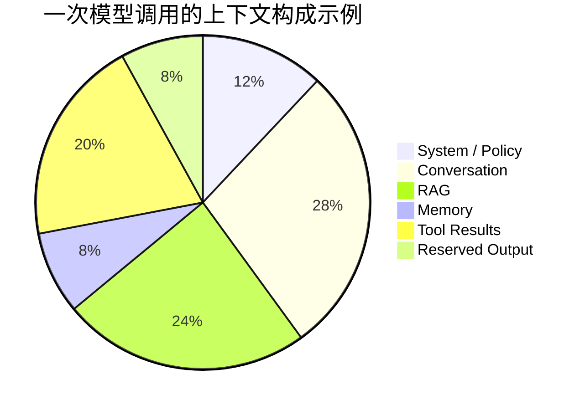

这里的比例应来自 Token 计数或估算器，不要用字符数直接替代而不标注误差。

#### 8.2.2 首 Token 与总时长

流式调用至少拆成：

```text
TTFC/TTFT = request_sent -> first_chunk_received
stream_duration = first_chunk_received -> final_chunk_received
operation_duration = request_sent -> operation_complete
```

首块变慢通常与排队、Provider 调度或网络有关；流阶段变慢可能与输出长度、推理强度或连接质量有关。

#### 8.2.3 结构化输出健康度

```text
structured_output_valid_rate =
  schema_valid_responses / schema_expected_responses
```

同时记录修复器介入：

```text
repair_success_rate = successful_repair / repair_attempts
```

否则“最终 JSON 都合法”可能掩盖模型原始输出持续劣化。

### 8.3 Tool 指标

工具指标必须区分**逻辑调用**和**物理尝试**。

| 指标 | 口径 |
|---|---|
| `agent.tool.logical.count` | 每个 Agent 发起的逻辑 Tool Call 计一次 |
| `agent.tool.attempt.count` | 每次真实调用尝试计一次，包括重试 |
| `agent.tool.final.count{outcome}` | 逻辑调用最终结果 |
| `agent.tool.attempt.count{outcome}` | 原始尝试结果 |
| `agent.tool.duration` | 逻辑调用总时长，含重试/退避 |
| `agent.tool.attempt.duration` | 单次尝试时长 |
| `agent.tool.retry.count` | 重试次数 |
| `agent.tool.result.size` | 结果字节分布 |
| `agent.tool.result.truncated.count` | 结果被截断次数 |
| `agent.tool.schema_validation_error.count` | 参数/结果 Schema 不合法 |
| `agent.tool.idempotency_conflict.count` | 幂等键冲突或重复副作用 |
| `agent.tool.side_effect.unknown.count` | 超时后无法确认写操作是否生效 |
| `agent.tool.compensation.count` | 补偿动作次数 |

#### 8.3.1 两种成功率

```text
final_success_rate =
  successful_logical_calls / all_completed_logical_calls

attempt_success_rate =
  successful_attempts / all_attempts
```

重试器可能让 `final_success_rate=99%`，但 `attempt_success_rate=82%`。前者表示 Agent 仍可完成任务，后者表示上游已经明显劣化。

#### 8.3.2 重试掩盖差值

为了避免两个比率方向混淆，可以定义失败差值：

```text
retry_masked_failure_gap =
  attempt_failure_rate - final_failure_rate
```

差值突然升高，说明依赖故障正在被重试掩盖，用户尚未大量感知，但成本和延迟已经上升。

#### 8.3.3 Tool Effect

建议工具注册表给出稳定 effect：

```text
read_only
write_reversible
write_irreversible
execute_code
external_communication
financial_or_legal
privileged
```

这样可以构建按风险等级的调用量、失败率、审批率和补偿率，而不是靠工具名猜风险。

### 8.4 MCP 指标

当前 OTel MCP 约定已经定义客户端/服务端操作时长与 Session 时长指标。应用层还应补充：

| 指标 | 说明 |
|---|---|
| `mcp.client.operation.duration` | 客户端 MCP 操作时长 |
| `mcp.server.operation.duration` | 服务端操作时长 |
| `mcp.client.session.duration` | 客户端 Session 生命周期 |
| `mcp.server.session.duration` | 服务端 Session 生命周期 |
| `agent.mcp.session.active` | 当前活跃 Session |
| `agent.mcp.transport.disconnect.count` | transport 断开 |
| `agent.mcp.reconnect.count` | 重连次数 |
| `agent.mcp.initialize.failure.count` | 初始化失败 |
| `agent.mcp.capability.mismatch.count` | 能力不兼容 |
| `agent.mcp.request.timeout.count` | 请求超时 |
| `agent.mcp.notification.drop.count` | notification 丢弃 |
| `agent.mcp.tool.catalog.change.count` | tools/list 结果发生变化 |
| `agent.mcp.protocol.version` | 活跃版本分布，可作为有界属性或信息指标 |
| `agent.mcp.stdio.process.restart.count` | stdio server 重启 |

MCP 排障需要同时看三层：

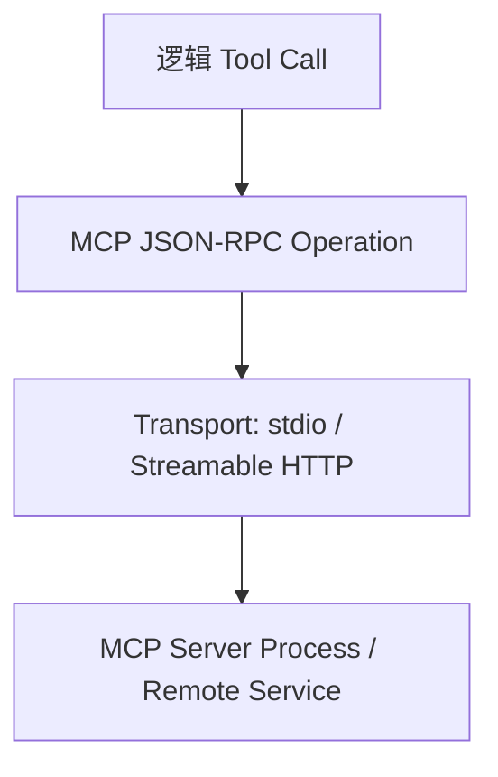

若只采最外层 Tool Span，会把能力协商、JSON-RPC、transport 与 server process 问题全部压成一个“工具失败”。

### 8.5 RAG / Retrieval 指标

RAG 观测必须区分系统可靠性和检索质量。

#### 8.5.1 运行指标

| 指标 | 说明 |
|---|---|
| `agent.retrieval.query.count` | 查询次数 |
| `agent.retrieval.duration` | 端到端检索时长 |
| `agent.retrieval.embedding.duration` | Query embedding 时长 |
| `agent.retrieval.vector_search.duration` | 向量检索时长 |
| `agent.retrieval.rerank.duration` | 重排时长 |
| `agent.retrieval.result.count` | 返回结果数量 |
| `agent.retrieval.empty.count` | 空结果 |
| `agent.retrieval.error.count` | 检索错误 |
| `agent.retrieval.index.lag` | 数据更新到可检索的延迟 |
| `agent.retrieval.chunk.bytes` | 返回 Chunk 大小 |
| `agent.retrieval.duplicate_ratio` | 结果重复比例 |
| `agent.retrieval.filter_rejection.count` | 被过滤规则排除的候选数 |

#### 8.5.2 质量指标

| 指标 | 说明 |
|---|---|
| `retrieval.relevance_at_k` | 标注或 Judge 判断的 Top-K 相关性 |
| `retrieval.recall_at_k` | 有标准答案/相关文档集合时的召回率 |
| `retrieval.mrr` | 第一个相关结果排名质量 |
| `retrieval.ndcg_at_k` | 有分级相关性时的排序质量 |
| `retrieval.citation_coverage` | 回答中需要引用的事实被引用覆盖的比例 |
| `retrieval.grounded_claim_rate` | 关键声明可由检索证据支持的比例 |
| `retrieval.stale_evidence_rate` | 使用过期证据的比例 |
| `retrieval.context_waste_ratio` | 未被回答使用或贡献极低的检索 Token 比例 |

在线生产环境通常没有完整 ground truth，因此可以组合：

- 离线标注集计算 Recall/MRR/NDCG；
- 在线使用空结果、低分、陈旧度、引用覆盖、用户纠正作为代理信号；
- 从失败 Trace 回流真实查询，持续补充评测集。

#### 8.5.3 索引版本与数据血缘

每个 Retrieval Span 建议记录：

```text
data_source_id
index_name
index_version
embedding_model_version
chunker_version
reranker_version
filter_policy_version
query_rewrite_version
```

只有这样才能回答“质量下降是 Prompt、Embedding、Chunking、索引延迟还是 Reranker 变更导致”。

### 8.6 Memory 指标

Memory 指标不能只看“命中率”。召回越多不一定越好，错误记忆比没有记忆更危险。

#### 8.6.1 运行指标

| 指标 | 说明 |
|---|---|
| `agent.memory.operation.duration` | read/write/update/delete 时长 |
| `agent.memory.read.count` | 读取次数 |
| `agent.memory.write.count` | 写入次数 |
| `agent.memory.record.returned` | 召回记录数分布 |
| `agent.memory.empty.count` | 空召回 |
| `agent.memory.write.rejected.count` | 因策略、低置信或重复被拒绝 |
| `agent.memory.conflict.count` | 新旧记忆冲突 |
| `agent.memory.deduplicated.count` | 去重合并 |
| `agent.memory.expired.count` | 过期清理 |
| `agent.memory.compaction.count` | 总结/压缩 |
| `agent.memory.store.size` | 记录数或存储量 |
| `agent.memory.wrong_scope.count` | 跨用户/项目/租户错误作用域 |

#### 8.6.2 质量指标

| 指标 | 解释 |
|---|---|
| `memory.precision` | 召回记忆中对当前任务真正有用的比例 |
| `memory.recall` | 当前任务所需历史事实被召回的比例 |
| `memory.staleness_rate` | 召回后被判定已过期的比例 |
| `memory.contradiction_rate` | 召回集合内部或与当前事实冲突比例 |
| `memory.influence_positive_rate` | 使用记忆后评测结果改善的比例 |
| `memory.influence_negative_rate` | 记忆导致错误、偏离或不必要个性化的比例 |
| `memory.write_quality_pass_rate` | 候选记忆通过写入 Judge/规则的比例 |
| `memory.provenance_coverage` | 记录具有来源、时间、作用域的比例 |

Memory 的高价值观测是“**这条记忆是否影响了决策**”。建议在轨迹中记录：

- 被召回的 record ID；
- 是否进入最终模型上下文；
- 在上下文中的位置与 Token 数；
- 回答是否引用或使用；
- 评测器判断为正面、无影响或负面。

### 8.7 Skill 指标

Skill 可观测性要覆盖发现、加载、选择、执行和版本治理，而不只是执行成功率。

| 阶段 | 指标 |
|---|---|
| 发现 | `skill.discovery.count`、`skill.discovery.duration` |
| 解析 | `skill.parse.failure.count`、`skill.schema.invalid.count` |
| 校验 | `skill.signature.failure.count`、`skill.permission.invalid.count` |
| 选择 | `skill.candidate.count`、`skill.selection.count`、`skill.selection.miss.count` |
| 加载 | `skill.load.duration`、`skill.load.failure.count` |
| 调用 | `skill.invoke.duration`、`skill.invoke.count{outcome}` |
| 版本 | `skill.version.usage`、`skill.rollback.count` |
| 实现状态 | `skill.unimplemented.selected.count`、`skill.degraded_fallback.count` |
| 质量 | `skill.task_success_rate`、`skill.cost_per_success` |

Skill 指标要显式区分：

```text
declared         # 已声明能力
implemented      # 已有可执行实现
enabled          # 当前环境启用
eligible         # 满足权限和前置条件
selected         # 被 Agent 选择
invoked          # 实际进入执行
succeeded        # 执行成功
verified         # 最终任务贡献被验证
```

这样才能定位“声明了但未实现”“已实现但未被选择”“被选择但权限不允许”等不同问题。

### 8.8 Prompt 指标

Prompt 是生产控制面的一部分，必须版本化并进入变更归因。

| 指标 | 说明 |
|---|---|
| `agent.prompt.render.count` | 模板渲染次数 |
| `agent.prompt.render.failure.count` | 缺变量或格式错误 |
| `agent.prompt.token.usage` | Prompt 各区段 Token |
| `agent.prompt.version.task_success_rate` | 按版本的验证成功率 |
| `agent.prompt.version.cost_per_success` | 按版本的单位成功成本 |
| `agent.prompt.rollback.count` | 回滚次数 |
| `agent.prompt.guardrail.trigger.count` | 输入/输出规则命中 |
| `agent.prompt.injection.suspected.count` | 疑似 Prompt Injection 信号 |
| `agent.prompt.context_conflict.count` | System/Skill/Memory/RAG 指令冲突 |

严禁将完整 Prompt 内容作为 Metric 标签。通常只记录：

```text
prompt_name
prompt_version
prompt_content_hash
rendered_bytes
rendered_tokens
capture_level
trajectory_pointer
```

### 8.9 Hook / Policy / Permission 指标

| 指标 | 说明 |
|---|---|
| `agent.hook.evaluation.duration` | Hook 执行延迟 |
| `agent.hook.decision.count{decision}` | allow/deny/ask/mutate |
| `agent.hook.error.count` | Hook 自身异常 |
| `agent.hook.timeout.count` | Hook 超时 |
| `agent.hook.mutation.count` | 修改请求/响应次数 |
| `agent.policy.evaluation.duration` | PDP 决策延迟 |
| `agent.policy.decision.count{decision}` | allow/deny/ask |
| `agent.policy.cache.hit.count` | 策略缓存命中 |
| `agent.policy.unavailable.count` | 策略服务不可用 |
| `agent.permission.denied.count` | 权限拒绝 |
| `agent.permission.escalation.request.count` | 提权请求 |
| `agent.permission.override.count` | 人工覆盖策略 |

需要重点观察两个方向：

- **询问过多**：用户体验差、流程拥堵；
- **询问过少**：高风险动作可能被错误放行。

只看 `ask_rate` 无法判断好坏，还要按 effect/risk_level 拆分并结合审计抽样计算策略准确率。

### 8.10 HITL / Approval 指标

| 指标 | 说明 |
|---|---|
| `agent.approval.request.count` | 审批请求数 |
| `agent.approval.wait.duration` | 等待时长 |
| `agent.approval.decision.count` | approve/deny/edit/expire |
| `agent.approval.reminder.count` | 提醒次数 |
| `agent.approval.expired.count` | 超时未决 |
| `agent.approval.modified.count` | 审批者修改参数后放行 |
| `agent.approval.queue.depth` | 待处理审批量 |
| `agent.approval.reviewer.load` | 每审核者处理量，注意隐私与组织政策 |
| `agent.approval.false_positive.count` | 事后抽样判定不必要询问 |
| `agent.approval.false_negative.count` | 本应询问却被放行 |

端到端时长必须把 `approval.wait.duration` 单独展示，避免把“等待用户”误归因给模型或工具。

### 8.11 Sandbox / Process 指标

| 指标 | 说明 |
|---|---|
| `agent.process.exec.count{outcome}` | 进程执行结果 |
| `agent.process.duration` | 执行时长 |
| `agent.process.exit_code.count` | 归一化退出码类别 |
| `agent.process.signal.count` | 信号终止 |
| `agent.process.timeout.count` | 超时 |
| `agent.process.oom.count` | 内存超限 |
| `agent.process.cpu.time` | CPU 时间 |
| `agent.process.memory.peak` | 峰值内存 |
| `agent.process.disk.bytes` | 读写量 |
| `agent.process.network.bytes` | 网络量 |
| `agent.process.network.denied.count` | 网络策略拒绝 |
| `agent.process.output.bytes` | stdout/stderr 大小 |
| `agent.process.output.truncated.count` | 输出截断 |
| `agent.sandbox.start.duration` | 沙箱启动时长 |
| `agent.sandbox.cleanup.duration` | 清理时长 |
| `agent.sandbox.cleanup.failure.count` | 清理失败 |
| `agent.sandbox.orphan.count` | 孤儿进程/环境 |
| `agent.sandbox.image.pull.duration` | 镜像准备 |

Command 不应原样作为指标标签。Span 中也建议保存：

```text
command_name
command_digest
argument_count
working_directory_hash
sandbox_profile
network_policy
exit_code
stdout_pointer
stderr_pointer
```

### 8.12 Artifact 指标

| 指标 | 说明 |
|---|---|
| `agent.artifact.write.count` | 产物写入数 |
| `agent.artifact.write.duration` | 写入时长 |
| `agent.artifact.bytes` | 大小 |
| `agent.artifact.validation.failure.count` | 格式/Schema/安全校验失败 |
| `agent.artifact.overwrite.count` | 覆盖现有产物 |
| `agent.artifact.conflict.count` | 并发冲突 |
| `agent.artifact.rollback.count` | 回滚 |
| `agent.artifact.user_edit_after_accept.count` | 用户接受后大量修改的隐式质量信号 |

### 8.13 Evaluation 指标

| 指标 | 说明 |
|---|---|
| `agent.eval.run.count` | 评测运行次数 |
| `agent.eval.duration` | 评测时长 |
| `agent.eval.score` | 分数分布，按 metric_name |
| `agent.eval.pass.count` | 通过/失败 |
| `agent.eval.cost` | Judge/工具评测成本 |
| `agent.eval.error.count` | 评测器异常 |
| `agent.eval.judge.disagreement.count` | 多 Judge 或人与 Judge 不一致 |
| `agent.eval.dataset.coverage` | 关键任务类型覆盖 |
| `agent.eval.production_failure.coverage` | 生产失败已进入评测集比例 |
| `agent.eval.flaky.count` | 重复运行结果不稳定 |
| `agent.eval.regression.count` | 发布候选相对基线回归 |

#### 8.13.1 生产失败覆盖率

```text
production_failure_coverage =
  unique production failure clusters represented in regression set
  / all confirmed production failure clusters in window
```

不是每一条失败会话都要单独入集，应先聚类去重，保留代表性与边界样例。

### 8.14 用户反馈指标

| 指标 | 说明 |
|---|---|
| `agent.feedback.submission_rate` | 有反馈会话 / 可反馈会话 |
| `agent.feedback.negative_rate` | 差评 / 有反馈会话 |
| `agent.feedback.correction_rate` | 用户纠正事实或动作 |
| `agent.feedback.rephrase_rate` | 用户重述相同目标 |
| `agent.feedback.abandon_rate` | 用户中途放弃 |
| `agent.feedback.undo_rate` | 用户撤销 Agent 副作用 |

反馈有严重样本偏差：愿意点击反馈的往往是极端体验用户。因此，反馈更适合做趋势、分群与回流入口，不应直接替代总体成功率。

### 8.15 Runtime / Queue 指标

| 指标 | 说明 |
|---|---|
| `agent.runtime.run.active` | 活跃 run |
| `agent.runtime.queue.depth` | 队列深度 |
| `agent.runtime.queue.oldest.age` | 最老任务等待时间 |
| `agent.runtime.eventloop.lag` | 事件循环延迟 |
| `agent.runtime.worker.utilization` | Worker 利用率 |
| `agent.runtime.checkpoint.duration` | Checkpoint 写入耗时 |
| `agent.runtime.checkpoint.failure.count` | 写入失败 |
| `agent.runtime.resume.failure.count` | 恢复失败 |
| `agent.runtime.cancellation.duration` | 取消请求到真正停止 |
| `agent.runtime.shutdown.incomplete.count` | 关闭时未完成 run |
| `agent.runtime.state.transition.invalid.count` | 非法状态迁移 |

### 8.16 遥测管道自身指标

这是经常被忽略、但最关键的一组指标：

| 指标 | 说明 |
|---|---|
| `agent.telemetry.event.received` | 桥接器收到事件数 |
| `agent.telemetry.event.dropped` | 事件丢弃 |
| `agent.telemetry.event.duplicate` | 重复事件 |
| `agent.telemetry.schema.violation` | 契约不合法 |
| `agent.telemetry.span.orphan` | 无法匹配父/开始事件 |
| `agent.telemetry.span.force_closed` | 被超时或恢复任务强制结束 |
| `agent.telemetry.export.failure` | 导出失败 |
| `agent.telemetry.export.queue.depth` | 导出队列深度 |
| `agent.telemetry.export.lag` | 发生到后端可查询的延迟 |
| `agent.telemetry.redaction.failure` | 脱敏失败 |
| `agent.telemetry.payload.oversize` | 属性或事件超限 |
| `agent.telemetry.trace.completeness` | 完整 Trace 比例 |

#### 8.16.1 Trace 完整度

```text
trace_completeness =
  completed traces with session start/end
  AND no orphan critical spans
  AND no critical event drop
  / all ended runs
```

如果观测完整度只有 85%，任何业务成功率和延迟结论都应被标记为低可信。


---

## 9. SLI、SLO、错误预算与告警

### 9.1 从指标到 SLI

Metric 是原始或聚合测量，SLI 是面向用户结果的服务水平指示器。不是每个指标都适合成为 SLI。

例如：

```text
Metric:
  agent.tool.attempt.count{outcome="error"}

Derived indicator:
  tool_attempt_failure_rate

User-facing SLI:
  verified_task_success_rate
```

工具失败率上涨可能最终被重试完全吸收，因此它是重要健康指标，但不一定直接等于用户结果 SLI。

### 9.2 推荐 SLI 树

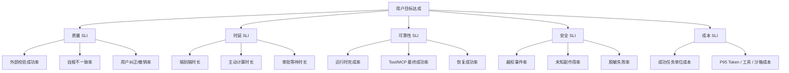

### 9.3 SLO 示例

下面是示范，不应直接复制为所有系统的统一阈值。真实 SLO 应基于业务风险、历史基线和可承受成本制定。

| SLO | 窗口 | 目标 | 排除项 |
|---|---:|---:|---|
| 外部校验任务成功率 | 28 天滚动 | ≥ 92% | 用户主动取消、无执行条件 |
| 运行时正常完成率 | 28 天滚动 | ≥ 99.5% | 用户取消 |
| 成功任务主动处理时长 | 7 天滚动 | P95 < 120s | 人工审批等待 |
| 工具逻辑调用最终成功率 | 7 天滚动 | ≥ 99% | 明确的业务拒绝 |
| 未知副作用率 | 28 天滚动 | < 0.01% | 无 |
| Trace 完整度 | 7 天滚动 | ≥ 99.9% | 无 |
| 成功任务单位成本 | 7 天滚动 | P95 < 预算线 | 特殊高成本任务类型单独设线 |
| 无进展熔断率 | 7 天滚动 | < 2% | 压测与故障演练流量 |

### 9.4 质量 SLO 的特殊点

传统可用性 SLO 往往是“请求是否成功响应”。Agent 质量 SLO 更复杂：

- Verifier 可能延迟运行；
- 某些任务只能由人工抽样判断；
- 成功标准按任务类型不同；
- 用户反馈存在样本偏差；
- 一次任务可能部分完成；
- 副作用成功与答案质量可能分离。

因此可以使用分层状态：

```text
technical_success
verified_success
accepted_by_user
safe_side_effect_completion
```

质量仪表盘同时展示各层转化漏斗，而不是只展示最终单一数字。


### 9.5 错误预算

若 SLO 为 92%，允许失败比例为 8%。在窗口内：

```text
error_budget = eligible_events × (1 - SLO_target)
remaining_budget = error_budget - bad_events
```

错误预算不只约束代码发布。下面这些变更都可能消耗预算：

- Prompt 版本；
- 模型或 Provider；
- 模型路由与 fallback；
- Tool Schema；
- MCP Server 版本；
- RAG Index / Embedding / Reranker；
- Memory 策略；
- Skill；
- Hook / Policy；
- Context Compaction；
- Agent Loop 终止与预算策略。

当质量错误预算耗尽时，组织可以采取：

- 冻结高风险行为变更；
- 只允许修复类发布；
- 将流量切回稳定 Prompt/模型/Skill 版本；
- 提高人工审批比例；
- 降级到只读或建议模式；
- 扩大在线抽样评测。

### 9.6 Burn Rate

Burn Rate 表示错误预算消耗速度：

```text
burn_rate = observed_bad_rate / allowed_bad_rate
```

假设 SLO=99%，允许坏事件率 1%。若当前坏事件率为 5%，Burn Rate=5。

一个常见的 30 天窗口告警思路：

| 严重度 | 长窗口 | 短窗口 | Burn Rate 示例 | 含义 |
|---|---:|---:|---:|---|
| Critical | 1h | 5m | 14.4x | 持续约 1h 会消耗约 2% 月预算 |
| High | 6h | 30m | 6x | 持续约 6h 会消耗约 5% 月预算 |
| Warning | 1d | 2h | 3x | 慢速持续退化 |
| Ticket | 3d | 6h | 1x | 长期刚好以耗尽预算的速度运行 |

多窗口的价值是避免瞬时尖峰误报，同时又能快速发现持续高燃尽。

### 9.7 五类告警

| 类型 | 适用场景 | 示例 |
|---|---|---|
| 静态阈值 | 明确安全边界 | 未知副作用 > 0、队列最老年龄 > 10m |
| SLO 燃尽 | 用户结果 | 任务成功率、运行时可用性 |
| 行为漂移 | 基线依赖任务结构 | P95 轮次较同任务组合基线上涨 30% |
| 变化点/异常检测 | 季节性或复杂流量 | Token/任务单位成本突变 |
| 完整性告警 | 数据管道 | Trace 完整度下降、事件丢弃 |

### 9.8 行为漂移要控制任务组合

直接比较全站平均数容易受到任务组合变化影响。例如简单问答流量下降、复杂 Coding 流量上升，会自然推高轮次和成本。

正确做法：

- 按 `task_type`、风险等级、输入规模分层；
- 计算同层基线后再加权；
- 同时展示原始总体值与标准化值；
- 将模型、Prompt、Skill、索引版本作为变更切片；
- 使用同周同日同时段对比处理季节性。

### 9.9 变更标记

所有可能影响行为的发布都应形成结构化变更事件：

```json
{
  "event_name": "agent.configuration.released",
  "change_id": "chg_20260831_017",
  "component": "prompt",
  "name": "ticket-batch-update",
  "from_version": "v12",
  "to_version": "v13",
  "deployment_ring": "canary",
  "traffic_percent": 10,
  "trace_id": "optional deployment trace",
  "released_at": "2026-08-31T09:00:00Z"
}
```

这些事件要叠加到指标图上，并能一键过滤对应版本的 Trace。

### 9.10 告警必须绑定 Runbook

一个合格告警至少包含：

```text
What: 哪个 SLI/行为指标异常
Impact: 影响哪些任务/租户/风险等级
When: 从何时开始，是否与发布重合
Evidence: Dashboard 与 exemplar Trace
First checks: 前三项检查
Mitigation: 回滚、降级、限流、切模型、禁写、提高审批
Owner: 值班与升级路径
Exit criteria: 什么条件下解除
```

反例：

```text
Alert: agent_error_rate_high
Value: 0.034
```

这个告警没有口径、影响范围、版本、Trace 和处置动作，最终只能制造噪音。

---

## 10. 仪表盘体系与排障动线

### 10.1 不要做一个“万能大盘”

不同角色需要不同视图：

| 仪表盘 | 主要用户 | 核心问题 |
|---|---|---|
| 业务质量总览 | 产品、业务负责人 | 是否做对、用户是否接受 |
| SRE / On-call | 值班工程师 | 哪里故障、影响多大、是否需止血 |
| Agent 行为 | Agent 工程师 | 是否循环、停滞、压缩或计划漂移 |
| LLM / Cost | 模型平台、FinOps | Provider、Token、缓存、成本与延迟 |
| Tool / MCP | 工具平台 | 哪个工具、Server、transport 劣化 |
| RAG / Memory | 知识平台 | 检索和记忆是否相关、新鲜、正确 |
| Security / Policy | 安全与合规 | 越权、拒绝、审批、出域与审计 |
| Telemetry Pipeline | 可观测平台 | 数据是否完整、及时、未丢弃 |

### 10.2 业务质量总览

推荐布局：

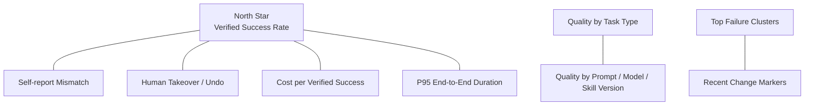

总览必须支持从失败聚类直接进入代表性 Trace，而不是停在百分比。

### 10.3 On-call 仪表盘

建议按排障顺序排版：

1. 当前 SLO 燃尽与受影响任务；
2. 最近变更标记；
3. Provider、Tool/MCP、Runtime、Queue、Sandbox 错误；
4. P95/P99 时长与分解；
5. 行为健康：重复调用、无进展、熔断、压缩；
6. Telemetry 完整度；
7. exemplar Trace 与失败聚类。

### 10.4 LLM 仪表盘

至少包括：

- 请求量、Provider 错误、限流与 fallback；
- operation duration P50/P95/P99；
- TTFC/TTFT 与流阶段时长；
- 输入/输出/缓存/推理 Token；
- Context 利用率和截断率；
- Structured Output 失败与修复器介入；
- Prompt/模型版本的成功率与单位成本；
- 按任务类型标准化后的质量—成本 Pareto 图。

### 10.5 Tool / MCP 仪表盘

关键视图：

- final success vs attempt success；
- retry masked failure gap；
- Tool/MCP operation duration；
- MCP Session、断连、重连、能力不匹配；
- 结果大小与截断；
- 按 effect 的调用、审批和失败；
- 未知副作用与补偿；
- Tool Schema 版本变化。

### 10.6 RAG / Memory 仪表盘

RAG：

- 查询量、空结果、P95 时长；
- Index Lag、数据源错误；
- Result Count、Score 分布、重复率；
- 离线 Recall/MRR/NDCG；
- 在线 Grounded Claim 与 Citation Coverage；
- Embedding/Chunker/Reranker 版本对比。

Memory：

- Read/Write 时长和失败；
- Returned Count、Empty、Conflict、Dedup；
- Staleness、Wrong Scope、Negative Influence；
- Store Growth、Compaction、Expiry；
- Memory 版本与任务质量对比。

### 10.7 Security / Policy 仪表盘

- allow/deny/ask 按 risk level；
- 高风险 effect 的审批覆盖；
- false positive/false negative 抽样；
- 敏感数据检测与脱敏失败；
- Full Capture 启用租户和有效期；
- Trace 查看审计；
- 越权、跨租户、网络拒绝、危险命令；
- 未知副作用和人工 override。

### 10.8 Telemetry Pipeline 仪表盘

- Collector CPU、内存、队列；
- 接收/发送/拒绝/丢弃；
- Exporter 失败和重试；
- OTLP 延迟；
- Trace 完整度、Orphan Span、Force Close；
- Schema Violation；
- Redaction Failure；
- 后端摄入延迟与查询可用性；
- 各租户遥测体量与成本。

### 10.9 标准排障动线


### 10.10 “第一处分叉”方法

对比一条成功 Trace 与一条失败 Trace：

1. 对齐相同任务阶段；
2. 找到首次出现不同状态、不同工具、不同参数、不同检索结果或不同计划的 Span；
3. 判断这个差异是根因、放大器还是结果；
4. 沿输入来源反向查：Prompt、上下文、Memory、RAG、Tool Schema；
5. 沿状态传播正向查：后续哪些轮次复用了错误观察；
6. 通过回放做因果验证，而不是只凭时间相关性下结论。

### 10.11 Trace 形态指纹

大量 Trace 不适合人工逐条查看，可以提取低维“形态指纹”：

```text
turn_count
model_call_count
tool_sequence_hash
tool_retry_vector
plan_revision_count
retrieval_count
memory_read_count
approval_count
compaction_count
final_outcome
```

按这些特征聚类，常能发现：

- 所有失败都在 `query → update → update` 形态中；
- 某 Prompt 版本出现额外两次 plan revision；
- 某 MCP Server 断连后总会触发三次相同重试；
- 长会话失败集中在第二次 compaction 之后。

---

## 11. Trace 回放与因果验证

### 11.1 回放的三种等级

| 模式 | 外部依赖 | 模型响应 | 副作用 | 用途 |
|---|---|---|---|---|
| 录制回放 | 使用已录制结果 | 使用已录制响应 | 禁止 | UI、解析、状态机、确定性回归 |
| 半确定性回放 | 工具可录制或沙箱 | 重新调用模型或固定模型快照 | 默认禁写 | Prompt/模型修复验证 |
| 影子重放 | 真实只读依赖 | 新版本模型/策略 | 写操作转 dry-run | 发布前在线近真实验证 |

完全确定性通常不可得，因为模型、远程服务和实时数据会变化。工程目标不是伪造绝对确定性，而是明确每个边界是“录制、固定、模拟还是重新调用”。

### 11.2 可回放记录清单

#### 运行配置

```text
runtime_version
agent_version
prompt_name / prompt_version / content_hash
skill_name / skill_version / content_hash
policy_version
hook_version
model_router_version
context_compactor_version
retrieval_pipeline_version
memory_policy_version
```

#### 模型调用

```text
provider
request_model
response_model
operation
parameters
token_usage
response_id
finish_reason
request/response pointer
```

#### 工具与外部状态

```text
tool_name / version / schema_hash
request pointer / response pointer
attempts / backoff
idempotency_key
side_effect classification
external snapshot or ETag
```

#### 状态

```text
conversation state
plan state
turn index
budget state
pending approvals
memory references
retrieval evidence IDs
workspace/file hashes
```

### 11.3 回放架构

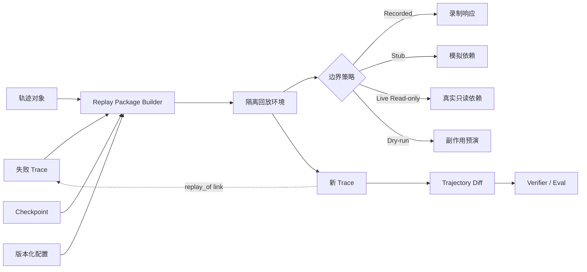

### 11.4 副作用安全

回放默认必须禁止真实写操作。推荐策略：

| Tool Effect | 默认回放策略 |
|---|---|
| read_only | 可使用录制结果或真实只读调用 |
| write_reversible | dry-run 或隔离副本；明确补偿 |
| write_irreversible | 只允许录制响应，不真实调用 |
| external_communication | 捕获到本地 outbox，不真正发送 |
| financial_or_legal | 永不自动真实回放 |
| execute_code | 在隔离沙箱执行，网络与文件权限最小化 |

### 11.5 轨迹 Diff

回放验证不应只比较最终文本。建议比较：

```text
最终 outcome
Verifier 分数
Turn 数
计划节点与修订次数
Tool 序列
Tool 参数摘要
检索文档 IDs 与排序
Memory 召回集合
Policy 决策
审批数量
Token 与成本
Artifact 哈希与结构化 diff
```

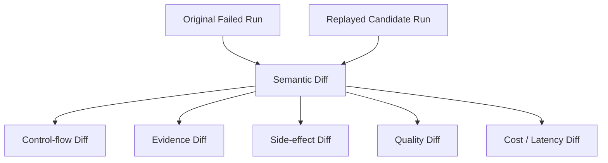

### 11.6 用回放证明因果

假设怀疑“字段映射变化导致错误更新”，可以做四组回放：

| 组 | Prompt/Agent | Tool 结果 | 预期 |
|---|---|---|---|
| A | 原版本 | 原错误结果 | 复现失败 |
| B | 原版本 | 修复后结果 | 若成功，支持 Tool 根因 |
| C | 修复版本 | 原错误结果 | 若仍失败，说明修复不足 |
| D | 修复版本 | 修复后结果 | 应通过 Verifier |

这种控制变量式回放比“修完后看起来好了”更有说服力。

### 11.7 回放结果自动进入评测

每次确认事故后，应自动生成：

```text
case_id
failure_cluster
source_trace_id
input_fixture
recorded_dependency_fixture
expected_outcome
verifier
risk_level
introduced_by_change
fixed_by_change
```

并加入回归集。事故关闭条件不应只是线上恢复，还应包括：

- 根因已验证；
- 修复回放通过；
- 回归用例已添加；
- 告警或指标缺口已补齐；
- 数据采集与隐私策略已复核。


---

## 12. 常见故障 Runbook

### 12.1 任务验证成功率下降

**告警信号**

- `verified_success_rate` 快速燃尽；
- `self_report_mismatch_rate` 上升；
- 用户纠正、撤销或人工接管上升。

**第一轮检查**

1. 按 task_type、Prompt、模型、Skill、RAG Index、Memory 策略版本切片；
2. 对齐最近配置与依赖变更；
3. 检查 Trace 完整度，先确认数据可信；
4. 对失败 Trace 聚类，找共同 Tool 序列、首个分叉轮和错误证据；
5. 判断是技术失败、质量失败还是副作用失败。

**快速止血**

- 回滚 Prompt/模型/Skill/索引版本；
- 将高风险任务切换到稳定模型；
- 暂停写操作或提升审批级别；
- 对特定任务类型启用更严格 Verifier；
- 降级到建议模式。

**长期修复**

- 添加代表性回归用例；
- 补充结果校验；
- 修复终止判定；
- 将失败聚类变成指标维度或 Trace 形态规则；
- 建立 Canary 与自动回滚。

### 12.2 P95/P99 延迟突增

**按时长分解检查**：

```text
queue
model TTFC
model stream
retrieval
memory
policy
approval wait
tool/MCP
sandbox
retry backoff
checkpoint/export
```

**典型根因**

- Provider 限流或首 Token 变慢；
- Tool 原始尝试失败，被重试掩盖；
- MCP 断连重连；
- RAG Index 或 Reranker 变慢；
- 审批队列积压；
- 沙箱启动或镜像准备变慢；
- Trace/轨迹同步写入阻塞主循环；
- 长上下文引发模型延迟和压缩。

**快速止血**

- 切换 Provider/模型；
- 减少无价值上下文；
- 限制 Tool 重试并启用熔断；
- 绕过异常 Reranker 或降级 Top-K；
- 观测导出改为异步批量；
- 对低优先级任务限流。

### 12.3 单位成功成本突增

**检查顺序**

1. 是每任务 Token 变多，还是成功率下降导致分母变小？
2. Context 构成中哪一部分增长：History、RAG、Memory、Tool Result？
3. 是否出现重复调用、计划频繁修订、压缩后再次膨胀？
4. Provider 缓存命中是否下降？
5. 是否发生模型 fallback 到更贵模型？
6. Tool/MCP 重试、沙箱和观测存储费用是否上升？

**典型修复**

- 修复工具结果截断；
- 对历史和 RAG 做预算化装配；
- 缓存稳定前缀；
- 设置按任务类型的模型路由；
- 将“每次调用成本”优化转为“成功任务单位成本”优化；
- 对失败长会话更早触发无进展熔断。

### 12.4 无进展、重复调用或预算熔断上升

**Trace 特征**

- 同工具同参数连续出现；
- 模型每轮都产生近似文本；
- plan_version 持续增加但未产生外部状态变化；
- Context 多次压缩；
- Tool 返回相同错误，Agent 无替代策略；
- “检查是否完成”类调用循环。

**检查**

- 进度判定是否只看文本而没看外部状态；
- Tool Error 是否提供可操作分类；
- Prompt 是否要求无限尝试；
- 预算和终止条件是否失效；
- Memory/RAG 是否重复注入冲突指令；
- 修复器是否在产生新的错误循环。

**止血**

- 降低最大轮次；
- 启用重复调用指纹；
- 对连续同类错误熔断；
- 要求模型在重试前改变策略；
- 触发人工接管或返回部分结果。

### 12.5 Tool/MCP 最终成功正常，但尝试成功恶化

这是“重试掩盖依赖劣化”的典型情况。

**信号**

```text
final_success_rate stable
attempt_success_rate down
retry_masked_failure_gap up
tool duration P95 up
cost per success up
```

**检查**

- 按 MCP Server、transport、method、Tool Schema 版本拆分；
- 检查 initialize/capability negotiation；
- 查看 stdio Server 重启与 Streamable HTTP 断连；
- 查看上游 429/5xx/timeout；
- 检查是否错误地重试不可幂等写操作。

**止血**

- 启用熔断和退避；
- 切换备用 Server；
- 降低并发；
- 对非幂等动作禁止自动重试；
- 将依赖故障状态返回给 Agent，避免无意义继续规划。

### 12.6 RAG 质量下降

**信号**

- Empty Result、低分结果、Stale Evidence 上升；
- Citation Coverage 与 Grounded Claim 下降；
- 用户纠正事实增多；
- 检索结果 Token 上升但成功率下降。

**检查**

- Index Lag 与数据摄入；
- Embedding/Chunker/Reranker 版本；
- 查询重写是否改变语义；
- Filter 是否过严或作用域错误；
- Top-K 是否被成本策略过度压缩；
- 文档权限过滤是否误删；
- 失败 Trace 的检索证据与成功 Trace 对比。

### 12.7 Memory 错误作用域或污染

**高风险信号**

- `memory.wrong_scope.count > 0`；
- 跨项目事实出现在上下文；
- 召回记录缺少 provenance；
- 同一事实存在冲突版本；
- 记忆引入后成功率下降。

**立即动作**

- 停止相关 Memory Store 的自动读取；
- 禁止新的自动写入；
- 隔离受影响租户/用户；
- 审计读取过错误记录的 Trace；
- 清理或撤销污染记录；
- 评估是否构成数据泄露事件。

**长期修复**

- 作用域键强制化；
- 写入前 provenance、TTL、置信度和敏感性校验；
- 冲突检测；
- 记忆使用的正/负影响评测；
- Memory 读写审计与回放。

### 12.8 Policy 询问率突增

可能原因：

- Tool effect 或风险分类变化；
- Policy 版本回归；
- 任务组合变化；
- 工具参数出现新资源类型；
- Policy 服务缓存失效；
- Hook 将低风险动作错误提升。

检查时必须按 risk_level 和 effect 标准化，不要只看全局 ask rate。

### 12.9 Telemetry 完整度下降

**信号**

- event drop、orphan span、force close、export failure；
- Collector queue 增长；
- 后端摄入延迟；
- Trace 中只有 start 没有 end；
- Metrics 与事件计数不一致。

**原则**

- 先恢复观测可信度，再对业务指标做强结论；
- 错误、结束和审计事件优先于调试事件；
- 遥测失败不得无限阻塞 Agent；
- 对受监管的关键审计事件，可采用独立可靠通道并根据风险决定 fail-closed。

### 12.10 事故复盘模板

```markdown
# Incident: <title>

## Summary
- Start / End:
- User impact:
- Affected task types / tenants:
- Detection source:

## Timeline
- T0 change released
- T1 first bad run
- T2 alert fired
- T3 mitigation
- T4 recovery

## Evidence
- Dashboard:
- Representative traces:
- Failure cluster:
- Replay package:

## Root cause
- Trigger:
- Latent condition:
- Propagation path:
- Why verifier/guardrail did not stop it:

## Mitigation and fix
- Immediate:
- Permanent:
- Rollback / compensation:

## Observability gaps
- Missing event/span/metric:
- Incorrect metric definition:
- Missing change marker:
- Retention or access issue:

## Prevention
- Regression cases:
- New alerts:
- Policy changes:
- Owners and deadlines:
```

---

## 13. 采样、载荷、存储与保留期

### 13.1 三种采样策略

| 策略 | 决策时机 | 优点 | 缺点 | Agent 适用性 |
|---|---|---|---|---|
| Always On | Span 创建时全部保留 | 证据完整、实现简单 | 成本高 | 中低量、高价值会话首选 |
| Head Sampling | Trace 开始时决定 | 资源消耗低、简单 | 不知道最终是否失败 | 不适合低量高价值失败排障 |
| Tail Sampling | 收集完整/近完整 Trace 后决定 | 可保留失败、长尾、高成本 | Collector 有状态，架构复杂 | 大规模 Agent 推荐 |

### 13.2 Agent 为什么更倾向全采或尾部采样

- 会话量通常低于微服务请求量；
- 单会话成本和业务价值更高；
- 失败长尾是最重要的数据；
- Trace 还会用于回放、评测、聚类和产品分析；
- 头部采样决定时不知道最终 Verifier 结果；
- 某些事故只发生在几十轮之后。

但“Agent 永远全采”也不是绝对规则。高流量短问答、批量推理和公开无状态请求可能需要采样。正确做法是按价值、风险和体量分层。

### 13.3 推荐采样决策树

```mermaid
flowchart TD
    A["Trace 完成"] --> B{"是否失败/校验失败？"}
    B -->|是| KEEP1["100% 保留"]
    B -->|否| C{"是否高风险副作用/安全事件？"}
    C -->|是| KEEP2["100% 保留"]
    C -->|否| D{"是否慢、超预算或行为异常？"}
    D -->|是| KEEP3["100% 保留"]
    D -->|否| E{"是否 Canary / 新版本？"}
    E -->|是| KEEP4["高比例保留"]
    E -->|否| F{"是否高价值任务？"}
    F -->|是| KEEP5["全采或高比例"]
    F -->|否| BASE["基线概率采样"]
```

### 13.4 尾部采样的工程约束

Tail Sampling Processor 必须看到同一个 Trace 的全部 Span。Collector 横向扩容时，需要按 Trace ID 做粘性路由或一致性负载均衡，否则同一 Trace 分散到多个实例，采样决策会不一致。

建议架构：

```mermaid
flowchart LR
    APP1["Runtime A"] --> EDGE1["Edge Collector"]
    APP2["Runtime B"] --> EDGE2["Edge Collector"]
    APP3["MCP/Sandbox"] --> EDGE3["Edge Collector"]

    EDGE1 --> LB["Trace-ID-aware Load Balancer"]
    EDGE2 --> LB
    EDGE3 --> LB

    LB --> TS1["Tail Sampling Gateway 1"]
    LB --> TS2["Tail Sampling Gateway 2"]
    LB --> TS3["Tail Sampling Gateway 3"]

    TS1 --> BACK["Trace Backend"]
    TS2 --> BACK
    TS3 --> BACK
```

要监控：

- `decision_wait` 是否足以覆盖长会话；
- 内存中的待决 Trace 数；
- Trace 是否因超时提前决策；
- Gateway 重启造成的在途 Trace 损失；
- 负载均衡后端变化引起的重分片；
- 长达数小时的 HITL 会话是否适合单一长 Trace。

对于超长会话，可采用“每次 run 一个 Trace、conversation 作为跨 Trace 关联”的模型，避免 Tail Sampler 长时间持有状态。

### 13.5 载荷瘦身

推荐每个 Tool/Model/RAG/Memory Span 保存：

```text
payload_bytes
payload_sha256
content_type
summary
trajectory_pointer
capture_level
redaction_status
```

不保存：

- 几十 KB 的 JSON；
- 大段网页、文件或终端输出；
- 完整 Prompt/Completion 默认全文；
- Base64 图片；
- 完整 diff；
- 访问令牌、Cookie、密钥。

### 13.6 属性大小预算

可以在桥接器实施硬限制：

```text
max_attribute_string_bytes = 4 KiB
max_span_attribute_count = 64
max_span_event_count = 64
max_event_attribute_count = 32
max_summary_bytes = 512
```

具体值应按 SDK 与后端能力调整。重要的是**在应用侧主动控制并计数超限**，而不是等待后端静默截断。

### 13.7 分级存储

```mermaid
flowchart TB
    HOT["Hot Trace Store<br/>快速查询"] --> WARM["Warm Trajectory Store<br/>完整证据"]
    WARM --> COLD["Cold Archive<br/>压缩/合规保留"]
    MET["Metrics Store<br/>长期聚合"]
    AUDIT["Audit Store<br/>不可篡改/独立授权"]
```

推荐示例：

| 数据 | 普通成功 | 失败/高风险 | 聚合 |
|---|---:|---:|---:|
| Trace 元数据 | 14–30 天 | 90–180 天 | 不适用 |
| 完整轨迹 | 7–30 天 | 90–180 天或按合规 | 不适用 |
| 敏感 Full Capture | 小时级/数天 | 明确审批 | 不适用 |
| Metrics | 原始高分辨率 7–30 天 | 同左 | 降采样 13–25 个月 |
| 审计 | 按安全与法规 | 按安全与法规 | 不适用 |
| 评测用例 | 去标识化后长期 | 长期 | 版本化 |

保留期不是固定行业答案，应由业务、法律、安全、成本共同决定。

### 13.8 观测成本估算

粗略估算：

```text
trace_storage_per_day =
  runs_per_day
  × avg_spans_per_run
  × avg_span_bytes
  × replication_factor

trajectory_storage_per_day =
  runs_per_day
  × avg_payload_bytes_per_run
  × retained_fraction
  × replication_factor
```

需要单独估算：

- 索引成本；
- 网络出域；
- Collector 计算；
- 日志摄入；
- Metrics 高基数时间序列；
- 冷存储取回；
- SaaS 按 Span/Event/GB 的计费。

### 13.9 保留优先级

在成本压力下，优先保留：

1. 安全、越权、未知副作用；
2. Verifier 失败、用户撤销、人工接管；
3. 超预算、长尾、无进展；
4. 新版本 Canary；
5. 每个任务类型的代表性成功样本；
6. 普通成功的概率样本。

---

## 14. 隐私、安全、合规与审计

### 14.1 观测管道本身就是数据出口

Agent 遥测可能包含：

- 用户对话；
- 源代码与文件路径；
- 工单、客户、财务或医疗数据；
- Tool 参数和返回；
- 浏览器页面；
- Memory；
- Prompt、策略与内部系统描述；
- 访问令牌或误输出的密钥；
- 员工审批行为。

因此，Trace Backend 不能继续沿用“普通开发日志谁都能看”的权限模型。

### 14.2 内容采集三级模型

| 级别 | 内容 | 典型环境 | 默认保留 |
|---|---|---|---|
| `metadata_only` | 状态、Token、大小、哈希、版本、指针 | 生产默认 | 常规 |
| `redacted` | 机器脱敏后的输入输出摘要或全文 | 受控排障 | 短期 |
| `full` | 完整内容 | 隔离环境、显式审批 | 极短期 |

```mermaid
flowchart LR
    RAW["Raw Event"] --> CLASSIFY["字段分类"]
    CLASSIFY --> LEVEL{"Capture Level"}
    LEVEL -->|metadata_only| META["丢弃内容，仅留元数据"]
    LEVEL -->|redacted| REDACT["PII/Secret 脱敏"]
    LEVEL -->|full| FULL["受控完整内容"]
    REDACT --> VALIDATE["脱敏验证"]
    FULL --> APPROVAL["审批 / TTL / 隔离"]
    META --> EXPORT["Export"]
    VALIDATE --> EXPORT
    APPROVAL --> EXPORT
```

### 14.3 不采集隐藏思维链

Agent 可观测需要“决策可审计”，但不等于收集隐藏思维链。推荐记录：

- 选择了什么动作；
- 依据了哪些外部证据；
- 使用了哪个计划节点；
- 风险/策略理由代码；
- 置信度或不确定性标签；
- Verifier 结果；
- 可面向用户或审核者展示的简洁行动摘要。

不要默认保存模型私有 reasoning 原文。这样既减少敏感信息与存储风险，也避免将不可稳定依赖的内部推理当成产品契约。

### 14.4 字段分级

| 等级 | 示例 | 处理 |
|---|---|---|
| Public | 模型族、Tool 名、任务类型 | 可进入受控 Metrics |
| Internal | Prompt 版本、策略版本、错误类别 | Trace/Logs，内部访问 |
| Confidential | 源代码、业务数据、Tool Result | 指针化、加密、最小授权 |
| Restricted | 密钥、身份信息、受监管数据 | 默认不采；检测并删除/隔离 |

### 14.5 脱敏策略

至少覆盖：

- API Key、Bearer Token、Cookie、Private Key；
- 邮箱、电话号码、身份证件、银行卡等；
- 数据库连接串；
- URL Query 中敏感参数；
- 文件内容与路径中的用户名；
- Tool Schema 指定的 secret 字段；
- Memory 中的敏感属性；
- Prompt 中误嵌的凭据。

仅靠正则不够。应组合：

- 字段级 allowlist/denylist；
- Tool Schema 的敏感字段标记；
- Secret Scanner；
- PII 检测器；
- 结构化 JSON 路径规则；
- 输出后验证与失败隔离。

### 14.6 脱敏失败如何处理

- `metadata_only`：直接丢弃内容字段，风险最低；
- `redacted`：脱敏器失败时应丢弃内容或路由到隔离区，而不是原文继续导出；
- `full`：只有已审批隔离通道可接收；
- 所有失败增加 `telemetry.redaction.failure` 并触发安全告警；
- 不能把原始敏感片段写进错误日志。

### 14.7 访问控制

推荐：

- 按租户、环境、项目和数据等级授权；
- 默认不允许跨租户检索；
- Full Capture 需要 Just-In-Time 临时权限；
- Trace 元数据权限与完整轨迹权限分离；
- 支持字段级遮罩；
- 下载、导出、分享需要单独权限；
- Break-glass 访问有审批、原因、TTL 与审计；
- 生产与测试观测后端隔离。

### 14.8 “谁看过 Trace”也要可观测

审计事件示例：

```json
{
  "event_name": "trajectory.accessed",
  "actor_id": "employee_...",
  "purpose": "incident_2026_0831",
  "trace_id": "...",
  "data_level": "redacted",
  "action": "view",
  "approved_by": "...",
  "expires_at": "..."
}
```

审计日志应进入独立、不可随意修改的存储，并避免把敏感内容复制到审计记录。

### 14.9 租户隔离

租户隔离不仅是查询过滤，还包括：

- Collector 路由；
- 加密密钥；
- 存储命名空间；
- Retention；
- Capture Level；
- Exporter 目的地；
- 评测回流与去标识化；
- 数据删除请求；
- Baggage allowlist。

高风险系统不应只靠前端 UI 隐藏其他租户数据。

### 14.10 数据删除与可追溯性冲突

轨迹用于审计和回放，但用户可能拥有删除请求或业务需要最小化保留。建议：

- 内容对象与 Trace 索引分离；
- 通过 pointer 解耦删除；
- 删除内容后保留无内容审计元数据和哈希，视法规允许程度；
- 评测集先去标识化；
- 建立删除传播任务，覆盖热、温、冷存储和缓存；
- 删除本身形成审计事件。

### 14.11 Prompt Injection 与观测

应记录安全信号，而不是把攻击文本作为指标标签：

```text
injection_detector_version
suspected_category
source_type = user / retrieved_document / tool_result / memory
policy_decision
content_pointer
sanitization_action
```

这能回答“攻击来自用户输入，还是被污染的网页、文档、Memory 或 Tool Result”。

---

## 15. 生产级观测架构

### 15.1 开发环境

```mermaid
flowchart LR
    APP["Agent Runtime"] --> SDK["OTel SDK"]
    SDK --> CONSOLE["Console / Local OTLP"]
    APP --> SQLITE["Local Trajectory Store"]
    CONSOLE --> DEVUI["Local Trace UI"]
```

开发环境目标：

- 快速查看 Trace；
- 使用内存或控制台 Metrics；
- 轨迹保存在本地；
- 默认使用合成数据；
- 支持 Golden Trace 测试。

### 15.2 生产环境

```mermaid
flowchart LR
    subgraph R["Runtime Nodes"]
      A["Agent Runtime"]
      M["MCP Client/Server"]
      S["Sandbox Executor"]
      E["Edge Collector"]
      A --> E
      M --> E
      S --> E
    end

    E --> G["Gateway Collector Cluster"]
    G --> T["Trace Backend"]
    G --> P["Metrics Backend"]
    G --> L["Logs Backend"]
    G --> C["Cold Archive"]

    A --> O["Encrypted Trajectory Store"]
    O --> RP["Replay Service"]
    T --> RP
    RP --> EV["Evaluation Platform"]

    G --> SIEM["Security / SIEM"]
    P --> ALERT["Alert Manager"]
```

### 15.3 Edge Collector 与 Gateway Collector 的职责

| 层 | 职责 |
|---|---|
| Edge/Agent | 就近接收、批量、内存保护、初步资源属性、断网缓冲 |
| Gateway | 统一脱敏、租户路由、尾部采样、跨信号处理、导出策略 |
| Backend | 存储、查询、仪表盘、告警、权限、生命周期 |

### 15.4 遥测失败是否影响 Agent

默认原则：

- 普通 Trace/Metrics 导出失败应 **fail-open**，不能让观测后端故障拖垮 Agent；
- 事件写入使用有界缓冲和批量导出；
- 缓冲满时按优先级丢弃并计数；
- 安全审计、财务或不可逆副作用可能需要独立可靠通道；
- 对某些强合规动作，若必要审计无法持久化，可选择 **fail-closed**；
- fail-open/fail-closed 必须由风险模型决定，不能由观测 SDK 偶然行为决定。

### 15.5 Collector 配置示例

> 下例为架构示意，使用 OpenTelemetry Collector Contrib 中常见组件。具体字段随版本和发行版可能变化，生产使用前应以锁定版本配置文档和配置校验结果为准。

```yaml
receivers:
  otlp:
    protocols:
      grpc:
        endpoint: 0.0.0.0:4317
      http:
        endpoint: 0.0.0.0:4318

processors:
  memory_limiter:
    check_interval: 1s
    limit_mib: 2048
    spike_limit_mib: 512

  # 删除不允许出 Gateway 的内容字段。更复杂的 JSON/PII 脱敏可使用
  # transform/OTTL 或企业自定义 processor。
  attributes/privacy:
    actions:
      - key: gen_ai.input.messages
        action: delete
      - key: gen_ai.output.messages
        action: delete
      - key: gen_ai.system_instructions
        action: delete
      - key: agent.tool.arguments
        action: delete
      - key: agent.tool.result
        action: delete

  tail_sampling:
    decision_wait: 60s
    num_traces: 100000
    expected_new_traces_per_sec: 500
    policies:
      - name: keep-technical-errors
        type: status_code
        status_code:
          status_codes: [ERROR]

      - name: keep-verifier-failures
        type: string_attribute
        string_attribute:
          key: agent.verifier.outcome
          values: [failed]

      - name: keep-budget-or-loop-aborts
        type: string_attribute
        string_attribute:
          key: agent.task.outcome
          values: [budget_aborted, loop_aborted, partial_side_effect]

      - name: keep-slow-runs
        type: latency
        latency:
          threshold_ms: 30000

      - name: baseline-success-sample
        type: probabilistic
        probabilistic:
          sampling_percentage: 10

  batch:
    timeout: 5s
    send_batch_size: 1024
    send_batch_max_size: 4096

exporters:
  otlp/traces:
    endpoint: ${env:TRACE_BACKEND_OTLP_ENDPOINT}
    tls:
      insecure: false

  otlphttp/logs:
    endpoint: ${env:LOG_BACKEND_OTLPHTTP_ENDPOINT}

  prometheus:
    endpoint: 0.0.0.0:9464

  debug:
    verbosity: basic

extensions:
  health_check:
    endpoint: 0.0.0.0:13133
  pprof:
    endpoint: 127.0.0.1:1777
  zpages:
    endpoint: 127.0.0.1:55679

service:
  extensions: [health_check, pprof, zpages]
  pipelines:
    traces:
      receivers: [otlp]
      processors: [memory_limiter, attributes/privacy, tail_sampling, batch]
      exporters: [otlp/traces]

    metrics:
      receivers: [otlp]
      processors: [memory_limiter, batch]
      exporters: [prometheus]

    logs:
      receivers: [otlp]
      processors: [memory_limiter, attributes/privacy, batch]
      exporters: [otlphttp/logs]

  telemetry:
    logs:
      level: info
```

### 15.6 Collector 的自观测

Collector 必须暴露并告警：

- receiver accepted/refused；
- processor dropped；
- exporter sent/failed；
- queue size/capacity；
- CPU、内存、GC；
- batch 大小；
- tail sampling 决策与待决 Trace；
- 配置加载失败；
- health check；
- backend 可达性。

### 15.7 多租户路由

推荐在 Gateway 通过可信 Resource Attribute 路由：

```text
service.namespace
deployment.environment.name
tenant.route_class
data_residency_region
capture_level
```

不要相信不受控客户端随意上传的 `tenant_id`。应由认证层或可信边车注入，并在 Gateway 重写或校验。

### 15.8 配置与版本锁定

生产仓库应锁定：

```text
OTel API/SDK version
GenAI semconv version/commit
Collector distribution and version
Collector config schema
Backend ingestion schema
Metric registry version
Custom attribute registry version
```

升级流程：

1. 在测试环境运行配置校验；
2. 回放 Golden Traces；
3. 对比升级前后属性、Span 名与 Metrics；
4. 验证仪表盘和告警查询；
5. Canary Collector；
6. 保留双写或兼容窗口；
7. 更新注册表与迁移文档。


---

## 16. Python 工程实现示例

### 16.1 依赖

```bash
pip install \
  opentelemetry-api \
  opentelemetry-sdk \
  opentelemetry-exporter-otlp-proto-grpc
```

生产项目应锁定精确版本，并将 GenAI 语义约定版本/commit 记录到依赖清单和遥测 Resource 中。

### 16.2 初始化 OTel SDK

```python
# src/assistant/obs/bootstrap.py
from __future__ import annotations

from dataclasses import dataclass
from typing import Callable

from opentelemetry import metrics, trace
from opentelemetry.exporter.otlp.proto.grpc.metric_exporter import OTLPMetricExporter
from opentelemetry.exporter.otlp.proto.grpc.trace_exporter import OTLPSpanExporter
from opentelemetry.sdk.metrics import MeterProvider
from opentelemetry.sdk.metrics.export import PeriodicExportingMetricReader
from opentelemetry.sdk.resources import Resource
from opentelemetry.sdk.trace import TracerProvider
from opentelemetry.sdk.trace.export import BatchSpanProcessor


@dataclass(frozen=True)
class ObservabilityConfig:
    service_name: str
    service_version: str
    environment: str
    otlp_endpoint: str
    semconv_revision: str
    export_interval_ms: int = 10_000


def initialize_otel(config: ObservabilityConfig) -> Callable[[], None]:
    """初始化一次 OTel，并返回有界关闭函数。

    生产代码应保证该函数只调用一次；测试可通过独立进程或测试 Provider 隔离。
    """
    resource = Resource.create(
        {
            "service.name": config.service_name,
            "service.version": config.service_version,
            "deployment.environment.name": config.environment,
            "agent.semconv.revision": config.semconv_revision,
        }
    )

    tracer_provider = TracerProvider(resource=resource)
    span_exporter = OTLPSpanExporter(
        endpoint=config.otlp_endpoint,
        insecure=False,
    )
    tracer_provider.add_span_processor(BatchSpanProcessor(span_exporter))
    trace.set_tracer_provider(tracer_provider)

    metric_exporter = OTLPMetricExporter(
        endpoint=config.otlp_endpoint,
        insecure=False,
    )
    metric_reader = PeriodicExportingMetricReader(
        metric_exporter,
        export_interval_millis=config.export_interval_ms,
    )
    meter_provider = MeterProvider(
        resource=resource,
        metric_readers=[metric_reader],
    )
    metrics.set_meter_provider(meter_provider)

    def shutdown() -> None:
        # 先 flush/关闭 Trace，再关闭 Metrics；真实项目应设置进程级超时。
        tracer_provider.shutdown()
        meter_provider.shutdown()

    return shutdown
```

### 16.3 内容采集与属性大小控制

```python
# src/assistant/obs/privacy.py
from __future__ import annotations

import hashlib
import re
from enum import Enum
from typing import Any, Mapping


class CaptureLevel(str, Enum):
    METADATA_ONLY = "metadata_only"
    REDACTED = "redacted"
    FULL = "full"


CONTENT_KEYS = {
    "gen_ai.input.messages",
    "gen_ai.output.messages",
    "gen_ai.system_instructions",
    "agent.tool.arguments",
    "agent.tool.result",
    "gen_ai.tool.call.arguments",
    "gen_ai.tool.call.result",
    "agent.memory.records",
}

MAX_ATTRIBUTE_STRING_BYTES = 4096

_SECRET_PATTERNS = [
    re.compile(r"(?i)bearer\s+[a-z0-9._~+\-/]+=*"),
    re.compile(r"(?i)(api[_-]?key|access[_-]?token|secret)\s*[:=]\s*[^\s,;]+"),
]
_EMAIL = re.compile(r"[A-Za-z0-9._%+-]+@[A-Za-z0-9.-]+\.[A-Za-z]{2,}")


def redact_text(value: str) -> str:
    """教学级示例；生产环境应使用字段规则、Secret Scanner 和 PII 检测组合。"""
    result = value
    for pattern in _SECRET_PATTERNS:
        result = pattern.sub("[REDACTED_SECRET]", result)
    result = _EMAIL.sub("[REDACTED_EMAIL]", result)
    return result


def _truncate_utf8(value: str, max_bytes: int) -> str:
    encoded = value.encode("utf-8")
    if len(encoded) <= max_bytes:
        return value
    digest = hashlib.sha256(encoded).hexdigest()[:16]
    head = encoded[: max_bytes - 64].decode("utf-8", errors="ignore")
    return f"{head}...[TRUNCATED sha256={digest} bytes={len(encoded)}]"


def sanitize_attributes(
    attributes: Mapping[str, Any],
    capture_level: CaptureLevel,
) -> dict[str, str | bool | int | float | list[str]]:
    """过滤内容、控制类型和属性大小。

    OTel Attribute 不适合直接放任意嵌套对象。大对象应先写轨迹存储，
    此处只接收扁平元数据、摘要和 pointer。
    """
    output: dict[str, str | bool | int | float | list[str]] = {}

    for key, raw_value in attributes.items():
        if raw_value is None:
            continue

        if key in CONTENT_KEYS:
            if capture_level is CaptureLevel.METADATA_ONLY:
                continue
            if capture_level is CaptureLevel.REDACTED:
                raw_value = redact_text(str(raw_value))

        if isinstance(raw_value, (bool, int, float)):
            output[key] = raw_value
        elif isinstance(raw_value, str):
            output[key] = _truncate_utf8(raw_value, MAX_ATTRIBUTE_STRING_BYTES)
        elif isinstance(raw_value, (list, tuple)) and all(
            isinstance(item, str) for item in raw_value
        ):
            output[key] = [
                _truncate_utf8(item, MAX_ATTRIBUTE_STRING_BYTES)
                for item in raw_value[:32]
            ]
        else:
            output[key] = _truncate_utf8(str(raw_value), MAX_ATTRIBUTE_STRING_BYTES)

    output["agent.telemetry.capture_level"] = capture_level.value
    return output
```

### 16.4 并发安全的事件→Span 桥接器

下面的实现重点展示：

> 为保持示例可读，`session_start/session_end` 在代码中映射为一个 `agent.run` 根 Span。若一个 Task 允许恢复、重跑或并行 Run，生产实现应再增加独立的 `agent.task` 根 Span，并用父子关系或 Span Link 关联多个 Run。

- 以 `run_id/turn_id/call_id` 分槽，支持并发会话；
- 不依赖线程本地“当前 Span”，而显式保存父 Context；
- 技术错误与业务 Outcome 分离；
- 处理重复、缺失和未闭合事件；
- 指标只使用有界属性；
- 逻辑 Tool 结果与原始 Attempt 分开计数；
- Session 结束时强制关闭孤儿子 Span。

```python
# src/assistant/obs/otel_bridge.py
from __future__ import annotations

import threading
import time
from dataclasses import dataclass, field
from typing import Any, Mapping

from opentelemetry import metrics, trace
from opentelemetry.context import Context
from opentelemetry.trace import (
    Span,
    SpanKind,
    Status,
    StatusCode,
    set_span_in_context,
)

from .privacy import CaptureLevel, sanitize_attributes


@dataclass(frozen=True)
class TelemetryEvent:
    event_id: str
    event_type: str
    run_id: str
    session_id: str
    payload: Mapping[str, Any]
    turn_id: str | None = None
    call_id: str | None = None
    schema_version: int = 1


@dataclass
class ActiveSpan:
    span: Span
    context: Context
    started_monotonic: float
    attributes: dict[str, str] = field(default_factory=dict)


class OtelBridge:
    """把稳定领域事件转换为 OTel Trace 与 Metrics。

    约束：
    - on_event 可以被多个线程调用；
    - 导出由 OTel BatchSpanProcessor 异步完成；
    - 本类不保存完整消息，只保存 pointer/hash/size；
    - EventBus 应保证主循环不会被该消费者无限阻塞。
    """

    SUPPORTED_SCHEMA_VERSIONS = {1, 2, 3}

    def __init__(self, capture_level: CaptureLevel = CaptureLevel.METADATA_ONLY):
        self._capture_level = capture_level
        self._tracer = trace.get_tracer("assistant.runtime")
        meter = metrics.get_meter("assistant.runtime")

        self._task_count = meter.create_counter(
            "agent.task.count",
            unit="{task}",
            description="Ended Agent tasks by outcome.",
        )
        self._task_duration = meter.create_histogram(
            "agent.task.duration",
            unit="s",
            description="End-to-end Agent task duration.",
        )
        self._turn_count = meter.create_histogram(
            "agent.task.turn.count",
            unit="{turn}",
            description="Turn count recorded only when a task ends.",
        )
        self._model_duration = meter.create_histogram(
            "gen_ai.client.operation.duration",
            unit="s",
            description="Duration of GenAI client operations.",
        )
        self._token_usage = meter.create_histogram(
            "gen_ai.client.token.usage",
            unit="{token}",
            description="Token usage per GenAI client operation.",
        )
        self._tool_attempt_count = meter.create_counter(
            "agent.tool.attempt.count",
            unit="{attempt}",
            description="Physical tool attempts, including retries.",
        )
        self._tool_final_count = meter.create_counter(
            "agent.tool.final.count",
            unit="{call}",
            description="Final outcomes of logical tool calls.",
        )
        self._tool_duration = meter.create_histogram(
            "agent.tool.duration",
            unit="s",
            description="Logical tool call duration including retries/backoff.",
        )
        self._telemetry_violation = meter.create_counter(
            "agent.telemetry.contract.violation",
            unit="{violation}",
            description="Telemetry schema, ordering, or pairing violations.",
        )
        self._forced_close = meter.create_counter(
            "agent.telemetry.span.force_closed",
            unit="{span}",
            description="Open spans force-closed during cleanup.",
        )

        self._runs: dict[str, ActiveSpan] = {}
        self._turns: dict[tuple[str, str], ActiveSpan] = {}
        self._models: dict[tuple[str, str], ActiveSpan] = {}
        self._tools: dict[tuple[str, str], ActiveSpan] = {}
        self._processes: dict[tuple[str, str], ActiveSpan] = {}
        self._seen_event_ids: set[str] = set()
        self._lock = threading.RLock()

    def on_event(self, event: TelemetryEvent) -> None:
        with self._lock:
            if event.event_id in self._seen_event_ids:
                self._record_violation("duplicate_event", event.event_type)
                return
            self._seen_event_ids.add(event.event_id)

            if event.schema_version not in self.SUPPORTED_SCHEMA_VERSIONS:
                self._record_violation("unsupported_schema", event.event_type)
                return

            handler = getattr(self, f"_on_{event.event_type}", None)
            if handler is None:
                # 未识别事件可以只计数并跳过，避免新生产者击穿旧消费者。
                self._record_violation("unknown_event_type", event.event_type)
                return

            try:
                handler(event)
            except Exception as exc:  # 观测消费者不能击穿 Agent 主循环
                self._record_violation("bridge_exception", event.event_type)
                # 真实项目应写入受控结构化日志，但不要把 payload/secret 带入异常日志。
                _ = exc

    def _on_session_start(self, event: TelemetryEvent) -> None:
        if event.run_id in self._runs:
            self._record_violation("duplicate_session_start", event.event_type)
            return

        task_type = self._bounded(event.payload.get("task_type"), "unknown")
        attributes = sanitize_attributes(
            {
                "agent.run.id": event.run_id,
                "gen_ai.conversation.id": event.session_id,
                "agent.task.type": task_type,
                "agent.task.priority": self._bounded(
                    event.payload.get("priority"), "normal"
                ),
                "agent.prompt.name": event.payload.get("prompt_name"),
                "gen_ai.prompt.version": event.payload.get("prompt_version"),
                "gen_ai.agent.name": event.payload.get("agent_name"),
                "gen_ai.agent.version": event.payload.get("agent_version"),
            },
            self._capture_level,
        )
        span = self._tracer.start_span("agent.run", attributes=attributes)
        self._runs[event.run_id] = ActiveSpan(
            span=span,
            context=set_span_in_context(span),
            started_monotonic=time.monotonic(),
            attributes={"task_type": task_type},
        )

    def _on_turn_start(self, event: TelemetryEvent) -> None:
        run = self._require_run(event)
        if run is None or event.turn_id is None:
            return

        key = (event.run_id, event.turn_id)
        if key in self._turns:
            self._record_violation("duplicate_turn_start", event.event_type)
            return

        attributes = sanitize_attributes(
            {
                "agent.turn.index": event.payload.get("turn_index"),
                "agent.context.input_tokens": event.payload.get("context_tokens"),
                "gen_ai.conversation.compacted": event.payload.get("compacted"),
                "agent.plan.version": event.payload.get("plan_version"),
            },
            self._capture_level,
        )
        span = self._tracer.start_span(
            "agent.turn",
            context=run.context,
            attributes=attributes,
        )
        self._turns[key] = ActiveSpan(
            span=span,
            context=set_span_in_context(span, run.context),
            started_monotonic=time.monotonic(),
        )

    def _on_turn_end(self, event: TelemetryEvent) -> None:
        if event.turn_id is None:
            self._record_violation("missing_turn_id", event.event_type)
            return
        active = self._turns.pop((event.run_id, event.turn_id), None)
        if active is None:
            self._record_violation("orphan_turn_end", event.event_type)
            return

        active.span.set_attribute(
            "agent.turn.outcome",
            self._bounded(event.payload.get("outcome"), "unknown"),
        )
        active.span.set_attribute(
            "agent.turn.finish_reason",
            self._bounded(event.payload.get("finish_reason"), "unknown"),
        )
        if event.payload.get("no_progress") is True:
            active.span.add_event("agent.loop.no_progress_detected")
        active.span.end()

    def _on_model_request(self, event: TelemetryEvent) -> None:
        parent = self._require_turn(event)
        if parent is None or event.call_id is None:
            return
        key = (event.run_id, event.call_id)
        if key in self._models:
            self._record_violation("duplicate_model_request", event.event_type)
            return

        operation = self._bounded(event.payload.get("operation"), "chat")
        provider = self._bounded(event.payload.get("provider"), "unknown")
        request_model = self._bounded(
            event.payload.get("request_model"), "unknown"
        )
        attributes = sanitize_attributes(
            {
                "gen_ai.operation.name": operation,
                "gen_ai.provider.name": provider,
                "gen_ai.request.model": request_model,
                "gen_ai.request.stream": event.payload.get("stream"),
                "gen_ai.prompt.name": event.payload.get("prompt_name"),
                "gen_ai.prompt.version": event.payload.get("prompt_version"),
                "agent.trajectory.request_pointer": event.payload.get(
                    "request_pointer"
                ),
                "agent.payload.request_bytes": event.payload.get("request_bytes"),
            },
            self._capture_level,
        )
        # 当前 GenAI 约定推荐用“操作名 + 请求模型”构造 Client Span 名。
        span = self._tracer.start_span(
            f"{operation} {request_model}",
            context=parent.context,
            kind=SpanKind.CLIENT,
            attributes=attributes,
        )
        self._models[key] = ActiveSpan(
            span=span,
            context=set_span_in_context(span, parent.context),
            started_monotonic=time.monotonic(),
            attributes={
                "provider": provider,
                "model": request_model,
                "operation": operation,
            },
        )

    def _on_model_response(self, event: TelemetryEvent) -> None:
        self._finish_model(event, technical_error=False)

    def _on_model_error(self, event: TelemetryEvent) -> None:
        self._finish_model(event, technical_error=True)

    def _finish_model(self, event: TelemetryEvent, technical_error: bool) -> None:
        if event.call_id is None:
            self._record_violation("missing_call_id", event.event_type)
            return
        active = self._models.pop((event.run_id, event.call_id), None)
        if active is None:
            self._record_violation("orphan_model_end", event.event_type)
            return

        duration = max(0.0, time.monotonic() - active.started_monotonic)
        outcome = "error" if technical_error else "ok"
        error_type = self._bounded(event.payload.get("error_type"), "_OTHER")

        active.span.set_attribute("agent.model.outcome", outcome)
        active.span.set_attribute(
            "gen_ai.response.model",
            self._bounded(event.payload.get("response_model"), active.attributes["model"]),
        )
        active.span.set_attribute(
            "gen_ai.response.finish_reasons",
            [self._bounded(event.payload.get("finish_reason"), "unknown")],
        )
        if "time_to_first_chunk_s" in event.payload:
            active.span.set_attribute(
                "gen_ai.response.time_to_first_chunk",
                float(event.payload["time_to_first_chunk_s"]),
            )
        if technical_error:
            active.span.set_attribute("error.type", error_type)
            active.span.set_status(Status(StatusCode.ERROR, error_type))

        metric_attributes = {
            "gen_ai.provider.name": active.attributes["provider"],
            "gen_ai.request.model": active.attributes["model"],
            "gen_ai.operation.name": active.attributes["operation"],
            "agent.outcome": outcome,
        }
        if technical_error:
            metric_attributes["error.type"] = error_type
        self._model_duration.record(duration, metric_attributes)

        usage = event.payload.get("usage") or {}
        # 标准 Token Histogram 记录总 input/output；缓存与 reasoning 子集保留为 Span 属性。
        for token_type, field_name, span_attribute in (
            ("input", "input_tokens", "gen_ai.usage.input_tokens"),
            ("output", "output_tokens", "gen_ai.usage.output_tokens"),
        ):
            value = usage.get(field_name)
            if isinstance(value, int) and value >= 0:
                active.span.set_attribute(span_attribute, value)
                self._token_usage.record(
                    value,
                    {
                        "gen_ai.provider.name": active.attributes["provider"],
                        "gen_ai.request.model": active.attributes["model"],
                        "gen_ai.token.type": token_type,
                    },
                )

        detailed_usage_attributes = {
            "cache_read_input_tokens": "gen_ai.usage.cache_read.input_tokens",
            "reasoning_output_tokens": "gen_ai.usage.reasoning.output_tokens",
        }
        for field_name, span_attribute in detailed_usage_attributes.items():
            value = usage.get(field_name)
            if isinstance(value, int) and value >= 0:
                active.span.set_attribute(span_attribute, value)

        active.span.end()

    def _on_tool_call(self, event: TelemetryEvent) -> None:
        parent = self._require_turn(event)
        if parent is None or event.call_id is None:
            return
        key = (event.run_id, event.call_id)
        if key in self._tools:
            self._record_violation("duplicate_tool_call", event.event_type)
            return

        tool_name = self._bounded(event.payload.get("tool_name"), "unknown")
        effect = self._bounded(event.payload.get("effect"), "unknown")
        tool_type = self._bounded(event.payload.get("tool_type"), "function")
        attributes = sanitize_attributes(
            {
                "gen_ai.operation.name": "execute_tool",
                "gen_ai.tool.name": tool_name,
                "gen_ai.tool.type": tool_type,
                "agent.tool.name": tool_name,
                "agent.tool.effect": effect,
                "agent.tool.schema_hash": event.payload.get("schema_hash"),
                "agent.tool.idempotency_key_hash": event.payload.get(
                    "idempotency_key_hash"
                ),
                "agent.trajectory.request_pointer": event.payload.get(
                    "request_pointer"
                ),
                "agent.payload.request_bytes": event.payload.get("request_bytes"),
            },
            self._capture_level,
        )
        span = self._tracer.start_span(
            f"execute_tool {tool_name}",
            context=parent.context,
            kind=SpanKind.INTERNAL,
            attributes=attributes,
        )
        self._tools[key] = ActiveSpan(
            span=span,
            context=set_span_in_context(span, parent.context),
            started_monotonic=time.monotonic(),
            attributes={"tool_name": tool_name, "effect": effect},
        )

    def _on_tool_attempt_end(self, event: TelemetryEvent) -> None:
        # 原始 attempt 指标必须由每次尝试事件采集，不能只根据最终 retries 推断。
        tool_name = self._bounded(event.payload.get("tool_name"), "unknown")
        outcome = self._bounded(event.payload.get("outcome"), "unknown")
        metric_attributes = {
            "agent.tool.name": tool_name,
            "agent.outcome": outcome,
        }
        if outcome != "ok":
            metric_attributes["error.type"] = self._bounded(
                event.payload.get("error_type"), "_OTHER"
            )
        self._tool_attempt_count.add(1, metric_attributes)

    def _on_tool_result(self, event: TelemetryEvent) -> None:
        self._finish_tool(event, technical_error=False)

    def _on_tool_error(self, event: TelemetryEvent) -> None:
        self._finish_tool(event, technical_error=True)

    def _finish_tool(self, event: TelemetryEvent, technical_error: bool) -> None:
        if event.call_id is None:
            self._record_violation("missing_call_id", event.event_type)
            return
        active = self._tools.pop((event.run_id, event.call_id), None)
        if active is None:
            self._record_violation("orphan_tool_end", event.event_type)
            return

        duration = max(0.0, time.monotonic() - active.started_monotonic)
        business_outcome = self._bounded(
            event.payload.get("outcome"),
            "error" if technical_error else "ok",
        )
        error_type = self._bounded(event.payload.get("error_type"), "_OTHER")

        active.span.set_attribute("agent.tool.outcome", business_outcome)
        active.span.set_attribute(
            "agent.tool.attempt_count", int(event.payload.get("attempt_count", 1))
        )
        active.span.set_attribute(
            "agent.payload.result_bytes", int(event.payload.get("result_bytes", 0))
        )
        pointer = event.payload.get("result_pointer")
        if pointer:
            active.span.set_attribute("agent.trajectory.result_pointer", str(pointer))

        if technical_error:
            active.span.set_attribute("error.type", error_type)
            active.span.set_status(Status(StatusCode.ERROR, error_type))

        attributes = {
            "agent.tool.name": active.attributes["tool_name"],
            "agent.tool.effect": active.attributes["effect"],
            "agent.outcome": business_outcome,
        }
        if technical_error:
            attributes["error.type"] = error_type
        self._tool_final_count.add(1, attributes)
        self._tool_duration.record(duration, attributes)
        active.span.end()

    def _on_process_start(self, event: TelemetryEvent) -> None:
        parent = self._require_tool(event)
        process_id = event.payload.get("process_id")
        if parent is None or not isinstance(process_id, str):
            self._record_violation("missing_process_parent_or_id", event.event_type)
            return
        key = (event.run_id, process_id)
        attributes = sanitize_attributes(
            {
                "process.command": self._bounded(
                    event.payload.get("command_name"), "unknown"
                ),
                "agent.process.command_digest": event.payload.get("command_digest"),
                "agent.sandbox.profile": self._bounded(
                    event.payload.get("sandbox_profile"), "default"
                ),
                "agent.sandbox.network_policy": self._bounded(
                    event.payload.get("network_policy"), "default"
                ),
            },
            self._capture_level,
        )
        span = self._tracer.start_span(
            "agent.process.execute",
            context=parent.context,
            kind=SpanKind.INTERNAL,
            attributes=attributes,
        )
        self._processes[key] = ActiveSpan(
            span=span,
            context=set_span_in_context(span, parent.context),
            started_monotonic=time.monotonic(),
        )

    def _on_process_exit(self, event: TelemetryEvent) -> None:
        process_id = event.payload.get("process_id")
        if not isinstance(process_id, str):
            self._record_violation("missing_process_id", event.event_type)
            return
        active = self._processes.pop((event.run_id, process_id), None)
        if active is None:
            self._record_violation("orphan_process_exit", event.event_type)
            return
        exit_code = int(event.payload.get("exit_code", -1))
        active.span.set_attribute("process.exit.code", exit_code)
        if exit_code != 0:
            active.span.set_attribute(
                "error.type",
                self._bounded(event.payload.get("error_type"), "exit_nonzero"),
            )
            active.span.set_status(Status(StatusCode.ERROR, "process_failed"))
        active.span.end()

    def _on_session_end(self, event: TelemetryEvent) -> None:
        run = self._runs.pop(event.run_id, None)
        if run is None:
            self._record_violation("orphan_session_end", event.event_type)
            return

        self._force_close_children(event.run_id)

        outcome = self._bounded(event.payload.get("outcome"), "unknown")
        verifier_outcome = self._bounded(
            event.payload.get("verifier_outcome"), "unknown"
        )
        turns = int(event.payload.get("turn_count", 0))
        duration = max(0.0, time.monotonic() - run.started_monotonic)

        run.span.set_attribute("agent.task.outcome", outcome)
        run.span.set_attribute("agent.verifier.outcome", verifier_outcome)
        run.span.set_attribute("agent.task.turn.count", turns)
        run.span.set_attribute(
            "agent.budget.outcome",
            self._bounded(event.payload.get("budget_outcome"), "normal"),
        )
        # Verifier 失败是业务失败，不自动设置 OTel 技术 ERROR。
        if event.payload.get("technical_error") is True:
            error_type = self._bounded(event.payload.get("error_type"), "_OTHER")
            run.span.set_attribute("error.type", error_type)
            run.span.set_status(Status(StatusCode.ERROR, error_type))

        metric_attributes = {
            "agent.task.type": run.attributes["task_type"],
            "agent.outcome": outcome,
            "agent.verifier.outcome": verifier_outcome,
        }
        self._task_count.add(1, metric_attributes)
        self._task_duration.record(duration, metric_attributes)
        self._turn_count.record(
            turns,
            {"agent.task.type": run.attributes["task_type"], "agent.outcome": outcome},
        )
        run.span.end()

    def shutdown(self) -> None:
        """进程退出前强制结束所有仍打开 Span。"""
        with self._lock:
            for run_id in list(self._runs):
                self._force_close_children(run_id)
                active = self._runs.pop(run_id)
                active.span.set_attribute("agent.telemetry.incomplete", True)
                active.span.set_status(Status(StatusCode.ERROR, "runtime_shutdown"))
                active.span.end()
                self._forced_close.add(1, {"agent.span.type": "agent.run"})

    def _force_close_children(self, run_id: str) -> None:
        collections: tuple[tuple[str, dict[tuple[str, str], ActiveSpan]], ...] = (
            ("agent.process.execute", self._processes),
            ("agent.tool.execute", self._tools),
            ("gen_ai.client", self._models),
            ("agent.turn", self._turns),
        )
        for span_type, collection in collections:
            for key in [key for key in collection if key[0] == run_id]:
                active = collection.pop(key)
                active.span.set_attribute("agent.telemetry.incomplete", True)
                active.span.set_status(Status(StatusCode.ERROR, "missing_end_event"))
                active.span.end()
                self._forced_close.add(1, {"agent.span.type": span_type})

    def _require_run(self, event: TelemetryEvent) -> ActiveSpan | None:
        active = self._runs.get(event.run_id)
        if active is None:
            self._record_violation("missing_run_parent", event.event_type)
        return active

    def _require_turn(self, event: TelemetryEvent) -> ActiveSpan | None:
        if event.turn_id is None:
            self._record_violation("missing_turn_id", event.event_type)
            return None
        active = self._turns.get((event.run_id, event.turn_id))
        if active is None:
            self._record_violation("missing_turn_parent", event.event_type)
        return active

    def _require_tool(self, event: TelemetryEvent) -> ActiveSpan | None:
        if event.call_id is None:
            self._record_violation("missing_call_id", event.event_type)
            return None
        active = self._tools.get((event.run_id, event.call_id))
        if active is None:
            self._record_violation("missing_tool_parent", event.event_type)
        return active

    def _record_violation(self, reason: str, event_type: str) -> None:
        self._telemetry_violation.add(
            1,
            {
                "agent.telemetry.violation": self._bounded(reason, "unknown"),
                "agent.event.type": self._bounded(event_type, "unknown"),
            },
        )

    @staticmethod
    def _bounded(value: Any, default: str) -> str:
        """真实项目应使用注册表映射，未知动态值归入 other/unknown。"""
        if not isinstance(value, str) or not value:
            return default
        return value[:128]
```

### 16.5 MCP Trace Context 注入与提取

```python
# src/assistant/obs/propagation.py
from __future__ import annotations

from typing import Mapping

from opentelemetry.context import Context
from opentelemetry.propagate import extract, inject


_ALLOWED_PROPAGATION_KEYS = {"traceparent", "tracestate", "baggage"}


def inject_mcp_meta(context: Context) -> dict[str, str]:
    carrier: dict[str, str] = {}
    inject(carrier, context=context)
    # 生产环境还应过滤 baggage，仅保留明确 allowlist 的非敏感键。
    return {
        key: value
        for key, value in carrier.items()
        if key.lower() in _ALLOWED_PROPAGATION_KEYS
    }


def extract_mcp_meta(meta: Mapping[str, str] | None) -> Context:
    if not meta:
        return Context()
    carrier = {
        key: value
        for key, value in meta.items()
        if key.lower() in _ALLOWED_PROPAGATION_KEYS
    }
    return extract(carrier)
```

调用时：

```python
request = {
    "jsonrpc": "2.0",
    "method": "tools/call",
    "params": {
        "name": "query_ticket",
        "arguments": {"ticket_id": "T-1042"},
        "_meta": inject_mcp_meta(active_tool_span.context),
    },
    "id": 17,
}
```

### 16.6 结构化事件日志

```python
import json
import logging
from typing import Any

logger = logging.getLogger("assistant.events")


def log_event(
    *,
    event_name: str,
    severity: str,
    trace_id: str,
    span_id: str,
    fields: dict[str, Any],
) -> None:
    safe_fields = {
        key: value
        for key, value in fields.items()
        if key not in {"prompt", "completion", "tool_result", "access_token"}
    }
    record = {
        "event_name": event_name,
        "severity": severity,
        "trace_id": trace_id,
        "span_id": span_id,
        **safe_fields,
    }
    logger.info(json.dumps(record, ensure_ascii=False, separators=(",", ":")))
```

更推荐使用 OTel Logs API 或日志框架的 OTel Bridge 自动注入 `trace_id/span_id`，避免手工复制上下文。

### 16.7 Prometheus 记录与告警规则示例

> 下面假设 OTel 指标导出到 Prometheus 后转换为蛇形名称。实际名称以 exporter 输出为准，先在测试环境核对。

```yaml
groups:
  - name: agent-recording-rules
    rules:
      - record: agent:task_verified_success_rate:1h
        expr: |
          sum(rate(agent_task_count_total{agent_verifier_outcome="passed"}[1h]))
          /
          sum(rate(agent_task_count_total{agent_verifier_outcome=~"passed|failed"}[1h]))

      - record: agent:tool_final_success_rate:15m
        expr: |
          sum by (agent_tool_name) (
            rate(agent_tool_final_count_total{agent_outcome="ok"}[15m])
          )
          /
          sum by (agent_tool_name) (
            rate(agent_tool_final_count_total[15m])
          )

      - record: agent:tool_attempt_success_rate:15m
        expr: |
          sum by (agent_tool_name) (
            rate(agent_tool_attempt_count_total{agent_outcome="ok"}[15m])
          )
          /
          sum by (agent_tool_name) (
            rate(agent_tool_attempt_count_total[15m])
          )

      - record: agent:task_duration_p95:15m
        expr: |
          histogram_quantile(
            0.95,
            sum by (le, agent_task_type) (
              rate(agent_task_duration_seconds_bucket[15m])
            )
          )

  - name: agent-alerts
    rules:
      - alert: AgentTelemetryDroppingEvents
        expr: rate(agent_telemetry_event_dropped_total[5m]) > 0
        for: 5m
        labels:
          severity: critical
        annotations:
          summary: "Agent telemetry is dropping events"
          runbook: "runbooks/telemetry-pipeline.md"

      - alert: AgentToolRetriesMaskingDependencyFailure
        expr: |
          (
            1 - agent:tool_attempt_success_rate:15m
          )
          -
          (
            1 - agent:tool_final_success_rate:15m
          ) > 0.10
        for: 15m
        labels:
          severity: warning
        annotations:
          summary: "Tool retries are masking upstream failures"
          runbook: "runbooks/tool-mcp-degradation.md"

      - alert: AgentTaskP95LatencyHigh
        expr: agent:task_duration_p95:15m > 120
        for: 15m
        labels:
          severity: warning
        annotations:
          summary: "Agent task P95 duration is above 120 seconds"
          runbook: "runbooks/agent-latency.md"
```

### 16.8 指标代码的关键注意事项

1. `gen_ai.client.token.usage` 当前语义约定使用 Histogram，记录每次操作的 Token 使用，而不是无脑建立一堆高基数累计标签。
2. Provider、模型和错误类型要做归一化；临时部署 ID 不应无限增长。
3. Attempt 成功率必须由每次 Attempt 事件采集，不能仅根据最终重试次数推断。
4. 用户取消、Verifier 失败、Policy 拒绝和技术异常不能混成同一个 `error=true`。
5. OTel Global Provider 通常只能安全初始化一次，测试要隔离进程或使用专门测试 Provider。
6. 桥接器异常不得击穿 Agent 主循环，但必须产生独立的遥测完整性信号。
7. `_seen_event_ids` 不能在真实长期进程中无限增长，应使用有界 TTL/LRU 或由上游提供去重窗口。
8. 进程结束必须 flush，且 shutdown 要有超时，避免遥测关闭导致应用无限挂起。


---

## 17. 可观测性测试：证明“看到的是真的”

可观测性代码不是普通的辅助代码。它描述了系统事实，并直接影响告警、事故判断、容量决策、安全审计和产品改进。如果事件丢失、Span 错配、指标口径漂移，即使主业务完全正常，团队也可能得出错误结论。

因此，可观测性必须像业务功能一样被测试，而且要覆盖三个问题：

1. **有没有记录**：关键生命周期是否都有证据。
2. **记录得对不对**：父子关系、属性、状态、耗时、计数是否符合定义。
3. **在异常情况下还能不能相信**：乱序、重试、崩溃、采样、限流和 Collector 故障时是否保持可解释。

### 17.1 可观测性测试金字塔

```mermaid
flowchart TB
    E2E[端到端回放与真实后端验证<br/>数量少、覆盖关键旅程]
    INT[集成测试<br/>SDK、Bridge、Collector、Exporter]
    CONTRACT[契约测试<br/>事件 Schema、Span 拓扑、指标口径]
    UNIT[单元测试<br/>脱敏、截断、归一化、配对状态机]

    UNIT --> CONTRACT
    CONTRACT --> INT
    INT --> E2E
```

| 层级 | 主要验证内容 | 典型失败 |
|---|---|---|
| 单元测试 | 脱敏、哈希、截断、状态映射、错误分类 | 密钥未脱敏、取消被映射为错误 |
| 契约测试 | 事件必填字段、枚举值、单位、父子关系 | `run_id` 缺失、毫秒与秒混用 |
| 集成测试 | SDK→Collector→后端链路 | 批处理未 flush、Exporter 超时 |
| 端到端测试 | 用户任务到 Trace、指标、日志、回放工件 | 跨进程上下文丢失、关键 Span 未采样 |

### 17.2 事件 Schema 契约测试

建议把事件信封定义成机器可校验的 JSON Schema、Protobuf 或强类型结构，并对以下规则做自动测试：

- `schema_version` 必须存在；
- `event_id` 在生产者去重窗口内唯一；
- `occurred_at`、`observed_at` 使用明确时区和统一精度；
- `task_id`、`run_id`、`turn_id` 的可空规则固定；
- `event_type`、`outcome`、`error.type` 使用受控枚举；
- 时间字段统一使用纳秒、毫秒或秒中的一种，不允许隐式混用；
- Token、字节、金额等数值必须声明单位；
- 内容字段必须携带采集级别或脱敏状态；
- 新增字段向后兼容，删除和重命名必须升级 Schema 版本；
- 未知字段的处理策略明确：保留、忽略还是拒绝。

一个简化的测试矩阵如下：

| 测试 | 输入 | 预期 |
|---|---|---|
| 缺少 `event_id` | 非法事件 | 拒绝并增加 schema reject 指标 |
| 未知 `outcome` | `"almost_ok"` | 拒绝或映射到 `unknown`，不得静默当成功 |
| 负耗时 | `ended_at < started_at` | 标记时钟异常，不写入正常延迟指标 |
| 超长属性 | 100 KB Prompt | 哈希/截断/对象存储引用，不直接写 Span |
| 含密钥 | `Authorization: Bearer ...` | 值被完全删除或不可逆替换 |
| 旧版本事件 | `schema_version=1` | 经显式迁移器转换或按兼容策略接收 |

### 17.3 Span 拓扑契约测试

单个 Span 字段正确，不代表整条 Trace 正确。还要验证拓扑约束：

- 每个 `agent.run` 恰好属于一个任务或明确声明为独立运行；
- 每个 `agent.turn` 必须能追溯到对应 Run；
- 模型、工具、检索、记忆和策略 Span 必须挂在触发它们的 Turn 或步骤下；
- 重试 Attempt 是 Final Operation 的子级或事件，不能把每次重试伪装成独立业务成功；
- 异步评测、回放和恢复使用 Span Link，而不是伪造同步父子关系；
- 同一生命周期不能产生两个相互冲突的终态；
- 结束事件缺失时，Span 必须以 `incomplete`、`crashed` 或 `timeout` 终止；
- 用户取消、策略拒绝和系统故障具有不同终态。

```mermaid
flowchart LR
    T[task] --> R[run]
    R --> U[turn]
    U --> M[model call]
    U --> F[tool final operation]
    F --> A1[attempt 1]
    F --> A2[attempt 2]
    U --> G[retrieval]
    U --> P[policy check]
    R -. Span Link .-> E[offline evaluation]
    R -. Span Link .-> RP[replay]
```

### 17.4 Golden Trace：给轨迹建立“快照测试”

对于关键用户旅程，维护一组 Golden Trace：

- 简单问答；
- 单次工具调用；
- 工具失败后重试成功；
- MCP 跨进程调用；
- RAG 检索后生成；
- Memory 召回与写入；
- 权限审批通过和拒绝；
- 用户取消；
- Agent 崩溃后恢复；
- 多 Agent 委派与汇合。

Golden Trace 不应比较随机的 Trace ID、绝对时间戳和模型文本，而应比较规范化后的结构：

```yaml
trace_shape:
  root: agent.task
  required_children:
    - agent.run
  required_descendants:
    - gen_ai.chat
    - agent.tool.execute
  allowed_terminal_outcomes:
    - ok
    - verifier_failed
normalization:
  remove:
    - trace_id
    - span_id
    - started_at
    - ended_at
    - request_id
  bucket:
    duration_ms: [0, 100, 500, 1000, 5000]
```

这样既能发现拓扑回归，又不会因为非确定性字段造成大量无意义 Diff。

### 17.5 故障注入矩阵

| 故障注入 | 应看到的证据 | 不应发生的情况 |
|---|---|---|
| 模型 429 | provider 错误类型、退避事件、Attempt 数 | 被统一记成未知失败 |
| 模型超时 | deadline、取消传播、超时阶段 | Span 永远不结束 |
| Tool 返回非零码 | exit code、stderr 摘要、最终 outcome | 只记 `success=false` |
| MCP 连接中断 | transport、server、session、重连次数 | 上下文完全断链 |
| Collector 不可用 | 队列深度、丢弃数、降级状态 | Agent 主循环被无限阻塞 |
| 磁盘已满 | spool 写入失败、降级动作 | 遥测线程导致进程崩溃 |
| 事件乱序 | late-event 指标、正确配对或孤儿标记 | 创建负耗时 |
| 重复事件 | dedupe 计数 | 指标被重复累计 |
| Agent 崩溃 | 未完成 Span 被终结或可识别 | Trace 看起来像正常运行 |
| 用户取消 | `cancelled_by_user` | 错误率和供应商故障率上升 |
| Policy 拒绝 | 决策 ID、规则版本、拒绝类别 | 记录完整敏感输入 |
| RAG 索引切换 | index version、corpus digest | 新旧索引结果不可区分 |

### 17.6 高基数与指标爆炸测试

在压测中主动生成大量：

- 用户 ID；
- 会话 ID；
- Trace ID；
- 文件路径；
- Prompt Hash；
- MCP Server 实例；
- 动态工具参数；
- 异常堆栈。

然后验证：

1. 这些值只进入 Trace/Log，不进入常规 Metric Label；
2. 模型、工具、错误类型等维度经过归一化；
3. 未知值有有界回退桶；
4. 后端时间序列数量处于预算内；
5. Cardinality Limiter 的丢弃行为本身可观测；
6. 不能为了压低基数而把所有错误都归成 `other`。

可为每个指标维护显式基数预算：

```yaml
metric_cardinality_budget:
  agent.task.duration:
    max_series: 500
    allowed_dimensions:
      - service.name
      - deployment.environment
      - agent.task.type
      - agent.outcome
  agent.tool.duration:
    max_series: 5000
    allowed_dimensions:
      - service.name
      - agent.tool.name
      - agent.tool.kind
      - agent.outcome
      - error.type
```

### 17.7 隐私与安全测试

隐私测试至少覆盖：

- API Key、Cookie、Authorization Header；
- 连接串和数据库密码；
- SSH 私钥与证书；
- 源代码中的已知秘密样本；
- 邮箱、手机号、身份证件等 PII；
- 文件路径中的用户名；
- Tool stdout/stderr 中的秘密；
- MCP 参数与返回值；
- Prompt、Memory 和检索文档中的嵌套敏感字段；
- 多语言和编码变体；
- 分块或流式输出造成的跨块秘密。

关键断言：

- 敏感内容不会在 SDK、Collector、后端任一层以明文出现；
- 脱敏失败时遵循 fail-closed；
- 内容级采集开关不可被普通请求参数绕过；
- 审计用户不能越权访问其他租户；
- 删除请求覆盖热存储、归档、对象存储和派生索引；
- Trace 导出和分享产生审计日志。

### 17.8 遥测管道韧性测试

遥测系统也要做容量和故障测试：

- SDK 队列满时的策略；
- Batch Processor 的批大小与超时；
- Collector 内存限制触发时的行为；
- Exporter 网络抖动和指数退避；
- Tail Sampling 等待窗口内存占用；
- 多 Collector 扩缩容时的 Trace 粘性；
- 本地 Spool 容量、清理和加密；
- 后端限流时是否形成级联阻塞；
- shutdown 是否有界；
- 灾难恢复后是否会重复导出。

### 17.9 使用内存导出器做 Trace 断言

下面的示例不修改全局 Provider，适合隔离的单元测试：

```python
from opentelemetry.sdk.resources import Resource
from opentelemetry.sdk.trace import TracerProvider
from opentelemetry.sdk.trace.export import SimpleSpanProcessor
from opentelemetry.sdk.trace.export.in_memory_span_exporter import (
    InMemorySpanExporter,
)


def test_tool_span_is_child_of_turn() -> None:
    exporter = InMemorySpanExporter()
    provider = TracerProvider(
        resource=Resource.create({"service.name": "agent-observability-test"})
    )
    provider.add_span_processor(SimpleSpanProcessor(exporter))
    tracer = provider.get_tracer("tests")

    with tracer.start_as_current_span("agent.run"):
        with tracer.start_as_current_span("agent.turn") as turn:
            turn_span_id = turn.get_span_context().span_id
            with tracer.start_as_current_span("agent.tool.execute"):
                pass

    spans = {span.name: span for span in exporter.get_finished_spans()}
    tool = spans["agent.tool.execute"]

    assert tool.parent is not None
    assert tool.parent.span_id == turn_span_id
    assert tool.status.is_ok

    provider.shutdown()
```

真实项目应进一步断言：

- 必填属性；
- 状态和错误分类；
- 重试事件数量；
- 内容字段经过脱敏；
- 结束时间存在；
- 指标与 Span outcome 一致。

### 17.10 CI/CD 观测门禁

```mermaid
flowchart LR
    C[代码提交] --> S[Schema 契约测试]
    S --> T[Trace 拓扑测试]
    T --> P[隐私扫描]
    P --> L[基数与负载测试]
    L --> G[Golden Trace Diff]
    G --> E[预发布 E2E]
    E --> R{门禁通过?}
    R -->|是| D[发布]
    R -->|否| B[阻断并给出证据]
```

建议阻断发布的条件：

- 关键 Trace 完整度低于基线；
- Schema 不兼容且没有迁移器；
- 新增 Metric Label 超过基数预算；
- 脱敏测试失败；
- 关键 Span 拓扑变化未经评审；
- SLO 计算口径变化未做版本化；
- Collector 配置校验失败；
- Golden Trace 出现无法解释的根本路径变化。

---

## 18. 可观测性成熟度模型

可观测性不是“一次接入 SDK”即可完成。更合理的方式是按成熟度逐步建设，并为每一层定义退出标准。

### 18.1 六级成熟度

| 等级 | 名称 | 能力特征 | 典型局限 |
|---|---|---|---|
| L0 | 黑盒 | 只有用户报错和进程日志 | 无法稳定复现和归因 |
| L1 | 可见 | 有结构化日志、基础延迟和错误指标 | 请求间关联弱，Agent 语义缺失 |
| L2 | 可串联 | 任务、Run、Turn、模型、工具形成 Trace | 质量与成本仍是离线孤岛 |
| L3 | 可诊断 | 统一错误分类、SLO、告警、Runbook、域指标 | 仍依赖人工关联与抽样分析 |
| L4 | 可回放 | 版本、输入、外部依赖和副作用可受控回放 | 回放结果未自动进入治理闭环 |
| L5 | 可治理 | 生产 Trace、评测、发布门禁、成本与风险形成闭环 | 需要持续维护语义与数据治理 |

### 18.2 各等级的退出标准

#### L0 → L1

- 关键日志采用结构化格式；
- 日志含 `task_id`、`run_id`、`trace_id`；
- 有请求量、错误率、延迟、资源饱和度；
- 时间同步和环境标识可靠；
- 不再依赖 grep 非结构化文本作为主要排障方式。

#### L1 → L2

- 核心生命周期均有 Span；
- Web、Runtime、MCP、Tool Process 传播 Trace Context；
- 用户取消、策略拒绝、技术错误可区分；
- Trace 与日志可以双向跳转；
- 遥测完整度有指标。

#### L2 → L3

- Task Outcome 使用 Verifier 或显式业务信号；
- Attempt 与 Final Operation 分离；
- 指标字典与错误分类受版本控制；
- 关键 SLO、Burn Rate 告警和 Runbook 上线；
- 值班人员可从告警在有限步骤内定位到代表性 Trace。

#### L3 → L4

- 记录模型、Prompt、Skill、Policy、索引、Memory 等版本；
- 外部工具和数据依赖可冻结、模拟或受控替代；
- 回放默认禁用真实副作用；
- 支持轨迹 Diff 和第一处分叉分析；
- 事故 Trace 可转为回归样本。

#### L4 → L5

- 生产失败样本自动进入评测集；
- 发布门禁同时看质量、延迟、成本、安全与遥测完整度；
- 能按任务组合做版本归因；
- 采样、保留和内容采集受策略管理；
- 可观测性变更本身经过兼容性评审。

### 18.3 五条并行建设轨道

```mermaid
flowchart TB
    A[语义轨道<br/>对象、事件、状态、错误分类]
    B[数据轨道<br/>Trace、Metric、Log、Replay、Eval]
    C[平台轨道<br/>SDK、Collector、后端、查询]
    D[治理轨道<br/>隐私、访问、审计、保留]
    E[运营轨道<br/>SLO、告警、Runbook、复盘]

    A --> F[可信可观测性]
    B --> F
    C --> F
    D --> F
    E --> F
```

只推进平台轨道，会得到“数据很多但不知道代表什么”；只推进语义轨道而没有运营轨道，则会得到“模型很漂亮但没人用”。

### 18.4 推荐实施阶段

#### 阶段 A：定义事实模型

交付物：

- 观测对象图；
- 事件信封；
- outcome/error taxonomy；
- 属性与命名规范；
- 内容采集和脱敏策略；
- Metric Registry。

退出条件：同一场景由不同团队埋点时，能产生相同语义。

#### 阶段 B：打通关键链路

优先覆盖：

1. Task；
2. Run；
3. Turn；
4. Model Call；
5. Tool/MCP；
6. Policy/Approval；
7. Process/Sandbox。

退出条件：主要用户失败可定位到具体阶段和依赖。

#### 阶段 C：建立运营闭环

- SLI/SLO；
- Error Budget；
- 告警；
- 值班仪表盘；
- Runbook；
- 事故复盘模板。

退出条件：告警有行动含义，且能关联代表性 Trace。

#### 阶段 D：补齐质量与知识链路

- RAG；
- Memory；
- Skill；
- Prompt/Hook；
- Evaluation；
- User Feedback。

退出条件：能解释“为什么任务技术成功但业务失败”。

#### 阶段 E：回放、评测与发布治理

- 可控回放；
- 轨迹 Diff；
- 生产样本回流；
- 版本对比；
- Canary 与自动回滚；
- 观测契约 CI 门禁。

退出条件：事故不只被修复，还能被固化成系统性防线。

---

## 19. 常见反模式：为什么“接了 OTel”仍然不可观测

### 19.1 只记录日志，不建立 Trace

**表现**：每个组件都有日志，但一次任务跨 Web、Agent Runtime、MCP Server 和子进程后无法拼接。

**根因**：缺少统一 Trace Context 和生命周期模型。

**修复**：以 Task/Run 为根建立 Trace；日志自动注入 `trace_id`、`span_id`；跨协议传播 W3C Trace Context。

### 19.2 有 Trace，但 Span 只是函数名

**表现**：Trace 中充满 `handle()`、`execute()`、`process()`，无法理解 Agent 行为。

**根因**：把技术调用栈当成业务语义。

**修复**：Span 名称描述稳定操作，如 `agent.turn`、`agent.tool.execute`、`agent.memory.search`；具体实现函数放在代码属性或事件中。

### 19.3 把 Trace ID、用户 ID、文件路径放进 Metric Label

**表现**：时间序列数量爆炸，查询和账单快速增长。

**根因**：混淆 Metrics 的聚合用途和 Trace 的明细用途。

**修复**：唯一标识进入 Trace/Log；Metrics 只保留有界业务维度；用 Exemplars 从聚合跳到具体 Trace。

### 19.4 只统计最终成功率

**表现**：工具最终成功率稳定，但延迟、成本和抖动持续恶化。

**根因**：重试把依赖故障隐藏了。

**修复**：同时统计 Attempt Success、Final Success、Retry Amplification、Backoff Time 和 Recovery Rate。

### 19.5 只使用一个 `error=true`

**表现**：用户取消、Verifier 失败、权限拒绝、Provider 429 和程序 Bug 混在一起。

**根因**：没有 outcome 与 error taxonomy。

**修复**：分离业务终态、技术错误类型、错误阶段、可重试性和责任域。

### 19.6 每个 Begin 事件都盲目创建 Span

**表现**：重复事件导致重复 Span；结束事件找不到正确 Begin；进程崩溃后大量悬空 Span。

**根因**：缺少事件配对状态机和幂等键。

**修复**：按 operation/lifecycle ID 配对；维护有界去重窗口；显式处理 late、orphan、duplicate、incomplete。

### 19.7 把完整 Prompt、文档和工具输出塞进 Span Attribute

**表现**：遥测包过大、导出失败、敏感信息泄露、查询体验恶化。

**根因**：把 Span 当对象存储。

**修复**：默认存摘要、大小、哈希、内容类型和受控引用；原文进入权限更严格的对象存储或完全不采集。

### 19.8 在 Head Sampling 阶段过早丢弃“看起来正常”的 Trace

**表现**：最终发生 Verifier 失败、预算熔断或长尾延迟时，Trace 已无法保留。

**根因**：采样决策发生在任务终态之前。

**修复**：关键任务全采，或使用 Tail Sampling；按 outcome、latency、cost、policy、evaluation 结果保留。

### 19.9 可观测性管道自身不可观测

**表现**：业务指标突然下降，却无法判断是真实流量下降还是遥测丢失。

**根因**：没有队列、丢弃、导出延迟、Collector 拒收和完整度指标。

**修复**：建立独立 Telemetry SLO；让每个关键生命周期都有 started/ended/completeness 计数。

### 19.10 不记录版本与配置指纹

**表现**：两个同类任务轨迹不同，但无法确认是模型、Prompt、Skill、Policy、索引还是代码变化。

**根因**：Trace 只记录运行结果，没有记录决定行为的控制面版本。

**修复**：为部署、模型、Prompt、Skill、Hook、Policy、MCP Server、索引和 Memory Schema 记录不可变版本或摘要。

### 19.11 跨 MCP 或子进程不传播上下文

**表现**：主 Trace 在工具边界结束，MCP Server 或 Shell 形成另一条孤立 Trace。

**根因**：只依赖进程内 ContextVar/ThreadLocal。

**修复**：协议级显式注入和提取；MCP 可通过 `params._meta` 传播；子进程通过受控环境变量、stdin 信封或 IPC 元数据传播。

### 19.12 把用户取消记为系统可靠性失败

**表现**：用户主动停止长任务后，错误率和 SLO 失败率上升。

**根因**：取消原因没有建模。

**修复**：区分 user cancel、upstream cancel、deadline、policy termination 和 process kill，并按产品目标决定是否进入某个 SLI。

### 19.13 只看平均值

**表现**：平均延迟正常，但少量任务出现极端卡顿；平均成本正常，但复杂任务成本失控。

**根因**：平均值掩盖长尾和任务组合变化。

**修复**：使用 P50/P95/P99、直方图、任务类型分层和分位数对应 Trace。

### 19.14 仪表盘堆满“看起来漂亮”的数量

**表现**：Token 总量、会话总数不断增长，但发生事故时无法回答该做什么。

**根因**：没有围绕决策设计仪表盘。

**修复**：每张图明确负责人、决策、阈值、下钻链接和 Runbook；删除没有行动含义的面板。

### 19.15 SLO 只包含延迟和错误率

**表现**：系统很快返回错误答案，技术 SLO 全绿。

**根因**：把 Agent 当普通 RPC 服务。

**修复**：引入 Verifier Success、Goal Completion、No-progress、Policy Safety、Cost per Success 和 Telemetry Completeness。

### 19.16 直接采集隐藏思维链

**表现**：隐私与安全风险扩大，而且将非稳定内部过程误当成可依赖接口。

**根因**：认为越多内部文本越可解释。

**修复**：记录结构化决策摘要、工具选择、证据引用、状态转换、约束和结果，不采集隐藏推理文本。

### 19.17 回放会重新执行真实副作用

**表现**：排障时重复发邮件、修改数据库、提交代码或触发支付。

**根因**：Replay 没有副作用边界和能力降级。

**修复**：默认 mock/record-replay；真实执行需要隔离环境、权限审批、幂等键和 Dry Run。

### 19.18 用无限集合做事件去重

**表现**：长时间运行的 Agent 内存不断上涨。

**根因**：为了幂等保存所有历史 `event_id`。

**修复**：使用 TTL/LRU、分桶 Bloom Filter、持久化 Offset 或生产者幂等窗口，并监控误判和淘汰。

### 19.19 重复初始化全局 OTel Provider

**表现**：测试相互污染、导出重复、处理器堆叠或初始化告警。

**根因**：每个模块自行初始化遥测。

**修复**：由进程 Bootstrap 统一初始化；业务模块只获取 Tracer/Meter/Logger；测试使用局部 Provider 或独立进程。

### 19.20 Collector 成为单点故障

**表现**：Collector 故障造成所有 Agent 阻塞或海量数据丢失。

**根因**：无队列、无水平扩展、无粘性路由、无容量保护。

**修复**：Edge Collector 本地缓冲，Gateway Collector 水平扩展；限制内存；有界重试；按 Trace ID 路由；明确故障时的降级策略。

### 19.21 只按部署版本比较，不控制任务组合

**表现**：新版本看似质量下降，实际是复杂任务占比上升。

**根因**：观察性数据发生 Simpson's Paradox 或任务分布漂移。

**修复**：按任务类型、复杂度、租户层级、语言、仓库规模等稳定维度分层；必要时采用匹配样本或实验分流。

### 19.22 评测与生产 Trace 完全割裂

**表现**：离线 Benchmark 很高，线上用户仍不满意；线上失败无法进入测试。

**根因**：Eval 没有引用生产的输入、轨迹、版本和结果。

**修复**：评测 Run 通过 Span Link 关联生产 Run；统一 outcome、版本与指标字典；将事故样本转为回归集。

---

## 20. 架构评审与面试问题

下面的问题既可用于方案评审，也可用于面试准备。重点不在背术语，而在说明取舍、边界和验证方式。

### 20.1 为什么 Agent 可观测性不能只复用微服务的 RED 方法？

**回答要点**：

- RED 能覆盖请求量、错误率和延迟，但 Agent 的“请求成功”不等于“目标完成”；
- Agent 包含多轮模型调用、工具、检索、记忆、权限和验证；
- 需要增加质量、进展、成本、安全、重试和轨迹完整度；
- RED 仍是基础层，不应被丢弃，而应作为资源与技术可靠性的底座。

### 20.2 Task、Run、Turn、Step、Span 应如何区分？

**回答要点**：

- Task 是用户或业务目标；
- Run 是一次执行尝试，恢复或重跑可能产生新 Run；
- Turn 是 Agent Loop 的一次观察—决策—行动周期；
- Step 是编排计划中的逻辑节点，可跨多个底层调用；
- Span 是遥测表示，不应反过来决定领域模型；
- 一对多关系和稳定 ID 必须提前定义。

### 20.3 什么时候使用父子 Span，什么时候使用 Span Link？

**回答要点**：

- 同步、因果明确、生命周期嵌套时用父子关系；
- 队列消费、恢复、回放、离线评测、多输入汇合等异步或多源场景用 Link；
- 不应为了“看起来是一棵树”伪造同步父子关系；
- Link 需要记录关系类型和来源 Run。

### 20.4 如何定义 Agent 的成功？

**回答要点**：

- 不能只看模型无异常或工具 exit code 为 0；
- 优先使用业务 Verifier、测试、约束检查、用户确认或可验证副作用；
- 没有 Verifier 时要显式标记 `unverified`，不能默认成功；
- 最终成功和过程成功分离；
- 多维结果可以同时包含 goal、safety、quality、cost 和 latency。

### 20.5 用户取消是否应该算错误？

**回答要点**：

- 技术上是非正常终止，但通常不应直接计入系统故障率；
- 要记录取消主体、原因、阶段和是否因延迟诱发；
- “用户主动改变主意”和“系统太慢导致取消”在产品分析上含义不同；
- SLI 的纳入规则应文档化。

### 20.6 如何识别工具重试正在掩盖上游故障？

**回答要点**：

- 同时观测 Attempt Success 和 Final Success；
- 计算 Retry Amplification、Backoff Time、Recovered-by-retry Rate；
- 当最终成功稳定而 Attempt Success 下降时告警；
- 下钻到错误类型、工具、MCP Server、区域和版本。

### 20.7 为什么 Trace 不能直接存完整 Prompt 和工具输出？

**回答要点**：

- 敏感信息、数据驻留、访问控制和删除风险；
- 属性大小和导出限制；
- 查询与索引成本；
- 通常保存摘要、哈希、大小、类型和受控引用；
- 内容采集必须分级、可审计、可关闭。

### 20.8 如何观察 RAG 的质量，而不仅是延迟？

**回答要点**：

- 记录 Query Rewrite、Retriever、Index Version、Top-K、过滤条件；
- 质量指标包括 Recall、Precision、MRR/NDCG、Citation Correctness、Context Utilization；
- 生产环境可用抽样评测、用户反馈和任务 Verifier；
- 需要数据血缘，避免索引切换后无法归因。

### 20.9 Memory 可观测性最重要的风险是什么？

**回答要点**：

- 错误召回、作用域泄漏、过期事实、冲突和污染；
- 记录命中的 Memory ID/版本/作用域，而非默认记录完整内容；
- 区分 read、write、update、delete、consolidate；
- 衡量命中率之外，还要看 usefulness、staleness、contradiction 和 wrong-scope。

### 20.10 如何对 Skill、Prompt 和 Hook 做版本归因？

**回答要点**：

- 使用不可变版本、内容摘要和发布通道；
- Trace 同时记录选中版本、选择原因、Hook 决策和覆盖关系；
- 仪表盘按版本比较成功率、成本、延迟和安全结果；
- 控制任务组合，避免把流量变化误判成版本效果。

### 20.11 为什么需要 Telemetry Completeness SLO？

**回答要点**：

- 没有完整度，就无法判断指标下降是业务变化还是数据丢失；
- 可比较 Begin/End 数、关键子 Span 覆盖率、Exporter accepted/dropped；
- 观测盲区应阻断高风险发布或降低结论置信度；
- 遥测 SLO 与业务 SLO 分开管理。

### 20.12 Head Sampling 与 Tail Sampling 如何选择？

**回答要点**：

- Head Sampling 成本低、决策早，但不知道最终 outcome；
- Tail Sampling 可保留失败、长尾、高成本、策略事件和低分 Eval，但需要等待、内存和 Trace 粘性；
- 高价值或低流量 Agent 可全采；
- 采样策略本身需要版本、指标和丢弃解释。

### 20.13 如何跨 MCP 传播 Trace Context？

**回答要点**：

- 客户端在协议元数据中注入 W3C Trace Context；
- MCP 语义约定允许在 `params._meta` 中传播；
- Server 提取后创建 Server Span；
- 不可信输入要限制字段、大小和格式，避免把 Baggage 当授权信息；
- 异步通知和请求响应要分别建模。

### 20.14 Baggage 可以存用户权限吗？

**回答要点**：

- 不应把 Baggage 当安全边界或授权凭证；
- 它可能跨服务传播并进入下游遥测；
- 只传递低敏感、有限大小、明确白名单的诊断上下文；
- 权限由正式身份和授权通道验证。

### 20.15 如何处理 Begin 有记录但 End 丢失？

**回答要点**：

- 通过生命周期 ID 和状态存储识别未完成操作；
- 在进程关闭、恢复扫描或 TTL 到期时终止为 `incomplete/crashed/timeout`；
- 不能伪装成成功，也不能让 Span 永久悬空；
- 单独统计 incomplete rate。

### 20.16 如何避免 Span 生命周期跨线程/协程错误？

**回答要点**：

- 不依赖隐式栈去关闭长生命周期 Span；
- 保存显式 Span/Context Handle，并按 operation ID 管理；
- 使用锁、Actor 或串行事件处理保证状态一致；
- 测试乱序、重复、取消和并发结束；
- 长时间状态表需要有界回收。

### 20.17 为什么 Error Type 必须低基数？

**回答要点**：

- 错误消息和堆栈是高基数，不适合 Metric Label；
- Error Type 应是稳定分类，如 timeout、rate_limit、permission_denied；
- 详细 message、stack、request ID 放 Trace/Log；
- 分类需要兼顾行动性，不能全部归为 unknown。

### 20.18 如何把 Trace 变成可执行的事故证据？

**回答要点**：

- 关联告警时窗、部署标记、受影响任务和代表性 Trace；
- 找第一处分叉，不只看最后一个异常；
- 比较成功/失败轨迹及版本；
- 回放验证假设；
- 将修复后的轨迹固化为 Golden Trace 和 Eval Case。

### 20.19 回放如何保证不产生副作用？

**回答要点**：

- 工具分为纯读、幂等写、不可逆写；
- 默认使用录制结果或 Mock；
- 写操作需要 Sandbox、Dry Run、幂等键和审批；
- 标记哪些输入来自真实记录、哪些来自替代；
- 回放结果不能冒充真实生产执行。

### 20.20 如何衡量“单位成功成本”？

**回答要点**：

- 分母应是已验证成功任务，而非总请求；
- 分子包括模型、工具、检索、沙箱、存储和遥测等可归属成本；
- 未验证、取消、失败要分别处理；
- 按任务类型和复杂度分层；
- 与质量共同看，避免通过降低质量获得虚假成本优化。

### 20.21 什么是第一处分叉？

**回答要点**：

- 在成功基线轨迹与失败轨迹之间找到最早的语义差异；
- 可能是不同检索结果、Prompt 版本、策略决策、模型输出类别或工具返回；
- 第一处分叉通常比最后的错误更接近根因；
- 需要稳定的 Span/事件语义和版本信息。

### 20.22 怎样设计 Agent 可观测性的降级策略？

**回答要点**：

- 遥测通常不应击穿核心任务；
- 队列满时优先保留错误、策略、安全和终态；
- 内容字段先降级，结构化骨架后降级；
- 所有丢弃必须计数并可告警；
- 安全审计类证据可能需要 fail-closed，必须按业务风险单独定义。

### 20.23 如何验证一个 Dashboard 有价值？

**回答要点**：

- 每个面板能回答一个具体问题；
- 有明确负责人和行动阈值；
- 支持从聚合下钻到 Trace/Log；
- 能区分流量组合、版本和环境；
- 在演练中真的帮助缩短检测和诊断时间。

### 20.24 怎样防止观测 Schema 漂移？

**回答要点**：

- Schema、属性字典和指标注册表进入版本控制；
- CI 做兼容性、单位、枚举和必填字段检查；
- 变更需要 owner 与迁移计划；
- 后端查询和仪表盘使用版本化视图；
- 对未知版本保留证据并告警，而不是静默误读。

### 20.25 可观测性建设最容易被低估的工作是什么？

**回答要点**：

- 不是 SDK 接入，而是语义治理、数据质量、隐私、运营和持续演进；
- Span 命名和错误分类需要跨团队共识；
- 仪表盘、告警、Runbook 和回放必须持续维护；
- 观测系统自身也有容量、成本和可靠性问题。

---

## 21. 统一命名规范与语义注册表

命名规范的目标不是追求形式统一，而是保证：

- 不同团队记录的同类行为可以聚合；
- 查询不依赖具体代码函数名；
- 属性含义和单位不会随实现漂移；
- 后端迁移时不必重写全部业务语义；
- 自定义语义能与 OpenTelemetry 通用语义共存。

### 21.1 Span 命名原则

推荐格式：

```text
<domain>.<object>.<operation>
```

示例：

| Span 名称 | 含义 |
|---|---|
| `agent.task` | 一个业务目标的完整生命周期 |
| `agent.run` | Task 的一次执行尝试 |
| `agent.turn` | Agent Loop 的一次循环 |
| `agent.plan.create` | 创建计划 |
| `agent.plan.revise` | 修订计划 |
| `agent.tool.execute` | 工具的最终逻辑操作 |
| `agent.tool.attempt` | 工具的一次底层尝试 |
| `agent.mcp.call` | MCP 请求调用 |
| `agent.mcp.session` | MCP 会话生命周期 |
| `agent.retrieval.search` | 检索操作 |
| `agent.rerank` | 重排操作 |
| `agent.memory.search` | 记忆召回 |
| `agent.memory.write` | 记忆写入 |
| `agent.skill.select` | Skill 选择 |
| `agent.skill.execute` | Skill 执行 |
| `agent.hook.execute` | Hook 执行 |
| `agent.policy.evaluate` | 策略判断 |
| `agent.approval.wait` | 等待人工审批 |
| `agent.handoff` | Agent 间委派或移交 |
| `agent.sandbox.create` | 沙箱创建 |
| `agent.process.execute` | 子进程执行 |
| `agent.artifact.write` | 工件写入 |
| `agent.evaluation` | 评测执行 |
| `agent.replay` | 轨迹回放 |

不要把动态值放进 Span Name：

```text
# 错误
agent.tool.execute.read_file_/home/alice/project/a.py

# 正确
agent.tool.execute
agent.tool.name = "read_file"
agent.tool.target_hash = "sha256:..."
```

### 21.2 自定义属性命名空间

建议自定义属性统一使用 `agent.*` 前缀；已经存在官方语义约定的字段优先使用官方名称。

| 前缀 | 用途 |
|---|---|
| `agent.task.*` | Task 类型、复杂度、目标、终态 |
| `agent.run.*` | Run ID、恢复来源、预算、模式 |
| `agent.turn.*` | Turn Index、进展、循环检测 |
| `agent.tool.*` | 工具名、类别、Attempt、Effect |
| `agent.mcp.*` | Server、Transport、Session、Method |
| `agent.retrieval.*` | Retriever、Top-K、索引版本 |
| `agent.memory.*` | Memory ID、作用域、版本、动作 |
| `agent.skill.*` | Skill ID、版本、选择与执行 |
| `agent.prompt.*` | 模板版本、摘要、变量集合 |
| `agent.hook.*` | Hook、阶段、动作、版本 |
| `agent.policy.*` | Policy ID、版本、决策和原因 |
| `agent.approval.*` | 审批类型、结果、等待时长 |
| `agent.sandbox.*` | 沙箱实现、隔离级别、资源限制 |
| `agent.process.*` | 命令类别、退出类型、资源占用 |
| `agent.artifact.*` | 工件类型、大小、摘要、血缘 |
| `agent.eval.*` | Evaluator、数据集、分数、阈值 |
| `agent.telemetry.*` | 完整度、丢弃、降级、Schema 版本 |

### 21.3 推荐核心属性

#### Task / Run

| 属性 | 类型 | 示例 | 说明 |
|---|---|---|---|
| `agent.task.id` | string | `task_01...` | 高基数，只进入 Trace/Log |
| `agent.task.type` | string | `code_change` | 有界分类，可进入指标 |
| `agent.task.complexity` | string | `medium` | 使用稳定分桶 |
| `agent.task.outcome` | string | `verified_success` | 业务终态 |
| `agent.run.id` | string | `run_01...` | 一次执行 ID |
| `agent.run.mode` | string | `interactive` | interactive/batch/replay |
| `agent.run.resume_from` | string | `run_00...` | 恢复来源 |
| `agent.run.budget.tokens` | int | `200000` | Token 预算 |
| `agent.run.budget.duration_ms` | int | `900000` | 时间预算 |

#### Turn / Loop

| 属性 | 类型 | 示例 | 说明 |
|---|---|---|---|
| `agent.turn.index` | int | `4` | 从 0 或 1 开始需全局统一 |
| `agent.turn.action` | string | `tool_call` | 主要动作分类 |
| `agent.turn.progress` | string | `advanced` | advanced/stalled/regressed |
| `agent.loop.stop_reason` | string | `goal_verified` | 循环终止原因 |
| `agent.loop.repetition_score` | double | `0.84` | 重复或无进展信号 |

#### Tool / MCP

| 属性 | 类型 | 示例 | 说明 |
|---|---|---|---|
| `agent.tool.name` | string | `read_file` | 稳定工具名 |
| `agent.tool.kind` | string | `filesystem` | 有界类别 |
| `agent.tool.attempt` | int | `2` | 当前 Attempt 序号 |
| `agent.tool.effect` | string | `read_only` | read_only/idempotent_write/destructive |
| `agent.tool.outcome` | string | `ok` | 最终或 Attempt 终态 |
| `agent.mcp.server.name` | string | `workspace-server` | 逻辑名称，不用瞬时实例 ID |
| `agent.mcp.transport` | string | `stdio` | stdio/http/sse 等 |
| `agent.mcp.method.name` | string | `tools/call` | 协议方法 |

#### RAG / Memory

| 属性 | 类型 | 示例 | 说明 |
|---|---|---|---|
| `agent.retrieval.index.version` | string | `idx_20260831_01` | 不可变版本 |
| `agent.retrieval.top_k` | int | `10` | 请求 Top-K |
| `agent.retrieval.result_count` | int | `8` | 实际结果数 |
| `agent.retrieval.query_hash` | string | `sha256:...` | 避免记录原 Query |
| `agent.memory.operation` | string | `search` | search/write/update/delete/consolidate |
| `agent.memory.scope` | string | `workspace` | 有界作用域 |
| `agent.memory.hit_count` | int | `3` | 命中数 |
| `agent.memory.schema.version` | string | `v3` | Schema 版本 |

#### Policy / Approval

| 属性 | 类型 | 示例 | 说明 |
|---|---|---|---|
| `agent.policy.id` | string | `filesystem-write` | 规则标识 |
| `agent.policy.version` | string | `sha256:...` | 不可变版本/摘要 |
| `agent.policy.decision` | string | `ask` | allow/deny/ask |
| `agent.policy.reason` | string | `outside_workspace` | 低基数原因 |
| `agent.approval.outcome` | string | `approved` | approved/denied/expired/cancelled |
| `agent.approval.actor_type` | string | `user` | 不记录个人身份为指标标签 |

### 21.4 通用 outcome 枚举

建议区分“业务终态”和“技术状态”。一个可扩展的业务 outcome 集合：

```text
verified_success
unverified_success
verifier_failed
partial_success
cancelled_by_user
cancelled_by_upstream
deadline_exceeded
budget_exhausted
policy_denied
approval_denied
approval_expired
no_progress
loop_detected
dependency_failed
internal_error
crashed
incomplete
unknown
```

使用原则：

- `verified_success` 必须有 Verifier 证据；
- 没有验证器时使用 `unverified_success`；
- `policy_denied` 是策略结果，不等同系统故障；
- `incomplete` 表示证据不完整，不得当成功；
- 新增 outcome 要有定义、Owner 和聚合映射。

### 21.5 推荐错误分类

```text
timeout
rate_limit
unavailable
authentication_failed
permission_denied
invalid_argument
not_found
conflict
resource_exhausted
protocol_error
serialization_error
transport_error
process_exit_nonzero
process_signal
sandbox_violation
policy_violation
verification_failed
cancelled
internal_bug
unknown
```

详细错误消息、堆栈和 Provider Request ID 放入 Trace/Log，`error.type` 保持低基数。

### 21.6 Event 命名

推荐使用完成时或明确状态变化：

```text
agent.plan.created
agent.plan.revised
agent.tool.retry_scheduled
agent.tool.output_truncated
agent.loop.stall_detected
agent.policy.decision_made
agent.approval.requested
agent.approval.responded
agent.memory.conflict_detected
agent.replay.divergence_found
agent.telemetry.event_dropped
```

Event 适合表示 Span 生命周期内的离散事实，不应替代本该独立计时的子 Span。

### 21.7 Metric 命名与单位

推荐格式：

```text
agent.<object>.<measurement>
```

命名规则：

- Metric 名称不带单位后缀时，必须在 Instrument 中声明 UCUM 单位；
- 延迟统一使用秒 `s` 或毫秒 `ms`，全项目只能选择并固定一种；
- Counter 表示单调累计；
- Histogram 表示延迟、大小、Token、成本等分布；
- UpDownCounter 表示队列深度、活动 Run 数等可增可减值；
- Observable Gauge 表示瞬时状态；
- 不用 Metric Name 编码模型、工具或租户。

推荐核心指标：

| Metric | 类型 | 单位 | 关键维度 |
|---|---|---|---|
| `agent.task.count` | Counter | `{task}` | type/outcome/environment |
| `agent.task.duration` | Histogram | `s` | type/outcome |
| `agent.run.active` | UpDownCounter | `{run}` | mode/environment |
| `agent.run.cost` | Histogram | `USD` | task_type/outcome/model_route |
| `agent.task.turn.count` | Histogram | `{turn}` | task_type/outcome |
| `agent.tool.duration` | Histogram | `s` | tool_name/outcome |
| `agent.tool.attempt.count` | Counter | `{attempt}` | tool_name/outcome/error.type |
| `agent.mcp.operation.duration` | Histogram | `s` | server/method/outcome |
| `agent.retrieval.duration` | Histogram | `s` | retriever/index_version |
| `agent.memory.operation.duration` | Histogram | `s` | operation/scope/outcome |
| `agent.policy.decision.count` | Counter | `{decision}` | policy/decision/reason |
| `agent.approval.wait.duration` | Histogram | `s` | approval_type/outcome |
| `agent.sandbox.operation.duration` | Histogram | `s` | operation/runtime/outcome |
| `agent.eval.score` | Histogram | `1` | evaluator/task_type/version |
| `agent.telemetry.event.dropped` | Counter | `{event}` | signal/reason/stage |
| `agent.telemetry.trace.completeness` | Histogram | `1` | task_type/environment |

对模型客户端调用，优先遵循当前 OpenTelemetry GenAI 语义约定中的标准指标，例如 `gen_ai.client.operation.duration` 与 `gen_ai.client.token.usage`，自定义指标只补足 Agent 领域缺口。

### 21.8 Resource 属性

每个信号都应附带稳定的 Resource 信息：

```yaml
service.name: agent-runtime
service.namespace: assistant-platform
service.version: 2.7.1
deployment.environment.name: production
service.instance.id: runtime-7c9d
cloud.region: us-west-2
host.arch: arm64
agent.runtime.version: sha256:...
agent.telemetry.schema.version: 4
```

注意：

- `service.instance.id` 可以高基数，但主要用于 Trace/资源诊断；
- 环境、区域、版本必须规范化；
- 密钥、用户内容和租户秘密不可作为 Resource 属性；
- Resource 应在进程启动时确定，不能随单个请求变化。

---

## 22. 常用查询配方

不同后端语法不同。下面给出 PromQL、类 SQL 和 Trace 查询的思路，实际使用时按后端字段映射调整。

> PromQL 示例使用 Prometheus 暴露后的示意名称。OTel Metric 名中的点、Counter 的 `_total` 后缀、单位后缀以及 Attribute→Label 映射，会受 Collector、Exporter 和转换策略影响；应以实际暴露名称为准，并通过 Recording Rule 提供稳定查询接口。

### 22.1 任务验证成功率

```promql
sum(rate(agent_task_count_total{agent_task_outcome="verified_success"}[30m]))
/
sum(rate(agent_task_count_total{agent_task_outcome!="cancelled_by_user"}[30m]))
```

要点：

- 明确定义是否排除用户取消；
- 不要把 `unverified_success` 与 `verified_success` 混合；
- 按 `agent_task_type`、版本和环境分层。

### 22.2 单位成功成本

```promql
sum(rate(agent_cost_usd_total[1h]))
/
sum(rate(agent_task_count_total{agent_task_outcome="verified_success"}[1h]))
```

当成本分母接近 0 时，需要保护除零并显示“样本不足”。

### 22.3 重试掩盖差值

```promql
(
  sum(rate(agent_tool_attempt_total{agent_outcome!="ok"}[15m]))
  /
  sum(rate(agent_tool_attempt_total[15m]))
)
-
(
  sum(rate(agent_tool_final_total{agent_outcome!="ok"}[15m]))
  /
  sum(rate(agent_tool_final_total[15m]))
)
```

结果越大，表示越多底层失败被重试恢复；也可以直接展示 Final Success 与 Attempt Success 两条曲线，避免只看差值。

### 22.4 高延迟且高成本的代表性 Trace

类 SQL：

```sql
SELECT
    trace_id,
    task_type,
    task_outcome,
    duration_ms,
    total_cost_usd,
    model_call_count,
    tool_attempt_count
FROM agent_run_summary
WHERE event_time >= NOW() - INTERVAL '1 hour'
  AND duration_ms > 120000
  AND total_cost_usd > 1.0
ORDER BY total_cost_usd DESC, duration_ms DESC
LIMIT 100;
```

### 22.5 失败的第一处分叉

```sql
WITH ordered_events AS (
  SELECT
      trace_id,
      sequence_no,
      semantic_fingerprint,
      LAG(semantic_fingerprint) OVER (
          PARTITION BY comparison_pair_id
          ORDER BY sequence_no
      ) AS previous_fingerprint
  FROM normalized_trace_events
)
SELECT *
FROM ordered_events
WHERE semantic_fingerprint <> previous_fingerprint
ORDER BY sequence_no
LIMIT 1;
```

真实实现通常会先对成功轨迹和失败轨迹做语义对齐，再比较：

- Span 类型；
- 版本；
- 输入摘要；
- 输出类别；
- 决策；
- 外部依赖结果。

### 22.6 Provider 429 的恢复情况

```sql
SELECT
    model_provider,
    model_name,
    COUNT(*) AS rate_limit_attempts,
    SUM(CASE WHEN final_outcome = 'ok' THEN 1 ELSE 0 END) AS recovered,
    AVG(backoff_ms) AS avg_backoff_ms,
    APPROX_PERCENTILE(backoff_ms, 0.95) AS p95_backoff_ms
FROM model_attempts
WHERE error_type = 'rate_limit'
  AND event_time >= NOW() - INTERVAL '24 hours'
GROUP BY model_provider, model_name;
```

### 22.7 RAG 索引版本回归

```sql
SELECT
    index_version,
    task_type,
    COUNT(*) AS samples,
    AVG(retrieval_relevance_score) AS relevance,
    AVG(citation_correctness_score) AS citation_correctness,
    AVG(CASE WHEN task_outcome = 'verified_success' THEN 1.0 ELSE 0.0 END)
        AS task_success_rate
FROM rag_run_summary
WHERE event_time >= NOW() - INTERVAL '7 days'
GROUP BY index_version, task_type
HAVING COUNT(*) >= 100;
```

### 22.8 Memory 错误作用域

```sql
SELECT
    memory_scope,
    memory_schema_version,
    COUNT(*) AS total_reads,
    SUM(CASE WHEN wrong_scope = TRUE THEN 1 ELSE 0 END) AS wrong_scope_reads,
    SUM(CASE WHEN contradiction_detected = TRUE THEN 1 ELSE 0 END)
        AS contradictions
FROM memory_read_summary
WHERE event_time >= NOW() - INTERVAL '7 days'
GROUP BY memory_scope, memory_schema_version
ORDER BY wrong_scope_reads DESC;
```

### 22.9 权限询问率突增

```promql
sum by (agent_policy_id) (
  rate(agent_policy_decision_total{agent_policy_decision="ask"}[15m])
)
/
sum by (agent_policy_id) (
  rate(agent_policy_decision_total[15m])
)
```

应同时查看：

- Policy Version；
- Tool Version；
- 工作区作用域；
- 是否刚发布新权限规则；
- 用户是否反复批准同类安全操作。

### 22.10 Trace 完整度

假设每个 Task 理论上至少有一个 Run 结束事件：

```promql
sum(rate(agent_run_ended_total[15m]))
/
sum(rate(agent_run_started_total[15m] offset 5m))
```

`offset` 只是处理正常运行时延的示意。生产实现应根据任务最长合理时长设置等待窗口，并分别统计 active、timeout、crashed 和 orphan。

### 22.11 找到没有模型调用却进入成功终态的异常任务

```sql
SELECT trace_id, task_id, task_type, task_outcome
FROM agent_run_summary
WHERE task_outcome IN ('verified_success', 'unverified_success')
  AND requires_model = TRUE
  AND model_call_count = 0
  AND event_time >= NOW() - INTERVAL '24 hours';
```

这类查询适合发现埋点缺失、错误短路或状态机 Bug。

### 22.12 找到重复工具调用循环

```sql
SELECT
    trace_id,
    tool_name,
    normalized_argument_hash,
    COUNT(*) AS repeated_calls,
    MIN(event_time) AS first_seen,
    MAX(event_time) AS last_seen
FROM tool_attempts
WHERE event_time >= NOW() - INTERVAL '1 hour'
GROUP BY trace_id, tool_name, normalized_argument_hash
HAVING COUNT(*) >= 5
ORDER BY repeated_calls DESC;
```

### 22.13 版本变更前后对比

```sql
SELECT
    deployment_version,
    task_type,
    COUNT(*) AS n,
    AVG(verified_success) AS success_rate,
    APPROX_PERCENTILE(duration_ms, 0.95) AS p95_duration_ms,
    AVG(cost_usd) AS avg_cost_usd,
    AVG(turn_count) AS avg_turn_count
FROM comparable_task_runs
WHERE cohort_id = 'stable_mix_2026_08'
GROUP BY deployment_version, task_type;
```

关键是 `comparable_task_runs` 必须控制任务组合，不能直接比较两个自然时间窗的总体平均值。

### 22.14 遥测丢弃来源

```promql
sum by (signal, stage, reason) (
  rate(agent_telemetry_event_dropped_total[5m])
)
```

建议阶段分类：

```text
sdk_queue
sdk_processor
edge_collector
sampling
redaction
cardinality_limiter
gateway_collector
backend_ingest
```

### 22.15 Trace 查询模板

使用支持 TraceQL/类似语法的后端时，常见思路包括：

```text
查找：根 Span 为 agent.task
并且：task outcome = verifier_failed
并且：存在 tool attempt error.type = timeout
并且：duration > 120s
返回：按 tool.name 和 deployment.version 分组的代表性 Trace
```

不要只返回 Trace 列表。查询结果应附带：

- 受影响任务数；
- 流量占比；
- 首次和最近发生时间；
- 版本分布；
- 代表性 Trace；
- 建议 Runbook。

---

## 23. 生产上线检查清单

下面的清单适合放入架构评审、发布模板或 OpenSpec/ADR。并非每一项都要求首版完成，但未完成项必须有明确风险接受人。

### 23.1 领域模型

- [ ] 已定义 Task、Run、Session、Turn、Step、Attempt 的边界。
- [ ] 已明确同步父子、异步 Link 和 Event 的使用规则。
- [ ] 已定义每个生命周期的稳定 ID 与幂等键。
- [ ] 已定义恢复、重试、回放、分叉和多 Agent 汇合关系。
- [ ] 已定义用户取消、预算终止、策略拒绝、Verifier 失败和崩溃。
- [ ] 没有把 Span 数据模型反向当成唯一业务模型。

### 23.2 Trace

- [ ] 每个用户任务有根 Span。
- [ ] Run、Turn、模型、Tool/MCP、RAG、Memory、Policy、Sandbox 均可关联。
- [ ] 跨 HTTP、队列、MCP 和子进程传播上下文。
- [ ] 重试 Attempt 和最终逻辑操作分离。
- [ ] 崩溃或丢失 End 时形成 `incomplete/crashed` 证据。
- [ ] 关键版本、配置摘要和数据血缘已记录。
- [ ] 高基数内容没有进入 Span Name。
- [ ] Span Attribute 有大小预算和截断标记。

### 23.3 Metrics

- [ ] 每个指标有名称、类型、单位、维度、Owner 和业务解释。
- [ ] 任务成功使用 Verifier 或显式终态。
- [ ] 同时统计 Attempt Success 与 Final Success。
- [ ] Token、延迟、成本使用分布，而非只有平均值。
- [ ] 用户取消没有被无条件计入系统错误率。
- [ ] 指标 Label 通过基数预算测试。
- [ ] 有 Telemetry Completeness 和 Dropped Events 指标。
- [ ] 指标口径变更有版本与迁移说明。

### 23.4 Logs

- [ ] 日志结构化并包含 Trace/Span 关联字段。
- [ ] 错误消息、堆栈和请求 ID 留在日志/Trace，而非 Metric Label。
- [ ] 日志级别与事件严重度有统一定义。
- [ ] 高频正常路径不会产生不可控日志量。
- [ ] stdout/stderr 经过大小限制和敏感信息处理。
- [ ] 日志时间戳、时区和时钟同步可靠。

### 23.5 LLM

- [ ] 记录 Provider、请求模型、响应模型和操作类型。
- [ ] 记录输入/输出 Token、延迟、TTFT 和流式终止原因。
- [ ] 区分 Provider 错误、客户端取消和内容安全拒绝。
- [ ] 模型重试、Fallback 和路由决策可追溯。
- [ ] Prompt 模板版本和请求参数有摘要。
- [ ] 不默认采集完整 Prompt/Response。
- [ ] 标准语义字段优先遵循当前 OTel GenAI 约定。

### 23.6 Tool / MCP

- [ ] Tool 名称和类别稳定。
- [ ] 记录 Attempt、Final Outcome、错误类型、重试与退避。
- [ ] 标记 Tool Effect：只读、幂等写、破坏性写。
- [ ] MCP Client/Server Span 正确关联。
- [ ] MCP Transport、Method、Server Version 和 Session 可诊断。
- [ ] MCP 元数据输入经过大小、格式和信任边界校验。
- [ ] 子进程 exit code、signal、timeout 和资源使用可区分。

### 23.7 RAG / Memory

- [ ] 记录 Query/Embedding/Retriever/Reranker/Index 版本。
- [ ] 记录 Top-K、过滤、结果数和文档血缘。
- [ ] 除运行指标外有检索质量指标。
- [ ] Memory read/write/update/delete/consolidate 分开观测。
- [ ] Memory Scope、Schema Version、冲突与过期可见。
- [ ] 生产样本可进入离线 RAG/Memory Eval。
- [ ] 文档和记忆原文遵循内容采集策略。

### 23.8 Skill / Prompt / Hook / Policy

- [ ] 记录 Skill 候选集、选择版本、执行结果。
- [ ] 记录 Prompt Template Version 和变量集合摘要。
- [ ] Hook 执行顺序、版本、耗时和变更可追溯。
- [ ] Policy 决策、规则版本和低基数原因可见。
- [ ] Human Approval 的等待时间与结果可见。
- [ ] 版本比较控制任务组合。
- [ ] 安全规则命中不泄露敏感输入。

### 23.9 SLO 与告警

- [ ] SLO 同时覆盖可靠性、质量、延迟、成本或安全中的关键目标。
- [ ] 有明确的 SLI 分子、分母和排除规则。
- [ ] Burn Rate 告警使用多个时间窗口。
- [ ] 每个告警都有 Owner、严重度、Runbook 和下钻链接。
- [ ] 告警阈值经过历史数据或演练验证。
- [ ] 发布标记可以叠加到相关仪表盘。
- [ ] Telemetry SLO 独立于业务 SLO。

### 23.10 采样与存储

- [ ] 采样决策符合业务风险和流量规模。
- [ ] 失败、长尾、高成本、安全事件和低分 Eval 优先保留。
- [ ] Tail Sampling 有足够等待窗口、内存和 Trace 粘性。
- [ ] 内容、骨架、索引和聚合数据使用分级保留期。
- [ ] 本地 Spool 有容量、加密、清理和重放策略。
- [ ] 数据导出与删除覆盖所有派生副本。
- [ ] 观测成本有预算和趋势告警。

### 23.11 隐私、安全与审计

- [ ] 字段经过数据分级和威胁建模。
- [ ] 密钥、凭证、PII 和源码秘密有自动脱敏测试。
- [ ] 脱敏失败默认 fail-closed。
- [ ] Baggage 不携带授权凭证或高敏数据。
- [ ] 多租户查询与存储强隔离。
- [ ] Trace 查看、导出和分享产生审计记录。
- [ ] 内容采集级别由服务端策略控制。
- [ ] 不采集隐藏思维链。
- [ ] 数据驻留、保留和删除要求已落实。

### 23.12 回放与评测

- [ ] 回放记录包含所有决定行为的版本与依赖摘要。
- [ ] 默认不执行真实外部副作用。
- [ ] 可区分精确回放、半确定回放和语义回放。
- [ ] 回放产物与原 Trace 通过 Link 关联。
- [ ] 支持规范化轨迹 Diff 和第一处分叉。
- [ ] 事故样本可以转为 Golden Trace 或 Eval Case。
- [ ] Eval 结果可回流发布门禁和版本对比。

### 23.13 遥测管道

- [ ] SDK、Edge Collector、Gateway、Backend 各层有自观测。
- [ ] 队列、拒绝、重试、丢弃、导出延迟和内存可见。
- [ ] 遥测故障不会无界阻塞 Agent 主循环。
- [ ] 关键安全审计场景的 fail-open/fail-closed 已单独定义。
- [ ] Collector 配置进入版本控制并通过校验。
- [ ] 组件版本和语义约定版本被锁定。
- [ ] shutdown/flush 有界并经过故障测试。

### 23.14 测试与发布

- [ ] Event Schema 有自动契约测试。
- [ ] Span 拓扑有断言。
- [ ] 关键旅程有 Golden Trace。
- [ ] 有乱序、重复、崩溃、取消和依赖故障测试。
- [ ] 有高基数、容量和隐私测试。
- [ ] 预发布环境能验证 SDK→Collector→Backend 全链路。
- [ ] 观测口径变更经过兼容性评审。
- [ ] 发布后可按版本快速比较关键质量指标。

---

## 24. 推荐代码组织与组件职责

一个中大型 Agent 项目可以按以下方式组织观测代码：

```text
src/
└── observability/
    ├── bootstrap.py              # SDK/Provider/Exporter 初始化
    ├── context.py                # Trace Context、Baggage、跨边界传播
    ├── schema/
    │   ├── envelope.py           # 统一事件信封
    │   ├── events.py             # 领域事件类型
    │   ├── outcomes.py           # outcome 枚举
    │   └── errors.py             # error taxonomy
    ├── bridge/
    │   ├── event_to_span.py      # Event→Span 状态机
    │   ├── event_to_metric.py    # Event→Metric 投影
    │   └── event_to_log.py       # Event→结构化日志
    ├── instrumentation/
    │   ├── task.py
    │   ├── model.py
    │   ├── tool.py
    │   ├── mcp.py
    │   ├── retrieval.py
    │   ├── memory.py
    │   ├── policy.py
    │   └── sandbox.py
    ├── privacy/
    │   ├── classification.py
    │   ├── redaction.py
    │   └── content_policy.py
    ├── replay/
    │   ├── recorder.py
    │   ├── resolver.py
    │   ├── runner.py
    │   └── diff.py
    ├── quality/
    │   ├── completeness.py
    │   ├── cardinality.py
    │   └── validation.py
    └── tests/
        ├── golden_traces/
        ├── test_schema.py
        ├── test_topology.py
        ├── test_redaction.py
        ├── test_cardinality.py
        └── test_failure_injection.py
```

### 24.1 Bootstrap

职责：

- 初始化 Resource；
- 注册 Tracer/Meter/Logger Provider；
- 配置 Processor 和 Exporter；
- 加载采样与内容采集策略；
- 注册有界 shutdown；
- 暴露健康状态。

禁止：

- 业务模块各自初始化全局 Provider；
- 在请求热路径动态创建 Exporter；
- 将密钥写入普通配置日志。

### 24.2 统一事件信封

职责：

- 将 Agent Runtime 的内部事实与具体 OTel SDK 解耦；
- 提供 Schema 版本、幂等、时间、身份和数据分类；
- 允许多个投影器生成 Trace、Metrics、Logs、Replay Record；
- 支持持久化或重放事件。

这层是生产系统中最重要的稳定边界之一。直接在每个业务模块里随意调用 `span.set_attribute()`，短期简单，长期会造成语义漂移。

### 24.3 Event→Span Bridge

职责：

- 管理 Begin/End 配对；
- 维护显式 Span Handle；
- 处理并发、乱序、重复、迟到和缺失；
- 映射 outcome、error 与 status；
- 产生 incomplete/orphan 证据；
- 控制 Span 属性大小和内容级别。

### 24.4 Event→Metric Projection

职责：

- 将领域事件投影为低基数聚合；
- 维护 Metric Registry；
- 统一单位和直方图边界；
- 计算 Attempt/Final、Verifier 和完整度指标；
- 防止重复事件造成重复计数。

Metric 投影必须明确 Exactly-once、At-least-once 或 Best-effort 语义。否则重放事件时可能把计数翻倍。

### 24.5 Privacy Gateway

职责：

- 字段分类；
- 白名单/黑名单；
- 密钥与 PII 脱敏；
- 内容哈希和截断；
- 对象存储引用签发；
- 租户和访问策略；
- 脱敏失败计数。

建议在 SDK 前和 Collector 中各有一道防线：前者减少泄露面，后者作为集中策略兜底。

### 24.6 Replay Recorder

职责：

- 记录不可变版本与环境摘要；
- 记录受控输入和外部依赖结果；
- 对副作用分类；
- 生成可验证 Manifest；
- 提供内容完整性 Hash；
- 关联原 Trace、回放 Run 和 Eval Run。

### 24.7 Quality Validator

职责：

- 检查关键 Span 覆盖率；
- 检查拓扑约束；
- 检查属性基数；
- 检查负耗时、冲突终态和缺失版本；
- 生成 Telemetry Quality Report；
- 为发布门禁提供机器可读结果。

### 24.8 配置分层

```mermaid
flowchart TB
    D[默认安全配置] --> E[环境配置]
    E --> T[租户策略]
    T --> R[运行时策略]
    R --> X[紧急降级覆盖]

    X --> M[最终有效配置 Manifest]
    M --> H[配置摘要写入 Resource/Trace]
```

配置优先级必须显式，最终有效配置要生成摘要。紧急降级覆盖需要审计、过期时间和自动回滚，不能成为永久隐藏配置。

### 24.9 控制面与数据面

```mermaid
flowchart LR
    subgraph ControlPlane[控制面]
        SCHEMA[Schema Registry]
        POLICY[采集/脱敏策略]
        SAMPLE[采样策略]
        RETAIN[保留策略]
        SLO[SLO/告警规则]
    end

    subgraph DataPlane[数据面]
        SDK[Agent SDK]
        EDGE[Edge Collector]
        GATEWAY[Gateway Collector]
        STORE[Trace/Metric/Log/Replay Store]
    end

    SCHEMA --> SDK
    POLICY --> SDK
    POLICY --> EDGE
    SAMPLE --> GATEWAY
    RETAIN --> STORE
    SLO --> STORE

    SDK --> EDGE --> GATEWAY --> STORE
```

控制面变更必须带版本、审批、灰度和回滚；数据面必须在控制面暂时不可用时使用最后一个可信配置，而不是无界等待。

### 24.10 最小可落地版本

资源有限时，最小版本至少包含：

1. Task/Run/Turn/Model/Tool 五类 Span；
2. W3C Trace Context 贯穿入口、MCP 和进程边界；
3. Verifier-aware Task Outcome；
4. Attempt 与 Final Operation 分离；
5. 任务量、验证成功率、P95 延迟、单位成功成本、重试放大、遥测丢弃；
6. 一个 On-call Dashboard；
7. 三条告警：Telemetry Drop、Task Success Burn、P95 Latency；
8. 一个脱敏网关；
9. 五条 Golden Trace；
10. 一个端到端故障演练。

它已经足以把系统从“靠猜”推进到“可串联、可初步诊断”。

---

## 25. 端到端案例：Coding Agent 修复仓库测试失败

### 25.1 任务背景

用户提交任务：

> 修复仓库中支付模块的并发测试失败，运行相关测试并给出变更说明。

Agent 的真实执行可能包含：

1. 创建 Task 与 Run；
2. 读取仓库信息；
3. 召回工作区规则和历史记忆；
4. 检索相关源码与测试；
5. 调用模型制定计划；
6. 通过策略检查后执行只读工具；
7. 修改代码前请求权限；
8. 在沙箱中写文件；
9. 运行测试，第一次失败；
10. 模型分析失败输出；
11. 第二次修改并运行测试；
12. Verifier 确认目标测试和回归测试通过；
13. 生成补丁和报告；
14. Task 进入 `verified_success`。

如果只记录“耗时 93 秒、成功”，就无法解释：

- 为什么用了两次修改；
- 第一次失败是模型问题、工具问题还是测试环境问题；
- 哪条工作区规则影响了方案；
- 修改权限由谁批准；
- 最终成功是否经过真实测试；
- 成本主要消耗在哪个阶段；
- 下次同类问题能否复现。

### 25.2 时序图

```mermaid
sequenceDiagram
    autonumber
    actor User as 用户
    participant UI as 客户端
    participant RT as Agent Runtime
    participant MEM as Memory
    participant IDX as Code Index/RAG
    participant LLM as Model Provider
    participant POL as Policy Engine
    participant TOOL as Tool/MCP
    participant SB as Sandbox
    participant VER as Verifier
    participant OBS as OTel/Collector

    User->>UI: 提交修复任务
    UI->>RT: start_task(traceparent)
    RT->>OBS: agent.task / agent.run 开始

    RT->>MEM: 召回工作区规则
    MEM-->>RT: 规则与历史经验引用
    RT->>IDX: 检索支付模块和失败测试
    IDX-->>RT: 代码符号、文件、测试结果

    RT->>LLM: 生成诊断与计划
    LLM-->>RT: 计划：定位竞态并加锁

    RT->>POL: 评估读取与执行权限
    POL-->>RT: allow
    RT->>TOOL: 读取源码和测试
    TOOL-->>RT: 文件摘要

    RT->>POL: 请求修改文件
    POL-->>RT: ask
    RT-->>UI: 请求用户批准
    User-->>UI: 批准
    UI-->>RT: approved

    RT->>SB: 应用补丁 v1
    RT->>SB: 运行目标测试 attempt 1
    SB-->>RT: failed: race remains

    RT->>LLM: 分析失败输出
    LLM-->>RT: 修订方案
    RT->>SB: 应用补丁 v2
    RT->>SB: 运行目标与回归测试 attempt 2
    SB-->>RT: passed

    RT->>VER: 验证测试、差异和约束
    VER-->>RT: verified_success
    RT->>OBS: 结束 run/task，写入指标与回放清单
    RT-->>UI: 返回补丁与说明
```

### 25.3 推荐 Trace 树

```text
agent.task
└── agent.run
    ├── agent.memory.search
    ├── agent.retrieval.search
    │   ├── agent.embedding.create
    │   ├── agent.vector.query
    │   └── agent.rerank
    ├── agent.turn [0]
    │   └── gen_ai.chat [plan]
    ├── agent.turn [1]
    │   ├── agent.policy.evaluate [read]
    │   ├── agent.tool.execute [read_file]
    │   │   ├── agent.tool.attempt [1]
    │   │   └── agent.tool.attempt [2]
    │   └── agent.tool.execute [search_symbol]
    ├── agent.turn [2]
    │   ├── agent.policy.evaluate [write]
    │   ├── agent.approval.wait
    │   ├── agent.sandbox.patch [v1]
    │   └── agent.process.execute [target test attempt 1, failed]
    ├── agent.turn [3]
    │   ├── gen_ai.chat [failure analysis]
    │   ├── agent.sandbox.patch [v2]
    │   └── agent.process.execute [target test attempt 2, passed]
    ├── agent.process.execute [regression suite]
    ├── agent.evaluation [verifier]
    └── agent.artifact.write [patch/report]
```

这里有两个层面的 Attempt：

- `read_file` 可能因为 MCP Transport 抖动重试；
- 测试执行属于 Agent 方案迭代，第一次失败、第二次通过。

两者不要混为同一种重试：前者是依赖可靠性，后者是任务求解过程。

### 25.4 根 Span 关键属性

```yaml
span.name: agent.task
attributes:
  agent.task.id: task_01J6...
  agent.task.type: code_change
  agent.task.complexity: medium
  agent.task.outcome: verified_success
  agent.run.id: run_01J6...
  agent.run.mode: interactive
  agent.repository.language_set: [rust, typescript]
  agent.repository.size_bucket: medium
  agent.verifier.type: test_suite
  agent.verifier.outcome: passed
  agent.task.turn.count: 4
  agent.tool.final_operation_count: 7
  agent.tool.attempt_count: 8
  agent.model.call_count: 2
  agent.run.total_input_tokens: 18240
  agent.run.total_output_tokens: 3210
  agent.run.cost_usd: 0.42
  agent.run.duration_ms: 93000
  agent.prompt.bundle.version: sha256:7f1...
  agent.skill.bundle.version: sha256:c0a...
  agent.policy.bundle.version: sha256:21d...
  agent.code_index.version: idx_20260831_03
  agent.telemetry.schema.version: 4
```

`agent.repository.name`、真实路径、用户身份等高基数或敏感字段不应直接进入常规指标维度。

### 25.5 关键事件时间线

| 时间 | 事件 | 诊断价值 |
|---|---|---|
| T+0s | `task.started` | 确定入口、版本和预算 |
| T+2s | `memory.hit` | 说明哪些工作区规则被使用 |
| T+5s | `retrieval.completed` | 记录索引版本和候选证据 |
| T+13s | `plan.created` | 记录结构化计划摘要 |
| T+20s | `policy.decision_made=ask` | 解释为什么暂停 |
| T+28s | `approval.responded=approved` | 分离人类等待与执行时间 |
| T+46s | `test.failed` | 保存 exit type、失败测试和摘要 |
| T+55s | `plan.revised` | 关联失败证据与新方案 |
| T+78s | `test.passed` | 技术执行成功 |
| T+89s | `verifier.passed` | 业务目标被验证 |
| T+93s | `task.ended` | 聚合最终 outcome、成本和工件 |

### 25.6 本案例应产生的核心指标

#### 任务层

```text
agent.task.count{type=code_change,outcome=verified_success} += 1
agent.task.duration{type=code_change,outcome=verified_success} = 93s
agent.run.cost{type=code_change,outcome=verified_success} = 0.42 USD
agent.task.turn.count{type=code_change} = 4
```

#### 模型层

```text
gen_ai.client.operation.duration{operation=chat,...}
gen_ai.client.token.usage{token.type=input,...}
gen_ai.client.token.usage{token.type=output,...}
agent.model.fallback.count = 0
```

#### 工具与测试层

```text
agent.tool.final.count{tool=read_file,outcome=ok} += 1
agent.tool.attempt.count{tool=read_file,outcome=transport_error} += 1
agent.tool.attempt.count{tool=read_file,outcome=ok} += 1
agent.process.count{kind=test,outcome=failed} += 1
agent.process.count{kind=test,outcome=ok} += 2
```

#### 权限与人工环节

```text
agent.policy.decision.count{policy=filesystem_write,decision=ask} += 1
agent.approval.wait.duration{type=filesystem_write,outcome=approved} = 8s
```

#### 质量与遥测

```text
agent.eval.score{evaluator=test_suite} = 1.0
agent.telemetry.trace.completeness{task_type=code_change} = 1.0
```

### 25.7 仪表盘如何呈现

任务总览不应只显示“成功”。应显示：

- 总时长 93 秒；
- 模型耗时占比；
- Tool/MCP 耗时占比；
- 人工等待 8 秒；
- 测试与沙箱耗时；
- 两次代码方案迭代；
- 一次底层 Tool 重试；
- 最终由测试验证；
- 总成本和 Token；
- 索引、Prompt、Skill、Policy 版本。

```mermaid
pie showData
    title Coding Agent 任务耗时构成（示意）
    "模型调用" : 21
    "检索与记忆" : 10
    "工具读取" : 8
    "人工审批等待" : 8
    "补丁与测试" : 39
    "验证与工件" : 7
```

### 25.8 假设版本发布后 P95 延迟上升

排障流程：

1. 先确认任务组合是否变化；
2. 查看部署标记前后耗时分解；
3. 发现 `agent.approval.wait` 占比从 5% 增至 25%；
4. 查看 Policy Decision，发现新版本把工作区内修改从 `allow` 改成 `ask`；
5. 对比 `policy.bundle.version` 定位到规则变更；
6. 通过代表性 Trace 验证没有模型或测试性能回归；
7. 回滚策略或增加安全的持久授权范围；
8. 将“工作区内已批准操作不应重复询问”加入 Policy Eval。

这说明根因并不一定在最慢的底层调用，而可能在控制面策略。

### 25.9 假设任务最终成功率不变，但成本上升

排障流程：

1. 对比 Attempt Success 与 Final Success；
2. 发现 `read_file` 的 Attempt Success 从 99.5% 降至 85%，Final Success 仍为 99%；
3. `agent.mcp.transport=stdio` 的重连和退避时间增加；
4. Tool Retry Amplification 从 1.02 上升到 1.31；
5. 更多上下文因重试被重新发送，模型输入 Token 也上升；
6. 根因定位为 MCP Server 某版本启动抖动；
7. 修复后观察 Attempt Success、成本和 P95 一同恢复。

如果只看最终成功率，这类故障会长期被隐藏。

### 25.10 如何生成安全回放包

```yaml
replay_manifest:
  schema_version: 2
  source_trace_id: 4bf92f3577b34da6a3ce929d0e0e4736
  source_run_id: run_01J6...
  task:
    type: code_change
    input_ref: object://secure-replay/task-input/sha256-...
    input_hash: sha256:...
  versions:
    runtime: sha256:...
    prompt_bundle: sha256:...
    skill_bundle: sha256:...
    policy_bundle: sha256:...
    code_index: idx_20260831_03
    repository_snapshot: git:7ad219f
  dependencies:
    model:
      mode: live_or_recorded
      request_hashes: [sha256:..., sha256:...]
    mcp:
      mode: recorded
    filesystem:
      mode: snapshot
    tests:
      mode: isolated_sandbox
  side_effect_policy:
    network_write: deny
    repository_write: sandbox_only
    external_message: deny
  expected:
    verifier: test_suite
    required_tests:
      - payment::concurrency::does_not_double_charge
      - payment::regression
```

回放时产生新 `agent.replay` Span，并通过 Span Link 指向原 `agent.run`，而不是复用原 Trace ID。

### 25.11 从案例提炼的设计原则

1. **从 Task Outcome 开始设计，而不是从 SDK 开始设计。**
2. **技术成功、业务验证、策略决策和用户行为必须分离。**
3. **版本与数据血缘决定能否真正归因。**
4. **Attempt 与 Final 的双重视角能发现被重试隐藏的问题。**
5. **耗时分解必须包含人类等待、队列、退避和沙箱启动。**
6. **回放应是新的运行，并与原运行建立因果链接。**
7. **可观测性完整度本身必须被度量。**

---

## 26. 术语表

| 术语 | 含义 |
|---|---|
| Observability | 从系统输出证据推断内部状态与因果的能力，不等同于简单监控 |
| Telemetry | 系统产生并传输的 Trace、Metric、Log 等遥测数据 |
| Trace | 一次分布式执行的因果结构，由多个 Span 构成 |
| Span | 一个有开始、结束、属性、事件和状态的操作单元 |
| Span Event | Span 生命周期内的离散事实，如重试、截断、计划修订 |
| Span Link | Span 与其他 Trace/Span 的非父子因果关联 |
| Trace Context | 跨边界传播 Trace ID、Parent Span 等分布式追踪上下文 |
| Baggage | 随请求传播的应用自定义键值上下文，不应被当作授权凭证 |
| Resource | 描述遥测生产者的稳定实体信息，如服务、版本、环境和实例 |
| Metric | 用于时间聚合和趋势分析的数值信号 |
| Counter | 只单调增加的累计量 |
| Histogram | 记录数值分布，适合延迟、Token、大小和成本 |
| Exemplar | 将 Metric 样本与代表性 Trace 关联的桥梁 |
| Structured Log | 使用稳定字段而非自由文本表达的日志记录 |
| Task | 用户或业务希望完成的目标 |
| Run | Task 的一次执行尝试；恢复、重跑、回放可产生新 Run |
| Turn | Agent Loop 的一次观察—决策—行动周期 |
| Attempt | 某个底层操作的一次尝试，可能由重试产生多个 |
| Final Operation | 对业务调用方呈现的最终逻辑操作，聚合多个 Attempt |
| Verifier | 独立验证任务结果、约束或副作用是否满足目标的组件 |
| Outcome | 业务或生命周期终态，如 verified_success、policy_denied |
| Error Taxonomy | 稳定、低基数、可行动的错误分类体系 |
| RAG | 通过检索外部知识增强生成的机制 |
| Memory | 跨轮次或跨会话保存、召回和更新状态或知识的机制 |
| Skill | 可复用的任务能力、指令、工具组合或执行流程 |
| Hook | 在生命周期特定阶段执行的扩展或策略逻辑 |
| MCP | Model Context Protocol，用于模型/Agent 与工具和上下文服务交互 |
| HITL | Human in the Loop，人类审批、纠正、接管或反馈环节 |
| SLI | Service Level Indicator，可量化的服务水平指标 |
| SLO | Service Level Objective，SLI 在时间窗内应达到的目标 |
| Error Budget | 在满足 SLO 前提下可容忍的失败额度 |
| Burn Rate | 错误预算被消耗的速度 |
| Head Sampling | 在 Trace 开始时决定是否采样 |
| Tail Sampling | 在观察到 Trace 的后续或终态后再决定是否保留 |
| Cardinality | 一个属性或 Label 可能产生的不同取值数量 |
| Golden Trace | 规范化后作为契约或回归基线的代表性轨迹 |
| Replay | 基于记录的输入、版本和依赖重新执行或模拟一次 Run |
| Trajectory Diff | 对两条 Agent 轨迹进行结构化对齐和差异分析 |
| First Divergence | 成功与失败轨迹间最早出现的语义差异 |
| Telemetry Completeness | 应有遥测证据实际被完整记录的程度 |
| OTLP | OpenTelemetry Protocol，用于传输遥测数据 |
| Collector | 接收、处理、采样、路由和导出遥测数据的组件 |
| Edge Collector | 靠近工作负载部署的本地/节点级 Collector |
| Gateway Collector | 集中部署、负责跨服务处理和后端路由的 Collector |
| Data Lineage | 输入、索引、版本、工件和结果之间的来源关系 |
| Semantic Convention | 对 Span、Metric、Event 与属性的标准命名和语义约定 |

---

## 27. 参考资料与版本说明

### 27.1 原始章节

本章基于并扩展以下原始文档：

- awesome-agent-tutorial：《第14章-可观测性》  
  https://github.com/cdavid817/awesome-agent-tutorial/blob/main/%E7%AC%AC%E4%B8%89%E7%AF%87-%E5%8D%95Agent%E7%94%9F%E4%BA%A7%E5%B7%A5%E7%A8%8B%E5%8C%96/%E7%AC%AC14%E7%AB%A0-%E5%8F%AF%E8%A7%82%E6%B5%8B%E6%80%A7.md

原始章节重点介绍了：

- Session、Turn、Model、Tool 四层 Span；
- 效果、效率、可靠性三类指标；
- OpenTelemetry 接入；
- 全量采样、Trace 回放与生产注意事项；
- 常见错误做法。

本扩展版保留这些主线，并将其扩展到完整 Agent 生命周期、质量治理和生产运营闭环。

### 27.2 OpenTelemetry 基础文档

- OpenTelemetry 官方站点  
  https://opentelemetry.io/
- OpenTelemetry 文档入口  
  https://opentelemetry.io/docs/
- Traces  
  https://opentelemetry.io/docs/concepts/signals/traces/
- Metrics  
  https://opentelemetry.io/docs/concepts/signals/metrics/
- Logs  
  https://opentelemetry.io/docs/concepts/signals/logs/
- Baggage  
  https://opentelemetry.io/docs/concepts/signals/baggage/
- Sampling  
  https://opentelemetry.io/docs/concepts/sampling/
- OpenTelemetry Collector  
  https://opentelemetry.io/docs/collector/
- Collector Configuration  
  https://opentelemetry.io/docs/collector/configuration/
- Semantic Conventions  
  https://opentelemetry.io/docs/specs/semconv/

### 27.3 OpenTelemetry GenAI 语义约定

截至 **2026-08-31**，GenAI 语义约定位于独立仓库，覆盖 GenAI Client、Agent、MCP、指标与事件。该领域仍处于快速演进阶段，文档标记为 **Development**；生产实现应锁定依赖版本、记录 Schema/约定版本，并在升级时执行兼容性测试。

- GenAI Semantic Conventions 仓库  
  https://github.com/open-telemetry/semantic-conventions-genai
- GenAI 文档与状态  
  https://github.com/open-telemetry/semantic-conventions-genai/blob/main/docs/gen-ai/README.md
- Agent Spans  
  https://github.com/open-telemetry/semantic-conventions-genai/blob/main/docs/gen-ai/gen-ai-agent-spans.md
- MCP Semantic Conventions  
  https://github.com/open-telemetry/semantic-conventions-genai/blob/main/docs/gen-ai/mcp.md
- GenAI Attribute Registry  
  https://github.com/open-telemetry/semantic-conventions-genai/blob/main/docs/registry/attributes/gen-ai.md
- OpenAI Provider Conventions  
  https://github.com/open-telemetry/semantic-conventions-genai/blob/main/docs/gen-ai/openai.md

重要工程提示：

1. 官方 Agent 语义可以作为共同基础，但项目仍需要补充 Task、Run、Verifier、Memory、Skill、Policy、Replay 等领域字段。
2. MCP 语义约定包含 Client/Server 操作和会话观测，并说明可在 `params._meta` 中传播 Trace Context。
3. 标准字段优先，实验性字段锁定版本；不要把未稳定约定直接当成永不变化的数据库 Schema。
4. 自定义字段应有前缀、Owner、版本和迁移策略。

### 27.4 W3C 分布式上下文标准

- W3C Trace Context  
  https://www.w3.org/TR/trace-context/
- W3C Baggage  
  https://www.w3.org/TR/baggage/

Trace Context 用于传播分布式追踪所需元数据。Baggage 用于传播应用定义的属性，两者目的不同。Baggage 可能跨系统和信任边界传播，必须限制大小、白名单和敏感内容，不能把它当作身份认证或授权通道。

### 27.5 使用这些资料时的原则

- 标准解决“跨项目共同语言”，项目语义解决“自己的业务事实”；
- 先理解字段含义和稳定性，再复制名称；
- 对实验性语义做版本固定和迁移测试；
- 对不同语言 SDK 的支持差异做实际验证；
- Collector 配置项和组件名称可能随版本变化，部署前使用目标版本的官方文档和配置校验器；
- 本章代码和配置以教学与架构示例为主，生产环境需结合所用 SDK、Collector Distribution、后端和合规要求验证。

---

## 28. 本章总结

Agent 可观测性的本质不是“多打一些日志”，而是为一个概率型、有状态、会使用工具并产生副作用的执行系统建立可信证据链。

一套完整方案应形成以下闭环：

```mermaid
flowchart LR
    DEFINE[定义语义<br/>对象、状态、错误、版本] --> CAPTURE[采集事实<br/>Event、Trace、Metric、Log]
    CAPTURE --> VERIFY[验证数据<br/>完整度、隐私、拓扑、基数]
    VERIFY --> OPERATE[生产运营<br/>SLO、告警、Dashboard、Runbook]
    OPERATE --> DIAGNOSE[诊断归因<br/>代表性 Trace、第一处分叉]
    DIAGNOSE --> REPLAY[安全回放<br/>版本、依赖、副作用隔离]
    REPLAY --> EVALUATE[评测回流<br/>事故样本、Golden Trace]
    EVALUATE --> RELEASE[发布治理<br/>灰度、门禁、回滚]
    RELEASE --> CAPTURE
```

最终要达到的不是“每次调用都有 Span”，而是下面这些能力：

1. **知道任务是否真正完成。**
2. **知道结果由哪些模型、工具、知识、记忆和策略共同产生。**
3. **知道失败从哪里开始，而不是只看到最后一个异常。**
4. **知道重试、等待、循环和上下文处理如何影响延迟与成本。**
5. **知道数据是否完整、口径是否可信、敏感信息是否受控。**
6. **知道某个版本变更是否真的改善了质量。**
7. **能够安全回放事故并验证修复。**
8. **能够把生产失败沉淀为评测、告警和发布门禁。**

可以用一句话概括：

> **Trace 负责还原因果，Metrics 负责发现趋势，Logs 负责保留细节，Replay 负责验证假设，Eval 负责把一次修复变成长期能力。**

当这五类证据由统一语义、版本、权限和质量规则连接起来时，Agent 才从“能运行的 Demo”真正进入“可诊断、可运营、可治理的生产系统”。
