# 第 20 章 部署与选型：从“调用一个模型”到“经营一套企业级 Agent 推理平台”

> **第五篇：企业落地**
>
> **扩展版日期：2026-08-31**
>
> 本章面向企业架构师、AI 平台负责人、安全与合规团队、采购与 FinOps 团队，以及需要把 Agent 从 PoC 推到生产的研发负责人。
>
> 本章不是一份“哪家模型最好”的榜单，而是一套可复用的决策方法：**先以数据、监管和业务连续性画出可行域，再用企业自己的 Agentic 评测集、真实流量与全摊成本，在可行域内寻找 Pareto 最优解。**

---

## 目录

- [1. 本章结论先行](#1-本章结论先行)
- [2. 为什么“部署与选型”不是一个模型采购问题](#2-为什么部署与选型不是一个模型采购问题)
- [3. 决策对象：六条边界与三个平面](#3-决策对象六条边界与三个平面)
- [4. 部署光谱：从三档扩展为六种企业形态](#4-部署光谱从三档扩展为六种企业形态)
- [5. 数据分级驱动的混合部署](#5-数据分级驱动的混合部署)
- [6. 企业级参考架构：AI Gateway 是默认入口](#6-企业级参考架构ai-gateway-是默认入口)
- [7. 模型选型：从榜单分数到业务决策](#7-模型选型从榜单分数到业务决策)
- [8. Agentic 评测体系：测完整任务，而不是测一句回答](#8-agentic-评测体系测完整任务而不是测一句回答)
- [9. 成本与 TCO：统一到每个成功任务的成本](#9-成本与-tco统一到每个成功任务的成本)
- [10. 容量规划：从请求数转向 Token、KV Cache 与排队时间](#10-容量规划从请求数转向-tokenkv-cache-与排队时间)
- [11. 私有化推理栈选型](#11-私有化推理栈选型)
- [12. 推理优化：先找瓶颈，再选技术](#12-推理优化先找瓶颈再选技术)
- [13. 网络与云服务选型](#13-网络与云服务选型)
- [14. 安全架构：模型之外还有工具、数据与供应链](#14-安全架构模型之外还有工具数据与供应链)
- [15. 数据治理：内容、向量、缓存、遥测与工件都要入账](#15-数据治理内容向量缓存遥测与工件都要入账)
- [16. 审计与合规：同源、分管、可证明](#16-审计与合规同源分管可证明)
- [17. 可靠性工程：主力、备份、特化与降级阶梯](#17-可靠性工程主力备份特化与降级阶梯)
- [18. 模型发布、灰度、回滚与迁移](#18-模型发布灰度回滚与迁移)
- [19. 多模型路由：把“选一个”升级为“经营一个组合”](#19-多模型路由把选一个升级为经营一个组合)
- [20. Build、Buy、BYOC 与组织能力](#20-buildbuybyoc-与组织能力)
- [21. 90 天落地路线图](#21-90-天落地路线图)
- [22. 四类典型场景](#22-四类典型场景)
- [23. 可直接落库的模板](#23-可直接落库的模板)
- [24. 常见坑](#24-常见坑)
- [25. 面试高频问题](#25-面试高频问题)
- [附录 A：公式速查](#附录-a公式速查)
- [附录 B：术语表](#附录-b术语表)
- [附录 C：官方资料与延伸阅读](#附录-c官方资料与延伸阅读)

---

## 1. 本章结论先行

企业部署 Agent 时，建议固定采用下面的顺序，而不是先问“选哪个模型”：

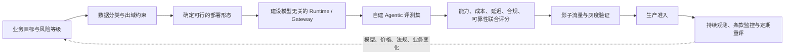

需要记住八个结论：

1. **部署形态先于模型型号。** 数据是否允许出域、是否要求指定地域处理、是否允许第三方保留，通常会先淘汰大部分候选。
2. **私网连接不等于数据不出供应商边界。** PrivateLink、Private Endpoint、VPC Service Controls 主要控制网络路径与数据外泄面；数据由谁处理、保留多久、是否进入安全监测或状态存储，仍要看产品功能和合同条款。
3. **企业终态通常是混合部署。** 公开数据走能力更强的托管模型，敏感数据走受控云服务，极敏或离线场景走自托管或边缘模型。
4. **榜单只适合形成候选池，不适合直接形成采购结论。** 真正的选型分数必须来自同一 Harness、同一任务集、同一参数约束下的端到端 Agent 评测。
5. **成本北极星是 `cost per successful task`。** 单 Token 价格、单卡吞吐、峰值 TPS 都不是最终业务成本。
6. **自建没有通用盈亏利用率。** “利用率低于 40% 一定不划算”只能作为提醒，不能作为决策规则；盈亏点取决于硬件价格、折旧周期、功耗、人力、冗余、模型效率、负载波动和 API 折扣。
7. **多模型并存是架构前提，不是事故预案。** 主力、备份、低成本、低延迟、长上下文、私有模型各自承担不同流量。
8. **选型结论必须有半衰期。** 模型版本、价格、区域、条款和配额持续变化，评分卡和评测集必须能低成本重跑。

---

## 2. 为什么“部署与选型”不是一个模型采购问题

### 2.1 原始场景：排行榜第一名，为什么仍会落选

假设一家保险公司要把理赔初审 Agent 化：

- 技术团队偏好公开基准上表现最强的模型；
- 安全团队要求病历、身份证号、银行卡号不得越过规定边界；
- 财务团队要求证明额外价格能换来成比例的业务价值；
- 业务团队关心的不是“回答像不像人”，而是能否完整完成材料识别、规则核验、异常说明、审批建议和证据引用。

团队最终从历史工单构建 120 个任务，用相同 Agent Runtime、相同工具、相同检索库和相同重试策略进行评测。示例中，榜首模型的业务成功率仅比次席高 1.8 个百分点，而价格约为后者 2.1 倍。这个例子说明：

> **模型能力不是一个脱离系统的常数。企业真正购买的是“模型 × Harness × 数据 × 工具 × 策略 × 运维”的联合效果。**

上述数字是教学情境，不是行业基准。实际项目必须重建自己的数据和成本模型。

### 2.2 企业真正要决策的对象

部署与选型至少同时包含以下问题：

| 决策域 | 关键问题 | 失败后果 |
|---|---|---|
| 业务 | Agent 最终要完成什么任务？允许多少人工介入？ | 测试指标与业务价值脱节 |
| 数据 | 哪些内容能出域？向量、遥测和缓存是否也受限？ | 数据泄露、跨境与监管风险 |
| 模型 | 哪个模型在本企业任务上稳定完成闭环？ | 成功率低、工具误用、幻觉 |
| Runtime | 如何统一调用、重试、预算、取消、降级和审计？ | 模型替换成本高、故障扩散 |
| 推理基础设施 | 托管、专属容量、自建 GPU 还是边缘设备？ | 成本失控、容量不足 |
| 安全 | 谁可调用什么模型、什么工具、什么数据？ | 越权执行、提示注入、供应链风险 |
| 可靠性 | 供应商、区域或模型版本异常时如何继续服务？ | 核心流程中断 |
| 合规 | 如何证明谁发起、谁批准、做了什么、依据什么？ | 无法通过审计 |
| 财务 | API、GPU、网络、人力和失败税如何统一比较？ | 账面便宜、实际昂贵 |
| 组织 | 谁拥有模型准入、平台、评测、值班和供应商关系？ | 决策无人负责、事故互相甩锅 |

---

## 3. 决策对象：六条边界与三个平面

### 3.1 六条必须显式定义的边界

#### 1. 数据边界

需要回答：

- 原始提示词、文件、图片、音频、代码和数据库记录在哪里处理？
- 输出、工具结果、检索片段、嵌入向量、KV Cache、提示缓存、批处理文件在哪里保存？
- 日志、Trace、错误栈、模型安全分类结果和反馈数据是否出域？
- 是否存在跨区域、跨境或子处理商转移？

#### 2. 身份边界

需要同时记录两种身份：

- **人类主体**：用户、审批人、管理员；
- **Agent 主体**：Agent 实例、工作流、服务账号、子 Agent。

Agent 代表用户执行时，应采用 On-Behalf-Of（OBO）语义，而不是只记录一个拥有过大权限的共享 API Key。

#### 3. 网络边界

“请求没有走公网”只是网络边界的一部分，还要回答：

- DNS 是否会解析到私网端点？
- 是否禁用了公共端点？
- 是否有未经批准的 NAT、代理或跨云出口？
- 回调、遥测、包下载和许可证校验是否形成旁路？
- 推理节点的分布式通信端口是否暴露给不可信网段？

#### 4. 计算边界

模型权重和推理进程运行在哪里：

- 供应商共享服务；
- 供应商专属容量；
- 云厂商托管服务；
- 客户 VPC / BYOC；
- 企业数据中心；
- 边缘或终端设备。

#### 5. 控制边界

谁能改变：

- 模型版本；
- 系统提示词；
- 路由规则；
- 工具权限；
- 过滤器与脱敏规则；
- 预算和重试；
- 日志保留策略。

控制平面变更必须比普通业务配置拥有更严格的审批、签名和回滚机制。

#### 6. 审计边界

哪些事件进入普通观测库，哪些进入不可篡改审计库，谁有读取权限，保留多久，能否关联回完整决策轨迹。

### 3.2 三个平面

企业 Agent 平台适合拆成三个平面：

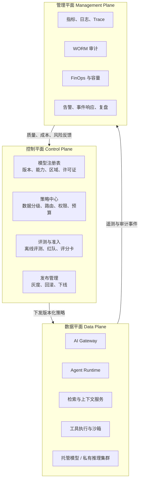

三平面拆分的价值是：

- 业务流量不依赖复杂的管理查询；
- 模型升级可以先在控制平面完成准入，不直接触碰生产；
- 审计与观测可以同源但分开保留和授权；
- 多模型、多云和自托管可以通过统一数据平面接入。

---

## 4. 部署光谱：从三档扩展为六种企业形态

原章将部署分为“全托管 API、VPC 私网托管、私有化开源模型”三档。企业实践中，建议扩展为六种形态，以免把差异很大的方案塞进同一格。

### 4.1 形态 A：公网全托管 API

应用经公网或企业统一出口调用模型供应商 API。

**优势**

- 首发模型和新特性通常最先可用；
- 零 GPU 运维；
- 按量付费，适合早期探索和波动负载；
- SDK、批处理、缓存、结构化输出等平台能力较完整。

**限制**

- 网络与数据处理边界依赖供应商；
- 保留、训练、滥用监测和状态化功能需要逐项核对；
- 配额、价格、模型退役与地区可用性受外部控制；
- 直接在每个业务系统中集成会形成 SDK 和提示词锁定。

**适合**

- 低敏数据；
- 已完成脱敏且允许出域；
- PoC、长尾或突发任务；
- 对最新模型能力敏感的场景。

### 4.2 形态 B：云上托管模型 + 私网接入

应用通过 PrivateLink、Private Endpoint、服务网卡或 VPC Service Controls 等机制访问云厂商托管模型。AWS、Microsoft Azure、Google Cloud，以及阿里云百炼、火山方舟、百度千帆等均提供不同形式的私网或服务边界能力，具体模型、地域和限制必须以当前文档为准。[R3][R4][R5][R6][R7][R8]

**优势**

- 降低公网暴露和误配置出口风险；
- 可与云上 IAM、KMS、审计、网络策略统一；
- 通常比完全自建更快进入受控生产环境；
- 云厂商承担模型服务的容量与底层运维。

**关键澄清**

> 私网接入只证明“请求如何到达服务”，不自动证明“供应商是否保留数据、是否进入状态存储、在哪里处理、哪些人员可访问”。

因此仍需核对产品数据说明、DPA、区域、子处理商、状态化 API 和安全监测机制。

### 4.3 形态 C：专属容量、专属实例或 Hosted Private

供应商提供逻辑或物理专属容量，可能运行在供应商云、云厂商环境或客户指定区域。

**优势**

- 性能隔离与可预测配额更好；
- 可减少共享服务的抖动；
- 便于为关键业务购买容量承诺；
- 某些方案可提供更严格的数据或运维承诺。

**限制**

- 仍不是企业自管权重；
- 通常存在最低消费或容量预留；
- “专属”具体指计算、存储、网络还是组织租户，需要合同明确；
- 模型升级和底层运行方式仍受供应商控制。

### 4.4 形态 D：BYOC——供应商控制面，客户 VPC 数据面

供应商提供编排、升级或许可控制面，推理工作负载运行在客户云账号和 VPC 中。

**优势**

- 数据面、网络、密钥和日志更接近客户控制；
- 可复用企业云治理与预算；
- 比纯自建减少部分模型优化和升级负担。

**限制**

- 供应商控制面可能仍需外联；
- 许可证、遥测、升级代理和支持通道都要进入威胁模型；
- 云资源成本由客户承担，软件许可另计；
- 责任边界复杂，事故时容易出现“云厂商、模型商、客户”三方接口问题。

### 4.5 形态 E：企业自托管开源或开放权重模型

企业自行获得模型权重，并在自有云、私有云或数据中心部署 vLLM、SGLang、TensorRT-LLM、TGI 等推理引擎。

**优势**

- 数据面、版本、容量和日志高度可控；
- 可进行量化、LoRA、领域微调和特殊硬件适配；
- 稳定大负载下有机会获得更好的单位经济性；
- 可支持断网、专网和特殊国产化硬件要求。

**限制**

- “开放权重”不等于“开源”，商业使用、再分发、衍生模型和用户规模限制必须逐条审查。[R23][R24]
- 需要承担模型下载、哈希校验、漏洞与恶意工件扫描、推理优化、驱动兼容、GPU 调度、容量、值班和灾备；
- 工具调用、长任务稳定性、结构化输出和多模态能力不能仅凭模型规模推断；
- 升级不是“换一个镜像”那么简单，可能牵涉 Tokenizer、Chat Template、量化格式和并行策略。

### 4.6 形态 F：气隙、边缘与终端侧推理

模型运行在完全离线环境、工厂边缘节点、门店设备、车载系统或桌面终端。

**优势**

- 网络不可用时仍可运行；
- 数据本地处理；
- 延迟稳定，减少跨区传输；
- 适合固定、窄域、低吞吐任务。

**限制**

- 受内存、功耗、热设计和模型大小约束；
- 模型更新、许可证、补丁、回收和审计更难；
- 端点被物理接触或逆向的风险更高；
- 需要明确“离线安全更新”和“设备丢失后的密钥吊销”。

### 4.7 六种形态对比

| 维度 | A 公网 API | B 私网托管 | C 专属容量 | D BYOC | E 自托管 | F 气隙/边缘 |
|---|---|---|---|---|---|---|
| 上线速度 | 最快 | 快 | 中 | 中 | 慢 | 慢 |
| 最新模型可用性 | 通常最高 | 视云平台上架 | 中高 | 视供应商 | 取决于权重与适配 | 较低 |
| 网络控制 | 低至中 | 高 | 中高 | 高 | 很高 | 最高 |
| 数据面控制 | 低 | 中 | 中高 | 高 | 很高 | 最高 |
| 运维负担 | 最低 | 低 | 低至中 | 中 | 高 | 高 |
| 容量弹性 | 高 | 高 | 预留为主 | 中高 | 取决于集群 | 低 |
| 成本结构 | 纯变量 | 变量 + 网络 | 承诺/预留 | 云资源 + 许可 | 高固定 + 运维 | 设备固定成本 |
| 离线能力 | 无 | 无 | 通常无 | 可设计 | 可 | 强 |
| 供应商锁定 | 高 | 中高 | 高 | 中 | 低至中 | 低至中 |
| 适用数据 | 低敏/脱敏 | 中高敏 | 关键业务 | 高敏 | 极敏/稳定大负载 | 极敏/离线 |
| 典型风险 | 条款与配额 | 误把私网当零保留 | 最低消费 | 责任边界复杂 | TCO 与人才 | 更新和设备安全 |

### 4.8 不要把部署形态当作单选题

成熟企业通常是组合：

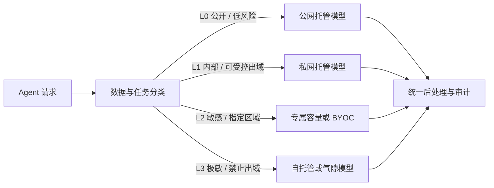

组合部署的前提不是“同时买了多家模型”，而是平台已经实现：

- 统一模型协议和错误语义；
- 版本化路由策略；
- 一致的预算、取消、重试和超时；
- 统一评测和可观测；
- 每个候选模型都有可用的当前评分；
- 失败时不会把高敏数据错误降级到更宽松的边界。

---

## 5. 数据分级驱动的混合部署

### 5.1 先分数据，再分任务

只按“业务系统”分级通常不够。例如，同一个客服 Agent 中可能同时出现：

- 公开产品说明；
- 内部 SOP；
- 已登录客户的订单号；
- 身份证件和支付信息；
- 投诉中的健康、家庭或法律信息。

因此路由决策至少要同时看四个维度：

1. **数据敏感级别**；
2. **任务风险级别**；
3. **工具权限级别**；
4. **输出影响级别**。

建议的示例分级如下：

| 级别 | 数据示例 | 任务示例 | 默认部署约束 |
|---|---|---|---|
| L0 公开 | 官网、公开代码、公开政策 | 摘要、翻译、公开问答 | 可用 A/B/C/D/E |
| L1 内部 | 内部文档、非敏感运营数据 | 内部检索、会议总结 | 优先 B/C/D/E；A 需批准与脱敏 |
| L2 敏感 | 客户资料、未公开代码、财务明细 | 风险分析、代码修改、客户服务 | C/D/E；B 需满足区域和条款 |
| L3 极敏 | 密钥、核心身份数据、重要数据、受严格行业约束数据 | 高风险审批、生产控制 | D/E/F；通常禁止自动外部降级 |

> 分级名称和边界必须与企业现有数据分类制度一致，不要另起一套 AI 专用“平行宇宙”。

### 5.2 路由不是一个 `if sensitivity == high`

实际策略需要组合判断：

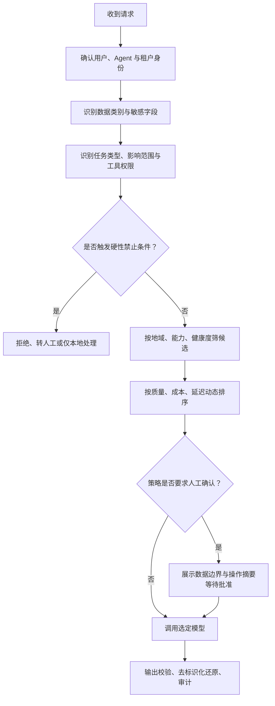

### 5.3 示例路由策略

下面是概念性配置，不绑定具体产品：

```yaml
apiVersion: agent-platform/v1
kind: ModelRoutingPolicy
metadata:
  name: enterprise-default
spec:
  rules:
    - name: deny-secret-egress
      when:
        dataClasses: [credential, private_key, production_secret]
      action:
        allowedDeploymentTiers: [self_hosted, air_gapped]
        requireHumanApproval: true
        externalFallback: false

    - name: regulated-personal-data
      when:
        dataClasses: [health, biometric, payment, government_id]
      action:
        allowedDeploymentTiers: [private_managed, dedicated, byoc, self_hosted]
        requiredRegions: ["policy://subject-region"]
        requireZeroRetentionCapability: true
        telemetryContentCapture: false

    - name: public-low-risk
      when:
        maxSensitivity: public
        maxImpact: low
      action:
        allowedDeploymentTiers: [public_api, private_managed, self_hosted]
        optimizeFor: [quality, latency, cost]

  defaults:
    denyOnUnknownClassification: true
    modelVersionPinning: true
    auditRequired: true
```

### 5.4 路由的安全不变量

无论模型健康度和成本如何变化，都不应破坏以下不变量：

- 高敏请求不能自动回退到更低合规等级；
- 跨区域回退必须重新做数据驻留判断；
- 模型不可用时，优先降级功能或转人工，而不是放宽数据边界；
- 日志采样率变化不能改变审计事件的完整性；
- 缓存键必须包含租户、策略版本、模型版本和敏感级别；
- 任务分类失败时默认拒绝或走最严格路径；
- 任何管理员临时绕过都必须限时、可追踪、可撤销。

---

## 6. 企业级参考架构：AI Gateway 是默认入口

### 6.1 为什么业务系统不应直接调用每家模型 SDK

直接调用在 PoC 阶段很快，但进入生产后会出现：

- 每个团队各自保存 API Key；
- 超时、重试和错误码处理不一致；
- 无法集中实施 DLP、地域和模型准入；
- 提示词、响应格式和工具协议散落；
- 模型退役时需要修改大量业务代码；
- 成本、Token 与成功率无法统一归因；
- 同一个用户通过多个应用绕过配额；
- 安全和法务无法回答“哪些数据发给了谁”。

AI Gateway 的目标不是再造一个普通反向代理，而是形成**模型访问政策执行点**。

### 6.2 参考架构

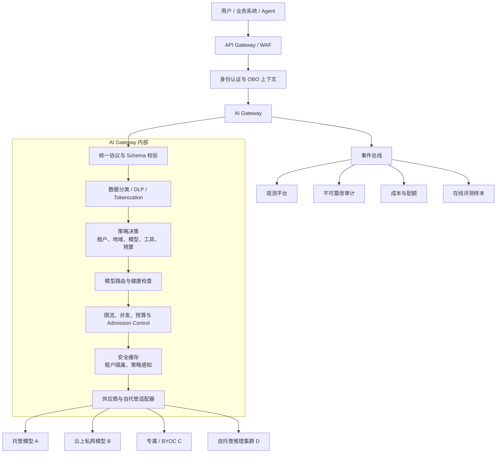

### 6.3 Gateway 的最小能力集

#### 协议与兼容层

- 统一请求模型：消息、系统指令、工具、结构化输出、流式响应；
- 统一错误分类：限流、认证、超时、内容策略、上下文溢出、供应商故障；
- 保留供应商原始错误码供排障，但不让业务代码依赖它；
- 显式标注“被模拟的兼容能力”，例如某模型并不原生支持 JSON Schema。

#### 身份与租户

- 用户身份、Agent 身份、服务身份同时进入策略；
- 支持 OBO、短期凭据和细粒度 Scope；
- 对模型、项目、工具、数据源设置独立授权；
- 禁止跨租户共享提示缓存和会话状态。

#### 数据边界

- DLP 检测与可逆 Tokenization；
- 出域字段级策略；
- 附件类型、大小、来源和恶意内容扫描；
- 遥测内容默认不采集，必要时经单独审批；
- 对嵌入、批处理、文件、微调等“非聊天接口”使用同样策略。

#### 流量治理

- 用户、租户、模型、场景多级配额；
- 请求并发、Token 速率、输出上限和工具轮数预算；
- Admission Control；
- 熔断、健康检查、重试和退避；
- 影子流量、灰度、按请求固定版本；
- 流式连接取消传播，避免用户断开后 GPU 继续生成。

#### 成本治理

- 请求前估算；
- 请求中预算截断；
- 请求后按输入、输出、缓存、工具和重试归因；
- 预算按部门、项目、用户、Agent、模型和业务动作聚合；
- 把失败请求和被丢弃输出计入“失败税”。

### 6.4 控制平面中的模型注册表

建议每个可路由模型都具有一份不可变版本记录：

```yaml
modelId: reasoning-large
revision: "provider/model-version-2026-08-15"
deploymentTier: private_managed
provider: example-cloud
regions: [sg, eu]
capabilities:
  streaming: true
  toolCalling: true
  parallelToolCalling: false
  jsonSchema: native
  vision: true
  promptCaching: true
limits:
  contextTokens: 200000
  maxOutputTokens: 32000
governance:
  dataClassesAllowed: [public, internal, confidential]
  zeroRetentionApproved: true
  contractBaseline: legal-2026-08-v3
  licenseRecord: not_applicable
evaluation:
  suite: claims-agent-v12
  scorecard: scorecard-2026-08-28
  lastPassedAt: "2026-08-28"
  expiresAt: "2027-02-28"
operations:
  sloProfile: critical-online
  fallbackGroup: claims-private
  owner: ai-platform
```

注册表不能只是“模型名称列表”，它还应承载：

- 精确版本与退役日期；
- 支持的输入输出能力；
- 地域、配额和网络路径；
- 数据条款基线；
- 当前评测结果和有效期；
- 允许的敏感级别；
- 成本和 SLO 档位；
- 负责人和事故升级路径。

---

## 7. 模型选型：从榜单分数到业务决策

### 7.1 选型流程

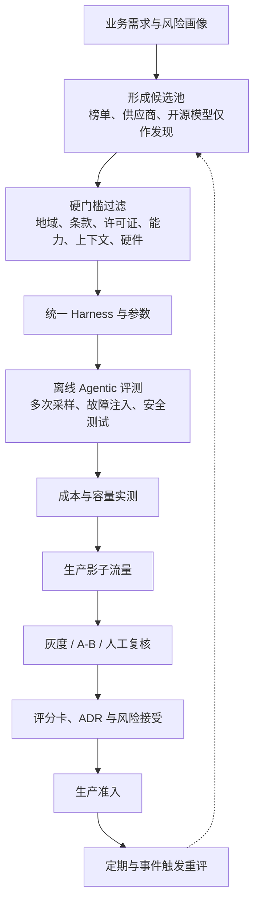

### 7.2 硬门槛必须先于打分

任一硬门槛失败，候选应直接出局，不能靠“总分高”补偿。

典型硬门槛：

| 类别 | 示例 |
|---|---|
| 数据与地域 | 所需地域可用；满足跨境和驻留要求 |
| 保留与训练 | 满足不训练、保留期、状态存储和删除要求 |
| 网络 | 支持要求的私网、专线或气隙部署 |
| 许可证 | 允许商业使用、目标用户规模、衍生与部署方式 |
| 能力 | 必须支持的模态、上下文、工具调用或结构化输出 |
| 安全 | 通过供应链、红队和数据泄漏门槛 |
| 可靠性 | 有满足业务要求的配额、容量与支持等级 |
| 硬件 | 权重和 KV Cache 能在目标硬件上以可接受成本运行 |
| 可运维性 | 可固定版本、可回滚、可观测、可取消 |
| 生命周期 | 无即将退役且无迁移路径的问题 |

### 7.3 从五维扩展为十二维

原章的“能力、成本、延迟、合规、生态”是良好起点。生产选型可扩展为：

| 维度 | 典型指标 | 说明 |
|---|---|---|
| 业务成功 | 端到端成功率、人工接管率 | 第一优先级 |
| Agentic 能力 | 工具选择、参数正确、长程完成、恢复能力 | 不能用普通问答代替 |
| 稳定性 | 多次采样方差、格式稳定、版本回归 | 平均分高但波动大不可取 |
| 安全 | 提示注入、敏感泄漏、越权工具调用 | 应含硬门槛 |
| 延迟 | TTFT、TPOT、端到端 P50/P95/P99 | 流式体验与完整任务分开 |
| 吞吐与容量 | req/s、input/output token/s、并发 | 必须在目标上下文分布下测 |
| 成本 | 每成功任务成本、失败税、峰值容量成本 | 不只看单价 |
| 合规 | 条款、地域、审计、删除、供应链 | 法务与技术联合评分 |
| 生态 | SDK、缓存、批量、可观测、社区与支持 | 影响长期工程成本 |
| 可移植性 | 协议、提示词、工具 Schema、部署可替换性 | 控制退出成本 |
| 可用性 | 区域、配额、退役政策、SLA/SLO | 影响连续性 |
| 可运营性 | 版本固定、灰度、回滚、工单支持 | 决定生产风险 |

### 7.4 加权评分不是数学替代责任

设候选模型 \(m\) 在维度 \(i\) 的标准化分数为 \(s_{m,i}\)，权重为 \(w_i\)，则：

\[
Score(m)=\sum_{i=1}^{n} w_i s_{m,i}, \quad \sum_i w_i=1
\]

注意：

- 硬门槛不能进入加权计算；
- 权重必须按场景配置，不能全公司一套；
- 分数应同时展示原始值，避免标准化掩盖差异；
- 应报告置信区间和重复采样方差；
- 若两个候选差异处于统计噪声内，优先选成本、合规或可移植性更优者；
- 最终结论应形成架构决策记录（ADR），由明确责任人签字。

### 7.5 Pareto 前沿比“总分第一”更重要

候选 A 质量高但昂贵，候选 B 便宜但稍慢，候选 C 合规更强。它们可能都处于 Pareto 前沿：

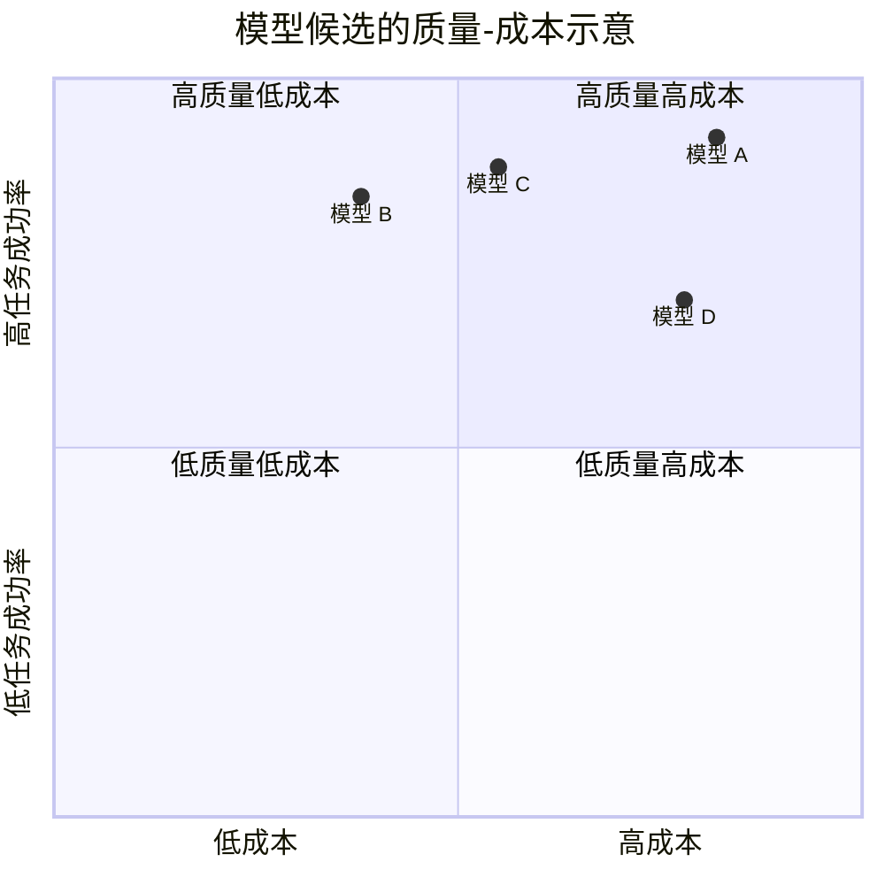

实践上通常不是消灭选择，而是分配角色：

- A：复杂高价值任务；
- B：大流量普通任务；
- C：敏感或低延迟任务；
- D：若被其他候选同时在成本和质量上支配，则淘汰。

### 7.6 评分卡中的证据等级

建议每项分数标记证据等级：

| 等级 | 证据 | 可用于 |
|---|---|---|
| E0 | 供应商宣传或公开榜单 | 发现候选 |
| E1 | 内部小样本实验 | PoC |
| E2 | 代表性离线评测，多次采样 | 技术准入 |
| E3 | 影子生产流量 | 灰度决策 |
| E4 | 灰度真实用户与人工复核 | 生产决策 |
| E5 | 长周期生产、事故与成本数据 | 重评和扩容 |

只拥有 E0/E1 证据的候选，不应直接承担高风险生产流量。

---

## 8. Agentic 评测体系：测完整任务，而不是测一句回答

### 8.1 为什么普通问答分数不够

Agent 的结果依赖多轮循环：

1. 理解目标；
2. 制定计划；
3. 选择工具；
4. 构造参数；
5. 处理工具错误；
6. 更新状态；
7. 判断完成；
8. 生成可验证产物。

因此，一个模型即使知识问答优秀，也可能在以下位置失败：

- 调错工具；
- 参数 Schema 不合法；
- 忘记使用工具结果；
- 重试形成死循环；
- 在长上下文中丢失约束；
- 过早宣布完成；
- 对不可信工具内容发生间接提示注入；
- 生成了正确文字但没有真正写入系统。

### 8.2 评测集的任务分层

| 层级 | 测什么 | 示例 |
|---|---|---|
| L1 原子能力 | 单轮抽取、分类、结构化输出 | 从理赔单提取字段 |
| L2 单工具 | 工具选择与参数 | 查询保单 |
| L3 多工具 | 顺序、依赖和状态 | 查保单→查历史→计算规则 |
| L4 长程任务 | 规划、恢复、预算 | 完成整套初审 |
| L5 对抗与故障 | 注入、超时、脏数据、权限拒绝 | 工具返回恶意指令 |
| L6 生产结果 | 人工接管、业务 KPI、事故 | 实际工单闭环 |

### 8.3 指标树

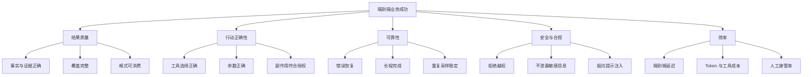

### 8.4 推荐核心指标

#### 端到端任务成功率

\[
TaskSuccessRate = \frac{成功完成且产物通过验证的任务数}{总任务数}
\]

“模型说完成”不能作为成功判定，必须使用外部验证器、数据库状态或人工标注。

#### 工具调用正确率

可拆为：

- 工具选择准确率；
- 参数 Schema 通过率；
- 参数语义正确率；
- 权限策略遵从率；
- 工具结果利用率；
- 副作用幂等性。

#### 恢复成功率

\[
RecoveryRate = \frac{发生可恢复故障后最终成功的任务数}{发生可恢复故障的任务数}
\]

故障注入至少包括：

- 429 与配额耗尽；
- 5xx；
- 工具超时；
- 返回空值或脏数据；
- 权限被拒；
- 上下文超限；
- 流式连接中断；
- 模型返回无效 JSON。

#### 循环健康度

- 平均 Agent 轮数；
- P95 轮数；
- 无进展循环率；
- 重复工具调用率；
- 预算耗尽率；
- 人工中断率。

#### 安全指标

- 提示注入攻击成功率；
- 越权工具调用率；
- 敏感信息泄漏率；
- 受污染检索文档影响率；
- 不安全降级率；
- 安全拒绝误杀率。

### 8.5 同一 Harness 的具体含义

以下变量必须固定或纳入实验设计：

- 系统提示词和版本；
- 工具列表、描述和 Schema；
- 检索语料与排序；
- 最大轮数、Token 预算和超时；
- 重试、退避和错误归一化；
- 温度等采样参数；
- 上下文压缩策略；
- 沙箱和权限；
- 验证器；
- 并发和负载分布；
- 模型版本与调用区域。

若某模型需要特定 Prompt 才能正常工作，可设计两个阶段：

1. **可移植基线**：所有模型使用统一语义 Prompt；
2. **公平优化**：给予每个候选同等调优预算，并记录变更。

不能只为偏好的模型做深度调优。

### 8.6 重复采样与不确定性

生成式模型输出存在随机性。建议：

- 每个核心任务至少运行多次；
- 关键任务覆盖不同时间段和负载；
- 报告均值、标准差、置信区间和最差分位；
- 对低频高损失事件单独做压力与红队测试；
- 不用一个总分掩盖某类任务的严重偏科。

### 8.7 离线、影子、灰度和在线的闭环

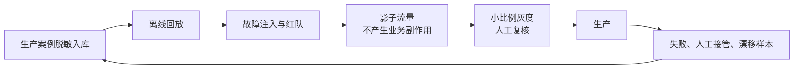

---

## 9. 成本与 TCO：统一到每个成功任务的成本

### 9.1 为什么单 Token 单价不能代表真实成本

Agent 场景中的成本不仅来自一次模型调用，还包括：

- 多轮推理；
- 输入上下文反复发送；
- 提示缓存创建与命中；
- 检索、重排和嵌入；
- 代码执行、浏览器、OCR、语音等工具；
- 失败重试；
- 审核与人工接管；
- 网关、日志、网络和存储；
- 安全扫描和审计保留；
- 供应商最低消费或专属容量；
- 自托管 GPU、工程与值班。

因此，建议采用：

\[
C_{success} =
\frac{
C_{model}+C_{tool}+C_{retrieval}+C_{gateway}+C_{network}+C_{storage}+C_{human}+C_{failure}
}{
N_{successful\ tasks}
}
\]

### 9.2 托管 API 成本模型

对某一周期：

\[
C_{api} =
T_{in}\cdot P_{in}
+T_{out}\cdot P_{out}
+T_{cache-write}\cdot P_{cache-write}
+T_{cache-read}\cdot P_{cache-read}
+C_{batch}
+C_{tool}
+C_{network}
+C_{platform}
\]

其中：

- \(T\) 为 Token 数；
- \(P\) 为对应价格；
- 批处理、缓存和服务等级应按真实账单分别建模；
- 重试与失败请求产生的 Token 不能排除。

缓存后的有效输入成本可写为：

\[
C_{input-effective}
=
T_{uncached}P_{in}
+T_{cache-write}P_{cache-write}
+T_{cache-hit}P_{cache-read}
\]

比较模型时必须使用实测缓存命中率，而不是假设“都会命中”。

### 9.3 自托管全摊成本模型

\[
C_{self} =
C_{hardware-amortized}
+C_{power}
+C_{facility}
+C_{network}
+C_{storage}
+C_{license}
+C_{platform}
+C_{labor}
+C_{support}
+C_{spare}
+C_{disaster-recovery}
+C_{idle}
\]

单位成功任务成本：

\[
C_{self-success}
=
\frac{C_{self}}{N_{successful\ tasks}}
\]

其中最容易漏算的是：

- 冗余卡和故障备件；
- 开发、压测、预发与生产多套环境；
- 模型加载期间的空闲；
- 驱动、CUDA、NCCL、内核和框架升级；
- 跨机高速网络；
- 存储模型的多版本副本；
- 24×7 值班；
- 灾备容量；
- 低谷期闲置；
- 量化或性能优化的人力；
- 模型失败带来的人工成本。

### 9.4 不存在通用的“40% 盈亏线”

设：

- 自托管周期固定成本为 \(F\)；
- 自托管单位可变成本为 \(v_s\)；
- API 单位成本为 \(v_a\)；
- 周期实际有效工作量为 \(Q\)。

自托管达到盈亏平衡的条件是：

\[
F + v_s Q \le v_a Q
\]

因此：

\[
Q \ge \frac{F}{v_a-v_s}
\]

再将 \(Q\) 除以集群在目标 SLO、目标上下文长度和真实并发下的可交付容量，才能得到所需利用率。

这说明盈亏点会随以下因素显著变化：

- API 大客户折扣；
- GPU 采购或租赁价格；
- 模型量化后的吞吐；
- 输入与输出长度比例；
- 负载峰谷比；
- 是否需要双活；
- 电价和机房 PUE；
- 团队是否已存在；
- 任务成功率差异；
- 模型是否需要更多轮数；
- 缓存命中率。

固定阈值只能用作风险提醒，不能写进投资决策。

### 9.5 失败税

定义：

\[
FailureTax =
\frac{失败任务产生的总成本}{全部任务总成本}
\]

失败成本包括：

- 模型和工具调用；
- 重试；
- 已执行但被回滚的副作用；
- 人工复核；
- 客诉和补偿；
- 重跑；
- 延迟造成的业务损失。

低价模型若需要更多轮数、更多重试和更多人工接管，最终可能更贵。

### 9.6 质量调整后的成本

可以定义：

\[
QualityAdjustedCost =
\frac{C_{total}}{N \cdot Q_{score}}
\]

但生产决策更推荐使用“硬成功”口径：

\[
CostPerSuccessfulTask =
\frac{C_{total}}{N_{success}}
\]

对高风险任务，还应按损失加权：

\[
RiskAdjustedCost =
C_{total}
+\sum_j P(incident_j)\cdot Loss_j
\]

这不是要求精确预测每次事故，而是防止“便宜但高风险”的候选在普通成本表中胜出。

### 9.7 示例：为什么单价最低未必最省

假设三个候选完成 10,000 个任务：

| 指标 | 模型 A | 模型 B | 模型 C |
|---|---:|---:|---:|
| 直接模型成本 | 10,000 | 6,500 | 8,000 |
| 工具与检索 | 2,000 | 2,600 | 2,100 |
| 重试成本 | 500 | 2,000 | 800 |
| 人工接管 | 1,500 | 6,000 | 2,500 |
| 成功任务数 | 9,000 | 7,800 | 8,800 |
| 总成本 | 14,000 | 17,100 | 13,400 |
| 每成功任务成本 | 1.56 | 2.19 | 1.52 |

模型 B 的直接价格最低，却因为失败和接管成为最贵方案。示例仅用于展示算法，不代表任何实际模型。

### 9.8 FinOps 看板

建议按以下维度切分：

- 部门、项目、成本中心；
- 用户、Agent、工作流；
- 模型、版本、区域、部署形态；
- 任务类型和敏感级别；
- 成功、失败、拒绝、人工接管；
- 输入、输出、缓存写、缓存读；
- 工具与检索；
- P50/P95 延迟；
- 单成功任务成本；
- 预算耗尽与异常增长。

告警不要只看“月账单超预算”，还应监测：

- 每成功任务成本突增；
- 平均轮数突增；
- 缓存命中率下降；
- 失败税上升；
- 某租户 Token 增速异常；
- 模型版本变化后成本回归；
- 输出长度异常膨胀。

---

## 10. 容量规划：从请求数转向 Token、KV Cache 与排队时间

### 10.1 Agent 推理不是普通 HTTP 服务

两个都为 1 req/s 的工作负载可能完全不同：

- 请求 A：500 输入 Token，100 输出 Token；
- 请求 B：100,000 输入 Token，8,000 输出 Token，并有三轮工具调用。

因此容量至少要按以下变量建模：

- 请求到达率；
- 输入 Token 分布；
- 输出 Token 分布；
- 上下文复用率；
- 并发序列数；
- 模型并行策略；
- Prefill 与 Decode 吞吐；
- KV Cache 占用；
- 工具等待时间；
- 流式连接时长；
- SLO。

### 10.2 Little 定律估算并发

稳定系统中：

\[
L=\lambda W
\]

- \(L\)：平均系统中并发任务数；
- \(\lambda\)：平均到达率；
- \(W\)：平均任务时间。

若每秒到达 2 个任务，平均端到端耗时 20 秒，则平均并发约为 40。对容量规划应进一步使用 P95/P99、峰值系数和突发模型，而不是只用均值。

### 10.3 延迟分解

\[
Latency_{e2e} =
T_{gateway}
+T_{queue}
+T_{prefill}
+T_{decode}
+T_{tool}
+T_{retry}
+T_{postprocess}
\]

关键指标：

- **TTFT**：Time To First Token，首 Token 延迟；
- **TPOT**：Time Per Output Token；
- **ITL**：Inter-Token Latency；
- **E2E**：端到端完成时间；
- **Queue Time**：排队等待；
- **Tool Time**：工具执行与外部系统等待。

只优化模型内核无法解决工具慢、排队长或网关策略过重的问题。

### 10.4 GPU 内存构成

可粗略写为：

\[
M_{gpu}
=
M_{weights}
+M_{kv}
+M_{runtime}
+M_{workspace}
+M_{fragmentation}
\]

权重近似：

\[
M_{weights}\approx N_{params}\times BytesPerParam
\]

实际还要考虑量化元数据、MoE 激活专家、并行切分、框架开销和副本。

KV Cache 与以下因素相关：

- 层数；
- KV Head 数；
- Head Dimension；
- 上下文长度；
- 并发序列；
- KV 数据类型；
- 是否采用 GQA/MQA；
- Prefix Cache 与分层缓存。

不要用“模型文件能放进显存”判断服务能否承载生产并发。权重放得下，KV Cache 仍可能让并发接近零。

### 10.5 Prefill 与 Decode 是两类不同负载

- **Prefill**：处理输入上下文，通常更偏计算密集；
- **Decode**：逐 Token 生成，通常更受内存带宽、KV Cache 和调度影响。

长输入、短输出与短输入、长输出会形成不同瓶颈。大规模场景可评估 Prefill/Decode 分离，但它会增加：

- KV 传输；
- 网络要求；
- 调度复杂度；
- 故障模式；
- 观测难度。

KServe 的 LLMInferenceService、SGLang 和 NVIDIA Dynamo 等项目都在支持多节点、P/D 分离或高级路由能力，但是否采用应由压测证据决定。[R12][R15][R18]

### 10.6 自动扩缩容应看什么

普通 CPU HPA 往往不能准确反映 LLM 饱和度。更有价值的指标包括：

- 请求队列长度；
- 最老请求等待时间；
- 活跃序列数；
- 等待序列数；
- 输入/输出 Token 速率；
- KV Cache 使用率；
- Batch 填充率；
- TTFT 与 TPOT；
- GPU SM、显存带宽与显存占用；
- 被 Admission Control 拒绝的请求；
- 目标 SLO 的错误预算消耗。

Kubernetes HPA 支持自定义和多指标，但扩 GPU 节点还会受到节点启动、驱动、镜像和模型加载时间影响。[R19]

### 10.7 容量控制闭环

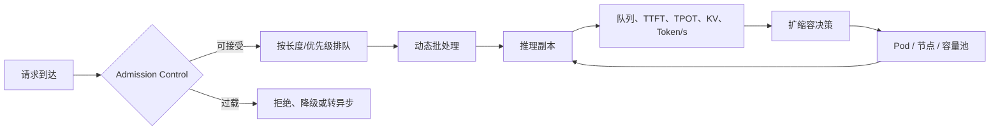

### 10.8 Admission Control 比无限排队更重要

无限排队会造成：

- 延迟雪崩；
- 用户重试放大；
- KV Cache 挤兑；
- 超时后仍在生成；
- 高优先级任务被低价值任务阻塞。

建议：

- 为在线、批处理和后台任务分队列；
- 基于预估 Token 进行加权排队；
- 设置最大等待时间；
- 过载时降级上下文、输出长度或模型；
- 不能安全降级的请求快速失败或转人工；
- 取消请求必须传播到推理引擎；
- 对批处理提供独立容量窗口。

### 10.9 压测矩阵

不要只测一个“平均 Prompt”。至少覆盖：

| 维度 | 档位 |
|---|---|
| 输入长度 | P50 / P90 / P99 / 最大允许值 |
| 输出长度 | 短 / 中 / 长 |
| 并发 | 低谷 / 平峰 / 峰值 / 突发 |
| 缓存 | 冷缓存 / 热缓存 / 混合 |
| 工具 | 无工具 / 单工具 / 多工具 |
| 模态 | 文本 / 图片 / 音频 / 文件 |
| 故障 | 429 / 5xx / 超时 / 节点故障 |
| 版本 | 当前模型 / 候选模型 / 回滚版本 |
| 租户 | 单租户 / 多租户噪声邻居 |
| SLO | 在线交互 / 后台批处理 |

---

## 11. 私有化推理栈选型

### 11.1 不要寻找“唯一最强推理框架”

推理栈通常由多层组成：

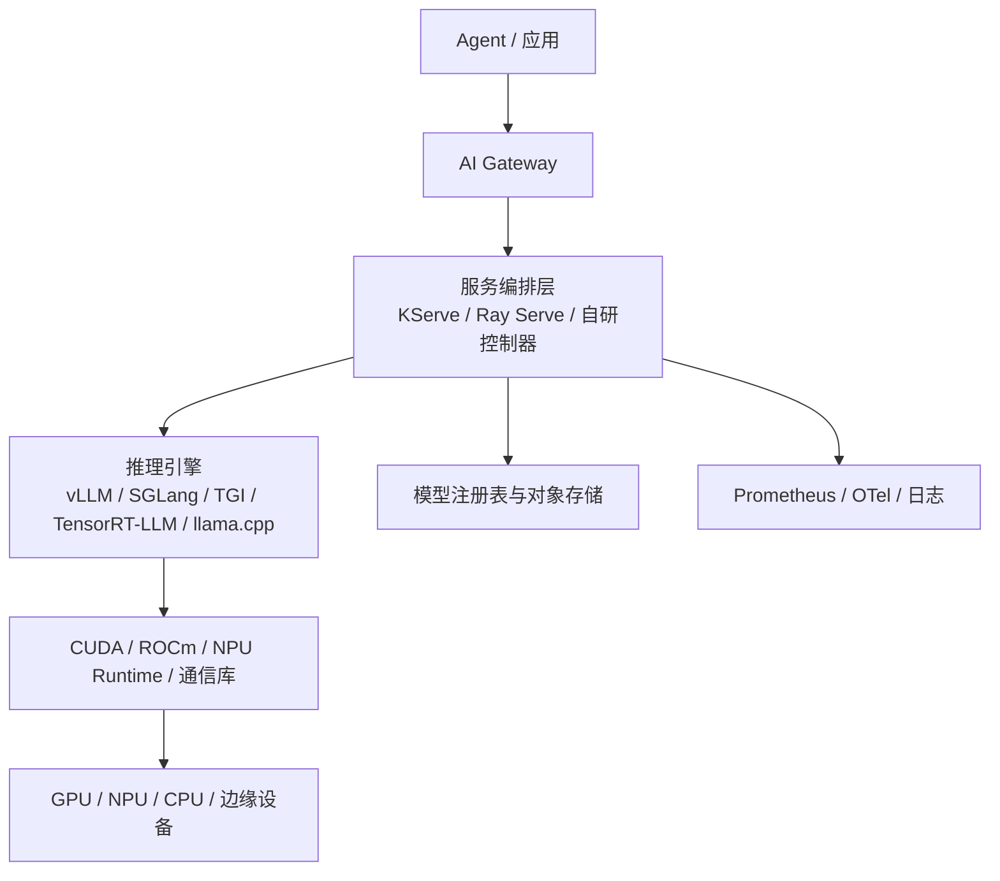

一个项目可能同时使用：

- KServe 管生命周期；
- vLLM 或 SGLang 运行模型；
- Ray Serve 编排多阶段 Python 逻辑；
- TensorRT-LLM 优化特定 NVIDIA 模型；
- llama.cpp 服务边缘小模型。

### 11.2 常见组件定位

| 组件 | 主要定位 | 优势倾向 | 主要注意点 |
|---|---|---|---|
| vLLM | 通用高性能 LLM Serving | 易用、生态广、OpenAI 兼容、分布式并行 | 版本迭代快；需关注安全网络配置与模型兼容 |
| SGLang | 高吞吐、低延迟推理与服务 | 结构化输出、路由、P/D 分离、多硬件支持 | 高级能力组合要做版本级验证 |
| Hugging Face TGI | Hugging Face 模型服务 | HF 生态、流式、量化、指标 | 新模型特性支持节奏需核对 |
| TensorRT-LLM | NVIDIA 深度优化工具链 | 极致性能、内核与量化优化 | NVIDIA 绑定更强，构建与调优复杂 |
| Ray Serve LLM | 分布式服务编排 | 多模型、Python 组合、独立扩缩容 | 需要经营 Ray 集群与控制面 |
| KServe | Kubernetes 模型服务控制面 | CRD、生命周期、路由、多节点生成式推理 | Kubernetes 复杂度与版本兼容 |
| Triton Inference Server | 多框架推理服务器 | 模型仓库、批处理、多后端 | LLM 高级调度常需配合专用后端 |
| llama.cpp | 本地、CPU、边缘量化推理 | 部署轻、硬件覆盖广 | 大规模多租户能力需另建控制层 |

vLLM 官方将其定位为高效 LLM 推理与服务库；SGLang 面向从单 GPU 到大规模集群的生产推理；TGI 是 Hugging Face 的 LLM 部署工具；TensorRT-LLM 提供 NVIDIA 推理优化；Ray Serve LLM 和 KServe 则更偏服务编排与控制面。[R9][R10][R11][R13][R14][R16][R17]

### 11.3 选型问题清单

#### 模型与硬件

- 目标模型是否被稳定支持？
- 是否支持目标 GPU、NPU、CPU 和驱动？
- 是否支持目标量化格式？
- 多模态预处理是否在服务内完成？
- Tokenizer 和 Chat Template 如何版本化？

#### 协议与 Agent 能力

- OpenAI 兼容到什么程度？
- 流式取消是否有效？
- 工具调用、JSON Schema、Reasoning Parser 是否可靠？
- Logprobs、Embedding、Rerank、Batch 是否需要？
- 是否支持 LoRA 多租户？

#### 性能

- Continuous Batching；
- Prefix Cache；
- Chunked Prefill；
- Speculative Decoding；
- Tensor / Pipeline / Data / Expert Parallel；
- P/D 分离；
- KV Cache Offload；
- KV-aware Routing。

#### 运维

- 健康检查和优雅终止；
- Prometheus/OTel 指标；
- 模型加载和缓存；
- 多版本灰度；
- 故障恢复；
- 配置热更新；
- 升级兼容；
- CVE 和依赖响应。

#### 安全

- API 是否默认无认证；
- 分布式端口是否监听所有网卡；
- 模型是否允许执行自定义代码；
- 是否支持只读文件系统和最小容器权限；
- 是否能禁用外联；
- 是否有请求大小和输出限制；
- 是否支持租户隔离。

vLLM 的安全文档特别提醒分布式通信可能创建可被网络访问的服务，说明“推理服务在内网”仍需要网络分段和显式保护。[R22]

### 11.4 决策树

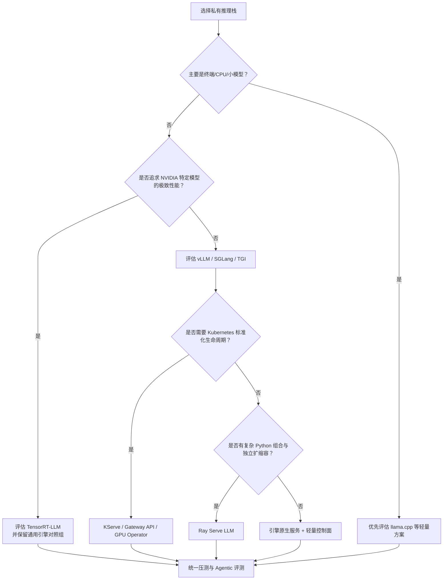

### 11.5 最终选择标准

不要以“某框架在一张 Benchmark 图上快 20%”直接定型。至少比较：

- 目标模型；
- 目标硬件；
- 真实输入输出分布；
- 真实并发；
- 目标量化；
- 目标工具/结构化输出；
- 故障恢复；
- 取消；
- 升级；
- 团队能力；
- 端到端成功任务成本。

---

## 12. 推理优化：先找瓶颈，再选技术

### 12.1 优化顺序

推荐顺序：

1. 建立可复现基线；
2. 分解排队、Prefill、Decode、工具和网络；
3. 修正请求长度、无效上下文和重复轮次；
4. 启用安全的动态批处理与 Prefix Cache；
5. 调整并发、显存占比和调度；
6. 评估量化；
7. 评估并行策略；
8. 再考虑 P/D 分离、推测解码和多级 KV Cache；
9. 每一步重新跑业务质量与安全评测。

### 12.2 主要技术与代价

| 技术 | 解决什么 | 可能收益 | 风险与代价 |
|---|---|---|---|
| Continuous Batching | 合并不同到达时间的请求 | 提高吞吐 | 可能增加单请求等待 |
| Prefix Cache | 复用相同前缀 KV | 降低 Prefill 成本与 TTFT | 租户隔离、缓存污染、命中率 |
| Chunked Prefill | 长输入切块调度 | 改善混合负载公平性 | 参数复杂，影响延迟分布 |
| Quantization | 降权重显存与计算 | 提高可部署性和吞吐 | 质量、工具调用、长上下文回归 |
| Tensor Parallel | 单模型跨多卡 | 容纳大模型 | 通信成本 |
| Pipeline Parallel | 跨阶段切分模型 | 多节点部署 | 气泡与调度复杂 |
| Data Parallel | 多副本处理流量 | 横向吞吐 | 权重复制、路由 |
| Expert Parallel | MoE 专家分布 | 适配 MoE | All-to-All 网络要求 |
| Speculative Decoding | 草稿模型预测多个 Token | 降 TPOT | 接受率、额外模型、实现复杂 |
| P/D Disaggregation | Prefill 与 Decode 分池 | 独立扩容、混合负载优化 | KV 传输与故障面 |
| KV Offload | KV 下沉 CPU/存储 | 支持更大并发/上下文 | 带宽与延迟 |
| LoRA Multiplexing | 一套底模服务多适配器 | 节省副本 | 隔离、加载与版本治理 |

### 12.3 Prefix Cache 的安全边界

Prefix Cache 常被当成纯性能功能，但它涉及：

- 是否跨用户复用；
- 是否跨租户复用；
- 缓存键是否包含系统 Prompt、策略版本和模型版本；
- 敏感内容是否进入共享缓存；
- 缓存是否落盘；
- 清除和过期是否可证明；
- 供应商缓存是否符合零保留安排。

安全默认值：

- 跨租户禁止复用；
- 敏感请求不使用共享缓存；
- 缓存内容不进入普通日志；
- 策略或模型版本变化立即失效；
- 只有静态、无敏感信息的公共前缀可全局复用。

### 12.4 量化不能只跑困惑度

量化后的验证至少覆盖：

- 业务成功率；
- 工具选择与参数；
- JSON/Schema；
- 长上下文；
- 多语言；
- 数学与代码；
- 安全拒绝；
- 多轮稳定性；
- 最坏分位延迟；
- 吞吐；
- 显存；
- 能耗。

一个量化模型可能在普通问答上几乎无损，但在边界任务、工具参数或长程规划上出现放大回归。

### 12.5 优化实验记录

每次优化都要固定：

- 模型权重哈希；
- 引擎版本；
- 容器镜像摘要；
- 驱动和运行时；
- 硬件；
- 量化参数；
- 并行策略；
- 调度参数；
- 数据集版本；
- 并发与负载；
- 质量与性能结果。

没有这些元数据的“性能提升 35%”不可复现，也无法用于生产审批。

---

## 13. 网络与云服务选型

### 13.1 私网接入解决什么，不解决什么

私网端点通常可以：

- 避免业务实例通过公网访问模型服务；
- 通过企业 VPC、路由、DNS 和安全组控制来源；
- 减少公网 NAT 暴露；
- 结合流量日志、服务边界和组织策略降低外泄风险；
- 提供更稳定的网络路径。

但它通常**不能单独证明**：

- 数据只在客户 VPC 内处理；
- 请求与响应零保留；
- 不进入内容安全或滥用监测；
- 不使用供应商的状态化存储；
- 所有子处理商都在同一地域；
- 供应商运维人员绝无访问路径；
- 模型未被静默升级。

这些内容必须由产品文档、技术验证、合同和审计材料共同证明。

### 13.2 云上私网调用的通用结构

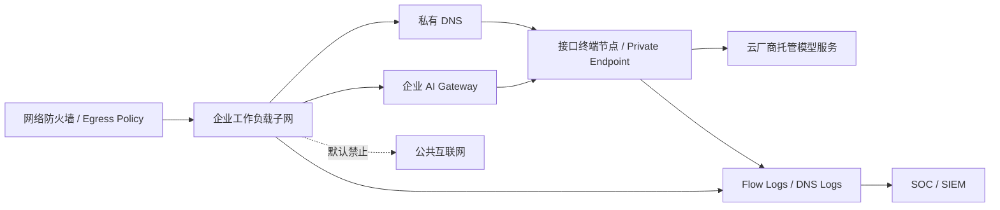

关键控制：

- 禁用模型资源公共网络访问；
- 配置私有 DNS 并验证解析；
- 安全组和端点策略只允许指定工作负载；
- IAM 同时限制身份、资源、模型与操作；
- 单独治理对象存储、向量库、批处理文件和回调；
- 记录 Flow Log、DNS Log 和控制面审计；
- 对跨账户、跨项目和跨区域访问设置显式 Deny；
- 进行“旁路出口”测试。

### 13.3 主流托管形态举例

下表只说明架构形态，不构成产品推荐。模型、地域、数据条款和功能会变化，采购前必须重新核对。

| 平台形态 | 私网/服务边界能力示例 | 选型时重点 |
|---|---|---|
| AWS Bedrock | VPC Interface Endpoint / AWS PrivateLink | 模型和功能的地域、端点策略、CloudTrail、知识库依赖 |
| Microsoft Foundry / Azure OpenAI | VNet 与 Private Endpoint | 数据处理说明、资源地域、状态化功能、内容安全配置 |
| Google Vertex AI | VPC Service Controls、CMEK、数据驻留等控制 | 服务支持矩阵、边界规则、访问透明度 |
| 阿里云百炼 | 通过 PrivateLink 终端节点私网访问 | 地域、业务空间、安全存储、API 能力 |
| 火山方舟 | PrivateLink 私网访问 | 资源与地域、端点、模型与应用能力 |
| 百度千帆 | 服务网卡映射到 VPC | 支持地域、固定终端节点和协议限制 |
| 华为云 ModelArts | 云上/云 Stack 模型部署与分布式推理 | 公有云与 Stack 版本差异、硬件与框架适配 |

AWS 官方文档说明可通过 PrivateLink 在不使用 Internet Gateway、NAT 或公有 IP 的情况下访问 Bedrock；Azure 官方文档说明其模型服务的数据处理与 Azure 环境和部署功能相关；Google Cloud 提供 VPC Service Controls 等数据外泄防护控制。[R3][R4][R5]

国内平台也提供不同形式的私网调用或自托管能力，例如阿里云百炼 PrivateLink、火山方舟 PrivateLink、百度千帆服务网卡，以及 ModelArts 的分布式模型部署能力。[R6][R7][R8][R9CN]

### 13.4 多云与跨云

多云并不自动提高可靠性。它会带来：

- 身份体系差异；
- 私网互联和 DNS 复杂度；
- 跨云流量成本；
- 观测字段不一致；
- 模型和区域能力不对称；
- 法务条款和责任边界增加；
- 故障切换时的数据合规重新判断。

多云应有明确目标：

- 避免单一供应商锁定；
- 满足不同地域或模型能力；
- 监管隔离；
- 灾备；
- 商务议价。

若只是“同时接了两家 API”，但没有常态评测、影子流量和切换演练，则不是真正的多云连续性。

### 13.5 网络验收测试

生产前至少验证：

1. 公共端点是否确实关闭；
2. 私有 DNS 是否在所有运行环境正确解析；
3. 未授权子网能否访问；
4. 跨区域调用是否被阻断；
5. NAT、HTTP Proxy、Service Mesh Egress 是否存在旁路；
6. SDK 是否会访问额外遥测或下载端点；
7. 流式连接、批处理和文件接口是否走同一受控路径；
8. 推理集群分布式端口是否仅在可信网段开放；
9. 供应商故障时路由是否会误回退到公共端点；
10. Flow Log 和控制面日志是否能关联到模型请求 ID。

---

## 14. 安全架构：模型之外还有工具、数据与供应链

### 14.1 Agent 的攻击面

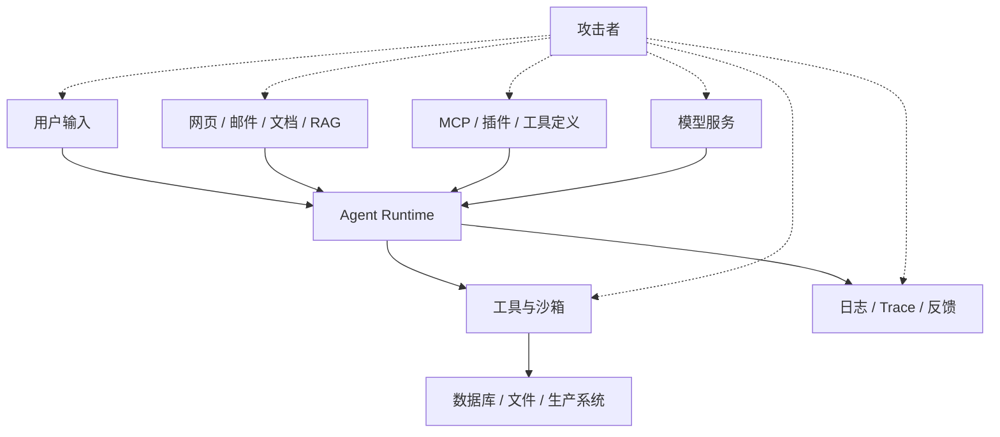

风险不只来自模型：

- 直接与间接提示注入；
- 敏感信息泄漏；
- 工具描述投毒；
- 过度权限；
- 不安全输出被下游执行；
- 模型和数据供应链；
- 共享缓存泄漏；
- 训练/微调投毒；
- 失控的多 Agent 委派；
- 遥测系统二次泄漏；
- 模型服务拒绝服务与成本攻击。

OWASP 已分别发布 LLM 与 Agentic 应用风险资料，可作为威胁建模输入，但企业仍需结合自己的工具、副作用和数据建立风险清单。[R29][R30]

### 14.2 零信任调用链

每一步都应验证：

- 谁发起；
- 代表谁；
- 要访问什么；
- 当前上下文是否满足策略；
- 请求是否在预算内；
- 输出能否直接产生副作用。

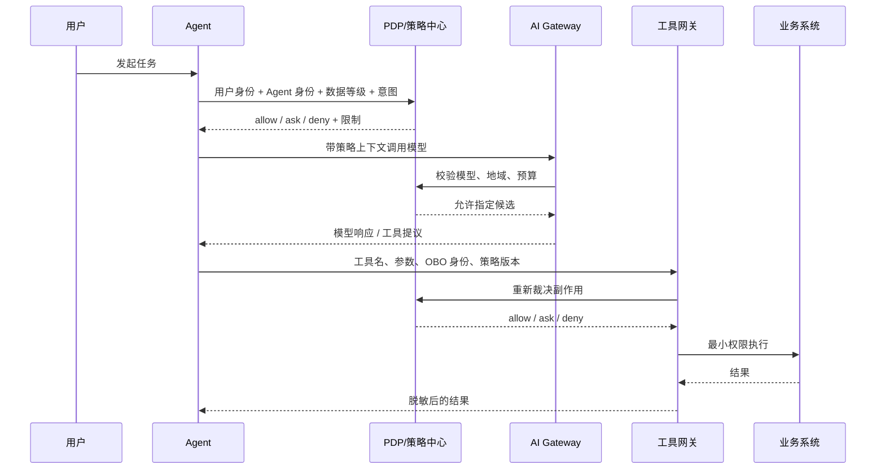

模型输出只是“建议动作”，不能被视为授权。

### 14.3 权限最小化

- 每个工具单独定义 Scope；
- 读写分离；
- 高危动作采用 `ask`；
- 删除、支付、发布、生产变更使用二次确认；
- 凭据短期化，不把长期密钥放入 Prompt；
- Agent 不直接读取企业全量密钥库；
- 工具结果最小化，只返回完成任务所需字段；
- 多 Agent 委派时权限不自动继承全部父权限；
- Worker 的权限应是任务所需权限的交集，而不是并集。

### 14.4 工具沙箱

代码执行、Shell、浏览器和文件工具建议具备：

- 容器、微虚机或操作系统级隔离；
- 只读基础镜像；
- 临时工作目录；
- CPU、内存、进程、磁盘、网络和时间限制；
- 默认无外网；
- 域名和端口允许列表；
- 禁止访问宿主机 Socket、元数据服务和凭据目录；
- 工件扫描；
- 命令与文件操作审计；
- 超时后有界终止；
- 会话结束后安全清理。

### 14.5 提示注入的边界设计

不能只在系统 Prompt 中写“忽略恶意指令”。需要架构控制：

- 将不可信内容标记为数据而不是指令；
- 工具和数据源采用来源标签；
- 模型无权自行扩大权限；
- 高危动作必须经独立策略引擎；
- 从网页、邮件、文档读取的内容不能改变系统策略；
- 输出进入 SQL、Shell、HTML、工作流前做结构和语义验证；
- 对间接注入建立专门评测集；
- 检索结果中的指令性文本进行检测和降权；
- 重要决策使用外部验证器或人工批准。

### 14.6 模型与镜像供应链

“下载一个模型权重”相当于引入一套大型第三方制品。准入需要：

1. 来源和发布者验证；
2. 固定不可变 Revision；
3. 内容哈希；
4. 许可证与用途审查；
5. Model Card 与已知限制；
6. 禁止或审查 `trust_remote_code`；
7. 优先使用更安全的权重格式；
8. 容器和 Python 依赖扫描；
9. SBOM；
10. 构建 Provenance；
11. 恶意 Pickle、脚本和启动钩子扫描；
12. 在隔离环境首次加载；
13. 记录 Tokenizer、Chat Template 和量化工具链；
14. 模型下线和吊销机制。

“Open Weights”与“Open Source AI”不是同义词。OSI 的定义强调模型、权重、代码及可修改所需信息的区别；Hugging Face Model Card 支持声明许可证、数据集和评测元数据。[R23][R24][R25]

SPDX 可用于表达软件和 AI 相关物料清单，SLSA Provenance 用于描述制品由谁、何时、如何构建。[R26][R27]

### 14.7 模型制品准入示例

```yaml
artifact:
  type: model
  repository: registry.example.com/models/domain-llm
  revision: sha256:...
  weightFormat: safetensors
  tokenizerRevision: sha256:...
  chatTemplateRevision: sha256:...
provenance:
  sourcePublisher: approved-publisher
  signatureVerified: true
  buildAttestation: slsa://attestation-id
  sbom: spdx://document-id
license:
  identifier: custom-model-license
  commercialUseApproved: true
  redistributionApproved: false
security:
  remoteCodeAllowed: false
  malwareScan: passed
  isolatedLoadTest: passed
evaluation:
  suite: enterprise-agent-v8
  qualityGate: passed
  securityGate: passed
```

### 14.8 密钥与凭据

- 使用 KMS、HSM 或企业 Secret Manager；
- 应用通过工作负载身份获取短期令牌；
- 禁止共享组织级万能 Key；
- 分环境、分租户、分供应商；
- 对 Key 设置预算、来源和 API Scope；
- 轮换和吊销自动化；
- 密钥不进入日志、Prompt、Trace 或错误消息；
- 供应商控制台人工操作使用强 MFA 和审批；
- Break-glass 凭据限时且强审计。

### 14.9 缓存和多租户隔离

必须隔离：

- 提示缓存；
- KV Cache；
- 会话状态；
- 向量索引；
- LoRA Adapter；
- 批处理文件；
- 日志；
- 评测样本；
- Tool Session；
- 工件下载缓存。

缓存命中带来的性能收益不能优先于租户边界。

---

## 15. 数据治理：内容、向量、缓存、遥测与工件都要入账

### 15.1 完整数据资产清单

企业常只盘点 Prompt 和 Completion，实际至少包括：

| 数据类别 | 示例 | 常见遗漏 |
|---|---|---|
| 原始输入 | 文本、图片、音频、视频、文件 | 临时上传副本 |
| 模型输出 | 文本、JSON、代码、媒体 | 流式分片与失败输出 |
| 检索数据 | Query、Chunk、文档 ID、重排结果 | 搜索词本身含敏感信息 |
| 向量 | Embedding、索引、元数据 | 误认为不可逆、无需治理 |
| 工具数据 | 参数、结果、错误、截图 | 工具名和错误栈泄露业务结构 |
| 会话状态 | 历史消息、线程、运行状态 | 状态化 API 的服务端存储 |
| 缓存 | Prompt Cache、KV、结果缓存 | 跨租户与过期 |
| 训练数据 | SFT、偏好、反馈、红队 | 从生产抽样后失去原用途边界 |
| 模型工件 | 权重、LoRA、Tokenizer | LoRA 可能记忆敏感数据 |
| 遥测 | Token、模型名、Trace、日志 | 全量 Prompt 被 APM 自动采集 |
| 审计 | 身份、策略、操作、对象 | 审计库读取本身未审计 |
| 人工反馈 | 标注、评分、纠错 | 标注供应商与跨境 |

### 15.2 数据生命周期

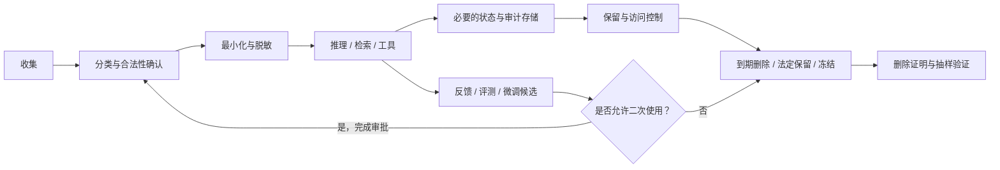

### 15.3 出域清单

对每条数据流记录：

- 数据类别；
- 来源系统；
- 数据主体和地域；
- 敏感级别；
- 处理目的；
- 模型/供应商；
- 发送字段；
- 传输路径；
- 处理地域；
- 保留期；
- 是否训练；
- 子处理商；
- 加密与密钥；
- 删除机制；
- 遥测去向；
- 负责人；
- 合同与 DPIA/PIA 引用。

### 15.4 可逆 Tokenization

对于姓名、证件号、卡号等可使用域内映射：

```text
原文：张三，身份证 1101...，申请理赔 50,000 元
出域：<PERSON_1>，身份证 <ID_1>，申请理赔 50,000 元
返回：建议联系 <PERSON_1> 核验 <ID_1>
还原：建议联系张三核验 1101...
```

设计要点：

- 映射表只在受控域内；
- 占位符稳定，保留共指关系；
- 每个会话或任务使用独立命名空间；
- 防止模型伪造占位符；
- 返回还原前验证占位符集合；
- 映射表有短保留与删除；
- 金额、日期、地区等准标识符按场景处理；
- 评测漏检率和误检率。

### 15.5 遥测最小化

OpenTelemetry 提供 GenAI 语义约定，用于标准化模型、Token、响应、工具等观测字段；是否采集完整 Prompt、Completion 和工具内容应为显式、受控选择，而不是默认打开。[R20][R21]

推荐默认：

- 记录模型、版本、供应商、区域；
- 记录输入/输出 Token 数；
- 记录延迟、状态、错误类别；
- 记录工具名或工具类别，但敏感工具可使用内部 ID；
- 不记录完整内容；
- 必要内容采样先脱敏；
- 高敏场景只保留哈希、长度、分类和轨迹指针；
- Trace 与审计库权限分离。

### 15.6 数据保留矩阵示例

| 数据 | 默认保留 | 存储 | 访问者 | 说明 |
|---|---:|---|---|---|
| 原始 Prompt/Completion | 0–7 天或不落盘 | 加密热存储 | 极少数授权人员 | 依场景与合同 |
| 普通 Trace | 30 天 | 可观测平台 | 工程团队 | 内容脱敏 |
| 聚合指标 | 13–24 个月 | 时序/分析库 | 工程、FinOps | 不含敏感内容 |
| 安全事件 | 按安全政策 | SIEM | SOC | 与普通日志分离 |
| 审计事件 | 按监管/合同 | WORM | 合规/审计 | 不可篡改 |
| 评测样本 | 版本有效期 | 评测仓库 | 评测团队 | 脱敏、可追溯 |
| Tokenization 映射 | 会话级短期 | 域内安全存储 | 运行时 | 任务完成后删除 |
| 模型权重 | 生命周期 + 归档 | 制品库 | 平台团队 | 哈希和许可证 |
| 批处理输入输出 | 完成后尽快删除 | 隔离对象存储 | 作业主体 | 明确失败清理 |

实际期限由法律、合同和业务需要确定。

### 15.7 状态化 API 的额外审查

很多模型平台除无状态推理外，还提供：

- Thread / Conversation；
- File / Vector Store；
- Batch；
- Code Execution；
- Managed Agent；
- Prompt Cache；
- Fine-tuning；
- Stored Response。

这些功能会产生不同的数据存储和保留行为，不能把“普通推理端点的零保留”自动扩展到所有功能。例如，供应商官方文档通常会单独列出不同 API 或功能的保留资格。[R1][R2]

---

## 16. 审计与合规：同源、分管、可证明

> 本节是工程治理框架，不构成法律意见。具体义务应由法务、隐私、网络安全和行业合规团队结合适用法域确认。

### 16.1 审计需要回答四个问题

1. **谁指示的？** 用户、服务、租户、会话；
2. **谁批准的？** 人工确认、策略规则、例外审批；
3. **系统做了什么？** 模型调用、工具、对象、结果；
4. **依据什么做的？** 策略版本、模型版本、输入摘要、证据和轨迹。

### 16.2 审计最小字段

```json
{
  "event_id": "uuid",
  "timestamp": "trusted-time",
  "tenant_id": "tenant",
  "human_subject": "user-id",
  "agent_subject": "agent-instance-id",
  "on_behalf_of": "user-id",
  "session_id": "session",
  "task_id": "task",
  "action": "tool.execute",
  "object": "claim/123",
  "data_class": "regulated-personal",
  "policy_id": "policy-name",
  "policy_version": "sha256:...",
  "decision": "ask",
  "approver": "reviewer-id",
  "model_id": "logical-model",
  "model_revision": "immutable-revision",
  "tool_revision": "tool-schema-revision",
  "result": "success",
  "trace_pointer": "trace://...",
  "integrity": {
    "previous_hash": "...",
    "event_hash": "...",
    "signature": "..."
  }
}
```

### 16.3 同源、分管

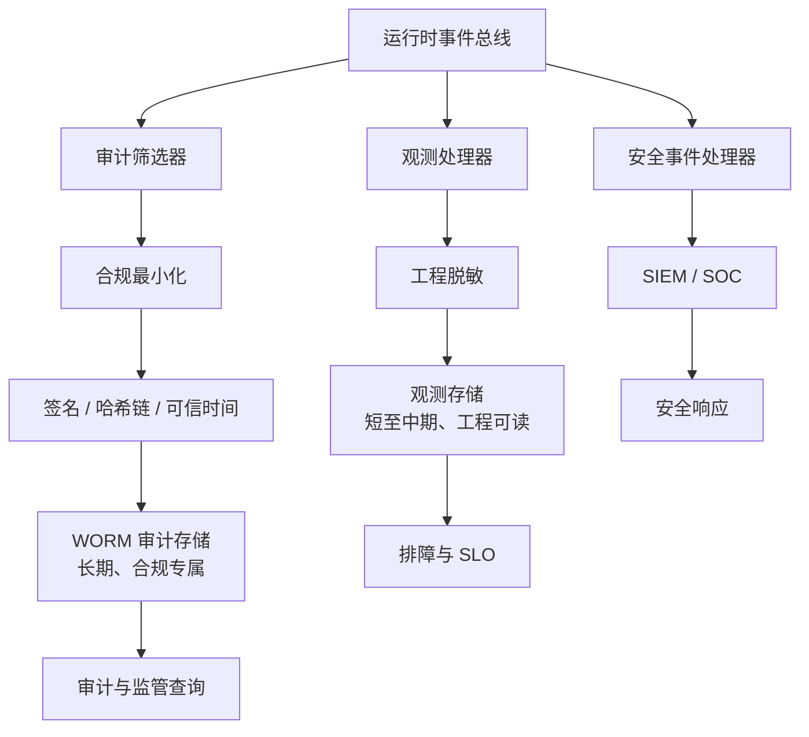

“同源”是避免三套埋点彼此矛盾；“分管”是不同存储、保留期、访问控制和用途。

### 16.4 审计完整性

可采用：

- WORM/Object Lock；
- 哈希链；
- 批次 Merkle Tree；
- 数字签名；
- 可信时间；
- 跨账户归档；
- 双人管理；
- 读取审计；
- 定期完整性验证；
- Legal Hold。

审计记录不是越多越好。过量保存原始 Prompt 会扩大隐私和泄漏面，应优先保存可证明决策所需的最小信息，并通过受控轨迹指针访问详细上下文。

### 16.5 NIST AI RMF 映射

NIST AI RMF 以 Govern、Map、Measure、Manage 四个函数组织 AI 风险管理，生成式 AI Profile 提供面向 GenAI 的补充。[R31][R32]

| 函数 | 部署与选型实践 |
|---|---|
| Govern | 模型准入委员会、角色责任、例外、培训、供应商治理 |
| Map | 场景、主体、数据、影响、地域、依赖和威胁模型 |
| Measure | Agentic 评测、安全红队、SLO、成本、偏差与漂移 |
| Manage | 风险处置、路由、人工确认、降级、事件响应、重评 |

### 16.6 ISO/IEC 42001 映射

ISO/IEC 42001 定义 AI 管理体系的建立、实施、维护和持续改进要求。[R33]

在本章语境中，可落到：

- AI 资产和用途清单；
- 风险与影响评估；
- 模型与供应商准入；
- 数据治理；
- 人员职责和能力；
- 运行监控；
- 事件和不符合项；
- 内审与管理评审；
- 持续改进。

### 16.7 欧盟 AI Act

欧盟官方信息显示，AI Act 于 2024 年 8 月 1 日生效，并按阶段适用；截至 2026 年 8 月，主要执法与透明度要求已进入适用阶段，但部分高风险系统要求仍有后续时间安排，且 2026 年存在简化修订。[R34][R35]

部署选型时至少要确认：

- 企业是 Provider、Deployer、Importer 还是 Distributor；
- 用例风险分类；
- 是否涉及高风险领域；
- 日志、透明度、人类监督和质量管理要求；
- 通用模型与下游系统责任如何分配；
- 生成内容标识义务；
- 供应商能否提供所需技术文档和事件支持。

不能用“我们只是调用 API”推定没有责任。

### 16.8 中国数据与生成式 AI 规则

中国场景至少应结合：

- 《个人信息保护法》；
- 《数据安全法》；
- 《网络安全法》及网络数据相关规则；
- 《生成式人工智能服务管理暂行办法》；
- 数据跨境、重要数据和行业规定；
- 面向公众提供生成式服务时的备案、登记、内容治理与标识要求。

官方规则明确覆盖个人信息处理、数据处理与安全责任，并对面向境内公众的生成式人工智能服务提出相应要求。[R36][R37][R38]

企业内部使用与面向公众提供服务的适用范围可能不同，必须按实际角色和功能判断。

### 16.9 新加坡治理参考

新加坡 IMDA/PDPC 提供生成式 AI、Agentic AI 与个人数据使用相关治理框架和指引，可作为区域治理和组织实践参考。[R39][R40]

可映射到：

- 责任主体与人类监督；
- Agent 行动边界；
- 数据与模型透明度；
- 测试和安全保障；
- 事件响应；
- 用户告知与救济；
- 个人数据在 GenAI 开发和部署中的使用。

### 16.10 供应商条款审查清单

至少审查：

1. API 与消费级产品条款是否不同；
2. 默认是否用于训练，Opt-in/Opt-out 如何生效；
3. 标准保留期；
4. 零数据保留资格和排除功能；
5. 滥用监测与安全保留；
6. 状态化 API、文件、批处理和代码执行保留；
7. 数据处理与存储地域；
8. 子处理商；
9. 加密与密钥；
10. 人员访问；
11. 删除和导出；
12. 安全事件通知；
13. 模型变更和退役通知；
14. 服务可用性、配额与支持；
15. 知识产权、赔偿和输出权利；
16. 审计报告与合规认证；
17. 条款变更通知；
18. 终止后的数据处理；
19. 监管查询协助；
20. 责任上限与业务损失覆盖。

OpenAI、Anthropic、Azure 等供应商均发布了面向商业/API 数据使用和保留的官方说明，但具体资格、功能和合同安排需要逐项核对。[R1][R2][R41]

### 16.11 条款基线与变更监控

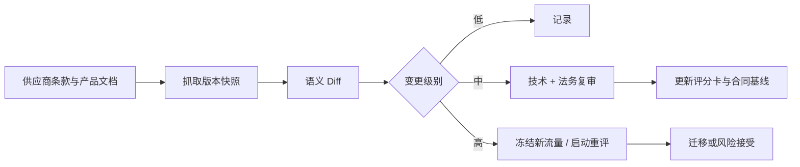

高风险变更包括：

- 训练使用变化；
- 保留期变化；
- 新增子处理商；
- 地域变化；
- 零保留资格变化；
- 状态化功能默认开启；
- 模型静默升级；
- 重大价格或配额变化；
- 退役通知；
- 安全事件。

---


## 17. 可靠性工程：主力、备份、特化与降级阶梯

传统微服务的可靠性通常围绕“接口是否成功返回”；Agent 的可靠性还要回答三个问题：

1. 返回是否及时；
2. 任务是否真正完成；
3. 即使失败，是否以安全、可恢复、可解释的方式停止。

因此，企业不能只监控模型 API 的 `2xx`，还要监控完整执行图。

### 17.1 三层可靠性目标

| 层级 | 关注对象 | 典型 SLI | 容易漏掉的问题 |
|---|---|---|---|
| 请求层 | 单次模型或工具调用 | 成功率、TTFT、TPOT、超时率、限流率 | API 成功但内容不可用 |
| 会话层 | 一次 Agent 运行 | 端到端延迟、Loop 次数、Token、重试、降级率 | 中间步骤成功但最终任务失败 |
| 业务层 | 真实业务结果 | 任务成功率、一次解决率、人工接管率、损失事件 | 技术指标正常但业务目标未实现 |

推荐把 SLO 写成“质量 + 性能 + 安全”组合，而不是单个可用率。

#### 一个生产级 SLO 示例

| SLO | 目标 | 窗口 | 说明 |
|---|---:|---:|---|
| Gateway 接入可用率 | ≥ 99.95% | 30 天 | 不含调用方主动取消 |
| 主力模型调用成功率 | ≥ 99.5% | 7 天 | 独立统计 429、5xx、超时 |
| 交互式任务首 Token P95 | ≤ 2.5 秒 | 7 天 | 按区域、模型、输入长度分桶 |
| 交互式任务端到端 P95 | ≤ 20 秒 | 7 天 | 必须与任务类型绑定 |
| 核心任务成功率 | ≥ 92% | 每日滚动 | 来自在线抽样和业务真值 |
| 高风险工具越权率 | = 0 | 永久 | 任何一次都触发安全事件 |
| 可恢复失败率 | ≥ 99% | 30 天 | 失败后可重放、补偿或人工接管 |
| 审计事件完整率 | = 100% | 每日 | 缺失即阻断高风险发布 |

这些数值只是示例，不能脱离业务直接照抄。客服、代码生成、财务审批和医疗辅助的目标完全不同。

### 17.2 错误预算不能只按 HTTP 错误计算

传统错误预算：

\[
ErrorBudget = 1 - SLO
\]

Agent 场景需要把错误拆成至少四类：

\[
E_{total} = w_aE_{availability} + w_qE_{quality} + w_sE_{safety} + w_cE_{consistency}
\]

其中：

- \(E_{availability}\)：超时、限流、供应商故障；
- \(E_{quality}\)：任务失败、幻觉、格式错误；
- \(E_{safety}\)：越权工具调用、敏感信息泄露、违规输出；
- \(E_{consistency}\)：重复执行、状态丢失、补偿失败。

安全错误通常不应与普通可用性错误等价折算。对于资金划拨、生产变更、账号删除等动作，企业常采用“**零容忍安全 SLO**”：任何一次未授权副作用都必须触发冻结、复盘和控制升级。

### 17.3 故障域分类

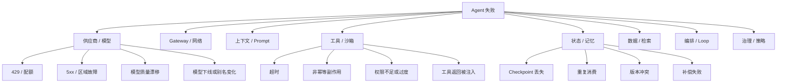

只有分类清楚，降级才不会“越降越危险”。例如：

- 供应商超时可以切换备份模型；
- 工具权限校验失败不能通过换模型绕过；
- 检索索引陈旧不能用增加模型温度补救；
- 非幂等写操作超时不能盲目重试；
- 质量漂移不能只看 API 可用率。

### 17.4 降级阶梯

推荐预先定义下面的降级顺序，而不是事故中临时拼接：

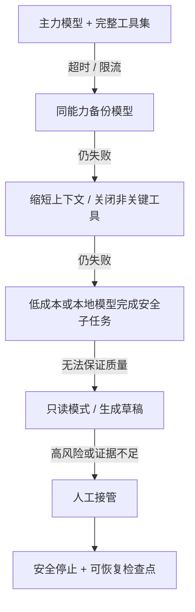

#### 每一级都要回答

- 允许哪些任务继续？
- 禁止哪些工具？
- 是否降低最大步数和 Token 预算？
- 是否需要用户明确确认？
- 是否改变输出承诺？
- 是否记录 `degradation_reason`？
- 恢复主链路后是否自动重试，还是必须人工重放？

#### Fail-open 与 Fail-closed

| 场景 | 推荐模式 | 原因 |
|---|---|---|
| 内部知识摘要 | 可有限 Fail-open | 错误通常可逆 |
| 客服建议草稿 | 可降级为人工复核 | 不直接对客户承诺 |
| 生产数据库写入 | Fail-closed | 副作用高 |
| 权限授予 | Fail-closed | 越权损失大 |
| 安全告警归类 | 保留原始告警并降级 | 不能因 AI 故障丢告警 |
| 代码自动合并 | 降级为只生成补丁 | 保留人类门禁 |
| 支付或退款 | Fail-closed + 幂等 | 资金动作不可重复 |

### 17.5 重试、对冲与熔断

#### 重试原则

只在满足以下条件时自动重试：

1. 错误是暂时性的；
2. 调用是幂等的，或有幂等键；
3. 重试不会突破任务预算；
4. 上游没有已经继续执行；
5. 对供应商限流使用指数退避和抖动；
6. 不把模型拒答误判为基础设施错误。

```text
retry_budget = min(
    per_call_retry_limit,
    remaining_task_steps,
    remaining_deadline / expected_call_latency,
    remaining_cost_budget / expected_retry_cost
)
```

#### 对冲请求

对冲是指主请求超过阈值后，向另一个副本或供应商发起第二个请求，取先成功者。它可改善尾延迟，但会：

- 增加成本；
- 放大高峰流量；
- 造成重复副作用；
- 增加供应商相关性；
- 使审计和取消更复杂。

因此，对冲只适用于无副作用的读/推理请求，并且必须有：

- 最小等待阈值；
- 全局对冲预算；
- 取消未胜出请求；
- 供应商独立性；
- 成本和收益观测。

#### 熔断器维度

不要只做“供应商级熔断”。建议至少支持：

- `provider`；
- `region`；
- `model_release`；
- `endpoint`；
- `tenant`；
- `task_type`；
- `tool`；
- `credential_pool`。

一个模型可能只在超长上下文请求上失败，粗粒度熔断会误伤正常流量。

### 17.6 幂等、Checkpoint 与补偿

Agent 可靠性的关键不是“永不失败”，而是“失败后知道已经做了什么”。

```mermaid
sequenceDiagram
    participant U as 用户
    participant R as Agent Runtime
    participant M as 模型
    participant T as 工具
    participant S as 状态存储

    U->>R: 提交任务 task_id
    R->>S: 写入运行记录与预算
    R->>M: 规划下一动作
    M-->>R: 调用工具
    R->>S: 预写 action_id / idempotency_key
    R->>T: 执行动作
    T-->>R: 返回结果
    R->>S: 提交动作结果与副作用凭证
    alt Runtime 崩溃
        R->>S: 恢复最近 Checkpoint
        R->>T: 查询 action_id 状态
        T-->>R: 已完成 / 未完成 / 不确定
        R->>R: 跳过、重试或补偿
    end
```

动作状态不应只有“成功/失败”，建议采用：

```text
PLANNED
  -> DISPATCHED
  -> ACKNOWLEDGED
  -> SUCCEEDED
  -> FAILED_RETRYABLE
  -> FAILED_FINAL
  -> COMPENSATING
  -> COMPENSATED
  -> MANUAL_REVIEW
  -> UNKNOWN
```

`UNKNOWN` 是企业系统中非常重要的状态：例如网络超时后无法确认第三方是否已执行。把它粗暴映射为失败并重试，可能造成重复扣款、重复工单或重复发布。

### 17.7 多区域与灾备设计

先按数据类型定义 RPO/RTO：

| 状态 | 示例 | 推荐策略 |
|---|---|---|
| 可重建状态 | Embedding 缓存、派生索引 | 低成本备份，可重建 |
| 运行时状态 | 当前 Step、预算、工具结果 | 高频持久化，跨区复制 |
| 权威业务状态 | 工单、支付、审批 | 由业务系统做强一致和灾备 |
| 审计证据 | 策略判定、批准、动作凭证 | 不可篡改、独立保留 |
| 模型工件 | 权重、Tokenizer、镜像 | 内容寻址、多副本 |
| 配置与策略 | 路由、权限、Prompt 版本 | GitOps/版本库，快速恢复 |

#### RTO/RPO 不能只写“平台级”

- 推理服务可无状态，RPO 近似为 0；
- 会话状态可能允许数秒 RPO；
- 高风险动作审计通常要求不丢；
- 模型权重允许分钟或小时恢复；
- 在线交互和批处理可有不同 RTO。

#### 多区域模式

| 模式 | 特点 | 适用 |
|---|---|---|
| Active-Standby | 成本较低，切换较慢 | 低频或强地域约束 |
| Active-Active | 尾延迟低，复杂度高 | 全球交互式业务 |
| Provider Failover | 不自建多区，用第二供应商 | API 优先团队 |
| Hybrid Failover | 托管主力 + 自托管保底 | 数据敏感且要求连续性 |
| Local Survival Mode | 云不可用时本地小模型维持核心功能 | 工业、门店、边缘 |

### 17.8 故障演练矩阵

每季度至少演练：

| 演练 | 注入方式 | 预期结果 |
|---|---|---|
| 主供应商 429 | 降低模拟配额 | 路由到备份，成本告警 |
| 区域不可用 | 阻断端点 | 在 RTO 内切区 |
| P95 延迟翻倍 | 注入网络延迟 | 熔断或缩短上下文 |
| 模型质量下降 | 替换为退化版本 | 在线质量门禁触发回滚 |
| 工具返回注入 | 注入恶意工具内容 | 内容被标记为不可信 |
| 状态库短暂失败 | 停止写入 | 高风险动作 Fail-closed |
| 审计管道中断 | 阻断日志出口 | 高风险动作停止，低风险限流 |
| KMS 不可用 | 禁用解密 | 不使用明文旁路 |
| GPU 节点丢失 | 驱逐 Pod/节点 | 容量降级、排队受控 |
| 模型工件损坏 | 校验和失败 | 阻止加载并回退上一版本 |

演练成功的标准不是“最终恢复”，而是：

- 故障在合理时间内被发现；
- 自动化动作符合设计；
- 无越权和重复副作用；
- 用户看到准确的降级状态；
- 证据可用于复盘；
- 恢复后不会产生流量洪峰。

### 17.9 生产事故 Runbook 的最小结构

1. 事件级别与影响面；
2. 当前主力模型、别名解析和路由版本；
3. 供应商、区域、模型、租户分桶指标；
4. 最近发布、Prompt、工具、策略变更；
5. 可执行的熔断和降级命令；
6. 回滚条件与负责人；
7. 是否涉及隐私、安全或副作用；
8. 用户与管理层沟通模板；
9. 证据保全；
10. 恢复验证；
11. 事后重放和补偿；
12. 复盘行动项与截止日期。

Google SRE 将 SLO 视为可靠性决策的重要基础；在 Agent 平台中，应把该思想从服务可用性扩展到任务质量和安全停止。[R42]

---

## 18. 模型发布、灰度、回滚与迁移

模型升级不是普通依赖升级。即使 API Schema 不变，模型的推理风格、工具调用、拒答边界、结构化输出和 Token 使用都可能变化。

### 18.1 永远不要把供应商别名当作不可变版本

生产调用建议解析为企业自己的不可变发布实体：

```yaml
model_release:
  id: mr_2026_08_31_001
  logical_name: general-agent-primary
  provider: example-provider
  provider_model: model-x-2026-08-20
  endpoint: ap-southeast
  tokenizer_digest: sha256:...
  adapter_digest: null
  system_prompt_version: sp_42
  tool_schema_bundle: tools_18
  safety_policy_version: policy_11
  runtime_version: rt_37
  eval_report: eval_2026_08_30
  approval_ticket: CAB-2026-1842
  status: canary
```

一次 Agent 运行至少应记录：

- 企业 `model_release_id`；
- 供应商返回的模型版本；
- 路由策略版本；
- Prompt 版本；
- 工具 Schema 版本；
- 检索索引版本；
- 安全策略版本；
- Runtime 版本；
- 随机性参数；
- 关键预算；
- 数据分类。

这样才能回答“为什么昨天可以，今天不可以”。

### 18.2 发布流水线

```mermaid
flowchart LR
    A["候选模型 / 新版本"] --> B["许可证与供应链扫描"]
    B --> C["接口与结构化输出契约测试"]
    C --> D["离线能力评测"]
    D --> E["安全与红队评测"]
    E --> F["固定流量压测"]
    F --> G["影子流量"]
    G --> H["1% Canary"]
    H --> I["5% / 20% / 50%"]
    I --> J["全量"]
    J --> K["持续质量与漂移监测"]

    D -.->|"不达标"| X["拒绝"]
    E -.->|"高风险"| X
    F -.->|"容量不足"| X
    G -.->|"真实分布退化"| X
    H -.->|"触发 Guardrail"| R["自动回滚"]
    I -.->|"触发 Guardrail"| R
```

#### 每一阶段的证据

| 阶段 | 证据 |
|---|---|
| 供应链 | 来源、许可证、权重哈希、镜像签名、SBOM |
| 契约 | JSON Schema、工具参数、停止条件、流式协议 |
| 离线评测 | 任务成功、质量、安全、成本、延迟 |
| 压测 | TTFT、TPOT、吞吐、排队、OOM、恢复 |
| 影子 | 与真实流量的差异，不向用户返回 |
| Canary | 在线成功率、人工接管率、业务 KPI |
| 全量 | SLO、错误预算、持续漂移 |

### 18.3 影子流量的正确做法

影子流量用于让候选模型读取真实输入并生成结果，但不影响线上决策。

必须控制：

- 数据是否允许发送给候选供应商；
- 不执行候选模型建议的真实工具；
- 对工具调用使用 Mock、Record/Replay 或只读沙箱；
- 去掉用户身份或做可逆/不可逆脱敏；
- 为候选模型设置独立成本预算；
- 不因复制请求突破许可、配额或保留约束；
- 结果进入隔离评测存储；
- 记录线上模型和候选模型的成对比较。

影子结果不能只看文本相似度。应比较：

- 最终任务是否完成；
- 工具序列是否合理；
- 是否产生不必要动作；
- Token 与时间；
- 失败是否可恢复；
- 人工偏好；
- 风险等级。

### 18.4 Canary 的流量切分

不要只随机切 1% 用户。推荐按多维度分层：

- 低风险任务先行；
- 内部员工先行；
- 非关键租户先行；
- 特定地区；
- 特定工具集合；
- 可回滚业务；
- 输入长度桶；
- 语言；
- 新旧客户；
- 高价值客户最后。

```text
eligible =
  data_class <= C2
  AND task_risk in {LOW, MEDIUM}
  AND destructive_tool == false
  AND tenant.canary_opt_in == true
  AND region in candidate.allowed_regions
```

随机比例只在 `eligible` 集合内生效。

### 18.5 自动回滚 Guardrail

示例：

```yaml
rollback_guardrails:
  window: 15m
  min_samples: 300
  conditions:
    - metric: task_success_rate_delta
      operator: "<"
      value: -0.03
    - metric: p95_end_to_end_latency_ratio
      operator: ">"
      value: 1.25
    - metric: unsafe_action_count
      operator: ">"
      value: 0
    - metric: schema_valid_rate
      operator: "<"
      value: 0.995
    - metric: cost_per_success_ratio
      operator: ">"
      value: 1.20
  evaluation: ANY
  action: rollback_and_freeze
```

注意：

- 低样本任务要使用置信区间或贝叶斯后验，避免小样本误判；
- 安全事件可零样本门槛；
- 质量和成本要按任务类型分层；
- 回滚必须把路由、Prompt、工具 Schema 和模型一起视为发布单元；
- 回滚后应冻结自动重试，避免新旧版本来回抖动。

### 18.6 Prompt、工具与模型必须共同版本化

模型升级失败常被错误归因于“模型变差”，实际可能是：

- 旧 Prompt 针对旧模型过拟合；
- 工具描述太长或歧义；
- 新模型倾向并行工具调用；
- 新版本改变停止行为；
- JSON Schema 支持不同；
- 推理预算默认值改变；
- 安全策略冲突；
- Tokenizer 导致上下文预算变化。

因此，发布单元推荐为：

\[
Release = Model + Prompt + ToolSchema + Runtime + Policy + Retriever
\]

每次升级先做最小变更；如果同时变化多项，必须有因子实验或消融测试。

### 18.7 模型退役迁移

供应商通知模型退役时，建议执行：

1. 冻结新增依赖；
2. 确认受影响应用、地区、租户和工作流；
3. 拉取最近 30～90 天真实任务样本；
4. 建立旧模型基线；
5. 选择至少两个候选；
6. 重跑离线评测；
7. 验证 Tool Calling 与结构化输出；
8. 检查价格、配额、保留和地域；
9. 影子；
10. Canary；
11. 完成全量切换；
12. 保留旧版本回滚窗口；
13. 更新模型卡、ADR、SLO、预算；
14. 关闭旧凭据和配额；
15. 做供应商退出演练。

### 18.8 供应商退出能力

退出不是“代码里换一个模型名”，而是包括：

- Prompt 兼容；
- 工具调用兼容；
- Embedding 与向量索引迁移；
- 状态化 Agent 数据导出；
- 微调/适配器迁移；
- 评测基线重建；
- 安全策略映射；
- 计费和审计字段转换；
- 密钥撤销；
- 数据删除证明；
- 合同终止后的保留；
- 用户体验变化。

每年至少进行一次“无原供应商新流量”的桌面推演或实战演练。

---

## 19. 多模型路由：把“选一个”升级为“经营一个组合”

成熟企业很少长期依赖单一模型。合理的组合可能是：

- 主力通用模型；
- 低延迟模型；
- 低成本模型；
- 长上下文模型；
- 视觉/语音模型；
- 代码专用模型；
- 本地敏感模型；
- 审核或 Judge 模型；
- 备份供应商；
- 批处理模型。

### 19.1 路由顺序：硬约束优先

```mermaid
flowchart TD
    A["请求"] --> B["身份、租户与数据分类"]
    B --> C{"硬策略过滤"}
    C -->|"无可行模型"| Z["拒绝 / 人工接管"]
    C -->|"候选集合"| D["能力门槛过滤"]
    D --> E["预测质量、延迟、成本"]
    E --> F["结合实时配额、排队和健康度"]
    F --> G["选择主模型与备份"]
    G --> H["执行与观测"]
    H --> I["结果反馈到评测与路由"]
```

**不能**先让一个路由模型自由选择，再在事后检查数据是否出域。正确顺序是：

1. 策略引擎形成可行集合；
2. 路由器只在可行集合内优化；
3. Runtime 再次执行最终策略校验；
4. 记录路由原因。

### 19.2 硬过滤条件

```text
candidate.allowed =
  request.region ∈ candidate.allowed_regions
  AND request.data_class ≤ candidate.max_data_class
  AND request.required_modalities ⊆ candidate.modalities
  AND request.context_tokens ≤ candidate.max_context
  AND request.required_tools ⊆ candidate.tool_capabilities
  AND candidate.license_allows(request.usage)
  AND candidate.retention_profile satisfies request.retention_requirement
  AND candidate.health != BLOCKED
```

只要一项不满足，就不能用“更高质量”抵消。

### 19.3 软评分

在可行集合中：

\[
Score(m|x)=
w_q\hat{Q}(m,x)
-w_c\hat{C}(m,x)
-w_l\hat{L}(m,x)
-w_r\hat{R}(m,x)
+w_hH(m)
\]

其中：

- \(\hat{Q}\)：对当前任务的成功概率；
- \(\hat{C}\)：预测成本；
- \(\hat{L}\)：预测延迟；
- \(\hat{R}\)：风险或不确定性；
- \(H\)：实时健康度。

权重不能全局固定。交互式问答重延迟；批处理重成本；高风险审批重质量和可解释性。

### 19.4 四类路由器

| 路由方式 | 优点 | 缺点 | 适用 |
|---|---|---|---|
| 静态映射 | 可解释、稳定 | 利用率低，维护多 | 早期、强合规 |
| 规则路由 | 可控、上线快 | 规则膨胀 | 多数据等级 |
| 学习型分类器 | 可适应任务分布 | 需要标注和监控 | 中等成熟度 |
| 在线 Bandit/优化 | 能持续优化 | 风险高、难审计 | 低风险大流量任务 |

建议演进路径：

```text
静态映射
  -> 明确规则
  -> 离线训练的预测器
  -> 受约束的在线优化
```

不要直接在高风险动作上使用无约束强化学习路由。

### 19.5 级联推理

级联可降低成本：

1. 小模型先处理；
2. 判断置信度；
3. 低置信或高风险升级大模型；
4. 必要时升级人工。

```mermaid
flowchart LR
    A["请求"] --> S["小模型"]
    S --> C{"质量 / 置信度门槛"}
    C -->|"通过"| O["输出"]
    C -->|"不通过"| L["大模型"]
    L --> V{"安全与证据检查"}
    V -->|"通过"| O
    V -->|"不通过"| H["人工"]
```

真正困难的是置信度。模型自报“我很有信心”通常不够，应结合：

- 任务类别；
- 输入是否超出训练分布；
- 是否检索到足够证据；
- 结构化约束是否满足；
- 多次采样一致性；
- Judge 或规则验证；
- 工具返回完整度；
- 历史同类任务校准；
- 风险等级。

### 19.6 路由器也需要评测

路由评测至少包含：

- 相对 Oracle 的质量损失；
- 相对单一强模型的成本节约；
- P95/P99 延迟变化；
- 策略违规率；
- 供应商集中度；
- 备份切换成功率；
- 路由解释完整率；
- 数据分布漂移后的退化；
- 路由自身开销；
- 错误升级率和错误降级率。

一个可用指标：

\[
RoutingUtility =
\frac{\Delta CostSaved - \lambda \Delta QualityLoss}
{RoutingOverhead + OperationalRisk}
\]

### 19.7 实时容量和配额路由

路由器要看到：

- 剩余 RPM/TPM；
- 供应商并发；
- 当前排队长度；
- GPU KV Cache 占用；
- 节点加载状态；
- 熔断状态；
- 区域网络延迟；
- 租户预算；
- 日/月成本上限；
- 供应商预付额度。

但不要把瞬时抖动直接转成大规模切流。推荐：

- 滑动窗口；
- 滞回阈值；
- 最短驻留时间；
- 最大单次切流比例；
- 恢复冷却时间；
- 分租户限速；
- 全局应急预算。

### 19.8 可解释路由记录

每次选择建议产生：

```json
{
  "routing_decision_id": "rd_123",
  "policy_version": "route_41",
  "request_class": "coding_change_review",
  "data_class": "C2",
  "eligible_models": ["m_local_code", "m_cloud_primary"],
  "excluded_models": {
    "m_public_fast": ["data_residency_not_satisfied"],
    "m_vision": ["capability_not_required"]
  },
  "selected_model": "m_cloud_primary",
  "backup_model": "m_local_code",
  "selection_reasons": [
    "predicted_success_probability=0.94",
    "within_latency_slo",
    "tenant_budget_available"
  ],
  "predicted_cost": 0.18,
  "predicted_latency_ms": 8400
}
```

不要记录原始敏感文本作为“解释”。优先记录结构化特征、策略 ID 和哈希。

### 19.9 防止供应商集中风险

建立以下指标：

\[
ProviderConcentration =
\sum_{p} share_p^2
\]

它与 HHI 类似，越高说明流量越集中。还应分别统计：

- Token 占比；
- 成功任务占比；
- 关键业务占比；
- 数据等级占比；
- 不可替代功能占比；
- Embedding/索引锁定程度；
- 微调资产锁定程度。

即使 50% Token 在第二供应商，如果所有高风险核心任务仍依赖第一供应商，业务集中风险仍然很高。


## 20. Build、Buy、BYOC 与组织能力

部署选择不能只比较产品功能，还要评估企业能否长期经营对应能力。

### 20.1 四种经营方式

| 方式 | 企业主要承担 | 优势 | 主要风险 |
|---|---|---|---|
| Buy：直接托管 API | 应用、治理、集成 | 上线快，能力更新快 | 条款、配额、锁定、数据边界 |
| Managed Platform：云 AI 平台 | 应用、策略、云配置 | 私网/IAM/监控集成较好 | 云绑定、产品限制、跨云复杂 |
| BYOC：供应商软件跑在客户云 | 云资源、数据面；供应商维护部分软件 | 控制与运维折中 | 责任边界、升级和远程访问 |
| Build：完全自建 | 全栈 | 控制强、可定制 | 人才、容量、可靠性、供应链 |

### 20.2 决策矩阵

| 问题 | 倾向 Buy | 倾向 BYOC | 倾向 Build |
|---|---|---|---|
| 是否必须极快上线 | 强 | 中 | 弱 |
| 是否需要最强闭源模型 | 强 | 视产品 | 弱 |
| 数据是否严禁离开客户控制域 | 弱 | 强 | 强 |
| 是否需要离线/边缘 | 弱 | 中 | 强 |
| 负载是否长期稳定且巨大 | 中 | 中 | 强 |
| 是否有 GPU/SRE/推理优化团队 | 不要求 | 部分要求 | 强要求 |
| 是否需要深度定制内核 | 弱 | 中 | 强 |
| 是否接受单一供应商依赖 | 强 | 中 | 弱 |
| 是否要求权重级控制 | 弱 | 视方案 | 强 |
| 是否能承担 7×24 运维 | 不要求 | 部分 | 必须 |

### 20.3 不要把“自建”误解成一次性项目

自建推理平台至少需要持续承担：

- 模型工件和许可证管理；
- GPU/加速器采购与调度；
- 驱动、固件、CUDA/ROCm/CANN 等兼容；
- 推理引擎升级；
- 容量规划；
- 模型加载和缓存；
- 安全补丁；
- 多租户隔离；
- 可观测性；
- SLO 与值班；
- 灾备；
- 性能回归；
- 成本归集；
- 模型退役；
- 供应链和漏洞响应。

如果没有明确 Owner 和长期预算，“私有化”很容易退化成一台没人敢升级的 GPU 服务器。

### 20.4 组织成熟度模型

#### L0：个人调用

- API Key 散落；
- 应用直连；
- 无统一评测；
- 无数据分类；
- 成本靠账单事后看。

**目标**： 先集中凭据和调用入口。

#### L1：统一接入

- AI Gateway；
- 模型目录；
- 统一鉴权和限额；
- 基础日志；
- 少量规则路由。

**目标**： 看见谁在用、用了什么、花了多少。

#### L2：受控生产

- 数据分级；
- Agentic 评测；
- 发布门禁；
- Prompt/工具版本；
- SLO；
- 审计；
- 主备模型。

**目标**： 可控地上线和回滚。

#### L3：平台化经营

- 多模型动态路由；
- 自托管与托管混合；
- FinOps；
- 自动容量；
- 影子和 Canary；
- 供应商退出演练；
- 统一安全策略。

**目标**： 质量、成本和风险联合优化。

#### L4：持续优化

- 在线/离线评测闭环；
- 路由器校准；
- 自动发现漂移；
- 受约束的策略优化；
- 模型组合按业务收益调整；
- 组织级 AI 风险管理体系。

**目标**： 把模型和 Agent 作为持续经营的生产能力，而不是静态软件。

### 20.5 推荐团队边界

```mermaid
flowchart TB
    BIZ["业务产品团队"] -->|"任务、真值、KPI"| PLAT["Agent / AI 平台团队"]
    SEC["安全与隐私"] -->|"策略、威胁模型、门禁"| PLAT
    LEGAL["法务与采购"] -->|"合同、许可、退出"| PLAT
    FIN["FinOps / 财务"] -->|"预算、归集、预测"| PLAT
    SRE["SRE / 基础设施"] -->|"容量、SLO、灾备"| PLAT
    DATA["数据治理"] -->|"分类、血缘、保留"| PLAT
    PLAT -->|"Gateway、Runtime、模型目录、评测"| APP["应用与 Agent"]
```

平台团队不应该替业务定义正确答案，也不应让安全团队为每次普通模型调用手工审批。正确方式是把各团队规则产品化：

- 业务提供 Golden Set 和失败成本；
- 数据团队提供分类标签；
- 安全团队提供 Policy-as-Code；
- 法务提供可机器读取的条款基线；
- FinOps 提供预算和归集规则；
- 平台提供统一执行点；
- 应用团队负责场景级运行和用户体验。

### 20.6 RACI 示例

| 活动 | 业务 | 平台 | SRE | 安全/隐私 | 法务采购 | FinOps |
|---|---|---|---|---|---|---|
| 定义任务成功 | A/R | C | I | C | I | I |
| 选择候选模型 | C | A/R | C | C | C | C |
| 数据出域批准 | C | C | I | A/R | C | I |
| 推理容量 | I | C | A/R | I | I | C |
| 模型生产发布 | C | A/R | R | C | I | I |
| 高风险工具策略 | C | R | I | A/R | I | I |
| 合同与许可证 | I | C | I | C | A/R | C |
| 成本预算 | A | R | C | I | C | A/R |
| 事故响应 | C | R | A/R | R | C | I |
| 供应商退出 | C | R | C | C | A/R | C |

`A` 是最终负责，`R` 是执行负责，`C` 是协商，`I` 是知会。每项最好只有一个 `A`。

### 20.7 平台应提供“铺好的道路”

企业落地不能只有禁止项。平台应提供：

- 已批准模型目录；
- 默认安全 Prompt；
- 工具权限模板；
- 数据等级到模型的映射；
- 评测 SDK；
- 本地开发 Mock；
- 标准 Trace；
- 预算仪表盘；
- 发布流水线；
- 应急降级；
- 审计查询；
- 合同元数据；
- 参考架构；
- 生产准入清单。

让团队走标准路径比依赖培训和文档更可靠。

### 20.8 采购评价不能替代技术验证

采购评分通常擅长：

- 商务价格；
- 责任条款；
- 服务支持；
- 合规材料；
- 企业稳定性。

技术验证必须独立覆盖：

- 真实 Agent 任务；
- 工具调用；
- 长上下文；
- 压测；
- 故障注入；
- 数据保留差异；
- 版本变更；
- SDK 行为；
- 限流与配额；
- 模型升级兼容。

采购“功能支持”一栏打勾，不等于在你的负载、区域和合同下可生产使用。

---

## 21. 90 天落地路线图

下面是一条适合“已有若干 PoC，但缺少统一治理”的路线。重点不是 90 天建完所有能力，而是形成最小闭环。

```mermaid
gantt
    title 企业 Agent 部署与选型 90 天路线
    dateFormat  YYYY-MM-DD
    axisFormat  %m-%d
    section 基线
    场景与数据盘点           :a1, 2026-09-01, 10d
    供应商与成本盘点         :a2, 2026-09-01, 14d
    section 平台
    AI Gateway 最小能力      :b1, 2026-09-08, 21d
    模型注册表与策略         :b2, 2026-09-15, 21d
    section 评测
    Golden Set 与 Harness    :c1, 2026-09-08, 28d
    安全与红队测试           :c2, 2026-09-29, 21d
    section 生产
    影子与 Canary            :d1, 2026-10-13, 21d
    SLO、值班与灾备          :d2, 2026-10-13, 28d
    section 扩展
    第二模型/供应商接入      :e1, 2026-10-27, 21d
    生产准入与复盘           :e2, 2026-11-17, 13d
```

日期只是示例，实际以项目启动日顺延。

### 21.1 第 0～2 周：建立事实基线

#### 交付物

1. 场景清单；
2. 数据出域台账；
3. 模型和供应商清单；
4. API Key 与账号清单；
5. 月成本和 Token 基线；
6. 高风险工具清单；
7. 当前事故和失败样本；
8. 监管与合同硬约束；
9. 首批 2～3 个生产场景；
10. 项目 RACI。

#### 准入门

- 能回答每个场景的数据等级；
- 能回答当前数据发往哪里；
- 能回答谁拥有密钥；
- 能回答失败的业务损失；
- 能回答是否有可恢复路径。

### 21.2 第 2～4 周：统一入口

#### AI Gateway 最小能力

- 统一身份；
- 服务账号；
- 模型逻辑名；
- 供应商适配；
- 超时；
- 限流；
- 预算；
- 结构化日志；
- Trace ID；
- 基础路由；
- 密钥托管；
- 紧急 Kill Switch。

此阶段不要过早开发复杂智能路由。先消除应用直连和不可见调用。

### 21.3 第 2～6 周：建立评测

#### 首个 Golden Set

建议从 100～300 条高价值任务开始，按风险和频率分层：

- 正常任务；
- 边界任务；
- 历史故障；
- 长上下文；
- 多轮；
- 工具失败；
- 注入攻击；
- 数据不足；
- 应拒绝任务；
- 需要人工的任务。

每条至少包含：

- 输入；
- 允许的数据；
- 期望结果；
- 允许的工具；
- 禁止动作；
- 成功判据；
- 风险等级；
- 评分方法；
- 失败成本；
- 是否需要人工 Judge。

### 21.4 第 4～8 周：受控生产

- 完成模型卡和发布实体；
- 建立 Shadow；
- 1% Canary；
- 建立质量、成本、延迟 Guardrail；
- 主模型和备份模型；
- 高风险工具审批；
- Checkpoint 与幂等；
- 事故 Runbook；
- 至少一次 429/超时演练；
- 用户可见的降级文案；
- 每日质量抽样。

### 21.5 第 8～12 周：形成组合和退出能力

- 接入第二供应商或自托管模型；
- 完成硬策略路由；
- 建立成本归集；
- 建立条款变更监控；
- 做一次供应商切换演练；
- 做一次审计重建演练；
- 做一次备份恢复；
- 评估是否需要 BYOC/自建；
- 形成下一季度容量和采购计划。

### 21.6 90 天成功标准

不是“接入了多少模型”，而是：

- 100% 生产调用经统一入口；
- 100% 高风险工具有策略和审计；
- 核心场景有可重复评测；
- 至少一个备份路径经过演练；
- 能看到每个成功任务的成本；
- 能在分钟级冻结问题模型；
- 能重建一次任务为何选择某模型；
- 能在模型升级后量化质量变化；
- 能证明敏感数据去了哪里；
- 平台、业务、安全和法务对生产准入有共同定义。

### 21.7 不适合塞进第一个 90 天的内容

除非业务确有刚需，不建议一开始就做：

- 完全自动的在线 Bandit 路由；
- 多集群 P/D 分离；
- 自研推理内核；
- 数十个模型同时接入；
- 大规模微调平台；
- 全量 Prompt 内容采集；
- 复杂自进化 Agent；
- 无人值守高风险动作；
- 为了“平台完整”而重写所有应用。

先形成一个可审计、可评测、可回滚的生产闭环。

---

## 22. 四类典型场景

### 22.1 场景一：面向公众的电商客服 Agent

#### 约束

- 流量波动大；
- 峰值受营销活动影响；
- 需要低首 Token 延迟；
- 数据主要为 C1/C2；
- 涉及订单查询、退款建议；
- 直接退款属于高风险副作用；
- 需要多语言；
- 需要 7×24。

#### 推荐架构

```mermaid
flowchart LR
    U["用户"] --> WAF["WAF / API"]
    WAF --> GW["AI Gateway"]
    GW --> F["低延迟模型"]
    GW --> P["主力模型"]
    GW --> B["备份供应商"]
    P --> RAG["商品 / 订单 RAG"]
    P --> TOOLS["订单只读工具"]
    P --> APPROVE["退款审批工作流"]
    APPROVE --> HUMAN["人工或规则批准"]
```

#### 选型建议

- 托管 API 或云托管模型优先；
- 多区域或多供应商；
- FAQ 和分类走小模型；
- 复杂投诉走强模型；
- 退款只生成建议，不直接执行；
- 大促前预留配额；
- 按会话做成本上限；
- 对客户明确 AI 身份与转人工入口。

#### 核心指标

- 首次解决率；
- 转人工率；
- P95 首 Token；
- 错误承诺率；
- 每成功会话成本；
- 退款错误率；
- 高峰限流率；
- 用户满意度。

### 22.2 场景二：金融机构理赔/信贷材料辅助

#### 约束

- C3/C4 数据；
- 严格地域和保留；
- 结论需要证据；
- 审计要求高；
- 人工承担最终责任；
- 错误成本高；
- 负载相对可预测。

#### 推荐架构

```mermaid
flowchart TD
    DOC["材料"] --> CLASS["DLP / 分类 / 脱敏"]
    CLASS --> OCR["受控 OCR"]
    OCR --> PRIV["私网托管或自托管模型"]
    PRIV --> RAG["权威规则与案例检索"]
    PRIV --> DRAFT["建议 + 引证 + 不确定性"]
    DRAFT --> REVIEW["人工复核"]
    REVIEW --> CORE["核心业务系统"]
    PRIV --> AUDIT["独立审计事件"]
```

#### 选型建议

- 先以数据可行域过滤；
- 优先 Private Managed、BYOC 或自托管；
- Prompt/输出只引用受控知识；
- 模型不得成为最终审批主体；
- 输出必须给出证据位置；
- 高风险动作 Fail-closed；
- 对审计事件做不可篡改存储；
- 定期做偏差、稳定性和拒答测试。

#### 核心指标

- 字段抽取准确率；
- 证据覆盖率；
- 人工修改率；
- 错误拒绝/错误批准风险；
- 审计重建率；
- 敏感信息泄露率；
- 处理时间下降；
- 模型建议与最终决策差异。

### 22.3 场景三：企业 Coding Agent

#### 约束

- 源代码和凭据高度敏感；
- 需要大上下文、仓库检索、LSP、AST；
- 会执行 Shell、测试、Git；
- 工具副作用明显；
- 不同仓库许可证不同；
- 长任务与并发会话；
- 需要可恢复。

#### 推荐架构

```mermaid
flowchart LR
    DEV["开发者"] --> IDE["IDE / CLI / Desktop"]
    IDE --> RT["本地或企业 Agent Runtime"]
    RT --> GW["AI Gateway"]
    GW --> CLOUD["批准的云模型"]
    GW --> LOCAL["本地 / 私有代码模型"]
    RT --> IDX["Repo Map / Symbol Index / RAG"]
    RT --> SBX["隔离沙箱"]
    SBX --> LSP["LSP / AST / 测试"]
    SBX --> GIT["受控 Git"]
    RT --> POLICY["命令与路径策略"]
    RT --> TRACE["脱敏 Trace / 工件"]
```

#### 选型建议

- 默认不让应用绕过企业 Gateway；
- 按仓库分类决定云/本地；
- 凭据不进入 Prompt；
- Shell 工具按命令、路径、网络和副作用授权；
- 所有写操作有 Diff；
- 推送、合并、发布需额外确认；
- Checkpoint 保存计划、补丁和测试结果；
- 模型升级重点评测代码定位、修改正确率和工具循环；
- 评测不只看单文件代码生成，要看真实仓库任务。

#### 核心指标

- Issue 完成率；
- 测试通过率；
- 首次补丁接受率；
- 人工修改量；
- 无关代码变更率；
- 命令失败率；
- 越权命令率；
- 每成功变更成本；
- 平均 Agent Loop；
- 恢复成功率。

### 22.4 场景四：工厂、门店或野外离线 Agent

#### 约束

- 网络不稳定或物理隔离；
- 设备算力有限；
- 需要本地语音/视觉；
- 数据不能出现场；
- 模型升级频率低；
- 安全和确定性比通用能力更重要。

#### 推荐架构

```mermaid
flowchart TB
    SENSOR["本地设备 / 传感器"] --> EDGE["边缘 Runtime"]
    EDGE --> SMALL["量化小模型"]
    EDGE --> RULE["确定性规则"]
    EDGE --> LOCALKB["本地知识库"]
    EDGE --> TOOL["受限设备工具"]
    EDGE --> LOG["本地签名日志"]
    EDGE -.->|"联网窗口"| SYNC["中心同步站"]
    SYNC --> REG["模型 / 策略注册表"]
```

#### 选型建议

- 模型尺寸由设备预算倒推；
- 使用量化、裁剪、蒸馏；
- 核心安全控制用确定性规则；
- 模型只能提出建议或调用白名单工具；
- 工件内容寻址并签名；
- 支持断点升级和回滚；
- 本地日志防篡改；
- 明确离线时功能边界；
- 中央平台只同步必要元数据；
- 预先评测温度、噪声、设备老化等现场条件。

#### 核心指标

- 离线可用率；
- 峰值内存；
- 能耗；
- 设备响应时间；
- 错误动作率；
- 升级成功率；
- 回滚成功率；
- 日志同步完整率；
- 现场人工接管率。

### 22.5 四类场景对照

| 维度 | 电商客服 | 金融辅助 | Coding Agent | 离线边缘 |
|---|---|---|---|---|
| 推荐部署 | 托管/云托管 | 私网/BYOC/自建 | 混合 | 自建/边缘 |
| 延迟敏感 | 高 | 中 | 中 | 高 |
| 数据敏感 | 中 | 极高 | 高 | 极高 |
| 工具副作用 | 中 | 高 | 高 | 高 |
| 人工复核 | 按风险 | 必须 | 合并/发布 | 异常 |
| 核心优化 | 弹性与体验 | 证据与审计 | 代码理解与沙箱 | 资源与确定性 |
| 备份方式 | 多供应商 | 同域备份/人工 | 云与本地互备 | 规则/小模型 |


## 23. 可直接落库的模板

本节模板可作为 ADR、模型注册表、评测报告、合规台账或生产准入材料的起点。字段应按企业制度调整。

### 23.1 部署与模型选型 ADR

```markdown
# ADR-XXXX：<场景> 的 Agent 部署与模型组合

- 状态：Proposed / Accepted / Superseded / Rejected
- 日期：
- Owner：
- 评审人：业务 / 平台 / SRE / 安全 / 隐私 / 法务 / FinOps
- 下次复审日期：
- 替代 ADR：

## 1. 决策摘要

一句话写清：
- 采用什么部署形态；
- 主力、备份和特化模型；
- 哪些数据或任务禁止进入该路径；
- 为什么现在做这个决策。

## 2. 业务场景

- 用户：
- 任务：
- 成功定义：
- 失败损失：
- 峰值和平均流量：
- 延迟目标：
- 可用性目标：
- 人工接管路径：

## 3. 数据与监管

- 数据等级：
- 是否包含个人信息 / 重要数据 / 源代码 / 凭据：
- 允许处理地域：
- 允许存储地域：
- 最大保留期：
- 是否允许用于训练：
- 是否要求零数据保留：
- 是否允许子处理商：
- 审计与删除要求：

## 4. 工具与副作用

| 工具 | 读/写 | 风险 | 幂等 | 是否需批准 | 补偿 |
|---|---|---|---|---|---|

## 5. 候选部署

| 候选 | 可行性 | 质量 | 成本 | 延迟 | 合规 | 运维 | 退出 |
|---|---:|---:|---:|---:|---:|---:|---:|

## 6. 评测证据

- Golden Set 版本：
- Harness 版本：
- Prompt/Tool 版本：
- 样本数：
- 任务成功率：
- 安全指标：
- P50/P95/P99：
- 每成功任务成本：
- 压测报告：
- 影子流量报告：

## 7. 决策

- 主路径：
- 备份路径：
- 降级路径：
- 明确不采用：
- 关键假设：
- 风险接受：

## 8. 上线与回滚

- Canary 范围：
- Guardrail：
- Kill Switch：
- 回滚版本：
- 数据删除/迁移：
- 沟通计划：

## 9. 退出计划

- 替代供应商：
- 导出格式：
- 索引迁移：
- 微调资产：
- 合同终止：
- 密钥撤销：
- 最近一次演练：
```

### 23.2 模型评分卡

| 一级维度 | 二级指标 | 硬门槛 | 权重 | 测量方法 | 候选 A | 候选 B | 证据等级 |
|---|---|---:|---:|---|---:|---:|---|
| 业务质量 | 任务成功率 | ≥ 90% | 15 | Golden Set |  |  | A/B/C |
| 工具能力 | 参数正确率 | ≥ 99% | 8 | 契约测试 |  |  |  |
| 可靠性 | 供应商成功率 | ≥ 99.5% | 6 | 线上/压测 |  |  |  |
| 延迟 | E2E P95 | ≤ 20s | 8 | 固定并发 |  |  |  |
| 成本 | 每成功任务 | 预算内 | 10 | 全摊成本 |  |  |  |
| 数据 | 出域与保留 | 必须满足 | Gate | 合同+实测 |  |  |  |
| 安全 | 高风险越权 | = 0 | Gate | 红队 |  |  |  |
| 合规 | 地域/审计 | 必须满足 | Gate | 法务评审 |  |  |  |
| 运维 | 可观测与回滚 | 必须满足 | 6 | PRR |  |  |  |
| 生态 | SDK/Schema | ≥ 门槛 | 5 | 集成测试 |  |  |  |
| 退出 | 可替代性 | ≥ 门槛 | 4 | 退出演练 |  |  |  |
| 供应链 | 许可/来源 | 必须满足 | Gate | SBOM/法务 |  |  |  |

#### 证据等级

- **A**： 企业真实流量或受控生产数据；
- **B**： 企业 Golden Set 与固定压测；
- **C**： 供应商文档或第三方公开评测；
- **D**： 宣传材料、非复现实验或主观判断。

最终评分中，C/D 证据不能替代硬门槛验证。

### 23.3 数据出域台账

```yaml
data_flow:
  id: df_claim_assistant_001
  application: claims-assistant
  owner: insurance-ai-team
  purpose: 理赔材料摘要与证据定位

  source:
    systems:
      - claim-document-store
      - policy-rule-base
    jurisdictions:
      - SG
    data_classes:
      - C2
      - C3
    contains:
      personal_data: true
      credentials: false
      source_code: false
      biometric_data: false

  transformations_before_egress:
    - type: field_minimization
      fields_removed: [national_id_image, bank_account_full]
    - type: tokenization
      reversible: true
      key_owner: enterprise-kms
    - type: dlp_scan
      policy: dlp_claim_v7

  destination:
    provider: cloud-ai-platform
    service: managed-model-endpoint
    region: southeast-asia
    network_path: private_endpoint
    subprocessors_allowed: false

  retention:
    abuse_monitoring: contract-defined
    application_state: disabled
    provider_training: prohibited
    max_days: 0
    deletion_evidence_required: true

  telemetry:
    prompt_content_captured: false
    tool_arguments_captured: false
    metadata_fields:
      - model_release_id
      - token_count
      - latency
      - policy_decision_id

  approvals:
    security: SEC-123
    privacy: PRIV-456
    legal: LEGAL-789

  review:
    next_review: 2026-12-01
    triggers:
      - provider_terms_change
      - region_change
      - new_stateful_feature
      - model_upgrade
```

### 23.4 模型注册表条目

```yaml
apiVersion: ai.company.io/v1
kind: ModelRelease
metadata:
  name: general-primary-2026-08
  labels:
    tier: primary
    modality: text
spec:
  source:
    type: managed_api
    provider: example-provider
    providerModelId: model-x-2026-08-20
    endpointRegion: ap-southeast
  capabilities:
    contextWindow: 200000
    modalities: [text]
    toolCalling: true
    structuredOutput: true
    streaming: true
  policy:
    maxDataClass: C2
    allowedJurisdictions: [SG, APAC]
    retentionProfile: zdr-approved
    allowedTaskTypes:
      - customer_support_draft
      - internal_knowledge
    deniedTaskTypes:
      - payment_execution
  runtime:
    timeoutMs: 30000
    maxOutputTokens: 4096
    maxSteps: 12
    concurrencyLimit: 500
  releaseBundle:
    systemPromptVersion: sp-42
    toolSchemaBundle: tools-18
    safetyPolicyVersion: safety-11
    runtimeVersion: runtime-37
  evidence:
    evalReport: eval-2026-08-30
    securityReport: redteam-2026-08-28
    loadTestReport: load-2026-08-29
    approval: CAB-1842
  lifecycle:
    status: canary
    reviewAfter: 2026-10-01
    deprecationDate: null
```

### 23.5 路由策略模板

```yaml
apiVersion: ai.company.io/v1
kind: RoutingPolicy
metadata:
  name: coding-agent-route-v12
spec:
  hardFilters:
    - expression: request.repository.dataClass <= model.policy.maxDataClass
    - expression: request.region in model.policy.allowedJurisdictions
    - expression: request.requiredCapabilities subsetOf model.capabilities
    - expression: model.health.status == "READY"
    - expression: model.license.allows(request.useCase)

  routes:
    - name: confidential-repository
      when: request.repository.dataClass >= "C3"
      candidates:
        - private-code-model
      fallback:
        - manual-only

    - name: normal-code-task
      when: request.taskRisk in ["LOW", "MEDIUM"]
      candidates:
        - cloud-code-primary
        - private-code-model
      optimize:
        objective: weighted
        weights:
          predictedTaskSuccess: 0.55
          predictedCost: -0.15
          predictedLatency: -0.15
          providerRisk: -0.15

  budgets:
    maxCostPerTask: 2.00
    maxTokensPerTask: 250000
    maxSteps: 30
    maxWallTimeSeconds: 900

  resilience:
    retries:
      max: 2
      retryableErrors: [429, 500, 502, 503, 504]
      backoff: exponential_jitter
    fallbackOn:
      - provider_unavailable
      - deadline_risk
    neverFallbackOn:
      - policy_denied
      - data_class_violation
      - destructive_tool_rejected

  audit:
    recordExcludedCandidates: true
    recordReasonCodes: true
    capturePromptContent: false
```

### 23.6 供应商尽调问题

#### 数据与隐私

1. API 输入输出是否默认用于训练？
2. Opt-out 是合同承诺、组织设置还是请求参数？
3. 默认保留多久？
4. 零数据保留覆盖哪些具体端点和功能？
5. 滥用监测、安全事件或法律义务有哪些例外？
6. 文件、批任务、缓存、代码执行、Agent 状态分别保留多久？
7. 数据处理、存储、备份和日志分别在哪些地域？
8. 子处理商清单和变更通知机制是什么？
9. 删除请求如何执行，是否提供证明？
10. 支持客户管理密钥吗？
11. 运维人员如何访问数据？
12. 是否支持私网、mTLS、IP 白名单和工作负载身份？

#### 模型与服务

13. 模型是否会静默升级？
14. 是否提供不可变版本？
15. 退役提前多久通知？
16. Tokenizer、上下文、结构化输出和工具调用有哪些限制？
17. 峰值配额如何保证？
18. 429、5xx、超时的历史水平如何？
19. 是否支持多区域？
20. SLA 如何定义，排除项是什么？
21. 供应商是否提供事故报告和根因分析？
22. 是否可导出状态化 Agent 数据？

#### 安全与合规

23. 有哪些审计报告、认证和渗透测试？
24. 安全事件通知时限？
25. 漏洞披露和补丁流程？
26. 模型供应链和训练数据治理如何说明？
27. 是否提供红队或安全评测资料？
28. 是否支持租户隔离证据？
29. 政府或执法请求如何处理？
30. 是否满足目标行业和地区要求？

#### 商务与退出

31. 输入、输出、缓存、批量和工具分别如何计费？
32. 保留容量和承诺消费的条款？
33. 价格变化提前多久通知？
34. 数据和配置如何导出？
35. 终止后数据保留多久？
36. 输出和衍生成果的权利如何约定？
37. 知识产权赔偿的范围与例外？
38. 责任上限是否覆盖潜在损失？
39. 是否允许基准测试和公布结果？
40. 是否提供过渡期支持？

### 23.7 生产准入检查表

#### 架构

- [ ] 所有生产流量经过统一 Gateway；
- [ ] 没有前端或客户端直接保存供应商密钥；
- [ ] 已定义主力、备份和安全停止路径；
- [ ] 已定义租户和数据级隔离；
- [ ] 已完成容量与配额验证；
- [ ] 所有组件有 Owner。

#### 数据

- [ ] 已完成数据分类；
- [ ] 已完成出域台账；
- [ ] 已验证保留和训练使用；
- [ ] 日志默认不采集原始敏感内容；
- [ ] 已定义删除、导出和保留策略；
- [ ] 检索、缓存、向量和工件均纳入治理。

#### 模型与评测

- [ ] 使用不可变发布 ID；
- [ ] 有 Golden Set；
- [ ] 有历史故障样本；
- [ ] 有工具调用契约测试；
- [ ] 有安全和注入测试；
- [ ] 有固定并发压测；
- [ ] 有每成功任务成本；
- [ ] 已定义模型复审日期。

#### Agent 与工具

- [ ] 工具有最小权限；
- [ ] 高风险工具有确认/批准；
- [ ] 写操作有幂等键；
- [ ] 有 Checkpoint；
- [ ] 有 Loop、Token、时间和成本预算；
- [ ] 工具输出按不可信内容处理；
- [ ] 失败可补偿或人工接管。

#### 可靠性

- [ ] 有 SLI/SLO；
- [ ] 有告警和错误预算；
- [ ] 有超时、重试、熔断；
- [ ] 有流量降级；
- [ ] 有回滚；
- [ ] 有 Runbook；
- [ ] 已完成至少一次故障演练；
- [ ] 已验证审计管道故障时的行为。

#### 安全、合规与合同

- [ ] 已完成威胁模型；
- [ ] 已完成隐私评估；
- [ ] 已审查许可证；
- [ ] 已审查供应商条款；
- [ ] 已完成地域与跨境判断；
- [ ] 有条款变更监控；
- [ ] 有供应商退出计划；
- [ ] 有事件证据保全流程。

### 23.8 SLO 与告警策略模板

```yaml
service: coding-agent-runtime
sloWindow: 30d

slos:
  - name: gateway_availability
    sli: successful_gateway_requests / eligible_gateway_requests
    objective: 0.9995

  - name: task_success
    sli: successful_tasks / evaluated_tasks
    objective: 0.92
    dimensions: [task_type, repository_class, model_release]

  - name: end_to_end_latency
    sli: tasks_below_60_seconds / eligible_interactive_tasks
    objective: 0.95

  - name: audit_completeness
    sli: runs_with_complete_audit / high_risk_runs
    objective: 1.0

alerts:
  - name: fast_burn_availability
    condition: error_budget_burn_rate > 14.4
    window: 1h
    severity: critical

  - name: quality_regression
    condition: task_success_delta < -0.03
    window: 30m
    minSamples: 200
    dimensions: [task_type, model_release]
    action: freeze_canary

  - name: unsafe_action
    condition: unsafe_action_count > 0
    window: 5m
    severity: security_incident
    action: disable_destructive_tools

  - name: cost_regression
    condition: cost_per_success_ratio > 1.20
    window: 6h
    action: notify_finops_and_platform
```

### 23.9 Agent 事故 Runbook 模板

```markdown
# Incident: <标题>

## 1. 基本信息

- Incident ID：
- 等级：
- 开始时间：
- Incident Commander：
- 技术负责人：
- 安全/隐私联系人：
- 沟通负责人：

## 2. 用户与业务影响

- 影响场景：
- 影响租户：
- 影响地区：
- 失败任务数：
- 是否存在错误副作用：
- 是否存在数据泄露：
- 是否需要监管/客户通知：

## 3. 当前状态

- 主模型与发布 ID：
- 路由策略：
- 最近发布：
- 供应商状态：
- Gateway 状态：
- 工具和状态库状态：
- 审计完整性：

## 4. 立即止损

- [ ] 冻结 Canary
- [ ] 切换备份模型
- [ ] 禁用高风险工具
- [ ] 降为只读/草稿模式
- [ ] 停止新会话
- [ ] 保全日志和证据
- [ ] 撤销疑似泄露凭据

## 5. 诊断

- 按 provider / model / region / tenant / task_type 分桶；
- 对比最近发布前后；
- 检查 429、5xx、超时、队列；
- 检查 Prompt、工具 Schema、策略；
- 检查数据/索引版本；
- 抽样失败 Trace；
- 判断是否可安全重放。

## 6. 恢复

- 回滚版本：
- 恢复步骤：
- 验证用例：
- 是否重放：
- 如何避免重复副作用：
- 如何补偿：

## 7. 沟通

- 内部更新频率：
- 客户状态页：
- 管理层摘要：
- 监管/法务通知：

## 8. 复盘

- 根因：
- 促成因素：
- 为什么未提前发现：
- 哪个门禁失效：
- 永久修复：
- Owner 与截止日期：
```

### 23.10 全摊 TCO 工作表

```text
托管服务月成本 =
  输入 Token
+ 输出 Token
+ 缓存 / Batch / Fine-tuning
+ 状态化存储
+ 网络
+ 供应商支持
+ Gateway 与观测
+ 安全与合规
+ 工程维护

自建月成本 =
  GPU/加速器折旧或租赁
+ CPU / 内存 / 本地盘
+ 网络与共享存储
+ 机房 / 云资源
+ 电力与制冷
+ 软件许可
+ 平台研发
+ SRE 值班
+ 安全与合规
+ 空闲冗余
+ 备件与灾备
+ 升级和性能回归

每成功任务成本 =
  月全摊成本
  /
  月成功且满足质量门槛的任务数
```

#### 成本归集标签

建议所有调用携带：

- `tenant_id`；
- `business_unit`；
- `application_id`；
- `use_case`；
- `environment`；
- `model_release_id`；
- `routing_policy_id`；
- `data_class`；
- `task_risk`；
- `cost_center`；
- `experiment_id`；
- `fallback_reason`。

无法归集的成本通常也无法优化。


## 24. 常见坑

### 24.1 先选模型，再补合规

结果往往是 PoC 表现很好，但生产前才发现数据不能出域、功能不支持零保留，或者合同不允许目标用途。

**改进**： 先画数据和监管可行域，再进入能力评测。

### 24.2 把私网等同于零数据保留

私网控制的是网络路径，不自动决定供应商是否记录内容、状态化功能是否持久化、备份在哪个地域。

**改进**： 把网络、处理主体、存储、训练使用和删除分开审查。

### 24.3 用公开榜单代替企业评测

公开 Benchmark 的任务、Prompt、工具、语言和风险分布通常与企业场景不同。

**改进**： 榜单只形成候选池；采购结论必须来自统一 Harness 和企业 Golden Set。

### 24.4 只比较输入/输出 Token 单价

便宜模型可能需要更多重试、更长 Prompt、更高人工接管，最终每成功任务更贵。

**改进**： 统一比较 `cost per successful task`。

### 24.5 自建成本只算 GPU

忽略人力、冗余、网络、存储、驱动、灾备、安全、空闲和升级，会严重低估 TCO。

**改进**： 使用全摊成本，并在稳定真实流量上计算盈亏点。

### 24.6 把 GPU 利用率当作唯一效率指标

GPU 利用率高可能来自长队列、超长批次或用户延迟恶化；低利用率也可能是为低延迟和峰值冗余付出的合理成本。

**改进**： 同时看有效 Token 吞吐、TTFT、TPOT、排队、KV Cache、成功任务和 SLO。

### 24.7 生产应用直连供应商

导致密钥散落、日志不一致、无法统一限流、无法切换模型。

**改进**： 生产调用经过统一 Gateway；应用依赖逻辑模型名而非供应商型号。

### 24.8 把模型别名当成固定版本

供应商可能升级别名，行为变化却无法归因。

**改进**： 建立企业不可变 `model_release_id`，记录供应商返回版本。

### 24.9 只对模型做版本化

Prompt、工具 Schema、检索索引、策略和 Runtime 变化同样会改变行为。

**改进**： 以发布 Bundle 管理和回滚。

### 24.10 只看 API 可用率

API 返回 200，但 Agent 可能循环、误用工具、给出错误业务结论。

**改进**： 建立请求层、会话层和业务层 SLI。

### 24.11 对所有错误自动重试

非幂等工具可能被重复执行；模型拒答可能被错误当成临时故障。

**改进**： 按错误分类、动作幂等性和剩余预算决定重试。

### 24.12 发生超时就认为工具没执行

第三方可能已执行但响应丢失。

**改进**： 使用 `action_id`、幂等键和 `UNKNOWN` 状态；查询执行结果后再补偿或重试。

### 24.13 备份模型只在事故当天接入

未做 Prompt、Schema、配额和质量验证的备份不是真备份。

**改进**： 持续给备份模型少量经过批准的流量，定期演练。

### 24.14 降级时放宽安全策略

为了“保证可用”而跳过 DLP、审计或权限检查，会把可用性事故升级成安全事故。

**改进**： 高风险控制 Fail-closed；降级功能，不降级安全底线。

### 24.15 默认记录完整 Prompt 和工具参数

观测系统因此成为新的敏感数据湖。

**改进**： 默认记录元数据；内容采集必须显式、最小化、脱敏、限时和授权。

### 24.16 认为向量数据库不含敏感信息

Embedding 可能泄露语义，元数据和切片文本更可能包含原文。

**改进**： 向量、文本、元数据、索引和缓存与源数据同级治理。

### 24.17 把开放权重当成可自由商用

模型许可证可能限制用途、用户规模、再分发、衍生模型或品牌使用。

**改进**： 权重、代码、Tokenizer、数据集和适配器分别做许可审查。

### 24.18 只扫描容器，不验证模型工件

权重、Tokenizer、远程代码、自定义算子和 LoRA 都可能引入供应链风险。

**改进**： 内容寻址、来源证明、签名、SBOM、恶意代码扫描和加载沙箱。

### 24.19 Shadow 流量执行真实工具

候选模型可能创建工单、发邮件或改数据。

**改进**： Shadow 使用 Mock、Replay 或只读沙箱，不执行副作用。

### 24.20 Canary 只按随机用户切流

随机 1% 可能包含高风险任务或没有代表性。

**改进**： 先按风险、数据、租户和工具形成可 Canary 集合，再随机。

### 24.21 路由模型拥有最终合规决定权

路由模型自身可能幻觉或受输入注入。

**改进**： 硬策略由确定性 Policy Engine 执行；学习型路由只在合规候选内优化。

### 24.22 路由只优化平均成本

可能牺牲关键租户质量、尾延迟或供应商集中风险。

**改进**： 多目标优化，并按任务等级和租户分层。

### 24.23 自动扩容只看 CPU/GPU 利用率

GPU 模型加载需要时间，KV Cache 和排队才可能是瓶颈。

**改进**： 结合等待 Token、队列、KV Cache、TTFT、请求长度和节点就绪时间。

### 24.24 为每个团队自建一套推理平台

造成重复 GPU、不同安全标准和难以复用的运维。

**改进**： 建立共享控制面，必要时为业务提供隔离数据面。

### 24.25 统一平台强迫所有场景使用同一模型

统一入口不等于统一模型。极敏、低延迟、长上下文和边缘任务需求不同。

**改进**： 统一控制面，允许受治理的异构模型组合。

### 24.26 没有供应商退出计划

真正需要迁移时才发现 Embedding、状态、Prompt 和微调资产全部锁定。

**改进**： 在采购时设计出口，每年至少演练一次。

### 24.27 只在上线前评测一次

模型、流量、知识库、工具和攻击方式都会变化。

**改进**： 离线回归、在线抽样、漂移监测和定期重评形成闭环。

### 24.28 安全评测只测违规文本

Agent 的主要风险还包括工具误用、跨租户数据、持久化记忆污染和副作用。

**改进**： 测完整执行轨迹和真实策略边界。

### 24.29 人工接管只是一个“联系支持”按钮

如果没有上下文、证据、已执行动作和恢复位置，人工仍要从头排查。

**改进**： 接管包应包含摘要、Trace、工具结果、未完成动作、风险和建议下一步。

### 24.30 没有明确停止条件

Agent 可能在失败工具和模型之间循环，持续烧钱。

**改进**： 同时设置 Step、Token、成本、时间、重试和重复动作预算。

### 24.31 把“有审计日志”当成可审计

日志可能缺版本、缺主体、缺策略判定，或由同一管理员随意修改。

**改进**： 统一事件 Schema、不可篡改存储、访问分权和重建演练。

### 24.32 只写技术 SLO，不写业务成功

平台“99.99% 可用”，用户任务却频繁失败。

**改进**： 把任务成功率、人工接管率和错误副作用纳入 SLO/业务目标。

### 24.33 将合规理解为“拿到认证”

认证是证据之一，不代表你的特定数据流、配置和使用方式自动合规。

**改进**： 对具体场景做数据流、角色、地域、保留和控制映射。

### 24.34 盲目追求全量私有化

可能牺牲能力、上线速度和可靠性，却没有真正减少风险。

**改进**： 按数据与任务分层，采用混合架构；用可验证的控制解决具体风险。

### 24.35 盲目追求全量托管

低估供应商故障、条款变化、配额、锁定和数据主权。

**改进**： 保留逻辑模型抽象、第二路径和退出能力。

---

## 25. 面试高频问题

### 25.1 企业为什么不能直接选择排行榜第一的模型？

**结论**： 排行榜只能说明模型在某个公开数据集、某种评测方法和某组参数下的表现，不能证明它满足企业的真实任务、数据边界、工具能力、SLO 和成本目标。

一个完整回答应包括：

1. 先做数据、许可、地域、保留等硬门槛过滤；
2. 用企业 Golden Set 测端到端任务；
3. 在同一 Harness 下比较模型；
4. 同时看任务成功、工具调用、延迟、安全和每成功任务成本；
5. 用 Shadow/Canary 验证真实分布；
6. 保留回滚和替代方案；
7. 定期重评，因为模型和条款会变化。

错误回答是：“看 MMLU、HumanEval 或某个 Arena 分数最高的就选它。”

### 25.2 公网 API、私网托管和自建该怎么选？

**结论**： 先依据数据和监管确定可行部署，再依据能力、流量和组织能力做 TCO 比较。

- 公网 API：适合快速上线、公开或中低敏数据、波动流量；
- 私网托管：适合需要云内网络和 IAM 控制，但仍希望使用托管能力；
- BYOC：适合数据平面留在客户云、又不愿完全自运维；
- 自建：适合极敏/离线、稳定大流量、深度定制或权重控制；
- 企业终态通常是混合部署。

关键加分点：指出“私网不等于零保留”，“自建没有统一 40% 盈亏线”。

### 25.3 为什么成本要看每成功任务，而不是 Token 单价？

**结论**： Token 单价只是一次调用的单位价格，无法反映完成业务任务所需的总调用、重试、工具、人力和失败损失。

\[
CostPerSuccess =
\frac{模型 + 基础设施 + 工具 + 观测 + 人力 + 失败成本}
{满足质量门槛的成功任务数}
\]

较便宜模型可能产生更多 Agent Loop 和人工接管；较贵模型也可能因一次完成而更经济。

### 25.4 如何判断自建模型是否比 API 便宜？

**结论**： 用同一任务质量门槛下的全摊 TCO 做盈亏分析，而不是只比较 GPU 小时和 Token 价格。

需要纳入：

- GPU 折旧或租赁；
- CPU、内存、存储和网络；
- 空闲和灾备冗余；
- 电力、机房；
- 推理平台研发；
- SRE 值班；
- 安全与合规；
- 性能升级；
- 真实成功任务数量。

再通过实际压测得到每卡有效吞吐和 SLO 下可承载量。利用率只是输入，不是结论。

### 25.5 Agent 模型评测和普通 LLM 评测有什么区别？

**结论**： Agent 评测对象是完整轨迹和业务结果，而不是单轮文本。

要测：

- 规划和分解；
- 工具选择与参数；
- 观察结果使用；
- Loop 和停止；
- 失败恢复；
- 副作用安全；
- 最终任务成功；
- 成本和延迟；
- 人工接管；
- 审计完整性。

同一个模型在聊天 Benchmark 上优秀，不代表它能可靠调用企业工具。

### 25.6 怎样设计企业 Golden Set？

**结论**： 从高价值业务任务和历史失败出发，覆盖正常、边界、对抗和恢复场景，并为每条任务定义可执行的成功判据。

步骤：

1. 按业务频率和失败损失分层；
2. 收集真实匿名样本；
3. 加入历史事故；
4. 加入数据不足和应拒绝任务；
5. 加入工具失败、超时和注入；
6. 定义允许/禁止工具；
7. 定义自动评分和人工 Judge；
8. 版本化并防止测试泄漏；
9. 定期从线上补充新样本。

### 25.7 为什么需要 AI Gateway？

**结论**： Gateway 是模型与应用之间的治理执行点，用于消除直连和供应商耦合。

核心能力：

- 身份和密钥；
- 逻辑模型名；
- 路由；
- 数据策略；
- 限流和预算；
- 超时、重试、熔断；
- 观测和审计；
- Canary；
- Kill Switch；
- 供应商适配。

但 Gateway 不是完整 Agent Runtime；状态、Loop、Checkpoint 和工具编排通常在 Runtime。

### 25.8 模型路由器应该如何设计？

**结论**： 先由确定性策略形成合规候选集合，再在集合内根据预测质量、延迟、成本和健康度优化。

路由层次：

1. 身份和数据分类；
2. 地域、保留、许可硬过滤；
3. 能力门槛；
4. 质量/成本/延迟评分；
5. 实时配额和排队；
6. 主备选择；
7. 记录原因；
8. 在线反馈。

不能让一个 LLM 自由决定敏感数据发往哪里。

### 25.9 如何设计模型降级？

**结论**： 降级必须预定义功能边界，安全底线不能降级。

典型顺序：

1. 同能力备份；
2. 缩短上下文；
3. 关闭非关键工具；
4. 小模型完成安全子任务；
5. 只读或草稿；
6. 人工接管；
7. 安全停止。

高风险工具、审计、权限和 DLP 不应因为主模型故障而绕过。

### 25.10 为什么工具调用要做幂等？

**结论**： 模型调用、网络和 Runtime 都可能超时，系统无法仅凭响应判断动作是否完成。

做法：

- 每个动作生成 `action_id`；
- 传递幂等键；
- 持久化 Dispatch 前状态；
- 查询第三方执行结果；
- 明确 `UNKNOWN`；
- 为可逆动作设计补偿；
- 对不可逆动作增加确认和人工审批。

### 25.11 怎样做模型版本升级？

**结论**： 模型升级按生产发布处理，模型、Prompt、工具 Schema、Runtime、策略和检索共同版本化。

流水线：

1. 供应链和许可；
2. 契约测试；
3. 离线评测；
4. 安全测试；
5. 压测；
6. Shadow；
7. 分层 Canary；
8. Guardrail；
9. 全量；
10. 持续漂移；
11. 可一键回滚。

### 25.12 什么是 Prompt 与模型的耦合风险？

**结论**： Prompt 往往针对某个模型行为调优，换模型后可能导致格式、工具选择、拒答或推理预算变化。

降低方式：

- Prompt 模块化；
- 定义结构化契约；
- 避免依赖模型“暗知识”；
- 每个模型维护适配层；
- 做跨模型回归；
- 将 Prompt 版本纳入发布和审计；
- 通过少量明确规则替代脆弱措辞。

### 25.13 如何做 Agent 可观测性，又不泄露数据？

**结论**： 默认采集结构化元数据，敏感内容采集必须显式选择。

建议记录：

- Trace/Run/Step；
- 模型发布；
- Token、延迟、错误；
- 工具名和结果状态；
- 策略判定；
- 路由原因；
- 预算；
- 数据等级；
- 工件哈希。

Prompt、Completion、工具参数和结果应按场景脱敏、采样、限时、加密并限制访问。OpenTelemetry 的 GenAI 语义约定可作为字段标准化参考。[R20][R21]

### 25.14 如何衡量自托管推理容量？

**结论**： 从任务到 Token，再到并发、KV Cache 和排队，不能只看 QPS。

关键变量：

- 输入/输出 Token 分布；
- TTFT 和 TPOT；
- 并发序列；
- Batch；
- KV Cache；
- 模型并行；
- 量化；
- 峰值系数；
- 节点加载时间；
- SLO 余量。

必须用真实长度分布和固定 SLO 压测。

### 25.15 P/D 分离什么时候值得做？

**结论**： 当 Prefill 与 Decode 的资源特征、调度需求和扩缩容行为明显不同，并且规模足以抵消系统复杂度时才值得。

判断证据：

- 长 Prompt 占比高；
- Prefill 队列与 Decode 队列互相干扰；
- KV 传输开销可接受；
- 网络/RDMA 条件具备；
- 分离后 P95 和成本显著改善；
- 团队能运维多池、路由和故障恢复。

小规模系统不应为了架构先进而引入。

### 25.16 如何防止 Prompt Injection 通过工具扩大影响？

**结论**： 把外部文本和工具返回视为不可信数据，模型建议不能替代确定性授权。

控制：

- 数据与指令分离；
- 工具最小权限；
- 参数 Schema；
- 资源级授权；
- 高风险批准；
- 输出验证；
- 网络/文件沙箱；
- DLP；
- Loop 和预算；
- 可审计策略；
- 对工具返回做来源和信任标记。

### 25.17 “开放权重”和“开源模型”有什么区别？

**结论**： 能下载权重不等于拥有研究、修改、再分发和商用所需的全部权利与信息。

应分别审查：

- 权重许可证；
- 代码许可证；
- Tokenizer；
- 数据集；
- 训练方法；
- 适配器；
- 商用限制；
- 用户规模限制；
- 使用政策；
- 衍生模型义务。

OSI 对 Open Source AI 与 Open Weights 的区分，以及 Model Card/许可证元数据可作为评审参考。[R23][R24][R25]

### 25.18 如何设计供应商退出？

**结论**： 把退出能力作为采购和架构的第一天要求，而不是合同结束时才考虑。

需要：

- 逻辑模型抽象；
- 第二候选；
- Prompt/工具兼容测试；
- 数据和状态导出；
- Embedding 重建计划；
- 微调资产和知识产权；
- 删除证明；
- 密钥撤销；
- 过渡支持；
- 定期演练。

### 25.19 如何定义 Agent 的 SLO？

**结论**： 组合请求层、会话层和业务层，并将安全事件独立处理。

例如：

- Gateway 可用率；
- 模型调用成功率；
- 首 Token P95；
- 端到端 P95；
- 任务成功率；
- 人工接管率；
- 审计完整率；
- 越权动作数；
- 可恢复失败率；
- 每成功任务成本。

不应只用 HTTP 200 比例。

### 25.20 你会如何向管理层解释混合部署？

**结论**： 混合部署不是技术妥协，而是把不同数据、任务和经济性放到最合适的执行环境。

管理层语言：

- 公开低风险任务使用弹性强的托管服务；
- 敏感任务进入受控私网或客户云；
- 极敏/离线任务在本地；
- 统一 Gateway、评测、策略和审计；
- 同一业务有备份和退出路径；
- 以每成功任务成本和风险调整收益衡量。

重点是“统一治理下的异构执行”，不是建设多个互不相干的平台。


---

## 附录 A：公式速查

> 本附录中的公式用于统一口径和支持工程决策，不替代真实压测、财务核算、统计检验或法律判断。所有输入都应来自同一业务场景、同一质量门槛和同一统计窗口。

### A.1 Little 定律：用到达率和停留时间估算并发

对于稳定系统：

\[
N = \lambda \times W
\]

其中：

- \(N\)：系统内平均并发任务数；
- \(\lambda\)：平均到达率，例如每秒进入的任务数；
- \(W\)：任务在系统内的平均停留时间，单位为秒。

示例：平均每秒进入 8 个任务，端到端平均执行 15 秒，则系统内平均约有：

\[
N = 8 \times 15 = 120
\]

个并发任务。

注意：

- 对长尾明显的 Agent，应同时用 P50、P95、P99 分布做离散事件仿真；
- 用户思考时间、异步等待、人工批准不能全部折算成占用 GPU 的并发；
- Agent 内一次任务可能产生多次模型调用，模型调用并发通常高于业务任务并发。

### A.2 从业务任务量换算模型调用量

设：

- \(Q_{task}\)：单位时间业务任务数；
- \(E[C_{llm}]\)：每个任务平均模型调用次数；
- \(E[C_{tool}]\)：每个任务平均工具调用次数；
- \(r_{retry}\)：因超时、限流、解析失败等产生的额外模型调用比例；
- \(r_{replan}\)：因规划修正产生的额外调用比例。

则模型调用量近似为：

\[
Q_{llm} = Q_{task} \times E[C_{llm}] \times (1+r_{retry}+r_{replan})
\]

工具调用量近似为：

\[
Q_{tool} = Q_{task} \times E[C_{tool}]
\]

这也是为什么不能用“前端请求 QPS”直接估算 Agent 推理容量。

### A.3 输入与输出 Token 负载

设每次调用平均输入、输出 Token 分别为 \(T_{in}\)、\(T_{out}\)，则：

\[
Load_{in}=Q_{llm}\times T_{in}
\]

\[
Load_{out}=Q_{llm}\times T_{out}
\]

对于自托管模型，Prefill 更受输入 Token、批大小和算力影响；Decode 更受输出 Token、内存带宽和 KV Cache 影响。不要把两者简单合并成一个 Token/s 指标后直接选卡。

### A.4 端到端延迟分解

一个 Agent 任务的端到端延迟可写为：

\[
T_{e2e}=T_{admission}+T_{queue}+T_{route}+T_{context}+\sum_i T_{model_i}+\sum_j T_{tool_j}+T_{state}+T_{guardrail}+T_{render}
\]

其中：

- \(T_{admission}\)：鉴权、配额和策略准入；
- \(T_{queue}\)：排队时间；
- \(T_{route}\)：路由决策与连接建立；
- \(T_{context}\)：检索、记忆召回、上下文组装和压缩；
- \(T_{model_i}\)：第 \(i\) 次模型调用；
- \(T_{tool_j}\)：第 \(j\) 次工具调用；
- \(T_{state}\)：检查点、事件持久化和一致性处理；
- \(T_{guardrail}\)：输入输出安全校验；
- \(T_{render}\)：流式渲染与客户端处理。

优化前应先确定最大贡献项，而不是默认更换模型或扩 GPU。

### A.5 TTFT 与 TPOT

首 Token 延迟：

\[
TTFT=t_{first\_token}-t_{request}
\]

通常可进一步分解为：

\[
TTFT=T_{network}+T_{queue}+T_{prefill}+T_{scheduler}
\]

每输出 Token 时间：

\[
TPOT=\frac{t_{last\_token}-t_{first\_token}}{N_{out}-1}
\]

用户感知的流式总时长近似为：

\[
T_{stream}\approx TTFT+(N_{out}-1)\times TPOT
\]

同一个平均延迟可能由“TTFT 很慢、生成很快”或“TTFT 很快、生成很慢”形成，二者优化路径不同。

### A.6 容量与安全余量

若实测单实例在目标上下文分布、目标质量和目标 SLO 下的可持续吞吐为 \(Cap_{instance}\)，峰值需求为 \(Load_{peak}\)，安全余量系数为 \(h\)，高可用冗余系数为 \(a\)，则：

\[
Instances \geq \left\lceil \frac{Load_{peak}}{Cap_{instance}}\times h\times a \right\rceil
\]

常见错误是用实验室最大吞吐作为 \(Cap_{instance}\)。生产容量应扣除：

- 长上下文和长度波动；
- KV Cache 碎片；
- 模型加载与滚动升级；
- 节点故障和维护；
- 调度不均；
- 监控、加密和安全策略开销；
- 峰值突发与冷启动；
- 目标 P95/P99 延迟约束。

### A.7 利用率与排队风险

资源利用率：

\[
U=\frac{BusyTime}{AvailableTime}
\]

利用率不是越高越好。对交互式业务，接近饱和时排队时间会非线性上升。应定义两条线：

- **经济运行线**：低于该值时，固定资产闲置过多；
- **可靠性红线**：高于该值时，P95/P99 和错误预算显著恶化。

最终目标是“在 SLO 内的可交付利用率”，而不是 GPU 面板上的最高百分比。

### A.8 串联系统可用性

若一个任务必须依次成功通过 \(n\) 个相互独立的组件，组件可用性为 \(A_i\)，则粗略串联可用性为：

\[
A_{series}=\prod_{i=1}^{n}A_i
\]

例如 Gateway、检索、模型、工具和状态存储都必须可用，即使每层都达到 99.9%，五层串联也只有约：

\[
0.999^5\approx99.50\%
\]

现实中故障并不独立，因此该公式通常仍会高估实际可用性。

### A.9 主备系统的近似可用性

若主力与备份故障近似独立，且切换机制本身可靠，则：

\[
A_{parallel}=1-(1-A_{primary})(1-A_{backup})
\]

实际还需乘以切换成功率 \(A_{failover}\)：

\[
A_{effective}=A_{parallel}\times A_{failover}
\]

模型名称不同不代表故障域独立。共享同一云区域、同一身份系统、同一网络出口或同一底层模型家族，都会产生相关故障。

### A.10 错误预算

对窗口长度 \(W\) 和可用性目标 \(SLO\)：

\[
ErrorBudget_{time}=W\times(1-SLO)
\]

对任务成功率：

\[
ErrorBudget_{task}=N_{task}\times(1-SLO_{task})
\]

Agent 应至少分开计算：

- 平台可用性预算；
- 任务质量预算；
- 延迟预算；
- 成本预算；
- 安全与越权事件。

高风险副作用不宜仅折算成普通错误预算；很多场景应采用零容忍门禁。

### A.11 每个成功任务的成本

推荐成本北极星：

\[
C_{success}=\frac{C_{model}+C_{tool}+C_{infra}+C_{network}+C_{storage}+C_{people}+C_{governance}+C_{failure}}{N_{success}}
\]

其中失败成本 \(C_{failure}\) 可包括：

- 重试和重新规划；
- 人工接管；
- 错误结果返工；
- 客诉、赔付和业务机会损失；
- 安全事件与合规整改；
- 宕机和延迟带来的损失。

必须在同一“成功定义”下比较不同模型与部署方案。

### A.12 API 与自托管的盈亏平衡点

令：

- \(F_{self}\)：自托管周期固定成本；
- \(v_{self}\)：自托管每个成功任务的变动成本；
- \(v_{api}\)：API 每个成功任务的成本；
- \(Q\)：周期内成功任务数。

当 \(v_{api}>v_{self}\) 时，理论盈亏任务量为：

\[
Q^*=\frac{F_{self}}{v_{api}-v_{self}}
\]

若 \(v_{api}\leq v_{self}\)，单纯从成本看不存在有利于自托管的正盈亏点。

该公式成立的前提是：

- 质量、延迟、可用性与合规能力等价；
- 自托管容量可随业务增长而扩展；
- 已计入高可用冗余、折旧、电力、机房、网络、平台人力和机会成本；
- API 折扣、承诺消费和峰值费用已纳入；
- 没有忽略模型升级与迁移成本。

### A.13 现金流折现后的 TCO

对周期 \(n\)，折现率 \(r\)，第 \(t\) 期成本为 \(C_t\)：

\[
TCO_{NPV}=C_0+\sum_{t=1}^{n}\frac{C_t}{(1+r)^t}
\]

自建方案的前期资本支出较高，API 方案通常更偏运营支出。用名义总额比较可能掩盖现金流差异。

### A.14 缓存的期望成本

命中率为 \(p\)，命中与未命中成本分别为 \(C_{hit}\)、\(C_{miss}\)：

\[
E[C]=pC_{hit}+(1-p)C_{miss}
\]

期望延迟同理：

\[
E[T]=pT_{hit}+(1-p)T_{miss}
\]

缓存收益必须扣除：

- 缓存查询和写入成本；
- 失效与一致性成本；
- 隔离、加密和审计成本；
- 错误复用与陈旧答案风险；
- Prompt、工具权限或数据版本变化导致的不可复用。

### A.15 路由效用函数

可将候选模型 \(m\) 对任务 \(x\) 的效用写为：

\[
U(m,x)=w_qQ-w_cC-w_lL-w_rR+w_aA+w_pP
\]

其中：

- \(Q\)：预测质量；
- \(C\)：成本；
- \(L\)：延迟；
- \(R\)：风险；
- \(A\)：可用性余量；
- \(P\)：策略适配度；
- \(w_*\)：随租户、场景和风险等级变化的权重。

真正的企业路由通常还包含硬约束：

\[
DataResidency(m,x)=true
\]

\[
Capability(m,x)\supseteq RequiredCapability(x)
\]

\[
Risk(m,x)\leq RiskBudget(x)
\]

只有通过硬约束的候选才进入效用排序。

### A.16 风险调整后的方案价值

一个方案的风险调整价值可近似为：

\[
V_{risk\_adjusted}=Benefit-TCO-\sum_k P_k\times Impact_k
\]

其中 \(P_k\times Impact_k\) 是第 \(k\) 类风险的期望损失。需要至少覆盖：

- 供应商中断；
- 数据泄露；
- 未授权工具动作；
- 错误决策；
- 法规变化；
- 许可证变化；
- 模型退役；
- 人才和运维能力缺口。

低概率、极高影响事件还应采用情景分析和压力测试，不能只看期望值。

### A.17 供应商集中度

可用 Herfindahl–Hirschman Index 粗略观察模型供应商集中度：

\[
HHI=\sum_i s_i^2
\]

其中 \(s_i\) 为供应商 \(i\) 的流量或成本占比。HHI 越高，集中风险通常越大，但是否真正可迁移还取决于：

- Prompt 与工具协议兼容；
- 状态、缓存和向量资产可移植性；
- 评测差距；
- 区域和配额；
- 团队演练频率。

### A.18 比例型指标的近似置信区间

若评测成功率为 \(\hat p\)，样本量为 \(n\)，在样本独立且数量足够时，近似标准误差为：

\[
SE\approx\sqrt{\frac{\hat p(1-\hat p)}{n}}
\]

约 95% 置信区间可粗略写为：

\[
\hat p\pm1.96\times SE
\]

小样本、极端比例、分层数据和同一会话内相关样本应改用 Wilson 区间、Bootstrap 或分层统计。对 Agent 还要防止同一任务模板的重复样本制造虚假显著性。

### A.19 综合评分与否决项

加权评分：

\[
Score(m)=\sum_i w_i s_i(m)
\]

但企业选型不能只靠加权总分。推荐先应用否决项：

\[
Feasible(m)=\bigwedge_j Constraint_j(m)
\]

最终候选集为：

\[
M^*=\{m\mid Feasible(m)=true\}
\]

然后在 \(M^*\) 中比较 Pareto 前沿。数据出域、许可证、区域、关键工具能力和高风险安全门禁通常应做硬约束，不应被高质量分数“加权抵消”。

### A.20 一个简化的容量核算示例

假设：

- 峰值每秒 5 个 Agent 任务；
- 每任务平均 4 次模型调用；
- 重试与重规划额外增加 15%；
- 每次平均输入 3,000 Token、输出 500 Token；
- 单实例在目标 P95 下可持续承载 9,000 输入 Token/s 与 1,800 输出 Token/s；
- 安全余量 1.25；
- N+1 冗余按 1.2 估算。

模型调用率：

\[
Q_{llm}=5\times4\times1.15=23\ calls/s
\]

输入负载：

\[
Load_{in}=23\times3000=69,000\ tokens/s
\]

输出负载：

\[
Load_{out}=23\times500=11,500\ tokens/s
\]

按输入侧：

\[
Instances_{in}=\left\lceil\frac{69,000}{9,000}\times1.25\times1.2\right\rceil=12
\]

按输出侧：

\[
Instances_{out}=\left\lceil\frac{11,500}{1,800}\times1.25\times1.2\right\rceil=10
\]

聚合部署至少取两者较大值，即 12 个实例；若采用 P/D 分离，还需分别按 Prefill 和 Decode 池压测，并计入 KV 传输和调度开销。该例只展示核算过程，不能替代真实基准测试。

---

## 附录 B：术语表

| 术语 | 定义 | 对部署与选型的意义 |
|---|---|---|
| Agent Runtime | 承载会话状态、规划、模型调用、工具调用、检查点、重试和取消的执行环境 | 应与具体模型供应商解耦，否则迁移和多模型路由成本很高 |
| Harness | 对 Prompt、工具、环境、预算、停止条件和评分过程进行统一封装的评测/执行框架 | 不同模型只有在同一 Harness 下比较才有意义 |
| AI Gateway | 模型调用的统一策略入口，通常承载鉴权、路由、配额、审计、缓存、观测和协议适配 | 是多模型、混合部署和供应商退出的关键控制点 |
| Model Registry | 记录逻辑模型、物理版本、区域、能力、限制、评测、批准状态和退役时间的注册表 | 防止业务代码硬编码模型名，支持版本治理和回滚 |
| Hosted API | 通过公网或受控网络调用供应商托管的模型 API | 上线快、弹性强，但数据边界、条款和供应商依赖需要审查 |
| Managed Private | 在云服务商托管平台中使用私网入口、客户网络或受控项目访问模型 | 私网降低网络暴露，不自动代表零保留或完全不出供应商处理边界 |
| BYOC | Bring Your Own Cloud，在客户自己的云账号、VPC 或订阅中部署供应商或第三方软件 | 在控制力与托管便利之间折中，但责任边界必须写清 |
| Self-hosted | 企业自行部署、扩缩、升级和运维模型推理服务 | 获得更强控制，但承担硬件、平台、安全、供应链和人才成本 |
| On-premises | 部署在企业自有或专属数据中心 | 适合强本地边界、低延迟内网或断网需求，容量弹性通常较弱 |
| Air-gapped | 与外部网络物理或逻辑隔离的环境 | 需要离线制品、离线许可证、补丁和模型更新流程 |
| Edge Inference | 在终端、门店、工厂、车载或近端设备执行推理 | 强调功耗、模型尺寸、设备异构、离线能力和物理安全 |
| Data Plane | 处理在线业务请求、Prompt、上下文、Token、工具数据和结果的平面 | 重点是低延迟、隔离、加密、限流和可靠性 |
| Control Plane | 管理模型、路由、策略、配额、发布、配置和资源的平面 | 应与数据面解耦，变更需审批、版本化和可回滚 |
| Governance Plane | 管理评测、审计、合规证据、风险、成本、许可证和供应链的平面 | 保证系统“可证明地受控”，而不仅是“能运行” |
| TTFT | Time To First Token，从请求发出到收到首个流式 Token 的时间 | 影响交互体感，主要受网络、排队、调度和 Prefill 影响 |
| TPOT | Time Per Output Token，首 Token 后平均生成一个 Token 的时间 | 影响长回答生成速度，常与 Decode 性能相关 |
| E2E Latency | 从业务请求进入到任务完成或安全停止的总时延 | 比单次模型延迟更接近真实用户体验 |
| Prefill | 对输入上下文进行前向计算并建立 KV Cache 的阶段 | 长上下文和大批输入时通常更偏计算密集 |
| Decode | 基于 KV Cache 逐 Token 生成输出的阶段 | 通常更偏内存带宽和 KV Cache 约束 |
| KV Cache | 保存注意力 Key/Value 中间状态以避免重复计算的缓存 | 决定并发、长上下文容量和显存压力 |
| Continuous Batching | 动态把不同时间到达、不同长度的请求加入批次执行 | 提高吞吐，但调度策略会影响公平性和尾延迟 |
| PagedAttention | 以分页方式管理 KV Cache 的技术思路 | 减少显存碎片，提高可承载并发 |
| Prefix Cache | 复用相同前缀对应的 KV Cache | 对稳定系统提示和共享文档可降 Prefill 成本，但需做租户隔离 |
| Semantic Cache | 按语义相似度复用历史结果 | 命中收益高，但陈旧、越权和错误复用风险更复杂 |
| Speculative Decoding | 由草稿模型预生成候选 Token，再由目标模型验证 | 可降低生成延迟，但收益取决于接受率和实现开销 |
| Quantization | 以更低精度表示权重或激活 | 降低显存和成本，但必须重新验证质量、工具调用和安全表现 |
| Tensor Parallelism | 将同一层张量计算拆到多设备 | 适合单卡放不下或需要更高吞吐的模型，依赖高速互联 |
| Pipeline Parallelism | 将不同层分布到不同设备阶段 | 可扩展大模型，但会引入流水线气泡和调度复杂度 |
| Data Parallelism | 多副本处理不同请求或批次 | 常用于横向扩展，需处理流量均衡和副本一致性 |
| Expert Parallelism | 对 MoE 模型的专家进行分布式部署 | 受 All-to-All 通信和热点专家影响 |
| P/D Disaggregation | 将 Prefill 与 Decode 部署为独立资源池 | 可独立扩缩和匹配不同硬件，但增加 KV 传输和调度复杂度 |
| LoRA / Adapter | 以小规模可训练参数适配基础模型 | 降低微调成本，但会增加版本、路由和热加载治理 |
| MoE | Mixture of Experts，每次仅激活部分专家的模型结构 | 可能提高参数效率，但部署受路由和跨卡通信影响 |
| HPA | Kubernetes Horizontal Pod Autoscaler | 传统 CPU 指标对 LLM 不够，应加入队列、Token 和 KV 指标 |
| SLI | Service Level Indicator，可量化观察的服务指标 | 例如任务成功率、P95 时延、审计完整率 |
| SLO | Service Level Objective，对 SLI 设定的目标或区间 | 用于可靠性取舍、错误预算和发布决策。[R42] |
| SLA | Service Level Agreement，对外或合同化的服务承诺 | 通常涉及赔付与责任，不应与内部 SLO 混用 |
| Error Budget | 在 SLO 窗口内允许消耗的失败或不达标额度 | 应驱动冻结发布、降级和可靠性投入 |
| RTO | Recovery Time Objective，故障后恢复服务的目标时间 | 决定灾备架构、自动切换和演练强度 |
| RPO | Recovery Point Objective，可接受的数据回退窗口 | 决定状态复制、检查点和日志持久化策略 |
| ZDR | Zero Data Retention，供应商在特定产品和条件下不保留请求数据的安排 | 不能仅凭网络拓扑推断，必须核对产品、功能、例外和合同 |
| DLP | Data Loss Prevention，识别并阻止敏感数据不当流动的控制 | 应覆盖 Prompt、附件、检索结果、工具参数、日志和导出工件 |
| RAG | Retrieval-Augmented Generation，生成前检索外部知识 | 引入向量、原文、权限同步、数据新鲜度和注入攻击面 |
| Guardrail | 对输入、输出、工具和策略执行的约束与校验 | 不能只做关键词过滤，应与业务权限和副作用控制结合 |
| Fail-closed | 无法确认安全或策略状态时默认拒绝 | 适合高风险动作，但需设计可解释的恢复路径 |
| Fail-open | 控制组件故障时默认放行 | 可提高可用性，但可能造成不可接受的安全风险 |
| Circuit Breaker | 连续失败或异常达到阈值后暂时停止调用下游 | 防止重试风暴和级联故障 |
| Hedging | 对慢请求发出受控的并行备份请求 | 可降低尾延迟，但会增加成本和下游压力，副作用请求通常禁用 |
| Idempotency | 同一操作重复执行仍得到等价结果 | Agent 重试具有副作用的工具时必须具备 |
| Compensation | 在无法原子回滚的跨系统流程中执行反向业务动作 | 是 Saga 式 Agent 工作流恢复的重要机制 |
| Checkpoint | 在可恢复边界持久化执行状态 | 支持长任务恢复、迁移、人工接管和审计 |
| Golden Set | 经过人工确认、版本化的代表性评测集 | 用于回归、准入和模型升级比较 |
| Shadow Traffic | 复制真实流量给候选系统但不影响用户结果 | 可验证现实分布，仍需满足数据使用和隐私约束 |
| Canary | 将小比例生产流量导向新模型或新配置 | 需要明确扩大、停止和自动回滚条件 |
| Champion/Challenger | 当前生产主力与候选挑战者的持续对比机制 | 避免一次性选型，形成持续重评体系 |
| Model Card | 描述模型用途、限制、评测、风险和元数据的文档 | 是准入证据的一部分，不等于企业自己的评测结论。[R25] |
| AIBOM / AI-SBOM | 记录模型、数据、Prompt、Agent、代码、许可证和依赖关系的机器可读清单 | 支持漏洞、许可证、影响范围和事故追溯。[R26] |
| Provenance | 描述制品从何处、何时、以何种流程产生的可验证信息 | 用于模型权重、镜像、适配器和构建链完整性。[R27] |
| Open Weights | 权重可获得，但不必然满足开放源码 AI 的全部自由与透明度 | 选型时必须拆分权重、代码、数据和使用条款。[R23][R24] |
| Policy-as-Code | 把准入、路由、权限、数据边界等策略表达为可版本化、可测试规则 | 提高一致性、审计性和自动化程度 |
| TCO | Total Cost of Ownership，全生命周期全摊成本 | 必须覆盖硬件、API、网络、存储、人力、治理、失败和退出成本 |
| Cost per Successful Task | 每个达到业务成功标准的任务平均成本 | 比单 Token、单卡小时或单请求价格更适合企业决策 |
| Pareto Frontier | 不存在在所有目标上都更优的非支配解集合 | 让企业显式选择质量、成本、延迟、风险之间的取舍 |
| BYOM | Bring Your Own Model，在平台上接入企业选择或训练的模型 | 要求协议适配、注册、评测、供应链和责任边界 |
| FinOps | 对云与技术成本进行可见、分摊、优化和治理的实践 | 在 Agent 中需下钻到租户、任务、模型、工具和成功结果 |
| Unit Economics | 单个业务单位的收入、收益与成本结构 | 决定规模扩大后是创造价值还是放大损失 |

---

## 附录 C：官方资料与延伸阅读

### C.1 阅读说明

1. 本章基于原始章节的“三档部署、业务评测、数据出域、合同与审计”框架进行系统扩展，原始文档见 [S0]。
2. 云模型的区域、功能、价格、保留策略、私网能力和配额变化较快。正式选型时，应重新核对目标区域的最新产品文档、订单、DPA、SLA 和服务特定条款。
3. 开源推理引擎的接口、调度器、并行策略和安全边界也在快速演进。生产使用前，应锁定版本、阅读安全说明、执行软件与模型供应链扫描，并在真实负载下压测。
4. 法规与标准材料只用于建立治理检查点，不构成法律意见。跨境、金融、医疗、人事、未成年人和高风险自动化决策应由企业法务、隐私与行业合规负责人确认。
5. 下列资料优先选择产品官方文档、标准组织、监管机构或项目官方站点，访问日期均为 **2026-08-31**。

### C.2 原始章节

- **[S0]** [awesome-agent-tutorial：第 20 章《部署与选型》](https://github.com/cdavid817/awesome-agent-tutorial/blob/main/%E7%AC%AC%E4%BA%94%E7%AF%87-%E4%BC%81%E4%B8%9A%E8%90%BD%E5%9C%B0/%E7%AC%AC20%E7%AB%A0-%E9%83%A8%E7%BD%B2%E4%B8%8E%E9%80%89%E5%9E%8B.md)

### C.3 托管模型、数据控制与私网访问

- **[R1]** [OpenAI API：Data controls / Your data](https://developers.openai.com/api/docs/guides/your-data)
- **[R2]** [Anthropic：API and data retention](https://platform.claude.com/docs/en/manage-claude/api-and-data-retention)
- **[R3]** [AWS：Use AWS PrivateLink to set up private access to Amazon Bedrock](https://docs.aws.amazon.com/bedrock/latest/userguide/vpc-interface-endpoints.html)
- **[R4]** [Microsoft Azure：Configure a private link for Azure AI Foundry](https://learn.microsoft.com/en-us/azure/foundry/how-to/configure-private-link)
- **[R5]** [Google Cloud：VPC Service Controls documentation](https://docs.cloud.google.com/vpc-service-controls/docs)
- **[R6]** [阿里云百炼：通过 PrivateLink 访问模型服务](https://help.aliyun.com/zh/model-studio/access-model-studio-through-privatelink)
- **[R7]** [火山引擎方舟：安全与网络访问文档](https://www.volcengine.com/docs/6360/1381349)
- **[R8]** [百度智能云千帆：私网访问相关文档](https://cloud.baidu.com/doc/qianfan/s/umh4suso7)
- **[R9CN]** [华为云 ModelArts：产品介绍](https://support.huaweicloud.com/intl/zh-cn/productdesc-modelarts/modelarts_01_0001.html)
- **[R41]** [Microsoft Azure：Data, privacy, and security for Azure OpenAI / Foundry models](https://learn.microsoft.com/en-us/azure/foundry/responsible-ai/openai/data-privacy)

### C.4 自托管推理、编排与弹性

- **[R9]** [vLLM documentation](https://docs.vllm.ai/en/latest/)
- **[R10]** [SGLang documentation](https://docs.sglang.io/)
- **[R11]** [Hugging Face：Text Generation Inference documentation](https://huggingface.co/docs/text-generation-inference/index)
- **[R12]** [KServe：Understanding LLMInferenceService](https://kserve.github.io/website/docs/model-serving/generative-inference/llmisvc/llmisvc-overview)
- **[R13]** [NVIDIA：TensorRT-LLM documentation](https://docs.nvidia.com/tensorrt-llm/index.html)
- **[R14]** [Ray Serve：Serving LLMs](https://docs.ray.io/en/latest/serve/llm/index.html)
- **[R15]** [SGLang：官方文档与高级推理能力入口](https://docs.sglang.io/)
- **[R16]** [Ray Serve：Scalable and programmable serving](https://docs.ray.io/en/latest/serve/index.html)
- **[R17]** [KServe：官方项目文档](https://kserve.github.io/website/)
- **[R18]** [NVIDIA Dynamo：Disaggregated Serving](https://docs.nvidia.com/dynamo/dev/kubernetes/disaggregated-serving/overview)
- **[R19]** [Kubernetes：Horizontal Pod Autoscaling](https://kubernetes.io/docs/concepts/workloads/autoscaling/horizontal-pod-autoscale/)
- **[R22]** [vLLM：Security](https://docs.vllm.ai/en/stable/usage/security/)

### C.5 可观测性、供应链与开放性

- **[R20]** [OpenTelemetry：GenAI Semantic Conventions 官方仓库](https://github.com/open-telemetry/semantic-conventions-genai)
- **[R21]** [OpenTelemetry：AI Agent Observability—Evolving Standards and Best Practices](https://opentelemetry.io/blog/2025/ai-agent-observability/)
- **[R23]** [Open Source Initiative：Open Source AI Definition](https://opensource.org/ai/open-source-ai-definition)
- **[R24]** [Open Source Initiative：Open Weights](https://opensource.org/ai/open-weights)
- **[R25]** [Hugging Face：Model Cards](https://huggingface.co/docs/hub/model-cards)
- **[R26]** [SPDX：AI 与 AI-SBOM](https://spdx.dev/learn/areas-of-interest/ai/)
- **[R27]** [SLSA：Provenance](https://slsa.dev/provenance)

### C.6 安全、风险与治理框架

- **[R29]** [OWASP：Top 10 for Large Language Model Applications 2026](https://genai.owasp.org/resource/owasp-genai-llm-top-10-2026/)
- **[R30]** [OWASP：Top 10 for Agentic Applications 2026](https://genai.owasp.org/resource/owasp-top-10-for-agentic-applications-for-2026/)
- **[R31]** [NIST：Artificial Intelligence Risk Management Framework—Generative AI Profile](https://www.nist.gov/publications/artificial-intelligence-risk-management-framework-generative-artificial-intelligence)
- **[R32]** [NIST：AI Risk Management Framework](https://www.nist.gov/itl/ai-risk-management-framework)
- **[R33]** [ISO/IEC 42001：AI management systems](https://www.iso.org/standard/42001)
- **[R42]** [Google SRE Book：Service Level Objectives](https://sre.google/sre-book/service-level-objectives/)

### C.7 法规与区域治理资料

- **[R34]** [European Commission：AI Act regulatory framework](https://digital-strategy.ec.europa.eu/en/policies/regulatory-framework-ai)
- **[R35]** [European Commission：AI Act enforcement from 2 August 2026](https://digital-strategy.ec.europa.eu/en/news/commission-starts-enforcing-ai-act-rules-and-new-transparency-requirements-2-august)
- **[R36]** [中国国家互联网信息办公室：《中华人民共和国个人信息保护法》](https://www.cac.gov.cn/2021-08/20/c_1631050028355286.htm)
- **[R37]** [中国国家互联网信息办公室：《中华人民共和国数据安全法》](https://www.cac.gov.cn/2021-06/11/c_1624994566919140.htm)
- **[R38]** [中国国家互联网信息办公室：《生成式人工智能服务管理暂行办法》](https://www.cac.gov.cn/2023-07/13/c_1690898327029107.htm)
- **[R39]** [新加坡 IMDA：Updated Model AI Governance Framework for Agentic AI](https://www.imda.gov.sg/resources/press-releases-factsheets-and-speeches/updated-model-ai-governance-framework-for-agentic-ai)
- **[R40]** [新加坡 PDPC：Advisory Guidelines on Use of Personal Data in Generative AI](https://www.pdpc.gov.sg/organisations/regulations-decisions/regulatory-guidance/advisory-guidelines-on-use-of-personal-data-in-generative-ai)

### C.8 推荐持续维护的内部资料

企业不应只收藏外部链接，还应把以下内容作为版本化的内部资产：

- 业务任务树与风险分级；
- 数据分类、跨境和出域台账；
- Model Registry 与模型卡；
- Golden Set、对抗集和事故回归集；
- 供应商条款差异与变更记录；
- 推理集群基准测试结果；
- 成本分摊与单位经济性看板；
- 路由策略、降级阶梯和退出演练记录；
- 安全威胁模型、红队报告与整改证据；
- 生产准入、灰度、回滚和事故 Runbook；
- AIBOM、镜像 SBOM、模型权重哈希和来源证明；
- 管理层批准的风险接受与例外清单。

---

## 结语

部署与选型的真正目标，不是找到一个永远最强的模型，而是建立一套能够持续回答下面五个问题的企业能力：

1. **这个任务和这类数据允许在哪里运行？**
2. **在同一约束下，哪个模型或模型组合最有效？**
3. **完成一个真实成功任务需要多少成本、时间与风险预算？**
4. **当模型、价格、条款、区域或法规变化时，能否安全切换？**
5. **发生错误或越权时，能否停止、恢复、追溯并证明控制有效？**

当企业拥有统一 Runtime、AI Gateway、策略引擎、评测 Harness、模型注册表、可观测性、审计证据和退出机制之后，模型才会从“不可控的核心依赖”变成“可以持续竞争、替换和经营的基础能力”。
