# 第 22 章 组织与流程：让企业真正“会用”Agent

> 第五篇　企业落地
>
> 前二十一章主要回答“Agent 系统能不能工作”，本章回答“组织能不能长期、稳定、可控地使用它”。企业级 Agent 落地失败，很多时候并不是模型不够强、工具调用不够准或运行时不够稳定，而是组织没有建立一套适配 Agent 生产力的新协议：意图没有持久化、职责没有重新划分、评审没有改变、风险无人认领、成本无法归因、经验不能沉淀。
>
> **核心结论：Agent 不是单纯的软件工具，而是嵌入组织协作网络的半自主执行单元。要获得可持续收益，必须同时重构组织设计、研发流程、治理控制、成本机制和能力培养。**

---

## 本章目标

读完本章，你应当能够：

1. 解释为什么 Agent 落地首先是一个**社会—技术系统问题**，而不是单一工具采购问题。
2. 设计适用于企业的三层 Agent 组织模型：治理层、平台与赋能层、业务交付层。
3. 使用 Spec 驱动开发，将临时对话中的意图转换为可评审、可执行、可验收、可审计的持久资产。
4. 根据风险等级划分 Agent 的自治边界，并建立人机职责分工、分层评审和责任归属制度。
5. 把需求、设计、实现、验证、发布、运维、成本和复盘串成一条端到端闭环。
6. 建立部门级预算、用量归因、模型路由、缓存规范和单位经济性指标。
7. 用 DORA、质量、安全、成本和人机协作指标评估转型结果，而不是追逐“AI 使用率”。
8. 使用本章附带的 RACI、提案、Spec、评审、例外、成本和事故复盘模板直接落地。

---

## 目录

- [1. 为什么技术正常，组织仍然会失败](#1-为什么技术正常组织仍然会失败)
- [2. 企业级 Agent 组织运行模型](#2-企业级-agent-组织运行模型)
- [3. Spec 驱动开发：把意图从会话中救出来](#3-spec-驱动开发把意图从会话中救出来)
- [4. 人与 Agent 如何分工](#4-人与-agent-如何分工从亲手实现转向定义正确)
- [5. 端到端 Agent 交付流程](#5-端到端-agent-交付流程)
- [6. 治理：把原则变成可执行护栏](#6-治理把原则变成可执行护栏)
- [7. 成本治理：从 Token 台账到业务单位经济性](#7-成本治理从-token-台账到业务单位经济性)
- [8. 人才、技能与组织变革](#8-人才技能与组织变革)
- [9. 指标体系：衡量结果，而不是制造表演](#9-指标体系衡量结果而不是制造表演)
- [10. Agent 组织与流程成熟度模型](#10-agent-组织与流程成熟度模型)
- [11. 完整案例：会话空闲超时自动收尾](#11-完整案例会话空闲超时自动收尾)
- [12. 可直接复用的组织与流程模板](#12-可直接复用的组织与流程模板)
- [13. 90 天落地路线图](#13-90-天落地路线图)
- [14. 常见失败模式与修复](#14-常见失败模式与修复)
- [15. 面试高频问题与参考回答](#15-面试高频问题与参考回答)
- [16. 本章总结](#16-本章总结)
- [附录 1：企业落地总检查表](#附录-a企业落地总检查表)
- [附录 2：参考资料](#附录-b参考资料)

---

## 阅读地图

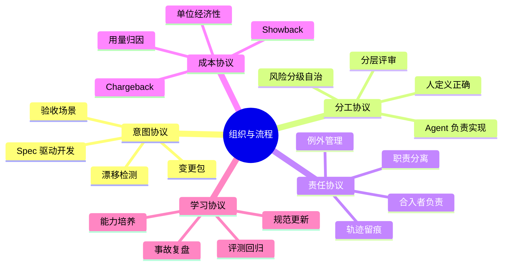

---

# 1. 为什么技术正常，组织仍然会失败

## 1.1 三件没有“代码 Bug”的事故

假设一家企业全面引入 Coding Agent 三个月后，工程负责人收集到三类事故。

### 事故一：蒸发的意图

工程师在会话里说：“顺手优化一下会话清理逻辑。”Agent 修改了空闲判定策略，测试通过并合入。两周后，生产环境出现长任务会话被过早回收的问题。

复盘时没有人能回答：

- “优化”的目标是什么？
- 允许改变哪些行为？
- 哪些行为明确不能改变？
- 为什么采用这个阈值？
- 验收标准是什么？
- 当时是否讨论过与预算熔断、用户主动中断的竞争关系？

代码忠实实现了模糊指令，真正失败的是**意图管理**。会话的生命周期只有几十分钟，而变更影响可能持续几年；用短生命周期介质承载长生命周期决策，信息迟早会蒸发。

### 事故二：38 秒的 LGTM

Agent 生成的 PR 平均超过一千行，人工评审的中位停留时间只有几十秒。评审者知道自己没有真正看懂，但逐行检查的旧方法已经无法承受产量增长，于是流程退化为“形式上有人批准”。

失败的不是评审者道德，而是组织仍在用“代码由人慢速生产”的流程，处理“代码由 Agent 高速生产”的现实。

### 事故三：月底预算战争

多个部门共用模型账号。月底额度紧张时，各部门互相指责对方浪费 Token：

- 没有项目级归因；
- 没有成功任务与失败任务的成本拆分；
- 没有缓存命中率责任人；
- 没有模型路由规范；
- 没有预算超限的处置规则。

技术平台已经记录了调用量，但组织层没有明确“谁拥有账单、谁有权优化、谁承担超限后果”。

## 1.2 共同根因：人与系统之间没有协议

三类事故分别暴露了三种缺失：

| 事故 | 表面问题 | 真正缺失的协议 |
|---|---|---|
| 意图蒸发 | 需求含糊、无法复盘 | 意图协议：如何提案、留痕、验收和归档 |
| 评审失效 | PR 太大、人工看不过来 | 分工协议：人审什么、Agent 做什么、风险如何分层 |
| 预算战争 | API 费用失控 | 成本协议：如何归因、分配、预警和问责 |

完整的企业运行模式还需要再补两份协议：

- **责任协议**：出了问题由谁负责，谁批准，谁执行，谁保留证据。
- **学习协议**：事故、评测、用户反馈和成本数据如何反哺 Spec、策略与技能。

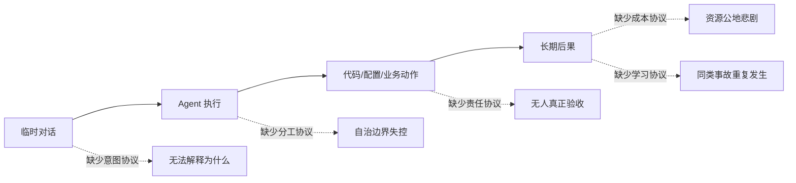

## 1.3 Agent 落地是社会—技术系统改造

企业结果不能只看模型能力。更接近真实情况的表达是：

\[
\text{Agent 业务结果}
= \text{模型能力}
\times \text{运行时可靠性}
\times \text{流程清晰度}
\times \text{组织激励一致性}
\times \text{反馈学习速度}
\]

这是一个乘法系统。任何一项接近零，整体收益都会被吞掉：

- 模型很强，但权限无限，风险不可接受；
- 平台很稳，但需求只存在聊天里，长期不可维护；
- 自动化很高，但人工评审方式不变，审批成为橡皮图章；
- 用量透明，但没有预算责任人，成本仍不会下降；
- 事故留痕完整，但复盘结果不更新测试和规范，组织仍然不会学习。

## 1.4 五个必须显式回答的问题

任何 Agent 项目立项前，都应明确回答：

1. **意图**：要解决什么问题，成功是什么，不做什么？
2. **权限**：Agent 可以读取、修改、调用和对外发送什么？
3. **验收**：谁以什么证据判断“正确”？
4. **责任**：谁对上线结果和后续影响负责？
5. **经济性**：谁承担成本，什么情况下应降级、暂停或放弃使用 Agent？

如果这五个问题没有清晰答案，项目仍处在“技术演示”阶段，而不是“企业生产”阶段。

---

# 2. 企业级 Agent 组织运行模型

## 2.1 六条组织设计原则

### 原则一：业务结果归业务团队，平台能力归平台团队

平台团队提供模型接入、运行时、沙箱、权限、可观测性、评测、记忆、工具注册和成本归因；业务团队仍然对业务结果、需求正确性和上线效果负责。不能因为 Agent 平台是共享能力，就把所有 Agent 项目的结果责任推给平台团队。

### 原则二：集中制定底线，分散做业务决策

安全、隐私、身份、审计、模型准入、工具权限、数据保留等底线应统一；具体业务流程、场景优先级、领域 Spec 和验收标准应由最接近业务的团队决定。

这可以概括为：

> **中央治理底线 + 平台提供护栏 + 团队预算内自治 + 超限和例外升级。**

### 原则三：风险决定流程重量，而不是组织级别决定

低风险文档润色与高风险生产数据库写入，不应走同一条审批链。流程应该按影响、可逆性、数据敏感度、外部性和自治程度动态加重。

### 原则四：让证据成为流程副产品

最好的审计不是发布前临时补材料，而是在正常工作中自动形成：

- 需求和 Spec 已版本化；
- Agent 会话与工具调用可关联；
- 评测结果自动入库；
- 审批身份可追溯；
- 发布版本绑定模型、Prompt、Skill、工具和策略版本；
- 成本可归因到业务单元和成功任务。

### 原则五：平台要降低认知负担，而不是制造新的门票

内部平台的价值不在于“统一了多少东西”，而在于业务团队是否更容易安全地交付。平台应把复杂性封装成自助服务、默认策略和可复用模板，而不是建立一个必须排队求助的中心化瓶颈。

### 原则六：组织设计必须持续演化

Agent 能力、模型价格、监管要求和攻击面都会变化。组织结构不是一次性画完的静态图，而应通过季度复盘、事故反馈、平台使用数据和团队认知负担持续调整。

## 2.2 三层运行模型

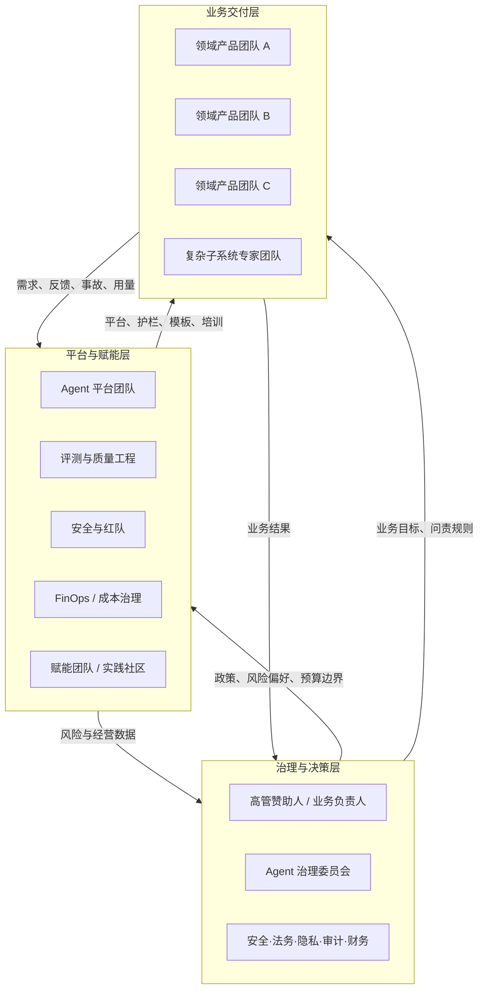

### 2.2.1 治理与决策层

主要职责：

- 定义企业使用 Agent 的目标与风险偏好；
- 批准高风险场景和重大例外；
- 明确责任归属与问责边界；
- 决定预算分配和成本归属原则；
- 处理跨部门冲突；
- 定期审视收益、风险、事故与能力成熟度。

治理层不应逐条审批普通变更。它制定的是**规则和升级路径**，不是替代团队做日常决策。

### 2.2.2 平台与赋能层

主要职责：

- 统一模型网关、路由、限流、缓存与密钥管理；
- 提供 Agent Runtime、沙箱、工具注册、身份与权限；
- 建立轨迹、日志、评测、成本和风险看板；
- 维护默认安全策略与策略即代码；
- 提供 Spec 模板、工作流、脚手架和最佳实践；
- 运营实践社区、培训和现场辅导；
- 将重复出现的业务需求产品化为平台能力。

### 2.2.3 业务交付层

主要职责：

- 拥有业务问题、领域知识和结果指标；
- 编写或批准 Spec、验收标准与非目标；
- 选择是否使用 Agent，而不是为了使用率强行使用；
- 对合入、发布和业务影响负责；
- 在预算与策略边界内自主选择工作方式；
- 将真实反馈和失败样本回流到平台与评测体系。

## 2.3 用 Team Topologies 理解 Agent 团队结构

企业可以借用 Team Topologies 的思路，将 Agent 相关团队映射为四类长期责任：

| 团队类型 | 在 Agent 体系中的典型职责 | 不应变成什么 |
|---|---|---|
| 业务流对齐团队 | 围绕客户价值或业务流程交付 Agent 能力，端到端拥有结果 | 只提需求、不承担上线效果的“需求方” |
| 平台团队 | 提供模型、运行时、沙箱、评测、可观测性和成本能力 | 强迫所有团队排队的中央开发部 |
| 赋能团队 | 临时帮助业务团队建立 Spec、评测、安全和 Agent 工程能力 | 永久代写 Prompt、形成依赖的外包队 |
| 复杂子系统团队 | 负责检索、编译器、模型推理、安全隔离等高专业复杂度模块 | 将普通业务逻辑包装成“专家领地” |

团队之间还应显式声明交互模式：

- **协作**：新场景探索期，平台与业务高带宽共同设计；
- **X-as-a-Service**：成熟能力以 API、自助控制台、模板形式稳定提供；
- **赋能**：专家短期驻场，目标是让业务团队获得能力后退出。

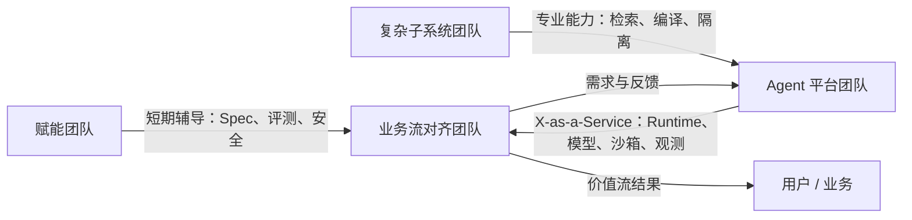

## 2.4 关键角色定义

### 高管赞助人

- 确认 Agent 转型的业务目标，而不是只要求“提高 AI 使用率”；
- 为跨部门流程重构提供授权；
- 在创新速度与风险容忍度之间做最终取舍。

### Agent 产品负责人

- 管理 Agent 场景组合和业务优先级；
- 对价值假设、用户体验和单位经济性负责；
- 决定哪些任务应自动化、辅助化或保留人工执行。

### 领域 Owner

- 对领域术语、业务规则、Spec 主干和验收标准负责；
- 处理跨能力变更的语义冲突；
- 确认主干 Spec 代表当前“应然状态”。

### Agent 平台 Owner

- 对运行时、平台可用性、模型接入、策略执行和开发者体验负责；
- 建立自助能力，减少手工审批和重复集成。

### 安全与隐私负责人

- 定义数据分类、权限、网络、工具、存储和审计基线；
- 参与高风险场景评审和红队演练；
- 管理例外到期和风险接受记录。

### 评测 Owner

- 维护黄金集、回归集、对抗集和线上抽样；
- 防止团队只选择对自己有利的指标；
- 推动离线评测、在线指标和事故数据闭环。

### FinOps / 成本 Owner

- 建立用量归因、预算、预测、异常检测和单位成本体系；
- 与平台共同维护模型路由和缓存效率；
- 组织 Showback 或 Chargeback 机制。

### 变更 Owner / 合入者

- 对单个变更的意图完整性、证据充分性、发布与回滚负责；
- 不能以“代码是 Agent 写的”为免责理由。

## 2.5 RACI：谁负责、谁批准、谁咨询、谁知会

RACI 中：

- **R（Responsible）**：执行工作；
- **A（Accountable）**：对结果最终负责，通常每项只能有一个明确 A；
- **C（Consulted）**：需在决策前咨询；
- **I（Informed）**：需被知会。

| 活动 | 业务产品 Owner | 领域 Owner | 变更 Owner | 平台团队 | 安全/隐私 | 评测团队 | FinOps | 治理委员会 |
|---|---|---|---|---|---|---|---|---|
| 场景立项与价值假设 | A/R | C | I | C | C | C | C | I |
| 风险分级 | C | C | R | C | A | C | I | I |
| Proposal 与 Spec | C | A | R | C | C | C | I | I |
| 技术设计 | I | C | A/R | C | C | C | I | I |
| Agent 实现与自检 | I | I | A/R | C | I | C | I | I |
| 安全高风险评审 | I | C | R | C | A | C | I | I |
| 验收与发布 | A | C | R | C | C | C | I | I |
| 模型与工具准入 | I | I | I | R | A | C | C | I |
| 预算分配 | C | I | I | C | I | I | R | A |
| 事故响应 | C | C | R | R | A/C | C | I | I |
| 重大例外批准 | C | C | R | C | R | C | C | A |

> RACI 不是为了增加会议，而是为了消除“所有人都参与、但没有人负责”的灰区。

## 2.6 决策权矩阵

| 决策 | 默认决策者 | 需要升级的条件 |
|---|---|---|
| 是否使用 Agent | 业务团队 | 涉及受监管流程或高风险自动决策 |
| 选用哪个模型 | 平台路由策略 | 需要未准入模型、跨境处理或特殊许可证 |
| Agent 能否写文件 | 项目策略 | 涉及生产配置、密钥、法务文档或不可逆资产 |
| 是否自动合入 | 变更 Owner + 仓库策略 | 高风险目录、无独立验证、保护分支豁免 |
| 是否自动发布 | 发布策略 | 外部客户影响、数据迁移、不可逆变更 |
| 是否接受评测退化 | 领域 Owner | 超过风险阈值或影响企业级基线 |
| 是否允许预算超限 | 部门预算 Owner | 影响全局额度或需要追加预算 |
| 是否保留敏感会话 | 数据 Owner | 超过保留期限或用于二次训练 |

## 2.7 组织会议与节奏

| 节奏 | 会议/机制 | 主要输入 | 主要输出 |
|---|---|---|---|
| 每次变更 | Proposal / Spec 评审 | 意图、边界、风险、验收 | 批准、修改或拒绝 |
| 每周 | Agent 交付评审 | 失败任务、回归、PR、成本异常 | 短周期改进项 |
| 每月 | 平台与 FinOps 运营会 | 用量、缓存、路由、SLO、事故 | 预算调整、平台优化 |
| 每季度 | Agent 治理委员会 | 价值、风险、合规、成熟度 | 政策与投资决策 |
| 每半年 | 能力与组织复盘 | 技能差距、认知负担、团队依赖 | 组织边界和培训计划 |

---

# 3. Spec 驱动开发：把意图从会话中救出来

## 3.1 为什么聊天记录不是需求系统

聊天记录存在四个天然缺陷：

1. **上下文局部**：只有会话参与者知道前因后果；
2. **结构松散**：目标、约束、猜测和实现建议混在一起；
3. **版本不稳定**：修改意图后很难识别哪个版本生效；
4. **生命周期过短**：会话会被压缩、过期、删除或难以检索。

因此，聊天适合探索，不适合承载最终承诺。正确做法是：

> **允许意图在对话中形成，但要求它在进入实现前凝结为版本化工件。**

## 3.2 OpenSpec 的正确理解：有生命周期锚点，但不是僵硬瀑布

以 OpenSpec 为例，常见主线是：

- **Explore**：探索问题、阅读代码、比较方案，不承诺立即实施；
- **Propose**：形成变更目录，产出 proposal、spec、design 和 tasks 等工件；
- **Apply**：Agent 依据工件实施、验证并持续更新任务状态；
- **Archive**：验收后将变更增量合入主干 Spec，并归档变更历史。

需要强调：这些是**协作锚点**，不是禁止回退的阶段闸门。理解加深后，可以回到 proposal、spec 或 design 继续修订。好的 Spec 驱动流程是迭代式的：先使意图显式，再随着证据增加不断收敛。

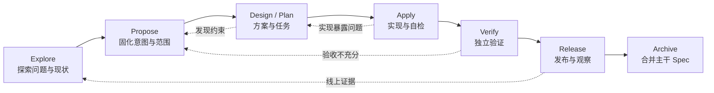

## 3.3 变更包不是文档堆，而是一张可追溯的意图图

推荐的变更目录：

```text
openspec/
├── specs/                         # 当前系统“应然状态”
│   ├── session-lifecycle/
│   │   └── spec.md
│   └── tool-permission/
│       └── spec.md
└── changes/
    ├── session-idle-finalize/
    │   ├── proposal.md            # 为什么改、改什么、影响什么
    │   ├── specs/
    │   │   └── session-lifecycle/
    │   │       └── spec.md        # ADDED / MODIFIED / REMOVED 增量
    │   ├── design.md              # 技术方案、权衡、数据流、回滚
    │   ├── tasks.md               # 可执行、可验证的任务清单
    │   ├── test-plan.md           # 可选：评测与测试计划
    │   ├── risk-assessment.md     # 可选：高风险变更
    │   └── evidence/              # 自动生成或引用的验收证据
    └── archive/
```

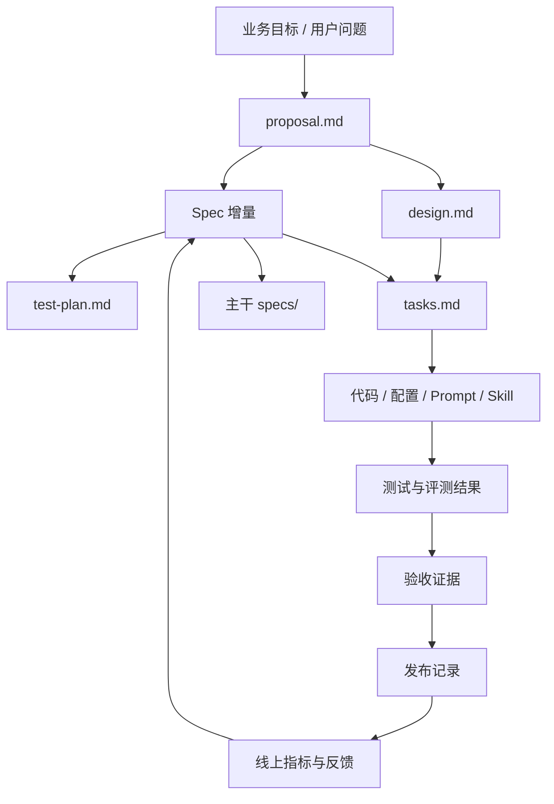

工件之间应能回答：

- 这段代码对应哪条需求？
- 这条需求由哪些 Scenario 验证？
- 这个测试为什么存在？
- 这次发布用了哪个模型、Prompt、Skill 和策略版本？
- 线上退化应回到哪个变更包处理？

## 3.4 变更分级：不是所有改动都需要同样重的 Spec

单纯用“改动行数”判断流程重量并不可靠。十行权限变更可能比一千行测试重构更危险。建议按五个维度评分：

- **影响范围**：单用户、单团队、全公司、外部客户；
- **可逆性**：立即回滚、数据回滚困难、不可逆；
- **数据敏感度**：公开、内部、机密、个人信息、受监管数据；
- **自治程度**：仅建议、生成草稿、执行内部动作、执行外部动作；
- **故障外部性**：局部失败、扩散故障、财务或法律影响。

### 推荐分级

| 等级 | 示例 | 最低工件 | 最低审批 |
|---|---|---|---|
| C0 琐碎 | 注释、拼写、纯格式 | PR 描述 | 仓库常规规则 |
| C1 低风险 | 内部工具小修、可逆 UI 调整 | 轻量 proposal + 测试 | 代码 Owner |
| C2 行为变更 | 新功能、状态机变化、数据读写 | proposal + spec + tasks + 验收 | 领域 Owner |
| C3 高风险 | 权限、安全、账务、生产写操作 | 完整变更包 + 风险评估 + 回滚 | 领域 + 安全/平台 |
| C4 关键/受监管 | 自动决策、敏感数据、不可逆外部动作 | 全量证据包、职责分离、灰度和演练 | 治理委员会授权角色 |

### 变更分级决策树

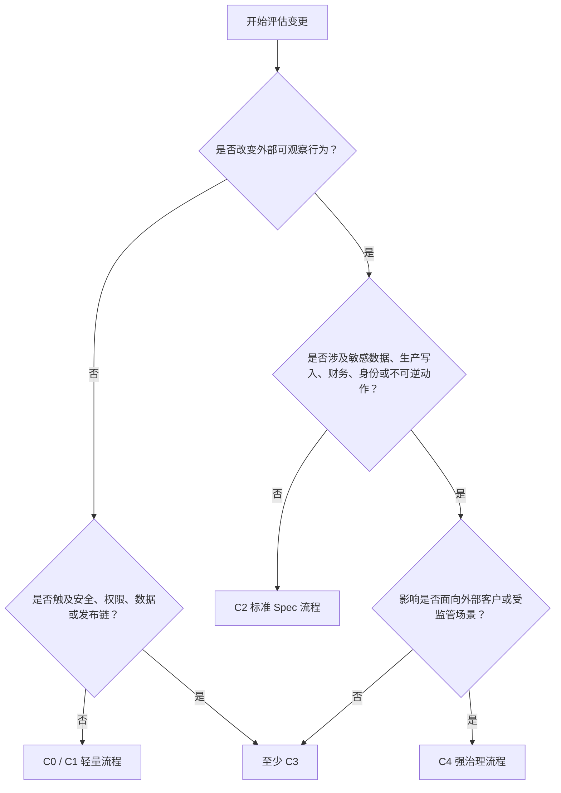

## 3.5 Proposal：先把“为什么”说清楚

一份高质量 Proposal 至少包含：

1. **背景与问题**：现状有什么损失或风险；
2. **目标结果**：成功后应改变什么；
3. **非目标**：本次明确不解决什么；
4. **范围**：涉及能力、用户、系统和数据；
5. **约束与不变量**：绝对不能破坏的行为；
6. **风险与未知**：已知风险、需要验证的假设；
7. **替代方案**：为什么没有选择其他路径；
8. **验收方式**：将用哪些 Scenario、测试和线上指标判断成功；
9. **发布与回滚**：如何灰度，失败时如何恢复；
10. **成本影响**：调用量、缓存、模型等级和维护成本的预估。

Proposal 评审要尽量发生在实现之前。此时改变方向只需要改几百字，而不是推翻几千行代码。

## 3.6 Spec：写“可观察行为”，不要提前编程

Spec 应聚焦：

- 系统必须表现出什么行为；
- 输入、前置条件和约束是什么；
- 什么算成功，什么算失败；
- 哪些边界和异常必须处理；
- 用户或外部系统能观察到什么；
- 运维、安全和成本上有什么不变量。

### 需求措辞

- **SHALL / MUST**：强制要求；
- **SHOULD**：默认应满足，偏离需给出理由；
- **MAY**：允许但非必须。

### Scenario 覆盖维度

一条核心需求通常至少应考虑以下场景：

| 类型 | 需要回答的问题 |
|---|---|
| 正向路径 | 正常输入时是否达到目标？ |
| 负向路径 | 无效输入如何失败？ |
| 边界条件 | 空值、极限值、超时、容量边界如何处理？ |
| 并发竞态 | 两个事件同时发生时谁优先？ |
| 幂等与重试 | 重复执行会不会产生重复副作用？ |
| 权限与身份 | 谁能发起，使用谁的身份执行？ |
| 故障恢复 | 中途失败后如何续接或回滚？ |
| 可观测性 | 如何知道它成功、失败或退化？ |
| 成本边界 | 超预算、模型不可用或缓存失效时如何降级？ |
| 兼容性 | 旧数据、旧客户端、旧工作流如何处理？ |

### 示例

```markdown
### Requirement: 会话空闲收尾

系统 SHALL 在活跃会话超过配置的空闲阈值后，执行一次不允许产生外部副作用的收尾，并将会话置为可恢复归档状态。

#### Scenario: 空闲达到阈值
- GIVEN 一个处于 active 状态的会话
- AND 空闲阈值为 15 分钟
- WHEN 距最后一次用户交互超过 15 分钟
- THEN 系统执行禁用写工具的收尾过程
- AND 生成可续接摘要
- AND 会话进入 archived_resumable 状态

#### Scenario: 预算熔断优先
- GIVEN 会话同时接近空闲阈值与预算上限
- WHEN 预算熔断先被原子地确认
- THEN 系统只执行预算熔断的收尾路径
- AND 空闲检测不得重复触发收尾
```

## 3.7 Design：记录方案、权衡和不可逆决策

Spec 回答“系统应该怎样表现”，Design 回答“本次准备怎样实现”。Design 可以包含：

- 当前架构与问题定位；
- 目标架构、组件边界和数据流；
- 状态机、时序和错误模型；
- 数据模型与迁移策略；
- 权限、沙箱和网络边界；
- 模型、Prompt、工具、Skill、记忆的版本策略；
- 并发、幂等、重试、超时和取消；
- 备选方案与取舍；
- 发布、灰度、回滚与兼容性；
- 观测指标和成本模型。

对长期有效、跨多个变更的架构决策，建议同时写 ADR。不要把所有历史理由塞进一个不断膨胀的 `design.md`。

## 3.8 Tasks：把工作拆成可独立验证的增量

不好的任务：

```markdown
- [ ] 实现会话空闲收尾
```

好的任务：

```markdown
## 1. 状态与事件
- [ ] 1.1 为 LoopState 增加 last_user_interaction_at，并补序列化迁移测试
- [ ] 1.2 定义 session_idle 领域事件及其幂等键
- [ ] 1.3 增加空闲检测与预算熔断竞争的单元测试

## 2. 收尾与恢复
- [ ] 2.1 复用 finalize 核心逻辑，但在 idle 原因下禁用外部写工具
- [ ] 2.2 将交接摘要写入 Checkpoint 元数据
- [ ] 2.3 增加 archived_resumable → active 的恢复路径

## 3. 验证与发布
- [ ] 3.1 为每个 Spec Scenario 建立自动化测试映射
- [ ] 3.2 添加 idle_finalize_total、idle_finalize_conflict_total 指标
- [ ] 3.3 增加 5% 灰度开关和回滚演练记录
```

任务拆分标准：

- 单项最好能在一个短周期内完成；
- 每项有明确完成条件；
- 每项可以独立验证；
- 高风险修改与大规模机械修改分开；
- 迁移、回滚、文档和观测不能被留到最后“顺手补”。

## 3.9 意图—实现—证据的追溯矩阵

| Requirement ID | Scenario | 实现位置 | 自动化验证 | 线上指标 | Owner |
|---|---|---|---|---|---|
| SL-001 | 空闲达到阈值 | `idle_detector.rs` | `idle_threshold_test` | `idle_detected_total` | Session Team |
| SL-002 | 只收尾一次 | `finalize_guard.rs` | `finalize_single_flight_test` | `duplicate_finalize_total` | Runtime Team |
| SL-003 | 可恢复归档 | `restore_service.rs` | `resume_archived_test` | `resume_success_rate` | Session Team |
| SL-004 | 预算熔断优先 | `termination_arbiter.rs` | `budget_wins_race_test` | `termination_conflict_total` | Runtime Team |

追溯矩阵的价值不是“做合规表格”，而是让 Agent 和人都能快速发现：

- 有需求但没有实现；
- 有实现但没有需求依据；
- 有场景但没有自动化证据；
- 有测试但没有线上观测；
- 有线上退化但没有明确 Owner。

## 3.10 Spec 漂移：主干“应然”与代码“实然”不一致

常见漂移类型：

1. **代码领先**：行为已改变，Spec 未更新；
2. **Spec 领先**：需求已归档，代码尚未完整实现；
3. **测试漂移**：测试验证了旧行为；
4. **配置漂移**：模型、Prompt、策略或 Feature Flag 改变了行为，但代码仓库看不出来；
5. **线上漂移**：发布版本、运行参数或外部依赖使实际行为偏离仓库状态。

### 漂移检测组合

- 代码路径与能力 Spec 的映射；
- PR 中行为变更但无 Spec 增量时阻断；
- Scenario 到测试的静态索引；
- 契约测试和快照测试；
- 发布清单记录模型、Prompt、Skill、工具和策略版本；
- Agent 辅助做语义一致性审查，但把它视为风险信号，不作为唯一判定；
- 领域 Owner 定期抽样验证主干 Spec。

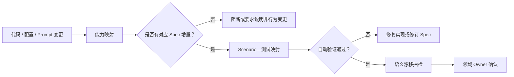

## 3.11 存量系统如何采用：改到哪里，补到哪里

不要发起“全公司补齐所有 Spec”的运动。更可行的方法是：

1. 为高频变更和高风险能力建立优先级；
2. 每次改动时，先补足被触及能力的当前行为；
3. 将事故、灰度失败和客户投诉转成 Scenario；
4. 将隐含规则从测试、代码和老文档中逐步提炼到主干 Spec；
5. 为每个能力指定 Owner；
6. 允许“已知未知”显式存在，避免为了形式完整而编造错误文档。

### 存量采用三步法


---
# 4. 人与 Agent 如何分工：从“亲手实现”转向“定义正确”

## 4.1 责任不转移，劳动重新分配

Agent 可以承担大量执行劳动，但不能成为法律、伦理或组织意义上的责任主体。生产流程中应坚持：

> **谁发起、谁审查、谁批准、谁合入、谁发布，都必须可识别；最终责任不能被“AI 生成”四个字稀释。**

更合理的人机分工是：

| 环节 | 人的主责 | Agent 的主责 |
|---|---|---|
| 发现问题 | 识别真实痛点、利益相关方与约束 | 汇总材料、检索历史、生成候选问题树 |
| 定义意图 | 明确目标、非目标、不变量和风险偏好 | 发现歧义、列边界场景、辅助起草 Spec |
| 技术方案 | 选择关键权衡、批准不可逆决策 | 阅读代码、比较方案、生成设计草案 |
| 实现 | 设置边界、提供领域判断 | 编码、配置、迁移、机械性修改 |
| 自检 | 规定验证策略 | 运行测试、静态检查、对照 Scenario |
| 独立验收 | 判断证据是否充分、批准发布 | 生成变更摘要、缺口分析、回归建议 |
| 运行 | 承担 SLO、事故与业务结果 | 异常分析、日志关联、建议处置 |
| 学习 | 决定规范和策略如何改变 | 从失败样本生成候选 Scenario 与规则 |

## 4.2 Agent 自治等级

自治不是“开”或“关”，而是一组分级授权。

| 等级 | Agent 能力 | 典型场景 | 最低控制 |
|---|---|---|---|
| L0 咨询 | 解释、建议，不生成持久修改 | 架构问答、资料总结 | 数据访问边界 |
| L1 计划 | 阅读仓库并生成 Proposal/Design/Tasks | 需求分析、方案评审 | 人批准后才能实施 |
| L2 沙箱执行 | 在隔离环境修改、测试，但不能合入 | 常规编码、批量重构 | 沙箱、网络限制、人工验收 |
| L3 受控交付 | 创建分支、提交、开 PR、触发 CI | 低至中风险工程变更 | 保护分支、独立评审、策略检查 |
| L4 有界自动化 | 满足预定义条件后自动合入或执行 | 依赖小版本更新、低风险运维修复 | 严格白名单、自动回滚、持续抽样 |
| L5 高自治业务动作 | 跨系统规划并执行外部动作 | 极少数成熟、可逆、低外部性流程 | 动态策略、职责分离、实时熔断、监管许可 |

### 自治等级不是能力等级

模型即使“能”完成某件事，也不代表组织“应”授权它完成。授权取决于：

- 动作是否可逆；
- 错误是否容易发现；
- 影响是否局部；
- 权限是否可最小化；
- 是否存在可靠 Verifier；
- 是否可以在有限时间内停止；
- 失败后是否有清晰责任人。

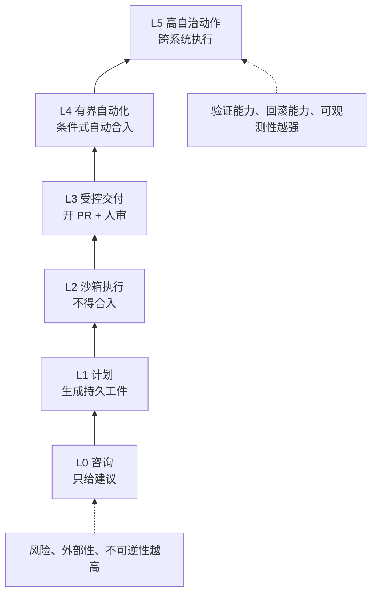

## 4.3 人负责两端，Agent 负责中间

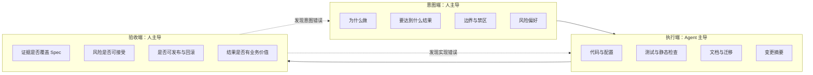

“人从实现环节撤出”不意味着人不再懂实现。相反，人必须能够判断：

- Agent 是否理解了正确问题；
- 设计是否满足约束；
- 测试是否真的证明了行为；
- 风险是否被遗漏；
- 失败时是否能恢复。

人的技能重心从“写每一行”移动到“建立正确问题、正确边界和正确证据”。

## 4.4 代码评审必须转型

传统逐行评审的隐含前提是：代码产量有限、作者已经做过大量思考、评审者有时间重建上下文。Agent 将这些前提全部打破。

新的评审应分为四层。

### 第一层：意图评审——最重要

检查：

- 问题是否真实存在；
- 目标与非目标是否清楚；
- 是否误把解决方案当问题；
- 是否破坏领域不变量；
- 是否存在更小、更安全的改法；
- 成功指标是否可观察。

### 第二层：验收评审——杠杆最高

检查：

- Scenario 是否覆盖正向、负向、边界、并发、恢复；
- 测试是否验证可观察行为，而不是复述实现；
- Verifier 是否可能被 Agent 投机或绕过；
- 是否有线上指标验证离线测试没有覆盖的部分；
- 评测集是否存在数据泄漏或提示污染。

### 第三层：风险面定向深读

重点深读：

- 身份认证与授权；
- 数据读写和迁移；
- 外部网络请求；
- Shell、文件系统、代码执行与沙箱；
- 幂等、重试、并发和事务；
- 不可逆操作与回滚；
- Prompt、Tool、Skill 和 Memory 的信任边界；
- 计费、账务和合规路径。

### 第四层：实现抽样

对低风险机械性代码不必平均用力，可按风险和变化类型抽样：

- 关键入口和出口；
- 新增状态转换；
- 错误处理；
- 安全策略绕行路径；
- 自动生成的大规模重复修改中的代表样本；
- Agent 自称“未改变语义”的部分。

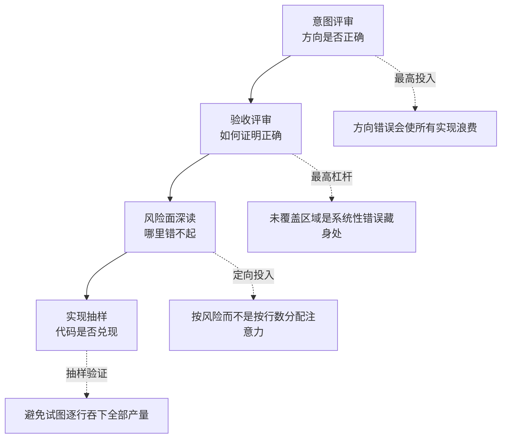

## 4.5 PR 应按认知单元拆分，而不是按 Agent 会话拆分

常见错误是让 Agent 一次完成所有任务，然后把整次会话产物作为一个 PR。正确拆分单位应是“评审者可以建立完整心智模型的最小变更”。

推荐拆分顺序：

1. 契约与类型；
2. 数据模型与迁移；
3. 核心实现；
4. 适配器与集成；
5. UI 或调用方；
6. 测试与评测补强；
7. 文档与清理。

但不能为了小而拆坏原子性。数据库迁移与读取逻辑如果必须同时上线，就应作为一个可部署单元。

### PR 质量约束

- 一个 PR 只对应一个清晰意图；
- PR 描述链接变更包；
- 自动生成“变更地图”，说明哪些能力、状态和接口改变；
- 大规模格式化与行为变更分开；
- 生成代码与手写关键逻辑可分层展示；
- 未完成任务不能隐藏在聊天记录中，必须回写 `tasks.md`；
- 每个高风险 PR 必须列出回滚方式和未决风险。

## 4.6 评审疲劳是系统问题

“38 秒 LGTM”通常不是个体懒惰，而是以下系统性组合：

- PR 体积远超人的认知带宽；
- 评审没有风险排序；
- 变更上下文不完整；
- 测试输出噪声过多；
- 团队奖励合入速度，不奖励拦截错误；
- 同一个人既催进度又承担最终审批；
- Agent 给出过度自信的摘要，评审者形成自动化偏见。

组织应监控但谨慎解释：

- PR 规模；
- 从请求评审到首次有效反馈的时间；
- 评审意见是否涉及意图、场景和风险；
- 批准前是否查看关键证据；
- 评审后返工率；
- 同一评审者的并发负载。

**停留时间只能作为异常信号，不能直接作为绩效指标。** 否则评审者会机械地“挂满规定时长”。

## 4.7 多 Agent 不是多一层自信，而是职责分离

可以将不同 Agent 置于不同角色：

- **Author Agent**：依据 Spec 生成设计与实现；
- **Critic Agent**：主动寻找歧义、遗漏和反例；
- **Verifier Agent**：只依据 Spec 和外部证据运行验证；
- **Security Agent**：聚焦权限、数据流、供应链和注入风险；
- **Cost Agent**：检查模型选择、缓存、重试和成本退化。

关键要求：

- Reviewer 不应只复述 Author 的自我总结；
- 关键验证应有独立输入和权限；
- 不同角色的通过条件必须显式；
- 多 Agent 一致不等于事实正确；
- 最终批准仍由被授权的人或确定性策略完成。

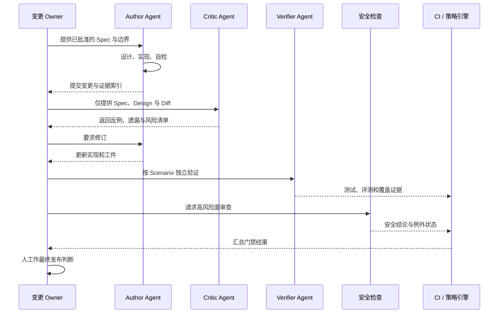

## 4.8 不要求保存模型“思维过程”，要保存可审计决策

企业真正需要的不是完整保存模型的内部推理，而是保存可复核的外部证据：

- 用户或系统给了什么任务；
- 使用了哪个 Spec、模型、Prompt、Tool、Skill、Memory 版本；
- Agent 做了哪些外部动作；
- 产生了哪些文件、提交、调用或副作用；
- 哪些测试与评测通过或失败；
- 谁批准了什么；
- 哪些例外被接受，何时到期。

这样既能审计，又避免把不可控、冗长或敏感的内部推理误当成可靠解释。

## 4.9 合入者负责制与职责分离

### 合入者负责制

- Agent 是工具，不是责任主体；
- 合入者确认其理解意图、证据和风险；
- 发布 Owner 对生产影响和回滚负责；
- 平台团队只对平台承诺负责，不替业务承担领域正确性。

### 职责分离

高风险变更至少应避免以下角色完全重合：

- Spec 作者与最终批准者；
- 实现者与唯一验证者；
- 权限申请者与权限批准者；
- 成本超限申请者与预算批准者；
- 生产执行者与审计记录管理员。

低风险场景可以通过自动策略减少人工角色数量，但高风险场景要防止“一个人带一个 Agent 包办全部环节”。

---

# 5. 端到端 Agent 交付流程

## 5.1 从想法到运行证据的完整链路

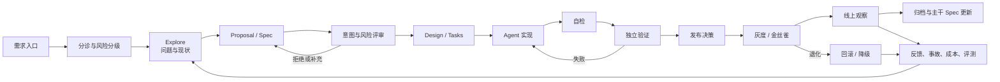

## 5.2 阶段、工件、Owner 与门禁

| 阶段 | 关键问题 | 输入 | 输出 | Accountable | 典型门禁 |
|---|---|---|---|---|---|
| Intake | 值得做吗？ | 用户问题、事故、机会 | 场景条目、价值假设 | 产品 Owner | 有业务 Owner 与预期结果 |
| Triage | 风险多大？ | 场景、数据、动作 | C0–C4、L0–L5 建议 | 安全/领域 Owner | 风险与权限边界明确 |
| Explore | 问题理解对吗？ | 代码、流程、历史 | 现状、选项、未知 | 变更 Owner | 不把猜测伪装成事实 |
| Propose | 要改什么？ | 探索结果 | Proposal、Spec 增量 | 领域 Owner | 目标、非目标、Scenario 完整 |
| Design | 怎样安全实现？ | 已批准 Spec | Design、ADR、Tasks | 变更 Owner | 回滚、观测、迁移可行 |
| Apply | 实现是否遵循边界？ | 变更包 | 代码、配置、测试 | 变更 Owner | 工具、权限、预算未越界 |
| Verify | 证据足够吗？ | 实现与测试计划 | 独立验证结果 | 验收 Owner | Scenario、质量、安全、成本门禁 |
| Release | 能否暴露给用户？ | 证据包 | 发布计划与批准 | 发布 Owner | 灰度、熔断、回滚就绪 |
| Operate | 实际结果怎样？ | 线上流量与反馈 | SLO、业务与成本数据 | 服务 Owner | 无不可接受退化 |
| Archive | 组织学到了什么？ | 最终行为与证据 | 主干 Spec、归档、回归集 | 领域 Owner | Spec 与实然一致 |

## 5.3 Intake：从“有人想用 AI”转成可判断的场景

需求入口不要写“给客服加一个 Agent”，而应写成：

- 谁在什么流程中遇到什么问题；
- 当前基线耗时、质量、成本和风险；
- Agent 介入的是建议、草稿还是执行；
- 成功后哪个业务指标应该变化；
- 如果完全不用 Agent，还有什么替代方案；
- 最糟失败是什么，能否恢复。

### 价值假设模板

```text
对于【目标用户】，在【具体流程】中，当前因为【痛点】造成【可量化损失】。
我们认为，通过让 Agent 承担【明确任务】，并由人保留【关键决策】，可以把
【结果指标】从【当前基线】改善到【目标】，同时将【风险指标】控制在【阈值】内。
```

## 5.4 Triage：风险分级与自治分级必须同时做

同一个业务场景可能有不同自治方案：

- L0：Agent 只解释工单；
- L1：Agent 生成处置建议；
- L2：Agent 在沙箱复现；
- L3：Agent 创建修复 PR；
- L4：满足确定性条件时自动合入；
- L5：直接修改生产系统。

组织不应只问“这个场景风险高不高”，还应问“我们准备授权到哪一级”。降低自治等级往往比放弃整个场景更经济。

## 5.5 Explore：允许不确定，但必须标注不确定

探索阶段应输出：

- 已确认事实；
- 需要验证的假设；
- 关键代码路径或业务流程；
- 可能方案及权衡；
- 未知风险；
- 是否值得进入 Proposal。

Agent 很适合快速阅读和生成候选解释，但不能把“看起来可能”直接升级为架构事实。探索产物中建议使用标签：`FACT`、`INFERENCE`、`UNKNOWN`、`DECISION_NEEDED`。

## 5.6 Proposal 与 Design 评审：尽早发现方向错误

评审顺序建议：

1. 先看问题和成功条件；
2. 再看非目标与不变量；
3. 再挑战边界 Scenario；
4. 再看风险与替代方案；
5. 最后才看具体技术方案。

如果会议一开始就讨论数据库字段和类名，往往说明组织跳过了意图层。

## 5.7 Apply：Agent 的每个动作都应受运行时策略约束

即使 Spec 已批准，实施过程仍需技术护栏：

- 只允许访问任务所需目录；
- 默认禁止读取密钥和个人目录；
- 网络目标白名单；
- 工具参数校验；
- 命令超时与资源限额；
- 破坏性命令二次授权；
- 所有外部副作用具有幂等键；
- 预算消耗达到阈值时降级或停止；
- 会话终止时形成可续接状态。

Spec 决定“允许做什么”，策略引擎保证“实际只能这样做”。

## 5.8 Verify：把自检与独立验证分开

### 自检

由实施 Agent 或同一工作流完成：

- 编译、Lint、单元测试；
- 对照 `tasks.md`；
- 检查明显遗漏；
- 生成变更摘要。

### 独立验证

使用不同上下文、不同角色或确定性工具完成：

- Scenario 到测试的映射；
- 关键集成测试；
- 安全扫描和权限检查；
- 评测集回归；
- 迁移与回滚演练；
- 成本与性能基线比较；
- 线上灰度成功条件检查。

自检证明“作者认为自己完成了”，独立验证证明“外部证据支持它完成了”。

## 5.9 Release：发布的是完整行为版本，不只是代码版本

Agent 系统的行为由多种工件共同决定：

\[
\text{Behavior Version}
= \text{Code}
+ \text{Model}
+ \text{Prompt}
+ \text{Tool}
+ \text{Skill}
+ \text{Memory Policy}
+ \text{Runtime Policy}
+ \text{Data / Index}
\]

发布清单至少应记录：

```yaml
release_id: agent-service-2026-08-31.3
code_commit: 8f23c1d
spec_revision: session-lifecycle@14
model_route_policy: coding-default@7
prompt_bundle: runtime-system@12
skill_set:
  - repo-map@4
  - safe-shell@9
tool_registry: production@21
permission_policy: coding-standard@11
eval_suite: release-gate@36
feature_flags:
  idle_finalize: 0.05
rollback_target: agent-service-2026-08-28.1
```

## 5.10 Operate：发布后仍要验证 Spec

线上观察需要同时看：

- 业务结果是否改善；
- 失败模式是否改变；
- 人工接管率是否异常；
- Agent 是否频繁重试或循环；
- 权限拒绝是否突然增加；
- 成本、延迟和缓存命中率是否退化；
- 用户是否出现规避流程的行为；
- 是否产生离线评测未覆盖的新样本。

## 5.11 Archive：归档不是“把目录移走”

归档应完成：

1. Spec 增量合并到主干；
2. 未实施或改变的内容从最终工件中纠正；
3. ADR 与最终决策一致；
4. Scenario 与自动化证据建立索引；
5. 发布版本和线上结果关联；
6. 新发现风险进入风险登记册；
7. 失败样本进入评测回归集；
8. 临时权限和例外关闭；
9. 成本预测与实际值对比；
10. 变更 Owner 确认后续责任移交给服务 Owner。

## 5.12 紧急变更流程：可以更快，但不能无痕

紧急事故时可以先处置后补齐，但必须保留最低工件：

- 事故编号；
- 当前影响；
- 授权人；
- 执行动作；
- 回滚方式；
- 变更窗口；
- 事后补 Spec 和测试的截止时间。

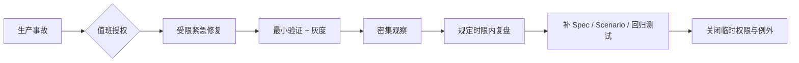

紧急流程的原则是“缩短决策链”，不是“取消责任与证据”。

## 5.13 WIP 限制与流程 SLO

Agent 能显著提高产出，但下游评审、验证和发布能力未必同步增长。若不限制在制品，团队会堆积大量“90% 完成”的变更。

建议设置：

- 每个变更 Owner 同时进行的 Agent 变更上限；
- 每个评审者同时等待的高风险 PR 上限；
- Proposal 批准到首次可验证增量的目标时间；
- 验证失败后的最大滞留时间；
- 已发布但未归档变更的数量上限；
- 超过阈值后停止启动新工作，优先清理队列。

---

# 6. 治理：把原则变成可执行护栏

## 6.1 治理不是审批越多越好

低成熟度治理通常有两种极端：

- **完全放任**：每个团队自己选模型、接工具、存数据、定权限；
- **全面审批**：所有 Agent 调用都需要中央团队人工同意。

前者不可控，后者不可扩展。成熟治理应将控制分成三类：

| 类型 | 适合内容 | 实现方式 |
|---|---|---|
| 不可突破的底线 | 禁止外泄、禁止未授权生产写入、禁止使用未准入模型 | 运行时策略强制阻断 |
| 默认规则 | 推荐模型、缓存策略、日志保留、评测门槛 | 平台默认值，可申请例外 |
| 团队自治 | 业务 Prompt、领域工具、任务拆分 | 团队在预算与边界内决定 |

## 6.2 治理对象清单

企业不只治理“模型”，还要治理整个 Agent 行为供应链：

1. **场景**：用途、用户、影响和自治等级；
2. **模型**：提供方、版本、区域、许可证、能力与风险；
3. **Prompt**：系统指令、模板、发布和回滚；
4. **工具**：输入输出、身份、权限、网络和副作用；
5. **Skill / Plugin / MCP Server**：来源、签名、版本、权限和依赖；
6. **数据与知识库**：来源、质量、访问、保留和删除；
7. **Memory**：写入条件、敏感信息过滤、过期和用户控制；
8. **运行时**：沙箱、资源、超时、取消、重试和熔断；
9. **评测**：数据集、指标、阈值、独立性和防污染；
10. **发布**：完整行为版本、灰度、回滚和证据；
11. **人员与角色**：谁可创建、批准、执行和例外；
12. **供应商**：服务条款、数据处理、连续性和退出方案。

## 6.3 策略即代码

示例策略：

```yaml
policy_id: agent-change-production-v3
scope:
  environment: production
  risk_class: [C3, C4]
requirements:
  spec:
    required: true
    min_scenarios:
      positive: 1
      failure: 1
      rollback: 1
  review:
    independent_reviewer: true
    security_review: true
  execution:
    sandbox_required: true
    network_allowlist_required: true
    max_runtime_minutes: 30
    destructive_tool_requires_approval: true
  evidence:
    eval_suite_required: true
    rollback_rehearsal_required: true
  release:
    canary_required: true
    auto_merge: false
exceptions:
  max_ttl_days: 14
  approver_role: agent-governance-delegate
```

策略引擎应能解释拒绝原因，例如：

```text
DENY: risk_class=C3 requires an independent reviewer.
DENY: tool=db_write is not allowed for autonomy_level=L2.
DENY: exception SEC-182 expired on 2026-08-29.
```

可解释拒绝比一个模糊的“权限不足”更容易形成正确行为。

## 6.4 策略层级与冲突规则

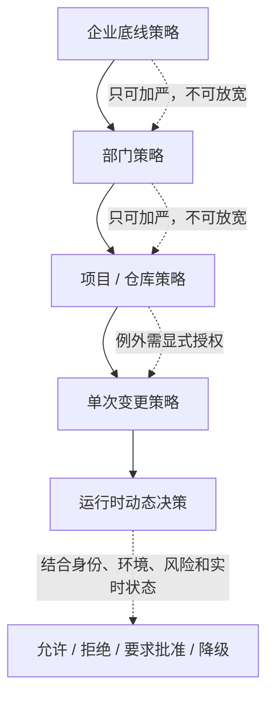

默认冲突规则：

- 更严格策略优先；
- 企业底线不能由项目覆盖；
- 例外必须指向具体规则，而不是“全部放开”；
- 例外必须有 Owner、理由、补偿控制和到期时间；
- 动态风险升高时可以收紧授权，不能静默扩大权限。

## 6.5 注册表与版本管理

### 模型注册表

记录：

- 模型与提供方；
- 可用区域；
- 数据处理条款；
- 支持的任务画像；
- 已知限制；
- 评测基线；
- 单价与配额；
- 准入状态和淘汰计划。

### Tool / Skill 注册表

记录：

- 发布者与来源；
- 内容哈希与签名；
- 权限清单；
- 输入输出 Schema；
- 外部副作用；
- 依赖和供应链扫描；
- 适用环境；
- 版本兼容性；
- Owner、维护状态和撤销方式。

### Prompt 注册表

记录：

- Prompt ID 与语义版本；
- 适用模型和任务；
- 变量 Schema；
- 变更记录；
- 评测结果；
- 缓存前缀稳定性；
- 数据与安全约束；
- 回滚版本。

## 6.6 数据与 Memory 治理

需要明确：

- 哪些数据可以进入模型上下文；
- 哪些数据必须脱敏或本地处理；
- 会话记录保留多久；
- 是否允许用于评测、训练或产品改进；
- 谁能检索历史轨迹；
- Memory 写入是自动还是需确认；
- 用户如何查看、修正、删除和禁用记忆；
- 过期、冲突和错误记忆如何降权或清除；
- 跨团队、跨租户和跨区域是否隔离。

Memory 不是“多存一些上下文”，而是一个长期影响未来决策的状态系统，应采用比普通日志更严格的治理。

## 6.7 风险框架映射

NIST AI RMF 常用四个核心函数：Govern、Map、Measure、Manage。企业可以将其与 Agent 流程映射：

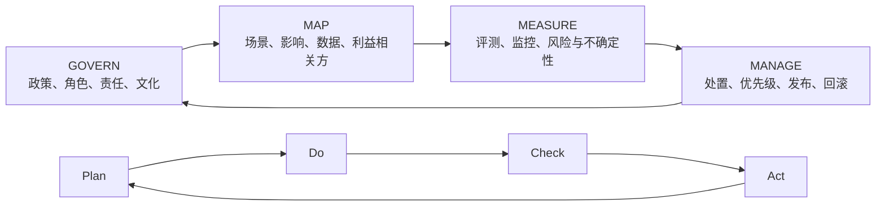

ISO/IEC 42001 强调以管理体系持续建立、实施、维护和改进 AI 治理，可以与 Plan—Do—Check—Act 循环结合。对工程团队而言，不必把框架变成额外文档层，而应把它映射到已有的 Spec、评测、发布、观测和复盘工件。

## 6.8 Agent 特有安全治理

Agent 与普通聊天应用的根本差异是它能够行动。治理必须覆盖：

- Prompt Injection 与间接注入；
- 工具滥用和权限扩大；
- 过度自治；
- 不可信 Skill、Plugin、MCP Server 与供应链；
- Memory 与上下文污染；
- 跨 Agent 信任传递；
- 身份代理与凭据滥用；
- 不可追溯的外部副作用；
- 目标偏移、循环与资源耗尽；
- 人员对 Agent 输出的过度依赖。

### 安全不是一次上线评审

应在以下时点重复评估：

- 模型版本变化；
- Tool 或 Skill 权限扩大；
- 数据源变化；
- Prompt 或 Memory 策略变化；
- 自治等级提升；
- 从内部用户扩展到外部用户；
- 事故或红队发现新攻击路径。

## 6.9 审计证据包

高风险变更的证据包可包含：

```text
evidence/
├── intent/
│   ├── approved-proposal.md
│   ├── approved-spec-diff.md
│   └── decision-records/
├── implementation/
│   ├── commit-list.txt
│   ├── dependency-report.json
│   └── generated-artifact-manifest.json
├── verification/
│   ├── test-results.xml
│   ├── eval-report.json
│   ├── security-review.md
│   └── rollback-rehearsal.md
├── release/
│   ├── behavior-version.yaml
│   ├── approvals.json
│   └── canary-result.json
└── operation/
    ├── first-24h-summary.md
    └── incident-links.md
```

证据应尽量由系统自动生成，并使用内容哈希、签名或不可变日志防止事后篡改。

## 6.10 例外管理

允许例外是现实需要，但例外必须具备：

- 明确规则 ID；
- 业务理由；
- 风险说明；
- 补偿控制；
- 影响范围；
- Owner；
- 批准人；
- 开始与到期时间；
- 到期后的自动收紧行为；
- 关闭证据。

坏例外：“这个项目很急，全部放开。”

好例外：“在 48 小时内允许 `support-agent` 使用只读生产检索工具；禁止导出原文；每次调用需工单 ID；结果脱敏；到期自动撤销；Owner 为 Support Platform。”

## 6.11 事故响应与组织学习

Agent 事故响应需要比普通软件事故多问几层：

1. 用户或上游系统给了什么意图？
2. Agent 实际接收到什么上下文？
3. 使用了哪个模型、Prompt、Tool、Skill、Memory 和策略版本？
4. 哪一步产生了外部副作用？
5. 为什么 Guard、Verifier 或人工评审没有拦住？
6. 这是个例、系统性模式还是评测盲区？
7. 应更新代码、Spec、策略、权限、评测集还是培训？


真正的闭环不是“事故关闭”，而是同类错误下一次更难发生。

---

# 7. 成本治理：从 Token 台账到业务单位经济性

## 7.1 成本不只是模型输入输出

Agent 总成本通常包括：

\[
\text{Total Cost}
= C_{model}
+ C_{tool}
+ C_{compute}
+ C_{storage}
+ C_{network}
+ C_{human-review}
+ C_{failure}
+ C_{platform}
\]

其中：

- `C_model`：模型输入、输出、推理或托管费用；
- `C_tool`：搜索、数据库、第三方 API、浏览器等工具费用；
- `C_compute`：沙箱、容器、GPU、构建和测试资源；
- `C_storage`：轨迹、工件、向量索引和 Memory；
- `C_network`：跨区、出口和数据传输；
- `C_human-review`：人工评审、接管和复核时间；
- `C_failure`：重试、错误动作、事故、返工和机会成本；
- `C_platform`：平台研发、运维、支持和治理成本。

只优化 Token 单价，可能让人工接管和失败税变得更高。

## 7.2 成本归因维度

每次调用或任务至少携带：

```json
{
  "tenant_id": "corp",
  "department_id": "engineering",
  "team_id": "agent-platform",
  "project_id": "runtime-modernization",
  "change_id": "session-idle-finalize",
  "user_id": "u-1842",
  "agent_id": "coding-agent",
  "task_type": "code-change",
  "environment": "staging",
  "model_route": "coding-standard",
  "prompt_bundle": "runtime-system@12",
  "tool_set": "repo-safe@9",
  "risk_class": "C2",
  "result": "success",
  "trace_id": "tr-01J..."
}
```

归因维度必须稳定、可枚举、可与组织主数据对齐。自由文本标签会迅速失控。

## 7.3 Showback 与 Chargeback

- **Showback**：展示各团队、项目或产品实际消耗，但费用仍可能由中央预算承担；
- **Chargeback**：将费用正式计入对应成本中心、产品或部门账目。

常见落地顺序是先 Showback，建立透明度与归因质量，再根据财务制度决定是否 Chargeback。但两者不是简单的“低级—高级”关系：有些组织长期采用 Showback 更合适，Chargeback 会带来对账、共享成本分摊和内部结算负担。

关键不是一定要收费，而是让决策者看到：

- 谁消耗；
- 为哪个业务结果消耗；
- 成功与失败各占多少；
- 是否存在更便宜的替代路径；
- 优化收益能否回到做出优化的团队。

## 7.4 预算分层

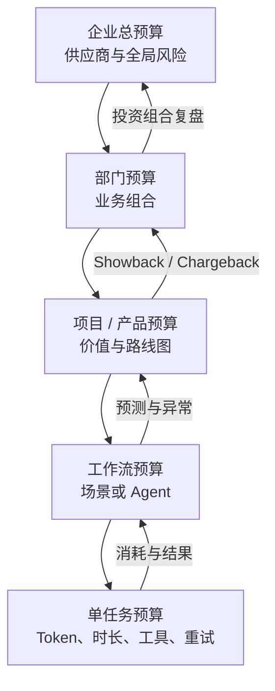

### 单任务预算

- 最大输入与输出 Token；
- 最大循环轮次；
- 最大墙钟时间；
- 最大工具调用次数；
- 最大并行 Agent 数；
- 允许的模型等级；
- 超限后的降级、暂停或人工接管。

### 项目预算

- 月度总额；
- 按环境区分的额度；
- 试验预算与生产预算分开；
- 失败税阈值；
- 预算燃尽预警；
- 高价值突发需求的追加机制。

## 7.5 单位经济性：每个成功结果花了多少钱

仅看“本月花了多少”无法判断价值。应建立单位成本：

\[
\text{Cost per Successful Task}
= \frac{\text{任务总成本}}{\text{达到验收标准的任务数}}
\]

还可以按业务场景定义：

- 每个有效修复 PR 的成本；
- 每个被用户采用的客服建议成本；
- 每个成功处理工单的成本；
- 每个合格合同审阅结果的成本；
- 每千次自动化操作的异常处理成本；
- 每节省一小时人工时间的净成本。

### 失败税

\[
\text{Failure Tax Rate}
= \frac{\text{失败、重试、返工与无效调用成本}}{\text{Agent 总成本}}
\]

失败税上升可能来自：

- Prompt 或上下文质量下降；
- 路由选择错误；
- 工具不稳定；
- Agent 循环；
- 评测与生产分布不一致；
- 人工需求含糊；
- 团队为了使用率把不适合的任务交给 Agent。

## 7.6 模型路由应集中管理，任务画像由业务声明

业务团队不应在每个代码路径里硬编码“总是使用最强模型”。更合理的接口是声明任务画像：

```yaml
task_profile:
  type: code-change
  complexity: high
  context_size: large
  latency_sensitivity: medium
  accuracy_requirement: high
  data_classification: confidential
  tool_use: required
  max_cost_usd: 3.50
  fallback_allowed: true
```

平台路由根据：

- 评测表现；
- 上下文长度；
- 延迟和可用性；
- 数据区域；
- 任务风险；
- 当前价格和配额；
- 缓存兼容性；
- 供应商故障状态；

选择模型并保留决策记录。

## 7.7 缓存是组织纪律

缓存命中率受以下因素影响：

- System Prompt 是否稳定；
- 工具定义顺序是否稳定；
- 是否把时间戳、随机 ID 等动态值放在前缀；
- 是否共享相同 Prompt Bundle；
- 检索内容是否在不必要的位置打乱；
- 团队是否频繁无版本地修改基础指令。

平台应提供：

- 共享、版本化 Prompt 前缀；
- 缓存可视化；
- 前缀变化检测；
- 评审 Checklist；
- 缓存失效影响预估；
- 按团队展示命中率和可节省金额。

## 7.8 成本异常检测

异常不仅是“账单突然很高”，还包括：

- 单任务成本持续爬升；
- 输出 Token 与任务价值不成比例；
- 同一工具重复调用；
- 重试率异常；
- 缓存命中率突然下降；
- 路由大量落到最高成本模型；
- 夜间或非工作环境出现流量；
- 已归档项目仍持续消耗；
- 失败任务消耗占比上升；
- 人工接管后 Agent 仍继续运行。


## 7.9 成本优化优先级

建议按以下顺序排查：

1. **是否应该使用 Agent**：三行确定性逻辑不要强行调用模型；
2. **需求是否清晰**：模糊任务导致循环、重试和返工；
3. **上下文是否必要**：减少无关历史和重复材料；
4. **缓存是否稳定**：先修组织级前缀和工具定义；
5. **路由是否合适**：小模型能完成的任务不要默认大模型；
6. **工具是否替代生成**：确定性查询、计算和解析交给工具；
7. **并行是否过度**：多个 Agent 重复探索会放大成本；
8. **失败是否快速终止**：没有进展时及时熔断；
9. **人工是否更便宜**：低频高歧义任务可能保留人工更好；
10. **平台固定成本是否合理**：不要为小规模场景建设过重平台。

## 7.10 成本治理会议不应只讨论“削减”

月度成本评审应同时讨论：

- 哪些场景值得追加投资；
- 哪些场景单位经济性改善；
- 哪些低成本路由导致质量损失；
- 哪些平台优化释放了更多业务价值；
- 哪些费用来自试验，哪些来自生产；
- 哪些共享成本应中央承担；
- 哪些团队需要赋能而不是惩罚。

成本治理的目标是**让每一单位资源产生更高价值**，不是单纯把账单压到最低。

---
# 8. 人才、技能与组织变革

## 8.1 工程师不会消失，但价值重心会移动

Agent 提高了实现速度，却放大了以下稀缺能力：

- 把模糊问题转成清晰目标；
- 识别隐藏的不变量和边界；
- 建立可验证的验收标准；
- 在复杂系统中判断方案取舍；
- 设计权限、回滚和故障隔离；
- 从轨迹和指标中定位系统性问题；
- 判断什么时候不应使用 Agent；
- 对最终结果承担责任。

可以把技能迁移概括为：

| 过去更偏重 | Agent 时代更偏重 |
|---|---|
| 记忆 API 与语法 | 快速理解系统与验证生成结果 |
| 手工完成全部实现 | 任务分解、上下文工程与受控委派 |
| 逐行评审 | 意图、验收、风险和关键路径评审 |
| 靠经验口头传递 | 将经验编码为 Spec、Policy、Skill、Eval |
| 关注功能完成 | 同时关注安全、成本、观测和可恢复性 |
| 单次交付 | 建立持续学习闭环 |

## 8.2 四条能力培养主线

### 主线一：Spec 与领域建模

训练内容：

- 问题陈述与非目标；
- 领域术语和不变量；
- SHALL/SHOULD/MAY；
- Given/When/Then Scenario；
- 边界、并发、失败和恢复；
- ADR 与权衡记录；
- Spec 漂移识别。

### 主线二：Agent 工程

训练内容：

- Agent Loop 与状态管理；
- Context Window、压缩与恢复；
- Tool Calling、MCP、Skill 和 Hooks；
- 权限、沙箱、超时、取消和熔断；
- Memory、RAG 和数据治理；
- 多 Agent 编排与职责分离；
- 成本、缓存和模型路由。

### 主线三：评测与验证

训练内容：

- 从 Spec 生成评测维度；
- 离线集、线上指标和人工抽检；
- 正确性、鲁棒性、安全性和效率；
- 防止数据泄漏与评测投机；
- 失败样本聚类；
- 回归门禁和灰度验证。

### 主线四：运行与治理

训练内容：

- 轨迹与可观测性；
- 事故响应；
- 策略即代码；
- 风险分级和例外管理；
- FinOps 与单位经济性；
- 审计证据和责任归属。

## 8.3 分角色能力矩阵

| 能力 | 初级工程师 | 高级工程师 | Staff / 架构师 | Manager / Owner |
|---|---|---|---|---|
| 使用 Agent | 在受控任务中正确委派 | 设计任务边界与自检 | 设计跨团队运行模式 | 定义采用策略与目标 |
| Spec | 编写基本 Scenario | 识别边界与冲突 | 建立领域主干 Spec | 保障 Owner 和流程投入 |
| 评审 | 检查测试与局部实现 | 分层评审与风险抽查 | 设计评审体系与门禁 | 管理评审容量与激励 |
| 评测 | 运行既有套件 | 新增失败样本与指标 | 设计多层评测架构 | 用评测支持投资决策 |
| 安全 | 遵循权限与数据规范 | 识别常见 Agent 风险 | 设计信任边界与隔离 | 决定风险偏好与例外 |
| 成本 | 关注单任务预算 | 优化上下文、缓存、路由 | 建立单位经济性模型 | 配置预算与收益组合 |
| 事故 | 提供完整证据 | 定位行为链和控制失效 | 推动系统性修复 | 确保复盘无责但有担当 |

## 8.4 赋能团队的正确工作方式

赋能团队不应长期代替业务团队写 Prompt 或维护业务 Agent。它的目标是消除能力障碍并退出。

一个标准赋能周期可以是：

1. 评估团队当前流程与认知负担；
2. 选择一个真实但风险可控的场景；
3. 共同完成第一份 Proposal、Spec、评测和发布；
4. 由业务团队主导第二次，赋能团队陪练；
5. 业务团队独立完成第三次；
6. 将通用问题反馈给平台；
7. 设定退出标准并结束驻场。

退出标准示例：

- 团队可以独立完成 C2 变更；
- 至少两名成员能做 Spec 和风险评审；
- 失败样本能进入回归集；
- 成本和质量指标已可见；
- 不再依赖赋能团队代写核心工件。

## 8.5 实践社区比“中央专家垄断”更可持续

实践社区可以运营：

- 每双周真实变更评审会；
- 失败案例拆解；
- Spec 与 Scenario Clinic；
- Prompt、Skill 和 Tool 注册表分享；
- 模型升级与评测结果通报；
- 安全红队演练；
- 成本优化案例；
- Office Hours；
- 模板和最佳实践仓库。

社区的成果应尽量沉淀为可执行资产，而不只是会议录像：

- 模板；
- 策略；
- 评测集；
- Skill；
- 检查器；
- 示例变更包；
- 决策记录。

## 8.6 激励机制决定真实行为

错误激励：

- 要求 AI 使用率达到 90%；
- 按生成代码行数评比；
- 只奖励交付速度，不奖励拦截风险；
- 将成本超限简单归咎于个人；
- 评审发现问题会拖慢 KPI，于是大家避免提出问题；
- 事故复盘寻找“谁写错 Prompt”，而不改系统。

更好的激励：

- 以业务结果、交付流、质量和单位成本为主；
- 奖励减少不必要 Agent 调用；
- 奖励把重复问题沉淀为平台能力或评测；
- 认可高质量 Spec 和关键风险拦截；
- 对事故采用无责复盘，但明确改进项 Owner；
- 将安全、质量和成本视为共同结果，而不是彼此对立的部门指标。

## 8.7 心理安全与责任并不冲突

无责复盘不等于无人负责：

- **无责**：不把复杂系统事故简化为个人失误，不惩罚诚实披露；
- **负责**：每个改进项有 Owner、期限和验证方式；
- **问责**：故意绕过控制、隐瞒证据或重复违反明确规则，需要制度处理。

如果工程师害怕暴露 Agent 的失败，他们会把失败藏在个人会话中，组织就无法建立真实数据集。

## 8.8 推广策略：从“强制使用”转向“证明价值”

成熟推广路径：

1. 选真实、可量化、可逆的场景；
2. 建立人工基线；
3. 小规模试点并收集失败；
4. 比较结果、质量、成本和体验；
5. 形成可复制模板；
6. 平台化共性能力；
7. 扩展到相邻场景；
8. 保留退出和不用 Agent 的权利。

```mermaid
flowchart LR
    P1["真实问题"] --> P2["人工基线"]
    P2 --> P3["受控试点"]
    P3 --> P4["结果对照"]
    P4 -->|"无价值"| STOP["停止或重构场景"]
    P4 -->|"有价值"| TPL["沉淀模板与平台能力"]
    TPL --> SCALE["扩展到相邻团队"]
    SCALE --> LEARN["持续收集失败与成本"]
    LEARN --> P3
```

---

# 9. 指标体系：衡量结果，而不是制造表演

## 9.1 指标金字塔

```mermaid
flowchart TB
    B["业务结果<br/>收入、转化、满意度、风险降低"]
    F["交付流<br/>速度、吞吐、在制品、等待"]
    Q["质量与可靠性<br/>缺陷、回滚、恢复、接管"]
    R["安全与治理<br/>越权、例外、审计、事故"]
    C["经济性<br/>单位成本、失败税、缓存、路由"]
    H["人机协作健康<br/>评审负载、认知负担、技能覆盖"]
    A["活动指标<br/>调用量、使用人数、生成行数"]

    B --> F
    B --> Q
    B --> R
    B --> C
    B --> H
    F --> A
    Q --> A
    C --> A
```

活动指标可以解释现象，但不能成为最终成绩单。

## 9.2 DORA 指标作为软件交付基线

截至本章扩展时，DORA 使用五个软件交付性能指标，分为吞吐与不稳定性：

### 吞吐

- **变更前置时间（Change Lead Time）**；
- **部署频率（Deployment Frequency）**；
- **失败部署恢复时间（Failed Deployment Recovery Time）**。

### 不稳定性

- **变更失败率（Change Fail Rate）**；
- **部署返工率（Deployment Rework Rate）**。

这些指标仍适用于 Agent 辅助的软件交付。关键做法不是把全公司不同系统混在一起排名，而是对同一个服务或相近上下文观察趋势。

## 9.3 Agent 专属结果指标

| 指标 | 定义 | 用途 | 误用风险 |
|---|---|---|---|
| 任务成功率 | 达到验收标准的任务 / 总任务 | 看总体有效性 | 验收过松会虚高 |
| 首次通过率 | 无需返工即通过独立验证的任务比例 | 看上下文与实现质量 | 可能鼓励隐藏小修 |
| 人工接管率 | 由人中断并接管的任务比例 | 看自治适配度 | 接管本身不一定坏 |
| 建议采纳率 | 用户实际采用建议的比例 | 看输出价值 | 不能替代结果质量 |
| 有害动作拦截率 | 被策略或 Guard 拦截的危险动作比例 | 看护栏有效性 | 高值也可能说明上游设计差 |
| 越权尝试率 | 请求超出授权范围的任务比例 | 看权限与 Prompt 问题 | 需区分恶意和配置错误 |
| 循环终止率 | 因无进展、重复动作被熔断的任务比例 | 看 Loop 健康 | 阈值过严会误杀 |
| 轨迹可解释覆盖率 | 可关联完整意图、版本、动作和证据的任务比例 | 看审计质量 | 只看“有日志”不看质量 |
| Spec 覆盖率 | 行为变更中有 Spec 的比例 | 看意图持久化 | 不能按代码行数机械计算 |
| Scenario 自动化率 | 已自动验证的关键 Scenario 比例 | 看证据能力 | 低价值 Scenario 刷数量 |
| 漂移发现时间 | 行为与 Spec 不一致到被发现的时间 | 看维护能力 | 需定义漂移严重度 |

## 9.4 质量与可靠性指标

| 指标 | 建议口径 |
|---|---|
| Agent 相关变更失败率 | Agent 参与的发布中，需要热修、回滚或紧急干预的比例 |
| 评审后逃逸缺陷 | 已通过评审但在后续阶段发现的缺陷 |
| 重复事故率 | 已知事故模式在规定窗口内再次发生的比例 |
| 回滚成功率 | 启动回滚后在目标时间内恢复的比例 |
| 验证逃逸率 | 离线评测通过但线上违反关键 Spec 的比例 |
| 工具调用失败率 | 按工具、错误类型和是否可重试分组 |
| 有效重试率 | 重试后真正成功的比例，排除无效循环 |
| 恢复成功率 | Checkpoint 或交接摘要恢复后继续完成任务的比例 |
| 状态不一致率 | Agent、工具和业务系统状态出现不一致的比例 |

## 9.5 安全与治理指标

| 指标 | 说明 |
|---|---|
| 未授权动作阻断数 | 按策略、工具、团队和风险级别分组 |
| 临时例外数量与平均寿命 | 长期不关闭的例外意味着治理债务 |
| 过期例外仍在使用数 | 应为零或快速清零 |
| 高风险变更独立评审覆盖率 | C3/C4 是否满足职责分离 |
| 发布证据完整率 | 行为版本、评测、审批、回滚是否齐全 |
| 敏感数据违规事件 | 进入上下文、日志、Memory 或外部工具的违规 |
| Tool/Skill 可信来源覆盖率 | 是否完成签名、扫描、版本锁定和 Owner 绑定 |
| 安全发现修复时长 | 从发现到控制、修复和回归完成 |

## 9.6 成本指标

| 指标 | 公式或定义 |
|---|---|
| 每成功任务成本 | 总任务成本 / 成功任务数 |
| 失败税率 | 失败、重试、返工成本 / 总成本 |
| 缓存命中率 | 命中缓存的可缓存请求 / 可缓存请求 |
| 路由效率 | 在达到质量阈值前提下，相对基准模型节省的成本 |
| 空转成本 | 无有效输出、无状态进展的调用成本 |
| 人工复核成本 | 复核时间 × 标准时间成本 |
| 预算预测偏差 | 实际成本与预测成本差异 |
| 归因准确率 | 可准确映射到责任单元的成本 / 总成本 |
| 共享成本比例 | 无法直接归因、由中央承担的成本 / 总成本 |

## 9.7 人机协作健康指标

- 每名评审者的高风险并发 PR 数；
- Proposal 到有效反馈的等待时间；
- 评审意见中触及意图、Scenario、风险的比例；
- 团队能独立完成 C2/C3 流程的人数；
- Agent 失败主动上报率；
- 因 Agent 造成的认知负担与中断；
- 团队对平台自助能力的满意度；
- 赋能团队驻场退出成功率；
- 关键岗位单点依赖数量。

## 9.8 指标词典必须统一

每个指标应有：

```yaml
metric_id: agent_task_success_rate
name: Agent 任务成功率
owner: agent-quality
purpose: 衡量任务是否达到业务验收标准
numerator: count(task where final_outcome = accepted)
denominator: count(task where status in [accepted, rejected, aborted])
exclusions:
  - user_cancelled_before_execution
  - platform_outage_confirmed
aggregation:
  dimensions: [team, project, task_type, risk_class, model_route]
window: 28d
source_of_truth: task_outcome_warehouse
known_limitations:
  - 不同任务类型的验收难度不可直接横向排名
review_cadence: monthly
```

没有统一定义的“成功率”“节省时间”“采纳率”很容易成为部门争论。

## 9.9 指标组合而不是单指标优化

### 示例一：速度上升是否健康

同时看：

- 变更前置时间下降；
- 变更失败率没有上升；
- 部署返工率没有上升；
- 评审负载可接受；
- 每成功任务成本下降或价值上升。

### 示例二：人工接管率下降是否健康

同时看：

- 任务成功率；
- 有害动作率；
- 用户投诉；
- Agent 循环和隐藏失败；
- 高风险任务是否被不当自动批准。

单看接管率下降，可能只是人不再发现问题。

## 9.10 防止 Goodhart 定律

一旦指标成为硬目标，人和 Agent 都会寻找最便宜的达成方式。

防护措施：

- 结果指标与护栏指标成对使用；
- 指标不用于跨上下文简单排名；
- 定期检查数据生成机制是否被改变；
- 保留定性评审与抽样；
- 指标定义和排除条件版本化；
- 将“正确地不用 Agent”视为合法结果；
- 不把停留时间、调用量、代码行数直接变成绩效。

---

# 10. Agent 组织与流程成熟度模型

## 10.1 六级成熟度

| 等级 | 名称 | 典型状态 |
|---|---|---|
| M0 影子使用 | 无治理 | 员工自行使用，意图、数据、成本和责任不可见 |
| M1 受控试点 | 局部规则 | 少数场景、人工审批、平台能力有限，主要验证价值 |
| M2 可管理 | 标准流程 | 有 Spec、风险分级、基础评测、用量归因和 Owner |
| M3 可规模化 | 平台化 | 自助平台、策略即代码、分层评审、统一路由与成本看板 |
| M4 可优化 | 数据闭环 | 线上反馈进入评测，单位经济性优化，流程按风险动态调整 |
| M5 自适应 | 持续演化 | 组织、策略、平台和技能基于证据持续调整，但关键责任仍在人 |

## 10.2 分维度成熟度矩阵

| 维度 | M0 | M1 | M2 | M3 | M4 | M5 |
|---|---|---|---|---|---|---|
| 意图 | 只在聊天 | 试点模板 | 标准 Proposal/Spec | 主干 Spec 与追溯 | 漂移自动发现 | 意图与运行证据持续收敛 |
| 人机分工 | 随意委派 | 仅建议或沙箱 | 自治分级 | 风险动态授权 | 多 Agent 职责分离 | 基于证据自适应授权 |
| 评审 | 逐行或秒批 | 人工强审 | 分层评审 | 自动证据聚合 | 风险抽样优化 | 评审容量动态调度 |
| 安全 | 无统一规则 | 白名单试点 | 统一底线 | 策略即代码 | 红队与线上联动 | 威胁情报驱动更新 |
| 评测 | 主观体验 | 小型黄金集 | 回归门禁 | 离线+线上 | 事故自动回流 | 场景分布持续更新 |
| 成本 | 共用账单 | 粗粒度统计 | 项目归因 | 预算与路由 | 单位经济性优化 | 投资组合动态配置 |
| 组织 | 个人英雄 | 中央试点组 | 明确 Owner | 平台+赋能+业务团队 | 实践社区成熟 | 团队边界持续演化 |
| 知识 | 会话散落 | 文档分享 | 模板和规范 | Skill/Policy/Eval 资产化 | 自动发现重复模式 | 人审后持续改进资产 |

## 10.3 升级条件

### M1 → M2

- 至少一个真实业务场景有明确基线；
- 有风险分级和自治边界；
- 有最小 Spec、评测和责任人；
- 调用成本可以归因到项目；
- 发生失败时能还原关键行为链。

### M2 → M3

- 通用控制已平台化，而非依赖人工提醒；
- 团队可自助创建低至中风险 Agent；
- Model、Prompt、Tool、Skill 有版本和注册表；
- 发布绑定完整行为版本；
- 评审采用分层模型，WIP 得到控制。

### M3 → M4

- 线上失败自动进入回归候选池；
- 成本优化不牺牲质量；
- 风险、价值和自治等级可动态调整；
- 平台团队用产品指标经营开发者体验；
- 组织能主动关闭无价值场景。

### M4 → M5

- 策略更新有自动化证据支持；
- 团队和平台边界随认知负担持续调整；
- 高质量 Spec、Eval、Policy、Skill 形成复用网络；
- 自动化建议可以推动改进，但重要政策仍需人类授权；
- 组织能解释每次自治扩大是基于什么证据。

## 10.4 成熟不等于自动化最多

成熟度的真正标志是：

- 组织知道哪些事情可以自动化；
- 知道哪些必须保留人工判断；
- 知道何时降低自治；
- 能及时发现错误；
- 能可靠恢复；
- 能把失败转成下一次的护栏；
- 能证明收益大于总成本。

一个保守但证据充分的 L2/L3 系统，可能比一个到处自动执行的 L5 系统更成熟。

---
# 11. 完整案例：会话空闲超时自动收尾

本节把前面的组织、流程、评审、成本和治理要求落到一个完整变更包。案例仍使用“会话空闲超时自动收尾”，但补齐原始版本未展开的设计、风险、验证、发布和运维工件。

> 说明：案例中的比例、时长和预算为教学示例，不代表真实生产数据。命令名称随 OpenSpec 版本和 Coding Agent 集成方式可能不同，应以项目初始化后生成的指令为准。

## 11.1 业务背景

当前 Agent 会话可能因用户离开而长时间保持活跃：

- Agent 处于等待或周期性检查状态；
- 沙箱、PTY、浏览器或远程连接未释放；
- 预算最终由 WallClock 熔断结束；
- 用户回来后只能看到中止，缺少可续接摘要；
- 运行时无法区分“用户正在思考”和“用户已经离开”。

目标不是简单“15 分钟后杀掉会话”，而是建立一条安全、可恢复、可观测且不与其他终止机制冲突的生命周期路径。

## 11.2 风险分级

| 维度 | 评估 | 说明 |
|---|---|---|
| 影响范围 | 中 | 影响所有交互式会话，但可按任务画像逐步启用 |
| 可逆性 | 高 | Feature Flag 可关闭，状态可恢复 |
| 数据敏感度 | 中 | 收尾摘要可能包含上下文，需要遵循会话数据策略 |
| 自治程度 | L3 | Agent 自动触发内部状态转换，不执行外部业务动作 |
| 故障外部性 | 中 | 误判会中断用户工作，竞态可能重复收尾 |
| 建议等级 | C2，特定环境可升为 C3 | 若会话关联生产操作或敏感数据，应加严 |

## 11.3 变更目录

```text
openspec/changes/session-idle-finalize/
├── proposal.md
├── design.md
├── tasks.md
├── test-plan.md
├── risk-assessment.md
├── specs/
│   └── session-lifecycle/
│       └── spec.md
└── evidence/
    ├── traceability.md
    ├── rollout-result.md
    └── rollback-rehearsal.md
```

## 11.4 `proposal.md`

```markdown
# 提案：会话空闲超时自动收尾

## 1. Why

交互式 Agent 会话在用户离开后仍可能保持活跃，直到全局 WallClock 或预算熔断。
这会造成资源长期占用、终止体验生硬，并且缺少可用于后续恢复的交接信息。

本变更希望在确认会话达到空闲阈值后，执行一次受限收尾：禁止新增外部副作用，
生成可续接摘要，保存 Checkpoint，并将会话转入可恢复归档状态。

## 2. Goals

- 空闲超过按任务画像配置的阈值后，安全触发一次收尾；
- 收尾不得调用产生外部副作用的工具；
- 保存结构化交接摘要和最后 Checkpoint；
- 用户返回后可恢复会话；
- 与预算熔断、用户取消、服务关闭等终止原因保持单飞与确定优先级；
- 提供可观测指标、灰度开关和立即回滚能力。

## 3. Non-Goals

- 不修改预算熔断的既有语义；
- 不自动推断用户是否“永久离开”；
- 不删除会话数据；
- 不允许收尾阶段继续执行写文件、发消息、提交代码或调用外部写 API；
- 本次不解决跨设备实时接管。

## 4. Scope

受影响能力：
- session-lifecycle
- checkpoint-recovery
- runtime-termination
- observability

主要受影响组件：
- LoopState
- IdleDetector
- TerminationArbiter
- FinalizeService
- CheckpointStore
- SessionRestoreService

## 5. Invariants

- 任意会话最多只有一个终止原因赢得执行权；
- finalize 最多成功执行一次；
- 终止竞争不得阻塞其他会话；
- 空闲收尾不得产生新的外部副作用；
- 恢复必须从一致的 Checkpoint 开始；
- 禁用功能后不得产生新的 idle finalize，但已开始的收尾要安全完成或取消。

## 6. Risks

- 阈值过短，误判正在阅读或思考的用户；
- 空闲检测与预算熔断竞争导致重复收尾；
- 收尾摘要包含不应长期保存的敏感内容；
- 大量会话同时达到阈值形成资源尖峰；
- 恢复时摘要与 Checkpoint 版本不一致。

## 7. Alternatives Considered

### 方案 A：直接关闭会话
实现简单，但用户无法恢复，且无法形成交接现场，拒绝。

### 方案 B：仅释放重资源，不改变会话状态
资源收益有限，状态机仍然模糊，后续恢复行为难定义，暂不采用。

### 方案 C：客户端负责空闲判断
多客户端和断线场景不一致，且客户端不可作为权威时钟，拒绝。

### 方案 D：服务端空闲检测 + 受限收尾 + 可恢复归档
行为可统一、可审计、可灰度，采用。

## 8. Success Criteria

- 重复 finalize 率为 0；
- 恢复成功率达到既定目标；
- 灰度期间无显著用户误中断投诉；
- 空闲会话平均资源占用时间明显下降；
- 单次收尾成本不超过配置上限；
- 所有关键 Scenario 有自动化证据。

## 9. Rollout

1. 仅开发环境启用；
2. 内部测试用户 5%；
3. 普通低风险任务 25%；
4. 普通任务 100%；
5. 高风险任务保持关闭，单独评审。

## 10. Rollback

- 将 `idle_finalize_enabled` 置为 false；
- 保留已生成的 archived_resumable 会话及恢复能力；
- 不回滚已写入但兼容的状态枚举；
- 若恢复路径存在缺陷，临时将相关会话转为人工恢复队列。
```

## 11.5 `specs/session-lifecycle/spec.md`

```markdown
## ADDED Requirements

### Requirement SL-001: 按任务画像配置空闲阈值

系统 SHALL 根据会话任务画像解析空闲阈值；未配置时使用平台默认值；
明确禁用空闲收尾的任务不得被触发。

#### Scenario: 使用任务画像阈值
- GIVEN 一个任务画像 `interactive-coding`
- AND 其空闲阈值为 20 分钟
- WHEN 会话创建
- THEN 会话使用 20 分钟作为空闲阈值

#### Scenario: 任务显式禁用
- GIVEN 一个任务画像将 idle finalize 设置为 disabled
- WHEN 会话持续空闲
- THEN 系统不得触发空闲收尾

### Requirement SL-002: 空闲触发一次受限收尾

系统 SHALL 在会话连续空闲超过阈值后，仅执行一次不允许外部副作用的收尾。

#### Scenario: 空闲达到阈值
- GIVEN 一个 active 会话
- AND 空闲阈值为 15 分钟
- WHEN 距最后一次有效用户交互超过 15 分钟
- THEN 系统竞争取得 termination reason `idle`
- AND 执行受限 finalize
- AND 生成结构化交接摘要

#### Scenario: 用户在阈值前返回
- GIVEN 一个接近空闲阈值的 active 会话
- WHEN 用户发送有效交互
- THEN last_user_interaction_at 被更新
- AND 本轮空闲触发被取消

#### Scenario: 收尾阶段禁止外部副作用
- GIVEN 会话因 idle 进入 finalize
- WHEN Agent 尝试调用写文件、发送消息或外部写 API
- THEN 策略引擎拒绝调用
- AND 拒绝被记录为 finalize_policy_denied
- AND 收尾继续生成不含该副作用的摘要

### Requirement SL-003: 终止原因必须单飞

系统 SHALL 以原子方式保证 budget、user_cancel、shutdown、idle 等终止原因只有一个获胜。

#### Scenario: 预算熔断先触发
- GIVEN 会话同时接近预算上限和空闲阈值
- WHEN budget 原因先取得终止权
- THEN idle 原因不得再次执行 finalize
- AND 指标记录一次 termination_conflict_lost{reason="idle"}

#### Scenario: 空闲原因先触发
- GIVEN 会话同时接近空闲阈值和服务关闭
- WHEN idle 原因先取得终止权
- THEN shutdown 流程等待或复用同一终止结果
- AND 不得生成第二份交接摘要

### Requirement SL-004: 收尾后进入可恢复归档状态

系统 SHALL 在受限 finalize 成功后，将会话置为 archived_resumable，
并绑定摘要、Checkpoint 和行为版本。

#### Scenario: 成功归档
- GIVEN 受限 finalize 成功
- WHEN 状态提交
- THEN 会话状态为 archived_resumable
- AND Checkpoint 保留
- AND handoff_summary_id、checkpoint_id、behavior_version 被原子关联

#### Scenario: 摘要生成失败
- GIVEN finalize 无法生成完整摘要
- WHEN达到摘要预算或模型不可用
- THEN 系统生成确定性最小摘要
- AND 会话仍可进入 archived_resumable
- AND 标记 summary_quality="fallback"

### Requirement SL-005: 用户可恢复空闲归档会话

系统 SHALL 在用户返回后，从关联 Checkpoint 恢复会话，并将交接摘要作为显式上下文展示。

#### Scenario: 正常恢复
- GIVEN 一个 archived_resumable 会话
- WHEN 原授权用户发送新消息
- THEN 系统校验恢复权限和版本兼容性
- AND 从最后 Checkpoint 恢复
- AND 将交接摘要展示给用户
- AND 状态变为 active

#### Scenario: 无权用户尝试恢复
- GIVEN 一个 archived_resumable 会话
- WHEN 无恢复权限的用户发送消息
- THEN 系统拒绝恢复
- AND 不泄露摘要内容

#### Scenario: Checkpoint 不兼容
- GIVEN Checkpoint 版本无法由当前运行时恢复
- WHEN 用户请求恢复
- THEN 系统不得静默丢弃状态
- AND 将会话转入 recovery_required
- AND 提供人工恢复指引

### Requirement SL-006: 可观测与成本边界

系统 SHALL 记录空闲检测、终止竞争、收尾结果、恢复结果和成本，
但不得在指标标签中写入用户文本或高基数字段。

#### Scenario: 收尾预算达到上限
- GIVEN 受限 finalize 的预算为 0.05 美元或等价资源
- WHEN 继续生成将超过预算
- THEN 系统停止模型生成
- AND 使用确定性最小摘要补全
- AND 记录 idle_finalize_budget_exhausted_total
```

## 11.6 `design.md`

```markdown
# Design：会话空闲超时自动收尾

## 1. Overview

服务端 IdleDetector 基于权威时钟和有效用户交互时间计算空闲时长。
达到阈值后，它不直接修改状态，而是向 TerminationArbiter 申请 `idle` 终止权。
只有获胜者可以调用 FinalizeService。FinalizeService 在 idle 模式下使用受限工具策略，
生成 HandoffSummary，随后由 SessionLifecycleService 原子提交
`archived_resumable + checkpoint + summary + behavior_version`。

## 2. Components

- IdleDetector：计算候选空闲事件，不持有终止权；
- TerminationArbiter：原子选择终止原因，保证 single-flight；
- FinalizeService：生成交接摘要，idle 模式禁止副作用工具；
- CheckpointStore：保存可恢复状态；
- SessionLifecycleService：提交状态转换；
- SessionRestoreService：校验权限与版本后恢复；
- Metrics/Trace：记录阶段、冲突、成本与结果。

## 3. Key Decisions

### D1：以“有效用户交互”更新时间
仅用户主动输入、明确继续操作和授权确认算有效交互；
后台轮询、Agent 自言、工具输出和心跳不得重置空闲计时。

### D2：终止原因由单一 Arbiter 决定
不让每个触发器分别调用 finalize，避免竞态和重复副作用。

### D3：Idle finalize 使用专用受限策略
不依赖 Prompt 自觉停止工具；运行时硬性禁用写工具和外部副作用。

### D4：摘要失败不能阻止状态释放
当模型不可用或预算耗尽时，使用确定性模板汇总最近状态、未完成任务和 Checkpoint。

### D5：状态、摘要和 Checkpoint 关联必须原子提交
防止出现 archived_resumable 但找不到可恢复数据的半状态。

## 4. Data Model

Session:
- status: active | finalizing | archived_resumable | recovery_required | closed
- last_user_interaction_at
- termination_reason
- termination_claimed_at
- checkpoint_id
- handoff_summary_id
- behavior_version
- idle_policy_version

HandoffSummary:
- summary_id
- session_id
- format_version
- completed_work
- pending_work
- blocked_on
- last_known_state
- recommended_next_action
- quality: model | fallback
- content_classification
- created_at

## 5. Concurrency

`claim_termination(session_id, reason)` 使用比较并交换或数据库条件更新：
只有 `termination_reason IS NULL` 时写入成功。失败者读取已获胜原因并退出。
FinalizeService 还使用 session_id 级 single-flight 防止重复调用。

## 6. Privacy

- 摘要继承会话数据分类；
- 不复制完整聊天，只保留续接所需最小信息；
- 敏感片段按现有脱敏策略处理；
- 保留期限不因生成摘要而延长；
- 无权用户不能读取摘要。

## 7. Failure Handling

- IdleDetector 故障：不触发收尾，依靠 WallClock 兜底；
- Arbiter 冲突：失败者退出并记录指标；
- 模型不可用：确定性摘要；
- Checkpoint 写入失败：不提交 archived_resumable，转 recovery_required；
- 状态提交失败：允许幂等重试；
- 恢复失败：保留原归档状态，不覆盖 Checkpoint。

## 8. Rollout and Rollback

Feature Flag 按环境、任务画像和租户灰度。
关闭 Flag 只阻止新触发，不强杀正在 finalizing 的会话。
回滚代码时保留对 archived_resumable 枚举的向前兼容读取。
```

### 设计架构图

```mermaid
flowchart LR
    UI["用户交互"] --> EVT["会话事件总线"]
    EVT --> LS["LoopState<br/>更新 last_user_interaction_at"]
    CLK["权威时钟"] --> IDLE["IdleDetector"]
    LS --> IDLE
    POL["Idle Policy<br/>按任务画像配置"] --> IDLE
    IDLE -->|"达到阈值"| ARB["TerminationArbiter"]
    BUD["预算熔断"] --> ARB
    CAN["用户取消"] --> ARB
    SHD["服务关闭"] --> ARB
    ARB -->|"获胜原因"| FIN["FinalizeService"]
    SAFE["Idle 受限工具策略"] --> FIN
    FIN --> SUM["HandoffSummary"]
    FIN --> CP["CheckpointStore"]
    SUM --> TX["原子状态提交"]
    CP --> TX
    TX --> ARCH["archived_resumable"]
    ARCH --> REST["SessionRestoreService"]
    REST --> UI
```

### 状态机

```mermaid
stateDiagram-v2
    [*] --> active
    active --> finalizing: idle 赢得终止权
    active --> finalizing: budget / cancel / shutdown 赢得终止权
    finalizing --> archived_resumable: idle 收尾成功
    finalizing --> closed: 不可恢复终止
    finalizing --> recovery_required: Checkpoint 或状态提交不一致
    archived_resumable --> active: 授权用户恢复成功
    archived_resumable --> recovery_required: 版本不兼容
    recovery_required --> active: 人工修复后恢复
    recovery_required --> closed: 确认无法恢复
    closed --> [*]
```

### 终止竞争时序

```mermaid
sequenceDiagram
    participant I as IdleDetector
    participant B as BudgetGuard
    participant A as TerminationArbiter
    participant F as FinalizeService
    participant S as SessionStore

    par 空闲达到阈值
        I->>A: claim(session, idle)
    and 预算同时达到上限
        B->>A: claim(session, budget)
    end
    A-->>B: granted
    A-->>I: denied(winner=budget)
    B->>F: finalize(reason=budget)
    F->>S: 原子提交终止结果
    I->>I: 记录 conflict_lost 后退出
```

## 11.7 `tasks.md`

```markdown
# Tasks

## 0. 基线与契约
- [ ] 0.1 记录现有会话终止状态机和行为测试
- [ ] 0.2 明确“有效用户交互”的事件白名单
- [ ] 0.3 建立 termination reason 枚举兼容性测试

## 1. 数据与状态
- [ ] 1.1 LoopState 增加 last_user_interaction_at
- [ ] 1.2 Session 增加 termination claim 字段
- [ ] 1.3 增加 archived_resumable 与 recovery_required
- [ ] 1.4 编写迁移、降级读取和序列化测试

## 2. 终止仲裁
- [ ] 2.1 实现 claim_termination 原子接口
- [ ] 2.2 接入 budget、user_cancel、shutdown、idle
- [ ] 2.3 增加 single-flight 与幂等保护
- [ ] 2.4 完成四类终止原因竞争测试

## 3. 空闲检测
- [ ] 3.1 实现按任务画像解析 IdlePolicy
- [ ] 3.2 实现基于权威时钟的 IdleDetector
- [ ] 3.3 用户有效交互时取消待触发事件
- [ ] 3.4 实现批量触发的抖动与并发限制

## 4. 受限收尾
- [ ] 4.1 定义 idle finalize 工具策略
- [ ] 4.2 复用 FinalizeService 核心流程
- [ ] 4.3 实现结构化 HandoffSummary
- [ ] 4.4 实现模型失败和预算耗尽的确定性摘要
- [ ] 4.5 验证所有外部副作用工具均被运行时拒绝

## 5. 归档与恢复
- [ ] 5.1 原子提交 status + checkpoint + summary + behavior_version
- [ ] 5.2 实现授权校验后的恢复路径
- [ ] 5.3 实现 Checkpoint 不兼容的 recovery_required
- [ ] 5.4 增加重复恢复和并发恢复测试

## 6. 可观测性与成本
- [ ] 6.1 增加 idle_detected_total
- [ ] 6.2 增加 idle_finalize_total{result,quality}
- [ ] 6.3 增加 termination_conflict_lost_total{reason,winner}
- [ ] 6.4 增加 idle_resume_total{result}
- [ ] 6.5 增加 finalize_duration 与 finalize_cost
- [ ] 6.6 验证无高基数和敏感标签

## 7. 验证
- [ ] 7.1 每个 Spec Scenario 映射自动化测试
- [ ] 7.2 执行故障注入：模型不可用、存储超时、并发竞争
- [ ] 7.3 执行权限测试：idle finalize 尝试写文件和发消息
- [ ] 7.4 执行迁移与回滚演练
- [ ] 7.5 独立 Reviewer 完成风险面审查

## 8. 发布
- [ ] 8.1 增加按环境、任务画像、租户的 Feature Flag
- [ ] 8.2 开发环境稳定运行
- [ ] 8.3 内部用户 5% 灰度
- [ ] 8.4 普通低风险任务 25% 灰度
- [ ] 8.5 评估指标后扩展到 100%
- [ ] 8.6 关闭临时权限与例外

## 9. 归档
- [ ] 9.1 将最终 Spec 增量合并到主干
- [ ] 9.2 更新追溯矩阵和行为版本
- [ ] 9.3 将灰度失败样本加入回归集
- [ ] 9.4 完成实际成本与预测成本对比
```

## 11.8 `test-plan.md`

| 测试层 | 验证内容 | 关键方法 |
|---|---|---|
| 单元测试 | 阈值解析、事件过滤、原子 claim、状态转换 | FakeClock、参数化测试、属性测试 |
| 并发测试 | idle 与 budget/cancel/shutdown 竞争 | 屏障同步、重复运行、线性化检查 |
| 契约测试 | FinalizeService 的 idle 工具权限 | 工具调用必须返回 PolicyDenied |
| 集成测试 | Checkpoint、摘要、状态原子关联 | 故障注入、事务回滚 |
| 恢复测试 | 权限、兼容性、重复恢复 | 多版本 Fixture、并发请求 |
| 性能测试 | 批量会话同刻触发 | 抖动、队列、限流、资源峰值 |
| 评测 | 摘要是否支持续接 | 结构字段完整率、人工抽样、任务恢复率 |
| 安全测试 | 敏感数据、越权恢复、外部副作用 | 对抗 Prompt、最小权限、审计检查 |
| 灰度验证 | 用户误中断、成本和资源释放 | 对照组、守护指标、自动回滚 |

### 验证门禁

```yaml
release_gate:
  required:
    unit_tests: pass
    integration_tests: pass
    race_tests_repetitions: 1000
    duplicate_finalize_count: 0
    unauthorized_tool_side_effect_count: 0
    rollback_rehearsal: pass
    traceability_coverage: 1.0
  canary_guardrails:
    resume_success_rate_min: 0.98
    mistaken_idle_interrupt_rate_max: 0.002
    fallback_summary_rate_max: 0.05
    p95_finalize_duration_seconds_max: 8
    avg_finalize_cost_usd_max: 0.05
```

## 11.9 追溯矩阵

| Requirement | Scenario | Task | Test | Metric | Release Guard |
|---|---|---|---|---|---|
| SL-001 | 任务画像阈值 | 3.1 | `profile_threshold_test` | `idle_policy_resolved_total` | 配置解析错误为零 |
| SL-002 | 空闲达到阈值 | 3.2, 4.2 | `idle_finalize_e2e` | `idle_finalize_total` | 成功率达到目标 |
| SL-002 | 禁止副作用 | 4.1, 7.3 | `idle_tool_policy_test` | `finalize_policy_denied_total` | 实际副作用为零 |
| SL-003 | budget 赢得竞争 | 2.4 | `budget_idle_race_test` | `termination_conflict_lost_total` | 重复收尾为零 |
| SL-004 | 摘要降级 | 4.4 | `summary_fallback_test` | `fallback_summary_rate` | 不超过阈值 |
| SL-005 | 正常恢复 | 5.2 | `resume_archived_session` | `resume_success_rate` | 不低于阈值 |
| SL-005 | 无权恢复 | 5.2, 7.3 | `resume_authorization_test` | `resume_denied_total` | 无数据泄露 |
| SL-006 | 收尾预算耗尽 | 6.5 | `finalize_budget_test` | `finalize_cost` | 平均成本受控 |

## 11.10 RACI

| 活动 | 变更 Owner | Session 领域 Owner | Runtime 平台 | 安全 | 评测 | 发布 Owner |
|---|---|---|---|---|---|---|
| Proposal | R | A | C | C | C | I |
| Spec | R | A | C | C | C | I |
| 终止仲裁设计 | R | C | A | C | C | I |
| 受限工具策略 | C | I | R | A | C | I |
| 摘要评测 | C | C | C | I | A/R | I |
| 灰度发布 | R | C | C | C | C | A |
| 线上观察 | R | A | R | C | C | A |
| 归档 | R | A | C | C | C | I |

## 11.11 成本预估

### 变量

- 每日候选空闲会话数：`N`；
- 实际触发比例：`p`；
- 单次摘要平均模型成本：`Cm`；
- 单次确定性处理与存储成本：`Ci`；
- 单次节省的闲置资源成本：`Cs`；
- 用户误中断产生的平均恢复成本：`Cr`；
- 误中断率：`e`。

\[
\text{Daily Net Benefit}
= Np(Cs - Cm - Ci) - NpeCr
\]

还应考虑：

- 摘要缓存或小模型路由；
- 批量同刻触发造成的容量峰值；
- 失败后重试是否有上限；
- 用户恢复成功带来的业务价值；
- 工程开发与长期维护成本。

## 11.12 灰度看板

至少包含：

- 空闲候选数、实际触发数；
- 各任务画像触发率；
- finalize 成功、fallback、失败；
- 终止竞争及获胜原因；
- 重复 finalize；
- 恢复成功、拒绝、版本不兼容；
- 用户在收尾后短时间内返回的比例；
- 用户投诉或手工恢复工单；
- 资源释放量；
- 单次和每日成本；
- 对照组与灰度组差异。

## 11.13 评审记录示例

### 意图评审提出的问题

1. “最后一次用户交互”是否包括授权弹窗、光标活动或仅消息？
2. 为什么默认 15 分钟，是否按任务画像区分？
3. 与预算熔断、服务关闭、用户取消谁优先？
4. 收尾过程能否继续写文件？
5. 摘要失败是否会阻止资源释放？
6. 用户恢复时如何验证身份和版本？
7. 保留摘要是否改变数据保留期限？

### 这些问题带来的设计变化

- 引入有效交互事件白名单；
- 引入任务画像阈值；
- 引入 TerminationArbiter；
- 引入 idle 专用受限工具策略；
- 引入确定性 fallback 摘要；
- 引入 recovery_required；
- 明确摘要继承原会话保留策略。

这说明高质量评审的价值不是在代码完成后挑语法，而是在实现前创造新的 Scenario 和不变量。

## 11.14 归档验收

归档前检查：

- [ ] 主干 `session-lifecycle/spec.md` 已反映最终行为；
- [ ] 所有 Scenario 有证据或有明确人工验证理由；
- [ ] 变更中未实施的承诺已删除或另建变更；
- [ ] Feature Flag 默认值与发布决策一致；
- [ ] 临时权限和测试账户已清理；
- [ ] 行为版本可复现；
- [ ] 灰度失败样本进入回归集；
- [ ] 实际成本与预测差异已解释；
- [ ] 服务 Owner 接受后续运维责任；
- [ ] 归档目录可检索且链接有效。

---
# 12. 可直接复用的组织与流程模板

## 12.1 轻量 Proposal 模板

适用于 C1/C2 变更。高风险场景在此基础上增加风险评估、数据影响、发布和证据要求。

```markdown
# Proposal：<change-id / 变更名称>

## Why
- 当前问题：
- 受影响用户：
- 当前基线：
- 不改变的后果：

## Goals
-

## Non-Goals
-

## What Changes
-

## Invariants
-

## Risks / Unknowns
-

## Acceptance
- Scenario：
- 自动测试：
- 线上指标：

## Rollout / Rollback
- 灰度：
- 回滚：

## Ownership
- Change Owner：
- Domain Owner：
- Release Owner：
```

## 12.2 Spec 质量检查表

### 意图

- [ ] 需求描述的是可观察行为，而不是类名和实现步骤；
- [ ] 目标和非目标明确；
- [ ] 领域术语有统一含义；
- [ ] 每条强制要求使用清晰的 SHALL/MUST；
- [ ] 没有把未经验证的假设写成事实。

### 场景

- [ ] 至少有正向路径；
- [ ] 至少有失败路径；
- [ ] 覆盖关键边界值；
- [ ] 涉及状态时覆盖非法转换；
- [ ] 涉及副作用时覆盖幂等和重试；
- [ ] 涉及多个触发器时覆盖并发竞争；
- [ ] 涉及权限时覆盖拒绝与信息泄露；
- [ ] 涉及长期任务时覆盖取消、超时和恢复；
- [ ] 涉及模型时覆盖不可用、退化和预算耗尽；
- [ ] 涉及生产行为时覆盖可观测性和回滚。

### 可验证性

- [ ] THEN 是可观测的；
- [ ] 不依赖读取模型内部推理；
- [ ] 能映射到自动化测试或明确人工证据；
- [ ] 验收标准不会被简单投机；
- [ ] 线上与离线证据可以关联。

## 12.3 Design 评审模板

```markdown
# Design Review

## 1. Context
- 当前架构：
- 触发问题：
- 相关 Spec：

## 2. Proposed Design
- 组件边界：
- 数据流：
- 状态机：
- 关键接口：

## 3. Trust Boundaries
- 身份：
- 数据分类：
- 网络：
- 文件系统：
- Tool / Skill：
- Memory：

## 4. Reliability
- 超时：
- 重试：
- 幂等：
- 取消：
- 熔断：
- 恢复：

## 5. Alternatives and Trade-offs
- 方案 A：
- 方案 B：
- 采用理由：

## 6. Migration / Compatibility
- 数据迁移：
- 旧版本兼容：
- 降级读取：

## 7. Observability
- Traces：
- Metrics：
- Logs：
- Alerts：

## 8. Cost
- 任务预算：
- 预估量级：
- 缓存与路由：

## 9. Rollout / Rollback
- 灰度：
- 守护指标：
- 回滚：

## 10. Open Questions
-
```

## 12.4 Agent 执行任务包模板

```yaml
change_id: <change-id>
objective: <一句话目标>
approved_spec: <路径或版本>
approved_design: <路径或版本>
risk_class: C2
autonomy_level: L2
allowed_scope:
  read:
    - src/session/**
    - tests/session/**
  write:
    - src/session/**
    - tests/session/**
  network: []
  tools:
    - repository_read
    - file_patch
    - test_runner
forbidden:
  - production_credentials
  - external_write_api
  - protected_branch_push
budgets:
  wall_clock_minutes: 45
  model_cost_usd: 5.00
  tool_calls: 120
required_checks:
  - unit_tests
  - integration_tests
  - spec_scenario_mapping
stop_conditions:
  - requirement_conflict
  - missing_permission
  - two_repeated_failures_without_new_evidence
handoff_required:
  - completed_tasks
  - remaining_tasks
  - changed_files
  - test_results
  - risks_and_unknowns
```

## 12.5 PR 描述模板

```markdown
## Intent
- Change / Spec：
- 本 PR 解决：
- 本 PR 不解决：

## Change Map
- 领域行为：
- 状态转换：
- 接口 / Schema：
- 权限 / 数据：

## Evidence
- Scenario 映射：
- 测试：
- 评测：
- 性能 / 成本：

## Risk Review
- 高风险路径：
- 定向抽查建议：
- 已知未知：

## Rollout / Rollback
- Feature Flag：
- 回滚方式：

## Agent Disclosure
- Agent / 模型：
- Prompt / Skill 版本：
- 人工修改说明：

## Checklist
- [ ] Spec 已批准或属于豁免变更
- [ ] Tasks 已同步
- [ ] 无未声明行为变化
- [ ] 无敏感信息进入提交或日志
- [ ] 独立验证已完成
```

## 12.6 分层评审模板

```markdown
# Review Record

## A. Intent Review
- 问题是否值得解决：通过 / 不通过
- 目标与非目标是否清楚：
- 关键不变量：
- 需要补充的 Scenario：

## B. Acceptance Review
- Scenario 是否充分：
- 测试是否验证行为而非实现：
- 是否存在评测投机空间：
- 线上验证方式：

## C. Risk-Focused Review
- 身份与权限：
- 数据与隐私：
- 外部副作用：
- 并发、幂等、重试：
- 迁移、回滚：
- 供应链：

## D. Implementation Sampling
- 抽查文件：
- 抽查理由：
- 发现：

## Decision
- Approve / Request Changes / Reject
- 条件：
- Reviewer：
- 时间：
```

## 12.7 风险评估模板

| 项目 | 内容 |
|---|---|
| 场景 |  |
| 业务 Owner |  |
| 风险等级 | C0–C4 |
| 自治等级 | L0–L5 |
| 影响用户 |  |
| 外部动作 |  |
| 可逆性 |  |
| 数据分类 |  |
| 身份与授权 |  |
| 最坏故障 |  |
| 检测方式 |  |
| 限制影响方式 |  |
| 回滚方式 |  |
| 人工接管 |  |
| 评测证据 |  |
| 剩余风险 |  |
| 风险接受人 |  |

## 12.8 例外申请模板

```yaml
exception_id: EX-2026-001
requested_rule: <policy-rule-id>
scope:
  project: <project>
  environment: <environment>
  tool_or_capability: <specific capability>
reason: <为什么正常流程无法满足>
risk:
  description: <新增风险>
  worst_case: <最坏影响>
compensating_controls:
  - <控制 1>
  - <控制 2>
owner: <责任人>
approver: <授权人>
valid_from: 2026-09-01T00:00:00Z
expires_at: 2026-09-08T00:00:00Z
auto_revert: true
closure_evidence: <关闭时填写>
```

## 12.9 月度成本评审模板

```markdown
# Agent FinOps Monthly Review

## 1. Summary
- 总成本：
- 生产 / 试验占比：
- 每成功任务成本：
- 失败税率：
- 预算预测偏差：

## 2. Top Cost Drivers
| 场景 | 成本 | 成功率 | 单位成本 | 变化原因 | Owner |
|---|---:|---:|---:|---|---|

## 3. Efficiency
- 缓存命中率：
- 高成本模型路由比例：
- 无效重试：
- 空转调用：
- 人工接管成本：

## 4. Value
- 业务结果改善：
- 人工时间变化：
- 风险或质量变化：

## 5. Decisions
- 追加投资：
- 优化：
- 降级：
- 停止：
- 平台能力建设：
```

## 12.10 Agent 事故复盘模板

```markdown
# Agent Incident Review

## Summary
- 事故编号：
- 影响：
- 开始 / 恢复时间：
- 严重度：

## Timeline
| 时间 | 事件 | 人 / Agent / 系统 | 证据 |
|---|---|---|---|

## Intended Behavior
- 对应 Spec：
- 预期 Scenario：

## Actual Behavior
- 用户 / 上游意图：
- Agent 实际上下文：
- 模型 / Prompt / Tool / Skill / Memory / Policy 版本：
- 外部动作：

## Control Analysis
- 哪个 Guard 应拦截：
- 哪个 Verifier 应发现：
- 人工评审为何未发现：
- 可观测性为何未提前告警：

## Contributing Factors
- 技术：
- 流程：
- 组织：
- 激励：
- 数据 / 评测：

## Corrective Actions
| 行动 | 类型：代码/Spec/Policy/Eval/培训 | Owner | 截止 | 验证方式 |
|---|---|---|---|---|

## Learning
- 新增 Scenario：
- 新增回归样本：
- 平台默认值变化：
- 是否调整自治等级：
```

## 12.11 团队季度自评模板

按 1–5 分评估：

| 维度 | 1 分 | 3 分 | 5 分 | 本期得分 | 下期行动 |
|---|---|---|---|---:|---|
| 意图持久化 | 主要在聊天 | C2+ 有 Spec | 主干 Spec 与漂移闭环 |  |  |
| 风险与权限 | 靠个人判断 | 有分级与默认策略 | 动态策略和例外到期 |  |  |
| 评测 | 主观验收 | 有回归门禁 | 线上失败自动回流 |  |  |
| 评审 | 逐行或秒批 | 分层评审 | 风险与容量动态分配 |  |  |
| 可观测性 | 只有日志 | 有 Trace/Metric | 可关联意图、行为与成本 |  |  |
| 成本 | 共用账单 | 项目归因 | 单位经济性驱动决策 |  |  |
| 能力 | 少数个人会用 | 团队可独立 C2 | 实践社区持续赋能 |  |  |

---

# 13. 90 天落地路线图

## 13.1 第 0–30 天：建立可见性和最小底线

### 目标

不要急着全面推广，先回答“现在谁在用、用什么、处理什么数据、花多少钱、出了问题找谁”。

### 行动

- 盘点 Agent 场景、模型、Tool、Skill、MCP 和数据源；
- 识别影子使用和共享密钥；
- 指定高管赞助人、平台 Owner、安全 Owner、FinOps Owner；
- 选 1–3 个真实、可量化、可逆场景；
- 建立 C0–C4 风险分级与 L0–L5 自治分级；
- 建立最小日志、Trace、成本归因和任务结果记录；
- 明确合入者负责制和紧急停用路径；
- 为试点建立人工基线。

### 交付物

- Agent 场景登记册；
- 模型和工具准入清单；
- 最小政策；
- RACI；
- 试点 Proposal；
- 基线指标看板。

## 13.2 第 31–60 天：固化 Spec、评测和发布闭环

### 行动

- 引入轻量 Spec 驱动流程；
- 为 C2+ 变更建立 Proposal/Spec/Tasks；
- 建立分层评审 Checklist；
- 为试点建立黄金集、失败集和安全测试；
- 发布绑定模型、Prompt、Tool、Skill 和策略版本；
- 建立灰度、熔断和回滚；
- 开始 Showback；
- 举办真实变更校准会。

### 交付物

- 变更包模板；
- 评测门禁；
- 行为版本清单；
- 灰度看板；
- 第一份月度成本报告；
- 第一轮失败样本库。

## 13.3 第 61–90 天：平台化共性能力并扩展

### 行动

- 将权限、沙箱、路由、缓存、观测做成自助平台能力；
- 建立 Model/Prompt/Tool/Skill 注册表；
- 推出策略即代码和自动例外到期；
- 让第二个业务团队在赋能支持下复用模板；
- 建立实践社区和 Office Hours；
- 用结果、质量和单位成本决定扩展或停止；
- 完成一次事故或故障演练。

### 交付物

- 自助 Agent 项目脚手架；
- 注册表；
- 统一路由策略；
- 团队级 Showback；
- 演练报告；
- 扩展决策。

## 13.4 3–6 个月：从项目治理走向产品化运营

- 业务团队端到端拥有 Agent 结果；
- 平台团队以开发者体验和交付加速为产品指标；
- 线上失败自动进入回归候选池；
- C3/C4 形成独立评审与证据包；
- 成本从总额转向单位经济性；
- 赋能团队形成标准进场和退出机制；
- 开始清理低价值 Agent 和长期例外。

## 13.5 6–12 个月：建立持续演化的管理体系

- 将 Agent 治理纳入企业风险和技术治理；
- 结合 NIST AI RMF、ISO/IEC 42001 或行业要求做体系映射；
- 建立供应商退出、模型替换和灾备方案；
- 以季度为周期调整组织边界、自治等级和平台能力；
- 对关键业务建立持续红队、恢复演练和审计抽样；
- 形成跨团队复用的 Spec、Policy、Eval、Skill 资产网络。

## 13.6 路线图总览

```mermaid
flowchart LR
    D30["0–30 天<br/>盘点、底线、Owner、基线"] --> D60["31–60 天<br/>Spec、评测、灰度、Showback"]
    D60 --> D90["61–90 天<br/>平台化、注册表、策略即代码"]
    D90 --> M6["3–6 个月<br/>产品化运营、跨团队扩展"]
    M6 --> Y1["6–12 个月<br/>管理体系与持续演化"]
```

## 13.7 不同规模组织的最小配置

### 小型团队

不必成立委员会，但至少要有：

- 一个业务/产品 Owner；
- 一个技术与发布 Owner；
- 一个安全责任人，可兼职；
- 一个成本责任人，可兼职；
- 版本化 Spec、策略和评测；
- 关键变更双人检查。

### 中型企业

建议：

- 轻量治理小组；
- 专职或半专职 Agent 平台团队；
- 安全、隐私、FinOps 联络人；
- 业务团队领域 Owner；
- 实践社区与赋能机制。

### 大型或受监管企业

建议：

- 正式治理委员会和分级授权；
- 平台、评测、安全红队、FinOps 等专业能力；
- 强制行为版本和证据包；
- 跨区域、数据主权、供应商与模型退出方案；
- C4 场景职责分离、影响评估和持续审计。

---

# 14. 常见失败模式与修复

## 坑 1：口头指挥 Agent，意图无痕

**症状**：行为变更只存在聊天里，事故后无法解释“当时为什么这样改”。

**根因**：用短生命周期会话承载长生命周期决策。

**修复**：行为变更进入轻量 Proposal/Spec；聊天用于探索，批准后的工件用于执行。

## 坑 2：把 Spec 写成实现说明书

**症状**：Spec 充满类名、字段和循环细节，换实现就过期。

**根因**：混淆 What 与 How。

**修复**：Spec 写可观察行为和验收，Design 写方案，Tasks 写实施增量。

## 坑 3：所有变更走同一条重流程

**症状**：小修也要多轮委员会审批，团队开始绕过流程。

**根因**：没有风险分级和自治分级。

**修复**：C0/C1 轻量，C2 标准，C3/C4 加严；尽量自动化底线控制。

## 坑 4：所有团队各自选模型和接工具

**症状**：安全、价格、数据条款、版本和评测不可控。

**根因**：把共享基础能力当成本地实现细节。

**修复**：统一模型网关和注册表，业务声明任务画像，平台执行路由。

## 坑 5：中央平台包办所有业务 Agent

**症状**：业务排队、领域知识丢失、平台团队成为瓶颈。

**根因**：责任边界错误。

**修复**：平台提供铺好的路和护栏，业务团队拥有领域 Spec 和结果。

## 坑 6：评审仍然逐行平均用力

**症状**：PR 越来越大，评审越来越快，LGTM 失去意义。

**根因**：旧评审模型无法承受新产量。

**修复**：审意图、审验收、定向深读风险面、抽样实现；限制 WIP 和 PR 认知规模。

## 坑 7：让同一个 Agent 自证正确

**症状**：作者 Agent 生成实现、测试、总结并宣布完成，所有证据高度相关。

**根因**：缺少独立验证和职责分离。

**修复**：Verifier 使用独立输入；高风险场景引入独立 Reviewer、安全检查和确定性门禁。

## 坑 8：把 Agent 使用率当 KPI

**症状**：简单任务也强行调用 Agent，生成行数和调用量上涨，结果未改善。

**根因**：把手段变成目标。

**修复**：KPI 锚定业务结果、DORA、质量、安全和单位成本；使用率仅作观察。

## 坑 9：预算大锅饭

**症状**：月底互相指责，优化收益无法归属。

**根因**：无归因、无 Owner、无预算边界。

**修复**：稳定标签、Showback、项目预算、异常预警；是否 Chargeback 由财务制度决定。

## 坑 10：只优化模型单价

**症状**：切换便宜模型后重试、人工接管和事故上升，总成本更高。

**根因**：忽略全生命周期成本。

**修复**：看每成功任务成本和失败税，在质量阈值内优化路由。

## 坑 11：Prompt、Skill、Tool 无版本

**症状**：代码未变但行为突然改变，无法复现事故。

**根因**：发布单位仍被误认为只有代码。

**修复**：建立完整行为版本和注册表，发布清单绑定所有关键工件。

## 坑 12：例外永久存在

**症状**：试点权限和临时白名单几年不关闭。

**根因**：例外无 Owner、无到期、无自动收紧。

**修复**：例外必须具体、限时、带补偿控制，到期自动撤销。

## 坑 13：只收集日志，不建立可追溯证据

**症状**：日志很多，但无法关联到 Spec、版本、审批和业务结果。

**根因**：可观测性围绕组件，不围绕任务和变更。

**修复**：统一 change_id、task_id、trace_id、behavior_version 和 outcome。

## 坑 14：上线即结束，线上失败不回流

**症状**：同类问题反复发生，评测集永远漂亮。

**根因**：没有学习协议。

**修复**：事故、拒绝、接管、投诉和成本异常进入 Scenario、Eval、Policy 或培训候选池。

## 坑 15：赋能团队变成永久代工

**症状**：业务团队不会独立写 Spec、评测和治理，只会找“AI 专家”。

**根因**：没有退出标准。

**修复**：以能力转移为目标，采用陪练—主导—退出三阶段。

## 坑 16：Agent 自动化扩大，但停止能力没有同步建设

**症状**：能启动任务，不能可靠取消；能调用工具，不能撤回副作用。

**根因**：只设计 Happy Path。

**修复**：每次提高自治等级前，先证明超时、取消、熔断、幂等、回滚和人工接管。

## 坑 17：为了审计保存一切

**症状**：长期保存完整会话、敏感上下文和冗长推理，隐私与泄露风险上升。

**根因**：混淆“证据充分”和“数据越多越好”。

**修复**：最小化保存可审计输入、版本、动作、结果和批准；遵守分类与保留期限。

## 坑 18：成熟度等同于自治等级

**症状**：组织为了显示先进，不断提高自动执行比例。

**根因**：把“自动化更多”误当作“治理更成熟”。

**修复**：成熟度看是否有证据、护栏、恢复、成本和学习闭环；保守 L3 可能优于失控 L5。

---

# 15. 面试高频问题与参考回答

## Q1：为什么 Agent 落地是组织问题，而不只是技术问题？

**结论先行**：因为 Agent 会改变产出速度、决策边界、责任链、风险暴露和成本结构。模型和 Runtime 正常，并不能保证意图被正确表达、人工真正验收、权限适当、费用有人承担或经验得到沉淀。企业需要同时建立意图、分工、责任、成本和学习五份协议。

加分点：用乘法系统解释——流程清晰度或激励一致性接近零，会把模型能力收益乘没。

## Q2：什么是 Spec 驱动开发？

**结论先行**：它是以版本化规格作为人与 Agent 协作契约的开发方式。意图先在 Explore 中形成，再通过 Proposal、Spec、Design、Tasks 固化；Agent 依据工件实现，Verifier 依据 Scenario 验收，最终将变更增量合入主干 Spec。

加分点：强调 OpenSpec 的流程锚点是迭代和可回退的，不等于僵硬瀑布。

## Q3：为什么聊天记录不能替代 Spec？

因为聊天上下文局部、结构松散、版本不稳定、生命周期短。聊天适合探索，Spec 适合承诺。变更影响可能持续多年，不能只依赖会话中的一句话。

## Q4：人和 Agent 的最佳分工是什么？

人负责意图与验收两端：定义为什么、目标、边界、风险，以及证据是否充分、能否发布；Agent 负责中间的大量实现、自检和机械性工作。责任不转移，只是劳动重新分配。

## Q5：Agent 时代代码评审如何改变？

从逐行平均评审转成四层：意图评审、验收评审、风险面定向深读、实现抽样。审测试和 Scenario 往往比审所有代码更有杠杆，因为系统性错误通常藏在未定义或未覆盖的行为里。

## Q6：如何决定 Agent 可以自治到什么程度？

综合可逆性、影响范围、数据敏感度、外部副作用、验证能力、停止能力和责任清晰度。模型能力只是必要条件，不是授权条件。可以将自治分为咨询、计划、沙箱执行、受控交付、有界自动化和高自治动作。

## Q7：为什么必须区分自检和独立验证？

自检与作者共享假设、上下文和盲区，容易产生相关性失败。独立验证应以 Spec 和外部证据为准，使用不同角色、权限或确定性工具，避免让同一个 Agent 自己出题、答题和打分。

## Q8：Agent 生成代码出了事故，谁负责？

合入者和发布 Owner 仍然负责。Agent 不是组织责任主体。平台团队对平台承诺负责，领域团队对业务正确性负责；轨迹和行为版本用于还原证据，不用于制造“AI 写的所以没人负责”的灰区。

## Q9：Showback 和 Chargeback 有什么区别？

Showback 展示各责任单元的消耗，费用可以仍由中央承担；Chargeback 把费用正式计入部门或产品账目。常见做法是先建立 Showback，但 Chargeback 并非天然更成熟，是否采用取决于财务制度和对账成本。

## Q10：Agent 成本最重要的指标是什么？

不是 Token 总量，而是每成功任务成本和失败税。总成本还包括工具、沙箱、存储、网络、人工复核、返工和事故。便宜模型如果导致更多失败，可能提高总成本。

## Q11：为什么模型路由应该由平台集中管理？

路由依赖统一评测、价格、数据区域、可用性、缓存和风险策略。分散到业务代码后会出现人人默认最大模型、版本不可控和难以切换供应商。业务应声明任务画像，平台决定具体路由。

## Q12：如何检测 Spec 漂移？

结合行为变更与 Spec 增量映射、Scenario—测试索引、契约测试、发布行为版本、线上观测和领域 Owner 抽样。Agent 语义审计可以作为风险信号，但不应成为唯一真相。

## Q13：为什么“AI 使用率”不适合作为 KPI？

它是手段指标，一旦考核就会被刷：不适合的任务也会强行使用 Agent。正确成绩单应是业务结果、交付流、质量、安全、单位成本和人机协作健康；成熟组织也尊重“不使用 Agent”的判断。

## Q14：如何在不牺牲速度的情况下治理？

把控制分成底线、默认规则和团队自治。底线由运行时策略自动执行，默认规则可在受控例外下调整，业务团队在预算内自治。治理应减少不确定性，而不是把每个动作都变成人工审批。

## Q15：如何处理紧急变更？

可以缩短审批链，但不能无痕。保留事故编号、授权人、动作、回滚和时间窗；修复后在规定期限内补 Spec、Scenario、回归测试并关闭临时权限。

## Q16：如何证明 Agent 转型成功？

对同一服务或场景比较转型前后的业务结果、DORA 指标、缺陷和恢复、单位成本、安全事件、评审负载和用户体验。采用率只能解释过程，不能证明价值。

## Q17：平台团队与业务团队如何划分责任？

平台团队提供模型、Runtime、沙箱、权限、观测、评测、注册表和成本能力；业务团队拥有领域 Spec、场景选择、验收和业务结果。平台不能成为所有业务 Agent 的代工厂。

## Q18：为什么多 Agent 不一定更可靠？

多个 Agent 可能共享相同模型、数据、Prompt 和盲区，一致只代表相关性。可靠性来自职责分离、独立输入、不同权限、确定性验证和清晰通过条件，而不是简单投票。

## Q19：Agent 组织成熟度的核心标志是什么？

不是自动化比例，而是组织能否解释授权、观察行为、及时停止、可靠恢复、归因成本、承担责任，并把失败转成 Spec、Policy、Eval 和能力改进。

## Q20：如何推动团队技能转型？

建立 Spec、Agent 工程、评测、运行治理四条培养主线；用真实变更做校准；通过赋能团队陪练并退出；运营实践社区；在晋升和绩效中认可定义正确、风险拦截和资产沉淀，而不是只认可手写代码量。

---

# 16. 本章总结

Agent 企业落地的关键，不是让每个人拥有一个聊天窗口，而是让组织形成新的生产系统。

## 16.1 五份协议

1. **意图协议**：用 Spec 将聊天中的临时意图固化为可版本化、可评审、可验收的工件；
2. **分工协议**：人主导意图与验收，Agent 主导实现与自检，自治按风险分级；
3. **责任协议**：合入者和发布 Owner 负责，关键环节职责分离，行为证据可追溯；
4. **成本协议**：用量可归因，预算有 Owner，以每成功任务成本和失败税判断经济性；
5. **学习协议**：事故、接管、投诉、评测和成本异常回流到 Spec、Policy、Eval、Skill 和培训。

## 16.2 三层组织

- 治理层定义目标、风险偏好、预算和底线；
- 平台与赋能层提供自助能力、护栏、模板和能力转移；
- 业务交付层拥有领域意图、验收和最终结果。

## 16.3 一条闭环流程

```mermaid
flowchart LR
    I["业务意图"] --> S["Spec"]
    S --> D["Design / Tasks"]
    D --> A["Agent 实现"]
    A --> V["独立验证"]
    V --> R["灰度发布"]
    R --> O["线上观测"]
    O --> L["成本、事故、反馈与学习"]
    L --> S
```

## 16.4 最终判断标准

一个组织真正“会用”Agent，至少表现为：

- 任何重要行为都能解释为什么存在；
- 任何高风险动作都能说明谁授权；
- 任何发布都能复现完整行为版本；
- 任何失败都能定位意图、执行和控制链；
- 任何成本都能关联到责任单元与业务结果；
- 任何自治扩大都有验证、停止和恢复证据；
- 任何事故都能转化为下一次更强的护栏；
- 团队敢于在不合适时不用 Agent。

> **组织成熟的终点不是“让 Agent 做更多”，而是“让人与 Agent 在明确边界内，以更低风险、更高质量和更优经济性持续交付正确结果”。**

---

# 附录 1：企业落地总检查表

## 组织

- [ ] 有业务赞助人和清晰价值目标；
- [ ] 有平台、领域、安全、评测、FinOps Owner；
- [ ] RACI 与升级路径明确；
- [ ] 赋能团队有退出标准；
- [ ] 不以 AI 使用率作为核心 KPI。

## 意图与流程

- [ ] C2+ 行为变更有版本化 Spec；
- [ ] Proposal 包含目标、非目标、不变量和风险；
- [ ] Scenario 覆盖失败、边界、并发和恢复；
- [ ] Tasks 可独立验证；
- [ ] 归档后主干 Spec 与最终行为一致。

## 人机分工

- [ ] 自治等级与风险等级匹配；
- [ ] Agent 权限遵循最小化；
- [ ] 自检与独立验证分开；
- [ ] 高风险变更满足职责分离；
- [ ] 合入者和发布 Owner 明确。

## 治理与安全

- [ ] Model/Prompt/Tool/Skill 有注册表和版本；
- [ ] 策略由运行时执行；
- [ ] 例外具体、限时、可自动撤销；
- [ ] 数据、日志和 Memory 有保留与删除规则；
- [ ] 有停止、熔断、回滚和人工接管路径；
- [ ] 有 Agent 特有攻击面的测试与演练。

## 质量与评测

- [ ] 有人工或旧流程基线；
- [ ] 有黄金集、回归集和失败样本；
- [ ] 离线评测与线上结果关联；
- [ ] 评测防泄漏、防投机；
- [ ] 线上失败能进入回归候选池。

## 成本

- [ ] 调用可归因到部门、项目、Agent 和任务；
- [ ] 有单任务、项目和部门预算；
- [ ] 有 Showback；
- [ ] 关注每成功任务成本和失败税；
- [ ] 路由、缓存、重试和空转可观测；
- [ ] 能停止无价值场景。

## 学习

- [ ] 事故复盘覆盖意图—行为—控制链；
- [ ] 改进项进入代码、Spec、Policy、Eval 或培训；
- [ ] 有 Owner、截止和验证方式；
- [ ] 实践社区沉淀可执行资产；
- [ ] 组织边界和自治等级定期复盘。

---

# 附录 2：参考资料

> 资料状态检查日期：2026-08-31。外部工具、命令和标准状态可能继续变化，实际落地应以各项目最新官方文档与本组织要求为准。

1. 原始章节：[awesome-agent-tutorial：第 22 章 组织与流程](https://github.com/cdavid817/awesome-agent-tutorial/blob/main/%E7%AC%AC%E4%BA%94%E7%AF%87-%E4%BC%81%E4%B8%9A%E8%90%BD%E5%9C%B0/%E7%AC%AC22%E7%AB%A0-%E7%BB%84%E7%BB%87%E4%B8%8E%E6%B5%81%E7%A8%8B.md)
2. OpenSpec 官方仓库：[Fission-AI/OpenSpec](https://github.com/Fission-AI/OpenSpec)
3. OpenSpec Concepts：[Fluid、Iterative、Easy、Brownfield-first](https://github.com/Fission-AI/OpenSpec/blob/main/docs/concepts.md)
4. GitHub Spec Kit：[Spec-Driven Development Toolkit](https://github.com/github/spec-kit)
5. NIST：[AI Risk Management Framework](https://www.nist.gov/itl/ai-risk-management-framework)
6. NIST：[AI RMF Playbook](https://airc.nist.gov/airmf-resources/playbook/)
7. ISO：[ISO/IEC 42001 AI Management Systems](https://www.iso.org/standard/42001)
8. FinOps Foundation：[Invoicing & Chargeback](https://www.finops.org/framework/capabilities/invoicing-chargeback/)
9. FinOps Foundation：[Allocation](https://www.finops.org/framework/capabilities/allocation/)
10. DORA：[Software Delivery Performance Metrics](https://dora.dev/guides/dora-metrics/)
11. DORA：[Research](https://dora.dev/research/)
12. Team Topologies：[Key Concepts](https://teamtopologies.com/key-concepts)
13. OWASP GenAI Security Project：[Top 10 for Agentic Applications 2026](https://genai.owasp.org/resource/owasp-top-10-for-agentic-applications-for-2026/)
14. OWASP Cheat Sheet Series：[AI Agent Security Cheat Sheet](https://cheatsheetseries.owasp.org/cheatsheets/AI_Agent_Security_Cheat_Sheet.html)

---

> **下一章预告**：第五篇完成了企业落地的三块核心拼图——部署与选型、存量系统集成、组织与流程。下一篇进入 Coding Agent：从代码库理解、检索、编辑、执行、验证到多仓库协作，观察最成熟的 Agent 品类如何把前述机制组合成完整工程系统。
