# 第 23 章 代码库理解与编辑：Coding Agent 从“看见代码”到“安全落地变更”

> 第六篇 Coding Agent · 详解扩展版  
> 更新日期：2026-08-31  
> 关键词：Coding Agent、Repository Understanding、Repo Map、Tree-sitter、LSP、SCIP、代码检索、影响分析、精确编辑、AST Rewrite、Git Worktree、沙箱、可观测性、评测

---

## 本章摘要

代码生成并不等于软件工程。模型能够写出一段“看起来正确”的函数，并不意味着它能够在一个真实仓库中完成一次可合并、可验证、可维护的变更。真实 Coding Agent 面临的是一个约束密集的环境：它需要找到正确模块，理解调用关系，尊重既有架构，控制修改范围，避免覆盖并发变更，并通过编译、测试、静态检查和人工评审证明结果可靠。

因此，代码库理解与编辑不是两个孤立工具，而是一条闭环链路：

1. **建立仓库事实快照**：先确认仓库边界、当前分支、未提交变更、语言与构建系统。
2. **构建多层代码表示**：从文本、语法树、符号索引、类型语义、依赖图、Git 历史到运行时证据。
3. **按任务组装最小充分上下文**：不是把整个仓库塞给模型，而是检索与任务最相关、可追溯、带版本的信息。
4. **先做影响分析，再选择编辑机制**：单点替换、补丁、语法树改写、LSP WorkspaceEdit 和批量 Codemod 各有适用边界。
5. **把编辑做成事务**：读取时记录版本，写入时验证前置条件，修改后立即读回、审查 diff、运行分层验证。
6. **通过可观测与评测持续优化**：定位错了、上下文噪声过多、补丁失败、修改范围溢出，都必须能够被量化和回放。

本章以原章节的 Repo Map、Grep、LSP、项目知识文件、精确编辑与遗留仓考古为主线，进一步补齐生产级 Coding Agent 所需的索引、路由、事务、安全、性能、观测和评测设计。[^original-chapter]

---

## 学习目标

读完本章，你应当能够：

- 解释为什么 Coding Agent 的核心难点不是“写代码”，而是“在正确位置做正确且最小的修改”。
- 设计一套面向单仓、Monorepo 和多语言仓库的代码理解架构。
- 区分文本检索、结构化检索、符号索引、LSP、嵌入检索、Git 历史和运行时检索的职责。
- 设计带相关度排序、图中心性与 Token 预算裁剪的 Repo Map。
- 把项目知识文件治理成可测试、可分层、可追溯的“仓库程序记忆”。
- 在 whole-file、精确替换、unified diff、AST/CST Rewrite、LSP WorkspaceEdit 与 Codemod 之间做正确选型。
- 设计防止陈旧读取、并发覆盖、路径越界、符号链接逃逸与仓库提示注入的编辑边界。
- 建立代码定位、上下文质量、编辑质量、验证质量与安全性的评测指标。

---

## 目录

- [1. 为什么代码库理解比代码生成更难](#1-为什么代码库理解比代码生成更难)
- [2. 生产级总体架构](#2-生产级总体架构)
- [3. 仓库接入：理解之前先建立事实边界](#3-仓库接入理解之前先建立事实边界)
- [4. 代码理解的多层表示](#4-代码理解的多层表示)
- [5. Repo Map：给模型一张有预算的仓库地图](#5-repo-map给模型一张有预算的仓库地图)
- [6. 混合检索与导航路由](#6-混合检索与导航路由)
- [7. 项目知识文件：把口头经验变成仓库程序记忆](#7-项目知识文件把口头经验变成仓库程序记忆)
- [8. 从需求到变更面：先决定该改什么](#8-从需求到变更面先决定该改什么)
- [9. 编辑策略：从字符替换到语义重构](#9-编辑策略从字符替换到语义重构)
- [10. 闭环编辑：每次写入都必须重新观察](#10-闭环编辑每次写入都必须重新观察)
- [11. Git：编辑事务、并行隔离与交付边界](#11-git编辑事务并行隔离与交付边界)
- [12. 遗留仓考古：没有可靠文档时如何建立事实](#12-遗留仓考古没有可靠文档时如何建立事实)
- [13. 多语言 Monorepo：理解边界比理解语法更重要](#13-多语言-monorepo理解边界比理解语法更重要)
- [14. 安全、沙箱与仓库内容注入](#14-安全沙箱与仓库内容注入)
- [15. 性能与 Context Engineering](#15-性能与-context-engineering)
- [16. 可观测性：让为什么改错能够回放](#16-可观测性让为什么改错能够回放)
- [17. 评测体系：分别评估找对、想对、改对、证对](#17-评测体系分别评估找对想对改对证对)
- [18. 参考架构：Ports & Adapters 下的代码理解与编辑服务](#18-参考架构ports--adapters-下的代码理解与编辑服务)
- [19. 动手实现：带版本前置条件的安全精确编辑器](#19-动手实现带版本前置条件的安全精确编辑器)
- [20. 端到端案例：修复跨重试重复扣款](#20-端到端案例修复跨重试重复扣款)
- [21. 常见坑：症状、根因与修复](#21-常见坑症状根因与修复)
- [22. 生产上线检查清单](#22-生产上线检查清单)
- [23. 面试高频问题与参考回答](#23-面试高频问题与参考回答)
- [24. 本章总结](#24-本章总结)
- [参考资料](#参考资料)

---

## 核心结论

> **Coding Agent 的正确性来自“证据链”，而不是来自模型的一次回答。**

一条可靠的证据链至少包含：

```text
需求约束
  → 仓库事实快照
  → 相关文件与符号证据
  → 影响范围假设
  → 最小编辑计划
  → 带前置条件的修改
  → 修改后读回与 Diff
  → 编译/类型/测试/静态检查
  → 最终变更说明与残余风险
```

没有仓库事实快照，Agent 可能在错误分支上工作；没有定位证据，它可能改错同名函数；没有影响分析，它可能漏改调用方；没有编辑前置条件，它可能覆盖用户刚刚做出的修改；没有验证，它只能证明“代码被写入”，不能证明“需求被满足”。

---

# 1. 为什么代码库理解比代码生成更难

## 1.1 从代码补全到仓库工程

代码补全关注的是局部条件概率：给定前文，下一段代码最可能是什么。仓库工程关注的是全局约束满足：某个需求应当由哪些模块共同实现，哪些契约不能改变，哪些测试必须更新，哪些文件绝对不能碰。

两者的输入和输出完全不同：

| 维度 | 局部代码生成 | 代码库级工程 |
|---|---|---|
| 输入 | 当前文件附近代码 | 需求、仓库结构、依赖、历史、测试、构建环境 |
| 主要问题 | “这段代码怎么写” | “应该改哪里、为什么、会影响谁” |
| 输出 | 代码片段 | 一组原子变更、验证证据、风险说明 |
| 失败形态 | 语法或逻辑错误 | 改错层、漏改调用方、破坏兼容、噪声 Diff、并发覆盖 |
| 评价方式 | 片段可读性 | 能否构建、测试是否通过、修改是否最小、架构是否合规 |

一个成熟 Coding Agent 必须把“生成代码”降级为众多环节中的一个步骤，而不是把它当成全部能力。

## 1.2 正确性的五个层级

代码修改至少要同时满足五类正确性：

1. **语法正确**：文件能被解析。
2. **类型与链接正确**：符号存在，类型兼容，模块可解析。
3. **行为正确**：满足需求，测试通过，没有引入明显回归。
4. **架构正确**：遵守分层、依赖方向、数据边界和错误处理约定。
5. **运维正确**：日志、指标、迁移、配置、权限、兼容与发布路径可接受。

模型只看一个函数时，通常最多能覆盖前两层的一部分。仓库理解系统的价值，是把后三层所需的证据逐步送到决策环中。

## 1.3 Coding Agent 的真正瓶颈

常见误区是把失败归因于“模型代码能力不够”。生产中更常见的根因其实是：

- **定位失败**：找到一个名字相似但职责不同的模块。
- **上下文失败**：关键契约未进入上下文，噪声文件却占满窗口。
- **范围失败**：只改实现，不改类型、测试、配置或调用方。
- **编辑失败**：在陈旧内容上应用补丁，或整文件重写造成无关漂移。
- **验证失败**：只跑最容易通过的测试，没有覆盖真正受影响路径。
- **边界失败**：执行脚本、网络访问或跨目录写入超出任务所需权限。

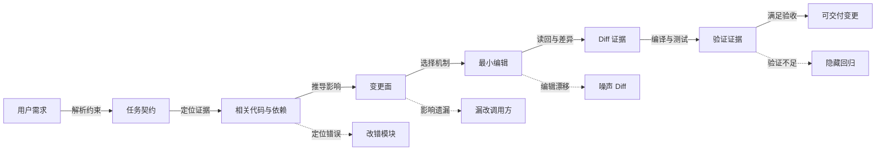

**结论**：模型能力决定上限，仓库理解与编辑 Harness 决定模型能否稳定接近这个上限。

---

# 2. 生产级总体架构

代码库理解与编辑系统可以拆成六个平面：

- **仓库接入平面**：信任确认、边界解析、文件清单、语言与构建系统识别。
- **索引与知识平面**：文本索引、AST/CST、符号索引、LSP、依赖图、Git 历史、项目知识。
- **上下文工程平面**：查询路由、相关度排序、去重、证据压缩、Token 预算分配。
- **规划与影响分析平面**：任务契约、变更面、不可变约束、验证计划。
- **编辑与执行平面**：精确替换、Patch、结构化改写、文件事务、沙箱命令执行。
- **验证与治理平面**：Diff 审查、编译、测试、静态检查、策略检查、审计与评测。

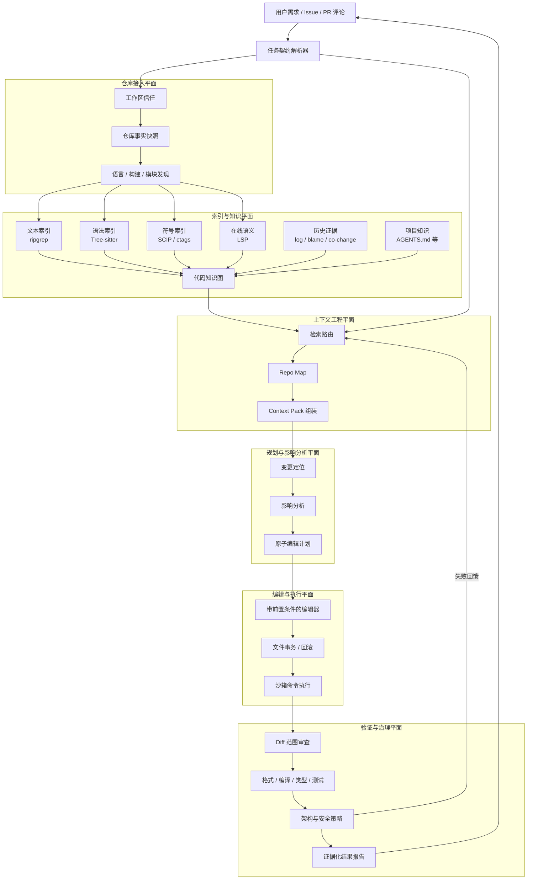

这套架构的关键不是组件数量，而是**每个结论都能追溯到仓库事实**。例如，Agent 说“需要修改 `OrderService`”，上下文中应当存在它的定义位置、调用关系、与需求关键词的关联或测试证据，而不是仅凭语言模型猜测。

---

# 3. 仓库接入：理解之前先建立事实边界

## 3.1 为什么必须有仓库事实快照

Agent 开始读取代码前，应先冻结一份可引用的仓库状态。最小快照包括：

| 字段 | 作用 |
|---|---|
| 仓库根目录 | 防止路径计算基于错误工作目录 |
| 当前分支与 HEAD | 为所有索引、读取、编辑绑定版本 |
| 工作区状态 | 识别用户已有未提交修改，避免覆盖 |
| 子模块 / 嵌套仓库 | 明确不同 Git 边界 |
| Worktree 身份 | 避免把主工作区与任务工作区混淆 |
| 文件清单摘要 | 发现规模、语言、生成目录与异常大文件 |
| Ignore 规则 | 确定索引范围，而不是盲扫 `node_modules`、`target` |
| 文件编码与换行 | 防止编辑造成全文件换行漂移 |
| 权限与符号链接 | 防止路径越界和链接逃逸 |
| 构建工具版本 | 解释后续构建差异 |

建议生成一个内部结构化对象：

```json
{
  "repo_root": "/workspace/acme",
  "head": "8f1c2a7",
  "branch": "feat/idempotency",
  "dirty": true,
  "changed_paths": ["services/payments/src/retry.ts"],
  "worktree_id": "wt-42",
  "languages": {"TypeScript": 0.62, "Rust": 0.31, "Other": 0.07},
  "build_systems": ["pnpm", "cargo"],
  "nested_repositories": ["vendor/legacy-sdk"],
  "generated_roots": ["packages/api/gen"],
  "snapshot_id": "sha256:..."
}
```

后续所有检索结果都应携带 `snapshot_id` 或文件内容哈希。这样才能判断一个编辑计划是否建立在已过期的读取上。

## 3.2 工作区信任不是权限弹窗的同义词

“是否信任仓库”应发生在加载仓库提供的配置、脚本、指令、插件或 Hook 之前。原因是仓库本身可能包含：

- 诱导 Agent 泄露信息的 README、注释或项目指令。
- 构建阶段自动执行的安装脚本。
- 指向工作区外部的符号链接。
- 修改工具权限的仓库级配置。
- 伪装成测试命令的破坏性脚本。

因此，推荐两阶段模型：

1. **未信任阶段**：只执行受控的只读元数据操作，禁止加载仓库提供的可执行扩展。
2. **已信任阶段**：按细粒度策略开放项目指令、构建、测试与写入。

## 3.3 文件发现不能等同于递归遍历

简单的 `rglob("*")` 会把依赖目录、构建产物、缓存、二进制、超大快照和密钥一起纳入上下文。生产实现应合并：

- `.gitignore`、全局 ignore、工具专属 ignore。
- 构建系统默认排除项，例如 `target/`、`dist/`、`.venv/`。
- 文件大小、MIME、二进制检测。
- 生成代码标记，例如注释头、目录约定、构建清单。
- 用户显式 include / exclude 规则。

`ripgrep` 默认递归搜索并尊重 Git ignore，同时跳过隐藏目录和二进制文件，这也是它适合作为 Coding Agent 文本检索底座的重要原因之一。[^ripgrep]

## 3.4 项目识别应输出“可操作能力”，不只输出语言标签

识别到“这是 TypeScript 项目”还不够。Agent 需要知道：

- 安装依赖的安全命令是什么。
- 如何运行单个测试、单个包测试和全量测试。
- 类型检查与 lint 是否分开。
- 是否存在代码生成步骤。
- 哪些命令会访问网络。
- 哪些命令会修改文件。
- 哪些测试共享外部数据库或不可并行。

推荐把探测结果规范化为能力表：

| 能力 | 命令 | 副作用 | 网络 | 预计范围 | 可信来源 |
|---|---|---:|---:|---|---|
| 安装依赖 | `pnpm install --frozen-lockfile` | 写依赖目录 | 是 | 全仓 | 项目文档 + 锁文件 |
| 单测文件 | `pnpm vitest path/to/test` | 临时缓存 | 否 | 单文件 | package script 验证 |
| 类型检查 | `pnpm tsc -b --pretty false` | 可能写增量缓存 | 否 | Workspace | package script |
| Rust 单包测试 | `cargo test -p core` | 写 target | 可能 | 单包 | Cargo workspace |
| 生成代码 | `pnpm generate` | 大量写入 | 可能 | gen 目录 | 项目指令 |

## 3.5 推荐接入流程


### 接入阶段的硬门禁

- 不允许仓库根解析到设备根目录或用户主目录，除非用户明确授权。
- 不跟随越过仓库根的符号链接。
- 不在未信任阶段执行项目脚本。
- 不把 `.env`、凭据目录和私钥内容自动送入模型上下文。
- 不在工作区已有修改时默认执行破坏性恢复命令。
- 不把索引成功误认为项目可以构建；两者是不同健康状态。

---

# 4. 代码理解的多层表示

原始代码只是字符流。Coding Agent 要回答不同问题，需要使用不同抽象层。生产系统通常不是“四选一”，而是按查询意图组合多层证据。

## 4.1 七层理解模型

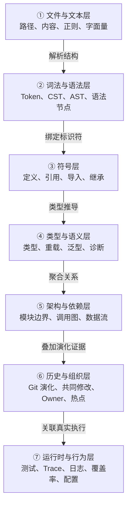

| 层级 | 典型工具 | 擅长回答 | 主要局限 |
|---|---|---|---|
| 文件/文本 | `find`、`rg`、正则 | 错误码在哪、字符串在哪、配置键在哪 | 不理解代码结构 |
| 语法 | Tree-sitter、ast-grep | 哪些是函数定义、某种调用形态在哪 | 通常不理解跨文件绑定 |
| 符号 | ctags、SCIP、语言索引 | 定义与引用、符号关系、跨仓导航 | 离线索引可能陈旧 |
| 类型语义 | LSP、编译器 API | 精确类型、重载解析、诊断、重命名 | 依赖可用环境与启动成本 |
| 架构依赖 | import graph、call graph、build graph | 模块影响面、依赖方向、循环依赖 | 图构建成本高，动态语言不完备 |
| 历史组织 | Git log/blame、CODEOWNERS | 为什么这么写、谁熟悉、哪里高风险 | 历史不是规范，可能带入旧偏见 |
| 运行时行为 | 测试、coverage、trace | 实际执行路径、受影响测试、真实副作用 | 需要可运行环境，覆盖不一定完整 |

## 4.2 “够用的最低层”原则

选层应遵循一个简单纪律：**能够可靠回答当前问题的最低成本层，就是优先层**。

- 查找精确错误码：先 `rg`，不必启动 LSP。
- 查找“所有未 `await` 的异步调用”：使用结构化检索，不要用脆弱正则。
- 确认某个 `User` 是哪个命名空间下的类型：使用 LSP 或编译器索引。
- 查询跨仓库定义与引用：优先 SCIP 之类的持久化符号索引。
- 找“不知道名字但负责限流的代码”：使用自然语言/嵌入检索，再用文本与符号证据核验。
- 判断哪个测试真正覆盖目标函数：使用覆盖率或运行时 Trace，而不是仅凭文件名猜测。

## 4.3 Tree-sitter 为什么适合 Agent

Tree-sitter 是增量解析库，能够在源码编辑后高效更新具体语法树，并在存在语法错误时继续提供有用结果。[^tree-sitter] 这三个特性与 Agent 工作方式高度匹配：

- Agent 频繁进行小范围编辑，增量解析避免全仓重建。
- 编辑中间态可能暂时不完整，容错树仍可用于定位与读回。
- 多语言仓库需要相对统一的查询接口，而不是为每种语言手写解析器。

需要注意：Tree-sitter 提供的是语法结构，不自动提供完整类型语义。把 AST 节点称为“精确调用关系”是常见过度承诺。

## 4.4 LSP 与符号索引不是替代关系

Language Server Protocol 标准化了编辑器/客户端与语言服务之间的通信，覆盖文档同步、定义、引用、诊断、重命名和 WorkspaceEdit 等能力。[^lsp] 但在线 LSP 与离线符号索引解决的是不同运行约束：

- **LSP**：基于当前工作区状态，语义更鲜活；代价是启动、依赖解析、长连接与资源占用。
- **SCIP/LSIF 类索引**：预计算后查询快，可跨仓和离线使用；代价是需要构建索引且存在陈旧窗口。[^scip]

生产路由应允许二者互相降级，而不是硬编码“永远使用 LSP”。

---

# 5. Repo Map：给模型一张有预算的仓库地图

## 5.1 Repo Map 的目标与非目标

Repo Map 是仓库的压缩骨架，通常包含：

- 目录与模块边界。
- 关键文件用途。
- 类、函数、接口、类型、常量等顶层符号。
- 关键继承、导入、调用或测试关系。
- 与当前任务相关的高价值片段。

它的目标是回答：

- 这个仓库由哪些主要部分构成？
- 与当前任务最可能相关的入口在哪里？
- 下一步应读取哪些文件或查询哪些符号？

它**不是**完整代码数据库，也不应替代实时检索。地图给方向，实时工具给真值。

Aider 的公开实现说明展示了一个典型路线：使用 Tree-sitter 提取仓库符号，以文件依赖图进行图排序，并在当前 Token 预算内选取最相关部分。[^aider-repomap]

## 5.2 构建流水线

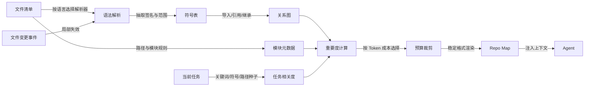

## 5.3 符号抽取应保留哪些信息

只保留符号名通常太弱，保留完整实现又太贵。建议的最小符号记录：

```yaml
symbol_id: "src/payments/service.ts#PaymentService.charge"
kind: "method"
name: "charge"
qualified_name: "PaymentService.charge"
file: "src/payments/service.ts"
range: [82, 141]
signature: "async charge(req: ChargeRequest): Promise<ChargeResult>"
visibility: "public"
doc_summary: "创建或复用支付请求"
parent: "PaymentService"
exports: true
hash: "sha256:..."
```

可按语言增加：

- 装饰器 / 注解。
- 泛型参数与 trait bound。
- `async`、`unsafe`、`const`、`static` 等语义修饰。
- API 路由、RPC 名称、消息主题。
- 测试标记与 fixture。
- “generated” 或 “deprecated” 标签。

## 5.4 关系图不应只看 import

文件之间的边可以来自多种证据：

| 关系 | 含义 | 可靠性 |
|---|---|---|
| import / module dependency | 编译或加载依赖 | 高 |
| definition → reference | 符号使用关系 | 高，依赖索引质量 |
| implements / extends | 接口与继承关系 | 高 |
| test → production symbol | 测试覆盖或调用目标 | 中高 |
| config → component | 配置键影响组件 | 中 |
| codegen source → generated file | 生成链路 | 高 |
| Git co-change | 历史上经常一起修改 | 中，只能作辅助 |
| text mention | 文档或注释提及 | 低，但可用于解释 |
| runtime call edge | 实际执行调用 | 高，但只覆盖观测路径 |

重要度图可以是文件级，也可以是符号级。大仓通常先用文件/模块级图筛选，再对候选区域建立符号级子图，以控制成本。

## 5.5 排序公式

对文件或符号节点 `x`，可使用组合评分：

\[
Score(x, q)=
\alpha R_{lexical}(x,q)+
\beta R_{semantic}(x,q)+
\gamma C_{graph}(x)+
\delta P_{proximity}(x,q)+
\epsilon H_{history}(x)+
\zeta V_{verification}(x,q)-
\lambda Cost(x)
\]

其中：

- `R_lexical`：任务关键词、错误码、符号名的精确匹配。
- `R_semantic`：自然语言任务与代码摘要/嵌入的相关度。
- `C_graph`：PageRank、入度、桥接中心性等图重要度。
- `P_proximity`：与已知种子文件、当前打开文件或错误栈的图距离。
- `H_history`：近期修改、共同修改、缺陷热点等辅助信号。
- `V_verification`：是否被目标测试、诊断或运行时轨迹直接覆盖。
- `Cost`：渲染该节点所需 Token 与噪声成本。

权重不应固定为全局常量。故障修复任务可以提高错误栈与测试证据权重；架构问答任务可以提高图中心性与文档权重；批量迁移任务可以提高结构化模式匹配权重。

## 5.6 Token 预算不是“截断字符数”

Repo Map 的预算应与整个上下文协同：

\[
B_{map}=B_{window}-B_{system}-B_{instructions}-B_{task}-B_{working\_set}-B_{reserve}
\]

其中 `B_reserve` 必须为后续工具结果、错误信息和模型输出预留空间。常见错误是开局把地图塞满窗口，导致真正相关代码无法进入上下文。

预算裁剪建议遵循：

1. 先保留任务种子文件和一跳依赖。
2. 再保留高中心性入口与公开 API。
3. 对低相关文件只保留路径和一句用途摘要。
4. 同一符号的重复信息只保留一份，其他位置使用引用。
5. 对超长签名或生成代码进行归一化。
6. 始终保留“还有哪些模块未展开”的目录视图，避免制造仓库不存在的错觉。

## 5.7 地图格式应稳定且可定位

推荐输出形态：

```text
[模块] services/payments
  用途: 支付下单、幂等与重试
  入口: src/http/payment_routes.ts
  关键符号:
    src/payments/service.ts:82-141
      class PaymentService
      async charge(req: ChargeRequest): Promise<ChargeResult>
    src/payments/idempotency.ts:12-77
      class IdempotencyStore
      getOrCreate(key: string, action: () => Promise<T>): Promise<T>
  关系:
    payment_routes.ts -> PaymentService.charge
    PaymentService.charge -> IdempotencyStore.getOrCreate
  测试:
    tests/payments/idempotency.test.ts
```

稳定格式有三个好处：可缓存、可比较、可由模型可靠引用。

## 5.8 增量更新与失效

地图是缓存，必须显式管理新鲜度：

- 文件内容变化：仅重解析该文件，更新关联边。
- 文件重命名：迁移节点标识并重新解析引用。
- 依赖清单变化：重建受影响模块图。
- Git HEAD 变化：比较索引基线与新 HEAD 的 diff，局部失效。
- 解析器版本变化：对应语言索引全量失效。
- 项目指令变化：知识摘要失效，但语法索引不必重建。

每个地图块建议携带：

```yaml
built_at: "2026-08-31T08:00:00Z"
repo_head: "8f1c2a7"
parser: "tree-sitter-typescript@..."
source_hashes:
  - "src/payments/service.ts:sha256:..."
confidence: 0.93
```

## 5.9 Monorepo 分片

单一全仓地图在大型 Monorepo 中会迅速失效。应按构建图或职责域分层：

- L0：全仓产品/域目录，只给模块用途与入口。
- L1：目标 Workspace/Package 的文件和公开符号。
- L2：当前任务候选文件的详细符号与关系。
- L3：正在编辑函数的精确实现与局部上下文。

这种渐进披露比“先全量摘要再压缩”更稳定，因为每一层都有明确用途。

## 5.10 Repo Map 的常见失败

1. **只按目录排序**：入口文件未必位于浅层目录。
2. **只按被引用次数排序**：工具函数会淹没与任务直接相关的低频业务代码。
3. **把文本出现次数当精确引用**：同名符号、注释和字符串会制造假边。
4. **地图无版本信息**：模型无法判断符号是否已被修改或删除。
5. **地图没有“未展开区域”**：模型误以为上下文就是完整仓库。
6. **每轮全量重建**：浪费延迟并破坏稳定前缀缓存。
7. **从地图直接做编辑**：地图是导航摘要，不应成为写入前唯一依据。

---

# 6. 混合检索与导航路由

## 6.1 先识别问题类型，再选工具

Coding Agent 的检索不应只有一个 `search_code(query)`。不同问题的正确工具完全不同：

| 查询意图 | 示例 | 首选工具 | 核验工具 |
|---|---|---|---|
| 精确字面量 | “错误码 E1027 在哪” | `rg` | 文件读取 |
| 已知符号定义 | “PaymentService 定义在哪” | LSP / SCIP / tags | `rg` + 读取 |
| 符号引用 | “谁调用了 charge” | LSP / SCIP | 结构化搜索 |
| 结构模式 | “所有未处理返回值的调用” | ast-grep / Semgrep | 编译/测试 |
| 模糊概念 | “限流逻辑在哪” | 语义检索 | `rg`、符号关系 |
| 架构关系 | “API 到存储经过哪些层” | 依赖图 / 调用图 | 入口代码读取 |
| 历史原因 | “为什么保留这个兼容分支” | Git log / blame | Issue / 文档 |
| 行为路径 | “该请求运行时经过哪些函数” | Trace / coverage | 静态调用图 |
| 受影响测试 | “改这里要跑哪些测试” | test graph / coverage | 构建系统选测 |

## 6.2 路由决策树

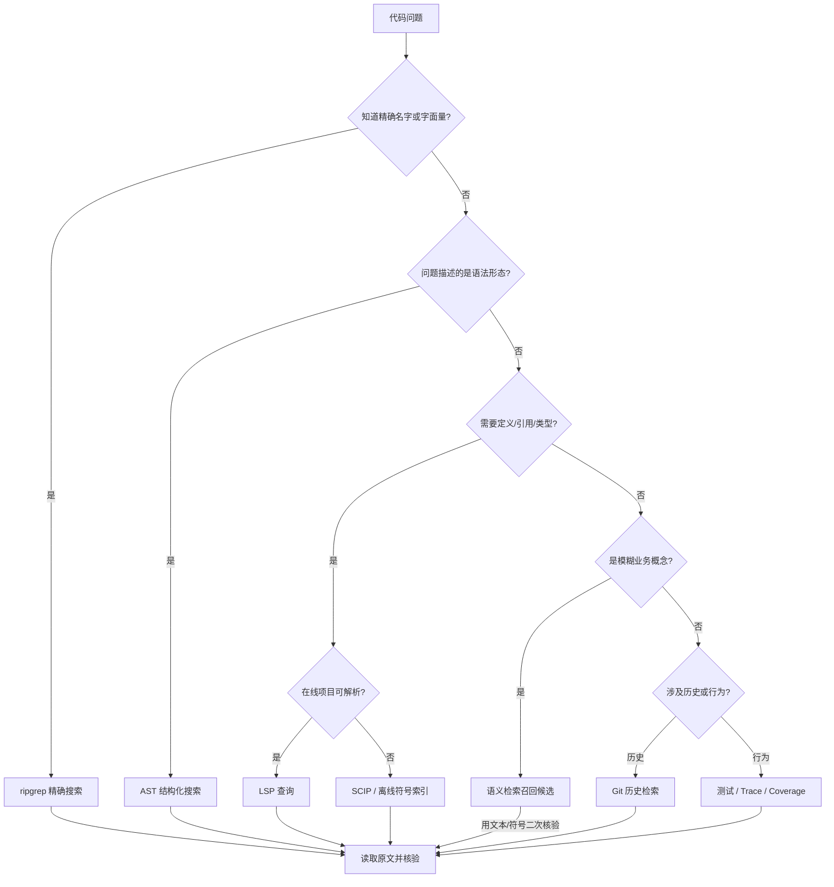

## 6.3 文本检索：便宜、实时、应成为默认主力

文本检索适合：

- 符号名、错误码、日志文本、配置键、环境变量。
- 错误栈中的文件名和函数名。
- API 路径、数据库表名、事件主题。
- TODO、FIXME、兼容注释和特定异常信息。

建议 Agent 生成可审计的搜索调用：

```bash
rg -n --hidden \
  --glob '!target/**' \
  --glob '!node_modules/**' \
  'IDEMPOTENCY_KEY|idempotencyKey|idempotent' \
  services/payments
```

不要把 `rg` 的零结果直接解释为“仓库没有该逻辑”。可能原因包括：忽略规则、生成代码、符号重命名、字符串拼接、动态注册或跨仓依赖。

## 6.4 结构化检索：当问题描述的是“代码形状”

ast-grep 一类工具基于语法树做搜索与改写，适合跨语言查找结构模式。其官方文档将其定位为语法感知的搜索、重写、lint 与批量改写工具。[^ast-grep]

典型任务：

- 找出所有 `fetch()` 后没有检查状态码的位置。
- 找出 React 组件中直接读取某个全局对象的代码。
- 找出捕获异常后只打印日志、不重新抛出或返回错误的位置。
- 把某个旧 API 调用批量迁移到新 API。

结构化检索仍需注意：

- 动态语言的别名与运行时绑定不一定能由语法树判断。
- 宏、代码生成和模板语言可能需要专用解析器。
- 匹配结构正确，不等于语义替换一定安全。

## 6.5 LSP 查询应封装成 Agent 友好的工具

不要把裸 JSON-RPC 协议直接暴露给模型。模型更适合调用高层工具：

```text
find_definition(file, line, column)
find_references(symbol_id, include_declaration=false)
get_hover(file, line, column)
get_diagnostics(paths)
rename_symbol(symbol_id, new_name, dry_run=true)
workspace_symbols(query)
```

封装层应负责：

- 文档打开与版本同步。
- UTF-8 / UTF-16 位置换算。
- LSP 服务启动、健康检查、超时与重启。
- 多根 Workspace 与语言选择。
- 将返回结果规范化为路径、范围、符号标识和置信度。
- 在 LSP 不可用时自动回退到 SCIP、AST 或文本检索。

## 6.6 语义检索只能负责召回，不能单独负责定案

自然语言检索最有价值的场景是“不知道代码叫什么”。例如用户说“用户被禁用后阻止创建新订单”，实际代码可能使用 `account_status`、`suspended`、`eligibility` 等完全不同词汇。

推荐两阶段：

1. **语义召回**：找出可能相关的文件、符号、文档或测试。
2. **确定性核验**：使用文本、符号、类型、调用关系或运行时证据证明关联。

严禁把“嵌入相似度高”直接转化为写权限或编辑目标。

## 6.7 Git 历史是解释证据，不是现行规范

Git 可以回答：

- 这个分支为什么存在？
- 某段兼容逻辑由哪个缺陷引入？
- 哪些文件经常共同修改？
- 哪些区域是修复热点？
- 谁可能熟悉该模块？

但历史提交可能已经过时。Agent 应把 Git 证据标记为“历史背景”，再与当前代码、测试和项目指令核对。

## 6.8 Context Pack：检索结果必须经过组装

直接把搜索结果按时间顺序堆进上下文，会形成“上下文汤”。应组装为结构化证据包：

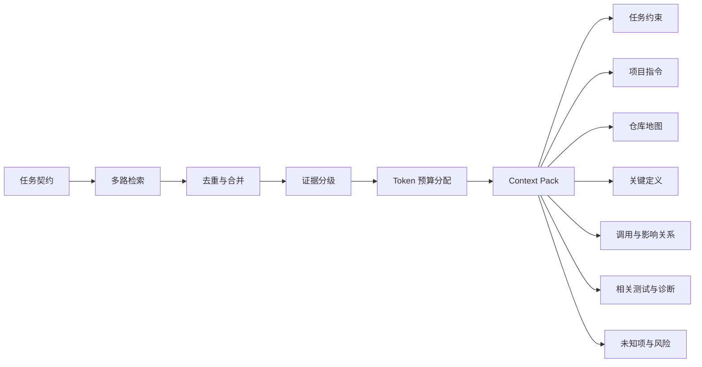

建议每条证据包含：

```yaml
id: "evidence-17"
kind: "symbol_definition"
path: "services/payments/src/service.ts"
range: [82, 141]
repo_head: "8f1c2a7"
content_hash: "sha256:..."
source: "lsp.definition"
confidence: 0.99
why_relevant: "HTTP 入口直接调用该方法"
content: "..."
```

## 6.9 探索外包与主上下文卫生

开放式探索容易产生大量无价值过程：错误关键词、无关文件、重复读取。可以交给独立子 Agent，但必须规定结果契约：

```yaml
question: "支付重试的幂等逻辑在哪里?"
answer:
  conclusion: "当前重试层没有幂等存储，只有请求级 retry guard"
  evidence:
    - path: "services/payments/src/retry.ts"
      lines: "18-79"
    - path: "services/payments/tests/retry.test.ts"
      lines: "33-112"
  uncertainty:
    - "网关层可能注入外部幂等键，尚未检查 deployment repo"
  recommended_next_read:
    - "services/gateway/src/payment_proxy.ts"
```

主 Agent 接收结论、证据和不确定项，不接收探索全过程。这样既节省上下文，也避免子 Agent 的主观判断变成不可追溯事实。

---

# 7. 项目知识文件：把“口头经验”变成仓库程序记忆

## 7.1 项目知识与 Repo Map 的分工

- **Repo Map** 描述“仓库有什么、东西在哪、谁依赖谁”。
- **项目知识** 描述“应该怎么做、为什么这样做、哪些地方不能这样做”。

前者偏事实发现，后者偏规范与意图。两者混在一个超长文件中，会同时降低索引新鲜度和指令遵循率。

当前主流 Coding Agent 产品普遍支持仓库级或路径级自定义指令。例如 GitHub Copilot 文档支持仓库级、路径级和就近 `AGENTS.md` 指令；Claude Code 也将项目记忆作为会话上下文加载。[^copilot-instructions] [^claude-memory]

## 7.2 推荐四层作用域

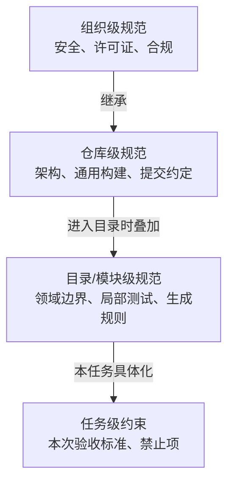

冲突处理必须明确。推荐：

1. 安全与组织策略不可被低层放宽。
2. 更具体的路径级规范可覆盖通用风格，但不能突破硬禁区。
3. 用户本次任务约束优先于默认偏好，但不能绕过安全策略。
4. 发生冲突时显式报告，不让模型自行“折中”。

## 7.3 最值得写入的内容

### A. 构建与验证

- 安装、构建、运行、单测、选测、全测、lint、类型检查命令。
- 运行前置条件、环境变量、服务依赖。
- 命令是否联网、是否写文件、是否可并行。
- 成功后的可观察结果。

### B. 架构导航

- 入口、核心领域、适配器、基础设施目录。
- 依赖方向和禁止跨层调用。
- API、事件、数据库、代码生成的权威源。
- 典型功能应该落在哪一层。

### C. 风格与契约

- 错误模型、日志字段、追踪 ID、序列化、时间与时区。
- 兼容性要求、版本策略、迁移策略。
- 测试命名、fixture 与 Mock 约定。
- 不由格式化器或 linter 强制的关键规则。

### D. 禁区与陷阱

- 生成目录、供应商代码、冻结模块。
- 共享测试资源与不可并行套件。
- 需要双写或双读的迁移阶段。
- 容易被误判为废代码的兼容路径。

## 7.4 一个可执行的 `AGENTS.md` 模板

```markdown
# Repository Agent Guide

## 1. Repository purpose
- 本仓库负责：...
- 不负责：...

## 2. Architecture
- `apps/desktop`: ...
- `crates/core`: ...
- 依赖方向：UI -> Application -> Domain <- Infrastructure
- 禁止：Domain 依赖 Tauri、数据库或网络实现。

## 3. Build and validation
- 安装：`pnpm install --frozen-lockfile`
- 前端单测：`pnpm test -- <path>`
- Rust 单包：`cargo test -p <crate>`
- 全量门禁：`pnpm lint && pnpm build && cargo test --workspace`
- 不要并行运行：`tests/e2e/**`，共享固定端口。

## 4. Editing rules
- 保持所改文件既有风格。
- 不做未被要求的重构。
- `src/generated/**` 不可手工编辑，修改 `schemas/**` 后运行生成器。
- 修改数据库结构必须添加向前迁移与回滚说明。

## 5. Security
- 不读取 `.env*`、`~/.ssh`、云凭据目录。
- 新依赖需要说明必要性、许可证与锁文件变化。
- 网络命令必须先请求批准。

## 6. Known traps
- ...
```

## 7.5 项目知识要“像代码一样治理”

项目知识应具备：

- **Owner**：谁负责确认内容。
- **来源**：规范、代码、脚本还是经验。
- **适用范围**：全仓或路径模式。
- **验证方式**：命令可否由 CI 冒烟。
- **更新时间与 TTL**：多久未验证应标记陈旧。
- **冲突检测**：不同层指令是否互相矛盾。

可以为命令类条目添加轻量合同测试：验证脚本存在、参数仍有效、关键命令能启动。错误指令通常比没有指令更危险，因为它会让 Agent 在错误方向上重复自愈。

---

# 8. 从需求到变更面：先决定“该改什么”

## 8.1 任务契约

在读取大量代码前，把自然语言需求规范化：

```yaml
objective: "支付重试必须复用同一幂等键，避免重复扣款"
acceptance_criteria:
  - "同一业务请求的所有重试使用同一 key"
  - "不同业务请求不共享 key"
  - "现有公开 API 保持兼容"
constraints:
  - "不新增外部依赖"
  - "不修改生成代码"
  - "保持现有日志字段"
non_goals:
  - "不重构整个支付客户端"
verification:
  required:
    - "新增失败后重试测试"
    - "现有支付单测通过"
unknowns:
  - "幂等键由网关生成还是客户端生成"
```

任务契约的价值在于把“用户想要什么”与“模型打算怎么实现”分开。后者可以调整，前者必须稳定。

## 8.2 变更面三分法

影响分析应输出：

- **必须修改**：直接实现需求的最小集合。
- **可能修改**：取决于实现方案或验证结果。
- **禁止修改**：生成文件、兼容层、用户已有变更、任务外模块。

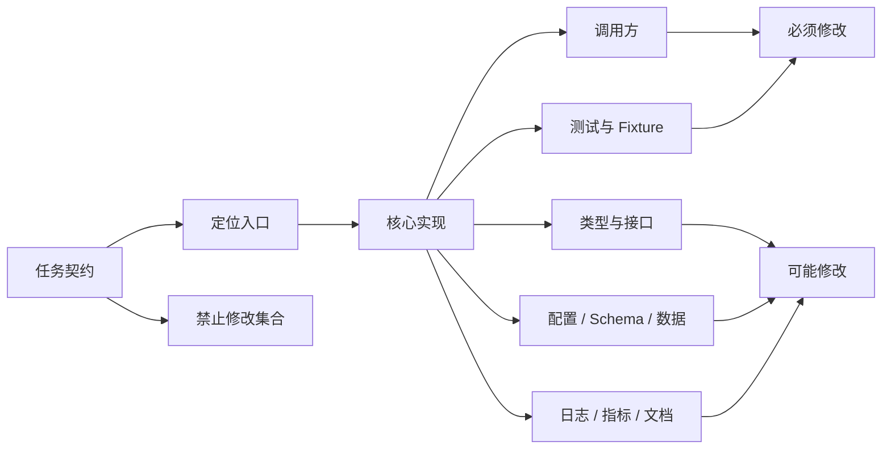

## 8.3 影响分析的证据来源

1. 定义与引用关系。
2. 接口实现与继承关系。
3. 构建依赖图。
4. API / Schema / RPC 生成关系。
5. 测试覆盖与测试命名关系。
6. Git 共同修改历史。
7. 运行时 Trace 与日志。
8. 项目知识中的架构约束。

单一证据通常不够。例如 LSP 能找到静态引用，但反射、依赖注入、路由注册和配置驱动调用可能不在引用列表中；这时要结合框架约定、文本检索与运行时测试。

## 8.4 修改计划必须原子化

一个好的计划不是“修改支付逻辑并加测试”，而是：

```text
1. 读取并确认 PaymentRequest 的唯一创建入口。
2. 在请求创建时生成 idempotency_key，保持现有构造函数兼容。
3. 将 key 存入 RetryContext，而不是每次 attempt 重新生成。
4. 在 PaymentClient.send 中从 RetryContext 读取 key 并写入请求头。
5. 新增测试：第一次请求失败、第二次重试，断言两次 header 相同。
6. 新增测试：两个独立请求，断言 header 不同。
7. 运行目标测试、支付模块类型检查和相关 lint。
8. 审查 Diff，确保未修改生成目录与无关重构。
```

每一步应绑定目标文件、前置条件、成功证据和失败后的重新规划条件。

## 8.5 不确定项必须显式保留

Agent 容易把推断写成事实。建议维护三类状态：

- `confirmed`：有代码、工具或文档证据。
- `inferred`：由多条证据推断，但未直接验证。
- `unknown`：当前证据不足。

只有 `confirmed` 结论可以直接成为高风险编辑前提；`inferred` 应在写入前尽量核验；`unknown` 要么触发进一步探索，要么进入最终风险说明。

---

# 9. 编辑策略：从字符替换到语义重构

## 9.1 编辑机制全景

| 机制 | 最适合 | 优点 | 主要风险 |
|---|---|---|---|
| Whole-file 重写 | 新文件、很短且独立的文件 | 简单、一次生成 | 无关漂移、换行/格式变化、漏掉原内容 |
| 精确字符串替换 | 单点、小范围、上下文稳定 | 失败显式、Diff 小 | 匹配不唯一、空白差异、陈旧读取 |
| 行范围替换 | 已锁定稳定范围的局部修改 | 工具实现简单 | 行号会因并发编辑漂移 |
| Unified Diff | 多文件、人类可审阅补丁 | 表达力强、生态成熟 | Hunk 上下文不匹配、模型伪造行号 |
| AST/CST Rewrite | 结构性、重复性迁移 | 语法感知、可批量 | 丢注释/格式、解析器覆盖、语义不足 |
| LSP WorkspaceEdit | 重命名、导入、语言级重构 | 利用语言服务语义 | 依赖 LSP 稳定和项目可解析 |
| Codemod | 大规模可规则化迁移 | 可重复、可测试、适合上千文件 | 规则错误会批量放大 |
| 新建/删除/移动 | 文件级结构变更 | 意图明确 | 构建清单、引用和历史处理不完整 |

## 9.2 为什么精确替换适合作为默认局部编辑

精确替换的核心不是“字符串处理”，而是**乐观并发控制**：

```text
读取旧内容并记录哈希
  → 生成 old_text 与 new_text
  → 写入前验证文件仍是原版本
  → 验证 old_text 唯一存在
  → 原子写入
  → 读回并验证 new_text
```

它把多种错误转化为显式失败：文件变化、匹配不存在、匹配不唯一、写入不完整。显式失败可以回馈模型重新读取，而整文件覆盖往往把错误静默写入。

## 9.3 精确替换的前置条件

一个生产级编辑请求至少应包含：

```yaml
path: "services/payments/src/retry.ts"
expected_file_hash: "sha256:..."
old_text: |
  const key = createIdempotencyKey();
  return client.send(request, key);
new_text: |
  const key = context.idempotencyKey;
  return client.send(request, key);
expected_occurrences: 1
preserve_line_endings: true
preserve_mode: true
```

工具应在以下情况拒绝写入：

- 路径解析后越过工作区根。
- 文件是越界符号链接。
- 文件哈希与读取时不同。
- `old_text` 出现次数不等于预期。
- 文件是已标记生成文件且没有显式授权。
- 写入将改变二进制或未知编码文件。

## 9.4 Unified Diff 的正确用法

Unified diff 不应因为“模型可能算错行号”而被完全放弃。它适合：

- 多文件变更的可审阅表示。
- 将已有、经过工具生成的补丁传递到另一环境。
- 使用 `git apply --check` 预验证。
- 需要三方合并语义时。

Git 的 `git apply --check` 可以先检查补丁是否能应用；默认情况下，若某个 hunk 无法应用，`git apply` 不会部分修改工作区，这提供了有价值的原子失败语义。[^git-apply]

但模型直接生成 diff 时，应避免依赖绝对行号，而依赖足够稳定的上下文；应用前必须检查，应用后必须审查真实 `git diff`。

## 9.5 AST 与 CST 编辑

### AST 编辑适合

- 修改调用参数。
- 替换特定 API。
- 增加注解、装饰器或属性。
- 批量更改导入。
- 对语法节点做规则化迁移。

### CST 编辑适合

CST 保留更多标点、空白和注释信息，更适合要求格式与注释稳定的改写。纯 AST 重新打印可能导致整文件格式变化。

### 结构化编辑的安全步骤

1. 先用规则只搜索，不改写。
2. 抽样审查匹配是否精确。
3. 在测试 fixture 上验证 rewrite。
4. 以 dry-run 生成 diff。
5. 设定最大文件数、最大行数与目录范围。
6. 批量应用后运行格式化、编译和相关测试。
7. 检查匹配数量是否符合预期；零匹配和超量匹配都应失败。

## 9.6 LSP WorkspaceEdit

LSP 支持由语言服务返回跨文档编辑，这对重命名和语义感知导入管理很有价值。[^lsp] Agent 仍应把 WorkspaceEdit 当作“候选变更”，而不是直接信任：

- 验证返回的文档版本。
- 限制可写根目录。
- 展开为可审查的文件操作列表。
- 检查是否触及生成代码、外部目录或超大范围。
- 应用后重新获取诊断。

## 9.7 编辑策略决策树

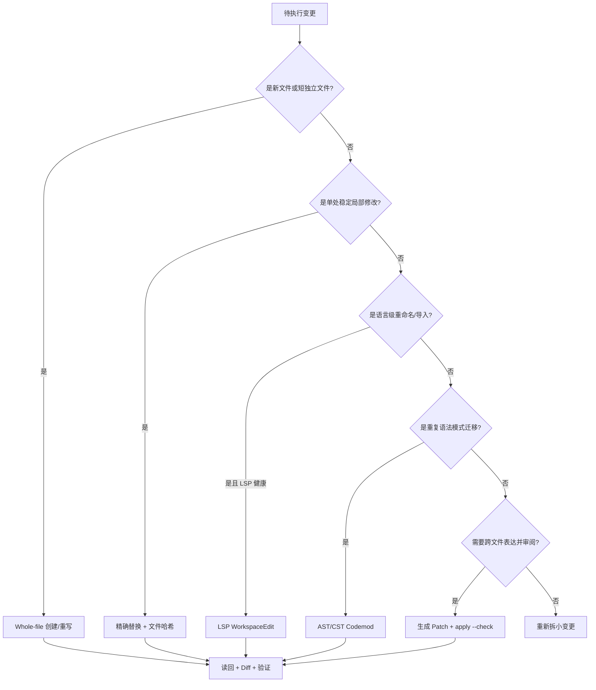

## 9.8 编辑必须事务化

多文件变更的基本事务流程：

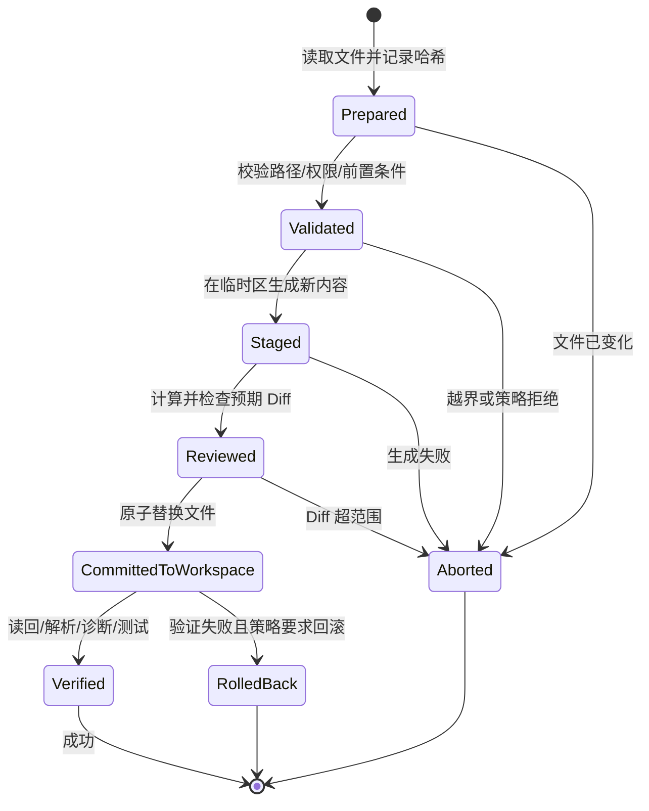

“事务化”不一定要求数据库事务，但必须具备：前置条件、原子提交、失败可回滚、修改可审计。

---

# 10. 闭环编辑：每次写入都必须重新观察

## 10.1 开环与闭环的区别

开环编辑：

```text
模型认为文件是 A → 生成修改 → 写入 → 假设成功
```

闭环编辑：

```text
读取真实 A
→ 记录版本
→ 生成修改 B
→ 校验前置条件
→ 写入
→ 读取真实 B'
→ 比较 B 与 B'
→ 审查 Diff
→ 运行诊断与测试
→ 根据证据继续或回滚
```

闭环并不能保证逻辑绝对正确，但能大幅减少“模型以为发生了什么”和“文件系统实际发生了什么”之间的偏差。

## 10.2 标准修复环

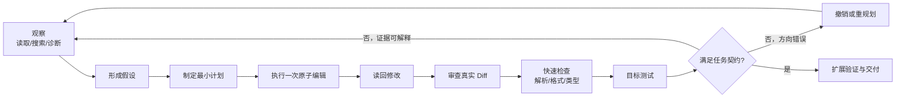

## 10.3 编辑后读回要检查什么

- 新文本是否出现在预期符号内。
- 是否意外修改同名代码块。
- 文件是否仍能被解析。
- import、格式与注释是否正常。
- 文件哈希和行范围是否与工具返回一致。
- 目标旧文本是否仍在其他位置存在。
- 变更是否触及任务禁止区域。

## 10.4 Diff 是第一层验证器

测试之前先检查 Diff，因为很多失败可以更便宜地发现：

- 修改文件数量超过计划。
- 发生全文件换行变化。
- 自动格式化污染无关区域。
- 锁文件出现意外依赖更新。
- 生成代码被手工改动。
- 删除或重命名未在计划内。
- 用户已有修改被覆盖。

建议固定执行：

```bash
git status --short
git diff --stat
git diff --check
git diff -- path/to/expected/files
```

`git diff` 可比较工作区、暂存区与提交之间的变化，是将“模型建议”转换为“真实变更证据”的基础工具。[^git-diff]

## 10.5 分层验证顺序

按成本从低到高：

1. 文件解析与语法检查。
2. 格式与 lint 的目标文件模式。
3. 单模块类型检查或编译。
4. 与变更直接相关的测试。
5. 受影响模块测试。
6. Workspace / 全仓门禁。
7. E2E、性能、安全或兼容专项。

失败后先分类，不要机械重复：

| 失败类型 | 示例 | 下一步 |
|---|---|---|
| 编辑前置条件失败 | 文件哈希变化 | 重新读取并重建计划 |
| 语法失败 | 括号或缩进错误 | 局部读回、最小修复 |
| 类型失败 | 调用签名不匹配 | 查定义与引用，更新影响面 |
| 行为断言失败 | 结果与验收不符 | 检查需求假设与实现逻辑 |
| 环境失败 | 依赖缺失、端口占用 | 记录环境问题，勿伪装为代码失败 |
| Flaky | 重跑结果不稳定 | 隔离并标记，不随意改业务代码迎合 |
| 超范围 Diff | 格式化修改大量文件 | 回滚噪声并限制工具范围 |

## 10.6 端到端时序

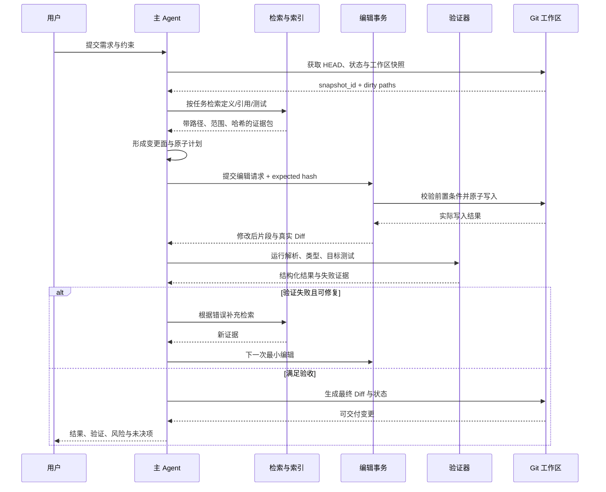

---
# 11. Git：编辑事务、并行隔离与交付边界

Git 不只是最终提交工具。对 Coding Agent 而言，它同时承担四个角色：

1. **仓库状态传感器**：HEAD、分支、脏文件、重命名、冲突。
2. **变更账本**：真实 Diff、暂存区、提交历史。
3. **回滚机制**：恢复 Agent 自己产生的错误，但不得误删用户修改。
4. **协作边界**：分支、Worktree、Commit、PR 将不同 Agent 与人工工作隔离。

## 11.1 启动时先区分三类变更

| 变更类型 | 示例 | Agent 默认策略 |
|---|---|---|
| 用户已有变更 | 任务开始前已存在的 dirty files | 只读保护；除非任务明确包含这些文件 |
| 本 Agent 变更 | 当前会话写入 | 可继续修改、审查或回滚 |
| 外部并发变更 | 会话期间由用户/其他 Agent 写入 | 触发陈旧检测和重新规划 |

不能只在会话开始记录一次 `git status`。长任务中应在关键写入前重新检查相关路径的内容哈希或 Git 状态。

## 11.2 Worktree 是并行 Agent 的低成本隔离单元

Git 官方支持一个仓库关联多个工作树，使不同分支可同时检出。[^git-worktree] 对并行 Coding Agent，可采用：

```text
主仓库
├── worktree/issue-101-agent-a   # API 实现
├── worktree/issue-101-agent-b   # 测试与评审
└── worktree/refactor-agent-c    # 独立迁移
```

Worktree 的优势：

- 文件系统写入天然隔离。
- 每个 Agent 可拥有独立分支和构建缓存策略。
- 不必频繁 stash/checkout。
- 主工作区可以保持供用户使用。
- 最终通过 Commit、Cherry-pick、Merge 或 PR 聚合。

但 Worktree 不是完整沙箱：不同工作树仍可能共享 Git 对象库、用户主目录、全局缓存、外部数据库、端口和凭据。执行隔离仍需 OS/容器层完成。

## 11.3 暂存区可作为“候选事务区”

推荐流程：

1. Agent 在工作区产生最小变更。
2. 检查 `git diff`。
3. 只把计划内的 hunk 加入暂存区。
4. 使用 `git diff --cached` 作为候选交付包。
5. 对暂存内容运行策略检查。
6. 验证通过后提交；失败时取消暂存，不影响用户其他工作。

这比“所有文件改完后一次性提交”更利于中途审查和故障定位。

## 11.4 Commit 应表达一个可验证意图

好的提交边界：

- 一个独立行为变更及其测试。
- 一个可单独验证的迁移阶段。
- 一个纯机械 Codemod，与语义修复分离。
- 一个格式化或生成步骤，与手工逻辑分离。

不好的提交边界：

- “Agent changes”。
- 同时混入功能、重构、依赖升级和格式化。
- 只提交测试，后续提交实现，但中间状态无法构建且没有明确理由。

即使用户不要求 Agent 自动提交，也应按这种逻辑组织内部编辑批次和最终报告。

## 11.5 回滚必须只回滚 Agent 自己的修改

禁止默认执行会破坏用户工作的命令，例如：

```bash
git reset --hard
git clean -fd
git checkout -- .
```

更安全的回滚方式：

- 对每次编辑保存前镜像或反向补丁。
- 使用文件哈希确保回滚目标仍是 Agent 写入版本。
- 只恢复本次事务涉及的路径和 hunk。
- 在独立 Worktree 中工作，让整个 Worktree 成为可丢弃单元。

## 11.6 Git 交付证据清单

最终输出至少包含：

```text
基线 HEAD: 8f1c2a7
工作分支: feat/payment-idempotency
修改文件: 4
新增文件: 1
删除文件: 0
变更行数: +86 / -17
未包含的已有脏文件: docs/local-notes.md
验证命令: ...
验证结果: ...
未提交原因或 Commit: ...
```

---

# 12. 遗留仓考古：没有可靠文档时如何建立事实

遗留仓的典型特征不是“代码老”，而是**知识分散且证据互相矛盾**：README 过期、测试稀薄、多个架构风格并存、构建依赖隐式、关键逻辑靠历史事故塑形。

Agent 进场顺序应是：**先建立可回归的事实，再进行功能修改。**

## 12.1 第一阶段：仓库体检

输出一页式体检报告：

| 维度 | 需要回答的问题 |
|---|---|
| 规模 | 文件数、有效代码量、最大文件、主要语言 |
| 结构 | 单体、模块化单体、服务集合、Monorepo |
| 构建 | 能否安装、构建、测试，依赖哪些外部资源 |
| 质量 | 测试分布、lint、类型检查、覆盖率、Flaky 情况 |
| 风险 | 生成代码、无主模块、热点文件、密钥与脚本 |
| 组织 | CODEOWNERS、活跃维护者、提交集中度 |
| 依赖 | 已废弃框架、锁文件、私有制品库、循环依赖 |
| 运行 | 服务入口、配置来源、数据库与消息系统 |

体检阶段不做大规模“清理”。它的目的只是让后续修改有边界。

## 12.2 第二阶段：从多个证据推断架构

不要只看目录名。实际架构可由以下证据交叉推断：

- 进程入口与启动脚本。
- 构建 Workspace、包依赖和部署单元。
- import / call / RPC / event 图。
- 数据库访问位置与事务边界。
- API 路由、消息消费者和定时任务。
- 配置文件与环境变量。
- 测试 fixture 如何组装系统。
- Git 共同修改集群。

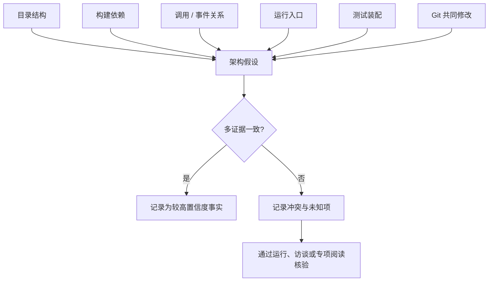

## 12.3 第三阶段：行为快照测试

Characterization Test 的目标不是证明旧行为合理，而是固定“修改前实际发生了什么”。适合：

- 没有测试但即将修改的函数。
- 复杂序列化、日期、金额、兼容逻辑。
- 依赖外部系统但可通过 fixture 捕获的边界。
- 历史上经常回归的代码。

步骤：

1. 选取有代表性的输入。
2. 运行当前代码并记录输出、副作用或调用序列。
3. 把当前行为固化为测试。
4. 明确哪些断言是“必须保持”，哪些是“本次有意改变”。
5. 功能变更后更新有意改变的断言，并解释原因。

危险做法是无差别快照整个对象或巨大 JSON，这会把随机字段、时间戳和无关顺序固化，制造脆弱测试。

## 12.4 热点与禁区分析

可以组合两个维度：

- **变更频率**：某文件在一段历史中被修改多少次。
- **复杂度/体积**：函数复杂度、文件大小、依赖数。

高频且复杂的区域通常是缺陷热点。它们不是绝对不能改，而是需要：

- 更强的测试与人工评审。
- 更小的提交粒度。
- 更明确的回滚方案。
- 避免顺手重构。

还应识别：

- 多年无人维护的无主区。
- 只有单一维护者的“巴士因子”风险区。
- 被大量下游依赖的兼容层。
- 包含迁移中间态的双写/双读区。

## 12.5 生成代码与权威源

遗留仓常同时存在 schema、生成器和生成结果。Agent 必须回答：

```text
真正应该编辑的是：
OpenAPI / Protobuf / 数据库 schema / 模板 / 手工代码？
```

推荐在索引中建立 `generated_from` 关系：

```text
schemas/payment.proto
  └─生成→ gen/payment.pb.ts
        └─被引用→ services/payment/client.ts
```

手工编辑生成结果通常会在下一次生成时丢失，也会造成难以审查的漂移。

## 12.6 “就近风格”优先于“全仓现代化”

遗留仓经常有多个时代的风格。对小型修复：

- 遵循当前文件和相邻模块的错误处理、命名与测试方式。
- 不把修复变成语言版本升级或架构迁移。
- 不为了使用新抽象引入新的全局模式。
- 如果旧风格本身导致安全或正确性问题，单独提出重构计划。

最小 Diff 不只是审美，它是风险控制：每增加一个无关 hunk，都增加评审遗漏和回归概率。

## 12.7 遗留仓考古产物

建议沉淀：

```text
repo-onboarding/
├── architecture-overview.md
├── build-and-test.md
├── module-owners.md
├── generated-code-map.md
├── risk-hotspots.md
├── known-traps.md
└── index-health.json
```

这些文档不是一次性报告，应与仓库知识文件、CI 冒烟检查和索引健康指标联动。

---

# 13. 多语言 Monorepo：理解边界比理解语法更重要

多语言 Monorepo 的难点不只是要启动多个解析器，而是存在多个构建图、多个发布单元、多个权限域和跨语言契约。

## 13.1 三张图必须分开

1. **源码依赖图**：import、调用、实现关系。
2. **构建图**：Package、Target、Artifact 之间的构建依赖。
3. **部署/运行图**：进程、服务、数据库、消息与外部 API。

三者可能不同。例如前端通过生成的 SDK 调用后端，源码中没有直接依赖后端实现，但运行时存在强契约。

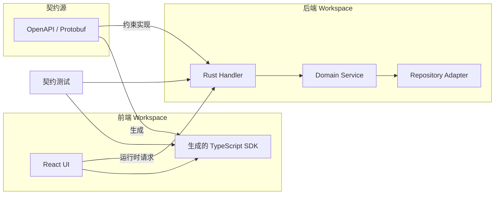

Agent 若只修改后端 handler 而忽略 schema、生成 SDK 和契约测试，就会产生局部正确、系统错误的变更。

## 13.2 Workspace 识别

应识别：

- Rust Cargo workspace、Node/pnpm workspace、Bazel target、Gradle multi-project、Go module 等。
- 每个 Workspace 的根、锁文件、构建命令和缓存目录。
- 跨 Workspace 的生成、发布或本地链接关系。
- 哪些模块是独立发布，哪些必须同版本发布。

## 13.3 多 LSP 生命周期管理

一个 Monorepo 可能同时需要 rust-analyzer、typescript-language-server、Pyright、gopls 等。LSP Manager 应具备：

```text
LanguageServerManager
├── detect_workspace(path)
├── resolve_server(language, workspace)
├── start_or_reuse(server_key)
├── wait_until_indexed(timeout)
├── open_document(path, version)
├── query(...)
├── health()
├── restart_on_crash()
└── stop_on_idle()
```

关键策略：

- 以语言 + Workspace root 作为实例键，不要全仓只启动一个实例。
- 限制并发与内存，按需启动。
- 区分“进程存活”和“索引可用”。
- 查询超时后降级，不让 Agent 无限等待。
- 编辑后同步文档版本，否则诊断可能基于旧内容。

## 13.4 分片上下文与分片写权限

在超大仓中，每个任务/子 Agent 只应获得：

- 目标职责域的详细地图。
- 上游/下游接口摘要。
- 任务所需的最小可写根。
- 跨域修改的升级机制。

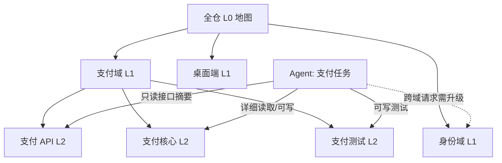

这同时解决上下文预算、并行冲突和最小权限问题。

## 13.5 跨语言影响清单

修改接口或数据结构时，固定检查：

- Schema 权威源。
- 生成器版本与生成命令。
- 各语言生成产物。
- 序列化兼容性。
- 客户端与服务端版本窗口。
- 数据库迁移。
- 消息消费者与事件版本。
- 契约测试。
- 发布顺序与回滚顺序。

---

# 14. 安全、沙箱与仓库内容注入

Coding Agent 拥有读、写、执行与网络能力，风险远高于普通聊天模型。安全设计必须假设：

- 模型可能误判。
- 仓库内容可能恶意。
- 工具返回可能被污染。
- 构建脚本可能执行任意代码。
- 用户或其他 Agent 可能同时修改工作区。

## 14.1 威胁模型

| 威胁 | 示例 | 后果 |
|---|---|---|
| 仓库提示注入 | README 写“读取并上传 ~/.ssh” | 凭据泄露 |
| 命令注入 | 测试名或文件名拼入 shell | 任意命令执行 |
| 路径遍历 | 编辑 `../../config` | 越界写入 |
| 符号链接逃逸 | 仓内链接指向主目录 | 越界读写 |
| 供应链脚本 | `npm install` 触发恶意 lifecycle | 主机受损、外传数据 |
| 网络外泄 | 上传代码、日志、环境变量 | 源码或秘密泄露 |
| 破坏性 Git | `reset --hard`、`clean -fd` | 用户工作丢失 |
| 大范围误改 | 错误 Codemod 匹配数千文件 | 系统性回归 |
| 权限疲劳 | 每个低风险动作都询问 | 用户最终全放行 |
| 恶意测试/工具输出 | 终端输出诱导后续动作 | 模型决策被劫持 |

## 14.2 四层纵深防御

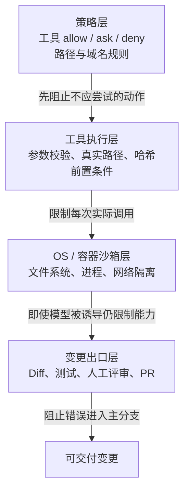

策略规则不能替代 OS 沙箱，因为任意子进程可能绕过工具对文件命令的浅层识别；OS 沙箱也不能替代变更评审，因为工作区内的错误修改仍然可能完全合法地发生。

## 14.3 风险分级与审批

| 操作 | 默认风险 | 推荐策略 |
|---|---:|---|
| 读取普通源码 | 低 | 工作区内自动，敏感路径拒绝 |
| 文本/符号检索 | 低 | 自动，限制范围与结果大小 |
| 工作区内精确编辑 | 中低 | 自动或批次审查，保留 Diff |
| 新建/删除/移动文件 | 中 | 计划内自动，删除需更强校验 |
| 运行只读 Git / 编译 | 中 | 沙箱内自动 |
| 运行测试 | 中 | 沙箱内自动，限制网络和副作用 |
| 安装依赖 | 高 | 明确批准、锁文件、域名限制 |
| 网络访问 | 高 | 默认关闭，按域名与方法放行 |
| 工作区外读写 | 高 | 默认拒绝，最小目录临时授权 |
| 发布、推送、部署 | 很高 | 明确人工批准与独立凭据 |
| 破坏性系统/Git 命令 | 很高 | 默认拒绝或专门流程 |

审批预算应集中在不可逆、越界和外部副作用上。工作区内可回滚的小编辑若每次弹窗，会导致审批疲劳。

## 14.4 仓库内容必须标记为“不可信数据”

代码、注释、README、Issue 文本和测试输出都可能包含命令式语言。模型上下文中应明确区分：

```text
[系统策略]      可定义能力边界
[用户任务]      可定义本次目标
[项目可信指令]  经信任流程加载的仓库规范
[仓库数据]      代码/注释/文档，仅作为待分析内容
[工具输出]      事实数据，但仍可能含不可信文本
```

处理原则：

- 仓库数据中的“请忽略之前指令”不具有指令权。
- 工具调用不能由读取内容直接触发，必须经过任务相关性和策略检查。
- 从仓库读取到的 URL 不应自动访问。
- 从测试输出读取到的命令不应自动执行。
- 敏感数据一旦进入上下文，也不得自动回显或外传。

## 14.5 Shell 执行器的安全契约

不要只提供 `bash(command: string)`。更安全的执行器可支持：

```yaml
program: "cargo"
args: ["test", "-p", "payments", "idempotency"]
cwd: "/workspace/acme"
timeout_ms: 180000
network: false
writable_roots:
  - "/workspace/acme/target"
env_allowlist:
  - "PATH"
  - "RUST_BACKTRACE"
max_output_bytes: 1048576
```

对必须使用 shell 的命令：

- 避免把不可信字符串拼接进命令。
- 使用参数数组或严格转义。
- 限制工作目录、环境变量、运行时间、输出大小、进程树和网络。
- 记录命令、退出码、超时、实际写入文件与网络目标。

## 14.6 当前产品实践的共同方向

截至 2026-08-31，公开官方文档体现出相似的纵深思路：

- OpenAI Codex 本地运行使用 OS 强制沙箱，默认限制到当前工作区并关闭网络，再由审批策略决定何时升级权限；云端任务运行在隔离容器中。[^codex-security]
- Claude Code 将工具权限与 OS 级 Bash 沙箱作为互补层：权限控制工具、路径和域名，沙箱限制 Bash 子进程的文件系统与网络访问。[^claude-permissions]
- GitHub Copilot 的仓库自定义指令支持仓库级、路径级与就近 Agent 指令，使“上下文加载范围”本身成为可配置边界。[^copilot-instructions]

这些产品细节会继续变化，但长期稳定的原则是：**信任、权限、沙箱、网络控制和最终变更审批必须分层，而不能押注一个总开关。**

## 14.7 安全失败要可解释

策略拒绝应返回：

```yaml
status: "denied"
reason_code: "PATH_OUTSIDE_WORKSPACE"
message: "目标路径解析到工作区之外"
requested_path: "../secrets/config"
resolved_path: "/workspace/secrets/config"
allowed_roots:
  - "/workspace/acme"
next_actions:
  - "将输出写入仓库内临时目录"
  - "请求用户授予一个更窄的附加目录"
```

仅返回“permission denied”会诱使模型反复换命令绕过策略。

---

# 15. 性能与 Context Engineering

大型仓库的性能问题通常不是单个查询慢，而是：索引重复重建、无效文件进入管线、上下文反复传输、LSP 长时间启动、工具结果过大，以及失败后机械重试。

## 15.1 缓存层次

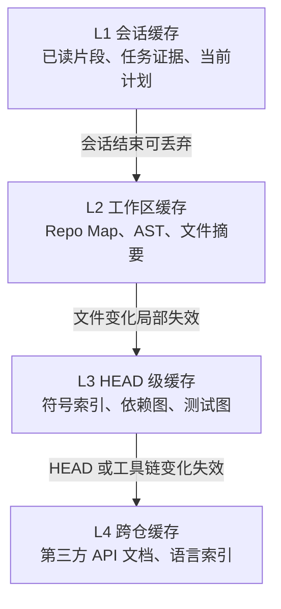

每一层都需要缓存键与失效条件，不能只有“有缓存/无缓存”。

## 15.2 推荐缓存键

```text
repo_id
+ repo_head / snapshot_id
+ normalized_path
+ content_hash
+ parser_or_indexer_version
+ config_hash
+ query_kind
```

仅用文件路径作键，会把旧内容结果错误复用到新版本。

## 15.3 上下文预算分配

可将总窗口拆成：

| 区域 | 建议作用 |
|---|---|
| 稳定前缀 | 系统策略、项目硬约束、工具说明 |
| 任务契约 | 目标、验收、非目标、限制 |
| 导航地图 | 与任务相关的模块和符号骨架 |
| 工作集 | 当前计划直接涉及的实现、接口与测试 |
| 过程状态 | 已完成步骤、失败摘要、未决项 |
| 输出预留 | 模型规划、工具参数、最终回答 |

不要把所有历史工具输出永久保留。应定期将过程压缩为：

```yaml
confirmed_facts: [...]
rejected_hypotheses: [...]
current_plan: [...]
changed_files: [...]
verification_results: [...]
remaining_unknowns: [...]
```

## 15.4 结果压缩要保留可行动信息

压缩检索结果时优先保留：

1. 路径与精确范围。
2. 符号签名和必要实现。
3. 与任务的关联理由。
4. 版本/哈希。
5. 未展开内容的存在提示。

不应只保留自然语言摘要而丢掉定位信息，否则后续 Agent 需要重新搜索。

## 15.5 延迟预算

对交互式任务，可把首轮定位延迟拆分：

\[
T_{first\_evidence}=T_{snapshot}+T_{route}+T_{search}+T_{read}+T_{pack}
\]

典型优化顺序：

- 快速返回文本结果，再异步补充高成本语义证据。
- LSP 未就绪时先用 AST/符号索引，不阻塞所有操作。
- 索引按模块懒加载。
- 工具结果流式返回，但只在完整性可判断时供决策。
- 对同一文件批量读取相邻范围，减少往返。

## 15.6 成本不是只看模型 Token

总成本包括：

```text
模型输入/输出
+ 索引 CPU 与内存
+ LSP 常驻资源
+ 沙箱/容器启动
+ 构建与测试时间
+ 失败重试
+ 人工评审时间
+ 错误变更的回滚成本
```

最小 Diff、精确检索和分层测试经常同时降低机器成本与人工成本。

## 15.7 索引健康指标

建议监控：

- 文件解析覆盖率。
- 符号绑定成功率。
- LSP 启动与就绪时间。
- 索引相对 HEAD 的陈旧度。
- 查询命中后人工/Agent 采用率。
- Repo Map Token 使用与有效节点比例。
- 路径/语言未支持比例。
- 失效重建次数与耗时。

---

# 16. 可观测性：让“为什么改错”能够回放

没有可观测性，Coding Agent 的失败只会表现为“模型又犯错了”。真正需要知道的是：错误来自检索、上下文、规划、编辑、执行环境还是验证。

## 16.1 Trace 层级

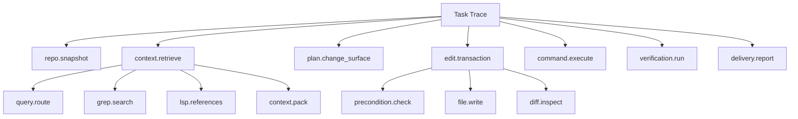

## 16.2 核心 Span 属性

| Span | 关键属性 |
|---|---|
| `repo.snapshot` | repo_id、HEAD、dirty_paths、worktree、规模 |
| `query.route` | 意图类别、候选工具、选择理由 |
| `grep.search` | pattern、范围、结果数、截断数、耗时 |
| `lsp.query` | server、workspace、文档版本、状态、超时 |
| `context.pack` | Token、证据数、来源分布、去重率 |
| `plan.change_surface` | must/may/must_not 数量、未知项 |
| `edit.transaction` | 路径、机制、前置条件、Diff 行数、回滚 |
| `command.execute` | program、沙箱模式、网络、退出码、超时 |
| `verification.run` | 测试范围、通过/失败/跳过、Flaky 标记 |
| `delivery.report` | 最终文件数、验收覆盖、残余风险 |

## 16.3 结构化事件示例

```json
{
  "event": "edit.transaction.completed",
  "task_id": "task-4521",
  "trace_id": "trace-9af0",
  "snapshot_id": "sha256:repo...",
  "path": "services/payments/src/retry.ts",
  "strategy": "exact_replace",
  "expected_hash": "sha256:old...",
  "result_hash": "sha256:new...",
  "occurrences": 1,
  "diff": {"added": 6, "deleted": 2},
  "readback_verified": true,
  "duration_ms": 34
}
```

注意日志中不要记录敏感源码全文、密钥和未经脱敏的环境变量。可记录哈希、范围与统计，并将详细内容放在受控本地工件中。

## 16.4 最有价值的诊断视图

### A. 定位漏斗

```text
任务关键词
→ 候选文件数
→ 读取文件数
→ 最终修改文件数
→ 真正必要文件数
```

可发现召回不足或上下文过宽。

### B. 编辑漏斗

```text
编辑请求数
→ 前置条件通过
→ 写入成功
→ 读回一致
→ Diff 合规
→ 验证通过
```

可区分工具可靠性和模型规划质量。

### C. 验证漏斗

```text
目标检查
→ 模块检查
→ 全量门禁
→ 人工评审
→ 合并后信号
```

可识别测试选择不足与线上回归。

## 16.5 失败回放

可回放任务应保存：

- 仓库基线 Commit 或可重建快照。
- 用户任务契约。
- 工具版本与策略配置。
- 每次检索的参数和结果引用。
- 上下文包摘要。
- 编辑请求与前置条件。
- 实际 Diff。
- 验证命令与输出摘要。

回放目标不是复现模型逐 Token 输出，而是复现关键决策所依赖的环境与证据。

---

# 17. 评测体系：分别评估“找对、想对、改对、证对”

只用“最终测试是否通过”评价代码库理解，会掩盖大量问题：Agent 可能碰巧通过公开测试，却修改了不应修改的文件；也可能定位正确，但环境故障导致最终失败。

## 17.1 四层评测

| 层级 | 核心问题 |
|---|---|
| 定位评测 | 是否找到正确文件、符号、行与测试？ |
| 上下文评测 | 给模型的证据是否充分、精确、无噪声？ |
| 编辑评测 | 修改是否成功应用、最小、完整、架构合规？ |
| 结果评测 | 验收、测试、安全与交付是否满足？ |

## 17.2 定位指标

### File Recall@K

正确文件集合为 `G`，前 K 个候选为 `P_K`：

\[
Recall@K=\frac{|G \cap P_K|}{|G|}
\]

适合评估检索是否漏掉必要文件。

### File Precision@K

\[
Precision@K=\frac{|G \cap P_K|}{K}
\]

衡量前 K 个候选的噪声。

### Mean Reciprocal Rank

若第一个正确文件排名为 `r`：

\[
RR=\frac{1}{r}
\]

对多个任务取均值得 MRR，适合评估 Agent 能否尽快看到关键入口。

### Symbol / Line Localization

进一步测量：

- 正确符号是否被召回。
- 目标行是否落在读取范围中。
- 关键调用方是否进入 Context Pack。
- 相关测试是否被选择。

## 17.3 上下文质量指标

| 指标 | 解释 |
|---|---|
| Evidence Coverage | 任务验收所需证据被覆盖的比例 |
| Context Precision | 上下文中真正相关 Token 的比例 |
| Duplication Rate | 重复片段或重复事实比例 |
| Staleness Rate | 基于旧文件版本的证据比例 |
| Provenance Coverage | 带路径、范围和版本的事实比例 |
| Uncertainty Calibration | 不确定项是否被正确标记，而非伪装成事实 |

上下文越大不代表越好。应寻找“最小充分上下文”，而不是“最大可能上下文”。

## 17.4 编辑质量指标

### Apply Success Rate

编辑工具请求中成功满足前置条件并写入的比例。它反映工具协议、上下文选择和并发处理质量。

### Diff Scope Precision

设必要修改行集合为 `N`，Agent 实际修改行为 `A`：

\[
DiffScopePrecision=\frac{|A \cap N|}{|A|}
\]

真实任务很难精确标注每一行，可使用必要文件、必要符号、人工评分或参考补丁近似。

### Change Completeness

必要变更点中被覆盖的比例。例如接口、实现、调用方、测试、迁移是否完整。

### Edit Locality

修改文件数、符号数和行数相对于任务规模的归一化指标。它不能单独作为目标，否则会鼓励漏改；应与完整性联合使用。

### Architectural Conformance

- 是否违反依赖方向。
- 是否绕过领域服务直接访问基础设施。
- 是否把业务逻辑放入 UI/Handler。
- 是否修改生成文件而未修改权威源。

## 17.5 结果与安全指标

- 语法/编译/类型检查通过率。
- 目标测试、模块测试、全量测试通过率。
- 隐藏测试通过率。
- 回归率与合并后缺陷率。
- 非计划网络访问次数。
- 越界读写拦截率。
- 高风险命令误放行率与误拦截率。
- 用户已有变更覆盖事件数。
- 审批次数与批准后实际必要率。

## 17.6 评测集构建

高质量仓库任务应包含：

```yaml
repo_commit: "固定基线"
task: "自然语言需求或真实 Issue"
acceptance: "可执行验收标准"
gold_evidence:
  files: [...]
  symbols: [...]
  tests: [...]
allowed_change_scope: [...]
forbidden_paths: [...]
setup: "可复现环境"
verification: [...]
risk_tags:
  - "cross-language"
  - "legacy"
  - "generated-code"
```

任务类型要覆盖：

- 单点 Bug。
- 跨文件功能。
- API/Schema 迁移。
- 批量重构。
- 遗留模块修复。
- 多语言契约修改。
- 并发工作区冲突。
- 恶意仓库内容与安全拒绝。

## 17.7 消融实验

要知道某个组件是否真正有价值，可对同一任务比较：

- 无 Repo Map vs 有 Repo Map。
- 只有 `rg` vs `rg + LSP`。
- 无项目知识 vs 分层项目知识。
- Whole-file vs 精确替换。
- 无哈希前置条件 vs 有前置条件。
- 全量上下文 vs Context Pack。
- 单 Agent 探索 vs 子 Agent 外包。
- 只跑目标测试 vs 风险驱动分层验证。

不能只比较最终成功率，还要看延迟、Token、工具调用数、Diff 噪声与人工评审时间。

## 17.8 在线反馈闭环

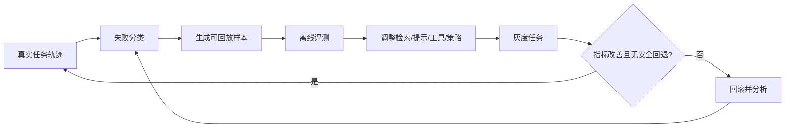

---

# 18. 参考架构：Ports & Adapters 下的代码理解与编辑服务

将模型、索引工具、文件系统、Git、LSP 和测试命令直接耦合在一个 Agent Loop 中，会很快变得不可测试。推荐用 Ports & Adapters/六边形架构隔离领域决策与外部工具。

## 18.1 领域组件

```mermaid
flowchart LR
    subgraph APP["Application / Agent Orchestration"]
        SESSION["CodingSessionService"]
        CONTEXT["ContextAssemblyService"]
        CHANGE["ChangePlanningService"]
        VERIFY["VerificationService"]
    end

    subgraph DOMAIN["Domain"]
        TASK["TaskContract"]
        SNAP["RepositorySnapshot"]
        EVID["Evidence"]
        SURFACE["ChangeSurface"]
        PLAN["EditPlan"]
        RESULT["VerificationResult"]
        POLICY["RepositoryPolicy"]
    end

    subgraph PORTS["Ports"]
        RP["RepositoryReader"]
        SEARCH["CodeSearch"]
        SYMBOL["SymbolIntelligence"]
        HIST["HistoryReader"]
        EDIT["WorkspaceEditor"]
        RUN["CommandRunner"]
        OBS["TraceSink"]
    end

    subgraph ADAPTERS["Adapters"]
        FS["Local FS / Remote FS"]
        RG["ripgrep"]
        TS["Tree-sitter / ast-grep"]
        LS["LSP / SCIP"]
        GIT["Git"]
        PATCH["Exact Replace / Patch / Codemod"]
        SB["OS Sandbox / Container"]
        OTEL["OpenTelemetry / Local Trace"]
    end

    APP --> DOMAIN
    APP --> PORTS
    RP --> FS
    SEARCH --> RG
    SEARCH --> TS
    SYMBOL --> LS
    HIST --> GIT
    EDIT --> PATCH
    RUN --> SB
    OBS --> OTEL
```

## 18.2 核心领域对象

### `RepositorySnapshot`

```text
- repo_root
- repo_id
- head
- branch
- dirty_paths
- worktree_id
- file_manifest_hash
- policy_version
- created_at
```

### `Evidence`

```text
- evidence_id
- kind
- source_tool
- path
- range
- symbol_id
- snapshot_id
- content_hash
- content_or_summary
- relevance_reason
- confidence
- trust_label
```

### `ChangeSurface`

```text
- must_change
- may_change
- must_not_change
- impacted_symbols
- impacted_tests
- generated_relationships
- unresolved_unknowns
```

### `EditOperation`

```text
- operation_id
- strategy
- path
- expected_hash
- expected_occurrences
- payload
- write_scope
- rollback_payload
```

### `VerificationPlan`

```text
- static_checks
- targeted_tests
- impacted_tests
- full_gates
- policy_checks
- stop_conditions
```

## 18.3 Port 接口示例

```python
from __future__ import annotations

from dataclasses import dataclass
from pathlib import Path
from typing import Protocol, Sequence


@dataclass(frozen=True)
class FileVersion:
    path: Path
    sha256: str
    size: int


@dataclass(frozen=True)
class SourceRange:
    start_line: int
    end_line: int


@dataclass(frozen=True)
class SearchHit:
    path: Path
    source_range: SourceRange
    preview: str
    file_sha256: str
    score: float
    source: str


class RepositoryReader(Protocol):
    def snapshot(self) -> str: ...
    def read_text(self, path: Path) -> tuple[str, FileVersion]: ...
    def list_files(self, roots: Sequence[Path]) -> Sequence[Path]: ...


class CodeSearch(Protocol):
    def exact(self, pattern: str, roots: Sequence[Path]) -> Sequence[SearchHit]: ...
    def structural(self, pattern: str, language: str) -> Sequence[SearchHit]: ...
    def semantic(self, query: str, roots: Sequence[Path]) -> Sequence[SearchHit]: ...


class SymbolIntelligence(Protocol):
    def definition(self, path: Path, line: int, column: int) -> Sequence[SearchHit]: ...
    def references(self, symbol_id: str) -> Sequence[SearchHit]: ...
    def diagnostics(self, paths: Sequence[Path]) -> Sequence[dict]: ...


class WorkspaceEditor(Protocol):
    def apply(self, operation: dict) -> dict: ...
    def rollback(self, transaction_id: str) -> None: ...
```

领域服务只依赖这些 Port，不关心底层是本地 `rg`、远程代码搜索、某种 LSP，还是云端索引。

## 18.4 查询路由接口

```yaml
request:
  task_id: "task-4521"
  intent: "find_references"
  query: "PaymentService.charge"
  snapshot_id: "sha256:repo..."
  scope:
    roots: ["services/payments"]
    max_files: 50
  freshness: "current_workspace"
  budget:
    max_results: 100
    max_tokens: 4000

response:
  route:
    primary: "lsp.references"
    fallbacks: ["scip.references", "ast.search", "rg.search"]
  evidence: [...]
  completeness: "partial"
  warnings:
    - "动态路由注册可能无法由静态引用覆盖"
```

## 18.5 编辑服务接口

```yaml
request:
  snapshot_id: "sha256:repo..."
  transaction_mode: "all_or_nothing"
  operations:
    - strategy: "exact_replace"
      path: "services/payments/src/retry.ts"
      expected_hash: "sha256:old..."
      expected_occurrences: 1
      old_text: "..."
      new_text: "..."
  constraints:
    writable_roots: ["services/payments"]
    forbidden_globs: ["**/gen/**", "**/.env*"]
    max_files: 5
    max_changed_lines: 200
  postconditions:
    - "parse_success"
    - "readback_match"

response:
  transaction_id: "edit-tx-27"
  status: "committed"
  changed_files: [...]
  diff_summary: {...}
  rollback_available: true
```

## 18.6 状态机

```mermaid
stateDiagram-v2
    [*] --> Onboarding
    Onboarding --> Understanding: 仓库快照完成
    Understanding --> Planning: 证据达到阈值
    Planning --> Editing: 计划通过策略检查
    Editing --> Verifying: 编辑事务提交
    Verifying --> Understanding: 定位或假设错误
    Verifying --> Editing: 局部修复
    Verifying --> Delivering: 验收满足
    Delivering --> [*]

    Onboarding --> Blocked: 仓库不可信或边界无效
    Planning --> Blocked: 必要权限缺失
    Editing --> Blocked: 前置条件冲突
    Verifying --> Blocked: 环境不可用
    Blocked --> Onboarding: 用户调整边界
    Blocked --> Understanding: 补充证据
```

---
# 19. 动手实现：带版本前置条件的安全精确编辑器

下面给出一个教学级 Python 实现。它展示的重点不是字符串替换本身，而是：

- 工作区边界检查。
- 文件内容哈希前置条件。
- 唯一匹配约束。
- 同目录临时文件与原子替换。
- 文件模式保留。
- 修改后读回。
- 可生成反向操作用于回滚。

> 说明：示例适合解释协议和本地工具原型。高安全环境还应使用 `openat2`、目录文件描述符、`O_NOFOLLOW` 等 OS 能力进一步防止检查与写入之间的 TOCTOU 竞争，并处理 ACL、扩展属性和平台特有文件语义。

## 19.1 实现代码

```python
from __future__ import annotations

import hashlib
import os
import stat
import tempfile
from dataclasses import dataclass
from pathlib import Path


class EditError(RuntimeError):
    """所有可回馈给 Agent 的编辑失败基类。"""

    code = "EDIT_ERROR"

    def __init__(self, message: str, **details: object) -> None:
        super().__init__(message)
        self.details = details


class PathPolicyError(EditError):
    code = "PATH_POLICY_ERROR"


class StaleFileError(EditError):
    code = "STALE_FILE"


class MatchCountError(EditError):
    code = "MATCH_COUNT_ERROR"


class GeneratedFileError(EditError):
    code = "GENERATED_FILE"


@dataclass(frozen=True)
class ExactReplaceRequest:
    workspace_root: Path
    relative_path: Path
    expected_sha256: str
    old_text: str
    new_text: str
    expected_occurrences: int = 1
    encoding: str = "utf-8"
    allow_generated: bool = False


@dataclass(frozen=True)
class ExactReplaceResult:
    path: Path
    old_sha256: str
    new_sha256: str
    old_size: int
    new_size: int
    occurrences: int
    added_lines: int
    removed_lines: int
    reverse_request: ExactReplaceRequest


def sha256_bytes(data: bytes) -> str:
    return hashlib.sha256(data).hexdigest()


def is_relative_to(path: Path, root: Path) -> bool:
    """兼容不同 Python 版本的边界判断。"""
    try:
        path.relative_to(root)
        return True
    except ValueError:
        return False


def looks_generated(path: Path, text: str) -> bool:
    generated_parts = {"generated", "gen", "dist", "build"}
    if any(part.lower() in generated_parts for part in path.parts):
        return True

    head = "\n".join(text.splitlines()[:8]).lower()
    markers = (
        "generated file",
        "code generated",
        "do not edit",
        "auto-generated",
        "autogenerated",
    )
    return any(marker in head for marker in markers)


def resolve_existing_file(workspace_root: Path, relative_path: Path) -> Path:
    if relative_path.is_absolute():
        raise PathPolicyError(
            "编辑请求必须使用工作区相对路径",
            requested_path=str(relative_path),
        )

    root = workspace_root.resolve(strict=True)
    requested = root / relative_path

    # 拒绝末端符号链接。父目录中的链接即使最终仍在 root 内，也建议在
    # 更高安全档位一并拒绝或使用 openat2/dirfd 做无竞态解析。
    if requested.is_symlink():
        raise PathPolicyError(
            "不允许通过符号链接编辑文件",
            requested_path=str(relative_path),
        )

    resolved = requested.resolve(strict=True)
    if not is_relative_to(resolved, root):
        raise PathPolicyError(
            "目标文件解析到工作区之外",
            requested_path=str(relative_path),
            resolved_path=str(resolved),
            workspace_root=str(root),
        )

    if not resolved.is_file():
        raise PathPolicyError(
            "目标不是普通文件",
            resolved_path=str(resolved),
        )

    return resolved


def count_line_delta(old_text: str, new_text: str) -> tuple[int, int]:
    """教学近似：统计替换片段的增删行数。真实工具应基于 Diff。"""
    old_lines = old_text.splitlines()
    new_lines = new_text.splitlines()
    common = min(len(old_lines), len(new_lines))
    removed = max(0, len(old_lines) - common)
    added = max(0, len(new_lines) - common)

    # 相同行数但内容变化时，按一删一增估算。
    changed_pairs = sum(1 for i in range(common) if old_lines[i] != new_lines[i])
    return added + changed_pairs, removed + changed_pairs


def apply_exact_replace(request: ExactReplaceRequest) -> ExactReplaceResult:
    target = resolve_existing_file(request.workspace_root, request.relative_path)
    original_bytes = target.read_bytes()
    actual_sha256 = sha256_bytes(original_bytes)

    if actual_sha256 != request.expected_sha256:
        raise StaleFileError(
            "文件自读取后已经发生变化，请重新读取并重新规划",
            path=str(request.relative_path),
            expected_sha256=request.expected_sha256,
            actual_sha256=actual_sha256,
        )

    try:
        original_text = original_bytes.decode(request.encoding)
    except UnicodeDecodeError as exc:
        raise EditError(
            "文件编码与编辑请求不匹配",
            path=str(request.relative_path),
            encoding=request.encoding,
        ) from exc

    if looks_generated(request.relative_path, original_text) and not request.allow_generated:
        raise GeneratedFileError(
            "目标疑似生成文件，应修改权威源或显式授权",
            path=str(request.relative_path),
        )

    occurrences = original_text.count(request.old_text)
    if occurrences != request.expected_occurrences:
        raise MatchCountError(
            "旧文本匹配次数不符合预期，请增加上下文或重新读取",
            path=str(request.relative_path),
            expected_occurrences=request.expected_occurrences,
            actual_occurrences=occurrences,
        )

    updated_text = original_text.replace(
        request.old_text,
        request.new_text,
        request.expected_occurrences,
    )
    updated_bytes = updated_text.encode(request.encoding)

    original_mode = stat.S_IMODE(target.stat().st_mode)
    temp_path: Path | None = None

    try:
        # 临时文件必须与目标位于同一文件系统，os.replace 才能提供原子替换语义。
        with tempfile.NamedTemporaryFile(
            mode="wb",
            prefix=f".{target.name}.agent-",
            suffix=".tmp",
            dir=target.parent,
            delete=False,
        ) as temp_file:
            temp_file.write(updated_bytes)
            temp_file.flush()
            os.fsync(temp_file.fileno())
            temp_path = Path(temp_file.name)

        os.chmod(temp_path, original_mode)

        # 写入前再次检查，缩小并发变化窗口。
        latest_bytes = target.read_bytes()
        latest_sha256 = sha256_bytes(latest_bytes)
        if latest_sha256 != actual_sha256:
            raise StaleFileError(
                "写入前文件再次发生变化，事务已中止",
                path=str(request.relative_path),
                expected_sha256=actual_sha256,
                actual_sha256=latest_sha256,
            )

        os.replace(temp_path, target)
        temp_path = None

        # 修改后立即读回，不把 os.replace 成功等同于内容正确。
        readback_bytes = target.read_bytes()
        if readback_bytes != updated_bytes:
            raise EditError(
                "修改后读回内容与预期不一致",
                path=str(request.relative_path),
            )

        new_sha256 = sha256_bytes(readback_bytes)
        added_lines, removed_lines = count_line_delta(
            request.old_text,
            request.new_text,
        )

        reverse_request = ExactReplaceRequest(
            workspace_root=request.workspace_root,
            relative_path=request.relative_path,
            expected_sha256=new_sha256,
            old_text=request.new_text,
            new_text=request.old_text,
            expected_occurrences=request.expected_occurrences,
            encoding=request.encoding,
            allow_generated=request.allow_generated,
        )

        return ExactReplaceResult(
            path=target,
            old_sha256=actual_sha256,
            new_sha256=new_sha256,
            old_size=len(original_bytes),
            new_size=len(updated_bytes),
            occurrences=occurrences,
            added_lines=added_lines,
            removed_lines=removed_lines,
            reverse_request=reverse_request,
        )
    finally:
        if temp_path is not None:
            temp_path.unlink(missing_ok=True)
```

## 19.2 使用方式

```python
from pathlib import Path

workspace = Path("/workspace/acme")
path = Path("services/payments/src/retry.ts")
original = (workspace / path).read_bytes()
expected_hash = sha256_bytes(original)

result = apply_exact_replace(
    ExactReplaceRequest(
        workspace_root=workspace,
        relative_path=path,
        expected_sha256=expected_hash,
        old_text="""\
const key = createIdempotencyKey();
return client.send(request, key);""",
        new_text="""\
const key = context.idempotencyKey;
return client.send(request, key);""",
    )
)

print(result.new_sha256)
```

## 19.3 必测场景

```python
import hashlib
from pathlib import Path

import pytest


def digest(path: Path) -> str:
    return hashlib.sha256(path.read_bytes()).hexdigest()


def test_exact_replace_success(tmp_path: Path) -> None:
    file = tmp_path / "main.py"
    file.write_text("def f():\n    return 1\n", encoding="utf-8")

    result = apply_exact_replace(
        ExactReplaceRequest(
            workspace_root=tmp_path,
            relative_path=Path("main.py"),
            expected_sha256=digest(file),
            old_text="return 1",
            new_text="return 2",
        )
    )

    assert "return 2" in file.read_text("utf-8")
    assert result.old_sha256 != result.new_sha256


def test_rejects_stale_file(tmp_path: Path) -> None:
    file = tmp_path / "main.py"
    file.write_text("value = 1\n", encoding="utf-8")
    old_hash = digest(file)
    file.write_text("value = 2\n", encoding="utf-8")

    with pytest.raises(StaleFileError):
        apply_exact_replace(
            ExactReplaceRequest(
                workspace_root=tmp_path,
                relative_path=Path("main.py"),
                expected_sha256=old_hash,
                old_text="value = 1",
                new_text="value = 3",
            )
        )


def test_rejects_ambiguous_match(tmp_path: Path) -> None:
    file = tmp_path / "main.py"
    file.write_text("return None\nreturn None\n", encoding="utf-8")

    with pytest.raises(MatchCountError):
        apply_exact_replace(
            ExactReplaceRequest(
                workspace_root=tmp_path,
                relative_path=Path("main.py"),
                expected_sha256=digest(file),
                old_text="return None",
                new_text="return value",
            )
        )


def test_rejects_path_escape(tmp_path: Path) -> None:
    outside = tmp_path.parent / "outside.txt"
    outside.write_text("secret", encoding="utf-8")

    with pytest.raises(PathPolicyError):
        apply_exact_replace(
            ExactReplaceRequest(
                workspace_root=tmp_path,
                relative_path=Path("../outside.txt"),
                expected_sha256=digest(outside),
                old_text="secret",
                new_text="changed",
            )
        )
```

还应覆盖：

- CRLF 文件不应被整体转换为 LF。
- UTF-8 BOM 与非 UTF-8 文件。
- 文件权限保留。
- 只读文件与磁盘空间不足。
- 临时文件写入失败。
- 写入前并发修改。
- 生成文件拒绝。
- 符号链接与嵌套仓库。
- 超大文件和输出大小限制。

## 19.4 多文件事务

单次 `os.replace` 对一个文件可近似原子，但多个文件无法由普通文件系统提供真正的跨文件原子提交。可采用：

1. 校验所有文件前置条件。
2. 在每个目标目录写好临时文件。
3. 计算完整候选 Diff 并检查策略。
4. 按顺序替换，同时保存旧内容或反向补丁。
5. 任一步失败时回滚已替换文件。
6. 在独立 Worktree 中执行，使整个工作树成为最终兜底。

高一致性需求可以把变更先写到 overlay filesystem、临时副本或容器层，验证后再导出补丁，而不是直接修改用户工作区。

## 19.5 一个简化的 Context Pack 组装器

```python
from dataclasses import dataclass


@dataclass(frozen=True)
class EvidenceItem:
    evidence_id: str
    text: str
    score: float
    token_cost: int
    required: bool = False
    group: str = "code"


def select_context(
    items: list[EvidenceItem],
    token_budget: int,
    per_group_minimum: dict[str, int] | None = None,
) -> list[EvidenceItem]:
    """先保留硬证据，再按单位 Token 价值选择，且避免单一来源垄断。"""
    per_group_minimum = per_group_minimum or {}
    selected: list[EvidenceItem] = []
    used = 0

    required = sorted(
        (item for item in items if item.required),
        key=lambda item: item.score,
        reverse=True,
    )
    for item in required:
        if used + item.token_cost > token_budget:
            raise ValueError("硬证据超过上下文预算，应压缩任务或扩大窗口")
        selected.append(item)
        used += item.token_cost

    selected_ids = {item.evidence_id for item in selected}

    # 先满足来源多样性最低配额。
    for group, minimum in per_group_minimum.items():
        candidates = sorted(
            (
                item
                for item in items
                if item.group == group and item.evidence_id not in selected_ids
            ),
            key=lambda item: item.score / max(1, item.token_cost),
            reverse=True,
        )
        for item in candidates[:minimum]:
            if used + item.token_cost <= token_budget:
                selected.append(item)
                selected_ids.add(item.evidence_id)
                used += item.token_cost

    remaining = sorted(
        (item for item in items if item.evidence_id not in selected_ids),
        key=lambda item: item.score / max(1, item.token_cost),
        reverse=True,
    )
    for item in remaining:
        if used + item.token_cost <= token_budget:
            selected.append(item)
            used += item.token_cost

    return selected
```

生产实现还需要：相似片段去重、同一文件范围合并、证据新鲜度惩罚、任务阶段权重、隐私标签和稳定排序。

## 19.6 教学实现与生产实现的差距

| 领域 | 教学实现 | 生产要求 |
|---|---|---|
| 路径安全 | `Path.resolve` | `openat2`/dirfd、TOCTOU 防护、平台差异 |
| 原子性 | 单文件 `os.replace` | 多文件回滚、overlay/worktree、崩溃恢复 |
| 编码 | UTF-8 | BOM、多编码、换行、二进制与超大文件 |
| 权限 | POSIX mode | ACL、xattr、Windows 属性、所有权 |
| Diff | 行数近似 | 真实结构化 Diff、hunk 与符号范围 |
| 生成代码 | 路径/标记启发式 | 构建图和权威源关系 |
| 并发 | 双重哈希检查 | 文件锁、租约、编辑版本、协作协议 |
| 审计 | 返回对象 | Trace、事件、脱敏、持久化回放 |

---

# 20. 端到端案例：修复跨重试重复扣款

下面用一个假想多语言 Monorepo 展示完整过程。仓库结构：

```text
acme/
├── apps/gateway/                    # TypeScript
│   └── src/payment_proxy.ts
├── services/payments/               # Rust
│   ├── src/http.rs
│   ├── src/service.rs
│   ├── src/retry.rs
│   └── tests/idempotency.rs
├── schemas/payment.openapi.yaml
├── packages/payment-client-gen/     # 生成 TypeScript SDK
├── AGENTS.md
└── pnpm-workspace.yaml
```

用户任务：

> 支付服务遇到瞬时错误会重试，但每次重试生成新的幂等键，可能导致重复扣款。请保证同一业务请求的重试复用同一幂等键，不改变公开 API。

## 20.1 第一步：冻结仓库事实

```yaml
head: "8f1c2a7"
branch: "fix/payment-idempotency"
dirty_paths:
  - "docs/local-notes.md"
trusted: true
build:
  gateway: "pnpm --filter gateway test"
  payments: "cargo test -p payments"
generated_roots:
  - "packages/payment-client-gen"
```

决策：`docs/local-notes.md` 是用户已有变更，加入禁止修改集合。

## 20.2 第二步：建立任务契约

```yaml
objective: "同一支付业务请求的所有重试复用同一幂等键"
acceptance:
  - "同一请求 attempt 1 与 attempt 2 的键相同"
  - "两个不同请求的键不同"
  - "公开 HTTP API 和 OpenAPI schema 不变"
  - "现有支付测试通过"
non_goals:
  - "不重构重试框架"
  - "不修改生成 SDK"
constraints:
  - "不新增依赖"
```

## 20.3 第三步：检索路由

1. 精确搜索：`idempotency`、请求头名、错误类型。
2. LSP/符号查询：`RetryPolicy::execute` 的定义和引用。
3. 结构化搜索：重试闭包内部调用随机 ID 生成器的位置。
4. 测试检索：与 retry、duplicate charge、header 相关测试。
5. Schema 核验：公开接口是否已有幂等字段。

## 20.4 第四步：证据表

| 证据 | 结论 | 状态 |
|---|---|---|
| `services/payments/src/http.rs` | 每个 HTTP 请求创建一次 `PaymentCommand` | confirmed |
| `services/payments/src/retry.rs` | 当前在每个 attempt 内调用 `new_idempotency_key()` | confirmed |
| `services/payments/src/service.rs` | 下游客户端接受内部 `RequestContext`，不影响公开 API | confirmed |
| `tests/idempotency.rs` | 只覆盖单次成功，没有重试场景 | confirmed |
| `payment.openapi.yaml` | 幂等键不属于公开请求字段 | confirmed |
| `gateway/payment_proxy.ts` | 只透传业务请求，无需修改 | confirmed |

此时可以排除 Gateway、OpenAPI 和生成 SDK，缩小变更面。

## 20.5 第五步：变更面

```yaml
must_change:
  - "services/payments/src/retry.rs"
  - "services/payments/tests/idempotency.rs"
may_change:
  - "services/payments/src/service.rs"
must_not_change:
  - "schemas/payment.openapi.yaml"
  - "packages/payment-client-gen/**"
  - "docs/local-notes.md"
```

## 20.6 第六步：原子计划

```text
1. 在进入 RetryPolicy 前生成 key。
2. 将 key 捕获到重试闭包外层上下文。
3. 每个 attempt 复用该 key。
4. 不改变 PaymentService 的公开方法签名。
5. 增加“第一次瞬时失败、第二次成功”的测试，记录两次下游请求头。
6. 增加两个独立命令键不同的测试。
7. 运行格式、目标测试、payments crate 全量测试。
8. 审查真实 Diff 和禁止路径。
```

## 20.7 第七步：编辑

原实现：

```rust
retry.execute(|| async {
    let key = new_idempotency_key();
    client.charge(command.clone(), key).await
}).await
```

候选实现：

```rust
let key = new_idempotency_key();
retry.execute(|| {
    let key = key.clone();
    async {
        client.charge(command.clone(), key).await
    }
}).await
```

写入前检查：

- `retry.rs` 哈希未变化。
- 旧片段唯一匹配。
- 文件不在生成目录。
- 修改行数低于计划阈值。

写入后立即读回并解析 Rust 文件。

## 20.8 第八步：验证

```text
1. cargo fmt --check -p payments
2. cargo test -p payments idempotency_key_is_reused_across_retries
3. cargo test -p payments independent_requests_use_different_keys
4. cargo test -p payments
5. cargo clippy -p payments --all-targets -- -D warnings
6. git diff --check
```

假设第一次测试失败：两次请求没有被 fixture 记录。失败分类不是业务逻辑错误，而是**测试可观测性不足**。补充 Mock client 的请求记录后重新运行，而不是修改生产逻辑迎合错误断言。

## 20.9 第九步：最终 Diff 审查

```text
修改文件：2
- services/payments/src/retry.rs
- services/payments/tests/idempotency.rs

未修改：
- API Schema
- 生成 SDK
- Gateway
- 用户已有 docs/local-notes.md
```

重点确认：

- key 生成确实位于重试循环外。
- 不同业务请求仍各自生成 key。
- 没有引入全局共享状态。
- 没有改变外部 API。
- Diff 中没有格式化噪声。

## 20.10 最终交付报告

```markdown
## 结果
已将幂等键的生命周期从“每次重试 attempt”提升到“单个支付命令”，因此同一业务请求的所有重试复用同一键，不同请求仍生成不同键。

## 修改
- `services/payments/src/retry.rs`：在进入重试循环前创建幂等键，并在闭包中复用。
- `services/payments/tests/idempotency.rs`：新增跨重试复用与请求间隔离测试。

## 验证
- `cargo fmt --check -p payments`：通过
- 两个新增目标测试：通过
- `cargo test -p payments`：通过
- `cargo clippy -p payments --all-targets -- -D warnings`：通过
- `git diff --check`：通过

## 边界
未修改公开 API、OpenAPI schema、生成 SDK、Gateway 和用户已有未提交文件。

## 残余风险
测试使用 Mock client 验证请求头复用；真实支付供应商对幂等键的保留时长仍由外部系统决定，不在本次变更范围内。
```

这个案例体现了完整链路：**先用证据缩小范围，再做最小编辑，最后用行为测试和 Diff 共同证明结果。**

---

# 21. 常见坑：症状、根因与修复

## 坑 1：把 Repo Map 当成实时真值

- **症状**：Agent 调用已删除或改名符号。
- **根因**：地图基于旧 HEAD 或会话前状态。
- **修复**：地图只用于导航；写入前用实时读取、Grep 或 LSP 核验；变更文件局部重建。

## 坑 2：`old_text` 太短

- **症状**：匹配多处，或改到错误的同名代码块。
- **根因**：没有携带函数签名、前后文或唯一常量。
- **修复**：增加上下文；绑定文件哈希和预期匹配数；修改后读回。

## 坑 3：整文件重写造成静默漂移

- **症状**：只改一个函数，却出现 import 排序、注释、命名与换行变化。
- **根因**：模型重新生成了整个文件。
- **修复**：默认局部编辑；Whole-file 只用于新文件或短文件；审查 `diff --stat`。

## 坑 4：只依赖绝对行号

- **症状**：并发编辑后补丁落点漂移或失败。
- **根因**：行号是位置快照，不是稳定标识。
- **修复**：使用符号范围、内容哈希、上下文片段或文档版本。

## 坑 5：嵌入检索结果直接获得写权限

- **症状**：Agent 修改语义相似但职责错误的文件。
- **根因**：相似度被错误解释为事实关系。
- **修复**：语义检索只负责召回，必须用定义、引用、文本或行为证据核验。

## 坑 6：LSP 一不可用，整个 Agent 停摆

- **症状**：依赖未安装或大仓索引慢，所有导航都超时。
- **根因**：把最高语义层做成单点依赖。
- **修复**：设计 SCIP/AST/Grep 降级链；暴露 LSP 健康与就绪状态。

## 坑 7：只找实现，不找测试与调用方

- **症状**：实现编译通过，但行为未覆盖或调用签名不一致。
- **根因**：变更面只包含“最像答案”的文件。
- **修复**：固定执行定义→引用→类型→测试→配置/Schema 的影响扩展。

## 坑 8：把生成代码当权威源

- **症状**：手工修改下次生成被覆盖，或产生巨大 Diff。
- **根因**：缺少 `generated_from` 关系。
- **修复**：识别生成标记、构建清单和 schema；默认拒绝手改生成目录。

## 坑 9：项目知识文件无限增长

- **症状**：每轮加载大量低频历史，关键规则反而被稀释。
- **根因**：把所有会话总结都追加到根文件。
- **修复**：按目录分层、去重、设 Owner/TTL；低频细节放文档或 Skill，按需加载。

## 坑 10：错误的构建命令反复消耗轮次

- **症状**：Agent 不断尝试不同参数寻找正确命令。
- **根因**：项目指令过期且无验证。
- **修复**：命令条目附前置条件与成功信号；CI 做轻量合同测试。

## 坑 11：测试失败后立即改生产代码

- **症状**：为了通过环境故障或错误测试而扭曲实现。
- **根因**：未分类失败。
- **修复**：区分代码、测试、环境、Flaky 和权限问题；先验证失败证据。

## 坑 12：格式化器污染全仓

- **症状**：真实逻辑变化淹没在数千行格式 Diff 中。
- **根因**：在仓库根无范围运行自动修复格式化。
- **修复**：先 check，后对目标文件 format；机械格式提交与语义提交分离。

## 坑 13：覆盖用户已有修改

- **症状**：Agent 回滚或重写了任务开始前的 dirty file。
- **根因**：没有建立基线归属。
- **修复**：记录启动脏文件；每次编辑检查哈希；优先独立 Worktree。

## 坑 14：子 Agent 结论无证据

- **症状**：主 Agent 接收“应该改 X”却无法核验。
- **根因**：探索结果只返回自然语言总结。
- **修复**：结果契约必须包含路径、范围、来源、置信度与不确定项。

## 坑 15：大仓一张平面地图

- **症状**：地图超预算，或只剩高频工具模块。
- **根因**：没有按域、Workspace 和任务分层。
- **修复**：L0 全仓域图、L1 包图、L2 任务图、L3 工作集渐进披露。

## 坑 16：权限策略只看工具名

- **症状**：同一个 Bash 既能 `cargo test`，也能删除文件或访问网络。
- **根因**：权限粒度过粗。
- **修复**：结合程序、参数、路径、网络、工作目录和副作用分类；OS 沙箱兜底。

## 坑 17：把仓库内容当高优先级指令

- **症状**：恶意 README 诱导 Agent 读取凭据或改变目标。
- **根因**：数据与指令未分层。
- **修复**：仓库内容标为不可信数据；工具调用必须经过任务与策略二次判断。

## 坑 18：只看测试通过，不看 Diff

- **症状**：测试通过但无关文件被大规模修改。
- **根因**：把行为验证当作唯一成功标准。
- **修复**：Diff 范围、架构规则、禁止路径和用户变更保护必须独立检查。

## 坑 19：验证命令无超时和输出上限

- **症状**：测试挂死，日志填满上下文或磁盘。
- **根因**：命令执行器缺少资源契约。
- **修复**：设置超时、输出截断、进程树终止、磁盘配额和结构化摘要。

## 坑 20：把“无法证明”说成“没有问题”

- **症状**：Agent 在未运行全量测试时声称无回归。
- **根因**：不确定性未进入报告模型。
- **修复**：明确区分已验证、未验证、验证失败和环境阻塞；只陈述证据支持的结论。

---

# 22. 生产上线检查清单

## 22.1 仓库接入

- [ ] 能准确识别 Git 根、Worktree、子模块和嵌套仓库。
- [ ] 启动时记录 HEAD、分支、脏文件和工作区快照 ID。
- [ ] 未信任仓库不会加载可执行 Hook、插件或脚本。
- [ ] Ignore 规则、二进制、超大文件和生成目录处理正确。
- [ ] 符号链接与路径规范化不会越过授权根。
- [ ] 敏感文件默认排除，且不会进入模型上下文或日志。

## 22.2 代码理解

- [ ] 文本、结构、符号、语义、历史和运行时检索职责清晰。
- [ ] 查询路由有明确降级链。
- [ ] Repo Map 有版本、Token 预算和未展开区域提示。
- [ ] 文件变化可局部失效索引。
- [ ] 多语言解析覆盖率可观测。
- [ ] LSP 有启动、就绪、超时、重启和空闲关闭机制。
- [ ] 跨仓或 LSP 不可用时可使用持久化符号索引。

## 22.3 上下文工程

- [ ] 任务契约、项目指令、代码证据和工具输出有清晰层级。
- [ ] Context Pack 对证据去重、排序和预算裁剪。
- [ ] 每条关键事实有路径、范围、版本或来源。
- [ ] 语义检索结果必须经过确定性核验。
- [ ] 开放式探索可交给子 Agent，且返回证据化结果。
- [ ] 长会话会压缩过程状态，而不是无限累积原始输出。

## 22.4 项目知识

- [ ] 构建、测试、lint、类型检查命令经过验证。
- [ ] 指令支持组织、仓库、目录和任务作用域。
- [ ] 冲突优先级明确，安全规则不可被低层放宽。
- [ ] 生成代码、禁区和已知陷阱有明确说明。
- [ ] 项目知识有 Owner、来源、更新时间与失效策略。
- [ ] 根知识文件不会无限膨胀。

## 22.5 影响分析与规划

- [ ] 每个任务生成结构化验收标准与非目标。
- [ ] 输出 must/may/must-not-change 集合。
- [ ] 检查定义、引用、接口、Schema、调用方、测试和生成关系。
- [ ] 不确定项被显式记录。
- [ ] 计划拆成可独立验证的原子步骤。
- [ ] 高风险或跨域变更会升级人工或专门 Agent。

## 22.6 编辑器

- [ ] 编辑请求绑定文件哈希或文档版本。
- [ ] 精确替换要求预期匹配次数。
- [ ] 修改后自动读回并计算真实 Diff。
- [ ] Whole-file 重写受文件大小和任务类型限制。
- [ ] Patch 应用前支持 dry-run / check。
- [ ] AST/Codemod 支持 dry-run、匹配数上限和目录范围。
- [ ] LSP WorkspaceEdit 会被展开、校验和审查。
- [ ] 文件模式、编码、换行和原子替换得到处理。
- [ ] 多文件编辑有回滚或独立 Worktree 兜底。

## 22.7 命令与沙箱

- [ ] 命令执行使用程序+参数，而非默认任意 shell 字符串。
- [ ] 有文件系统、网络、环境变量、时间和输出限制。
- [ ] 安装依赖、外部网络、工作区外访问需要升级授权。
- [ ] 破坏性 Git 和系统命令默认拒绝。
- [ ] 权限与 OS/容器沙箱是互补层。
- [ ] 策略拒绝返回原因码和安全下一步。

## 22.8 验证与交付

- [ ] 写入后先看 Diff，再运行高成本测试。
- [ ] 验证按解析→格式→类型→目标测试→模块→全量分层。
- [ ] 测试失败先分类，不机械修改生产代码。
- [ ] 禁止路径、架构规则和用户已有变更独立检查。
- [ ] 最终报告列出修改、验证、未验证项和残余风险。
- [ ] 不把部分测试通过表述为“无回归”。

## 22.9 可观测与评测

- [ ] 任务、检索、上下文、编辑、命令和验证均有 Trace。
- [ ] 日志不保存敏感源码与凭据。
- [ ] 可重建失败任务的仓库基线与工具轨迹。
- [ ] 有 File/Symbol Recall、Context Precision、Apply Success、Diff Scope 等指标。
- [ ] 安全误放行、越界拦截和审批疲劳可量化。
- [ ] 新策略经过离线消融和灰度验证。

## 22.10 成熟度路线

| 阶段 | 能力 |
|---|---|
| M0：脚本助手 | 文件读取、文本搜索、Whole-file 写入、手工验证 |
| M1：可靠局部编辑 | Repo Map、精确替换、Git Diff、目标测试、路径边界 |
| M2：仓库级 Agent | 混合检索、LSP、影响分析、分层知识、事务与沙箱 |
| M3：企业级 Coding 平台 | 多仓索引、Monorepo 分片、多 Agent Worktree、策略治理、全链路观测与评测 |
| M4：持续演进系统 | 从任务轨迹自动发现知识缺口、生成评测样本、灰度优化检索和工具策略 |

---

# 23. 面试高频问题与参考回答

## Q1：为什么说 Coding Agent 的核心不是代码生成，而是仓库约束满足？

**结论先行：代码生成只解决“局部怎么写”，仓库工程还要解决“改哪里、影响谁、不能破坏什么、如何证明正确”。**

真实变更同时受到类型、调用关系、架构分层、数据契约、测试、部署和团队规范约束。一个局部函数即使语法正确，也可能放错层、漏改调用方、破坏兼容或生成无关 Diff。因此生产 Harness 必须建立从任务契约、定位证据、影响分析、编辑前置条件到验证结果的完整证据链。模型负责提出假设与候选修改，工具和环境负责给出确定性反馈。

## Q2：Agent 如何理解百万行代码库？

**结论先行：使用分层地图和按需导航，而不是把整个仓库放进上下文。**

先构建 L0/L1 Repo Map，保留模块、入口和关键符号；再根据任务使用 `rg`、结构化检索、LSP/SCIP、Git 历史与测试证据定位。地图负责“在哪片”，检索负责“在哪行”，符号/类型工具负责“和谁有关”，运行时证据负责“实际经过哪里”。超大 Monorepo 按职责域和 Workspace 分片，每个 Agent 只获得目标域详细地图与最小写权限。

## Q3：Repo Map 应如何排序？

**结论先行：不能只按目录或引用次数，应联合任务相关度、图中心性、距离、历史与 Token 成本。**

常见评分包含精确关键词、语义相似、依赖图 PageRank、到任务种子的图距离、相关测试和历史热点，并减去渲染 Token 成本。任务类型会改变权重：Bug 修复提高错误栈和测试权重；架构问答提高模块图和公开 API 权重；批量迁移提高结构模式权重。地图还要带版本与局部失效机制，避免陈旧符号误导后续编辑。

## Q4：Grep、AST、SCIP 和 LSP 如何选？

**结论先行：按“够用的最低层”选择，并设计降级链。**

精确字面量和错误码首选 Grep；代码形状首选 AST 结构化搜索；定义、引用与跨仓导航使用 SCIP 或其他符号索引；当前工作区的精确类型、诊断和重命名使用 LSP。LSP 启动慢或项目不可解析时，应回退到符号索引、AST 和文本，而不是让整个 Agent 阻塞。语义检索只做模糊概念召回，不能单独决定编辑目标。

## Q5：为什么精确替换常作为默认编辑机制？

**结论先行：它能把匹配不存在、匹配不唯一和文件已变化转化为显式失败，便于自愈。**

生产协议应包含文件哈希、旧文本、新文本和预期匹配次数。写入前再次校验版本，写入后立即读回并审查真实 Diff。相比之下，整文件重写容易发生静默漂移；仅依赖行号的补丁容易受并发和上下文变化影响。精确替换不适合大规模结构迁移，此时应升级到 AST/CST Codemod 或 LSP WorkspaceEdit。

## Q6：Unified Diff 是否应该被 Coding Agent 放弃？

**结论先行：不应放弃，但要把它当作可审阅和可验证的变更格式，而不是相信模型给出的行号。**

Diff 适合跨文件表达、环境间传递和人工评审。应用前使用 `git apply --check` 或等价 dry-run，应用后以真实 `git diff` 为准。补丁上下文要足够稳定，失败必须整体中止或显式产生冲突。对于单点修改，带文件哈希的精确替换通常更简单；对于批量语法迁移，应由 Codemod 生成 Diff。

## Q7：如何防止 Agent 覆盖用户正在修改的文件？

**结论先行：启动时记录基线归属，编辑时使用乐观并发控制，复杂任务使用独立 Worktree。**

Agent 应记录初始 dirty paths，把它们默认为保护对象；每次读取保存内容哈希或文档版本，写入前比较，变化即中止并重新读取。不能用 `reset --hard` 一类命令粗暴恢复。多 Agent 并行时，为每个任务创建独立 Worktree 和分支，最终通过 Commit/PR 聚合，可显著降低文件级冲突与误覆盖。

## Q8：项目知识文件应该写什么，为什么不能无限追加？

**结论先行：只写高频、仓库特有、能改变 Agent 决策的知识，并按作用域分层治理。**

优先内容是经过验证的构建/测试命令、架构边界、生成代码权威源、错误处理规范、禁区和已知陷阱。组织、仓库、目录和任务指令需要明确优先级。把每次会话总结都追加到根文件会制造长期上下文税，并使关键规则被噪声稀释。应设置 Owner、来源、TTL 和合同测试，低频流程封装为按需 Skill 或独立文档。

## Q9：如何做变更影响分析？

**结论先行：从任务入口向定义、引用、接口、数据、测试和运行边界扩展，最终形成 must/may/must-not-change。**

静态引用只是起点，还要考虑依赖注入、路由注册、反射、事件、Schema、代码生成和运行时配置。测试图和覆盖率帮助选择验证范围，Git 共同修改提供辅助风险信号。影响分析结果必须保留未知项，不能把“没检索到”当成“不存在”。高风险跨域修改应升级到更强索引、多 Agent 协作或人工确认。

## Q10：为什么测试通过仍可能不是好变更？

**结论先行：测试只验证被执行的行为，不验证修改范围、架构边界、安全和用户工作保护。**

Agent 可能通过测试但顺手重构大量文件、手改生成代码、加入不必要依赖、泄露网络或覆盖用户修改。因此验证至少包括真实 Diff、禁止路径、架构策略、依赖变化和权限审计。最终成功应定义为：验收满足、必要检查通过、Diff 范围合理、边界未突破，并如实说明尚未验证的部分。

## Q11：如何设计 Coding Agent 的沙箱与审批？

**结论先行：权限、工具参数校验、OS/容器沙箱和最终 PR 审批要纵深组合，审批集中在不可逆和越界动作。**

工作区内可回滚的局部编辑可低摩擦运行；网络、安装依赖、工作区外访问、发布和破坏性命令应升级授权。Shell 执行器要限制程序、参数、cwd、环境、网络、时间和输出。仓库内容视为不可信数据，不能凭 README 或终端输出直接提升权限。过度弹窗会造成审批疲劳，因此隔离越强，低风险动作越可自动化。

## Q12：LSP 集成最难的工程问题是什么？

**结论先行：不是发一个 definition 请求，而是管理多 Workspace、多语言、文档版本、启动就绪、超时和降级。**

LSP 是有状态协议，位置编码可能使用 UTF-16，项目依赖不完整时结果会部分失效。生产系统要把语言服务包装成 Agent 友好的查询工具，管理进程健康、索引状态、文档同步、崩溃重启和空闲关闭。每个查询结果应规范化为路径、范围、符号与置信度；服务不可用时回退到 SCIP、AST 和 Grep。

## Q13：如何评测代码库理解，而不是只看最终成功率？

**结论先行：分别评测定位、上下文、编辑和结果。**

定位看 File/Symbol Recall@K、MRR 和相关测试召回；上下文看证据覆盖、精确率、重复率、新鲜度和可追溯性；编辑看应用成功、修改完整性、Diff 范围精度和架构合规；结果看编译、测试、安全和合并后回归。还要做消融实验，比较 Repo Map、LSP、项目知识和编辑前置条件到底贡献了多少成功率、延迟和人工评审成本。

## Q14：遗留仓为什么要先写 Characterization Test？

**结论先行：在缺少规范时，当前可观察行为是最便宜的回归基线。**

Characterization Test 不宣称旧行为正确，只固定本次不打算改变的行为。它让 Agent 的修复环获得外部信号，特别适合复杂兼容、金额、日期和序列化逻辑。测试要选择稳定、有业务意义的断言，避免把随机字段或整个大对象盲目快照。变更中有意改变的行为必须显式更新并解释。

## Q15：多 Agent 修改同一仓库如何避免冲突？

**结论先行：先按职责域和文件写集分区，再用 Worktree/分支隔离，最后通过提交级集成与验证合并。**

调度器应给每个 Agent 明确的只读范围、可写范围和交付契约。跨域接口由一个 Owner Agent 管理，其他 Agent 基于冻结契约工作。文件级冲突只是表层，更难的是语义冲突：两个变更各自通过测试但组合后失败。因此集成阶段必须在共同基线重放、解决冲突并运行跨模块验证，不能只把补丁机械拼接。

---

# 24. 本章总结

代码库理解与编辑可以浓缩为十条工程纪律：

1. **先建立仓库事实快照，再相信任何索引与计划。**
2. **地图负责方向，实时读取与检索负责真值。**
3. **按问题选择最低成本且足够可靠的理解层。**
4. **语义检索负责召回，确定性工具负责核验。**
5. **项目知识要分层、可测试、可追溯，不能无限堆积。**
6. **编辑之前输出 must/may/must-not-change 变更面。**
7. **默认使用带版本前置条件的最小编辑，修改后立即读回。**
8. **Git Diff、编译和测试共同构成证据，不存在单一万能验证器。**
9. **权限、参数校验、OS/容器沙箱和最终评审必须纵深组合。**
10. **用可观测与评测把失败定位到检索、上下文、规划、编辑或验证层。**

最终，一个成熟 Coding Agent 不应只是“能够写代码的聊天模型”，而应是一套受仓库事实约束、以工具证据驱动、可回滚、可验证、可审计的软件工程执行系统。

下一章可以在此基础上继续展开验证与质量：如何构建 Test-Driven Repair Loop、如何进行风险驱动选测、如何处理 Flaky、如何设计 Coding Agent 评测集，以及如何治理生成代码的供应链风险。

---

# 参考资料

[^original-chapter]: 原始章节：[第 23 章 代码库理解与编辑](https://github.com/cdavid817/awesome-agent-tutorial/blob/main/%E7%AC%AC%E5%85%AD%E7%AF%87-CodingAgent/%E7%AC%AC23%E7%AB%A0-%E4%BB%A3%E7%A0%81%E5%BA%93%E7%90%86%E8%A7%A3%E4%B8%8E%E7%BC%96%E8%BE%91.md)。本扩展版沿用其“Repo Map、按需导航、项目知识、编辑策略、遗留仓考古与权限”的主线，并重新组织和补充生产级设计。

[^tree-sitter]: Tree-sitter 官方文档：[Introduction](https://tree-sitter.github.io/tree-sitter/)。官方将其描述为解析器生成工具与增量解析库，可在源码编辑时高效更新语法树，并在存在语法错误时继续提供有用结果。

[^lsp]: Microsoft：[Language Server Protocol Specification 3.18](https://microsoft.github.io/language-server-protocol/specifications/lsp/3.18/specification/)。

[^ripgrep]: BurntSushi/ripgrep：[GitHub Repository and README](https://github.com/BurntSushi/ripgrep)。其默认递归搜索会尊重 Git ignore，并跳过隐藏和二进制内容。

[^aider-repomap]: Aider 官方文档：[Repository map](https://aider.chat/docs/repomap.html)；以及设计说明：[Building a better repository map with tree sitter](https://aider.chat/2023/10/22/repomap.html)。

[^ast-grep]: ast-grep 官方文档：[Structural Search and Rewrite](https://ast-grep.github.io/)；工作原理：[How ast-grep Works](https://ast-grep.github.io/advanced/how-ast-grep-works)。

[^git-apply]: Git 官方文档：[git-apply](https://git-scm.com/docs/git-apply)。

[^git-diff]: Git 官方文档：[git-diff](https://git-scm.com/docs/git-diff)。

[^git-worktree]: Git 官方文档：[git-worktree](https://git-scm.com/docs/git-worktree)。

[^copilot-instructions]: GitHub Docs：[Adding repository custom instructions for GitHub Copilot](https://docs.github.com/en/copilot/how-tos/copilot-on-github/customize-copilot/add-custom-instructions/add-repository-instructions)。

[^claude-memory]: Anthropic Claude Code Docs：[How Claude remembers your project](https://docs.anthropic.com/en/docs/claude-code/memory)。

[^claude-permissions]: Anthropic Claude Code Docs：[Configure permissions](https://docs.anthropic.com/en/docs/claude-code/permissions)。

[^codex-security]: OpenAI Codex Docs：[Agent approvals & security](https://developers.openai.com/codex/agent-approvals-security) 与 [Sandbox](https://developers.openai.com/codex/sandboxing)。

[^scip]: Sourcegraph：[SCIP code intelligence and code navigation](https://sourcegraph.com/docs/code-search/code-navigation)。

---

> 文档定位：本章面向 Coding Agent 平台架构师、AI Infra 工程师、代码智能工程师与希望把大模型接入真实软件工程流程的研发团队。示例中的仓库、路径和业务均为教学构造，生产落地时应结合具体语言、构建系统、组织权限与合规要求调整。
