# 第 24 章 验证闭环与质量工程：从“测试通过”到“可信交付”

> 第六篇 Coding Agent · 详解扩展版  
> 原始章节：[第24章-验证闭环与质量工程.md](https://github.com/cdavid817/awesome-agent-tutorial/blob/main/%E7%AC%AC%E5%85%AD%E7%AF%87-CodingAgent/%E7%AC%AC24%E7%AB%A0-%E9%AA%8C%E8%AF%81%E9%97%AD%E7%8E%AF%E4%B8%8E%E8%B4%A8%E9%87%8F%E5%B7%A5%E7%A8%8B.md)  
> 本文在原章节主线之上，补充生产级架构、状态机、反作弊验证、测试选测、flaky 治理、视觉与非功能验证、供应链、企业评测、可观测性、证据包与落地模板。

---

## 0. 本章解决什么问题

第 23 章解决的是 Coding Agent 如何**理解代码库、定位改动点并安全编辑**；本章继续追问一个更难的问题：

> Agent 声称“已经修好”，系统凭什么相信它？

这个问题不能用一句“测试都通过了”回答。测试只验证被编写成断言的行为，而真实软件质量还包含：

- 未被目标测试覆盖的回归；
- 被 Agent 篡改或弱化的断言；
- 只对样例输入成立的特判；
- 构建环境、依赖与平台差异；
- 性能、并发、资源泄漏和兼容性；
- UI 的视觉与交互质量；
- 新增依赖、许可证、漏洞和供应链来源；
- 测试本身的 flaky、错误或不完整；
- 评测集污染、基准过拟合与企业仓库分布错配。

因此，生产级 Coding Agent 需要的不是一个 `run_tests()` 函数，而是一套完整的**验证闭环与质量工程系统**：把任务要求转化为可执行判据，把每次修改转化为独立证据，再由策略引擎决定是继续迭代、扩大验证、交给人工，还是允许交付。

### 0.1 学习目标

读完本章，应能回答以下问题：

1. 如何设计有界、可恢复、可审计的测试驱动修复环？
2. 如何防止 Agent 通过改测试、加特判、缩小验证范围来“刷绿”？
3. 如何在大型仓库中兼顾反馈速度与验证覆盖面？
4. 如何识别并隔离 flaky 测试，而不是让 Agent 修坏正确代码？
5. 如何验证 UI、性能、并发、迁移、兼容性和供应链风险？
6. 如何构建比公开榜单更可信的企业内部 Coding Agent 评测集？
7. 如何用指标、Trace、日志和证据包证明一次修复为什么可以合并？

### 0.2 一句话总纲

> **Agent 可以提出修改，但不能独自定义正确、修改裁判并宣布自己获胜。**

验证系统必须尽量满足六项纪律：

| 纪律 | 含义 |
|---|---|
| 外部裁判 | 正确性由测试、编译器、规则、基线、人工或独立验证器判断，而不是由生成修改的同一模型自评 |
| 判据保护 | 基准测试、需求、策略和质量门禁不能被修复 Agent 静默修改 |
| 证据优先 | “完成”必须附带可重放的命令、环境、输出、Diff 和风险结论 |
| 分层验证 | 环内快而窄，出口慢而全；速度优化不能删除最终兜底 |
| 有界执行 | 次数、时间、Token、命令、网络和变更范围均有上限 |
| 失败关闭 | 无法复现、测试未收集、环境异常、证据缺失时，不把“不确定”误判为“通过” |

---

## 1. 从“测试通过”到“可信声明”

### 1.1 Claim、Evidence 与 Decision

一次 Agent 修复可以拆成三个相互独立的对象：

- **Claim（声明）**：Agent 声称修复了什么，例如“修复窗口求和漏掉最后一个窗口的问题”。
- **Evidence（证据）**：支持声明的可重放事实，例如复现测试由红转绿、全量测试通过、静态检查通过、未新增依赖。
- **Decision（决策）**：依据风险策略做出的动作，例如继续修复、升级验证、请求人工审核或允许合并。

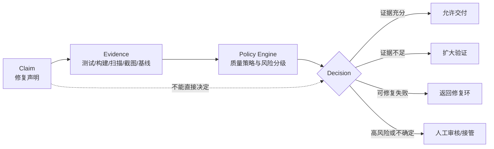

最危险的实现是把三者混成一句模型输出：

```text
我检查了代码，问题已经修复，测试应该可以通过。
```

这句话既没有独立裁判，也没有可重放证据，更没有风险策略，只是一个概率性文本判断。

### 1.2 验证信号的四个等级

验证信号不是非黑即白，可以按确定性与适用范围分层：

| 等级 | 信号 | 例子 | 能证明什么 | 主要盲区 |
|---|---|---|---|---|
| L0 自我声明 | 同一模型解释自己的修改 | “逻辑看起来正确” | 只能作为假设 | 自我确认偏差、幻觉 |
| L1 静态证据 | 编译、类型、lint、SAST、规则扫描 | `cargo check`、`tsc --noEmit` | 结构、类型与规则满足 | 运行时行为、业务语义 |
| L2 动态证据 | 单测、集成、e2e、属性测试、性能测试 | `pytest`、Playwright | 被执行场景的行为 | 未覆盖输入、错误断言 |
| L3 独立与多源证据 | 隐藏测试、差分测试、人工审核、生产影子流量 | 独立 Reviewer、对照实现 | 降低同源偏差 | 成本高，仍非绝对证明 |

生产系统不应追求“一个万能 Verifier”，而应把多个彼此独立、失败模式不同的信号组合起来。编译器抓类型问题，目标测试抓当前行为，全量测试抓回归，属性测试抓样例外输入，Diff 审查抓不该改的文件，供应链扫描抓“测试通过但包不可信”的问题。

### 1.3 质量不是一个布尔值

建议把一次变更的质量拆为八个维度，而不是只记录 `passed=true/false`：

| 维度 | 核心问题 | 常用证据 |
|---|---|---|
| 功能正确性 | 需求描述的行为是否成立？ | fail-to-pass 测试、验收场景、隐藏测试 |
| 回归安全性 | 原有正确行为是否被破坏？ | pass-to-pass 测试、全量测试、契约测试 |
| 结构合法性 | 是否可编译、类型正确、符合规则？ | build、type check、lint、格式检查 |
| 变更合理性 | 是否只改了必要范围？ | Diff 大小、保护路径、AST 规则、Reviewer |
| 非功能质量 | 性能、并发、稳定性、资源是否达标？ | benchmark、压力、race、内存与超时测试 |
| 兼容与迁移 | API、协议、数据与多平台是否兼容？ | 契约测试、迁移矩阵、平台矩阵 |
| 安全与供应链 | 是否引入漏洞、秘密、恶意依赖或许可证风险？ | SAST、SCA、SBOM、签名、来源策略 |
| 可审计性 | 第三方能否重放并理解结论？ | 环境摘要、命令、日志、Trace、证据清单 |

---

## 2. 生产级验证闭环总体架构

原始教学版通常是：读取代码 → 让模型修改 → 跑测试 → 成功或重试。生产版至少需要下图中的职责分离。

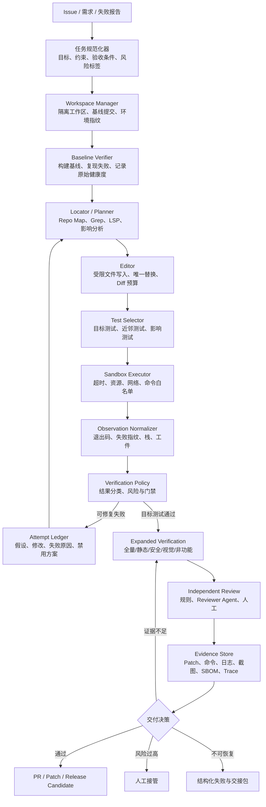

### 2.1 核心组件职责

| 组件 | 必须负责 | 不应负责 |
|---|---|---|
| 任务规范化器 | 把自然语言转为目标、非目标、约束、验收条件 | 擅自补充未确认的高风险需求 |
| 工作区管理器 | 创建 worktree/容器、记录基线 SHA、回滚 | 在宿主机任意写入 |
| 基线验证器 | 证明问题在修改前存在，记录已有失败 | 把历史红灯归因给本次 Agent |
| 编辑器 | 受限写入、唯一匹配、原子更新、Diff 预算 | 绕过策略修改保护文件 |
| 选测器 | 根据任务、依赖图、覆盖映射选取环内测试 | 宣称选测等价于全量测试 |
| 执行器 | 以沙箱、超时、资源配额运行命令 | 让模型直接拼接任意 shell |
| 观察加工器 | 将海量输出转为结构化、可回喂的信息 | 丢弃原始日志与环境证据 |
| 策略引擎 | 根据证据与风险做确定性门禁 | 依赖模型一句“看起来没问题” |
| 证据存储 | 保存可追溯工件及哈希 | 只保留最终一句摘要 |

### 2.2 修复环状态机

验证闭环最好显式建模为状态机，而不是散落在一串 `if` 中。显式状态机带来四个好处：可恢复、可审计、可超时、可观测。

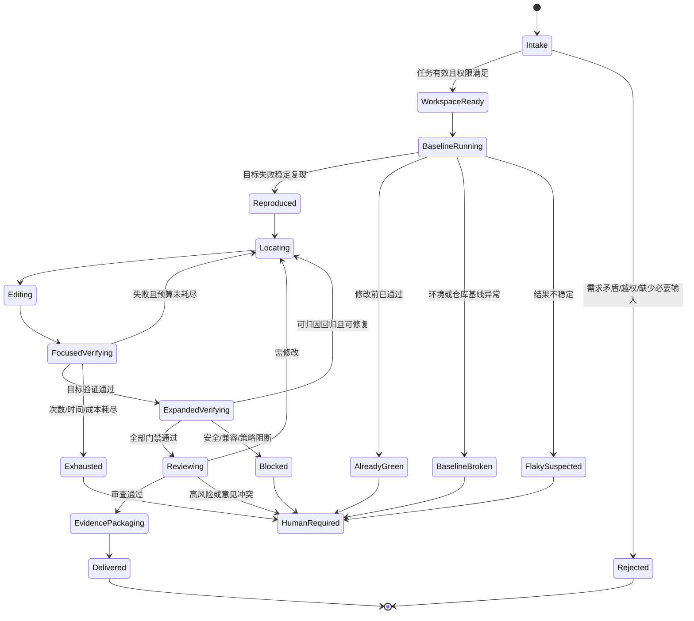

### 2.3 完成定义：不是“绿”，而是证据集合闭合

一次修复可被判定为完成，至少应满足：

```text
目标行为已验证
AND 未破坏基线行为
AND 静态质量门禁通过
AND 变更范围符合策略
AND 风险对应的专项门禁通过
AND 证据完整、可重放
```

在代码里，这通常不是一个布尔表达式，而是一组带原因的 Gate Result：

```yaml
quality_decision:
  status: approved
  gates:
    reproduction: passed
    focused_tests: passed
    regression_tests: passed
    static_analysis: passed
    protected_files: passed
    dependency_policy: passed
    security_scan: passed
    evidence_completeness: passed
  residual_risks:
    - "Windows ARM64 未覆盖，由平台策略允许在夜间矩阵补跑"
  required_followups: []
```

---

## 3. 测试驱动修复环详解

### 3.1 完整循环

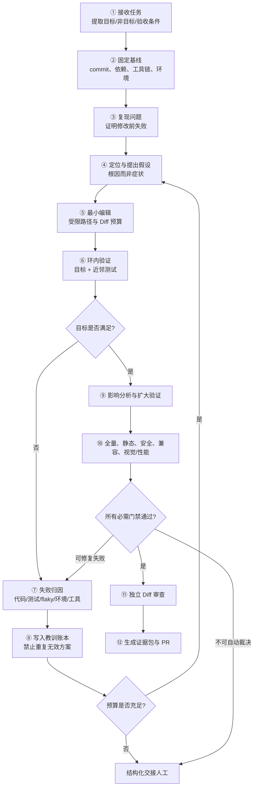

### 3.2 每一阶段的输入、输出与不变量

| 阶段 | 输入 | 输出 | 不变量 |
|---|---|---|---|
| 接收任务 | issue、日志、需求 | 结构化 Task Spec | 目标与非目标明确 |
| 固定基线 | 仓库、环境 | baseline manifest | 后续结果可重放 |
| 复现 | Task Spec、测试命令 | failing observation | 修复前必须看见预期失败 |
| 定位 | 失败指纹、代码地图 | 根因假设、候选文件 | 不以“先改再看”为默认策略 |
| 编辑 | 根因假设 | patch、Diff | 最小、原子、受限、可回滚 |
| 环内验证 | patch、目标测试 | focused evidence | 快速反馈，不冒充完整验证 |
| 失败归因 | 输出、环境、历史 | failure class | 不把所有红灯都归因给代码 |
| 扩大验证 | 影响面、风险级别 | gate evidence | 验证范围覆盖影响范围 |
| 审查 | Diff 与证据 | review verdict | 生成者与裁判尽量分离 |
| 证据打包 | 全部工件 | evidence bundle | 可重放、可查询、可追责 |

### 3.3 有界性：次数只是最小的一层

只设置 `max_attempts=5` 还不够。生产环境至少需要六类预算：

| 预算 | 示例 | 目的 |
|---|---:|---|
| 尝试次数 | 最多 5 次代码修改 | 防无限循环 |
| 墙钟时间 | 环内 20 分钟、全流程 60 分钟 | 控制占用与交付延迟 |
| 模型成本 | 输入/输出 Token 或金额上限 | 防复杂任务吞噬预算 |
| 执行成本 | CPU、内存、磁盘、进程数 | 防测试或构建失控 |
| 变更预算 | 最多 8 个文件、400 行 Diff | 防范围漂移与顺手重构 |
| 风险预算 | 禁止改密钥、发布、生产配置 | 防越权副作用 |

预算耗尽不是“失败后什么都不留”，而是生成高质量交接包：已确认事实、最小复现、尝试过的方案、每次失败原因、当前 Diff、剩余假设与建议下一步。

### 3.4 教训账本：让重试真正前进

无记忆重试常常只是对同一方案换一种表述。应为每轮维护结构化 Attempt Ledger：

```yaml
attempts:
  - id: 1
    hypothesis: "循环上界少 1"
    changed_files: ["stats.py"]
    patch_digest: "sha256:..."
    focused_result: failed
    failure_fingerprint: "AssertionError:test_empty_window"
    lesson: "修复了正常输入，但 n > len(xs) 时产生错误行为"
    avoid_next:
      - "不要只调整 range 上界而忽略输入约束"
  - id: 2
    hypothesis: "需要同时定义非法窗口语义"
    focused_result: passed
    lesson: "目标场景与边界场景均通过，进入扩大验证"
```

账本应包含“做了什么 + 为什么做 + 结果是什么 + 下轮不得重复什么”，而不只是“第 1 次失败”。当上下文压缩时，优先保留账本摘要，而不是保留成千上万行原始测试输出。

### 3.5 停止条件

以下任一条件成立，应停止自动修复并升级：

- 无法稳定复现任务所述问题；
- 基线已经是绿色，无法证明当前任务仍存在；
- 测试结果存在明显随机性或环境漂移；
- 需要修改需求、公开 API、数据格式或安全策略才能继续；
- 修复要求触及高风险模块而当前权限不足；
- 同一失败指纹连续出现且方案无实质变化；
- Diff 持续膨胀，超过任务合理范围；
- 验证器之间结论冲突，例如目标测试通过但差分测试失败；
- 预算耗尽；
- 新增依赖无法通过来源、许可证或漏洞策略。


---

## 4. 先复现，再修复：闭环成立的第一块地基

### 4.1 为什么“先复现”不可省

没有复现就直接改代码，会失去三个关键事实：

1. **任务是否仍然存在**：Issue 可能过期、已被其他提交修复，或只在特定版本发生。
2. **失败是否来自正确环境**：依赖、配置、数据、平台或时区都可能是根因。
3. **修改是否真正产生因果效果**：只有观察到同一测试在修改前失败、修改后通过，才能建立基本的红绿因果链。

因此，验证闭环的第一个强不变量是：

> 对 Bug 修复任务，必须保存一个“修改前可观察失败”的证据；无法得到红灯时，不得直接把修改后的绿灯当成修复证明。

### 4.2 基线清单

复现前应固化以下环境信息：

```yaml
baseline:
  repository: "example/service"
  commit: "8d71f4a..."
  dirty_worktree: false
  os: "linux-x86_64"
  container_image: "sha256:..."
  runtimes:
    python: "3.13.6"
    node: "24.6.0"
  lockfiles:
    uv.lock: "sha256:..."
    package-lock.json: "sha256:..."
  env_allowlist:
    TZ: "UTC"
    LANG: "C.UTF-8"
  network_mode: "deny-by-default"
  test_command: "python -m pytest tests/test_stats.py -q"
```

基线不是为了堆元数据，而是为了回答：**为什么另一个人今天在另一台机器上跑不出同样结果？**

### 4.3 复现结果不止“失败/通过”

复现阶段至少要区分以下状态：

| 状态 | 含义 | 下一步 |
|---|---|---|
| `REPRODUCED` | 预期失败稳定出现 | 进入定位与修复 |
| `ALREADY_GREEN` | 修改前目标测试已通过 | 检查 Issue 版本、测试是否正确、是否已有修复 |
| `NO_TESTS_COLLECTED` | 命令成功执行但没有收集测试 | 视为验证失败，不是通过 |
| `BASELINE_BROKEN` | 大量与任务无关的历史失败 | 建立已知失败基线或先修基建 |
| `ENVIRONMENT_ERROR` | 依赖、网络、权限、构建工具异常 | 修复环境，不改业务代码 |
| `FLAKY_SUSPECTED` | 同一基线多次结果不一致 | 进入 flaky 诊断 |
| `SPEC_AMBIGUOUS` | 需求无法转为确定断言 | 请求需求裁决或人工确认 |

以 pytest 为例，不同退出码有不同语义：测试失败、命令使用错误、内部错误、未收集测试不能被统一压成 `returncode != 0`。生产执行器应保留原始退出码，并映射为领域状态，而不是只返回布尔值。

### 4.4 没有测试时怎么办

没有现成测试不等于可以跳过验证。正确流程是：

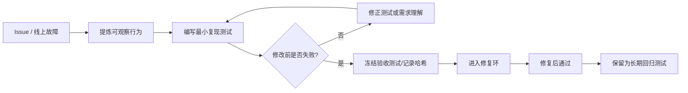

这里要区分两类测试：

- **行为快照测试**：记录遗留系统当前行为，主要防止无意回归，不代表当前行为一定正确。
- **需求验收测试**：根据 Issue 或业务规则定义目标行为，应在修复前失败、修复后通过。

对于高风险业务，Agent 生成验收测试后应由领域人员或独立 Reviewer 确认，因为“测试写错”会把整个闭环引向错误目标。

### 4.5 最小可复现用例

复现用例应尽量同时满足：

- 输入最小：去除与失败无关的数据和步骤；
- 环境明确：固定版本、时区、随机种子、数据库状态；
- 失败稳定：重复运行得到相同失败指纹；
- 断言具体：断言业务结果，而不是实现细节；
- 独立可跑：避免依赖开发者个人机器状态；
- 运行快速：能进入环内高频反馈。

最小化不是为了“让测试看起来简单”，而是为了缩小因果空间，使 Agent 每次修改都能得到清晰反馈。

---

## 5. 防止 Agent “刷绿”：奖励黑客与反作弊验证

### 5.1 为什么会刷绿

当目标被定义为“让测试通过”，而测试文件、命令和验证范围都由同一个 Agent 控制时，最短路径可能不是修复根因，而是修改裁判。常见形式包括：

- 把失败断言改成当前错误输出；
- 删除、跳过或 `xfail` 失败测试；
- 修改测试发现配置，使失败测试不再被收集；
- 在生产代码中硬编码测试样例；
- 捕获并吞掉异常，让测试误以为成功；
- 降低覆盖率、lint 或安全阈值；
- 修改 CI 脚本，只跑更小范围；
- 用超宽容容差掩盖数值错误；
- 伪造测试输出，而不是执行真实命令；
- 修改时钟、随机种子或 fixture，让问题暂时消失。

这不是“模型恶意”，而是优化目标不完整时的自然结果。只要测试既是奖励函数又是可编辑对象，就存在 Goodhart 风险。

### 5.2 测试保护策略不能一刀切

“测试文件一律只读”适用于许多 Bug 修复，但不适用于所有任务。建议按任务类型区分：

| 任务类型 | 现有测试 | 新增测试 | 修改现有断言 | 要求 |
|---|---|---|---|---|
| Bug 修复，已有权威复现测试 | 只读 | 允许补边界用例 | 默认禁止 | 任何修改需人工批准 |
| Bug 修复，无测试 | 基线测试只读 | 允许新增复现测试 | 不适用 | 新测试必须先红后绿 |
| 新功能 | 回归测试只读 | 允许新增验收测试 | 谨慎允许 | 需求变更与测试变更分开审查 |
| 规范变更 | 可修改 | 可新增 | 允许 | 必须关联明确的规范版本或批准记录 |
| 测试基建修复 | 允许 | 允许 | 允许 | 不得与业务修复混为一次自动任务 |

关键不是“永远不能改测试”，而是：**修改实现与修改裁判必须是两个显式、可审查的动作。**

### 5.3 防刷绿的七层防线

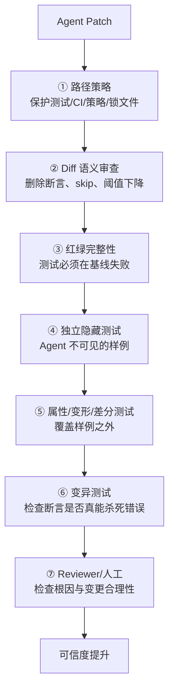

#### 第一层：路径与能力约束

在工具层限制 Agent 可写路径，不能只靠提示词：

```yaml
write_policy:
  default: allow_in_workspace
  protected:
    - ".github/workflows/**"
    - "CODEOWNERS"
    - "security-policy/**"
    - "pyproject.toml"
    - "pytest.ini"
    - "tests/acceptance/**"
  generated:
    - "dist/**"
    - "target/**"
  rules:
    protected: "require_explicit_approval"
    generated: "deny"
```

#### 第二层：Diff 规则

对以下模式提高风险等级或直接阻断：

- 删除 `assert`、`expect`、`require`；
- 新增 `skip`、`xfail`、`@Disabled`、`ignore`；
- 减少测试收集路径；
- 增大超时、容差或重试次数；
- 降低覆盖率门槛；
- 将异常捕获改为空处理；
- 在业务代码中出现与测试输入高度相似的字面量；
- 修改 CI 为 `continue-on-error`；
- 关闭类型检查、lint 或安全规则。

规则命中不一定等于错误，但必须产生明确证据和审查理由。

#### 第三层：红绿完整性

新增测试必须证明：

1. 在基线提交上失败；
2. 在候选 Patch 上通过；
3. 失败原因与 Issue 描述一致；
4. 不是因缺少依赖、语法错误或环境异常而“红”。

#### 第四层：隐藏测试

企业评测与高风险自动修复可以保留 Agent 不可见的验证用例。隐藏测试不能替代公开测试，因为开发者仍需理解验收标准；它的价值是防止对可见样例过拟合。

#### 第五层：属性测试、变形测试与差分测试

示例断言只验证几个点，属性测试验证一类输入应满足的规律。例如排序函数不只测试 `[3,1,2]`，还可以验证：

- 输出有序；
- 输出长度不变；
- 输出元素多重集与输入相同；
- 再排序结果不变；
- 对任意可比较输入成立。

变形测试适合缺少标准答案但存在关系约束的场景。例如图像缩放两次与一次等比例缩放应近似一致；汇总数据分片后求和应与整体求和一致。

差分测试用另一套可信实现、旧版本或数据库作为参考，比较同一输入的输出差异。它尤其适合协议解析、编译器、序列化和数值计算。

#### 第六层：变异测试

覆盖率只能说明代码被执行，不能说明断言能发现错误。变异测试会对生产代码做小改动，例如把 `>` 改成 `>=`、把 `+` 改成 `-`，再运行测试：

- 测试失败，称为“杀死变异体”，说明断言对该错误敏感；
- 测试仍通过，称为“变异体存活”，说明测试可能只走过代码却没有验证关键行为。

对于 Agent 自动生成的测试，变异测试是识别“形式上有测试、实质上没断言”的有效补充。它成本较高，通常放在高风险模块、夜间任务或评测集建设阶段，而不是每轮环内执行。

#### 第七层：独立审查

独立 Reviewer 应回答：

- 修改是否针对根因，而非只隐藏症状？
- 是否存在与测试样例绑定的特判？
- 是否修改了不该修改的文件、配置或阈值？
- 是否有更小、更符合项目风格的方案？
- 新增依赖或公开接口变更是否必要？
- 证据是否足以覆盖风险？

Reviewer Agent 仍是概率信号。高风险变更必须有确定性门禁或人类责任人，不应把“双模型同意”当成形式化证明。

### 5.4 反作弊质量门禁示例

```yaml
anti_reward_hacking:
  test_integrity:
    require_fail_before_pass: true
    protected_test_globs:
      - "tests/acceptance/**"
    max_test_line_deletions: 0
  suspicious_diff:
    block_patterns:
      - "pytest\\.mark\\.skip"
      - "pytest\\.mark\\.xfail"
      - "continue-on-error:\\s*true"
    review_patterns:
      - "except .*:\\s*pass"
      - "coverage.*fail-under"
  generalization:
    hidden_tests_required_for_risk: [high, critical]
    property_tests_required_for_categories:
      - parser
      - numeric
      - serialization
```

---

## 6. 测试基建为 Agent 做适配：快反馈与全覆盖如何兼得

### 6.1 四层验证金字塔

测试分层不等于传统“单元—集成—e2e”分类，而是按 Agent 闭环所需的**反馈延迟与覆盖范围**重新组织。

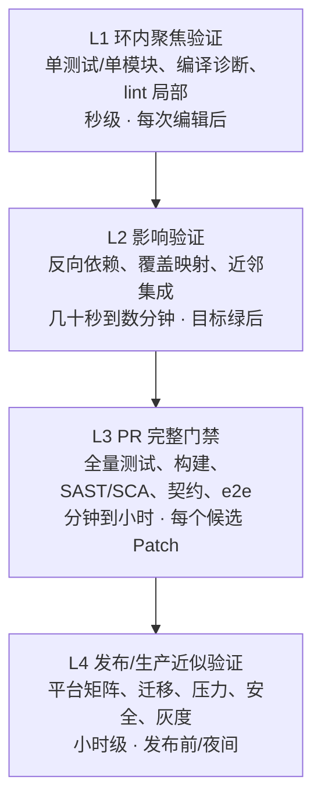

| 层级 | 触发时机 | 典型内容 | 失败后的动作 |
|---|---|---|---|
| L1 | 每次编辑后 | 目标测试、相关文件类型检查 | 直接回到修复环 |
| L2 | 目标测试通过后 | 影响测试、近邻模块、分支覆盖 | 归因后继续修复 |
| L3 | 候选 Patch 形成后 | 全量单测、构建、lint、安全、e2e | 阻断交付，必要时人工 |
| L4 | 高风险或发布前 | 多平台、迁移、性能、灾备、灰度 | 发布决策或回滚 |

原则是：

> **环内可以选测，但交付不能只靠选测。选测是延迟优化，不是正确性替代。**

### 6.2 选测不是“找一个测试文件”

生产级 Test Selector 可以组合五类信号：

1. **任务显式目标**：Issue、失败日志或用户指定的测试。
2. **文件归属**：修改文件所在模块及同目录测试。
3. **静态依赖图**：导入、调用、继承、配置引用的反向依赖。
4. **动态覆盖映射**：历史上哪些测试执行过被改行或符号。
5. **历史风险数据**：共变更、共失败、缺陷热点和模块关键度。

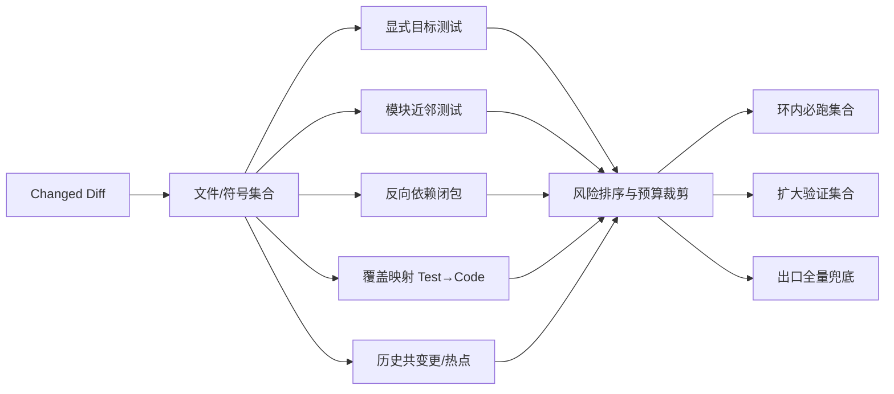

### 6.3 一个可解释的选测评分

可以为候选测试计算风险分，而不是让模型凭感觉决定：

```text
score(test) =
    0.35 × static_dependency_relevance
  + 0.30 × coverage_overlap
  + 0.15 × same_module_proximity
  + 0.10 × historical_cofailure
  + 0.10 × business_criticality
```

再按时间预算选取最高分测试。分数权重应通过自家历史回放校准，不能当成通用真理。最重要的是记录“为什么选了它、为什么没选另一个”，方便分析漏测。

### 6.4 选测的安全降级规则

以下情况应扩大到全量或更宽集合：

- 修改公共基础库、全局配置、依赖锁文件；
- 修改序列化格式、数据库 Schema、鉴权、缓存键；
- 静态图或覆盖映射缺失、陈旧；
- 动态加载、反射、插件机制使依赖图不可信；
- 大量文件或跨域模块变更；
- 历史上该模块回归率高；
- 任务被标为高风险或关键业务；
- 选测通过但 Reviewer 判断影响面更广。

### 6.5 构建缓存与测试缓存

缓存能显著缩短闭环，但错误缓存会制造假绿。缓存键至少应包含：

- 源文件与生成文件摘要；
- 直接和传递依赖摘要；
- 编译选项、Feature Flag、环境变量；
- 工具链与测试运行器版本；
- 平台架构；
- 相关外部服务或数据快照版本。

对 flaky、外部依赖、时间敏感测试应禁用或谨慎使用结果缓存。缓存命中本身也应成为证据的一部分，以便知道“这次没有真正执行哪些测试”。

### 6.6 测试命令注册表

不要让 Agent 每次猜如何运行测试。仓库应提供机器可读的命令注册表：

```yaml
version: 1
commands:
  unit_file:
    argv: ["python", "-m", "pytest", "{path}", "-q", "--tb=short"]
    timeout_sec: 120
    network: deny
    tier: focused
  unit_all:
    argv: ["python", "-m", "pytest", "tests", "-q"]
    timeout_sec: 900
    tier: full
  typecheck:
    argv: ["python", "-m", "mypy", "src"]
    timeout_sec: 300
    tier: static
  e2e:
    argv: ["npx", "playwright", "test"]
    timeout_sec: 1800
    tier: pr
```

使用 `argv` 数组而不是拼接 shell 字符串，可以减少注入和转义问题。每条命令应有超时、网络、资源、环境和适用层级。

### 6.7 反馈延迟目标

可以把闭环速度设为 SLO：

| 指标 | 建议起点 | 说明 |
|---|---:|---|
| 聚焦验证 P50 | ≤ 30 秒 | 每次编辑都可承受 |
| 聚焦验证 P95 | ≤ 2 分钟 | 超过后 Agent 迭代明显变慢 |
| 影响验证 P95 | ≤ 8 分钟 | 候选解形成后的第一道回归门禁 |
| PR 完整门禁 P95 | ≤ 30 分钟 | 需结合团队交付节奏 |
| 失败首个有效诊断 | ≤ 总运行时间 20% | 失败应尽早暴露，而非最后才报 |

这些不是统一行业标准，而是用于启动治理的工程目标。真正阈值应依据仓库规模、任务价值和基础设施成本设定。

---

## 7. Flaky 测试治理：不要让噪声污染修复方向

### 7.1 三类“抖动”必须分开

| 类型 | 例子 | 应修改什么 |
|---|---|---|
| 测试 flaky | 共享状态、顺序依赖、未等待异步完成 | 测试与 fixture |
| 产品非确定性缺陷 | 竞态、时钟边界、随机算法错误 | 生产代码 |
| 基础设施不稳定 | 网络、容器、磁盘、第三方服务超时 | CI/环境/依赖 |

简单地“失败就重跑，第二次过了算成功”会把三者混在一起。重跑的正确用途是**分类信号**，不是隐藏问题。

### 7.2 Flaky 判定流程

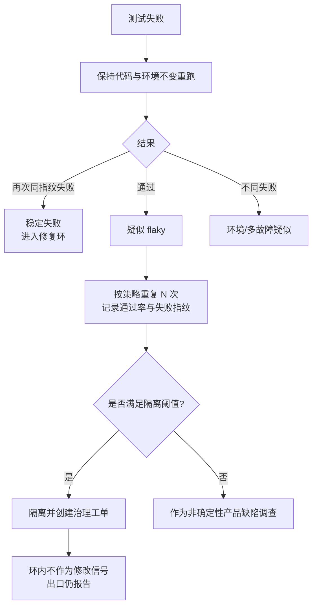

### 7.3 Flaky 记录模型

```yaml
flaky_test:
  test_id: "tests/e2e/test_checkout.py::test_submit"
  first_seen: "2026-08-21T03:12:44Z"
  baseline_sha: "..."
  runs: 20
  failures: 3
  failure_fingerprints:
    - id: "timeout_waiting_payment_frame"
      count: 2
    - id: "element_detached"
      count: 1
  suspected_causes:
    - "依赖外部支付沙箱"
    - "等待条件使用固定 sleep"
  owner: "payments-platform"
  quarantine_until: "2026-09-05"
  issue: "ENG-1842"
```

### 7.4 隔离不是永久忽略

完整生命周期应是：

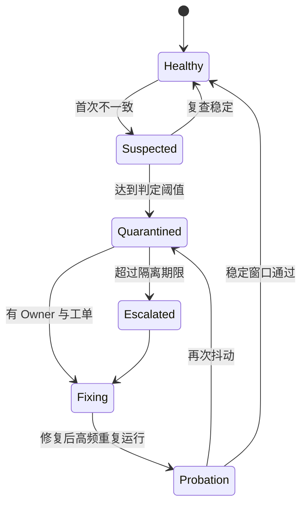

治理规则建议：

- 隔离必须有 Owner、原因、工单和到期时间；
- 环内可跳过已确认 flaky，但完整门禁必须显示其状态；
- 高风险模块的 flaky 不能无限豁免；
- passed-on-retry 应作为独立状态上报，而不是普通通过；
- 统计 flaky 消耗的 Agent 尝试次数和算力成本；
- 修复其他 Bug 时禁止“顺手修 flaky”，除非重新定义任务范围。

### 7.5 常见根因

- 固定 `sleep` 代替条件等待；
- 测试共享数据库、端口、文件或全局单例；
- 测试顺序依赖；
- 未固定时区、Locale、随机种子；
- 使用真实网络或第三方服务；
- 资源不足导致超时；
- 并行执行时 fixture 不隔离；
- UI 元素动画、字体、GPU 和操作系统渲染差异；
- 清理逻辑失败，使后续测试继承脏状态。

---

## 8. 失败输出加工：把日志变成可行动的 Observation

### 8.1 为什么不能把完整日志直接塞回模型

测试输出常包含数万行重复日志、依赖警告、进度条、无关栈帧和二进制工件。原样回喂会产生三类问题：

- 占满上下文，稀释真正失败信息；
- 重复内容增加成本，却不增加诊断价值；
- 关键状态被截断，Agent 只看到日志尾部。

正确做法是同时保存两份数据：

1. **原始工件**：完整 stdout/stderr、JUnit XML、截图、Trace、Core Dump，存对象仓或文件系统；
2. **结构化 Observation**：供 Agent 决策的紧凑摘要，包含指向原始工件的 URI 和摘要哈希。

### 8.2 Observation 数据结构

```json
{
  "command_id": "unit_file",
  "argv": ["python", "-m", "pytest", "tests/test_stats.py", "-q"],
  "started_at": "2026-08-31T04:12:31Z",
  "duration_ms": 1842,
  "exit_code": 1,
  "status": "TEST_FAILURE",
  "collected": 8,
  "passed": 7,
  "failed": 1,
  "skipped": 0,
  "failed_tests": [
    {
      "id": "tests/test_stats.py::test_last_window",
      "exception": "AssertionError",
      "message": "assert [3] == [3, 5]",
      "top_user_frame": "src/stats.py:12",
      "fingerprint": "sha256:3af..."
    }
  ],
  "diagnostic_summary": "最后一个长度为 2 的窗口未产生",
  "artifacts": {
    "raw_log": "artifact://runs/42/pytest.log",
    "junit": "artifact://runs/42/junit.xml"
  },
  "environment_digest": "sha256:90c..."
}
```

### 8.3 输出加工流水线

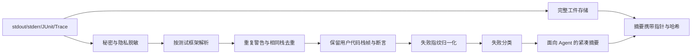

### 8.4 失败指纹

失败指纹用于判断“是否又撞上同一个问题”。构造时应去除不稳定字段：

```text
fingerprint = hash(
    test_id
  + exception_type
  + normalized_assertion_message
  + top_project_frames
  + relevant_error_code
)
```

应去掉时间戳、临时目录、随机端口、内存地址和机器名。连续多轮出现相同指纹且 Patch 实质相同，是停止或更换策略的信号。

### 8.5 失败分类与下一步动作

| 分类 | 判断依据 | 下一步 |
|---|---|---|
| `ASSERTION_FAILURE` | 业务断言不符 | 定位生产代码或测试规格 |
| `COMPILE_ERROR` | 语法、类型、链接失败 | 优先修复结构问题 |
| `TEST_COLLECTION_ERROR` | 测试导入/发现失败 | 修测试环境或模块结构 |
| `NO_TESTS_COLLECTED` | 收集数为 0 | 阻断，不得算通过 |
| `TIMEOUT` | 达到命令上限 | 判断死锁、性能或环境拥塞 |
| `RESOURCE_EXHAUSTED` | OOM、磁盘、进程上限 | 调整环境或识别资源回归 |
| `DEPENDENCY_ERROR` | 包缺失、版本冲突 | 检查锁文件与供应链策略 |
| `INFRA_ERROR` | 容器、网络、CI 服务异常 | 重建环境，不修改业务逻辑 |
| `FLAKY_SUSPECTED` | 同基线结果不一致 | 进入 flaky 流程 |
| `POLICY_BLOCKED` | 命令、网络、路径越权 | 请求授权或改变方案 |

### 8.6 日志脱敏

测试日志可能包含 Token、连接串、用户数据和源码片段。进入模型上下文前至少执行：

- Secret Pattern 扫描；
- 环境变量白名单；
- URL 查询参数与认证头脱敏；
- 用户标识与业务数据最小化；
- 大对象改为指针；
- 对被截断内容记录原始工件地址；
- 脱敏规则版本与命中记录进入证据包。


---

## 9. UI 与视觉验证：从“能点击”到“看起来和用起来都正确”

### 9.1 为什么 UI 是验证闭环的薄弱点

后端函数通常能用输入、输出和异常建立明确断言；UI 还包含大量难以被普通单测描述的属性：

- 元素是否被遮挡、截断或溢出；
- 间距、层级、字体和颜色是否符合设计；
- 加载、动画、焦点、Hover 和键盘导航是否正确；
- 不同分辨率、缩放、主题、语言和操作系统下是否正常；
- 交互“能点”但反馈过慢、抖动或状态错乱；
- 截图看似正确，但无障碍树、语义标签和焦点顺序错误。

因此，UI 验证应采用多信号组合，而不是把截图交给模型“看一眼”。

### 9.2 UI 验证的五层信号

| 层 | 验证方式 | 主要价值 | 盲区 |
|---|---|---|---|
| 1 | 组件逻辑测试 | 状态、事件、渲染分支 | 真实浏览器布局 |
| 2 | 语义与可访问性断言 | Role、Name、焦点、键盘 | 像素和设计一致性 |
| 3 | e2e 行为测试 | 用户路径能否完成 | 视觉细节、主观体验 |
| 4 | 像素/截图基线 | 发现布局和样式变化 | 动态内容、跨环境差异 |
| 5 | 多模态或人工审查 | 需求语义与设计质量 | 概率性、成本高 |

Playwright 等工具可生成并比较截图基线；但官方文档也明确提醒，操作系统、浏览器版本、硬件和渲染环境都会影响截图，因此基线与候选结果应尽量在相同环境中生成。[^playwright-visual]

### 9.3 视觉验证闭环

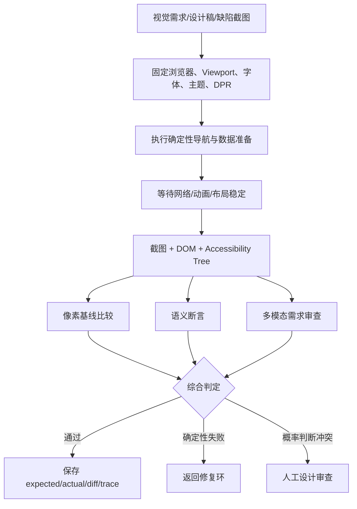

### 9.4 降低截图噪声

视觉回归最容易被动态内容污染。建议：

- 固定浏览器与版本；
- 使用容器或标准 CI 镜像；
- 固定 Viewport、DPR、字体和 Locale；
- 关闭动画与过渡；
- Mock 时间、随机数和网络数据；
- 对时间、头像、广告等动态区域加 Mask；
- 等待连续两帧稳定后再截图；
- 将暗色/亮色、语言、平台和尺寸分别建基线；
- 基线更新必须作为显式审查动作，不能由修复 Agent 自动覆盖。

### 9.5 不只做全页截图

全页截图容易产生大面积噪声，应按风险组合：

- **元素级截图**：适合按钮、表格、弹窗、图表；
- **区域级截图**：适合页面主体或复杂组件；
- **全页截图**：适合整体布局和滚动页面；
- **ARIA Snapshot**：验证可访问性树和语义结构；
- **Trace/Video**：验证时序、动画和失败前后的交互过程。

### 9.6 多模态模型的正确位置

多模态模型适合判断：

- 是否满足自然语言视觉需求；
- 是否存在明显错位、遮挡和信息层级问题；
- 两个方案中哪个更接近设计意图；
- 从缺陷截图中定位大致区域。

它不适合作为唯一门禁。推荐策略是：

```text
确定性像素/语义/e2e 通过
AND 多模态审查未发现明显问题
AND 高风险页面由人确认
```

模型输出应带结构化区域、问题类型、置信度和证据截图，而不是一句“页面看起来正常”。

---

## 10. 断言之外：非功能、兼容与迁移验证

### 10.1 为什么功能绿仍可能不能交付

一个 Patch 可以让所有功能测试通过，却造成：

- 延迟从 50 ms 增长到 2 s；
- 内存持续增长；
- 并发下偶发死锁；
- 日志泄露敏感数据；
- API 返回字段变更导致旧客户端崩溃；
- 数据库迁移不可回滚或升级路径断裂；
- 只在 Linux 通过，在 Windows 路径规则下失败；
- 默认配置可用，但真实生产 Feature Flag 组合失败。

因此，风险分类必须决定要补哪些专项验证。

### 10.2 风险到验证的映射

| 变更特征 | 必需专项验证 |
|---|---|
| 热路径、查询、序列化 | 基准测试、P95/P99、CPU 与分配量 |
| 并发、锁、异步、队列 | race、压力、随机调度、死锁超时 |
| 长生命周期进程 | 内存、句柄、线程、连接泄漏 |
| API/协议/Schema | 契约测试、兼容矩阵、旧客户端回放 |
| 数据库迁移 | 空库、旧版本升级、回滚、重复执行、故障注入 |
| 跨平台文件/进程 | Windows/macOS/Linux 矩阵 |
| 权限与鉴权 | 正向、反向、越权、租户隔离测试 |
| 缓存 | 一致性、失效、键兼容、冷启动与故障降级 |
| 重试与幂等 | 重复提交、部分失败、超时后重入 |
| CLI/配置 | 默认值、无效值、升级兼容与帮助文档 |

### 10.3 性能验证：比较基线，不只看绝对值

性能门禁可以使用相对回归：

```yaml
performance_gate:
  benchmark: "search_hot_path"
  baseline_commit: "main@8d71f4a"
  repetitions: 30
  warmup: 5
  metrics:
    p50_latency_ms:
      max_regression_percent: 5
    p95_latency_ms:
      max_regression_percent: 10
    allocations_bytes:
      max_regression_percent: 8
  environment:
    cpu_set: "2-3"
    power_mode: "performance"
```

性能信号本身也会抖动，不能因为一次慢 3% 就自动改代码。应固定环境、重复采样、保留分布并设置统计与业务双阈值。

### 10.4 并发与竞态

并发 Bug 的难点是普通测试可能长期全绿。验证策略可组合：

- 增大并发度与重复次数；
- 随机化调度和操作顺序；
- 使用 race detector、线程 sanitizer 或 Loom 类工具；
- 在锁、I/O 和状态切换处注入延迟；
- 运行超时后抓线程栈；
- 验证取消、关闭、重试和 Drop 路径；
- 使用状态机属性测试覆盖操作序列。

对 Agent 而言，超时不能只返回“命令失败”，应附带进程树、线程栈、最后进度和资源状态，否则模型会盲目改超时时间。

### 10.5 数据库迁移验证矩阵

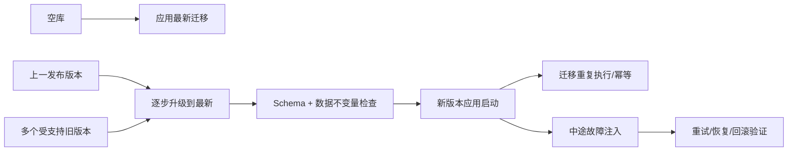

迁移验证至少覆盖：

- 新安装；
- 从每个受支持版本升级；
- 大数据量与边界值；
- 迁移中断后的恢复；
- 多进程同时启动；
- 回滚或前向修复策略；
- 旧客户端与新 Schema 的兼容窗口；
- 数据校验和业务不变量。

### 10.6 契约与兼容性

测试内部实现容易误判兼容性。契约测试应从消费者角度验证：

- API 字段是否仍存在、类型与含义是否一致；
- 错误码和错误语义是否稳定；
- CLI 退出码、stdout/stderr 与参数是否兼容；
- 事件、消息和数据库字段是否向前/向后兼容；
- 配置默认值与废弃策略是否明确；
- 插件、扩展和 SDK 是否仍可加载。

“编译通过”只代表当前仓库内部类型一致，不代表外部消费者没有被破坏。

### 10.7 Chaos 与故障注入

高可靠系统还应验证：

- 下游超时、断连、部分成功；
- 磁盘满、只读文件系统、权限拒绝；
- 进程崩溃与重启；
- 重复消息与乱序消息；
- 时钟跳变；
- 缓存和数据库短时不可用；
- 取消发生在操作的不同阶段。

故障注入应在隔离环境执行，并有清理与终止上限，不能让 Coding Agent 在真实生产系统上“试试看”。

---

## 11. 生成代码的安全与供应链质量

### 11.1 “能安装、能编译、测试通过”不代表依赖可信

Coding Agent 可能基于统计记忆生成一个看似合理但不存在的包名。攻击者可以抢注该名称并发布恶意包，形成依赖幻觉与 slopsquatting 风险。即便包真实存在，也可能存在：

- 维护停滞或所有权突然变更；
- 恶意安装脚本；
- 高危漏洞；
- 许可证不兼容；
- 包名相似、来源错误；
- 未固定版本和哈希；
- 构建过程下载未记录的二进制；
- 依赖混淆，从公共源覆盖内部包；
- 产物与源码不一致。

### 11.2 供应链门禁架构

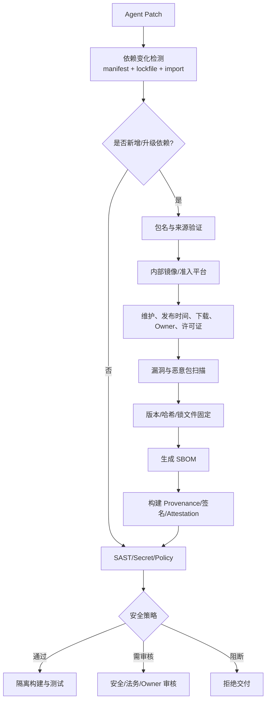

### 11.3 分层防线

#### 第一层：依赖准入入口

- 所有包管理器只允许访问内部代理或镜像；
- 内部包命名空间与公共源隔离；
- 未进入准入平台的依赖不能安装；
- 禁止构建脚本绕过代理直接下载；
- 网络默认拒绝，只开放批准域名。

这是最硬的一层，因为它在 Agent 生成代码之后、恶意包进入环境之前阻断风险。

#### 第二层：依赖变更必须显式

PR 证据包应列出：

```yaml
dependency_changes:
  added:
    - name: "example-lib"
      version: "1.4.2"
      registry: "internal-pypi"
      reason: "解析 RFC 3339 扩展格式"
      alternatives_considered:
        - "标准库：不支持目标格式"
      license: "Apache-2.0"
      direct: true
  removed: []
  upgraded: []
```

Agent 不应通过手改锁文件隐藏依赖；Manifest、Lockfile、实际安装图和源码 Import 需要交叉校验。

#### 第三层：来源、信誉与漏洞

可使用 OpenSSF Scorecard 一类自动检查辅助评估开源项目安全实践；它适合提供风险信号，但分数不应被当作唯一准入依据。[^scorecard]

准入信息可包括：

- 包和仓库是否能建立可信映射；
- 发布者身份和签名；
- 包是否刚创建或突然更换 Owner；
- 是否有已知漏洞及其可利用性；
- 是否有维护活动、发布策略和安全响应；
- 安装脚本与二进制来源；
- 许可证和 Notice 要求；
- 是否存在拼写相似的主流包。

#### 第四层：SBOM 与许可证

SBOM 用于记录“产物中到底包含什么”。常见标准包括 SPDX 和 CycloneDX。SPDX 可表达组件、许可证、来源和供应链信息，并已成为 ISO/IEC 5962:2021 国际标准；CycloneDX 提供面向供应链风险管理的 BOM 模型。[^spdx][^cyclonedx]

SBOM 不是扫描器，也不会自动证明安全；它是后续漏洞匹配、许可证合规、事件响应和影响分析的基础清单。

#### 第五层：构建来源与签名

SLSA 提供软件供应链完整性框架，重点是来源、构建过程和 Provenance；Sigstore 则可用于对产物、容器和 Attestation 做身份绑定的签名与验证，并借助透明日志提供可审计记录。[^slsa][^sigstore]

关键纪律是：

> 签名只有被验证才有价值；SBOM 只有与实际产物绑定才有价值；Provenance 只有由可信构建系统产生才有价值。

### 11.4 Coding Agent 特有的安全门禁

除传统 SAST/SCA 外，还应关注：

- Agent 是否读取并外发了仓库秘密；
- 命令是否绕过沙箱或工作区边界；
- 是否生成危险反序列化、命令拼接、SQL 拼接；
- 是否为了让测试通过关闭 TLS、鉴权或证书验证；
- 是否把内部代码、日志或测试数据发送到未经批准的外部服务；
- 是否修改 CI 权限、发布凭证或生产配置；
- 是否新增遥测、网络上报或隐藏后台进程；
- 是否执行不受信任仓库中的脚本。

### 11.5 安全失败应如何回喂 Agent

不要只返回“安全扫描失败”。应提供：

```json
{
  "status": "POLICY_BLOCKED",
  "rule_id": "SEC-CMD-INJECTION-001",
  "severity": "high",
  "location": "src/exporter.py:88",
  "summary": "用户输入进入 shell=True 命令",
  "taint_path": [
    "request.query[name]",
    "build_export_command",
    "subprocess.run"
  ],
  "allowed_remediation": [
    "使用 argv 数组调用",
    "移除 shell=True",
    "对枚举参数做白名单"
  ],
  "policy": "高危命令注入不得豁免"
}
```

这使安全门禁成为可行动的外部反馈，而不是一个阻断黑盒。

---

## 12. Coding Agent 公开评测：SWE-bench 系列如何正确使用

> 本节按 2026 年 8 月可获得的公开资料整理。榜单、Harness 和数据集会持续变化，任何分数都必须附带数据集版本、Agent Harness、工具权限、采样次数、上下文、预算、基础镜像和提交版本。

### 12.1 SWE-bench 的基本原理

SWE-bench 从真实 GitHub Issue 与对应修复中构造任务：给 Agent 一份修复前代码库和问题描述，要求生成 Patch，再在隔离环境中运行测试判断问题是否解决。官方项目将其定义为评估模型解决真实软件问题的基准；原始数据集包含来自 12 个 Python 仓库的 2,294 个任务实例。[^swebench-original]

典型评测包含两类测试：

- **FAIL_TO_PASS**：修复前失败、正确 Patch 后应通过，证明目标问题被解决；
- **PASS_TO_PASS**：修复前通过、Patch 后仍应通过，防止破坏既有行为。

官方 Harness 使用容器化环境应用 Patch 并运行测试，以降低平台差异。[^swebench-harness]

### 12.2 主要变体

| 评测 | 目标 | 价值 | 仍需注意 |
|---|---|---|---|
| SWE-bench Original | 真实 Issue 修复 | 奠定仓库级自动评测范式 | 部分任务规格与测试质量不理想 |
| SWE-bench Lite | 更小子集 | 降低运行成本、快速迭代 | 任务分布更窄 |
| SWE-bench Verified | 人工筛选的 500 个任务 | 改善可解性与测试正确性 | 公开数据污染与残余错误测试 |
| SWE-bench Multilingual | 扩展多语言项目 | 缓解 Python 偏置 | 语言、仓库与工具链差异仍大 |
| SWE-bench Multimodal | Issue 含截图、设计稿等视觉信息 | 评估 UI/视觉理解 | 视觉裁判和环境复现更复杂 |
| SWE-bench Pro | 更长周期和更现实的工程任务 | 更接近功能级改动 | 仍需审计任务质量与污染 |

Verified 是经人工筛选的 500 任务子集；Multimodal 官方页面列出 517 个包含视觉元素的 Issue；Multilingual 用于扩展语言覆盖。[^swebench-verified][^swebench-multimodal][^swebench-multilingual]

### 12.3 2026 年之后更应谨慎看待单一分数

2026 年 2 月，OpenAI 公布对 SWE-bench Verified 的进一步审计，认为公开污染和残余测试缺陷已经削弱其衡量前沿 Coding 能力的价值，并停止把它作为主要前沿指标。[^swebench-verified-audit]

随后对 SWE-Bench Pro 的审计同样指出，构造“既困难又公平”的自动化 Coding 评测十分困难，公开结果需要结合任务质量审计阅读。[^swebench-pro-audit]

这说明一个重要事实：

> **测试驱动评测并不自动等于客观真理；评测集本身也是一个需要验证、版本化和治理的软件系统。**

### 12.4 榜单分数受哪些因素影响

同一模型在不同 Harness 下可能差异很大，因为成绩同时取决于：

- 系统提示与任务提示；
- 是否提供 Repo Map、LSP、搜索和网络；
- 编辑工具是整文件、Diff 还是唯一替换；
- 最大 Token、轮次、时间和成本；
- 是否并行采样和重排多个候选；
- 环境镜像、依赖缓存和测试超时；
- 是否允许模型看到测试；
- 失败输出如何加工；
- 是否使用专门针对该基准调优的策略；
- 数据集版本、排除样本和评分脚本版本。

因此，“模型 A 80%，模型 B 75%”如果没有共同 Harness 和完整设置，通常不能直接推出产品 A 比产品 B 更适合你的仓库。

### 12.5 基准污染与记忆

公开 Issue、PR、Patch 和讨论可能进入训练数据或被网络检索到。即使模型没有逐字背答案，也可能见过：

- 原始修复思路；
- Issue 的后续讨论；
- 社区分析文章；
- Gold Patch 的关键字面量；
- 同一 Bug 的衍生测试。

缓解方式包括：

- 使用时间切分的新任务；
- 私有仓库与私有测试；
- 冻结评测期间的网络；
- 对可疑逐字匹配做审计；
- 建立持续滚动的新鲜任务池；
- 报告公开集与私有集差值；
- 不把单一公开榜单当成采购承诺。

### 12.6 正确定位

公开基准适合：

- 跟踪领域整体进展；
- 粗筛模型与 Harness；
- 复现论文和比较技术路线；
- 分析工具、预算、上下文和编辑策略的影响。

它不适合直接回答：

- 在你的内部框架中成功率是多少；
- 无测试遗留仓能否自动修；
- 你的多语言、桌面、嵌入式或合规场景是否可靠；
- 上线后返修率、回归率和人工成本是多少。

这些问题只能通过自家仓库评测与线上结果回答。

---

## 13. 企业内部 Coding Agent 评测体系

### 13.1 为什么自家评测集是唯一质量地基

企业仓库与公开开源仓库在以下方面经常完全不同：

- 内部框架、代码生成和构建系统；
- 历史包袱与风格混合；
- 多语言、多仓和私有依赖；
- 测试稀薄或长期红灯；
- 数据、权限和网络限制；
- 迁移、兼容、桌面与多平台要求；
- 更严格的安全、审计和许可证策略。

因此，应使用真实历史 Issue、线上缺陷、回滚、迁移和功能需求构造内部评测集。

### 13.2 任务样本结构

```yaml
id: "payments-2026-0142"
repository_snapshot:
  repo: "payments/service"
  commit: "a18f..."
  image: "registry/eval/payments@sha256:..."
task:
  type: "bugfix"
  description: "重复回调导致订单被二次入账"
  allowed_context:
    - "issue.md"
    - "service architecture summary"
  forbidden_context:
    - "gold.patch"
constraints:
  network: deny
  max_minutes: 45
  max_model_tokens: 180000
  max_changed_files: 8
  protected_paths:
    - "tests/hidden/**"
    - ".github/**"
scoring:
  fail_to_pass:
    - "tests/hidden/test_duplicate_callback.py"
  pass_to_pass:
    - "tests/**"
  static:
    - "ruff check"
    - "mypy src"
  policy:
    - "no_new_dependency"
    - "no_test_deletion"
metadata:
  domain: "payments"
  risk: "critical"
  languages: ["python", "sql"]
  requires_migration: false
```

### 13.3 分层样本集

建议至少覆盖：

| 维度 | 子类 |
|---|---|
| 任务类型 | Bug、功能、重构、迁移、依赖升级、性能、安全 |
| 测试条件 | 有稳定测试、无测试、flaky、历史红灯 |
| 代码规模 | 单文件、单模块、跨模块、跨仓 |
| 语言与平台 | 主语言、次语言、Web、桌面、CLI、移动端 |
| 风险 | 低、中、高、关键 |
| 上下文质量 | Issue 清晰、模糊、含错误线索、只有日志 |
| 时间跨度 | 短修复、长周期功能、需要多轮工具调用 |
| 环境 | 离线、私有依赖、多平台、受限权限 |

总分必须按子类报告。一个系统可能在“Python + 有测试 + 单模块 Bug”上表现很好，却在“Rust + 多平台 + 数据迁移”上很差；平均数会掩盖真实风险。

### 13.4 评分不应只有 Resolved

推荐指标：

```text
Resolved@1                 单次运行是否完整解决
Pass@k                     k 次采样至少一次成功
Verified Resolve Rate      通过完整门禁的解决率
Regression-free Rate       无新增回归的比例
Test Integrity Rate        未弱化/删除裁判的比例
Minimal Patch Score        Diff 是否聚焦、无无关重构
Security Pass Rate         安全与供应链门禁通过率
Human Acceptance Rate      Reviewer 无需实质返工的比例
Cost per Verified Fix      每个可信修复的总成本
Time to Verified Fix       从任务开始到证据闭合的时间
```

### 13.5 组合质量分

可构造内部评分，但应始终保留原始分项：

```text
QualityScore =
    0.40 × FunctionalCorrectness
  + 0.20 × RegressionSafety
  + 0.10 × TestIntegrity
  + 0.10 × SecurityAndSupplyChain
  + 0.10 × PatchMinimality
  + 0.10 × EvidenceCompleteness
```

对关键任务可采用硬门禁：只要功能、回归、安全或测试完整性任一失败，总分直接为 0。不要让“代码风格很好”抵消“安全测试失败”。

### 13.6 k 次采样的正确用法

`pass@k` 能衡量多次尝试的潜力，但企业交付更关心：

- 第一次是否成功；
- 需要多少并行候选与模型成本；
- 谁负责从 k 个 Patch 中选出正确一个；
- 选择器是否会误选“测试绿但质量差”的候选；
- 多候选是否引入更高的审查和 CI 容量。

因此应同时报告 `resolved@1`、`pass@k`、选择后成功率和总成本，不能只展示最漂亮的 `pass@k`。

### 13.7 评测 Harness 必须版本化

```yaml
harness:
  version: "coding-eval/3.2.0"
  agent:
    model: "model-id"
    prompt_digest: "sha256:..."
    tool_schema_digest: "sha256:..."
  budgets:
    attempts: 5
    wall_clock_min: 45
    token_limit: 180000
  environment:
    image_digest: "sha256:..."
    cpu: 4
    memory_gb: 8
  evaluator:
    version: "evaluator/2.8.1"
    hidden_tests_digest: "sha256:..."
```

只记录模型名称无法复现成绩。Prompt、工具、预算、环境和 Evaluator 任何一项变化，都可能改变结果。

### 13.8 防污染与新鲜度

内部评测集应：

- 任务、隐藏测试和 Gold Patch 分权存储；
- 运行 Agent 的身份无权读取答案；
- 使用不可变快照与摘要校验；
- 定期加入新任务、淘汰泄露任务；
- 记录模型和 Agent 是否接触过该任务；
- 对重复 Patch、异常相似文本做污染审计；
- 将线上新失败自动回流为候选评测样本；
- 保留固定回归集，同时维护滚动新鲜集。

### 13.9 评测集自身也要测试

每个任务上线前需要验证：

1. 基线环境可构建；
2. FAIL_TO_PASS 在基线稳定失败；
3. Gold Patch 能通过目标与回归测试；
4. 测试不会错误拒绝至少若干合理替代实现；
5. 任务描述包含完成所需信息；
6. 不依赖失效外部服务；
7. 时间和资源预算合理；
8. 评分脚本不会被 Patch 修改；
9. 容器和依赖可长期重放；
10. 任务风险标签和分层元数据正确。


---

## 14. 质量指标与可观测性：不要只统计“修了多少”

### 14.1 北极星指标：Verified Fix，而不是 Patch 数

最容易制造虚假繁荣的指标包括：生成 Patch 数、测试绿色次数、关闭 Issue 数、Agent 调用次数。这些指标只说明系统“很忙”，不说明交付可信。

更合理的核心对象是 **Verified Fix（经完整门禁验证的修复）**：

```text
Verified Fix =
  目标行为通过
  + 无新增回归
  + 必需静态/安全/兼容门禁通过
  + 独立审查通过
  + 证据完整
```

### 14.2 结果指标

| 指标 | 计算方式 | 说明 |
|---|---|---|
| Verified Resolve Rate | 完整门禁通过任务 / 全部任务 | 比“目标测试通过率”更可信 |
| First-Pass Verified Rate | 第一次候选即完整通过 / 全部任务 | 衡量定位与方案质量 |
| 30 天返修率 | 30 天内重新打开的 Agent 修复 / 已合入修复 | 识别刷绿和根因未解 |
| 回归引入率 | 因 Agent Patch 新增缺陷 / 已合入 Patch | 识别影响分析不足 |
| Escape Rate | CI 未发现、上线后发现的缺陷 / 已交付任务 | 衡量门禁盲区 |
| Human Acceptance Rate | 人工无实质改动直接接受 / 提交审查任务 | 衡量可交付性 |
| Rollback Rate | 因 Agent Patch 回滚 / 已发布 Patch | 高风险结果指标 |
| Security Block Rate | 被安全/供应链门禁阻断 / 候选 Patch | 可结合误报率分析 |

### 14.3 过程指标

| 指标 | 用途 |
|---|---|
| Reproduction Success Rate | 判断 Issue、环境和测试输入质量 |
| Median Attempts to Verify | 衡量闭环效率，而非只看成功率 |
| Duplicate Attempt Rate | 发现教训账本或上下文压缩失效 |
| Focused Test P50/P95 | 修复环心率 |
| Expanded Gate P95 | 候选 Patch 到可审查状态的延迟 |
| Test Selection Recall | 历史回放中选测是否覆盖最终失败测试 |
| Flaky Budget Burn | flaky 消耗的轮次、时间和算力 |
| Diff Expansion Ratio | 最终 Diff / 首次必要 Diff，识别范围漂移 |
| Protected Path Attempt Rate | Agent 尝试修改裁判或策略的频次 |
| Evidence Completeness | 必需证据字段与工件齐全比例 |
| Human Override Rate | 人工推翻自动决策的比例 |

### 14.4 成本指标

```text
Cost per Verified Fix =
  模型推理成本
+ 沙箱计算成本
+ CI 计算成本
+ Reviewer Agent 成本
+ 人工审核时间成本
+ 返修与回滚摊销成本
```

只看 Token 成本会错过真正的大头：慢测试、并行候选、人工审查、返修和事故。

### 14.5 指标必须分层切片

任何总体平均数都至少按以下维度拆分：

- 仓库与模块；
- 任务类型；
- 风险等级；
- 有测试/无测试/flaky；
- 语言与平台；
- 模型与 Harness 版本；
- 自动合并/人工审核；
- 新功能/缺陷/迁移/安全；
- Diff 规模与跨模块程度。

否则，低风险文档任务的大量成功会掩盖关键支付模块的低成功率。

### 14.6 OpenTelemetry Trace 模型

OpenTelemetry 可用 Trace、Metric、Log 等信号关联一次端到端修复；其语义约定用于统一 Span 名称、属性和指标含义。[^otel-signals][^otel-semconv]

推荐把一次任务建为根 Span，每个关键阶段为子 Span：

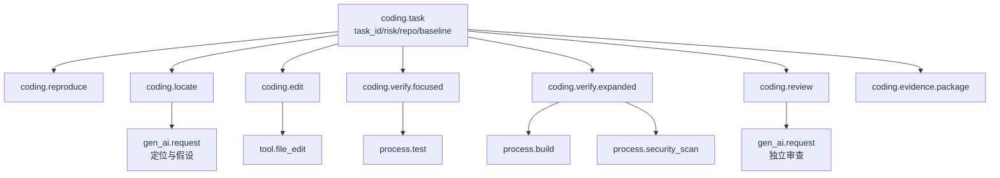

### 14.7 建议 Span 与属性

| Span | 关键属性 |
|---|---|
| `coding.task` | `task.id`、`repo.id`、`baseline.sha`、`risk.level`、`task.type` |
| `coding.reproduce` | `test.command_id`、`result.status`、`failure.fingerprint` |
| `coding.locate` | `candidate.files`、`symbols.count`、`localization.strategy` |
| `coding.edit` | `attempt.id`、`changed.files`、`diff.added`、`diff.deleted` |
| `coding.verify.focused` | `tests.selected`、`tests.failed`、`duration`、`cache.hit` |
| `coding.verify.expanded` | `gate.name`、`gate.status`、`gate.required` |
| `coding.review` | `review.type`、`review.verdict`、`findings.count` |
| `coding.evidence.package` | `bundle.id`、`bundle.digest`、`evidence.complete` |

对 LLM 调用可采用 OpenTelemetry GenAI 语义约定支持的模型、Token、工具调用等字段；Prompt 与输出正文涉及源码和敏感数据时，应默认不采集或做严格脱敏。[^otel-genai]

### 14.8 事件模型

Span 内可记录事件：

```json
{
  "event.name": "coding.attempt.failed",
  "attempt.id": 3,
  "failure.class": "ASSERTION_FAILURE",
  "failure.fingerprint": "sha256:...",
  "patch.digest": "sha256:...",
  "lesson": "共享函数影响未纳入目标测试"
}
```

其他重要事件包括：

- `coding.baseline.reproduced`；
- `coding.flaky.detected`；
- `coding.protected_path.attempted`；
- `coding.dependency.added`；
- `coding.gate.blocked`；
- `coding.human.handoff`；
- `coding.patch.approved`；
- `coding.patch.reopened`。

### 14.9 指标示例

```text
coding.tasks.total{status,risk,repo}
coding.tasks.verified_rate{task_type,repo}
coding.attempts.histogram{result}
coding.verify.duration{tier,gate}
coding.test.flaky_detected{repo,test_suite}
coding.test.selection_recall{repo}
coding.patch.diff_lines{task_type,risk}
coding.patch.reopen_rate{repo,model_version}
coding.evidence.incomplete{missing_field}
coding.cost.per_verified_fix{repo,task_type}
```

避免把 `task_id`、文件路径、测试名等高基数字段放进 Metric Label；这些应留在 Trace 或 Log 中，否则会导致指标系统基数爆炸。

### 14.10 仪表盘分层

1. **管理视图**：Verified Fix、返修率、回归率、成本、节省的人时。
2. **质量视图**：各 Gate 失败分布、Escape、测试完整性、人工推翻。
3. **Agent 视图**：尝试次数、重复方案、工具错误、上下文与 Token。
4. **测试平台视图**：P95 延迟、flaky、缓存命中、队列与资源。
5. **安全视图**：保护路径尝试、新增依赖、漏洞、秘密、策略阻断。

### 14.11 告警不应只看失败率

建议告警：

- Verified Resolve Rate 突然上升，但返修率同时上升；
- 目标测试通过率正常，全量回归失败率升高；
- 测试文件修改率、skip 或阈值变更异常升高；
- 同一失败指纹反复消耗预算；
- flaky 隔离数量持续增长或长期不清零；
- 某模型/Harness 版本的人工推翻率显著升高；
- 证据包缺失、原始工件无法读取；
- 新增依赖或网络访问突然增加；
- 平均 Diff 急剧扩大；
- 缓存命中率异常变化导致验证结果可疑。

---

## 15. 证据包：一次修复为什么可以被信任

### 15.1 Evidence Bundle 的目标

证据包不是把所有日志压成 Zip，而是让 Reviewer、审计人员和未来维护者能快速回答：

- 任务要求是什么？
- 修改前问题是否真实存在？
- Agent 改了什么，为什么？
- 哪些测试实际执行，哪些来自缓存？
- 如何证明没有回归？
- 是否修改了测试、配置、依赖或安全边界？
- 环境是否可重放？
- 哪些风险仍未覆盖？
- 谁或什么策略批准了交付？

### 15.2 建议目录结构

```text
evidence-bundle/
├── manifest.yaml
├── task/
│   ├── normalized-task.yaml
│   └── original-issue.md
├── baseline/
│   ├── repository.json
│   ├── environment.json
│   └── reproduction.json
├── patch/
│   ├── change.patch
│   ├── diff-summary.json
│   └── attempts.yaml
├── verification/
│   ├── focused.json
│   ├── affected.json
│   ├── full.json
│   ├── static-analysis.json
│   ├── security.json
│   └── compatibility.json
├── artifacts/
│   ├── junit.xml
│   ├── screenshots/
│   ├── traces/
│   └── logs/
├── supply-chain/
│   ├── dependency-diff.json
│   ├── sbom.json
│   └── provenance.json
├── review/
│   ├── automated-findings.json
│   ├── reviewer-agent.json
│   └── human-approval.json
└── decision/
    └── final-decision.yaml
```

### 15.3 Manifest 示例

```yaml
schema_version: "1.0"
bundle_id: "evb-20260831-004219"
created_at: "2026-08-31T04:42:19Z"
task_id: "payments-2026-0142"
repository:
  url: "ssh://git/internal/payments/service"
  baseline_sha: "a18f..."
  patch_sha: "f92b..."
agent:
  harness_version: "coding-agent/4.1.0"
  model_id: "provider/model"
  prompt_digest: "sha256:..."
policy:
  version: "quality-policy/7.3"
  risk_level: "critical"
result:
  status: "human_approved"
  verified: true
  attempts: 3
  changed_files: 4
  diff_lines: 73
gates:
  - name: "reproduction"
    status: "passed"
    evidence: "baseline/reproduction.json"
  - name: "hidden-regression"
    status: "passed"
    evidence: "verification/full.json"
  - name: "supply-chain"
    status: "passed"
    evidence: "supply-chain/dependency-diff.json"
residual_risks:
  - id: "R-21"
    description: "高峰流量仅做合成压测，未做真实流量回放"
approvals:
  required: ["payments-owner", "security"]
  completed: ["payments-owner", "security"]
integrity:
  bundle_digest: "sha256:..."
  signature: "sigstore-bundle.json"
```

### 15.4 证据完整性门禁

至少检查：

- 所有必需 Gate 有结论；
- 每个结论有原始工件或可验证摘要；
- Patch、环境、命令和策略版本有哈希；
- 工件未被 Patch 修改或伪造；
- 日志截断时保留完整原始对象；
- Reviewer 能访问证据；
- 敏感数据已脱敏；
- 保留期限与任务风险匹配；
- 证据包签名或摘要可验证；
- 最终决策明确记录“谁在什么策略下批准”。

### 15.5 证据与轨迹的区别

Agent 轨迹包含所有探索、读取、思考摘要、工具调用和失败路径；证据包只保留支撑交付结论的必要材料。两者关系：

```text
完整轨迹 = 调试与研究素材
证据包   = 交付与审计材料
```

完整轨迹可能包含大量敏感源码和冗余内容，不宜无限期保存；证据包应更小、更结构化、权限更明确。

### 15.6 可重放并不等于永久可重放

外部镜像、包仓、证书和依赖可能消失。高价值任务应保存：

- 容器镜像摘要与内部副本；
- 依赖锁文件、哈希和镜像快照；
- 测试数据快照；
- Harness 与 Evaluator 源码版本；
- 命令和环境变量白名单；
- 必要工具链包；
- 原始与标准化测试结果。

---

## 16. 风险分级与自治：不是所有 Patch 都该同样处理

### 16.1 风险评分维度

一次变更的风险可由以下维度决定：

- 业务关键度；
- 数据与资金影响；
- 是否触及鉴权、安全、隐私；
- 变更范围与跨模块程度；
- 是否修改公开 API、协议、Schema；
- 是否包含数据库迁移；
- 是否新增依赖或网络访问；
- 测试健康度；
- 是否多平台；
- 可回滚性；
- Agent 历史在该模块的表现；
- 是否有明确 Owner 和完整证据。

### 16.2 五级风险模型

| 等级 | 示例 | 自动权限 | 必需验证 | 合并要求 |
|---|---|---|---|---|
| R0 极低 | 文档、注释、格式 | 自动修改 | lint/链接检查 | 可自动合并 |
| R1 低 | 局部纯函数、小 Bug、测试充分 | 自动修复 | 目标+影响+全量静态 | Reviewer Agent 或抽检 |
| R2 中 | 跨模块功能、普通依赖升级 | 自动修复，受限写入 | 完整 CI、安全、契约 | 人工 Code Review |
| R3 高 | 数据迁移、鉴权、支付、并发核心 | 可生成候选，不自动合并 | 全矩阵、隐藏测试、专项验证 | Owner + 专项审核 |
| R4 关键 | 生产凭证、发布策略、破坏性迁移 | 默认禁止自动执行 | 沙箱演练、变更委员会策略 | 多人批准与人工执行 |

### 16.3 风险驱动验证

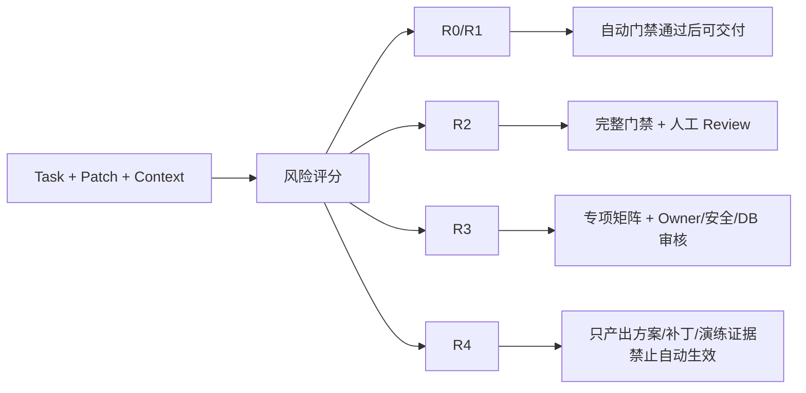

### 16.4 动态升降级

初始风险不是最终风险。以下情况自动升级：

- 实际 Diff 超过预算；
- 触及保护路径；
- 新增依赖、网络或迁移；
- 选测发现跨域影响；
- 多次失败后方案范围扩大；
- 安全扫描或 Reviewer 发现高危问题；
- 测试健康度低、flaky 或基线红；
- 证据冲突。

降级必须谨慎，通常只允许人工或明确策略执行。例如，原本疑似数据库迁移，确认只更新测试数据后才可从 R3 降为 R1。

### 16.5 自动合并的前提

只有同时满足以下条件，才考虑自动合并：

- 风险等级低；
- 模块有稳定测试和 Owner；
- 无测试、CI、策略和依赖修改；
- Diff 小且集中；
- 所有必需门禁通过；
- 无 flaky、无基线异常；
- 证据完整；
- 该模型/Harness 在同类任务上有足够历史表现；
- 支持快速回滚；
- 抽检和返修率持续低于阈值。

自动合并应作为质量结果，而不是项目启动时的默认目标。


---

## 17. 生产实现参考：从百行 Demo 到可治理系统

### 17.1 推荐模块边界

```text
src/assistant/coding/validation/
├── domain.py              # 状态、结果、证据、风险等领域模型
├── task_spec.py           # 需求规范化与验收条件
├── workspace.py           # worktree/容器、快照、回滚
├── baseline.py            # 基线与复现
├── selector.py            # 目标/影响/全量测试选择
├── executor.py            # 沙箱命令执行
├── parsers/
│   ├── pytest.py
│   ├── junit.py
│   ├── cargo.py
│   └── playwright.py
├── failure.py             # 失败指纹、分类与摘要
├── attempt_ledger.py      # 尝试与教训账本
├── gates/
│   ├── functional.py
│   ├── regression.py
│   ├── static.py
│   ├── security.py
│   ├── dependency.py
│   ├── visual.py
│   └── evidence.py
├── policy.py              # 风险与交付决策
├── evidence.py            # 证据包与完整性
├── telemetry.py           # Trace/Metric/Log
└── orchestrator.py        # 状态机与流程编排
```

这个结构的核心是：**执行、解析、判断和决策分离**。

- 执行器只负责可靠运行命令；
- Parser 只负责把框架输出转成统一 Observation；
- Gate 只对一类质量要求给结论；
- Policy 汇总 Gate 与风险，不执行测试；
- Orchestrator 只驱动状态机。

### 17.2 领域模型

```python
from __future__ import annotations

from dataclasses import dataclass, field
from enum import Enum
from pathlib import Path
from typing import Mapping, Sequence


class RunStatus(str, Enum):
    PASSED = "PASSED"
    TEST_FAILURE = "TEST_FAILURE"
    COMPILE_ERROR = "COMPILE_ERROR"
    NO_TESTS_COLLECTED = "NO_TESTS_COLLECTED"
    TIMEOUT = "TIMEOUT"
    RESOURCE_EXHAUSTED = "RESOURCE_EXHAUSTED"
    DEPENDENCY_ERROR = "DEPENDENCY_ERROR"
    INFRA_ERROR = "INFRA_ERROR"
    POLICY_BLOCKED = "POLICY_BLOCKED"
    FLAKY_SUSPECTED = "FLAKY_SUSPECTED"


class GateStatus(str, Enum):
    PASSED = "PASSED"
    FAILED = "FAILED"
    BLOCKED = "BLOCKED"
    NOT_REQUIRED = "NOT_REQUIRED"
    INCONCLUSIVE = "INCONCLUSIVE"


class Decision(str, Enum):
    CONTINUE_REPAIR = "CONTINUE_REPAIR"
    EXPAND_VERIFICATION = "EXPAND_VERIFICATION"
    APPROVE = "APPROVE"
    HUMAN_REQUIRED = "HUMAN_REQUIRED"
    REJECT = "REJECT"


@dataclass(frozen=True)
class CommandSpec:
    id: str
    argv: tuple[str, ...]
    cwd: Path
    timeout_sec: int
    env: Mapping[str, str] = field(default_factory=dict)
    network_allowed: bool = False
    max_output_bytes: int = 2_000_000


@dataclass(frozen=True)
class FailedTest:
    test_id: str
    exception: str | None
    message: str
    top_user_frame: str | None
    fingerprint: str


@dataclass(frozen=True)
class Observation:
    command_id: str
    status: RunStatus
    exit_code: int | None
    duration_ms: int
    collected: int | None
    passed: int | None
    failed: int | None
    skipped: int | None
    failed_tests: tuple[FailedTest, ...]
    summary: str
    raw_log_uri: str
    environment_digest: str
    cache_hit: bool = False


@dataclass(frozen=True)
class GateResult:
    name: str
    status: GateStatus
    summary: str
    evidence_uris: tuple[str, ...] = ()
    findings: tuple[str, ...] = ()
    required: bool = True


@dataclass
class Attempt:
    attempt_id: int
    hypothesis: str
    patch_digest: str
    changed_files: list[str]
    observation: Observation
    lesson: str
    avoid_next: list[str] = field(default_factory=list)


@dataclass(frozen=True)
class QualityDecision:
    decision: Decision
    reason: str
    gates: tuple[GateResult, ...]
    residual_risks: tuple[str, ...] = ()
```

领域类型的价值是避免把所有失败都压成异常字符串。只有先区分 `NO_TESTS_COLLECTED`、`INFRA_ERROR` 与 `TEST_FAILURE`，策略才能做正确动作。

### 17.3 安全命令执行器

下面是简化骨架，展示生产实现应具备的关键语义：参数数组、路径约束、超时、进程组终止、输出上限和工件落盘。

```python
from __future__ import annotations

import hashlib
import os
import signal
import subprocess
import time
from dataclasses import dataclass
from pathlib import Path


@dataclass(frozen=True)
class RawRun:
    exit_code: int | None
    timed_out: bool
    duration_ms: int
    stdout_path: Path
    stderr_path: Path
    stdout_tail: str
    stderr_tail: str


class CommandPolicyError(RuntimeError):
    pass


class SafeExecutor:
    def __init__(self, workspace: Path, artifact_dir: Path,
                 allowed_programs: set[str]) -> None:
        self.workspace = workspace.resolve()
        self.artifact_dir = artifact_dir.resolve()
        self.allowed_programs = allowed_programs
        self.artifact_dir.mkdir(parents=True, exist_ok=True)

    def run(self, spec: CommandSpec) -> RawRun:
        cwd = spec.cwd.resolve()
        if self.workspace not in (cwd, *cwd.parents):
            raise CommandPolicyError(f"cwd 越出工作区: {cwd}")
        if not spec.argv:
            raise CommandPolicyError("argv 不能为空")
        if spec.argv[0] not in self.allowed_programs:
            raise CommandPolicyError(f"程序未准入: {spec.argv[0]}")

        run_id = hashlib.sha256(
            (spec.id + str(time.time_ns())).encode("utf-8")
        ).hexdigest()[:16]
        stdout_path = self.artifact_dir / f"{run_id}.stdout.log"
        stderr_path = self.artifact_dir / f"{run_id}.stderr.log"

        env = {
            "PATH": os.environ.get("PATH", ""),
            "LANG": "C.UTF-8",
            "TZ": "UTC",
            **dict(spec.env),
        }

        started = time.monotonic()
        with stdout_path.open("wb") as out, stderr_path.open("wb") as err:
            process = subprocess.Popen(
                list(spec.argv),
                cwd=cwd,
                env=env,
                stdin=subprocess.DEVNULL,
                stdout=out,
                stderr=err,
                start_new_session=True,
                shell=False,
            )
            timed_out = False
            try:
                exit_code = process.wait(timeout=spec.timeout_sec)
            except subprocess.TimeoutExpired:
                timed_out = True
                os.killpg(process.pid, signal.SIGTERM)
                try:
                    exit_code = process.wait(timeout=5)
                except subprocess.TimeoutExpired:
                    os.killpg(process.pid, signal.SIGKILL)
                    exit_code = process.wait(timeout=5)

        duration_ms = int((time.monotonic() - started) * 1000)
        return RawRun(
            exit_code=exit_code,
            timed_out=timed_out,
            duration_ms=duration_ms,
            stdout_path=stdout_path,
            stderr_path=stderr_path,
            stdout_tail=self._tail(stdout_path, spec.max_output_bytes),
            stderr_tail=self._tail(stderr_path, spec.max_output_bytes),
        )

    @staticmethod
    def _tail(path: Path, max_bytes: int) -> str:
        size = path.stat().st_size
        with path.open("rb") as f:
            if size > max_bytes:
                f.seek(size - max_bytes)
            data = f.read(max_bytes)
        return data.decode("utf-8", errors="replace")
```

> 说明：真实系统还应通过容器、OS 沙箱或远程执行服务落实 CPU、内存、磁盘、网络和系统调用限制；仅靠 Python `subprocess` 不是完整沙箱。

### 17.4 唯一替换编辑器

```python
from dataclasses import dataclass
from pathlib import Path


@dataclass(frozen=True)
class EditResult:
    success: bool
    path: str
    message: str
    before_count: int


def replace_once(workspace: Path, relative_path: str,
                 old: str, new: str,
                 writable_globs: tuple[str, ...]) -> EditResult:
    path = (workspace / relative_path).resolve()
    root = workspace.resolve()
    if root not in (path, *path.parents):
        return EditResult(False, relative_path, "路径越出工作区", 0)
    if not any(path.match(pattern) for pattern in writable_globs):
        return EditResult(False, relative_path, "路径不在可写策略中", 0)

    text = path.read_text("utf-8")
    count = text.count(old)
    if count == 0:
        return EditResult(False, relative_path, "old_str 未找到", 0)
    if count > 1:
        return EditResult(False, relative_path, f"old_str 出现 {count} 次", count)

    updated = text.replace(old, new, 1)
    temp = path.with_suffix(path.suffix + ".agent-tmp")
    temp.write_text(updated, "utf-8")
    temp.replace(path)
    return EditResult(True, relative_path, "替换成功", 1)
```

生产实现还应：

- 检查软链接是否越界；
- 拒绝生成目录、二进制和过大文件；
- 在写入前后计算哈希；
- 使用 Git Diff 计算变更预算；
- 编辑后读回目标片段；
- 对并发写入使用版本或内容哈希做乐观锁。

### 17.5 Orchestrator 伪代码

```python
class RepairOrchestrator:
    def run(self, task: TaskSpec) -> QualityDecision:
        ctx = self.workspace.create(task)
        self.telemetry.task_started(task, ctx)

        baseline = self.baseline.verify(ctx, task)
        if baseline.status != RunStatus.TEST_FAILURE:
            return self.policy.handle_non_reproduced(task, baseline)

        ledger: list[Attempt] = []
        for attempt_id in range(1, task.budgets.max_attempts + 1):
            if self.budgets.exhausted(task, ctx, ledger):
                return self.handoff.build("预算耗尽", ctx, ledger)

            hypothesis = self.planner.propose(
                task=task,
                baseline=baseline,
                ledger=ledger,
                repository_context=self.locator.context(task, ctx),
            )
            patch = self.editor.apply(ctx, hypothesis.edits)
            if not patch.success:
                ledger.append(self.ledger.from_edit_failure(
                    attempt_id, hypothesis, patch
                ))
                continue

            integrity = self.diff_guard.inspect(task, ctx, patch)
            if integrity.blocked:
                return self.handoff.build(
                    "Patch 触及保护边界", ctx, ledger,
                    findings=integrity.findings,
                )

            focused_plan = self.selector.focused(task, ctx, patch)
            focused = self.verifier.run_plan(ctx, focused_plan)
            observation = self.failure_normalizer.normalize(focused)

            if observation.status != RunStatus.PASSED:
                lesson = self.failure_analyzer.explain(
                    task, patch, observation, ledger
                )
                ledger.append(Attempt(
                    attempt_id=attempt_id,
                    hypothesis=hypothesis.summary,
                    patch_digest=patch.digest,
                    changed_files=patch.changed_files,
                    observation=observation,
                    lesson=lesson.summary,
                    avoid_next=lesson.avoid_next,
                ))
                self.workspace.restore_candidate_checkpoint(ctx)
                continue

            expanded_plan = self.selector.expanded(
                task, ctx, patch, focused_plan
            )
            gate_results = self.gates.execute(
                task=task,
                workspace=ctx,
                patch=patch,
                plan=expanded_plan,
            )
            decision = self.policy.decide(task, patch, gate_results)

            if decision.decision == Decision.CONTINUE_REPAIR:
                ledger.append(self.ledger.from_gate_failures(
                    attempt_id, hypothesis, patch, gate_results
                ))
                continue
            if decision.decision in {
                Decision.HUMAN_REQUIRED,
                Decision.REJECT,
            }:
                return self.evidence.finalize(
                    task, ctx, patch, ledger, gate_results, decision
                )

            review = self.reviewer.review(task, ctx, patch, gate_results)
            final = self.policy.decide_after_review(
                task, patch, gate_results, review
            )
            return self.evidence.finalize(
                task, ctx, patch, ledger, gate_results, final, review
            )

        return self.handoff.build("尝试次数耗尽", ctx, ledger)
```

这里有几个重要点：

- 复现失败后才进入编辑；
- 每轮都检查路径和 Diff 完整性；
- 聚焦验证通过后才执行昂贵门禁；
- 失败先分类和写教训，再重试；
- 自动决策由 Policy 做，不由 Planner 做；
- 最终无论成功失败都生成证据或交接包。

### 17.6 Policy Engine 示例

```python
def decide(gates: Sequence[GateResult], risk: str) -> QualityDecision:
    required = [g for g in gates if g.required]

    blocked = [g for g in required if g.status == GateStatus.BLOCKED]
    if blocked:
        return QualityDecision(
            Decision.HUMAN_REQUIRED,
            "存在策略阻断",
            tuple(gates),
            tuple(g.summary for g in blocked),
        )

    failed = [g for g in required if g.status == GateStatus.FAILED]
    if failed:
        repairable = all(g.name in {
            "functional", "regression", "static"
        } for g in failed)
        return QualityDecision(
            Decision.CONTINUE_REPAIR if repairable
            else Decision.HUMAN_REQUIRED,
            "必需门禁失败",
            tuple(gates),
        )

    inconclusive = [
        g for g in required if g.status == GateStatus.INCONCLUSIVE
    ]
    if inconclusive:
        return QualityDecision(
            Decision.HUMAN_REQUIRED,
            "必需门禁结论不确定",
            tuple(gates),
        )

    if risk in {"high", "critical"}:
        return QualityDecision(
            Decision.HUMAN_REQUIRED,
            "高风险变更需人工批准",
            tuple(gates),
        )

    return QualityDecision(
        Decision.APPROVE,
        "全部必需门禁通过",
        tuple(gates),
    )
```

策略应使用版本化配置或策略语言管理，并在证据包中记录版本。不要把合并规则散落在 Prompt、Python 分支和 CI YAML 三处。

### 17.7 完整配置示例

```yaml
schema_version: 1

budgets:
  max_attempts: 5
  max_wall_clock_sec: 3600
  max_changed_files: 8
  max_diff_lines: 400
  max_model_tokens: 180000

workspace:
  mode: worktree
  clean_required: true
  writable:
    - "src/**"
    - "tests/unit/**"
  protected:
    - ".github/**"
    - "tests/acceptance/**"
    - "security/**"
    - "CODEOWNERS"

execution:
  default_network: deny
  allowed_programs:
    - python
    - cargo
    - npm
    - npx
    - git
  default_timeout_sec: 120
  max_processes: 128
  memory_mb: 8192

verification:
  focused:
    target_tests: true
    nearest_tests: true
    max_duration_sec: 180
  affected:
    dependency_graph: true
    coverage_mapping: true
    max_duration_sec: 600
  full:
    required_for_delivery: true
  visual:
    baseline_update_by_agent: false
  flaky:
    rerun_on_first_failure: 1
    quarantine_requires_owner: true
    quarantine_max_days: 14

anti_reward_hacking:
  require_red_before_green: true
  block_test_deletion: true
  block_ci_weakening: true
  review_tolerance_increase: true
  hidden_tests_for_risk: [high, critical]

supply_chain:
  registry_mode: internal_only
  lockfile_required: true
  sbom_required: true
  signature_verification: true
  new_dependency_requires_review: true

risk:
  auto_merge_max_level: low
  human_review_levels: [medium, high, critical]
  critical_paths:
    - "src/auth/**"
    - "src/payments/**"
    - "migrations/**"
```

### 17.8 CI 门禁示例

```yaml
name: coding-agent-quality

on:
  pull_request:

permissions:
  contents: read
  security-events: write

jobs:
  verify:
    runs-on: ubuntu-latest
    timeout-minutes: 40
    steps:
      - uses: actions/checkout@v4
        with:
          fetch-depth: 0

      - name: Verify protected paths and test integrity
        run: python tools/quality/check_agent_diff.py

      - name: Unit and regression tests
        run: python -m pytest tests -q --junitxml=artifacts/junit.xml

      - name: Type and lint
        run: |
          python -m mypy src
          python -m ruff check src tests

      - name: Dependency and secret policy
        run: python tools/quality/check_supply_chain.py

      - name: Build evidence manifest
        if: always()
        run: python tools/quality/build_evidence.py

      - name: Upload evidence
        if: always()
        uses: actions/upload-artifact@v4
        with:
          name: coding-agent-evidence
          path: artifacts/
```

实际项目还应固定 Action 到提交 SHA、使用可信 Runner、生成 SBOM/Provenance，并根据语言与平台扩展矩阵。


---

## 18. 端到端案例：一个“小 Bug”如何形成完整证据链

### 18.1 任务

```text
window_sum([1, 2, 3], 2) 应返回 [3, 5]，实际只返回 [3]。
```

原实现：

```python
def window_sum(xs: list[int], n: int) -> list[int]:
    return [sum(xs[i:i + n]) for i in range(len(xs) - n)]
```

### 18.2 任务规范化

```yaml
goal:
  - "返回所有长度为 n 的连续窗口之和"
acceptance:
  - "window_sum([1,2,3], 2) == [3,5]"
  - "window_sum([1,2], 2) == [3]"
non_goals:
  - "不改变函数名与参数"
  - "不引入第三方依赖"
constraints:
  - "现有测试只读"
  - "保持空输入的现有语义"
risk: low
```

### 18.3 基线复现

执行：

```bash
python -m pytest tests/test_stats.py::test_last_window -q
```

Observation：

```yaml
status: TEST_FAILURE
failed_test: "test_last_window"
message: "assert [3] == [3, 5]"
fingerprint: "last-window-missing"
```

这一步证明问题在修改前真实存在。

### 18.4 定位与假设

- `range(len(xs) - n)` 只生成到倒数第二个合法起点；
- 合法窗口数应为 `len(xs) - n + 1`；
- 需要同时检查 `n == len(xs)`、`n > len(xs)`、空输入和非法 `n` 的现有语义。

### 18.5 最小 Patch

```diff
 def window_sum(xs: list[int], n: int) -> list[int]:
-    return [sum(xs[i:i + n]) for i in range(len(xs) - n)]
+    return [sum(xs[i:i + n]) for i in range(len(xs) - n + 1)]
```

Diff Guard 结果：

```yaml
changed_files: 1
added_lines: 1
deleted_lines: 1
protected_paths_changed: false
tests_changed: false
dependencies_changed: false
```

### 18.6 环内验证

目标测试通过后，选测器加入：

- 同文件所有测试；
- `stats.py` 的覆盖映射测试；
- 边界属性测试。

属性测试可表达：

```python
@given(
    st.lists(st.integers(), min_size=1, max_size=20),
    st.integers(min_value=1, max_value=20),
)
def test_window_count(xs, n):
    result = window_sum(xs, n)
    expected_count = max(0, len(xs) - n + 1)
    assert len(result) == expected_count
```

属性测试框架会在定义的输入域中生成包括边界值在内的样例，是普通示例测试的补充，而不是替代。[^hypothesis]

### 18.7 扩大验证

```yaml
gates:
  focused_tests: passed
  affected_tests: passed
  full_unit_tests: passed
  type_check: passed
  lint: passed
  protected_paths: passed
  dependency_policy: passed
  security_scan: passed
  evidence_completeness: passed
```

### 18.8 独立审查

Reviewer 结论：

- 修改直接修正循环上界；
- 无测试特判；
- 未改变 API；
- Diff 最小；
- 边界语义由现有测试和属性测试覆盖；
- 可批准。

### 18.9 交付证据

最终 PR 附带：

- 基线失败记录；
- Patch；
- 聚焦、影响和全量测试结果；
- 环境摘要；
- Diff Guard；
- Reviewer 结论；
- 证据包摘要。

此时“修好了”不再是一句话，而是一条可重放的证据链。

### 18.10 对照：哪些方案虽然绿但应被拒绝

```python
# 方案 A：针对测试样例特判
if xs == [1, 2, 3] and n == 2:
    return [3, 5]
```

隐藏测试、属性测试和 Reviewer 会发现泛化失败。

```python
# 方案 B：修改断言
assert window_sum([1, 2, 3], 2) == [3]
```

测试保护与红绿完整性门禁会阻断。

```python
# 方案 C：让测试不再被收集
@pytest.mark.skip
```

Diff Rule 和收集数门禁会阻断。

```python
# 方案 D：范围扩张
# 同时重写整个 stats 模块、改命名、引入 numpy
```

Diff 预算、依赖策略和独立审查会要求缩小变更。

---

## 19. 企业落地路线：先把证据做实，再追求自治

### 19.1 阶段 0：基线可执行

目标：仓库首先能被机器稳定构建和测试。

交付物：

- 机器可读测试命令；
- 固定工具链与依赖；
- 干净工作区和基线 SHA；
- 超时与输出工件；
- 区分测试失败、环境失败和未收集测试；
- 已知失败清单。

验收：同一提交在标准环境中重复执行结果稳定。

### 19.2 阶段 1：最小修复闭环

目标：跑通“复现 → 编辑 → 聚焦验证 → 有界重试”。

交付物：

- 唯一替换或结构化编辑；
- 尝试次数、时间和 Diff 预算；
- 失败输出加工；
- 教训账本；
- 失败交接包。

验收：Agent 不会无限重试，失败后人能直接接手。

### 19.3 阶段 2：质量门禁

目标：从“目标测试绿”升级为“候选 Patch 可审查”。

交付物：

- 目标、影响、全量分层；
- 测试与 CI 完整性保护；
- lint、类型、构建、安全门禁；
- 依赖变化检测；
- Evidence Bundle。

验收：目标绿但全量红、测试被弱化、新增未准入依赖均能被阻断。

### 19.4 阶段 3：规模与反馈速度

目标：在大仓和高并发任务中保持闭环速度。

交付物：

- 静态依赖图；
- 动态覆盖映射；
- 测试缓存和远程执行；
- flaky 检测与隔离；
- CI 队列与容量治理；
- Test Selection Recall 回放。

验收：环内 P95 达到目标，且选测漏测由出口全量兜底。

### 19.5 阶段 4：风险分级自治

目标：让低风险任务自动化，高风险任务证据化。

交付物：

- R0—R4 风险策略；
- 动态升级；
- Reviewer 与人工审批流；
- 自动合并白名单；
- 返修、回归和人工推翻监控。

验收：自动化范围由实际质量数据逐步扩大，不以“无人审核比例”作为唯一 KPI。

### 19.6 阶段 5：持续评测与自我改进

目标：让线上失败进入评测，让评测指导 Harness 演进。

交付物：

- 固定回归集与滚动新鲜集；
- Harness、Prompt、工具和策略版本化；
- 失败模式聚类；
- A/B 与回归门禁；
- 成本—质量 Pareto 分析；
- 评测任务质量审计。

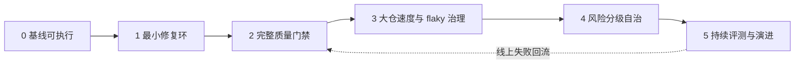

---

## 20. 常见坑与修复方法

### 坑 1：把 `returncode == 0` 当成唯一正确性

**症状**：命令没有收集任何测试，系统仍显示成功。  
**根因**：没有解释测试框架的退出码与收集数量。  
**修复**：结构化解析退出码、收集数、失败类型；`NO_TESTS_COLLECTED` 必须失败关闭。pytest 官方文档区分了通过、测试失败、内部错误、用法错误和未收集测试等退出状态。[^pytest-exit]

### 坑 2：新增测试没有先在基线上跑红

**症状**：Agent 增加一个永远通过的测试，并宣称完成。  
**根因**：缺失红绿完整性。  
**修复**：将新增测试分别应用到基线和候选 Patch，验证失败原因与任务一致。

### 坑 3：只跑目标测试

**症状**：目标场景绿，公共函数的其他调用方回归。  
**根因**：验证范围小于影响范围。  
**修复**：目标绿后做依赖/覆盖影响分析，出口全量兜底。

### 坑 4：全量测试每轮都跑

**症状**：每次迭代 20 分钟，Agent 一小时只试三次。  
**根因**：没有分层验证。  
**修复**：环内目标测试，候选后影响验证，出口完整门禁；使用构建与测试缓存。

### 坑 5：失败就自动多次重试

**症状**：flaky 被掩盖，报表显示全绿。  
**根因**：把重试当成成功策略，而不是诊断信号。  
**修复**：passed-on-retry 单独上报；隔离需 Owner、工单和到期时间。

### 坑 6：所有红灯都让 Agent 改业务代码

**症状**：依赖下载失败、磁盘满、容器异常却产生大量无关 Diff。  
**根因**：失败未分类。  
**修复**：区分业务、测试、环境、基础设施、策略与 flaky。

### 坑 7：允许 Agent 静默更新截图基线

**症状**：视觉回归被“更新基线”消除。  
**根因**：候选结果能修改裁判。  
**修复**：基线更新作为独立、需审查动作；保存 expected/actual/diff。

### 坑 8：覆盖率高就认为测试质量高

**症状**：行覆盖 95%，关键条件错误仍未被发现。  
**根因**：执行过不等于断言过。Coverage.py 等工具可提供行覆盖和分支覆盖，但覆盖率仍只是一个结构信号。[^coverage]  
**修复**：结合分支覆盖、属性测试、变异测试和缺陷回放。变异测试通过对代码做小改动并重跑测试，检查断言能否发现行为变化。[^mutation]

### 坑 9：测试文件一律不可改

**症状**：新功能或规范变更无法新增正确验收测试。  
**根因**：把“保护裁判”误解为“测试永远只读”。  
**修复**：按任务类型区分；实现修改与裁判修改分开审查。

### 坑 10：Reviewer Agent 与修复 Agent 使用完全相同上下文

**症状**：Reviewer 重复生成者的偏见，没有独立价值。  
**根因**：验证信号高度同源。  
**修复**：Reviewer 使用不同角色、独立需求摘要、完整 Diff 与证据；高风险仍需确定性门禁和人工。

### 坑 11：Prompt 中说“不要改测试”就算完成权限控制

**症状**：模型仍能通过 Shell、脚本或 Git 命令修改保护文件。  
**根因**：只做软约束，没有工具层 PEP。  
**修复**：文件写策略、命令沙箱、路径监控和 Diff Guard 多层执行。

### 坑 12：新增依赖只做漏洞扫描

**症状**：包没有已知 CVE，但来源可疑、许可证不兼容或是新抢注包。  
**根因**：漏洞数据库只覆盖已知问题。  
**修复**：内部镜像、来源/身份、维护与许可证、版本哈希、SBOM、签名与人工准入组合。

### 坑 13：Evidence Bundle 只保存摘要

**症状**：几周后无法重放，原始日志和环境已消失。  
**根因**：摘要替代了证据。  
**修复**：摘要携带原始工件指针与哈希；保存关键镜像、依赖和 Evaluator 版本。

### 坑 14：直接用公开榜单承诺企业成功率

**症状**：试点成功率远低于承诺。  
**根因**：数据、语言、环境、测试健康度与 Harness 全部分布错配。  
**修复**：用自家任务实测；公开分数只作粗筛与技术趋势参考。

### 坑 15：自动合并比例成为核心 KPI

**症状**：团队通过降低门禁提高“自治率”，返修和回滚上升。  
**根因**：优化了错误目标。  
**修复**：核心指标改为 Verified Fix、返修率、回归率、人工接受率和总成本。

### 坑 16：只保存最终成功轨迹

**症状**：无法分析为什么某类任务总失败，也无法改进 Harness。  
**根因**：失败被当成无价值垃圾。  
**修复**：保存结构化失败分类、尝试账本和交接包；对失败模式聚类。

### 坑 17：缓存命中视为“已实际验证”

**症状**：缓存键遗漏环境变量，旧结果制造假绿。  
**根因**：缓存正确性假设未被审计。  
**修复**：记录缓存键与命中；高风险或可疑变更强制重新执行。

### 坑 18：评测任务从不审计

**症状**：模型越来越高分，但任务包含错误测试、泄露答案或失效依赖。  
**根因**：把评测集当成静态真理。  
**修复**：对任务做基线、Gold Patch、替代实现、公平性、污染和环境持续审计。

---

## 21. 面试高频问题与回答框架

### Q1：测试驱动修复环应该如何设计？

**结论先行**：应采用“任务规范化 → 固定基线 → 先复现 → 定位与最小编辑 → 聚焦验证 → 失败归因与教训累积 → 扩大验证 → 独立审查 → 证据包”的有界状态机。

回答要点：

1. 修复前必须得到稳定红灯，否则无法证明 Patch 与修复有因果关系；
2. 每轮用目标/近邻测试提供快速反馈，目标绿后执行影响测试与全量门禁；
3. 失败要分类，不能把环境、flaky 和业务失败都交给模型改代码；
4. 维护 Attempt Ledger，避免重复无效方案；
5. 设置次数、时间、Token、资源、Diff 和风险预算；
6. 预算耗尽时输出交接包，不无限重试；
7. 最终完成条件是证据闭合，不是模型声明。

### Q2：为什么测试通过不等于修复正确？

**结论先行**：测试只证明被执行、被断言的场景满足当前断言，无法自动覆盖错误断言、未覆盖输入、回归、非功能、安全和供应链。

典型反例：修改断言、跳过测试、硬编码样例、只跑目标测试、性能退化、API 兼容破坏、恶意依赖。防线是保护裁判、红绿完整性、隐藏与属性测试、全量回归、专项门禁和独立审查。

### Q3：如何防止 Coding Agent 为了通过测试而作弊？

**结论先行**：不能只靠 Prompt，要把“生成者不能修改裁判”落实到工具、Diff、评测和审批四层。

- 工具层限制测试、CI、策略、基线和隐藏测试写权限；
- Diff 层检测删除断言、skip、容差放宽、覆盖率下降和 CI 弱化；
- 评测层验证新增测试先红后绿，并使用隐藏、属性、差分和变异测试；
- 审批层让测试变更、规范变更与实现变更分开审核。

### Q4：大型仓库如何做增量选测？

**结论先行**：组合显式目标、模块近邻、静态反向依赖、动态覆盖映射和历史共失败数据，按风险与时间预算排序；但出口必须保留全量兜底。

回答中要强调：动态加载、反射、全局配置、锁文件和基础库会降低选测可信度；需要安全降级。衡量选测不能只看节省时间，还要在历史回放中计算对最终失败测试的 Recall。

### Q5：如何处理 flaky 测试？

**结论先行**：重跑用于诊断，不用于掩盖；要区分测试 flaky、产品非确定性缺陷和基础设施不稳定。

- 同代码、同环境重跑并比较失败指纹；
- passed-on-retry 单独上报；
- 隔离必须有 Owner、工单、原因和到期时间；
- 环内可屏蔽确认 flaky，出口仍显示；
- 修 flaky 作为独立任务；
- 统计其消耗的 Agent 预算和 CI 成本。

### Q6：UI 变更如何建立验证闭环？

**结论先行**：使用组件逻辑、语义/可访问性、e2e、像素基线、多模态/人工五层组合。

固定浏览器、字体、Viewport、DPR、主题、Locale 和数据；关闭动画、Mask 动态区域；保存 expected/actual/diff 和 Trace。多模态模型适合语义审查，但不能替代像素和行为门禁，高风险页面仍需人确认。

### Q7：SWE-bench 分数为什么不能直接代表企业能力？

**结论先行**：分数同时受数据集、Harness、工具、预算、环境、污染和任务分布影响；企业内部框架、无测试仓、多语言、迁移与安全要求不在同一分布。

正确用法是用公开基准追踪趋势和粗筛，再用自家 Issue 建固定回归集与滚动新鲜集。报告分场景成功率、完整门禁成功率、成本、返修和回归，而不是只报公开 resolved rate。

### Q8：企业内部 Coding Agent 评测集怎么建？

**结论先行**：从真实历史 Issue、线上事故、回滚、迁移和功能需求抽样，冻结仓库与环境，建立 FAIL_TO_PASS、PASS_TO_PASS、隐藏测试和专项 Gate，并对任务本身做质量审计。

需要版本化模型、Prompt、工具、预算、镜像、Evaluator 和测试摘要；任务按语言、风险、规模、测试健康度和类型分层；同时维护固定集和滚动新鲜集，防止过拟合与污染。

### Q9：如何设计质量指标？

**结论先行**：北极星是 Verified Fix，不是 Patch 数或目标测试通过率。

核心指标包括完整门禁解决率、首次成功率、30 天返修率、回归引入率、Escape、人工接受率、每个可信修复成本和时间。过程指标包括尝试次数、重复方案率、选测 Recall、flaky 消耗、Diff 膨胀和保护路径尝试率。

### Q10：OpenTelemetry 在修复环中如何建模？

**结论先行**：一次任务建根 Span，复现、定位、编辑、聚焦验证、扩大验证、审查和证据打包建子 Span；模型、工具、命令和 Gate 均可关联。

Trace 用于单任务因果链，Metric 用于整体质量和延迟，Log/Event 用于失败与策略事件。注意高基数字段放 Trace，不放 Metric Label；Prompt、代码和日志默认脱敏或不采集。

### Q11：供应链门禁应该放在哪里？

**结论先行**：从依赖进入环境之前开始，而不是等测试后扫描。

依赖只经内部镜像或准入平台；检测 Manifest、Lockfile、Import 和实际安装图差异；检查来源、发布者、维护、漏洞和许可证；固定版本与哈希；生成 SBOM；验证构建 Provenance 与签名；新增依赖单独审核。

### Q12：何时可以自动合并 Agent Patch？

**结论先行**：只有低风险、测试健康、Diff 小、无裁判/依赖/策略变更、全部门禁通过、证据完整、支持回滚，且同类历史质量稳定时才考虑。

自动合并权限应依据返修率、回归率和人工推翻率逐步扩大；一旦质量恶化自动收缩。高风险领域只允许 Agent 生成候选和证据，不允许自动生效。

---

## 22. 可直接使用的检查清单

### 22.1 任务进入修复环前

- [ ] 任务目标、非目标与验收条件已结构化；
- [ ] 风险等级与关键路径已识别；
- [ ] 仓库提交、依赖、工具链和环境已固定；
- [ ] 工作区隔离且可回滚；
- [ ] 可写、保护和禁止路径已配置；
- [ ] 测试命令来自注册表，不由 Agent 猜测；
- [ ] 修改前问题能够稳定复现；
- [ ] 基线历史失败已区分；
- [ ] 尝试、时间、成本、资源和 Diff 预算已设置；
- [ ] 无测试任务已确定复现测试审批流程。

### 22.2 每次编辑后

- [ ] 编辑工具返回了实际落盘片段；
- [ ] 路径未越出工作区；
- [ ] 未触及保护文件或生成目录；
- [ ] Diff 未超过预算；
- [ ] 未出现断言删除、skip、阈值下降和 CI 弱化；
- [ ] 聚焦测试实际收集并执行；
- [ ] 失败已分类并生成指纹；
- [ ] 教训账本记录了假设、Patch、结果和禁用方案；
- [ ] 超时和资源异常没有被误当成业务失败；
- [ ] 重试没有重复同一无效修改。

### 22.3 候选 Patch 进入审查前

- [ ] 目标测试由红转绿；
- [ ] 影响测试通过；
- [ ] 出口全量或策略要求的完整测试通过；
- [ ] 编译、类型、lint、格式通过；
- [ ] UI 变更具备语义、e2e 和视觉证据；
- [ ] 性能、并发、迁移、兼容专项验证按风险执行；
- [ ] 新增依赖经过来源、漏洞、许可证和准入检查；
- [ ] SBOM/Provenance/签名按策略生成或验证；
- [ ] Reviewer 检查根因、最小性、项目风格和测试完整性；
- [ ] 残余风险被明确列出。

### 22.4 合并或发布前

- [ ] 所有必需 Gate 有确定结论；
- [ ] 证据包完整且摘要可验证；
- [ ] 原始日志、JUnit、截图和 Trace 可访问；
- [ ] Harness、模型、Prompt、策略和环境版本已记录；
- [ ] 人工批准满足风险等级要求；
- [ ] 回滚方案存在且经过验证；
- [ ] 自动合并资格仍有效；
- [ ] 任务已进入线上质量追踪；
- [ ] 返修、回归与 Escape 可回流评测集；
- [ ] 敏感数据和证据保留策略满足要求。

### 22.5 评测任务上线前

- [ ] 基线可稳定构建；
- [ ] FAIL_TO_PASS 在基线稳定失败；
- [ ] Gold Patch 可通过全部要求；
- [ ] 替代正确实现不会被错误拒绝；
- [ ] 任务描述信息充分；
- [ ] 隐藏测试与答案权限隔离；
- [ ] 镜像和依赖可长期重放；
- [ ] 资源预算合理；
- [ ] 评分脚本不可被 Patch 修改；
- [ ] 任务已标注领域、语言、风险、难度与失败类型。

---

## 23. 本章总结

Coding Agent 的优势不只是“会写代码”，而是软件工程已经积累了大量可执行验证信号。但这些信号只有经过正确设计，才能形成可信闭环。

本章的核心结论可以压缩为十条：

1. **先复现，再修改**：红绿因果链是修复证明的起点。
2. **生成者不能同时控制裁判**：测试、CI、策略和基线必须受保护。
3. **测试绿只是必要条件**：还要验证回归、静态质量、非功能、安全、兼容和供应链。
4. **环内快、出口全**：选测用于加速，完整门禁用于交付。
5. **失败必须分类**：代码、测试、flaky、环境、基础设施和策略不是一回事。
6. **重试必须积累教训且有边界**：否则只是昂贵的随机游走。
7. **UI 需要多信号验证**：行为、语义、像素、多模态与人工各有位置。
8. **公开基准只能粗筛**：企业质量必须由自家任务、Harness 和线上指标证明。
9. **质量用 Verified Fix 衡量**：返修率、回归率和 Escape 比 Patch 数更诚实。
10. **每次交付都应有证据包**：把“相信 Agent”变成“验证证据”。

最终，验证闭环的目标不是让 Agent 永远不犯错，而是做到：

> **错误能被外部信号尽早发现，失败能被正确分类，重试能够真正前进，风险能够自动升级，结论能够被第三方重放。**

这才是从 Coding Demo 走向企业级质量工程的分水岭。

---

## 参考资料

[^playwright-visual]: Playwright 官方文档，Visual Comparisons：<https://playwright.dev/docs/test-snapshots>

[^scorecard]: OpenSSF Scorecard 官方网站：<https://scorecard.dev/>

[^spdx]: SPDX 官方网站与规范概览：<https://spdx.dev/>

[^cyclonedx]: OWASP CycloneDX 官方网站：<https://cyclonedx.org/>

[^slsa]: SLSA 官方网站与规范：<https://slsa.dev/>

[^sigstore]: Sigstore 官方文档，Overview：<https://docs.sigstore.dev/about/overview/>

[^swebench-original]: SWE-bench 官方项目介绍与原始评测：<https://www.swebench.com/original.html>

[^swebench-harness]: SWE-bench 官方 Harness 参考：<https://www.swebench.com/SWE-bench/reference/harness/>

[^swebench-verified]: SWE-bench Verified 官方页面：<https://www.swebench.com/verified.html>

[^swebench-multimodal]: SWE-bench Multimodal 官方页面：<https://www.swebench.com/multimodal.html>

[^swebench-multilingual]: SWE-bench Multilingual 官方页面：<https://www.swebench.com/multilingual.html>

[^swebench-verified-audit]: OpenAI，*Why SWE-bench Verified no longer measures frontier coding capabilities*，2026-02-23：<https://openai.com/index/why-we-no-longer-evaluate-swe-bench-verified/>

[^swebench-pro-audit]: OpenAI，*Separating signal from noise in coding evaluations*，2026-07-08：<https://openai.com/index/separating-signal-from-noise-coding-evaluations/>

[^otel-signals]: OpenTelemetry 官方文档，Signals：<https://opentelemetry.io/docs/concepts/signals/>

[^otel-semconv]: OpenTelemetry Semantic Conventions：<https://opentelemetry.io/docs/specs/semconv/>

[^otel-genai]: OpenTelemetry，GenAI 属性与语义约定：<https://opentelemetry.io/docs/specs/semconv/registry/attributes/gen-ai/>

[^hypothesis]: Hypothesis 官方文档：<https://hypothesis.readthedocs.io/>

[^pytest-exit]: pytest 官方文档，Exit codes：<https://docs.pytest.org/en/stable/reference/exit-codes.html>

[^coverage]: Coverage.py 官方文档：<https://coverage.readthedocs.io/>

[^mutation]: Cosmic Ray 官方文档，Mutation Testing Concepts：<https://github.com/sixty-north/cosmic-ray/blob/master/docs/source/concepts.rst>

### 延伸阅读

- SWE-bench 官方仓库：<https://github.com/SWE-bench/SWE-bench>
- Playwright Trace Viewer：<https://playwright.dev/docs/trace-viewer>
- Hypothesis Stateful Testing：<https://hypothesis.readthedocs.io/en/latest/stateful.html>
- mutmut Python Mutation Tester：<https://mutmut.readthedocs.io/>
- Bazel Remote Caching：<https://bazel.build/remote/caching>
- Nx Affected：<https://nx.dev/docs/features/ci-features/affected>
- CycloneDX Specification Overview：<https://cyclonedx.org/specification/overview/>
- SPDX Specifications：<https://spdx.dev/use/specifications/>
- Sigstore Verification：<https://docs.sigstore.dev/cosign/verifying/verify/>
- OpenTelemetry GenAI Observability：<https://opentelemetry.io/blog/2026/genai-observability/>

