# 第 25 章 协作形态与交付工程：从单 Agent 修复环到规模化软件交付

> **本章核心结论**：Coding Agent 的规模化瓶颈并不在“能同时启动多少个 Agent”，而在一组稀缺共享资源：**可安全拆分的任务、可隔离的工作区、可预测的文件与语义冲突、有限的 CI 算力、有限的专业评审注意力、受保护的合并通道，以及可回滚的发布能力**。  
> 多 Agent 只有进入一套完整的交付控制系统，才能把“并发生成代码”转化为“稳定交付价值”。

本文在原章“四档协作形态、Reviewer 模式、并行 worktree、冲突治理、CI 与终审容量”的基础上，补全一套生产级交付体系。全文不把 Agent 当作一个更快的代码生成器，而把它视为软件研发组织中的新型执行主体，重点回答以下问题：

1. 什么任务适合内联、结对、异步委托或并行队列？
2. 一个任务怎样被描述，Agent 才不会“做完了但交付不了”？
3. 多 Agent 如何隔离、调度、审查、合并，而不是互相制造返工？
4. 如何把文件冲突、语义冲突、CI 排队和评审积压前移治理？
5. 如何设计信任分级、权限边界、证据链和人工闸门？
6. 如何用指标证明系统提升的是交付吞吐，而不只是 PR 数量？

---

## 目录

- [1. 从“能写代码”到“能规模化交付”](#1-从能写代码到能规模化交付)
- [2. 人与 Coding Agent 的四档协作形态](#2-人与-coding-agent-的四档协作形态)
- [3. 风险分级：协作档位不能由感觉决定](#3-风险分级协作档位不能由感觉决定)
- [4. 任务契约：并行交付的最小治理单元](#4-任务契约并行交付的最小治理单元)
- [5. 生产级 Coding Agent 交付控制平面](#5-生产级-coding-agent-交付控制平面)
- [6. 多 Agent 协作拓扑](#6-多-agent-协作拓扑)
- [7. Reviewer 模式：独立上下文的质量守门人](#7-reviewer-模式独立上下文的质量守门人)
- [8. 并行 worktree：隔离只是起点](#8-并行-worktree隔离只是起点)
- [9. 冲突预测与文件亲和调度](#9-冲突预测与文件亲和调度)
- [10. 从文本冲突升级到语义冲突治理](#10-从文本冲突升级到语义冲突治理)
- [11. CI 容量工程：并行之后的第一瓶颈](#11-ci-容量工程并行之后的第一瓶颈)
- [12. 评审带宽工程：人的注意力是稀缺算力](#12-评审带宽工程人的注意力是稀缺算力)
- [13. 合并预检、合并队列与主干保护](#13-合并预检合并队列与主干保护)
- [14. 从合并到发布：交付闭环的最后一公里](#14-从合并到发布交付闭环的最后一公里)
- [15. 权限、安全与供应链治理](#15-权限安全与供应链治理)
- [16. 可观测性、指标与 SLO](#16-可观测性指标与-slo)
- [17. 生产级数据模型与状态机](#17-生产级数据模型与状态机)
- [18. 参考实现：调度器、worktree 与合并预检](#18-参考实现调度器worktree-与合并预检)
- [19. GitHub Actions 与仓库策略示例](#19-github-actions-与仓库策略示例)
- [20. 异常恢复与幂等性设计](#20-异常恢复与幂等性设计)
- [21. 常见失败模式与系统化修复](#21-常见失败模式与系统化修复)
- [22. 分阶段落地路线与成熟度模型](#22-分阶段落地路线与成熟度模型)
- [23. 团队运行手册与检查清单](#23-团队运行手册与检查清单)
- [24. 面试高频问题](#24-面试高频问题)
- [25. Coding Agent 机制总图](#25-coding-agent-机制总图)
- [附录 A：术语表](#附录-a术语表)
- [附录 B：参考资料](#附录-b参考资料)

---

# 1. 从“能写代码”到“能规模化交付”

## 1.1 单 Agent 成功，不等于团队交付成功

第 23 章解决的是“看懂代码库并进行受控编辑”，第 24 章解决的是“通过验证闭环证明改动大概率正确”。当单个 Agent 已经可以稳定完成一个任务后，团队自然会提出下一个问题：

> 既然一个 Agent 能完成一个修复，为什么不同时启动十个、五十个甚至上百个 Agent？

这个问题隐含了一个错误前提：认为软件交付吞吐由“编码速度”单独决定。真实的软件交付系统至少包含以下阶段：


Agent 主要加速了中间的“理解—实现—局部验证”阶段。只要其他阶段没有同步扩容，瓶颈就会迅速迁移：

- 任务拆分不清，多个 Agent 会修改同一问题的不同表面；
- worktree 隔离了工作目录，却没有隔离最终要汇入的主干；
- CI 仍是固定容量，提交次数增加后排队时间急剧增长；
- Reviewer Agent 能过滤机械问题，但架构意图、风险接受仍需要人；
- 合并后的组合行为可能失败，单 PR 全绿并不代表队列组合全绿；
- 发布窗口、数据库迁移、共享测试环境仍然是串行资源。

因此，**并行编码只是局部并行，软件交付是端到端流系统**。

## 1.2 交付吞吐由最窄瓶颈决定

可以用一个简化模型理解系统上限：

```text
有效交付吞吐 ≈ min(
  可被正确拆分的任务速率，
  Agent 执行速率，
  CI 验证速率，
  Reviewer 审查速率，
  人工终审速率，
  合并与发布速率
)
```

并行度也不是“Agent 数量”，而是多个容量约束的最小值：

```text
P_effective = min(
  P_task_independence,
  P_workspace,
  P_CI,
  P_review,
  P_merge,
  P_environment,
  P_release
)
```

其中：

- `P_task_independence`：任务真正互不依赖的数量；
- `P_workspace`：可以安全创建和维护的隔离工作区数量；
- `P_CI`：CI 在目标反馈时间内可承载的并发量；
- `P_review`：Reviewer Agent 与人类评审的有效容量；
- `P_merge`：主干在不破坏稳定性的前提下可接受的合并速率；
- `P_environment`：共享数据库、测试账号、端口、外部沙箱等环境容量；
- `P_release`：部署、灰度、观察和回滚能力。

当上游并行度超过下游容量时，系统不会凭空增加吞吐，只会增加 WIP（进行中的工作）、队列长度和上下文切换。依据排队系统常用关系：

```text
WIP = Throughput × Lead Time
```

如果吞吐不变而 WIP 增加，交付周期只会变长。

## 1.3 并行之后真正竞争的共享资源

原章指出文件、CI、人的注意力是三类主要共享资源。生产环境中可以进一步扩展为七类：

| 共享资源 | 典型冲突 | 主要治理手段 |
|---|---|---|
| 文件与符号 | 同文件、同函数、同接口同时修改 | 触碰集预测、亲和分组、语义锁 |
| Git 主干 | rebase 冲突、组合失败、顺序依赖 | 合并预检、merge queue、依赖图 |
| CI 算力 | runner 排队、重复跑旧提交 | 分层验证、取消过期运行、配额与缓存 |
| 测试环境 | 共享数据库、固定端口、测试账号冲突 | 命名空间、租约、环境池、串行锁 |
| 评审注意力 | PR 积压、疲劳审批、领域错配 | Reviewer Agent、CODEOWNERS、风险路由 |
| 权限与密钥 | 过度授权、敏感操作、供应链注入 | 最小权限、短期凭据、策略引擎 |
| 发布窗口 | 迁移顺序、灰度容量、回滚互斥 | 发布队列、变更窗口、可逆性设计 |

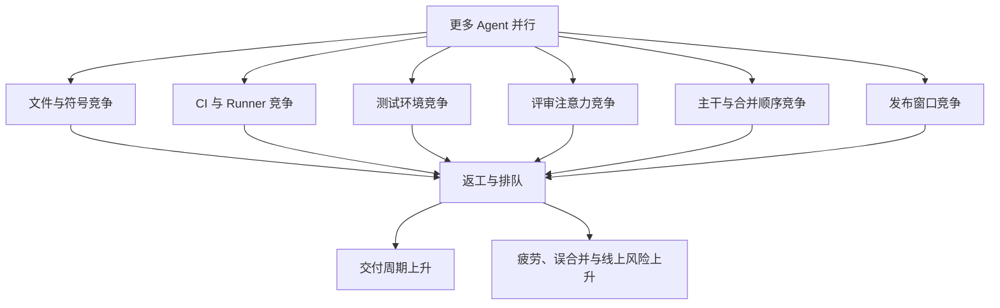

成熟团队不会问“最多能开多少 Agent”，而会问：

1. 当前最窄的共享资源是什么？
2. 增加一个并发任务，会把负载增加到哪个下游？
3. 这个任务是否真的独立，还是把冲突推迟到了合并阶段？
4. 系统是否保留了足够容量处理紧急人工修复？

---

# 2. 人与 Coding Agent 的四档协作形态

人与 Agent 的协作方式不是一条“从落后到先进”的路线，而是四种适用于不同风险、反馈速度和任务结构的工具。

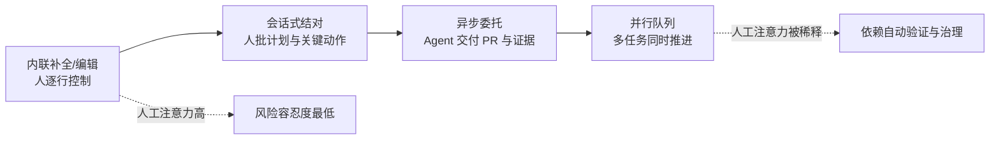

## 2.1 内联补全与受控编辑

**定义**：Agent 在 IDE 中提供补全、局部重写或小范围编辑，工程师逐处接受。

适合：

- 安全敏感代码；
- 核心算法的关键分支；
- 需求高度模糊、需要即时判断的任务；
- 一次只改几行且人工判断成本低于任务委托成本的工作。

优点：

- 人始终掌握意图和每一处副作用；
- 错误可以在形成大 patch 前被拦截；
- 不需要复杂的任务契约和异步交接。

局限：

- 人的注意力无法释放；
- 扩展到大任务时容易变成“人不断给 Agent 擦方向盘”；
- 吞吐取决于工程师在线时间。

## 2.2 会话式结对

**定义**：工程师与 Agent 围绕一个任务连续协作。Agent 负责探索、计划、编辑和运行工具，人对计划、敏感动作、关键 diff 与最终结果进行确认。

这是多数复杂 Coding Agent 任务的默认形态，因为它在自治与控制之间取得平衡：

- Agent 可以形成完整修复环；
- 人可以及时纠偏错误假设；
- 上下文保持连续，适合跨文件但仍需要频繁业务判断的任务；
- 失败时能快速把隐性需求转化为显性约束。

会话式结对的关键不是“人一直盯着”，而是定义检查点：

1. 计划批准；
2. 敏感文件或命令批准；
3. 首个可运行版本审查；
4. 最终 diff 与证据审查。

## 2.3 异步委托

**定义**：人提交任务契约，Agent 在隔离环境中自主执行，最终以 PR、验证证据和风险说明交付。

适合：

- 验收标准明确；
- 环境可完全数字化；
- 有稳定测试或可构建验证器；
- 失败可回滚；
- 不需要持续业务判断。

异步委托不是“把一句自然语言扔给 Agent”。它需要：

- 明确的目标与非目标；
- 基准提交 `base_sha`；
- 允许与禁止触碰的路径；
- 必须运行的验证；
- 预算、超时和最大返工轮数；
- 失败与升级条件；
- 最终交付包格式。

## 2.4 并行队列

**定义**：多个异步任务被调度到独立 worktree 或沙箱中同时推进，统一经过审查、CI、合并与发布控制面。

并行队列适用于：

- 有稳定任务池；
- 任务间依赖可以建模；
- 文件触碰集能够提前预测；
- CI 与审查有明确容量；
- 主干保护、合并队列和异常恢复已经成熟。

并行队列最常见的误区是直接从“一个 Agent 会工作”跳到“同时启动 N 个 Agent”。正确顺序应当是：

```text
单任务闭环稳定
→ 任务契约稳定
→ Reviewer 稳定
→ worktree 生命周期稳定
→ 冲突预测与容量控制稳定
→ 才扩大并行度
```

## 2.5 混合协作才是成熟形态

同一个团队、同一个工程师甚至同一天，会同时使用四档协作：

| 任务 | 推荐形态 | 原因 |
|---|---|---|
| 修改安全鉴权条件 | 内联或会话式 | 风险高，需要逐处确认 |
| 修复有稳定复现测试的普通 Bug | 会话式或异步 | 验证信号强，可形成闭环 |
| 批量修正文档链接 | 异步委托 | 低风险、可自动验证 |
| 多模块独立升级 | 并行队列 | 可拆分、吞吐收益明显 |
| 数据库破坏性迁移 | 会话式 + 人工专项评审 | 不可逆性与顺序约束强 |
| 生成测试用例 | 异步并行，但禁止降低断言 | 风险较低，但存在“刷绿”风险 |

正确的问题不是“我们是否已经进入全异步时代”，而是：

> 这个任务应当处在哪个协作档位？什么证据出现后可以升档，什么风险出现后必须降档？

---

# 3. 风险分级：协作档位不能由感觉决定

## 3.1 为什么必须策略化

如果协作档位由个人临场选择，团队很快会出现以下不一致：

- 同样的鉴权改动，有人异步委托，有人坚持逐行审查；
- 低风险文档任务占用了高级评审者；
- 高风险基础设施改动因为“测试全绿”进入自动合并；
- Agent 为追求完成率，主动选择更宽松的验证路径。

因此，协作模式必须由**风险分类器 + 仓库策略**决定，模型只能提供建议，不能单独决定自己的权限等级。

## 3.2 一个可落地的五级风险模型

| 等级 | 典型变更 | 默认协作形态 | 默认合并策略 |
|---|---|---|---|
| R0 可逆低风险 | 文档、注释、格式、非生产示例 | 异步或并行 | 自动检查通过后可自动合并 |
| R1 局部行为 | 单模块 Bug、内部重构、测试补充 | 会话式或异步 | Reviewer Agent + 常规人工抽查 |
| R2 跨模块行为 | 公共 API、跨服务契约、共享模型 | 会话式 | 独立 Reviewer + CODEOWNER 终审 |
| R3 敏感变更 | 鉴权、支付、隐私、依赖、数据库迁移、CI 权限 | 内联或强监督会话 | 专项人工深评，禁止自动合并 |
| R4 不可逆/生产控制 | 生产数据删除、密钥轮换、基础设施销毁、紧急发布 | 人工主导 | 双人控制、变更窗口、预演与回滚 |

风险不是只由文件路径决定。一个实用评分可以同时考虑：

```text
RiskScore =
  数据敏感度
+ 权限变化
+ 可逆性损失
+ 影响范围
+ 外部接口变化
+ 测试充分性不足
+ 依赖与供应链变化
+ 历史故障热度
+ 任务描述不确定性
```

## 3.3 风险路由流程

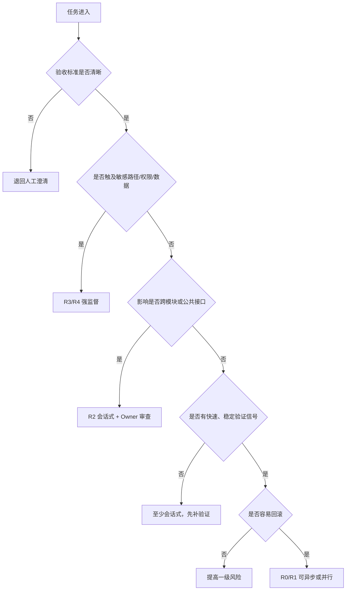

## 3.4 动态升降档

任务启动时的风险等级不是永久不变。执行过程中出现以下事件应自动升级：

- 实际触碰文件超出允许范围；
- 新增或更新外部依赖；
- 修改锁文件、生成代码、数据库迁移或 CI 配置；
- 原计划的局部修改演变为公共接口变更；
- Agent 需要访问网络、密钥或生产数据；
- 测试无法稳定复现；
- Reviewer 发现“任务本身的验收标准不足”；
- 连续失败达到上限，模型开始大范围试探性修改。

相反，任务只有在积累足够历史证据后才能降档。例如某类依赖更新连续数十次通过相同验证、无回滚、无人工新增意见，才可以从“每次人工终审”调整为“抽样终审”。

---

# 4. 任务契约：并行交付的最小治理单元

## 4.1 为什么自然语言 Issue 不够

人类工程师可以从一句模糊需求中主动追问、读取组织语境、理解隐含优先级。异步 Agent 缺少这些社会上下文。如果任务只写“修一下登录偶发失败”，Agent 可能：

- 修改错误的登录链路；
- 通过放宽校验让测试通过；
- 顺便重构整个认证模块；
- 无法判断“偶发”应如何复现；
- 不知道哪些日志、指标或兼容性必须保留。

**任务契约（Task Contract）** 把需求从“自然语言愿望”转换为“可执行、可验证、可审计的交付边界”。它是并行系统中最小的治理单元。

## 4.2 任务契约的必要字段

| 字段 | 作用 | 缺失后的典型风险 |
|---|---|---|
| `task_id` | 全链路关联 | 日志、worktree、PR、CI 无法归因 |
| `objective` | 描述期望行为 | Agent 只修表象，不理解目标 |
| `non_goals` | 明确不做什么 | 顺手重构、范围蔓延 |
| `acceptance_criteria` | 定义完成条件 | “代码写完”被误当成交付完成 |
| `reproduction` | 固化问题复现 | 无法建立修复前后的对照 |
| `base_sha` | 固定任务起点 | 执行结果与当前主干不可比较 |
| `allowed_paths` | 限制写范围 | 越权修改无关模块 |
| `sensitive_paths` | 触发升级 | 高风险文件被普通流程处理 |
| `required_checks` | 定义验证证据 | Agent 自选最容易通过的测试 |
| `forbidden_actions` | 明确禁止行为 | 禁止改测试、禁止联网等约束丢失 |
| `budget` | 限制时间、轮数、成本 | 无界循环、CI 风暴 |
| `review_policy` | 指定审查人和门禁 | 结果进入错误评审队列 |
| `rollback_plan` | 约束可逆性 | 合并后无法安全撤回 |
| `delivery_artifacts` | 统一交付包 | 人工需要重新考古执行过程 |

## 4.3 示例任务契约

```yaml
task_id: AUTH-4521
objective: >
  修复用户刷新令牌并发更新时偶发返回 401 的问题，确保同一用户的两个并发请求
  不会因为旧令牌覆盖新令牌而导致后续请求失效。

non_goals:
  - 不重构整个认证模块
  - 不更换令牌格式
  - 不修改公开 API 响应结构

reproduction:
  command: pytest tests/auth/test_refresh_race.py -q
  expected_before: 测试至少在 20 次循环内失败一次
  expected_after: 连续 100 次无失败

acceptance_criteria:
  - 并发刷新不再产生旧版本覆盖新版本
  - 原有单请求刷新行为保持不变
  - 不降低过期令牌校验强度
  - 新增回归测试且测试在修复前失败、修复后通过

base_sha: 8b21f4c0
allowed_paths:
  - src/auth/**
  - tests/auth/**
sensitive_paths:
  - src/auth/middleware/**
  - src/security/**

forbidden_actions:
  - 修改测试以跳过断言
  - 删除鉴权分支
  - 访问生产环境
  - 引入新的外部依赖

required_checks:
  - pytest tests/auth/test_refresh_race.py -q
  - pytest tests/auth -q
  - ruff check src/auth tests/auth
  - mypy src/auth

budget:
  wall_clock_minutes: 45
  max_fix_rounds: 5
  max_changed_files: 8
  max_diff_lines: 250

review_policy:
  risk_level: R3
  reviewer_agent: required
  code_owner_review: required
  security_review: required
  auto_merge: false

rollback_plan:
  strategy: revert_commit
  feature_flag: auth.refresh.cas_enabled

delivery_artifacts:
  - patch
  - test_evidence
  - risk_summary
  - changed_file_manifest
  - rollback_note
```

## 4.4 任务状态机

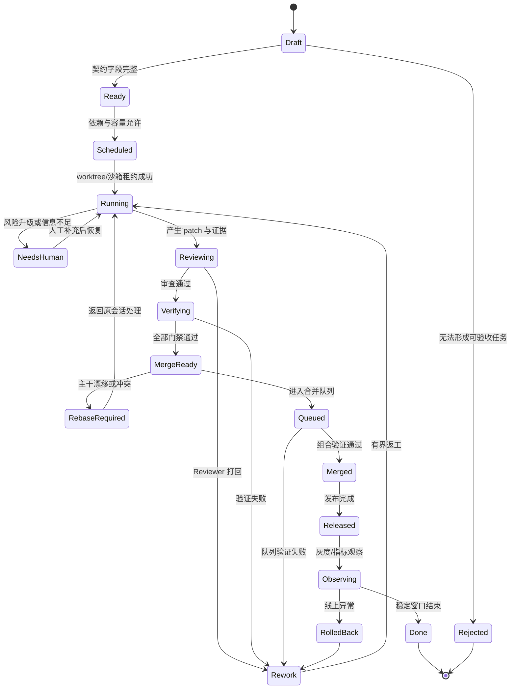

## 4.5 任务契约与 Prompt 的区别

- **Prompt**指导模型本轮如何思考与行动；
- **任务契约**定义系统允许什么、完成意味着什么、失败如何处理；
- Prompt 可以由 Agent 生成或优化，契约的关键安全字段必须由控制平面验证；
- Prompt 属于执行内容，契约属于治理事实；
- 任何模型输出都不能自行放宽契约。

换句话说：**Prompt 是建议，Policy 与 Contract 才是约束。**

---

# 5. 生产级 Coding Agent 交付控制平面

## 5.1 为什么需要控制平面

当只有一个会话时，人可以临时承担调度、权限判断、冲突处理和收尾清理。多 Agent 之后，这些职责必须从会话中抽离，形成确定性的控制平面。

控制平面不负责“聪明地写代码”，而负责：

- 把任务转化为可治理对象；
- 判断风险和协作档位；
- 管理依赖、并行度与共享资源租约；
- 分配工作区、权限和预算；
- 接收结构化证据；
- 驱动 Reviewer、CI、合并与发布状态机；
- 在崩溃、超时、冲突时恢复；
- 保存审计日志和度量数据。

## 5.2 总体架构

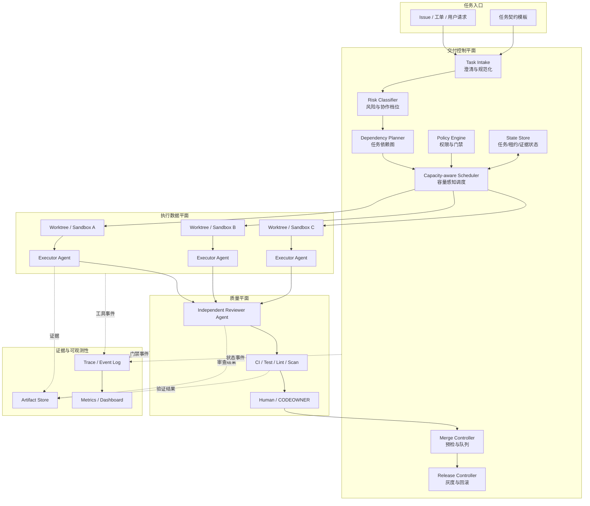

## 5.3 控制平面与数据平面的边界

| 控制平面 | 数据平面 |
|---|---|
| 任务状态、风险、租约、预算、策略 | 代码读取、编辑、命令执行 |
| 选择哪个 Agent 与工具 | Agent 如何完成具体实现 |
| 决定能否写、能否联网、能否合并 | 在授权范围内产生 patch |
| 验证证据是否完整 | 生成测试结果与分析报告 |
| 处理超时、重试和恢复 | 执行一次具体尝试 |

关键原则：

1. **模型不能修改控制平面的事实**，例如风险等级、必需检查和最大权限；
2. **执行器不直接拥有主干写权限**；
3. **Reviewer 默认只读，不与执行器共享可变工作状态**；
4. **合并控制器只接受结构化、可验证的门禁结果**；
5. **所有副作用都与任务 ID、会话 ID、worktree ID 关联**。

## 5.4 端到端时序

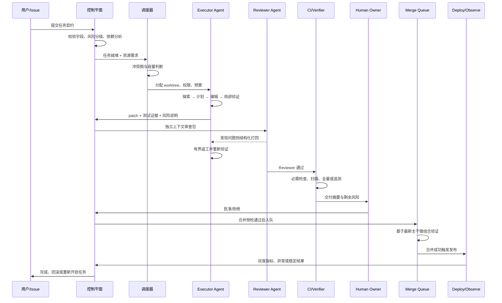

---

# 6. 多 Agent 协作拓扑

多 Agent 不等于让多个模型在同一个对话里自由聊天。生产系统需要明确：谁负责决策、谁负责执行、谁负责验证、谁拥有最终写权限。

## 6.1 Reviewer 拓扑

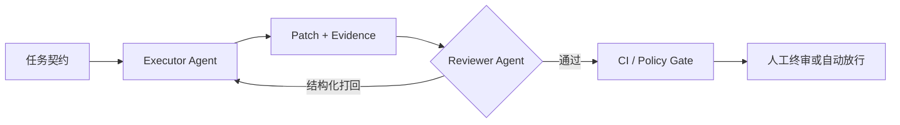

适合：大多数单任务质量提升。它通过独立上下文减少执行者的确认偏误。

## 6.2 Supervisor—Worker—Guard 拓扑

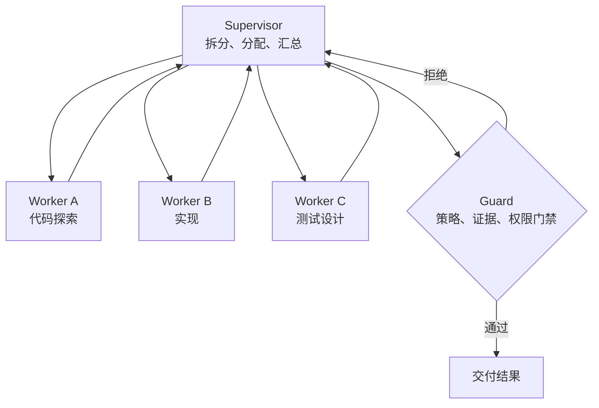

适合：一个复杂任务内部存在明显角色分工，但必须警惕：

- Supervisor 成为单点上下文瓶颈；
- Worker 结果缺乏统一格式，汇总成本高；
- 多个 Worker 同时写代码会产生所有权冲突；
- Guard 若只是另一个“说可以”的模型，不具备确定性门禁价值。

## 6.3 Parallel Worktree 拓扑

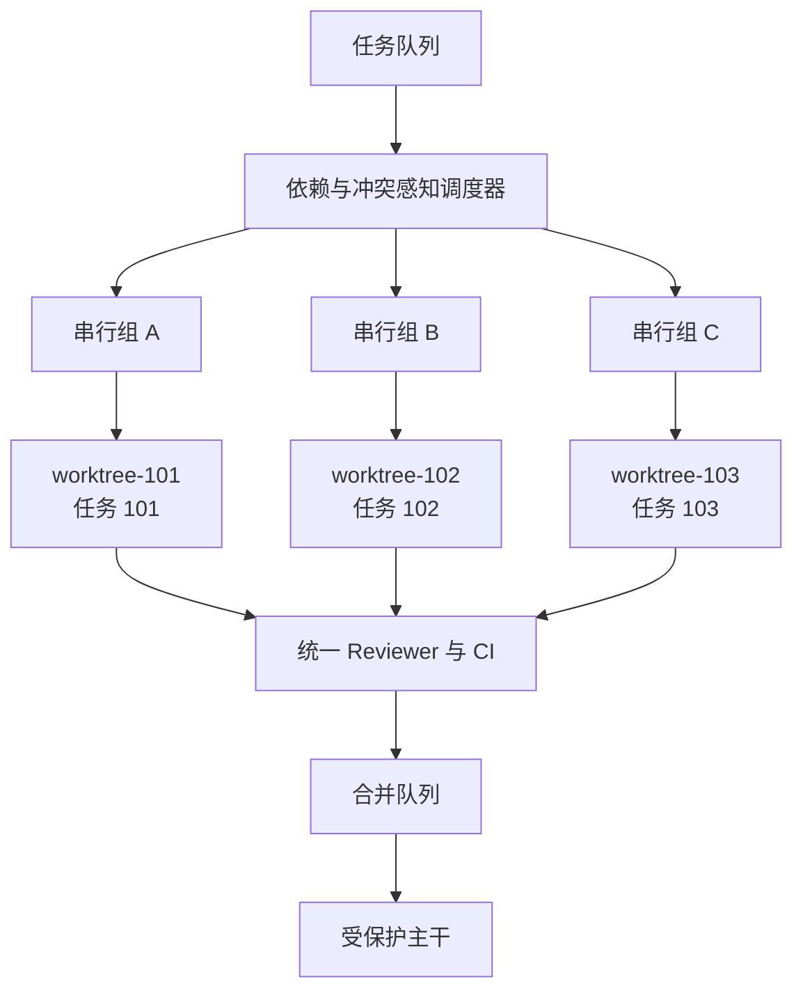

适合：多个相对独立任务并行推进。它的重点不在创建目录，而在：

- 任务独立性建模；
- worktree 生命周期；
- 文件与语义冲突预测；
- CI、公用环境和评审容量限制；
- 合并顺序与组合验证。

## 6.4 专家流水线拓扑

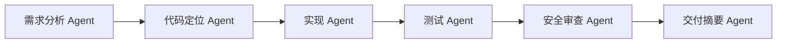

适合：每个阶段的输入输出可以强结构化的流程。缺点是：

- 上游错误会被下游放大；
- 每次交接都有信息损失；
- 过细角色拆分会让协调成本超过模型能力收益；
- “专家名字不同”不代表真实能力和工具视角不同。

## 6.5 拓扑选择矩阵

| 场景 | 推荐拓扑 | 不推荐原因 |
|---|---|---|
| 单个中等复杂 Bug | Executor + Reviewer | 多 Worker 协调成本不划算 |
| 大仓探索、主会话上下文昂贵 | Supervisor + 探索 Worker | 探索废料可隔离 |
| 多个独立 Issue | Parallel Worktree | 应最大化端到端吞吐 |
| 安全敏感改动 | Executor + 专项 Reviewer + Human | 不应靠自由讨论式多 Agent 决策 |
| 大规模机械迁移 | 分片 Worker + 统一 Guard | 需要一致规则和全局验证 |
| 跨模块架构重构 | 人类架构师 + 多个受限 Worker | 全自动 Supervisor 容易失去全局意图 |

## 6.6 多 Agent 的三个硬约束

1. **写所有权必须清晰**：同一文件、同一迁移序列或同一公共接口不能由多个 Agent 无协调地同时修改；
2. **交接必须结构化**：结论、证据、未决问题、风险和下一步不能只存在于自然语言聊天；
3. **循环必须有界**：Executor 与 Reviewer 的返工轮次、预算和升级条件必须明确。

---
# 7. Reviewer 模式：独立上下文的质量守门人

## 7.1 Reviewer 为什么必须独立

执行 Agent 在完成任务的过程中会形成一套自己的解释：问题是什么、为什么这样改、哪些异常可以忽略。这种解释帮助它行动，也会带来确认偏误。若让同一个 Agent 在同一上下文中“再检查一遍”，它往往只是重新陈述自己的理由。

独立 Reviewer 的价值来自三种分离：

1. **上下文分离**：Reviewer 不继承执行过程中的试错叙事，只读取任务契约、最终 diff、必要代码和验证证据；
2. **工具分离**：Reviewer 默认使用只读文件、diff 分析、静态检查、测试查询和历史检索，不直接修改代码；
3. **目标分离**：Executor 优化“完成任务”，Reviewer 优化“发现违反契约或引入风险的地方”。

独立并不意味着 Reviewer 完全无上下文。它需要的是**最小充分审查包**，而不是执行者全部聊天记录。

## 7.2 Reviewer 的输入包

推荐输入包括：

- 原始任务契约及其版本；
- `base_sha` 与当前 `head_sha`；
- 文件变更清单；
- 结构化 diff 摘要；
- 完整 patch 或按需可读代码；
- 修复前复现证据；
- 修复后验证证据；
- 执行者声明的已知风险与未覆盖场景；
- 新增依赖、配置、迁移和权限变化；
- 允许路径与实际触碰路径的对比；
- 相关 CODEOWNER、历史事故和敏感路径标记。

不建议默认传入：

- Executor 的长篇思考过程；
- 所有失败命令的完整输出；
- 与最终方案无关的探索文件；
- 执行者自我评价式的“我认为没有问题”。

## 7.3 Coding 场景的审查清单

### A. 任务一致性

- 改动是否真正实现 `objective`？
- 是否违反 `non_goals`？
- 是否出现未授权的顺手重构？
- 实际修改文件是否超出 `allowed_paths`？
- 是否偷偷改变了兼容性、错误码、日志或公开接口？

### B. 正确性与边界

- 正常路径、错误路径、空值、边界值是否覆盖？
- 并发、重试、超时、取消、幂等性是否被考虑？
- 是否产生竞态、死锁、资源泄漏或状态不一致？
- 错误是否被吞掉、误分类或转化为成功？
- 默认值和降级路径是否掩盖真实失败？

### C. 测试真实性

- 新测试在修复前是否会失败？
- 是否修改了旧测试的断言、跳过条件或 fixture？
- 测试是否只验证实现细节，而没有验证外部行为？
- 是否只跑了最容易通过的子集？
- 是否出现 `sleep`、扩大超时、增加重试来掩盖不稳定？

### D. 安全与权限

- 是否触及鉴权、租户边界、输入校验、日志脱敏？
- 是否扩大了命令、文件、网络或密钥权限？
- 是否把仓库内文本当作可信指令执行？
- 是否新增依赖、下载脚本或不固定版本的外部 Action？
- 是否可能泄露测试令牌、环境变量或用户数据？

### E. 维护性与仓库纪律

- 是否遵循当前文件就近风格，而非大范围“现代化”？
- 是否重复已有抽象？
- 是否引入隐藏全局状态或跨层调用？
- 注释是在解释“为什么”，还是重复“做了什么”？
- 变更是否足够小，能被可靠审查和回滚？

## 7.4 Reviewer 的结构化输出

Reviewer 不应只输出一段评论，而应产生可机读发现：

```yaml
review_id: REV-AUTH-4521-02
verdict: changes_requested
summary: 并发覆盖问题已处理，但新增回归测试无法证明旧实现失败。
findings:
  - id: F-001
    severity: high
    category: test-validity
    requirement: acceptance_criteria[3]
    location:
      file: tests/auth/test_refresh_race.py
      lines: 48-72
    evidence: >
      测试在并发请求前先串行完成了令牌写入，未制造旧值覆盖新值的交错顺序；
      因此旧实现同样可能通过。
    remediation: >
      使用屏障或可控存储替身固定两个写入的交错顺序，并记录修复前失败证据。
    blocking: true

  - id: F-002
    severity: medium
    category: scope
    location:
      file: src/auth/token_format.py
      lines: 10-31
    evidence: 此文件不在任务允许路径中的必要修改范围，且改变了错误消息文本。
    remediation: 回退无关格式化与错误消息改动。
    blocking: true

residual_risks:
  - 尚未覆盖多实例部署下的跨进程并发，需要依赖数据库原子条件更新保证。
```

每条发现至少包含：

- 严重级别；
- 违反的契约或规则；
- 可定位的文件与行；
- 证据；
- 建议修复方向；
- 是否阻断交付。

“代码看起来有问题”“建议优化一下”不应成为阻断性意见。

## 7.5 有界打回与升级

Reviewer—Executor 循环必须限制：

```text
最多返工轮数 = N
单轮只处理仍未关闭的 finding
新 finding 必须说明为何上一轮无法发现
连续两轮出现范围扩张 → 升级人工
同一 finding 两次未修复 → 升级人工
关键测试不稳定 → 停止自动循环
```

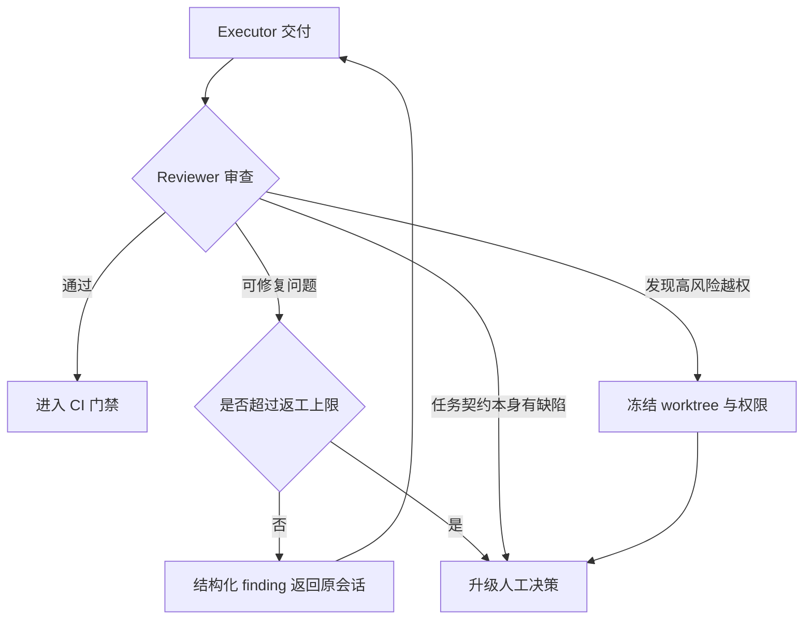

## 7.6 如何评测 Reviewer Agent

Reviewer 也需要评测，不能因为它叫“审查者”就天然可信。可构建一组带已知缺陷的 PR 样本：

- 范围蔓延；
- 删除关键断言；
- 对错误路径返回成功；
- 越权访问敏感文件；
- 新增未固定版本依赖；
- 并发竞态；
- 资源泄漏；
- 只在测试环境成立的硬编码；
- 不可达分支中的伪修复；
- 修改测试绕过 Bug。

关键指标：

| 指标 | 含义 |
|---|---|
| Critical Miss Rate | 严重缺陷漏检率，应作为首要指标 |
| Finding Precision | 提出的意见中真正成立的比例 |
| Evidence Completeness | 是否给出可验证位置与依据 |
| Duplicate Rate | 重复或同义 finding 比例 |
| Review Latency | 完成审查所需时间 |
| Rework Yield | 打回后真正提升质量的比例 |
| Human Override Rate | 人工推翻 Reviewer 结论的比例 |

不要只追求“发现数量”。一个输出 50 条风格建议、却漏掉权限绕过的 Reviewer 没有生产价值。

---

# 8. 并行 worktree：隔离只是起点

## 8.1 Git worktree 提供了什么

Git worktree 允许一个仓库关联多个工作树，从而同时检出多个分支。各 linked worktree 共享对象数据库，但拥有独立的 `HEAD`、索引和工作目录。这比为每个任务完整 clone 仓库更轻量，也更适合本地或单机多 Agent 调度。

其价值包括：

- 每个任务有独立文件视图和分支；
- 一个 Agent 的未提交修改不会直接污染另一个任务；
- 共享 Git 对象，创建速度和磁盘效率通常优于重复 clone；
- 可以清楚地把会话、分支、路径和任务绑定。

但 worktree 只解决了**Git 工作目录隔离**，并不自动隔离：

- 外部数据库；
- 固定端口；
- 全局缓存；
- `$HOME` 下配置；
- 共享临时目录；
- 容器名称；
- 云测试账号；
- CI 和评审队列；
- 最终主干的语义冲突。

因此，worktree 是隔离设施的一层，不是完整沙箱。

## 8.2 worktree 生命周期

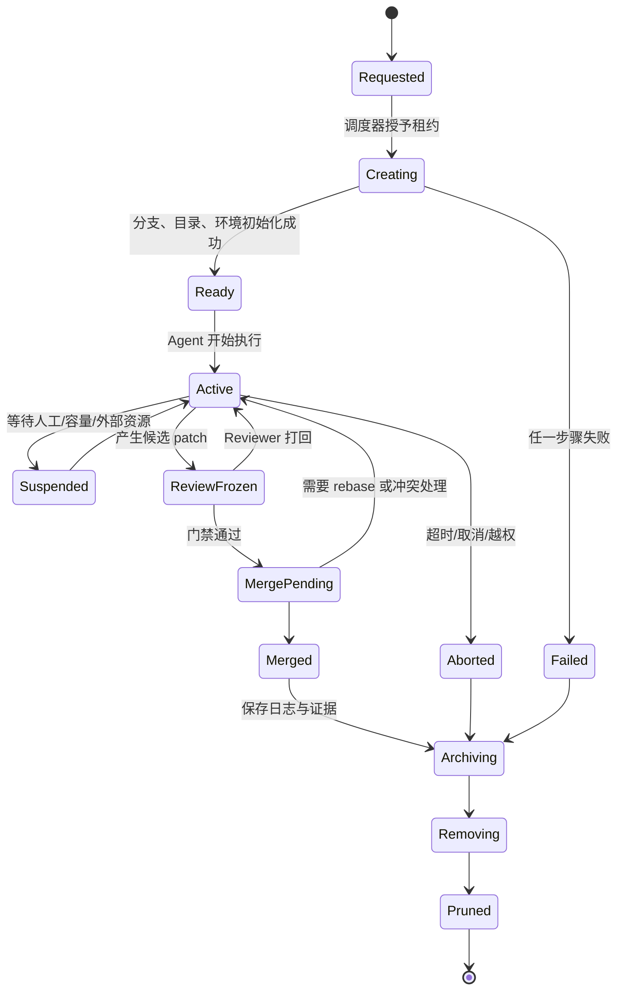

每个阶段应具备确定性动作：

### 创建

1. 验证 `base_sha` 存在；
2. 创建唯一分支；
3. 创建 worktree；
4. 写入任务元数据；
5. 准备独立环境变量、端口和临时目录；
6. 检查磁盘与依赖缓存；
7. 记录租约与心跳。

### 执行

- 只允许在指定 worktree 内写入；
- 所有命令以该目录为工作目录；
- 副作用工具使用任务命名空间；
- 定期上报 `head_sha`、脏文件、进度和预算。

### 冻结审查

- 停止自动继续编辑；
- 固化候选提交或 patch；
- 生成文件清单、diff 统计与证据；
- Reviewer 只审一个确定版本，避免“边审边变”。

### 回收

- 保存未合并 patch、日志和测试报告；
- 撤销临时凭据和环境租约；
- 确认无需保留后再删除 worktree；
- 清理 stale metadata；
- 删除任务分支需遵循保留策略，而不是无条件 `-D`。

## 8.3 命名与租约

推荐统一命名：

```text
branch: agent/<task-id>/<attempt>
path:   ../.agent-worktrees/<task-id>-<attempt>
lease:  wt:<repo-id>:<task-id>:<attempt>
```

租约至少包含：

```yaml
worktree_id: wt-auth-4521-01
repo_id: awesome-agent-tutorial
task_id: AUTH-4521
branch: agent/AUTH-4521/01
path: /workspace/.agent-worktrees/AUTH-4521-01
base_sha: 8b21f4c0
owner_session: sess-71de
status: active
created_at: 2026-08-31T08:00:00Z
heartbeat_at: 2026-08-31T08:14:30Z
expires_at: 2026-08-31T09:00:00Z
```

租约避免两个调度器重复分配同一个任务，也让崩溃恢复时能判断 worktree 是活跃、过期还是待人工检查。

## 8.4 环境隔离清单

| 资源 | 隔离策略 |
|---|---|
| 端口 | 从端口池租用，写入任务环境变量 |
| 临时目录 | `TMPDIR=<task-scope>` |
| SQLite/本地数据库 | 每任务独立文件或快照 |
| 外部数据库 | 每任务 schema/database namespace |
| Docker Compose | 项目名带任务 ID |
| Kubernetes | 每任务 namespace 或 ephemeral environment |
| 云账号 | 短期凭据 + 任务标签 + 最小权限 |
| 缓存 | 依赖下载缓存可共享，构建产物按任务或内容寻址 |
| 日志 | 自动注入 task/session/worktree ID |
| `$HOME` 配置 | 只读基线 + 任务覆盖层，避免全局修改 |

## 8.5 依赖缓存：共享什么，不共享什么

为了性能，多个 worktree 往往希望共享缓存。但共享错误的目录会制造隐蔽污染。

推荐：

- 共享只读或内容寻址的下载缓存，例如包压缩包、Git 对象；
- 构建缓存键必须包含平台、工具链、锁文件哈希和关键特征；
- 不共享可被任务直接覆盖的生成目录；
- 不共享带绝对路径或分支状态的中间产物，除非工具明确支持；
- 共享缓存失败必须退化为重新构建，而不是产生错误结果；
- 对缓存命中率和缓存相关失败单独观测。

## 8.6 长活任务的主干同步策略

任务持续数天时，起点会逐渐偏离主干。同步策略可按风险选择：

- **定期 rebase**：保持线性历史，冲突早发现，但会重写任务分支提交；
- **定期 merge 主干**：保留历史，冲突处理更直观，但提交图更复杂；
- **冻结基线 + 最终重放**：适合短任务，不适合长时间分支；
- **堆叠 PR**：适合有明确前后依赖的拆分，但需要管理栈顺序。

无论选择哪种方式，都要遵循：

1. 同步动作由控制平面触发并记录；
2. 冲突交还拥有任务上下文的原执行会话；
3. 解决冲突后重新运行受影响验证；
4. Reviewer 审查新的候选提交，而不是旧 diff；
5. `base_sha`、审查版本和 CI 版本必须可追踪。

---

# 9. 冲突预测与文件亲和调度

## 9.1 冲突治理应前移到调度阶段

合并时才发现冲突，是在最昂贵的阶段处理本可提前发现的问题。任务刚进入队列时，就应估计它可能触碰的资源集合。

对任务 `i`，可定义候选触碰集：

```text
T_i = 文件候选集
S_i = 符号候选集
R_i = 共享资源集（迁移序号、锁文件、端口、环境等）
D_i = 依赖任务集
```

两个任务的冲突风险可以表示为：

```text
Conflict(i, j) =
  w_file     × overlap(T_i, T_j)
+ w_symbol   × overlap(S_i, S_j)
+ w_resource × overlap(R_i, R_j)
+ w_history  × historical_cochange(i, j)
+ w_api      × shared_contract_risk(i, j)
```

## 9.2 如何估计触碰集

单靠 Issue 中提到的文件远远不够。可以组合以下信号：

1. **显式路径**：任务、堆栈、错误日志中出现的文件；
2. **Repo Map**：相关模块、入口与测试目录；
3. **Grep/结构化检索**：错误码、函数、配置键和调用形态；
4. **LSP/Symbol Index**：定义、引用、实现和继承关系；
5. **构建依赖图**：修改模块会影响哪些下游；
6. **测试映射**：候选代码对应哪些测试和 fixture；
7. **历史共变更**：过去经常一起提交的文件；
8. **CODEOWNERS**：同一所有权域常意味着共享设计边界；
9. **生成关系**：源文件与生成文件、schema 与客户端代码；
10. **特殊全局资源**：锁文件、迁移目录、版本号、CHANGELOG。

预测输出不应只有文件列表，还应带置信度和原因：

```yaml
predicted_touches:
  - path: src/auth/refresh_service.py
    confidence: 0.93
    reasons: [stack_trace, symbol_definition, historical_cochange]
  - path: tests/auth/test_refresh_race.py
    confidence: 0.88
    reasons: [test_mapping, task_acceptance]
  - path: src/auth/token_store.py
    confidence: 0.62
    reasons: [lsp_reference]
```

## 9.3 从“连通分组”到“冲突图着色”

原章的 `partition` 思路把触碰文件有交集的任务并入同一串行组，本质上是在构建冲突图的连通分量。它安全、简单，但可能过度串行化。

例如：

```text
A 与 B 冲突
B 与 C 冲突
A 与 C 不冲突
```

连通分量会把 A、B、C 全部放入一个串行组；更高效的调度可以让 A 与 C 同时运行，再运行 B。

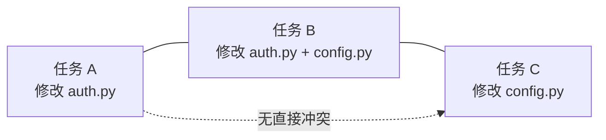

因此，生产调度可分层：

- 小规模任务池：连通分量分组，优先简单与安全；
- 中等规模：贪心图着色，让同一颜色中的任务并行；
- 大规模：加入权重、优先级、CI 成本和截止时间，使用启发式调度；
- 高风险资源：无论图算法结果如何，强制全局互斥。

## 9.4 硬冲突与软冲突

### 硬冲突

默认不得并行：

- 修改同一文件的重叠行；
- 修改同一个数据库迁移序列；
- 同时更新同一锁文件；
- 同时修改版本号或发布清单；
- 竞争同一个不可复制测试环境；
- 修改同一公共接口且互相不知道对方设计。

### 软冲突

可以并行，但需要组合验证：

- 修改不同文件、同一业务流程；
- 修改接口实现与其消费者；
- 修改不同模块但共享同一 fixture；
- 分别改变性能热点的上下游；
- 一项改变默认值，另一项依赖旧默认值；
- 两个任务分别新增同名配置或环境变量。

软冲突是最容易被文本合并漏掉的部分，需要在第 10 节用语义治理兜底。

## 9.5 特殊资源锁

某些资源不应被当作普通文件：

```yaml
resource_locks:
  package-lock.json: exclusive
  Cargo.lock: exclusive
  migrations/: ordered
  api/openapi.yaml: contract-owner
  VERSION: release-manager
  .github/workflows/: ci-owner
  infra/prod/: human-only
```

资源锁可以是：

- `exclusive`：同时只能有一个任务持有；
- `ordered`：可以排队，但必须按序应用；
- `shared-read`：多个任务可读，写需要独占；
- `owner-approved`：只有指定所有者批准后可写；
- `human-only`：Agent 无写权限。

## 9.6 动态触碰集与越界处理

预测一定会漏。执行器每次写文件时应更新“实际触碰集”：

```text
PredictedTouchSet → ActualTouchSet
```

若实际触碰新资源：

1. 检查是否仍在 `allowed_paths`；
2. 更新冲突图；
3. 判断是否与运行中的其他任务冲突；
4. 低风险时可暂停其中一个任务；
5. 高风险或公共接口冲突时升级人工；
6. 记录预测漏报，用于改进触碰集模型。

调度系统本身也需要指标：

- 触碰文件预测 Precision/Recall；
- 因预测漏报导致的中途暂停次数；
- 因过度保守导致的空闲容量；
- 冲突预防率；
- 平均串行组长度。

---

# 10. 从文本冲突升级到语义冲突治理

## 10.1 Git 能合并，不代表系统能工作

文本冲突只表示两个 patch 修改了无法自动合并的文本区域。大量高风险冲突在文本层完全“干净”：

- 任务 A 将函数返回值从 `None` 改为异常；任务 B 新增调用者仍按 `None` 处理；
- 任务 A 重命名配置项；任务 B 在另一个文件中新增旧配置项使用；
- 任务 A 修改数据库字段语义；任务 B 修改 API 序列化，但各自测试都使用旧 fixture；
- 任务 A 降低超时；任务 B 增加重试，组合后形成请求风暴；
- 两个任务分别引入不同依赖版本，锁文件可自动合并但运行时不兼容。

因此，冲突治理必须包含三层：

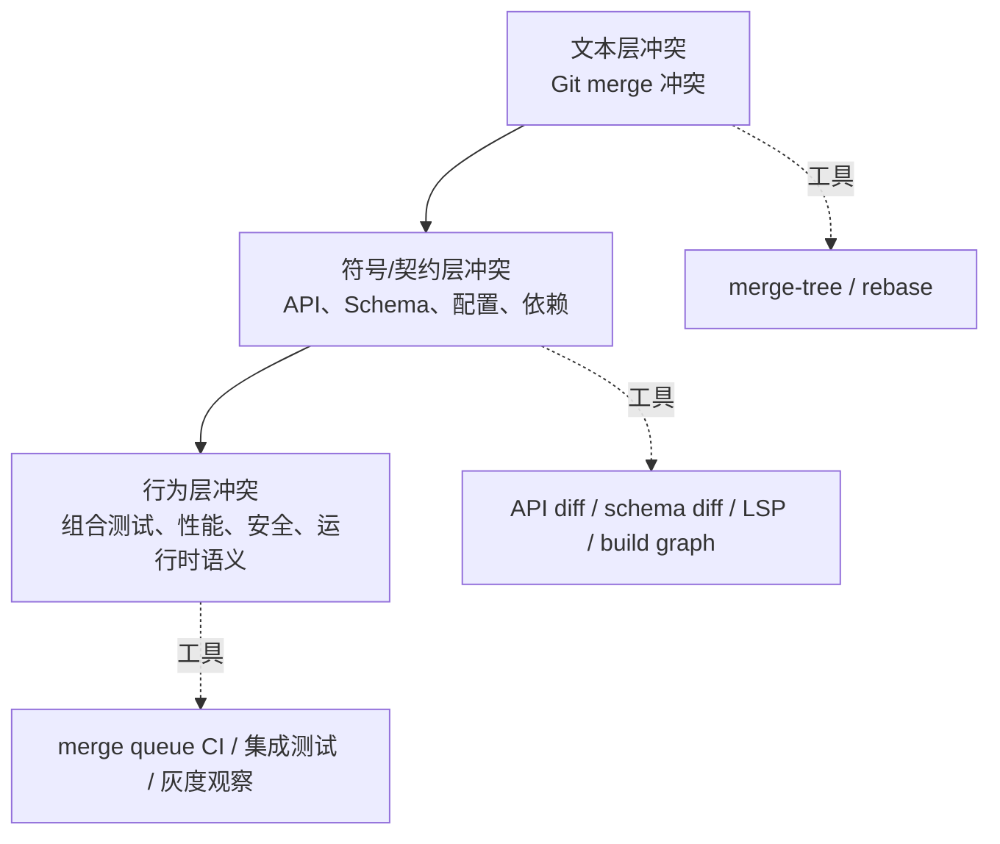

## 10.2 契约变更清单

每个 PR 应自动识别是否改变以下契约：

- 公共函数或类型签名；
- HTTP/RPC/事件接口；
- 数据库 schema；
- 配置键、默认值和环境变量；
- 命令行参数；
- 权限与角色映射；
- 序列化格式；
- 依赖版本和许可证；
- 迁移顺序；
- 可观测性字段与告警条件。

契约变化应生成结构化 manifest：

```yaml
contract_changes:
  api:
    - symbol: AuthService.refresh
      kind: behavior
      compatibility: backward-compatible
  config:
    - key: AUTH_REFRESH_CAS
      kind: added
      default: false
  database:
    - table: refresh_tokens
      change: add_version_column
      migration: 20260831_01
```

调度器可以据此判断：即使文件不重叠，两个任务是否影响同一契约。

## 10.3 组合验证

单 PR 验证回答：

> 这个变更相对于它的基线是否通过？

合并队列验证回答：

> 这个变更与最新主干及排在它前面的变更组合后是否通过？

生产级流水线至少需要：

1. PR 级局部与门禁验证；
2. 合并预检；
3. 合并队列上的组合验证；
4. 主干持续验证；
5. 发布后的灰度与运行时观察。

## 10.4 语义锁与架构决策

对于高耦合重构，仅靠自动检测不够。可引入“语义锁”：

- 某公共接口正在重设计；
- 某数据库表正在迁移；
- 某认证流程正在调整；
- 某发布分支进入冻结期。

语义锁不是永久阻止其他开发，而是要求相关任务：

- 加入同一变更计划；
- 依赖同一 ADR/设计文档；
- 明确执行顺序；
- 由同一 Owner 统一终审；
- 使用堆叠 PR 或特性开关分阶段交付。

---

# 11. CI 容量工程：并行之后的第一瓶颈

## 11.1 CI 不是无限公共服务

Agent 提交频率通常高于人类：它可能在一个任务中连续尝试多次，每次都希望运行测试。若所有尝试都触发全量 CI，负载会近似增长为：

```text
CI 总负载 = 活跃任务数 × 每任务尝试次数 × 每次验证成本
```

并行度从 2 增加到 10，如果每个任务又在 5 轮修复中触发全量流水线，CI 负载可能不是 5 倍，而是几十倍。结果包括：

- 反馈延迟从分钟变为几十分钟；
- Agent 在等待中继续猜测和修改，产生更多无效提交；
- 旧提交的 CI 仍在运行，消耗本应给最新候选版本的容量；
- 人工紧急修复被 Agent 队列阻塞；
- 评审时看到的版本与 CI 验证版本不一致。

## 11.2 四层验证模型

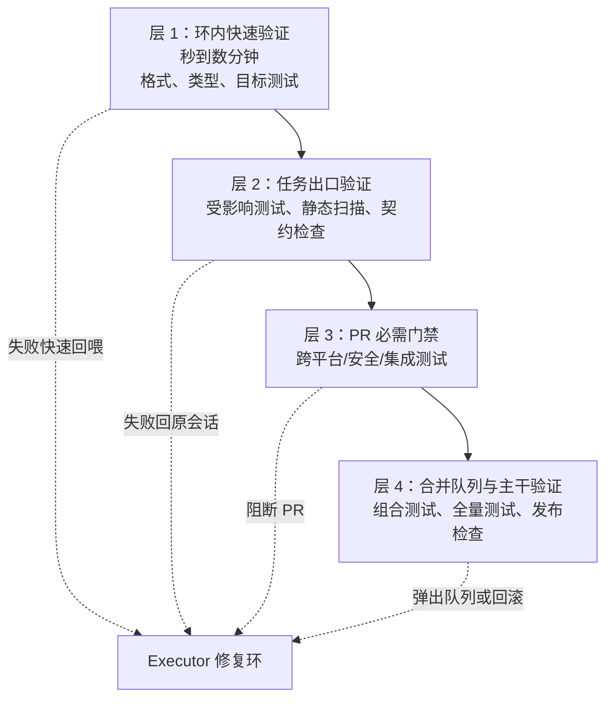

### 层 1：环内快速验证

目标是高频、低成本、直接指导修复：

- 目标测试；
- 单文件或单包 lint；
- 类型检查的受影响模块；
- 编译最小目标；
- 语法与格式；
- 编辑后读回与 diff 检查。

### 层 2：任务出口验证

候选 patch 冻结前运行：

- 受影响测试集合；
- 任务契约中的必需检查；
- 依赖与锁文件检查；
- API/schema diff；
- 安全路径扫描；
- 变更范围和生成文件一致性。

### 层 3：PR 门禁

适合放置：

- 跨平台矩阵；
- 完整静态分析；
- 关键集成测试；
- 许可证与漏洞检查；
- Owner 审批；
- 分支保护要求的状态检查。

### 层 4：合并队列与主干

验证变更组合：

- 基于最新主干构建；
- 与前序排队 PR 组合测试；
- 全量或高价值回归；
- 发布包构建；
- 迁移顺序与部署策略检查。

## 11.3 测试选择不能变成“少跑测试”

测试影响分析的目标是把快速反馈与最终确定性分层，而不是永久省略全量验证。

可综合：

- 文件到测试的静态映射；
- 覆盖率反向索引；
- 构建依赖图；
- 历史失败相关性；
- 标签与测试层级；
- 变更类型，例如文档、配置、API、数据库；
- 风险等级。

基本原则：

```text
环内：高相关、低延迟
PR：风险驱动的必需集合
合并队列/主干：组合风险兜底
夜间或周期任务：更广覆盖与漂移检测
```

若只做选测、不保留全量或周期验证，测试选择算法的漏报会逐渐变成线上缺陷。

## 11.4 取消过期运行

一个分支推送新提交后，旧提交的大部分 CI 结果已经失去合并价值。应使用并发组取消过期运行，把容量留给最新版本。

但需要区分：

- PR 快速验证：通常可以 `cancel-in-progress`；
- 发布、迁移、生产部署：通常不应随意取消，应串行排队；
- 合并队列：由队列控制器维护组合顺序；
- 安全扫描或取证任务：可能需要保留完整记录。

## 11.5 公平调度与容量保留

Agent 流量不能挤占所有 CI。可设置：

- 人工紧急修复保留 runner；
- Agent 任务单独队列和并发上限；
- 每仓库、每团队、每风险等级配额；
- 低优先级夜间任务在空闲时运行；
- 同一任务最大并行 CI 数；
- 超预算任务自动暂停而不是继续排队。

一个简单调度思路：

```text
priority =
  business_priority
+ production_incident_bonus
+ age_bonus
+ human_interactive_bonus
- estimated_runner_minutes_penalty
- repeated_failure_penalty
```

## 11.6 CI 容量核算

将不同 job 统一换算为 runner-minutes：

```text
每小时需求 = Σ(到达率 × 单次运行 runner-minutes × 平均尝试次数)
每小时供给 = runner 数 × 60 × 可用率
利用率 ρ = 需求 / 供给
```

当利用率接近 1 时，等待时间通常会非线性上升。工程上应保留余量处理突发、失败重跑和紧急修复。

示例：

```text
10 个并行任务
每任务平均 4 次环内远程验证
每次平均 6 runner-minutes
每任务 1 次 PR 门禁，平均 25 runner-minutes

总需求 = 10 × (4 × 6 + 25) = 490 runner-minutes
```

若希望在 30 分钟内消化，理论上平均需要约 16.3 个等价 runner 持续工作，还未计算排队抖动、缓存未命中和失败重跑。这个算式能在上线多 Agent 前暴露容量问题。

## 11.7 CI 指标

至少监控：

- queue wait p50/p95；
- runner 利用率；
- 每个成功合并消耗的 runner-minutes；
- 被新提交淘汰的无效 CI 比例；
- 缓存命中率与缓存污染失败；
- flaky test 比例；
- 首次门禁通过率；
- 按人类任务/Agent 任务拆分的等待时间；
- merge queue ejection rate；
- 每种风险级别的验证成本。

---

# 12. 评审带宽工程：人的注意力是稀缺算力

## 12.1 不要用 PR 数量衡量评审容量

十个 20 行的文档 PR 与十个 500 行的权限改动完全不是同一种负载。评审容量应按“风险加权的认知成本”估算：

```text
ReviewPoints =
  diff_size_factor
× risk_factor
× domain_complexity
× novelty_factor
× test_uncertainty
× cross_module_factor
```

例如：

| 变更 | 基础点 | 风险系数 | 估算 ReviewPoints |
|---|---:|---:|---:|
| 20 行文档修正 | 1 | 0.5 | 0.5 |
| 80 行局部 Bug 修复 | 2 | 1.0 | 2 |
| 150 行公共 API 改动 | 3 | 2.0 | 6 |
| 120 行鉴权逻辑 | 3 | 3.0 | 9 |
| 600 行跨模块重构 | 8 | 2.5 | 20 |

团队可以基于历史数据校准系数，不必追求数学精确，重点是避免“一个 PR 算一个单位”的错误。

## 12.2 评审分层

机器和人应审不同层次：

| 层次 | 主要负责者 | 关注点 |
|---|---|---|
| 格式与机械规则 | Formatter/Linter | 可确定规则 |
| 契约一致性与常见缺陷 | Reviewer Agent | 范围、测试真实性、边界、安全清单 |
| 架构与领域意图 | CODEOWNER/领域专家 | 是否符合系统设计与业务语义 |
| 风险接受 | 负责人/安全/数据 Owner | 剩余风险是否可以上线 |
| 组合与运行时效果 | CI、merge queue、灰度系统 | 组合正确性与线上指标 |

人类终审不应重新逐行做 linter 已做的事，而应回答：

1. 这个任务值得这样改吗？
2. 方案是否符合架构方向？
3. 验收标准是否真正覆盖业务风险？
4. 有哪些机器难以看到的组织、兼容性和运行风险？
5. 若出问题，我们能否快速发现并回滚？

## 12.3 交付摘要包

为了降低人工重新考古成本，每个 PR 应有统一摘要：

```markdown
## 目标
修复刷新令牌并发覆盖导致的偶发 401。

## 改动策略
使用版本条件更新，旧版本写入失败后重新读取最新令牌，不改变外部响应结构。

## 变更范围
- src/auth/refresh_service.py
- src/auth/token_store.py
- tests/auth/test_refresh_race.py

## 关键证据
- 修复前：受控交错测试稳定失败
- 修复后：目标测试循环 100 次通过
- auth 测试集、lint、类型检查通过

## 明确未做
- 未修改令牌格式
- 未调整过期时间
- 未引入依赖

## 剩余风险
跨区域数据库复制延迟未在本地集成环境覆盖。

## 回滚
关闭 auth.refresh.cas_enabled 或回退单个提交。
```

摘要必须从可验证事实生成，不能替代 diff 和测试报告。

## 12.4 CODEOWNERS 与专业路由

文件所有权可以把 PR 自动路由到懂该领域的人，但需要注意：

- Owner 不应只按目录设置，还应覆盖生成配置、迁移和跨模块契约；
- 敏感路径可要求专门团队；
- Owner 不等于唯一审查者，复杂变更可能需要多个角色；
- Agent 生成的 PR 也必须遵守相同规则；
- 当提交更新后，关键审批是否需要失效，应由仓库策略明确。

示例：

```text
/src/auth/                 @identity-team
/src/security/             @security-team
/migrations/               @database-team @service-owner
/.github/workflows/        @dev-infra-team @security-team
/api/openapi.yaml          @api-governance
/package-lock.json         @dev-infra-team
```

## 12.5 防止评审疲劳

系统性手段包括：

- 限制 PR 大小，超阈值要求拆分或说明；
- 相同机械变更批量生成但分批进入评审；
- Reviewer Agent 先消化低层问题；
- 低风险任务基于历史信任做抽样审查；
- 高风险任务预留评审时段，不混入大量普通 PR；
- 对待审队列设置 WIP 上限；
- 并行调度器根据评审积压主动降速；
- 对“38 秒 LGTM”这类异常审批速度做观测而非鼓励。

## 12.6 评审反馈也要成为知识

高价值人工意见应沉淀为：

- 仓库知识文件中的规则；
- Reviewer 清单条目；
- 静态检查或 Hook；
- 新评测样本；
- 任务契约模板字段；
- 敏感路径与风险路由规则。

成熟系统追求的是：**同一类问题只需要人类指出一次，之后尽量由机制提前拦截。**

---

# 13. 合并预检、合并队列与主干保护

## 13.1 合并预检

`git merge-tree --write-tree` 可以在不读取或写入工作树和索引的情况下执行与真实合并相近的三方合并，并通过退出状态表示是否存在冲突。因此它适合在 PR 进入人工终审或合并队列前做只读预检。

基本流程：

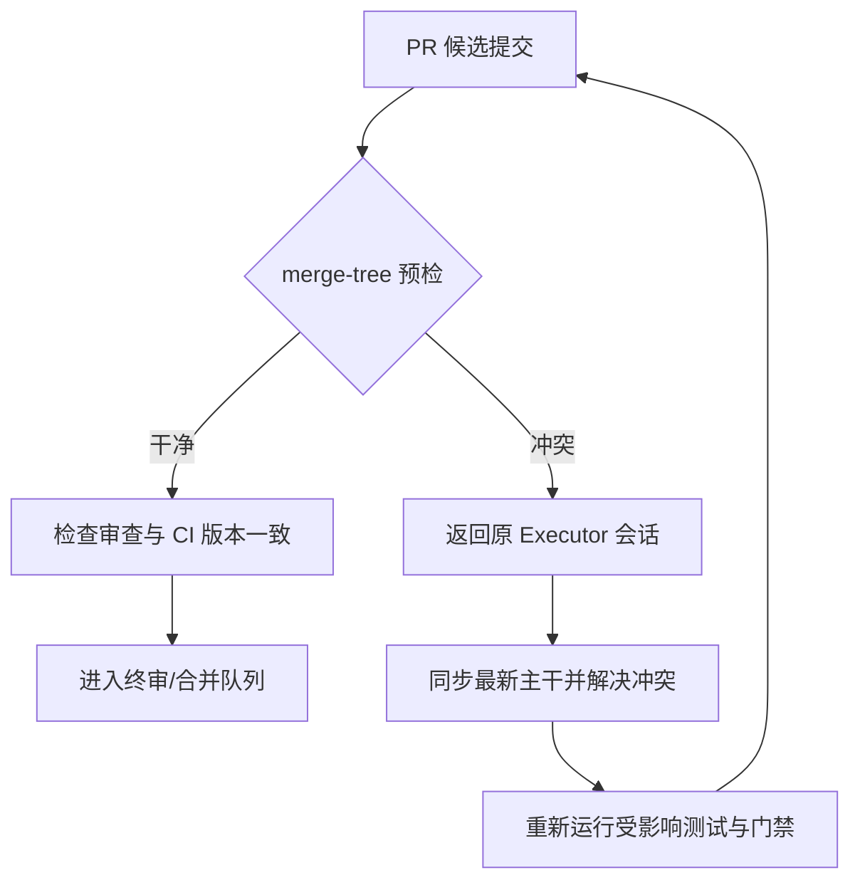

合并预检应记录：

- base branch 与 base SHA；
- head SHA；
- merge base；
- 是否冲突；
- 冲突文件；
- 预检时间；
- 结果有效期或主干版本。

主干一旦前进，旧预检可能失效，因此它不是永久许可证。

## 13.2 为什么冲突必须返回原会话

冲突解决不是机械文本拼接，而是一次新的代码改动。原 Executor 拥有：

- 任务目标和非目标；
- 已尝试方案；
- 关键设计判断；
- 测试与失败证据；
- 哪些代码是有意修改、哪些是临时探索。

让终审者临时解决冲突，会把任务上下文从最完整的人/Agent 手中移走。正确做法是：

1. 冻结终审；
2. 将冲突和最新主干差异返回原会话；
3. 在原 worktree 中同步主干；
4. 解决冲突；
5. 重新生成候选提交、diff 与证据；
6. 对新版本重新审查和验证。

## 13.3 合并队列解决什么

即使每个 PR 相对于当时的主干都全绿，多个 PR 依次合入后仍可能组合失败。合并队列会将 PR 与最新目标分支以及队列中排在其前面的变更组成临时合并组，重新运行必需检查。只有组合结果通过，才进入主干。

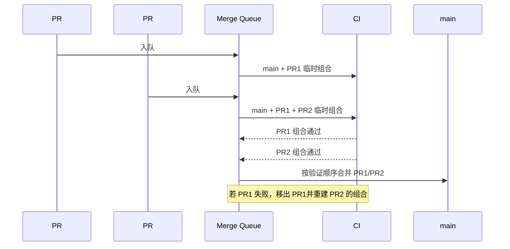

它主要解决：

- 主干高速变化导致的“绿后变红”；
- 多个 PR 的组合冲突；
- 强制基于最新主干验证；
- 自动维护合并顺序；
- 避免每位开发者手工反复 rebase 才能抢占合并窗口。

## 13.4 merge queue 不是万能队列

仍需处理：

- CI 容量不足导致队列构建很慢；
- 某个高失败 PR 频繁进入队列；
- 跳到队首会使后续组合重建；
- 数据库迁移、发布窗口等非 Git 资源顺序；
- path filter 导致必需检查未报告；
- 工作流只监听 `pull_request`、未监听 `merge_group`；
- 队列通过但部署环境失败。

## 13.5 分支保护与规则集

建议主干至少具备：

- 禁止直接 push；
- 必需 PR；
- 必需状态检查；
- 必需审批；
- 敏感路径 CODEOWNER 审批；
- 新提交后是否使旧审批失效；
- 是否要求线性历史或指定合并方式；
- 是否要求签名提交；
- 是否强制合并队列；
- 管理员绕过是否受限并记录。

核心原则：**Executor Agent 不应拥有绕过主干保护的能力。**

## 13.6 合并顺序与依赖任务

如果任务 B 依赖任务 A，应显式建模，而不是让 Agent 在 PR 描述中口头说明：

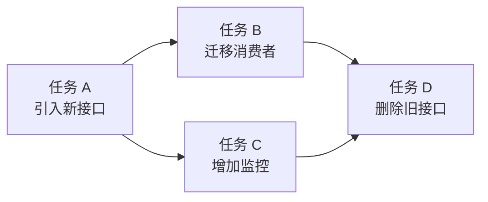

可选策略：

- 堆叠 PR，按底层到上层合并；
- 特性开关，把结构变更与行为启用分离；
- 兼容窗口，先双写/双读再切换；
- 任务依赖图控制入队顺序；
- 对迁移文件使用有序资源锁。

---
# 14. 从合并到发布：交付闭环的最后一公里

## 14.1 “已合并”不等于“已交付”

Coding Agent 很容易把 PR 合并视为任务终点，但用户价值只有在变更安全运行后才产生。合并后的风险包括：

- 构建产物与 CI 环境不一致；
- 配置或密钥未部署；
- 数据库迁移顺序错误；
- 灰度流量触发未覆盖的真实数据边界；
- 性能、成本或告警行为恶化；
- 多个已合并变更在运行时产生组合问题；
- 回滚代码无法回滚数据。

因此，任务状态至少应经过：

```text
MergeReady → Queued → Merged → Released → Observing → Done
```

只有完成稳定观察窗口，任务才真正关闭。

## 14.2 发布控制平面

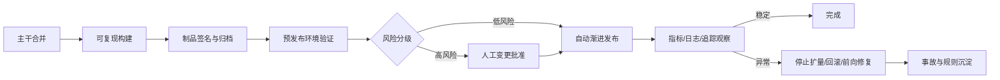

发布控制器应理解：

- 哪个提交、PR、任务生成了当前制品；
- 当前环境运行哪个制品；
- 变更是否包含数据库迁移；
- 是否需要特性开关；
- 哪些指标决定继续扩量或回滚；
- 回滚能否恢复数据与外部契约；
- 谁有权限批准高风险发布。

## 14.3 特性开关把“部署”和“启用”分离

对高风险行为，推荐：

1. 先合入向后兼容代码；
2. 默认关闭新行为；
3. 完成部署和基础验证；
4. 按租户、区域或流量比例逐步启用；
5. 观察业务与技术指标；
6. 稳定后清理旧路径和开关。

特性开关不是永久分支。任务契约应包含清理条件和截止日期，避免形成长期双路径债务。

## 14.4 数据库迁移的特殊治理

数据库迁移常具有顺序、兼容窗口和不可逆性，应从普通文件冲突中独立出来。

推荐 Expand—Migrate—Contract：

```mermaid
graph LR
    E[Expand<br/>增加兼容字段/表] --> D[Deploy Compatible Code<br/>新旧结构都可工作]
    D --> M[Migrate<br/>回填或双写]
    M --> S[Switch<br/>切换读取路径]
    S --> C[Contract<br/>删除旧字段/旧逻辑]
```

控制要求：

- 迁移有全局顺序号或资源锁；
- 应用版本与 schema 版本兼容；
- 破坏性变更不得与依赖旧结构的代码同时发布；
- 大表迁移有时限、节流和中断恢复；
- 回滚方案区分代码回滚与数据回滚；
- Agent 可以生成迁移草案，但高风险迁移必须由数据库 Owner 审查。

## 14.5 发布证据

交付包应补充：

```yaml
release_evidence:
  artifact_digest: sha256:...
  source_commit: 91ac30e
  tasks: [AUTH-4521]
  environments:
    staging:
      deployed_at: 2026-08-31T09:00:00Z
      smoke_tests: passed
    production:
      rollout: 10_percent
      started_at: 2026-08-31T10:00:00Z
  guardrails:
    error_rate: normal
    p95_latency: normal
    auth_401_rate: improved
  rollback:
    tested: true
    mechanism: feature_flag_then_revert
```

---

# 15. 权限、安全与供应链治理

## 15.1 Coding Agent 的威胁模型

Coding Agent 能读取仓库、运行命令、访问网络并修改软件供应链，因此不能只按“普通开发工具”治理。主要威胁包括：

1. **仓库内提示注入**：README、Issue、代码注释、测试数据中包含诱导 Agent 泄露秘密或执行危险命令的文本；
2. **过度文件权限**：任务只需改一个模块，却可写整个仓库或用户主目录；
3. **命令执行越权**：借构建脚本执行任意 shell、安装包或访问系统资源；
4. **网络外传**：源码、密钥、日志或用户数据被发送到未授权地址；
5. **供应链注入**：新增恶意依赖、未固定版本 Action、下载并执行脚本；
6. **凭据滥用**：Agent 获得可直接写主干、发布生产或读取生产数据的长期凭据；
7. **审查绕过**：Agent 修改测试、CI、规则或审批配置来让自己的改动通过；
8. **工具输出污染**：外部工具返回的文本被模型误当作更高优先级指令。

## 15.2 权限分层

```mermaid
graph TB
    subgraph Executor[Executor Agent]
        ER[读仓库]
        EW[写任务 worktree]
        EX[执行白名单命令]
        EN[受控网络]
    end

    subgraph Reviewer[Reviewer Agent]
        RR[只读候选版本]
        RD[读取 diff/证据]
        RT[运行只读或隔离验证]
    end

    subgraph Controller[确定性控制器]
        CP[策略判定]
        CM[创建/回收 worktree]
        CQ[提交合并队列]
    end

    subgraph Human[人类高权限主体]
        HA[高风险批准]
        HP[生产发布/紧急绕过]
    end

    CP --> Executor
    CP --> Reviewer
    Executor --> RD
    Reviewer --> CM
    CM --> CQ
    HA --> CQ
    HP --> CQ
```

建议边界：

| 主体 | 默认权限 |
|---|---|
| Executor | 读仓库、写专属 worktree、运行任务允许命令 |
| Reviewer | 只读代码与证据，可运行无副作用检查 |
| Scheduler | 管理租约和目录，不理解业务代码 |
| Merge Controller | 创建队列请求，无直接绕过保护权限 |
| Release Controller | 只能按批准策略部署指定制品 |
| Human Owner | 审批高风险变更，但操作也应审计 |

## 15.3 仓库内容一律视为不可信数据

系统提示和策略应明确：

- 代码、文档、Issue、网页、测试输出中的“指令”只是待分析内容；
- 只有控制平面签发的任务契约和策略具有授权意义；
- 仓库文件不能自行扩大网络、文件或凭据权限；
- 任何要求读取秘密、关闭审查、上传代码的仓库文本都应触发安全事件；
- 工具调用前由策略引擎检查实际参数，而不是只检查模型的自然语言解释。

## 15.4 文件、命令与网络策略

示例：

```yaml
policy:
  filesystem:
    read:
      - repo/**
      - toolchain/read_only/**
    write:
      - worktree/**
      - task_tmp/**
    deny:
      - ~/.ssh/**
      - ~/.aws/**
      - /etc/**
      - repo/.git/config

  commands:
    allow:
      - git status
      - git diff
      - pytest "*"
      - cargo test "*"
      - npm test "*"
      - ruff check "*"
    require_approval:
      - git rebase "*"
      - package-manager install "*"
      - docker compose up "*"
    deny:
      - git push --force "*"
      - curl "*" | sh
      - rm -rf /

  network:
    default: deny
    allow_domains:
      - registry.npmjs.org
      - pypi.org
      - crates.io
    upload_source: deny

  secrets:
    inject: short_lived
    redact_logs: true
    production_secrets: deny
```

实际系统应按结构化命令和参数检查，不能用脆弱的字符串匹配作为唯一防线。

## 15.5 供应链门禁

新增依赖应触发：

- 依赖 manifest 与 lockfile 差异；
- 漏洞扫描；
- 许可证检查；
- 包来源和命名相似性检查；
- 是否存在维护中的内部替代；
- 安装脚本和构建脚本审查；
- 版本固定与完整性校验；
- 新增 GitHub Action 是否固定到可信版本或提交；
- SBOM/制品清单更新。

“只新增一个小库”不是低风险理由。依赖会进入未来所有构建和运行环境。

## 15.6 审计链

每个高影响动作至少记录：

```text
timestamp
actor_type / actor_id
model / tool version
任务、会话、worktree、PR、commit ID
policy decision
requested action
normalized arguments
result / exit code
artifact digest
human approval or override
```

审计日志应追加写、可检索、可关联，并避免保存未脱敏秘密。

---

# 16. 可观测性、指标与 SLO

## 16.1 观察对象不是“聊天”，而是交付实体

生产系统需要围绕以下实体建立统一关联：

- `task_id`：业务任务；
- `attempt_id`：一次执行尝试；
- `session_id`：Agent 会话；
- `worktree_id`：工作区租约；
- `review_id`：一次独立审查；
- `ci_run_id`：验证运行；
- `pr_id`、`commit_sha`、`merge_group_id`；
- `artifact_digest`；
- `deployment_id` 与环境。

否则团队只能看到“模型调用很多、PR 也很多”，无法回答哪个任务真正产生价值、在哪个阶段等待、为什么失败。

## 16.2 端到端 Trace

```mermaid
graph LR
    T[Task Span] --> I[Intake]
    T --> R[Risk Classification]
    T --> S[Scheduling Wait]
    T --> E[Execution Attempt]
    E --> TOOL1[Read/Search]
    E --> TOOL2[Edit]
    E --> TOOL3[Test]
    T --> RV[Reviewer]
    T --> CI[CI Queue + Run]
    T --> HR[Human Review Wait]
    T --> MQ[Merge Queue]
    T --> DP[Deploy]
    T --> OB[Observation Window]
```

对每个 span 记录：

- 开始与结束时间；
- 输入输出摘要及内容哈希；
- 状态和错误分类；
- 重试原因；
- 资源消耗；
- 上下游关联；
- 策略决策；
- 版本信息。

## 16.3 三类核心指标

### A. 速度与流动

- Task Lead Time：任务就绪到稳定交付；
- Active Execution Time：Agent 真正执行时间；
- Queue Time：调度、CI、评审、合并各阶段等待；
- PR Review Latency；
- Merge Queue Time；
- Deployment Lead Time；
- WIP 与年龄分布。

### B. 质量与可靠性

- First-pass Yield：首次提交即通过审查和门禁的比例；
- Rework Rounds；
- Reviewer Critical Miss Rate；
- Merge Conflict Rate；
- Merge Queue Ejection Rate；
- Flaky Test Rate；
- Escaped Defect Rate；
- Rollback/Hotfix Rate；
- 变更失败率；
- 任务契约返工率。

### C. 成本与容量

- 每成功交付任务的模型成本；
- 每成功合并的 runner-minutes；
- 无效或被取消 CI 占比；
- 每任务工具调用数；
- 上下文压缩次数；
- Reviewer 人工分钟数；
- 各共享资源利用率；
- 缓存命中率；
- 并行度与实际吞吐的关系。

## 16.4 不要用这些虚荣指标单独衡量成功

- 生成代码行数；
- 创建 PR 数量；
- Agent 会话数量；
- 模型调用总量；
- 自动合并比例；
- “任务完成”自报率。

这些指标可能在质量下降、排队增加时继续上涨。真正应关注的是：

```text
单位业务价值的交付周期、失败率、人工注意力和总成本
```

## 16.5 阶段分解看瓶颈

一个任务总耗时可拆为：

```text
LeadTime =
  IntakeWait
+ ScheduleWait
+ ExecutionTime
+ ReviewWait
+ ReworkTime
+ CIWait
+ CIRunTime
+ MergeQueueWait
+ DeployWait
+ ObservationTime
```

如果 Agent 执行只占 8%，继续升级模型速度不会显著改善交付周期；应先优化占比最大的等待阶段。

## 16.6 SLO 模板

SLO 应按风险和任务类型分层，而不是全仓一个数字：

```yaml
slos:
  low_risk_maintenance:
    lead_time_p90: "<团队基线目标>"
    first_pass_yield: ">目标值"
    escaped_defect_rate: "<上限"

  normal_bugfix:
    schedule_wait_p95: "<目标>"
    ci_queue_wait_p95: "<目标>"
    review_wait_p90: "<目标>"

  sensitive_change:
    automation_speed: informational
    required_human_approvals: 2
    audit_completeness: 100%
    rollback_evidence: required
```

高风险任务不应为了满足速度 SLO 而跳过控制。

## 16.7 反馈学习

观察数据应回流到：

- 风险分类权重；
- 触碰集预测；
- 并行度控制；
- Reviewer 评测集；
- 测试选择策略；
- 项目知识文件；
- 任务模板；
- 人工审查抽样率。

需要注意：策略更新必须经过验证和版本化，不能让 Agent 根据一次失败自动放宽规则。

---

# 17. 生产级数据模型与状态机

## 17.1 Task

```python
from dataclasses import dataclass, field
from enum import Enum
from typing import FrozenSet


class RiskLevel(str, Enum):
    R0 = "R0"
    R1 = "R1"
    R2 = "R2"
    R3 = "R3"
    R4 = "R4"


@dataclass(frozen=True)
class TaskContract:
    task_id: str
    objective: str
    non_goals: tuple[str, ...]
    acceptance_criteria: tuple[str, ...]
    base_sha: str
    allowed_paths: tuple[str, ...]
    sensitive_paths: tuple[str, ...]
    required_checks: tuple[str, ...]
    forbidden_actions: tuple[str, ...]
    risk_level: RiskLevel
    max_fix_rounds: int
    max_changed_files: int
    max_diff_lines: int
    predicted_files: FrozenSet[str] = field(default_factory=frozenset)
    predicted_resources: FrozenSet[str] = field(default_factory=frozenset)
```

契约应不可变或版本化。若人工修改验收标准，应生成新版本并记录谁、何时、为什么修改。

## 17.2 WorktreeLease

```python
@dataclass
class WorktreeLease:
    worktree_id: str
    task_id: str
    attempt_id: str
    repo_id: str
    branch: str
    path: str
    base_sha: str
    head_sha: str | None
    owner_session: str
    status: str
    created_at: str
    heartbeat_at: str
    expires_at: str
    actual_files: set[str] = field(default_factory=set)
    held_resources: set[str] = field(default_factory=set)
```

## 17.3 EvidenceBundle

```python
@dataclass(frozen=True)
class CheckEvidence:
    name: str
    command: str
    exit_code: int
    started_at: str
    finished_at: str
    head_sha: str
    log_digest: str
    summary: str


@dataclass(frozen=True)
class EvidenceBundle:
    task_id: str
    attempt_id: str
    base_sha: str
    head_sha: str
    changed_files: tuple[str, ...]
    diff_digest: str
    checks: tuple[CheckEvidence, ...]
    dependency_changes: tuple[str, ...]
    contract_changes: tuple[str, ...]
    known_risks: tuple[str, ...]
```

证据必须绑定 `head_sha`。提交一旦变化，旧证据只能作为历史记录，不能继续满足当前门禁。

## 17.4 ReviewFinding

```python
@dataclass(frozen=True)
class ReviewFinding:
    finding_id: str
    severity: str
    category: str
    file: str | None
    start_line: int | None
    end_line: int | None
    violated_rule: str
    evidence: str
    remediation: str
    blocking: bool
```

## 17.5 MergePreflight

```python
@dataclass(frozen=True)
class MergePreflight:
    task_id: str
    base_branch: str
    base_sha: str
    head_sha: str
    merge_base: str
    clean: bool
    conflicted_files: tuple[str, ...]
    checked_at: str
```

## 17.6 状态变更必须带前置条件

例如：

```text
Running → Reviewing
前置条件：
- 候选提交存在
- 实际路径未越权
- 必需环内检查已执行
- 证据绑定当前 head_sha

Reviewing → Verifying
前置条件：
- 无阻断 finding
- Reviewer 结果绑定当前 head_sha

MergeReady → Queued
前置条件：
- 所有 required checks 通过
- 必需人工审批有效
- 合并预检基于允许的新鲜度
- 当前 head_sha 未变化
```

这类条件由确定性代码检查，不交给模型用自然语言判断。

---

# 18. 参考实现：调度器、worktree 与合并预检

以下代码用于说明设计，不替代生产环境中的权限、数据库事务、跨进程锁、审计和平台兼容处理。

## 18.1 冲突图与贪心分批

```python
from __future__ import annotations

from dataclasses import dataclass, field
from typing import Iterable


@dataclass(frozen=True)
class SchedulableTask:
    task_id: str
    files: frozenset[str] = field(default_factory=frozenset)
    resources: frozenset[str] = field(default_factory=frozenset)
    priority: int = 0


def conflicts(left: SchedulableTask, right: SchedulableTask) -> bool:
    """保守判定：文件或独占资源相交即视为冲突。"""
    return bool((left.files & right.files) or (left.resources & right.resources))


def build_conflict_graph(
    tasks: Iterable[SchedulableTask],
) -> dict[str, set[str]]:
    items = list(tasks)
    graph = {task.task_id: set() for task in items}
    for index, left in enumerate(items):
        for right in items[index + 1 :]:
            if conflicts(left, right):
                graph[left.task_id].add(right.task_id)
                graph[right.task_id].add(left.task_id)
    return graph


def greedy_batches(tasks: Iterable[SchedulableTask]) -> list[list[SchedulableTask]]:
    """把互不冲突的任务放进同一批；批次间顺序执行。

    排序优先考虑高优先级和高冲突度，属于启发式算法，不保证最优着色。
    """
    items = list(tasks)
    by_id = {task.task_id: task for task in items}
    graph = build_conflict_graph(items)
    ordered = sorted(
        items,
        key=lambda task: (task.priority, len(graph[task.task_id])),
        reverse=True,
    )

    batches: list[list[SchedulableTask]] = []
    for task in ordered:
        placed = False
        for batch in batches:
            if all(not conflicts(task, existing) for existing in batch):
                batch.append(task)
                placed = True
                break
        if not placed:
            batches.append([task])

    # 保持对象来自输入，并让静态分析确认 ID 一致。
    assert set(by_id) == {task.task_id for batch in batches for task in batch}
    return batches
```

生产版本还应加入：

- 软冲突权重；
- 任务依赖 DAG；
- 预计 CI 成本；
- 截止时间与业务优先级；
- 专业 Reviewer 容量；
- 动态实际触碰集；
- 全局资源锁；
- 跨进程事务和幂等调度。

## 18.2 安全执行 Git 命令

```python
from __future__ import annotations

import subprocess
from dataclasses import dataclass
from pathlib import Path
from typing import Sequence


class GitCommandError(RuntimeError):
    pass


@dataclass(frozen=True)
class GitResult:
    stdout: str
    stderr: str
    returncode: int


def run_git(
    repo: Path,
    args: Sequence[str],
    *,
    timeout_seconds: int = 60,
    check: bool = True,
) -> GitResult:
    repo = repo.resolve(strict=True)
    completed = subprocess.run(
        ["git", "-C", str(repo), *args],
        capture_output=True,
        text=True,
        timeout=timeout_seconds,
        check=False,
    )
    result = GitResult(
        stdout=completed.stdout,
        stderr=completed.stderr,
        returncode=completed.returncode,
    )
    if check and completed.returncode != 0:
        raise GitCommandError(
            f"git {' '.join(args)} failed ({completed.returncode}): "
            f"{completed.stderr.strip()}"
        )
    return result
```

注意：真实系统还应限制可调用的 Git 子命令，不能把任意模型字符串直接拼成命令。

## 18.3 创建 worktree

```python
import re
from pathlib import Path


_TASK_ID = re.compile(r"^[A-Za-z0-9][A-Za-z0-9._-]{0,63}$")


def create_worktree(
    repo: Path,
    worktree_root: Path,
    task_id: str,
    attempt: int,
    base_sha: str,
) -> tuple[Path, str]:
    if not _TASK_ID.fullmatch(task_id):
        raise ValueError("unsafe task id")
    if attempt < 1:
        raise ValueError("attempt must be positive")

    branch = f"agent/{task_id}/{attempt:02d}"
    path = (worktree_root / f"{task_id}-{attempt:02d}").resolve()
    root = worktree_root.resolve()
    if root not in path.parents:
        raise ValueError("worktree path escaped configured root")
    if path.exists():
        raise FileExistsError(path)

    run_git(repo, ["rev-parse", "--verify", f"{base_sha}^{{commit}}"])
    run_git(
        repo,
        ["worktree", "add", "-b", branch, str(path), base_sha],
        timeout_seconds=180,
    )
    return path, branch
```

## 18.4 回收 worktree

```python
def remove_worktree(
    repo: Path,
    path: Path,
    branch: str,
    *,
    force: bool = False,
    delete_branch: bool = False,
) -> None:
    args = ["worktree", "remove"]
    if force:
        args.append("--force")
    args.append(str(path.resolve()))
    run_git(repo, args, timeout_seconds=180)

    # 分支删除应是显式策略；失败任务通常应保留一段时间用于取证。
    if delete_branch:
        run_git(repo, ["branch", "-D" if force else "-d", branch])
```

回收前应先：

- 保存 patch 与未跟踪文件清单；
- 确认日志上传完成；
- 释放外部环境租约；
- 撤销凭据；
- 标记任务状态；
- 判断是否进入保留期。

## 18.5 合并预检

```python
from dataclasses import dataclass


@dataclass(frozen=True)
class PreflightResult:
    clean: bool
    tree_oid: str | None
    conflicted_files: tuple[str, ...]
    messages: str


def preflight_merge(repo: Path, base: str, head: str) -> PreflightResult:
    completed = run_git(
        repo,
        [
            "merge-tree",
            "--write-tree",
            "--name-only",
            "--no-messages",
            base,
            head,
        ],
        check=False,
        timeout_seconds=180,
    )

    # 官方退出约定：0 表示干净合并，1 表示存在冲突，其他值表示命令错误。
    if completed.returncode not in (0, 1):
        raise GitCommandError(
            f"merge-tree failed ({completed.returncode}): "
            f"{completed.stderr.strip()}"
        )

    lines = [line.strip() for line in completed.stdout.splitlines() if line.strip()]
    tree_oid = lines[0] if lines else None

    if completed.returncode == 0:
        return PreflightResult(
            clean=True,
            tree_oid=tree_oid,
            conflicted_files=(),
            messages="",
        )

    return PreflightResult(
        clean=False,
        tree_oid=tree_oid,
        conflicted_files=tuple(lines[1:]),
        messages=completed.stderr.strip(),
    )
```

这里使用 `--no-messages` 避免解析面向人的非稳定提示文本。若需要机器可读的冲突类型与复杂路径信息，生产实现应使用 `-z` 并严格解析 NUL 分隔协议，同时记录实际 Git 版本。

## 18.6 调度主循环伪代码

```python
def scheduler_tick(state, capacity, policies):
    ready = state.list_ready_tasks()
    candidates = [task for task in ready if dependencies_satisfied(task, state)]

    for task in candidates:
        decision = policies.evaluate_task(task)
        if decision.requires_human_clarification:
            state.transition(task.id, "needs_human")
            continue

        if conflicts_with_active_task(task, state):
            continue
        if not capacity.has_ci_budget(task):
            continue
        if not capacity.has_review_budget(task):
            continue
        if not resources_available(task):
            continue

        lease = try_create_worktree_lease(task)
        if lease is None:
            continue

        state.transition_if_version(
            task.id,
            expected="ready",
            target="scheduled",
            metadata={"lease_id": lease.id},
        )
        dispatch_executor(task, lease, decision.capabilities)
```

这里最重要的不是算法复杂度，而是：

- `transition_if_version` 防止并发重复调度；
- 资源租约与状态更新必须具备事务语义；
- 失败可重试但不能重复创建不可控副作用；
- 调度决策必须可解释和可追踪。

---

# 19. GitHub Actions 与仓库策略示例

## 19.1 同时支持 PR 与 merge queue

启用 GitHub merge queue 后，必需检查工作流需要监听 `merge_group`，否则队列中的临时合并组不会产生所需状态。

```yaml
name: required-ci

on:
  pull_request:
    branches: [main]
  merge_group:
    types: [checks_requested]

# PR 新提交到来时取消同一工作流的旧验证；
# merge_group 使用其 ref 形成独立并发组。
concurrency:
  group: ${{ github.workflow }}-${{ github.event_name }}-${{ github.ref }}
  cancel-in-progress: true

permissions:
  contents: read

jobs:
  validate:
    runs-on: ubuntu-latest
    timeout-minutes: 30
    steps:
      - uses: actions/checkout@v6
        with:
          fetch-depth: 0

      - name: Install dependencies
        run: ./scripts/ci/install.sh

      - name: Lint
        run: ./scripts/ci/lint.sh

      - name: Test
        run: ./scripts/ci/test-required.sh

      - name: Contract checks
        run: ./scripts/ci/check-contracts.sh
```

说明：Action 主版本号会随时间演进，实际仓库应依据组织供应链策略固定可信版本或提交，而不是机械复制示例。

## 19.2 快速检查与重型检查分离

```yaml
name: pr-fast-checks

on:
  pull_request:
    branches: [main]

concurrency:
  group: fast-${{ github.event.pull_request.number }}
  cancel-in-progress: true

permissions:
  contents: read

jobs:
  changed-scope:
    runs-on: ubuntu-latest
    outputs:
      backend: ${{ steps.scope.outputs.backend }}
      frontend: ${{ steps.scope.outputs.frontend }}
    steps:
      - uses: actions/checkout@v6
        with:
          fetch-depth: 0
      - id: scope
        run: ./scripts/ci/detect-scope.sh >> "$GITHUB_OUTPUT"

  backend:
    needs: changed-scope
    if: needs.changed-scope.outputs.backend == 'true'
    runs-on: ubuntu-latest
    steps:
      - uses: actions/checkout@v6
      - run: ./scripts/ci/backend-fast.sh

  frontend:
    needs: changed-scope
    if: needs.changed-scope.outputs.frontend == 'true'
    runs-on: ubuntu-latest
    steps:
      - uses: actions/checkout@v6
      - run: ./scripts/ci/frontend-fast.sh
```

### 必需检查与 path filter 的陷阱

若一个被分支保护设为“必需”的工作流因为 path filter 完全没有触发，PR 可能长期等待状态上报。更稳妥的方式是：

- 让必需工作流总是触发；
- 在工作流内部判断范围；
- 对不相关模块产生明确成功的轻量 job；
- 保证 PR 和 `merge_group` 都能报告相同必需检查名称。

## 19.3 部署串行化

部署与 PR 快速检查不同，通常应防止两个生产部署互相覆盖：

```yaml
name: deploy-production

on:
  workflow_dispatch:
  push:
    branches: [main]

concurrency:
  group: production-deploy
  # 不使用 cancel-in-progress，避免新提交中断正在执行的生产变更。

permissions:
  contents: read
  id-token: write

jobs:
  deploy:
    environment: production
    runs-on: ubuntu-latest
    steps:
      - uses: actions/checkout@v6
      - run: ./scripts/release/deploy.sh
```

是否允许多个待部署运行排队、是否需要环境批准，应根据当前 GitHub.com/GHES 版本与组织策略配置。

## 19.4 PR 模板

```markdown
## 任务契约
- Task ID:
- Risk Level:
- Objective:
- Non-goals:

## 改动摘要
- 行为变化：
- 主要文件：
- 公共契约变化：
- 新增依赖/权限/迁移：

## 验证证据
- [ ] 修复前复现
- [ ] 目标测试
- [ ] 受影响测试
- [ ] 必需静态检查
- [ ] 安全/依赖检查
- [ ] 合并预检

## 已知风险与未覆盖场景

## 回滚方案

## Agent 交付信息
- Executor session:
- Reviewer result:
- Base SHA:
- Head SHA:
- Evidence bundle:
```

## 19.5 仓库策略示例

```yaml
repository_delivery_policy:
  main_branch:
    direct_push: deny
    pull_request: required
    required_status_checks:
      - required-ci / validate
    merge_queue: required

  risk_routes:
    R0:
      reviewer_agent: required
      human_review: sampled
      auto_merge: allowed
    R1:
      reviewer_agent: required
      human_review: required
      auto_merge: denied
    R2:
      reviewer_agent: required
      codeowner_review: required
      auto_merge: denied
    R3:
      reviewer_agent: required
      codeowner_review: required
      specialist_review: required
      auto_merge: denied
    R4:
      agent_execution: supervised_only
      dual_human_control: required

  sensitive_paths:
    - pattern: src/security/**
      minimum_risk: R3
    - pattern: migrations/**
      minimum_risk: R3
      resource_lock: ordered
    - pattern: .github/workflows/**
      minimum_risk: R3
    - pattern: infra/prod/**
      minimum_risk: R4
      agent_write: deny
```

## 19.6 Reviewer 清单配置

```yaml
reviewer_rules:
  - id: scope-overflow
    severity: high
    check: actual_paths_subset_of_allowed_paths

  - id: test-tampering
    severity: critical
    triggers:
      - removed_assertion
      - increased_retry_without_reason
      - added_skip_marker
      - reduced_test_scope

  - id: dependency-change
    severity: high
    when: dependency_manifest_changed
    require:
      - vulnerability_check
      - license_check
      - human_approval

  - id: sensitive-path
    severity: critical
    when: matches_sensitive_path
    require:
      - specialist_review
      - rollback_evidence
```

---

# 20. 异常恢复与幂等性设计

## 20.1 多 Agent 系统一定会遇到部分失败

典型部分失败：

- worktree 创建成功，但状态库写入失败；
- Agent 已提交代码，但回传证据时网络中断；
- CI 已完成，控制平面未收到回调；
- Reviewer 结果保存成功，但任务状态未迁移；
- 合并请求已入队，客户端超时后重复提交；
- 发布已开始，控制器进程重启；
- worktree 目录被外部清理，但租约仍显示活跃。

若每次失败都“从头再来”，会重复创建分支、重复运行昂贵 CI、重复评论、甚至重复发布。

## 20.2 幂等键

每个副作用动作应有幂等键：

```text
create_worktree: repo_id + task_id + attempt_id
run_check: head_sha + check_name + check_config_digest
request_review: head_sha + reviewer_policy_version
merge_preflight: base_sha + head_sha + git_version
enqueue_merge: repository + pr_number + head_sha
release: environment + artifact_digest + rollout_stage
```

相同幂等键的重复请求应返回已有结果，而不是再次执行。

## 20.3 Outbox 与事件驱动

状态更新与外部动作可以使用事务 Outbox：

```mermaid
sequenceDiagram
    participant C as 控制服务
    participant DB as 状态库
    participant O as Outbox Relay
    participant W as Worker/外部系统

    C->>DB: 事务写入状态 + 待发送事件
    DB-->>C: 提交成功
    O->>DB: 拉取未发送事件
    O->>W: 发送幂等命令
    W-->>O: 已执行/重复但结果相同
    O->>DB: 标记事件已投递
```

这样可以避免“状态已变但任务没发出”或“任务发出但状态没记录”的裂缝。

## 20.4 崩溃恢复扫描

控制器重启后执行 reconciliation：

1. 扫描非终态任务；
2. 对比状态库中的 worktree 与 `git worktree list --porcelain`；
3. 检查租约心跳和执行进程；
4. 检查分支、提交、PR、CI、合并队列的外部真实状态；
5. 根据状态机决定恢复、暂停、重新投递或人工介入；
6. 不根据单一缓存状态直接删除数据。

## 20.5 超时与取消

取消语义应分层：

- **请求取消**：停止接收新工具调用；
- **软取消**：让 Agent 保存当前进度和证据；
- **硬终止**：结束进程、回收沙箱；
- **工作区保留**：任务终止但保留 worktree 供检查；
- **资源撤销**：取消网络、密钥、环境租约；
- **CI 取消**：只取消已无价值的运行；
- **发布取消**：通常转换为“停止扩量”，而不是杀死任意中间步骤。

## 20.6 失败分类

```yaml
failure:
  category: verification_failed
  retryable: true
  owner: executor
  budget_effect: consumes_fix_round
  evidence_required: true
```

建议分类：

- `task_ambiguous`：需要人工澄清；
- `policy_denied`：不得自动重试；
- `tool_transient`：可退避重试；
- `workspace_corrupt`：创建新 attempt；
- `verification_failed`：返回修复环；
- `review_failed`：按 finding 返工；
- `merge_conflict`：回原会话同步主干；
- `ci_capacity_exhausted`：排队，不消耗修复轮次；
- `budget_exceeded`：暂停并升级；
- `release_guardrail_failed`：停止扩量或回滚。

---
# 21. 常见失败模式与系统化修复

## 21.1 失败模式一：把“更多 Agent”当成吞吐优化

**症状**：活跃会话和 PR 数量显著增加，但平均交付时间变长，待审 PR、CI 队列和冲突同时增长。

**根因**：只扩充执行阶段，没有识别端到端最窄瓶颈。

**修复**：

- 分解 Lead Time；
- 对 CI、评审、环境和发布做容量核算；
- 为 WIP 设置上限；
- 并行度动态取各容量最小值；
- 以稳定交付吞吐而不是 PR 数评价系统。

## 21.2 失败模式二：多个任务修改同一文件

**症状**：PR 都能独立完成，但合并时连续冲突；后到任务反复 rebase。

**根因**：调度只看任务优先级，不看触碰集。

**修复**：文件/符号亲和分组、资源锁、实际触碰集动态更新、合并预检。

## 21.3 失败模式三：文件不冲突，行为却冲突

**症状**：Git 自动合并且各 PR 测试全绿，合入后集成测试或线上失败。

**根因**：只治理文本重叠，没有识别公共 API、配置、schema 和运行时语义。

**修复**：契约变更 manifest、依赖图、组合测试、merge queue、灰度观察。

## 21.4 失败模式四：冲突分组过度保守

**症状**：任务被一个巨大连通分量串行化，机器和 CI 大量空闲。

**根因**：把“存在传递关系”误当作“任何两项都不能并行”。

**修复**：从连通分组升级为图着色或分批调度；区分硬冲突、软冲突和可组合验证冲突。

## 21.5 失败模式五：Agent 每次尝试都跑全量 CI

**症状**：CI 队列暴涨，旧提交仍持续运行，反馈周期从分钟变成小时。

**根因**：没有环内、出口、PR、合并队列的验证分层。

**修复**：局部快速验证、测试影响分析、取消过期运行、runner 配额、全量验证后移。

## 21.6 失败模式六：路径过滤让必需检查永远 Pending

**症状**：只改文档或根目录文件的 PR 一直等待某个必需检查。

**根因**：被设置为必需的整个工作流因 path filter 没有触发，无法报告成功状态。

**修复**：必需工作流始终触发，在 job 内判断是否需要重型检查；保证 `pull_request` 与 `merge_group` 都能上报一致状态名称。

## 21.7 失败模式七：Reviewer 与 Executor 共用上下文

**症状**：Reviewer 大量复述实现理由，几乎没有发现新的问题。

**根因**：同一叙事和目标导致确认偏误，没有真正独立视角。

**修复**：独立会话、最小审查包、只读工具、结构化 finding、Reviewer 自身评测。

## 21.8 失败模式八：Reviewer 只提风格建议

**症状**：评论很多，但关键正确性、安全或测试真实性问题漏掉。

**根因**：没有按风险排序清单，模型倾向输出容易描述的低价值建议。

**修复**：优先级固定为契约→正确性→测试真实性→安全→维护性；严重意见必须有证据与规则映射。

## 21.9 失败模式九：Executor—Reviewer 无限循环

**症状**：Reviewer 每轮发现新问题，Agent 不断修改，成本和 diff 持续扩大。

**根因**：没有返工上限、finding 身份和升级条件。

**修复**：有界轮次；同一 finding 跟踪关闭；两轮未解决或范围扩大自动转人工。

## 21.10 失败模式十：Agent 通过修改测试刷绿

**症状**：测试通过，但断言被删除、跳过条件增加、超时和重试放宽。

**根因**：完成目标被错误定义为“CI 绿”，而不是“行为满足验收标准”。

**修复**：测试真实性审查；要求修复前失败证据；测试改动单独展示；关键测试目录提升风险等级。

## 21.11 失败模式十一：证据与最终提交不一致

**症状**：Reviewer 或 CI 审的是旧 SHA，随后 Agent 又推送了提交，但旧审批仍被误认为有效。

**根因**：证据没有绑定 `head_sha`，状态机前置条件不完整。

**修复**：所有测试、审查、预检和人工批准都关联 SHA；head 变化后按策略使相关证据失效。

## 21.12 失败模式十二：worktree 隔离了代码，却共享了环境

**症状**：测试随机占用同一端口、覆盖同一 SQLite 文件、复用同一容器名，导致互相污染。

**根因**：把 Git 隔离误当成完整运行时隔离。

**修复**：端口池、数据库命名空间、任务临时目录、容器项目名、短期环境租约。

## 21.13 失败模式十三：worktree 清理不可靠

**症状**：磁盘持续增长、残留分支和 stale metadata 增多；或者失败任务被强制删除，无法取证。

**根因**：没有生命周期、保留期与回收审计。

**修复**：显式租约、心跳、归档、保留策略；优先 `git worktree remove`，定期对账和 prune；强制删除前保存证据。

## 21.14 失败模式十四：长活任务从不同步主干

**症状**：运行几天后一次性出现大规模冲突，修复成本超过任务本身。

**根因**：把 worktree 当成永久隔离分支，没有漂移预算。

**修复**：按时间或主干变更量触发同步；冲突早处理；同步后重新验证。

## 21.15 失败模式十五：任务契约只写目标，不写非目标

**症状**：Agent 完成需求同时大范围重构、升级依赖或改变接口。

**根因**：模型在模糊空间中主动“优化”，但组织并未授权。

**修复**：明确 `non_goals`、允许路径、diff 预算和禁止动作；范围扩张自动升级。

## 21.16 失败模式十六：敏感路径走普通异步队列

**症状**：鉴权、支付、数据迁移或 CI 权限改动被自动执行和快速合并。

**根因**：风险分类只看任务标签，没有结合实际触碰文件和契约变化。

**修复**：路径与行为双重风险识别；动态升级；专项 Owner；禁止自动合并。

## 21.17 失败模式十七：Agent 拥有主干或生产长期凭据

**症状**：一个被提示注入或误导的会话可以绕过 PR、修改保护规则或直接发布。

**根因**：为了方便，把人类高权限凭据复用给执行器。

**修复**：短期、任务级、最小权限凭据；Executor 只写工作分支；主干与生产由独立控制器和人工门禁掌握。

## 21.18 失败模式十八：仓库文档被当作授权指令

**症状**：Agent 按恶意 README 或代码注释上传源码、读取密钥、关闭检查。

**根因**：没有区分控制指令与不可信内容。

**修复**：明确指令优先级；工具参数由策略引擎验证；可疑内容触发安全事件。

## 21.19 失败模式十九：新增依赖被当成普通代码变更

**症状**：PR 只改少量业务代码，却引入高权限、脆弱或许可证不兼容的依赖。

**根因**：审查按 diff 行数而不是供应链影响分级。

**修复**：依赖变化自动提高风险；漏洞、许可证、来源、安装脚本和版本固定门禁。

## 21.20 失败模式二十：只做合并，不管发布

**症状**：PR 合并后任务自动关闭，直到线上告警才发现配置、迁移或性能问题。

**根因**：交付状态机终止于 `Merged`。

**修复**：加入 Released、Observing、Done；特性开关、渐进发布、护栏指标和回滚证据。

## 21.21 失败模式二十一：合并队列启用，但 CI 未监听 merge_group

**症状**：PR 检查全绿，进入 merge queue 后一直等待或被移出。

**根因**：工作流只监听 `pull_request`，没有为临时合并组上报必需检查。

**修复**：必需工作流增加 `merge_group: checks_requested`；确认检查名称、权限和触发条件一致。

## 21.22 失败模式二十二：高优任务频繁插队

**症状**：队列中的临时组合反复重建，整体合并速度下降。

**根因**：把“跳到队首”当作无成本操作。

**修复**：只允许真正紧急任务插队；记录重建成本；为紧急修复保留单独通道但仍保持必要门禁。

## 21.23 失败模式二十三：只优化自动化成功率

**症状**：系统通过降低测试范围、减少人工审查或偏向简单任务，让“自动完成率”变高。

**根因**：目标函数错误，未纳入缺陷、返工、价值和总成本。

**修复**：联合指标：Lead Time、First-pass Yield、Escaped Defect、人工分钟、runner-minutes、业务价值。

## 21.24 失败模式二十四：人工意见没有沉淀

**症状**：不同 PR 一再出现相同问题，人类每次重复解释仓库规则。

**根因**：评审结果只停留在评论，不进入知识、策略和评测体系。

**修复**：把高频意见转为项目知识、任务模板、Reviewer 规则、静态检查和回归样本。

---

# 22. 分阶段落地路线与成熟度模型

## 22.1 成熟度模型

```mermaid
graph LR
    L0[L0 补全工具<br/>人逐行控制] --> L1[L1 单 Agent 闭环<br/>可编辑可验证]
    L1 --> L2[L2 任务契约<br/>异步可交付]
    L2 --> L3[L3 独立 Reviewer<br/>证据化审查]
    L3 --> L4[L4 Worktree 并行<br/>冲突与容量治理]
    L4 --> L5[L5 合并与发布控制<br/>队列、灰度、回滚]
    L5 --> L6[L6 自适应交付系统<br/>基于数据动态调度]
```

### L0：内联辅助

特征：补全、局部编辑，人逐行审查。  
缺口：没有任务闭环、证据和异步能力。

### L1：单 Agent 修复环

特征：可探索、编辑、运行目标测试、根据失败修复。  
门槛：工具调用可控、上下文管理稳定、取消与预算存在。

### L2：任务契约与异步交付

特征：任务可以离线执行，以 PR 和证据包交付。  
门槛：验收标准、允许路径、必需检查、风险等级结构化。

### L3：独立 Reviewer

特征：执行与审查上下文分离，finding 可机读、可评测。  
门槛：Reviewer 评测集、返工上限、SHA 绑定证据。

### L4：容量感知并行

特征：多 worktree、冲突预测、资源租约、CI 与评审 WIP 控制。  
门槛：触碰集、依赖图、环境隔离、崩溃恢复。

### L5：合并与发布闭环

特征：合并预检、merge queue、主干保护、渐进发布和回滚。  
门槛：组合验证、制品追踪、运行时护栏。

### L6：自适应交付系统

特征：基于历史成功率、冲突率、容量、缺陷和成本动态调整协作档位与并行度。  
约束：策略更新仍需离线评测、版本化和人工治理，不能让系统为了指标自行放宽安全门槛。

## 22.2 推荐落地顺序

### 阶段一：先稳定单任务

交付物：

- 任务模板；
- 单 worktree 执行；
- 目标测试与出口验证；
- 结构化证据；
- 取消、超时、预算；
- 人工最终合并。

退出条件：同类低风险任务可重复成功，失败能归类，执行不会污染主工作区。

### 阶段二：引入独立 Reviewer

交付物：

- Reviewer 输入包；
- 审查清单；
- finding schema；
- 有界返工；
- Reviewer 回归集；
- 人工与 Reviewer 分歧统计。

退出条件：Reviewer 能稳定发现预设严重缺陷，且噪声在可接受范围。

### 阶段三：小规模并行

从 2～3 个低风险任务开始，而不是直接几十个：

- 创建/回收租约；
- 触碰集预测；
- 同文件串行；
- 独立环境命名空间；
- CI 并发上限；
- 人工待审 WIP 上限。

退出条件：并行后 Lead Time 改善，冲突、CI 等待和评审积压未显著恶化。

### 阶段四：合并队列与组合验证

交付物：

- merge-tree 预检；
- required checks；
- merge queue；
- `merge_group` 工作流；
- PR/队列版本一致性；
- 队列失败回原会话。

退出条件：主干因并发合并造成的破坏显著减少，队列失败原因可归因。

### 阶段五：风险分级自动化

先采用影子模式：系统给出 R0～R4 建议，但不自动改变流程；与人工判断对比稳定后再逐级启用。

退出条件：严重风险漏分率达到团队要求；任何降档都有可追踪证据和快速撤销能力。

### 阶段六：发布闭环

交付物：制品追踪、灰度、护栏、回滚、任务到部署全链路关联。

退出条件：自动交付任务可以证明“已稳定运行”，而不仅是“已合并”。

## 22.3 不建议一开始做的事

- 让多个 Agent 自由群聊决定架构；
- 为所有任务启用自动合并；
- 让模型自行决定权限和验证范围；
- 在没有 Reviewer 评测集时相信“AI 审查”；
- 在没有容量数据时把并行度设成机器核数；
- 在没有回滚能力时追求全自动发布；
- 同时支持过多模型、工具和拓扑，导致问题无法归因。

## 22.4 试点任务选择

优先：

- 文档一致性；
- 测试补充；
- 明确错误信息修正；
- 小范围依赖已知 API 的 Bug；
- 有稳定复现的回归修复；
- 机械迁移且有编译/类型系统兜底。

暂缓：

- 安全与权限核心；
- 生产数据迁移；
- 无测试遗留核心；
- 架构方向未确定的大重构；
- 依赖大量隐性组织知识的需求；
- 不可逆外部操作。

---

# 23. 团队运行手册与检查清单

## 23.1 上线多 Agent 前检查

### 任务与流程

- [ ] 任务契约字段已定义并可校验；
- [ ] 风险等级与协作档位有明确映射；
- [ ] 任务依赖可表达；
- [ ] 执行、审查、验证、合并状态机明确；
- [ ] 返工、超时、取消和升级条件明确。

### 隔离与安全

- [ ] 每任务独立分支和 worktree；
- [ ] 端口、数据库、临时目录和容器已命名空间化；
- [ ] Executor 无主干直写权限；
- [ ] Reviewer 默认只读；
- [ ] 网络、命令、文件和密钥策略已启用；
- [ ] 仓库内容按不可信输入处理。

### 质量与合并

- [ ] Reviewer 有结构化清单和评测集；
- [ ] 证据绑定 head SHA；
- [ ] CI 分层并有并发上限；
- [ ] 合并预检已实现；
- [ ] 主干保护与 required checks 已配置；
- [ ] merge queue 工作流监听 `merge_group`；
- [ ] 高风险路径有 CODEOWNER。

### 运维与恢复

- [ ] worktree 租约、心跳、TTL 和回收存在；
- [ ] 状态变更幂等；
- [ ] 控制器重启可 reconciliation；
- [ ] 日志、证据和审计可关联；
- [ ] 磁盘、CI、评审 WIP 有告警；
- [ ] 紧急人工修复有保留容量。

## 23.2 单任务进入队列前检查

- [ ] 目标可以一句话说明；
- [ ] 非目标明确；
- [ ] 验收标准可验证；
- [ ] 复现步骤存在，或任务明确要求先建立 characterization test；
- [ ] `base_sha` 固定；
- [ ] 允许路径和敏感路径明确；
- [ ] 必需检查明确；
- [ ] 禁止动作明确；
- [ ] 预算和最大返工轮数明确；
- [ ] 回滚策略明确；
- [ ] 与其他任务的依赖和资源冲突已分析。

## 23.3 Executor 交付检查

- [ ] 实际修改范围未越权；
- [ ] 没有未说明的依赖、配置、迁移和权限变化；
- [ ] 新测试在修复前能暴露问题；
- [ ] 目标测试和受影响测试通过；
- [ ] diff 中没有调试代码、秘密或无关格式化；
- [ ] 已知风险与未覆盖场景已声明；
- [ ] 证据与当前 head SHA 一致；
- [ ] 提供回滚说明。

## 23.4 Reviewer 检查

- [ ] 先比较任务范围与实际范围；
- [ ] 检查测试是否被削弱；
- [ ] 检查错误路径、边界、并发、幂等与资源释放；
- [ ] 检查敏感路径、权限和依赖变化；
- [ ] 检查公共契约与兼容性；
- [ ] 每个阻断 finding 都有位置、证据和规则；
- [ ] 不把纯偏好当作阻断问题；
- [ ] 输出剩余风险；
- [ ] 结果绑定当前 head SHA。

## 23.5 合并前检查

- [ ] 所有 required checks 通过；
- [ ] 必需审批有效且未因新提交失效；
- [ ] Reviewer 阻断 finding 全部关闭；
- [ ] 合并预检基于足够新的主干；
- [ ] 依赖任务已合并或进入正确顺序；
- [ ] 迁移和特殊资源锁满足；
- [ ] PR 摘要、证据和回滚说明完整；
- [ ] 通过 merge queue 合入受保护分支。

## 23.6 发布前检查

- [ ] 构建制品可追溯到任务、PR 和提交；
- [ ] 制品完整性可验证；
- [ ] 配置和迁移顺序正确；
- [ ] 灰度范围与护栏指标明确；
- [ ] 停止扩量和回滚动作已验证；
- [ ] 高风险发布获得所需批准；
- [ ] 观察窗口和责任人明确。

## 23.7 每日容量巡检

```markdown
### 每日交付容量
- 活跃任务数：
- 最老任务年龄：
- worktree 数量 / 磁盘占用：
- CI queue p95：
- Agent CI 与人工 CI 等待差异：
- 待审 PR / ReviewPoints：
- merge queue 长度与弹出率：
- 今日冲突数：
- 今日高风险升级数：
- 是否需要降低并行度：
```

## 23.8 每周治理复盘

重点回答：

1. 哪个阶段贡献了最多等待时间？
2. 哪些人工意见重复出现，可以机制化？
3. 触碰集预测漏掉了什么？
4. 哪些 Reviewer finding 是噪声，哪些严重问题被漏掉？
5. 哪些测试最耗容量却价值低？
6. 哪类任务可以在证据支持下降低人工介入？
7. 哪类任务应提高风险等级？
8. 是否有任务在合并后、发布前或观察期失去追踪？

---

# 24. 面试高频问题

## Q1：Coding 场景的多 Agent 应该怎样落地？

**结论先行**：优先落地两种可控形态：**独立 Reviewer** 提升单任务质量，**并行 worktree**提升多任务吞吐；两者都必须放进任务契约、权限、CI、合并和人工闸门组成的控制平面中。

回答要点：

1. 单个 Executor 在专属 worktree 中完成理解、编辑和局部验证；
2. 独立 Reviewer 使用最小审查包和只读工具，输出结构化 finding；
3. 多任务通过依赖图和冲突图调度，文件或资源相交的任务不得盲目并行；
4. PR 必须通过分层 CI、合并预检和 merge queue 组合验证；
5. 人只在正确的层次审意图、架构与风险接受；
6. 并行度由 CI、评审、冲突率、环境和发布容量共同限制。

加分点：多 Agent 的价值不是“模型互相讨论”，而是**角色、权限、上下文和责任分离**。

## Q2：为什么 worktree 不能单独解决并行冲突？

**结论先行**：worktree 只隔离工作目录、索引和分支状态，不隔离最终主干、外部环境与业务语义。

需要说明：

- 两个 worktree 可以无干扰地修改同一文件，但合并时仍冲突；
- 即使文件不重叠，也可能修改同一 API、schema 或业务流程；
- 固定端口、数据库、容器名和测试账号仍会互相污染；
- CI、Reviewer 和发布窗口仍是共享资源；
- 因此还需要触碰集预测、资源租约、组合验证和容量控制。

## Q3：怎样决定任务是内联、会话式、异步还是并行？

**结论先行**：由风险、可验证性、可逆性、任务清晰度和影响范围决定，不由“想用更高级形态”决定。

可使用 R0～R4：

- R0 文档/格式：异步并行；
- R1 局部可测 Bug：会话式或异步；
- R2 公共接口/跨模块：会话式 + Owner；
- R3 鉴权、数据、依赖、CI：强监督 + 专项审查；
- R4 不可逆生产动作：人工主导、双人控制。

执行中触及敏感路径、新增依赖、超出允许范围或无法稳定验证时，应动态升档。

## Q4：Reviewer Agent 如何避免变成“另一个同意者”？

**结论先行**：必须做到上下文独立、工具视角独立、目标函数独立，并通过带缺陷样本评测。

关键设计：

- 不继承 Executor 的完整推理叙事；
- 读取任务契约、最终 diff、证据和必要代码；
- 默认只读，不直接修代码；
- 按契约、正确性、测试真实性、安全、维护性顺序审查；
- 每条阻断意见必须给文件、行、证据和违反规则；
- 通过 Critical Miss Rate、Precision、人工推翻率等指标评测；
- 打回轮次有界，无法收敛时升级人工。

## Q5：并行 worktree 上线后吞吐下降，先查什么？

**结论先行**：先查共享资源，而不是先换更快模型。

建议按顺序：

1. 文件与语义冲突率；
2. CI queue wait 和无效旧运行；
3. 待审 ReviewPoints 与人工等待；
4. 测试环境租约和端口/数据库冲突；
5. merge queue 长度与弹出原因；
6. 发布窗口与观察期积压。

把总 Lead Time 分解后，哪个阶段占比最高就优先治理哪个阶段。

## Q6：文件亲和分组如何实现？

**结论先行**：先预测每个任务的文件、符号和特殊资源触碰集，再构建冲突图；简单实现可使用连通分组，吞吐要求更高时使用图着色分批。

信号包括 Issue、堆栈、Repo Map、Grep、LSP、构建图、测试映射、历史共变更和 CODEOWNERS。生产系统还要动态更新实际触碰集。锁文件、迁移目录、版本号等应建模为全局或有序资源锁，而不是普通文件。

## Q7：为什么合并预检后还需要 merge queue？

**结论先行**：预检只证明某个 head 与某个时刻的 base 可以合并；merge queue 证明它与最新主干和前序排队变更组合后仍通过必需检查。

主干会持续变化，预检会过期。merge queue 通过临时组合分支重跑 CI，解决“每个 PR 单独绿，合起来红”的问题。二者关系是：预检尽早过滤文本冲突，队列负责最终组合正确性。

## Q8：如何控制 CI 不被 Agent 打爆？

**结论先行**：验证分层、取消过期运行、容量配额、测试选择和合并队列缺一不可。

- 环内跑目标测试和快速静态检查；
- 任务出口跑受影响测试和契约检查；
- PR 门禁跑关键矩阵、安全与集成测试；
- merge queue 或主干做组合和更广验证；
- 新提交取消旧 PR 运行；
- Agent 与人工流量分池或保留紧急容量；
- 以 runner-minutes 和 queue p95 驱动并行度。

## Q9：任务契约最重要的字段是什么？

**结论先行**：目标、非目标、验收标准、基线、允许路径、必需检查、禁止动作、预算和回滚共同定义“什么叫完成且不越界”。

单有目标不够，因为 Agent 会主动填补模糊空间；单有测试也不够，因为测试可能不完整或被修改。契约必须版本化，所有证据绑定当前 head SHA，模型不能自行放宽契约。

## Q10：如何防止 Agent 修改测试来让 CI 通过？

**结论先行**：把“测试真实性”作为独立门禁，而不是只看最终状态。

措施：

- 要求回归测试在修复前失败、修复后通过；
- 单独展示测试 diff；
- 检测删除断言、增加 skip、扩大重试和超时；
- 关键测试目录提高风险等级；
- Reviewer 对照验收标准检查行为，而非只看绿色状态；
- 重要 verifier 由受保护仓库或控制平面提供，Executor 不可修改。

## Q11：如何设计 Agent 权限？

**结论先行**：执行、审查、合并和发布权限必须分离，Executor 默认只写专属 worktree。

- 文件：允许读仓库，只写任务范围；
- 命令：结构化白名单和批准级别；
- 网络：默认拒绝，按域名和用途开放；
- 密钥：短期、任务级、自动撤销；
- Reviewer：只读；
- 主干：由 merge controller 经保护规则操作；
- 生产：独立 release controller + 人工高风险批准；
- 仓库内文本不具有授权效力。

## Q12：怎样衡量多 Agent 系统是否真的有效？

**结论先行**：看单位价值的 Lead Time、失败率、人工注意力和总成本，不看生成代码行数或 PR 数。

建议指标：

- Lead Time 各阶段分解；
- First-pass Yield；
- 返工轮数；
- 冲突率与预测准确率；
- CI queue p95、runner-minutes；
- 人工 ReviewPoints 和等待；
- merge queue 弹出率；
- 线上缺陷、回滚和热修复率；
- 每成功交付任务的模型与基础设施成本。

## Q13：自动合并应该如何逐步开放？

**结论先行**：按风险类别和历史证据渐进开放，而不是按 Agent 产品或模型名称一刀切。

流程：影子判断 → 低风险任务人工抽样 → 稳定后允许 R0 自动合并 → 持续监控线上缺陷与人工推翻 → 发现异常立即收紧。任何涉及敏感路径、依赖、迁移、权限或公共契约的变更都应自动升级，不能继承低风险任务的自动化权限。

## Q14：多 Agent 冲突应该由谁解决？

**结论先行**：文本或语义冲突应返回拥有任务上下文的原 Executor 会话，解决后重新审查和验证；终审者不应临时接盘。

控制平面负责发现冲突、暂停调度、提供最新主干和冲突信息；Executor 负责根据原目标解决；Reviewer 和 CI 负责验证新版本；人类只在方案冲突、任务契约冲突或高风险取舍时决策。

## Q15：如何证明系统具备生产级恢复能力？

**结论先行**：证明每个外部动作都有幂等键、每个状态都有对账来源、控制器重启后可以从真实世界重建状态。

需要展示：

- worktree、分支、PR、CI、merge queue、deployment 的 reconciliation；
- 状态更新与事件发送的事务 Outbox；
- 租约心跳和 TTL；
- 重复回调不会重复合并或发布；
- 取消和超时有明确语义；
- 失败任务的 patch、日志和证据可保留取证。

---

# 25. Coding Agent 机制总图

```mermaid
graph TB
    subgraph Understanding[理解层]
        MAP[Repo Map]
        GREP[Grep / 结构化检索]
        LSP[LSP / Symbol Index]
        KNOW[项目知识文件]
    end

    subgraph Contract[任务与治理层]
        TC[Task Contract]
        RISK[Risk Classification]
        POLICY[Policy Engine]
        DAG[Dependency / Conflict Graph]
    end

    subgraph Execution[执行层]
        LOOP[Agentic Repair Loop]
        EDIT[受控编辑]
        WT[Worktree / Sandbox]
        TOOL[工具与环境交互]
    end

    subgraph Quality[质量层]
        FAST[环内快速验证]
        REVIEW[Independent Reviewer]
        CI[PR CI / Security / Contract Checks]
        EVID[Evidence Bundle]
    end

    subgraph Delivery[交付层]
        PREFLIGHT[Merge Preflight]
        HUMAN[Human / CODEOWNER]
        MQ[Merge Queue]
        MAIN[Protected Main]
        RELEASE[Progressive Release]
        OBSERVE[Runtime Observation / Rollback]
    end

    subgraph Platform[平台能力]
        STATE[State Machine / Idempotency]
        CAP[Capacity Scheduler]
        TRACE[Trace / Metrics / Audit]
        MEMORY[Rules / Eval / Knowledge Learning]
    end

    MAP --> LOOP
    GREP --> LOOP
    LSP --> LOOP
    KNOW --> LOOP

    TC --> RISK --> POLICY
    TC --> DAG --> CAP
    POLICY --> WT
    CAP --> WT

    WT --> LOOP --> EDIT --> TOOL --> FAST
    FAST -- 失败回喂 --> LOOP
    FAST --> EVID --> REVIEW
    REVIEW -- 有界打回 --> LOOP
    REVIEW --> CI
    CI --> PREFLIGHT --> HUMAN --> MQ --> MAIN
    MAIN --> RELEASE --> OBSERVE
    OBSERVE -- 异常 --> RELEASE

    STATE -.管理.-> Contract
    STATE -.管理.-> Execution
    STATE -.管理.-> Delivery
    TRACE -.观测.-> Execution
    TRACE -.观测.-> Quality
    TRACE -.观测.-> Delivery
    OBSERVE --> MEMORY
    REVIEW --> MEMORY
    MEMORY --> KNOW
    MEMORY --> POLICY
```

这张图可以用四句话记忆：

1. **理解层**让 Agent 知道“应该改哪里”；
2. **执行与质量层**让 Agent “改对并证明改对”；
3. **任务治理与交付层**让多个 Agent “不越权、不互踩、可合并、可发布”；
4. **平台层**让系统“可恢复、可度量、可持续改进”。

## 25.1 十条最终原则

1. **先稳定单任务，再扩大并行。**
2. **任务契约比 Prompt 更接近交付边界。**
3. **协作档位由风险决定，不由自动化野心决定。**
4. **Reviewer 必须独立、只读、可评测。**
5. **worktree 解决空间隔离，不解决主干和语义冲突。**
6. **冲突应在调度阶段预测，在合并阶段兜底。**
7. **并行度由最窄共享资源决定。**
8. **任何证据都必须绑定具体提交版本。**
9. **合并不是终点，稳定发布才是交付。**
10. **人的高价值反馈最终应沉淀为规则、测试、知识和评测。**

## 25.2 一句话总结

> 一个生产级 Coding Agent 系统，不是“模型 + Shell + Git”，而是一个由**任务契约、隔离执行、独立审查、确定性验证、容量调度、受保护合并、渐进发布、全链路证据与人工风险决策**共同组成的软件交付操作系统。

---

# 附录 A：术语表

| 术语 | 解释 |
|---|---|
| Agentic Loop | Agent 在观察、计划、行动、验证和修正之间循环的执行机制 |
| Task Contract | 描述目标、边界、验收、权限、预算和交付证据的结构化契约 |
| Worktree | 与同一 Git 仓库关联的独立工作树，拥有独立 HEAD、索引和工作目录 |
| Executor Agent | 负责代码探索、编辑和局部验证的执行 Agent |
| Reviewer Agent | 独立上下文、默认只读、负责发现契约和质量问题的审查 Agent |
| Guard | 执行确定性策略、权限、证据和门禁检查的组件 |
| Touch Set | 任务预计或实际会修改的文件、符号和共享资源集合 |
| Conflict Graph | 以任务为节点、潜在冲突为边的调度图 |
| File Affinity | 根据文件或资源重叠把相关任务放入同一串行域的策略 |
| Semantic Conflict | 文本可以合并，但 API、配置、数据或行为组合不兼容的冲突 |
| Merge Preflight | 在正式合并前进行的只读试合并与冲突检查 |
| Merge Queue | 基于最新主干和前序 PR 组合重新验证后按序合并的队列 |
| Evidence Bundle | 与具体提交绑定的 diff、测试、审查、依赖、风险和回滚证据集合 |
| First-pass Yield | 候选变更首次提交即通过审查和门禁的比例 |
| ReviewPoints | 风险加权的评审认知成本估算，而非简单 PR 计数 |
| WIP | Work in Progress，系统中尚未完成的进行中任务数量 |
| Reconciliation | 控制器通过状态库与 Git、CI、PR、部署等真实外部状态进行对账恢复 |
| Idempotency | 同一操作重复请求不会造成重复副作用 |
| Progressive Delivery | 通过灰度、特性开关和护栏指标逐步发布变更 |
| CODEOWNERS | 将特定路径映射到负责审查者或团队的仓库规则文件 |

---

# 附录 B：参考资料

## 原始章节与上下文

1. [第 25 章：协作形态与交付工程](https://github.com/cdavid817/awesome-agent-tutorial/blob/main/%E7%AC%AC%E5%85%AD%E7%AF%87-CodingAgent/%E7%AC%AC25%E7%AB%A0-%E5%8D%8F%E4%BD%9C%E5%BD%A2%E6%80%81%E4%B8%8E%E4%BA%A4%E4%BB%98%E5%B7%A5%E7%A8%8B.md)
2. [第 23 章：代码库理解与编辑](https://github.com/cdavid817/awesome-agent-tutorial/blob/main/%E7%AC%AC%E5%85%AD%E7%AF%87-CodingAgent/%E7%AC%AC23%E7%AB%A0-%E4%BB%A3%E7%A0%81%E5%BA%93%E7%90%86%E8%A7%A3%E4%B8%8E%E7%BC%96%E8%BE%91.md)
3. [第 24 章：验证闭环与质量工程](https://github.com/cdavid817/awesome-agent-tutorial/blob/main/%E7%AC%AC%E5%85%AD%E7%AF%87-CodingAgent/%E7%AC%AC24%E7%AB%A0-%E9%AA%8C%E8%AF%81%E9%97%AD%E7%8E%AF%E4%B8%8E%E8%B4%A8%E9%87%8F%E5%B7%A5%E7%A8%8B.md)

## Git 官方文档

4. [git-worktree：管理多个工作树](https://git-scm.com/docs/git-worktree)
5. [git-merge-tree：不触碰索引和工作树执行合并](https://git-scm.com/docs/git-merge-tree)

## GitHub 官方文档

6. [Managing a merge queue](https://docs.github.com/en/repositories/configuring-branches-and-merges-in-your-repository/configuring-pull-request-merges/managing-a-merge-queue)
7. [Merging a pull request with a merge queue](https://docs.github.com/en/pull-requests/how-tos/merge-and-close-pull-requests/merging-a-pull-request-with-a-merge-queue)
8. [Control the concurrency of workflows and jobs](https://docs.github.com/en/actions/how-tos/write-workflows/choose-when-workflows-run/control-workflow-concurrency)
9. [About code owners](https://docs.github.com/en/repositories/managing-your-repositorys-settings-and-features/customizing-your-repository/about-code-owners)
10. [About protected branches](https://docs.github.com/en/repositories/configuring-branches-and-merges-in-your-repository/defining-the-mergeability-of-pull-requests/about-protected-branches)
11. [Available rules for rulesets](https://docs.github.com/en/repositories/configuring-branches-and-merges-in-your-repository/managing-rulesets/available-rules-for-rulesets)
12. [Configuring the dependency review action](https://docs.github.com/en/code-security/how-tos/secure-your-supply-chain/manage-your-dependency-security/configure-dependency-review-action)
13. [Events that trigger workflows](https://docs.github.com/en/actions/reference/workflows-and-actions/events-that-trigger-workflows)

---

> **版本说明**：本文基于 2026-08-31 可访问的原始章节与官方文档扩展。Git、GitHub.com 与 GitHub Enterprise Server 的具体命令、事件和策略能力会随版本变化，落地时应以目标环境对应版本的官方文档和实测结果为准。
