# 第 26 章 前沿方向：从趋势判断到生产落地

> **前沿章节最容易写成“新名词目录”。本章不预测下一个风口，而是回答一个更务实的问题：面对快速变化的 Agent 技术，哪些方向应该现在投入，哪些只需低成本保持在场，哪些必须等待验证条件成熟。**
>
> 本扩展版保留原章“**生产信号—失败成本—资产兼容**”的判断框架，并将其扩展为可用于企业架构评审的六问模型；同时补充 2025—2026 年快速成熟的 MCP、A2A、Agent Skills、耐久执行、推理时扩展、Agent 身份、安全、Computer Use、端侧 Agent、具身智能与 Agentic Commerce。

---

## 0. 阅读说明

### 0.1 本章面向谁

本章适合以下读者：

- 正在建设企业级 Agent 平台、Coding Agent、智能工作流或多 Agent 系统的架构师；
- 需要制定未来 6～18 个月 Agent 技术路线的研发负责人和技术管理者；
- 正在评估自进化、微调、A2A、MCP、Computer Use、端侧模型等方向是否值得投入的团队；
- 希望把研究原型转化为可审计、可回滚、可运营生产系统的工程人员；
- 需要从“技术很新”进一步回答“为什么做、何时做、怎样退出”的候选人与面试官。

### 0.2 本章的三个基本立场

1. **先改 Harness，后改权重。** 提示词、上下文、记忆、Skill、工具、工作流、路由和运行时通常更便宜、更可解释、更容易回滚；只有这些手段被严谨评测证明确实到达平台期，后训练才是合理的下一步。
2. **先建 Verifier，再扩自治。** 没有外部验证器的 Agent，只能扩大“生成量”，不能可靠扩大“正确产出量”。自进化、推理时扩展和强化学习都依赖可验证反馈。
3. **前沿能力最终会沉淀为基础设施问题。** 当 Agent 从几十秒任务走向数小时、数天任务，核心难题会从“如何回答”转向“如何持久化、恢复、授权、审计、计费和安全执行”。

### 0.3 本章中的成熟度定义

| 档位 | 判定标准 | 推荐动作 |
|---|---|---|
| **生产可用** | 有稳定核心接口、多个真实生产案例，主要故障模式与运维方式基本明确 | 可进入主路线，但仍需用自身评测集验收 |
| **早期生产** | 已有稳定核心和生产案例，但互操作、安全、治理、成本模型仍快速变化 | 以适配器、灰度、可退出架构接入 |
| **早期采用** | 有明确价值与可运行实现，适合限定场景试点，尚不宜成为全局强依赖 | 小流量试点，设置成功条件与退出条件 |
| **研究阶段** | 论文、Demo 或少数受控实验为主，缺少稳定生产证据 | 关注、复现、积累可复用资产，不做重押 |

> 成熟度不是对技术“先进程度”的评价，而是对**组织现在承担其不确定性是否划算**的评价。同一个方向，在支付公司、Coding Agent 团队和内部知识助手团队中的成熟度可能完全不同。

### 0.4 如何使用本章

可以按三种方式阅读：

- **做年度规划**：先读第 2、3、16 节；
- **做平台架构**：重点读第 4、8、9、10、11、14 节；
- **做专项研发**：自进化读第 5 节，后训练读第 6 节，推理时扩展读第 7 节，Computer Use 与端侧/具身读第 12 节。

---

## 1. 2026 年的核心变化：Agent 已从“会调工具”走向“能被治理地长期工作”

截至 2026 年 8 月，Agent 技术的主要变化并不是某一个模型突然解决了全部问题，而是以下工程线开始汇合：

1. **工具与数据接入从私有插件走向开放协议。** MCP 已形成广泛生态，2026-07-28 版进一步转向无状态协议核心，强化版本、自描述、扩展和授权机制。但协议只解决通信契约，不会自动解决业务权限、数据分级和供应链可信问题。〔R17-R18〕
2. **Agent 间互操作从概念验证进入早期生产。** A2A 已发布 1.0 稳定规范，支持能力发现、任务生命周期、流式交互、认证信息和 Agent Card；与此同时，跨组织注册、语义兼容、认证测试与运营治理仍在建设。因此更准确的判断是：**协议核心已经进入早期生产，完整生态尚未成熟。**〔R19-R20〕
3. **长时任务推动 Durable Execution 成为基础设施。** Checkpoint、状态外置、幂等、定时器、人工审批、故障恢复和补偿事务，不再只是传统工作流系统的能力，而是生产 Agent 的必备能力。〔R26-R28〕
4. **Skill 开始成为可分发的软件资产。** Agent Skills 等开放格式让说明、脚本、参考资料和资产可以作为能力包被发现和按需加载；企业仍需额外补上签名、来源、权限、兼容性、SBOM 和撤销机制。〔R21-R22〕
5. **推理时扩展成为模型之外的第二条性能曲线。** 并行采样、顺序修订、搜索和 Verifier 选择可以提高成功率，但存在上下文天花板和“生成能力高于选择能力”的验证缺口；无限增加 Token 不等于无限提高可靠性。〔R11-R12〕
6. **真实长时任务仍远未解决。** OSWorld 2.0、长时终端任务和跨版本软件演化基准表明，任务一旦扩展到数百步、跨应用、动态环境和持续状态维护，端到端成功率会显著下降。下一阶段竞争重点将是状态管理、验证、恢复和人机协作，而不只是单步推理。〔R14-R16〕
7. **身份、委托与非抵赖成为控制平面的核心。** “Agent 是谁、代表谁、被允许做什么、授权何时到期、如何证明用户意图”已成为标准化、安全与监管关注重点。〔R29-R31〕
8. **GUI 操作、端侧推理和具身智能扩大了副作用半径。** 当 Agent 能点击网页、发送消息、改动代码、调用设备乃至驱动物理执行器时，权限、环境隔离、人工确认和独立安全控制器的优先级会高于“让模型更自主”。〔R32-R35〕
9. **Agentic Commerce 开始把“建议”推进到“交易”。** 商品发现、意图证明、委托授权、支付、收据和争议处理被拆成可验证协议对象，但目前仍属于支付和电商场景的早期试点，不是所有 Agent 平台的必做项。〔R36-R39〕

### 1.1 从能力演示到生产系统，问题发生了什么变化

| 原型阶段常问 | 生产阶段必须问 |
|---|---|
| 模型能不能完成一次？ | 在版本变化、工具失败和环境漂移下能否稳定完成？ |
| 能调用多少工具？ | 每次调用代表谁、权限来自哪里、是否可审计？ |
| 多 Agent 是否更聪明？ | 多 Agent 带来的通信成本、故障面和责任边界是否值得？ |
| 上下文够不够长？ | 状态能否持久化、压缩、恢复和跨进程迁移？ |
| 能否自动学习？ | 谁批准变更，评测是否独立，能否灰度和回滚？ |
| 能否操作电脑？ | 是否优先使用结构化接口，高风险动作是否有人确认？ |
| 是否接入新协议？ | 接入一周能否退出，内部领域模型是否被协议绑死？ |

---

## 2. 2026 年 Agent 前沿成熟度全景

> 下表是截至 **2026-08-31** 的工程判断，不是永久结论。评审时应以最新规范、生产案例和自身评测重新校准。

| 方向 | 当前成熟度 | 已出现的生产信号 | 主要瓶颈 | 建议 |
|---|---|---|---|---|
| MCP 工具与数据接入 | **生产可用，规范快速演进** | 多语言 SDK、网关、云平台和工具生态 | 版本升级、授权边界、供应链安全 | 生产接入；固定协议版本；内部保留 Port |
| 托管沙箱、Browser、Code Execution | **生产可用** | 主流云平台提供隔离执行与浏览器能力 | 成本、冷启动、网络和凭证隔离 | 优先采用；高风险动作单独审批 |
| GenAI 可观测与 OTel 语义约定 | **早期生产** | 模型、Token、工具调用等字段逐步标准化 | 内容隐私、跨框架语义差异、规范变化 | 建内部事件模型，再映射到 OTel |
| 托管 Agent Runtime | **早期生产** | Session、Memory、Gateway、Identity、Sandbox 被平台化 | 厂商锁定、运行时可移植性 | 用适配器接入；状态和评测资产自持 |
| Durable Agent Execution | **早期生产** | Checkpoint、恢复、长时流程和人工等待已有正式支持 | 非确定性重放、外部副作用幂等 | 作为生产 Agent 默认设计 |
| A2A Agent 间互操作 | **早期生产** | 1.0 稳定规范、云平台支持、跨框架委托 | 注册、认证、语义一致性、跨组织治理 | 有真实跨系统需求再接；勿替代内部编排 |
| Agent Skills 能力包 | **早期采用** | 开放目录格式与多产品支持 | 可信发布、版本、权限、依赖和撤销 | 采用开放核心，增加企业治理信封 |
| AG-UI / A2UI 等 Agent-UI 协议 | **早期采用** | 事件流和生成式 UI 已有多个实现 | 交互语义、安全组件、兼容性 | 先做 Adapter，不绑定领域模型 |
| 有人在环的 Harness 自进化 | **早期采用** | Skill 草案、提示词优化、Memory 沉淀 | 过拟合、污染、错误扩散 | 允许自动提案，禁止直接全量发布 |
| 无人在环全自动自进化 | **研究阶段** | 受控环境和基准实验 | 评测泄漏、遗忘、反馈投机、不可审计 | 不进入核心生产链路 |
| LoRA + SFT / DPO | **生产可用（条件式）** | 模型定制工具链成熟 | 数据质量、任务漂移、回归和运维 | 满足决策门槛后使用，不作为默认起点 |
| RLVR / GRPO 类 Agent 后训练 | **早期采用至研究阶段** | 数学、代码等可验证任务有强信号 | 奖励设计、Reward Hacking、训练稳定性 | 仅在强 Verifier 场景试点 |
| 推理时扩展 Test-Time Scaling | **早期采用** | Best-of-N、修订、Verifier 选择可落地 | 验证缺口、成本、上下文天花板 | 做预算控制器，不做无限 Loop |
| 长时 Coding / Computer Use | **早期采用** | 商用产品能执行多步工作 | 长程约束遗失、动态环境、验证不足 | 限域、沙箱、Checkpoint、阶段审批 |
| 端侧 / 混合 Agent | **早期采用** | 设备侧基础模型和本地推理框架增强 | 资源、热量、升级、能力差距 | 隐私或离线价值明确时投入 |
| 具身 Agent / Robotics | **研究阶段至受限试点** | VLA、端侧机器人模型、真实测试合作 | 物理安全、数据、仿真到现实迁移 | 独立安全控制器；LLM 不直接兜底 |
| Agentic Commerce / Agent Payments | **早期试点** | UCP、AP2、支付网络方案出现 | 用户意图证明、争议处理、欺诈和责任 | 支付/电商团队保持在场，其他团队不重押 |
| 会话级算力调度与 Agent QoS | **研究阶段至早期采用** | 长时异步运行、抢占恢复和资源隔离逐步产品化 | 成本预测、状态迁移、优先级公平性 | 先把状态外置和 Checkpoint 做完整 |

### 2.1 成熟度必须与业务场景绑定

- 对支付公司，Agent Payments 可能已经是必须提前布局的战略方向；
- 对内部知识助手，支付协议几乎没有近期价值；
- 对 Coding Agent，Verifier、沙箱、Checkpoint、代码状态恢复的优先级远高于 A2A；
- 对跨供应商业务流程平台，A2A、身份委托和策略网关可能比模型微调更重要；
- 对端侧隐私产品，本地模型、权限代理和云边路由可能直接决定产品能否上线。

因此，不能只问“技术成熟了吗”，还要问：

> **它是否成熟到足以解决我的高价值瓶颈，并且失败时不会摧毁已有资产？**

---

## 3. 从“三问”升级为“六问”：前沿方向投资决策框架

原章提出三问：生产信号、失败成本、资产兼容。用于企业架构评审时，可以扩展为六问。

### 3.1 六个问题

| 编号 | 问题 | 评审时需要提交的证据 |
|---|---|---|
| Q1 | **生产信号：谁在真实生产里使用？** | 真实流量、任务规模、故障记录、SLA，而不是 Demo 视频 |
| Q2 | **可验证性：如何证明它真的更好？** | 外部 Verifier、冻结评测集、基线对照、失败样例和统计波动 |
| Q3 | **失败成本：出错能否快速止损？** | Feature Flag、影子流量、灰度、回滚、补偿、Kill Switch |
| Q4 | **资产兼容：方向变化后还能留下什么？** | 评测集、事件数据、Port、Skill、Checkpoint、策略能否复用 |
| Q5 | **治理边界：谁授权、谁负责、谁审计？** | 身份、权限、委托链、审批点、日志、数据权利和责任人 |
| Q6 | **单位经济性：增益是否覆盖全生命周期成本？** | Token/GPU、工程、运维、人工审批、退出和风险成本 |

### 3.2 先检查硬门槛，再做加权评分

不建议一开始就用加权分数“平均掉”致命问题。以下任一项命中，都应先补基础设施：

- 高风险动作没有外部验证或人工确认；
- 无法回滚，且副作用不可补偿；
- 训练、日志或评测数据的使用权不清晰；
- Agent 直接复用用户长期凭证；
- 不能标识模型、提示词、Skill、策略、工具和环境版本；
- 没有基线评测，无法证明增益来自新方案；
- 成本上限、循环上限、超时和取消语义缺失；
- 新协议直接侵入领域模型，退出需要大规模重构；
- 生产轨迹与评测答案之间存在泄漏；
- 没有事故责任人和回滚操作者。

通过硬门槛后，再做评分：

```text
FrontierValue
= 预期业务收益 × 成功概率 × 可复用资产比例
- 接入成本
- 持续运维成本
- 退出与迁移成本
- 风险暴露成本
```

公式的目的不是得到一个看似精确的数字，而是强迫团队把隐藏成本显式化。

### 3.3 决策漏斗

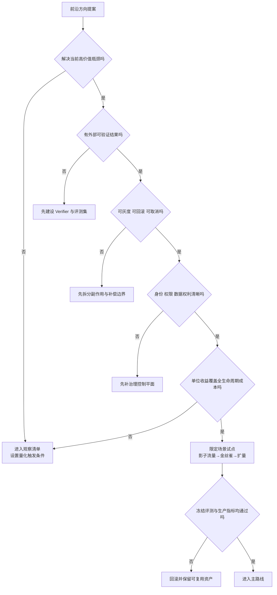

### 3.4 给“暂不投入”设置触发条件

观察清单不能退化成无人负责的链接收藏夹。应记录重新评审条件：

```yaml
schema_version: 1
frontier_watch:
  topic: cross_org_a2a
  current_decision: watch
  owner: platform-architecture
  review_every_days: 90
  triggers:
    - two_external_partners_require_a2a
    - custom_integration_cost_gt_3_engineer_months
    - conformance_suite_covers_auth_retry_and_streaming
    - adapter_prototype_can_be_removed_within_5_days
  stop_conditions:
    - no_production_demand_after_two_review_cycles
    - protocol_breaks_required_security_model
```

### 3.5 提案必须写清楚“做什么”和“不做什么”

一个合格的前沿提案至少包含：

- 要解决的业务瓶颈及当前基线；
- 假设、目标指标和不可牺牲指标；
- 限定场景、租户、工具、数据和副作用范围；
- 明确排除的能力；
- 评测、灰度、回滚和事故处置；
- 继续投入、暂停投入、完全退出的判据。

“支持 A2A”“实现自进化”“接入 Computer Use”都不是完整目标；“把跨组织工单委派的自定义适配成本降低 60%，且失败时不影响内部编排”才是可评审目标。

---

## 4. Agent 能力演进的正确顺序：从外到内、从可逆到不可逆

Agent 不是只有模型一层。一个生产 Agent 至少包含以下能力栈：

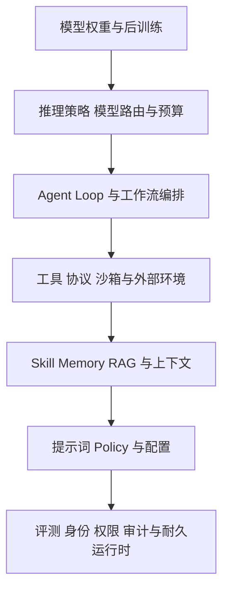

底层治理与运行时支撑上层能力；而优化时通常应按以下顺序推进：

1. 修正任务定义和验收标准；
2. 修正工具 Schema、错误语义和环境反馈；
3. 优化上下文选择、压缩、检索和结构化状态；
4. 沉淀 Skill、Memory 与领域流程；
5. 调整 Agent Loop、路由、并发和推理预算；
6. 更换、组合或蒸馏模型；
7. 最后才是微调或强化学习。

### 4.1 Harness 包含什么

本章把模型权重之外、决定 Agent 行为的可配置系统统称为 **Harness**：

- System Prompt、Policy、Few-shot 和输出约束；
- Context Window 管理、压缩、RAG 和 Memory；
- Tool Schema、错误类型、重试策略和工具选择；
- Skill、脚本、工作流、Agent 拓扑和路由；
- Sandbox、Filesystem、Browser、Terminal 和外部状态；
- Checkpoint、取消、预算、人工审批与恢复；
- Verifier、评测集、生产门禁和观测信号。

### 4.2 为什么必须先改 Harness

| 维度 | Harness 变更 | 权重变更 |
|---|---|---|
| 生效速度 | 分钟到天 | 天到月 |
| 回滚 | 切版本即可 | 需切模型/适配器并做全域回归 |
| 可解释性 | 可定位到 Prompt、Skill、工具、路由 | 行为变化分散在参数中 |
| 迁移性 | 通常可跨模型复用 | 往往依赖基座与训练栈 |
| 影响面 | 可限定到任务、租户和流量 | 容易出现全局行为漂移 |
| 数据要求 | 少量案例即可试验 | 需要稳定、高质量、合法数据 |
| 安全审批 | 可按能力粒度评审 | 往往需要整模型回归 |
| 退出成本 | 较低 | 中高 |

**先改 Harness 并不是保守，而是在购买更便宜的因果证据。** 当提示词、工具、上下文和工作流优化都被严谨评测证明确实到达平台期，后训练的投入才更有把握。

### 4.3 一个常见误判

现象：Agent 在内部 API 上频繁填错参数。

错误结论：模型不懂公司业务，需要微调。

正确排查顺序：

1. 参数名和描述是否有歧义；
2. 必填字段是否明确；
3. 枚举值是否可发现；
4. 错误响应是否告诉模型如何修正；
5. 是否把多个业务动作混在一个超大工具里；
6. 是否缺少示例和负例；
7. 是否把调用前提放在模型看不到的文档中；
8. 在修正后，冻结评测集是否仍显示稳定能力缺口。

只有第 8 步仍成立，微调才可能是正确投资。

---

## 5. Agent 自进化：本质是自动化变更管理

### 5.1 定义与边界

自进化 Agent 是指系统根据任务经验，修改可跨任务复用的持久状态，并在后续任务中使用这些修改。可修改对象包括：

- 提示词、规则与路由配置；
- 语义记忆、程序性记忆和用户偏好；
- Skill、脚本、工具说明和工作流模板；
- 检索、压缩、反思和停止策略；
- 子 Agent 拓扑、角色与任务分解方式；
- 更激进时，还包括模型权重。

研究工作逐渐把这类外围结构统一描述为 Agent Harness。近期自进化评测也说明，仅看更新后的最终得分远远不够，还要观察迁移、保留、回放、成本和过拟合。〔R2-R5〕

生产系统中最重要的边界是：

> **自进化应理解为“系统自动提出、验证并发布变更”，而不是“系统可以绕过发布流程直接改自己”。**

### 5.2 四维分类法

| 维度 | 取值示例 | 工程意义 |
|---|---|---|
| **改什么** | Memory、Prompt、Skill、Tool、Workflow、Router、Weight | 决定影响面与回滚难度 |
| **何时改** | 单次任务内、跨会话、周期批处理、持续在线 | 决定数据泄漏与稳定性风险 |
| **如何改** | 反思、轨迹挖掘、搜索、优化器、RL、人工总结 | 决定可解释性与成本 |
| **谁批准** | 仅建议、人审、自动灰度、自动全量 | 决定自治等级与责任边界 |

生产系统最稳妥的组合通常是：

> **跨会话批量分析 → 自动生成候选变更 → 冻结评测集验证 → 风险分级审批 → 影子运行 → 金丝雀 → 可自动回滚。**

### 5.3 自进化闭环

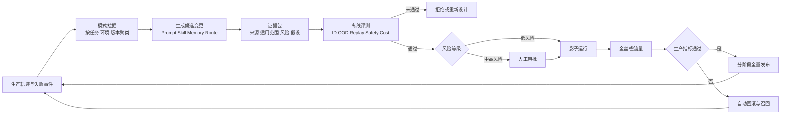

### 5.4 候选变更必须携带证据包

一个自进化候选不应只有新的 Prompt 或 `SKILL.md`，至少应包含：

```yaml
schema_version: 1
candidate_id: skill-code-review-20260831-01
kind: skill
base_version: code-review@2.3.1
proposed_version: code-review@2.4.0
artifact_digest: sha256:...
source:
  trace_query: task_type=code_review AND verifier=passed
  trace_count: 184
  time_window: 2026-08-01/2026-08-28
  source_ids_hashed: true
hypothesis: >
  在跨模块修改时，先生成影响面清单再检查补丁，能够降低遗漏回归。
scope:
  task_types: [code-review, change-plan]
  repositories: [python, rust, typescript]
risk:
  level: medium
  new_tools: []
  side_effects: read_only
compatibility:
  models: [model-family-a, model-family-b]
  required_tools: [repo-map, symbol-search, test-runner]
evidence:
  baseline_eval: evalset-2026-08@7
  candidate_eval: evalrun-9d2f
  id_delta: 0.061
  ood_delta: 0.024
  replay_delta: -0.003
  cost_delta: 0.018
  safety_violations: 0
approval:
  required: true
  approver_role: agent-platform-owner
rollback:
  previous_digest: sha256:...
  max_rollback_seconds: 60
```

证据包的作用是把“模型觉得这条经验有用”转化为可审计的工程对象。

### 5.5 Skill 的开放格式与企业治理信封

Agent Skills 规范将一个 Skill 表达为包含 `SKILL.md` 的目录，并可附带 `scripts/`、`references/`、`assets/`，为跨产品复用提供了简洁核心。〔R21〕

但企业环境还需要在开放核心之外增加治理信封：

| 开放格式解决 | 企业仍需补充 |
|---|---|
| Skill 名称与描述 | 发布者身份和公钥 |
| 使用说明 | 内容摘要与不可变版本 |
| 脚本和资源打包 | 签名、SBOM、依赖锁定 |
| 兼容性声明 | 真实兼容性测试矩阵 |
| 工具提示 | 强制权限策略和运行时沙箱 |
| 文件引用 | 数据分级、许可证和来源证明 |
| 能力分发 | 撤销、隔离、灰度和回滚 |
| 版本更新 | 变更差异、迁移说明和风险等级 |

> **Skill 是供应链资产，不只是一个更长的 Prompt。** 一旦 Skill 可以携带脚本、命令和参考文件，就必须按软件包而不是按普通文档管理。

### 5.6 Memory 何时可以毕业为 Skill

Memory 更适合记录事实、偏好、经验和局部教训；Skill 更适合表达可重复执行的方法。建议同时满足以下条件后再毕业：

1. 同类任务中重复出现，而非单次偶然成功；
2. 有外部验证结果，不依赖 Agent 自报成功；
3. 能明确描述触发条件、禁用条件和适用边界；
4. 能抽象出稳定动作，而不是绑定某个会话细节；
5. 不包含个人敏感信息、短期凭证或租户私有内容；
6. 在冻结 ID、OOD 和 Replay 集上有稳定增益；
7. 有负责人、版本、撤销和回滚路径；
8. 不通过扩大权限来掩盖能力不足。

### 5.7 自进化评测不应只看“最新分数”

建议至少跟踪：

```text
GeneralizationGain = Candidate_OOD - Baseline_OOD
RetentionRatio     = Candidate_Replay / max(Baseline_Replay, ε)
CostAdjustedGain   = SuccessGain / max(CostIncrease, ε)
SafetyDelta        = Candidate_Violations - Baseline_Violations
Stability          = 1 - StdDev(success_rate_across_seeds)
```

其中：

- **ID**：与经验来源同分布的任务；
- **OOD**：不同仓库、用户、工具版本或输入风格的任务；
- **Replay**：历史关键任务、事故样例和曾经通过的能力；
- **Safety**：权限绕过、数据泄漏、注入和危险副作用测试；
- **Cost**：Token、工具次数、执行时间、算力和人工介入成本；
- **Stability**：不同随机种子、模型版本和环境扰动下的波动。

### 5.8 自进化的五条生产红线

1. 生产 Agent 不得直接修改其当前正在执行的版本；
2. 候选变更不得同时参与生成和评测其自身的测试答案；
3. 生产轨迹不得未经授权、脱敏和质量筛选就进入优化管线；
4. 任何扩大权限、增加工具或放宽策略的变更都必须人工审批；
5. 每个上线版本必须能定位到来源、评测、审批、流量和回滚版本。

### 5.9 常见自进化失败模式

| 失败模式 | 表现 | 根因 | 治理方式 |
|---|---|---|---|
| 自我确认偏差 | Agent 生成规则后又自行判定有效 | 生成器和评测器不独立 | 外部 Verifier、盲评、独立评测版本 |
| 局部分布过拟合 | 最近一批任务变好，其他任务退化 | 只看 ID，不看 OOD/Replay | 多切片门禁、历史哨兵集 |
| 错误经验放大 | 一次错误被写成长期记忆 | 缺少来源和置信更新 | 证据计数、冲突检测、可撤销记忆 |
| 权限漂移 | 新 Skill 悄悄获得更多工具 | 能力与权限耦合 | 权限差异评审、Capability Manifest |
| 递归退化 | 新版本基于旧版本输出继续优化 | 错误逐代累积 | 定期回到可信基线，限制优化代数 |
| 评测泄漏 | 生产轨迹包含评测答案 | 数据边界失控 | 数据集指纹、隔离命名空间 |
| 供应链污染 | 外部 Skill 携带危险脚本 | 把 Skill 当文本处理 | 签名、扫描、沙箱、网络限制 |
| 版本不可重现 | 无法复现某次成功或事故 | 未记录完整版本和环境 | 内容寻址、锁文件、环境快照 |


---

## 6. Agent 后训练：什么时候才应该动权重

### 6.1 先区分“行为缺口”和“知识缺口”

性能不达标并不天然意味着需要微调。常见瓶颈至少有五类：

| 瓶颈 | 典型现象 | 优先方案 |
|---|---|---|
| **任务定义缺口** | 成功标准含糊，人工评审也不一致 | 先定义验收规范和 Verifier |
| **知识缺口** | 缺少最新私有事实 | RAG、工具查询、结构化数据接入 |
| **交互缺口** | API 参数错、工具失败后不会修正 | Tool Schema、错误语义、示例和重试策略 |
| **策略缺口** | 知道信息但不会稳定按流程行动 | Prompt、Skill、Workflow、路由，必要时 SFT/DPO |
| **基础能力缺口** | 推理、代码、视觉或语言能力不足 | 更换模型、推理时扩展，最后考虑后训练 |

把变化频繁的知识压进权重，通常会制造一个一上线就开始过期的系统。后训练更适合固化**稳定行为与稳定领域分布**，而不是替代实时检索。

### 6.2 更新后的后训练决策树

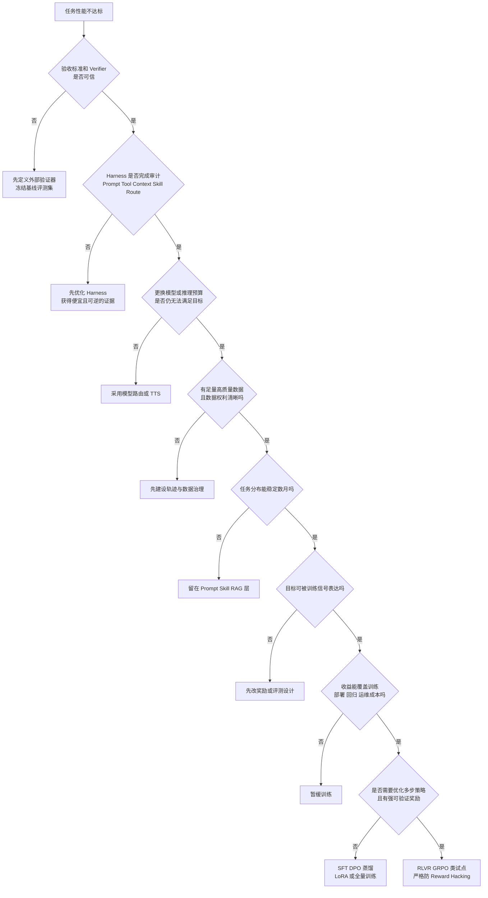

这棵树最重要的不是最后选了哪种方法，而是多数出口都通向“**现在先不训练**”。

### 6.3 方法选型不是一张并列表

LoRA、SFT、DPO 并非同一维度：

- **SFT、DPO、RLVR** 主要描述训练目标；
- **LoRA、QLoRA、全量微调** 描述参数更新方式；
- **蒸馏** 描述教师—学生知识迁移；
- **持续预训练** 更接近分布和知识适配。

| 方法 | 适合解决 | 数据形态 | 优点 | 主要风险 |
|---|---|---|---|---|
| **持续预训练** | 稳定领域语言、代码或知识分布 | 大量无标注领域语料 | 增强领域表征 | 成本高、可能遗忘、知识仍会过期 |
| **SFT** | 固定格式、工具习惯、稳定流程和风格 | 高质量示范轨迹 | 简单、可控、易起步 | 模仿错误、覆盖不足、分布外泛化弱 |
| **LoRA / QLoRA** | 低成本承载 SFT/DPO 等目标 | 与目标方法相同 | 迭代快、适配器可切换 | 多适配器治理、基座升级兼容性 |
| **DPO** | 无唯一答案但有稳定偏好 | 同任务优劣成对样本 | 无需独立奖励模型 | 偏好偏差、负例质量差、过度风格化 |
| **蒸馏** | 降低延迟和单位成本 | 教师输出、标签或过程数据 | 小模型部署成本低 | 继承教师错误，长尾能力损失 |
| **RLVR / GRPO 类** | 数学、代码等可自动验证的多步策略 | 任务、采样轨迹、可验证奖励 | 可超越示范，优化长期决策 | 奖励投机、训练不稳、成本和回归面大 |

LoRA、QLoRA、DPO、GRPO 和基于可验证奖励的推理模型训练分别有清晰的研究基础。〔R6-R10〕

### 6.4 一个实用的后训练分层策略

```text
第一层：Prompt / Tool / Context / Skill 修正
第二层：强模型生成 + 弱模型执行的蒸馏
第三层：LoRA + SFT 固化稳定示范
第四层：LoRA + DPO 对齐领域偏好
第五层：有强 Verifier 时尝试 RLVR / GRPO
第六层：只有在规模与收益充分时考虑全量训练
```

每上升一层，至少应提高以下门槛：

- 数据审查强度；
- 冻结评测覆盖率；
- 安全和通用能力回归集规模；
- 发布审批级别；
- 灰度周期；
- 可回滚和双模型共存能力。

### 6.5 轨迹数据飞轮

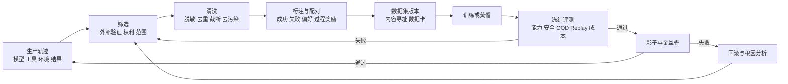

**轨迹的价值不等于会话日志的数量。** 高价值轨迹应包含：

- 明确任务和约束；
- 完整动作与外部环境反馈；
- 工具参数、返回值和错误类型；
- 中间工件与最终产物；
- 外部 Verifier 结果；
- 人工接管、修改和拒绝原因；
- 模型、Prompt、Skill、工具、策略和环境版本；
- Token、延迟、工具次数和资源成本；
- 数据来源、使用权、保留期和删除策略。

### 6.6 训练数据的正负例不能靠“自报状态”

正例建议满足：

```text
业务验收通过
AND 外部 Verifier 通过
AND 未越权
AND 无关键人工修复
AND 数据权利允许训练
```

负例也不能简单定义为“没有完成”。以下轨迹不应自动作为负例：

- 用户主动取消；
- 上游服务不可用；
- 权限不足导致合理拒绝；
- 任务本身不可满足；
- 评测器故障；
- Agent 正确请求澄清但用户未回复。

错误标负会教模型规避正确行为，例如：把“拒绝越权请求”学成坏行为，把“请求必要澄清”学成低质量行为。

### 6.7 数据权利与删除不是附属问题

数据进入训练前必须回答：

- 谁拥有原始输入、输出和中间工件；
- 是否允许用于改进全局模型、租户模型或仅用于该会话；
- 是否含个人信息、商业秘密、许可证受限代码；
- 是否能追踪到具体数据集版本和模型版本；
- 用户撤回授权后采取何种删除、隔离、重训或机器遗忘策略。

需要避免一个过度承诺：**删除原始样本并不会自动删除其对模型参数的影响。** 机器遗忘可能不完整，因此最优先的措施仍然是训练前的数据最小化、授权、隔离和血缘记录，而不是事后假定可以无损擦除。

### 6.8 后训练发布门禁

建议至少包含六组门禁：

| 门禁 | 核心问题 | 示例指标 |
|---|---|---|
| 任务能力 | 目标任务是否提升 | verified success、partial score |
| 通用能力 | 是否灾难性遗忘 | 通用哨兵集回归率 |
| 分布外能力 | 是否只记住训练分布 | OOD 增益、不同环境稳定性 |
| 安全与权限 | 是否更容易越权或被注入 | 攻击成功率、拒绝正确率 |
| 运行成本 | 收益是否值得 | 成功任务成本、P95 延迟 |
| 生产行为 | 真实流量是否一致 | 人工接管率、回滚率、投诉率 |

微调模型的行为漂移面通常大于单个 Prompt 或 Skill，因此发布门禁必须更严格。

---

## 7. 推理时扩展：用更多计算换更高成功率，但必须由预算与 Verifier 驱动

### 7.1 什么是 Test-Time Scaling

推理时扩展是在不修改模型权重的情况下，增加推理阶段的采样、搜索、反思、验证或协作计算。常见形式包括：

- **并行采样**：同一任务生成多个候选，使用 Verifier 或排序器选择；
- **顺序修订**：根据工具反馈、测试结果或批评逐轮改进；
- **树搜索/束搜索**：保留多个中间分支并剪枝；
- **规划—执行—验证循环**：阶段化完成长任务；
- **专家路由或多 Agent 讨论**：对高不确定问题调用额外角色；
- **强弱模型协作**：小模型处理常规步骤，强模型处理高风险节点。

这些方法已有明确研究信号，但也存在上下文上限和验证缺口。〔R11-R12〕

### 7.2 关键不是“想得更久”，而是“何时值得继续想”

一个简化决策可以写成：

```text
继续推理，当且仅当：
ExpectedValueOfNextStep
> MarginalTokenCost
+ MarginalLatencyCost
+ MarginalRiskCost
```

实际系统无法精确计算这些量，可以使用代理指标：

- 当前候选间分歧是否仍然很大；
- Verifier 是否指出可修复的明确错误；
- 新一轮是否产生了新证据，而不是重复表达；
- 剩余预算是否足以完成验证和收尾；
- 任务风险是否需要第二模型或人工复核；
- 最近若干轮的状态是否没有实质变化。

### 7.3 推理预算控制器

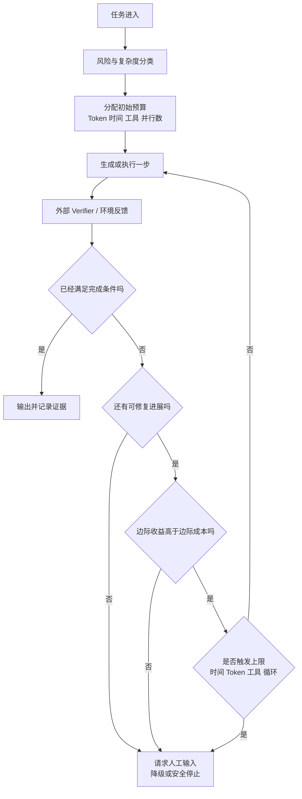

### 7.4 Verifier 有哪些形态

优先级从强到弱通常是：

1. **环境执行结果**：测试、编译、数据库约束、形式化检查；
2. **业务系统回执**：订单状态、工单状态、API 确认；
3. **规则与 Schema**：JSON Schema、权限策略、静态分析；
4. **独立模型评审**：不同提示词、不同模型或盲评；
5. **同一模型自我反思**：成本低，但相关性偏差最大。

同一模型说“我检查过了”不等于外部验证。自我反思适合作为候选生成器，不适合作为唯一发布门禁。

### 7.5 生成能力和选择能力之间的验证缺口

Best-of-N 常见问题是：多个候选中确实存在正确答案，但系统无法稳定选中它。这说明：

- 增加 N 只提升“候选池中出现正确答案”的概率；
- 最终成功率还取决于选择器/Verifier 的精度；
- 选择器使用与生成器相同的偏差时，收益可能很快饱和；
- 并行样本会线性或超线性增加成本；
- 对有副作用的任务，不能把多个候选都在真实环境执行。

因此，投资顺序应是：

> **先提高验证质量，再增加候选数量；先在沙箱验证，再选择真实副作用。**

### 7.6 停止条件必须是运行时契约

每个 Agent Loop 至少应有：

```yaml
budget:
  wall_clock_seconds: 900
  max_model_calls: 24
  max_tool_calls: 80
  max_parallel_branches: 4
  max_tokens: 180000
  max_same_state_repeats: 3
  reserve_for_final_verification: 0.15
on_exhausted:
  action: request_human_or_return_partial
  persist_checkpoint: true
  include_unfinished_items: true
```

不要把 `while not done` 当成自治。没有预算、取消和无进展检测的循环，只是一个成本和风险放大器。

### 7.7 哪些任务适合推理时扩展

适合：

- 有强外部验证器；
- 单次正确性价值高；
- 任务复杂度差异很大；
- 可以先在沙箱或副本环境执行；
- 延迟要求允许动态追加计算。

不适合：

- 没有可靠 Verifier；
- 任务极低价值、极高频；
- 严格实时交互；
- 每次尝试都会产生不可逆副作用；
- 数据或工具成本远高于推理成本。

---

## 8. 长时 Agent 与 Durable Execution：Context Window 不是状态存储

### 8.1 为什么长上下文解决不了长时任务

长上下文可以容纳更多 Token，但不能自动提供：

- 进程崩溃后的恢复；
- 数小时等待外部事件而不占用计算；
- 工具副作用的幂等与补偿；
- 多参与方审批；
- 环境状态版本和冲突检测；
- 跨设备、跨进程、跨模型迁移；
- 可查询的任务进度和审计；
- 精确取消和资源回收。

真实长时基准已经显示，Agent 在数百步任务中容易遗失约束、错过动态信息、猜测而不澄清、跳过最终验证。〔R14-R16〕

### 8.2 Durable Agent 的最小状态模型

至少应持久化以下对象：

| 对象 | 内容 |
|---|---|
| Task | 目标、约束、优先级、截止时间、风险等级 |
| Plan | 阶段、依赖、完成条件、当前游标 |
| World State | 关键外部状态的版本、时间戳和来源 |
| Artifact | 文件、补丁、报告、结构化结果和内容摘要 |
| Event Log | 每次模型、工具、审批和状态迁移事件 |
| Checkpoint | 可恢复的最小状态与版本引用 |
| Delegation | 用户、Agent、子 Agent 和工具间的授权链 |
| Budget | Token、时间、工具、金额和并发配额 |
| Idempotency | 外部写操作的幂等键、结果和补偿信息 |
| Lease | 当前执行者、租约到期和接管规则 |

### 8.3 长时任务状态机

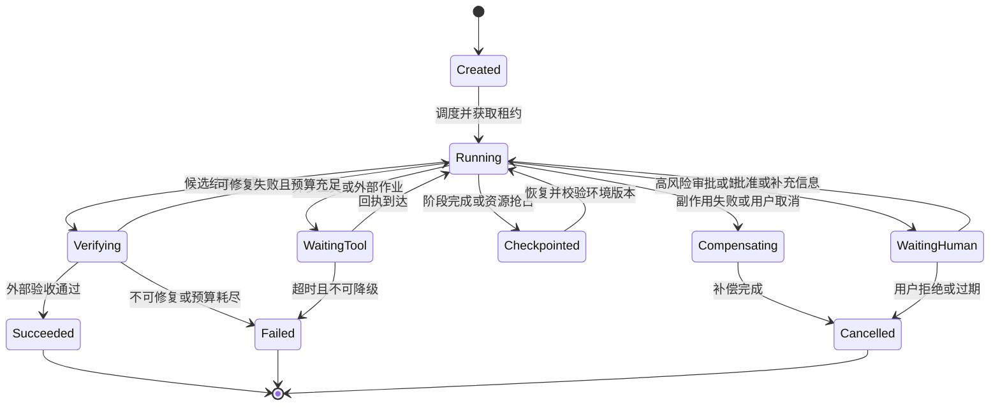

### 8.4 Checkpoint 不等于把整段对话序列化

高质量 Checkpoint 应包含：

- 结构化目标和未完成项；
- 已验证事实及其来源；
- 已产生的外部副作用；
- 工件内容摘要和不可变地址；
- 环境版本、仓库提交、网页/记录版本；
- 当前授权、预算和审批状态；
- 下一步可执行动作及前置条件；
- 可丢弃的对话和推理摘要。

对话全文可以作为审计附件，但不应成为唯一恢复机制。恢复时要重建**任务状态**，而不是仅把旧聊天重新塞回上下文。

### 8.5 非确定性与耐久工作流

传统 Durable Workflow 常依赖确定性重放，而模型调用天然非确定。正确拆分是：

- **编排器**：负责状态迁移、重试、定时器、审批和补偿，尽量确定；
- **模型调用**：作为有记录输入输出的 Activity，不在重放时随意重复；
- **外部工具**：使用幂等键或先查询后补偿；
- **版本升级**：通过版本化 Workflow、迁移函数或从稳定 Checkpoint 接管。

如果重放时重新调用模型，就可能得到不同动作；如果重放时重新执行支付、发信、提交代码等工具，就可能产生重复副作用。

### 8.6 失败恢复策略

| 场景 | 推荐策略 | 禁忌 |
|---|---|---|
| 只读工具临时失败 | 有界指数退避、熔断、换副本 | 无限重试 |
| 写操作超时，结果未知 | 用幂等键查询结果，再决定重试 | 直接重复写 |
| Agent 进程崩溃 | 从最近 Checkpoint 恢复并获取新租约 | 依赖内存对话 |
| 环境版本变化 | 做版本冲突检测，必要时重新规划 | 假设旧计划仍成立 |
| 用户取消 | 传播取消信号，停止子任务并补偿 | 只在 UI 标记取消 |
| 模型升级 | 影子恢复历史任务，比较状态兼容性 | 直接替换长时运行实例 |
| 审批长时间无响应 | 持久化等待，不占模型 Token；到期关闭 | 保持活跃进程空等 |
| 部分阶段已成功 | 保存阶段结果，按 Saga 补偿或继续 | 从头重跑全部步骤 |

### 8.7 会话级 QoS 与调度

未来调度单位不再只是单个请求，而可能是一个有状态 Agent 会话。建议现在就准备：

- 状态外置；
- 可抢占 Checkpoint；
- 明确优先级和截止时间；
- 租户级 Token、GPU、工具与金额预算；
- 取消信号能传播到模型、工具和子 Agent；
- 长任务分阶段释放资源；
- 恢复时可切换执行节点甚至模型。

即使暂时不做高级会话调度，这些能力也是可靠长时 Agent 的基础。

---

## 9. Agent 协议栈：不要期待一个协议解决所有问题

### 9.1 分层视图

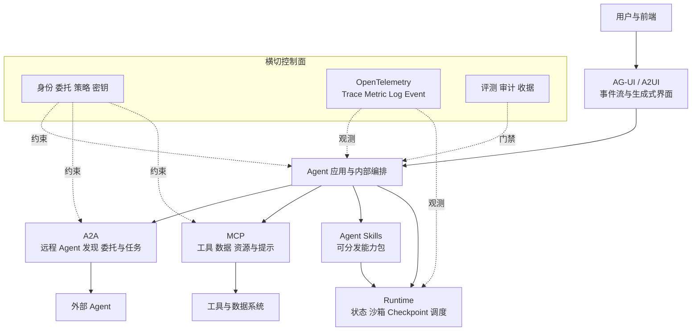

一条简单但重要的边界：

- **AG-UI/A2UI**：Agent 与用户界面怎样交换状态和交互结构；
- **A2A**：一个 Agent 怎样发现、委托和跟踪另一个 Agent；
- **MCP**：Agent 怎样发现并调用工具、数据和资源；
- **Agent Skills**：能力说明、脚本和资料怎样打包分发；
- **OpenTelemetry**：执行行为怎样被观测；
- **Identity/Policy**：谁有权发起哪些动作；
- **Runtime**：任务怎样持久化、安全执行和恢复。

### 9.2 MCP：协议核心成熟，不代表治理自动完成

MCP 的价值是统一工具、资源和提示的发现与调用契约。2026-07-28 规范的显著变化包括无状态协议核心、更清晰的版本/能力协商、长时任务扩展和授权演进，使其更适合普通 HTTP 基础设施横向扩展。〔R17-R18〕

生产接入仍需单独解决：

- 工具是否对当前用户和租户可见；
- 每次调用是否需要再授权；
- 服务端返回内容是否可信；
- Prompt Injection 如何隔离；
- 工具版本、Schema 和语义怎样升级；
- 外部 MCP Server 的发布者、签名和供应链如何验证；
- 日志是否泄露 Prompt、凭证或个人数据；
- 长时任务的状态究竟由协议端还是业务运行时持有。

> **MCP 解决“怎么说话”，不自动解决“有没有资格做、做错了谁负责”。**

### 9.3 A2A：从“未收敛”更新为“稳定核心进入早期生产”

A2A 1.0 已提供稳定规范，核心对象包括：

- Agent Card：身份、端点、能力、认证方式和 Skills；
- Message：交互消息和内容 Part；
- Task：有状态任务、生命周期和结果；
- Artifact：任务产生的结构化或多模态工件；
- Streaming / Push：长任务的增量更新；
- 安全信息和可选签名机制。

因此，原章“协议仍在竞争期、未收敛”的表述需要更新：**A2A 的核心规范已跨过 1.0 稳定线，并出现云平台和企业生产采用；但完整互操作仍依赖发现、身份、语义、测试、运营和跨组织信任生态。**〔R19-R20〕

适合接入 A2A 的条件：

- 确实要连接由不同团队、框架或组织维护的 Agent；
- 任务需要异步状态、工件和多轮协作，而非一次 RPC；
- 对方不会共享内部工具、Prompt 或编排实现；
- 自定义对接成本已成为明显负担；
- 已有跨边界身份、策略和审计方案。

不应为了“多 Agent”而在单体系统内部强行 A2A 化。内部高频、强一致协作通常更适合自己的类型化事件、函数调用或图执行；A2A 更适合边界互操作。

### 9.4 Agent Skills：能力包不是远程 Agent

Agent Skills 表达“怎样完成某类任务”的可加载资产；A2A 表达“怎样与另一个独立 Agent 协作”。两者不要混淆：

| Agent Skills | A2A |
|---|---|
| 通常在当前 Agent/Runtime 中加载 | 调用远程或独立 Agent |
| 以文件、说明、脚本、资源为核心 | 以消息、任务、工件、端点为核心 |
| 共享方法和程序性知识 | 委托独立责任主体执行 |
| 主要风险是供应链和本地权限 | 主要风险是跨边界身份与结果信任 |

### 9.5 AG-UI 与 A2UI：交互协议开始独立成层

传统聊天 UI 只展示文本；生产 Agent 需要表达：

- 当前计划、进度和等待状态；
- 工具调用和审批请求；
- 可编辑结构化表单；
- 部分结果和流式工件；
- 失败恢复、取消和重新授权；
- 由 Agent 生成但受限于安全组件目录的界面。

AG-UI 面向 Agent 与前端之间的事件交互，A2UI 面向受约束的生成式 UI。两者都处于早期采用阶段，适合通过适配层试点，不宜直接成为业务领域状态的唯一表示。〔R23-R24〕

### 9.6 OpenTelemetry：采用标准语义，但保留内部事实模型

OpenTelemetry 的 GenAI 语义约定正在统一模型、Token、工具调用和可选内容字段，为跨框架观测提供基础。〔R25〕

稳妥做法是：

```text
内部 Canonical Agent Event
        ↓ 映射
OpenTelemetry Span / Event / Metric / Log
        ↓ 导出
任意 OTel Collector 与后端
```

不要让业务代码直接依赖某一版实验性语义字段。内部事件应能独立表达：任务、Agent、模型、工具、状态、Verifier、预算、审批、数据分类和工件血缘；OTel 是标准传输和观测映射层。

### 9.7 Ports & Adapters：把协议留在边界

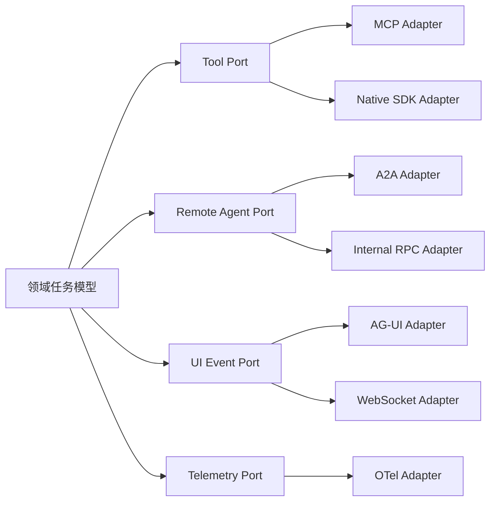

这样做的收益：

- 协议升级不污染领域模型；
- 同一能力可同时暴露 Native API、MCP 或 A2A；
- 测试可以使用内存 Adapter；
- 厂商托管运行时可以替换；
- 协议赌注错误时，退出成本可控。

---

## 10. 评测与可观测：前沿能力的共同地基

### 10.1 从“答案评测”升级为“轨迹评测”

Agent 的最终答案可能看起来正确，但执行过程可能：

- 读取了不该访问的数据；
- 反复试错导致成本失控；
- 依赖偶然环境状态；
- 跳过必要审批；
- 产生未被发现的副作用；
- 用错误方法得到碰巧正确的结果；
- 无法在下一版本稳定复现。

因此需要同时评测：

```text
Task Outcome + Trajectory Quality + Policy Compliance
+ Recovery Behavior + Cost + Human Burden
```

### 10.2 五层评测金字塔

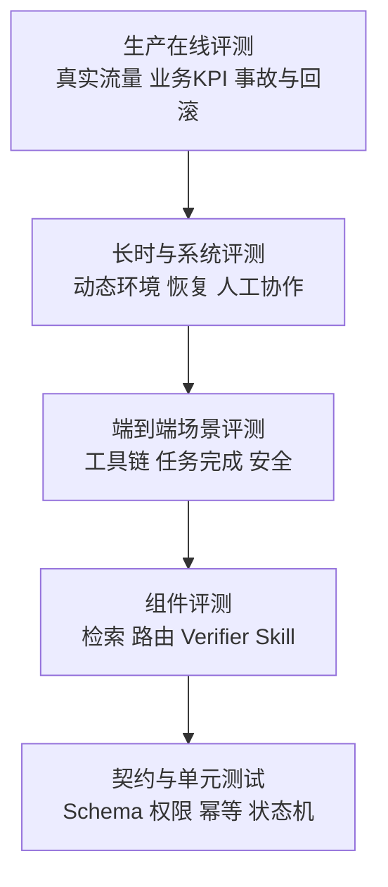

越往上越真实、昂贵、波动大；越往下越便宜、确定、易定位。不能只保留一个“综合成功率”。

### 10.3 长时 Agent 的关键指标

| 类别 | 指标示例 |
|---|---|
| 完成质量 | verified success、partial completion、关键约束满足率 |
| 长程一致性 | 约束保留率、计划偏移率、重复工作比例 |
| 恢复能力 | checkpoint restore success、平均恢复时间、重复副作用数 |
| 交互质量 | 必要澄清率、无效追问率、人工接管率 |
| 工具行为 | 工具成功率、参数修复率、重试次数、熔断次数 |
| 安全 | 越权尝试、注入成功率、敏感数据暴露、危险动作阻断率 |
| 成本 | 每成功任务 Token、工具费用、GPU 时间、人工分钟数 |
| 性能 | 首次响应、P50/P95 完成时间、等待与执行时间拆分 |
| 稳定性 | 多次运行成功分布、模型/环境升级回归率 |
| 可运营性 | 取消成功率、回滚时间、告警可行动性、事故定位时间 |

### 10.4 `pass@k` 与可靠性不要混淆

- `pass@k` 常表示采样 k 次至少一次成功的概率，适合衡量候选生成能力；
- 生产流程更关心同一任务重复执行是否都稳定成功，可用 `pass^k`、多次一致通过率或成功率分布表达；
- 一个 `pass@8` 很高、单次成功率很低的 Agent，可能适合离线生成候选，却不适合直接执行高风险动作；
- 聚合平均分可能掩盖某个关键租户、工具或安全切片的系统性失败。

### 10.5 Canonical Agent Event

建议所有框架、协议和模型最终写入统一事件模型：

```json
{
  "schema_version": 3,
  "event_id": "evt_01J...",
  "trace_id": "tr_01J...",
  "task_id": "task_01J...",
  "parent_event_id": "evt_parent",
  "occurred_at": "2026-08-31T12:30:45.123Z",
  "kind": "tool.completed",
  "actor": {
    "agent_id": "code-reviewer",
    "agent_version": "2.4.0",
    "workload_id": "spiffe://example/agent/code-reviewer",
    "principal_id_hash": "sha256:...",
    "delegation_id": "dlg_01J..."
  },
  "runtime": {
    "model": "model-family-a",
    "prompt_digest": "sha256:...",
    "skill_digests": ["sha256:..."],
    "policy_version": "policy-2026-08@5",
    "environment_digest": "sha256:..."
  },
  "tool": {
    "name": "test-runner",
    "version": "1.8.2",
    "call_id": "call_01J...",
    "idempotency_key": "idem_01J...",
    "result": "success"
  },
  "budget": {
    "input_tokens": 1580,
    "output_tokens": 243,
    "duration_ms": 3821,
    "cost_usd_micros": 9120
  },
  "data": {
    "classification": "internal",
    "content_recorded": false,
    "retention_policy": "agent-traces-30d"
  },
  "verifier": {
    "kind": "pytest",
    "status": "passed",
    "evidence_digest": "sha256:..."
  }
}
```

### 10.6 内容观测必须默认最小化

OTel 等规范可以记录 Prompt、Completion、工具参数和结果，但“可记录”不等于“应默认记录”。生产建议：

- 默认只记录摘要、大小、哈希、分类和结果状态；
- 内容采样必须按租户、环境和数据分类控制；
- 凭证、密钥和认证头永不进入通用 Trace；
- 对 Prompt、工具返回做结构化脱敏；
- 调试采样有审批、时间窗口和自动过期；
- 训练数据集与运维日志使用不同授权和保留策略；
- 用户可查询哪些数据被用于模型改进。

### 10.7 版本血缘决定能否复现

每次任务至少要能回答：

```text
哪个 Agent 版本
+ 哪个模型和参数
+ 哪个 Prompt/Policy
+ 哪些 Skill
+ 哪些工具及 Schema
+ 哪个数据/索引快照
+ 哪个运行环境
+ 哪条用户委托
= 这次结果
```

没有这些血缘，自进化无法判断哪项变更带来增益，后训练无法追踪数据，事故调查也只能靠猜。


---

## 11. 身份、安全与治理：自治越强，委托链越重要

### 11.1 Agent 身份不是用户身份的复制品

Agent 可能同时涉及四种身份：

| 身份 | 回答的问题 | 示例 |
|---|---|---|
| **调用主体 Principal** | 谁发起了任务 | 用户、服务账号、另一个 Agent |
| **Agent 身份** | 哪个逻辑能力在行动 | `invoice-reviewer@3.2` |
| **工作负载身份 Workload** | 哪个运行实例在访问资源 | SPIFFE ID、云工作负载身份 |
| **目标资源身份** | 正在访问哪个系统/租户 | CRM、代码仓库、支付服务 |

安全系统还要保存一条**委托链**：用户把哪些权限、在什么目的和时间范围内委托给哪个 Agent，Agent 又将哪一部分委托给哪个子 Agent 或工具。

NIST 2026 年的 Agent 标准与身份工作把身份、授权、审计、非抵赖、代表用户行动以及 Prompt Injection 明确列为重点；OWASP Agentic 应用与 Skills 风险清单也强调最小权限、可信发布、隔离、版本固定和审计。〔R29-R31、R41〕

### 11.2 正确的委托流

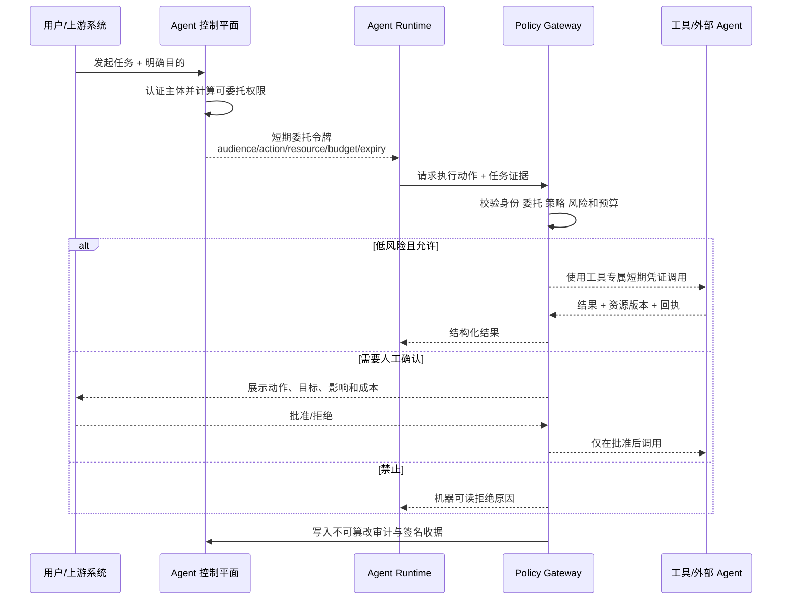

### 11.3 委托令牌应绑定哪些约束

一个 Agent 凭证至少应尽可能绑定：

```yaml
subject: workload://agent/invoice-reviewer/instance-8f2
on_behalf_of: principal://tenant-42/user-913
purpose: reconcile-invoice-2026-08
allowed_actions:
  - invoice.read
  - purchase_order.read
  - reconciliation.write_draft
resources:
  tenant: tenant-42
  invoice_ids: [INV-1088]
audience: finance-api
max_calls: 20
max_amount_usd: 0
not_before: 2026-08-31T12:00:00Z
expires_at: 2026-08-31T12:20:00Z
parent_delegation: dlg-root-01J...
confirmation_required_for:
  - payment.submit
  - vendor.update_bank_account
```

不要把用户的长期 Cookie、SSH 私钥或数据库密码直接交给 Agent。Agent 应有自己的工作负载身份，再通过短期、限域、可撤销的委托获得权限。

### 11.4 风险分级不能只看工具名称

同一个工具可能产生完全不同的风险：

| 动作 | 风险等级 | 默认控制 |
|---|---|---|
| 搜索公开文档 | 低 | 自动执行、记录来源 |
| 读取内部文档 | 中 | 租户隔离、目的绑定、内容最小化 |
| 创建草稿 | 中 | 标记为草稿、可撤销、不自动发送 |
| 修改代码分支 | 中高 | 沙箱、Diff、测试、分支保护 |
| 合并主分支 | 高 | 独立审批、保护规则、签名 |
| 发送外部邮件 | 高 | 展示收件人和正文，人工确认 |
| 变更权限 | 极高 | 双人审批、禁止 Agent 自我授权 |
| 支付或资金转移 | 极高 | 金额限额、强认证、Intent 证明、风控 |
| 物理设备动作 | 极高 | 独立安全控制器、区域和速度硬限制 |

风险取决于：动作、目标资源、数据敏感度、金额、可逆性、外部影响、授权来源和环境状态，而不只是 `tool.name`。

### 11.5 Prompt Injection 是跨信任域输入问题

网页、邮件、文档、Issue、工具返回、另一个 Agent 的消息都可能包含恶意指令。防护不应依赖一句“忽略恶意提示”，而应采用纵深防御：

1. **区分指令与数据**：外部内容进入明确的数据字段，不自动提升为系统指令；
2. **最小权限**：读取网页的 Agent 不应天然拥有发信、付款和改权限能力；
3. **工具前策略网关**：每次高风险调用重新计算授权，不依赖模型自律；
4. **数据流控制**：敏感信息不能流向不可信域；
5. **目标确认**：对域名、收件人、仓库、金额等做机器和人工双重核验；
6. **内容隔离**：浏览器、解析器、代码执行器运行在独立沙箱；
7. **攻击评测**：把间接注入、延迟触发和多步攻击纳入轨迹级评测；
8. **异常检测**：监控突然新增工具、权限请求、外传数据和策略冲突。

### 11.6 Skill 供应链安全

当 Skill 包含脚本和资源时，应执行类似软件供应链的流程：


最低要求：

- 只从允许的 Registry 获取；
- 锁定版本和内容摘要；
- 禁止安装过程任意联网；
- 脚本使用最小文件、网络和进程权限；
- 运行时记录实际调用工具与声明权限的差异；
- 发现风险时能按摘要全局撤销；
- 外部 Skill 不得自动进入自进化训练数据。

### 11.7 多 Agent 不会自动带来安全隔离

把一个任务拆成多个 Agent 可能增加：

- 身份与委托边；
- 不可信消息入口；
- 数据复制和泄漏路径；
- 版本组合数量；
- 责任归属模糊；
- 循环委托和成本放大；
- 跨 Agent 的间接 Prompt Injection。

每次 Handoff 至少应携带：

```text
任务子目标
+ 输入工件摘要
+ 来源和可信等级
+ 被委托权限
+ 禁止动作
+ 预算和截止时间
+ 验收标准
+ 回传格式
+ 父任务与委托链
```

Agent 间消息不能因为“来自内部 Agent”就自动视为可信指令。

### 11.8 签名收据与非抵赖

高风险动作完成后应生成可验证收据：

```json
{
  "receipt_id": "rcpt_01J...",
  "task_id": "task_01J...",
  "principal": "principal://tenant-42/user-913",
  "agent": "invoice-reviewer@3.2.0",
  "delegation": "dlg_01J...",
  "action": "reconciliation.write_draft",
  "resource": "invoice://tenant-42/INV-1088",
  "request_digest": "sha256:...",
  "result_digest": "sha256:...",
  "policy_decision": "allow",
  "approved_by": null,
  "occurred_at": "2026-08-31T12:14:04Z",
  "signature": "jws:..."
}
```

收据用于事故调查、用户解释、跨组织对账和争议处理。它不能只保存在可能被同一 Agent 修改的普通日志中。

### 11.9 安全不是上线前的一次扫描

Agent 安全闭环应持续覆盖：

```text
设计威胁建模
→ 工具/Skill 上架审查
→ 离线攻击评测
→ 影子与金丝雀
→ 运行时策略
→ 异常检测
→ 撤销与 Kill Switch
→ 事故回放
→ 评测集和策略更新
```

---

## 12. Computer Use、端侧 Agent 与具身智能

### 12.1 Computer Use 的正确定位

Computer Use 让模型通过截图、鼠标和键盘操作现有界面，适合没有 API、系统陈旧或流程跨多个应用的场景。主流提供方都明确建议使用隔离环境，并对登录、发送、购买、删除等高影响动作保留人工确认。〔R32-R33〕

它不是所有系统集成的默认方案。推荐接口优先级：

```text
直接业务 API
> 结构化工具 / MCP
> DOM / Accessibility Tree / Browser Automation
> 视觉截图 + 鼠标键盘
```

越往后语义越弱、环境越脆弱、验证越困难。

### 12.2 为什么 GUI Agent 容易“看起来会，实际上不稳”

- 页面布局、弹窗、A/B 实验和分辨率会变化；
- 图标和文本相似，视觉定位有歧义；
- 操作结果可能延迟出现；
- 页面中间状态不一定可见；
- 多标签页、下载、剪贴板和系统对话框增加状态；
- 外部页面内容可以实施 Prompt Injection；
- 点击成功不代表业务事务成功；
- 隐藏状态需要查询，而不是靠截图猜测。

OSWorld 2.0 的长时任务结果进一步表明，当前 Agent 在数百步真实工作流中仍会遗失约束、错过动态信息并跳过验证。〔R14〕

### 12.3 Computer Use 的生产控制

| 控制 | 推荐做法 |
|---|---|
| 环境 | 专用 VM/容器/浏览器 Profile，任务后销毁或恢复快照 |
| 网络 | 域名 Allowlist、下载隔离、禁止访问元数据服务 |
| 凭证 | 短期凭证、独立账号、Secret 不进入屏幕或日志 |
| 文件 | 限定目录、下载扫描、内容分类、任务后清理 |
| 动作 | 高风险操作前展示目标和影响，要求确认 |
| 观测 | 记录动作、截图摘要、DOM/可访问性状态、业务回执 |
| 验证 | 以业务状态为准，不以“按钮已点击”为准 |
| 恢复 | 阶段 Checkpoint、幂等、重复动作检测 |
| 注入 | 页面内容视为不可信数据，工具调用经策略网关 |
| 退出 | 随时可取消，传播到浏览器、下载和子任务 |

### 12.4 多模态 Agent 的机会与边界

多模态能力使 Agent 可以联合处理文本、图像、音频、视频和界面状态，典型价值包括：

- 文档、表格、图表和截图理解；
- 现场巡检和设备状态解释；
- 语音交互与会议工作流；
- 视觉定位辅助 Computer Use；
- 多媒体内容生产和质量检查。

但多模态输入扩大了攻击面：

- 图片或文档中隐藏指令；
- OCR 错误改变关键数字；
- 音频身份伪造；
- 视频时序和上下文被截断；
- 多模态内容在日志中更难脱敏。

生产系统应保存原始工件摘要、解析版本、置信度和可追溯定位；关键数字和身份信息必须二次验证。

### 12.5 端侧 / 混合 Agent

端侧 Agent 的价值不是“所有任务都本地化”，而是把合适能力放在合适位置：

| 适合端侧 | 适合云端 |
|---|---|
| 隐私敏感预处理 | 大模型复杂推理 |
| 唤醒词、语音活动检测 | 大规模知识检索 |
| 本地文件索引和权限检查 | 跨组织服务协作 |
| 小模型分类和路由 | 高成本多候选验证 |
| 离线基本能力 | 集中式策略和模型更新 |
| 设备状态和即时交互 | 全局观测与评测 |

混合架构示例：

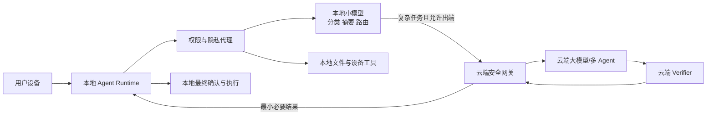

设计关键：

- 数据默认留在端侧，出端前明确最小化；
- 本地权限代理而不是云模型直接访问设备；
- 云端返回只能提出动作，最终高风险执行在端侧重新授权；
- 模型、策略和 Skill 更新要有签名和回滚；
- 离线时提供明确降级能力，不假装完整自治。

### 12.6 具身 Agent 与 Robotics

视觉—语言—动作模型正在把语言计划连接到机器人动作，已经出现真实机器人测试和端侧模型信号，但整体仍属于研究到受限试点。〔R34〕

物理世界与软件世界的最大差异是：

- 错误可能伤人或损坏设备；
- “回滚”往往不可能；
- 感知存在盲区和延迟；
- 环境分布比网页和 API 更开放；
- 模拟器成功不保证现实成功；
- 责任和认证要求更严格。

因此应采用双层甚至三层控制：

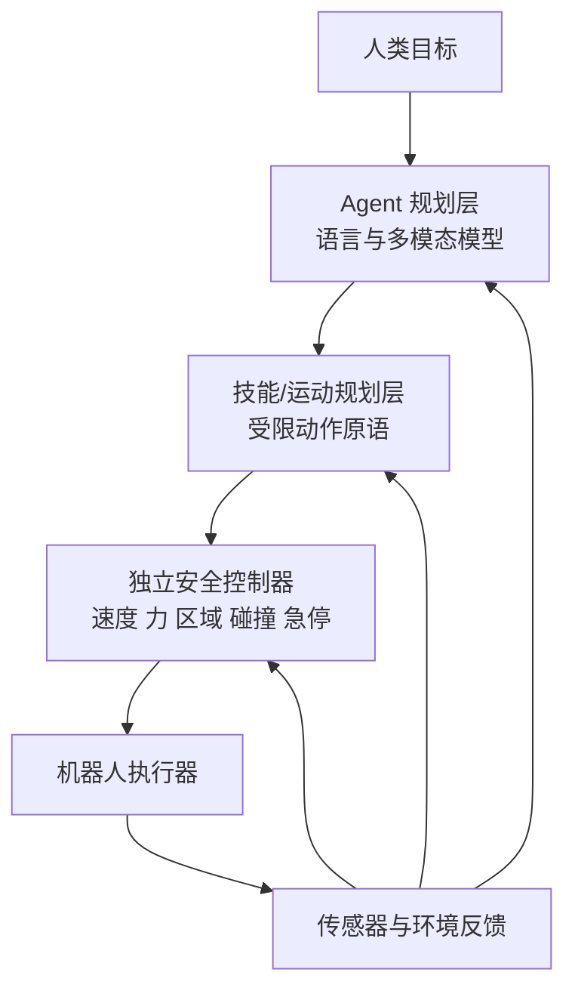

**LLM/VLA 不应成为最后一道安全边界。** 速度、力、空间、人员接近、急停等约束应由独立、确定、可认证的控制器执行。

### 12.7 什么时候值得投入端侧或具身方向

建议满足至少一个强触发条件：

- 数据不能离开设备或现场；
- 网络不稳定但任务必须连续；
- 交互延迟直接决定用户体验；
- 设备已有可控动作原语和安全控制器；
- 业务价值足以覆盖多硬件适配、测试和现场运维；
- 有真实场景数据，而不只是通用 Demo。

---

## 13. Agentic Commerce 与 Agent 经济

### 13.1 不要把“推荐商品”和“自主交易”混为一谈

Agentic Commerce 至少包含七个独立阶段：

```text
发现商品
→ 比较与协商
→ 表达用户意图
→ 授予有限委托
→ 支付授权
→ 履约与收据
→ 争议、退款和责任处理
```

UCP、AP2 以及支付网络方案开始把商品交互、用户意图、支付委托和审计回执表达为结构化协议对象。〔R36-R39〕

### 13.2 为什么“能调用支付 API”远远不够

支付前必须回答：

- 用户是否明确要求购买，还是只要求比较；
- 商品、数量、币种、总价、商户和时间是否在授权范围；
- 价格发生变化时授权是否仍有效；
- Agent 是否收取佣金或存在推荐利益冲突；
- 谁完成强认证；
- 如何证明用户当时的意图；
- 重试是否会重复扣款；
- 退款、拒付和争议由谁处理；
- 子 Agent 能否继续转委托；
- 收据能否跨平台验证。

### 13.3 建议的交易权限梯度

| 等级 | Agent 可做什么 | 人工控制 |
|---|---|---|
| L0 | 搜索和比较 | 无需确认 |
| L1 | 填写购物车、生成草稿 | 提交前确认 |
| L2 | 在商品/商户/金额白名单内下单 | 每单确认或强授权周期 |
| L3 | 在明确预算和策略下自动补货 | 异常价格、商户、频率触发确认 |
| L4 | 代表组织协商并交易 | 多方审批、签名委托、持续风控 |

绝大多数消费场景应从 L0/L1 开始，而不是直接追求“全自动购买”。

### 13.4 Intent、Mandate 与 Receipt

一个可审计交易应至少分离：

```yaml
intent:
  goal: purchase_flight
  constraints:
    route: SFO-LAX
    date_range: 2026-09-10/2026-09-12
    max_total_usd: 350
    refundable: true
mandate:
  agent: travel-agent@4.1
  allowed_merchants: [airline-a, airline-b]
  max_transactions: 1
  expires_at: 2026-09-01T02:00:00Z
confirmation:
  required_if:
    - price_change_percent_gt_5
    - non_refundable
    - merchant_not_allowlisted
receipt:
  include:
    - final_offer_digest
    - user_or_policy_authorization
    - payment_token_reference
    - merchant_confirmation
    - cancellation_terms
```

### 13.5 Agent 经济的长期问题

跨组织 Agent 经济还需要解决：

- 能力发现和可信注册；
- 服务质量、信誉和担保；
- 调用计费与预算上限；
- 失败责任和争议仲裁；
- 数据使用和知识产权；
- Agent 推荐的利益冲突披露；
- 恶意 Agent、Sybil 身份和信誉操纵；
- 跨司法辖区合规。

这些问题决定它仍属于早期试点。对非支付、电商和供应链团队，正确策略通常是保持接口可扩展，而不是提前建设完整 Agent 市场。

---

## 14. 企业级 Agent 前沿参考架构

### 14.1 总体架构

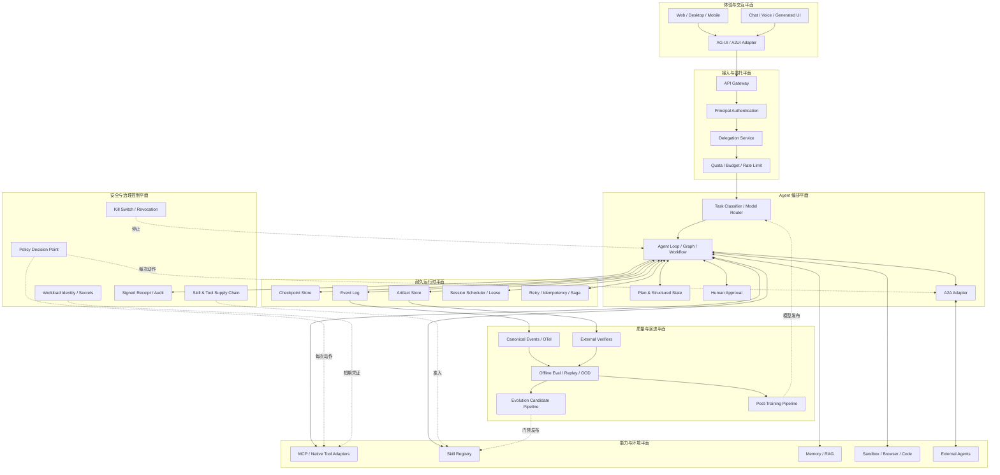

### 14.2 六个平面各自负责什么

1. **体验与交互平面**：展示进度、工件、审批、取消和生成式界面，不持有唯一业务状态；
2. **接入与委托平面**：认证调用者，把用户意图转化为短期、限域委托；
3. **编排平面**：分解任务、选择模型/Agent、管理循环和人工协作；
4. **能力与环境平面**：提供工具、Skill、Memory、沙箱和外部 Agent；
5. **耐久运行时平面**：持久化、恢复、幂等、补偿、调度和租约；
6. **安全与治理控制平面**：在每次副作用前做政策决策，而不是只在任务开始时授权；
7. **质量与演进平面**：观测、验证、评测、自进化候选和后训练发布。

### 14.3 一次任务的关键路径

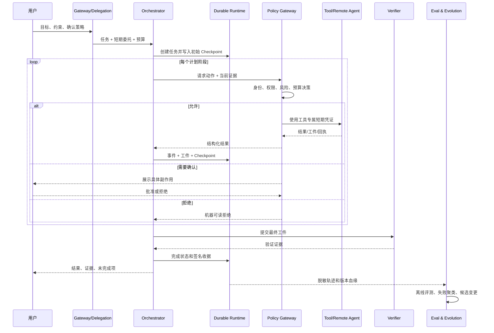

### 14.4 参考架构的四条不变量

无论选择哪家模型、云平台或 Agent 框架，都建议保留：

1. **领域状态归自己持有**：托管 Runtime 可以执行，但任务、工件和关键 Checkpoint 不能只存在供应商黑盒；
2. **内部事件模型归自己定义**：OTel、厂商 Trace 都是映射目标，而不是唯一事实模型；
3. **评测集和 Verifier 归自己持有**：这是更换模型、验证自进化和控制供应商锁定的核心资产；
4. **协议通过 Adapter 接入**：MCP、A2A、AG-UI 不直接侵入核心领域模型。

### 14.5 自建与托管如何选择

| 维度 | 偏向托管 | 偏向自建 |
|---|---|---|
| 上线速度 | 需要快速获得 Runtime、Sandbox、Memory | 可接受长期平台投入 |
| 合规 | 云服务已满足认证和区域要求 | 数据/执行必须在专属环境 |
| 定制 | 使用标准执行模型 | 需要深度自定义调度和隔离 |
| 规模 | 流量不确定，希望弹性计费 | 稳定大规模，需精细优化成本 |
| 可移植性 | Adapter 和状态导出完整 | 强依赖专有 API 无法接受 |
| 团队能力 | 不想自建运行时和沙箱 | 有成熟平台、SRE 和安全团队 |

常见最优解不是全自建或全托管，而是：

> **托管执行资源 + 自持领域状态、评测、策略和协议适配层。**


---

## 15. 动手实现：给自进化增加可执行发布门禁

原章已经实现轨迹导出器，为 SFT/DPO 预留数据通路。本节在此基础上增加一个更靠近生产的增量：**Evolution Gate**。它不负责生成 Prompt 或 Skill，而是负责判断候选变更能否进入影子运行、是否必须人工审批，或者应立即拒绝。

### 15.1 推荐目录

```text
src/assistant/
├── events/
│   ├── schema.py                 # Canonical Agent Event
│   └── writer.py                 # JSONL / OTel 映射
├── training/
│   ├── export.py                 # 原章：SFT/DPO 轨迹导出
│   ├── rights.py                 # 数据权利与保留策略
│   └── dataset_manifest.py       # 数据集内容寻址与血缘
├── evolution/
│   ├── models.py                 # 候选、评测快照、决策
│   ├── gate.py                   # 本节：发布门禁
│   ├── manifest.py               # 不可变证据包
│   └── rollout.py                # Shadow / Canary / Rollback
├── policy/
│   ├── capabilities.py           # 工具与权限差异
│   └── decision.py               # 动作前策略检查
└── tests/
    ├── test_evolution_gate.py
    └── fixtures/
        ├── baseline.json
        └── candidate.json
```

### 15.2 门禁实现

```python
# src/assistant/evolution/gate.py
from __future__ import annotations

import hashlib
import json
from dataclasses import asdict, dataclass
from enum import Enum
from pathlib import Path
from typing import Any, Mapping


class Risk(str, Enum):
    LOW = "low"
    MEDIUM = "medium"
    HIGH = "high"
    CRITICAL = "critical"


class Decision(str, Enum):
    REJECT = "reject"
    REQUIRE_REVIEW = "require_review"
    SHADOW = "shadow"


@dataclass(frozen=True)
class EvalSnapshot:
    """同一冻结评测集、同一环境版本上的聚合结果。"""

    eval_run_id: str
    sample_count: int
    id_success: float
    ood_success: float
    replay_success: float
    safety_violations: int
    average_cost: float
    p95_latency_ms: int


@dataclass(frozen=True)
class Candidate:
    candidate_id: str
    kind: str
    base_version: str
    proposed_version: str
    artifact_digest: str
    risk: Risk
    expands_permissions: bool = False
    adds_external_endpoint: bool = False


@dataclass(frozen=True)
class GatePolicy:
    min_samples: int = 100
    min_id_gain: float = 0.02
    min_ood_gain: float = 0.00
    max_replay_drop: float = 0.01
    max_cost_ratio: float = 1.20
    max_latency_ratio: float = 1.25
    max_safety_violations: int = 0


@dataclass(frozen=True)
class GateDecision:
    decision: Decision
    blockers: tuple[str, ...]
    warnings: tuple[str, ...]
    metrics: Mapping[str, float]


def _safe_ratio(new: float, old: float) -> float:
    if old <= 0:
        return 1.0 if new <= 0 else float("inf")
    return new / old


def artifact_digest(path: Path) -> str:
    """内容摘要用于验证候选评测和实际发布的是同一工件。"""
    return "sha256:" + hashlib.sha256(path.read_bytes()).hexdigest()


class EvolutionGate:
    def __init__(self, policy: GatePolicy | None = None) -> None:
        self.policy = policy or GatePolicy()

    def decide(
        self,
        candidate: Candidate,
        baseline: EvalSnapshot,
        result: EvalSnapshot,
    ) -> GateDecision:
        p = self.policy
        blockers: list[str] = []
        warnings: list[str] = []

        id_gain = result.id_success - baseline.id_success
        ood_gain = result.ood_success - baseline.ood_success
        replay_drop = baseline.replay_success - result.replay_success
        cost_ratio = _safe_ratio(result.average_cost, baseline.average_cost)
        latency_ratio = _safe_ratio(
            float(result.p95_latency_ms), float(baseline.p95_latency_ms)
        )

        if result.sample_count < p.min_samples:
            blockers.append(
                f"样本不足: {result.sample_count} < {p.min_samples}"
            )
        if result.safety_violations > p.max_safety_violations:
            blockers.append(
                "安全违规超限: "
                f"{result.safety_violations} > {p.max_safety_violations}"
            )
        if id_gain < p.min_id_gain:
            blockers.append(
                f"ID 增益不足: {id_gain:.4f} < {p.min_id_gain:.4f}"
            )
        if ood_gain < p.min_ood_gain:
            blockers.append(
                f"OOD 增益不足: {ood_gain:.4f} < {p.min_ood_gain:.4f}"
            )
        if replay_drop > p.max_replay_drop:
            blockers.append(
                f"历史能力回退: {replay_drop:.4f} > {p.max_replay_drop:.4f}"
            )
        if cost_ratio > p.max_cost_ratio:
            blockers.append(
                f"成本倍率超限: {cost_ratio:.3f} > {p.max_cost_ratio:.3f}"
            )
        if latency_ratio > p.max_latency_ratio:
            blockers.append(
                f"P95 延迟倍率超限: {latency_ratio:.3f} "
                f"> {p.max_latency_ratio:.3f}"
            )

        if candidate.risk is Risk.CRITICAL:
            blockers.append("关键风险变更禁止由自动演进管线发布")

        if blockers:
            decision = Decision.REJECT
        elif (
            candidate.risk in {Risk.MEDIUM, Risk.HIGH}
            or candidate.expands_permissions
            or candidate.adds_external_endpoint
        ):
            decision = Decision.REQUIRE_REVIEW
            warnings.append("通过离线门禁，但必须由指定责任人批准")
        else:
            decision = Decision.SHADOW
            warnings.append("仅允许进入影子流量，不得直接进入生产副作用路径")

        return GateDecision(
            decision=decision,
            blockers=tuple(blockers),
            warnings=tuple(warnings),
            metrics={
                "id_gain": id_gain,
                "ood_gain": ood_gain,
                "replay_drop": replay_drop,
                "cost_ratio": cost_ratio,
                "latency_ratio": latency_ratio,
            },
        )


def write_manifest(
    output: Path,
    candidate: Candidate,
    baseline: EvalSnapshot,
    result: EvalSnapshot,
    gate: GateDecision,
    extra: Mapping[str, Any] | None = None,
) -> None:
    """写入确定性 JSON；生产实现应再进行签名并写入不可变存储。"""
    payload = {
        "schema_version": 1,
        "candidate": asdict(candidate),
        "baseline": asdict(baseline),
        "result": asdict(result),
        "gate": asdict(gate),
        "extra": dict(extra or {}),
    }
    output.parent.mkdir(parents=True, exist_ok=True)
    output.write_text(
        json.dumps(payload, ensure_ascii=False, sort_keys=True, indent=2),
        encoding="utf-8",
    )
```

### 15.3 最小测试

```python
# tests/test_evolution_gate.py
from src.assistant.evolution.gate import (
    Candidate,
    Decision,
    EvalSnapshot,
    EvolutionGate,
    Risk,
)


def snapshot(run: str, *, id_: float, ood: float, replay: float,
             safety: int = 0, cost: float = 1.0, latency: int = 1000):
    return EvalSnapshot(
        eval_run_id=run,
        sample_count=200,
        id_success=id_,
        ood_success=ood,
        replay_success=replay,
        safety_violations=safety,
        average_cost=cost,
        p95_latency_ms=latency,
    )


def test_low_risk_candidate_enters_shadow():
    candidate = Candidate(
        candidate_id="c-1",
        kind="prompt",
        base_version="1.0.0",
        proposed_version="1.1.0",
        artifact_digest="sha256:abc",
        risk=Risk.LOW,
    )
    baseline = snapshot("b", id_=0.70, ood=0.62, replay=0.80)
    result = snapshot("r", id_=0.74, ood=0.64, replay=0.80,
                      cost=1.05, latency=1080)

    decision = EvolutionGate().decide(candidate, baseline, result)

    assert decision.decision is Decision.SHADOW
    assert not decision.blockers


def test_safety_regression_is_rejected():
    candidate = Candidate(
        candidate_id="c-2",
        kind="skill",
        base_version="2.0.0",
        proposed_version="2.1.0",
        artifact_digest="sha256:def",
        risk=Risk.MEDIUM,
    )
    baseline = snapshot("b", id_=0.70, ood=0.62, replay=0.80)
    result = snapshot("r", id_=0.78, ood=0.70, replay=0.82, safety=1)

    decision = EvolutionGate().decide(candidate, baseline, result)

    assert decision.decision is Decision.REJECT
    assert any("安全违规" in reason for reason in decision.blockers)
```

### 15.4 为什么门禁只允许进入 Shadow

离线评测通过，仍不能证明生产分布、真实延迟、权限组合和用户行为完全一致。推荐发布阶梯：

```yaml
rollout:
  stages:
    - name: shadow
      traffic_percent: 100
      side_effects: disabled
      min_tasks: 500
    - name: canary_1
      traffic_percent: 1
      side_effects: low_risk_only
      min_duration_hours: 12
    - name: canary_5
      traffic_percent: 5
      min_duration_hours: 24
    - name: canary_25
      traffic_percent: 25
      min_duration_hours: 48
    - name: full
      traffic_percent: 100
  automatic_abort:
    verified_success_drop: 0.01
    safety_violations: 1
    p95_latency_ratio: 1.30
    successful_task_cost_ratio: 1.25
    human_takeover_increase: 0.02
  rollback:
    strategy: atomic_version_pointer
    max_seconds: 60
    revoke_candidate_digest: true
```

### 15.5 生产实现还需补齐的能力

示例代码只展示门禁思想，生产版还应增加：

- 评测集和工件签名；
- 数据集、评测环境和依赖锁定；
- 置信区间或 Bootstrap，而不只比较均值；
- 任务切片和租户切片门禁；
- 多模型、多环境稳定性；
- 审批身份与电子签名；
- 不可变 Manifest Store；
- Feature Flag 与自动回滚；
- 权限/工具差异的静态检查；
- 训练数据与评测数据污染检查；
- 候选过期和全局撤销。

### 15.6 本节真正交付的不是一段代码

真正的架构增量是以下不变量：

```text
任何 Agent 自我改进
都必须先变成一个不可变候选工件
再通过独立评测、风险分级、审批和灰度
最终才可能影响生产行为。
```

---

## 16. 未来 12 个月的落地路线图

### 16.1 原则：先建地基，再引入高自治能力

一个常见失败路线是：先接多个模型和协议，再补日志；先做自进化，再补评测；先让 Agent 操作生产系统，再补身份。正确顺序应倒过来。

### 16.2 0～3 个月：建立可验证、可恢复、可约束的基础

| 工作项 | 交付物 | 完成判据 |
|---|---|---|
| Canonical Event | 统一 Agent/工具/Verifier/预算事件模型 | 任一框架任务可重建完整轨迹 |
| 版本血缘 | 模型、Prompt、Skill、工具、环境摘要 | 任一事故可定位精确组合 |
| 冻结评测集 | ID、OOD、Replay、安全切片 | 发布前自动运行且有基线 |
| Verifier | 关键任务的外部验收器 | 不依赖 Agent 自报成功 |
| Durable State | Task、Artifact、Checkpoint、取消 | 进程重启后可无重复副作用恢复 |
| 身份与委托 | 工作负载身份、短期权限、策略网关 | Agent 不持有用户长期凭证 |
| 沙箱 | 文件、网络、进程和凭证隔离 | 越权动作被独立控制层阻断 |
| Kill Switch | 按 Agent/版本/Skill/工具撤销 | 事故时分钟内全局停止 |

**退出条件**：如果这些基础能力无法在一个旗舰场景中跑通，不应进入全自动自进化或高风险 Computer Use。

### 16.3 3～6 个月：把能力资产化并建立安全发布闭环

| 工作项 | 交付物 | 完成判据 |
|---|---|---|
| Skill Registry | 开放格式 + 企业治理信封 | 签名、版本、权限、撤销完整 |
| Memory Governance | 来源、置信、冲突、过期、删除 | 记忆可解释、可修正、可撤销 |
| Evolution Candidate | 自动失败聚类和候选草案 | 只生成提案，不直接发布 |
| Evolution Gate | 离线门禁、审批、Shadow、Canary | 回归自动拒绝，回滚可演练 |
| 推理预算控制 | 动态模型、分支、停止条件 | 成功任务成本可控且无无限 Loop |
| 协议 Adapter | MCP 为主，按需 A2A/AG-UI | 核心领域模型不依赖协议类型 |
| 长时任务试点 | 一个小时级真实任务 | 支持等待、恢复、取消和人工审批 |

**退出条件**：候选变更若无法在 OOD/Replay 上稳定获益，应暂停“自动优化”，回到数据和 Verifier 建设。

### 16.4 6～12 个月：选择性放大，而不是全面追新

| 方向 | 进入条件 | 建议动作 |
|---|---|---|
| SFT / DPO | Harness 到平台期、稳定高质量数据、收益可摊薄 | 先 LoRA、小范围模型路由 |
| RLVR / GRPO | 强可验证任务、奖励抗投机、训练团队成熟 | 独立试验线，禁止直接替换主模型 |
| A2A | 至少两个真实外部 Agent 伙伴 | 先单场景、签名 Agent Card、限域委托 |
| Computer Use | 无结构化接口且业务价值高 | 专用环境、只读起步、阶段确认 |
| 端侧 Agent | 隐私、离线或延迟价值明确 | 云边路由、本地权限代理、签名更新 |
| Agentic Commerce | 支付/电商核心业务有明确需求 | 从推荐/购物车开始，不直接全自动交易 |
| 具身 Agent | 有动作原语、仿真、现场数据和独立安全层 | 受控区域试点，不跨越硬安全限制 |

### 16.5 团队职责建议

| 角色 | 主要责任 |
|---|---|
| Agent Platform | Runtime、协议 Adapter、事件、Checkpoint、发布系统 |
| Eval / Quality | 数据集、Verifier、回放、长时和安全评测 |
| Security / IAM | 工作负载身份、委托、策略、Secrets、供应链 |
| Applied AI | Prompt、Skill、路由、后训练和推理策略 |
| Product / Domain | 任务定义、业务验收、风险等级、人工流程 |
| SRE | 容量、成本、告警、恢复、Kill Switch、事故演练 |
| Data Governance | 授权、分类、血缘、保留、删除和训练用途 |

前沿能力失败往往不是某个算法工程师不够强，而是这些责任没有被组织化。

### 16.6 每季度的“继续/停止”评审

每个方向每季度回答：

1. 本季度新增了什么真实生产证据；
2. 核心指标相对基线提升多少；
3. 哪些失败模式此前未知；
4. 退出成本是否在上升；
5. 是否形成可复用资产；
6. 下一阶段投入是否仍是最优机会成本；
7. 哪个明确条件会触发停止。

---

## 17. 十八个常见误区

### 误区 1：把前沿章节写成项目名清单

**问题**：只有名词、融资、Stars 和 Demo，没有进入条件、风险和退出机制。

**正确做法**：每个方向都标注成熟度、生产信号、失败成本、依赖资产、试点范围和停止条件。

### 误区 2：把“自动写入记忆”称为完整自进化

**问题**：写入不等于改进，错误记忆可能降低后续表现。

**正确做法**：记忆必须有来源、置信、冲突、适用范围、过期、撤销和评测。

### 误区 3：让自进化直接修改生产版本

**问题**：跳过评测、审批和回滚，错误会自动扩散。

**正确做法**：自动化止于候选提案；发布仍走不可变工件、门禁、Shadow、Canary。

### 误区 4：模型效果不好就先微调

**问题**：真正瓶颈常是工具描述、上下文、错误反馈和验收定义。

**正确做法**：先做 Harness 审计和模型路由，证明平台期后再训练。

### 误区 5：把所有成功会话当 SFT 正例

**问题**：Agent 自报成功、用户取消、偶然环境和人工修复会污染数据。

**正确做法**：正例必须有外部 Verifier、数据权利和完整版本血缘。

### 误区 6：把“失败”一律当 DPO 负例

**问题**：合理拒绝、请求澄清、上游故障可能被错误惩罚。

**正确做法**：先做失败归因，只把可归因于策略质量的轨迹作为负例。

### 误区 7：认为增加推理 Token 一定提高质量

**问题**：模型可能反复改坏答案、进入循环，选择器也可能选不出正确候选。

**正确做法**：由外部 Verifier 和边际收益控制预算，保留最终验证预算。

### 误区 8：把长上下文当成 Durable State

**问题**：无法应对进程崩溃、异步等待、幂等、副作用和版本冲突。

**正确做法**：持久化结构化任务、工件、事件、Checkpoint、委托和幂等状态。

### 误区 9：重试写操作但没有幂等键

**问题**：超时后重复发信、下单、付款或提交代码。

**正确做法**：写操作使用幂等键、结果查询和 Saga 补偿。

### 误区 10：接入 MCP 就等于工具安全

**问题**：协议不替代最小权限、发布者可信、内容隔离和业务授权。

**正确做法**：MCP 外围必须有 Registry、策略网关、短期凭证、沙箱和审计。

### 误区 11：接入 A2A 就等于拥有多 Agent 架构

**问题**：A2A 解决边界互操作，不替代内部任务分解、共享状态和一致性设计。

**正确做法**：内部按领域需求编排，对外通过 Adapter 暴露 A2A。

### 误区 12：把用户长期凭证复制给 Agent

**问题**：无法区分用户和 Agent 行为，权限过大，撤销困难。

**正确做法**：Agent 使用独立工作负载身份和短期、限域、可审计委托。

### 误区 13：认为内部 Agent 的消息天然可信

**问题**：恶意外部内容可以通过多个 Agent 间接传播。

**正确做法**：每个 Handoff 保留来源、可信等级、委托范围和策略检查。

### 误区 14：优先用视觉点击集成所有系统

**问题**：GUI 比 API 更脆弱、语义更弱、验证更难。

**正确做法**：遵循 API > 结构化工具 > DOM/Accessibility > 视觉点击的接口梯度。

### 误区 15：采集所有 Prompt 和工具内容以便调试

**问题**：可观测平台变成最大的敏感数据副本。

**正确做法**：默认记录元数据、摘要和哈希；内容采样按数据分类审批。

### 误区 16：多 Agent 越多越强

**问题**：通信、延迟、成本、身份边和失败组合快速增长。

**正确做法**：只有在专业化、权限隔离、并行或跨组织边界带来明确收益时拆 Agent。

### 误区 17：把托管 Runtime 视为不可逆战略选择

**问题**：领域状态、评测和事件全部进入专有系统，迁移代价不断上升。

**正确做法**：自持关键状态和评测，协议与运行时用 Adapter，对退出定期演练。

### 误区 18：没有 Kill Switch，却不断扩大自治

**问题**：事故时只能停整个平台或逐实例人工处理。

**正确做法**：支持按租户、Agent、模型、Skill、工具、版本和摘要即时撤销。

---

## 18. 前沿方向 RFC 模板

以下模板可以直接用于年度规划、技术预研或架构委员会评审。

```yaml
schema_version: 1
proposal:
  id: frontier-2026-xxx
  title: ""
  owner: ""
  reviewers:
    - product
    - platform
    - security
    - eval
  status: draft

problem:
  business_bottleneck: ""
  current_baseline:
    verified_success: 0.0
    p95_latency_ms: 0
    successful_task_cost: 0.0
    human_minutes_per_task: 0.0
  why_existing_harness_is_insufficient: ""

hypothesis:
  statement: ""
  expected_mechanism: ""
  target_delta: ""
  non_goals: []

maturity:
  level: early_adoption
  production_signals: []
  unresolved_ecosystem_risks: []

scope:
  task_types: []
  tenants: []
  tools: []
  data_classes: []
  allowed_side_effects: []
  explicitly_forbidden: []

architecture:
  internal_ports: []
  adapters: []
  durable_state_owner: ""
  vendor_specific_dependencies: []
  exit_plan: ""

identity_and_security:
  invoking_principal: ""
  workload_identity: ""
  delegation_scope: ""
  approval_points: []
  prompt_injection_controls: []
  sandbox_boundary: ""
  kill_switch: ""

data:
  sources: []
  usage_rights: ""
  retention: ""
  deletion_strategy: ""
  training_allowed: false
  content_logging_default: false

evaluation:
  verifier: ""
  frozen_eval_set: ""
  slices: [id, ood, replay, safety]
  success_metrics: []
  guardrail_metrics: []
  minimum_samples: 0

rollout:
  stages: [offline, shadow, canary_1, canary_5, canary_25, full]
  automatic_abort: []
  rollback_target: ""
  max_rollback_seconds: 0

economics:
  build_cost: ""
  monthly_operating_cost: ""
  expected_unit_benefit: ""
  exit_cost: ""

review_decision:
  go_conditions: []
  stop_conditions: []
  watch_triggers: []
  next_review_date: ""
```

### 18.1 架构委员会应追问的十个问题

1. 这是模型问题、Harness 问题还是产品定义问题？
2. 没有该技术，能否用更简单方案达到 80% 收益？
3. 评测器是否真正独立于候选方案？
4. 最坏副作用是什么，是否可逆？
5. Agent 使用谁的身份和权限？
6. 数据是否允许记录、评测和训练？
7. 协议或供应商退出需要改哪些核心对象？
8. 成本按成功任务计算后是否仍成立？
9. 事故时怎样在一分钟内停止？
10. 本次试点即使失败，能留下哪些资产？

---

## 19. 专家面试题与参考回答

### 问题 1：为什么说生产可用的 Agent 自进化本质是自动化变更管理？

**结论：因为自进化真正改变的是跨任务复用的生产资产，而不是一次会话中的临时推理。** Prompt、Memory、Skill、路由或模型一旦变化，就可能影响大量后续任务，因此必须具备与软件发布同等的版本、评测、审批、灰度、回滚和审计。

回答时应强调三个边界：第一，系统可以自动发现失败模式并生成候选，但不能自动绕过门禁；第二，生成器不能成为唯一评测器，否则会产生自我确认偏差；第三，扩大权限的变更不属于普通性能优化，必须人工批准。一个可靠方案应把每次演进固化为不可变候选工件，携带来源、假设、适用范围、评测证据和回滚版本，再经过 ID、OOD、Replay、安全和成本门禁。

### 问题 2：如何判断应该微调，而不是继续优化 Prompt 和工具？

**结论：只有在验收标准可信、Harness 已到平台期、数据充足合法、任务分布稳定且单位收益覆盖全生命周期成本时，才应微调。**

具体排查顺序是：先确认失败是否可被外部 Verifier 稳定定义；再审计 Tool Schema、错误反馈、Context、RAG、Skill 和 Workflow；然后尝试模型路由或推理时扩展。如果这些手段仍存在稳定、可重复的策略缺口，且有数千级以上高质量轨迹，才进入 SFT/DPO。若任务有自动可验证结果、目标是多步决策并且奖励不容易被钻空子，才考虑 RLVR/GRPO。微调不是“模型不满意”的默认动作，而是证据链末端的选择。

### 问题 3：LoRA、SFT、DPO 和 GRPO 是什么关系？

**结论：它们不在同一分类维度。** SFT、DPO、GRPO 主要是训练目标或优化方式；LoRA 是参数高效更新方法，可以承载 SFT、DPO，理论上也可用于其他目标。

SFT 使用高质量示范，适合存在“应该这样做”的稳定行为；DPO 使用成对偏好，适合没有唯一答案但能比较优劣的场景；GRPO 类方法通过同任务多轨迹和可验证奖励优化策略，适合代码、数学等强 Verifier 任务，但奖励投机和训练稳定性要求高。企业常见起点是 LoRA + SFT，之后根据偏好数据和可验证性逐步升级，而不是直接从最复杂的强化学习开始。

### 问题 4：Test-Time Scaling 为什么不能简单等同于增加思考 Token？

**结论：推理时扩展的核心是计算分配和验证，而不是无条件延长推理。** 更多 Token 可能产生更多候选或修订，但也可能重复、漂移甚至把正确答案改坏。

生产系统需要预算控制器，根据风险、复杂度、候选分歧和 Verifier 反馈动态决定是否继续。并行 Best-of-N 提高“候选池存在正确答案”的概率，却仍依赖选择器；顺序修订受上下文和错误累积限制。因此正确顺序是先建设外部 Verifier和停止条件，再增加并行分支、循环次数或强模型调用。还要预留最终验证预算，避免前面推理耗尽全部资源却无法验收。

### 问题 5：MCP 与 A2A 的核心差异是什么？

**结论：MCP 主要连接 Agent 与工具/数据，A2A 主要连接独立 Agent 与 Agent。**

MCP 暴露 Resources、Prompts、Tools 等能力，典型调用方控制任务编排；A2A 则通过 Agent Card、Message、Task 和 Artifact 表达远程能力发现、异步委托和任务生命周期，对方 Agent 可以保持内部实现不透明。二者都不替代身份、业务授权和安全策略。内部架构上应定义 Tool Port 和 Remote Agent Port，再分别接 MCP、Native SDK、A2A 或内部 RPC Adapter，避免协议对象侵入领域模型。

### 问题 6：A2A 1.0 是否意味着企业现在必须全面接入？

**结论：不意味着。1.0 说明核心规范稳定并进入早期生产，但是否接入仍由真实跨系统需求决定。**

当两个以上独立团队或组织需要异步委派任务、交换工件，并且不愿暴露内部编排时，A2A 可以降低自定义集成成本。若只是单个产品内部几个角色协作，自有类型化事件、函数调用或图执行往往更简单、性能更高。企业应以 Adapter 方式保持一周级接入能力，在真实伙伴需求、身份治理和互操作测试成熟后再扩大，而不是为了“标准占位”重构全部内部系统。

### 问题 7：为什么 Context Window 不能替代 Checkpoint？

**结论：上下文是模型输入，Checkpoint 是可恢复的业务状态，两者解决不同问题。**

上下文无法保证进程崩溃恢复、异步等待、幂等写入、版本冲突、人工审批和跨节点迁移。Checkpoint 应保存结构化目标、未完成项、已验证事实、工件摘要、外部副作用、授权、预算、环境版本和下一步前置条件。对话全文可以作为审计附件，但恢复时必须重建任务状态。模型调用应作为被记录的非确定 Activity，编排器负责确定的状态迁移、定时器、重试和补偿。

### 问题 8：如何评测一个数小时的 Agent 任务？

**结论：不能只看最终答案，必须做分阶段、轨迹级和恢复级评测。**

首先把任务拆成可验证里程碑和约束，记录 partial completion；其次评测工具选择、重试、澄清、约束保留、成本和权限合规；再次注入进程崩溃、工具超时、页面变化、模型升级和人工等待，验证 Checkpoint 恢复与幂等；最后在不同环境和多次重复中观察稳定性，而不是只报一次成功。生产指标还应包括人工接管率、取消成功率、重复副作用数和每成功任务成本。

### 问题 9：Agent 应怎样代表用户访问系统？

**结论：Agent 必须有自己的工作负载身份，再使用短期、限域、可撤销的用户委托，而不是复制用户长期凭证。**

委托应绑定用户、Agent、目的、目标资源、动作、预算、有效期和是否需要确认；每次高风险工具调用都要经过独立策略网关。这样审计系统才能区分“用户本人操作”“Agent 代表用户操作”和“子 Agent 再委托”，也能在风险出现时只撤销特定 Agent 或任务。对支付、发信、权限变更等动作，还应生成签名收据，证明当时的授权和实际结果。

### 问题 10：Computer Use 上线时最重要的设计原则是什么？

**结论：把视觉操作视为结构化接口缺失时的受控后备方案，并将页面内容视为不可信输入。**

应优先 API、MCP、DOM 和 Accessibility 接口；必须使用专用 VM/容器、域名 Allowlist、短期账号和受限文件系统。高影响动作要在执行前展示确切目标、参数和副作用给用户确认；结果以业务回执为准，不能以“按钮点过了”为准。外部页面可能包含 Prompt Injection，因此 Agent 不能因为网页要求就获得额外权限，所有工具调用仍须经过策略网关。

### 问题 11：托管 Agent Runtime 最大的收益和风险是什么？

**结论：最大收益是快速获得隔离执行、伸缩、长时运行、Memory、Identity 和观测；最大风险是把领域状态、评测和运行语义锁进专有平台。**

稳妥策略是采用 Ports & Adapters：托管平台作为 Runtime Adapter，核心任务状态、工件、事件模型、Verifier 和评测集由企业自持。上线前要验证状态导出、取消、Checkpoint、身份映射、日志访问、版本升级和退出路径。托管的价值是减少非差异化运维，而不是把最关键的决策证据交给黑盒。

### 问题 12：怎样给 Agent 前沿方向分配预算？

**结论：预算应跟随可验证瓶颈和可复用资产，而不是跟随行业声量。**

先用硬门槛排除不可回滚、无 Verifier、身份不清、数据权利不明的提案；再比较预期收益、成功概率、资产复用、建设、运维和退出成本。对尚未成熟但可能重要的方向，设置量化触发条件和低成本 Adapter，而不是重押。即使试点失败，也应留下评测集、Canonical Event、Checkpoint、Port、Skill Governance 等可复用资产，这才是健康的前沿投资。

---

## 20. 本章总结：十条长期有效的原则

1. **前沿不是新名词，而是有证据的下一步。**
2. **先问业务瓶颈，再问技术方向。**
3. **先建 Verifier，再谈自治、自进化和强化学习。**
4. **优化顺序从 Harness 到模型权重，从可逆到不可逆。**
5. **Context 是输入，Checkpoint 才是可恢复状态。**
6. **协议解决互操作，不替代身份、权限、治理和责任。**
7. **Skill 是软件供应链资产，不能只按文本管理。**
8. **Agent 必须使用自己的身份和限域委托，不能复制用户长期凭证。**
9. **长时成功依赖预算、状态、恢复、验证和人工协作，而不只是更长推理。**
10. **最好的前沿投资即使方向判断错误，也能留下评测、事件、Port、数据和治理资产。**

可以把全章压缩成一句话：

> **Agent 前沿的主战场，正在从“模型是否会做”转向“系统能否在明确授权下，长期、可验证、可恢复、可审计地做成”。**

---

## 附录 A：术语速查

| 术语 | 含义 |
|---|---|
| Agent Harness | 模型权重之外影响 Agent 行为的提示、上下文、工具、Skill、Loop、运行时和评测集合 |
| Verifier | 独立判断任务或阶段结果是否满足条件的程序、规则、环境或评审器 |
| ID / OOD | 同分布 / 分布外评测 |
| Replay Set | 用于防止历史能力回退的冻结回放集 |
| Durable Execution | 通过持久状态、Checkpoint、重试、定时器和恢复保证长任务可靠执行 |
| Checkpoint | 可恢复任务所需的结构化状态快照 |
| Idempotency | 同一操作重复执行不会产生额外副作用 |
| Saga | 多步骤事务失败时使用补偿动作恢复业务一致性 |
| Delegation | 主体把有限动作权在特定目的和时间内授予 Agent |
| Workload Identity | 运行中软件工作负载自己的可验证身份 |
| MCP | Agent/LLM 应用与工具、数据、资源交互的开放协议 |
| A2A | 独立 Agent 之间能力发现、消息、任务和工件交换协议 |
| Agent Skills | 以说明、脚本、参考资料和资产打包的可加载能力格式 |
| AG-UI | Agent 与用户界面之间的事件交互协议方向 |
| A2UI | 受约束的生成式 UI 协议方向 |
| SFT | 用高质量示范进行监督微调 |
| DPO | 使用偏好对直接优化模型行为 |
| LoRA / QLoRA | 低秩参数高效微调及其量化变体 |
| RLVR | 使用可验证奖励进行强化学习 |
| GRPO | 通过同任务一组样本的相对奖励进行策略优化的方法 |
| Test-Time Scaling | 在推理时增加采样、搜索、反思或验证计算 |
| Shadow | 候选运行但不影响真实结果或副作用 |
| Canary | 只让少量真实流量使用新版本并监控 |
| Agentic Commerce | Agent 参与发现、协商、授权、支付和履约的商业模式 |
| VLA | Vision-Language-Action，视觉—语言—动作模型 |

---

## 附录 B：参考资料

> 参考资料优先选择原始论文、协议规范、标准机构和官方产品文档。前沿方向变化很快，实施前应再次核对最新版本。

- **〔R1〕原始章节**：[awesome-agent-tutorial：第 26 章 前沿方向](https://github.com/cdavid817/awesome-agent-tutorial/blob/main/%E7%AC%AC%E4%B8%83%E7%AF%87-%E4%B8%93%E5%AE%B6%E8%A7%86%E9%87%8E/%E7%AC%AC26%E7%AB%A0-%E5%89%8D%E6%B2%BF%E6%96%B9%E5%90%91.md)
- **〔R2〕自进化 Agent 综述**：[arXiv:2507.21046](https://arxiv.org/abs/2507.21046)
- **〔R3〕Reflexion**：[Language Agents with Verbal Reinforcement Learning](https://arxiv.org/abs/2303.11366)
- **〔R4〕Voyager**：[An Open-Ended Embodied Agent with Large Language Models](https://arxiv.org/abs/2305.16291)
- **〔R5〕SEAGym / 自进化评测研究**：[arXiv:2606.17546](https://arxiv.org/abs/2606.17546)
- **〔R6〕LoRA**：[Low-Rank Adaptation of Large Language Models](https://arxiv.org/abs/2106.09685)
- **〔R7〕QLoRA**：[Efficient Finetuning of Quantized LLMs](https://arxiv.org/abs/2305.14314)
- **〔R8〕DPO**：[Direct Preference Optimization](https://arxiv.org/abs/2305.18290)
- **〔R9〕DeepSeekMath / GRPO**：[Pushing the Limits of Mathematical Reasoning](https://arxiv.org/abs/2402.03300)
- **〔R10〕DeepSeek-R1**：[Incentivizing Reasoning Capability in LLMs via Reinforcement Learning](https://arxiv.org/abs/2501.12948)
- **〔R11〕Scaling Test-time Compute for LLM Agents**：[arXiv:2506.12928](https://arxiv.org/abs/2506.12928)
- **〔R12〕Benchmark Test-Time Scaling of General LLM Agents**：[arXiv:2602.18998](https://arxiv.org/abs/2602.18998)
- **〔R13〕τ-bench**：[A Benchmark for Tool-Agent-User Interaction in Real-World Domains](https://arxiv.org/abs/2406.12045)
- **〔R14〕OSWorld 2.0**：[Benchmarking Computer Use Agents on Long-Horizon Real-World Tasks](https://arxiv.org/abs/2606.29537)
- **〔R15〕Long-Horizon-Terminal-Bench**：[arXiv:2607.08964](https://arxiv.org/abs/2607.08964)
- **〔R16〕SWE-EVO**：[Benchmarking Coding Agents in Long-Horizon Software Evolution](https://arxiv.org/abs/2512.18470)
- **〔R17〕MCP 2026-07-28 发布说明**：[The 2026-07-28 Specification](https://blog.modelcontextprotocol.io/posts/2026-07-28/)
- **〔R18〕MCP 2026-07-28 规范**：[Model Context Protocol Specification](https://modelcontextprotocol.io/specification/2026-07-28)
- **〔R19〕A2A 1.0 规范**：[Agent2Agent Protocol Specification](https://a2a-protocol.org/latest/specification/)
- **〔R20〕A2A 1.0 与生产采用**：[Linux Foundation Announcement](https://www.linuxfoundation.org/press/a2a-protocol-surpasses-150-organizations-lands-in-major-cloud-platforms-and-sees-enterprise-production-use-in-first-year)
- **〔R21〕Agent Skills 规范**：[Agent Skills Specification](https://agentskills.io/specification)
- **〔R22〕Anthropic Skills**：[Introducing Agent Skills](https://www.anthropic.com/news/skills)
- **〔R23〕A2UI 路线图**：[A2UI Roadmap](https://a2ui.org/roadmap/)
- **〔R24〕AG-UI**：[AG-UI Introduction](https://docs.ag-ui.com/introduction)
- **〔R25〕OpenTelemetry GenAI Observability**：[Inside the LLM Call](https://opentelemetry.io/blog/2026/genai-observability/)
- **〔R26〕AWS AgentCore**：[Amazon Bedrock AgentCore Overview](https://docs.aws.amazon.com/bedrock-agentcore/latest/devguide/what-is-bedrock-agentcore.html)
- **〔R27〕Google Agent Platform**：[Agent Platform Overview](https://docs.cloud.google.com/gemini-enterprise-agent-platform/overview)
- **〔R28〕Microsoft Durable Task for AI Agents**：[Durable Task Documentation](https://learn.microsoft.com/en-us/azure/durable-task/sdks/durable-task-for-ai-agents)
- **〔R29〕OWASP Agentic Applications 2026**：[OWASP Top 10 for Agentic Applications](https://genai.owasp.org/resource/owasp-top-10-for-agentic-applications-for-2026/)
- **〔R30〕NIST AI Agent Standards Initiative**：[AI Agent Standards Initiative](https://www.nist.gov/artificial-intelligence/ai-agent-standards-initiative)
- **〔R31〕NIST Agent Identity and Authorization**：[Concept Paper](https://csrc.nist.gov/pubs/other/2026/02/05/accelerating-the-adoption-of-software-and-ai-agent/ipd)
- **〔R32〕Anthropic Computer Use 安全建议**：[Computer Use Tool](https://docs.anthropic.com/en/docs/agents-and-tools/computer-use)
- **〔R33〕OpenAI Computer Use 安全建议**：[Computer Use Guide](https://developers.openai.com/api/docs/guides/tools-computer-use)
- **〔R34〕Gemini Robotics**：[Google DeepMind Gemini Robotics](https://deepmind.google/models/gemini-robotics/)
- **〔R35〕Apple Foundation Models**：[Foundation Models Framework](https://developer.apple.com/documentation/foundationmodels)
- **〔R36〕UCP**：[Universal Commerce Protocol](https://ucp.dev/)
- **〔R37〕AP2**：[Agent Payments Protocol](https://ap2-protocol.org/)
- **〔R38〕Visa Trusted Agent Protocol**：[Visa Developer](https://developer.visa.com/use-cases/trusted-agent-protocol)
- **〔R39〕Mastercard Agent Pay**：[Agent Pay Announcement](https://www.mastercard.com/us/en/news-and-trends/press/2025/april/mastercard-unveils-agent-pay-pioneering-agentic-payments-technology-to-power-commerce-in-the-age-of-ai.html)
- **〔R40〕ATBench**：[A Diverse and Realistic Agent Trajectory Benchmark for Safety Evaluation and Diagnosis](https://arxiv.org/abs/2604.02022)
- **〔R41〕OWASP Agentic Skills Top 10**：[Agentic Skills Security Project](https://owasp.org/www-project-agentic-skills-top-10/)
- **〔R42〕Agent Improvement Loop 实践**：[Build an Agent Improvement Loop with Traces and Evals](https://developers.openai.com/cookbook/examples/agents_sdk/agent_improvement_loop)
- **〔R43〕NIST Agent 身份实践讨论**：[Why Agentic AI Needs a Strong Identity Foundation](https://www.nist.gov/blogs/cybersecurity-insights/back-future-why-agentic-ai-needs-strong-identity-foundation)

---

**文档结束。**
