# 第 27 章 完整实战收尾：从“能运行”到“可托付、可运营、可演进”

> **本章核心结论：**一个 Agent 项目真正的“完成”，不是模型已经能把演示任务跑通，而是系统能够在真实流量、真实权限、真实故障和真实组织约束下，持续做到**：有界执行、最小权限、外部验证、全程留痕、失败可恢复、变更可门禁、成本可归因、上线可回滚、问题有人处理、经验能够回流**。
>
> 第 27 章不是简单回顾前 26 章，而是把所有局部机制装配成一个可以接受生产就绪评审的完整系统，并回答最后三个问题：
>
> 1. 每个模块为什么存在，坏掉时会出现什么症状？
> 2. 一次真实任务如何穿过上下文、工具、权限、挂起、恢复、验证、审计与回流？
> 3. 建设团队离场以后，谁来值班、怎样回滚、如何证明系统没有静默退化？

本文是在原章“四层十六模块、十四机制端到端演示、如果重来一次、三条延伸路径”的基础上形成的深读版。

它不重复逐章讲解所有局部技术，而是站在系统总装、上线评审和长期运营的视角，补齐以下内容：

- 从业务请求到外部副作用的完整控制链；
- Agent Run、Turn、Tool Call、Approval、Checkpoint、Verifier 的状态与契约；
- 控制平面、数据平面、质量平面、运营平面的职责分离；
- 事件总线为何是观测、审计、成本与数据回流的共同地基；
- 不可逆操作怎样通过 PDP/PEP、HITL、幂等与独立验证形成安全闭环；
- 生产就绪评审、灰度发布、停止扩量、回滚和事故响应如何落地；
- README、Runbook、ADR、评测集和责任矩阵如何共同构成真正的移交包；
- 如何把一次成功交付变成可持续改进的组织能力。

> **阅读边界**：文中的代码、SQL、YAML 和策略片段是用于解释机制的参考骨架，不与贯穿项目源码做逐字符同步，也不应未经加固直接用于生产。

---

## 目录

- [1. 收尾不是结束：Agent 项目最容易失败的最后一公里](#1-收尾不是结束agent-项目最容易失败的最后一公里)
- [2. 从二十七章能力累加到一个可托付系统](#2-从二十七章能力累加到一个可托付系统)
- [3. 终态参考架构：四层十六模块与四个横向控制面](#3-终态参考架构四层十六模块与四个横向控制面)
- [4. 七条系统不变量：架构图背后的真正主线](#4-七条系统不变量架构图背后的真正主线)
- [5. 最终实战任务：重复扣款退款的业务契约](#5-最终实战任务重复扣款退款的业务契约)
- [6. 端到端链路：一句请求如何穿过二十个关键步骤](#6-端到端链路一句请求如何穿过二十个关键步骤)
- [7. 运行时状态机：运行、挂起、恢复、验证与终止](#7-运行时状态机运行挂起恢复验证与终止)
- [8. 上下文装配：让模型看到足够的信息，而不是所有信息](#8-上下文装配让模型看到足够的信息而不是所有信息)
- [9. 工具网关：把模型意图转换为受控的外部动作](#9-工具网关把模型意图转换为受控的外部动作)
- [10. PDP、PEP 与 HITL：把不可逆副作用关进闸门](#10-pdppep-与-hitl把不可逆副作用关进闸门)
- [11. Checkpoint、Interrupt 与 Resume：等待不是轮询](#11-checkpointinterrupt-与-resume等待不是轮询)
- [12. 事件骨干：最不起眼、却最不能裁的模块](#12-事件骨干最不起眼却最不能裁的模块)
- [13. 可观测性：从“有日志”升级为可回放的行为证据](#13-可观测性从有日志升级为可回放的行为证据)
- [14. Verifier 与完成契约：模型说完成不等于任务完成](#14-verifier-与完成契约模型说完成不等于任务完成)
- [15. 评测门禁：让每次变化都有方向感](#15-评测门禁让每次变化都有方向感)
- [16. 成本与性能：优化每个成功任务，而不是单次调用](#16-成本与性能优化每个成功任务而不是单次调用)
- [17. 记忆、检索与知识治理：正确召回只是起点](#17-记忆检索与知识治理正确召回只是起点)
- [18. 多 Agent 与 Coding Agent 如何进入终态系统](#18-多-agent-与-coding-agent-如何进入终态系统)
- [19. 数据回流与训练通路：轨迹不是天然训练数据](#19-数据回流与训练通路轨迹不是天然训练数据)
- [20. 失败分类、恢复策略与对账机制](#20-失败分类恢复策略与对账机制)
- [21. 生产就绪评审：上线前必须回答的十二组问题](#21-生产就绪评审上线前必须回答的十二组问题)
- [22. 测试与演练：不仅验证正常路径，也验证刹车](#22-测试与演练不仅验证正常路径也验证刹车)
- [23. 渐进发布：从影子流量到全量开放](#23-渐进发布从影子流量到全量开放)
- [24. Runbook：让告警不再只能找“最懂的人”](#24-runbook让告警不再只能找最懂的人)
- [25. 移交与运营：交付代码只是开始](#25-移交与运营交付代码只是开始)
- [26. 发布工程：Tag、README、变更账本与制品证据](#26-发布工程tagreadme变更账本与制品证据)
- [27. 如果重来一次：正确的建设顺序](#27-如果重来一次正确的建设顺序)
- [28. 成熟度模型：从演示型 Agent 到自适应运营系统](#28-成熟度模型从演示型-agent-到自适应运营系统)
- [29. 三条延伸路径：领域、平台与开放生态](#29-三条延伸路径领域平台与开放生态)
- [30. 常见失败模式与系统化修复](#30-常见失败模式与系统化修复)
- [31. 面试高频问题](#31-面试高频问题)
- [32. 最终检查清单与九十天行动路线](#32-最终检查清单与九十天行动路线)
- [附录 1：完整模块地图](#附录-a完整模块地图)
- [附录 2：关键数据结构与模板](#附录-b关键数据结构与模板)
- [附录 3：术语表](#附录-c术语表)
- [附录 4：参考资料与来源边界](#附录-d参考资料与来源边界)

---

# 1. 收尾不是结束：Agent 项目最容易失败的最后一公里

## 1.1 为什么“演示已经成功”仍然远离完成

传统确定性软件的演示，通常可以较直接地证明某条功能路径已经实现。

Agent 系统不同。

一次演示只证明：

- 在这一个输入上；
- 在这一组上下文中；
- 在这一个模型版本与提示词版本下；
- 在这些工具恰好可用时；
- 在这一次随机采样轨迹中；
- 在参与演示的人已经熟悉脚本的情况下；
- 系统成功了一次。

它没有证明：

- 长尾表达能否被正确理解；
- 错误记忆是否会覆盖当前事实；
- 工具超时后会不会形成无界重试；
- 重复回调会不会重复产生退款；
- 策略服务故障时系统是否会错误放行；
- 人工审批等待期间是否持续消耗模型资源；
- 上游订单接口字段漂移后是否仍能正确验证；
- 某次提示词“优化”会不会让其他任务成功率下降；
- 审计、成本和观测数据是否来自同一事实源；
- 值班人员能否在建设者不在线时恢复系统。

因此，Agent 项目的最后一公里不是“再加几个功能”，而是把系统从一个成功点扩展为一个可控分布。

## 1.2 收尾阶段真正要关闭的五类缺口

| 缺口 | 演示阶段的典型表现 | 生产阶段必须补齐 |
|---|---|---|
| 行为缺口 | 任务能跑通 | 长尾任务有边界、有失败语义、有降级 |
| 安全缺口 | 人在旁边盯着 | 权限默认最小化，敏感动作必须过策略与审批 |
| 证据缺口 | 屏幕上看到成功 | 每个决定、工具调用、副作用和验证均可追溯 |
| 运营缺口 | 开发者临时排障 | 有 SLO、告警、Runbook、值班和升级路径 |
| 演进缺口 | 当前版本可用 | 提示词、策略、模型、工具变化都经过评测与灰度 |

## 1.3 “完成”的六层定义

可以把 Agent 项目的完成度分成六层：


很多项目停在第一层或第二层，却用“上线”这个词描述自己。

本章要求至少达到第五层，并为第六层建立稳定机制。

## 1.4 一个可操作的最终完成公式

对一次任务，可以用下面的逻辑表达式定义“完成”：

```text
TaskCompleted =
  IntentResolved
  AND PreconditionsSatisfied
  AND PolicyPermitted
  AND SideEffectCommittedExactlyOnce
  AND ExternalStateVerified
  AND UserNotified
  AND EvidenceComplete
  AND RuntimeStateClosed
```

其中任何一项为假，都不能仅凭模型输出“已经处理好了”而宣告完成。

进一步地，系统级完成还要满足：

```text
SystemReady =
  TaskCompletedOnRepresentativeDistribution
  AND FailureBounded
  AND RecoveryProven
  AND ChangeGateActive
  AND OnCallReady
  AND OwnershipAccepted
```

## 1.5 收尾阶段最重要的视角变化

建设前期常问：

> 系统还能增加什么能力？

收尾阶段要改问：

> 系统结构性地不能做什么？

一个成熟系统应当结构性地做不到：

- 模型直接读取长期生产凭证；
- 未经审批执行高风险不可逆动作；
- 在没有预算上限时无限循环；
- 在工具结果未验证时把“已请求”说成“已完成”；
- 用旧审批批准已变化的新参数；
- 用过期检查结果证明新提交安全；
- 在策略服务不可用时静默绕过策略；
- 在跨租户上下文中召回他人的记忆；
- 在没有审计事件的情况下完成生产副作用；
- 由同一个概率组件同时提出、批准并验收自己的动作。

这就是本章最核心的判断：

> **生产级不是能力数量，而是能力与禁止能力共同形成的边界。**

---

# 2. 从二十七章能力累加到一个可托付系统

## 2.1 全书不是技术清单，而是一条失败模式应答链

二十七章看似覆盖了 Loop、Prompt、Tool、Memory、RAG、MCP、Sandbox、Observability、Eval、多 Agent、Coding Agent 等大量主题。

真正把它们串起来的不是名词，而是失败模式。

| 失败模式 | 对应机制 | 主要章节 |
|---|---|---|
| 模型不断思考却不停止 | 预算、终止条件、熔断、收尾轮 | §3 |
| 规划反复推翻导致成本爆炸 | 重规划信号与上限 | §4 |
| 上下文越来越长且关键信息丢失 | Token 预算、压缩、结构化状态 | §5 |
| 仅靠提示词无法约束敏感动作 | Hook、PDP/PEP、策略 | §6、§13 |
| 工具失败后重复产生副作用 | 错误分类、幂等、重试边界 | §7 |
| 外部工具生态形成 M×N 集成 | MCP Host/Client/Server | §8 |
| 代码执行越权或污染宿主环境 | 沙箱、文件边界、副作用分级 | §9 |
| Agent 忘记用户与历史事实 | 短期/长期记忆与维护 | §10 |
| 模型知识过时或缺少企业事实 | 检索工具与知识质量链 | §11 |
| 故障无法重现、会话无法恢复 | 事件、Checkpoint、Runtime | §12 |
| 敏感动作没有统一决策点 | PDP/PEP、allow/ask/deny | §13 |
| 有日志但无法解释行为 | 四层 Span、行为健康指标 | §14 |
| 改了提示词却不知道变好还是变坏 | 评测集、Scorer、变更门禁 | §15 |
| 优化单次 Token 却增加失败重试 | 成本台账、失败税、成功任务成本 | §16 |
| 多 Agent 协调复杂度超过收益 | 拓扑选型与协调税 | §17–§19 |
| 企业权限、数据和审计无法接入 | 部署、存量集成、组织流程 | §20–§22 |
| Coding Agent 改了代码却无法证明正确 | Repo Map、验证环、交付工程 | §23–§25 |
| 轨迹堆积却无法安全用于学习 | 数据选择、四道闸、训练通路 | §26 |
| 局部机制都在，却没有形成运营系统 | 总装、上线、移交、复盘 | §27 |

## 2.2 四类能力的最终归纳

### 第一类：让系统能干活

- Agentic Loop；
- 规划与执行；
- 工具注册、工具调用与 MCP；
- 代码或命令执行环境；
- RAG 与企业数据访问；
- 多 Agent 图执行；
- Coding Agent 的理解、编辑与验证。

### 第二类：让系统停得下来

- 最大 Turn 数；
- Token、时间、费用和工具调用预算；
- 重规划次数上限；
- 工具重试边界；
- 图回边上限；
- 人工等待时落盘挂起；
- 取消、过期与强制终止；
- 故障后的补偿而非无限自救。

### 第三类：让系统可被信任

- Hook 与确定性拦截；
- PDP/PEP 与最小权限；
- HITL 与双人控制；
- 沙箱与凭证隔离；
- Verifier 与外部状态核验；
- OpenTelemetry Trace、Metric、Log；
- 审计与不可抵赖证据；
- Eval 与发布门禁。

### 第四类：让系统可持续

- Context Window 管理；
- 长期记忆维护；
- Checkpoint 与恢复；
- 事件驱动的数据生产；
- 成本台账与容量规划；
- Bad Case 回流；
- 轨迹筛选与训练数据治理；
- Runbook、值班、复盘与组织 Owner。

## 2.3 能力累加的时间线

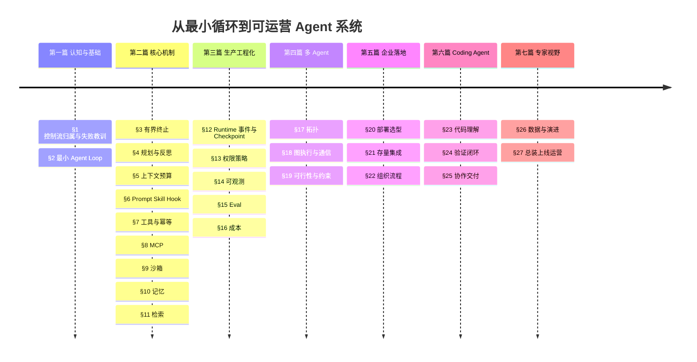

## 2.4 为什么最终装配比局部实现更难

局部模块通常可以单独测试。

真正困难的是模块交界处：

- Context Builder 召回的记忆，是否带来源、版本和有效期？
- Tool Gateway 看到的用户身份，是否与策略引擎评估时一致？
- Approval 批准的参数摘要，是否与恢复后真正执行的参数完全相同？
- Tool Completed 事件、成本事件和审计事件，是否来自同一次调用？
- Verifier 是独立查询外部状态，还是仅仅相信执行工具的返回值？
- Checkpoint 恢复时，工具目录、策略版本、模型版本是否已经漂移？
- Eval 使用的轨迹，是否经过脱敏、去污染和人工校准？
- Dashboard 里的“成功率”，是否等同于用户任务真正成功？

因此，收尾工作的核心不是再发明模块，而是定义模块之间的契约。

## 2.5 系统总装的五类契约

| 契约 | 约束对象 | 关键内容 |
|---|---|---|
| 行为契约 | 用户请求与完成结果 | 目标、非目标、前置条件、验收、失败语义 |
| 状态契约 | Run、Turn、Tool、Approval | 状态机、允许迁移、幂等、超时、恢复 |
| 事件契约 | 生产者与消费者 | Schema、顺序、关联、脱敏、版本、重放 |
| 权限契约 | 主体、动作、资源 | allow/ask/deny、义务、审批、最小权限 |
| 质量契约 | 变更与上线 | 评测集、阈值、SLO、灰度、停止与回滚 |

没有这些契约，架构图只是组件清单；

有了这些契约，组件才能形成系统。

---
# 3. 终态参考架构：四层十六模块与四个横向控制面

原章用“四层十六模块”概括最终系统。扩展后可以把它理解为：**四个纵向业务层负责完成任务，四个横向控制面负责让任务始终处于边界内**。

## 3.1 终态架构全景

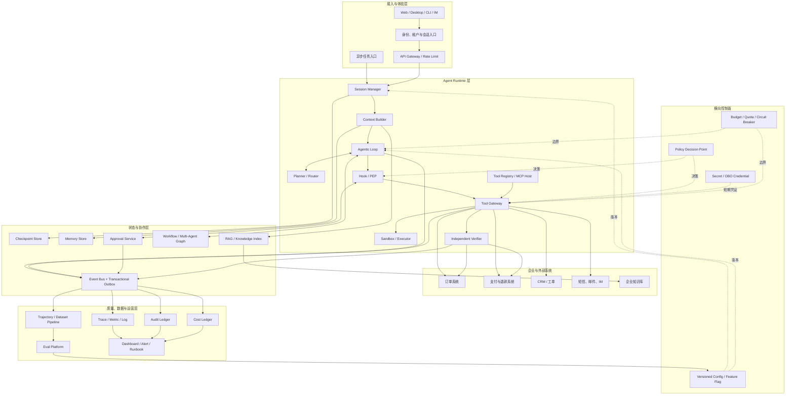

## 3.2 四层分别解决什么问题

### 第一层：接入与体验层

它负责把“一个人发来一句话”转换成一个具有身份、租户、渠道、优先级和追踪标识的任务入口。

关键职责包括：

- 身份认证与用户代理授权；
- 租户隔离与数据域选择；
- 同步、流式、异步三种交互模式；
- 请求幂等键、速率限制和配额；
- 用户可见的进度、挂起、取消和恢复入口；
- 渠道能力适配，例如桌面端文件、IM 卡片审批、CLI 非交互模式。

它不应该决定业务策略，也不应该持有生产系统的长期凭证。

### 第二层：Agent Runtime 层

它负责“想、选、做、验”的主循环，但不直接获得无限权力。

其核心是：

```text
Runtime = 状态机 + 上下文装配 + 决策循环 + 工具控制 + 验证收尾
```

这里最容易犯的错误，是把 Runtime 等同于一个 while 循环。生产 Runtime 还必须管理：取消传播、预算、重试、超时、并发、快照、恢复、审计关联和配置指纹。

### 第三层：状态与协作层

这一层让任务不依赖单个进程、单次模型调用或单个 Agent 的“脑内状态”。

它保存：

- 可恢复的执行快照；
- 长期记忆和知识检索证据；
- 人工审批状态；
- 多 Agent 图的节点状态；
- 事件顺序和因果关系。

没有这一层，服务一重启，系统就会忘记“已经做到了哪一步”；审批等待也只能靠进程轮询。

### 第四层：质量、数据与运营层

它回答三个问题：

1. 系统现在是否健康？
2. 某个变更是否真的更好？
3. 出了问题以后，能否还原事实并形成改进？

这一层不是附加的 BI，而是发布与运营的控制系统。

## 3.3 四个横向控制面

### 策略控制面

统一定义主体、动作、资源与环境约束，输出：

```text
allow | ask | deny + obligations + reason_code
```

### 配置控制面

统一版本化管理：

- Prompt 与 Skill；
- 模型路由；
- 工具目录；
- 策略包；
- RAG 索引；
- Feature Flag；
- 评测集与阈值。

### 身份与凭证控制面

模型只能看到“需要做什么”，不能看到长期密钥。Tool Gateway 根据已经通过的策略决定，按需获取短期、最小范围、可撤销的委托凭证。

### 预算与韧性控制面

统一约束：

- 最大 Turn、Token、时间和费用；
- 每类工具的并发、QPS 与重试；
- 模型和供应商熔断；
- 外部系统故障时的降级路径；
- 租户、用户和任务级配额。

## 3.4 控制平面与数据平面必须分离

一次退款工具调用属于数据平面；“这个用户是否可以退 499 元、是否必须二审、是否允许使用某支付通道”属于控制平面。

分离后的好处是：

- 业务动作实现不再散落权限判断；
- 策略可独立测试、审计和热更新；
- 同一条策略可约束 UI、API、Agent 与后台任务；
- 策略故障可以统一 fail-closed，而不是由每个工具自行猜测；
- 权限证据与业务结果能够独立保存。

## 3.5 为什么事件骨干是终态架构的中轴

Event Bus 看似只是基础设施，实际连接了：

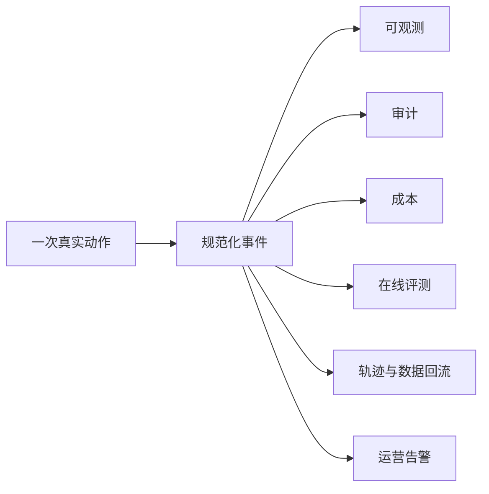

如果这些系统分别在业务代码中“顺手记一下”，最终一定会出现：

- 仪表盘显示成功，但审计账本找不到记录；
- 成本归因到错误租户；
- 训练数据缺少工具错误和审批上下文；
- 同一任务在不同系统中使用不同 ID；
- 故障恢复时无法重建真实顺序。

因此，**事件契约不是日志格式，而是系统事实模型**。

---

# 4. 七条系统不变量：架构图背后的真正主线

架构图可以有不同画法，但生产系统必须守住以下七条不变量。

## 4.1 不变量一：任何执行都必须有界

边界至少包括：

```text
Bound = min(
  max_turns,
  token_budget,
  wall_clock_deadline,
  cost_budget,
  tool_call_budget,
  replan_budget,
  graph_edge_budget
)
```

达到任一边界后，系统进入明确的终止路径：

- 成功收尾；
- 降级回答；
- 请求人工；
- 挂起等待；
- 失败并给出可恢复信息；
- 取消并执行必要补偿。

“模型再试一次也许会成功”不是无限延长边界的理由。

## 4.2 不变量二：越确定的职责越应下沉到 Runtime

适合模型处理的是模糊语义与开放决策；适合 Runtime 处理的是确定性边界。

| 事项 | 归属 |
|---|---|
| 用户表达中“那笔多扣的钱”指哪笔订单 | 模型与检索 |
| 是否超过最大退款金额 | 策略/确定性代码 |
| 工具参数是否符合 Schema | Tool Gateway |
| 是否达到最大 Turn | Runtime |
| 是否需要人工审批 | PDP |
| 退款是否真的落账 | Verifier |
| 如何向用户解释处理结果 | 模型 |

判断原则：

> **能够写成稳定断言的规则，不应只写在 Prompt 里。**

## 4.3 不变量三：提出动作、执行动作与验证动作必须解耦

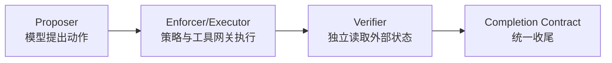

这样可以避免：

- 模型把“调用已经发出”误认为“业务已经成功”；
- 工具适配器把自身返回值当作最终事实；
- 同一个不稳定组件既当运动员又当裁判。

## 4.4 不变量四：权限来自策略，而不是模型自律

模型可以建议“需要退款”，但不能自行决定它拥有退款权限。

权限决定必须绑定：

- 谁：用户、Agent、服务身份、租户；
- 做什么：动作与副作用等级；
- 对什么：订单、账户、仓库、文件；
- 在什么条件下：金额、时间、环境、风险；
- 承担什么义务：审批、脱敏、二次验证、双人控制。

## 4.5 不变量五：等待必须变成持久状态

Agent 等待审批、定时器或外部回调时，应当：

1. 保存 Checkpoint；
2. 发布挂起事件；
3. 释放模型、线程和进程资源；
4. 由外部事件触发 Resume；
5. 恢复前重新验证上下文和策略。

不应让模型每隔几秒问一次“审批通过了吗”。

## 4.6 不变量六：观测、审计、成本与学习必须共享事实源

四者视角不同，但底层动作 ID、因果链和结果必须一致：

- Trace 解释调用因果和耗时；
- Audit 证明谁在何时依据什么做了什么；
- Cost 说明资源由谁、为哪项业务消耗；
- Trajectory 保存可供评测和学习的行为序列。

它们可以有不同存储和保留期，但不能各自编造事实。

## 4.7 不变量七：任何变化都必须可比较、可定位、可回滚

一次 Agent 发布的真实版本不是一个 Git SHA，而是配置指纹：

```text
release_fingerprint = hash(
  code_sha,
  prompt_bundle_version,
  policy_bundle_version,
  tool_catalog_version,
  model_route_version,
  rag_index_version,
  event_schema_version,
  eval_suite_version
)
```

只有完整记录这个指纹，才能回答：

- 是代码回归，还是模型供应商变了？
- 是 Prompt 变了，还是知识索引过期？
- 同一个用户为什么昨天允许、今天被拒绝？
- 回滚代码为何没有恢复原来的行为？

## 4.8 七条不变量的依赖关系

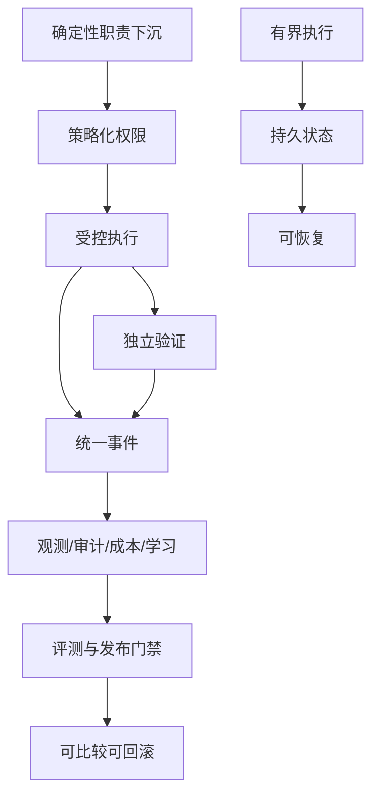

---

# 5. 最终实战任务：重复扣款退款的业务契约

原章选择“重复扣款退款”作为最终实战非常合适，因为它同时包含：自然语言理解、跨系统检索、金额计算、不可逆副作用、权限判断、人工审批、幂等、外部验证、通知和审计。

## 5.1 用户请求

> 昨天那笔会员续费好像扣了两次，帮我把多扣的一笔退掉，并短信告诉我。

这句话没有直接给出：

- 用户账户；
- 订单号；
- 两条支付流水；
- 哪一条是重复扣款；
- 退款金额；
- 是否已存在退款；
- 用户是否有权操作该账户；
- 短信接收号码；
- 当前退款政策。

因此不能从一句话直接跳到 `refund()`。

## 5.2 先写业务任务契约

```yaml
use_case: duplicate_charge_refund
intent:
  goal: 识别同一会员续费产生的重复成功扣款，并退回多扣的一笔
  requested_notification: sms

preconditions:
  - requester_is_account_owner_or_authorized_delegate
  - exactly_one_duplicate_charge_pair_is_identified
  - both_charges_belong_to_same_business_obligation
  - refundable_charge_has_not_been_fully_refunded
  - refund_window_is_open
  - calculated_amount_is_positive

side_effects:
  - create_refund
  - create_case_note
  - send_notification

risk_class:
  create_refund: high
  create_case_note: low
  send_notification: medium

completion:
  required:
    - refund_record_exists_in_payment_system
    - refund_amount_and_currency_match_approved_request
    - original_charge_reference_matches
    - case_note_is_persisted
    - notification_delivery_is_accepted_or_explicitly_degraded
    - audit_evidence_is_complete

failure_semantics:
  ambiguous_duplicate: ask_user_or_route_human
  policy_denied: explain_without_bypassing
  outcome_unknown: reconcile_before_retry
  notification_failed: refund_may_complete_with_degraded_notice
```

## 5.3 关键业务不变量

### 不变量 A：不能把两次不同业务消费当成重复扣款

判断重复扣款不能仅比较金额相同，还要综合：

- 商户、产品和币种；
- 业务订单或订阅周期；
- 时间窗口；
- 支付方式；
- 幂等键或支付意图；
- 是否存在冲正、预授权或结算差异；
- 上游系统提供的重复标记。

### 不变量 B：退款金额不得由模型自由生成

金额应通过确定性函数从订单、支付和既有退款记录计算：

```text
refundable_amount = captured_amount
                  - settled_refund_amount
                  - pending_refund_amount
                  - non_refundable_component
```

模型负责选择候选项和解释，不负责浮点计算或改变账务规则。

### 不变量 C：退款工具必须幂等

推荐幂等键：

```text
idempotency_key = hash(
  tenant_id,
  account_id,
  original_charge_id,
  refund_reason,
  approved_amount_minor,
  currency,
  business_case_id
)
```

同一个业务请求无论发生客户端重试、Runtime 重试、消息重复投递还是服务重启，都应得到同一退款结果。

### 不变量 D：审批必须绑定参数摘要

审批人批准的是：

```text
approval_digest = hash(
  subject,
  action,
  resource,
  amount_minor,
  currency,
  reason,
  policy_version,
  tool_contract_version,
  expiry_at
)
```

恢复执行时，只要任一字段改变，旧审批即失效。

### 不变量 E：退款成功与短信成功不是同一种成功

推荐把最终状态拆开：

| 退款 | 通知 | 最终语义 |
|---|---|---|
| 成功 | 成功 | 完整成功 |
| 成功 | 失败 | 主任务成功、通知降级，进入补发队列 |
| 未知 | 任意 | 不得重试退款，先对账 |
| 失败 | 成功 | 不应发送“退款成功”通知 |
| 失败 | 失败 | 明确失败并提供下一步 |

## 5.4 风险矩阵

| 动作 | 可逆性 | 财务影响 | 默认策略 | 必要控制 |
|---|---:|---:|---|---|
| 查询订单 | 高 | 无 | allow | 读权限、字段脱敏 |
| 查询支付流水 | 高 | 无 | allow/ask | 强身份、审计 |
| 创建工单备注 | 中 | 低 | allow | Schema 校验、幂等 |
| 创建退款 | 低 | 高 | ask | PDP、HITL、幂等、独立验证 |
| 发送短信 | 中 | 中 | ask/allow | 号码绑定、模板、频控 |
| 批量退款 | 极低 | 极高 | deny/双人审批 | 强隔离、额度和批次验证 |

---

# 6. 端到端链路：一句请求如何穿过二十个关键步骤

## 6.1 完整时序

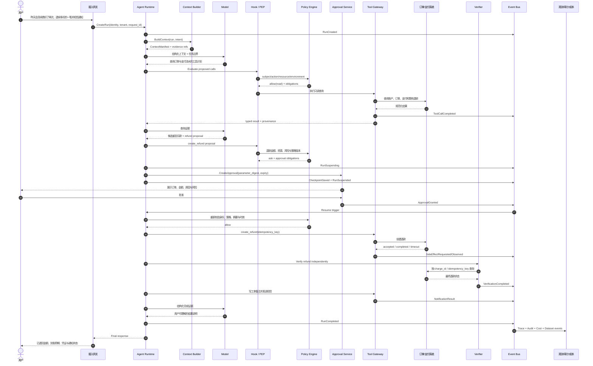

## 6.2 二十个关键步骤拆解

### 步骤 1：入口建立身份与幂等边界

网关生成或接收 `request_id`，把用户身份、租户、渠道和授权上下文绑定到 Run。相同请求重放时应命中原 Run，而不是创建第二次退款任务。

### 步骤 2：Runtime 创建可追踪 Run

Run 创建时即写入版本指纹、初始预算、截止时间和事件关联 ID。不能等任务完成后再“补日志”。

### 步骤 3：Context Builder 只装配当前任务需要的信息

它读取用户授权范围、近期会话摘要、政策索引和可用工具，但不把全部历史记录和原始凭证塞给模型。

### 步骤 4：模型先提出只读调查计划

对高风险任务，第一轮通常应该是读路径：定位账户、订单、支付流水和既有退款，而不是直接执行写动作。

### 步骤 5：PEP 在工具边界拦截

即使模型生成了合法 JSON，也必须经过：Schema、策略、速率、预算、敏感字段和副作用等级检查。

### 步骤 6：PDP 对读取动作给出决定与义务

例如允许查询，但要求：隐藏完整卡号、限制时间范围、写入审计事件。

### 步骤 7：Tool Gateway 获取短期委托凭证

凭证范围只覆盖本次允许的读操作，并设置短 TTL。模型不接触明文密钥。

### 步骤 8：工具结果被规范化

第三方 API 的各种状态码、空字段和错误体被转换成稳定的领域结果，附带来源与时间。

### 步骤 9：模型从证据中识别候选重复扣款

模型可以处理“昨天那笔”“续费”“多扣”等模糊表达，但候选必须保留证据引用，不能凭空形成结论。

### 步骤 10：确定性代码计算可退金额

金额、币种、既有退款和政策窗口由领域服务计算，模型不能覆盖。

### 步骤 11：PDP 把退款判定为 `ask`

输出不只是“需审批”，还要包含原因码、审批角色、所需字段、TTL、是否双人审批以及执行后的验证义务。

### 步骤 12：Runtime 先保存再挂起

正确顺序是：

```text
prepare checkpoint -> durable save -> create approval -> publish suspended -> release resources
```

具体实现可通过事务或 Saga 保证不会出现“审批已发出但没有可恢复快照”。

### 步骤 13：审批界面显示可判断的信息

审批人需要看到：

- 谁发起；
- 哪个账户和订单；
- 原扣款与重复扣款；
- 退款金额和币种；
- 识别依据；
- 策略命中原因；
- 风险、有效期和可撤回性。

只显示“Agent 请求调用 refund_tool，是否允许”会制造审批疲劳。

### 步骤 14：恢复前重新校验

批准后不应直接沿用旧世界状态。Runtime 必须检查：

- 审批未过期、未撤回；
- 参数摘要一致；
- 用户与服务身份仍有效；
- 策略版本的兼容性；
- 订单尚未被人工处理；
- 没有其他退款已占用金额。

### 步骤 15：Tool Gateway 使用业务幂等键执行退款

调用超时不等于失败，更不等于可以再次创建。系统应把结果标记为 `OUTCOME_UNKNOWN`。

### 步骤 16：Verifier 独立查询外部事实

它按支付系统的退款 ID、原 charge ID 或幂等键查询真实状态，而不是相信模型文本或执行适配器返回的 `200 OK`。

### 步骤 17：通知动作根据已验证事实生成

只有当退款达到允许通知的状态，短信模板才能说“已退款”；否则应说“已受理”或“正在核对”。

### 步骤 18：Completion Contract 统一收尾

Runtime 根据结构化证据计算最终状态，而不是让模型自由选择 `success=true`。

### 步骤 19：统一事件流派生运营数据

Trace、审计、成本、在线评测和轨迹使用同一 `run_id / step_id / tool_call_id`。

### 步骤 20：用户收到可验证而非夸张的说明

最终响应应包含：

- 已确认的事实；
- 退款金额和原交易参考；
- 当前退款状态；
- 预计到账语义；
- 短信状态；
- 后续查询凭证；
- 若仍为未知状态，明确说明系统正在对账，而不是伪装成功。

## 6.3 这条链路中三个最重要的“没有发生”

1. **模型没有拿到支付系统长期密钥。**
2. **模型没有绕过策略直接退款。**
3. **系统没有用模型的自我声明代替外部验证。**

还应补充四个没有发生：

4. 等待审批时没有持续调用模型；
5. 网络超时后没有盲目重复退款；
6. 批准后的参数变化没有沿用旧审批；
7. 退款成功但短信失败时，没有把主任务错误回滚或重复退款。

## 6.4 一次成功任务的工程表达

```text
SuccessfulTask =
  CorrectIntent
  × ValidEvidence
  × AuthorizedAction
  × IdempotentCommit
  × IndependentVerification
  × HonestCommunication
  × CompleteTraceability
```

乘法意味着任何一项归零，整体都不能称为生产成功。

---
# 7. 运行时状态机：运行、挂起、恢复、验证与终止

生产级 Runtime 的本质不是“循环调用模型”，而是一个可持久化、可并发控制、可恢复的状态机。

## 7.1 六类核心实体

| 实体 | 生命周期 | 作用 |
|---|---|---|
| Session | 跨多个用户任务 | 保存渠道会话、用户可见历史和连续交互关系 |
| Run | 一次业务目标 | 承载预算、版本指纹、总体状态与最终结果 |
| Turn | 一次模型决策轮 | 记录输入上下文、模型输出和本轮预算 |
| Step | 一个可调度执行单元 | 规划、检索、工具、审批、验证或收尾 |
| Tool Call | 一次工具意图与执行 | 保存参数摘要、策略决定、幂等键和结果 |
| Approval | 一次人工决策 | 绑定动作、参数、审批人、时效和决定证据 |

不要把这些实体全部压成一张 `messages` 表。它们的并发、保留期、审计要求和恢复语义不同。

## 7.2 Run 状态机

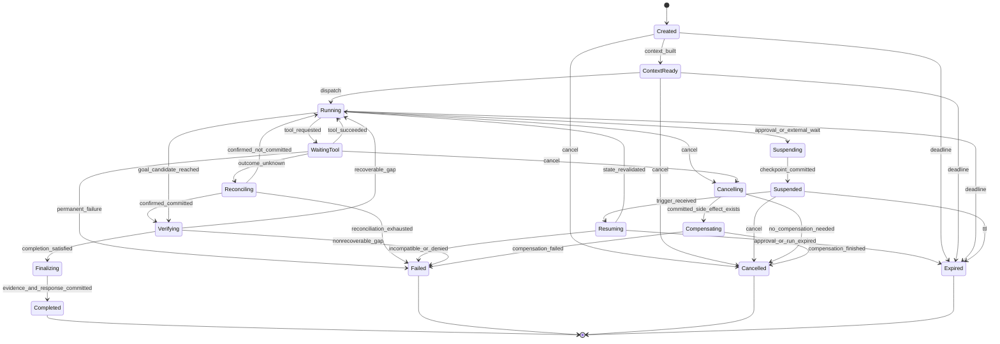

## 7.3 状态迁移必须由命令驱动

推荐使用明确命令，而不是任意代码直接写状态：

```text
CreateRun
BuildContext
DispatchTurn
RequestTool
RecordToolOutcome
BeginSuspension
CommitCheckpoint
ResumeRun
StartVerification
FinalizeRun
CancelRun
ExpireRun
```

每个命令包含：

- `command_id`：命令幂等键；
- `run_id`；
- `expected_version`：乐观锁版本；
- `actor`：谁触发；
- `reason`；
- `occurred_at`；
- 命令负载摘要。

数据库更新示意：

```sql
UPDATE agent_runs
SET state = :new_state,
    version = version + 1,
    updated_at = :now
WHERE run_id = :run_id
  AND state = :expected_state
  AND version = :expected_version;
```

影响行数为 0 时，调用方必须重新读取状态，不得覆盖并发变化。

## 7.4 Tool Call 也需要独立状态机

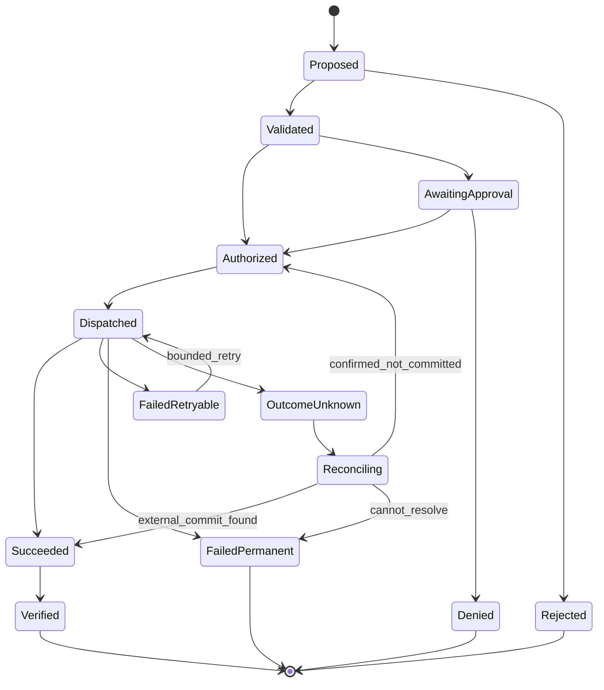

`OutcomeUnknown` 是财务、邮件、工单、代码提交等副作用系统中非常重要的状态。

网络超时只说明客户端没有收到明确结果，可能存在三种事实：

1. 请求从未到达；
2. 请求已到达但未提交；
3. 请求已提交，只是响应丢失。

在查明之前重试，有可能制造第二次副作用。

## 7.5 终态不是只有成功和失败

推荐至少区分：

| 终态 | 含义 |
|---|---|
| `COMPLETED` | 任务完成契约全部满足 |
| `COMPLETED_DEGRADED` | 核心目标完成，非核心步骤明确降级 |
| `FAILED_RETRYABLE` | 当前 Run 结束，但可由新 Run 安全重试 |
| `FAILED_PERMANENT` | 业务或策略上不可继续 |
| `CANCELLED` | 用户或系统主动取消，必要补偿已完成 |
| `EXPIRED` | 超过业务或审批时效 |
| `MANUAL_REVIEW_REQUIRED` | 自动系统无法在可信边界内得出结论 |

最终状态必须来自结构化规则，而不是从自然语言回答中解析。

## 7.6 预算是状态的一部分

Run 应保存实时预算账本：

```yaml
budget:
  max_turns: 12
  turns_used: 5
  max_input_tokens: 80000
  input_tokens_used: 28450
  max_output_tokens: 12000
  output_tokens_used: 4310
  max_tool_calls: 20
  tool_calls_used: 8
  max_replans: 2
  replans_used: 1
  wall_clock_deadline: 2026-08-31T12:15:00Z
  max_cost_usd: 1.50
  cost_used_usd: 0.62
```

恢复后必须继续使用剩余预算，不能重新获得一整套预算。

## 7.7 取消与截止时间必须端到端传播

取消不是只停止下一次模型调用。它需要传递到：

- 模型流式响应；
- 排队中的工具任务；
- 沙箱进程；
- 多 Agent 子任务；
- 等待中的审批；
- 后台通知与验证任务。

已经提交的外部副作用不能靠取消“撤回事实”，必须进入补偿或人工处理。

## 7.8 状态机测试重点

至少覆盖：

- 每条合法迁移；
- 所有非法迁移被拒绝；
- 重复命令不产生重复副作用；
- 并发 Resume 只有一个成功；
- Cancel 与 Tool Completed 竞态；
- Approval Granted 与 Approval Expired 竞态；
- Checkpoint 保存中断后的恢复；
- 配置升级后旧快照的兼容与拒绝；
- `OutcomeUnknown` 不进入盲重试；
- 终态不可被普通命令重新打开。

---

# 8. 上下文装配：让模型看到足够的信息，而不是所有信息

Context Window 不是数据库，也不是越长越好。它是一次决策所需信息的受限工作集。

## 8.1 上下文装配的七层

推荐从高到低按以下顺序装配：

1. **系统边界**：角色、禁止事项、输出协议；
2. **当前任务契约**：目标、非目标、完成条件、预算；
3. **确定性状态**：Run 状态、已完成步骤、未解决事项；
4. **权限与策略提示**：可用动作及需要审批的风险边界；
5. **当前证据**：工具结果、检索片段、用户确认；
6. **必要记忆**：偏好、历史事实和稳定习惯；
7. **交互历史摘要**：只保留对当前决策有因果影响的内容。

不要把全部聊天记录简单拼接到最后。

## 8.2 Context Manifest

每一轮模型调用都应保存结构化清单：

```yaml
context_manifest:
  manifest_id: ctxm_01J...
  run_id: run_01J...
  turn_id: turn_05
  assembled_at: 2026-08-31T10:02:11Z
  prompt_bundle_version: refund-agent@4.3.1
  model_route_version: route-prod@18
  token_budget:
    total: 24000
    reserved_output: 3000
    actual_input: 17320
  entries:
    - type: system_policy
      ref: sha256:...
      authority: platform
      freshness: versioned
      sensitivity: internal
      tokens: 1420
    - type: task_contract
      ref: task://duplicate-charge-refund/v3
      authority: domain
      freshness: current
      sensitivity: confidential
      tokens: 980
    - type: tool_result
      ref: event://tool_call/tc_019
      authority: payment_system
      observed_at: 2026-08-31T10:01:58Z
      sensitivity: restricted
      tokens: 2860
    - type: memory
      ref: memory://user/u123/notification-preference
      authority: user_confirmed
      expires_at: 2027-01-01T00:00:00Z
      sensitivity: personal
      tokens: 80
  excluded:
    - reason: stale
      ref: memory://user/u123/old-phone
    - reason: budget
      ref: conversation://raw/older-than-30d
```

这个清单支持复现、审计、离线评测和隐私追踪。

## 8.3 判断信息优先级的三个轴

不要用单一“相关性分数”决定所有内容。至少区分：

| 轴 | 要问的问题 |
|---|---|
| 指令权威性 | 谁有权规定系统应该怎么做？ |
| 事实新鲜度 | 哪个来源更接近当前真实状态？ |
| 隐私暴露度 | 这条信息是否真的需要暴露给模型？ |

例如：

- 当前支付系统余额比三个月前记忆更“新鲜”；
- 平台安全策略比网页检索到的文本更“有权威”；
- 用户手机号虽相关，但调用退款模型并不一定需要看见完整号码。

## 8.4 Token 预算分配

可采用显式预算：

```text
T_total = T_system
        + T_task
        + T_state
        + T_evidence
        + T_memory
        + T_history
        + T_tool_schema
        + T_reserved_output
```

优先级通常是：

```text
系统边界 > 当前任务 > 确定性状态 > 最新证据 > 工具协议 > 必要记忆 > 历史闲聊
```

当预算不足时，应逐层压缩或淘汰，而不是截断尾部造成结构残缺。

## 8.5 压缩必须保留“状态账本”

对长会话进行摘要时，应保留：

- 用户当前目标；
- 已确认事实与来源；
- 已拒绝假设；
- 已执行副作用及结果；
- 待审批动作；
- 未解决风险；
- 完成条件；
- 预算剩余；
- 关键 ID 与版本。

建议把自然语言摘要和结构化账本分离：

```yaml
working_state:
  confirmed_charge_pair: [ch_001, ch_002]
  duplicate_candidate: ch_002
  approved_refund_minor: 49900
  currency: CNY
  approval_id: ap_017
  refund_status: not_dispatched
  unresolved:
    - revalidate_refundable_amount_after_resume
```

摘要负责可读，账本负责正确。

## 8.6 检索结果必须带证据元数据

每个检索片段至少携带：

- 来源系统与文档 ID；
- 文档版本；
- 生效/失效时间；
- 访问控制标签；
- 检索时间；
- 切片位置；
- 内容摘要；
- 是否由用户确认；
- 是否允许进入长期记忆。

没有来源和时间的文本，不应被当成稳定事实。

## 8.7 Prompt Injection 防线属于上下文系统

任何外部内容，包括网页、邮件、工单、代码注释、MCP 工具描述和文档，都应视为不可信数据。

上下文装配器应：

- 明确标记来源与信任级别；
- 把外部文本放入数据区域，而不是系统指令区域；
- 过滤或隔离“忽略此前指令”等注入模式；
- 不允许检索内容直接扩大工具权限；
- 对高风险动作始终重新经过策略；
- 在模型输出后进行结构和策略校验。

## 8.8 上下文的可测试性

可以为 Context Builder 建立确定性测试：

- 给定相同输入与版本，Manifest 是否稳定；
- 过期记忆是否被排除；
- 跨租户信息是否绝不进入候选集；
- 高敏字段是否按用途脱敏；
- 超预算时淘汰顺序是否符合规则；
- 压缩前后关键事实是否保持；
- Prompt Injection 样本是否被正确降权与隔离。

---

# 9. 工具网关：把模型意图转换为受控的外部动作

模型输出的 Tool Call 只是一个**动作提案**。Tool Gateway 才是把提案转换为真实外部调用的受控边界。

## 9.1 工具契约示例

```yaml
name: payment.create_refund
contract_version: 3.2.0
description: 为一笔已捕获支付创建不超过可退余额的退款
input_schema:
  type: object
  required: [charge_id, amount_minor, currency, reason, case_id]
  properties:
    charge_id: {type: string, pattern: '^ch_[A-Za-z0-9]+$'}
    amount_minor: {type: integer, minimum: 1}
    currency: {type: string, enum: [CNY, USD]}
    reason: {type: string, enum: [duplicate_charge]}
    case_id: {type: string}
side_effect:
  level: high
  reversible: partially
  idempotency: required
security:
  scopes: [payment.refund.create]
  credential_mode: on_behalf_of
  data_classification: restricted
policy:
  action: refund.create
  approval_above_minor: 0
runtime:
  timeout_ms: 8000
  retry:
    max_attempts: 1
    only_before_dispatch_confirmation: true
  reconciliation_tool: payment.find_refund_by_idempotency_key
verification:
  required: true
  verifier: payment.verify_refund
output_schema:
  oneOf:
    - $ref: '#/definitions/RefundAccepted'
    - $ref: '#/definitions/RefundCompleted'
    - $ref: '#/definitions/OutcomeUnknown'
```

## 9.2 工具调用控制流水线

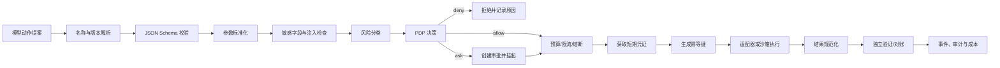

任何步骤都不能被模型通过改变工具参数绕过。

## 9.3 错误分类决定能否重试

| 错误类别 | 示例 | 默认处理 |
|---|---|---|
| `VALIDATION_ERROR` | 参数缺失、币种非法 | 不重试，返回模型修正或终止 |
| `POLICY_DENIED` | 无退款权限 | 不重试，不允许改写参数绕过 |
| `APPROVAL_REQUIRED` | 高风险写操作 | Checkpoint 后挂起 |
| `AUTH_EXPIRED` | 短期凭证过期 | 重新获取凭证后有限重试 |
| `RATE_LIMITED` | 上游限流 | 有界退避，尊重 deadline |
| `DEPENDENCY_UNAVAILABLE` | 上游 503 | 熔断、降级或有限重试 |
| `BUSINESS_CONFLICT` | 已退款、余额不足 | 重新查询事实，不盲重试 |
| `OUTCOME_UNKNOWN` | 写请求超时 | 进入对账，禁止直接重试 |
| `PERMANENT_EXTERNAL_ERROR` | 账户关闭 | 终止或人工处理 |
| `SANDBOX_VIOLATION` | 越界访问 | 立即终止，安全告警 |

## 9.4 重试不是统一中间件可以包办的

读操作通常可在超时后安全重试；写操作是否可重试取决于：

- 是否有业务幂等键；
- 上游是否保证幂等；
- 请求是否确定未发送；
- 是否能对账；
- 业务截止时间；
- 当前状态是否已经被其他操作者改变。

推荐策略：

```text
RetryDecision = f(
  operation_semantics,
  dispatch_certainty,
  idempotency_support,
  error_class,
  remaining_budget,
  remaining_deadline,
  reconciliation_capability
)
```

## 9.5 MCP 解决协议互操作，不自动解决信任

MCP 可以统一 Host、Client 与 Server 之间的能力发现和调用方式，但生产 Host 仍需负责：

- Server 身份与来源校验；
- 工具清单允许列表；
- Schema 与版本固定；
- 权限和用户同意；
- 传输安全；
- 数据最小化；
- 调用审计；
- 超时、限流与取消；
- 工具描述注入防护；
- 供应链风险与撤销。

“支持 MCP”不等于“任何 MCP Server 都可安全接入”。

## 9.6 工具版本升级规则

工具升级至少区分：

- 向后兼容的描述改进；
- 可选字段增加；
- 必填字段变化；
- 副作用或权限变化；
- 输出语义变化；
- 幂等和重试语义变化。

高风险工具应固定 `contract_version`。挂起中的 Run 恢复时，如果目标版本不再可用，系统应迁移或拒绝，而不是静默调用新版本。

## 9.7 沙箱是执行工具的最后一道隔离

对代码、Shell、浏览器自动化和本地文件工具，应限制：

- 文件系统根目录与读写范围；
- 网络目的地；
- CPU、内存、进程数和执行时间；
- 环境变量与 Secret 注入；
- 系统调用和设备访问；
- 制品导出路径；
- 子进程终止和资源回收；
- 宿主与其他租户隔离。

工具执行成功后，也要扫描产物是否包含敏感数据、恶意文件或越界修改。

---

# 10. PDP、PEP 与 HITL：把不可逆副作用关进闸门

## 10.1 三个角色

- **PDP（Policy Decision Point）**：根据事实和策略给出决定；
- **PEP（Policy Enforcement Point）**：在真实边界执行决定；
- **HITL（Human in the Loop）**：在策略要求时提供人工判断与责任确认。

PDP 不直接调用退款接口；PEP 不自行发明策略；人工也不应绕过既定参数和审计链。

## 10.2 策略请求与响应

```json
{
  "subject": {
    "user_id": "u_123",
    "agent_id": "refund-agent",
    "tenant_id": "t_001",
    "assurance_level": "mfa"
  },
  "action": "refund.create",
  "resource": {
    "type": "payment_charge",
    "id": "ch_002",
    "owner_account_id": "acct_9"
  },
  "context": {
    "amount_minor": 49900,
    "currency": "CNY",
    "reason": "duplicate_charge",
    "environment": "production",
    "risk_score": 0.71,
    "run_id": "run_01J..."
  }
}
```

```json
{
  "decision": "ask",
  "reason_code": "FINANCIAL_WRITE_REQUIRES_CONFIRMATION",
  "policy_version": "refund-policy@2026.08.4",
  "obligations": [
    "bind_parameter_digest",
    "require_account_owner_confirmation",
    "expire_after_15m",
    "verify_external_state",
    "emit_full_audit"
  ],
  "approval_role": "account_owner",
  "ttl_seconds": 900
}
```

## 10.3 PEP 应部署在哪里

关键 PEP 至少包括：

1. API 入口：限制可创建的任务；
2. Context Builder：控制数据读取；
3. Tool Gateway：控制真实工具副作用；
4. 沙箱：控制系统资源；
5. 数据导出：控制文件和结果外传；
6. Memory Writer：控制哪些内容可长期保存；
7. 发布系统：控制 Prompt、策略和模型配置上线。

只在 Prompt 里告诉模型“请先征得同意”不构成 PEP。

## 10.4 `allow / ask / deny` 的语义

| 决定 | Runtime 行为 |
|---|---|
| `allow` | 满足 obligations 后继续执行 |
| `ask` | 建立审批、保存快照、释放资源，待决定后恢复 |
| `deny` | 不执行，不允许通过改写表达绕过；返回可解释原因 |

PDP 故障时，高风险写动作默认 `deny` 或 `ask unavailable`，不能默认为 `allow`。

## 10.5 审批不是弹窗，而是安全协议

审批记录应包含：

```yaml
approval:
  approval_id: ap_017
  run_id: run_01J...
  requested_by: refund-agent
  on_behalf_of: u_123
  approver_requirement: account_owner
  action: refund.create
  resource: payment_charge/ch_002
  parameter_digest: sha256:...
  human_readable_summary: 退回重复扣款 499.00 CNY
  evidence_refs:
    - event://tool/tc_orders
    - event://tool/tc_payments
  policy_version: refund-policy@2026.08.4
  expires_at: 2026-08-31T10:30:00Z
  status: pending
```

决定还应记录：审批人身份强度、时间、渠道、评论、撤回和替代关系。

## 10.6 防止审批疲劳

审批体验应做到：

- 低风险动作尽量由策略自动处理；
- 合并同一业务意图中的相关动作，但不模糊范围；
- 显示业务语义，而不是内部工具名；
- 强调与常态相比发生了什么；
- 高风险动作要求积极确认，不使用默认勾选；
- 批量动作展示数量、总金额和最大单项；
- 提供拒绝、缩小范围和请求更多证据的选项；
- 统计批准率、拒绝率、平均决策时长和“秒批”比例。

“几乎全部秒批”可能不是高效率，而是闸门失效。

## 10.7 防止旧审批被重放

至少绑定：

- `run_id` 和 `tool_call_id`；
- 主体和租户；
- 动作与资源；
- 参数摘要；
- 策略版本；
- 工具契约版本；
- 过期时间；
- 单次使用随机数。

执行成功、拒绝、过期或参数变化后，审批令牌应失效。

## 10.8 双人控制与职责分离

下列场景通常需要更强控制：

- 批量财务操作；
- 高额度退款；
- 生产数据库写入；
- 删除或导出敏感数据；
- 合并受保护分支；
- 修改安全策略本身；
- 为 Agent 扩大工具权限。

提出人、审批人和验证人不应全部由同一个身份承担。

---

# 11. Checkpoint、Interrupt 与 Resume：等待不是轮询

## 11.1 Checkpoint 保存什么

```yaml
checkpoint:
  checkpoint_id: cp_01J...
  schema_version: 5
  run_id: run_01J...
  run_version: 18
  reason: awaiting_refund_approval
  state: suspended
  created_at: 2026-08-31T10:15:02Z
  expires_at: 2026-08-31T10:30:02Z

  config_fingerprint:
    code_sha: abc123
    prompt_bundle: refund-agent@4.3.1
    policy_bundle: refund-policy@2026.08.4
    tool_catalog: tools@57
    model_route: route-prod@18
    rag_index: policy-index@2026-08-30

  execution:
    current_node: request_approval
    next_node: revalidate_and_refund
    turns_used: 5
    remaining_budget:
      turns: 7
      tool_calls: 12
      cost_usd: 0.88

  task_state:
    account_id: acct_9
    candidate_charge_id: ch_002
    amount_minor: 49900
    currency: CNY
    parameter_digest: sha256:...

  evidence_refs:
    - event://tool/tc_014
    - event://tool/tc_015

  pending:
    approval_id: ap_017
    required_trigger: approval.decision

  security:
    tenant_id: t_001
    data_classification: restricted
    encryption_key_ref: kms://agent-checkpoints/t_001
```

Checkpoint 不应直接保存明文长期凭证，也不应依赖模型隐藏状态。

## 11.2 挂起协议

挂起不是一条赋值语句。要避免以下半完成状态：

- 审批已发出，但快照没有保存；
- 快照已保存，但审批没有创建；
- Run 标记 Suspended，但事件没有发布；
- 重复请求创建多个有效审批。

一种可行的 Saga：

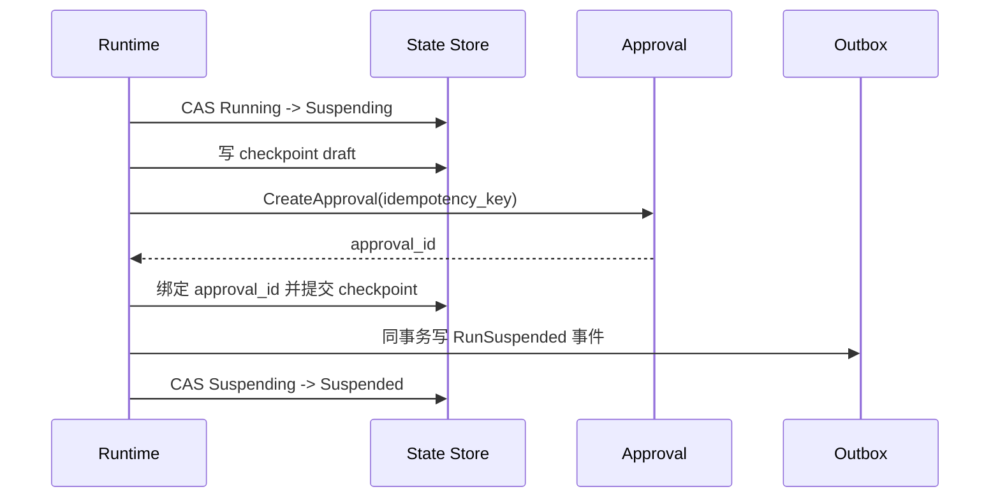

若中途失败，恢复器按当前阶段继续，而不是从头重复全部动作。

## 11.3 Resume 协议

恢复时依次检查：

1. 触发事件真实且未重复消费；
2. Run 当前确实处于允许恢复的状态；
3. Checkpoint 完整、可解密、Schema 可读；
4. Approval 有效、主体正确、未过期、未撤回；
5. 参数摘要未变化；
6. 版本指纹可兼容；
7. 外部世界没有使前置条件失效；
8. 预算与截止时间仍允许继续；
9. 通过最新 PDP 决策；
10. 通过 CAS 获取唯一恢复权。

```text
Resume ≠ deserialize(checkpoint) + continue
Resume = restore + validate + reconcile + reauthorize + continue
```

## 11.4 为什么恢复前必须对账

在等待审批期间，可能发生：

- 用户已从客服渠道手工退款；
- 订单被取消；
- 可退余额变化；
- 策略额度调整；
- 工具版本下线；
- 账号被冻结；
- 另一个 Run 已处理同一业务事件。

旧快照是历史，不是当前事实。

## 11.5 Checkpoint Schema 演进

建议：

- 每个快照带 `schema_version`；
- 支持有限版本的向前迁移；
- 迁移函数纯粹、可测试、可审计；
- 不可兼容时进入人工恢复队列；
- 发布前用真实匿名快照做兼容测试；
- 保留旧 Runtime 的紧急恢复能力，直到旧快照清空或迁移。

## 11.6 安全与保留

Checkpoint 常包含用户数据和业务证据，因此需要：

- 租户级加密；
- 最小化字段；
- 字段级敏感标签；
- 有限保留期；
- 删除与法律保留策略；
- 读取审计；
- 防篡改摘要；
- 备份恢复演练。

## 11.7 定时器也是恢复触发器

常见触发器包括：

- 人工审批决定；
- 外部系统 Webhook；
- 定时重试；
- 对账结果；
- 用户补充信息；
- 资源恢复事件；
- 运维手工 Resume。

所有触发器都应转换成幂等事件，而不是直接操作 Runtime 内存。

---

# 12. 事件骨干：最不起眼、却最不能裁的模块

## 12.1 标准事件信封

```yaml
event:
  event_id: evt_01J...
  event_type: agent.tool_call.completed
  schema_version: 3
  occurred_at: 2026-08-31T10:18:11.392Z
  recorded_at: 2026-08-31T10:18:11.417Z

  tenant_id: t_001
  run_id: run_01J...
  session_id: ses_01J...
  turn_id: turn_05
  step_id: step_refund
  tool_call_id: tc_019

  correlation_id: corr_...
  causation_id: evt_tool_dispatched
  trace_id: 5b8...
  span_id: c91...

  producer:
    service: tool-gateway
    version: 2.14.0
    instance: tg-pod-42

  subject:
    user_id_hash: hmac:...
    agent_id: refund-agent

  payload_ref: blob://events/evt_01J...
  payload_digest: sha256:...
  outcome: succeeded
  duration_ms: 842

  security:
    classification: restricted
    contains_personal_data: true
    retention_class: audit_7y
```

大体量或高敏 Payload 可以存入受控对象存储，事件只保存引用和摘要。

## 12.2 事件不是日志字符串

错误做法：

```text
"Agent called refund and it looked okay"
```

正确做法是结构化表达：

- 谁调用；
- 调用哪个契约版本；
- 参数摘要；
- 策略决定；
- 分发是否确定；
- 返回结果类别；
- 外部资源 ID；
- 是否完成验证；
- 费用和耗时；
- 数据分类与保留要求。

## 12.3 推荐事件族

### Run 生命周期

```text
RunCreated
ContextBuilt
TurnStarted
TurnCompleted
RunSuspending
RunSuspended
RunResuming
RunVerifying
RunCompleted
RunFailed
RunCancelled
RunExpired
```

### Tool 生命周期

```text
ToolCallProposed
ToolCallValidated
PolicyEvaluated
ApprovalRequested
ApprovalDecided
ToolCallDispatched
ToolCallSucceeded
ToolCallFailed
ToolOutcomeUnknown
ToolReconciliationCompleted
ToolVerificationCompleted
```

### 数据与运营

```text
MemoryCandidateProduced
MemoryWriteApproved
RetrievalPerformed
BudgetThresholdReached
EvalSampleSelected
SecurityViolationDetected
HumanEscalationCreated
```

## 12.4 交付语义：接受至少一次，建设幂等消费

跨服务事件一般应假设可能：

- 重复；
- 延迟；
- 乱序；
- 部分丢失后重放；
- 消费者处理成功但提交 Offset 失败。

因此消费者必须用 `event_id` 或领域幂等键去重。

不要把“全局恰好一次”当作轻易可以购买的属性。实际目标通常是：

```text
At-least-once delivery
+ idempotent consumers
+ per-aggregate ordering
+ reconciliation
= effectively-once business outcome
```

## 12.5 顺序边界

全局顺序通常代价过高，也没有必要。更实用的是保证：

- 同一 `run_id` 内按 `run_version` 有序；
- 同一 `tool_call_id` 内状态单调；
- 同一业务资源通过幂等键或版本号解决并发；
- 跨聚合关系使用 `causation_id` 和时间窗口重建。

## 12.6 Transactional Outbox

业务状态和事件最好在同一数据库事务中提交：

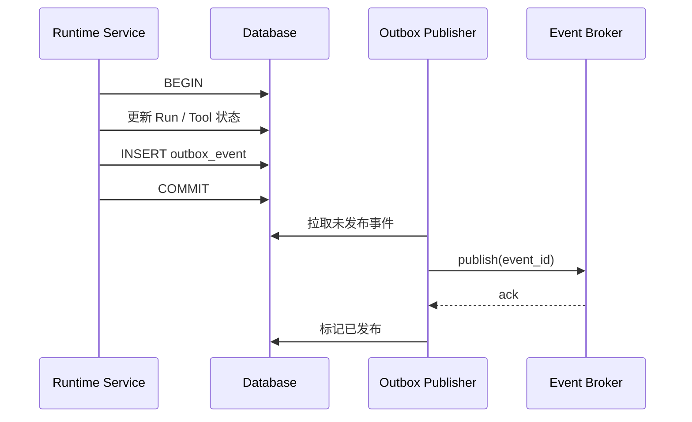

发布器崩溃后可重试，消费者按 `event_id` 去重。

## 12.7 Schema 治理

事件演进原则：

- 新增可选字段优先；
- 不改变已有字段语义；
- 删除字段需经过弃用周期；
- 每个事件有 Owner、JSON Schema/Protobuf 和示例；
- 生产者与消费者建立契约测试；
- Schema Registry 阻止不兼容发布；
- 重放旧事件时明确使用旧 Schema 解释；
- 高风险事件变化进入发布评审。

## 12.8 隐私与审计不是同一保留策略

普通调试事件可能保留 7–30 天；财务审计证据可能保留更久；原始 Prompt 和用户内容则可能需要更短保留和更严格访问。

推荐：

- 事件信封尽量少放原文；
- Payload 引用按用途分库存储；
- PII 使用令牌化或哈希；
- Debug 与 Audit 采用不同访问角色；
- 删除用户内容时保留必要的不可逆摘要和法律证据；
- 训练数据管道不能自动继承审计数据的使用权限。

## 12.9 事件完整性指标

应监控：

- Outbox 未发布积压；
- Broker 生产与消费延迟；
- 重复率和死信量；
- 每个 Run 的关键事件缺失率；
- Run 终态与审计终态不一致；
- Tool 成功但未出现 Verification 事件；
- 事件 Schema 拒绝量；
- Payload 无法读取或摘要不匹配。

事件系统故障时，高风险副作用应根据策略暂停，而不是“先做了以后再补记录”。

---
# 13. 可观测性：从“有日志”升级为可回放的行为证据

Agent 可观测性不是把 Prompt 和回答打印出来。真正目标是回答：

- 为什么走了这条路径？
- 哪条证据影响了决定？
- 哪个策略允许或阻止了动作？
- 时间和费用花在哪里？
- 用户目标是否真正完成？
- 出错后能否重建因果链？

## 13.1 五类信号不要混为一谈

| 信号 | 回答的问题 | 典型内容 |
|---|---|---|
| Event | 发生了什么事实 | `ToolCallDispatched`、`ApprovalGranted` |
| Span | 一段操作为什么慢、如何嵌套 | 模型调用、检索、策略、工具、验证 |
| Log | 组件内部如何诊断 | 连接池、序列化异常、重试原因 |
| Metric | 系统整体是否偏离常态 | 成功率、P95、错误率、预算消耗 |
| Audit | 谁依据什么执行了受控动作 | 主体、策略、审批、参数摘要、结果 |

它们相互关联但不能彼此替代。

## 13.2 四层观测模型

### 第一层：基础设施与依赖

- CPU、内存、磁盘、队列；
- 数据库连接与锁；
- Broker Lag；
- 模型供应商错误率；
- 工具和企业 API 可用性；
- 沙箱启动与回收。

### 第二层：Runtime 控制流

- Run、Turn、Step 数量；
- 挂起和恢复；
- 重规划；
- 工具重试；
- 预算消耗；
- 循环检测；
- 取消传播。

### 第三层：Agent 行为质量

- 工具选择正确率；
- 参数修正率；
- 无效工具调用；
- 证据引用完整率；
- 过度思考率；
- Verifier 驳回率；
- 人工接管率。

### 第四层：业务结果

- 真实任务完成率；
- 退款对账一致率；
- 用户重复咨询率；
- 首次解决率；
- 平均处理成本；
- 风险事件与审计完整率。

只观察第一层，会把“服务健康、任务却做错了”误判为成功。

## 13.3 Trace 层级示例

```text
agent.run
├── context.build
│   ├── memory.retrieve
│   ├── rag.retrieve
│   └── context.compact
├── agent.turn
│   └── gen_ai.inference
├── tool.call orders.search
│   ├── policy.evaluate
│   ├── credential.issue
│   └── http.request
├── approval.wait
├── tool.call payment.create_refund
│   ├── policy.evaluate
│   ├── credential.issue
│   └── http.request
├── verification.refund
└── completion.finalize
```

等待审批的墙钟时间可以体现在业务 Span 中，但不能让一个进程内 Span 永久占用资源；可通过 Span Link 或挂起/恢复事件关联跨进程阶段。

## 13.4 建议记录的关键属性

```yaml
agent:
  run_id: run_01J...
  session_id: ses_01J...
  agent_name: refund-agent
  release_fingerprint: sha256:...
  state: verifying

model:
  provider: example-provider
  requested_model: model-route-premium
  resolved_model: model-x-2026-08
  input_tokens: 5270
  output_tokens: 840
  cache_read_tokens: 2120
  finish_reason: tool_call

runtime:
  turn_index: 5
  replan_count: 1
  remaining_tool_budget: 8
  remaining_cost_usd: 0.61

business:
  use_case: duplicate_charge_refund
  outcome: completed_degraded
  amount_bucket: medium

security:
  policy_decision: ask
  policy_reason_code: FINANCIAL_WRITE_REQUIRES_CONFIRMATION
  approval_id_hash: hmac:...
```

不要把手机号、银行卡、完整 Prompt 或 Secret 直接作为 Trace Attribute。

## 13.5 关键指标体系

### 可靠性指标

```text
Task Success Rate
Verified Completion Rate
False Completion Rate
Tool Outcome Unknown Rate
Checkpoint Resume Success Rate
Audit Completeness Rate
```

### 行为指标

```text
Turns per Successful Task
Tools per Successful Task
Replan Rate
Loop Termination Reason Distribution
Verifier Rejection Rate
Human Escalation Rate
```

### 性能与成本指标

```text
Time to First Useful Action
Active Execution Latency
Human Wait Latency
P50/P95/P99 End-to-End Latency
Cost per Successful Task
Failure Tax
Cache Hit Rate
```

### 安全指标

```text
Policy Deny Rate
Approval Required Rate
Approval Expiry Rate
Sandbox Violation Rate
Cross-Tenant Retrieval Violations
Unverified High-Risk Side Effects
```

## 13.6 SLO 示例

下面阈值仅用于展示写法，实际应按业务风险和基线确定：

| SLO | 示例目标 | 测量口径 |
|---|---:|---|
| 已验证任务成功率 | ≥ 99.0% | 具有外部验证证据的成功任务 / 合格任务 |
| 高风险动作审计完整率 | 100% | 完整策略、审批、执行、验证证据 |
| Checkpoint 恢复成功率 | ≥ 99.9% | 可恢复快照中的成功恢复比例 |
| 退款未知结果对账时长 | P95 < 5 min | `OUTCOME_UNKNOWN` 到确定结果 |
| 紧急停止生效时间 | P99 < 60 s | Kill Switch 发布到所有执行节点拒绝 |
| 单任务成本 | 不超过业务预算 | 按场景和租户分位数监控 |

真正的 SLO 必须配套：

- 误差预算；
- 告警阈值；
- Owner；
- Runbook；
- 停止扩量条件；
- 复盘节奏。

## 13.7 Trace Sampling 策略

全量保存所有原始内容通常不可接受。可以分层：

- 高风险副作用：元数据和审计证据全量；
- 错误、未知结果、策略拒绝：高比例保留；
- 正常低风险任务：概率采样；
- 新版本灰度：提高采样率；
- 原始文本：单独受控、脱敏、短保留；
- 长期趋势：仅保留聚合指标。

## 13.8 “可回放”不等于重新执行副作用

事故分析中的回放应分为：

1. **事实回放**：按事件恢复当时看到的证据；
2. **决策回放**：用固定模型或模拟器重算决策；
3. **工具模拟回放**：返回历史结果，不调用生产系统；
4. **影子回放**：新版本只输出建议，不产生副作用；
5. **受控重执行**：仅在明确审批和新幂等边界下执行。

不得把生产轨迹直接喂给新 Agent 并允许其再次调用真实退款工具。

## 13.9 一个最小观测面板

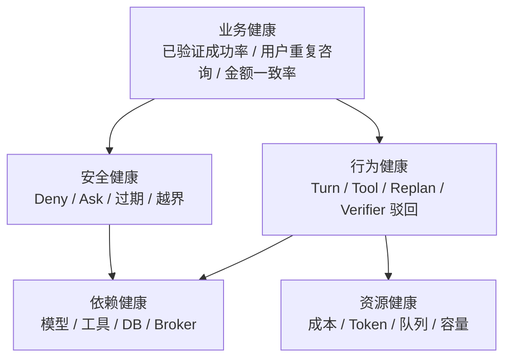

面板应该允许从业务异常下钻到具体 Run，再看到因果链和证据引用。

---

# 14. Verifier 与完成契约：模型说完成不等于任务完成

## 14.1 为什么需要独立 Verifier

执行工具返回成功，可能只表示：

- 请求通过了网关；
- 任务进入异步队列；
- 上游接受了参数；
- 本地适配器没有报错；
- 响应被错误解析成成功。

只有外部业务状态满足目标，任务才算完成。

## 14.2 Verifier 的输入和输出

```yaml
verification_request:
  use_case: duplicate_charge_refund
  target:
    original_charge_id: ch_002
    expected_amount_minor: 49900
    currency: CNY
    idempotency_key: idem_...
  evidence:
    execution_result_ref: event://tool/tc_019
    approval_ref: approval://ap_017
  deadline: 2026-08-31T10:25:00Z
```

```yaml
verification_result:
  status: satisfied
  observed_at: 2026-08-31T10:18:43Z
  external_refs:
    refund_id: re_782
    original_charge_id: ch_002
  observed:
    amount_minor: 49900
    currency: CNY
    state: succeeded
  checks:
    resource_match: pass
    amount_match: pass
    currency_match: pass
    duplicate_refund_absent: pass
  evidence_digest: sha256:...
```

推荐状态：

```text
SATISFIED
PENDING
NOT_SATISFIED
CONTRADICTED
UNVERIFIABLE
```

## 14.3 验证路径应尽量独立

最佳情况：执行通过写 API，验证通过只读账本或查询 API。

如果执行和验证完全共享同一缓存、同一适配器和同一错误逻辑，独立性就很弱。

可按风险选择：

| 风险 | 验证方式 |
|---|---|
| 低风险、可逆 | 工具结构化返回 + 轻量查询 |
| 中风险 | 独立只读 API + 关键字段比对 |
| 高风险财务 | 账务记录 + 幂等键 + 金额/币种/资源全量比对 |
| 关键基础设施 | 多源状态、健康检查和配置指纹 |
| 代码交付 | 独立测试、静态检查、Diff 与 CI 证据 |

## 14.4 处理最终一致性

退款可能先进入 `pending`，稍后才 `succeeded`。Verifier 应定义：

- 哪些中间状态可以向用户说“已受理”；
- 最大验证窗口；
- 轮询或 Webhook 的退避策略；
- 什么时候挂起并等待事件；
- 什么时候升级人工；
- 什么时候判定失败；
- 最终状态变化时如何补充通知。

等待期间不需要持续调用模型。

## 14.5 Completion Contract

```yaml
completion_contract:
  use_case: duplicate_charge_refund
  core_goal:
    - refund_verification.status == SATISFIED
  required_evidence:
    - policy_decision in [allow, ask_then_approved]
    - approval_digest_matches == true
    - tool_call.idempotency_key != null
    - audit_chain_complete == true
  secondary_goal:
    - case_note.persisted == true
    - notification.status in [accepted, delivered]
  degraded_allowed:
    - notification.status == retry_scheduled
  forbidden:
    - refund_verification.status in [UNVERIFIABLE, CONTRADICTED]
    - audit_chain_complete == false
```

完成计算由确定性 Evaluator 执行。

## 14.6 防止虚假完成

常见虚假完成包括：

- 模型说“文件已生成”，实际路径不存在；
- 模型说“测试通过”，只运行了部分测试；
- 工具返回 202，模型说“退款已到账”；
- PR 已创建，模型说“代码已合并”；
- 邮件进入队列，模型说“对方已收到”；
- 数据库更新 0 行，工具仍返回 success。

修复方式是为每个场景定义可机器验证的完成证据。

## 14.7 用户沟通也属于完成契约

回答应区分事实层级：

| 外部事实 | 合适表达 |
|---|---|
| 请求尚未发出 | “尚未执行” |
| 上游已接受 | “退款申请已受理” |
| 外部状态成功 | “退款已成功创建” |
| 银行到账未知 | “到账时间取决于支付渠道” |
| 结果仍不确定 | “系统正在核对，暂不会重复发起” |

诚实表达不确定性，比虚假的流畅确定更重要。

---

# 15. 评测门禁：让每次变化都有方向感

Agent 的代码、Prompt、模型、工具、策略和知识库都在变化。没有评测门禁，团队只能靠感觉判断“看起来更聪明了”。

## 15.1 评测金字塔

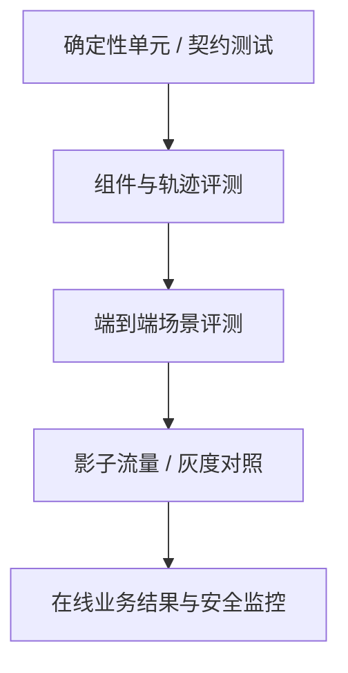

### E1：确定性测试

- Schema；
- 状态迁移；
- 策略规则；
- 金额计算；
- 幂等；
- 事件兼容；
- Checkpoint 迁移。

### E2：组件和轨迹评测

- 意图分类；
- 检索召回；
- 工具选择；
- 参数正确性；
- 计划质量；
- Verifier 判断；
- 安全拒绝。

### E3：端到端场景

从用户表达到外部模拟状态和最终回答，验证完整闭环。

### E4：影子与灰度

新版本读取真实输入，但先不产生真实副作用，或仅在小流量中受控执行。

### E5：在线结果

看真实完成率、风险、成本、人工负担和用户反馈。

## 15.2 评测集分区

建议至少有：

| 分区 | 用途 |
|---|---|
| Golden | 稳定核心场景，阻止明显回归 |
| Edge | 歧义、缺字段、时间边界、长尾表达 |
| Adversarial | Prompt Injection、权限绕过、数据外泄 |
| Incident | 历史事故和真实 Bad Case |
| Fresh | 近期线上样本，检查分布漂移 |
| Holdout | 团队日常调优不可见，防止过拟合 |
| Multilingual | 多语言与地区格式 |
| Load/Soak | 并发、长会话和长时间运行 |

同一条样本不应同时出现在调优集和保密验收集。

## 15.3 一条评测样本应包含什么

```yaml
case_id: refund_duplicate_ambiguous_017
input:
  user_message: 昨天好像扣了两次，处理一下
  identity: test_user_9
  environment_fixture: fixture/payment/ambiguous_pair_v2
expected:
  allowed_outcomes:
    - ask_for_clarification
    - escalate_human
  forbidden_actions:
    - payment.create_refund
  required_evidence:
    - two_candidate_pairs_are_ambiguous
scorers:
  - no_unauthorized_side_effect
  - evidence_grounding
  - honest_uncertainty
  - user_message_quality
labels:
  risk: high
  language: zh-CN
  source: incident-derived
```

## 15.4 Scorer 组合

### 确定性 Scorer

最适合做硬门禁：

- 是否调用禁用工具；
- 参数是否匹配；
- 是否越权；
- 外部状态是否达到目标；
- 是否产生重复副作用；
- 是否包含必要证据；
- 成本和 Turn 是否超限。

### 规则/语义 Scorer

检查格式、字段、引用、拒绝语义和可读性。

### LLM-as-a-Judge

适合评估解释质量、相关性和语言，但需要：

- 固定 Judge 版本；
- 明确 Rubric；
- 盲化候选版本；
- 随机化答案顺序；
- 与人工标注校准；
- 记录置信度和争议样本；
- 不让 Judge 单独决定高风险安全门禁。

### 人工评审

用于：

- 新场景建立标准；
- 低一致性样本；
- 高风险业务判断；
- Judge 漂移校准；
- 事故复盘和政策边界。

## 15.5 处理随机性

单次运行不能代表真实表现。可对关键样本运行 `k` 次：

```text
Pass@k        = 至少一次成功的比例
Pass^k        = k 次全部成功的比例
Mean Success  = 平均成功率
Variance      = 轨迹波动程度
```

对于不可逆高风险任务，`Pass^k` 和最坏行为通常比 `Pass@k` 更有意义。

## 15.6 发布门禁示例

```yaml
release_gate:
  hard_blockers:
    unauthorized_side_effects: 0
    cross_tenant_leaks: 0
    duplicate_refunds: 0
    high_risk_audit_missing: 0
  quality:
    verified_task_success_rate:
      min: 0.98
      max_regression: 0.005
    ambiguous_case_safe_handling:
      min: 0.995
  efficiency:
    cost_per_success:
      max_regression: 0.08
    p95_active_latency:
      max_regression: 0.10
  stability:
    run_completion_variance:
      max: 0.03
  approvals:
    owner_signoff: [domain, safety, operations]
```

平均分变高不能抵消一条严重越权。

## 15.7 评测必须覆盖变更归因

一次实验只改变一个主变量，或完整记录组合：

- Prompt A/B；
- 模型路由 A/B；
- RAG 索引；
- 策略包；
- 工具描述；
- Context 压缩算法；
- Runtime 参数。

否则即便结果变好，也不知道原因，无法稳定复现。

## 15.8 在线 Eval

线上可以做：

- 完成证据检查；
- 抽样 Judge；
- 用户纠错与重复咨询关联；
- Verifier 驳回；
- 人工接管结果；
- 影子版本差异；
- 新错误聚类；
- 分布漂移检测。

线上反馈进入数据池前必须脱敏、去重、标注来源，并避免把系统自己的错误答案当真值。

---

# 16. 成本与性能：优化每个成功任务，而不是单次调用

## 16.1 错误的优化目标

只看单次模型调用 Token，可能会得到一个更便宜但更差的系统：

- 小模型误选工具，导致三次重试；
- 过度压缩上下文，导致任务失败后人工接管；
- 不做 Verifier，短期省钱但产生财务事故；
- 关闭 Checkpoint，恢复时从头执行；
- 合并所有任务到超长会话，缓存命中反而下降。

正确指标是：

```text
Cost per Verified Successful Task
```

## 16.2 成本台账

```text
C_task = C_model
       + C_embedding
       + C_rerank
       + C_tool
       + C_sandbox
       + C_storage
       + C_observability
       + C_human
       + C_failure
```

其中失败税：

```text
C_failure = retry_cost
          + duplicate_work
          + manual_recovery
          + incident_loss
          + user_churn
```

后两项不一定能实时精确计价，但至少要作为风险成本进入决策。

## 16.3 成本事件示例

```yaml
cost_event:
  run_id: run_01J...
  tenant_id: t_001
  use_case: duplicate_charge_refund
  resource_type: model_inference
  provider: example-provider
  model: model-x-2026-08
  input_tokens: 5270
  output_tokens: 840
  cache_read_tokens: 2120
  amount_usd: 0.0314
  allocation:
    turn_id: turn_05
    cost_center: customer_operations
```

成本必须能按租户、场景、版本、结果和失败原因归因。

## 16.4 延迟拆分

```text
T_end_to_end = T_queue
             + T_context
             + T_model
             + T_tools
             + T_policy
             + T_human_wait
             + T_verification
             + T_finalization
```

要把 `T_human_wait` 与主动计算时间分开。等待审批时模型成本应接近零，但业务 SLA 仍在计时。

## 16.5 优化顺序

推荐先做：

1. 消除无效重试和循环；
2. 减少不必要工具调用；
3. 提高一次成功率；
4. 对稳定前缀使用缓存；
5. 按任务复杂度路由模型；
6. 并行独立的只读步骤；
7. 压缩低价值上下文；
8. 再考虑更激进的小模型替换。

## 16.6 模型路由

可按风险与复杂度路由：

| 任务 | 推荐策略 |
|---|---|
| 确定性格式化 | 代码或小模型 |
| 简单意图分类 | 小模型 + 置信度阈值 |
| 多证据业务判断 | 中/强模型 |
| 高风险动作提案 | 强模型 + 确定性校验 + PDP |
| 最终验证 | 优先确定性 Verifier，不依赖更强模型 |

模型路由本身要版本化、评测和可回滚。

## 16.7 缓存边界

可缓存：

- 稳定系统 Prompt 前缀；
- 工具 Schema；
- 不敏感公共知识；
- 版本固定的检索结果；
- 纯函数式模型子任务。

谨慎缓存：

- 权限决定；
- 实时订单和支付状态；
- 用户身份与授权；
- 高风险动作验证；
- 会变化的政策。

任何缓存都要带租户、版本、有效期和失效策略。

## 16.8 预算降级

接近预算时，Runtime 可以：

- 禁止低价值反思；
- 切换为结构化收尾；
- 减少检索候选；
- 改用确定性工具；
- 请求用户补充关键字段；
- 转人工；
- 明确失败而不是继续赌博。

不能在没有证据时为了“成功率”输出虚假完成。

---

# 17. 记忆、检索与知识治理：正确召回只是起点

## 17.1 区分四类“记住”

| 类型 | 示例 | 主要存储 | 生命周期 |
|---|---|---|---|
| 工作记忆 | 当前退款候选 charge_id | Run State | 本次 Run |
| 会话记忆 | 用户刚确认的订单 | Session / Summary | 会话或短期 |
| 长期个性化记忆 | 用户偏好短信通知 | Memory Store | 可过期、可删除 |
| 组织知识 | 退款政策、工具手册 | RAG / Knowledge Base | 版本化、生效期 |

把所有内容放进一个向量库，会混淆权威性、保留期和访问控制。

## 17.2 长期记忆写入流水线


模型推断“用户大概喜欢短信”不应自动升级为永久事实。

## 17.3 记忆记录示例

```yaml
memory:
  memory_id: mem_019
  tenant_id: t_001
  subject_id: u_123
  type: preference
  key: notification.channel
  value: sms
  provenance:
    source: explicit_user_confirmation
    source_event_id: evt_...
    observed_at: 2026-08-31T10:20:00Z
  confidence: 1.0
  authority: user
  sensitivity: personal
  valid_from: 2026-08-31
  expires_at: 2027-08-31
  user_editable: true
  retrieval_scope: customer_support_tasks
```

## 17.4 矛盾处理

新旧记忆冲突时，不应简单“后写覆盖前写”。需要考虑：

- 来源权威性；
- 时间新鲜度；
- 用户是否明确纠正；
- 是否只对某场景有效；
- 是否为模型推断；
- 是否已经过期。

例如用户最新明确说“不要再发短信”，应优先于旧偏好，并触发相关缓存失效。

## 17.5 RAG 的质量链

```text
Source Governance
→ Ingestion
→ Parsing
→ Chunking
→ Metadata / ACL
→ Embedding / Index
→ Query Rewrite
→ Hybrid Retrieval
→ Rerank
→ Context Compression
→ Grounded Generation
→ Citation / Verification
→ Eval / Feedback
```

任何一环失真，最终答案都可能看似流畅但事实错误。

## 17.6 权限必须贯穿检索前后

安全检索不是先搜全部再删除敏感结果。应尽量在候选生成前施加：

- 租户过滤；
- 用户/角色 ACL；
- 地域与合规域；
- 生效时间；
- 文档分类；
- 用途限制。

返回后还要做字段脱敏和最小化。

## 17.7 防止知识与记忆投毒

风险来源包括：

- 用户故意植入越权指令；
- 被污染网页或文档；
- 恶意工单内容；
- 自动总结把错误答案写回记忆；
- 低质量轨迹循环训练；
- 管理员误发布错误政策。

防线包括：

- 来源允许列表与签名；
- 内容扫描；
- 指令与数据隔离；
- 写入审核；
- 版本和回滚；
- 记忆召回审计；
- 定期抽检和污染演练；
- 关键政策只从权威源读取。

## 17.8 删除和可解释性

用户应能知道：

- 系统记住了什么；
- 为什么记住；
- 从哪里得出；
- 会用于哪些场景；
- 何时过期；
- 如何更正和删除。

删除不仅是主表删除，还包括索引、缓存、派生摘要和后续训练数据隔离。

---

# 18. 多 Agent 与 Coding Agent 如何进入终态系统

## 18.1 多 Agent 不是默认升级路线

只有在以下条件成立时才值得拆分：

- 任务可清晰分解；
- 子角色需要不同工具或权限；
- 上下文隔离带来明显收益；
- 并行能够降低总时延；
- 独立验证能提高质量；
- 协调成本低于单 Agent 的复杂度。

如果单 Agent 的状态机、工具契约、评测和恢复尚不稳定，多 Agent 通常只会放大问题。

## 18.2 多 Agent 仍共享同一控制底座

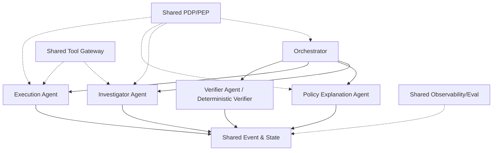

每个 Agent 不应自行复制：

- Secret；
- 审批逻辑；
- 工具适配器；
- 审计格式；
- 成本计算；
- 用户身份状态。

## 18.3 委派契约

```yaml
delegation:
  delegation_id: del_017
  parent_run_id: run_01J...
  child_agent: payment-investigator
  objective: 找出重复扣款候选，不执行写操作
  inputs:
    account_id: acct_9
    time_window: 2026-08-30
  allowed_tools:
    - order.search
    - payment.list_charges
  denied_tools:
    - payment.create_refund
  output_schema: DuplicateChargeInvestigationV2
  budget:
    max_turns: 4
    max_tool_calls: 6
    max_cost_usd: 0.20
  deadline: 2026-08-31T10:10:00Z
  return_evidence: required
```

委派必须包含目标、边界、预算、工具权限、输出 Schema 和证据要求。

## 18.4 协调税

多 Agent 增加：

- 消息和上下文复制；
- 状态同步；
- 冲突解决；
- 死锁和循环；
- 责任归因；
- 额外模型调用；
- 跨 Agent Prompt Injection；
- 评测组合爆炸。

建议监控：

```text
CoordinationTax = MultiAgentCost - EquivalentSingleAgentCost
CoordinationDelay = MultiAgentLatency - CriticalPathWork
UsefulParallelism = ParallelUsefulWork / TotalParallelWork
```

## 18.5 Coding Agent 的完整交付闭环


“代码写完”只处于中间位置。

## 18.6 Coding Agent 必须保留的证据

- 基线 Commit；
- 工作树和分支；
- 需求、非目标和验收标准；
- Repo Map 与关键符号；
- 计划及变更原因；
- 修改文件清单；
- 命令、退出码和测试范围；
- 未运行测试及原因；
- Diff 摘要；
- 静态检查和安全扫描；
- Reviewer 意见及修复；
- 最终 Commit/PR；
- 发布和回滚入口。

## 18.7 Coding Agent 的权限边界

默认不应允许：

- 直接修改受保护分支；
- 读取无关 Secret；
- 任意访问公网；
- 绕过 pre-commit 与 CI；
- 删除大量文件而无审批；
- 修改权限策略并自行批准；
- 在未展示 Diff 时推送生产；
- 把测试失败解释为“与本次无关”后继续合并。

## 18.8 多 Agent 的终止机制

除每个子 Agent 的预算外，编排层还要限制：

- 最大活跃 Agent 数；
- 最大消息数；
- 最大委派深度；
- 同一任务重复委派；
- 图回边次数；
- 总成本和总截止时间；
- 冲突解决轮次。

当两个 Agent 意见冲突时，不应无限辩论，应调用确定性证据、Verifier 或人工裁决。

---

# 19. 数据回流与训练通路：轨迹不是天然训练数据

## 19.1 一条轨迹包含什么

```text
User Request
→ Context Manifest
→ Model Decisions
→ Tool Proposals
→ Policy Decisions
→ Tool Results
→ Approval Decisions
→ Verification Evidence
→ Final Response
→ Business Outcome
→ Later Corrections
```

轨迹很有价值，但也可能包含错误推理、敏感数据、旧政策、偶然成功和用户噪声。

## 19.2 数据回流流水线

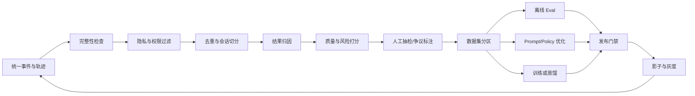

## 19.3 四道数据闸门

### 第一闸：合法可用

- 是否具有对应用途授权；
- 是否含个人或机密数据；
- 是否满足保留和删除要求；
- 是否允许用于训练，而不只是审计。

### 第二闸：事实完整

- 轨迹是否缺事件；
- 外部结果是否已验证；
- 是否知道最终业务结果；
- 是否存在延迟纠错。

### 第三闸：质量可信

- 成功是否由偶然外部条件造成；
- 失败是否来自模型而非依赖故障；
- 人工修复是否已标明；
- 标签是否多人一致。

### 第四闸：防污染

- 不把模型自己的错误答案当标准答案；
- 不让评测 Holdout 泄漏到训练；
- 不让攻击样本中的恶意指令进入系统 Prompt；
- 不让旧政策轨迹训练出过时行为。

## 19.4 成功轨迹不一定是好轨迹

一次任务最终成功，可能经历：

- 五次无效工具调用；
- 一次越权尝试被拦截；
- 人工悄悄修正参数；
- 上游恰好容忍错误；
- 最后由客服手工完成。

训练时应区分：

```text
Outcome Quality
Process Quality
Safety Quality
Efficiency Quality
```

## 19.5 失败轨迹也有价值

失败轨迹适合用于：

- 建立 Adversarial Eval；
- 学习何时澄清和转人工；
- 改进工具错误处理；
- 识别知识缺口；
- 设计新策略；
- 验证恢复路径；
- 训练拒绝和不确定性表达。

但要先正确归因失败来源。

## 19.6 人类反馈的不同含义

“点赞”可能代表回答礼貌，不代表退款真的成功；“拒绝审批”可能是用户改变主意，不代表 Agent 提案错误。

反馈至少拆为：

- 语言质量；
- 事实正确；
- 任务结果；
- 安全合规；
- 业务偏好；
- 审批决定；
- 后续纠错。

## 19.7 自我改进的安全边界

系统可以自动：

- 聚类 Bad Case；
- 生成候选评测样本；
- 提出 Prompt/Skill 修改；
- 发现无效工具描述；
- 推荐新的策略测试；
- 生成对照实验。

但生产系统不应在没有门禁时自动：

- 修改自己的高风险权限；
- 把未经验证的记忆升级为政策；
- 用线上输出直接训练并立即替换模型；
- 删除安全规则以提高成功率；
- 修改 Eval 使自己更容易过关；
- 绕过人工批准发布自生成代码。

## 19.8 闭环学习的正确表达

```text
Observe
→ Curate
→ Hypothesize
→ Change Candidate
→ Offline Eval
→ Safety Review
→ Shadow
→ Canary
→ Verify Business Outcome
→ Promote or Roll Back
```

这是一条受控工程闭环，不是 Agent 在生产环境中无限制地“自我进化”。

---
# 20. 失败分类、恢复策略与对账机制

Agent 系统最危险的不是失败，而是**把不同失败都当成“再试一次”**。

## 20.1 五层失败分类

### 第一层：用户与业务失败

- 请求含糊；
- 缺少必要信息；
- 业务条件不成立；
- 用户撤回；
- 资源已经由其他渠道处理。

处理方式通常是澄清、解释、结束或转人工，不是技术重试。

### 第二层：模型与决策失败

- 意图误判；
- 工具选错；
- 参数缺失；
- 规划循环；
- 幻觉完成；
- 没有引用证据。

处理方式包括结构化修正、有限重规划、模型路由、Verifier 驳回和评测回流。

### 第三层：控制面失败

- PDP 不可用；
- 策略版本加载失败；
- 审批回调重复；
- 凭证服务异常；
- Feature Flag 不一致；
- 配额数据漂移。

高风险动作通常要 fail-closed。

### 第四层：依赖与工具失败

- 超时、限流、5xx；
- Schema 漂移；
- 上游返回部分成功；
- 写请求结果未知；
- Webhook 丢失；
- 沙箱进程挂死。

处理方式取决于动作语义、幂等与对账能力。

### 第五层：平台与数据失败

- Checkpoint 损坏；
- Event Bus 延迟或丢失；
- 数据库不可用；
- 跨租户路由错误；
- Trace 与审计缺失；
- 版本回滚不完整。

此类问题可能要求停止扩量或关闭写能力。

## 20.2 失败决策矩阵

| 失败 | 是否自动重试 | 是否需要对账 | 是否允许降级 | 是否需人工 |
|---|---:|---:|---:|---:|
| 模型输出 JSON 非法 | 有限 | 否 | 可 | 视次数 |
| 策略明确拒绝 | 否 | 否 | 只读解释 | 可选 |
| 策略服务不可用 | 高风险否 | 否 | 只读可 | 可能 |
| 只读查询超时 | 有界 | 否 | 可 | 少量 |
| 退款调用超时 | 否 | 是 | 暂停通知 | 超时后 |
| 退款业务冲突 | 否 | 是 | 解释 | 视业务 |
| 短信失败 | 有界异步 | 否 | 是 | 通常否 |
| Checkpoint 无法解密 | 否 | 否 | 否 | 是 |
| 审计链不完整 | 不继续高风险写 | 是 | 只读 | 是 |
| 跨租户数据疑似泄漏 | 否 | 是 | 立即隔离 | 是，安全事件 |

## 20.3 对账工作器

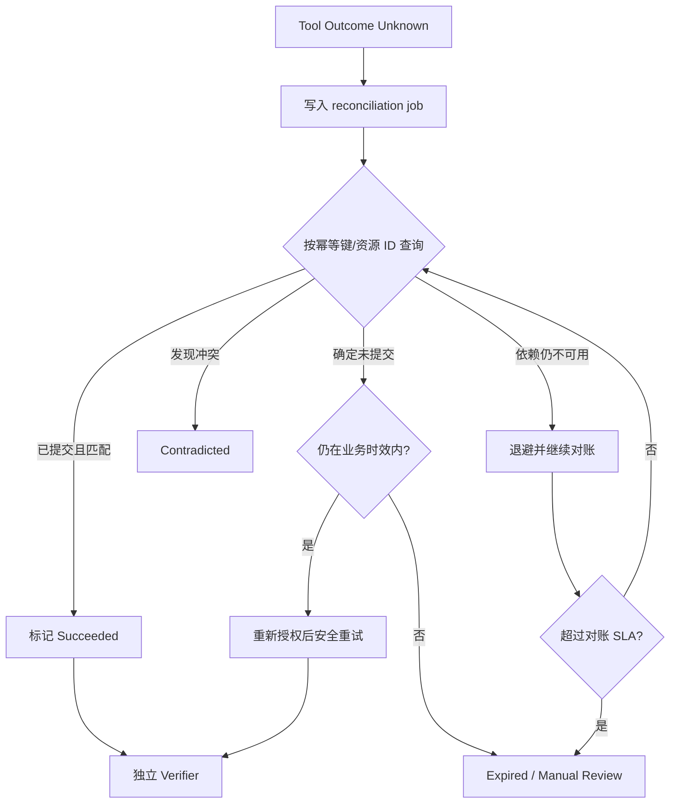

对账任务应拥有自己的：

- 幂等键；
- 最大尝试数；
- 退避和截止时间；
- Owner 与告警；
- 证据引用；
- 最终人工处理队列。

## 20.4 补偿不是数据库回滚

分布式副作用完成后，无法简单回到执行前状态。例如退款已经成功，短信却失败，此时不应“撤销退款”来恢复原子性。

Saga 补偿应基于业务语义：

| 已完成动作 | 后续失败 | 可能补偿 |
|---|---|---|
| 创建工单 | 退款失败 | 更新工单为失败并说明原因 |
| 退款成功 | 短信失败 | 进入通知补发，而不是撤销退款 |
| 文件已写 | 验证失败 | 恢复备份或创建修复变更 |
| PR 已创建 | CI 失败 | 标记阻塞并附失败证据 |
| 权限临时提升 | 任务结束 | 立即撤销临时授权 |

补偿本身也需要幂等、策略和审计。

## 20.5 熔断与降级

### 模型供应商异常

可降级为：

- 备用模型；
- 只读查询；
- 固定流程；
- 排队稍后处理；
- 转人工。

但切换模型必须考虑行为差异和已验证能力范围。

### 策略服务异常

- 高风险写：拒绝或挂起；
- 低风险读：仅在本地可验证缓存策略仍有效时有限放行；
- 管理操作：拒绝；
- 记录安全级告警。

### Event/Audit 异常

如果无法可靠记录高风险副作用证据，应暂停该类动作。不能“先退款，日志以后补”。

### RAG 异常

可以明确退化到：

- 权威固定政策；
- 请求用户提供材料；
- 转人工；
- 回答“不具备足够信息”。

不能用模型参数知识伪装成最新企业政策。

## 20.6 故障后的用户语义

| 系统状态 | 对用户的合适表达 |
|---|---|
| 可安全重试的读取失败 | “暂时无法查询，正在重试” |
| 写结果未知 | “请求状态暂未确认，系统会先核对，避免重复操作” |
| 策略拒绝 | “当前条件不允许自动执行，原因是……” |
| 审批过期 | “确认已过期，需要重新核对当前信息” |
| 转人工 | “自动系统无法在安全边界内确认，已转交人工处理” |
| 核心成功、通知失败 | “退款已确认，短信发送暂时失败，不影响退款本身” |

## 20.7 事故复盘必须区分触发因素与系统缺陷

例如上游支付超时是触发因素，但以下才可能是系统缺陷：

- 没有 `OUTCOME_UNKNOWN` 状态；
- 自动重试创建了第二笔退款；
- 没有幂等键；
- 没有对账工具；
- 告警没有 Owner；
- 用户被错误告知“退款失败”；
- 评测集没有覆盖写超时。

复盘目标不是找到“谁写错一行代码”，而是让同类事故结构性地更难发生。

---

# 21. 生产就绪评审：上线前必须回答的十二组问题

生产就绪评审（Production Readiness Review，PRR）不应只在发布前一天填表，而应从设计阶段持续积累证据。

## 21.1 一、业务与范围

- [ ] 目标用户和业务价值是否明确？
- [ ] 自动化边界与非目标是否明确？
- [ ] 哪些情况必须澄清、拒绝或转人工？
- [ ] “成功”是否由外部业务结果定义？
- [ ] 失败、降级和部分成功的用户语义是否明确？
- [ ] 业务 Owner 是否接受剩余风险？

## 21.2 二、任务与状态模型

- [ ] Session、Run、Turn、Step、Tool Call 是否分层？
- [ ] 状态机和允许迁移是否有文档与测试？
- [ ] 所有循环是否有预算和终止条件？
- [ ] 取消、过期、挂起、恢复是否有明确语义？
- [ ] `OUTCOME_UNKNOWN` 是否独立于成功和失败？
- [ ] 终态是否由 Completion Contract 计算？

## 21.3 三、数据与上下文

- [ ] 每类数据的权威源、用途和保留期是否明确？
- [ ] Context Manifest 是否可重建每轮输入？
- [ ] 是否执行租户和用户 ACL？
- [ ] PII 和 Secret 是否最小化？
- [ ] 长期记忆是否可查看、纠正、删除？
- [ ] 检索结果是否带来源、版本和生效时间？
- [ ] 是否测试 Prompt Injection 与知识投毒？

## 21.4 四、模型与 Prompt

- [ ] 模型路由和回退策略是否版本化？
- [ ] Prompt、Skill、Hook 的职责边界是否清晰？
- [ ] 结构化输出是否经过 Schema 校验？
- [ ] 模型供应商变化是否触发评测？
- [ ] 模型不可用时是否有安全降级？
- [ ] 是否禁止模型接触长期生产凭证？

## 21.5 五、工具与外部系统

- [ ] 每个工具是否有 Owner、Schema、版本与副作用等级？
- [ ] 写操作是否具有业务幂等键？
- [ ] 超时后能否对账？
- [ ] 重试策略是否按错误分类，而非统一重试？
- [ ] 工具权限是否最小化？
- [ ] MCP/插件来源和工具描述是否受信任治理？
- [ ] 外部 Schema 漂移是否有契约监控？

## 21.6 六、安全、权限与审批

- [ ] 是否存在独立 PDP 与真实 PEP？
- [ ] 高风险动作是否默认 `ask` 或 `deny`？
- [ ] 策略服务故障是否 fail-closed？
- [ ] 审批是否绑定参数摘要和有效期？
- [ ] 审批界面是否展示足够证据？
- [ ] 是否防止审批重放和秒批疲劳？
- [ ] 是否有紧急撤权和 Kill Switch？
- [ ] 是否完成威胁建模和安全测试？

## 21.7 七、可靠性与恢复

- [ ] Checkpoint 是否持久、加密、版本化？
- [ ] 恢复前是否重新授权和对账？
- [ ] 重复事件和重复回调是否幂等？
- [ ] 依赖故障是否有熔断和降级？
- [ ] 沙箱进程能否有界终止？
- [ ] 备份是否实际恢复过？
- [ ] 是否演练控制面、Broker、模型和工具故障？

## 21.8 八、可观测与审计

- [ ] Run、Turn、Tool、Approval、Verifier 是否可关联？
- [ ] Trace、Metric、Log、Event、Audit 是否职责分明？
- [ ] 高风险动作审计完整率是否为硬门禁？
- [ ] 是否能从业务指标下钻到具体轨迹？
- [ ] 是否有数据脱敏和访问审计？
- [ ] 事件缺失、Outbox 积压和 Schema 拒绝是否告警？
- [ ] 是否能在不重放副作用的情况下回放事实？

## 21.9 九、质量与评测

- [ ] 是否有 Golden、Edge、Adversarial、Incident、Holdout 集？
- [ ] 关键场景是否多次运行评估稳定性？
- [ ] 安全硬门禁是否不能被平均分抵消？
- [ ] Judge 是否与人工标注校准？
- [ ] 每个变更是否能归因到完整版本指纹？
- [ ] 线上 Bad Case 是否进入评测而非直接训练？
- [ ] 灰度是否比较业务结果而非只比较文本分数？

## 21.10 十、性能与成本

- [ ] 是否监控每个已验证成功任务的成本？
- [ ] 等待时间和主动执行时间是否分开？
- [ ] 是否有租户与场景预算？
- [ ] 是否存在排队和背压策略？
- [ ] 缓存是否遵守租户、权限和版本边界？
- [ ] 容量测试是否覆盖峰值和降级场景？
- [ ] 超预算时是否有诚实收尾路径？

## 21.11 十一、发布、回滚与迁移

- [ ] 发布制品是否可复现并可验证来源？
- [ ] 代码、Prompt、策略、工具、模型、索引是否统一指纹？
- [ ] 数据库与 Checkpoint Schema 是否向前/向后兼容？
- [ ] 是否可独立回滚 Prompt 或策略？
- [ ] 灰度 Cohort 和停止条件是否预先定义？
- [ ] Kill Switch 是否经过演练？
- [ ] 回滚后是否验证行为真的恢复？

## 21.12 十二、运营与组织

- [ ] 每个告警是否有 Owner 和 Runbook？
- [ ] 一线、二线、领域、安全和供应商升级路径是否明确？
- [ ] 值班人员是否完成演练并可访问所需工具？
- [ ] 是否定义 SLO、误差预算和复盘节奏？
- [ ] 变更审批和紧急变更流程是否明确？
- [ ] 数据、模型、策略、工具和业务是否各有长期 Owner？
- [ ] 建设团队离场后，接收团队是否签署运营验收？

## 21.13 PRR 输出不应只有“通过/不通过”

建议输出：

```yaml
prr_result:
  decision: conditional_go
  approved_scope:
    tenants: [internal_dogfood]
    use_cases: [duplicate_charge_refund_under_500]
    channels: [web]
  blocked_capabilities:
    - batch_refund
    - unattended_cli
  conditions:
    - complete_policy_outage_game_day
    - close_checkpoint_migration_p1
  rollback_owner: platform_oncall
  business_owner: customer_ops
  review_expiry: 2026-09-15
```

生产批准必须绑定范围，不能把一个场景的通过泛化成整个平台的无限授权。

---

# 22. 测试与演练：不仅验证正常路径，也验证刹车

## 22.1 测试矩阵

| 层级 | 重点 | 典型工具/方法 |
|---|---|---|
| 单元 | 状态迁移、金额、策略、Schema | 纯函数测试、属性测试 |
| 契约 | 工具、事件、外部 API | Consumer-driven contract |
| 组件 | Context、Gateway、Verifier | 固定 Fixture、Mock Server |
| 集成 | DB、Broker、PDP、Checkpoint | 临时环境、容器化依赖 |
| 端到端 | 用户任务到外部状态 | 沙盒业务系统、合成账户 |
| 安全 | 注入、越权、凭证、租户隔离 | 红队、模糊测试、策略测试 |
| 韧性 | 超时、重复、乱序、宕机 | Fault Injection / Chaos |
| 性能 | 并发、长会话、峰值 | Load / Soak / Stress |
| 灰度 | 真实分布与行为差异 | Shadow / Canary |

## 22.2 正常路径之外必须测什么

- 模型输出非法 JSON；
- 模型请求不存在的工具；
- 工具返回与 Schema 不一致；
- PDP 超时；
- 审批拒绝、过期、撤回和重复回调；
- Checkpoint 写到一半进程崩溃；
- Resume 同时到达两次；
- 写请求已提交但响应丢失；
- Verifier 发现执行结果矛盾；
- Event Broker 延迟和重复；
- Secret 服务不可用；
- 取消与工具完成竞态；
- 模型供应商中途断流；
- 长期记忆包含恶意指令；
- RAG 返回跨租户候选；
- 沙箱子进程拒绝退出。

## 22.3 属性测试适合验证系统不变量

例如：

```text
对于任意重复的 CreateRefund 命令，外部有效退款数不超过 1。
对于任意状态序列，未授权 Tool Call 永远不会进入 Dispatched。
对于任意 Resume 重复事件，同一 Run 最多一个执行者进入 Running。
对于任意终态 Run，预算消耗不会再增加。
对于任意租户 A 的 Context，不能出现租户 B 的资源引用。
```

属性测试比只写几个示例更能覆盖组合边界。

## 22.4 故障注入点

建议在关键步骤提供受控注入：

- 模型调用前/后；
- Outbox 提交前/后；
- 审批创建后但绑定前；
- 工具分发前/后；
- 上游已提交但响应前；
- Checkpoint 加密后但写入前；
- Run 状态 CAS 前/后；
- Verifier 查询前/后；
- 通知入队后但 Ack 前。

每个注入点都验证系统最终是否收敛到一致状态。

## 22.5 Game Day 场景

### 场景 A：策略服务全不可用

预期：

- 高风险写立即停止；
- 低风险读按预定策略降级；
- 有明确告警和用户语义；
- 无静默放行；
- 恢复后积压任务重新授权。

### 场景 B：支付系统写超时

预期：

- 进入 `OUTCOME_UNKNOWN`；
- 不自动再次创建退款；
- 对账任务启动；
- 用户收到诚实状态；
- SLA 超时后升级人工。

### 场景 C：Event Bus 延迟 20 分钟

预期：

- Outbox 保留事实；
- 高风险动作按证据策略停止或限流；
- 恢复后重复事件被去重；
- 仪表盘明确显示数据延迟；
- 不把“无事件”误判为“无问题”。

### 场景 D：新 Prompt 导致工具调用翻倍

预期：

- 评测门禁或灰度指标捕获；
- 成本和延迟告警；
- 能独立回滚 Prompt；
- 已创建 Run 使用明确的版本策略；
- Bad Case 进入回归集。

### 场景 E：Checkpoint Schema 不兼容

预期：

- 新实例不静默丢字段；
- 不兼容 Run 进入隔离队列；
- 可回滚到旧 Runtime 或执行迁移；
- 用户任务不会重复产生副作用。

## 22.6 测试证据包

每次候选发布应保存：

```yaml
verification_bundle:
  release_fingerprint: sha256:...
  source_commit: abc123
  build_id: build_20260831_017
  suites:
    unit: {passed: 4180, failed: 0}
    contract: {passed: 182, failed: 0}
    integration: {passed: 96, failed: 0}
    e2e: {passed: 64, failed: 0}
    adversarial: {passed: 211, failed: 0}
  eval_report: eval://refund-suite/run_910
  security_report: scan://build_20260831_017
  game_days:
    - policy_outage@2026-08-29
    - refund_timeout@2026-08-30
  known_gaps:
    - sms_provider_secondary_route_not_tested
```

## 22.7 测试环境要避免“假安全”

Mock 若永远返回理想结果，就无法验证真实边界。测试环境应支持：

- 延迟和乱序；
- 同一幂等键的重复请求；
- 部分失败；
- 异步状态变化；
- 旧 Schema；
- 限流和配额；
- 权限不足；
- 数据竞争；
- 随机网络中断。

同时禁止测试 Agent 使用真实生产凭证和真实用户联系方式。

---

# 23. 渐进发布：从影子流量到全量开放

## 23.1 推荐发布阶梯


每一级都有进入条件、观察窗口、停止条件和回滚 Owner。

## 23.2 Shadow 阶段

新版本可以：

- 接收真实输入副本；
- 构建上下文；
- 生成计划和工具提案；
- 在模拟工具中运行；
- 与当前版本比较；
- 记录成本和延迟。

但不能：

- 产生真实退款；
- 发送真实短信；
- 修改长期记忆；
- 创建真实工单；
- 对用户显示未经批准的结果。

## 23.3 Canary Cohort 设计

不要只随机抽 1%。还要考虑：

- 租户类型；
- 业务金额和风险；
- 地区与语言；
- 渠道；
- 新老用户；
- 上游系统版本；
- 是否有人工支持覆盖。

初始 Canary 应优先选择低风险、可恢复、可人工兜底的范围。

## 23.4 停止扩量条件

发布前预先定义，例如：

```yaml
stop_conditions:
  immediate:
    unauthorized_high_risk_action: "> 0"
    cross_tenant_data_exposure: "> 0"
    duplicate_financial_side_effect: "> 0"
    audit_missing_high_risk: "> 0"
  automatic_pause:
    verified_success_drop: "> 2% for 15m"
    outcome_unknown_rate: "> 0.5% for 10m"
    cost_per_success_increase: "> 20% for 30m"
    approval_rejection_increase: "> 15% relative"
    checkpoint_resume_failure: "> 0.2%"
```

关键风险条件一旦触发，不应等待会议决定是否暂停。

## 23.5 Kill Switch 分级

| 级别 | 效果 |
|---|---|
| L1 | 禁用单个工具或 MCP Server |
| L2 | 禁用某类写操作，只保留读取 |
| L3 | 禁用某个 Agent/Skill/Prompt 版本 |
| L4 | 禁用某租户或渠道的自动执行 |
| L5 | 全局停止所有 Agent 副作用，仅保留人工入口 |

Kill Switch 要：

- 权限严格；
- 多区域传播；
- 有生效确认；
- 有审计；
- 可演练；
- 默认不会被普通配置缓存长期遮蔽。

## 23.6 回滚不是只回滚容器镜像

完整回滚可能涉及：

- 代码；
- Prompt；
- Policy；
- Tool Catalog；
- 模型路由；
- Feature Flag；
- RAG 索引；
- 事件 Schema；
- 数据库迁移；
- Checkpoint 解释器。

回滚后必须再次运行一组 Smoke Eval，证明行为恢复，而不是只看 Pod 已启动。

## 23.7 在途 Run 的版本策略

可选择：

1. **Sticky**：Run 从创建到完成固定版本；
2. **Compatible Upgrade**：仅在明确兼容时升级；
3. **Drain and Replace**：停止新流量，等待旧 Run 排空；
4. **Forced Migration**：高风险修复时迁移或终止旧 Run。

不可让挂起数小时的 Run 在恢复时无提示地使用完全不同的策略和工具语义。

## 23.8 发布后的观察窗口

观察不仅看错误率，还要看：

- 真实完成证据；
- 退款和订单对账；
- 人工拒绝和接管；
- 用户重复咨询；
- 长尾语言；
- 成本分位数；
- Tool Call 数量；
- 未知结果；
- 审计完整性；
- 新错误聚类。

---

# 24. Runbook：让告警不再只能找“最懂的人”

## 24.1 Runbook 标准模板

```markdown
# 告警名称

## 影响
- 哪些用户、租户、场景和数据可能受影响

## 触发条件
- 指标、阈值、持续时间和告警链接

## 首要安全动作
- 是否停止写操作、禁用工具或隔离租户

## 诊断步骤
1. 查看……
2. 对比……
3. 查询……

## 恢复步骤
1. ……
2. ……

## 验证
- 如何证明业务状态和系统状态已恢复

## 升级路径
- L1 / L2 / 领域 / 安全 / 供应商联系人

## 沟通模板
- 内部状态、用户通知和事故频道

## 事后动作
- Bad Case、评测、代码、策略和文档更新
```

## 24.2 Runbook：策略服务不可用

**首要动作**：确认高风险写操作已经 fail-closed；必要时启用 L2 Kill Switch。

诊断：

1. 检查 PDP 可用性、延迟和错误码；
2. 检查策略包加载和签名；
3. 检查调用方是否使用过期缓存；
4. 检查多区域状态是否一致；
5. 抽查 Tool Gateway 是否存在绕过调用。

恢复：

1. 恢复健康 PDP；
2. 验证策略版本和测试摘要；
3. 对积压 Run 重新评估策略；
4. 不直接重放已过期批准；
5. 逐步恢复写流量。

验证：

- 新请求得到正确 `allow/ask/deny`；
- 被暂停的高风险调用没有泄漏；
- 审计记录完整；
- 关键策略测试通过。

## 24.3 Runbook：退款调用超时、结果未知

首要原则：**禁止直接重试退款。**

步骤：

1. 按 `idempotency_key` 查询支付系统；
2. 按 `charge_id + amount + case_id` 交叉查询；
3. 检查上游 Webhook 和异步队列；
4. 若已提交，进入 Verifier；
5. 若明确未提交，重新检查策略、余额和时效后执行；
6. 无法确认时进入人工财务队列；
7. 向用户说明正在核对，不宣告失败或成功。

## 24.4 Runbook：Event/Audit 积压

首要动作：

- 判断业务状态和事件是否同事务 Outbox；
- 若高风险动作无法形成可靠证据，暂停该类动作。

诊断：

- Outbox 行数和最老年龄；
- Broker Producer/Consumer Lag；
- 死信和 Schema 拒绝；
- Payload Store 可用性；
- 消费者去重表和数据库锁。

恢复后验证：

- 事件按 ID 重放且无重复业务结果；
- Run 终态与审计终态一致；
- 仪表盘注明历史数据回补窗口。

## 24.5 Runbook：Prompt/模型回归

症状：工具调用数上升、成功率下降、拒绝或人工接管异常。

处理：

1. 锁定受影响的完整版本指纹；
2. 暂停扩量；
3. 影子重放 Incident 与 Fresh 样本；
4. 判断是 Prompt、模型解析、路由还是 Context 变化；
5. 独立回滚相应组件；
6. 运行 Smoke Eval；
7. 对已受影响的高风险 Run 做审计和对账。

## 24.6 Runbook：记忆或知识库投毒

首要动作：

- 禁用可疑数据源或索引版本；
- 停止自动记忆写入；
- 对高风险场景切换权威固定源。

后续：

- 找出受影响文档、Chunk、Memory 和 Run；
- 清理派生索引与缓存；
- 检查是否进入训练/评测数据；
- 重建索引并验证来源；
- 通知数据和安全 Owner；
- 加入攻击回归集。

## 24.7 Runbook：审批积压

检查：

- 是否因策略误配置导致所有动作都需审批；
- 审批渠道是否可用；
- Approver 角色和排班；
- 是否存在重复审批；
- 秒批率与拒绝率；
- 即将过期数量。

可采取：

- 优先低时效任务；
- 合并同一业务意图但保持参数清晰；
- 增派审批人；
- 对低风险规则进行经过评审的自动化；
- 不得为了清空积压批量无差别批准。

## 24.8 Runbook：Checkpoint 不兼容

1. 停止新版本继续恢复旧快照；
2. 标记受影响 Schema 范围；
3. 判断可否纯函数迁移；
4. 在副本上验证迁移摘要；
5. 不可迁移时回滚 Runtime 或转人工；
6. 对在途高风险动作先对账；
7. 验证没有重复副作用；
8. 更新兼容性测试。

## 24.9 Runbook 的验收标准

Runbook 只有在以下条件成立时才算可用：

- 非原作者能执行；
- 链接、权限和命令真实有效；
- 有清晰的停止条件；
- 有业务恢复验证；
- 演练过；
- 最近一次验证日期可见；
- 变更后自动提醒 Owner 更新。

---

# 25. 移交与运营：交付代码只是开始

## 25.1 五类移交包

### 一、产品与业务包

- 场景、用户与价值；
- 自动化边界；
- 完成契约；
- 风险接受；
- 用户沟通模板；
- 人工兜底流程。

### 二、架构与设计包

- 总体架构；
- 数据流和信任边界；
- 状态机；
- 事件和工具契约；
- ADR；
- 容量与故障模型。

### 三、安全与合规包

- 威胁模型；
- 权限矩阵；
- 策略包与测试；
- 数据分类和保留；
- 审计设计；
- 安全例外和到期日。

### 四、质量与发布包

- Eval 集和报告；
- 测试证据；
- 灰度计划；
- 停止条件；
- 回滚步骤；
- 已知问题。

### 五、运营包

- SLO 和 Dashboard；
- 告警与 Owner；
- Runbook；
- 值班和升级路径；
- Game Day 记录；
- 供应商和依赖清单。

## 25.2 RACI 示例

| 能力 | Responsible | Accountable | Consulted | Informed |
|---|---|---|---|---|
| 业务完成契约 | 产品/领域工程 | 业务 Owner | 平台、运营 | 客服 |
| Agent Runtime | 平台工程 | 平台负责人 | SRE、安全 | 业务团队 |
| 退款策略 | 风控/领域 | 风控 Owner | 安全、法务 | 平台 |
| 工具适配器 | 集成团队 | 领域技术负责人 | 上游系统 Owner | SRE |
| Eval 与门禁 | AI 质量团队 | AI 平台负责人 | 领域、安全 | 发布经理 |
| 生产值班 | SRE/运营 | 服务 Owner | 平台、领域 | 管理层 |
| 事故响应 | Incident Commander | 服务 Owner | 安全、业务、供应商 | 相关方 |

`Accountable` 必须是明确的人或角色，不能写“项目组”。

## 25.3 运营验收

接收团队应实际完成：

- 访问生产 Dashboard；
- 执行一次 Kill Switch；
- 恢复一个 Checkpoint；
- 处理一个模拟未知退款；
- 回滚一个 Prompt 版本；
- 查找一条完整审计链；
- 使用 Runbook 处理告警；
- 知道如何升级领域、安全和供应商问题。

看过培训录像不等于具备运营能力。

## 25.4 SLO 与误差预算治理

当误差预算消耗过快时，团队应预先约定：

- 暂停新功能；
- 降低灰度比例；
- 加强人工闸门；
- 优先修复可靠性；
- 调低风险范围；
- 重新评估模型或供应商。

否则 SLO 只是一块展示板。

## 25.5 例行运营节奏

### 每日

- 关键业务与安全指标；
- 未知结果和人工积压；
- 新 P0/P1 Bad Case；
- 供应商和工具异常。

### 每周

- 成本、成功率和分布漂移；
- 审批体验；
- Eval 回归；
- Runbook 和告警噪声；
- 新错误聚类。

### 每月

- SLO 与误差预算；
- 权限复核；
- 记忆和知识治理；
- 模型/策略/工具版本淘汰；
- Game Day；
- 风险接受到期项。

### 每季度

- 威胁模型更新；
- 容量和供应商演练；
- 灾难恢复；
- 数据使用和保留审计；
- 业务范围再认证。

## 25.6 已知问题账本

每个已知缺口记录：

```yaml
known_issue:
  id: KI-027
  title: secondary_sms_route_not_covered
  severity: medium
  affected_scope: notification_only
  user_impact: 主任务完成但通知可能延迟
  mitigation: primary_route_retry_and_in_app_notice
  owner: messaging-team
  due_date: 2026-09-30
  release_blocking: false
  accepted_by: customer-ops-owner
```

风险不能只存在于某次会议的口头记忆中。

## 25.7 事故复盘回流

每次重要事故至少产生：

- 一个系统性修复；
- 一个监控或告警改进；
- 一个回归评测样本；
- 一个 Runbook 更新；
- 一项责任或流程改进；
- 对受影响数据和用户的处置记录。

只修代码而不更新 Eval 和运营机制，同类问题仍会以新形式回来。

---

# 26. 发布工程：Tag、README、变更账本与制品证据

## 26.1 一个 Agent 发布包含哪些东西

```text
Agent Release
├── Application binaries / containers
├── Prompt & Skill bundle
├── Policy bundle
├── Tool catalog & schemas
├── Model routing configuration
├── RAG index manifest
├── Event schemas
├── Checkpoint schema & migrators
├── Eval suite & thresholds
├── Dashboard / Alert / Runbook version
└── Supply-chain evidence
```

只有容器 Tag，不足以标识真实行为版本。

## 26.2 发布清单

```yaml
release_manifest:
  release_id: refund-agent-2026.08.31.1
  release_fingerprint: sha256:...
  source:
    repository: awesome-agent-runtime
    commit: abc123
    tree_clean: true
  artifacts:
    runtime_image: registry/agent-runtime@sha256:...
    prompt_bundle: prompt://refund-agent/4.3.1
    policy_bundle: policy://refund/2026.08.4
    tool_catalog: tools://catalog/57
    model_route: model-route://prod/18
    rag_index: rag://refund-policy/2026-08-30
    event_schema: schema://agent-events/3
    checkpoint_schema: 5
  verification:
    test_bundle: verify://build_20260831_017
    eval_report: eval://refund-suite/run_910
    security_report: scan://build_20260831_017
  rollout:
    initial_scope: internal_dogfood
    stop_policy: stop-policy@7
    rollback_release: refund-agent-2026.08.20.3
```

## 26.3 Git Tag 与变更日志

Tag 应指向可复现 Commit，并签名或保留可信构建证据。

变更日志不要只写“优化 Agent 效果”，而应说明：

- 用户可见变化；
- 行为与权限变化；
- Prompt/模型/工具变化；
- 数据和迁移；
- 评测变化；
- 已知风险；
- 回滚限制。

示例：

```markdown
## Changed
- 重复扣款识别从金额+时间升级为订单义务+支付意图联合判断。
- 退款调用超时不再自动重试，新增幂等键对账流程。

## Security
- 所有退款必须绑定参数摘要审批；策略不可用时 fail-closed。

## Operations
- 新增 ToolOutcomeUnknown 告警和退款对账 Runbook。

## Compatibility
- Checkpoint schema v4 可自动迁移至 v5；v3 需旧 Runtime 恢复。
```

## 26.4 README 应回答什么

顶层 README 至少包括：

- 项目解决的问题；
- 适用和不适用场景；
- 快速开始；
- 架构图；
- 模块地图；
- 安全模型；
- 开发、测试与评测；
- 配置与 Secret；
- 发布与回滚；
- 运维入口；
- 贡献规范；
- 许可证和支持范围。

对教程型仓库，还应明确：

- 章节主线；
- 示例边界；
- 深读扩展版位置；
- 代码与正文的同步程度；
- 推荐阅读顺序。

## 26.5 ADR 和变更账本

重要设计决策记录：

```markdown
# ADR-027：高风险工具结果未知时禁止直接重试

## Context
退款 API 超时无法证明请求是否提交。

## Decision
引入 OUTCOME_UNKNOWN 和独立 reconciliation worker。

## Consequences
- 增加状态和对账工具；
- 降低重复退款风险；
- 用户可能暂时看到“核对中”。

## Alternatives Rejected
- 统一指数退避重试：无法避免已经提交后的重复副作用。
```

ADR 保存“为什么”，代码保存“怎么做”。

## 26.6 软件供应链证据

至少考虑：

- 锁定依赖版本；
- SBOM；
- 漏洞扫描；
- 构建来源和制品摘要；
- 签名与验证；
- 最小化构建权限；
- MCP Server、插件和模型供应商清单；
- Prompt/Policy 制品完整性；
- 紧急撤销机制。

## 26.7 发布完成的定义

```text
ReleaseDone =
  ArtifactBuilt
  AND ProvenanceVerified
  AND TestsPassed
  AND EvalGatePassed
  AND SecurityReviewed
  AND MigrationProven
  AND RunbookUpdated
  AND RolloutObserved
  AND BusinessOutcomeVerified
  AND OwnershipAccepted
```

Tag 推送成功只是其中一步。

---
# 27. 如果重来一次：正确的建设顺序

原章提出三个非常重要的经验：**事件更早、评测更早、策略更早；单 Agent 先于多 Agent；功能闭环先于成本优化。**

扩展成工程路线，可以得到下面的建设顺序。

## 27.1 第零阶段：先定义不可妥协的契约

在写 Agent Loop 前先完成：

- 一个真实业务场景；
- 任务完成契约；
- 高风险副作用清单；
- 主体、动作、资源的权限模型；
- Run 和 Tool Call 状态机；
- 最小事件信封；
- 一组 Golden 与 Adversarial 样本；
- 终止预算。

这不是“大平台先行”，而是先把未来最难补的边界钉住。

## 27.2 第一阶段：做一个只读纵向切片

目标：从真实用户请求到真实企业只读数据，再到有证据的回答。

必须具备：

- 身份与租户；
- Context Manifest；
- 一到两个只读工具；
- Tool Gateway；
- Trace 与事件；
- 引用来源；
- 终止条件；
- 离线 Eval。

此时不急着加入长期记忆、多 Agent 和自动写操作。

## 27.3 第二阶段：加入第一个受控写动作

选择：

- 业务价值明确；
- 范围小；
- 可验证；
- 有幂等和对账；
- 有人工兜底的动作。

补齐：

- PDP/PEP；
- `allow/ask/deny`；
- Approval；
- 参数摘要；
- Checkpoint/Resume；
- Verifier；
- 审计与 Kill Switch。

第一个写闭环成功，比同时接十个只读工具更能检验平台架构。

## 27.4 第三阶段：把 Runtime 做成可恢复系统

加入：

- 持久状态机；
- CAS 与命令幂等；
- 取消和截止时间；
- 事件 Outbox；
- 依赖熔断；
- `OUTCOME_UNKNOWN`；
- 对账与补偿；
- Checkpoint Schema 演进。

这一阶段的目标是“进程死掉，业务事实仍然清楚”。

## 27.5 第四阶段：建立质量与发布控制

- 分层 Eval；
- Incident 回归集；
- 完整版本指纹；
- PR/CI 门禁；
- 影子流量；
- Canary 和停止条件；
- 回滚演练；
- 业务结果 Dashboard。

从此以后，Prompt 和策略不再是“线上直接改一下”。

## 27.6 第五阶段：企业集成与运营

- SSO/OBO；
- 数据与 ACL；
- 现有工单、审批和审计；
- SLO、告警、Runbook；
- 值班和升级路径；
- 合规与保留；
- PRR 与运营验收。

真正的上线发生在接收团队具备运营能力之后。

## 27.7 第六阶段：性能和成本优化

先基于真实轨迹找瓶颈，再做：

- 模型分层路由；
- Prompt Cache；
- 检索和上下文压缩；
- 并行只读工具；
- 批处理；
- 共享服务；
- 资源自动伸缩。

不要在任务正确性尚未稳定时，用小模型和激进压缩掩盖问题。

## 27.8 第七阶段：多 Agent 与自适应改进

只有当单 Agent 的状态、工具、策略、事件和评测稳定后，才引入：

- 角色化分工；
- 图编排；
- 独立 Reviewer/Verifier；
- 跨任务记忆；
- Bad Case 自动聚类；
- Prompt/Skill 候选生成；
- 训练与蒸馏。

这些能力必须复用原有控制底座，而不是重新开一套“自主系统”。

## 27.9 推荐路线图

```mermaid
flowchart LR
    A[契约与边界] --> B[只读纵向切片]
    B --> C[一个受控写闭环]
    C --> D[持久 Runtime 与恢复]
    D --> E[Eval 与发布门禁]
    E --> F[企业接入与运营]
    F --> G[性能成本优化]
    G --> H[多 Agent]
    H --> I[受控自适应改进]
```

## 27.10 最容易走错的顺序

```text
先做炫目的多 Agent
→ 接几十个工具
→ 允许自动执行
→ 线上发现无法追踪
→ 再补日志
→ 出现越权后补审批
→ 成本失控后补预算
→ 回归频发后补 Eval
→ 最后发现状态无法恢复
```

这种顺序会让每个后来补上的控制都变成侵入式改造。

正确顺序不是“大而全”，而是：

> **每增加一单位自主能力，同时增加对应的边界、证据、验证与运营能力。**

---

# 28. 成熟度模型：从演示型 Agent 到自适应运营系统

## 28.1 六级成熟度

| 等级 | 名称 | 核心特征 | 典型风险 |
|---|---|---|---|
| L0 | Demo | Prompt + 模型，人工盯场 | 不可复现、无权限边界 |
| L1 | Bounded | 有 Loop、工具、预算和结构化结果 | 仍缺持久恢复和统一策略 |
| L2 | Governed | PDP/PEP、HITL、沙箱、幂等 | 质量与运营可见性不足 |
| L3 | Observable | 事件、Trace、审计、成本、Eval | 能发现问题，但运营可能依赖专家 |
| L4 | Operable | SLO、Runbook、灰度、回滚、值班 | 改进仍以人工分析为主 |
| L5 | Adaptive | 受控数据回流、候选优化和持续复评 | 需严防反馈污染和权限自扩张 |

## 28.2 各维度对比

| 维度 | L0 | L1 | L2 | L3 | L4 | L5 |
|---|---|---|---|---|---|---|
| 执行 | 单次对话 | 有界 Loop | 状态化执行 | 可回放 | 可恢复运营 | 基于反馈优化 |
| 工具 | 手工拼接 | Schema 调用 | Gateway + 策略 | 全链观测 | 熔断、对账、Runbook | 自动发现缺口但受控接入 |
| 权限 | Prompt 自律 | 静态 Allowlist | PDP/PEP/HITL | 审计闭环 | 定期再认证 | 基于风险动态建议 |
| 质量 | 人看结果 | 少量测试 | 安全用例 | Eval 平台 | 灰度与 SLO | 持续数据闭环 |
| 数据 | 聊天记录 | 基础记忆 | ACL 与来源 | 轨迹统一 | 生命周期治理 | 受控训练与主动学习 |
| 组织 | 项目作者 | 开发团队 | 安全/领域参与 | 平台 Owner | 正式值班与责任矩阵 | 持续治理委员会 |

## 28.3 L0 → L1 的退出条件

- 所有循环有界；
- 工具参数结构化；
- 失败不会无限重试；
- 有最小事件和 Trace；
- 有少量代表性 Eval；
- 完成不只看自然语言。

## 28.4 L1 → L2 的退出条件

- 高风险动作经过真实 PEP；
- 凭证不暴露给模型；
- 写操作幂等且可对账；
- 审批可挂起和恢复；
- 沙箱边界经测试；
- 策略故障 fail-closed。

## 28.5 L2 → L3 的退出条件

- 每个 Run 可按 ID 重建因果链；
- Trace、审计和成本共享事实 ID；
- 有独立 Verifier；
- 有系统性 Eval；
- 版本指纹完整；
- 线上 Bad Case 可定位到配置变化。

## 28.6 L3 → L4 的退出条件

- SLO 与误差预算有效；
- 告警有 Owner 和演练过的 Runbook；
- 有 Shadow、Canary、停止与回滚；
- Checkpoint 和灾备恢复已证明；
- 非建设者可以值班；
- 运营团队正式验收。

## 28.7 L4 → L5 的退出条件

- 数据用途和隐私治理成熟；
- 轨迹结果可可靠归因；
- 候选改进与生产发布完全隔离；
- Holdout 和红队集防止自我作弊；
- 自动优化不能扩大权限或修改硬门禁；
- 每次自适应变化仍经过完整 Eval 与灰度。

## 28.8 成熟度不能跨维度“取平均”

一个系统即便观测非常先进，只要高风险写操作仍由 Prompt 自律，就不能称为 L3 或 L4。

成熟度应取关键维度中的最低等级：

```text
SystemMaturity = min(
  execution,
  security,
  verification,
  observability,
  release,
  operations,
  governance
)
```

---

# 29. 三条延伸路径：领域、平台与开放生态

完成基础闭环后，团队通常会走向三条路径。三者可以并行，但资源、组织和成功标准不同。

## 29.1 路径一：领域型 Agent

目标是对一个业务域做深：

- 客服与退款；
- 供应链；
- 法务合同；
- 财务对账；
- 医疗文书；
- 研发交付。

关键能力：

- 领域任务模型；
- 权威数据和政策；
- 专用工具；
- 领域 Verifier；
- 风险分级；
- 业务 SLO；
- 人工协作流程。

成功标准不是“支持多少工具”，而是：

- 真实任务完成率；
- 首次解决率；
- 安全事件；
- 人工负担；
- 单任务成本；
- 业务周期缩短。

## 29.2 路径二：企业 Agent 平台

目标是把共性控制能力产品化：

```text
Runtime
+ Context
+ Tool/MCP Gateway
+ Policy/HITL
+ Event/Checkpoint
+ Observability/Audit
+ Eval
+ Cost
+ Release Governance
```

平台应提供“铺好的道路和护栏”，而不是强迫所有场景使用同一 Prompt 或同一拓扑。

平台产品关注：

- 多租户；
- 配置和版本管理；
- SDK/低代码/高代码接口；
- 工具与 Skill 注册；
- 沙箱；
- 策略模板；
- 评测和观测；
- 门禁与发布；
- 内部开发者体验。

平台成功指标包括：

- 新场景接入时间；
- 共性模块复用率；
- 策略覆盖率；
- 统一事件覆盖率；
- 生产事故下降；
- 平台引入的额外时延和成本；
- 业务团队满意度。

## 29.3 路径三：开放协议与生态

重点包括：

- MCP 等工具互操作协议；
- 开放工具/Skill 包；
- 事件与 Trace 语义约定；
- Eval 数据与 Scorer；
- 策略包；
- 可复用沙箱；
- 供应链签名和验证。

开放生态最大的挑战不是“能接上”，而是：

- 谁发布；
- 版本是否可信；
- 权限如何声明；
- 数据会流向哪里；
- 如何撤销；
- 谁负责漏洞；
- 如何验证真实副作用语义。

因此，协议开放必须与治理开放同步设计。

## 29.4 三条路径的决策矩阵

| 问题 | 领域 Agent | 企业平台 | 开放生态 |
|---|---:|---:|---:|
| 是否有单一高价值场景 | 高 | 中 | 低 |
| 是否有多个团队重复建设 | 中 | 高 | 中 |
| 是否需要跨组织互操作 | 低 | 中 | 高 |
| 领域知识深度要求 | 高 | 中 | 低/中 |
| 治理和多租户复杂度 | 中 | 高 | 极高 |
| 收益验证周期 | 短/中 | 中/长 | 长 |
| 主要 Owner | 业务+领域工程 | 平台团队 | 社区/标准/生态团队 |

## 29.5 推荐组合

实践中最稳健的路线通常是：

```text
一个高价值领域闭环
→ 抽取稳定共性平台
→ 在平台控制下开放工具与协议
```

避免先造一个没有真实业务压力的平台，也避免每个领域各自建设不兼容的 Runtime。

---

# 30. 常见失败模式与系统化修复

原章列出了若干收尾阶段常见问题。下面扩展为十五类，并给出系统性修复。

## 30.1 失败一：架构图很完整，任务仍以模型自述为成功

**症状**：最终回答流畅，但外部状态没有变化。

**根因**：没有 Completion Contract 和 Verifier。

**修复**：为每个场景定义外部证据、机器验收和诚实的中间状态表达。

## 30.2 失败二：权限规则全部写在 Prompt

**症状**：换模型、长上下文或注入后规则失效。

**根因**：没有真实 PEP。

**修复**：在 Tool Gateway、Context、沙箱和发布边界执行策略；Prompt 只负责解释和引导。

## 30.3 失败三：工具超时统一自动重试

**症状**：重复退款、重复邮件、重复提交。

**根因**：没有区分读写语义和未知结果。

**修复**：错误分类、业务幂等键、`OUTCOME_UNKNOWN`、对账工具和重试预算。

## 30.4 失败四：审批通过后无条件继续旧计划

**症状**：批准 100 元，恢复时执行 1000 元；或资源已变化。

**根因**：审批未绑定参数摘要，恢复未重新验证。

**修复**：Digest、TTL、单次令牌、恢复对账和 PDP 重评。

## 30.5 失败五：等待审批时 Agent 持续轮询

**症状**：成本、连接和线程持续增长。

**根因**：没有 Checkpoint/Interrupt/Resume。

**修复**：持久挂起，外部事件触发恢复，保留剩余预算。

## 30.6 失败六：日志、审计、成本各写一套

**症状**：三个系统对同一次调用给出不同结果。

**根因**：缺少统一事件事实源和关联 ID。

**修复**：事件信封、Outbox、统一 ID、幂等消费者和完整性指标。

## 30.7 失败七：为了提高平均分删除困难样本

**症状**：离线分数上升，线上风险变大。

**根因**：Eval 被当 KPI，而不是变更门禁。

**修复**：Holdout、Incident、Adversarial 分区；安全硬门禁不可被平均分抵消。

## 30.8 失败八：先做多 Agent，再补状态与权限

**症状**：重复委派、循环争论、工具权限扩散。

**根因**：把角色数量误认为能力。

**修复**：先稳定单 Agent 纵向闭环；多 Agent 复用共享 Runtime、PDP、Tool Gateway 和事件。

## 30.9 失败九：长期记忆自动吸收所有摘要

**症状**：错误事实永久化，跨场景污染，删除困难。

**根因**：没有候选、同意、来源、过期和冲突治理。

**修复**：Memory Write Pipeline、用户可编辑、用途限制、污染检测和重建索引。

## 30.10 失败十：只回滚代码，不回滚行为配置

**症状**：容器已经回滚，系统行为仍异常。

**根因**：Prompt、模型路由、策略、工具和索引未统一版本。

**修复**：Release Manifest、完整配置指纹、独立回滚和回滚后 Smoke Eval。

## 30.11 失败十一：可观测只有 Token 和延迟

**症状**：知道系统贵和慢，不知道是否做对。

**根因**：没有行为和业务层指标。

**修复**：已验证成功率、Verifier 驳回、人工接管、重复咨询和安全指标。

## 30.12 失败十二：模型可以读取生产 Secret

**症状**：Prompt Injection 或日志泄漏导致凭证暴露。

**根因**：凭证与推理上下文没有隔离。

**修复**：Tool Gateway 按策略获取短期 OBO 凭证，模型只看到受控工具接口。

## 30.13 失败十三：运行完成后才补事件

**症状**：进程崩溃时关键动作无证据。

**根因**：观测是旁路日志，不是状态事务的一部分。

**修复**：状态更新与 Outbox 同事务；高风险事件缺失时停止动作。

## 30.14 失败十四：上线后仍由项目作者隐形值班

**症状**：告警只有作者会看，离职或休假即失控。

**根因**：没有运营验收和责任转移。

**修复**：RACI、Runbook 演练、接收团队实操、正式 SLO 和升级路径。

## 30.15 失败十五：把线上轨迹直接作为训练真值

**症状**：错误答案、恶意内容和旧政策被循环强化。

**根因**：没有数据四道闸和结果归因。

**修复**：合法性、完整性、质量、防污染筛选；训练候选仍经过独立 Eval 和灰度。

## 30.16 根因归纳

十五类失败最后可以归纳为五个缺失：

```text
没有边界
没有事实
没有验证
没有门禁
没有 Owner
```

任何架构评审都可以用这五问快速扫描。

---

# 31. 面试高频问题

下面的问题适合用于 Agent 平台、AI Infra、企业 Agent 和 Coding Agent 岗位的系统设计讨论。

## 31.1 为什么 Agent 项目“跑通 Demo”不等于完成？

**结论**：Demo 只证明单点样本成功，生产要求在真实分布和故障下持续满足完成、安全、证据、恢复与运营契约。

回答重点：

- 模型和轨迹具有随机性；
- 外部工具会超时、重复和部分失败；
- 高风险动作需要权限与审批；
- 最终结果要由外部状态验证；
- 变更要经过 Eval 和灰度；
- 系统要能被非作者值班。

## 31.2 Agent Runtime 与普通 while 循环的本质区别是什么？

**结论**：生产 Runtime 是持久状态机，不只是推理循环。

应包含：Run/Turn/Step、预算、取消、超时、并发控制、Checkpoint、Resume、工具状态、事件、配置指纹和终态契约。

## 31.3 为什么“写操作超时”不能直接重试？

**结论**：超时不能证明请求未提交，直接重试可能产生重复副作用。

正确做法是：业务幂等键、`OUTCOME_UNKNOWN`、按资源或幂等键对账、确认未提交后重新授权和有限重试。

## 31.4 如何划分 Prompt、Hook、PDP 和 PEP？

**结论**：Prompt 提供概率性引导，Hook 连接生命周期，PDP 做策略决定，PEP 在真实资源边界强制执行。

安全规则不能只依赖 Prompt；Hook 也不应成为散落业务策略的容器。

## 31.5 人工审批为什么必须和 Checkpoint 一起设计？

**结论**：审批等待可能持续很久，系统必须释放资源并可跨进程恢复。

审批绑定参数摘要；挂起前持久化；恢复后验证审批、版本、外部事实、预算和策略。

## 31.6 如何证明 Agent 任务真的完成？

**结论**：由独立 Verifier 检查外部业务状态，再由确定性 Completion Contract 计算终态。

不能只相信模型文本、工具 `200` 或异步系统 `accepted`。

## 31.7 为什么事件总线是 Agent 平台的核心地基？

**结论**：观测、审计、成本、Eval、恢复和数据回流都需要共享同一事实和因果 ID。

事件应有 Schema、版本、关联、因果、数据分类和幂等消费；状态更新与 Outbox 同事务。

## 31.8 Agent 可观测性和传统 APM 有什么不同？

**结论**：除了资源和调用性能，还必须观察决策轨迹、工具选择、证据、策略、预算、Verifier 和业务结果。

传统 APM 能发现接口慢，但不一定发现 Agent 在健康地调用错误工具。

## 31.9 如何设计 Agent 的 Eval？

**结论**：使用分层评测金字塔和多类型数据集，确定性安全门禁优先，LLM Judge 只承担适合的语义维度。

需要 Golden、Edge、Adversarial、Incident、Fresh 和 Holdout，并覆盖随机性和真实外部结果。

## 31.10 如何避免 Agent 成本优化伤害成功率？

**结论**：优化 `Cost per Verified Successful Task`，而不是单次 Token。

先消除循环、无效工具和失败税，再做缓存、模型路由和上下文压缩。

## 31.11 多 Agent 什么时候值得做？

**结论**：当任务可分解、权限或上下文需要隔离、并行有收益且协调成本可控时才值得。

必须量化协调税，并共享同一策略、工具、事件、状态和 Eval 底座。

## 31.12 如何管理 Agent 的长期记忆？

**结论**：记忆是经过治理的带来源事实，不是会话摘要垃圾桶。

需要候选提取、敏感分类、去重、矛盾检测、同意、用途、有效期、用户可编辑与删除。

## 31.13 MCP 接入后还需要 Tool Gateway 吗？

**结论**：需要。MCP 解决互操作，不自动解决工具来源、权限、Secret、审计、限流、幂等和副作用验证。

企业 Host 必须成为治理边界。

## 31.14 如何做 Agent 灰度发布？

**结论**：离线 Eval → 历史回放 → 在线 Shadow → Dogfood → 小流量 Canary → 分阶段扩量。

预先定义安全立即停止条件、质量暂停条件、版本 Cohort、Kill Switch 和完整回滚指纹。

## 31.15 Checkpoint 恢复最大的风险是什么？

**结论**：把历史快照误当成当前事实。

恢复必须执行 Schema 兼容、参数摘要、审批、外部状态、策略、身份、预算和版本重校验。

## 31.16 如何处理 Tool、Approval 和 Cancel 的并发竞态？

**结论**：使用显式状态机、乐观版本、幂等命令和单调终态。

例如 Cancel 与 Tool Completed 同时到达时，应根据外部动作是否已提交决定进入取消或补偿，而不是最后写入者覆盖前者。

## 31.17 什么是“结构性安全”？

**结论**：系统在架构上就做不到某些危险行为，而不是寄希望于模型听话。

例如模型看不到 Secret、没有 PEP 就无法调用工具、无审批摘要不能执行退款、无审计证据时高风险写被停用。

## 31.18 为什么训练数据治理属于生产架构？

**结论**：线上轨迹会反向塑造未来行为，错误、敏感和恶意数据若回流，会形成长期风险。

因此事件、数据用途、脱敏、结果归因、Holdout 隔离和发布门禁必须从一开始设计。

## 31.19 如何定义 Agent 平台的北极星指标？

**结论**：以“安全、已验证、可持续的业务任务完成”为核心，而不是调用量或 Token 量。

可拆为：Verified Success、严重安全事件、人工负担、Cost per Success、恢复能力和新场景交付周期。

## 31.20 一个项目何时可以正式移交？

**结论**：接收团队能够独立监控、止血、恢复、回滚、对账和升级，并签署运营责任，而不只是代码合并。

应通过 Runbook/Game Day 实操，而不是只开知识转移会议。

---

# 32. 最终检查清单与九十天行动路线

## 32.1 一页式最终检查清单

### 任务与完成

- [ ] 每个核心场景有明确目标、非目标和前置条件；
- [ ] 完成状态由外部证据和 Completion Contract 决定；
- [ ] 部分成功、未知、失败和转人工语义明确；
- [ ] 所有循环和重试有界。

### 状态与恢复

- [ ] Run/Turn/Step/Tool/Approval 状态机可持久化；
- [ ] Checkpoint 加密、版本化、可迁移；
- [ ] Resume 重新验证策略、参数、事实和预算；
- [ ] Cancel、超时、竞态和补偿经过测试。

### 工具与权限

- [ ] 工具有 Schema、Owner、版本、副作用等级；
- [ ] 高风险写由真实 PEP 强制；
- [ ] 写操作有幂等与对账；
- [ ] 模型不接触长期 Secret；
- [ ] 审批绑定参数摘要、时效和单次使用。

### 证据与质量

- [ ] Event、Trace、Audit、Cost 使用统一 ID；
- [ ] 高风险动作有完整审计链；
- [ ] 有独立 Verifier；
- [ ] Eval 覆盖核心、边界、攻击、事故和 Holdout；
- [ ] 安全硬门禁不可被平均分抵消。

### 发布与运营

- [ ] 完整 Release Fingerprint 可复现；
- [ ] Shadow、Canary、停止和回滚已演练；
- [ ] SLO、告警、Runbook 和 Owner 完整；
- [ ] Kill Switch 已验证传播；
- [ ] 接收团队已完成运营实操；
- [ ] 已知风险有 Owner、期限和接受人。

## 32.2 九十天行动路线

### 第 1–15 天：画出真实现状

交付物：

- 场景和风险清单；
- 当前架构与信任边界；
- 工具和数据资产清单；
- 失败模式地图；
- 基线成功率、成本和人工负担；
- P0/P1 缺口。

重点不是设计理想平台，而是看清当前系统真实在做什么。

### 第 16–30 天：钉住契约和硬边界

交付物：

- Task/Completion Contract；
- Run 与 Tool 状态机；
- 工具 Schema 和副作用分级；
- PDP/PEP 最小闭环；
- 统一 ID 与事件信封；
- 核心 Golden/Adversarial Eval。

优先修复越权、重复副作用、虚假完成和无界循环。

### 第 31–45 天：完成可恢复纵向闭环

交付物：

- Checkpoint/Interrupt/Resume；
- 参数摘要审批；
- `OUTCOME_UNKNOWN` 与对账；
- 独立 Verifier；
- Event Outbox；
- 一条端到端退款或类似高价值写场景。

### 第 46–60 天：质量与观测平台化

交付物：

- 四层观测面板；
- 审计和成本台账；
- 分层 Eval；
- Incident 样本回流；
- Release Fingerprint；
- PR/CI 门禁。

### 第 61–75 天：灰度和运营就绪

交付物：

- Shadow 与 Canary；
- 停止条件和 Kill Switch；
- SLO 与误差预算；
- 关键 Runbook；
- Policy、Broker、写超时、Checkpoint Game Day；
- PRR 问题清单关闭。

### 第 76–90 天：移交、复盘和下一阶段

交付物：

- 五类移交包；
- RACI 和正式 Owner；
- 接收团队实操验收；
- 已知问题账本；
- 线上指标复盘；
- 下一阶段领域扩展、平台抽取或多 Agent 决策。

## 32.3 最终验收会议建议议程

1. 用真实但脱敏的任务演示完整链路；
2. 展示一次审批挂起和跨进程恢复；
3. 注入写超时并证明不会重复副作用；
4. 展示外部 Verifier 和完成证据；
5. 从业务指标下钻到 Trace 与审计；
6. 触发 Kill Switch；
7. 回滚 Prompt 或策略；
8. 由接收团队按 Runbook 恢复；
9. 业务、安全、平台和运营分别签署结论。

## 32.4 全书收尾：真正的专家能力是什么

学习 Agent 的初期，注意力容易集中在：

- 模型是否更强；
- Prompt 是否更巧；
- 工具是否更多；
- 多 Agent 是否更复杂。

走到生产深水区后，专家更关注：

- 系统如何知道自己不知道；
- 如何阻止没有权力的动作；
- 如何在外部结果不确定时避免重复伤害；
- 如何证明成功；
- 如何在故障和版本变化后恢复；
- 如何让组织而不是某个英雄承担系统责任；
- 如何把事故转化为长期机制，而不是下一次提醒。

最终，一个值得托付的 Agent 不应该被描述为“自主性很强”，而应该被描述为：

> **它在被允许的范围内有能力自主；超出范围时能够停下、说明、请求、等待、恢复和接受验证。**

这才是从第 1 章到第 27 章所有机制汇合后的终点，也是下一阶段真正工程化的起点。

---
# 附录 1：完整模块地图

下面的十六模块是对终态系统的工程化拆分。实际项目可以合并部署，但职责和契约不要丢失。

## 1.1 十六模块总表

| # | 模块 | 核心职责 | 关键输入/输出 | 关键不变量 | 主要 Owner |
|---:|---|---|---|---|---|
| 1 | Channel Adapter / API Gateway | 多渠道接入、幂等、限流、流式输出 | Request / Response / request_id | 入口身份和 Run 一一关联 | 应用平台 |
| 2 | Identity / Tenant / Delegation | 身份、租户、OBO 授权 | subject、tenant、delegation | 模型不直接持有长期凭证 | IAM/安全 |
| 3 | Session / Run Manager | 创建和管理 Session、Run、预算、终态 | Run Command / Run State | 状态迁移受控、终态单调 | Agent Runtime |
| 4 | Context Builder | 装配任务所需上下文和 Manifest | evidence、memory、policy / context | 权威、时效、隐私分层 | Agent Runtime/数据 |
| 5 | Planner / Agentic Loop | 决策、计划、重规划和收尾 | context / action proposal | 所有循环有界 | Agent Runtime |
| 6 | Prompt / Skill / Hook Runtime | 行为模板、能力包、生命周期扩展 | versioned bundle / structured output | 确定性安全不只靠 Prompt | AI 平台 |
| 7 | Tool Registry / MCP Host | 能力发现、工具版本和来源治理 | tool manifests / catalog | 未批准工具不可见不可用 | 集成平台 |
| 8 | Tool Gateway / Sandbox | Schema、策略、凭证、执行、错误规范化 | tool proposal / typed result | 副作用必须受控且可追踪 | 平台/安全 |
| 9 | Workflow / Multi-Agent Orchestrator | 图执行、委派、并发和汇聚 | delegation / child result | 委派带预算、权限和输出契约 | Agent Runtime |
| 10 | State / Checkpoint Store | 持久状态、挂起、恢复、版本迁移 | checkpoint / restore state | 恢复前重验，不信任旧世界 | Runtime/存储 |
| 11 | Policy PDP/PEP | 权限决策和强制执行 | subject/action/resource / decision | 高风险故障 fail-closed | 安全/风控 |
| 12 | Approval / HITL | 人工判断、参数绑定、时效和审计 | approval request / decision | 旧审批不能批准新参数 | 业务/风控 |
| 13 | Memory / RAG | 个性化、组织知识、检索和来源治理 | query / grounded evidence | ACL、来源、版本、删除贯穿全链 | 数据/领域 |
| 14 | Event Backbone | 统一事实、Outbox、重放和 Schema | domain event / subscriptions | 至少一次 + 幂等消费 | 平台基础设施 |
| 15 | Observability / Audit / Cost | Trace、指标、审计、成本归因 | events/spans / dashboards/ledger | 使用统一关联 ID | SRE/安全/FinOps |
| 16 | Verifier / Eval / Release Ops | 外部验证、离线评测、灰度、门禁与回滚 | evidence/candidate / decision | 任何变化可比较、可回滚 | AI 质量/发布 |

## 1.2 模块 1：Channel Adapter / API Gateway

### 必要能力

- Web、Desktop、CLI、IM、API 等渠道适配；
- 请求签名、幂等键、速率限制；
- 同步、异步和流式响应；
- 上传文件的安全扫描和内容引用；
- 取消、继续和审批交互；
- 渠道级 Feature Flag。

### 不应承担

- 领域金额计算；
- 退款权限决定；
- 长期保存模型状态；
- 直接调用企业高风险 API。

### 关键指标

- 请求接受率；
- 重复请求去重率；
- 首包延迟；
- 取消成功率；
- 渠道错误和版本分布。

## 1.3 模块 2：Identity / Tenant / Delegation

### 必要能力

- 用户与服务身份；
- MFA/Assurance Level；
- 租户、部门和数据域；
- On-Behalf-Of 委托；
- 短期最小权限 Token；
- 撤销和再认证。

### 关键不变量

```text
AuthenticatedUser
≠ AgentIdentity
≠ ToolServiceIdentity
```

三者可以有关联，但不可混为一个超级账户。

## 1.4 模块 3：Session / Run Manager

### 必要能力

- Run 创建和去重；
- 状态机和乐观并发；
- 预算、截止时间、取消；
- 终态计算；
- 在途版本策略；
- 用户可见进度。

### 关键接口

```text
create_run()
get_run()
apply_command(expected_version)
cancel_run()
expire_run()
list_active_runs()
```

## 1.5 模块 4：Context Builder

### 必要能力

- 分层装配；
- Token 预算；
- 来源、时效、权威和敏感标签；
- 压缩和结构化工作状态；
- Prompt Injection 隔离；
- Context Manifest。

### 失败信号

- 过期事实进入模型；
- 跨租户候选；
- 关键证据被压缩掉；
- Token 突增；
- 同一输入装配结果不可解释地漂移。

## 1.6 模块 5：Planner / Agentic Loop

### 必要能力

- 决策轮；
- 计划和重规划；
- 工具提案；
- 反思但有预算；
- 完成候选；
- 结构化降级。

### 关键指标

- Turn 数；
- Replan 率；
- 无效 Tool Call；
- 循环终止原因；
- 一次成功率。

## 1.7 模块 6：Prompt / Skill / Hook Runtime

### 必要能力

- Bundle 版本和依赖；
- 环境与租户覆盖；
- 输入/输出 Schema；
- 生命周期 Hook；
- 签名和来源；
- 离线 Eval 与独立回滚。

### 关键边界

- Hook 可以拦截和丰富，不应绕过中央策略；
- Skill 可以组合能力，不应私藏 Secret；
- Prompt 可以描述约束，不等于安全强制。

## 1.8 模块 7：Tool Registry / MCP Host

### 必要能力

- 工具发现；
- 版本和兼容；
- Publisher/Server 信任；
- 输入输出 Schema；
- 副作用、权限和数据分类；
- 健康状态和撤销。

### 关键指标

- 工具可用率；
- Schema 失败率；
- 版本漂移；
- 未批准 Server 发现；
- 工具描述变化触发的 Eval。

## 1.9 模块 8：Tool Gateway / Sandbox

### 必要能力

- 参数验证；
- PEP；
- 凭证代理；
- 幂等键；
- 超时、重试、限流和熔断；
- 错误规范化；
- 沙箱隔离；
- 结果事件。

### 关键不变量

```text
ModelProposal
--[Schema + Policy + Budget + Credential + Isolation]-->
ExternalAction
```

中间任何一道闸都不可由模型声明跳过。

## 1.10 模块 9：Workflow / Multi-Agent Orchestrator

### 必要能力

- DAG/状态图；
- 条件分支；
- 并发与 Join；
- 委派契约；
- 子任务取消；
- 冲突裁决；
- 图预算和回边限制。

### 关键指标

- 协调税；
- 有效并行率；
- 重复委派；
- 图死锁；
- 子 Agent 失败传播。

## 1.11 模块 10：State / Checkpoint Store

### 必要能力

- 加密快照；
- Schema 版本；
- 事务或 Saga；
- TTL；
- 恢复锁；
- 迁移与隔离队列；
- 备份恢复。

### 关键指标

- 保存和恢复成功率；
- 快照年龄；
- 不兼容数量；
- 重复 Resume；
- 备份恢复时间。

## 1.12 模块 11：Policy PDP/PEP

### 必要能力

- 主体、动作、资源、环境模型；
- `allow/ask/deny`；
- Obligations；
- 策略版本和签名；
- 单元测试；
- 决策审计；
- 多区域传播。

### 关键指标

- 决策延迟；
- Deny/Ask 分布；
- 策略加载失败；
- 缓存陈旧；
- 规则覆盖和未命中。

## 1.13 模块 12：Approval / HITL

### 必要能力

- 业务可读摘要；
- 证据展示；
- 参数摘要；
- 审批角色和身份强度；
- 过期、撤回和重放防护；
- 批量与双人控制；
- Resume 事件。

### 关键指标

- 审批耗时；
- 过期率；
- 拒绝率；
- 秒批率；
- 重复请求；
- 参数变化失效率。

## 1.14 模块 13：Memory / RAG

### 必要能力

- 工作、会话、长期和组织知识分层；
- 候选写入与同意；
- 来源和有效期；
- ACL；
- 混合检索、重排和压缩；
- 矛盾、删除和污染治理。

### 关键指标

- Recall/Precision；
- Groundedness；
- 过期命中；
- ACL 拒绝；
- 用户纠错；
- 记忆删除完成率。

## 1.15 模块 14：Event Backbone

### 必要能力

- 统一信封；
- Transactional Outbox；
- 至少一次交付；
- 幂等消费；
- Schema Registry；
- 顺序边界；
- 重放和死信；
- Payload 分离。

### 关键指标

- Publish Lag；
- Consumer Lag；
- 重复和死信；
- 事件缺失；
- Schema 拒绝；
- Payload 摘要不一致。

## 1.16 模块 15：Observability / Audit / Cost

### 必要能力

- 四层 Trace；
- 业务、行为、安全和资源指标；
- 审计账本；
- 成本归因；
- 脱敏与访问控制；
- Dashboard 和告警。

### 关键不变量

同一真实动作在三个视角中的主键一致：

```text
tool_call_id(trace)
= tool_call_id(audit)
= tool_call_id(cost)
```

## 1.17 模块 16：Verifier / Eval / Release Ops

### 必要能力

- 独立外部验证；
- Completion Contract；
- 分层 Eval；
- Holdout 与 Incident 集；
- Release Fingerprint；
- Shadow、Canary、Kill Switch；
- 回滚和运营验收。

### 关键指标

- Verified Success；
- False Completion；
- Eval 回归；
- 灰度差异；
- 回滚生效时间；
- 发布后事故率。

---

# 附录 2：关键数据结构与模板

本附录提供可以复制后再按项目修改的最小模板。

## 2.1 Task Contract 模板

```yaml
use_case: <name>
owner: <domain-owner>
version: <semver>

intent:
  goal: <business goal>
  non_goals:
    - <out of scope>

inputs:
  required:
    - <field>
  optional:
    - <field>

preconditions:
  - <machine-checkable condition>

allowed_actions:
  - action: <name>
    risk: low|medium|high|critical

completion:
  required_evidence:
    - <external evidence>
  degraded_allowed:
    - <secondary failure>

failure_semantics:
  ambiguous: clarify|human
  denied: explain
  outcome_unknown: reconcile

budgets:
  max_turns: 0
  max_tool_calls: 0
  max_cost_usd: 0
  deadline_seconds: 0
```

## 2.2 Tool Contract 模板

```yaml
name: <namespace.tool>
contract_version: <semver>
owner: <team>

input_schema: <json-schema-ref>
output_schema: <json-schema-ref>

side_effect:
  level: none|low|medium|high|critical
  reversible: true|false|partial
  idempotency: none|optional|required

security:
  scopes: []
  credential_mode: service|on_behalf_of
  data_classification: public|internal|confidential|restricted

runtime:
  timeout_ms: 0
  retryable_errors: []
  max_attempts: 0

reconciliation:
  supported: true|false
  tool: <tool-name>

verification:
  required: true|false
  verifier: <verifier-name>
```

## 2.3 Policy Rule 模板

```yaml
policy_rule:
  id: <rule-id>
  version: <version>
  match:
    subject: <conditions>
    action: <action>
    resource: <conditions>
    context: <conditions>
  decision: allow|ask|deny
  reason_code: <stable-code>
  obligations:
    - <obligation>
  tests:
    positive: []
    negative: []
  owner: <policy-owner>
  expires_at: <optional>
```

## 2.4 Approval 模板

```yaml
approval_request:
  approval_id: <id>
  run_id: <id>
  tool_call_id: <id>
  action: <business action>
  resource: <resource>
  parameter_digest: <sha256>
  human_summary: <clear description>
  evidence_refs: []
  policy_version: <version>
  required_approver: <role>
  expires_at: <timestamp>
  single_use_nonce: <nonce>
```

## 2.5 Event Envelope 模板

```yaml
event_id: <globally-unique-id>
event_type: <domain.event.name>
schema_version: 1
occurred_at: <timestamp>
recorded_at: <timestamp>

tenant_id: <tenant>
run_id: <run>
turn_id: <optional>
step_id: <optional>
tool_call_id: <optional>

correlation_id: <id>
causation_id: <event-id>
trace_id: <trace-id>

producer:
  service: <name>
  version: <version>

payload: <minimal structured data or ref>
payload_digest: <sha256>

security:
  classification: <class>
  retention_class: <class>
```

## 2.6 Completion Contract 模板

```yaml
completion_contract:
  use_case: <name>
  core_goal:
    - <deterministic predicate>
  required_evidence:
    - <predicate>
  secondary_goal:
    - <predicate>
  degraded_allowed:
    - <predicate>
  forbidden:
    - <predicate>
  evaluator_version: <version>
```

## 2.7 Release Gate 模板

```yaml
release_gate:
  candidate_fingerprint: <sha256>
  baseline_fingerprint: <sha256>

  hard_blockers:
    unauthorized_side_effects: 0
    cross_tenant_leaks: 0
    critical_audit_gaps: 0

  minimums:
    verified_success_rate: 0.00
    safe_ambiguity_handling: 0.00

  max_regressions:
    p95_latency: 0.00
    cost_per_success: 0.00
    human_escalation_rate: 0.00

  required_signoff:
    - domain
    - safety
    - operations
```

## 2.8 Production Readiness Decision 模板

```yaml
prr:
  service: <name>
  release: <release-id>
  decision: go|conditional_go|no_go
  approved_scope:
    tenants: []
    use_cases: []
    channels: []
    risk_limits: []
  conditions: []
  known_risks: []
  rollback_owner: <role>
  operations_owner: <role>
  review_expiry: <date>
  signoffs: []
```

## 2.9 Runbook 模板

```markdown
# <Alert / Incident Name>

## Impact
## Detection
## Immediate Safety Action
## Diagnosis
## Mitigation
## Recovery
## Business Verification
## Escalation
## Communication
## Follow-up
## Last Exercised
```

## 2.10 事故复盘模板

```markdown
# Incident <ID>: <Title>

## Summary
- 时间、持续时长、影响范围、严重级别

## User and Business Impact

## Timeline

## What Happened

## Trigger

## Contributing System Conditions

## Why Controls Did or Did Not Work
- Policy
- Idempotency
- Verification
- Observability
- Release gate
- Operations

## Resolution and Recovery Verification

## Corrective Actions
| Action | Type | Owner | Due | Verification |
|---|---|---|---|---|

## Eval / Runbook / Documentation Updates
```

## 2.11 Agent 发布说明模板

```markdown
# Release <ID>

## Scope
## User-visible Changes
## Model / Prompt / Skill Changes
## Policy and Permission Changes
## Tool and Data Changes
## Migration and Compatibility
## Evaluation Evidence
## Security Evidence
## Rollout Plan
## Stop Conditions
## Rollback
## Known Issues
## Owners
```

## 2.12 任务证据包模板

```yaml
evidence_bundle:
  run_id: <run-id>
  use_case: <name>
  release_fingerprint: <sha256>
  identity_ref: <secured-ref>
  context_manifest: <ref>
  policy_decisions: []
  approvals: []
  tool_calls: []
  external_verifications: []
  completion_result: <status>
  user_notification: <status>
  audit_chain_digest: <sha256>
  cost_total: <amount>
  closed_at: <timestamp>
```

---

# 附录 3：术语表

| 术语 | 含义 |
|---|---|
| Agent | 能基于上下文进行决策并通过工具影响环境的运行实体 |
| Agentic Loop | 感知、决策、行动、观察和终止的循环 |
| Run | 一次具有明确目标、预算和终态的任务执行 |
| Turn | 一次模型决策轮 |
| Step | 一个可调度的计划、工具、审批或验证单元 |
| Context Window | 模型一次推理可见的有限 Token 空间 |
| Context Manifest | 某轮上下文所用条目、版本、来源和预算清单 |
| Working State | 当前任务的结构化确定性状态 |
| Prompt | 提供给模型的指令、上下文和输出要求 |
| Skill | 可版本化、可组合的领域能力包 |
| Hook | Runtime 生命周期中的确定性扩展点 |
| Tool Call | 模型提出的结构化外部动作请求 |
| Tool Gateway | 校验、授权、凭证、执行和规范化工具的中央边界 |
| Tool Registry | 管理工具名称、Schema、版本、Owner 和风险的目录 |
| MCP | Host、Client、Server 之间连接外部能力的开放协议体系 |
| Sandbox | 隔离代码、Shell、浏览器或文件执行的受限环境 |
| Side Effect | 改变外部世界状态的操作 |
| Idempotency | 同一业务请求重复执行不增加额外有效副作用 |
| Outcome Unknown | 写请求是否提交无法确定的状态 |
| Reconciliation | 通过外部事实查询确定未知结果并收敛状态 |
| Compensation | 对已经完成的分布式副作用执行领域级补救 |
| PDP | Policy Decision Point，策略决策点 |
| PEP | Policy Enforcement Point，策略执行点 |
| Obligation | 策略允许动作时要求执行的附加控制 |
| HITL | Human in the Loop，人工参与判断或批准 |
| Approval Digest | 对主体、动作、资源和参数等审批内容的摘要绑定 |
| Checkpoint | 可用于跨进程恢复的持久执行快照 |
| Interrupt | 将 Run 从活动执行转换为等待状态的机制 |
| Resume | 在重验事实、权限和版本后继续挂起任务 |
| Event | 对已经发生事实的结构化记录 |
| Outbox | 与业务状态同事务写入、异步发布事件的模式 |
| Correlation ID | 关联同一业务链路中多个操作的标识 |
| Causation ID | 表示某事件由哪个前置事件触发 |
| Trace | 表示端到端调用因果和耗时的分布式轨迹 |
| Span | Trace 中一段有开始、结束和属性的操作 |
| Metric | 可聚合的数值时间序列 |
| Audit | 对受控动作的责任、依据和结果证据 |
| Verifier | 独立检查外部业务状态是否达到目标的组件 |
| Completion Contract | 用机器谓词定义任务完成、降级和禁止状态的契约 |
| Eval | 对模型、轨迹或系统行为进行系统评估的机制 |
| Golden Set | 稳定核心回归样本集 |
| Incident Set | 由历史事故和 Bad Case 构成的回归集 |
| Holdout | 与日常调优隔离的保密验收集 |
| LLM-as-a-Judge | 使用模型按 Rubric 对候选结果评分 |
| Shadow | 接收真实输入但不产生真实副作用的影子运行 |
| Canary | 只向小范围真实流量开放候选版本 |
| Kill Switch | 快速关闭工具、写能力、Agent 或全局副作用的开关 |
| Release Fingerprint | 标识代码、Prompt、策略、工具、模型和索引组合的摘要 |
| SLO | Service Level Objective，服务水平目标 |
| Error Budget | SLO 允许的失败额度 |
| Runbook | 告警诊断、止血、恢复和验证的操作手册 |
| PRR | Production Readiness Review，生产就绪评审 |
| RACI | Responsible、Accountable、Consulted、Informed 责任模型 |
| Trajectory | 从输入、决策、工具、策略到业务结果的完整行为序列 |
| Data Provenance | 数据来源、处理过程、版本和用途证据 |
| Prompt Injection | 外部内容试图覆盖系统指令或诱导越权的攻击 |
| Memory Poisoning | 错误或恶意内容被写入长期记忆并持续影响行为 |
| Coordination Tax | 多 Agent 带来的额外成本、时延和复杂度 |
| Verified Success | 经外部证据验证并满足完成契约的成功 |
| False Completion | 系统宣告完成但外部目标未满足 |
| Failure Tax | 失败、重试、人工修复和事故造成的额外成本 |

---

# 附录 4：参考资料与来源边界

## 4.1 本章直接扩展来源

1. **《第27章-完整实战收尾》原文**  
   <https://github.com/cdavid817/awesome-agent-tutorial/blob/main/%E7%AC%AC%E4%B8%83%E7%AF%87-%E4%B8%93%E5%AE%B6%E8%A7%86%E9%87%8E/%E7%AC%AC27%E7%AB%A0-%E5%AE%8C%E6%95%B4%E5%AE%9E%E6%88%98%E6%94%B6%E5%B0%BE.md>

2. **awesome-agent-tutorial 仓库 README**  
   <https://github.com/cdavid817/awesome-agent-tutorial>

3. **详解扩展版目录说明**  
   <https://github.com/cdavid817/awesome-agent-tutorial/tree/main/%E8%AF%A6%E8%A7%A3%E6%89%A9%E5%B1%95%E7%89%88>

## 4.2 相关官方资料

1. **OpenTelemetry Semantic Conventions**  
   <https://opentelemetry.io/docs/specs/semconv/>

2. **OpenTelemetry Generative AI Semantic Conventions**  
   <https://opentelemetry.io/docs/specs/semconv/gen-ai/>

3. **Open Policy Agent Documentation**  
   <https://www.openpolicyagent.org/docs>

4. **Model Context Protocol：Architecture**  
   <https://modelcontextprotocol.io/docs/learn/architecture>

5. **NIST AI Risk Management Framework**  
   <https://www.nist.gov/itl/ai-risk-management-framework>

6. **NIST AI RMF Playbook**  
   <https://airc.nist.gov/airmf-resources/playbook/>

## 4.3 来源边界

- 本文继承原章的主线：四层十六模块、重复扣款退款端到端实战、应提前建设事件/评测/策略、先单 Agent 后多 Agent，以及领域型 Agent、企业平台、开放生态三条延伸路径。
- 状态机、事件信封、审批摘要、Checkpoint、Verifier、PRR、SLO、灰度、Runbook、成熟度和九十天路线等，是为了把原章思想进一步工程化而新增的参考设计。
- 文中的阈值、金额、版本号、字段和组织角色均为示例，不代表任何特定企业的真实政策。
- 财务、隐私、安全、法律和行业监管要求应由对应领域 Owner、法务、风控和安全团队结合实际环境评审。
- OpenTelemetry、OPA、MCP 和 NIST 资料用于补充标准化观测、策略分离、工具互操作和风险治理视角；落地时应以项目锁定版本的官方规范为准。

---

**文档结束。**
