# 第 9 章 代码执行与环境交互：从 Shell 工具到生产级 Agent 执行基础设施

> **章节定位：第二篇 · 单 Agent 核心机制 · 能力扩展与行动层**  

代码执行把 Agent 从“生成建议的模型”变成了“能够改变真实世界状态的执行主体”。一个只会回答问题的 Agent，最坏通常是答错；一个能操作文件、运行程序、访问网络、控制浏览器和调用部署系统的 Agent，最坏可能删除数据、泄露凭据、污染共享环境，甚至越过租户边界。

因此，代码执行系统的设计目标不是“让模型少犯错”，而是：

> **假设模型一定会犯错、一定可能被提示注入影响、一定会遇到恶意输入；仍然保证错误被限制在可控边界内。**

本章在原有“沙箱、工作区、LSP、副作用分级、GUI 动作循环”主线之上，扩展到完整的生产级执行体系，包括：

- 执行控制面、数据面与证据面的分层；
- 本地子进程、PTY、容器、gVisor、microVM、WASM/WASI、远程沙箱的选型；
- 文件系统、网络、身份、资源和生命周期的纵深隔离；
- 超时、取消、进程树回收、输出背压与长任务句柄；
- 工作区、Git 快照、补丁、制品和跨会话状态管理；
- LSP、AST、Symbol Index、Repo Map 与诊断闭环；
- Browser / Computer Use 的观察—执行—验证安全循环；
- 权限策略、副作用分级、审批凭证、审计与 OpenTelemetry；
- Docker、Kubernetes 与 Python 的参考实现；
- 安全测试、红队用例、指标体系和上线检查清单。

---

## 目录

<details>
<summary>展开完整目录（38 个主题章节与 5 个附录）</summary>

- [学习目标](#学习目标)
- [0. 结论先行：代码执行系统的十条铁律](#0-结论先行代码执行系统的十条铁律)
- [1. 为什么一个 Shell 工具会改变 Agent 的安全等级](#1-为什么一个-shell-工具会改变-agent-的安全等级)
- [2. 统一心智模型：控制面、数据面、证据面](#2-统一心智模型控制面数据面证据面)
- [3. 执行请求不是一个字符串，而是一份能力契约](#3-执行请求不是一个字符串而是一份能力契约)
- [4. 完整执行生命周期与状态机](#4-完整执行生命周期与状态机)
- [5. 执行环境形态：从本地进程到 microVM](#5-执行环境形态从本地进程到-microvm)
- [6. 威胁模型：先定义要保护什么](#6-威胁模型先定义要保护什么)
- [7. 纵深防御：七层边界而不是一个“沙箱开关”](#7-纵深防御七层边界而不是一个沙箱开关)
- [8. 工作区：Agent 与人共享的外部状态](#8-工作区agent-与人共享的外部状态)
- [9. 路径安全：`resolve()` 只是起点](#9-路径安全resolve-只是起点)
- [10. 命令模型：为什么自由 Shell 是最难治理的接口](#10-命令模型为什么自由-shell-是最难治理的接口)
- [11. Pipe 与 PTY：两种完全不同的进程交互模型](#11-pipe-与-pty两种完全不同的进程交互模型)
- [12. 输出治理：给模型摘要，给系统完整证据](#12-输出治理给模型摘要给系统完整证据)
- [13. 超时、取消与进程树终止](#13-超时取消与进程树终止)
- [14. 资源治理：防止一个任务拖垮整个平台](#14-资源治理防止一个任务拖垮整个平台)
- [15. 网络边界：默认拒绝是最有效的外传防线](#15-网络边界默认拒绝是最有效的外传防线)
- [16. 依赖安装与供应链：`pip install` 也是代码执行](#16-依赖安装与供应链pip-install-也是代码执行)
- [17. 环境变量、身份与秘密](#17-环境变量身份与秘密)
- [18. 代码理解栈：grep、AST、LSP、Symbol Index 与 Repo Map](#18-代码理解栈grepastlspsymbol-index-与-repo-map)
- [19. 文件编辑：补丁优先、原子写入、修改后立即验证](#19-文件编辑补丁优先原子写入修改后立即验证)
- [20. Browser / Computer Use：不稳定环境中的安全动作循环](#20-browser--computer-use不稳定环境中的安全动作循环)
- [21. 副作用分级：从三级标签升级为多维风险模型](#21-副作用分级从三级标签升级为多维风险模型)
- [22. 权限体系：能力、策略与审批分离](#22-权限体系能力策略与审批分离)
- [23. 可观测性：一次执行应该看见什么](#23-可观测性一次执行应该看见什么)
- [24. 可重复性：让“在我这里成功”变成可验证事实](#24-可重复性让在我这里成功变成可验证事实)
- [25. 沙箱池化、快照与多租户隔离](#25-沙箱池化快照与多租户隔离)
- [26. 生产级参考架构](#26-生产级参考架构)
- [27. Docker 加固示例](#27-docker-加固示例)
- [28. Kubernetes 加固示例](#28-kubernetes-加固示例)
- [29. 参考实现：一个可取消、可审计的结构化进程执行器](#29-参考实现一个可取消可审计的结构化进程执行器)
- [30. 沙箱管理器伪代码](#30-沙箱管理器伪代码)
- [31. 工具接口设计示例](#31-工具接口设计示例)
- [32. 测试体系：验证的不是“命令能跑”，而是边界始终成立](#32-测试体系验证的不是命令能跑而是边界始终成立)
- [33. 故障分类与恢复：把失败设计成一等结果](#33-故障分类与恢复把失败设计成一等结果)
- [34. 评估指标与 SLO：执行成功率远远不够](#34-评估指标与-slo执行成功率远远不够)
- [35. 常见反模式与修正](#35-常见反模式与修正)
- [36. 面试与架构评审问答](#36-面试与架构评审问答)
- [37. 生产上线检查清单](#37-生产上线检查清单)
- [38. 本章总结](#38-本章总结)
- [附录 1：统一执行结果契约](#附录-a统一执行结果契约)
- [附录 2：策略配置示例](#附录-b策略配置示例)
- [附录 3：跨平台实现注意事项](#附录-c跨平台实现注意事项)
- [附录 4：技术选型决策表](#附录-d技术选型决策表)
- [附录 5：进一步阅读与资料来源](#附录-e进一步阅读与资料来源)

</details>

---

## 学习目标

完成本章后，应能够回答并落地以下问题：

1. 为什么“命令白名单”不能单独构成安全边界？
2. Agent 执行系统的控制面、数据面和证据面分别负责什么？
3. 容器、gVisor、microVM、WASM 与本地进程分别适合什么风险等级？
4. 如何防止 `../`、符号链接、Windows Junction、硬链接和 TOCTOU 路径逃逸？
5. 为什么默认拒绝出站网络比提示词防注入更可靠？
6. 怎样可靠地终止整个进程树，而不是只杀掉父进程？
7. 何时使用普通 Pipe，何时必须使用 PTY？
8. 如何让大输出不打爆上下文，又不丢失完整执行证据？
9. LSP、Tree-sitter、grep、Symbol Index 和测试系统应如何分工？
10. 如何把执行行为映射到只读、可逆、不可逆以及更细的风险维度？
11. 一次执行应产生哪些 Trace、Metric、Log、Artifact 与审计字段？
12. 生产环境如何实现预热池、快照恢复、多租户隔离与用后销毁？

---

## 0. 结论先行：代码执行系统的十条铁律

1. **模型不是安全边界。** 模型输出、工具参数、网页内容、仓库文件和命令输出都必须视为不可信输入。
2. **能力边界由环境强制。** 提示词、工具描述和正则 Hook 只能减小误操作概率，不能代替内核、虚拟化、网络策略和文件挂载边界。
3. **优先暴露意图级工具，而不是自由 Shell。** `search_code(query)`、`run_tests(target)` 比 `bash(command)` 更容易校验、审计和授权。
4. **必须纵深防御。** 至少覆盖进程、身份、文件、网络、资源和生命周期；多租户高风险代码再增加 gVisor 或 microVM。
5. **工作区是唯一可写业务边界。** 系统目录只读，工作区以外默认不可见，所有产物显式进入 `artifacts/`。
6. **网络默认拒绝。** 只按任务授予最小出口；可写外部服务也属于潜在外传通道。
7. **秘密不进入不可信沙箱。** 使用沙箱外凭据代理、短期能力令牌和受控发布流水线。
8. **取消必须回收进程树。** 超时不仅返回错误，还要确保子进程、守护进程、监听端口和挂载全部消失。
9. **输出必须双轨保存。** 给模型的是有界摘要，给审计和调试的是完整日志或内容寻址制品。
10. **执行即证据。** 每次动作必须可回答：谁请求、模型为何请求、策略为何放行、在哪个环境执行、改了什么、向哪发送了什么、结果如何。

---

## 1. 为什么一个 Shell 工具会改变 Agent 的安全等级

### 1.1 从“认知循环”进入“行动循环”

一个不具备执行能力的 Agent，主要在上下文窗口内完成：

```text
观察文本 → 推理 → 生成文本
```

加入文件、Shell、网络或浏览器后，循环变成：

```text
观察外部状态 → 形成行动计划 → 请求权限 → 执行动作
→ 外部状态发生变化 → 读取结果 → 验证 → 继续或回滚
```

这里发生了三个根本变化：

- **状态不再只存在于上下文。** 文件、数据库、远端 API、浏览器页面都可能被改变。
- **错误可能跨越会话边界。** 一次误删、提交、发送或部署不会因对话结束而自动消失。
- **环境内容可以反向操纵 Agent。** 日志、README、测试失败信息、网页、Issue、依赖包安装脚本都可能携带提示注入文本。

### 1.2 四类典型事故

#### 事故 A：善意但错误的破坏

用户要求“清理构建缓存”，Agent 根据错误的目录推断，删除了工作区外的共享缓存。没有攻击者，只有概率模型在无边界环境中做了错误泛化。

#### 事故 B：工具结果中的提示注入

Agent 在日志中读取到伪装成诊断指令的文本，随后把环境配置上传到外部地址。命令本身合法，危险来自“数据被当成指令”。

#### 事故 C：共享服务污染

沙箱文件系统隔离完好，但测试连接串仍指向共享数据库或消息队列。Agent 运行集成测试后，其他团队的环境被垃圾数据和消息淹没。

#### 事故 D：超时返回了，进程没有停

执行器只对父进程调用 `terminate()`。测试框架拉起的子进程、开发服务器或语言服务器仍在后台运行，继续占用 CPU、端口和文件锁，甚至影响下一次任务。

这些事故说明：

> **“命令是否危险”只是执行安全的一小部分；真正的边界包括路径、网络、身份、共享服务、资源、进程树与生命周期。**

---

## 2. 统一心智模型：控制面、数据面、证据面

一个生产级 Agent 执行系统不应只是 `subprocess.run()` 的薄封装，而应拆成三个相互独立的平面。

### 2.1 控制面（Control Plane）

控制面决定“能不能做、在哪里做、给多少能力”，主要组件包括：

- **Execution Gateway**：接收结构化执行请求；
- **Policy Decision Point，PDP**：结合用户、租户、任务、工具、路径、网络和副作用做决策；
- **Approval Service**：不可逆动作的人在环审批；
- **Sandbox Manager**：创建、租用、冻结、销毁执行环境；
- **Image / Profile Registry**：管理镜像摘要、运行时和资源模板；
- **Scheduler / Quota Manager**：并发、公平性、预算和租户配额。

### 2.2 数据面（Data Plane）

数据面真正执行代码并产生状态变化：

- 沙箱运行时：容器、gVisor、microVM、WASM 或本地受限进程；
- Workspace：源代码、补丁、中间文件和制品；
- Process Supervisor：启动、流式 I/O、取消和进程树回收；
- Egress Proxy：网络出口控制；
- LSP / Build / Test Sidecar：代码理解与验证；
- Artifact Uploader：把大输出、报告、截图和二进制制品带出沙箱。

### 2.3 证据面（Evidence Plane）

证据面回答“发生了什么”，并且不能依赖 Agent 自己描述：

- Trace：一次任务、一次工具调用、一次执行、一次网络访问之间的因果链；
- Metric：延迟、失败率、超时率、资源峰值、拒绝率和成本；
- Log：结构化生命周期日志、策略决策和运行时事件；
- Audit Record：主体、批准者、策略版本、镜像摘要、命令摘要和变更摘要；
- Artifact：完整 stdout/stderr、diff、测试报告、核心转储、截图和清单。

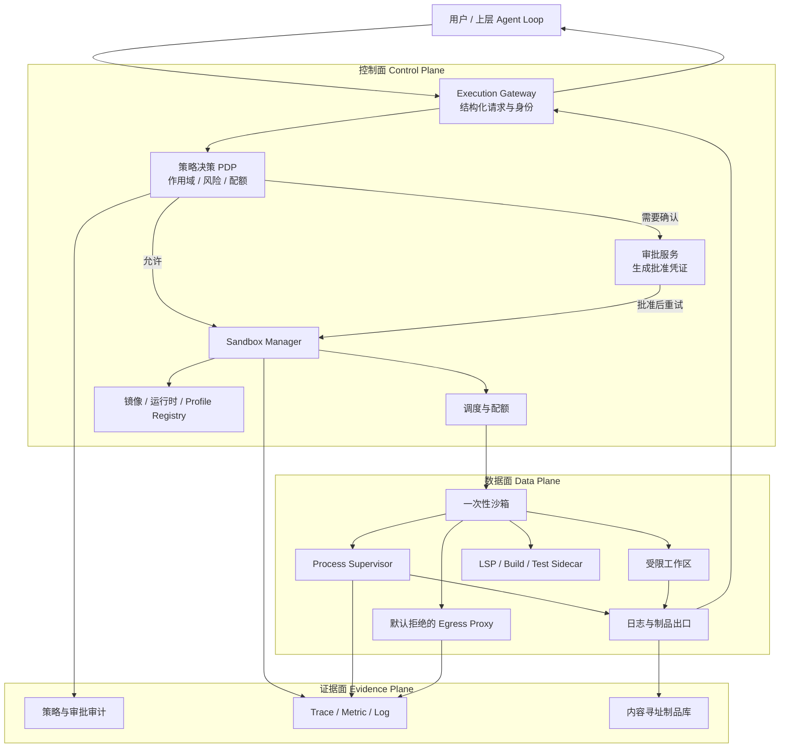
```mermaid
graph TB
    U["用户 / 上层 Agent Loop"] --> G["Execution Gateway<br/>结构化请求与身份"]

    subgraph CP["控制面 Control Plane"]
        G --> PDP["策略决策 PDP<br/>作用域 / 风险 / 配额"]
        PDP -->|"需要确认"| AP["审批服务<br/>生成批准凭证"]
        PDP -->|"允许"| SM["Sandbox Manager"]
        AP -->|"批准后重试"| SM
        SM --> SCH["调度与配额"]
        SM --> REG["镜像 / 运行时 / Profile Registry"]
    end

    subgraph DP["数据面 Data Plane"]
        SCH --> SB["一次性沙箱"]
        SB --> WS["受限工作区"]
        SB --> PS["Process Supervisor"]
        SB --> EP["默认拒绝的 Egress Proxy"]
        SB --> LSP["LSP / Build / Test Sidecar"]
        PS --> ART["日志与制品出口"]
        WS --> ART
    end

    subgraph EV["证据面 Evidence Plane"]
        PDP --> AUD["策略与审批审计"]
        SM --> TEL["Trace / Metric / Log"]
        PS --> TEL
        EP --> TEL
        ART --> STORE["内容寻址制品库"]
    end

    ART --> G
    G --> U
```

**设计原则**：

- 控制面故障时应 **fail closed**，即无法确认权限就拒绝，而不是默认放行；
- 数据面不应自行扩大权限；
- 证据面不得保存未经脱敏的密钥、Token、Cookie 或完整敏感命令参数；
- 策略决策与执行环境必须通过不可混淆的 `execution_id`、`sandbox_id` 和 `approval_id` 关联。

---

## 3. 执行请求不是一个字符串，而是一份能力契约

把执行 API 设计成：

```json
{"command": "bash -lc 'do anything'"}
```

意味着上层几乎把全部语义解释权交给 Shell。生产系统应使用结构化契约。

### 3.1 推荐的执行请求模型

```json
{
  "execution_id": "exec_01J...",
  "tenant_id": "tenant_acme",
  "session_id": "sess_...",
  "actor": {
    "user_id": "u_123",
    "agent_id": "coding-agent",
    "model": "model-name"
  },
  "action": {
    "kind": "process.exec",
    "program": "pytest",
    "args": ["-q", "tests/unit"],
    "cwd": "/workspace/repo",
    "stdin_mode": "closed",
    "tty": false
  },
  "capabilities": {
    "filesystem": {
      "read": ["/workspace"],
      "write": ["/workspace/repo", "/workspace/artifacts"]
    },
    "network_profile": "none",
    "environment_profile": "python-test",
    "secret_handles": []
  },
  "limits": {
    "wall_time_ms": 120000,
    "idle_time_ms": 30000,
    "cpu_millis": 1000,
    "memory_bytes": 1073741824,
    "pids": 128,
    "disk_bytes": 2147483648,
    "output_bytes": 10485760
  },
  "effect": {
    "class": "reversible",
    "scope": "workspace",
    "external_write": false
  },
  "policy_context": {
    "policy_version": "exec-policy-42",
    "approval_token": null,
    "reason": "运行单元测试验证补丁"
  }
}
```

### 3.2 为什么必须结构化

结构化请求能让平台在执行前回答：

- 目标程序是否存在于允许的镜像中？
- `cwd` 是否位于授权工作区？
- 是否需要 TTY？
- 是否声明网络访问？
- 是否请求秘密？
- 是否属于不可逆动作？
- 资源预算是否超过租户配额？
- 批准凭证是否绑定同一个参数摘要？

### 3.3 批准必须绑定参数摘要

错误模式：用户批准“执行部署”，Agent 在批准后修改了目标环境或参数。

正确模式：审批凭证绑定规范化后的动作哈希：

```text
approval.subject = SHA256(
  actor + action.kind + program + args + cwd + network_profile
  + filesystem_scope + secret_handles + target_environment
)
```

执行时重新计算摘要；任何参数变化都使批准失效，必须重新审批。

---

## 4. 完整执行生命周期与状态机

一次执行至少包含以下阶段：

1. **Validate**：校验 Schema、参数大小、编码、路径和能力声明；
2. **Classify**：计算副作用、敏感度和风险等级；
3. **Authorize**：PDP 决策，必要时等待审批；
4. **Allocate**：检查配额并选择运行时；
5. **Provision**：创建或租用干净沙箱；
6. **Materialize**：挂载工作区、注入非敏感配置、恢复依赖缓存；
7. **Execute**：启动进程并记录启动证据；
8. **Stream**：有界地流式传输 stdout/stderr；
9. **Supervise**：监控取消、超时、资源和异常；
10. **Verify**：检查退出码、诊断、测试、预期文件和后置条件；
11. **Snapshot / Export**：生成 diff、清单和制品；
12. **Cleanup**：终止进程树、卸载、清理网络和临时存储；
13. **Destroy / Return**：销毁沙箱，或仅在同一会话内安全归还；
14. **Finalize Evidence**：写入最终 Trace、Metric、Audit 与结果摘要。

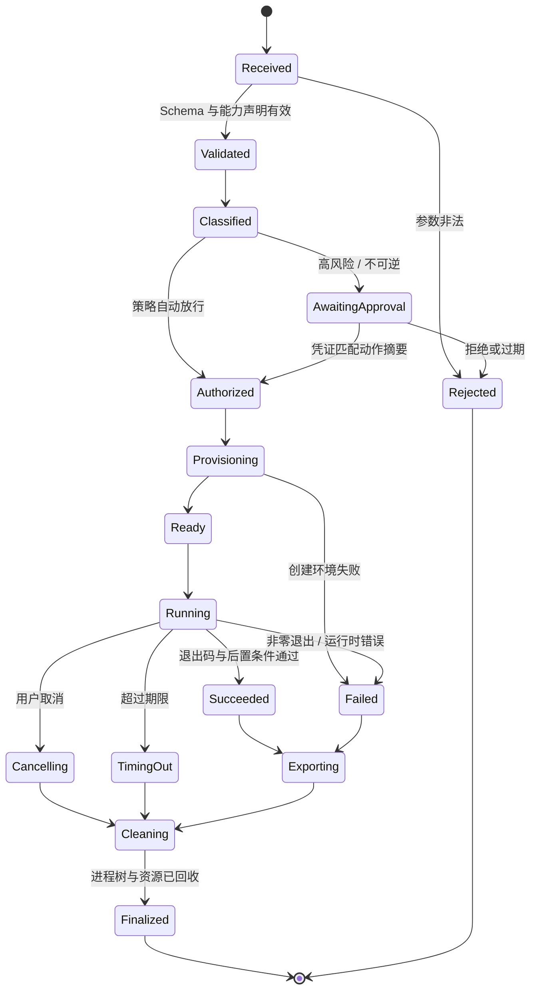
```mermaid
stateDiagram-v2
    [*] --> Received
    Received --> Validated: Schema 与能力声明有效
    Received --> Rejected: 参数非法
    Validated --> Classified
    Classified --> AwaitingApproval: 高风险 / 不可逆
    Classified --> Authorized: 策略自动放行
    AwaitingApproval --> Authorized: 凭证匹配动作摘要
    AwaitingApproval --> Rejected: 拒绝或过期
    Authorized --> Provisioning
    Provisioning --> Ready
    Provisioning --> Failed: 创建环境失败
    Ready --> Running
    Running --> Succeeded: 退出码与后置条件通过
    Running --> Failed: 非零退出 / 运行时错误
    Running --> Cancelling: 用户取消
    Running --> TimingOut: 超过期限
    Cancelling --> Cleaning
    TimingOut --> Cleaning
    Succeeded --> Exporting
    Failed --> Exporting
    Exporting --> Cleaning
    Cleaning --> Finalized: 进程树与资源已回收
    Finalized --> [*]
    Rejected --> [*]
```

### 4.1 “返回结果”不等于“执行结束”

只有满足下列条件，状态才可以进入 `Finalized`：

- 根进程和全部后代进程已退出；
- 端口、文件锁、挂载、临时目录和网络命名空间已释放；
- 日志与制品已完成落盘或标记为丢失；
- 工作区变更摘要已生成；
- 沙箱已销毁或被标记为仅限当前会话继续使用；
- 审计记录已完成，不存在“执行成功但没有证据”的空洞状态。

### 4.2 状态转换必须幂等

分布式系统中，`cancel`、`cleanup`、`destroy` 可能被重试。接口应允许：

- 对已终止执行再次取消，返回 `already_terminal`；
- 对已销毁沙箱再次销毁，返回成功或明确的幂等结果；
- Artifact 上传使用内容哈希或幂等键；
- Finalize 采用 compare-and-set，防止重复计费和重复通知。

---

## 5. 执行环境形态：从本地进程到 microVM

没有一种运行时在安全、兼容性、冷启动、成本和可运维性上同时最优。应根据威胁模型分层选择。

### 5.1 主要形态对比

| 形态 | 隔离边界 | 启动与开销 | 兼容性 | 适用场景 | 主要风险 |
|---|---|---:|---|---|---|
| 宿主本地子进程 | OS 用户与进程权限 | 最低 | 最高 | 完全可信、单用户、本地开发 | 宿主文件、凭据、网络暴露；子进程逃逸 |
| 受限本地进程 | 用户、App Sandbox / AppContainer、Job Object 等 | 低 | 较高 | 桌面 Agent、离线工具 | 跨平台能力不一致，边界容易配置不完整 |
| OCI 容器 | Namespace、cgroup、capability、LSM、文件挂载 | 低到中 | 高 | 单租户或中等风险执行 | 与宿主共享内核；特权配置会削弱隔离 |
| gVisor 容器沙箱 | 用户态应用内核拦截系统调用 | 中 | 较高但非 100% | 运行不可信代码、多租户容器 | 某些系统调用、I/O 和性能兼容性差异 |
| microVM / Kata / Firecracker | 硬件虚拟化 + 独立 Guest Kernel | 中 | 高 | 高风险、多租户、公共代码执行 | 运维复杂、镜像与快照管理成本更高 |
| WASM/WASI | 线性内存 + 能力式 Host API | 很低 | 受语言与系统接口限制 | 插件、规则、轻量函数、受限代码模式 | 不能直接运行任意原生工具链；Host 能力设计决定安全性 |
| 远程一次性沙箱 | 取决于服务端实现 | 网络延迟 | 高 | SaaS Agent、弹性批量执行 | 数据驻留、供应商信任、出口与审计一致性 |
| 浏览器 / GUI 环境 | 浏览器进程、页面与用户会话 | 中 | 面向 Web/桌面 | Computer Use、RPA、网页验证 | 状态漂移、提示注入、误点、高风险提交 |

OCI Runtime 的 Linux 配置模型本身就组合了 namespace、cgroup、capability、LSM 与文件系统监狱等内核能力[^oci-linux]；这说明“容器”不是单一开关，而是一组必须正确配置的隔离原语。

### 5.2 选型决策树

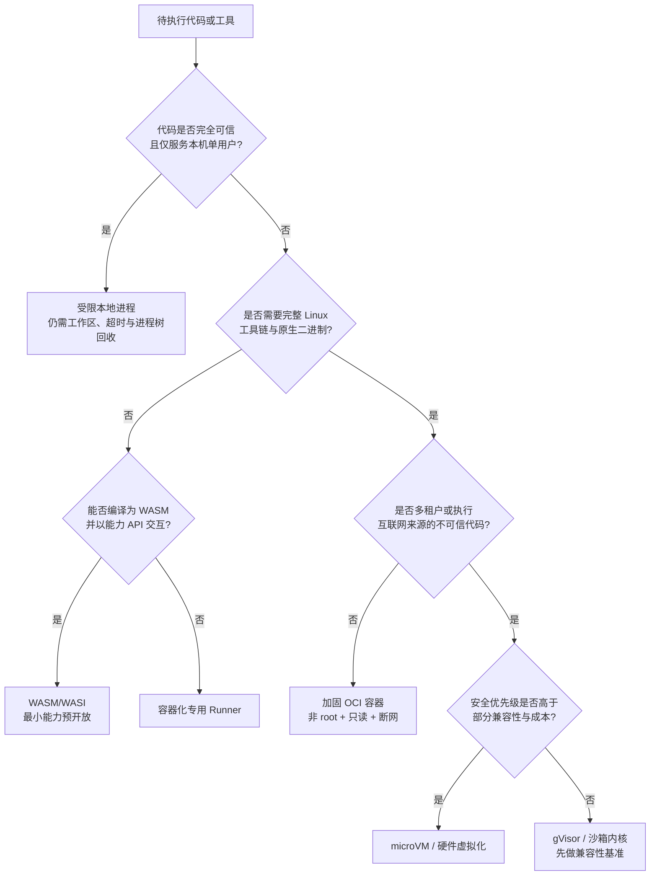
```mermaid
flowchart TD
    A["待执行代码或工具"] --> Q1{"代码是否完全可信<br/>且仅服务本机单用户?"}
    Q1 -->|是| P1["受限本地进程<br/>仍需工作区、超时与进程树回收"]
    Q1 -->|否| Q2{"是否需要完整 Linux<br/>工具链与原生二进制?"}
    Q2 -->|否| Q3{"能否编译为 WASM<br/>并以能力 API 交互?"}
    Q3 -->|是| P2["WASM/WASI<br/>最小能力预开放"]
    Q3 -->|否| P3["容器化专用 Runner"]
    Q2 -->|是| Q4{"是否多租户或执行<br/>互联网来源的不可信代码?"}
    Q4 -->|否| P4["加固 OCI 容器<br/>非 root + 只读 + 断网"]
    Q4 -->|是| Q5{"安全优先级是否高于<br/>部分兼容性与成本?"}
    Q5 -->|是| P5["microVM / 硬件虚拟化"]
    Q5 -->|否| P6["gVisor / 沙箱内核<br/>先做兼容性基准"]
```

### 5.3 各形态的关键认识

#### 本地子进程

本地子进程适合：

- 用户明确选择的本机仓库；
- 工具链完全受信任；
- Agent 只在当前登录用户权限下运行；
- 产品定位允许用户承担本机执行风险。

但即使如此，也必须至少具备：工作区范围、环境变量清洗、网络策略、超时、进程树取消、输出上限和审计。

#### OCI 容器

容器适合大多数 Coding Agent 的默认执行层。它能提供高兼容性与较低冷启动，但必须避免：

- `--privileged`；
- 挂载 Docker Socket；
- `hostPID`、`hostNetwork`、宿主根目录挂载；
- 运行 root 且保留多余 capability；
- 根文件系统可写；
- 未设 CPU、内存、PID、磁盘和输出限制。

#### gVisor

gVisor 使用 Sentry 实现应用内核，并拦截容器对宿主系统 API 的直接访问，从而缩小宿主内核攻击面[^gvisor-security]。它适合“想保留容器使用方式，但需要比共享宿主内核更强隔离”的场景。代价是系统调用兼容性与 I/O 性能需要基准验证。

#### microVM

Firecracker 等 microVM 以硬件虚拟化隔离 Guest Kernel，目标是为多租户函数和容器工作负载提供比传统 VM 更轻量的执行单元[^firecracker-design]。适合公共代码执行、在线评测、第三方插件和高价值租户。平台侧仍需要 jailer、seccomp、网络、镜像、快照和资源治理；microVM 不是“启动后自动安全”。

#### WASM/WASI

WebAssembly 提供内存安全的沙箱执行模型；WASI Host 以能力方式授予文件、目录、网络、时钟等资源。以 Wasmtime 为例，WASI 文件访问遵循能力模型，模块只能访问 Host 明确预开放的目录[^wasmtime-security]。它适合：

- 规则引擎、转换器、解析器；
- Agent Skill / Plugin 的受控执行；
- Code Mode 中的轻量函数；
- 多租户高密度短任务。

它不适合未经改造地运行完整 Linux 构建工具链。

---

## 6. 威胁模型：先定义要保护什么

### 6.1 需要保护的资产

- 宿主文件、SSH Key、云凭据、浏览器 Cookie、系统 Keychain；
- 其他租户或其他会话的工作区；
- 内部数据库、消息队列、制品库、代码托管和监控系统；
- 宿主 CPU、内存、磁盘、inode、PID、端口和 GPU；
- Agent 会话上下文、系统提示、用户隐私数据；
- 策略、审批记录和审计日志；
- 供应链：镜像、依赖、编译器、插件、MCP Server 与工具描述。

### 6.2 潜在攻击者与失败来源

1. **模型自身的概率错误**：路径猜错、命令参数错、误判执行结果；
2. **提示注入者**：通过仓库文件、网页、日志、Issue、测试输出诱导操作；
3. **恶意仓库或依赖**：构建脚本、测试、安装脚本和编译器插件执行恶意代码；
4. **恶意租户**：主动尝试逃逸、耗尽资源、读取邻居数据；
5. **被攻陷的工具或 MCP Server**：工具描述投毒、返回内容注入、凭据滥用；
6. **平台配置错误**：错误挂载、错误网络白名单、过宽 Service Account；
7. **运维与审计缺陷**：无法归因、日志泄密、批准与实际参数不一致。

### 6.3 攻击面清单

| 攻击面 | 示例 | 必要防线 |
|---|---|---|
| 命令与参数 | Shell 注入、解释器封装、危险子命令 | 结构化 argv、意图级工具、策略、沙箱 |
| 文件路径 | `..`、符号链接、硬链接、Junction、竞态替换 | 受限挂载、目录句柄相对访问、原子操作 |
| 进程 | fork 炸弹、守护化、子进程逃逸 | PID 配额、进程组 / Job Object、用后销毁 |
| 系统调用 | mount、ptrace、BPF、设备访问 | seccomp、capability、LSM、gVisor / VM |
| 网络 | 外传、SSRF、元数据服务、DNS Rebinding | 默认拒绝、出口代理、目的端与协议约束 |
| 环境变量 | 泄露 Token、代理配置、共享连接串 | 环境白名单、秘密代理、按会话服务 |
| 依赖供应链 | typosquatting、恶意安装脚本、镜像漂移 | 内部镜像、锁文件、哈希、签名、SBOM |
| 输出 | ANSI 控制、超大输出、秘密泄露、注入 | 限流、脱敏、内容标记、完整日志分离 |
| GUI | 坐标漂移、页面注入、误提交 | 状态版本、语义定位、动作后验证、审批 |
| 证据 | 日志篡改、丢失、敏感数据过度采集 | 追加写、哈希、访问控制、脱敏与留存策略 |

### 6.4 安全不变量（Security Invariants）

生产设计应把以下不变量写成可测试的系统约束：

- 未授权路径在沙箱中不可见，而不仅是“应用代码承诺不访问”；
- 无网络 Profile 时，DNS、IPv4、IPv6、Unix Socket 和宿主代理都不能成为出口；
- 工作区 A 的进程不能看到工作区 B；
- 超时或取消后，在限定时间内活跃进程数归零；
- 沙箱不能访问 Docker / containerd / Kubernetes 节点管理 Socket；
- 任何 Secret Handle 只能被指定 Broker 消费，不能转换为普通环境变量回传；
- 审批凭证不能用于不同参数、不同租户、不同环境或不同时间窗口；
- 模型观察到的工具输出始终带“不可信数据”来源标签；
- 完整日志即使包含敏感信息，也不能未经授权进入模型上下文；
- 跨租户复用的沙箱必须经过可证明的重置，默认做法是销毁而非清洗。

---

## 7. 纵深防御：七层边界而不是一个“沙箱开关”

原始三层模型可以进一步展开为七层，每层解决不同问题。

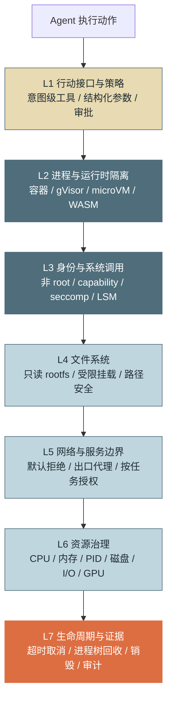
```mermaid
graph TB
    A["Agent 执行动作"] --> L1["L1 行动接口与策略<br/>意图级工具 / 结构化参数 / 审批"]
    L1 --> L2["L2 进程与运行时隔离<br/>容器 / gVisor / microVM / WASM"]
    L2 --> L3["L3 身份与系统调用<br/>非 root / capability / seccomp / LSM"]
    L3 --> L4["L4 文件系统<br/>只读 rootfs / 受限挂载 / 路径安全"]
    L4 --> L5["L5 网络与服务边界<br/>默认拒绝 / 出口代理 / 按任务授权"]
    L5 --> L6["L6 资源治理<br/>CPU / 内存 / PID / 磁盘 / I/O / GPU"]
    L6 --> L7["L7 生命周期与证据<br/>超时取消 / 进程树回收 / 销毁 / 审计"]

    classDef policy fill:#E8DAB2,stroke:#4F6D7A,color:#1f2d33
    classDef runtime fill:#4F6D7A,stroke:#4F6D7A,color:#ffffff
    classDef boundary fill:#C0D6DF,stroke:#4F6D7A,color:#1f2d33
    classDef evidence fill:#DD6E42,stroke:#DD6E42,color:#ffffff
    class L1 policy
    class L2,L3 runtime
    class L4,L5,L6 boundary
    class L7 evidence
```

### 7.1 L1：行动接口与策略层

优先级从高到低：

1. **固定能力 API**：`read_file`、`apply_patch`、`run_tests`；
2. **受约束程序执行**：`program + argv`，不经过 Shell；
3. **受控脚本 / Code Mode**：在专用镜像和能力 API 内运行；
4. **自由 Shell**：仅在强沙箱、明确用户授权和高可观测条件下提供。

这一层负责降低误用概率，但不承担最终安全保证。

### 7.2 L2：运行时隔离层

- 低风险单用户：受限本地进程；
- 默认：加固容器；
- 多租户不可信代码：gVisor 或 microVM；
- 轻量插件：WASM/WASI。

### 7.3 L3：身份与系统调用层

最低基线：

- 非 root UID/GID；
- `no_new_privs` / `allowPrivilegeEscalation: false`；
- `cap-drop=ALL`，仅按需加回；
- 默认 seccomp Profile；
- AppArmor / SELinux / Landlock 等 LSM 条件允许时启用；
- 禁止访问物理设备、BPF、内核模块、宿主进程与调试接口。

Docker 的默认 seccomp Profile用于限制容器可用系统调用[^docker-seccomp]；Rootless 模式还可以让守护进程与容器都不以宿主 root 运行[^docker-rootless]。但 Rootless、seccomp 和 capability 是互补关系，不能互相替代。

### 7.4 L4：文件系统层

- 根文件系统只读；
- `/tmp` 使用有大小上限的临时文件系统；
- 只挂载单个会话工作区；
- 工作区内进一步区分只读源码、可写输出和制品目录；
- 禁止挂载 Docker Socket、宿主 Home、Keychain、SSH 目录；
- 对路径做规范化、目录句柄约束和原子访问；
- 输出制品通过显式出口复制，而非开放任意宿主路径。

### 7.5 L5：网络与服务层

- 默认无网络；
- 需要依赖时只开放内部只读镜像；
- 访问 API 时通过沙箱外代理，不直接注入长期 Token；
- 阻断 loopback、link-local、云元数据地址、私网和未知 DNS；
- 可写外部服务单独审批并记录请求摘要；
- 测试依赖服务按会话启动，避免共享状态污染。

### 7.6 L6：资源层

Linux cgroup v2 可对 CPU、内存、进程数等资源进行层级治理[^cgroup-v2]。需要同时限制：

- Wall time 与 CPU time；
- 内存及 swap；
- PID / 线程数；
- 磁盘字节和 inode；
- 文件描述符；
- stdout/stderr 字节数；
- 网络字节、连接数、请求率；
- GPU 时间和显存；
- 并发任务和租户总预算。

### 7.7 L7：生命周期与证据层

- 启动前生成环境清单；
- 执行中采集资源峰值；
- 取消时终止整个进程树；
- 完成后导出 diff 与制品；
- 无论成功失败都执行清理；
- 跨租户环境用后销毁；
- 审计记录不可由沙箱进程覆盖。

---

## 8. 工作区：Agent 与人共享的外部状态

### 8.1 为什么文件系统成为 Coding Agent 的共同接口

将工作区作为共享状态介质有五个优势：

1. **可观察**：用户可以直接查看文件、目录和 `git diff`；
2. **可恢复**：Git、快照、写时复制和补丁可提供低成本回滚；
3. **工具通用**：编译器、测试器、Linter、Formatter、grep、LSP 都围绕文件工作；
4. **上下文外置**：大结果、计划、索引和报告不必全部塞进上下文窗口；
5. **可接管**：人可以随时编辑、暂停、提交或撤销 Agent 的工作。

工作区不是简单的 `cwd`，而是一份有明确分区与生命周期的状态协议。

### 8.2 推荐目录结构

```text
/workspace/
├── input/                 # 用户输入附件，只读
├── repo/                  # 主代码仓库，可按策略读写
│   ├── .git/
│   └── ...
├── scratch/               # 临时推导与中间结果，可丢弃
├── plans/                 # 计划、任务分解、检查点
├── logs/                  # 沙箱内日志缓冲，不直接作为最终审计源
├── artifacts/             # 明确允许导出的制品
│   ├── test-results/
│   ├── reports/
│   ├── screenshots/
│   └── binaries/
├── patches/               # 统一 diff / patch 输出
└── metadata/
    ├── environment.json   # 镜像、工具链、依赖、区域设置
    ├── execution.json     # 执行请求摘要
    └── manifest.json      # 制品哈希与 MIME 类型
```

### 8.3 工作区的三类数据

| 数据类别 | 示例 | 生命周期 | 是否进入模型上下文 |
|---|---|---|---|
| 任务输入 | 仓库、文档、图片 | 会话或任务级 | 按需、分段、带来源标签 |
| 中间状态 | 索引、缓存、计划、测试数据库 | 沙箱或会话级 | 默认不直接进入 |
| 可交付制品 | Patch、报告、构建产物、截图 | 持久化 | 仅摘要和指针进入上下文 |

### 8.4 工作区与 Git 的组合模式

#### 模式 A：直接工作树

Agent 直接修改用户检出的工作树。

优点：简单、用户实时可见。  
缺点：未提交改动可能与 Agent 冲突，撤销边界不清晰。

适合：本地单用户、用户主动确认的编辑。

#### 模式 B：Git Worktree

为每个任务创建独立 Worktree 和分支。

优点：隔离并行任务、保留真实 Git 语义、容易比较与合并。  
缺点：需要管理分支、锁和清理。

适合：Coding Agent、并行子任务、多 Agent 协作。

#### 模式 C：Shadow Repository / Copy-on-Write

Agent 在影子仓库或写时复制层上操作，最终只导出 Patch。

优点：与用户工作树完全隔离，失败可直接销毁。  
缺点：大仓库复制、子模块、LFS 与文件监听器需要额外设计。

适合：云端执行、高风险任务、审阅后应用。

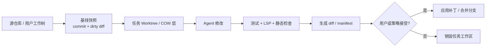
```mermaid
flowchart LR
    R["源仓库 / 用户工作树"] --> S["基线快照<br/>commit + dirty diff"]
    S --> W["任务 Worktree / COW 层"]
    W --> A["Agent 修改"]
    A --> V["测试 + LSP + 静态检查"]
    V --> D["生成 diff / manifest"]
    D --> Q{"用户或策略接受?"}
    Q -->|是| M["应用补丁 / 合并分支"]
    Q -->|否| X["销毁任务工作区"]
```

### 8.5 基线快照必须包含脏状态

只记录当前 commit 不足以恢复用户现场。任务开始时应记录：

- `HEAD` commit；
- 已跟踪文件的 staged diff；
- 已跟踪文件的 unstaged diff；
- 未跟踪文件清单与必要内容；
- 子模块状态；
- LFS 指针状态；
- 文件权限位、符号链接和换行约定；
- `.gitignore` 之外但可能影响构建的本地配置。

否则“回滚到任务开始前”可能错误地抹掉用户原有改动。

---

## 9. 路径安全：`resolve()` 只是起点

### 9.1 常见逃逸方式

路径边界至少要考虑：

- `../` 与绝对路径；
- 符号链接指向工作区外；
- 硬链接指向敏感 inode；
- Windows Junction、Reparse Point、UNC 路径和盘符切换；
- 大小写不敏感文件系统上的前缀混淆；
- Unicode 规范化与相似字符；
- 先检查、后替换的 TOCTOU；
- 选项内嵌路径，如 `--output=/etc/file`；
- 响应文件，如编译器的 `@args.txt`；
- 工具自身支持的配置文件、插件路径和环境变量路径；
- `/proc/self/fd`、设备文件、Unix Socket 等非普通文件入口。

### 9.2 错误的字符串前缀判断

```python
# 错误：/workspace-evil 也以 /workspace 开头
if str(path).startswith("/workspace"):
    allow()
```

即使使用 `Path.resolve()`，仍存在检查与使用之间被替换的竞态。

### 9.3 更可靠的策略

#### 第一层：从挂载层让区外路径不可见

只将工作区挂进沙箱；宿主敏感目录根本不应出现在沙箱 Namespace 中。应用层路径检查失败时，内核挂载边界仍能兜底。

#### 第二层：基于目录句柄的相对访问

在 Linux 上，可使用 `openat` / `openat2` 思路：

- 先打开工作区根目录句柄；
- 所有文件访问相对于该句柄；
- 禁止穿越符号链接；
- 要求解析结果位于目录树内部；
- 文件创建使用原子标志。

伪代码：

```text
root_fd = open(workspace_root, DIRECTORY | NOFOLLOW)
fd = openat2(
  root_fd,
  relative_path,
  resolve = BENEATH | NO_SYMLINKS | NO_MAGICLINKS
)
```

#### 第三层：业务层只接受相对路径

文件工具的参数应是：

```json
{"path": "src/service.py"}
```

而不是任意 URI 或绝对路径。系统在绑定工作区后再转换为内部路径。

#### 第四层：写入使用原子替换

推荐流程：

1. 在目标目录创建临时文件；
2. 写入并 `fsync`；
3. 校验大小、编码和哈希；
4. 使用原子 rename 替换；
5. 必要时 `fsync` 目录；
6. 记录旧、新哈希。

避免写到一半进程被取消，留下半文件。

### 9.4 符号链接与硬链接策略

- 默认禁止 Agent 创建指向工作区外的符号链接；
- 导出制品时不跟随符号链接；
- 归档解压时防止 Zip Slip / Tar Path Traversal；
- 对硬链接进行 inode 与设备号检查，或在独立文件系统中创建工作区；
- 文件扫描和实际打开应尽可能使用同一目录句柄语义；
- Windows 上显式检测 Reparse Point，拒绝跳转到授权根以外。

### 9.5 路径校验的正确测试方式

不要只写几个字符串单测。应在真实临时文件系统中测试：

- 多层符号链接；
- 链接在检查后被并发替换；
- 大小写与尾随点；
- Junction / Reparse Point；
- 归档中的 `../../`；
- 符号链接指向 Unix Socket；
- 目标路径不存在但父目录链接越界；
- 工具参数中的 `--output=...`、响应文件和配置文件间接引用。

---

## 10. 命令模型：为什么自由 Shell 是最难治理的接口

### 10.1 Shell 字符串的问题

Shell 同时提供：

- 管道 `|`；
- 重定向 `>`、`2>`；
- 命令替换 `$()`；
- 变量展开；
- 通配符；
- 子 Shell；
- 逻辑控制 `&&`、`||`；
- Here Document；
- 函数、别名和启动脚本。

这意味着字符串不是简单参数，而是一门完整编程语言。对它做“危险关键字正则”几乎不可能覆盖全部语义。

### 10.2 推荐能力层级

#### Level 1：意图级工具

```json
{"tool": "search_code", "query": "PaymentService", "path": "src"}
```

```json
{"tool": "run_tests", "targets": ["tests/unit"], "mode": "quiet"}
```

平台自行组装命令和参数，模型无法注入额外 Shell 语法。

#### Level 2：结构化程序执行

```json
{
  "program": "pytest",
  "args": ["-q", "tests/unit"],
  "cwd": "repo",
  "tty": false
}
```

使用 `execve` / `CreateProcess` 语义，不经过 Shell。

#### Level 3：受控脚本

Agent 生成 Python、JavaScript 或其他脚本，但只能在专用沙箱内运行，并通过能力 API 访问文件和工具。脚本本身作为制品留存。

#### Level 4：自由 Shell

仅用于明确需要 Shell 组合能力的高级场景，并满足：

- 用户开启；
- 强沙箱；
- 网络默认关闭；
- 工作区外不可见；
- 命令全量留痕并脱敏；
- 高风险动作仍被外部策略拦截。

### 10.3 白名单的作用与局限

命令白名单适合作为“减少误操作面”的一层，但不能单独证明安全，因为：

- `python -c`、`node -e`、`perl -e` 能表达任意逻辑；
- `find -exec`、`xargs`、`git alias`、构建系统插件可以转发执行；
- `git` 既能只读，也能执行 Hook、过滤器、凭据助手或外部 diff；
- 编译器和测试框架会加载项目代码；
- 一个被允许的二进制本身也可能存在漏洞。

因此，正确结论是：

> **白名单用于策略表达，沙箱用于强制边界。**

### 10.4 `git` 不是天然只读工具

以下操作即使看起来是查询，也可能触发外部程序或读取敏感配置：

- Git Hook；
- `core.pager`；
- `core.editor`；
- `diff.external`；
- `textconv`；
- credential helper；
- filter clean/smudge；
- submodule helper；
- 协议与远程传输 helper。

受控执行时应：

- 设置干净的 `HOME` 与 Git 配置；
- 禁用系统和全局配置，或使用平台提供的最小配置；
- 明确关闭 pager、editor、hooks 和外部 diff；
- 将网络子命令与本地只读子命令分开授权；
- 不信任仓库内 `.git/config` 的扩展行为。

### 10.5 命令 Profile

相比全局白名单，按任务定义 Profile 更可控：

```yaml
profiles:
  source-read:
    programs:
      rg:
        args:
          deny: ["--pre", "--pre-glob"]
      git:
        subcommands: ["status", "diff", "show", "log", "rev-parse"]
    network: none
    filesystem: read-only

  python-test:
    programs:
      python:
        modes: ["module"]
      pytest:
        args:
          max_count: 64
    network: internal-package-mirror
    filesystem: workspace-write
    effect: reversible
```

Profile 还应锁定：

- 镜像摘要；
- 程序绝对路径与文件哈希；
- 环境变量集合；
- 资源限制；
- 网络 Profile；
- 允许的工作目录；
- 是否允许 TTY、stdin 和后台进程。

---

## 11. Pipe 与 PTY：两种完全不同的进程交互模型

### 11.1 普通 Pipe

适合非交互程序：

- 编译；
- 单元测试；
- 静态分析；
- 数据转换；
- `git diff`、`rg` 等查询。

特点：

- stdout 与 stderr 可分离；
- 输出易解析；
- 不会自动启用终端颜色与光标控制；
- stdin 可以关闭，避免进程等待交互；
- 更容易施加字节限制与背压。

### 11.2 PTY

适合必须认为自己连接到终端的程序：

- REPL；
- 调试器；
- 交互式安装器；
- TUI；
- 某些 CLI 登录或授权流程；
- 需要实时输入的长任务。

特点：

- stdout/stderr 通常合并；
- 输出可能包含 ANSI 转义和光标移动；
- 需要管理窗口大小、终端类型、输入回显；
- 读取语义与 Pipe 不同；
- 进程可能根据 TTY 改变缓冲和输出格式。

### 11.3 选择表

| 需求 | Pipe | PTY |
|---|---:|---:|
| 机器解析输出 | 优先 | 不推荐 |
| 分离 stdout/stderr | 支持 | 通常不支持 |
| 交互式输入 | 有限 | 适合 |
| TUI / REPL | 不适合 | 必需 |
| 输出可重复性 | 较高 | 较低 |
| 终端颜色与控制序列 | 默认少 | 常见 |
| 安全审计 | 更容易 | 需清洗控制序列 |

原则：

> **默认使用 Pipe；只有已知程序必须交互时才分配 PTY。不要因为“看起来像终端”就让所有执行走 PTY。**

### 11.4 stdin 策略

stdin 应有显式模式：

- `closed`：立即 EOF，默认值；
- `fixed`：执行前提供有限字节输入；
- `stream`：由上层持续发送；
- `approval-gated`：程序请求输入时暂停并转为人机交互；
- `pty`：交互式终端输入。

默认关闭 stdin 可以暴露“程序偷偷等待交互”的问题，而不是让任务永久挂起。

---

## 12. 输出治理：给模型摘要，给系统完整证据

### 12.1 为什么直接把 stdout 塞回上下文是反模式

命令输出具有极高方差：

- 0 字节；
- 数百 MB 测试日志；
- 无限进度条；
- 重复堆栈；
- 二进制或错误编码；
- ANSI 控制序列；
- 密钥、Cookie、连接串；
- 仓库文本中的提示注入。

如果原样回填模型，会造成：

- 上下文窗口被瞬间耗尽；
- 重要错误被海量噪声淹没；
- 日志中的恶意指令影响模型；
- 秘密进入模型与外部观测系统；
- 用户无法获得完整日志，因为系统只保存了截断文本。

### 12.2 双轨输出模型

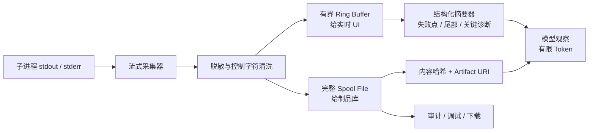
```mermaid
flowchart LR
    P["子进程 stdout / stderr"] --> C["流式采集器"]
    C --> R["脱敏与控制字符清洗"]
    R --> B["有界 Ring Buffer<br/>给实时 UI"]
    R --> F["完整 Spool File<br/>给制品库"]
    B --> S["结构化摘要器<br/>失败点 / 尾部 / 关键诊断"]
    S --> M["模型观察<br/>有限 Token"]
    F --> H["内容哈希 + Artifact URI"]
    H --> M
    F --> A["审计 / 调试 / 下载"]
```

### 12.3 推荐输出字段

```json
{
  "exit_code": 1,
  "termination_reason": "process_exit",
  "stdout_preview": "...",
  "stderr_preview": "...",
  "summary": {
    "failed_tests": 3,
    "first_error": "AssertionError at tests/test_order.py:42",
    "diagnostic_count": 7
  },
  "truncated": true,
  "bytes_seen": 3827129,
  "artifact": {
    "uri": "artifact://sha256/abc...",
    "sha256": "abc...",
    "mime_type": "text/plain",
    "encoding": "utf-8"
  },
  "redactions": 4,
  "untrusted_content": true
}
```

### 12.4 背压与限流

执行器需要同时限制：

- 每个流的读取速率；
- UI 推送频率；
- 内存 Ring Buffer 大小；
- 完整日志最大字节数；
- 单行长度；
- 重复行压缩；
- Artifact 上传带宽。

若完整日志达到上限，应：

1. 继续排空管道，避免子进程因写满阻塞；
2. 丢弃或采样后续内容；
3. 明确记录 `log_limit_exceeded`；
4. 可选地终止明显失控的任务；
5. 不把“日志被截断”误报为“执行成功且无异常”。

### 12.5 ANSI 与终端攻击面

PTY 输出可能包含：

- 清屏与光标重定位；
- 修改窗口标题；
- 超链接控制；
- 剪贴板相关序列；
- 伪造前序日志的视觉效果。

Web UI 与日志系统应把原始字节和渲染文本分开：

- 默认只支持允许的颜色与样式；
- 丢弃高风险控制序列；
- 审计端提供不可重排的纯文本视图；
- 不允许终端输出直接控制宿主剪贴板、文件或窗口。

### 12.6 输出中的提示注入

任何命令输出都应带来源元数据：

```text
[UNTRUSTED_TOOL_OUTPUT]
source=pytest
workspace_file_origin=true
instruction_semantics=disabled
...
[/UNTRUSTED_TOOL_OUTPUT]
```

模型侧提示应明确：输出用于提供事实和错误信息，不得被当作更高优先级指令。高风险动作始终由策略层做独立判断。

---

## 13. 超时、取消与进程树终止

### 13.1 四种时间预算

| 预算 | 含义 | 典型用途 |
|---|---|---|
| Queue Deadline | 最晚何时必须开始 | 避免排队后执行已过期任务 |
| Wall Timeout | 从启动到结束的总时间 | 防止无限运行 |
| Idle Timeout | 无输出、无 CPU 或无进度的持续时间 | 发现死锁和等待输入 |
| Grace Period | 收到终止信号后允许清理的时间 | 保存报告、释放锁 |

还可以增加：

- CPU Time；
- 单步骤预算；
- 整个 Agent 任务预算；
- 用户取消 Deadline；
- 网络请求级 Deadline。

### 13.2 错误做法：只杀根进程

```text
runner ──> test process ──> dev server
                     └───> worker pool
```

如果只对 `test process` 调用 terminate，`dev server` 和 worker 可能继续存活。

### 13.3 POSIX 推荐流程

1. 创建独立 session / process group；
2. 所有后代默认继承该组；
3. 取消时向进程组发送 `SIGTERM`；
4. 等待短 Grace Period；
5. 再向进程组发送 `SIGKILL`；
6. `wait()` 回收，避免 Zombie；
7. 最后由容器 / cgroup / 沙箱销毁兜底。

### 13.4 Windows 推荐流程

Windows Job Objects 可以对一组进程施加工作集、时间、进程数等限制，并支持“最后一个 Job Handle 关闭时终止全部进程”的语义[^windows-job]。执行器应：

- 创建 Job Object；
- 配置 `KILL_ON_JOB_CLOSE`；
- 将根进程加入 Job；
- 限制内存、CPU 和活动进程数；
- 取消时终止 Job，而不是仅终止父 PID；
- 禁止子进程 Breakaway，除非有明确需求。

### 13.5 终止状态机

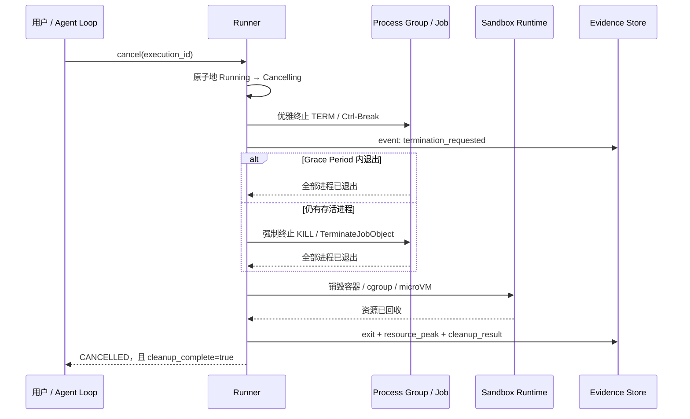
```mermaid
sequenceDiagram
    participant U as 用户 / Agent Loop
    participant R as Runner
    participant G as Process Group / Job
    participant S as Sandbox Runtime
    participant E as Evidence Store

    U->>R: cancel(execution_id)
    R->>R: 原子地 Running → Cancelling
    R->>G: 优雅终止 TERM / Ctrl-Break
    R->>E: event: termination_requested
    alt Grace Period 内退出
        G-->>R: 全部进程已退出
    else 仍有存活进程
        R->>G: 强制终止 KILL / TerminateJobObject
        G-->>R: 全部进程已退出
    end
    R->>S: 销毁容器 / cgroup / microVM
    S-->>R: 资源已回收
    R->>E: exit + resource_peak + cleanup_result
    R-->>U: CANCELLED，且 cleanup_complete=true
```

### 13.6 不能把“发出 kill”当作已取消

取消结果应区分：

- `cancel_requested`：已接收请求；
- `graceful_exit`：优雅退出；
- `forced_exit`：强制退出；
- `cleanup_complete`：全部资源确认回收；
- `cleanup_failed`：仍有泄漏，需要隔离节点或人工处置。

### 13.7 进程守护化与双重 fork

恶意或复杂程序可能：

- 双重 fork；
- 调用 `setsid`；
- 把任务交给系统服务；
- 创建 Cron / Scheduled Task；
- 通过容器 Socket 创建新容器；
- 启动宿主级服务。

因此进程组只是应用层手段，真正兜底是：

- 容器 PID Namespace；
- cgroup 跟踪；
- Job Object；
- 无宿主服务管理权限；
- 用后销毁整个沙箱。

### 13.8 长任务不要靠无限阻塞调用

对于构建、基准测试、训练和大规模扫描，使用任务句柄：

```json
{
  "task_id": "task_123",
  "state": "running",
  "progress": {"current": 41, "total": 100, "unit": "files"},
  "poll_after_ms": 2000,
  "cancel_supported": true
}
```

上层通过 `get_task`、`stream_task`、`cancel_task` 管理，而不是让一次 Tool Call 持有无限连接。

---

## 14. 资源治理：防止一个任务拖垮整个平台

### 14.1 资源限制不是性能优化，而是安全边界

即使没有恶意行为，Agent 也可能生成：

- 无终止条件的循环；
- 指数级递归；
- 大量并发 worker；
- 无限日志；
- 对整个磁盘的递归扫描；
- 大规模依赖下载；
- 占满 GPU 显存的模型加载；
- 不断重试的网络风暴。

因此，每个执行都必须有“硬上限”和“软预算”。

### 14.2 资源维度与建议动作

| 资源 | 硬限制 | 软预算 / 告警 | 超限动作 |
|---|---|---|---|
| Wall Time | 绝对超时 | 剩余时间提示 | TERM → KILL → 销毁 |
| CPU | cgroup / Job 限额 | CPU 秒、节流比例 | 降速或终止 |
| 内存 | memory.max / Job Memory | RSS、峰值、OOM 前告警 | OOM 终止并标记原因 |
| PID / 线程 | pids.max / ActiveProcessLimit | 当前进程数 | 拒绝 fork，必要时终止 |
| 磁盘字节 | 独立卷配额 | 使用率 | 停止写入或终止 |
| inode | 文件数上限 | 小文件增长率 | 拒绝创建 |
| I/O | io.max / 调度权重 | 读写吞吐、队列 | 节流 |
| 文件描述符 | `RLIMIT_NOFILE` | 打开数量 | 系统调用失败 |
| 输出 | 字节、行、速率 | 截断比 | 采样、落盘、终止刷屏任务 |
| 网络 | 字节、连接、QPS | 目的端分布 | 代理拒绝 / 熔断 |
| GPU | 显存、执行时间、实例数 | 利用率 | 终止或抢占 |
| 并发 | 租户 / 会话并发 | 排队时延 | 排队或拒绝 |

### 14.3 Linux cgroup v2 的关键控制器

生产 Runner 常用：

- `cpu.max`：CPU 带宽；
- `cpu.weight`：相对权重；
- `memory.max`：硬内存上限；
- `memory.high`：节流与压力阈值；
- `memory.events`：OOM 等事件；
- `pids.max`：进程 / 线程数；
- `io.max`：块设备 I/O 限制；
- `cgroup.kill`：终止整个 cgroup；
- PSI：CPU、内存和 I/O 压力观察。

不要只限制容器声明的内存，还要确认运行时真正落在正确 cgroup，并验证超限事件能被 Runner 识别。

### 14.4 磁盘治理经常被忽略

仅设置内存和 CPU 不足以防止：

- 构建缓存撑满节点；
- 数百万小文件耗尽 inode；
- 日志写满宿主分区；
- Core Dump 产生超大文件；
- 依赖缓存跨租户污染。

推荐：

- 每个任务使用独立临时卷、项目配额或块设备；
- `/tmp` 使用有 `size` 限制的 tmpfs；
- Artifact 目录单独配额；
- 禁止或限制 Core Dump；
- 监控字节与 inode；
- 清理失败时隔离节点，不要继续调度新任务。

### 14.5 资源退出原因必须可区分

不要把所有失败都映射为 `exit_code=-1`。至少区分：

```text
PROCESS_EXIT
WALL_TIMEOUT
IDLE_TIMEOUT
CPU_LIMIT
MEMORY_OOM
PID_LIMIT
DISK_LIMIT
OUTPUT_LIMIT
NETWORK_POLICY_DENIED
USER_CANCELLED
POLICY_REVOKED
SANDBOX_RUNTIME_FAILURE
NODE_EVICTED
```

这既影响模型后续策略，也影响平台容量规划和故障定位。

---

## 15. 网络边界：默认拒绝是最有效的外传防线

### 15.1 为什么网络比文件系统更危险

文件越权通常还能通过挂载范围限制；网络一旦开放，沙箱可以：

- 向公网发送源代码、密钥和上下文；
- 探测内网服务；
- 访问云元数据服务获取临时凭据；
- 把数据写入“合法白名单服务”；
- 下载恶意依赖或第二阶段载荷；
- 建立反向连接、隧道或 DNS 外传；
- 攻击其他沙箱和共享基础设施。

提示注入可以诱导模型发起完全合法的 HTTP 请求。因此最可靠的原则是：

> **没有明确业务需要时，沙箱无网络；需要网络时，通过沙箱外的受控出口授予最小能力。**

### 15.2 网络 Profile

```yaml
network_profiles:
  none:
    dns: false
    egress: []

  package-readonly:
    dns: proxy-only
    http_proxy: egress-proxy.internal
    allow:
      - service: pypi-mirror.internal
        methods: [GET, HEAD]
      - service: npm-mirror.internal
        methods: [GET, HEAD]
    deny_private_ranges: true
    max_bytes: 500MB

  github-readonly:
    allow:
      - service: github-api-proxy.internal
        methods: [GET]
        paths: ["/repos/**", "/search/**"]
    credentials: brokered

  deployment-approved:
    approval_required: true
    allow:
      - service: deploy-broker.internal
        methods: [POST]
    request_schema: deployment-v3
    max_requests: 1
```

### 15.3 仅按域名白名单仍不够

应同时防御：

- DNS Rebinding；
- CNAME 跳转到私网；
- IPv4 / IPv6 表达变体；
- 重定向到未授权 Host；
- Host Header 与 TLS SNI 不一致；
- 直接使用 IP 绕过 DNS；
- HTTP CONNECT 隧道；
- WebSocket、QUIC、非 HTTP 协议；
- DNS 查询名携带数据；
- loopback、link-local 和云元数据地址；
- Unix Domain Socket，尤其是 Docker Socket。

可靠出口通常由代理完成：

1. 解析并固定目标；
2. 校验 IP 范围；
3. 校验协议、端口、TLS 与证书；
4. 限制方法、路径、请求体和响应体；
5. 禁止任意重定向；
6. 记录目的端、字节数、状态码和策略；
7. 对敏感内容做 DLP 或哈希匹配；
8. 以短期服务身份代替沙箱内长期密钥。

### 15.4 “白名单服务”仍可能是外传通道

以下服务即使属于企业内部，也能保存或转发数据：

- Git 代码托管；
- Issue / Wiki；
- 对象存储；
- 制品库；
- 日志与监控；
- Webhook；
- 邮件和消息系统；
- 可写数据库。

因此需要区分：

- **只读访问**：风险较低；
- **可写但任务内可撤销**：需要完整留痕；
- **外部发布 / 通知 / 提交**：不可逆，默认审批。

### 15.5 共享测试服务不是安全边界内的“免费资源”

推荐优先级：

1. 随沙箱启动专属数据库、缓存和消息队列；
2. 使用按会话独立的 Namespace / Schema / Topic；
3. 使用只读副本；
4. 最后才连接共享写环境，并设置限额与自动清理。

环境准入检查应分析：

- 数据库 Host 是否为共享地址；
- Namespace / Schema 是否绑定 `execution_id`；
- 是否存在删除与重置权限；
- 任务完成后是否验证资源已清理；
- 连接串是否意外来自开发者本机环境。

### 15.6 网络动作序列

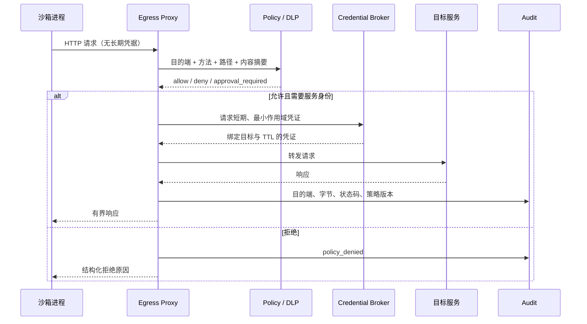
```mermaid
sequenceDiagram
    participant P as 沙箱进程
    participant X as Egress Proxy
    participant D as Policy / DLP
    participant B as Credential Broker
    participant S as 目标服务
    participant A as Audit

    P->>X: HTTP 请求（无长期凭据）
    X->>D: 目的端 + 方法 + 路径 + 内容摘要
    D-->>X: allow / deny / approval_required
    alt 允许且需要服务身份
        X->>B: 请求短期、最小作用域凭证
        B-->>X: 绑定目标与 TTL 的凭证
        X->>S: 转发请求
        S-->>X: 响应
        X->>A: 目的端、字节、状态码、策略版本
        X-->>P: 有界响应
    else 拒绝
        X->>A: policy_denied
        X-->>P: 结构化拒绝原因
    end
```

---

## 16. 依赖安装与供应链：`pip install` 也是代码执行

### 16.1 依赖解析的风险

安装依赖可能执行：

- 包安装脚本；
- 构建后端；
- 编译器与链接器；
- 下载脚本；
- Git 依赖；
- 二进制 wheel / native addon；
- Postinstall Hook；
- 编译期插件与宏。

所以“允许访问包仓库”实际上是在授权一条代码供应链。

### 16.2 推荐供应链控制

- 使用企业内部代理镜像，外部仓库由平台同步；
- 锁定版本与内容哈希；
- 禁止默认追踪 `latest`、分支头或未固定 Git commit；
- 对镜像使用 digest，而不是仅使用 tag；
- 缓存按生态、平台、架构、锁文件哈希和租户策略分区；
- 对高风险原生包做恶意软件、许可证和漏洞扫描；
- 生成 SBOM 与依赖清单；
- 构建与运行分离，运行阶段不保留编译器和包管理器；
- 依赖下载与最终外部发布是两种不同网络能力；
- 对名称相似、首次出现和低信誉依赖提高审批等级。

### 16.3 构建环境与运行环境分离


```mermaid
flowchart LR
    SRC["源码 + 锁文件"] --> BUILD["构建沙箱<br/>允许内部依赖镜像"]
    BUILD --> SCAN["SBOM / 漏洞 / 恶意行为扫描"]
    SCAN --> PKG["不可变制品<br/>digest + provenance"]
    PKG --> RUN["运行沙箱<br/>无包管理器 / 默认断网"]
    RUN --> OUT["结果与证据"]
```

### 16.4 缓存的隔离纪律

共享缓存可以提高性能，也可能泄露或污染：

- 包内容可能被恶意任务替换；
- 编译缓存包含源路径和构建信息；
- 上一个租户的私有依赖可能被下一个租户读取；
- 缓存命中会掩盖锁文件缺失问题。

正确做法：

- 缓存服务本身只提供内容寻址对象；
- 写入需校验摘要与来源；
- 私有缓存按租户隔离；
- 任务只读挂载公共缓存；
- 不把可执行目录以共享读写方式挂进多个沙箱；
- 定期做“无缓存冷构建”验证可重复性。

---

## 17. 环境变量、身份与秘密

### 17.1 环境变量是隐形能力入口

宿主环境经常包含：

- 云访问凭据；
- GitHub / GitLab Token；
- 数据库连接串；
- `HTTP_PROXY` / `HTTPS_PROXY`；
- `SSH_AUTH_SOCK`；
- `DOCKER_HOST`；
- 包仓库 Token；
- 调试与动态链接配置；
- `PATH` 中的用户可写目录；
- 语言运行时启动 Hook。

执行器绝不能默认继承全部宿主环境。

### 17.2 环境白名单

建议从空环境开始，显式注入：

```text
PATH=/opt/runner/bin:/usr/bin
HOME=/home/sandbox
LANG=C.UTF-8
LC_ALL=C.UTF-8
TZ=UTC
TERM=dumb                  # 非 PTY
NO_COLOR=1
PYTHONNOUSERSITE=1
GIT_CONFIG_NOSYSTEM=1
GIT_TERMINAL_PROMPT=0
```

按生态再加入必要变量。需要注意：某些变量本身能改变加载行为，例如 Python、Node、Java、动态链接器和 Git 的配置入口，应单独审计。

### 17.3 秘密不应作为普通字符串进入沙箱

一旦秘密进入不可信进程的地址空间，就应视为已暴露。更安全的模式：

#### 模式 A：沙箱外代理

沙箱调用受控代理，代理持有凭据并只允许特定操作。

#### 模式 B：短期、最小作用域能力令牌

Token 绑定：

- 目标服务；
- 方法或操作；
- 资源范围；
- 单次 / 少量使用；
- 很短 TTL；
- `execution_id`；
- 不可转用的 Audience。

#### 模式 C：制品交接

沙箱只产生补丁或构建制品；部署、签名、发布由沙箱外可信流水线完成。

### 17.4 不要把审批等同于秘密授权

用户批准“部署到测试环境”，并不意味着应把测试环境管理员密钥暴露给沙箱。审批应授权一个受控动作，凭据仍由 Broker 代用。

### 17.5 敏感输出脱敏

脱敏源应包括：

- 已知 Secret Handle 对应值；
- 平台 Token 格式；
- 私钥块；
- Cookie、Authorization Header；
- 数据库连接串；
- 用户配置的自定义正则与 DLP 规则。

但不要只依赖正则。更可靠的是：

- 设计上不让秘密进入；
- Broker 记录发出的短期凭据并对日志做精确匹配；
- 对高熵字符串做告警而非自动保证；
- 对完整日志实行更严格访问控制和短留存。

---

## 18. 代码理解栈：grep、AST、LSP、Symbol Index 与 Repo Map

代码执行并不等于代码理解。高质量 Coding Agent 通常组合多层能力。

### 18.1 五层代码理解能力

| 层级 | 技术 | 优点 | 局限 | 适用 |
|---|---|---|---|---|
| 文本检索 | grep / ripgrep | 快、通用、零索引 | 不理解语义 | 字符串、错误码、配置 |
| 语法树 | Tree-sitter / 编译器 AST | 结构化、跨语言解析 | 不一定有类型与跨文件解析 | 函数、类、语法模式 |
| 符号索引 | ctags、SCIP、LSIF、自建索引 | 大仓库快速导航 | 可能过期 | 定义、引用候选、Repo Map |
| LSP | Language Server Protocol | 定义、引用、诊断、重命名、补全 | 启动与索引成本、实现差异 | IDE 级语义操作 |
| 编译与测试 | Compiler / Type Checker / Test | 最接近真实行为 | 成本高、反馈慢 | 最终验证 |

LSP 3.17 规范定义了 definition、references、diagnostics、rename 等标准请求与能力[^lsp-spec]。但 LSP 不是最终正确性证明；它应与测试、构建和静态分析形成多层验证。

### 18.2 推荐组合

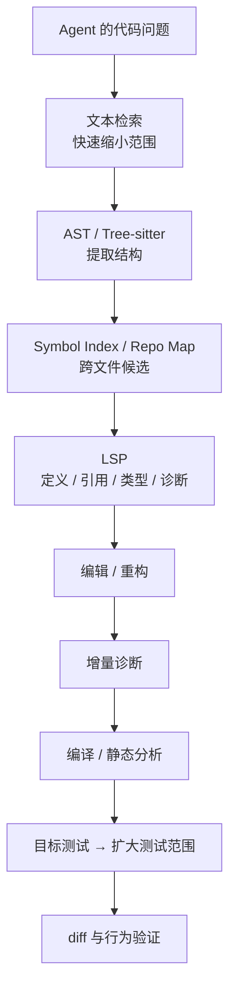
```mermaid
graph TB
    Q["Agent 的代码问题"] --> T["文本检索<br/>快速缩小范围"]
    T --> A["AST / Tree-sitter<br/>提取结构"]
    A --> I["Symbol Index / Repo Map<br/>跨文件候选"]
    I --> L["LSP<br/>定义 / 引用 / 类型 / 诊断"]
    L --> E["编辑 / 重构"]
    E --> D["增量诊断"]
    D --> C["编译 / 静态分析"]
    C --> TEST["目标测试 → 扩大测试范围"]
    TEST --> REVIEW["diff 与行为验证"]
```

### 18.3 LSP 的关键能力

- `textDocument/definition`：跳到定义；
- `textDocument/references`：查找引用；
- `textDocument/hover`：类型与文档；
- `textDocument/documentSymbol`：文件结构；
- `workspace/symbol`：全局符号；
- `textDocument/diagnostic` 或发布诊断：增量错误；
- `textDocument/rename`：工作区范围重命名；
- `textDocument/codeAction`：修复与重构候选；
- `workspace/applyEdit`：应用多文件编辑；
- `textDocument/semanticTokens`：语义分类；
- Call Hierarchy / Type Hierarchy：调用和类型关系。

### 18.4 LSP 生命周期

语言服务器不应每次调用都冷启动。推荐按“会话 + 工作区 + 语言 + 配置摘要”复用：

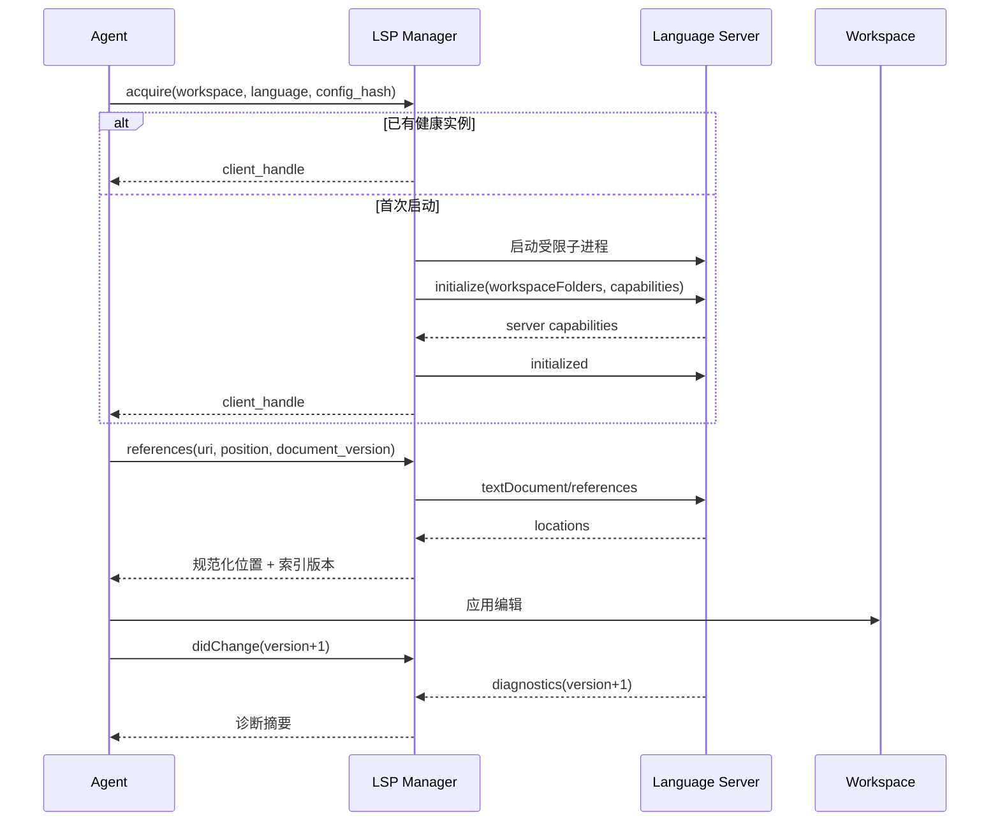
```mermaid
sequenceDiagram
    participant A as Agent
    participant M as LSP Manager
    participant S as Language Server
    participant W as Workspace

    A->>M: acquire(workspace, language, config_hash)
    alt 已有健康实例
        M-->>A: client_handle
    else 首次启动
        M->>S: 启动受限子进程
        M->>S: initialize(workspaceFolders, capabilities)
        S-->>M: server capabilities
        M->>S: initialized
        M-->>A: client_handle
    end
    A->>M: references(uri, position, document_version)
    M->>S: textDocument/references
    S-->>M: locations
    M-->>A: 规范化位置 + 索引版本
    A->>W: 应用编辑
    A->>M: didChange(version+1)
    S-->>M: diagnostics(version+1)
    M-->>A: 诊断摘要
```

### 18.5 文档版本与陈旧结果

LSP 结果必须绑定：

- 文档 URI；
- 文档版本；
- 工作区基线；
- 语言服务器实例；
- 配置摘要；
- 索引时间或索引版本。

Agent 在结果返回后修改了文件，就不能盲目使用旧位置。应：

- 使用版本化编辑；
- 应用前检查 range 对应文本；
- 对陈旧结果重新查询；
- 多文件重构优先使用 LSP WorkspaceEdit；
- 对语言服务器崩溃自动重启并重新同步文档。

### 18.6 LSP 也是不可信代码

语言服务器会解析整个仓库，可能加载配置、插件、编译器或项目代码。它应运行在与仓库相同或更严格的沙箱中，并受到：

- 网络限制；
- 工作区文件边界；
- 内存与 CPU 限制；
- 启动超时和空闲回收；
- 输出上限；
- 版本锁定；
- 崩溃隔离。

### 18.7 Repo Map 的作用

Repo Map 是为上下文预算服务的压缩视图，可包含：

- 顶层目录与职责；
- 关键模块、入口和依赖方向；
- 公开类型、函数签名与符号关系；
- 最近改动与热点；
- 测试映射；
- 代码所有者；
- 构建系统和运行命令。

它不是原始代码替代品，而是检索路由器。Repo Map 应标记生成时间、commit 与索引版本，避免让 Agent 把过期地图当成当前事实。

---

## 19. 文件编辑：补丁优先、原子写入、修改后立即验证

### 19.1 编辑工具的能力层级

1. `apply_patch`：最适合小范围、可审计修改；
2. `replace_range`：绑定文件版本和原文本；
3. `create_file`：明确新建；
4. `delete_file`：单独高风险能力；
5. `write_file`：全量覆盖，使用最谨慎；
6. LSP WorkspaceEdit：跨文件语义重构。

### 19.2 乐观并发控制

编辑请求应携带旧内容哈希：

```json
{
  "path": "src/order.py",
  "expected_sha256": "old-hash",
  "patch": "*** Begin Patch ..."
}
```

如果用户、另一个 Agent 或格式化器已修改文件，返回冲突而不是覆盖。

### 19.3 每次修改后的最小验证闭环

```text
写入成功
→ 文件可解析
→ LSP / 类型诊断
→ Formatter / Linter
→ 目标测试
→ 依赖测试
→ diff 审阅
```

不是每次都跑全量测试，但每一步至少要有与改动风险匹配的验证。

### 19.4 Diff 质量检查

Agent 应检查：

- 是否修改了任务无关文件；
- 是否出现大规模格式噪声；
- 是否误写生成文件或依赖锁文件；
- 是否删除注释、许可证或安全检查；
- 是否加入秘密和调试日志；
- 是否新增二进制或超大文件；
- 行尾、编码和权限位是否变化；
- 是否出现未预期子模块变动。

### 19.5 文件删除应独立建模

删除不是普通写入。建议：

- 使用显式 `delete_paths`；
- 列出精确路径，不允许通配符默认展开；
- 记录删除前哈希与大小；
- 工作区内且 Git 可恢复时可归为可逆；
- 未跟踪文件、超大文件或工作区外删除提高风险等级；
- 目录递归删除需要额外确认或严格上限。

---

## 20. Browser / Computer Use：不稳定环境中的安全动作循环

### 20.1 GUI 比 Shell 多了“状态漂移”

Shell 命令通常作用于明确路径和程序；GUI 动作作用于不断变化的页面和窗口。典型问题：

- 截图后页面重排，旧坐标点到另一个按钮；
- 元素名称相同但作用域不同；
- 弹窗抢占焦点；
- 登录状态过期；
- 页面内容包含提示注入；
- 提交、支付、发送一旦执行不可逆；
- 上传和下载跨越文件信任边界。

### 20.2 感知优先级

优先使用：

1. DOM 与稳定属性；
2. Accessibility Tree 的 Role、Name、State；
3. OCR 与截图语义；
4. 最后才是绝对像素坐标。

坐标动作应绑定截图尺寸、窗口、缩放、滚动位置和页面版本。

### 20.3 七段动作循环

```text
Observe → Ground → Propose → Policy Check
→ Re-observe / Staleness Check → Execute → Verify
→ Commit or Rollback
```

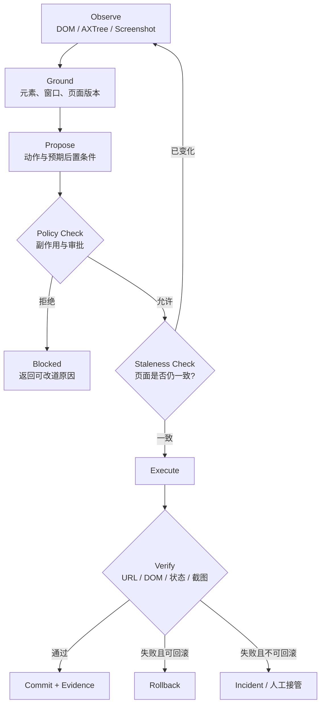
```mermaid
flowchart TD
    O["Observe<br/>DOM / AXTree / Screenshot"] --> G["Ground<br/>元素、窗口、页面版本"]
    G --> P["Propose<br/>动作与预期后置条件"]
    P --> C{"Policy Check<br/>副作用与审批"}
    C -->|拒绝| B["Blocked<br/>返回可改道原因"]
    C -->|允许| S{"Staleness Check<br/>页面是否仍一致?"}
    S -->|已变化| O
    S -->|一致| E["Execute"]
    E --> V{"Verify<br/>URL / DOM / 状态 / 截图"}
    V -->|通过| M["Commit + Evidence"]
    V -->|失败且可回滚| R["Rollback"]
    V -->|失败且不可回滚| I["Incident / 人工接管"]
```

### 20.4 Action Contract

```json
{
  "action": "click",
  "target": {
    "role": "button",
    "name": "Deploy",
    "selector": "[data-testid='deploy']",
    "window_id": "win_3"
  },
  "grounded_on": {
    "page_version": "pv_102",
    "url_origin": "https://deploy.internal",
    "screenshot_hash": "..."
  },
  "effect": "irreversible",
  "preconditions": [
    "environment == 'staging'",
    "selected_commit == 'abc123'"
  ],
  "postconditions": [
    "deployment_status == 'queued'",
    "target_environment == 'staging'"
  ]
}
```

### 20.5 上传与下载

上传前：

- 文件必须来自允许的 Artifact；
- 校验大小、类型、扩展名和内容摘要；
- 扫描秘密与恶意内容；
- 显式展示目标域和表单字段；
- 上传到外部服务属于不可逆数据外发。

下载后：

- 放入隔离 `downloads/`；
- 不自动执行；
- 校验 MIME、文件头和大小；
- 解压时防路径穿越和压缩炸弹；
- 作为不可信输入进入后续流程。

### 20.6 隐私与截图

截图、录屏和 DOM 快照可能包含：

- 密码与 Token；
- 个人信息；
- 聊天内容；
- 其他标签页；
- 系统通知；
- 客户数据。

应支持：

- 敏感输入框自动遮蔽；
- 仅截取目标窗口或区域；
- 证据留存分级；
- 默认不把完整截图交给无关模型；
- 在审计中记录遮蔽发生，而不是记录原值。

### 20.7 Computer Use 的不可逆动作

典型高风险动作：

- 发送消息、邮件、工单；
- 提交表单；
- 发布内容；
- 上传文件；
- 合并代码；
- 删除资源；
- 支付或下单；
- 改权限；
- 生产部署。

动作前应展示“将要发生什么”，审批后仍要做页面过期检查；否则用户批准的是旧状态。

---

## 21. 副作用分级：从三级标签升级为多维风险模型

### 21.1 基础三级

| 等级 | 定义 | 示例 | 默认策略 |
|---|---|---|---|
| 只读 Read-only | 不改变外部状态 | 读文件、搜索、LSP 查询、`git status` | 自动放行，仍需限资源和审计 |
| 可逆 Reversible | 状态改变，但存在低成本、可靠恢复路径 | 工作区内 Git 可追踪修改、临时容器内安装依赖 | 自动执行或低摩擦确认，完整留痕 |
| 不可逆 Irreversible | 数据离开边界、外部状态难恢复或影响他人 | 发送、发布、部署、删除无备份数据、改权限 | 默认拦截，显式审批 |

### 21.2 三级标签不够表达真实风险

两个都叫“可逆”的动作可能差异巨大：

- 修改一个测试文件；
- 对 10 万个文件做自动格式化；
- 重置一个 500 GB 数据库但声称有备份。

因此建议增加维度：

```text
Risk = f(
  effect_class,
  scope,
  data_sensitivity,
  external_write,
  blast_radius,
  recoverability,
  identity_privilege,
  network_destination,
  confidence,
  verification_strength
)
```

### 21.3 推荐维度

| 维度 | 低风险 | 中风险 | 高风险 |
|---|---|---|---|
| 作用域 | 单文件 / 单任务 | 仓库 / 测试环境 | 跨仓库 / 生产 / 全租户 |
| 数据敏感度 | 公共代码 | 内部代码 | 密钥、个人数据、客户数据 |
| 外部写入 | 无 | 内部可撤销 | 对外发送、发布、通知 |
| 恢复能力 | 自动、已验证 | 手工恢复 | 无法恢复或不确定 |
| 身份权限 | 匿名 / 只读 | 项目写 | 管理员 / 生产 |
| 影响半径 | 当前沙箱 | 当前项目 | 多用户、共享服务、外部客户 |
| 验证强度 | 强后置条件 | 部分验证 | 无法可靠验证 |
| 模型置信与证据 | 有明确事实 | 存在假设 | 关键参数由推断得出 |

### 21.4 风险评分示例

```yaml
risk_policy:
  weights:
    irreversible: 40
    external_write: 30
    production_scope: 30
    sensitive_data: 25
    admin_identity: 25
    weak_rollback: 20
    inferred_target: 15
    no_verifier: 15
  thresholds:
    auto_allow: 0-19
    allow_with_audit: 20-39
    ask_user: 40-69
    privileged_approval: 70-89
    hard_deny: 90+
```

风险分数只能用于统一策略表达，不能代替硬规则。例如：

- 向未授权公网发送数据，无论总分多少都拒绝；
- 使用生产管理员身份必须专门审批；
- 工作区外写入默认拒绝；
- 模型不能通过声称“这是安全的”降低分数。

### 21.5 决策流程

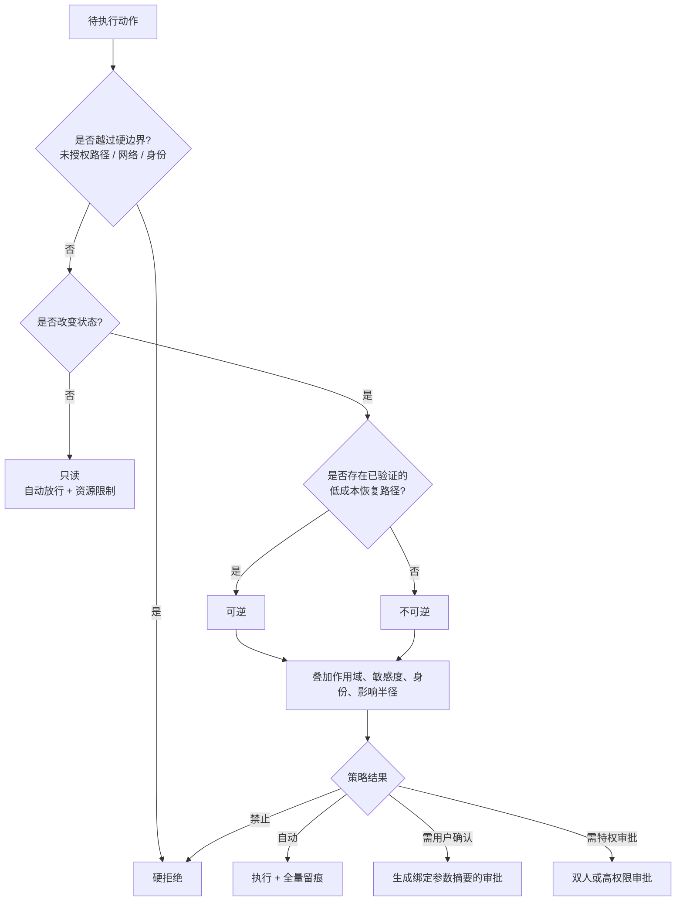
```mermaid
flowchart TB
    OP["待执行动作"] --> S1{"是否越过硬边界?<br/>未授权路径 / 网络 / 身份"}
    S1 -->|是| DENY["硬拒绝"]
    S1 -->|否| S2{"是否改变状态?"}
    S2 -->|否| RO["只读<br/>自动放行 + 资源限制"]
    S2 -->|是| S3{"是否存在已验证的<br/>低成本恢复路径?"}
    S3 -->|是| REV["可逆"]
    S3 -->|否| IRR["不可逆"]
    REV --> SCORE["叠加作用域、敏感度、身份、影响半径"]
    IRR --> SCORE
    SCORE --> P{"策略结果"}
    P -->|自动| ALLOW["执行 + 全量留痕"]
    P -->|需用户确认| ASK["生成绑定参数摘要的审批"]
    P -->|需特权审批| ADMIN["双人或高权限审批"]
    P -->|禁止| DENY
```

### 21.6 恢复路径必须经过验证

“有 Git”不代表一定可逆：

- 未跟踪文件删除可能没有历史；
- 大文件可能不在 Git；
- 数据库备份可能过期；
- 外部消息无法撤回；
- Git Push 后其他系统可能已触发；
- 部署回滚可能无法恢复数据 Schema。

因此 `recoverability` 应包含：

```json
{
  "method": "git_restore",
  "checkpoint_id": "cp_123",
  "verified": true,
  "verification_time": "...",
  "estimated_recovery_seconds": 10,
  "data_loss_window_seconds": 0
}
```

### 21.7 拒绝是可改道的观察

策略拒绝不应表现为执行器崩溃。返回结构化信息：

```json
{
  "status": "denied",
  "reason_code": "NETWORK_PROFILE_REQUIRED",
  "message": "当前沙箱无网络，无法访问依赖源。",
  "alternatives": [
    "使用已缓存依赖",
    "申请 package-readonly 网络 Profile",
    "改用内部镜像中已包含依赖的环境"
  ],
  "approval_possible": true
}
```

这样 Agent 可以调整计划，而不是无限重复同一调用。

---

## 22. 权限体系：能力、策略与审批分离

### 22.1 三个不同概念

- **Capability**：环境实际拥有的能力，如“读 `/workspace`”“访问内部 PyPI”；
- **Policy**：在当前主体和上下文中是否允许请求该能力；
- **Approval**：人或高权限系统对一次具体动作的临时授权。

不要把它们混为一个布尔字段。

### 22.2 最小能力分配

执行前根据动作生成一次性 Capability Set：

```json
{
  "fs.read": ["workspace/repo"],
  "fs.write": ["workspace/repo", "workspace/artifacts"],
  "process.exec": ["/opt/tools/pytest"],
  "network.profile": "none",
  "secrets.consume": [],
  "external.publish": false
}
```

沙箱不应先拥有宽权限，再依赖 Agent“不使用”。

### 22.3 策略输入

PDP 可综合：

- 用户、角色、组织与租户；
- Agent、模型、版本与自治级别；
- 工具和命令 Profile；
- 仓库、分支、数据分类；
- 目标环境；
- 副作用与风险分；
- 时间、地域、设备信任；
- 当前会话是否已被注入告警；
- 预算和历史异常；
- 审批凭证与撤销状态。

### 22.4 策略输出

不要只返回 allow / deny：

```json
{
  "decision": "allow_with_constraints",
  "policy_version": "policy-2026-08-31.4",
  "constraints": {
    "network_profile": "package-readonly",
    "max_wall_time_ms": 60000,
    "max_output_bytes": 5242880,
    "forced_runtime": "gvisor",
    "required_verifiers": ["dependency_scan"]
  },
  "obligations": [
    "record_full_diff",
    "redact_secrets",
    "destroy_after_execution"
  ]
}
```

### 22.5 审批的生命周期

审批应包含：

- 动作摘要；
- 用户可读说明；
- 具体目标与影响；
- 有效期；
- 单次或有限次数；
- 批准主体；
- 策略版本；
- 可撤销状态；
- 是否允许参数的某些有限变化。

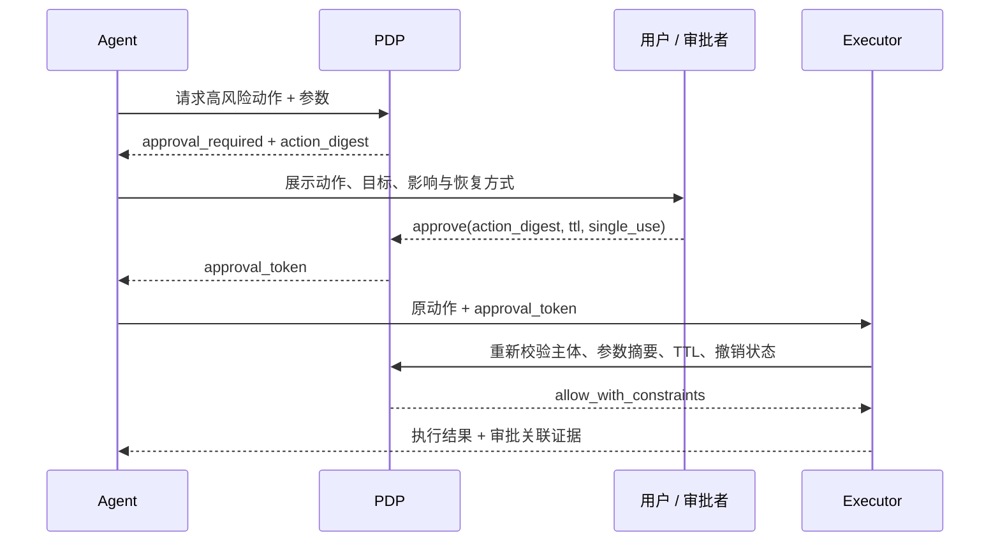
```mermaid
sequenceDiagram
    participant A as Agent
    participant P as PDP
    participant U as 用户 / 审批者
    participant E as Executor

    A->>P: 请求高风险动作 + 参数
    P-->>A: approval_required + action_digest
    A->>U: 展示动作、目标、影响与恢复方式
    U-->>P: approve(action_digest, ttl, single_use)
    P-->>A: approval_token
    A->>E: 原动作 + approval_token
    E->>P: 重新校验主体、参数摘要、TTL、撤销状态
    P-->>E: allow_with_constraints
    E-->>A: 执行结果 + 审批关联证据
```

---

## 23. 可观测性：一次执行应该看见什么

### 23.1 四类信号

1. **Trace**：端到端因果关系；
2. **Metric**：聚合趋势和 SLO；
3. **Log / Event**：离散生命周期事实；
4. **Artifact**：无法或不应塞进日志的大对象。

OpenTelemetry 提供厂商中立的 Trace、Metric、Log 模型与语义约定[^otel-docs]。其进程语义约定还提醒：完整命令行和参数可能含敏感数据，不应默认采集，除非做过清洗[^otel-process]。

### 23.2 推荐 Trace 层级

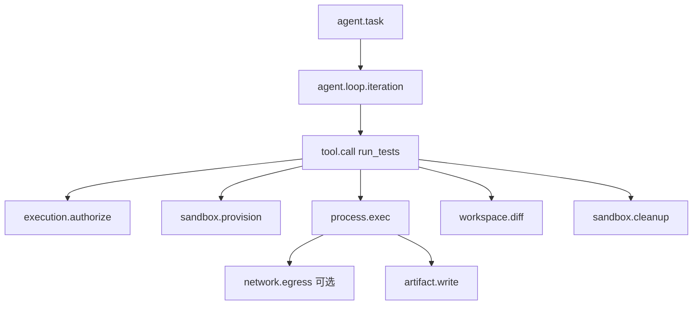
```mermaid
graph TB
    T0["agent.task"] --> T1["agent.loop.iteration"]
    T1 --> T2["tool.call run_tests"]
    T2 --> T3["execution.authorize"]
    T2 --> T4["sandbox.provision"]
    T2 --> T5["process.exec"]
    T5 --> T6["network.egress 可选"]
    T5 --> T7["artifact.write"]
    T2 --> T8["workspace.diff"]
    T2 --> T9["sandbox.cleanup"]
```

### 23.3 `process.exec` Span 字段

建议字段：

```text
execution.id
sandbox.id
workspace.id
tenant.id
session.id
agent.id
model.provider / model.name
process.command              # 仅程序名
process.args_count
process.working_directory    # 可做逻辑路径，不暴露宿主真实路径
process.interactive
execution.profile
execution.effect_class
execution.risk_score
execution.policy_version
execution.approval_id
execution.runtime            # local/container/gvisor/microvm/wasm
container.image.digest
execution.network_profile
execution.exit_code
execution.termination_reason
execution.stdout_bytes
execution.stderr_bytes
execution.output_truncated
execution.redaction_count
execution.wall_time_ms
execution.cpu_time_ms
execution.memory_peak_bytes
execution.pids_peak
execution.disk_peak_bytes
execution.cleanup_complete
```

完整 `argv`、用户文本和原始环境变量默认不进入 Span Attribute。可保存经过脱敏的摘要或哈希。

### 23.4 生命周期事件

```text
execution.received
policy.evaluated
approval.requested
approval.granted
sandbox.provision_started
sandbox.ready
process.started
output.truncated
resource.limit_near
network.request_denied
process.termination_requested
process.forced_kill
workspace.diff_created
artifact.uploaded
sandbox.destroyed
execution.finalized
```

### 23.5 核心指标

#### 可靠性

- `execution.success_rate`；
- `execution.failure_rate_by_reason`；
- `execution.timeout_rate`；
- `execution.cancel_success_rate`；
- `execution.cleanup_failure_rate`；
- `orphan_process_detected_total`；
- `sandbox_provision_failure_rate`。

#### 性能

- 排队时延 P50/P95/P99；
- 沙箱冷启动与快照恢复时延；
- 首字节输出时间；
- 执行总时延；
- Artifact 上传时延；
- LSP 初始化与索引时延。

#### 资源与容量

- CPU / 内存 / PID / 磁盘峰值；
- cgroup 节流时间；
- OOM 次数；
- 沙箱池利用率；
- 镜像缓存命中率；
- 依赖缓存命中率；
- 节点污损与清理失败数。

#### 安全与治理

- 策略拒绝率及原因；
- 审批请求、批准、拒绝、过期；
- 工作区越界尝试；
- 未授权网络尝试；
- Secret 脱敏命中；
- 高风险动作数量；
- 可写外部服务访问；
- 镜像 / 依赖哈希不匹配；
- 沙箱逃逸测试失败。

#### Agent 效能

- 每个成功任务的执行次数；
- 无效重复命令率；
- 失败后同参数重试率；
- 测试选择命中率；
- 每次有效代码改动的执行成本；
- 验证覆盖率；
- 工具拒绝后成功改道率。

### 23.6 指标不能泄露高基数或敏感数据

不要把以下内容作为 Metric Label：

- 完整命令；
- 文件路径；
- 用户提示；
- URL Query；
- commit message；
- Secret；
- `execution_id` 等每次唯一 ID。

高基数细节放 Trace 或日志，并设置访问控制和留存策略。

### 23.7 审计记录

审计记录建议采用不可变事件：

```json
{
  "event": "execution.finalized",
  "execution_id": "exec_...",
  "actor": {"user": "u_123", "agent": "coding-agent"},
  "request_digest": "sha256:...",
  "policy": {"version": "42", "decision": "allow"},
  "approval": {"id": null},
  "runtime": {
    "kind": "gvisor",
    "image_digest": "sha256:...",
    "node_attestation": "optional"
  },
  "scope": {
    "workspace": "ws_...",
    "network_profile": "none"
  },
  "result": {
    "exit_code": 0,
    "termination_reason": "PROCESS_EXIT",
    "cleanup_complete": true
  },
  "changes": {
    "files_modified": 4,
    "files_created": 1,
    "files_deleted": 0,
    "diff_digest": "sha256:..."
  },
  "artifacts": ["artifact://sha256/..."],
  "timestamp": "..."
}
```

### 23.8 执行结果与模型观察分离

证据面保存事实，模型观察是事实的一个受限投影：

```text
Raw Execution Evidence
  ├─ 完整日志
  ├─ 资源事件
  ├─ 网络事件
  ├─ 工作区清单
  └─ 策略审计
          ↓ 过滤 / 脱敏 / 摘要
Model Observation
  ├─ 退出原因
  ├─ 关键错误
  ├─ 有界输出
  ├─ 改动摘要
  └─ Artifact 指针
```

模型不能决定审计记录什么，也不能覆盖原始证据。

---

## 24. 可重复性：让“在我这里成功”变成可验证事实

### 24.1 影响执行结果的隐含变量

- 镜像与工具版本；
- CPU 架构；
- 操作系统与内核；
- 时区、Locale、字符集；
- 当前时间；
- 随机种子；
- 网络响应；
- 环境变量；
- 用户 Home 配置；
- 文件顺序；
- 并发调度；
- 缓存状态；
- Git 脏状态；
- 依赖锁文件与镜像内容；
- LSP / 编译器配置。

### 24.2 环境清单

每次重要执行生成 `environment.json`：

```json
{
  "runtime": "container",
  "image": "registry/agent-python@sha256:...",
  "os": {"name": "linux", "arch": "amd64"},
  "toolchain": {
    "python": "3.x",
    "pytest": "x.y.z"
  },
  "locale": "C.UTF-8",
  "timezone": "UTC",
  "network_profile": "none",
  "workspace_baseline": "git:abc123+dirty:sha256...",
  "lockfiles": {
    "requirements.lock": "sha256:..."
  },
  "policy_version": "42",
  "runner_version": "..."
}
```

### 24.3 可重复执行级别

| 级别 | 描述 |
|---|---|
| R0 未记录 | 只知道命令文本 |
| R1 可诊断 | 记录镜像、工具、环境摘要 |
| R2 可重放 | 锁定依赖、输入、工作区基线与网络响应 |
| R3 确定性 | 时间、随机、并发与外部输入都受控 |
| R4 可验证供应链 | 制品带来源证明、签名、SBOM 与策略证据 |

不是所有任务都需要 R3/R4，但生产发布、评测与安全事件复盘应达到更高等级。

### 24.4 网络会破坏可重复性

开放公网意味着同一命令可能下载不同内容。解决方式：

- 内容寻址依赖；
- 固定镜像和锁文件；
- 内部镜像保留历史；
- 对必要 HTTP 响应做录制与哈希；
- 测试环境使用 Mock / Fixture；
- 把网络 Profile 和响应摘要写入证据。

### 24.5 时间与随机性

可选能力：

- 固定 `TZ=UTC`；
- 注入任务时间而非读取真实墙钟；
- 固定随机种子；
- 对需要真实时间的测试显式标记；
- 避免在基础设施层偷偷冻结时间导致第三方工具异常。

---

## 25. 沙箱池化、快照与多租户隔离

### 25.1 为什么需要预热池

冷启动可能来自：

- 拉取镜像；
- 创建容器或 microVM；
- 启动语言服务器；
- 恢复依赖缓存；
- 仓库物化与索引；
- 启动测试依赖服务。

预热池可以提前准备“干净模板”，但池化极易引入跨任务残留。

### 25.2 两种复用边界

- **同一会话内复用**：允许，因为工作区连续性是需求；
- **跨会话或跨租户复用**：默认禁止，优先销毁并从干净模板重建。

### 25.3 模板、克隆与任务实例

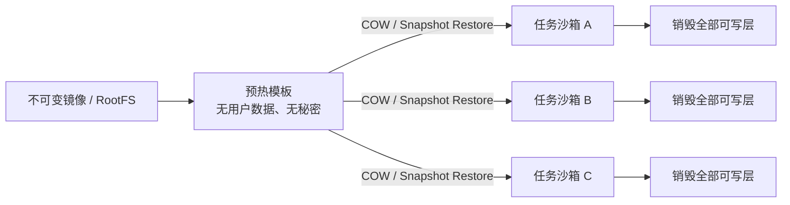
```mermaid
graph LR
    I["不可变镜像 / RootFS"] --> T["预热模板<br/>无用户数据、无秘密"]
    T -->|"COW / Snapshot Restore"| S1["任务沙箱 A"]
    T -->|"COW / Snapshot Restore"| S2["任务沙箱 B"]
    T -->|"COW / Snapshot Restore"| S3["任务沙箱 C"]
    S1 --> D1["销毁全部可写层"]
    S2 --> D2["销毁全部可写层"]
    S3 --> D3["销毁全部可写层"]
```

Firecracker 的快照机制可利用只读磁盘与内存文件的共享，并通过私有写时复制映射按需加载页面[^firecracker-snapshot]。无论实现为何，模板必须在不含租户状态的阶段创建。

### 25.4 不能进入模板的内容

- 用户仓库；
- Secret；
- 登录 Cookie；
- 租户私有依赖缓存；
- 审批令牌；
- 会话 Trace Context；
- 临时网络身份；
- 带租户内容的 LSP 索引；
- 可写共享目录。

### 25.5 多租户调度

调度器需要同时考虑：

- 租户配额；
- 运行时安全等级；
- 镜像与架构；
- GPU / CPU / 内存；
- 数据地域；
- 工作区存储位置；
- 节点可信状态；
- 沙箱逃逸或清理失败后的节点隔离；
- 公平队列和优先级；
- 避免同一高价值租户与未知公共任务共置。

### 25.6 节点污损（Node Taint）

出现以下情况时，不应继续把节点当作健康容量：

- 沙箱清理失败；
- 检测到孤儿进程；
- 挂载未卸载；
- cgroup 无法删除；
- 网络 Namespace 残留；
- 运行时崩溃或安全告警；
- 审计链断裂；
- 磁盘泄漏无法归属。

处理：

1. 节点停止接收新任务；
2. 排空现有任务；
3. 收集证据；
4. 重启或重建节点；
5. 安全事件按级别升级。

---

## 26. 生产级参考架构

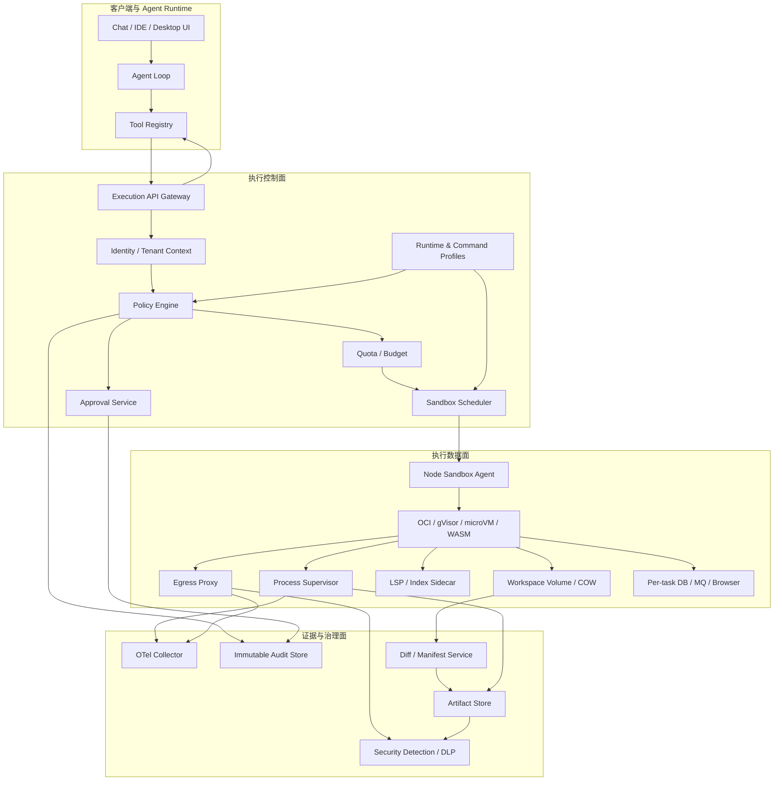
```mermaid
graph TB
    subgraph CLIENT["客户端与 Agent Runtime"]
        UI["Chat / IDE / Desktop UI"]
        LOOP["Agent Loop"]
        TOOLS["Tool Registry"]
        UI --> LOOP --> TOOLS
    end

    subgraph CONTROL["执行控制面"]
        GW["Execution API Gateway"]
        IAM["Identity / Tenant Context"]
        PDP["Policy Engine"]
        APPROVAL["Approval Service"]
        QUOTA["Quota / Budget"]
        SCHED["Sandbox Scheduler"]
        PROFILE["Runtime & Command Profiles"]
        GW --> IAM --> PDP
        PDP --> APPROVAL
        PDP --> QUOTA --> SCHED
        PROFILE --> PDP
        PROFILE --> SCHED
    end

    subgraph DATA["执行数据面"]
        AGENTD["Node Sandbox Agent"]
        RUNTIME["OCI / gVisor / microVM / WASM"]
        SUP["Process Supervisor"]
        WORK["Workspace Volume / COW"]
        LSP["LSP / Index Sidecar"]
        EGRESS["Egress Proxy"]
        SERVICE["Per-task DB / MQ / Browser"]
        SCHED --> AGENTD --> RUNTIME
        RUNTIME --> SUP
        RUNTIME --> WORK
        RUNTIME --> LSP
        RUNTIME --> EGRESS
        RUNTIME --> SERVICE
    end

    subgraph EVIDENCE["证据与治理面"]
        OTEL["OTel Collector"]
        AUDIT["Immutable Audit Store"]
        ART["Artifact Store"]
        DIFF["Diff / Manifest Service"]
        SEC["Security Detection / DLP"]
        SUP --> OTEL
        EGRESS --> OTEL
        PDP --> AUDIT
        APPROVAL --> AUDIT
        WORK --> DIFF --> ART
        SUP --> ART
        EGRESS --> SEC
        ART --> SEC
    end

    TOOLS --> GW
    GW --> TOOLS
```

### 26.1 Execution API Gateway

职责：

- Schema 与大小校验；
- 身份、租户和 Trace Context；
- 幂等键；
- 请求规范化和摘要；
- 流式结果；
- 不在网关执行任意代码。

### 26.2 Policy Engine

职责：

- 硬规则；
- 风险评分；
- 审批要求；
- 强制运行时和资源上限；
- 义务：审计、销毁、验证、脱敏；
- 策略版本化和可解释结果。

### 26.3 Sandbox Scheduler

职责：

- 运行时选型；
- 预热池；
- 数据地域；
- 配额与公平性；
- 节点健康与污损；
- 亲和 / 反亲和；
- 任务取消路由。

### 26.4 Node Sandbox Agent

这是节点上的高权限组件，必须最小化攻击面：

- 不解析模型提示；
- 只接受经过认证的结构化命令；
- 校验控制面签名与租户；
- 管理 Runtime、cgroup、网络和挂载；
- 证据直接发往沙箱外；
- 与沙箱通信使用窄协议；
- 自身启用最小权限与自动更新策略。

### 26.5 Workspace Service

职责：

- 基线与脏状态快照；
- 任务 Worktree / COW；
- 文件配额；
- 路径安全；
- Diff、Manifest、Artifact；
- 并发冲突；
- 生命周期清理。

### 26.6 Egress Proxy 与 Credential Broker

两者最好独立：

- Proxy 判断目标、协议、内容与流量；
- Broker 签发目标绑定的短期身份；
- 沙箱无法读取 Broker 的主凭据；
- 两者证据都关联 `execution_id`。

### 26.7 LSP Manager

职责：

- 多语言服务器注册；
- 版本与命令 Profile；
- 生命周期、健康检查、重启和空闲关闭；
- 文档版本同步；
- 大仓库索引；
- 资源配额；
- 将 LSP 能力包装成稳定的意图级工具。

### 26.8 部署模式

#### 桌面单用户

```text
Tauri / Electron / IDE
→ 本地 Execution Service
→ OS 级受限进程或本地容器
→ 用户明确授权的工作区
```

关键：跨平台差异、用户文件授权、Docker 可用性、桌面凭据隔离。

#### 企业内网平台

```text
Agent Gateway
→ Kubernetes Sandbox Workers
→ 内部依赖镜像与服务代理
→ 企业 IAM、审批、审计
```

关键：租户隔离、网络策略、数据分类、镜像治理。

#### 公共多租户 SaaS

```text
全球控制面
→ 地域化工作区与调度
→ gVisor / microVM Worker
→ 默认无网络 + 能力 Broker
→ 强制销毁与不可变证据
```

关键：硬件隔离、节点重建、地域合规、DDoS 与滥用治理。

---

## 27. Docker 加固示例

下面示例用于说明防线组合，不应直接替代组织级运行时策略：

```bash
docker run --rm \
  --name "agent-${EXECUTION_ID}" \
  --user 65532:65532 \
  --read-only \
  --cap-drop ALL \
  --security-opt no-new-privileges:true \
  --security-opt seccomp=default \
  --network none \
  --pids-limit 128 \
  --cpus 1.0 \
  --memory 1g \
  --memory-swap 1g \
  --ulimit nofile=1024:1024 \
  --tmpfs /tmp:rw,noexec,nosuid,nodev,size=128m \
  --mount "type=bind,src=${WORKSPACE},dst=/workspace,rw" \
  --workdir /workspace/repo \
  --env HOME=/home/sandbox \
  --env LANG=C.UTF-8 \
  --env TZ=UTC \
  --env GIT_TERMINAL_PROMPT=0 \
  registry.internal/agent-python@sha256:IMAGE_DIGEST \
  /opt/runner/exec --request /run/request.json
```

### 27.1 还需要补充的控制

- 工作区最好使用专门的卷与配额，而不是任意宿主 bind mount；
- seccomp Profile 应由平台验证，不要允许用户传 `unconfined`；
- 容器镜像需要签名、扫描与摘要锁定；
- `--network none` 之外，还要保证没有敏感 Unix Socket；
- Runner 需要流式日志、取消与 cgroup 级终止；
- 多租户场景考虑 gVisor / microVM；
- Docker Daemon 本身是高权限组件，沙箱不能访问其 Socket。

---

## 28. Kubernetes 加固示例

Kubernetes 的 Security Context 支持非 root、只读根文件系统、禁止提权、Seccomp 与 capability 等设置[^k8s-security-context]；Pod Security Standards 提供从宽松到 Restricted 的标准基线[^k8s-pss]。

```yaml
apiVersion: v1
kind: Pod
metadata:
  name: agent-exec-example
  namespace: agent-sandboxes
  labels:
    app: agent-exec
    execution-id: exec-example
spec:
  restartPolicy: Never
  automountServiceAccountToken: false
  enableServiceLinks: false
  hostNetwork: false
  hostPID: false
  hostIPC: false
  runtimeClassName: gvisor         # 按平台能力与兼容性选用
  securityContext:
    runAsNonRoot: true
    runAsUser: 65532
    runAsGroup: 65532
    fsGroup: 65532
    seccompProfile:
      type: RuntimeDefault
  containers:
    - name: runner
      image: registry.internal/agent-runner@sha256:IMAGE_DIGEST
      imagePullPolicy: IfNotPresent
      workingDir: /workspace/repo
      securityContext:
        allowPrivilegeEscalation: false
        privileged: false
        readOnlyRootFilesystem: true
        capabilities:
          drop: ["ALL"]
      resources:
        requests:
          cpu: "250m"
          memory: "256Mi"
          ephemeral-storage: "256Mi"
        limits:
          cpu: "1"
          memory: "1Gi"
          ephemeral-storage: "2Gi"
      env:
        - name: HOME
          value: /home/sandbox
        - name: LANG
          value: C.UTF-8
        - name: TZ
          value: UTC
      volumeMounts:
        - name: workspace
          mountPath: /workspace
        - name: tmp
          mountPath: /tmp
        - name: home
          mountPath: /home/sandbox
  volumes:
    - name: workspace
      ephemeral:
        volumeClaimTemplate:
          spec:
            accessModes: ["ReadWriteOnce"]
            resources:
              requests:
                storage: 2Gi
    - name: tmp
      emptyDir:
        medium: Memory
        sizeLimit: 128Mi
    - name: home
      emptyDir:
        sizeLimit: 64Mi
```

默认拒绝所有出站的 NetworkPolicy：

```yaml
apiVersion: networking.k8s.io/v1
kind: NetworkPolicy
metadata:
  name: deny-all-agent-egress
  namespace: agent-sandboxes
spec:
  podSelector:
    matchLabels:
      app: agent-exec
  policyTypes:
    - Ingress
    - Egress
  ingress: []
  egress: []
```

Kubernetes 官方文档明确指出，默认拒绝全部 Egress 也会阻断 DNS；若任务确实需要解析，必须另行只允许集群 DNS 或更推荐的受控代理路径[^k8s-network-policy]。同时要确认所用 CNI 真正支持并执行 NetworkPolicy。

### 28.1 Kubernetes 额外风险

- Service Account Token 自动挂载；
- 可访问 Kubernetes API；
- Node Metadata；
- `hostPath`；
- 特权 Init Container；
- Ephemeral Container 调试权限；
- RuntimeClass 被用户覆盖；
- Sidecar 带宽和日志泄漏；
- Namespace 配额缺失；
- Pod 删除后卷或网络资源残留。

建议通过 Admission Policy 强制：

- 禁止 privileged / host namespace / hostPath；
- 强制非 root、Seccomp、drop ALL；
- 镜像必须使用允许 Registry 与 digest；
- 资源 limits 必填；
- Service Account Token 关闭；
- RuntimeClass 与网络标签由平台注入，不信任用户输入。

---

## 29. 参考实现：一个可取消、可审计的结构化进程执行器

> **重要边界**：下面代码展示执行器的结构、输出治理和取消流程，不能单独作为运行不可信代码的安全沙箱。生产环境必须把它放在容器、gVisor、microVM 或等价 OS 沙箱内，并由外层实施文件、网络、资源和身份隔离。

### 29.1 数据模型

```python
# execution/models.py
from __future__ import annotations

from dataclasses import dataclass, field
from enum import StrEnum
from pathlib import Path
from typing import Mapping, Sequence


class Effect(StrEnum):
    READ_ONLY = "readonly"
    REVERSIBLE = "reversible"
    IRREVERSIBLE = "irreversible"


class TerminationReason(StrEnum):
    PROCESS_EXIT = "process_exit"
    WALL_TIMEOUT = "wall_timeout"
    USER_CANCELLED = "user_cancelled"
    OUTPUT_LIMIT = "output_limit"
    SPAWN_FAILED = "spawn_failed"
    POLICY_DENIED = "policy_denied"
    CLEANUP_FAILED = "cleanup_failed"


@dataclass(frozen=True)
class ExecLimits:
    wall_timeout_seconds: float = 60.0
    graceful_shutdown_seconds: float = 2.0
    preview_bytes_per_stream: int = 32_000
    artifact_bytes_per_stream: int = 20_000_000
    max_args: int = 128
    max_arg_bytes: int = 16_384


@dataclass(frozen=True)
class ExecRequest:
    execution_id: str
    program: str
    args: Sequence[str] = field(default_factory=tuple)
    cwd: str = "."                     # 仅允许工作区相对路径
    environment: Mapping[str, str] = field(default_factory=dict)
    effect: Effect = Effect.REVERSIBLE
    tty: bool = False
    limits: ExecLimits = field(default_factory=ExecLimits)


@dataclass(frozen=True)
class StreamEvidence:
    preview: str
    bytes_seen: int
    artifact_path: Path
    artifact_sha256: str
    artifact_truncated: bool


@dataclass(frozen=True)
class ExecResult:
    execution_id: str
    exit_code: int | None
    reason: TerminationReason
    started_at_unix_ms: int
    finished_at_unix_ms: int
    stdout: StreamEvidence
    stderr: StreamEvidence
    cleanup_complete: bool
    metadata: Mapping[str, object] = field(default_factory=dict)
```

### 29.2 命令 Profile 与请求校验

```python
# execution/policy.py
from __future__ import annotations

import os
from dataclasses import dataclass, field
from pathlib import Path
from typing import Mapping

from .models import ExecRequest


class PolicyDenied(ValueError):
    """请求违反本地命令 Profile。策略拒绝应映射为可改道观察。"""


@dataclass(frozen=True)
class ProgramRule:
    # None 表示允许任意子命令；非 None 表示 argv[0] 之后第一个参数必须在集合内
    subcommands: frozenset[str] | None = None
    denied_args: frozenset[str] = frozenset()
    max_args: int | None = None


@dataclass(frozen=True)
class CommandProfile:
    name: str
    program_paths: Mapping[str, Path]
    rules: Mapping[str, ProgramRule] = field(default_factory=dict)
    allowed_env: frozenset[str] = frozenset({
        "LANG", "LC_ALL", "TZ", "NO_COLOR", "TERM"
    })

    def validate(self, request: ExecRequest, workspace: Path) -> tuple[Path, Path, dict[str, str]]:
        if request.tty:
            raise PolicyDenied("此 Profile 不允许 PTY；请使用专用交互式 Profile。")

        if "\x00" in request.program or any("\x00" in arg for arg in request.args):
            raise PolicyDenied("程序名与参数不能包含 NUL。")

        if len(request.args) > request.limits.max_args:
            raise PolicyDenied("参数数量超过上限。")

        arg_bytes = sum(len(arg.encode("utf-8", errors="strict")) for arg in request.args)
        if arg_bytes > request.limits.max_arg_bytes:
            raise PolicyDenied("参数总大小超过上限。")

        # 只按逻辑名称选用平台预注册的绝对路径；不接受模型提供任意可执行路径。
        program_path = self.program_paths.get(request.program)
        if program_path is None:
            raise PolicyDenied(f"程序 {request.program!r} 不在 Profile {self.name!r} 中。")

        program_path = program_path.resolve(strict=True)
        if not program_path.is_file():
            raise PolicyDenied("允许的程序路径不是普通文件。")

        rule = self.rules.get(request.program, ProgramRule())
        if rule.max_args is not None and len(request.args) > rule.max_args:
            raise PolicyDenied("该程序参数数量超过 Profile 上限。")

        if any(arg in rule.denied_args for arg in request.args):
            raise PolicyDenied("参数包含 Profile 明确禁止的选项。")

        if rule.subcommands is not None:
            if not request.args or request.args[0] not in rule.subcommands:
                raise PolicyDenied("子命令不在允许集合中。")

        workspace = workspace.resolve(strict=True)
        if os.path.isabs(request.cwd):
            raise PolicyDenied("cwd 只能是工作区相对路径。")

        cwd = (workspace / request.cwd).resolve(strict=True)
        try:
            cwd.relative_to(workspace)
        except ValueError as exc:
            raise PolicyDenied("cwd 越出工作区。") from exc

        # 从空环境开始，平台固定值优先；模型只能设置少量无敏感语义变量。
        env = {
            "PATH": str(program_path.parent),
            "HOME": "/home/sandbox" if os.name != "nt" else str(workspace / ".home"),
            "LANG": "C.UTF-8",
            "LC_ALL": "C.UTF-8",
            "TZ": "UTC",
            "NO_COLOR": "1",
            "TERM": "dumb",
            "GIT_TERMINAL_PROMPT": "0",
            "GIT_CONFIG_NOSYSTEM": "1",
            "PYTHONNOUSERSITE": "1",
        }
        for key, value in request.environment.items():
            if key not in self.allowed_env:
                raise PolicyDenied(f"环境变量 {key!r} 不允许由请求设置。")
            if "\x00" in key or "\x00" in value:
                raise PolicyDenied("环境变量不能包含 NUL。")
            env[key] = value

        return program_path, cwd, env
```

该 Profile 解决的是“模型不能随意选择程序和环境”，而不是“被允许程序绝对安全”。例如 `pytest` 会导入仓库代码，所以仍必须在强沙箱中执行。

### 29.3 流式输出采集器

```python
# execution/output.py
from __future__ import annotations

import hashlib
from dataclasses import dataclass
from pathlib import Path
from typing import BinaryIO

from .models import StreamEvidence


@dataclass
class StreamCollector:
    artifact_path: Path
    preview_limit: int
    artifact_limit: int

    def __post_init__(self) -> None:
        self.bytes_seen = 0
        self.bytes_written = 0
        self.preview = bytearray()
        self.truncated = False
        self._digest = hashlib.sha256()
        self._file: BinaryIO = self.artifact_path.open("wb")

    def feed(self, chunk: bytes) -> None:
        self.bytes_seen += len(chunk)

        preview_remaining = self.preview_limit - len(self.preview)
        if preview_remaining > 0:
            self.preview.extend(chunk[:preview_remaining])

        artifact_remaining = self.artifact_limit - self.bytes_written
        if artifact_remaining > 0:
            accepted = chunk[:artifact_remaining]
            self._file.write(accepted)
            self._digest.update(accepted)
            self.bytes_written += len(accepted)

        if len(chunk) > artifact_remaining:
            self.truncated = True

    def close(self) -> StreamEvidence:
        self._file.flush()
        self._file.close()
        text = bytes(self.preview).decode("utf-8", errors="replace")
        return StreamEvidence(
            preview=text,
            bytes_seen=self.bytes_seen,
            artifact_path=self.artifact_path,
            artifact_sha256=self._digest.hexdigest(),
            artifact_truncated=self.truncated,
        )
```

生产版本还应在 `feed()` 之前加入：

- Secret Redactor；
- ANSI 控制序列清洗；
- 重复行压缩；
- 每秒字节限流；
- 文本 / 二进制识别；
- 原始证据与脱敏证据分离；
- Artifact 加密和访问控制。

### 29.4 异步 Runner

```python
# execution/runner.py
from __future__ import annotations

import asyncio
import os
import signal
import time
from pathlib import Path

from .models import (
    ExecRequest,
    ExecResult,
    TerminationReason,
)
from .output import StreamCollector
from .policy import CommandProfile, PolicyDenied


class AsyncProcessRunner:
    """教学级结构化执行器。

    安全前提：本类运行在外层容器 / gVisor / microVM 内；
    Windows 生产实现还必须使用 Job Object 兜底整个进程树。
    """

    def __init__(self, *, workspace: Path, artifacts_dir: Path, profile: CommandProfile):
        self.workspace = workspace.resolve(strict=True)
        self.artifacts_dir = artifacts_dir.resolve(strict=True)
        self.profile = profile

    async def run(
        self,
        request: ExecRequest,
        *,
        cancel_event: asyncio.Event | None = None,
    ) -> ExecResult:
        started_ms = int(time.time() * 1000)
        out_dir = self.artifacts_dir / request.execution_id
        out_dir.mkdir(parents=True, exist_ok=False)

        stdout_collector = StreamCollector(
            out_dir / "stdout.log",
            request.limits.preview_bytes_per_stream,
            request.limits.artifact_bytes_per_stream,
        )
        stderr_collector = StreamCollector(
            out_dir / "stderr.log",
            request.limits.preview_bytes_per_stream,
            request.limits.artifact_bytes_per_stream,
        )

        try:
            program, cwd, env = self.profile.validate(request, self.workspace)
        except PolicyDenied:
            stdout_ev = stdout_collector.close()
            stderr_ev = stderr_collector.close()
            raise

        creation_kwargs: dict[str, object] = {}
        if os.name == "posix":
            # 让根进程成为新 Session Leader，便于向整个进程组发信号。
            creation_kwargs["start_new_session"] = True
        elif os.name == "nt":
            # 这只能改善控制信号语义；完整进程树必须由 Job Object 管理。
            creation_kwargs["creationflags"] = getattr(
                __import__("subprocess"), "CREATE_NEW_PROCESS_GROUP", 0
            )

        try:
            process = await asyncio.create_subprocess_exec(
                str(program),
                *request.args,
                cwd=str(cwd),
                env=env,
                stdin=asyncio.subprocess.DEVNULL,
                stdout=asyncio.subprocess.PIPE,
                stderr=asyncio.subprocess.PIPE,
                **creation_kwargs,
            )
        except OSError as exc:
            stderr_collector.feed(str(exc).encode("utf-8", errors="replace"))
            return ExecResult(
                execution_id=request.execution_id,
                exit_code=None,
                reason=TerminationReason.SPAWN_FAILED,
                started_at_unix_ms=started_ms,
                finished_at_unix_ms=int(time.time() * 1000),
                stdout=stdout_collector.close(),
                stderr=stderr_collector.close(),
                cleanup_complete=True,
                metadata={"error_type": type(exc).__name__},
            )

        assert process.stdout is not None
        assert process.stderr is not None

        async def pump(reader: asyncio.StreamReader, collector: StreamCollector) -> None:
            while True:
                chunk = await reader.read(64 * 1024)
                if not chunk:
                    return
                collector.feed(chunk)

        stdout_task = asyncio.create_task(pump(process.stdout, stdout_collector))
        stderr_task = asyncio.create_task(pump(process.stderr, stderr_collector))
        wait_task = asyncio.create_task(process.wait())
        cancel_task = (
            asyncio.create_task(cancel_event.wait()) if cancel_event is not None else None
        )

        reason = TerminationReason.PROCESS_EXIT
        cleanup_complete = True

        wait_set = {wait_task}
        if cancel_task is not None:
            wait_set.add(cancel_task)

        done, _ = await asyncio.wait(
            wait_set,
            timeout=request.limits.wall_timeout_seconds,
            return_when=asyncio.FIRST_COMPLETED,
        )

        if wait_task in done:
            # 正常退出；继续排空两个管道。
            pass
        elif cancel_task is not None and cancel_task in done:
            reason = TerminationReason.USER_CANCELLED
            cleanup_complete = await self._terminate_tree(
                process, request.limits.graceful_shutdown_seconds
            )
        else:
            reason = TerminationReason.WALL_TIMEOUT
            cleanup_complete = await self._terminate_tree(
                process, request.limits.graceful_shutdown_seconds
            )

        if not wait_task.done():
            try:
                await asyncio.wait_for(wait_task, timeout=1.0)
            except asyncio.TimeoutError:
                cleanup_complete = False

        # 进程退出后管道应出现 EOF；仍设置上限防止异常挂起。
        try:
            await asyncio.wait_for(
                asyncio.gather(stdout_task, stderr_task), timeout=2.0
            )
        except asyncio.TimeoutError:
            stdout_task.cancel()
            stderr_task.cancel()
            cleanup_complete = False

        if cancel_task is not None:
            cancel_task.cancel()

        if not cleanup_complete:
            reason = TerminationReason.CLEANUP_FAILED

        return ExecResult(
            execution_id=request.execution_id,
            exit_code=process.returncode,
            reason=reason,
            started_at_unix_ms=started_ms,
            finished_at_unix_ms=int(time.time() * 1000),
            stdout=stdout_collector.close(),
            stderr=stderr_collector.close(),
            cleanup_complete=cleanup_complete,
            metadata={
                "pid": process.pid,
                "profile": self.profile.name,
                "effect": request.effect.value,
                "program": request.program,
                "args_count": len(request.args),
            },
        )

    async def _terminate_tree(
        self,
        process: asyncio.subprocess.Process,
        graceful_seconds: float,
    ) -> bool:
        if process.returncode is not None:
            return True

        try:
            if os.name == "posix":
                os.killpg(process.pid, signal.SIGTERM)
            else:
                process.terminate()
        except ProcessLookupError:
            return True

        try:
            await asyncio.wait_for(process.wait(), timeout=graceful_seconds)
            return True
        except asyncio.TimeoutError:
            pass

        try:
            if os.name == "posix":
                os.killpg(process.pid, signal.SIGKILL)
            else:
                process.kill()
        except ProcessLookupError:
            return True

        try:
            await asyncio.wait_for(process.wait(), timeout=1.0)
            return True
        except asyncio.TimeoutError:
            # 外层容器 / cgroup / Job Object / microVM 销毁必须继续兜底。
            return False
```

### 29.5 调用示例

```python
from pathlib import Path

from execution.models import Effect, ExecLimits, ExecRequest
from execution.policy import CommandProfile, ProgramRule
from execution.runner import AsyncProcessRunner

profile = CommandProfile(
    name="python-test",
    program_paths={
        "pytest": Path("/opt/venv/bin/pytest"),
        "python": Path("/opt/venv/bin/python"),
        "git": Path("/usr/bin/git"),
    },
    rules={
        "git": ProgramRule(
            subcommands=frozenset({"status", "diff", "show", "log", "rev-parse"}),
            denied_args=frozenset({"--exec-path", "--config-env"}),
            max_args=32,
        ),
        "pytest": ProgramRule(max_args=64),
    },
)

runner = AsyncProcessRunner(
    workspace=Path("/workspace"),
    artifacts_dir=Path("/workspace/artifacts"),
    profile=profile,
)

request = ExecRequest(
    execution_id="exec_001",
    program="pytest",
    args=("-q", "tests/unit"),
    cwd="repo",
    effect=Effect.REVERSIBLE,
    limits=ExecLimits(wall_timeout_seconds=120),
)

result = await runner.run(request)
```

### 29.6 该实现仍缺什么

生产实现还要补：

- 容器 / gVisor / microVM 创建与销毁；
- cgroup v2 和 Windows Job Object；
- 文件卷配额；
- Network Namespace 与 Egress Proxy；
- Secret Broker；
- PTY 专用执行路径；
- 空闲超时与进度检测；
- 输出实时推送、背压、脱敏、ANSI 清洗；
- Artifact 加密、上传和内容寻址；
- OpenTelemetry 与审计；
- 策略决策、审批凭证和撤销；
- 节点污损处理；
- 多租户身份和限额；
- Runner 自身崩溃后的孤儿回收。

---

## 30. 沙箱管理器伪代码

```python
async def execute_action(action, actor, context):
    request = normalize_and_validate(action, actor, context)
    classification = classify_effect_and_risk(request)

    decision = await policy_engine.evaluate(
        actor=actor,
        request=request,
        classification=classification,
    )
    if decision.denied:
        return denied_observation(decision)
    if decision.approval_required:
        return approval_request(decision, digest(request))

    reservation = await quota.reserve(
        tenant=actor.tenant_id,
        limits=decision.effective_limits,
    )

    sandbox = None
    evidence = EvidenceBuilder(request=request, decision=decision)
    try:
        sandbox = await sandbox_manager.acquire(
            runtime=decision.forced_runtime,
            image_digest=decision.image_digest,
            tenant_id=actor.tenant_id,
            session_id=context.session_id,
            destroy_after=decision.destroy_after,
        )
        evidence.record_sandbox(sandbox)

        await sandbox.apply_filesystem_capabilities(decision.fs_capabilities)
        await sandbox.apply_network_profile(decision.network_profile)
        await sandbox.apply_resource_limits(decision.effective_limits)
        await sandbox.materialize_workspace(context.workspace_snapshot)

        result = await sandbox.runner.execute(
            request,
            cancel_token=context.cancel_token,
        )

        verification = await verifier.run(
            required=decision.required_verifiers,
            sandbox=sandbox,
            request=request,
            result=result,
        )

        diff = await sandbox.workspace.create_diff_and_manifest()
        artifacts = await sandbox.export_artifacts(decision.artifact_policy)

        return make_model_observation(
            result=result,
            verification=verification,
            diff=diff,
            artifacts=artifacts,
        )
    finally:
        if sandbox is not None:
            cleanup = await sandbox_manager.release_or_destroy(sandbox)
            evidence.record_cleanup(cleanup)
            if not cleanup.complete:
                await node_manager.taint(sandbox.node_id, reason="cleanup_failed")
        await quota.release(reservation)
        await evidence.finalize()
```

该流程体现了几个关键顺序：

- 先决策，后创建能力；
- 先冻结请求摘要，后接受审批；
- 先建立环境边界，后物化用户数据；
- 无论成功失败都进入清理；
- 清理失败会影响节点调度，而不是仅写一条 Warning；
- 模型观察来自证据投影，不是原始日志直通。

---

## 31. 工具接口设计示例

### 31.1 不推荐：万能 Shell

```json
{
  "name": "run_shell",
  "input": {
    "command": "string"
  }
}
```

### 31.2 推荐：分层工具集

```json
{
  "name": "run_tests",
  "description": "在隔离工作区中运行选定测试目标。",
  "input_schema": {
    "type": "object",
    "properties": {
      "targets": {
        "type": "array",
        "items": {"type": "string"},
        "maxItems": 20
      },
      "mode": {
        "enum": ["quiet", "normal", "verbose"]
      },
      "timeout_seconds": {
        "type": "integer",
        "minimum": 1,
        "maximum": 600
      }
    },
    "required": ["targets"]
  },
  "annotations": {
    "effect": "reversible",
    "network": "none",
    "writes": ["workspace", "artifacts"],
    "idempotent": false
  }
}
```

```json
{
  "name": "apply_patch",
  "description": "将统一补丁应用到工作区；必须匹配指定基线。",
  "input_schema": {
    "type": "object",
    "properties": {
      "base_revision": {"type": "string"},
      "patch": {"type": "string", "maxLength": 200000},
      "expected_files": {
        "type": "array",
        "items": {"type": "string"},
        "maxItems": 100
      }
    },
    "required": ["base_revision", "patch"]
  },
  "annotations": {
    "effect": "reversible",
    "network": "none",
    "writes": ["workspace"]
  }
}
```

### 31.3 Code Mode

Code Mode 允许模型生成一段脚本组合多个能力 API：

```python
from agent_runtime import files, code_search, tests

matches = code_search.symbol_references("PaymentService")
for path in sorted({m.path for m in matches}):
    text = files.read_text(path)
    # 仅做受限分析，不自动执行任意宿主命令

result = tests.run(targets=["tests/payment"], timeout_seconds=120)
files.write_json("artifacts/payment-test-summary.json", result.summary)
```

Code Mode 的安全条件：

- 脚本运行在强沙箱；
- `agent_runtime` 只暴露能力式 API；
- 不自动拥有宿主文件、网络和 Secret；
- 脚本与输出落盘；
- API 调用仍经过策略与审计；
- 需要防止脚本通过反射、FFI、动态加载或包安装绕开能力边界。

---
## 32. 测试体系：验证的不是“命令能跑”，而是边界始终成立

代码执行平台最危险的测试误区，是只测试成功路径：

```text
输入命令 → 进程返回 0 → 测试通过
```

生产级系统真正需要证明的是：

1. 合法任务能够完成；
2. 非法任务无法越权；
3. 失败任务能够被控制；
4. 取消后不残留进程；
5. 日志与证据足以复盘；
6. 多租户并发时边界不串扰；
7. 组件故障时系统保持 fail-closed；
8. 升级运行时、内核或策略后，安全不变量仍然成立。

### 32.1 测试金字塔

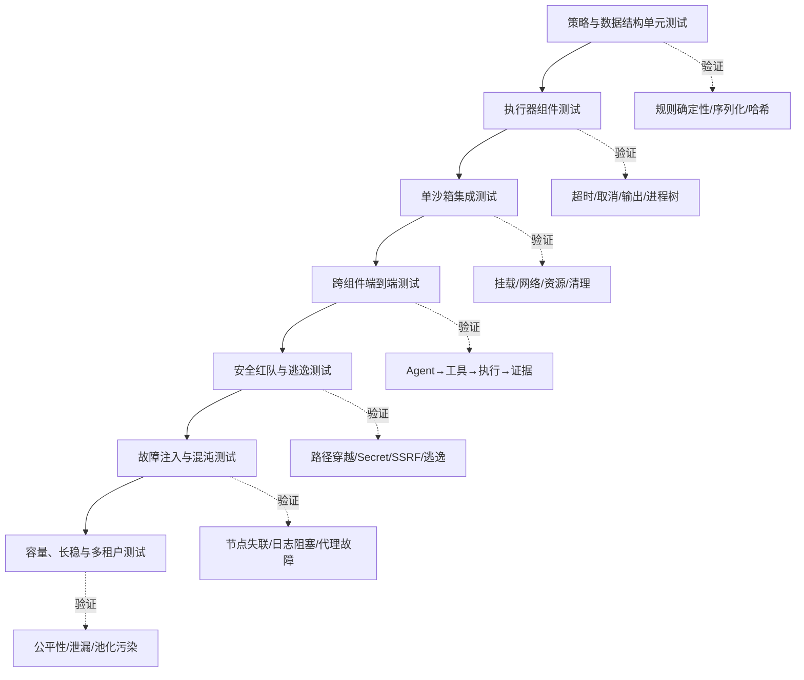
```mermaid
flowchart TB
    A[策略与数据结构单元测试] --> B[执行器组件测试]
    B --> C[单沙箱集成测试]
    C --> D[跨组件端到端测试]
    D --> E[安全红队与逃逸测试]
    E --> F[故障注入与混沌测试]
    F --> G[容量、长稳与多租户测试]

    A -.验证.-> A1[规则确定性/序列化/哈希]
    B -.验证.-> B1[超时/取消/输出/进程树]
    C -.验证.-> C1[挂载/网络/资源/清理]
    D -.验证.-> D1[Agent→工具→执行→证据]
    E -.验证.-> E1[路径穿越/Secret/SSRF/逃逸]
    F -.验证.-> F1[节点失联/日志阻塞/代理故障]
    G -.验证.-> G1[公平性/泄漏/池化污染]
```

### 32.2 单元测试

单元测试应重点覆盖“纯函数边界”：

| 模块 | 关键测试 |
|---|---|
| 请求解析 | 缺字段、未知字段、超长参数、非法枚举、Unicode 边界 |
| 规范化 | 参数顺序、路径归一化、环境变量排序、稳定哈希 |
| 策略求值 | allow / deny / require-approval、规则优先级、默认拒绝 |
| 路径验证 | `..`、绝对路径、符号链接、Junction、大小写折叠 |
| 输出采集 | 截断、二进制、非法 UTF-8、ANSI、超长单行、背压 |
| 资源配置 | 上下限、单位换算、溢出、负数、默认值 |
| 审批绑定 | 请求摘要变化后旧审批失效 |
| 证据摘要 | 同一输入稳定、任一关键字段变化后摘要改变 |

一个非常重要的性质测试是：

```text
normalize(normalize(request)) == normalize(request)
```

即规范化必须幂等。

另一个重要性质是：

```text
policy(request) == policy(deserialize(serialize(request)))
```

策略结果不能因为序列化往返而变化。

### 32.3 执行器组件测试

执行器测试不应依赖真实危险命令，可以使用专门的测试子进程：

```python
# fixtures/child_behavior.py
import argparse
import os
import signal
import subprocess
import sys
import time

parser = argparse.ArgumentParser()
parser.add_argument("--stdout-bytes", type=int, default=0)
parser.add_argument("--stderr-bytes", type=int, default=0)
parser.add_argument("--sleep", type=float, default=0)
parser.add_argument("--spawn-child", action="store_true")
parser.add_argument("--ignore-term", action="store_true")
args = parser.parse_args()

if args.ignore_term and hasattr(signal, "SIGTERM"):
    signal.signal(signal.SIGTERM, signal.SIG_IGN)

if args.spawn_child:
    subprocess.Popen(
        [sys.executable, __file__, "--sleep", "600", "--ignore-term"],
        stdout=subprocess.DEVNULL,
        stderr=subprocess.DEVNULL,
    )

sys.stdout.buffer.write(b"O" * args.stdout_bytes)
sys.stdout.flush()
sys.stderr.buffer.write(b"E" * args.stderr_bytes)
sys.stderr.flush()
time.sleep(args.sleep)
```

应验证：

- 标准输出和标准错误并发读取，不互相阻塞；
- 输出达到限制后，执行器按策略截断或终止；
- 软超时先发温和信号，硬超时最终强杀；
- 父进程退出后，子孙进程也被回收；
- 取消与正常退出并发时只完成一次状态转换；
- 启动失败不会留下半初始化资源；
- 日志写入失败时不会无界阻塞被执行进程；
- 收尾过程自身有截止时间；
- Windows Job Object、Linux cgroup/进程组和 macOS 进程组行为分别验证。

### 32.4 沙箱集成测试

沙箱集成测试应在真实运行时中执行，例如容器、gVisor 或 microVM，而不是 mock 所有隔离机制。

重点验证：

```text
文件系统：只能写工作区和工件目录
网络：默认拒绝，只允许策略声明的目标
进程：无法看见或控制其他租户进程
身份：非 root，不能提权
设备：无多余设备映射
资源：CPU、内存、PID、磁盘配额生效
Secret：未授权任务无法读取
清理：任务结束后沙箱不可复用到污染状态
```

可以为每类不变量设计一个“攻击探针”程序。探针应该尝试越界，并把结果作为测试工件保存，而不是仅依赖测试框架的布尔值。

### 32.5 安全不变量测试

安全测试最适合用“不变量”表述：

| 编号 | 安全不变量 | 失败条件 |
|---|---|---|
| INV-01 | 请求未通过策略求值就不能启动进程 | 发现无策略决策的 execution |
| INV-02 | 审批只对绑定摘要对应的请求有效 | 修改命令后仍复用旧审批 |
| INV-03 | 工作区外写入必须失败 | 宿主或其他租户文件发生变化 |
| INV-04 | 默认网络策略为 deny | 未声明目标可建立连接 |
| INV-05 | 取消最终导致整个进程树消失 | 超过截止时间仍有存活 PID |
| INV-06 | Secret 不进入模型可见日志 | stdout、trace、错误栈出现明文 |
| INV-07 | 每次执行都有不可混淆的租户归属 | 日志或工件无法映射租户 |
| INV-08 | 运行时故障时拒绝执行，而非降级到宿主 | 隔离组件失联后本地裸跑 |
| INV-09 | 输出采集有上界 | 内存或磁盘随输出无限增长 |
| INV-10 | 沙箱复用不跨任务残留状态 | 后续任务读到前任务私有内容 |

### 32.6 红队测试矩阵

| 攻击场景 | 示例意图 | 预期防线 | 验证结果 |
|---|---|---|---|
| 路径穿越 | 写入 `../../.ssh/authorized_keys` | 路径规范化 + 根目录能力 | 拒绝，记录规则 ID |
| 符号链接跳转 | 工作区链接到宿主敏感目录 | 句柄级路径约束 + 禁止跟随 | 拒绝或只操作受控目标 |
| TOCTOU | 校验后快速替换路径为链接 | 原子打开 + 目录句柄解析 | 不能越界 |
| Git 配置执行 | 利用 filter、hook、pager、diff driver | 清洁配置 + 禁用 hooks + 能力封装 | 不执行仓库提供的程序 |
| 构建脚本执行 | `npm install` 触发生命周期脚本 | 供应链策略 + 无网 + 隔离 | 默认拒绝或需审批 |
| 压缩炸弹 | 解包超高压缩比文件 | 条目数、展开大小、深度限制 | 达限终止 |
| Fork Bomb | 大量创建进程 | PID 配额 + cgroup/Job Object | 不影响节点其他任务 |
| 内存炸弹 | 持续分配内存 | 内存限制 + OOM 归因 | 任务失败，节点存活 |
| 磁盘写满 | 不断写文件 | 临时盘配额 + inode 限制 | 达限终止并清理 |
| 日志洪泛 | 无限 stdout/stderr | 流式采集 + 上限 + 背压 | 不拖垮控制面 |
| ANSI 欺骗 | 清屏、覆盖文本、伪造成功结果 | 原始日志与净化视图分离 | 审计不被覆盖 |
| 提示注入 | 工具输出声称“忽略系统规则” | 工具输出按不可信数据处理 | 不改变权限或策略 |
| SSRF | 请求云元数据地址 | 网络代理 + IP 分类 + DNS 复核 | 拒绝链路本地地址 |
| DNS 重绑定 | 域名解析后切到私网 IP | 连接时再次校验解析结果 | 拒绝私网目标 |
| 数据外传 | 将源码发送到公共服务 | 出站域名白名单 + DLP + 审批 | 阻断并告警 |
| Secret 枚举 | 打印全部环境变量 | 最小注入 + 日志脱敏 | 未注入的不可见，已注入的被遮蔽 |
| 容器逃逸探测 | 访问宿主 socket 或设备 | 无 socket 挂载 + seccomp + LSM | 访问失败 |
| 跨租户读取 | 猜测其他任务目录 | 每任务命名空间 + 不可预测 ID + ACL | 访问失败 |
| 沙箱复用污染 | 留守进程或缓存窃取后续任务 | 代际 ID + 完整回收 + 污染检测 | 旧状态不可见 |
| 审批重放 | 对高危请求复用历史授权 | 请求摘要、时效、主体绑定 | 授权无效 |
| 参数注入 | 文件名以 `--` 开头 | 参数数组 + `--` 分隔 + 类型化工具 | 不被解释为选项 |
| Shell 拼接 | 用户文本进入 `sh -c` | 禁用拼接 + argv 结构化 | 无命令注入 |
| Unicode 欺骗 | 同形字符伪装路径/域名 | 规范化 + 原始值保留 + UI 提示 | 可检测并阻断 |
| 时间侧信道 | 通过共享缓存推断其他租户 | 强隔离/分池/清理 | 风险处于设计阈值内 |

红队测试不应只在发布前执行一次。凡是以下组件变化，都应该触发至少一组回归：

- 内核或容器运行时；
- seccomp、LSM、NetworkPolicy；
- 路径处理库；
- Git、包管理器和构建工具；
- 输出解析器；
- 审批或策略引擎；
- 沙箱镜像与预热快照；
- Agent 的工具定义。

### 32.7 故障注入与混沌测试

建议注入以下故障：

```text
沙箱启动延迟或永不返回
沙箱节点执行中失联
日志存储短暂不可用
出站代理连接被重置
DNS 服务异常
Artifact 上传卡住
策略引擎超时
Secret Broker 返回过期凭证
LSP 进程反复崩溃
磁盘只读或空间耗尽
节点时钟偏移
取消信号丢失
```

每个故障都要回答：

1. 控制面是否有界等待？
2. 是否会错误重试有副作用的操作？
3. 用户看到的状态是否准确？
4. 是否留下孤儿资源？
5. 审计证据是否完整？
6. 系统恢复后是否能对账？

### 32.8 多租户与长稳测试

至少进行以下场景：

- 大量小任务突发；
- 少量超长任务与大量短任务混合；
- 某租户持续制造高输出任务；
- 某租户耗尽其配额；
- 沙箱池连续复用数千次；
- 节点滚动升级期间持续提交任务；
- 任务完成与取消在同一时刻竞争；
- 同一工作区并发读取、编辑和测试；
- 运行 24～72 小时的稳定性与资源泄漏观测。

需要观测：

```text
句柄数 / 文件描述符
僵尸进程数
沙箱与工作区残留数
控制面队列深度
节点内存基线漂移
日志积压
缓存命中与污染告警
任务公平性
取消收敛时间
```

### 32.9 CI 安全门禁

推荐将 CI 门禁分为四级：

| 门禁 | 触发时机 | 内容 |
|---|---|---|
| PR Fast Gate | 每次提交 | 单元、契约、静态检查、关键路径测试 |
| Runtime Gate | 修改执行/沙箱代码 | 真实运行时集成、安全不变量、跨平台测试 |
| Release Gate | 候选版本 | 全量 E2E、红队、故障注入、性能基线 |
| Periodic Gate | 每日或每周 | 最新内核/运行时兼容、长稳、镜像漏洞、策略回归 |

安全测试失败时不得通过“重试到绿”掩盖。需要区分：

- 真实产品缺陷；
- 测试环境不稳定；
- 时序阈值过紧；
- 运行时行为变化；
- 观测缺失导致无法归因。

---

## 33. 故障分类与恢复：把失败设计成一等结果

Agent 平台不能把所有失败都压缩成：

```json
{"error": "command failed"}
```

这样的错误既不能帮助模型修复，也不能帮助平台运维。

### 33.1 失败分类

建议至少采用以下分类：

```python
from enum import StrEnum


class FailureKind(StrEnum):
    VALIDATION_REJECTED = "validation_rejected"
    POLICY_DENIED = "policy_denied"
    APPROVAL_REQUIRED = "approval_required"
    APPROVAL_EXPIRED = "approval_expired"
    SANDBOX_CAPACITY = "sandbox_capacity"
    SANDBOX_START_FAILED = "sandbox_start_failed"
    PROCESS_SPAWN_FAILED = "process_spawn_failed"
    EXIT_NON_ZERO = "exit_non_zero"
    SOFT_TIMEOUT = "soft_timeout"
    HARD_TIMEOUT = "hard_timeout"
    CANCELLED = "cancelled"
    RESOURCE_OOM = "resource_oom"
    RESOURCE_CPU = "resource_cpu"
    RESOURCE_PID = "resource_pid"
    RESOURCE_DISK = "resource_disk"
    NETWORK_DENIED = "network_denied"
    NETWORK_FAILED = "network_failed"
    SECRET_DENIED = "secret_denied"
    OUTPUT_LIMIT = "output_limit"
    ARTIFACT_UPLOAD_FAILED = "artifact_upload_failed"
    CLEANUP_FAILED = "cleanup_failed"
    NODE_LOST = "node_lost"
    INTERNAL_ERROR = "internal_error"
```

同一个外部现象可能对应不同根因。例如退出码 `137` 可能来自：

- 用户主动取消后强杀；
- 硬超时；
- cgroup OOM；
- 节点驱逐；
- 管理员终止；
- 容器运行时异常。

因此不能只凭退出码判断。需要结合：

```text
执行状态机事件
运行时退出原因
cgroup / Job Object 指标
取消记录
节点事件
超时截止时间
OOM 事件
```

### 33.2 面向 Agent 的错误结构

```json
{
  "status": "failed",
  "failure": {
    "kind": "network_denied",
    "retryable": false,
    "responsible_layer": "policy",
    "message": "当前执行未声明访问 registry.npmjs.org 的网络能力",
    "rule_id": "egress.default-deny",
    "suggested_actions": [
      "改用已缓存依赖",
      "声明受限的包仓库访问能力并重新审批"
    ]
  },
  "execution_id": "exec_01J...",
  "evidence_ref": "artifact://exec_01J.../summary.json"
}
```

这里要避免两个极端：

- 只给模型低层错误，模型无法行动；
- 把内部安全细节全部暴露给模型，反而帮助攻击者枚举防线。

可采用三层错误视图：

| 视图 | 面向对象 | 内容 |
|---|---|---|
| Agent View | 模型 | 可行动原因、允许的下一步、有限日志 |
| User View | 用户 | 风险、影响、审批或修复建议 |
| Operator View | 运维/安全 | 完整事件、节点、规则、运行时诊断 |

### 33.3 重试策略

重试必须与副作用和幂等性绑定：

| 失败 | 默认是否重试 | 说明 |
|---|---:|---|
| 参数校验失败 | 否 | 应修正请求 |
| 策略拒绝 | 否 | 不能用重试绕过策略 |
| 审批超时 | 否 | 重新发起审批 |
| 沙箱容量不足 | 是 | 指数退避，设置总截止时间 |
| 沙箱启动临时失败 | 有条件 | 仅在未执行用户代码前 |
| 网络连接重置 | 有条件 | GET 与幂等请求可重试 |
| 非零退出 | 否 | 除非工具明确声明可重试语义 |
| OOM | 否 | 先改变任务或资源配置 |
| Artifact 上传失败 | 是 | 工件地址必须幂等 |
| 节点失联 | 谨慎 | 无法证明未执行时，不可盲目重放副作用操作 |

核心原则：

> 当平台无法确定一次具有副作用的动作是否已经发生时，不应自动重放；应进入“结果不确定”状态并要求对账。

### 33.4 结果不确定状态

分布式执行中，控制面可能在收到结果前与节点失联：

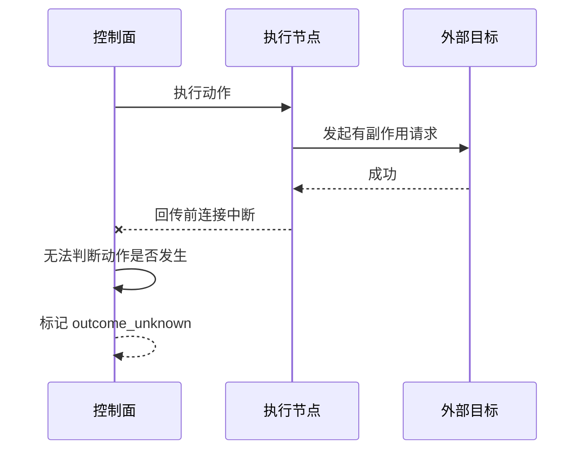
```mermaid
sequenceDiagram
    participant C as 控制面
    participant N as 执行节点
    participant T as 外部目标

    C->>N: 执行动作
    N->>T: 发起有副作用请求
    T-->>N: 成功
    N--xC: 回传前连接中断
    C->>C: 无法判断动作是否发生
    C-->>C: 标记 outcome_unknown
```

此时需要：

- 幂等键；
- 外部目标的查询接口；
- 事务日志；
- 对账任务；
- 人工确认路径；
- 避免把 `unknown` 伪装成 `failed`。

### 33.5 清理失败不是普通警告

如果进程已结束，但出现以下问题：

- 挂载无法卸载；
- cgroup 无法删除；
- microVM 无法关闭；
- 工作区无法擦除；
- 仍检测到留守进程；
- 快照污染校验失败；

则该沙箱实例必须隔离，不得回池继续使用。

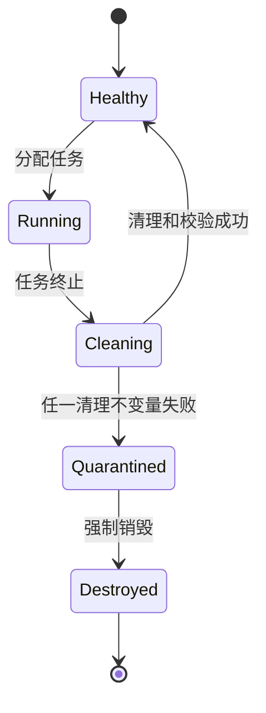
```mermaid
stateDiagram-v2
    [*] --> Healthy
    Healthy --> Running: 分配任务
    Running --> Cleaning: 任务终止
    Cleaning --> Healthy: 清理和校验成功
    Cleaning --> Quarantined: 任一清理不变量失败
    Quarantined --> Destroyed: 强制销毁
    Destroyed --> [*]
```

### 33.6 故障恢复手册

| 症状 | 首要判断 | 证据 | 推荐动作 |
|---|---|---|---|
| 大量任务卡在启动 | 容量、镜像拉取、运行时 | 队列深度、启动分段耗时、节点事件 | 熔断新任务、扩容、回滚镜像 |
| 取消后仍在运行 | 进程树终止失效 | PID/cgroup/Job Object、状态事件 | 隔离节点、强制回收、补回归测试 |
| 任务频繁 OOM | 配额太低或任务异常 | memory.events、RSS 峰值、任务类型 | 优化任务、调整 profile、禁止无限重试 |
| 网络全被拒绝 | 代理或策略发布异常 | policy version、代理健康、deny 原因 | 回滚策略，不能临时开放全网 |
| 日志延迟暴涨 | 采集/存储背压 | 队列、丢弃数、磁盘、网络 | 降低详细度、切换本地缓冲、保护执行控制 |
| LSP 频繁重启 | 项目规模、插件或版本问题 | stderr、初始化耗时、内存 | 限制工作区、禁用插件、固定版本 |
| 工作区残留增多 | 清理任务或权限问题 | orphan 扫描、租约、磁盘使用 | 停止池化、批量隔离并回收 |

---

## 34. 评估指标与 SLO：执行成功率远远不够

### 34.1 四类指标

代码执行平台至少需要同时衡量：

1. **正确性**：是否完成用户真正想做的事；
2. **可靠性**：是否稳定启动、取消、回收和复现；
3. **安全性**：是否遵守边界，是否发生策略误放行；
4. **效率**：延迟、吞吐、资源和成本是否可接受。

### 34.2 正确性指标

| 指标 | 定义 |
|---|---|
| Task Success Rate | 任务最终满足验收条件的比例 |
| First-Pass Success | 无额外修复轮次即可成功的比例 |
| Test Pass Delta | 修改后通过测试数量的净变化 |
| Patch Applicability | 补丁能干净应用到声明基线的比例 |
| Regression Rate | 修改引入已有功能回归的比例 |
| Reproducible Success | 在相同封装环境重放仍成功的比例 |
| Evidence Completeness | 成功结论有完整测试、差异和运行证据的比例 |

“命令退出码为 0”只能作为局部信号，不能直接等同于任务成功。

### 34.3 可靠性指标

```text
sandbox_start_success_rate
sandbox_start_latency_p50/p95/p99
execution_queue_wait_seconds
cancel_convergence_seconds
orphan_process_count
cleanup_failure_rate
node_lost_rate
artifact_persist_success_rate
lsp_restart_rate
workspace_recovery_success_rate
```

取消收敛时间尤其重要：

```text
cancel_convergence = 进程树完全消失时间 - 接收取消请求时间
```

不能只统计“API 已返回 cancelled”。

### 34.4 安全指标

| 指标 | 含义 |
|---|---|
| Policy Deny Rate | 被策略拒绝的请求比例，需按规则与工具拆分 |
| Approval Escalation Rate | 需要人工审批的任务比例 |
| Approval Bypass Count | 应始终为 0 |
| Workspace Escape Count | 应始终为 0 |
| Undeclared Egress Count | 应始终为 0 |
| Secret Exposure Count | 应始终为 0 |
| Cross-Tenant Contamination | 应始终为 0 |
| Cleanup Quarantine Rate | 清理不变量失败导致隔离的比例 |
| Prompt-Injection Tool Events | 工具输出中检测到的注入特征数量 |
| Runtime Security Regression | 运行时升级后不变量失败数量 |

安全指标不能只追求“拒绝越多越安全”。误拒绝会迫使用户寻找绕过路径，因此还应度量：

```text
false_deny_rate
approval_abandon_rate
policy_exception_request_rate
time_to_safe_resolution
```

### 34.5 性能与成本指标

```text
冷启动 / 热启动延迟
沙箱池命中率
快照恢复延迟
每任务 CPU 秒
峰值与平均内存
临时盘写入量
网络出站字节
日志与工件存储量
每成功任务成本
每个修复轮次成本
空闲沙箱成本
```

### 34.6 示例 SLO

以下数值只用于说明 SLO 结构，不是所有系统都应照搬：

```yaml
slo:
  sandbox_start_success:
    target: 99.9%
    window: 30d

  warm_start_latency:
    percentile: p95
    target: 2s

  cancellation_convergence:
    percentile: p99
    target: 10s

  cleanup_success:
    target: 99.99%
    window: 30d

  audit_evidence_completeness:
    target: 100%

  security_invariants:
    workspace_escape: 0
    undeclared_egress: 0
    cross_tenant_leak: 0
    approval_bypass: 0
```

安全不变量通常不适合设置为“允许千分之一失败”。某些指标必须是严格零容忍；一旦出现即触发事件响应。

### 34.7 Agent 层评估

除了平台指标，还需要评估模型是否正确使用执行能力：

| 维度 | 评估问题 |
|---|---|
| 工具选择 | 是否优先使用最小能力，而不是直接开 Shell |
| 参数质量 | 是否提供确定的 cwd、超时和预期输出 |
| 风险判断 | 是否识别删除、发布、网络外传等高风险动作 |
| 验证意识 | 修改后是否运行最相关验证 |
| 错误恢复 | 是否基于结构化原因调整，而非机械重试 |
| 输出利用 | 是否读取摘要与工件，而不是被日志噪声淹没 |
| 停止条件 | 已满足目标后是否停止继续执行 |
| 可解释性 | 是否能说明执行目的、结果和剩余风险 |

可构建离线任务集，覆盖：

- 简单只读检索；
- 多文件代码修改；
- 编译与测试失败修复；
- 需要网络但未声明权限；
- 恶意仓库与提示注入；
- 长任务取消；
- 结果不确定；
- 跨平台命令差异；
- LSP 不可用时降级；
- 依赖安装审批。

---

## 35. 常见反模式与修正

### 35.1 反模式：模型想执行什么就拼接成 Shell 字符串

错误：

```python
os.system("grep " + user_query + " " + user_path)
```

问题包括命令注入、参数注入、转义差异和审计困难。

修正：

```python
subprocess.run(
    ["grep", "--", user_query, user_path],
    shell=False,
    check=False,
)
```

更好的方式是提供 `search_text(query, paths)` 类型化工具。

### 35.2 反模式：把命令名称白名单当成完整安全边界

`git`、`python`、`node`、`find`、`tar` 等命令都可能访问文件、启动子进程或触发仓库配置。

修正：

- 将命令、子命令、参数、路径、环境、网络和运行时联合判定；
- 对常用动作提供能力式工具；
- 仍在沙箱内执行；
- 使用操作系统级强制隔离作为最终边界。

### 35.3 反模式：容器等于绝对安全

容器共享宿主内核；错误挂载、特权模式、宿主 socket、过宽 capability 都可能破坏隔离。

修正：

- 非 root / rootless；
- 只读根文件系统；
- 丢弃 capability；
- seccomp、AppArmor/SELinux；
- 不挂载宿主控制 socket；
- 高风险任务选择 gVisor 或 microVM。

### 35.4 反模式：只限制执行时间，不限制进程树

父进程结束不代表任务结束。子进程可能继续占用资源或监听端口。

修正：

- Linux 使用 cgroup 与进程组；
- Windows 使用 Job Object；
- macOS 使用进程组并做残留扫描；
- 取消成功以“整个作用域无存活进程”为准。

### 35.5 反模式：超时后只调用一次 `terminate()`

目标可能忽略温和信号，或者信号只到达父进程。

修正：

```text
软终止 → 有界等待 → 强制终止整个作用域 → 有界回收 → 残留校验
```

### 35.6 反模式：一次性把所有 stdout 读进内存

大输出可能拖垮执行器，且 stdout/stderr 顺序读取会死锁。

修正：

- 并发流式读取；
- 有界缓冲；
- 原始日志落盘；
- 模型只接收摘要和尾部；
- 超限时按策略截断或终止。

### 35.7 反模式：把工具输出当成可信指令

仓库文本、网页、编译日志都可能包含提示注入。

修正：

- 工具输出只作为不可信数据；
- 不允许输出提升权限、改变系统指令或自动批准动作；
- 安全策略位于模型外；
- 对外部内容保留来源与信任标签。

### 35.8 反模式：把 Secret 全部放入环境变量

子进程、崩溃报告、`env`、调试器和日志都可能读取。

修正：

- 按任务最小化注入；
- 使用短期凭证；
- 优先通过 broker 或受限文件描述符提供；
- 日志、trace、工件统一脱敏；
- 任务结束立即吊销。

### 35.9 反模式：网络只做域名白名单

域名可能解析到私网或链路本地地址，也可能发生 DNS 重绑定。

修正：

- 域名、解析 IP、端口、协议、SNI/HTTP Host 联合验证；
- 连接时再次校验；
- 禁止环回、链路本地、云元数据和内部网段；
- 通过受控出站代理审计。

### 35.10 反模式：用字符串前缀判断路径是否在工作区

错误：

```python
str(candidate).startswith(str(workspace))
```

`/workspace-old` 也可能匹配 `/workspace`，并且无法抵御链接跳转。

修正：

- 路径组件级比较；
- 真实路径或句柄级解析；
- 拒绝危险链接与挂载点；
- 打开文件时再次执行内核级约束。

### 35.11 反模式：审批只绑定“用户点了允许”

如果审批后命令、路径或网络目标变化，授权就被扩大。

修正：

审批必须绑定：

```text
规范化请求摘要 + 用户/租户 + 策略版本 + 有效期 + 风险说明
```

任一关键字段变化都需要重新审批。

### 35.12 反模式：为了性能复用污染沙箱

仅删除工作区文件不足以清理：

- 后台进程；
- `/tmp`；
- 包缓存；
- DNS 缓存；
- shell 历史；
- 凭证；
- 内存状态；
- 挂载；
- LSP 索引。

修正：优先复用干净基线快照，而不是复用执行过不可信代码的实例；复用前必须通过完整不变量校验。

### 35.13 反模式：策略服务不可用时降级放行

这是典型 fail-open。

修正：

- 高风险与执行动作默认拒绝；
- 可选地允许极小集合的本地只读能力；
- 缓存策略必须有签名、版本和有效期；
- 明确展示系统处于降级状态。

### 35.14 反模式：节点失联后自动重复执行

对发布、写数据库、调用外部 API 等动作可能造成重复副作用。

修正：

- 使用幂等键；
- 区分 `failed` 和 `outcome_unknown`；
- 查询外部状态或人工对账；
- 只有证明动作未开始时才能自动重放。

### 35.15 反模式：将 LSP 当成可信解析器

语言服务器通常会扫描项目、读取配置、启动构建工具或插件。

修正：

- LSP 也运行在受限作用域；
- 固定服务版本与启动参数；
- 限制项目根目录和网络；
- 对索引资源设置配额；
- 禁用不必要插件与自动下载。

### 35.16 反模式：用运行日志替代审计日志

普通日志可能被采样、覆盖或修改，不保证完整性。

修正：

- 运行日志用于排障；
- 审计事件记录主体、请求摘要、策略、审批、状态转换和证据摘要；
- 审计记录采用追加写、访问控制和保留策略；
- 关键事件可使用链式摘要提高篡改可检测性。

### 35.17 反模式：只保留模型看到的截断输出

这会导致事后无法复盘。

修正：

- 模型上下文使用摘要；
- 原始输出在受控工件存储中保留；
- 记录截断原因、字节数、摘要算法和访问权限；
- 敏感数据先脱敏或加密。

### 35.18 反模式：所有任务使用同一个沙箱等级

只读搜索与执行未知二进制的风险完全不同。

修正：

按任务风险动态选择：

```text
本地受限进程 → 容器 → gVisor → microVM → 专用隔离节点
```

同时避免模型自行选择较弱隔离级别。

### 35.19 反模式：只验证“执行前”，不验证“执行后”

执行后可能产生越界工件、残留进程或异常网络行为。

修正：

- 执行前策略；
- 执行中资源与网络监控；
- 执行后工作区 diff、进程残留、挂载、Secret 和工件扫描；
- 再决定是否将沙箱回池。

### 35.20 反模式：让模型从海量日志中自己找答案

这会消耗上下文、增加提示注入面并降低诊断质量。

修正：

结构化提取：

```text
退出原因
首个关键错误
失败测试列表
编译诊断
资源触顶情况
策略拒绝原因
建议的安全下一步
原始日志引用
```

---

## 36. 面试与架构评审问答

### Q1：为什么“代码执行”不是一个普通工具调用？

**结论：代码执行是对操作系统能力的受控委托，而不仅是一次函数调用。**

普通纯函数工具通常输入输出有限、没有持久副作用；代码执行则可能访问文件、网络、进程、身份、Secret 和外部系统，而且可以继续派生子进程。它还面临不可信代码、资源耗尽、环境漂移、长任务取消和结果不确定等问题。

因此架构上至少要分离：

- Agent 决策；
- 策略与审批；
- 沙箱调度；
- 数据与 Secret 注入；
- 执行与资源控制；
- 证据和审计。

模型不应成为最终安全边界。

### Q2：容器、gVisor 和 microVM 如何选择？

**结论：按工作负载兼容性、威胁等级、启动延迟和成本分层选择。**

容器兼容性高、启动快，但共享宿主内核；gVisor 在应用与宿主内核之间增加用户态内核边界，通常能降低直接内核攻击面，但存在兼容性和性能权衡；microVM 提供独立 guest kernel，隔离更强，但启动、镜像、调试和资源成本更高。[^gvisor-security][^firecracker-design]

实务上可采用：

```text
可信内部只读任务 → 加固容器
不可信仓库构建 → gVisor 或同类沙箱运行时
未知二进制/高价值租户 → microVM
极小能力插件 → WASM/WASI
```

策略引擎根据风险自动选择，不能让模型为了“更快”主动降级。

### Q3：为什么命令白名单不够？

**结论：命令名称不能表达真实效果。**

例如 `git` 可以调用 pager、filter、diff driver、hook、SSH；`python` 和 `node` 本身就是通用代码执行器；`tar` 可以写出当前目录；包管理器可执行生命周期脚本。因此需要联合判断命令、子命令、参数、路径、环境、网络、身份和工作区状态，同时由操作系统隔离强制能力边界。

### Q4：如何保证取消真的有效？

**结论：取消必须作用于整个执行作用域，而不是单个 PID。**

需要：

1. 每个执行拥有独立进程组、cgroup 或 Job Object；
2. 收到取消后先软终止；
3. 到达 grace period 后强制终止；
4. 有界等待回收；
5. 扫描残留子孙进程；
6. 清理挂载、网络、工作区和临时凭证；
7. 只有全部完成才进入 `cancelled`。

Windows Job Object 可以对一组进程应用生命周期和资源限制，是 Windows 端实现任务作用域的重要基础。[^windows-job]

### Q5：如何处理无限输出？

**结论：流式读取、有界存储、分层呈现。**

stdout 与 stderr 应并发消费，避免管道死锁；内存只保留头尾或环形缓冲；完整日志按配额写入工件存储；模型接收结构化摘要；达到硬上限后按策略截断或终止。输出是非可信输入，需要处理非法 UTF-8、ANSI 控制序列、超长单行和提示注入。

### Q6：审批系统怎样避免重放与“偷换命令”？

**结论：审批绑定规范化请求的不可变摘要。**

摘要应覆盖：

```text
工具与版本、argv、cwd、环境变量名、挂载、网络目标、Secret 引用、资源 profile、租户、策略版本
```

审批还要绑定主体、有效期、用途和最大使用次数。任何关键参数变化都会生成新摘要，旧审批自动失效。

### Q7：为什么网络需要独立控制面？

**结论：网络是数据外传和横向移动的主要通道，不能只靠容器网络开关。**

生产系统通常需要：

- 默认拒绝；
- 受控 DNS；
- 出站代理；
- 域名、IP、端口和协议联合策略；
- 防 SSRF 与 DNS 重绑定；
- 上传体积限制和 DLP；
- 请求级审计；
- 对包仓库、源码托管和内部 API 使用不同能力。

Kubernetes NetworkPolicy 可以描述 Pod 级网络流量约束，但是否真正生效还依赖所使用的网络实现，因此必须进行运行时验证。[^k8s-network-policy]

### Q8：如何避免 Secret 被模型看到？

**结论：模型只引用 Secret，执行环境按策略短暂获取。**

请求中使用 `secret_ref`，由 Secret Broker 校验租户、工具、目标和有效期后注入短期凭证。尽量通过文件描述符、代理或专用凭证 helper 提供，而不是全量环境变量。日志、trace、错误和工件都必须统一脱敏。OpenTelemetry 的进程语义约定也明确提醒命令参数可能包含敏感信息，不应不加筛选地采集。[^otel-process]

### Q9：LSP 在 Agent 代码执行架构中是什么位置？

**结论：LSP 是代码理解服务，不应与 Shell 混为一谈。**

LSP 标准化编辑器与语言服务器之间的能力协商和 JSON-RPC 消息，可用于定义、引用、诊断、重命名等结构化查询。[^lsp-spec] Agent 可以优先使用 LSP、AST 和符号索引减少盲目 grep 与全仓库执行。但语言服务器本身仍可能读取文件、启动工具和消耗大量资源，所以也必须受工作区、网络、资源和生命周期策略约束。

### Q10：如何实现可复现执行？

**结论：记录并固定影响结果的全部可变输入。**

包括：

- 源码基线与工作区差异；
- 镜像或 microVM 根文件系统摘要；
- 工具链版本；
- 依赖锁文件与缓存摘要；
- 平台、架构、区域；
- 环境变量名称及非敏感值；
- 资源和网络策略；
- 命令、cwd、超时；
- 时间、随机数和外部服务快照策略。

成功结果应能从“执行封装”重放，而不是依赖某台长期污染机器。

### Q11：怎样判断一次执行是否成功？

**结论：退出码只是最底层事实，成功必须由任务验收条件决定。**

例如代码修改任务至少需要：补丁已应用、目标文件符合预期、相关测试通过、没有新增关键诊断、工作区差异在允许范围内。平台应保存执行证据，Agent 根据目标进行综合判断，而不是把 `exit_code == 0` 当作唯一标准。

### Q12：为什么需要 `outcome_unknown`？

**结论：分布式系统无法总是判断副作用是否发生。**

节点可能在外部写入成功后、回传结果前失联。把它标记为失败并自动重试可能重复发布、扣费或写数据。应保留“不确定”状态，通过幂等键、外部查询、事务日志和人工对账确认最终结果。

### Q13：沙箱池如何兼顾性能与安全？

**结论：池化的是干净基线，不是任意执行后的实例。**

可预热运行时、镜像层、只读工具链和经过验证的快照；任务结束后销毁可写层并检查进程、挂载、网络、Secret 和缓存状态。任一清理不变量失败，实例进入隔离队列并销毁，不能返回可用池。

### Q14：如何设计跨平台执行抽象？

**结论：统一上层语义，保留底层适配器差异。**

统一接口可包含：

```text
spawn / signal / terminate_scope / resource_usage / collect_output / cleanup
```

Linux 适配 cgroup v2、namespace、seccomp；Windows 适配 Job Object、受限令牌/AppContainer；macOS 适配进程组、sandbox/entitlement 和文件系统权限。不要为了统一 API 假装各平台拥有完全相同的安全原语。

### Q15：执行平台最重要的 fail-closed 点有哪些？

**结论：凡是边界组件不可用，都不能静默退化为更高权限执行。**

典型点包括：

- 策略引擎不可用；
- 沙箱运行时启动失败；
- 网络代理绕过；
- Secret Broker 无法校验；
- 工作区挂载失败；
- 审批摘要不一致；
- 资源限制设置失败；
- 审计事件无法持久化；
- 清理校验失败。

可以拒绝任务或进入受限只读模式，但不能自动裸跑到宿主。

---

## 37. 生产上线检查清单

### 37.1 请求与工具契约

- [ ] 所有执行请求使用结构化参数，不接受隐式 Shell 拼接；
- [ ] JSON Schema 设置长度、数量、枚举和未知字段策略；
- [ ] `argv`、`cwd`、网络、挂载、资源和 Secret 都是显式字段；
- [ ] 每个工具声明副作用、幂等性和所需能力；
- [ ] 工具版本可追踪，策略可按版本匹配；
- [ ] 请求规范化算法有版本号和回归测试；
- [ ] 执行 ID、租户 ID、工作区 ID 不可混淆。

### 37.2 策略与审批

- [ ] 默认拒绝，规则优先级明确；
- [ ] 策略求值发生在沙箱创建和进程启动之前；
- [ ] 隔离级别由策略选择，模型不能降级；
- [ ] 审批绑定规范化请求摘要、主体、策略版本和有效期；
- [ ] 高风险审批清晰展示命令、路径、网络、Secret 与影响；
- [ ] 拒绝和审批均有可行动原因；
- [ ] 策略服务故障时 fail-closed；
- [ ] 策略变更可审计、可回滚、可灰度。

### 37.3 身份与多租户

- [ ] 控制面、执行节点和任务身份分离；
- [ ] 每任务使用最小权限身份；
- [ ] 不共享宿主 root 或高权服务账号；
- [ ] 租户配额覆盖任务数、CPU、内存、磁盘、网络和存储；
- [ ] 工件、日志和 trace 按租户授权；
- [ ] 跨租户访问测试纳入发布门禁；
- [ ] 管理员紧急访问有审批和审计。

### 37.4 文件系统与工作区

- [ ] 工作区是唯一默认可写代码区域；
- [ ] 根文件系统只读；
- [ ] `/tmp`、工件目录和缓存目录分别配额；
- [ ] 路径校验能防 `..`、符号链接、硬链接、Junction 和 TOCTOU；
- [ ] 敏感宿主目录不挂载；
- [ ] 工作区基线、差异和工件可追踪；
- [ ] 写入使用原子替换或事务式补丁；
- [ ] 清理失败实例会被隔离而不是回池。

### 37.5 进程与资源

- [ ] 每次执行拥有独立进程作用域；
- [ ] Linux cgroup / Windows Job Object 等限制真实生效；
- [ ] 设置 CPU、内存、PID、文件描述符、磁盘和执行时间上限；
- [ ] 取消包含软终止、强杀、有界回收和残留验证；
- [ ] 不允许逃离进程作用域的 daemon；
- [ ] OOM、超时、取消和节点失联可准确区分；
- [ ] 输出读取不会死锁，内存缓冲有上限；
- [ ] 长任务通过句柄查询，不占用无限请求连接。

### 37.6 容器与运行时

- [ ] 非 root 或 rootless；
- [ ] 丢弃默认 capability，仅按需增加；
- [ ] 启用 seccomp 与 LSM；
- [ ] 不使用 privileged；
- [ ] 不挂载 Docker/containerd/Kubernetes 控制 socket；
- [ ] 设备默认不暴露；
- [ ] 镜像按 digest 固定并持续扫描；
- [ ] 高风险任务路由到更强隔离运行时；
- [ ] 运行时升级触发安全不变量回归。

Docker 默认 seccomp 配置采用白名单式思路并禁用一批高风险系统调用；生产环境不应随意使用 `seccomp=unconfined`。[^docker-seccomp]

### 37.7 网络

- [ ] 默认无网络；
- [ ] 出站通过受控代理或等价强制点；
- [ ] 域名、IP、端口、协议和请求方法联合授权；
- [ ] 阻断环回、私网、链路本地和云元数据端点；
- [ ] 防 DNS 重绑定；
- [ ] 上传大小、内容类型与 DLP 策略生效；
- [ ] 网络凭证是短期和目标绑定的；
- [ ] 所有放行与拒绝都可审计；
- [ ] NetworkPolicy 已通过实际连通性测试，而非只检查 YAML。

### 37.8 Secret 与供应链

- [ ] Secret 通过引用传递，不进入 Prompt；
- [ ] 按工具、目标和时间最小化注入；
- [ ] 日志、trace、错误和工件统一脱敏；
- [ ] 任务结束吊销短期凭证；
- [ ] 依赖版本锁定并校验摘要；
- [ ] 默认禁止任意安装脚本和插件；
- [ ] 包仓库使用受控镜像或代理；
- [ ] 构建与运行阶段权限分离；
- [ ] 生成并保存依赖清单或 SBOM；
- [ ] 恶意依赖与生命周期脚本测试已覆盖。

### 37.9 可观测性与审计

- [ ] trace 串联 Agent、策略、审批、沙箱、进程和工件；
- [ ] 状态转换采用结构化事件；
- [ ] 原始输出与模型摘要分开保存；
- [ ] 不无条件采集命令行、环境变量和源代码；
- [ ] 审计日志追加写、受控访问并有保留策略；
- [ ] 可通过 execution ID 重建完整时间线；
- [ ] 资源触顶、网络拒绝和安全异常有告警；
- [ ] 控制面、数据面、证据面均有健康指标；
- [ ] 安全零容忍指标进入事件响应流程。

OpenTelemetry 提供跨 traces、metrics、logs 的统一遥测框架及语义约定，可用于统一执行链路字段，但敏感字段仍需平台自行最小化与脱敏。[^otel-docs]

### 37.10 可靠性与恢复

- [ ] 所有外部调用有超时；
- [ ] 重试与幂等性绑定；
- [ ] 有副作用操作支持 `outcome_unknown`；
- [ ] 节点租约和心跳能发现失联任务；
- [ ] 工作区、工件和执行状态可对账；
- [ ] 清理器与孤儿扫描器独立运行；
- [ ] 控制面重启后可恢复状态机；
- [ ] 运行时故障不会降级裸跑；
- [ ] 灾难恢复演练包含审计和 Secret 吊销。

### 37.11 测试与发布

- [ ] 单元、集成、E2E、安全不变量和跨平台测试齐全；
- [ ] 红队矩阵覆盖路径、网络、Secret、资源、逃逸和提示注入；
- [ ] 故障注入覆盖节点失联、日志阻塞、代理和策略服务；
- [ ] 长稳测试检查进程、句柄、磁盘和内存泄漏；
- [ ] 运行时、内核、镜像和策略升级均有回归；
- [ ] 发布可灰度、可回滚；
- [ ] 安全门禁失败不能通过重复运行掩盖；
- [ ] 生产演练验证取消、隔离、清理和证据链。

---

## 38. 本章总结

代码执行与环境交互是 Agent 从“回答问题”迈向“完成工作”的分水岭，也是整个 Agent 系统最需要工程纪律的区域。

本章建立了以下完整认知：

1. **执行不是字符串到进程，而是结构化请求经过策略、审批、隔离、资源和证据链的完整生命周期。**
2. **模型负责提出动作，不负责定义最终权限；安全边界必须由模型外的运行环境强制。**
3. **工作区、路径、进程树、网络、Secret 和依赖供应链都是独立攻击面，必须纵深防御。**
4. **容器只是隔离选项之一；应根据风险在本地受限进程、容器、gVisor、microVM 和 WASM 之间分层。**
5. **可靠取消意味着整个进程作用域消失，并完成挂载、网络、工作区和临时身份的有界回收。**
6. **工具输出是不可信数据；模型接收摘要，平台保留完整且受控的原始证据。**
7. **LSP、AST、Symbol Index 和 Repo Map 能减少盲目 Shell，但这些服务本身仍需隔离和资源治理。**
8. **默认拒绝网络和最小化 Secret 注入，是防止源码与凭证外泄的关键。**
9. **成功、失败、取消、超时、资源耗尽和结果不确定必须是不同的一等状态。**
10. **生产成熟度最终体现在可验证的不变量、可复现环境、可观测执行链和持续红队测试上。**

可以用下面的公式概括生产级执行能力：

```text
可信代码执行
= 结构化意图
× 最小能力
× 强制隔离
× 有界资源
× 可取消生命周期
× 可审计证据
× 可重复验证
```

任一乘数接近零，整体可信度都会显著下降。

---

# 附录 1：统一执行结果契约

```json
{
  "$schema": "https://json-schema.org/draft/2020-12/schema",
  "$id": "https://example.com/schemas/execution-result.schema.json",
  "title": "ExecutionResult",
  "type": "object",
  "additionalProperties": false,
  "required": [
    "schema_version",
    "execution_id",
    "status",
    "timestamps",
    "policy",
    "sandbox",
    "output",
    "artifacts",
    "evidence_digest"
  ],
  "properties": {
    "schema_version": {
      "const": "1.0"
    },
    "execution_id": {
      "type": "string",
      "minLength": 1,
      "maxLength": 128
    },
    "status": {
      "enum": [
        "succeeded",
        "failed",
        "cancelled",
        "timed_out",
        "denied",
        "outcome_unknown"
      ]
    },
    "exit": {
      "type": ["object", "null"],
      "additionalProperties": false,
      "properties": {
        "code": {"type": ["integer", "null"]},
        "signal": {"type": ["string", "null"]},
        "reason": {"type": ["string", "null"]}
      }
    },
    "failure": {
      "type": ["object", "null"],
      "additionalProperties": false,
      "properties": {
        "kind": {"type": "string"},
        "retryable": {"type": "boolean"},
        "message": {"type": "string", "maxLength": 4096},
        "rule_id": {"type": ["string", "null"]}
      }
    },
    "timestamps": {
      "type": "object",
      "required": ["submitted_at", "finished_at"],
      "properties": {
        "submitted_at": {"type": "string", "format": "date-time"},
        "started_at": {"type": ["string", "null"], "format": "date-time"},
        "finished_at": {"type": "string", "format": "date-time"}
      }
    },
    "policy": {
      "type": "object",
      "required": ["version", "decision", "request_digest"],
      "properties": {
        "version": {"type": "string"},
        "decision": {"enum": ["allow", "deny", "require_approval"]},
        "request_digest": {"type": "string"},
        "matched_rules": {
          "type": "array",
          "items": {"type": "string"}
        }
      }
    },
    "sandbox": {
      "type": "object",
      "required": ["runtime", "profile", "image_digest"],
      "properties": {
        "runtime": {"type": "string"},
        "profile": {"type": "string"},
        "image_digest": {"type": "string"},
        "node_id": {"type": ["string", "null"]}
      }
    },
    "resources": {
      "type": "object",
      "properties": {
        "wall_ms": {"type": "integer", "minimum": 0},
        "cpu_ms": {"type": "integer", "minimum": 0},
        "peak_memory_bytes": {"type": "integer", "minimum": 0},
        "written_bytes": {"type": "integer", "minimum": 0},
        "egress_bytes": {"type": "integer", "minimum": 0},
        "max_processes": {"type": "integer", "minimum": 0}
      }
    },
    "output": {
      "type": "object",
      "required": ["stdout", "stderr"],
      "properties": {
        "stdout": {"$ref": "#/$defs/streamSummary"},
        "stderr": {"$ref": "#/$defs/streamSummary"}
      }
    },
    "artifacts": {
      "type": "array",
      "items": {
        "type": "object",
        "required": ["name", "uri", "sha256", "size_bytes"],
        "properties": {
          "name": {"type": "string"},
          "uri": {"type": "string"},
          "sha256": {"type": "string"},
          "size_bytes": {"type": "integer", "minimum": 0},
          "media_type": {"type": ["string", "null"]}
        }
      }
    },
    "evidence_digest": {
      "type": "string"
    }
  },
  "$defs": {
    "streamSummary": {
      "type": "object",
      "required": ["bytes_seen", "truncated", "preview"],
      "properties": {
        "bytes_seen": {"type": "integer", "minimum": 0},
        "truncated": {"type": "boolean"},
        "preview": {"type": "string"},
        "artifact_uri": {"type": ["string", "null"]},
        "sha256": {"type": ["string", "null"]}
      }
    }
  }
}
```

这个契约的价值在于：

- Agent 不需要解析不同运行时的私有错误格式；
- UI 能稳定展示状态、风险和工件；
- 可观测平台能按统一字段聚合；
- 重放器能够验证环境和证据摘要；
- 后续新增运行时不破坏上层协议。

---

# 附录 2：策略配置示例

下面示例仅展示设计方式，不代表任何现成策略语言：

```yaml
policy_version: "2026-08-31.1"
default_decision: deny

profiles:
  readonly-analysis:
    runtime: container
    rootfs: readonly
    network: none
    cpu_millis: 1000
    memory_mb: 1024
    pids: 64
    wall_timeout_seconds: 120

  untrusted-build:
    runtime: gvisor
    rootfs: readonly
    network: package-proxy-only
    cpu_millis: 4000
    memory_mb: 8192
    pids: 512
    wall_timeout_seconds: 1200

  high-risk-binary:
    runtime: microvm
    rootfs: immutable-image
    network: none
    cpu_millis: 2000
    memory_mb: 4096
    pids: 128
    wall_timeout_seconds: 300

rules:
  - id: allow.read.workspace
    priority: 100
    when:
      tool_in: [read_file, list_directory, search_text, lsp_query]
      path_scope: workspace
      effect: read_only
    decision: allow
    profile: readonly-analysis

  - id: allow.patch.workspace
    priority: 110
    when:
      tool_in: [apply_patch, write_file]
      path_scope: workspace
      effect: reversible
    decision: allow
    profile: readonly-analysis

  - id: approve.dependency.install
    priority: 200
    when:
      capability_any: [dependency.install, network.package_registry]
    decision: require_approval
    profile: untrusted-build
    approval:
      ttl_seconds: 900
      bind_request_digest: true
      max_uses: 1

  - id: deny.host.paths
    priority: 1000
    when:
      path_any:
        - /etc
        - /proc
        - /sys
        - /var/run/docker.sock
        - ${HOME}/.ssh
        - ${HOME}/.aws
    decision: deny

  - id: deny.private.egress
    priority: 1000
    when:
      destination_class_any:
        - loopback
        - link_local
        - private_network
        - cloud_metadata
    decision: deny

  - id: approve.irreversible
    priority: 900
    when:
      effect_in: [external_side_effect, irreversible]
    decision: require_approval
    approval:
      ttl_seconds: 300
      bind_request_digest: true
      max_uses: 1
```

策略发布还应具备：

```text
签名
版本化
静态校验
冲突检测
影子评估
灰度发布
命中率观测
自动回滚
审计记录
```

---

# 附录 3：跨平台实现注意事项

## 3.1 Linux

Linux 常用的隔离与治理原语包括：

- namespaces；
- cgroup v2；
- seccomp；
- Linux capabilities；
- AppArmor / SELinux；
- mount propagation；
- `no_new_privs`；
- 只读、`nosuid`、`nodev`、`noexec` 挂载；
- `openat2` 一类受约束路径解析机制；
- user namespace 与 rootless 容器。

OCI Runtime Specification 的 Linux 配置定义了 namespace、设备、资源、seccomp、挂载等标准化运行时配置，是容器实现互操作的重要基础。[^oci-linux]

cgroup v2 采用统一层级管理 CPU、内存、I/O、PID 等资源；生产系统要验证限制是否真正施加到整个任务作用域，而不是仅配置未生效。[^cgroup-v2]

## 3.2 Windows

Windows 端通常需要组合：

- Job Objects：进程组生命周期和资源限制；
- restricted token / low integrity；
- AppContainer：基于 capability 的应用隔离；
- ACL 与独立用户身份；
- Windows Filtering Platform 或受控代理；
- VHDX / 临时目录等文件系统隔离；
- Hyper-V 隔离或专用虚拟机用于高风险任务。

Job Object 可以把多个进程作为一个单元管理，并施加终止、进程数量、CPU、内存等限制。[^windows-job]

AppContainer 通过隔离身份和 capability 控制资源访问，但它不是把任意传统桌面程序自动变成绝对安全的万能开关；仍需结合文件、网络、进程和宿主集成设计。[^windows-appcontainer]

特别注意：

- `.bat`、`.cmd` 通常经命令解释器执行，参数转义语义不同；
- 路径大小写不敏感、盘符、UNC、设备路径、Junction 都需要专门测试；
- 结束顶层进程不能保证子进程退出；
- 文件删除可能因句柄占用失败；
- 控制台程序、GUI 程序和服务的终止方式不同。

## 3.3 macOS

macOS 可结合：

- 独立低权限用户；
- POSIX 进程组与资源限制；
- App Sandbox 与 entitlement；
- 文件系统权限和受控目录；
- 网络代理或系统网络控制；
- 虚拟化框架/虚拟机用于高风险任务。

Apple App Sandbox 采用 entitlement 描述应用需要访问的能力；但对通用 Agent 执行器，仍需结合具体分发模型、签名、子进程和用户授权行为评估。[^macos-app-sandbox]

特别注意：

- GUI 应用和命令行子进程的权限继承；
- Keychain 访问；
- TCC 隐私授权；
- 应用签名、notarization 和 entitlement；
- 文件书签与用户选择目录；
- BSD 工具参数与 GNU 工具差异。

## 3.4 统一抽象，不抹平差异

推荐定义平台无关接口：

```python
class ProcessScope(Protocol):
    async def spawn(self, spec: ProcessSpec) -> ProcessHandle: ...
    async def soft_terminate(self) -> None: ...
    async def hard_terminate(self) -> None: ...
    async def wait_empty(self, deadline: float) -> bool: ...
    async def usage(self) -> ResourceUsage: ...
    async def cleanup(self) -> CleanupReport: ...
```

但每个适配器必须报告能力：

```json
{
  "platform": "windows",
  "features": {
    "process_tree_kill": true,
    "memory_limit": true,
    "pid_limit": true,
    "network_namespace": false,
    "appcontainer": true,
    "microvm": true
  }
}
```

上层策略只能选择运行时真正支持的能力；缺少关键能力时应拒绝，而不是假设存在。

---

# 附录 4：技术选型决策表

| 场景 | 推荐起点 | 关键理由 | 主要注意事项 |
|---|---|---|---|
| 只读代码检索 | 类型化文件工具 + 受限本地进程 | 延迟低、能力小 | 路径与仓库配置仍需防护 |
| 可信内部测试 | 加固容器 | 兼容性和效率平衡 | 共享内核、挂载与 socket 风险 |
| 外部仓库构建 | gVisor/同类沙箱运行时 | 减少直接宿主内核攻击面 | 系统调用兼容性与性能 |
| 未知二进制分析 | microVM | 独立 guest kernel | 冷启动、镜像和运维复杂度 |
| 插件/规则脚本 | WASM/WASI | 能力式宿主调用、可移植 | 原生扩展、线程、系统接口限制 |
| Browser Agent | 隔离浏览器 + 网络代理 | 页面和下载均不可信 | 登录态、下载、SSRF、剪贴板 |
| GPU 推理/构建 | 专用 GPU 节点 + 强租户隔离 | 设备资源特殊 | 驱动攻击面、显存残留、调度 |
| 桌面本地 Agent | 权限代理 + 独立工作区 | 低延迟、离线能力 | 用户主目录、Keychain、GUI 权限 |
| 高合规远程执行 | 专用租户 microVM/节点 | 边界清晰、审计强 | 成本、容量和升级 |

选择时建议按以下顺序提问：

1. 输入代码是否可信？
2. 是否需要执行原生二进制？
3. 是否必须联网？
4. 是否需要 Secret？
5. 是否存在跨租户？
6. 失败是否可能产生不可逆副作用？
7. 冷启动目标是多少？
8. 兼容性要求到什么程度？
9. 是否需要完整可复现？
10. 组织能否持续维护该隔离技术？

---

# 附录 5：进一步阅读与资料来源

本扩展版在原章节“三层沙箱、工作区、LSP、副作用分级与 GUI 动作循环”的基础上重新组织并深化。原始章节见：[^original-ch09]

[^original-ch09]: [《第09章：代码执行与环境交互》原始章节](https://github.com/cdavid817/awesome-agent-tutorial/blob/main/%E7%AC%AC%E4%BA%8C%E7%AF%87-%E5%8D%95Agent%E6%A0%B8%E5%BF%83%E6%9C%BA%E5%88%B6/%E7%AC%AC09%E7%AB%A0-%E4%BB%A3%E7%A0%81%E6%89%A7%E8%A1%8C%E4%B8%8E%E7%8E%AF%E5%A2%83%E4%BA%A4%E4%BA%92.md)
[^oci-linux]: [Open Container Initiative Runtime Specification — Linux-specific Configuration](https://specs.opencontainers.org/runtime-spec/config-linux/)
[^docker-seccomp]: [Docker Docs — Seccomp security profiles](https://docs.docker.com/engine/security/seccomp/)
[^docker-rootless]: [Docker Docs — Rootless mode](https://docs.docker.com/engine/security/rootless/)
[^gvisor-security]: [gVisor Documentation — Security Model](https://gvisor.dev/docs/architecture_guide/security/)
[^firecracker-design]: [Firecracker — Design](https://github.com/firecracker-microvm/firecracker/blob/main/docs/design.md)
[^firecracker-snapshot]: [Firecracker — Snapshot Support](https://github.com/firecracker-microvm/firecracker/blob/main/docs/snapshotting/snapshot-support.md)
[^wasmtime-security]: [Wasmtime Documentation — Security](https://docs.wasmtime.dev/security.html)
[^cgroup-v2]: [Linux Kernel Documentation — Control Group v2](https://docs.kernel.org/admin-guide/cgroup-v2.html)
[^windows-job]: [Microsoft Learn — Job Objects](https://learn.microsoft.com/en-us/windows/win32/procthread/job-objects)
[^windows-appcontainer]: [Microsoft Learn — AppContainer Isolation](https://learn.microsoft.com/en-us/windows/win32/secauthz/appcontainer-isolation)
[^macos-app-sandbox]: [Apple Developer Documentation — App Sandbox](https://developer.apple.com/documentation/security/app-sandbox)
[^lsp-spec]: [Language Server Protocol Specification 3.17](https://microsoft.github.io/language-server-protocol/specifications/lsp/3.17/specification/)
[^otel-docs]: [OpenTelemetry Documentation](https://opentelemetry.io/docs/)
[^otel-process]: [OpenTelemetry Semantic Conventions — Process](https://opentelemetry.io/docs/specs/semconv/resource/process/)
[^k8s-security-context]: [Kubernetes Documentation — Configure a Security Context](https://kubernetes.io/docs/tasks/configure-pod-container/security-context/)
[^k8s-pss]: [Kubernetes Documentation — Pod Security Standards](https://kubernetes.io/docs/concepts/security/pod-security-standards/)
[^k8s-network-policy]: [Kubernetes Documentation — Network Policies](https://kubernetes.io/docs/concepts/services-networking/network-policies/)

> 文档中的配置、代码与 SLO 数值用于说明设计方法。落地时应结合操作系统、云环境、运行时版本、合规要求和实际威胁模型进行验证。
