# 第 16 章 成本与性能：从 Token 账单到 Agent 单位经济学

> 第三篇：单 Agent 生产工程化（质量、效率与经营层）  
> 扩展版日期：2026-08-31  
> 原始章节：[`第16章-成本与性能.md`](https://github.com/cdavid817/awesome-agent-tutorial/blob/main/%E7%AC%AC%E4%B8%89%E7%AF%87-%E5%8D%95Agent%E7%94%9F%E4%BA%A7%E5%B7%A5%E7%A8%8B%E5%8C%96/%E7%AC%AC16%E7%AB%A0-%E6%88%90%E6%9C%AC%E4%B8%8E%E6%80%A7%E8%83%BD.md)

> [!IMPORTANT]
> 模型价格、缓存折扣、最小可缓存长度、TTL、批处理时限、速率限制和服务等级都会变化。本章不把某家供应商某一天的价目表当作架构常量。生产系统应当使用**带生效时间的外部定价目录**，并在上线前核对供应商官方文档。文中的金额、阈值和案例数据，除特别注明外，均为说明方法的示例。

---

## 本章摘要

Agent 的规模化不是简单的“调用一次模型多少钱”，而是一道完整的单位经济学问题：

- 一个**成功任务**实际消耗了多少模型、工具、检索、沙箱和基础设施成本；
- 用户等待的是首字、阶段结果还是最终结果，真正需要优化的是哪一种延迟；
- 缓存、模型路由、上下文治理、并行执行、批处理和自托管推理，分别作用于哪一段成本；
- 失败、重试、循环、回退和人工接管如何形成“失败税”；
- 在 RPM、TPM、并发、GPU 显存和外部依赖约束下，系统能安全承载多少流量；
- 如何用评测、可观测性和预算控制，避免“成本下降但质量也下降”的假优化。

本章的核心结论是：

> **先建立按成功结果计量的成本与性能基线，再优化请求数量和 Agent 轮次；随后治理重复输入、模型档位、工具关键路径和失败税；最后才讨论采购折扣、自托管和复杂推理加速。**

---

## 学习目标

完成本章后，你应当能够：

1. 建立覆盖模型、工具、RAG、沙箱、网络、可观测与固定成本的 Agent 成本模型；
2. 区分 TTFT、TPOT、任务完成时间、排队时间、吞吐量与并发量；
3. 设计 Prompt/KV Cache、语义缓存、工具缓存和检索缓存的分层体系；
4. 推导小模型级联路由的盈亏平衡点，并用评测与 Verifier 控制质量；
5. 用 DAG 和关键路径方法优化工具并行、预热、投机执行与流水线；
6. 设计会话、租户、业务线和平台四级预算以及准入控制；
7. 根据 RPM、TPM、TPS、延迟和业务峰值完成容量规划；
8. 建立成本、性能、质量、可靠性四维 SLO 和压测方案；
9. 判断何时使用托管模型、批处理、低优先级服务或自托管推理；
10. 形成一套能持续运行的 Agent FinOps 闭环。

---

## 目录

- [1. 为什么 Agent 的成本与普通 API 不同](#1-为什么-agent-的成本与普通-api-不同)
- [2. 成本、性能、质量与可靠性的四维约束](#2-成本性能质量与可靠性的四维约束)
- [3. Agent 端到端成本模型](#3-agent-端到端成本模型)
- [4. Agent 端到端性能模型](#4-agent-端到端性能模型)
- [5. 优化顺序：先砍结构性浪费](#5-优化顺序先砍结构性浪费)
- [6. Token 与上下文成本治理](#6-token-与上下文成本治理)
- [7. Prompt Caching 与前缀工程](#7-prompt-caching-与前缀工程)
- [8. Agent 分层缓存体系](#8-agent-分层缓存体系)
- [9. 模型路由与级联执行](#9-模型路由与级联执行)
- [10. 减少请求、轮次与无效推理](#10-减少请求轮次与无效推理)
- [11. 工具、RAG 与沙箱性能工程](#11-工具rag-与沙箱性能工程)
- [12. 流式输出与感知延迟](#12-流式输出与感知延迟)
- [13. 批处理、低优先级与离线计算](#13-批处理低优先级与离线计算)
- [14. 失败经济学、重试预算与降级](#14-失败经济学重试预算与降级)
- [15. 分层预算、准入控制与公平性](#15-分层预算准入控制与公平性)
- [16. 速率限制与容量规划](#16-速率限制与容量规划)
- [17. 自托管推理的性能与 TCO](#17-自托管推理的性能与-tco)
- [18. 成本与性能可观测性](#18-成本与性能可观测性)
- [19. SLO、压测与性能回归](#19-slo压测与性能回归)
- [20. 生产级参考架构](#20-生产级参考架构)
- [21. 动手实现：成本台账与预算守卫](#21-动手实现成本台账与预算守卫)
- [22. 模拟案例：从失控账单到正向毛利](#22-模拟案例从失控账单到正向毛利)
- [23. 常见误区与故障模式](#23-常见误区与故障模式)
- [24. 分阶段落地路线图](#24-分阶段落地路线图)
- [25. 面试高频问题](#25-面试高频问题)
- [26. 上线检查清单](#26-上线检查清单)
- [附录 1：公式速查](#附录-1公式速查)
- [附录 2：指标字典](#附录-2指标字典)
- [附录 3：参考资料](#附录-3参考资料)

---

# 1. 为什么 Agent 的成本与普通 API 不同

普通 REST API 往往是一次请求对应一次确定性处理；Agent 则可能在一次用户任务中经历多轮模型调用、工具调用、检索、代码执行、审批挂起、重试、反思和结果校验。用户看到的是“帮我完成一个任务”，账单系统看到的却是一棵动态展开的调用树。

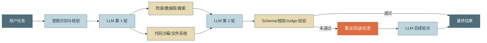

因此，Agent 成本至少具有五个特征：

### 1.1 成本是路径相关的

同一种任务可能走完全不同的执行路径。一次成功可能只用两轮；另一次会因为工具失败、上下文膨胀和模型犹豫走十几轮。用“平均一次模型调用价格”无法估算任务成本。

### 1.2 成本与质量不是单调关系

更大的模型、更长的思考和更多的自检通常会增加成本，但不保证等比例提高成功率。某些机械步骤使用大模型只是浪费；某些高风险决策使用小模型则会把节省的费用转化为错误损失。

### 1.3 延迟由关键路径而不是总工作量决定

三个独立工具各执行 1 秒，串行需要 3 秒，并行仍只需要约 1 秒。反过来，后台并行做了十件不在用户关键路径上的工作，可能提高总成本，却对用户等待时间毫无帮助。

### 1.4 失败任务常常最贵

失败会话往往经历最多的尝试、最长的上下文和最多的重复调用。只看成功任务或只看单次调用均价，会隐藏真正吞噬毛利的“失败税”。

### 1.5 固定成本与边际成本并存

调用托管模型主要体现为边际 token 费用；自托管模型则同时存在 GPU 保底、空闲、工程人力、运维和容量冗余。两者不能只按公开 token 单价直接比较。

---

# 2. 成本、性能、质量与可靠性的四维约束

成本优化不能独立进行。一个生产 Agent 至少同时受四个目标约束：

| 维度 | 典型问题 | 代表指标 |
|---|---|---|
| 成本 | 每个有价值结果花多少钱 | Cost per Successful Task、毛利率、预算消耗率 |
| 性能 | 用户需要等待多久，平台能吞吐多少 | TTFT、P95/P99 完成时延、TPS、并发、队列等待 |
| 质量 | 结果是否正确、完整、可执行 | Task Success、Pass@k、规则校验、人工接受率 |
| 可靠性 | 高峰和故障时是否还能交付 | 可用率、429/5xx、降级成功率、恢复时间 |

这四个维度构成一个约束优化问题：

$$
\min \; \mathbb{E}[C_{task}], \quad \min \; P95(T_{task})
$$

同时满足：

$$
Quality \ge Q_{min}, \qquad Availability \ge A_{min}
$$

生产优化追求的不是单点最低成本，而是**质量和可靠性约束下的成本—性能 Pareto 前沿**。

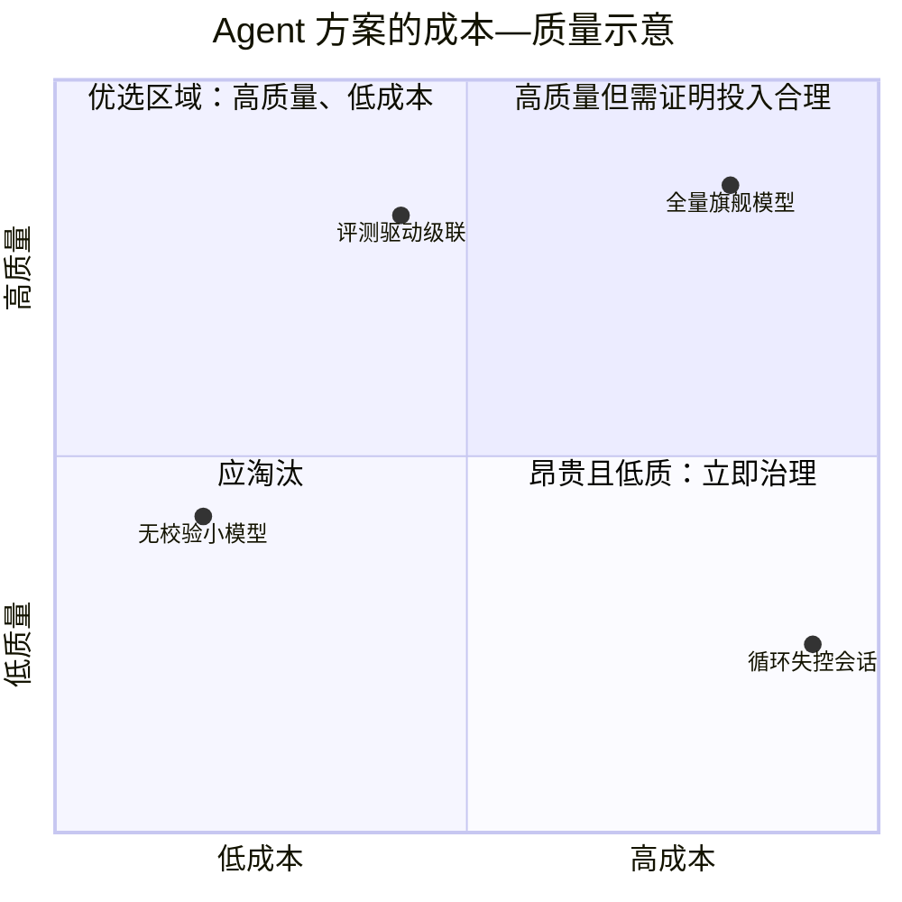

> [!TIP]
> 每一次优化评审都应同时展示：**成本变化、成功率变化、P95/P99 延迟变化和失败类型变化**。任何只展示其中一个指标的结论都不完整。

---

# 3. Agent 端到端成本模型

## 3.1 成本分解树

一个任务的总成本不应只包含模型 token：

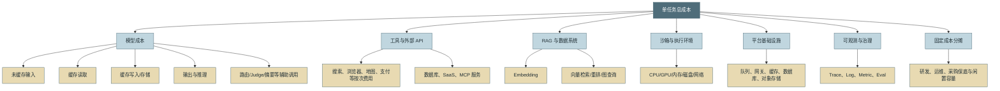

## 3.2 单次模型请求成本

设一次请求的 token 用量为：

- $N_{in}$：未缓存输入 token；
- $N_{cache\_read}$：缓存读取 token；
- $N_{cache\_write}$：缓存创建或写入 token；
- $N_{out}$：可见输出 token；
- $N_{reason}$：供应商单独计量的推理 token；
- $P_x$：相应类别每百万 token 的价格。

则模型请求成本可归一化为：

$$
C_{model} = \frac{
N_{in}P_{in} +
N_{cache\_read}P_{cache\_read} +
N_{cache\_write}P_{cache\_write} +
N_{out}P_{out} +
N_{reason}P_{reason}
}{10^6}
$$

不同供应商的 usage 字段和计价规则不完全一致：有的将推理 token 合入输出，有的单列；有的缓存写入按溢价计费，有的另收存储费。平台应保存两份数据：

1. **供应商原始 usage**：便于对账和审计；
2. **平台归一化 usage**：便于跨模型、跨供应商比较。

## 3.3 单任务总成本

一个 Agent 任务包含多个请求和多个非模型步骤：

$$
C_{task} = \sum_{i=1}^{n}(
C_{model,i} + C_{tool,i} + C_{retrieval,i} + C_{sandbox,i} + C_{network,i}
) + C_{observability} + C_{allocated\_fixed}
$$

其中固定成本分摊可以按任务数、活跃租户、GPU 时间或业务收入分配。运营报表至少应同时给出：

- **纯变量成本**：用于实时预算和路由；
- **完全成本**：变量成本加固定成本分摊，用于定价和毛利分析。

## 3.4 为什么北极星必须是 Cost per Successful Task

设观察窗口内：

- 总任务数为 $N$；
- 成功任务数为 $N_s$；
- 总成本为 $C_{all}$。

普通单任务成本：

$$
CPT = \frac{C_{all}}{N}
$$

成功任务单位成本：

$$
CPST = \frac{C_{all}}{N_s}
$$

由于 $N_s = N \times SuccessRate$，有：

$$
CPST = \frac{CPT}{SuccessRate}
$$

这条公式揭示了一个重要事实：当成功率下降时，即使表面 CPT 下降，CPST 仍可能上升。比如：

| 方案 | Cost per Task | 成功率 | Cost per Successful Task |
|---|---:|---:|---:|
| A | $0.50 | 90% | $0.556 |
| B | $0.42 | 70% | $0.600 |

方案 B 看似便宜 16%，但每个成功结果反而更贵。

## 3.5 失败税

可以用三种口径观察失败税：

$$
FailureTaxRatio = \frac{AvgCost_{failed}}{AvgCost_{success}}
$$

$$
FailureCostShare = \frac{TotalCost_{failed}}{TotalCost_{all}}
$$

$$
WastedCostRate = \frac{Cost_{failed\ without\ reusable\ artifact}}{TotalCost_{all}}
$$

第三个指标更严格：某些最终失败的任务仍可能留下可复用代码、检索结果、草稿或诊断包，不能全部视为浪费。

## 3.6 价值、毛利与 ROI

对于商业产品，还需要把成本与价值连接起来：

$$
GrossMargin = \frac{Revenue - VariableCost}{Revenue}
$$

内部效率工具可用以下近似：

$$
NetValue = TimeSaved \times LaborRate + LossAvoided + RevenueUplift - TotalCost
$$

例如 Coding Agent 节省了工程师 20 分钟，但需要工程师花 15 分钟修复错误，那么可计入价值的净节省只有 5 分钟，而不是 20 分钟。

## 3.7 成本口径必须版本化

成本台账中建议保存：

- `provider`、`model`、`service_tier`；
- 定价卡版本与生效时间；
- 原始 token 字段与归一化 token 字段；
- 是否估算、估算方法、置信度；
- 汇率与汇率生效时间；
- 税费、区域溢价、数据驻留溢价；
- 批处理、缓存、保留容量或企业折扣；
- 请求、会话、任务、租户、业务线归因键。

否则模型降价、供应商改字段或企业合同折扣生效后，历史报表会被新价格“重算”得面目全非。

---

# 4. Agent 端到端性能模型

## 4.1 不要把“延迟”当成一个数

生产系统至少需要区分以下时延：

| 指标 | 含义 | 用户体验 |
|---|---|---|
| Queue Time | 请求进入系统后等待执行的时间 | 高峰期“没有反应” |
| TTFT / TTFC | 发出模型请求到首 token/首 chunk | 用户感知最明显 |
| Prefill Time | 处理输入上下文的时间 | 长上下文、缓存失效时上升 |
| Decode Time | 生成输出 token 的总时间 | 长回答和深度推理时上升 |
| TPOT / ITL | 每个输出 token 的平均时间/相邻 token 间隔 | 决定流式输出是否顺滑 |
| Tool Latency | 工具或外部 API 执行时间 | 搜索、数据库、沙箱常是长尾来源 |
| Turn Latency | 一轮 Agent Loop 的总时长 | 多轮任务的基本积木 |
| Time to Useful Result | 首个可用中间结果出现时间 | 比“打字动画”更有价值 |
| Task Completion Time | 最终任务完成时间 | 业务 SLO 的核心 |

## 4.2 关键路径模型

串行 Agent 的粗略公式是：

$$
T_{task} \approx \sum_{turn=1}^{R}
(T_{queue}+T_{route}+T_{prefill}+T_{decode}+T_{tool}+T_{post})
$$

但存在并行时，应按 DAG 的最长路径计算：

$$
T_{task} = T_{fixed} + \max_{path \in DAG}\sum_{node \in path} T_{node}
$$

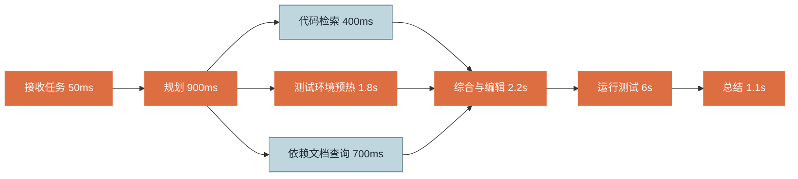

在上图中，继续把 400ms 的代码检索优化成 200ms，几乎不会缩短总时延，因为 1.8 秒的环境预热仍是汇合点前的关键分支。性能工程必须先找关键路径。

## 4.3 首字延迟和完成延迟是两种产品决策

- 聊天、语音、客服：通常更在意 TTFT 和流式稳定性；
- Coding Agent、数据分析、批量处理：更在意任务完成时间和结果正确率；
- 需要审批的任务：更在意“提交审批前”和“批准后”的分段时延；
- 长任务：应提供阶段产物、进度与可取消性，而不是只优化打字速度。

## 4.4 吞吐、并发与 Little 定律

稳定系统中可以使用 Little 定律：

$$
L = \lambda W
$$

其中：

- $L$：系统内平均并发任务数；
- $\lambda$：单位时间到达率；
- $W$：平均任务停留时间。

如果每分钟进入 30 个任务，平均完成需要 2 分钟，则系统平均存在约 60 个并发任务。长 Agent 任务会迅速放大并发和资源占用，即使入口 QPS 不高。

## 4.5 平均值会掩盖长尾

Agent 经常被外部 API、冷启动、缓存失效、长输出和重试拖出长尾。至少同时查看：

- P50：典型用户体验；
- P90/P95：大部分用户的上界；
- P99：容量和故障敏感度；
- Max：只用于排障，不能单独作为 SLO；
- 按任务类型、上下文长度、模型、工具和缓存状态分组后的分位数。

> [!WARNING]
> “平均 8 秒”可能同时代表所有请求都在 8 秒附近，也可能代表 95% 请求 2 秒、5% 请求 122 秒。两者的产品体验完全不同。

---

# 5. 优化顺序：先砍结构性浪费

成本与性能优化建议遵循以下顺序：

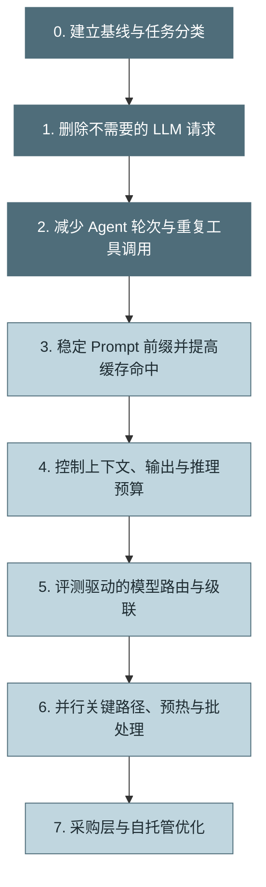

原因如下：

1. **不调用永远比便宜调用更省。** 能用规则、SQL、AST、Schema、状态机完成的步骤，不应默认交给 LLM。
2. **少一轮会同时减少成本和延迟。** 它比把一轮模型便宜 10% 更有杠杆。
3. **缓存优化常常不改变质量。** 稳定前缀可以直接减少重复 prefill。
4. **上下文瘦身降低的是计费基数。** 对所有模型和后续轮次持续生效。
5. **模型路由必须依赖评测。** 没有质量基线的路由只是把错误搬到线上。
6. **基础设施优化要建立在真实负载上。** 没有稳定工作负载就谈 GPU、批大小和保留容量，容易优化错误对象。

每项优化都应遵循闭环：

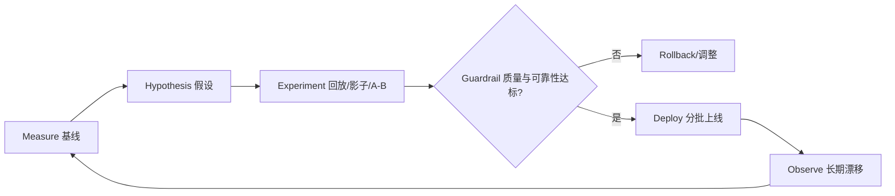

---

# 6. Token 与上下文成本治理

## 6.1 Token 预算不是简单的 Context Window 上限

模型允许的最大上下文只是技术上限，不是经济上限。一个任务的输入预算应主动分配：

$$
B_{context} = B_{system} + B_{tools} + B_{history} + B_{memory} + B_{retrieval} + B_{workspace} + B_{reserved\_output}
$$

建议由运行时维护结构化预算，而不是让各模块自由追加：

| 区域 | 典型内容 | 治理策略 |
|---|---|---|
| System/Policy | 身份、权限、安全、工作流 | 稳定、版本化、可缓存 |
| Tool Definitions | 工具 schema 与说明 | 按需暴露、稳定排序、压缩描述 |
| Conversation | 最近对话与关键状态 | 滑动窗口 + 结构化摘要 |
| Memory | 用户与任务长期记忆 | 检索式注入，不全量加载 |
| RAG | 文档片段、代码、网页 | 过滤、去重、重排、证据预算 |
| Workspace State | 文件 diff、测试结果、计划 | 使用引用与工件 ID，避免重复全文 |
| Output Reserve | 最终回答和工具参数 | 提前预留，避免截断 |

## 6.2 上下文膨胀为何呈“雪球效应”

多轮会话中，历史会在每轮重新进入输入。若第 $r$ 轮上下文为 $H_r$，总输入量约为：

$$
TotalInput = \sum_{r=1}^{R} H_r
$$

即使每轮只增加固定的 $\Delta$，总量也近似二次增长：

$$
H_r = H_0 + r\Delta
$$

$$
TotalInput = R H_0 + \frac{R(R+1)}{2}\Delta
$$

因此“减少一轮”和“避免每轮追加冗长工具输出”具有复合收益。

## 6.3 输入侧治理手段

### 结构化状态替代自然语言流水账

将计划、已完成步骤、失败原因、工件引用和剩余预算存成结构化状态：

```json
{
  "goal": "修复登录回归",
  "completed": ["定位失败测试", "修改 token 刷新逻辑"],
  "artifacts": ["patch://a17", "test://run-2048"],
  "open_issues": ["Safari 兼容性待验证"],
  "budget": {"turns_left": 4, "usd_left": 0.18}
}
```

下一轮只注入必要字段，不必重发全部思考过程和原始日志。

### 工具结果先压缩再回注

工具返回 10 MB 日志，不应直接进入模型。建议执行：

1. 解析结构化字段；
2. 截取错误附近窗口；
3. 去重重复堆栈；
4. 保存完整工件，向模型只传引用和摘要；
5. 模型需要细节时再按范围读取。

### 检索式记忆而不是全量记忆

记忆系统应根据当前任务检索 top-k 相关内容，并设置独立 token 预算。长期记忆越多，不代表每轮注入越多。

### 工具按需发现

几十或上百个工具定义可能占据大量稳定输入。可以先暴露工具目录、能力索引或 Tool Search，再按任务动态加载少量工具。需要注意：动态加载会改变前缀，必须与缓存策略协同设计。

## 6.4 输出与推理预算

输出 token 通常单价更高，且直接拉长 decode 时间。可使用：

- 明确长度、格式和停止条件；
- 用 JSON Schema 限制无关解释；
- 将“过程日志”和“用户摘要”分开，用户默认只看摘要；
- 对机械任务关闭或降低深度推理档位；
- 对高风险任务允许更高推理预算，但设置上限；
- 生成长文档时分块落盘，避免每轮重复输出已完成内容；
- 在代码修改中返回 diff，而不是重复整个仓库文件。

> [!NOTE]
> 不应为了少几十个 token 把字段名压缩成不可维护的缩写，除非该结构会以极高频率重复。工程可读性也是成本。

---

# 7. Prompt Caching 与前缀工程

## 7.1 Prompt Caching 缓存的是什么

Transformer 在处理输入时会生成注意力所需的 KV 状态。供应商或自托管推理引擎可以复用相同前缀的 KV 状态，跳过重复 prefill。它不是“缓存最终答案”，因此不会保证相同输入得到完全相同输出。

缓存主要降低：

- 重复输入的计费；
- 长前缀 prefill 计算；
- TTFT；
- 自托管场景的 GPU 计算与显存带宽压力。

它通常**不会直接减少新输出 token 的 decode 时间**。

## 7.2 稳定前缀布局


原则：**越稳定、复用越高的内容越靠前；越动态、个性化、即时的内容越靠后。**

## 7.3 常见缓存击穿原因

1. 在 System Prompt 前部放入精确时间、请求 ID、trace ID 或随机数；
2. 工具列表来自无序集合，名称或 schema 顺序每次变化；
3. JSON 序列化空格、键顺序和默认值不稳定；
4. 每轮把同一段指令换一种措辞；
5. Prompt 模板版本没有稳定标识；
6. 检索结果或用户资料被插入稳定指令之前；
7. 历史摘要频繁重写，使变更点不断前移；
8. 模型、工具开关、结构化输出 schema 或推理配置变化；
9. 多租户共享键设计错误，出于安全隔离被迫无法复用；
10. 会话间隔超过供应商缓存保留时间。

## 7.4 三种命中率不能混为一谈

### 请求命中率

$$
RequestHitRate = \frac{HitRequests}{TotalRequests}
$$

一次只命中很短前缀也算命中，因此容易高估收益。

### Token 命中率

$$
TokenHitRate = \frac{CachedReadTokens}{TotalInputTokens}
$$

更能反映实际复用量，是 Prompt Caching 的核心指标。

### 成本加权命中收益

$$
CacheSavings = \sum CachedTokens \times (P_{normal}-P_{read}) - WriteCost - StorageCost
$$

最终经营指标应看实际节省金额，而不是单纯追求命中率。

## 7.5 缓存写入何时回本

假设：

- 普通输入单价为 $P_i$；
- 缓存写入单价为 $P_w$；
- 缓存读取单价为 $P_r$；
- 相同前缀总共使用 $N$ 次。

不使用缓存：

$$
C_{no\_cache}=N P_i
$$

使用缓存：

$$
C_{cache}=P_w+(N-1)P_r
$$

回本条件：

$$
N > \frac{P_w-P_r}{P_i-P_r}
$$

例如写入为普通输入的 1.25 倍、读取为 0.1 倍，则第二次使用通常已经回本；若长 TTL 写入为 2 倍，则通常需要至少两次后续读取。真正的判断仍要结合前缀长度、复用概率和 TTL。

## 7.6 前缀规范化示例

```python
import hashlib
import json
from typing import Any


def canonical_json(value: Any) -> str:
    """稳定键顺序、分隔符和 Unicode 表达。"""
    return json.dumps(
        value,
        sort_keys=True,
        ensure_ascii=False,
        separators=(",", ":"),
    )


def prompt_prefix_fingerprint(
    *,
    tenant_scope_hash: str,
    model: str,
    prompt_version: str,
    system_blocks: list[dict[str, Any]],
    tools: list[dict[str, Any]],
) -> str:
    # 工具按稳定名称排序；不要把明文租户 ID、密钥或用户隐私放入键。
    normalized_tools = sorted(tools, key=lambda item: item["name"])
    payload = {
        "scope": tenant_scope_hash,
        "model": model,
        "prompt_version": prompt_version,
        "system": system_blocks,
        "tools": normalized_tools,
    }
    return hashlib.sha256(canonical_json(payload).encode("utf-8")).hexdigest()
```

## 7.7 缓存安全边界

缓存不是纯性能组件，还承担数据隔离责任：

- 缓存键必须包含租户、权限范围、数据版本和提示模板版本；
- 对用户个性化、隐私、授权结果不可跨安全域复用；
- 工具结果缓存应同时验证调用者身份和当前权限；
- 语义缓存要防止“语义相似但权限不同”；
- 缓存内容和命中日志遵守数据保留与删除要求；
- 敏感请求可配置不缓存或仅使用供应商合规模式。

---

# 8. Agent 分层缓存体系

Prompt/KV Cache 只是其中一层。完整 Agent 可以构建以下缓存栈：

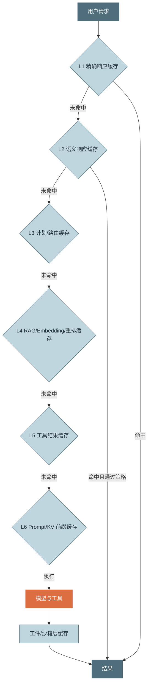

## 8.1 精确响应缓存

适合：

- 确定性问答；
- 公共文档的固定查询；
- 温度为零且外部状态不变的结构化转换；
- 相同输入的批量去重。

缓存键应包含模型、Prompt 版本、输入、权限、知识版本、工具版本和输出格式。

## 8.2 语义响应缓存

通过向量相似度复用“意思相近”的历史回答。收益大，但风险高：

- 语义相似不等于业务条件相同；
- 时间敏感、个性化、高风险问题不宜直接复用；
- 必须设置相似度阈值、时效、知识版本和安全域；
- 可先复用检索结果或答案草稿，再由轻量模型校验，而非直接返回。

## 8.3 计划与路由缓存

对于稳定工作流，意图分类、步骤模板和工具选择可以缓存。但必须在输入复杂度、权限、功能开关或工具可用性变化时失效。

## 8.4 RAG 缓存

可分别缓存：

- 文档解析与清洗；
- Chunk 结果；
- Embedding；
- Query Rewrite；
- 向量召回；
- Rerank；
- 最终证据包。

文档版本、ACL 和索引版本必须进入缓存键。仅按查询文本缓存检索结果会造成越权或陈旧答案。

## 8.5 工具结果缓存

适合只读、幂等、短时间稳定的调用，例如：

- 软件包元数据；
- 公共配置；
- 仓库符号索引；
- 不频繁变化的目录列表；
- 公开文档抓取结果。

不适合直接缓存：余额、权限判定、库存、交易状态、审批结果等高时效数据，除非 TTL 和一致性策略足够严格。

## 8.6 工件与沙箱缓存

Coding Agent 可复用：

- 依赖下载层；
- 构建缓存；
- 容器镜像；
- 仓库只读快照；
- LSP/Tree-sitter/Symbol Index；
- 测试发现结果；
- 已验证补丁和中间工件。

这类缓存经常比模型缓存更能缩短端到端时间，因为编译、安装和测试可能占据关键路径的大头。

## 8.7 缓存治理矩阵

| 缓存层 | 主要收益 | 最大风险 | 关键指标 |
|---|---|---|---|
| 精确响应 | 几乎消除计算 | 陈旧、权限错误 | 命中率、陈旧命中率 |
| 语义响应 | 高复用 | 错误近似、越权 | 接受率、误命中率 |
| 计划/路由 | 少一次模型判定 | 工作流漂移 | 路由正确率 |
| RAG | 降检索与重排成本 | 索引/ACL 过期 | 证据新鲜度、召回质量 |
| 工具结果 | 降外部 API 时延与费用 | 时效和副作用 | 命中、TTL、错误复用 |
| Prompt/KV | 降输入费用与 prefill | 前缀不稳、TTL | Token 命中率、TTFT |
| 工件/构建 | 降沙箱与编译时延 | 环境污染 | 构建命中率、冷启动率 |

---
# 9. 模型路由与级联执行

模型路由的目标不是“尽量用最便宜的模型”，而是：

> **在质量、风险、SLO 和预算约束下，为每个步骤选择边际收益最高的执行资源。**

## 9.1 路由粒度

路由可以发生在多个层级：

| 层级 | 示例 | 特点 |
|---|---|---|
| 任务级 | 整个客服任务用小模型或大模型 | 简单，但粒度粗 |
| 阶段级 | 规划用强模型，抽取用小模型 | 最常用，收益与风险平衡 |
| 轮次级 | 随上下文复杂度动态升级 | 灵活，但可观测与评测更复杂 |
| Token/推理级 | 调整 reasoning effort、最大输出 | 同一模型内控制成本 |
| 供应商级 | 在多个供应商或自托管集群间选择 | 兼顾可用性、价格和区域 |

## 9.2 路由信号

建议按以下优先级使用信号：

1. **离线评测与线上成功率差**：同类任务上小模型与大模型的真实差距；
2. **风险等级**：是否涉及资金、权限、数据删除、法律或生产变更；
3. **步骤角色**：规划、复杂推理、反思通常比分类、抽取、格式化难；
4. **输入复杂度**：上下文长度、歧义、约束数量、工具数量、代码影响面；
5. **预算与 SLO**：用户套餐、剩余预算、交互或离线场景；
6. **供应状态**：区域可用性、429、队列、模型健康和当前价格；
7. **历史反馈**：某租户、仓库或任务模板上的模型表现。

## 9.3 级联路由

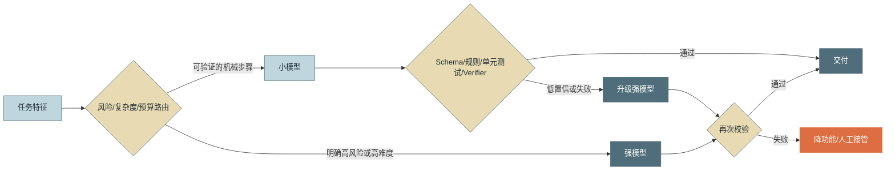

## 9.4 级联的盈亏平衡

设：

- 强模型直接执行成本为 $C_b$；
- 小模型成本为 $C_s$；
- Verifier 成本为 $C_v$；
- 小模型失败后升级概率为 $r$；
- 升级切换额外成本为 $C_t$。

级联期望成本：

$$
C_{cascade}=C_s+C_v+r(C_b+C_t)
$$

只有满足以下条件才比直接用强模型便宜：

$$
C_s+C_v+r(C_b+C_t)<C_b
$$

若忽略 $C_t$，可得到最大可接受回退率：

$$
r < \frac{C_b-C_s-C_v}{C_b}
$$

例如，小模型是强模型成本的 20%，Verifier 为 5%，则回退率需低于约 75% 才在纯费用上回本。但真实系统还要计入：

- 额外延迟；
- 回退时用户体验；
- 误放过错误的业务损失；
- 双模型 Prompt 维护和评测成本。

因此生产阈值通常应远低于纯费用盈亏点。

## 9.5 Verifier 设计

Verifier 应按确定性从高到低排列：

1. JSON Schema、类型、枚举和字段约束；
2. 数据库约束、静态规则、权限和业务断言；
3. 编译、单元测试、SQL dry-run、沙箱模拟；
4. 与可信数据源交叉校验；
5. 小型判别模型；
6. LLM-as-a-Judge；
7. 人工审批。

优先使用便宜、可重复、可解释的校验。用一个同样昂贵的大模型判断小模型是否正确，可能抵消路由收益。

## 9.6 路由上线流程

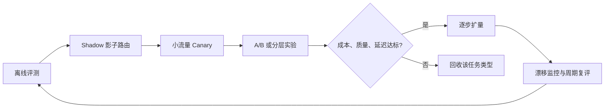

需要按任务类型分别监控：

- 路由分布；
- 小模型通过率；
- 回退率；
- 误放过率；
- 级联后成功率；
- 级联总成本；
- 增加的 P95 延迟；
- 路由策略版本。

## 9.7 风险优先于价格

以下步骤不应仅凭成本切换到小模型：

- 删除、转账、发布、授权等不可逆动作；
- 生产数据库写入；
- 医疗、法律、金融等高风险建议；
- 安全策略判定；
- 影响范围无法可靠估算的代码变更；
- Verifier 无法覆盖的开放式决策。

这类步骤可以使用小模型做候选生成，但最终决策应由强模型、确定性规则或人类审批完成。

---

# 10. 减少请求、轮次与无效推理

## 10.1 少一轮往往胜过换便宜模型

Agent 一轮通常包含：

1. 排队和网络往返；
2. 输入 prefill；
3. 输出 decode；
4. 工具执行；
5. 工具结果回注；
6. 下一轮再次发送增长后的上下文。

因此减少一轮会同时减少模型费、工具费、上下文重发和端到端延迟。

## 10.2 哪些步骤不应调用 LLM

优先使用确定性方法：

| 问题 | 更合适的实现 |
|---|---|
| 字段是否存在、格式是否合法 | JSON Schema / 类型系统 |
| 路径是否属于工作区 | Path policy / capability guard |
| 数字计算与聚合 | 代码 / SQL |
| 代码符号查找 | LSP / AST / Symbol Index |
| 文件差异 | Git diff |
| 工具是否可用 | Health check / registry |
| 是否超过预算 | BudgetGuard |
| 是否重复调用 | 参数哈希与循环检测 |
| 固定模板填充 | 模板引擎 |
| 任务状态迁移 | 状态机 |

“不要默认使用 LLM”是成本与可靠性共同原则。

## 10.3 合并请求还是拆分请求

### 适合合并

- 多个步骤强依赖同一份长上下文；
- 输出可用一个稳定 Schema 表达；
- 分开会重复发送大量输入；
- 中间步骤不需要独立审核或工具调用。

### 适合拆分

- 子任务可并行；
- 大部分步骤可由小模型处理，只有最后一步需要强模型；
- 中间产物可缓存、验证或复用；
- 某一步高风险，需要单独审批；
- 输入数据可按最小权限隔离。

决策时比较：

$$
Benefit_{split}=ParallelGain+CheaperModelGain+CacheGain
$$

$$
Cost_{split}=ExtraRoundTrip+RepeatedContext+Coordination+FailureSurface
$$

## 10.4 工具粒度决定轮次

过细工具会导致模型反复调用；过粗工具又难以复用和授权。生产工具应接近“用户意图级”或“业务事务级”：

- 不佳：`list_files` → `read_file` → `grep` → `read_lines` 多轮拼接；
- 更佳：`search_code(query, scope, context_lines)` 一次返回结构化证据；
- 不佳：每个工单字段一个工具；
- 更佳：`get_ticket_context(ticket_id)` 聚合只读上下文；
- 写操作仍需保持边界清晰、可审计和最小权限。

## 10.5 Programmatic Orchestration

当工作流已知且中间步骤不需要新的模型判断时，可让运行时代码直接编排工具：

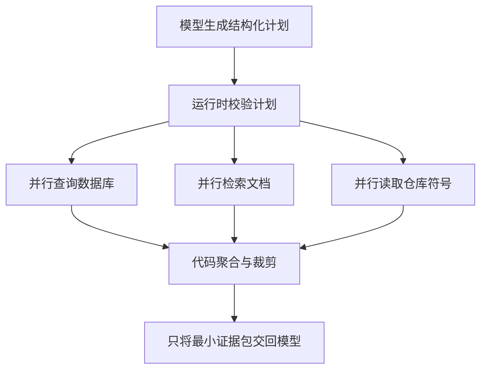

这样可以避免模型在每个机械步骤之间都产生一轮“继续做什么”的判断。

## 10.6 循环检测与停止策略

无效循环常见信号：

- 相同工具和参数重复三次；
- 不同措辞但语义相同的请求反复出现；
- 连续多轮没有新增工件或状态变化；
- 总输入 token 增长但完成度不增长；
- 同一测试失败原因未变化；
- 计划节点在 `pending/running` 间反复切换。

停止条件应同时包含：

- 最大轮次；
- 最大 token；
- 最大成本；
- 最大工具调用数；
- 最大无进展轮次；
- 墙钟时间；
- 用户取消；
- 风险策略触发。

## 10.7 将“完成定义”写进运行时

模型不知道何时完成，往往会继续润色或探索。每类任务应有明确 DoD（Definition of Done）：

```yaml
coding_fix:
  required:
    - patch_created
    - targeted_tests_passed
    - no_new_lint_error
    - summary_generated
  optional:
    - full_regression_passed
  stop_when_required_complete: true
```

DoD 既能降低无效轮次，也能提升评测一致性。

---

# 11. 工具、RAG 与沙箱性能工程

模型并不总是 Agent 最慢的部分。数据库、浏览器、检索、依赖安装、编译和测试常常主导关键路径。

## 11.1 工具调用时延分解

$$
T_{tool}=T_{queue}+T_{connect}+T_{auth}+T_{execute}+T_{serialize}+T_{transfer}+T_{parse}
$$

需要分别埋点，而不是只记录一个 `tool.duration`。例如：

- `connect` 高：连接池或 DNS 问题；
- `auth` 高：每次重复换取令牌；
- `execute` 高：服务本身慢；
- `transfer` 高：结果过大；
- `parse` 高：返回格式低效；
- `queue` 高：并发或配额饱和。

## 11.2 并行工具执行

只有同时满足以下条件才应并行：

- 没有数据依赖；
- 没有写冲突；
- 副作用相互独立；
- 共享资源有并发余量；
- 失败策略清晰；
- 结果可以确定性合并。

```python
import asyncio
from collections.abc import Awaitable, Callable
from typing import Any


async def run_independent_tools(
    calls: dict[str, Callable[[], Awaitable[Any]]],
    *,
    timeout_s: float,
) -> dict[str, Any]:
    async def one(name: str, fn: Callable[[], Awaitable[Any]]) -> tuple[str, Any]:
        return name, await asyncio.wait_for(fn(), timeout=timeout_s)

    tasks = [asyncio.create_task(one(name, fn)) for name, fn in calls.items()]
    results: dict[str, Any] = {}
    try:
        for completed in asyncio.as_completed(tasks):
            name, value = await completed
            results[name] = value
    except Exception:
        for task in tasks:
            task.cancel()
        await asyncio.gather(*tasks, return_exceptions=True)
        raise
    return results
```

对写操作更适合：串行、事务、两阶段提交或在隔离 worktree/沙箱中并行试算后统一提交。

## 11.3 并行度不是越高越好

过度并行会造成：

- 外部 API 429；
- 数据库连接池耗尽；
- 浏览器或沙箱内存爆炸；
- GPU 批处理被碎片化；
- 取消传播困难；
- 瞬时成本陡增。

应使用每租户、每会话、每工具类型的信号量，并配合全局并发上限。

## 11.4 连接、进程与环境复用

- HTTP/2、连接池、DNS 缓存；
- 数据库连接池和预编译语句；
- 浏览器上下文复用，但保持租户隔离；
- 复用已启动的语言服务器；
- 沙箱镜像预拉取；
- 依赖层、包管理器和编译缓存；
- 热工作区快照；
- 常用模型或 LoRA 预加载。

需要在复用收益与污染风险之间权衡。任何可变状态复用都应有清理、隔离和版本校验。

## 11.5 RAG 性能链路

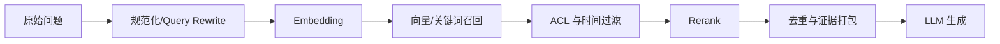

RAG 优化点：

- 不需要检索时跳过 Query Rewrite 和向量查询；
- Query Rewrite 可用规则或小模型；
- Embedding 按规范化查询缓存；
- 先使用元数据过滤缩小候选集；
- top-k 不宜盲目增大；
- 只对候选集做重排；
- 去重相邻或高度重叠 Chunk；
- 为证据设置 token 预算；
- 使用 early exit：高置信命中时不再扩展检索；
- 将完整证据存为工件，模型只接收必要片段。

## 11.6 Coding Agent 的关键性能设施

Coding Agent 不应每次靠 LLM 全文阅读仓库。推荐建立：

- Repo Map：模块、依赖和入口概览；
- LSP：定义、引用、诊断、符号；
- Tree-sitter/AST：结构化代码切片；
- Symbol Index：跨文件符号检索；
- Git Diff：只关注改动；
- Test Impact Map：改动到测试的关联；
- Build Cache：避免全量编译；
- 日志索引：按错误、时间和组件检索；
- Workspace Artifact Store：大内容不反复进入上下文。

这些设施同时降低 token、轮次和工具延迟。

## 11.7 沙箱预热与池化

沙箱冷启动可能包括镜像拉取、容器启动、仓库同步、依赖安装和语言服务启动。可采用：

1. 基础镜像分层；
2. 高频语言环境热池；
3. 只读仓库基底 + Copy-on-Write 工作层；
4. 依赖缓存挂载；
5. 用户提交任务时并行预热；
6. 空闲超时回收；
7. 按租户和权限彻底清理可变状态。

预热是投机执行的一种，必须记录命中率和浪费成本。

---

# 12. 流式输出与感知延迟

流式输出主要改善“用户何时看到反馈”，不一定缩短完整生成时间。

## 12.1 三个不同目标

- **Time to First Token**：尽快出现首字；
- **Time to First Useful Result**：尽快出现可执行的信息，而非“我正在思考”；
- **Time to Completion**：最终交付完成。

聊天 UI 只展示推理状态动画，可能改善心理预期，却不等于有用结果更早到达。

## 12.2 长任务的渐进式交付

建议输出：

1. 已接收任务和边界；
2. 计划或当前阶段；
3. 已生成的工件；
4. 可独立使用的部分结果；
5. 风险、阻塞与需要审批项；
6. 最终汇总。

Coding Agent 可以先展示文件变更列表，再展示 diff 和测试结果；数据 Agent 可以先展示数据质量检查，再生成最终分析。

## 12.3 取消传播

用户取消后应立即向下游传播：

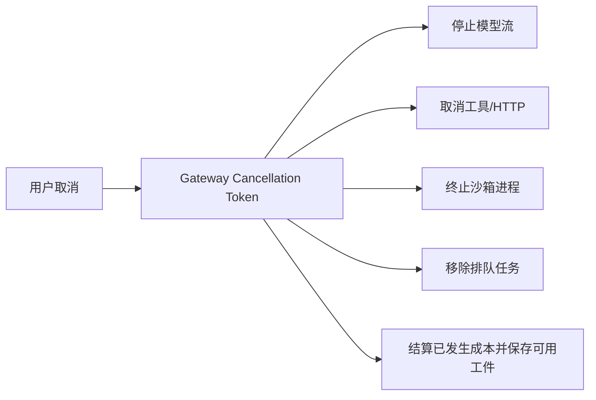

如果前端停止显示、后端仍继续模型与工具执行，系统会产生隐蔽的“取消税”。

## 12.4 输出节奏

监控流式质量：

- 首 chunk 延迟；
- chunk 间隔 P95；
- 流中断率；
- 用户在首个有用结果前取消比例；
- 取消后继续计费时长；
- 首字与最终完成时间差。

---

# 13. 批处理、低优先级与离线计算

判断是否适合批处理的核心问题是：**是否有人正在同步等待这个结果。**

## 13.1 适合批处理

- 夜间评测与回归；
- 大规模分类、抽取和数据清洗；
- Embedding 与索引构建；
- 会话结束后的记忆提取；
- 历史轨迹摘要；
- 离线 Judge；
- 报表生成；
- 低优先级数据增强；
- 可延迟的视频、图片或文档任务。

## 13.2 不适合批处理

- 实时聊天主链路；
- 用户正在等待的工具调用；
- 审批后必须立即执行的操作；
- 严格低延迟告警；
- 依赖前一步即时结果的 Agent Loop。

## 13.3 工作负载分层

| 等级 | 目标 | 调度策略 |
|---|---|---|
| P0 交互 | 用户同步等待 | 在线、低队列、可预留吞吐 |
| P1 近实时 | 分钟级可接受 | 普通在线队列、可降级 |
| P2 异步 | 小时级可接受 | 低优先级/Flex/异步作业 |
| P3 批量 | 一天内完成 | Batch API/离线集群 |

通过服务等级分层，可以防止夜间评测、索引或记忆任务抢占交互式容量。

## 13.4 批处理的工程注意点

- 每条请求使用稳定 `custom_id` 或幂等键；
- 输入和输出均落对象存储；
- 支持部分失败重跑，而不是整批重做；
- 结果顺序不要假设与输入一致；
- 记录批次定价、模型快照和 Prompt 版本；
- 批次进入队列时做预算预占；
- 处理完成后按实际 usage 结算并释放余量；
- 对超过截止时间的任务制定降级或转在线策略；
- 批处理同样需要 ACL、数据驻留和删除治理。

---

# 14. 失败经济学、重试预算与降级

## 14.1 错误分类先于重试

| 错误类型 | 示例 | 是否重试 | 推荐动作 |
|---|---|---|---|
| 瞬时网络 | 连接重置、临时超时 | 是 | 退避 + jitter |
| 限流 | 429 | 条件性 | 遵循 `Retry-After`、限速、排队 |
| 服务端瞬时错误 | 部分 5xx | 条件性 | 有界重试 + 熔断 |
| 参数错误 | Schema/400 | 否 | 修复请求或模型自纠错一次 |
| 权限错误 | 401/403 | 否 | 刷新授权或请求人工处理 |
| 配额/账单 | quota/billing | 否 | 降级或运营处理 |
| 确定性业务失败 | 余额不足、文件不存在 | 否 | 返回明确结果 |
| 非幂等写超时 | 状态未知 | 不可盲重试 | 查询幂等键或事务状态 |

## 14.2 多层重试会指数放大

假设 SDK、网关、工具适配器和 Agent 各自最多重试 3 次，最坏情况下可能形成近似 $3^4$ 次尝试。生产系统必须有：

- 一个明确的重试所有者；
- 会话级共享重试预算；
- 总墙钟重试时间；
- 幂等键；
- 对 SDK 内置重试的可见性；
- 每次重试的原因和成本。

## 14.3 有界退避

```python
import asyncio
import random
from collections.abc import Awaitable, Callable
from typing import TypeVar

T = TypeVar("T")


async def retry_transient(
    operation: Callable[[], Awaitable[T]],
    *,
    max_attempts: int = 4,
    max_elapsed_s: float = 20.0,
    base_delay_s: float = 0.5,
) -> T:
    loop = asyncio.get_running_loop()
    started = loop.time()
    last_error: Exception | None = None

    for attempt in range(1, max_attempts + 1):
        try:
            return await operation()
        except (TimeoutError, ConnectionError) as exc:
            last_error = exc
            elapsed = loop.time() - started
            if attempt == max_attempts or elapsed >= max_elapsed_s:
                break
            cap = min(base_delay_s * (2 ** (attempt - 1)), 8.0)
            await asyncio.sleep(random.uniform(0.0, cap))

    assert last_error is not None
    raise last_error
```

真实实现还应优先遵循服务端 `Retry-After`，并避免与 SDK 自动重试叠加。

## 14.4 会话级重试预算

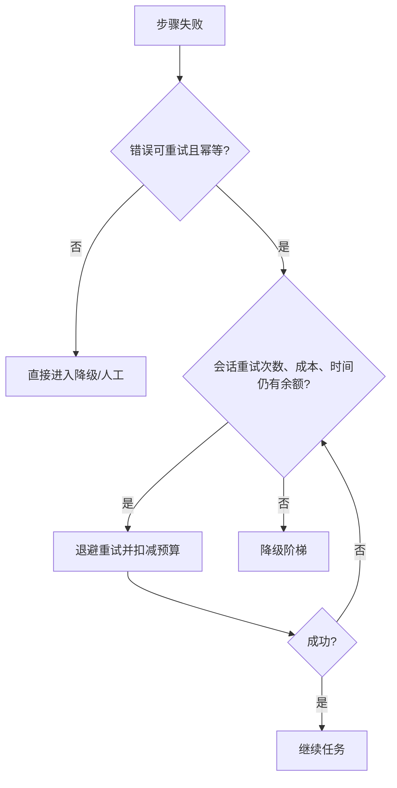

预算可以同时约束：

- 尝试次数；
- 额外 token；
- 额外美元；
- 额外墙钟时间；
- 同工具重复次数；
- 无进展轮次。

## 14.5 降级阶梯

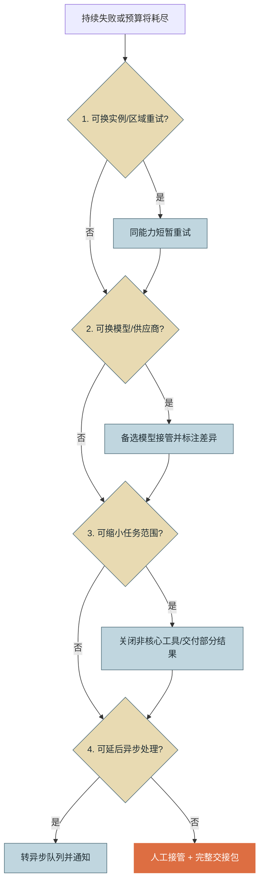

“部分成功”往往比“全部失败”更有业务价值，但必须明确：已完成什么、未完成什么、结果可信度和下一步建议。

## 14.6 Hedged Request 的成本

对长尾严重且幂等的只读请求，可以在第一个请求超过阈值后向另一个实例发起备份请求，谁先完成就取消另一个。它能降低 P99，但会增加费用和负载。

期望收益应包含：

$$
NetBenefit=P_{tail}\times Value_{latency\ saved}-P_{hedge}\times ExtraCost
$$

只在高价值、低副作用、可取消并且长尾确实来自实例抖动时使用。不要对写操作或模型生成默认双发。

## 14.7 失败必须产出交接包

交接包建议包含：

- 用户目标与约束；
- 已完成步骤；
- 已产生工件；
- 失败步骤和错误分类；
- 已尝试的恢复动作；
- 剩余预算；
- 风险与不确定性；
- 建议人工操作。

它能把失败任务的一部分成本转化为可复用价值。

---

# 15. 分层预算、准入控制与公平性

## 15.1 四级预算

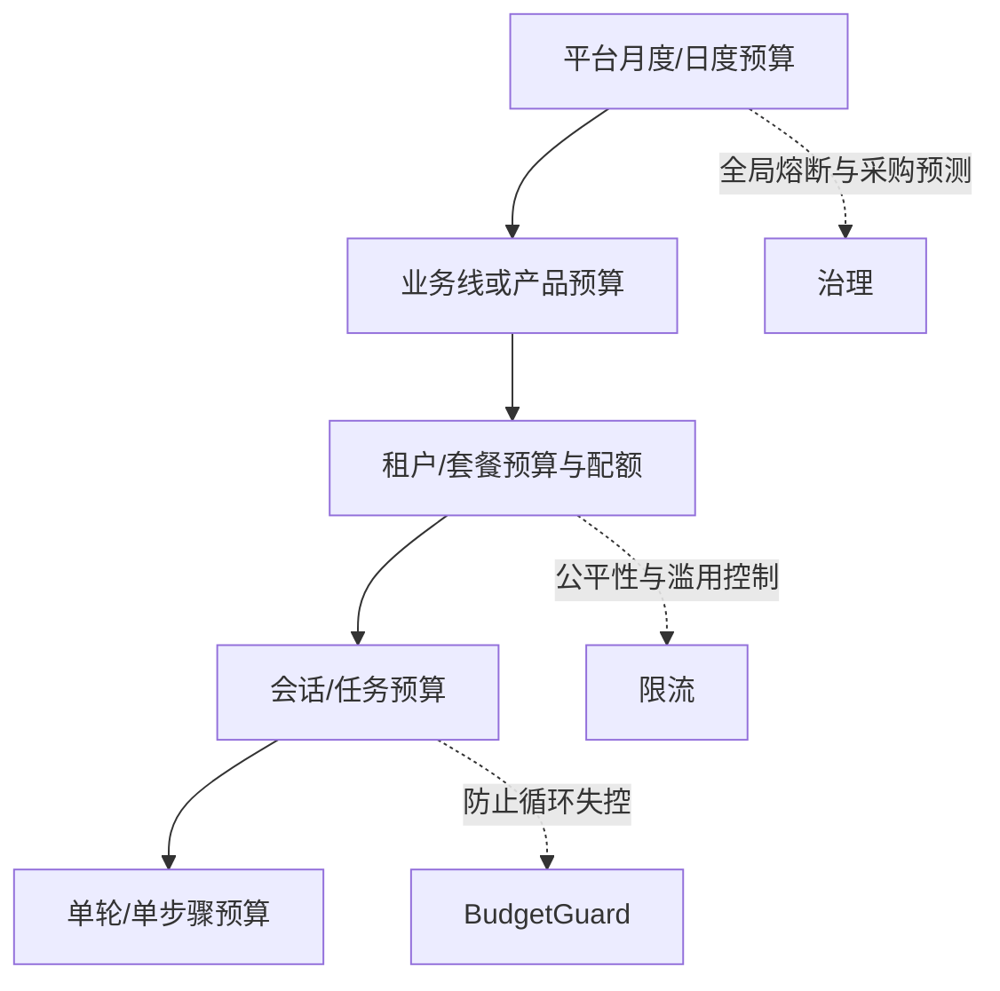

### 平台级

- 月度总预算；
- 供应商合同和保底；
- 业务连续性储备；
- 超支预测。

### 业务线/产品级

- 成本中心；
- 单位经济目标；
- 任务量预测；
- 毛利或内部 ROI。

### 租户级

- 套餐、余额、日/月配额；
- RPM/TPM/并发；
- 模型和工具权限；
- 公平调度权重。

### 任务级

- 最大成本；
- 最大轮次；
- 最大输出；
- 最大时间；
- 最大工具调用；
- 可用模型档位。

## 15.2 软预算与硬预算

- **软预算**：达到 70%/90% 时告警、降低推理档位、减少候选、关闭非核心工具；
- **硬预算**：禁止继续产生新费用，转部分结果或人工；
- **预留预算**：为最终总结、回滚和交接包保留；
- **应急预算**：仅由高风险恢复流程使用。

直接把预算耗尽到零，会导致任务连“为什么失败”都无法总结。

## 15.3 预估成本与实际结算

请求前根据模型、上下文、最大输出和历史分布预估：

$$
EstimatedCost = C_{input\ known} + P95(C_{output}|task\ type) + C_{tools\ planned}
$$

流程：

1. 预估并预占预算；
2. 执行请求；
3. 使用实际 usage 结算；
4. 释放多余预占；
5. usage 缺失时按估算结算并打标；
6. 会话结束后做最终校正。

## 15.4 公平调度

单个长任务可能占据大量 TPM、沙箱和数据库连接。应使用：

- 每租户并发上限；
- 加权公平队列；
- 交互任务高于离线任务；
- 单会话 token 速率上限；
- 大上下文请求单独队列；
- 高风险恢复保留容量；
- “大象任务”分块执行。

## 15.5 BudgetGuard 状态机

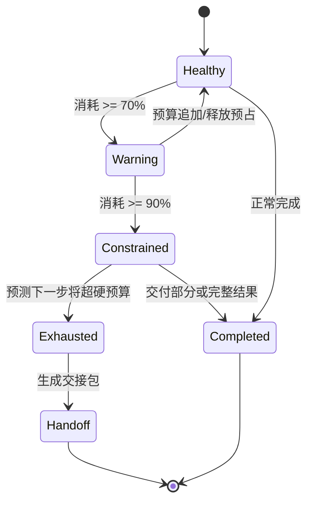

---

# 16. 速率限制与容量规划

## 16.1 常见容量维度

托管模型通常存在一个或多个限制：

- RPM：每分钟请求数；
- TPM：每分钟输入/输出或总 token；
- RPD/TPD：每日请求或 token；
- 并发请求数；
- 批处理队列 token；
- 长上下文请求的独立额度；
- 图片、音频、搜索和工具的独立额度；
- 组织、项目、区域或模型共享池。

任何一个维度先耗尽都会触发限流。

## 16.2 从业务量推导 RPM/TPM

设：

- 峰值任务到达率为 $\lambda_{task}$（任务/秒）；
- 每任务平均模型请求数为 $R$；
- 每请求计入限额的平均 token 为 $N$。

则：

$$
RequiredRPM = 60\lambda_{task}R
$$

$$
RequiredTPM = 60\lambda_{task}RN
$$

生产估算不应只用均值。可使用 P95 任务轮次和 P95 token，或按任务类型分层计算，再乘安全系数。

## 16.3 并发估算

若每个模型请求平均停留 $W_{req}$ 秒：

$$
Concurrency_{model}=\lambda_{task}R W_{req}
$$

如果还有长时间工具等待，Agent 会话并发远高于模型并发。需要分别规划：

- 活跃会话数；
- 同时进行的模型调用；
- 同时进行的工具调用；
- 沙箱实例数；
- 队列长度。

## 16.4 安全容量

建议目标不是跑满配额，而是保留余量：

$$
SafeCapacity = Quota \times Headroom
$$

`Headroom` 可根据流量波动、供应商稳定性和恢复目标设为 0.6～0.8 等区间，并通过压测验证，而非写死一个通用值。

## 16.5 准入控制流程

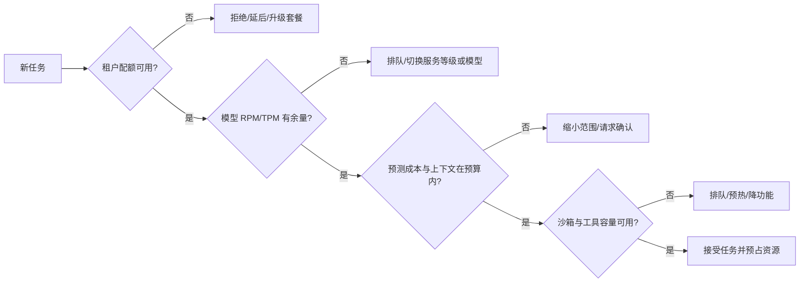

## 16.6 队列与背压

队列不能无限增长。建议：

- 为不同优先级设置独立队列；
- 使用最大等待时间和过期时间；
- 队列长度、预计等待时间返回给用户；
- 超过阈值时主动拒绝或转异步；
- 下游 429 时降低入口速率，而不是继续堆积；
- 对取消任务立即出队；
- 将批量任务迁出交互池。

## 16.7 Autoscaling 应关注业务饱和信号

只按 CPU 扩容可能太晚或完全无效。Agent 网关和工具执行层可使用：

- 队列长度；
- 排队时间；
- 活跃会话数；
- in-flight 请求；
- token/s；
- TPM 利用率；
- 沙箱池空闲数；
- 数据库连接池占用；
- GPU KV Cache 使用率；
- P95 TTFT。

扩容本身有启动时间，必须结合预测扩容、热池和最小副本。

## 16.8 容量规划示例

假设峰值每分钟 600 个任务：

- 每任务平均 4 次模型调用；
- 每调用平均计入 3,000 token；
- 安全余量按 70% 可用配额计算。

需求：

$$
RPM=600\times4=2400
$$

$$
TPM=600\times4\times3000=7.2M
$$

需要的名义配额：

$$
RPM_{quota}\ge \frac{2400}{0.7}\approx3429
$$

$$
TPM_{quota}\ge \frac{7.2M}{0.7}\approx10.29M
$$

还应分别校验长上下文、高峰突发、批处理队列和备用模型容量。

---
# 17. 自托管推理的性能与 TCO

托管模型按使用量付费、运维简单；自托管模型提供更强的成本控制、数据边界和定制能力，但需要承担 GPU 利用率、容量冗余和推理工程复杂度。

## 17.1 不能只比较公开 token 单价

自托管完全成本应包含：

$$
TCO_{self}=C_{GPU}+C_{CPU/RAM}+C_{storage}+C_{network}+C_{energy}+C_{idle}+C_{ops}+C_{engineering}+C_{risk}
$$

单位 token 成本：

$$
CostPer1M = \frac{TCO_{period}}{EffectiveTokens_{period}}\times10^6
$$

`EffectiveTokens` 应使用真实、满足 SLO 和质量要求的吞吐，而不是厂商宣传峰值。

## 17.2 托管与自托管对比

| 维度 | 托管 API | 自托管推理 |
|---|---|---|
| 前期投入 | 低 | 高 |
| 弹性 | 通常较好 | 需要自行扩缩容 |
| 空闲成本 | 低或无 | GPU 保底与闲置明显 |
| 模型能力 | 可快速获得最新模型 | 受可部署权重与硬件约束 |
| 数据控制 | 依赖供应商合规选项 | 可完全在自有边界 |
| 可观测细度 | usage 与外部指标为主 | 可观测到调度、KV Cache、GPU |
| 优化空间 | 缓存、路由、批处理、服务等级 | 还可调量化、批大小、并行、内核 |
| 运维负担 | 低 | 高 |
| 峰值保障 | 依赖配额/预留吞吐 | 依赖自有容量和冗余 |

## 17.3 Prefill 与 Decode 是两种工作负载

- **Prefill**：并行处理输入上下文，长 Prompt 对计算和显存压力大；
- **Decode**：逐 token 生成，通常更受内存带宽和调度影响；
- Prefix Cache 主要优化 prefill；
- Speculative Decoding 主要优化输出 token 间延迟；
- 长输入短输出和短输入长输出需要不同调优策略。

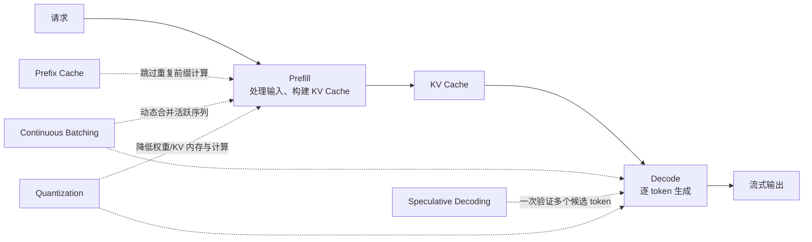

## 17.4 常见推理优化技术

### Continuous Batching

请求到达和完成时间不同，连续批处理会动态将活跃序列编组，提高 GPU 利用率。批越大通常吞吐越高，但排队和单请求延迟可能增加，需要按 SLO 调节。

### Prefix/KV Caching

相同长前缀可直接复用 KV 状态。特别适合多轮对话、同一代码仓库、多次查询长文档和共享系统指令。若输出很长、输入很短，收益有限。

### Chunked Prefill

将长输入拆成块，与 decode 请求交错调度，减少超长 prefill 阻塞短请求的风险。需要测试吞吐、TTFT 与调度公平性的平衡。

### Quantization

降低权重或 KV Cache 精度可减少显存并提高可部署模型规模，但可能影响质量、内核兼容性和吞吐。必须在目标任务评测集上验证，而不是只跑通模型。

### Speculative Decoding

使用草稿模型、n-gram、MTP 等方法提出多个候选 token，再由目标模型验证。适合中低 QPS、内存带宽受限或输出较长的场景；收益依赖接受率、模型组合和采样参数。

### Tensor / Pipeline Parallelism

大模型跨多 GPU 部署。更多 GPU 不必然降低延迟，跨卡通信和流水线气泡可能抵消收益。应以目标并发和实际序列长度压测。

### Prefill/Decode 解耦

将 prefill 与 decode 放到不同资源池，可分别针对长上下文和生成负载扩缩容，但引入 KV 传输、调度与故障处理复杂度。

## 17.5 GPU 利用率不是唯一目标

需要共同观察：

- 请求吞吐和 token 吞吐；
- TTFT、TPOT、P95/P99；
- GPU SM、显存、带宽利用率；
- KV Cache 占用与淘汰；
- 批大小分布；
- 排队时长；
- Prefix Cache 命中；
- Speculative acceptance rate；
- OOM、抢占、重调度；
- 每百万有效 token 的完全成本。

把 GPU 跑到 100% 但让 P95 TTFT 翻倍，不一定是正确优化。

## 17.6 自托管盈亏平衡

设：

- 托管 API 单位有效任务成本为 $C_{api}$；
- 自托管固定周期成本为 $F$；
- 自托管每任务边际成本为 $V$；
- 周期任务量为 $N$。

自托管回本条件：

$$
F+NV < NC_{api}
$$

$$
N > \frac{F}{C_{api}-V}
$$

还需满足质量、可用率、区域和团队能力要求。低利用率、流量波动大、模型迭代快时，托管 API 通常更具弹性；稳定高吞吐、数据边界严格或需要深度定制时，自托管更可能成立。

## 17.7 混合部署

常见的现实方案：

- 本地小模型处理分类、抽取、Embedding 和敏感预处理；
- 托管强模型处理复杂规划与开放式推理；
- 高峰时从自托管溢出到托管 API；
- 主模型托管，故障时自托管兜底，或反过来；
- 低风险流量走低价资源，高风险流量走保留吞吐。

混合部署必须保持统一评测、统一路由、统一成本台账和统一观测，否则“便宜资源”会变成无法归因的复杂度。

---

# 18. 成本与性能可观测性

没有按任务归因的可观测性，成本优化只能靠月末猜测；没有质量维度，性能优化则容易制造假提升。

## 18.1 数据链路

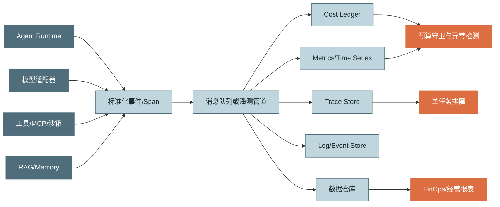

## 18.2 最小事件字段

### 身份与归因

- `trace_id`、`session_id`、`task_id`、`turn_id`；
- `tenant_id_hash`、`project_id`、`business_line`；
- `task_type`、`risk_level`、`priority`；
- `agent_name`、`agent_version`、`workflow_version`。

### 模型

- `provider`、`request_model`、`response_model`；
- `service_tier`、`region`；
- `prompt_version`、`toolset_version`；
- 原始和归一化 input/output/reason/cache token；
- `ttft_ms`、`decode_ms`、`total_ms`；
- `finish_reason`、`retry_count`、`status_code`；
- `estimated_usage` 与估算方法。

### 工具

- `tool_name`、`tool_version`、`mcp_server`；
- `queue/connect/auth/execute/transfer/parse` 分段时延；
- 输入、输出字节数；
- 缓存命中；
- 副作用级别、幂等键；
- 错误分类。

### 任务结果

- `success`、`partial_success`；
- 规则、测试和 Judge 分数；
- 用户接受、重做、人工接管；
- 最终成本和完成时长；
- 失败类型和是否留下可复用工件。

## 18.3 指标分层

### 经营层

- 总成本；
- Cost per Task；
- Cost per Successful Task；
- 毛利率/内部 ROI；
- 预算消耗率与月底预测；
- 按租户、业务线、任务类型成本；
- 失败成本占比。

### Agent 层

- 任务成功率、部分成功率；
- 平均/P95 轮次；
- 每任务模型与工具调用数；
- 无进展轮次；
- 循环熔断率；
- 人工接管率。

### 模型层

- 输入、输出、缓存读写、推理 token；
- TTFT、TPOT、总时延；
- 模型错误、429、超时；
- 路由分布和回退率；
- 单模型每成功任务成本。

### 缓存层

- 请求命中率；
- Token 命中率；
- 成本节省；
- 缓存写入量；
- TTL 过期率；
- 按 Prompt 版本的命中率；
- 陈旧或错误命中率。

### 工具与平台层

- 工具 P50/P95/P99；
- 队列、连接、执行分段；
- 沙箱冷启动率；
- 构建缓存命中；
- 数据库连接池和队列饱和度；
- 取消传播时延；
- 活跃会话和 in-flight 调用。

## 18.4 指标命名示例

```text
agent_task_total{task_type,status}
agent_task_duration_seconds{task_type}
agent_task_cost_usd{task_type,status,model_family}
agent_turn_total{task_type}
agent_no_progress_turn_total{task_type}
agent_model_tokens_total{provider,model,token_type}
agent_model_ttft_seconds{provider,model,cache_state}
agent_model_request_duration_seconds{provider,model,status}
agent_prompt_cache_tokens_total{provider,model,operation}
agent_route_total{policy,source_model,target_model,result}
agent_tool_duration_seconds{tool,phase,status}
agent_retry_total{component,error_class}
agent_budget_remaining_usd{scope_type}
agent_queue_wait_seconds{priority,queue}
agent_sandbox_cold_start_total{runtime}
```

> [!WARNING]
> 不要把 `session_id`、`user_id`、`request_id`、完整 URL、Prompt 哈希或文件路径作为时序指标标签，它们会造成高基数。此类字段放在 Trace 或日志中。

## 18.5 Histogram 与分位数

延迟是分布而不是均值。使用 Histogram 时，Bucket 应围绕 SLO 设置。例如交互 TTFT 的目标若集中在 0.5～5 秒，可使用更密集的 Bucket；长任务完成时间则需要几十秒到数分钟的 Bucket。

PromQL 示例：

```promql
# 模型请求 P95
histogram_quantile(
  0.95,
  sum by (le, model) (
    rate(agent_model_request_duration_seconds_bucket[5m])
  )
)
```

```promql
# 每个成功任务成本
sum(rate(agent_task_cost_usd_sum[1h]))
/
clamp_min(sum(rate(agent_task_total{status="success"}[1h])), 1)
```

```promql
# Prompt Cache Token 命中率
sum(rate(agent_prompt_cache_tokens_total{operation="read"}[15m]))
/
clamp_min(sum(rate(agent_model_tokens_total{token_type=~"input|cache_read|cache_write"}[15m])), 1)
```

## 18.6 五类仪表盘

### 经营总览

展示预算、月底预测、CPST、成功率、毛利和业务线成本。

### 成本瀑布

按未缓存输入、缓存读取、输出、推理、工具、沙箱、Judge 和失败成本分解。

### 性能关键路径

展示 TTFT、模型 decode、工具时延、队列、沙箱冷启动和任务 P95/P99。

### 缓存与路由

展示 Prompt 版本命中率、Token 节省、模型流量、回退率、路由净收益和质量差。

### 失败税

展示失败成本占比、重试次数、循环、错误分类、人工接管和失败工件复用率。

## 18.7 异常检测

建议同时使用静态阈值和动态基线：

- 单会话成本速率超过同类任务 P99；
- Token 命中率突然下降；
- Input token 每轮持续加速增长；
- 同工具同参数重复；
- 路由回退率显著上升；
- P95 TTFT 上升而供应商状态正常；
- 429 与重试同步上升；
- 自算台账与账单偏差扩大；
- 某 Prompt 版本成本增加但质量无提升；
- 取消后仍有模型或工具运行。

```mermaid
flowchart LR
    S["异常信号"] --> N["通知"]
    N --> L["限速/降低优先级"]
    L --> C["关闭昂贵功能/切换模型"]
    C --> B["会话或租户熔断"]
    B --> H["人工与事件复盘"]
```

## 18.8 账单对账

每个账期：

1. 按供应商、项目、模型、区域和日期聚合内部账本；
2. 与供应商 usage/billing 导出对齐时区和货币；
3. 解释折扣、税费、批处理、缓存和合同项；
4. 分离真实 usage 与估算 usage；
5. 对差异设阈值并追踪原因；
6. 将已确认差异反向修正定价卡或采集逻辑。

高频差异来源：流式中断、失败请求、SDK 内部重试、模型别名映射、跨时区账期、缓存 token 字段理解错误和价格生效时间错误。

## 18.9 隐私与采样

- 指标默认不存 Prompt/Completion 正文；
- Trace 内容采集按风险和环境显式开启；
- 对正文脱敏、加密和设置保留期；
- 高流量正常请求可采样，错误、超预算和高风险任务全量保留；
- 采样策略不能破坏成本总量，计费计数应全量；
- 用户删除请求需覆盖缓存、Trace、日志和离线数据集。

---

# 19. SLO、压测与性能回归

## 19.1 SLO 必须同时覆盖四维

下面是一组示例，不是通用阈值：

| 类别 | 示例 SLO |
|---|---|
| 质量 | 代表性任务集成功率 ≥ 92% |
| 成本 | CPST ≤ $0.50；P99 单任务成本 ≤ $2.00 |
| 交互性能 | TTFT P95 ≤ 1.8s；chunk 间隔 P95 ≤ 250ms |
| 任务性能 | 简单任务完成 P95 ≤ 20s；复杂任务 P95 ≤ 90s |
| 可靠性 | 月可用率 ≥ 99.9%；非用户错误失败率 ≤ 1% |
| 缓存 | 稳定 Prompt 的 Token 命中率 ≥ 65% |
| 路由 | 小模型回退率 ≤ 12%，且质量差不超过约定门槛 |
| 容量 | 429 比例 ≤ 0.2%；队列等待 P95 ≤ 1s |

成本 SLO 和延迟 SLO都应按任务类型分层，不能让“简单抽取”和“跨仓库重构”共用同一个目标。

## 19.2 Error Budget 与 Cost Budget

可靠性 Error Budget：

$$
ErrorBudget = 1 - SLO_{availability}
$$

成本也可以设置预算消耗：

$$
CostBurnRate = \frac{ActualCostRate}{PlannedCostRate}
$$

若短窗口和长窗口 Burn Rate 同时过高，可自动：

- 暂停非必要评测；
- 降低推理档位；
- 提高语义缓存阈值的保守程度，而不是盲目放宽；
- 将异步任务迁入批处理；
- 回收表现不佳的路由策略；
- 限制超大上下文。

## 19.3 压测必须复现 Agent 工作负载

只压 `/chat` QPS 不足以代表 Agent。负载模型应包含：

- 任务类型分布；
- 上下文长度分布；
- 输出长度与推理档位；
- 每任务轮次分布；
- 工具组合和工具延迟；
- 缓存冷/热比例；
- 成功、瞬时失败、永久失败；
- 用户取消；
- 审批挂起；
- 多租户和优先级；
- 批处理与在线流量竞争。

## 19.4 Open-loop 与 Closed-loop

- **Closed-loop**：一个虚拟用户完成后再发下一个，容易因系统变慢而自动降低到达率，掩盖排队崩溃；
- **Open-loop**：按目标到达率持续发请求，更接近真实峰值，也更容易暴露队列和背压问题。

容量测试应优先使用 open-loop，并同时报告 offered load 与 achieved throughput。

## 19.5 压测场景矩阵

| 场景 | 目的 |
|---|---|
| 冷缓存、冷沙箱 | 测最差启动体验 |
| 热缓存、稳定前缀 | 测正常稳态效率 |
| 长输入短输出 | 测 prefill 与缓存 |
| 短输入长输出 | 测 decode 与流式 |
| 工具长尾 | 测关键路径和超时 |
| 429/5xx 注入 | 测重试预算与降级 |
| 供应商不可用 | 测切换与可用性 |
| 数据库连接池饱和 | 测背压 |
| 大租户突发 | 测公平调度 |
| 用户大量取消 | 测资源回收 |
| Prompt 版本发布 | 测缓存冷启动冲击 |
| 模型路由漂移 | 测回退与质量护栏 |

## 19.6 示例负载配置

```yaml
profile: coding-agent-peak
arrival_rate_per_second: 8
run_duration_minutes: 30
traffic_mix:
  simple_fix: 0.45
  code_explanation: 0.25
  multi_file_refactor: 0.20
  test_diagnosis: 0.10
context_tokens:
  p50: 12000
  p95: 85000
rounds_per_task:
  p50: 4
  p95: 11
cache_state:
  warm: 0.70
  cold: 0.30
faults:
  model_429_rate: 0.01
  tool_timeout_rate: 0.02
  sandbox_cold_start_rate: 0.15
cancellation:
  before_first_useful_result: 0.03
slo:
  ttft_p95_ms: 1800
  task_p95_ms: 90000
  success_rate: 0.92
  cost_per_successful_task_usd: 0.50
```

## 19.7 性能回归门禁

每次模型、Prompt、工具 schema、路由、缓存或运行时变更，都可能改变成本和性能。CI/CD 可设置：

- 固定 Trace 回放；
- 小型线上样本去敏回放；
- 与基线比较 CPST、成功率、轮次和 P95；
- 允许噪声区间，超阈值阻断；
- 对模型非确定性运行多次并给置信区间；
- 分离供应商抖动与代码回归；
- 保存模型快照、参数和 Prompt 版本。

## 19.8 优化实验的停止条件

不能只看短期成本下降。实验至少观察：

- 任务成功率及分任务类型变化；
- 用户重做率和人工接管；
- 7 日或更长窗口的模型/数据漂移；
- P95/P99；
- 缓存冷启动和新 Prompt 发布后的表现；
- 路由回退与误放过；
- 供应商故障时的降级行为。

---

# 20. 生产级参考架构

```mermaid
flowchart TB
    subgraph Client["客户端与产品层"]
        UI["Web/Desktop/CLI"]
        STREAM["流式结果、进度、取消、审批"]
    end

    subgraph Edge["接入与治理层"]
        GW["API Gateway"]
        AUTH["身份/租户/权限"]
        ADMIT["准入控制与配额"]
        BUDGET["预算预占与 BudgetGuard"]
        QUEUE["优先级队列/背压"]
    end

    subgraph Runtime["Agent Runtime"]
        LOOP["Agent Loop / 状态机"]
        ROUTER["模型与服务等级路由"]
        CTX["Context Builder / Token Budget"]
        POLICY["重试、熔断、降级"]
        DAG["工具 DAG 调度器"]
    end

    subgraph Cache["缓存与状态"]
        RC["精确/语义响应缓存"]
        PC["Prompt/KV Cache"]
        TC["工具/RAG 缓存"]
        ART["工件/构建缓存"]
        MEM["会话状态与 Memory"]
    end

    subgraph Execution["执行与知识层"]
        MODELS["托管模型/自托管推理"]
        MCP["Tools / MCP / SaaS"]
        RAG["搜索/向量/重排/图"]
        SANDBOX["沙箱/浏览器/代码执行"]
    end

    subgraph Offline["异步与批处理"]
        BATCH["Batch/Flex/低优先级任务"]
        EVAL["评测、记忆提取、索引"]
    end

    subgraph Observe["可观测与 FinOps"]
        OTEL["Trace/Metric/Event"]
        LEDGER["Cost Ledger"]
        ALERT["异常检测/SLO"]
        BI["预算、预测、对账、毛利"]
    end

    UI --> STREAM --> GW
    GW --> AUTH --> ADMIT --> BUDGET --> QUEUE --> LOOP
    LOOP --> ROUTER
    LOOP --> CTX
    LOOP --> POLICY
    LOOP --> DAG
    CTX --> RC
    CTX --> PC
    CTX --> MEM
    ROUTER --> MODELS
    DAG --> MCP
    DAG --> RAG
    DAG --> SANDBOX
    RAG --> TC
    SANDBOX --> ART
    LOOP --> BATCH
    BATCH --> EVAL

    GW -.-> OTEL
    LOOP -.-> OTEL
    MODELS -.-> OTEL
    MCP -.-> OTEL
    RAG -.-> OTEL
    SANDBOX -.-> OTEL
    OTEL --> LEDGER --> BI
    OTEL --> ALERT
    ALERT -.-> ADMIT
    ALERT -.-> ROUTER
    LEDGER -.-> BUDGET

    classDef edge fill:#4F6D7A,stroke:#4F6D7A,color:#fff
    classDef runtime fill:#C0D6DF,stroke:#4F6D7A,color:#1f2d33
    classDef cache fill:#E8DAB2,stroke:#4F6D7A,color:#1f2d33
    classDef exec fill:#D7E8D4,stroke:#4F6D7A,color:#1f2d33
    classDef warn fill:#DD6E42,stroke:#DD6E42,color:#fff
    class GW,AUTH,ADMIT,BUDGET,QUEUE edge
    class LOOP,ROUTER,CTX,POLICY,DAG runtime
    class RC,PC,TC,ART,MEM cache
    class MODELS,MCP,RAG,SANDBOX,BATCH,EVAL exec
    class OTEL,LEDGER,ALERT,BI warn
```

关键设计原则：

1. **治理前置**：身份、权限、预算、配额和准入在昂贵执行前完成；
2. **运行时状态化**：轮次、预算、计划和工件有结构化状态；
3. **执行可取消**：模型、工具、沙箱和队列共享取消信号；
4. **缓存分层**：每层拥有独立安全域、版本、TTL 和质量校验；
5. **在线/离线隔离**：交互流量不与评测、索引争抢资源；
6. **事件驱动计量**：成本台账作为统一事件流消费者，不侵入 Agent 业务逻辑；
7. **评测驱动路由**：任何模型降级或切换都有质量证据；
8. **控制闭环**：观测结果能自动影响路由、预算、准入和熔断。

---

# 21. 动手实现：成本台账与预算守卫

下面给出一个供应商无关的最小实现。它重点展示：

- 带生效时间的价格卡；
- 原始 usage 到归一化 token 的映射；
- Decimal 精确计价；
- 按任务累积成本；
- 预估与实际成本区分；
- Cost per Successful Task；
- 任务级预算守卫。

## 21.1 `cost_runtime.py`

```python
from __future__ import annotations

from dataclasses import dataclass, field
from datetime import UTC, datetime
from decimal import Decimal
from enum import StrEnum
from typing import Iterable, Mapping


MILLION = Decimal("1000000")
ZERO = Decimal("0")


class TokenKind(StrEnum):
    INPUT = "input"
    CACHE_READ = "cache_read"
    CACHE_WRITE = "cache_write"
    OUTPUT = "output"
    REASONING = "reasoning"


@dataclass(frozen=True, slots=True)
class PriceCard:
    provider: str
    model: str
    currency: str
    effective_from: datetime
    prices_per_million: Mapping[TokenKind, Decimal]
    service_tier: str = "default"
    effective_to: datetime | None = None
    version: str = "v1"

    def active_at(self, at: datetime) -> bool:
        return self.effective_from <= at and (
            self.effective_to is None or at < self.effective_to
        )


class PricingCatalog:
    def __init__(self, cards: Iterable[PriceCard]) -> None:
        self._cards = tuple(cards)

    def resolve(
        self,
        *,
        provider: str,
        model: str,
        service_tier: str,
        at: datetime,
    ) -> PriceCard:
        matches = [
            card
            for card in self._cards
            if card.provider == provider
            and card.model == model
            and card.service_tier == service_tier
            and card.active_at(at)
        ]
        if not matches:
            raise KeyError(
                f"No active price card for {provider}/{model}/{service_tier} at {at}"
            )
        # 防止重叠价格卡静默造成错误计价。
        if len(matches) != 1:
            raise ValueError(f"Overlapping price cards: {matches!r}")
        return matches[0]


@dataclass(frozen=True, slots=True)
class NormalizedUsage:
    input_tokens: int = 0
    cache_read_tokens: int = 0
    cache_write_tokens: int = 0
    output_tokens: int = 0
    reasoning_tokens: int = 0

    def __post_init__(self) -> None:
        values = (
            self.input_tokens,
            self.cache_read_tokens,
            self.cache_write_tokens,
            self.output_tokens,
            self.reasoning_tokens,
        )
        if any(value < 0 for value in values):
            raise ValueError("Token counts must be non-negative")

    def by_kind(self) -> dict[TokenKind, int]:
        return {
            TokenKind.INPUT: self.input_tokens,
            TokenKind.CACHE_READ: self.cache_read_tokens,
            TokenKind.CACHE_WRITE: self.cache_write_tokens,
            TokenKind.OUTPUT: self.output_tokens,
            TokenKind.REASONING: self.reasoning_tokens,
        }

    @property
    def total_input_side(self) -> int:
        return self.input_tokens + self.cache_read_tokens + self.cache_write_tokens


@dataclass(frozen=True, slots=True)
class UsageRecord:
    request_id: str
    task_id: str
    session_id: str
    tenant_id_hash: str
    task_type: str
    provider: str
    request_model: str
    response_model: str
    service_tier: str
    occurred_at: datetime
    usage: NormalizedUsage
    raw_usage: Mapping[str, object] = field(default_factory=dict)
    estimated: bool = False
    retry_attempt: int = 0
    status: str = "success"


@dataclass(frozen=True, slots=True)
class CostedUsage:
    record: UsageRecord
    price_card_version: str
    currency: str
    by_kind: Mapping[TokenKind, Decimal]

    @property
    def total(self) -> Decimal:
        return sum(self.by_kind.values(), start=ZERO)


def price_usage(record: UsageRecord, catalog: PricingCatalog) -> CostedUsage:
    card = catalog.resolve(
        provider=record.provider,
        model=record.response_model,
        service_tier=record.service_tier,
        at=record.occurred_at,
    )
    by_kind: dict[TokenKind, Decimal] = {}
    for kind, tokens in record.usage.by_kind().items():
        unit_price = card.prices_per_million.get(kind, ZERO)
        by_kind[kind] = Decimal(tokens) * unit_price / MILLION
    return CostedUsage(
        record=record,
        price_card_version=card.version,
        currency=card.currency,
        by_kind=by_kind,
    )


@dataclass(slots=True)
class TaskAccount:
    task_id: str
    task_type: str
    tenant_id_hash: str
    currency: str
    model_cost: Decimal = ZERO
    tool_cost: Decimal = ZERO
    sandbox_cost: Decimal = ZERO
    retrieval_cost: Decimal = ZERO
    observability_cost: Decimal = ZERO
    request_count: int = 0
    retry_count: int = 0
    estimated_cost: Decimal = ZERO
    tokens: dict[TokenKind, int] = field(default_factory=dict)
    success: bool | None = None
    partial_success: bool = False

    @property
    def total(self) -> Decimal:
        return (
            self.model_cost
            + self.tool_cost
            + self.sandbox_cost
            + self.retrieval_cost
            + self.observability_cost
        )

    @property
    def cache_token_hit_rate(self) -> Decimal:
        read = self.tokens.get(TokenKind.CACHE_READ, 0)
        total_input = (
            read
            + self.tokens.get(TokenKind.INPUT, 0)
            + self.tokens.get(TokenKind.CACHE_WRITE, 0)
        )
        if total_input == 0:
            return ZERO
        return Decimal(read) / Decimal(total_input)


class CostLedger:
    def __init__(self, catalog: PricingCatalog) -> None:
        self._catalog = catalog
        self._tasks: dict[str, TaskAccount] = {}
        self._seen_request_ids: set[str] = set()

    def _task_for(self, record: UsageRecord, currency: str) -> TaskAccount:
        existing = self._tasks.get(record.task_id)
        if existing is not None:
            if existing.currency != currency:
                raise ValueError("One task cannot mix currencies without FX normalization")
            return existing
        account = TaskAccount(
            task_id=record.task_id,
            task_type=record.task_type,
            tenant_id_hash=record.tenant_id_hash,
            currency=currency,
        )
        self._tasks[record.task_id] = account
        return account

    def record_model_usage(self, record: UsageRecord) -> CostedUsage:
        # 事件至少一次投递时，用 request_id 去重。
        if record.request_id in self._seen_request_ids:
            raise ValueError(f"Duplicate request_id: {record.request_id}")

        costed = price_usage(record, self._catalog)
        account = self._task_for(record, costed.currency)
        account.model_cost += costed.total
        account.request_count += 1
        account.retry_count += int(record.retry_attempt > 0)
        if record.estimated:
            account.estimated_cost += costed.total
        for kind, count in record.usage.by_kind().items():
            account.tokens[kind] = account.tokens.get(kind, 0) + count
        self._seen_request_ids.add(record.request_id)
        return costed

    def add_external_cost(
        self,
        *,
        task_id: str,
        category: str,
        amount: Decimal,
    ) -> None:
        if amount < ZERO:
            raise ValueError("Cost cannot be negative")
        account = self._tasks[task_id]
        mapping = {
            "tool": "tool_cost",
            "sandbox": "sandbox_cost",
            "retrieval": "retrieval_cost",
            "observability": "observability_cost",
        }
        attr = mapping.get(category)
        if attr is None:
            raise ValueError(f"Unsupported category: {category}")
        setattr(account, attr, getattr(account, attr) + amount)

    def finish_task(
        self,
        *,
        task_id: str,
        success: bool,
        partial_success: bool = False,
    ) -> None:
        account = self._tasks[task_id]
        account.success = success
        account.partial_success = partial_success

    def task(self, task_id: str) -> TaskAccount:
        return self._tasks[task_id]

    def cost_per_successful_task(self) -> Decimal:
        finished = [task for task in self._tasks.values() if task.success is not None]
        successful = sum(1 for task in finished if task.success)
        if successful == 0:
            return Decimal("Infinity")
        total = sum((task.total for task in finished), start=ZERO)
        return total / Decimal(successful)

    def failure_tax_ratio(self) -> Decimal | None:
        succeeded = [task.total for task in self._tasks.values() if task.success is True]
        failed = [task.total for task in self._tasks.values() if task.success is False]
        if not succeeded or not failed:
            return None
        avg_success = sum(succeeded, start=ZERO) / Decimal(len(succeeded))
        avg_failed = sum(failed, start=ZERO) / Decimal(len(failed))
        if avg_success == ZERO:
            return None
        return avg_failed / avg_success


class BudgetState(StrEnum):
    HEALTHY = "healthy"
    WARNING = "warning"
    CONSTRAINED = "constrained"
    EXHAUSTED = "exhausted"


@dataclass(slots=True)
class BudgetGuard:
    hard_limit: Decimal
    warning_ratio: Decimal = Decimal("0.70")
    constrained_ratio: Decimal = Decimal("0.90")
    reserved_for_handoff: Decimal = Decimal("0.01")
    committed: Decimal = ZERO
    reserved: Decimal = ZERO

    @property
    def spendable_limit(self) -> Decimal:
        return max(self.hard_limit - self.reserved_for_handoff, ZERO)

    @property
    def remaining(self) -> Decimal:
        return max(self.spendable_limit - self.committed - self.reserved, ZERO)

    @property
    def state(self) -> BudgetState:
        if self.committed + self.reserved >= self.spendable_limit:
            return BudgetState.EXHAUSTED
        ratio = (self.committed + self.reserved) / max(self.spendable_limit, Decimal("0.000001"))
        if ratio >= self.constrained_ratio:
            return BudgetState.CONSTRAINED
        if ratio >= self.warning_ratio:
            return BudgetState.WARNING
        return BudgetState.HEALTHY

    def reserve(self, predicted: Decimal) -> None:
        if predicted < ZERO:
            raise ValueError("Predicted cost cannot be negative")
        if predicted > self.remaining:
            raise RuntimeError(
                f"Budget exceeded: predicted={predicted}, remaining={self.remaining}"
            )
        self.reserved += predicted

    def settle(self, *, predicted: Decimal, actual: Decimal) -> None:
        if predicted > self.reserved:
            raise ValueError("Cannot settle more reservation than currently held")
        if actual < ZERO:
            raise ValueError("Actual cost cannot be negative")
        self.reserved -= predicted
        self.committed += actual
        # 实际 usage 可能超过预估；调用方应在下一步前检查 state。


# 示例价格卡。数值仅用于测试，生产环境从受控配置加载。
CATALOG = PricingCatalog(
    [
        PriceCard(
            provider="example",
            model="large-v1",
            service_tier="default",
            currency="USD",
            effective_from=datetime(2026, 1, 1, tzinfo=UTC),
            version="2026-01",
            prices_per_million={
                TokenKind.INPUT: Decimal("5.00"),
                TokenKind.CACHE_READ: Decimal("0.50"),
                TokenKind.CACHE_WRITE: Decimal("6.25"),
                TokenKind.OUTPUT: Decimal("25.00"),
                TokenKind.REASONING: Decimal("25.00"),
            },
        )
    ]
)
```

## 21.2 Provider Adapter 负责归一化

不同供应商的字段映射放在适配器，不要散落在业务代码：

```python
from typing import Any


def normalize_example_usage(raw: dict[str, Any]) -> NormalizedUsage:
    details = raw.get("input_tokens_details", {}) or {}
    output_details = raw.get("output_tokens_details", {}) or {}
    total_input = int(raw.get("input_tokens", 0))
    cached = int(details.get("cached_tokens", 0))
    cache_write = int(details.get("cache_write_tokens", 0))

    # 这里必须根据供应商字段语义决定 input 是否已经包含 cached。
    # 生产适配器应有契约测试和账单对账验证。
    uncached = max(total_input - cached - cache_write, 0)
    return NormalizedUsage(
        input_tokens=uncached,
        cache_read_tokens=cached,
        cache_write_tokens=cache_write,
        output_tokens=int(raw.get("output_tokens", 0)),
        reasoning_tokens=int(output_details.get("reasoning_tokens", 0)),
    )
```

## 21.3 请求前预算预占

```python
from decimal import Decimal


async def call_model_with_budget(
    *,
    budget: BudgetGuard,
    predicted_cost: Decimal,
    invoke,
):
    budget.reserve(predicted_cost)
    try:
        response, actual_cost = await invoke()
    except Exception:
        # 即使失败也可能已经计费。真实实现从异常响应或异步 usage 取 actual。
        estimated_actual = predicted_cost
        budget.settle(predicted=predicted_cost, actual=estimated_actual)
        raise
    else:
        budget.settle(predicted=predicted_cost, actual=actual_cost)
        return response
```

## 21.4 数据库存储建议

```sql
CREATE TABLE model_usage_event (
    request_id             TEXT PRIMARY KEY,
    trace_id               TEXT NOT NULL,
    task_id                TEXT NOT NULL,
    session_id             TEXT NOT NULL,
    tenant_id_hash         TEXT NOT NULL,
    task_type              TEXT NOT NULL,
    provider               TEXT NOT NULL,
    request_model          TEXT NOT NULL,
    response_model         TEXT NOT NULL,
    service_tier           TEXT NOT NULL,
    prompt_version         TEXT NOT NULL,
    price_card_version     TEXT NOT NULL,
    occurred_at_utc        TEXT NOT NULL,
    input_tokens           INTEGER NOT NULL DEFAULT 0,
    cache_read_tokens      INTEGER NOT NULL DEFAULT 0,
    cache_write_tokens     INTEGER NOT NULL DEFAULT 0,
    output_tokens          INTEGER NOT NULL DEFAULT 0,
    reasoning_tokens       INTEGER NOT NULL DEFAULT 0,
    model_cost_microunits  INTEGER NOT NULL,
    currency               TEXT NOT NULL,
    estimated              INTEGER NOT NULL DEFAULT 0,
    retry_attempt          INTEGER NOT NULL DEFAULT 0,
    status                 TEXT NOT NULL,
    raw_usage_json         TEXT NOT NULL
);

CREATE INDEX idx_usage_task_time
    ON model_usage_event(task_id, occurred_at_utc);

CREATE INDEX idx_usage_tenant_time
    ON model_usage_event(tenant_id_hash, occurred_at_utc);

CREATE INDEX idx_usage_model_time
    ON model_usage_event(provider, response_model, occurred_at_utc);
```

金额建议使用整数微单位或定点小数，避免浮点累计误差。

## 21.5 测试要点

至少覆盖：

1. 各 token 类别手算计价；
2. 缓存读写和普通输入不重复计数；
3. 价格卡生效边界与重叠检测；
4. 模型别名返回实际模型后的计价；
5. 同一 `request_id` 重复事件去重；
6. 流式中断和失败请求计价；
7. 缺失 usage 的估算标记；
8. 多币种禁止静默相加；
9. 预算预占、释放和实际超估；
10. CPST 与失败税计算；
11. 供应商账单样本对账；
12. 大整数 token 和 Decimal 精度。

---
# 22. 模拟案例：从失控账单到正向毛利

下面用一个**教学型模拟案例**串联本章方法。数字用于展示分析框架，不代表任何真实厂商、产品或当前模型价格。

## 22.1 初始状态

某企业级代码 Agent 平台每月执行 32,000 个任务，月度模型与平台总成本约 48,000 美元：

| 指标 | 初始值 | 说明 |
|---|---:|---|
| 月任务数 | 32,000 | 用户提交的顶层任务 |
| 月总成本 | $48,000 | 模型、检索、工具、沙箱、存储与重试 |
| 每任务平均成本 | $1.50 | `总成本 / 顶层任务数` |
| 任务成功率 | 78% | 通过自动验收或人工确认 |
| 每成功任务成本 CPST | $1.92 | `$48,000 / (32,000 × 78%)` |
| 平均 Agent 轮数 | 9.6 | 模型调用轮次，不含工具内部重试 |
| Prompt Cache Token 命中率 | 11% | 按可计量 token 口径 |
| P95 端到端时延 | 76 秒 | 从受理到终态 |
| 失败任务平均成本倍数 | 2.8× | 相对成功任务平均成本 |

失败率只有 22%，但因为失败任务平均消耗是成功任务的 2.8 倍，失败任务约占总成本的：

$$
\frac{0.22 \times 2.8}{0.78 + 0.22 \times 2.8} \approx 44.1\%
$$

这说明平台的首要问题不是“某个模型单价偏高”，而是**失败税、过长循环、重复上下文和错误路由共同放大了账单**。

## 22.2 先做归因，而不是直接换模型

团队先给每个顶层任务建立成本瀑布：

```mermaid
graph LR
    A[顶层任务成本] --> B[模型推理 67%]
    A --> C[工具与沙箱 14%]
    A --> D[检索与存储 6%]
    A --> E[平台计算 5%]
    A --> F[可观测与网络 3%]
    A --> G[其他 5%]

    B --> B1[重复上下文 19%]
    B --> B2[不必要的大模型 16%]
    B --> B3[失败与重试 21%]
    B --> B4[有效推理 44%]
```

进一步按任务类型拆分后发现：

1. 文档问答和代码解释任务中，大量系统提示、工具定义、仓库摘要重复出现；
2. 简单分类、参数抽取和格式化也默认使用最高档模型；
3. 工具超时后，SDK、Agent Runtime 和工作流层同时重试；
4. 代码任务缺少阶段性验收，错误方向持续执行到预算耗尽；
5. 离线评测和索引生成仍走在线低延迟通道；
6. 成功率统计只看“是否生成答案”，没有看编译、测试或业务验收。

## 22.3 优化实验设计

团队没有一次性上线全部策略，而是建立对照组与分阶段实验：

| 实验 | 核心变化 | 主指标 | 保护指标 |
|---|---|---|---|
| E1 前缀稳定化 | 固定系统提示、工具 Schema、仓库摘要顺序 | Cache Token 命中率 | 任务成功率、TTFT |
| E2 分级路由 | 小模型首选，复杂任务升级 | CPST | 成功率、升级率 |
| E3 工具去重 | 幂等键、统一重试所有权 | 重复副作用率 | 工具成功率 |
| E4 Loop 预算 | 轮数、token、时间、金额联合预算 | 失败税 | 可恢复任务成功率 |
| E5 阶段验收 | Plan、Edit、Test、Review 分段检查 | 成功率 | P95 时延 |
| E6 离线分流 | 评测、批量抽取、索引进入 Batch/Flex 类通道 | 单位成本 | 完成时限 |

每次实验至少记录：

- 实验版本、Prompt 版本、路由策略版本；
- 任务难度分桶和租户类型；
- 成本、成功率、TTFT、TPOT、端到端时延；
- 缓存命中、升级、重试、降级和人工接管；
- 是否发生质量回归、安全回归或副作用。

## 22.4 分阶段结果

经过多轮迭代，模拟结果如下：

| 指标 | 优化前 | 优化后 | 变化 |
|---|---:|---:|---:|
| 月任务数 | 32,000 | 32,000 | — |
| 月总成本 | $48,000 | $13,440 | -72.0% |
| 每任务平均成本 | $1.50 | $0.42 | -72.0% |
| 任务成功率 | 78% | 91% | +13 个百分点 |
| CPST | $1.92 | $0.46 | -76.0% |
| 平均 Agent 轮数 | 9.6 | 5.2 | -45.8% |
| Cache Token 命中率 | 11% | 74% | +63 个百分点 |
| 大模型调用占比 | 100% | 49% | -51 个百分点 |
| 升级率 | 无分级 | 8.5% | 可控 |
| 失败任务成本倍数 | 2.8× | 1.35× | -51.8% |
| P95 端到端时延 | 76 秒 | 39 秒 | -48.7% |
| P95 TTFT | 3.1 秒 | 1.8 秒 | -41.9% |

> **注意**： 总效果不能简单等于各实验单独收益之和。缓存、路由、轮数和成功率存在交互，应通过分层实验、反事实估算或 Shapley 类归因方法避免重复认领收益。

## 22.5 收益来源分解

```mermaid
flowchart TB
    A[月成本减少 $34,560] --> B[缓存与上下文治理]
    A --> C[模型路由]
    A --> D[减少轮数与调用]
    A --> E[失败税治理]
    A --> F[离线批处理]
    A --> G[工具与沙箱优化]

    B --> B1[稳定前缀]
    B --> B2[仓库摘要复用]
    B --> B3[检索片段去重]

    C --> C1[小模型首选]
    C --> C2[置信度升级]
    C --> C3[预算感知降级]

    D --> D1[一次取全]
    D --> D2[并行独立调用]
    D --> D3[阶段终止条件]

    E --> E1[统一重试所有权]
    E --> E2[错误分类]
    E --> E3[阶段验收]

    F --> F1[评测批量化]
    F --> F2[索引异步化]

    G --> G1[增量测试]
    G --> G2[沙箱池化]
```

## 22.6 为什么成功率提升反而降低成本

很多团队担心“多做一次验证会增加调用”，但验证只要能提前阻止错误方向，就可能降低总成本。设：

- 阶段验证成本为 $C_v$；
- 无验证时进入错误后续步骤的概率为 $p_e$；
- 错误后续平均浪费成本为 $C_w$；
- 验证发现错误的召回率为 $r_v$。

当满足：

$$
C_v < p_e \times r_v \times C_w
$$

阶段验证就是成本正收益。

在代码 Agent 中，低成本的 `git diff --check`、定向单元测试、语法检查、静态分析，往往能在执行全量测试或继续多轮修改前发现问题。

## 22.7 案例复盘

这个案例的核心启示是：

1. **先优化成功任务经济性，而不是只看单次调用单价；**
2. **失败任务可能贡献接近一半成本，失败税通常是最大暗账；**
3. **缓存要求输入结构稳定，不能只打开一个开关；**
4. **路由必须带升级和质量保护，不能把“大模型换小模型”当作完整方案；**
5. **成本、质量和性能需要同一套实验与可观测体系；**
6. **优化最终应体现在 CPST、毛利、SLO 和用户留存，而非单点 token 降幅。**

---

# 23. 常见误区与故障模式

## 23.1 只统计成功响应的成本

**现象**： 内部台账明显低于供应商账单。

**根因**： 超时、取消、流式中断、内容过滤、重试失败和预填充失败没有记录 usage；部分失败请求仍会产生费用。

**修复**： 所有请求都写终态事件；无法取得精确 usage 时标记 `estimated=true`；按日与账单对账。

## 23.2 把总 token 命中率当成缓存收益

**现象**： “缓存命中率很高”，但账单下降不明显。

**根因**： 请求命中率、token 命中率和可计费节省率混为一谈；命中的只是很短前缀，或缓存写入成本、存储成本抵消了收益。

**修复**： 同时观察 `request_hit_rate`、`token_hit_rate`、`avoided_input_cost`、`cache_write_cost` 和 `net_cache_saving`。

## 23.3 动态字段放在 Prompt 前部

**现象**： 相似请求仍无法复用前缀缓存。

**根因**： 时间戳、随机 ID、用户输入、动态工具顺序或会话状态出现在稳定前缀之前。

**修复**： 按“静态系统提示 → 稳定工具定义 → 稳定知识 → 动态会话 → 当前输入”组织，并对序列化结果做快照测试。

## 23.4 为追求便宜，所有任务切到小模型

**现象**： 单次调用变便宜，但总轮数、重试和人工接管增加，CPST 上升。

**根因**： 忽视能力边界和升级路径。

**修复**： 使用级联路由；以成功任务成本而非每调用成本评估；高风险动作设置能力下限。

## 23.5 路由器本身过重

**现象**： 每个任务先调用一次昂贵模型做分类，延迟和成本反而上升。

**根因**： 路由成本超过节省额。

**修复**： 优先使用规则、静态特征、小模型或离线学习；计算路由盈亏平衡：

$$
C_{router} < P(small) \times (C_{large}-C_{small}) - C_{fallback}
$$

## 23.6 只限制最大 token，不限制 Agent 轮数

**现象**： 单次请求受控，但一个任务发起几十次调用。

**根因**： 预算只存在于 Provider Adapter，没有顶层任务预算。

**修复**： 对 token、轮数、时间、金额、工具调用、失败次数建立联合预算，并支持阶段保留。

## 23.7 多层重试叠加

**现象**： 一次工具故障产生指数级请求风暴。

**根因**： SDK、Provider Adapter、Agent Loop、Workflow 和任务队列都独立重试。

**修复**： 明确唯一重试所有者；下层只返回可分类错误和 `Retry-After`；全链路传播 attempt 与幂等键。

```mermaid
sequenceDiagram
    participant W as Workflow
    participant A as Agent Runtime
    participant P as Provider Adapter
    participant M as Model API

    Note over W,M: 错误做法：每层最多重试 3 次，最坏可放大为 27 次以上
    W->>A: 执行任务
    A->>P: 模型调用
    P->>M: 请求
    M-->>P: 429
    P->>M: Adapter 重试
    P-->>A: 仍失败
    A->>P: Agent 重试
    A-->>W: 仍失败
    W->>A: Workflow 重试

    Note over W,M: 正确做法：一个 owner + 全局 deadline + 幂等键
```

## 23.8 对非幂等工具盲目重试

**现象**： 重复发邮件、重复创建工单、重复扣款或重复提交代码。

**根因**： 把“网络超时”误认为“服务端一定未执行”。

**修复**： 幂等键、查询后确认、补偿事务、人工审批；不确定状态进入 `UNKNOWN_COMMIT_STATE`，禁止自动重放。

## 23.9 用平均时延掩盖长尾

**现象**： 平均 8 秒，但大量用户等待超过 60 秒。

**根因**： 平均值被短请求稀释，队列和工具长尾不可见。

**修复**： 按任务类型和阶段观察 P50/P95/P99、排队时间、TTFT、TPOT 和端到端时延。

## 23.10 只优化模型调用，不看工具关键路径

**现象**： 模型更快后，端到端时延几乎不变。

**根因**： 真正瓶颈是仓库扫描、检索、浏览器、沙箱启动、全量测试或串行 I/O。

**修复**： 用 Trace 识别关键路径；缓存或增量化工具；并行无依赖操作；池化沙箱。

## 23.11 无条件并行化

**现象**： P50 下降，但成本、限流和 P99 恶化。

**根因**： 并行执行了可能被前一步取消的工作，或多个分支争抢同一限额。

**修复**： 区分确定性并行、投机并行和互斥动作；给投机分支设置取消与浪费预算。

## 23.12 把流式输出误认为吞吐优化

**现象**： 用户感觉更快，但后端总时间和总成本没有下降。

**根因**： 流式主要优化 TTFT 与感知等待，不一定减少生成量或计算。

**修复**： 将流式体验指标与真实吞吐、TPOT、总生成 token 分开报告。

## 23.13 把限流错误当成扩容信号

**现象**： 遇到 429 就增加本地并发，导致失败更严重。

**根因**： 供应商配额、组织限额和本地容量不是同一瓶颈。

**修复**： 识别 RPM、TPM、并发、批处理队列等限制；使用令牌桶、排队、退避和多通道调度。

## 23.14 忽略价格版本

**现象**： 历史账单重算后发生漂移。

**根因**： 用最新价格回算过去事件，或未记录服务层、区域和缓存价格。

**修复**： 事件记录 `price_card_version` 和实际响应模型；价格卡按生效区间不可变。

## 23.15 把估算值和账单值混在一起

**现象**： 财务无法复核，异常检测误报。

**根因**： 缺失 usage 时的预测没有显式标记。

**修复**： 区分 `estimated_cost`、`metered_cost`、`billed_cost`；建立差异率和回填状态。

## 23.16 自托管只算 GPU 租金

**现象**： 看似低于 API 单价，实际上整体亏损。

**根因**： 漏算冗余、空闲、工程人力、网络、存储、监控、安全、升级和故障损失。

**修复**： 使用完整 TCO；以有效输出 token、成功任务和 SLO 约束下的成本比较。

## 23.17 为了命中缓存泄漏租户数据

**现象**： 跨租户复用包含敏感上下文的缓存。

**根因**： 只按 Prompt Hash 建键，没有加入安全域、权限和数据版本。

**修复**： 缓存键包含租户、权限、策略和内容版本；敏感数据默认不跨安全域复用；加密并设置 TTL。

## 23.18 优化后不做质量回归

**现象**： 账单下降，但幻觉、漏调用、错误修改和安全事件增加。

**根因**： 单目标优化。

**修复**： 每个成本实验同时设置质量、安全、成功率、延迟保护线；触发即自动回滚。

## 23.19 指标基数爆炸

**现象**： 可观测平台成本快速上升，查询变慢。

**根因**： 把 `task_id`、`user_id`、完整 Prompt Hash 等高基数字段作为 Metric Label。

**修复**： 高基数字段放 Trace/Log；Metric 仅保留受控维度，如模型族、任务类型、状态、区域和策略版本。

## 23.20 只在月末看账单

**现象**： Prompt 回归或重试风暴持续数周才被发现。

**根因**： 缺少实时预算和异常检测。

**修复**： 建立每请求预算、每任务预算、每日 burn rate、预测账单和自动熔断。

---

# 24. 分阶段落地路线图

成本与性能工程不应从复杂路由或自托管开始。建议按“可见 → 可控 → 可优化 → 可自治”推进。

## 24.1 阶段 0：建立可信基线

**目标**： 回答“钱花在哪里、时间耗在哪里、结果是否成功”。

交付物：

- 顶层任务、模型、工具、沙箱和检索的统一 Trace；
- 标准化 usage 与价格卡；
- 任务成功定义和验收信号；
- 成本、时延、失败、缓存和重试仪表盘；
- 日级供应商账单对账；
- 代表性任务集和首轮压测基线。

退出条件：

- 95% 以上生产请求可关联到顶层任务；
- 台账与供应商账单差异处于可解释范围；
- 能计算 CPST、失败税、P95 端到端时延；
- 能定位前三大成本来源和前三大长尾阶段。

## 24.2 阶段 1：低风险快速收益

**目标**： 不改变核心能力边界，先消除明显浪费。

优先项：

1. 稳定 Prompt 前缀与工具顺序；
2. 删除重复上下文和无用输出；
3. 统一 SDK 与 Runtime 重试；
4. 并行无依赖 I/O；
5. 增量检索、增量测试和沙箱池化；
6. 离线任务进入批处理或低优先级通道；
7. 为任务设置 token、时间、金额和轮数上限。

退出条件：缓存净收益为正、重复请求显著下降、质量无回归、P95 不恶化。

## 24.3 阶段 2：模型路由与级联

**目标**： 让不同难度和价值的任务匹配不同能力与成本。

交付物：

- 任务分类、风险评级和 SLA 分层；
- 候选模型能力矩阵；
- 小模型首选与升级条件；
- 路由 shadow 模式和离线回放；
- 质量、成本、升级率和回退率门禁；
- 路由策略版本化与快速回滚。

退出条件：CPST 下降，成功率和关键安全指标不低于基线，升级率稳定且可解释。

## 24.4 阶段 3：失败税与闭环控制

**目标**： 让系统在错误、限流和不确定性下有界运行。

交付物：

- 错误分类和唯一重试所有者；
- 幂等、补偿和未知提交状态；
- 阶段检查点和恢复；
- 预算预占、结算、熔断与降级；
- 失败任务自动归因；
- Error Budget 与 Cost Budget 联动。

退出条件：失败任务平均成本接近成功任务，重试放大倍数受控，预算超限能自动阻断。

## 24.5 阶段 4：容量与部署优化

**目标**： 在目标 SLO 下实现稳定吞吐和可预测成本。

交付物：

- 开环与闭环压测；
- 到达率、并发、队列和 token 速率模型；
- 供应商配额与本地资源联合调度；
- 预测扩缩容和预热；
- 自托管模型基准、TCO 和盈亏平衡；
- API、自托管和批处理的混合调度。

退出条件：目标峰值下 SLO、错误率和成本均满足要求，故障演练可通过。

## 24.6 阶段 5：自治优化

**目标**： 让平台基于在线反馈自动调整，但保持可审计和可回滚。

可逐步引入：

- Contextual Bandit 路由；
- 预算感知规划；
- 动态并发和批大小；
- 缓存 TTL 自适应；
- 失败模式自动识别；
- Prompt、模型和工具策略的多目标实验；
- 以毛利、成功率、延迟和安全为约束的优化器。

自治系统必须具备：

1. 明确探索预算；
2. 冷启动安全策略；
3. 高风险任务禁止探索；
4. 因果归因或可信对照；
5. 策略版本与审计记录；
6. 一键回滚和全局熔断。

## 24.7 30/60/90 天参考计划

| 时间 | 重点 | 可验证结果 |
|---|---|---|
| 0–30 天 | 台账、Trace、成功定义、基线压测、预算上限 | 可计算 CPST；账单可对账；发现主要浪费 |
| 31–60 天 | 缓存、上下文治理、重试、并行、批处理 | 成本和 P95 获得首轮下降；无质量回归 |
| 61–90 天 | 分级路由、失败税、容量模型、回归门禁 | 形成持续优化闭环；策略可灰度和回滚 |

## 24.8 成熟度模型

| 等级 | 特征 | 典型风险 |
|---|---|---|
| L0 不可见 | 只看供应商月账单 | 无法归因，事故发现晚 |
| L1 可计量 | 有 token 和调用成本 | 缺少任务结果与全栈成本 |
| L2 可归因 | 成本关联任务、模型、工具和结果 | 策略仍靠人工静态配置 |
| L3 可控制 | 有预算、路由、缓存、降级、门禁 | 跨策略交互复杂 |
| L4 可预测 | 有容量模型、预测账单和 SLO | 模型漂移与需求漂移 |
| L5 可自治 | 在线多目标优化、自动回滚 | 探索风险和可解释性 |

---
# 25. 面试高频问题

## 25.1 为什么 Agent 平台不能只看每百万 token 单价？

**结论**： 因为模型单价只是总成本的一部分，Agent 还会通过多轮调用、工具执行、检索、沙箱、重试和失败放大成本。

一个更完整的回答应包含：

1. 价格应落到实际 token 类别，包括普通输入、缓存写入、缓存读取、输出和可能的推理 token；
2. 单次请求之外还要统计调用次数和 Agent 轮数；
3. 工具、浏览器、代码沙箱、向量检索、存储与网络都属于任务成本；
4. 失败任务经常比成功任务更贵；
5. 最终应使用每成功任务成本 CPST、毛利和 SLO，而不是仅比较模型标价。

## 25.2 如何定义每成功任务成本？

设观察窗口内总成本为 $C$，任务数为 $N$，成功任务数为 $N_s$，成功率为 $S=N_s/N$：

$$
CPST = \frac{C}{N_s} = \frac{C/N}{S}
$$

回答时要强调“成功”必须来自业务验收。代码 Agent 可使用编译、测试、静态检查、Diff 审核和用户确认；客服 Agent 可使用问题解决率、转人工率和复开率。不同任务类型不能用完全相同的成功标准。

## 25.3 如何判断 Prompt Cache 是否真的省钱？

不要只看请求命中率。至少计算：

$$
NetSaving_{cache}
=
AvoidedInputCost
-
CacheWriteCost
-
CacheStorageCost
-
InvalidationCost
-
QualityLossCost
$$

还要观察 token 命中率、前缀长度分布、首次写入与后续读取次数、TTL 内复用次数，以及因为前缀工程引入的维护成本。缓存命中不代表净收益为正。

## 25.4 如何设计可缓存的 Prompt？

核心原则是**稳定内容在前、动态内容在后、序列化确定**：

```text
System Policy
→ Stable Developer Instructions
→ Stable Tool Schemas
→ Stable Knowledge / Repository Summary
→ Conversation History
→ Retrieved Dynamic Context
→ Current User Input
```

工具名称、Schema 字段顺序、空白、JSON 序列化方式和知识版本都应稳定。动态时间戳、随机 ID 和请求级元数据不要污染前缀。

## 25.5 模型路由如何避免质量下降？

可采用“规则门控 + 小模型首选 + 置信度升级 + 结果验收”的级联：

1. 根据任务类型、风险、复杂度、上下文长度和 SLA 做初始选择；
2. 高风险或不可逆动作直接设置能力下限；
3. 小模型返回低置信度、格式错误、工具选择异常或验证失败时升级；
4. 用离线评测、Shadow Traffic 和在线灰度验证；
5. 同时监控 CPST、成功率、升级率、回退率和人工接管率。

路由器本身也有成本，必须满足节省额大于分类和回退开销。

## 25.6 TTFT、TPOT 和端到端时延分别是什么？

- **TTFT（Time to First Token）**：请求发出到首个 token 到达，受排队、网络和 Prefill 影响；
- **TPOT（Time per Output Token）**：首 token 后每个输出 token 的平均生成时间，主要反映 Decode 性能；
- **端到端时延**：从顶层任务受理到成功、失败或取消，包含模型、工具、排队、重试和编排。

只优化 TTFT 可能让界面更快显示内容，但不一定减少任务完成时间；只优化 TPOT 也无法解决工具长尾。

## 25.7 如何估算 Agent 服务并发？

使用 Little 定律：

$$
L = \lambda W
$$

其中 $\lambda$ 是每秒到达任务数，$W$ 是平均在系统时间，$L$ 是平均在途任务数。

但 Agent 的资源需求还受 token 速率和工具扇出影响，因此需要同时估算：

$$
TPM_{required}
=
TasksPerMinute
\times
AvgModelCallsPerTask
\times
AvgTokensPerCall
$$

容量规划要使用 P95 或分桶分布，而不是只用平均值，并预留重试、突发和故障转移余量。

## 25.8 如何治理重试风暴？

关键不是“加指数退避”这一条，而是建立完整策略：

- 明确唯一重试所有者；
- 分类 429、5xx、网络超时、内容错误、工具业务错误；
- 尊重 `Retry-After`，使用带抖动的指数退避；
- 设置全局 Deadline、最大尝试次数和最大额外成本；
- 请求携带幂等键；
- 重试计入同一顶层任务预算；
- 熔断并降级到其他模型、离线队列或人工处理；
- 观测 Retry Amplification Factor。

## 25.9 什么是失败税，如何量化？

失败税是因为失败、重试、回滚、补偿、人工接管和机会损失产生的额外成本。

可用两种口径：

$$
FailureCostShare = \frac{Cost_{failed}}{Cost_{all}}
$$

$$
FailureTaxMultiplier = \frac{AvgCost_{failed}}{AvgCost_{success}}
$$

治理失败税的重点包括早期验证、工具前置条件、阶段检查点、预算终止、幂等与恢复，而不只是减少错误率。

## 25.10 Streaming 是否能降低成本？

通常它首先改善的是感知性能和 TTFT，而不是直接降低推理成本。它可能通过以下间接路径省钱：

1. 用户能提前判断方向错误并取消；
2. 前端不再通过轮询制造额外请求；
3. 可以边生成边触发安全或结构验证；
4. 某些场景可在达到足够答案后提前终止。

但若生成 token 总量不变，Streaming 本身不应被报告为 token 成本优化。

## 25.11 哪些任务适合 Batch 或低优先级处理？

适合对完成时限宽松、可重放、可聚合、无强交互依赖的任务，例如：

- 离线评测；
- 文档分类与标签；
- Embedding 和索引构建；
- 数据清洗与摘要；
- 历史会话分析；
- 报告生成；
- 非紧急代码审查。

不适合交互式对话、实时审批、紧急运维和严格低延迟控制环。

## 25.12 何时考虑自托管模型？

至少同时满足以下条件：

1. 工作负载稳定且利用率可预测；
2. 有足够规模摊薄固定成本；
3. 开源或可部署模型达到质量要求；
4. 数据驻留、可控性或定制化具有明确价值；
5. 团队具备推理、容量、安全和运维能力；
6. 在目标 SLO 下的完整 TCO 低于 API 方案。

自托管比较应基于每成功任务成本，而不是理论峰值 token/s 或裸 GPU 小时价格。

## 25.13 Continuous Batching 和 Prefix Caching 分别解决什么问题？

- **Continuous Batching** 动态把不同到达时间的请求装入批次，提高 GPU 利用率和吞吐；
- **Prefix Caching** 复用相同前缀的 KV Cache，减少重复 Prefill；
- 两者可以叠加，但前者主要优化调度和吞吐，后者主要减少重复输入计算；
- Prefix Caching 对 Decode 阶段帮助有限，短前缀或低复用负载收益也有限。

## 25.14 为什么 GPU 利用率高不等于服务健康？

100% 利用率可能意味着队列堆积、TTFT 上升和 P99 失控。在线服务应在吞吐、延迟、错误率和成本之间取平衡。

更有价值的指标包括：

- Goodput：满足 SLO 的有效吞吐；
- 每成功任务 GPU 秒；
- P95/P99 TTFT 和 TPOT；
- 队列等待时间；
- KV Cache 使用率与驱逐率；
- 批大小分布；
- OOM、抢占和重试率。

## 25.15 如何做 Agent 性能压测？

压测不应只向一个模型接口发送固定 Prompt。应复现：

- 短、中、长上下文分布；
- 不同输出长度；
- 多轮 Agent Loop；
- 工具成功、超时、限流和部分失败；
- 冷缓存、热缓存和缓存抖动；
- 在线、批处理与高优先级流量竞争；
- 取消、重试和故障转移；
- 高峰突发与持续稳态。

分别执行开环压测检查过载行为，执行闭环压测模拟真实用户等待。结果必须包含 SLO、错误率、成功率和单位成本。

## 25.16 如何设置性能回归门禁？

建议比较固定任务集和固定价格卡下的基线：

```yaml
quality:
  success_rate_drop_max: 0.5%
  critical_safety_regression: 0

performance:
  p95_e2e_increase_max: 8%
  p95_ttft_increase_max: 10%

cost:
  cpst_increase_max: 5%
  retry_amplification_max: 1.10

reliability:
  duplicate_side_effects: 0
  budget_overrun_rate_max: 0.1%
```

门禁要允许统计波动，并根据样本量使用置信区间，而不是对极小样本做绝对判断。

## 25.17 如何解释“减少输入 token 有时并不能明显降低时延”？

可能原因包括：

1. 请求主要耗时在排队、网络或工具；
2. Decode 时间占主导，输入 Prefill 不是瓶颈；
3. 输入仍在同一上下文档位或硬件批次边界内；
4. 缓存已经覆盖大部分前缀；
5. 服务端调度和负载变化掩盖了收益。

因此要使用 Trace 和分阶段计时，而不是从 token 数直接推断端到端性能。

## 25.18 如何优化一个 10 轮 Agent Loop？

可按以下顺序分析：

1. 每轮是否都必要，是否存在可合并的“先问再做”；
2. 独立工具能否并行；
3. 是否重复发送完整历史和工具定义；
4. 是否能用结构化状态替代自然语言回放；
5. 是否有明确终止条件和阶段预算；
6. 是否能在本地代码完成确定性计算；
7. 错误是否被正确分类，是否无效重试；
8. 是否可用阶段验证减少后续浪费；
9. 是否需要一直使用同一个模型；
10. 成功任务和失败任务的轮数分布有何差异。

## 25.19 成本异常发生时，排查顺序是什么？

一个实用顺序是：

```text
任务量是否增长
→ 每任务调用数是否增长
→ 每调用输入/输出 token 是否增长
→ 模型/服务层是否变化
→ 缓存命中是否下降
→ 重试与失败是否增长
→ 工具/沙箱成本是否增长
→ 价格卡或计量口径是否变化
→ 是否存在滥用、循环或重复消费
```

排查必须按任务类型、租户、版本和模型分桶，避免整体平均值掩盖局部事故。

## 25.20 成本与性能优化的优先级如何确定？

可使用四象限：

| | 低实现风险 | 高实现风险 |
|---|---|---|
| **高收益** | 立即做：上下文去重、重试治理、离线分流 | 实验做：复杂路由、自托管、推理解耦 |
| **低收益** | 顺手做：日志压缩、小型缓存 | 暂缓：重构但缺少瓶颈证据 |

进一步使用“单位工程周可降低的 CPST”“对成功率的影响”“回滚难度”和“安全风险”进行排序。优化不应由供应商功能清单驱动，而应由成本瀑布和关键路径证据驱动。

---

# 26. 上线检查清单

下面的清单可直接用于设计评审、发布门禁和生产复盘。

## 26.1 成本口径

- [ ] 定义顶层任务、子任务、模型调用和工具调用的唯一 ID；
- [ ] 所有成本可关联到租户、任务类型、会话和 Trace；
- [ ] 普通输入、缓存写、缓存读、输出和推理 token 分开记录；
- [ ] 记录请求模型、实际响应模型、服务层和区域；
- [ ] 价格卡具有版本、生效时间、币种和来源；
- [ ] 失败、取消、超时和流式中断也写成本事件；
- [ ] 区分估算、计量和账单成本；
- [ ] 金额使用定点数或整数微单位；
- [ ] 日级自动对账并解释差异；
- [ ] 已定义 CPST、单位毛利和失败税。

## 26.2 Prompt 与上下文

- [ ] 稳定内容位于 Prompt 前部；
- [ ] 工具 Schema 和序列化顺序确定；
- [ ] 动态时间戳、随机 ID 不污染稳定前缀；
- [ ] Context Window 有明确预算分配；
- [ ] 历史消息经过裁剪、摘要或结构化；
- [ ] 检索片段去重并限制总量；
- [ ] 大文件使用 Repo Map、Symbol Index 或按需读取；
- [ ] 输出长度有任务级上限；
- [ ] 缓存键包含安全域、权限和版本；
- [ ] 已计算缓存净收益而非只看命中率。

## 26.3 模型与路由

- [ ] 每类任务定义最低能力与风险等级；
- [ ] 路由策略有版本和变更记录；
- [ ] 小模型路径有置信度或结果验收；
- [ ] 升级、回退和降级条件明确；
- [ ] 高风险不可逆动作禁止不受控探索；
- [ ] 路由器成本计入任务成本；
- [ ] Shadow、灰度和回滚路径可用；
- [ ] 按难度分桶比较质量与成本；
- [ ] 模型不可用时有替代通道；
- [ ] 价格或模型版本变化不会静默改变行为。

## 26.4 Agent Loop 与工具

- [ ] 顶层任务有轮数、token、时间、金额和工具预算；
- [ ] 每个阶段有完成条件和停止条件；
- [ ] 唯一重试所有者已经明确；
- [ ] 重试遵守全局 Deadline 和预算；
- [ ] 非幂等工具具备幂等键或人工确认；
- [ ] 未知提交状态不会自动重放；
- [ ] 独立工具可并行，有依赖工具保持顺序；
- [ ] 投机执行可取消并记录浪费成本；
- [ ] 工具输出大小受控并可摘要；
- [ ] 代码任务使用增量编译、定向测试和阶段验证。

## 26.5 性能与容量

- [ ] 分别记录排队、TTFT、TPOT、工具和端到端时延；
- [ ] 使用 P50/P95/P99，不只看平均值；
- [ ] 已建立任务到达率、并发和 token 速率模型；
- [ ] 供应商 RPM、TPM、并发和批处理限制已配置；
- [ ] 调度器有优先级、公平性和背压；
- [ ] 高峰、突发和故障转移容量经过验证；
- [ ] 缓存冷启动和模型预热场景经过测试；
- [ ] 在线与批处理流量不会互相饿死；
- [ ] 扩缩容指标与真实瓶颈一致；
- [ ] 自托管环境监控队列、KV Cache、批大小、OOM 和 Goodput。

## 26.6 可靠性、安全与降级

- [ ] 错误按可重试、不可重试、业务错误和未知状态分类；
- [ ] 429/5xx 使用带抖动退避并尊重服务端提示；
- [ ] 熔断、限流、降级和恢复流程可演练；
- [ ] 预算不足时返回可解释状态而非静默截断；
- [ ] 降级不会绕过权限、安全策略和审计；
- [ ] 多租户缓存和日志不存在数据泄漏；
- [ ] 敏感 Prompt、输出和工具参数经过脱敏；
- [ ] 重复副作用指标为零；
- [ ] 人工接管路径明确；
- [ ] 故障复盘包含成本损失与失败税。

## 26.7 评测与发布

- [ ] 有代表性离线任务集和难度分层；
- [ ] 成功标准与生产业务一致；
- [ ] 每次 Prompt、模型、工具和路由变化触发回归；
- [ ] 成本、质量、性能和安全采用联合门禁；
- [ ] 测试覆盖冷缓存、热缓存、限流、超时和取消；
- [ ] 压测包含开环和闭环模式；
- [ ] 结果报告置信区间和样本量；
- [ ] 变更可灰度、可观测、可回滚；
- [ ] 实验收益避免重复归因；
- [ ] 上线后有 burn-rate 告警和自动止损。

## 26.8 经营与治理

- [ ] 租户、团队、项目和功能有预算归属；
- [ ] 提供每日、每周和月度成本预测；
- [ ] 定义超预算的排队、降级、暂停或审批策略；
- [ ] 套餐定价与真实 CPST 和峰值容量匹配；
- [ ] 大客户或高价值任务有差异化 SLA；
- [ ] 供应商价格和条款变化有变更监控；
- [ ] 采购承诺量基于稳定需求而非短期峰值；
- [ ] 自托管与 API 的比较使用完整 TCO；
- [ ] 优化收益进入财务可复核报表；
- [ ] 成本目标不会鼓励牺牲安全与质量。

---
# 附录 1：公式速查

本附录用于设计评审、容量估算和面试复习。所有公式都依赖一致的统计窗口、成功定义和价格版本。

## 1.1 单次模型调用成本

$$
C_{call} =
T_{in}P_{in}
+ T_{cache\_write}P_{cache\_write}
+ T_{cache\_read}P_{cache\_read}
+ T_{out}P_{out}
+ T_{reason}P_{reason}
$$

不同供应商可能把推理 token 计入输出、单独披露或不披露；实现时以 Provider Adapter 的归一化口径为准。

## 1.2 顶层任务总成本

$$
C_{task} =
\sum C_{model}
+ \sum C_{tool}
+ C_{retrieval}
+ C_{sandbox}
+ C_{storage}
+ C_{network}
+ C_{observability}
+ C_{allocated\_fixed}
$$

## 1.3 每成功任务成本

$$
CPST = \frac{C_{all\ tasks}}{N_{successful\ tasks}}
$$

等价形式：

$$
CPST = \frac{CostPerTask}{SuccessRate}
$$

## 1.4 单位毛利率

设每个成功任务确认收入为 $R_s$：

$$
GrossMargin = \frac{R_s - CPST}{R_s}
$$

若按月订阅计费，应先把收入按活跃任务、价值权重或契约口径分摊，避免把所有任务视为相同价值。

## 1.5 失败成本占比

$$
FailureCostShare = \frac{C_{failed}}{C_{success}+C_{failed}}
$$

## 1.6 失败税倍数

$$
FailureTaxMultiplier =
\frac{AvgCost_{failed}}{AvgCost_{successful}}
$$

## 1.7 Retry Amplification Factor

$$
RAF = \frac{TotalAttempts}{InitialLogicalRequests}
$$

`RAF=1` 表示无重试；持续显著大于 1 通常意味着上游不稳定、超时过短或重试所有权混乱。

## 1.8 请求级缓存命中率

$$
RequestHitRate = \frac{CacheHitRequests}{CacheEligibleRequests}
$$

## 1.9 Token 级缓存命中率

$$
TokenHitRate =
\frac{CacheReadTokens}{CacheReadTokens + UncachedInputTokens}
$$

## 1.10 缓存净收益

$$
NetCacheSaving =
AvoidedComputeCost
- CacheWriteCost
- CacheStorageCost
- InvalidationCost
- ConsistencyRiskCost
$$

## 1.11 缓存盈亏平衡读取次数

设首次写缓存相对普通输入的额外成本为 $\Delta C_w$，每次读取节省为 $S_r$：

$$
N_{break-even}=\left\lceil \frac{\Delta C_w}{S_r} \right\rceil
$$

## 1.12 路由期望成本

$$
E[C_{route}] =
C_{router}
+ C_{small}
+ P_{escalate} \times C_{large}
+ P_{failure} \times C_{recovery}
$$

## 1.13 级联路由盈亏平衡

相对全量大模型，级联有效需满足：

$$
C_{router}+C_{small}+P_{escalate}C_{large}+C_{recovery}
< C_{large\ only}
$$

同时必须满足质量和安全下限。

## 1.14 Verifier 的成本正收益条件

$$
C_{verifier}
< P(error) \times Recall_{verifier} \times C_{downstream\ waste}
$$

## 1.15 Agent 轮次压缩收益

设平均每轮成本为 $\bar{C}_{round}$，轮数从 $R_0$ 降到 $R_1$：

$$
Saving_{round} \approx (R_0-R_1)\bar{C}_{round}
$$

真实收益还要减去为合并调用增加的输出或错误恢复成本。

## 1.16 并行关键路径

对于 DAG 中每个节点耗时 $d(v)$：

$$
T_{critical} = \max_{p \in Paths}\sum_{v\in p}d(v)
$$

并行优化应优先缩短关键路径上的节点，而不是减少不影响完成时间的后台总工作量。

## 1.17 Amdahl 定律

若可并行部分占比为 $p$，并行度为 $n$：

$$
Speedup(n) = \frac{1}{(1-p)+\frac{p}{n}}
$$

它说明串行阶段会限制无限扩并发的收益。

## 1.18 Little 定律

$$
L = \lambda W
$$

- $L$：平均在途任务数；
- $\lambda$：平均到达率；
- $W$：平均在系统时间。

适用于稳定系统；若到达率长期大于处理率，队列会持续增长，此时不能直接用稳态结论。

## 1.19 所需 TPM

$$
TPM_{required}
= TasksPerMinute
\times CallsPerTask
\times TokensPerCall
\times Headroom
$$

应按输入和输出分别估算，并考虑任务类型、缓存命中和峰值分布。

## 1.20 平均并发估算

$$
Concurrency \approx QPS \times AvgLatencySeconds
$$

峰值容量宜使用分位数或仿真，不应只用平均时延。

## 1.21 队列利用率

设到达率为 $\lambda$，服务率为 $\mu$，单服务台近似利用率：

$$
\rho = \frac{\lambda}{\mu}
$$

当 $\rho$ 接近 1 时，排队时延会非线性增长。真实 Agent 服务通常不是严格 M/M/1，应使用实测分布或离散事件仿真。

## 1.22 Goodput

$$
Goodput =
\frac{SuccessfulTasksMeetingSLO}{TimeWindow}
$$

单纯吞吐包含失败、超时和超 SLO 结果；Goodput 更能反映有效容量。

## 1.23 每成功任务资源消耗

$$
ResourcePerSuccess =
\frac{TotalGPUSeconds\ or\ CPUSeconds}{SuccessfulTasks}
$$

## 1.24 Error Budget

若周期目标可用率为 $SLO_A$：

$$
ErrorBudget = 1-SLO_A
$$

例如 99.9% 可用率对应 0.1% 不可用预算，但真实计算需明确请求口径和时间窗口。

## 1.25 Cost Budget Burn Rate

$$
CostBurnRate =
\frac{ActualCost / ElapsedTime}{Budget / BudgetWindow}
$$

`BurnRate > 1` 表示按当前速度将超预算。可组合短窗口和长窗口告警，减少瞬时噪声。

## 1.26 预算预占

$$
ReservableBudget =
Limit - ActualSpend - ReservedSpend
$$

请求前使用保守上界预占，结束后以实际成本结算并释放差额，可减少高并发下的预算穿透。

## 1.27 自托管月度 TCO

$$
TCO_{month} =
C_{GPU}
+ C_{CPU/RAM}
+ C_{network}
+ C_{storage}
+ C_{observability}
+ C_{redundancy}
+ C_{engineering}
+ C_{failure}
$$

## 1.28 自托管单位有效成本

$$
CostPerEffectiveToken =
\frac{TCO_{month}}{EffectiveTokensMeetingSLO}
$$

或更推荐：

$$
SelfHostedCPST =
\frac{TCO_{month}+OtherTaskCost}{SuccessfulTasks}
$$

## 1.29 自托管盈亏平衡任务量

设 API 每成功任务边际成本为 $C_{api}$，自托管固定月成本为 $F$，自托管每成功任务边际成本为 $C_{self}$：

$$
N_{break-even} = \frac{F}{C_{api}-C_{self}}
$$

仅当 $C_{api}>C_{self}$ 且质量、可靠性和延迟相当时才有意义。

## 1.30 成本弹性

$$
Elasticity_{cost,traffic} =
\frac{\%\Delta Cost}{\%\Delta Traffic}
$$

- 接近 1：成本随流量近似线性；
- 小于 1：存在规模效应或缓存增益；
- 大于 1：可能出现限流重试、长尾、扩容碎片或质量退化。

---

# 附录 2：指标字典

指标名称只是建议，实际实现可映射到 Prometheus、OpenTelemetry、数据仓库或内部 FinOps 平台。Counter 记录累计事件，Histogram 记录分布，Gauge 记录瞬时状态。

## 2.1 业务与单位经济学指标

| 指标 | 类型 | 单位 | 推荐维度 | 用途 |
|---|---|---:|---|---|
| `agent_task_total` | Counter | task | task_type、status、tenant_tier | 顶层任务量与终态 |
| `agent_task_success_total` | Counter | task | task_type、validator、strategy_version | 成功率 |
| `agent_task_cost_microunits_total` | Counter | currency micro-unit | task_type、cost_class、currency | 任务总成本 |
| `agent_task_cost_microunits` | Histogram | currency micro-unit | task_type、status、strategy_version | 单任务成本分布 |
| `agent_cpst_microunits` | Derived | currency micro-unit | task_type、tenant_tier | 每成功任务成本 |
| `agent_failure_cost_share` | Derived | ratio | task_type、error_class | 失败成本占比 |
| `agent_failure_tax_multiplier` | Derived | ratio | task_type、strategy_version | 失败税倍数 |
| `agent_revenue_microunits_total` | Counter | currency micro-unit | product、tenant_tier、currency | 收入归因 |
| `agent_gross_margin_ratio` | Derived | ratio | product、task_type | 单位毛利 |
| `agent_budget_burn_rate` | Gauge | ratio | budget_scope、window | 预算消耗速度 |
| `agent_budget_rejected_total` | Counter | request | budget_scope、reason | 预算拒绝 |
| `agent_manual_handoff_total` | Counter | task | task_type、reason | 人工接管成本与质量信号 |

## 2.2 模型调用指标

| 指标 | 类型 | 单位 | 推荐维度 | 用途 |
|---|---|---:|---|---|
| `gen_ai_client_request_total` | Counter | request | provider、model、status、service_tier | 模型请求量 |
| `gen_ai_client_operation_duration_seconds` | Histogram | second | provider、model、operation | 总请求时延 |
| `gen_ai_client_time_to_first_token_seconds` | Histogram | second | provider、model、service_tier | TTFT |
| `gen_ai_client_time_per_output_token_seconds` | Histogram | second/token | provider、model | TPOT |
| `gen_ai_client_queue_duration_seconds` | Histogram | second | provider、model、priority | 排队时延 |
| `gen_ai_usage_input_tokens_total` | Counter | token | provider、model | 普通输入 token |
| `gen_ai_usage_cache_read_tokens_total` | Counter | token | provider、model | 缓存读取 token |
| `gen_ai_usage_cache_write_tokens_total` | Counter | token | provider、model | 缓存写入 token |
| `gen_ai_usage_output_tokens_total` | Counter | token | provider、model | 输出 token |
| `gen_ai_usage_reasoning_tokens_total` | Counter | token | provider、model | 推理 token |
| `gen_ai_cost_microunits_total` | Counter | currency micro-unit | provider、model、cost_type、currency | 模型成本 |
| `gen_ai_request_retry_total` | Counter | retry | provider、model、error_class | 重试量 |
| `gen_ai_request_rate_limited_total` | Counter | request | provider、model、limit_type | 限流量 |
| `gen_ai_model_escalation_total` | Counter | request | from_tier、to_tier、reason | 模型升级 |
| `gen_ai_model_fallback_total` | Counter | request | from_provider、to_provider、reason | 回退与故障转移 |
| `gen_ai_response_truncated_total` | Counter | request | model、reason | 输出截断 |

## 2.3 Agent Loop 与上下文指标

| 指标 | 类型 | 单位 | 推荐维度 | 用途 |
|---|---|---:|---|---|
| `agent_rounds_per_task` | Histogram | round | task_type、status | Agent 轮数分布 |
| `agent_model_calls_per_task` | Histogram | call | task_type、status | 模型调用放大 |
| `agent_tool_calls_per_task` | Histogram | call | task_type、status | 工具扇出 |
| `agent_context_tokens` | Histogram | token | task_type、stage | 上下文体积 |
| `agent_context_compaction_total` | Counter | event | compaction_type、reason | 摘要/裁剪次数 |
| `agent_context_dropped_tokens_total` | Counter | token | content_class、reason | 丢弃信息 |
| `agent_loop_limit_reached_total` | Counter | task | limit_type、task_type | 预算终止 |
| `agent_stagnation_detected_total` | Counter | event | detector、task_type | 无进展循环 |
| `agent_plan_revision_total` | Counter | event | reason、task_type | 计划修订 |
| `agent_verification_failure_total` | Counter | event | verifier、stage | 阶段验收失败 |
| `agent_speculative_work_cancelled_total` | Counter | operation | operation_type、reason | 投机取消 |
| `agent_speculative_waste_cost_total` | Counter | currency micro-unit | operation_type | 投机浪费 |

## 2.4 缓存指标

| 指标 | 类型 | 单位 | 推荐维度 | 用途 |
|---|---|---:|---|---|
| `agent_cache_request_total` | Counter | request | cache_layer、result | 请求命中率 |
| `agent_cache_eligible_total` | Counter | request | cache_layer、task_type | 可缓存分母 |
| `agent_cache_tokens_total` | Counter | token | cache_layer、result | Token 命中率 |
| `agent_cache_write_total` | Counter | write | cache_layer、result | 写入与失败 |
| `agent_cache_eviction_total` | Counter | entry | cache_layer、reason | 驱逐原因 |
| `agent_cache_entry_age_seconds` | Histogram | second | cache_layer | 命中时年龄 |
| `agent_cache_lookup_duration_seconds` | Histogram | second | cache_layer、result | 查询开销 |
| `agent_cache_avoided_cost_total` | Counter | currency micro-unit | cache_layer、currency | 避免成本 |
| `agent_cache_operating_cost_total` | Counter | currency micro-unit | cache_layer、cost_type | 写入/存储/服务成本 |
| `agent_cache_net_saving_total` | Derived | currency micro-unit | cache_layer | 缓存净收益 |
| `agent_cache_stale_response_total` | Counter | response | cache_layer、reason | 陈旧或错误复用 |
| `agent_cache_security_reject_total` | Counter | request | cache_layer、reason | 安全域不匹配 |

## 2.5 工具、检索与沙箱指标

| 指标 | 类型 | 单位 | 推荐维度 | 用途 |
|---|---|---:|---|---|
| `agent_tool_request_total` | Counter | call | tool_name、status、error_class | 工具量与错误 |
| `agent_tool_duration_seconds` | Histogram | second | tool_name、status | 工具长尾 |
| `agent_tool_output_bytes` | Histogram | byte | tool_name、result_type | 输出膨胀 |
| `agent_tool_retry_total` | Counter | retry | tool_name、error_class | 工具重试 |
| `agent_duplicate_side_effect_total` | Counter | event | tool_name、operation | 重复副作用 |
| `agent_retrieval_duration_seconds` | Histogram | second | index、stage | 检索时延 |
| `agent_retrieval_documents` | Histogram | document | index、task_type | 召回数量 |
| `agent_retrieval_context_tokens` | Histogram | token | index、task_type | 检索上下文体积 |
| `agent_retrieval_empty_total` | Counter | request | index、task_type | 空召回 |
| `agent_sandbox_startup_duration_seconds` | Histogram | second | runtime、pool_state | 沙箱启动 |
| `agent_sandbox_execution_duration_seconds` | Histogram | second | runtime、result | 执行时延 |
| `agent_sandbox_cpu_seconds_total` | Counter | second | runtime、task_type | CPU 消耗 |
| `agent_sandbox_memory_peak_bytes` | Histogram | byte | runtime、task_type | 峰值内存 |
| `agent_sandbox_timeout_total` | Counter | task | runtime、operation | 沙箱超时 |

## 2.6 容量、队列与自托管指标

| 指标 | 类型 | 单位 | 推荐维度 | 用途 |
|---|---|---:|---|---|
| `agent_inflight_tasks` | Gauge | task | priority、task_type | 在途任务 |
| `agent_queue_depth` | Gauge | task | queue、priority | 队列积压 |
| `agent_queue_wait_seconds` | Histogram | second | queue、priority | 排队 SLO |
| `agent_admission_rejected_total` | Counter | request | reason、priority | 准入拒绝 |
| `agent_goodput_tasks_total` | Counter | task | task_type、slo_class | 满足 SLO 的成功吞吐 |
| `agent_provider_rpm_utilization` | Gauge | ratio | provider、model | RPM 使用率 |
| `agent_provider_tpm_utilization` | Gauge | ratio | provider、model、token_type | TPM 使用率 |
| `inference_gpu_utilization_ratio` | Gauge | ratio | cluster、gpu_type | GPU 计算利用率 |
| `inference_gpu_memory_used_bytes` | Gauge | byte | cluster、gpu_type | 显存使用 |
| `inference_kv_cache_usage_ratio` | Gauge | ratio | cluster、model | KV Cache 压力 |
| `inference_kv_cache_eviction_total` | Counter | block | cluster、model、reason | KV 驱逐 |
| `inference_batch_size` | Histogram | request | cluster、model | 实际批大小 |
| `inference_prefill_tokens_total` | Counter | token | cluster、model | Prefill 工作量 |
| `inference_decode_tokens_total` | Counter | token | cluster、model | Decode 工作量 |
| `inference_oom_total` | Counter | event | cluster、model | OOM |
| `inference_worker_restart_total` | Counter | restart | cluster、reason | Worker 稳定性 |
| `inference_request_preempted_total` | Counter | request | cluster、priority | 抢占 |

## 2.7 推荐 Label 与禁止项

### 推荐的低基数维度

- `provider`、`model_family`、`service_tier`；
- `task_type`、`task_difficulty_bucket`；
- `status`、`error_class`、`retryable`；
- `strategy_version`、`prompt_version`；
- `priority`、`region`、`tenant_tier`；
- `cache_layer`、`tool_name`、`runtime`。

### 不宜直接作为 Metric Label 的高基数字段

- `task_id`、`trace_id`、`session_id`、`request_id`；
- 用户 ID、完整租户 ID、文件路径；
- Prompt、响应、工具参数；
- 未归一化错误文本；
- 完整 URL、SQL、代码 Symbol；
- 任意 Hash 或时间戳。

这些字段应进入 Trace、结构化日志或数据仓库，并通过 Exemplars 或 Trace ID 与指标关联。

## 2.8 关键派生指标示例

```promql
# 成功率
sum(rate(agent_task_success_total[5m]))
/
sum(rate(agent_task_total[5m]))

# 近 1 小时每成功任务模型成本
sum(increase(gen_ai_cost_microunits_total[1h]))
/
sum(increase(agent_task_success_total[1h]))

# Prompt Cache Token 命中率
sum(rate(gen_ai_usage_cache_read_tokens_total[5m]))
/
(
  sum(rate(gen_ai_usage_cache_read_tokens_total[5m]))
  +
  sum(rate(gen_ai_usage_input_tokens_total[5m]))
)

# Retry Amplification Factor
sum(rate(gen_ai_client_request_total[5m]))
/
sum(rate(agent_model_calls_per_task_count[5m]))

# P95 端到端时延
histogram_quantile(
  0.95,
  sum by (le, task_type) (
    rate(agent_task_duration_seconds_bucket[5m])
  )
)
```

> [!NOTE]
> 最后一个 RAF 查询只是示意。生产环境最好显式记录 logical request 和 attempt 计数，避免从不完全兼容的指标近似推导。

---

# 附录 3：参考资料

以下资料用于核对概念、接口行为和生产实现。链接与文档状态核对日期为 **2026-08-31**；具体价格、折扣、限制与功能可用区应以访问时的官方文档为准。

## 3.1 原始章节

- [awesome-agent-tutorial：第 16 章 成本与性能](https://github.com/cdavid817/awesome-agent-tutorial/blob/main/%E7%AC%AC%E4%B8%89%E7%AF%87-%E5%8D%95Agent%E7%94%9F%E4%BA%A7%E5%B7%A5%E7%A8%8B%E5%8C%96/%E7%AC%AC16%E7%AB%A0-%E6%88%90%E6%9C%AC%E4%B8%8E%E6%80%A7%E8%83%BD.md)

本扩展版保留了原章“Token 经济学、缓存、模型路由、批处理、并行执行、失败税、成本台账和常见误区”的主线，并进一步补充端到端成本模型、上下文治理、容量规划、自托管推理、SLO、压测、预算控制和生产实现。

## 3.2 OpenAI 官方文档

- [Cost optimization](https://developers.openai.com/api/docs/guides/cost-optimization)
- [Latency optimization](https://developers.openai.com/api/docs/guides/latency-optimization)
- [Prompt caching](https://developers.openai.com/api/docs/guides/prompt-caching)
- [Batch API](https://developers.openai.com/api/docs/guides/batch)
- [Flex processing](https://developers.openai.com/api/docs/guides/flex-processing)
- [Rate limits](https://developers.openai.com/api/docs/guides/rate-limits)
- [Predicted Outputs](https://developers.openai.com/api/docs/guides/predicted-outputs)

## 3.3 Anthropic 官方文档

- [Prompt caching](https://platform.claude.com/docs/en/build-with-claude/prompt-caching)
- [Pricing](https://docs.anthropic.com/en/docs/about-claude/pricing)
- [Message Batches](https://docs.anthropic.com/en/docs/build-with-claude/batch-processing)
- [Rate limits](https://docs.anthropic.com/en/api/rate-limits)

## 3.4 Google Cloud / Gemini 官方文档

- [Context cache overview](https://docs.cloud.google.com/gemini-enterprise-agent-platform/models/context-cache/context-cache-overview)
- [Provisioned Throughput overview](https://docs.cloud.google.com/gemini-enterprise-agent-platform/models/provisioned-throughput)

## 3.5 自托管推理

- [vLLM Documentation](https://docs.vllm.ai/en/stable/)
- [vLLM Automatic Prefix Caching](https://docs.vllm.ai/en/latest/features/automatic_prefix_caching/)
- [vLLM Speculative Decoding](https://docs.vllm.ai/en/latest/features/speculative_decoding/)
- [NVIDIA Triton Dynamic Batcher](https://docs.nvidia.com/deeplearning/triton-inference-server/user-guide/docs/user_guide/batcher.html)
- [NVIDIA Triton Model Analyzer](https://docs.nvidia.com/deeplearning/triton-inference-server/user-guide/docs/model_analyzer/README.html)

## 3.6 可观测性与容量

- [OpenTelemetry Semantic Conventions](https://opentelemetry.io/docs/specs/semconv/)
- [Prometheus：Histograms and summaries](https://prometheus.io/docs/practices/histograms/)
- [Kubernetes Horizontal Pod Autoscaling](https://kubernetes.io/docs/concepts/workloads/autoscaling/horizontal-pod-autoscale/)

## 3.7 延伸阅读方向

为了进一步深化本章，可以继续研究：

1. 排队论与离散事件仿真在推理集群容量规划中的应用；
2. Contextual Bandit、多目标贝叶斯优化和安全在线探索；
3. KV Cache 调度、PagedAttention、Prefill/Decode 解耦与远程缓存；
4. LLM Serving 的 Goodput、SLO-aware Scheduling 和优先级抢占；
5. FinOps 单位经济学、Showback/Chargeback 与企业采购承诺量；
6. Agent Benchmark 如何同时度量质量、时延、成本和副作用；
7. 可恢复工作流、幂等语义与长事务补偿；
8. 语义缓存中的一致性、安全域和陈旧结果检测。

---

# 结语

成本与性能不是上线后的“调优工作”，而是 Agent 架构的一部分。一个成熟系统应当能够回答：

- 这次任务为何调用了这些模型和工具；
- 每一分钱和每一秒分别消耗在哪个阶段；
- 失败为何发生，失败额外花了多少钱；
- 当前策略是否处在质量、可靠性、成本和延迟的合理前沿；
- 流量翻倍或供应商故障时，系统能否有界退化；
- 下一项优化是否有可验证收益，而不是凭直觉改变模型或 Prompt。

真正可持续的 Agent 优化闭环是：

```mermaid
flowchart LR
    M[准确计量] --> A[归因分析]
    A --> H[形成假设]
    H --> E[离线评测与压测]
    E --> G[灰度实验]
    G --> O[在线观测]
    O --> B[预算与自动止损]
    B --> M

    G -->|质量或安全回归| R[自动回滚]
    R --> A
```

> **最终目标不是让每次调用最便宜，而是让每个有价值、可验证、按时完成的任务，以可预测且可持续的成本交付。**
