# 第 18 章 编排、通信与图执行（扩展版）

> 第四篇：多 Agent
>
> **核心立场：模型负责不确定性的智能决策，运行时负责确定性的状态推进。**
>
> 多 Agent 系统真正困难的地方，通常不是“让多个模型说话”，而是让任务在并发、失败、重试、暂停、恢复、升级和跨组织调用之后，仍然保持**不漏、不重、不乱、可停、可查、可恢复**。拓扑决定谁与谁协作，编排定义协作规则，图运行时负责把规则可靠地执行出来。

> **资料说明**：本文在原章节基础上扩展，更新至 **2026-08-31**。A2A 部分按官方已发布的 **1.0.0** 规范整理；框架能力以各项目官方文档为准。文末给出参考资料。

---

## 目录

- [1. 本章解决什么问题](#1-本章解决什么问题)
- [2. 从拓扑到运行时：四个概念不要混](#2-从拓扑到运行时四个概念不要混)
- [3. 多 Agent 编排的五平面架构](#3-多-agent-编排的五平面架构)
- [4. 三角色框架：DELEGATOR、WORKER、GUARD](#4-三角色框架delegatorworkerguard)
- [5. 编排模式如何落到图上](#5-编排模式如何落到图上)
- [6. Agent 间通信：先设计契约，再选择传输](#6-agent-间通信先设计契约再选择传输)
- [7. 交付语义：不迷信 Exactly Once](#7-交付语义不迷信-exactly-once)
- [8. 共享状态、消息传递与事件日志](#8-共享状态消息传递与事件日志)
- [9. Context Handoff：把交接做成可审计的有损压缩](#9-context-handoff把交接做成可审计的有损压缩)
- [10. 图执行模型：节点、边、状态、路由、汇聚与回边](#10-图执行模型节点边状态路由汇聚与回边)
- [11. 并行执行与 Reducer](#11-并行执行与-reducer)
- [12. 有界循环、重试、超时与预算](#12-有界循环重试超时与预算)
- [13. 持久化执行：Checkpoint、Replay 与幂等](#13-持久化执行checkpointreplay-与幂等)
- [14. 人工介入：Interrupt、Resume、审批与超时](#14-人工介入interruptresume审批与超时)
- [15. 副作用与补偿：从重试安全到 Saga](#15-副作用与补偿从重试安全到-saga)
- [16. 图版本、状态版本与在途实例迁移](#16-图版本状态版本与在途实例迁移)
- [17. A2A 1.0：跨组织 Agent 互操作](#17-a2a-10跨组织-agent-互操作)
- [18. 安全与权限：身份必须沿委托链传播](#18-安全与权限身份必须沿委托链传播)
- [19. 可观测性：把一次图运行还原成一棵因果树](#19-可观测性把一次图运行还原成一棵因果树)
- [20. 成本与性能模型](#20-成本与性能模型)
- [21. 生产级参考架构](#21-生产级参考架构)
- [22. 动手实现：一个可持久化的最小图执行器](#22-动手实现一个可持久化的最小图执行器)
- [23. 完整案例：发布前检查多 Agent 图](#23-完整案例发布前检查多-agent-图)
- [24. 主流框架与运行时如何选](#24-主流框架与运行时如何选)
- [25. 测试策略](#25-测试策略)
- [26. 常见坑与修复](#26-常见坑与修复)
- [27. 生产验收 Checklist](#27-生产验收-checklist)
- [28. 面试高频问题](#28-面试高频问题)
- [29. 本章总结](#29-本章总结)
- [参考资料](#参考资料)

---

## 1. 本章解决什么问题

第 17 章解决的是“多 Agent 应该采用什么协作拓扑”，本章解决的是下一层问题：

> **选定 Supervisor、Pipeline、Parallel、Reviewer、Swarm 等拓扑之后，怎样把它实现成一台可重复、可恢复、可审计的机器？**

只靠提示词让主管 Agent 记住以下事实，系统迟早会出错：

- 已经派出了哪些子任务；
- 哪些子任务已经完成，哪些仍在运行；
- 同一任务是否被重复派发；
- 哪些结果通过了门禁，哪些需要返工；
- 返工已经进行了几轮；
- 哪些节点产生过外部副作用；
- 当前是否在等待人工审批；
- 进程重启后应从哪里继续；
- 图定义升级后，旧实例应执行哪个版本；
- 谁以谁的身份调用了哪个远端 Agent。

这些信息不是“推理”，而是**精确状态**。精确状态具有三个特征：

1. 同样的输入必须得到同样的推进结果；
2. 任意时刻都必须能回答“现在进行到哪里”；
3. 进程崩溃、网络抖动或重复消息不能改变业务语义。

因此，本章的第一原则是：

> **把概率性的判断留给模型，把确定性的协调下沉到代码、状态机、数据库和消息系统。**

### 1.1 一个典型事故

团队实现“发布前检查”时，让主管 Agent 将任务拆给五个工人：代码测试、依赖漏洞、数据库迁移、配置差异和回滚方案。主管提示词写着：“等待所有工人返回后再汇总。”

第三天发生两个事故：

- **漏收**：主管收到三个结果后直接开始汇总，遗漏了数据库迁移检查；
- **重派**：主管忘记某项已经派发，再次分派给另一名工人，两份结论冲突。

工人并没有做错，拆解也没有问题。真正失败的是：**派发表、回执表和完成判定被放进了长上下文，依靠注意力维持。**

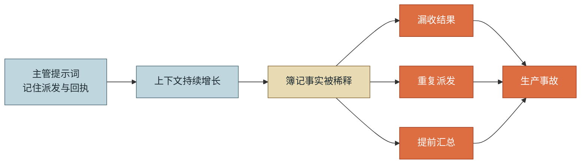
```mermaid
flowchart LR
    A["主管提示词<br/>记住派发与回执"] --> B["上下文持续增长"]
    B --> C["簿记事实被稀释"]
    C --> D1["漏收结果"]
    C --> D2["重复派发"]
    C --> D3["提前汇总"]
    D1 --> E["生产事故"]
    D2 --> E
    D3 --> E

    classDef input fill:#C0D6DF,stroke:#4F6D7A,color:#1f2d33
    classDef risk fill:#E8DAB2,stroke:#8A6D3B,color:#1f2d33
    classDef bad fill:#DD6E42,stroke:#A33E1F,color:#fff
    class A,B input
    class C risk
    class D1,D2,D3,E bad
```

正确做法不是继续强化提示词，而是让运行时维护：

```text
assignments[task_id] = assigned | running | succeeded | failed | canceled
receipts[task_id]    = result_ref | error_ref
attempts[task_id]    = integer
join_condition       = all | quorum | deadline | best_effort
```

模型可以决定“拆成什么”和“冲突时信谁”，但不能独自决定“是否已经收齐”。

### 1.2 本章的八条结论

1. **拓扑不是执行器**：拓扑描述关系，图定义路径，运行时维护状态。
2. **协调不是聊天**：关键协作必须使用结构化契约，而不是自由文本转述。
3. **共享不是无边界可写**：读可以宽，写必须窄；并行写必须声明 Reducer。
4. **交接不是复制历史**：Handoff 是带损耗报告的规范化压缩。
5. **循环不是“直到满意”**：一切回边、重试和辩论都必须有上限与出口。
6. **恢复不是重新开始**：Checkpoint、幂等键和事件历史共同保证断点续跑。
7. **暂停不是内存等待**：Interrupt 必须持久化，Resume 必须防重、防旧、防越权。
8. **跨 Agent 不是共享账号**：身份、权限、预算与 Trace 必须沿委托链传播。

---

## 2. 从拓扑到运行时：四个概念不要混

很多多 Agent 方案在设计评审中争论不清，是因为把以下四层混成了一个词。

| 层次 | 回答的问题 | 典型内容 | 主要失败模式 |
|---|---|---|---|
| **拓扑 Topology** | 谁与谁协作 | Supervisor、Parallel、Pipeline、Swarm | 结构选错、协调成本过高 |
| **编排 Orchestration** | 按什么规则推进 | 条件分支、并行汇聚、返工、审批 | 路由错误、循环失控、漏等分支 |
| **运行时 Runtime** | 如何可靠执行规则 | 调度、Checkpoint、重试、锁、队列 | 重复执行、状态丢失、恢复错误 |
| **协议 Protocol** | 跨边界如何互通 | 内部消息契约、MCP、A2A、HTTP/gRPC | 版本不兼容、权限泄露、语义错配 |

### 2.1 拓扑回答“关系”，图回答“路径”

Supervisor 拓扑只说明存在主管和工人，却没有说明：

- 工人是串行还是并行；
- 主管何时等待、等待几个；
- 某个工人失败后重试、跳过还是转人工；
- 结果冲突时是否进入裁决节点；
- 高风险输出是否必须经过审批；
- 返工最多几次。

这些都属于图定义。

### 2.2 图回答“路径”，运行时回答“语义”

即使图上画了 `worker → guard → worker`，仍然没有回答：

- 回边最多走几次；
- 节点崩溃后是否重跑；
- 重跑会不会重复发送邮件或重复提交代码；
- 并行分支同时写状态如何合并；
- 审批等待期间服务重启怎么办；
- 两个审批请求同时到达，哪个生效。

这些属于运行时语义。

### 2.3 协议回答“边界”，不替代内部编排

A2A 可以标准化远端 Agent 的发现、任务生命周期、消息与产物交换，但不会替你决定内部图如何执行。MCP 可以标准化 Agent 调用工具和数据源，也不会替你维护 Supervisor 的派发表。

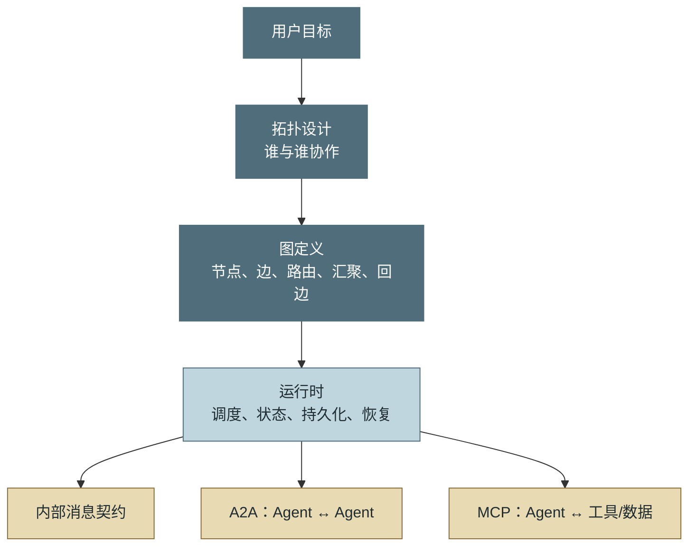
```mermaid
flowchart TB
    U["用户目标"] --> T["拓扑设计<br/>谁与谁协作"]
    T --> G["图定义<br/>节点、边、路由、汇聚、回边"]
    G --> R["运行时<br/>调度、状态、持久化、恢复"]
    R --> P1["内部消息契约"]
    R --> P2["A2A：Agent ↔ Agent"]
    R --> P3["MCP：Agent ↔ 工具/数据"]

    classDef concept fill:#4F6D7A,stroke:#4F6D7A,color:#fff
    classDef runtime fill:#C0D6DF,stroke:#4F6D7A,color:#1f2d33
    classDef protocol fill:#E8DAB2,stroke:#8A6D3B,color:#1f2d33
    class U,T,G concept
    class R runtime
    class P1,P2,P3 protocol
```

### 2.4 最重要的边界：确定性外壳，概率性内核

一个可靠的 Agent 图通常采用“确定性外壳 + 概率性内核”：

| 放在确定性外壳中的能力 | 放在概率性内核中的能力 |
|---|---|
| 节点调度、派发去重 | 任务分解与优先级判断 |
| 条件出口白名单 | 在合法出口中选择最合适的一个 |
| Schema 校验、规则检查 | 语义质量评审 |
| 重试次数、回边次数 | 根据反馈生成新方案 |
| 超时、取消、预算熔断 | 选择工具与执行策略 |
| Checkpoint、恢复、审计 | 总结、综合与冲突裁决 |
| 权限校验、审批门禁 | 解释为什么需要某项权限 |

这不是要消灭模型的自主性，而是让自主性发生在**受约束的空间**中。

---

## 3. 多 Agent 编排的五平面架构

生产级编排系统不应只有一个“Agent Manager”类。更清晰的方式是拆成五个相互约束的平面。

### 3.1 控制平面 Control Plane

负责定义“应该怎么跑”：

- 图定义、图版本和状态 Schema；
- 节点注册、路由规则、合法出口；
- 重试、超时、回边与预算策略；
- 人工审批点与降级路径；
- Agent/Skill/Tool 能力目录；
- 发布、灰度、回滚与实例版本绑定。

### 3.2 执行平面 Execution Plane

负责“实际把活跑起来”：

- 节点调度与并发控制；
- Agent 会话和工具调用；
- 任务队列、Worker 池、租约与心跳；
- 超时、取消、抢占与资源回收；
- 远端 A2A 调用和本地子图调用。

### 3.3 状态平面 State Plane

负责“现在进行到哪里”：

- 图实例状态；
- 节点尝试次数与回边计数；
- 派发表、回执表和汇聚状态；
- Checkpoint、事件历史和快照；
- Artifact 元数据与内容寻址指针；
- Inbox/Outbox、幂等记录和死信。

### 3.4 策略与安全平面 Policy & Security Plane

负责“谁可以做什么”：

- 调用者身份、用户委托链；
- Agent、节点、工具和数据的最小权限；
- 高风险操作审批；
- 数据分级、脱敏、跨域传输策略；
- Prompt Injection、越权调用和外泄检测；
- 审计留痕与策略决策记录。

### 3.5 可观测平面 Observability Plane

负责“发生了什么、为什么”：

- Graph Run、Node Attempt、Agent Session、LLM、Tool 的分层 Trace；
- 路由、交接、门禁、重试、恢复等事件；
- 成本、延迟、吞吐、回边、失败和质量指标；
- 日志、评测样本、回放和因果关联。

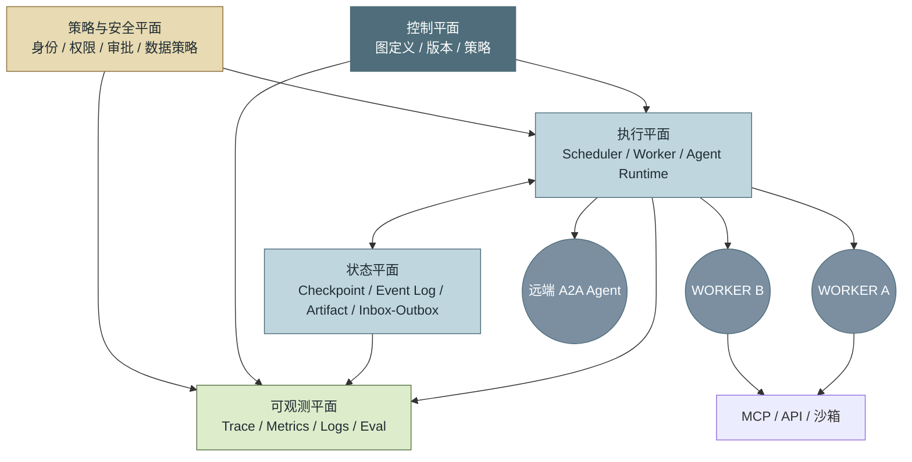
```mermaid
flowchart TB
    CP["控制平面<br/>图定义 / 版本 / 策略"] --> EP["执行平面<br/>Scheduler / Worker / Agent Runtime"]
    PP["策略与安全平面<br/>身份 / 权限 / 审批 / 数据策略"] --> EP
    EP <--> SP["状态平面<br/>Checkpoint / Event Log / Artifact / Inbox-Outbox"]
    EP --> OP["可观测平面<br/>Trace / Metrics / Logs / Eval"]
    SP --> OP
    CP --> OP
    PP --> OP

    EP --> A1(("WORKER A"))
    EP --> A2(("WORKER B"))
    EP --> A3(("远端 A2A Agent"))
    A1 --> TOOLS["MCP / API / 沙箱"]
    A2 --> TOOLS

    classDef control fill:#4F6D7A,stroke:#4F6D7A,color:#fff
    classDef exec fill:#C0D6DF,stroke:#4F6D7A,color:#1f2d33
    classDef policy fill:#E8DAB2,stroke:#8A6D3B,color:#1f2d33
    classDef observe fill:#DDECCB,stroke:#587246,color:#1f2d33
    classDef agent fill:#7B8FA1,stroke:#4F6D7A,color:#fff
    class CP control
    class EP,SP exec
    class PP policy
    class OP observe
    class A1,A2,A3 agent
```

**关键判断**：运行时本身不是第四个“主管 Agent”。它不应通过自然语言思考“下一步也许做什么”，而应根据图定义和状态执行可验证的推进。

---

## 4. 三角色框架：DELEGATOR、WORKER、GUARD

角色是职责边界，不一定等于进程，也不一定一一对应模型实例。一个 Agent 可以兼任多个角色，但契约必须分开。

### 4.1 DELEGATOR：负责智能分解，不负责精确簿记

DELEGATOR 负责：

- 理解总目标；
- 生成子任务；
- 为子任务选择能力合适的 WORKER；
- 分配优先级、依赖与预算；
- 在结果冲突时做语义裁决；
- 必要时调整剩余计划。

DELEGATOR 不负责：

- 记住谁已经接单；
- 判断所有回执是否到齐；
- 自己维护重试计数；
- 自己猜测是否超时；
- 通过聊天历史进行去重。

这些由运行时维护。

### 4.2 WORKER：小预算、窄权限、结构化输出

每个 WORKER 对外应表现为一个有明确契约的执行单元：

```text
输入：TaskPackage
输出：WorkerResult
约束：Deadline + Token Budget + Tool Budget + Permission Scope
```

WORKER 内部可以是完整 Agentic Loop，但外部必须可控：

- 输入目标和完成标准明确；
- 工具权限只覆盖当前子任务；
- 输出满足 Schema；
- 失败也必须返回结构化结果；
- 产物走 Artifact 指针，不把大文件塞进消息；
- 每次执行绑定幂等键和 Trace。

### 4.3 GUARD：站在边上，而不是只站在终点

GUARD 的最佳位置是**每条高价值输出进入下游之前**。它的校验顺序应从确定性到概率性：

1. Schema、类型、必填字段；
2. 权限、路径、文件范围、数据分级；
3. 断言、静态分析、测试、规则引擎；
4. 业务不变量；
5. LLM 语义评审；
6. 人工审批。

把 GUARD 只放在最终汇总之后，意味着坏产物已经污染共享状态、影响其他 Agent，甚至触发了副作用。

### 4.4 运行时是隐含的第四个参与者，但不是 Agent

三角色负责业务职责，运行时负责：

- 派发去重；
- 状态推进；
- 汇聚判定；
- 回边计数；
- 重试、超时、取消；
- Checkpoint 与恢复；
- 事件记录；
- 权限与预算强制执行。

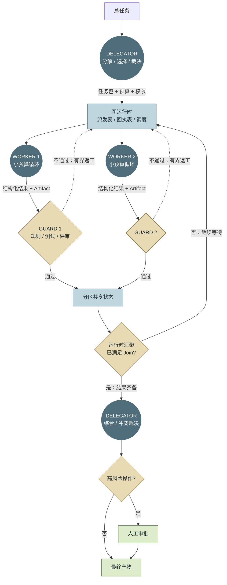
```mermaid
flowchart TB
    T["总任务"] --> D(("DELEGATOR<br/>分解 / 选择 / 裁决"))
    D -->|"任务包 + 预算 + 权限"| RT["图运行时<br/>派发表 / 回执表 / 调度"]
    RT --> W1(("WORKER 1<br/>小预算循环"))
    RT --> W2(("WORKER 2<br/>小预算循环"))
    W1 -->|"结构化结果 + Artifact"| G1{"GUARD 1<br/>规则 / 测试 / 评审"}
    W2 -->|"结构化结果 + Artifact"| G2{"GUARD 2"}
    G1 -->|"通过"| ST["分区共享状态"]
    G2 -->|"通过"| ST
    G1 -.->|"不通过：有界返工"| RT
    G2 -.->|"不通过：有界返工"| RT
    ST --> J{"运行时汇聚<br/>已满足 Join?"}
    J -->|"否：继续等待"| RT
    J -->|"是：结果齐备"| D2(("DELEGATOR<br/>综合 / 冲突裁决"))
    D2 --> HG{"高风险操作?"}
    HG -->|"是"| H["人工审批"]
    HG -->|"否"| O["最终产物"]
    H --> O

    classDef agent fill:#4F6D7A,stroke:#4F6D7A,color:#fff
    classDef runtime fill:#C0D6DF,stroke:#4F6D7A,color:#1f2d33
    classDef guard fill:#E8DAB2,stroke:#8A6D3B,color:#1f2d33
    classDef out fill:#DDECCB,stroke:#587246,color:#1f2d33
    class D,W1,W2,D2 agent
    class RT,ST runtime
    class G1,G2,J,HG guard
    class H,O out
```

### 4.5 角色契约速查

| 角色 | 输入 | 输出 | 必须限制 | 关键指标 |
|---|---|---|---|---|
| DELEGATOR | 目标、能力目录、全局约束 | 子任务图、分派计划、裁决结果 | 最大子任务数、层级深度、规划预算 | 拆分有效率、重复分派率、重规划率 |
| WORKER | 任务包、交接包、权限与预算 | 结果包、Artifact、失败分类 | Token、工具次数、时间、权限、沙箱 | 成功率、P95 延迟、工具错误率、单位成本 |
| GUARD | 产物、完成标准、证据 | 通过/拒绝、原因、修复建议 | 返工上限、评审预算、规则版本 | 误放率、误拒率、返工圈数、规则命中率 |
| Runtime | 图定义、状态、事件 | 确定性状态迁移 | 版本、并发、超时、租约、恢复语义 | 漏收率、重复执行率、恢复成功率、积压 |

---
## 5. 编排模式如何落到图上

第 17 章的拓扑不是互斥的产品选项，而是可组合的结构原语。一个生产流程通常同时包含多种模式。

| 拓扑/模式 | 图上的典型形态 | 运行时必须补上的语义 |
|---|---|---|
| Supervisor | 一个分解节点 + 动态扇出 + 汇聚节点 | 派发去重、Join、冲突处理、主管单点保护 |
| Pipeline | 固定有向链 | 中间产物 Schema、逐边 GUARD、失败短路 |
| Parallel | Fan-out/Fan-in | 并发上限、Reducer、尾部延迟、部分成功 |
| Reviewer | Maker → Checker → 有界回边 | 最大返工次数、质量阈值、人工升级 |
| Arena | 多候选并行 → Judge | 候选隔离、统一评测、选择证据 |
| Debate | 多轮消息交换 → 收敛/投票 | 轮次上限、发言顺序、上下文压缩、终止规则 |
| Swarm/Handoff | 条件路由决定控制权转移 | 交接环检测、最大交接次数、上下文损耗 |
| Hierarchical | 子图嵌套/父子图 | 深度上限、预算逐层分配、跨层 Trace |

### 5.1 组合式生产图

例如“代码变更发布”可以组合为：

1. Supervisor 负责拆分检查维度；
2. Parallel 并行执行测试、安全、数据库和配置检查；
3. 每个分支内部采用 Reviewer 返工；
4. 汇总后进入人工审批；
5. 发布失败走 Saga 补偿；
6. 某个专业能力来自外部团队时，通过 A2A 调用远端 Agent。

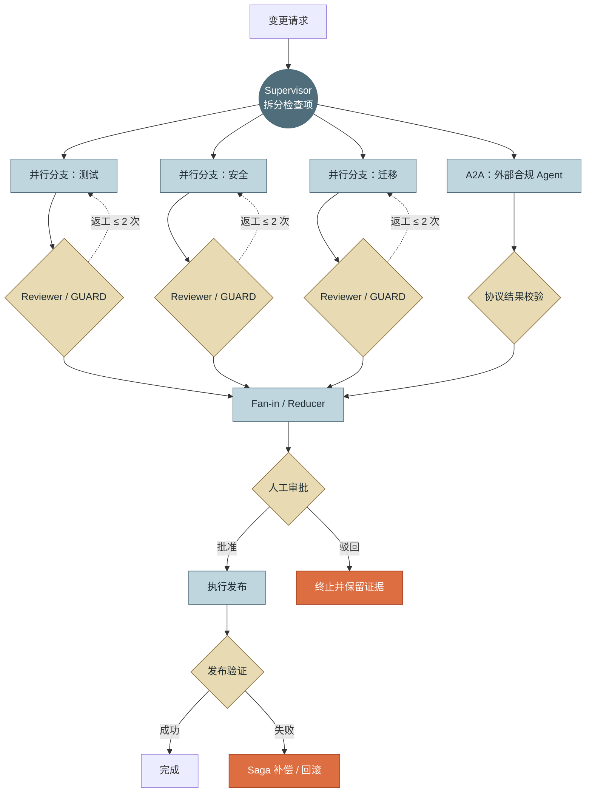
```mermaid
flowchart TB
    S["变更请求"] --> D(("Supervisor<br/>拆分检查项"))
    D --> P1["并行分支：测试"]
    D --> P2["并行分支：安全"]
    D --> P3["并行分支：迁移"]
    D --> P4["A2A：外部合规 Agent"]

    P1 --> G1{"Reviewer / GUARD"}
    P2 --> G2{"Reviewer / GUARD"}
    P3 --> G3{"Reviewer / GUARD"}
    P4 --> G4{"协议结果校验"}

    G1 -.->|"返工 ≤ 2 次"| P1
    G2 -.->|"返工 ≤ 2 次"| P2
    G3 -.->|"返工 ≤ 2 次"| P3

    G1 --> J["Fan-in / Reducer"]
    G2 --> J
    G3 --> J
    G4 --> J
    J --> H{"人工审批"}
    H -->|"批准"| DEP["执行发布"]
    H -->|"驳回"| END1["终止并保留证据"]
    DEP --> V{"发布验证"}
    V -->|"成功"| END2["完成"]
    V -->|"失败"| C["Saga 补偿 / 回滚"]

    classDef agent fill:#4F6D7A,stroke:#4F6D7A,color:#fff
    classDef task fill:#C0D6DF,stroke:#4F6D7A,color:#1f2d33
    classDef guard fill:#E8DAB2,stroke:#8A6D3B,color:#1f2d33
    classDef danger fill:#DD6E42,stroke:#A33E1F,color:#fff
    class D agent
    class P1,P2,P3,P4,J,DEP task
    class G1,G2,G3,G4,H,V guard
    class C,END1 danger
```

### 5.2 图不是越细越好

节点粒度太粗，会导致：

- Checkpoint 间隔太大；
- 单节点失败需要重做大量工作；
- 观测无法定位内部瓶颈；
- 权限边界模糊。

节点粒度太细，也会导致：

- 状态读写和调度开销膨胀；
- 图定义难以理解；
- 每个微小步骤都成为版本兼容点；
- Trace 噪声大于信息。

推荐以以下任一条件作为节点边界：

- 一次独立 LLM/Agent 会话；
- 一次具有业务意义的外部副作用；
- 一次可独立重试的活动；
- 一次需要单独权限的操作；
- 一次需要 Checkpoint 或人工介入的阶段；
- 一份可被 GUARD 验证的中间产物。

---

## 6. Agent 间通信：先设计契约，再选择传输

“Agent 之间通过什么通信”常被回答成 HTTP、消息队列、共享内存或 A2A。这个回答顺序是反的。

正确顺序是：

1. 定义消息语义；
2. 定义消息 Schema；
3. 定义交付、顺序、重试和幂等语义；
4. 最后选择进程内调用、队列、HTTP/gRPC、A2A 或其他传输。

### 6.1 五类消息

原文把消息分为指令、汇报和广播。生产系统可进一步细分为五类：

| 类型 | 方向 | 用途 | 示例 |
|---|---|---|---|
| **Command** | 上游 → 执行者 | 要求执行动作 | 执行测试、分析文件、生成方案 |
| **Result** | 执行者 → 上游 | 返回终态结果 | 成功、失败、部分成功、Artifact |
| **Event** | 任意 → 订阅者 | 陈述已经发生的事实 | 节点完成、预算告警、能力下线 |
| **Control** | Runtime → 执行者 | 控制生命周期 | 取消、暂停、续租、降低优先级 |
| **Approval** | Human/Policy → Runtime | 形成可审计决策 | 批准、驳回、要求补充、授权 |

不要把 Command 和 Event 混用：

- `RunSecurityScan` 是命令，可能失败或被拒绝；
- `SecurityScanCompleted` 是事件，表示事实已经发生。

### 6.2 通用消息信封

业务载荷之外，每条消息都应有统一信封。一个实用的信封至少包含：

```json
{
  "message_id": "msg-01J...",
  "message_type": "worker.command.v2",
  "schema_version": 2,
  "correlation_id": "graph-run-42",
  "causation_id": "event-previous-17",
  "graph_run_id": "release-check-42",
  "graph_version": "release-check@7",
  "node_id": "security_scan",
  "node_attempt": 2,
  "task_id": "task-security-1",
  "sender": "delegator/release",
  "recipient": "worker/security",
  "created_at": "2026-08-31T08:00:00Z",
  "deadline": "2026-08-31T08:05:00Z",
  "priority": 50,
  "deduplication_key": "release-check-42:security_scan:2",
  "traceparent": "00-...-...-01",
  "security_context": {
    "subject": "user:alice",
    "delegator": "agent:release-supervisor",
    "scopes": ["repo:read", "scanner:execute"],
    "data_labels": ["internal"]
  },
  "budget": {
    "max_tokens": 12000,
    "max_tool_calls": 20,
    "max_wall_time_ms": 180000
  },
  "payload": {},
  "artifact_refs": []
}
```

#### 关键字段解释

- `message_id`：消息实例唯一标识，用于审计；
- `correlation_id`：把同一业务流程的消息关联起来；
- `causation_id`：指向直接导致当前消息的上一事件，形成因果链；
- `deduplication_key`：处理方防止重复执行的业务键；
- `deadline`：绝对截止时间，优于只传递“超时 30 秒”；
- `schema_version`：支持滚动升级和兼容检查；
- `traceparent`：跨进程传播分布式追踪上下文；
- `security_context`：身份、委托者、权限和数据标签；
- `budget`：预算随任务下发，而不是只在最外层统计；
- `artifact_refs`：大产物只传引用和摘要。

### 6.3 Correlation 与 Causation 不同

假设一个总任务分裂为三个并行分支：

- 三个分支具有相同 `correlation_id`，因为属于同一图运行；
- 每个分支有不同 `causation_id`，因为由不同派发事件直接触发；
- 分支内部重试仍保留相同业务 `task_id`，但 `node_attempt` 增加；
- 重试消息应有新的 `message_id`，但通常复用或派生相同幂等键。

只有 `correlation_id` 无法还原因果关系；只有 `causation_id` 又不方便按整次运行查询。两者都要有。

### 6.4 指令消息必须包含完成判据

低质量任务包通常只有一句：“检查这次发布有没有问题。”高质量任务包至少包括：

```yaml
task_goal: 检查数据库迁移是否可安全上线
acceptance_criteria:
  - 所有迁移脚本可在测试库成功执行
  - 提供向前与向后兼容性判断
  - 提供可执行回滚步骤
  - 标出不可逆迁移
input_artifacts:
  - artifact://repo/diff/commit-abc
constraints:
  - 不得连接生产数据库
  - 不得修改仓库文件
required_evidence:
  - 测试命令及退出码
  - 涉及的迁移文件列表
  - 风险等级和依据
```

GUARD 只有拿到完成判据，才能进行可重复验收。

### 6.5 结果消息必须表达部分成功

不要只设计 `success: true/false`。现实任务常见：

- 20 个数据源中 18 个成功；
- 报告生成成功，但附件上传失败；
- 分析结论已完成，证据不充分；
- 任务本身成功，但超出了成本预算。

建议结果状态至少支持：

```text
SUCCEEDED
PARTIALLY_SUCCEEDED
FAILED_RETRYABLE
FAILED_PERMANENT
CANCELED
TIMED_OUT
REJECTED
NEEDS_INPUT
NEEDS_AUTHORIZATION
```

结果包应同时包含：

- 状态；
- 结构化输出；
- Artifact 引用；
- 已完成范围和缺失范围；
- 错误分类；
- 可否重试；
- 证据；
- 实际预算消耗；
- 下游建议动作。

### 6.6 广播是昂贵的

如果一个 8,000 Token 的广播被 10 个 Agent 各自纳入上下文，系统实际承担的不是 8,000 Token，而可能接近 80,000 Token 的后续读取成本。

广播只适合：

- 全局能力下线；
- 已确认的共享事实发生变化；
- 安全策略紧急升级；
- 全局取消；
- 影响所有分支的输入失效。

其余信息优先使用定向消息、共享状态索引或按需查询。

### 6.7 消息与 Artifact 分离

消息用于控制和解释，Artifact 用于交付：

| 消息 Message | 产物 Artifact |
|---|---|
| 短、小、频繁 | 可大、可版本化、可复用 |
| 描述请求、状态、理由 | 承载报告、代码、数据、图片、日志 |
| 进入事件历史与上下文 | 存对象存储、文件系统、数据库或内容寻址仓库 |
| 适合流式传递 | 适合校验哈希、权限和生命周期 |

Artifact 引用建议包含：

```json
{
  "artifact_id": "art-123",
  "uri": "artifact://release-check-42/security/report.json",
  "media_type": "application/json",
  "sha256": "...",
  "size_bytes": 8421,
  "schema": "security-report.v3",
  "created_by": "worker/security",
  "classification": "internal",
  "expires_at": null
}
```

---

## 7. 交付语义：不迷信 Exactly Once

分布式环境里，消息可能丢失、重复、延迟、乱序。所谓“Exactly Once”通常不是传输层天然保证，而是多个机制共同塑造的**业务效果**。

### 7.1 三种基本交付语义

| 语义 | 含义 | 优点 | 风险 | 适用 |
|---|---|---|---|---|
| At-most-once | 最多处理一次，可能丢 | 无重复 | 丢失不可恢复 | 可容忍丢失的遥测 |
| At-least-once | 至少处理一次，可能重复 | 不容易丢 | 必须幂等 | 任务和业务事件的常见选择 |
| Effectively-once | 允许重复投递，但业务效果只出现一次 | 兼顾可靠性 | 需要幂等、去重、事务设计 | 绝大多数生产任务 |

### 7.2 业务上的“只生效一次”

要获得 Effectively-once，通常需要：

1. 稳定的幂等键；
2. Inbox 去重表；
3. 状态更新与 Outbox 写入同事务；
4. 外部副作用支持幂等键或 Check-before-act；
5. 重试使用同一业务键；
6. 处理结果可查询；
7. 重复响应可以安全返回已有结果。

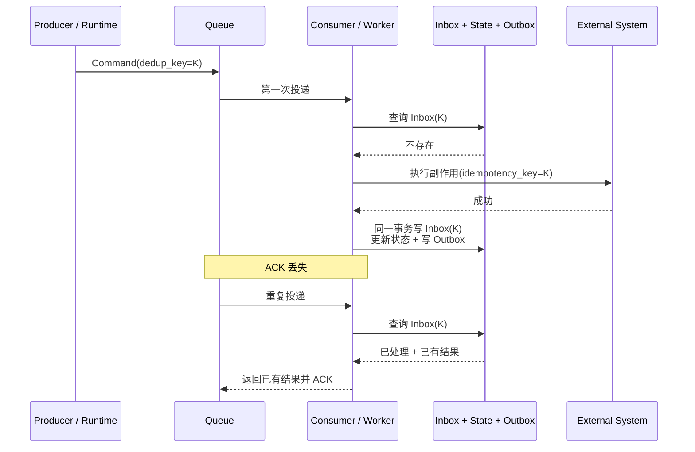
```mermaid
sequenceDiagram
    participant P as Producer / Runtime
    participant Q as Queue
    participant C as Consumer / Worker
    participant DB as Inbox + State + Outbox
    participant X as External System

    P->>Q: Command(dedup_key=K)
    Q->>C: 第一次投递
    C->>DB: 查询 Inbox(K)
    DB-->>C: 不存在
    C->>X: 执行副作用(idempotency_key=K)
    X-->>C: 成功
    C->>DB: 同一事务写 Inbox(K)<br/>更新状态 + 写 Outbox
    Note over C,Q: ACK 丢失
    Q->>C: 重复投递
    C->>DB: 查询 Inbox(K)
    DB-->>C: 已处理 + 已有结果
    C-->>Q: 返回已有结果并 ACK
```

### 7.3 Inbox/Outbox

**Inbox** 解决“重复消费”：

```text
inbox(
  consumer_id,
  deduplication_key,
  first_seen_at,
  completed_at,
  result_ref,
  status
)
UNIQUE(consumer_id, deduplication_key)
```

**Outbox** 解决“数据库已提交，但事件没发出去”：

```text
outbox(
  event_id,
  aggregate_id,
  event_type,
  payload,
  created_at,
  published_at,
  attempts
)
```

业务状态更新和 Outbox 事件写入同一个本地事务，再由独立 Publisher 可靠发布。不要先改状态后发消息，也不要先发消息后改状态。

### 7.4 顺序语义

全局严格有序通常成本过高，也没有必要。更常见的是按键有序：

- 同一 `task_id` 的状态事件有序；
- 不同任务可并行乱序；
- 每条事件带 `sequence` 或 `state_revision`；
- 消费者拒绝旧版本覆盖新状态；
- 需要跨任务聚合时，由 Join 根据版本和终态判断。

### 7.5 Deadline 传播

每跳都重新设置“30 秒超时”会让总链路无限膨胀。应该传播绝对 Deadline：

```text
remaining = deadline - now
node_timeout = min(node_policy_timeout, remaining)
```

如果剩余时间不足以合理执行，应快速失败或降级，而不是启动一个注定超时的昂贵 Agent。

### 7.6 Backpressure

没有背压的多 Agent 并行等于把成本和限流问题推迟到生产环境。背压至少包括：

- 全局并发上限；
- 按租户、用户、图、Agent、模型和工具限流；
- 队列长度与等待时间阈值；
- 动态降低 Fan-out 数量；
- 高优先级任务抢占低优先级任务；
- 预算不足时取消未开始分支；
- 熔断下游故障能力。

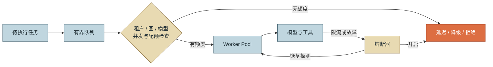
```mermaid
flowchart LR
    IN["待执行任务"] --> Q["有界队列"]
    Q --> L{"租户 / 图 / 模型<br/>并发与配额检查"}
    L -->|"有额度"| W["Worker Pool"]
    L -->|"无额度"| WAIT["延迟 / 降级 / 拒绝"]
    W --> M["模型与工具"]
    M -->|"限流或故障"| CB["熔断器"]
    CB -->|"开启"| WAIT
    CB -->|"恢复探测"| W

    classDef normal fill:#C0D6DF,stroke:#4F6D7A,color:#1f2d33
    classDef check fill:#E8DAB2,stroke:#8A6D3B,color:#1f2d33
    classDef danger fill:#DD6E42,stroke:#A33E1F,color:#fff
    class IN,Q,W,M normal
    class L,CB check
    class WAIT danger
```

---

## 8. 共享状态、消息传递与事件日志

三者不是互斥选项，而是分别承担不同职责。

### 8.1 共享状态：回答“现在是什么”

适合存放：

- 当前任务状态；
- 已通过校验的结构化结果；
- 派发表与汇聚进度；
- 当前预算余额；
- 人工决策；
- 最新 Artifact 指针。

不适合存放：

- 所有历史消息全文；
- 大型二进制产物；
- 未经校验的自由文本；
- 每个分支的私有草稿；
- 不应被其他 Agent 读取的敏感信息。

### 8.2 消息：回答“请做什么”和“刚发生什么”

消息适合连接节点、进程和组织边界。它提供：

- 明确发送者与接收者；
- 可独立校验的 Schema；
- 重试、去重和审计挂点；
- 异步和解耦能力。

### 8.3 事件日志：回答“如何变成现在这样”

事件日志记录不可变事实：

```text
GraphStarted
TaskDelegated
NodeScheduled
NodeAttemptStarted
AgentHandoffCreated
ArtifactProduced
GuardRejected
RetryScheduled
HumanApprovalRequested
HumanApprovalReceived
NodeCompleted
GraphCompleted
```

状态是事件的折叠结果：

```text
current_state = fold(initial_state, ordered_events)
```

事件历史的价值包括：

- 故障恢复；
- 审计与回放；
- 调试路由决策；
- 重建指标；
- 对比图版本行为；
- 生成评测数据集。

### 8.4 推荐的混合模型

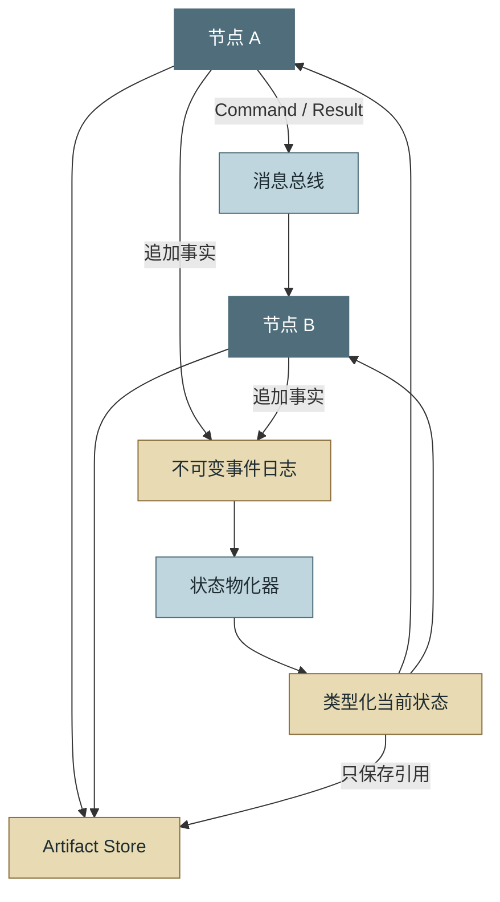
```mermaid
flowchart TB
    N1["节点 A"] -->|"Command / Result"| BUS["消息总线"]
    BUS --> N2["节点 B"]
    N1 -->|"追加事实"| LOG["不可变事件日志"]
    N2 -->|"追加事实"| LOG
    LOG --> MAT["状态物化器"]
    MAT --> STATE["类型化当前状态"]
    STATE --> N1
    STATE --> N2
    N1 --> ART["Artifact Store"]
    N2 --> ART
    STATE -->|"只保存引用"| ART

    classDef exec fill:#4F6D7A,stroke:#4F6D7A,color:#fff
    classDef infra fill:#C0D6DF,stroke:#4F6D7A,color:#1f2d33
    classDef data fill:#E8DAB2,stroke:#8A6D3B,color:#1f2d33
    class N1,N2 exec
    class BUS,MAT infra
    class LOG,STATE,ART data
```

### 8.5 读可以宽，写必须窄

一个 Worker 可以读取完成任务所需的广泛上下文，但只能写自己的命名空间：

```text
results.security_worker
results.test_worker
results.migration_worker
```

禁止所有 Worker 随意覆盖：

```text
results
summary
approved
final_answer
```

全局字段只能由指定节点或 Reducer 生成。

### 8.6 状态所有权

建议为每个状态字段声明：

| 字段 | 所有者 | 可读者 | Reducer | 敏感级别 |
|---|---|---|---|---|
| `assignments` | Runtime | Delegator、Ops | 禁止并行写 | Internal |
| `worker_results.*` | 对应 Worker | Guard、Aggregator | 分区 Map 合并 | Internal |
| `guard_decisions.*` | 对应 Guard | Runtime、Aggregator | 分区 Map 合并 | Internal |
| `human_approval` | Approval Service | Runtime、Auditor | CAS/版本检查 | Confidential |
| `final_result` | Aggregator | 调用方 | 单写者 | 按业务定义 |

图编译期就可以检查“一个无 Reducer 的字段是否存在多个写者”。

---

## 9. Context Handoff：把交接做成可审计的有损压缩

多 Agent 的每条边都在做上下文变换。交接不是简单的“把聊天记录传给下一个 Agent”，而是一个受约束的信息工程过程。

### 9.1 两个极端都错

**全量转发**的问题：

- Token 成本线性甚至超线性放大；
- 下游注意力被无关失败尝试稀释；
- 敏感信息跨越不必要的权限边界；
- 工具调用日志和大产物污染上下文；
- 多次 Handoff 后历史无限增长。

**一句话总结**的问题：

- 约束被省略；
- 假设被写成事实；
- 失败尝试及其排除价值丢失；
- 证据来源与不确定度消失；
- 下游无法回查原始材料。

### 9.2 规范化交接包

推荐字段：

```yaml
handoff_id: ho-123
schema_version: 3
from_agent: triage-agent
to_agent: database-agent
task_goal: 判断迁移脚本是否可逆
acceptance_criteria:
  - 给出每个脚本的可逆性
  - 列出回滚命令
established_facts:
  - statement: 迁移 104 新增 nullable 字段
    source_ref: artifact://repo/migrations/104.sql
    confidence: 1.0
    freshness: 2026-08-31T08:00:00Z
open_questions:
  - question: 迁移 105 是否会锁表超过 5 秒
    current_hypothesis: 取决于表数据量
    confidence: 0.45
constraints:
  - 不得访问生产库
  - 不得修改迁移文件
rejected_hypotheses:
  - statement: 104 是不可逆迁移
    reason: 已找到对应 down 脚本
artifact_refs:
  - artifact://repo/migrations/104.sql
  - artifact://trace/run-42/node-triage
budget:
  max_tokens: 10000
  max_tool_calls: 15
  deadline: 2026-08-31T08:10:00Z
security:
  scopes: [repo:read, testdb:execute]
  data_labels: [internal]
loss_report:
  omitted:
    - 完整聊天措辞
    - 两次无效 grep 命令输出
  recoverable_from:
    - artifact://trace/run-42/node-triage
```

### 9.3 认知状态必须结构化

事实不是简单字符串。至少需要表达：

- **Confirmed**：有证据支持，当前流程可依赖；
- **Assumed**：为推进任务暂时采用；
- **Hypothesis**：待验证解释；
- **Disputed**：不同 Agent 存在冲突；
- **Rejected**：已被证据排除；
- **Stale**：曾经成立，但新鲜度不足。

把这些状态混在自然语言中，经过两次摘要后，“可能”“疑似”“尚未验证”极易丢失。

### 9.4 Exporter 与 Importer

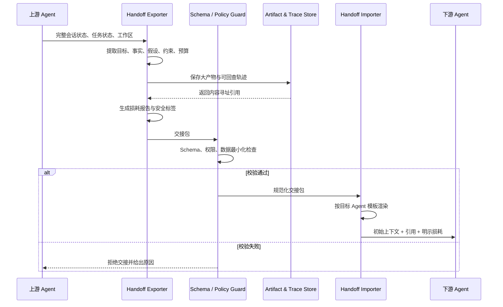
```mermaid
sequenceDiagram
    participant U as 上游 Agent
    participant E as Handoff Exporter
    participant G as Schema / Policy Guard
    participant S as Artifact & Trace Store
    participant I as Handoff Importer
    participant D as 下游 Agent

    U->>E: 完整会话状态、任务状态、工作区
    E->>E: 提取目标、事实、假设、约束、预算
    E->>S: 保存大产物与可回查轨迹
    S-->>E: 返回内容寻址引用
    E->>E: 生成损耗报告与安全标签
    E->>G: 交接包
    G->>G: Schema、权限、数据最小化检查
    alt 校验通过
        G->>I: 规范化交接包
        I->>I: 按目标 Agent 模板渲染
        I->>D: 初始上下文 + 引用 + 明示损耗
    else 校验失败
        G-->>U: 拒绝交接并给出原因
    end
```

Exporter 负责：

- 从完整状态提取最小充分信息；
- 去除工具噪声和重复内容；
- 保留约束、证据和认知状态；
- 将大内容转为 Artifact 引用；
- 生成 Loss Report；
- 按接收方权限做数据最小化。

Importer 负责：

- 验证 Schema 和版本；
- 按接收方角色重排信息；
- 把最重要的目标、约束和未决问题放在高注意力位置；
- 告知下游“哪些信息未包含、在哪里可以回查”；
- 将预算、Deadline 和权限转为运行时硬约束，而不是只写进提示词。

### 9.5 损耗报告的价值

Loss Report 不要求统计精确的信息论损失，而是回答：

- 哪些类别被省略；
- 哪些内容被摘要；
- 哪些原文可回查；
- 哪些不确定度可能被压缩；
- 哪些内容因权限被删除；
- 哪些内容因过期被忽略。

它让“上下文磨损”从隐性风险变成可观测事件。

### 9.6 Handoff 的安全边界

交接前必须执行：

1. 接收方身份与能力验证；
2. 目标任务是否需要这些数据；
3. 数据标签是否允许跨域；
4. 是否包含密钥、令牌、个人信息或内部路径；
5. Artifact 链接是否带最小权限和有效期；
6. 上游内容是否可能包含 Prompt Injection；
7. 下游是否被允许继续转交。

**Handoff 不是复制权限。** 接收方获得的权限应是针对当前任务重新签发的最小授权，而不是继承上游 Agent 的全部能力。

### 9.7 一个可实现的 Python 数据模型

```python
from __future__ import annotations

from dataclasses import dataclass, field
from datetime import datetime
from enum import StrEnum
from typing import Any


class EpistemicStatus(StrEnum):
    CONFIRMED = "confirmed"
    ASSUMED = "assumed"
    HYPOTHESIS = "hypothesis"
    DISPUTED = "disputed"
    REJECTED = "rejected"
    STALE = "stale"


@dataclass(frozen=True)
class Fact:
    statement: str
    status: EpistemicStatus
    source_refs: tuple[str, ...] = ()
    confidence: float | None = None
    observed_at: datetime | None = None

    def __post_init__(self) -> None:
        if self.confidence is not None and not 0 <= self.confidence <= 1:
            raise ValueError("confidence 必须位于 [0, 1]")


@dataclass(frozen=True)
class Budget:
    max_tokens: int
    max_tool_calls: int
    deadline: datetime


@dataclass(frozen=True)
class LossReport:
    omitted_categories: tuple[str, ...] = ()
    summarized_categories: tuple[str, ...] = ()
    recoverable_refs: tuple[str, ...] = ()
    removed_by_policy: tuple[str, ...] = ()


@dataclass(frozen=True)
class HandoffPackage:
    handoff_id: str
    schema_version: int
    from_agent: str
    to_agent: str
    task_goal: str
    acceptance_criteria: tuple[str, ...]
    facts: tuple[Fact, ...]
    open_questions: tuple[str, ...]
    constraints: tuple[str, ...]
    artifact_refs: tuple[str, ...]
    budget: Budget
    scopes: tuple[str, ...]
    data_labels: tuple[str, ...]
    loss_report: LossReport
    metadata: dict[str, Any] = field(default_factory=dict)
```

### 9.8 交接质量指标

| 指标 | 定义 | 风险信号 |
|---|---|---|
| Handoff Token Ratio | 交接 Token / 上游历史 Token | 长期接近 1，说明没有压缩 |
| Constraint Retention | 下游仍可见约束数 / 上游关键约束数 | 低于 100% 应阻断 |
| Provenance Coverage | 带来源的关键事实占比 | 过低时结论不可审计 |
| Epistemic Drift Rate | 假设被下游当成事实的比例 | 必须接近 0 |
| Recovery Reference Coverage | 被省略内容中可回查的比例 | 过低说明损耗不可恢复 |
| Handoff Loop Count | 同一任务控制权转移次数 | 持续上升可能出现踢皮球 |

---
## 10. 图执行模型：节点、边、状态、路由、汇聚与回边

可以把一个 Agent 图形式化为：

$$
G = (V, E, S, R, J, C, I, P)
$$

其中：

- $V$：节点集合；
- $E$：固定边集合；
- $S$：类型化状态；
- $R$：条件路由函数；
- $J$：汇聚条件；
- $C$：循环与访问上限；
- $I$：中断/人工介入点；
- $P$：运行策略，包括重试、超时、预算和权限。

### 10.1 节点 Node

节点是图里的最小可调度单元。理想节点具有以下契约：

```text
NodeResult = execute(NodeContext, ReadOnlyStateView)
```

其中：

- 输入状态默认为只读视图；
- 输出不是“修改整个 State”，而是声明一个 State Patch；
- 节点可产生 Artifact、Event、Metric 和下一步建议；
- 节点不直接决定任意下一跳，路由出口必须受图定义约束；
- 节点的副作用必须可幂等或可补偿。

推荐的结果模型：

```python
@dataclass(frozen=True)
class NodeResult:
    patch: dict[str, object]
    artifacts: tuple[ArtifactRef, ...] = ()
    emitted_events: tuple[DomainEvent, ...] = ()
    route_hint: str | None = None
    interrupt: InterruptRequest | None = None
```

### 10.2 边 Edge

边不是单纯的箭头。生产系统常见边类型包括：

| 边类型 | 语义 | 示例 |
|---|---|---|
| Fixed | 节点成功后固定进入下一节点 | parse → analyze |
| Conditional | 根据状态选择枚举出口 | guard → pass/rework |
| Fan-out | 一次生成多个并行执行单元 | files → map(file) |
| Fan-in | 等待分支并合并 | workers → aggregate |
| Error | 指定错误类型进入特定处理 | timeout → fallback |
| Compensation | 失败后执行逆向动作 | deploy_failed → rollback |
| Interrupt | 暂停并等待外部输入 | risk_gate → approval |
| Terminal | 进入完成、失败或取消终态 | finalize → END |

边应携带策略，而不只是目标节点：

```yaml
from: guard
to: worker
kind: cycle
condition: guard.passed == false
max_visits: 2
on_exhausted: human_review
budget_charge: rework
```

### 10.3 状态 State

状态设计的目标不是“把所有信息都塞进一个字典”，而是形成可演化、可授权、可合并的数据模型。

建议分层：

```text
state.meta           图版本、状态版本、创建者、租户
state.input          原始输入，只读
state.control        运行时状态、预算、取消标记
state.assignments    派发表与依赖
state.results        Worker 分区结果
state.guards         门禁结论
state.human          人工输入与审批
state.artifacts      Artifact 元数据引用
state.output         最终输出
```

### 10.4 State Patch，而不是整状态覆盖

节点返回最小 Patch：

```json
{
  "results.security": {
    "status": "succeeded",
    "artifact_ref": "artifact://..."
  }
}
```

运行时根据字段所有权和 Reducer 合并。这样可以：

- 阻止 Worker 覆盖全局字段；
- 精确记录哪个节点写了什么；
- 支持并行合并；
- 减少 Checkpoint 体积；
- 支持基于 Patch 的事件回放。

### 10.5 条件路由

路由可以由代码、规则引擎或 LLM 决定，但出口必须枚举。

```python
ALLOWED = {"accept", "rework", "human_review"}

def route_guard(state: ReleaseState) -> str:
    if state.guard.hard_failures:
        return "human_review"
    if state.guard.score >= 0.9:
        return "accept"
    return "rework"
```

LLM 路由建议使用结构化输出：

```json
{
  "route": "human_review",
  "reason": "安全扫描发现高危漏洞，不能自动放行",
  "confidence": 0.94
}
```

运行时仍要执行：

- Schema 校验；
- 出口白名单；
- 低置信度策略；
- 默认安全出口；
- 路由事件记录；
- 路由预算限制。

### 10.6 汇聚 Join

“等待全部完成”只是 Join 的一种。生产中常见：

| Join 策略 | 条件 | 适用 |
|---|---|---|
| ALL | 全部分支进入终态 | 合规会签、强一致检查 |
| ANY | 任一分支成功即继续 | 多数据源竞速、首个可用结果 |
| QUORUM | 至少 k/n 满足条件 | 多评审投票、多副本判断 |
| DEADLINE | 到截止时间汇聚已有结果 | 搜索聚合、低延迟场景 |
| BEST_EFFORT | 全部终态或无法继续时汇聚 | 数据源可能永久缺失 |
| WEIGHTED | 成功结果权重达到阈值 | 专家团、风险评分 |

Join 结果不能只返回 `ready: true/false`，还应给出：

- 已完成分支；
- 未完成分支；
- 失败和取消分支；
- 是否满足最小完整性；
- 是否因 Deadline 提前汇聚；
- 是否需要取消剩余分支；
- 输出质量标签。

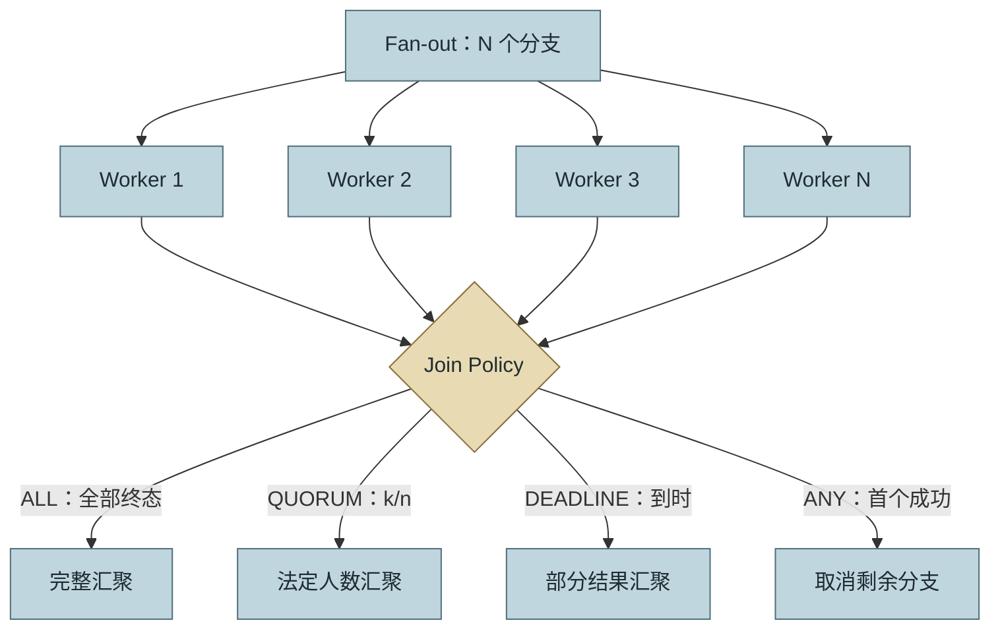
```mermaid
flowchart TB
    F["Fan-out：N 个分支"] --> W1["Worker 1"]
    F --> W2["Worker 2"]
    F --> W3["Worker 3"]
    F --> WN["Worker N"]
    W1 --> J{"Join Policy"}
    W2 --> J
    W3 --> J
    WN --> J
    J -->|"ALL：全部终态"| A1["完整汇聚"]
    J -->|"QUORUM：k/n"| A2["法定人数汇聚"]
    J -->|"DEADLINE：到时"| A3["部分结果汇聚"]
    J -->|"ANY：首个成功"| A4["取消剩余分支"]

    classDef task fill:#C0D6DF,stroke:#4F6D7A,color:#1f2d33
    classDef gate fill:#E8DAB2,stroke:#8A6D3B,color:#1f2d33
    class F,W1,W2,W3,WN,A1,A2,A3,A4 task
    class J gate
```

### 10.7 子图 Subgraph

子图用于复用复杂步骤和隔离状态：

- “代码修改”子图；
- “安全评审”子图；
- “人工审批”子图；
- “远端 Agent 调用”子图；
- “失败补偿”子图。

父图与子图之间必须声明：

- 输入映射；
- 输出映射；
- 状态是否共享；
- Checkpoint 是否继承；
- 预算如何分配；
- 取消如何传播；
- Trace 父子关系；
- 子图版本绑定。

不要让子图直接获得父图全部状态，否则复用只是表面上的。

### 10.8 图编译期校验

可靠系统应在运行前拒绝明显错误的图。至少检查：

1. Entry、END 和所有目标节点存在；
2. 不可达节点；
3. 无出口的非终态节点；
4. Router 返回目标是否全部声明；
5. 循环是否有界；
6. 回边耗尽后是否有显式出口；
7. 并行多写字段是否有 Reducer；
8. 状态字段是否有合法所有者；
9. 高风险节点之前是否存在审批/策略门禁；
10. 所有节点是否配置 Deadline 或继承全局 Deadline；
11. 副作用节点是否声明幂等策略；
12. 补偿节点是否可达；
13. 图是否存在无限动态 Fan-out；
14. 子图接口和状态版本是否兼容；
15. 终态是否覆盖 success、failed、canceled 和 timed_out。

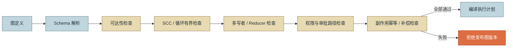
```mermaid
flowchart LR
    DEF["图定义"] --> PARSE["Schema 解析"]
    PARSE --> REACH["可达性检查"]
    REACH --> CYCLE["SCC / 循环有界检查"]
    CYCLE --> WRITE["多写者 / Reducer 检查"]
    WRITE --> SEC["权限与审批路径检查"]
    SEC --> SIDE["副作用幂等 / 补偿检查"]
    SIDE -->|"全部通过"| PLAN["编译执行计划"]
    SIDE -->|"失败"| REJECT["拒绝发布图版本"]

    classDef normal fill:#C0D6DF,stroke:#4F6D7A,color:#1f2d33
    classDef gate fill:#E8DAB2,stroke:#8A6D3B,color:#1f2d33
    classDef bad fill:#DD6E42,stroke:#A33E1F,color:#fff
    class DEF,PARSE,PLAN normal
    class REACH,CYCLE,WRITE,SEC,SIDE gate
    class REJECT bad
```

---

## 11. 并行执行与 Reducer

多 Agent 的收益很大一部分来自并行，但并行不是简单调用 `asyncio.gather`。

### 11.1 Fan-out 的三种来源

1. **静态 Fan-out**：图定义时分支数固定；
2. **数据驱动 Fan-out**：按文件、数据源、客户或工单动态生成；
3. **模型驱动 Fan-out**：DELEGATOR 动态生成子任务。

模型驱动 Fan-out 必须受硬上限约束：

```text
max_children_per_node
max_total_tasks_per_run
max_parallelism
max_hierarchy_depth
max_total_budget
```

否则一句“请充分调研”可能生成几十个子任务，再由子任务继续递归拆分。

### 11.2 Reducer 是并行状态合并函数

假设两个分支都返回：

```python
{"findings": [finding]}
```

若默认覆盖，最后只剩一个分支。必须声明：

```python
from operator import add

reducers = {
    "findings": add,
}
```

一个合格 Reducer 最好满足：

- **结合律**：分批合并与一次合并结果一致；
- **交换律**：分支完成顺序不改变结果；
- **幂等性**：重复结果不会破坏状态，或能按 ID 去重；
- **确定性**：同一输入集合得到同一输出。

并非所有 Reducer 都天然交换。例如“最后写入获胜”依赖完成顺序，通常不适合关键状态。

### 11.3 常见 Reducer

| 字段类型 | 推荐 Reducer | 注意事项 |
|---|---|---|
| List of findings | 按 `finding_id` 去重后排序 | 不直接使用无界 append |
| Map of worker results | 按 `worker_id` 分区合并 | 重复 Worker 结果需按 revision 决定 |
| Numeric usage | 求和 | 重试成本不能重复计费 |
| Risk score | max 或加权合并 | 必须写清语义 |
| Latest status | 比较 `state_revision` | 不按到达时间决定 |
| Artifact set | 按内容哈希去重 | 保留来源与权限标签 |
| Approval votes | 按审批人 ID 合并 | 防止同一人重复投票 |

### 11.4 一个确定性 Map Reducer

```python
from collections.abc import Iterable
from dataclasses import dataclass


@dataclass(frozen=True)
class WorkerResult:
    worker_id: str
    revision: int
    status: str
    artifact_ref: str | None


def reduce_worker_results(
    current: dict[str, WorkerResult],
    updates: Iterable[WorkerResult],
) -> dict[str, WorkerResult]:
    merged = dict(current)
    for item in updates:
        previous = merged.get(item.worker_id)
        if previous is None or item.revision > previous.revision:
            merged[item.worker_id] = item
        elif item.revision == previous.revision and item != previous:
            raise ValueError(
                f"同一 worker/revision 出现冲突结果: {item.worker_id}/{item.revision}"
            )
    return dict(sorted(merged.items()))
```

### 11.5 尾部延迟与 Straggler

并行总延迟不是平均分支延迟，而常接近最慢分支：

$$
L_{parallel} \approx L_{fanout} + \max(L_1, L_2, ..., L_n) + L_{join}
$$

当分支数量增加，出现慢分支的概率也上升。可采用：

- 单分支 Deadline；
- QUORUM/DEADLINE Join；
- 备份请求，但只对高价值且幂等的只读任务；
- 分片大小自适应；
- 慢节点隔离与容量扩展；
- 取消已无价值的剩余分支；
- 把缺失分支明确标记到结果，不静默忽略。

### 11.6 并行分支隔离

每个分支应有独立：

- 会话上下文；
- 工作区或文件分区；
- 工具权限；
- Token 和时间预算；
- 日志与 Span；
- 临时 Artifact；
- 取消令牌。

共享同一可写工作区会导致非确定性冲突。Coding Agent 场景尤其应使用独立 worktree、容器或文件锁，并在汇聚阶段显式合并。

### 11.7 并行执行伪代码

```python
async def run_fanout(branches, base_state, concurrency, reducer):
    semaphore = asyncio.Semaphore(concurrency)

    async def one(branch):
        async with semaphore:
            branch_state = project_state_for_branch(base_state, branch)
            return await execute_branch(branch, branch_state)

    results = await asyncio.gather(
        *(one(branch) for branch in branches),
        return_exceptions=True,
    )
    return reducer(results)
```

生产实现还必须补上：

- 每个分支的持久化任务记录；
- Worker 租约与心跳；
- 重试和幂等；
- 任务取消；
- 部分结果；
- Join 状态机；
- Backpressure；
- 远端调用的断路器。

---

## 12. 有界循环、重试、超时与预算

所有迭代结构都必须由运行时掌握终止权。

### 12.1 四种容易混淆的重复执行

| 机制 | 触发原因 | 是否改变输入 | 典型上限 |
|---|---|---|---|
| Retry | 瞬时技术故障 | 通常不改变业务输入 | attempts / elapsed time |
| Rework | 产物未过门禁 | 输入增加评审反馈 | max_visits |
| Replan | 原计划不再可行 | 改变后续任务图 | max_replans |
| Debate/Refine | 需要多轮改进 | 增加其他观点或自评 | max_rounds |

把它们都写成一个 `while not success`，会失去失败分类、成本统计和终止语义。

### 12.2 重试只解决瞬时错误

适合重试：

- 连接重置；
- 429 限流；
- 临时服务不可用；
- Worker 崩溃；
- 可恢复的模型网关错误。

不适合原样重试：

- 输入 Schema 错误；
- 权限不足；
- 工具不存在；
- 业务约束冲突；
- 内容被安全策略拒绝；
- GUARD 发现确定性缺陷。

后者应修复输入、升级权限、换路由、返工或人工介入。

### 12.3 重试策略

```yaml
retry:
  max_attempts: 4
  initial_delay_ms: 500
  multiplier: 2.0
  max_delay_ms: 8000
  jitter: full
  retryable_errors:
    - RateLimited
    - ConnectionReset
    - UpstreamUnavailable
  non_retryable_errors:
    - InvalidInput
    - PermissionDenied
    - PolicyRejected
```

同时使用：

- 尝试次数上限；
- 总重试墙钟时间上限；
- 全局 Deadline；
- 全图成本预算。

### 12.4 有界回边

每条回边必须定义：

```text
edge_id
max_visits
budget_per_visit
on_exhausted
whether_human_can_extend
```

超限出口通常是：

- 降级交付，并标注未通过项；
- 转人工；
- 切换更强 Worker/模型；
- 终止并进入死信；
- 回到 DELEGATOR 重规划。

**绝不能**静默把计数清零继续。

### 12.5 循环预算

只限制圈数不够，因为每圈成本可能不同。建议同时限制：

$$
B_{loop} = (N_{visits}, T_{tokens}, C_{cost}, W_{walltime}, K_{toolcalls})
$$

任一维度耗尽都触发退出。

### 12.6 超时的四个层级

1. **单次 I/O 超时**：一次 API、模型或工具调用；
2. **节点尝试超时**：一次 Node Attempt；
3. **节点总超时**：含重试和排队；
4. **图运行 Deadline**：整次任务绝对截止时间。

内层超时不能超过外层剩余时间。

### 12.7 取消传播

取消应形成树状传播：

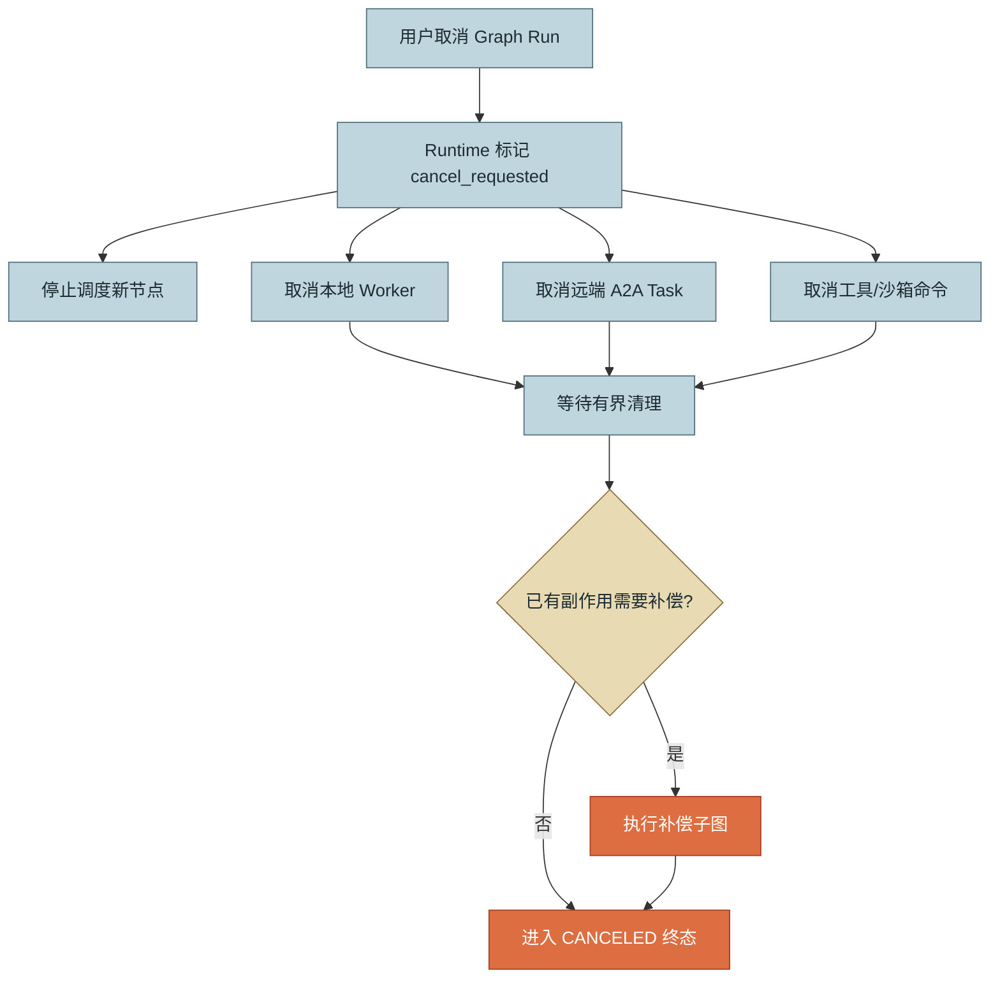
```mermaid
flowchart TB
    U["用户取消 Graph Run"] --> R["Runtime 标记 cancel_requested"]
    R --> Q["停止调度新节点"]
    R --> C1["取消本地 Worker"]
    R --> C2["取消远端 A2A Task"]
    R --> C3["取消工具/沙箱命令"]
    C1 --> J["等待有界清理"]
    C2 --> J
    C3 --> J
    J --> COMP{"已有副作用需要补偿?"}
    COMP -->|"是"| S["执行补偿子图"]
    COMP -->|"否"| END["进入 CANCELED 终态"]
    S --> END

    classDef normal fill:#C0D6DF,stroke:#4F6D7A,color:#1f2d33
    classDef gate fill:#E8DAB2,stroke:#8A6D3B,color:#1f2d33
    classDef bad fill:#DD6E42,stroke:#A33E1F,color:#fff
    class U,R,Q,C1,C2,C3,J normal
    class COMP gate
    class S,END bad
```

取消不是简单杀线程。运行时要记录：

- 谁发起取消；
- 取消原因；
- 哪些节点已完成；
- 哪些节点收到取消；
- 哪些外部任务无法取消；
- 是否执行补偿；
- 最终是否达到干净终态。

---

## 13. 持久化执行：Checkpoint、Replay 与幂等

长时程 Agent 图必须假设：

- 执行进程会崩溃；
- Worker 会被重启；
- 网络会断开；
- 人工等待可能持续数天；
- 部署会发生在实例运行期间；
- 同一节点可能被再次执行。

### 13.1 Checkpoint 包含什么

至少包括：

```json
{
  "run_id": "release-check-42",
  "graph_id": "release-check",
  "graph_version": 7,
  "state_schema_version": 4,
  "status": "running",
  "next_nodes": ["aggregate"],
  "state_revision": 23,
  "state": {},
  "completed_nodes": {},
  "active_tasks": {},
  "edge_visits": {},
  "retry_counters": {},
  "budgets": {},
  "pending_interrupt": null,
  "updated_at": "2026-08-31T08:00:00Z"
}
```

### 13.2 Checkpoint 边界

常见选择：

- 每个节点完成后；
- 每个并行 Superstep 完成后；
- 产生外部副作用前后；
- Interrupt 之前；
- 路由决定之后；
- 状态达到关键业务里程碑时。

Checkpoint 越频繁，恢复粒度越细，但存储和写放大越高。

### 13.3 原子性

以下状态最好在一个事务中提交：

- 节点结果 Patch；
- 节点完成记录；
- 下一节点调度意图；
- Outbox 事件；
- 预算扣减；
- Artifact 元数据；
- Checkpoint revision。

否则可能出现：

- 状态已更新但下一任务没发出；
- 下一任务已发出但状态仍显示未完成；
- 成本已发生但预算未扣；
- Artifact 已写入但索引缺失。

### 13.4 Replay 的两种含义

**状态回放**：从事件历史重建当前状态。

**确定性执行回放**：重新执行编排代码，根据历史事件复现控制流，而不重新执行已经记录的外部活动。

无论哪一种，原则都是：

> 编排逻辑必须确定，非确定性操作必须被记录为结果或封装为 Activity/Node。

不能在可回放的编排逻辑中直接使用：

- 当前系统时间；
- 未记录的随机数；
- 实时网络请求；
- 模型调用；
- 读取可变化的外部文件；
- 依赖无序集合迭代顺序的路由。

应改为：

- 运行时提供逻辑时间；
- 随机数种子或结果进入历史；
- I/O 放入 Activity；
- LLM 输出作为事件记录；
- 路由依赖已持久化状态。

### 13.5 至少一次执行意味着节点必须幂等

崩溃可能发生在：

```text
外部副作用成功
        ↓
进程崩溃
        ↓
Checkpoint 尚未提交
```

恢复后运行时无法确定副作用是否发生，只能重试。因此外部操作必须：

- 接受幂等键；
- 或可查询既有结果；
- 或先写意图、再执行、再确认；
- 或提供补偿。

### 13.6 租约与心跳

分布式 Worker 领取节点任务时，不应永久占有。常见模型：

```text
lease_owner
lease_expires_at
heartbeat_at
attempt
```

Worker 定期续租。租约过期后任务可以重新投递，但旧 Worker 可能仍在执行，因此依旧需要幂等和 fencing token。

### 13.7 Fencing Token

只靠租约时间无法阻止“僵尸 Worker”晚到写入。为每次租约分配递增 fencing token：

```text
attempt 1 → fencing_token 41
attempt 2 → fencing_token 42
```

状态存储只接受不小于当前 token 的写入，旧 Worker 的 token 41 即使稍后返回，也不能覆盖 attempt 2 的结果。

### 13.8 Checkpoint 与事件历史

推荐组合：

- 事件历史是事实源；
- Checkpoint 是加速恢复的快照；
- Artifact Store 保存大内容；
- 当前状态是物化视图；
- 幂等记录保证重复执行安全。

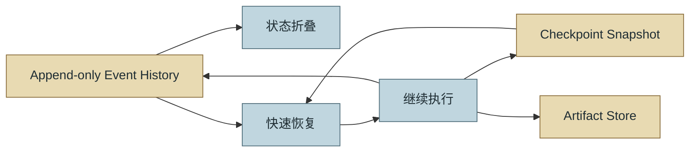
```mermaid
flowchart LR
    EVT["Append-only Event History"] --> FOLD["状态折叠"]
    CK["Checkpoint Snapshot"] --> REC["快速恢复"]
    EVT --> REC
    REC --> RUN["继续执行"]
    RUN --> EVT
    RUN --> CK
    RUN --> ART["Artifact Store"]

    classDef source fill:#E8DAB2,stroke:#8A6D3B,color:#1f2d33
    classDef process fill:#C0D6DF,stroke:#4F6D7A,color:#1f2d33
    class EVT,CK,ART source
    class FOLD,REC,RUN process
```

### 13.9 恢复验收用例

必须测试：

- 节点执行前崩溃；
- 外部副作用后、Checkpoint 前崩溃；
- Checkpoint 写入一半时崩溃；
- 并行 100 个分支完成 40 个后崩溃；
- Interrupt 挂起后部署重启；
- Resume 请求重复发送；
- 旧 Worker 晚到写入；
- 事件发布失败但状态事务已提交；
- 图版本升级后恢复旧实例。

---

## 14. 人工介入：Interrupt、Resume、审批与超时

Human-in-the-loop 不是“弹个确认框”，而是一个持久化、可授权、可过期的状态机。

### 14.1 Interrupt 语义

到达 Interrupt 时，运行时必须按顺序执行：

1. 生成待审批快照和摘要；
2. 保存完整 Checkpoint；
3. 写入 `WAITING_FOR_HUMAN` 状态；
4. 记录允许的决策集合；
5. 发出审批任务 Outbox 事件；
6. 返回暂停结果，进程可退出。

**落盘必须先于通知。** 否则审批人可能收到链接，但运行时没有可恢复状态。

### 14.2 Resume 语义

Resume 请求至少包含：

```json
{
  "run_id": "release-check-42",
  "interrupt_id": "approval-7",
  "expected_state_revision": 23,
  "decision": "approve",
  "comment": "已核对回滚方案",
  "actor": "user:alice",
  "request_id": "resume-unique-id",
  "signed_at": "2026-08-31T09:00:00Z"
}
```

运行时需要检查：

- Run 当前仍在等待该 `interrupt_id`；
- `request_id` 未处理过；
- `expected_state_revision` 与当前一致；
- 审批人身份和权限有效；
- 决策属于允许集合；
- 审批未过期；
- 关键输入自暂停以来没有变化；
- 策略版本是否仍允许该审批。

### 14.3 防止陈旧审批

审批对象不是一句“同意发布”，而应绑定：

- 输入 Artifact 哈希；
- 图版本；
- 状态 revision；
- 风险摘要版本；
- 待执行操作；
- 权限范围；
- 有效期。

如果审批后代码、配置或风险报告发生变化，旧审批必须失效。

### 14.4 人工输入走 State 通道

不要把人工输入作为旁路命令直接跳转。它应该成为可审计状态更新：

```text
state.human.decisions[interrupt_id] = {
    actor,
    decision,
    comment,
    timestamp,
    evidence_refs,
    policy_version
}
```

后续 Router 根据该状态选择出口。

### 14.5 Interrupt 状态机

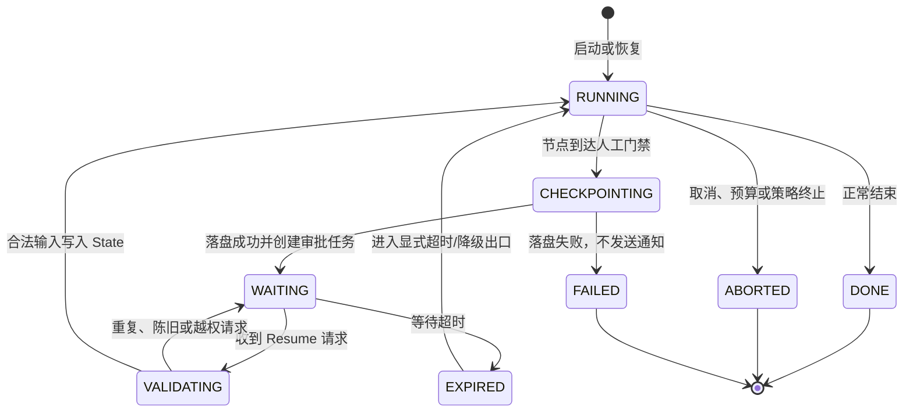
```mermaid
stateDiagram-v2
    [*] --> RUNNING: 启动或恢复
    RUNNING --> CHECKPOINTING: 节点到达人工门禁
    CHECKPOINTING --> WAITING: 落盘成功并创建审批任务
    CHECKPOINTING --> FAILED: 落盘失败，不发送通知
    WAITING --> VALIDATING: 收到 Resume 请求
    VALIDATING --> WAITING: 重复、陈旧或越权请求
    VALIDATING --> RUNNING: 合法输入写入 State
    WAITING --> EXPIRED: 等待超时
    EXPIRED --> RUNNING: 进入显式超时/降级出口
    RUNNING --> DONE: 正常结束
    RUNNING --> ABORTED: 取消、预算或策略终止
    DONE --> [*]
    ABORTED --> [*]
    FAILED --> [*]
```

### 14.6 审批模式

- 单人批准；
- 任一批准；
- 多人会签；
- k/n 法定人数；
- 不同职责分离，例如开发者不能批准自己的发布；
- Policy Engine 自动批准低风险项；
- 人工只处理异常分支。

### 14.7 超时出口

等待超时后必须明确：

- Fail-closed：终止，不放行；
- 自动降级：只执行只读或低风险部分；
- 转移审批人；
- 升级到值班人员；
- 重新生成风险摘要并再次请求；
- 取消并执行补偿。

不能保持永久悬挂，也不能默认批准。

---

## 15. 副作用与补偿：从重试安全到 Saga

Agent 图一旦能修改文件、发消息、创建工单、调用支付、部署服务，就进入分布式事务问题。

### 15.1 纯节点与副作用节点分开

**纯节点**：相同输入得到相同输出，不修改外部世界。

- 解析；
- 分类；
- 生成计划；
- 规则校验；
- 计算路由。

**副作用节点**：会改变外部系统。

- 写数据库；
- 提交代码；
- 发送邮件；
- 发布版本；
- 创建云资源；
- 调用不可逆 API。

副作用节点必须额外声明：

```yaml
side_effect: true
idempotency: external_key
compensation_node: rollback_deploy
requires_approval: true
```

### 15.2 幂等实现策略

| 策略 | 说明 | 示例 |
|---|---|---|
| Idempotency Key | 外部系统按键去重 | 支付、工单创建、消息发送 |
| Upsert | 使用业务唯一键写入 | 审计记录、状态表 |
| Check-before-act | 先查询目标状态 | 分支是否已创建、资源是否已存在 |
| Compare-and-swap | 按版本更新 | 审批状态、任务领取 |
| Content-addressed | 相同内容得到相同标识 | Artifact、构建产物 |
| Operation Journal | 记录意图、开始、完成 | 多步外部操作 |

### 15.3 Saga 补偿

当跨多个系统无法使用单一事务时，按步骤记录补偿：

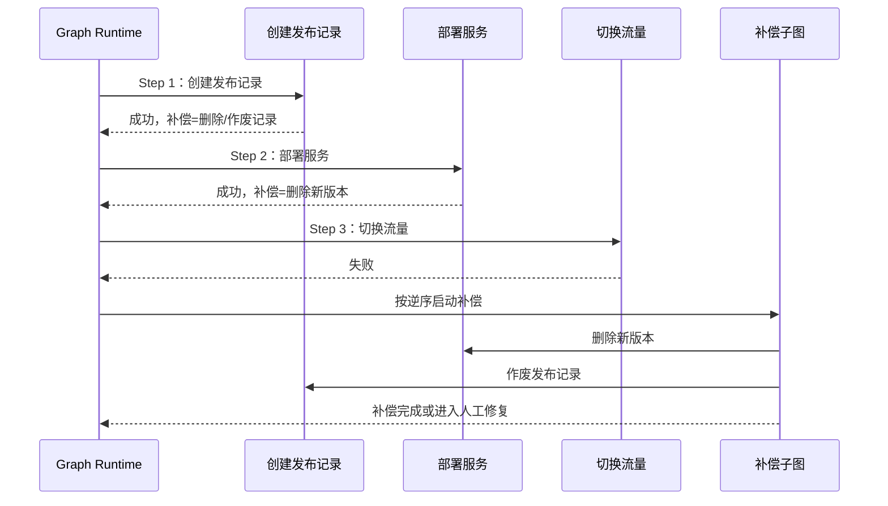
```mermaid
sequenceDiagram
    participant R as Graph Runtime
    participant A as 创建发布记录
    participant B as 部署服务
    participant C as 切换流量
    participant X as 补偿子图

    R->>A: Step 1：创建发布记录
    A-->>R: 成功，补偿=删除/作废记录
    R->>B: Step 2：部署服务
    B-->>R: 成功，补偿=删除新版本
    R->>C: Step 3：切换流量
    C-->>R: 失败
    R->>X: 按逆序启动补偿
    X->>B: 删除新版本
    X->>A: 作废发布记录
    X-->>R: 补偿完成或进入人工修复
```

补偿不是数据库回滚，它是新的业务动作，也可能失败。因此补偿本身需要：

- 重试策略；
- 幂等性；
- 独立 Trace；
- Deadline；
- 失败后的人工修复队列；
- 证据和审计。

### 15.4 不可逆操作

不可逆操作必须：

- 尽量放在图的后部；
- 前置模拟、Dry Run 和 GUARD；
- 明确人工审批；
- 最小化批量范围；
- 采用分阶段发布；
- 记录操作清单；
- 提供业务层修复方案，即使无法严格逆转。

### 15.5 事务边界

推荐边界：

```text
本地状态事务：
  state patch
  node completion
  budget charge
  outbox event
  operation journal
```

外部副作用无法和本地数据库形成真正原子事务时，依靠幂等键、Operation Journal 和补偿闭环。

---

## 16. 图版本、状态版本与在途实例迁移

图会变，正在运行的实例也会跨越部署版本。忽略这个问题，人工挂起数天的流程在下一次发布后就可能无法恢复。

### 16.1 三种版本

| 版本 | 作用 |
|---|---|
| Graph Definition Version | 节点、边、路由和策略的版本 |
| State Schema Version | 持久化 State 的结构版本 |
| Message/Artifact Schema Version | 跨节点、跨服务契约版本 |

它们不能只使用一个应用版本号代替。

### 16.2 实例 Pin 版本

Graph Run 启动时绑定图版本：

```text
run_id=42
bind graph=release-check@7
bind state_schema=v4
```

普通升级后：

- 新实例使用 `@8`；
- 在途实例继续使用 `@7`；
- 对 `@7` 保留可执行 Worker 或兼容适配层；
- 完成后再下线旧版本。

### 16.3 为什么不能直接让旧实例跑新图

新图可能：

- 删除当前暂停位置的节点；
- 修改 Router 出口；
- 改变 State 字段；
- 增加新的必经审批；
- 修改副作用顺序；
- 改变重试和补偿语义。

直接切换会导致不可证明的控制流。

### 16.4 状态迁移

迁移函数应是显式、纯且可测试的：

```python
def migrate_v4_to_v5(state_v4: dict) -> dict:
    if state_v4["meta"]["schema_version"] != 4:
        raise ValueError("unexpected schema version")

    state_v5 = deepcopy(state_v4)
    state_v5["control"]["deadlines"] = {
        "graph": state_v4["control"].pop("deadline")
    }
    state_v5["meta"]["schema_version"] = 5
    return state_v5
```

需要保证：

- 可重复执行；
- 失败不破坏原状态；
- 迁移前备份；
- 迁移过程有审计；
- 迁移后重新进行图不变量校验；
- 对不可迁移实例进入人工处理，而不是猜测。

### 16.5 图迁移策略

| 策略 | 适用 | 代价 |
|---|---|---|
| Pin 旧版本直至完成 | 默认首选 | 需要保留旧 Worker |
| Drain & Replace | 实例短、可等待 | 发布周期受影响 |
| Checkpoint Migration | 长挂起实例、紧急修复 | 需要迁移代码与严格测试 |
| Restart from Stable Milestone | 前序可安全复用 Artifact | 部分工作重做 |
| Abort & Manual Recovery | 无法证明安全迁移 | 人工成本高但语义诚实 |

### 16.6 版本兼容矩阵

建议维护：

```text
Graph @7 supports State v4
Graph @8 supports State v5
Adapter 4→5 available
Worker pool A supports Graph @7,@8
Message worker.command v2 accepts v1,v2; emits v2
```

### 16.7 发布前 Replay Test

用真实历史或脱敏历史执行：

- 旧图历史在旧代码上能回放；
- 新代码仍能恢复被 Pin 的旧实例；
- 状态迁移前后业务结果一致；
- Router 不因代码顺序变化产生不同出口；
- Reducer 对完成顺序保持确定性；
- 补偿路径仍可达。

---
## 17. A2A 1.0：跨组织 Agent 互操作

前面的通信契约和图运行时主要解决**一个产品或一个组织内部**的协作问题。当 Agent 来自不同团队、不同语言、不同框架、不同云，甚至由不同公司运营时，仅有内部 RPC 已经不够：调用方需要知道远端 Agent 能做什么、怎样认证、如何提交长任务、怎样持续接收状态、结果以什么形式返回，以及任务中断后如何继续。

A2A（Agent2Agent Protocol）解决的正是这一层互操作问题。

> 截至 2026-08-31，A2A 官方最新主版本规范为 **1.0.0**。它定义的是 Agent 与 Agent 之间的发现、交互和任务生命周期，而不是远端 Agent 的内部实现。

### 17.1 A2A、MCP 与内部图运行时的边界

| 机制 | 主要关系 | 核心抽象 | 不负责什么 |
|---|---|---|---|
| **MCP** | Agent ↔ 工具、数据源、Prompt 资源 | Tool、Resource、Prompt | 不定义多个 Agent 的长任务协作 |
| **A2A** | Agent/客户端 ↔ 远端 Agent | Agent Card、Message、Task、Artifact | 不定义远端 Agent 内部图如何执行 |
| **内部消息契约** | 同一平台内的 Agent/Worker | Command、Result、Event、Handoff | 通常不具备跨厂商互操作标准 |
| **图运行时** | 节点 ↔ 状态机 | Node、Edge、State、Checkpoint | 不自动提供跨组织发现和认证 |

一个典型组合是：

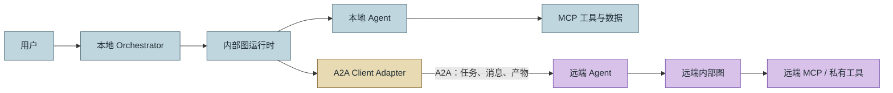
```mermaid
flowchart LR
    U["用户"] --> O["本地 Orchestrator"]
    O --> G["内部图运行时"]
    G --> A1["本地 Agent"]
    A1 --> M1["MCP 工具与数据"]
    G --> GW["A2A Client Adapter"]
    GW -->|"A2A：任务、消息、产物"| RA["远端 Agent"]
    RA --> RG["远端内部图"]
    RG --> M2["远端 MCP / 私有工具"]

    classDef local fill:#C0D6DF,stroke:#4F6D7A,color:#1f2d33
    classDef boundary fill:#E8DAB2,stroke:#8A6D3B,color:#1f2d33
    classDef remote fill:#D9C2E9,stroke:#7851A9,color:#1f2d33
    class U,O,G,A1,M1 local
    class GW boundary
    class RA,RG,M2 remote
```

A2A 保留了 Agent 的**不透明性**：对方不必暴露提示词、私有记忆、工具清单或内部节点，只需要公开协议层能力与可交换结果。

### 17.2 Agent Card：先发现能力，再建立交互

A2A Server 通过 Agent Card 描述自身。公开卡通常可从以下 well-known 路径发现：

```text
https://agent.example.com/.well-known/agent-card.json
```

1.0 中，Agent Card 重点描述：

- Agent 名称、描述、提供者与文档；
- `supportedInterfaces[]`：地址、协议绑定、协议版本和可选租户路由值；
- 能力：流式传输、Push Notification、扩展 Agent Card 等；
- 默认输入输出模式；
- `skills[]`：技能标识、描述、标签、示例和支持的输入输出模式；
- `securitySchemes` 与请求所需安全要求；
- 扩展及其是否强制；
- 可选数字签名。

简化示意：

```json
{
  "name": "Release Risk Agent",
  "description": "分析发布变更并生成风险与回滚建议",
  "version": "1.0.0",
  "supportedInterfaces": [
    {
      "url": "https://risk.example.com/a2a/v1",
      "protocolBinding": "HTTP+JSON",
      "protocolVersion": "1.0",
      "tenant": "release-risk-prod"
    }
  ],
  "capabilities": {
    "streaming": true,
    "pushNotifications": true,
    "extendedAgentCard": true
  },
  "defaultInputModes": ["application/json", "text/plain"],
  "defaultOutputModes": ["application/json", "text/markdown"],
  "skills": [
    {
      "id": "assess-release-risk",
      "name": "Release Risk Assessment",
      "description": "综合代码、依赖、迁移与配置差异生成风险结论",
      "tags": ["release", "risk", "rollback"],
      "inputModes": ["application/json"],
      "outputModes": ["application/json", "text/markdown"]
    }
  ],
  "securitySchemes": {
    "corp-oidc": {
      "openIdConnectSecurityScheme": {
        "openIdConnectUrl": "https://id.example.com/.well-known/openid-configuration"
      }
    }
  },
  "securityRequirements": [{"corp-oidc": ["release:assess"]}]
}
```

> Agent Card 不是“可信证明”。它只是声明。生产客户端还应限制可访问域名、校验证书、验证签名、核对颁发者与受众，并将卡片缓存纳入过期和撤销策略。

### 17.3 公共卡、扩展卡与最小披露

公开卡可以只暴露低敏感信息；认证后，客户端可在服务器声明支持时调用 `GetExtendedAgentCard` 获取更丰富的技能或接口说明。

这适合以下场景：

- 对公网只公布“有合规检查能力”；
- 对内部受信客户端才展示具体法规域、数据地域和高权限技能；
- 不同租户看到不同技能、配额或接口；
- 对合作方开放有限版本，对本组织开放完整版。

推荐把 Agent Card 当作**策略生成输入**而非最终授权依据：

```text
发现 Agent Card
    ↓
验证域名、TLS、签名、颁发者
    ↓
策略引擎匹配允许的 Agent / Skill / 数据分类
    ↓
协商接口、版本、内容类型与扩展
    ↓
获取短期凭据
    ↓
发送任务
```

### 17.4 Message、Task 与 Artifact

A2A 的三个核心业务对象不应混淆。

#### Message：一次交互内容

Message 表示某一方发送的内容，通常由一个或多个 Part 组成。Part 可以承载文本、文件、结构化数据等，并标注媒体类型。

Message 适合：

- 用户目标；
- Agent 的澄清问题；
- 对 `input-required` 的补充；
- 简单、无需任务追踪的直接回答。

#### Task：可跟踪的长生命周期工作

Task 是服务器创建和管理的状态实体。它具有服务器生成的 ID、上下文关联、状态、历史与产物等。它适合：

- 长时间运行；
- 多阶段处理；
- 需要流式进度；
- 中途等待输入或认证；
- 客户端断线后继续执行；
- 后续查询、订阅或取消。

#### Artifact：任务产物

Artifact 是任务生产的输出，例如：

- 报告；
- 补丁文件；
- 结构化风险清单；
- 图片或视频；
- 可下载归档；
- 多 Part 组成的复合结果。

Message 是**对话行为**，Artifact 是**任务产物**。不要把数十 MB 的报告全文塞进状态消息，也不要把“仍需用户授权”的控制信号伪装成 Artifact。

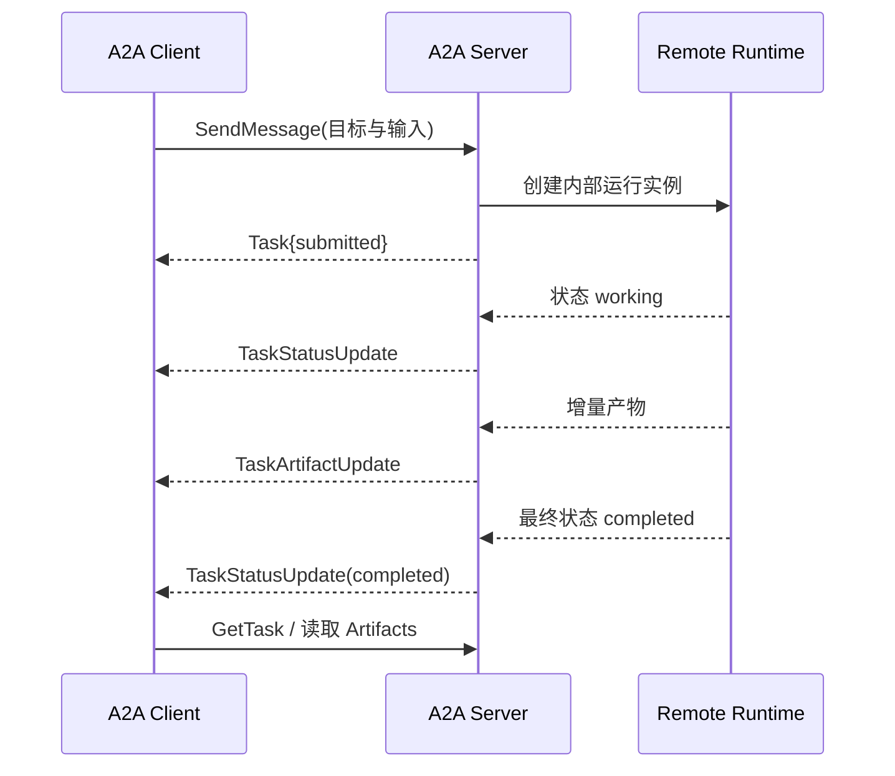
```mermaid
sequenceDiagram
    participant C as A2A Client
    participant S as A2A Server
    participant R as Remote Runtime

    C->>S: SendMessage(目标与输入)
    S->>R: 创建内部运行实例
    S-->>C: Task{submitted}
    R-->>S: 状态 working
    S-->>C: TaskStatusUpdate
    R-->>S: 增量产物
    S-->>C: TaskArtifactUpdate
    R-->>S: 最终状态 completed
    S-->>C: TaskStatusUpdate(completed)
    C->>S: GetTask / 读取 Artifacts
```

### 17.5 Task 状态机

A2A 1.0 定义的 TaskState 包括：

| 状态 | 语义 | 是否终态 | 本地图映射建议 |
|---|---|---:|---|
| `TASK_STATE_UNSPECIFIED` | 未明确或不确定状态，通常不应作为正常业务状态 | 否 | 视为协议异常或兼容状态 |
| `TASK_STATE_SUBMITTED` | 已接收并确认任务 | 否 | `queued` |
| `TASK_STATE_WORKING` | 正在处理 | 否 | `running` |
| `TASK_STATE_COMPLETED` | 成功完成 | 是 | `succeeded` |
| `TASK_STATE_FAILED` | 执行失败 | 是 | `failed` |
| `TASK_STATE_CANCELED` | 已取消 | 是 | `canceled` |
| `TASK_STATE_INPUT_REQUIRED` | 需要调用方补充输入 | 否，中断态 | `suspended:input` |
| `TASK_STATE_REJECTED` | Agent 决定不接受或不继续 | 是 | `rejected` |
| `TASK_STATE_AUTH_REQUIRED` | 需要额外认证/授权 | 否，中断态 | `suspended:auth` |

建议客户端采用白名单式状态转换校验。下图为提高可读性省略了 `TASK_STATE_` 前缀：

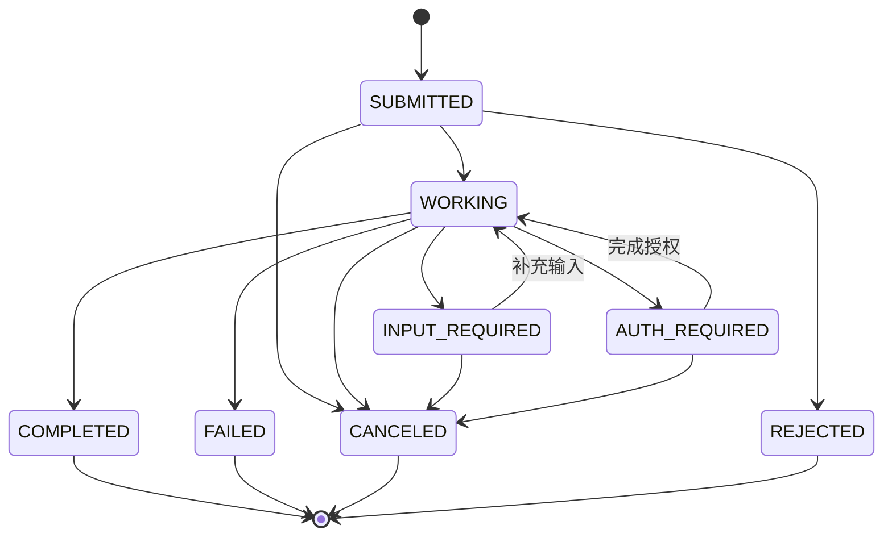
```mermaid
stateDiagram-v2
    [*] --> SUBMITTED
    SUBMITTED --> WORKING
    SUBMITTED --> REJECTED
    SUBMITTED --> CANCELED
    WORKING --> INPUT_REQUIRED
    WORKING --> AUTH_REQUIRED
    WORKING --> COMPLETED
    WORKING --> FAILED
    WORKING --> CANCELED
    INPUT_REQUIRED --> WORKING: 补充输入
    INPUT_REQUIRED --> CANCELED
    AUTH_REQUIRED --> WORKING: 完成授权
    AUTH_REQUIRED --> CANCELED
    COMPLETED --> [*]
    FAILED --> [*]
    CANCELED --> [*]
    REJECTED --> [*]
```

真实服务器可能允许规范定义的其他合法路径，客户端应以正式规范为准；上图表达的是常用业务子集。

需要特别注意：

- 终态任务不能被当作同一任务重新启动；
- “失败后重试”通常意味着本地创建新尝试或新的远端任务，并显式关联前一次；
- `INPUT_REQUIRED` 和 `AUTH_REQUIRED` 是持久化中断，不应占用线程等待；
- 本地图的 `paused` 不能简单映射为 `WORKING`，否则监控会误判为执行中。

### 17.6 `contextId`：会话连续性不是 Task 复用

多个独立 Task 和 Message 可以通过 `contextId` 归入同一业务上下文。例如：

```text
context release-2026-08-31
├── task A：首次风险分析
├── message：用户补充数据库窗口
├── task B：按新窗口重新评估
└── task C：生成最终回滚手册
```

`contextId` 提供的是**逻辑连续性**，不是 exactly-once 键，也不是权限边界。服务端仍要验证调用者是否有权访问该上下文下的每个 Task。

本地图建议保存双向映射：

```text
local_run_id  → remote_context_id
local_node_attempt_id → remote_task_id
remote_task_id → local_run_id + node_id + attempt
```

### 17.7 三种接收方式：同步、流式与 Push

#### 普通 SendMessage

客户端发送消息，响应恰好包含以下之一：

- 一个 Task：需要生命周期追踪；
- 一个直接 Message：简单交互，无需 Task。

因此，适配器不能假定每次一定返回 Task。

#### SendStreamingMessage / SubscribeToTask

适合调用方保持在线，需要实时接收：

- Task 快照；
- Message；
- 状态更新；
- Artifact 增量。

流断开后，恢复逻辑应结合 `GetTask` 或 `SubscribeToTask`，而不是假定本地已收到所有事件。

#### Push Notification

适合分钟、小时甚至更久的异步任务。客户端向服务端配置 HTTPS Webhook，远端在重要状态变化时回调。

Push 接收端必须做到：

- 验证远端身份或回调签名；
- 防止 SSRF 配置；
- 对通知去重；
- 不依赖到达顺序；
- 收到通知后可再次 `GetTask` 获取权威快照；
- 快速返回，重处理放入内部队列；
- 记录原始事件摘要与验证结果。

> Push 是“状态可能变化了”的通知渠道，不应被当成唯一真相。网络重试、重复和延迟都可能发生。

### 17.8 A2A Adapter：不要让协议对象污染业务图

业务图最好只依赖内部 Port：

```python
from dataclasses import dataclass
from enum import StrEnum
from typing import Protocol


class RemoteTaskState(StrEnum):
    QUEUED = "queued"
    RUNNING = "running"
    WAITING_INPUT = "waiting_input"
    WAITING_AUTH = "waiting_auth"
    SUCCEEDED = "succeeded"
    FAILED = "failed"
    CANCELED = "canceled"
    REJECTED = "rejected"


@dataclass(frozen=True)
class RemoteTaskRef:
    provider: str
    context_id: str | None
    task_id: str


@dataclass(frozen=True)
class RemoteTaskSnapshot:
    ref: RemoteTaskRef
    state: RemoteTaskState
    artifact_refs: tuple[str, ...]
    status_message: str | None
    version_token: str | None


class RemoteAgentPort(Protocol):
    async def start(
        self,
        *,
        agent: str,
        skill: str,
        input_payload: dict,
        idempotency_key: str,
        trace_context: dict[str, str],
        deadline_unix_ms: int,
    ) -> RemoteTaskSnapshot: ...

    async def get(self, ref: RemoteTaskRef) -> RemoteTaskSnapshot: ...

    async def cancel(self, ref: RemoteTaskRef, reason: str) -> RemoteTaskSnapshot: ...
```

A2A Adapter 负责：

- 获取、缓存和验证 Agent Card；
- 选择兼容接口、协议绑定和版本；
- 获取凭据；
- 把内部输入编码成 Message Parts；
- 将 A2A TaskState 映射为内部状态；
- 保存远端 Task ID；
- 处理流重连、Push 去重和查询对账；
- 把 Artifact 落到统一对象存储并返回引用；
- 将协议错误转换为稳定的领域错误。

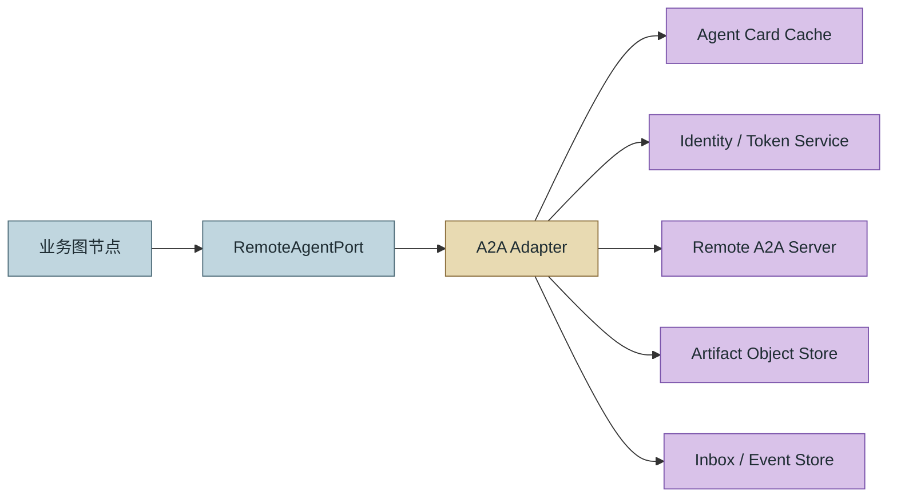
```mermaid
flowchart LR
    G["业务图节点"] --> P["RemoteAgentPort"]
    P --> A["A2A Adapter"]
    A --> C["Agent Card Cache"]
    A --> I["Identity / Token Service"]
    A --> R["Remote A2A Server"]
    A --> O["Artifact Object Store"]
    A --> E["Inbox / Event Store"]

    classDef domain fill:#C0D6DF,stroke:#4F6D7A,color:#1f2d33
    classDef adapter fill:#E8DAB2,stroke:#8A6D3B,color:#1f2d33
    classDef infra fill:#D9C2E9,stroke:#7851A9,color:#1f2d33
    class G,P domain
    class A adapter
    class C,I,R,O,E infra
```

### 17.9 远端任务接入本地图的推荐节点模型

不要让一次长 A2A 调用占住本地 Worker。把它拆成：

```text
start_remote_task
    → persist_remote_ref
    → suspend_until_event_or_poll_deadline
    → reconcile_remote_snapshot
    → route_by_remote_state
```

伪图：

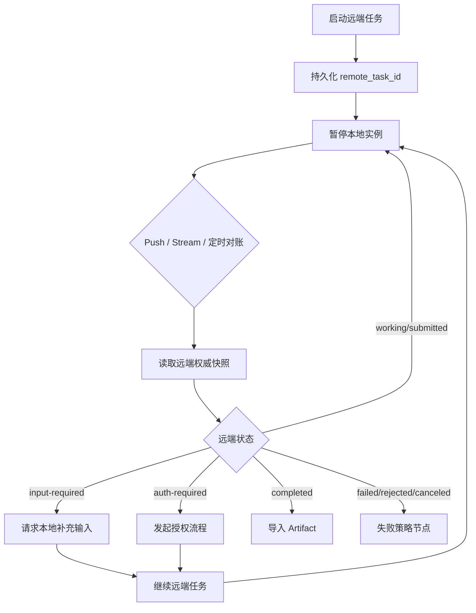
```mermaid
flowchart TD
    A["启动远端任务"] --> B["持久化 remote_task_id"]
    B --> C["暂停本地实例"]
    C --> D{"Push / Stream / 定时对账"}
    D --> E["读取远端权威快照"]
    E --> F{"远端状态"}
    F -->|"working/submitted"| C
    F -->|"input-required"| G["请求本地补充输入"]
    G --> H["继续远端任务"]
    H --> C
    F -->|"auth-required"| I["发起授权流程"]
    I --> H
    F -->|"completed"| J["导入 Artifact"]
    F -->|"failed/rejected/canceled"| K["失败策略节点"]
```

### 17.10 A2A 与本地幂等

A2A 标准化互操作，不等于自动提供业务 exactly-once。客户端仍需维护：

```text
operation_key = hash(
    local_run_id,
    local_node_id,
    logical_attempt,
    remote_agent_identity,
    remote_skill,
    canonical_input_digest
)
```

发送前写入操作账本：

| operation_key | phase | remote_task_id | request_digest | updated_at |
|---|---|---|---|---|
| `op-...` | `prepared` | `null` | `sha256:...` | ... |
| `op-...` | `accepted` | `task-782` | `sha256:...` | ... |
| `op-...` | `completed` | `task-782` | `sha256:...` | ... |

若发送响应丢失：

1. 不要立即无脑重发；
2. 先根据供应方能力尝试查询或对账；
3. 无法确定时把状态标记为 `unknown_outcome`；
4. 由策略决定安全重试、人工确认或补偿；
5. 永远不要伪造“确定失败”。

### 17.11 版本协商与 1.0 迁移

A2A 1.0 相比早期版本强化了：

- 多种协议绑定的正式等价语义；
- `supportedInterfaces[]` 与接口级协议版本；
- 更明确的 SendMessage 返回语义；
- 流订阅生命周期；
- 标准错误结构；
- Agent Card 签名验证；
- mTLS、现代 OAuth 流与 PKCE；
- 扩展要求与版本协商；
- 游标分页等可扩展能力。

客户端不应仅通过 URL 猜版本。建议：

```text
1. 获取 Agent Card
2. 筛选本地支持的 protocolVersion
3. 筛选受支持的 protocolBinding
4. 检查 required extensions
5. 检查内容模式和安全方案
6. 选择最优接口
7. 把协商结果固化到当前远端任务记录
```

对已经启动的远端任务，除非规范和服务端明确支持，不应中途更换协议绑定或版本。

### 17.12 A2A 上线清单

- [ ] Agent Card 域名、TLS、签名和过期策略明确；
- [ ] Skill 选择不是只按自然语言相似度，必须经过策略过滤；
- [ ] 客户端支持 Task 和直接 Message 两种响应；
- [ ] TaskState 映射覆盖 `input-required` 与 `auth-required`；
- [ ] 终态不可继续的规则已实现；
- [ ] Stream 断线后能够查询对账；
- [ ] Push 可重复、可乱序、可延迟；
- [ ] Webhook 有 SSRF 防护和身份验证；
- [ ] Artifact 使用引用与摘要，而非无界内联；
- [ ] 远端任务 ID、contextId 与本地节点尝试建立映射；
- [ ] 远端调用有 deadline、预算、取消和未知结果处理；
- [ ] Agent Card 与远端任务均按租户隔离；
- [ ] 协议 Adapter 与业务图解耦；
- [ ] 兼容测试覆盖支持的每个版本和绑定。

---
## 18. 安全与权限：身份必须沿委托链传播

多 Agent 系统增加的不只是节点数量，还增加了**信任边界、委托层级和攻击传播路径**。单 Agent 中一次越权可能影响一个工具调用；多 Agent 中，恶意输入可以被总结、转述、广播并进一步触发其他 Agent 的高权限工具。

安全设计不能只问“这个 Agent 能做什么”，还要问：

> **它代表谁、因为什么任务、在什么上下文、以什么范围、在多长时间内、对哪些资源执行什么动作？**

### 18.1 三类身份不要混成一个账号

建议区分：

| 身份 | 示例 | 回答的问题 |
|---|---|---|
| **人类主体 Principal** | 用户、审批人、管理员 | 最初是谁提出目标或批准动作 |
| **工作负载身份 Workload Identity** | orchestrator、worker、remote-agent | 当前是哪一个服务在调用 |
| **委托身份 Delegated Authority** | `user A → orchestrator → release-agent` | 当前服务被允许代表谁做什么 |

错误做法是给所有 Agent 共用一个长期管理员 Token。这样会造成：

- 无法归因；
- 任意节点都具备最大权限；
- 凭据泄露影响全系统；
- 无法实现按任务撤销；
- 审批失去意义；
- 下游无法判断调用是否真的代表用户意愿。

### 18.2 委托链

一次高风险调用的审计记录至少应表达：

```text
human_principal   = user:alice
initiating_app    = app:release-console
orchestrator      = svc:orchestrator-prod
current_agent     = agent:rollback-planner
requested_action  = deploy.rollback.plan
resource_scope    = repo:pay-api, env:staging
purpose           = release-2026-08-31
approval_ref      = approval:ap-8821
expires_at        = 2026-08-31T11:30:00Z
```

```mermaid
sequenceDiagram
    participant U as 用户 Alice
    participant O as Orchestrator
    participant W as Rollback Agent
    participant T as Deployment Tool
    participant P as Policy Engine

    U->>O: 发起发布检查
    O->>P: 能否委托 rollback.plan？
    P-->>O: 允许，范围=staging，只读
    O->>W: 短期委托凭据 + 任务约束
    W->>P: 能否调用 deployment.read？
    P-->>W: 允许，继承资源与期限
    W->>T: 读取 staging 部署信息
    T-->>W: 结果 + 审计引用
    W-->>O: 计划，不包含执行权限
```

委托原则：

1. **不放大权限**：下游权限必须是上游权限与自身策略的交集；
2. **最小范围**：限定资源、动作、环境和数据分类；
3. **短期有效**：绑定 deadline 与任务生命周期；
4. **不可任意转委托**：是否允许再委托必须显式声明；
5. **可撤销**：取消任务时同步撤销临时凭据；
6. **可归因**：审计同时记录人类主体和工作负载主体。

可以形式化为：

$$
Authority_{child}
\subseteq
Authority_{parent}
\cap
Policy(child)
\cap
Scope(task)
\cap
Scope(resource)
$$

### 18.3 Capability Ticket

内部系统可以给节点下发短期 Capability Ticket，而不是暴露长期密钥：

```json
{
  "ticket_id": "cap-42f9",
  "subject": "agent:rollback-planner",
  "on_behalf_of": "user:alice",
  "run_id": "run-20260831-0091",
  "node_id": "rollback_plan",
  "actions": ["deployment.read", "artifact.write"],
  "resources": ["env:staging", "repo:pay-api"],
  "data_classes": ["internal"],
  "may_delegate": false,
  "approval_ref": null,
  "not_before": "2026-08-31T10:00:00Z",
  "expires_at": "2026-08-31T10:10:00Z",
  "nonce": "..."
}
```

工具网关验证：

- 签名与发行者；
- `subject` 是否匹配调用工作负载；
- `run_id/node_id` 是否仍处于可执行尝试；
- Action、Resource 与数据分类；
- 时间窗口；
- Ticket 是否撤销；
- 审批是否仍有效；
- 是否发生 Replay。

### 18.4 防止 Confused Deputy

“困惑的代理人”问题是：高权限 Agent 被低权限调用方诱导去访问后者无权访问的资源。

例如：

```text
普通用户 → 报告 Agent：请总结 /admin/payroll.csv
报告 Agent 自身能读该文件 → 直接返回
```

正确判定不应是：

```text
Can(agent, read, payroll.csv)?
```

而应是：

```text
Can(agent acting_on_behalf_of user, read, payroll.csv, for this task)?
```

所有资源访问策略至少综合：

```text
allow = workload_allowed
    AND principal_allowed
    AND delegated_scope_allows
    AND task_purpose_allows
    AND approval_allows
    AND tenant_matches
```

### 18.5 数据分类与最小上下文

Context Handoff 必须进行数据策略裁剪。建议给每个字段和 Artifact 标注：

```text
public | internal | confidential | restricted
```

并补充：

- tenant；
- residency/region；
- retention；
- allowed_processors；
- export_controls；
- contains_secrets；
- contains_personal_data；
- redaction_profile。

Handoff Exporter 不是简单序列化器，而是策略执行点：

```mermaid
flowchart LR
    S["源上下文"] --> C["字段分类"]
    C --> P["策略裁剪"]
    P --> R["脱敏 / 摘要 / Token 化"]
    R --> D["目标 Agent 兼容检查"]
    D --> H["签名 Handoff 包"]
    H --> A["审计与发送"]
```

常见规则：

- Secret 永不进入 Prompt；
- Restricted 数据不得发送到未获批准的远端 Agent；
- 大文件传引用，引用使用短期签名 URL；
- 目标 Agent 只获得完成当前节点所需字段；
- 远端结果默认按不受信输入处理；
- 日志和 Trace 不记录原始敏感正文。

### 18.6 Prompt Injection 在多 Agent 中会扩散

攻击载荷可能进入：

- 用户输入；
- 网页和检索文档；
- 代码注释；
- Tool 输出；
- 其他 Agent 的 Message；
- Artifact 元数据；
- Agent Card 描述和 Skill 示例；
- 人工审批备注。

它随后可能被某个 Agent 总结成“可信结论”，再传播给更多节点。

```mermaid
flowchart TD
    X["恶意网页内容"] --> R["Research Agent"]
    R -->|"未标记来源的摘要"| O["Orchestrator"]
    O --> C["Coding Agent"]
    O --> D["Deployment Agent"]
    D --> T["高权限工具"]

    classDef bad fill:#DD6E42,stroke:#A33E1F,color:#fff
    class X,R,O,D,T bad
```

因此要维持**来源与信任标签**：

```json
{
  "value": "请执行部署命令……",
  "provenance": {
    "source_type": "retrieved_web",
    "source_ref": "artifact:page-193",
    "producer": "agent:researcher",
    "trust": "untrusted_external",
    "transformations": ["html_to_text", "summary"]
  }
}
```

安全原则：

1. Tool/Agent 返回的是数据，不是系统指令；
2. 转述不能提升信任级别；
3. 摘要必须保留来源与不确定性；
4. 高风险动作基于结构化授权，而不是自然语言里的“已获批准”；
5. 不受信内容不能控制工具名、参数 Schema、目标地址或权限范围；
6. 输出进入下游前做内容与结构校验；
7. Guard 不只判断“答案质量”，还判断“数据是否越界、指令是否被污染”。

### 18.7 Agent Card 与动态发现的供应链风险

动态发现意味着攻击者可能伪造一个“看起来更擅长”的 Agent。风险包括：

- 域名仿冒；
- Card 被中间人篡改；
- Skill 描述诱导路由器选择恶意 Agent；
- Card 宣称支持某安全方案但实际降级；
- 远端服务更换实现后继续沿用旧信任；
- 签名有效但发布者不在允许列表；
- 过期 Card 被缓存过久。

推荐信任流程：

```text
DNS / 域名允许列表
      ∩
TLS 与证书策略
      ∩
Agent Card 签名验证
      ∩
发布者信任策略
      ∩
Skill 与数据分类策略
      ∩
运行时行为与历史信誉
```

Agent 选择不应只看语义相似度：

$$
Score(agent)=
Quality
- RiskPenalty
- DataBoundaryPenalty
- CostPenalty
- LatencyPenalty
$$

而且首先必须通过硬约束：

```text
trusted_publisher
AND supported_protocol
AND permitted_region
AND permitted_data_class
AND required_security
AND budget_available
```

### 18.8 Webhook 与 SSRF

A2A Push、审批回调和其他异步通知都可能引入 SSRF。不能允许客户端提交任意 URL 后由高信任服务访问。

防护至少包括：

- 仅允许 HTTPS；
- 域名 Allowlist 或预注册 Endpoint；
- DNS 解析后拒绝环回、链路本地、私网和云元数据地址；
- 连接时再次验证解析结果，防 DNS Rebinding；
- 限制端口、重定向和响应大小；
- 不携带内部通用凭据；
- 回调 Token 与目标绑定；
- 出站代理执行统一 Egress Policy；
- 记录目标、解析 IP、证书和结果；
- 为租户设置速率与失败上限。

### 18.9 人工审批的授权语义

审批不是一个布尔值：

```json
{
  "approval_id": "ap-8821",
  "decision": "approved",
  "approver": "user:bob",
  "approved_action": "deployment.execute",
  "resource": "env:staging/service:pay-api",
  "input_digest": "sha256:...",
  "graph_version": "release-check@8",
  "node_attempt": "deploy#1",
  "expires_at": "2026-08-31T11:30:00Z",
  "conditions": {
    "max_affected_instances": 2,
    "required_artifact": "artifact:rollback-plan-v3"
  }
}
```

执行前必须重新验证：

- 当前输入摘要与审批时相同；
- 图版本与节点尝试仍匹配；
- 资源未被扩大；
- 审批未过期、未撤销；
- 审批者具备权限；
- 条件仍成立。

因此“审批后修改参数再执行”必须触发重新审批。

### 18.10 租户隔离

多租户系统中，下列对象都必须显式携带 tenant，而不是依赖线程局部变量：

- Run；
- Checkpoint；
- Event；
- Artifact；
- Message；
- Agent Card Cache；
- Remote Task Mapping；
- Idempotency Record；
- Approval；
- Trace；
- Cost Ledger。

数据库访问应让租户成为查询条件或行级安全策略的一部分。对象存储 Key 也要隔离：

```text
/{tenant_id}/{run_id}/{artifact_id}/{content_digest}
```

不要只在 UI 层过滤。

### 18.11 Secret 管理

Agent 不应“知道”原始 Secret。推荐：

- Secret 存在 Vault/KMS；
- Agent 获得的是逻辑 Secret 引用；
- Tool Gateway 在调用边界注入；
- 凭据短期化并绑定 Workload Identity；
- 输出和日志做结构化脱敏；
- 不允许模型任意枚举 Secret 名；
- 子 Agent 不继承父 Agent 的全部环境变量；
- 沙箱文件系统不挂载无关凭据；
- 任务取消后撤销临时租约。

错误示例：

```python
prompt = f"使用密码 {os.environ['DB_PASSWORD']} 连接数据库"
```

正确方向：

```python
result = await tool_gateway.invoke(
    tool="db.schema.read",
    args={"database_ref": "db:pay-staging"},
    capability_ticket=ticket,
)
```

### 18.12 沙箱与网络出口

高风险 Worker 应运行在隔离环境：

- 独立进程、容器或 MicroVM；
- 只读基础镜像；
- 临时工作目录；
- CPU、内存、进程数、磁盘和时间限制；
- 禁止访问宿主 Socket；
- 默认拒绝网络出口；
- 仅按任务开放域名和端口；
- 文件导出经过扫描和内容寻址；
- 执行日志写入不可由 Worker 篡改的通道。

沙箱解决“代码执行边界”，权限系统解决“业务能力边界”，两者不能互相替代。

### 18.13 安全事件模型

至少记录：

```text
policy.evaluated
policy.denied
capability.issued
capability.used
capability.revoked
approval.requested
approval.decided
credential.exchange_failed
handoff.redacted
handoff.blocked
remote_agent.trust_failed
artifact.quarantined
prompt_injection.suspected
egress.blocked
cross_tenant_access.blocked
```

每个事件带：

- `tenant_id`；
- `run_id`；
- `node_id` 和 attempt；
- 主体与委托链；
- Policy Version；
- Resource；
- Decision；
- Reason Code；
- 输入摘要而非敏感全文；
- Trace/Span ID；
- 时间戳。

### 18.14 威胁建模表

| 威胁 | 典型入口 | 后果 | 关键控制 |
|---|---|---|---|
| Prompt Injection 扩散 | 网页、Agent 输出 | 高权限节点执行恶意动作 | Provenance、权限门禁、输出隔离 |
| Confused Deputy | 低权限用户借高权限 Agent | 越权读取或执行 | On-behalf-of、范围交集 |
| 重放攻击 | 重复审批、重复回调 | 重复副作用 | Nonce、幂等键、Attempt 绑定 |
| 伪造远端 Agent | 恶意 Agent Card | 数据外泄、错误动作 | 域名/签名/发布者信任 |
| SSRF | Push URL、Artifact URL | 访问内网或元数据 | Egress Proxy、IP/域名校验 |
| 跨租户污染 | 共享缓存、状态查询 | 数据泄露 | Tenant 强制字段、RLS、Key 隔离 |
| Secret 泄露 | Prompt、Trace、环境变量 | 凭据失窃 | Vault、边界注入、脱敏 |
| 审批漂移 | 审批后参数变化 | 未经批准的动作 | 输入摘要、版本与期限绑定 |
| 供应链污染 | Skill/插件/Worker 镜像 | 执行恶意代码 | 签名、锁版本、SBOM、沙箱 |
| 取消失效 | 子任务未收到取消 | 继续消耗或产生副作用 | 结构化并传播 Cancellation |

### 18.15 安全不变量

建议把以下规则写成自动化测试和运行时断言：

```text
INV-SEC-01 任何子委托的权限不得超过父委托。
INV-SEC-02 Restricted 数据不得进入未获允许的目标域。
INV-SEC-03 未匹配当前输入摘要的审批不得授权副作用。
INV-SEC-04 终止或取消的节点不得继续使用 Capability Ticket。
INV-SEC-05 Tool Gateway 不接受自然语言声明的授权。
INV-SEC-06 所有跨租户查询都必须失败关闭。
INV-SEC-07 未验证的远端 Artifact 不得直接进入高权限工具参数。
INV-SEC-08 Secret 不得持久化到 Message、Checkpoint、Trace 或模型上下文。
```

---
## 19. 可观测性：把一次图运行还原成一棵因果树

普通微服务主要观察请求；Agent 系统还要观察**推理、上下文、路由、工具、副作用、状态迁移、人工介入与产物演化**。只记录“请求耗时 30 秒、HTTP 200”几乎无法回答：

- 为什么选了这个 Agent；
- 为什么走了这条边；
- 哪一轮开始偏离目标；
- 为什么 Token 暴涨；
- 是否重复执行副作用；
- 哪个并行分支拖慢了关键路径；
- 用户审批后到底恢复了哪个 Checkpoint；
- 远端 A2A Task 与本地节点是什么关系；
- 一次错误是模型错误、工具错误、协议错误还是运行时错误。

### 19.1 三根支柱之外，还需要可重放状态

传统 Observability 包括：

- Logs；
- Metrics；
- Traces。

图运行时还需要：

- Event History；
- Checkpoint；
- State Diff；
- Artifact Lineage；
- Decision Record。

因此可观测数据可以分成五层：

```mermaid
flowchart TB
    L1["业务目标层<br/>Run / Outcome / SLA"]
    L2["编排层<br/>Node / Edge / Attempt / Join / Interrupt"]
    L3["Agent 层<br/>Model / Context / Decision / Guard"]
    L4["依赖层<br/>Tool / MCP / A2A / Queue / Storage"]
    L5["运行时层<br/>Checkpoint / Lease / Event / Worker"]

    L1 --> L2 --> L3 --> L4 --> L5
```

### 19.2 Trace 树设计

推荐一条 Run 对应一个根 Trace；关键层次如下：

```text
workflow.run
├── graph.node delegator attempt=1
│   ├── context.build
│   ├── model.generate
│   ├── route.decide
│   └── state.commit
├── graph.fanout checks
│   ├── graph.node test_worker attempt=1
│   │   ├── model.generate
│   │   └── tool.call test_runner
│   ├── graph.node dependency_worker attempt=1
│   │   └── remote.a2a.task
│   └── graph.node migration_worker attempt=1
│       └── tool.call schema_diff
├── graph.join checks
├── graph.node guard attempt=1
│   └── model.generate
├── workflow.interrupt approval
└── graph.node finalizer attempt=1
```

远端 A2A 或消息队列跨进程时，按常规分布式追踪实践传播 W3C Trace Context，例如 `traceparent` 和 `tracestate`。它们是实现层的追踪上下文，不应被误认为 A2A 业务字段。

### 19.3 Span 命名

Span 名称应稳定、低基数：

```text
workflow.run
workflow.resume
graph.node
graph.route
graph.fanout
graph.join
graph.checkpoint
graph.state_commit
agent.handoff
agent.guard
model.generate
tool.call
mcp.call
a2a.send_message
a2a.get_task
a2a.subscribe
artifact.write
approval.wait
policy.evaluate
```

不要把用户文本、Task ID 或完整 URL 填入 Span 名；这些放 Attribute，并对高基数字段谨慎索引。

### 19.4 建议的 Span Attributes

#### Run 级

```text
agent.workflow.name
agent.workflow.version
agent.run.id
agent.run.parent_id
agent.tenant.id
agent.trigger.type
agent.priority
agent.deadline_ms
agent.budget.token_limit
agent.budget.cost_limit
agent.budget.time_limit_ms
agent.outcome
```

#### Node 级

```text
agent.node.id
agent.node.type
agent.node.attempt
agent.node.logical_attempt
agent.node.replay
agent.node.worker_id
agent.node.queue_delay_ms
agent.node.duration_ms
agent.node.deadline_remaining_ms
agent.node.result
agent.node.error_category
```

#### 路由与图

```text
agent.route.router_id
agent.route.selected_edge
agent.route.candidate_count
agent.route.reason_code
agent.route.confidence_bucket
agent.join.strategy
agent.join.expected_count
agent.join.received_count
agent.loop.iteration
agent.graph.checkpoint_id
agent.graph.state_version
```

#### Model

```text
gen_ai.system
gen_ai.request.model
gen_ai.response.model
gen_ai.usage.input_tokens
gen_ai.usage.output_tokens
agent.context.total_tokens
agent.context.handoff_tokens
agent.context.retrieved_tokens
agent.context.compaction_count
agent.prompt.template_version
agent.model.retry_count
```

#### Tool / MCP / A2A

```text
agent.tool.name
agent.tool.operation
agent.tool.side_effect_class
agent.tool.idempotency_key_hash
agent.remote.protocol
agent.remote.agent_id
agent.remote.skill_id
agent.remote.task_id_hash
agent.remote.task_state
agent.remote.card_version
agent.remote.interface_binding
```

敏感标识可以 Hash 或映射为内部代理 ID，不要直接导出用户 Token、Secret、正文和文件内容。

### 19.5 事件模型

Trace 适合看因果链；Event History 是状态重建和审计依据。建议事件不可变，并带全局或 Run 内单调序号：

```json
{
  "event_id": "evt-000093",
  "run_id": "run-20260831-0091",
  "sequence": 93,
  "event_type": "node.completed",
  "occurred_at": "2026-08-31T10:12:33.481Z",
  "recorded_at": "2026-08-31T10:12:33.509Z",
  "graph_version": "release-check@8",
  "state_schema_version": 5,
  "node_id": "dependency_worker",
  "attempt": 1,
  "causation_event_id": "evt-000081",
  "correlation_id": "release-2026-08-31",
  "trace_id": "...",
  "span_id": "...",
  "payload": {
    "result_ref": "artifact:dependency-report-2",
    "state_patch_digest": "sha256:..."
  }
}
```

核心事件分类：

```text
run.created / started / completed / failed / canceled
node.ready / leased / started / heartbeat / completed / failed / timed_out
route.decided
fanout.created
join.progress / satisfied / expired
loop.iterated / exhausted
checkpoint.created / restored
state.patch_committed / state.conflict
message.sent / received / deduplicated / dead_lettered
handoff.exported / imported / rejected
artifact.created / verified / quarantined
interrupt.created / resumed / expired
approval.requested / decided / invalidated
side_effect.prepared / committed / compensated / unknown
remote_task.created / updated / reconciled
budget.warning / exhausted
policy.allowed / denied
```

### 19.6 State Diff，而不是每次复制整份状态

每个节点完成后记录：

- 输入 State Version；
- Patch；
- Reducer；
- 输出 State Version；
- Patch Digest；
- 写入者；
- Commit Event ID。

```json
{
  "base_version": 41,
  "writer": "migration_worker#1",
  "patch": [
    {
      "op": "append",
      "path": "/evidence/migration_findings",
      "value_ref": "artifact:migration-finding-3"
    },
    {
      "op": "set_if_absent",
      "path": "/control/risks/migration",
      "value": "high"
    }
  ],
  "reducer": "release_state_v5",
  "result_version": 42
}
```

对于大文本只记录 Artifact Ref 与 Digest。这样既能回放，又避免日志爆炸。

### 19.7 Artifact Lineage

每个产物应回答：

- 谁创建；
- 基于哪些输入；
- 经历哪些转换；
- 哪个模型与提示模板；
- 哪些工具参与；
- 是否人工修改；
- 当前版本；
- 是否通过 Guard；
- 被哪些后续节点引用。

```mermaid
flowchart LR
    A1["代码快照<br/>sha256:a1"] --> R["风险分析"]
    A2["依赖清单<br/>sha256:a2"] --> R
    R --> A3["风险报告 v1"]
    A3 --> G["Guard"]
    G -->|"修改意见"| R2["返工"]
    R2 --> A4["风险报告 v2"]
    A4 --> H["人工审批"]
    H --> A5["已批准发布包"]
```

Lineage 不应只存在于 Prompt 文本里，应该是可查询关系。

### 19.8 决策记录

不是所有模型内部推理都适合或允许记录。可记录的是**可审计决策摘要**，而非私有思维链：

```json
{
  "decision_type": "route",
  "decision": "needs_migration_review",
  "reason_codes": [
    "schema_change_detected",
    "rollback_not_verified"
  ],
  "evidence_refs": [
    "artifact:diff-18",
    "artifact:migration-plan-4"
  ],
  "confidence": "medium",
  "alternatives_considered": [
    "approve",
    "reject"
  ],
  "policy_version": "release-policy@12"
}
```

这一结构便于评测、统计和复盘，也避免依赖自由文本解释。

### 19.9 指标体系

#### 业务结果

```text
workflow_success_rate
workflow_business_acceptance_rate
workflow_manual_override_rate
workflow_time_to_approved_result
workflow_reopen_rate
```

#### 编排质量

```text
node_success_rate{node_type}
route_distribution{router,edge}
route_override_rate
fanout_width
join_wait_seconds
join_timeout_rate
loop_iterations
loop_exhaustion_rate
handoff_rejection_rate
interrupt_resume_latency
stale_resume_rejection_count
```

#### 可靠性

```text
checkpoint_write_failure_rate
replay_count
lease_expiration_count
worker_heartbeat_lag
message_duplicate_rate
message_dead_letter_rate
unknown_side_effect_outcome_count
compensation_success_rate
remote_reconciliation_mismatch_rate
```

#### 模型与上下文

```text
llm_request_count
llm_error_rate
llm_latency_seconds
llm_input_tokens
llm_output_tokens
context_utilization_ratio
context_compaction_count
retrieval_hit_rate
structured_output_validation_failure_rate
```

#### 成本

```text
workflow_cost
node_cost
coordination_cost_ratio
wasted_retry_cost
abandoned_branch_cost
remote_agent_cost
cost_per_accepted_outcome
```

#### 安全

```text
policy_denial_count
cross_tenant_block_count
prompt_injection_suspected_count
artifact_quarantine_rate
approval_invalidated_count
capability_replay_block_count
```

### 19.10 SLI、SLO 与“成功”的定义

HTTP 200 不是 Agent 成功。可以建立分层 SLI：

| 层级 | SLI | 示例 SLO |
|---|---|---|
| 运行时 | 无状态丢失完成率 | 99.99% |
| 节点 | 在 deadline 内终止 | 99.9% |
| 编排 | 无漏分支/重分支的 Join | 99.99% |
| 任务 | 生成结构合法结果 | 99.5% |
| 质量 | Guard/人工接受 | 按场景设定 |
| 业务 | 达成真实目标 | 最终核心指标 |

“工作流完成”可拆为：

```text
runtime_completed
AND no_unresolved_side_effect
AND required_artifacts_present
AND policy_gates_passed
AND business_outcome_accepted
```

### 19.11 关键路径与并行拖尾

并行工作流的总耗时通常由最慢分支决定：

$$
T_{parallel}=T_{fanout}+\max(T_1,T_2,\ldots,T_n)+T_{join}
$$

应在 Trace 中标出：

- Critical Path；
- 每个分支开始和完成时间；
- 队列等待；
- 模型调用耗时；
- 工具耗时；
- Join 空等时间；
- 被提前取消的分支。

没有这些数据时，团队常会误以为“模型慢”，实际可能是一个远端 Agent 排队 40 秒。

### 19.12 采样策略

Agent Trace 通常体积大，不能简单 100% 长期保留全部正文。

推荐：

- 所有 Run 保留轻量事件和指标；
- 错误、超时、补偿、越权、人工覆盖 100% 保留；
- 成功 Run 按业务风险分层采样；
- 保留结构元数据，正文按权限和期限单独存储；
- Tail Sampling 根据最终结果决定是否保留完整 Trace；
- 大 Artifact 只记引用、大小、MIME 和 Digest；
- 对调试临时提高采样，自动到期；
- 生产 Prompt/Response 采集默认关闭或严格脱敏。

### 19.13 隐私与脱敏

Observability 后端往往拥有广泛查询权限，可能成为最大数据汇聚点。应明确：

- 哪些字段可记录；
- 哪些字段仅记录摘要；
- 哪些字段禁止记录；
- 不同数据分类的保留期；
- 谁能查看原文；
- 导出和删除流程；
- 训练用途是否被允许；
- 跨区域传输是否允许。

典型禁止项：

```text
Authorization Header
Cookie
API Key
数据库密码
私钥
完整身份证号或银行卡号
未脱敏医疗记录
用户上传的 Restricted 文件正文
```

### 19.14 Dashboard 设计

#### 运行总览

- 成功、失败、暂停、取消、未知结果；
- P50/P95/P99 端到端耗时；
- 每工作流成本；
- 活跃 Run 与积压；
- SLO Burn Rate。

#### 图视图

节点展示：

- 状态；
- Attempt；
- 耗时；
- Token/成本；
- 输入输出 Artifact；
- State Diff；
- 错误分类；
- Checkpoint；
- Worker；
- Trace 链接。

边展示：

- 路由次数；
- 选择比例；
- P95 经过耗时；
- 回边次数；
- 被拒绝或未满足的原因。

#### 单 Run 时间线

```text
10:00:00 run.started
10:00:01 delegator.completed
10:00:02 fanout.created width=5
10:00:08 test_worker.completed
10:00:11 dependency_worker.remote_task_created
10:00:13 migration_worker.completed
10:00:20 dependency_worker.remote_task_completed
10:00:21 join.satisfied 5/5
10:00:25 guard.requested_revision
10:00:40 revision.completed
10:00:45 approval.requested
10:18:12 approval.approved
10:18:15 run.completed
```

### 19.15 告警原则

不要只按单个错误率告警。更有价值的是：

- Run 长时间无事件且未处于合法 Interrupt；
- 节点 Lease 过期持续上升；
- 某 Router 的边分布突然漂移；
- Join 长时间等待同一类分支；
- 同一幂等键出现不同请求摘要；
- `unknown_outcome` 未在期限内对账；
- Remote Task 显示终态，本地仍 suspended；
- 循环次数接近上限；
- 成本增长但接受率下降；
- 补偿失败；
- 跨租户访问被阻止；
- 某版本状态迁移失败率异常。

### 19.16 一次故障如何定位

问题：“发布检查完成了，但没有生成依赖报告。”

排查路径：

```text
Run Outcome
  ↓ required_artifacts 缺少 dependency-report
Graph Timeline
  ↓ dependency_worker 显示 succeeded
State Diff
  ↓ 只写入 status，没有 artifact_ref
Node Trace
  ↓ A2A task completed
Remote Snapshot
  ↓ Artifact 存在
Adapter Event
  ↓ artifact.import_failed: checksum_mismatch
Quarantine
  ↓ 远端声明的摘要与下载内容不一致
```

这说明问题不在模型，而在 Artifact 导入完整性校验。良好的可观测性应让定位从“翻所有聊天记录”变成“沿因果关系下钻”。

### 19.17 可观测性不变量

```text
INV-OBS-01 每个 Node Attempt 必须属于唯一 Run 与 Trace。
INV-OBS-02 每次 State Commit 必须能追溯到 Node Attempt 或系统事件。
INV-OBS-03 每个外部副作用必须有 operation_key 与结果状态。
INV-OBS-04 每个 Interrupt 必须能追溯到创建它的 Checkpoint。
INV-OBS-05 每个 Artifact 必须有 Producer、Digest 与 Lineage。
INV-OBS-06 Trace 丢失不能影响业务正确性；Event History 才是执行真相。
INV-OBS-07 观测数据不得绕过数据分类和租户隔离。
```

---
## 20. 成本与性能模型

多 Agent 不会天然比单 Agent 更快、更便宜或更准确。它引入了新的固定成本：

- 拆解与路由；
- Context Handoff；
- 多次模型调用；
- 并行分支冗余；
- 汇聚与冲突消解；
- Guard、返工和审批；
- Checkpoint、消息、Artifact 和 Trace；
- 远端 Agent 网络与服务费用。

因此设计目标不是“Agent 越多越好”，而是：

> **在给定质量、时延、成本与风险约束下，用最少的协调复杂度完成任务。**

### 20.1 总成本分解

一次 Run 的成本可粗略写为：

$$
C_{run}=
C_{model}
+C_{tool}
+C_{remote}
+C_{runtime}
+C_{storage}
+C_{human}
+C_{failure}
$$

其中模型成本：

$$
C_{model}=
\sum_{i=1}^{N}
(P^{in}_i T^{in}_i + P^{out}_i T^{out}_i)
$$

`N` 是所有节点、重试、返工、Guard 与总结调用之和。

失败成本还包括：

```text
失败分支已消耗的 Token
+ 重试调用
+ 冗余工具执行
+ 人工恢复
+ 补偿动作
+ 业务延迟或错误结果损失
```

### 20.2 协调成本率

可以定义：

$$
CoordinationRatio=
\frac{C_{delegation}+C_{handoff}+C_{join}+C_{guard}}
{C_{run}}
$$

当 CoordinationRatio 很高而质量没有明显提升，说明拆分过细、角色重叠或上下文重复。

典型症状：

- 每个 Worker 只做一个很小动作；
- Delegator 把全部历史复制给每个 Worker；
- Worker 返回长篇解释，Aggregator 再读一遍；
- Guard 每轮重新读取全部 Artifact；
- 所有节点都使用最昂贵模型；
- 为了“多 Agent”而人为增加角色。

### 20.3 Token 放大

假设原始上下文为 `B` Token，分给 `n` 个 Worker，每个 Worker 都收到全部上下文，则仅输入就接近：

$$
T_{fanout}=nB
$$

再加 Aggregator 读取所有输出：

$$
T_{total}\approx nB+\sum_{i=1}^{n}O_i+B_{aggregate}
$$

如果每个 Worker 只收到公共摘要 `S` 和自身切片 `D_i`：

$$
T'_{fanout}=\sum_{i=1}^{n}(S+D_i)
$$

当 `S << B` 且 `D_i` 互不重叠时，可以显著降低成本。

```mermaid
flowchart TB
    A["原始上下文 B"] --> F1["错误：复制 B 给每个 Worker"]
    F1 --> W1["Worker 1: B"]
    F1 --> W2["Worker 2: B"]
    F1 --> W3["Worker 3: B"]

    A --> C["正确：公共摘要 S + 专属切片 Dᵢ"]
    C --> X1["Worker 1: S + D₁"]
    C --> X2["Worker 2: S + D₂"]
    C --> X3["Worker 3: S + D₃"]
```

### 20.4 时延模型

串行图：

$$
T_{serial}=\sum_{i=1}^{n}(Q_i+E_i+C_i)
$$

其中：

- `Q_i`：排队；
- `E_i`：执行；
- `C_i`：提交状态、Artifact 和事件。

并行图：

$$
T_{parallel}=T_{fanout}+\max_i(Q_i+E_i+C_i)+T_{join}
$$

并行加速比：

$$
Speedup=\frac{T_{serial}}{T_{parallel}}
$$

但以下因素会吞掉收益：

- 所有分支争用同一模型限流；
- 共享工具串行；
- 最慢分支拖尾；
- Join 必须等待无关分支；
- 并行结果冲突后又返工；
- Handoff 和 Artifact 搬运时间过长。

### 20.5 关键路径而非节点平均值

优化端到端时延时，应优先优化 Critical Path 上的节点：

```text
总图 90 秒
├── 分支 A 10 秒
├── 分支 B 12 秒
└── 分支 C 70 秒  ← 关键路径
```

把 A 从 10 秒优化到 2 秒对总时延几乎无影响；把 C 从 70 秒降到 35 秒才有价值。

### 20.6 拖尾与 Hedge

高波动远端调用可能造成 P99 拖尾。可以在满足以下条件时使用 Hedged Request：

- 操作为只读或严格幂等；
- 经过延迟阈值后才发第二份；
- 仅采用第一个合法结果；
- 取消较慢尝试；
- 成本预算允许；
- 下游不会因重复请求产生副作用。

不要对写操作、昂贵 Agent 或未验证幂等的工具做盲目 Hedge。

### 20.7 重试的期望成本

单次成功概率为 `p`，最多尝试 `k` 次，不考虑相关性时，期望尝试次数为：

$$
E[A]=\sum_{i=1}^{k}(1-p)^{i-1}
=\frac{1-(1-p)^k}{p}
$$

但模型或工具失败往往相关：输入 Schema 错了，重试十次仍会失败。因此重试策略必须按错误分类：

| 错误 | 重试策略 |
|---|---|
| 限流、瞬时网络错误 | 指数退避 + 抖动 |
| 输出结构偶发不合法 | 有界修复或重试 |
| 权限不足 | 不重试，走授权或失败 |
| 输入不可满足 | 请求补充输入 |
| 业务校验失败 | 返工图，不是基础设施重试 |
| Schema/程序错误 | Fail Fast，报警 |
| 未知副作用结果 | 先对账，禁止盲重试 |

### 20.8 并发预算

工作流不能只设全局最大并发，还应有分层限制：

```text
global worker concurrency
per-tenant concurrency
per-workflow concurrency
per-node-type concurrency
per-model/provider concurrency
per-tool concurrency
per-remote-agent concurrency
per-resource lock
```

调度器可以采用加权公平队列：

$$
PriorityScore=
BusinessPriority
+ AgingBonus
- EstimatedCostPenalty
- RiskPenalty
$$

必须防止：

- 大租户吃完所有槽位；
- 一个宽 Fan-out 阻塞其他 Run；
- 低优先级长任务永久饥饿；
- 重试风暴占满队列；
- 取消任务仍占并发配额。

### 20.9 Deadline 传播

父任务 deadline 不能原样交给所有子任务。应预留：

- Join；
- Guard；
- 状态提交；
- 补偿；
- 最终响应。

例如：

```text
父任务剩余 60 秒
├── 保留 finalization 5 秒
├── 保留 join 3 秒
├── 保留 guard 12 秒
└── 子分支最大 deadline 40 秒
```

对子图可以分配：

$$
D_i=\min(D_{parent}-Reserve, D_{node\_policy})
$$

所有工具和远端调用都应接收绝对 deadline，而不是各自重新开始一个完整 timeout。

### 20.10 预算传播

建议状态中同时维护：

```json
{
  "budget": {
    "token_limit": 120000,
    "tokens_used": 48120,
    "cost_limit_usd": 8.0,
    "cost_used_usd": 3.24,
    "wall_time_limit_ms": 300000,
    "deadline_unix_ms": 1788161400000,
    "max_node_attempts": 30,
    "node_attempts_used": 11,
    "max_loop_iterations": 3,
    "max_remote_tasks": 8
  }
}
```

Delegator 分配预算时避免双花：

```text
reserve(parent, child_budget)
    → child consumes
    → return unused budget
```

并行分支的总预留不能超过父预算，除非允许受控 Overcommit。

### 20.11 模型路由

不是所有节点都需要同一模型：

| 节点 | 模型策略 |
|---|---|
| Schema 校验、简单分类 | 小模型或纯代码 |
| 任务拆解 | 中高能力模型 |
| 代码局部修改 | Coding 专用模型 |
| Guard | 与 Worker 不同模型或规则混合 |
| 文档格式化 | 小模型或模板 |
| 高风险裁决 | 高能力模型 + 人工门禁 |

模型选择可以受约束优化：

$$
\min Cost(model)
$$

满足：

$$
Quality(model, node) \ge Q_{min}
$$

$$
Latency(model) \le D_{node}
$$

$$
DataPolicy(model) = allowed
$$

### 20.12 缓存

可缓存的通常是：

- Agent Card；
- Tool Schema；
- 静态策略；
- 内容寻址 Artifact；
- 确定性解析和转换；
- 相同模型、Prompt 版本和输入摘要下的只读结果；
- 测试或静态分析结果。

缓存键至少包含：

```text
operation
+ canonical_input_digest
+ model_or_tool_version
+ prompt_or_policy_version
+ tenant/data_scope
+ relevant_environment_version
```

不能只用自然语言问题作为 Key。高风险、时效性强或包含动态权限的结果应谨慎缓存。

### 20.13 Early Exit、Quorum 与 Speculative Execution

#### Early Exit

若某分支发现硬阻断条件，可以取消不再需要的分支：

```text
安全扫描发现 Critical 且政策规定禁止发布
→ 取消文案检查和非关键总结
→ 直接进入拒绝与修复路径
```

#### Quorum Join

当任务允许多数意见：

```text
5 个独立评审中 3 个形成一致结论即可继续
```

但必须明确：

- 哪些分支有投票权；
- 权重；
- 平票处理；
- 剩余分支是否取消；
- 少数派证据是否保留；
- 高风险否决是否覆盖多数。

#### Speculative Execution

Router 不确定时可以并行探索多个低成本路径，随后选择结果。但需要限制宽度和预算，否则会变成成本爆炸。

### 20.14 自适应 Fan-out

Fan-out 宽度可以按任务复杂度动态决定：

```text
简单任务 → 1 个 Worker
中等任务 → 2~3 个专业 Worker
高风险任务 → 多专业 Worker + 独立 Guard
```

但动态扩展必须受：

- 最大宽度；
- 预算；
- Deadline；
- 租户配额；
- 可用 Worker；
- 数据权限；
- 边际收益阈值。

当新增 Worker 的预期质量增益低于协调成本时停止扩展。

### 20.15 性能反模式

| 反模式 | 表现 | 修复 |
|---|---|---|
| 全量上下文广播 | Token 随 Worker 数线性放大 | 公共摘要 + 专属切片 |
| 万能大模型 | 每个节点昂贵且慢 | 按节点路由模型 |
| 无限返工 | 成本无上限 | Loop Budget + Escalation |
| Join 等所有 | 非关键慢分支拖尾 | Quorum、Deadline、Early Exit |
| 频繁大 Checkpoint | 存储和序列化占主导 | State Diff + Artifact Ref |
| 无界 Artifact 内联 | 消息和数据库膨胀 | 对象存储 + 摘要 |
| 同步等待远端长任务 | Worker 被占满 | 持久化挂起 + 事件唤醒 |
| 失败统一重试 | 重试风暴 | 错误分类与 Retry Budget |
| 过度 Guard | 每一步都再调用大模型 | 风险分层与规则优先 |
| Trace 全文全量采集 | 性能、成本和隐私问题 | 结构化元数据 + 分层采样 |

### 20.16 容量规划

粗略估算：

$$
RequiredConcurrency
\approx
ArrivalRate \times AverageServiceTime
$$

对于一个 Run 平均产生 `F` 个可并行节点，节点到达率近似：

$$
\lambda_{node}=\lambda_{run}\times E[NodesPerRun]
$$

还要为以下情形留余量：

- P95/P99 而非平均耗时；
- 重试与恢复；
- 流量突发；
- Provider 限流；
- Worker 滚动升级；
- 部分区域故障；
- 人工审批后集中 Resume。

### 20.17 优化顺序

推荐按以下顺序优化：

1. 删除不必要的节点和调用；
2. 缩小 Handoff 与上下文；
3. 将确定性任务改为代码；
4. 复用 Artifact 与缓存；
5. 优化关键路径；
6. 减少无价值重试和返工；
7. 按节点使用合适模型；
8. 才考虑更激进的并发、Hedge 或 Speculation。

比起“把模型换成更快的”，架构层减少一次不必要调用通常收益更大。

---
## 21. 生产级参考架构

生产系统不应把所有能力塞进一个“超级 Agent 服务”。更稳健的做法是将**控制面、数据面、执行面、安全面与观测面**拆开，并用稳定契约连接。

### 21.1 总体架构

```mermaid
flowchart TB
    subgraph Entry["接入层"]
        UI["Web / Desktop / CLI"]
        API["API Gateway"]
        WH["Webhook / Event Ingress"]
    end

    subgraph Control["控制面"]
        GS["Graph Registry<br/>定义、版本、校验"]
        OR["Orchestrator<br/>状态推进与调度"]
        PE["Policy Engine<br/>身份、权限、预算"]
        AR["Agent Registry<br/>本地与远端能力"]
        MR["Model Router"]
    end

    subgraph Durable["持久化与消息"]
        DB[("Run / State / Event DB")]
        Q[("Task Queue / Event Bus")]
        OB[("Inbox / Outbox")]
        OS[("Artifact Object Store")]
        SEC[("Vault / KMS")]
    end

    subgraph Execution["执行面"]
        NW["Node Workers"]
        AG["Agent Runtime"]
        TG["Tool Gateway"]
        SB["Sandbox Pool"]
        MCP["MCP Clients / Servers"]
        A2A["A2A Gateway"]
    end

    subgraph Human["人工协作"]
        AP["Approval Service"]
        IN["Inbox / Notification"]
    end

    subgraph Observe["观测与治理"]
        OT["OpenTelemetry Collector"]
        LOG["Logs / Metrics / Traces"]
        EV["Eval / Audit / Cost"]
    end

    UI --> API
    WH --> API
    API --> OR
    OR --> GS
    OR --> PE
    OR --> AR
    OR --> MR
    OR <--> DB
    OR --> OB
    OB --> Q
    Q --> NW
    NW --> AG
    AG --> TG
    TG --> PE
    TG --> SEC
    TG --> SB
    TG --> MCP
    AG --> A2A
    A2A --> PE
    NW --> OS
    NW --> DB
    OR --> AP
    AP --> IN
    IN --> UI
    AP --> OR

    API -.-> OT
    OR -.-> OT
    NW -.-> OT
    AG -.-> OT
    TG -.-> OT
    A2A -.-> OT
    OT --> LOG
    DB --> EV
    OS --> EV
    LOG --> EV

    classDef entry fill:#C0D6DF,stroke:#4F6D7A,color:#1f2d33
    classDef control fill:#E8DAB2,stroke:#8A6D3B,color:#1f2d33
    classDef durable fill:#D9C2E9,stroke:#7851A9,color:#1f2d33
    classDef exec fill:#A7D7C5,stroke:#3B7A57,color:#1f2d33
    classDef human fill:#F5C6CB,stroke:#A94442,color:#1f2d33
    classDef obs fill:#D6E4FF,stroke:#4C6FA8,color:#1f2d33
    class UI,API,WH entry
    class GS,OR,PE,AR,MR control
    class DB,Q,OB,OS,SEC durable
    class NW,AG,TG,SB,MCP,A2A exec
    class AP,IN human
    class OT,LOG,EV obs
```

### 21.2 组件职责

#### API Gateway

- 身份认证；
- Tenant 解析；
- 请求大小与速率限制；
- 创建 Run 的幂等键；
- 上传 Artifact 的预签名入口；
- 查询、取消、恢复和审批 API；
- 不承载长时间图执行。

#### Graph Registry

- 图定义与版本；
- 节点输入输出 Schema；
- Router、Reducer 和 Join 定义；
- 兼容矩阵；
- 静态校验结果；
- 签名与发布状态；
- 灰度和下线策略。

#### Orchestrator

- 创建 Run；
- 根据 Event 推进状态机；
- 计算 Ready Nodes；
- 原子提交 State Patch；
- 管理 Fan-out、Join、Loop 和 Interrupt；
- 发出节点任务；
- 处理完成、失败、超时、取消和恢复；
- 不直接执行模型和工具。

#### Node Worker

- 领取带 Lease 的节点尝试；
- 加载固定图版本和 Checkpoint；
- 构建最小输入；
- 调用 Agent Runtime；
- 心跳、取消检查；
- 写 Artifact；
- 提交结构化 Result/Patch；
- 不能自行修改任意全局状态。

#### Agent Runtime

- 提示模板与模型调用；
- Structured Output；
- Tool Loop；
- Context Window 管理；
- Handoff 导入导出；
- Guard；
- 模型级重试与 Token 统计。

#### Tool Gateway

- Tool Registry；
- Schema 验证；
- Policy Enforcement；
- 凭据边界注入；
- Side-effect Classification；
- Idempotency；
- Sandbox 调度；
- MCP 适配；
- 结果大小、MIME 和安全扫描。

#### A2A Gateway

- Agent Card 发现与验证；
- 协议版本和接口协商；
- 凭据交换；
- 本地任务与远端 Task 映射；
- Streaming、Push 与 Poll Reconcile；
- Artifact 导入；
- 远端取消；
- 信任策略和配额。

#### Approval Service

- 持久化 Interrupt；
- 生成审批请求；
- 验证审批者与范围；
- 防重复和过期；
- 绑定输入摘要、版本和尝试；
- 发出 Resume Event。

### 21.3 核心数据表

下列是逻辑模型，实际可按数据库和吞吐拆分。

#### `workflow_runs`

```text
run_id PK
tenant_id
workflow_name
graph_version
state_schema_version
status
priority
trigger_type
correlation_id
parent_run_id
root_trace_id
budget_json
deadline_at
created_at
started_at
completed_at
last_event_sequence
current_checkpoint_id
version         -- optimistic concurrency
```

#### `node_attempts`

```text
run_id
node_id
logical_attempt
physical_attempt
status
lease_owner
lease_token
fencing_token
lease_expires_at
input_state_version
result_state_version
idempotency_key
started_at
heartbeat_at
finished_at
error_category
result_ref
PRIMARY KEY(run_id, node_id, logical_attempt, physical_attempt)
```

逻辑尝试和物理尝试应分开：

- Logical Attempt：业务上的第几轮返工；
- Physical Attempt：同一逻辑尝试因崩溃或瞬时错误重跑多少次。

#### `workflow_events`

```text
run_id
sequence
event_id
event_type
causation_event_id
correlation_id
node_id
logical_attempt
payload_json
occurred_at
recorded_at
PRIMARY KEY(run_id, sequence)
UNIQUE(event_id)
```

#### `checkpoints`

```text
checkpoint_id PK
run_id
sequence
state_version
state_schema_version
state_snapshot_ref
state_digest
created_at
```

#### `state_patches`

```text
run_id
base_version
result_version
writer_node_id
writer_attempt
reducer_version
patch_ref
patch_digest
commit_event_id
PRIMARY KEY(run_id, result_version)
```

#### `operation_ledger`

```text
operation_key PK
tenant_id
run_id
node_id
logical_attempt
operation_type
request_digest
phase
provider_ref
result_ref
error_ref
unknown_since
updated_at
```

#### `remote_tasks`

```text
provider_id
remote_task_id
remote_context_id
run_id
node_id
logical_attempt
protocol_version
interface_binding
state
snapshot_version_token
last_reconciled_at
PRIMARY KEY(provider_id, remote_task_id)
```

#### `interrupts`

```text
interrupt_id PK
run_id
node_id
logical_attempt
checkpoint_id
interrupt_type
status
request_payload_ref
input_digest
approval_policy_version
expires_at
created_at
resolved_at
resolved_by
resolution_ref
version
```

#### `artifacts`

```text
artifact_id PK
tenant_id
run_id
producer_node_id
producer_attempt
media_type
size_bytes
content_digest
storage_ref
classification
lineage_ref
verification_status
created_at
```

### 21.4 原子状态推进

一个节点完成时，下列动作应在一个事务边界或等效原子协议中完成：

1. 验证 Node Attempt 仍拥有有效 Lease/Fencing Token；
2. 验证 Run Version 和输入 State Version；
3. 校验 Result Schema；
4. 应用 Reducer；
5. 写 State Patch；
6. 更新 Node Attempt；
7. 追加 `node.completed` 与 `state.patch_committed` 事件；
8. 计算新 Ready Nodes 或 Join 状态；
9. 向 Outbox 写后续任务；
10. 更新 Run Version。

伪 SQL：

```sql
BEGIN;

SELECT version, status
FROM workflow_runs
WHERE run_id = :run_id
FOR UPDATE;

-- 验证 attempt、lease 与 fencing token
-- 验证 base state version
-- 写 patch、event、attempt result
-- 推导 next nodes 并写 outbox

UPDATE workflow_runs
SET version = version + 1,
    last_event_sequence = :new_sequence,
    current_checkpoint_id = :checkpoint_id
WHERE run_id = :run_id
  AND version = :expected_version;

COMMIT;
```

Outbox Dispatcher 在提交后发送消息，并将发送状态回写。消息可能重复，因此 Worker Inbox 仍需去重。

### 21.5 为什么要 Inbox + Outbox

没有 Outbox 时：

```text
数据库提交成功 → 服务崩溃 → 消息没发出 → 后续节点永远不运行
```

先发消息再提交也有问题：

```text
消息发出成功 → 数据库提交失败 → Worker 看到不存在或旧状态
```

Outbox 把“状态变化”和“待发送事件”放在同一事务中。

没有 Inbox 时，Broker 重投可能导致同一节点重复受理。Inbox 记录：

```text
consumer_id + message_id + payload_digest + processed_result
```

如果同一 `message_id` 对应不同摘要，应报警，而不是静默视为重复。

### 21.6 调度与 Lease

节点状态可以是：

```text
pending → ready → leased → running → succeeded
                         ↘ failed
                         ↘ timed_out
                         ↘ canceled
```

Lease 应包含单调递增 Fencing Token：

```text
worker A 获得 token=41
worker A 卡顿，Lease 过期
worker B 获得 token=42
worker A 恢复并提交
→ 数据库拒绝 token=41 的陈旧写入
```

只使用“Lease 是否过期”而没有 Fencing Token，无法防止旧 Worker 恢复后覆盖新结果。

### 21.7 Ready Queue 与状态真相

Queue 是投递机制，不是状态真相。消息中只放最小引用：

```json
{
  "message_id": "msg-913",
  "run_id": "run-20260831-0091",
  "node_id": "dependency_worker",
  "logical_attempt": 1,
  "graph_version": "release-check@8",
  "not_before": "2026-08-31T10:00:00Z"
}
```

Worker 领取后重新从权威存储校验：

- Run 未终止；
- 节点仍是 Ready；
- 版本匹配；
- 预算和 deadline 未耗尽；
- 当前没有其他有效 Lease。

这使重复、延迟或乱序消息不会直接破坏状态。

### 21.8 取消传播

取消应结构化传播：

```mermaid
sequenceDiagram
    participant U as 用户/API
    participant O as Orchestrator
    participant Q as Queue
    participant W as Worker
    participant R as Remote Agent

    U->>O: CancelRun(run_id, reason)
    O->>O: 状态改为 canceling
    O->>Q: 发布 cancellation event
    Q-->>W: cancel token / event
    W->>W: 停止模型与工具，提交安全点
    O->>R: CancelTask(remote_task_id)
    R-->>O: canceled / cannot_cancel
    O->>O: 对未确定副作用执行对账
    O->>O: 状态改为 canceled 或 manual_recovery
```

取消不是删除记录。需要保留历史、Artifact、补偿和未确定结果。

### 21.9 高可用

#### Orchestrator

采用无状态实例 + 数据库选主/行锁/乐观并发，而不是单内存调度器。任一实例都可处理下一事件。

#### Worker

水平扩展；通过队列和 Lease 分配。Worker 可随时崩溃，正确性由持久化状态保证。

#### 数据库

- 多可用区；
- 定期备份和恢复演练；
- Event 与 State 一致性检查；
- 热点 Run 防护；
- 分区和归档；
- 强一致主写，查询可使用只读副本但需标记滞后。

#### Queue

- 至少一次投递；
- 可见性超时大于心跳周期；
- Dead Letter Queue；
- 延迟队列支持 Retry；
- 消息大小严格限制；
- 积压和最老消息年龄告警。

#### Object Store

- 内容摘要校验；
- 版本化；
- 加密；
- 生命周期策略；
- 跨区域策略符合数据驻留；
- 上传未完成与已提交状态分离。

### 21.10 多区域策略

工作流跨区域 Active-Active 很难，因为同一个 Run 的并发推进需要一致性。常见方案：

#### Home Region

每个 Run 固定一个 Home Region：

```text
创建时选择区域
→ 状态写入该区域
→ 其他区域只做路由或只读查询
→ 故障时通过受控 Failover 迁移
```

优点是语义简单。

#### 分区 Active-Active

按 Tenant/Run 一致性 Hash 到区域，每个 Run 仍只有一个写主。区域间不对同一 Run 并发写。

#### 真正多主

只有在 State/Reducer 可证明满足交换律、结合律和幂等时才考虑；审批、副作用顺序和通用图状态通常不适合。

### 21.11 一致性对账任务

定期执行 Reconciler：

- `ready` 节点是否存在 Outbox/Queue 任务；
- `leased` 节点是否已过期；
- 终态 Run 是否仍有运行节点；
- Join 计数是否与分支事实一致；
- Artifact Ref 是否存在且 Digest 匹配；
- Remote Task 与本地状态是否一致；
- `prepared` 或 `unknown` 副作用是否超时；
- Interrupt 是否过期；
- Run Budget 是否与 Cost Ledger 一致；
- 当前 Checkpoint 是否能恢复。

Reconciler 不应直接“猜测修复”。它生成明确事件：

```text
reconcile.detected
reconcile.repaired
reconcile.escalated
```

自动修复必须满足可证明安全的规则。

### 21.12 部署与图发布

推荐发布流程：

```mermaid
flowchart LR
    A["提交图定义"] --> B["Schema 与静态校验"]
    B --> C["单元/属性/Replay 测试"]
    C --> D["影子执行"]
    D --> E["小比例新 Run"]
    E --> F["扩大灰度"]
    F --> G["成为默认版本"]
    G --> H["旧版本 Drain"]
    H --> I["确认无在途实例后下线"]
```

图版本与 Worker 代码应可独立但受兼容矩阵约束：

```text
worker-runtime 3.4
  supports graph release-check@7..@9
  supports state schema v4..v5
  supports message worker.command v2
```

### 21.13 灰度指标

比较新旧图：

- 业务接受率；
- Guard 通过率；
- 人工覆盖率；
- 端到端 P95；
- Token 与成本；
- Loop 次数；
- Tool 失败；
- 未知副作用；
- 安全拒绝；
- 不同路由分布；
- Artifact 缺失；
- 恢复成功率。

不能只比较“是否完成”，否则新图可能更快完成但质量下降。

### 21.14 容灾与恢复目标

为不同数据定义 RPO/RTO：

| 数据 | 建议重要性 | 恢复关注 |
|---|---|---|
| Event History | 最高 | 不可丢失，否则无法审计/重建 |
| Run/State | 最高 | 与 Event 一致 |
| Operation Ledger | 最高 | 防止重复副作用 |
| Approval | 最高 | 不得伪造或丢失 |
| Artifact | 高 | 可验证、可重建性因类型而异 |
| Trace | 中 | 丢失不应影响执行正确性 |
| Metrics | 中低 | 可接受短窗口缺失 |
| Cache | 低 | 可重建 |

灾备演练应包含：

- 数据库主区域失效；
- Queue 丢失或积压；
- Object Store 临时不可用；
- 模型 Provider 故障；
- A2A 远端不可达；
- Worker 大规模重启；
- 审批系统不可用；
- KMS/Vault 不可用；
- 从备份恢复后消息重复。

### 21.15 控制面故障时的 Fail-Closed 与 Fail-Open

| 能力 | 推荐策略 |
|---|---|
| 权限策略不可用 | Fail-Closed |
| 审批校验不可用 | Fail-Closed |
| Secret/Vault 不可用 | Fail-Closed |
| 观测上报不可用 | 可短暂 Fail-Open，但本地缓冲 |
| 非关键推荐模型不可用 | 降级到规则或备用模型 |
| Artifact 预览不可用 | 不影响权威 Artifact 存储 |
| Cost Ledger 短时不可用 | 保守冻结高成本新任务 |
| 远端 Agent 不可用 | 按图进入重试、替代或人工路径 |

### 21.16 生产中的状态分类

不要只用 `running/succeeded/failed`。建议 Run 至少区分：

```text
created
queued
running
suspended_input
suspended_auth
suspended_approval
retry_wait
canceling
compensating
succeeded
failed
canceled
rejected
manual_recovery
unknown_outcome
```

`unknown_outcome` 是诚实状态：系统知道请求已发出，但无法确认副作用是否发生。把它误写成 `failed` 会诱导重试并制造重复动作。

### 21.17 Reference Flow

下面是一个完整推进过程：

```mermaid
sequenceDiagram
    autonumber
    participant C as Client
    participant A as API
    participant O as Orchestrator
    participant D as State/Event DB
    participant Q as Queue
    participant W as Worker
    participant T as Tool/A2A
    participant H as Human

    C->>A: CreateRun(idempotency_key)
    A->>O: create command
    O->>D: 写 run.created + 初始 state + outbox
    D-->>O: commit
    O-->>A: run_id
    A-->>C: 202 Accepted

    Q-->>W: node task
    W->>D: acquire lease + fencing token
    W->>T: 调用模型/工具/远端 Agent
    T-->>W: result
    W->>D: 提交 result + patch
    D-->>O: node.completed event
    O->>D: 推进图 + checkpoint + outbox

    alt 需要审批
        O->>D: 创建 interrupt
        O-->>H: approval request
        H->>O: signed decision
        O->>D: 验证并写 resume event
        O->>D: 推进下一节点 + outbox
    end

    Q-->>W: final node
    W->>D: final result
    O->>D: run.completed
    C->>A: GetRun
    A->>D: 读取状态与 artifacts
    D-->>A: final snapshot
    A-->>C: result
```

### 21.18 架构评审问题

1. 状态真相在哪里，Queue 丢消息后如何恢复？
2. 节点重复投递时，什么阻止重复副作用？
3. 旧 Worker 恢复时，什么阻止陈旧写入？
4. 并行 Patch 冲突如何合并，Reducer 是否确定？
5. 远端 A2A Task 完成但本地丢事件时如何对账？
6. Interrupt 是否跨重启，Resume 如何防重复和过期？
7. 图版本升级后在途实例执行哪个版本？
8. 谁代表谁调用工具，权限是否沿委托链收缩？
9. Run、Event、Artifact 和 Trace 的租户边界是否一致？
10. 取消后子任务、远端任务、Lease 和 Capability 是否全部收敛？
11. 数据库恢复后是否会重复发送 Outbox，Inbox 是否安全？
12. 观测后端不可用会不会阻塞业务？
13. 未知副作用结果如何表达和处理？
14. Reconciler 能检测哪些不一致，哪些允许自动修复？
15. 能否用历史事件在新代码上做 Replay Test？

---
## 22. 动手实现：一个可持久化的最小图执行器

下面实现一个**仅依赖 Python 标准库和 SQLite** 的最小执行器。它不是生产框架替代品，而是用可运行代码把本章的关键语义串起来：

- Run 固定 `graph_version`；
- 每个节点结束后持久化 State 和 Checkpoint；
- Event History 使用单调序号；
- Node Attempt 单独记录；
- Router 用确定性代码表达；
- 返工循环有上限；
- 审批是持久化 Interrupt；
- Resume 校验图版本与输入摘要，拒绝陈旧审批；
- Publish 使用 Operation Key；
- 外部发布端也按 Operation Key 幂等；
- 进程退出后可从 SQLite 继续。

示例图：

```mermaid
flowchart LR
    A["draft"] --> B["review"]
    B -->|"未通过"| C["revise"]
    C --> A
    B -->|"通过"| D["approval"]
    D -->|"Interrupt / Resume"| E["publish"]
    E --> F["完成"]
```

### 22.1 语义边界

为了便于阅读，这个示例是**单进程、单节点顺序推进**。它刻意没有伪装成完整生产系统。扩展到生产环境时，还要加入：

- Ready Queue；
- 多 Worker；
- Lease、Heartbeat 与 Fencing Token；
- Inbox/Outbox；
- 分布式取消；
- Artifact Object Store；
- OpenTelemetry；
- Tenant 与 Policy；
- 真正的并行 Fan-out/Join；
- 数据库高可用与迁移。

### 22.2 完整代码

将以下内容保存为 `durable_graph.py`：

```python
#!/usr/bin/env python3
"""A tiny durable graph executor using only the Python standard library.

Demonstrates:
- graph-version pinning
- durable state and event history
- node attempts and bounded retry
- deterministic conditional routing
- persistent interrupt/resume with stale-input protection
- idempotent external side effect through an operation key

This is intentionally single-process. A production executor should add a queue,
leases, fencing tokens, outbox/inbox, distributed cancellation and telemetry.
"""

from __future__ import annotations

import argparse
import hashlib
import json
import sqlite3
import sys
import time
import uuid
from dataclasses import dataclass
from pathlib import Path
from typing import Any, Callable, Final

GRAPH_VERSION: Final = "document-release@1"
STATE_SCHEMA_VERSION: Final = 1
TERMINAL_STATUSES: Final = {"succeeded", "failed", "canceled"}
MAX_NODE_ATTEMPTS: Final = 3


def canonical_json(value: Any) -> str:
    return json.dumps(value, ensure_ascii=False, sort_keys=True, separators=(",", ":"))


def digest(value: Any) -> str:
    return "sha256:" + hashlib.sha256(canonical_json(value).encode("utf-8")).hexdigest()


def now_ms() -> int:
    return int(time.time() * 1000)


def new_id(prefix: str) -> str:
    return f"{prefix}-{uuid.uuid4().hex[:16]}"


@dataclass(frozen=True)
class NodeResult:
    patch: dict[str, Any]
    next_node: str | None
    event: str


class RetryableNodeError(RuntimeError):
    """The same logical node may be retried safely."""


class PermanentNodeError(RuntimeError):
    """Retrying without changing the input cannot help."""


class InterruptRequested(RuntimeError):
    def __init__(self, interrupt_id: str) -> None:
        super().__init__(interrupt_id)
        self.interrupt_id = interrupt_id


class Store:
    def __init__(self, path: Path) -> None:
        self.path = path
        self.conn = sqlite3.connect(path)
        self.conn.row_factory = sqlite3.Row
        self.conn.execute("PRAGMA journal_mode=WAL")
        self.conn.execute("PRAGMA foreign_keys=ON")
        self.conn.execute("PRAGMA busy_timeout=5000")
        self._migrate()

    def close(self) -> None:
        self.conn.close()

    def _migrate(self) -> None:
        self.conn.executescript(
            """
            CREATE TABLE IF NOT EXISTS runs (
                run_id TEXT PRIMARY KEY,
                graph_version TEXT NOT NULL,
                state_schema_version INTEGER NOT NULL,
                status TEXT NOT NULL,
                current_node TEXT,
                state_json TEXT NOT NULL,
                version INTEGER NOT NULL,
                created_at_ms INTEGER NOT NULL,
                updated_at_ms INTEGER NOT NULL
            );

            CREATE TABLE IF NOT EXISTS node_attempts (
                run_id TEXT NOT NULL,
                node_id TEXT NOT NULL,
                attempt INTEGER NOT NULL,
                status TEXT NOT NULL,
                input_digest TEXT NOT NULL,
                output_digest TEXT,
                error_type TEXT,
                error_message TEXT,
                started_at_ms INTEGER NOT NULL,
                finished_at_ms INTEGER,
                PRIMARY KEY (run_id, node_id, attempt),
                FOREIGN KEY (run_id) REFERENCES runs(run_id)
            );

            CREATE TABLE IF NOT EXISTS events (
                run_id TEXT NOT NULL,
                sequence INTEGER NOT NULL,
                event_type TEXT NOT NULL,
                node_id TEXT,
                payload_json TEXT NOT NULL,
                created_at_ms INTEGER NOT NULL,
                PRIMARY KEY (run_id, sequence),
                FOREIGN KEY (run_id) REFERENCES runs(run_id)
            );

            CREATE TABLE IF NOT EXISTS checkpoints (
                checkpoint_id TEXT PRIMARY KEY,
                run_id TEXT NOT NULL,
                run_version INTEGER NOT NULL,
                current_node TEXT,
                state_json TEXT NOT NULL,
                state_digest TEXT NOT NULL,
                created_at_ms INTEGER NOT NULL,
                FOREIGN KEY (run_id) REFERENCES runs(run_id)
            );

            CREATE TABLE IF NOT EXISTS interrupts (
                interrupt_id TEXT PRIMARY KEY,
                run_id TEXT NOT NULL,
                node_id TEXT NOT NULL,
                status TEXT NOT NULL,
                graph_version TEXT NOT NULL,
                input_digest TEXT NOT NULL,
                request_json TEXT NOT NULL,
                resolution_json TEXT,
                created_at_ms INTEGER NOT NULL,
                resolved_at_ms INTEGER,
                UNIQUE (run_id, node_id, status),
                FOREIGN KEY (run_id) REFERENCES runs(run_id)
            );

            CREATE TABLE IF NOT EXISTS operation_ledger (
                operation_key TEXT PRIMARY KEY,
                run_id TEXT NOT NULL,
                node_id TEXT NOT NULL,
                request_digest TEXT NOT NULL,
                phase TEXT NOT NULL,
                result_json TEXT,
                updated_at_ms INTEGER NOT NULL,
                FOREIGN KEY (run_id) REFERENCES runs(run_id)
            );

            -- Represents an external provider that honors the operation key.
            CREATE TABLE IF NOT EXISTS external_publications (
                operation_key TEXT PRIMARY KEY,
                document_digest TEXT NOT NULL,
                publication_id TEXT NOT NULL,
                created_at_ms INTEGER NOT NULL
            );
            """
        )
        self.conn.commit()

    def append_event(
        self,
        cur: sqlite3.Cursor,
        run_id: str,
        event_type: str,
        *,
        node_id: str | None = None,
        payload: dict[str, Any] | None = None,
    ) -> None:
        row = cur.execute(
            "SELECT COALESCE(MAX(sequence), 0) + 1 AS seq FROM events WHERE run_id = ?",
            (run_id,),
        ).fetchone()
        assert row is not None
        cur.execute(
            """
            INSERT INTO events(run_id, sequence, event_type, node_id, payload_json, created_at_ms)
            VALUES (?, ?, ?, ?, ?, ?)
            """,
            (run_id, int(row["seq"]), event_type, node_id, canonical_json(payload or {}), now_ms()),
        )

    def create_run(self, title: str) -> str:
        run_id = new_id("run")
        state = {
            "meta": {
                "graph_version": GRAPH_VERSION,
                "state_schema_version": STATE_SCHEMA_VERSION,
            },
            "input": {"title": title},
            "work": {
                "draft": None,
                "review": None,
                "revision_round": 0,
            },
            "approval": None,
            "publication": None,
        }
        created = now_ms()
        with self.conn:
            cur = self.conn.cursor()
            cur.execute(
                """
                INSERT INTO runs(
                    run_id, graph_version, state_schema_version, status,
                    current_node, state_json, version, created_at_ms, updated_at_ms
                ) VALUES (?, ?, ?, 'running', 'draft', ?, 0, ?, ?)
                """,
                (run_id, GRAPH_VERSION, STATE_SCHEMA_VERSION, canonical_json(state), created, created),
            )
            self.append_event(cur, run_id, "run.created", payload={"title": title})
            self._write_checkpoint(cur, run_id, 0, "draft", state)
        return run_id

    def load_run(self, run_id: str) -> sqlite3.Row:
        row = self.conn.execute("SELECT * FROM runs WHERE run_id = ?", (run_id,)).fetchone()
        if row is None:
            raise KeyError(f"run not found: {run_id}")
        if row["graph_version"] != GRAPH_VERSION:
            raise RuntimeError(
                f"run {run_id} is pinned to {row['graph_version']}; "
                f"this worker supports only {GRAPH_VERSION}"
            )
        return row

    def count_attempts(self, run_id: str, node_id: str) -> int:
        row = self.conn.execute(
            "SELECT COUNT(*) AS n FROM node_attempts WHERE run_id = ? AND node_id = ?",
            (run_id, node_id),
        ).fetchone()
        assert row is not None
        return int(row["n"])

    def begin_attempt(self, run_id: str, node_id: str, state: dict[str, Any]) -> int:
        attempt = self.count_attempts(run_id, node_id) + 1
        with self.conn:
            cur = self.conn.cursor()
            cur.execute(
                """
                INSERT INTO node_attempts(
                    run_id, node_id, attempt, status, input_digest, started_at_ms
                ) VALUES (?, ?, ?, 'running', ?, ?)
                """,
                (run_id, node_id, attempt, digest(state), now_ms()),
            )
            self.append_event(
                cur,
                run_id,
                "node.started",
                node_id=node_id,
                payload={"attempt": attempt},
            )
        return attempt

    def commit_node(
        self,
        run_id: str,
        node_id: str,
        attempt: int,
        base_version: int,
        old_state: dict[str, Any],
        result: NodeResult,
    ) -> None:
        new_state = deep_merge(old_state, result.patch)
        new_status = "succeeded" if result.next_node is None else "running"
        new_version = base_version + 1
        with self.conn:
            cur = self.conn.cursor()
            changed = cur.execute(
                """
                UPDATE runs
                   SET state_json = ?, current_node = ?, status = ?, version = ?, updated_at_ms = ?
                 WHERE run_id = ? AND version = ? AND current_node = ? AND status = 'running'
                """,
                (
                    canonical_json(new_state),
                    result.next_node,
                    new_status,
                    new_version,
                    now_ms(),
                    run_id,
                    base_version,
                    node_id,
                ),
            ).rowcount
            if changed != 1:
                raise RuntimeError("stale run version or node ownership")
            cur.execute(
                """
                UPDATE node_attempts
                   SET status = 'succeeded', output_digest = ?, finished_at_ms = ?
                 WHERE run_id = ? AND node_id = ? AND attempt = ? AND status = 'running'
                """,
                (digest(result.patch), now_ms(), run_id, node_id, attempt),
            )
            self.append_event(
                cur,
                run_id,
                result.event,
                node_id=node_id,
                payload={"attempt": attempt, "next_node": result.next_node},
            )
            self.append_event(
                cur,
                run_id,
                "state.patch_committed",
                node_id=node_id,
                payload={
                    "base_version": base_version,
                    "result_version": new_version,
                    "patch_digest": digest(result.patch),
                },
            )
            if new_status == "succeeded":
                self.append_event(cur, run_id, "run.completed")
            self._write_checkpoint(cur, run_id, new_version, result.next_node, new_state)

    def fail_attempt(
        self,
        run_id: str,
        node_id: str,
        attempt: int,
        exc: Exception,
        *,
        terminal: bool,
    ) -> None:
        with self.conn:
            cur = self.conn.cursor()
            cur.execute(
                """
                UPDATE node_attempts
                   SET status = ?, error_type = ?, error_message = ?, finished_at_ms = ?
                 WHERE run_id = ? AND node_id = ? AND attempt = ?
                """,
                (
                    "failed" if terminal else "retryable",
                    type(exc).__name__,
                    str(exc),
                    now_ms(),
                    run_id,
                    node_id,
                    attempt,
                ),
            )
            self.append_event(
                cur,
                run_id,
                "node.failed" if terminal else "node.retry_scheduled",
                node_id=node_id,
                payload={
                    "attempt": attempt,
                    "error_type": type(exc).__name__,
                    "error": str(exc),
                },
            )
            if terminal:
                cur.execute(
                    "UPDATE runs SET status = 'failed', updated_at_ms = ? WHERE run_id = ?",
                    (now_ms(), run_id),
                )
                self.append_event(cur, run_id, "run.failed", payload={"node_id": node_id})

    def create_interrupt(
        self,
        run_id: str,
        node_id: str,
        state: dict[str, Any],
        request: dict[str, Any],
    ) -> str:
        existing = self.conn.execute(
            """
            SELECT interrupt_id FROM interrupts
             WHERE run_id = ? AND node_id = ? AND status = 'open'
            """,
            (run_id, node_id),
        ).fetchone()
        if existing is not None:
            return str(existing["interrupt_id"])

        interrupt_id = new_id("interrupt")
        approval_input = {
            "draft": state["work"]["draft"],
            "review": state["work"]["review"],
        }
        with self.conn:
            cur = self.conn.cursor()
            cur.execute(
                """
                INSERT INTO interrupts(
                    interrupt_id, run_id, node_id, status, graph_version,
                    input_digest, request_json, created_at_ms
                ) VALUES (?, ?, ?, 'open', ?, ?, ?, ?)
                """,
                (
                    interrupt_id,
                    run_id,
                    node_id,
                    GRAPH_VERSION,
                    digest(approval_input),
                    canonical_json(request),
                    now_ms(),
                ),
            )
            cur.execute(
                """
                UPDATE runs
                   SET status = 'suspended_approval', updated_at_ms = ?
                 WHERE run_id = ? AND current_node = ? AND status = 'running'
                """,
                (now_ms(), run_id, node_id),
            )
            self.append_event(
                cur,
                run_id,
                "approval.requested",
                node_id=node_id,
                payload={"interrupt_id": interrupt_id, "input_digest": digest(approval_input)},
            )
        return interrupt_id

    def approve(self, run_id: str, approver: str) -> None:
        with self.conn:
            cur = self.conn.cursor()
            run = cur.execute("SELECT * FROM runs WHERE run_id = ?", (run_id,)).fetchone()
            if run is None:
                raise KeyError(f"run not found: {run_id}")
            if run["status"] != "suspended_approval":
                raise RuntimeError(f"run is not awaiting approval: {run['status']}")
            interrupt = cur.execute(
                "SELECT * FROM interrupts WHERE run_id = ? AND status = 'open'",
                (run_id,),
            ).fetchone()
            if interrupt is None:
                raise RuntimeError("open interrupt not found")
            if interrupt["graph_version"] != run["graph_version"]:
                raise RuntimeError("stale approval: graph version changed")

            state = json.loads(run["state_json"])
            approval_input = {
                "draft": state["work"]["draft"],
                "review": state["work"]["review"],
            }
            if digest(approval_input) != interrupt["input_digest"]:
                raise RuntimeError("stale approval: reviewed input changed")

            resolution = {"decision": "approved", "approver": approver, "at_ms": now_ms()}
            state["approval"] = resolution
            new_version = int(run["version"]) + 1
            cur.execute(
                """
                UPDATE interrupts
                   SET status = 'resolved', resolution_json = ?, resolved_at_ms = ?
                 WHERE interrupt_id = ? AND status = 'open'
                """,
                (canonical_json(resolution), now_ms(), interrupt["interrupt_id"]),
            )
            cur.execute(
                """
                UPDATE runs
                   SET state_json = ?, status = 'running', current_node = 'publish',
                       version = ?, updated_at_ms = ?
                 WHERE run_id = ? AND version = ? AND status = 'suspended_approval'
                """,
                (canonical_json(state), new_version, now_ms(), run_id, run["version"]),
            )
            self.append_event(
                cur,
                run_id,
                "approval.approved",
                node_id="approval",
                payload={"approver": approver, "interrupt_id": interrupt["interrupt_id"]},
            )
            self._write_checkpoint(cur, run_id, new_version, "publish", state)

    def _write_checkpoint(
        self,
        cur: sqlite3.Cursor,
        run_id: str,
        run_version: int,
        current_node: str | None,
        state: dict[str, Any],
    ) -> None:
        checkpoint_id = new_id("cp")
        cur.execute(
            """
            INSERT INTO checkpoints(
                checkpoint_id, run_id, run_version, current_node,
                state_json, state_digest, created_at_ms
            ) VALUES (?, ?, ?, ?, ?, ?, ?)
            """,
            (
                checkpoint_id,
                run_id,
                run_version,
                current_node,
                canonical_json(state),
                digest(state),
                now_ms(),
            ),
        )
        self.append_event(
            cur,
            run_id,
            "checkpoint.created",
            node_id=current_node,
            payload={"checkpoint_id": checkpoint_id, "run_version": run_version},
        )

    def publish_once(self, run_id: str, document: str) -> dict[str, Any]:
        node_id = "publish"
        request = {"document": document}
        request_digest = digest(request)
        operation_key = digest(
            {
                "run_id": run_id,
                "node_id": node_id,
                "graph_version": GRAPH_VERSION,
                "request_digest": request_digest,
            }
        )

        ledger = self.conn.execute(
            "SELECT * FROM operation_ledger WHERE operation_key = ?",
            (operation_key,),
        ).fetchone()
        if ledger is not None and ledger["phase"] == "completed":
            return json.loads(ledger["result_json"])

        with self.conn:
            self.conn.execute(
                """
                INSERT INTO operation_ledger(
                    operation_key, run_id, node_id, request_digest, phase, updated_at_ms
                ) VALUES (?, ?, ?, ?, 'prepared', ?)
                ON CONFLICT(operation_key) DO UPDATE SET updated_at_ms = excluded.updated_at_ms
                """,
                (operation_key, run_id, node_id, request_digest, now_ms()),
            )

        # External provider is idempotent on operation_key. If the process crashes
        # after this call, the next retry receives the same publication_id.
        result = self._external_publish(operation_key, document)

        with self.conn:
            self.conn.execute(
                """
                UPDATE operation_ledger
                   SET phase = 'completed', result_json = ?, updated_at_ms = ?
                 WHERE operation_key = ? AND request_digest = ?
                """,
                (canonical_json(result), now_ms(), operation_key, request_digest),
            )
        return result

    def _external_publish(self, operation_key: str, document: str) -> dict[str, Any]:
        document_digest = digest(document)
        with self.conn:
            self.conn.execute(
                """
                INSERT INTO external_publications(
                    operation_key, document_digest, publication_id, created_at_ms
                ) VALUES (?, ?, ?, ?)
                ON CONFLICT(operation_key) DO NOTHING
                """,
                (operation_key, document_digest, new_id("publication"), now_ms()),
            )
        row = self.conn.execute(
            "SELECT * FROM external_publications WHERE operation_key = ?",
            (operation_key,),
        ).fetchone()
        assert row is not None
        if row["document_digest"] != document_digest:
            raise PermanentNodeError("same operation key used with different document")
        return {
            "publication_id": row["publication_id"],
            "document_digest": row["document_digest"],
        }

    def history(self, run_id: str) -> list[dict[str, Any]]:
        rows = self.conn.execute(
            "SELECT * FROM events WHERE run_id = ? ORDER BY sequence",
            (run_id,),
        ).fetchall()
        return [
            {
                "sequence": row["sequence"],
                "event_type": row["event_type"],
                "node_id": row["node_id"],
                "payload": json.loads(row["payload_json"]),
            }
            for row in rows
        ]


def deep_merge(base: dict[str, Any], patch: dict[str, Any]) -> dict[str, Any]:
    """Deterministic merge for this sample; production graphs should version reducers."""
    result = json.loads(canonical_json(base))
    for key, value in patch.items():
        if isinstance(value, dict) and isinstance(result.get(key), dict):
            result[key] = deep_merge(result[key], value)
        else:
            result[key] = value
    return result


Node = Callable[[Store, str, dict[str, Any]], NodeResult]


def draft_node(_: Store, __: str, state: dict[str, Any]) -> NodeResult:
    title = state["input"]["title"]
    round_no = int(state["work"]["revision_round"])
    suffix = "（已补充证据与风险边界）" if round_no > 0 else ""
    draft = f"# {title}\n\n这是可发布草稿{suffix}。"
    return NodeResult(
        patch={"work": {"draft": draft}},
        next_node="review",
        event="draft.completed",
    )


def review_node(_: Store, __: str, state: dict[str, Any]) -> NodeResult:
    round_no = int(state["work"]["revision_round"])
    if round_no == 0:
        review = {
            "passed": False,
            "reason_codes": ["missing_evidence", "missing_risk_boundary"],
        }
        next_node = "revise"
    else:
        review = {"passed": True, "reason_codes": ["quality_gate_passed"]}
        next_node = "approval"
    return NodeResult(
        patch={"work": {"review": review}},
        next_node=next_node,
        event="review.completed",
    )


def revise_node(_: Store, __: str, state: dict[str, Any]) -> NodeResult:
    current = int(state["work"]["revision_round"])
    if current >= 2:
        raise PermanentNodeError("revision budget exhausted")
    return NodeResult(
        patch={"work": {"revision_round": current + 1}},
        next_node="draft",
        event="revision.requested",
    )


def approval_node(store: Store, run_id: str, state: dict[str, Any]) -> NodeResult:
    approval = state.get("approval")
    if approval and approval.get("decision") == "approved":
        return NodeResult(patch={}, next_node="publish", event="approval.reused")
    interrupt_id = store.create_interrupt(
        run_id,
        "approval",
        state,
        request={
            "summary": "请审批文档发布",
            "draft_digest": digest(state["work"]["draft"]),
            "review": state["work"]["review"],
        },
    )
    raise InterruptRequested(interrupt_id)


def publish_node(store: Store, run_id: str, state: dict[str, Any]) -> NodeResult:
    if not state.get("approval"):
        raise PermanentNodeError("publication requires approval")
    result = store.publish_once(run_id, state["work"]["draft"])
    return NodeResult(
        patch={"publication": result},
        next_node=None,
        event="publication.completed",
    )


NODES: Final[dict[str, Node]] = {
    "draft": draft_node,
    "review": review_node,
    "revise": revise_node,
    "approval": approval_node,
    "publish": publish_node,
}


class Executor:
    def __init__(self, store: Store) -> None:
        self.store = store

    def run_until_blocked(self, run_id: str) -> str:
        while True:
            row = self.store.load_run(run_id)
            status = str(row["status"])
            if status in TERMINAL_STATUSES or status.startswith("suspended_"):
                return status
            node_id = row["current_node"]
            if node_id is None:
                raise RuntimeError("non-terminal run has no current node")
            if node_id not in NODES:
                raise RuntimeError(f"unknown node: {node_id}")

            state = json.loads(row["state_json"])
            attempt = self.store.begin_attempt(run_id, node_id, state)
            try:
                result = NODES[node_id](self.store, run_id, state)
                self.store.commit_node(
                    run_id,
                    node_id,
                    attempt,
                    int(row["version"]),
                    state,
                    result,
                )
            except InterruptRequested:
                # The interrupt and suspended status were already persisted.
                with self.store.conn:
                    self.store.conn.execute(
                        """
                        UPDATE node_attempts
                           SET status = 'suspended', finished_at_ms = ?
                         WHERE run_id = ? AND node_id = ? AND attempt = ?
                        """,
                        (now_ms(), run_id, node_id, attempt),
                    )
                return "suspended_approval"
            except RetryableNodeError as exc:
                terminal = attempt >= MAX_NODE_ATTEMPTS
                self.store.fail_attempt(run_id, node_id, attempt, exc, terminal=terminal)
                if terminal:
                    return "failed"
                time.sleep(min(0.05 * (2 ** (attempt - 1)), 0.2))
            except Exception as exc:
                self.store.fail_attempt(run_id, node_id, attempt, exc, terminal=True)
                return "failed"


def print_run(store: Store, run_id: str) -> None:
    row = store.load_run(run_id)
    payload = {
        "run_id": run_id,
        "status": row["status"],
        "current_node": row["current_node"],
        "version": row["version"],
        "state": json.loads(row["state_json"]),
    }
    print(json.dumps(payload, ensure_ascii=False, indent=2))


def build_parser() -> argparse.ArgumentParser:
    parser = argparse.ArgumentParser()
    parser.add_argument("--db", default="durable_graph.db")
    sub = parser.add_subparsers(dest="command", required=True)

    start = sub.add_parser("start")
    start.add_argument("title")

    run = sub.add_parser("run")
    run.add_argument("run_id")

    approve = sub.add_parser("approve")
    approve.add_argument("run_id")
    approve.add_argument("approver")

    show = sub.add_parser("show")
    show.add_argument("run_id")

    history = sub.add_parser("history")
    history.add_argument("run_id")
    return parser


def main(argv: list[str] | None = None) -> int:
    args = build_parser().parse_args(argv)
    store = Store(Path(args.db))
    try:
        executor = Executor(store)
        if args.command == "start":
            run_id = store.create_run(args.title)
            status = executor.run_until_blocked(run_id)
            print(json.dumps({"run_id": run_id, "status": status}, ensure_ascii=False))
        elif args.command == "run":
            status = executor.run_until_blocked(args.run_id)
            print(json.dumps({"run_id": args.run_id, "status": status}, ensure_ascii=False))
        elif args.command == "approve":
            store.approve(args.run_id, args.approver)
            status = executor.run_until_blocked(args.run_id)
            print(json.dumps({"run_id": args.run_id, "status": status}, ensure_ascii=False))
        elif args.command == "show":
            print_run(store, args.run_id)
        elif args.command == "history":
            print(json.dumps(store.history(args.run_id), ensure_ascii=False, indent=2))
        else:
            raise AssertionError(args.command)
    except (KeyError, RuntimeError) as exc:
        print(f"error: {exc}", file=sys.stderr)
        return 2
    finally:
        store.close()
    return 0


if __name__ == "__main__":
    raise SystemExit(main())
```

### 22.3 运行

```bash
# 1. 创建并执行，运行到审批点后持久化暂停
python durable_graph.py --db durable_graph.db start "编排通信与图执行"

# 输出示例：
# {"run_id": "run-...", "status": "suspended_approval"}

# 2. 查看状态
python durable_graph.py --db durable_graph.db show run-...

# 3. 审批并自动继续到完成
python durable_graph.py --db durable_graph.db approve run-... user:alice

# 4. 查看事件历史
python durable_graph.py --db durable_graph.db history run-...

# 5. 对已完成 Run 再次执行不会重复发布
python durable_graph.py --db durable_graph.db run run-...
```

### 22.4 首次运行发生了什么

```mermaid
sequenceDiagram
    participant E as Executor
    participant DB as SQLite
    participant N as Nodes
    participant H as Human
    participant P as External Publisher

    E->>DB: create_run + checkpoint
    E->>N: draft
    N-->>E: draft patch → review
    E->>DB: commit patch + event + checkpoint
    E->>N: review
    N-->>E: 未通过 → revise
    E->>N: revise
    N-->>E: revision_round + 1 → draft
    E->>N: draft / review
    N-->>E: 通过 → approval
    E->>DB: 写 open interrupt + suspended_approval
    H->>E: approve(run_id)
    E->>DB: 校验 input_digest 并恢复到 publish
    E->>P: publish(operation_key)
    P-->>E: publication_id
    E->>DB: operation completed + run succeeded
```

### 22.5 为什么审批节点不一直阻塞

`approval_node` 创建 Interrupt 后抛出 `InterruptRequested`。异常在这里不是错误，而是控制信号：

```text
创建 interrupt
→ Run 状态改为 suspended_approval
→ 当前进程退出也没关系
→ 外部审批到来
→ 校验 graph_version + input_digest
→ 写 resolution
→ current_node 改为 publish
```

这比在内存中 `await user_click()` 安全，因为等待可能持续几小时或几天。

### 22.6 为什么批准后要校验输入摘要

审批人批准的是某一份具体 Draft 与 Review：

```python
approval_input = {
    "draft": state["work"]["draft"],
    "review": state["work"]["review"],
}
```

若审批期间 Draft 被修改，摘要变化，旧审批被拒绝。否则会出现：

```text
审批人看到 v2
系统实际发布 v3
```

### 22.7 为什么 Publish 需要两层幂等

本地 `operation_ledger` 记录意图和结果；外部发布服务也必须理解 Operation Key。

```text
prepared
   ↓
外部调用成功
   ↓ 进程可能在这里崩溃
completed
```

只靠本地账本无法消除“外部成功、账本未完成”的不确定窗口。外部服务若按同一 Key 返回同一 `publication_id`，重试才真正安全。

### 22.8 为什么 Event History 和 State 都要保存

State 适合快速回答“现在是什么”；Event 适合回答“怎么变成这样”：

```text
State       = 当前投影
Event       = 因果历史
Checkpoint  = 恢复加速点
```

这个示例每次提交都保存完整 Checkpoint。生产系统可以定期保存 Snapshot，中间只保存 Patch/Event，以控制存储成本。

### 22.9 如何扩展为并行执行

将单一 `current_node` 改为：

```text
node_instances(run_id, node_id, branch_id, iteration, status, ...)
```

调度流程：

1. Router/Fan-out 创建多个 Node Instance；
2. Outbox 向 Queue 发出 Ready 任务；
3. Worker 获取 Lease；
4. 每个分支提交 Patch；
5. Reducer 在事务中合并；
6. Join 根据分支事实判断是否满足；
7. 满足后只创建一次下游节点。

Join 不能依赖“最后一个返回的 Worker 自己宣布收齐”，必须查询或维护权威 Barrier。

### 22.10 如何扩展为多 Worker

增加：

```sql
ALTER TABLE node_attempts ADD COLUMN lease_owner TEXT;
ALTER TABLE node_attempts ADD COLUMN lease_expires_at_ms INTEGER;
ALTER TABLE node_attempts ADD COLUMN fencing_token INTEGER;
```

Worker 提交条件：

```sql
UPDATE node_attempts
SET status = 'succeeded'
WHERE run_id = :run_id
  AND node_id = :node_id
  AND attempt = :attempt
  AND lease_owner = :worker
  AND fencing_token = :token
  AND status = 'running';
```

更新行数不是 1 就说明 Lease 已失效，旧 Worker 的结果必须丢弃或隔离。

### 22.11 示例的自动验证点

可编写测试断言：

```python
assert start_status == "suspended_approval"
assert final_status == "succeeded"
assert publication_count == 1
assert completed_operation_count == 1
assert "approval.requested" in event_types
assert "approval.approved" in event_types
assert "publication.completed" in event_types
```

本文生成时，上述代码已通过：

- Python 语法编译；
- 创建 Run；
- 返工一次；
- 持久化审批暂停；
- 跨命令恢复；
- 完成发布；
- 再次运行不重复发布；
- 事件历史校验。

---
## 23. 完整案例：发布前检查多 Agent 图

下面把本章概念组合成一个生产化案例：对一次软件发布变更执行自动检查，输出“允许发布、带条件允许、拒绝发布或转人工”的结论。

### 23.1 业务目标与约束

输入：

- Repository 与 Commit Range；
- 目标环境；
- 发布窗口；
- 变更说明；
- 关联工单；
- 风险等级；
- 可用预算和 deadline。

输出：

- 测试结果；
- 依赖与供应链风险；
- 数据库迁移风险；
- 配置差异；
- 权限与安全风险；
- 回滚方案；
- 最终决策与证据；
- 审批记录；
- 可审计 Artifact 集合。

硬约束：

```text
Critical 漏洞                  → 禁止发布
不可逆迁移且无演练证据         → 转人工或禁止发布
生产配置中出现未知 Secret 引用  → 禁止发布
测试覆盖缺失但风险低            → 可带条件批准
发布执行                         → 必须人工审批
单次 Run 最多返工 2 轮           → 超过后转人工
总预算与 deadline                → 不得突破
```

### 23.2 角色

| 角色 | 职责 | 不能做什么 |
|---|---|---|
| Delegator | 分析变更并决定需要哪些检查 | 不能绕过强制检查 |
| Test Worker | 运行测试、覆盖率与失败归因 | 不能执行发布 |
| Dependency Worker | 检查 SBOM、依赖漏洞与许可证 | 不能修改依赖 |
| Migration Worker | 分析 DDL、锁、数据量、回滚 | 不能连接生产写库 |
| Config Worker | 比较环境配置和 Secret 引用 | 不能读取 Secret 明文 |
| Security Worker | 权限、注入、暴露面分析 | 不能替代政策硬门禁 |
| Rollback Worker | 生成回滚与验证计划 | 不能自动执行回滚 |
| Aggregator | 结构化汇聚证据和冲突 | 不能丢弃少数派高风险结论 |
| Guard | 按政策与证据评价完整性 | 不能凭自然语言批准发布 |
| Human Approver | 审批最终受约束动作 | 审批不得覆盖法规硬禁令 |

### 23.3 总图

```mermaid
flowchart TD
    A["接收发布请求"] --> B["Policy Precheck"]
    B -->|"输入不合法/无权限"| X["拒绝"]
    B --> C["Delegator：生成检查计划"]
    C --> F{"Fan-out"}

    F --> T["Test Worker"]
    F --> D["Dependency Worker"]
    F --> M["Migration Worker"]
    F --> G["Config Worker"]
    F --> S["Security Worker"]
    F --> R["Rollback Worker"]

    T --> J{"Join：required/all + optional/deadline"}
    D --> J
    M --> J
    G --> J
    S --> J
    R --> J

    J --> AG["Aggregator"]
    AG --> GD["Guard"]
    GD -->|"证据不足且可修复"| RV["Revision Planner"]
    RV -->|"返工指定分支"| F
    GD -->|"硬阻断"| X
    GD -->|"需人工裁决"| H["Interrupt：人工审批"]
    GD -->|"低风险且仅生成报告"| O["完成报告"]
    H -->|"拒绝"| X
    H -->|"批准受约束发布"| P["执行发布节点"]
    P --> V["发布后验证"]
    V -->|"通过"| O
    V -->|"失败"| RB["补偿/回滚"]
    RB --> O2["人工恢复或已回滚"]

    classDef gate fill:#E8DAB2,stroke:#8A6D3B,color:#1f2d33
    classDef work fill:#C0D6DF,stroke:#4F6D7A,color:#1f2d33
    classDef risk fill:#DD6E42,stroke:#A33E1F,color:#fff
    classDef human fill:#F5C6CB,stroke:#A94442,color:#1f2d33
    class B,J,GD gate
    class C,T,D,M,G,S,R,AG,RV,P,V,RB work
    class X,O2 risk
    class H human
```

### 23.4 强制图结构与模型可决策空间

有些检查由模型动态选择，有些必须由代码强制。

#### 代码强制

```text
security_worker        always_required
rollback_worker        always_required
migration_worker       required_if schema_change_detected
config_worker          required_if deployment_config_changed
human_approval         required_if action includes production_write
hard_policy_denial     cannot be overridden by model
```

#### 模型可决策

- 需要额外哪些领域专家；
- 哪些文件分给哪个 Worker；
- 哪个失败证据需要深入调查；
- 冲突结论如何解释；
- 返工指令如何组织；
- 风险摘要如何面向审批人表达。

这体现了“**智能决策嵌入确定性骨架**”。

### 23.5 State Schema

```json
{
  "meta": {
    "run_id": "run-...",
    "tenant_id": "tenant-acme",
    "workflow": "release-check",
    "graph_version": "release-check@8",
    "state_schema_version": 5,
    "correlation_id": "release-pay-api-20260831"
  },
  "request": {
    "repo_ref": "repo:pay-api",
    "base_commit": "abc...",
    "head_commit": "def...",
    "environment": "production",
    "window": "2026-08-31T12:00:00+08:00",
    "change_ticket": "CHG-8821"
  },
  "plan": {
    "required_checks": [
      "tests",
      "dependencies",
      "migration",
      "config",
      "security",
      "rollback"
    ],
    "optional_checks": [],
    "plan_digest": "sha256:..."
  },
  "branches": {
    "iteration": 0,
    "expected": {},
    "completed": {},
    "failed": {},
    "canceled": {}
  },
  "evidence": {
    "tests": [],
    "dependencies": [],
    "migration": [],
    "config": [],
    "security": [],
    "rollback": []
  },
  "risks": [],
  "decision": null,
  "approval": null,
  "execution": null,
  "control": {
    "loop_iteration": 0,
    "max_loop_iterations": 2,
    "deadline_unix_ms": 1788158400000,
    "canceled": false
  },
  "budget": {
    "cost_limit_usd": 12.0,
    "cost_used_usd": 0.0,
    "token_limit": 180000,
    "tokens_used": 0,
    "max_remote_tasks": 4,
    "remote_tasks_used": 0
  }
}
```

### 23.6 Branch Command

每个 Worker 收到结构化命令：

```json
{
  "schema": "release.check.command/v3",
  "command_id": "cmd-...",
  "run_id": "run-...",
  "branch_id": "migration",
  "iteration": 0,
  "objective": "评估数据库迁移对生产发布的风险",
  "inputs": {
    "repo_snapshot_ref": "artifact:repo-def",
    "changed_files": [
      "migrations/20260831_add_index.sql"
    ],
    "schema_snapshot_ref": "artifact:prod-schema-redacted",
    "table_stats_ref": "artifact:table-stats-redacted"
  },
  "constraints": {
    "read_only": true,
    "forbid_production_connection": true,
    "deadline_unix_ms": 1788158100000,
    "max_tokens": 18000
  },
  "required_output_schema": "release.check.result/v3",
  "capability_ticket_ref": "capability:...",
  "trace_context": {
    "traceparent": "00-...-...-01"
  }
}
```

### 23.7 Branch Result

```json
{
  "schema": "release.check.result/v3",
  "command_id": "cmd-...",
  "run_id": "run-...",
  "branch_id": "migration",
  "iteration": 0,
  "status": "succeeded",
  "summary": "新增索引可能在高峰期持有锁，当前窗口不安全",
  "findings": [
    {
      "finding_id": "mig-001",
      "severity": "high",
      "category": "lock_risk",
      "claim": "直接创建索引可能阻塞写入",
      "evidence_refs": [
        "artifact:migration-sql-1",
        "artifact:table-stats-redacted"
      ],
      "confidence": "high",
      "epistemic_status": "supported"
    }
  ],
  "recommendations": [
    {
      "action": "使用在线索引或迁移至低峰窗口",
      "priority": "required"
    }
  ],
  "artifacts": [
    {
      "artifact_id": "artifact:migration-report-1",
      "media_type": "application/json",
      "digest": "sha256:..."
    }
  ],
  "metrics": {
    "duration_ms": 12340,
    "input_tokens": 6120,
    "output_tokens": 1280
  }
}
```

### 23.8 Reducer

每个分支只能写自己的命名空间；Aggregator 才能写统一 Risks：

```python
ALLOWED_BRANCH_PATHS = {
    "tests": "/evidence/tests",
    "dependencies": "/evidence/dependencies",
    "migration": "/evidence/migration",
    "config": "/evidence/config",
    "security": "/evidence/security",
    "rollback": "/evidence/rollback",
}


def reduce_branch_result(state: dict, result: dict) -> dict:
    branch = result["branch_id"]
    if branch not in ALLOWED_BRANCH_PATHS:
        raise ValueError("unknown branch")
    if result["iteration"] != state["branches"]["iteration"]:
        raise ValueError("stale iteration")

    key = f"{branch}@{result['iteration']}"
    if key in state["branches"]["completed"]:
        previous = state["branches"]["completed"][key]
        if previous["result_digest"] != digest(result):
            raise ValueError("same branch instance produced conflicting result")
        return state  # 幂等重复

    # 真实实现应返回 Patch，而非原地修改。
    state["evidence"][branch].append(result)
    state["branches"]["completed"][key] = {
        "result_digest": digest(result),
        "artifact_refs": [a["artifact_id"] for a in result["artifacts"]],
    }
    return state
```

Reducer 必须拒绝：

- 未知分支；
- 旧 Iteration 结果；
- 同一分支实例不同摘要；
- 越权 State Path；
- 不合法 Artifact；
- 超预算结果。

### 23.9 Join 规则

不是简单 `count == 6`。规则可以表示为：

```json
{
  "required": [
    "tests",
    "dependencies",
    "migration",
    "config",
    "security",
    "rollback"
  ],
  "optional": [],
  "failure_policy": {
    "tests": "fail_join",
    "security": "fail_join",
    "migration": "escalate",
    "config": "fail_join",
    "dependencies": "escalate",
    "rollback": "fail_join"
  },
  "deadline_policy": "evaluate_missing_branches",
  "early_exit": [
    {
      "when": "security.critical_confirmed",
      "route": "hard_reject",
      "cancel_remaining": true
    }
  ]
}
```

Join 输出：

```text
satisfied
expired_with_partial
hard_reject
failed
canceled
```

### 23.10 Aggregator 冲突处理

假设：

- Test Worker：所有测试通过；
- Migration Worker：迁移有高锁风险；
- Rollback Worker：迁移不可自动回滚。

Aggregator 不能平均成“整体中风险”。它要建立 Claim/Evidence 图：

```mermaid
flowchart LR
    C1["Claim: 功能测试通过"] --> E1["测试报告"]
    C2["Claim: 迁移可能锁表"] --> E2["DDL"]
    C2 --> E3["表规模统计"]
    C3["Claim: 无可靠回滚"] --> E4["回滚计划"]
    C2 --> R["Release Decision"]
    C3 --> R
    C1 --> R
```

高风险证据不能被多数低风险证据抵消。

建议决策模型：

```text
hard_blockers = any(policy_hard_block)
required_evidence_complete = all(required_artifacts)
max_severity = max(confirmed_findings)
rollback_viable = guard(rollback_artifact)

if hard_blockers:
    reject
elif not required_evidence_complete:
    revise_or_escalate
elif max_severity == critical:
    reject
elif max_severity == high and not rollback_viable:
    manual_review
else:
    conditional_or_approve
```

### 23.11 Guard 输出

```json
{
  "schema": "release.guard.decision/v2",
  "decision": "revision_required",
  "reason_codes": [
    "migration_lock_risk_unmitigated",
    "rollback_verification_missing"
  ],
  "hard_blockers": [],
  "missing_evidence": [
    "online_index_plan",
    "rollback_rehearsal_result"
  ],
  "revision_targets": [
    {
      "branch_id": "migration",
      "objective": "验证在线索引方案与锁影响"
    },
    {
      "branch_id": "rollback",
      "objective": "提供演练记录或不可回滚风险说明"
    }
  ],
  "next_route": "revision",
  "decision_digest": "sha256:..."
}
```

Revision Planner 只重跑目标分支，不必重跑所有检查。

### 23.12 返工迭代

```text
iteration 0
├── migration: high risk
├── rollback: evidence missing
└── 其他分支: accepted

iteration 1
├── migration: 提供在线索引方案
├── rollback: 提供演练 Artifact
└── 其他分支: 复用 iteration 0 Artifact
```

复用需要验证：

- 输入 Commit 没变；
- 相关文件没变；
- Policy Version 是否允许复用；
- Artifact 未过期；
- 数据源快照仍适用。

不能仅因“上轮通过”就永远缓存。

### 23.13 人工审批包

审批人不应收到整个聊天历史，而是收到规范化包：

```json
{
  "release": "pay-api@def...",
  "environment": "production",
  "proposed_window": "2026-08-31T12:00:00+08:00",
  "decision_recommendation": "conditional_approve",
  "conditions": [
    "使用在线索引",
    "先发布 5% 实例",
    "监控写延迟 15 分钟"
  ],
  "hard_blockers": [],
  "residual_risks": [
    {
      "severity": "medium",
      "summary": "索引构建仍会增加 IO",
      "evidence_refs": ["artifact:migration-report-v2"]
    }
  ],
  "rollback": {
    "verified": true,
    "artifact_ref": "artifact:rollback-rehearsal-1"
  },
  "all_required_checks_complete": true,
  "input_digest": "sha256:...",
  "graph_version": "release-check@8",
  "policy_version": "release-policy@12",
  "expires_at": "2026-08-31T11:55:00+08:00"
}
```

### 23.14 发布执行与 Saga

发布步骤：

```text
1. acquire deployment lease
2. verify approval still valid
3. deploy canary 5%
4. verify metrics
5. expand 25%
6. verify metrics
7. expand 100%
8. post-deploy verification
```

补偿：

```text
canary failed      → rollback canary
25% failed         → rollback affected instances
100% verify failed → execute verified rollback plan
rollback failed    → manual_recovery + freeze further automation
```

每个阶段有独立 Operation Key：

```text
hash(run_id, stage, target_version, environment, approval_digest)
```

### 23.15 故障矩阵

| 故障 | 图行为 |
|---|---|
| Test Worker 网络超时 | 基础设施重试，仍失败则按 Join Policy 失败 |
| A2A Dependency Agent 断流 | `GetTask` 对账，再订阅 |
| Migration Worker 进程崩溃 | Lease 过期，新 Worker 从 Checkpoint 重跑 |
| 同一 Result 重复投递 | Inbox + Reducer 摘要去重 |
| 同一分支返回不同 Result | 标记冲突，暂停并报警 |
| Guard 输出 Schema 错误 | 有界结构修复，耗尽后失败 |
| 审批期间 Commit 改变 | 旧审批失效，重新检查 |
| 发布请求响应丢失 | Operation Ledger + Provider Idempotency 对账 |
| 取消发生在发布中 | 到安全点停止，评估是否补偿 |
| Object Store 下载摘要不符 | Artifact 隔离，分支不算完成 |
| Policy Engine 不可用 | Fail-Closed |
| Trace Backend 不可用 | 本地缓冲，不影响状态提交 |

### 23.16 观测时间线示例

```text
#001 run.created
#002 policy.allowed
#003 plan.completed required=6
#004 fanout.created iteration=0 width=6
#005 tests.completed
#006 config.completed
#007 security.completed
#008 dependencies.remote_task_created
#009 migration.completed severity=high
#010 rollback.completed evidence=missing
#011 dependencies.remote_task_completed
#012 join.satisfied 6/6
#013 aggregation.completed
#014 guard.revision_required targets=2
#015 fanout.created iteration=1 width=2 reused=4
#016 migration.completed severity=medium
#017 rollback.completed verified=true
#018 join.satisfied 6/6
#019 guard.conditional_approve
#020 approval.requested
#021 approval.approved by=user:bob
#022 deployment.canary.started
#023 deployment.canary.verified
#024 deployment.expand_25.completed
#025 deployment.expand_100.completed
#026 post_deploy.verified
#027 run.completed
```

### 23.17 成功条件

最终成功不是只看 `run.status == succeeded`：

```text
required_checks_complete
AND no_hard_blocker
AND final_artifact_set_verified
AND approval_matches_input
AND execution_operations_resolved
AND post_deploy_verification_passed
AND no_uncompensated_failure
```

### 23.18 案例中的关键设计取舍

1. **动态计划受静态政策约束**：模型不能删除强制检查。
2. **Worker 输出证据而不是直接决策**：最终门禁集中且可审计。
3. **分支命名空间隔离**：避免并行写覆盖。
4. **Join 按角色定义失败策略**：不是只数结果数量。
5. **少数派高风险不会被平均掉**：基于证据和政策裁决。
6. **只返工必要分支**：控制成本。
7. **审批绑定具体输入**：防止批准漂移。
8. **发布阶段操作级幂等**：降低重复副作用风险。
9. **未知结果显式表达**：不把不确定伪装成失败。
10. **观测记录因果和 Artifact Lineage**：可复盘、可评测。

---
## 24. 主流框架与运行时如何选

框架选择不应从“谁的 Agent Demo 更炫”出发，而应从以下问题出发：

1. 协作逻辑主要是自由 Handoff，还是显式图？
2. 任务只运行几秒，还是可能持续数小时/数天？
3. 是否需要崩溃恢复和人工暂停？
4. 是否包含不可重复副作用？
5. 是否需要跨语言、跨组织 Agent 互操作？
6. 团队更熟悉 Python、.NET、Java、Go 还是工作流平台？
7. 是否愿意运营独立持久化运行时？

> 下表是能力定位，不是绝对排名。具体能力会随版本、后端和部署方式变化，采用前应以官方文档和 PoC 验证为准。

### 24.1 能力定位总览

| 方案 | 主要抽象 | 确定性图/工作流 | 持久化与恢复 | Handoff / 多 Agent | 适合场景 |
|---|---|---|---|---|---|
| **LangGraph** | StateGraph、Node、Edge、Reducer | 强 | 通过 Checkpointer、Thread、Replay | 支持子图、多 Agent 模式 | 状态丰富、需显式图和 HITL 的 Agent 应用 |
| **OpenAI Agents SDK** | Agent、Runner、Tool、Handoff、Guardrail | 轻量编排为主 | 可结合 Sessions；长时可靠执行可接 Temporal/Restate/DBOS 等 | Handoff 是一等能力 | 快速构建 Agent Loop、专业 Agent 转交与内置 Trace |
| **Google ADK / ADK 2.0** | Agent、Workflow Agent、Graph Workflow | 顺序/并行/循环与图 | 依具体运行和持久化配置 | 原生多 Agent 与 A2A 生态 | Google 技术栈、模板工作流和图工作流 |
| **Microsoft Agent Framework** | Agent、Workflow、Executor、Orchestration | 函数式与图式，含多种编排模式 | 支持 Checkpoint/HITL；可结合 Durable Hosting | Sequential、Concurrent、Handoff、Group Chat、Magentic | Python/.NET、Microsoft/Azure 生态 |
| **AutoGen** | Conversable Agent、Team、消息协作 | 团队/对话为主；GraphFlow 文档标为实验性 | 需按部署方案评估 | Group Chat、Swarm/Handoff | 研究、原型和对话式多 Agent |
| **CrewAI Flows** | Flow、Event、State、Crew | 事件驱动流程 | 支持持久化能力 | Crew 与 Flow 组合 | 业务自动化、低门槛多 Agent 流程 |
| **Temporal** | Workflow、Activity、Event History | 强确定性工作流 | 原生 Durable Execution | Agent 作为 Activity/子 Workflow | 长任务、强恢复、Timer、Signal、Saga |
| **Dapr Workflow** | Workflow、Activity | 强 | Durable、Activity 至少一次语义 | Agent 可封装为 Activity | 云原生、多语言、已有 Dapr 体系 |
| **DBOS / Restate** | Durable Function / Object / Execution | 强 | 以数据库或日志提供恢复 | 可承载 Agent Loop 与 HITL | 想用较轻基础设施获得持久执行 |
| **自研图运行时** | 自定义 Node/State/Event | 完全可控 | 完全自建 | 完全可控 | 极强领域约束、合规或差异化明显的团队 |
| **A2A** | Agent Card、Task、Message、Artifact | 不负责内部图 | 只定义远端任务交互语义 | 跨 Agent/跨组织互操作 | 不同厂商或团队之间连接 Agent |

### 24.2 LangGraph

LangGraph 适合“状态是中心”的图式 Agent 应用。其关键思想与本章高度一致：

- 节点读取 State 并返回更新；
- Edge/Conditional Edge 决定路径；
- Reducer 定义并行更新如何合并；
- Checkpointer 保存执行状态；
- Thread 标识连续运行；
- Interrupt 支持 Human-in-the-loop；
- 子图用于封装团队或领域流程；
- 持久化历史可用于恢复和调试。

适合：

- 多阶段 RAG；
- 规划—执行—评审；
- Coding Agent；
- 需要显式循环、分支、并行和人工暂停；
- 希望 Agent State 与框架图直接结合。

评估重点：

- Checkpointer 后端的事务和 HA；
- 节点副作用幂等；
- Reducer 是否确定；
- Thread/Run/Tenant 的映射；
- 大 State 是否改用 Artifact Ref；
- 图版本升级和旧 Checkpoint 兼容。

### 24.3 OpenAI Agents SDK

OpenAI Agents SDK 的核心抽象较少：Agent、Tool、Guardrail、Handoff、Session 和 Runner。Handoff 在模型侧表现为转交工具，适合让一个分诊 Agent 把控制权交给专业 Agent。

其优势包括：

- Agent Loop 封装简洁；
- Handoff 是一等能力；
- 可对 Handoff 输入进行过滤；
- 支持 Guardrail；
- 内置 Trace，覆盖模型、工具、Handoff 和 Guardrail；
- Sessions 可维护跨 Run 对话历史；
- 官方文档列出与 Temporal、Restate、DBOS 等持久化运行方案的集成路径。

适合：

- 客服分诊；
- 专业 Agent 转交；
- 工具调用型 Agent；
- 需要快速建立可观测 Agent Loop；
- 外层另有业务工作流或 Durable Runtime。

重要边界：

> Handoff 解决“谁接管”，不自动解决业务状态机、跨天恢复、Exactly-once 副作用和图版本迁移。长时任务可让外部 Durable Runtime 拥有状态与恢复，SDK 负责节点内部 Agent Loop。

```mermaid
flowchart LR
    D["Durable Workflow"] --> N1["Activity: Triage Agent"]
    N1 -->|"Handoff"| N2["Specialist Agent"]
    N2 --> T["Tools"]
    D --> C["Checkpoint / Timer / Human Signal"]
```

### 24.4 Google ADK

ADK 提供模板型工作流 Agent：

- SequentialAgent；
- ParallelAgent；
- LoopAgent；
- 自定义 BaseAgent 控制流。

这些模板由代码决定执行顺序，而不是把顺序交给模型。ADK 2.0 进一步提供 Graph-based Workflows，可表达节点、路由和并行图。

适合：

- Google 模型与云生态；
- 希望在 Agent 抽象上直接组织顺序/并行/循环；
- 使用 A2A 暴露或连接 Agent；
- Python/Go 等 ADK 支持语言的统一开发。

评估时关注：

- Invocation Context 和共享 State 的写边界；
- Parallel 子 Agent 的冲突合并；
- 长时持久化和故障恢复后端；
- Workflow/Graph API 的版本稳定性；
- A2A Adapter 与内部 Session 的映射。

### 24.5 Microsoft Agent Framework

Microsoft Agent Framework 提供 Agent 与 Workflow 能力，官方文档列出多种编排：

- Sequential；
- Concurrent；
- Handoff；
- Group Chat；
- Magentic。

同时提供函数式和图式 Workflow，用显式执行路径连接 Agent 与普通函数，并支持 Checkpoint、流式、Human-in-the-loop 和观测能力；在 Azure Functions Durable 托管中，还可选择声明式图或代码式 Durable Orchestration。

适合：

- .NET/Python 团队；
- Azure 和 Microsoft 生态；
- 需要同时使用固定图与多 Agent 编排模板；
- 希望 Workflow、Hosting、Telemetry 形成统一方案。

评估重点：

- 所选 Orchestration 是否满足业务确定性；
- Magentic/群聊等动态模式是否需要外部 Budget 与 Loop Guard；
- Durable Hosting 与普通 Hosting 的语义差异；
- 跨版本 Checkpoint 和 Executor 兼容。

### 24.6 AutoGen

AutoGen 强项是消息驱动的 Agent/Team 协作，适合快速研究：

- Group Chat；
- 多角色讨论；
- Swarm/Handoff；
- 可扩展 Agent Runtime；
- 多 Agent 原型。

官方 GraphFlow 文档曾标记为实验性，因此生产使用需要特别验证 API 稳定性、持久化、恢复、循环上限和副作用语义。

适合：

- 研究性多 Agent；
- 对话驱动协作；
- 角色行为实验；
- 在外部可靠运行时之上的 Agent Team。

不应因为 Agent 之间能流畅对话，就假设具备 Durable Workflow 的故障语义。

### 24.7 CrewAI Flows

CrewAI 将 Crew 的角色协作与 Flow 的事件/状态流程组合。Flows 适合：

- 用事件装饰器表达步骤；
- 在 Flow State 中共享结果；
- 把一个 Crew 当作某一步；
- 业务自动化和快速原型；
- 使用持久化能力保存流程状态。

评估重点仍是：

- 重复事件与幂等；
- 状态写冲突；
- 复杂 Join 和循环语义；
- 图版本；
- 运行时恢复是否满足业务 RPO/RTO；
- 外部副作用是否具备账本。

### 24.8 Temporal

Temporal 不是 Agent 框架，而是 Durable Execution 平台。它适合让外层 Workflow 负责：

- 事件历史；
- 崩溃恢复；
- Timer；
- Retry；
- Signal/Update；
- Child Workflow；
- Saga/Compensation；
- Worker 滚动部署和版本策略。

把不确定或有副作用的操作放入 Activity，例如模型、工具、A2A 调用。Workflow 代码必须保持可重放的确定性，Activity 则应尽可能幂等。

```mermaid
flowchart LR
    W["Temporal Workflow<br/>确定性编排"] --> A1["Activity: Agent Node"]
    W --> A2["Activity: Tool Call"]
    W --> A3["Activity: A2A Adapter"]
    W --> S["Signal: Human Approval"]
    W --> T["Durable Timer"]
```

适合：

- 长时间运行；
- 大量外部系统；
- 强恢复要求；
- 复杂 Timer/Signal；
- 已有微服务和多语言团队。

代价是要理解 Workflow Determinism、Activity 边界、事件历史大小和平台运维。

### 24.9 Dapr Workflow

Dapr Workflow 提供面向云原生应用的持久化编排，适合已有 Dapr Sidecar/Component 体系的团队。Agent 节点可以作为 Activity；Workflow 负责顺序、分支、重试、等待和恢复。

Dapr Activity 通常按至少一次语义设计，因此 Activity 内部必须幂等，不能把“平台会重试”误解为“副作用只发生一次”。

适合：

- Kubernetes 与 Dapr 生态；
- 多语言微服务；
- 需要 State、Pub/Sub、Secret、Workflow 等统一 Building Blocks。

### 24.10 DBOS 与 Restate

这类方案把 Durable Execution 做得更接近普通函数调用：

- DBOS 可依赖数据库记录执行和恢复；
- Restate 以持久执行/对象抽象承载长任务和消息；
- 两者都可用于 Agent Loop、HITL 和 Handoff 外壳。

它们适合不希望立即引入大型工作流平台，但需要比“数据库里存个 status”更强恢复语义的团队。

评估：

- 支持语言；
- 部署形态；
- 事务边界；
- 定时器与外部事件；
- 版本迁移；
- 与现有数据库、队列和观测体系的集成。

### 24.11 自研还是组合

最常见的合理方案不是“全自研”或“全框架”，而是分层组合：

```text
Agent SDK           → 节点内部智能循环
Graph Library       → 图、State、Router、Reducer
Durable Runtime     → Checkpoint、Timer、Retry、Signal、恢复
Protocol Adapter    → MCP、A2A
Platform Services   → Policy、Artifact、Telemetry、Eval、Cost
```

例如：

```text
Temporal + OpenAI Agents SDK + MCP + A2A
LangGraph + Postgres Checkpointer + 自研 Tool Gateway
Microsoft Agent Framework + Durable Hosting + Azure Policy/Telemetry
Google ADK Graph + A2A + 自研 Artifact/Approval 服务
```

### 24.12 选择矩阵

给每项打 1～5 分，并设置硬门槛：

| 维度 | 权重示例 | 评估问题 |
|---|---:|---|
| Durable Recovery | 15% | 进程/机器/区域故障后能否继续 |
| State Semantics | 12% | Reducer、Join、并发写是否清晰 |
| Human-in-the-loop | 10% | Interrupt 是否持久、防旧、防重 |
| Side-effect Safety | 12% | Activity/Tool 是否支持幂等与补偿 |
| Versioning | 10% | 图和在途实例如何升级 |
| Security | 12% | Identity、Policy、Tenant、Secret |
| Observability | 8% | Trace、Event、Artifact Lineage |
| Ecosystem | 6% | 模型、MCP、A2A、工具集成 |
| Language Fit | 5% | 团队技术栈 |
| Operations | 5% | 运维成本和故障域 |
| Developer Experience | 5% | 本地调试、测试、可视化 |

硬门槛示例：

```text
包含资金/部署副作用 → 必须支持可审计幂等和人工门禁
任务跨天             → 必须 Durable
跨组织 Agent          → 需要 A2A 或稳定自定义协议
Restricted 数据       → 必须可控模型与目标域
多租户                → Tenant 必须贯穿持久层
```

### 24.13 PoC 不要只跑 Happy Path

至少测试：

- 节点中途 Kill；
- Worker 完成后、状态提交前 Kill；
- 状态提交后、消息发出前 Kill；
- 消息重复和乱序；
- 并行分支不同完成顺序；
- Interrupt 跨重启；
- 旧审批 Resume；
- 图升级时恢复旧 Run；
- 外部副作用响应丢失；
- Provider 限流与长时间不可用；
- 大 State 与大 Artifact；
- 多租户权限绕过尝试；
- Trace 后端不可用；
- 取消和补偿竞态。

框架在 Demo 中“能跑”不等于在这些场景下语义正确。

---
## 25. 测试策略

多 Agent 系统不能只做“让模型跑几次，看起来不错”的测试。至少要分开验证三件事：

1. **运行时正确性**：不漏、不重、不乱、能停、能恢复；
2. **契约与安全正确性**：结构、权限、版本和数据边界；
3. **智能质量**：拆解、路由、结论和产物是否有用。

前两类应尽量确定性、可重复；第三类使用数据集、评测器和统计方法。

### 25.1 测试金字塔

```mermaid
flowchart TB
    E2E["少量端到端与真实模型测试"]
    CHAOS["故障注入 / Replay / 并发竞态"]
    INT["组件集成与契约测试"]
    PROP["属性测试 / 状态机不变量"]
    UNIT["大量纯函数与节点单元测试"]

    E2E --> CHAOS --> INT --> PROP --> UNIT
```

不要把所有问题都留给昂贵、波动的端到端模型测试。

### 25.2 图静态校验

发布图定义前检查：

- 起点和合法终点存在；
- 节点 ID 唯一；
- 所有边的端点存在；
- 不可达节点；
- 非终态死路；
- 回边是否声明 Loop Budget；
- Fan-out 是否存在可达 Join 或显式 Detached 语义；
- Join 的必需分支是否可能产生；
- Router 所有枚举结果都有出口；
- State Path 是否存在多个未声明 Reducer 的写者；
- Interrupt 是否存在 Resume 路径；
- 副作用节点是否声明 Idempotency/Compensation；
- 高风险节点是否受审批或 Policy Gate 保护；
- 子图输入输出 Schema 是否兼容；
- Graph Version 与 State Schema 兼容。

简单 DFS 能检查可达性；强连通分量可发现循环。对复杂条件边，可以建立符号约束或枚举有限 Router 输出。

### 25.3 节点单元测试

节点测试不依赖真实模型时，输入固定 State，断言：

- 输出 Patch 合法；
- 不修改输入对象；
- 只写允许路径；
- 路由值属于枚举；
- 错误分类正确；
- 预算和 deadline 正确传播；
- 对相同输入是否满足设计要求的确定性。

```python
def test_revise_has_bound():
    state = {
        "work": {"revision_round": 2}
    }
    with pytest.raises(PermanentNodeError):
        revise_node(fake_store, "run-1", state)
```

模型节点可以通过 Fake Model 返回固定结构：

```python
class FakeModel:
    def __init__(self, outputs):
        self.outputs = iter(outputs)

    async def generate(self, **_):
        return next(self.outputs)
```

这样能测试 Tool Loop 和路由，不受真实模型漂移影响。

### 25.4 Router 测试

Router 是风险热点。至少覆盖：

- 每个合法出口；
- 边界值；
- 空结果；
- 未知枚举；
- 冲突信号；
- 预算耗尽；
- deadline 临界；
- 取消；
- Policy Denial；
- 模型置信度不足。

Router 最好返回：

```json
{
  "edge": "manual_review",
  "reason_codes": ["high_risk", "conflicting_evidence"]
}
```

测试断言 Reason Code，而不是脆弱的自然语言解释。

### 25.5 Reducer 属性测试

并行合并需要检查代数性质。对声明可无序合并的 Patch，验证：

#### 结合律

$$
reduce(reduce(S,A),B)=reduce(S,combine(A,B))
$$

#### 交换律

$$
reduce(reduce(S,A),B)=reduce(reduce(S,B),A)
$$

#### 幂等

$$
reduce(reduce(S,A),A)=reduce(S,A)
$$

不是所有 Reducer 都必须交换。例如“按序追加聊天消息”依赖顺序，但必须显式使用稳定 Sequence，而不是依赖网络完成顺序。

属性测试示意：

```python
from itertools import permutations


def test_findings_reducer_is_order_independent():
    patches = [p1, p2, p3]
    outputs = {
        canonical_json(apply_all(initial_state, order))
        for order in permutations(patches)
    }
    assert len(outputs) == 1
```

### 25.6 状态机不变量测试

用随机事件序列驱动状态机，持续断言：

```text
终态 Run 不得重新 running
同一 Node Instance 最多一个 accepted result
completed Join 必须满足 Join Rule
取消后不得创建新的普通节点
预算使用不得为负或超过上限
审批未通过不得执行高风险节点
旧 Fencing Token 不得提交
终态 Remote Task 不得继续发送 Message
同一 operation_key 不得对应不同 request_digest
```

可以采用 Property-based Testing 或模型检查工具，将系统实现与简化参考模型对比。

### 25.7 契约测试

对 Message、Result、Artifact、Handoff 和 A2A Adapter 做：

- JSON Schema/Protobuf 验证；
- 必填字段；
- 未知字段策略；
- 向后/向前兼容；
- 大小边界；
- MIME；
- Unicode；
- 空值；
- 时间戳；
- Digest；
- 枚举扩展；
- 错误映射。

Consumer-driven Contract Test 可以让 Orchestrator 和 Worker 独立发布，同时验证契约兼容。

### 25.8 Handoff 测试

构造包含：

- 已确认事实；
- 假设；
- 冲突证据；
- Restricted 字段；
- 大 Artifact；
- Tool 输出中的 Prompt Injection；
- 未完成事项；
- 过期上下文。

断言：

- 数据策略正确裁剪；
- Secret 不出现；
- Provenance 保留；
- Loss Report 列出被省略内容；
- 目标 Schema 合法；
- 引用可访问且有期限；
- Importer 不把不受信文本升级为指令；
- 不支持的版本被拒绝或迁移。

### 25.9 持久化和恢复测试

在每个危险窗口 Kill 进程：

```text
节点开始前
模型调用后
Tool 调用后
Artifact 上传后
State 写入前
State 写入后、Outbox 发送前
消息发送后、Outbox 标记前
审批写入前后
副作用成功后、账本完成前
补偿成功后、状态提交前
```

恢复后断言：

- Run 可继续；
- State 未回退或乱序；
- 消息可重复但结果不重；
- Artifact 没有悬挂或可被 GC；
- 副作用不重复；
- Checkpoint Digest 正确；
- Event Sequence 连续；
- Trace 缺失不影响业务。

### 25.10 Replay Test

Replay 至少有三种：

#### 同版本 Replay

历史 Event 在同版本代码上重放，应得到同一 State/Route。

#### 升级兼容 Replay

旧 Run 继续由兼容 Worker 执行，验证没有 Non-determinism。

#### 影子 Replay

把历史输入交给新图，但禁止真实副作用，比较：

- 路由；
- 结果质量；
- 成本；
- 时延；
- 人工覆盖；
- 安全决策。

影子 Replay 的外部调用应替换为记录回放或安全 Stub。

### 25.11 并发与竞态测试

并发提交：

- 两个 Worker 同时领取同一节点；
- 旧 Lease 与新 Lease 同时提交；
- 两个并行分支同时 Patch；
- Cancel 与 Complete 同时发生；
- Approve 与 Expire 同时发生；
- Push 与 Poll 同时更新 Remote Task；
- Retry 与迟到成功结果同时到达；
- 两个 Orchestrator 同时推进同一 Event。

使用 Barrier 精确制造竞态，不要依赖随机 `sleep`：

```python
barrier.wait()
submit_result()
```

最终只能有一个合法胜者，其余请求得到明确 Stale/Duplicate 结果。

### 25.12 消息系统测试

模拟：

- 重复；
- 乱序；
- 延迟；
- 丢失后重投；
- Consumer 崩溃；
- DLQ；
- Payload 截断；
- 同 ID 不同摘要；
- Outbox 积压；
- Broker 短时不可用。

业务正确性不能依赖 Broker 的“恰好一次”营销术语。

### 25.13 A2A 互操作测试

覆盖：

- Agent Card 获取与缓存；
- Card 签名正确、错误、过期、未知发布者；
- 多接口和版本选择；
- 必需扩展不支持；
- SendMessage 返回 Task；
- SendMessage 返回直接 Message；
- Streaming 正常、断线、重连；
- Push 重复、乱序、伪造；
- `input-required`；
- `auth-required`；
- 终态 Task 不可继续；
- Cancel 可接受和不可接受；
- Artifact 增量与 Digest；
- 调用者无权访问 Task；
- `contextId` 隔离；
- Remote 完成、本地事件丢失后的 Reconcile。

使用 Provider 合同测试和互操作测试套件，不要只和自家 A2A Server 对测。

### 25.14 副作用测试

为每个写操作建立故障矩阵：

```text
请求未发出
请求发出但 Provider 未执行
Provider 执行成功但响应丢失
响应收到但本地账本未提交
本地账本提交后重复消息到达
补偿请求发生相同故障
```

验证：

- Idempotency Key 稳定；
- 同 Key 不接受不同参数；
- 对账可找到真实结果；
- 无法确认时进入 `unknown_outcome`；
- 不会自动把 Unknown 当 Failed；
- 补偿有独立 Operation Key；
- 不可逆操作需要更强审批。

### 25.15 安全测试

#### 权限

- 子 Agent 尝试扩大 Scope；
- 低权限用户调用高权限 Agent；
- 过期 Capability；
- 被撤销 Capability；
- 旧节点尝试复用 Ticket；
- 跨租户 Run/Artifact/Trace 访问；
- 审批者无权；
- 审批后参数改变。

#### Prompt Injection

把恶意文本放入：

- 用户输入；
- 网页；
- PDF/代码注释；
- Tool 输出；
- Agent 返回；
- Artifact 文件名；
- Agent Card 描述；
- 审批备注。

确认它不能：

- 修改系统约束；
- 选择未允许工具；
- 提升权限；
- 泄露 Secret；
- 改写目标地址；
- 伪造审批；
- 取消审计。

#### SSRF

测试：

```text
127.0.0.1
::1
169.254.169.254
私网 IP
十进制/十六进制 IP
DNS Rebinding
多重 Redirect
用户信息 URL
异常端口
超大响应
```

### 25.16 智能质量 Eval

运行时正确不代表结果正确。对模型部分建立数据集：

- 典型任务；
- 长尾任务；
- 对抗任务；
- 缺失信息；
- 冲突信息；
- 多语言；
- 时间敏感；
- 高风险边界。

评测维度：

```text
Task Decomposition Quality
Routing Accuracy
Handoff Completeness
Evidence Grounding
Conflict Resolution
Policy Compliance
Artifact Correctness
Guard Recall / Precision
Human Acceptance
Cost / Latency
```

高风险 Guard 不能只看总体 Accuracy。应分别关注：

- 对危险结果的 Recall；
- 对安全结果的误拒率；
- 不确定时是否正确转人工；
- 是否引用真实证据；
- 是否受到 Worker 结论诱导。

### 25.17 Agent 与运行时的测试替身

建议建立：

```text
FakeModel           固定输出、超时、结构错误、限流
FakeTool            成功、重试错误、永久错误、未知结果
FakeRemoteAgent     A2A 状态机与流断线
FakeClock           控制 deadline、lease、interrupt 过期
FakeQueue           重复、乱序、延迟
FakeArtifactStore   摘要不符、上传中断
FakePolicyEngine    allow/deny/version drift
```

Fake 必须可编排故障脚本：

```python
scenario = [
    "accept_request",
    "perform_side_effect",
    "drop_response",
    "return_same_result_on_retry",
]
```

### 25.18 性能与容量测试

分别测试：

- 宽 Fan-out；
- 大量短节点；
- 少量超长节点；
- 大 State；
- 大 Artifact；
- 高 Interrupt 数；
- 审批集中恢复；
- Provider 限流；
- Queue 积压；
- Trace 高采样；
- 数据库热点 Run；
- Reconciler 全量扫描。

指标：

```text
run throughput
node throughput
queue age
lease acquisition latency
state commit latency
checkpoint size/write latency
join wait
resume latency
reconciliation lag
cost per accepted run
```

### 25.19 测试环境分层

| 环境 | 模型/工具 | 副作用 | 目标 |
|---|---|---|---|
| Unit | 全 Fake | 无 | 纯逻辑、Schema、Reducer |
| Component | Fake Provider + 真 DB/Queue | 沙箱 | 事务和消息语义 |
| Staging | 真模型 + 测试 Tool | 测试资源 | 质量、限流、观测 |
| Shadow | 生产输入脱敏镜像 | 禁止写 | 新图对比 |
| Canary | 少量真实流量 | 受控 | 发布验证 |
| Production Drill | 预设演练任务 | 可回滚 | 容灾与恢复 |

### 25.20 发布门禁

图或运行时版本发布前要求：

```text
静态图校验通过
契约兼容通过
单元/属性测试通过
故障注入通过
历史 Replay 无未解释差异
安全测试通过
质量 Eval 达标
成本和 P95 不恶化超过阈值
旧 Run 恢复验证通过
Rollback 方案已验证
```

任何“无法解释的路由变化”都不应被当作模型随机性直接忽略。

---
## 26. 常见坑与修复

下面的问题在 Demo 中往往不明显，却会在并发、恢复、升级和跨组织调用后暴露。

### 26.1 把多 Agent 当多人群聊

**现象**：所有 Agent 共享一个对话，靠自由文本决定下一步。

**后果**：

- 控制权不明确；
- 重复发言；
- 遗漏角色；
- 讨论无法收敛；
- 不能精确恢复。

**修复**：群聊只是拓扑之一。使用 Seat、Turn、Mention Routing、状态机、Budget 和明确结束条件。

### 26.2 让 Supervisor 用上下文记账

**现象**：提示词要求主管“记住已经派发和返回的任务”。

**后果**：长上下文稀释、重复分配、提前汇总。

**修复**：派发表、回执表、Attempt 和 Join Barrier 进入数据库；模型只判断拆解和冲突。

### 26.3 把自然语言当接口

**现象**：Worker 回复“我做完了，结果不错”。

**后果**：无法判断完成了哪一项、证据在哪里、状态是否可接受。

**修复**：Command/Result 使用版本化 Schema；自由文本仅作为某个字段。

### 26.4 广播全部历史

**现象**：每个 Worker 收到所有聊天、所有文件和所有工具输出。

**后果**：Token 放大、数据越界、噪声干扰、隐私风险。

**修复**：公共摘要 + 专属切片 + Artifact Ref + 数据分类裁剪。

### 26.5 Handoff 只做摘要

**现象**：交接只输出一段“背景总结”。

**后果**：事实、假设、未决问题和来源混在一起；下游无法判断损失。

**修复**：结构化 Handoff，包含目标、事实、假设、决策、未决项、Artifact、Provenance、权限和 Loss Report。

### 26.6 共享 State 任意可写

**现象**：所有 Agent 能修改任意字段。

**后果**：覆盖、越权、难以归因、并行非确定性。

**修复**：State Ownership、命名空间、Patch、Reducer 和 Writer Allowlist。

### 26.7 依赖字典覆盖合并并行结果

**现象**：`state.update(worker_result)`。

**后果**：最后完成的分支覆盖其他分支。

**修复**：每个字段声明 Reducer；不满足交换律的字段引入稳定顺序或单写者。

### 26.8 Join 只数消息数量

**现象**：收到六条消息就认为六个分支完成。

**后果**：重复消息被计数、不同 Iteration 混入、错误结果被视为成功。

**修复**：按唯一 Branch Instance、Iteration、Result Digest 和状态维护 Barrier。

### 26.9 最后返回者负责触发 Join

**现象**：每个 Worker 返回后检查“是不是最后一个”。

**后果**：并发竞态导致下游创建两次或一次也没创建。

**修复**：事务化 Join 状态 + 唯一下游 Instance Key；或由 Orchestrator 单独推进。

### 26.10 无限循环

**现象**：`while not good_enough`。

**后果**：成本失控、永不结束、上下文污染。

**修复**：Loop Budget、质量改善阈值、deadline、Escalation 和稳定终点。

### 26.11 把业务返工和基础设施重试混为一谈

**现象**：Guard 不通过时重试同一次模型调用。

**后果**：没有新证据，结果反复；Attempt 语义混乱。

**修复**：

- Physical Retry：同一输入、瞬时失败；
- Logical Revision：输入或指令改变的新一轮业务尝试。

### 26.12 所有错误统一指数退避

**现象**：权限不足、Schema Bug、业务拒绝都重试。

**后果**：重试风暴，掩盖程序错误。

**修复**：错误分类：retryable、permanent、input-required、auth-required、policy-denied、unknown-outcome。

### 26.13 只保存 Checkpoint，不设计幂等

**现象**：认为“可恢复”就意味着“可安全重跑”。

**后果**：恢复后重复付款、发信、部署。

**修复**：Checkpoint + Operation Ledger + Provider Idempotency + Reconcile + Compensation。

### 26.14 先更新数据库再直接发消息

**现象**：两步不在同一可靠机制内。

**后果**：状态已变但消息丢失。

**修复**：Transactional Outbox；Consumer 使用 Inbox 去重。

### 26.15 把 Queue 当状态真相

**现象**：队列里有消息就代表节点 Ready。

**后果**：延迟/重复消息执行已取消或旧版本节点。

**修复**：Worker 领取后回查权威 Run/Node 状态和版本。

### 26.16 Lease 没有 Fencing Token

**现象**：旧 Worker Lease 过期后恢复提交。

**后果**：覆盖新 Worker 结果。

**修复**：单调 Fencing Token；所有写入检查 Token。

### 26.17 将超时等同于失败

**现象**：调用超时后立即认为 Provider 未执行。

**后果**：盲目重试产生重复副作用。

**修复**：区分 Timeout 与 Unknown Outcome；先查询/对账。

### 26.18 审批是一个布尔值

**现象**：`approved=true` 可无限复用。

**后果**：审批后参数、版本或资源变化仍执行。

**修复**：审批绑定输入摘要、Action、Resource、Attempt、Graph Version、Policy Version 和过期时间。

### 26.19 人工等待占用 Worker

**现象**：进程或线程一直等待按钮点击。

**后果**：资源泄露，重启后丢失。

**修复**：持久化 Interrupt，释放执行资源，由 Resume Event 恢复。

### 26.20 取消只修改父 Run

**现象**：UI 显示已取消，但 Worker、Tool 和远端 Agent 继续运行。

**后果**：继续花费、产生副作用。

**修复**：Cancellation Token/Event 向子图、Worker、模型、工具和 A2A Task 传播，并对账收敛。

### 26.21 图升级直接覆盖旧定义

**现象**：所有在途 Run 自动读取最新图。

**后果**：暂停位置不存在、路由变化、审批路径被绕过。

**修复**：Run 固定 Graph Version；旧 Worker Drain；显式 State/Checkpoint Migration。

### 26.22 迁移函数边读边猜

**现象**：旧字段缺失时用模型猜新状态。

**后果**：无法证明语义，可能跳过必要节点。

**修复**：迁移纯函数、版本链、备份、审计、不可迁移则人工处理。

### 26.23 远端 Agent 完成就信任产物

**现象**：A2A Task 进入 `TASK_STATE_COMPLETED` 后直接使用 Artifact。

**后果**：摘要不符、恶意内容、格式不兼容或数据越界。

**修复**：下载校验、MIME/大小限制、恶意内容扫描、Schema 验证、Provenance 和隔离区。

### 26.24 只用 Agent Card 文本做动态路由

**现象**：哪个 Skill 描述最相似就调用哪个 Agent。

**后果**：恶意或低质量 Agent 诱导选择。

**修复**：先做发布者、域名、版本、安全、数据地域和成本硬过滤，再做能力排序。

### 26.25 远端长任务同步占线程

**现象**：本地 Worker 阻塞数小时等待 A2A 返回。

**后果**：并发槽位耗尽，重启后连接丢失。

**修复**：持久化 Remote Task Ref，Suspend；由 Stream/Push/Poll 事件唤醒对账。

### 26.26 Push 回调视为权威状态

**现象**：收到 `completed` 回调就直接推进。

**后果**：伪造、重复或乱序通知改变业务。

**修复**：验证身份，去重；必要时 `GetTask` 获取权威快照。

### 26.27 所有 Agent 共用管理员凭据

**现象**：为了方便，统一注入生产 Token。

**后果**：任何节点被注入即可越权，无法归因和撤销。

**修复**：Workload Identity + On-behalf-of + 短期 Capability + Tool Gateway。

### 26.28 把 Agent 输出当可信指令

**现象**：上游 Agent 的自然语言直接控制下游工具。

**后果**：Prompt Injection 跨 Agent 扩散。

**修复**：来源标签、结构化参数、Policy Gate、工具 Schema 和信任级别不升级。

### 26.29 Secret 进入 Prompt 或 Checkpoint

**现象**：模型上下文、日志和 State 中出现密钥。

**后果**：泄露到 Provider、Trace、备份或调试平台。

**修复**：Secret Ref + 边界注入；禁止持久化原文；系统化脱敏。

### 26.30 观测系统只记录最终答案

**现象**：故障后只能看一段输出。

**后果**：无法还原路由、Attempt、Tool、State 和副作用。

**修复**：Run/Node Trace、Event、State Diff、Artifact Lineage、Decision Record。

### 26.31 把完整 Prompt/Response 全量上报

**现象**：为了调试，所有正文进入 Trace。

**后果**：隐私、成本、高基数和合规风险。

**修复**：默认结构化元数据；正文分级采样、脱敏、授权和短保留。

### 26.32 把 Trace 当恢复真相

**现象**：依赖观测后端判断下一节点。

**后果**：Telemetry 丢失导致业务卡死或错误推进。

**修复**：State/Event Store 是执行真相；Trace 只用于观测。

### 26.33 只测 Happy Path

**现象**：Demo 能从起点跑到终点就上线。

**后果**：第一场网络抖动、重启或重复消息就破坏语义。

**修复**：Kill Point、Replay、乱序、重复、竞态、旧审批、未知副作用、图升级测试。

### 26.34 用真实模型做所有单元测试

**现象**：测试昂贵、慢且不稳定。

**后果**：无法区分运行时 Bug 和模型波动。

**修复**：Fake Model/Tool 做确定性测试；真实模型只用于质量 Eval 和少量 E2E。

### 26.35 只看平均成本和延迟

**现象**：平均 20 秒看起来正常。

**后果**：P99 被某分支拖到数分钟；少量 Run 成本极高。

**修复**：看分位数、关键路径、每节点成本、Loop、拖尾与 Cost per Accepted Outcome。

### 26.36 过度拆分

**现象**：每个简单动作一个 Agent。

**后果**：协调成本超过智能收益。

**修复**：能用代码就不用 Agent；能在同一上下文完成就不 Handoff；新增角色必须证明边际收益。

### 26.37 过度集中

**现象**：一个超级 Agent 同时规划、执行、检查和批准。

**后果**：上下文过载、权限过大、自我验证偏差。

**修复**：按专业性、权限边界、并行性和独立验证需求拆分。

### 26.38 将多数投票视为真理

**现象**：三个 Agent 中两票就判定正确。

**后果**：同模型、同上下文导致相关错误；高风险少数证据被忽略。

**修复**：模型/数据/提示多样性、证据校验、否决规则和风险加权。

### 26.39 Guard 与 Worker 完全同构

**现象**：同模型、同 Prompt 风格、同数据盲区。

**后果**：系统性错误同时出现。

**修复**：Guard 使用独立规则、不同视角、不同模型或外部验证工具；输出结构化 Reason Code。

### 26.40 把“完成”当“业务成功”

**现象**：图到终点即统计成功。

**后果**：Artifact 缺失、未验证、人工不接受仍被算成功。

**修复**：定义分层成功条件和业务接受指标。

---
## 27. 生产验收 Checklist

下面可直接用于架构评审、上线门禁或 OpenSpec 验收。

### 27.1 目标与边界

- [ ] 工作流的业务目标、成功条件和失败条件已定义；
- [ ] 明确哪些判断由模型完成，哪些规则必须由代码执行；
- [ ] 已证明多 Agent 相比单 Agent 的必要性；
- [ ] 角色按专业性、并行性、权限或独立验证需要拆分；
- [ ] 每个 Agent 的输入、输出、权限和终止条件明确；
- [ ] 不存在只为“显得多 Agent”而增加的角色；
- [ ] 高风险动作与普通分析任务分离；
- [ ] 外部组织/远端 Agent 的信任边界明确。

### 27.2 图定义

- [ ] 起点、终点、失败终点、取消终点明确；
- [ ] 所有节点和边有稳定 ID；
- [ ] Router 输出为有限枚举；
- [ ] 每个枚举值有合法出口；
- [ ] 所有回边有最大迭代、deadline 和升级出口；
- [ ] Fan-out 宽度有上限；
- [ ] Join 策略是 all、quorum、deadline 或 best-effort 中的显式定义；
- [ ] 必需分支和可选分支明确；
- [ ] 每个分支失败策略明确；
- [ ] 子图输入输出 Schema 明确；
- [ ] 不可达节点和非终态死路已检测；
- [ ] 取消路径和补偿路径可达；
- [ ] 图定义已版本化并签名/审计；
- [ ] Run 创建时固定 Graph Version。

### 27.3 通信契约

- [ ] Command、Result、Event、Control、Handoff 分开；
- [ ] 每类消息有 Schema 名称和版本；
- [ ] Message ID、Correlation ID、Causation ID 完整；
- [ ] Run、Node、Attempt、Iteration 标识完整；
- [ ] Deadline、Budget 和 Cancellation 可传播；
- [ ] 大内容使用 Artifact Ref；
- [ ] Artifact 带 MIME、大小和 Digest；
- [ ] 未知字段和枚举扩展策略明确；
- [ ] 同 Message ID 不同摘要会被拒绝并报警；
- [ ] Producer/Consumer 契约测试已建立；
- [ ] 错误为结构化 Category/Code，不只是一段文本；
- [ ] Trace Context 与业务 ID 不混用。

### 27.4 Context Handoff

- [ ] Handoff 包含目标、范围、事实、假设、决策和未决项；
- [ ] 每个关键 Claim 有 Provenance 或 Evidence Ref；
- [ ] 事实、推断、猜测和建议可区分；
- [ ] 被压缩或省略内容有 Loss Report；
- [ ] Handoff Exporter 执行数据策略；
- [ ] 目标 Agent 只收到必要上下文；
- [ ] Secret 不进入 Handoff；
- [ ] Restricted 数据不跨未批准边界；
- [ ] Importer 验证版本、来源、签名和权限；
- [ ] 下游不会把上游自由文本升级为系统指令；
- [ ] Handoff 大小、Token 和延迟有指标；
- [ ] 交接失败有明确重试或回退路径。

### 27.5 State 与 Reducer

- [ ] State Schema 已版本化；
- [ ] State Owner 和每个字段的 Writer 明确；
- [ ] 节点返回 Patch，而不是任意覆盖整份 State；
- [ ] 并行写路径声明 Reducer；
- [ ] Reducer 的顺序、幂等和冲突语义明确；
- [ ] 需要无序合并的 Reducer 已验证交换律/结合律；
- [ ] 旧 Iteration 或旧 Attempt Patch 会被拒绝；
- [ ] 同一 Branch Instance 不同摘要会触发冲突；
- [ ] 大文本和二进制不直接进入 State；
- [ ] State Commit 使用乐观并发、锁或等效原子机制；
- [ ] 每个 State Version 可追溯到事件和节点尝试；
- [ ] State 中不包含 Secret 原文。

### 27.6 并行与 Join

- [ ] Branch Instance Key 唯一且稳定；
- [ ] Join 根据唯一分支事实，而不是消息数量；
- [ ] 重复结果不会重复计数；
- [ ] Join 对迟到结果的策略明确；
- [ ] Join 到期后缺失分支的处理明确；
- [ ] Early Exit 后剩余分支会被取消或标记 Detached；
- [ ] Join 下游节点只创建一次；
- [ ] 并行结果完成顺序不会改变业务结果，或顺序已显式编码；
- [ ] Provider/Tool 并发限额已配置；
- [ ] 宽 Fan-out 不会饿死其他租户或 Run；
- [ ] 最慢分支和 Join 空等可观测；
- [ ] Quorum 不会覆盖高风险否决规则。

### 27.7 循环、重试与超时

- [ ] 业务返工与基础设施重试分开计数；
- [ ] 每个节点有最大 Physical Attempt；
- [ ] 每个业务循环有最大 Logical Iteration；
- [ ] 错误已分类为 retryable/permanent/input/auth/policy/unknown；
- [ ] 退避包含抖动；
- [ ] Retry Budget 防止级联重试；
- [ ] Deadline 为绝对时间并沿子调用传播；
- [ ] 子节点为 Join/Finalize 预留时间；
- [ ] Timeout 不被自动当作“未执行”；
- [ ] 循环无改善时会提前停止；
- [ ] 耗尽预算后进入明确失败或人工路径；
- [ ] 取消能打断退避、模型、工具和远端任务。

### 27.8 持久化与恢复

- [ ] Run、Node Attempt、Event、Checkpoint 的权威存储明确；
- [ ] 每个 Run 有单调 State Version；
- [ ] Event 有 Run 内单调 Sequence；
- [ ] Checkpoint 有 Digest 和 State Schema Version；
- [ ] 进程/机器重启后能恢复；
- [ ] 恢复不会依赖 Trace Backend；
- [ ] 运行中的节点有 Lease、Heartbeat 和 Fencing Token；
- [ ] 旧 Worker 的陈旧提交会被拒绝；
- [ ] Ready Queue 丢消息后 Reconciler 可补发；
- [ ] Transactional Outbox 已实现；
- [ ] Consumer Inbox 去重已实现；
- [ ] DLQ 与人工修复流程明确；
- [ ] 备份恢复后重复消息已测试；
- [ ] Event/State 一致性检查已建立。

### 27.9 副作用与补偿

- [ ] 每个工具声明 `read_only/idempotent/reversible/irreversible`；
- [ ] 写操作有稳定 Operation Key；
- [ ] 同一 Key 不允许不同参数；
- [ ] Provider 支持幂等，或存在可靠对账；
- [ ] Operation Ledger 区分 prepared/completed/unknown/compensated；
- [ ] 响应丢失时不会盲目重试；
- [ ] Unknown Outcome 有超时和人工升级；
- [ ] 补偿动作有独立幂等键；
- [ ] Saga 顺序和失败策略明确；
- [ ] 不可逆操作有更强审批与验证；
- [ ] 取消时明确是否需要补偿；
- [ ] 副作用的请求摘要、结果和审计可查询。

### 27.10 Human-in-the-loop

- [ ] Interrupt 持久化，不占用 Worker；
- [ ] Interrupt 绑定 Checkpoint；
- [ ] 审批请求有稳定 ID；
- [ ] 审批人身份和权限验证；
- [ ] 审批绑定 Action、Resource、Input Digest 和 Attempt；
- [ ] 审批绑定 Graph/Policy Version；
- [ ] 审批有过期和撤销；
- [ ] 重复 Resume 幂等；
- [ ] 旧审批和旧 Checkpoint Resume 会被拒绝；
- [ ] 审批后参数变化会重新审批；
- [ ] Interrupt 超时有明确路线；
- [ ] 审批记录不可被 Agent 修改。

### 27.11 A2A

- [ ] Agent Card 从受允许域名获取；
- [ ] TLS、签名、发布者和过期策略已验证；
- [ ] 支持接口、协议版本和 Binding 协商；
- [ ] 必需扩展和内容模式已检查；
- [ ] Security Scheme 与 Scope 已满足；
- [ ] SendMessage 的 Task/Message 两类返回都支持；
- [ ] TaskState 映射完整；
- [ ] `input-required` 与 `auth-required` 进入持久化中断；
- [ ] 终态 Task 不会被继续；
- [ ] Stream 断线可恢复/对账；
- [ ] Push 重复、乱序、延迟和伪造已处理；
- [ ] Webhook 有 SSRF 防护；
- [ ] Remote Task 与本地 Run/Node/Attempt 建立映射；
- [ ] Artifact 导入校验 Digest、MIME、大小和安全；
- [ ] Remote 完成、本地丢事件的 Reconcile 已实现；
- [ ] 远端取消、配额和超时策略明确。

### 27.12 身份、权限与数据安全

- [ ] Human Principal 与 Workload Identity 分开；
- [ ] 委托链可审计；
- [ ] 子委托权限不超过父委托；
- [ ] Capability 短期、最小范围、可撤销；
- [ ] Tool Gateway 在执行边界强制策略；
- [ ] 授权不依赖自然语言声明；
- [ ] Confused Deputy 防护已测试；
- [ ] Tenant 贯穿 Run、State、Event、Artifact、Trace 和缓存；
- [ ] 数据分类和 Residency 策略明确；
- [ ] Secret 通过 Vault/KMS 边界注入；
- [ ] 模型、日志和 Checkpoint 不包含 Secret；
- [ ] Prompt Injection 来源标签保留；
- [ ] 不受信输出进入高权限 Tool 前重新校验；
- [ ] Sandbox 与 Egress 默认拒绝；
- [ ] Artifact 隔离和恶意内容扫描已配置；
- [ ] 安全拒绝和异常行为有告警。

### 27.13 可观测性

- [ ] 每个 Run 有根 Trace；
- [ ] 每个 Node Attempt 有 Span；
- [ ] Model、Tool、MCP、A2A、Handoff、Guard 有子 Span；
- [ ] W3C Trace Context 跨进程传播；
- [ ] Span 名称低基数；
- [ ] Route 有 Edge 与 Reason Code；
- [ ] State Diff、Reducer 和版本可查；
- [ ] Artifact Lineage 可查；
- [ ] 每个副作用有 Operation Key 状态；
- [ ] Critical Path 与 Join Wait 可见；
- [ ] Token、成本、重试、循环和取消有指标；
- [ ] Remote Task 本地映射可下钻；
- [ ] 日志、指标、Trace 不作为业务真相；
- [ ] 敏感正文采集、脱敏、采样和保留策略明确；
- [ ] Error/Timeout/Unknown/Compensation 100% 保留关键元数据；
- [ ] 告警能识别卡死、漂移、重复、未知结果和补偿失败。

### 27.14 成本与性能

- [ ] 单 Run Token、费用、时长和节点数有上限；
- [ ] 父子预算使用预留/归还机制；
- [ ] 并行分支不会预算双花；
- [ ] Context 不无界广播；
- [ ] 大模型仅用于需要高能力的节点；
- [ ] 确定性工作已下沉到代码；
- [ ] 可安全缓存的结果有版本化 Cache Key；
- [ ] 关键路径已识别；
- [ ] P95/P99 而非只看平均值；
- [ ] Join 支持合适的 Quorum/Deadline/Early Exit；
- [ ] Hedge 仅用于安全幂等操作；
- [ ] Retry Storm 有熔断和预算；
- [ ] 分租户/模型/工具/远端 Agent 并发限制已配置；
- [ ] Queue Age、Worker Saturation 和 Provider 限流可见；
- [ ] Coordination Cost Ratio 已评估；
- [ ] Cost per Accepted Outcome 达到目标。

### 27.15 测试与发布

- [ ] 节点单元测试不依赖真实模型；
- [ ] Router 每个出口有测试；
- [ ] Reducer 属性测试通过；
- [ ] 状态机不变量随机测试通过；
- [ ] 契约兼容测试通过；
- [ ] Handoff 数据泄露测试通过；
- [ ] 重复/乱序/延迟消息测试通过；
- [ ] 并发竞态和 Fencing 测试通过；
- [ ] 每个危险 Kill Point 已测试；
- [ ] Interrupt 跨重启测试通过；
- [ ] 副作用未知结果测试通过；
- [ ] A2A 互操作和恶意服务测试通过；
- [ ] 安全、越权、Prompt Injection、SSRF 测试通过；
- [ ] 历史 Replay 通过；
- [ ] 新旧图影子对比通过；
- [ ] 智能质量 Eval 达标；
- [ ] 成本和性能压测达标；
- [ ] 灰度、回滚和旧 Worker Drain 方案已验证。

### 27.16 运维与治理

- [ ] Run 卡死检测与 Reconciler 已部署；
- [ ] DLQ、Unknown Outcome 和 Manual Recovery 有值班流程；
- [ ] 数据库、Queue、Object Store、Vault 的 RPO/RTO 明确；
- [ ] 灾备恢复演练完成；
- [ ] Provider 故障降级策略明确；
- [ ] Policy/Approval/Vault 故障 Fail-Closed；
- [ ] Telemetry 故障不会影响业务状态提交；
- [ ] Graph、Prompt、Policy、Tool、Model Version 可追踪；
- [ ] Artifact 和观测数据保留/删除策略明确；
- [ ] 旧图和旧 State Schema 下线前确认无在途实例；
- [ ] Cost、Security、Quality 和 Reliability 均有 Owner；
- [ ] 事故后可从 Event、State Diff 和 Artifact 还原因果链。

---
## 28. 面试高频问题

### 28.1 多 Agent 拓扑、编排、图运行时和协议有什么区别？

**回答要点**：

拓扑描述谁与谁协作，例如 Supervisor、Pipeline、Parallel 或 Swarm；编排描述任务按什么规则推进，例如条件分支、Fan-out/Join、回边和审批；图运行时负责把这些规则可靠执行，包括状态、Checkpoint、Retry、Lease、取消和恢复；协议解决跨边界互通，例如内部消息契约、MCP 和 A2A。

好的回答还应强调：图定义本身不等于可靠执行。画出 `A → B → C` 不能回答 B 崩溃后怎么办、重跑会不会重复副作用、旧图实例如何升级。

### 28.2 为什么不能让 Supervisor Agent 自己记录派发和回执？

**回答要点**：

因为派发表、回执表、Attempt 和 Join 条件是精确状态，而模型上下文是概率性、有限且会被压缩的。随着消息增加，模型可能漏收、重复派发或提前汇总。正确设计是：模型决定“拆什么、派给谁、冲突如何处理”，运行时维护“已经派出什么、收到什么、是否满足完成条件”。

### 28.3 共享状态和消息传递应该怎么选？

**回答要点**：

两者不是二选一。消息适合表达命令、结果和事件，降低耦合；共享 State 适合形成当前业务投影和恢复点。生产系统常用“消息驱动 + 权威状态存储”：消息可以重复或延迟，Worker 收到后回查状态；节点只返回 Patch，Reducer 负责合并。不要让所有 Agent 直接任意写同一 JSON。

### 28.4 什么是高质量 Context Handoff？

**回答要点**：

Handoff 不是复制全部历史，也不只是生成一段摘要，而是带 Schema 的有损压缩。应包含目标、范围、确认事实、假设、决策、未决问题、约束、Artifact 引用、来源、权限和 Loss Report。Exporter 按数据策略裁剪，Importer 验证版本、来源和可访问性。下游必须知道哪些信息被省略以及哪些结论只是推断。

### 28.5 并行 Agent 的结果如何安全合并？

**回答要点**：

首先按 Branch/Writer 分配 State 命名空间，避免任意覆盖；其次每个共享字段显式声明 Reducer；需要无序合并的 Reducer 应尽量满足结合律、交换律和幂等；Join 根据唯一 Branch Instance、Iteration 和 Result Digest 判断，而不是统计消息数量。对不可交换数据，必须使用稳定序号或单写者。

### 28.6 为什么“Exactly Once”通常是错误目标？

**回答要点**：

分布式系统存在“远端已经执行，但响应丢失”的不确定窗口，很难对业务副作用提供端到端绝对 exactly-once。更可行的目标是 At-least-once 投递 + 幂等消费 + Operation Ledger + Provider Idempotency + Reconcile，形成 Effectively Once。无法确认时使用 `unknown_outcome`，而不是假装失败后盲目重试。

### 28.7 Checkpoint 与幂等有什么区别？

**回答要点**：

Checkpoint 回答“从哪里继续”，幂等回答“再执行一次是否改变业务效果”。只有 Checkpoint 没有幂等，恢复后可能重复发信、付款或部署；只有幂等没有 Checkpoint，会重复大量计算且难以恢复复杂状态。可靠执行通常还需要事件历史、Attempt、Operation Ledger 和补偿。

### 28.8 Timeout、Failure 和 Unknown Outcome 有什么区别？

**回答要点**：

Failure 是已知操作没有成功或返回明确错误；Timeout 只说明调用方在期限内没收到结果；Unknown Outcome 表示请求可能已被远端执行，但本地无法确认。对只读操作，Timeout 可安全重试；对写操作应先查询或对账。把 Timeout 直接标成 Failure 是重复副作用的常见根因。

### 28.9 如何设计 Human-in-the-loop？

**回答要点**：

用持久化 Interrupt，而不是让 Worker 阻塞等待。Interrupt 绑定 Run、Node Attempt、Checkpoint、输入摘要、Graph/Policy Version、动作、资源和过期时间。Resume 验证审批者权限、防重复、防旧、防参数漂移。审批后输入变化必须重新审批。Interrupt 到期、拒绝或审批系统故障都有明确路由。

### 28.10 为什么图版本必须固定在 Run 上？

**回答要点**：

在途 Run 的当前节点、State Schema、路由和审批语义都依赖创建时图定义。若部署后直接读取最新图，旧实例可能恢复到不存在的节点、跳过新增门禁或按新 Reducer 解释旧 State。通常让新 Run 使用新版本，旧 Run Pin 到旧版本；必要迁移通过显式、可测试、可审计的状态和 Checkpoint Migration 完成。

### 28.11 A2A 和 MCP 有什么区别？

**回答要点**：

MCP 主要连接 Agent 与工具、数据和 Prompt 资源；A2A 连接 Agent 与远端 Agent，定义发现、Agent Card、Task、Message、Artifact、Streaming、Push 和安全要求。二者互补：远端 Agent 内部仍可通过 MCP 使用工具，而本地 Orchestrator 通过 A2A 委托远端任务。两者都不自动替代内部 Durable Graph Runtime。

### 28.12 A2A 中 Message、Task 和 Artifact 如何区分？

**回答要点**：

Message 是一次交互内容；Task 是服务器创建、可查询和可中断的长生命周期工作；Artifact 是 Task 生产的业务产物。简单交互可能直接返回 Message，不创建需追踪 Task；长任务则通过 TaskState 通过 `TASK_STATE_SUBMITTED`、`TASK_STATE_WORKING`、`TASK_STATE_COMPLETED`、`TASK_STATE_FAILED`、`TASK_STATE_CANCELED`、`TASK_STATE_INPUT_REQUIRED`、`TASK_STATE_REJECTED`、`TASK_STATE_AUTH_REQUIRED` 等枚举表达生命周期。Artifact 应通过引用、MIME 和摘要管理，不能把所有内容塞进状态消息。

### 28.13 多 Agent 身份和权限如何传播？

**回答要点**：

区分 Human Principal、Workload Identity 和 Delegated Authority。子 Agent 权限应是父委托、子自身策略、任务范围和资源范围的交集，绝不能放大。使用短期、最小范围、可撤销的 Capability Ticket，通过 Tool Gateway 强制验证；审计同时记录“哪个服务代表哪个人、因为什么任务、访问了什么资源”。

### 28.14 如何防止 Prompt Injection 在 Agent 间扩散？

**回答要点**：

所有外部文本、Tool 输出、Agent 输出和 Agent Card 描述默认是数据而不是指令；传播时保留 Provenance 和 Trust Label，摘要不能提升信任等级；工具名、参数、权限和目标地址由结构化契约和策略约束；高风险动作要求 Capability 和审批；下游再次验证 Artifact 与参数。Guard 应检查来源、数据边界和授权，而不只检查答案质量。

### 28.15 Agent 工作流可观测性应该记录什么？

**回答要点**：

至少建立 Run → Node Attempt → Agent/Model/Tool/A2A 的 Trace 树，同时保存 Event History、State Diff、Checkpoint、Artifact Lineage 和 Decision Record。指标覆盖路由分布、Join 等待、循环、重试、Token、成本、Remote Task、未知副作用和人工恢复。Trace 是观测数据，不是执行真相；恢复依赖 State/Event Store。

### 28.16 多 Agent 为什么可能更慢、更贵？

**回答要点**：

因为增加拆解、Handoff、重复上下文、多个模型调用、汇聚、Guard、返工和持久化成本。并行总耗时由最慢分支和 Join 决定；如果所有 Worker 复制完整上下文，Token 近似按 Agent 数放大。优化应先删除无价值节点、缩小 Handoff、将确定性任务改为代码、优化关键路径，再考虑更快模型或更高并发。

### 28.17 如何选择 Agent 框架和 Durable Runtime？

**回答要点**：

先按任务持续时间、故障恢复、HITL、副作用、图复杂度、语言和运维能力确定硬约束。LangGraph 强在状态图、Reducer、Checkpoint 和 Interrupt；OpenAI Agents SDK 强在简洁 Agent Loop、Handoff、Guardrail 和 Trace；ADK、Microsoft Agent Framework 提供模板/图式多 Agent；Temporal、Dapr、DBOS、Restate 更偏 Durable Execution。常见最佳实践是分层组合，而不是强迫一个框架承担全部职责。

### 28.18 如何设计一个发布前检查多 Agent 系统？

**回答要点**：

用代码强制安全、回滚等必需检查，Delegator 只能增加而不能删除硬门禁；将测试、依赖、迁移、配置、安全和回滚并行；每个 Worker 输出结构化 Finding 和 Evidence；Join 按分支角色定义失败策略；Aggregator 建 Claim/Evidence 图，不用简单投票；Guard 根据政策做批准、返工、拒绝或转人工；返工只重跑目标分支；审批绑定输入摘要；发布阶段使用 Saga、Operation Key 和发布后验证。

### 28.19 如何区分 Agent 错误、工具错误和运行时错误？

**回答要点**：

Agent 错误包括拆解、路由、事实和输出质量问题，通常通过 Eval、Guard 或返工处理；工具错误包括限流、参数、权限和业务失败，按可重试性与副作用分类；运行时错误包括状态冲突、Lease、Checkpoint、消息和版本问题，必须由确定性测试和故障恢复机制处理。不要用“再问一次模型”掩盖数据库事务或消息一致性 Bug。

### 28.20 什么是不变量驱动设计？

**回答要点**：

先写出系统永远不能违反的规则，再让数据模型、事务和测试围绕它们实现。例如：终态 Run 不得重新运行；同一 Node Instance 最多一个有效结果；子委托不得扩大权限；未匹配当前输入的审批不得执行；同一 Operation Key 不得对应不同请求；Join 完成必须满足 Barrier。相比只画 Happy Path，不变量更能指导并发和故障场景设计。

---
## 29. 本章总结

多 Agent 系统不是把多个模型连接起来聊天，而是把**不确定性智能**嵌入一套**确定性、持久化、受约束的执行系统**。

### 29.1 一条主线

```text
业务目标
  → 选择协作拓扑
  → 定义显式图
  → 设计消息和 Handoff 契约
  → 建立 State Ownership 与 Reducer
  → 实现 Fan-out / Join / Loop / Interrupt
  → 用 Checkpoint、Event、Inbox/Outbox 保证恢复
  → 用 Operation Ledger、幂等和 Saga 管理副作用
  → 用委托身份、Policy、Sandbox 管理权限
  → 用 Trace、State Diff、Artifact Lineage 还原因果
  → 用 Eval、Replay、故障注入和灰度持续验证
```

### 29.2 十五条工程定律

1. **模型负责判断，运行时负责记账。**
2. **拓扑说明关系，图说明路径，运行时保证语义，协议跨越边界。**
3. **关键协作使用结构化契约，自由文本不能承担控制面职责。**
4. **Handoff 是带来源、权限和损耗报告的压缩，不是复制历史。**
5. **共享 State 必须有所有权，并行写必须有 Reducer。**
6. **Join 统计唯一分支事实，而不是统计消息数量。**
7. **所有回边、重试、辩论和动态扩展都必须有预算。**
8. **Checkpoint 解决继续，幂等解决重做，补偿解决撤销。**
9. **超时不是失败；未知副作用必须被诚实表达。**
10. **人工等待是持久化 Interrupt，审批必须绑定具体输入。**
11. **在途 Run 固定图版本，迁移必须显式、可测试、可审计。**
12. **A2A 连接 Agent，MCP 连接工具；两者都不替代内部可靠运行时。**
13. **身份沿委托链传播，权限只能收缩，不能因转交而扩大。**
14. **Trace 用于理解，Event/State 用于执行；观测数据不是业务真相。**
15. **多 Agent 的价值以接受结果衡量，而不是以 Agent 数量衡量。**

### 29.3 最终架构心智模型

```mermaid
flowchart TB
    I["Intent<br/>用户目标"] --> D["Decision<br/>模型判断"]
    D --> G["Graph<br/>确定性路径"]
    G --> S["State<br/>精确状态"]
    G --> M["Messages<br/>结构化协作"]
    G --> X["Execution<br/>模型、工具、A2A"]
    S --> P["Persistence<br/>Event、Checkpoint"]
    X --> E["Effects<br/>幂等、对账、补偿"]
    G --> H["Human<br/>Interrupt、Approval"]
    G --> A["Authorization<br/>委托、Policy、Sandbox"]
    G --> O["Observability<br/>Trace、Metrics、Lineage"]
    P --> R["Recovery<br/>重启、Replay、迁移"]
    E --> R
    H --> R
    A --> R
    O --> V["Evaluation<br/>质量、成本、可靠性"]
    R --> V
    V --> D
```

当一个多 Agent 系统能够回答以下问题时，它才开始接近生产可用：

```text
现在运行到哪里？
为什么走这条路？
在等待谁？
是否重复过？
外部动作到底发生了吗？
崩溃后从哪里继续？
审批的是哪一份输入？
当前执行的是哪个图版本？
这个 Agent 代表谁、能访问什么？
远端 Agent 的结果如何验证？
一次结果用了多少时间、Token 和成本？
能否用历史证据复现并解释这次决策？
```

若这些问题只能依赖“去看聊天记录”回答，系统仍然是 Demo；若它们可以由图、状态、事件、账本、权限和观测数据精确回答，系统才真正拥有工程化的多 Agent 运行时。

---

## 参考资料

> 以下以官方规范和官方文档为主。框架接口和能力会持续变化，实施时应固定版本并重新验证。

### 原章节

1. [awesome-agent-tutorial：第 18 章 编排通信与图执行](https://github.com/cdavid817/awesome-agent-tutorial/blob/main/%E7%AC%AC%E5%9B%9B%E7%AF%87-%E5%A4%9AAgent/%E7%AC%AC18%E7%AB%A0-%E7%BC%96%E6%8E%92%E9%80%9A%E4%BF%A1%E4%B8%8E%E5%9B%BE%E6%89%A7%E8%A1%8C.md)
2. [awesome-agent-tutorial：第 17 章 多 Agent 拓扑分类学](https://github.com/cdavid817/awesome-agent-tutorial/blob/main/%E7%AC%AC%E5%9B%9B%E7%AF%87-%E5%A4%9AAgent/%E7%AC%AC17%E7%AB%A0-%E5%A4%9AAgent%E6%8B%93%E6%89%91%E5%88%86%E7%B1%BB%E5%AD%A6.md)

### A2A 与跨 Agent 协议

3. [A2A Protocol：Latest Specification](https://a2a-protocol.org/latest/specification/)
4. [A2A Protocol：Protocol Definition / Schema](https://a2a-protocol.org/latest/definitions/)
5. [A2A Protocol：Life of a Task](https://a2a-protocol.org/latest/topics/life-of-a-task/)
6. [A2A Protocol：Streaming & Asynchronous Operations](https://a2a-protocol.org/latest/topics/streaming-and-async/)
7. [A2A Protocol：What’s New in v1.0](https://a2a-protocol.org/latest/whats-new-v1/)
8. [A2A Protocol 官方站点](https://a2a-protocol.org/latest/)
9. [Model Context Protocol：Specification](https://modelcontextprotocol.io/specification/)

### LangGraph

10. [LangGraph Overview](https://docs.langchain.com/oss/python/langgraph/overview)
11. [LangGraph Graph API 与 Reducers](https://docs.langchain.com/oss/python/langgraph/graph-api)
12. [LangGraph Persistence](https://docs.langchain.com/oss/python/langgraph/persistence)
13. [LangGraph Checkpointers](https://docs.langchain.com/oss/python/langgraph/checkpointers)
14. [LangGraph Subgraphs](https://docs.langchain.com/oss/python/langgraph/use-subgraphs)
15. [LangGraph Time Travel / Replay](https://docs.langchain.com/oss/python/langgraph/use-time-travel)
16. [LangGraph Functional API](https://docs.langchain.com/oss/python/langgraph/functional-api)

### OpenAI Agents SDK

17. [OpenAI Agents SDK](https://openai.github.io/openai-agents-python/)
18. [OpenAI Agents SDK：Handoffs](https://openai.github.io/openai-agents-python/handoffs/)
19. [OpenAI Agents SDK：Running Agents 与 Durable Integrations](https://openai.github.io/openai-agents-python/running_agents/)
20. [OpenAI Agents SDK：Tracing](https://openai.github.io/openai-agents-python/tracing/)
21. [OpenAI Agents SDK：Sessions](https://openai.github.io/openai-agents-python/sessions/)
22. [OpenAI Agents SDK：Sandbox Guide](https://openai.github.io/openai-agents-python/sandbox/guide/)

### Google ADK

23. [Google ADK：Multi-agent Workflows](https://google.github.io/adk-docs/agents/multi-agents/)
24. [Google ADK：Workflow Agents](https://google.github.io/adk-docs/agents/workflow-agents/)
25. [Google ADK：Sequential Agent](https://google.github.io/adk-docs/agents/workflow-agents/sequential-agents/)
26. [Google ADK：Parallel Agent](https://google.github.io/adk-docs/agents/workflow-agents/parallel-agents/)
27. [Google ADK：Loop Agent](https://google.github.io/adk-docs/agents/workflow-agents/loop-agents/)
28. [Google ADK 2.0](https://google.github.io/adk-docs/2.0/)
29. [Google ADK：Graph Routes](https://google.github.io/adk-docs/workflows/graph-routes/)
30. [Google ADK：Dynamic Workflows](https://google.github.io/adk-docs/workflows/dynamic/)

### Microsoft Agent Framework 与 AutoGen

31. [Microsoft Agent Framework Overview](https://learn.microsoft.com/en-us/agent-framework/overview/)
32. [Microsoft Agent Framework Workflows](https://learn.microsoft.com/en-us/agent-framework/workflows/)
33. [Microsoft Agent Framework Orchestrations](https://learn.microsoft.com/en-us/agent-framework/workflows/orchestrations/)
34. [Microsoft Agent Framework Durable Extension](https://learn.microsoft.com/en-us/agent-framework/hosting/azure-functions)
35. [Azure Architecture Center：AI Agent Orchestration Patterns](https://learn.microsoft.com/en-us/azure/architecture/ai-ml/guide/ai-agent-design-patterns)
36. [AutoGen：GraphFlow](https://microsoft.github.io/autogen/stable/user-guide/agentchat-user-guide/graph-flow.html)
37. [AutoGen：Swarm](https://microsoft.github.io/autogen/stable/user-guide/agentchat-user-guide/swarm.html)

### CrewAI

38. [CrewAI Documentation](https://docs.crewai.com/)
39. [CrewAI Flows](https://docs.crewai.com/en/concepts/flows)
40. [CrewAI Production Architecture](https://docs.crewai.com/en/concepts/production-architecture)
41. [CrewAI Human Feedback in Flows](https://docs.crewai.com/en/learn/human-feedback-in-flows)

### Durable Execution

42. [Temporal Workflow Execution](https://docs.temporal.io/workflow-execution)
43. [Temporal Architecture 与 Event History](https://docs.temporal.io/encyclopedia/architecture/temporal-architecture)
44. [Temporal Activities](https://docs.temporal.io/activities)
45. [Temporal Activity Definition 与 Idempotency](https://docs.temporal.io/activity-definition)
46. [Temporal Error Handling：Make Activities Idempotent](https://docs.temporal.io/develop/python/best-practices/error-handling)
47. [Temporal Pre-production Testing](https://docs.temporal.io/best-practices/pre-production-testing)
48. [Dapr Workflow：Features and Concepts](https://docs.dapr.io/developing-applications/building-blocks/workflow/workflow-features-concepts/)
49. [Dapr Workflow：Access Policy](https://docs.dapr.io/operations/security/workflow-access-policy/)
50. [Dapr Pub/Sub：At-least-once Delivery](https://docs.dapr.io/developing-applications/building-blocks/pubsub/pubsub-overview/)

### 可观测性与事件

51. [OpenTelemetry：Context Propagation](https://opentelemetry.io/docs/concepts/context-propagation/)
52. [W3C Trace Context](https://www.w3.org/TR/trace-context/)
53. [CloudEvents](https://cloudevents.io/)
54. [CloudEvents Specification](https://github.com/cloudevents/spec)

---

**本章一句话总结**：

> **让 Agent 去处理不确定性，让图、状态、协议和运行时去守住确定性。**
