# 第 19 章 可行性权衡与工程约束（扩展详解版）

> 第四篇：多 Agent  
> 扩展日期：2026-08-31  
> 原始章节：`awesome-agent-tutorial/第四篇-多Agent/第19章-可行性权衡与工程约束.md`
>
> 这是多 Agent 的“劝退章”，但“劝退”并不等于反对。它真正反对的是：**在没有单 Agent 基线、没有收益证据、没有容量核算、没有图级预算、没有归因证据链时，仅凭拓扑新颖度就把系统拆成多个 Agent。**

---

## 本章核心结论

1. **任务适合某种拓扑，不代表当前基础设施承载得起该拓扑。**  
   “场景—拓扑适配”与“工程可行性”是两道独立门禁，任何一道不通过都不应上线。

2. **多 Agent 不是免费的能力叠加，而是一次架构税交换。**  
   你用更多 token、更多请求、更多状态、更多故障点和更高运维复杂度，换取并行度、专业化、上下文隔离或独立审查。

3. **延迟看关键路径，成本看全图总和，可靠性看依赖链乘法。**  
   并行分支可以降低墙钟时间，却不会自动降低成本；流水线每增加一个必经节点，端到端成功率通常都会下降。

4. **预算必须在 Graph Run 层封顶。**  
   成员各自不超预算，不代表整图不爆炸。扇出数、回边次数、整图重试、交接次数都会成为乘数。

5. **复杂拓扑上线前，先建立证据链。**  
   至少需要统一的 `graph_run_id`、节点 Trace、边快照、输入输出摘要、模型与 Prompt 版本、工具调用记录和可重放 Checkpoint。

6. **多 Agent 的最终约束往往不是模型，而是组织。**  
   谁拥有节点、谁拥有边、谁承担预算、谁审批高风险动作、谁值班、谁对错误负责，这些问题不清楚，技术图再漂亮也无法生产化。

---

## 目录

- [1. 场景引入：一个 POC 的死亡，死于一道乘法](#1-场景引入一个-poc-的死亡死于一道乘法)
- [2. 多 Agent 的五道门禁](#2-多-agent-的五道门禁)
- [3. 从任务结构选择拓扑](#3-从任务结构选择拓扑)
- [4. 可行性量化模型](#4-可行性量化模型)
- [5. 基础设施约束到拓扑排除](#5-基础设施约束到拓扑排除)
- [6. 完整案例：PTY 冷启动为何否决客服 Swarm](#6-完整案例pty-冷启动为何否决客服-swarm)
- [7. 隐性成本与协调失败](#7-隐性成本与协调失败)
- [8. 共享状态、并发写与副作用](#8-共享状态并发写与副作用)
- [9. 图级预算、限流与背压](#9-图级预算限流与背压)
- [10. 可靠性、恢复与降级](#10-可靠性恢复与降级)
- [11. 归因、可观测性与二分重放](#11-归因可观测性与二分重放)
- [12. 安全、权限与跨边界治理](#12-安全权限与跨边界治理)
- [13. 多 Agent 评估体系](#13-多-agent-评估体系)
- [14. 组织与运维约束](#14-组织与运维约束)
- [15. 渐进式上线与回滚](#15-渐进式上线与回滚)
- [16. 主流框架与产业实践旁证](#16-主流框架与产业实践旁证)
- [17. 生产级实现蓝图](#17-生产级实现蓝图)
- [18. 可行性评审模板](#18-可行性评审模板)
- [19. 上线核查清单](#19-上线核查清单)
- [20. 常见坑](#20-常见坑)
- [21. 面试高频问题](#21-面试高频问题)
- [22. 实战练习](#22-实战练习)
- [23. 本章小结](#23-本章小结)
- [参考资料](#参考资料)

---

# 1. 场景引入：一个 POC 的死亡，死于一道乘法

某团队先在代码审计中尝试 Parallel 拓扑：把文件或审计维度分片给多个 Agent，再由汇总节点合并。因为子任务独立、冲突较少，这个方案取得了不错的 POC 结果。

团队于是进一步设计客服 Swarm：

- 前台 Agent：识别诉求、处理通用问题；
- 账务 Agent：账单、退款、发票；
- 技术支持 Agent：故障诊断；
- 升级 Agent：高风险、投诉与人工升级；
- Agent 之间根据意图动态 Handoff。

从任务结构看，客服确实符合 Swarm 的典型条件：**角色边界相对清楚，但下一位处理者要在运行时动态决定。**

问题出在运行时。

该系统不是通过轻量 SDK 创建 Agent，而是通过 PTY 拉起完整 CLI 进程。案例中的实测数据为：

| 指标 | 案例数据 | 说明 |
|---|---:|---|
| 单实例冷启动 | 4～8 秒 | 取中位数 6 秒 |
| 单实例常驻内存 | 300～500 MB | 取估算值 400 MB |
| 平均交接次数 | 4.2 次/会话 | 来自试点样本 |
| 首个有效业务答复预算 | 3 秒 | 不是首 token，而是可交付答案 |
| 峰值并发会话 | 200 | 容量核算假设 |

如果每次交接都新建目标角色实例，并且这些交接发生在给出首个有效业务答复之前，那么仅冷启动开销就是：

$$
T_{\text{cold-start}} = 6s \times 4.2 \approx 25.2s
$$

即使忽略模型推理、工具调用、队列等待和网络抖动，也已经远高于 3 秒业务预算。

这不是“Swarm 理论上不适合客服”，而是：

> **当前 PTY 集成的实例创建单价，乘以 Swarm 的交接频率后，超过了业务延迟预算。**

如果试图用预热池解决，粗略常驻内存为：

$$
M_{\text{warm-pool}}
= 4\text{ 个角色}
\times 200\text{ 个峰值会话}
\times 400\text{ MB}
\approx 320\text{ GB}
$$

在这个假设下，预热池也不可接受。

真正重要的不是这组数字，而是这道题在写第一行多 Agent 代码前就能算出来。

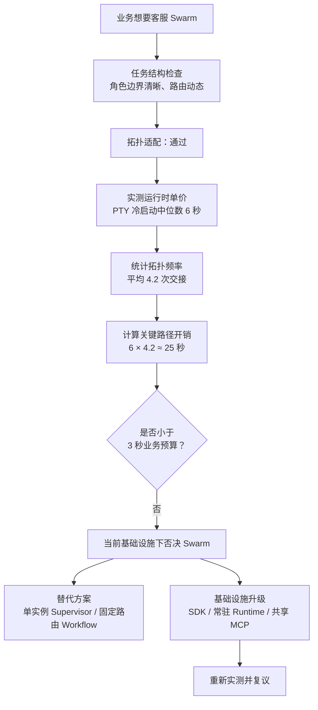

**图 1：拓扑适配通过，不代表基础设施可行。**

---

# 2. 多 Agent 的五道门禁

多 Agent 评审不应从“选 Supervisor 还是 Swarm”开始，而应依次通过五道门禁。

## 2.1 Gate 0：确定性程序能否解决

先问：

- 路由规则是否稳定且可枚举？
- 阶段是否固定？
- 成功标准是否可以完全编码？
- 是否只需要调用 API、查询数据库、套模板或执行规则？
- 是否存在比 LLM 更可靠的解析器、编译器、规则引擎或优化器？

如果答案是“能”，优先使用普通程序或 Workflow。  
不要让 Agent 决定本来可以由 `if/else`、状态机、SQL、队列或规则引擎决定的事情。

## 2.2 Gate 1：单 Agent 基线是否真的失败

多 Agent 必须有明确的单 Agent 对照组。所谓“失败”不能只是感觉，应落到可测量指标：

- 任务成功率低于阈值；
- 上下文装不下，且压缩、检索、笔记仍无法解决；
- 单线程工具调用造成明显墙钟瓶颈；
- 专业领域之间存在冲突，需要独立上下文与独立审查；
- 产出方差很高，best-of-n 有明确收益；
- 一个 Agent 同时承担规划、执行和审查，出现稳定的自评盲区。

如果强模型 + 好工具 + 好上下文管理 + 确定性 Workflow 已经达到目标，就没有必要为了“架构先进”增加 Agent 数。

## 2.3 Gate 2：多 Agent 是否带来可归因增益

必须说明增益来自哪里，而不是只说“协作更聪明”。

常见增益来源只有几类：

| 增益来源 | 对应机制 | 常见拓扑 |
|---|---|---|
| 并行搜索或执行 | 缩短墙钟时间、扩大覆盖面 | Parallel、Supervisor + Workers |
| 上下文隔离 | 每个成员保留独立工作集 | Parallel、专家团 |
| 专业化工具与权限 | 不同角色使用不同工具和模型 | Pipeline、专家团、Swarm |
| 独立审查 | 打破执行者自评盲区 | Reviewer |
| 冗余采样 | 用更多候选换更高成功概率 | Arena |
| 动态任务分解 | 根据中间结果调整计划 | Supervisor |
| 动态控制权路由 | 根据会话状态移交角色 | Swarm |

如果无法把收益归入这些机制之一，通常说明方案只是“把一个 Prompt 拆成多个 Prompt”。

## 2.4 Gate 3：基础设施是否承载得起

需要核算：

- 冷启动；
- 单实例内存和 CPU/GPU；
- RPM、TPM 与并发连接；
- 模型与工具的 P50/P95/P99；
- 交接包大小；
- Checkpoint 写入时延；
- 峰值扇出；
- 重试与回边；
- 持久化容量；
- Trace 与快照成本；
- 外部系统的配额和限流；
- 非幂等副作用能否安全重放。

## 2.5 Gate 4：组织是否能运维和负责

需要回答：

- 每个节点的 owner 是谁？
- 每条跨系统边由谁维护？
- 预算算到哪个成本中心？
- 谁能修改 Prompt、工具、拓扑和路由规则？
- 高风险动作由谁审批？
- 值班人员能否在规定时间内定位错误节点？
- 是否有降级到单 Agent 或人工流程的路径？
- 跨部门 Agent 的 SLA、审计和责任如何定义？

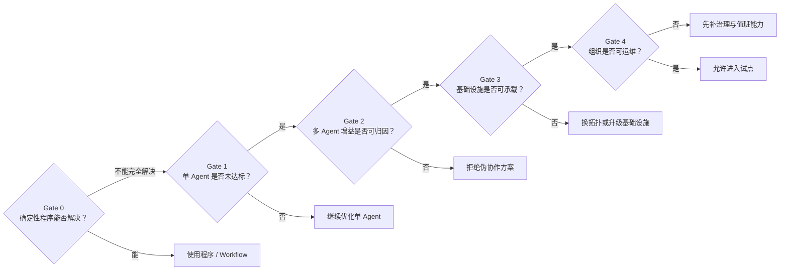

**图 2：多 Agent 的五道门禁。**

---

# 3. 从任务结构选择拓扑

## 3.1 八个任务结构维度

选型时至少分析以下八个维度。

### 维度一：可分解性

任务能否拆成边界清楚的子任务？

- 不能拆：优先单 Agent、Reviewer、Arena；
- 可以拆：继续看依赖关系。

### 维度二：子任务依赖形态

- 完全独立：Parallel；
- 固定前后依赖：Pipeline；
- 依赖随中间结果变化：Supervisor；
- 存在多层局部协调：谨慎使用 Hierarchical；
- 依赖本质是“下一位处理者是谁”：Swarm。

### 维度三：共享上下文强度

如果所有成员必须实时共享同一份庞大、频繁变化的状态，多 Agent 的上下文隔离优势会消失，交接和一致性成本会急剧上升。

### 维度四：技能、模型与工具异构性

真正的专业化应体现在：

- 不同的工具；
- 不同的权限；
- 不同的数据源；
- 不同的模型档位；
- 不同的评价标准；
- 不同的输出契约。

只改角色名称，不改能力边界，是“伪异构”。

### 维度五：路由不确定性

路由若能稳定编码，使用确定性 Router；只有当路由依赖开放语义、长上下文或动态发现时，才需要 LLM 路由。

### 维度六：结果可评估性

Reviewer、Arena、Debate 都依赖评估能力：

- 有明确规则：Reviewer 很适合；
- 候选可比较但标准难完全编码：Arena；
- 需要相互质证：Debate；
- 连“好坏”都无法判断：增加 Agent 往往只会增加不可控性。

### 维度七：副作用风险

读操作、分析、草稿生成适合并行；付款、发版、删除、写数据库等副作用必须谨慎串行化、审批或使用补偿事务。

### 维度八：共享资源冲突

多个 Agent 是否会同时修改：

- 同一文件；
- 同一数据库行；
- 同一工单；
- 同一云资源；
- 同一部署环境；
- 同一用户会话状态？

共享写越多，越不适合无中心 Swarm；应优先使用分区所有权、单写者、租约或集中协调。

---

## 3.2 场景—拓扑扩展矩阵

| 场景 | 第一候选 | 次选 | 不宜优先 | 关键前提 |
|---|---|---|---|---|
| 多文件代码审查 | Parallel + Reviewer | 专家团 | Swarm、深层 Hierarchical | 文件或审查维度可分片 |
| 复杂研究综述 | Supervisor + Parallel | 专家团 | 固定 Pipeline | 子题会随发现动态变化 |
| 批量文档处理 | Parallel / Pipeline | Reviewer | Debate | 分片同构、输出契约稳定 |
| 客服会话 | 轻量 Swarm / Router | 单实例 Supervisor | Debate、Arena | 交接足够轻，角色权限清楚 |
| 数据 ETL | Pipeline + Parallel | Reviewer | Swarm | 阶段固定、失败可重放 |
| 复杂软件开发 | Supervisor + 分区 Workers | Reviewer | 无所有权的自由群聊 | 模块边界清楚，写冲突受控 |
| 安全漏洞扫描 | Parallel + 专家团 | Arena | 长链 Pipeline | 大量独立搜索空间 |
| 方案设计 | 专家团 / Arena | Reviewer | 大规模 Swarm | 有比较标准或互补视角 |
| 高风险决策 | Reviewer + HITL | 小规模 Debate | 自动 Swarm | 证据可审计、有人类责任人 |
| 事件响应 | Supervisor + Runbook | Parallel 调查 | 自由群聊 | 权限隔离、动作审批、统一指挥 |
| 跨部门业务流程 | 服务编排 + 明确边界 | Supervisor | 直接驱动对方内部 Agent | SLA、身份、配额、审计已成文 |
| 实时语音助手 | 单 Agent + 确定性路由 | 常驻轻量 Handoff | PTY 动态拉起 Swarm | 极低首响延迟、会话复用 |

---

## 3.3 各拓扑的资源敏感操作

| 拓扑 | 高频资源敏感操作 | 延迟关键路径 | 最主要工程风险 |
|---|---|---|---|
| Supervisor | 派发、回收、重新规划 | 主管决策与最长依赖链 | 主管成为瓶颈与单点 |
| Pipeline | 阶段调用与状态转换 | 所有必经节点之和 | 级联污染、端到端可靠性乘法 |
| Parallel | 峰值扇出、汇聚 | 最慢分支 + 汇聚 | 429、尾延迟、部分失败 |
| Hierarchical | 层间转述与汇总 | 树深与跨层往返 | 信息衰减、协调超线性增长 |
| Reviewer | 审查与返工回边 | 执行 + 审查 + 重做次数 | 无限打回或宽松漏放 |
| Debate | 全连接广播、多轮历史 | 轮数 × 每轮最慢成员 | token 爆炸、趋同、雄辩偏置 |
| Arena | n 份完整执行 + 评选 | 最慢候选 + Judge | 成本精确放大 n 倍 |
| Swarm | Handoff、实例激活、上下文迁移 | 实际交接链 | 交接环、责任真空、上下文磨损 |
| 专家团 | 异构并行 + 综合 | 最慢专家 + 综合 | 伪异构、综合者忽略少数证据 |

---

## 3.4 不要把“Agent 数量”当作能力指标

更多 Agent 只意味着更多执行槽位，不必然意味着更多有效认知差异。

同模型、同 Prompt、同工具、同上下文的十个 Agent，常见结果是：

- 搜索同一批资料；
- 选择相同实现；
- 犯相同错误；
- 同时争抢同一资源；
- 产生相关而非独立的失败。

真正有价值的是**有效多样性**：

$$
D_{\text{effective}}
= f(\text{模型差异}, \text{工具差异}, \text{上下文差异},
\text{任务边界差异}, \text{评价标准差异})
$$

如果有效多样性接近零，Arena 或专家团只是昂贵的重复采样。

---

# 4. 可行性量化模型

## 4.1 统一记号

| 记号 | 含义 |
|---|---|
| $N$ | Agent 或并行 Worker 数 |
| $E$ | 图中实际经过的边数 |
| $R$ | 辩论、返工或回边轮数 |
| $H$ | Handoff 次数 |
| $D$ | 层级深度或最长依赖深度 |
| $F$ | 峰值扇出度 |
| $T_i$ | 第 $i$ 个节点执行时延 |
| $S_i$ | 第 $i$ 个实例冷启动时延 |
| $Q_i$ | 第 $i$ 个节点排队时延 |
| $I_i, O_i$ | 第 $i$ 次模型调用输入、输出 token |
| $C_i$ | 第 $i$ 个节点的模型、工具和计算成本 |
| $p_i$ | 第 $i$ 个必经节点成功概率 |
| $M_i$ | 第 $i$ 个活跃实例内存 |
| $B$ | 图级预算 |
| $V$ | 任务成功的业务价值 |

---

## 4.2 延迟模型：看关键路径，不看总工作量

### Pipeline

所有阶段都是必经节点：

$$
T_{\text{pipeline}}
= \sum_{i=1}^{N}(S_i + Q_i + T_i)
+ T_{\text{orchestration}}
$$

阶段越多，墙钟时间越长。

### Parallel

并行不等于所有时延相加，而是取最慢分支：

$$
T_{\text{parallel}}
= T_{\text{split}}
+ \max_i(S_i + Q_i + T_i)
+ T_{\text{merge}}
$$

但 P95/P99 会受“最慢者效应”影响。分支越多，至少一个分支进入长尾的概率越高。

### Supervisor

$$
T_{\text{supervisor}}
\approx
\sum_{k=1}^{K} T_{\text{planner},k}
+ T_{\text{critical-workers}}
+ T_{\text{synthesis}}
$$

如果主管频繁“派一个、等一个、再派一个”，就无法获得并行收益。

### Debate

在每轮成员并行、轮间串行的简化模型下：

$$
T_{\text{debate}}
\approx
\sum_{r=1}^{R}
\left(
T_{\text{broadcast},r}
+
\max_{i \in N} T_{i,r}
\right)
+ T_{\text{judge}}
$$

轮数是最直接的延迟乘数。

### Swarm

$$
T_{\text{swarm}}
=
\sum_{h=1}^{H}
\left(
S_h + T_{\text{route},h}
+ T_{\text{handoff},h}
+ T_{\text{agent},h}
\right)
$$

Swarm 的问题不是任一时刻有很多 Agent 同时运行，而是**交接链长度和实例激活单价不可预测**。

### 区分两个延迟口径

必须分开测：

1. **TTFT / 首 token 时延**：用户看到系统开始响应的时间；
2. **TTFBA / 首个有效业务答复时延**：用户拿到可执行、可交付答案的时间；
3. **整图完成时延**：所有分支、审查、存证和异步收尾结束的时间。

流式输出可以改善感知，但不能掩盖业务结果迟迟未完成。

---

## 4.3 成本模型：看全图总和

图级总成本应至少包含：

$$
C_{\text{graph}}
=
C_{\text{model}}
+ C_{\text{tool}}
+ C_{\text{compute}}
+ C_{\text{storage}}
+ C_{\text{coordination}}
+ C_{\text{retry}}
+ C_{\text{observability}}
+ C_{\text{human}}
$$

其中：

$$
C_{\text{model}}
=
\sum_j
(I_j \cdot P_{\text{in},j}
+ O_j \cdot P_{\text{out},j})
$$

### token 放大的五个来源

1. **固定上下文复制**  
   System Prompt、工具定义、策略、任务背景被每个成员重复携带。

2. **边上的交接包复制**  
   同一事实在多条边、多层主管或多轮辩论中反复注入。

3. **协调调用**  
   拆分、路由、汇总、评审、投票、门禁本身也消耗模型调用。

4. **失败与重试**  
   节点重试、回边返工、整图重跑往往是最容易漏算的乘数。

5. **可观测性与存证**  
   Trace、快照、评测、Judge、回放都会产生存储和模型成本。

可写成近似式：

$$
T_{\text{tokens}}
\approx
N \cdot T_{\text{fixed}}
+ \sum_{e \in E}T_{\text{handoff},e}
+ T_{\text{work}}
+ T_{\text{coord}}
+ T_{\text{retry}}
$$

多 Agent 降本的核心不是“少输出一点”，而是：

- 稳定前缀缓存；
- 工具定义按需暴露；
- 交接传 Artifact 指针而非全文；
- 上下文按角色裁剪；
- 汇总结构化；
- 从失败节点续跑；
- 限制回边与辩论轮数。

---

## 4.4 峰值容量模型

### 模型 TPM

粗略峰值输入吞吐：

$$
TPM_{\text{peak}}
\approx
\lambda_{\text{runs}}
\times F
\times \overline{T_{\text{input-per-call}}}
\times \overline{K_{\text{calls-per-minute}}}
$$

其中 $\lambda_{\text{runs}}$ 是单位时间启动的图运行数。

### 并发槽位

利用 Little 定律做粗估：

$$
L = \lambda W
$$

- $L$：系统内平均活跃节点数；
- $\lambda$：节点到达率；
- $W$：节点平均驻留时间。

它提醒我们：节点平均时延翻倍，在到达率不变时，所需并发槽位也会接近翻倍。

### 常驻内存

$$
M_{\text{peak}}
=
M_{\text{runtime-base}}
+
\sum_{i \in \text{active}}M_i
+
M_{\text{MCP}}
+
M_{\text{browser/sandbox}}
+
M_{\text{cache}}
$$

不要只测 Agent 进程本体；浏览器、沙箱、语言服务器、MCP Server 和向量索引往往才是大头。

---

## 4.5 可靠性模型：必经依赖会做乘法

假设各必经节点独立，Pipeline 的端到端成功率近似为：

$$
P_{\text{pipeline-success}}
=
\prod_{i=1}^{N}p_i
$$

如果 8 个必经节点各自成功率都是 0.98：

$$
0.98^8 \approx 0.851
$$

单节点看都“很可靠”，整图却只剩约 85.1%。

### Parallel 的不同目标

如果要求所有分支都成功：

$$
P_{\text{all}}
=
\prod_{i=1}^{N}p_i
$$

如果只要求至少 $k$ 个成功，系统可靠性可以通过 quorum 或部分结果策略提高。  
因此 Parallel 必须明确：

- `all_required`；
- `min_success_count`；
- `min_coverage_ratio`；
- `best_effort`。

### 不要假设失败独立

多个 Agent 共享：

- 同一个模型；
- 同一个 Prompt；
- 同一个错误数据源；
- 同一个限流配额；
- 同一个工具；
- 同一个网络出口；

它们的失败往往高度相关。此时增加成员数不会像独立伯努利试验那样提高可靠性。

可以把失败拆成：

$$
P(\text{fail})
=
P(\text{shared-cause})
+
P(\text{independent-fail}\mid \neg \text{shared-cause})
$$

工程重点应先降低共享原因：单点模型、共享错误缓存、统一过期凭据、同一外部 API 配额等。

---

## 4.6 经济可行性：比较边际价值，而不是只看成本

定义多 Agent 相对单 Agent 的期望净收益：

$$
\Delta EV
=
\Delta Q \cdot V_Q
+
\Delta T \cdot V_T
+
\Delta C_{\text{human}}
-
\Delta C_{\text{runtime}}
-
\Delta R_{\text{expected-loss}}
-
\Delta C_{\text{operations}}
$$

其中：

- $\Delta Q$：质量提升；
- $V_Q$：单位质量提升的业务价值；
- $\Delta T$：节省的业务时间；
- $V_T$：时间价值；
- $\Delta C_{\text{human}}$：节省的人力成本；
- $\Delta C_{\text{runtime}}$：新增模型、工具、算力和存储；
- $\Delta R_{\text{expected-loss}}$：新增风险的期望损失；
- $\Delta C_{\text{operations}}$：值班、排障、评测和治理成本。

只有当：

$$
\Delta EV > 0
$$

多 Agent 才有经济意义。

对于低价值、高频任务，即使质量略有提升，也可能不值得。  
对于高价值、低频任务，例如安全审计、并购尽调或重大故障分析，较高的 token 放大可能完全合理。

---

# 5. 基础设施约束到拓扑排除

## 5.1 硬约束与软约束

### 硬约束

一旦违反就直接否决：

- 法规禁止数据跨域；
- 不允许持久化必要的状态或审计证据；
- 高风险写操作无法审批或补偿；
- P95 延迟远高于业务红线；
- 峰值资源超过物理上限；
- 外部 API 明确不允许相应并发；
- 无法保证身份和权限边界。

### 软约束

可以通过降级、限流、缓存或缩小拓扑缓解：

- 成本偏高；
- P99 偶发抖动；
- 少量分支失败；
- 部分工具冷启动慢；
- Trace 存储压力；
- 评审耗时偏长。

---

## 5.2 约束—拓扑排除矩阵

| 约束 | 首先排除或限制 | 原因 | 常见替代 |
|---|---|---|---|
| 冷启动高 | 动态 Swarm、深层 Supervisor | 高频激活放大启动成本 | 常驻单实例、多角色工具化、SDK |
| 极严格首响 | Debate、Arena、长 Pipeline | 必须等待多轮或多候选 | 单 Agent 流式 + 异步复核 |
| TPM 很低 | 大扇出 Parallel、Debate | 瞬时吞吐放大 | 有界 Worker Pool、批处理 |
| 内存很小 | PTY 多实例、浏览器多实例 | 每个 Worker 常驻资源高 | 共享 Runtime、远程沙箱 |
| 无 durable checkpoint | 长 Pipeline、长 Supervisor | 崩溃后只能整图重跑 | 缩短节点、先补持久化 |
| 无边快照与 Trace | Hierarchical、Swarm | 无法归因上下文磨损与错误首现 | 简化为可观察 Workflow |
| 共享写冲突高 | 自由 Swarm、大并发 Coding Agents | 丢更新、覆盖、合并冲突 | 文件/资源所有权、单写者 |
| 非幂等副作用多 | 自动重试型拓扑 | 重放可能重复付款、重复发布 | 幂等键、审批、Saga |
| 评审标准不清 | Reviewer、Arena | Judge 不稳定，返工无方向 | 人工评审、先定义 Rubric |
| 组织 owner 不清 | 跨部门多 Agent | 预算、审计、责任无法归属 | 标准 API 或明确服务契约 |
| 数据不能复制 | Debate、全量 Group Chat | 上下文广播扩大暴露面 | 最小化 Handoff、引用指针 |
| 模型故障高度相关 | 同质 Arena、同质专家团 | 冗余不独立 | 模型/工具/数据源多样化 |
| 外部工具配额小 | Parallel、Supervisor 扇出 | 工具先于模型达到限流 | 配额感知调度、缓存、批量 API |

---

## 5.3 通用判定法

1. **识别拓扑的资源敏感操作**；
2. **在当前集成方式下实测单价**；
3. **用历史或试点数据估算操作频率**；
4. **计算 P50/P95/P99 与峰值资源**；
5. **对比业务预算和法规约束**；
6. **枚举缓解方案并重新计算**；
7. **仍超预算则排除，不进入实现阶段。**

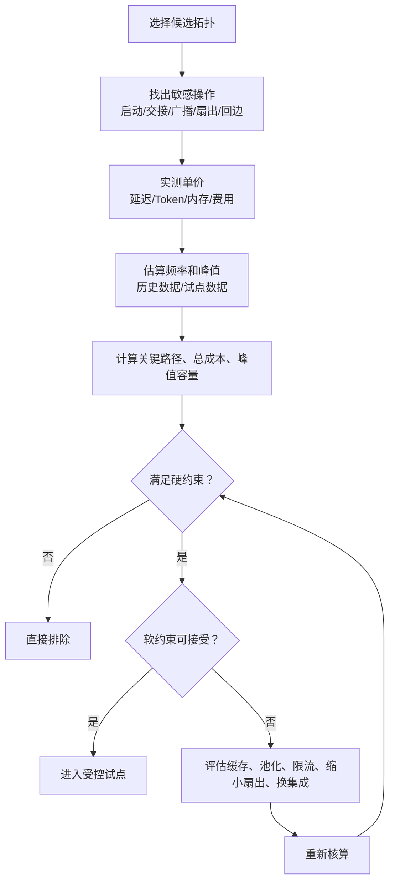

**图 3：基础设施约束到拓扑排除的标准流程。**

---

# 6. 完整案例：PTY 冷启动为何否决客服 Swarm

## 6.1 先定义正确的业务口径

“首响”容易被流式输出误导。客服系统真正关心的可能是：

- 首 token：系统是否开始说话；
- 首个意图确认：是否正确理解用户；
- 首个有效答复：是否给出能解决问题的业务内容；
- 最终解决：工单是否闭环。

如果前台 Agent 先说一句“正在为你查询”，TTFT 可能只有 500ms，但账务 Agent 25 秒后才给出结果，业务上依然失败。

因此本案例采用：

$$
SLO_{\text{TTFBA}} \le 3s
$$

即首个有效业务答复不超过 3 秒。

## 6.2 当前方案

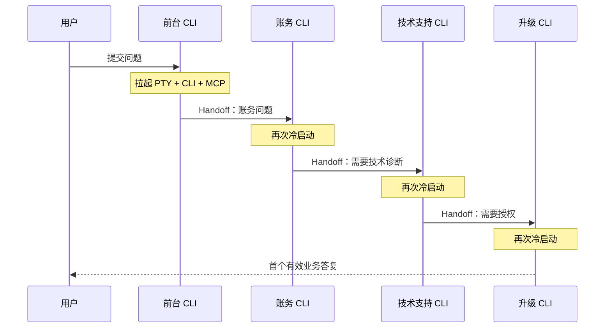

如果交接链发生在有效答复前，冷启动会落在关键路径上。

## 6.3 方案核算

### 方案 A：每次 Handoff 新建 PTY 实例

$$
T_A \approx H \times 6s + T_{\text{reasoning}} + T_{\text{tools}}
$$

平均 $H=4.2$ 时，仅冷启动约 25.2 秒，否决。

### 方案 B：为每个会话预热四个角色

$$
M_B = 4 \times 200 \times 400\text{MB} = 320\text{GB}
$$

内存不可接受，否决。

### 方案 C：全局共享角色池

不是每个会话四个实例，而是按并发需求维护共享池。假设每个角色 20 个实例：

$$
M_C = 4 \times 20 \times 400\text{MB} = 32\text{GB}
$$

内存下降，但还要核算：

- 会话隔离；
- 上下文切换；
- CLI 是否支持并发复用；
- 凭据隔离；
- 长会话占用；
- 池耗尽后的排队时延；
- 崩溃后的会话恢复。

如果 CLI 是有状态交互进程，跨会话复用可能比新建更危险。

### 方案 D：单实例切换角色

在同一个 Agent Loop 中，根据状态加载不同角色策略、工具白名单和 Prompt 片段。

优点：

- 没有跨进程冷启动；
- 会话上下文连续；
- Trace 简单；
- 更容易满足首响。

缺点：

- 角色隔离较弱；
- Prompt 和工具集合可能膨胀；
- 权限切换必须由运行时强制，而不能只靠提示词。

这是当前基础设施下最现实的方案。

### 方案 E：迁移到 SDK 或常驻 Agent Runtime

如果实例激活降到 200ms，平均交接启动开销变为：

$$
0.2s \times 4.2 = 0.84s
$$

此时 Swarm 可能重新进入可行区间，但仍需重新核算推理、路由、工具和尾延迟。

---

## 6.4 决策记录

| 项目 | 结论 |
|---|---|
| 场景—拓扑适配 | Swarm 高适配 |
| 当前基础设施可行性 | 不通过 |
| 主要否决项 | PTY 冷启动位于关键路径 |
| 预热池 | 每会话预热不可接受；共享池需重新设计隔离 |
| 当前替代方案 | 单实例 Supervisor / 确定性 Router |
| 复活条件 | SDK/常驻 Runtime 后，冷启动与会话隔离重新压测 |
| 回滚路径 | 保留单 Agent 客服基线 |
| 观测要求 | 交接次数、路由准确率、有效首答、人工升级率 |

> **“现在不可行”不等于“永远不可行”。架构评审应记录否决变量和复活条件，而不是给拓扑贴永久标签。**


---

# 7. 隐性成本与协调失败

## 7.1 协调税不是一个数字，而是一组成本

多 Agent 的增量成本可以拆成：

```text
协调税
├── 上下文复制
├── 任务拆分与路由
├── 交接与格式转换
├── 汇总、评审与投票
├── 状态持久化与同步
├── 冲突检测与合并
├── 重试、回边与补偿
├── Trace、快照与评测
├── 权限、审计与审批
└── 值班、排障与组织沟通
```

只计算模型 token 会系统性低估真实成本。

## 7.2 通信复杂度

不同拓扑的通信边数量不同。

### 星型 Supervisor

主管与 $N$ 个 Worker 通信，边数约为：

$$
E_{\text{supervisor}} = O(N)
$$

### 全连接 Debate

每轮每个成员都读取其他成员消息，边数约为：

$$
E_{\text{debate-per-round}} = O(N^2)
$$

总通信量约为：

$$
O(RN^2)
$$

这就是 Debate 很容易在成员数和轮数上失控的原因。

### Hierarchical

边数未必比全连接多，但每层都要做任务转述与结果压缩。  
真正危险的是信息经过多次有损变换：

$$
X_0
\xrightarrow{\text{摘要}}
X_1
\xrightarrow{\text{摘要}}
X_2
\xrightarrow{\text{摘要}}
\cdots
\xrightarrow{\text{摘要}}
X_D
$$

如果每层保留关键信息的概率是 $r$，经过 $D$ 层后粗略保真度为：

$$
R_{\text{information}} \approx r^D
$$

即使每层看起来只丢一点，多层后也可能严重失真。

---

## 7.3 十类协调失败

| 失败模式 | 典型症状 | 根因 | 检测信号 | 预防与恢复 |
|---|---|---|---|---|
| 死锁 | 多个成员互相等待，无事件推进 | 循环依赖、隐式前置条件 | Graph 长时间零进展 | DAG、有界回边、等待图检测、超时 |
| 责任真空 | 任务未报错却无人处理 | 路由覆盖缺口 | 无认领超时、死信增长 | `default_owner`、人工兜底 |
| 循环转派 | A→B→A 或主管反复改派 | 无失败记忆、边界模糊 | 同任务 Handoff 次数 | 携带失败历史、最大跳数 |
| 重复劳动 | 多个成员做了同一件事 | 分工描述模糊、共享进度不可见 | 结果相似度高、重复工具调用 | 明确边界、任务租约、去重 |
| 共享写冲突 | 文件覆盖、数据库丢更新 | 无所有权、并发写同一资源 | 冲突率、回滚率、合并失败 | 单写者、分区、OCC、租约 |
| 陈旧上下文 | 成员基于过期状态继续执行 | 快照版本未校验 | 输入版本落后、写入拒绝 | 版本号、重新读取、CAS |
| 语义漂移 | 多次转述后目标改变 | 自由文本 Handoff、有损摘要 | 约束缺失、目标哈希变化 | 结构化契约、不可变原始需求 |
| 相关性失败 | 多个成员同时犯同类错误 | 同模型、同 Prompt、同数据源 | 错误高度同质 | 引入真实异构、独立证据 |
| 惊群与资源争抢 | 大量 Agent 同时轮询或抢锁 | 无背压、局部最优行为 | 请求暴涨、锁竞争、429 | 中央调度、抖动退避、配额 |
| 目标冲突 | 成员互相覆盖、撤销甚至对抗 | 目标不兼容、权限过大 | 反复回滚、资源删除、冲突命令 | 统一目标、权限隔离、仲裁者 |

---

## 7.4 三种经典失败结构

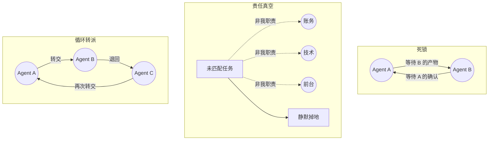

**图 4：死锁、责任真空与循环转派。**

三者的共同特点是：**每个成员局部看起来都合理，但系统全局失败。**

这说明只优化单个 Agent 的 Prompt 不够，必须在运行时建立：

- 全局进展计数；
- Handoff 跳数；
- 任务 owner；
- 依赖图；
- 图级截止时间；
- 默认兜底路径；
- 失败历史；
- 资源锁与配额。

---

## 7.5 重复劳动不是“小浪费”，而是容量放大器

假设 10 个研究 Agent 中有 30% 工作重复，则有效并行度不是 10，而是：

$$
F_{\text{effective}} = 10 \times (1 - 0.3) = 7
$$

但系统仍为 10 个 Agent 支付全部成本。

可以定义重复劳动率：

$$
R_{\text{duplicate}}
=
\frac{\text{重复工具调用或高度相似产物数量}}
{\text{总工具调用或总产物数量}}
$$

常见治理方式：

- 主管下发任务时附带 `scope_in` 与 `scope_out`；
- 任务登记到共享 Task Board；
- 每个任务带唯一 `task_id` 和租约；
- 结果提交前检查已有 Artifact；
- 对查询、URL、文件范围做去重；
- 汇总器记录覆盖缺口，而不是盲目追加更多 Worker。

---

## 7.6 相关性失败：多 Agent 不等于独立投票

如果三个 Reviewer 都使用同一个模型、同一套安全清单、同一份被污染上下文，它们可能同时漏掉同一个漏洞。

简单多数票隐含了一个通常不成立的假设：

> 各成员错误相互独立。

实际应关注错误相关系数。虽然线上不一定直接计算完整相关矩阵，但至少要做：

- 不同 Prompt 版本的交叉评测；
- 不同模型或模型档位；
- 不同工具与数据源；
- 一个规则 Reviewer + 一个模型 Reviewer；
- 隐藏其他成员结论，先独立判断再汇总；
- 保留少数意见与证据，不只保留多数票。

---

# 8. 共享状态、并发写与副作用

## 8.1 核心原则：共享事实，不共享可变工作区

推荐把多 Agent 状态拆成三层：

1. **不可变输入事实**  
   用户需求、原始文件、规范、数据快照。

2. **不可变 Artifact**  
   每个成员提交独立产物，使用内容哈希或版本 ID 标识。

3. **受控聚合状态**  
   只有指定协调器或 Reducer 能更新任务进度、最终决策和发布状态。

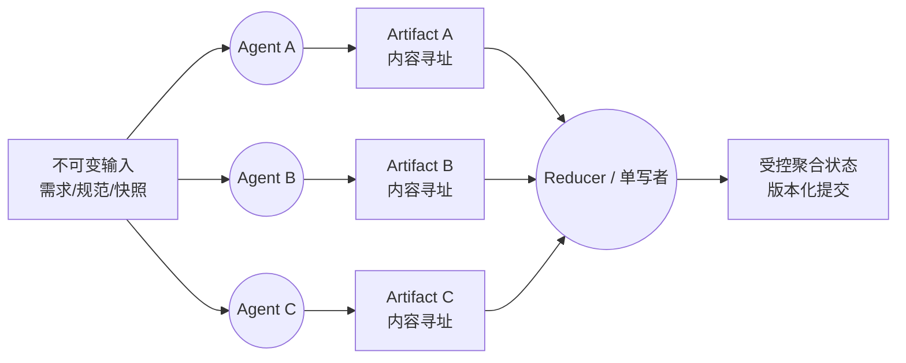

**图 5：不可变 Artifact + 单写者聚合。**

这比让所有 Agent 直接修改同一个大字典、同一个文件或同一数据库记录更可靠。

---

## 8.2 资源所有权

每个可写资源都应有明确策略：

| 策略 | 适用场景 | 优点 | 代价 |
|---|---|---|---|
| 静态分区所有权 | 文件、模块、客户分区 | 简单、冲突少 | 分区不均衡 |
| 单写者 | 发布状态、主分支、最终报告 | 强一致、易审计 | 可能成为瓶颈 |
| 租约 Lease | 动态任务、工单 | 可转移、防重复 | 需要过期与续租 |
| 乐观并发控制 OCC | 低冲突数据库更新 | 吞吐高 | 冲突后需重算 |
| 队列串行化 | 付款、部署、删除 | 安全、顺序清楚 | 延迟增加 |
| CRDT/可交换合并 | 特定协同数据结构 | 可并发合并 | 设计复杂，不适合任意文本 |

Coding Agent 场景中，最实用的不是让所有 Agent 在同一工作区随意修改，而是：

- 每个 Agent 使用独立 worktree/branch；
- 静态分配模块或文件所有权；
- 通过 PR/patch 交付；
- 集成 Agent 负责合并；
- 合并前重新基线化并运行测试；
- 冲突进入明确队列，不由多个 Agent 同时“抢救”。

---

## 8.3 乐观并发控制

写入时携带读取版本：

```text
读取：resource_version = 17
计算：生成更新
提交：仅当当前版本仍为 17 时写入
失败：重新读取版本 18 后重算
```

伪代码：

```python
def update_with_cas(store, key, expected_version, new_value):
    current = store.get(key)
    if current.version != expected_version:
        raise VersionConflict(
            key=key,
            expected=expected_version,
            actual=current.version,
        )
    return store.compare_and_swap(
        key=key,
        expected_version=expected_version,
        value=new_value,
    )
```

不要让 Agent 在版本冲突后简单“再提交一次原内容”；必须重新读取新状态并判断原计划是否仍成立。

---

## 8.4 幂等性：默认接受至少一次执行

分布式图执行很难依赖“绝对只执行一次”。更现实的设计是：

- 节点可能被重放；
- 消息可能重复投递；
- ACK 可能丢失；
- 调用成功但响应超时；
- Checkpoint 可能停在副作用前后边界。

因此副作用必须带幂等键：

$$
\text{idempotency\_key}
=
H(\text{graph\_run\_id}, \text{node\_id}, \text{logical\_action})
$$

例如：

```python
from dataclasses import dataclass
from hashlib import sha256


@dataclass(frozen=True)
class SideEffectRequest:
    graph_run_id: str
    node_id: str
    action: str
    payload: bytes

    @property
    def idempotency_key(self) -> str:
        raw = b"|".join(
            [
                self.graph_run_id.encode(),
                self.node_id.encode(),
                self.action.encode(),
                sha256(self.payload).hexdigest().encode(),
            ]
        )
        return sha256(raw).hexdigest()
```

服务端需要保存幂等键与结果。相同键再次到达时返回原结果，而不是重复执行。

---

## 8.5 副作用边界

节点最好分成两类：

- **纯计算节点**：读取输入并产生 Artifact，可安全重放；
- **副作用节点**：付款、发信、发版、删除、写外部系统。

推荐流程：

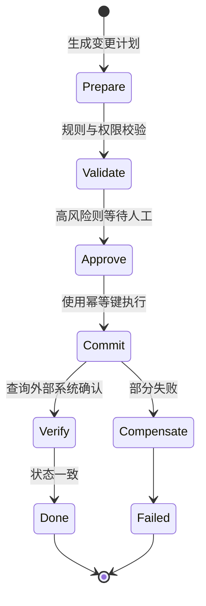

**图 6：副作用节点的准备、审批、提交、确认与补偿。**

重要原则：

- 不在长 Prompt 推理中途直接执行不可逆操作；
- 计划与提交分离；
- 提交前重新校验权限、版本和预算；
- 外部调用结果要持久化；
- 恢复时先查幂等账本，再决定是否重放。

---

## 8.6 取消传播

用户取消 Graph Run 时，运行时需要：

1. 标记图为 `cancelling`；
2. 停止创建新节点；
3. 向活跃节点传播取消令牌；
4. 允许节点在安全点退出；
5. 对已提交副作用执行确认或补偿；
6. 保存部分结果；
7. 记录未完成分支；
8. 释放租约、PTY、浏览器和沙箱；
9. 把最终状态置为 `cancelled` 或 `cancelled_with_side_effects`。

“杀掉进程”不是完整取消协议。

---

# 9. 图级预算、限流与背压

## 9.1 为什么成员预算不够

假设：

- 20 个 Worker；
- 每个 Worker 上限 0.5 美元；
- Reviewer 上限 1 美元；
- 整图允许重试 2 次。

最坏成本不是 0.5 美元，而接近：

$$
(20 \times 0.5 + 1) \times 3 = 33\text{ 美元}
$$

如果任务业务价值只有 2 美元，成员预算全部“合规”，系统仍然完全不经济。

---

## 9.2 预算层级

```text
租户预算
└── 应用预算
    └── Graph Run 总预算
        ├── 协调预算
        ├── Worker 池预算
        │   ├── Worker A 子预算
        │   ├── Worker B 子预算
        │   └── ...
        ├── 工具预算
        ├── 重试预算
        └── 评审与收尾保留预算
```

必须给收尾保留预算，否则系统在预算耗尽时连“总结已完成工作并安全退出”都做不到。

例如：

$$
B_{\text{usable}}
=
B_{\text{total}}
-
B_{\text{reserved-finalization}}
$$

---

## 9.3 一个可用的图级预算器

```python
from __future__ import annotations

from dataclasses import dataclass, field
from threading import Lock
from time import monotonic


class BudgetExceeded(RuntimeError):
    pass


@dataclass
class Usage:
    input_tokens: int = 0
    output_tokens: int = 0
    cost_usd: float = 0.0
    tool_calls: int = 0
    elapsed_ms: int = 0

    def __add__(self, other: "Usage") -> "Usage":
        return Usage(
            input_tokens=self.input_tokens + other.input_tokens,
            output_tokens=self.output_tokens + other.output_tokens,
            cost_usd=self.cost_usd + other.cost_usd,
            tool_calls=self.tool_calls + other.tool_calls,
            elapsed_ms=self.elapsed_ms + other.elapsed_ms,
        )


@dataclass
class GraphBudget:
    max_input_tokens: int
    max_output_tokens: int
    max_cost_usd: float
    max_tool_calls: int
    deadline_monotonic: float
    reserve_cost_usd: float = 0.0
    usage: Usage = field(default_factory=Usage)
    _lock: Lock = field(default_factory=Lock, repr=False)

    @classmethod
    def with_timeout(
        cls,
        *,
        timeout_s: float,
        max_input_tokens: int,
        max_output_tokens: int,
        max_cost_usd: float,
        max_tool_calls: int,
        reserve_cost_usd: float = 0.0,
    ) -> "GraphBudget":
        return cls(
            max_input_tokens=max_input_tokens,
            max_output_tokens=max_output_tokens,
            max_cost_usd=max_cost_usd,
            max_tool_calls=max_tool_calls,
            deadline_monotonic=monotonic() + timeout_s,
            reserve_cost_usd=reserve_cost_usd,
        )

    def assert_can_start(self, estimated_cost_usd: float = 0.0) -> None:
        with self._lock:
            if monotonic() >= self.deadline_monotonic:
                raise BudgetExceeded("graph deadline exceeded")

            spendable = self.max_cost_usd - self.reserve_cost_usd
            if self.usage.cost_usd + estimated_cost_usd > spendable:
                raise BudgetExceeded("graph cost reserve would be consumed")

    def charge(self, delta: Usage) -> None:
        with self._lock:
            candidate = self.usage + delta

            if candidate.input_tokens > self.max_input_tokens:
                raise BudgetExceeded("input-token budget exceeded")
            if candidate.output_tokens > self.max_output_tokens:
                raise BudgetExceeded("output-token budget exceeded")
            if candidate.cost_usd > self.max_cost_usd:
                raise BudgetExceeded("cost budget exceeded")
            if candidate.tool_calls > self.max_tool_calls:
                raise BudgetExceeded("tool-call budget exceeded")
            if monotonic() >= self.deadline_monotonic:
                raise BudgetExceeded("graph deadline exceeded")

            self.usage = candidate

    def remaining_cost(self) -> float:
        with self._lock:
            return max(0.0, self.max_cost_usd - self.usage.cost_usd)
```

生产实现还应考虑：

- 多进程或分布式原子计费；
- 预授权与实际结算差额；
- 请求在途成本；
- 子预算分配与归还；
- 超预算事件的幂等性；
- 收尾预算只允许特定节点使用；
- 汇率与供应商计价版本；
- 缓存 token 与非缓存 token 分账。

---

## 9.4 动态扇出

固定开 20 个 Worker 通常不是好策略。可以根据以下变量动态决定：

$$
F
=
\min(
F_{\text{task}},
F_{\text{TPM}},
F_{\text{RPM}},
F_{\text{memory}},
F_{\text{budget}},
F_{\text{tool-quota}}
)
$$

其中每个上限都由运行时实时计算。

例如：

```python
def choose_fanout(
    *,
    task_parts: int,
    free_slots: int,
    tpm_headroom_workers: int,
    budget_workers: int,
    tool_quota_workers: int,
    configured_max: int,
) -> int:
    return max(
        1,
        min(
            task_parts,
            free_slots,
            tpm_headroom_workers,
            budget_workers,
            tool_quota_workers,
            configured_max,
        ),
    )
```

---

## 9.5 背压

当下游容量不足时，上游不应继续无限产生子任务。

推荐机制：

- 有界队列；
- Worker Pool；
- 租户级并发上限；
- 每图最大活跃节点数；
- Token Bucket；
- 指数退避 + 随机抖动；
- 优先级队列；
- 超载时拒绝低价值图；
- 分支结果流式归并，及时释放内存；
- 供应商 429 后降低扇出，而不是所有 Worker 同时重试。

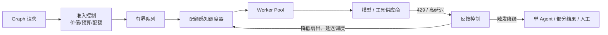

**图 7：配额感知调度与反馈背压。**

---

## 9.6 降级阶梯

多 Agent 不应只有“全开”和“全挂”两种状态。

推荐降级顺序：

1. 减少 Parallel 扇出；
2. 小模型 Worker，保留强模型汇总；
3. 停止二次探索；
4. 缩短 Reviewer 回边次数；
5. Debate 从多轮降为独立意见 + 单次综合；
6. 允许部分分支成功；
7. 退化为单 Agent；
8. 仅生成草稿，不执行副作用；
9. 转人工；
10. 拒绝并明确说明资源不足。

---

# 10. 可靠性、恢复与降级

## 10.1 错误分类决定重试策略

| 错误类型 | 示例 | 是否重试 | 策略 |
|---|---|---|---|
| 瞬时基础设施错误 | 连接重置、临时 5xx | 是 | 有界指数退避 |
| 限流 | 429、TPM 超额 | 是，但要全局协调 | 降低扇出、按 Retry-After |
| 确定性输入错误 | Schema 不合法 | 否 | 修正输入或死信 |
| 权限错误 | 403、凭据失效 | 通常否 | 刷新凭据或人工 |
| 模型格式错误 | JSON 不合法 | 可少量重试 | 结构化输出、修复器 |
| 工具业务拒绝 | 余额不足、状态不允许 | 否 | 返回业务结果 |
| 节点逻辑错误 | 代码异常 | 视情况 | 修复后从 Checkpoint 续跑 |
| 语义质量失败 | Reviewer 不通过 | 有界回边 | 带具体反馈，限制次数 |
| 非幂等副作用超时 | 付款请求超时 | 不能盲重试 | 先按幂等键查询结果 |

---

## 10.2 重试预算

重试必须同时满足：

- 错误被判定为可重试；
- 未超过节点重试次数；
- 未超过图级重试预算；
- 未超过 Deadline；
- 仍有成本预算；
- 副作用幂等；
- 没有触发熔断；
- 下游没有明确拒绝。

```python
def should_retry(
    *,
    retryable: bool,
    node_attempt: int,
    node_max_attempts: int,
    graph_retry_used: int,
    graph_retry_limit: int,
    deadline_remaining_ms: int,
    estimated_retry_ms: int,
    budget_remaining_usd: float,
    estimated_retry_cost_usd: float,
    idempotent: bool,
) -> bool:
    return all(
        [
            retryable,
            idempotent,
            node_attempt < node_max_attempts,
            graph_retry_used < graph_retry_limit,
            deadline_remaining_ms > estimated_retry_ms,
            budget_remaining_usd >= estimated_retry_cost_usd,
        ]
    )
```

---

## 10.3 Checkpoint 边界决定恢复粒度

Checkpoint 应放在：

- 昂贵节点完成后；
- 外部副作用前后；
- Handoff 前后；
- 人工审批前；
- 大型汇总前；
- 长循环每轮结束时。

节点过大，会导致失败后重做太多；节点过小，会产生大量持久化开销。

选择节点边界时，同时考虑：

$$
\text{节点粒度}
\leftrightarrow
\text{恢复成本}
+
\text{可观测性}
+
\text{持久化开销}
$$

---

## 10.4 从失败节点续跑，而不是整图重跑

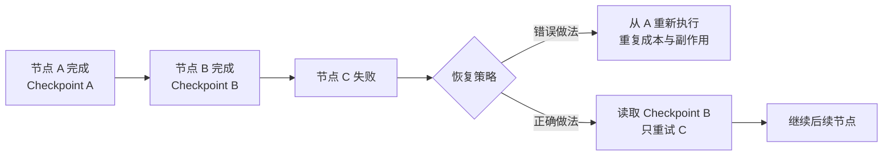

**图 8：节点级恢复避免整图成本放大。**

---

## 10.5 Deadline 传播

父图的截止时间必须向子节点传播：

$$
D_{\text{child}}
\le
D_{\text{parent}}
-
T_{\text{reserved-finalization}}
$$

不要让子 Agent 自己拿一个新的 10 分钟超时，导致父图的 30 秒 SLO 已过，子任务仍继续烧钱。

每个节点启动前应检查：

- 剩余时间；
- 预计 P95；
- 收尾保留时间；
- 是否值得继续。

---

## 10.6 进展探针与“活着但没进展”

进程存在不代表图健康。需要至少记录：

- 最后一个节点完成时间；
- 最后一个工具结果时间；
- 当前等待对象；
- 当前租约；
- 最近 token 增量；
- 当前 Handoff 跳数；
- 连续无产出轮数；
- Artifact 数量变化。

典型判定：

```text
进程仍在运行
+ 过去 120 秒无节点完成
+ 无工具调用完成
+ 无 token 增量
= graph_stalled
```

触发后可：

- 采集线程/进程状态；
- 取消当前节点；
- 从 Checkpoint 重试；
- 降级模型或工具；
- 转人工；
- 熔断相关外部服务。

---

## 10.7 图运行状态机

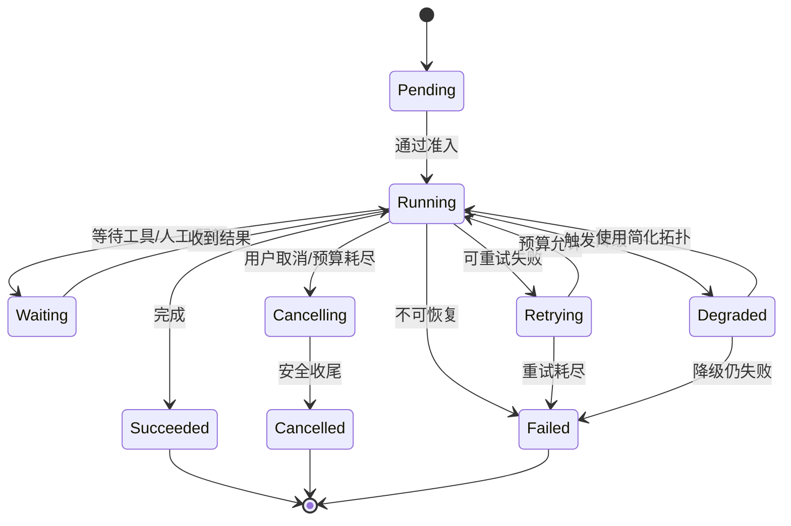

**图 9：生产级 Graph Run 状态机。**

---

# 11. 归因、可观测性与二分重放

## 11.1 为什么“最终答案错了”远远不够

一份错误产物至少可能来自：

1. 用户或上游输入本来就错；
2. Router 派错成员；
3. Exporter 丢失约束；
4. Importer 误解交接包；
5. 当前节点推理错误；
6. 工具返回错误或陈旧数据；
7. 共享状态版本冲突；
8. Reducer 合并错误；
9. Reviewer 漏放；
10. 正确结果在后续摘要中被覆盖。

没有证据链时，所有 Agent 都是嫌疑人。

---

## 11.2 五层 Trace 树

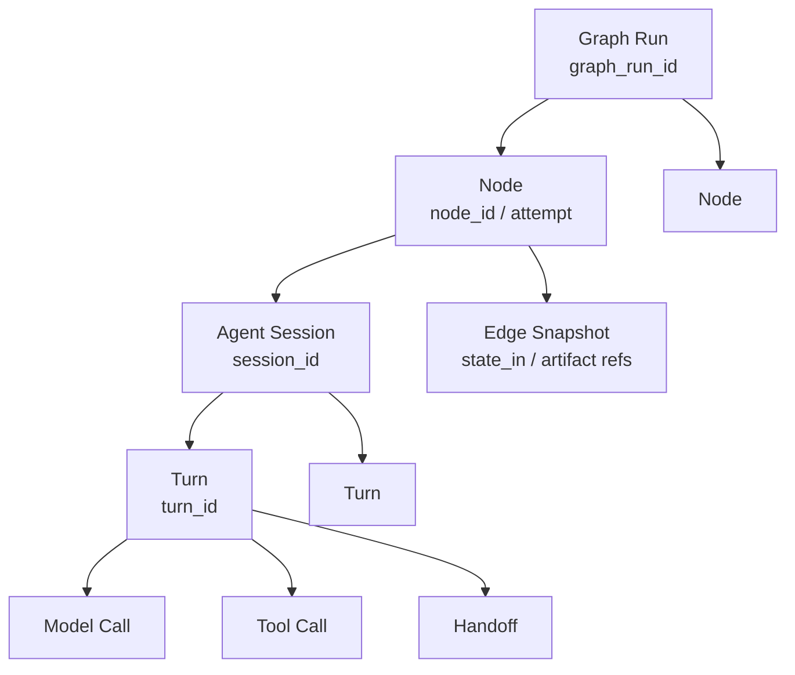

**图 10：Graph Run → Node → Session → Turn → Call 的五层观测树。**

至少需要这些关联字段：

```text
trace_id
graph_run_id
graph_definition_version
node_id
node_attempt
edge_id
parent_node_id
session_id
turn_id
model_call_id
tool_call_id
handoff_id
artifact_id
checkpoint_id
tenant_id
user_request_id
```

---

## 11.3 边快照应记录什么

推荐边快照只保存结构化证据：

```json
{
  "schema_version": 1,
  "graph_run_id": "g-123",
  "edge_id": "researcher->reviewer",
  "sequence": 7,
  "from_node": "researcher",
  "to_node": "reviewer",
  "state_version": 18,
  "objective": "验证报告中的事实与引用",
  "constraints": [
    "不得修改原始数据",
    "每个结论必须有证据"
  ],
  "artifact_refs": [
    {
      "id": "sha256:...",
      "media_type": "text/markdown"
    }
  ],
  "omitted_fields": [
    "raw_search_pages"
  ],
  "loss_report": {
    "summarized": ["search_notes"],
    "dropped": [],
    "reason": "context_budget"
  },
  "input_hash": "sha256:...",
  "prompt_version": "reviewer-v12",
  "created_at": "2026-08-31T08:00:00Z"
}
```

不要默认把全部 Prompt、密钥、用户隐私和工具结果原文写进 Trace。  
应支持：

- 字段级脱敏；
- 内容哈希；
- Artifact 外置；
- 加密存储；
- 租户隔离；
- 保留周期；
- Legal Hold；
- 访问审计。

---

## 11.4 输入快照比输出快照更适合第一轮归因

排障时第一问是：

> 这个节点开始时，错误是否已经存在？

- 如果输入已经错，责任继续向上游追；
- 如果输入正确而输出错误，优先检查当前节点；
- 如果输出正确但下游输入错误，检查边转换；
- 如果所有节点输出都正确而最终答案错，检查 Reducer 或呈现层。

这形成确定性归因路径：

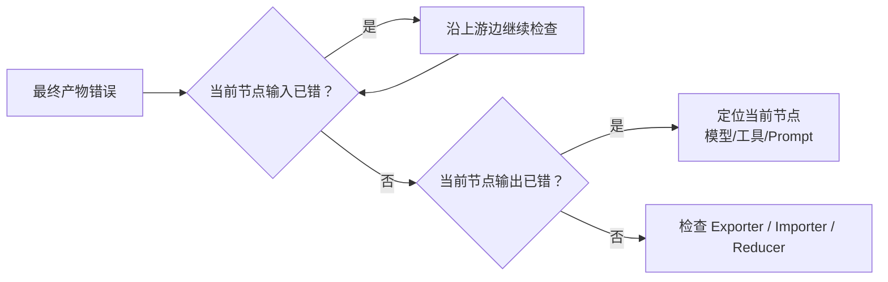

**图 11：沿边快照追踪错误首现位置。**

---

## 11.5 一个更稳健的 GraphTracer

下面的实现比最小示例多了：

- 原子写入；
- 输入哈希；
- 可插拔脱敏；
- 节点 attempt；
- 成功与异常事件；
- 不在事件总线中写入完整状态；
- 输出 Artifact 引用。

```python
from __future__ import annotations

import hashlib
import json
import os
import time
import uuid
from dataclasses import dataclass
from pathlib import Path
from typing import Any, Callable, Mapping


Redactor = Callable[[Mapping[str, Any]], Mapping[str, Any]]


def canonical_json(value: Any) -> bytes:
    return json.dumps(
        value,
        ensure_ascii=False,
        sort_keys=True,
        separators=(",", ":"),
        default=str,
    ).encode("utf-8")


def sha256_json(value: Any) -> str:
    return hashlib.sha256(canonical_json(value)).hexdigest()


def atomic_write_json(path: Path, value: Any) -> None:
    path.parent.mkdir(parents=True, exist_ok=True)
    tmp = path.with_suffix(path.suffix + f".{uuid.uuid4().hex}.tmp")
    tmp.write_bytes(canonical_json(value))
    os.replace(tmp, path)


@dataclass(frozen=True)
class NodeCoordinates:
    graph_run_id: str
    node_id: str
    attempt: int
    sequence: int


class GraphTracer:
    def __init__(
        self,
        *,
        event_bus: Any,
        snapshot_dir: Path,
        graph_version: str,
        redactor: Redactor,
    ) -> None:
        self.event_bus = event_bus
        self.snapshot_dir = snapshot_dir
        self.graph_version = graph_version
        self.redactor = redactor
        self.graph_run_id = f"g-{uuid.uuid4().hex}"
        self._sequence = 0

    def _next_coordinates(self, node_id: str, attempt: int) -> NodeCoordinates:
        self._sequence += 1
        return NodeCoordinates(
            graph_run_id=self.graph_run_id,
            node_id=node_id,
            attempt=attempt,
            sequence=self._sequence,
        )

    def wrap(
        self,
        node_id: str,
        fn: Callable[[dict[str, Any]], dict[str, Any]],
    ) -> Callable[[dict[str, Any]], dict[str, Any]]:
        def traced(state: dict[str, Any]) -> dict[str, Any]:
            attempt = int(state.get("_node_attempts", {}).get(node_id, 1))
            coord = self._next_coordinates(node_id, attempt)
            safe_state = dict(self.redactor(state))
            input_hash = sha256_json(safe_state)

            snapshot = {
                "schema_version": 1,
                "graph_version": self.graph_version,
                "graph_run_id": coord.graph_run_id,
                "node_id": coord.node_id,
                "attempt": coord.attempt,
                "sequence": coord.sequence,
                "input_hash": input_hash,
                "state": safe_state,
            }
            snapshot_path = (
                self.snapshot_dir
                / self.graph_run_id
                / f"{coord.sequence:06d}.{node_id}.a{attempt}.input.json"
            )
            atomic_write_json(snapshot_path, snapshot)

            started = time.monotonic()
            self.event_bus.emit(
                "agent.graph.node.start",
                graph_run_id=self.graph_run_id,
                graph_version=self.graph_version,
                node_id=node_id,
                attempt=attempt,
                sequence=coord.sequence,
                input_hash=input_hash,
                snapshot_ref=str(snapshot_path),
            )

            try:
                updates = fn(state)
                if not isinstance(updates, dict):
                    raise TypeError(
                        f"node {node_id!r} must return dict, "
                        f"got {type(updates).__name__}"
                    )
            except Exception as exc:
                self.event_bus.emit(
                    "agent.graph.node.error",
                    graph_run_id=self.graph_run_id,
                    node_id=node_id,
                    attempt=attempt,
                    sequence=coord.sequence,
                    duration_ms=int((time.monotonic() - started) * 1000),
                    error_type=type(exc).__name__,
                    error_message=str(exc)[:500],
                )
                raise

            self.event_bus.emit(
                "agent.graph.node.end",
                graph_run_id=self.graph_run_id,
                node_id=node_id,
                attempt=attempt,
                sequence=coord.sequence,
                duration_ms=int((time.monotonic() - started) * 1000),
                updated_keys=sorted(updates),
                output_hash=sha256_json(self.redactor(updates)),
            )
            return updates

        return traced

    def child_tags(self, node_id: str, attempt: int) -> dict[str, Any]:
        return {
            "graph_run_id": self.graph_run_id,
            "graph_node_id": node_id,
            "graph_node_attempt": attempt,
            "graph_version": self.graph_version,
        }
```

生产环境还需要：

- 并发安全 sequence；
- 分布式 Trace Context；
- 异步节点支持；
- 大状态外置 Artifact Store；
- 写入失败的降级策略；
- 快照加密；
- PII 分类；
- Snapshot schema 演进；
- Trace 采样，但错误图必须全量保留。

---

## 11.6 二分重放

长链路有 20 个节点时，不必从头逐个猜。

方法：

1. 找到中间 Checkpoint；
2. 注入已知正确状态；
3. 重放后半段；
4. 若仍错误，根因在后半段；
5. 若正确，根因在前半段；
6. 继续二分。

它与 `git bisect` 同构。

需要满足：

- 节点输入可序列化；
- Prompt、模型、工具版本可固定或记录；
- 外部数据能使用快照；
- 副作用可模拟或隔离；
- 随机性受控；
- 重放环境与生产关键配置一致。

---

## 11.7 指标体系

### 图级指标

| 指标 | 含义 |
|---|---|
| `graph_success_rate` | 整图成功率 |
| `graph_latency_ms` | 整图 P50/P95/P99 |
| `graph_time_to_first_business_answer_ms` | 首个有效业务答复 |
| `graph_cost_usd` | 整图真实成本 |
| `graph_token_amplification` | 相对单 Agent token 放大 |
| `graph_retry_amplification` | 重试导致的额外成本比例 |
| `graph_degradation_rate` | 进入降级路径的比例 |
| `graph_human_escalation_rate` | 转人工比例 |
| `graph_attribution_mttr` | 从告警到定位错误节点的时间 |

### 节点级指标

- 成功率；
- 时延；
- token；
- 成本；
- 重试率；
- 输出 Schema 合规率；
- Reviewer 通过率；
- Artifact 复用率；
- 版本冲突率；
- 无进展超时率。

### 边级指标

- Handoff 次数；
- 交接包大小；
- 上下文压缩率；
- 关键信息丢失率；
- 路由准确率；
- 回交率；
- 循环 Handoff 率；
- Artifact 引用命中率。

### 协调健康指标

- 重复劳动率；
- 无 owner 任务数；
- 活跃节点峰值；
- 共享资源冲突率；
- 队列等待时间；
- 429 比率；
- 最慢分支拖尾时间；
- 少数意见被忽略率；
- 分支覆盖率。

---

## 11.8 OpenTelemetry 映射建议

可将 Graph Run 作为根 Span：

```text
agent.graph.run
├── agent.graph.node
│   ├── gen_ai.model.call
│   ├── agent.tool.call
│   ├── agent.handoff
│   └── agent.checkpoint.write
├── agent.graph.node
└── agent.graph.reduce
```

建议保留：

- 标准 Trace/Span ID；
- Graph、Node、Session 自定义属性；
- 模型、token、工具等 GenAI 语义字段；
- 内容默认不采集，只在受控环境按需开启；
- 错误 Span 附带 snapshot reference，而不是全部敏感内容。

---

# 12. 安全、权限与跨边界治理

## 12.1 每个 Agent 都应有独立能力边界

权限不能只写在 Prompt 中。

错误做法：

```text
“你是只读审查 Agent，请不要修改文件。”
```

正确做法：

- 进程或沙箱只挂载只读文件系统；
- 工具注册表不提供写工具；
- 凭据只具有读取权限；
- 网络出口只允许必要域名；
- 数据库账号是只读角色；
- 所有高风险动作经过运行时 Policy Engine。

Prompt 是意图，Capability 是边界。

---

## 12.2 最小权限矩阵

| 角色 | 读取 | 写入 | 外网 | 密钥 | 高风险动作 |
|---|---|---|---|---|---|
| Researcher | 公开数据、内部只读知识库 | Artifact Store | 白名单搜索 | 无生产密钥 | 不允许 |
| Coding Worker | 分配的 worktree | 自己分支 | 包仓库白名单 | 临时开发凭据 | 不可直接合并 |
| Reviewer | PR、测试和 Trace | 评论/审查结果 | 通常不需要 | 无部署密钥 | 不可发布 |
| Release Agent | 已批准产物 | 发布系统 | 部署目标 | 短期 OBO 凭据 | 需要审批 |
| Customer Support | 客户范围内数据 | 工单备注 | 业务 API | 用户授权上下文 | 退款需二次审批 |
| Supervisor | 任务元数据 | 调度状态 | 最小化 | 不持有成员全部密钥 | 不直接执行高风险工具 |

---

## 12.3 Handoff 是一个新的信任边界

Handoff 不只是“发一条消息”，它可能导致：

- 控制权转移；
- 权限集合变化；
- 数据进入另一个域；
- 新模型或新供应商被调用；
- 新成本中心被消耗；
- 新的工具和副作用能力生效。

因此 Handoff 前需要独立校验：

```text
目标 Agent 是否允许？
当前用户是否可委托？
交接数据是否允许出域？
目标 Agent 是否具备处理该分类数据的资质？
剩余预算是否足够？
Handoff 跳数是否超限？
是否需要人工审批？
```

不能假设“工具 Guardrail”自动覆盖 Handoff；不同框架的执行管线可能不同，必须单独验证。

---

## 12.4 身份贯穿与 OBO

跨节点调用应保留：

- 原始用户身份；
- 当前 Agent 身份；
- 调度器身份；
- 委托链；
- 授权范围；
- 租户；
- 目的用途；
- 过期时间；
- 审批记录。

```text
User
  └── delegates to Supervisor
        └── delegates read:invoice to Billing Agent
              └── calls Billing API on behalf of User
```

服务端应验证完整委托链，而不是看到“来自内部 Agent”就默认可信。

---

## 12.5 数据最小化

交接包遵循：

$$
\text{Handoff Data}
=
\text{完成目标所需的最小事实}
$$

而不是把完整会话、全部附件、全部用户画像广播给所有成员。

推荐字段：

- 目标；
- 必要事实；
- 显式约束；
- Artifact 引用；
- 数据分类；
- 允许用途；
- 过期时间；
- 不可转发标记；
- 来源和证据。

---

## 12.6 远程 Agent 与 A2A 场景

跨公司、跨云或跨框架调用远程 Agent 时，应把对方视为外部服务，而不是本地函数。

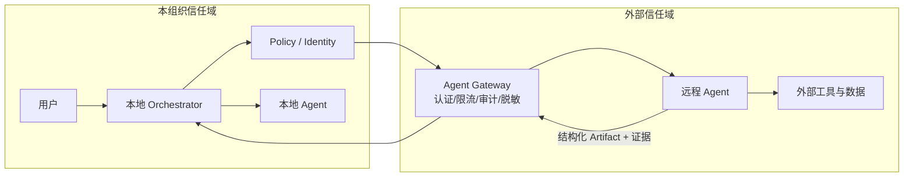

**图 12：远程 Agent 调用必须经过 Agent Gateway。**

网关至少负责：

- Agent 身份认证；
- 能力发现结果缓存与校验；
- 请求签名；
- 数据分类与脱敏；
- 配额；
- Deadline；
- 幂等键；
- 内容安全；
- 响应 Schema；
- Artifact 扫描；
- 审计；
- 熔断与供应商隔离。

---

## 12.7 边快照的隐私风险

边快照有助于归因，但也可能复制敏感数据。

需要同时设计：

- 快照白名单，而不是黑名单；
- PII/密钥自动脱敏；
- 原文与哈希分离；
- 加密密钥按租户隔离；
- 不同数据分类使用不同保留周期；
- 调试访问需审批；
- 导出和下载审计；
- 删除请求能追踪到所有副本；
- 训练与评测数据不得自动复用生产快照。

---

## 12.8 人类审批触发点

以下情况建议强制 HITL：

- 不可逆副作用；
- 高金额交易；
- 发布到生产；
- 删除或覆盖大量数据；
- 权限提升；
- 跨数据域；
- Handoff 超过跳数阈值；
- 多个 Reviewer 严重分歧；
- 低置信且高影响；
- 图级预算达到阈值；
- 责任真空；
- 目标冲突；
- 系统进入降级模式但仍可能造成损失。


---

# 13. 多 Agent 评估体系

## 13.1 评估目标：证明“复杂度值得”

多 Agent 评估不是只问“最终答案好不好”，而要回答四个问题：

1. 相比单 Agent，质量是否显著提升？
2. 增益来自哪个成员、哪条边或哪种机制？
3. 新增成本、延迟和风险是否在预算内？
4. 故障时能否快速归因、恢复和降级？

因此需要三层评估。

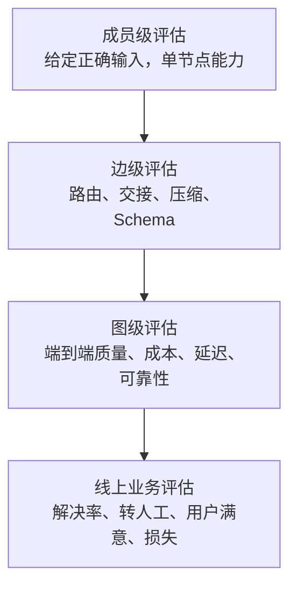

**图 13：成员、边、图和线上业务四层评估。**

---

## 13.2 成员级评估

给成员提供**已知正确输入**，隔离评估它本身：

- Planner：任务分解覆盖率、重叠率、依赖正确率；
- Router：目标成员准确率、拒识率、校准度；
- Worker：子任务成功率、工具使用正确率、Artifact 合规率；
- Reviewer：缺陷召回率、误报率、反馈可执行性；
- Reducer：事实保留率、冲突处理率、引用正确率；
- Handoff Exporter：必要字段保留率；
- Handoff Importer：字段理解与状态恢复率；
- Guard：高风险动作拦截率与误拦率。

成员级测试可以区分：

- “成员能力不够”；
- “上游给错输入”；
- “交接丢信息”；
- “图组合方式有问题”。

---

## 13.3 边级评估

边是多 Agent 最容易被忽略的组件。

### Router 边

- Top-1 路由准确率；
- 拒识准确率；
- default owner 触发率；
- 不必要 Handoff 率；
- 循环 Handoff 率；
- 高风险路由误放率。

### Handoff 边

- 关键约束保留率；
- 事实保真率；
- Artifact 引用可读取率；
- Schema 合规率；
- 压缩率；
- 隐私字段泄露率；
- 往返一致性；
- 目标成员理解准确率。

### 汇聚边

- 去重准确率；
- 冲突识别率；
- 少数证据保留率；
- 缺失分支标注率；
- 错误传播率；
- 引用与结论对齐率。

---

## 13.4 图级指标

建议至少覆盖六个维度。

### 质量

- 任务成功率；
- 正确性；
- 完整性；
- 覆盖率；
- 事实性；
- 代码测试通过率；
- 安全缺陷召回率；
- 业务解决率。

### 效率

- 整图 token；
- token 放大系数；
- 工具调用数；
- 缓存命中率；
- 重复劳动率；
- 单位成功任务成本。

### 延迟

- TTFT；
- 首个有效业务答复；
- 整图 P50/P95/P99；
- 排队时延；
- 最慢分支拖尾；
- Handoff 时延。

### 可靠性

- Graph 成功率；
- 部分成功率；
- 节点重试率；
- 整图重跑率；
- Checkpoint 恢复成功率；
- 取消完成率；
- 副作用重复率。

### 协调

- 路由准确率；
- 平均 Handoff 次数；
- 循环转派率；
- 无 owner 比率；
- 共享写冲突率；
- Reviewer 回边次数；
- 少数意见采纳率。

### 运维

- 告警准确率；
- 归因 MTTR；
- 重放成功率；
- 人工升级率；
- 降级成功率；
- 值班演练通过率。

---

## 13.5 必须保留四类对照组

| 组别 | 目的 |
|---|---|
| 强单 Agent | 判断多 Agent 是否真的必要 |
| 确定性 Workflow | 判断智能路由是否优于固定流程 |
| 简单 Parallel | 判断复杂协调是否优于独立并行 |
| 当前候选拓扑 | 验证新增机制的边际价值 |

不要只把新拓扑和一个弱 Prompt 的旧系统比较。

---

## 13.6 消融实验

对候选图逐项关闭组件：

- 去掉 Reviewer；
- Worker 数从 8 降到 4；
- 强模型主管换小模型；
- Handoff 全文改 Artifact 指针；
- 动态路由改规则路由；
- 多轮 Debate 改一次独立会签；
- 去掉共享 Memory；
- 关闭整图重试；
- 同质模型改异构模型；
- 去掉某个专家席位。

如果去掉某组件后质量不降、成本下降，该组件应被删除。

---

## 13.7 评估非确定轨迹

多 Agent 可能用不同路径得到同样正确结果，因此不要把“必须走固定轨迹”当唯一标准。

可以同时评估：

### 结果约束

- 最终答案正确；
- 必要字段齐全；
- 引用可验证；
- 代码测试通过；
- 业务状态正确。

### 过程不变量

- 未越权；
- 未超过预算；
- 未超过最大 Handoff；
- 未重复执行副作用；
- 每个高风险动作有审批；
- 每个 Artifact 有来源；
- 无任务静默掉地；
- 取消后资源释放。

过程可以不同，但不变量必须满足。

---

## 13.8 成本—质量前沿

不要只看单一综合分。应画 Pareto 前沿：

```text
质量 ↑
     |               ● Debate 4 轮
     |          ● 专家团
     |      ● Parallel 4
     |   ● 强单 Agent
     | ● 小单 Agent
     +--------------------------→ 成本
```

如果某方案比另一个方案：

- 成本更高；
- 质量更低；
- 延迟更长；

它被后者严格支配，应直接淘汰。

可以定义业务加权分数用于准入，但不要用它掩盖单项红线：

$$
Score
=
w_q Q
- w_c C
- w_l L
- w_r R
- w_o O
$$

其中任何硬约束失败都应直接 `reject`，而不是靠其他高分抵消。

---

## 13.9 离线到线上

### 离线

- 历史任务集；
- 合成边界案例；
- 故障注入；
- 成员级和边级测试；
- 多次采样；
- 成本和延迟回放。

### Shadow

新拓扑接收真实输入，但不影响用户和生产副作用。比较：

- 结果差异；
- 成本；
- 时延；
- Handoff；
- 权限请求；
- 潜在副作用。

### Canary

只开放给：

- 小比例流量；
- 低风险租户；
- 只读任务；
- 明确可回滚场景。

### 全量

仍需保留：

- 单 Agent fallback；
- Feature Flag；
- 租户级禁用；
- 一键停止创建新图；
- 当前图安全取消；
- 预算紧急下调。

---

# 14. 组织与运维约束

## 14.1 节点有 owner，边也必须有 owner

团队常给服务和 Agent 指定 owner，却忘了边。

边负责：

- 数据格式；
- Handoff 语义；
- 重试；
- 版本兼容；
- SLA；
- 权限；
- 审计；
- 失败归属。

可以使用如下责任矩阵：

| 对象 | 设计 owner | 运行 owner | 数据 owner | 安全审批 | 成本中心 |
|---|---|---|---|---|---|
| Supervisor 节点 | Agent 平台组 | Agent 平台组 | 业务组 | 安全组 | 业务线 A |
| Billing Agent | 财务技术组 | 财务技术组 | 财务部门 | 财务安全 | 财务 |
| Handoff：客服→账务 | 双方联合 | 客服平台组 | 财务部门 | 双方安全 | 按调用计费 |
| Graph Budget | 平台 FinOps | 平台 SRE | 不适用 | 平台治理 | 租户 |
| 边快照 | 可观测性组 | 平台 SRE | 对应业务部门 | 隐私组 | 平台 |

---

## 14.2 跨组织边是服务契约

跨部门 Handoff 至少要成文：

- 请求 Schema；
- 数据分类；
- 支持的任务类型；
- 拒绝语义；
- 默认 owner；
- 认证与委托；
- QPS/RPM/TPM；
- 成本归属；
- SLO；
- 变更通知；
- 日志与审计；
- 事故责任；
- 紧急熔断；
- 版本兼容；
- 数据保留和删除。

如果这些谈不拢，正确方案通常不是“继续调 Prompt”，而是改为调用对方稳定 API，由本部门 Agent 自己承担协调。

---

## 14.3 值班能力是上线门禁

建议进行故障演练：

> 给值班人员一个注入了错误的 Graph Run，要求在 30 分钟内定位到错误首现节点、相关边和责任组件，并说明恢复方式。

演练至少覆盖：

- 上游输入错误；
- Router 派错；
- Handoff 丢字段；
- Worker 工具失败；
- Reviewer 漏放；
- 429 风暴；
- 节点卡死；
- Checkpoint 损坏；
- 共享写冲突；
- 副作用成功但 ACK 丢失；
- 用户取消；
- 预算耗尽；
- 远程 Agent 超时。

演练不过，不应全量上线。

---

## 14.4 Runbook 应回答什么

每个生产图需要 Runbook：

```text
1. 业务目的与 SLO
2. 图版本与节点说明
3. 每个节点 owner
4. 每条边 owner
5. 依赖的模型、工具、队列和存储
6. 图级预算和配额
7. 常见告警解释
8. 如何查询 graph_run_id
9. 如何查看边快照
10. 如何从 Checkpoint 重放
11. 如何禁用某节点或某 Handoff
12. 如何降低扇出
13. 如何退化为单 Agent
14. 如何安全取消
15. 如何处理已发生副作用
16. 如何转人工
17. 数据泄露处置
18. 事故后如何补评测集
```

---

## 14.5 变更治理

以下变更都可能改变系统行为，应版本化并进入发布流程：

- Prompt；
- 模型；
- 工具描述；
- 工具权限；
- Handoff Schema；
- Router 规则；
- 拓扑；
- 最大扇出；
- 重试策略；
- Budget；
- Checkpoint Schema；
- Reducer；
- Reviewer Rubric；
- 数据源；
- 记忆与检索策略。

Graph Run 必须记录实际使用的版本，而不是只记录“当前线上版本”。

---

# 15. 渐进式上线与回滚

## 15.1 推荐演进路径

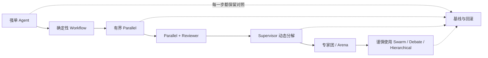

**图 14：从简单到复杂的演进路径。**

这不是强制顺序，但体现一个原则：

> **只有当更简单结构被评测证明不够时，才增加新的协调机制。**

---

## 15.2 分阶段发布

### Phase 0：离线模拟

- 无真实副作用；
- 固定测试集；
- 故障注入；
- 成本上限很低；
- 全量 Trace。

### Phase 1：只读 Shadow

- 使用真实流量；
- 不向用户展示；
- 禁止写操作；
- 和现网结果对比。

### Phase 2：辅助模式

- 给人类坐席或工程师建议；
- 人类决定是否采纳；
- 记录采纳率和错误类型。

### Phase 3：低风险自动化

- 只处理可回滚任务；
- 小比例流量；
- 严格预算；
- 强制 fallback。

### Phase 4：扩大场景

- 逐步提高流量；
- 独立租户控制；
- 自动降级；
- 完整 SLO。

### Phase 5：高风险动作

- 仅在权限、幂等、审批、补偿和事故响应全部成熟后开放。

---

## 15.3 Kill Switch 设计

至少支持：

1. 禁止新 Graph Run；
2. 禁止某拓扑；
3. 禁止某 Agent；
4. 禁止某工具；
5. 禁止某远程 Agent；
6. 最大扇出降为 1；
7. 强制所有高风险动作 HITL；
8. 当前 Graph Run 安全取消；
9. 降级为单 Agent；
10. 切换模型或供应商；
11. 禁用 Trace 内容采集；
12. 将所有未匹配任务转人工。

Kill Switch 不能依赖同一个已经故障的 Agent 来执行。

---

## 15.4 混沌与故障注入

上线前主动注入：

- 10% 模型超时；
- 工具返回 429；
- 某 Worker 永不返回；
- Handoff 包缺字段；
- Checkpoint 写失败；
- Artifact Store 短暂不可用；
- 相同副作用消息重复投递；
- 当前状态版本变化；
- Reviewer 连续拒绝；
- Router 连续 A↔B；
- 用户中途取消；
- 预算突然下调；
- 远程 Agent 返回超大响应；
- 一个成员提供错误证据；
- 多个 Agent 同时写同一文件。

验证系统是否：

- 有界；
- 可观察；
- 可取消；
- 可恢复；
- 不重复副作用；
- 不静默掉任务；
- 能安全降级。

---

## 15.5 回滚不是“切回旧 Prompt”

多 Agent 回滚可能涉及：

- 停止新图；
- 等待或取消在途图；
- 处理已发生的外部副作用；
- 释放租约；
- 合并或丢弃部分 Artifact；
- 恢复旧 Router；
- 回退 Handoff Schema；
- 处理新旧 Checkpoint 兼容；
- 清理预热池；
- 恢复旧预算和限流；
- 告知人工团队。

因此要在上线前演练真实回滚，而不是只验证 Feature Flag 能否切换。

---

# 16. 主流框架与产业实践旁证

> 本节截至 2026-08-31。框架能力变化很快，引用用于说明工程方向，不代表任何框架自动解决了本章的所有问题。

## 16.1 Anthropic 多 Agent Research 的经验

Anthropic 在 2025 年公开的多 Agent Research 实践采用 orchestrator-worker：Lead Agent 规划并并行创建 Subagent。其内部研究评测中，特定配置相对单 Agent 提升 90.2%；同时官方也报告多 Agent 系统相对普通聊天消耗约 15 倍 token，并强调它更适合高价值、可高度并行、信息量超出单上下文的研究任务，而不适合依赖高度耦合、必须共享同一上下文的任务。

这组数据的正确用法不是把“90.2%”或“15×”当行业常数，而是证明两点：

1. 多 Agent 可以在适合的广度优先任务上带来显著增益；
2. 增益来自投入更多并行搜索、工具调用和上下文容量，因此必须做经济性核算。

官方还披露早期系统曾出现为简单查询创建过多 Subagent、重复搜索、无休止探索等问题，最终依靠明确的资源分配规则、边界清楚的子任务描述、可观测性和评测加以约束。

参考：[How we built our multi-agent research system](https://www.anthropic.com/engineering/multi-agent-research-system)

---

## 16.2 2026 年多 Agent 协调研究的警示

Anthropic 2026 年发布的多 Agent 研究进一步展示了：

- 独立并行、低依赖任务相对容易；
- 一旦多个 Agent 共同修改共享资源，协调难度明显增加；
- 同质 Agent 可能产生高度相似行为，使局部错误演变成系统性失败；
- 共享队列、共享代码库和相互矛盾目标会暴露资源争抢、合并冲突、趋同与目标冲突。

对工程设计的直接启示是：

- 不要把成员数量当作独立性；
- 对共享资源使用所有权和调度协议；
- 对成员间消息保留来源、证据和信任边界；
- 对相互冲突目标使用中央仲裁和最小权限；
- 高自治群体必须先在沙箱与故障环境中测试。

参考：[Patterns and problems in emerging multiagent systems](https://www.anthropic.com/research/multiagent-systems)

---

## 16.3 OpenAI Agents SDK

OpenAI Agents SDK 提供 Agent、Agent-as-tool、Handoff、Guardrail 和内置 Tracing 等能力。Handoff 适合把控制权交给专业 Agent；Tracing 可以记录模型调用、工具调用、Handoff、Guardrail 和自定义事件。

一个很重要的工程细节是：官方文档明确提醒，Handoff 走独立的 Handoff Pipeline，不能想当然地认为函数工具的 Tool Guardrail 会自动覆盖 Handoff。因此，Handoff 需要自己的准入、输入过滤、权限和数据边界校验。

参考：

- [Handoffs](https://openai.github.io/openai-agents-python/handoffs/)
- [Tracing](https://openai.github.io/openai-agents-python/tracing/)
- [Guardrails](https://openai.github.io/openai-agents-python/guardrails/)

---

## 16.4 LangGraph

LangGraph 把 durable execution、持久化、Human-in-the-loop 和图状态作为核心能力。Checkpoint 让中断或失败后的运行可以从记录状态恢复，而不是整图重跑。

这与本章的工程结论一致：

- 多 Agent 首先需要一个可靠图运行时；
- 节点边界决定恢复粒度；
- 长图没有持久化就不具备生产级恢复能力；
- Human-in-the-loop 需要先保存状态，再等待外部输入。

参考：

- [LangGraph Overview](https://docs.langchain.com/oss/python/langgraph/overview)
- [Persistence](https://docs.langchain.com/oss/python/langgraph/persistence)
- [Interrupts](https://docs.langchain.com/oss/python/langgraph/interrupts)

---

## 16.5 Microsoft AutoGen

AutoGen AgentChat 提供 RoundRobinGroupChat、SelectorGroupChat、MagenticOneGroupChat 和 Swarm 等 Team 形态，也提供终止条件与 Human-in-the-loop。

它提醒工程团队：Group Chat、Selector 和 Swarm 不只是 Prompt 模式，而是不同的消息共享、下一位发言者选择和终止语义。上线前必须显式定义：

- 谁能发言；
- 谁选择下一位；
- 消息是否广播；
- 何时终止；
- 最大轮数；
- Handoff 如何表示；
- 人类何时介入。

参考：

- [Teams](https://microsoft.github.io/autogen/stable/user-guide/agentchat-user-guide/tutorial/teams.html)
- [Selector Group Chat](https://microsoft.github.io/autogen/stable/user-guide/agentchat-user-guide/selector-group-chat.html)
- [Swarm](https://microsoft.github.io/autogen/stable/user-guide/agentchat-user-guide/swarm.html)
- [Termination](https://microsoft.github.io/autogen/stable/user-guide/agentchat-user-guide/tutorial/termination.html)

---

## 16.6 A2A

A2A v1.0 在 2026 年成为稳定规范，目标是让不同框架、语言和供应商的独立 Agent 进行能力发现、通信与协作。

A2A 解决的是互操作协议问题，不自动解决：

- 对方 Agent 是否可信；
- 是否允许发送当前数据；
- 预算由谁承担；
- 远程任务如何归因；
- 对方是否满足你的 SLO；
- 副作用如何幂等；
- 错误如何补偿；
- 供应商退出或协议升级怎么办。

所以远程 Agent 仍应经过 Agent Gateway、Policy、Quota 和 Audit。

参考：[A2A Protocol Specification](https://a2a-protocol.org/latest/specification/)

---

## 16.7 OpenTelemetry GenAI 语义约定

OpenTelemetry 的 GenAI 语义约定正在标准化模型、token、工具和 Agent 相关观测字段。采用标准 Trace Context 有利于把模型调用、工具调用、Agent 节点和普通微服务链路连成同一条因果链。

但内容采集要谨慎。Prompt、响应、工具参数和结果可能包含敏感信息，应默认最小化，并由策略决定是否采集。

参考：

- [OpenTelemetry Semantic Conventions](https://opentelemetry.io/docs/specs/semconv/)
- [Inside the LLM Call: GenAI Observability with OpenTelemetry](https://opentelemetry.io/blog/2026/genai-observability/)

---

## 16.8 框架能力对照的正确阅读方式

| 能力 | 框架可能提供 | 业务仍需自行定义 |
|---|---|---|
| Handoff | API、消息类型、上下文过滤 | 权限、数据边界、最大跳数、责任 |
| Graph | 节点、边、状态、执行器 | 拓扑是否值得、SLO、Owner |
| Checkpoint | 持久化与恢复 API | Schema、保留、加密、重放策略 |
| Tracing | Span 和事件 | 归因字段、脱敏、采样、告警 |
| Team/Swarm | 轮次和发言者选择 | 终止、预算、冲突、人工兜底 |
| Guardrail | 输入输出检查 | 威胁模型、法规、越权与副作用 |
| Remote Agent | 协议与发现 | 信任、合同、配额、审计、退出策略 |

> **框架提供机制，不替你完成可行性证明。**

---

# 17. 生产级实现蓝图

## 17.1 总体架构

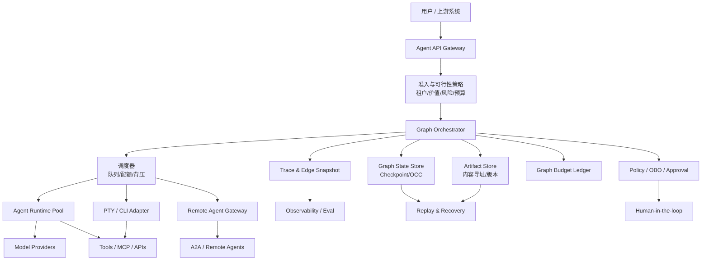

**图 15：生产级多 Agent 平台分层。**

---

## 17.2 推荐模块

```text
src/
├── domain/
│   ├── graph_definition.py
│   ├── graph_run.py
│   ├── node.py
│   ├── edge.py
│   ├── artifact.py
│   ├── budget.py
│   ├── policy.py
│   └── failure.py
├── application/
│   ├── admission_service.py
│   ├── orchestration_service.py
│   ├── scheduling_service.py
│   ├── recovery_service.py
│   ├── attribution_service.py
│   └── evaluation_service.py
├── ports/
│   ├── model_runtime.py
│   ├── agent_runtime.py
│   ├── state_store.py
│   ├── artifact_store.py
│   ├── event_sink.py
│   ├── policy_engine.py
│   ├── quota_provider.py
│   └── approval_gateway.py
├── adapters/
│   ├── openai_agents/
│   ├── langgraph/
│   ├── autogen/
│   ├── pty_cli/
│   ├── a2a/
│   ├── sqlite/
│   ├── postgres/
│   └── opentelemetry/
└── runtime/
    ├── executor.py
    ├── scheduler.py
    ├── retry.py
    ├── cancellation.py
    ├── checkpoint.py
    ├── tracer.py
    └── loop_guard.py
```

核心原则：

- Domain 不依赖具体框架；
- LangGraph、AutoGen、OpenAI Agents SDK、PTY CLI 都是 Adapter；
- Budget、Policy、Trace、Artifact 是平台能力，不嵌在 Prompt 中；
- Handoff 是显式 Domain Event；
- 节点函数不直接访问全局可变状态。

---

## 17.3 图定义示例

```yaml
apiVersion: agent.example/v1
kind: AgentGraph
metadata:
  name: code-review
  version: "19"

spec:
  topology: parallel-reviewer

  admission:
    min_task_value_usd: 2.0
    max_risk_level: medium
    fallback_graph: code-review-single-agent

  budgets:
    deadline_ms: 120000
    max_cost_usd: 3.0
    max_input_tokens: 500000
    max_output_tokens: 60000
    max_tool_calls: 200
    max_active_nodes: 6
    max_handoffs: 4
    max_graph_retries: 1
    finalization_reserve_usd: 0.20

  completion:
    policy: min_success_count
    min_success_count: 3
    min_coverage_ratio: 0.80

  nodes:
    splitter:
      type: deterministic
      owner: platform-code-intelligence

    reviewer_worker:
      type: agent
      runtime: sdk
      concurrency: 4
      permissions:
        filesystem: read-only
        network: package-metadata-only
      retry:
        max_attempts: 2
        retryable: [timeout, rate_limit, transient_5xx]

    reducer:
      type: deterministic
      owner: developer-productivity

    final_reviewer:
      type: agent
      model_tier: strong
      max_iterations: 2
      requires:
        - rubric: code-review-v7

  edges:
    - from: splitter
      to: reviewer_worker
      mode: fanout
      owner: platform-code-intelligence
      handoff_schema: review-task-v3

    - from: reviewer_worker
      to: reducer
      mode: fanin
      owner: developer-productivity
      artifact_only: true

    - from: reducer
      to: final_reviewer
      mode: direct
      snapshot: redacted

  degradation:
    - when: tpm_headroom_below_20_percent
      action: reduce_fanout
      value: 2

    - when: cost_remaining_below_0_50
      action: skip_final_reviewer

    - when: provider_unavailable
      action: fallback_graph
```

---

## 17.4 可行性报告数据结构

```python
from dataclasses import dataclass, field
from enum import Enum


class Verdict(str, Enum):
    ACCEPT = "accept"
    ACCEPT_WITH_LIMITS = "accept_with_limits"
    REJECT = "reject"


@dataclass(frozen=True)
class ConstraintResult:
    name: str
    measured: float | str
    limit: float | str
    passed: bool
    evidence: str
    mitigation: str | None = None


@dataclass
class FeasibilityReport:
    candidate_topology: str
    baseline: str
    expected_quality_delta: float
    expected_cost_delta_usd: float
    expected_p95_latency_delta_ms: int
    constraints: list[ConstraintResult] = field(default_factory=list)
    verdict: Verdict = Verdict.REJECT
    revival_conditions: list[str] = field(default_factory=list)

    def decide(self) -> Verdict:
        hard_failures = [
            item for item in self.constraints
            if not item.passed and item.name.startswith("hard:")
        ]
        if hard_failures:
            self.verdict = Verdict.REJECT
            return self.verdict

        soft_failures = [item for item in self.constraints if not item.passed]
        self.verdict = (
            Verdict.ACCEPT_WITH_LIMITS if soft_failures else Verdict.ACCEPT
        )
        return self.verdict
```

真正的评审系统应将所有 `evidence` 指向：

- 压测报告；
- Trace 查询；
- 评测运行；
- 成本台账；
- 安全评审；
- 组织签字；
- 试点数据。

---

## 17.5 Loop Guard

所有回边和 Handoff 都要受统一有界性控制：

```python
from dataclasses import dataclass, field


class LoopLimitExceeded(RuntimeError):
    pass


@dataclass
class LoopGuard:
    max_node_visits: int
    max_edge_traversals: int
    max_handoffs: int
    node_visits: dict[str, int] = field(default_factory=dict)
    edge_traversals: dict[str, int] = field(default_factory=dict)
    handoffs: int = 0

    def enter_node(self, node_id: str) -> None:
        count = self.node_visits.get(node_id, 0) + 1
        self.node_visits[node_id] = count
        if count > self.max_node_visits:
            raise LoopLimitExceeded(
                f"node {node_id!r} visited {count} times"
            )

    def traverse_edge(self, edge_id: str, *, is_handoff: bool = False) -> None:
        count = self.edge_traversals.get(edge_id, 0) + 1
        self.edge_traversals[edge_id] = count
        if count > self.max_edge_traversals:
            raise LoopLimitExceeded(
                f"edge {edge_id!r} traversed {count} times"
            )

        if is_handoff:
            self.handoffs += 1
            if self.handoffs > self.max_handoffs:
                raise LoopLimitExceeded(
                    f"handoff limit exceeded: {self.handoffs}"
                )
```

只设置“最大总轮数”还不够；最好同时限制：

- 单节点访问次数；
- 单边穿越次数；
- 总 Handoff；
- 总 Reviewer 回边；
- 同一错误类型重试次数；
- 无新增 Artifact 的连续轮数；
- 预算与 Deadline。

---

## 17.6 测试金字塔

```text
                     线上 A/B 与 Canary
                  /                    \
             Graph 端到端与故障注入
          /                              \
       节点契约、边契约、恢复与副作用测试
    /                                      \
纯函数、Schema、预算器、Loop Guard、OCC、脱敏
```

必测用例：

- Graph 状态机合法转换；
- Budget 并发扣费；
- 重复消息幂等；
- Checkpoint 恢复；
- Handoff 最大跳数；
- 无 owner 转死信；
- 取消传播；
- 副作用 ACK 丢失；
- Trace 关联完整；
- 快照脱敏；
- Artifact 哈希校验；
- Router 拒识；
- Parallel 部分完成；
- Reviewer 回边上限；
- 共享状态版本冲突；
- 降级到单 Agent；
- Kill Switch；
- 新旧图版本并存。

---

# 18. 可行性评审模板

下面模板可直接复制到架构评审或 ADR。

```markdown
# 多 Agent 可行性评审

## 1. 提案摘要

- 业务场景：
- 候选拓扑：
- 当前单 Agent / Workflow 基线：
- 预期收益：
- 风险等级：
- 计划上线范围：

## 2. Gate 0：确定性方案

- 是否可由规则、Workflow、搜索、RAG、批处理解决：
- 不能解决的具体部分：
- 为什么需要 Agent 自主决策：

## 3. Gate 1：单 Agent 基线

| 指标 | 当前值 | 目标值 | 差距证据 |
|---|---:|---:|---|
| 成功率 | | | |
| P95 延迟 | | | |
| 单任务成本 | | | |
| 人工介入率 | | | |
| 质量指标 | | | |

已尝试的单 Agent 优化：
- 模型升级：
- 工具改进：
- Context 管理：
- RAG：
- 确定性 Workflow：
- Reviewer 自检：
- 结果：

## 4. Gate 2：多 Agent 增益机制

- [ ] 并行
- [ ] 上下文隔离
- [ ] 专业化工具/权限
- [ ] 独立审查
- [ ] 冗余采样
- [ ] 动态分解
- [ ] 动态 Handoff

增益假设：
验证实验：
消融实验：

## 5. 拓扑与关键路径

- 节点：
- 边：
- 最长依赖路径：
- 峰值扇出：
- 最大回边：
- 最大 Handoff：
- 完成策略：all / quorum / best-effort
- Mermaid 图：

## 6. 基础设施单价

| 操作 | P50 | P95 | P99 | 内存 | Token | 费用 | 证据 |
|---|---:|---:|---:|---:|---:|---:|---|
| 实例启动 | | | | | | | |
| 模型调用 | | | | | | | |
| Handoff | | | | | | | |
| 工具调用 | | | | | | | |
| Checkpoint | | | | | | | |
| Artifact 读写 | | | | | | | |

## 7. 频率与峰值

- 平均节点数：
- P95 节点数：
- 平均 Handoff：
- P95 Handoff：
- 平均重试：
- 峰值并发图：
- 峰值活跃节点：

## 8. 预算核算

- Graph Deadline：
- 最大成本：
- 最大 Token：
- 最大工具调用：
- 收尾保留预算：
- TPM/RPM 峰值：
- 内存峰值：
- 存储增长：
- 成本/业务价值：

## 9. 可靠性

- 节点成功率：
- 端到端成功率估算：
- 共享故障源：
- Checkpoint：
- 幂等键：
- 补偿：
- 取消：
- 部分成功策略：

## 10. 安全与权限

- 各 Agent 权限：
- OBO 委托链：
- 数据分类：
- Handoff 数据最小化：
- 高风险审批：
- 边快照脱敏：
- 远程 Agent 信任：
- Kill Switch：

## 11. 可观测与归因

- graph_run_id：
- 五层 Trace：
- 边快照：
- Prompt/模型/工具版本：
- 二分重放：
- 告警：
- 归因 MTTR 目标：

## 12. 组织

- 节点 owner：
- 边 owner：
- 值班 owner：
- 数据 owner：
- 成本中心：
- 跨部门 SLA：
- 排障演练结果：

## 13. 对照与上线

- 单 Agent 对照：
- Workflow 对照：
- Shadow：
- Canary：
- 降级策略：
- 回滚演练：
- 成功标准：
- 停止条件：

## 14. 决策

- [ ] 接受
- [ ] 限制条件下接受
- [ ] 拒绝
- [ ] 基础设施升级后复议

主要理由：
限制条件：
复活条件：
复审日期：
```

---

# 19. 上线核查清单

## 19.1 必须全部通过的硬门禁

- [ ] 有强单 Agent 或确定性 Workflow 基线；
- [ ] 多 Agent 增益已通过同一任务集验证；
- [ ] 拓扑关键路径已计算；
- [ ] 冷启动、P95/P99、内存、Token 和费用来自实测；
- [ ] 峰值 TPM/RPM 未超过供应商和租户配额；
- [ ] Graph Run 有总预算、Deadline 和收尾保留预算；
- [ ] 所有回边、Handoff、重试有上限；
- [ ] 所有任务都有 owner 或 default owner；
- [ ] 所有副作用使用幂等键或显式禁止重试；
- [ ] 高风险副作用有审批与补偿；
- [ ] 支持节点级 Checkpoint 与恢复；
- [ ] 支持用户取消与资源释放；
- [ ] 有统一 `graph_run_id`；
- [ ] 节点、边、会话、Turn、工具调用可关联；
- [ ] 边快照可用于定位错误首现；
- [ ] 快照经过脱敏、加密和保留策略评审；
- [ ] Prompt、模型、工具、图和 Schema 版本可追踪；
- [ ] 共享写资源有所有权、租约或并发控制；
- [ ] 有背压、Worker Pool 和动态扇出；
- [ ] 有 429、超时、卡死、存储失败处理；
- [ ] 有部分成功或失败收敛策略；
- [ ] 有单 Agent / Workflow fallback；
- [ ] 有 Kill Switch；
- [ ] 值班完成故障注入演练；
- [ ] 节点 owner 与边 owner 已确认；
- [ ] 跨部门 SLA、预算、审计和责任已成文；
- [ ] Shadow 与 Canary 已完成；
- [ ] 回滚已经演练；
- [ ] 线上告警与业务指标已接入；
- [ ] 上线后有明确的停止条件和复盘周期。

---

# 20. 常见坑

## 坑 1：拓扑适配通过，就直接开始实现

**症状**： 任务结构确实适合 Swarm 或 Supervisor，但试点时延、内存和配额立刻穿顶。  
**根因**： 把“适配”误当“可行”。  
**修复**： 五道门禁；关键操作单价 × 操作频率 × 峰值。

## 坑 2：拿弱单 Agent 当对照组

**症状**： 多 Agent 提升巨大，但换一个强模型、加 RAG 或结构化工具后，单 Agent 已经追平。  
**根因**： 对照组不公平。  
**修复**： 强单 Agent、确定性 Workflow、简单 Parallel 三组基线。

## 坑 3：用 Agent 数量代表并行度

**症状**： 开了 20 个 Worker，实际 8 个在重复搜索、5 个排队、3 个争同一锁。  
**根因**： 忽略有效并行度。  
**修复**： 测重复劳动、队列、冲突和有效覆盖。

## 坑 4：只给每个成员预算

**症状**： 每个 Worker 都没超限，整图费用却是任务价值十几倍。  
**根因**： 忽略扇出、回边和整图重试乘数。  
**修复**： Graph Budget + 子预算 + 收尾保留预算。

## 坑 5：整图失败就从头重跑

**症状**： 最后一个节点失败，前面 19 个节点全部重做。  
**根因**： 没有 durable checkpoint 或恢复粒度太粗。  
**修复**： 节点边界 Checkpoint，从失败节点续跑。

## 坑 6：所有 Agent 共享一个可变大状态

**症状**： 丢更新、陈旧读取、字段互相覆盖，重放结果不一致。  
**根因**： 把本地字典当分布式事务。  
**修复**： 不可变 Artifact、单写者、OCC、资源所有权。

## 坑 7：Handoff 只传一段自然语言

**症状**： 多次交接后目标、约束、证据来源逐渐消失。  
**根因**： 自由文本有损转述。  
**修复**： 版本化 Schema、Artifact 引用、Loss Report、输入哈希。

## 坑 8：把多数票当真相

**症状**： 三个同质 Reviewer 一致漏掉同一个问题。  
**根因**： 错误高度相关。  
**修复**： 真异构、独立判断、规则校验、保留少数证据。

## 坑 9：自由群聊没有终止与所有权

**症状**： 大量“我同意”“请某某继续”，没人真正产出。  
**根因**： 无任务租约、无输出契约、无终止条件。  
**修复**： 任务板、席位职责、最大轮数、Artifact 门禁。

## 坑 10：只测最终答案，不测边

**症状**： 质量下降后各成员互相甩锅。  
**根因**： 无法区分上游输入、节点能力、交接损耗和 Reducer 错误。  
**修复**： 成员级 + 边级 + 图级评估，边快照归因。

## 坑 11：把跨部门 Agent 当本地函数

**症状**： 技术联调很快，上线卡在权限、预算、审计和责任。  
**根因**： 忽略组织与信任边界。  
**修复**： Agent Gateway、OBO、SLA、配额和 owner。

## 坑 12：没有降级，只能全开或全挂

**症状**： 供应商限流时全系统失败。  
**根因**： 拓扑和扇出写死。  
**修复**： 动态扇出、部分结果、小模型、跳过复核、单 Agent fallback。

## 坑 13：流式首 token 掩盖业务延迟

**症状**： 监控显示首响 500ms，用户仍抱怨半分钟没有答案。  
**根因**： 只测 TTFT。  
**修复**： 同时测首个有效业务答复和整图完成。

## 坑 14：边快照全量落盘

**症状**： 排障方便了，但隐私、密钥和存储风险爆炸。  
**根因**： 把可观测性当无条件复制。  
**修复**： 白名单字段、脱敏、哈希、Artifact 外置、分级保留。

## 坑 15：认为框架已经替你解决生产问题

**症状**： 有 Handoff、Graph 和 Team API，就认为系统具备预算、归因和治理。  
**根因**： 混淆机制与业务保证。  
**修复**： 用本章评审模板逐项补齐。

---

# 21. 面试高频问题

## Q1：什么情况下不应该使用多 Agent？

**结论先行**： 确定性程序能解决、强单 Agent 已达标、任务高度共享上下文、子任务依赖紧密、基础设施承载不起、评审标准不清或组织无法运维时，不应使用多 Agent。

回答要点：

- 先过 Gate 0 和 Gate 1；
- 多 Agent 必须有可归因增益；
- 增加 Agent 会引入 token、协调、状态、故障和运维税；
- “模型能做”不等于“系统值得做”；
- 没有量化增益就回滚，拓扑不是荣誉。

---

## Q2：怎么判断一个拓扑在当前环境不可行？

**结论先行**： 找出拓扑的资源敏感操作，实测当前基础设施下的单价，乘以真实频率和峰值，再与业务预算及硬约束比较。

例子：

$$
6s \times 4.2\text{ 次交接} \approx 25s > 3s
$$

注意：

- 单价必须是自己的实测值；
- 延迟看关键路径；
- 成本看全图；
- 峰值看扇出与并发；
- 记录复活条件，例如 PTY 迁移 SDK 后重测。

---

## Q3：Parallel 为什么通常是收益/成本比最高的拓扑？

**结论先行**： 因为独立分支执行期几乎不通信，协调只发生在拆分和汇聚，失败隔离也最好。

但要补充：

- 分支必须真正独立；
- 峰值 TPM/RPM 会放大；
- 墙钟时间取最慢分支；
- 分支越多越容易遇到尾延迟；
- 必须定义 all、quorum 还是 best-effort；
- 共享写会破坏其优势。

---

## Q4：多 Agent 的 token 放大来自哪里？

**结论先行**： 固定上下文复制、交接包重复、协调调用、回边重试和可观测评测。

优化：

- 缓存稳定前缀；
- 工具按需暴露；
- Handoff 传 Artifact 引用；
- 结构化汇总；
- 从失败节点续跑；
- 限制 Debate 轮数和 Hierarchical 深度；
- 图级预算实时扣费。

---

## Q5：为什么成员成功率很高，整图成功率仍可能很低？

**结论先行**： 必经依赖会做乘法。

若每个节点成功率 98%，8 个串行必经节点：

$$
0.98^8 \approx 85.1\%
$$

还应说明：

- 实际失败通常相关，不能只用独立假设；
- 共享模型、工具和配额是公共故障源；
- 可通过减少必经节点、Checkpoint、部分成功、规则节点替代 LLM 节点改善。

---

## Q6：如何避免多 Agent 重复劳动？

**结论先行**： 任务边界、租约、共享进度和 Artifact 去重必须由运行时提供，不能只要求 Agent “不要重复”。

具体做法：

- `task_id`；
- `scope_in/scope_out`；
- 任务租约；
- URL/文件/查询去重；
- 提交前查 Artifact；
- 主管维护覆盖矩阵；
- 监控重复劳动率；
- 没有新增覆盖时停止扩容。

---

## Q7：多 Agent 如何处理共享状态？

**结论先行**： 优先不可变输入和内容寻址 Artifact；聚合状态采用单写者、OCC、租约或队列串行化。

避免：

- 多个 Agent 直接改同一个大状态；
- 冲突后盲目重试旧写入；
- 把 Prompt 中的“请勿覆盖”当并发控制；
- 在同一 Coding 工作区自由写。

---

## Q8：Graph Budget 应包含什么？

**结论先行**： 成本、输入输出 token、工具调用、Deadline、最大活跃节点、最大 Handoff、最大回边、重试预算和收尾保留预算。

还要说明：

- 父预算向子节点分配；
- 子预算未用部分可归还；
- 在途请求也要预留；
- 触顶后进入有界收尾；
- 不允许每个 Worker 各自决定继续扩容。

---

## Q9：多 Agent 的错误如何归因？

**结论先行**： 用统一 `graph_run_id` 建五层 Trace，并为每条边保存经过脱敏的输入快照、Artifact 引用和版本；从最终错误沿上游检查“输入何时首次变错”。

长链路：

- 从中间 Checkpoint 注入正确状态；
- 重放后半段；
- 像 `git bisect` 一样二分定位。

---

## Q10：为什么 Handoff 是安全边界？

**结论先行**： Handoff 会转移控制权、数据、权限、预算和责任，可能跨模型、跨供应商或跨组织。

必须检查：

- 目标是否允许；
- 用户是否可委托；
- 数据能否出域；
- 剩余预算；
- 最大跳数；
- 权限变化；
- 审批；
- 审计。

---

## Q11：如何设计多 Agent 的重试？

**结论先行**： 按错误分类、有界、预算感知、Deadline 感知、幂等感知，并优先节点级重试而非整图重跑。

特别注意：

- 429 需要全局降低扇出；
- 非幂等副作用超时先查询，不盲重试；
- Reviewer 回边属于质量重试，也要计入总预算；
- 相同确定性错误重复不会自愈。

---

## Q12：多 Agent 如何做降级？

**结论先行**： 把拓扑视为可缩放策略，而不是固定结构。

降级阶梯：

- 减少扇出；
- 小模型 Worker；
- 停止额外探索；
- 减少 Reviewer 回边；
- Debate 改一次会签；
- 允许部分结果；
- 单 Agent fallback；
- 转人工；
- 拒绝高风险动作。

---

## Q13：如何评估一个 Reviewer 是否有价值？

**结论先行**： 单独测缺陷召回、误报、反馈可执行性，再做消融实验比较有无 Reviewer 的端到端质量、成本与时延。

如果 Reviewer：

- 很少发现新问题；
- 经常给空泛反馈；
- 返工后质量不升；
- 误报导致大量循环；

就应改 Rubric、换规则检查或删除该席位。

---

## Q14：为什么多 Agent 的组织门槛可能高于技术门槛？

**结论先行**： 图中的每条跨 owner 边都隐含预算、权限、数据、SLA、审计和事故责任；这些不是代码能单方面决定的。

优秀回答应提到：

- 节点 owner 与边 owner；
- 跨部门服务契约；
- OBO；
- 成本中心；
- 值班和归因演练；
- Kill Switch 的责任人；
- 组织无法达成契约时改走稳定 API。

---

## Q15：你会如何推动团队从单 Agent 演进到多 Agent？

**结论先行**： 先建立强单 Agent 基线，然后只为已证明的瓶颈增加最小结构，每一步都做 A/B、消融、Shadow、Canary 和回滚演练。

推荐路径：

```text
强单 Agent
→ 确定性 Workflow
→ 有界 Parallel
→ Reviewer
→ Supervisor
→ 只有确有必要才使用 Swarm / Debate / Hierarchical
```

---

# 22. 实战练习

## 练习 1：计算客服 Swarm

已知：

- SDK 实例激活 P95 = 250ms；
- 平均 Handoff = 3；
- Router P95 = 300ms；
- 每个 Agent 推理 P95 = 800ms；
- 工具 P95 = 500ms；
- 有效首答预算 = 4s。

任务：

1. 画出关键路径；
2. 估算 P95；
3. 判断是否有余量；
4. 给出一个降级方案；
5. 说明为什么不能把所有 P95 简单视为统计严格可加。

---

## 练习 2：计算 Pipeline 可靠性

一个 6 节点 Pipeline，各节点成功率分别为：

```text
0.99, 0.98, 0.97, 0.99, 0.96, 0.98
```

任务：

1. 计算独立假设下整图成功率；
2. 找出最值得优先提升的节点；
3. 讨论共享模型故障对该计算的影响；
4. 设计 Checkpoint；
5. 设计部分失败是否可接受。

---

## 练习 3：设计 Coding Agent 共享写策略

有 8 个 Coding Agent 共同修改一个仓库。

要求：

- 不允许相互覆盖；
- 可并行；
- 集成失败可归因；
- 允许某个 Agent 超时；
- 最终只能有一个发布动作。

请设计：

- worktree/branch；
- 文件所有权；
- 任务租约；
- PR 与集成队列；
- Checkpoint；
- Reviewer；
- Release Agent 权限；
- 回滚。

---

## 练习 4：设计图级预算

业务价值 5 美元，要求期望运行成本不超过 1.5 美元，极端单次不超过 3 美元。

设计：

- Worker 数；
- 单 Worker 子预算；
- Reviewer 预算；
- 重试预算；
- 收尾预算；
- 动态扇出；
- 超预算降级；
- 线上告警。

---

## 练习 5：做一次归因演练

在一个 10 节点图中注入：

- 第 4 个节点输出正确；
- 4→5 Handoff 丢失一条约束；
- 第 5 个节点据此生成错误结果；
- Reviewer 未发现；
- 最终答案错误。

要求值班人员仅通过 Trace、边快照和 Checkpoint，在 30 分钟内定位：

- 错误首现边；
- 责任组件；
- 为什么 Reviewer 漏放；
- 如何重放；
- 如何把该事故加入评测集。

---

# 23. 本章小结

多 Agent 工程最重要的能力不是“会画复杂拓扑”，而是知道什么时候不画。

完整决策链是：

```text
确定性程序能否解决
→ 强单 Agent 是否仍失败
→ 多 Agent 增益机制是否明确
→ 候选拓扑是否匹配任务结构
→ 当前基础设施是否承载得起
→ 图级预算、可靠性、安全是否有界
→ 是否具备 Trace、边快照与恢复
→ 组织是否有人负责和运维
→ Shadow / Canary 是否证明净收益
→ 没有净收益就回滚
```

请记住五句话：

1. **拓扑适配不等于工程可行。**
2. **延迟看关键路径，成本看全图，可靠性看依赖乘法。**
3. **成员各自合规，不代表 Graph Run 总账合规。**
4. **没有边快照与 Checkpoint，就没有可信归因和恢复。**
5. **拓扑不是荣誉，是成本；复杂度必须靠量化增益续费。**

---

# 参考资料

## 原始章节与上下文

- [第 19 章：可行性权衡与工程约束](https://github.com/cdavid817/awesome-agent-tutorial/blob/main/%E7%AC%AC%E5%9B%9B%E7%AF%87-%E5%A4%9AAgent/%E7%AC%AC19%E7%AB%A0-%E5%8F%AF%E8%A1%8C%E6%80%A7%E6%9D%83%E8%A1%A1%E4%B8%8E%E5%B7%A5%E7%A8%8B%E7%BA%A6%E6%9D%9F.md)
- [第 17 章：多 Agent 拓扑分类学](https://github.com/cdavid817/awesome-agent-tutorial/blob/main/%E7%AC%AC%E5%9B%9B%E7%AF%87-%E5%A4%9AAgent/%E7%AC%AC17%E7%AB%A0-%E5%A4%9AAgent%E6%8B%93%E6%89%91%E5%88%86%E7%B1%BB%E5%AD%A6.md)
- [第 18 章：编排通信与图执行](https://github.com/cdavid817/awesome-agent-tutorial/blob/main/%E7%AC%AC%E5%9B%9B%E7%AF%87-%E5%A4%9AAgent/%E7%AC%AC18%E7%AB%A0-%E7%BC%96%E6%8E%92%E9%80%9A%E4%BF%A1%E4%B8%8E%E5%9B%BE%E6%89%A7%E8%A1%8C.md)

## 多 Agent 工程实践与研究

- [Anthropic: How we built our multi-agent research system](https://www.anthropic.com/engineering/multi-agent-research-system)
- [Anthropic: Patterns and problems in emerging multiagent systems](https://www.anthropic.com/research/multiagent-systems)
- [Anthropic: Building effective agents](https://www.anthropic.com/engineering/building-effective-agents)

## 框架与协议

- [OpenAI Agents SDK](https://openai.github.io/openai-agents-python/)
- [OpenAI Agents SDK: Handoffs](https://openai.github.io/openai-agents-python/handoffs/)
- [OpenAI Agents SDK: Tracing](https://openai.github.io/openai-agents-python/tracing/)
- [OpenAI Agents SDK: Guardrails](https://openai.github.io/openai-agents-python/guardrails/)
- [LangGraph Overview](https://docs.langchain.com/oss/python/langgraph/overview)
- [LangGraph Persistence](https://docs.langchain.com/oss/python/langgraph/persistence)
- [LangGraph Interrupts](https://docs.langchain.com/oss/python/langgraph/interrupts)
- [Microsoft AutoGen Teams](https://microsoft.github.io/autogen/stable/user-guide/agentchat-user-guide/tutorial/teams.html)
- [Microsoft AutoGen Swarm](https://microsoft.github.io/autogen/stable/user-guide/agentchat-user-guide/swarm.html)
- [A2A Protocol Specification](https://a2a-protocol.org/latest/specification/)

## 可观测性

- [OpenTelemetry Semantic Conventions](https://opentelemetry.io/docs/specs/semconv/)
- [OpenTelemetry: GenAI Observability](https://opentelemetry.io/blog/2026/genai-observability/)

---

> 下一章可继续进入企业落地：部署形态、模型选型、私有化、安全合规、数据出域、审计、成本与供应商治理。  
> 在那之前，多 Agent 提案必须先回答本章的问题：**它是否真的比简单方案更好，而且我们的系统和组织是否付得起这笔复杂度税？**
