# 附录 7：OpenTelemetry 详解与 Agent 可观测性指南

> 定位：**OTel 机制兜底 + Agent 观测接入原理的完整指南**（全文收录，信息基准 2026-08-31，规范与文档入口见 [C-28]）。正文第 14 章讲"本书的 Agent 怎么用 OTel"（四层 Span、指标框架、采样策略），附录 13 盘点可观测赛道的平台产品，本附录讲两层原理：**OTel 本体**（7.2 的 24 个小节：数据模型、五信号、API/SDK、语义约定与 Schema 治理、OTLP、Collector 与部署形态、采样、排障）与 **Agent 观测机制**（四层观测模型、Agent 对象到遥测的映射、Python 零侵入探针原理、LangChain/LangGraph/OpenAI SDK/ChromaDB 的接入机制、Span 所有权与重复埋点治理、敏感数据治理、自研 Runtime 的原生观测设计）。一句话分工：第 14 章讲用法、13 讲平台、本附录讲机制与接入原理。

---

### 摘要

AI Agent 的运行过程通常同时包含工作流编排、Agent 调度、模型推理、工具调用、知识检索、记忆读写、权限判断、循环控制、人工审批、跨进程通信和外部服务访问。传统的 HTTP 监控只能看到网络请求，无法回答：

- 哪个 Agent 做出了决策；
- 为什么调用某个工具；
- 一次任务经历了多少次推理和重试；
- Token、成本和延迟消耗在哪个环节；
- 是规划、模型、工具、检索、网络还是权限系统导致失败；
- 多 Agent、MCP、CLI、向量数据库之间是否属于同一条调用链。

OpenTelemetry 提供统一的遥测标准，但它不会自动理解 Agent。完整的 Agent 可观测体系需要多个角色协同：

```text
被观测框架
    → Instrumentation 探针或适配器
    → OpenTelemetry API
    → OpenTelemetry SDK
    → OTLP Exporter
    → OpenTelemetry Collector
    → Trace / Metric / Log / Eval 后端
```

同时，Semantic Conventions 作为统一数据字典，约束各种 Instrumentation 如何表达 Workflow、Agent、Model、Tool、Retriever 和 Memory 等语义；Trace Context 则负责把不同线程、进程和服务中的 Span 串联为同一条 Trace。

本文系统整理以下内容：

1. OpenTelemetry 的定位、分层架构与统一数据模型；
2. Trace、Metric、Log、Baggage、Profile 五类信号及其关联；
3. Resource、InstrumentationScope、Span、Metric DataPoint 和 LogRecord；
4. API、SDK、Semantic Conventions、Schema、OTLP、Context Propagation 与 Collector；
5. Head／Tail Sampling、Metrics 聚合与基数、Logs 桥接、可靠性、安全和排障；
6. OpenTelemetry 如何与 Agent 结合并获得 Agent 内部逻辑数据；
7. Python 零代码探针如何实现；
8. 四层 Agent 观测模型；
9. LangChain、LangGraph、OpenAI、ChromaDB 等开源框架采用的接入机制；
10. 多层 Instrumentation 的 Span 所有权、重复埋点和安全治理；
11. 自研 Agent Runtime 应如何设计原生可观测能力。

---

## 7.1 核心结论

### 7.1.1 OpenTelemetry 不会自动理解 Agent

OpenTelemetry 提供的是统一的遥测 API、SDK、数据模型、语义约定和传输协议。它并不知道：

- 什么是 Agent；
- 什么是规划；
- 什么是工具选择；
- 什么是长期记忆；
- 什么是 Agent Loop；
- 为什么进入某个图节点；
- 为什么触发权限拒绝或人工审批。

真正理解框架内部语义的是 **Instrumentation Library**。它通过 Callback、Processor、Event Bus、Monkey Patch、Wrapper、Decorator、Middleware、Interceptor 或原生埋点，把框架行为翻译为 OpenTelemetry Span、Metric、Log 和 Event。

### 7.1.2 “零侵入”通常是零业务代码修改，不是零注入

Python 中所谓零代码或零侵入接入，通常意味着：

- 不需要修改 Agent 业务代码；
- 需要安装对应 Instrumentation；
- 需要通过 `opentelemetry-instrument` 或初始化代码启动；
- 运行时会注册 Callback，或替换已知框架方法；
- 仍然存在版本兼容、性能、安全和重复 Span 风险。

它不是：

- 自动扫描全部 Python 函数；
- 自动解释任意自研 Agent 逻辑；
- 自动读取模型隐藏思维链；
- 对已运行进程进行任意动态附着；
- 不需要 SDK、Exporter 或 Collector 配置。

### 7.1.3 四层观测共同构成完整视角

| 观测层 | 回答的核心问题 |
|---|---|
| Agent／框架语义层 | **Agent 做了什么** |
| SDK／客户端库层 | **调用了什么模型或基础能力** |
| 协议／传输层 | **请求如何传输，网络哪里慢** |
| 应用／领域逻辑层 | **为什么这么做** |

单独依赖任何一层都不完整。

### 7.1.4 OpenTelemetry“四件套”之外还必须有 Instrumentation

通常所说的四件套是：

1. OpenTelemetry API；
2. OpenTelemetry SDK；
3. Semantic Conventions；
4. OTLP。

但要把 LangChain、OpenAI、ChromaDB 接入 OpenTelemetry，还必须增加：

> **Instrumentation：框架与 OpenTelemetry 之间的翻译器。**

完整关系如下：

```text
LangChain / OpenAI / ChromaDB
        ↓
Instrumentation
        ↓
OpenTelemetry API
        ↓
OpenTelemetry SDK
        ↓
OTLP
        ↓
Collector
```

Semantic Conventions 不在线性数据流中，它约束 Instrumentation 应如何命名和表达数据。

### 7.1.5 OTLP 与 Trace Context 是两件事

- `traceparent`、`tracestate`、`baggage`：用于在业务请求中传播上下文；
- OTLP：用于把已经生成的遥测数据发送给 Collector。

两个服务都向同一个 Collector 发送 OTLP，并不会自动成为同一条 Trace。必须在业务调用中执行 Inject／Extract。

---

## 7.2 OpenTelemetry 详解：从数据模型到生产运行时

本章先脱离 Agent 场景，系统解释 OpenTelemetry 本体。后续各章再把这些机制映射到 LangChain、LangGraph、OpenAI、ChromaDB 和自研 Agent Runtime。

> **版本基线（2026-08-31）**  
> 本章依据当前官方规范和文档整理：OpenTelemetry Specification `1.60.0`、Semantic Conventions `1.44.0`、OTLP `1.11.0`。不同语言 SDK、自动探针和语义约定的成熟度可能不同，生产接入应以所用语言与组件的实际版本为准。

### 7.2.1 OpenTelemetry 是什么，不是什么

OpenTelemetry，简称 OTel，是一套厂商中立的可观测性标准、API、SDK、数据模型、语义约定、自动埋点生态和采集组件。它解决的是：

```text
如何产生遥测
如何统一描述遥测
如何传播调用上下文
如何处理和导出遥测
如何在不同语言、框架和后端之间保持可移植性
```

OpenTelemetry **不是**：

- Trace、Metric、Log 的长期存储数据库；
- 开箱即用的告警、Dashboard 或 APM UI；
- 自动判断业务正确性的评测系统；
- 只服务于微服务 HTTP 链路的追踪库；
- 某一个云厂商或监控厂商的私有协议。

典型职责边界如下：

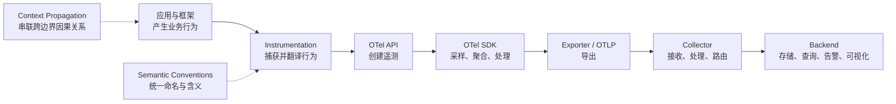

OpenTelemetry 的核心价值不是“再造一个监控后端”，而是把遥测的生产端、传输端和消费端解耦。

### 7.2.2 OpenTelemetry 的整体分层

从工程实现看，可以分成八个协作层次：

| 层次 | 核心对象 | 主要职责 |
|---|---|---|
| 被观测系统 | 应用、框架、SDK、数据库、运行时 | 产生真实业务行为 |
| Instrumentation | Callback、Wrapper、Middleware、原生埋点 | 捕获调用并创建遥测 |
| API | Tracer、Meter、Logger、Context、Baggage | 提供稳定的编程接口 |
| SDK | Provider、Sampler、Processor、Reader、Exporter | 实现采样、聚合、批处理和导出 |
| Semantic Conventions | Span、Metric、Log、Resource 命名规范 | 统一数据语义 |
| Propagation | Propagator、Inject、Extract | 跨线程、进程、网络传播上下文 |
| OTLP | OTLP/gRPC、OTLP/HTTP | 标准化遥测传输 |
| Collector 与后端 | Receiver、Processor、Exporter、存储与 UI | 集中治理、存储、查询和告警 |

其中最容易混淆的是：

- **API** 是“怎么写遥测”；
- **SDK** 是“遥测如何真正运行”；
- **Semantic Conventions** 是“字段叫什么、表示什么”；
- **OTLP** 是“遥测怎样被运输”；
- **Trace Context** 是“业务调用如何被串联”；
- **Instrumentation** 是“怎样从框架内部拿到数据”。

### 7.2.3 信号模型：Trace、Metric、Log、Baggage 与 Profile

OpenTelemetry 以信号组织客户端架构。当前概念体系包含 Trace、Metric、Log、Baggage 和 Profile。

| 信号 | 回答的问题 | 数据形态 | 典型用途 |
|---|---|---|---|
| Trace | 一次请求经历了什么 | 具有父子关系的 Span 图 | 端到端故障定位、关键路径分析 |
| Metric | 整体趋势如何 | 时间序列和聚合数据点 | Dashboard、告警、容量规划、SLO |
| Log | 某个时刻记录了什么 | 带时间、严重度和正文的记录 | 明细审计、诊断、业务事件 |
| Baggage | 哪些上下文应继续向下游传播 | 键值上下文 | 租户、实验组、业务关联信息传播 |
| Profile | 代码级资源消耗在哪里 | 时间采样或事件采样的栈数据 | CPU、内存、锁和热点函数分析 |

需要特别说明：

- **Baggage 不是独立的存储型遥测记录**。它主要跟随 Context 传播，只有被复制到 Span、Metric 或 Log 属性后，才会在后端中可查询；
- **Profile 是较新的信号方向**。语言 SDK、Collector 组件和后端支持程度并不完全一致，接入前应核对所用栈的能力；
- 五类信号相互关联，但生命周期、采样和导出策略相互独立。

### 2.3.1 多信号关联

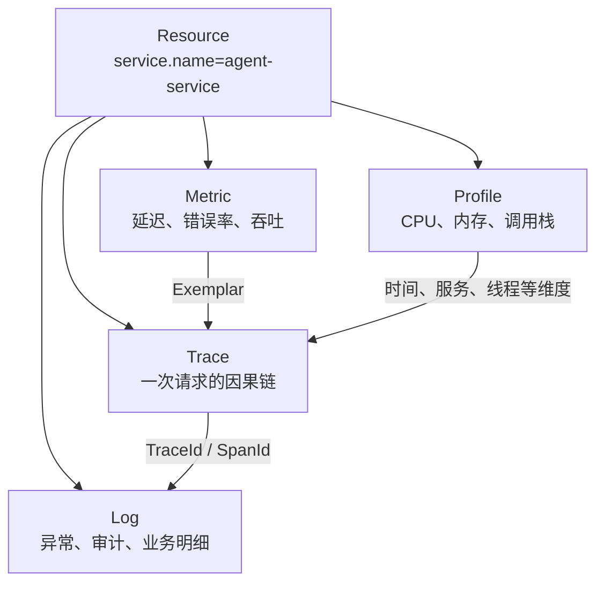

一个理想的可观测后端应支持：

```text
Metric 告警
  → 通过 Exemplar 跳到具体 Trace
  → 从 Trace 跳到关联 Log
  → 再按同一 Resource 和时间窗口查看 Profile
```

### 7.2.4 统一数据包络：Resource 与 InstrumentationScope

OpenTelemetry 的 Trace、Metric、Log 都不是孤立记录。它们通常处于两层公共上下文之下：

```text
Resource
└── InstrumentationScope
    └── Span / Metric / LogRecord
```

### 2.4.1 Resource

Resource 描述“被观测的实体是谁、位于哪里”，常见属性包括：

```text
service.name
service.namespace
service.version
service.instance.id
deployment.environment.name
host.name
process.pid
container.id
k8s.pod.name
cloud.provider
cloud.region
```

Resource 应具备以下特征：

- 在一批遥测记录之间稳定共享；
- 描述服务、进程、容器、Pod、主机或设备；
- 不放请求级数据；
- 不放 Prompt、Trace ID、用户输入等高基数内容；
- `service.name` 应明确配置，避免不同服务被聚合到默认名称。

示例：

```text
Resource:
  service.name = coding-agent-runtime
  service.namespace = vane-ai
  service.version = 2.4.0
  service.instance.id = pod-7b4d8
  deployment.environment.name = production
```

### 2.4.2 InstrumentationScope

InstrumentationScope 标识“是哪一个逻辑软件单元产生了遥测”，由以下元组构成：

```text
name
version
schema_url
attributes
```

例如：

```text
Scope:
  name = opentelemetry.instrumentation.genai.openai
  version = 0.x.y
  schema_url = https://opentelemetry.io/schemas/...
```

Resource 和 InstrumentationScope 的区别：

| 对象 | 标识谁 | 生命周期 |
|---|---|---|
| Resource | 被观测服务或实体 | 通常与进程、容器或服务实例一致 |
| InstrumentationScope | 产生遥测的库或模块 | 与 Instrumentation／业务模块版本一致 |
| Span 属性 | 某一次操作 | 与请求或操作一致 |

同一进程中，LangChain Instrumentation、OpenAI Instrumentation 和业务手工埋点可以共享一个 Resource，但分别使用不同的 InstrumentationScope。

### 2.4.3 OTLP 中的层级结构

```text
ResourceSpans
└── ScopeSpans
    └── Span

ResourceMetrics
└── ScopeMetrics
    └── Metric
        └── DataPoint

ResourceLogs
└── ScopeLogs
    └── LogRecord
```

理解这三层结构，对排查 `service.name` 丢失、同名 Metric 冲突、Scope 版本不一致和语义迁移问题非常重要。

### 7.2.5 Trace 详解

### 2.5.1 Trace 与 Span

Trace 表示一个端到端操作的因果图；Span 表示其中一个具有开始时间和结束时间的操作单元。

每个 Span 至少包含：

```text
TraceId          归属哪条Trace
SpanId           当前Span的唯一标识
ParentSpanId     父Span标识，可为空
Name             低基数操作名
StartTime        开始时间
EndTime          结束时间
Kind             调用角色
Status           结果状态
Attributes       键值元数据
Events           带时间戳的离散事件
Links            与其他SpanContext的因果关联
Resource         被观测实体
InstrumentationScope 产生遥测的模块
```

### 2.5.2 Span 名称

Span 名称应描述稳定操作，不应直接嵌入高基数值。

推荐：

```text
GET /orders/{id}
execute_tool
invoke_agent reviewer
chat gpt-5
SELECT users
```

不推荐：

```text
GET /orders/982739129
run for user david@example.com
prompt: 帮我读取完整仓库...
```

动态值应放入属性，而不是 Span 名称，否则后端聚合、索引和采样规则会失控。

### 2.5.3 SpanKind

OpenTelemetry 定义五种 SpanKind：

| SpanKind | 含义 | 典型场景 |
|---|---|---|
| `INTERNAL` | 进程内部操作 | Agent 规划、函数执行、内存计算 |
| `CLIENT` | 发起远程请求 | HTTP Client、数据库客户端、远程模型调用 |
| `SERVER` | 处理远程请求 | HTTP Server、gRPC Server、MCP Server |
| `PRODUCER` | 发送异步消息或任务 | 发布消息、提交后台任务 |
| `CONSUMER` | 消费异步消息或任务 | 消费队列、执行异步任务 |

重要原则：一个 Span 不要同时承担多个角色。服务端处理请求时创建 `SERVER` Span；调用下游时应另建 `CLIENT` Span。

### 2.5.4 Span Status

Span 状态包含：

```text
UNSET
ERROR
OK
```

- `UNSET` 是默认状态，通常也表示没有显式错误；
- `ERROR` 表示操作失败；
- `OK` 表示应用明确判定成功，通常没有必要对每个成功 Span 主动设置。

推荐错误处理：

```text
记录异常事件
设置 error.type
必要时设置 status=ERROR
保留业务错误码和终止原因
```

仅记录异常堆栈并不等于完整表达失败；同样，HTTP 200 也不等于 Agent 或工具业务成功。

### 2.5.5 Attributes

Attributes 是用于过滤、聚合和诊断的键值数据。常见类型为：

```text
string
boolean
integer
floating point
上述类型的数组
```

设计原则：

- 在 Span 创建时尽量写入采样所需属性；
- 高频筛选字段使用标准 Semantic Conventions；
- 大文本、二进制和无限长度数组不要放入属性；
- 高基数属性可以放 Trace，但要控制索引策略；
- 敏感内容默认不采集。

### 2.5.6 Span Event

Span Event 适合表示 Span 生命周期中的一个有意义时间点：

```text
retry.started
first_token.received
permission.denied
loop.detected
human_approval.requested
```

判断标准：

- 需要独立开始和结束时间：使用 Span；
- 只需要一个有时间戳的瞬时事实：使用 Event；
- 只是描述整个 Span 的元数据且时间点不重要：使用 Attribute。

### 2.5.7 Span Link

父子关系适合严格的同步或嵌套因果链；Link 适合非树形关系：

- 一个批处理消费多个上游消息；
- 一个异步任务在原 Trace 结束后启动；
- 多个 Agent 结果汇聚到一个聚合 Agent；
- 新 Trace 需要关联旧 Trace，但不应直接作为其子 Span；
- 一个工作项被重新入队或重放。

示意：

```text
Trace A: 用户请求
└── producer enqueue_job

Trace B: 后台任务
└── consumer execute_job
    links = [Trace A / producer SpanContext]
```

### 2.5.8 Trace 不是严格的一棵本地调用栈

分布式 Trace 更准确地说是一个以父子关系为主、辅以 Links 的有向因果图。它可以跨越：

```text
线程
异步任务
进程
容器
服务
数据中心
消息队列
人工审批等待
```

这也是 Trace 与普通函数调用栈、日志缩进或单机 Profiler 的根本区别。

### 7.2.6 Metrics 详解

Metric 用于表达可聚合的数值趋势。它不是“定时打印一个数字”，而是由测量、属性、聚合、时间范围和 temporality 共同构成的数据流。

### 2.6.1 核心对象

```text
MeterProvider
└── Meter
    └── Instrument
        └── Measurement
            └── Aggregation
                └── Metric DataPoint
```

- `MeterProvider`：Meter 工厂和统一配置入口；
- `Meter`：按 InstrumentationScope 创建 Instrument；
- `Instrument`：记录测量；
- `MetricReader`：触发收集并决定导出节奏；
- `MetricExporter`：发送聚合后的数据。

### 2.6.2 Instrument 类型

| Instrument | 行为 | 典型用途 |
|---|---|---|
| Counter | 单调递增 | 请求数、Token 总量、错误数 |
| UpDownCounter | 可增可减 | 活跃任务数、队列占用、并发连接 |
| Histogram | 记录数值分布 | 延迟、响应大小、Token 分布、工具耗时 |
| Gauge | 记录某时刻值 | 温度、当前预算、瞬时利用率 |
| Observable Counter | 回调读取单调累计值 | 进程 CPU 时间、累计字节 |
| Observable UpDownCounter | 回调读取可增减累计值 | 当前队列长度、连接数 |
| Observable Gauge | 回调读取瞬时状态 | 内存、GPU 利用率、线程数 |

选择原则：

```text
只会增加的累计量          → Counter
会上升也会下降的状态量    → UpDownCounter
关注分位数和分布          → Histogram
只关心当前快照            → Gauge
值只能在采集时读取        → Observable Instrument
```

### 2.6.3 Aggregation

SDK 不会默认把每次 Measurement 都原样发送出去，而是在进程内聚合，例如：

```text
Sum
LastValue
ExplicitBucketHistogram
ExponentialHistogram
Drop
```

Histogram 通常比“平均值”更有诊断价值，因为平均值会掩盖长尾。Agent 场景应重点关注：

```text
p50 / p90 / p95 / p99 模型延迟
工具执行长尾
首 Token 延迟分布
每次任务的 Token 分布
每次工作流的 Agent 调用次数分布
```

### 2.6.4 Temporality

Metric 数据常见两种时间性：

| Temporality | 含义 | 示例 |
|---|---|---|
| Cumulative | 从固定起点累计到当前 | 进程启动以来共处理 1000 次请求 |
| Delta | 只表示上一个采集周期到当前的增量 | 最近 60 秒处理 80 次请求 |

SDK、Collector 和后端之间必须正确处理 Delta／Cumulative 转换，否则容易产生重置、重复累计或速率异常。

### 2.6.5 Views

View 是 Metrics SDK 的治理入口，可以：

- 修改输出 Metric 名称；
- 修改描述和单位；
- 选择聚合方式；
- 配置 Histogram Bucket；
- 删除高基数属性；
- 屏蔽不需要的 Instrument；
- 限制某类 Metric 的数据流数量。

例如，Instrumentation 记录：

```text
agent.tool.duration
attributes:
  tool.name
  tool.type
  tool.call.id
  user.id
```

生产 View 应保留：

```text
tool.name
tool.type
```

删除：

```text
tool.call.id
user.id
```

### 2.6.6 Cardinality

一个 Metric 在不同属性组合下会形成不同时间序列：

```text
metric_name + attribute_set = 一条时间序列
```

危险标签：

```text
trace_id
span_id
run_id
conversation_id
user_id
request_id
file_path
prompt_hash
完整URL
```

OpenTelemetry Metrics SDK 具备基数限制和 Overflow 数据点机制，但它不是放任高基数设计的理由。超过限制后，测量值虽然可被折叠到 Overflow 流中，维度分析能力仍会丢失。

### 2.6.7 Exemplars

Exemplar 在 Metric 数据点中保留一个具有代表性的原始测量，并可携带 TraceId／SpanId。

典型跳转：

```text
agent.workflow.duration p99 异常
    ↓ Exemplar
具体慢 Trace
    ↓
慢在模型、检索、工具还是审批
```

因此，Exemplar 是 Metrics 与 Traces 之间非常重要的桥梁。

### 7.2.7 Logs 详解

OpenTelemetry Logs 的重点不是要求所有应用抛弃现有日志库，而是：

- 把已有日志桥接到统一 LogRecord 数据模型；
- 自动关联 TraceId 和 SpanId；
- 附加 Resource 与 InstrumentationScope；
- 统一采集、转换和导出；
- 兼容 Syslog、Log4j、Python logging、容器日志等来源。

### 2.7.1 LogRecord 主要字段

```text
Timestamp
ObservedTimestamp
SeverityText
SeverityNumber
Body
Attributes
TraceId
SpanId
TraceFlags
Resource
InstrumentationScope
EventName（按实现和语义使用）
```

其中：

- `Timestamp`：事件实际发生时间；
- `ObservedTimestamp`：采集系统观察到该日志的时间；
- `Body`：正文，可为字符串或结构化值；
- `Attributes`：查询维度和结构化上下文；
- `TraceId`、`SpanId`：实现日志与 Trace 的直接关联。

### 2.7.2 三种日志接入方式

| 方式 | 机制 | 适用场景 |
|---|---|---|
| Logging Bridge／Appender | 从现有日志框架转换为 OTel LogRecord | Java、Python、.NET 等已有应用日志 |
| Collector 文件采集 | 读取文件、stdout、容器日志并解析 | 无法修改应用、基础设施日志 |
| 直接使用 Logs API | 应用或 Instrumentation 直接发 LogRecord | 新系统、结构化事件、框架适配器 |

### 2.7.3 Log 与 Span Event 的区别

| 维度 | Log | Span Event |
|---|---|---|
| 是否必须依附 Span | 否 | 是 |
| 是否有独立日志生命周期 | 是 | 否 |
| 是否适合高量明细 | 相对适合 | 不适合无限增长 |
| Trace 结束后是否仍可独立存在 | 可以 | 不可以 |
| 典型用途 | 审计、诊断、业务事件 | 重试、首 Token、状态切换 |

不要把大量流式 Token、完整 stdout 或逐行文件内容全部作为 Span Event；这会扩大 Span、增加内存和后端索引压力。此类内容更适合受控日志或对象存储引用。

### 7.2.8 Context、SpanContext 与 Baggage

### 2.8.1 Context

Context 是当前逻辑执行链路携带的上下文容器。当前 Span、Baggage 和其他运行时值通常与 Context 关联。

同进程内，语言 SDK 可能使用：

```text
ThreadLocal
ContextVar
AsyncLocal
Coroutine Context
显式 context 参数
```

具体实现因语言而异，但目标相同：让子调用获取正确的当前 Span。

### 2.8.2 SpanContext

SpanContext 是可传播的 Trace 身份，核心字段包括：

```text
TraceId
SpanId
TraceFlags
TraceState
是否远程上下文
```

SpanContext 可以在未记录完整 Span 的情况下继续向下游传播，因此“本地没有导出某个 Span”不必然意味着下游无法继承 TraceId。

### 2.8.3 Baggage

Baggage 是随 Context 传播的键值集合，适合传递：

```text
tenant.id
experiment.group
request.origin
workflow.class
```

但 Baggage 存在显著风险：

- 可能被自动写入跨服务请求头；
- 下游收到的 Baggage 属于不可信输入；
- 可能泄露 PII、密钥或内部拓扑；
- 过大时会放大网络开销；
- 不应直接把全部 Baggage 自动复制到 Metric 标签。

建议：

```text
建立白名单
限制键和值长度
禁止密钥、Token、Prompt正文和个人敏感信息
跨信任域时清理
进入Metric前再次做低基数过滤
```

### 7.2.9 Context Propagation 与 W3C Trace Context

### 2.9.1 Inject 与 Extract

跨网络传播分为两步：

```text
客户端：Inject 当前Context到Carrier
服务端：Extract Carrier中的Context并创建子Span
```

Carrier 可以是：

```text
HTTP Header
gRPC Metadata
消息属性
MCP _meta
环境变量
自定义IPC字段
```

### 2.9.2 W3C Trace Context

默认推荐传播：

```text
traceparent
tracestate
```

`traceparent` 逻辑结构：

```text
version-trace_id-parent_id-trace_flags
```

例如：

```text
00-4bf92f3577b34da6a3ce929d0e0e4736-00f067aa0ba902b7-01
```

含义：

```text
00                                版本
4bf92...4736                      TraceId
00f067aa0ba902b7                  上游SpanId
01                                TraceFlags，最低位表示sampled
```

### 2.9.3 传播协议与 OTLP 的区别

```text
业务请求：traceparent / tracestate / baggage
遥测导出：OTLP
```

它们运行在两条不同的数据路径上：

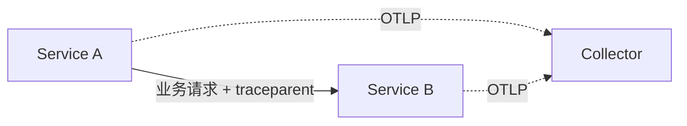

没有业务侧 Context Propagation，即使 A 和 B 都向同一 Collector 导出，也会形成两条不相关的 Trace。

### 7.2.10 Sampling 详解

采样用于控制 Trace 数据量与成本。采样不应与 Metrics 聚合或日志级别过滤混为一谈。

### 2.10.1 Head Sampling

在 Trace 开始或 Span 创建时立即决定是否记录／导出。

优点：

- 开销低；
- 容易配置；
- 不需要缓存完整 Trace；
- 适合高吞吐入口保护。

局限：

- 无法预先知道后续是否报错；
- 无法根据整条 Trace 总耗时做决策；
- 可能丢掉低频但关键的异常链路。

常见策略：

```text
AlwaysOn
AlwaysOff
TraceIdRatioBased
ParentBased
Consistent Probability Sampling
```

### 2.10.2 Tail Sampling

在 Collector 收集到一条 Trace 的大部分或全部 Span 后再决定是否保留。

适合：

```text
错误Trace全部保留
总耗时超过阈值全部保留
包含特定Agent、租户或版本的Trace提高采样率
权限拒绝、预算耗尽、Loop检测全部保留
普通成功Trace按比例保留
```

代价：

- 需要缓存 Span；
- 需要等待 Trace 完成；
- Collector 变成有状态组件；
- 内存和延迟更高；
- 横向扩容时必须保证同一 Trace 路由到同一采样实例。

### 2.10.3 Head 与 Tail 组合

高流量系统可以先使用 Head Sampling 限制最上游流量，再对进入 Collector 的 Trace 使用 Tail Sampling 做精细决策。但要理解：

> Head Sampling 已经丢掉的 Trace，Tail Sampling 无法恢复。

### 2.10.4 采样对日志和指标的影响

- Trace 未采样，不代表 Metric 不记录；
- Log 是否导出取决于日志管线和过滤规则；
- 未采样 Trace 的日志可能仍携带 TraceId，但后端未必能找到对应 Span；
- Eval、审计和计费数据不能盲目依赖采样后的 Trace 作为唯一事实来源。

### 7.2.11 OpenTelemetry API 详解

API 是供 Instrumentation、框架和应用调用的稳定接口。

### 2.11.1 Trace API

核心对象：

```text
TracerProvider
Tracer
Span
SpanContext
Context
TextMapPropagator
```

典型逻辑：

```python
tracer = trace.get_tracer("my.agent.runtime", "1.0.0")

with tracer.start_as_current_span("invoke_agent") as span:
    span.set_attribute("agent.name", "reviewer")
    run_agent()
```

### 2.11.2 Metrics API

核心对象：

```text
MeterProvider
Meter
Counter
UpDownCounter
Histogram
Gauge
Observable Instruments
```

### 2.11.3 Logs API

核心对象：

```text
LoggerProvider
Logger
LogRecord
```

Logs API 既可以被应用直接使用，也常由日志 Bridge／Appender 调用，以兼容已有日志生态。

### 2.11.4 API 的 No-op 特性

库只依赖 API，而宿主应用没有安装或配置 SDK 时，API 应以低开销 No-op 运行。这保证公共库可以安全加入 OTel API 依赖，而不会强制用户选择某个 SDK 或后端。

### 7.2.12 OpenTelemetry SDK 详解

SDK 是 API 的实际实现。应用所有者通常在每个进程中统一配置一套 Provider。

### 2.12.1 Trace SDK 管线

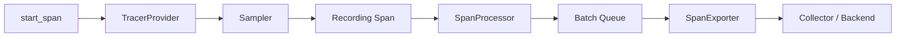

关键组件：

| 组件 | 职责 |
|---|---|
| TracerProvider | Tracer 工厂、全局 Trace SDK 配置 |
| Sampler | 创建 Span 时决定记录和采样 |
| IdGenerator | 生成 TraceId 和 SpanId |
| SpanLimits | 限制 Attributes、Events、Links 数量和长度 |
| SpanProcessor | 在 Span 开始／结束时处理 |
| SimpleSpanProcessor | 同步导出，适合开发调试 |
| BatchSpanProcessor | 队列、批量、后台导出，适合生产 |
| SpanExporter | 导出到 OTLP、控制台或其他协议 |

### 2.12.2 Metrics SDK 管线

```text
Instrumentation
    ↓ Measurement
Aggregator
    ↓
MetricReader
    ↓
MetricExporter
```

关键组件：

```text
MeterProvider
View
Aggregation
Cardinality Limit
MetricReader
Periodic Exporting Reader
MetricExporter
Exemplar Reservoir
```

### 2.12.3 Logs SDK 管线

```text
Logger / Logging Bridge
    ↓
LogRecordProcessor
    ↓
BatchLogRecordProcessor
    ↓
LogExporter
```

### 2.12.4 Resource Detector

SDK 可以从环境和运行平台检测 Resource：

```text
环境变量
进程
主机
容器
Kubernetes
云平台
服务配置
```

自动检测结果与显式配置的合并规则必须确认，尤其是 `service.name`、环境和实例标识。

### 2.12.5 生命周期

生产应用应正确处理：

```text
force_flush
shutdown
进程退出
容器终止信号
Serverless冻结与恢复
崩溃时未发送队列
```

批处理提高吞吐，但意味着异常退出时可能丢失尚未导出的遥测。关键审计数据不应只依赖内存中的 Batch Queue。

### 7.2.13 OTLP 详解

OTLP 是 OpenTelemetry 原生协议，用于传输 Trace、Metric、Log 和逐步扩展的其他信号。

### 2.13.1 两种主流传输

| 方式 | 默认端口 | 编码与特点 |
|---|---:|---|
| OTLP/gRPC | `4317` | Protobuf + gRPC，双向能力和流控生态成熟 |
| OTLP/HTTP | `4318` | Protobuf over HTTP，网络兼容性较好 |

OTLP/HTTP 常见路径：

```text
/v1/traces
/v1/metrics
/v1/logs
/v1/profiles
```

### 2.13.2 成功、部分成功与失败

OTLP 支持：

```text
Full Success
Partial Success
Retryable Failure
Non-retryable Failure
```

部分成功表示接收端接受了一部分数据并拒绝另一部分。客户端不应简单把部分成功当成网络失败并重复发送整批数据，否则可能造成重复。

OTLP/HTTP 常见可重试响应包括：

```text
429
502
503
504
```

客户端通常应使用指数退避和随机抖动，并遵守 `Retry-After`。

### 2.13.3 OTLP 生产配置关注点

```text
TLS
mTLS
认证Header
压缩
批大小
请求超时
发送队列
并发连接
重试上限
持久化队列
最大消息体
代理与负载均衡
```

不要把 API Key、Bearer Token 或 Collector 凭证写入 Span 属性或普通日志。

### 2.13.4 OTLP 不保证端到端永久可靠

OTLP 规范定义传输行为，但完整可靠性还取决于：

```text
SDK Batch Queue
应用退出处理
网络
Collector Receiver
Collector Processor
Exporter Queue
持久存储
后端接收能力
```

因此，“SDK 返回成功”通常只代表当前导出边界成功，不代表数据已进入最终可查询的长期存储。

### 7.2.14 Collector 详解

OpenTelemetry Collector 是厂商中立的遥测接收、处理和导出进程。它通过 Pipeline 组织组件。

### 2.14.1 五类组件

| 组件 | 作用 | 是否位于 Pipeline |
|---|---|---:|
| Receiver | 接收或拉取遥测 | 是 |
| Processor | 转换、过滤、批处理、采样、限流 | 是 |
| Exporter | 向后端或下一级 Collector 发送 | 是 |
| Connector | 连接两个 Pipeline，同时充当 Exporter 和 Receiver | 是 |
| Extension | 健康检查、认证、存储、调试等辅助能力 | 否，挂载于 Service |

### 2.14.2 Pipeline

每条 Pipeline 对应一种信号：

```yaml
service:
  pipelines:
    traces:
      receivers: [otlp]
      processors: [memory_limiter, batch]
      exporters: [otlp]
    metrics:
      receivers: [otlp]
      processors: [memory_limiter, batch]
      exporters: [otlp]
    logs:
      receivers: [otlp]
      processors: [memory_limiter, batch]
      exporters: [otlp]
```

只在配置文件中声明组件并不会自动启用；组件必须被引用到 Pipeline 或 `service.extensions`。

### 2.14.3 Connector

Connector 可在不同 Pipeline 之间转换、复制或路由数据，例如：

```text
Traces → Metrics
Traces → Service Graph
一条Pipeline → 多条Pipeline
条件路由
```

概念上：

```text
traces pipeline
    ↓ connector作为exporter
connector
    ↓ connector作为receiver
metrics pipeline
```

### 2.14.4 常用 Processor

```text
memory_limiter     限制内存压力
batch              批处理
resource           修改Resource
attributes         修改Span/Log属性
transform          使用OTTL转换数据
filter             丢弃不需要的数据
redaction          脱敏
tail_sampling      尾采样
probabilistic_sampler 概率采样
resourcedetection  检测环境资源
```

Processor 顺序会改变结果。例如通常先做 `memory_limiter`，再做过滤、转换、采样，最后 `batch`。

### 2.14.5 Collector 基础配置示例

```yaml
receivers:
  otlp:
    protocols:
      grpc:
        endpoint: 0.0.0.0:4317
      http:
        endpoint: 0.0.0.0:4318

processors:
  memory_limiter:
    check_interval: 1s
    limit_mib: 1024
  resource:
    attributes:
      - key: telemetry.pipeline
        value: agent-observability
        action: upsert
  batch:
    timeout: 5s

exporters:
  otlp/backend:
    endpoint: observability-backend:4317
    tls:
      insecure: false
  debug:
    verbosity: basic

extensions:
  health_check:

service:
  extensions: [health_check]
  pipelines:
    traces:
      receivers: [otlp]
      processors: [memory_limiter, resource, batch]
      exporters: [otlp/backend]
    metrics:
      receivers: [otlp]
      processors: [memory_limiter, resource, batch]
      exporters: [otlp/backend]
    logs:
      receivers: [otlp]
      processors: [memory_limiter, resource, batch]
      exporters: [otlp/backend]
```

实际组件字段会随 Collector 版本和 Distribution 变化，应使用目标版本配置校验命令验证。

### 2.14.6 Collector Distribution

Collector 是可组合架构。不同 Distribution 包含的 Receiver、Processor、Exporter、Connector 和 Extension 不同。

生产建议：

- 检查所选 Distribution 的组件清单；
- 不要假设文档中的任意组件都已打包；
- 对供应链和攻击面敏感时，使用 OpenTelemetry Collector Builder 构建最小 Distribution；
- 固定镜像摘要和组件版本；
- 对配置做启动前校验和集成测试。

### 7.2.15 Collector 部署形态

### 2.15.1 直接导出

```text
Application SDK → Backend
```

适合本地开发和小规模验证。缺点是：

- 应用需要持有后端凭证；
- 难以统一脱敏、路由和采样；
- 更换后端需要修改大量应用配置；
- Backend 故障可能直接影响 SDK 队列。

### 2.15.2 Agent／本地 Collector

```text
Application SDK → Local Collector → Backend
```

本地 Collector 靠近工作负载，负责协议收敛、批处理、资源检测和第一层脱敏。

### 2.15.3 Gateway Collector

```text
Application / Local Collector → Gateway Collector → Backends
```

Gateway 适合：

```text
Tail Sampling
多租户路由
统一认证
多后端复制
中心化转换
成本治理
```

### 2.15.4 Agent-to-Gateway

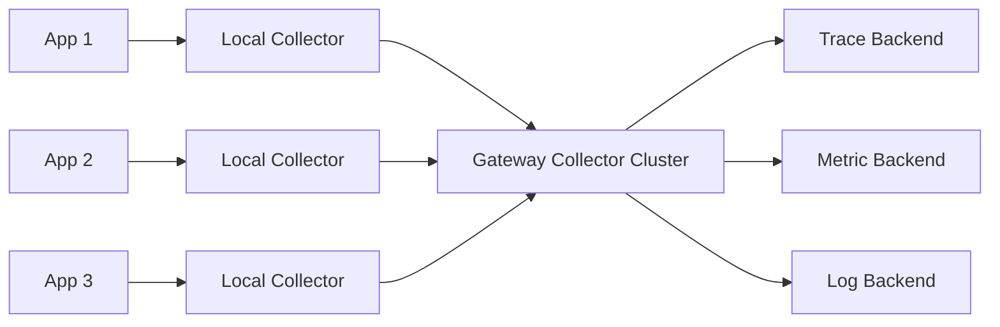

这是较常见的生产形态，但 Tail Sampling、Span-to-Metrics 等有状态组件需要按 TraceId 或服务名做一致性路由。

### 2.15.5 Kubernetes 部署选择

| 形态 | 典型部署 | 适用场景 |
|---|---|---|
| Sidecar | 每个 Pod 一个 Collector | 强隔离、特定协议、本地文件访问 |
| DaemonSet | 每个 Node 一个 Collector | 节点级日志、主机指标、本地接收 |
| Deployment | 中心 Gateway 集群 | Tail Sampling、路由、集中治理 |
| 混合 | DaemonSet／Sidecar + Deployment | 大中型生产环境 |

### 7.2.16 Instrumentation 模式详解

### 2.16.1 手工埋点

业务代码直接调用 OTel API：

```text
优点：语义最准确
缺点：需要修改代码和维护埋点
```

适合：

```text
业务工作流
权限决策
领域状态机
Agent Loop
预算与审批
自研协议
```

### 2.16.2 原生埋点

框架自身依赖 OTel API，并在源码内创建遥测：

```text
优点：框架作者最了解语义
缺点：需要框架长期维护兼容性
```

### 2.16.3 独立 Instrumentation Library

外部适配器通过 Callback、Wrapper、Middleware、Interceptor 或 Monkey Patch 观测目标库。

```text
被观测库 ≠ Instrumentation库
```

### 2.16.4 零代码／自动埋点

不修改应用业务源码，通过启动注入、字节码增强、Monkey Patch、CLR/JVM Profiler、编译期插件或 eBPF 等方式自动采集。

不同语言实现差异很大：

```text
Java       Java Agent + 字节码增强
.NET       CLR Profiling API / 自动探针
Python     启动注入 + sitecustomize + Monkey Patch
Node.js    Module Hook / Instrumentation
Go         手工/编译期/自动化能力按方案不同
原生环境   eBPF或代理方式
```

“零代码”只表示不修改业务源文件，不表示没有注入、没有配置、没有性能成本，也不表示能理解所有领域语义。

### 2.16.5 进程外和 eBPF 观测

eBPF、Service Mesh 和网络代理可在不进入应用进程的情况下观察系统调用或协议行为，适合补齐：

```text
网络连接
DNS
TCP
部分HTTP/gRPC
系统调用
内核调度
```

但通常无法恢复：

```text
Prompt语义
Agent规划
Tool参数
业务状态机
模型Token
框架Callback层级
```

因此它是协议和运行时观测补充，而不是 Agent 语义层替代品。

### 7.2.17 Semantic Conventions 与 Schema 版本治理

### 2.17.1 为什么需要语义约定

没有 Semantic Conventions 时，各 Instrumentation 可能产生：

```text
http.status
http.status_code
responseCode
status
```

统一后，后端可以使用同一查询、Dashboard 和告警规则跨语言工作。

Semantic Conventions 规定：

```text
Span名称
SpanKind
Attribute名称、类型、含义和值域
Metric名称、单位和Instrument类型
Event名称
Resource属性
错误表达
```

### 2.17.2 稳定性等级

不同语义组可能处于：

```text
development
alpha
beta
release_candidate
stable
```

不能因为 OpenTelemetry API 稳定，就推断所有 GenAI、数据库、消息或 Profile 语义都已稳定。

### 2.17.3 Schema URL

InstrumentationScope 或 Resource 可以携带 Schema URL，用于说明遥测符合哪个语义 Schema。Schema 机制旨在支持属性重命名和版本转换，使遥测生产者、Collector 和后端能够独立升级。

示意：

```text
旧数据：deployment.environment
新数据：deployment.environment.name

Schema Translator
    → 根据schema_url做兼容转换
```

### 2.17.4 稳定语义迁移

部分 Instrumentation 使用：

```text
OTEL_SEMCONV_STABILITY_OPT_IN
```

支持：

```text
只发新版稳定语义
新旧字段双发
继续发旧版语义
```

双发阶段要防止：

- Metric 重复；
- Dashboard 同时统计新旧字段；
- 成本翻倍；
- 属性冲突；
- 下游转换再次复制。

### 2.17.5 自定义命名空间

自研属性建议使用组织或产品前缀：

```text
app.agent.loop.iteration
vane.permission.decision
company.workflow.run.id
```

避免：

- 占用 `otel.*` 保留命名空间；
- 私自重新定义已有标准字段；
- 把实验字段直接写成未来可能冲突的 `gen_ai.*`；
- 在大量代码中散落字符串常量。

推荐增加内部 Telemetry Schema／Adapter 层统一管理。

### 7.2.18 配置模型与常用环境变量

OpenTelemetry 通常支持代码配置、环境变量、自动探针配置和 Collector 配置。常见环境变量包括：

```bash
OTEL_SERVICE_NAME=agent-service
OTEL_RESOURCE_ATTRIBUTES=service.namespace=vane-ai,deployment.environment.name=prod

OTEL_EXPORTER_OTLP_ENDPOINT=https://otel-gateway.example.com
OTEL_EXPORTER_OTLP_PROTOCOL=grpc
OTEL_EXPORTER_OTLP_HEADERS=authorization=Bearer%20...

OTEL_TRACES_EXPORTER=otlp
OTEL_METRICS_EXPORTER=otlp
OTEL_LOGS_EXPORTER=otlp

OTEL_PROPAGATORS=tracecontext,baggage
OTEL_TRACES_SAMPLER=parentbased_traceidratio
OTEL_TRACES_SAMPLER_ARG=0.1
```

配置注意事项：

- 各语言 SDK 对某些环境变量的支持程度可能不同；
- 信号级 Endpoint 可能覆盖通用 Endpoint；
- OTLP/gRPC 与 OTLP/HTTP 对 URL Path 的解释不同；
- Header 中的空格、逗号和特殊字符需要正确编码；
- 自动探针、框架和应用可能同时尝试设置全局 Provider；
- 凭证优先由 Secret 管理系统注入，不写入仓库。

### 7.2.19 性能、可靠性与安全治理

### 2.19.1 性能成本来自哪里

```text
创建Span和对象分配
读取和序列化属性
Context切换
流式Chunk观察
Metric属性组合聚合
日志正文复制
Batch Queue内存
压缩和网络发送
Collector转换与采样
后端索引
```

优化顺序：

1. 先减少无价值遥测；
2. 控制正文、Event 和 Attribute 数量；
3. 控制 Metric 基数；
4. 使用 Batch Processor；
5. 使用采样；
6. 调整 Collector 队列和并发；
7. 最后再做低层微优化。

### 2.19.2 遥测不得破坏业务

Instrumentation 和 SDK 的基本原则是：

```text
遥测错误不应成为业务错误
Exporter失败不应阻塞核心请求
异常属性类型不应使应用崩溃
Collector不可用时应有有界队列和丢弃策略
```

但这不代表无限缓存。生产系统必须明确：

```text
队列上限
内存上限
重试上限
磁盘上限
数据丢弃优先级
关键审计数据的独立持久化路径
```

### 2.19.3 敏感数据

重点风险字段：

```text
Prompt和Completion
Tool Arguments和Result
RAG文档正文
数据库Statement
HTTP Header
URL Query
文件路径
用户ID、邮箱、手机号
Access Token、Cookie、API Key
Baggage
异常堆栈中的业务数据
```

推荐多层防护：

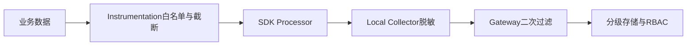

### 2.19.4 信任边界

跨租户、跨网络区或跨公司边界时：

- 不信任外部 `traceparent`、`tracestate` 和 `baggage` 的附加内容；
- 验证格式并限制长度；
- 必要时重新建立 Trace 边界，只使用 Link 关联；
- 对 Baggage 做白名单清理；
- Collector Receiver 启用认证和 TLS；
- 防止租户伪造 Resource 或服务标识污染后端。

### 7.2.20 自可观测性与 Collector 运维

可观测系统自身也必须被观测。需要监控：

```text
SDK丢弃Span/Log数量
Batch Queue使用率
Exporter失败与重试
Collector接收速率
Processor拒绝数据
Exporter Queue大小与容量
永久发送失败
Collector内存和CPU
Tail Sampling等待Trace数量
持久队列磁盘使用
Backend摄取延迟
```

Collector 常用运维能力：

```text
health_check
zPages
pprof
内部Metrics
内部Logs
debug exporter
配置校验
```

容量判断不能只看 Collector CPU。若 Exporter Queue 持续接近容量，可能是后端或网络变慢，盲目增加 Collector 副本可能进一步压垮后端。

### 7.2.21 调试与排障方法

### 2.21.1 从最短链路验证

```text
应用 → Console／Debug Exporter
应用 → 单个Collector → Debug Exporter
应用 → Collector → 真实Backend
多服务Context传播
自动Instrumentation
采样和脱敏
```

不要一开始同时引入多级 Collector、Tail Sampling、多个后端和十几个 Processor。

### 2.21.2 排障检查表

| 现象 | 优先检查 |
|---|---|
| 完全没有遥测 | SDK 是否配置、Exporter 是否启用、Endpoint 是否可达 |
| 只有 HTTP Span | 框架／GenAI Instrumentation 是否安装和加载 |
| Trace 断裂 | Propagator、Inject／Extract、代理是否丢 Header |
| `service.name` 异常 | Resource 合并顺序和环境变量 |
| Span 很短或不结束 | 异步／流式 Wrapper 生命周期 |
| Token 翻倍 | 多层模型 Span 或双语义字段重复统计 |
| Metric 暴涨 | 高基数属性、View 和基数限制 |
| Collector 内存高 | Batch、Tail Sampling、队列、超大属性 |
| 数据偶发丢失 | SDK退出Flush、Exporter Queue、网络和后端限流 |
| 后端字段不一致 | Semantic Conventions 版本与 Schema URL |
| 日志无法跳Trace | LogRecord是否携带TraceId／SpanId，格式转换是否丢字段 |

### 2.21.3 Trace 结构契约测试

建议在 CI 中使用 In-Memory Exporter 或测试 Collector，断言：

```text
根Span类型和名称
父子关系
SpanKind
必要属性
错误状态
Event
敏感字段未出现
Metric标签不含高基数值
流式Span最终结束
取消与超时语义不同
```

这比仅检查“有没有 Span”更可靠。

### 7.2.22 OpenTelemetry 与常见可观测组件的关系

| 组件 | 与 OpenTelemetry 的关系 |
|---|---|
| Prometheus | 主要是 Metrics 抓取、存储和查询生态；Collector 可接收／导出 Prometheus 数据 |
| Jaeger | 分布式 Trace 后端与生态；可接收 OTel 导出的 Trace |
| Tempo | Trace 存储后端；通常通过 Collector／OTLP 接入 |
| Zipkin | Trace 数据模型、协议和后端生态；OTel 可兼容导出 |
| Loki | 日志存储和查询后端；可接收 Collector 转换后的日志 |
| Fluent Bit／Vector | 日志与事件采集处理组件；可与 Collector 协同或分工 |
| 商业 APM | 提供存储、查询、告警、UI 和分析；通常支持 OTLP |
| OpenTracing | 早期分布式追踪 API，已被 OTel 统一替代 |
| OpenCensus | 早期 Trace／Metric 项目，能力被 OTel 继承和整合 |
| eBPF 可观测工具 | 进程外协议和内核观测，可产生或补充 OTel 数据 |

OpenTelemetry 可以替换“每个后端一套 SDK”的接入方式，但不会自动替换所有存储、查询和告警系统。

### 7.2.23 设计一套高质量 OTel 埋点的基本原则

1. **先定义业务问题，再定义信号。** 不要为了“全量”给每个函数建 Span。
2. **Span 表示有持续时间的操作，Event 表示瞬时事实。**
3. **Metric 用于聚合趋势，不承载请求唯一标识。**
4. **Resource 标识实体，不承载请求级信息。**
5. **InstrumentationScope 标识遥测生产模块。**
6. **优先使用稳定 Semantic Conventions。**
7. **动态值进入 Attribute，不进入 Span／Metric 名称。**
8. **一个逻辑操作只有一个权威 Span。**
9. **远程边界使用正确 SpanKind，并传播 Context。**
10. **默认不采集敏感正文。**
11. **Provider 由宿主应用统一管理。**
12. **Collector 配置需要版本锁定、校验和容量测试。**
13. **采样不能作为计费、审计或 Eval 的唯一事实来源。**
14. **对遥测结构做契约测试。**
15. **监控可观测管线本身。**

### 7.2.24 从 OpenTelemetry 本体过渡到 Agent 可观测性

掌握上述机制后，Agent 接入可以理解为一组映射：

```text
Workflow / Agent / Tool / Retriever
    → Span与Event的边界设计

模型、Token、流式Chunk
    → SDK层Instrumentation

HTTP、gRPC、MCP、CLI
    → SpanKind与Context Propagation

Loop、预算、权限、审批
    → 应用领域Span／Event／Metric

LangChain、OpenAI、Chroma
    → 不同Hook机制翻译到同一OTel API

OTel SDK
    → 统一采样、聚合、批处理和导出

Collector
    → 脱敏、路由、Tail Sampling和多后端治理
```

后续章节将在这一基础上，详细说明 OpenTelemetry 如何进入 Agent 内部、Python 零侵入探针如何工作，以及各开源框架怎样与 API、SDK、Semantic Conventions、OTLP 和 Collector 协同。

### 本章主要官方参考

- OpenTelemetry Specification：<https://opentelemetry.io/docs/specs/otel/>
- OpenTelemetry Client Architecture：<https://opentelemetry.io/docs/specs/otel/overview/>
- Signals：<https://opentelemetry.io/docs/concepts/signals/>
- Traces：<https://opentelemetry.io/docs/concepts/signals/traces/>
- Metrics：<https://opentelemetry.io/docs/concepts/signals/metrics/>
- Logs：<https://opentelemetry.io/docs/concepts/signals/logs/>
- Baggage：<https://opentelemetry.io/docs/concepts/signals/baggage/>
- Profiles：<https://opentelemetry.io/docs/concepts/signals/profiles/>
- Resource Specification：<https://opentelemetry.io/docs/specs/otel/resource/>
- InstrumentationScope：<https://opentelemetry.io/docs/specs/otel/common/instrumentation-scope/>
- Trace API：<https://opentelemetry.io/docs/specs/otel/trace/api/>
- Trace SDK：<https://opentelemetry.io/docs/specs/otel/trace/sdk/>
- Metrics API：<https://opentelemetry.io/docs/specs/otel/metrics/api/>
- Metrics SDK：<https://opentelemetry.io/docs/specs/otel/metrics/sdk/>
- Logs Specification：<https://opentelemetry.io/docs/specs/otel/logs/>
- Context Propagators：<https://opentelemetry.io/docs/specs/otel/context/api-propagators/>
- Sampling：<https://opentelemetry.io/docs/concepts/sampling/>
- Semantic Conventions：<https://opentelemetry.io/docs/specs/semconv/>
- Telemetry Schemas：<https://opentelemetry.io/docs/specs/otel/schemas/>
- OTLP Specification：<https://opentelemetry.io/docs/specs/otlp/>
- Collector Architecture：<https://opentelemetry.io/docs/collector/architecture/>
- Collector Configuration：<https://opentelemetry.io/docs/collector/configuration/>
- Collector Components：<https://opentelemetry.io/docs/collector/components/>
- Collector Scaling：<https://opentelemetry.io/docs/collector/scaling/>

---

## 7.3 OpenTelemetry 与 Agent 的总体关系

### 7.3.1 一次 Agent 任务应建模为一条 Trace

推荐把一次用户可感知的 Agent 请求建模为一条完整 Trace：

```text
invoke_workflow coding_change
├── invoke_agent orchestrator
│   ├── plan orchestrator
│   │   └── chat model-a
│   ├── retrieval codebase
│   ├── search_memory project_memory
│   └── invoke_agent implementer
│       ├── chat model-b
│       ├── execute_tool read_file
│       ├── execute_tool apply_patch
│       └── execute_tool run_tests
└── invoke_agent reviewer
    ├── chat model-c
    └── execute_tool run_tests
```

这种结构能够回答：

- 整体任务耗时；
- 每个 Agent 的耗时；
- 每次模型调用的 Token 和延迟；
- 工具调用的成功率；
- 重试发生在哪一层；
- 哪个子 Agent 消耗最多；
- 是否出现循环、预算耗尽或人工接管；
- 检索、记忆、模型和工具之间的因果关系。

### 7.3.2 总体架构

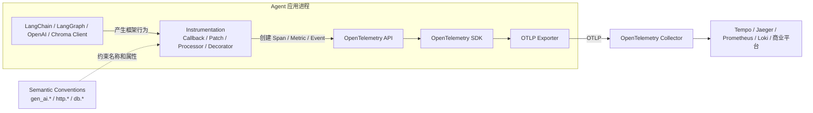

---

## 7.4 OpenTelemetry 体系中的关键角色

### 7.4.1 被观测框架

典型对象包括：

- LangChain；
- LangGraph；
- OpenAI Python SDK；
- OpenAI Agents SDK；
- ChromaDB；
- LlamaIndex；
- CrewAI；
- AutoGen；
- PydanticAI；
- Haystack；
- Semantic Kernel；
- LiteLLM；
- 自研 Agent Runtime。

这些框架负责业务执行，不负责统一遥测表达。

### 7.4.2 Instrumentation

Instrumentation 是连接框架与 OpenTelemetry 的适配层，主要职责是：

1. 找到稳定调用边界；
2. 捕获开始、结束、异常、流式 Chunk 等生命周期事件；
3. 提取模型、Token、工具、检索、Agent、Workflow 等字段；
4. 调用 OpenTelemetry API 创建遥测；
5. 按 Semantic Conventions 设置属性；
6. 恢复父子关系和上下文；
7. 处理同步、异步、流式、取消和重试。

Instrumentation 通常不负责：

- 选择后端；
- 长期存储；
- 中心化采样；
- Collector 路由；
- 可视化。

### 7.4.3 OpenTelemetry API

API 提供稳定的遥测编程接口：

```text
TracerProvider API
Tracer
Span
MeterProvider API
Meter
Counter
Histogram
Logger
Context
Propagator
```

Instrumentation 调用 API，例如：

```python
tracer = trace.get_tracer(
    "opentelemetry.instrumentation.genai.example"
)

with tracer.start_as_current_span(
    "invoke_agent researcher",
    attributes={
        "gen_ai.operation.name": "invoke_agent",
        "gen_ai.agent.name": "researcher",
    },
):
    run_agent()
```

API 本身不决定：

- 是否采样；
- 如何批量；
- 发往哪里；
- 使用什么协议；
- 如何持久化。

如果应用没有安装或配置 SDK，API 通常退化为低开销 No-op。

### 7.4.4 OpenTelemetry SDK

SDK 是 API 的实际运行实现，负责：

- `TracerProvider`、`MeterProvider`、`LoggerProvider`；
- Resource；
- Sampler；
- Span Processor；
- Metric Reader；
- Batch；
- Queue；
- Exporter；
- Flush；
- Shutdown；
- 聚合；
- 重试。

Trace 管线示意：

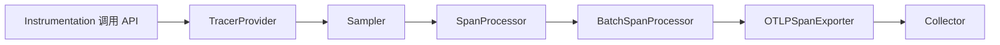

### 7.4.5 Semantic Conventions

Semantic Conventions 是统一数据字典，规定：

- Span 操作名；
- 属性名；
- 属性值语义；
- Metric 名；
- Event 名；
- 错误表达；
- Resource 属性。

它解决不同框架“方言不一致”的问题。

例如：

```text
LangChain on_tool_start
OpenAI Agents FunctionSpanData
自研 Runtime tool.begin
```

都可以统一映射为：

```text
gen_ai.operation.name = execute_tool
gen_ai.tool.name = search_documents
gen_ai.tool.call.id = call_123
```

它不执行任何代码，也不发送任何数据。

截至本次整理，GenAI Semantic Conventions 仍处于快速演进阶段，生产系统应：

- 固定 Instrumentation 与语义约定版本；
- 增加内部适配层；
- 避免业务代码散落硬编码 `gen_ai.*` 字段；
- 对升级进行兼容性和数据口径回归测试。

### 7.4.6 OTLP

OTLP 是 OpenTelemetry 原生遥测传输协议，负责：

- Trace、Metric、Log 的编码；
- Protobuf 数据结构；
- OTLP/gRPC；
- OTLP/HTTP；
- SDK 到 Collector；
- Collector 到 Collector；
- 部分成功、限流和重试语义。

OTLP 不理解 Agent、Tool、Token 或 Retriever，它只运输已经生成的遥测对象。

### 7.4.7 Context Propagation

Context Propagation 负责把调用关系串起来：

```text
同线程
异步任务
线程池
HTTP
gRPC
消息队列
MCP
子进程
CLI
```

典型标准字段：

```text
traceparent
tracestate
baggage
```

它不负责导出遥测。

### 7.4.8 Collector

Collector 位于 SDK 和后端之间，负责：

- 接收 OTLP；
- 批处理；
- 内存限制；
- 脱敏；
- 属性转换；
- 过滤；
- Tail Sampling；
- 多后端路由；
- 重试；
- 持久队列；
- 协议转换。

---

## 7.5 Agent 对象如何映射为 OpenTelemetry 遥测

### 7.5.1 Agent 概念与 Span 的映射

| Agent 概念 | OpenTelemetry 表达 | 推荐操作 |
|---|---|---|
| 一次用户任务／图工作流 | 根 Span | `invoke_workflow` |
| 单个 Agent 执行 | Agent Span | `invoke_agent` |
| 规划或任务分解 | Plan Span | `plan` |
| 模型推理 | GenAI Client Span | `chat`、`generate_content` |
| 向量检索 | Retrieval Span | `retrieval` |
| 记忆查询 | Memory Span | `search_memory` |
| 记忆写入 | Memory Span | `create_memory`、`update_memory`、`upsert_memory` |
| 工具调用 | Tool Span | `execute_tool` |
| MCP 调用 | MCP Client／Server Span | MCP 方法名 |
| Agent 交接 | Span、Event 或 Link | Handoff |
| 权限决策 | Span Event 或领域 Span | Permission |
| 一轮 Agent Loop | Event 或轻量内部 Span | Iteration |
| 评测结果 | Event、Log 或独立 Eval 数据 | `gen_ai.evaluation.result` |

### 7.5.2 推荐父子关系

```text
Trace
└── Workflow Span
    ├── Agent Span
    │   ├── Plan Span
    │   │   └── LLM Span
    │   ├── Retrieval Span
    │   ├── Memory Span
    │   ├── Tool Span
    │   │   ├── HTTP / Database Span
    │   │   └── MCP Client Span
    │   └── Sub-Agent Span
    └── Evaluation
```

### 7.5.3 推荐标准属性

模型调用：

```text
gen_ai.operation.name
gen_ai.provider.name
gen_ai.request.model
gen_ai.response.model
gen_ai.response.id
gen_ai.conversation.id
gen_ai.usage.input_tokens
gen_ai.usage.output_tokens
error.type
```

Agent：

```text
gen_ai.operation.name = invoke_agent
gen_ai.agent.name
gen_ai.agent.version
gen_ai.conversation.id
```

Tool：

```text
gen_ai.operation.name = execute_tool
gen_ai.tool.name
gen_ai.tool.type
gen_ai.tool.call.id
error.type
```

### 7.5.4 推荐应用自定义属性

标准语义约定无法覆盖所有领域逻辑，可使用应用命名空间：

```text
app.workflow.run.id
app.workflow.name

app.agent.run.id
app.agent.iteration
app.agent.parent.name

app.retry.count
app.retry.reason
app.retry.backoff_ms

app.budget.max_iterations
app.budget.max_tokens
app.budget.max_duration_ms
app.budget.termination_reason

app.permission.policy
app.permission.decision
app.permission.risk_level

app.sandbox.type
app.sandbox.id

app.handoff.from
app.handoff.to
app.handoff.reason

app.eval.name
app.eval.score
app.eval.result
```

### 7.5.5 两个容易误用的字段

### 不要把运行 ID 当成稳定 Agent ID

`gen_ai.agent.id` 更适合表达托管平台中的稳定 Agent 资源标识。一次执行产生的随机 UUID 应写入：

```text
app.agent.run.id
```

### 不要伪造 Conversation ID

只有系统本身确实有会话或线程标识时，才设置：

```text
gen_ai.conversation.id
```

不应使用：

- Trace ID；
- 随机 UUID；
- Prompt 哈希；
- 请求 ID；

作为虚假的 Conversation ID。

---

## 7.6 四层 Agent 观测模型

四层不是互斥选项，而是从不同位置观察同一条执行链。

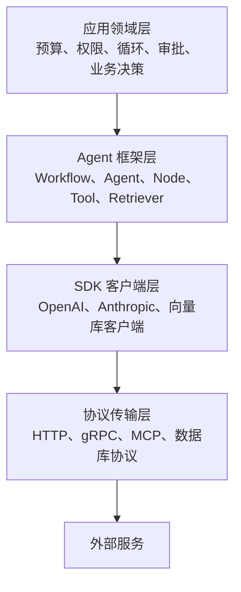

---

### 7.6.1 第一层：Agent／框架语义观测层

### 观察对象

这一层理解 Agent 运行语义：

```text
Workflow
Agent
Graph Node
Chain
Tool
Retriever
Handoff
Guardrail
Memory
Human-in-the-loop
任务状态
```

### 常见机制

- Callback；
- Trace Processor；
- Event Bus；
- Dispatcher；
- Listener；
- Middleware；
- Tracer Interface；
- 框架内部 Native OTel。

### 能获得的数据

- Agent 名称和版本；
- Workflow 名称；
- Graph Node；
- Agent 父子关系；
- Tool Name；
- Retriever Query；
- Agent Handoff；
- 任务成功、失败、取消；
- 运行 ID、父运行 ID。

### 局限

如果普通 Python 逻辑没有触发框架事件，框架层仍然看不到。

例如：

```python
def risk_node(state):
    score = calculate_risk(state)
    if score > 0.8:
        return {"route": "manual_review"}
    return {"route": "auto"}
```

框架可能只知道节点开始和结束，不知道：

- 风险分数；
- 命中的规则；
- 选择该分支的原因。

这些属于应用领域层。

### 典型框架

| 框架 | 机制 |
|---|---|
| OpenAI Agents SDK | Tracing Processor |
| LangChain／LangGraph | Callback Manager + Handler |
| LlamaIndex | Dispatcher + EventHandler + SpanHandler |
| CrewAI | Event Bus + Listener |
| Haystack | Tracer Interface + Connector |
| AutoGen | 框架核心 Native OTel |
| Semantic Kernel | ActivitySource / Native OTel |

---

### 7.6.2 第二层：SDK／客户端库观测层

### 观察对象

这一层关注具体模型或基础能力 SDK：

```text
OpenAI SDK
Anthropic SDK
Azure OpenAI
LiteLLM
Embedding SDK
Vector DB Client
Database Client
```

### 常见机制

- Monkey Patch；
- Method Wrapper；
- Proxy；
- Stream Wrapper；
- Decorator；
- SDK Callback；
- SDK 原生 Interceptor；
- Native OTel。

### 能获得的数据

- 模型名称；
- 请求参数；
- Prompt 消息结构；
- Tool definitions；
- Response ID；
- Response Model；
- Finish Reason；
- Token Usage；
- 流式 Chunk；
- 首 Chunk 延迟；
- SDK 异常；
- SDK 自动重试。

### 局限

SDK 通常不知道：

- 为什么调用模型；
- 调用属于规划、执行还是审核；
- 当前是哪一个 Agent；
- 为什么选择这个工具；
- 当前 Agent Loop 是第几轮。

### 典型组件

| 组件 | 机制 |
|---|---|
| OpenAI Python SDK | Monkey Patch + Wrapper + Stream Proxy |
| PydanticAI Model | InstrumentedModel |
| LiteLLM SDK | Input / Success / Failure Callback |
| ChromaDB 内部 API | `@trace_method` Decorator |

---

### 7.6.3 第三层：协议／传输观测层

### 观察对象

```text
HTTP
HTTPS
gRPC
WebSocket
数据库协议
消息队列
MCP Streamable HTTP
MCP stdio
进程间通信
```

### 常见机制

- ASGI／WSGI Middleware；
- HTTP Client Wrapper；
- gRPC Client／Server Interceptor；
- 数据库驱动 Instrumentation；
- Producer／Consumer Instrumentation；
- Service Mesh；
- eBPF；
- W3C Trace Context Inject／Extract。

### 能获得的数据

- HTTP method；
- URL 或 route；
- Status Code；
- 网络耗时；
- 请求响应大小；
- Server Address；
- DNS、连接、TLS；
- gRPC method；
- 网络重试；
- 网络异常。

### 局限

协议层看到：

```text
POST /v1/responses
POST /collections/query
POST /mcp
```

但不知道：

```text
这是规划还是审核
哪个 Agent 发起
工具语义是什么
这是长期记忆还是普通检索
```

### 典型组合

```text
chat gpt-*
└── HTTP POST /v1/responses
```

上层 Span 解释模型语义，HTTP Span 解释网络传输。

---

### 7.6.4 第四层：应用／领域逻辑观测层

### 观察对象

这一层负责企业和自研 Runtime 的专有逻辑：

```text
Loop 轮次
终止原因
预算
权限
审批
Agent 路由
状态迁移
记忆晋升
沙箱生命周期
质量门禁
测试结果
业务分支
```

### 常见机制

- Manual Span；
- Span Event；
- Structured Log；
- Custom Metric；
- Lifecycle Hook；
- Domain Event；
- Middleware；
- 自研 Tracing Adapter。

### 典型手工 Span

```python
with tracer.start_as_current_span(
    "permission_check",
    attributes={
        "app.permission.policy": "workspace_write",
        "app.permission.risk_level": "high",
    },
):
    decision = permission_engine.evaluate(request)
```

### 典型 Event

```python
span.add_event(
    "app.agent.retry",
    {
        "app.retry.attempt": 3,
        "app.retry.reason": "tool_timeout",
        "app.retry.backoff_ms": 1000,
    },
)
```

### 为什么不可缺少

前三层无法自动回答：

- 为什么选择 Reviewer Agent；
- 为什么进行了第四次循环；
- 为什么拒绝写文件；
- 为什么保存为长期记忆；
- 为什么触发 Compaction；
- 为什么预算耗尽；
- 为什么进入人工审批。

---

### 7.6.5 四层回答的问题对照

| 问题 | 主要观测层 |
|---|---|
| 哪个 Agent 失败 | 框架层 |
| Agent 调用了哪个工具 | 框架层 |
| 模型消耗多少 Token | SDK 层 |
| 首 Token 为什么慢 | SDK 层 + 协议层 |
| DNS、TLS 或网络哪里慢 | 协议层 |
| 为什么选择某个 Agent | 应用层 |
| 为什么进入第 N 轮循环 | 应用层 |
| 为什么拒绝文件写入 | 应用层 |
| Chroma 内部哪个操作慢 | Chroma 内部层 |
| HTTP 200 但任务为何失败 | 框架层或应用层 |
| Tool 在业务上是否达成目标 | 框架层 + 应用层 |

---

## 7.7 常见 Hook 与 Instrumentation 机制

“Hook”是一个统称，具体实现差异很大。

| 机制 | 原理 | 是否修改业务源码 | 稳定性 | 典型应用 |
|---|---|---:|---:|---|
| Callback | 框架主动调用观察者 | 通常不需要 | 高 | LangChain |
| Processor | 接收框架 Trace/Span 生命周期 | 通常只需注册 | 高 | OpenAI Agents |
| Event Bus | 发布领域事件，监听器订阅 | 通常只需初始化 | 高 | CrewAI |
| Dispatcher | 分派类型化 Event 和 Span | 需注册 Handler | 高 | LlamaIndex |
| Middleware | 包裹 Agent、模型、工具调用 | 需要配置 | 中高 | LangChain Middleware |
| Interceptor | 拦截协议请求 | 通常自动 | 中高 | gRPC |
| Monkey Patch | 运行时替换方法 | 不修改业务源码 | 中低 | OpenAI SDK |
| Wrapper／Proxy | 代理 SDK、模型或流 | 需初始化或自动注入 | 中高 | Streaming Wrapper |
| Decorator | 在定义处包裹函数 | 框架或业务源码需加 | 高 | ChromaDB |
| Native OTel | 框架内部直接调用 OTel API | 使用者只需配置 | 最高 | AutoGen 等 |
| Manual Span | 应用主动创建 Span | 需要修改业务代码 | 最高 | 自研领域逻辑 |

### 7.7.1 稳定性优先级

通常推荐：

```text
Native OpenTelemetry
    >
公开 Processor / Callback / Event Bus
    >
Middleware / Wrapper
    >
Monkey Patch
    >
仅通过协议推断
```

原因：

- Native OTel 最了解内部语义；
- Callback、Processor 是公开契约；
- Monkey Patch 依赖方法路径、签名和返回类型；
- 协议层很难恢复 Agent 语义。

### 7.7.2 为什么 Monkey Patch 仍然重要

Monkey Patch 的价值主要在于：

- 不修改业务代码；
- 可以通过统一启动命令自动加载；
- 适合大量第三方 SDK；
- 能覆盖同步、异步和流式接口；
- 能快速补齐没有原生 Hook 的客户端库。

它更适合稳定的 SDK 边界，不适合自研 Agent Runtime 的核心领域逻辑。

---

## 7.8 Python 零侵入探针的实现原理

Python 的自动埋点与 Java Agent 的字节码增强不同，主要依靠：

```text
启动注入
    +
sitecustomize
    +
Entry Point 自动发现
    +
Instrumentation
    +
Monkey Patch / Callback 注册
```

### 7.8.1 启动方式

典型命令：

```bash
opentelemetry-instrument python app.py
```

它不是在任意时间附着到已运行进程，而是在启动目标 Python 进程之前：

1. 读取 OTel 配置；
2. 调整 `PYTHONPATH`；
3. 注入自动埋点目录；
4. 使用 `exec` 启动目标应用。

### 7.8.2 `sitecustomize` 自动执行

Python 启动时会尝试加载 `sitecustomize.py`。OpenTelemetry 的自动注入目录中包含类似逻辑：

```python
from opentelemetry.instrumentation.auto_instrumentation import initialize

initialize()
```

因此 Instrumentation 可以在业务模块正式执行前完成加载。

### 7.8.3 Entry Point 自动发现

Instrumentation 包会声明 Entry Point，例如：

```toml
[project.entry-points.opentelemetry_instrumentor]
openai = "opentelemetry.instrumentation.genai.openai:OpenAIInstrumentor"
```

自动加载器会扫描：

```text
opentelemetry_instrumentor
```

并检查：

- Instrumentation 是否安装；
- 目标框架是否安装；
- 依赖版本是否兼容；
- 是否被禁用；
- 是否存在冲突。

通过后调用：

```text
instrument()
```

### 7.8.4 运行时注入

不同 Instrumentor 采用不同方法：

```text
OpenAI SDK
    → wrapt.wrap_function_wrapper
    → 包装 create / stream / embeddings

OpenAI Agents
    → add_trace_processor
    → 注册 TracingProcessor

LangChain / LangGraph
    → 包装 CallbackManager 构造器
    → 自动插入 OTel CallbackHandler

ChromaDB
    → 框架源码中的 @trace_method
```

### 7.8.5 父子 Span 如何自动形成

OpenTelemetry Python 通常基于 `ContextVar` 保存当前上下文。

同一同步或标准异步调用链中：

```text
当前 Span
    ↓
创建子 Span
    ↓
自动继承父 Context
```

跨线程池、子进程或网络边界时，需要显式传播。

### 7.8.6 流式调用为什么更复杂

普通方法可以在返回时结束 Span，但流式方法返回时数据尚未消费完成。

因此 Instrumentation 需要返回 Stream Proxy：

```text
原始 Stream
    ↓
OpenTelemetry Stream Wrapper
    ↓
业务代码消费
```

代理对象在消费过程中记录：

- 第一个 Chunk 时间；
- Chunk 间隔；
- 最终 Usage；
- Finish Reason；
- 取消；
- 异常；
- 正常关闭。

如果 Stream 未被完整消费或未关闭，可能出现：

- Span 长时间不结束；
- Token 数据不完整；
- 首 Chunk 有记录但最终 Usage 缺失。

---

## 7.9 LangChain 与 LangGraph 的接入机制

### 7.9.1 核心机制

LangChain 和 LangGraph 的主要观测机制是：

> **Callback Manager + Callback Handler**

运行过程中会产生：

```text
on_chain_start
on_chain_end
on_chain_error

on_chat_model_start
on_llm_new_token
on_llm_end
on_llm_error

on_tool_start
on_tool_end
on_tool_error

on_retriever_start
on_retriever_end
on_retriever_error
```

### 7.9.2 OpenTelemetry 如何自动插入 Handler

OpenTelemetry LangChain Instrumentation 采用混合方式：

1. Monkey Patch `BaseCallbackManager.__init__`；
2. 在 Callback Manager 创建时自动加入 `OpenTelemetryLangChainCallbackHandler`；
3. 实际运行数据通过框架 Callback 获得；
4. Handler 把事件转化为 OpenTelemetry Span。

```text
启动阶段
Monkey Patch CallbackManager.__init__
        ↓
自动插入 OTel Handler

运行阶段
LangGraph / LangChain Callback
        ↓
OTel Handler
        ↓
OpenTelemetry API
```

因此，LangGraph 不是单纯依赖 Monkey Patch：

> Monkey Patch 只负责自动接入，真正的语义数据来自框架 Callback。

### 7.9.3 事件映射

| LangChain／LangGraph Callback | OpenTelemetry 表达 |
|---|---|
| `on_chain_start` | `invoke_workflow` 或 `invoke_agent` |
| `on_chat_model_start` | 模型调用 Span |
| `on_tool_start` | `execute_tool` |
| `on_retriever_start` | `retrieval` |
| `*_end` | 补充结果并结束 Span |
| `*_error` | 记录异常并结束 Span |

### 7.9.4 父子关系恢复

Callback 通常携带：

```text
run_id
parent_run_id
```

Instrumentation 内部维护：

```text
run_id → Invocation / Span / Context
```

从而建立：

```text
Workflow
└── Agent
    ├── Model
    ├── Tool
    └── Retriever
```

### 7.9.5 LangGraph 自动观测的边界

自动 Callback 可以看到：

- Graph 或 Node 开始、结束；
- Node 内部模型调用；
- Tool 调用；
- Retriever 调用；
- 异常。

通常看不到：

- 普通 Python 函数的内部阶段；
- `if` 分支选择理由；
- 状态字段变化原因；
- 循环终止规则；
- 自定义风险计算；
- 权限命中规则。

这些需要：

- LangChain Middleware；
- 自定义 Callback；
- 手工 Span；
- 应用领域 Event。

### 7.9.6 Middleware 的作用

LangChain 可通过类似以下 Hook 扩展：

```text
before_agent
before_model
after_model
after_agent
wrap_model_call
wrap_tool_call
```

适合观测：

- 重试；
- 权限；
- Token 预算；
- 动态模型路由；
- Tool Guard；
- 状态变更；
- 领域指标。

---

## 7.10 OpenAI Python SDK 的接入机制

### 7.10.1 核心机制

OpenAI Python SDK 的 OpenTelemetry 接入主要采用：

> **Monkey Patch + Method Wrapper + Stream Proxy**

典型包装点包括：

```text
Completions.create
AsyncCompletions.create
Embeddings.create
AsyncEmbeddings.create
Responses.create
Responses.stream
Responses.retrieve
对应异步方法
```

业务代码仍然调用原 API，但运行时关系变为：

```text
业务代码
    ↓
OpenTelemetry Wrapper
    ↓
OpenAI SDK 原始方法
    ↓
HTTP Client
    ↓
OpenAI API
```

### 7.10.2 包装器获取的数据

调用前可从参数和 Client 中提取：

```text
model
temperature
max_tokens
top_p
stream
server.address
server.port
messages
tools
```

返回后提取：

```text
response.id
response.model
finish_reason
usage.input_tokens
usage.output_tokens
exception
```

### 7.10.3 典型包装流程

```python
def traced_call(original, instance, args, kwargs):
    invocation = start_span_and_extract_request(kwargs)

    try:
        result = original(*args, **kwargs)

        if is_stream(result):
            return StreamingProxy(result, invocation)

        extract_response_and_usage(result)
        invocation.stop()
        return result

    except Exception as error:
        invocation.record_exception(error)
        invocation.fail(error)
        raise
```

### 7.10.4 能看到什么

- 模型；
- 请求参数；
- Token；
- 响应 ID；
- Finish Reason；
- 流式首 Chunk 延迟；
- Chunk 间隔；
- SDK 异常；
- 某些自动重试。

### 7.10.5 看不到什么

- 哪个 Agent 为什么调用模型；
- 这是 Planning 还是 Reflection；
- 当前 Agent Loop 轮次；
- 为什么选择该模型；
- 业务成功与否；
- Tool 是否最终完成目标。

这些需要上层框架或应用层补充。

### 7.10.6 Prompt 为什么默认可能不可见

出于安全和隐私考虑，生产默认通常不应采集：

- Prompt 正文；
- Completion 正文；
- Tool Arguments；
- Tool Result；
- RAG 文档正文。

更合理的是记录：

```text
prompt.name
prompt.version
content_hash
storage_ref
content_length
truncated
```

正文进入受控对象存储，Trace 中只保存引用。

---

## 7.11 OpenAI Agents SDK 的接入机制

### 7.11.1 核心机制

OpenAI Agents SDK 是 Agent 框架，其接入机制是：

> **原生 Tracing Processor**

框架运行时会主动发出：

```text
on_trace_start
on_span_start
on_span_end
on_trace_end
```

OpenTelemetry 适配器注册 Processor：

```text
OpenAI Agents Runtime
    ↓
TracingProcessor
    ↓
OpenTelemetry Span
```

### 7.11.2 典型映射

```text
Agents Trace
    → invoke_workflow

AgentSpanData
    → invoke_agent

FunctionSpanData
    → execute_tool
```

### 7.11.3 为什么还需要 OpenAI SDK Instrumentation

Agents Processor 主要负责：

- Workflow；
- Agent；
- Function Tool。

底层模型调用需要 OpenAI Python SDK Instrumentation 补充：

```text
OpenAI Agents Instrumentation
    → Workflow / Agent / Tool

OpenAI Python SDK Instrumentation
    → Chat / Responses / Embeddings

HTTPX Instrumentation
    → HTTP
```

完整链路：

```text
invoke_workflow customer_support
└── invoke_agent support_agent
    ├── execute_tool lookup_order
    └── chat model-x
        └── HTTP POST /v1/responses
```

### 7.11.4 实现边界

框架拥有原生 Span 类型，并不代表当前 OTel 适配器已映射全部类型。某些 Handoff、Guardrail、Speech、Transcription 或特殊 Span 可能仍需：

- 新版适配器；
- 自定义 Processor；
- 应用领域埋点。

---

## 7.12 ChromaDB 的接入机制

ChromaDB 不是 Agent 框架，而是 Agent 常用的向量数据库。需要分为客户端和服务端。

### 7.12.1 Agent 侧 Chroma Client

如果通过 LangChain Retriever 调用 Chroma：

```text
retrieval product_knowledge
└── HTTP POST /collections/query
```

其中：

- `retrieval`：由 LangChain 或 RAG Runtime 产生；
- HTTP Span：由 HTTP Instrumentation 产生。

只有 HTTP Span 时，只能看到网络请求，无法知道它是一次语义检索。

### 7.12.2 Chroma Server 内部

Chroma 后端采用：

> **框架源码内建 `@trace_method` Decorator／Native Instrumentation**

典型形式：

```python
@trace_method(
    "SegmentAPI.get_collection",
    OpenTelemetryGranularity.OPERATION,
)
def get_collection(...):
    ...
```

Decorator 内部大致执行：

```python
def decorator(original):
    def wrapper(*args, **kwargs):
        if tracing_disabled:
            return original(*args, **kwargs)

        with tracer.start_as_current_span(trace_name):
            return original(*args, **kwargs)

    return wrapper
```

它可以观测：

- Collection 操作；
- Segment 操作；
- 内部查询阶段；
- 服务端耗时；
- 异常。

### 7.12.3 完整链路

```text
retrieval product_documents       ← Agent / RAG 框架
└── HTTP POST /query              ← HTTP Client
    └── HTTP Server               ← Chroma Server
        ├── frontend.query        ← Chroma 内建 Span
        ├── executor.query
        └── segment.search
```

### 7.12.4 Chroma 的 SDK 所有权问题

独立 Chroma Server 自己配置：

- TracerProvider；
- BatchSpanProcessor；
- OTLP Exporter；

是合理的，因为 Chroma Server 本身就是应用所有者。

但在同一 Python 进程中嵌入 Chroma 时，应验证：

- 是否与应用全局 Provider 冲突；
- `service.name` 是否被覆盖；
- 是否产生多个 Exporter；
- Shutdown 生命周期是否冲突；
- 是否重复导出。

---

## 7.13 其他 Agent 与 LLM 框架的机制对照

| 框架或组件 | 主要观测层 | 核心机制 | 主要可见内容 |
|---|---|---|---|
| OpenAI Python SDK | SDK 层 | Monkey Patch、Wrapper、Stream Proxy | 模型、Token、流式、异常 |
| OpenAI Agents SDK | 框架层 | Tracing Processor | Workflow、Agent、Function Tool |
| LangChain | 框架层 | Callback Manager、Handler | Chain、Model、Tool、Retriever |
| LangGraph | 框架层 | LangChain Callback、Graph Runtime | Graph、Node、Agent、Tool |
| LlamaIndex | 框架层 | Dispatcher、EventHandler、SpanHandler | Agent、RAG、LLM、Retriever |
| CrewAI | 框架层 | Event Bus、Listener | Crew、Agent、Task、Tool、LLM |
| Haystack | 框架层 | Tracer Interface、Connector | Pipeline、Component |
| AutoGen | 框架层 | Native OpenTelemetry | Runtime、Agent、Tool、消息 |
| PydanticAI | 框架 + SDK | Native OTel、InstrumentedModel | Agent、模型、工具、Usage |
| Semantic Kernel | 框架层 | ActivitySource / Native OTel | Kernel Function、Connector |
| LiteLLM SDK | SDK 层 | Input / Success / Failure Callback | 模型、Usage、异常 |
| LiteLLM Proxy | 框架 + 协议 | Native OTel + FastAPI | HTTP、认证、缓存、Guardrail、模型 |
| ChromaDB | 服务／SDK 层 | `@trace_method` | Collection、Segment、查询 |
| FastAPI | 协议层 | ASGI Middleware | Route、状态码、服务端耗时 |
| HTTPX | 协议层 | Client Instrumentation | HTTP 请求、状态码、网络耗时 |
| gRPC | 协议层 | Client／Server Interceptor | RPC method、状态、延迟 |
| 自研 Agent Runtime | 应用层 | Lifecycle Hook、Manual Span | Loop、预算、权限、审批、沙箱 |

---

## 7.14 API、SDK、语义约定、OTLP 如何协同

### 7.14.1 六个角色的职责

| 组件 | 负责什么 | 不负责什么 |
|---|---|---|
| LangChain、OpenAI、ChromaDB | 执行业务、模型、检索 | 不统一遥测格式 |
| Instrumentation | 捕获并翻译框架事件 | 不负责长期存储 |
| OTel API | 创建遥测对象 | 不负责采样和导出 |
| Semantic Conventions | 规定统一名称和含义 | 不执行代码 |
| OTel SDK | 采样、处理、批量、聚合、导出 | 不理解框架语义 |
| OTLP | 传输遥测 | 不负责产生 Span |

一句话概括：

> **Instrumentation 负责翻译，API 负责写入，语义约定负责统一语言，SDK 负责运行处理，OTLP 负责运输。**

### 7.14.2 线性数据流

```text
框架行为
    ↓
Instrumentation
    ↓
OpenTelemetry API
    ↓
OpenTelemetry SDK
    ↓
OTLP Exporter
    ↓
Collector
    ↓
Backend
```

Semantic Conventions 从侧面约束 Instrumentation：

```text
Semantic Conventions
    ───────────────→ Instrumentation
```

### 7.14.3 为什么 Instrumentation 应依赖 API，而不是 SDK

Instrumentation 作者不应替用户决定：

- Sampler；
- Exporter；
- Collector；
- Backend；
- `service.name`；
- Batch 策略；
- 安全策略。

正确分工：

```text
Instrumentation 作者
    → 调用 OpenTelemetry API

应用所有者
    → 配置 OpenTelemetry SDK
```

这样同一个 LangChain 或 OpenAI Instrumentation 可以输出到不同后端。

### 7.14.4 同进程统一 SDK

推荐同一应用进程只配置一个统一 Provider：

```python
resource = Resource.create({
    "service.name": "rag-agent-service",
    "service.version": "1.3.0",
})

provider = TracerProvider(resource=resource)

provider.add_span_processor(
    BatchSpanProcessor(
        OTLPSpanExporter(
            endpoint="http://otel-collector:4317"
        )
    )
)

trace.set_tracer_provider(provider)
```

然后让所有 Instrumentation 共享：

```python
LangChainInstrumentor().instrument(
    tracer_provider=provider
)

OpenAIInstrumentor().instrument(
    tracer_provider=provider
)
```

应用自己的手工 Span 也使用同一个 Provider。

### 7.14.5 LangChain 的协同过程

```text
LangGraph 运行
    ↓ Callback
LangChain OTel Handler
    ↓ 按 GenAI 语义约定映射
OTel API
    ↓
统一 SDK
    ↓
OTLP
    ↓
Collector
```

### 7.14.6 OpenAI SDK 的协同过程

```text
responses.create()
    ↓ Monkey Patch Wrapper
提取 model / messages / tools
    ↓
OTel API 创建模型 Span
    ↓
执行原始 OpenAI SDK
    ↓
提取 usage / response / error
    ↓
SDK 处理
    ↓
OTLP
```

### 7.14.7 Chroma Server 的协同过程

```text
Chroma 内部方法
    ↓ @trace_method
OTel API 创建 Span
    ↓
Chroma 或宿主应用 SDK
    ↓
OTLP
    ↓
Collector
```

---

## 7.15 一次完整 RAG Agent 调用的观测链路

假设系统包含：

```text
LangGraph
    ├── OpenAI
    └── ChromaDB
```

### 7.15.1 运行时序

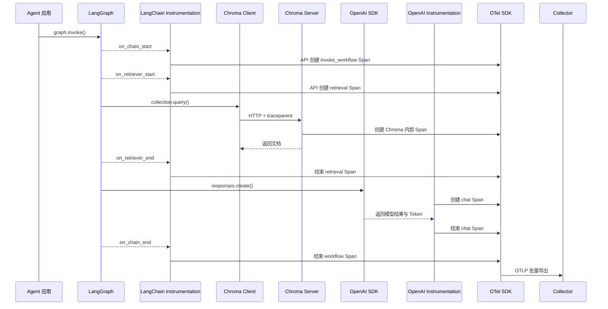

### 7.15.2 最终 Trace

```text
POST /agent/run
└── invoke_workflow rag_graph
    ├── retrieval chroma
    │   └── HTTP POST /query
    │       └── Chroma HTTP Server
    │           ├── query_frontend
    │           └── vector_search
    └── chat model-x
        └── HTTP POST /v1/responses
```

### 7.15.3 每层的解释能力

| Span | 解释的问题 |
|---|---|
| `invoke_workflow` | 哪个图工作流运行 |
| `retrieval` | 为什么检索、检索什么 |
| HTTP Client | 网络请求耗时和状态 |
| Chroma 内部 Span | 向量数据库内部哪里慢 |
| `chat` | 模型、Token、响应 |
| OpenAI HTTP | 模型 API 网络尝试 |

---

## 7.16 Trace、Metric、Log、Event 与 Eval 的职责

### 7.16.1 Trace：回答单次任务的因果关系

Trace 适合分析：

```text
总耗时 32 秒
├── 规划 3 秒
├── 模型调用 5 秒
├── 检索 2 秒
├── 测试执行 15 秒
├── 修复重试 5 秒
└── 最终输出 2 秒
```

模型逻辑 Span 应覆盖一次完整逻辑调用，包括 SDK 自动重试。

底层网络重试可以建模为：

```text
chat model-x
├── HTTP POST /responses    429
├── Event retry             backoff=1000ms
└── HTTP POST /responses    200
```

### 7.16.2 Metric：回答整体趋势

推荐指标：

```text
gen_ai.client.operation.duration
gen_ai.client.token.usage
gen_ai.client.operation.time_to_first_chunk
gen_ai.client.operation.time_per_output_chunk

gen_ai.invoke_workflow.duration
gen_ai.invoke_agent.duration
gen_ai.invoke_agent.inference_calls
gen_ai.invoke_agent.tool_calls
gen_ai.execute_tool.duration
```

应用指标：

```text
app.agent.run.count
app.agent.run.duration
app.agent.run.success

app.agent.loop.iterations
app.agent.loop.detected
app.agent.retry.count
app.agent.cancel.count
app.agent.timeout.count

app.agent.tool.success
app.agent.tool.failure
app.agent.permission.denied

app.agent.human_approval.wait_duration
app.agent.budget.exhausted
app.agent.eval.score
app.agent.cost
```

### Metric 标签

适合：

```text
agent_name
agent_version
workflow_name
provider
request_model
tool_name
tool_type
result
error_type
environment
```

不适合：

```text
run_id
trace_id
conversation_id
user_id
tool_call_id
prompt_text
file_path
raw_query
```

原因是高基数会增加聚合状态、内存和存储压力。

### 7.16.3 Log：记录结构化上下文和明细

推荐自动携带：

```text
trace_id
span_id
service.name
service.version
workflow_name
agent_name
```

Log 适合记录：

- 详细错误；
- 工具 stdout／stderr 摘要；
- 状态变更；
- 审批记录；
- 调试信息；
- 外部工件引用。

### 7.16.4 Span Event：记录离散生命周期事件

推荐 Event：

```text
app.agent.started
app.agent.iteration.started
app.agent.retry
app.agent.loop.detected
app.agent.handoff
app.agent.guardrail.triggered
app.agent.permission.requested
app.agent.permission.approved
app.agent.permission.denied
app.agent.human_intervention
app.agent.budget.exhausted
app.agent.cancelled
app.agent.completed
```

### 7.16.5 Eval：回答质量问题

OpenTelemetry 可以回答：

- 发生了什么；
- 哪里慢；
- 调用了多少次；
- 使用多少 Token；
- 哪个环节失败。

但它不能单独判断：

- 回答是否正确；
- 是否幻觉；
- 检索是否相关；
- 代码是否满足需求；
- 规划是否合理；
- 工具是否真正完成业务目标。

因此需要将 Eval 与 Trace 关联：

```text
trace_id
workflow_name
agent_name
agent_version
prompt_version
model
dataset_version
evaluator_name
evaluator_version
score
result
```

最终可以分析：

```text
每个成功任务平均 Token
Agent 版本成功率
模型的成本成功比
工具次数与成功率关系
循环次数与失败率关系
首 Token 延迟与取消率关系
Prompt 版本升级前后效果
```

---

## 7.17 跨线程、跨进程和跨服务上下文传播

### 7.17.1 同进程

Python 通常通过 `ContextVar` 维护当前 Span。

同步和标准异步调用可自动形成父子关系。

### 7.17.2 HTTP／gRPC

客户端：

```text
Inject traceparent / tracestate
```

服务端：

```text
Extract Context
创建 Server Span
```

### 7.17.3 MCP

MCP 的一个流式 HTTP 连接可能传输多个逻辑请求，因此不能只依赖外层 HTTP Span。

可把上下文注入 MCP 消息：

```json
{
  "jsonrpc": "2.0",
  "method": "tools/call",
  "params": {
    "name": "search-code",
    "_meta": {
      "traceparent": "00-...",
      "tracestate": "..."
    }
  },
  "id": 1
}
```

服务端从 `_meta` 中提取上下文。

典型链路：

```text
execute_tool search-code
└── mcp.client tools/call
    └── mcp.server tools/call
```

### 7.17.4 CLI 和子进程

CLI 支持 OpenTelemetry 时，父进程可通过环境变量或 IPC 传递：

```text
TRACEPARENT
TRACESTATE
```

子进程继续创建内部 Span。

CLI 不支持 OTel 时，由宿主 Runtime 创建外层 Span：

```text
invoke_agent coding_cli
├── execute_tool process_start
├── Event cli.stdout
├── Event cli.stderr
└── execute_tool process_wait
```

不要把完整标准输出放入 Span 属性，推荐：

```text
app.cli.output.bytes
app.cli.output.truncated
app.cli.output.artifact_ref
app.cli.exit_code
app.cli.signal
```

### 7.17.5 OTLP 与 Trace Context 的区别

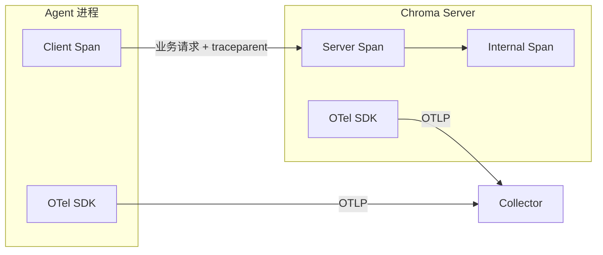

- 业务请求中的 `traceparent` 串联 Trace；
- OTLP 将 Span 发送给 Collector。

---

## 7.18 Span 所有权与重复 Span 治理

多层 Instrumentation 同时启用时容易重复。

### 7.18.1 合理嵌套

```text
invoke_agent researcher          ← Agent 框架
└── chat model-x                 ← 模型 SDK
    └── HTTP POST /responses     ← 协议层
```

三层含义不同，应保留。

### 7.18.2 不合理重复

```text
chat model-x                     ← LangChain
└── chat model-x                 ← OpenAI SDK
```

两者都表示同一次逻辑模型调用，可能导致：

- 模型调用次数翻倍；
- Token 重复统计；
- 成本重复；
- 告警失真；
- Trace 噪声。

### 7.18.3 推荐 Span 所有权

| Span 类型 | 推荐创建者 |
|---|---|
| `invoke_workflow` | Agent Runtime／LangGraph |
| `invoke_agent` | Agent 框架 |
| `plan` | Agent Runtime |
| `execute_tool` | Agent 框架／Tool Runtime |
| `retrieval` | Retriever／RAG Runtime |
| `search_memory` | Memory Runtime |
| `chat`、`embeddings` | 模型 SDK Instrumentation |
| HTTP Client／Server | HTTP Instrumentation |
| gRPC Client／Server | gRPC Instrumentation |
| Chroma 内部查询 | Chroma Server |
| 权限、预算、循环、审批 | 应用领域层 |
| Eval | Eval 系统 |

### 7.18.4 治理方式

- 禁用某层重复 Instrumentation；
- 使用抑制机制；
- 在 Collector 中过滤；
- 明确逻辑 Span 与 Transport Span；
- Token 和成本只认一个权威 Span；
- 在指标侧去重；
- 对 Span 增加 `instrumentation_scope.name`；
- 建立自动化 Trace 结构回归测试。

---

## 7.19 Prompt、Completion 与敏感数据治理

### 7.19.1 默认不采集正文

高风险内容包括：

```text
System Prompt
用户输入
模型完整输出
Tool Arguments
Tool Result
RAG 文档
源代码
文件路径
API Key
个人信息
业务机密
```

生产环境推荐默认关闭正文采集。

### 7.19.2 推荐记录元数据

```text
gen_ai.prompt.name
gen_ai.prompt.version

app.prompt.content_hash
app.prompt.storage_ref
app.prompt.length
app.prompt.truncated

app.output.content_hash
app.output.storage_ref
app.output.length
app.output.truncated
```

### 7.19.3 双层脱敏

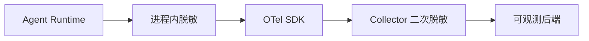

进程内脱敏确保秘密不离开应用；Collector 负责第二道防线。

### 7.19.4 常见策略

- Allowlist 优先于 Blocklist；
- API Key、Token、Cookie 全部删除；
- Prompt 仅在测试环境开启；
- 内容长度限制；
- 文件路径归一化或哈希；
- 文档正文放受控对象存储；
- Trace 仅保留引用；
- 独立权限和审计；
- 不把敏感内容放 Metric 标签；
- 对 Tool Arguments 做字段级脱敏。

---

## 7.20 Collector、采样与生产部署

### 7.20.1 推荐 Agent-to-Gateway 架构

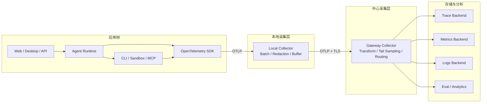

### 7.20.2 常见 Pipeline

```yaml
receivers:
  otlp:

processors:
  memory_limiter:
  resource:
  attributes:
  redaction:
  filter:
  transform:
  tail_sampling:
  batch:

exporters:
  otlp/traces:
  otlp/metrics:
  otlp/logs:
```

### 7.20.3 可靠性配置

建议启用：

```text
sending_queue
retry_on_failure
file_storage / WAL
```

需要监控：

```text
队列使用率
发送失败
重试次数
拒绝 Span 数
Collector 内存
Exporter 延迟
持久队列磁盘
```

### 7.20.4 采样策略

Agent Trace 通常长、重、包含大量嵌套，不建议所有成功任务永久全量保存。

建议 100% 保留：

```text
error.type 存在
工作流超时
Loop 检测触发
最大迭代耗尽
Token 预算耗尽
权限拒绝
人工接管
Eval 失败
异常取消
总耗时超过阈值
工具调用次数异常
新版本灰度
```

正常成功请求按比例采样。

Tail Sampling 的关键约束：

> 同一条 Trace 的全部 Span 必须被路由到同一个 Tail Sampling 实例。

---

## 7.21 自研 Agent Runtime 的原生可观测设计

自研 Runtime 不应主要依靠 Monkey Patch 自己内部实现，而应提供正式生命周期契约。

### 7.21.1 推荐接口

```python
class AgentTracingProcessor:
    def on_workflow_start(self, event): ...
    def on_workflow_end(self, event): ...

    def on_agent_start(self, event): ...
    def on_agent_end(self, event): ...

    def on_plan_start(self, event): ...
    def on_plan_end(self, event): ...

    def on_model_start(self, event): ...
    def on_model_chunk(self, event): ...
    def on_model_end(self, event): ...

    def on_tool_start(self, event): ...
    def on_tool_end(self, event): ...

    def on_memory_search_start(self, event): ...
    def on_memory_search_end(self, event): ...

    def on_handoff(self, event): ...
    def on_permission_decision(self, event): ...
    def on_loop_iteration(self, event): ...
    def on_budget_exhausted(self, event): ...
    def on_human_approval(self, event): ...
```

### 7.21.2 推荐架构

```text
Agent Runtime
    ↓ 发布类型化领域事件
OpenTelemetryTracingProcessor
    ↓ 映射为 Span / Event / Metric
OpenTelemetry API
    ↓
统一 SDK
    ↓
OTLP
```

### 7.21.3 职责边界

Runtime 负责：

```text
Workflow
Agent
Plan
Loop
Permission
Budget
Cancellation
Memory
Handoff
Sandbox
Human Approval
Eval 关联
```

第三方 Instrumentation 负责：

```text
OpenAI 模型调用
LangGraph 框架执行
Chroma 查询
HTTP / gRPC
数据库
消息队列
```

### 7.21.4 建议领域事件模型

```text
WorkflowStarted
WorkflowCompleted
WorkflowFailed

AgentStarted
AgentCompleted
AgentFailed
AgentCancelled

PlanCreated
PlanRevised

LoopIterationStarted
LoopIterationCompleted
LoopDetected
BudgetExhausted

ToolRequested
ToolApproved
ToolDenied
ToolStarted
ToolCompleted
ToolFailed

MemorySearched
MemoryRetrieved
MemoryPromoted
MemoryUpdated

HandoffRequested
HandoffCompleted

SandboxCreated
SandboxTerminated

HumanApprovalRequested
HumanApprovalCompleted

EvaluationCompleted
```

### 7.21.5 设计原则

1. 领域事件与 OTel 解耦；
2. OTel Adapter 只是一个 Listener；
3. Event 具有稳定 Schema Version；
4. 事件携带 Run ID 和 Parent Run ID；
5. 正文与元数据分离；
6. 异常、取消、超时使用不同终止语义；
7. 明确哪些是 Span，哪些是 Event；
8. Metric 只使用低基数标签；
9. 支持测试替身和 In-Memory Exporter；
10. 对 Trace 结构做契约测试。

---

## 7.22 推荐落地路径

### 第一阶段：打通基础 Trace

先实现：

```text
invoke_workflow
invoke_agent
plan
chat
retrieval
execute_tool
```

目标是获得完整执行树。

### 第二阶段：补 Metrics 和 Logs

增加：

```text
总耗时
模型耗时
首 Chunk 延迟
Token 用量
工具耗时
工具成功率
模型调用次数
工具调用次数
循环次数
重试次数
取消次数
权限拒绝次数
```

让日志自动携带 Trace ID 和 Span ID。

### 第三阶段：补跨边界传播

覆盖：

```text
主进程 → 子 Agent
主进程 → CLI
Agent → MCP
Agent → Chroma
Agent → 沙箱
Agent → 消息队列
```

### 第四阶段：接入 Collector

增加：

```text
OTLP
Batch
Memory Limiter
Redaction
Filter
Transform
Tail Sampling
Retry
Persistent Queue
```

### 第五阶段：接入 Eval

形成：

```text
Trace + Token + Cost + Eval + User Feedback
```

### 第六阶段：治理和回归

- Span 所有权；
- 重复 Span；
- 语义约定版本；
- 性能开销；
- 敏感数据；
- 高基数；
- 采样偏差；
- Trace 结构测试；
- 指标口径测试；
- Collector 容量测试。

---

## 7.23 常见误区与排查方法

### 7.23.1 只安装 HTTP 探针

现象：

```text
POST api.openai.com/v1/responses
POST chromadb:8000/query
```

缺少：

```text
invoke_agent
chat
execute_tool
retrieval
```

原因：HTTP Instrumentation 不理解 Agent 和 GenAI 语义。

解决：安装对应框架和模型 SDK Instrumentation。

### 7.23.2 认为零侵入能看到所有内部逻辑

自动探针只能看到已知 Hook 或方法边界。

自研：

```text
Loop
预算
权限
路由
状态迁移
记忆晋升
```

仍需原生 Hook 或手工埋点。

### 7.23.3 Instrumentation 与框架版本不兼容

Monkey Patch 依赖：

- 类路径；
- 方法签名；
- 返回对象；
- 异步类型；
- Stream 类型。

框架升级后应验证：

- Instrumentation 是否加载；
- 关键 Span 是否产生；
- Token 是否正确；
- 流式 Span 是否结束；
- 是否出现异常或重复。

### 7.23.4 流式 Span 不结束

可能原因：

- Stream 未消费完；
- 未调用关闭；
- 发生取消但 Wrapper 未处理；
- 异步生成器泄漏；
- Instrumentation 版本不兼容。

### 7.23.5 Token 或成本翻倍

可能原因：

- LangChain 模型 Span；
- OpenAI SDK 模型 Span；
- 自研模型 Span；

三者重复统计。

应指定一个权威模型逻辑 Span。

### 7.23.6 两个服务都导出 OTLP，但 Trace 没串起来

原因：没有在业务请求中传播 `traceparent`。

OTLP 只负责导出，不负责业务调用上下文。

### 7.23.7 Metric 基数失控

错误标签：

```text
trace_id
run_id
conversation_id
user_id
file_path
prompt
```

应移到 Trace 或 Log。

### 7.23.8 HTTP 200 但业务失败

HTTP 200 只代表传输成功，不代表：

- Tool 达成目标；
- Agent 输出正确；
- 检索相关；
- 代码测试通过。

需要框架层、应用层和 Eval。

### 7.23.9 Prompt 看不到

通常是安全默认设置，不一定是探针失效。

检查：

- 内容采集开关；
- 环境策略；
- 脱敏 Processor；
- Collector Filter；
- Backend 权限。

### 7.23.10 嵌入式组件覆盖全局 SDK

如果框架内部自行设置全局 Provider，可能导致：

- Provider 冲突；
- Resource 覆盖；
- 多 Exporter；
- 重复发送；
- Shutdown 冲突。

应优先允许宿主应用注入 Provider。

---

## 7.24 术语表

| 术语 | 说明 |
|---|---|
| Trace | 一次端到端调用的完整因果链 |
| Span | Trace 中的一个操作单元 |
| Span Event | Span 生命周期中的离散事件 |
| Metric | 聚合趋势数据 |
| Log | 结构化运行记录 |
| Instrumentation | 把框架行为翻译为 OTel 遥测的适配器 |
| API | 创建遥测对象的稳定接口 |
| SDK | API 的运行时实现，负责采样、处理和导出 |
| Semantic Conventions | 统一 Span、属性、Metric 和 Event 命名的规范 |
| OTLP | OTel 原生遥测传输协议 |
| Collector | 遥测接收、处理、采样和路由组件 |
| Context | 当前调用链上下文 |
| Propagation | 跨执行边界传播 Context |
| `traceparent` | W3C Trace Context 标准头 |
| Resource | 描述产生遥测的实体，如服务名和版本 |
| Instrumentation Scope | 标识产生遥测的库及版本 |
| Sampler | 决定 Trace 是否记录 |
| Span Processor | 处理已创建或结束的 Span |
| Exporter | 把遥测发送到外部系统 |
| Head Sampling | Trace 开始时决定是否采样 |
| Tail Sampling | 收集完整 Trace 后再决定是否保留 |
| Monkey Patch | 运行时替换目标方法 |
| Callback | 框架在生命周期节点调用观察者 |
| Processor | 接收框架 Trace／Span 生命周期事件 |
| Middleware | 包裹调用并在前后执行逻辑 |
| Interceptor | 拦截协议或客户端调用 |
| Wrapper | 包装原对象并代理调用 |
| Native OTel | 框架内部直接使用 OpenTelemetry API |
| Eval | 对 Agent 输出质量和业务结果进行评测 |
| Profile | 代码级 CPU、内存、锁和调用栈等资源使用剖析信号 |
| Baggage | 随 Context 传播的键值上下文，本身不是独立存储型遥测 |
| SpanContext | 可跨边界传播的 TraceId、SpanId、TraceFlags 和 TraceState |
| SpanKind | Span 的调用角色：INTERNAL、CLIENT、SERVER、PRODUCER、CONSUMER |
| Span Link | 在非严格父子关系下关联其他 SpanContext |
| LogRecord | OpenTelemetry 统一日志数据记录 |
| Meter | 创建 Metric Instrument 的作用域对象 |
| Metric Instrument | Counter、Histogram、Gauge 等测量入口 |
| Aggregation | 将 Measurement 聚合为 Sum、Histogram、LastValue 等数据 |
| Temporality | Metric 的累计或增量时间语义 |
| View | 修改 Metric 名称、属性、聚合和 Bucket 的 SDK 配置 |
| Cardinality | Metric 属性组合形成的时间序列数量 |
| Exemplar | 将代表性 Metric 测量关联到 TraceId／SpanId |
| MetricReader | 触发 Metrics 收集并衔接 Exporter 的 SDK 组件 |
| LogRecordProcessor | 处理和批量导出 LogRecord 的 SDK 组件 |
| Schema URL | 标识遥测所遵循语义 Schema 版本的 URL |
| Receiver | Collector 中接收或拉取遥测的组件 |
| Connector | 在 Collector 两条 Pipeline 之间转换或传递信号的组件 |
| Extension | Collector 的健康检查、认证、存储等非 Pipeline 组件 |
| Pipeline | Collector 中由 Receiver、Processor、Exporter 组成的信号处理链 |
| Resource Detector | 自动检测服务、进程、主机、容器、云环境等 Resource 的组件 |

---

## 7.25 参考资料

以下资料均为本次会话整理过程中涉及的主要官方或上游来源。

### OpenTelemetry 核心

- OpenTelemetry 概览：<https://opentelemetry.io/docs/what-is-opentelemetry/>
- OpenTelemetry Specification：<https://opentelemetry.io/docs/specs/otel/>
- OpenTelemetry 客户端架构：<https://opentelemetry.io/docs/specs/otel/overview/>
- Signals：<https://opentelemetry.io/docs/concepts/signals/>
- Traces：<https://opentelemetry.io/docs/concepts/signals/traces/>
- Metrics：<https://opentelemetry.io/docs/concepts/signals/metrics/>
- Logs：<https://opentelemetry.io/docs/concepts/signals/logs/>
- Baggage：<https://opentelemetry.io/docs/concepts/signals/baggage/>
- Profiles：<https://opentelemetry.io/docs/concepts/signals/profiles/>
- Resource：<https://opentelemetry.io/docs/specs/otel/resource/>
- InstrumentationScope：<https://opentelemetry.io/docs/specs/otel/common/instrumentation-scope/>
- Trace API：<https://opentelemetry.io/docs/specs/otel/trace/api/>
- Trace SDK：<https://opentelemetry.io/docs/specs/otel/trace/sdk/>
- Metrics API：<https://opentelemetry.io/docs/specs/otel/metrics/api/>
- Metrics SDK：<https://opentelemetry.io/docs/specs/otel/metrics/sdk/>
- Logs Specification：<https://opentelemetry.io/docs/specs/otel/logs/>
- Instrumentation Library Guidelines：<https://opentelemetry.io/docs/specs/otel/library-guidelines/>
- Semantic Conventions：<https://opentelemetry.io/docs/specs/semconv/>
- Telemetry Schemas：<https://opentelemetry.io/docs/specs/otel/schemas/>
- OTLP Specification：<https://opentelemetry.io/docs/specs/otlp/>
- Context Propagation：<https://opentelemetry.io/docs/concepts/context-propagation/>
- Propagators API：<https://opentelemetry.io/docs/specs/otel/context/api-propagators/>
- Sampling：<https://opentelemetry.io/docs/concepts/sampling/>
- Collector Architecture：<https://opentelemetry.io/docs/collector/architecture/>
- Collector Configuration：<https://opentelemetry.io/docs/collector/configuration/>
- Collector Components：<https://opentelemetry.io/docs/collector/components/>
- Collector Scaling：<https://opentelemetry.io/docs/collector/scaling/>
- Python Propagation：<https://opentelemetry.io/docs/languages/python/propagation/>
- Python Zero-code Instrumentation：<https://opentelemetry.io/docs/zero-code/python/>

### GenAI Semantic Conventions

- GenAI Semantic Conventions 仓库：<https://github.com/open-telemetry/semantic-conventions-genai>
- Agent Spans：<https://github.com/open-telemetry/semantic-conventions-genai/blob/main/docs/gen-ai/gen-ai-agent-spans.md>
- GenAI Spans：<https://github.com/open-telemetry/semantic-conventions-genai/blob/main/docs/gen-ai/gen-ai-spans.md>
- GenAI Events：<https://github.com/open-telemetry/semantic-conventions-genai/blob/main/docs/gen-ai/gen-ai-events.md>
- MCP Semantic Conventions：<https://github.com/open-telemetry/semantic-conventions-genai/blob/main/docs/gen-ai/mcp.md>
- GenAI Metrics Model：<https://github.com/open-telemetry/semantic-conventions-genai/blob/main/model/gen-ai/metrics.yaml>

### Python Instrumentation

- OpenTelemetry Python Contrib：<https://github.com/open-telemetry/opentelemetry-python-contrib>
- OpenTelemetry Python GenAI：<https://github.com/open-telemetry/opentelemetry-python-genai>
- OpenAI Instrumentation：<https://github.com/open-telemetry/opentelemetry-python-genai/tree/main/instrumentation/opentelemetry-instrumentation-genai-openai>
- OpenAI Agents Instrumentation：<https://github.com/open-telemetry/opentelemetry-python-genai/tree/main/instrumentation/opentelemetry-instrumentation-genai-openai-agents>
- LangChain Instrumentation：<https://github.com/open-telemetry/opentelemetry-python-genai/tree/main/instrumentation/opentelemetry-instrumentation-genai-langchain>

### 框架资料

- OpenAI Agents Tracing：<https://openai.github.io/openai-agents-python/tracing/>
- LangChain Custom Middleware：<https://docs.langchain.com/oss/python/langchain/middleware/custom>
- LlamaIndex Observability：<https://developers.llamaindex.ai/python/framework/module_guides/observability/>
- Haystack Tracing：<https://docs.haystack.deepset.ai/docs/tracing>
- AutoGen Telemetry：<https://microsoft.github.io/autogen/stable/user-guide/core-user-guide/framework/telemetry.html>
- Semantic Kernel Observability：<https://learn.microsoft.com/en-us/semantic-kernel/concepts/enterprise-readiness/observability/>
- LiteLLM Callbacks：<https://docs.litellm.ai/docs/observability/callbacks>
- LiteLLM OpenTelemetry v2：<https://docs.litellm.ai/docs/observability/opentelemetry_v2>
- Chroma Observability：<https://docs.trychroma.com/guides/deploy/observability>
- Chroma OpenTelemetry 实现：<https://github.com/chroma-core/chroma/blob/main/chromadb/telemetry/opentelemetry/__init__.py>

### Collector 与生产治理

- Agent-to-Gateway Deployment：<https://opentelemetry.io/docs/collector/deploy/other/agent-to-gateway/>
- Collector Resiliency：<https://opentelemetry.io/docs/collector/resiliency/>
- Security Best Practices：<https://opentelemetry.io/docs/security/config-best-practices/>
- Tail Sampling Processor：<https://github.com/open-telemetry/opentelemetry-collector-contrib/blob/main/processor/tailsamplingprocessor/README.md>

---

## 结语

Agent 可观测性不是“给模型调用加一个 Trace”这么简单。一个完整体系需要同时覆盖：

```text
框架语义
模型 SDK
传输协议
应用领域逻辑
跨服务上下文
统一语义约定
采样与脱敏
质量评测
```

最合理的职责分工是：

- **框架层解释 Agent 做了什么；**
- **SDK 层解释调用了什么能力；**
- **协议层解释请求如何传输；**
- **应用层解释为什么这么做；**
- **Instrumentation 负责翻译；**
- **OpenTelemetry API 负责统一写入；**
- **Semantic Conventions 负责统一表达；**
- **SDK 负责处理和导出；**
- **OTLP 负责运输；**
- **Trace Context 负责跨边界串联；**
- **Collector 负责生产治理；**
- **Eval 负责判断结果质量。**

只有把这些部分组合起来，OpenTelemetry 才能从普通的调用链监控，升级为 Agent 执行分析、故障定位、成本治理、安全审计和质量闭环的统一基础设施。

## 7.26 本书的 OTel 用件对照表

全书用到的 OTel 机制一表收束——也是"读完本附录回正文"的导航：

| OTel 机制 | 本书位置 | 用来做什么 |
|---|---|---|
| Span 树 + 低基数命名 | 第 14 章 2.1/2.6 | 四层追踪树（task.run/agent.turn/tool.call） |
| Counter / Histogram | 第 14 章 2.3/§3 | 指标模板"类型"栏与桥接器仪表选择 |
| Resource | 第 14 章 §3 | service.name 与租户归因 |
| BatchSpanProcessor + OTLP | 第 14 章 §3 | 生产导出形态 |
| traceparent 传播 | 第 14 章 2.6、第 18 章 2.7、第 21 章 | 跨工具/跨 Agent/跨网关的链路贯通 |
| baggage | 第 14 章 2.6、第 19 章 | tenant/session_id/graph_run 归因随行 |
| Collector（脱敏/tail_sampling） | 第 14 章 2.4/坑 3、第 20 章 | 出边界脱敏、失败会话全保留 |
| GenAI 语义约定 | 第 14 章 2.4/§4 [C-04] | gen_ai.* 属性与内容采集开关 |
| Logs 关联 trace_id | 第 14 章 §4 | 消息内容采集的正确承载 |
| span links | 第 19 章（归因） | 批任务关联多来源 Trace 而不伪造父子 |

---

> **使用提示**：与其他附录的分工——1 讲模型机制、2 讲方法论、3 记来源、4 列产品、5 辨异同、6 索引图版、**7 详解 OTel 与 Agent 观测**、8 上手 DeepEval、9 评测观测平台选型、10 上手 Mem0、11 详解记忆晋升机制、12 盘点 Coding Agent 赛道、13 盘点可观测赛道、14 盘点评估赛道、15 盘点 Memory 赛道、16 盘点自进化赛道、17 盘点多 Agent 赛道、18 盘点 MCP 生态、19 盘点沙箱赛道、20 盘点 RAG 赛道、21 盘点 LLM Wiki 赛道、22 盘点 Loop Engineering 赛道、23 解析 Pi 源码、24 解析 Claude Code 源码、25 解析 Codex 源码、26 解析 OpenCode 源码。对照阅读：OTel 本体详解（7.2）对第 14 章用法与 [C-28]/[C-04]、四层观测模型（7.6）对第 14 章 2.1 四层 Span 树、Agent 对象映射（7.5）对第 12 章事件模型、敏感数据治理（7.19）对第 14 章 2.6 内容三级与第 13/20 章、生产部署与采样（7.20）对第 14 章坑 3、自研 Runtime 观测（7.21）对第 12 章六大件与贯穿项目 otel_bridge、平台选型见附录 9/13。顺序建议：先读第 14 章带着问题回来查；7.26 用件对照表是"读完回正文"的导航。
