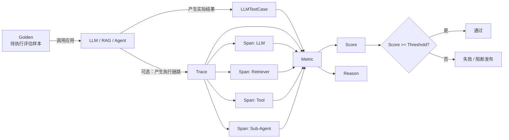
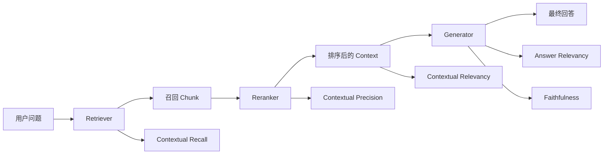
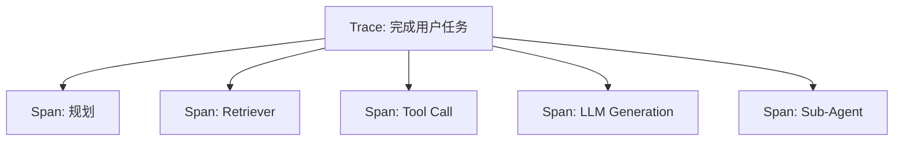
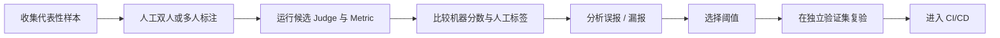
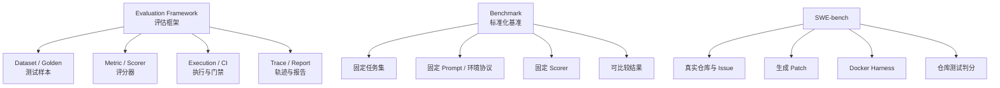
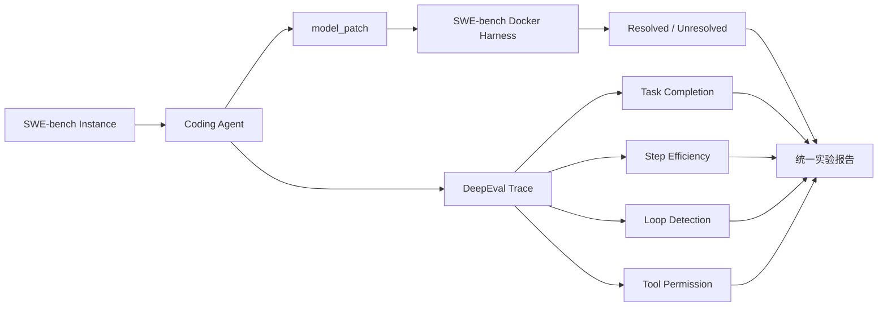
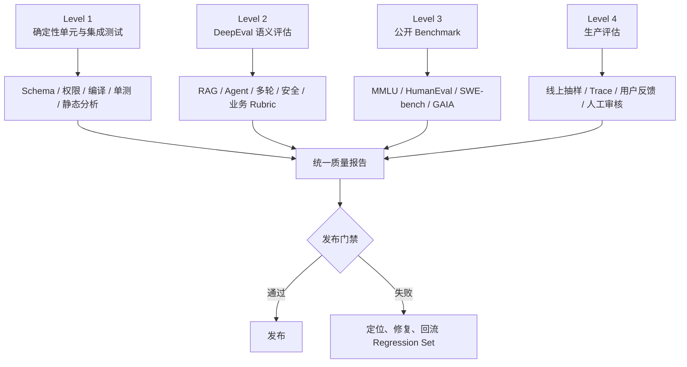

# 附录 8：DeepEval 实战指南

> 定位：**DeepEval 的完整实战教程**。正文第 15 章讲评测方法论（五层指标体系、回流闭环、框架与平台选型），本附录讲"DeepEval 具体怎么用"——从安装、数据模型、指标配置，到 RAG/Agent/多轮三条实战线、自定义扩展与 CI/CD 工程化，再到内置评估器全景与 Benchmark 关系，全文收录、按节查阅。API 快照为 **DeepEval Python 4.2.0**（教程 v1.1，2026-08-30 验证），升级前先读 Release Notes（文档与发布入口见 [C-31]）；RAG 指标的方法论口径见第 11 章 2.8，评测体系全貌见第 15 章，五平台选型对比见附录 9。

---

## 8.1 DeepEval 是什么

**DeepEval 是一个面向 LLM 应用的开源评估框架。** 它把 LLM、RAG、Agent、聊天机器人、工具调用和多模态系统的质量要求，转换为可重复执行、可评分、可设置阈值、可进入 CI/CD 的自动化测试。

可以把它理解为：

```text
Pytest 的测试组织能力
+
LLM-as-a-Judge 的语义判断能力
+
RAG / Agent / 对话系统的专用指标
+
Trace / Span 级故障定位
+
数据集、缓存、并发与回归测试能力
```

DeepEval 的主要能力包括：

- 使用 Pytest 风格编写 LLM 单元测试；
- 使用 50 多种内置指标评估 LLM、RAG、Agent、对话、安全与多模态场景；
- 支持端到端、Agent 轨迹级和内部组件级评估；
- 支持 Golden、Dataset、合成数据和对话模拟；
- 支持自定义 Judge 模型和本地模型；
- 支持缓存、并发、失败重试、Flaky 标记与 CI/CD 门禁；
- 支持本地运行，Confident AI 云平台属于可选能力，不是本地评估的必需条件。

截至 2026-08-30，DeepEval Python 最新正式发布为 **4.2.0**。4.2.0 统一了指标方向：**所有指标均为分数越高越好**。

---

## 8.2 为什么 LLM 应用需要专门的评估框架

传统程序通常可以做确定性断言：

```python
assert calculate(2, 3) == 5
```

但 LLM 输出具有以下特点：

1. **表达非唯一**：同一事实可以有多种正确表述；
2. **运行非确定**：相同输入可能产生略有差异的答案；
3. **质量维度多**：正确不等于相关，相关不等于忠实，忠实不等于有帮助；
4. **系统链路复杂**：RAG 的问题可能来自检索、重排、Prompt 或生成；
5. **Agent 不只输出文本**：还包括计划、工具选择、参数、步骤、重试和子 Agent；
6. **字符串比较不足**：无法判断语义等价、事实支持、业务规则和任务完成度。

例如：

```text
期望答案：购买后 30 天内可以申请退款。
实际答案：订单完成后的一个月内可以发起全额退款。
```

字符串不同，但语义可能正确。DeepEval 会将这种判断封装为 Metric，并输出：

```text
score   = 0.93
success = True
reason  = "回答正确覆盖了退款期限，且未引入额外条件。"
```

因此，LLM 测试的基本形式从布尔比较变成：

```text
测试用例 + 评估指标 + 阈值 + 评分理由
```

---

## 8.3 DeepEval 的整体工作模型



### 8.3.1 四个关键概念

| 概念 | 作用 | 典型内容 |
|---|---|---|
| `Golden` | 应用执行前的评估输入模板 | 输入、期望输出、理想上下文、预期工具 |
| `LLMTestCase` | 应用执行后的完整评估单元 | 输入、实际输出、检索结果、真实工具调用 |
| `Metric` | 质量判定器 | 相关性、忠实度、任务完成度、工具正确性 |
| `Trace / Span` | Agent 或复杂系统的执行过程 | 规划、LLM、Retriever、Tool、子 Agent |

### 8.3.2 三种评估粒度

| 粒度 | 评估对象 | 适用问题 |
|---|---|---|
| 端到端评估 | 输入与最终输出 | “系统最终回答是否合格？” |
| 轨迹级评估 | Agent 的完整有序执行链 | “Agent 是否完成任务、路径是否高效？” |
| 组件级评估 | 某一个 Retriever、Tool、LLM 或子 Agent Span | “到底是哪个组件导致失败？” |

### 8.3.3 单轮与多轮

| 类型 | 测试用例 | 典型场景 |
|---|---|---|
| 单轮 | `LLMTestCase` | QA、RAG、摘要、分类、Agent 单任务 |
| 多轮 | `ConversationalTestCase` | 客服机器人、销售助手、对话式工作流 |

> 当前 4.2.0 中，多轮对话评估不支持 Tracing；多轮场景应以 `ConversationalTestCase` 的端到端评估为主。Trace / Span 组件级评估用于单轮 LLM、RAG 与 Agent 执行链路。

---

## 8.4 环境准备与安装

### 8.4.1 推荐环境

DeepEval 4.2.0 的官方 Python 版本要求为 **Python 3.9 及以上、低于 Python 4**。本教程建议使用：

```text
Python 3.11 或 3.12
独立虚拟环境
DeepEval 4.2.0
```

使用 `venv`：

```bash
python -m venv .venv

# Linux / macOS
source .venv/bin/activate

# Windows PowerShell
.venv\Scripts\Activate.ps1
```

安装固定版本：

```bash
pip install "deepeval==4.2.0"
```

需要本地 Trace TUI 时：

```bash
pip install "deepeval[inspect]==4.2.0"
```

开发阶段也可以安装最新版：

```bash
pip install -U deepeval
```

生产项目更建议固定版本，并在升级前执行完整基准集。

### 8.4.2 配置 Judge 模型密钥

大量指标属于 LLM-as-a-Judge，需要一个评估模型。使用默认 OpenAI Judge 时：

```bash
# Linux / macOS
export OPENAI_API_KEY="your-api-key"

# Windows PowerShell
$env:OPENAI_API_KEY="your-api-key"
```

也可以使用 `.env`：

```dotenv
OPENAI_API_KEY=your-api-key

# 可选：上传测试报告到 Confident AI
# CONFIDENT_API_KEY=confident_xxx
```

不要把 `.env` 提交到 Git：

```gitignore
.env
.venv/
__pycache__/
.pytest_cache/
.deepeval/
```

### 8.4.3 验证安装

```bash
deepeval --help
python -c "import deepeval; print('DeepEval import OK')"
```

排查当前配置来源：

```bash
deepeval diagnose
```

---

## 8.5 五分钟完成第一个评估

创建 `test_first_eval.py`：

```python
from deepeval import assert_test
from deepeval.metrics import GEval
from deepeval.test_case import LLMTestCase, SingleTurnParams


def test_refund_answer() -> None:
    test_case = LLMTestCase(
        input="退款期限是多少？",
        actual_output="用户可以在购买后的 30 天内申请全额退款。",
        expected_output="购买后 30 天内可以申请全额退款。",
    )

    correctness = GEval(
        name="正确性",
        criteria=(
            "判断实际回答是否与期望回答在事实和业务含义上保持一致。"
            "允许不同措辞，但不得增加、遗漏或篡改关键条件。"
        ),
        evaluation_params=[
            SingleTurnParams.INPUT,
            SingleTurnParams.ACTUAL_OUTPUT,
            SingleTurnParams.EXPECTED_OUTPUT,
        ],
        threshold=0.8,
    )

    assert_test(
        test_case=test_case,
        metrics=[correctness],
    )
```

运行：

```bash
deepeval test run test_first_eval.py
```

DeepEval 会：

1. 收集 Pytest 测试；
2. 调用 Judge 模型；
3. 计算指标分数；
4. 将分数与 `threshold=0.8` 比较；
5. 输出评分理由；
6. 低于阈值时让测试失败并返回非零退出码。

也可以直接运行某个测试：

```bash
deepeval test run test_first_eval.py::test_refund_answer
```

---

## 8.6 核心数据模型

### 8.6.1 `LLMTestCase`

单轮评估使用 `LLMTestCase`。DeepEval 4.x 的核心字段包括：

| 字段 | 含义 | 常见用途 |
|---|---|---|
| `input` | 用户输入或当前组件输入 | 所有单轮测试 |
| `actual_output` | 应用真实输出 | 生成质量、端到端评估 |
| `expected_output` | 理想输出 | 正确性、Contextual Recall / Precision |
| `context` | 静态理想事实依据 | Hallucination、理想知识上下文 |
| `retrieval_context` | 运行时真实检索结果 | RAG Retriever / Generator 评估 |
| `tools_called` | Agent 实际调用的工具 | Tool Correctness、Argument Correctness |
| `expected_tools` | 理想情况下应调用的工具 | 工具选择对比 |
| `token_cost` | Token 或成本信息 | 成本分析 |
| `completion_time` | 完成耗时 | 性能分析 |

示例：

```python
from deepeval.test_case import LLMTestCase, ToolCall

case = LLMTestCase(
    input="订单不合适时如何退款？",
    actual_output="可以在购买后的 30 天内申请退款。",
    expected_output="购买后 30 天内可申请全额退款。",
    context=[
        "退款政策规定，购买后 30 天内可以申请全额退款。"
    ],
    retrieval_context=[
        "退款政策：购买之日起 30 天内支持全额退款。"
    ],
    tools_called=[
        ToolCall(
            name="search_policy",
            input_parameters={"query": "退款期限"},
            output="购买后 30 天内支持全额退款。",
        )
    ],
    expected_tools=[
        ToolCall(
            name="search_policy",
            input_parameters={"query": "退款期限"},
        )
    ],
    token_cost=0.0021,
    completion_time=1.42,
)
```

#### `context` 与 `retrieval_context` 的区别

这是最容易混淆的一组字段：

```text
context
= 评估集预先定义的理想事实依据
= 静态 Ground Truth

retrieval_context
= RAG 在本次运行中真实召回的内容
= 动态 Runtime Result
```

例如：

```python
LLMTestCase(
    input="退款期限是多少？",
    actual_output="退款期限是 30 天。",
    expected_output="购买后 30 天内可退款。",
    context=["购买后 30 天内可退款。"],
    retrieval_context=[
        "购买后 30 天内可退款。",
        "会员积分每月结算一次。",
    ],
)
```

这里第二条召回内容与问题无关，可能降低 Contextual Relevancy；但第一条足以支持答案，因此 Faithfulness 仍可能较高。

### 8.6.2 `ToolCall`

```python
from deepeval.test_case import ToolCall

call = ToolCall(
    name="get_weather",
    description="查询指定城市天气",
    reasoning="用户询问实时天气，必须调用天气工具。",
    input_parameters={"city": "Singapore"},
    output={"temperature": 30, "condition": "rain"},
)
```

常用字段：

| 字段 | 说明 |
|---|---|
| `name` | 工具名称，必填 |
| `description` | 工具用途 |
| `reasoning` | 为什么调用该工具 |
| `input_parameters` | 调用参数 |
| `output` | 工具返回值 |
| `type` | Function 或 MCP 工具类型 |

### 8.6.3 `Golden`

`Golden` 是“运行应用之前”的测试模板，通常没有 `actual_output`：

```python
from deepeval.dataset import Golden

sample = Golden(
    input="退款期限是多少？",
    expected_output="购买后 30 天内可以申请退款。",
    context=["退款政策：购买后 30 天内支持全额退款。"],
)
```

Golden 与 Test Case 的关系：

```text
Golden
  输入、期望结果、理想上下文
        │
        │ 调用真实应用
        ▼
LLMTestCase
  输入、实际输出、真实检索结果、真实工具调用
```

### 8.6.4 `EvaluationDataset`

`EvaluationDataset` 用于集中管理一组 Golden 或 Test Case，并支持保存、加载、批量执行和回归测试：

```python
from deepeval.dataset import EvaluationDataset, Golden


dataset = EvaluationDataset(
    goldens=[
        Golden(
            input="退款期限是多少？",
            expected_output="购买后 30 天内可以退款。",
        ),
        Golden(
            input="退款是否收手续费？",
            expected_output="符合政策的退款不收取额外手续费。",
        ),
    ]
)
```

一个 `EvaluationDataset` 要么是单轮数据集，要么是多轮数据集，不应混合两种 Golden 类型。

---

## 8.7 三种评估执行方式

### 8.7.1 直接调用 `metric.measure()`

适合快速调试单个指标：

```python
from deepeval.metrics import AnswerRelevancyMetric
from deepeval.test_case import LLMTestCase

case = LLMTestCase(
    input="退款期限是多少？",
    actual_output="购买后 30 天内可以退款。",
)

metric = AnswerRelevancyMetric(threshold=0.8)
metric.measure(case)

print("score:", metric.score)
print("reason:", metric.reason)
print("success:", metric.is_successful())
```

适用：

- Notebook 实验；
- 指标 Prompt 调试；
- 自定义 Judge 接入测试；
- 查看 `verbose_mode` 中间过程。

不适合作为完整评估流水线，因为不会自动获得全部缓存、并发、统一报告和 Pytest 门禁能力。

### 8.7.2 使用 `evaluate()`

适合脚本、Notebook、离线批处理：

```python
from deepeval import evaluate
from deepeval.metrics import AnswerRelevancyMetric, FaithfulnessMetric
from deepeval.test_case import LLMTestCase

cases = [
    LLMTestCase(
        input="退款期限是多少？",
        actual_output="购买后 30 天内可以退款。",
        retrieval_context=["退款政策：购买后 30 天内支持退款。"],
    )
]

result = evaluate(
    test_cases=cases,
    metrics=[
        AnswerRelevancyMetric(threshold=0.75),
        FaithfulnessMetric(threshold=0.85),
    ],
    identifier="refund-rag-baseline",
    hyperparameters={
        "generator": "production-model",
        "prompt_version": "refund-v3",
        "chunk_size": 500,
    },
)

print(result)
```

特点：

- 结果可以在 Python 代码中继续处理；
- 默认支持异步并发；
- 支持缓存、显示、错误和并发配置；
- 不像 `assert_test()` 那样天然用于测试失败门禁。

### 8.7.3 使用 `assert_test()` + `deepeval test run`

适合单元测试和 CI/CD：

```python
from deepeval import assert_test
from deepeval.metrics import AnswerRelevancyMetric
from deepeval.test_case import LLMTestCase


def test_answer_relevancy() -> None:
    case = LLMTestCase(
        input="退款期限是多少？",
        actual_output="购买后的 30 天内可以申请退款。",
    )

    assert_test(
        test_case=case,
        metrics=[AnswerRelevancyMetric(threshold=0.8)],
    )
```

执行：

```bash
deepeval test run tests/evals
```

低于阈值时测试失败，进而阻断 Pull Request 或发布流水线。

### 三种方式选择

| 需求 | 推荐方式 |
|---|---|
| 临时查看一个指标 | `metric.measure()` |
| Notebook / 实验脚本 / 批处理 | `evaluate()` |
| 回归测试 / CI/CD 门禁 | `assert_test()` + `deepeval test run` |
| Tracing 驱动的 Agent 批量评估 | `EvaluationDataset.evals_iterator()` |

---

## 8.8 Metric 的通用配置与语义

DeepEval 4.2.0 统一了常规数值型指标的方向：

```text
0 <= score <= 1
score 越高越好
score >= threshold 时通过
```

比较型的 Arena 评估不一定提供可独立解释的单项标量分数，因此应按对应指标的文档解释结果。升级自旧版本时，要重新核查已有阈值和报表逻辑，不能沿用“部分指标越低越好”的旧假设。

常见参数：

| 参数 | 作用 |
|---|---|
| `threshold` | 最低通过分数，默认通常为 0.5 |
| `model` | Judge 模型名称或 `DeepEvalBaseLLM` 实例 |
| `include_reason` | 是否生成评分理由 |
| `strict_mode` | 是否要求完美得分；通常会把结果二值化 |
| `async_mode` | 指标内部是否异步执行 |
| `verbose_mode` | 是否输出评分中间过程 |
| `flaky` | 失败时是否不决定测试用例最终成败 |

对于支持该配置的指标，`threshold=None` 可用于**仅记录分数、不执行通过/失败门禁**。由于不同指标的构造参数并不完全一致，使用前应检查对应 Metric 的签名与版本文档。

示例：

```python
from deepeval.metrics import FaithfulnessMetric

metric = FaithfulnessMetric(
    threshold=0.85,
    include_reason=True,
    strict_mode=False,
    async_mode=True,
    verbose_mode=False,
    flaky=False,
)
```

### 8.8.1 `strict_mode`

普通模式：

```text
score = 0.88
threshold = 0.80
结果 = 通过
```

严格模式通常要求完美结果：

```text
score = 1.0  -> 通过
score < 1.0  -> 失败
```

适用于：

- JSON Schema 必须完全正确；
- 安全规则零容忍；
- 工具名称与参数必须精确匹配；
- 合规字段不得缺失。

不适合主观写作质量，因为会显著增加 Flaky。

### 8.8.2 `flaky`

LLM 评估存在随机性，边界样本可能在阈值附近抖动。可把测试用例或单个 Metric 标记为 Flaky：

```python
case = LLMTestCase(
    input="...",
    actual_output="...",
    flaky=True,
)
```

或：

```python
metric = AnswerRelevancyMetric(
    threshold=0.8,
    flaky=True,
)
```

Flaky 只应作为临时治理手段，不能替代：

- 调整 Judge Prompt；
- 增加重复运行；
- 重新校准阈值；
- 修正含糊 Golden；
- 使用更稳定的 Judge。

### 8.8.3 `verbose_mode`

```python
metric = FaithfulnessMetric(verbose_mode=True)
metric.measure(case)
```

用于查看：

- 从输出中抽取了哪些 Claim；
- Judge 如何判断每条 Claim；
- 哪些语句被认定为无关或不忠实；
- 为什么得分与人工直觉不一致。

---

## 8.9 如何选择评估指标

不要“指标越多越好”。通常一个测试套件使用 **2～5 个关键指标**更有效：

```text
2～3 个系统专用指标
+
1～2 个业务自定义指标
```

### 8.9.1 指标选择决策表

| 系统 | 首选指标 | 解决的问题 |
|---|---|---|
| 普通 QA | `GEval`、`AnswerRelevancyMetric` | 是否正确、是否回答问题 |
| RAG Generator | `AnswerRelevancyMetric`、`FaithfulnessMetric` | 是否相关、是否忠实于召回内容 |
| RAG Retriever | `ContextualRelevancyMetric`、`ContextualPrecisionMetric`、`ContextualRecallMetric` | 是否召回正确、排序合理、覆盖充分 |
| Agent 总体 | `TaskCompletionMetric` | 是否完成任务 |
| Agent 执行路径 | `StepEfficiencyMetric`、`PlanAdherenceMetric`、`PlanQualityMetric` | 是否绕路、是否遵循计划、计划是否合理 |
| 工具调用 | `ToolCorrectnessMetric`、`ArgumentCorrectnessMetric` | 工具和参数是否正确 |
| 多轮客服 | `TurnRelevancyMetric`、`KnowledgeRetentionMetric`、`ConversationCompletenessMetric` | 是否保持上下文、是否完整解决问题 |
| 角色型机器人 | `RoleAdherenceMetric` | 是否始终遵循角色 |
| JSON 输出 | `JsonCorrectnessMetric` 或确定性 Schema 校验 | 结构是否符合契约 |
| 安全 | Bias、Toxicity、PII、Misuse 等安全指标 | 是否存在风险输出 |

### 8.9.2 Reference-based 与 Referenceless

```text
Reference-based
需要 expected_output、context 或 expected_tools 等参考信息
适合离线测试和 CI/CD

Referenceless
只依赖 input、actual_output、retrieval_context 或 Trace
适合没有人工标签的线上样本
```

线上生产流量通常没有 `expected_output`，因此需要优先选择 Referenceless 指标，例如：

- Answer Relevancy；
- Faithfulness；
- Task Completion；
- Step Efficiency；
- 部分安全指标。

---

## 8.10 G-Eval：定义业务专属指标

`GEval` 是最通用的自定义指标。它适合：

- 正确性；
- 有用性；
- 专业性；
- 信息完整性；
- 风格一致性；
- 业务规则遵循；
- 输出是否适合目标用户。

构造参数速查：

| 参数 | 说明 |
| --- | --- |
| `name` | 指标名称，报表展示使用 |
| `criteria` | **自然语言评判标准**，越清晰打分越稳定 |
| `evaluation_steps` | 显式列出评分步骤（与 `criteria` 二选一），比一句话标准更可控、波动更小 |
| `evaluation_params` | 告诉 G-Eval 需要哪些字段做评判：`INPUT` 用户输入、`ACTUAL_OUTPUT` 模型输出、`EXPECTED_OUTPUT` 标准答案、`RETRIEVAL_CONTEXT` 检索上下文 |
| `threshold` | 0–1，pytest 断言 pass/fail 阈值 |
| `strict_mode` | 严格模式，低于阈值直接置 0 |

**核心原理**（三步）：

1. **自动生成评估步骤**：把你输入的自然语言评估标准，拆解成结构化的分步评判清单（Auto-CoT）；
2. **表单式打分**：Judge LLM 严格按照生成的步骤逐条评判输出；
3. **概率加权**：利用模型输出 log-prob 对分数加权，输出 0–1 归一化分数，附带完整可解释 reason 理由。

> 与普通直接 Prompt 打分的区别：普通 LLM-as-Judge 直接输出分数，波动大；G-Eval 强制分步推理，显著提升与人工标注的相关性。

**两种实现**：

- `GEval`：单轮对话评估；
- `ConversationalGEval`：多轮会话 Agent 评估，对完整对话轨迹打分（多轮用例见 8.15 节）。

### 8.10.1 使用 `criteria`

```python
from deepeval.metrics import GEval
from deepeval.test_case import SingleTurnParams

helpfulness = GEval(
    name="帮助性",
    criteria=(
        "判断实际回答是否直接解决用户问题，是否包含可执行信息，"
        "是否避免空泛表述、无关背景和未经请求的扩展。"
    ),
    evaluation_params=[
        SingleTurnParams.INPUT,
        SingleTurnParams.ACTUAL_OUTPUT,
    ],
    threshold=0.8,
)
```

### 8.10.2 使用 `evaluation_steps`

对于高风险或复杂业务，显式步骤通常比一句宽泛 Criteria 更稳定：

```python
from deepeval.metrics import GEval
from deepeval.test_case import SingleTurnParams

policy_compliance = GEval(
    name="退款政策合规性",
    evaluation_steps=[
        "从 expected_output 中提取退款期限、费用和前置条件。",
        "从 actual_output 中提取对应业务声明。",
        "逐项比较是否存在遗漏、冲突或额外承诺。",
        "若回答引入参考答案中不存在的承诺，应显著扣分。",
        "根据事实一致性和关键条件完整性给出最终分数。",
    ],
    evaluation_params=[
        SingleTurnParams.ACTUAL_OUTPUT,
        SingleTurnParams.EXPECTED_OUTPUT,
    ],
    threshold=0.85,
)
```

### 8.10.3 编写 G-Eval 的原则

差的 Criteria：

```text
判断回答好不好。
```

较好的 Criteria：

```text
判断回答是否准确覆盖退款期限、适用范围和费用规则；
允许措辞不同，但不允许遗漏限制条件、增加未经依据的承诺，
也不允许把“可申请”表述为“必定成功”。
```

建议：

1. 一个 Metric 只判断一个清晰维度；
2. 明确允许什么、不允许什么；
3. 明确严重错误如何扣分；
4. 不要让一个指标同时评估正确性、风格、安全和性能；
5. 使用人工标注样本校验 Judge 与人的一致性。

---

## 8.11 DAG Metric：构建结构化判定流程

`DAGMetric` 适合把复杂规则拆为可控的判定图：

```text
先检查 JSON 是否有效
    ├─ 否 -> 0 分
    └─ 是 -> 检查必填字段
              ├─ 缺失 -> 0.3 分
              └─ 完整 -> 检查事实正确性
                         ├─ 有严重错误 -> 0.5 分
                         └─ 无错误 -> 1.0 分
```

与 G-Eval 的差异：

| 维度 | G-Eval | DAG Metric |
|---|---|---|
| 定义方式 | 自然语言 Criteria / Steps | 显式节点、分支和终点分值 |
| 适合场景 | 主观质量、难枚举标准 | 条件规则、分级门禁、业务流程 |
| 分数控制 | 由 Judge 综合给出 | 终点分数由开发者映射 |
| 建设成本 | 较低 | 较高 |
| 可解释性 | 依赖 Judge 理由 | 判定路径更明确 |

选择建议：

```text
“回答是否专业、清晰、有帮助” -> G-Eval
“格式错误直接 0 分；缺字段 0.3；事实错 0.5” -> DAG
```

DAG 仍可能在部分分支中使用 LLM 判断，所以它不是完全无随机性；它的优势在于**判定结构与分数映射可控**。

---

## 8.12 RAG 评估完整教程

### 8.12.1 RAG 评估不能只看最终答案



最终答案失败可能有四种不同根因：

1. 没召回关键事实；
2. 召回了，但排序太差；
3. Context 中噪声太多；
4. Context 正确，但 Generator 编造或跑题。

因此应分开评估 Retriever 与 Generator。

### 8.12.2 五个核心 RAG 指标

| 指标 | 主要比较对象 | 必要字段 | 定位 |
|---|---|---|---|
| `AnswerRelevancyMetric` | `input` ↔ `actual_output` | `input`、`actual_output` | 回答是否切题 |
| `FaithfulnessMetric` | `actual_output` ↔ `retrieval_context` | `input`、`actual_output`、`retrieval_context` | 回答是否被召回内容支持 |
| `ContextualRelevancyMetric` | `input` ↔ `retrieval_context` | `input`、`actual_output`、`retrieval_context` | 召回内容是否相关 |
| `ContextualPrecisionMetric` | 相关 Chunk 的排序位置 | `input`、`actual_output`、`expected_output`、`retrieval_context` | 排序 / Reranker 质量 |
| `ContextualRecallMetric` | `expected_output` 中的事实是否可由召回内容支持 | `input`、`actual_output`、`expected_output`、`retrieval_context` | 关键事实是否召全 |

### 8.12.3 端到端 RAG 测试

```python
from deepeval import assert_test
from deepeval.metrics import (
    AnswerRelevancyMetric,
    FaithfulnessMetric,
    ContextualPrecisionMetric,
    ContextualRecallMetric,
    ContextualRelevancyMetric,
)
from deepeval.test_case import LLMTestCase


def test_refund_rag() -> None:
    case = LLMTestCase(
        input="退款期限以及是否收手续费？",
        actual_output=(
            "符合退款条件的订单可以在购买后的 30 天内申请全额退款，"
            "不额外收取手续费。"
        ),
        expected_output=(
            "购买后 30 天内可以申请全额退款，且不收取额外手续费。"
        ),
        retrieval_context=[
            "退款政策：购买之日起 30 天内可以申请全额退款。",
            "符合退款政策的申请不收取额外手续费。",
            "会员积分将在每月最后一个工作日结算。",
        ],
    )

    metrics = [
        AnswerRelevancyMetric(threshold=0.8),
        FaithfulnessMetric(threshold=0.9),
        ContextualRelevancyMetric(threshold=0.7),
        ContextualPrecisionMetric(threshold=0.75),
        ContextualRecallMetric(threshold=0.85),
    ]

    assert_test(test_case=case, metrics=metrics)
```

运行：

```bash
deepeval test run test_rag.py -v
```

### 8.12.4 如何解释组合分数

#### 情况 A

```text
Answer Relevancy = 0.95
Faithfulness     = 0.42
```

说明回答很切题，但包含大量无法从召回内容中支持的声明。优先检查：

- Prompt 是否要求“仅依据上下文回答”；
- 模型是否在 Context 不足时仍强行回答；
- 是否需要添加“无法确定”的拒答策略；
- Context 是否在进入模型前被截断。

#### 情况 B

```text
Contextual Recall    = 0.38
Contextual Relevancy = 0.90
```

说明召回内容大多相关，但缺少关键事实。优先检查：

- `top_k` 是否过小；
- Query Rewrite 是否丢失限制条件；
- 文档切分是否把相关事实拆散；
- Metadata Filter 是否过严；
- 索引是否未更新。

#### 情况 C

```text
Contextual Recall    = 0.92
Contextual Precision = 0.41
```

说明关键内容已召回，但排序差、噪声靠前。优先检查：

- Reranker；
- 相关性打分；
- 混合检索权重；
- Chunk 去重；
- 相同来源文档的聚合策略。

#### 情况 D

```text
Faithfulness = 0.94
Answer Relevancy = 0.46
```

说明回答忠实于 Context，但没有直接回答问题，可能在复述文档或输出无关背景。优先检查 Generator Prompt，而不是 Retriever。

### 8.12.5 组件级 RAG 评估

对 Generator Span 单独评估：

```python
from deepeval.dataset import EvaluationDataset, Golden
from deepeval.evaluate import AsyncConfig
from deepeval.metrics import AnswerRelevancyMetric, FaithfulnessMetric
from deepeval.test_case import LLMTestCase
from deepeval.tracing import observe, update_current_span, update_current_trace


@observe()
def rag_app(query: str) -> str:
    chunks = retrieve(query)
    answer = generate(query, chunks)
    update_current_trace(input=query, output=answer)
    return answer


@observe()
def retrieve(query: str) -> list[str]:
    return [
        "退款政策：购买后 30 天内支持全额退款。",
        "符合条件的退款不收取手续费。",
    ]


@observe(
    metrics=[
        AnswerRelevancyMetric(threshold=0.8),
        FaithfulnessMetric(threshold=0.9),
    ]
)
def generate(query: str, chunks: list[str]) -> str:
    # 替换为真实模型调用
    answer = "购买后 30 天内可申请退款，且不收取手续费。"

    update_current_span(
        test_case=LLMTestCase(
            input=query,
            actual_output=answer,
            retrieval_context=chunks,
        )
    )
    return answer


dataset = EvaluationDataset(
    goldens=[Golden(input="退款期限和手续费规则是什么？")]
)

for golden in dataset.evals_iterator(
    async_config=AsyncConfig(run_async=False)
):
    rag_app(golden.input)
```

这样可以直接把失败定位到 `generate` Span，而不是只知道整个 RAG 应用失败。

### 8.12.6 RAG 数据集建议

至少覆盖：

| 分类 | 示例 |
|---|---|
| 标准问题 | 单文档可直接回答 |
| 跨 Chunk 问题 | 需要合并两段或多段事实 |
| 限定条件 | 时间、地区、产品版本、用户类型 |
| 无答案问题 | 知识库中不存在答案 |
| 冲突文档 | 新旧政策同时存在 |
| 噪声检索 | 大量相似但无关内容 |
| 长尾表达 | 缩写、错别字、口语、同义词 |
| Prompt Injection | 文档中包含恶意指令 |
| 时效性 | 过期文档与当前文档并存 |

---

## 8.13 Agent 评估完整教程

Agent 的质量不能只看最终文本。完整评估至少包含：

```text
任务是否完成
计划是否合理
是否遵循计划
工具是否选对
参数是否正确
步骤是否高效
是否出现重复或循环
失败后是否正确恢复
```

### 8.13.1 Agent 指标

| 指标 | 评估问题 | 粒度 |
|---|---|---|
| `TaskCompletionMetric` | 是否完成用户目标 | 完整 Trace |
| `StepEfficiencyMetric` | 是否存在多余、重复和绕路步骤 | 完整 Trace |
| `PlanQualityMetric` | 计划是否合理、完整、可执行 | 完整 Trace |
| `PlanAdherenceMetric` | 实际执行是否遵循计划 | 完整 Trace |
| `ToolCorrectnessMetric` | 是否选择正确工具 | Test Case / 组件 |
| `ArgumentCorrectnessMetric` | 工具参数是否正确 | Test Case / 组件 |

### 8.13.2 最小 Agent 轨迹评估

```python
import pytest

from deepeval import assert_test
from deepeval.dataset import EvaluationDataset, Golden
from deepeval.metrics import TaskCompletionMetric
from deepeval.tracing import observe, update_current_trace


dataset = EvaluationDataset(
    goldens=[
        Golden(input="计算 12 乘以 8"),
        Golden(input="计算 15 乘以 4"),
    ]
)


@observe()
def math_agent(query: str) -> str:
    # 替换为真实 Agent 执行
    if "12" in query and "8" in query:
        answer = "12 乘以 8 等于 96。"
    else:
        answer = "15 乘以 4 等于 60。"

    update_current_trace(
        input=query,
        output=answer,
    )
    return answer


@pytest.mark.parametrize("golden", dataset.goldens)
def test_math_agent(golden: Golden) -> None:
    math_agent(golden.input)

    assert_test(
        golden=golden,
        metrics=[TaskCompletionMetric(threshold=0.8)],
    )
```

执行：

```bash
deepeval test run test_agent.py
```

### 8.13.3 同时评估完成度、效率和计划

```python
from deepeval.metrics import (
    PlanAdherenceMetric,
    PlanQualityMetric,
    StepEfficiencyMetric,
    TaskCompletionMetric,
)

trajectory_metrics = [
    TaskCompletionMetric(threshold=0.85),
    StepEfficiencyMetric(threshold=0.75),
    PlanQualityMetric(threshold=0.75),
    PlanAdherenceMetric(threshold=0.8),
]
```

分数解释：

```text
Task Completion 高 + Step Efficiency 低
= 做成了，但绕路、重复调用或重试过多

Plan Quality 高 + Plan Adherence 低
= 计划合理，但执行阶段偏离计划

Plan Quality 低 + Task Completion 高
= 可能偶然成功，流程不稳定，不适合复杂任务
```

### 8.13.4 工具调用正确性

```python
from deepeval import assert_test
from deepeval.metrics import ToolCorrectnessMetric
from deepeval.test_case import LLMTestCase, ToolCall, ToolCallParams


def test_weather_tool_selection() -> None:
    case = LLMTestCase(
        input="查询新加坡今天的天气。",
        actual_output="新加坡今天有阵雨，气温约 30°C。",
        tools_called=[
            ToolCall(
                name="get_weather",
                input_parameters={"city": "Singapore"},
                output={"condition": "showers", "temperature": 30},
            )
        ],
        expected_tools=[
            ToolCall(
                name="get_weather",
                input_parameters={"city": "Singapore"},
            )
        ],
    )

    assert_test(
        test_case=case,
        metrics=[
            ToolCorrectnessMetric(
                threshold=0.9,
                evaluation_params=[ToolCallParams.INPUT_PARAMETERS],
                should_exact_match=True,
            )
        ],
    )
```

根据业务需要调整严格度：

```text
只关心工具名称       -> 默认设置
校验输入参数         -> evaluation_params=[ToolCallParams.INPUT_PARAMETERS]
校验工具输出         -> evaluation_params=[ToolCallParams.OUTPUT]
关心工具调用顺序     -> should_consider_ordering=True
要求调用列表完全一致 -> should_exact_match=True
```

`should_exact_match=True` 主要约束工具名称、类型和调用列表；只有把输入参数或输出加入 `evaluation_params`，这些字段才会参与严格匹配。对于没有 `expected_tools` 的线上样本，可使用 `ArgumentCorrectnessMetric`，让 Judge 根据用户输入判断实际工具参数是否合理；需要确定性参数比对时，仍应使用 `ToolCorrectnessMetric` 加 `ToolCallParams.INPUT_PARAMETERS`。

### 8.13.5 工具评估应结合确定性规则

不要只使用 LLM Judge。推荐组合：

```text
确定性断言
- 工具是否在 Allowlist
- 参数是否通过 JSON Schema
- 路径是否越权
- 调用次数是否超过预算
- 是否存在重复幂等调用
- 是否触发超时

语义评估
- 当前任务是否应该调用该工具
- 参数在业务语义上是否正确
- 调用顺序是否合理
- 工具输出是否被正确使用
```

示例：

```python
assert call.name in ALLOWED_TOOLS
assert validate_schema(call.input_parameters)
assert total_tool_calls <= 8

assert_test(
    test_case=case,
    metrics=[ToolCorrectnessMetric(threshold=0.9)],
)
```

---

## 8.14 Tracing、轨迹级与组件级评估

### 8.14.1 Trace 与 Span



- **Trace**：一次完整 Agent 或复杂工作流运行；
- **Span**：Trace 中的一个局部执行单元；
- **轨迹指标**：读取完整有序 Trace；
- **组件指标**：只读取某个 Span 对应的 `LLMTestCase`。

### 8.14.2 手工埋点

顶层函数：

```python
from deepeval.tracing import observe, update_current_trace


@observe()
def agent(query: str) -> str:
    answer = run_workflow(query)
    update_current_trace(input=query, output=answer)
    return answer
```

内部组件：

```python
from deepeval.metrics import AnswerRelevancyMetric
from deepeval.test_case import LLMTestCase
from deepeval.tracing import observe, update_current_span


@observe(metrics=[AnswerRelevancyMetric(threshold=0.8)])
def generate_answer(query: str) -> str:
    output = call_model(query)

    update_current_span(
        test_case=LLMTestCase(
            input=query,
            actual_output=output,
        )
    )
    return output
```

### 8.14.3 同时运行 Trace 与 Span 指标

```python
for golden in dataset.evals_iterator(
    metrics=[
        TaskCompletionMetric(threshold=0.85),
        StepEfficiencyMetric(threshold=0.75),
    ]
):
    agent(golden.input)
```

同时，内部 `@observe(metrics=[...])` Span 会执行自己的组件指标。

最终得到：

```text
Trace
├── Task Completion: 0.91
├── Step Efficiency: 0.72
├── Retriever Span
│   └── Contextual Relevancy: 0.88
├── Tool Span
│   └── Tool Correctness: 1.00
└── Generator Span
    ├── Answer Relevancy: 0.94
    └── Faithfulness: 0.63
```

这样可以直接判断：任务完成，但 Generator 出现不忠实声明。

### 8.14.4 异步 Agent

```python
import asyncio

from deepeval.metrics import TaskCompletionMetric
from deepeval.tracing import observe, update_current_trace


@observe()
async def async_agent(query: str) -> str:
    answer = await call_agent(query)
    update_current_trace(input=query, output=answer)
    return answer


async def main() -> None:
    for golden in dataset.evals_iterator(
        metrics=[TaskCompletionMetric(threshold=0.8)]
    ):
        task = asyncio.create_task(async_agent(golden.input))
        dataset.evaluate(task)


asyncio.run(main())
```

### 8.14.5 本地查看 Trace

安装扩展：

```bash
pip install "deepeval[inspect]==4.2.0"
```

运行评估后：

```bash
deepeval inspect
```

适用于查看：

- Trace 树；
- Span 输入输出；
- 工具调用；
- Retriever Context；
- 每个 Metric 的 Score 与 Reason。

---

## 8.15 多轮对话评估

多轮评估关注整个对话，而不是单次回答。

### 8.15.1 手工创建对话测试用例

```python
from deepeval import evaluate
from deepeval.metrics import (
    ConversationCompletenessMetric,
    KnowledgeRetentionMetric,
    RoleAdherenceMetric,
    TurnRelevancyMetric,
)
from deepeval.test_case import ConversationalTestCase, Turn


conversation = ConversationalTestCase(
    turns=[
        Turn(role="user", content="我需要退回刚买的鞋。"),
        Turn(role="assistant", content="可以，请提供订单号。"),
        Turn(role="user", content="订单号是 A-1024。"),
        Turn(role="assistant", content="已确认 A-1024，购买时间在 30 天内，可以申请退款。"),
        Turn(role="user", content="会收手续费吗？"),
        Turn(role="assistant", content="符合退款政策的申请不收取额外手续费。"),
    ],
    scenario="用户申请退鞋并确认手续费规则",
    expected_outcome="完成退款资格确认并准确说明手续费规则",
    chatbot_role="严谨、简洁的电商退款客服，不承诺超出政策的结果",
)


evaluate(
    test_cases=[conversation],
    metrics=[
        TurnRelevancyMetric(threshold=0.8),
        KnowledgeRetentionMetric(threshold=0.8),
        ConversationCompletenessMetric(threshold=0.8),
        RoleAdherenceMetric(threshold=0.8),
    ],
)
```

### 8.15.2 常见多轮指标

| 指标 | 关注点 |
|---|---|
| `TurnRelevancyMetric` | 每个回复是否与当前对话相关 |
| `KnowledgeRetentionMetric` | 是否记住前文提供的信息 |
| `ConversationCompletenessMetric` | 是否完整解决用户目标 |
| `RoleAdherenceMetric` | 是否持续遵循设定角色 |
| `ConversationalGEval` | 自定义整体对话标准 |

### 8.15.3 使用 `ConversationSimulator`

先定义 Golden：

```python
from deepeval.dataset import ConversationalGolden, EvaluationDataset, Persona


dataset = EvaluationDataset(
    goldens=[
        ConversationalGolden(
            scenario="用户希望退回一双尺码不合适的鞋。",
            expected_outcome="确认订单与退款资格，并说明下一步操作。",
            persona=Persona(
                characteristics="用户不熟悉退款流程，表达较简短。"
            ),
        )
    ]
)
```

定义应用回调：

```python
from typing import List
from deepeval.test_case import Turn


async def model_callback(
    input: str,
    turns: List[Turn],
    thread_id: str,
) -> Turn:
    response = await your_chatbot(
        current_input=input,
        history=turns,
        thread_id=thread_id,
    )
    return Turn(role="assistant", content=response)
```

执行模拟：

```python
from deepeval.simulator import ConversationSimulator


simulator = ConversationSimulator(
    model_callback=model_callback,
    max_concurrent=3,
)

conversations = simulator.simulate(
    conversational_goldens=dataset.goldens,
    max_user_simulations=8,
)
```

再使用多轮 Metric 评估：

```python
from deepeval import evaluate
from deepeval.metrics import TurnRelevancyMetric


evaluate(
    test_cases=conversations,
    metrics=[TurnRelevancyMetric(threshold=0.8)],
)
```

> 对话模拟模型与评估 Judge 是两个独立角色。应分别记录模型名称、Prompt 和版本，避免实验结果不可复现。

---

## 8.16 数据集与 Golden 管理

### 8.16.1 创建数据集

```python
from deepeval.dataset import EvaluationDataset, Golden


dataset = EvaluationDataset(
    goldens=[
        Golden(
            input="退款期限是多少？",
            expected_output="购买后 30 天内可以申请退款。",
        ),
        Golden(
            input="退款是否收手续费？",
            expected_output="符合条件时不收取额外手续费。",
        ),
    ]
)
```

动态添加：

```python
dataset.add_golden(
    Golden(
        input="超过 30 天还能退款吗？",
        expected_output="超过常规退款期限后需要按例外流程审核。",
    )
)
```

### 8.16.2 Golden 转 Test Case

```python
from deepeval.test_case import LLMTestCase


for golden in dataset.goldens:
    app_result = run_application(golden.input)

    dataset.add_test_case(
        LLMTestCase(
            input=golden.input,
            actual_output=app_result.output,
            expected_output=golden.expected_output,
            context=golden.context,
            retrieval_context=app_result.retrieval_context,
            tools_called=app_result.tools_called,
        )
    )
```

### 8.16.3 保存数据集

```python
dataset.save_as(
    file_type="jsonl",
    directory="./tests/evals/datasets",
    file_name="refund_regression",
    include_test_cases=False,
)
```

支持常见格式：

```text
CSV
JSON
JSONL
```

JSONL 更适合版本控制和追加：

```json
{"input":"退款期限是多少？","expected_output":"购买后 30 天内可以申请退款。"}
{"input":"退款是否收手续费？","expected_output":"符合条件时不收取额外手续费。"}
```

### 8.16.4 加载数据集

```python
from deepeval.dataset import EvaluationDataset


dataset = EvaluationDataset()

dataset.add_goldens_from_json_file(
    file_path="tests/evals/datasets/refund_regression.json"
)
```

JSONL 数据集：

```python
dataset.add_goldens_from_jsonl_file(
    file_path="tests/evals/datasets/refund_regression.jsonl"
)
```

对于大型数据集，可优先使用 JSONL，并按 Marker、目录或数据切片分批运行。

### 8.16.5 数据集分层

推荐分为：

```text
smoke
  10～30 条，PR 必跑，覆盖最关键能力

regression
  历史线上问题、已修复 Bug、关键业务路径

edge_cases
  空输入、长输入、歧义、冲突、异常工具返回

adversarial
  Prompt Injection、越权、恶意参数、安全攻击

production_samples
  线上抽样的代表性失败或高价值 Trace

human_gold
  专家标注、用于校准 Judge 与阈值的高质量样本
```

### 8.16.6 Golden 设计原则

一条好 Golden 应满足：

- 目标单一，能够对应明确质量维度；
- 输入接近真实用户表达；
- 期望输出不应过度规定措辞；
- 关键事实和限制条件清晰；
- 边界条件可判定；
- 不包含互相矛盾的标签；
- 能解释“为什么该样本重要”。

不推荐：

```text
输入：介绍一下退款。
期望：回答得好一点。
```

推荐：

```text
输入：我购买 20 天后发现尺码不合适，可以退款吗？会收手续费吗？
期望事实：30 天内可申请退款；符合政策时不收额外手续费。
严重错误：把 30 天写成 7 天；承诺退款一定成功；遗漏手续费规则。
```

---

## 8.17 合成评估数据

当没有现成评估集时，可使用 Golden Synthesizer 生成单轮或多轮 Golden。单轮生成主要有四种入口：

| 方法 | 适用输入 |
|---|---|
| `generate_goldens_from_docs()` | 直接从知识库文档抽取 Context 并生成样本 |
| `generate_goldens_from_contexts()` | 已完成切分或检索，希望自行控制 Context |
| `generate_goldens_from_goldens()` | 基于已有 Golden 扩写表达和难度 |
| `generate_goldens_from_scratch()` | 没有文档，按任务与风格配置从零生成 |

多轮版本使用对应的 `generate_conversational_goldens_*()` 方法。

从文档生成时，需要额外安装文档解析、切分与向量存储依赖：

```bash
pip install chromadb langchain-core langchain-community langchain-text-splitters
```

完整示例：

```python
from deepeval.synthesizer import Synthesizer


synthesizer = Synthesizer(
    async_mode=True,
    max_concurrent=10,
    cost_tracking=True,
)

goldens = synthesizer.generate_goldens_from_docs(
    document_paths=[
        "docs/refund_policy.md",
        "docs/shipping_policy.pdf",
    ],
    include_expected_output=True,
)

print(f"生成 {len(goldens)} 条 Golden")
print(goldens[0])
```

也可以直接使用已经准备好的 Context：

```python
goldens = synthesizer.generate_goldens_from_contexts(
    contexts=[
        [
            "购买后 30 天内可以申请全额退款。",
            "符合退款政策的申请不收取额外手续费。",
        ],
        [
            "标准配送通常需要 3 至 5 个工作日。",
        ],
    ],
    include_expected_output=True,
    max_goldens_per_context=2,
)
```

生成后必须进行人工审核，不应直接把合成标签作为高风险业务的最终 Ground Truth。

保存：

```python
synthesizer.save_as(
    file_type="json",
    directory="./tests/evals/synthetic",
    file_name="refund_synthetic",
)
```

### 合成数据的正确定位

```text
适合：
- 冷启动
- 扩充表达方式
- 生成边界问题
- 构造长尾场景
- 创建初始 Smoke Set

不适合直接替代：
- 专家 Ground Truth
- 合规判定
- 医疗、金融、法律高风险标签
- 最终发布门禁的全部依据
```

推荐流程：


---

## 8.18 接入自定义 Judge 模型

DeepEval 支持继承 `DeepEvalBaseLLM` 接入任意模型，包括：

- 云模型；
- 企业内部模型网关；
- Azure / Bedrock / Vertex AI；
- LangChain Chat Model；
- 本地 Ollama；
- Hugging Face 模型；
- 其他兼容文本生成接口。

### 8.18.1 自定义模型接口

```python
from typing import Any

from deepeval.models.base_model import DeepEvalBaseLLM


class CustomJudge(DeepEvalBaseLLM):
    def __init__(self, client: Any, model_name: str) -> None:
        self.client = client
        self.model_name = model_name

    def load_model(self) -> Any:
        return self.client

    def generate(self, prompt: str) -> str:
        client = self.load_model()
        response = client.generate(
            model=self.model_name,
            prompt=prompt,
        )
        return response.text

    async def a_generate(self, prompt: str) -> str:
        client = self.load_model()
        response = await client.agenerate(
            model=self.model_name,
            prompt=prompt,
        )
        return response.text

    def get_model_name(self) -> str:
        return f"CustomJudge:{self.model_name}"
```

使用：

```python
judge = CustomJudge(
    client=your_model_client,
    model_name="judge-model-v1",
)

metric = GEval(
    name="正确性",
    criteria="判断实际输出是否正确。",
    evaluation_params=[
        SingleTurnParams.ACTUAL_OUTPUT,
        SingleTurnParams.EXPECTED_OUTPUT,
    ],
    model=judge,
)
```

### 8.18.2 接口要求

自定义 Judge 通常需要实现：

```text
load_model()
generate(prompt: str) -> str
a_generate(prompt: str) -> str
get_model_name() -> str
```

其中：

- `generate` 用于同步评估；
- `a_generate` 用于默认异步并发评估；
- 若 `a_generate` 内部仍调用同步接口，会阻塞事件循环并降低吞吐；
- Judge 输出必须能够遵循 DeepEval 所需的结构化格式。

### 8.18.3 Judge 选择原则

Judge 模型应具备：

- 稳定的指令遵循；
- 稳定的 JSON 输出能力；
- 足够长的上下文窗口；
- 对目标语言和业务领域有可靠理解；
- 温度较低；
- 可固定模型版本；
- 成本和延迟可接受。

避免让被评估模型和 Judge 完全相同且无交叉验证，否则可能出现共同偏差。

---

## 8.19 开发自定义 Metric

当内置指标与 G-Eval 都不适合时，可以继承 `BaseMetric`。

以下示例是一个完全确定性的“关键术语覆盖率”指标。

```python
from __future__ import annotations

from typing import Iterable

from deepeval.metrics import BaseMetric
from deepeval.test_case import LLMTestCase


class RequiredTermsMetric(BaseMetric):
    def __init__(
        self,
        required_terms: Iterable[str],
        threshold: float = 1.0,
    ) -> None:
        self.required_terms = tuple(required_terms)
        self.threshold = threshold
        self.score = 0.0
        self.reason = None
        self.success = False
        self.error = None

    def measure(self, test_case: LLMTestCase) -> float:
        try:
            output = (test_case.actual_output or "").lower()
            matched = [
                term for term in self.required_terms
                if term.lower() in output
            ]

            total = len(self.required_terms)
            self.score = len(matched) / total if total else 1.0
            self.reason = (
                f"命中 {len(matched)}/{total} 个必需术语：{matched}"
            )
            self.success = self.score >= self.threshold
            return self.score
        except Exception as exc:
            self.error = str(exc)
            self.success = False
            raise

    async def a_measure(self, test_case: LLMTestCase) -> float:
        return self.measure(test_case)

    def is_successful(self) -> bool:
        if self.error is not None:
            self.success = False
        else:
            self.success = self.score >= self.threshold
        return self.success

    @property
    def __name__(self) -> str:
        return "Required Terms"
```

使用：

```python
case = LLMTestCase(
    input="说明退款政策。",
    actual_output="购买后 30 天内可申请全额退款，且不收手续费。",
)

metric = RequiredTermsMetric(
    required_terms=["30 天", "全额退款", "不收手续费"],
    threshold=1.0,
)

assert_test(test_case=case, metrics=[metric])
```

### 8.19.1 自定义 Metric 的实现要求

通常需要：

1. 继承 `BaseMetric`；
2. 初始化 `threshold`；
3. 在 `measure()` 中设置 `self.score`；
4. 设置 `self.success`；
5. 可选设置 `self.reason`；
6. 实现 `a_measure()`；
7. 实现 `is_successful()`；
8. 给 Metric 提供稳定名称。

多轮指标应继承 `BaseConversationalMetric`，并接收 `ConversationalTestCase`。

### 8.19.2 何时使用确定性 Metric

适合：

- JSON Schema；
- 正则格式；
- 必填字段；
- 枚举值；
- 工具调用次数；
- Token / 成本 / 延迟预算；
- 关键词黑白名单；
- 权限与路径检查；
- 精确业务状态机。

最佳组合：

```text
确定性 Metric
负责硬约束、格式、预算和安全边界

LLM Judge Metric
负责语义、正确性、相关性和任务完成度
```

---

## 8.20 并发、缓存、错误处理与稳定性

### 8.20.1 `AsyncConfig`

默认情况下，`evaluate()` 会并发运行指标。可限制并发：

```python
from deepeval import evaluate
from deepeval.evaluate import AsyncConfig


evaluate(
    test_cases=cases,
    metrics=metrics,
    async_config=AsyncConfig(
        run_async=True,
        max_concurrent=5,
        throttle_value=0.5,
    ),
)
```

顺序执行：

```python
AsyncConfig(run_async=False)
```

适合：

- Judge API 限流严格；
- Notebook 事件循环冲突；
- 调试单个失败样本；
- 自定义模型没有真正异步接口。

### 8.20.2 CLI 并行

```bash
deepeval test run tests/evals -n 4
```

这里使用多进程并行测试。不要同时把：

```text
Pytest 进程数
× 每进程 Metric 并发
× Judge SDK 自身并发
```

全部设置过高，否则容易触发 Rate Limit、超时和成本突增。

### 8.20.3 缓存

```bash
deepeval test run tests/evals -c
```

缓存键会考虑 Test Case 内容和 Metric 配置。只有二者未变化时才复用结果。

适合：

- 大型回归集；
- 失败发生在运行后段；
- 重复调试少量样本；
- 降低 Judge 成本。

不应在以下场景盲目使用缓存：

- 验证 Judge 稳定性；
- 更换未被配置标识捕获的模型后端；
- 评估线上动态输出；
- 测试随机性与重复运行分布。

### 8.20.4 忽略单个错误

```bash
deepeval test run tests/evals -i
```

适合：

- 某些 Judge 返回非法 JSON；
- 希望完成整批测试后统一查看错误；
- 大规模探索性评估。

正式质量门禁不应长期使用 `-i` 掩盖系统性错误。

### 8.20.5 缺少参数时跳过

```bash
deepeval test run tests/evals -s
```

例如部分样本没有 `retrieval_context`，而评估集中同时存在 RAG 与非 RAG 用例。

更好的长期方案是：

- 分离数据集；
- 按 Pytest Marker 分类；
- 明确每类 Metric 的字段契约；
- 在构建 Test Case 时进行 Schema 校验。

### 8.20.6 重复运行

```bash
deepeval test run tests/evals -r 3
```

用于观察：

- Judge 波动；
- 生成模型随机性；
- 阈值附近的 Flaky；
- 某次模型升级后的稳定性。

建议记录：

```text
均值
中位数
最小值
标准差
通过率
```

而不是只看单次分数。

### 8.20.7 重试环境变量

DeepEval 4.x 支持通过环境变量调整重试和超时。常见配置：

```dotenv
DEEPEVAL_RETRY_MAX_ATTEMPTS=3
DEEPEVAL_RETRY_INITIAL_SECONDS=1
DEEPEVAL_RETRY_EXP_BASE=2
DEEPEVAL_RETRY_JITTER=1
DEEPEVAL_RETRY_CAP_SECONDS=8
```

超时相关配置应谨慎修改。禁用所有超时可能导致 CI 永久挂起，优先设置明确的单次调用和单任务预算。

---

## 8.21 CLI 命令与常用参数

### 8.21.1 运行测试

```bash
# 单文件
deepeval test run tests/evals/test_rag.py

# 整个目录
deepeval test run tests/evals

# 单个测试
deepeval test run tests/evals/test_rag.py::test_refund_rag
```

### 8.21.2 常用参数

| 参数 | 作用 |
|---|---|
| `-v` / `--verbose` | 详细输出和 Metric 中间过程 |
| `-x` / `--exit-on-first-failure` | 首次失败即停止 |
| `-n N` / `--num-processes N` | 多进程并行 |
| `-r N` / `--repeat N` | 每个测试重复 N 次 |
| `-c` / `--use-cache` | 使用缓存 |
| `-i` / `--ignore-errors` | 忽略评估执行错误并继续 |
| `-s` / `--skip-on-missing-params` | 缺少必要字段时跳过 |
| `-d failing` | 只显示失败结果 |
| `-id NAME` | 设置测试运行标识 |
| `-m EXPR` | 使用 Pytest Marker 过滤 |
| `-o` / `--official` | 在 Confident AI 中标记官方基准运行 |

组合示例：

```bash
deepeval test run tests/evals \
  -n 2 \
  -c \
  -d failing \
  -id "rag-pr-184"
```

传递额外 Pytest 参数：

```bash
deepeval test run tests/evals \
  --mark "not slow" \
  --exit-on-first-failure \
  -- --tb=short
```

### 8.21.3 Trace 查看

```bash
deepeval inspect
```

### 8.21.4 配置诊断

```bash
deepeval diagnose
```

### 8.21.5 记录超参数

在 `evaluate()` 中：

```python
evaluate(
    test_cases=cases,
    metrics=metrics,
    hyperparameters={
        "model": "generator-v4",
        "prompt_version": "2026-08-30",
        "temperature": 0.1,
        "top_k": 8,
    },
)
```

在 Pytest 中：

```python
import deepeval


@deepeval.log_hyperparameters
def hyperparameters() -> dict[str, str | int | float]:
    return {
        "model": "generator-v4",
        "prompt_version": "2026-08-30",
        "temperature": 0.1,
        "top_k": 8,
    }
```

---

## 8.22 CI/CD 质量门禁

### 8.22.1 GitHub Actions 示例

`.github/workflows/deepeval.yml`：

```yaml
name: DeepEval Quality Gate

on:
  pull_request:
    branches: [main]
  push:
    branches: [main]

jobs:
  deepeval:
    runs-on: ubuntu-latest
    timeout-minutes: 30

    steps:
      - name: Checkout
        uses: actions/checkout@v4

      - name: Set up Python
        uses: actions/setup-python@v5
        with:
          python-version: "3.12"
          cache: "pip"

      - name: Install dependencies
        run: |
          python -m pip install --upgrade pip
          pip install -r requirements.txt

      - name: Run DeepEval smoke suite
        env:
          OPENAI_API_KEY: ${{ secrets.OPENAI_API_KEY }}
        run: |
          deepeval test run tests/evals/smoke \
            --display failing \
            --identifier "pr-${{ github.event.pull_request.number || github.run_id }}"
```

`requirements.txt`：

```text
deepeval==4.2.0
pytest>=8,<9
```

### 8.22.2 分层门禁

推荐：

```text
Pull Request
- 10～30 条 Smoke
- 关键确定性规则
- 低并发
- 5～10 分钟内完成

Main Branch
- 100～500 条 Regression
- 多模型 / 多 Prompt 对比
- 完整 Trace 指标

Nightly
- 大型数据集
- 重复运行
- Judge 一致性检查
- 成本和延迟趋势

Release
- 高风险业务全量集
- 安全与对抗集
- 人工抽检
- 与官方基准版本对比
```

### 8.22.3 不要用降低阈值“修复”失败

错误做法：

```text
Faithfulness 0.62，阈值 0.8
-> 把阈值改成 0.6
```

正确流程：

```text
查看 Reason
-> 确认是应用问题还是评估问题
-> 定位 Retriever / Prompt / Tool / Agent Span
-> 修复系统
-> 使用同一数据集和同一阈值重新运行
```

只有在人工校准证明阈值不合理时，才应调整阈值，并记录变更原因。

---

## 8.23 阈值校准与评估实验设计

### 8.23.1 阈值不能凭感觉设置

推荐流程：



### 8.23.2 校准集组成

需要同时包含：

- 明显通过样本；
- 明显失败样本；
- 阈值边界样本；
- 高风险严重错误；
- 只存在轻微措辞问题的样本；
- 不同语言、长度和表达风格。

### 8.23.3 评估 Judge 本身

可计算：

```text
与人工标签的一致率
Precision
Recall
F1
严重错误漏报率
重复运行方差
不同 Judge 之间的一致性
```

高风险场景优先优化“严重错误漏报率”，而不是只追求整体准确率。

### 8.23.4 A/B 实验

比较两个 Prompt 或模型时：

1. 使用完全相同的数据集；
2. 使用相同 Judge、Metric 和阈值；
3. 固定或记录生成参数；
4. 避免一次运行就下结论；
5. 关注每个样本的配对差值，而不只看整体均值；
6. 单独统计严重回归；
7. 保存运行标识和超参数。

例如：

```text
Prompt A 平均分：0.84
Prompt B 平均分：0.86
```

不能立即得出 B 更好，还应检查：

```text
B 是否让 3 条高风险样本从通过变为失败？
提升是否只来自容易样本？
成本是否增加 80%？
延迟是否超出 SLA？
波动是否显著增大？
```

---

## 8.24 成本、性能与数据安全

### 8.24.1 评估成本模型

粗略成本由以下因素共同决定：

```text
测试用例数量
× Metric 数量
× 每个 Metric 的 Judge 调用次数
× 重复运行次数
× 输入 / 输出 Token
```

例如：

```text
500 条用例
× 4 个指标
× 每指标约 2 次 Judge 调用
× 3 次重复
= 约 12,000 次模型调用
```

### 8.24.2 成本优化

按优先级：

1. PR 只运行 Smoke Set；
2. 先执行确定性规则，失败则不再调用昂贵 Judge；
3. 使用缓存；
4. 只对关键 Span 执行组件指标；
5. 将大型回归集放到 Nightly；
6. 限制 Context 长度，但不要破坏评估有效性；
7. 选择性关闭 `include_reason`，仅用于非常稳定且无需诊断的指标；
8. 对低风险样本使用较低成本 Judge；
9. 对失败样本再使用高能力 Judge 复核。

### 8.24.3 数据安全

虽然 DeepEval 可以本地运行，但 LLM-as-a-Judge 可能把以下数据发送到模型提供方：

- 用户输入；
- 实际输出；
- 期望输出；
- 检索上下文；
- 工具参数和工具结果；
- 对话历史；
- Trace 中的中间信息。

上线前应：

- 脱敏 PII；
- 删除密钥、Token、Cookie；
- 不发送受限源代码或商业机密；
- 确认模型提供方的数据保留政策；
- 对敏感业务使用企业网关或本地 Judge；
- 为评估日志设置保留期限；
- 对测试报告实施访问控制。

### 8.24.4 复现性

至少记录：

```text
DeepEval 版本
Judge 模型与版本
Generator 模型与版本
Prompt 版本 / Hash
Metric 配置
阈值
数据集版本 / Hash
温度与采样参数
Retriever 配置
Tool Schema 版本
代码 Commit SHA
运行时间与环境
```

---

## 8.25 推荐项目结构

```text
project/
├── src/
│   ├── app.py
│   ├── rag.py
│   └── agent.py
├── tests/
│   └── evals/
│       ├── conftest.py
│       ├── smoke/
│       │   ├── test_answer_quality.py
│       │   ├── test_rag.py
│       │   └── test_agent.py
│       ├── regression/
│       │   ├── test_historical_failures.py
│       │   └── test_edge_cases.py
│       ├── safety/
│       │   └── test_adversarial.py
│       ├── metrics/
│       │   ├── business_correctness.py
│       │   └── required_terms.py
│       └── datasets/
│           ├── smoke.jsonl
│           ├── regression.jsonl
│           └── adversarial.jsonl
├── .github/
│   └── workflows/
│       └── deepeval.yml
├── .env.example
├── .gitignore
├── requirements.txt
└── pyproject.toml
```

### `conftest.py` 示例

```python
import os

import pytest


@pytest.fixture(scope="session", autouse=True)
def validate_eval_environment() -> None:
    if not os.getenv("OPENAI_API_KEY"):
        pytest.fail("缺少 OPENAI_API_KEY，无法运行 LLM Judge 指标。")
```

### Pytest Marker

`pyproject.toml`：

```toml
[tool.pytest.ini_options]
markers = [
  "smoke: PR 必跑的快速评估",
  "slow: 大型或高成本评估",
  "rag: RAG 评估",
  "agent: Agent 评估",
  "safety: 安全与对抗评估",
]
```

测试中：

```python
import pytest


@pytest.mark.smoke
@pytest.mark.rag
def test_refund_rag() -> None:
    ...
```

执行：

```bash
deepeval test run tests/evals -m "smoke and not slow"
```

---

## 8.26 常见问题与排查方法

### 8.26.1 评估一直停在 0% 或运行很慢

优先检查：

1. Judge API 额度是否不足；
2. 是否触发 Rate Limit；
3. 并发是否过高；
4. 自定义 `a_generate()` 是否实际阻塞；
5. Judge 是否无法输出合法 JSON；
6. 输入 Context 是否过长；
7. 网络代理是否影响请求。

处理：

```python
from deepeval.evaluate import AsyncConfig

config = AsyncConfig(
    max_concurrent=3,
    throttle_value=1,
)
```

并运行：

```bash
deepeval diagnose
```

### 8.26.2 分数波动很大

检查：

- Judge 温度；
- Judge 模型是否使用滚动别名；
- Criteria 是否过于主观；
- 一条 Metric 是否混合太多维度；
- 样本是否处于阈值边界；
- 是否需要 DAG 或确定性规则；
- 是否需要 `-r 3` 重复评估。

### 8.26.3 Faithfulness 高，但回答明显错误

Faithfulness 只判断是否与 `retrieval_context` 一致。如果检索内容本身错误或过期，回答仍可能忠实。

需要额外使用：

- Contextual Recall / Precision；
- 带人工参考的 Correctness GEval；
- 文档时效性和来源验证；
- 静态 `context` Ground Truth。

### 8.26.4 Answer Relevancy 高，但回答编造事实

Answer Relevancy 只关注是否切题，不保证事实正确。组合使用：

```text
Answer Relevancy + Faithfulness
```

有人工标准答案时再加：

```text
Correctness GEval
```

### 8.26.5 Contextual Relevancy 低，但答案仍正确

可能是：

- 召回了正确内容，同时也召回大量噪声；
- Generator 忽略噪声后仍正确回答；
- 模型依赖自身知识而不是 Context。

这意味着当前样本可能暂时成功，但系统成本和稳定性较差，应优化 Retriever。

### 8.26.6 `expected_output` 应该写多详细

应包含：

- 必须正确的事实；
- 必须覆盖的关键条件；
- 不能做出的额外承诺；
- 必须保留的不确定性。

不必规定：

- 精确措辞；
- 固定句式；
- 无关的写作风格。

除非当前 Metric 明确评估格式或语气。

### 8.26.7 可以只使用 G-Eval 吗

可以启动，但不建议长期只使用 G-Eval。

推荐：

```text
系统专用指标
RAG -> Faithfulness / Contextual Metrics
Agent -> Task Completion / Tool Metrics
对话 -> Multi-turn Metrics

+
业务专用 GEval
```

系统专用指标有更清晰的评分目标，故障定位通常更直接。

### 8.26.8 可以用 DeepEval 代替传统测试吗

不能。DeepEval 应与以下测试共存：

- 单元测试；
- 集成测试；
- Schema 测试；
- 权限测试；
- 安全测试；
- 负载测试；
- 超时与取消测试；
- 数据迁移测试。

完整质量体系：

```text
传统确定性测试
+
LLM 语义评估
+
人工评审
+
生产监控
```

### 8.26.9 是否必须使用 Confident AI

不是。DeepEval 可在本地运行。只有以下能力通常需要云平台：

- 团队共享报告；
- 长期回归趋势；
- 集中管理数据集；
- 线上 Trace 监控；
- 官方基准运行和团队协作。

### 8.26.10 升级 DeepEval 后分数方向异常

DeepEval 4.2.0 已统一为“越高越好”。从旧版本升级时应：

1. 查看 Release Notes；
2. 固定旧版运行一次基准；
3. 升级后重新运行校准集；
4. 检查所有 Metric 阈值；
5. 检查自定义 Metric 的 `is_successful()`；
6. 不直接把新旧版本分数作为同一时间序列比较。

---

## 8.27 落地检查清单

### 环境

- [ ] 使用独立虚拟环境；
- [ ] 固定 DeepEval 版本；
- [ ] Judge 密钥通过 Secret 管理；
- [ ] `.env`、`.deepeval` 未提交到 Git；
- [ ] CI 配置明确超时。

### 数据集

- [ ] 有 10～30 条 Smoke Golden；
- [ ] 历史线上失败已进入 Regression Set；
- [ ] 有边界和无答案样本；
- [ ] Golden 不依赖精确措辞；
- [ ] 高风险样本经过人工审核；
- [ ] 数据集具备版本或 Hash。

### Metric

- [ ] 每个 Metric 只评估清晰维度；
- [ ] RAG 分开评估 Retriever 与 Generator；
- [ ] Agent 同时覆盖任务完成与工具调用；
- [ ] 硬约束使用确定性规则；
- [ ] 阈值经过人工校准；
- [ ] Judge 模型和 Prompt 可追踪。

### 执行

- [ ] PR 运行 Smoke；
- [ ] Nightly 运行完整 Regression；
- [ ] 使用缓存降低重复成本；
- [ ] 并发不超过 Provider 配额；
- [ ] 对边界用例执行重复测试；
- [ ] 不通过降低阈值掩盖回归。

### Agent / Tracing

- [ ] 顶层 Agent 使用 `@observe()`；
- [ ] 使用 `update_current_trace()` 设置 Trace 输入输出；
- [ ] 关键组件使用 `update_current_span()`；
- [ ] Retriever、Tool、Generator 和子 Agent 可单独定位；
- [ ] Trace 中不记录密钥与敏感数据。

### CI/CD

- [ ] `deepeval test run` 返回码进入质量门禁；
- [ ] 失败结果只显示必要信息；
- [ ] 运行标识包含 PR / Commit 信息；
- [ ] Judge 额度不足时能明确失败；
- [ ] 高成本全量测试不阻塞普通开发循环。

---

## 8.28 DeepEval 内置评估器全景

### 8.28.1 “评估器”在 DeepEval 中具体指什么

在 DeepEval 语境中，中文常说的“评估器”通常对应 **Metric**。它是针对某个质量维度执行判定并输出分数的对象，而不是被评估模型本身。

需要区分以下概念：

| 概念 | DeepEval 中的典型对象 | 职责 | 示例 |
|---|---|---|---|
| 测试样本 | `LLMTestCase`、`ConversationalTestCase`、`Golden` | 描述要评估什么 | 用户输入、实际输出、期望输出、检索上下文、工具调用 |
| 评估器 / 指标 | `Metric` | 定义按什么标准评分 | Faithfulness、Task Completion、G-Eval |
| Judge | Metric 的 `model` 参数 | 执行语义判断的评审模型 | 云端模型、本地模型、企业内部 Judge |
| Benchmark | `deepeval.benchmarks.*` 或外部基准 | 提供标准任务集、Prompt 约定和固定评分协议 | MMLU、HumanEval、SWE-bench |
| Harness | DeepEval 执行器或 benchmark 专用执行器 | 组织运行、隔离环境、收集结果、判分 | `deepeval test run`、SWE-bench Docker Harness |
| 报告 / Leaderboard | 本地结果、平台报告、公开榜单 | 汇总与比较实验 | 通过率、平均分、`% Resolved` |

可以用一句话概括：

```text
Test Case 是被测对象
Metric 是尺子
Judge 是读尺子的人
Benchmark 是统一试卷和考试规则
Harness 是组织考试并执行判分的系统
```

### 8.28.2 4.2.0 版本到底有多少个评估器

以 DeepEval Python **4.2.0** 标签中的 `deepeval.metrics.__all__` 为准：

- 顶层公开列表共有 61 个名称；
- 其中 3 个是基类：`BaseMetric`、`BaseConversationalMetric`、`BaseArenaMetric`；
- 其中 2 个是辅助构造对象：`GEvalTemplate`、`DeepAcyclicGraph`；
- 排除上述基类与辅助类后，共有 **56 个可直接实例化的主入口 Metric 类**；
- `deepeval.metrics.ragas` 还提供 5 个可选 RAGAS 包装指标，但它们不在顶层 `deepeval.metrics.__all__` 中，并需要额外安装 `ragas`。

因此，官方使用“**50+ metrics**”比写死一个永久数字更准确：指标数量、导出路径和分类会随版本变化。

> 本节的清单固定到 DeepEval Python 4.2.0。升级 SDK 后，应重新检查官方文档、Release Notes 和 `deepeval.metrics.__all__`，不要假定类名与导入路径长期不变。

### 8.28.3 自定义与比较型评估器

| Metric | 主要对象 | 机制 | 评估内容 | 典型用途 |
|---|---|---|---|---|
| `GEval` | `LLMTestCase` | LLM-as-a-Judge | 使用自然语言 Criteria 或显式 Steps 定义任意单轮质量标准 | 正确性、有用性、专业性、风格、业务规则 |
| `ConversationalGEval` | `ConversationalTestCase` | LLM-as-a-Judge | 对完整多轮对话执行自定义判定 | 客服质量、上下文处理、会话策略、对话风格 |
| `ArenaGEval` | `ArenaTestCase` | 盲化、随机位置、成对 Judge 比较 | 在多个候选输出或应用版本中选出更优者 | A/B 模型、Prompt、RAG 配置和 Agent 策略比较 |
| `DAGMetric` | `LLMTestCase` | 决策图 + 局部 Judge | 通过节点、分支和终点分数实现结构化单轮 Rubric | 格式门禁、条件分级、复杂合规规则 |
| `ConversationalDAGMetric` | `ConversationalTestCase` | 决策图 + 局部 Judge | 为多轮对话构建可控的分支判定和分数映射 | 投诉处理、身份核验、流程型客服、多阶段合规 |

选择原则：

```text
标准难以穷举、偏主观       -> GEval / ConversationalGEval
标准可拆成条件和分支       -> DAGMetric / ConversationalDAGMetric
需要比较两个或多个候选版本 -> ArenaGEval
完全确定性的业务规则       -> 自定义 BaseMetric 或普通单元测试
```

`ArenaGEval` 与普通 `GEval` 的关键差异是：

- `GEval` 为单个候选输出打绝对分；
- `ArenaGEval` 对多个 Contestant 做相对比较；
- Pairwise 方法更容易判断“谁更好”，但结果是相对偏好，不等于每个候选都达到生产阈值；
- 为降低位置偏差，应保留其盲化和随机化机制，而不是自行把候选名称写进 Judge Prompt。

### 8.28.4 确定性与结构正确性评估器

| Metric | 是否调用 LLM | 主要输入 | 评估内容 | 适合做 CI 硬门禁吗 |
|---|---:|---|---|---:|
| `ExactMatchMetric` | 否 | `actual_output`、`expected_output` | 实际输出是否与期望输出完全一致 | 是 |
| `PatternMatchMetric` | 否 | `actual_output`、Pattern | 输出是否符合预期模式或正则约束 | 是 |
| `JsonCorrectnessMetric` | 否 | `actual_output`、Pydantic Schema | JSON 是否可解析并满足目标 Schema | 是 |
| `ToolPermissionMetric` | 否 | `tools_called`、Allowlist / Denylist | 工具调用是否违反最小权限策略 | 是 |
| `AgentLoopDetectionMetric` | 否 | Trace | 检测重复工具调用、推理停滞和调用图循环 | 是或作为强告警 |

这类指标的优势是：

- 相同输入得到相同结果；
- 无 Judge Token 成本；
- 不受 Judge 模型升级影响；
- 适合在每个 Pull Request 中运行；
- 对格式、安全边界和执行预算更可靠。

其中，`AgentLoopDetectionMetric` 在 4.2.0 中使用三个确定性子信号：

1. **工具调用重复**：同名工具以相同参数达到重复阈值；
2. **推理停滞**：连续 LLM Span 输出出现过高的词面相似度；
3. **调用图循环**：Trace 的父子 Span 路径中出现递归环。

它不等价于 `StepEfficiencyMetric`：

```text
AgentLoopDetectionMetric
  关注是否出现明显循环、停滞或重复模式
  确定性、低成本、适合运行时和 CI

StepEfficiencyMetric
  关注完成任务的整体路径是否存在不必要步骤
  由 Judge 结合完整任务与 Trace 做语义判断
```

### 8.28.5 RAG 与内容质量评估器

#### 28.5.1 原生 RAG 指标

| Metric | 评估组件 | 核心比较关系 | 主要问题 |
|---|---|---|---|
| `AnswerRelevancyMetric` | Generator | `input` ↔ `actual_output` | 回答是否切题，是否真正回应用户问题 |
| `FaithfulnessMetric` | Generator | `actual_output` ↔ `retrieval_context` | 回答中的声明是否能被检索上下文支持 |
| `ContextualRelevancyMetric` | Retriever | `input` ↔ `retrieval_context` | 检索内容是否与查询相关，是否包含过多噪声 |
| `ContextualPrecisionMetric` | Retriever / Reranker | 相关信息的排序位置 | 高价值内容是否排在无关内容之前 |
| `ContextualRecallMetric` | Retriever | `expected_output` ↔ `retrieval_context` | 回答所需的关键事实是否被完整召回 |

RAG 指标不能互相替代。例如：

```text
Faithfulness 高、Answer Relevancy 低
-> 回答没有编造，但没有直接回答问题

Contextual Recall 高、Contextual Precision 低
-> 关键内容召回了，但排序差、噪声多

Contextual Relevancy 高、Contextual Recall 低
-> 已召回内容大多相关，但遗漏关键事实
```

#### 28.5.2 通用内容质量指标

| Metric | 主要对象 | 评估内容 | 与相邻指标的区别 |
|---|---|---|---|
| `HallucinationMetric` | 单轮输出 | 检查输出是否包含与给定 Context 冲突或无依据的声明 | 通用 Context 幻觉检测；RAG 场景通常优先使用 `FaithfulnessMetric` |
| `SummarizationMetric` | 摘要任务 | 判断摘要是否覆盖关键信息且保持事实一致 | 同时关注 Coverage 与 Alignment，而不只是长度 |
| `BiasMetric` | 单轮输出 | 检测不当偏见或刻板化表达 | 属于安全与内容质量交叉指标 |
| `ToxicityMetric` | 单轮输出 | 检测攻击性、有害或有毒内容 | 不等同于事实错误或不相关 |

实践上，RAG 回归套件通常只需要：

```text
Answer Relevancy
+ Faithfulness
+ 一个 Retriever 指标
+ 一个业务 GEval
```

只有在明确需要区分召回覆盖率与排序质量时，再同时加入 Contextual Recall 和 Contextual Precision。

### 8.28.6 Agent 与工具调用评估器

Agent 评估至少要区分四个层次：

```text
最终目标是否完成
完整执行路径是否合理
单次工具选择与参数是否正确
是否违反权限、预算或循环约束
```

#### 28.6.1 Trace 轨迹级指标

| Metric | 主要对象 | 评估内容 | 典型失败 |
|---|---|---|---|
| `TaskCompletionMetric` | 完整 Trace | Agent 是否真正完成用户任务 | 输出看似完整，但没有完成外部操作或遗漏关键目标 |
| `StepEfficiencyMetric` | 完整 Trace | 是否以必要且合理的步骤完成任务 | 重复搜索、无效反思、绕路、过量工具调用 |
| `PlanAdherenceMetric` | 完整 Trace + Plan | 执行是否遵循已生成计划 | 擅自跳步、顺序错乱、忽略计划约束 |
| `PlanQualityMetric` | Plan + 完整 Trace | 计划是否逻辑完整、可执行且高效 | 计划缺步骤、依赖顺序错误、不可验证 |

上述四个是 DeepEval 官方标注的主要 **Trajectory Metrics**，需要 Tracing，并通过 `EvaluationDataset.evals_iterator()` 将 Golden 与一次完整 Agent 执行关联起来。

#### 28.6.2 组件级工具指标

| Metric | 主要对象 | 是否通常需要参考答案 | 评估内容 |
|---|---|---:|---|
| `ToolCorrectnessMetric` | `tools_called` | 是，常与 `expected_tools` 比较 | 是否选择了正确工具，以及调用集合或顺序是否满足预期 |
| `ArgumentCorrectnessMetric` | 单次工具调用 | 是或依赖上下文 | 工具参数在语义上是否正确、完整、与任务匹配 |
| `ToolPermissionMetric` | 工具调用集合 | 否，但需要权限策略 | 是否只调用已授权工具，是否命中 Denylist |

不要将三者混为一谈：

```text
ToolCorrectness
  问：为了完成任务，选的工具对不对？

ArgumentCorrectness
  问：工具选对后，参数是否正确？

ToolPermission
  问：无论任务是否完成，这个工具是否有权调用？
```

一个调用可能同时满足：

```text
工具选择合理 = True
参数正确     = True
权限允许     = False
```

这仍然必须判定为安全失败。

#### 28.6.3 多轮 Agent 指标

| Metric | 测试对象 | 评估内容 |
|---|---|---|
| `GoalAccuracyMetric` | `ConversationalTestCase` | 多轮 Agent 是否正确规划并执行，最终达到会话目标 |
| `ToolUseMetric` | `ConversationalTestCase` | 整个对话中的工具选择和参数生成能力 |
| `TopicAdherenceMetric` | `ConversationalTestCase` | Agent 是否只回答允许或相关主题，能否对越界主题保持边界 |
| `AgentLoopDetectionMetric` | Trace | 是否出现重复工具、推理停滞或调用图循环 |

`GoalAccuracyMetric` 与 `TaskCompletionMetric` 的边界：

- `GoalAccuracyMetric` 面向多轮 `ConversationalTestCase`，从会话与工具使用中判断目标达成；
- `TaskCompletionMetric` 面向 traced Agent 的完整执行轨迹；
- 两者都关注任务结果，但输入模型、适用执行方式和诊断粒度不同。

### 8.28.7 多轮对话评估器

| Metric | 评估粒度 | 评估内容 | 典型场景 |
|---|---|---|---|
| `TurnRelevancyMetric` | 每轮或会话聚合 | Assistant 每轮回复是否与当前用户输入及上下文相关 | 客服、问答、多轮助手 |
| `ConversationCompletenessMetric` | 整体会话 | 对话是否完整满足用户需求，而不是只处理最后一轮 | 投诉、预约、售后流程 |
| `KnowledgeRetentionMetric` | 整体会话 | 是否正确记住并使用前文产生的新信息 | 姓名、偏好、订单号、约束条件 |
| `RoleAdherenceMetric` | 整体会话 | 是否持续遵循设定角色、职责和行为边界 | 客服、教师、领域助手 |
| `GoalAccuracyMetric` | 整体会话 | 是否规划并执行到目标状态 | 事务型 Agent |
| `ToolUseMetric` | 整体会话 | 多轮工具选择和参数是否合理 | 预订、搜索、工作流 Agent |
| `TopicAdherenceMetric` | 整体会话 | 是否限制在允许主题范围 | 领域专用机器人 |
| `TurnFaithfulnessMetric` | 单轮 + 会话上下文 | 每轮回答是否忠实于该轮可用 Context | 多轮 RAG |
| `TurnContextualPrecisionMetric` | 单轮检索 | 相关上下文排序是否合理 | 多轮 Retriever / Reranker |
| `TurnContextualRecallMetric` | 单轮检索 | 当前轮所需信息是否被召回 | 多轮知识问答 |
| `TurnContextualRelevancyMetric` | 单轮检索 | 当前轮召回内容是否相关 | 多轮 RAG 噪声诊断 |
| `ConversationalGEval` | 整体会话 | 自定义多轮质量标准 | 任意业务 Rubric |
| `ConversationalDAGMetric` | 整体会话 | 自定义多轮条件分支与分级 | 流程、门禁、合规 |

注意：DeepEval 的源代码分类和使用场景分类会有重叠。例如，`RoleAdherenceMetric` 在导出列表中被归入安全与合规，但在实际使用中也是核心多轮对话指标。选择 Metric 时应按测试对象和业务目标，而不是机械依赖目录标签。

### 8.28.8 MCP 评估器

DeepEval 4.2.0 提供三类 MCP 相关 Metric：

| Metric | 测试对象 | 评估内容 |
|---|---|---|
| `MCPUseMetric` | 单轮 `LLMTestCase` | MCP Tool、Resource、Prompt 等 Primitive 的选择和参数是否与用户输入匹配 |
| `MultiTurnMCPUseMetric` | `ConversationalTestCase` | 多轮会话中 MCP Primitive 的选择、顺序与参数是否合理 |
| `MCPTaskCompletionMetric` | MCP 执行结果 / 会话 | 使用 MCP 后是否完成任务目标 |

`MCPUseMetric` 不只检查 Tool。MCP 中可用 Primitive 可能包括：

```text
Tools
Resources
Prompts
```

因此测试用例需要尽可能保存：

- 可用 MCP Server 及其 Primitive 定义；
- 实际调用的 Tool / Resource / Prompt；
- 每次调用的参数；
- 调用结果；
- 当前用户输入和最终输出。

如果没有记录实际调用 Primitive，`MCPUseMetric` 仍可判断“本轮是否本应调用某个 MCP Primitive”，但诊断能力会弱于完整轨迹。

### 8.28.9 安全、合规与行为边界评估器

| Metric | 机制 | 评估内容 | 关键配置或输入 |
|---|---|---|---|
| `PIILeakageMetric` | LLM Judge | 输出是否泄漏个人身份信息或隐私敏感数据 | `input`、`actual_output` |
| `NonAdviceMetric` | LLM Judge | 是否给出不应提供的专业建议 | `advice_types`，如 financial、medical、legal |
| `MisuseMetric` | LLM Judge | 专用领域机器人是否被用于领域外用途 | `domain` |
| `RoleViolationMetric` | LLM Judge | 单轮输出是否违反指定角色或 Persona | `role` |
| `RoleAdherenceMetric` | LLM Judge | 多轮会话是否持续遵循角色 | `chatbot_role` 或会话角色信息 |
| `PromptAlignmentMetric` | LLM Judge | 输出是否遵循 Prompt 模板中的具体指令 | `prompt_instructions` |
| `BiasMetric` | LLM Judge | 是否存在不当偏见或刻板印象 | `input`、`actual_output` |
| `ToxicityMetric` | LLM Judge | 是否包含有毒、攻击或有害表达 | `input`、`actual_output` |
| `ToolPermissionMetric` | 确定性 | 工具调用是否符合 Allowlist / Denylist | `tools_called`、权限策略 |

几个容易混淆的指标：

```text
PromptAlignment
  检查具体指令是否遵循，例如“只输出 JSON”“不得超过三句话”。

RoleViolation
  检查单轮输出是否偏离指定角色或人格。

RoleAdherence
  检查整个多轮会话是否持续保持角色。

Misuse
  检查领域专用应用是否被拿来做超出领域边界的事情。

NonAdvice
  检查是否生成了禁止提供的专业建议。
```

安全门禁不应只靠 LLM Judge。推荐组合：

```text
确定性权限、Schema、敏感词与数据分类规则
+
DeepEval 安全语义指标
+
对抗测试 / Red Team
+
人工复核高风险样本
```

### 8.28.10 图像与多模态评估器

| Metric | 主要用途 | 评估内容 |
|---|---|---|
| `TextToImageMetric` | 文生图 | 生成图像是否符合文本提示中的对象、属性、关系和约束 |
| `ImageEditingMetric` | 图像编辑 | 编辑结果是否完成指定修改，并合理保留不应改变的内容 |
| `ImageCoherenceMetric` | 图像理解 / 多模态回答 | 图像与模型输出之间是否连贯、一致 |
| `ImageHelpfulnessMetric` | 多模态回答 | 图像信息是否被有效利用，回答是否有帮助 |
| `ImageReferenceMetric` | 图像引用 | 输出对图中对象、区域或视觉证据的引用是否准确 |

图像 Metric 通常需要在测试用例中使用 `MLLMImage`，并使用具备视觉能力的 Judge。测试时需要同时固定：

- Judge 模型及版本；
- 图像编码或文件来源；
- 是否允许图像压缩；
- 图片顺序；
- Prompt 与图像的绑定关系；
- 多图场景下的引用标识。

多模态评估不能只看文本 `actual_output`，否则无法判断模型是否真的依据图像作答，还是仅凭文本先验猜测。

### 8.28.11 语音 Agent 评估器

DeepEval 4.2.0 的顶层接口导出以下 7 个 Voice Metric：

| Metric | 主要维度 | 典型问题 |
|---|---|---|
| `VoiceNaturalnessMetric` | 声学自然度 | 削波、掉音、重复音频、静音过多、低信噪比、语速或音高异常 |
| `SpeechIntelligibilityMetric` | 可懂度 | 语音是否清晰，内容是否容易被听懂 |
| `TurnTakingNaturalnessMetric` | 轮次交互 | 是否抢话、停顿过长、轮次切换不自然 |
| `VoiceConsistencyMetric` | 声音一致性 | 不同 Assistant Turn 的音色、说话特征是否异常漂移 |
| `AgentResponsivenessMetric` | 响应性 | 用户结束发言后，Agent 是否在合理时延内响应 |
| `AudioIntegrityMetric` | 音频完整性 | 音频是否可解码、缺失、损坏或出现严重传输异常 |
| `VoiceReliabilityMetric` | 可靠性 | 多轮语音交互中是否稳定产出可用音频并完成交互 |

`VoiceNaturalnessMetric` 是确定性的本地声学回归信号，不调用 LLM；它适合发现可测量的音频缺陷，但不能替代真实用户听感测试。语音质量往往受语言、口音、角色、情绪和业务场景影响，因此建议采用：

```text
确定性声学指标
+
ASR / 文本内容正确性指标
+
任务完成指标
+
分层人工听测
```

### 8.28.12 可选 RAGAS 包装指标

DeepEval 还在 `deepeval.metrics.ragas` 中提供：

| Metric | 作用 |
|---|---|
| `RagasMetric` | 对四个 RAGAS 子指标取综合平均 |
| `RAGASAnswerRelevancyMetric` | RAGAS 版本的回答相关性 |
| `RAGASFaithfulnessMetric` | RAGAS 版本的忠实度 |
| `RAGASContextualPrecisionMetric` | RAGAS 版本的上下文精确率 |
| `RAGASContextualRecallMetric` | RAGAS 版本的上下文召回率 |

安装和导入方式不同于 DeepEval 原生 RAG Metric：

```bash
pip install ragas
```

```python
from deepeval.metrics.ragas import RagasMetric
```

它们的定位是把 RAGAS 接入 DeepEval 的 Dataset、Pytest、缓存和报告生态，而不是 DeepEval 原生指标的升级版。官方更推荐优先使用 DeepEval 原生 RAG 指标，只有在团队已经基于 RAGAS 建立历史基线或必须与既有结果对齐时，才使用这些兼容包装器。

### 8.28.13 评估器选择矩阵

| 被测系统 | 最小推荐组合 | 可选增强 | 不建议单独依赖 |
|---|---|---|---|
| 普通问答 | `AnswerRelevancyMetric` + 业务 `GEval` | `PromptAlignmentMetric`、安全指标 | 单一总分 |
| 有标准答案的 QA | 正确性 `GEval` + `ExactMatchMetric` 或业务规则 | `ArenaGEval` 做版本对比 | 只做字符串完全匹配 |
| RAG | `FaithfulnessMetric` + `AnswerRelevancyMetric` + 一个 Contextual Metric | 组件级 Retriever / Generator Span | 只看最终答案正确性 |
| 单轮工具 Agent | `ToolCorrectnessMetric` + `ArgumentCorrectnessMetric` + `ToolPermissionMetric` | 业务 `GEval` | 只看工具是否被调用 |
| 长任务 Agent | `TaskCompletionMetric` + `StepEfficiencyMetric` + `AgentLoopDetectionMetric` | `PlanQualityMetric`、`PlanAdherenceMetric` | 只看最后一段文本 |
| 多轮事务 Agent | `GoalAccuracyMetric` + `ToolUseMetric` + `ConversationCompletenessMetric` | `TopicAdherenceMetric`、`RoleAdherenceMetric` | 只评估最后一轮 |
| MCP Agent | `MCPUseMetric` / `MultiTurnMCPUseMetric` + `MCPTaskCompletionMetric` | 权限和任务业务 Metric | 把 MCP Tool 当普通文本处理 |
| JSON / API 输出 | `JsonCorrectnessMetric` + 业务字段断言 | `PromptAlignmentMetric` | 用 Judge 代替 Schema 校验 |
| 安全敏感应用 | `ToolPermissionMetric` + PII / Misuse / NonAdvice 等 | 对抗集、DeepTeam、人工审核 | 单一安全 Judge |
| 图像应用 | 对应 Image Metric + 业务 `GEval` | OCR、对象检测等确定性检查 | 仅评估文字说明 |
| 语音 Agent | Voice Metric + 内容正确性 + 任务完成度 | 人工听测、网络故障集 | 单一自然度分数 |

### 8.28.14 推荐组合示例

#### RAG 回归套件

```python
from deepeval.metrics import (
    AnswerRelevancyMetric,
    ContextualRecallMetric,
    FaithfulnessMetric,
    GEval,
)
from deepeval.test_case import SingleTurnParams

metrics = [
    AnswerRelevancyMetric(threshold=0.80),
    FaithfulnessMetric(threshold=0.90),
    ContextualRecallMetric(threshold=0.80),
    GEval(
        name="业务正确性",
        criteria="判断实际回答是否覆盖所有关键业务条件，且没有额外承诺。",
        evaluation_params=[
            SingleTurnParams.ACTUAL_OUTPUT,
            SingleTurnParams.EXPECTED_OUTPUT,
        ],
        threshold=0.85,
    ),
]
```

#### 长任务 Agent 套件

```python
from deepeval.metrics import (
    AgentLoopDetectionMetric,
    StepEfficiencyMetric,
    TaskCompletionMetric,
)

trajectory_metrics = [
    TaskCompletionMetric(threshold=0.85),
    StepEfficiencyMetric(threshold=0.75),
    AgentLoopDetectionMetric(
        threshold=0.75,
        repetition_threshold=3,
    ),
]
```

#### 工具调用硬约束与语义判断组合

```python
from deepeval.metrics import (
    ArgumentCorrectnessMetric,
    ToolCorrectnessMetric,
    ToolPermissionMetric,
)

metrics = [
    ToolPermissionMetric(
        allowed_tools=["search_kb", "read_order"],
        denied_tools=["issue_refund"],
        threshold=1.0,
    ),
    ToolCorrectnessMetric(threshold=0.90),
    ArgumentCorrectnessMetric(threshold=0.85),
]
```

核心原则是：

```text
硬约束优先确定性检查
语义正确性再交给 Judge
最终任务与执行过程分开评分
不要把所有维度压成一个无法解释的总分
```

### 8.28.15 常见误用

#### 误用一：一次挂十几个 Metric

问题：成本高、延迟高、指标互相重叠，失败后无法判断优先级。

修正：每个套件优先控制在 2～5 个关键指标，并给每个指标写清楚“它保护什么风险”。

#### 误用二：用 `GEval` 代替 JSON Schema、权限和测试执行

问题：本可确定判定的事实被交给概率性 Judge，导致成本与 Flaky 增加。

修正：JSON、正则、权限、文件存在性、单元测试结果和预算上限使用确定性断言。

#### 误用三：把 Task Completion 当成工具正确性

问题：Agent 可能通过错误工具或越权路径完成任务。

修正：同时评估 Outcome、Trajectory、Action 和 Policy。

#### 误用四：把 Faithfulness 当成事实真相

问题：Faithfulness 只说明输出与给定 Context 一致；如果 Context 本身错误，回答仍可能获得高分。

修正：另行建设知识源质量、时效性和 Ground Truth 校验。

#### 误用五：把安全 Metric 当作完整 Red Team

问题：安全指标只覆盖已定义风险维度，无法自动穷举攻击策略。

修正：增加对抗数据集、Prompt Injection 测试、工具权限测试、人工安全评审和专门 Red Team 流程。

---

## 8.29 DeepEval 与 SWE-bench 等 Benchmark 的关系

### 8.29.1 先区分 Metric、Benchmark 与 Evaluation Framework

这三个术语经常被混用，但所处层级不同：



- **Metric**：一把尺子，例如 Faithfulness、Task Completion、Exact Match；
- **Benchmark**：标准化试卷，包含任务集、输入格式、运行约束和固定评分规则；
- **Evaluation Framework**：承载自定义数据集、Metric、执行、缓存、Tracing、CI 和报告的通用基础设施；
- **Harness**：真正执行被测程序或模型并产生可判分结果的运行系统。

因此，DeepEval 与 SWE-bench **不是同一层面的替代品**。

### 8.29.2 DeepEval 自身也提供标准 Benchmark 适配器

DeepEval 不只是自定义 Metric 框架，也包含 `deepeval.benchmarks` 模块。以 Python 4.2.0 源码公开导出为准，共有以下 17 个 Benchmark 类：

| 类别 | Benchmark | 主要测量能力 |
|---|---|---|
| 综合知识 | `MMLU` | 多学科知识与理解 |
| 指令遵循 | `IFEval` | 可验证指令约束的遵循能力 |
| 常识与语言 | `HellaSwag` | 常识性句子或情境续写选择 |
| 常识与指代 | `Winogrande` | 常识推理与代词消歧 |
| 语言建模 | `LAMBADA` | 长上下文中的目标词预测 |
| 阅读判断 | `BoolQ` | 基于短文的布尔问答 |
| 复杂推理 | `BigBenchHard` | 多种高难度推理任务 |
| 离散阅读推理 | `DROP` | 基于段落的数值、离散与组合推理 |
| 小学数学 | `GSM8K` | 多步骤数学文字题 |
| 数学问答 | `MathQA` | 数学推理与选择题 |
| 逻辑推理 | `LogiQA` | 基于文本的逻辑理解与推理 |
| 科学推理 | `ARC` | 科学知识与选择题推理 |
| 抽取式问答 | `SQuAD` | 基于文章的答案抽取 |
| 真实性 | `TruthfulQA` | 是否避免常见错误认知与虚假回答 |
| 社会偏见 | `BBQ` | 歧义问答场景中的社会偏见 |
| 医疗公平性 | `EquityMedQA` | 医疗问答中的公平性与差异风险 |
| 函数级代码生成 | `HumanEval` | 根据函数描述生成可通过测试的代码 |

使用形式通常为：

```python
from deepeval.benchmarks import MMLU

benchmark = MMLU()
result = benchmark.evaluate(model=your_custom_model)

print(benchmark.overall_score)
print(benchmark.task_scores)
print(benchmark.predictions)
```

这些 Benchmark 的重点是：

- 评估一个自定义 `DeepEvalBaseLLM` 的通用能力；
- 尽量复现原论文的任务、Few-shot 和评分协议；
- 输出 Overall Score、Task Scores 和逐样本 Prediction；
- 便于对不同基础模型或推理配置做统一比较。

> 官方 Benchmark 概览页仍重点列出 7 个经典基准，而 4.2.0 的源码顶层接口已导出 17 个类。遇到文档与安装包差异时，应以当前锁定版本的源码和可导入接口为准。

### 8.29.3 SWE-bench 是什么

官方名称是 **SWE-bench**。它面向真实软件工程 Issue 解决能力，而不是普通问答或短代码补全。

原始 SWE-bench 包含：

- 2,294 个软件工程问题；
- 来自 12 个真实 Python 开源仓库；
- 每个实例基于真实 GitHub Issue 和对应修复；
- 模型或 Coding Agent 获得仓库与 Issue 描述；
- 被测系统需要修改代码库并生成 Patch；
- 结果通过仓库测试和专用判分逻辑验证。

当前 SWE-bench 家族还包括：

| 变体 | 规模 | 主要定位 |
|---|---:|---|
| SWE-bench Full | 2,294 | 原始完整集合 |
| SWE-bench Lite | 300 | 较低运行成本的子集 |
| SWE-bench Verified | 500 | 经人工筛选、可解性和判分质量更高的子集 |
| SWE-bench Multilingual | 300 | 来自 42 个仓库、覆盖 9 种编程语言 |
| SWE-bench Multimodal | 517 | Issue 描述包含视觉元素的任务 |

SWE-bench Leaderboard 的主要指标是：

```text
% Resolved = 被成功解决的任务实例数 / 总任务实例数
```

它的判分不是“让另一个 LLM 看 Patch 像不像正确”，而是由专用 Harness：

1. 准备任务对应的 Docker 环境；
2. Checkout 指定仓库和基线版本；
3. 应用模型生成的 Patch；
4. 运行仓库测试及 Benchmark 判分测试；
5. 判断 Issue 是否被解决；
6. 汇总实例结果和 `% Resolved`。

这是 SWE-bench 的核心可信度来源：**最终结果由可执行代码和测试判定，而不是主要依赖主观 Judge。**

### 8.29.4 DeepEval 与 SWE-bench 的核心关系

最准确的关系是：

```text
DeepEval
= 通用 LLM / RAG / Agent 评估框架
+ 一组 Metric
+ 数据集、Tracing、Pytest、CI 与报告能力
+ 一些传统 LLM Benchmark 适配器

SWE-bench
= 真实软件工程任务 Benchmark
+ 仓库、Issue、Patch 数据协议
+ 专用 Docker Evaluation Harness
+ 固定的测试型 Scorer
+ 公共 Leaderboard
```

二者可以组合，但不能互相替代：

- DeepEval 的 `TaskCompletionMetric` 不能替代 SWE-bench Harness 的测试结果；
- SWE-bench 的 `% Resolved` 不能解释 Agent 为什么失败、是否绕路、是否越权、是否成本过高；
- SWE-bench 适合回答“这个 Coding Agent 在公开真实仓库任务上能解决多少问题”；
- DeepEval 更适合回答“这个具体应用是否满足团队自己的质量、策略、成本和回归要求”。

### 8.29.5 对比表

| 维度 | DeepEval | SWE-bench | MMLU / GSM8K 等传统 Benchmark | HumanEval |
|---|---|---|---|---|
| 类型 | 通用评估框架，兼带部分 benchmark 适配 | 软件工程 Benchmark + 专用 Harness | 标准化模型能力 Benchmark | 函数级代码生成 Benchmark |
| 被测对象 | LLM 应用、RAG、Agent、多轮、MCP、多模态、语音 | Coding Model / Coding Agent | 基础模型或聊天模型 | 代码生成模型 |
| 输入 | 自定义 Test Case、Golden、Trace | 仓库快照 + Issue 描述 | 问题、选项或短文本 | 函数签名与 Docstring |
| 输出 | 文本、工具调用、Trace、图像、语音等 | Git Patch | 答案、选项或短输出 | 函数实现 |
| 主要判分 | LLM Judge、确定性 Metric、自定义规则 | 应用 Patch 后运行仓库测试 | Exact Match 或基准固定 Scorer | 隐藏单元测试与 Pass@k |
| 环境复杂度 | 由应用决定 | 高，需要可复现仓库依赖和 Docker | 通常较低 | 中等，需安全执行代码 |
| 最主要结果 | 每项 Metric 分数与通过率 | `% Resolved` | Accuracy 等 | Pass@k |
| 是否适合产品 CI | 非常适合 | 适合 Coding Agent 的专项回归，但成本较高 | 通常用于周期性模型评测 | 适合代码模型专项评测 |
| 是否有公开可比性 | 自定义数据通常没有；内置 benchmark 有 | 有 | 有 | 有 |
| 是否解释执行过程 | 支持 Trace / Span | 原生重点是最终 Patch 是否通过 | 通常不解释 | 通常不解释 |

### 8.29.6 DeepEval 4.2.0 是否原生支持 SWE-bench

**不原生支持。**

DeepEval 4.2.0 的 `deepeval.benchmarks.__all__` 没有 `SWEBench` 或等价类。因此不要使用类似下面的假想代码：

```python
# 4.2.0 中不存在这样的官方顶层适配器
from deepeval.benchmarks import SWEBench
```

正确方式有两种：

#### 方式一：SWE-bench 负责正式判分，DeepEval 负责补充评估

这是推荐方案：



分工如下：

```text
SWE-bench Harness
  负责最终可执行正确性：Patch 是否真正修复 Issue。

DeepEval
  负责过程质量：Agent 是否高效、是否循环、工具是否正确、是否越权。

Telemetry / Cost Collector
  负责 Token、时延、费用、工具调用次数和资源消耗。
```

#### 方式二：将 SWE-bench 实例适配成内部 Golden / Dataset

可以把 SWE-bench 字段映射到自己的评估数据模型：

| SWE-bench 数据 | DeepEval / 内部评估字段 | 注意事项 |
|---|---|---|
| `instance_id` | Golden ID / Metadata | 用于结果关联和重跑 |
| `problem_statement` | `input` | 被测 Agent 可见 |
| `repo`、`base_commit` | Metadata / 环境配置 | 必须固定版本 |
| `model_patch` | 实际产物 | 不只是自然语言 `actual_output` |
| `gold_patch` | Ground Truth Artifact | **不得在推理时泄漏给 Agent** |
| `FAIL_TO_PASS` / `PASS_TO_PASS` | 确定性测试 Oracle | 由原生 Harness 执行 |
| Agent trajectory | DeepEval Trace / Span | 用于过程评估 |
| `resolved` | 主任务结果 | 作为正式 benchmark 成功信号 |

但是，即使做了 Dataset 映射，**最终 Patch 判分仍应调用 SWE-bench 原生 Harness**。不要让 LLM Judge 读取 Patch 后自行决定“是否修好”。

### 8.29.7 推荐的联合评估结果模型

不要把所有结果过早压成一个加权总分。建议至少保留四组独立维度：

```json
{
  "instance_id": "owner__repo-1234",
  "benchmark": {
    "name": "SWE-bench Verified",
    "resolved": true,
    "harness_version": "pinned-version",
    "dataset_revision": "pinned-revision"
  },
  "quality": {
    "task_completion": 0.95,
    "step_efficiency": 0.72,
    "agent_loop_detection": 1.0,
    "tool_permission": 1.0
  },
  "operations": {
    "latency_seconds": 384.2,
    "input_tokens": 182430,
    "output_tokens": 24781,
    "tool_calls": 83,
    "estimated_cost": 4.26
  },
  "configuration": {
    "model": "model-and-version",
    "agent_harness": "agent-version",
    "prompt_revision": "git-sha",
    "max_steps": 120
  }
}
```

报告时分别呈现：

| 维度 | 推荐指标 |
|---|---|
| 最终能力 | `% Resolved`、Resolved Count |
| 稳定性 | 多次运行成功率、Pass@k、Pass^k 或置信区间 |
| 过程质量 | Step Efficiency、Loop Rate、无效调用率 |
| 安全与治理 | 越权率、策略违规率、敏感操作率 |
| 成本 | 每个已解决任务的平均 Token、费用和时间 |
| 可维护性 | Patch 大小、触及文件数、回归测试失败数 |

一个模型可能：

```text
Resolved 高，但成本和步骤数极高
Resolved 较低，但单位成本很低
平均表现高，但多次运行稳定性差
最终测试通过，但频繁触发越权工具
```

这些都不能由单一 `% Resolved` 解释。

### 8.29.8 公共 Benchmark 与私有评估集分别回答什么问题

| 问题 | 公共 Benchmark | DeepEval 私有 Dataset |
|---|---:|---:|
| 模型在行业标准任务上的相对能力如何 | 强 | 弱 |
| 能否与公开论文、模型或 Agent 榜单比较 | 强 | 弱 |
| 是否覆盖自己的业务 Prompt、数据与工具 | 弱 | 强 |
| 是否覆盖历史线上失败 | 弱 | 强 |
| 是否可以作为每次产品变更的回归门禁 | 有限 | 强 |
| 是否能测试权限、合规和内部策略 | 通常有限 | 强 |
| 是否能定位组件和轨迹问题 | 通常有限 | 强 |
| 是否容易发生公开数据污染 | 较高 | 可控 |

正确的质量体系不是二选一，而是：

```text
公共 Benchmark
  验证通用能力和外部可比性

私有 DeepEval Regression Set
  验证产品正确性和业务回归

确定性测试与专用 Harness
  验证代码、协议、权限和真实执行结果

线上监控与人工评审
  验证真实分布、长尾问题和用户价值
```

### 8.29.9 不同 Benchmark 适合测什么

| 目标 | 更合适的评估方式 |
|---|---|
| 多学科基础知识 | MMLU |
| 常识推理与情境补全 | HellaSwag、Winogrande |
| 数学推理 | GSM8K、MathQA、部分 BBH |
| 真实性与错误认知 | TruthfulQA |
| 偏见与公平性 | BBQ、EquityMedQA |
| 指令遵循 | IFEval |
| 函数级代码生成 | HumanEval |
| 真实仓库 Issue 修复 | SWE-bench |
| 通用工具型 Assistant | GAIA 等 Agent Benchmark |
| 浏览器操作 | WebArena、BrowserGym 等环境型 Benchmark |
| 具体产品 RAG / Agent | DeepEval 自建 Golden、Trace 和 Metric |

这里的关键是评估单位：

```text
HumanEval 的单位是一个函数
SWE-bench 的单位是一个真实仓库 Issue
RAG Eval 的单位通常是一次问答或一次检索链路
多轮 Agent Eval 的单位是一次完整会话或任务轨迹
```

不同单位的分数不可直接横向比较。

### 8.29.10 为什么不能只看 SWE-bench 分数

#### 一、结果受 Agent Harness 影响

同一基础模型在不同 Agent 框架、系统 Prompt、工具集、上下文管理、检索策略和 Token Budget 下，SWE-bench 成绩可能不同。因此榜单结果通常代表：

```text
Model
+ Agent Scaffold
+ Tools
+ Prompt
+ Context Strategy
+ Budget
+ Execution Environment
```

而不只是基础模型本身。

#### 二、通过测试不等于 Patch 工程质量完美

测试是强 Oracle，但仍可能存在：

- 测试覆盖不足；
- 过拟合现有测试；
- 代码可读性和维护性较差；
- 引入未覆盖的安全或性能风险；
- Patch 过大或修改无关文件。

因此可以在 SWE-bench 判分之外增加确定性静态检查、Patch 范围检查和 DeepEval 业务 Rubric。

#### 三、公开 Benchmark 存在污染与适配风险

应记录：

- 模型是否可能见过题目或修复；
- Dataset Revision；
- Harness 版本和镜像；
- Agent Prompt；
- 最大步骤、时间和 Token；
- 重试与并发策略；
- 是否使用额外检索或网络；
- 是否执行多次采样。

#### 四、Benchmark 分布不等于生产分布

公开任务无法完全覆盖团队自己的：

- 语言与框架；
- 私有仓库结构；
- 构建系统；
- 权限策略；
- 工具链；
- 代码规范；
- 性能目标；
- 数据安全要求。

因此，SWE-bench 高分是有价值的能力证据，但不是产品验收的充分条件。

### 8.29.11 推荐的分层评估架构



建议执行频率：

| 层级 | 推荐频率 | 目的 |
|---|---|---|
| 确定性测试 | 每次提交 / PR | 快速阻断明确错误 |
| DeepEval Smoke | 每次 PR | 发现 Prompt、RAG 和 Agent 质量回归 |
| DeepEval Full Regression | Nightly / Release | 覆盖长尾、高成本和多模型实验 |
| SWE-bench 等公开 Benchmark | 周期性、大版本或模型切换时 | 验证外部通用能力和趋势 |
| 生产抽样与人工审核 | 持续 | 捕获真实分布和未知失败 |

最终应形成两个互补结论：

```text
外部能力结论
  “在固定 SWE-bench 版本与 Harness 下，系统解决了多少真实 Issue。”

内部产品结论
  “在自己的数据、工具、权限、成本与业务规则下，系统是否达到发布标准。”
```

只有同时回答这两个问题，评估结果才具有完整的工程意义。

---

## 8.30 参考资料

以下内容以 DeepEval 官方文档和官方 GitHub 仓库为主要依据：

1. [DeepEval Introduction](https://deepeval.com/docs/introduction)
2. [DeepEval 5-min Quickstart](https://deepeval.com/docs/getting-started)
3. [GitHub Releases](https://github.com/confident-ai/deepeval/releases)
4. [Single-Turn Test Case](https://deepeval.com/docs/evaluation-test-cases)
5. [Datasets](https://deepeval.com/docs/evaluation-datasets)
6. [Metrics Introduction](https://deepeval.com/docs/metrics-introduction)
7. [G-Eval](https://deepeval.com/docs/metrics-llm-evals)
8. [DAG Metric](https://deepeval.com/docs/metrics-dag)
9. [RAG Quickstart](https://deepeval.com/docs/getting-started-rag)
10. [AI Agent Evaluation Quickstart](https://deepeval.com/docs/getting-started-agents)
11. [Trajectory-Based Evaluation](https://deepeval.com/docs/evaluation-trajectory-based-llm-evals)
12. [Component-Level Evaluation](https://deepeval.com/docs/evaluation-component-level-llm-evals)
13. [Multi-Turn End-to-End Evaluation](https://deepeval.com/docs/evaluation-end-to-end-multi-turn)
14. [Unit Testing in CI/CD](https://deepeval.com/docs/evaluation-unit-testing-in-ci-cd)
15. [Flags and Configs](https://deepeval.com/docs/evaluation-flags-and-configs)
16. [CLI Reference](https://deepeval.com/docs/command-line-interface)
17. [Environment Variables](https://deepeval.com/docs/environment-variables)
18. [Custom Metrics](https://deepeval.com/docs/metrics-custom)
19. [Golden Synthesizer](https://deepeval.com/docs/golden-synthesizer)
20. [Generate Goldens From Documents](https://deepeval.com/docs/synthesizer-generate-from-docs)
21. [Conversation Simulator](https://deepeval.com/docs/conversation-simulator)
22. [Conversation Simulator Model Callback](https://deepeval.com/docs/conversation-simulator-model-callback)
23. [Role Adherence Metric](https://deepeval.com/docs/metrics-role-adherence)
24. [Tool Correctness Metric](https://deepeval.com/docs/metrics-tool-correctness)
25. [DeepEval 4.2.0 Metric exports](https://github.com/confident-ai/deepeval/blob/python-v4.2.0/deepeval/metrics/__init__.py)
26. [DeepEval Benchmark Introduction](https://deepeval.com/docs/benchmarks-introduction)
27. [DeepEval 4.2.0 Benchmark exports](https://github.com/confident-ai/deepeval/blob/python-v4.2.0/deepeval/benchmarks/__init__.py)
28. [Arena G-Eval](https://deepeval.com/docs/metrics-arena-g-eval)
29. [Agent Loop Detection Metric](https://deepeval.com/docs/metrics-agent-loop-detection)
30. [Tool Permission Metric](https://deepeval.com/docs/metrics-tool-permission)
31. [MCP Use Metric](https://deepeval.com/docs/metrics-mcp-use)
32. [Voice Naturalness Metric](https://deepeval.com/docs/metrics-voice-naturalness)
33. [DeepEval RAGAS compatibility metric](https://deepeval.com/docs/metrics-ragas)
34. [SWE-bench paper](https://arxiv.org/abs/2310.06770)
35. [SWE-bench Official Leaderboards and Dataset Variants](https://www.swebench.com/)
36. [SWE-bench Evaluation Harness Reference](https://www.swebench.com/SWE-bench/reference/harness/)
37. [SWE-bench Evaluation Guide](https://www.swebench.com/SWE-bench/guides/evaluation/)

---

## 结论

DeepEval 的正确用法不是“给输出打一个总分”，而是建立一套分层质量体系：

```text
Golden / Dataset
    ↓
运行真实 LLM、RAG 或 Agent
    ↓
端到端 Metric 判断最终结果
    ↓
Trajectory Metric 判断完整执行过程
    ↓
Component Metric 定位 Retriever、Tool、LLM 或子 Agent
    ↓
阈值与确定性规则形成 CI/CD Quality Gate
    ↓
线上失败持续回流到 Regression Dataset
```

最稳妥的落地顺序是：

```text
1. 先建立 10～30 条高质量 Smoke Golden
2. 使用 2～3 个系统专用指标
3. 增加 1 个业务 GEval
4. 接入 deepeval test run
5. 再为 RAG / Agent 增加 Tracing 和组件级指标
6. 最后建设阈值校准、回归分层和线上失败回流
```

涉及公开 Benchmark 时，还应保持判分职责清晰：

```text
MMLU、HumanEval 等 DeepEval 内置 Benchmark
  -> 按各自固定数据集和 Scorer 评估基础模型能力

SWE-bench 等环境型 Benchmark
  -> 使用其原生 Harness 判定任务是否真正完成

DeepEval 自定义评估
  -> 补充业务质量、Agent 轨迹、工具、安全、成本和私有回归
```

这样可以把主观的“模型感觉变好了”，转化为可复现、可解释、可回归、可阻断发布的工程质量信号，同时避免把公开榜单分数误当成产品验收结果。

---

> **使用提示**：与其他附录的分工——1 讲模型机制、2 讲方法论、3 记来源、4 列产品、5 辨异同、6 索引图版、7 详解 OTel、**8 上手 DeepEval**、9 评测观测平台选型、10 上手 Mem0、11 详解记忆晋升机制、12 盘点 Coding Agent 赛道、13 盘点可观测赛道、14 盘点评估赛道、15 盘点 Memory 赛道、16 盘点自进化赛道、17 盘点多 Agent 赛道、18 盘点 MCP 生态、19 盘点沙箱赛道、20 盘点 RAG 赛道、21 盘点 LLM Wiki 赛道、22 盘点 Loop Engineering 赛道、23 解析 Pi 源码、24 解析 Claude Code 源码、25 解析 Codex 源码、26 解析 OpenCode 源码。第 15 章是"评什么、为什么评"，本附录是"用 DeepEval 怎么评"；第 11 章 2.8 的 RAG 指标组合诊断在 8.12/H.14 有自动化取数方案。API 快照为 4.2.0，动手前对照 [C-31] 核验当前版本。
