# 附录 17：主流多 Agent 系统全景

> 定位：**多 Agent 赛道的全景调研报告**（全文收录，信息基准 2026-09，各框架与平台官方入口见 [C-41]）。与相邻内容的分工：第四篇（第 17–19 章）讲多 Agent 的机制原理与克制判断（八拓扑代价模型、簿记下沉、可行性劝退），本附录是整个赛道的地图——"什么才算真正的多 Agent"的定义辨析、生态全景、通用框架逐家盘点（Agent Framework/LangGraph/OpenAI Agents SDK/ADK/CrewAI 等）、研究型与云厂商平台、编排模式、协议栈（MCP/A2A/AG-UI）、状态与记忆设计、沙箱权限、可观测与评估、该用与不该用的判据、选型与生产参考架构。名单会过期，"什么时候不该用多 Agent"的判据不过期。

---

## 17.1 什么才算真正的多 Agent

截至 **2026 年 8 月**，多 Agent 已经从早期的“多个角色在群聊里互相讨论”，逐步演进为一套完整的工程体系：

- **上层**：任务规划、Agent 路由、角色分工、协作拓扑；
- **中层**：状态机、持久化工作流、消息总线、上下文与记忆；
- **下层**：模型、工具、MCP、代码沙箱、浏览器、权限与身份；
- **外围**：A2A、AG-UI、可观测性、评估、成本控制和安全治理。

工程上，多 Agent 不是简单地：

- 同一个模型调用多次；
- 一个 Agent 调用多个工具；
- 一个 Agent 自我反思、自我批评；
- 在同一个 Prompt 中让模型扮演多个角色。

真正的多 Agent 系统通常包含两个或更多相对独立的决策单元，每个 Agent 至少拥有部分独立的：

- 角色与目标；
- System Prompt；
- 上下文窗口；
- 状态或记忆；
- 模型选择；
- 工具集合；
- 权限边界；
- 生命周期；
- 输入输出契约。

Agent 之间通过消息、结构化任务、共享状态、事件总线或远程协议协作。

可以把多 Agent 抽象为：

```text
Multi-Agent System
=
多个自治或半自治决策单元
+ 任务分解与委派
+ 协作协议
+ 状态与上下文隔离
+ 汇总、验证和终止机制
```

一个系统是否真正需要多 Agent，核心不在于“角色数量”，而在于是否需要以下至少一种能力：

1. **并行执行**：多个子任务可以同时推进；
2. **上下文隔离**：不同子任务不应共享全部上下文；
3. **工具专业化**：不同 Agent 具有不同工具集；
4. **权限隔离**：不同 Agent 拥有不同身份和权限；
5. **独立验证**：生成与验证由不同执行主体完成；
6. **跨系统协作**：需要连接外部 Agent 或其他组织的 Agent 服务。

---

## 17.2 多 Agent 生态全景

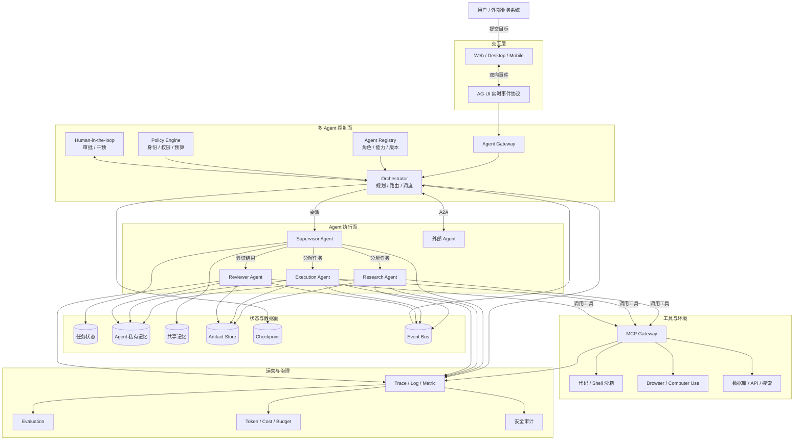

从工程分层看，多 Agent 平台通常包含以下六个平面：

| 平面 | 核心职责 |
|---|---|
| 交互平面 | 用户输入、流式响应、任务进度、审批、中断和恢复 |
| 控制平面 | 计划、路由、调度、策略、预算、Agent 注册与发现 |
| 执行平面 | Agent Loop、工具调用、子任务执行、结果验证 |
| 状态平面 | 会话、任务、记忆、Checkpoint、Artifact、事件 |
| 工具平面 | MCP、API、浏览器、Shell、代码解释器、数据库 |
| 治理平面 | 身份、权限、审计、可观测性、评估、成本和安全 |

---

## 17.3 主流通用多 Agent 框架

### 17.3.1 Microsoft Agent Framework

**定位：企业级、跨语言、生产级 Agent 与多 Agent 工作流框架。**

Microsoft Agent Framework 将 AutoGen 的 Agent 抽象与 Semantic Kernel 的类型安全、Middleware、Telemetry、会话状态等能力整合，并增加图工作流、持久化状态和 Human-in-the-loop。

其多 Agent 编排模式主要包括：

- Sequential；
- Concurrent；
- Handoff；
- Group Chat；
- Magentic。

它支持 Python、.NET 和 Go，并覆盖长运行任务、检查点、恢复、Telemetry、Middleware、A2A、MCP 等企业能力。

**适用场景：**

- Azure 和 Microsoft Foundry 技术栈；
- .NET 企业应用；
- 企业流程自动化；
- 需要显式工作流和持久化状态；
- 多 Agent 长任务；
- 需要审计、治理、恢复和人工审批。

**优势：**

- 企业能力完整；
- Agent 与 Workflow 抽象统一；
- 适合强治理场景；
- 与 Azure 生态集成紧密；
- 支持多种编排模式。

**注意事项：**

- Microsoft AutoGen 已进入维护模式，新项目应重点评估 Microsoft Agent Framework；
- 从 AutoGen 或 Semantic Kernel 迁移时，需要重新验证 Group Chat、状态、Handoff 和终止行为；
- Workflow 比自由群聊更强调显式控制。

参考：[Microsoft Agent Framework Overview](https://learn.microsoft.com/en-us/agent-framework/overview/)

---

### 17.3.2 LangGraph 与 Deep Agents

**定位：低层图运行时，加高层长任务 Agent Harness。**

LangGraph 将 Agent 工作流建模为由状态、节点和边组成的图，可以在同一个系统中混合：

- 确定性代码节点；
- LLM Agent 节点；
- 条件路由；
- 并发分支；
- 循环；
- Human-in-the-loop；
- 持久化和恢复。

LangGraph 的核心优势不是预定义大量“角色模板”，而是允许开发者精确控制运行图、共享状态、分支、循环和生命周期。

LangChain 还提供 Deep Agents 作为更高层的 Agent Harness，内置：

- 规划；
- 文件系统；
- Skill；
- 上下文管理；
- 子 Agent；
- 长任务执行能力。

Deep Agents 强调 **Context Quarantine**：把独立任务委派给拥有独立上下文的子 Agent，避免主 Agent 的上下文被大量搜索结果、中间日志和工具输出污染。

**适用场景：**

- 复杂状态机；
- 长运行任务；
- Coding Agent；
- Deep Research；
- 需要中断、恢复和人工干预；
- 高度定制的多 Agent 拓扑。

**优势：**

- 图结构表达能力强；
- 对状态和生命周期控制精细；
- 支持循环、条件分支和并行；
- 适合 Durable Execution；
- 生态成熟。

**注意事项：**

- LangGraph 更像运行时和状态机，不是开箱即用的“虚拟团队”；
- Agent 协议、角色模型和共享状态结构通常需要自行设计；
- 灵活性很高，但工程复杂度也较高。

参考：

- [LangGraph Graph API](https://docs.langchain.com/oss/python/langgraph/graph-api)
- [Deep Agents Subagents](https://docs.langchain.com/oss/python/deepagents/subagents)

---

### 17.3.3 OpenAI Agents SDK

**定位：轻量级 Agent 原语，以及 OpenAI 模型、工具、Tracing 的统一运行时。**

OpenAI Agents SDK 提供 Python 和 TypeScript 实现，核心抽象相对精简：

- Agent；
- Runner；
- Tool；
- Handoff；
- Agent as Tool；
- Session；
- Guardrail；
- Tracing。

其多 Agent 编排有两种核心范式：

1. **Agents as Tools**：管理 Agent 保持用户会话控制权，把专家 Agent 作为工具调用；
2. **Handoff**：当前 Agent 把会话控制权转交给另一个 Agent。

前者适合由管理 Agent 统一汇总结果，后者适合客服分流、专家接管等场景。

SDK 还可以通过普通代码实现：

- 顺序链；
- 并行调用；
- Evaluator-Optimizer；
- 结构化路由；
- 自定义重试和预算控制。

**适用场景：**

- OpenAI 模型和 Responses API；
- Python、Node.js、TypeScript 服务；
- Voice Agent；
- Tool Calling 密集型应用；
- 轻量级 Supervisor/Worker；
- 不希望引入重量级图框架的系统。

**优势：**

- 核心抽象简单；
- Handoff 和 Agent as Tool 语义清晰；
- Guardrail 和 Tracing 集成度高；
- Python 与 TypeScript 生态兼顾；
- 易于嵌入现有服务。

**注意事项：**

- 复杂持久化工作流仍需要数据库、消息队列或 Durable Execution 基础设施；
- Handoff 不等于子任务调用，两者在上下文所有权和最终回答责任上不同；
- Agent as Tool 默认不会自动继承父 Agent 的全部会话状态，需要显式设计上下文传递。

参考：

- [OpenAI Agents SDK Multi-Agent](https://openai.github.io/openai-agents-python/multi_agent/)
- [OpenAI Agents SDK Tracing](https://openai.github.io/openai-agents-python/tracing/)

---

### 17.3.4 Google Agent Development Kit

**定位：Google 提供的跨语言 Agent 开发框架，与 Gemini Enterprise Agent Platform 深度集成。**

ADK 支持把多个 Agent 和可执行节点组合为工作流。Agent 可以包含子 Agent，并通过以下方式协作：

- 层级关系；
- 任务委派；
- 工作流节点；
- A2A；
- 工具调用；
- 共享会话和状态。

ADK 支持 Python、TypeScript、Go、Java 和 Kotlin；ADK 2.0 在部分语言中进一步引入图工作流能力。

**适用场景：**

- Gemini 和 Google Cloud；
- 多语言团队；
- A2A 跨系统 Agent；
- Google Search、Maps、Workspace 和 Cloud 数据服务；
- 从本地开发平滑部署到托管 Agent Runtime。

**优势：**

- 多语言覆盖较完整；
- A2A 原生支持；
- 与 Google Cloud 托管能力结合紧密；
- 适合跨组织 Agent 服务；
- 工具与云服务生态丰富。

**注意事项：**

- ADK 与 Google Cloud 结合最完整；
- 在其他基础设施上运行时，部分托管能力需要自行替代；
- 各语言 SDK 的功能成熟度可能不完全一致。

参考：

- [Google ADK Multi-Agent Systems](https://google.github.io/adk-docs/agents/multi-agents/)
- [Google ADK A2A](https://google.github.io/adk-docs/a2a/)

---

### 17.3.5 CrewAI

**定位：角色驱动的多 Agent 团队，以及事件驱动业务工作流。**

CrewAI 的核心分为两个层次：

- **Crew**：由多个具有角色、目标和工具的 Agent 组成；
- **Flow**：负责确定性、事件驱动、带状态的执行流程。

Crew 提供自主协作，Flow 提供显式流程控制。一个 Flow 节点可以运行：

- 单次 LLM 调用；
- 普通函数；
- 一个 Agent；
- 一个完整 Crew。

**适用场景：**

- 市场分析；
- 内容生产；
- 调研报告；
- 业务流程自动化；
- “研究员—作者—审核员”式团队；
- 快速原型。

**优势：**

- 角色和任务描述直观；
- 上手成本较低；
- Crew 与 Flow 可以组合；
- 适合业务团队建模；
- 文档和示例较丰富。

**注意事项：**

- 单纯依赖 Agent 自主对话容易产生冗余讨论；
- 复杂生产系统应更多使用 Flow 控制关键路径；
- 需要额外关注状态一致性、重试幂等和分布式执行。

参考：[CrewAI Introduction](https://docs.crewai.com/en/introduction)

---

### 17.3.6 PydanticAI

**定位：Python 类型安全、结构化输出和依赖注入优先的 Agent 框架。**

PydanticAI 强调：

- Pydantic 数据模型；
- 类型安全输入输出；
- Dependency Injection；
- 模型无关；
- Graph 工作流；
- 多 Agent 应用；
- 可观测性和测试。

它适合将 Agent 作为后端应用中的一个类型安全组件，而不是单独搭建一个庞大的 Agent 平台。

**适用场景：**

- FastAPI/Python 后端；
- 强结构化输入输出；
- 金融、法务、数据处理等对 Schema 要求较高的系统；
- 希望避免 Agent 之间传递自由文本；
- 需要较强测试和类型检查能力的项目。

**优势：**

- 类型系统友好；
- 与 Python 后端工程实践契合；
- 结构化输出能力强；
- 依赖注入清晰；
- 便于单元测试和 Mock。

参考：[PydanticAI Multi-Agent Applications](https://ai.pydantic.dev/multi-agent-applications/)

---

### 17.3.7 LlamaIndex AgentWorkflow

**定位：数据、RAG 和知识密集型多 Agent 工作流。**

LlamaIndex 支持三类常见多 Agent 模式：

- Agent Handoff；
- Agent as Tool；
- 自定义 Workflow。

`AgentWorkflow` 可以管理一个或多个 Agent 的交互，适合研究、检索、报告生成和企业数据访问。

**适用场景：**

- RAG；
- 企业知识库；
- 数据库和文档检索；
- Research Agent；
- 不同数据源由不同 Agent 管理的系统。

**优势：**

- 数据连接器和检索生态丰富；
- 文档、索引、知识库能力成熟；
- 适合知识密集型任务；
- 可与多种模型和向量数据库组合。

参考：[LlamaIndex Multi-Agent Patterns](https://developers.llamaindex.ai/python/framework/understanding/agent/multi_agent/)

---

### 17.3.8 Agno

**定位：Agent、Team、Workflow、AgentOS 和控制平面一体化。**

Agno 的 Team 可以协调 Agent 或嵌套 Team，主要模式包括：

- Coordinate；
- Route；
- Broadcast；
- Tasks。

Team Leader 可以根据成员角色委派任务并汇总结果。Agno 还提供 AgentOS 和 Control Plane，用于部署、监控和管理 Agent 平台。

**适用场景：**

- 快速搭建完整 Agent 服务平台；
- 需要嵌套团队；
- 需要统一 Memory、Knowledge、Guardrail 和管理 UI；
- 中小团队快速产品化。

**优势：**

- Agent 平台能力较完整；
- Team 抽象直观；
- 部署与管理能力集成度高；
- 适合从原型走向服务化。

参考：[Agno Teams Overview](https://docs.agno.com/teams/overview)

---

### 17.3.9 AG2

**定位：协议驱动、异步优先的 AgentOS 与多 Agent Network。**

AG2 是从早期 AutoGen 社区路线发展而来的独立项目。AG2 1.0 使用新的协议驱动核心，以 Network、Hub 和 Channel 组织多个 Agent；原有 `autogen.*` 风格的经典实现被迁移到 AG2 Classic。

**适用场景：**

- 多 Agent 网络研究；
- 异步事件系统；
- 自定义消息协议；
- Human-in-the-loop；
- 去中心化或网络化 Agent 模型。

**优势：**

- 异步优先；
- 通信模型灵活；
- 适合复杂 Agent Network；
- 社区延续了 AutoGen 风格的部分思想。

**必须区分：**

| 名称 | 含义 |
|---|---|
| `microsoft/autogen` | 微软 AutoGen，当前处于维护模式 |
| `ag2ai/ag2` | 独立 AG2 项目 |
| `ag2-classic` | 保留原 AutoGen 风格 API 的经典实现 |

AG2 1.0 与 Classic 不是直接兼容升级。

参考：[AG2 Motivation](https://docs.ag2.ai/docs/user-guide/motivation/)

---

### 17.3.10 Mastra

**定位：TypeScript 原生 Agent 与 Workflow 框架。**

Mastra 支持：

- Agent；
- Workflow；
- Memory；
- Tool；
- 多 Agent 协调；
- TypeScript 应用集成。

其早期的 `Agent.network()` 已被标记为弃用，当前更推荐使用 Supervisor Agent，通过普通 `generate()` 或 `stream()` 完成 Agent、Workflow 和 Tool 路由。

**适用场景：**

- TypeScript/Node.js 全栈；
- Web 产品；
- Agent 与业务 Workflow 混合；
- 希望前后端统一 TypeScript 技术栈。

**优势：**

- TypeScript 原生；
- 与 Web 和 Node.js 工程结合自然；
- 工作流与 Agent 可以混合编排；
- 适合全栈团队。

参考：[Mastra Agent Networks](https://mastra.ai/docs/agents/networks)

---

### 17.3.11 框架横向对比

| 框架 | 核心定位 | 编排能力 | 状态持久化 | 多 Agent 原语 | 主要语言 | 典型场景 |
|---|---|---|---|---|---|---|
| Microsoft Agent Framework | 企业级 Agent + Workflow | 强 | 强 | Sequential、Concurrent、Handoff、Group Chat | Python、.NET、Go | Azure、企业流程 |
| LangGraph | 图运行时与状态机 | 很强 | 很强 | 节点、子图、Supervisor、自定义拓扑 | Python、TypeScript | 长任务、复杂状态机 |
| OpenAI Agents SDK | 轻量 Agent Runtime | 中等 | 需组合 | Handoff、Agent as Tool | Python、TypeScript | OpenAI 生态、轻量服务 |
| Google ADK | 跨语言 Agent 开发套件 | 强 | 中到强 | 子 Agent、Workflow、A2A | Python、TS、Go、Java、Kotlin | Gemini、Google Cloud |
| CrewAI | 角色团队 + Flow | 中到强 | 中 | Crew、Flow、Manager | Python | 内容、研究、业务自动化 |
| PydanticAI | 类型安全 Agent | 中 | 需组合 | Agent、Graph、结构化委派 | Python | 类型安全后端 |
| LlamaIndex | 数据/RAG Agent | 中 | 中 | Workflow、Handoff、Agent as Tool | Python、TS | 知识库、RAG |
| Agno | Agent 平台与 Team | 强 | 强 | Team、Route、Broadcast、Tasks | Python | Agent 平台化 |
| AG2 | 异步 Agent Network | 强 | 需设计 | Network、Hub、Channel | Python | Agent 网络研究 |
| Mastra | TypeScript Agent/Workflow | 中到强 | 中 | Supervisor、Workflow | TypeScript | Web 全栈 |

---

## 17.4 研究型与领域型多 Agent 系统

### 17.4.1 CAMEL

CAMEL 更偏向：

- 多 Agent 社会；
- 角色扮演；
- 世界模拟；
- 合成数据；
- Agent Scaling；
- 多角色协作研究。

其能力覆盖 Agent Society、Memory、RAG、代码执行、工具和大规模数据生成。

**适用场景：**

- 多 Agent 社会模拟；
- Synthetic Data；
- 多角色对话研究；
- Agent Scaling Law；
- 教学和实验。

参考：[CAMEL Introduction](https://docs.camel-ai.org/get_started/introduction)

---

### 17.4.2 MetaGPT

MetaGPT 使用“软件公司”思想，将产品经理、架构师、工程师、测试等角色组成协作实体，并通过标准操作过程约束 Agent 行为。

其核心思路可以概括为：

```text
复杂软件任务
→ 角色分工
→ SOP 驱动
→ 结构化中间产物
→ 多阶段软件交付
```

**适用场景：**

- 软件研发流程研究；
- SOP 驱动的角色协作；
- PRD、设计、编码和测试的流水线实验；
- 教学和快速演示。

MetaGPT 更像领域化多 Agent 方法论，不一定适合直接作为通用企业 Agent Runtime。

参考：[MetaGPT Introduction](https://docs.deepwisdom.ai/main/en/guide/get_started/introduction.html)

---

### 17.4.3 ChatDev 2.0

ChatDev 1.0 以“虚拟软件公司”闻名；ChatDev 2.0 转向零代码通用多 Agent 编排平台，可以通过配置定义 Agent、任务和工作流。

**适用场景：**

- 多 Agent 教学与演示；
- 零代码多 Agent 原型；
- 软件研发角色协作；
- 动态编排研究。

参考：[ChatDev GitHub](https://github.com/OpenBMB/ChatDev)

---

### 17.4.4 Anthropic Research 多 Agent 系统

Anthropic 公开的 Research 系统是典型的 **Orchestrator-Worker** 架构：

1. Lead Agent 分析任务；
2. 生成研究计划；
3. 创建多个独立子 Agent；
4. 子 Agent 并行搜索；
5. Lead Agent 汇总结果；
6. Citation Agent 单独验证引用。

其优势主要出现在：

- 广度优先的研究任务；
- 可并行拆分的问题；
- 超出单一上下文容量的任务；
- 需要多来源验证的问题。

这说明多 Agent 的收益往往不是来自“角色更多”，而是来自：

- 多个独立上下文窗口；
- 并行搜索；
- 更大的总推理预算；
- 专业化工具；
- 最终独立验证。

参考：[How We Built Our Multi-Agent Research System](https://www.anthropic.com/engineering/multi-agent-research-system)

---

## 17.5 云厂商多 Agent 平台

### 17.5.1 Microsoft Foundry Agent Service

Microsoft Foundry Agent Service 是托管的 Agent 构建、部署和扩缩容平台，可与 Microsoft Agent Framework 或其他框架结合。

Foundry Workflow 支持：

- 可视化编排；
- 条件分支；
- 变量；
- 多 Agent；
- Human-in-the-loop；
- 托管执行和治理。

典型组合：

```text
Microsoft Agent Framework
        +
Foundry Agent Service
        +
Foundry Models / Tools
        +
Azure Functions / Container Apps / Cosmos DB
```

参考：[Microsoft Foundry Workflow](https://learn.microsoft.com/en-us/azure/foundry/agents/concepts/workflow)

---

### 17.5.2 Gemini Enterprise Agent Platform

Google Cloud 通过 Gemini Enterprise Agent Platform 提供：

- Agent Runtime；
- Memory；
- Session；
- Gateway；
- Evaluation；
- 部署；
- 治理；
- Agent Identity。

Agent Runtime 对 ADK 提供完整集成，也为 LangGraph、LangChain、AG2、LlamaIndex 等提供托管模板；CrewAI 和自定义框架可通过自定义模板部署。

Google 的重点方向包括：

- ADK；
- A2A；
- MCP；
- Agent Gateway；
- Agent Identity；
- Memory Bank；
- 托管 Runtime。

Agent Gateway 强调每个 Agent 拥有独立、可追踪身份，并以 Agent 身份执行授权决策。

参考：

- [Gemini Enterprise Agent Runtime](https://docs.cloud.google.com/gemini-enterprise-agent-platform/build/runtime)
- [Agent Gateway Overview](https://docs.cloud.google.com/gemini-enterprise-agent-platform/govern/gateways/agent-gateway-overview)

---

### 17.5.3 Amazon Bedrock AgentCore

AgentCore 是 AWS 面向 Agent 系统的托管基础设施，覆盖：

- Runtime；
- Memory；
- Gateway；
- Identity；
- Browser；
- Code Interpreter；
- Observability；
- Evaluation；
- MCP；
- 自定义容器。

AgentCore 支持不同模型和框架，不要求必须使用特定 Agent SDK。

**适用场景：**

- AWS 企业应用；
- 需要托管浏览器、代码解释器和 Memory；
- 多框架统一运行；
- IAM、VPC 和云治理要求较高的系统。

参考：[Amazon Bedrock AgentCore](https://docs.aws.amazon.com/bedrock-agentcore/latest/devguide/what-is-bedrock-agentcore.html)

---

### 17.5.4 Salesforce Agentforce

Agentforce 面向 CRM、客服、销售和企业流程。

其能力包括：

- Agent Script；
- 状态变量；
- 子 Agent 顺序控制；
- Salesforce Flow；
- CRM 数据访问；
- MCP Tool 暴露；
- 企业权限与审计。

**适用场景：**

- CRM 数据；
- 客户服务；
- 销售流程；
- Salesforce Flow；
- 企业 SaaS 内部 Agent 协作。

参考：[Agentforce Multi-Turn Patterns](https://developer.salesforce.com/docs/ai/agentforce/guide/ascript-patterns-multi-turn.html)

---

### 17.5.5 云平台横向对比

| 云平台 | 重点能力 | 推荐框架 | 工具与执行环境 | 身份治理 | 典型场景 |
|---|---|---|---|---|---|
| Microsoft Foundry | Workflow、企业治理、模型与工具 | Microsoft Agent Framework | Azure Functions、Container Apps | Entra、Azure Policy | 企业流程、.NET、Azure |
| Gemini Enterprise Agent Platform | ADK、A2A、Gateway、Memory | Google ADK | Google Cloud Runtime、Search、Workspace | Agent Identity、IAM | 跨 Agent 服务、Gemini |
| Amazon Bedrock AgentCore | Runtime、Memory、Browser、Code Interpreter | 多框架 | AWS 托管沙箱、Gateway | IAM、VPC、Identity | AWS 企业 Agent |
| Salesforce Agentforce | CRM、Flow、业务 Agent | Agentforce 原生 | Salesforce 工具与数据 | Salesforce 权限模型 | 客服、销售、CRM |

---

## 17.6 主流多 Agent 编排模式

### 17.6.1 顺序流水线

```text
Researcher → Writer → Reviewer → Publisher
```

每个 Agent 处理前一个 Agent 的输出。

**优点：**

- 确定性较强；
- 容易观测；
- 容易设置质量门禁；
- 适合文档、数据处理和审批流程。

**问题：**

- 前序错误会传播；
- 延迟累加；
- 中间自由文本容易造成信息损失；
- Agent 数量越多，端到端稳定性越低。

推荐 Agent 之间传递结构化 Artifact，而不是仅传递自然语言。

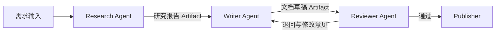

---

### 17.6.2 并行 Fan-out / Fan-in

```text
                  ┌→ Research Agent A ─┐
Supervisor/Planner├→ Research Agent B ─┼→ Aggregator
                  └→ Research Agent C ─┘
```

适合可以分解为独立子问题的任务：

- 多来源调研；
- 多文件分析；
- 多方案生成；
- 多安全扫描器；
- 多模型投票。

**关键设计点：**

- 子任务必须尽量独立；
- 聚合器需要处理重复、冲突和缺失；
- 需要设置并发上限；
- 需要避免多个 Agent 重复检索同一内容；
- 需要追踪关键路径延迟。

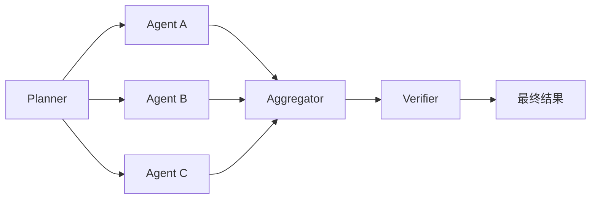

---

### 17.6.3 Supervisor / Worker

由一个管理 Agent 负责：

- 解析目标；
- 生成计划；
- 选择 Worker；
- 分配任务；
- 追踪进度；
- 汇总结果；
- 决定是否继续；
- 处理异常和重新规划。

这是当前最常见的生产架构。

**优点：**

- 用户会话所有权明确；
- 易于统一安全策略；
- 易于控制预算；
- 子 Agent 可以保持独立上下文；
- 容易实施中心化审计。

**问题：**

- Supervisor 可能成为性能与质量瓶颈；
- Supervisor 错误会影响整个系统；
- 容易重复委派或无限创建子 Agent；
- 汇总阶段可能丢失细节。

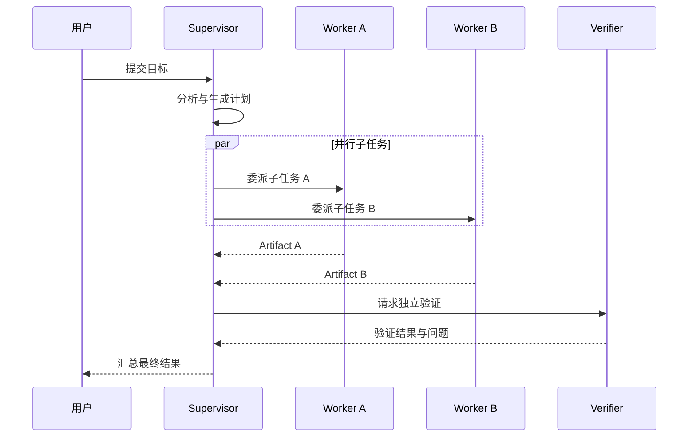

---

### 17.6.4 Router / Handoff

Router 根据用户意图把控制权转给某个专家 Agent：

```text
User → Triage Agent → Billing Agent
                    → Technical Agent
                    → Refund Agent
```

Handoff 与 Agent as Tool 的区别：

| 模式 | 谁保持会话控制权 | 谁生成最终回答 | 适用场景 |
|---|---|---|---|
| Agent as Tool | Manager | Manager | 统一汇总、隐藏子 Agent、复杂后台任务 |
| Handoff | 被选中的专家 | 专家 Agent | 客服分流、专家接管、持续对话 |

**关键风险：**

- 错误路由；
- Handoff 后上下文丢失；
- 权限随着 Handoff 非预期扩大；
- 用户不知道当前由哪个 Agent 负责；
- 多次 Handoff 导致循环。

---

### 17.6.5 Group Chat

多个 Agent 共享一个会话空间，通过以下策略决定下一个发言者：

- Round Robin；
- Selector；
- Moderator；
- Mention；
- 投票；
- 发言权控制。

**适用场景：**

- 头脑风暴；
- 专家讨论；
- 方案评审；
- 博弈模拟；
- 教学演示。

**不适用场景：**

- 严格 SLA；
- 极低延迟；
- 强确定性交易流程；
- 缺少终止条件的长任务。

Group Chat 最大风险是：**看起来协作很多，实际有效信息很少。**

生产系统中至少要增加：

- 发言者选择规则；
- 最大轮次；
- 信息增益判断；
- 重复内容检测；
- 明确终止条件；
- Moderator 或 Judge；
- Token 和时间预算。

---

### 17.6.6 Debate / Critic / Judge

典型结构：

```text
Generator A ─┐
             ├→ Debate / Critic → Judge → Final
Generator B ─┘
```

**适用场景：**

- 复杂推理；
- 决策分析；
- 安全审查；
- 代码 Review；
- 多方案比较。

**主要风险：**

- 多个 Agent 共享相同偏见；
- 多数一致但仍然错误；
- Judge 被表达方式而非证据质量影响；
- 讨论成本远高于质量收益；
- 过早共识。

更稳健的做法是让 Judge 基于明确 Rubric、测试结果、证据和结构化评分决策。

---

### 17.6.7 Evaluator-Optimizer

```text
Worker → Evaluator
   ↑         |
   └─反馈────┘
```

直到：

- 达到质量阈值；
- 达到最大轮数；
- Token 预算耗尽；
- 时间预算耗尽；
- 人工接管；
- 发现不可恢复错误。

这是代码生成、报告生成和测试修复中非常实用的模式。

必须设置：

- 最大循环次数；
- 最长执行时间；
- 最大 Token；
- 最大工具调用数；
- 最低改进幅度；
- 明确终止条件；
- 失败后的降级路径。

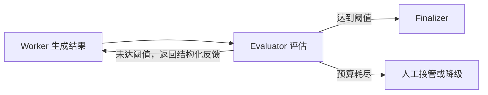

---

### 17.6.8 Blackboard / Shared Workspace

多个 Agent 不直接频繁对话，而是围绕一个共享工作区协作：

- 共享任务板；
- 共享事实表；
- 共享 Artifact；
- 共享问题队列；
- 共享决策日志。

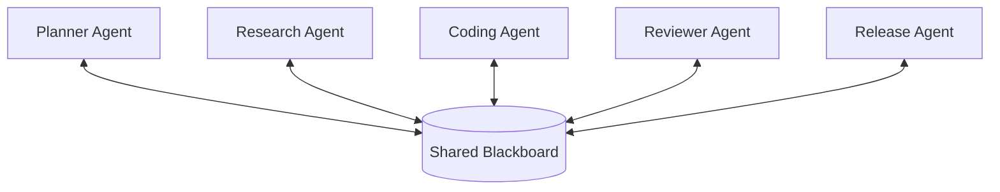

**优势：**

- 降低 Agent 间消息爆炸；
- 状态可审计；
- 支持异步协作；
- 更适合长任务和分布式系统；
- 可以使用版本号和乐观锁控制并发。

**风险：**

- 状态冲突；
- 脏写和覆盖；
- Agent 读取过期状态；
- Blackboard 逐渐膨胀；
- 需要清晰的数据所有权。

---

### 17.6.9 去中心化 Swarm

Agent 之间没有单一 Supervisor，可以：

- 自主发现其他 Agent；
- 发送任务；
- 交换结果；
- 形成临时团队；
- 竞争或协作。

**优点：**

- 容错；
- 扩展性；
- 适合探索性问题；
- 能产生自组织行为。

**问题：**

- 难以解释；
- 难以保证终止；
- 容易产生重复劳动；
- 权限传播复杂；
- 成本不可预测；
- 更容易出现欺骗、共谋和群体性错误。

当前生产系统通常采用：

```text
中心化控制面
+
分布式执行面
```

而不是完全无控制的 Agent Swarm。

---

### 17.6.10 编排模式选型表

| 模式 | 确定性 | 并行性 | 上下文隔离 | 工程复杂度 | 适用场景 |
|---|---:|---:|---:|---:|---|
| Sequential | 高 | 低 | 中 | 低 | 审批、文档流水线 |
| Fan-out/Fan-in | 中 | 高 | 高 | 中 | 调研、批量分析 |
| Supervisor/Worker | 中到高 | 高 | 高 | 中到高 | 通用生产级多 Agent |
| Router/Handoff | 中 | 中 | 高 | 中 | 客服、专家路由 |
| Group Chat | 低 | 低到中 | 低 | 中 | 讨论、模拟、评审 |
| Debate/Judge | 中 | 中 | 中 | 中到高 | 决策、验证、推理 |
| Evaluator-Optimizer | 高 | 低 | 中 | 中 | 代码修复、质量优化 |
| Blackboard | 中到高 | 高 | 高 | 高 | 长任务、异步协作 |
| Swarm | 低 | 高 | 高 | 很高 | 研究、开放探索 |

---

## 17.7 协议栈：MCP、A2A、AG-UI

当前 Agent 生态逐步形成三层协议：

| 层次 | 协议 | 解决的问题 |
|---|---|---|
| Agent ↔ 工具和数据 | MCP | Agent 如何连接工具、数据库、文件、API 和工作流 |
| Agent ↔ Agent | A2A | 不同框架、厂商和运行时中的 Agent 如何发现、通信和委派任务 |
| Agent ↔ 用户界面 | AG-UI | Agent 如何向前端流式发送状态、消息、工具调用和 UI 事件 |

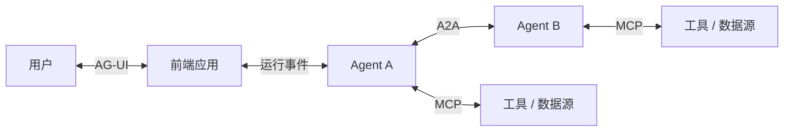

### 17.7.1 MCP

MCP 采用 Host—Client—Server 架构，标准化 Agent 对外部工具和数据的访问。

适合：

- Tool Discovery；
- 文件和数据库访问；
- 企业 SaaS；
- Prompt 和 Resource；
- 远程工具服务；
- 统一工具权限与审计。

MCP 的重点不是多 Agent 编排，而是 **Agent 与能力之间的标准接口**。

参考：[Model Context Protocol](https://modelcontextprotocol.io/docs/getting-started/intro)

---

### 17.7.2 A2A（Agent-to-Agent）协议详解

> **版本说明（截至 2026 年 9 月 2 日）**：A2A 的稳定协议兼容主线为 **1.0**。官方规范页面发布版本为 `1.0.0`，协议仓库后续发布了 `1.0.1` 补丁；但在线路协商、请求头和 Agent Card 中只使用 `Major.Minor`，即 `1.0`，不能写成 `1.0.1`。A2A SDK 自身的版本号与协议版本号相互独立。
>
> A2A 已于 **2026 年 8 月 27 日**被 Agentic AI Foundation（AAIF）接纳为 Growth Stage 项目。协议最初由 Google 贡献，目前按开放治理模式持续演进。

A2A 的目标不是让两个模型简单互发文本，而是为**相互独立、内部实现不透明、可能属于不同厂商或组织的 Agent 系统**提供统一的发现、委派、任务状态、结果交付和安全交互模型。

A2A 的核心抽象可以概括为：

```text
A2A
=
Agent Card 能力发现
+ Message 交互消息
+ Task 有状态工作单元
+ Artifact 结果载体
+ Polling / Streaming / Push 更新机制
+ 标准认证声明与协议版本协商
```

本节基于 A2A 1.0 数据模型和三种标准绑定展开。官方规范的权威数据定义以 `a2a.proto` 为准，JSON Schema、语言 SDK 和文档均属于派生表示。

#### 7.2.1 A2A 解决什么问题

A2A 主要解决以下问题：

| 问题 | A2A 提供的机制 |
|---|---|
| 如何知道远端 Agent 能做什么 | `AgentCard`、`AgentSkill`、输入输出 Media Type |
| 如何选择远端地址与协议 | `supportedInterfaces`、`protocolBinding`、`protocolVersion` |
| 如何向远端 Agent 委派工作 | `SendMessage`、`SendStreamingMessage` |
| 如何表示长运行工作 | `Task`、`TaskStatus`、`TaskState` |
| 如何进行多轮补充输入 | `contextId`、`taskId`、`referenceTaskIds` |
| 如何交付正式结果 | `Artifact` 及其 `Part` |
| 如何获取增量进度 | Polling、SSE/gRPC Streaming、Webhook Push |
| 如何取消任务 | `CancelTask` |
| 如何声明认证方式 | `securitySchemes`、`securityRequirements` |
| 如何扩展领域语义 | URI 标识的 A2A Extension |
| 如何适配不同技术栈 | JSON-RPC、gRPC、HTTP+JSON 三种标准绑定 |

A2A **不直接解决**以下问题：

| 非目标 | 应由谁负责 |
|---|---|
| Agent 内部使用哪个模型、Prompt、Memory 或工具 | Agent 自身实现 |
| Agent 内部的 Supervisor、Graph、Group Chat 如何调度 | 多 Agent 框架或 Workflow Engine |
| Agent 如何调用数据库、文件、浏览器和 SaaS | MCP、原生 Tool API 或内部工具层 |
| Agent 前端如何展示流式状态和生成式 UI | AG-UI 或应用自定义 UI 协议 |
| 全局统一的 Agent Marketplace/Registry API | 企业 Registry 或第三方目录；A2A 只标准化 Agent Card |
| Credential 的签发、轮换和托管 | OAuth/OIDC/IAM/Secrets Manager/PKI |
| Exactly-once 任务执行 | 业务幂等、事务、Outbox、去重和补偿机制 |
| 跨 Agent 的共享长期记忆 | 独立 Memory Service 或业务数据层 |

最重要的原则是 **Opaque Execution**：A2A Server 只需要公开能力、输入输出契约和任务结果，不需要暴露内部思维、模型调用、Memory、工具清单或内部编排实现。

---

#### 7.2.2 参与方与参考架构

A2A 交互通常包含以下角色：

| 角色 | 职责 |
|---|---|
| **A2A Client** | 代表用户、业务系统或上游 Agent 发起请求，选择接口、附带凭据并消费结果 |
| **A2A Server / Remote Agent** | 暴露 A2A Endpoint，接收 Message，创建或继续 Task，产出 Artifact |
| **Agent Card Endpoint** | 发布公开 Agent Card，通常位于 `/.well-known/agent-card.json` |
| **Agent Registry** | 企业内部或公共目录，按 Skill、Tag、组织、合规等级等检索 Agent Card |
| **Authorization Server** | 为 Client 获取 OAuth/OIDC Token，或提供其他身份凭据 |
| **A2A Gateway** | 认证、授权、限流、租户路由、审计、协议转换和流量治理 |
| **Task Store** | 持久化 Task、Status、History、Artifact 引用与幂等记录 |
| **Event Store / Stream Hub** | 保存或分发状态事件与 Artifact 增量事件 |
| **Push Receiver** | 接收 A2A Server 主动发送的 Webhook 通知 |

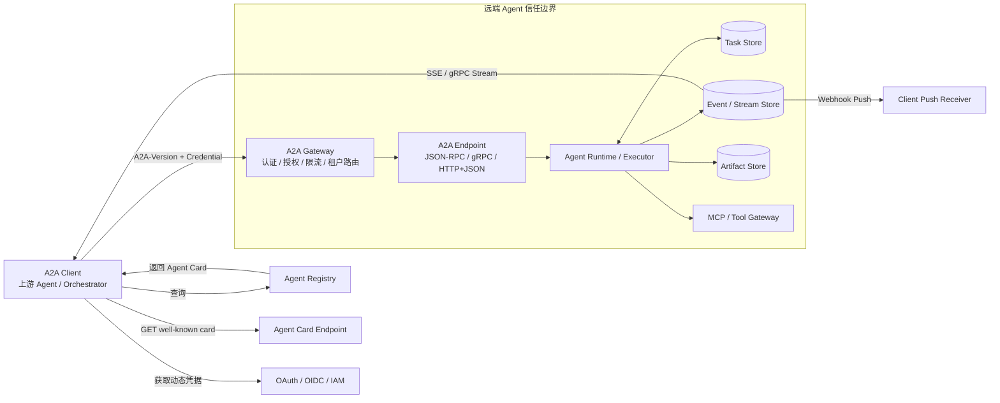

在生产架构中，**A2A Endpoint 不应直接等于 LLM 推理进程**。更稳健的实现是由协议层完成解析、鉴权、验证、幂等和持久化，再把规范化命令交给 Agent Runtime。

---

#### 7.2.3 一次完整 A2A 调用的生命周期

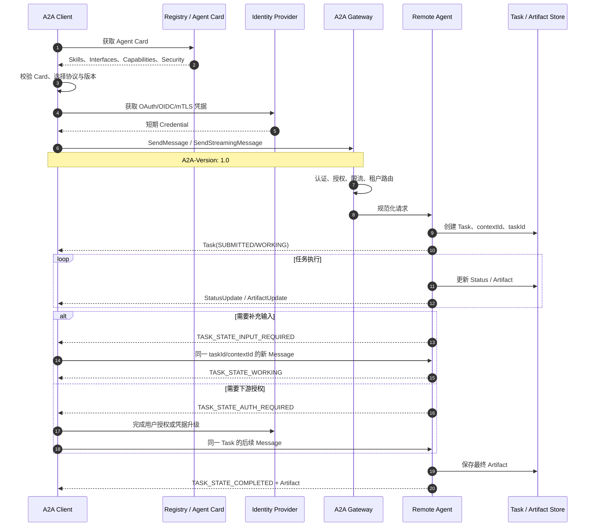

从工程角度看，这个生命周期包含四个边界：

1. **发现边界**：是否信任 Agent Card，是否支持所需 Skill、Media Type 和协议版本；
2. **安全边界**：调用者是谁，允许调用哪个 Skill、访问哪些 Task 和数据；
3. **任务边界**：请求是直接 Message，还是创建有生命周期的 Task；
4. **交付边界**：正式结果必须沉淀为 Artifact，不能只依赖瞬时状态消息。

---

#### 7.2.4 Agent 发现与 Agent Card

##### 1. 三种发现方式

| 方式 | 机制 | 适用场景 | 注意事项 |
|---|---|---|---|
| **Well-Known URI** | `GET https://{domain}/.well-known/agent-card.json` | 公共 Agent、域内自动发现 | Card 不应包含 Secret；使用 HTTPS、缓存与签名 |
| **Curated Registry** | 从企业目录或 Marketplace 查询 Agent Card | 企业内部、跨部门、受治理 Agent | A2A 未规定统一 Registry 查询 API |
| **Direct Configuration** | 配置文件、环境变量、服务发现或私有下发 | 私有 Agent、固定上下游 | 需要独立处理版本、轮换和撤销 |

Agent Card 不是一个“Prompt 描述文件”，而是远端 Agent 的**机器可读服务契约**。

##### 2. Agent Card 关键字段

| 字段 | 作用 | 工程注意点 |
|---|---|---|
| `name`、`description` | Agent 身份与用途 | 不要将营销描述当作能力保证 |
| `supportedInterfaces[]` | 地址、协议绑定、协议版本、可选 Tenant | 有序列表，第一个接口为偏好接口 |
| `provider` | 服务提供组织 | 可用于供应商信任策略 |
| `version` | **Agent 实现版本** | 不是 A2A 协议版本 |
| `capabilities` | Streaming、Push、Extension、Extended Card | Client 使用功能前必须验证能力声明 |
| `securitySchemes` | API Key、HTTP Auth、OAuth2、OIDC、mTLS | 只描述获取/传递方式，不放真实凭据 |
| `securityRequirements` | 调用 Agent 所需认证组合与 Scope | 可在 Skill 级覆盖 |
| `defaultInputModes` | 默认可接受 Media Type | 如 `text/plain`、`application/json` |
| `defaultOutputModes` | 默认可输出 Media Type | Client 还可在请求中声明可接受输出 |
| `skills[]` | 更细粒度的能力、Tag、示例与 I/O Mode | Skill 是描述性能力，不等价于 RPC Method |
| `signatures[]` | Agent Card 的 JWS 签名 | 用于完整性和来源校验 |
| `documentationUrl` | 详细文档 | 可承载 Schema、SLA、计费和合规说明 |

##### 3. Agent Card 示例

```json
{
  "name": "Enterprise Research Agent",
  "description": "执行企业研究、证据整理和报告生成任务",
  "supportedInterfaces": [
    {
      "url": "https://agents.example.com/research/a2a",
      "protocolBinding": "HTTP+JSON",
      "protocolVersion": "1.0",
      "tenant": "research-prod"
    },
    {
      "url": "agents.example.com:443",
      "protocolBinding": "GRPC",
      "protocolVersion": "1.0",
      "tenant": "research-prod"
    }
  ],
  "provider": {
    "organization": "Example Corp",
    "url": "https://www.example.com"
  },
  "version": "2.3.0",
  "documentationUrl": "https://docs.example.com/agents/research",
  "capabilities": {
    "streaming": true,
    "pushNotifications": true,
    "extendedAgentCard": true,
    "extensions": [
      {
        "uri": "https://example.com/a2a/extensions/citations/v1",
        "description": "为研究结果附带结构化引用",
        "required": false
      }
    ]
  },
  "securitySchemes": {
    "corpOidc": {
      "openIdConnectSecurityScheme": {
        "description": "企业 OIDC 身份",
        "openIdConnectUrl": "https://id.example.com/.well-known/openid-configuration"
      }
    }
  },
  "securityRequirements": [
    {
      "schemes": {
        "corpOidc": {
          "list": ["openid", "profile", "a2a.invoke"]
        }
      }
    }
  ],
  "defaultInputModes": ["text/plain", "application/json"],
  "defaultOutputModes": ["text/markdown", "application/json"],
  "skills": [
    {
      "id": "enterprise-research",
      "name": "Enterprise Research",
      "description": "根据研究问题检索、交叉验证并生成结构化报告",
      "tags": ["research", "citations", "report"],
      "examples": ["分析某行业最近三年的技术趋势并附来源"],
      "inputModes": ["text/plain", "application/json"],
      "outputModes": ["text/markdown", "application/json"]
    }
  ]
}
```

需要特别区分：

```text
AgentCard.version                  = Agent 产品/实现版本，例如 2.3.0
supportedInterfaces.protocolVersion = A2A 协议版本，例如 1.0
SDK package version               = SDK 发布版本，例如 1.1.x
```

三者不能混用。

##### 4. Extended Agent Card

公开 Agent Card 应坚持最小披露。如果某些 Skill、Endpoint、合规信息或高权限能力只对认证客户开放，可以：

1. 在公开 Card 中声明 `capabilities.extendedAgentCard: true`；
2. Client 完成认证；
3. 调用 `GetExtendedAgentCard`；
4. Server 根据身份、租户、合同和 Scope 返回差异化 Card；
5. Client 在当前认证会话中用 Extended Card 替换公开 Card 缓存。

Extended Card 不能绕过授权。即使某个 Skill 被展示出来，实际调用时仍应再次校验权限。

##### 5. Agent Card 缓存和变更

生产环境应使用标准 HTTP 缓存语义：

- `Cache-Control: max-age=...`；
- `ETag`；
- `Last-Modified`；
- `If-None-Match` / `If-Modified-Since` 条件请求；
- Card 版本变化时重新做接口、协议、能力与安全校验；
- 对高风险 Agent 设置较短 TTL 和主动撤销机制。

Agent Card 被缓存后，Client 仍不能假设远端能力永久不变。发生 `UnsupportedOperationError` 或版本错误时，应刷新 Card，而不是无限重试旧接口。

---

#### 7.2.5 协议绑定、接口选择与版本协商

A2A 1.0 提供三种标准协议绑定：

| 绑定 | 传输与序列化 | 流式方式 | 适用场景 |
|---|---|---|---|
| **JSON-RPC** | JSON-RPC 2.0 over HTTP(S)，请求通常为 `application/json` | HTTP SSE | 兼容已有 RPC 网关、实现简单 |
| **gRPC** | Protocol Buffers over HTTP/2 + TLS | gRPC Server Streaming | 内部高吞吐、强类型、跨语言服务 |
| **HTTP+JSON** | REST 风格 Endpoint，推荐 `application/a2a+json` | HTTP SSE | API Gateway、企业开放平台、易调试集成 |

所有绑定必须提供**语义等价**的核心功能：

- 相同的核心操作；
- 语义等价的数据模型；
- 一致的错误含义；
- 等价的认证要求；
- 一致的任务状态与 Artifact 语义。

##### 1. 标准操作映射

| 功能 | JSON-RPC Method | gRPC Method | HTTP+JSON Endpoint |
|---|---|---|---|
| 发送消息 | `SendMessage` | `SendMessage` | `POST /message:send` |
| 发送并流式订阅 | `SendStreamingMessage` | `SendStreamingMessage` | `POST /message:stream` |
| 查询任务 | `GetTask` | `GetTask` | `GET /tasks/{id}` |
| 列出任务 | `ListTasks` | `ListTasks` | `GET /tasks` |
| 取消任务 | `CancelTask` | `CancelTask` | `POST /tasks/{id}:cancel` |
| 订阅已有任务 | `SubscribeToTask` | `SubscribeToTask` | `POST /tasks/{id}:subscribe` |
| 创建 Push 配置 | `CreateTaskPushNotificationConfig` | 同名 | `POST /tasks/{id}/pushNotificationConfigs` |
| 获取 Push 配置 | `GetTaskPushNotificationConfig` | 同名 | `GET /tasks/{id}/pushNotificationConfigs/{configId}` |
| 列出 Push 配置 | `ListTaskPushNotificationConfigs` | 同名 | `GET /tasks/{id}/pushNotificationConfigs` |
| 删除 Push 配置 | `DeleteTaskPushNotificationConfig` | 同名 | `DELETE /tasks/{id}/pushNotificationConfigs/{configId}` |
| 获取 Extended Card | `GetExtendedAgentCard` | 同名 | `GET /extendedAgentCard` |

##### 2. 标准服务参数

| 参数 | 作用 | HTTP 表示 |
|---|---|---|
| `A2A-Version` | 指定 Client 使用的协议版本 | `A2A-Version: 1.0` |
| `A2A-Extensions` | 声明本次请求激活的 Extension URI | 逗号分隔的 Header |

版本规则：

- Client 应在每个请求中发送 `A2A-Version`；
- 版本格式必须是 `Major.Minor`，如 `1.0`；
- Patch 版本不参与线路兼容协商；
- 未发送版本时，A2A 1.0 Server 按兼容规则解释为 `0.3`；
- 不支持请求版本时返回 `VersionNotSupportedError`；
- 不应静默降级到旧版本并丢失能力；需要降级时应显式记录并受策略控制。

##### 3. Client 接口选择算法

一个较稳健的接口选择过程如下：

```text
1. 拉取并校验 Agent Card
2. 过滤不支持目标 Skill / Input Mode / Output Mode 的 Agent
3. 过滤不支持本地 A2A Major.Minor 的 Interface
4. 过滤本地未实现的 protocolBinding
5. 校验 Endpoint、TLS、域名和网络策略
6. 校验 Security Scheme 是否可满足
7. 按 Card 中的顺序、组织策略、延迟和成本选择接口
8. 把选择的 protocolVersion 写入 A2A-Version
9. 若 Interface 声明 tenant，则每个请求原样回传 tenant
10. 失败后只在等价接口间受控回退，并保留同一业务幂等键
```

---

#### 7.2.6 核心数据模型

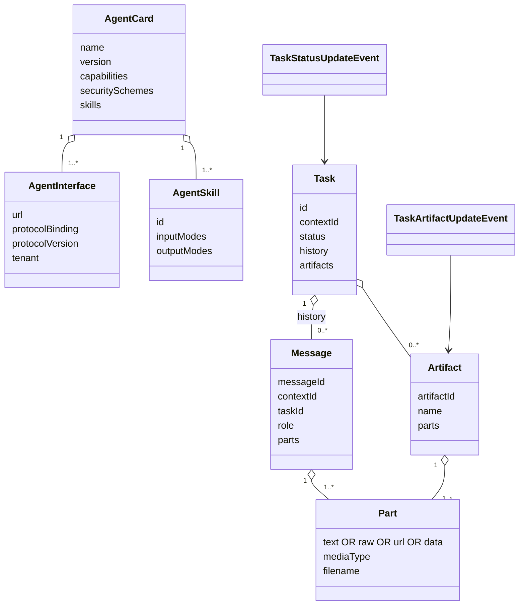

##### 1. Task

`Task` 是 A2A 的核心工作单元：

| 字段 | 含义 |
|---|---|
| `id` | Server 生成的 Task 唯一标识 |
| `contextId` | 将多个相关 Task 和 Message 归入同一上下文 |
| `status` | 当前 `TaskStatus`，包含 State、可选 Message 和 Timestamp |
| `artifacts` | 已产出的正式结果 |
| `history` | Server 选择持久化的交互 Message，不保证包含所有瞬时消息 |
| `metadata` | 自定义元数据，建议命名空间化 |

##### 2. Message

`Message` 是 Client 与 Server 间的一次通信：

| 字段 | 含义 |
|---|---|
| `messageId` | 消息创建方生成的唯一 ID，也是请求去重的重要依据 |
| `contextId` | 可选，对话上下文 ID |
| `taskId` | 可选，表示该消息继续某个未终止 Task |
| `role` | `ROLE_USER` 或 `ROLE_AGENT` |
| `parts` | 一个或多个内容片段 |
| `referenceTaskIds` | 引用其他 Task 作为补充上下文 |
| `extensions` | 本 Message 使用的 Extension URI |
| `metadata` | 扩展数据、业务关联 ID 等 |

##### 3. Part

`Part` 是 Message 和 Artifact 的最小内容单元，并且必须**恰好包含一种**内容字段：

```text
text | raw | url | data
```

| 类型 | 用途 | 风险控制 |
|---|---|---|
| `text` | 普通文本、Markdown、代码 | 长度限制、Prompt Injection 标记 |
| `raw` | 内联二进制，JSON 中使用 Base64 | 大小限制、恶意文件扫描、避免大对象内联 |
| `url` | 指向文件或外部内容 | SSRF、域名白名单、签名 URL、过期时间 |
| `data` | 任意 JSON 结构 | JSON Schema 校验、深度和字段数量限制 |

`mediaType` 应使用 MIME Type，例如 `text/plain`、`application/json`、`image/png`。`filename` 只是显示和处理提示，不能作为可信文件路径使用。

##### 4. Artifact

`Artifact` 是 Task 的正式输出：

| 字段 | 含义 |
|---|---|
| `artifactId` | Task 内唯一 ID |
| `name`、`description` | 人类可读说明 |
| `parts` | 一个或多个结果 Part |
| `metadata` | 校验状态、内容 Hash、Schema Version、来源等 |
| `extensions` | 与 Artifact 相关的 Extension URI |

##### 5. Message 与 Artifact 的边界

| Message | Artifact |
|---|---|
| 用于发起任务、补充输入、澄清和状态说明 | 用于交付任务结果 |
| 可能是瞬时的，不保证全部进入 History | 应作为 Task 可查询结果保存 |
| 不应承载唯一的关键业务结果 | 应承载文档、结构化数据、文件或正式输出 |
| 适合“我正在处理”“请补充日期” | 适合“最终报告”“代码补丁”“审批单” |

**关键原则：关键结果必须进入 Artifact 或持久化 Task 状态。** Client 不能把 Streaming 中收到的一条临时 Message 当作可靠的最终交付。

---

#### 7.2.7 Task 状态机

A2A 1.0 定义了以下状态：

| Wire Value | 分类 | 含义 |
|---|---|---|
| `TASK_STATE_UNSPECIFIED` | 未定义 | 未知或不可判定，不应作为正常业务状态 |
| `TASK_STATE_SUBMITTED` | 活跃 | 已提交并被接收 |
| `TASK_STATE_WORKING` | 活跃 | 正在执行 |
| `TASK_STATE_INPUT_REQUIRED` | 中断 | 需要 Client 或用户补充输入 |
| `TASK_STATE_AUTH_REQUIRED` | 中断 | 任务继续执行需要额外认证/授权 |
| `TASK_STATE_COMPLETED` | 终止 | 成功完成 |
| `TASK_STATE_FAILED` | 终止 | 执行失败 |
| `TASK_STATE_CANCELED` | 终止 | 已取消 |
| `TASK_STATE_REJECTED` | 终止 | Agent 决定不接收或不继续任务 |

以下是典型状态转换，而不是替代规范的强制转换表：

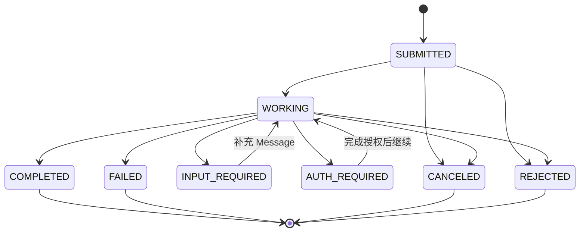

状态机的工程约束：

1. **终止状态不可继续发送 Message**：`COMPLETED`、`FAILED`、`CANCELED`、`REJECTED` 均不能重新启动；
2. 对已完成结果做修订时，应创建新 Task，并使用相同 `contextId` 和 `referenceTaskIds` 指向旧 Task；
3. `INPUT_REQUIRED` 和 `AUTH_REQUIRED` 是可恢复的中断状态；
4. Cancel 是“请求取消”，Server 可能因任务已结束或阶段不可取消而返回 `TaskNotCancelableError`；
5. Task 状态与内部 Workflow 状态应分离，例如内部可有 `QUEUED`、`RUNNING_TOOL`、`WAITING_REVIEW`，对外再映射为标准 A2A 状态；
6. 每次状态变更应持久化 Timestamp、操作者、原因、Trace ID 和前后状态。

---

#### 7.2.8 `contextId`、`taskId` 与多轮交互

三类 ID 的职责不同：

| ID | 谁生成 | 作用域 | 用途 |
|---|---|---|---|
| `messageId` | Message 创建方 | 单条消息 | 去重、审计、问题定位 |
| `taskId` | A2A Server | 单个工作单元 | 查询、订阅、取消、继续未终止任务 |
| `contextId` | 通常由 Server | 一组相关 Task/Message | 对话连续性和跨 Task 上下文 |

##### 1. 创建新上下文

Client 首次请求可不传 `contextId`。Server 若创建上下文，必须在返回的 Task 或 Message 中返回 `contextId`。Client 应把 Server 生成的 `contextId` 当作不透明字符串。

##### 2. 继续 `INPUT_REQUIRED` 任务

```json
{
  "message": {
    "messageId": "msg-002",
    "contextId": "ctx-1001",
    "taskId": "task-2001",
    "role": "ROLE_USER",
    "parts": [
      {
        "data": {
          "departureDate": "2026-10-01",
          "returnDate": "2026-10-05"
        },
        "mediaType": "application/json"
      }
    ]
  }
}
```

如果同时携带 `taskId` 和 `contextId`，二者必须匹配；不匹配时 Server 必须拒绝，不能静默改写。

##### 3. 在同一 Context 中创建新 Task

已完成 Task 不可重新启动。对旧结果进行修订时，应创建新 Task：

```json
{
  "message": {
    "messageId": "msg-003",
    "contextId": "ctx-1001",
    "role": "ROLE_USER",
    "referenceTaskIds": ["task-2001"],
    "parts": [
      {"text": "基于上一份报告增加成本测算章节"}
    ]
  }
}
```

这里不携带已终止的 `taskId`，Server 会在同一 `contextId` 下创建新的 Task。

##### 4. 上下文治理

A2A 只定义 ID 语义，不定义上下文保留时长。生产实现应明确：

- Context TTL；
- Task 与 Artifact 保留策略；
- 多租户隔离；
- 跨 Context 引用规则；
- Context 压缩或摘要方式；
- 数据删除和合规要求；
- Server 是否接受 Client 自建 `contextId`。

---

#### 7.2.9 `SendMessage` 请求与返回语义

HTTP+JSON 示例：

```http
POST /message:send HTTP/1.1
Host: agents.example.com
Authorization: Bearer <access-token>
A2A-Version: 1.0
Content-Type: application/a2a+json
Accept: application/a2a+json
```

```json
{
  "tenant": "research-prod",
  "message": {
    "messageId": "4a198286-7fa1-493f-991b-d782cc20911d",
    "role": "ROLE_USER",
    "parts": [
      {
        "text": "分析 2024—2026 年企业 Agent Gateway 的发展趋势",
        "mediaType": "text/plain"
      }
    ],
    "metadata": {
      "correlationId": "biz-req-9001"
    }
  },
  "configuration": {
    "acceptedOutputModes": ["text/markdown", "application/json"],
    "historyLength": 10,
    "returnImmediately": true
  }
}
```

`tenant` 只应在选中的 `AgentInterface` 声明该字段时发送，并且必须原样回传。

##### 1. 返回 Task

复杂或长运行任务通常返回 Task：

```json
{
  "task": {
    "id": "task-2001",
    "contextId": "ctx-1001",
    "status": {
      "state": "TASK_STATE_SUBMITTED",
      "timestamp": "2026-09-02T09:30:00.000Z"
    },
    "metadata": {
      "correlationId": "biz-req-9001"
    }
  }
}
```

##### 2. 直接返回 Message

简单交互可以不创建 Task，直接返回 Message：

```json
{
  "message": {
    "messageId": "msg-server-001",
    "contextId": "ctx-1001",
    "role": "ROLE_AGENT",
    "parts": [
      {"text": "该 Agent 支持生成 Markdown 和 JSON 两种结果。"}
    ]
  }
}
```

直接 Message 适合轻量答复；需要进度跟踪、取消、恢复、Artifact 或多轮中断的工作应创建 Task。

##### 3. `SendMessageConfiguration`

| 字段 | 含义 |
|---|---|
| `acceptedOutputModes` | Client 可接收的输出 Media Type |
| `taskPushNotificationConfig` | 在首次请求中一并注册 Push 配置 |
| `historyLength` | 返回 Task 时最多携带多少条最近历史消息 |
| `returnImmediately` | `true`：创建 Task 后尽快返回；`false`：默认等待到终止或中断状态 |

如果需要持续增量结果，优先使用 `SendStreamingMessage`，而不是通过一个长时间阻塞的 `SendMessage` 模拟流式输出。

---

#### 7.2.10 Polling、Streaming 与任务订阅

A2A 为 Task 更新提供三种互补机制：

| 机制 | 调用方式 | 优点 | 缺点 | 典型场景 |
|---|---|---|---|---|
| **Polling** | 周期调用 `GetTask` | 最简单、所有绑定可用 | 延迟高、空轮询多 | 后台任务、受限网络 |
| **Streaming** | `SendStreamingMessage` 或 `SubscribeToTask` | 低延迟、可传 Artifact Chunk | 需维护长连接 | 交互 UI、实时进度 |
| **Push** | 注册 Webhook | Client 可离线、适合超长任务 | Webhook 安全和可靠性复杂 | Server-to-Server、小时级任务 |

##### 1. Streaming 事件类型

流式响应的每个事件是 `StreamResponse`，且只包含以下一种成员：

- `task`；
- `message`；
- `statusUpdate`；
- `artifactUpdate`。

对于 Task 流：

1. 首个事件应为当前 Task；
2. 后续为零个或多个 `TaskStatusUpdateEvent` / `TaskArtifactUpdateEvent`；
3. 事件必须按生成顺序传递；
4. 多个订阅者订阅同一 Task 时，应收到相同顺序的事件；
5. 单个 Stream 断开不能影响 Task 生命周期和其他 Stream；
6. Task 到达终止状态后关闭流；交互中断状态应由 Client 处理并在补充输入后继续。

##### 2. HTTP+JSON SSE 示例

```http
POST /message:stream HTTP/1.1
Host: agents.example.com
Authorization: Bearer <access-token>
A2A-Version: 1.0
Content-Type: application/a2a+json
Accept: text/event-stream
```

```text
data: {"task":{"id":"task-2001","contextId":"ctx-1001","status":{"state":"TASK_STATE_WORKING"}}}

data: {"statusUpdate":{"taskId":"task-2001","contextId":"ctx-1001","status":{"state":"TASK_STATE_WORKING","message":{"messageId":"msg-progress-1","contextId":"ctx-1001","taskId":"task-2001","role":"ROLE_AGENT","parts":[{"text":"已完成资料检索，正在生成报告"}]}}}}

data: {"artifactUpdate":{"taskId":"task-2001","contextId":"ctx-1001","artifact":{"artifactId":"report-001","name":"Agent Gateway 趋势报告","parts":[{"text":"# Agent Gateway 趋势报告

"}]},"append":false,"lastChunk":false}}

data: {"artifactUpdate":{"taskId":"task-2001","contextId":"ctx-1001","artifact":{"artifactId":"report-001","parts":[{"text":"## 核心结论
..."}]},"append":true,"lastChunk":true}}

data: {"statusUpdate":{"taskId":"task-2001","contextId":"ctx-1001","status":{"state":"TASK_STATE_COMPLETED","timestamp":"2026-09-02T09:35:12.123Z"}}}
```

##### 3. Artifact Chunk 重组规则

Client 应按 `(taskId, artifactId)` 聚合 Chunk：

```text
append = false  → 新建或替换当前 Artifact 内容
append = true   → 追加到同 artifactId 的已有内容
lastChunk = true → 该 Artifact 增量传输完成
```

还应增加以下保护：

- 每个 Artifact 的最大字节数；
- Chunk 序列号或自定义事件版本；
- 重复 Chunk 去重；
- 内容 Hash 校验；
- 超时未收到 `lastChunk` 时的恢复策略；
- 不允许不同 Media Type 被无约束地拼接。

A2A 核心字段没有提供完整的可重放事件游标。需要严格断点续传时，可以通过 Extension 或业务 Metadata 增加事件序号，并以 `GetTask` 返回的持久化状态作为最终事实源。

##### 4. 断线重连

- 连接中断而 Task 仍在运行时，调用 `SubscribeToTask`；
- `SubscribeToTask` 的首个事件为当前 Task，避免 `GetTask` 与订阅之间的状态窗口；
- 已终止 Task 不能再订阅，直接使用 `GetTask` 获取最终状态；
- 瞬时进度 Message 可能在断线期间丢失，关键内容必须写入 Artifact 或可查询状态；
- Client 应使用指数退避、抖动和最大重连次数，避免形成重连风暴。

---

#### 7.2.11 Push Notification 与断线异步任务

Push 适合分钟、小时甚至天级任务，以及无法长期维护连接的 Serverless、移动端或跨组织 Client。

##### 1. Push 配置示例

```http
POST /tasks/task-2001/pushNotificationConfigs HTTP/1.1
Host: agents.example.com
Authorization: Bearer <access-token>
A2A-Version: 1.0
Content-Type: application/a2a+json
```

```json
{
  "tenant": "research-prod",
  "taskId": "task-2001",
  "url": "https://client.example.com/hooks/a2a/task-update",
  "token": "opaque-task-validation-token",
  "authentication": {
    "scheme": "Bearer",
    "credentials": "<short-lived-webhook-credential>"
  }
}
```

Server 会返回带 `id` 的 `TaskPushNotificationConfig`。该配置持续到 Task 完成或被显式删除。

##### 2. Push Payload

Webhook Body 与 Streaming 使用相同的 `StreamResponse`：

```json
{
  "statusUpdate": {
    "taskId": "task-2001",
    "contextId": "ctx-1001",
    "status": {
      "state": "TASK_STATE_COMPLETED",
      "timestamp": "2026-09-02T10:00:00.000Z"
    }
  }
}
```

收到通知后，Client 通常再次调用 `GetTask` 获取完整、权威的 Task 与 Artifact。

##### 3. 可靠性语义

- Server 至少尝试投递一次；
- 重复通知可能发生；
- Client 必须幂等处理；
- Server 可指数退避重试；
- Webhook 返回 HTTP 2xx 表示成功接收；
- 删除 Push 配置后不得继续投递；
- Webhook 通知不应被当作完整数据仓库，Task Store 才是事实源。

##### 4. Push 安全

Push 是 A2A 中风险最高的部分之一：

| 风险 | 防护 |
|---|---|
| Client 提供内网地址造成 SSRF | 禁止 localhost、私网、链路本地和云元数据地址；域名白名单；DNS Rebinding 防护 |
| Server 被利用为 DDoS 放大器 | Endpoint 所有权验证、速率限制、单任务配置上限 |
| 伪造通知 | JWT/JWS、HMAC、mTLS、短期 Bearer Token |
| 重放攻击 | Timestamp、Nonce、`jti`、事件 ID 和去重表 |
| 凭据泄漏 | Secret Manager、日志脱敏、短期 Credential、轮换 |
| 越权获取 Task | 校验 Task 所有者、Tenant、Audience、Scope |
| 重复副作用 | Inbox 去重、幂等业务键、事务处理 |

不应允许任意 Client 把 Webhook 指向任意 URL，也不应把长期高权限 Credential 原样保存在 Task 表或普通日志中。

---

#### 7.2.12 认证、授权与 `AUTH_REQUIRED`

A2A 不发明新的身份系统，而是复用标准 Web 安全机制。认证发生在协议传输层或网关层，**凭据不应作为普通 Message/Part 内容发送**。

##### 1. 支持的安全方案

| Scheme | 适用场景 | 建议 |
|---|---|---|
| API Key | 简单服务集成 | 仅用于低风险场景；限制来源、权限和寿命 |
| HTTP Basic/Bearer | 传统 HTTP 或 JWT | 生产优先 Bearer + 短期 Token |
| OAuth 2.0 Authorization Code + PKCE | 代表终端用户调用 | 公共 Client 必须使用 PKCE |
| OAuth 2.0 Client Credentials | 服务到服务 | 使用最小 Scope、独立 Client Identity |
| OAuth 2.0 Device Code | CLI、无浏览器设备 | 适合 Coding Agent CLI 等交互 |
| OpenID Connect | 统一用户/服务身份 | 结合 Audience、Issuer 和 Claim 校验 |
| mTLS | 高信任 B2B、内部服务网格 | 结合证书轮换和 SPIFFE/SPIRE |

凭据应通过 OAuth/OIDC、IAM、PKI 或其他带外机制取得。Agent Card 只描述 Scheme、Endpoint 和 Scope，不能嵌入静态 Secret。

##### 2. 认证与授权的区别

```text
Authentication：调用者是谁？
Authorization：该调用者能否调用这个 Agent / Skill / Task / Artifact？
```

Server 应在每个操作上重新做授权，尤其是：

- `GetTask`；
- `ListTasks`；
- `CancelTask`；
- `SubscribeToTask`；
- Push 配置的增删查；
- `GetExtendedAgentCard`；
- 高权限 Skill。

不得因为 Client 知道 `taskId` 就允许访问 Task。查询数据库前就应加入 Owner/Tenant/Scope 条件，避免通过 403/404 差异泄漏资源存在性。

##### 3. `401/403` 与 `TASK_STATE_AUTH_REQUIRED` 的区别

| 情况 | 表示方式 |
|---|---|
| 当前 A2A 请求没有有效身份 | HTTP `401` / gRPC `UNAUTHENTICATED` / 对应 JSON-RPC Error |
| 当前身份存在，但无权执行操作 | HTTP `403` / gRPC `PERMISSION_DENIED` |
| A2A 调用本身已通过，但 Task 执行到某一步需要额外用户授权 | `TASK_STATE_AUTH_REQUIRED` |

例如，Client 已通过企业 OAuth 调用旅行 Agent，但 Agent 在预订支付环节需要用户授权银行卡。此时不是整个 A2A 请求认证失败，而是 Task 进入 `AUTH_REQUIRED` 中断状态。

---

#### 7.2.13 Agent Card 签名与信任链

Agent Card 可以携带一个或多个 JWS 签名，用于确认 Card 未被篡改并验证发布方。

规范化签名流程：

```text
1. 去除 Agent Card 的 signatures 字段
2. 按 Proto 字段存在性规则处理默认值
3. 使用 RFC 8785 JSON Canonicalization Scheme 规范化
4. 构造 JWS Protected Header：alg、typ、kid，可选 jku
5. 对 canonical payload 计算签名
6. 把 protected、signature、可选 header 写入 signatures[]
```

验证端应：

- 至少验证一个可信签名；
- 校验 `alg`，拒绝弱算法和算法降级；
- 通过受信任 Key Store 或受控 `jku` 获取公钥；
- 对 `jku` 做 HTTPS、域名白名单和 SSRF 防护；
- 校验 `kid`、证书/密钥有效期和撤销状态；
- 支持多签名完成密钥轮换；
- 先验证签名，再信任 Endpoint、Skill 和 Security Scheme；
- 将 Card Hash、签名主体、验证时间写入审计日志。

签名只证明 Card 的来源和完整性，不证明 Agent 输出一定正确、安全或合规。仍需供应商准入、运行时评估和行为监控。

---

#### 7.2.14 Extension 扩展机制

A2A Extension 用于在不修改核心协议的前提下增加领域能力。每个 Extension 使用 URI 唯一标识，并应把版本放入 URI，例如：

```text
https://example.com/a2a/extensions/citations/v1
```

##### 1. 声明与激活

Server 在 Agent Card 中声明：

```json
{
  "capabilities": {
    "extensions": [
      {
        "uri": "https://example.com/a2a/extensions/citations/v1",
        "description": "结构化引用",
        "required": false,
        "params": {
          "maxSources": 100
        }
      }
    ]
  }
}
```

Client 在请求中激活：

```http
A2A-Extensions: https://example.com/a2a/extensions/citations/v1
```

并在 Message 或 Artifact 中显式标记：

```json
{
  "extensions": [
    "https://example.com/a2a/extensions/citations/v1"
  ],
  "metadata": {
    "https://example.com/a2a/extensions/citations/v1": {
      "citationStyle": "inline",
      "requirePrimarySources": true
    }
  }
}
```

##### 2. Extension 类型

- **Data-only Extension**：补充 Agent Card 或 Payload 的结构化数据；
- **Profile Extension**：收紧核心协议的使用方式或增加子状态；
- **Method Extension**：增加新的 RPC Method；
- **State-machine Extension**：在标准 Task State 之上定义领域子状态；
- **Custom Binding**：把 A2A 操作映射到 WebSocket 等新传输协议。

##### 3. 兼容性规则

- Breaking Change 必须使用新的 Extension URI；
- Client 不支持可选 Extension 时，Server 可忽略并继续；
- Agent Card 标记 `required: true` 而 Client 未激活时，返回 `ExtensionSupportRequiredError`；
- 不得通过 Extension 修改核心字段结构或直接增加核心 Enum 值；应在 Metadata 中表达子状态；
- 不得自动回退到旧 Extension 版本；
- Metadata Key 应以 Extension URI 命名，避免厂商字段冲突；
- 企业环境应建立 Extension Registry、Owner、Schema、版本和弃用策略。

---

#### 7.2.15 多租户与多 Agent 路由

A2A 1.0 支持多种路由方式：

| 方式 | 示例 | 特点 |
|---|---|---|
| URL 路径 | `/agents/research/a2a`、`/agents/coding/a2a` | 最直观，每个 Agent 有独立 Card 和 Endpoint |
| 身份/Token 路由 | 同一 URL，根据 Client、Audience、Claim 路由 | 适合 Gateway 和 SaaS |
| `tenant` 字段 | `AgentInterface.tenant = research-prod` | 单 Endpoint 承载多个 Agent/Tenant |

如果选中的 `AgentInterface` 设置了 `tenant`：

- Client 必须在每个请求中原样发送；
- 如果未设置，Client 必须省略；
- `tenant` 是不透明路由值，A2A 不规定其格式；
- Server 可以把它解释为 Agent ID、Workspace、Organization 或其他路由键。

但必须强调：

```text
tenant 是路由提示，不是授权证明。
```

Server 仍必须根据已认证主体做 Tenant、Task、Artifact 和 Skill 级授权，不能只相信请求 Body 中的 `tenant`。

推荐模式是：

```text
每个可发现 Agent 一张 Agent Card
+ 每个请求一个认证主体
+ tenant 只做路由
+ Gateway 和数据层共同执行强隔离
```

---

#### 7.2.16 错误模型、重试与幂等

##### 1. A2A 标准错误映射

| A2A Error | JSON-RPC Code | gRPC Status | HTTP Status |
|---|---:|---|---:|
| `TaskNotFoundError` | `-32001` | `NOT_FOUND` | 404 |
| `TaskNotCancelableError` | `-32002` | `FAILED_PRECONDITION` | 400 |
| `PushNotificationNotSupportedError` | `-32003` | `FAILED_PRECONDITION` | 400 |
| `UnsupportedOperationError` | `-32004` | `FAILED_PRECONDITION` | 400 |
| `ContentTypeNotSupportedError` | `-32005` | `INVALID_ARGUMENT` | 400 |
| `InvalidAgentResponseError` | `-32006` | `INTERNAL` | 500 |
| `ExtendedAgentCardNotConfiguredError` | `-32007` | `FAILED_PRECONDITION` | 400 |
| `ExtensionSupportRequiredError` | `-32008` | `FAILED_PRECONDITION` | 400 |
| `VersionNotSupportedError` | `-32009` | `FAILED_PRECONDITION` | 400 |

HTTP+JSON 错误使用 `google.rpc.Status` 的 JSON 表示，并通过 `google.rpc.ErrorInfo` 的 `reason` 区分具体 A2A 错误：

```json
{
  "error": {
    "code": 404,
    "status": "NOT_FOUND",
    "message": "The task does not exist or is not accessible",
    "details": [
      {
        "@type": "type.googleapis.com/google.rpc.ErrorInfo",
        "reason": "TASK_NOT_FOUND",
        "domain": "a2a-protocol.org"
      }
    ]
  }
}
```

##### 2. 幂等语义

| 操作 | 协议语义 | 实现建议 |
|---|---|---|
| `GetTask`、`ListTasks`、`GetExtendedAgentCard` | 天然幂等 | 可安全重试，但仍需限流 |
| `CancelTask` | 幂等 | 重复取消结果相同；Task 清理后可能返回 Not Found |
| 删除 Push 配置 | 必须幂等 | 重复删除不产生副作用 |
| `SendMessage` | **可能幂等** | 使用 `messageId` 去重；相同 ID 不得创建多个业务任务 |
| Push Webhook | 至少一次 | Receiver 必须按事件 ID/Task 状态幂等处理 |

##### 3. 重试矩阵

| 情况 | 是否重试 | 做法 |
|---|---|---|
| 网络超时，未拿到 `SendMessage` 响应 | 谨慎重试 | 使用完全相同 `messageId` 和业务幂等键 |
| HTTP 429 / 临时 503 | 可以 | 遵循 Retry-After，指数退避加抖动 |
| 401 | 获取新 Credential 后最多有限重试 | 不要循环刷新失败 Token |
| 403 | 不自动重试 | 需要权限变更或人工处理 |
| 400 参数/Media Type 错误 | 不原样重试 | 修复请求后使用新 `messageId` 或明确业务语义 |
| `VersionNotSupportedError` | 刷新 Agent Card | 显式协商其他版本，不静默降级 |
| SSE 断线 | 可以重连 | `SubscribeToTask`，并以 `GetTask` 校准状态 |
| Push 重复 | 不触发重复副作用 | Inbox 去重、版本比较、事务提交 |

生产实现应把幂等键至少绑定到：

```text
Authenticated Principal
+ Agent / Tenant
+ messageId
```

仅按全局 `messageId` 去重可能造成跨租户冲突，仅按 Body Hash 去重则可能误合并语义相同但应独立执行的请求。

---

#### 7.2.17 A2A 0.3 向 1.0 的迁移重点

A2A 1.0 对 0.3 存在多项破坏性变化：

| 0.3 | 1.0 | 迁移影响 |
|---|---|---|
| `message/send` | `SendMessage` | JSON-RPC Method 改为 PascalCase |
| `message/stream` | `SendStreamingMessage` | 同时调整 Stream Event 结构 |
| `tasks/get` | `GetTask` | 查询参数和授权语义更严格 |
| 无 `ListTasks` | 新增 `ListTasks` | 支持过滤、游标分页和调用者可见范围 |
| `tasks/cancel` | `CancelTask` | 取消语义和错误更明确 |
| `tasks/resubscribe` | `SubscribeToTask` | 规范订阅生命周期 |
| Event 中使用 `kind` | 根据 `task`/`message`/`statusUpdate`/`artifactUpdate` 成员判别 | Decoder 必须重写 |
| `TaskStatusUpdateEvent.final` | 删除 | 使用状态和流关闭判断完成 |
| `role: "user"` | `role: "ROLE_USER"` | Enum 改为 ProtoJSON 名称 |
| `state: "completed"` | `TASK_STATE_COMPLETED` | Enum 改为大写前缀形式 |
| 分离的 Text/File/Data Part | 统一 `Part`，通过 `text/raw/url/data` OneOf 判别 | 数据模型变化较大 |
| `mimeType` | `mediaType` | 字段改名 |
| AgentCard 顶层 `url`、`protocolVersion` | `supportedInterfaces[]` | 多绑定和按接口版本协商 |
| `supportsAuthenticatedExtendedCard` | `capabilities.extendedAgentCard` | 字段移动 |
| HTTP 路径带 `/v1` 前缀 | 标准路径不强制 `/v1` | 版本由接口与 Header 管理 |
| 缺少原生 Tenant | 请求与 AgentInterface 增加 `tenant` | Gateway 和 SDK 需升级 |

建议迁移步骤：

1. 在 Client/Server 中引入 0.3 与 1.0 双 Decoder；
2. 所有新调用显式发送 `A2A-Version: 1.0`；
3. Agent Card 同时发布可用接口和协议版本；
4. 重写 Part、Enum 和 Stream Event 解析；
5. 补充 `messageId` 去重和 `ListTasks` 授权；
6. 完成跨 JSON-RPC、gRPC、HTTP+JSON 的一致性测试；
7. 观察 0.3 流量占比，达到退出阈值后再移除兼容层。

---

#### 7.2.18 A2A、MCP、AG-UI 与内部 Workflow 的边界

| 维度 | A2A | MCP | AG-UI | Workflow / Graph |
|---|---|---|---|---|
| 核心关系 | Agent ↔ Agent | Agent ↔ Tool/Data | Agent ↔ Frontend/User | Agent 内部节点 ↔ 节点 |
| 主要对象 | Agent Card、Task、Message、Artifact | Tool、Resource、Prompt | Event、State、UI Message | State、Node、Edge、Checkpoint |
| 是否处理长任务 | 是 | 通常由 Host 管理 | 负责展示，不是任务事实源 | 是 |
| 是否负责能力发现 | 发现远端 Agent Skill | 发现 Tool/Resource | 发现前端可交互能力 | 框架内部注册 |
| 是否暴露内部工具 | 否 | 是 | 否 | 视实现而定 |
| 是否跨组织 | 重点场景 | 可以 | 通常面向当前应用 | 通常为内部 |
| 是否定义 UI | 否 | 否 | 是 | 否 |

典型组合：

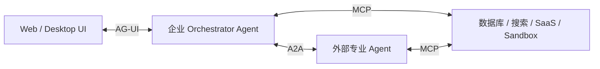

A2A Server 对上游表现为“远端 Agent”，但其内部仍可包含多个子 Agent、MCP Server、Workflow 和 Memory。A2A 不要求双方使用相同框架。

---

#### 7.2.19 生产级 A2A 平台架构

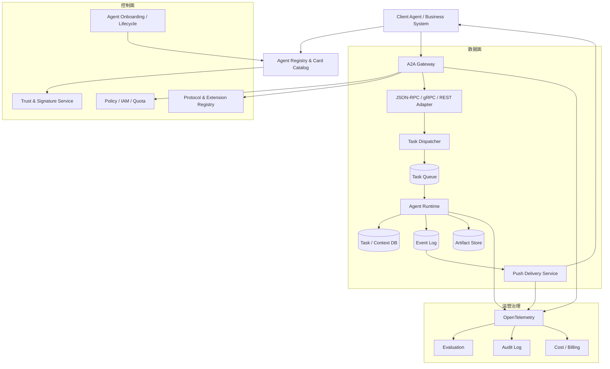

关键组件职责：

| 组件 | 核心职责 |
|---|---|
| Agent Registry | Agent Card 存储、搜索、版本、状态、Owner、准入和下线 |
| Trust Service | Card 签名验证、证书和 Key 管理、供应商信任链 |
| A2A Gateway | TLS、认证、授权、Tenant 路由、限流、WAF、协议版本和审计 |
| Binding Adapter | 三种绑定与内部统一 Command/Event 模型转换 |
| Task Dispatcher | 创建 Task、幂等、排队、Worker 选择和执行预算 |
| Task Store | 状态机、Context、History、Owner、TTL 和乐观锁 |
| Event Log | 有序事件、订阅、断线恢复、Outbox |
| Artifact Store | 大对象、Hash、病毒扫描、生命周期和访问控制 |
| Push Service | Webhook 验证、投递、重试、Dead Letter Queue |
| Evaluation | 路由正确性、结果质量、协议合规和跨 Agent 失败分析 |

不要把所有状态只保存在 Agent 进程内存中。否则进程重启后，`GetTask`、`SubscribeToTask`、取消、Push 和多轮继续都无法可靠实现。

---

#### 7.2.20 可观测性与审计

A2A Trace 应覆盖“发现—鉴权—委派—执行—结果—通知”的完整链路。

建议 Span 层级：

```text
A2A Client Run
├── AgentCard.Resolve
├── AgentCard.VerifySignature
├── Credential.Acquire
├── A2A.SendMessage
│   ├── Gateway.Authenticate
│   ├── Gateway.Authorize
│   ├── Task.Create
│   ├── Agent.Execute
│   │   ├── LLM.Call
│   │   ├── MCP.ToolCall
│   │   └── Artifact.Write
│   └── Task.StatusTransition
├── A2A.SubscribeToTask
└── PushNotification.Deliver
```

建议指标：

##### 发现与兼容性

- Agent Card 获取成功率、延迟、缓存命中率；
- Card 签名验证失败率；
- Agent Interface 选择分布；
- `A2A-Version` 使用分布；
- `VersionNotSupportedError`；
- Extension 激活率和不兼容率。

##### 调用与任务

- `SendMessage` / `SendStreamingMessage` QPS；
- Direct Message 与 Task 返回比例；
- Task 创建成功率；
- 各 Task State 数量与转换率；
- Task 完成率、失败率、拒绝率、取消率；
- `INPUT_REQUIRED` / `AUTH_REQUIRED` 占比；
- Task 排队时间、执行时间、端到端完成时间；
- 每个 Agent、Skill、Tenant 的并发 Task 数。

##### Streaming 与 Artifact

- Time to First Task；
- Time to First Status Event；
- Time to First Artifact；
- SSE/gRPC Stream 活跃数、断线率、重连率；
- Artifact 数量、字节数、Chunk 数；
- Artifact 重组失败率和 Hash 校验失败率；
- 瞬时 Message 丢失或回放缺口。

##### Push

- Push 投递成功率；
- 首次投递延迟；
- 平均重试次数；
- Dead Letter 数；
- Receiver 401/403/429/5xx 分布；
- 重复通知率；
- SSRF 拦截数和非法 Endpoint 数。

##### 安全与治理

- 认证失败、授权拒绝和 Scope 缺失；
- 跨 Tenant 访问尝试；
- Task 枚举攻击迹象；
- 超大 Part、恶意文件和不安全 URL 拦截；
- 单 Client/Agent 成本、Token 和工具调用；
- 高风险 Skill 审批与执行审计。

Trace 关联字段至少包括：

```text
trace_id
span_id
client_agent_id
server_agent_id
agent_card_version
a2a_protocol_version
protocol_binding
tenant
message_id
task_id
context_id
artifact_id
skill_id
principal_id
```

敏感 Token、API Key、原始 Secret 和隐私数据不得进入 Trace 属性。

---

#### 7.2.21 一致性测试与评估

A2A Server 通过“能接收请求”并不代表具备互操作性。至少要验证：

##### 1. 协议一致性

- Agent Card 必填字段、Media Type 和 Interface 合法性；
- `A2A-Version` 协商；
- JSON camelCase；
- ProtoJSON Enum 字符串；
- Part OneOf 约束；
- Task 状态合法性；
- 三种绑定的结果和错误语义等价；
- SSE Event 顺序；
- Push Payload 与 StreamResponse 一致；
- HTTP Error 的 `google.rpc.Status` / `ErrorInfo`；
- Agent Card JWS 规范化与验签。

##### 2. 可靠性测试

- 重复 `messageId`；
- Client 在响应前超时并重试；
- Server 重启后的 Task 恢复；
- SSE 断线重连；
- 多订阅者同时订阅；
- Artifact Chunk 重复、乱序和丢失；
- Cancel 与 Complete 并发竞争；
- Push 重试与 Dead Letter；
- Task/Context TTL 到期。

##### 3. 安全测试

- 未认证、过期 Token、错误 Audience；
- 越权读取其他用户 Task；
- Tenant 篡改；
- Agent Card `jku` SSRF；
- Part URL SSRF；
- Webhook URL SSRF；
- 超大 Base64 `raw`；
- 恶意文件；
- Prompt Injection 跨 Agent 传播；
- Extension Metadata 注入；
- Task ID 枚举和资源存在性泄漏。

##### 4. Agent 质量评估

协议合规不能替代 Agent 质量评估。还应评估：

- Skill 路由是否正确；
- Agent Card 描述与实际能力是否一致；
- 任务成功率；
- Artifact 完整性和 Schema 正确率；
- 引用、测试或业务验证通过率；
- `INPUT_REQUIRED` 是否必要；
- 是否过度创建 Task；
- 跨 Agent 委派的 Token、成本和延迟；
- 失败时是否给出可恢复信息。

---

#### 7.2.22 Client 与 Server 实现清单

##### A2A Client

- [ ] 支持 Well-Known、Registry 或私有 Card 解析；
- [ ] 校验 Card Schema、签名、Endpoint、TLS 和缓存；
- [ ] 区分 Agent 版本、协议版本和 SDK 版本；
- [ ] 显式发送 `A2A-Version: 1.0`；
- [ ] 根据 Skill、Media Type、Binding、Security 选择接口；
- [ ] 正确回传 Interface 中的 `tenant`；
- [ ] 每个 Message 生成稳定唯一的 `messageId`；
- [ ] 同时支持 Direct Message 与 Task 返回；
- [ ] 支持 Polling、Streaming、Push 中至少一种可靠路径；
- [ ] 正确重组 Artifact Chunk；
- [ ] 遇到 `INPUT_REQUIRED`/`AUTH_REQUIRED` 可恢复；
- [ ] 终止 Task 的修订创建新 Task；
- [ ] 对超时重试保持相同幂等键；
- [ ] 不把瞬时 Message 当成唯一业务结果；
- [ ] 记录协议、版本、Task 和 Trace 关联信息。

##### A2A Server

- [ ] 发布最小公开 Agent Card；
- [ ] 必要时提供受认证 Extended Agent Card；
- [ ] 支持并校验 `A2A-Version`；
- [ ] 统一三种 Binding 的内部语义；
- [ ] 对所有操作做认证和资源级授权；
- [ ] `messageId` 去重和 Task 创建原子化；
- [ ] Task、Context、Status、Artifact 持久化；
- [ ] 状态转换有乐观锁或事务保护；
- [ ] Streaming 事件有序；
- [ ] 支持断线重连后的状态校准；
- [ ] Push 至少一次投递、幂等和 DLQ；
- [ ] 限制 Part、Artifact、History 和并发规模；
- [ ] 对 URL、文件和 Extension 数据做安全校验；
- [ ] 实现 Tenant 强隔离，而非只做路由；
- [ ] 暴露 Metrics、Trace 和 Audit；
- [ ] 完成协议一致性、故障和安全测试。

---

#### 7.2.23 什么时候应该使用 A2A

适合 A2A：

- 上下游 Agent 属于不同框架、语言、进程或组织；
- 需要动态发现 Agent 能力；
- 任务可能长运行、异步、可取消或需要人工输入；
- 结果包含文件、结构化数据或多个 Artifact；
- 需要跨厂商、跨云、跨部门的 Agent 委派；
- 需要标准化认证、版本和错误语义；
- 希望远端 Agent 保持内部实现不透明。

不必使用 A2A：

- 同一进程内两个固定节点的函数调用；
- 单 Agent 调用一个数据库或搜索工具，此时优先 MCP/Tool API；
- 只需要前端展示事件，此时优先 AG-UI；
- 任务没有独立生命周期，只是一个普通同步 RPC；
- 双方完全由同一 Workflow Engine 控制且不存在互操作需求。

A2A 的合理定位是：

```text
内部 Agent 编排的边界协议
+ 跨运行时 Agent 的互操作协议
+ 跨组织 Agent 服务的开放契约
```

它不是所有内部函数调用的替代品，也不是把每个 Tool 都包装成 Agent 的理由。

##### A2A 官方资料

- [A2A 1.0 Protocol Specification](https://a2a-protocol.org/latest/specification/)
- [Core Concepts](https://a2a-protocol.org/latest/topics/key-concepts/)
- [Agent Discovery](https://a2a-protocol.org/latest/topics/agent-discovery/)
- [Streaming and Asynchronous Operations](https://a2a-protocol.org/latest/topics/streaming-and-async/)
- [Enterprise Features](https://a2a-protocol.org/latest/topics/enterprise-ready/)
- [Multi-Tenancy](https://a2a-protocol.org/latest/topics/multi-tenancy/)
- [Extensions](https://a2a-protocol.org/latest/topics/extensions/)
- [What’s New in A2A v1.0](https://a2a-protocol.org/latest/whats-new-v1/)
- [A2A GitHub Releases](https://github.com/a2aproject/A2A/releases)

---

### 17.7.3 AG-UI

AG-UI 是 Agent 后端与用户前端之间的双向、事件驱动协议，适合：

- 流式文本；
- Agent 状态；
- Tool Call 展示；
- 用户审批；
- 前端状态同步；
- Generative UI；
- 中断与恢复；
- 多 Agent 执行过程可视化。

它解决的是 Agent UI 中自定义 SSE/WebSocket 事件不统一的问题。

参考：

- [AG-UI GitHub](https://github.com/ag-ui-protocol/ag-ui)
- [AG-UI Core Overview](https://docs.ag-ui.com/sdk/js/core/overview)

---

### 17.7.4 三类协议的边界

| 问题 | 推荐协议 |
|---|---|
| Agent 如何调用数据库、文件或 SaaS | MCP |
| Agent 如何把任务交给另一个 Agent | A2A |
| 前端如何展示 Agent 流式状态和工具调用 | AG-UI |
| Agent 如何进行内部节点调度 | 框架内部 Workflow/Graph，不由上述协议直接解决 |
| Agent 如何做身份授权 | OAuth、OIDC、IAM、SPIFFE 等，与协议结合 |
| Agent 如何记录 Trace | OpenTelemetry 或框架内置 Telemetry |

---

## 17.8 多 Agent 状态、上下文与记忆设计

多 Agent 系统至少要区分以下状态域。

### 17.8.1 Agent 私有上下文

每个 Agent 独立保存：

- 自己的 System Prompt；
- 当前子任务；
- 本 Agent 工具输出；
- 本 Agent 短期历史；
- 私有草稿；
- 私有推理所需状态；
- 本 Agent 的错误和重试信息。

默认不应把所有 Agent 的完整消息广播给所有成员。

**原因：**

- 降低 Token 消耗；
- 避免上下文污染；
- 减少敏感信息传播；
- 保持职责边界；
- 使子 Agent 可以使用不同模型和上下文预算。

---

### 17.8.2 共享任务状态

共享状态应结构化，例如：

```yaml
task_id: task-001
goal: 完成支付模块安全审计
status: executing
plan_version: 3

work_items:
  - id: auth-review
    owner: security-agent
    status: completed
    artifact_id: artifact-101

  - id: api-review
    owner: backend-agent
    status: running

constraints:
  deadline: 2026-08-31T10:00:00Z
  max_cost_usd: 20
  network_access: restricted
```

共享的是事实、任务和 Artifact 引用，而不是每个 Agent 的全部对话历史。

共享状态通常需要：

- Schema Version；
- 乐观锁或版本号；
- 幂等键；
- 事件序列号；
- 状态转换约束；
- 写入者身份；
- 更新时间；
- 审计记录。

---

### 17.8.3 短期记忆与长期记忆

#### 短期记忆

- 当前会话历史；
- 当前计划；
- 当前执行中的任务；
- 最近工具结果；
- 当前 Agent 的临时草稿。

#### 长期记忆

- 用户偏好；
- 项目约束；
- 历史决策；
- 成功和失败案例；
- Agent 能力画像；
- Tool 可靠性；
- 工作流历史；
- 已验证知识。

多 Agent 记忆必须明确 Scope：

```text
organization_scope
tenant_scope
user_scope
project_scope
agent_scope
session_scope
task_scope
```

否则容易出现：

- 跨用户污染；
- 跨项目污染；
- 跨 Agent 权限泄漏；
- 历史错误长期固化；
- 旧规则覆盖新规则。

---

### 17.8.4 Artifact Store

多 Agent 之间最可靠的协作媒介往往不是消息，而是 Artifact：

- 代码补丁；
- 测试报告；
- 数据文件；
- 查询结果；
- PRD；
- 架构设计；
- 审计证据；
- 引用集合；
- 截图和日志。

推荐传递：

```yaml
artifact_id: artifact-101
artifact_type: security_report
schema_version: 2
producer_agent: security-agent
content_hash: sha256:...
created_at: 2026-08-30T12:00:00Z
source_refs:
  - source-001
validation_status: passed
```

而不是把巨大文件原文直接复制到每个 Agent 的上下文中。

---

### 17.8.5 Checkpoint 与恢复

长任务必须支持 Checkpoint。一个有效 Checkpoint 至少包括：

- 当前计划版本；
- 已完成和未完成任务；
- Agent 运行状态；
- 已生成 Artifact；
- 工具调用幂等键；
- 当前预算；
- 等待中的人工审批；
- 失败原因和重试次数；
- 继续执行所需的最小上下文。

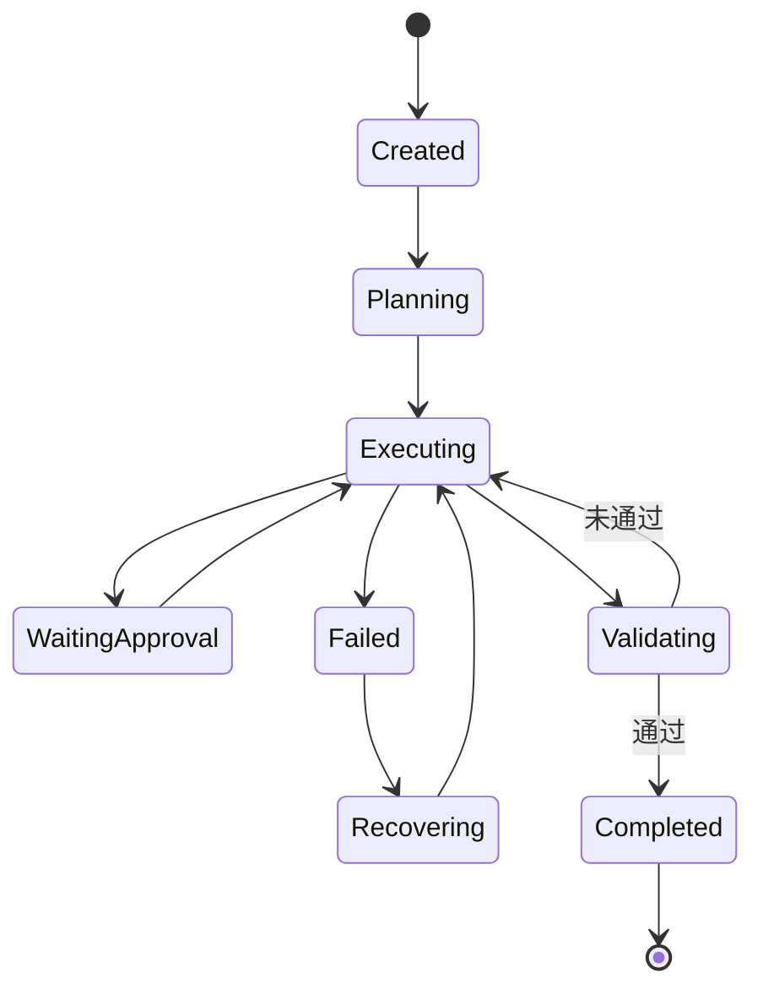

---

### 17.8.6 上下文注入策略

推荐按需注入，而不是全量注入：

```text
Agent Input Context
=
全局目标摘要
+ 当前子任务
+ 必要共享状态
+ 相关 Artifact 摘要
+ 必要长期记忆
+ 当前权限和预算
```

不要默认注入：

- 所有 Agent 的全部消息；
- 所有工具日志；
- 整个知识库；
- 与当前子任务无关的历史决策；
- 未经过滤的其他 Agent 私有草稿。

---

## 17.9 执行、沙箱与权限体系

多 Agent 系统会放大权限风险。假设一个 Supervisor 可以委派 20 个 Worker，而每个 Worker 都继承 Supervisor 的全部权限，则系统风险可能呈乘法增长。

### 17.9.1 每 Agent 独立身份

每个 Agent 都应具有：

- Agent ID；
- Runtime ID；
- Session ID；
- Tenant ID；
- Owner；
- Role；
- Credential Scope；
- Policy Version；
- 可用工具列表；
- 最大预算。

Agent 不应默认继承创建者的全部 Credential。

---

### 17.9.2 最小权限

示例：

| Agent | 文件权限 | Shell | 网络 | Git | 数据库 |
|---|---|---|---|---|---|
| Planner | 只读 | 禁止 | 受限 | 禁止 | 只读 |
| Coder | 工作区读写 | 沙箱 | 包仓库 | 分支写入 | 禁止 |
| Reviewer | 只读 | 测试命令 | 禁止 | 只读 | 禁止 |
| Release | Artifact 读取 | 构建命令 | 制品仓库 | Tag/PR | 禁止 |

权限不只取决于 Agent 角色，还应同时考虑：

```text
最终权限
=
Agent Role Policy
∩ User Policy
∩ Project Policy
∩ Tool Policy
∩ Runtime Policy
∩ 当前任务授权
```

---

### 17.9.3 高风险操作审批

以下操作通常要求 Human-in-the-loop：

- 删除文件；
- 修改生产环境；
- 执行不可逆数据库操作；
- 发邮件或外部消息；
- 付款和退款；
- 发布版本；
- 修改权限；
- 访问敏感数据；
- 向公网发送内部内容；
- 安装未批准的工具或 MCP Server。

审批对象应是明确的结构化操作，而不是笼统询问“是否允许 Agent 继续”。

```yaml
approval_request:
  action: database.execute
  risk_level: high
  agent_id: migration-agent
  target: production.orders
  operation: DELETE
  estimated_rows: 1420
  rollback_available: false
  expires_at: 2026-08-30T13:00:00Z
```

---

### 17.9.4 沙箱隔离

Coding Agent 和数据 Agent 应使用：

- 独立 Workspace；
- 受限文件系统；
- CPU、内存、磁盘和时间限制；
- 网络出口策略；
- 命令 Allowlist/Denylist；
- Secret 隔离；
- 进程树回收；
- Artifact 导出门禁；
- 临时凭证；
- 沙箱快照与销毁。

**推荐隔离层次：**

| 风险等级 | 推荐隔离 |
|---|---|
| 低风险只读分析 | 进程级限制 + 只读文件系统 |
| 普通代码执行 | 容器或轻量虚拟化 |
| 不可信代码 | MicroVM、强网络隔离 |
| 生产操作 | 独立执行器 + 人工审批 + 短期凭证 |

---

### 17.9.5 委派权限约束

Supervisor 委派任务时，不应把自身全部权限转交给 Worker。

应采用 Capability Downscoping：

```text
Worker Capability
=
Supervisor 可委派能力
∩ 子任务必要能力
∩ 安全策略允许能力
```

例如：

```yaml
delegation:
  parent_agent: supervisor-01
  child_agent: code-reviewer-07
  task_id: review-auth-module
  capabilities:
    filesystem:
      mode: read_only
      paths:
        - src/auth/**
    shell:
      allow:
        - npm test -- auth
    network: denied
    ttl_seconds: 1800
```

---

### 17.9.6 Prompt Injection 与跨 Agent 污染

多 Agent 系统中，Prompt Injection 可能沿以下路径传播：

```text
外部网页
→ Research Agent
→ 共享摘要
→ Supervisor
→ Coding Agent
→ 高权限工具
```

防护措施包括：

- 标记数据来源和信任等级；
- 外部内容与系统指令隔离；
- Agent 间消息使用结构化 Schema；
- 对高权限 Agent 进行二次策略检查；
- 不允许低信任 Agent 直接生成高风险 Tool Call；
- 对 Artifact 进行签名、哈希和验证；
- 记录委派链和数据来源链。

---

## 17.10 多 Agent 可观测性

单 Agent Trace 通常接近线性；多 Agent Trace 是图结构。

```text
Run
 ├── Plan
 ├── Agent Task A
 │    ├── LLM Call
 │    ├── Tool Call
 │    └── Artifact
 ├── Agent Task B
 │    ├── Handoff
 │    └── Tool Call
 ├── Review
 └── Finalize
```

### 17.10.1 Trace 数据模型

建议至少记录：

```yaml
trace_id: trace-001
run_id: run-001
span_id: span-101
parent_span_id: span-100
agent_id: researcher-01
agent_role: researcher
operation: tool.call
model: example-model
tool_name: web_search
input_tokens: 1200
output_tokens: 300
latency_ms: 1800
cost_usd: 0.04
status: success
```

多 Agent Trace 还要额外记录：

- Delegation Span；
- Handoff Span；
- Agent Creation Span；
- Agent Join/Leave Event；
- Shared State Read/Write；
- Artifact Produce/Consume；
- Approval Request/Decision；
- Checkpoint/Restore；
- Budget Change；
- Loop Detection。

---

### 17.10.2 任务质量指标

- Task Success Rate；
- 最终结果正确率；
- 需求覆盖率；
- Artifact 验证通过率；
- Citation 正确率；
- 测试通过率；
- 事实一致性；
- 约束满足率；
- 人工验收率。

---

### 17.10.3 协作质量指标

- Agent Routing Accuracy；
- Delegation Success Rate；
- Handoff Success Rate；
- 重复任务率；
- 无效消息比例；
- 冲突率；
- 子任务遗漏率；
- 共享状态一致性；
- 平均协作深度；
- 任务返工率；
- Agent 负载均衡度；
- 有效信息增益；
- 过早共识率。

---

### 17.10.4 效率指标

- 总 Token；
- 每 Agent Token；
- Agent 间通信 Token；
- 关键路径延迟；
- 并行加速比；
- 工具调用次数；
- 单任务成本；
- 单成功任务成本；
- 空闲 Agent 时间；
- 调度开销；
- 上下文压缩比例；
- Artifact 复用率。

并行加速比可以定义为：

```text
Parallel Speedup
=
串行估算时长 / 实际端到端时长
```

---

### 17.10.5 可靠性指标

- Timeout Rate；
- Retry Rate；
- Loop Rate；
- 非正常终止率；
- Checkpoint 恢复成功率；
- 重复副作用率；
- Agent 崩溃隔离率；
- 状态冲突率；
- 幂等命中率；
- 降级成功率；
- 孤儿任务数量；
- 未回收执行器数量。

---

### 17.10.6 安全指标

- 越权工具调用次数；
- 未授权 Handoff；
- Prompt Injection 命中率；
- 敏感数据外泄；
- 跨租户状态污染；
- Approval Bypass；
- 不可信 Agent 输出采纳率；
- 委派权限放大次数；
- Secret 暴露次数；
- 外部数据未标记比例；
- 高风险操作人工审批覆盖率。

---

### 17.10.7 可观测架构

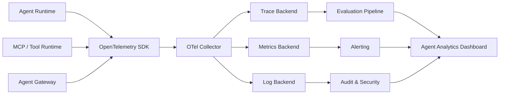

---

## 17.11 多 Agent 评估

多 Agent 不能只评估最终回答，还要评估协作过程。

### 17.11.1 结果评估

使用任务本身对应的 Benchmark 或验收机制：

- SWE-bench；
- Terminal-Bench；
- BrowseComp；
- WebArena；
- 自定义业务数据集；
- 代码测试；
- 工作流验收规则；
- 人工专家评分。

这些 Benchmark 可以告诉你系统完成任务的能力，但未必能解释哪个 Agent 或哪个 Handoff 出现问题。

---

### 17.11.2 协作评估

多 Agent 协作评估应覆盖：

- 任务是否合理分解；
- Agent 是否被正确选择；
- 子任务是否重复；
- 重要信息是否被共享；
- 是否出现冲突；
- 是否过早达成共识；
- 是否正确终止；
- 聚合器是否完整保留关键信息；
- 并行是否带来实际收益。

MultiAgentBench 等研究工作尝试评估多 Agent 的协作和竞争，并比较 Star、Chain、Tree、Graph 等通信拓扑。

参考：[MultiAgentBench](https://arxiv.org/abs/2503.01935)

---

### 17.11.3 失败模式评估

多 Agent 失败大致可以归纳为三类：

1. 规格与系统设计失败；
2. Agent 间不一致；
3. 验证与终止失败。

典型问题包括：

- Agent 不遵守角色；
- 任务描述不完整；
- 会话历史丢失；
- 上下文被重置；
- Agent 偏离任务；
- 彼此提供矛盾信息；
- 不知道何时终止；
- 缺少结果验证；
- 反复委派相同任务；
- 聚合器遗漏关键证据。

参考：[MAST: Multi-Agent System Failure Taxonomy](https://arxiv.org/abs/2503.13657)

---

### 17.11.4 评估维度模型

```text
Multi-Agent Evaluation
=
最终质量
+ 协作质量
+ 资源效率
+ 可靠性
+ 安全性
+ 可恢复性
```

| 维度 | 示例指标 |
|---|---|
| 最终质量 | 正确率、完成率、测试通过率、引用准确率 |
| 协作质量 | 路由准确率、重复任务率、信息遗漏率、冲突率 |
| 资源效率 | Token、成本、延迟、并行加速比 |
| 可靠性 | 超时率、重试率、循环率、恢复成功率 |
| 安全性 | 越权率、数据泄漏率、审批绕过率 |
| 可恢复性 | Checkpoint 完整率、重放成功率、副作用去重率 |

---

### 17.11.5 Offline、Online 与 Shadow 评估

#### Offline Evaluation

- 固定数据集；
- 固定模型与配置；
- 可重复运行；
- 适合回归测试和版本比较。

#### Online Evaluation

- 对真实运行轨迹评分；
- 监测线上质量漂移；
- 适合发现真实用户场景问题。

#### Shadow Evaluation

- 新 Agent 或新路由策略旁路运行；
- 不执行真实副作用；
- 与线上结果对比；
- 达到门槛后再逐步放量。

---

## 17.12 什么时候应该使用多 Agent

### 17.12.1 任务可以并行分解

例如：

- 同时研究多个公司；
- 同时分析多个代码模块；
- 同时搜索多个信息源；
- 同时生成多个候选方案。

### 17.12.2 不同子任务需要不同上下文

例如：

- 代码 Agent 不需要看到全部市场调研内容；
- 法务 Agent 不需要看到完整运行日志；
- Reviewer 只需要 Artifact 和验收标准。

### 17.12.3 不同子任务需要不同工具或权限

例如：

- 数据库 Agent；
- 浏览器 Agent；
- Coding Agent；
- 财务审批 Agent；
- 发布 Agent。

### 17.12.4 需要独立验证

生成 Agent 和验证 Agent 分开，有利于降低自我确认偏差。

### 17.12.5 单上下文无法容纳任务

子 Agent 可以提供独立上下文窗口，并最终只返回压缩结果和 Artifact。

### 17.12.6 需要接入外部 Agent

例如通过 A2A 接入：

- 供应商 Agent；
- 企业部门 Agent；
- 云平台 Agent；
- 第三方服务 Agent；
- 个人 Agent。

### 17.12.7 需要故障隔离

某个 Agent 崩溃、超时或输出异常时，不应导致整个系统状态丢失。

---

## 17.13 什么时候不应该使用多 Agent

### 17.13.1 一个 Agent 加合适工具已经足够

如果普通函数、单 Agent 或确定性 Workflow 可以完成，应优先采用更简单方案。

### 17.13.2 任务高度串行且强依赖完整共享上下文

例如某些编码任务要求所有步骤持续理解同一份复杂代码状态。此时频繁拆分给多个 Agent 可能导致上下文损失和合并冲突。

### 17.13.3 延迟和成本要求极低

多 Agent 会增加：

- 模型调用；
- 消息传递；
- 汇总调用；
- 验证调用；
- 状态读写；
- 调度时间。

### 17.13.4 无法验证结果

如果没有自动测试、Schema、规则、引用或人工验收，多 Agent 只会产生更多无法验证的文本。

### 17.13.5 只是为了模拟组织结构

“CEO—CTO—开发—测试”看起来直观，但不代表必须对应四次独立模型调用。很多情况下，一个 Agent 加四个 Skill 和一个确定性 Workflow 更便宜、更稳定。

### 17.13.6 子任务无法真正隔离

如果所有 Agent 都需要完整上下文、相同工具、相同权限，而且任务不能并行，多 Agent 价值通常较低。

可以使用以下判断式：

```text
多 Agent 收益
>
额外 Token 成本
+ 协作延迟
+ 状态复杂度
+ 安全风险
+ 调试成本
```

---

## 17.14 主流系统选型建议

| 场景 | 优先考虑 | 原因 |
|---|---|---|
| Azure、.NET、企业工作流 | Microsoft Agent Framework + Foundry | 类型安全、工作流、持久化、治理、Azure 集成 |
| 高度定制的长运行状态机 | LangGraph | 图模型、状态、循环、中断恢复、精细控制 |
| OpenAI 模型、Python/TS、轻量多 Agent | OpenAI Agents SDK | Handoff、Agent as Tool、Guardrail、Tracing |
| Gemini、Google Cloud、跨语言、A2A | Google ADK + Agent Platform | 多语言、A2A、托管 Runtime、Google 服务集成 |
| 快速构建角色型业务团队 | CrewAI | Crew 与 Flow 组合，角色描述简单 |
| Python 类型安全后端 | PydanticAI | Pydantic Schema、依赖注入、结构化输出 |
| RAG、知识库、数据工作流 | LlamaIndex AgentWorkflow | 数据连接和检索生态 |
| Agent 平台、Team、管理控制面 | Agno | Team、AgentOS、Control Plane |
| 异步 Agent 网络和协议研究 | AG2 | Network、Channel、异步协议驱动 |
| TypeScript 全栈 | OpenAI Agents JS、LangGraph JS、Mastra | Node.js 和前端生态友好 |
| 社会模拟与合成数据 | CAMEL | Agent Society、World Simulation、数据生成 |
| 软件公司/SOP 研究 | MetaGPT、ChatDev | 角色化软件过程和多 Agent 教学 |

### 17.14.1 按控制复杂度选型

```text
轻量调用与 Handoff
    → OpenAI Agents SDK / PydanticAI

角色化团队和业务 Flow
    → CrewAI / Agno

复杂图、长任务、恢复
    → LangGraph / Microsoft Agent Framework / Google ADK

数据与知识密集型任务
    → LlamaIndex

异步网络和研究型系统
    → AG2 / CAMEL / MetaGPT / ChatDev
```

### 17.14.2 按组织能力选型

| 团队特征 | 建议 |
|---|---|
| 小团队、快速原型 | CrewAI、OpenAI Agents SDK、PydanticAI |
| 有后端平台团队 | LangGraph、Google ADK、Microsoft Agent Framework |
| 强云厂商绑定 | 使用对应云平台原生框架和 Runtime |
| 需要跨组织 Agent | 优先评估 A2A、Agent Identity、Gateway |
| 强合规和审计 | 显式 Workflow、持久状态、独立身份、全链路 Trace |
| 研究团队 | CAMEL、AG2、MetaGPT、ChatDev、自定义仿真环境 |

---

## 17.15 2026 年多 Agent 发展趋势

### 17.15.1 从自由对话转向显式工作流

早期框架强调 Group Chat；当前主流框架越来越强调：

- Graph；
- Workflow；
- Structured Handoff；
- Typed State；
- Checkpoint；
- Deterministic Control。

这说明生产级多 Agent 正从“让模型自己讨论”转向“由系统约束模型在明确状态机中执行”。

---

### 17.15.2 从共享全部上下文转向上下文隔离

子 Agent 的重要价值之一，是把大量搜索、工具日志和中间过程隔离在独立上下文中，只向主 Agent 返回结构化结果。

未来的上下文架构将更加接近：

```text
Global Goal
+ Agent Private Context
+ Shared Structured State
+ Referenced Artifacts
+ Scoped Memory
```

而不是所有 Agent 共用一条无限增长的对话历史。

---

### 17.15.3 从框架内 Agent 转向跨组织 Agent

未来多 Agent 不只发生在一个进程中，而会出现：

```text
企业 Agent
    ↕ A2A
供应商 Agent
    ↕ A2A
云平台 Agent
    ↕ A2A
个人 Agent
```

这要求系统具备：

- Agent Registry；
- Agent Card；
- 服务发现；
- 身份认证；
- 委派授权；
- 跨组织审计；
- SLA 和计费。

---

### 17.15.4 Agent Gateway 与 Agent Identity 成为基础设施

企业 Agent 平台会逐渐像 API 平台一样拥有：

- Agent Gateway；
- Agent Registry；
- Agent Identity；
- Agent Policy；
- Agent Rate Limit；
- Agent Audit；
- Agent Reputation；
- Agent Billing。

API Gateway 管理的是服务调用；Agent Gateway 还需要管理：

- 任务委派；
- 上下文传播；
- Agent 身份；
- 运行预算；
- 工具权限；
- Artifact 可信度。

---

### 17.15.5 预算感知的动态编排

Supervisor 不再无限创建 Agent，而会根据：

- 剩余 Token；
- 剩余时间；
- 当前置信度；
- 子任务价值；
- 并行收益；
- Agent 历史表现；
- 当前系统负载；
- 任务风险等级；

动态决定是否创建、暂停、合并或终止 Agent。

可以抽象为：

```text
Expected Utility
=
Expected Quality Gain
-
Token Cost
-
Latency Cost
-
Risk Cost
```

只有当预期收益为正时才创建新的子 Agent。

---

### 17.15.6 单 Agent + Skill 与多 Agent 融合

很多过去通过多个角色 Agent 实现的能力，会被重新实现为：

```text
一个主 Agent
+ 多个 Skill
+ 动态工具加载
+ 少量真正需要隔离的子 Agent
```

未来不会是“Agent 越多越好”，而是只有在以下条件成立时才创建子 Agent：

- 需要上下文隔离；
- 需要并行计算；
- 需要权限隔离；
- 需要独立验证；
- 需要远程 Agent 能力。

---

### 17.15.7 多 Agent 安全从单体安全转向系统安全

安全边界必须覆盖：

- 单 Agent；
- Agent 间消息；
- 共享状态；
- Agent 身份；
- 任务委派；
- Tool 调用；
- Artifact；
- 最终聚合结果；
- 外部 Agent；
- 人工审批链路。

新的群体性问题包括：

- 过早共识；
- 重要私有信息无法传播；
- 对不可信 Agent 的错误信任；
- 协作效率下降；
- 多 Agent 共谋绕过策略；
- 低权限 Agent 诱导高权限 Agent 执行操作。

---

### 17.15.8 多 Agent 从在线对话转向 Durable Execution

未来长任务系统会越来越依赖：

- 持久状态；
- Checkpoint；
- 事件溯源；
- 幂等执行；
- 超时恢复；
- Worker 重启；
- 长时间等待人工审批；
- 可重放的运行轨迹。

多 Agent Runtime 将逐步融合 Workflow Engine、Actor System 和 Durable Execution 的思想。

---

### 17.15.9 Agent 选择将从静态配置转向能力市场

系统将根据 Agent 的：

- 能力标签；
- 模型类型；
- 工具集合；
- 历史成功率；
- 延迟；
- 成本；
- 安全等级；
- 当前负载；

动态选择最合适的 Agent。

```text
Agent Selection Score
=
任务匹配度
× 历史质量
× 可用性
-
成本
-
延迟
-
风险
```

---

### 17.15.10 多 Agent 评估将成为持续运营系统

评估不再只发生在上线前，而会持续运行：

```text
线上 Trace
→ 自动评分
→ 失败聚类
→ 路由或 Prompt 优化
→ Shadow 验证
→ 灰度发布
→ 再次观测
```

这会形成 AgentOps 闭环。

---

## 17.16 生产级参考架构

### 17.16.1 总体架构

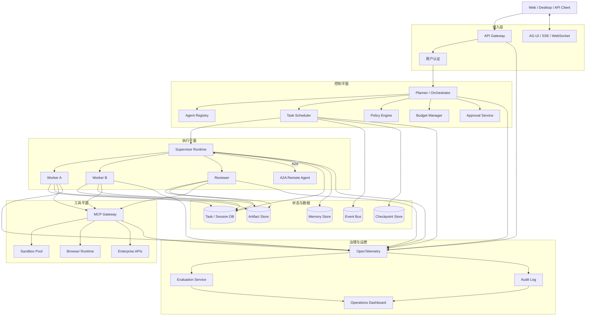

### 17.16.2 推荐核心服务

| 服务 | 职责 |
|---|---|
| Agent Registry | 保存 Agent ID、版本、能力、工具、模型、权限和健康状态 |
| Orchestrator | 规划、路由、委派、汇总和终止 |
| Scheduler | 并发控制、任务队列、重试、超时和 Worker 分配 |
| Policy Engine | 用户、项目、Agent、工具和任务级权限决策 |
| Budget Manager | Token、成本、时间、调用次数和并发预算 |
| State Store | 会话、任务、状态机和执行历史 |
| Memory Store | 作用域化长期记忆和检索 |
| Artifact Store | 代码、报告、日志、数据和引用等中间产物 |
| MCP Gateway | 工具发现、认证、授权、限流和审计 |
| A2A Gateway | 外部 Agent 发现、认证、委派和结果接收 |
| Sandbox Manager | 隔离执行环境、资源限制和生命周期回收 |
| Evaluation Service | Offline、Online、Trace 和协作质量评估 |
| Observability | Trace、Metric、Log、Audit 和告警 |

---

### 17.16.3 任务生命周期

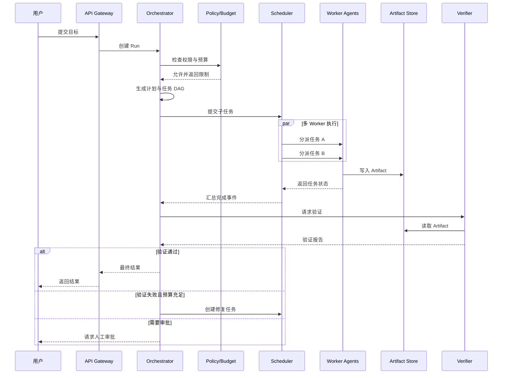

---

### 17.16.4 Agent 配置示例

```yaml
agent:
  id: code-reviewer
  version: 1.3.0
  role: reviewer
  description: 审查代码正确性、安全性和可维护性

  model:
    provider: openai
    name: example-model
    temperature: 0.1

  capabilities:
    - code.read
    - test.run
    - artifact.write

  tools:
    - repository_search
    - lsp_symbols
    - test_runner

  permissions:
    filesystem:
      mode: read_only
      paths:
        - src/**
        - tests/**
    network: denied
    shell:
      allow:
        - npm test
        - cargo test

  limits:
    max_input_tokens: 100000
    max_output_tokens: 12000
    max_tool_calls: 80
    max_duration_seconds: 1800
    max_cost_usd: 5

  output_schema: CodeReviewReportV2
```

---

## 17.17 落地检查清单

### 17.17.1 架构与职责

- [ ] 每个 Agent 的职责边界是否明确；
- [ ] 是否真的需要多个 Agent，而不是一个 Agent 加多个 Skill；
- [ ] 是否采用显式 Workflow 或任务 DAG；
- [ ] 是否定义 Supervisor、Worker、Reviewer 等角色责任；
- [ ] 是否避免所有 Agent 共享全部上下文；
- [ ] 是否设计明确的终止条件。

### 17.17.2 状态与数据

- [ ] 是否区分 Agent 私有状态和共享状态；
- [ ] 共享状态是否使用版本化 Schema；
- [ ] 是否支持 Checkpoint 和恢复；
- [ ] 是否使用 Artifact Store 传递大型中间结果；
- [ ] 是否有幂等键和重复副作用防护；
- [ ] 是否定义记忆 Scope 和数据生命周期。

### 17.17.3 权限与安全

- [ ] 每个 Agent 是否拥有独立身份；
- [ ] 委派时是否执行权限缩减；
- [ ] 高风险工具是否要求人工审批；
- [ ] Coding Agent 是否运行在沙箱中；
- [ ] 是否限制网络、文件、Shell 和 Secret；
- [ ] 是否防止 Prompt Injection 跨 Agent 传播；
- [ ] 是否记录完整委派链和数据来源链。

### 17.17.4 可靠性

- [ ] 是否设置最大轮数、Token、时间和成本；
- [ ] 是否有 Loop Detection；
- [ ] 是否支持任务取消；
- [ ] Worker 崩溃后是否可以恢复；
- [ ] 是否处理孤儿任务和僵尸进程；
- [ ] 是否存在降级到单 Agent 或人工处理的路径。

### 17.17.5 可观测性与评估

- [ ] 是否记录 Agent、Handoff、Delegation、Tool 和 Artifact Span；
- [ ] 是否统计路由准确率和重复任务率；
- [ ] 是否区分总延迟与关键路径延迟；
- [ ] 是否统计 Agent 间通信 Token；
- [ ] 是否同时评估最终结果和协作过程；
- [ ] 是否具备 Offline、Online 和 Shadow Evaluation；
- [ ] 是否能从失败 Trace 回放完整执行过程。

### 17.17.6 协议与集成

- [ ] 工具接入是否优先采用 MCP 或统一 Tool Contract；
- [ ] 跨系统 Agent 是否使用 A2A 或稳定远程协议；
- [ ] UI 事件是否采用统一流式事件模型；
- [ ] 是否存在 Agent Registry 和能力发现；
- [ ] 外部 Agent 是否经过身份验证和信任评估。

---

## 17.18 整体结论

多 Agent 系统的核心不是“让多个大模型聊天”，而是建立一套可控制的分布式智能执行系统：

```text
多 Agent 系统
=
Agent 专业化
+ 任务分解
+ 编排拓扑
+ 独立上下文
+ 结构化状态
+ Artifact 协作
+ 工具与沙箱
+ 权限与身份
+ 持久化执行
+ 可观测性
+ 评估与验证
+ 成本和终止控制
```

当前工程选型可以概括为：

- **企业级统一框架**：Microsoft Agent Framework；
- **复杂图与长任务运行时**：LangGraph；
- **轻量 OpenAI 多 Agent**：OpenAI Agents SDK；
- **Google Cloud 与 A2A**：Google ADK；
- **角色驱动业务自动化**：CrewAI；
- **类型安全 Python**：PydanticAI；
- **数据和 RAG**：LlamaIndex；
- **Agent 平台化**：Agno；
- **异步 Agent 网络**：AG2；
- **研究与模拟**：CAMEL、MetaGPT、ChatDev。

生产系统中最稳健的默认方案通常不是完全去中心化 Swarm，而是：

```text
中心化控制面
+ 分布式 Agent 执行
+ 私有上下文
+ 结构化共享状态
+ MCP 工具层
+ A2A 外部协作
+ AG-UI 用户交互
+ 全链路 Trace
+ 明确预算与终止条件
```

多 Agent 是否有效，最终取决于以下问题是否被工程化解决：

1. 任务是否能够正确分解；
2. Agent 是否被正确路由；
3. 上下文是否有效隔离；
4. 共享状态是否一致；
5. 工具和权限是否受控；
6. 结果是否能够验证；
7. 执行是否能够终止和恢复；
8. 质量收益是否大于额外成本。

真正成熟的多 Agent 平台，不是 Agent 数量最多，而是在 **质量、成本、延迟、可靠性和安全性** 之间建立可度量、可控制、可持续优化的平衡。

---

## 参考资料

1. [Microsoft Agent Framework Overview](https://learn.microsoft.com/en-us/agent-framework/overview/)
2. [Microsoft Agent Framework Workflows](https://learn.microsoft.com/en-us/agent-framework/workflows/)
3. [LangGraph Graph API](https://docs.langchain.com/oss/python/langgraph/graph-api)
4. [LangChain Multi-Agent](https://docs.langchain.com/oss/python/langchain/multi-agent)
5. [Deep Agents Subagents](https://docs.langchain.com/oss/python/deepagents/subagents)
6. [OpenAI Agents SDK Multi-Agent](https://openai.github.io/openai-agents-python/multi_agent/)
7. [OpenAI Agents SDK Tracing](https://openai.github.io/openai-agents-python/tracing/)
8. [Google ADK Multi-Agent Systems](https://google.github.io/adk-docs/agents/multi-agents/)
9. [Google ADK A2A](https://google.github.io/adk-docs/a2a/)
10. [CrewAI Documentation](https://docs.crewai.com/en/introduction)
11. [PydanticAI Multi-Agent Applications](https://ai.pydantic.dev/multi-agent-applications/)
12. [LlamaIndex Multi-Agent Patterns](https://developers.llamaindex.ai/python/framework/understanding/agent/multi_agent/)
13. [Agno Teams Overview](https://docs.agno.com/teams/overview)
14. [AG2 Documentation](https://docs.ag2.ai/docs/user-guide/motivation/)
15. [Mastra Agent Networks](https://mastra.ai/docs/agents/networks)
16. [CAMEL Documentation](https://docs.camel-ai.org/get_started/introduction)
17. [MetaGPT Documentation](https://docs.deepwisdom.ai/main/en/guide/get_started/introduction.html)
18. [ChatDev GitHub](https://github.com/OpenBMB/ChatDev)
19. [Anthropic Multi-Agent Research System](https://www.anthropic.com/engineering/multi-agent-research-system)
20. [Microsoft Foundry Workflow](https://learn.microsoft.com/en-us/azure/foundry/agents/concepts/workflow)
21. [Gemini Enterprise Agent Runtime](https://docs.cloud.google.com/gemini-enterprise-agent-platform/build/runtime)
22. [Google Agent Gateway Overview](https://docs.cloud.google.com/gemini-enterprise-agent-platform/govern/gateways/agent-gateway-overview)
23. [Amazon Bedrock AgentCore](https://docs.aws.amazon.com/bedrock-agentcore/latest/devguide/what-is-bedrock-agentcore.html)
24. [Salesforce Agentforce Multi-Turn Patterns](https://developer.salesforce.com/docs/ai/agentforce/guide/ascript-patterns-multi-turn.html)
25. [Model Context Protocol](https://modelcontextprotocol.io/docs/getting-started/intro)
26. [Linux Foundation A2A Protocol](https://www.linuxfoundation.org/press/linux-foundation-launches-the-agent2agent-protocol-project-to-enable-secure-intelligent-communication-between-ai-agents)
27. [AG-UI Protocol](https://github.com/ag-ui-protocol/ag-ui)
28. [MultiAgentBench](https://arxiv.org/abs/2503.01935)
29. [MAST: Multi-Agent System Failure Taxonomy](https://arxiv.org/abs/2503.13657)

30. [A2A 1.0 Protocol Specification](https://a2a-protocol.org/latest/specification/)
31. [A2A Core Concepts](https://a2a-protocol.org/latest/topics/key-concepts/)
32. [A2A Agent Discovery](https://a2a-protocol.org/latest/topics/agent-discovery/)
33. [A2A Streaming and Asynchronous Operations](https://a2a-protocol.org/latest/topics/streaming-and-async/)
34. [A2A Enterprise Features](https://a2a-protocol.org/latest/topics/enterprise-ready/)
35. [A2A Multi-Tenancy](https://a2a-protocol.org/latest/topics/multi-tenancy/)
36. [A2A Extensions](https://a2a-protocol.org/latest/topics/extensions/)
37. [What’s New in A2A v1.0](https://a2a-protocol.org/latest/whats-new-v1/)
38. [A2A Protocol Releases](https://github.com/a2aproject/A2A/releases)
39. [A2A Joins the Agentic AI Foundation](https://a2a-protocol.org/latest/blog/archive/2026/)

---

> **使用提示**：与其他附录的分工——1 讲模型机制、2 讲方法论、3 记来源、4 列产品、5 辨异同、6 索引图版、7 详解 OTel、8 上手 DeepEval、9 评测观测平台选型、10 上手 Mem0、11 详解记忆晋升机制、12 盘点 Coding Agent 赛道、13 盘点可观测赛道、14 盘点评估赛道、15 盘点 Memory 赛道、16 盘点自进化赛道、**17 盘点多 Agent 赛道**、18 盘点 MCP 生态、19 盘点沙箱赛道、20 盘点 RAG 赛道、21 盘点 LLM Wiki 赛道、22 盘点 Loop Engineering 赛道、23 解析 Pi 源码、24 解析 Claude Code 源码、25 解析 Codex 源码、26 解析 OpenCode 源码。对照阅读：多 Agent 定义与编排模式（17.1/17.6）对第 17 章八拓扑与代价模型、框架盘点（17.3）对附录 4.5、协议栈（17.7）对第 8/18 章（MCP/A2A）、状态与记忆（17.8）对第 18 章交接包与附录 15、沙箱权限（17.9）对第 13 章与第 23 章 2.6、可观测（17.10）对第 14/19 章与附录 13、评估（17.11）对第 15 章与附录 14、该用不该用（17.12–17.13）对第 17/19 章三维选型与劝退判定。信息基准 2026-09（[C-41]），发行前按附录 3 清单复核。
