# 附录 22：主流 Loop Engineering 系统全景

> 定位：**四类 Engineering（Prompt/Context/Loop/Graph）的系统全景与主流系统盘点**（全文收录，信息基准 2026-09，各系统官方入口见 [C-49]）。与相邻内容的分工：附录 2 是四件方法论的词典速查，第 3 章是 Loop Engineering 的机制主体（附录 2.3 的落点）、第 5/6 章对 Context/Prompt、第 18 章对 Graph——本附录把四件拉通成一张系统全景：统一认知与分层架构、四件各自的职责边界/反模式/核心指标/工程流程、主流 Loop Engineering 系统盘点、Loop 与 Graph 模式库、生产级 Loop Contract、状态恢复与收敛、安全审批、可观测评测、成熟度六级（L0–L5）、选型建议、完整示例与实施路线图。名单会过期，"四件不是替代关系 + 有界 Loop Contract"的框架不过期。

---

### 摘要

**Loop Engineering（循环工程）** 不是某一个产品或框架，而是把 Agent 的多轮尝试工程化为**目标明确、状态持久、执行有界、结果可验证、失败可恢复、风险可治理、过程可观测** 的闭环系统方法。

本文采用一个更严格的结构描述生产级 Loop：

```text
五阶段执行闭环：
Trigger → Orchestration → Execution → Verification → Decision
   ↑                                                        │
   └──────────── Continue / Retry / Repair / Replan ────────┘

一条持久化主干：
Runtime State（State + Checkpoint + Event History + Artifact）
+ Long-term Memory（跨任务偏好、规范与经验证的经验）

三个横切控制面：
Contract & Governance
+ Observability & Evaluation
+ Continuous Improvement
```

这里的 **State、Checkpoint、Event History 和 Artifact** 保存当前 Run 的权威事实；**Memory** 保存经过筛选、可跨任务复用的偏好、规范和经验，不能替代任务状态。

四类 Engineering 的职责边界如下：

| 工程领域 | 核心问题 | 主要控制对象 |
|---|---|---|
| **Prompt Engineering** | 当前这一轮如何向模型表达任务？ | 指令、角色、约束、示例、输出契约 |
| **Context Engineering** | 当前这一轮应该让模型看到什么？ | 状态、历史、记忆、检索结果、工具结果、权限 |
| **Loop Engineering** | 系统如何迭代、验证、恢复并正确停止？ | 反馈、进度、预算、验证、重试、停止策略 |
| **Graph Engineering** | 多个节点、Agent、工具和 Loop 如何连接与协作？ | 节点、边、路由、并行、汇聚、子图、共享状态 |

> **Prompt 决定怎么说；Context 决定给它看什么；Loop 决定如何持续做并正确停止；Graph 决定整个系统如何组织。**

### 阅读与审校说明

1. **术语状态**：Loop Engineering 与 Graph Engineering 是正在形成的工程化表述，不是标准组织已经冻结定义的正式学科；本文给出的是可执行、可比较的工程定义。[^loop-engineering][^graph-engineering]
2. **结构调整**：目录从十九个并列一级章节，重构为“部分 → 章节 → 小节”三级语义层级；全文只保留一个一级标题。
3. **执行模型调整**：原“六层执行主链路”改为“五阶段执行闭环 + 一条持久化主干 + 三个横切控制面”，避免把状态误解为仅在决策之后发生的第六步。
4. **模式与案例顺序**：先讲通用 Loop/Graph 模式，再讲 Coding Repair、Documentation Maintenance、PR Babysitting 和 Agent Improvement 四类应用结构。
5. **状态边界**：State、Checkpoint、Event History、Artifact 与 Memory 分离；长期任务恢复不依赖聊天历史或模型自行记忆。
6. **框架与运行时边界**：Agent/Graph Framework 负责语义决策和拓扑；Durable Runtime 负责持久执行、恢复、重试、等待、幂等和并发协调。
7. **验证边界**：Worker 自报完成不构成成功证据；测试、CI、Review 和外部状态必须绑定当前 Artifact Revision 或 Commit SHA。
8. **版本时效**：产品能力按 2026-09-03 官方资料核对；预览状态、命令和托管能力可能变化，生产采用时必须固定版本并重新验证。
9. **范围**：本文不包含任何特定项目的专属设计方案。

目录层级规范：

| Markdown 层级 | 本文用途 | 说明 |
|---|---|---|
| `#` | 文档标题 | 全文仅一个 |
| `##` | 部分与前置说明 | 摘要、目录、五个部分、参考资料 |
| `###` | 正文章节 | 19 个编号章节 |
| `####` | 章节内小节 | 原理、结构、流程、指标等 |
| `#####` | 小节内主题 | 反模式、角色、阶段、局部结构等 |

目录只展示到“部分 + 章节”级，避免四千余行文档的目录本身过长；编辑器大纲可继续展开到 `####` 和 `#####`。

**▍第一部分：概念基础与工程边界**

本部分先统一 Prompt、Context、Loop、Graph、Agent Harness、Workflow 与 Durable Runtime 的边界，再分别说明四类 Engineering 的核心产物和失败模式。

## 22.1 统一认知与工程边界

### 22.1.1 四类 Engineering 的定义

| 工程领域 | 基本单位 | 生命周期 | 主要产物 | 典型失败 |
|---|---|---|---|---|
| Prompt Engineering | 一次模型调用中的指令 | Invocation / Turn | Prompt Template、Prompt Version | 指令含糊、格式错误、模型不遵循要求 |
| Context Engineering | 一次模型调用前的上下文快照 | Invocation / Turn | Context Policy、Context Snapshot | 缺少关键信息、噪声过多、信息过期、越权泄漏 |
| Loop Engineering | 多轮反馈闭环 | Run / Task / Session | Loop Contract、Loop Run、Checkpoint | 无限循环、过早停止、无进展、错误恢复 |
| Graph Engineering | 节点和边构成的执行拓扑 | Workflow / System | Graph Definition、Node Contract、Edge Policy | 路由错误、状态冲突、汇聚错误、并发失控 |

四者不是依次替代的“技术代际”，而是不同的控制面：

```text
Agentic System
=
Graph(
  Nodes[
    Loop(
      Model(Prompt, Context),
      Tools,
      Verifiers
    )
  ],
  Shared State,
  Routing Policy,
  Runtime Policy
)
```

关键关系：

- Prompt 是 Context 的一部分，但 Context 不等于 Prompt；
- Context 在每次模型调用前动态构建；
- Loop 由多次模型调用、工具调用、Observation、验证和状态更新组成；
- Graph 可以是 DAG，也可以包含循环边；
- 一个 Graph 可以包含多个 Loop；
- 一个 Graph Node 内部也可以运行完整 Agent Loop；
- Graph 和 Loop 都需要运行时，但运行时不等同于二者本身。

### 22.1.2 与 Agent、Harness、Workflow、Durable Runtime 的关系

| 概念 | 解决的问题 | 不主要负责什么 |
|---|---|---|
| **Agent** | 模型如何基于上下文选择工具并完成当前任务 | 跨进程恢复、企业级调度、全局状态治理 |
| **Agent Harness** | Agent 在什么 Prompt、工具、权限、环境、Hook 和反馈机制中运行 | 组织所有跨服务业务流程 |
| **Loop** | 如何重复执行、利用反馈、判断进度并停止 | 表达所有系统拓扑和并行汇聚 |
| **Graph / Workflow** | 节点如何顺序、分支、并行、循环和汇聚 | 自动提供底层持久执行保证 |
| **Durable Runtime** | 如何保存进度、重试、等待、恢复、处理幂等和长事务 | 判断开放任务的语义下一步 |
| **Observability / Eval** | 如何追踪、评分、定位失败和验证改进 | 直接替代执行和状态管理 |

OpenAI 将 Harness Engineering 描述为围绕 Agent 构建可读仓库、工具、验证反馈和执行环境的工程实践；它与 Loop Engineering 高度相关，但关注面并不完全相同。[^harness-engineering]

### 22.1.3 完整分层架构

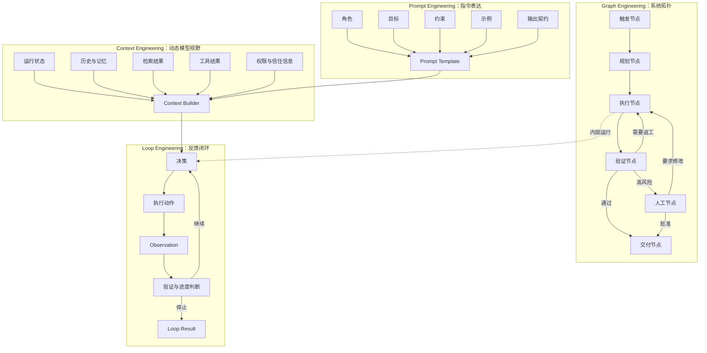

## 22.2 Prompt Engineering

### 22.2.1 定义

Prompt Engineering 负责设计当前模型调用中的指令表达，使模型能够更稳定地产生满足要求的结果。生产实践还应固定模型版本，并用测试和评测验证 Prompt 变更。[^prompt-engineering]

它使模型明确：

- 扮演什么角色；
- 完成什么目标；
- 遵守哪些约束；
- 可以使用哪些工具；
- 应按什么格式返回；
- 信息不足或失败时如何处理。

它主要回答：

> **这一轮应该如何向模型表达任务？**

### 22.2.2 典型组成

```text
Prompt
├── Role：角色和职责
├── Goal：当前目标
├── Background：必要背景
├── Constraints：禁止事项与约束
├── Procedure：推荐过程
├── Tool Guidance：工具选择和使用说明
├── Examples：正例、反例和边界案例
├── Output Contract：结构化输出 Schema
├── Evaluation Rubric：质量标准
└── Failure Behavior：无法完成时的处理方式
```

示例：

```markdown
# Role

你是独立代码审查 Agent，只负责发现会导致功能错误、安全问题、
数据损坏或兼容性回归的问题。

# Goal

根据原始需求、代码 Diff 和测试报告判断当前变更是否可以接受。

# Constraints

- 不评论纯格式偏好。
- 不根据未读取的代码作推断。
- 每个 Finding 必须包含文件、位置、证据和影响。
- 不直接修改代码。

# Output Contract

按照指定 JSON Schema 返回 approved、findings 和 unresolved_risks。
```

### 22.2.3 主要职责

1. **角色定义**：Planner、Worker、Reviewer、Security Auditor；
2. **任务分解提示**：明确本轮只负责哪一部分；
3. **指令优先级**：区分系统规则、业务策略、用户请求和外部数据；
4. **输出约束**：JSON Schema、枚举、必填字段、证据格式；
5. **工具指导**：什么情况下调用哪个工具；
6. **错误行为**：权限不足、工具失败、证据不足时如何响应；
7. **模型适配**：不同模型和版本采用适配的提示模板；
8. **版本治理**：内部 Prompt ID、版本、变更说明、评测结果和回滚。这里的 Prompt ID 是项目自身的版本标识，不特指任何厂商的托管 Prompt Object API。

### 22.2.4 不应由 Prompt 单独承担的职责

以下要求不能只写成自然语言指令：

```text
最多重试三次
测试失败后回到修复节点
每小时运行一次
两个任务并行执行
应用重启后继续
禁止访问工作区外文件
生产部署必须人工审批
```

它们分别属于：

- Loop Policy；
- Graph Routing；
- Durable Runtime；
- Sandbox / Permission；
- Human Approval；
- Scheduler / Trigger。

### 22.2.5 典型反模式

##### 超级 Prompt

把全部业务流程、状态、历史、工具协议和权限规则塞进单个超长 Prompt，导致：

- 难以独立测试；
- 修改一处影响全局；
- 指令和外部数据混杂；
- 状态事实不可追踪；
- 失败归因困难。

##### 用自然语言代替强制控制

```text
请尽量不要执行危险命令。
```

正确做法是由 Sandbox、命令策略和审批系统强制执行。

##### 用 Prompt 保存状态

```text
请记住你已经完成第七项任务。
```

运行进度应写入 State Store，而不是依赖模型上下文。

##### 无版本、无评测

生产 Prompt 应具有版本、适用模型、数据集和回归结果，避免“凭感觉改 Prompt”。

### 22.2.6 主要指标

| 指标 | 含义 |
|---|---|
| Instruction Adherence | 指令遵循率 |
| Output Schema Validity | 结构化输出合法率 |
| Task Accuracy | 单轮任务准确率 |
| Tool Selection Accuracy | 工具选择准确率 |
| Refusal Correctness | 应拒绝和不应拒绝的判断正确率 |
| Prompt Stability | 相同输入下行为稳定性 |
| Token Cost | 静态指令和示例成本 |
| Regression Rate | Prompt 或模型变化后的退化率 |

### 22.2.7 标准工程流程

```text
定义任务成功标准
→ 收集代表性样本和失败样本
→ 建立 Baseline
→ 编写或修改 Prompt
→ 运行离线 Eval
→ 分析行为变化和回归
→ 通过版本门禁
→ 灰度发布并持续监控
```

Prompt 优化必须与固定评测集、模型版本和运行参数绑定。否则无法判断效果变化来自 Prompt、模型升级、Context、工具还是采样随机性。

## 22.3 Context Engineering

### 22.3.1 定义

Context Engineering 负责在每次模型调用前动态选择、组织、压缩、隔离并标记模型可见的信息。它不仅包含 Prompt，还包括：

- 当前用户请求；
- 会话历史；
- 运行状态；
- 短期工作记忆；
- 跨会话长期记忆；
- 检索到的文档和代码；
- Tool Result；
- 当前可用工具；
- 权限和信任标签；
- 输出 Schema；
- 剩余预算。

它主要回答：

> **当前这一轮，模型应该看到什么，不应该看到什么？**

在多数 Agent 系统的运行时建模中，Prompt 会作为 Context Snapshot 的一个组成部分被装配；但 Prompt Engineering 与 Context Engineering 仍是职责不同的工程领域：前者设计指令表达，后者负责运行时信息选择、组织、压缩、隔离与来源治理。

### 22.3.2 Context Snapshot

```text
Context Snapshot
├── System Instructions
├── Current Task
├── Conversation Window
├── Runtime Context
│   ├── User / Tenant
│   ├── Workspace
│   ├── Environment
│   └── Permission Scope
├── Structured Loop State
│   ├── Goal
│   ├── Current Plan
│   ├── Completed Items
│   ├── Pending Items
│   └── Remaining Budget
├── Long-term Memory
│   ├── User Preferences
│   ├── Project Conventions
│   ├── Historical Decisions
│   └── Confirmed Experience
├── Retrieved Knowledge
│   ├── Documentation
│   ├── Source Code
│   ├── Repo Map
│   ├── Symbol / AST / LSP Result
│   └── External Records
├── Recent Tool Results
├── Available Tool Definitions
├── Provenance and Trust Labels
└── Output Contract
```

LangChain 将 Context Engineering 概括为围绕运行时上下文、状态和长期存储进行动态装配，并强调选择、压缩和隔离信息，而非简单地把更多内容塞给模型。[^context-engineering]

### 22.3.3 核心操作

##### 选择 Select

不同节点只获得完成职责所需的信息：

```text
Planner：目标、需求、架构约束、Repo Map
Worker：当前子任务、相关代码、测试命令、写入范围
Reviewer：原始验收标准、Diff、测试证据、风险策略
Security Agent：数据流、依赖、权限和安全基线
```

##### 检索 Retrieve

典型来源：

- 向量和全文检索；
- 文件和代码搜索；
- LSP、AST、Tree-sitter、Symbol Index；
- Git History、Issue、PR、CI；
- 数据库、知识库和业务 API；
- 长期记忆 Store。

##### 排序 Rank

可按以下因素排序：

- 任务相关性；
- 来源权威性；
- 数据新鲜度；
- 节点角色；
- Token 成本；
- 安全等级；
- 与当前工件版本的一致性。

##### 压缩 Compress

常见策略：

- 对话摘要；
- 工具输出裁剪；
- 日志去噪和错误指纹化；
- Repo Map 和模块摘要；
- 已完成步骤压缩为结构化状态；
- 保留原始工件引用而非重复全文。

##### 隔离 Isolate

- 子 Agent 使用独立上下文；
- Worker 与 Reviewer 不共享未经验证的主观结论；
- 不同租户、权限和敏感度数据严格隔离；
- 只读节点不获得写工具；
- 外部不可信内容不进入系统指令区。

##### 来源与信任管理

每个 Context Item 建议携带：

```yaml
context_item:
  source: github_pull_request
  authority: external_untrusted
  retrieved_at: 2026-09-03T08:00:00Z
  content_hash: sha256:...
  revision: commit-abc123
  sensitivity: internal
  allowed_consumers:
    - reviewer-agent
```

### 22.3.4 Context Budget

Context 不应只有总 Token 限额，还应按类别分配：

```yaml
context_budget:
  total_tokens: 120000
  allocation:
    system_and_policy: 8000
    task_and_acceptance: 7000
    structured_state: 8000
    repository_map: 12000
    retrieved_code: 45000
    recent_tool_results: 18000
    memory: 6000
    output_reserve: 16000
```

需要根据节点职责动态调整，而不是所有 Agent 共用同一预算模板。

### 22.3.5 State 与 Memory 的区别

| 类型 | 是否为当前任务权威事实 | 生命周期 | 示例 |
|---|---:|---|---|
| State | 是 | 当前 Run | 当前正在处理 PR #128，轮次为 4 |
| Checkpoint | 是，某一时刻快照 | 当前 Run 及恢复期 | 已提交 Commit，正在等待 CI |
| Event History | 是，追加式事实 | 当前 Run 及审计期 | 谁在何时触发了什么状态迁移 |
| Artifact | 是，外部工件 | 可长期保留 | Patch、Commit、测试报告、PR |
| Memory | 否，属于可召回经验 | 跨 Run | 该仓库发布前通常需要三类测试 |

记忆召回内容可能过期或不准确，应经过来源、时间和当前状态校验后使用。

### 22.3.6 典型反模式

- **Context Stuffing**：检索到什么就全部传入；
- **聊天记录代替 State**：从自然语言中猜测当前进度；
- **所有 Agent 共享全部 Context**：导致污染、越权和高成本；
- **忽略版本新鲜度**：使用旧 Commit 的测试和代码结论；
- **只做 RAG**：没有权限、压缩、信任、预算和生命周期治理；
- **把不可信网页内容与系统规则同级拼接**：扩大 Prompt Injection 风险。

### 22.3.7 主要指标

| 指标 | 含义 |
|---|---|
| Context Precision | 上下文中真正相关内容的比例 |
| Context Recall | 必要信息被召回的比例 |
| Context Utilization | 模型是否实际利用关键上下文 |
| Stale Context Rate | 过期或版本不一致内容比例 |
| Conflict Rate | Context 来源相互冲突比例 |
| Token Efficiency | 单位 Context Token 带来的任务收益 |
| Provenance Coverage | 结论可追溯来源的覆盖率 |
| Leakage Rate | 向错误主体暴露信息的比例 |
| Context Build Latency | 上下文装配耗时 |

### 22.3.8 Context 生命周期

```text
注册信息源与信任级别
→ 根据当前节点生成检索请求
→ 检索、过滤、去重和排序
→ 按 Token Budget 装配
→ 校验权限、版本和来源
→ 固化 Context Snapshot
→ 执行模型调用
→ 记录实际使用、成本和结果
→ 压缩、归档或淘汰
```

Context Snapshot 应具有可追溯 ID，并关联节点、模型、Prompt 版本、数据修订号和输出结果。这样才能复现实验、定位错误召回并评估上下文策略。

## 22.4 Loop Engineering

### 22.4.1 总体定义

Loop Engineering 的核心不是“让 Agent 多跑几轮”，而是：

> **让系统根据目标和客观反馈，持续选择动作、执行、验证、更新状态，并在正确条件下完成、暂停、失败或升级给人。**

完整公式可以分为三组：

```text
Loop Engineering
= Execution Loop(Trigger, Orchestration, Execution, Verification, Decision)
+ Persistence Spine(Runtime State, Checkpoint, Event History, Artifact, Long-term Memory)
+ Cross-cutting Planes(Contract & Governance, Observability & Evaluation, Continuous Improvement)
```

### 22.4.2 五阶段执行闭环、一条持久化主干与三个横切控制面

Loop 的纵向执行路径与横切能力应分开建模：

```text
五阶段执行闭环：
Trigger → Orchestration → Execution → Verification → Decision
   ↑                                                        │
   └──────────── Continue / Retry / Repair / Replan ────────┘

持久化主干：
Runtime State（State + Checkpoint + Event History + Artifact）
+ Long-term Memory（跨任务偏好、规范与经验证的经验）

三个横切控制面：
Contract & Governance + Observability & Evaluation + Continuous Improvement
```

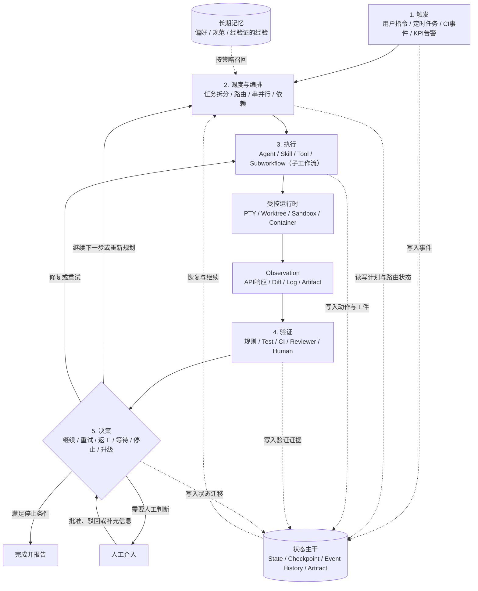

### 22.4.3 阶段一：触发（Trigger）

负责回答：

> **什么事件启动这个 Loop？**

典型触发方式：

| 类型 | 示例 |
|---|---|
| 用户触发 | 一句话指令、按钮、CLI 命令 |
| 定时触发 | 每日依赖检查、每周文档扫描 |
| 代码事件 | Push、Issue、PR/MR、Review、CI 失败 |
| 运维事件 | APM 告警、日志异常、SLA 违约 |
| 业务事件 | KPI 阈值、订单状态、工单变化 |
| 上游触发 | 另一个 Agent 或 Workflow 创建子任务 |
| API / Webhook | 外部系统调用或事件推送 |

标准事件建议包含：

```text
TriggerEvent
├── Event ID
├── Event Type
├── Source
├── Timestamp
├── Payload
├── Tenant / User
├── Correlation ID
├── Idempotency Key
└── Trust Level
```

`Idempotency Key` 用于避免同一事件重复启动多个 Run；`Trust Level` 用于确定外部内容能否影响工具和权限决策。

### 22.4.4 阶段二：调度与编排（Orchestration）

负责回答：

> **当前要执行哪些任务，由谁执行，按什么拓扑执行？**

主要职责：

- 解析目标和事件；
- 加载 Loop Definition 与当前状态；
- 将目标拆成任务；
- 选择 Agent、Skill、Tool 或子工作流；
- 决定串行、并行、分支、依赖和汇聚；
- 选择模型、Prompt、Context Policy 和权限；
- 管理 Handoff；
- 控制优先级、并发和资源配额；
- 必要时重新规划。

示例：

```text
目标：修复 PR 的 CI，并在门禁通过后合入

编排结果：
1. 读取 PR 最新快照
2. 获取当前 Head SHA 对应的失败 Check
3. 运行代码诊断 Skill
4. 运行 Coding Repair Agent Loop
5. 并行运行 Test、Lint、Build、安全扫描
6. 运行独立 Reviewer
7. 满足门禁后请求合并或进入人工审批
```

调度层偏重计划和拓扑，决策层偏重根据证据确定下一状态；简单系统可由同一 Controller 实现，复杂系统可拆分 Planner、Router 和 Policy Engine。

### 22.4.5 阶段三：执行（Execution）

负责回答：

> **具体动作由谁、在哪里、以什么权限执行？**

执行单元可以是：

```text
Agent：Coding Agent、Reviewer、Browser Agent、Data Agent
Skill：修复 CI、创建 PR、同步文档、关闭工单
Tool：Shell、Git、LSP、MCP、Browser、Database、API
Subworkflow（子工作流）：CI Repair、Release、Incident Response
Deterministic Task：测试、Schema 校验、数值计算、权限检查
```

关于 Skill，应采用以下工程要求：

- 边界明确；
- 输入输出结构化；
- 副作用清晰；
- 可观测；
- 可取消和超时；
- 尽可能幂等；
- 有独立验证方式；
- 失败结果能够被 Controller 理解。

Skill 可以内部包含多步操作，因此不宜一概称为“严格原子操作”。对于有副作用的 Skill，可以将内部步骤建模为子工作流或 Saga。

执行运行时通常包括：

- PTY 和子进程管理；
- Git Worktree、Branch 和 Workspace Lock；
- Sandbox、容器或 VM；
- 文件和网络隔离；
- Secret 临时注入；
- CPU、内存、磁盘和时间限制；
- 日志、退出码和工件采集；
- 取消、强制终止和清理。

Coding Loop 的推荐隔离：

```text
一个 Loop Run
→ 一个独立 Workspace
→ 一个 Git Worktree
→ 一个受控 Sandbox
→ 一组最小权限临时凭据
```

### 22.4.6 阶段四：验证（Verification）

负责回答：

> **动作是否真正成功，结果是否满足验收标准？**

不能只接受：

```text
Agent：我已经提交了 MR，CI 也通过了。
```

应重新读取权威系统并生成证据：

| 操作 | 验证方式 |
|---|---|
| 创建 PR/MR | 查询平台 API，核对 ID、源分支、目标分支和 Head SHA |
| 修复代码 | 检查 Diff、失败指纹、回归测试和完整门禁 |
| CI 通过 | 核对当前 Head SHA 的 Required Checks |
| 合并成功 | 查询合并状态和 Merge Commit |
| 关闭问题单 | 查询状态、Resolution 和关联交付物 |
| 更新表格 | 重新读取目标记录并核对字段值 |
| 发布服务 | 核对版本、Deployment 状态、健康检查和回滚信号 |
| 更新文档 | 构建文档、运行示例、断链检查和语义审查 |

验证器分为：

```text
确定性验证器
├── Test / Build / Lint / Type Check
├── API 状态检查
├── Schema Validation
├── 文件、哈希和数据库查询
└── 安全扫描

模型验证器
├── 需求覆盖
├── 设计合理性
├── 文档语义一致性
└── 根因修复判断

人工验证器
├── 产品与业务判断
├── 法务合规
├── 高风险发布
└── 不可逆操作
```

推荐顺序：

```text
确定性验证
→ 独立语义 Reviewer
→ 必要时人工审批
```

验证证据必须绑定当前版本：

```text
Subject ID
+ Artifact Revision / Commit SHA
+ Verifier Version
+ Verification Run ID
+ Timestamp
```

### 22.4.7 阶段五：决策与控制（Decision and Control）

负责回答：

> **根据当前证据，Loop 下一步应该怎么走？**

标准决策枚举：

```text
CONTINUE          继续下一节点
RETRY             重试当前步骤
REPAIR            根据失败证据进入修复
REPLAN            重新规划
SWITCH_WORKER      切换 Agent、模型或 Skill
WAIT_EVENT         等待外部事件
WAIT_INPUT         等待用户输入
WAIT_APPROVAL      等待人工审批
PAUSE              暂停
COMPLETE           成功完成
FAIL               不可恢复失败
CANCEL             取消
```

决策输入包括：

- 验证证据；
- 当前 State；
- 进度变化；
- 剩余预算；
- 重试历史；
- 风险等级；
- 外部依赖；
- 审批状态。

生产环境建议使用混合 Controller：

```text
确定性控制：
- 权限、预算、轮数、超时
- CI / Test / API 状态
- 风险门禁和审批
- 生命周期状态迁移

模型判断：
- 失败根因
- 修复策略
- 开放式重规划
- 语义路由和任务拆解
```

### 22.4.8 持久化主干：运行状态与长期记忆（Persistence Spine）

持久化主干不是执行闭环中的最后一步，而是贯穿触发、编排、执行、验证和决策的基础设施。其运行态分区保存当前 Run 的权威事实，长期记忆分区保存可跨任务复用的经验证知识。它负责回答：

> **任务执行到哪里，系统重启后如何继续，未来任务如何复用经验证的经验？**

典型权威状态：

```text
LoopState
├── Run ID / Definition Version
├── Current Status
├── Current Node / Round
├── Goal and Acceptance Criteria
├── Current Plan
├── Completed / Pending Tasks
├── Observations
├── Verification Evidence
├── Budget Usage
├── Workspace / Artifact Revision
├── Agent Session Reference
├── Failure and Retry History
└── Pending Human Action
```

关键阶段应保存 Checkpoint：

- 计划生成后；
- 每个有副作用步骤前后；
- 每轮 Agent 执行后；
- Commit 或 Artifact 创建后；
- 验证完成后；
- 进入人工等待前；
- 资源释放前。

长期 Memory 用于沉淀：

- 用户偏好；
- 项目规范；
- 已确认架构决策；
- 常见故障和成功修复路径；
- 工具正确用法；
- Reviewer 长期偏好；
- 经验证的 Skill 经验。

跨会话可靠恢复依赖：

```text
State Store
+ Checkpoint
+ Event History
+ Artifact
```

而不是依赖模型记住聊天历史。

### 22.4.9 三个横切控制面

##### 契约与治理面

```text
Loop Contract
=
Goal
+ Acceptance Criteria
+ Input / Output Schema
+ Execution Model（single_loop 或 graph_ref）
+ Budget
+ Permission
+ Stop Policy
+ Retry Policy
+ Escalation Policy
```

##### 可观测与评测面

记录 Trigger、路由、Context、Agent Round、Model Call、Tool Call、Verifier、状态迁移、审批、预算和 Stop Reason；同时评估结果、过程、停止和治理质量。

##### 持续优化面

基于生产 Trace 和失败数据优化：

- Prompt；
- Context Policy；
- Skill 和 Tool；
- Model Routing；
- Graph；
- Verifier；
- Progress Function；
- Stop / Retry / Budget Policy。

### 22.4.10 四个嵌套层级

Loop Engineering 在生产系统中通常同时存在四个层级：

| 层级 | 典型结构 | 主要状态边界 | 示例 |
|---|---|---|---|
| 模型工具循环 | Model → Tool → Observation → Model | 单次 Agent Run | ReAct、Tool Calling |
| 节点验证循环 | Generate / Edit → Verify → Repair | Graph Node 或子工作流 | Test–Repair、Generator–Critic |
| 任务级外层循环 | Load State → Run Worker → Verify → Checkpoint | 跨会话、跨进程的业务任务 | Coding Repair、PR Babysitting |
| 系统改进循环 | Trace → Eval → Candidate → Gate → Release | Agent/Loop 版本生命周期 | Agent Improvement Loop |

这些层级不能互相替代。内部 Tool Loop 即使能够自主工作，也不天然具备任务级 Checkpoint、业务验收、持久等待和生产发布治理。

## 22.5 Graph Engineering

### 22.5.1 定义与术语边界

本文中的 Graph Engineering 指：

> **把 Agent 系统建模为可执行图，并工程化设计节点、边、共享状态、路由、并发、汇聚、循环、子图、检查点和失败边界。**

“Graph Engineering”是新兴表述；LangChain 也将它描述为近年来形成的工程称谓，而不是全新的底层计算模型。[^graph-engineering]

这里主要讨论**执行图和任务图**，不等同于知识图谱工程：

| 图类型 | 节点 | 边 | 主要目的 |
|---|---|---|---|
| 执行图 | Agent、函数、工具、审批节点 | 控制流、数据流、事件流 | 决定系统如何执行 |
| 任务依赖图 | Task、Work Item | 前置依赖 | 决定顺序和并行 |
| 知识图谱 | 实体、概念、事实 | 语义关系 | 组织与检索知识 |
| Trace Graph | Span、Run、Tool Call | 父子和因果关系 | 观测与根因分析 |
| 调用图 | 服务、模块、函数 | 调用关系 | 分析系统依赖 |

### 22.5.2 基本原语

```text
Graph
├── Input Schema
├── Shared State Schema
├── Nodes
│   ├── Deterministic Node
│   ├── LLM Node
│   ├── Agent Loop Node
│   ├── Tool Node
│   ├── Verifier Node
│   ├── Human Node
│   └── Subgraph Node
├── Edges
│   ├── Sequential Edge
│   ├── Conditional Edge
│   ├── Parallel Edge
│   ├── Loop-back Edge
│   └── Error / Compensation Edge
├── Router
├── Reducers
├── Checkpoints
└── Output Schema
```

LangGraph 的核心图原语是 State、Node 和 Edge，并通过 Checkpointer、Store 与 Interrupt 支持持久状态和 Human-in-the-loop。[^langgraph]

### 22.5.3 节点拆分原则

当以下属性不同，应考虑拆分节点：

- 权限边界；
- Context Policy；
- 输入输出 Schema；
- 失败模式和重试策略；
- 验证方式；
- 模型或 Agent 类型；
- 资源消耗；
- 副作用等级；
- 审计要求。

不建议：

```text
一个 Agent 节点
→ 分析需求、改代码、测试、审查、合并、部署
```

更可控的拆分：

```text
Requirement Analyzer
→ Planner
→ Implementation Agent Loop
→ Test Runner
→ Security Scanner
→ Reviewer
→ Human Approval
→ Merge / Deploy
```

### 22.5.4 节点契约

```yaml
node:
  id: implementation
  kind: agent_loop
  input_schema: ImplementationTask
  output_schema: ImplementationResult

  prompt_ref: implementation-agent@5
  context_policy_ref: implementation-context@3
  permissions_ref: workspace-write-restricted@2

  timeout: 45m
  retries: 2
  idempotency_scope: task-and-base-revision

  side_effects:
    - modify_workspace
    - create_commit
```

节点契约需要说明：

- 可接收什么输入；
- 会产生什么输出；
- 是否允许副作用；
- 是否可重试；
- 超时和取消规则；
- 需要哪些权限；
- 如何验证结果。

### 22.5.5 边、路由和汇聚

边不只是“A 连到 B”，还应说明迁移条件和携带数据：

```yaml
edge:
  from: verification
  to: implementation
  when:
    status: failed
    repairable: true
  payload:
    include:
      - failed_checks
      - findings
      - affected_files
```

Fan-out / Fan-in 必须定义汇聚策略：

```text
all_pass
any_fail
first_success
first_failure
highest_severity
weighted_score
majority_vote
custom_reducer
```

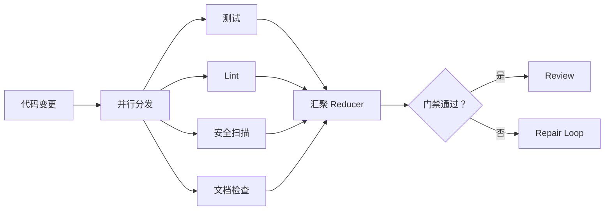

### 22.5.6 状态所有权

并行节点不得任意覆盖共享状态。建议明确字段所有者：

```text
Planner：execution_plan、task_dependencies
Worker：workspace_changes、implementation_result
Verifier：verification_evidence、verification_status
Policy Engine：approval_status、risk_status
Controller：current_node、run_status、budget_usage
```

共享状态更新应通过 Reducer、乐观并发控制或事件追加完成。

### 22.5.7 Graph、DAG、Workflow 与 State Machine

| 概念 | 核心特征 | 适用场景 |
|---|---|---|
| DAG | 不允许环，依赖明确 | ETL、Batch、固定构建流水线 |
| General Graph | 允许条件、循环、并行、子图 | Agent Workflow、返工流程 |
| Workflow | 更广泛的业务执行抽象 | 可由代码、DAG、图、状态机或 BPMN 实现 |
| State Machine | 描述状态和事件导致的迁移 | Run 生命周期、审批和恢复 |

生产系统通常同时使用：

```text
Graph：表示执行节点和数据流
State Machine：表示 Run 当前处于什么生命周期状态
```

### 22.5.8 Graph 与 Loop 的区别

| 维度 | Loop Engineering | Graph Engineering |
|---|---|---|
| 关注重点 | 反馈、进度、迭代和停止 | 拆分、路由、并行、汇聚和拓扑 |
| 基本结构 | Cycle | Node + Edge + State |
| 环的角色 | 反馈回边或重复机制是 Loop 的定义核心 | 可以无环，也可以包含一个或多个 Loop |
| 并行处理 | 可有，但不是定义核心 | 核心能力之一 |
| 状态范围 | 当前 Loop 的局部状态 | 全局状态和节点状态 |
| 主要失败 | 无限循环、过早停止、无进展 | 路由错误、状态冲突、死锁、汇聚错误 |

简化关系：

```text
Loop 是 Graph 中的一种反馈结构；
Graph 是组织多个确定性步骤和多个 Loop 的更高层拓扑。
```

### 22.5.9 典型反模式

- 把 Mermaid 流程图当成真正可执行图；
- 所有节点都使用 LLM，而不用确定性代码处理规则、计算和权限；
- 让 LLM 决定所有路由，包括预算和安全门禁；
- 多个并行 Agent 隐式共享聊天状态；
- Fan-in 没有明确 Reducer；
- 循环边没有最大次数、进度函数和退出路径；
- 节点没有输入输出 Schema；
- Graph 升级后没有运行中实例迁移策略。

### 22.5.10 主要指标

| 指标 | 含义 |
|---|---|
| Routing Accuracy | 路由到正确节点、Agent 或工具的比例 |
| Node Success Rate | 各类节点完成其契约的比例 |
| Fan-in Correctness | 并行结果是否按预期完整、无冲突地汇聚 |
| State Conflict Rate | 并发节点状态写入冲突比例 |
| Critical-path Latency | 执行图关键路径耗时 |
| Parallelism Efficiency | 并行相对串行节省的有效时间 |
| Node Retry Rate | 节点因瞬时或逻辑错误重试的比例 |
| Dead-end / Deadlock Rate | 无合法出边、等待环或死锁比例 |
| Graph Completion Rate | 图实例满足终态契约的比例 |
| Migration Failure Rate | Graph 版本升级时运行中实例迁移失败率 |

---

**▍第二部分：生产级 Loop 参考架构**

本部分把方法论落到生产架构：先定义可版本化 Contract，再讨论正确性、持久状态、安全治理、人工介入、可观测与评测闭环。

## 22.6 生产级 Loop Contract 与治理

### 22.6.1 为什么需要 Contract

仅有 Prompt 无法可靠定义一个生产 Loop。Loop Contract 应将以下内容从自然语言中提取为可审核、可测试和可版本化的工程资产：

- Goal 与非目标；
- 输入输出 Schema；
- Trigger；
- Execution Model（单 Loop、状态机或 Graph）与 Worker；
- Context Policy；
- Verifier；
- Progress Function；
- Budget；
- Permission；
- Stop、Retry 和 Escalation；
- State、Artifact 和 Telemetry。

### 22.6.2 完整示例

```yaml
apiVersion: loop.example.io/v1
kind: LoopDefinition

metadata:
  id: governed-change-delivery
  version: 3.2.0
  owner: platform-engineering
  risk_level: medium

trigger:
  type: event
  event_types:
    - issue.agent_ready
    - ci.required_check_failed
  idempotency_key: "${event.source}:${event.id}"

input:
  schema: ChangeRequestV2
  trust_policy: external-input-policy@2

goal:
  description: >-
    完成变更请求，生成满足需求、测试、静态检查、
    安全和审查门禁的可审查 Pull Request。

  non_goals:
    - production_deployment
    - public_api_breaking_change

  acceptance_criteria:
    - id: AC-01
      type: requirement_coverage
      required: true
    - id: AC-02
      type: test_suite
      command: cargo test --workspace
      required: true
    - id: AC-03
      type: lint
      command: npm run lint
      required: true
    - id: AC-04
      type: semantic_review
      reviewer: independent-reviewer@4
      required: true

execution_model:
  mode: graph
  graph_ref: change-delivery-graph@5
  migration_policy: pin-running-version

orchestration:
  planner: change-planner@3
  router: deterministic-first@2
  max_parallel_workers: 3

worker:
  adapter: coding-agent
  version: coding-worker@7
  execution_mode: isolated-worktree

prompt:
  ref: implementation-prompt@9

context:
  policy_ref: implementation-context@6
  max_tokens: 120000
  required_sources:
    - task_state
    - acceptance_criteria
    - repository_map
  provenance_required: true

runtime:
  sandbox: workspace-write
  network: restricted
  worker_attempt_timeout_minutes: 45
  cancellation: cooperative_then_forced

verification:
  strategy: deterministic_then_semantic
  bind_to_artifact_revision: true
  verifiers:
    - focused_tests
    - full_tests
    - lint
    - build
    - diff_scope
    - security_scan
    - independent_reviewer

progress:
  policy_ref: coding-progress@3
  no_progress_window: 3
  max_no_progress_rounds: 2

budget:
  max_rounds: 12
  max_model_calls: 80
  max_tool_calls: 300
  max_tokens: 500000
  max_cost_usd: 30
  max_duration_minutes: 180

retry:
  transient_tool_error:
    max_attempts: 3
    backoff: exponential
  invalid_input:
    max_attempts: 0
  verification_failure:
    action: repair
  no_progress:
    action: replan_then_escalate

permissions:
  filesystem:
    mode: workspace-write
    allowed_paths:
      - src/**
      - tests/**
      - docs/**
  network:
    allowed_hosts:
      - api.github.com
  git:
    commit: allow
    push: require_approval
    force_push: deny
  secrets:
    scope: run-scoped

human_in_the_loop:
  required_for:
    - public_api_change
    - workflow_file_change
    - database_migration
    - protected_branch_write
  timeout: 72h
  on_timeout: pause

state:
  backend: durable-store
  checkpoint_after:
    - planning
    - side_effect
    - agent_round
    - verification
    - before_human_wait

artifacts:
  required:
    - execution_plan
    - patch_or_commit
    - verification_report
    - pull_request
  content_hash: sha256

stop:
  success_when:
    - all_required_acceptance_criteria_pass
    - no_open_high_risk_finding
  fail_when:
    - unrecoverable_error
    - rejected_by_policy
  escalate_when:
    - budget_exhausted
    - repeated_no_progress
    - conflicting_requirements

telemetry:
  traces: true
  metrics: true
  events: true
  capture_context_content: redacted
  sampling_policy: risk_aware
```

### 22.6.3 Contract 的关键原则

##### 定义与运行分离

`LoopDefinition` 是版本化模板；`LoopRun` 是某次不可混淆的执行实例。

##### 运行中版本固定

通常应让运行中的实例固定 Prompt、Graph、Verifier 和 Policy 版本。升级行为应选择：

- 继续使用旧版本；
- 显式迁移；
- 终止并以新版本重启。

不能静默改变正在运行的语义。

##### 成功条件结构化

`success_when` 应引用可验证的 Acceptance Criteria，而不是解析自然语言中的“完成”字样。

##### 权限与 Prompt 分离

Prompt 中可以说明权限，但真正执行权限必须由 Runtime 和 Policy Engine 强制实施。

##### Artifact First

重要结果应作为 Artifact 保存并哈希，而不是只存在于聊天文本中。

## 22.7 Loop Engineering 核心正确性

### 22.7.1 有界性 Boundedness

每个 Loop 都必须具有明确上限：

```text
最大轮数
最大模型调用次数
最大工具调用次数
最大 Token
最大金额
最大持续时间
最大并行数
最大重试次数
最大无进展轮数
```

示例：

```yaml
budget:
  max_rounds: 12
  max_model_calls: 80
  max_tool_calls: 300
  max_tokens: 500000
  max_cost_usd: 30
  max_duration_minutes: 180
  max_parallel_workers: 4
  max_no_progress_rounds: 2
```

达到上限后不能隐式继续，应进入：

```text
WAIT_APPROVAL
BLOCKED
FAILED
或由策略明确允许的预算扩展流程
```

### 22.7.2 可验证性 Verifiability

“完成”必须由外部证据支持：

```text
Goal
→ Acceptance Criteria
→ Verifier
→ Evidence
→ Stop Decision
```

验证层级建议：

1. 尽可能使用确定性验证；
2. 语义问题使用独立 Reviewer；
3. 高风险和主观业务决策使用人工；
4. Worker 的自评只能作为一个信号，不能成为唯一证据。

### 22.7.3 收敛性 Convergence

Loop 必须定义进度函数，否则无法判断系统是在逼近目标还是原地重复。

```text
ProgressScore(t)
= w1 × NormalizedCompletedCriteria(t)
- w2 × NormalizedFailedChecks(t)
- w3 × NormalizedOpenBlockers(t)
- w4 × NormalizedNewRegressions(t)
```

各项必须先归一化并按业务价值加权，不能直接相减量纲不同的原始计数。随后计算：

```text
delta = ProgressScore(current_state) - ProgressScore(previous_state)
```

连续若干轮 `delta <= ε` 时，应触发无进展策略；`ε` 用于容忍测量噪声和无实质意义的小幅波动。

典型进度信号：

| 场景 | 正向信号 | 负向信号 |
|---|---|---|
| 代码修复 | 失败测试减少、原始错误消失 | 新失败增加、修改范围扩大 |
| 文档维护 | Drift 项减少、示例通过率上升 | 同一事实反复修改、断链增加 |
| PR 治理 | Blocker 数减少、审批增加 | 同一 CI 重复失败、评论反复打开 |
| Agent 改进 | Holdout 指标提升 | 只在开发集提升、安全退化 |

### 22.7.4 无进展检测 No-progress Detection

应识别：

- Workspace 或 Artifact Hash 长期不变；
- 失败指纹完全相同；
- Tool Call 序列重复；
- Reviewer Finding 没有减少；
- 在两个方案之间振荡；
- 无验收项关闭；
- 每轮只增加解释而没有外部动作。

```yaml
no_progress_policy:
  window_rounds: 3
  max_stalled_rounds: 2
  signals:
    - unchanged_artifact_hash
    - unchanged_failure_fingerprint
    - repeated_action_sequence
    - unchanged_open_findings
    - no_acceptance_criterion_closed
  on_detected:
    - replan
    - switch_worker
    - expand_context
    - escalate
```

### 22.7.5 可恢复性 Recoverability

恢复流程不只是“重新调用 Agent”：

```text
进程或服务故障
→ 加载最近 Checkpoint
→ 对账外部副作用
→ 恢复 Workspace / Artifact Revision
→ 重建 Context
→ 重新获取最新外部状态
→ 从未完成的安全边界继续
```

需要处理：

- 部分成功；
- 孤儿进程；
- 失效锁和租约；
- 外部 API 已成功但本地未记录；
- Agent 会话无法恢复；
- 工件已被人工修改；
- 基线版本变化。

### 22.7.6 幂等性 Idempotency

相同步骤重试不应重复产生副作用：

- 重复创建 Issue；
- 重复发送邮件；
- 重复合并或部署；
- 重复扣款；
- 重复写入同一业务记录。

常见幂等键：

```text
trigger_event_id
run_id + node_id + attempt_group
repository + pr_number + head_sha + action_type
business_entity_id + desired_state_version
```

对于无法天然幂等的外部操作，应使用：

- 查询后写入；
- 外部幂等键；
- Outbox；
- 状态机护栏；
- 补偿动作；
- 人工确认。

### 22.7.7 新鲜度 Freshness

Loop 中所有关键决策都应使用最新事实，尤其是：

- PR Head SHA；
- CI Check Run；
- 工单状态；
- 部署版本；
- 文档对应的 API Schema；
- 当前预算和权限；
- 运行中的 Graph / Prompt / Policy 版本。

读取旧 Snapshot 后执行写操作，应再次进行版本或条件检查。

### 22.7.8 可治理性 Governability

治理面应控制：

- 文件、网络、命令、Secret 和数据访问；
- 模型、工具和外部 Agent 白名单；
- 资源配额和成本；
- 高风险操作审批；
- 租户隔离；
- 数据保留与删除；
- Prompt、Skill、Graph 和 Policy 的版本发布；
- 审计和责任归属。

## 22.8 状态、检查点、恢复与幂等

### 22.8.1 六类持久对象

| 对象 | 作用 | 典型内容 |
|---|---|---|
| Loop Definition | 定义如何运行 | Goal、Execution Model、Policy、Budget |
| Loop State | 当前权威状态 | 当前节点、轮次、预算、待办 |
| Event History | 记录发生过什么 | Trigger、Transition、Approval、Failure |
| Checkpoint | 恢复快照 | State、Workspace Revision、Resume Metadata |
| Artifact | 保存工件和证据 | Commit、报告、数据、PR、截图 |
| Memory | 跨任务经验 | 偏好、规范、成功模式、确认知识 |

### 22.8.2 推荐状态机

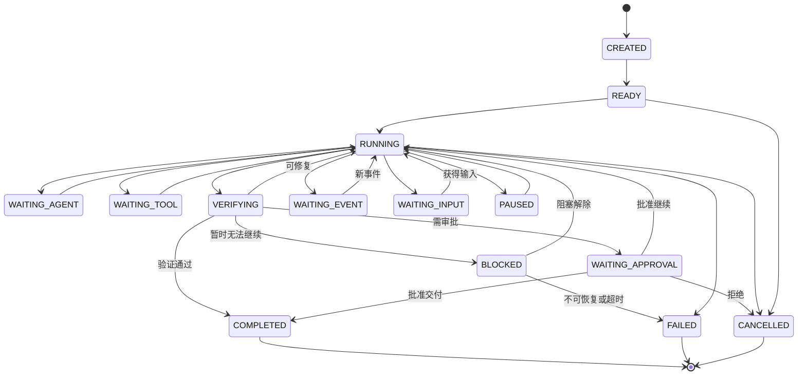

推荐核心状态：

```text
CREATED
READY
RUNNING
WAITING_AGENT
WAITING_TOOL
VERIFYING
WAITING_EVENT
WAITING_INPUT
WAITING_APPROVAL
PAUSED
BLOCKED
COMPLETED
FAILED
CANCELLED
```

### 22.8.3 数据模型

```text
LoopDefinition
├── DefinitionVersion
├── GoalDefinition
├── TriggerDefinition
├── ExecutionModelDefinition
│   └── SingleLoop / StateMachine / GraphReference
├── WorkerDefinition
├── ContextPolicy
├── VerificationPolicy
├── ProgressPolicy
├── StopPolicy
├── BudgetPolicy
├── PermissionPolicy
└── EscalationPolicy

LoopRun
├── RunID
├── DefinitionVersion
├── TriggerEvent
├── RunStatus
├── CurrentNode
├── CurrentRound
├── BudgetUsage
├── WorkspaceReference
├── ArtifactRevision
├── PendingHumanAction
└── FinalResult

LoopRound
├── RoundIndex
├── InputContextSnapshot
├── ControllerDecision
├── AgentExecution
├── Actions
├── Observations
├── VerificationEvidence
├── ProgressDelta
└── RoundDecision

LoopCheckpoint
├── StateVersion
├── StateSnapshot
├── WorkspaceRevision
├── CompletedActionKeys
├── PendingActions
├── ArtifactReferences
├── ExternalReconciliationData
└── ResumeMetadata
```

### 22.8.4 Checkpoint 边界

建议在以下边界检查点化：

1. 完成规划后；
2. 有副作用操作之前；
3. 外部副作用确认成功之后；
4. 每个 Agent Round 之后；
5. 每个 Graph Node 完成之后；
6. 验证完成之后；
7. 进入人工或事件等待之前；
8. 主动暂停或取消清理之前。

Checkpoint 太少会导致恢复时重复工作；太频繁会增加存储和延迟。应优先围绕副作用和不可重算结果保存。

### 22.8.5 Retry Policy

不能对所有错误统一“重试三次”：

| 错误类型 | 推荐策略 |
|---|---|
| 网络超时、限流 | 退避重试或切换服务 |
| 工具临时故障 | 重试当前步骤 |
| 参数或 Schema 错误 | 修正输入，不盲目重试 |
| 验证失败 | 进入 Repair Loop |
| 权限不足 | 请求授权或终止 |
| Context 不足 | 重新检索或请求输入 |
| 外部状态已变化 | 刷新 Snapshot 并重规划 |
| 连续无进展 | 切换策略、Agent 或升级人工 |
| 安全策略拒绝 | 不重试，除非权限策略发生显式变化 |

### 22.8.6 外部副作用对账

恢复时，本地记录可能落后于外部系统：

```text
请求创建 PR 已发出
→ 外部创建成功
→ 本地进程在写入结果前崩溃
```

恢复后不能直接再次创建，应根据 Idempotency Key、Correlation ID 或目标状态查询外部系统。

推荐流程：

```text
Load Checkpoint
→ Reconcile External State
→ Mark Already-completed Effects
→ Retry Only Incomplete Effects
```

### 22.8.7 Compensation

无法回滚的长事务需要补偿：

```text
创建临时资源 → 后续失败 → 删除临时资源
发布测试部署 → 验证失败 → 回滚部署
错误创建 Issue → 关闭并记录原因
预留配额 → 任务取消 → 释放配额
```

补偿动作也必须可审计，并应明确是否允许自动执行。

### 22.8.8 Durable Waiting

等待 CI、Reviewer 或人工输入时，应：

- 持久化状态；
- 释放模型会话和计算资源；
- 订阅事件或创建 Durable Timer；
- 到期后按策略提醒、暂停或升级；
- 恢复时重新读取最新事实。

不要通过永久占用 PTY、长轮询或持续模型调用模拟等待。

## 22.9 安全、权限与人工介入

### 22.9.1 最小权限

每个 Node、Agent、Skill 和 Tool 都应获得完成当前职责所需的最小权限：

```text
Read-only Research Agent
Workspace-write Coding Agent
No-secret Reviewer
Restricted-network Test Runner
Approval-required Merge Tool
```

权限范围应绑定：

- Run；
- Node；
- Workspace；
- 时间；
- Secret；
- 外部资源；
- 租户。

### 22.9.2 Sandbox 与 Workspace

Sandbox 负责约束：

- 文件路径；
- 网络目的地；
- 命令和系统调用；
- CPU、内存、磁盘；
- 进程树；
- Secret；
- 运行时间。

Worktree 或独立 Workspace 负责：

- 隔离并行任务；
- 绑定基础 Revision；
- 对比 Diff；
- 支持回滚和清理；
- 防止 Agent 直接污染主工作目录。

### 22.9.3 Side-effect Guard

```text
Agent 提议动作
→ 解析为结构化 Action
→ Policy 检查
→ 风险分类
→ 幂等和新鲜度检查
→ 必要时人工审批
→ 执行
→ 再读取并验证实际结果
→ 记录 Artifact 与 Event
```

高风险操作包括：

- 生产部署；
- 删除或覆盖数据；
- 发送外部消息；
- 推送受保护分支；
- Force Push；
- 修改 CI/CD Workflow；
- 数据库迁移；
- 使用高权限 Secret；
- 创建付费资源；
- 绕过审查或策略。

### 22.9.4 Prompt Injection 防护

Prompt Injection 不能只靠在 Prompt 中写“忽略恶意指令”。需要组合：

- 指令与外部内容分层；
- Context 来源和信任标签；
- 外部不可信内容不直接控制工具；
- 工具权限最小化；
- 高风险数据流和动作的确定性检查；
- 输出到动作之间的结构化验证；
- 人工确认；
- Secret 不进入不必要的模型上下文；
- 对网页、邮件、Issue 和文档中的指令进行不可信数据处理。

OpenAI 的 Agent 安全指导也强调通过工具权限、数据流和用户确认降低注入成功后的影响，而不是只依赖模型识别攻击。[^prompt-injection]

### 22.9.5 Human-in-the-loop

人工介入是正常状态，不是异常：

```text
WAITING_INPUT
WAITING_APPROVAL
WAITING_REVIEW
BLOCKED
PAUSED
```

人工可以：

- 补充上下文；
- 选择方案；
- 批准或拒绝动作；
- 修改范围和预算；
- 要求返工；
- 终止任务。

标准升级请求：

```text
EscalationRequest
├── Original Goal
├── Current State
├── Completed Work
├── Blocking Reason
├── Attempts and Evidence
├── Risk Assessment
├── Available Options
└── Recommended Decision
```

### 22.9.6 审批策略矩阵

| 动作 | 自动执行 | 条件审批 | 强制人工 |
|---|---:|---:|---:|
| 读取代码和日志 | ✓ |  |  |
| 在隔离 Worktree 修改代码 | ✓ |  |  |
| 运行测试 | ✓ |  |  |
| 创建 Draft PR | 可选 | ✓ |  |
| 推送普通分支 |  | ✓ |  |
| 修改 Workflow 文件 |  |  | ✓ |
| 数据库迁移 |  |  | ✓ |
| 生产部署 |  |  | ✓ |
| 删除生产数据 |  |  | ✓ |
| Force Push / 绕过审查 |  |  | ✓ 或直接禁止 |

### 22.9.7 多租户治理

企业 Loop 平台还需要：

- 租户级配额和预算；
- 数据和 Trace 隔离；
- 独立 Secret Namespace；
- Agent、Skill、Tool 发布审批；
- 用户与服务身份审计；
- 数据保留与删除策略；
- 跨租户工具调用阻断；
- 合规策略与区域边界。

### 22.9.8 Skill、Tool 与 MCP 供应链治理

第三方 Skill、Plugin、MCP Server 和工具适配器会把代码、指令与外部服务引入执行面，应建立独立的供应链控制：

- 固定版本、发布者身份和内容摘要；
- 安装或升级时展示权限、网络、Secret 和副作用差异；
- 对可执行包、脚本和容器进行签名、恶意代码与依赖扫描；
- 未受信任扩展默认运行在更严格的 Sandbox 和最小网络范围；
- Tool Schema、Prompt、Skill 内容和运行镜像都应可追溯、可撤销、可回滚；
- 远程 MCP/Agent 调用应校验服务身份、传输安全、租户边界和返回内容信任级别；
- 生产环境不得自动跟随 `latest` 或未固定的远程实现。

供应链验证只证明“来源和内容符合发布记录”，并不证明行为安全；仍需运行时权限、输出验证和副作用门禁。

## 22.10 可观测性、评测与持续优化

### 22.10.1 Trace 模型

```text
Loop Run Span
├── Trigger Span
├── Orchestration / Routing Span
├── Context Build Span
├── Node Run Span
│   ├── Agent Round Span
│   │   ├── Model Call Span
│   │   └── Tool Call Span
│   └── Artifact Span
├── Verification Span
├── Checkpoint Span
├── Human Approval Span
└── Completion / Escalation Span
```

核心属性：

```text
loop.id
loop.version
run.id
trigger.type
node.id
round.index
agent.id
model.name
prompt.version
context.policy.version
context.tokens
tool.name
tool.call.id
artifact.revision
verification.status
progress.delta
retry.count
budget.used
cost
latency
stop.reason
```

OpenTelemetry 语义约定定义统一的 span、metric、event 和 attribute 语义；GenAI 相关约定正在专门仓库中演进。实现应记录自身 Loop 维度，同时映射标准 GenAI 模型和 Tool Call 属性。[^otel-semconv][^otel-observability]

`run.id`、完整 Prompt、Artifact URI 等高基数字段应保留在 Trace、Log 或 Event 中，不应直接作为 Metric Label；指标维度应使用受控枚举和有限基数，避免时序系统成本与查询性能失控。

### 22.10.2 隐私与数据采集

Trace 不应默认无差别记录完整 Prompt、Context、Tool 参数和结果。需要：

- 内容级采样；
- PII 和 Secret 脱敏；
- 按租户和风险保留；
- Hash 或引用大型 Artifact；
- 明确哪些字段进入 Eval Dataset；
- 对人工反馈和生产数据取得合法授权；
- 支持删除和审计。

### 22.10.3 指标体系

##### 结果质量

| 指标 | 含义 |
|---|---|
| Task Success Rate | 任务成功率 |
| Acceptance Coverage | 验收标准覆盖率 |
| First-pass Success Rate | 首轮通过率 |
| Human Acceptance Rate | 人工接受率 |
| Regression Escape Rate | 回归逃逸率 |

##### 效率与成本

| 指标 | 含义 |
|---|---|
| Time to Completion | 完成耗时 |
| Average Rounds | 平均轮数 |
| Token per Success | 每次成功 Token |
| Cost per Success | 每次成功成本 |
| Tool Calls per Success | 每次成功工具调用数 |
| Context Build Latency | 上下文装配延迟 |

##### 收敛与停止

| 指标 | 含义 |
|---|---|
| No-progress Rate | 无进展比例 |
| Oscillation Rate | 方案振荡比例 |
| Premature Stop Rate | 过早停止比例 |
| Late Stop Rate | 应停止却继续运行比例 |
| Budget Exhaustion Rate | 预算耗尽比例 |
| Escalation Correctness | 升级时机正确率 |

##### 可靠性

| 指标 | 含义 |
|---|---|
| Recovery Success Rate | 故障恢复成功率 |
| Duplicate Side-effect Rate | 重复副作用比例 |
| Checkpoint Failure Rate | 检查点失败率 |
| Tool Failure Rate | 工具失败率 |
| Stale Evidence Rate | 使用过期证据比例 |

##### 安全与治理

| 指标 | 含义 |
|---|---|
| Policy Violation Rate | 策略违规率 |
| Unauthorized Tool Attempt | 未授权工具尝试数 |
| Human Override Rate | 人工推翻决策比例 |
| Sensitive Data Exposure | 敏感数据暴露事件 |
| Approval Bypass Rate | 审批绕过比例 |

### 22.10.4 Eval 分层

```text
Outcome Eval
├── 最终结果是否正确
└── 是否满足验收标准

Trajectory Eval
├── 是否选择正确步骤
├── 是否有多余动作
└── 是否在失败后正确恢复

Tool Eval
├── 工具选择
├── 参数正确性
└── 错误处理

Context Eval
├── 必要信息是否召回
├── 是否使用过期或不可信内容
└── Token 是否有效

Stop Eval
├── 是否过早停止
├── 是否应更早停止
└── 是否正确升级人工

Governance Eval
├── 权限
├── 预算
├── 审批
└── 副作用安全
```

### 22.10.5 评测器组合

| 评测器 | 优势 | 局限 |
|---|---|---|
| 确定性规则 / Code Eval | 稳定、可重复、成本低 | 只覆盖可形式化条件 |
| 测试和模拟环境 | 接近真实行为 | 建设成本较高 |
| LLM-as-a-Judge | 可处理语义和开放质量 | 有偏差、漂移和同源风险 |
| 人工标注 | 适合高价值主观判断 | 慢、贵、存在一致性问题 |
| 生产业务指标 | 最接近真实价值 | 反馈延迟且受多因素影响 |

最佳实践是组合使用，并对 Evaluator 本身建立校准集和版本管理。

### 22.10.6 Trace → Dataset → Experiment

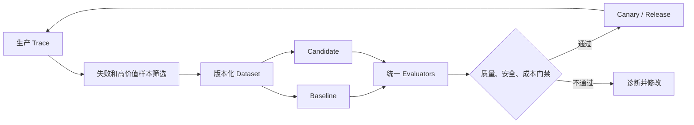

LangSmith、Langfuse、Braintrust、Phoenix、MLflow 等平台都提供 Trace、Dataset、Evaluation 或 Experiment 的不同组合，用于把生产失败转为可重复测试。[^langsmith][^langfuse][^braintrust][^phoenix][^mlflow]

### 22.10.7 优化对象与归因

发现失败后不能默认“修改 Prompt”。应先定位层级：

| 失败根因 | 优先修改对象 |
|---|---|
| 指令不清、输出格式错 | Prompt |
| 缺信息、噪声、过期数据 | Context Policy / Retrieval |
| 工具难用、错误信息差 | Tool Schema / Skill |
| 重复执行、过早停止 | Loop Policy / Progress / Verifier |
| 错误 Agent 或错误节点 | Graph Routing |
| 崩溃后丢进度 | Durable Runtime / Checkpoint |
| 越权或危险动作 | Permission / Sandbox / Approval |
| Judge 不稳定 | Evaluator / Rubric / Calibration |

---

**▍第三部分：模式与典型应用**

本部分先给出可复用的 Loop/Graph 组合模式，再展示这些模式如何落到代码修复、文档维护、PR 生命周期治理和 Agent 改进。

## 22.11 主流 Loop 与 Graph 模式

### 22.11.1 模式总览

| 模式 | 基本结构 | 典型停止条件 | 适合场景 |
|---|---|---|---|
| ReAct / Tool Loop | Decide → Act → Observe | 模型返回终态或达到边界 | 通用工具 Agent |
| Test–Repair | Edit → Test → Diagnose → Edit | 必需测试通过 | 代码修复 |
| Generator–Critic | Generate → Critique → Revise | Rubric 达标 | 内容、设计、文档 |
| Plan–Execute–Replan | Plan → Execute → Update Plan | 所有任务完成 | 长任务 |
| Maker–Checker | Worker → Independent Checker | Checker 接受 | 高质量交付 |
| Supervisor–Specialist | Supervisor 路由专家 | 总目标满足 | 多 Agent 系统 |
| Controller–Worker | 确定性控制器调度 Worker | 证据门禁通过 | 高治理流程 |
| Event-driven Loop | Event → Run → Wait | 事件处理完成 | PR、CI、运营自动化 |
| Human Approval Loop | Action Proposal → Approval | 批准、拒绝或超时 | 高风险副作用 |
| Fresh-context Loop | 新会话 → 一部分任务 → 持久化 | 外部任务表清空 | 长周期编码 |
| Hill-climbing Loop | Trace → Eval → Candidate | 新版本超过基线 | Agent 持续改进 |

LangChain 将实践中的闭环划分为 Agent、Verification、Event-driven 和 Hill-climbing 等层次，这与本文的执行、验证、事件触发和改进 Loop 相互对应。[^art-loop-engineering]

### 22.11.2 ReAct / Tool Loop

```text
Model Decision
→ Tool Call
→ Tool Result
→ Updated Context
→ Model Decision
```

它是最小 Agent Loop，但通常缺少：

- 外部持久状态；
- 跨会话恢复；
- 独立验证；
- 业务级停止条件；
- 全局预算和人工升级。

### 22.11.3 Test–Repair 与 Generator–Critic

两者都依赖外部反馈，但反馈性质不同：

| 模式 | 反馈主要来源 | 风险 |
|---|---|---|
| Test–Repair | 确定性测试和错误日志 | 过拟合测试、忽略非覆盖需求 |
| Generator–Critic | Rubric、Reviewer 或 LLM Judge | Judge 偏差、同源自评 |

高质量系统通常组合二者：先用确定性验证，再做语义审查。

### 22.11.4 Plan–Execute–Replan

适合长任务：

```text
Goal
→ Initial Plan
→ Execute Next Task
→ Observe
→ Update State
→ Decide Whether to Replan
```

Plan 是可变工件，不应被当成不可更改的真理；每次 Replan 应保存原因和差异。

### 22.11.5 Maker–Checker

Worker 与 Checker 应在以下方面尽量隔离：

- 不同 Prompt；
- 不同 Context；
- 只读与写权限；
- 独立模型或至少独立调用；
- Checker 获取原始需求和客观工件，而非只看 Worker 总结。

### 22.11.6 Fresh-context / Ralph Pattern

社区中的 Ralph 类模式通常采用：

```text
读取 PRD / Task List / Progress
→ 启动全新 Coding Agent 会话
→ 完成一小部分
→ 测试并提交
→ 更新外部进度
→ 退出会话
→ 重复
```

优点是避免单会话上下文持续膨胀；不足是很多实现仅为 Shell Loop，缺少强状态、并发、事务、验证和治理。应把它视为模式，而非完整企业平台。

### 22.11.7 模式组合

生产级任务通常是组合，而非单一模式：

```text
Event-driven PR Loop
  └── Supervisor–Specialist Graph
        ├── Coding Test–Repair Loop
        ├── Documentation Review–Repair–Validate Loop
        ├── Maker–Checker Review
        └── Human Approval Loop
```

## 22.12 四类典型应用结构

### 22.12.1 总览

四类典型 Loop 分别代表四种不同的工程问题：

| Loop | 类型 | 主要目标 | 反馈信号 | 交付物 |
|---|---|---|---|---|
| **Coding Repair Loop** | 工件修复型 | 修复代码缺陷并通过门禁 | Test、Build、Lint、运行结果 | Patch、Commit、PR |
| **Documentation Maintenance Loop** | 知识新鲜度型 | 保持文档、示例与代码一致 | 示例执行、Schema、断链、语义审查 | 文档 PR、漂移报告 |
| **PR Babysitting Loop** | 生命周期治理型 | 持续处理 PR 阻塞直到可合并或升级 | Review、CI、冲突、审批、策略 | Green PR、状态摘要 |
| **Agent Improvement Loop** | 系统优化型 | 基于 Trace 和 Eval 提升 Agent | 质量、轨迹、成本、安全、人工偏好 | Prompt、Skill、Graph 等候选版本 |

前三类属于 Operational Loop，直接处理业务工件；第四类属于 Meta Loop，用于改进 Agent 系统本身。

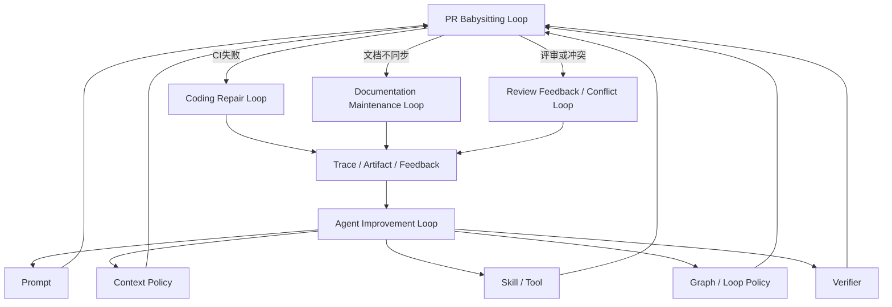

OpenAI 的官方示例将闭环修复概括为产出、验证、利用反馈改进下一轮；同一方法可以用于代码和文档维护。[^iterative-repair]

---

### 22.12.2 Coding Repair Loop

##### 12.2.1 定义

```text
发现失败
→ 固化失败证据
→ 复现
→ 根因分析
→ 聚焦修改
→ 局部验证
→ 完整验证
→ 独立审查
→ 交付
```

适用场景：

- 单元测试、集成测试或端到端测试失败；
- Build、Type Check、Lint 失败；
- 安全扫描告警；
- 线上异常复现；
- 性能回归；
- Reviewer 提出的缺陷；
- 依赖升级导致兼容性问题。

##### 12.2.2 典型流程

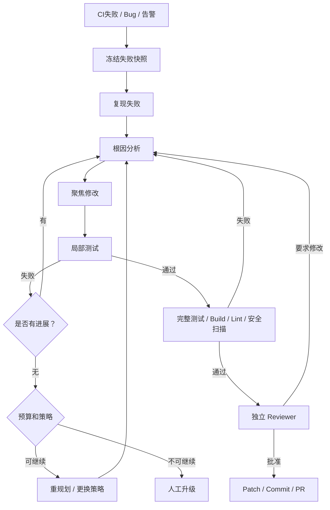

##### 12.2.3 输入证据

```text
FailureEvidence
├── Repository / Revision
├── Failing Command
├── Exit Code
├── Error Log
├── Failure Fingerprint
├── Failed Tests or Checks
├── Runtime Environment
├── Recent Diff
├── Reproduction Steps
└── Related Issue / Alert
```

仅传入“测试失败，请修复”会导致：

- 难以复现；
- Agent 修改无关代码；
- 把环境或不稳定测试误判为产品缺陷；
- 无法比较每轮进展。

##### 12.2.4 内外双层循环

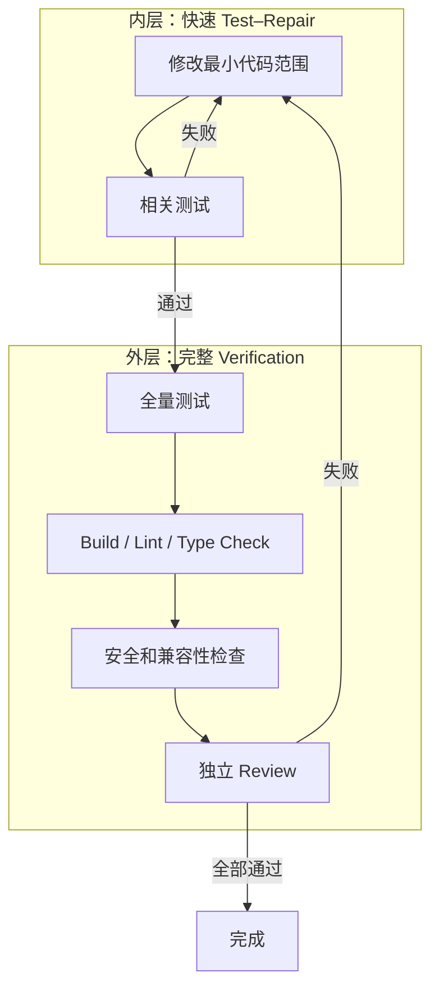

内层优化反馈速度，外层控制全局回归风险。

##### 12.2.5 状态示例

```yaml
coding_repair_state:
  subject:
    repository: example/project
    base_revision: abc123
    workspace_revision: repair-commit-03

  failure:
    fingerprint: test_session_restore::assertion_error
    command: cargo test session_restore
    initial_failed_tests: 4
    current_failed_tests: 1

  execution:
    round: 3
    workspace_ref: worktree-repair-001
    agent_session_ref: agent-session-123

  progress:
    acceptance_closed: 2
    new_failures: 0
    changed_files: 3

  verification:
    focused_tests: passed
    full_tests: pending
    lint: pending
    security: pending
```

##### 12.2.6 成功条件

成功必须在当前工件版本上满足：

- 原始失败消失；
- 有必要时新增防回归测试；
- 局部和全量必需测试通过；
- Build、Lint、Type Check 通过；
- 没有新增高风险问题；
- 修改范围符合约束；
- Reviewer 批准或满足规定门禁。

##### 12.2.7 停止与升级

需要暂停、失败或升级的典型情况：

- 无法稳定复现；
- 失败由外部服务或 Flaky Test 引起；
- 连续多轮失败指纹不变；
- 修改范围持续扩大；
- 需要破坏公共 API 或数据格式；
- 涉及安全策略、生产数据或数据库迁移；
- 超出预算或权限。

##### 12.2.8 关键指标

| 指标 | 含义 |
|---|---|
| Repair Success Rate | 自动修复成功率 |
| First-attempt Repair Rate | 首轮修复成功率 |
| Mean Repair Rounds | 平均修复轮数 |
| Time to Green | 从失败到门禁通过的时间 |
| Regression Introduction Rate | 修复引入新回归的比例 |
| False Fix Rate | 表面通过但根因未解决比例 |
| Flaky Misdiagnosis Rate | 将不稳定测试误判为代码缺陷比例 |
| Cost per Successful Repair | 每次成功修复成本 |

---

### 22.12.3 Documentation Maintenance Loop

##### 12.3.1 定义

```text
检测文档漂移
→ 定位受影响页面
→ 读取权威事实源
→ 聚焦更新
→ 运行示例和文档构建
→ 语义审查
→ 交付文档变更
```

适用问题：

- API 签名、CLI 参数或配置项发生变化；
- SDK 示例无法执行；
- 文档构建失败；
- 链接失效；
- 版本号或功能状态过期；
- 新功能缺少文档；
- 多语言文档不同步；
- 架构描述与实现不一致。

##### 12.3.2 典型流程

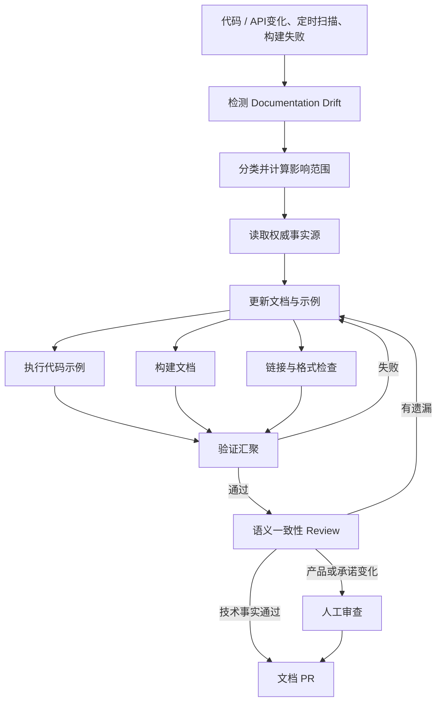

##### 12.3.3 Drift 类型

| 类型 | 示例 | 优先验证方式 |
|---|---|---|
| API Drift | 方法签名变化 | AST、类型定义、OpenAPI、Protobuf |
| CLI Drift | 参数、子命令或默认值变化 | CLI Schema、Snapshot Test |
| Configuration Drift | 配置项改名 | JSON Schema、配置模型 |
| Example Drift | 示例无法运行 | 编译或执行示例 |
| Version Drift | 文档仍写旧版本 | Release Metadata |
| Link Drift | 内外部链接失效 | Link Checker |
| Concept Drift | 架构描述与实现不一致 | ADR、代码结构、语义 Review |
| Coverage Drift | 新公共能力无文档 | Public Surface Coverage |
| Translation Drift | 多语言内容落后 | Source Revision 对比 |
| Screenshot Drift | UI 已变化 | Visual Check 和人工确认 |

##### 12.3.4 权威事实源

```text
Source of Truth
→ Documentation Dependency Graph
→ Impacted Documents
→ Validation Rule
```

| 文档事实 | 权威来源 |
|---|---|
| API 参数和返回类型 | 代码类型、OpenAPI、Protobuf |
| CLI 参数 | Parser / Command Schema |
| 配置项和默认值 | 配置 Schema、常量和模型 |
| 支持版本 | Release Metadata |
| 功能状态 | Feature Registry / Release Note |
| 示例输出 | 可执行示例的实际结果 |
| 架构约束 | ADR、System Design 和当前代码结构 |

模型记忆不能作为技术事实来源。

##### 12.3.5 Review–Repair–Validate

**Review**：只读取并输出结构化 Finding，不立即大范围改写。  
**Repair**：根据 Finding 聚焦修改受影响内容。  
**Validate**：执行示例、构建、链接检查、Schema 检查和语义 Review。

```yaml
finding:
  type: api_signature_drift
  source_symbol: SessionManager.restore
  source_revision: abc123
  document: docs/session-restore.md
  line: 82
  current_claim: restore(session_id)
  expected_claim: restore(session_id, strategy)
  severity: high
```

##### 12.3.6 成功条件

- 已检测 Drift 全部解决或被明确接受；
- 示例可编译或执行；
- 文档构建和链接检查通过；
- 公共 API 文档覆盖没有退化；
- 技术事实可追溯到当前权威源；
- 语义 Reviewer 没有未解决高风险问题。

##### 12.3.7 人工边界

以下内容不宜自动定稿：

- 产品定位；
- 兼容性承诺；
- 安全、法律和合规声明；
- 定价和商业条款；
- 弃用策略；
- 截图和营销表述；
- 存在多个合理解释的设计说明。

##### 12.3.8 关键指标

| 指标 | 含义 |
|---|---|
| Documentation Drift Rate | 发生漂移的文档或受影响文档比例 |
| Mean Drift Detection Latency | 权威事实变化到检测出漂移的平均时间 |
| Mean Drift Remediation Time | 漂移被检测到修复完成的平均时间 |
| Executable Example Pass Rate | 可执行示例通过率 |
| Broken Link Rate | 断链比例 |
| Public API Coverage | 公共接口文档覆盖率 |
| Semantic Error Escape Rate | 发布后仍发现事实错误的比例 |
| Documentation Lead Time | 代码变化到文档同步的时间 |

---

### 22.12.4 PR Babysitting Loop

##### 12.4.1 定义

PR Babysitting Loop 是一种事件驱动的 Pull Request 生命周期治理模式：

> 持续监听一个 PR 的 Review、CI、冲突、审批和策略状态；每次事件到达时恢复 Loop，处理当前阻塞项，直至 PR 可合并、已合并、已关闭或需要人工接管。

GitHub 官方的 Copilot CLI `/pr` 能处理 PR 状态、Review Feedback、Merge Conflict 和 CI Failure，其中 `/pr auto` 会重复执行反馈、冲突和 CI 修复阶段，直到阻塞被清除；Copilot cloud agent 也能根据评论继续修改并辅助解决冲突。因此该结构已具备现实产品基础，但“PR Babysitting”本身仍是模式名称。[^github-pr][^github-cloud-agent]

##### 12.4.2 正确运行模型

不应让 Agent 会话永久运行：

```text
PR Event 到达
→ 唤醒 Loop
→ 获取最新 PR Snapshot
→ 处理当前 Blocker
→ 保存 State
→ 进入 Durable Waiting
→ 下一个事件到达后恢复
```

##### 12.4.3 典型流程

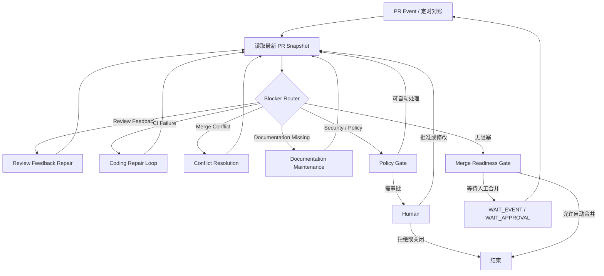

##### 12.4.4 PR Snapshot

每次唤醒必须重新读取：

```text
PullRequestSnapshot
├── Repository / PR Number
├── Head SHA / Base SHA
├── Draft Status
├── Changed Files
├── Mergeability
├── Required Checks and Latest Runs
├── Review Threads and Requested Changes
├── Required / Current Approvals
├── Merge Conflicts
├── Labels and Policy Findings
└── Last Activity
```

所有测试、评论和修复结论都应绑定：

```text
Repository + PR Number + Head SHA
```

Head SHA 变化后，应重新判断旧证据是否仍有效。

##### 12.4.5 Blocker Router

```text
Security / Permission Blocker
→ 高优先级安全处理或人工审批

Merge Conflict
→ Conflict Resolution Loop

Requested Changes
→ Review Feedback Repair Loop

CI Failure
→ Coding Repair Loop

Documentation / Metadata Missing
→ Documentation Maintenance Loop

Missing Approval
→ WAIT_APPROVAL

All Gates Green
→ READY_TO_MERGE
```

##### 12.4.6 并发和事件治理

关键机制：

- **事件幂等**：`event_id + pr_number + head_sha`；
- **Single Flight / Lease**：同一 PR 只有一个写入型主 Controller；
- **评论去重**：记录 comment、thread、target commit 和 resolution commit；
- **Debounce**：聚合短时间内的一组 Review 意见；
- **Optimistic Check**：提交前确认 Head SHA 没有被人工更新；
- **Durable Waiting**：无事件时释放模型、PTY 和计算资源；
- **Periodic Reconciliation**：定时对账，弥补 Webhook 丢失。

##### 12.4.7 成功、暂停和升级

成功或正常结束：

- PR 已合并或关闭；
- 所有 Required Checks 通过；
- 无未解决 Request Changes；
- 无合并冲突；
- 审批和策略门禁满足；
- 已达到 READY_TO_MERGE，并按策略等待人工合并。

暂停：

- Draft；
- 等待 Review、CI、审批或上游 PR；
- 等待用户补充信息。

升级：

- 同一失败反复出现；
- Review 意见冲突；
- 冲突涉及业务语义；
- 修改 `.github/workflows`、生产配置或数据库迁移；
- 需要高权限 Secret；
- Agent 修改超出范围；
- 预算耗尽。

##### 12.4.8 关键指标

| 指标 | 含义 |
|---|---|
| Time to Green | PR 到所有门禁通过的时间 |
| Review Response Time | 收到 Review 到响应的时间 |
| Review Resolution Rate | 自动解决评审意见比例 |
| CI Repair Success Rate | CI 自动修复成功率 |
| Conflict Resolution Rate | 自动解决冲突比例 |
| Repeated Failure Rate | 同一阻塞重复出现比例 |
| Stale PR Rate | 长时间无进展 PR 比例 |
| Human Intervention Rate | 人工介入比例 |
| Cost per Green PR | 每个 Green PR 的成本 |

---

### 22.12.5 Agent Improvement Loop

##### 12.5.1 定义

Agent Improvement Loop 使用生产 Trace、Artifact、反馈和 Eval 数据，提出并验证 Agent Harness 的候选修改：

```text
生产运行
→ Trace 与反馈
→ 构建 Eval Dataset
→ 失败聚类和根因诊断
→ 候选修改
→ 离线回归和安全评测
→ 人工门禁
→ 灰度
→ 发布或回滚
```

OpenAI 的官方 Agent Improvement Loop 示例正是从真实 Trace 开始，加入人工和模型反馈，将反馈转成可重复 Eval，再用证据提出 Harness 修改。[^agent-improvement]

##### 12.5.2 三层循环

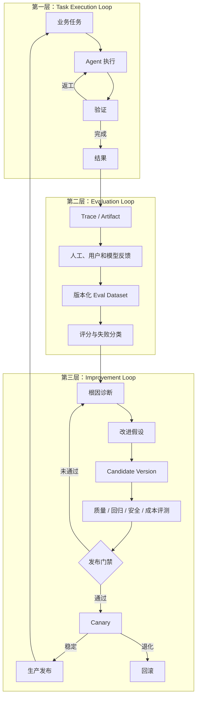

##### 12.5.3 输入数据

```text
ImprovementEvidence
├── Production Traces
├── Context Snapshots
├── Model and Tool Calls
├── Final Artifacts
├── Verification Results
├── User Corrections
├── Human Ratings
├── Safety Events
├── Cost / Token / Latency
└── Recovery and Stop Reasons
```

不能只评估最终答案，还应评估：

```text
Outcome
+ Trajectory
+ Tool Use
+ Context Use
+ Cost
+ Safety
+ Stop Correctness
+ Recoverability
```

##### 12.5.4 可改进对象

```text
Prompt：角色、指令、示例、输出 Schema
Context：检索、Memory、压缩、预算、隔离
Skill：触发描述、步骤、错误处理、验证
Tool：Schema、参数说明、反馈质量、权限
Graph：节点拆分、路由、并行、Fallback
Loop：进度函数、停止、重试、预算
Verifier：Rubric、阈值、测试规则
Model Routing：模型选择、降级和成本策略
```

##### 12.5.5 Dataset 分层

| Dataset | 作用 |
|---|---|
| Development Set | 日常迭代和诊断 |
| Regression Set | 防止已知能力退化 |
| Safety Set | 权限、注入、敏感数据和危险工具 |
| Edge-case Set | 长尾与极端情况 |
| Production Failure Set | 真实失败回流 |
| Holdout Set | 检查泛化，优化过程不可见 |

Skill 和 Harness 变更应使用轨迹与工件一起评估，而非只看最终文本。[^eval-skills]

##### 12.5.6 角色分离

```text
Target Agent：执行任务
Evaluator：评分，不修改生产 Agent
Optimizer：提出候选修改
Release Gate：决定是否发布
```

不应采用：

```text
同一个 Agent
→ 修改自己
→ 自己评分
→ 自己批准
→ 直接覆盖生产版本
```

##### 12.5.7 发布门禁

Candidate 只有在以下条件下才可进入灰度：

- 核心质量达到最低提升幅度；
- Regression 和 Holdout 没有显著退化；
- Safety 指标不退化；
- 成本和延迟在预算范围；
- 配置 Diff 可审计；
- 必要人工审查通过；
- 可以独立回滚 Prompt、Skill、Graph、Policy 和模型路由。

##### 12.5.8 防止错误自我改进

1. Agent 只能提交 Candidate，不能直接修改生产配置；
2. Dataset、Evaluator 和 Candidate 都必须版本化；
3. 不允许删除失败样本来制造指标提升；
4. Evaluator 不应只使用被优化的同一 Prompt；
5. 安全和权限策略变化必须人工批准；
6. 使用 Holdout 和 Canary 防止过拟合；
7. 生产敏感信息不能未经治理写入长期记忆或训练数据；
8. Canary 退化应自动回滚。

##### 12.5.9 关键指标

| 指标 | 含义 |
|---|---|
| Quality Lift | Candidate 相对 Baseline 的质量提升 |
| Regression Rate | 旧能力退化比例 |
| Holdout Generalization | 未见样本上的提升 |
| Failure Recurrence Rate | 已知失败再次出现比例 |
| Human Preference Rate | 人工偏好 Candidate 的比例 |
| Cost / Latency Delta | 成本和延迟变化 |
| Safety Regression Rate | 安全能力退化比例 |
| Candidate Acceptance Rate | 候选版本通过率 |
| Rollback Rate | 灰度或生产回滚率 |
| Time to Improvement | 从发现失败到发布改进的时间 |

### 22.12.6 其他常见应用 Loop

| Loop | 主要场景 |
|---|---|
| CI Sweep Loop | 跨仓库扫描失败并创建修复任务 |
| Dependency Update Loop | 检测依赖版本、升级、验证并生成 PR |
| Security Remediation Loop | 告警确认、影响分析、修复和复验 |
| Issue Triage Loop | 分类、去重、补充信息和路由 |
| Release Readiness Loop | 持续检查版本、变更日志和发布门禁 |
| Deployment Verification Loop | 部署后健康检查、继续或回滚 |
| Incident Response Loop | 告警、诊断、缓解、验证和复盘 |
| Knowledge Freshness Loop | 检查知识库、索引和外部资料新鲜度 |
| Test Coverage Loop | 识别薄弱区域、补充测试并验证有效性 |
| Technical Debt Loop | 发现、排序并逐步偿还技术债 |

---

**▍第四部分：生态、组合与选型**

本部分按 Coding Agent、Agent/Graph Framework、Durable Runtime、低代码平台、可观测与评测能力分层梳理生态，并给出组合与成熟度判断。

## 22.13 主流系统与产品全景

### 22.13.1 能力快照与五层生态

> 本章中的产品能力按 **2026-09-03** 官方资料核对。工具、预览状态、命令和托管能力可能继续变化，选型前应重新核对目标版本。


```text
第一层：Coding Agent / Agent Harness
Claude Code、OpenAI Codex、GitHub Copilot、OpenHands、Ralph Pattern

第二层：Agent / Graph Framework
LangGraph、OpenAI Agents SDK、Google ADK、Microsoft Agent Framework、
Pydantic AI、CrewAI、Strands Agents、Haystack

第三层：Durable Execution Runtime
Temporal、Restate、DBOS、Inngest、Prefect

第四层：低代码与业务集成
Dify、Flowise、n8n、Langflow

第五层：可观测、评测与遥测标准
LangSmith、Langfuse、Braintrust、Phoenix、MLflow、W&B Weave，以及 OpenTelemetry GenAI 语义约定
```

这五层不是相互替代关系。一个生产系统常见组合是：

```text
Coding Agent / Worker
+ Agent or Graph Controller
+ Durable Runtime
+ Sandbox / Worktree
+ Verifier
+ State Store
+ Observability / Eval
+ Policy / Human Gate
```

---

### 22.13.2 第一层：Coding Agent 与 Harness

##### Coding Agent 与 Harness 对比矩阵

| 系统 | 主要定位 | 可用于 Loop 的核心能力 | 主要边界 |
|---|---|---|---|
| Claude Code | 本地与可编程 Coding Agent | Agent Tool Loop、Goals、定时 `/loop`、Hooks、Skills、Subagents、Agent SDK | 企业级跨服务持久调度仍需外层系统 |
| OpenAI Codex | 本地、云端和自动化 Coding Agent | `codex exec`、Goals、Scheduled Tasks、Worktree、Hooks、Skills、Subagents、Sandbox/Approval | 复杂全局状态和长期业务编排仍需控制面 |
| GitHub Copilot | GitHub 原生 Coding、Review 与 PR 生命周期 | Cloud Agent、Code Review、`/pr`、Review/CI/Conflict 修复 | 主要围绕 GitHub 仓库和 PR 模型 |
| OpenHands | 开源 Coding Agent Runtime 与 Sandbox | Agent Server、Docker/Kubernetes Workspace、Headless、Sandbox Server | 需要自行完善企业治理、评测和外部调度 |
| Ralph Pattern | Fresh-context 外层循环模式 | 外部任务表、进度文件、Git、每轮新会话 | 多数实现缺少强状态、并发和治理 |

##### Claude Code

Claude Code 本身运行模型—工具—结果的 Agent Loop，并提供：

- `/goal`：围绕持久目标和完成条件迭代，并支持无进展判断；
- `/loop`：在会话中按间隔重复运行提示；
- Hooks：在生命周期事件上运行确定性脚本或控制；
- Skills：把可复用流程和知识固化为技能；
- Subagents：在独立上下文中完成子任务；Agent View 处于 research preview，Agent Teams 处于 experimental 且默认关闭状态，生产设计不应把预览能力当成稳定契约；[^claude-agent-view][^claude-agent-teams]
- Headless 与 Agent SDK：从脚本和应用程序驱动 Agent；
- 会话级文件检查点、Worktree 等长任务辅助原语；其中检查点主要跟踪 Claude 直接文件编辑，不能替代跨进程、跨服务的 Durable Checkpoint。[^claude-goal][^claude-loop][^claude-hooks][^claude-sdk][^claude-checkpoint]

适合：

- 本地 Coding Repair；
- Maker–Checker；
- 文档维护；
- 定时巡检；
- 作为外部 Loop Controller 的 Worker。

边界：

- `/goal` 的模型完成判断不能替代确定性测试和审批；
- `/loop` 是会话级调度原语，不等同于企业级 Durable Scheduler；
- 跨机器、跨服务恢复和全局资源协调通常仍需外部运行时。

##### OpenAI Codex

Codex 的 Loop 原语包括：

- `codex exec`：非交互执行，适合脚本和 CI；
- Goals：以目标、成功检查和约束维持跨轮工作；
- Scheduled Tasks：支持定时后台运行；符合条件的 Web/Mobile 计划还可由受支持的 Gmail、Slack 或 GitHub 事件触发。涉及本地项目时，桌面端任务可选择直接运行或使用隔离 Worktree；Codex CLI 和 IDE 扩展本身不提供 Scheduled 管理界面；
- Hooks、Skills、Subagents；
- Sandbox 和 Approval Policy；
- 本地与云端任务、代码 Review 和长周期执行能力。[^codex-exec][^codex-goals][^codex-scheduled][^codex-hooks]

适合：

```text
Issue / CI / Schedule
→ 独立 Worktree
→ Codex 分析和修改
→ Test / Build / Review
→ PR 或人工审批
```

实现集成时应优先采用当前官方推荐的应用和服务接口；过时的实验性接口不应成为新系统的默认基础。

##### GitHub Copilot

GitHub Copilot 的优势是把 Agent、Review、CI 和 PR 状态放在同一个代码托管控制面中：

- Cloud Agent 可以研究仓库、计划、修改分支并创建 PR；
- PR 评论可以继续驱动修改；
- Code Review 可以提出问题并触发修复；
- `/pr` 命令覆盖当前分支关联 PR 的状态、Review Feedback、Merge Conflict 和 CI Failure，`/pr auto` 可循环处理这些阻塞；
- GitHub 页面可以让 Agent 处理失败检查和冲突。[^github-pr][^github-cloud-agent][^github-code-review]

适合：

- Ticket-to-PR；
- Review Feedback Repair；
- CI Repair；
- Merge Conflict Resolution；
- PR Babysitting。

##### OpenHands

OpenHands 提供开源 Coding Agent、Agent Server、Workspace 和 Sandbox 能力，可使用 Docker、Kubernetes 或远程运行环境，并能以 Headless 方式集成自动化。[^openhands-sandbox][^openhands-headless]

适合：

- 自建 Coding Agent 平台；
- 多租户远程 Workspace；
- Kubernetes Worker；
- 自定义前端和控制面。

安全注意：Headless 等无人值守模式可能采用自动批准行为，因此必须依赖容器、网络、Secret 和仓库权限进行外部隔离。

##### Ralph / Fresh-context Pattern

Ralph 类模式通过外部 PRD、任务表、进度文件和 Git 工件，在每轮启动一个干净 Agent Context。它适合低成本实现长周期编码，但生产化需要补齐：

- State Store；
- Checkpoint；
- Idempotency；
- Verifier；
- Budget；
- No-progress Detection；
- 并发和 Workspace Lock；
- Human Escalation。

---

### 22.13.3 第二层：Agent 与 Graph Framework

##### Agent 与 Graph Framework 对比矩阵

| 系统 | 核心抽象 | Loop / Graph 强项 | Durable 策略 | 适合场景 |
|---|---|---|---|---|
| LangGraph | State、Node、Edge、Checkpointer | 显式循环、条件路由、子图、Interrupt | 内置持久原语，可与 Temporal 等组合 | 复杂可控 Agent Workflow |
| OpenAI Agents SDK | Agent、Tool、Handoff、Session、RunState | 内置 Agent Loop、Guardrail、HITL、Tracing | 官方提供 Temporal、Restate、DBOS、Dapr 等集成 | 轻量代码优先 Agent、多 Agent |
| Google ADK 2.0 | Agent、Graph/Dynamic/Collaborative Workflow | 图式路由、动态循环、协作工作流、多语言 | 可组合外部 Durable Runtime | Google 生态和多 Agent |
| Microsoft Agent Framework | Agent、Workflow、Checkpoint、Request/Response | 显式工作流、HITL、恢复、企业集成 | Workflow Checkpoint；更强耐久性需 Durable 扩展或外部运行时 | Azure/.NET/企业系统 |
| Pydantic AI | Typed Agent、Graph、Run State | 类型安全、结构化输出、Python 工程集成 | Temporal、DBOS、Prefect、Restate 集成 | 强 Schema 的 Python Agent |
| CrewAI | Crew + Flow | 角色协作、事件驱动、状态和持久化 | Flow 持久化，复杂耐久性可外接 | 业务自动化和多角色协作 |
| Strands Agents | Graph、Swarm、Workflow | 模型无关、多 Agent、Hooks、Session、A2A | 主要为进程内 SDK，可外接运行时 | AWS 和轻量多 Agent |
| Haystack | Pipeline、Agent、Tool、AgentTool | RAG、Tool Loop、Agentic Pipeline、HITL Hook | Pipeline 断点/快照与外部基础设施组合 | 检索、数据和 Agent 流程 |

##### LangGraph

LangGraph 是面向长运行、有状态 Agent 的低层编排框架：

- State、Node、Edge；
- 条件边、循环、并行和子图；
- Checkpointer 与 Store；
- Interrupt 和 Human-in-the-loop；
- Durable Execution 与恢复；
- Graph API 和不强制显式图定义的 Functional API。[^langgraph]

它适合：

```text
Planner
→ Executor
→ Verifier
  ├── 通过 → Finish
  ├── 可修复 → Executor
  ├── 需重规划 → Planner
  └── 高风险 → Human
```

LangGraph 负责状态图语义；特别长时间、跨服务和高可靠场景仍可叠加 Temporal 等通用 Durable Runtime。截至 2026-09-03，Temporal 的 LangGraph 官方集成文档将该插件标记为 Public Preview，因此生产采用前应核对当前稳定性和升级约束。[^temporal-langgraph]

##### OpenAI Agents SDK

OpenAI Agents SDK 提供：

- 内置 Agent Loop；
- Function Tools 与 Agents as Tools；
- Handoffs；
- Input、Output 和 Tool Guardrails；
- Sessions；
- 可序列化暂停/恢复的 Human-in-the-loop RunState；
- Tracing；
- 与多种 Durable Runtime 的集成。[^openai-agents][^openai-agents-durable]

它适合：

- 单 Agent 工具循环；
- Supervisor / Specialist；
- Handoff；
- 代码优先、相对轻量的多 Agent 系统。

复杂执行图仍需要应用代码、Workflow 框架或 Durable Runtime 补充。

##### Google ADK 2.0

Google ADK 2.0 提供 Python、TypeScript 和 Go 的 Agent 开发能力，并把 Graph-based、Dynamic 和 Collaborative Workflow 作为主要编排方向。不同语言版本的迁移状态需要分别核对：例如 TypeScript 2.0 文档明确将 `SequentialAgent`、`ParallelAgent` 和 `LoopAgent` 标记为弃用并建议迁移到图式 Workflow；Python 和 Go 应以各自版本文档为准，不能把某一语言的弃用状态直接外推到全部 SDK。无论采用哪种表达，循环都应配置最大迭代数、预算或明确退出机制。[^google-adk]

适合：

- Google Cloud / Gemini 生态；
- 多 Agent 图式协作；
- 动态 Workflow；
- 需要多语言 SDK 的团队。

##### Microsoft Agent Framework

Microsoft Agent Framework 提供 Agent、Workflow、Checkpoint、Human-in-the-loop Request/Response 和显式执行路径，并提供从 AutoGen 等既有实现迁移的官方指导。普通 Workflow Checkpoint 用于保存和恢复工作流状态；需要更强的分布式持久执行时，还应区分并评估其 Durable 扩展或外部 Durable Runtime，而不能把两者视为同一保证。[^microsoft-agent-framework][^microsoft-durable]

适合：

- Azure 和 .NET 体系；
- 企业身份、合规和服务集成；
- 需要显式 Workflow、Checkpoint 和人工流程的系统。

不宜仅根据品牌关系推断兼容性或成熟状态，具体语言、组件和托管能力应以当前官方文档为准。

##### Pydantic AI

Pydantic AI 强调：

- 类型安全依赖、输入和结构化输出；
- Agent 运行和 Pydantic Graph；
- Python 应用集成；
- 与 Temporal、DBOS、Prefect、Restate 的 Durable Execution 组合。[^pydantic-ai]

适合：

- 需要严格 Schema 的业务 Agent；
- 数据提取和结构化决策；
- 作为普通 Python 服务的一部分；
- 希望用外部 Durable Runtime 承担长任务。

##### CrewAI

CrewAI 使用：

- **Crew**：多个角色化 Agent 协作完成工作；
- **Flow**：事件驱动、状态化地组织执行、分支和 Human Feedback。

Flow 可以持久化状态，适合业务自动化；更复杂的强事务、跨语言 Worker 和长周期恢复仍需评估其底层持久语义或与外部运行时组合。[^crewai]

##### Strands Agents

Strands Agents 提供：

- Graph：DAG 或循环图、条件边和执行限制；
- Swarm：Agent 自主 Handoff；
- Workflow：顺序、依赖和并行任务；
- Sessions、Hooks、Agents as Tools、MCP 和部分 A2A 组合。[^strands]

它主要是进程内 SDK，而不是完整托管控制面；生产任务仍需补充部署、持久化、队列和全局治理。

##### Haystack

Haystack 将 Agent Tool Loop 与 Pipeline、RAG、检索和数据处理结合：

- Agent 组件负责工具调用循环和退出条件；
- AgentTool 可以把 Agent 作为工具组合；
- Pipeline 表达数据流和反馈结构；
- Confirmation Hook 支持工具调用前人工确认。

版本升级中断点、快照和 Agent 特定 Hook 语义可能变化，应以当前 Haystack 3.x 文档为准。[^haystack]

---

### 22.13.4 第三层：Durable Execution Runtime

##### 为什么需要独立 Durable Runtime

Agent 框架通常擅长判断“下一步做什么”；Durable Runtime 擅长保证：

- 崩溃后从已提交进度恢复；
- 已完成步骤不被无意重复；
- 每个步骤独立超时和重试；
- 等待人类数小时或数天；
- 定时器和事件不丢失；
- 多 Worker 调度和并发协调；
- 长事务补偿；
- 执行历史可审计。

##### Durable Runtime 对比矩阵

| 系统 | 核心模型 | 强项 | 代价 / 边界 |
|---|---|---|---|
| Temporal | Workflow + Activity + Event History | 确定性重放、Signal、Timer、成熟分布式运行时 | 运维和确定性开发约束较强 |
| Restate | Durable Service / Workflow | 服务化状态、按 Key 并发、持久调用、Saga | 需要适应其服务和日志模型 |
| DBOS | Database-backed Workflow | 库式接入、步骤持久化、队列、HITL | 开发可用 SQLite，生产通常采用 PostgreSQL |
| Inngest | Event-driven Durable Function | 事件、Step、并发、限流、定时、Serverless | 更偏应用事件和函数式工作流 |
| Prefect | Flow + Task | Python 动态工作流、重试、状态、数据/ML 生态 | 是通用编排器，Agent 语义需应用层构建 |

##### Temporal

Temporal 适合关键、长时间和跨服务 Loop。它通过 Workflow History、Activity、Signal 和 Durable Timer 支持恢复、人工等待和外部事件，并已有 LangGraph 与 OpenAI Agents SDK 集成资料。[^temporal][^temporal-langgraph]

适合：

- 数小时到数天的 Agent 任务；
- 高价值业务流程；
- 复杂补偿；
- 多服务协作；
- 对审计和恢复要求高的场景。

##### Restate

Restate 面向 Durable Service 和 Workflow，强调持久调用、状态、按 Key 并发协调和 Saga，可用于 Agent、MCP 服务和人工流程之间的可靠协作。[^restate]

适合：

- 服务化 Agent；
- 有状态分布式对象；
- 按会话、用户、PR 等 Key 串行化处理；
- 需要较轻运行模型的 Durable Workflow。

##### DBOS

DBOS 将 Workflow 状态和步骤结果持久化到数据库，默认可使用 SQLite，生产文档建议连接 PostgreSQL；同时提供队列、恢复和 Human-in-the-loop 集成，并与 Pydantic AI、OpenAI Agents SDK、Google ADK 等 Agent 生态结合。[^dbos]

适合：

- 已以 Postgres 为核心的 Python/TypeScript 后端；
- 希望以库方式增加 Durable Execution；
- 不希望部署大型独立 Workflow 平台的团队。

##### Inngest

Inngest 面向事件驱动 Durable Function，提供 Step、队列、并发、限流、定时和可观测能力，适合 SaaS 后台任务和事件触发 Agent。[^inngest]

适合：

- Webhook / Event-driven Loop；
- Serverless 应用；
- PR、工单、通知和业务自动化；
- Fan-out 和异步任务。

##### Prefect

Prefect 是 Python 工作流编排系统，支持动态 Flow/Task、状态、重试、超时和调度，适合数据、ML 和 Agent Pipeline。[^prefect]

它不是专门的 Agent Runtime；Agent Loop、Context、Verifier 和 Stop Policy 仍需应用层定义。

---

### 22.13.5 第四层：低代码与业务集成平台

| 系统 | Loop 相关能力 | 更适合 | 主要边界 |
|---|---|---|---|
| Dify | Loop Node、循环变量、终止表达式、最大次数、Human Input | 内容优化、RAG、审批、业务 Agent | 通用分布式事务和复杂恢复需外接 |
| Flowise Agentflow | Agent 节点、条件、HITL、Checkpoint、暂停恢复 | 可视化 Agent 原型和业务 Flow | 大规模治理和强一致需额外基础设施 |
| n8n | AI Agent、工具、人工批准、SaaS 连接器 | CRM、邮件、工单、运营自动化 | 不适合作为复杂 Coding Sandbox |
| Langflow | 可视化 Agent、MCP、API、逻辑和循环组件 | 原型、MCP/A2A 组合、API Flow | Durable 和复杂事务语义有限 |

##### Dify

Dify 的 Loop Node 支持跨迭代变量、终止表达式、最大循环次数和 Exit Loop；Human Input 节点可以暂停等待用户。[^dify]

##### Flowise

Flowise Agentflow V2 提供条件路由、Human-in-the-loop 和 Checkpoint，并可在等待人工时暂停而不持续占用执行。[^flowise]

##### n8n

n8n 擅长连接企业 SaaS、数据库、通知和审批流程；AI Agent 的高风险工具调用可以在执行前要求人工批准。[^n8n]

##### Langflow

Langflow 适合通过可视化组件构建 Agent、MCP、API 和逻辑流程。复杂的反馈循环、持久状态和强恢复语义应明确验证，而不应仅根据画布中存在“Loop”组件作推断。[^langflow]

---

### 22.13.6 第五层：可观测、评测与遥测标准

| 系统 | 核心能力 | 定位特点 |
|---|---|---|
| LangSmith | Trace、Dataset、Offline/Online Eval、Experiment、Annotation | 与 LangChain/LangGraph 结合紧密，也可接其他框架 |
| Langfuse | 开源 Trace、Prompt、Dataset、Experiment、Score | 自托管和框架中立 |
| Braintrust | Trace、Online Scoring、Dataset、Experiment、Human Review | 评测和实验工作流突出 |
| Phoenix | OpenTelemetry/OpenInference Trace、Eval、Versioned Dataset、Experiment | 开源 AI 可观测与实验 |
| MLflow | OTel-compatible Trace、Feedback、Evaluation、Dataset、Monitoring | 与 ML 生命周期和自托管结合 |
| W&B Weave | Trace、Evaluation、Dataset 和实验可视化 | 与 W&B 开发生态结合[^weave] |
| OpenTelemetry | 跨后端 Trace、Metric、Log/Event 与语义约定 | 底层开放协议和标准化层 |

##### LangSmith

支持从生产 Trace 构造 Dataset，运行在线或离线 Evaluator 和 Experiment，适合建立“生产失败 → 回归测试 → 发布验证”的闭环。[^langsmith]

##### Langfuse

提供开源和可自托管的 Trace、Prompt Version、Dataset、Experiment、Score、人工标注和 LLM-as-a-Judge 等能力。[^langfuse]

##### Braintrust

强调在线评分、Dataset、Experiment、Scorer 和 Human Review，可把真实生产问题沉淀为评测案例。[^braintrust]

##### Phoenix

Phoenix 是开源 AI Observability 和 Evaluation 平台，提供基于 OpenTelemetry/OpenInference 的 Trace、版本化 Dataset、Evaluator 和 Experiment。[^phoenix]

##### MLflow

MLflow Tracing 与 OpenTelemetry 兼容，支持 Agent 中间步骤、延迟、Token、成本、反馈、评测和从生产流量构造 Dataset。[^mlflow]

##### W&B Weave

W&B Weave 提供模型与 Agent 调用追踪、Dataset、Evaluation、Scorer 和实验对比，可用于分析轨迹、工件、质量、成本与延迟；它更适合已经使用 Weights & Biases 生态的团队。[^weave]

##### OpenTelemetry

OpenTelemetry 适合作为框架中立的底层观测协议。建议建立：

```text
Loop Run
→ Graph Node
→ Agent Round
→ Model Call
→ Tool Call
→ Verification
→ Human Approval
→ Artifact
```

的 Span 层级，并在标准 GenAI 属性之外补充 Loop、Graph、Budget、Progress 和 Stop Reason 等领域属性。[^otel-semconv][^otel-observability]

## 22.14 系统组合与选型

### 22.14.1 选型不能只看“哪个 Agent 更聪明”

需要同时评估：

| 维度 | 关键问题 |
|---|---|
| 任务类型 | Coding、RAG、业务自动化、研究还是运维？ |
| 持续时间 | 秒级、分钟级、小时级还是跨天？ |
| 状态要求 | 是否需要崩溃恢复、事件等待和历史审计？ |
| 验证方式 | 是否有测试、规则、业务 API 或只能语义判断？ |
| 副作用风险 | 是否写代码、发消息、改数据、合并或部署？ |
| 多 Agent | 是否需要 Handoff、并行、汇聚和共享状态？ |
| 运行环境 | 本地桌面、CI、容器、Kubernetes、Serverless？ |
| 生态约束 | GitHub、Azure、Google Cloud、AWS、Python/.NET？ |
| 合规 | 多租户、Secret、数据驻留、审计和保留？ |
| 可观测与评测 | 能否获取完整 Trace、Dataset 和回归 Eval？ |

### 22.14.2 个人或小团队 Coding Loop

推荐最小组合：

```text
Claude Code 或 Codex
+ Git Worktree
+ 项目级 Skills / Instructions
+ Hooks
+ Test / Lint / Build
+ 外部 Task State / Progress Log
+ 最大轮数和无进展检测
```

适合：

- Coding Repair；
- 文档维护；
- 技术债清理；
- 单仓库迭代任务。

应避免：

- `while true` 无限调用；
- 自动赋予全磁盘和全网络权限；
- 只凭 Agent 输出判断完成；
- 多个 Agent 直接写同一工作目录。

### 22.14.3 GitHub 原生研发闭环

```text
GitHub Issue / PR / Check Event
+ Copilot Cloud Agent 或外部 Coding Agent
+ Required Checks
+ Branch Protection
+ Code Review
+ PR Babysitting Controller
+ Human Merge Gate
```

适合：

- Ticket-to-PR；
- CI Repair；
- Review Feedback；
- 依赖升级；
- 冲突处理；
- 文档同步。

关键点是所有证据绑定 Head SHA，并对 Workflow、Secret 和生产部署保持人工门禁。

### 22.14.4 自定义 Agent 产品

优先方向：

| 需求 | 优先评估 |
|---|---|
| 复杂状态图和显式控制 | LangGraph |
| 轻量 OpenAI Agent、Handoff、Guardrail | OpenAI Agents SDK |
| Google Cloud 和多语言图式工作流 | Google ADK 2.0 |
| Azure/.NET 和企业 Workflow | Microsoft Agent Framework |
| Python 类型安全和强 Schema | Pydantic AI |
| 角色化业务自动化 | CrewAI |
| AWS、多模型和轻量多 Agent | Strands Agents |
| RAG、检索和数据 Pipeline | Haystack |

### 22.14.5 长周期、高价值或高风险任务

采用双层或三层架构：

```text
Agent / Graph Framework
负责：语义决策、任务拆分、工具选择、节点路由

Durable Runtime
负责：状态、检查点、重试、定时、等待、恢复、并发、补偿

Policy / Verification Plane
负责：权限、预算、验证、审批、审计和发布门禁
```

典型组合：

```text
LangGraph + Temporal
OpenAI Agents SDK + Temporal / Restate / DBOS
Pydantic AI + DBOS / Temporal / Restate / Prefect
Google ADK + 通用 Durable Runtime
Microsoft Agent Framework + Checkpoint / Azure Durable 体系
```

具体集成成熟度需按语言版本和官方文档逐项验证，不能仅因为两个项目都宣称支持 Agent 就推断可无缝组合。

### 22.14.6 低代码业务 Loop

- 需要显式循环变量、条件终止和人工输入：优先评估 **Dify**；
- 需要企业 SaaS 连接、审批、工单和通知：优先评估 **n8n**；
- 需要快速画出 Agentflow：优先评估 **Flowise**；
- 需要可视化 Agent、MCP 和 API 组合：优先评估 **Langflow**。

当任务包含长时间等待、跨服务补偿、高并发和严格幂等时，应在低代码平台之外增加 Durable Backend 或业务状态机。

### 22.14.7 是否需要 Durable Runtime

通常不需要独立 Durable Runtime：

- 单次任务几分钟内完成；
- 失败后整体重跑成本低；
- 没有不可重复副作用；
- 不需要跨天等待；
- 单机状态已足够。

通常需要：

- 任务跨小时或跨天；
- 需要等待 CI、审批、用户或外部事件；
- 多服务协作；
- 有付费、部署、消息、数据修改等副作用；
- 崩溃后不能从头重做；
- 需要审计和精确恢复；
- 同一业务 Key 需要并发协调。

### 22.14.8 Verifier 选型

| 场景 | 首选验证器 | 补充验证器 |
|---|---|---|
| 代码修复 | Test、Build、Lint、Type Check | 独立 Reviewer |
| API 操作 | 重新查询权威 API | Schema 和人工抽检 |
| 文档事实 | 可执行示例、Schema 对比 | 语义 Reviewer |
| RAG 回答 | 引用和事实一致性 | LLM Judge、人工样本 |
| 数据同步 | 目标记录对账 | 业务规则校验 |
| 部署 | 版本、健康检查、SLO | Canary 和人工门禁 |
| Agent 改进 | Regression/Holdout/Safety Eval | 人工偏好和生产 Canary |

## 22.15 成熟度模型

### 22.15.1 L0：人工 Prompt

```text
人 → Agent → 人 → Agent
```

特征：

- 没有系统自动反馈；
- 进度依赖人工记忆；
- 完成由人逐轮判断。

### 22.15.2 L1：单次 Agent Tool Loop

```text
Model → Tool → Observation → Model
```

特征：

- Agent 可自主调用工具；
- 通常局限于一次 Run 或会话；
- 外部状态、验证和恢复较弱。

### 22.15.3 L2：Verification Loop

```text
Worker → Verifier → Repair → Verifier
```

特征：

- 有明确验收标准；
- 有 Test、Rule 或 Reviewer；
- 有最大轮数和失败出口。

这是本文建议的最低生产闭环级别；高风险场景还需要持久状态、权限、恢复与人工门禁。

### 22.15.4 L3：跨会话 Operational Loop

特征：

- 事件或定时触发；
- 外部 State 和 Artifact；
- Checkpoint；
- Fresh Context；
- Worktree / Sandbox；
- Budget 和 No-progress Detection；
- Human Escalation。

典型场景：Coding Repair、Documentation Maintenance、PR Babysitting。

### 22.15.5 L4：Durable Multi-Agent Loop

特征：

- Durable Runtime；
- 多 Worker 和并行图；
- Handoff、Fan-out/Fan-in；
- 跨服务恢复；
- Durable Waiting；
- 统一权限、预算、审计和多租户治理。

### 22.15.6 L5：Gated Self-improving System

特征：

- 生产 Trace 自动回流；
- 版本化 Dataset 和 Evaluator；
- 失败聚类和改进假设；
- 自动生成 Candidate；
- Regression、Holdout 和 Safety Gate；
- Canary、回滚和人工发布门禁。

L5 不等于“Agent 可以无约束修改生产中的自己”。正确边界是：

```text
自动提出候选
+ 自动评测
+ 受控批准
+ 可回滚发布
```

---

**▍第五部分：落地、运营与检查**

本部分给出从最小验证闭环到受控自优化系统的实施顺序，并提供故障定位和生产检查表。

## 22.16 实施路线图

### 22.16.1 阶段 0：定义目标与评测基线

先选择一个窄场景，例如：

- 单仓库 CI Repair；
- 文档断链维护；
- PR 状态跟进；
- 工单分类。

交付物：

- Goal 和 Non-goal；
- Acceptance Criteria；
- 输入输出 Schema；
- 基线 Dataset；
- 成功、成本和安全指标；
- 人工流程基线。

退出门禁：可以客观判断任务是否成功。

### 22.16.2 阶段 1：最小 Verification Loop

实现：

```text
Trigger
→ 单 Worker
→ Deterministic Verifier
→ Continue / Stop
```

交付物：

- Loop Definition；
- 最大轮数和预算；
- 结构化 Observation；
- Verifier；
- 基础 Trace。

退出门禁：在测试集上比一次性 Agent Run 更可靠，且不会无限运行。

### 22.16.3 阶段 2：状态、恢复与安全

增加：

- State Store；
- Checkpoint；
- Artifact；
- Workspace / Sandbox；
- Idempotency；
- Retry 分类；
- Human Approval；
- Durable Waiting 或等价机制。

退出门禁：进程终止后能够恢复，外部副作用不会重复。

### 22.16.4 阶段 3：Graph 与多 Agent

只有在单 Worker Loop 已稳定后再增加：

- Planner；
- Specialist；
- Independent Reviewer；
- Fan-out/Fan-in；
- Subgraph；
- Handoff；
- State Ownership。

退出门禁：多 Agent 相比单 Agent 在质量、速度或成本上有可测收益。

### 22.16.5 阶段 4：生产观测与评测闭环

增加：

- OpenTelemetry Trace；
- Dataset 回流；
- Online / Offline Evaluator；
- 失败分类；
- 成本和停止指标；
- 人工 Annotation；
- Dashboard 和告警。

退出门禁：能够定位失败属于 Prompt、Context、Tool、Loop、Graph、Runtime 还是 Policy。

### 22.16.6 阶段 5：Agent Improvement Loop

增加：

- Baseline 与 Candidate；
- Regression / Safety / Holdout；
- Candidate Diff；
- 人工发布门禁；
- Canary 和回滚；
- 改进收益跟踪。

退出门禁：改进可重复、可归因，不通过删除失败样本或放宽门禁制造虚假提升。

### 22.16.7 实施顺序原则

```text
先有可验证结果
→ 再有自动返工
→ 再有持久恢复
→ 再有多 Agent 图
→ 再有自动优化
```

不要从“多个 Agent 自由群聊”开始，因为缺少验收、状态和安全边界时，系统只会把不确定性放大。

## 22.17 故障定位速查

| 现象 | 首要排查层 | 常见根因 |
|---|---|---|
| 输出格式不合法 | Prompt / Output Contract | Schema 不清、未做强校验 |
| Agent 没遵守角色 | Prompt / Policy | 指令冲突、角色权限不匹配 |
| 找不到相关代码 | Context | 检索、Repo Map、索引或预算不足 |
| 已提供信息未被使用 | Context | 噪声过多、排序错误、上下文过长 |
| 使用旧测试结果 | Context / Verification | 缺少 Artifact Revision 绑定 |
| 反复执行同一动作 | Loop | 无进展检测缺失、失败反馈差 |
| 过早宣布完成 | Loop / Verifier | Worker 自评成为唯一 Stop Signal |
| 达标后仍继续运行 | Stop Policy | Late-stop、状态未更新、证据不一致 |
| 测试失败后不返工 | Graph / Decision | Error Edge 或 Repair Route 缺失 |
| 两个 Agent 修改冲突 | Graph / Workspace | 无 State Ownership、无 Worktree 隔离 |
| 并行结果无法合并 | Graph | Reducer 和冲突策略缺失 |
| 重启后任务丢失 | State / Durable Runtime | 无 Checkpoint 或恢复协议 |
| 重复创建 PR / 工单 | Idempotency | 缺少事件键和外部对账 |
| 等待审批持续占资源 | Durable Runtime | 使用轮询或常驻会话模拟等待 |
| Tool 调用参数经常错 | Tool / Skill / Prompt | Schema、描述、错误反馈不清 |
| 外部文档诱导危险动作 | Context / Policy | 未标记不可信内容、工具权限过大 |
| Agent 改进后旧能力退化 | Eval | 无 Regression/Holdout 或 Judge 偏差 |
| 成本失控 | Budget / Context / Loop | 无轮数、Token、并行和无进展上限 |
| Reviewer 和 Worker 结论高度一致但都错误 | Evaluation | 同源模型、同一 Context、缺少确定性证据 |

### 22.17.1 推荐排查顺序

```text
1. Goal 和 Acceptance Criteria 是否明确
2. 使用的 State 和 Artifact Revision 是否最新
3. Verifier 是否真实运行并绑定当前版本
4. Loop 是否有进度和停止策略
5. Graph 路由和状态所有权是否正确
6. Runtime 是否恢复或重复了副作用
7. Prompt、Context、Tool 和模型是否需要优化
```

## 22.18 生产检查表

### 22.18.1 定义与契约

- [ ] Loop 的业务目标是否明确？
- [ ] 是否定义 Non-goal 和修改范围？
- [ ] 验收标准是否结构化、可验证？
- [ ] 输入输出是否有 Schema？
- [ ] Loop、Graph、Prompt、Context、Verifier 和 Policy 是否版本化？
- [ ] 运行中版本变化如何处理？

### 22.18.2 触发与幂等

- [ ] Trigger 来源和信任级别是否明确？
- [ ] 是否有 Event ID、Correlation ID 和 Idempotency Key？
- [ ] Webhook 丢失是否有定时对账？
- [ ] 重复事件是否会创建重复 Run？

### 22.18.3 调度与 Graph

- [ ] 节点职责是否单一且边界明确？
- [ ] 节点输入输出是否结构化？
- [ ] 路由优先使用确定性规则还是无约束 LLM？
- [ ] 并行节点是否有状态所有权？
- [ ] Fan-in 是否有 Reducer？
- [ ] 循环边是否有预算和退出路径？
- [ ] Subgraph 是否可独立测试？

### 22.18.4 执行与 Skill

- [ ] Skill 是否有明确输入、输出和副作用？
- [ ] 是否可取消、超时和观测？
- [ ] 是否可安全重试或有补偿？
- [ ] Agent 是否运行在 Worktree、Sandbox 或受控环境？
- [ ] Secret 是否最小化、临时化和按 Run 隔离？
- [ ] 工具失败是否返回结构化错误？
- [ ] Skill、Tool、Plugin 和 MCP Server 是否固定版本、来源和内容摘要？
- [ ] 扩展升级是否审查权限、网络、Secret 和副作用差异？

### 22.18.5 验证与停止

- [ ] Worker 是否不是唯一完成判断者？
- [ ] 是否优先使用确定性验证？
- [ ] 语义 Reviewer 是否独立？
- [ ] 证据是否绑定当前 Artifact Revision？
- [ ] 是否有成功、失败、预算和风险停止条件？
- [ ] 是否有 Progress Function 和 No-progress Detection？
- [ ] 是否评测过早停止和过晚停止？

### 22.18.6 状态与恢复

- [ ] 权威 State 存在哪里？
- [ ] State、Checkpoint、Artifact 和 Memory 是否分离？
- [ ] 副作用前后是否检查点化？
- [ ] 恢复时是否重新对账外部状态？
- [ ] 是否处理部分成功、孤儿进程和失效 Lease？
- [ ] 等待外部事件时是否释放资源？

### 22.18.7 权限与人工

- [ ] 文件、网络、命令和数据权限是否最小化？
- [ ] 高风险动作是否由 Runtime 强制审批？
- [ ] 是否防止外部不可信内容控制工具？
- [ ] 人工升级请求是否包含证据和选项？
- [ ] 审批超时、拒绝和撤销如何处理？
- [ ] 是否有租户隔离和审计？

### 22.18.8 可观测与评测

- [ ] 是否记录 Trigger、Node、Round、Model、Tool、Verifier 和 Stop？
- [ ] 是否记录 Token、成本、延迟和预算？
- [ ] 是否对 Prompt、Context 和 Tool 内容进行脱敏？
- [ ] 是否能从生产 Trace 创建 Dataset？
- [ ] 是否有 Outcome、Trajectory、Tool、Context、Stop 和 Governance Eval？
- [ ] Evaluator 是否有版本和校准集？

### 22.18.9 持续优化

- [ ] Candidate 是否与生产版本隔离？
- [ ] 是否有 Regression、Safety 和 Holdout？
- [ ] 是否同时比较质量、成本和延迟？
- [ ] 是否有人工 Release Gate？
- [ ] 是否支持 Canary 和独立回滚？
- [ ] 是否防止修改 Dataset 或门禁制造虚假提升？

## 22.19 结论

Loop Engineering 的本质不是：

```text
while not done:
    run_agent()
```

而是：

```text
有版本的目标与契约
→ 事件驱动触发
→ 结构化调度与执行图
→ 受控 Agent / Skill / Tool 执行
→ 客观 Observation 和 Artifact
→ 独立验证
→ 基于进度、预算和风险的决策
→ 持久 State 与 Checkpoint
→ 继续、停止、等待或人工升级
→ Trace、Eval 和受控改进
```

完整生产结构可以概括为：

```text
定义与治理：Goal + Contract + Policy + Budget

五阶段执行闭环：
Trigger
→ Orchestration
→ Execution
→ Verification
→ Decision
→ Continue / Retry / Repair / Replan / Stop / Escalate

持久化与运行可靠性：
Runtime State + Event History + Artifact + Checkpoint
+ Long-term Memory + Idempotency + Retry + Recovery + Compensation

安全控制：
Sandbox + Least Privilege + Human Gate + Audit

质量闭环：
Trace + Dataset + Eval + Candidate + Canary + Rollback
```

Prompt Engineering、Context Engineering、Loop Engineering 和 Graph Engineering 的最终关系是：

> **Prompt 决定模型如何理解当前任务；Context 决定模型获得哪些信息；Loop 决定系统如何利用反馈持续工作并正确停止；Graph 决定多个节点、Agent、工具和 Loop 如何组成完整系统。**

真正的生产级 Agent 系统通常不是依赖一个无限自主的 Agent，而是依赖：

```text
版本化 Prompt
+ 动态 Context
+ 有界 Loop
+ 显式 Graph
+ Durable State
+ 受控 Runtime
+ 独立 Verifier
+ Policy / Human Gate
+ Trace / Eval
```

---

## 参考资料

> 以下优先列出官方文档、官方博客和项目官方资料。产品能力会持续变化，落地前应再次核对当前版本。

[^loop-engineering]: Addy Osmani, [Loop Engineering: A New Paradigm for AI-Assisted Software Development](https://addyosmani.com/blog/loop-engineering/), 2026.

[^art-loop-engineering]: LangChain, [The Art of Loop Engineering](https://www.langchain.com/blog/the-art-of-loop-engineering), 2026.

[^graph-engineering]: LangChain, [3 Years of Graph Engineering with LangGraph](https://www.langchain.com/blog/3-years-of-graph-engineering-with-langgraph), 2026.

[^harness-engineering]: OpenAI, [Harness engineering: leveraging Codex in an agent-first world](https://openai.com/index/harness-engineering/), 2026.

[^prompt-engineering]: OpenAI API Docs, [Prompt engineering](https://developers.openai.com/api/docs/guides/prompt-engineering) 与 [Prompting](https://developers.openai.com/api/docs/guides/prompting).

[^context-engineering]: LangChain Docs, [Context engineering](https://docs.langchain.com/oss/python/langchain/context-engineering).

[^iterative-repair]: OpenAI Cookbook, [Build iterative repair loops with Codex](https://developers.openai.com/cookbook/examples/codex/build_iterative_repair_loops_with_codex), 2026.

[^agent-improvement]: OpenAI Cookbook, [Build an Agent Improvement Loop with Traces, Evals, and Codex](https://developers.openai.com/cookbook/examples/agents_sdk/agent_improvement_loop), 2026.

[^eval-skills]: OpenAI, [Testing Agent Skills Systematically with Evals](https://developers.openai.com/blog/eval-skills), 2026.

[^prompt-injection]: OpenAI, [Designing agents to resist prompt injection](https://openai.com/index/designing-agents-to-resist-prompt-injection/).

[^claude-goal]: Anthropic Claude Code Docs, [Keep Claude working toward a goal](https://code.claude.com/docs/en/goal).

[^claude-loop]: Anthropic Claude Code Docs, [Run prompts on a schedule](https://code.claude.com/docs/en/scheduled-tasks).

[^claude-hooks]: Anthropic Claude Code Docs, [Hooks reference](https://code.claude.com/docs/en/hooks).

[^claude-sdk]: Anthropic Claude Code Docs, [Agent SDK overview](https://code.claude.com/docs/en/agent-sdk/overview).

[^codex-exec]: OpenAI Codex Docs, [Non-interactive mode](https://developers.openai.com/codex/non-interactive-mode).

[^codex-goals]: OpenAI Cookbook, [Using Goals in Codex](https://developers.openai.com/cookbook/examples/codex/using_goals_in_codex), 2026.

[^codex-scheduled]: OpenAI Codex Docs, [Scheduled tasks](https://developers.openai.com/codex/automations).

[^codex-hooks]: OpenAI Codex Docs, [Hooks](https://developers.openai.com/codex/hooks)；另见 [Subagents](https://developers.openai.com/codex/subagents) 与 [Skills](https://developers.openai.com/codex/skills).

[^github-pr]: GitHub Docs, [Managing pull requests with the `/pr` command](https://docs.github.com/en/copilot/how-tos/copilot-cli/use-copilot-cli/manage-pull-requests).

[^github-cloud-agent]: GitHub Docs, [Using Copilot cloud agent on GitHub](https://docs.github.com/en/copilot/how-tos/use-copilot-agents/cloud-agent/use-cloud-agent-on-github)；另见 [About GitHub Copilot cloud agent](https://docs.github.com/en/copilot/concepts/agents/cloud-agent/about-cloud-agent).

[^github-code-review]: GitHub Docs, [About GitHub Copilot code review](https://docs.github.com/copilot/concepts/agents/code-review).

[^openhands-sandbox]: OpenHands Docs, [OpenHands ecosystem introduction](https://docs.openhands.dev/overview/introduction)、[Sandbox Server REST API](https://docs.openhands.dev/openhands/usage/api/v1) 与 [Sandbox overview](https://docs.openhands.dev/openhands/usage/sandboxes/overview).

[^openhands-headless]: OpenHands Docs, [Headless mode](https://docs.openhands.dev/openhands/usage/cli/headless).

[^langgraph]: LangChain Docs, [LangGraph overview](https://docs.langchain.com/oss/python/langgraph/overview)、[Persistence](https://docs.langchain.com/oss/python/langgraph/persistence) 与 [Interrupts](https://docs.langchain.com/oss/python/langgraph/interrupts).

[^openai-agents]: OpenAI Agents SDK, [Agents SDK guide](https://developers.openai.com/api/docs/guides/agents) 与 [Running agents](https://developers.openai.com/api/docs/guides/agents/running-agents).

[^openai-agents-durable]: OpenAI Agents SDK, [Durable execution integrations](https://openai.github.io/openai-agents-python/running_agents/#durable-execution-and-integrations).

[^google-adk]: Google Agent Development Kit, [ADK 2.0](https://adk.dev/2.0/) 与 [Workflow documentation](https://adk.dev/).

[^microsoft-agent-framework]: Microsoft Learn, [Microsoft Agent Framework workflows](https://learn.microsoft.com/en-us/agent-framework/workflows/) 与 [Checkpoints and resuming](https://learn.microsoft.com/en-us/agent-framework/workflows/checkpoints).

[^pydantic-ai]: Pydantic AI Docs, [Durable execution overview](https://pydantic.dev/docs/ai/capabilities/durable_execution/overview/) 与 [Pydantic Graph](https://pydantic.dev/docs/ai/graph/).

[^crewai]: CrewAI Docs, [Flows](https://docs.crewai.com/en/concepts/flows) 与 [Flow persistence](https://docs.crewai.com/en/concepts/flows#persistence).

[^strands]: Strands Agents Docs, [Multi-agent patterns](https://strandsagents.com/docs/user-guide/concepts/multi-agent/multi-agent-patterns/)、[Graph](https://strandsagents.com/docs/user-guide/concepts/multi-agent/graph/) 与 [Get started](https://strandsagents.com/docs/user-guide/quickstart/overview/).

[^haystack]: Haystack Docs, [Agent](https://docs.haystack.deepset.ai/docs/agent)、[Pipelines](https://docs.haystack.deepset.ai/docs/pipelines) 与当前迁移文档。

[^temporal]: Temporal Docs, [AI and agents](https://docs.temporal.io/ai).

[^temporal-langgraph]: Temporal Docs, [LangGraph integration](https://docs.temporal.io/develop/python/integrations/langgraph).

[^restate]: Restate Docs, [AI agents](https://docs.restate.dev/use-cases/ai-agents) 与 [Durable workflows](https://docs.restate.dev/develop/ts/durable-workflows).

[^dbos]: DBOS Docs, [AI quickstart](https://docs.dbos.dev/ai/ai-quickstart) 与 [Durable workflows](https://docs.dbos.dev/).

[^inngest]: Inngest Docs, [Durable agents](https://www.inngest.com/docs/learn/durable-agents) 与 [Concurrency](https://www.inngest.com/docs/guides/concurrency).

[^prefect]: Prefect Docs, [Flows](https://docs.prefect.io/v3/concepts/flows) 与 [Tasks](https://docs.prefect.io/v3/concepts/tasks).

[^dify]: Dify Docs, [Loop node](https://docs.dify.ai/en/use-dify/nodes/loop) 与 [Human Input](https://docs.dify.ai/en/use-dify/nodes/human-input).

[^flowise]: Flowise Docs, [Agentflow V2](https://docs.flowiseai.com/using-flowise/agentflowv2).

[^n8n]: n8n Docs, [Human-in-the-loop for AI tool calls](https://docs.n8n.io/advanced-ai/human-in-the-loop-tools/) 与 [AI Agent](https://docs.n8n.io/integrations/builtin/cluster-nodes/root-nodes/n8n-nodes-langchain.agent/).

[^langflow]: Langflow Docs, [Components overview](https://docs.langflow.org/concepts-components)、[Workflow API](https://docs.langflow.org/workflow-api) 与 [Use Langflow as an A2A server](https://docs.langflow.org/a2a-server).

[^langsmith]: LangSmith Docs, [Evaluation](https://docs.langchain.com/langsmith/evaluation) 与 [Online evaluations](https://docs.langchain.com/langsmith/online-evaluations).

[^langfuse]: Langfuse Docs, [Evaluation](https://langfuse.com/docs/evaluation/overview)、[Datasets](https://langfuse.com/docs/evaluation/features/datasets) 与 [Experiments](https://langfuse.com/docs/evaluation/features/experiments).

[^braintrust]: Braintrust Docs, [Evaluation](https://www.braintrust.dev/docs/evaluate) 与 [Online scoring](https://www.braintrust.dev/docs/evaluate/score-online).

[^phoenix]: Arize Phoenix Docs, [Phoenix overview](https://arize.com/docs/phoenix) 与 [Datasets and experiments](https://arize.com/docs/phoenix/datasets-and-experiments/overview-datasets).

[^mlflow]: MLflow Docs, [LLM tracing and agent observability](https://mlflow.org/docs/latest/genai/tracing/).

[^weave]: Weights & Biases Docs, [W&B Weave](https://docs.wandb.ai/weave) 与 [Evaluations overview](https://docs.wandb.ai/weave/guides/core-types/evaluations).

[^otel-semconv]: OpenTelemetry, [Semantic Conventions](https://opentelemetry.io/docs/specs/semconv/)、[Generative AI semantic conventions relocation notice](https://opentelemetry.io/docs/specs/semconv/gen-ai/) 与 [OpenTelemetry GenAI Semantic Conventions repository](https://github.com/open-telemetry/semantic-conventions-genai).

[^otel-observability]: OpenTelemetry, [Inside the LLM Call: GenAI Observability with OpenTelemetry](https://opentelemetry.io/blog/2026/genai-observability/), 2026.

[^claude-checkpoint]: Anthropic Claude Code Docs, [Checkpointing](https://code.claude.com/docs/en/checkpointing). 文件检查点主要覆盖 Claude 直接执行的文件编辑；Shell/Bash 等外部副作用需要独立恢复与幂等设计。

[^claude-agent-view]: Anthropic Claude Code Docs, [Manage multiple agents with agent view](https://code.claude.com/docs/en/agent-view). Agent View 当前标记为 research preview。

[^claude-agent-teams]: Anthropic Claude Code Docs, [Orchestrate teams of Claude Code sessions](https://code.claude.com/docs/en/agent-teams). Agent Teams 当前标记为 experimental，并默认关闭。

[^microsoft-durable]: Microsoft Learn, [Microsoft Agent Framework Durable extension](https://learn.microsoft.com/en-us/agent-framework/hosting/azure-functions). Durable 扩展与普通 Workflow Checkpoint 属于不同层次的持久执行能力。

---

> **使用提示**：与其他附录的分工——1 讲模型机制、2 讲方法论、3 记来源、4 列产品、5 辨异同、6 索引图版、7 详解 OTel 与 Agent 观测、8 上手 DeepEval、9 评测观测平台选型、10 上手 Mem0、11 详解记忆晋升机制、12 盘点 Coding Agent 赛道、13 盘点可观测赛道、14 盘点评估赛道、15 盘点 Memory 赛道、16 盘点自进化赛道、17 盘点多 Agent 赛道、18 盘点 MCP 生态、19 盘点沙箱赛道、20 盘点 RAG 赛道、21 盘点 LLM Wiki 赛道、**22 盘点 Loop Engineering 赛道**、23 解析 Pi 源码、24 解析 Claude Code 源码、25 解析 Codex 源码、26 解析 OpenCode 源码。对照阅读：四类 Engineering 统一认知（22.1）对附录 2.1–2.4 与附录 5.6、Prompt/Context（22.2–22.3）对第 5/6 章、Loop 主体（22.4 起）对第 3 章（有界性铁律见附录 5.4）、Graph 模式（22.8）对第 17/18 章、Loop Contract 与状态恢复（22.9–22.10）对第 3 章终止三层与第 12 章 checkpoint、安全审批（22.11）对第 13 章、可观测评测（22.12）对第 14/15 章、成熟度分级（22.13）对第 26 章三问框架。信息基准 2026-09（[C-49]），发行前按附录 3 清单复核。
