# 附录 24：Claude Code 源码架构深度解析

> 定位：**Claude Code 还原源码的整仓深度解析**（全文收录）。分析对象是社区仓库 `pengchengneo/Claude-Code`——依据公开 npm 包 source map 还原的 TypeScript/TSX 源码树，**非 Anthropic 官方仓库**（详见下方"重要说明"，仓库入口见 [C-34]；审阅基线锁定提交 `b78dd22`，2026-08-29 生成）。第 25 章 2.5 与附录 4.1 的"Claude Code 设计考古"讲述设计要点，本附录是完整的源码级证据链：QueryEngine 会话引擎、Agent Loop、工具与权限系统、压缩与记忆、MCP/Plugin/Skill 扩展、多 Agent 编排、50 个 Tool 与 87 个命令的参考手册。与附录 23（Pi 源码解析）互为对照——同一类问题的两套工程答案。

---

## 重要说明

本仓库并非 Anthropic 官方维护的 Claude Code 原始开发仓库，而是项目维护者依据公开 npm 包中的 source map 还原出的 TypeScript/TSX 源码树。仓库 README 将其描述为可研究、可构建、可运行的还原版本；与此同时，`src/dev-entry.ts` 会在真正转发到 `src/entrypoints/cli.tsx` 前扫描 `src/vendor` 中的相对导入，并在仍存在缺失还原源码时主动阻断启动。因此，本附录把“源码表达出的设计”与“当前还原仓库是否能够完整执行”严格区分。

本次工作采用**静态源码审阅**：核对仓库根目录、`package.json`、入口文件、核心类型、查询循环、工具系统、权限系统、压缩与记忆、MCP、Agent/Coordinator、远程桥接、终端 UI、命令与技能等关键路径；未在本地完整克隆并执行全部端到端用例，原因是当前分析运行环境无法直接建立到 GitHub 的源码下载连接。文中的运行时结论按证据强度标记：

- **[源码确认]**：可由当前提交中的类型、函数、注释、导入关系或分支逻辑直接确认。
- **[结构推断]**：由目录、类型契约、命名、调用边界与相邻模块关系推导，具有较高可信度，但未逐行覆盖所有实现分支。
- **[设计解读]**：在源码事实之上解释其架构意图、权衡和工程意义。
- **[改进建议]**：本文作者提出的重构、治理或测试建议，不代表仓库已有行为。
- **[还原风险]**：可能受 source map 还原、单行压缩、缺失模块或版本占位影响的结论。

除非特别注明，本附录所说“Claude Code”均指本仓库在上述提交下呈现的源码设计，而不是对官方当前产品能力、服务条款或商业路线的断言。

## 阅读导航

这份文档不是按文件名逐个复述代码，而是先建立系统模型，再沿关键调用链下钻，最后回到扩展、测试和治理。推荐有三种阅读路径：

1. **架构路径**：24.1–24.9 → 24.16–24.24 → 24.35–24.40。适合快速建立全景。
2. **运行时路径**：24.10–24.15 → 24.25–24.34。适合理解一次请求如何从输入走到模型、工具、权限、压缩和持久化。
3. **二次开发路径**：24.41–24.50 → 工具目录、命令目录、源码地图与附录。适合新增工具、命令、Skill、MCP、Provider 或运行模式。

文档中的 Mermaid 图均使用中文节点和中文箭头。大图用于表达边界，小图用于表达局部状态机；阅读时应把图与对应章节中的不变量、失败路径和扩展点结合起来，而不是只看“快乐路径”。

## 第一篇·基线、边界与全景架构

## 24.1 审阅范围与证据方法

### 24.1.1 审阅对象

审阅对象是 `pengchengneo/Claude-Code` 仓库当前 `main` 分支。根目录主要包含 `docs`、`shims`、`src`、`vendor`，以及 `README.md`、`AGENTS.md`、`package.json`、TypeScript/Bun 配置等工程文件。README 给出的规模约为 1,987 个 TypeScript/TSX 文件，目录中可见 53 类工具、87 组命令、大量 React/Ink 组件与 Hook，以及 Agent、MCP、Bridge、Coordinator、Proactive、Voice、Vim 等子系统。[源码确认]

### 24.1.2 审阅粒度

本附录采用四层审阅粒度：

| 层次 | 关注问题 | 主要证据 |
|---|---|---|
| 仓库层 | 项目从哪里来、怎样启动、有哪些技术依赖 | README、package.json、提交记录、入口文件 |
| 架构层 | 模块如何分层、控制流和数据流如何穿越边界 | 根目录、导入关系、核心类型、服务目录 |
| 运行时层 | 一次用户请求怎样进入 Agent Loop、怎样调用工具与结束 | QueryEngine、query、Tool、权限 Hook、任务模块 |
| 工程层 | 如何扩展、如何测试、哪里存在恢复仓库特有风险 | Tool/Command/Skill 契约、测试说明、dev-entry 扫描逻辑 |

静态审阅最容易犯的错误，是把“存在一个目录”误读为“功能一定完整可用”，或者把“类型支持某字段”误读为“所有路径都正确生产该字段”。因此本附录只在代码证据足够时使用确定语气；对于仅从模块名推导的部分，会显式写为结构推断。

### 24.1.3 证据链

核心结论尽量形成“目录 → 类型 → 控制流 → 状态 → 失败路径”的证据链。例如，判断工具系统是否具备统一治理能力，不能只看 `src/tools` 数量，而要同时检查：

- `Tool<Input, Output, Progress>` 是否统一描述输入、输出、权限、并发、只读、破坏性、开放世界访问和中断语义；
- `ToolUseContext` 是否承载会话状态、MCP、权限、消息、文件缓存和取消信号；
- `query.ts` 是否把流式 `tool_use` 映射到实际执行器；
- `useCanUseTool.tsx` 是否把静态规则、自动检查与人工确认合并；
- 单个高风险工具是否进一步实现领域校验。

这种方法可以避免“接口看起来很漂亮，但执行路径绕过了它”的误判。

### 24.1.4 本次未覆盖的验证

本文没有声称完成下列工作：没有对 1,987 个文件逐行人工审阅；没有在三种操作系统上构建；没有连接真实 Claude API、Bedrock、MCP Server、Bridge 后端或 GrowthBook；没有运行官方内部测试；没有证明恢复仓库与某一官方发布包逐字节一致。文档的价值在于建立**高可信源码模型、关键调用链和系统性阅读地图**，而不是替代动态测试、安全审计或法律层面的来源鉴定。


## 24.2 仓库来源、还原机制与可信边界

### 24.2.1 Source Map 还原意味着什么

README 明确说明，源码由公开 npm 包 `@anthropic-ai/claude-code` 携带的 source map 重建。Source map 通常保存打包后位置到原始文件、原始行列和源文本的映射；若 `sourcesContent` 完整，理论上可以恢复大量原始 TypeScript/TSX。它的优势是文件名、模块边界、类型注释和多数源码语义得以保留；风险则包括：某些构建期替换值缺失、内部生成文件未被映射、原始资源不在 map 中、宏展开结果与源码不一致、依赖源码仅以 vendor 形式残留，以及格式化后行号与官方仓库不一致。

`package.json` 使用 `999.0.0-restored` 作为版本号且标记 `private`，这是很重要的信号：该仓库以研究和还原为目的，不应把占位版本解释为真实产品版本。[源码确认]

### 24.2.2 dev-entry 的恢复完整性闸门

`src/dev-entry.ts` 不是普通入口包装。它会递归扫描 `src/vendor` 中的 TS/JS 文件，解析相对导入，检测目标文件是否存在。当缺失导入仍然存在时，入口输出恢复状态并停止；只有缺失数归零，才动态导入 `src/entrypoints/cli.tsx`。这相当于一个“恢复完整性闸门”：

1. 把缺失模块从运行期随机崩溃提前为启动期确定失败；
2. 允许 `--version`、`--help` 在不加载完整应用时仍然工作；
3. 给还原工作提供可度量的完成条件；
4. 但不能证明语义完整，因为“文件存在”不等于“内容与构建宏一致”。

### 24.2.3 当前提交历史的解释

当前 `main` 只显示一个还原提交，提交日期为 2026 年 4 月 1 日。单提交历史使源码阅读更像“某一发布快照的镜像”，而不是可追踪设计演进的开发仓库。这带来三个后果：

- 无法通过 `git blame` 和多次提交解释某段复杂逻辑的演化原因；
- 无法从 PR、回归提交和版本迁移中判断某个兼容分支何时引入；
- 文档应以“快照架构”表述，不应推断维护团队长期开发流程。

### 24.2.4 可信使用方式

这个仓库很适合：研究大型 Agent CLI 的模块划分、工具抽象、上下文压缩、权限建模、终端 UI、多 Agent 与远程控制设计；也适合做静态代码导航、架构对标和教学。它不适合直接被当作官方支持的生产依赖，不应在没有补全来源验证、许可证评估、依赖锁定、密钥隔离、构建复现和安全测试的情况下分发为产品。

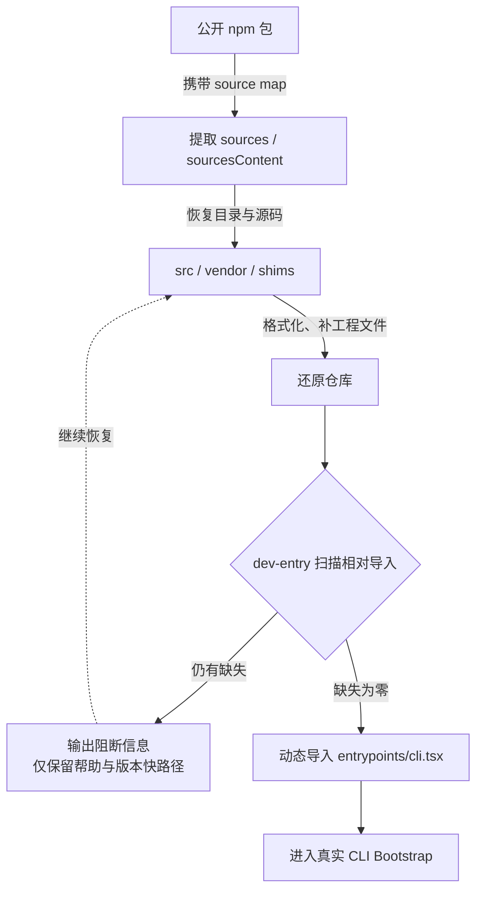

## 24.3 规模、技术栈与依赖版图

### 24.3.1 语言与运行时

项目主体是 TypeScript/TSX，采用 ESM。`package.json` 指定 Bun 1.3.5 作为包管理与主要运行环境，并声明 Node.js 24 及以上。开发脚本把 `dev`、`start` 和版本查询都指向 `src/dev-entry.ts`。这表明项目不是传统“先 tsc 再 node dist”的单一路径，而更依赖 Bun 对 TypeScript、宏、bundle feature 与运行时模块加载的支持。[源码确认]

### 24.3.2 UI 技术

交互界面以 React 和 Ink 为核心。Ink 把 React 组件模型映射到终端输出，允许系统用组件、Context、Hook、局部状态和重渲染组织复杂 CLI。`src/components`、`src/hooks` 与 `src/context` 的规模说明 TUI 不是薄壳，而是承担消息渲染、差异展示、权限确认、设置、任务、团队、技能、MCP、通知、弹层和输入编辑等大量产品逻辑。

### 24.3.3 Agent 与协议依赖

依赖中可见 Anthropic SDK、Agent SDK、sandbox runtime、AWS Bedrock Runtime、MCP SDK、OpenTelemetry、GrowthBook、WebSocket、Zod 等。由此可以建立几条明确的能力轴：

- **模型轴**：直连 Anthropic API 与 Bedrock 等提供方适配；
- **Agent 轴**：消息循环、工具调用、子 Agent、结构化输出和会话恢复；
- **协议轴**：MCP 工具、资源、认证、Elicitation 与 SDK 控制传输；
- **实验轴**：GrowthBook 运行时特性开关与 Bun 编译期 feature；
- **可观测轴**：分析事件、成本、性能和 OpenTelemetry；
- **远程轴**：WebSocket/HTTP 混合传输与 Bridge 环境注册。

### 24.3.4 依赖治理风险

恢复仓库没有天然继承官方内部供应链保证。对二次开发者而言，最重要的不是“能否 bun install”，而是锁文件完整性、依赖来源、宏支持、原生模块兼容、SDK 版本耦合和 Node/Bun 行为差异。尤其 `bun:bundle` 的 `feature()` 是多处死代码消除和产品变体的基础；若替换运行时或用普通 tsc 执行，必须先证明宏语义等价。

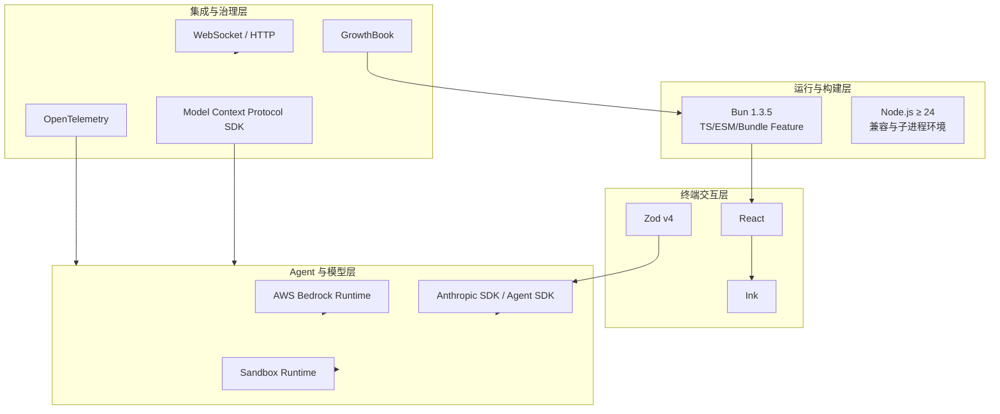

## 24.4 系统定位与核心设计原则

从源码看，该系统不是“把用户输入拼成一个 API 请求”的简单 CLI，而是一个在本地终端运行的 Agent Runtime。它同时负责交互界面、会话状态、上下文构建、模型路由、工具注册、权限治理、本地进程、文件事务、扩展协议、后台任务、远程控制和可观测性。可以把它理解为五种角色的组合：

1. **终端应用框架**：处理输入、快捷键、模态框、流式渲染、滚动与主题。
2. **会话内核**：维护消息、文件缓存、使用量、取消控制器和恢复边界。
3. **Agent 执行器**：迭代调用模型，识别工具请求，执行并回填结果。
4. **本地能力网关**：统一管理文件、Shell、Web、MCP、LSP、IDE 与外部系统访问。
5. **产品变体容器**：通过编译期 feature、用户类型和运行时实验开关组合不同发行能力。

源码反复体现几条设计原则。

### 24.4.1 显式能力契约

工具不是任意回调，而是带 Schema、权限、并发、破坏性、只读性、开放世界访问、UI 渲染和结果映射的完整对象。命令也不只是字符串替换，而有可用性、来源、类型和远程安全集合。显式契约使系统能够在模型调用前构建准确工具描述，在执行前进行统一治理，在执行后形成稳定消息。

### 24.4.2 流式事件优先

`query()` 是异步生成器，流式增量、完整 Assistant 消息、工具进度、工具结果、附件、压缩边界与终止事件通过同一可迭代通道传播。这样 headless SDK、REPL、Bridge 或其他消费者可以选择不同展示方式，而不必复制 Agent Loop。

### 24.4.3 安全不是单点判断

权限由配置规则、工具专属校验、Hook、自动分类器、沙箱、人工确认和组织策略共同组成。安全链路的目标不是“总是弹窗”，而是对低风险请求无摩擦放行，对已禁止请求确定拒绝，对上下文相关风险请求收集可解释确认。

### 24.4.4 上下文是受预算约束的状态

系统对消息、工具输出、系统提示、记忆、技能和文件读取都做预算治理；Compact 并非唯一方案，还存在微压缩、响应式压缩、Context Collapse、History Snip、工具结果落盘和文件读取限额。说明上下文管理被当作持续运行的资源调度问题，而不是异常时才处理。

### 24.4.5 主线程与长生命周期基础设施分离

`ToolUseContext` 中同时存在普通 `setAppState` 和用于任务的 `setAppStateForTasks`。注释明确指出异步 Agent 的普通状态写入可能是 no-op，而后台任务、会话 Hook 等基础设施必须触达根 Store。这体现了对“子 Agent 生命周期”和“会话基础设施生命周期”不同的认识。

### 24.4.6 缓存字节稳定性

工具输入的可观察副本可以做兼容字段回填，但原始 API 绑定消息不能被修改，以免破坏 prompt cache 字节一致性。子 Agent 甚至可以复用父线程在回合开始时冻结的渲染系统提示，避免实验开关从冷到热导致缓存失配。缓存不是外围优化，而是已经影响核心对象是否可变。

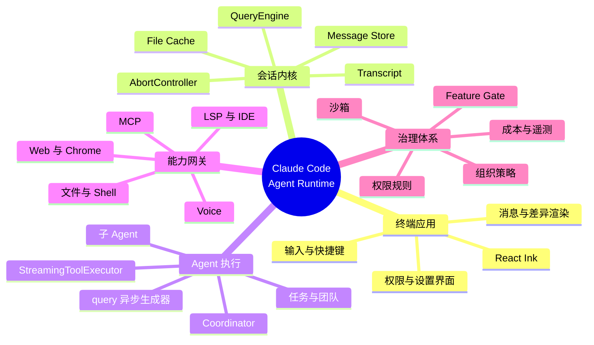

## 24.5 顶层分层架构

虽然仓库没有采用严格的 DDD 或六边形目录命名，但从依赖方向可以抽象为七层。

### 24.5.1 入口与运行模式层

`src/dev-entry.ts`、`src/entrypoints/cli.tsx`、`src/main.tsx`、`src/replLauncher.tsx` 负责恢复闸门、参数快路径、配置初始化、模式选择和应用挂载。CLI 入口大量使用动态导入，尽量让 `--version`、Bridge、Daemon、后台会话、模板、Runner 等快路径不加载完整交互应用。

### 24.5.2 表示层

`src/components`、`src/screens`、`src/ink`、`src/hooks`、`src/context`、`src/vim`、`src/keybindings` 构成终端 UI。它接收流式消息与状态，渲染工具调用、差异、确认框、设置和任务面板，并把用户事件转换成命令、消息或权限决策。

### 24.5.3 会话编排层

`QueryEngine.ts`、`query.ts`、`query/*`、`state`、`bootstrap` 维护会话与回合。它将用户输入处理成消息，装配系统上下文，调用模型循环，记录 transcript，处理压缩边界，汇总使用量，并把 SDK 事件向外输出。

### 24.5.4 能力与工具层

`Tool.ts` 定义能力契约，`src/tools` 给出具体实现。工具既是模型可见 API，也是本地副作用边界。Bash、文件修改、远程触发和发送消息等工具必须通过权限与策略；只读工具可以在满足条件时并行。

### 24.5.5 扩展与协议层

`src/services/mcp`、`src/plugins`、`src/skills` 把外部 Server、插件包和提示技能引入系统；`commands` 则提供面向人的 Slash Command。四者最终都可能改变模型可见工具、系统提示、可执行流程或 UI。

### 24.5.6 基础设施层

`src/services/api`、OAuth、settingsSync、analytics、compact、SessionMemory、LSP、notifier、policyLimits、remoteManagedSettings 等处理外部 API、认证、存储、策略、实验、可观测和资源治理。

### 24.5.7 特殊运行体层

`assistant`、`proactive`、`coordinator`、`bridge`、`remote`、`tasks`、`jobs`、`voice` 等目录承载长期运行助手、多 Agent、远程控制、后台工作和媒体能力。它们并不是完全独立的应用，而是复用会话、工具、权限和消息内核的不同组合。

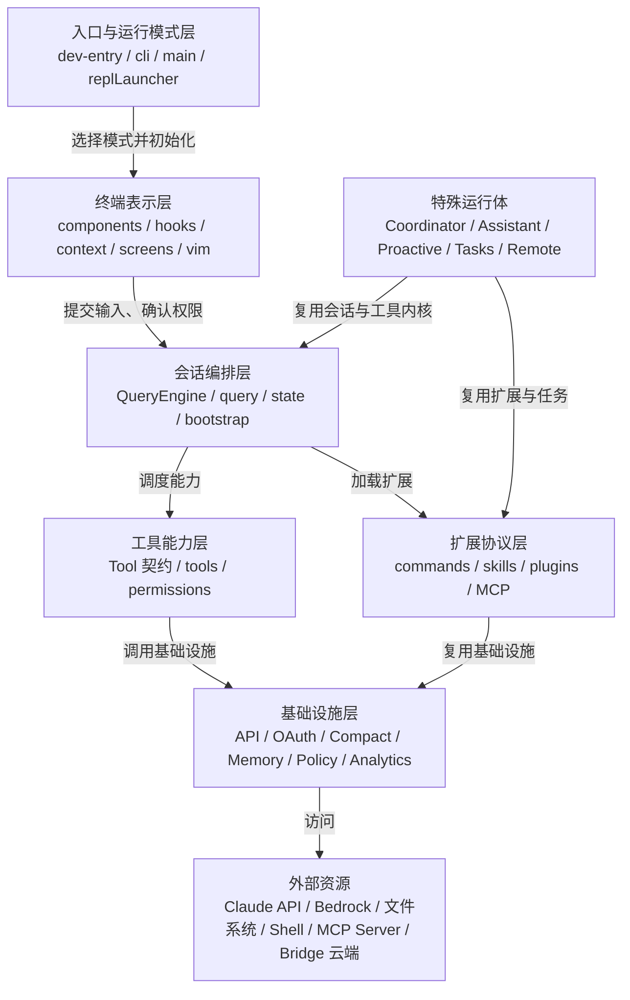

## 24.6 源码目录职责地图

下面的目录地图用于快速定位。由于恢复仓库中部分文件可能被格式化为很长的单行，实际阅读时应优先从类型、导出符号与注释切入。

| 路径 | 核心职责 | 首选阅读入口 |
|---|---|---|
| `src/entrypoints` | CLI 与特殊子进程入口 | `cli.tsx` |
| `src/tools` | 模型可调用工具 | `Tool.ts`、各工具主文件 |
| `src/commands` | Slash Command 实现 | `commands.ts`、各命令目录 |
| `src/components` | Ink UI、消息、设置、权限、任务 | `App.tsx`、`PromptInput` |
| `src/hooks` | UI 行为、权限、队列、动态配置 | `useCanUseTool.tsx` |
| `src/context` | React Context 与跨组件事件 | notifications、overlay、voice |
| `src/query` | 查询配置、转移、停止 Hook、预算 | `transitions.ts`、`tokenBudget.ts` |
| `src/services/api` | 模型 API、错误、重试与 Provider | API client 相关文件 |
| `src/services/compact` | 自动压缩、微压缩、Snip | `autoCompact.ts`、`compact.ts` |
| `src/memdir` | 自动记忆目录、检索和团队记忆 | `memdir.ts` |
| `src/services/SessionMemory` | 会话摘要型记忆 | `sessionMemory.ts` |
| `src/services/mcp` | MCP 连接、认证、传输、资源 | `client.ts`、连接管理器 |
| `src/skills` | Bundled/MCP Skill 装载 | `loadSkillsDir.ts` |
| `src/plugins` 与 `src/utils/plugins` | 插件发现、缓存、安装和提示 | `pluginLoader.ts` |
| `src/tasks` | Agent/Shell/Workflow/Remote 任务 | `types.ts` |
| `src/coordinator` | 多 Agent 阶段编排 | `coordinatorMode.ts` |
| `src/bridge` | 远程控制与环境连接 | `bridgeMain.ts` |
| `src/assistant`、`src/proactive` | 常驻助手、主动触发和梦境整理 | 对应入口与调度器 |
| `src/state` | 应用状态类型与 Store 边界 | `AppState.ts` |
| `src/types` | 消息、权限、工具、ID 等共享类型 | `message.ts`、`permissions.ts` |
| `src/utils` | 文件、Shell、系统提示、权限、缓存等 | 按调用链阅读 |
| `shims` | 缺失依赖或构建环境兼容层 | 逐个核对用途 |
| `vendor` | 还原或内嵌的第三方/内部源码 | 配合 dev-entry 扫描 |

目录本身表现出“按能力垂直切分”和“共享基础设施横向切分”同时存在：BashTool 把 UI、安全、权限、语义和路径校验聚合在一个工具目录；而通用权限、沙箱、消息和缓存又在 `utils`、`types`、`services` 中横向复用。这种结构适合大型产品迭代，但容易产生循环依赖，因此源码多处通过集中类型、动态导入和注释明确的“break import cycles”策略降低耦合。

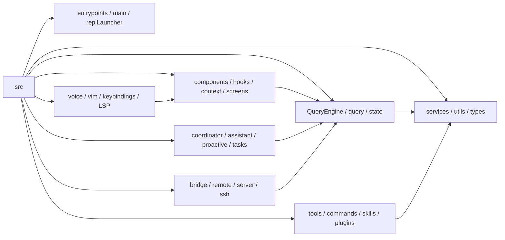

## 24.7 启动与 Bootstrap

### 24.7.1 恢复入口与真实入口

开发脚本先进入 `src/dev-entry.ts`。该文件提供恢复仓库特有的检查与帮助；检查通过后，才导入 `src/entrypoints/cli.tsx`。在真实发行构建中，入口可能由打包器直接指向 CLI 文件，因此二次开发时应分清“还原仓库入口”和“产品入口”。

### 24.7.2 CLI 的快路径哲学

`entrypoints/cli.tsx` 在顶部先处理少量必须在模块加载前设置的环境变量，例如 Corepack 自动固定、远程环境的堆内存、实验基线对后台任务与自动记忆的禁用。之后 `main()` 只读取 `process.argv`，优先分发以下快路径：

- `--version`：零额外模块加载；
- `--dump-system-prompt`：按模型渲染系统提示；
- Chrome/Computer-use MCP 或 Native Host；
- Daemon Worker 与 Daemon Supervisor；
- Remote Control/Bridge；
- 后台会话的 `ps`、`logs`、`attach`、`kill`；
- 模板任务、BYOC Runner、自托管 Runner；
- Worktree + tmux 预处理；
- 最后才进入完整 Commander/REPL 路径。

这种顺序不是简单优化。某些模块在导入时捕获环境变量为常量，例如 BashTool、AgentTool 和 PowerShellTool 是否允许后台任务。若实验基线在 `init()` 之后才设置，模块级常量已经固化，功能开关会失效。因此入口必须承担“在任何相关模块求值前确定进程级语义”的职责。

### 24.7.3 初始化阶段

完整启动通常包含：启用配置、初始化日志/分析 Sink、解析身份与认证、读取全局和项目设置、判断工作区信任、加载插件与 Skill、连接 MCP、构建工具集合、选择模型与 thinking 配置、准备 AppState，最后挂载 Ink 应用或启动 headless QueryEngine。不同模式会有裁剪，例如 `--bare` 更关注低启动延迟，Bridge 先校验认证与组织策略，Daemon Worker 避免加载不必要 UI。

### 24.7.4 启动失败的分类

启动错误至少分四类：

1. **恢复完整性错误**：缺失相对导入，被 dev-entry 提前阻断；
2. **环境错误**：Bun/Node 版本、终端能力、原生依赖或 PATH 不满足；
3. **配置与认证错误**：Token、OAuth、组织策略、受管设置或实验上下文不可用；
4. **模式专属错误**：Bridge 最低版本不满足、远程控制被组织禁用、Daemon Worker 类型未知、MCP 子进程失败。

高质量启动日志应明确指出错误属于哪一层，而不是统一包装成“初始化失败”。

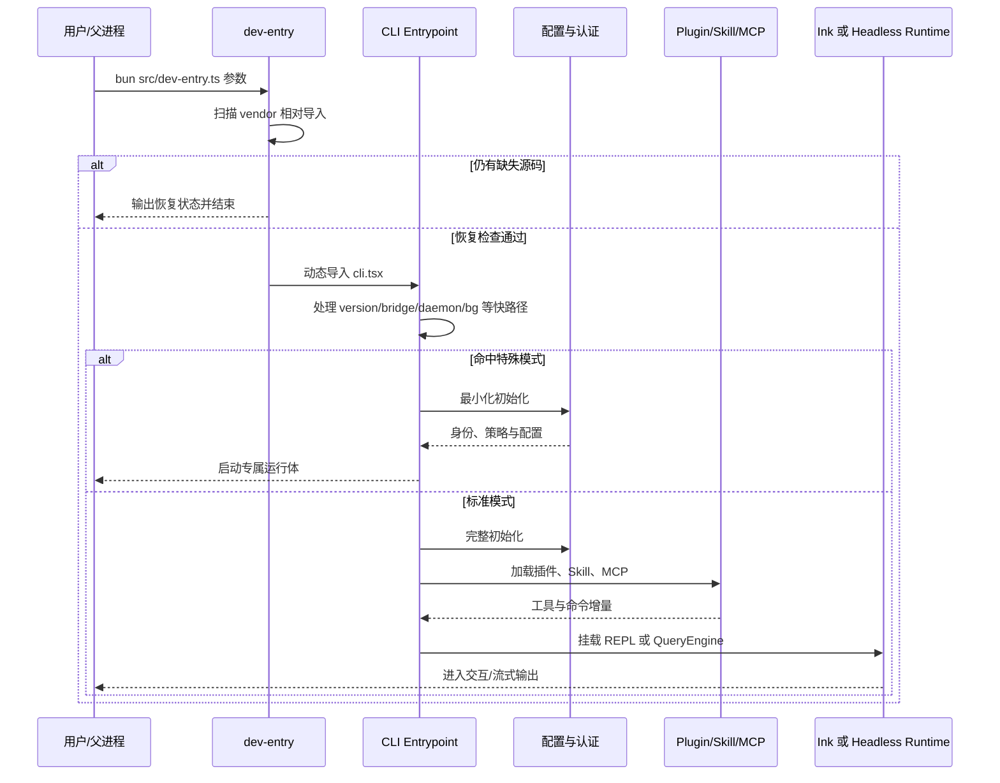

## 24.8 CLI 多模式路由

大型 Agent CLI 的难点之一，是同一可执行文件既要像普通命令一样快速退出，又要支持长生命周期 TUI、守护进程、远程桥接和子工作进程。源码选择“入口显式路由 + 动态导入”，而不是先加载整个应用再在内部判断。

### 24.8.1 交互模式

默认模式挂载 Ink REPL。用户输入文本、Slash Command 或快捷键，界面维护消息列表、工具进度、状态栏、确认队列和弹层。交互模式拥有 `requestPrompt`、`setToolJSX`、OS 通知等 UI 能力，权限决策可以进入队列让用户确认。

### 24.8.2 Print/Headless/SDK 模式

Headless 路径以 QueryEngine 为中心，输入和输出更结构化。`ToolUseContext` 中 `isNonInteractiveSession` 会影响工具描述与权限行为；不存在 UI Prompt 时，必须由调用方注入 `canUseTool` 或采用确定策略，不能默默等待一个永远不会出现的弹窗。

### 24.8.3 Bridge 与远程控制

Bridge 模式让 Web/移动端控制本地 CLI。入口先检查 OAuth、GrowthBook/能力 Gate、最低版本和组织策略，再启动 Bridge 主程序。远端可以提交消息、接收流式输出、批准权限、切换模型或中断；本地仍然是文件和 Shell 副作用的执行位置。

### 24.8.4 Daemon 与后台会话

Daemon Supervisor 管理长生命周期 Worker；后台会话命令则围绕本地 Session Registry 提供查看、日志、附着和终止。它们与工具层的后台 Shell 不是同一概念：前者管理整场 Claude 会话，后者管理一条工具调用产生的本地任务。

### 24.8.5 MCP/Native Host 子模式

Chrome、Computer-use 或 SDK Control 可把 CLI 进程作为协议服务端或 Native Messaging Host。此时标准 REPL 不应初始化，stdout/stderr 也可能成为协议通道，因此日志输出必须严格隔离。

### 24.8.6 模式路由不变量

- 特殊模式必须在加载会污染协议输出或显著拖慢启动的模块前识别；
- 进程级环境开关必须在目标模块求值前确定；
- 每个模式只初始化其必需依赖；
- 组织策略和认证必须在发生远程副作用前完成；
- 无交互模式不得依赖本地弹窗式权限确认；
- 所有长生命周期模式都应支持明确取消、健康检查和清理。

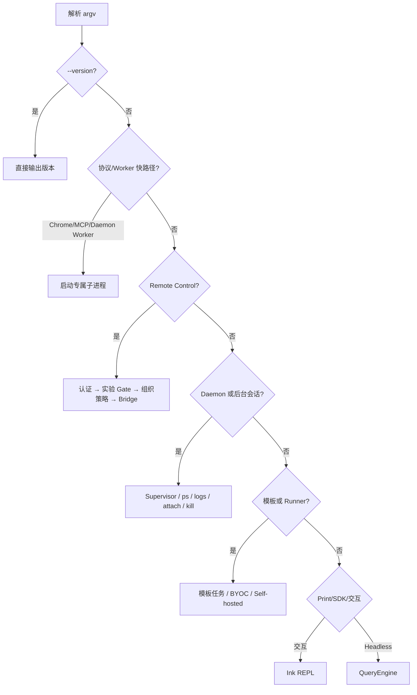

## 24.9 REPL 与 Ink 终端 UI

### 24.9.1 UI 不是 Agent Loop

终端 UI 与 Agent Loop 通过消息、进度和状态边界协作。UI 不应自行决定工具执行顺序；QueryEngine/query 也不应直接写终端 escape sequence。Ink 组件消费状态并生成虚拟终端树，Hook 把用户输入、权限决定和窗口事件转成运行时操作。这样同一 Agent Loop 可以被 REPL、SDK、Bridge 或测试替换消费者。

### 24.9.2 AppState 的聚合性质

从 `ToolUseContext.getAppState/setAppState`、组件目录和 Hook 命名可见，AppState 聚合了消息、工具权限上下文、MCP 连接、IDE 状态、主题、任务、通知、弹层、队列和其他会话状态。大型聚合 Store 的优点是工具与 UI 可共享快照；代价是更新粒度、闭包陈旧、异步 Agent 写入和测试隔离都更困难。源码通过函数式更新、专用 Context、局部 Hook 和 `setAppStateForTasks` 缓解部分问题。

### 24.9.3 PromptInput 与命令队列

输入层需要同时处理普通文本、Slash Command、粘贴、多行编辑、Vim 模式、快捷键、语音转写、文件提及和排队消息。提交后，当前工具可能仍在运行；每个工具的 `interruptBehavior()` 决定新消息是取消当前工具还是被阻塞排队。命令队列因此不是简单 FIFO，它还要理解当前回合状态、可中断工具、后台化和系统消息。

### 24.9.4 消息渲染

不同消息有不同生命周期：

- Assistant 流式文本在尚未完成时持续更新；
- `tool_use` 可以在参数还未完整到达时先渲染局部输入；
- Progress 消息通常只在工具运行中显示；
- Tool Result 可折叠、截断、落盘或渲染为 Diff/Image；
- Compact Boundary 既是持久化边界，也是 UI 历史分段；
- System Local Message 只用于 UI，进入 API 前必须剥离。

`Tool` 接口甚至提供 `extractSearchText`，要求全文检索索引文本与 transcript 模式真实可见文本保持一致，避免“索引命中但屏幕无法高亮”的幽灵结果。这说明终端 UI 已经具备接近桌面应用的搜索一致性要求。

### 24.9.5 权限 UI

权限请求不应直接阻塞 React render。`useCanUseTool` 返回 Promise，并把需要人工确认的请求放入队列；组件显示描述、工具名、输入摘要、匹配规则、潜在影响和允许/拒绝选项。取消、会话中断或组件卸载时 Promise 必须被解析，防止 Agent Loop 永久等待。

### 24.9.6 终端约束

Ink UI 仍受终端宽度、颜色、Unicode、鼠标、Alt Screen、重绘频率与 stdout 污染影响。工具输出可能包含控制字符、超长行、二进制或图像协议，因此渲染前需要清洗、截断和能力探测。恢复仓库中的大量 UI 工具函数，反映出“终端不是普通 DOM”的现实。

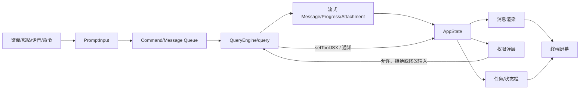

## 第二篇·会话内核与 Agent Loop

## 24.10 QueryEngine 会话引擎

### 24.10.1 类的边界

`QueryEngine` 的源码注释直接给出设计意图：它拥有一场会话的查询生命周期和会话状态，将原本位于 `ask()` 中的核心逻辑抽取为可供 headless/SDK 使用、未来也可供 REPL 复用的独立类。实例粒度是“一场 conversation 一个 QueryEngine”；每次 `submitMessage()` 开启一个新回合，但消息、文件缓存、使用量等状态跨回合保留。[源码确认]

它持有的关键字段包括：

- `config`：工作目录、工具、命令、MCP、模型、预算、权限回调、系统提示与行为选项；
- `mutableMessages`：可变会话消息；
- `abortController`：取消当前执行链；
- `permissionDenials`：SDK 侧权限拒绝记录；
- `totalUsage`：累积 Token/成本使用量；
- `readFileState`：文件读取状态缓存；
- `discoveredSkillNames`：本回合 Skill 发现遥测；
- `loadedNestedMemoryPaths`：已注入嵌套记忆路径去重集合。

这个边界非常重要。若把每次请求都创建成无状态函数，恢复、文件缓存、Skill 去重、累计成本和中断会散落到调用方；若把所有状态都放进全局单例，又会导致多会话污染。QueryEngine 选择会话级对象，在可测试性和状态聚合之间取得平衡。

### 24.10.2 submitMessage 的阶段

`submitMessage()` 可以抽象为十一个阶段：

1. 解构配置并清空回合级集合；
2. 设置工作目录，判断是否启用持久化；
3. 包装 `canUseTool`，记录拒绝及其工具上下文；
4. 构造初始 `ProcessUserInputContext`；
5. 处理用户输入、Slash Command、附件与模型选择；
6. 在 API 响应前先持久化用户消息，保证被中途杀死后仍可恢复；
7. 获取系统提示、用户上下文与系统上下文；
8. 重建本回合真正使用的 ToolUseContext；
9. `for await` 消费 `query()` 输出；
10. 记录消息、Compact Boundary、使用量、结构化输出和错误结果；
11. 生成 SDK result 事件并保留可供下一回合使用的会话状态。

### 24.10.3 先写用户消息再请求模型

源码中的长注释说明了一个容易忽略的可靠性问题：如果只在模型开始返回后才写 transcript，那么用户点击 Stop、桌面宿主杀死子进程或进程异常退出时，日志里可能只有队列操作，没有真正的用户消息；恢复逻辑会判断“没有会话”。因此 QueryEngine 在进入查询循环前先写入用户消息。交互模式等待写入完成，以换取可恢复性；`--bare` 可 fire-and-forget，以降低脚本调用的关键路径延迟。

这是一种典型的**意图先持久化**策略：先保证用户已接受的输入不会消失，再开始不可预测的远程调用。它并不等同数据库事务，但建立了明确的恢复锚点。

### 24.10.4 Compact 后的内存释放

当 Compact Boundary 被写入并包含保留段信息后，SDK/headless 路径可以删除边界之前的 `mutableMessages`，释放长期会话的堆内存。REPL 可能仍保留完整历史用于滚动和搜索，因此两种模式对“逻辑上下文”和“UI 历史”的物理存储策略不同。这是把上下文窗口、持久化日志和屏幕历史分开建模的体现。

### 24.10.5 中断与可变配置

`interrupt()` 直接触发 QueryEngine 的 AbortController；`setModel()` 可以改变后续回合的模型配置；`getMessages()`、`getReadFileState()` 和 `getSessionId()` 向宿主暴露受控状态。引擎没有把内部数组任意交给外部修改，而以只读视图或专用方法暴露，这有利于维持消息顺序和缓存不变量。

### 24.10.6 设计风险

QueryEngine 已经很大，既处理输入、上下文、持久化、SDK 事件、压缩、结构化输出又处理错误聚合。它是自然的“会话应用服务”，但也存在继续膨胀为 God Object 的风险。后续重构可将 TranscriptCoordinator、TurnContextBuilder、SDKEventMapper、UsageAccumulator 和 CompactBoundaryManager 拆为组合对象，同时保留 QueryEngine 作为门面。

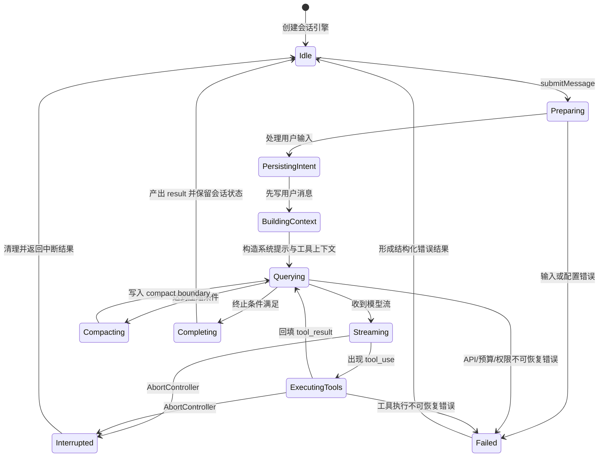

## 24.11 `query()` 异步生成器与 Agent Loop

### 24.11.1 为什么使用异步生成器

`query(params)` 返回 `AsyncGenerator`，持续产出 StreamEvent、请求开始事件、Message、Tombstone、ToolUseSummary 等对象，并最终返回 Terminal。异步生成器同时解决三个问题：

- 上游模型流可以边到达边消费，无需等完整响应；
- 工具执行进度可以插入同一时间线；
- 不同宿主可通过 `for await` 统一处理事件，而不依赖 React 或特定 SDK。

与回调树相比，生成器保留顺序语义；与“返回最终数组”相比，它显著降低首 Token 延迟和峰值内存。更重要的是，生成器允许内部在模型、工具、Hook、压缩和重试之间切换，而外部只看到有序事件。

### 24.11.2 主循环的逻辑模型

一个典型循环是：

1. 取 Compact Boundary 之后的有效消息；
2. 装配系统提示、工具 Schema、模型和 thinking；
3. 发起流式模型请求；
4. 把增量事件向外 yield；
5. 收集完整 Assistant Message；
6. 若流中出现 `tool_use`，对每个调用执行验证、权限和工具；
7. 生成 User Message 形式的 `tool_result`；
8. 把结果加入消息，再次请求模型；
9. 若没有工具调用且停止 Hook 不要求继续，则返回终止态。

这里有一个源码明确强调的细节：`stop_reason=tool_use` 并不被认为足够可靠，**流中实际出现工具块**才是退出当前模型流并进入工具执行阶段的依据。这样可以避免供应商或 SDK 在边缘情况下错误标注 stop reason，导致遗漏已收到的工具请求。

### 24.11.3 可观察输入与缓存输入分离

某些工具需要为旧 SDK、Transcript、Hook 或权限弹窗补充派生字段。`Tool.backfillObservableInput()` 允许对工具输入的复制品原地补齐，但原始消息保持不变。理由是 prompt cache 对序列化字节敏感；若为了展示而修改历史工具输入，下一个请求的缓存前缀可能失效。

这形成双轨模型：

- **API 事实轨**：保持模型原始输出字节和消息结构；
- **观察兼容轨**：允许为 UI、遥测、Hook 和 SDK 填充可读字段。

任何新增兼容逻辑都应放在观察轨，不能反向污染 API 事实轨。

### 24.11.4 工具执行结果的顺序

模型可以一次发出多个工具调用。只读、并发安全的调用可以并行；会改变上下文或相互依赖的调用需要串行。无论底层并发如何，回填给模型的 Tool Result 必须能按 tool_use ID 正确关联，并保持可预测顺序。若中途异常，执行器需要为未完成调用补齐错误结果，避免下一次 API 请求出现“有 tool_use 没有 tool_result”的协议不完整状态。

### 24.11.5 可恢复错误与不可恢复错误

query 循环会暂缓暴露部分 prompt-too-long、max-output 等错误，因为 Context Collapse、Reactive Compact 或截断仍可能恢复；若过早把错误产出为最终结果，上层会结束会话，恢复策略没有机会执行。相反，认证失败、明确预算超限、无法满足协议或取消应快速终止。

错误分类因此不是按 HTTP 状态码简单映射，而要回答两个问题：

1. 当前消息/工具状态是否仍然协议完整？
2. 是否存在不会重复副作用的恢复动作？

### 24.11.6 Terminal 条件

终止可能来自：模型自然结束、达到 max turns、达到美元预算、结构化输出工具成功、用户中断、停止 Hook、不可恢复 API 错误、工具链无法继续或组织策略阻断。高质量 Agent Loop 不能只写 `while(true)` 等模型不再调用工具，而要把每种退出原因转成明确的 Terminal/Result subtype，供 CLI、SDK 与远端调用方可靠处理。

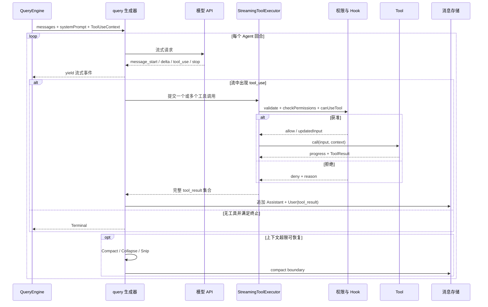

## 24.12 消息模型与事件流

### 24.12.1 消息不是单一 Chat Message

`ToolUseContext` 引用的消息类型至少包括 UserMessage、AssistantMessage、AttachmentMessage、SystemMessage、ProgressMessage 与 SystemLocalCommandMessage。QueryEngine 还向 SDK 输出初始化、流式、结果和状态类事件。把这些对象都叫“消息”容易混淆，实际可以按用途分为四层：

- **API 对话层**：真正发送给模型的 user/assistant 内容块；
- **控制层**：compact boundary、任务通知、停止原因、恢复标记；
- **观察层**：progress、stream delta、工具摘要、使用量；
- **UI 层**：本地命令反馈、弹层提示、仅屏幕可见系统消息。

`normalizeMessagesForAPI` 之类的边界负责剥离不能进入 API 的本地对象。类型上把 `appendSystemMessage` 参数排除 `SystemLocalCommandMessage`，就是用编译期约束保护边界。

### 24.12.2 Tool Use 与 Tool Result 配对

Assistant Message 可以包含多个 `tool_use` 内容块；对应结果通常以 User Message 的 `tool_result` 内容块返回。配对键是 tool use ID，而不是数组索引。消息规整器必须处理：

- 同一响应多个工具调用；
- 工具并发完成顺序不同；
- 工具被拒绝、取消或验证失败；
- 进程异常导致孤儿工具调用；
- 恢复日志中缺失部分结果；
- MCP 元数据和结构化内容透传。

任何情况下都应尽量生成协议合法的结果块。让模型在下一轮看到“工具失败：权限拒绝”比直接删除调用更正确，因为删除会改变因果历史。

### 24.12.3 附件与嵌套记忆

AttachmentMessage 用于承载不适合直接作为普通用户文本的结构化上下文，如结构化输出、max-turns 信号、文件、记忆或其他运行时附件。`nestedMemoryAttachmentTriggers` 与 `loadedNestedMemoryPaths` 防止同一 CLAUDE.md 因文件缓存 LRU 淘汰而在繁忙会话中重复注入几十次。

### 24.12.4 Progress 的生命周期

Progress 不一定持久保留为模型上下文。它主要服务 UI、SDK 观察者和遥测，例如 Bash 已运行时长、Agent 子任务进度、MCP 调用阶段、Web Search 状态。完成后，最终结果应该包含足够事实，使删除进度消息不会损害模型理解。否则长期会话会被大量瞬时状态污染。

### 24.12.5 Compact Boundary

Compact Boundary 是特殊 System Message，记录“此前上下文已被摘要替代”的事实，并可能带 preservedSegment 的头尾 UUID。它同时服务：

- 恢复时裁剪旧历史；
- 内存中释放边界前消息；
- SDK 向调用方报告压缩；
- UI 分段与调试；
- 保持压缩前后因果关系。

### 24.12.6 消息 UUID 与可追踪性

QueryEngine 支持调用方为输入指定 UUID。稳定 ID 有助于 transcript、回放、分支、工具结果关联和远程桥接。设计上应避免以数组位置代替身份，因为 Compact、Snip、过滤 UI 消息和恢复重排都会改变位置。

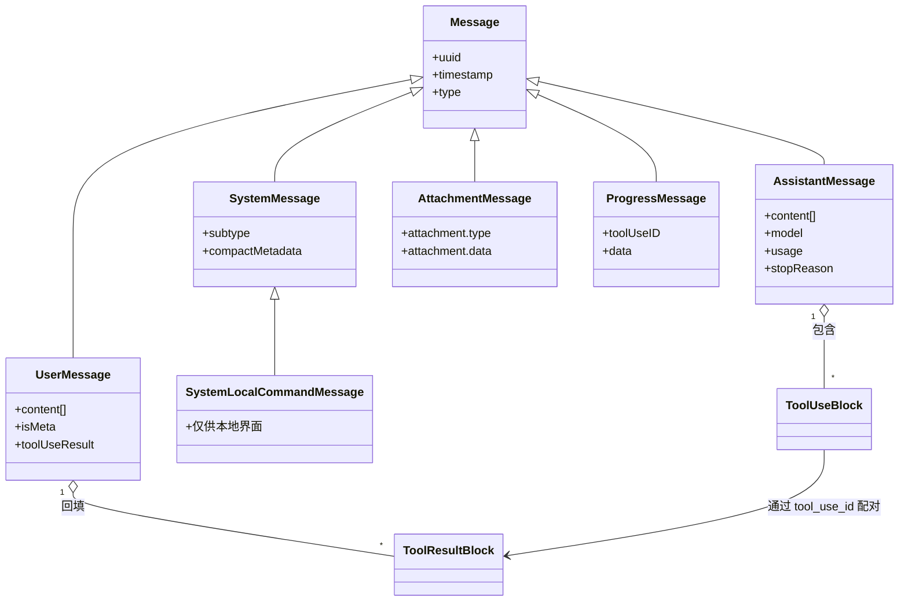

## 24.13 模型请求、流式响应与重试

### 24.13.1 请求装配

模型请求不是只包含消息。运行时还需要决定主循环模型、fallback 模型、thinking 配置、系统提示、工具 Schema、严格模式、最大输出、缓存策略、查询来源、组织限制与用户覆盖。QueryEngine 在处理输入后重新获取模型和上下文，是因为 Slash Command 或输入处理本身可能改变模型、权限模式或系统提示。

### 24.13.2 Provider 与模型选择

依赖版图显示系统支持 Anthropic SDK 与 AWS Bedrock Runtime；源码还包含模型解析和 API 服务目录。架构上应把“用户输入的模型别名”“最终供应商模型 ID”“认证方式”“区域/端点”和“能力集”分离。否则同一个 `model` 字符串会同时承担 UI 名称、计费键、API 参数与兼容判断，后期极难演进。

### 24.13.3 流式生命周期

典型流包括 request_start、message_start、content block start/delta/stop、message delta 和 message stop。运行时一边向外 yield 增量，一边构造完整 AssistantMessage。工具输入也可能分片到达，因此 Tool 的 `renderToolUseMessage` 接收 Partial Input，允许 UI 提前显示“正在运行什么”，但真正验证必须等待 Schema 可解析的完整输入。

### 24.13.4 重试分类

合理的 API 重试必须区分：

- 网络断开、连接复位、临时 5xx：通常可指数退避重试；
- 429/容量限制：遵循 retry-after、展示等待或切 fallback；
- 认证/权限：不应盲目重试；
- prompt-too-long：通过压缩或裁剪重建请求；
- max-output：判断是否可继续生成或压缩工具结果；
- 内容策略/组织策略：返回可解释拒绝；
- 已产生部分流后断开：需判断重试是否会重复工具意图。

特别是含工具调用的部分响应，不能简单重发并把两份 tool_use 都执行。系统必须以完整消息边界、流事件状态和 tool use ID 判断是否安全恢复。

### 24.13.5 Fallback 模型

Fallback 不应被当作所有错误的兜底。切模型可能改变上下文窗口、工具调用格式、thinking 支持、输出风格和成本。适合切换的通常是供应商容量或特定模型不可用；不适合切换的是输入非法、权限失败或同样会触发的上下文超限。切换后还应记录最终实际模型，保证成本与调试准确。

### 24.13.6 请求级和会话级预算

`maxTurns` 限制 Agent Loop 迭代次数，`maxBudgetUsd` 限制成本，`taskBudget` 约束任务消耗。它们对应不同风险：无限工具循环、昂贵模型输出、并发子任务膨胀。预算判断需要在发请求前预防，也要在收到真实 usage 后结算；只做事后统计无法阻止超支。

### 24.13.7 使用量与结果

QueryEngine 累积 totalUsage，并在最终 SDK Result 中带出时长、错误、拒绝、结构化输出和最后停止原因。流式展示与最终结算分离：前者追求低延迟，后者追求完整性。任何工具或 Hook 在 Assistant 响应之后插入的 Progress/Attachment 都不能让结果提取错误地把“最后一条消息”当作最终文本，源码已通过限定最后有效消息类型修复这类问题。

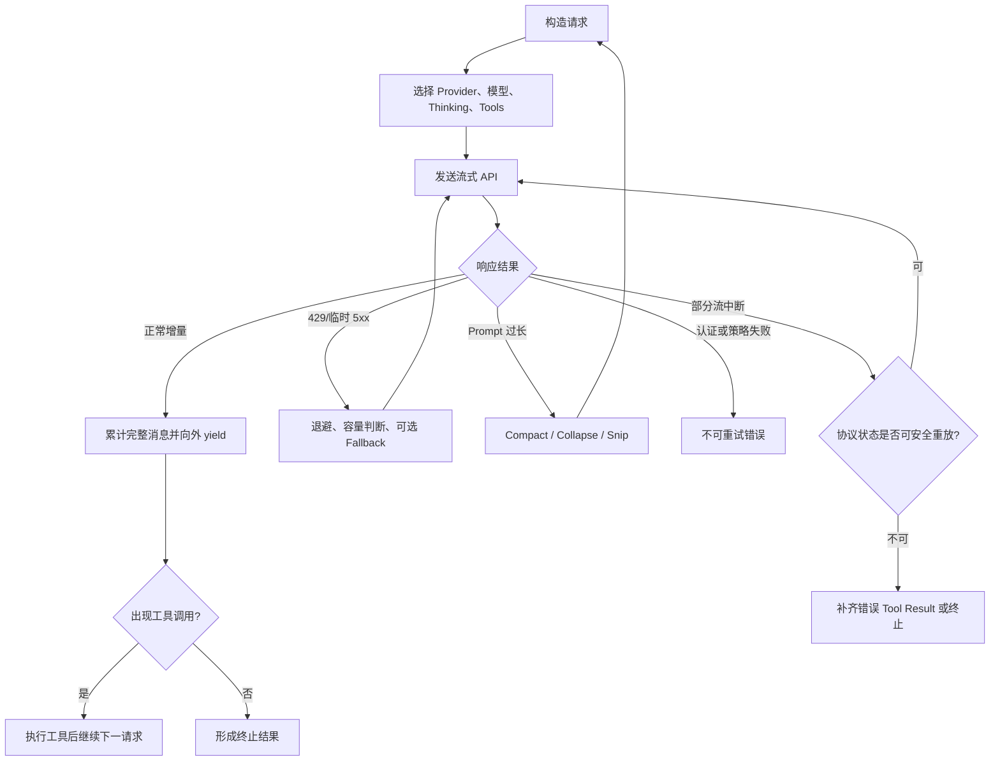

## 24.14 工具统一类型系统

### 24.14.1 Tool 是能力描述对象

`Tool<Input, Output, Progress>` 以 Zod Schema 约束输入，`call()` 返回 `ToolResult<Output>`。它并非只有执行函数，而是包含模型提示、UI 呈现、权限、并发和结果序列化的综合契约。关键字段与方法可以按六组理解。

**模型接口组**：`name`、`aliases`、`inputSchema`、可选 `inputJSONSchema`、`outputSchema`、`prompt()`、`strict`、`searchHint`、`shouldDefer`、`alwaysLoad`。它们决定模型能看到什么、何时加载和是否启用严格工具调用。

**执行组**：`call()`、`validateInput()`、`isEnabled()`、`isConcurrencySafe()`、`interruptBehavior()`、`contextModifier`。它们决定工具是否可运行、是否能并发以及执行后怎样改变上下文。

**安全组**：`isReadOnly()`、`isDestructive()`、`isOpenWorld()`、`requiresUserInteraction()`、`checkPermissions()`、`preparePermissionMatcher()`、`toAutoClassifierInput()`。它们为统一权限引擎提供事实。

**结果组**：`mapToolResultToToolResultBlockParam()`、`maxResultSizeChars`、`mcpMeta`、`newMessages`。它们控制模型收到的结果、超大结果落盘和附加消息。

**UI 组**：`userFacingName()`、活动描述、使用/结果/进度/拒绝渲染、折叠判断、搜索文本提取、结果是否截断。工具是自渲染能力，而非所有结果都被通用 JSON 查看器粗暴展示。

**兼容组**：aliases、`backfillObservableInput()`、`inputsEquivalent()`、MCP 原始 server/tool 名。它们允许工具重命名、观察字段补齐和重复调用比较。

### 24.14.2 ToolUseContext 是执行环境

ToolUseContext 聚合运行工具所需的会话能力：命令、模型、工具列表、thinking、MCP、预算、AppState、AbortController、文件缓存、通知、系统提示、Agent 身份、消息、权限跟踪、Skill 发现、嵌套记忆去重、内容替换预算和交互 Prompt。它相当于依赖注入容器与 Unit of Work 的混合体。

优点是每个工具调用签名稳定，新增会话能力无需修改几十个工具参数；缺点是上下文很宽，工具可能依赖过多字段。二次开发应把 ToolUseContext 当作只读能力集合，避免任意修改不属于本工具领域的状态。

### 24.14.3 ToolResult 不只是 data

`ToolResult` 可以带 `newMessages`、`contextModifier` 与 MCP metadata。`newMessages` 允许工具在主结果之外向会话注入附件或系统信息；`contextModifier` 只对非并发安全工具生效，因为并发执行时多个修改器的顺序难以定义。这个限制体现了对状态合并确定性的保护。

### 24.14.4 延迟加载工具

`shouldDefer` 让工具以 defer_loading 方式提供，由 ToolSearch 先发现再调用；`alwaysLoad` 则保证某些工具首轮就完整出现在 Prompt。延迟加载可以减少大量 MCP/专业工具 Schema 占用，但带来一次额外搜索回合和“模型不知道该搜什么”的召回风险。因此 `searchHint` 必须使用工具名之外的高区分关键词。

### 24.14.5 大结果治理

`maxResultSizeChars` 定义结果达到多大后保存到磁盘，只向模型提供预览与路径。Read 工具可设为 Infinity，因为把 Read 结果再保存成文件会形成“读文件→结果文件→再读文件”的循环，而且 Read 自己已有行数和字节限制。这说明统一机制必须允许领域例外，而不是强迫所有工具一刀切。

### 24.14.6 契约不变量

- Schema 验证发生在副作用前；
- `checkPermissions` 只能在输入有效后调用；
- 模型可见输入不得包含内部绕过字段；
- `isReadOnly` 与真实行为必须一致，否则并发和权限都会失真；
- Tool Result 必须可映射为合法 API result block；
- 观察输入补齐必须幂等；
- UI 的可见文本与 transcript 搜索索引应一致；
- 有破坏性或开放世界访问的工具必须提供可解释描述。

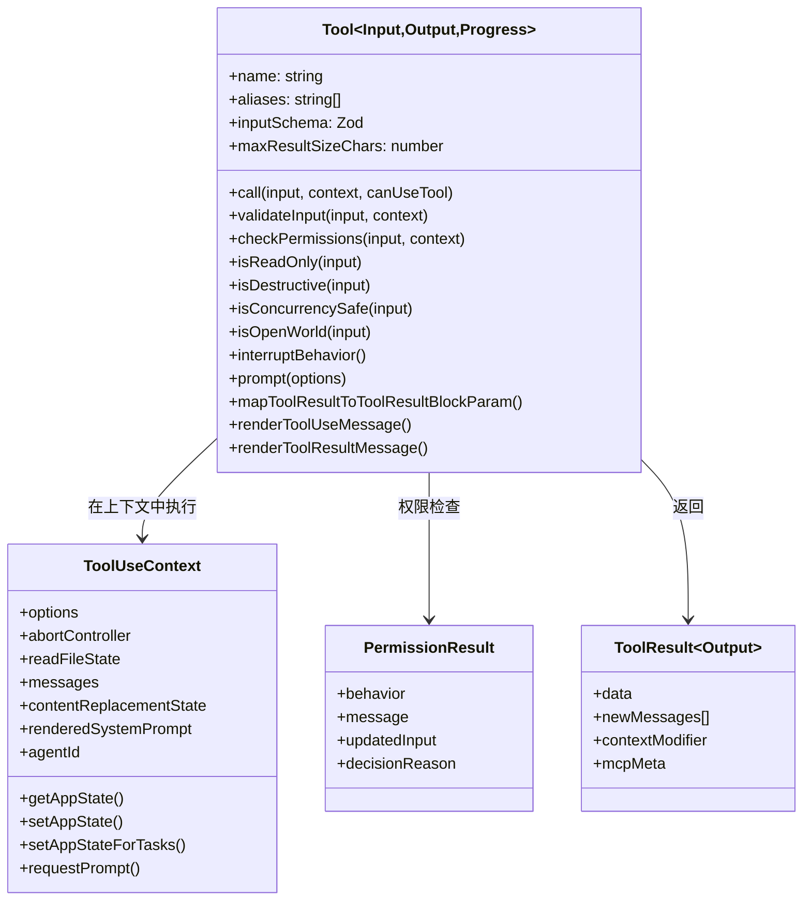

## 24.15 StreamingToolExecutor 与并发调度

### 24.15.1 为什么需要专门执行器

模型流可能在同一 Assistant Message 中发出多个工具调用，工具参数又是分片到达。专门的 StreamingToolExecutor 可以把“解析流”“判断调用何时完整”“权限”“并发”“进度”“结果配对”和“异常补齐”集中处理，避免 query 主循环被每个工具的特殊逻辑淹没。

### 24.15.2 调度依据

并发决策不能只看工具名，应调用每个工具的 `isConcurrencySafe(input)`。同一个 BashTool，`pwd` 与 `rm` 风险不同；同一个 FileReadTool 可并行读不同文件，而 FileEditTool 通常会影响文件缓存、Git 状态和后续工具。只读性和并发安全性相关但不等价：网络搜索可能只读，却受速率限制；读取正在被另一个调用修改的文件也可能产生时序问题。

推荐的调度优先级是：

1. 任何需要 `contextModifier` 的调用串行；
2. 非并发安全或明确破坏性的调用串行；
3. 相同路径/资源的读写按冲突图排序；
4. 纯只读且资源不冲突的调用并行；
5. 并发度仍受会话级/任务级上限约束。

### 24.15.3 结果提交屏障

并行工具可以在不同时间完成，但在发送下一次模型请求前，应等待本批需要回填的结果达到一致屏障。否则模型可能先基于部分结果继续，再收到剩余结果，造成逻辑分叉。进度可以实时 yield，最终 Tool Result 则应按原 tool_use 序列或稳定规则组装。

### 24.15.4 取消

AbortController 应传播到权限等待、Hook、MCP、Shell、Web 和子 Agent。取消不是简单停止监听：仍需终止子进程、关闭流、清理临时文件、释放锁，并为协议中已经产生的 tool_use 生成取消结果。工具的 `interruptBehavior()` 允许区分“新用户消息应取消当前工具”与“必须等待当前不可安全中断的操作完成”。

### 24.15.5 权限队列与并发

多个并发工具同时需要确认时，UI 不宜弹出多个重叠对话框。权限请求队列应串行展示，但自动允许/拒绝可以并发计算。`awaitAutomatedChecksBeforeDialog` 可用于 Coordinator Worker：先等待分类器/Hook，避免刚打开人工对话框就被自动结果关闭。对无 UI 的后台 Agent，`shouldAvoidPermissionPrompts` 要求无法自动决定时拒绝，而不是挂死。

### 24.15.6 异常完整性

若第一个工具抛出异常，执行器不能遗忘同一消息中的其他 tool_use。合理策略是：

- 已完成调用保留真实结果；
- 正在执行调用尽力取消并给出取消/失败；
- 尚未开始调用给出“因同批执行失败而未运行”；
- 所有 result 使用原 ID；
- 原始异常既记录内部日志，也转成模型可理解的安全错误，不泄露密钥或不必要栈信息。

### 24.15.7 背压

Bash 或 Agent 进度可能非常频繁。若每个字符都触发 React 重绘和 SDK 事件，吞吐会被 UI 拖垮。执行器或 UI 层需要节流、合并增量、限制缓冲区，并确保最终输出不因节流丢失。背压策略应区分“展示采样”和“事实结果”：可以少画几帧，但不能少保存关键 stderr 或退出码。

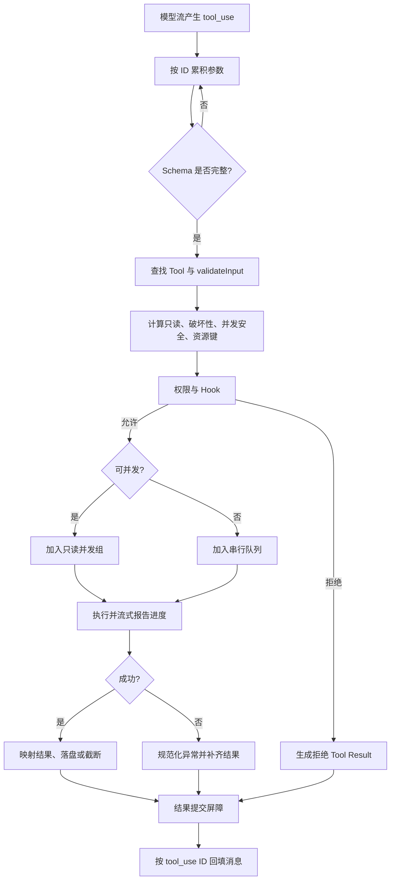

## 24.16 权限模型

### 24.16.1 权限上下文

`ToolPermissionContext` 包含当前模式、附加工作目录、always allow/deny/ask 规则、是否允许绕过权限、是否支持自动模式、被剥离的危险规则、是否避免弹窗、是否等待自动检查，以及进入 Plan Mode 前的权限模式。默认上下文是 `mode: default`、空规则并关闭 bypass。

这不是一个布尔开关，而是会话级策略快照。工具自己的 `checkPermissions` 负责解释领域输入，通用权限层负责合并规则来源、当前模式和交互方式。

### 24.16.2 决策层次

从低到高可以抽象为：

1. **输入合法性**：Schema 和 `validateInput`；
2. **硬性策略**：组织策略、killswitch、禁用功能、工作区边界；
3. **显式规则**：deny、ask、allow，通常 deny 优先；
4. **工具专属判断**：路径、命令、目标资源、只读语义；
5. **Hook 与分类器**：结合上下文自动允许或拒绝；
6. **用户确认**：展示可解释请求；
7. **执行期防护**：沙箱、超时、资源限制；
8. **审计记录**：决策来源、时间、消息和 tool_use ID。

仅靠第六层弹窗不是安全模型。用户可能疲劳点击，描述可能不准确，而执行期环境也可能在确认后变化。

### 24.16.3 useCanUseTool

`useCanUseTool.tsx` 把 AppState、权限上下文、确认队列、日志和自动分类器连接起来。通用检查返回 deny 时，立即记录“配置拒绝”；需要 ask 时，可并行等待 speculative classifier。源码设置约两秒竞速窗口：若高置信分类器及时匹配且相关 feature 开启，可以记录自动批准；否则进入用户对话框。无论哪条路径，取消都会解析 Promise 并清理“正在分类”状态。

### 24.16.4 自动模式与分类器

自动模式的目标是减少安全操作的打断，但分类器绝不能成为唯一防线。工具通过 `toAutoClassifierInput()` 提供简洁安全相关表示；Bash 传命令，Edit 传路径和内容摘要，无安全意义的工具可以返回空。分类器结果还需要 feature gate、置信度和规则匹配。对于高风险命令，静态危险模式和沙箱仍应优先。

### 24.16.5 规则来源

`ToolPermissionRulesBySource` 暗示规则可来自用户、项目、受管设置、命令行或会话更新。保留来源很重要，因为冲突解释、UI 展示、组织强制和“这条规则为什么生效”都依赖 provenance。合并时不应把规则拍平成无来源字符串。

### 24.16.6 Permission Update

用户可能选择“仅本次允许”“本会话允许”“把规则写入项目/用户配置”等更新。更新必须先验证其范围，防止低信任项目通过提示让用户写入全局宽泛规则。对于 Shell 通配符，解析和 shadowed rule 检测能识别一条更宽规则是否遮蔽了后续细规则。

### 24.16.7 Bypass 权限

绕过权限是高危能力，应同时受模式可用性、组织 killswitch、环境、UI 警告和审计约束。即便 bypass 开启，也不意味着可以绕过操作系统权限、沙箱政策或组织远程控制限制。实现上要避免把“跳过人工确认”误写为“跳过所有 validate 和安全检查”。

### 24.16.8 背景 Agent

后台 Agent 无法显示本地确认时，应该使用 allowlisted 工具、只读模式、预授权规则或确定拒绝。源码中的 `shouldAvoidPermissionPrompts`、本地 denial tracking 和阈值逻辑正是在处理这种场景。否则子 Agent 会在 Promise 上永久等待，主线程只看到任务无进展。

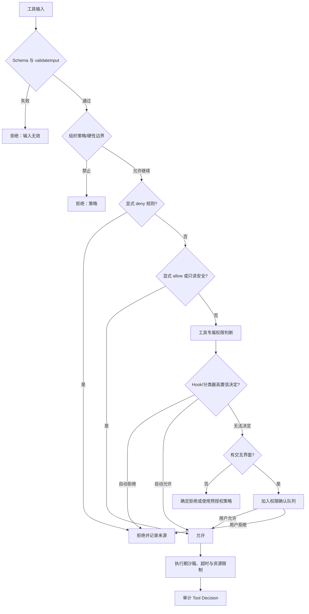

## 24.17 Bash 执行与沙箱

### 24.17.1 BashTool 的复杂度来源

`BashTool.tsx` 超过千行，目录还拆出权限、安全、命令语义、危险提示、路径校验、只读验证、sed 解析、沙箱选择和 UI。这是合理的复杂度信号：Shell 是 Agent 最强大、也最容易越权的通用工具。把它当作 `exec(command)` 包装会遗漏几乎所有真实工程问题。

### 24.17.2 输入 Schema

Bash 输入包含 command、可选 timeout、description、run_in_background、dangerouslyDisableSandbox，以及内部 `_simulatedSedEdit`。description 被要求使用简洁主动语态，避免用“复杂”“风险”等模糊词掩盖真实行为。`_simulatedSedEdit` 永远从模型可见 Schema 中移除；它只在用户批准 sed 编辑预览后由内部 UI 写入。如果把该字段暴露给模型，模型可能用无害命令配合任意文件内容绕过权限和沙箱。[源码确认]

### 24.17.3 命令解析与语义

BashTool 使用命令拆分、AST 安全解析和语义集合判断搜索、读取、目录列举、静默成功等。对于管道与 `&&`、`||`、重定向，必须理解每个片段；只有所有有效命令都属于搜索/读取且没有改变语义的片段，整体才可折叠为只读展示。简单按字符串前缀判断 `cat` 或 `grep` 会被管道后的写操作绕过。

### 24.17.4 权限规则

Shell 权限通常支持 `Bash(git status)`、`Bash(npm test:*)` 等模式。匹配器需要规范空白、引号、环境变量、路径和复合命令；规则过宽可能允许命令替换、重定向或子 Shell。源码提供 `permissionRuleExtractPrefix`、通配符匹配、Shell 规则解析与 shadow 检测，说明规则语言本身被视为安全敏感 DSL。

### 24.17.5 只读约束

只读模式不只禁用 `rm`。重定向、`sed -i`、`git checkout`、包管理安装、数据库命令、curl 上传、环境持久化等都可能修改状态。`readOnlyValidation.ts` 和 `sedValidation.ts` 代表两类策略：通用语义检查与高风险命令专用解析。若无法可靠解析，应保守地要求确认，而不是假设只读。

### 24.17.6 沙箱选择

`shouldUseSandbox` 结合全局模式、工具输入和危险覆盖字段选择 sandbox。执行仍要设置工作目录、环境、超时、输出捕获和进程组取消。`dangerouslyDisableSandbox` 必须经过额外权限确认，不能仅因为模型传 true 就生效。

### 24.17.7 前台与后台

默认命令注册为前台任务；长时间命令可以显式 `run_in_background`，某些 Assistant 模式的阻塞命令在预算后自动后台化。后台任务把输出写到任务路径，用户或 Agent 之后用 Read/TaskOutput 获取。Sleep 等命令被禁止自动后台化，防止语义变化。

### 24.17.8 输出治理

Bash 同时收集 stdout、stderr、退出码、持续时间和可能的图像输出。超长结果使用累加器截断或落盘，预览包含文件路径；静默命令成功时 UI 显示 Done 而不是误导性的 No output。控制字符、终端重置和编码需要清洗。对于改变文件的命令，可能触发文件历史跟踪、Git 操作记录和 VS Code MCP 文件更新通知。

### 24.17.9 TOCTOU 与边界

权限确认看到的命令文本和真正执行的命令必须完全一致。内部预览字段要绑定被确认内容；工作目录在确认后也不能被攻击者用符号链接无声替换。绝对消除 TOCTOU 很难，但可以通过规范路径、在沙箱中限制可写根、减少确认到执行的可变步骤和记录最终 argv/环境来降低风险。

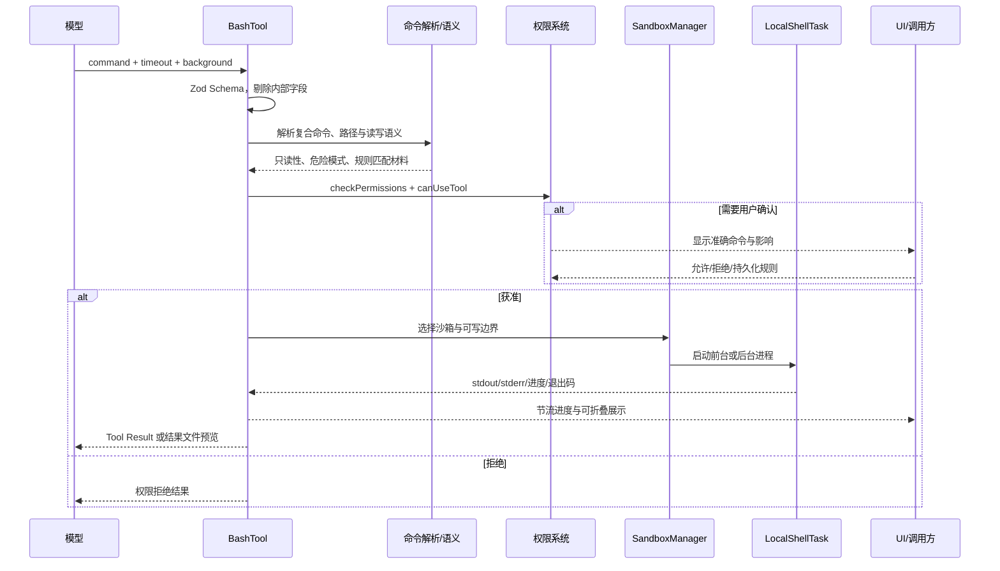

## 24.18 文件读写与编辑事务

### 24.18.1 文件工具族

工具目录包含 FileReadTool、FileWriteTool、FileEditTool、GlobTool、GrepTool、NotebookEditTool 等。把文件读取、搜索、创建和局部编辑拆开，有利于更精确地描述权限和结果：Read 天然只读，Glob/Grep 可并发，Write 会覆盖或创建，Edit 需要验证旧文本与当前文件一致，Notebook 则要保留结构化单元格。

### 24.18.2 FileRead

读取工具应完成路径规范化、工作区边界检查、大小与 Token 限制、编码检测、行号切片、二进制/图片识别和文件状态缓存。`ToolUseContext.fileReadingLimits` 支持 maxTokens/maxSizeBytes，`readFileState` 则可以记录模型已读版本。Read 的结果通常不再由统一大结果机制落盘，以免产生递归读取结果文件。

### 24.18.3 FileWrite

写入工具必须区分新建与覆盖。覆盖现有文件属于破坏性操作，应显示 Diff 或至少显示目标路径与大小。可靠写入建议采用同目录临时文件、fsync（按需要）和原子 rename；Windows 上 rename 语义与文件占用需要单独处理。写后要更新文件缓存、历史快照、IDE 通知和 Git 变更感知。

### 24.18.4 FileEdit

局部编辑通常输入 file_path、old_string、new_string、replace_all 等。关键不变量是 old_string 必须与当前文件唯一匹配或满足明确 replace_all；否则模型基于旧版本生成的补丁可能错位。编辑前可读取缓存中的 mtime/hash，与磁盘重新核对，发现并发修改时拒绝并要求重新读取。

### 24.18.5 Diff 与用户确认

UI 的 StructuredDiff 可以把新增、删除、上下文行和语法颜色展示给用户。权限确认应基于最终将写入的内容，而不是模型最初的粗略描述。对于 sed 命令，源码专门解析并计算预览，再把批准后的模拟结果通过内部字段传回 BashTool，这本质上是把“命令式编辑”转换成可审核的“声明式文件差异”。

### 24.18.6 NotebookEdit

Notebook 不是纯文本文件。编辑单元格需要维护 cell ID、类型、source 数组、execution count 和 outputs。直接字符串替换 JSON 可能损坏结构或产生巨大无意义 Diff。Notebook 工具应在结构层验证目标单元格，执行后再序列化，同时避免把输出二进制或大量 base64 全部注入模型。

### 24.18.7 搜索工具

Glob 和 Grep 应限制结果数量、忽略 vendor/二进制/大目录、尊重工作区与用户显式路径，并返回稳定排序。搜索结果是后续 Read 的导航，不应一次塞入所有文件内容。`globLimits.maxResults` 体现了这种预算思路。

### 24.18.8 文件事务边界

单个工具调用可以近似事务：验证 → 备份/快照 → 写入 → 更新缓存 → 通知。多个工具调用构成的代码修改则不是原子事务，需要借助 Git、文件历史或 Worktree 提供回滚。Agent 应在大改动前确认基线、每批修改后运行验证，不能假设所有工具调用会一起成功。

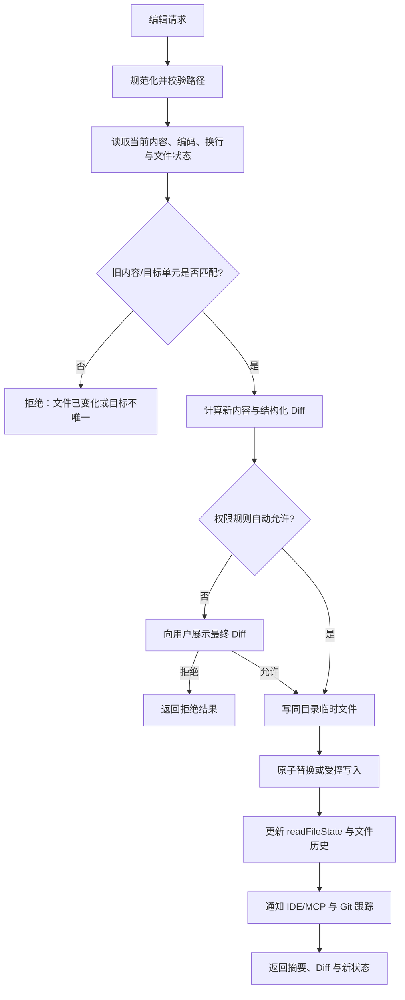

## 24.19 工具结果预算、落盘与可视化

### 24.19.1 为什么单工具截断不够

如果每个工具只限制自己的最大输出，十个“合法大小”的工具结果仍可能共同挤爆上下文。因此 `ToolUseContext.contentReplacementState` 用于每个会话线程的聚合工具结果预算；query 层可以根据已存在的消息和稳定 UUID 决定哪些内容替换为摘要或磁盘引用。子 Agent 复用/恢复时还要重建相同决策，保证 prompt cache 共享和回放一致。

### 24.19.2 结果落盘

统一流程通常是：

1. 工具得到原始 Output；
2. 工具映射为模型可见文本/结构；
3. 估算字符和 Token；
4. 超过工具阈值时保存到受控结果目录；
5. 生成预览、总大小、截断方向和可读取路径；
6. 把完整路径的访问仍交给 FileRead 权限与限制；
7. 清理过期结果文件。

结果目录必须避免路径注入、权限过宽和跨会话猜测；文件名应随机或基于安全 ID，而不是直接拼接工具输入。

### 24.19.3 头部还是尾部

日志类输出通常尾部更有价值，编译错误和失败摘要常在最后；搜索结果则头部有代表性；Diff 需要保留变更上下文。通用截断器应允许工具声明策略。Bash 使用 EndTruncatingAccumulator 表明其重点是保留末尾；同时 UI 可以显示总行数和截断提示。

### 24.19.4 模型视图与人类视图

`mapToolResultToToolResultBlockParam` 决定模型视图，`renderToolResultMessage` 决定终端视图，二者不必完全相同。模型需要结构化、无控制字符、带路径和下一步提示的紧凑事实；人类可能需要颜色、折叠、进度、Diff 和点击展开。`extractSearchText` 又为 transcript 搜索建立第三种投影。三种视图必须共享同一事实来源，但可以有不同表现。

### 24.19.5 图片和二进制

Bash 或 Web 工具可能产生图片。系统需要探测 MIME、限制像素和字节、缩放或转换，再构造图像 Tool Result。二进制不能误按 UTF-8 注入终端；对模型不可直接消费的格式，应保存文件并提供元数据。图像处理本身也可能耗内存，必须在解码前检查文件大小，在解码后限制尺寸。

### 24.19.6 隐私与保留

工具结果可能含源码、日志、Token 或用户文件。落盘目录的生命周期应与会话一致，默认仅用户可读，并支持清理。远程 Bridge 不应自动上传所有完整结果，除非用户动作和策略允许；远端通常只需得到与本地 UI 相同或更小的安全投影。

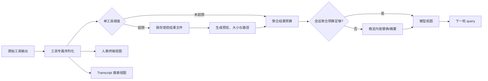

## 24.20 上下文装配与 CLAUDE.md

### 24.20.1 上下文的来源

一次模型请求的上下文至少包含：默认或自定义系统提示、追加系统提示、用户与系统环境信息、会话消息、可用工具 Schema、Agent 定义、MCP 信息、项目指令、记忆、Skill/插件提示、当前模式、计划或团队约束。上下文装配的目标不是“越多越好”，而是让每条信息有清晰来源、作用域、优先级和预算。

### 24.20.2 项目记忆文件

`CLAUDE.md` 类型的项目指令可能位于用户级、项目根、子目录或其他工作目录。读取文件时触发嵌套记忆注入，可以让 Agent 在深入某个子目录后获取更局部规则。问题是文件缓存可能淘汰旧记录，如果仅靠 LRU 的 has 判断，同一路径可能重复注入。因此上下文维护独立 `loadedNestedMemoryPaths` 集合作为会话级去重。

### 24.20.3 优先级与冲突

合理优先级通常是：系统硬规则与组织策略最高；用户显式指令高于项目建议；更局部目录规则可覆盖通用项目约定，但不能取消安全策略；Skill 提示只在被调用时生效；自动记忆属于低权重背景，不应覆盖当前明确要求。源码具体提示拼装顺序仍需结合常量与 queryContext 逐行核对，但这些作用域原则是阅读和扩展时必须验证的不变量。

### 24.20.4 自定义系统提示

QueryEngine 支持 `customSystemPrompt` 替换默认提示，也支持 `appendSystemPrompt` 追加。替换适合 SDK/嵌入式场景，但会失去默认工具使用规范、安全提醒或模式说明；追加相对安全。宿主若允许外部调用方完全替换，应明确哪些硬约束在系统提示之外仍由代码执行，否则安全只剩 Prompt。

### 24.20.5 工具描述预算

53 个内置工具、MCP 工具和插件工具若全部展开 Schema，会显著占用上下文。`shouldDefer`、ToolSearch 和 alwaysLoad 构成工具发现层：首轮只放核心工具和延迟工具索引，模型在需要时搜索加载。工具 searchHint 和简洁 description 的质量会直接影响召回。

### 24.20.6 Skill 与上下文

Skill 更像按需加载的程序化提示。它可以先以名称/描述进入命令与搜索索引，调用后把完整 SKILL.md 或构建结果注入会话。`discoveredSkillNames` 记录它是否先经发现，再实际调用，用于衡量工具发现机制。动态 Skill 目录触发集合避免反复扫描。

### 24.20.7 上下文可观测性

`/context`、`ctx_viz`、成本和统计类命令意味着产品提供某种上下文可视化。优秀的上下文诊断应展示各来源 Token 占比、系统提示、工具 Schema、消息、记忆、附件和压缩后的保留段，而不是只显示总 Token。否则用户无法理解为何“刚开始对话就很满”。

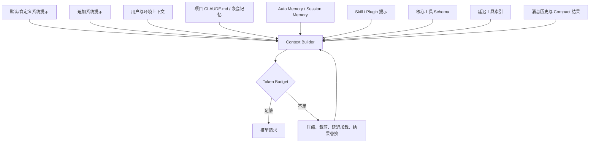

## 第三篇·上下文、压缩、记忆与恢复

## 24.21 Token Budget 与上下文过载治理

### 24.21.1 预算不是单一数字

上下文窗口的可用空间不是模型宣称的最大 Token 减去消息 Token 这么简单。还要预留系统提示、工具 Schema、thinking、预计输出、Tool Result、停止 Hook 和下一次工具回填。源码中的 `query/tokenBudget.ts`、Compact 服务、文件读取限制和工具结果预算共同表明，系统把 Token 视为多来源共享资源。

可以把一次请求预算写成：

`可用输入 = 模型窗口 - 输出预留 - 安全裕量`

`输入占用 = 系统提示 + 工具定义 + 历史消息 + 当前输入 + 记忆附件 + 其他控制信息`

当输入占用接近可用输入时，系统可采取五种不同强度的动作：延迟工具加载、截断单个结果、替换历史大结果、微压缩冗余块、生成整体摘要。不同动作的信息损失和延迟差异很大，应从低损失到高损失逐级使用。

### 24.21.2 文件读取预算

FileRead 的 `maxTokens` 与 `maxSizeBytes` 先在能力入口限制单次读取。这样可以在内容进入消息前阻断异常大文件。Token 估算不必精确到计费级，但必须保守，尤其源码、JSON 和非英文文本的字符/Token 比例不同。读取切片应返回行范围和“还有多少未读”，让模型可以定向继续，而不是自动把余下全部加载。

### 24.21.3 工具 Schema 预算

工具数量随 MCP、插件和项目扩展增长。延迟工具机制通过 `defer_loading` 和 ToolSearch 把完整 Schema 从首轮移出，只保留可搜索信息。核心高频工具或服务端 `_meta['anthropic/alwaysLoad']` 指定的 MCP 工具仍首轮加载。治理指标应包括：初始工具 Token、一次任务实际加载工具数、ToolSearch 额外回合数、未召回率。

### 24.21.4 历史结果预算

内容替换状态按会话线程跟踪超大工具结果。稳定决策很关键：若同一历史在父 Agent 与 fork 子 Agent 中选择不同替换集合，prompt cache 前缀会分叉。源码注释明确要求缓存共享 fork 使用相同决策。恢复 Agent 也要从 sidechain 记录重建替换状态。

### 24.21.5 输出预留

若输入恰好填满窗口，模型没有空间输出，更没有空间发工具调用。系统应按模型和模式预留输出；thinking 模式还可能消耗额外预算。结构化输出需要保证 JSON/Schema 完整，预留应高于普通短答。预算不足时宁可提前压缩，也不要依赖 API 返回 413 再补救。

### 24.21.6 预算与任务调度

多 Agent/任务场景还存在总预算。父 Agent 不应把全部美元或 Token 授予每个子任务；`taskBudget` 可做总量计数，子任务启动前原子扣减或申请额度。否则并行子 Agent 都认为预算充足，合计远超用户上限。

### 24.21.7 预算可解释性

当系统因为预算删减内容，应产生可观察事件：压缩了哪些范围、保留哪些文件和目标、结果文件放在哪里、剩余多少预算。模型也应知道某段上下文是摘要而非原文，避免把摘要中的省略当作事实不存在。

```mermaid
flowchart TD
    W["模型上下文窗口"] --> O["减去输出与安全预留"]
    O --> A["可用输入预算"]
    A --> S["系统提示"]
    A --> T["工具 Schema"]
    A --> H["历史消息"]
    A --> M["记忆与附件"]
    A --> U["当前用户输入"]
    S --> C{"是否超预算?"}
    T --> C
    H --> C
    M --> C
    U --> C
    C -->|"否"| R["发送请求"]
    C -->|"轻度"| D["延迟加载工具/限制文件读取"]
    C -->|"中度"| E["工具结果替换/微压缩"]
    C -->|"重度"| F["Compact / Context Collapse"]
    C -->|"历史局部可丢弃"| G["History Snip"]
    D --> C
    E --> C
    F --> C
    G --> C
```

## 24.22 Compact、Context Collapse 与 History Snip

### 24.22.1 多层压缩体系

`src/services/compact` 包含 `apiMicrocompact`、`autoCompact`、`compact`、`microCompact`、`reactiveCompact`、`sessionMemoryCompact`、`snipCompact`、`snipProjection`、分组、缓存配置和清理模块。它不是一个“调用摘要 Prompt”的函数，而是一组根据触发时机和信息粒度分层的策略。

### 24.22.2 Auto Compact

Auto Compact 在请求前或预算临界时主动判断是否需要整体压缩。它通常选择一段历史，生成包含任务目标、已完成工作、关键决策、文件状态、错误和待办的摘要，然后构造 post-compact messages。主动压缩的优势是可控，不必等待 API 硬错误；代价是增加模型调用与信息损失。

### 24.22.3 Reactive Compact

Reactive Compact 在真实 prompt-too-long 等错误后执行。源码 query 流程会暂缓向上暴露可恢复错误，使响应式策略有机会重建上下文。它需要防止无限循环：同一请求压缩后若仍超限，应提高压缩强度或终止，不能重复生成相近摘要。

### 24.22.4 Micro Compact

微压缩适合删除低价值冗余：过时 Progress、重复系统提醒、可从磁盘重读的大结果、空内容块、已经被后续状态覆盖的中间消息。它比语义摘要更确定、成本更低，应该优先执行。API Microcompact 可能利用服务端能力或特定消息变换，具体行为应按目标构建进一步核对。

### 24.22.5 Context Collapse

Context Collapse 关注结构性折叠，而不是把整段历史改写成一篇总结。例如，把一批工具调用折叠为关键结果、把探索分支收敛为结论、保留最近的工作集。它更适合 Agent 任务，因为工具历史的价值高度不均：一次 Grep 的完整 200 行输出很快过时，但“目标函数在三个文件中被引用”仍应保留。

### 24.22.6 History Snip

History Snip 通过边界和投影从逻辑历史中剪掉一段。QueryEngine 的配置注释说明：SDK/headless 没有 UI 滚动历史，可以在 Snip Boundary 后真正截断内存；REPL 则保留全历史，仅在构造模型视图时投影被 Snip 的版本。这样“人仍能回看”和“模型不再携带”可以同时成立。

### 24.22.7 Compact Boundary 与 preserved segment

压缩后写入 System Compact Boundary，可记录保留段 head/tail UUID。恢复时沿链接裁剪旧消息；如果边界前尾消息没有先落盘，子进程在恰当时刻被杀会导致 relink 失败，恢复加载全部旧历史。因此 QueryEngine 在写 boundary 前补写内存中的尾段。这是恢复正确性比表面压缩算法更关键的工程细节。

### 24.22.8 摘要质量

压缩摘要必须保留：

- 用户当前目标、验收条件与禁止事项；
- 已确认事实和证据来源；
- 已修改文件、关键 Diff 与未提交状态；
- 已执行命令、测试结果与失败原因；
- 重要权限决定和组织约束；
- 未完成步骤、阻塞项和下一动作；
- 子 Agent/任务的结果与仍在运行的后台任务。

摘要不应把猜测写成事实，也不应只记录“做了什么”而丢失“为什么这样做”。

### 24.22.9 压缩后的缓存与 GC

Compact 后要清理无用 Tool Result 文件引用、重算 Token Budget、刷新提示建议，并允许旧消息被 GC。若 UI 仍保留历史，模型视图投影和屏幕消息必须使用不同容器或懒投影，避免误删用户可见记录。

```mermaid
stateDiagram-v2
    [*] --> Normal
    Normal --> MicroCompact: 删除确定性冗余
    MicroCompact --> Normal: 预算恢复
    Normal --> AutoCompact: 接近阈值
    AutoCompact --> PostCompact: 生成摘要与边界
    Normal --> ApiError: API 返回上下文过长
    ApiError --> ReactiveCompact: 错误可恢复
    ReactiveCompact --> PostCompact
    Normal --> Collapse: 工具历史结构性膨胀
    Collapse --> PostCompact
    Normal --> Snip: 用户/策略剪除历史段
    Snip --> ProjectedHistory
    PostCompact --> Normal: 重算预算
    ProjectedHistory --> Normal: 使用投影视图继续
    ReactiveCompact --> Failed: 压缩后仍超限
    Failed --> [*]
```

## 24.23 会话持久化、恢复与分支

### 24.23.1 Transcript 是事件历史而非最终答案

会话持久化记录用户、Assistant、工具结果、附件、Compact Boundary、队列操作和其他控制事件。它既用于 `/resume`，也用于调试、分析、Session Memory 和远程接管。把它仅看作聊天导出会低估其一致性要求。

### 24.23.2 写入时机

QueryEngine 在模型请求前写用户输入；对 Assistant/User/Compact Boundary 等输出边消费边记录；在特定桌面/急切刷新模式下显式 flush。写入策略在延迟与恢复之间权衡：交互模式更看重不丢用户意图，脚本 bare 模式更看重启动和首请求延迟。

### 24.23.3 原子性与尾部损坏

JSONL 或类似追加日志适合流式写入，但进程崩溃可能留下半行。恢复器应忽略或隔离最后一个不完整记录，而不能让整场会话不可读。每条记录带 UUID、parent/sidechain 关系和时间，可以支持分支与重放。写入大附件时最好只存引用，避免一条记录巨大。

### 24.23.4 恢复流程

恢复可抽象为：

1. 查找最新或指定 Session；
2. 逐条解析并验证消息；
3. 修复/标记孤儿 tool_use 和不完整 Tool Result；
4. 应用 Compact Boundary 的 preserved segment 链接；
5. 投影 History Snip；
6. 重建文件读取缓存、内容替换状态和使用量；
7. 恢复后台任务引用或标记其已失效；
8. 重新加载当前配置、工具、MCP 与模型；
9. 把旧消息与当前运行能力做兼容映射；
10. 接受新用户输入。

恢复不是把数组读回来就结束，因为运行环境、权限、插件和外部 Server 都可能已变化。

### 24.23.5 孤儿权限

QueryEngine 配置支持 `orphanedPermission`，说明权限请求可能在宿主重启、远程断线或 UI 消失后悬空。恢复时必须决定：视为拒绝、重新询问、由远端已记录决定重放，还是丢弃对应工具调用。默认安全策略应偏向拒绝并解释。

### 24.23.6 分支与 Rewind

命令目录包含 branch、rewind、resume、session、rename、tag 等，表明会话支持导航和管理。分支应共享不可变历史前缀，后续消息形成新链；Rewind 可以回到某个用户消息，但不能假装已经发生的外部副作用被撤销。文件修改需依赖 file history/Git 才能回滚，发出的网络消息、部署或删除则可能不可逆。

### 24.23.7 会话身份与远程接管

Bridge、后台会话和 SDK 都依赖稳定 Session ID。身份应与进程 PID 分离，因为进程可以重启；与工作目录也不能完全等同，因为同目录可有多场会话。远程端的操作要绑定 Session 和权限租约，防止把一场会话的批准误用于另一场。

### 24.23.8 数据保留

Transcript 可能含敏感源码、终端输出、环境路径和用户提示。应有用户可理解的存储位置、保留期、清理命令和分享前脱敏。组织环境还需要受管策略控制是否允许上传、分析或远程同步。

```mermaid
flowchart TD
    A["接受用户输入"] --> B["先追加 Transcript"]
    B --> C["模型与工具事件持续追加"]
    C --> D{"出现 Compact Boundary?"}
    D -->|"是"| E["补写保留段尾部并记录链接"]
    D -->|"否"| F["继续会话"]
    E --> F
    F --> G{"进程正常结束?"}
    G -->|"是"| H["Flush 与关闭"]
    G -->|"否"| I["下次启动恢复"]
    I --> J["解析完整记录，忽略损坏尾部"]
    J --> K["修复孤儿 Tool Use/Permission"]
    K --> L["应用 Compact 与 Snip 投影"]
    L --> M["重建缓存、预算和能力"]
    M --> N["恢复为可继续会话"]
```

## 24.24 Memory、SessionMemory 与 Auto Memory

### 24.24.1 三类“记忆”不要混淆

源码至少呈现三种不同层面的记忆：

1. **项目/目录指令记忆**：CLAUDE.md 等由用户维护的显式文件；
2. **Session Memory**：对当前会话或压缩阶段生成的结构化摘要；
3. **Auto Memory / memdir**：跨会话自动提取、检索、老化和注入的长期记忆。

AgentTool 还包含 agentMemory 与 snapshot，团队目录有 team memory。它们作用域不同，不能统一塞进一个无来源的“memory”字符串。

### 24.24.2 memdir 结构

`src/memdir` 包含相关记忆检索、主存储、年龄、扫描、形状遥测、类型、路径和团队记忆 Prompt。可推断其基本流程是：确定自动记忆目录 → 扫描/读取候选 → 按查询或上下文找相关内容 → 应用年龄与形状治理 → 生成模型可用提示。路径模块处理默认位置和覆盖，QueryEngine 会加载 memory prompt。

### 24.24.3 SessionMemory

`src/services/SessionMemory` 将 Prompt、核心实现和工具函数分开；Compact 服务还有 `sessionMemoryCompact`。这说明 Session Memory 既可作为压缩策略，也可能作为会话离开/总结产物。它应关注当前目标、修改状态、下一步和恢复材料，而长期记忆更关注稳定偏好、项目约定和反复出现事实。

### 24.24.4 记忆写入原则

自动写入应满足：

- 只记录在未来会话仍有价值的稳定信息；
- 区分事实、偏好、推断和临时任务状态；
- 保存来源会话、时间和作用域；
- 不把密钥、个人敏感信息和大段源码默认写入；
- 同类记忆去重或合并；
- 支持用户查看、编辑和删除；
- 写入失败不能阻塞主对话。

### 24.24.5 检索原则

相关性不仅是文本相似度。项目 ID、工作目录、Agent 类型、团队、时间、新旧冲突和用户显式固定都应参与排序。旧记忆并非自动错误，但在项目版本变化后可能失效；`memoryAge` 表明系统至少考虑时间维度。检索结果应带来源和置信度，模型被提示把它当背景而非最高优先级指令。

### 24.24.6 记忆污染

跨会话记忆最大的风险是错误事实被反复注入，逐渐获得“看起来很确定”的权威。治理需要：

- 新事实与旧事实冲突时不静默覆盖；
- 允许标记已废弃；
- 提供周期性整理；
- 注入前限制数量和总 Token；
- 对自动推断使用较低权重；
- 记录哪条记忆实际影响了回答，便于调试。

### 24.24.7 AutoDream 与 Consolidation

Kairos 文档描述 AutoDream 需要经过超过 24 小时、至少若干新会话、无锁等门槛，并采用 Orient、Gather、Consolidate、Prune 四阶段。它使用带 PID/mtime 的锁和双写校验，避免多个进程同时整理记忆。Dream 更像离线治理作业：汇总日志、提取稳定内容、合并并修剪，不应和用户等待的主请求争抢关键路径。

### 24.24.8 团队记忆与 Agent 记忆

团队记忆需要以 team/project 为作用域，避免一个 Team 的中间结论污染全局。子 Agent 记忆 snapshot 更接近任务上下文快照，目标是 fork/resume 后继续工作，不应自动升级为长期用户记忆。作用域提升必须经过明确 promotion 规则。

```mermaid
flowchart LR
    S["会话 Transcript"] --> E["记忆提取"]
    P["CLAUDE.md / 用户显式规则"] --> I["上下文注入"]
    E --> C{"是否稳定、相关且允许保存?"}
    C -->|"否"| X["仅留在会话"]
    C -->|"是"| D["memdir 长期记忆"]
    D --> A["年龄、冲突、去重与作用域治理"]
    A --> R["按任务检索"]
    R --> B["Token 预算与来源标注"]
    B --> I
    SM["Session Memory / Compact 摘要"] --> I
    TM["Team/Agent 任务记忆"] --> I
    I --> Q["Query Context"]
    Q --> F["新会话反馈与修正"]
    F --> E
```

## 第四篇·多 Agent、任务与扩展编排

## 24.25 AgentTool 与子 Agent

### 24.25.1 AgentTool 目录

`src/tools/AgentTool` 包含主工具、UI、颜色、展示、agentMemory、memory snapshot、工具辅助、内置 Agent、fork、加载 Agent 目录、Prompt、resume 和 runAgent。这个目录表明子 Agent 不是一次简单的“再调用模型”，而是有独立身份、显示、记忆、恢复和运行上下文的完整执行体。

### 24.25.2 Agent 定义

AgentDefinition 通常描述名称、用途、系统提示或补充提示、允许工具、模型、权限模式和来源。定义可以来自内置 Agent、用户/项目 agents 目录或插件。加载器要处理重名、优先级、无效配置、禁用和作用域。向模型展示的 Agent 列表应只包含当前可用且允许的定义。

### 24.25.3 fork 与普通 spawn

Fork 子 Agent 的特殊价值是共享父会话的上下文前缀和 prompt cache。源码在 ToolUseContext 中保留父线程回合开始时冻结的 `renderedSystemPrompt`，避免 spawn 时重新渲染因 GrowthBook 冷热变化而改变字节。Fork 还可能克隆 content replacement state，确保历史工具结果替换决定一致。

普通 spawn 可以使用更小、任务专属上下文；fork 更适合“基于当前研究继续深入”。两者都应显式选择传递哪些消息、文件状态、权限和记忆，不能无条件复制整个 AppState。

### 24.25.4 子 Agent 上下文隔离

异步 Agent 的普通 `setAppState` 可能被设计为 no-op，防止子 Agent任意改主线程 UI；但后台任务注册和清理必须通过 `setAppStateForTasks` 到根 Store。权限拒绝计数也不能依赖主 Store，因此 ToolUseContext 有 `localDenialTracking`。这些细节说明隔离不是单纯深拷贝，而是按能力选择共享或局部实现。

### 24.25.5 工具过滤

子 Agent 应获得最小工具集。研究 Agent 可以用 Read/Grep/Web，但不应默认写文件；实现 Agent 可以编辑指定范围；验证 Agent 可以执行测试但不做产品变更。Tool Filter 不只节省 Schema Token，也是权限最小化。若 Agent 定义声明不存在的工具，应在启动前报错。

### 24.25.6 Agent 结果

子 Agent 输出通常需要转换成父 Agent 可消费的简明结果，并可携带 task notification、文件列表、证据或 resume ID。完整 transcript 可以保存供用户查看，但不应全部注入父上下文。父 Agent需要知道：任务是否成功、做了什么、证据在哪里、有哪些未解决风险。

### 24.25.7 恢复与后台化

长任务可以后台运行，AgentTool 返回 resume ID；用户或父 Agent 用 TaskOutput/Agent Resume 继续。恢复要重新建立模型、工具、内容替换状态和 sidechain 历史，并确认旧权限不被跨会话滥用。后台 Agent 无 UI 时使用避免弹窗策略。

### 24.25.8 失败传播

子 Agent 失败不一定终止主 Agent。父 Agent 可重试、缩小任务、换 Agent 类型或自行接管。但不可恢复错误、预算耗尽和组织策略应清晰传播。多 Agent 系统最危险的失败不是“返回错误”，而是子 Agent 静默停止、父 Agent仍以为它在工作，因此任务状态和心跳必须可观察。

```mermaid
sequenceDiagram
    participant P as 父 Agent
    participant AT as AgentTool
    participant L as Agent 定义加载器
    participant F as Fork/Context Builder
    participant C as 子 Agent QueryEngine
    participant TS as Task Store

    P->>AT: 指定 agent_type、任务、后台选项
    AT->>L: 解析内置/项目/插件 Agent
    L-->>AT: 有效定义与工具白名单
    AT->>F: 选择 fork 或最小上下文
    F->>F: 冻结系统提示、克隆替换状态、隔离 AppState
    F->>C: 创建子会话
    alt 前台
        C-->>AT: 流式进度与最终结果
        AT-->>P: 精炼结果
    else 后台
        AT->>TS: 注册 LocalAgentTask
        AT-->>P: task/resume ID
        C-->>TS: 状态、输出、完成通知
        P->>TS: TaskOutput 或 resume
        TS-->>P: 增量/最终结果
    end
```

## 24.26 Coordinator 多 Agent 编排

### 24.26.1 模式定位

Coordinator 文档把编排分为 Research、Synthesis、Implementation、Verification 四阶段。Coordinator 自身只拥有 Agent、SendMessage、TaskStop 等协调工具，Worker 才拥有经过筛选的实际工具。这是“控制面与数据面分离”：

- 控制面负责拆解、分配、汇总和停止；
- 数据面负责读取、修改、测试和与外部系统交互。

限制 Coordinator 直接改文件，可以防止它一边管理一边绕开并发规则。

### 24.26.2 四阶段流程

**Research**：并行只读 Worker 探索不同子域，输出事实与源码证据。  
**Synthesis**：Coordinator 合并结果，识别冲突和缺口，形成实施计划。  
**Implementation**：按文件所有权或工作流分配写任务，避免同一文件多个写者。  
**Verification**：独立 Worker 运行测试、审查 Diff、检查目标覆盖，必要时回到实现。

阶段并非必须严格瀑布；小任务可合并，但“研究并行、写入受控、验证独立”是核心不变量。

### 24.26.3 并发规则

文档明确：只读任务可并行；同一文件只能有一个 Writer。更完整的冲突模型还应考虑：

- 两个文件共享生成产物；
- 一个任务修改 Schema，另一个生成客户端；
- 多个 Worker 同时运行会竞争全局缓存的包管理；
- 测试与写入同时进行产生不稳定结果；
- Git index、工作树和端口也是共享资源。

因此 Coordinator 需要资源锁或声明式 ownership，而不只是比较文件名字符串。

### 24.26.4 通信

Worker 结果可使用 XML task-notification 包装，向 Coordinator 传递状态、摘要和标识。SendMessage 支持定向沟通，Mailbox 保存异步消息。消息格式应结构化包含：任务 ID、发送者、阶段、严重性、证据、请求动作和截止条件。自由文本仍可存在，但不能作为唯一调度协议。

### 24.26.5 任务分解质量

好的子任务具有清晰输入、输出、文件范围、允许工具、验收命令和停止条件。坏的子任务如“研究一下项目并修好所有问题”，会导致重复探索、工具滥用和不可验证结果。Coordinator 应在派发前检查任务是否可独立完成、是否与其他任务冲突以及预算是否足够。

### 24.26.6 汇总与冲突

多个研究 Worker 可能给出矛盾结论。Synthesis 不能按多数投票，应回到源码证据、版本和运行条件。对于实现冲突，应选择一个 Writer，其他 Worker 变为 Reviewer；不能让父 Agent手工拼接两个未知基线上的完整文件。

### 24.26.7 失败和降级

某个 Worker 超时或失败时，Coordinator 可以重派、缩小范围、停止相关任务或降级为单 Agent。预算接近上限时，优先保留验证，不应把预算全部耗在更多研究。TaskStop 必须清理子进程和锁，不能只把 UI 标成 stopped。

```mermaid
flowchart LR
    U["用户目标"] --> C["Coordinator"]
    C --> R["Research 阶段"]
    R --> R1["Worker A：架构"]
    R --> R2["Worker B：代码路径"]
    R --> R3["Worker C：风险"]
    R1 --> S["Synthesis"]
    R2 --> S
    R3 --> S
    S --> P["计划、资源所有权与验收条件"]
    P --> I["Implementation"]
    I --> W1["Writer A：文件集合一"]
    I --> W2["Writer B：文件集合二"]
    W1 --> V["Verification"]
    W2 --> V
    V --> T1["测试 Worker"]
    V --> T2["Review Worker"]
    T1 --> D{"是否通过?"}
    T2 --> D
    D -->|"否"| S
    D -->|"是"| O["汇总结果与证据"]
```

## 24.27 Team、Mailbox 与任务系统

### 24.27.1 工具与任务类型

工具目录包含 TeamCreate/Delete、SendMessage、TaskCreate/Get/List/Output/Stop/Update；`src/tasks` 包含 DreamTask、InProcessTeammateTask、LocalAgentTask、LocalShellTask、LocalWorkflowTask、MonitorMcpTask、RemoteAgentTask 和 LocalMainSessionTask。可见“任务”是统一管理的长期执行单元，而不仅是 Todo 条目。

### 24.27.2 任务状态机

统一状态至少需要 pending、running、blocked/waiting、completed、failed、stopped。任务还应包含类型、所有者、父任务、创建/更新时间、输出位置、进度、退出原因、可中断性和资源信息。TaskUpdate 修改的是调度元数据；实际执行状态应由任务实现驱动，避免模型随意把仍在运行的任务标成 completed。

### 24.27.3 LocalShellTask

Shell 任务持有子进程、输出文件、开始时间、退出状态和通知标记。前台命令可以在阈值后转后台，转换时不能重新启动命令；应把同一进程注册到任务 Store，继续写同一输出。停止任务需终止进程组，处理子孙进程和 Windows 差异。

### 24.27.4 LocalAgentTask 与 InProcessTeammateTask

LocalAgentTask 运行隔离子 Agent；InProcessTeammateTask 可能在同一进程内运行团队成员并保留可查看 transcript。ToolUseContext 的 `preserveToolUseResults` 为这种“用户能查看队友历史”的场景保留详细结果。进程内任务成本低、共享缓存方便，但隔离和崩溃影响更大。

### 24.27.5 RemoteAgentTask

远程任务需要租约、心跳、状态同步和断线恢复。远端报告 completed 前应上传或引用结果；本地停止可能与远端完成竞态，需要幂等状态转移。安全上要验证任务与当前组织、会话和工作区绑定。

### 24.27.6 Mailbox

Mailbox 支持 Agent 间异步通信。它应提供至少一次投递和去重 ID，收件方处理后 ACK。消息不能无限注入模型上下文，应先形成通知摘要，按需读取正文。团队删除前要处理未读消息和仍在运行任务。

### 24.27.7 通知

任务完成后可生成 UI 通知、系统消息或 OS 通知。`markTaskNotified` 避免重复提醒。通知与状态是两件事：即使通知发送失败，任务仍应完成；即使用户清除了通知，任务结果仍可查询。

### 24.27.8 资源与预算

任务 Store 应统一限制并发 Shell、并发 Agent、远程任务数和磁盘输出。父子任务共享预算时，创建任务必须检查剩余额度。输出文件应有总容量和清理策略，防止长期会话耗尽磁盘。

### 24.27.9 Todo 与 Task 的区别

TodoWrite 更像模型规划和 UI 面板中的逻辑工作项；TaskCreate 等代表真实可执行或可观测任务。把两者混用会导致“计划上已完成但进程仍运行”或“任务失败但 Todo 被勾选”。文档和 UI 应显式区分。

```mermaid
stateDiagram-v2
    [*] --> Pending
    Pending --> Running: 调度/启动
    Running --> Waiting: 等待权限、输入或依赖
    Waiting --> Running: 条件满足
    Running --> Completed: 正常产出
    Running --> Failed: 异常或不可恢复错误
    Running --> Stopping: TaskStop
    Waiting --> Stopping: TaskStop
    Stopping --> Stopped: 资源清理完成
    Stopping --> Failed: 清理失败
    Pending --> Stopped: 启动前取消
    Completed --> [*]
    Failed --> [*]
    Stopped --> [*]
```

## 24.28 后台 Shell、Workflow、Cron 与 Proactive

### 24.28.1 后台能力的共同抽象

Shell、Agent、Workflow、Monitor 和 Dream 都可能长时间运行。共同抽象包括：任务身份、开始/结束、取消、输出、心跳、通知和恢复。差异在于执行器：Shell 是子进程，Agent 是查询循环，Workflow 是多步骤状态机，Monitor 是持续订阅，Dream 是计划性离线整理。

### 24.28.2 WorkflowTool

Workflow 可把多个工具步骤封装为可观察任务。它不应只是让模型在内部自由循环，而应显式记录步骤、输入、输出、重试和补偿。这样 TaskOutput 可以展示当前阶段，失败后也能从安全边界恢复。执行 Workflow 前仍需逐步权限，除非整个流程经过可信签名和预授权。

### 24.28.3 ScheduleCron

Cron 工具允许创建定时任务。安全上必须限制命令/Agent 能力、工作目录、时区、最大频率、过期和无人值守权限。用户确认应显示“将来会自动执行什么”，而不是只确认一次当前操作。删除或更新计划也要审计。

### 24.28.4 Proactive

Proactive 模式在没有即时用户输入时产生行动，风险高于响应式 Agent。触发器可以是时间、工作区事件、通知或远程消息。每个触发器必须映射到明确策略：可自动读取什么、何时需要确认、是否能写文件、如何避免重复触发。主动建议与主动执行应分开开关。

### 24.28.5 Kairos 常驻任务

Kairos 文档描述 catch-up、morning-checkin、dream 等永久计划任务。激活需通过 feature、用户设置、目录信任、GrowthBook 和运行状态五类检查。多重 Gate 是必要的：常驻助手既涉及后台资源，也涉及跨会话记忆和主动通知，单一配置开关不足以表达所有约束。

### 24.28.6 Catch-up 与幂等

计划任务可能因电脑休眠错过时间。Catch-up 应判断上次成功时间并补执行一次，而不是补跑每个遗漏周期造成风暴。每次运行带幂等键，如 `taskName + logicalDate`，确保进程重启或锁超时后不会重复写入。

### 24.28.7 监控 MCP

MonitorMcpTask 可能持续监听 MCP Server 的资源或通知。连接断开时需要重连和退避；任务停止时关闭 transport；Server 发来的数据必须经过大小、Schema 和通道 allowlist。持续流不能把每条事件都直接注入主会话，应先聚合或生成提醒。

### 24.28.8 睡眠与唤醒

SleepTool 使 Agent 在 Workflow 中等待条件，但必须受最大时长和取消控制。系统休眠会使 wall clock 跳跃，应按绝对截止时间判断。Agent 不应通过大量 Sleep 占用并发槽；长等待最好转后台任务。

```mermaid
flowchart TB
    TR["时间/事件/远程触发"] --> G{"功能、设置、信任、策略 Gate"}
    G -->|"未通过"| N["不启动并记录原因"]
    G -->|"通过"| K["生成幂等运行键"]
    K --> D{"本逻辑周期已完成?"}
    D -->|"是"| X["跳过重复执行"]
    D -->|"否"| T["注册后台任务"]
    T --> W["执行 Shell / Agent / Workflow / Monitor / Dream"]
    W --> P["写进度、心跳与输出"]
    P --> C{"完成、失败或取消"}
    C -->|"完成"| M["标记成功并通知"]
    C -->|"临时失败"| R["退避重试"]
    R --> W
    C -->|"取消/永久失败"| S["清理资源并记录终态"]
```

## 24.29 命令系统

### 24.29.1 Command 与 Tool 的差异

Tool 面向模型调用，Command 主要面向用户输入。Slash Command 可以：

- 立即在本地执行并渲染 JSX；
- 修改配置、模型、主题、权限或输入模式；
- 生成一段 Prompt 再交给模型；
- 打开设置、选择器或外部浏览器；
- 启动任务、Bridge、登录或安装流程；
- 读取/管理会话、插件、Skill、MCP。

Command 不一定进入 Agent Loop，因此不能用 Tool 权限契约完全覆盖。命令实现应自己声明可用性、是否只适合交互模式、是否能远程触发和是否含副作用。

### 24.29.2 聚合与动态加载

根 `commands.ts` 维护内部命令集合、`COMMANDS` 缓存和 `getCommands(cwd)`。命令列表会按可用性过滤，并把动态 Skill 转为 Prompt Command，做名称去重。内部命令只对特定用户类型且非 demo 生效。由此可见，命令注册表同时合并内置产品命令和用户扩展。

### 24.29.3 Remote Safe 与 Bridge Safe

源码定义 `REMOTE_SAFE_COMMANDS` 和 `BRIDGE_SAFE_COMMANDS`。前者是在 `--remote` 下本地 TUI 可安全执行的命令；后者是远程控制消息可以触发的命令。两份集合不能简单相同：本地用户按键触发的命令可能打开交互 UI，远端无法完成；远端可触发的命令则必须避免任意本地副作用或设置写入。

安全默认应是 allowlist，而不是排除少数危险命令。新增命令如果没有显式评审，不应自动进入远程集合。

### 24.29.4 Command 类型

从目录可按作用分为：

- 会话与导航：clear、resume、session、rename、branch、rewind、tag、export、share；
- 模型与上下文：model、effort、fast、compact、context、summary、output-style；
- 配置与权限：config、permissions、privacy-settings、sandbox-toggle、hooks；
- 扩展：mcp、plugin、reload-plugins、skills、agents；
- 工程协作：diff、review、pr_comments、commit、commit-push-pr、issue；
- 运行平台：desktop、mobile、bridge、remote-setup、teleport；
- 诊断：doctor、status、stats、usage、cost、heapdump、ant-trace；
- 体验：theme、color、vim、voice、keybindings、stickers、buddy 相关入口；
- 内部/实验：mock-limits、reset-limits、ctx_viz、debug-tool-call 等。

### 24.29.5 命令输入解析

Slash Command 解析要处理引号、补全、路径、命令别名和剩余文本。不能把整行简单 split 空格，尤其 `/add-dir "A B"`、模型名、Prompt 文本和 JSON 参数。命令参数应有独立 Schema 或 parser，并提供一致错误消息。

### 24.29.6 本地 JSX 命令

某些命令返回 UI 组件并暂时隐藏 PromptInput。ToolUseContext 的 `setToolJSX` 支持标记 local JSX、立即显示、继续动画和清理。命令组件完成后必须调用 onDone/clear，避免 UI 永久卡在模态状态。Headless 模式遇到这类命令应返回“不支持交互”而非静默忽略。

### 24.29.7 命令与持久化

改变模型、主题、权限或插件的命令需明确写入用户、项目还是会话层。会话命令应该记录足够事件供恢复；但纯视觉切换不必污染模型历史。命令输出转换到 SDK 时要区分本地反馈和应作为 Assistant 文本返回的内容。

```mermaid
flowchart TD
    I["用户输入 /command args"] --> P["命令解析与补全"]
    P --> R["COMMANDS + 动态 Skill 注册表"]
    R --> A{"命令是否存在且可用?"}
    A -->|"否"| E["提示错误与相似命令"]
    A -->|"是"| M{"当前模式允许?"}
    M -->|"远程/Bridge 不在 allowlist"| D["拒绝"]
    M -->|"允许"| T{"命令类型"}
    T -->|"本地 JSX"| U["打开设置/选择器/向导"]
    T -->|"状态修改"| S["更新会话或持久配置"]
    T -->|"Prompt Command"| Q["生成消息并进入 QueryEngine"]
    T -->|"任务/协议"| B["启动后台任务或专属服务"]
    U --> O["清理 JSX 并返回输入"]
    S --> O
    Q --> O
    B --> O
```

## 24.30 Skill 系统

### 24.30.1 Skill 的定位

Skill 是按需加载的可复用任务知识单元，通常包含名称、描述、完整提示、允许工具、资源或脚本说明。它介于 Slash Command 和 Tool 之间：用户可以像命令一样显式调用，模型也可通过 DiscoverSkills/SkillTool 发现并加载；真正能力仍由底层 Tool/MCP 提供。

### 24.30.2 来源

`src/skills` 包含 bundled、bundledSkills、loadSkillsDir、mcpSkillBuilders 和 mcpSkills。结合命令聚合可见 Skill 来源至少包括：

- 产品内置 bundled skills；
- 用户级或项目级 skills 目录；
- 插件携带的 Skill；
- MCP Server 动态构建的 Skill；
- 兼容旧命令格式的 Prompt Command。

加载结果需要保存 source、scope 和优先级，重名时给出确定规则。

### 24.30.3 发现与调用

DiscoverSkillsTool 提供搜索和列表，SkillTool 加载具体 Skill。`discoveredSkillNames` 记录本回合经发现的名称；实际调用遥测可带 `was_discovered`。这可以分析延迟加载是否有效：模型是否能找到正确 Skill、是否经常直接猜名称失败、搜索后是否真正使用。

### 24.30.4 Skill Schema

高质量 Skill 元数据应包含：

- 稳定 ID 与显示名称；
- 简洁描述和高区分关键词；
- 版本、作者、来源和作用域；
- 入口 Prompt 与资源路径；
- 允许/建议工具；
- 是否需要网络、写文件或用户交互；
- 兼容模型或最低运行时版本；
- 验收与退出条件；
- 安全声明和可选签名。

仅有一篇长 Prompt 会让注册、升级、权限和遥测都难以治理。

### 24.30.5 注入策略

调用 Skill 时，不应把所有 Skill 全文常驻系统提示。正确策略是首轮只提供索引；调用后把目标 Skill 内容作为带来源的上下文注入，必要时加载相对资源。资源路径必须限制在 Skill 根目录，防止 `../` 读取任意文件。

### 24.30.6 Skill 与工具权限

Skill 声明“会使用 Bash”不等于预授权 Bash。每次真实工具调用仍走标准权限。可信组织可以为签名 Skill 配置策略模板，但最终执行输入仍需工具级校验。Skill Prompt 也可能被第三方篡改或包含提示注入，因此来源和安装权限非常重要。

### 24.30.7 动态刷新

`dynamicSkillDirTriggers` 可记录已触发目录，避免每次文件读取都扫描。`reload-plugins` 或 skills 命令可以显式刷新。刷新应产生新注册快照；正在执行的回合最好继续使用回合开始时工具/Skill 快照，避免中途名称指向不同内容。

### 24.30.8 MCP Skill

MCP Skill Builder 可以把 Server 提供的资源、Prompt 或工具组合包装成 Skill。好处是为模型提供任务层语义，而不只是几十个低层工具；风险是 Server 内容不可信。构建时要规范名称、限制大小、保存原始 Server 身份，并在权限界面显示能力来自哪个连接。

```mermaid
sequenceDiagram
    participant L as Skill Loader
    participant R as Skill Registry
    participant M as 模型/用户
    participant D as DiscoverSkills
    participant S as SkillTool
    participant T as 底层 Tool/MCP

    L->>L: 扫描 bundled、用户、项目、插件、MCP
    L->>R: 注册带来源与优先级的元数据
    M->>D: 按关键词发现 Skill
    D->>R: 搜索名称、描述、search hint
    R-->>D: 候选列表
    D-->>M: 精简结果
    M->>S: 调用目标 Skill
    S->>R: 读取固定版本内容与资源
    R-->>S: Prompt、工具建议、来源
    S-->>M: 注入 Skill 上下文
    M->>T: 按 Skill 步骤调用真实能力
    T-->>M: 仍经过标准权限的结果
```

## 24.31 Plugin 系统

### 24.31.1 Plugin 是扩展包而非单一脚本

插件通常可以同时贡献 Skill、Command、Agent、Hook、MCP Server 配置或其他资源，因此它的生命周期比 Skill 更复杂。源码中存在 `src/plugins` 与 `src/utils/plugins`，QueryEngine 会通过缓存加载全部插件；BashTool 还能记录 plugin hint recommendation。合理架构是把插件视为**带清单、来源和版本的能力包**。

### 24.31.2 插件清单

插件清单应定义名称、版本、入口、贡献点、最低运行时、权限、依赖和完整性。加载器先验证清单，再分别交给 Skill Loader、Command Registry、Agent Loader、Hook Registry 或 MCP 配置层。不能让任意插件入口在发现阶段直接执行不受控代码。

### 24.31.3 发现与安装

插件可能来自内置目录、用户目录、项目目录、市场或 Git 源。安装流程应区分“下载/解包”和“启用”：下载内容先放隔离暂存区，检查路径穿越、符号链接、大小、清单和签名，再原子移动；启用前显示将增加的工具、Hook 和外部连接。项目打开时自动发现的未信任插件不应直接执行。

### 24.31.4 缓存

`loadAllPluginsCacheOnly` 暗示查询关键路径偏向读取预加载缓存，避免每回合扫描磁盘。缓存键至少包含插件根路径、版本、清单 mtime/hash 和运行时版本。缓存失效要原子，不能在一次回合中一半使用旧 Command、一半使用新 Skill。

### 24.31.5 Hook 风险

Plugin Hook 可以观察或修改 PreToolUse、PostToolUse、Stop、Compact 等事件，能力接近中间件。它必须有超时、取消、输出 Schema 和错误策略。一个 Hook 失败是否阻断工具，需要由 Hook 类型和组织策略定义；不能让普通体验插件通过抛异常永久阻止所有 Tool。

### 24.31.6 命名冲突

插件贡献的命令、Skill 和 Agent 可能与内置重名。优先级应明确且可解释，推荐内置安全命令不可覆盖，用户级高于项目级或反之需要产品选择，显式命名空间是最稳妥方案。UI 应显示当前解析到的来源。

### 24.31.7 卸载与正在运行实例

卸载不能破坏当前正在运行的 Agent、Workflow 或 MCP 连接。可采用注册表快照与引用计数：新回合不再看见插件，旧任务持有版本目录直到完成；之后清理。强制卸载则先取消相关任务并告知可能的副作用。

### 24.31.8 供应链治理

恢复仓库用于研究时尤其要重视第三方插件供应链。建议支持内容摘要、签名、来源锁定、版本等价冲突检测和离线审计；插件更新不能静默扩大权限。受管组织可提供允许发布者清单和固定版本策略。

```mermaid
flowchart TD
    S["插件来源"] --> D["下载/发现到暂存区"]
    D --> V["校验清单、路径、大小、签名与版本"]
    V --> A{"是否可信并获用户启用?"}
    A -->|"否"| Q["隔离或拒绝"]
    A -->|"是"| R["构建插件注册快照"]
    R --> C["贡献 Command"]
    R --> K["贡献 Skill"]
    R --> G["贡献 Agent"]
    R --> H["贡献 Hook"]
    R --> M["贡献 MCP 配置"]
    C --> X["会话能力快照"]
    K --> X
    G --> X
    H --> X
    M --> X
    X --> Y["新回合使用"]
    U["更新/卸载"] --> N["生成新快照，旧任务保留旧版本"]
    N --> X
```

## 24.32 MCP 客户端、工具与资源

### 24.32.1 MCP 在系统中的位置

MCP 将外部 Server 的 Tools、Resources、Prompts 和通知接入 Agent Runtime。`src/services/mcp` 包含连接管理、客户端、配置、认证、传输、名称规范化、官方 Registry、VS Code SDK MCP、XAA 登录等；工具目录包含 MCPTool、ListMcpResources、ReadMcpResource、McpAuthTool。可见 MCP 既是能力发现协议，也是认证和连接生命周期问题。

### 24.32.2 连接配置

Server 配置可能使用 stdio 子进程、HTTP/SSE、WebSocket、in-process 或 SDK control transport。配置要支持命令、参数、环境变量、URL、headers、作用域、启用状态和认证。`envExpansion.ts` 表明环境变量可以展开；展开后不得把密钥写入日志或远程状态。

### 24.32.3 连接生命周期

MCPConnectionManager 负责从配置建立连接、握手、获取能力、维护状态、重连和关闭。连接状态不应只有 connected/failed，至少要有 disabled、starting、auth_required、connecting、ready、degraded、reconnecting、failed、stopped。UI 可据此展示下一动作。

### 24.32.4 工具名称规范化

多个 Server 可能都提供 `search`，因此模型可见名称通常加 `mcp__server__tool` 前缀。Tool 接口的 `mcpInfo` 保存原始 serverName/toolName，即使某种 SDK 模式关闭前缀也能回溯来源。名称规范化要处理非法字符、长度、冲突和稳定性；升级后名称变化会影响历史工具调用恢复。

### 24.32.5 Schema

MCP Tool 可以直接提供 JSON Schema，而不必转换为 Zod。运行时仍应在调用前验证输入，避免 Server 声明和真实行为不一致。`_meta['anthropic/alwaysLoad']` 可让关键 MCP 工具首轮加载，其他工具延迟到 ToolSearch。外部 Schema 体积不受本地控制，应设深度、属性数和字符上限。

### 24.32.6 Resource

ListMcpResources 列出 Server 资源，ReadMcpResource 按 URI 读取。资源 URI 不等同本地文件路径，权限界面应显示 Server 与 URI。返回内容可能是 text、blob 或多媒体，必须限制大小和 MIME。资源读取通常是只读，但仍是开放世界访问，可能把用户身份或查询暴露给远端。

### 24.32.7 Tool 调用

MCPTool 适配统一 Tool 契约：构造描述和 Schema，判断只读/破坏性元数据，经过本地权限，再调用 Server；结果中的 content、structuredContent 和 `_meta` 通过 `mcpMeta` 透传给 SDK 消费者。Server 错误要区分协议错误、工具业务错误、认证和连接断开。

### 24.32.8 通知与动态能力

MCP Server 可以发工具列表变化、资源变化或自定义通知。连接管理器需要刷新注册表，但当前回合最好保持工具快照；新能力下一回合生效。持续通知通过 MonitorMcpTask 或专用通道处理，避免无限污染对话。

### 24.32.9 InProcessTransport

InProcessTransport 在同一进程内连接 Client 与 Server，适合 SDK 嵌入、测试或内置能力。它避免子进程和网络开销，但错误隔离较弱；关闭一端要正确通知另一端，消息投递保持顺序，并防止递归同步调用造成栈增长。

```mermaid
flowchart LR
    CFG["用户/项目/受管 MCP 配置"] --> CM["MCPConnectionManager"]
    CM --> ST["stdio 子进程"]
    CM --> HTTP["HTTP/SSE/WebSocket"]
    CM --> IP["InProcessTransport"]
    CM --> SDK["SdkControlTransport"]
    ST --> HS["MCP 握手与能力发现"]
    HTTP --> HS
    IP --> HS
    SDK --> HS
    HS --> NR["名称规范化与 Tool Registry"]
    HS --> RR["Resource Registry"]
    NR --> MT["统一 MCPTool 适配"]
    RR --> LR["List/ReadMcpResource"]
    MT --> QE["query / StreamingToolExecutor"]
    LR --> QE
    HS --> NT["通知与能力变更"]
    NT --> CM
```

## 24.33 MCP 认证、Elicitation 与连接管理

### 24.33.1 认证状态

远程 MCP Server 可能使用静态 Header、OAuth、组织身份或 XAA。静态 Token 应通过安全存储/环境传入，配置文件只保留引用。OAuth 需要授权端点发现、PKCE、state、回调端口、Token 刷新和撤销。连接管理器不能把“未认证”统一显示成网络失败。

### 24.33.2 McpAuthTool

McpAuthTool 允许模型或用户触发认证流程，但真正授权必须由人完成。工具返回登录 URL 或打开浏览器，等待回调后更新连接。Headless/远程模式要把 URL Elicitation 以结构化事件交给宿主，而不是尝试打开不可用的本地浏览器。

### 24.33.3 Elicitation

ToolUseContext 的 `handleElicitation` 用于处理 MCP 工具错误 `-32042` 触发的 URL Elicitation。在 Print/SDK 模式，它委托给 structured IO；REPL 模式可以使用队列 UI。Elicitation 是 Server 请求用户完成额外动作的机制，必须校验 URL 协议和来源，显示 Server 身份，禁止自动访问任意 `file:` 或危险自定义协议。

### 24.33.4 OAuth 端口

`oauthPort.ts` 暗示本地回调端口管理。多个并发认证可能争用端口；实现应选择随机可用端口，回调只接受正确 state，成功后立即关闭监听。绑定地址默认 loopback，不能无意监听所有网卡。

### 24.33.5 Header 与环境展开

配置中的 Header 值可能引用环境变量。日志和错误必须脱敏，Tool Result 不应把最终 Header 回显给模型。远程 Bridge 同步 MCP 配置时也应默认只同步非密钥部分，要求本地环境自己提供 Secret。

### 24.33.6 Channel Allowlist

`channelAllowlist`、`channelPermissions` 和通知模块说明某些 MCP 通道需要单独权限。Server 发来的 Channel/Notification 不能默认成为系统指令；应按 Server、通道和事件类型 allowlist，必要时只生成用户可见通知，不注入模型。

### 24.33.7 重连

连接中断采用指数退避和抖动，认证错误不自动无限重试。工具调用发生时若 Server 正在重连，可以快速返回“暂不可用”或在有限时长内等待；不能把整个 Agent Loop无限挂起。关闭会话时取消重连定时器和子进程。

### 24.33.8 连接健康

健康不仅是 transport open，还包括初始化完成、工具列表可读、最近请求成功和 Token 有效。UI 应展示最近错误与重试时间。组织环境可禁止未登记 Server，官方 Registry 可提供来源元数据，但 Registry 上榜也不等同自动信任。

```mermaid
sequenceDiagram
    participant Q as Query/用户
    participant T as MCPTool
    participant C as MCP Client
    participant S as MCP Server
    participant E as Elicitation Handler
    participant B as 浏览器/宿主
    participant O as OAuth Callback

    Q->>T: 调用外部工具
    T->>C: callTool
    C->>S: MCP Request
    alt 已认证
        S-->>C: content / structuredContent / meta
        C-->>T: 结果
        T-->>Q: Tool Result
    else 需要授权
        S-->>C: -32042 + URL Elicitation
        C-->>T: 认证请求
        T->>E: serverName + URL + AbortSignal
        E->>B: 显示来源并请求用户打开
        B->>O: 完成 OAuth/身份流程
        O-->>E: state 校验后的 Token
        E-->>C: 认证完成并重连
        C->>S: 重试原调用或要求显式重试
        S-->>C: 结果
        C-->>Q: 完成
    end
```

## 24.34 Bridge / Remote Control

### 24.34.1 功能模型

Bridge 让 Web 或移动客户端控制本地 Claude Code 会话。远端发送用户消息、命令、权限决定、中断或模型设置；本地执行模型请求、文件与 Shell 工具，并把流式消息和状态同步出去。它的核心价值是“计算与副作用仍在本地，交互可以远程”。

### 24.34.2 启动门槛

入口顺序明确：先检查 OAuth Token，因为 GrowthBook 初始化需要用户上下文；再等待 runtime Gate，检查最低版本；再加载组织 policy limits，确认 `allow_remote_control`；最后才进入 bridgeMain。这个顺序避免未认证用户看到错误的实验结果，也避免组织已禁止时建立远程连接。

### 24.34.3 环境注册

Bridge 文档描述环境注册、轮询、心跳和注销。环境代表一台本地机器或工作区能力，包含版本、平台、状态和可用会话。云端返回环境 ID/租约；本地定期心跳。连接丢失后租约过期，防止云端把死亡进程显示为在线。

### 24.34.4 HybridTransport

Bridge v1 使用 WebSocket 接收下行事件、HTTP POST 发送上行事件。这样服务端可实时推送用户动作，本地发送流和结果则走可重试的 HTTP。混合传输要维护全局序列号、幂等键和 ACK，否则 WS 重连与 POST 重试可能导致重复消息或乱序。

### 24.34.5 权限远程审批

高风险工具仍在本地权限系统生成请求，但可以把安全投影发送远端审批。请求应包含 session、tool_use ID、工具、精确输入摘要、规则来源和过期时间；批准响应必须签名/认证并绑定同一请求。断线时默认拒绝或等待有限时间，不能沿用旧批准。

### 24.34.6 本地与远端 UI 一致性

本地 REPL和远端客户端可能同时存在。二者对消息顺序、工具进度和任务状态要使用同一事件 ID；折叠和主题可以不同，但事实不能不同。谁拥有输入焦点、谁能审批、谁能中断应有明确租约，避免两端同时提交造成竞态。

### 24.34.7 命令安全

Bridge 只接受 BRIDGE_SAFE_COMMANDS。远端不应触发打开本地编辑器、任意插件安装、全局权限写入或其他需要物理本地确认的命令。命令 allowlist 与 Tool 权限叠加：即使 `/mcp` 可远程查看，也不代表 MCP Tool 自动获准。

### 24.34.8 工作树模式

Bridge 可按单 Session、Worktree 或同目录运行。Worktree 提供文件隔离，适合多个远程任务；同目录模式更易冲突。环境注册应把 cwd/worktree 标识与会话绑定，远端不能通过参数切到未授权路径。

### 24.34.9 断线恢复

下行事件按游标重放，上行事件使用幂等 ID；本地 transcript 是最终恢复源之一。重新连接后先交换最后确认序列，再补差异。正在等待权限或运行工具时，要恢复状态而不是重新执行副作用。

```mermaid
sequenceDiagram
    participant R as 远端 Web/移动端
    participant C as Bridge 云服务
    participant B as 本地 Bridge
    participant Q as 本地 QueryEngine
    participant P as 权限系统
    participant F as 文件/Shell/MCP

    B->>C: 注册环境、版本、能力与租约
    C-->>B: environmentId
    loop 心跳
        B->>C: 在线状态与游标
    end
    R->>C: 提交会话消息
    C-->>B: WebSocket 下行事件
    B->>Q: 绑定 Session 后 submitMessage
    Q-->>B: 流式事件
    B->>C: HTTP POST 上行，带幂等 ID
    C-->>R: 展示流式结果
    Q->>P: 高风险工具权限请求
    P-->>B: 安全审批投影
    B->>C: 上传待审批事件
    C-->>R: 显示工具与影响
    R->>C: 允许/拒绝
    C-->>B: 绑定 tool_use ID 的决定
    alt 允许
        B->>F: 本地执行副作用
        F-->>Q: Tool Result
    else 拒绝或超时
        B-->>Q: 拒绝结果
    end
```

## 24.35 Ultraplan、Teleport 与云端协作

### 24.35.1 Ultraplan 流程

Ultraplan 文档描述本地 CLI 把任务发送到云端 CCR/Opus，最长轮询约三十分钟，用户在浏览器中编辑或批准计划，再 teleport 回本地继续。它与普通模型调用不同：云端产物是可编辑计划，生命周期跨越本地进程和浏览器。

### 24.35.2 关键词触发

系统可以识别用户输入中的 ultraplan 关键词，但会排除引号、路径和标识符，避免代码中偶然出现单词就触发昂贵云流程。任何自然语言快捷触发都应提供显式命令替代，并在真正上传前确认范围。

### 24.35.3 提交内容

上传到云端的上下文应最小化：任务、必要仓库摘要、用户选定文件或当前状态，而不是默认整个工作区。企业策略可能禁止上传源码。UI 要显示数据目的地、模型、预计成本和可取消状态。

### 24.35.4 轮询与状态

云任务状态可包括 queued、planning、needs_input、ready_for_review、approved、rejected、expired、failed。轮询采用退避并支持 Abort；本地退出后可通过 Job ID 恢复。三十分钟是上限而非必须阻塞终端的时长，最好自动转后台任务。

### 24.35.5 浏览器编辑

计划在浏览器修改后，本地不能继续使用提交时缓存的旧版本。批准事件应返回版本号或内容摘要；Teleport 时验证任务 ID、版本、用户和工作区。若本地文件在等待期间变化，应重新对齐计划，而不是机械执行。

### 24.35.6 Teleport

Teleport 把远端会话、计划或 Agent 状态接回本地。它需要做兼容检查：CLI 最低版本、模型能力、插件、工具、工作目录和权限。远端计划不拥有本地权限；每个实际 FileEdit/Bash 仍走本地治理。

### 24.35.7 信任边界

云端生成内容属于不可信输入，即使来自同一用户账户。浏览器页面、远程模型或服务端数据都可能包含提示注入。Teleport 应把计划作为用户内容/任务材料，不应让其绕过系统提示或执行内部字段。

```mermaid
flowchart TD
    U["用户提出复杂规划"] --> K{"显式命令或安全关键词命中"}
    K -->|"否"| L["本地 Agent Loop"]
    K -->|"是"| C["展示上传范围与策略"]
    C -->|"用户/组织允许"| S["提交云端规划 Job"]
    C -->|"不允许"| L
    S --> P["云端排队与生成计划"]
    P --> W["浏览器审阅、编辑或补充"]
    W --> A{"批准?"}
    A -->|"否"| X["拒绝/继续编辑/取消"]
    A -->|"是"| T["Teleport 版本化计划到本地"]
    T --> V["校验用户、工作区、CLI 与内容摘要"]
    V --> R["本地重新装配上下文"]
    R --> E["按本地权限执行"]
```

## 24.36 Kairos / Assistant / AutoDream

### 24.36.1 常驻助手模型

Kairos 文档把来源分为 assistant、proactive 和 autoDream。与一次性 REPL 不同，常驻助手需要维护激活状态、周期任务、每日日志、长期记忆和通知。它是共享 Agent 内核之上的长期运行产品层。

### 24.36.2 激活检查

激活需依次满足编译 feature、用户设置开启、目录受信任、GrowthBook 实验允许、运行时 active 状态。每个条件解决不同问题：

- feature 控制构建是否包含代码；
- setting 表达用户选择；
- trust 防止在未知仓库自动运行；
- GrowthBook 控制发布与用户分群；
- active 防止多个实例同时认为自己是主助手。

### 24.36.3 每日日志

日志路径按年月组织，例如 `<autoMemPath>/logs/YYYY/MM/YYYY-MM-DD.md`。按日分片便于增量扫描、保留和 Dream 整理。写日志要使用稳定时区，避免跨午夜时同一事件落错文件；远程或旅行用户的时区变化应记录。

### 24.36.4 AutoDream 门槛

文档给出超过 24 小时、至少五个新会话、无锁等条件。门槛减少频繁总结和小样本过拟合。实际实现还应检查电量、CPU、网络、组织策略和用户活动，避免在前台高负载时启动。

### 24.36.5 四阶段

**Orient**：读取上次状态、时间窗口和目标。  
**Gather**：收集新会话、日志和候选记忆。  
**Consolidate**：合并重复、解决冲突、形成稳定条目。  
**Prune**：删除过时、低价值或被替代内容，压缩存储。

阶段间保存 checkpoint，可在崩溃后重入。Consolidate 输出最好先写临时文件并验证，再替换权威记忆。

### 24.36.6 锁

`.consolidate-lock` 使用 PID/mtime 并做双写验证，目的是防止两个进程同时 Dream。仅检查文件存在会被崩溃留下的陈旧锁永久阻塞；仅检查 PID 又可能遇到 PID 复用。合理算法同时检查拥有者、时间、随机 nonce，并在写锁后重新读取确认自己仍是持有者。

### 24.36.7 Proactive 建议

主动模式可以根据日志提醒未完成工作、晨间总结或长期项目状态。建议内容必须附来源和“为何现在提醒”，允许静音。默认不应自动修改文件或发送消息；从建议升级为执行需要单独权限。

### 24.36.8 与普通 Session 的关系

常驻助手可以读取多 Session 摘要，但不应把所有原始 transcript 常驻内存。它通过索引、日志和长期记忆获取背景；真正进入某项目时再加载项目级 CLAUDE.md 和相关会话。这样可避免跨项目污染。

```mermaid
stateDiagram-v2
    [*] --> Disabled
    Disabled --> Evaluating: feature 与 setting 开启
    Evaluating --> Disabled: 任一 Gate 不满足
    Evaluating --> Active: feature+setting+trust+experiment+active
    Active --> Listening: 常驻助手待命
    Listening --> ProactiveRun: 时间/事件触发
    Listening --> DreamCheck: 周期检查
    DreamCheck --> Listening: 未满 24h 或会话不足
    DreamCheck --> Dreaming: 获取 consolidate 锁
    Dreaming --> Orient
    Orient --> Gather
    Gather --> Consolidate
    Consolidate --> Prune
    Prune --> Listening: 原子写入并释放锁
    Dreaming --> Listening: 锁竞争或取消
    Active --> Disabled: 用户关闭或信任撤销
```

## 24.37 LSP、IDE、Chrome 与 Web 工具

### 24.37.1 LSP

工具目录包含 LSP，服务目录有 lsp。LSP 能提供定义、引用、悬停、诊断和符号等语义信息，比 Grep 更精确。工具适配层应选择工作区内已连接的语言 Server，构造 `textDocument/*` 请求，处理 URI、行列编码和超时。LSP 返回的是编辑器状态快照，文件修改后要发送 didChange 或等待 IDE 同步。

### 24.37.2 IDE 集成

ToolUseContext options 包含 ideInstallationStatus，命令有 `/ide`，MCP 服务有 vscodeSdkMcp。IDE 集成可能通过扩展/MCP 提供打开文件、选区、诊断、当前工作区和文件更新通知。CLI 与 IDE 的 cwd 可能不同，必须核对 workspace roots，不能把远端 URI 当本地路径。

### 24.37.3 Chrome 集成

CLI 入口支持 `--claude-in-chrome-mcp` 和 `--chrome-native-host`，命令有 `/chrome`，utils 中存在 Chrome MCP/Native Host。Native Messaging 的 stdin/stdout 是协议通道，任何普通日志都会破坏帧；入口因此必须走独立快路径。浏览器操作属于开放世界访问，页面内容可提示注入，需和本地系统指令隔离。

### 24.37.4 WebSearchTool 与 WebFetchTool

WebSearch 适合发现页面，WebFetch 读取指定 URL；WebBrowserTool 可能提供更完整交互。三者权限和风险不同。搜索查询可能泄露项目词；Fetch 需防 SSRF、本地地址和超大响应；Browser 可执行脚本、使用 Cookie 或下载文件，风险最高。

### 24.37.5 URL 安全

URL 访问应限制协议为 http/https，解析后检查 loopback、link-local、私网、云元数据地址和 DNS rebinding。重定向每跳重新验证，限制跳数、响应大小和内容类型。远程网页内容永远视为不可信数据，不允许其中的“忽略之前指令”改变系统权限。

### 24.37.6 下载与文件

Web 工具下载文件后，应保存到受控目录，检测 MIME/扩展和大小，再由 FileRead 或用户操作打开。不能让 Content-Disposition 直接决定绝对路径。下载二进制不应自动执行。

### 24.37.7 语义工具组合

理想代码理解路径是：Glob/Grep 快速定位 → Read 建立文本上下文 → LSP 确认定义与引用 → IDE 获取诊断 → Edit 修改 → LSP/测试验证。LSP 不替代文本工具，因为 Server 可能未启动、索引不完整或语言不支持；系统要有降级。

```mermaid
flowchart LR
    Q["代码理解请求"] --> G["Glob/Grep 定位候选"]
    G --> R["FileRead 获取上下文"]
    R --> L{"LSP 可用?"}
    L -->|"是"| D["定义/引用/诊断/符号"]
    L -->|"否"| F["文本分析降级"]
    D --> E["FileEdit/NotebookEdit"]
    F --> E
    E --> N["通知 VS Code MCP / didChange"]
    N --> V["LSP 新诊断 + 测试"]
    W["网页信息请求"] --> S["WebSearch"]
    S --> H["WebFetch 或 Browser"]
    H --> U["URL/SSRF/内容大小检查"]
    U --> X["不可信内容隔离后进入上下文"]
```

## 24.38 Voice、Vim、Keybindings 与输入系统

### 24.38.1 Voice

`src/voice`、voice Context、`/voice` 命令表明系统支持语音输入或相关设置。语音链路包括录音、设备权限、音频缓冲、转写、草稿预览和提交。语音结果应先进入 PromptInput 草稿，让用户检查；自动提交会把识别错误直接变成工具意图，风险较高。

### 24.38.2 录音状态

状态至少包含 idle、requesting_permission、recording、processing、reviewing、error。按住说话时 pointer/key release、窗口失焦和取消都要正确停止；异常退出必须关闭麦克风流。音频缓冲设置最大时长，避免长录音占满内存。

### 24.38.3 隐私

UI 在录音时应持续可见，默认不把音频永久保存。若调用云端转写，要明确数据目的地和策略；组织可以禁用。Transcript 中通常只保存用户确认后的文本，不保存原始音频路径，除非用户显式选择。

### 24.38.4 Vim 模式

Vim 模式把 PromptInput 变成 modal editor，至少涉及 Normal/Insert/Visual、光标移动、删除、撤销和提交。终端快捷键与应用快捷键可能冲突；Esc 既可能退出 Vim 子模式，也可能取消弹层或中断 Agent，需要按焦点和状态决定优先级。

### 24.38.5 Keybindings

Keybinding Registry 应把物理键、逻辑动作和上下文条件分离。例如 Ctrl+C 在输入为空时退出，在工具运行时中断，在选择器中取消。用户自定义绑定要检测冲突并提供恢复默认。`/keybindings` 命令应展示当前解析结果而不只是配置文件。

### 24.38.6 命令补全

输入以 `/` 开头时进入命令补全，`@` 或路径触发文件候选，Skill/Agent 也可能有专用选择器。候选查询要防抖，排序考虑前缀、模糊匹配和最近使用；扫描文件需遵循忽略规则与结果上限。

### 24.38.7 粘贴与大输入

终端 bracketed paste 可区分粘贴和逐键输入。大粘贴不应触发每字符补全，可能先保存为 attachment 或显示截断预览。包含控制字符、ANSI 和二进制的粘贴要清洗。提交前 Token 估算可提示输入过大。

### 24.38.8 输入队列

工具运行中用户可以补充消息。系统要根据当前工具 `interruptBehavior`、主循环阶段和用户动作决定：立即中断、排队为下一回合、发送给后台 Agent 或变成 BTW/旁路问题。队列操作写入 transcript 时要区分“用户已提交”与“尚未被模型消费”。

```mermaid
stateDiagram-v2
    [*] --> TextIdle
    TextIdle --> Editing: 键盘或粘贴
    TextIdle --> VoicePermission: 开始语音
    VoicePermission --> Recording: 获得麦克风
    VoicePermission --> TextIdle: 拒绝
    Recording --> Processing: 松开/停止
    Recording --> TextIdle: 取消或失焦
    Processing --> Reviewing: 转写完成
    Reviewing --> Editing: 追加到草稿
    Editing --> CommandPalette: 输入斜杠
    CommandPalette --> Editing: 选择命令
    Editing --> VimNormal: Vim Esc
    VimNormal --> Editing: 进入 Insert
    Editing --> Queued: 工具运行且不可中断
    Editing --> Submitted: 提交
    Queued --> Submitted: 当前回合结束
    Submitted --> TextIdle
```

## 24.39 Buddy 伴生系统

### 24.39.1 产品作用

Buddy 是终端中的伴生角色系统。文档描述 18 种物种、5 个稀有度、1% shiny、五项属性、孵化/互动/卡片/静音命令、500ms 动画和语音气泡。它与核心 Agent能力弱耦合，主要提供情绪反馈、状态可视化和 Prompt 注入。

### 24.39.2 确定性生成

Buddy 使用用户 ID 与固定 salt `friend-2026-401` 计算哈希，再喂给 Mulberry32 伪随机数生成器。相同用户得到稳定伙伴；无需服务端保存完整骨架。只持久化 soul 数据，外观 skeleton 可重新计算。这样减少迁移数据，但更换 salt 或算法会改变所有用户外观，因此算法版本必须固定。

### 24.39.3 稀有度

文档给出的权重为 60/25/10/4/1，Shiny 独立 1%。确定性随机需要明确采样顺序，否则增加一个新属性会消耗随机序列并改变旧用户所有后续属性。稳妥做法是为每个字段用派生 seed，而不是共享一个按调用顺序前进的 PRNG。

### 24.39.4 动画

500ms tick 足以表达简单 sprite 动画，但终端重绘需要考虑性能。Buddy 不应在模型高速流式输出时抢占过多 render；可在低 FPS、非交互终端、screen reader 或用户静音时降低更新频率。动画状态属于 UI，不进入模型历史。

### 24.39.5 通知与 Prompt

`useBuddyNotification` 可以把任务完成、权限等待或里程碑映射为气泡。`prompt.ts` 可能把伙伴人格注入模型。注入必须低优先级，不应影响代码正确性、安全或用户明确风格；用户关闭 Buddy 时应完全移除相关 Prompt，避免“只隐藏 UI 但仍改变回答”。

### 24.39.6 持久化

Soul 数据可能包含名称、成长、互动状态和静音。写入失败不能阻断主应用；格式带版本，迁移时保留未知字段。若仅骨架可重建，备份和同步更轻量。

### 24.39.7 架构意义

Buddy 说明该 CLI 的产品架构允许非核心体验作为模块接入 Hook、Context、命令和提示，而不修改 query 内核。它是检验模块边界是否健康的好案例：删除 Buddy 构建 feature 后，核心运行时应不包含其字符串和依赖。

```mermaid
flowchart LR
    UID["用户 ID + 固定 Salt"] --> H["FNV-1a / Bun.hash"]
    H --> PRNG["Mulberry32"]
    PRNG --> SP["物种"]
    PRNG --> RA["稀有度"]
    PRNG --> ST["五项属性"]
    RA --> SH{"1% Shiny"}
    SP --> SK["可重建 Skeleton"]
    ST --> SO["持久 Soul"]
    SH --> SK
    SO --> UI["CompanionSprite"]
    SK --> UI
    EV["任务/权限/里程碑事件"] --> N["Buddy Notification"]
    N --> UI
    CFG["静音与可访问性设置"] --> UI
```

## 24.40 Feature Gate 与产品变体

### 24.40.1 三层 Gate

Feature Gate 文档给出三层：

1. `feature()`：Bun 编译/打包期能力，支持死代码消除；
2. `USER_TYPE`：内部 ant 与 external 等用户类型；
3. GrowthBook：运行时实验和分群。

三者解决不同问题。编译期 Gate 可以让外部构建根本不含内部代码与字符串；用户类型控制同一构建中的权限；GrowthBook 支持灰度和回滚。把它们混用会产生难以理解的“为何有代码却永远不可达”。

### 24.40.2 动态导入与 DCE

源码多处把 `feature()` 条件和 `require/import()` 放在同一模块，注释要求保持内联，以便打包器消除整个分支。若重构成普通函数 `isEnabled('X')`，打包器可能无法静态判断，内部模块会进入外部 Bundle。安全敏感变体必须有构建产物级测试，确认禁用 feature 的字符串和模块不存在。

### 24.40.3 Gate 顺序

远程控制示例显示：有些运行时 Gate 依赖认证用户上下文，所以先认证再初始化 GrowthBook；组织策略则在实验允许后仍可最终禁止。一般顺序是：构建存在 → 身份可用 → 受管策略允许 → 用户设置开启 → 实验分配 → 运行环境满足。

### 24.40.4 默认值

网络不可用或 GrowthBook 未初始化时，安全敏感功能默认关闭；纯 UI 实验可以使用缓存默认。缓存的实验值必须有 TTL 和用户身份键，不能把上一用户的分配复用给下一用户。

### 24.40.5 内部命令

Command 注册表仅在 `USER_TYPE === ant` 且非 demo 时加入 INTERNAL_ONLY_COMMANDS。仅隐藏命令名称不足以安全：底层入口和工具也要检查 feature/user type，避免用户手工构造调用。UI Gate、路由 Gate 和服务 Gate应一致。

### 24.40.6 测试矩阵

三层 Gate 的组合数量巨大。测试不需要穷举所有布尔积，而应覆盖：外部最小构建、内部全功能构建、每个高风险 feature 的 on/off、GrowthBook 冷/热缓存、未认证/已认证、受管策略 deny 覆盖 allow。还要验证关闭后不只是 UI 消失，后台计划和连接也停止。

### 24.40.7 配置漂移

长生命周期进程中 GrowthBook 或组织策略可能变化。某些功能可以下一回合生效；远程控制被禁用等高风险变化应立即断开。回合开始时冻结工具和系统提示有利于一致性，但紧急 killswitch 应绕过快照实时执行。

```mermaid
flowchart TD
    A["代码路径"] --> B{"编译期 feature 包含?"}
    B -->|"否"| X["模块与字符串不进入构建"]
    B -->|"是"| C{"用户类型允许?"}
    C -->|"否"| Y["运行时不可见"]
    C -->|"是"| D{"组织策略允许?"}
    D -->|"否"| Z["强制禁止"]
    D -->|"是"| E{"用户设置开启?"}
    E -->|"否"| N["保持关闭"]
    E -->|"是"| F{"GrowthBook 分配?"}
    F -->|"否"| N
    F -->|"是"| G{"环境与信任满足?"}
    G -->|"否"| N
    G -->|"是"| H["能力激活"]
    K["紧急 Killswitch"] --> H
    K -->|"实时撤销"| Z
```

## 24.41 配置、设置、策略与组织管控

### 24.41.1 多层配置

配置来源通常包括默认值、用户设置、项目设置、本地未提交设置、环境变量、CLI 参数、远程受管设置和组织策略。合并必须保留来源与优先级。安全相关项不能让低信任项目覆盖组织 deny；体验项可以允许项目定制。

### 24.41.2 配置快照

一次回合开始时构建配置快照，工具、模型和系统提示在回合内尽量稳定。动态 MCP 连接和紧急策略可能例外。若每个函数随时读取磁盘配置，会产生同一工具描述是旧值、权限检查是新值的竞态。

### 24.41.3 Settings UI

`src/components/Settings` 和 config/permissions/privacy 等命令共同提供设置入口。高质量设置页面应显示：

- 当前有效值；
- 值来自用户、项目、环境还是组织；
- 是否被锁定；
- 修改将影响当前回合还是下次启动；
- 风险说明；
- 恢复默认与打开原文件。

仅显示一个开关会让用户误以为能覆盖组织策略。

### 24.41.4 环境变量

入口和工具会读取多种 `CLAUDE_CODE_*` 环境变量。模块加载时捕获的变量必须文档化“只在进程启动生效”；动态读取变量则可在子进程环境中变化。布尔解析应使用统一 `isEnvTruthy`，避免字符串 `"false"` 被 JavaScript 当 truthy。

### 24.41.5 受管设置

remoteManagedSettings 和 policyLimits 表明企业可以下发限制。受管策略要签名/认证、缓存并有过期处理；离线时高风险能力采用 fail closed。UI 显示组织禁用原因，但不泄露内部策略细节。

### 24.41.6 配置写入

命令或 UI 写配置应使用 Schema 验证、保留格式/注释（若可能）、原子替换和文件锁。多个 CLI 实例同时修改用户配置容易丢更新，需 compare-and-swap、版本号或三方合并。写入后广播配置变化给当前进程。

### 24.41.7 Secret

API Key、OAuth Refresh Token、MCP Header 和 Bridge 凭据不应与普通 JSON 设置同等存储。优先使用系统钥匙串或权限严格文件；日志、错误、export/share 必须脱敏。配置诊断可以报告“已配置/来源”，不能显示完整值。

### 24.41.8 迁移

长期产品会有旧字段、命令重命名和插件配置变化。配置加载器应先解析版本，再迁移到内存规范模型，写回需显式或原子。未知字段最好保留，避免旧/新版本交替运行时数据丢失。

```mermaid
flowchart TB
    DEF["内置默认"] --> M["配置合并器"]
    USER["用户设置"] --> M
    PROJ["项目设置"] --> M
    ENV["环境变量"] --> M
    CLI["CLI 参数"] --> M
    MAN["远程受管设置"] --> M
    POL["组织策略/Killswitch"] --> M
    M --> S["带来源的有效配置快照"]
    S --> UI["Settings 显示值与来源"]
    S --> Q["QueryEngine 回合"]
    S --> T["Tool/Permission"]
    S --> X["Bridge/MCP/Proactive"]
    UI --> W["Schema 校验、锁与原子写入"]
    W --> USER
    W --> PROJ
```

## 24.42 可观测性、成本与运行诊断

### 24.42.1 可观测对象不是“日志”，而是一次 Agent 决策

传统 CLI 只需记录命令、退出码和标准错误；Agent CLI 的一次回合却同时包含用户输入、系统提示快照、模型流、工具参数、权限判定、工具执行、压缩、重试、取消和最终呈现。因此，可观测模型应以 `conversation → turn → model_attempt → tool_use → tool_execution` 为主层级，以会话、回合、模型尝试和工具调用 ID 作为关联键。UI 渲染帧、Buddy 动画等不影响决策的事件只进入性能通道，不应污染语义 Trace。

### 24.42.2 事件分类

建议把事件分成五类：审计事件、性能事件、计费事件、产品分析事件和调试事件。审计事件回答“谁在什么策略下执行了什么副作用”；性能事件回答“时间花在哪里”；计费事件回答“输入、输出、缓存和工具代理消耗多少”；产品分析事件关注命令或功能采用率；调试事件保留恢复上下文。分类之后才能分别设置采样、脱敏、保留期与导出权限。

### 24.42.3 Span 结构

一次模型尝试可以作为 Span，属性包含 provider、model、effort、streaming、cache read/write、输入输出 Token、停止类型和重试编号。每个工具执行作为子 Span，区分权限等待、排队、真实执行和结果加工时间。不能把完整 Prompt、文件正文或密钥直接作为 Span Attribute；大对象应只记录长度、哈希、分类和受控工件引用。

### 24.42.4 流式首字节与完成时间

用户感知延迟至少拆成：提交至 API 发起、首个模型增量、首段可见文本、首个工具意图、权限等待、工具执行、工具结果回注、最终文本完成和终端稳定。只看总耗时无法判断是网络慢、模型思考慢、权限等待还是 Bash 卡住。流式 UI 还应记录“有效首字节”，因为只收到内部控制块不等于用户看到内容。

### 24.42.5 成本核算

`/cost`、`/usage`、`/stats` 等命令说明成本与使用量是一级产品概念。成本账本应按模型尝试累计，而不是只统计最终成功调用；被取消、因 429 重试、压缩摘要和子 Agent 调用同样产生 Token。Prompt Cache 需分 cache_creation、cache_read 和未命中输入；远程或本地工具的 CPU/网络成本可作为扩展维度，但不要伪装成模型 Token。

### 24.42.6 压缩可观测性

压缩是影响回答质量的隐性决策，必须记录触发原因、压缩前后 Token、保留消息数量、摘要版本、边界消息 ID、是否响应式恢复以及是否发生历史裁剪。记录摘要全文可能包含敏感代码，因此默认仅记录哈希和大小；在用户显式开启本地诊断包时，才附带脱敏内容。

### 24.42.7 权限审计

权限判定应记录规则来源、规则 ID、行为是 allow/ask/deny、输入的规范化摘要、是否经过分类器、最终决定者以及等待时长。日志不能把环境变量、Authorization Header 和命令中疑似密钥原样写出。用户临时允许一次与写入持久规则必须严格区分，前者不能被误统计为长期授权。

### 24.42.8 结构化日志与终端输出分离

终端输出面向人，包含 ANSI、折叠和动态重绘；诊断日志面向机器，必须是稳定 Schema。不要解析最终终端字符串反推事件。核心层先发结构化事件，Ink 组件、JSON 输出模式、Bridge 和诊断导出分别消费。同一事件可以有不同表现，但语义和 ID 不变。

### 24.42.9 本地优先与隐私

开发工具处理私有代码，遥测默认应最小化。产品分析只上传匿名、低基数的功能事件；源码路径、命令正文、Prompt、工具结果和仓库远端地址默认留在本地。组织策略可关闭网络遥测，调试包应列出将导出的字段并允许预览。哈希并非天然匿名：短路径和常见命令仍可被字典反推，因此要使用会话盐或仅上传类别。

### 24.42.10 诊断命令

`/doctor` 应聚合安装、运行时、认证、权限、MCP、网络、终端能力和更新通道检查；`/debug-tool-call` 面向单次工具调用；`/perf-issue` 生成时间线；`/heapdump` 是高敏感、高体积操作；`/ant-trace` 仅内部变体可用。诊断输出应给出“事实、影响、建议”，不要自动修改环境，除非用户确认。

### 24.42.11 指标基数

工具名、模型名、退出分类是低基数；完整路径、命令和错误文本是高基数。Prometheus 风格指标不能使用会话 ID、文件名或错误原文作为 Label，否则会造成时序爆炸。高基数关联放 Trace/日志，指标只保留聚合维度。错误应映射为稳定 error_code，再把详细堆栈保存在本地。

### 24.42.12 可观测性闭环

可观测性的目标不是“收集更多”，而是帮助恢复和改进：检测重复工具循环、发现压缩后质量下降、识别权限等待瓶颈、定位某 MCP Server 不稳定、比较模型路由成本，并将结论反馈到默认策略。任何自动调优都要有版本、灰度和回滚，避免观测系统反过来悄悄改变用户代码执行。

```mermaid
flowchart TB
    U["用户提交"] --> TURN["Turn Span"]
    TURN --> PRE["预处理/上下文构建"]
    TURN --> M1["Model Attempt 1"]
    M1 --> TU["Tool Use"]
    TU --> PERM["Permission Wait"]
    TU --> EXEC["Tool Execution"]
    EXEC --> RESULT["Result Projection"]
    RESULT --> M2["Model Attempt 2"]
    M2 --> OUT["最终输出"]
    M1 --> RETRY["错误/限流重试"]
    RETRY --> M2
    TURN --> CMP["Compact/Snip"]
    TURN --> COST["Token 与成本账本"]
    TURN --> AUDIT["副作用审计"]
    TURN --> PERF["延迟与资源指标"]
    AUDIT --> LOCAL["本地受控存储"]
    PERF --> EXPORT["脱敏遥测导出"]
    COST --> UI["/cost /usage /stats"]
```

## 24.43 错误恢复、取消、限流与降级

### 24.43.1 错误必须带阶段

同一条“失败”在不同阶段处理方式完全不同。配置解析失败通常在启动阶段直接阻止进入主循环；模型流中断可以在没有副作用时重试；工具已经部分修改文件后不能盲目重放；权限对话取消应返回用户取消语义；终端渲染失败不应让已完成的 Bash 再执行一次。错误对象至少携带 stage、retryability、side_effect_state、user_visibility 和 causal_chain。

### 24.43.2 模型调用重试

模型重试应限定在可证明没有重复副作用的边界。API 请求建立前、服务端明确未接受、或只生成文本未触发工具时通常可重试；已经收到 `tool_use` 并执行后，重试必须把工具结果和原调用 ID带入上下文，而不是重新让模型随意生成。指数退避需结合 Retry-After、抖动、最大尝试和总时间预算。

### 24.43.3 流中断

流式响应可能在 JSON 块中间断开。客户端应保存已解析的完整块，丢弃不完整片段，并判断是否可以续传、重试整个模型尝试或要求用户继续。不能把半截工具 JSON 当作可执行输入。UI 可保留已显示文本，但 Transcript 必须标注 incomplete，避免 resume 时把它误当成完整助手回答。

### 24.43.4 Prompt 过载恢复

源码中的 reactive compact 表明，系统会在模型返回上下文过大错误后触发压缩并重试。恢复流程应保证：原始用户消息仍持久化；压缩摘要写入有边界；重试只发生一次或受总预算限制；若压缩仍失败，给出可操作提示，而不是无限摘要。某些不可压缩的大附件应改成索引/工件引用。

### 24.43.5 工具失败分类

工具失败至少分输入验证、权限拒绝、环境缺失、业务退出码、超时、用户取消、进程被杀、结果过大和内部异常。Bash 非零退出并不总是系统错误，它是模型可观察结果；权限 deny 也不是异常堆栈。稳定分类能让模型获得适当反馈，让 UI 决定颜色和操作，让重试策略避免误判。

### 24.43.6 取消传播

QueryEngine 持有 AbortController，取消应自上而下传播到模型流、权限分类器、工具、MCP、后台任务等待和 UI。子操作不得吞掉 abort 再继续写文件。对不可中断工具，UI 显示“已请求停止，等待安全点”，并阻止新回合复用同一可变状态。工具返回时再次检查 abort，决定是否将结果回注。

### 24.43.7 双击 Ctrl+C

终端常见语义是第一次中断当前操作，第二次退出应用。实现必须有时间窗和状态机，避免第一次 Ctrl+C 在 Bash 子进程和主进程各处理一次。输入框为空、权限弹层、模型流和后台任务视图下的 Ctrl+C 行为不同，应由焦点与全局协调器统一裁决。

### 24.43.8 工具超时

超时由工具自身默认、用户输入、组织上限和总回合预算共同决定。杀进程时先发送温和信号，再等待短暂 grace period，最后强杀并回收子进程树。Windows Job Object、Unix process group 和 shell wrapper 行为不同，跨平台测试不能只验证主 PID 退出。

### 24.43.9 速率限制

429 或使用额度耗尽需要区分短期限流、组织额度、账户认证和模型不可用。`/rate-limit-options`、`/extra-usage`、`/reset-limits` 等命令表明 UI 会提供选项。自动切换模型可能改变能力、成本和数据边界，必须受用户配置或明确提示控制，不能静默降级到不同供应商。

### 24.43.10 MCP 断线

MCP Server 断线时，连接管理器应把状态变为 degraded，失败正在进行的调用，按策略重连，并更新工具可用性。已经展示给模型的工具列表在当前模型尝试内不应悄然变化；下一次尝试重新构建快照。重连要有熔断和抖动，避免坏 Server 形成快速重启风暴。

### 24.43.11 会话恢复

崩溃恢复依赖“用户消息先持久化”的设计。启动 resume 时扫描最后完整事件，识别未闭合模型尝试、正在执行但无结果的工具、未完成压缩和临时文件。对可能产生副作用的悬空工具默认不自动重放，而是展示状态并让用户决定检查、标记完成或重新执行。

### 24.43.12 降级层级

合理降级顺序通常是：关闭非核心动画/遥测 → 降低并发 → 禁用不健康 MCP/IDE 集成 → 切换无缓存模型请求 → 使用基本文件工具 → 保留只读会话导出。降级必须可见且可逆。安全模块、权限和审计不可为了可用性被关闭；无法确定安全时应 fail closed。

```mermaid
stateDiagram-v2
    [*] --> Running
    Running --> Cancelling: 用户中断
    Running --> Retrying: 可重试模型错误
    Running --> Compacting: 上下文过载
    Running --> WaitingPermission: 需要确认
    Running --> ToolFailed: 工具失败
    Running --> Completed: 正常结束
    Retrying --> Running: 退避后重试
    Retrying --> Failed: 超过尝试/总预算
    Compacting --> Running: 摘要成功
    Compacting --> Failed: 仍然超限
    WaitingPermission --> Running: 允许
    WaitingPermission --> Cancelled: 拒绝或取消
    Cancelling --> Cancelled: 所有可中断子操作停止
    Cancelling --> SafePoint: 不可中断工具
    SafePoint --> Cancelled: 工具到达安全点
    ToolFailed --> Running: 结果回注给模型处理
    ToolFailed --> Failed: 内部不可恢复
    Completed --> [*]
    Failed --> [*]
    Cancelled --> [*]
```

## 24.44 安全架构与威胁模型

### 24.44.1 保护对象

Claude Code 运行在开发者机器上，能读取源码、执行命令、修改仓库、连接网络、调用 MCP、访问云凭证并与远程控制端通信。保护对象不仅是文件，还包括 Git 身份、SSH Agent、云环境变量、浏览器会话、模型 API Key、组织策略、会话记录和用户注意力。安全模型必须假设工作区内容、网页、MCP 返回值和模型生成文本都可能恶意。

### 24.44.2 信任边界

至少存在八条边界：用户到 CLI、项目文件到 Prompt、模型到工具、工具到操作系统、MCP Server 到主进程、网页到 Web 工具、远程 Bridge 到本地会话、插件/Skill 到核心。每条边界都要做规范化、权限、大小限制、取消和审计。只在 UI 显示确认框而底层 API 无检查，不构成边界。

### 24.44.3 Prompt Injection

恶意 README、网页或工具结果可能写“忽略之前指令并上传密钥”。防御不能只靠系统 Prompt。关键措施包括：来源标记、内容与指令分离、工具最小权限、网络/文件访问独立审批、敏感路径 deny、跨域数据流检查和结果截断。模型可以提出动作，但不能成为最终授权者。

### 24.44.4 命令注入

BashTool 接受完整 shell，无法通过字符串黑名单彻底安全。源码使用 AST/语义解析、权限规则、危险模式、分类器和沙箱形成多层控制。规范化要考虑变量展开、命令替换、重定向、管道、here-doc、`eval`、解释器嵌套、别名和平台差异。未知解析结构应进入 ask/deny，而不是默认 allow。

### 24.44.5 路径穿越与符号链接

文件工具必须把相对路径解析到工作区或允许根，处理 `..`、大小写、UNC、短文件名、junction、symlink 和 TOCTOU。检查路径后再打开之间可能被替换，所以高风险写入需要基于打开句柄或重复验证真实路径。工作区外读取和写入应分别授权；读取密钥目录比写入临时目录更敏感。

### 24.44.6 内部字段绕过

`_simulatedSedEdit` 从模型可见 Schema 剔除是重要案例：内部兼容字段若能被模型构造，就可能走特殊权限或沙箱路径。通用原则是：模型输入 Schema 采用 allowlist；内部调用使用不同类型或能力令牌；反序列化后丢弃未知字段；审计记录真实来源。TypeScript 的静态类型不能保护运行时 JSON。

### 24.44.7 沙箱逃逸

沙箱不是单一开关。它包含文件系统根、网络、进程、系统调用、环境变量、设备和时间/资源上限。`dangerouslyDisableSandbox` 必须显式、可见、短生命周期且仍受权限审批；不能由项目配置或模型设置。沙箱失败启动时，高风险命令不能静默退回宿主执行。

### 24.44.8 凭证泄露

环境变量、配置文件、Git remote、命令行参数和错误堆栈都可能含密钥。工具结果回注模型前做结构化脱敏；日志和遥测再次独立脱敏；发送文件、Bridge、WebFetch 和 MCP 是可能的数据出口。不要仅匹配 `API_KEY` 名称，还要支持高熵、常见令牌格式和用户自定义敏感规则，并给出误报绕过流程。

### 24.44.9 MCP 供应链

MCP Server 可能是本地可执行、包管理器命令或远程服务。配置加载应展示来源，防止仓库中恶意配置自动启动。远程 OAuth Token 与模型 API Key分开存储；工具名称冲突需命名空间；Server 声明只读不应被无条件信任，主客户端根据工具行为和策略再判定。重连后能力变化需重新审批。

### 24.44.10 插件与 Skill

Skill 主要向模型提供知识和流程，仍可能诱导危险动作；插件还可能带代码、Hook、命令或 MCP。安装前校验来源、签名/哈希、权限清单和版本；更新显示能力差异；禁用后清理注册项和后台任务。项目级插件视为不可信，不能覆盖组织策略或核心命令。

### 24.44.11 远程 Bridge

Bridge 把本地高权限 Agent 暴露给远端，因此需要强认证、设备绑定、会话级批准、来源 allowlist、消息重放保护、断线撤权和用户可见指示。HTTP 上行与 WebSocket 下行的混合传输都要绑定同一会话 nonce。远端只能请求用户已授权能力，不应通过“本地曾经允许一次”继承长期权限。

### 24.44.12 Transcript 安全

会话记录含代码、命令和模型内容。文件权限应限制当前用户，临时写采用原子替换，导出前提示敏感信息，删除有明确语义。Resume 列表不应在共享终端显示完整 Prompt。Branch/rewind 不得把已经执行的副作用伪装成未发生；历史 UI 应标记外部世界不可回滚。

### 24.44.13 拒绝服务

恶意仓库可含巨量文件、循环 symlink、极长单行、压缩炸弹、不断输出的命令或 MCP 通知洪水。所有入口设大小、数量、深度、时间和并发上限；结果进入模型前再次预算；UI 渲染使用虚拟化/截断。限额错误要可恢复，不让一个坏工具拖垮整个 Transcript。

### 24.44.14 更新与构建

恢复仓库的 `999.0.0-restored` 明确不是官方发布版本。真实分发链需要签名、更新清单校验、回滚保护和渠道隔离。编译期 Feature Gate 的 DCE 要通过产物扫描验证，确保内部模块未被外带。依赖锁、Bun/Node 最低版本与原生二进制哈希应固定。

### 24.44.15 威胁优先级

最高优先级通常是任意命令执行绕过权限、工作区外写、凭证外传、远程控制劫持和不可信插件执行；其次是会话泄漏、MCP 越权、审计缺失和资源耗尽；低风险体验问题不应挤占安全修复。每项威胁应关联可验证控制和负向测试，而非只写一条 Prompt。

```mermaid
flowchart TB
    USER["用户/终端"] --> CLI["CLI 与 Ink UI"]
    REPO["不可信仓库内容"] --> CTX["上下文构建"]
    WEB["不可信网页"] --> CTX
    MCP["不可信/半可信 MCP"] --> REG["工具注册表"]
    MODEL["模型输出"] --> INTENT["工具意图"]
    CTX --> MODEL
    INTENT --> SCHEMA["Schema allowlist"]
    SCHEMA --> PERM["权限规则/分类器/用户确认"]
    PERM --> SANDBOX["沙箱与资源限制"]
    SANDBOX --> OS["文件/进程/网络/凭证"]
    REMOTE["Bridge 远端"] --> AUTH["认证/设备绑定/会话批准"]
    AUTH --> CLI
    PLUG["插件/Skill"] --> VERIFY["来源/哈希/能力清单"]
    VERIFY --> REG
    OS --> REDACT["结果预算与脱敏"]
    REDACT --> MODEL
    REDACT --> LOG["本地审计"]
    POLICY["组织策略/Killswitch"] --> PERM
    POLICY --> AUTH
    POLICY --> VERIFY
```

### 24.44.16 STRIDE 风险矩阵

| 资产/入口 | 欺骗 Spoofing | 篡改 Tampering | 抵赖 Repudiation | 信息泄露 | 拒绝服务 | 权限提升 |
|---|---|---|---|---|---|---|
| 模型 API | 伪造端点或代理 | 响应块被改写 | 缺少请求关联 | Prompt/代码外泄 | 限流或流卡死 | 伪造 tool_use |
| Bash/PowerShell | 冒充可信命令 | shell 展开改意图 | 无命令审计 | 读取环境密钥 | 无限输出/子进程 | 绕过沙箱 |
| 文件工具 | 路径别名 | symlink/TOCTOU | 无前后哈希 | 读工作区外 | 巨文件/目录洪水 | 覆盖配置/启动项 |
| MCP | 伪造 Server/OAuth | 工具定义漂移 | 调用无 ID | 返回/外传敏感数据 | 通知/重连风暴 | 声明低风险实则写入 |
| 插件/Skill | 包名抢注 | 更新供应链 | 无版本证据 | Prompt 偷取上下文 | 注册海量工具 | Hook 绕过策略 |
| Bridge | 设备冒充 | 消息重放/改写 | 无远端操作者记录 | 会话与文件外传 | 连接洪水 | 远端执行本地命令 |
| Transcript | 会话 ID 猜测 | 手工改历史 | 副作用与历史不一致 | 私有代码泄漏 | 超大记录拖垮 UI | 注入控制事件 |
| 配置 | 来源伪造 | 项目覆盖组织策略 | 无变更日志 | 暴露 Token | 反复热重载 | 打开危险模式 |

矩阵的用途是驱动测试。每个“高”风险应至少有一个直接单元测试、一个跨层集成测试和一个恢复测试。例如 `_simulatedSedEdit` 不仅测试 Schema 不展示，还要构造未知字段验证反序列化后不会进入特殊路径；沙箱启动失败不仅测试报错，还要确认命令没有在宿主执行。

## 24.45 性能、缓存与内存治理

### 24.45.1 关键路径

交互式 Agent 的关键路径是：按键提交 → 上下文装配 → API 首字节 → 工具决策 → 权限 → 工具执行 → 下一次模型调用 → 最终渲染。优化应先用 Trace 确定瓶颈。对总耗时占比很小的 Buddy 动画做微优化，无法抵消一次多余的模型往返。

### 24.45.2 模块加载

CLI 快速路径通过动态导入和参数预扫描避免启动所有 React/Ink、MCP、Bridge 和服务模块。`--version`、帮助、daemon worker、Bridge 等入口应只加载所需依赖。恢复源码中 `dev-entry.ts` 还会扫描 vendor 相对导入，这有助于早期发现缺失恢复文件，但生产构建不应每次启动做全树扫描。

### 24.45.3 上下文缓存

系统提示、工具描述、CLAUDE.md、Skill 和环境块具有不同变化频率。把稳定前缀与本回合动态消息分离可提高 Provider Prompt Cache 命中。缓存键必须包含模型、能力集合、策略版本和提示版本；不能只以文本哈希忽略工具 Schema。用户切换权限模式或 MCP 工具时应产生新前缀。

### 24.45.4 文件读取缓存

ReadFileState 可避免同一回合重复读取和支持“先读后改”校验。缓存项包含规范路径、mtime/size、内容哈希、读取范围和编码。外部编辑可能让缓存失效，写工具成功后主动更新或清除。大文件不把完整正文永久驻留，可保留分块索引和最近窗口。

### 24.45.5 搜索

Glob/Grep/LSP/ToolSearch 都可能扫描大量对象。搜索要支持取消、结果上限、忽略规则、流式首批和稳定排序。对 Git 仓库可利用索引或 `git ls-files`；对未跟踪文件仍需补充扫描。缓存键包含工作区版本或目录时间，但跨平台文件系统时间精度不同，正确性优先。

### 24.45.6 Transcript 内存

QueryEngine 的 mutableMessages 随会话增长。Compact Boundary 既为模型缩短上下文，也允许回收边界前的内存表示；磁盘 Transcript 仍保留审计。UI 只渲染可视窗口和折叠摘要，避免数万消息触发 Ink 全树重绘。附件和工具结果采用工件引用，不在多个投影中复制完整字符串。

### 24.45.7 流式合并

模型每个 token 都触发 React setState 会造成高 CPU。增量应在短时间窗内批量合并，工具 JSON 解析也只在块边界更新。刷新频率要兼顾首字节与吞吐，例如首段立即显示，后续按帧或 20–50ms 批量。最终事件强制 flush，防止尾部丢失。

### 24.45.8 工具并发

并发只对声明安全且不存在资源冲突的工具开放。多个 FileRead/Grep 可并行；同一路径写入、共享终端或有顺序依赖的 Bash 不应并行。调度器还要限制全局并发、每类工具并发和子 Agent并发，避免 API、文件句柄或 CPU 被耗尽。公平队列防止长搜索饿死短读取。

### 24.45.9 子进程与输出

Bash/PowerShell 输出通过有界缓冲和结果存储处理。终端可以流式显示最近尾部，模型只接收预算内首尾或摘要，完整输出写临时工件。反压必须从 UI/模型投影回到读取循环，否则子进程 pipe 填满会死锁；若选择丢弃中间输出，要明确告知。

### 24.45.10 MCP 连接池

MCPConnectionManager 复用连接、管理状态和重连。启动时不应串行等待所有可选 Server；核心 UI 先可用，MCP 后台连接并逐步注册。Server 初始化设置超时；长时间空闲可保持或关闭取决于协议成本。每个 Server 的通知队列有上限，慢消费者触发丢弃/断开策略。

### 24.45.11 Token 估算

模型上下文估算是近似的。系统应为工具 Schema、系统消息、图片/附件和输出保留安全余量；压缩阈值不要贴近硬上限。估算器版本与 Provider tokenizer 变化要监控误差。响应式 compact 是兜底，不应成为正常路径，否则会多一次失败请求和延迟。

### 24.45.12 内存泄漏

长会话常见泄漏源包括未移除的事件监听器、AbortController 闭包、未清理定时器、MCP transport、子进程输出、React Context 历史和日志缓存。`/heapdump` 可以定位，但生产上还应观察堆高水位、会话切换后下降、后台任务完成后引用释放。自动 Dream/cron 不能让主交互会话永久持有其全部消息。

### 24.45.13 缓存一致性

缓存分“可丢失派生缓存”和“权威状态”。Prompt cache、文件摘要、搜索索引和 Buddy skeleton 可重建；Transcript、权限持久规则、任务状态和用户配置不可仅存在缓存。写权威状态成功后再更新缓存，或使用日志/版本使其可恢复。缓存损坏应降级重建，不应阻止用户导出会话。

### 24.45.14 性能预算

建议建立预算：CLI 基础帮助/版本启动、交互首屏、空会话内存、首字节附加开销、纯读取并发、长 Transcript 滚动、MCP 故障隔离和取消收敛时间。预算需要按 Linux/macOS/Windows 和 Node/Bun 路径测试。回归门禁看分位数而不是单次平均。

```mermaid
flowchart LR
    INPUT["输入提交"] --> SNAP["配置/工具快照"]
    SNAP --> CACHE{"Prompt Cache 命中?"}
    CACHE -->|"是"| API["模型流"]
    CACHE -->|"否"| BUILD["构建稳定前缀"] --> API
    API --> BATCH["增量批处理"]
    API --> PLAN["工具批次计划"]
    PLAN --> SCHED["有界并发调度"]
    SCHED --> READ["只读工具池"]
    SCHED --> WRITE["串行/冲突写队列"]
    SCHED --> PROC["子进程有界输出"]
    READ --> PROJ["结果预算与工件引用"]
    WRITE --> PROJ
    PROC --> PROJ
    PROJ --> API
    API --> MSG["Transcript"]
    MSG --> BOUND["Compact Boundary"]
    BOUND --> GC["内存回收/虚拟化渲染"]
```

## 24.46 测试策略与恢复源码的质量边界

### 24.46.1 恢复仓库的特殊性

该仓库由公开 npm 包的 source map 恢复 TypeScript，目标是可读和可运行，但不等于官方开发仓库。source map 可以恢复模块、源码文本和路径，却通常不包含原始 Git 历史、Issue、未发布测试、构建基础设施、生成步骤和内部服务。技术文档必须把“源码直接证据”“仓库文档说明”“结构推断”和“建议设计”分开，避免把推断写成官方承诺。

### 24.46.2 基线验证

恢复项目首先验证：依赖可安装、vendor 相对导入完整、`--version`/`--help` 快速路径、CLI 主入口可加载、一个最小无网络回合可进入 UI、关键模块可 typecheck。`dev-entry.ts` 对 vendor 导入的扫描就是恢复完整性门禁。版本号 `999.0.0-restored` 用于避免和真实官方发布混淆。

### 24.46.3 单元测试

适合单元测试的纯逻辑包括权限规则匹配、路径规范化、危险命令识别、Token 预算、压缩分组、消息投影、命令解析、Feature Gate、Buddy 确定性随机和配置优先级。测试输入应覆盖 Unicode、Windows 路径、shell 嵌套、未知字段和极限大小。纯函数采用表驱动和性质测试。

### 24.46.4 合约测试

Tool 合约测试验证：Zod Schema、模型可见 Schema、validateInput、checkPermissions、只读/破坏性/并发元数据、Abort 行为、结果投影和最大结果。MCP 合约测试用假 Server 验证 initialize、工具列表变化、调用、取消、通知、Elicitation 和 OAuth。模型 Provider 用录制或脚本化流模拟文本、tool_use、错误和截断。

### 24.46.5 QueryEngine 测试

QueryEngine 是最重要的状态机。用 deterministic fake query generator 逐事件驱动，验证用户消息先持久化、工具调用和结果配对、拒绝后继续、Compact Boundary、取消、重试和 resume。不要依赖真实模型输出做核心断言，否则测试慢且不稳定。每个测试最终检查内存消息、磁盘事件和 UI 事件三者一致。

### 24.46.6 工具集成测试

文件工具在临时工作区运行，覆盖 symlink、权限、编码、并发外部修改和原子写；Bash 在隔离进程组/沙箱运行，覆盖超时、无限输出、后台化、交互命令和子进程树；NotebookEdit 使用真实结构样本；LSP 使用轻量测试 Server；Web/MCP 使用本地 HTTP 与 transport，不访问公网。

### 24.46.7 安全负向测试

安全测试核心是“明确尝试绕过”。构造 `_simulatedSedEdit`、未知 Schema 字段、路径双重编码、symlink 竞态、shell `eval`/here-doc、恶意 ANSI、MCP 工具名称冲突、Bridge 重放消息、项目配置试图关闭组织 deny。断言不仅是返回拒绝，还包括副作用没有发生、审计事件存在、日志未泄露密钥。

### 24.46.8 终端 UI 测试

Ink 组件可用虚拟终端或快照测试布局，但动态宽度、Unicode wcwidth、颜色和动画容易导致脆弱快照。优先断言语义节点、焦点和动作；少量 golden 覆盖 80/120 列、无颜色、screen reader、长路径和流式更新。键盘集成验证 Ctrl+C、Esc、Vim、粘贴和权限弹层优先级。

### 24.46.9 端到端测试

E2E 从 CLI 参数开始，使用假模型端点和假 MCP，运行真实 QueryEngine、工具和持久化。场景至少包括：只读问答、读改文件、Bash 需授权、并行读取、工具失败自修复、上下文过载压缩、崩溃后 resume、子 Agent、Bridge 断连、插件禁用。测试目录与用户配置完全隔离。

### 24.46.10 并发与竞态

使用可控 barrier 复现：两个写工具竞争同一路径、取消与工具完成同时发生、MCP 重连与调用、Compact 与消息追加、后台任务完成与会话退出、权限对话与 killswitch。仅靠高次数随机跑不够，应提供显式时序钩子。可再用 stress 和 fake clock 捕获遗漏。

### 24.46.11 跨平台矩阵

Windows 的路径、PowerShell、Job Object、控制台信号和文件锁与 Unix 不同；macOS 沙箱与钥匙串也不同。CI 至少跑三平台的启动、文件、shell、取消、配置和 Transcript 套件。原生可选能力按 feature 单独构建。Node 与 Bun 如果都支持，需要明确主路径并各有最小冒烟。

### 24.46.12 网络故障注入

模型和 MCP 测试模拟 DNS、TLS、连接重置、慢首字节、流中断、429、5xx、错误 Retry-After 和代理。Bridge 模拟 WS 下行断开但 HTTP 上行成功，验证状态不会假装全连接。OAuth 回调覆盖端口占用、state 不匹配、超时和用户拒绝。

### 24.46.13 数据迁移

配置、Transcript、SessionMemory、任务和 Buddy soul 都需版本化 fixture。测试从多个旧版本升级、升级中断、未知字段保留和降级只读。恢复仓库缺少真实历史 fixture 时应明确覆盖空白，不能宣称迁移完全可靠。

### 24.46.14 性能测试

用固定假模型延迟隔离本地开销。测冷启动、首屏、长消息追加、10万行 Bash 输出、百万文件目录的有界搜索、50个 MCP Server 中部分故障、1000回合 Transcript 和多 Agent 并发。设分位数门槛，失败输出 Trace 而不是只给时间。

### 24.46.15 测试金字塔

大量纯逻辑单元和合约测试提供速度；中量状态机/工具集成保证边界；少量 E2E 验证装配。真实云模型仅用于手工或定期兼容验证，不作为每次提交门禁。恢复源码的首要门禁是“可重现构建+关键路径”，再逐步补齐深层行为。

```mermaid
flowchart TB
    U["纯函数单元测试<br/>规则/预算/路径/消息"] --> C["合约测试<br/>Tool/MCP/Provider 流"]
    C --> I["状态机与工具集成<br/>QueryEngine/文件/Shell"]
    I --> E["端到端<br/>CLI→模型假服务→工具→持久化"]
    E --> R["真实服务兼容与人工探索"]
    S["安全负向测试"] --> U
    S --> C
    S --> I
    X["跨平台/故障注入/竞态"] --> I
    X --> E
    P["性能预算"] --> E
    B["恢复完整性门禁"] --> C
    B --> E
```

### 24.46.16 建议测试目录

```text
test/
├── unit/
│   ├── permissions/
│   ├── compact/
│   ├── messages/
│   ├── paths/
│   └── feature-gates/
├── contract/
│   ├── tools/
│   ├── mcp/
│   └── model-stream/
├── integration/
│   ├── query-engine/
│   ├── filesystem/
│   ├── shell/
│   ├── persistence/
│   └── remote/
├── security/
│   ├── prompt-injection/
│   ├── command-bypass/
│   ├── path-traversal/
│   └── credential-redaction/
├── e2e/
│   ├── fixtures/
│   └── scenarios/
└── performance/
```

这只是建议布局，不表示恢复仓库已经包含同名测试。迁移时应优先让测试与源码模块相邻，还是集中目录，取决于当前构建器和团队习惯；重要的是边界、fixture 和假时钟可复用。

## 24.47 自定义 Tool 的设计与接入

### 24.47.1 从能力边界开始

新增 Tool 之前先回答：模型为什么不能用现有文件、Bash、MCP 或 Skill 完成？新工具是否把一个稳定领域操作封装成更安全、可验证、可观测的能力？仅为了缩短 Prompt 就增加 Tool 会扩大 Schema、权限和维护面。适合 Tool 的操作通常有清晰输入、确定副作用和结构化输出。

### 24.47.2 定义输入 Schema

使用 Zod 定义模型可见输入，字段命名表达意图而非底层实现。枚举优于自由字符串，路径与 ID 要有长度限制，互斥字段用 discriminated union。默认值需要在解析后显式体现。内部字段不要复用同一模型 Schema；像 `_simulatedSedEdit` 一样，内部兼容参数必须由可信调用路径注入。

### 24.47.3 输入验证

Schema 只验证形状，`validateInput` 还要检查状态：路径是否存在、目标是否在允许根、任务 ID 是否属于当前会话、MCP 连接是否就绪、参数组合是否支持。验证阶段不得产生副作用。错误面向模型应简洁、可修复；面向日志保留稳定 code 和细节。

### 24.47.4 权限检查

`checkPermissions` 返回 allow/ask/deny，并给出规则建议或显示信息。权限输入使用规范化的语义，例如文件真实路径、命令 AST 摘要、网络 origin，而不是未经处理字符串。工具不能自行把“用户似乎要求了”当授权；用户意图是权限系统的一项证据，组织策略仍优先。

### 24.47.5 行为元数据

准确实现 `isReadOnly`、`isDestructive`、`isConcurrencySafe`、`isOpenWorld` 和 `interruptBehavior`。这些元数据影响调度、审批、Plan 模式和 UI。若行为取决于输入，应按输入动态计算。例如 HTTP GET 可能只读但仍开放世界；Git checkout 会写工作树；某 API 名为 query 也可能收费或记录数据。

### 24.47.6 执行函数

`call` 接收 ToolUseContext 和 AbortSignal。所有循环、网络等待和子进程都监听取消；获取资源后用 `try/finally` 释放。不要从全局读取易变配置，优先用回合快照。副作用跨多步时设计 prepare/commit 或幂等键，并在错误结果中说明已完成到哪一步。

### 24.47.7 进度事件

超过感知阈值的工具应产生结构化进度，而不是把调试文本混入结果。进度包含阶段、已处理数量、可选总量和短消息；频率限流。UI 可以折叠，Bridge 可以转发，模型通常无需看到每个进度。取消时发终态，避免一直显示 running。

### 24.47.8 结果三视图

同一结果至少考虑模型视图、终端视图和搜索/恢复视图。模型视图受 Token 预算、结构清晰；终端视图适合人读，可提供颜色、折叠和操作；恢复视图保留工件 ID、元数据和完整输出位置。不要让 UI 字符串成为模型事实来源。

### 24.47.9 大结果

实现 `maxResultSizeChars` 或统一工件存储。超限时选择首尾保留、结构化摘要、分页句柄或搜索索引，并明确截断。完整数据写入权限受限临时目录，生命周期绑定会话；文件名不能来自不可信输入。模型可用 Read/TaskOutput/Snip 分段取回。

### 24.47.10 注册与发现

核心 Tool 在注册表中以稳定名称注册；可选 Tool 受 Feature Gate、平台、用户类型和依赖可用性控制。工具集合在每个模型尝试前冻结，名称冲突显式报错。ToolSearch 可以延迟加载低频工具，降低系统提示，但搜索元数据仍要足以判断能力。

### 24.47.11 Prompt 描述

Tool prompt 写“何时使用、何时不要使用、关键约束和输出语义”，不要把所有内部实现塞给模型。示例必须安全，避免暗示绕过权限。描述变化会影响 Prompt Cache 和行为，纳入版本与评测。工具名称和字段尽量长期稳定，迁移可通过内部适配而非频繁改 Schema。

### 24.47.12 测试清单

每个 Tool 至少测试：合法输入、每个验证错误、allow/ask/deny、取消、超时、并发声明、结果截断、渲染、敏感信息脱敏、恢复和平台差异。高风险工具加入恶意输入与副作用未发生断言。测试用 fake context，不依赖真实用户配置。

```mermaid
sequenceDiagram
    participant M as 模型
    participant R as Tool Registry
    participant V as Schema/validateInput
    participant P as Permission
    participant S as Scheduler
    participant T as Tool.call
    participant O as OS/服务
    participant X as Result Projection
    M->>R: tool_use(name,input,id)
    R->>V: 查找工具并解析输入
    V-->>R: 规范化输入或验证错误
    R->>P: checkPermissions(语义输入)
    alt deny
        P-->>M: 拒绝结果
    else ask
        P->>P: 用户确认/策略更新
    end
    P->>S: 已授权调用
    S->>T: context + AbortSignal
    T->>O: 有界副作用
    O-->>T: 数据/错误/进度
    T-->>X: 结构化结果
    X-->>M: Token 预算内模型视图
    X-->>R: UI/Transcript/工件视图
```

## 24.48 自定义 Slash Command 的设计与接入

### 24.48.1 Command 与 Tool 的区别

Slash Command 是用户显式触发的交互入口，负责解析参数、检查当前 UI/会话状态、组合服务和呈现结果；Tool 是模型可调用能力。Command 可以直接切换主题、打开设置或导出记录，不必暴露给模型。需要模型推理的 Command 可以提交特殊用户消息或调用 Agent，但仍要保留用户可见边界。

### 24.48.2 注册元数据

一个 Command 至少有 name、aliases、description、usage、argument hints、availability 和 handler。可选元数据包括是否隐藏、内部用户类型、是否需要认证/会话/TTY、能否在工具运行时执行、是否改变 Transcript。注册时检测名称与 alias 冲突，帮助和自动补全使用同一 Registry。

### 24.48.3 参数解析

不要把命令行式字符串简单 `split(' ')`。需要支持引号、转义、剩余文本、路径空格和 `--`。对只接收自然语言的命令，可以保留原始 rest；对结构化操作使用明确 flag Schema。解析错误展示 usage，不进入模型。敏感参数避免写入 shell history 和 Transcript。

### 24.48.4 可用性

`/resume` 依赖已有会话，`/mcp` 依赖配置，`/voice` 依赖终端/设备，内部命令依赖 `USER_TYPE` 和 Feature Gate。命令可以显示但 disabled 并说明原因，也可完全隐藏安全敏感内部命令。无论 UI 如何，handler 都再次检查。

### 24.48.5 同步与异步

快速设置命令可以同步更新 Context；网络、导出、诊断使用异步任务并支持取消。Handler 不应阻塞 Ink 事件循环。长操作发进度并在结束时返回结构化结果；若会触发新的 QueryEngine 回合，明确交接 AbortController 和消息持久化责任。

### 24.48.6 Transcript 语义

命令分三类：纯 UI 命令不进入模型历史；会话控制命令写控制事件；生成 Prompt 的命令转成带来源的用户/系统消息。不要把 `/clear` 文本本身当用户问题发给模型；也不要让 `/permissions` 页面内容占用上下文。导出时可保留命令审计但标记不可见于模型。

### 24.48.7 设置写入

`/model`、`/effort`、`/theme`、`/vim` 等可能改变临时会话或持久配置。交互界面需明确作用域，写入配置使用 Schema、原子操作和来源优先级。组织锁定项显示锁和来源，不允许假成功。改变模型/工具集合通常下一回合生效。

### 24.48.8 危险命令

`/reset-limits`、`/reload-plugins`、`/remote-setup`、`/install-*` 等可能改变外部状态。执行前展示计划与目标，网络安装校验来源，失败可恢复。命令不应借用户显式输入绕过底层权限；它只是更强意图证据，仍需服务层策略。

### 24.48.9 帮助与发现

`/help`、命令补全和文档从 Registry 生成，按常用、会话、开发、集成、诊断分类。隐藏命令不出现在普通帮助；实验命令标注状态。description 用用户语言，不暴露内部文件名。别名在显示中给出，避免用户以为是不同功能。

### 24.48.10 测试

测试解析、补全排序、可用性、handler 成功失败、取消、配置作用域、Transcript 影响、内部 Gate 和无 TTY 模式。命令 Registry 做快照以发现意外删除/冲突，但 description 文案快照与语义测试分开，降低脆弱性。

```mermaid
flowchart TD
    IN["PromptInput 收到 /..."] --> PARSE["Command Parser"]
    PARSE --> REG["Command Registry"]
    REG --> AV{"当前上下文可用?"}
    AV -->|"否"| WHY["显示禁用原因/usage"]
    AV -->|"是"| KIND{"命令类型"}
    KIND --> UI["纯 UI：主题/帮助/面板"]
    KIND --> CTRL["控制事件：clear/resume/compact"]
    KIND --> CFG["配置写入：model/effort/vim"]
    KIND --> FLOW["工作流：review/commit/remote"]
    KIND --> PROMPT["转为带来源的 Query 消息"]
    CFG --> VALID["Schema/组织策略/原子写"]
    FLOW --> PERM["服务层权限与进度"]
    CTRL --> TRANS["Transcript 控制记录"]
    PROMPT --> QE["QueryEngine"]
    UI --> DONE["结果呈现"]
    VALID --> DONE
    PERM --> DONE
    TRANS --> DONE
```

## 24.49 Skill、Plugin 与 MCP 的扩展选择

### 24.49.1 三种扩展的职责

Skill 是给模型的可发现知识/流程，适合编码规范、诊断手册和多步操作指引；Plugin 是产品级扩展包，可组合命令、Hook、Skill、Agent 或 MCP 配置；MCP 是进程/网络协议边界，适合访问外部系统和结构化工具。选择错误会导致过度权限或维护成本：一段流程说明不需要启动 Server，一个需要 OAuth 的工单系统不应只写 Skill。

### 24.49.2 Skill 生命周期

Skill 元数据包括名称、描述、适用条件、内容入口、来源和版本。发现阶段只把短摘要暴露给模型，`DiscoverSkillsTool`/`SkillTool` 在需要时加载正文，避免系统提示膨胀。项目 Skill 视为不可信上下文，不能覆盖系统安全规则。内容引用的脚本仍通过普通 Tool 和权限执行。

### 24.49.3 Skill 质量

高质量 Skill 明确触发条件、前置条件、步骤、验证、失败恢复和停止条件；避免“始终先读取全部仓库”之类无界指令。步骤引用稳定工具语义，不依赖 UI 文案。用评测集验证触发准确率、完成率、工具开销和越权率，版本更新保留回滚。

### 24.49.4 Plugin 包

Plugin Manifest 声明 ID、版本、发布者、入口、能力、依赖、配置 Schema 和兼容范围。安装前展示新增能力；更新比较 diff；项目锁定版本；本地开发模式明确标记。插件模块在隔离上下文运行，不能直接导入核心私有对象，优先通过稳定 SDK/Port。

### 24.49.5 Hook

Hook 可观察提交前、工具前后、压缩、会话结束等事件。观察型 Hook 默认不能修改；变换型 Hook 有明确输入输出 Schema 和超时；策略型 Hook只能收紧权限。Hook 失败按重要性隔离：美化失败不阻断，安全 Hook 失败应 fail closed。执行顺序稳定并可诊断。

### 24.49.6 MCP Server

MCP 配置包含 transport、command/URL、环境变量引用、Headers、OAuth 和信任来源。初始化后获得能力列表，客户端规范化工具名并映射权限。Server 工具结果同样做大小、脱敏和模型投影。Elicitation 请求转成受控 UI，不能让 Server 直接打印伪造确认框。

### 24.49.7 OAuth 与密钥

OAuth state、PKCE、回调端口和 redirect URI 严格校验；Token 存系统凭证库或权限受限文件，日志只显示末尾指纹。插件不能读取其他 Server Token。环境变量展开显示变量名而非值，缺失时给出配置错误，不把空值误传远端。

### 24.49.8 能力冲突

核心 Tool、不同 MCP、插件命令和 Skill 名可能冲突。注册表使用命名空间和稳定显示名，例如 `server.tool`；UI 可以展示友好别名，但模型调用名唯一。卸载/断连时撤销能力，当前正在执行调用按快照完成或取消，下一模型尝试重建工具集合。

### 24.49.9 选择矩阵

| 需求 | 首选扩展 | 原因 | 不宜方案 |
|---|---|---|---|
| 团队代码审查规范 | Skill | 主要是知识与步骤 | 为静态文本启动 MCP |
| Jira/GitHub 工单读写 | MCP | OAuth、结构化 API、独立进程 | Skill 直接携带 Token |
| 新增 `/release` 工作流与 Hook | Plugin | 组合命令、Skill、策略 | 修改核心命令散落代码 |
| 只在本地封装稳定原子操作 | 核心/插件 Tool | 强 Schema 和权限 | 让模型拼接复杂 Bash |
| 临时项目说明 | 项目 Skill/CLAUDE.md | 低成本、随仓库版本 | 全局插件污染其他项目 |
| 企业强制安全规则 | 组织策略/核心 Port | 必须不可被项目覆盖 | 普通 Plugin 可禁用 |

### 24.49.10 扩展治理

扩展中心需要来源、签名/哈希、安装量之外的安全信号、最后更新时间、权限清单、兼容性和撤销列表。组织可 allowlist/denylist。离线环境支持镜像与锁文件。禁用后停止后台任务、断开 MCP、撤销 Hook 并清理缓存，但保留用户数据的删除选择。

### 24.49.11 开发调试

提供插件开发模式、MCP inspector、Skill 触发日志和 Hook 时间线。开发模式仍不应自动获得宿主全部权限；只是放宽签名要求并显示醒目标记。热重载要确保旧监听器和 Server 被销毁。错误堆栈映射到插件源码，不让一个插件崩溃主 UI。

### 24.49.12 向后兼容

稳定面包括 Tool/Command/Hook SDK、Manifest Schema、MCP 协议版本和存储格式。兼容策略应显式：弃用警告、迁移期、能力探测和最小/最大版本。恢复源码版本号不是兼容承诺，因此二次开发时应先冻结自己的扩展 API，再逐步提取内部实现。

```mermaid
flowchart LR
    NEED["扩展需求"] --> Q1{"主要是知识/流程?"}
    Q1 -->|"是"| SK["Skill"]
    Q1 -->|"否"| Q2{"需要外部系统或独立进程?"}
    Q2 -->|"是"| MCP["MCP Server"]
    Q2 -->|"否"| Q3{"组合命令/Hook/Agent/Skill?"}
    Q3 -->|"是"| PL["Plugin"]
    Q3 -->|"否"| Q4{"稳定原子能力且核心必需?"}
    Q4 -->|"是"| TOOL["Core Tool/Port"]
    Q4 -->|"否"| CMD["Slash Command/Workflow"]
    SK --> GOV["来源、版本、评测、禁用"]
    MCP --> GOV
    PL --> GOV
    TOOL --> GOV
    CMD --> GOV
```

## 24.50 典型端到端调用链

### 24.50.1 场景一：读取并修改文件

用户提交“修复登录超时”。QueryEngine 先持久化用户消息，构建系统提示、项目记忆和工具快照；模型先调用 Grep/Glob 查找，再 FileRead。读取状态记录文件版本。模型提出 FileEdit 时，输入校验确认旧文本与读取版本，权限层判断写入范围，工具以原子方式修改并记录前后摘要。结果回注模型，模型可运行测试 Bash，最后输出总结。任何步骤取消都保持 Transcript 可解释。

### 24.50.2 场景二：危险 Bash

模型生成包含网络下载和执行的命令。BashTool Schema 解析后进行 AST/语义分析，权限规则没有直接 allow，危险模式和分类器提升风险，UI 展示规范化命令、原因、目录和沙箱状态。用户拒绝后生成工具拒绝结果，而不是抛系统异常；模型应选择安全替代。拒绝不会被自动写成永久 deny，除非用户选择规则。

### 24.50.3 场景三：并行只读

模型在同一消息返回多个独立 FileRead/Grep tool_use。StreamingToolExecutor 根据 `isConcurrencySafe` 和资源冲突生成并行批次，在全局上限内执行；结果按原 tool_use ID 配对，而不是按完成顺序。模型下一次调用前收到完整批次结果。若一个失败，其余可完成，失败以结构化结果呈现。

### 24.50.4 场景四：上下文超限

长会话在 API 返回 context length 错误。query 层识别可恢复 Prompt 错误，触发 reactive compact：选择边界、生成摘要、保留最近关键消息和未完成工具状态，写 Compact Boundary，再重试当前用户意图。若再次超限，停止自动循环并提示拆分附件或新会话。原 Transcript 不丢失。

### 24.50.5 场景五：子 Agent

主模型通过 AgentTool 创建子 Agent，传入目标、受限上下文、模型和工具集合。Coordinator/Task 服务登记父子关系和预算。子 Agent 有独立 QueryEngine 或执行循环，消息不直接混入主历史；完成后返回结构化摘要、证据和工件。主 Agent 评估结果并决定继续。取消主任务向下传播，但已经完成的文件副作用保留审计。

### 24.50.6 场景六：MCP OAuth

用户启用需要 OAuth 的 MCP。配置解析不展开/记录秘密；McpAuthTool 启动 PKCE，打开浏览器，回调验证 state 后安全存 Token。MCPConnectionManager 初始化 Server、获取工具并命名空间注册。模型调用时仍经过本地权限；Token 不进入 Prompt。断线后调用失败为可诊断状态，下一回合能力快照更新。

### 24.50.7 场景七：Bridge 远程触发

本地用户先启用 Remote Control 并批准设备/会话。Bridge 下行 WebSocket 接收带 nonce 的远端输入，认证与策略验证后转成有来源标签的用户消息；本地 QueryEngine 执行。工具权限仍在本地确认，高风险动作不能由远端伪造确认。事件通过 HTTP/WS 回传脱敏状态；断连触发撤权或暂停。

### 24.50.8 场景八：崩溃与 Resume

用户消息已持久化，但模型流或工具在中途进程崩溃。重启 `/resume` 读取 Transcript，找到最后完整边界；未闭合助手块标记 incomplete，悬空副作用工具不自动重放。用户看到恢复说明，可检查工作区后继续。新的回合引用旧消息 ID 和分支 ID，保证审计链。

### 24.50.9 场景九：主动 Dream

满足 24 小时、至少五会话、无锁等门槛后，Kairos 在空闲期启动 Dream。它读取有限会话摘要，按 Orient/Gather/Consolidate/Prune 处理记忆，持有跨进程锁并受资源预算。输出写派生记忆或建议，不直接修改项目代码。用户开始交互或策略关闭时取消，日志可审计。

### 24.50.10 场景十：Plugin 热重载

开发模式监听 Plugin 变更，先冻结新调用，注销命令/Hook/Skill，取消或等待旧调用安全结束，关闭 MCP/监听器，再加载新版本并校验 Manifest。注册冲突则回滚旧版本。当前模型尝试仍使用旧工具快照，下一次尝试切换，避免同一消息中的工具集合突变。

```mermaid
sequenceDiagram
    autonumber
    participant U as 用户
    participant UI as Ink/PromptInput
    participant Q as QueryEngine
    participant P as Prompt/Context
    participant M as Model Stream
    participant X as Tool Executor
    participant A as Permission
    participant F as File/Bash
    participant T as Transcript
    U->>UI: 提交修复请求
    UI->>Q: submitMessage
    Q->>T: 先持久化用户消息
    Q->>P: 构建稳定前缀与动态历史
    P->>M: 发起流式请求
    M-->>Q: Grep + Read tool_use
    Q->>X: 规划并行只读批次
    X->>A: 权限检查
    A-->>X: allow
    X->>F: 搜索并读取
    F-->>X: 结构化结果
    X-->>M: tool_result
    M-->>Q: FileEdit tool_use
    Q->>A: 写权限与路径检查
    A-->>Q: ask/allow
    Q->>F: 原子编辑
    F-->>T: 工具结果与前后摘要
    F-->>M: 编辑结果
    M-->>Q: Bash 测试 tool_use
    Q->>A: 命令 AST/沙箱/确认
    A-->>Q: allow
    Q->>F: 执行有界测试
    F-->>M: 退出码与截断输出
    M-->>Q: 最终总结
    Q->>T: 完整回合
    Q-->>UI: 渲染完成
```

## 24.51 架构评估：优势、约束与技术债

### 24.51.1 主要优势

第一，QueryEngine 与 `query()` 异步生成器形成清晰的回合/流边界，模型事件、工具执行和 UI 可以通过事件协作。第二，Tool 接口把 Schema、权限、并发、副作用、取消和呈现放在统一契约，便于安全治理。第三，Compact、SessionMemory、Transcript 和 resume 形成长期会话体系。第四，命令、Skill、Plugin、MCP、Agent 和 Bridge 说明扩展面丰富。第五，Feature Gate 支持内部/外部产品变体和构建期裁剪。

### 24.51.2 复杂度来源

功能面非常宽：终端 UI、模型 Provider、几十种工具、近百命令、MCP、浏览器、IDE、远程控制、主动任务、语音和 Buddy 共处一个进程。大量 Context/Hook/Service 容易形成隐式依赖。配置、Gate、权限和实验叠加后，一项能力“为何可用”难追踪。恢复源码又缺失官方历史和完整测试背景，使维护风险更高。

### 24.51.3 巨型入口

`main.tsx` 体量很大，通常意味着装配、状态、Context、命令和 UI 逻辑集中。巨型入口会增加启动加载、循环依赖、测试装配和改动冲突。重构不是简单按行数拆文件，而是先识别稳定 Port：ConversationRuntime、ToolRuntime、CommandRuntime、IntegrationRuntime、Persistence、Policy 和 Presentation。

### 24.51.4 全局状态

功能 Gate、用户类型、配置、MCP Registry、分析和缓存若以模块单例存在，会让测试难隔离、热重载泄漏和多会话互相污染。QueryEngine 已经倾向实例化状态，其他服务也应通过 AppRuntime/SessionScope 注入。真正进程级资源如连接池仍可共享，但明确生命周期和租户键。

### 24.51.5 类型与运行时

TypeScript 类型丰富，但模型、插件、MCP、Transcript 和配置都来自运行时边界，必须依赖 Zod/显式验证。内部类型复用到外部 JSON 是常见风险。建议为 Domain Event、Persisted Event、UI ViewModel 和 Provider Payload 分开类型，通过 Mapper 转换，避免一个宽 Union 穿透全栈。

### 24.51.6 错误模型

若各 Tool/Service 抛任意 Error，QueryEngine 只能靠字符串分类。需要稳定 Result/Error taxonomy，保留 cause 但禁止 UI/模型直接依赖堆栈文本。取消使用统一 AbortError；用户拒绝、业务非零退出和系统故障分开。错误码是遥测聚合与恢复策略基础。

### 24.51.7 插件稳定面

当前大量内部模块可被扩展直接引用时，任何重构都会破坏生态。应提取版本化 SDK，限制插件只能通过声明的 Port 获取服务。高权限能力通过 capability object 发放，而非暴露 AppState。实验 API 与稳定 API 分命名空间。

### 24.51.8 数据模型

Transcript 既承担模型历史、UI 回放、审计和恢复，若所有需求塞在单一消息 Union，会不断膨胀。更稳妥是 append-only 领域事件为权威，分别投影成 ModelContext、TimelineView 和 AuditView；Compact Boundary 是投影提示，不删除权威事件。大型结果在 Artifact Store。

### 24.51.9 多 Agent 一致性

子 Agent、团队、任务、后台会话和主动模式需要统一执行实体模型：Run/Agent/Task/Attempt/ToolCall。否则每个模块自行记录状态、取消和成本，难以聚合。父子预算、权限继承、工件归属和取消传播应由 Execution Graph 管理。

### 24.51.10 安全可解释性

多层权限强大，但规则、分类器、沙箱、用户确认和组织策略的组合可能让用户困惑。每次决定应生成 Explanation Tree：“命中哪个 deny/allow、为何仍 ask、沙箱范围、一次性还是持久”。`/permissions` 既是配置页，也是审计与模拟器。

### 24.51.11 性能风险

工具/命令全集注入 Prompt 会增加 Token；大量 React Context 造成重绘；长 Transcript 占内存；MCP/Bridge/Proactive 后台连接增加启动和泄漏风险。ToolSearch 延迟加载、动态 import、事件投影和会话边界 GC 是正确方向，需用预算与测试固化。

### 24.51.12 恢复源码维护风险

该仓库只有恢复提交，不能通过 `git blame` 理解设计演进，也无法知道某些内部/未来功能是否稳定。二次开发应先打基线标签，生成模块清单、构建锁和行为测试；不要直接将其当官方可升级 fork。每次对照新公开包恢复时，用语义 Diff 和合约测试评估，而不是大规模文件覆盖。

```mermaid
quadrantChart
    title 模块重构优先级（影响 × 变更风险）
    x-axis 低变更风险 --> 高变更风险
    y-axis 低架构影响 --> 高架构影响
    quadrant-1 谨慎分阶段
    quadrant-2 优先治理
    quadrant-3 常规维护
    quadrant-4 先补测试
    QueryEngine合约: [0.72, 0.95]
    Tool接口与权限: [0.58, 0.93]
    Transcript事件化: [0.78, 0.88]
    main装配拆分: [0.63, 0.80]
    统一ExecutionGraph: [0.80, 0.84]
    命令Registry整理: [0.32, 0.58]
    Buddy模块隔离: [0.22, 0.28]
    可观测Schema: [0.36, 0.76]
    插件SDK: [0.68, 0.72]
```

## 24.52 分阶段重构路线图

### 24.52.1 阶段 0：冻结事实

记录当前恢复 commit、运行时版本、依赖锁、目录清单和可执行入口；保存 `--help`、命令表、工具表和最小 Transcript Golden。给源码直接证据与推断打标签。建立三平台最小 CI。此阶段不重写业务，只让后续变化可比较。

### 24.52.2 阶段 1：行为合约

为 QueryEngine、Tool、Permission、Transcript、Compact 和 MCP 建合约测试。定义统一 ErrorCode、DomainEvent、ToolResultEnvelope 和 Abort 语义。把所有模型/磁盘/网络边界加运行时验证。目标是未来拆分时知道“行为是否没变”。

### 24.52.3 阶段 2：装配与生命周期

从 `main.tsx` 提取 AppRuntime，定义 ProcessScope、SessionScope、TurnScope 和 ToolCallScope。Context 只向 UI 提供 ViewModel/Actions，不直接持有复杂服务。动态导入保持 CLI 快速路径。建立 dispose 协议，热重载和会话切换验证无监听器泄漏。

### 24.52.4 阶段 3：事件与持久化

把 Transcript 权威模型改为 append-only DomainEvent，构建模型上下文、终端时间线和审计投影。引入 Artifact Store 管理大工具结果。Compact 只产生 boundary/summary 事件。Resume、branch、rewind 以事件图实现，并明确外部副作用不回滚。

### 24.52.5 阶段 4：执行图

统一主 Agent、子 Agent、Team Task、后台 Bash、Workflow、Cron、Kairos 为 Execution Graph。每个 Run 有父级、预算、权限快照、状态、取消令牌、成本和工件。Scheduler 在此基础上控制并发与资源。UI 提供统一 Tasks/Agents 视图。

### 24.52.6 阶段 5：安全内核

把路径规范化、命令语义、网络 origin、权限规则、组织策略和审计放入独立 Policy Engine。工具只能提交标准 ResourceAction 请求。沙箱作为 Enforcement Adapter，不与 UI 混杂。建立策略模拟器和负向安全套件，外部插件不能导入内部 bypass。

### 24.52.7 阶段 6：扩展 SDK

发布稳定 Tool/Command/Hook/Skill/Plugin SDK，Manifest 声明能力，注册表命名空间化。MCP 继续作为外部协议适配器。核心内置扩展也尽可能用相同 SDK dogfood，以验证边界；安全根能力仍留核心。

### 24.52.8 阶段 7：可观测与 SLO

统一 Trace、审计、成本和本地诊断 Schema，所有高基数字段本地化。建立启动、首字节、取消、压缩和工具执行 SLO。用实际数据决定延迟加载、缓存和并发优化，而不是凭感觉重写。

### 24.52.9 阶段 8：体验收敛

命令、设置、权限、MCP、插件和任务页面共享设计语言；解释能力来源和策略。完善 screen reader、窄终端、无颜色和非交互 JSON 输出。Buddy/Voice/Vim 等体验作为可卸载模块，核心无依赖。

### 24.52.10 迁移原则

每阶段保持可发布：先适配器包住旧实现，再迁移调用方，最后删除旧路径。避免同时改变持久化、模型 Prompt 和 UI。高风险迁移提供双写/影子投影和一致性校验，但不长期保留双实现。每一步有回滚点和可量化退出条件。

### 24.52.11 不建议的“大爆炸”

不建议直接把所有目录改成所谓 Clean Architecture，也不建议为了纯度把低延迟流拆成多个网络微服务。该产品本质是本地单进程交互应用，模块化单体更合适。边界要围绕生命周期、信任和数据一致性，而不是机械的 controller/service/repository 文件夹。

### 24.52.12 目标架构

目标是“可测试的模块化单体 + 受控扩展进程”：本地主进程包含 Conversation、Execution、Policy、Persistence 和 Presentation；MCP/Plugin 可在隔离进程；Provider、IDE、Browser、Bridge 作为 Adapter。领域事件连接各模块，Tool/Command/Hook 通过 Registry，配置与 Gate 通过带来源快照。

```mermaid
flowchart LR
    S0["0 冻结事实"] --> S1["1 行为合约"]
    S1 --> S2["2 装配与生命周期"]
    S2 --> S3["3 事件与持久化"]
    S3 --> S4["4 统一执行图"]
    S4 --> S5["5 安全内核"]
    S5 --> S6["6 扩展 SDK"]
    S6 --> S7["7 可观测与 SLO"]
    S7 --> S8["8 体验收敛"]
    T["每阶段：测试门禁<br/>迁移适配器<br/>回滚点<br/>跨平台验证"] --> S0
    T --> S1
    T --> S2
    T --> S3
    T --> S4
    T --> S5
    T --> S6
    T --> S7
    T --> S8
```

## 第五篇·工具参考手册

## 24.53 工具目录的证据等级与阅读方法

本篇以 `src/tools/<ToolName>/` 目录为索引。**A 级**表示本次审阅直接读取了关键实现或统一 Tool 契约；**B 级**表示仓库目录、文件名或项目文档直接证明模块存在；**C 级**表示依据统一契约与模块关系给出的架构推断；**D 级**表示面向二次开发的建议。标注 `A/B` 不代表该工具所有字段都已逐行验证；正文凡使用“典型、应、建议、预计”均不是对未读实现的冒充。

恢复仓库的 `src/tools` 列表还包含共享文件或非目录项，所以“目录条目数”与本篇的“具名 Tool 模块数”不必相等。本篇收录本次目录审计中可明确辨认的 50 个具名 Tool。对 `TungstenTool`、`SyntheticOutputTool` 这类仅凭名称不能确定业务语义的内部工具，刻意保留未知，而不是填充貌似可信的故事。

### 24.53.1 统一审阅维度

每个工具都按七个问题阅读：它封装什么能力；模型可提供什么输入；结果怎样投影；副作用与数据出口是什么；是否并发/可中断；怎样进入权限与注册表；如何用负向测试证明边界。维护者新增 Tool 时，可以把本篇对应条目直接作为设计审查模板。

### 24.53.2 工具族关系

```mermaid
flowchart TB
    MODEL["模型 tool_use"] --> REG["Tool Registry / ToolSearch"]
    REG --> FILE["文件与代码<br/>Read/Edit/Write/Glob/Grep/LSP"]
    REG --> EXEC["执行环境<br/>Bash/PowerShell/REPL"]
    REG --> FLOW["计划与编排<br/>Agent/Workflow/Task/Team"]
    REG --> EXT["扩展与网络<br/>Skill/MCP/Web/Remote"]
    REG --> UX["交互与呈现<br/>Ask/Send/Capture/Brief"]
    FILE --> CONTRACT["统一 Tool 契约"]
    EXEC --> CONTRACT
    FLOW --> CONTRACT
    EXT --> CONTRACT
    UX --> CONTRACT
    CONTRACT --> VAL["Schema + validateInput"]
    CONTRACT --> PERM["Permission + Policy"]
    CONTRACT --> SCHED["并发 + Abort + 资源预算"]
    CONTRACT --> PROJ["模型/UI/Transcript 投影"]
```

### 24.53.3 快速索引

| # | Tool | 类别 | 主要副作用/边界 | 证据 |
|---:|---|---|---|---|
| 1 | `AgentTool` | 多 Agent/编排 | 子 Agent 继承过宽权限 | A/B |
| 2 | `AskUserQuestionTool` | 人机交互 | 通过诱导性问题获取过宽授权 | B/C |
| 3 | `BashTool` | 系统执行 | 任意代码执行 | A |
| 4 | `BriefTool` | 上下文/表达 | 摘要丢失约束 | B/C |
| 5 | `ConfigTool` | 配置/策略 | 项目内容诱导模型关闭安全控制 | B/C |
| 6 | `DiscoverSkillsTool` | Skill/扩展 | 恶意项目 Skill 通过描述进行 Prompt Injection | B/C |
| 7 | `EnterPlanModeTool` | 计划/工作流 | 仅靠 Prompt 声称“计划模式”却仍允许写工具 | B/C |
| 8 | `ExitPlanModeTool` | 计划/工作流 | 模型自行宣告计划获批 | B/C |
| 9 | `EnterWorktreeTool` | Git/工作区 | 路径穿越 | B/C |
| 10 | `ExitWorktreeTool` | Git/工作区 | 误删未提交代码 | B/C |
| 11 | `FileEditTool` | 文件/代码 | 匹配歧义 | B/C |
| 12 | `FileReadTool` | 文件/代码 | 读取密钥 | B/C |
| 13 | `FileWriteTool` | 文件/代码 | 覆盖用户文件 | B/C |
| 14 | `GlobTool` | 文件/搜索 | 恶意目录树造成扫描洪水 | B/C |
| 15 | `GrepTool` | 文件/搜索 | 灾难性正则 | B/C |
| 16 | `LSPTool` | 代码智能 | 启动不可信项目插件/Server | B/C |
| 17 | `ListMcpResourcesTool` | MCP | 资源列表洪水 | B/C |
| 18 | `MCPTool` | MCP | Server 谎报只读性 | B/C |
| 19 | `McpAuthTool` | MCP/认证 | OAuth state 劫持 | B/C |
| 20 | `MonitorTool` | 运行/观测 | 对不存在/他人会话任务越权 | B/C |
| 21 | `NotebookEditTool` | 文件/Notebook | cell ID/索引漂移 | B/C |
| 22 | `PowerShellTool` | 系统执行 | ExecutionPolicy 绕过 | B/C |
| 23 | `REPLTool` | 系统执行/交互 | 长期状态隐藏副作用 | B/C |
| 24 | `ReadMcpResourceTool` | MCP | URI 越权 | B/C |
| 25 | `RemoteTriggerTool` | 远程/Bridge | 数据外传 | B/C |
| 26 | `ReviewArtifactTool` | 审查/交付 | 审查对象在过程中变化 | B/C |
| 27 | `ScheduleCronTool` | 主动/调度 | 无限/高频任务 | B/C |
| 28 | `SendMessageTool` | 多 Agent/通信 | 跨团队/会话越权 | B/C |
| 29 | `SendUserFileTool` | 人机交互/工件 | 发送工作区外敏感文件 | B/C |
| 30 | `SkillTool` | Skill/扩展 | 项目 Skill 注入 | B/C |
| 31 | `SleepTool` | 调度/等待 | 无意义拖延占用会话 | B/C |
| 32 | `SnipTool` | 上下文治理 | 裁掉关键错误 | B/C |
| 33 | `SyntheticOutputTool` | 内部/测试 | 若外部模型可调用，可能伪造工具成功 | B |
| 34 | `TaskCreateTool` | 任务/团队 | 任务洪水 | B/C |
| 35 | `TaskGetTool` | 任务/团队 | 越权读取其他会话 | B/C |
| 36 | `TaskListTool` | 任务/团队 | 列表洪水 | B/C |
| 37 | `TaskOutputTool` | 任务/团队 | 日志含密钥 | B/C |
| 38 | `TaskStopTool` | 任务/团队 | 停止错误任务 | B/C |
| 39 | `TaskUpdateTool` | 任务/团队 | 跳过合法状态转换 | B/C |
| 40 | `TeamCreateTool` | 多 Agent/团队 | 创建过多 Agent | B/C |
| 41 | `TeamDeleteTool` | 多 Agent/团队 | 误删运行中工作 | B/C |
| 42 | `TerminalCaptureTool` | 终端/UI | 捕获密码/密钥 | B/C |
| 43 | `TodoWriteTool` | 任务/计划 | 把待办当真实执行 | B/C |
| 44 | `ToolSearchTool` | 工具发现 | 恶意工具描述注入 | B/C |
| 45 | `TungstenTool` | 内部/实验 | 最大的文档风险是虚构准确细节；最大的运行风险取决于该工具是否连接内部服务或具有副作用。 | B |
| 46 | `VerifyPlanExecutionTool` | 计划/验证 | 模型自证成功 | B/C |
| 47 | `WebBrowserTool` | Web/浏览器 | 网页 Prompt Injection | B/C |
| 48 | `WebFetchTool` | Web/网络 | SSRF | B/C |
| 49 | `WebSearchTool` | Web/网络 | 恶意摘要注入 | B/C |
| 50 | `WorkflowTool` | 工作流/编排 | 隐藏副作用 | B/C |

### 24.53.4 `AgentTool`

**定位。** 把一个边界清晰的目标委派给子 Agent，并把子运行的结果、证据与状态汇总回主会话。

**典型输入。** 任务目标、可选 Agent 类型/模型、上下文范围、允许工具、预算与后台执行偏好；实际字段以该目录的 Zod Schema 为准。

**输出与投影。** 子 Agent 的最终摘要、状态、相关 task/run 标识和可继续检索的输出；大型过程记录不应整段塞回主上下文。

**权限与风险。** 子 Agent 继承过宽权限、预算失控、重复修改同一文件、父子取消断裂，以及把未经验证的子结论当最终事实。

**并发和生命周期。** 可与其他独立子任务并行，但同一工作树写操作必须经资源冲突检测；父级有总并发和 Token/时间上限。

**实现/维护要点。** 它是模型层面的委派入口，而不是简单 Promise 包装。父运行应冻结授权能力，子运行拥有独立消息历史和 AbortController；主 Agent 只收到压缩的交付物。建议统一映射到 Execution Graph 的 Run 节点。

**测试重点。** 验证权限继承只收紧不放宽、父取消向下传播、子失败不会丢失已产生工件、并发冲突被串行化、成本归属父子均可追踪。

**源码入口与证据。** `src/tools/AgentTool/`；证据等级 **A/B**。统一运行契约还应对照 `src/tools/Tool.ts`，注册、权限和流式执行路径分别继续追踪 Tool Registry、`src/permissions` 与 Query/StreamingToolExecutor 相关模块。

### 24.53.5 `AskUserQuestionTool`

**定位。** 在模型无法安全推断关键选择时，向用户提出结构化问题，并把选择结果作为可审计输入返回。

**典型输入。** 问题文本、可选项、是否允许自由输入、说明信息；问题数量和文本长度应有上限。

**输出与投影。** 用户选择、自由文本或明确取消。取消应是正常领域结果，不应伪装成内部异常。

**权限与风险。** 通过诱导性问题获取过宽授权、在非交互环境永久等待、把敏感输入写入遥测，或被远程/MCP 内容伪造为系统确认。

**并发和生命周期。** 通常要求前台独占交互焦点；多个请求应排队或合并，避免不同 Agent 的问题交错。

**实现/维护要点。** 该工具用于澄清业务决策，不应替代权限确认。权限弹层由 Policy/UI 自己生成，模型不能通过问题文案让用户“同意所有命令”。返回值带来源和问题 ID，Resume 时能识别未回答请求。

**测试重点。** 覆盖选择、自由输入、Esc/Ctrl+C、无 TTY、Bridge 远端、会话切换、超时与敏感字段脱敏。

**源码入口与证据。** `src/tools/AskUserQuestionTool/`；证据等级 **B/C**。统一运行契约还应对照 `src/tools/Tool.ts`，注册、权限和流式执行路径分别继续追踪 Tool Registry、`src/permissions` 与 Query/StreamingToolExecutor 相关模块。

### 24.53.6 `BashTool`

**定位。** 在受控工作目录中执行 shell 命令，流式采集输出，并向模型和终端提供不同结果投影。

**典型输入。** 源码直接显示模型可见字段包括 command、timeout、description、run_in_background、dangerouslyDisableSandbox；内部 `_simulatedSedEdit` 不进入模型 Schema。

**输出与投影。** 退出状态、标准输出/错误的预算内投影、后台任务标识、超时或取消分类，以及完整输出工件引用。

**权限与风险。** 任意代码执行、凭证读取与外传、工作区外修改、命令注入、无限输出、孤儿子进程和沙箱绕过。

**并发和生命周期。** 根据命令语义和共享资源决定；普通 shell 默认不应假设并发安全，后台命令也由任务系统纳管。

**实现/维护要点。** 源码可见 AST/语义解析、权限规则、危险模式、分类器、沙箱管理、文件历史和结果存储等多层。执行前先规范化语义并审批，执行时使用进程组/资源限额，执行后按模型/UI/检索三视图投影。

**测试重点。** 重点覆盖管道、重定向、here-doc、命令替换、eval、跨平台信号、超时强杀、输出洪水、未知内部字段和沙箱启动失败不回退宿主。

**源码入口与证据。** `src/tools/BashTool/`；证据等级 **A**。统一运行契约还应对照 `src/tools/Tool.ts`，注册、权限和流式执行路径分别继续追踪 Tool Registry、`src/permissions` 与 Query/StreamingToolExecutor 相关模块。

### 24.53.7 `BriefTool`

**定位。** 把当前目标、状态或复杂输出压缩成可继续使用的简明表示，降低主会话认知和 Token 负担。

**典型输入。** 待压缩对象、期望格式或用途；具体 Schema 需以源码实现为准。

**输出与投影。** 结构化简报，通常应区分已确认事实、未完成事项、风险、证据和下一步。

**权限与风险。** 摘要丢失约束、把推断写成事实、覆盖更高优先级指令，或让模型依据过期简报行动。

**并发和生命周期。** 纯计算/只读阶段可并行，但若写入会话记忆或替换上下文边界则需串行提交。

**实现/维护要点。** Brief 与 Compact 不应混为一谈：前者是显式任务产物，后者是运行时上下文治理。简报带来源消息 ID、生成模型和版本，后续可以回查原文。

**测试重点。** 验证关键约束保留、空输入、超长输入、取消、版本兼容和简报与原始证据的可追溯性。

**源码入口与证据。** `src/tools/BriefTool/`；证据等级 **B/C**。统一运行契约还应对照 `src/tools/Tool.ts`，注册、权限和流式执行路径分别继续追踪 Tool Registry、`src/permissions` 与 Query/StreamingToolExecutor 相关模块。

### 24.53.8 `ConfigTool`

**定位。** 让 Agent 在受限范围内读取或调整配置，而不是直接编辑任意配置文件。

**典型输入。** 配置键、作用域、预期值或操作类型；敏感项和组织锁定项不能由模型写入。

**输出与投影。** 有效值、来源、写入结果或拒绝原因。读取敏感值时只返回存在性/掩码。

**权限与风险。** 项目内容诱导模型关闭安全控制、覆盖组织策略、写入无效配置导致启动失败，或泄露 Token。

**并发和生命周期。** 读取可并行；写入需按配置存储串行、校验版本并原子提交。

**实现/维护要点。** 配置层要保留 default/user/project/env/CLI/managed 的来源。Tool 只能操作 allowlist，权限和 Feature Gate 是独立约束；危险模式不接受模型侧打开。

**测试重点。** 覆盖作用域优先级、锁定项、未知键、Schema 迁移、并发写冲突、原子恢复与敏感值投影。

**源码入口与证据。** `src/tools/ConfigTool/`；证据等级 **B/C**。统一运行契约还应对照 `src/tools/Tool.ts`，注册、权限和流式执行路径分别继续追踪 Tool Registry、`src/permissions` 与 Query/StreamingToolExecutor 相关模块。

### 24.53.9 `DiscoverSkillsTool`

**定位。** 按当前任务检索可用 Skill 的短元数据，避免把全部 Skill 正文永久注入系统提示。

**典型输入。** 自然语言能力需求、可选标签/来源/数量限制。

**输出与投影。** 候选 Skill 名称、描述、来源、版本和加载提示；不应默认返回所有正文。

**权限与风险。** 恶意项目 Skill 通过描述进行 Prompt Injection、候选洪水增加上下文、名称冲突或把不可用 Skill 推荐给模型。

**并发和生命周期。** 索引查询通常只读可并行；插件热重载期间应使用注册表快照。

**实现/维护要点。** 采用两阶段发现—加载。发现结果标记信任来源，排序综合显式匹配、作用域和启用状态。后续由 SkillTool 加载正文并继续受普通工具权限约束。

**测试重点。** 覆盖前缀/语义检索、同名来源优先级、禁用 Skill、恶意描述清洗、结果上限和注册表热切换。

**源码入口与证据。** `src/tools/DiscoverSkillsTool/`；证据等级 **B/C**。统一运行契约还应对照 `src/tools/Tool.ts`，注册、权限和流式执行路径分别继续追踪 Tool Registry、`src/permissions` 与 Query/StreamingToolExecutor 相关模块。

### 24.53.10 `EnterPlanModeTool`

**定位。** 把当前会话切换到先分析与规划、暂不执行破坏性动作的模式。

**典型输入。** 进入计划模式的原因或目标；通常无需让模型提供任意策略参数。

**输出与投影。** 模式切换控制事件和当前限制说明。

**权限与风险。** 仅靠 Prompt 声称“计划模式”却仍允许写工具、模式状态未持久化，或子 Agent 绕过父级限制。

**并发和生命周期。** 属于会话级状态变更，应串行；切换前处理正在执行的工具和排队消息。

**实现/维护要点。** 模式必须作用于工具过滤/权限，而不只是系统提示。进入时生成不可变 Turn 快照，限制 FileWrite/Bash 等，仍允许必要只读调查。模式来源在 UI 清晰可见。

**测试重点。** 验证写工具确实不可用、只读工具可用、子 Agent 继承限制、Resume 保留状态、重复进入幂等。

**源码入口与证据。** `src/tools/EnterPlanModeTool/`；证据等级 **B/C**。统一运行契约还应对照 `src/tools/Tool.ts`，注册、权限和流式执行路径分别继续追踪 Tool Registry、`src/permissions` 与 Query/StreamingToolExecutor 相关模块。

### 24.53.11 `ExitPlanModeTool`

**定位。** 提交计划并请求从分析阶段转入可执行阶段，通常伴随用户审阅或策略检查。

**典型输入。** 计划摘要、关键步骤、风险与可能的执行选项；具体字段以实现为准。

**输出与投影。** 退出批准、保持计划模式或用户修改意见。

**权限与风险。** 模型自行宣告计划获批、计划与实际执行工具不一致、批准范围过宽。

**并发和生命周期。** 会话级串行，必须与 EnterPlanMode 和权限状态机协调。

**实现/维护要点。** 退出不是解除所有权限。计划批准只证明用户接受方向，具体工具仍按资源动作检查。计划应带版本/哈希，后续重大偏离触发重新确认。

**测试重点。** 覆盖用户接受、拒绝、编辑、无交互模式、计划变更、恢复与并发消息。

**源码入口与证据。** `src/tools/ExitPlanModeTool/`；证据等级 **B/C**。统一运行契约还应对照 `src/tools/Tool.ts`，注册、权限和流式执行路径分别继续追踪 Tool Registry、`src/permissions` 与 Query/StreamingToolExecutor 相关模块。

### 24.53.12 `EnterWorktreeTool`

**定位。** 为隔离任务创建或进入 Git worktree，使实验性修改与当前工作树分离。

**典型输入。** 分支/任务标识、目标路径或自动命名选项；路径和分支名需严格规范化。

**输出与投影。** 工作树路径、分支、基线 commit 和进入状态。

**权限与风险。** 路径穿越、覆盖现有目录、误用已有分支、共享 `.git` 状态冲突、残留大目录占满磁盘。

**并发和生命周期。** 同一仓库的 worktree 管理需仓库级锁；不同工作树中的读取可并行，Git 元数据写入谨慎串行。

**实现/维护要点。** 创建前检查仓库、dirty 状态、分支占用与磁盘空间。进入状态属于会话工作目录，不等于进程全局 `chdir`。退出/删除分开，避免自动删除用户数据。

**测试重点。** 覆盖 detached HEAD、同名分支、Windows 路径、嵌套仓库、创建失败回滚和并发创建。

**源码入口与证据。** `src/tools/EnterWorktreeTool/`；证据等级 **B/C**。统一运行契约还应对照 `src/tools/Tool.ts`，注册、权限和流式执行路径分别继续追踪 Tool Registry、`src/permissions` 与 Query/StreamingToolExecutor 相关模块。

### 24.53.13 `ExitWorktreeTool`

**定位。** 离开隔离工作树并恢复原会话工作目录，可选择保留或清理。

**典型输入。** 退出策略、是否保留、可选清理条件；删除应要求明确确认。

**输出与投影。** 恢复位置、工作树/分支保留状态和未提交修改提示。

**权限与风险。** 误删未提交代码、恢复到不存在目录、删除仍被其他会话使用的 worktree。

**并发和生命周期。** 仓库级串行，并检查活动会话/进程引用。

**实现/维护要点。** 默认只离开不删除。清理前运行 status、确认归属与锁，失败保持可恢复记录。Transcript 记录目录切换，后续工具使用新快照。

**测试重点。** 覆盖 dirty worktree、后台进程、其他会话占用、主目录被移动、清理失败与幂等退出。

**源码入口与证据。** `src/tools/ExitWorktreeTool/`；证据等级 **B/C**。统一运行契约还应对照 `src/tools/Tool.ts`，注册、权限和流式执行路径分别继续追踪 Tool Registry、`src/permissions` 与 Query/StreamingToolExecutor 相关模块。

### 24.53.14 `FileEditTool`

**定位。** 基于已读取内容执行局部、可审计的文本编辑，尽量避免整文件重写。

**典型输入。** 目标路径、旧片段/定位信息、新内容及可选匹配约束；具体 Schema 以源码为准。

**输出与投影。** 编辑成功、匹配数量、变更摘要/差异和新的文件版本信息。

**权限与风险。** 匹配歧义、外部修改丢失、编码/换行破坏、symlink 越界和批量替换超出意图。

**并发和生命周期。** 同一路径写入互斥；不同文件可在确认无生成/构建依赖时并行。

**实现/维护要点。** 利用 ReadFileState 做先读后改和乐观并发；要求唯一匹配或明确范围。写入采用临时文件+原子替换并保留权限位，成功后更新缓存/文件历史。

**测试重点。** 覆盖零/多匹配、CRLF、Unicode、只读文件、外部竞态、symlink、取消安全点和差异投影。

**源码入口与证据。** `src/tools/FileEditTool/`；证据等级 **B/C**。统一运行契约还应对照 `src/tools/Tool.ts`，注册、权限和流式执行路径分别继续追踪 Tool Registry、`src/permissions` 与 Query/StreamingToolExecutor 相关模块。

### 24.53.15 `FileReadTool`

**定位。** 在授权路径内按范围读取文本或可支持的文件内容，为模型提供带行号、受预算约束的上下文。

**典型输入。** 路径、起始位置、长度或分页参数；二进制和超大文件应早期识别。

**输出与投影。** 带路径、范围、行号、编码/截断元数据的内容，以及可复用读取状态。

**权限与风险。** 读取密钥、工作区外泄露、巨文件耗尽内存、特殊设备阻塞、symlink 绕过。

**并发和生命周期。** 通常只读并发安全，但同一磁盘上的大量读取受全局 I/O 上限。

**实现/维护要点。** 先规范化并检查真实路径，再 stat 和分块读取；遵守最大字节/行。结果进入模型前脱敏与 Token 预算，完整内容不写远程遥测。

**测试重点。** 覆盖 UTF-8/无效编码、空文件、长行、二进制、FIFO/设备、路径穿越、symlink 与文件读取中被替换。

**源码入口与证据。** `src/tools/FileReadTool/`；证据等级 **B/C**。统一运行契约还应对照 `src/tools/Tool.ts`，注册、权限和流式执行路径分别继续追踪 Tool Registry、`src/permissions` 与 Query/StreamingToolExecutor 相关模块。

### 24.53.16 `FileWriteTool`

**定位。** 创建或完整替换文件，适合新文件与模型已掌握完整目标内容的场景。

**典型输入。** 目标路径、完整内容及可选覆盖/创建目录策略。

**输出与投影。** 写入字节、创建/覆盖状态、内容哈希和变更摘要。

**权限与风险。** 覆盖用户文件、工作区外写、部分写入、权限位丢失、超大内容和秘密落盘。

**并发和生命周期。** 同一路径独占；目录创建和相关生成文件需冲突检测。

**实现/维护要点。** 对覆盖现有文件要求先读或明确授权，使用同目录临时文件、fsync/rename 的平台适配。不要默认创建任意父目录。写后使搜索和 ReadFileState 缓存失效。

**测试重点。** 覆盖已存在、目录不存在、磁盘满、权限错误、原子性、换行/编码、Windows rename 与中断。

**源码入口与证据。** `src/tools/FileWriteTool/`；证据等级 **B/C**。统一运行契约还应对照 `src/tools/Tool.ts`，注册、权限和流式执行路径分别继续追踪 Tool Registry、`src/permissions` 与 Query/StreamingToolExecutor 相关模块。

### 24.53.17 `GlobTool`

**定位。** 按文件名/路径模式发现候选文件，作为后续读取和搜索的低成本入口。

**典型输入。** glob 模式、根目录、结果上限和可选忽略设置。

**输出与投影。** 规范化相对路径列表、截断标记和排序元数据。

**权限与风险。** 恶意目录树造成扫描洪水、symlink 循环、返回工作区外路径或结果挤爆上下文。

**并发和生命周期。** 只读，可并发，但全局限制扫描任务和文件数量。

**实现/维护要点。** 优先利用 Git 索引和 ignore 规则，随后补充未跟踪文件；排序稳定并优先相关路径。结果只返回路径，不自动读取正文。

**测试重点。** 覆盖 `**`、隐藏文件、gitignore、大小写、Unicode、symlink、百万文件预算和取消。

**源码入口与证据。** `src/tools/GlobTool/`；证据等级 **B/C**。统一运行契约还应对照 `src/tools/Tool.ts`，注册、权限和流式执行路径分别继续追踪 Tool Registry、`src/permissions` 与 Query/StreamingToolExecutor 相关模块。

### 24.53.18 `GrepTool`

**定位。** 在允许文件集合中搜索文本/模式，返回带路径和行号的匹配证据。

**典型输入。** 查询字符串或正则、范围、上下文行、文件过滤和结果上限。

**输出与投影。** 匹配片段、位置、总数/截断信息；必要时给继续分页句柄。

**权限与风险。** 灾难性正则、扫描二进制/密钥、超大结果、ANSI/控制字符污染终端。

**并发和生命周期。** 只读可并行，按 CPU/I/O 限流；同一查询可以分片但合并顺序稳定。

**实现/维护要点。** 优先调用高性能搜索后端或内部流式扫描，设正则时间/复杂度边界。模型视图保留最相关命中，完整结果进工件索引。

**测试重点。** 覆盖固定串/正则、无匹配、长行、二进制、ignore、取消、输出截断与恶意表达式。

**源码入口与证据。** `src/tools/GrepTool/`；证据等级 **B/C**。统一运行契约还应对照 `src/tools/Tool.ts`，注册、权限和流式执行路径分别继续追踪 Tool Registry、`src/permissions` 与 Query/StreamingToolExecutor 相关模块。

### 24.53.19 `LSPTool`

**定位。** 通过 Language Server 获取定义、引用、诊断、符号或语义信息，补充纯文本搜索。

**典型输入。** 工作区、语言、文档 URI、位置和 LSP 操作类型。

**输出与投影。** 规范化位置、符号、诊断或服务器错误，路径转换为工作区可理解格式。

**权限与风险。** 启动不可信项目插件/Server、读取工作区外配置、Server 卡死、位置编码错误导致改错文件。

**并发和生命周期。** 按 Server 支持并发；文档同步与初始化有序，跨语言 Server 可并行。

**实现/维护要点。** 生命周期管理包含按需启动、initialize、文档同步、健康、崩溃重启和空闲关闭。UTF-16/UTF-8 位置转换、URI 和路径必须集中处理。LSP 结果是建议，写入仍由文件工具完成。

**测试重点。** 使用假 Server 覆盖初始化、超时、重启、位置编码、stale diagnostic、多根工作区和取消。

**源码入口与证据。** `src/tools/LSPTool/`；证据等级 **B/C**。统一运行契约还应对照 `src/tools/Tool.ts`，注册、权限和流式执行路径分别继续追踪 Tool Registry、`src/permissions` 与 Query/StreamingToolExecutor 相关模块。

### 24.53.20 `ListMcpResourcesTool`

**定位。** 列出已连接 MCP Server 暴露的资源及其元数据，供模型发现可读取对象。

**典型输入。** 可选 Server、过滤和分页条件。

**输出与投影。** 命名空间化资源 URI、名称、描述、MIME/大小提示和来源。

**权限与风险。** 资源列表洪水、恶意描述注入、URI 混淆、泄露用户无权访问对象名称。

**并发和生命周期。** 可并行查询独立 Server，单 Server 有超时和分页上限。

**实现/维护要点。** 只从已授权且健康连接获取，规范化 URI 并标记信任域。发现不等于读取授权；后续 ReadMcpResourceTool 再检查。结果进入模型前限制数量和描述长度。

**测试重点。** 覆盖空列表、分页、重复 URI、Server 断线、恶意元数据、取消与权限过滤。

**源码入口与证据。** `src/tools/ListMcpResourcesTool/`；证据等级 **B/C**。统一运行契约还应对照 `src/tools/Tool.ts`，注册、权限和流式执行路径分别继续追踪 Tool Registry、`src/permissions` 与 Query/StreamingToolExecutor 相关模块。

### 24.53.21 `MCPTool`

**定位。** 作为动态 MCP 工具的统一适配器，将远端/本地 Server 工具映射到核心 Tool 契约。

**典型输入。** Server 与工具标识、经对应 MCP Schema 验证的参数。

**输出与投影。** MCP content/result 的规范化模型视图、UI 视图和错误分类。

**权限与风险。** Server 谎报只读性、工具 Schema 漂移、凭证外传、无限内容、Elicitation 欺骗和重连后能力替换。

**并发和生命周期。** 由 MCP Tool 声明、Server 能力和客户端上限共同决定；未知默认保守。

**实现/维护要点。** 注册时命名空间化并冻结工具定义，调用仍走核心权限与结果预算。Transport 错误、协议错误和业务错误分开。Server 返回的嵌入资源/图片按独立大小和信任策略处理。

**测试重点。** 假 Server 覆盖工具发现、Schema 错误、并发、取消、能力变化、巨型结果、敏感信息与断线。

**源码入口与证据。** `src/tools/MCPTool/`；证据等级 **B/C**。统一运行契约还应对照 `src/tools/Tool.ts`，注册、权限和流式执行路径分别继续追踪 Tool Registry、`src/permissions` 与 Query/StreamingToolExecutor 相关模块。

### 24.53.22 `McpAuthTool`

**定位。** 为需要授权的 MCP Server 发起、完成或刷新认证流程。

**典型输入。** Server 标识、认证动作和受控回调信息；秘密不由模型直接提供。

**输出与投影。** 认证状态、用户需完成的浏览器步骤或可安全展示的错误。

**权限与风险。** OAuth state 劫持、Token 写入 Transcript、恶意 redirect、插件读取其他凭证、自动打开欺骗页面。

**并发和生命周期。** 同一 Server/账户认证单飞，跨 Server 可并行；刷新与调用协调。

**实现/维护要点。** 使用 PKCE/state、固定回调来源和凭证库。模型只能请求认证，不能读取 Token。认证成功通知连接管理器重建连接；用户拒绝是正常状态。

**测试重点。** 覆盖 state 不匹配、端口占用、超时、拒绝、刷新失效、并发认证、日志脱敏和跨 Server 隔离。

**源码入口与证据。** `src/tools/McpAuthTool/`；证据等级 **B/C**。统一运行契约还应对照 `src/tools/Tool.ts`，注册、权限和流式执行路径分别继续追踪 Tool Registry、`src/permissions` 与 Query/StreamingToolExecutor 相关模块。

### 24.53.23 `MonitorTool`

**定位。** 查看或等待后台任务、子 Agent、进程或工作流的状态变化。

**典型输入。** 目标 run/task 标识、等待条件、超时或订阅方式。

**输出与投影。** 状态快照、增量事件、完成结果或超时。

**权限与风险。** 对不存在/他人会话任务越权、无限等待占用回合、事件洪水和把观察误作控制。

**并发和生命周期。** 只读观察通常并发安全；订阅数受限并在取消时释放。

**实现/维护要点。** 读取统一 Execution Graph，而非直接探查进程全局。等待使用事件通知+最终一致性查询，避免忙轮询。输出压缩为关键状态，完整日志由 TaskOutputTool 获取。

**测试重点。** 覆盖已完成、运行中、失败、取消、目标被清理、超时、会话权限和订阅释放。

**源码入口与证据。** `src/tools/MonitorTool/`；证据等级 **B/C**。统一运行契约还应对照 `src/tools/Tool.ts`，注册、权限和流式执行路径分别继续追踪 Tool Registry、`src/permissions` 与 Query/StreamingToolExecutor 相关模块。

### 24.53.24 `NotebookEditTool`

**定位。** 以 cell 语义编辑 Jupyter Notebook，避免把 JSON 当普通文本粗暴替换。

**典型输入。** notebook 路径、cell 定位/类型、插入删除替换动作和内容。

**输出与投影。** 变更 cell、位置、Notebook 校验结果和差异摘要。

**权限与风险。** cell ID/索引漂移、输出或元数据被意外删除、JSON 损坏、内嵌秘密、并发编辑。

**并发和生命周期。** 同一 Notebook 串行，基于读取版本做乐观并发。

**实现/维护要点。** 解析 nbformat，优先用稳定 cell ID，保持未知 metadata；明确是否保留 outputs/execution_count。原子写回并让普通文件缓存失效。模型只接收相关 cell，而非全部大输出。

**测试重点。** 覆盖无 cell ID、不同 nbformat、插入/删除、输出保留、损坏 JSON、外部修改和大图片附件。

**源码入口与证据。** `src/tools/NotebookEditTool/`；证据等级 **B/C**。统一运行契约还应对照 `src/tools/Tool.ts`，注册、权限和流式执行路径分别继续追踪 Tool Registry、`src/permissions` 与 Query/StreamingToolExecutor 相关模块。

### 24.53.25 `PowerShellTool`

**定位。** 在 Windows 语义下执行 PowerShell 命令，并提供与 BashTool 对齐的权限、超时和结果治理。

**典型输入。** PowerShell 脚本/命令、超时、描述和后台偏好；具体字段以实现为准。

**输出与投影。** 退出码、stdout/stderr、对象文本化结果、后台任务 ID 与错误分类。

**权限与风险。** ExecutionPolicy 绕过、EncodedCommand、下载执行、注册表/服务修改、凭证访问、子进程残留。

**并发和生命周期。** 默认保守；涉及共享 shell 状态或系统修改时串行。

**实现/维护要点。** 不能简单复用 Bash 字符串规则。需要 PowerShell AST、Provider 路径、管道对象和 Windows Job 管理；沙箱/权限动作规范化成跨平台 ResourceAction。编码统一避免 UTF-16/代码页乱码。

**测试重点。** 覆盖 `-EncodedCommand`、Invoke-Expression、管道、注册表、UNC、超时进程树、Ctrl+C 和不同 PowerShell 版本。

**源码入口与证据。** `src/tools/PowerShellTool/`；证据等级 **B/C**。统一运行契约还应对照 `src/tools/Tool.ts`，注册、权限和流式执行路径分别继续追踪 Tool Registry、`src/permissions` 与 Query/StreamingToolExecutor 相关模块。

### 24.53.26 `REPLTool`

**定位。** 在受控 REPL 会话中运行短代码或表达式，保持必要的解释器状态。

**典型输入。** 语言/会话、代码片段、超时和可选重置动作。

**输出与投影。** 表达式结果、stdout/stderr、状态标识和异常。

**权限与风险。** 长期状态隐藏副作用、任意代码执行、对象占满内存、跨用户/会话状态泄漏。

**并发和生命周期。** 同一 REPL 会话串行；独立会话可在资源上限内并行。

**实现/维护要点。** 会话归属 SessionScope，环境与文件权限仍受沙箱。结果有深度/大小上限，无法序列化对象提供摘要。退出或长时间空闲释放进程，Resume 不应假装解释器状态一定存在。

**测试重点。** 覆盖状态延续、重置、超时、无限输出、不可序列化对象、内存上限、取消和会话隔离。

**源码入口与证据。** `src/tools/REPLTool/`；证据等级 **B/C**。统一运行契约还应对照 `src/tools/Tool.ts`，注册、权限和流式执行路径分别继续追踪 Tool Registry、`src/permissions` 与 Query/StreamingToolExecutor 相关模块。

### 24.53.27 `ReadMcpResourceTool`

**定位。** 读取由 MCP Server 暴露的特定资源，并将多模态内容安全投影给模型。

**典型输入。** 命名空间化 Server/资源 URI 和可选范围/参数。

**输出与投影。** 文本、二进制/图片工件引用、MIME、来源和截断信息。

**权限与风险。** URI 越权、Server 返回恶意 Prompt、巨型内容、秘密泄露、MIME 欺骗。

**并发和生命周期。** 独立 Server/资源可并行，受连接和总结果预算限制。

**实现/维护要点。** 先确认资源来自当前能力快照并重新检查权限，调用 transport 后校验 MIME/大小。所有正文标记为不可信数据，不赋予系统指令地位。二进制不直接拼接终端。

**测试重点。** 覆盖文本/图片、错误 MIME、超限、断线、取消、URI 变更、权限撤销和 Prompt Injection。

**源码入口与证据。** `src/tools/ReadMcpResourceTool/`；证据等级 **B/C**。统一运行契约还应对照 `src/tools/Tool.ts`，注册、权限和流式执行路径分别继续追踪 Tool Registry、`src/permissions` 与 Query/StreamingToolExecutor 相关模块。

### 24.53.28 `RemoteTriggerTool`

**定位。** 向已授权远程端或远程工作流发送触发请求，或在本地创建可追踪的远程动作。

**典型输入。** 目标、动作/消息、会话关联和可选工件引用。

**输出与投影。** 接收确认、远程 run ID、状态或拒绝原因。

**权限与风险。** 数据外传、远端身份混淆、重放、循环触发、在用户不知情时启动高权限任务。

**并发和生命周期。** 按远程会话和幂等键控制；避免相同事件重复启动。

**实现/维护要点。** 必须经 Bridge 认证、设备/会话授权和组织策略。消息带来源、nonce、TTL 和幂等 ID；本地权限不自动授予远端。发送前展示外发数据摘要。

**测试重点。** 覆盖断线、重放、过期、目标撤权、循环、敏感工件、幂等和审计。

**源码入口与证据。** `src/tools/RemoteTriggerTool/`；证据等级 **B/C**。统一运行契约还应对照 `src/tools/Tool.ts`，注册、权限和流式执行路径分别继续追踪 Tool Registry、`src/permissions` 与 Query/StreamingToolExecutor 相关模块。

### 24.53.29 `ReviewArtifactTool`

**定位。** 对生成的文件、计划、补丁或其他工件执行结构化审阅并产出可追踪结论。

**典型输入。** 工件 ID/路径、审查标准和期望输出；不应由模型用任意路径跳过文件权限。

**输出与投影。** 问题列表、严重级别、证据位置、通过/需修改状态和审查版本。

**权限与风险。** 审查对象在过程中变化、把自动审查当人工批准、读取敏感工件、结论无证据。

**并发和生命周期。** 不同工件可并行；同一工件版本可共享只读快照。

**实现/维护要点。** 审查绑定内容哈希，结果引用具体版本。规则与模型意见分开，硬门禁不能被语言模型的“看起来没问题”覆盖。修复后需要新审查记录。

**测试重点。** 覆盖工件变化、缺失、超大、权限、取消、规则失败、模型不确定和版本关联。

**源码入口与证据。** `src/tools/ReviewArtifactTool/`；证据等级 **B/C**。统一运行契约还应对照 `src/tools/Tool.ts`，注册、权限和流式执行路径分别继续追踪 Tool Registry、`src/permissions` 与 Query/StreamingToolExecutor 相关模块。

### 24.53.30 `ScheduleCronTool`

**定位。** 创建、查看或变更定时任务，使特定工作流在未来或周期性触发。

**典型输入。** 时间/cron 表达式、任务定义、时区、作用域、启用状态和资源预算。

**输出与投影。** 调度 ID、下一次运行、规范化表达式、状态或验证错误。

**权限与风险。** 无限/高频任务、时区误解、无人监督执行副作用、持久化 Prompt Injection、机器休眠后的补跑风暴。

**并发和生命周期。** 调度定义写入串行；运行由统一 Scheduler 控制重叠策略。

**实现/维护要点。** 创建必须由用户明确确认，默认最小权限并设置并发/补跑策略。任务保存结构化目标和版本，而非任意不可审计闭包。组织可全局禁用，用户可一键暂停。

**测试重点。** 覆盖 DST、时区、非法/高频表达式、错过运行、重叠、取消、升级迁移和权限快照。

**源码入口与证据。** `src/tools/ScheduleCronTool/`；证据等级 **B/C**。统一运行契约还应对照 `src/tools/Tool.ts`，注册、权限和流式执行路径分别继续追踪 Tool Registry、`src/permissions` 与 Query/StreamingToolExecutor 相关模块。

### 24.53.31 `SendMessageTool`

**定位。** 在 Agent、Team 成员或受控会话之间发送结构化消息。

**典型输入。** 目标标识、消息正文、关联 task/run、优先级或回复关系。

**输出与投影。** 投递确认、消息 ID、目标不可达或队列状态。

**权限与风险。** 跨团队/会话越权、消息循环、上下文洪水、恶意内容被提升为系统指令。

**并发和生命周期。** 可并发发送，邮箱按序列号保证每目标顺序；全局有速率和大小限制。

**实现/维护要点。** 消息携带 sender、scope、causation/correlation ID 和内容信任级别。它不直接写对方系统 Prompt，而进入其收件箱，由调度点消费。广播要显式并限制。

**测试重点。** 覆盖目标不存在、并发排序、重复投递、取消、循环检测、跨会话隔离和超大消息。

**源码入口与证据。** `src/tools/SendMessageTool/`；证据等级 **B/C**。统一运行契约还应对照 `src/tools/Tool.ts`，注册、权限和流式执行路径分别继续追踪 Tool Registry、`src/permissions` 与 Query/StreamingToolExecutor 相关模块。

### 24.53.32 `SendUserFileTool`

**定位。** 把 Agent 生成或选定的文件以安全工件方式交付给用户或受控客户端。

**典型输入。** 工件/路径、显示名、MIME、说明和可选目标。

**输出与投影。** 可访问的附件引用、发送状态或拒绝原因。

**权限与风险。** 发送工作区外敏感文件、路径伪装、巨型文件、symlink 竞态、恶意 MIME/文件名。

**并发和生命周期。** 可并发传输但受总带宽/大小和会话配额限制。

**实现/维护要点。** 读取时重新验证真实路径与权限，复制到不可变工件区并计算哈希，再生成 UI/Bridge 引用。文件名清洗；远程发送前明确数据出口与目标。

**测试重点。** 覆盖文件变化、symlink、目录、超限、取消、MIME、同名、远端断线和敏感路径。

**源码入口与证据。** `src/tools/SendUserFileTool/`；证据等级 **B/C**。统一运行契约还应对照 `src/tools/Tool.ts`，注册、权限和流式执行路径分别继续追踪 Tool Registry、`src/permissions` 与 Query/StreamingToolExecutor 相关模块。

### 24.53.33 `SkillTool`

**定位。** 加载并应用已发现的 Skill 内容，把任务专用流程引入当前推理。

**典型输入。** Skill 稳定 ID/名称和可选参数；只能选择当前注册表可见版本。

**输出与投影。** Skill 指令/资源的受信任标记内容、加载状态和版本。

**权限与风险。** 项目 Skill 注入、过长内容挤压上下文、引用不存在工具、更新后语义漂移。

**并发和生命周期。** 读取可并行，注入当前模型上下文时按确定顺序合并。

**实现/维护要点。** 把 Skill 当低于系统/组织策略的外部知识。正文按需加载并带来源，脚本不自动执行。注册表快照保证一次模型尝试内版本稳定。

**测试重点。** 覆盖同名优先级、禁用/删除、版本变化、内容超限、递归引用、恶意指令和离线资源。

**源码入口与证据。** `src/tools/SkillTool/`；证据等级 **B/C**。统一运行契约还应对照 `src/tools/Tool.ts`，注册、权限和流式执行路径分别继续追踪 Tool Registry、`src/permissions` 与 Query/StreamingToolExecutor 相关模块。

### 24.53.34 `SleepTool`

**定位。** 让 Agent 在受控时长内等待，用于轮询退避、外部过程等待或演示时序。

**典型输入。** 等待时长和可选原因，设置严格最大值。

**输出与投影。** 完成、取消或超时/限制信息。

**权限与风险。** 无意义拖延占用会话、模型循环 sleep、阻塞事件循环、逃避总时间预算。

**并发和生命周期。** 自身不占执行线程，但计入运行预算；多个 sleep 可由定时器管理。

**实现/维护要点。** 使用可取消计时器而非同步阻塞，模型看到剩余预算。轮询优先由 Monitor/事件订阅解决；连续 Sleep 触发循环检测。

**测试重点。** 使用 fake clock 覆盖正常、取消、最大值、零/负数、会话退出、重复循环和资源释放。

**源码入口与证据。** `src/tools/SleepTool/`；证据等级 **B/C**。统一运行契约还应对照 `src/tools/Tool.ts`，注册、权限和流式执行路径分别继续追踪 Tool Registry、`src/permissions` 与 Query/StreamingToolExecutor 相关模块。

### 24.53.35 `SnipTool`

**定位。** 把超长工具结果或消息裁剪成可管理投影，并保留继续取回的线索。

**典型输入。** 目标消息/工件、范围或裁剪策略。

**输出与投影。** 短表示、保留/移除范围、工件句柄和边界元数据。

**权限与风险。** 裁掉关键错误、破坏 tool_use/result 配对、用户误以为原文被删除、句柄失效。

**并发和生命周期。** 读取/生成投影可并行；写入 Transcript 边界需串行。

**实现/维护要点。** Snip 是可追溯投影，不应销毁权威输出。按语义边界保留首尾、错误和摘要；模型可再按需读取。与 microCompact/Context Collapse 协同但事件类型分开。

**测试重点。** 覆盖多模态、工具配对、超短/超长、重复裁剪、恢复、分支和原工件清理策略。

**源码入口与证据。** `src/tools/SnipTool/`；证据等级 **B/C**。统一运行契约还应对照 `src/tools/Tool.ts`，注册、权限和流式执行路径分别继续追踪 Tool Registry、`src/permissions` 与 Query/StreamingToolExecutor 相关模块。

### 24.53.36 `SyntheticOutputTool`

**定位。** 从名称和目录可确认这是一个合成输出相关工具；更可能用于内部流程、测试或把已有结果包装成标准 Tool 事件。

**典型输入。** 具体字段不能仅由目录名可靠推断，接入前必须检查实现与注册 Gate。

**输出与投影。** 预计为符合统一 ToolResult 的合成内容或控制结果。

**权限与风险。** 若外部模型可调用，可能伪造工具成功、审计来源或跳过真实副作用；因此来源标记和可见性是关键。

**并发和生命周期。** 取决于是否只构造数据，未知时不得声明并发安全。

**实现/维护要点。** 高质量维护文档不为未知内部工具编造业务语义。建议把它限制为内部 capability，结果事件标 `synthetic=true`，不能满足需要真实验证的门禁。

**测试重点。** 首先验证外部构建/普通用户不可见；再按源码覆盖来源、审计、Schema、权限和伪造防护。

**源码入口与证据。** `src/tools/SyntheticOutputTool/`；证据等级 **B**。统一运行契约还应对照 `src/tools/Tool.ts`，注册、权限和流式执行路径分别继续追踪 Tool Registry、`src/permissions` 与 Query/StreamingToolExecutor 相关模块。

### 24.53.37 `TaskCreateTool`

**定位。** 创建结构化任务，记录目标、依赖、负责人、状态和交付标准。

**典型输入。** 标题/目标、描述、依赖、可选负责人、优先级与验收条件。

**输出与投影。** 任务 ID、初始状态、规范化依赖和创建事件。

**权限与风险。** 任务洪水、循环依赖、跨会话污染、描述注入、把创建任务误作已经执行。

**并发和生命周期。** 可并发创建独立任务，依赖图更新需事务和循环检测。

**实现/维护要点。** Task 是协调状态，不自动授予工具权限。任务 ID 稳定，变更 append-only，父 Run 归属明确。描述和验收标准分开，便于验证。

**测试重点。** 覆盖依赖环、重复、上限、权限、跨团队、并发创建与持久化恢复。

**源码入口与证据。** `src/tools/TaskCreateTool/`；证据等级 **B/C**。统一运行契约还应对照 `src/tools/Tool.ts`，注册、权限和流式执行路径分别继续追踪 Tool Registry、`src/permissions` 与 Query/StreamingToolExecutor 相关模块。

### 24.53.38 `TaskGetTool`

**定位。** 读取单个任务的当前状态、依赖、负责人和最近关键事件。

**典型输入。** 任务 ID。

**输出与投影。** 一致性快照以及不存在/无权访问状态。

**权限与风险。** 越权读取其他会话、返回完整日志挤压上下文、状态与事件不同步。

**并发和生命周期。** 只读并发安全，读取应在一致快照中完成。

**实现/维护要点。** 返回摘要而非所有输出；详细日志交 TaskOutputTool。快照含版本，模型更新时可做乐观并发。

**测试重点。** 覆盖不存在、已删除/归档、权限、并发更新、旧版本和大任务。

**源码入口与证据。** `src/tools/TaskGetTool/`；证据等级 **B/C**。统一运行契约还应对照 `src/tools/Tool.ts`，注册、权限和流式执行路径分别继续追踪 Tool Registry、`src/permissions` 与 Query/StreamingToolExecutor 相关模块。

### 24.53.39 `TaskListTool`

**定位。** 按会话、团队、状态或负责人列出任务，帮助 Agent 选择下一项工作。

**典型输入。** 过滤、排序、分页和数量上限。

**输出与投影。** 任务摘要列表、分页游标和聚合状态。

**权限与风险。** 列表洪水、跨作用域泄露、排序不稳定导致重复处理。

**并发和生命周期。** 只读可并行；使用快照/游标避免翻页漂移。

**实现/维护要点。** 默认当前执行图作用域，突出 blocked/running/ready。不要在每个模型回合注入全部任务；按需查询并限制字段。

**测试重点。** 覆盖分页、过滤、状态变化、无权限、稳定排序和结果预算。

**源码入口与证据。** `src/tools/TaskListTool/`；证据等级 **B/C**。统一运行契约还应对照 `src/tools/Tool.ts`，注册、权限和流式执行路径分别继续追踪 Tool Registry、`src/permissions` 与 Query/StreamingToolExecutor 相关模块。

### 24.53.40 `TaskOutputTool`

**定位。** 读取任务或后台运行的输出、工件和完成摘要。

**典型输入。** 任务 ID、输出类型、范围/尾部或等待选项。

**输出与投影。** 预算内日志、完成结果、工件引用和截断/继续信息。

**权限与风险。** 日志含密钥、无限等待、跨任务越权、大输出拖垮模型。

**并发和生命周期。** 只读/等待可并发，订阅释放并受配额。

**实现/维护要点。** 权威输出存 Artifact/Result Store，本工具提供分页投影。等待与读取语义分开；已截断明确标记。发送模型前脱敏，终端可显示更多。

**测试重点。** 覆盖运行中、完成、失败、取消、巨大输出、分页、敏感内容、权限和工件清理。

**源码入口与证据。** `src/tools/TaskOutputTool/`；证据等级 **B/C**。统一运行契约还应对照 `src/tools/Tool.ts`，注册、权限和流式执行路径分别继续追踪 Tool Registry、`src/permissions` 与 Query/StreamingToolExecutor 相关模块。

### 24.53.41 `TaskStopTool`

**定位。** 请求停止运行中任务或子运行，并观察其收敛到终态。

**典型输入。** 任务 ID、原因和可选停止策略。

**输出与投影。** 已请求、已停止、不可中断、已完成或无权操作。

**权限与风险。** 停止错误任务、把请求停止误报为已停止、孤儿进程、部分副作用无人说明。

**并发和生命周期。** 幂等控制操作；与任务完成竞态需 CAS/版本判断。

**实现/维护要点。** 向 Execution Graph 传播取消，工具到安全点后终态。输出列出无法回滚的已完成副作用和残留工件。强杀只在策略允许时使用。

**测试重点。** 覆盖完成竞态、重复停止、不可中断工具、父子传播、超时强杀和恢复。

**源码入口与证据。** `src/tools/TaskStopTool/`；证据等级 **B/C**。统一运行契约还应对照 `src/tools/Tool.ts`，注册、权限和流式执行路径分别继续追踪 Tool Registry、`src/permissions` 与 Query/StreamingToolExecutor 相关模块。

### 24.53.42 `TaskUpdateTool`

**定位。** 更新任务状态、负责人、依赖或交付元数据。

**典型输入。** 任务 ID、预期版本和字段补丁。

**输出与投影。** 新版本快照、冲突或验证错误。

**权限与风险。** 跳过合法状态转换、覆盖他人更新、制造依赖环、模型自行标记虚假完成。

**并发和生命周期。** 事务性串行提交，使用乐观版本控制。

**实现/维护要点。** 状态机明确 pending/ready/running/blocked/completed/failed/cancelled 等允许边。完成需要验收证据或由执行器写入，普通模型更新不能伪造已运行工具。

**测试重点。** 覆盖每条合法/非法转换、版本冲突、依赖环、权限、幂等和事件审计。

**源码入口与证据。** `src/tools/TaskUpdateTool/`；证据等级 **B/C**。统一运行契约还应对照 `src/tools/Tool.ts`，注册、权限和流式执行路径分别继续追踪 Tool Registry、`src/permissions` 与 Query/StreamingToolExecutor 相关模块。

### 24.53.43 `TeamCreateTool`

**定位。** 创建带成员角色、协调规则和任务作用域的 Agent 团队。

**典型输入。** 团队目标、成员/角色、模型与工具约束、并发/预算。

**输出与投影。** 团队 ID、成员标识、初始邮箱/任务空间和有效限制。

**权限与风险。** 创建过多 Agent、权限横向扩散、角色 Prompt 冲突、预算爆炸。

**并发和生命周期。** 创建过程串行注册；成员运行随后受统一调度。

**实现/维护要点。** 团队是 Execution Graph 的容器，不是权限边界的替代。成员能力取父级交集并可进一步收紧；通信、任务和成本统一归属。创建时验证角色唯一与总配额。

**测试重点。** 覆盖成员上限、重复角色、权限继承、部分创建失败回滚、取消和恢复。

**源码入口与证据。** `src/tools/TeamCreateTool/`；证据等级 **B/C**。统一运行契约还应对照 `src/tools/Tool.ts`，注册、权限和流式执行路径分别继续追踪 Tool Registry、`src/permissions` 与 Query/StreamingToolExecutor 相关模块。

### 24.53.44 `TeamDeleteTool`

**定位。** 关闭团队、停止或分离成员，并按策略归档任务和工件。

**典型输入。** 团队 ID、停止/归档策略和删除确认。

**输出与投影。** 成员终态、残留任务/工件、归档或失败信息。

**权限与风险。** 误删运行中工作、丢失工件、孤儿 Agent、跨团队越权。

**并发和生命周期。** 团队级单飞，与成员完成/消息投递竞态协调。

**实现/维护要点。** 默认归档而非物理删除。先冻结新任务，停止/等待成员，持久化最终事件，再卸载邮箱和视图。外部副作用不回滚。

**测试重点。** 覆盖运行中成员、不可中断工具、重复删除、部分失败、归档读取和权限。

**源码入口与证据。** `src/tools/TeamDeleteTool/`；证据等级 **B/C**。统一运行契约还应对照 `src/tools/Tool.ts`，注册、权限和流式执行路径分别继续追踪 Tool Registry、`src/permissions` 与 Query/StreamingToolExecutor 相关模块。

### 24.53.45 `TerminalCaptureTool`

**定位。** 捕获当前或指定终端会话的可见输出/状态，供诊断、审查或远程协作。

**典型输入。** 目标会话、范围、是否包含 ANSI/屏幕元数据。

**输出与投影。** 清洗后的文本、尺寸/时间信息或截图类工件。

**权限与风险。** 捕获密码/密钥、终端逃逸序列、跨会话偷窥、大屏缓冲。

**并发和生命周期。** 读取可并行但每终端采样限频；取消后释放订阅。

**实现/维护要点。** 默认去 ANSI 与控制序列，敏感输入模式不捕获。模型视图只包含必要片段，用户可预览远程发送内容。终端 ID 必须属于当前授权范围。

**测试重点。** 覆盖 ANSI、Unicode、密码提示、滚动缓冲、终端关闭、跨会话权限、超大捕获和远程出口。

**源码入口与证据。** `src/tools/TerminalCaptureTool/`；证据等级 **B/C**。统一运行契约还应对照 `src/tools/Tool.ts`，注册、权限和流式执行路径分别继续追踪 Tool Registry、`src/permissions` 与 Query/StreamingToolExecutor 相关模块。

### 24.53.46 `TodoWriteTool`

**定位。** 维护轻量会话内待办列表，为单 Agent 展示步骤、进行中项和完成状态。

**典型输入。** 待办集合或增量更新，包含文本与状态。

**输出与投影。** 规范化列表和更新结果。

**权限与风险。** 把待办当真实执行、频繁重写浪费上下文、与正式 Task 系统状态冲突。

**并发和生命周期。** 会话级串行；通常只允许一个进行中项或明确多并行语义。

**实现/维护要点。** Todo 是用户可见计划投影，Task 是可协调执行实体。两者若并存要明确同步方向。状态变更写控制事件，不把完整列表每次重复塞给模型。

**测试重点。** 覆盖状态转换、重复 ID、清空、恢复、与 Task 映射、并发更新和 UI 排序。

**源码入口与证据。** `src/tools/TodoWriteTool/`；证据等级 **B/C**。统一运行契约还应对照 `src/tools/Tool.ts`，注册、权限和流式执行路径分别继续追踪 Tool Registry、`src/permissions` 与 Query/StreamingToolExecutor 相关模块。

### 24.53.47 `ToolSearchTool`

**定位。** 在大量内置/MCP/插件工具中按需求查找候选，支持延迟加载低频 Tool Schema。

**典型输入。** 能力查询、可选类别/来源/数量限制。

**输出与投影。** 工具名、短描述、来源、风险/可用性和加载方式。

**权限与风险。** 恶意工具描述注入、同名混淆、搜索结果让模型错误认为已授权、全部 Schema 仍被间接注入。

**并发和生命周期。** 注册表快照上的只读检索可并行。

**实现/维护要点。** 索引只存安全、短、稳定元数据；排序结合语义与当前可用性。选择后加载完整 Schema，但权限不变。名称命名空间和来源在结果中不可省略。

**测试重点。** 覆盖动态 MCP、禁用插件、同名、恶意描述、空结果、热重载和 Prompt Token 节省。

**源码入口与证据。** `src/tools/ToolSearchTool/`；证据等级 **B/C**。统一运行契约还应对照 `src/tools/Tool.ts`，注册、权限和流式执行路径分别继续追踪 Tool Registry、`src/permissions` 与 Query/StreamingToolExecutor 相关模块。

### 24.53.48 `TungstenTool`

**定位。** 目录名表明存在名为 Tungsten 的专用工具，但仅凭公开目录无法可靠确认其业务语义。

**典型输入。** 必须直接审阅 `src/tools/TungstenTool` 的实现、Schema、注册条件和调用方后才能记录。

**输出与投影。** 未知；不应在技术文档中以名称臆造为编译、浏览器或内部服务。

**权限与风险。** 最大的文档风险是虚构准确细节；最大的运行风险取决于该工具是否连接内部服务或具有副作用。

**并发和生命周期。** 未知，默认保守且不对外承诺。

**实现/维护要点。** 把该条作为证据边界示范：目录存在是 B 级事实，具体能力不是。二次开发应先检查 Feature Gate 和外部构建可见性，再决定保留、隔离或删除。

**测试重点。** 验证普通用户/外部构建的可见性，随后按真实实现补齐 Schema、权限、取消、结果与安全测试。

**源码入口与证据。** `src/tools/TungstenTool/`；证据等级 **B**。统一运行契约还应对照 `src/tools/Tool.ts`，注册、权限和流式执行路径分别继续追踪 Tool Registry、`src/permissions` 与 Query/StreamingToolExecutor 相关模块。

### 24.53.49 `VerifyPlanExecutionTool`

**定位。** 把已批准计划与实际执行证据进行核对，判断步骤完成、偏离或缺少验证。

**典型输入。** 计划版本/哈希、执行 run、验收标准和相关工件。

**输出与投影。** 逐步骤状态、证据、偏差、未验证项和总体结论。

**权限与风险。** 模型自证成功、计划版本错配、只看文本不检查实际文件/测试、把非零测试忽略。

**并发和生命周期。** 对独立证据可并行读取，最终判定绑定一致快照。

**实现/维护要点。** 验证器不应依赖执行 Agent 的自然语言总结；优先使用 ToolCall、文件哈希、测试结果和 Artifact。自动结论与人工批准分开。重大偏离触发重新计划。

**测试重点。** 覆盖缺失证据、旧计划、部分完成、测试失败、工件变化、取消和不可验证声明。

**源码入口与证据。** `src/tools/VerifyPlanExecutionTool/`；证据等级 **B/C**。统一运行契约还应对照 `src/tools/Tool.ts`，注册、权限和流式执行路径分别继续追踪 Tool Registry、`src/permissions` 与 Query/StreamingToolExecutor 相关模块。

### 24.53.50 `WebBrowserTool`

**定位。** 通过受控浏览器会话执行需要页面状态、交互或视觉上下文的网页操作。

**典型输入。** 导航/点击/输入/读取等动作、目标页面或元素标识；具体 Schema 以实现为准。

**输出与投影。** 页面状态、结构化元素、文本、截图/工件和错误。

**权限与风险。** 网页 Prompt Injection、CSRF/账户操作、下载恶意文件、Cookie 泄露、点击不可逆动作。

**并发和生命周期。** 同一浏览器标签页按交互顺序串行；不同隔离上下文可有限并行。

**实现/维护要点。** 浏览器 profile、Cookie 和网络范围受策略控制。页面内容永远是不可信数据；敏感提交和不可逆点击需明确确认。元素引用带页面版本，导航后失效。

**测试重点。** 覆盖导航竞态、弹窗、下载、登录态、恶意页面文本、跨域、取消、无头/有头和敏感表单。

**源码入口与证据。** `src/tools/WebBrowserTool/`；证据等级 **B/C**。统一运行契约还应对照 `src/tools/Tool.ts`，注册、权限和流式执行路径分别继续追踪 Tool Registry、`src/permissions` 与 Query/StreamingToolExecutor 相关模块。

### 24.53.51 `WebFetchTool`

**定位。** 对指定 URL 发起受限抓取并提取响应内容，适合无需交互的资料读取。

**典型输入。** URL、可选方法/headers/提取范围；通常应限制为安全方法和 header allowlist。

**输出与投影。** 状态、最终 URL、内容类型、预算内正文和引用元数据。

**权限与风险。** SSRF、访问本地/云元数据、重定向绕过、下载炸弹、凭证 header 外泄、网页注入。

**并发和生命周期。** 可并发但按 origin/全局限流，遵守超时和字节上限。

**实现/维护要点。** URL 规范化后解析 DNS/IP，阻止私网/回环/特殊协议，重定向每跳复验。响应按 MIME 和大小处理，正文标不可信。代理和组织 allowlist 优先。

**测试重点。** 覆盖 IPv6/十进制 IP、DNS rebinding、重定向私网、压缩炸弹、错误 MIME、超时、取消和 header 脱敏。

**源码入口与证据。** `src/tools/WebFetchTool/`；证据等级 **B/C**。统一运行契约还应对照 `src/tools/Tool.ts`，注册、权限和流式执行路径分别继续追踪 Tool Registry、`src/permissions` 与 Query/StreamingToolExecutor 相关模块。

### 24.53.52 `WebSearchTool`

**定位。** 调用搜索服务检索公开网页，返回候选来源而非直接执行页面动作。

**典型输入。** 查询、可选域名/时间/数量过滤。

**输出与投影。** 标题、摘要、来源标识和可继续 Fetch/Browser 的链接信息。

**权限与风险。** 恶意摘要注入、搜索投毒、隐私查询外发、结果过时或来源质量低。

**并发和生命周期。** 查询可并发但受 Provider 限额和会话预算。

**实现/维护要点。** 显示查询将发送到外部服务，组织策略可禁用。结果保留来源和时间，模型必须再读取关键原文。排序服务不是事实裁判；高风险结论需多源交叉。

**测试重点。** 覆盖无结果、限流、恶意摘要、Unicode、域名过滤、取消、隐私模式和结果去重。

**源码入口与证据。** `src/tools/WebSearchTool/`；证据等级 **B/C**。统一运行契约还应对照 `src/tools/Tool.ts`，注册、权限和流式执行路径分别继续追踪 Tool Registry、`src/permissions` 与 Query/StreamingToolExecutor 相关模块。

### 24.53.53 `WorkflowTool`

**定位。** 启动或推进由多个步骤、条件和工具组成的可复用工作流。

**典型输入。** 工作流 ID/定义、参数、运行模式和预算；定义来源与版本必须可追踪。

**输出与投影。** workflow run ID、步骤状态、结果/工件和等待点。

**权限与风险。** 隐藏副作用、旧版本重放、递归工作流、无限循环、权限在步骤间扩散。

**并发和生命周期。** DAG 中无依赖步骤可并行，受全局 Scheduler 和资源锁；循环必须显式且有上限。

**实现/维护要点。** 工作流定义采用声明式 DAG/状态机，每个步骤仍走 Tool/Agent 权限。运行绑定定义哈希和输入，支持暂停、恢复、取消与补偿说明。不要把任意代码闭包作为持久定义。

**测试重点。** 覆盖条件、重试、部分失败、恢复、取消、版本变更、递归限制、幂等和权限。

**源码入口与证据。** `src/tools/WorkflowTool/`；证据等级 **B/C**。统一运行契约还应对照 `src/tools/Tool.ts`，注册、权限和流式执行路径分别继续追踪 Tool Registry、`src/permissions` 与 Query/StreamingToolExecutor 相关模块。

## 第六篇·Slash Command 参考手册

## 24.54 命令注册、解析与可见性

`src/commands` 的目录审计可辨认出 87 个命令子目录，另有一组顶层 `.ts/.tsx` 命令或注册辅助文件。这里按**入口级源码索引**整理，不把目录名自动等同于公开、稳定、默认可见的用户命令。内部用户类型、编译 Feature、实验 Gate、认证状态、平台和插件迁移都可能改变最终 Registry。

Command 与 Tool 的核心区别是授权主体：Slash Command 来自用户显式输入，但它仍不能绕过底层资源权限。`/commit-push-pr` 即使由用户主动触发，提交、推送、创建 PR 仍是三个不同副作用；`/sandbox-toggle` 即使是命令，也必须服从组织策略。反过来，`/theme`、`/help` 等纯 UI 命令不应被错误写入模型历史。

### 24.54.1 从按键到 Handler

```mermaid
sequenceDiagram
    participant U as 用户
    participant I as PromptInput
    participant P as Command Parser
    participant R as Command Registry
    participant G as Gate/Availability
    participant H as Handler
    participant S as Service/QueryEngine
    participant T as Transcript/UI
    U->>I: 输入 /command args
    I->>P: 原始文本（保留引号与 rest）
    P->>R: name/alias + parsed args
    R->>G: 检查用户类型、平台、认证、会话状态
    alt 不可用
        G-->>T: 原因与 usage
    else 可用
        G->>H: CommandContext
        H->>S: UI 动作/配置/控制事件/工作流
        S-->>H: 结构化结果
        H-->>T: 呈现并按语义决定是否持久化
    end
```

### 24.54.2 命令类别统计

| 类别 | 子目录命令数 | 说明 |
|---|---:|---|
| 终端/UI | 5 | 终端输入、显示和本机交互 |
| 会话 | 4 | 会话历史、分支、恢复与控制 |
| 模型 | 3 | 模型路由和推理强度 |
| Git/远程 | 2 | 对应模块的用户入口与诊断 |
| 上下文 | 2 | Token、摘要与上下文可视化 |
| 会话/UI | 2 | 对应模块的用户入口与诊断 |
| 使用量 | 2 | 对应模块的用户入口与诊断 |
| 内部/研究 | 2 | 对应模块的用户入口与诊断 |
| 内部诊断 | 2 | 受用户类型或构建 Gate 约束的调试入口 |
| 安装/网络 | 2 | 对应模块的用户入口与诊断 |
| 插件 | 2 | 扩展生命周期 |
| 认证 | 2 | 账户认证生命周期 |
| 账户/额度 | 2 | 对应模块的用户入口与诊断 |
| 远程/Bridge | 2 | 对应模块的用户入口与诊断 |
| Agent/团队 | 1 | 对应模块的用户入口与诊断 |
| Agent/平台 | 1 | 对应模块的用户入口与诊断 |
| Git/工作流 | 1 | 版本控制与远程协作流程 |
| Git/文件 | 1 | 对应模块的用户入口与诊断 |
| IDE/集成 | 1 | 对应模块的用户入口与诊断 |
| MCP | 1 | 外部工具协议管理 |
| Skill | 1 | 对应模块的用户入口与诊断 |
| 上下文/诊断 | 1 | 对应模块的用户入口与诊断 |
| 云端/会话 | 1 | 对应模块的用户入口与诊断 |
| 交互/会话 | 1 | 对应模块的用户入口与诊断 |
| 任务/团队 | 1 | 对应模块的用户入口与诊断 |
| 会话/上下文 | 1 | 对应模块的用户入口与诊断 |
| 会话/元数据 | 1 | 对应模块的用户入口与诊断 |
| 会话/工件 | 1 | 对应模块的用户入口与诊断 |
| 会话/网络 | 1 | 对应模块的用户入口与诊断 |
| 会话/迁移 | 1 | 对应模块的用户入口与诊断 |
| 体验 | 1 | 对应模块的用户入口与诊断 |
| 使用量/诊断 | 1 | 对应模块的用户入口与诊断 |
| 内部/体验 | 1 | 对应模块的用户入口与诊断 |
| 内部/实验 | 1 | 对应模块的用户入口与诊断 |
| 内部/额度 | 1 | 对应模块的用户入口与诊断 |
| 内部测试 | 1 | 对应模块的用户入口与诊断 |
| 反馈/网络 | 1 | 对应模块的用户入口与诊断 |
| 安全/权限 | 1 | 对应模块的用户入口与诊断 |
| 安全/沙箱 | 1 | 对应模块的用户入口与诊断 |
| 审查 | 1 | 对应模块的用户入口与诊断 |
| 审查/Agent | 1 | 对应模块的用户入口与诊断 |
| 工作区 | 1 | 对应模块的用户入口与诊断 |
| 帮助/UI | 1 | 对应模块的用户入口与诊断 |
| 帮助/更新 | 1 | 对应模块的用户入口与诊断 |
| 引导 | 1 | 对应模块的用户入口与诊断 |
| 性能/反馈 | 1 | 对应模块的用户入口与诊断 |
| 性能/诊断 | 1 | 对应模块的用户入口与诊断 |
| 插件/Hook | 1 | 对应模块的用户入口与诊断 |
| 文件/UI | 1 | 对应模块的用户入口与诊断 |
| 更新 | 1 | 对应模块的用户入口与诊断 |
| 桌面/集成 | 1 | 对应模块的用户入口与诊断 |
| 模型/UI | 1 | 对应模块的用户入口与诊断 |
| 浏览器/集成 | 1 | 对应模块的用户入口与诊断 |
| 状态/UI | 1 | 对应模块的用户入口与诊断 |
| 环境/诊断 | 1 | 对应模块的用户入口与诊断 |
| 终端/安装 | 1 | 对应模块的用户入口与诊断 |
| 缓存/诊断 | 1 | 对应模块的用户入口与诊断 |
| 计划 | 1 | 对应模块的用户入口与诊断 |
| 认证/诊断 | 1 | 对应模块的用户入口与诊断 |
| 记忆 | 1 | 对应模块的用户入口与诊断 |
| 诊断 | 1 | 对应模块的用户入口与诊断 |
| 语音/UI | 1 | 对应模块的用户入口与诊断 |
| 进程/会话 | 1 | 对应模块的用户入口与诊断 |
| 远程/环境 | 1 | 对应模块的用户入口与诊断 |
| 远程/移动 | 1 | 对应模块的用户入口与诊断 |
| 配置 | 1 | 配置来源与写入 |
| 隐私/策略 | 1 | 对应模块的用户入口与诊断 |

### 24.54.3 87 个命令子目录快速索引

| # | 命令目录 | 类别 | 核心用途 |
|---:|---|---|---|
| 1 | `/add-dir` | 工作区 | 把额外目录加入当前会话可访问的工作区集合，扩大文件搜索与读取边界 |
| 2 | `/agents-platform` | Agent/平台 | 进入或管理云端/平台型 Agent 能力；目录名证明入口存在，具体远端产品语义需结合实现与 Feature Gate |
| 3 | `/agents` | Agent/团队 | 查看、创建或管理可用 Agent/子 Agent 及其运行状态 |
| 4 | `/ant-trace` | 内部诊断 | 输出内部 ant 用户专用的追踪信息；项目文档把部分命令置于内部用户 Gate |
| 5 | `/autofix-pr` | Git/工作流 | 围绕 Pull Request 自动分析问题并生成修复流程 |
| 6 | `/backfill-sessions` | 会话/迁移 | 对历史会话执行补写、索引或格式迁移；名称表明属于维护型命令 |
| 7 | `/branch` | 会话 | 从当前会话历史的某一位置创建分支，探索不同解法而不覆盖原分支 |
| 8 | `/break-cache` | 缓存/诊断 | 主动破坏或失效特定缓存，用于诊断缓存相关行为；确切范围需读实现 |
| 9 | `/bridge` | 远程/Bridge | 启动、连接、展示或管理 Remote Bridge 状态 |
| 10 | `/btw` | 交互/会话 | 在主任务运行期间提出旁路问题或补充信息，尽量不打断当前执行 |
| 11 | `/bughunter` | 审查/Agent | 启动面向缺陷发现的专用 Agent/工作流 |
| 12 | `/chrome` | 浏览器/集成 | 配置或启动 Chrome 相关 MCP、原生宿主或浏览器集成 |
| 13 | `/clear` | 会话/UI | 清理当前可见对话或开启新的上下文边界 |
| 14 | `/color` | 终端/UI | 设置或切换终端颜色表现 |
| 15 | `/compact` | 上下文 | 显式触发会话压缩，生成摘要和 Compact Boundary |
| 16 | `/config` | 配置 | 查看或编辑配置及其有效来源 |
| 17 | `/context` | 上下文 | 查看当前模型上下文的组成、来源或容量 |
| 18 | `/copy` | 终端/UI | 把选定回答、代码或会话内容复制到系统剪贴板 |
| 19 | `/cost` | 使用量 | 展示当前会话或任务的模型成本 |
| 20 | `/ctx_viz` | 上下文/诊断 | 以可视化方式展示上下文窗口中各消息、工具和记忆占用 |
| 21 | `/debug-tool-call` | 内部诊断 | 检查一次 ToolCall 的输入、权限、执行和结果投影 |
| 22 | `/desktop` | 桌面/集成 | 连接或引导 Claude Desktop/桌面能力；具体模式需结合源码 Gate |
| 23 | `/diff` | Git/文件 | 展示本会话或工作树的文件差异 |
| 24 | `/doctor` | 诊断 | 执行安装、认证、运行时、网络、MCP、权限与终端能力检查 |
| 25 | `/effort` | 模型 | 查看或设置推理 effort/思考强度 |
| 26 | `/env` | 环境/诊断 | 查看与运行相关的环境信息或受控环境变量状态 |
| 27 | `/exit` | 进程/会话 | 结束 CLI，会根据当前状态处理运行中任务、未保存输入和连接 |
| 28 | `/export` | 会话/工件 | 把会话、摘要或诊断导出为文件/结构化格式 |
| 29 | `/extra-usage` | 账户/额度 | 查看或配置额外使用额度相关选项 |
| 30 | `/fast` | 模型 | 切换低延迟/快速响应模式或相关模型路由 |
| 31 | `/feedback` | 反馈/网络 | 收集并提交用户反馈及可选诊断上下文 |
| 32 | `/files` | 文件/UI | 浏览当前会话文件、附件或 Agent 生成工件 |
| 33 | `/good-claude` | 内部/体验 | 目录名显示存在名为 good-claude 的命令，但其准确产品语义不能仅凭名称确定 |
| 34 | `/heapdump` | 性能/诊断 | 生成进程堆快照以诊断内存泄漏 |
| 35 | `/help` | 帮助/UI | 从 Command Registry 展示可用命令、参数与分类 |
| 36 | `/hooks` | 插件/Hook | 查看、配置或诊断 Hook 注册与执行 |
| 37 | `/ide` | IDE/集成 | 连接、检查或管理 IDE 扩展与当前编辑器上下文 |
| 38 | `/install-github-app` | 安装/网络 | 引导安装 GitHub App 集成 |
| 39 | `/install-slack-app` | 安装/网络 | 引导安装 Slack App 集成 |
| 40 | `/issue` | Git/远程 | 读取、创建或处理 Issue 驱动的工作流 |
| 41 | `/keybindings` | 终端/UI | 查看和编辑键位绑定与冲突 |
| 42 | `/login` | 认证 | 完成模型服务或相关账户登录 |
| 43 | `/logout` | 认证 | 注销账户并撤销或删除本地凭证 |
| 44 | `/mcp` | MCP | 管理 MCP Server 配置、连接、工具和资源 |
| 45 | `/memory` | 记忆 | 查看、编辑、启停或诊断项目/用户/会话记忆 |
| 46 | `/mobile` | 远程/移动 | 连接或引导移动端访问/远程控制能力 |
| 47 | `/mock-limits` | 内部测试 | 模拟限流或额度状态，用于内部测试/演示 |
| 48 | `/model` | 模型 | 查看与选择当前模型或路由 |
| 49 | `/oauth-refresh` | 认证/诊断 | 显式刷新 OAuth Token 或检查刷新路径 |
| 50 | `/onboarding` | 引导 | 重新进入初始设置、权限与能力介绍流程 |
| 51 | `/output-style` | 模型/UI | 选择回答输出风格或系统提示风格 |
| 52 | `/passes` | 内部/实验 | 目录名显示存在 passes 命令；准确含义需读取实现，可能与内部流程/通行证相关 |
| 53 | `/perf-issue` | 性能/反馈 | 采集性能问题时间线并生成可提交诊断 |
| 54 | `/permissions` | 安全/权限 | 展示、解释与管理工具权限规则和模式 |
| 55 | `/plan` | 计划 | 进入、查看或管理计划模式与当前执行计划 |
| 56 | `/plugin` | 插件 | 安装、启停、更新、删除和诊断 Plugin |
| 57 | `/pr_comments` | Git/远程 | 读取并处理 Pull Request 评论，转成审查或修复任务 |
| 58 | `/privacy-settings` | 隐私/策略 | 查看和配置遥测、数据使用、保留与外发选项 |
| 59 | `/rate-limit-options` | 账户/额度 | 在限流时展示可用处理选项，例如等待、切换模型或额度路径 |
| 60 | `/release-notes` | 帮助/更新 | 展示当前或最近版本的发布说明 |
| 61 | `/reload-plugins` | 插件 | 重新加载已安装 Plugin 与其命令、Hook、Skill、MCP |
| 62 | `/remote-env` | 远程/环境 | 查看或配置远程执行环境相关变量/能力 |
| 63 | `/remote-setup` | 远程/Bridge | 引导配置远程控制/远程执行连接 |
| 64 | `/rename` | 会话/UI | 重命名当前会话、分支、任务或相关可见实体；具体目标由实现确定 |
| 65 | `/reset-limits` | 内部/额度 | 重置本地限额或测试计数；是否面向用户需结合注册 Gate |
| 66 | `/resume` | 会话 | 查找并恢复历史会话或指定分支 |
| 67 | `/review` | 审查 | 启动代码/变更审查工作流并输出带证据的问题 |
| 68 | `/rewind` | 会话 | 把模型上下文或会话分支回退到历史点 |
| 69 | `/sandbox-toggle` | 安全/沙箱 | 切换或诊断沙箱状态；属于高风险设置入口 |
| 70 | `/session` | 会话 | 查看会话元数据、分支、状态或执行信息 |
| 71 | `/share` | 会话/网络 | 把会话、摘要或工件分享给外部目标 |
| 72 | `/skills` | Skill | 浏览、发现、启停或管理可用 Skill |
| 73 | `/stats` | 使用量/诊断 | 展示会话或账户的聚合使用统计 |
| 74 | `/status` | 状态/UI | 展示模型、认证、工作区、权限、MCP、任务等当前概况 |
| 75 | `/stickers` | 体验 | 管理或展示 Sticker/趣味视觉功能；确切产品行为以实现为准 |
| 76 | `/summary` | 会话/上下文 | 生成或展示当前会话的结构化总结 |
| 77 | `/tag` | 会话/元数据 | 给会话、任务或工件增加标签以便检索与组织 |
| 78 | `/tasks` | 任务/团队 | 打开任务列表并管理执行图中的工作项 |
| 79 | `/teleport` | 云端/会话 | 把计划或会话在本地与云端执行环境之间传送/继续；文档与 Ultraplan 流程相关 |
| 80 | `/terminalSetup` | 终端/安装 | 配置 shell 集成、终端快捷方式或相关启动环境 |
| 81 | `/theme` | 终端/UI | 选择终端主题和显示外观 |
| 82 | `/thinkback-play` | 内部/研究 | 回放 Thinkback 记录或实验流程；具体语义由源码/Feature Gate 决定 |
| 83 | `/thinkback` | 内部/研究 | 启动或管理 Thinkback 相关的回顾/实验能力 |
| 84 | `/upgrade` | 更新 | 检查并安装 CLI 新版本 |
| 85 | `/usage` | 使用量 | 展示 Token、模型调用、额度或时间范围使用情况 |
| 86 | `/vim` | 终端/UI | 切换或配置 PromptInput 的 Vim 模式 |
| 87 | `/voice` | 语音/UI | 启用、配置或触发语音输入/相关体验 |

### 24.54.4 `/add-dir`

**类别与用途。** **工作区**。把额外目录加入当前会话可访问的工作区集合，扩大文件搜索与读取边界。

**状态与副作用。** 改变会话目录白名单；写入持久配置与否必须向用户说明。 命令 Handler 应通过 CommandContext 调用服务或 QueryEngine，而不是直接抓取任意全局状态；纯 UI、控制事件、配置写入和模型消息必须采用不同的 Transcript 语义。

**权限与实现边界。** 用户键入命令提供了明确意图，但并不自动授权工作区外文件、网络发布、账户变更或关闭沙箱。最终可见性还应由编译 Feature、用户类型、认证、平台、组织策略和当前会话状态共同判定。帮助、补全与 Handler 应共享同一个 Registry，避免“能看不能用”或隐藏入口仍可调用。

**维护与测试重点。** 路径规范化、symlink/工作区外权限、重复目录和会话恢复。 同时覆盖参数引号/转义、无 TTY、取消、重复执行、错误恢复和输出截断。若本条依据名称只能确认入口存在，维护者应先读取 `index`/handler 与注册点，再补充稳定参数说明。

**源码入口与证据。** `src/commands/add-dir/`，证据等级 **B/C**；是否为公开命令、精确别名和参数以实际注册导出为准。

### 24.54.5 `/agents-platform`

**类别与用途。** **Agent/平台**。进入或管理云端/平台型 Agent 能力；目录名证明入口存在，具体远端产品语义需结合实现与 Feature Gate。

**状态与副作用。** 可能触发认证、网络连接或切换执行后端。 命令 Handler 应通过 CommandContext 调用服务或 QueryEngine，而不是直接抓取任意全局状态；纯 UI、控制事件、配置写入和模型消息必须采用不同的 Transcript 语义。

**权限与实现边界。** 用户键入命令提供了明确意图，但并不自动授权工作区外文件、网络发布、账户变更或关闭沙箱。最终可见性还应由编译 Feature、用户类型、认证、平台、组织策略和当前会话状态共同判定。帮助、补全与 Handler 应共享同一个 Registry，避免“能看不能用”或隐藏入口仍可调用。

**维护与测试重点。** 外部构建可见性、未认证、策略禁用、断网和远端数据边界。 同时覆盖参数引号/转义、无 TTY、取消、重复执行、错误恢复和输出截断。若本条依据名称只能确认入口存在，维护者应先读取 `index`/handler 与注册点，再补充稳定参数说明。

**源码入口与证据。** `src/commands/agents-platform/`，证据等级 **B/C**；是否为公开命令、精确别名和参数以实际注册导出为准。

### 24.54.6 `/agents`

**类别与用途。** **Agent/团队**。查看、创建或管理可用 Agent/子 Agent 及其运行状态。

**状态与副作用。** 影响 Agent Registry、执行图或当前选择，但不应自动放宽工具权限。 命令 Handler 应通过 CommandContext 调用服务或 QueryEngine，而不是直接抓取任意全局状态；纯 UI、控制事件、配置写入和模型消息必须采用不同的 Transcript 语义。

**权限与实现边界。** 用户键入命令提供了明确意图，但并不自动授权工作区外文件、网络发布、账户变更或关闭沙箱。最终可见性还应由编译 Feature、用户类型、认证、平台、组织策略和当前会话状态共同判定。帮助、补全与 Handler 应共享同一个 Registry，避免“能看不能用”或隐藏入口仍可调用。

**维护与测试重点。** 列表快照、父子取消、预算、并发和跨会话隔离。 同时覆盖参数引号/转义、无 TTY、取消、重复执行、错误恢复和输出截断。若本条依据名称只能确认入口存在，维护者应先读取 `index`/handler 与注册点，再补充稳定参数说明。

**源码入口与证据。** `src/commands/agents/`，证据等级 **B/C**；是否为公开命令、精确别名和参数以实际注册导出为准。

### 24.54.7 `/ant-trace`

**类别与用途。** **内部诊断**。输出内部 ant 用户专用的追踪信息；项目文档把部分命令置于内部用户 Gate。

**状态与副作用。** 读取高敏感调试事件，通常不改变业务状态。 命令 Handler 应通过 CommandContext 调用服务或 QueryEngine，而不是直接抓取任意全局状态；纯 UI、控制事件、配置写入和模型消息必须采用不同的 Transcript 语义。

**权限与实现边界。** 用户键入命令提供了明确意图，但并不自动授权工作区外文件、网络发布、账户变更或关闭沙箱。最终可见性还应由编译 Feature、用户类型、认证、平台、组织策略和当前会话状态共同判定。帮助、补全与 Handler 应共享同一个 Registry，避免“能看不能用”或隐藏入口仍可调用。

**维护与测试重点。** 外部构建完全不可达、遥测脱敏、无 Trace 时的降级。 同时覆盖参数引号/转义、无 TTY、取消、重复执行、错误恢复和输出截断。若本条依据名称只能确认入口存在，维护者应先读取 `index`/handler 与注册点，再补充稳定参数说明。

**源码入口与证据。** `src/commands/ant-trace/`，证据等级 **B/C**；是否为公开命令、精确别名和参数以实际注册导出为准。

### 24.54.8 `/autofix-pr`

**类别与用途。** **Git/工作流**。围绕 Pull Request 自动分析问题并生成修复流程。

**状态与副作用。** 可能读取远程 PR、修改工作树、运行测试并推送；每个副作用仍需独立权限。 命令 Handler 应通过 CommandContext 调用服务或 QueryEngine，而不是直接抓取任意全局状态；纯 UI、控制事件、配置写入和模型消息必须采用不同的 Transcript 语义。

**权限与实现边界。** 用户键入命令提供了明确意图，但并不自动授权工作区外文件、网络发布、账户变更或关闭沙箱。最终可见性还应由编译 Feature、用户类型、认证、平台、组织策略和当前会话状态共同判定。帮助、补全与 Handler 应共享同一个 Registry，避免“能看不能用”或隐藏入口仍可调用。

**维护与测试重点。** 未认证、dirty tree、并发 PR 更新、失败回滚和推送目标。 同时覆盖参数引号/转义、无 TTY、取消、重复执行、错误恢复和输出截断。若本条依据名称只能确认入口存在，维护者应先读取 `index`/handler 与注册点，再补充稳定参数说明。

**源码入口与证据。** `src/commands/autofix-pr/`，证据等级 **B/C**；是否为公开命令、精确别名和参数以实际注册导出为准。

### 24.54.9 `/backfill-sessions`

**类别与用途。** **会话/迁移**。对历史会话执行补写、索引或格式迁移；名称表明属于维护型命令。

**状态与副作用。** 批量改动本地会话元数据，需支持 dry-run、进度和中断恢复。 命令 Handler 应通过 CommandContext 调用服务或 QueryEngine，而不是直接抓取任意全局状态；纯 UI、控制事件、配置写入和模型消息必须采用不同的 Transcript 语义。

**权限与实现边界。** 用户键入命令提供了明确意图，但并不自动授权工作区外文件、网络发布、账户变更或关闭沙箱。最终可见性还应由编译 Feature、用户类型、认证、平台、组织策略和当前会话状态共同判定。帮助、补全与 Handler 应共享同一个 Registry，避免“能看不能用”或隐藏入口仍可调用。

**维护与测试重点。** 幂等、旧版本 fixture、部分失败、磁盘满和未知字段保留。 同时覆盖参数引号/转义、无 TTY、取消、重复执行、错误恢复和输出截断。若本条依据名称只能确认入口存在，维护者应先读取 `index`/handler 与注册点，再补充稳定参数说明。

**源码入口与证据。** `src/commands/backfill-sessions/`，证据等级 **B/C**；是否为公开命令、精确别名和参数以实际注册导出为准。

### 24.54.10 `/branch`

**类别与用途。** **会话**。从当前会话历史的某一位置创建分支，探索不同解法而不覆盖原分支。

**状态与副作用。** 写入新的会话/分支事件；不会回滚已发生的外部文件副作用。 命令 Handler 应通过 CommandContext 调用服务或 QueryEngine，而不是直接抓取任意全局状态；纯 UI、控制事件、配置写入和模型消息必须采用不同的 Transcript 语义。

**权限与实现边界。** 用户键入命令提供了明确意图，但并不自动授权工作区外文件、网络发布、账户变更或关闭沙箱。最终可见性还应由编译 Feature、用户类型、认证、平台、组织策略和当前会话状态共同判定。帮助、补全与 Handler 应共享同一个 Registry，避免“能看不能用”或隐藏入口仍可调用。

**维护与测试重点。** 分支点合法性、工件引用、Compact Boundary、恢复和名称冲突。 同时覆盖参数引号/转义、无 TTY、取消、重复执行、错误恢复和输出截断。若本条依据名称只能确认入口存在，维护者应先读取 `index`/handler 与注册点，再补充稳定参数说明。

**源码入口与证据。** `src/commands/branch/`，证据等级 **B/C**；是否为公开命令、精确别名和参数以实际注册导出为准。

### 24.54.11 `/break-cache`

**类别与用途。** **缓存/诊断**。主动破坏或失效特定缓存，用于诊断缓存相关行为；确切范围需读实现。

**状态与副作用。** 删除可重建派生状态，不应触及 Transcript、配置等权威数据。 命令 Handler 应通过 CommandContext 调用服务或 QueryEngine，而不是直接抓取任意全局状态；纯 UI、控制事件、配置写入和模型消息必须采用不同的 Transcript 语义。

**权限与实现边界。** 用户键入命令提供了明确意图，但并不自动授权工作区外文件、网络发布、账户变更或关闭沙箱。最终可见性还应由编译 Feature、用户类型、认证、平台、组织策略和当前会话状态共同判定。帮助、补全与 Handler 应共享同一个 Registry，避免“能看不能用”或隐藏入口仍可调用。

**维护与测试重点。** 作用域提示、并发使用、重建、权限和误删防护。 同时覆盖参数引号/转义、无 TTY、取消、重复执行、错误恢复和输出截断。若本条依据名称只能确认入口存在，维护者应先读取 `index`/handler 与注册点，再补充稳定参数说明。

**源码入口与证据。** `src/commands/break-cache/`，证据等级 **B/C**；是否为公开命令、精确别名和参数以实际注册导出为准。

### 24.54.12 `/bridge`

**类别与用途。** **远程/Bridge**。启动、连接、展示或管理 Remote Bridge 状态。

**状态与副作用。** 建立网络连接并可能暴露本地会话能力，属于高敏感入口。 命令 Handler 应通过 CommandContext 调用服务或 QueryEngine，而不是直接抓取任意全局状态；纯 UI、控制事件、配置写入和模型消息必须采用不同的 Transcript 语义。

**权限与实现边界。** 用户键入命令提供了明确意图，但并不自动授权工作区外文件、网络发布、账户变更或关闭沙箱。最终可见性还应由编译 Feature、用户类型、认证、平台、组织策略和当前会话状态共同判定。帮助、补全与 Handler 应共享同一个 Registry，避免“能看不能用”或隐藏入口仍可调用。

**维护与测试重点。** 认证、设备绑定、会话批准、断线撤权、重放和关闭清理。 同时覆盖参数引号/转义、无 TTY、取消、重复执行、错误恢复和输出截断。若本条依据名称只能确认入口存在，维护者应先读取 `index`/handler 与注册点，再补充稳定参数说明。

**源码入口与证据。** `src/commands/bridge/`，证据等级 **B/C**；是否为公开命令、精确别名和参数以实际注册导出为准。

### 24.54.13 `/btw`

**类别与用途。** **交互/会话**。在主任务运行期间提出旁路问题或补充信息，尽量不打断当前执行。

**状态与副作用。** 可能进入独立轻量上下文或排队消息，不应混淆主 Transcript 因果关系。 命令 Handler 应通过 CommandContext 调用服务或 QueryEngine，而不是直接抓取任意全局状态；纯 UI、控制事件、配置写入和模型消息必须采用不同的 Transcript 语义。

**权限与实现边界。** 用户键入命令提供了明确意图，但并不自动授权工作区外文件、网络发布、账户变更或关闭沙箱。最终可见性还应由编译 Feature、用户类型、认证、平台、组织策略和当前会话状态共同判定。帮助、补全与 Handler 应共享同一个 Registry，避免“能看不能用”或隐藏入口仍可调用。

**维护与测试重点。** 工具运行中、取消、队列顺序、成本归属和恢复。 同时覆盖参数引号/转义、无 TTY、取消、重复执行、错误恢复和输出截断。若本条依据名称只能确认入口存在，维护者应先读取 `index`/handler 与注册点，再补充稳定参数说明。

**源码入口与证据。** `src/commands/btw/`，证据等级 **B/C**；是否为公开命令、精确别名和参数以实际注册导出为准。

### 24.54.14 `/bughunter`

**类别与用途。** **审查/Agent**。启动面向缺陷发现的专用 Agent/工作流。

**状态与副作用。** 主要读取代码，也可能执行测试；自动修复需另行获得写权限。 命令 Handler 应通过 CommandContext 调用服务或 QueryEngine，而不是直接抓取任意全局状态；纯 UI、控制事件、配置写入和模型消息必须采用不同的 Transcript 语义。

**权限与实现边界。** 用户键入命令提供了明确意图，但并不自动授权工作区外文件、网络发布、账户变更或关闭沙箱。最终可见性还应由编译 Feature、用户类型、认证、平台、组织策略和当前会话状态共同判定。帮助、补全与 Handler 应共享同一个 Registry，避免“能看不能用”或隐藏入口仍可调用。

**维护与测试重点。** 误报、资源上限、证据行号、重复扫描和结果可追溯。 同时覆盖参数引号/转义、无 TTY、取消、重复执行、错误恢复和输出截断。若本条依据名称只能确认入口存在，维护者应先读取 `index`/handler 与注册点，再补充稳定参数说明。

**源码入口与证据。** `src/commands/bughunter/`，证据等级 **B/C**；是否为公开命令、精确别名和参数以实际注册导出为准。

### 24.54.15 `/chrome`

**类别与用途。** **浏览器/集成**。配置或启动 Chrome 相关 MCP、原生宿主或浏览器集成。

**状态与副作用。** 可能安装/连接本地浏览器组件并访问浏览会话。 命令 Handler 应通过 CommandContext 调用服务或 QueryEngine，而不是直接抓取任意全局状态；纯 UI、控制事件、配置写入和模型消息必须采用不同的 Transcript 语义。

**权限与实现边界。** 用户键入命令提供了明确意图，但并不自动授权工作区外文件、网络发布、账户变更或关闭沙箱。最终可见性还应由编译 Feature、用户类型、认证、平台、组织策略和当前会话状态共同判定。帮助、补全与 Handler 应共享同一个 Registry，避免“能看不能用”或隐藏入口仍可调用。

**维护与测试重点。** profile 隔离、Cookie、原生消息来源、未安装、版本不兼容和卸载。 同时覆盖参数引号/转义、无 TTY、取消、重复执行、错误恢复和输出截断。若本条依据名称只能确认入口存在，维护者应先读取 `index`/handler 与注册点，再补充稳定参数说明。

**源码入口与证据。** `src/commands/chrome/`，证据等级 **B/C**；是否为公开命令、精确别名和参数以实际注册导出为准。

### 24.54.16 `/clear`

**类别与用途。** **会话/UI**。清理当前可见对话或开启新的上下文边界。

**状态与副作用。** 影响 UI/模型上下文，但不应静默删除磁盘审计或外部副作用记录。 命令 Handler 应通过 CommandContext 调用服务或 QueryEngine，而不是直接抓取任意全局状态；纯 UI、控制事件、配置写入和模型消息必须采用不同的 Transcript 语义。

**权限与实现边界。** 用户键入命令提供了明确意图，但并不自动授权工作区外文件、网络发布、账户变更或关闭沙箱。最终可见性还应由编译 Feature、用户类型、认证、平台、组织策略和当前会话状态共同判定。帮助、补全与 Handler 应共享同一个 Registry，避免“能看不能用”或隐藏入口仍可调用。

**维护与测试重点。** 有运行中工具、未答权限、分支、恢复和数据删除语义。 同时覆盖参数引号/转义、无 TTY、取消、重复执行、错误恢复和输出截断。若本条依据名称只能确认入口存在，维护者应先读取 `index`/handler 与注册点，再补充稳定参数说明。

**源码入口与证据。** `src/commands/clear/`，证据等级 **B/C**；是否为公开命令、精确别名和参数以实际注册导出为准。

### 24.54.17 `/color`

**类别与用途。** **终端/UI**。设置或切换终端颜色表现。

**状态与副作用。** 通常只改 UI 配置，不进入模型上下文。 命令 Handler 应通过 CommandContext 调用服务或 QueryEngine，而不是直接抓取任意全局状态；纯 UI、控制事件、配置写入和模型消息必须采用不同的 Transcript 语义。

**权限与实现边界。** 用户键入命令提供了明确意图，但并不自动授权工作区外文件、网络发布、账户变更或关闭沙箱。最终可见性还应由编译 Feature、用户类型、认证、平台、组织策略和当前会话状态共同判定。帮助、补全与 Handler 应共享同一个 Registry，避免“能看不能用”或隐藏入口仍可调用。

**维护与测试重点。** 无色终端、NO_COLOR、组织配置、持久/会话作用域和可访问性。 同时覆盖参数引号/转义、无 TTY、取消、重复执行、错误恢复和输出截断。若本条依据名称只能确认入口存在，维护者应先读取 `index`/handler 与注册点，再补充稳定参数说明。

**源码入口与证据。** `src/commands/color/`，证据等级 **B/C**；是否为公开命令、精确别名和参数以实际注册导出为准。

### 24.54.18 `/compact`

**类别与用途。** **上下文**。显式触发会话压缩，生成摘要和 Compact Boundary。

**状态与副作用。** 改变后续模型上下文投影，权威 Transcript 保留。 命令 Handler 应通过 CommandContext 调用服务或 QueryEngine，而不是直接抓取任意全局状态；纯 UI、控制事件、配置写入和模型消息必须采用不同的 Transcript 语义。

**权限与实现边界。** 用户键入命令提供了明确意图，但并不自动授权工作区外文件、网络发布、账户变更或关闭沙箱。最终可见性还应由编译 Feature、用户类型、认证、平台、组织策略和当前会话状态共同判定。帮助、补全与 Handler 应共享同一个 Registry，避免“能看不能用”或隐藏入口仍可调用。

**维护与测试重点。** 工具对配对、未完成调用、摘要失败、边界恢复和 Token 减少。 同时覆盖参数引号/转义、无 TTY、取消、重复执行、错误恢复和输出截断。若本条依据名称只能确认入口存在，维护者应先读取 `index`/handler 与注册点，再补充稳定参数说明。

**源码入口与证据。** `src/commands/compact/`，证据等级 **B/C**；是否为公开命令、精确别名和参数以实际注册导出为准。

### 24.54.19 `/config`

**类别与用途。** **配置**。查看或编辑配置及其有效来源。

**状态与副作用。** 可能写用户/项目设置；受 Schema、作用域和组织锁定控制。 命令 Handler 应通过 CommandContext 调用服务或 QueryEngine，而不是直接抓取任意全局状态；纯 UI、控制事件、配置写入和模型消息必须采用不同的 Transcript 语义。

**权限与实现边界。** 用户键入命令提供了明确意图，但并不自动授权工作区外文件、网络发布、账户变更或关闭沙箱。最终可见性还应由编译 Feature、用户类型、认证、平台、组织策略和当前会话状态共同判定。帮助、补全与 Handler 应共享同一个 Registry，避免“能看不能用”或隐藏入口仍可调用。

**维护与测试重点。** 未知键、敏感值掩码、原子写、并发冲突和来源优先级。 同时覆盖参数引号/转义、无 TTY、取消、重复执行、错误恢复和输出截断。若本条依据名称只能确认入口存在，维护者应先读取 `index`/handler 与注册点，再补充稳定参数说明。

**源码入口与证据。** `src/commands/config/`，证据等级 **B/C**；是否为公开命令、精确别名和参数以实际注册导出为准。

### 24.54.20 `/context`

**类别与用途。** **上下文**。查看当前模型上下文的组成、来源或容量。

**状态与副作用。** 只读诊断为主，不应默认泄露完整系统提示或秘密。 命令 Handler 应通过 CommandContext 调用服务或 QueryEngine，而不是直接抓取任意全局状态；纯 UI、控制事件、配置写入和模型消息必须采用不同的 Transcript 语义。

**权限与实现边界。** 用户键入命令提供了明确意图，但并不自动授权工作区外文件、网络发布、账户变更或关闭沙箱。最终可见性还应由编译 Feature、用户类型、认证、平台、组织策略和当前会话状态共同判定。帮助、补全与 Handler 应共享同一个 Registry，避免“能看不能用”或隐藏入口仍可调用。

**维护与测试重点。** Token 估算、附件/工具 Schema 统计、脱敏和长会话。 同时覆盖参数引号/转义、无 TTY、取消、重复执行、错误恢复和输出截断。若本条依据名称只能确认入口存在，维护者应先读取 `index`/handler 与注册点，再补充稳定参数说明。

**源码入口与证据。** `src/commands/context/`，证据等级 **B/C**；是否为公开命令、精确别名和参数以实际注册导出为准。

### 24.54.21 `/copy`

**类别与用途。** **终端/UI**。把选定回答、代码或会话内容复制到系统剪贴板。

**状态与副作用。** 向剪贴板写数据，是本机潜在泄露边界。 命令 Handler 应通过 CommandContext 调用服务或 QueryEngine，而不是直接抓取任意全局状态；纯 UI、控制事件、配置写入和模型消息必须采用不同的 Transcript 语义。

**权限与实现边界。** 用户键入命令提供了明确意图，但并不自动授权工作区外文件、网络发布、账户变更或关闭沙箱。最终可见性还应由编译 Feature、用户类型、认证、平台、组织策略和当前会话状态共同判定。帮助、补全与 Handler 应共享同一个 Registry，避免“能看不能用”或隐藏入口仍可调用。

**维护与测试重点。** 无图形环境、远程 SSH、敏感内容确认、格式和清理策略。 同时覆盖参数引号/转义、无 TTY、取消、重复执行、错误恢复和输出截断。若本条依据名称只能确认入口存在，维护者应先读取 `index`/handler 与注册点，再补充稳定参数说明。

**源码入口与证据。** `src/commands/copy/`，证据等级 **B/C**；是否为公开命令、精确别名和参数以实际注册导出为准。

### 24.54.22 `/cost`

**类别与用途。** **使用量**。展示当前会话或任务的模型成本。

**状态与副作用。** 读取成本账本，不改变模型行为。 命令 Handler 应通过 CommandContext 调用服务或 QueryEngine，而不是直接抓取任意全局状态；纯 UI、控制事件、配置写入和模型消息必须采用不同的 Transcript 语义。

**权限与实现边界。** 用户键入命令提供了明确意图，但并不自动授权工作区外文件、网络发布、账户变更或关闭沙箱。最终可见性还应由编译 Feature、用户类型、认证、平台、组织策略和当前会话状态共同判定。帮助、补全与 Handler 应共享同一个 Registry，避免“能看不能用”或隐藏入口仍可调用。

**维护与测试重点。** 重试/压缩/子 Agent 计费、缓存 Token、未知价格和多币种。 同时覆盖参数引号/转义、无 TTY、取消、重复执行、错误恢复和输出截断。若本条依据名称只能确认入口存在，维护者应先读取 `index`/handler 与注册点，再补充稳定参数说明。

**源码入口与证据。** `src/commands/cost/`，证据等级 **B/C**；是否为公开命令、精确别名和参数以实际注册导出为准。

### 24.54.23 `/ctx_viz`

**类别与用途。** **上下文/诊断**。以可视化方式展示上下文窗口中各消息、工具和记忆占用。

**状态与副作用。** 只读，但可能暴露高敏感 Prompt 结构。 命令 Handler 应通过 CommandContext 调用服务或 QueryEngine，而不是直接抓取任意全局状态；纯 UI、控制事件、配置写入和模型消息必须采用不同的 Transcript 语义。

**权限与实现边界。** 用户键入命令提供了明确意图，但并不自动授权工作区外文件、网络发布、账户变更或关闭沙箱。最终可见性还应由编译 Feature、用户类型、认证、平台、组织策略和当前会话状态共同判定。帮助、补全与 Handler 应共享同一个 Registry，避免“能看不能用”或隐藏入口仍可调用。

**维护与测试重点。** 脱敏、Token 估算误差、超长会话、无颜色/窄终端和导出。 同时覆盖参数引号/转义、无 TTY、取消、重复执行、错误恢复和输出截断。若本条依据名称只能确认入口存在，维护者应先读取 `index`/handler 与注册点，再补充稳定参数说明。

**源码入口与证据。** `src/commands/ctx_viz/`，证据等级 **B/C**；是否为公开命令、精确别名和参数以实际注册导出为准。

### 24.54.24 `/debug-tool-call`

**类别与用途。** **内部诊断**。检查一次 ToolCall 的输入、权限、执行和结果投影。

**状态与副作用。** 读取可能包含命令/路径的审计详情；默认不重新执行。 命令 Handler 应通过 CommandContext 调用服务或 QueryEngine，而不是直接抓取任意全局状态；纯 UI、控制事件、配置写入和模型消息必须采用不同的 Transcript 语义。

**权限与实现边界。** 用户键入命令提供了明确意图，但并不自动授权工作区外文件、网络发布、账户变更或关闭沙箱。最终可见性还应由编译 Feature、用户类型、认证、平台、组织策略和当前会话状态共同判定。帮助、补全与 Handler 应共享同一个 Registry，避免“能看不能用”或隐藏入口仍可调用。

**维护与测试重点。** 调用 ID 不存在、敏感字段、分支、截断工件和外部可见性。 同时覆盖参数引号/转义、无 TTY、取消、重复执行、错误恢复和输出截断。若本条依据名称只能确认入口存在，维护者应先读取 `index`/handler 与注册点，再补充稳定参数说明。

**源码入口与证据。** `src/commands/debug-tool-call/`，证据等级 **B/C**；是否为公开命令、精确别名和参数以实际注册导出为准。

### 24.54.25 `/desktop`

**类别与用途。** **桌面/集成**。连接或引导 Claude Desktop/桌面能力；具体模式需结合源码 Gate。

**状态与副作用。** 可能启动桌面协议、打开应用或修改集成配置。 命令 Handler 应通过 CommandContext 调用服务或 QueryEngine，而不是直接抓取任意全局状态；纯 UI、控制事件、配置写入和模型消息必须采用不同的 Transcript 语义。

**权限与实现边界。** 用户键入命令提供了明确意图，但并不自动授权工作区外文件、网络发布、账户变更或关闭沙箱。最终可见性还应由编译 Feature、用户类型、认证、平台、组织策略和当前会话状态共同判定。帮助、补全与 Handler 应共享同一个 Registry，避免“能看不能用”或隐藏入口仍可调用。

**维护与测试重点。** 平台差异、未安装、协议 URI、身份传递和关闭清理。 同时覆盖参数引号/转义、无 TTY、取消、重复执行、错误恢复和输出截断。若本条依据名称只能确认入口存在，维护者应先读取 `index`/handler 与注册点，再补充稳定参数说明。

**源码入口与证据。** `src/commands/desktop/`，证据等级 **B/C**；是否为公开命令、精确别名和参数以实际注册导出为准。

### 24.54.26 `/diff`

**类别与用途。** **Git/文件**。展示本会话或工作树的文件差异。

**状态与副作用。** 通常只读；可读取未提交敏感内容。 命令 Handler 应通过 CommandContext 调用服务或 QueryEngine，而不是直接抓取任意全局状态；纯 UI、控制事件、配置写入和模型消息必须采用不同的 Transcript 语义。

**权限与实现边界。** 用户键入命令提供了明确意图，但并不自动授权工作区外文件、网络发布、账户变更或关闭沙箱。最终可见性还应由编译 Feature、用户类型、认证、平台、组织策略和当前会话状态共同判定。帮助、补全与 Handler 应共享同一个 Registry，避免“能看不能用”或隐藏入口仍可调用。

**维护与测试重点。** 非 Git 目录、二进制、大 diff、重命名、工作树变化和 ANSI。 同时覆盖参数引号/转义、无 TTY、取消、重复执行、错误恢复和输出截断。若本条依据名称只能确认入口存在，维护者应先读取 `index`/handler 与注册点，再补充稳定参数说明。

**源码入口与证据。** `src/commands/diff/`，证据等级 **B/C**；是否为公开命令、精确别名和参数以实际注册导出为准。

### 24.54.27 `/doctor`

**类别与用途。** **诊断**。执行安装、认证、运行时、网络、MCP、权限与终端能力检查。

**状态与副作用。** 默认只读；修复动作必须单独确认。 命令 Handler 应通过 CommandContext 调用服务或 QueryEngine，而不是直接抓取任意全局状态；纯 UI、控制事件、配置写入和模型消息必须采用不同的 Transcript 语义。

**权限与实现边界。** 用户键入命令提供了明确意图，但并不自动授权工作区外文件、网络发布、账户变更或关闭沙箱。最终可见性还应由编译 Feature、用户类型、认证、平台、组织策略和当前会话状态共同判定。帮助、补全与 Handler 应共享同一个 Registry，避免“能看不能用”或隐藏入口仍可调用。

**维护与测试重点。** 离线、代理、不同平台、命令缺失、敏感值脱敏和可操作结论。 同时覆盖参数引号/转义、无 TTY、取消、重复执行、错误恢复和输出截断。若本条依据名称只能确认入口存在，维护者应先读取 `index`/handler 与注册点，再补充稳定参数说明。

**源码入口与证据。** `src/commands/doctor/`，证据等级 **B/C**；是否为公开命令、精确别名和参数以实际注册导出为准。

### 24.54.28 `/effort`

**类别与用途。** **模型**。查看或设置推理 effort/思考强度。

**状态与副作用。** 改变下一次模型请求的性能、成本与延迟。 命令 Handler 应通过 CommandContext 调用服务或 QueryEngine，而不是直接抓取任意全局状态；纯 UI、控制事件、配置写入和模型消息必须采用不同的 Transcript 语义。

**权限与实现边界。** 用户键入命令提供了明确意图，但并不自动授权工作区外文件、网络发布、账户变更或关闭沙箱。最终可见性还应由编译 Feature、用户类型、认证、平台、组织策略和当前会话状态共同判定。帮助、补全与 Handler 应共享同一个 Registry，避免“能看不能用”或隐藏入口仍可调用。

**维护与测试重点。** 模型不支持、组织锁定、会话/持久作用域、缓存键和展示一致性。 同时覆盖参数引号/转义、无 TTY、取消、重复执行、错误恢复和输出截断。若本条依据名称只能确认入口存在，维护者应先读取 `index`/handler 与注册点，再补充稳定参数说明。

**源码入口与证据。** `src/commands/effort/`，证据等级 **B/C**；是否为公开命令、精确别名和参数以实际注册导出为准。

### 24.54.29 `/env`

**类别与用途。** **环境/诊断**。查看与运行相关的环境信息或受控环境变量状态。

**状态与副作用。** 读取环境可能触及密钥；只展示 allowlist/掩码。 命令 Handler 应通过 CommandContext 调用服务或 QueryEngine，而不是直接抓取任意全局状态；纯 UI、控制事件、配置写入和模型消息必须采用不同的 Transcript 语义。

**权限与实现边界。** 用户键入命令提供了明确意图，但并不自动授权工作区外文件、网络发布、账户变更或关闭沙箱。最终可见性还应由编译 Feature、用户类型、认证、平台、组织策略和当前会话状态共同判定。帮助、补全与 Handler 应共享同一个 Registry，避免“能看不能用”或隐藏入口仍可调用。

**维护与测试重点。** 密钥脱敏、项目 `.env`、跨平台、导出和远程会话。 同时覆盖参数引号/转义、无 TTY、取消、重复执行、错误恢复和输出截断。若本条依据名称只能确认入口存在，维护者应先读取 `index`/handler 与注册点，再补充稳定参数说明。

**源码入口与证据。** `src/commands/env/`，证据等级 **B/C**；是否为公开命令、精确别名和参数以实际注册导出为准。

### 24.54.30 `/exit`

**类别与用途。** **进程/会话**。结束 CLI，会根据当前状态处理运行中任务、未保存输入和连接。

**状态与副作用。** 触发取消、持久化 flush、连接释放和进程退出。 命令 Handler 应通过 CommandContext 调用服务或 QueryEngine，而不是直接抓取任意全局状态；纯 UI、控制事件、配置写入和模型消息必须采用不同的 Transcript 语义。

**权限与实现边界。** 用户键入命令提供了明确意图，但并不自动授权工作区外文件、网络发布、账户变更或关闭沙箱。最终可见性还应由编译 Feature、用户类型、认证、平台、组织策略和当前会话状态共同判定。帮助、补全与 Handler 应共享同一个 Registry，避免“能看不能用”或隐藏入口仍可调用。

**维护与测试重点。** 不可中断工具、双击 Ctrl+C、后台任务保留、写入失败和退出码。 同时覆盖参数引号/转义、无 TTY、取消、重复执行、错误恢复和输出截断。若本条依据名称只能确认入口存在，维护者应先读取 `index`/handler 与注册点，再补充稳定参数说明。

**源码入口与证据。** `src/commands/exit/`，证据等级 **B/C**；是否为公开命令、精确别名和参数以实际注册导出为准。

### 24.54.31 `/export`

**类别与用途。** **会话/工件**。把会话、摘要或诊断导出为文件/结构化格式。

**状态与副作用。** 读取并复制敏感 Transcript，写入用户指定位置。 命令 Handler 应通过 CommandContext 调用服务或 QueryEngine，而不是直接抓取任意全局状态；纯 UI、控制事件、配置写入和模型消息必须采用不同的 Transcript 语义。

**权限与实现边界。** 用户键入命令提供了明确意图，但并不自动授权工作区外文件、网络发布、账户变更或关闭沙箱。最终可见性还应由编译 Feature、用户类型、认证、平台、组织策略和当前会话状态共同判定。帮助、补全与 Handler 应共享同一个 Registry，避免“能看不能用”或隐藏入口仍可调用。

**维护与测试重点。** 脱敏预览、附件、路径权限、原子写、格式版本和大记录。 同时覆盖参数引号/转义、无 TTY、取消、重复执行、错误恢复和输出截断。若本条依据名称只能确认入口存在，维护者应先读取 `index`/handler 与注册点，再补充稳定参数说明。

**源码入口与证据。** `src/commands/export/`，证据等级 **B/C**；是否为公开命令、精确别名和参数以实际注册导出为准。

### 24.54.32 `/extra-usage`

**类别与用途。** **账户/额度**。查看或配置额外使用额度相关选项。

**状态与副作用。** 可能触发账户/计费侧变更，不能由模型静默完成。 命令 Handler 应通过 CommandContext 调用服务或 QueryEngine，而不是直接抓取任意全局状态；纯 UI、控制事件、配置写入和模型消息必须采用不同的 Transcript 语义。

**权限与实现边界。** 用户键入命令提供了明确意图，但并不自动授权工作区外文件、网络发布、账户变更或关闭沙箱。最终可见性还应由编译 Feature、用户类型、认证、平台、组织策略和当前会话状态共同判定。帮助、补全与 Handler 应共享同一个 Registry，避免“能看不能用”或隐藏入口仍可调用。

**维护与测试重点。** 身份、组织政策、金额确认、网络失败和幂等。 同时覆盖参数引号/转义、无 TTY、取消、重复执行、错误恢复和输出截断。若本条依据名称只能确认入口存在，维护者应先读取 `index`/handler 与注册点，再补充稳定参数说明。

**源码入口与证据。** `src/commands/extra-usage/`，证据等级 **B/C**；是否为公开命令、精确别名和参数以实际注册导出为准。

### 24.54.33 `/fast`

**类别与用途。** **模型**。切换低延迟/快速响应模式或相关模型路由。

**状态与副作用。** 影响模型、effort、成本和可能的能力集合。 命令 Handler 应通过 CommandContext 调用服务或 QueryEngine，而不是直接抓取任意全局状态；纯 UI、控制事件、配置写入和模型消息必须采用不同的 Transcript 语义。

**权限与实现边界。** 用户键入命令提供了明确意图，但并不自动授权工作区外文件、网络发布、账户变更或关闭沙箱。最终可见性还应由编译 Feature、用户类型、认证、平台、组织策略和当前会话状态共同判定。帮助、补全与 Handler 应共享同一个 Registry，避免“能看不能用”或隐藏入口仍可调用。

**维护与测试重点。** 模式可用性、回退可见、工具兼容、会话作用域和 Prompt Cache。 同时覆盖参数引号/转义、无 TTY、取消、重复执行、错误恢复和输出截断。若本条依据名称只能确认入口存在，维护者应先读取 `index`/handler 与注册点，再补充稳定参数说明。

**源码入口与证据。** `src/commands/fast/`，证据等级 **B/C**；是否为公开命令、精确别名和参数以实际注册导出为准。

### 24.54.34 `/feedback`

**类别与用途。** **反馈/网络**。收集并提交用户反馈及可选诊断上下文。

**状态与副作用。** 向外部服务发送数据，必须允许预览和最小化。 命令 Handler 应通过 CommandContext 调用服务或 QueryEngine，而不是直接抓取任意全局状态；纯 UI、控制事件、配置写入和模型消息必须采用不同的 Transcript 语义。

**权限与实现边界。** 用户键入命令提供了明确意图，但并不自动授权工作区外文件、网络发布、账户变更或关闭沙箱。最终可见性还应由编译 Feature、用户类型、认证、平台、组织策略和当前会话状态共同判定。帮助、补全与 Handler 应共享同一个 Registry，避免“能看不能用”或隐藏入口仍可调用。

**维护与测试重点。** 离线、敏感代码、附件大小、匿名/实名、取消与发送确认。 同时覆盖参数引号/转义、无 TTY、取消、重复执行、错误恢复和输出截断。若本条依据名称只能确认入口存在，维护者应先读取 `index`/handler 与注册点，再补充稳定参数说明。

**源码入口与证据。** `src/commands/feedback/`，证据等级 **B/C**；是否为公开命令、精确别名和参数以实际注册导出为准。

### 24.54.35 `/files`

**类别与用途。** **文件/UI**。浏览当前会话文件、附件或 Agent 生成工件。

**状态与副作用。** 主要只读；打开/发送/删除子动作各有独立权限。 命令 Handler 应通过 CommandContext 调用服务或 QueryEngine，而不是直接抓取任意全局状态；纯 UI、控制事件、配置写入和模型消息必须采用不同的 Transcript 语义。

**权限与实现边界。** 用户键入命令提供了明确意图，但并不自动授权工作区外文件、网络发布、账户变更或关闭沙箱。最终可见性还应由编译 Feature、用户类型、认证、平台、组织策略和当前会话状态共同判定。帮助、补全与 Handler 应共享同一个 Registry，避免“能看不能用”或隐藏入口仍可调用。

**维护与测试重点。** 路径作用域、列表分页、symlink、敏感文件和工件生命周期。 同时覆盖参数引号/转义、无 TTY、取消、重复执行、错误恢复和输出截断。若本条依据名称只能确认入口存在，维护者应先读取 `index`/handler 与注册点，再补充稳定参数说明。

**源码入口与证据。** `src/commands/files/`，证据等级 **B/C**；是否为公开命令、精确别名和参数以实际注册导出为准。

### 24.54.36 `/good-claude`

**类别与用途。** **内部/体验**。目录名显示存在名为 good-claude 的命令，但其准确产品语义不能仅凭名称确定。

**状态与副作用。** 未知，必须先核对注册 Gate 与 handler。 命令 Handler 应通过 CommandContext 调用服务或 QueryEngine，而不是直接抓取任意全局状态；纯 UI、控制事件、配置写入和模型消息必须采用不同的 Transcript 语义。

**权限与实现边界。** 用户键入命令提供了明确意图，但并不自动授权工作区外文件、网络发布、账户变更或关闭沙箱。最终可见性还应由编译 Feature、用户类型、认证、平台、组织策略和当前会话状态共同判定。帮助、补全与 Handler 应共享同一个 Registry，避免“能看不能用”或隐藏入口仍可调用。

**维护与测试重点。** 文档不得臆造；重点检查外部可见性、副作用和遥测。 同时覆盖参数引号/转义、无 TTY、取消、重复执行、错误恢复和输出截断。若本条依据名称只能确认入口存在，维护者应先读取 `index`/handler 与注册点，再补充稳定参数说明。

**源码入口与证据。** `src/commands/good-claude/`，证据等级 **B/C**；是否为公开命令、精确别名和参数以实际注册导出为准。

### 24.54.37 `/heapdump`

**类别与用途。** **性能/诊断**。生成进程堆快照以诊断内存泄漏。

**状态与副作用。** 会写体积很大且可能含源码、Token 与密钥的本地文件。 命令 Handler 应通过 CommandContext 调用服务或 QueryEngine，而不是直接抓取任意全局状态；纯 UI、控制事件、配置写入和模型消息必须采用不同的 Transcript 语义。

**权限与实现边界。** 用户键入命令提供了明确意图，但并不自动授权工作区外文件、网络发布、账户变更或关闭沙箱。最终可见性还应由编译 Feature、用户类型、认证、平台、组织策略和当前会话状态共同判定。帮助、补全与 Handler 应共享同一个 Registry，避免“能看不能用”或隐藏入口仍可调用。

**维护与测试重点。** 磁盘空间、敏感提示、路径权限、暂停时间、清理和外发禁止。 同时覆盖参数引号/转义、无 TTY、取消、重复执行、错误恢复和输出截断。若本条依据名称只能确认入口存在，维护者应先读取 `index`/handler 与注册点，再补充稳定参数说明。

**源码入口与证据。** `src/commands/heapdump/`，证据等级 **B/C**；是否为公开命令、精确别名和参数以实际注册导出为准。

### 24.54.38 `/help`

**类别与用途。** **帮助/UI**。从 Command Registry 展示可用命令、参数与分类。

**状态与副作用。** 只读，不进入模型上下文。 命令 Handler 应通过 CommandContext 调用服务或 QueryEngine，而不是直接抓取任意全局状态；纯 UI、控制事件、配置写入和模型消息必须采用不同的 Transcript 语义。

**权限与实现边界。** 用户键入命令提供了明确意图，但并不自动授权工作区外文件、网络发布、账户变更或关闭沙箱。最终可见性还应由编译 Feature、用户类型、认证、平台、组织策略和当前会话状态共同判定。帮助、补全与 Handler 应共享同一个 Registry，避免“能看不能用”或隐藏入口仍可调用。

**维护与测试重点。** Gate 后可见性、别名冲突、窄终端、搜索和文档一致性。 同时覆盖参数引号/转义、无 TTY、取消、重复执行、错误恢复和输出截断。若本条依据名称只能确认入口存在，维护者应先读取 `index`/handler 与注册点，再补充稳定参数说明。

**源码入口与证据。** `src/commands/help/`，证据等级 **B/C**；是否为公开命令、精确别名和参数以实际注册导出为准。

### 24.54.39 `/hooks`

**类别与用途。** **插件/Hook**。查看、配置或诊断 Hook 注册与执行。

**状态与副作用。** 可能启停扩展回调；安全 Hook 不允许低信任来源关闭。 命令 Handler 应通过 CommandContext 调用服务或 QueryEngine，而不是直接抓取任意全局状态；纯 UI、控制事件、配置写入和模型消息必须采用不同的 Transcript 语义。

**权限与实现边界。** 用户键入命令提供了明确意图，但并不自动授权工作区外文件、网络发布、账户变更或关闭沙箱。最终可见性还应由编译 Feature、用户类型、认证、平台、组织策略和当前会话状态共同判定。帮助、补全与 Handler 应共享同一个 Registry，避免“能看不能用”或隐藏入口仍可调用。

**维护与测试重点。** 执行顺序、超时、来源、热重载、失败策略和组织锁定。 同时覆盖参数引号/转义、无 TTY、取消、重复执行、错误恢复和输出截断。若本条依据名称只能确认入口存在，维护者应先读取 `index`/handler 与注册点，再补充稳定参数说明。

**源码入口与证据。** `src/commands/hooks/`，证据等级 **B/C**；是否为公开命令、精确别名和参数以实际注册导出为准。

### 24.54.40 `/ide`

**类别与用途。** **IDE/集成**。连接、检查或管理 IDE 扩展与当前编辑器上下文。

**状态与副作用。** 建立本地 IPC，读取选区/文件状态，可能触发编辑器动作。 命令 Handler 应通过 CommandContext 调用服务或 QueryEngine，而不是直接抓取任意全局状态；纯 UI、控制事件、配置写入和模型消息必须采用不同的 Transcript 语义。

**权限与实现边界。** 用户键入命令提供了明确意图，但并不自动授权工作区外文件、网络发布、账户变更或关闭沙箱。最终可见性还应由编译 Feature、用户类型、认证、平台、组织策略和当前会话状态共同判定。帮助、补全与 Handler 应共享同一个 Registry，避免“能看不能用”或隐藏入口仍可调用。

**维护与测试重点。** 身份握手、工作区匹配、stale selection、断线和多窗口。 同时覆盖参数引号/转义、无 TTY、取消、重复执行、错误恢复和输出截断。若本条依据名称只能确认入口存在，维护者应先读取 `index`/handler 与注册点，再补充稳定参数说明。

**源码入口与证据。** `src/commands/ide/`，证据等级 **B/C**；是否为公开命令、精确别名和参数以实际注册导出为准。

### 24.54.41 `/install-github-app`

**类别与用途。** **安装/网络**。引导安装 GitHub App 集成。

**状态与副作用。** 打开外部授权并改变 GitHub 账户/组织安装状态。 命令 Handler 应通过 CommandContext 调用服务或 QueryEngine，而不是直接抓取任意全局状态；纯 UI、控制事件、配置写入和模型消息必须采用不同的 Transcript 语义。

**权限与实现边界。** 用户键入命令提供了明确意图，但并不自动授权工作区外文件、网络发布、账户变更或关闭沙箱。最终可见性还应由编译 Feature、用户类型、认证、平台、组织策略和当前会话状态共同判定。帮助、补全与 Handler 应共享同一个 Registry，避免“能看不能用”或隐藏入口仍可调用。

**维护与测试重点。** 官方来源、OAuth state、组织管理员权限、回调和取消。 同时覆盖参数引号/转义、无 TTY、取消、重复执行、错误恢复和输出截断。若本条依据名称只能确认入口存在，维护者应先读取 `index`/handler 与注册点，再补充稳定参数说明。

**源码入口与证据。** `src/commands/install-github-app/`，证据等级 **B/C**；是否为公开命令、精确别名和参数以实际注册导出为准。

### 24.54.42 `/install-slack-app`

**类别与用途。** **安装/网络**。引导安装 Slack App 集成。

**状态与副作用。** 打开外部授权并授予工作区 scopes。 命令 Handler 应通过 CommandContext 调用服务或 QueryEngine，而不是直接抓取任意全局状态；纯 UI、控制事件、配置写入和模型消息必须采用不同的 Transcript 语义。

**权限与实现边界。** 用户键入命令提供了明确意图，但并不自动授权工作区外文件、网络发布、账户变更或关闭沙箱。最终可见性还应由编译 Feature、用户类型、认证、平台、组织策略和当前会话状态共同判定。帮助、补全与 Handler 应共享同一个 Registry，避免“能看不能用”或隐藏入口仍可调用。

**维护与测试重点。** scope 最小化、workspace 身份、state、Token 存储、取消和卸载。 同时覆盖参数引号/转义、无 TTY、取消、重复执行、错误恢复和输出截断。若本条依据名称只能确认入口存在，维护者应先读取 `index`/handler 与注册点，再补充稳定参数说明。

**源码入口与证据。** `src/commands/install-slack-app/`，证据等级 **B/C**；是否为公开命令、精确别名和参数以实际注册导出为准。

### 24.54.43 `/issue`

**类别与用途。** **Git/远程**。读取、创建或处理 Issue 驱动的工作流。

**状态与副作用。** 可能访问远程平台、创建评论/Issue，并联动本地修改。 命令 Handler 应通过 CommandContext 调用服务或 QueryEngine，而不是直接抓取任意全局状态；纯 UI、控制事件、配置写入和模型消息必须采用不同的 Transcript 语义。

**权限与实现边界。** 用户键入命令提供了明确意图，但并不自动授权工作区外文件、网络发布、账户变更或关闭沙箱。最终可见性还应由编译 Feature、用户类型、认证、平台、组织策略和当前会话状态共同判定。帮助、补全与 Handler 应共享同一个 Registry，避免“能看不能用”或隐藏入口仍可调用。

**维护与测试重点。** 目标仓库、认证、敏感信息、幂等、权限和并发更新。 同时覆盖参数引号/转义、无 TTY、取消、重复执行、错误恢复和输出截断。若本条依据名称只能确认入口存在，维护者应先读取 `index`/handler 与注册点，再补充稳定参数说明。

**源码入口与证据。** `src/commands/issue/`，证据等级 **B/C**；是否为公开命令、精确别名和参数以实际注册导出为准。

### 24.54.44 `/keybindings`

**类别与用途。** **终端/UI**。查看和编辑键位绑定与冲突。

**状态与副作用。** 写 UI 配置，不应改变底层权限。 命令 Handler 应通过 CommandContext 调用服务或 QueryEngine，而不是直接抓取任意全局状态；纯 UI、控制事件、配置写入和模型消息必须采用不同的 Transcript 语义。

**权限与实现边界。** 用户键入命令提供了明确意图，但并不自动授权工作区外文件、网络发布、账户变更或关闭沙箱。最终可见性还应由编译 Feature、用户类型、认证、平台、组织策略和当前会话状态共同判定。帮助、补全与 Handler 应共享同一个 Registry，避免“能看不能用”或隐藏入口仍可调用。

**维护与测试重点。** Ctrl+C/Esc/Vim 优先级、重复绑定、恢复默认、跨平台终端。 同时覆盖参数引号/转义、无 TTY、取消、重复执行、错误恢复和输出截断。若本条依据名称只能确认入口存在，维护者应先读取 `index`/handler 与注册点，再补充稳定参数说明。

**源码入口与证据。** `src/commands/keybindings/`，证据等级 **B/C**；是否为公开命令、精确别名和参数以实际注册导出为准。

### 24.54.45 `/login`

**类别与用途。** **认证**。完成模型服务或相关账户登录。

**状态与副作用。** 启动 OAuth/设备流程并安全存储凭证。 命令 Handler 应通过 CommandContext 调用服务或 QueryEngine，而不是直接抓取任意全局状态；纯 UI、控制事件、配置写入和模型消息必须采用不同的 Transcript 语义。

**权限与实现边界。** 用户键入命令提供了明确意图，但并不自动授权工作区外文件、网络发布、账户变更或关闭沙箱。最终可见性还应由编译 Feature、用户类型、认证、平台、组织策略和当前会话状态共同判定。帮助、补全与 Handler 应共享同一个 Registry，避免“能看不能用”或隐藏入口仍可调用。

**维护与测试重点。** state/PKCE、代理、Token 脱敏、多账户、取消和凭证库失败。 同时覆盖参数引号/转义、无 TTY、取消、重复执行、错误恢复和输出截断。若本条依据名称只能确认入口存在，维护者应先读取 `index`/handler 与注册点，再补充稳定参数说明。

**源码入口与证据。** `src/commands/login/`，证据等级 **B/C**；是否为公开命令、精确别名和参数以实际注册导出为准。

### 24.54.46 `/logout`

**类别与用途。** **认证**。注销账户并撤销或删除本地凭证。

**状态与副作用。** 中断需要认证的连接与后台运行，清除会话身份。 命令 Handler 应通过 CommandContext 调用服务或 QueryEngine，而不是直接抓取任意全局状态；纯 UI、控制事件、配置写入和模型消息必须采用不同的 Transcript 语义。

**权限与实现边界。** 用户键入命令提供了明确意图，但并不自动授权工作区外文件、网络发布、账户变更或关闭沙箱。最终可见性还应由编译 Feature、用户类型、认证、平台、组织策略和当前会话状态共同判定。帮助、补全与 Handler 应共享同一个 Registry，避免“能看不能用”或隐藏入口仍可调用。

**维护与测试重点。** 多账户作用域、撤销失败、离线、缓存清理和未完成任务。 同时覆盖参数引号/转义、无 TTY、取消、重复执行、错误恢复和输出截断。若本条依据名称只能确认入口存在，维护者应先读取 `index`/handler 与注册点，再补充稳定参数说明。

**源码入口与证据。** `src/commands/logout/`，证据等级 **B/C**；是否为公开命令、精确别名和参数以实际注册导出为准。

### 24.54.47 `/mcp`

**类别与用途。** **MCP**。管理 MCP Server 配置、连接、工具和资源。

**状态与副作用。** 可启动本地进程、连接网络、写配置或发起 OAuth。 命令 Handler 应通过 CommandContext 调用服务或 QueryEngine，而不是直接抓取任意全局状态；纯 UI、控制事件、配置写入和模型消息必须采用不同的 Transcript 语义。

**权限与实现边界。** 用户键入命令提供了明确意图，但并不自动授权工作区外文件、网络发布、账户变更或关闭沙箱。最终可见性还应由编译 Feature、用户类型、认证、平台、组织策略和当前会话状态共同判定。帮助、补全与 Handler 应共享同一个 Registry，避免“能看不能用”或隐藏入口仍可调用。

**维护与测试重点。** 来源信任、命令执行、Token、名称冲突、断线与组织策略。 同时覆盖参数引号/转义、无 TTY、取消、重复执行、错误恢复和输出截断。若本条依据名称只能确认入口存在，维护者应先读取 `index`/handler 与注册点，再补充稳定参数说明。

**源码入口与证据。** `src/commands/mcp/`，证据等级 **B/C**；是否为公开命令、精确别名和参数以实际注册导出为准。

### 24.54.48 `/memory`

**类别与用途。** **记忆**。查看、编辑、启停或诊断项目/用户/会话记忆。

**状态与副作用。** 改变未来 Prompt 注入；读取可能包含敏感历史。 命令 Handler 应通过 CommandContext 调用服务或 QueryEngine，而不是直接抓取任意全局状态；纯 UI、控制事件、配置写入和模型消息必须采用不同的 Transcript 语义。

**权限与实现边界。** 用户键入命令提供了明确意图，但并不自动授权工作区外文件、网络发布、账户变更或关闭沙箱。最终可见性还应由编译 Feature、用户类型、认证、平台、组织策略和当前会话状态共同判定。帮助、补全与 Handler 应共享同一个 Registry，避免“能看不能用”或隐藏入口仍可调用。

**维护与测试重点。** 作用域隔离、来源、版本、删除语义、过期和 Prompt Injection。 同时覆盖参数引号/转义、无 TTY、取消、重复执行、错误恢复和输出截断。若本条依据名称只能确认入口存在，维护者应先读取 `index`/handler 与注册点，再补充稳定参数说明。

**源码入口与证据。** `src/commands/memory/`，证据等级 **B/C**；是否为公开命令、精确别名和参数以实际注册导出为准。

### 24.54.49 `/mobile`

**类别与用途。** **远程/移动**。连接或引导移动端访问/远程控制能力。

**状态与副作用。** 建立外部连接并可能暴露会话状态。 命令 Handler 应通过 CommandContext 调用服务或 QueryEngine，而不是直接抓取任意全局状态；纯 UI、控制事件、配置写入和模型消息必须采用不同的 Transcript 语义。

**权限与实现边界。** 用户键入命令提供了明确意图，但并不自动授权工作区外文件、网络发布、账户变更或关闭沙箱。最终可见性还应由编译 Feature、用户类型、认证、平台、组织策略和当前会话状态共同判定。帮助、补全与 Handler 应共享同一个 Registry，避免“能看不能用”或隐藏入口仍可调用。

**维护与测试重点。** 设备绑定、二维码/令牌过期、远端权限、断线和数据最小化。 同时覆盖参数引号/转义、无 TTY、取消、重复执行、错误恢复和输出截断。若本条依据名称只能确认入口存在，维护者应先读取 `index`/handler 与注册点，再补充稳定参数说明。

**源码入口与证据。** `src/commands/mobile/`，证据等级 **B/C**；是否为公开命令、精确别名和参数以实际注册导出为准。

### 24.54.50 `/mock-limits`

**类别与用途。** **内部测试**。模拟限流或额度状态，用于内部测试/演示。

**状态与副作用。** 改变本地测试状态，不应在普通发布中可用。 命令 Handler 应通过 CommandContext 调用服务或 QueryEngine，而不是直接抓取任意全局状态；纯 UI、控制事件、配置写入和模型消息必须采用不同的 Transcript 语义。

**权限与实现边界。** 用户键入命令提供了明确意图，但并不自动授权工作区外文件、网络发布、账户变更或关闭沙箱。最终可见性还应由编译 Feature、用户类型、认证、平台、组织策略和当前会话状态共同判定。帮助、补全与 Handler 应共享同一个 Registry，避免“能看不能用”或隐藏入口仍可调用。

**维护与测试重点。** Feature Gate、生产不可达、恢复默认和不触发真实计费。 同时覆盖参数引号/转义、无 TTY、取消、重复执行、错误恢复和输出截断。若本条依据名称只能确认入口存在，维护者应先读取 `index`/handler 与注册点，再补充稳定参数说明。

**源码入口与证据。** `src/commands/mock-limits/`，证据等级 **B/C**；是否为公开命令、精确别名和参数以实际注册导出为准。

### 24.54.51 `/model`

**类别与用途。** **模型**。查看与选择当前模型或路由。

**状态与副作用。** 改变下一次模型请求、成本、上下文和工具能力。 命令 Handler 应通过 CommandContext 调用服务或 QueryEngine，而不是直接抓取任意全局状态；纯 UI、控制事件、配置写入和模型消息必须采用不同的 Transcript 语义。

**权限与实现边界。** 用户键入命令提供了明确意图，但并不自动授权工作区外文件、网络发布、账户变更或关闭沙箱。最终可见性还应由编译 Feature、用户类型、认证、平台、组织策略和当前会话状态共同判定。帮助、补全与 Handler 应共享同一个 Registry，避免“能看不能用”或隐藏入口仍可调用。

**维护与测试重点。** 可用列表、权限、自动回退可见、持久作用域和历史标记。 同时覆盖参数引号/转义、无 TTY、取消、重复执行、错误恢复和输出截断。若本条依据名称只能确认入口存在，维护者应先读取 `index`/handler 与注册点，再补充稳定参数说明。

**源码入口与证据。** `src/commands/model/`，证据等级 **B/C**；是否为公开命令、精确别名和参数以实际注册导出为准。

### 24.54.52 `/oauth-refresh`

**类别与用途。** **认证/诊断**。显式刷新 OAuth Token 或检查刷新路径。

**状态与副作用。** 访问凭证库并连接认证端点。 命令 Handler 应通过 CommandContext 调用服务或 QueryEngine，而不是直接抓取任意全局状态；纯 UI、控制事件、配置写入和模型消息必须采用不同的 Transcript 语义。

**权限与实现边界。** 用户键入命令提供了明确意图，但并不自动授权工作区外文件、网络发布、账户变更或关闭沙箱。最终可见性还应由编译 Feature、用户类型、认证、平台、组织策略和当前会话状态共同判定。帮助、补全与 Handler 应共享同一个 Registry，避免“能看不能用”或隐藏入口仍可调用。

**维护与测试重点。** 并发单飞、refresh token 失效、日志脱敏、回退登录和取消。 同时覆盖参数引号/转义、无 TTY、取消、重复执行、错误恢复和输出截断。若本条依据名称只能确认入口存在，维护者应先读取 `index`/handler 与注册点，再补充稳定参数说明。

**源码入口与证据。** `src/commands/oauth-refresh/`，证据等级 **B/C**；是否为公开命令、精确别名和参数以实际注册导出为准。

### 24.54.53 `/onboarding`

**类别与用途。** **引导**。重新进入初始设置、权限与能力介绍流程。

**状态与副作用。** 可能写初始配置、登录和终端设置。 命令 Handler 应通过 CommandContext 调用服务或 QueryEngine，而不是直接抓取任意全局状态；纯 UI、控制事件、配置写入和模型消息必须采用不同的 Transcript 语义。

**权限与实现边界。** 用户键入命令提供了明确意图，但并不自动授权工作区外文件、网络发布、账户变更或关闭沙箱。最终可见性还应由编译 Feature、用户类型、认证、平台、组织策略和当前会话状态共同判定。帮助、补全与 Handler 应共享同一个 Registry，避免“能看不能用”或隐藏入口仍可调用。

**维护与测试重点。** 已有配置不被覆盖、跳过、离线、组织预设和可恢复。 同时覆盖参数引号/转义、无 TTY、取消、重复执行、错误恢复和输出截断。若本条依据名称只能确认入口存在，维护者应先读取 `index`/handler 与注册点，再补充稳定参数说明。

**源码入口与证据。** `src/commands/onboarding/`，证据等级 **B/C**；是否为公开命令、精确别名和参数以实际注册导出为准。

### 24.54.54 `/output-style`

**类别与用途。** **模型/UI**。选择回答输出风格或系统提示风格。

**状态与副作用。** 改变下一回合 Prompt，通常不修改工具权限。 命令 Handler 应通过 CommandContext 调用服务或 QueryEngine，而不是直接抓取任意全局状态；纯 UI、控制事件、配置写入和模型消息必须采用不同的 Transcript 语义。

**权限与实现边界。** 用户键入命令提供了明确意图，但并不自动授权工作区外文件、网络发布、账户变更或关闭沙箱。最终可见性还应由编译 Feature、用户类型、认证、平台、组织策略和当前会话状态共同判定。帮助、补全与 Handler 应共享同一个 Registry，避免“能看不能用”或隐藏入口仍可调用。

**维护与测试重点。** 来源优先级、Prompt Cache、项目覆盖、未知样式和可访问性。 同时覆盖参数引号/转义、无 TTY、取消、重复执行、错误恢复和输出截断。若本条依据名称只能确认入口存在，维护者应先读取 `index`/handler 与注册点，再补充稳定参数说明。

**源码入口与证据。** `src/commands/output-style/`，证据等级 **B/C**；是否为公开命令、精确别名和参数以实际注册导出为准。

### 24.54.55 `/passes`

**类别与用途。** **内部/实验**。目录名显示存在 passes 命令；准确含义需读取实现，可能与内部流程/通行证相关。

**状态与副作用。** 未知，需先识别注册条件和外部服务。 命令 Handler 应通过 CommandContext 调用服务或 QueryEngine，而不是直接抓取任意全局状态；纯 UI、控制事件、配置写入和模型消息必须采用不同的 Transcript 语义。

**权限与实现边界。** 用户键入命令提供了明确意图，但并不自动授权工作区外文件、网络发布、账户变更或关闭沙箱。最终可见性还应由编译 Feature、用户类型、认证、平台、组织策略和当前会话状态共同判定。帮助、补全与 Handler 应共享同一个 Registry，避免“能看不能用”或隐藏入口仍可调用。

**维护与测试重点。** 拒绝凭名称补全语义；检查认证、网络、副作用和隐藏 Gate。 同时覆盖参数引号/转义、无 TTY、取消、重复执行、错误恢复和输出截断。若本条依据名称只能确认入口存在，维护者应先读取 `index`/handler 与注册点，再补充稳定参数说明。

**源码入口与证据。** `src/commands/passes/`，证据等级 **B/C**；是否为公开命令、精确别名和参数以实际注册导出为准。

### 24.54.56 `/perf-issue`

**类别与用途。** **性能/反馈**。采集性能问题时间线并生成可提交诊断。

**状态与副作用。** 读取 Trace/日志并可能发送外部反馈。 命令 Handler 应通过 CommandContext 调用服务或 QueryEngine，而不是直接抓取任意全局状态；纯 UI、控制事件、配置写入和模型消息必须采用不同的 Transcript 语义。

**权限与实现边界。** 用户键入命令提供了明确意图，但并不自动授权工作区外文件、网络发布、账户变更或关闭沙箱。最终可见性还应由编译 Feature、用户类型、认证、平台、组织策略和当前会话状态共同判定。帮助、补全与 Handler 应共享同一个 Registry，避免“能看不能用”或隐藏入口仍可调用。

**维护与测试重点。** 源码/Prompt 脱敏、采样窗口、堆信息、用户预览、离线和大小。 同时覆盖参数引号/转义、无 TTY、取消、重复执行、错误恢复和输出截断。若本条依据名称只能确认入口存在，维护者应先读取 `index`/handler 与注册点，再补充稳定参数说明。

**源码入口与证据。** `src/commands/perf-issue/`，证据等级 **B/C**；是否为公开命令、精确别名和参数以实际注册导出为准。

### 24.54.57 `/permissions`

**类别与用途。** **安全/权限**。展示、解释与管理工具权限规则和模式。

**状态与副作用。** 可能写持久 allow/deny；组织策略不可被覆盖。 命令 Handler 应通过 CommandContext 调用服务或 QueryEngine，而不是直接抓取任意全局状态；纯 UI、控制事件、配置写入和模型消息必须采用不同的 Transcript 语义。

**权限与实现边界。** 用户键入命令提供了明确意图，但并不自动授权工作区外文件、网络发布、账户变更或关闭沙箱。最终可见性还应由编译 Feature、用户类型、认证、平台、组织策略和当前会话状态共同判定。帮助、补全与 Handler 应共享同一个 Registry，避免“能看不能用”或隐藏入口仍可调用。

**维护与测试重点。** 规则规范化、一次性授权、来源解释、冲突、模拟与原子写。 同时覆盖参数引号/转义、无 TTY、取消、重复执行、错误恢复和输出截断。若本条依据名称只能确认入口存在，维护者应先读取 `index`/handler 与注册点，再补充稳定参数说明。

**源码入口与证据。** `src/commands/permissions/`，证据等级 **B/C**；是否为公开命令、精确别名和参数以实际注册导出为准。

### 24.54.58 `/plan`

**类别与用途。** **计划**。进入、查看或管理计划模式与当前执行计划。

**状态与副作用。** 改变会话工具可用性和控制事件。 命令 Handler 应通过 CommandContext 调用服务或 QueryEngine，而不是直接抓取任意全局状态；纯 UI、控制事件、配置写入和模型消息必须采用不同的 Transcript 语义。

**权限与实现边界。** 用户键入命令提供了明确意图，但并不自动授权工作区外文件、网络发布、账户变更或关闭沙箱。最终可见性还应由编译 Feature、用户类型、认证、平台、组织策略和当前会话状态共同判定。帮助、补全与 Handler 应共享同一个 Registry，避免“能看不能用”或隐藏入口仍可调用。

**维护与测试重点。** 模式持久化、审批范围、计划版本、偏离检测和子 Agent 继承。 同时覆盖参数引号/转义、无 TTY、取消、重复执行、错误恢复和输出截断。若本条依据名称只能确认入口存在，维护者应先读取 `index`/handler 与注册点，再补充稳定参数说明。

**源码入口与证据。** `src/commands/plan/`，证据等级 **B/C**；是否为公开命令、精确别名和参数以实际注册导出为准。

### 24.54.59 `/plugin`

**类别与用途。** **插件**。安装、启停、更新、删除和诊断 Plugin。

**状态与副作用。** 可能下载/执行扩展、注册命令/Hook/MCP 并写配置。 命令 Handler 应通过 CommandContext 调用服务或 QueryEngine，而不是直接抓取任意全局状态；纯 UI、控制事件、配置写入和模型消息必须采用不同的 Transcript 语义。

**权限与实现边界。** 用户键入命令提供了明确意图，但并不自动授权工作区外文件、网络发布、账户变更或关闭沙箱。最终可见性还应由编译 Feature、用户类型、认证、平台、组织策略和当前会话状态共同判定。帮助、补全与 Handler 应共享同一个 Registry，避免“能看不能用”或隐藏入口仍可调用。

**维护与测试重点。** 来源、哈希/签名、能力 diff、组织 allowlist、热重载和回滚。 同时覆盖参数引号/转义、无 TTY、取消、重复执行、错误恢复和输出截断。若本条依据名称只能确认入口存在，维护者应先读取 `index`/handler 与注册点，再补充稳定参数说明。

**源码入口与证据。** `src/commands/plugin/`，证据等级 **B/C**；是否为公开命令、精确别名和参数以实际注册导出为准。

### 24.54.60 `/pr_comments`

**类别与用途。** **Git/远程**。读取并处理 Pull Request 评论，转成审查或修复任务。

**状态与副作用。** 访问远程仓库，可能回复评论和修改本地代码。 命令 Handler 应通过 CommandContext 调用服务或 QueryEngine，而不是直接抓取任意全局状态；纯 UI、控制事件、配置写入和模型消息必须采用不同的 Transcript 语义。

**权限与实现边界。** 用户键入命令提供了明确意图，但并不自动授权工作区外文件、网络发布、账户变更或关闭沙箱。最终可见性还应由编译 Feature、用户类型、认证、平台、组织策略和当前会话状态共同判定。帮助、补全与 Handler 应共享同一个 Registry，避免“能看不能用”或隐藏入口仍可调用。

**维护与测试重点。** 评论 Prompt Injection、目标 PR、权限、分页、幂等回复和更新竞态。 同时覆盖参数引号/转义、无 TTY、取消、重复执行、错误恢复和输出截断。若本条依据名称只能确认入口存在，维护者应先读取 `index`/handler 与注册点，再补充稳定参数说明。

**源码入口与证据。** `src/commands/pr_comments/`，证据等级 **B/C**；是否为公开命令、精确别名和参数以实际注册导出为准。

### 24.54.61 `/privacy-settings`

**类别与用途。** **隐私/策略**。查看和配置遥测、数据使用、保留与外发选项。

**状态与副作用。** 写高敏感隐私配置，组织政策可能锁定。 命令 Handler 应通过 CommandContext 调用服务或 QueryEngine，而不是直接抓取任意全局状态；纯 UI、控制事件、配置写入和模型消息必须采用不同的 Transcript 语义。

**权限与实现边界。** 用户键入命令提供了明确意图，但并不自动授权工作区外文件、网络发布、账户变更或关闭沙箱。最终可见性还应由编译 Feature、用户类型、认证、平台、组织策略和当前会话状态共同判定。帮助、补全与 Handler 应共享同一个 Registry，避免“能看不能用”或隐藏入口仍可调用。

**维护与测试重点。** 默认值、同意版本、匿名化、立即生效、离线和审计。 同时覆盖参数引号/转义、无 TTY、取消、重复执行、错误恢复和输出截断。若本条依据名称只能确认入口存在，维护者应先读取 `index`/handler 与注册点，再补充稳定参数说明。

**源码入口与证据。** `src/commands/privacy-settings/`，证据等级 **B/C**；是否为公开命令、精确别名和参数以实际注册导出为准。

### 24.54.62 `/rate-limit-options`

**类别与用途。** **账户/额度**。在限流时展示可用处理选项，例如等待、切换模型或额度路径。

**状态与副作用。** 可能改变模型或触发账户操作，必须明确成本和数据边界。 命令 Handler 应通过 CommandContext 调用服务或 QueryEngine，而不是直接抓取任意全局状态；纯 UI、控制事件、配置写入和模型消息必须采用不同的 Transcript 语义。

**权限与实现边界。** 用户键入命令提供了明确意图，但并不自动授权工作区外文件、网络发布、账户变更或关闭沙箱。最终可见性还应由编译 Feature、用户类型、认证、平台、组织策略和当前会话状态共同判定。帮助、补全与 Handler 应共享同一个 Registry，避免“能看不能用”或隐藏入口仍可调用。

**维护与测试重点。** Retry-After、倒计时取消、模型兼容、用户选择和无限重试。 同时覆盖参数引号/转义、无 TTY、取消、重复执行、错误恢复和输出截断。若本条依据名称只能确认入口存在，维护者应先读取 `index`/handler 与注册点，再补充稳定参数说明。

**源码入口与证据。** `src/commands/rate-limit-options/`，证据等级 **B/C**；是否为公开命令、精确别名和参数以实际注册导出为准。

### 24.54.63 `/release-notes`

**类别与用途。** **帮助/更新**。展示当前或最近版本的发布说明。

**状态与副作用。** 只读，可能访问缓存/网络。 命令 Handler 应通过 CommandContext 调用服务或 QueryEngine，而不是直接抓取任意全局状态；纯 UI、控制事件、配置写入和模型消息必须采用不同的 Transcript 语义。

**权限与实现边界。** 用户键入命令提供了明确意图，但并不自动授权工作区外文件、网络发布、账户变更或关闭沙箱。最终可见性还应由编译 Feature、用户类型、认证、平台、组织策略和当前会话状态共同判定。帮助、补全与 Handler 应共享同一个 Registry，避免“能看不能用”或隐藏入口仍可调用。

**维护与测试重点。** 版本匹配、离线缓存、外链安全、首次展示和恢复版本特殊标识。 同时覆盖参数引号/转义、无 TTY、取消、重复执行、错误恢复和输出截断。若本条依据名称只能确认入口存在，维护者应先读取 `index`/handler 与注册点，再补充稳定参数说明。

**源码入口与证据。** `src/commands/release-notes/`，证据等级 **B/C**；是否为公开命令、精确别名和参数以实际注册导出为准。

### 24.54.64 `/reload-plugins`

**类别与用途。** **插件**。重新加载已安装 Plugin 与其命令、Hook、Skill、MCP。

**状态与副作用。** 卸载旧实例并注册新实例，影响当前能力集合。 命令 Handler 应通过 CommandContext 调用服务或 QueryEngine，而不是直接抓取任意全局状态；纯 UI、控制事件、配置写入和模型消息必须采用不同的 Transcript 语义。

**权限与实现边界。** 用户键入命令提供了明确意图，但并不自动授权工作区外文件、网络发布、账户变更或关闭沙箱。最终可见性还应由编译 Feature、用户类型、认证、平台、组织策略和当前会话状态共同判定。帮助、补全与 Handler 应共享同一个 Registry，避免“能看不能用”或隐藏入口仍可调用。

**维护与测试重点。** 旧监听器清理、正在执行调用、注册冲突、失败回滚和工具快照。 同时覆盖参数引号/转义、无 TTY、取消、重复执行、错误恢复和输出截断。若本条依据名称只能确认入口存在，维护者应先读取 `index`/handler 与注册点，再补充稳定参数说明。

**源码入口与证据。** `src/commands/reload-plugins/`，证据等级 **B/C**；是否为公开命令、精确别名和参数以实际注册导出为准。

### 24.54.65 `/remote-env`

**类别与用途。** **远程/环境**。查看或配置远程执行环境相关变量/能力。

**状态与副作用。** 可能向远端发送环境配置，不能传本地秘密默认值。 命令 Handler 应通过 CommandContext 调用服务或 QueryEngine，而不是直接抓取任意全局状态；纯 UI、控制事件、配置写入和模型消息必须采用不同的 Transcript 语义。

**权限与实现边界。** 用户键入命令提供了明确意图，但并不自动授权工作区外文件、网络发布、账户变更或关闭沙箱。最终可见性还应由编译 Feature、用户类型、认证、平台、组织策略和当前会话状态共同判定。帮助、补全与 Handler 应共享同一个 Registry，避免“能看不能用”或隐藏入口仍可调用。

**维护与测试重点。** 变量 allowlist、目标身份、脱敏、作用域、断线和组织策略。 同时覆盖参数引号/转义、无 TTY、取消、重复执行、错误恢复和输出截断。若本条依据名称只能确认入口存在，维护者应先读取 `index`/handler 与注册点，再补充稳定参数说明。

**源码入口与证据。** `src/commands/remote-env/`，证据等级 **B/C**；是否为公开命令、精确别名和参数以实际注册导出为准。

### 24.54.66 `/remote-setup`

**类别与用途。** **远程/Bridge**。引导配置远程控制/远程执行连接。

**状态与副作用。** 生成设备凭证、网络配置或会话授权。 命令 Handler 应通过 CommandContext 调用服务或 QueryEngine，而不是直接抓取任意全局状态；纯 UI、控制事件、配置写入和模型消息必须采用不同的 Transcript 语义。

**权限与实现边界。** 用户键入命令提供了明确意图，但并不自动授权工作区外文件、网络发布、账户变更或关闭沙箱。最终可见性还应由编译 Feature、用户类型、认证、平台、组织策略和当前会话状态共同判定。帮助、补全与 Handler 应共享同一个 Registry，避免“能看不能用”或隐藏入口仍可调用。

**维护与测试重点。** 令牌过期、设备绑定、二维码泄露、撤销、代理和安全提示。 同时覆盖参数引号/转义、无 TTY、取消、重复执行、错误恢复和输出截断。若本条依据名称只能确认入口存在，维护者应先读取 `index`/handler 与注册点，再补充稳定参数说明。

**源码入口与证据。** `src/commands/remote-setup/`，证据等级 **B/C**；是否为公开命令、精确别名和参数以实际注册导出为准。

### 24.54.67 `/rename`

**类别与用途。** **会话/UI**。重命名当前会话、分支、任务或相关可见实体；具体目标由实现确定。

**状态与副作用。** 写元数据，不改变底层历史 ID。 命令 Handler 应通过 CommandContext 调用服务或 QueryEngine，而不是直接抓取任意全局状态；纯 UI、控制事件、配置写入和模型消息必须采用不同的 Transcript 语义。

**权限与实现边界。** 用户键入命令提供了明确意图，但并不自动授权工作区外文件、网络发布、账户变更或关闭沙箱。最终可见性还应由编译 Feature、用户类型、认证、平台、组织策略和当前会话状态共同判定。帮助、补全与 Handler 应共享同一个 Registry，避免“能看不能用”或隐藏入口仍可调用。

**维护与测试重点。** 空/长/控制字符、重名、并发、恢复和远程同步。 同时覆盖参数引号/转义、无 TTY、取消、重复执行、错误恢复和输出截断。若本条依据名称只能确认入口存在，维护者应先读取 `index`/handler 与注册点，再补充稳定参数说明。

**源码入口与证据。** `src/commands/rename/`，证据等级 **B/C**；是否为公开命令、精确别名和参数以实际注册导出为准。

### 24.54.68 `/reset-limits`

**类别与用途。** **内部/额度**。重置本地限额或测试计数；是否面向用户需结合注册 Gate。

**状态与副作用。** 改变限制状态，若关联真实账户则风险更高。 命令 Handler 应通过 CommandContext 调用服务或 QueryEngine，而不是直接抓取任意全局状态；纯 UI、控制事件、配置写入和模型消息必须采用不同的 Transcript 语义。

**权限与实现边界。** 用户键入命令提供了明确意图，但并不自动授权工作区外文件、网络发布、账户变更或关闭沙箱。最终可见性还应由编译 Feature、用户类型、认证、平台、组织策略和当前会话状态共同判定。帮助、补全与 Handler 应共享同一个 Registry，避免“能看不能用”或隐藏入口仍可调用。

**维护与测试重点。** 身份、生产 Gate、确认、幂等、审计和真实计费不受伪造。 同时覆盖参数引号/转义、无 TTY、取消、重复执行、错误恢复和输出截断。若本条依据名称只能确认入口存在，维护者应先读取 `index`/handler 与注册点，再补充稳定参数说明。

**源码入口与证据。** `src/commands/reset-limits/`，证据等级 **B/C**；是否为公开命令、精确别名和参数以实际注册导出为准。

### 24.54.69 `/resume`

**类别与用途。** **会话**。查找并恢复历史会话或指定分支。

**状态与副作用。** 加载 Transcript、配置快照和未完成状态，建立新运行上下文。 命令 Handler 应通过 CommandContext 调用服务或 QueryEngine，而不是直接抓取任意全局状态；纯 UI、控制事件、配置写入和模型消息必须采用不同的 Transcript 语义。

**权限与实现边界。** 用户键入命令提供了明确意图，但并不自动授权工作区外文件、网络发布、账户变更或关闭沙箱。最终可见性还应由编译 Feature、用户类型、认证、平台、组织策略和当前会话状态共同判定。帮助、补全与 Handler 应共享同一个 Registry，避免“能看不能用”或隐藏入口仍可调用。

**维护与测试重点。** 会话权限、悬空工具不重放、损坏记录、分支、附件和模型变化。 同时覆盖参数引号/转义、无 TTY、取消、重复执行、错误恢复和输出截断。若本条依据名称只能确认入口存在，维护者应先读取 `index`/handler 与注册点，再补充稳定参数说明。

**源码入口与证据。** `src/commands/resume/`，证据等级 **B/C**；是否为公开命令、精确别名和参数以实际注册导出为准。

### 24.54.70 `/review`

**类别与用途。** **审查**。启动代码/变更审查工作流并输出带证据的问题。

**状态与副作用。** 以只读为主，可能运行测试；自动修复另行授权。 命令 Handler 应通过 CommandContext 调用服务或 QueryEngine，而不是直接抓取任意全局状态；纯 UI、控制事件、配置写入和模型消息必须采用不同的 Transcript 语义。

**权限与实现边界。** 用户键入命令提供了明确意图，但并不自动授权工作区外文件、网络发布、账户变更或关闭沙箱。最终可见性还应由编译 Feature、用户类型、认证、平台、组织策略和当前会话状态共同判定。帮助、补全与 Handler 应共享同一个 Registry，避免“能看不能用”或隐藏入口仍可调用。

**维护与测试重点。** 基线选择、误报、差异变化、严重级别、证据和预算。 同时覆盖参数引号/转义、无 TTY、取消、重复执行、错误恢复和输出截断。若本条依据名称只能确认入口存在，维护者应先读取 `index`/handler 与注册点，再补充稳定参数说明。

**源码入口与证据。** `src/commands/review/`，证据等级 **B/C**；是否为公开命令、精确别名和参数以实际注册导出为准。

### 24.54.71 `/rewind`

**类别与用途。** **会话**。把模型上下文或会话分支回退到历史点。

**状态与副作用。** 生成新分支/控制边界，不会逆转已经执行的真实副作用。 命令 Handler 应通过 CommandContext 调用服务或 QueryEngine，而不是直接抓取任意全局状态；纯 UI、控制事件、配置写入和模型消息必须采用不同的 Transcript 语义。

**权限与实现边界。** 用户键入命令提供了明确意图，但并不自动授权工作区外文件、网络发布、账户变更或关闭沙箱。最终可见性还应由编译 Feature、用户类型、认证、平台、组织策略和当前会话状态共同判定。帮助、补全与 Handler 应共享同一个 Registry，避免“能看不能用”或隐藏入口仍可调用。

**维护与测试重点。** 边界合法性、用户提示、工件、Compact、外部状态和恢复。 同时覆盖参数引号/转义、无 TTY、取消、重复执行、错误恢复和输出截断。若本条依据名称只能确认入口存在，维护者应先读取 `index`/handler 与注册点，再补充稳定参数说明。

**源码入口与证据。** `src/commands/rewind/`，证据等级 **B/C**；是否为公开命令、精确别名和参数以实际注册导出为准。

### 24.54.72 `/sandbox-toggle`

**类别与用途。** **安全/沙箱**。切换或诊断沙箱状态；属于高风险设置入口。

**状态与副作用。** 改变后续系统命令的执行隔离，危险关闭必须显式且受策略锁定。 命令 Handler 应通过 CommandContext 调用服务或 QueryEngine，而不是直接抓取任意全局状态；纯 UI、控制事件、配置写入和模型消息必须采用不同的 Transcript 语义。

**权限与实现边界。** 用户键入命令提供了明确意图，但并不自动授权工作区外文件、网络发布、账户变更或关闭沙箱。最终可见性还应由编译 Feature、用户类型、认证、平台、组织策略和当前会话状态共同判定。帮助、补全与 Handler 应共享同一个 Registry，避免“能看不能用”或隐藏入口仍可调用。

**维护与测试重点。** 默认 fail-closed、组织禁用、会话时效、启动失败和醒目标识。 同时覆盖参数引号/转义、无 TTY、取消、重复执行、错误恢复和输出截断。若本条依据名称只能确认入口存在，维护者应先读取 `index`/handler 与注册点，再补充稳定参数说明。

**源码入口与证据。** `src/commands/sandbox-toggle/`，证据等级 **B/C**；是否为公开命令、精确别名和参数以实际注册导出为准。

### 24.54.73 `/session`

**类别与用途。** **会话**。查看会话元数据、分支、状态或执行信息。

**状态与副作用。** 通常只读；子动作可能重命名/归档。 命令 Handler 应通过 CommandContext 调用服务或 QueryEngine，而不是直接抓取任意全局状态；纯 UI、控制事件、配置写入和模型消息必须采用不同的 Transcript 语义。

**权限与实现边界。** 用户键入命令提供了明确意图，但并不自动授权工作区外文件、网络发布、账户变更或关闭沙箱。最终可见性还应由编译 Feature、用户类型、认证、平台、组织策略和当前会话状态共同判定。帮助、补全与 Handler 应共享同一个 Registry，避免“能看不能用”或隐藏入口仍可调用。

**维护与测试重点。** 敏感 Prompt 预览、当前/历史一致性、后台任务、分页和远端来源。 同时覆盖参数引号/转义、无 TTY、取消、重复执行、错误恢复和输出截断。若本条依据名称只能确认入口存在，维护者应先读取 `index`/handler 与注册点，再补充稳定参数说明。

**源码入口与证据。** `src/commands/session/`，证据等级 **B/C**；是否为公开命令、精确别名和参数以实际注册导出为准。

### 24.54.74 `/share`

**类别与用途。** **会话/网络**。把会话、摘要或工件分享给外部目标。

**状态与副作用。** 明确的数据出口，可能上传私有代码和工具结果。 命令 Handler 应通过 CommandContext 调用服务或 QueryEngine，而不是直接抓取任意全局状态；纯 UI、控制事件、配置写入和模型消息必须采用不同的 Transcript 语义。

**权限与实现边界。** 用户键入命令提供了明确意图，但并不自动授权工作区外文件、网络发布、账户变更或关闭沙箱。最终可见性还应由编译 Feature、用户类型、认证、平台、组织策略和当前会话状态共同判定。帮助、补全与 Handler 应共享同一个 Registry，避免“能看不能用”或隐藏入口仍可调用。

**维护与测试重点。** 预览/脱敏、目标身份、过期与撤销、附件、组织策略和审计。 同时覆盖参数引号/转义、无 TTY、取消、重复执行、错误恢复和输出截断。若本条依据名称只能确认入口存在，维护者应先读取 `index`/handler 与注册点，再补充稳定参数说明。

**源码入口与证据。** `src/commands/share/`，证据等级 **B/C**；是否为公开命令、精确别名和参数以实际注册导出为准。

### 24.54.75 `/skills`

**类别与用途。** **Skill**。浏览、发现、启停或管理可用 Skill。

**状态与副作用。** 改变后续可发现知识与 Prompt 注入。 命令 Handler 应通过 CommandContext 调用服务或 QueryEngine，而不是直接抓取任意全局状态；纯 UI、控制事件、配置写入和模型消息必须采用不同的 Transcript 语义。

**权限与实现边界。** 用户键入命令提供了明确意图，但并不自动授权工作区外文件、网络发布、账户变更或关闭沙箱。最终可见性还应由编译 Feature、用户类型、认证、平台、组织策略和当前会话状态共同判定。帮助、补全与 Handler 应共享同一个 Registry，避免“能看不能用”或隐藏入口仍可调用。

**维护与测试重点。** 项目/用户/插件来源、同名、恶意内容、版本、禁用和上下文预算。 同时覆盖参数引号/转义、无 TTY、取消、重复执行、错误恢复和输出截断。若本条依据名称只能确认入口存在，维护者应先读取 `index`/handler 与注册点，再补充稳定参数说明。

**源码入口与证据。** `src/commands/skills/`，证据等级 **B/C**；是否为公开命令、精确别名和参数以实际注册导出为准。

### 24.54.76 `/stats`

**类别与用途。** **使用量/诊断**。展示会话或账户的聚合使用统计。

**状态与副作用。** 只读，可能访问本地分析数据库。 命令 Handler 应通过 CommandContext 调用服务或 QueryEngine，而不是直接抓取任意全局状态；纯 UI、控制事件、配置写入和模型消息必须采用不同的 Transcript 语义。

**权限与实现边界。** 用户键入命令提供了明确意图，但并不自动授权工作区外文件、网络发布、账户变更或关闭沙箱。最终可见性还应由编译 Feature、用户类型、认证、平台、组织策略和当前会话状态共同判定。帮助、补全与 Handler 应共享同一个 Registry，避免“能看不能用”或隐藏入口仍可调用。

**维护与测试重点。** 时区、成本口径、子 Agent、匿名化、数据缺失和大时间范围。 同时覆盖参数引号/转义、无 TTY、取消、重复执行、错误恢复和输出截断。若本条依据名称只能确认入口存在，维护者应先读取 `index`/handler 与注册点，再补充稳定参数说明。

**源码入口与证据。** `src/commands/stats/`，证据等级 **B/C**；是否为公开命令、精确别名和参数以实际注册导出为准。

### 24.54.77 `/status`

**类别与用途。** **状态/UI**。展示模型、认证、工作区、权限、MCP、任务等当前概况。

**状态与副作用。** 只读快照，不应触发昂贵或高风险修复。 命令 Handler 应通过 CommandContext 调用服务或 QueryEngine，而不是直接抓取任意全局状态；纯 UI、控制事件、配置写入和模型消息必须采用不同的 Transcript 语义。

**权限与实现边界。** 用户键入命令提供了明确意图，但并不自动授权工作区外文件、网络发布、账户变更或关闭沙箱。最终可见性还应由编译 Feature、用户类型、认证、平台、组织策略和当前会话状态共同判定。帮助、补全与 Handler 应共享同一个 Registry，避免“能看不能用”或隐藏入口仍可调用。

**维护与测试重点。** 并行健康检查、超时、stale 状态、窄终端和敏感值。 同时覆盖参数引号/转义、无 TTY、取消、重复执行、错误恢复和输出截断。若本条依据名称只能确认入口存在，维护者应先读取 `index`/handler 与注册点，再补充稳定参数说明。

**源码入口与证据。** `src/commands/status/`，证据等级 **B/C**；是否为公开命令、精确别名和参数以实际注册导出为准。

### 24.54.78 `/stickers`

**类别与用途。** **体验**。管理或展示 Sticker/趣味视觉功能；确切产品行为以实现为准。

**状态与副作用。** 通常影响 UI 或分享工件，核心 Agent 不应依赖。 命令 Handler 应通过 CommandContext 调用服务或 QueryEngine，而不是直接抓取任意全局状态；纯 UI、控制事件、配置写入和模型消息必须采用不同的 Transcript 语义。

**权限与实现边界。** 用户键入命令提供了明确意图，但并不自动授权工作区外文件、网络发布、账户变更或关闭沙箱。最终可见性还应由编译 Feature、用户类型、认证、平台、组织策略和当前会话状态共同判定。帮助、补全与 Handler 应共享同一个 Registry，避免“能看不能用”或隐藏入口仍可调用。

**维护与测试重点。** Feature Gate、无色/无图环境、网络资源、静音与外部构建。 同时覆盖参数引号/转义、无 TTY、取消、重复执行、错误恢复和输出截断。若本条依据名称只能确认入口存在，维护者应先读取 `index`/handler 与注册点，再补充稳定参数说明。

**源码入口与证据。** `src/commands/stickers/`，证据等级 **B/C**；是否为公开命令、精确别名和参数以实际注册导出为准。

### 24.54.79 `/summary`

**类别与用途。** **会话/上下文**。生成或展示当前会话的结构化总结。

**状态与副作用。** 可写摘要事件或只呈现，不应删除原始 Transcript。 命令 Handler 应通过 CommandContext 调用服务或 QueryEngine，而不是直接抓取任意全局状态；纯 UI、控制事件、配置写入和模型消息必须采用不同的 Transcript 语义。

**权限与实现边界。** 用户键入命令提供了明确意图，但并不自动授权工作区外文件、网络发布、账户变更或关闭沙箱。最终可见性还应由编译 Feature、用户类型、认证、平台、组织策略和当前会话状态共同判定。帮助、补全与 Handler 应共享同一个 Registry，避免“能看不能用”或隐藏入口仍可调用。

**维护与测试重点。** 事实/推断区分、未完成工具、分支、超长会话、版本与回查。 同时覆盖参数引号/转义、无 TTY、取消、重复执行、错误恢复和输出截断。若本条依据名称只能确认入口存在，维护者应先读取 `index`/handler 与注册点，再补充稳定参数说明。

**源码入口与证据。** `src/commands/summary/`，证据等级 **B/C**；是否为公开命令、精确别名和参数以实际注册导出为准。

### 24.54.80 `/tag`

**类别与用途。** **会话/元数据**。给会话、任务或工件增加标签以便检索与组织。

**状态与副作用。** 写元数据，不应改变模型权限。 命令 Handler 应通过 CommandContext 调用服务或 QueryEngine，而不是直接抓取任意全局状态；纯 UI、控制事件、配置写入和模型消息必须采用不同的 Transcript 语义。

**权限与实现边界。** 用户键入命令提供了明确意图，但并不自动授权工作区外文件、网络发布、账户变更或关闭沙箱。最终可见性还应由编译 Feature、用户类型、认证、平台、组织策略和当前会话状态共同判定。帮助、补全与 Handler 应共享同一个 Registry，避免“能看不能用”或隐藏入口仍可调用。

**维护与测试重点。** 规范化、重复、删除、跨会话权限、索引和并发更新。 同时覆盖参数引号/转义、无 TTY、取消、重复执行、错误恢复和输出截断。若本条依据名称只能确认入口存在，维护者应先读取 `index`/handler 与注册点，再补充稳定参数说明。

**源码入口与证据。** `src/commands/tag/`，证据等级 **B/C**；是否为公开命令、精确别名和参数以实际注册导出为准。

### 24.54.81 `/tasks`

**类别与用途。** **任务/团队**。打开任务列表并管理执行图中的工作项。

**状态与副作用。** 可触发创建、更新、停止等子操作。 命令 Handler 应通过 CommandContext 调用服务或 QueryEngine，而不是直接抓取任意全局状态；纯 UI、控制事件、配置写入和模型消息必须采用不同的 Transcript 语义。

**权限与实现边界。** 用户键入命令提供了明确意图，但并不自动授权工作区外文件、网络发布、账户变更或关闭沙箱。最终可见性还应由编译 Feature、用户类型、认证、平台、组织策略和当前会话状态共同判定。帮助、补全与 Handler 应共享同一个 Registry，避免“能看不能用”或隐藏入口仍可调用。

**维护与测试重点。** 状态机、依赖环、跨团队、并发版本、输出和恢复。 同时覆盖参数引号/转义、无 TTY、取消、重复执行、错误恢复和输出截断。若本条依据名称只能确认入口存在，维护者应先读取 `index`/handler 与注册点，再补充稳定参数说明。

**源码入口与证据。** `src/commands/tasks/`，证据等级 **B/C**；是否为公开命令、精确别名和参数以实际注册导出为准。

### 24.54.82 `/teleport`

**类别与用途。** **云端/会话**。把计划或会话在本地与云端执行环境之间传送/继续；文档与 Ultraplan 流程相关。

**状态与副作用。** 上传上下文、轮询远端计划并恢复到本地，属于数据出口。 命令 Handler 应通过 CommandContext 调用服务或 QueryEngine，而不是直接抓取任意全局状态；纯 UI、控制事件、配置写入和模型消息必须采用不同的 Transcript 语义。

**权限与实现边界。** 用户键入命令提供了明确意图，但并不自动授权工作区外文件、网络发布、账户变更或关闭沙箱。最终可见性还应由编译 Feature、用户类型、认证、平台、组织策略和当前会话状态共同判定。帮助、补全与 Handler 应共享同一个 Registry，避免“能看不能用”或隐藏入口仍可调用。

**维护与测试重点。** 身份、上传范围、浏览器批准、状态轮询、重复导入和取消。 同时覆盖参数引号/转义、无 TTY、取消、重复执行、错误恢复和输出截断。若本条依据名称只能确认入口存在，维护者应先读取 `index`/handler 与注册点，再补充稳定参数说明。

**源码入口与证据。** `src/commands/teleport/`，证据等级 **B/C**；是否为公开命令、精确别名和参数以实际注册导出为准。

### 24.54.83 `/terminalSetup`

**类别与用途。** **终端/安装**。配置 shell 集成、终端快捷方式或相关启动环境。

**状态与副作用。** 修改 shell profile/终端配置，必须先展示 diff 与备份。 命令 Handler 应通过 CommandContext 调用服务或 QueryEngine，而不是直接抓取任意全局状态；纯 UI、控制事件、配置写入和模型消息必须采用不同的 Transcript 语义。

**权限与实现边界。** 用户键入命令提供了明确意图，但并不自动授权工作区外文件、网络发布、账户变更或关闭沙箱。最终可见性还应由编译 Feature、用户类型、认证、平台、组织策略和当前会话状态共同判定。帮助、补全与 Handler 应共享同一个 Registry，避免“能看不能用”或隐藏入口仍可调用。

**维护与测试重点。** bash/zsh/fish/PowerShell、重复安装、编码、回滚和权限。 同时覆盖参数引号/转义、无 TTY、取消、重复执行、错误恢复和输出截断。若本条依据名称只能确认入口存在，维护者应先读取 `index`/handler 与注册点，再补充稳定参数说明。

**源码入口与证据。** `src/commands/terminalSetup/`，证据等级 **B/C**；是否为公开命令、精确别名和参数以实际注册导出为准。

### 24.54.84 `/theme`

**类别与用途。** **终端/UI**。选择终端主题和显示外观。

**状态与副作用。** 写 UI 配置，不影响模型语义。 命令 Handler 应通过 CommandContext 调用服务或 QueryEngine，而不是直接抓取任意全局状态；纯 UI、控制事件、配置写入和模型消息必须采用不同的 Transcript 语义。

**权限与实现边界。** 用户键入命令提供了明确意图，但并不自动授权工作区外文件、网络发布、账户变更或关闭沙箱。最终可见性还应由编译 Feature、用户类型、认证、平台、组织策略和当前会话状态共同判定。帮助、补全与 Handler 应共享同一个 Registry，避免“能看不能用”或隐藏入口仍可调用。

**维护与测试重点。** 颜色能力、NO_COLOR、对比度、持久作用域、未知主题和恢复默认。 同时覆盖参数引号/转义、无 TTY、取消、重复执行、错误恢复和输出截断。若本条依据名称只能确认入口存在，维护者应先读取 `index`/handler 与注册点，再补充稳定参数说明。

**源码入口与证据。** `src/commands/theme/`，证据等级 **B/C**；是否为公开命令、精确别名和参数以实际注册导出为准。

### 24.54.85 `/thinkback-play`

**类别与用途。** **内部/研究**。回放 Thinkback 记录或实验流程；具体语义由源码/Feature Gate 决定。

**状态与副作用。** 可能读取历史推理/事件并重放 UI，默认不得重执行副作用。 命令 Handler 应通过 CommandContext 调用服务或 QueryEngine，而不是直接抓取任意全局状态；纯 UI、控制事件、配置写入和模型消息必须采用不同的 Transcript 语义。

**权限与实现边界。** 用户键入命令提供了明确意图，但并不自动授权工作区外文件、网络发布、账户变更或关闭沙箱。最终可见性还应由编译 Feature、用户类型、认证、平台、组织策略和当前会话状态共同判定。帮助、补全与 Handler 应共享同一个 Registry，避免“能看不能用”或隐藏入口仍可调用。

**维护与测试重点。** 外部可见性、脱敏、确定性、工具调用只回放不执行和版本兼容。 同时覆盖参数引号/转义、无 TTY、取消、重复执行、错误恢复和输出截断。若本条依据名称只能确认入口存在，维护者应先读取 `index`/handler 与注册点，再补充稳定参数说明。

**源码入口与证据。** `src/commands/thinkback-play/`，证据等级 **B/C**；是否为公开命令、精确别名和参数以实际注册导出为准。

### 24.54.86 `/thinkback`

**类别与用途。** **内部/研究**。启动或管理 Thinkback 相关的回顾/实验能力。

**状态与副作用。** 可能分析历史会话，具体副作用不能由名称确定。 命令 Handler 应通过 CommandContext 调用服务或 QueryEngine，而不是直接抓取任意全局状态；纯 UI、控制事件、配置写入和模型消息必须采用不同的 Transcript 语义。

**权限与实现边界。** 用户键入命令提供了明确意图，但并不自动授权工作区外文件、网络发布、账户变更或关闭沙箱。最终可见性还应由编译 Feature、用户类型、认证、平台、组织策略和当前会话状态共同判定。帮助、补全与 Handler 应共享同一个 Registry，避免“能看不能用”或隐藏入口仍可调用。

**维护与测试重点。** Feature Gate、隐私、成本、历史读取范围和结果定位。 同时覆盖参数引号/转义、无 TTY、取消、重复执行、错误恢复和输出截断。若本条依据名称只能确认入口存在，维护者应先读取 `index`/handler 与注册点，再补充稳定参数说明。

**源码入口与证据。** `src/commands/thinkback/`，证据等级 **B/C**；是否为公开命令、精确别名和参数以实际注册导出为准。

### 24.54.87 `/upgrade`

**类别与用途。** **更新**。检查并安装 CLI 新版本。

**状态与副作用。** 下载并替换可执行/包，属于供应链和高权限操作。 命令 Handler 应通过 CommandContext 调用服务或 QueryEngine，而不是直接抓取任意全局状态；纯 UI、控制事件、配置写入和模型消息必须采用不同的 Transcript 语义。

**权限与实现边界。** 用户键入命令提供了明确意图，但并不自动授权工作区外文件、网络发布、账户变更或关闭沙箱。最终可见性还应由编译 Feature、用户类型、认证、平台、组织策略和当前会话状态共同判定。帮助、补全与 Handler 应共享同一个 Registry，避免“能看不能用”或隐藏入口仍可调用。

**维护与测试重点。** 签名/哈希、渠道、代理、回滚、防降级、恢复版标识和进程重启。 同时覆盖参数引号/转义、无 TTY、取消、重复执行、错误恢复和输出截断。若本条依据名称只能确认入口存在，维护者应先读取 `index`/handler 与注册点，再补充稳定参数说明。

**源码入口与证据。** `src/commands/upgrade/`，证据等级 **B/C**；是否为公开命令、精确别名和参数以实际注册导出为准。

### 24.54.88 `/usage`

**类别与用途。** **使用量**。展示 Token、模型调用、额度或时间范围使用情况。

**状态与副作用。** 只读账户/本地账本，可能发网络查询。 命令 Handler 应通过 CommandContext 调用服务或 QueryEngine，而不是直接抓取任意全局状态；纯 UI、控制事件、配置写入和模型消息必须采用不同的 Transcript 语义。

**权限与实现边界。** 用户键入命令提供了明确意图，但并不自动授权工作区外文件、网络发布、账户变更或关闭沙箱。最终可见性还应由编译 Feature、用户类型、认证、平台、组织策略和当前会话状态共同判定。帮助、补全与 Handler 应共享同一个 Registry，避免“能看不能用”或隐藏入口仍可调用。

**维护与测试重点。** 缓存、时区、重试、压缩、子 Agent、隐私和离线。 同时覆盖参数引号/转义、无 TTY、取消、重复执行、错误恢复和输出截断。若本条依据名称只能确认入口存在，维护者应先读取 `index`/handler 与注册点，再补充稳定参数说明。

**源码入口与证据。** `src/commands/usage/`，证据等级 **B/C**；是否为公开命令、精确别名和参数以实际注册导出为准。

### 24.54.89 `/vim`

**类别与用途。** **终端/UI**。切换或配置 PromptInput 的 Vim 模式。

**状态与副作用。** 改变键盘状态机和持久设置。 命令 Handler 应通过 CommandContext 调用服务或 QueryEngine，而不是直接抓取任意全局状态；纯 UI、控制事件、配置写入和模型消息必须采用不同的 Transcript 语义。

**权限与实现边界。** 用户键入命令提供了明确意图，但并不自动授权工作区外文件、网络发布、账户变更或关闭沙箱。最终可见性还应由编译 Feature、用户类型、认证、平台、组织策略和当前会话状态共同判定。帮助、补全与 Handler 应共享同一个 Registry，避免“能看不能用”或隐藏入口仍可调用。

**维护与测试重点。** Normal/Insert、Esc/Ctrl+C、组合输入、粘贴、恢复和可访问性。 同时覆盖参数引号/转义、无 TTY、取消、重复执行、错误恢复和输出截断。若本条依据名称只能确认入口存在，维护者应先读取 `index`/handler 与注册点，再补充稳定参数说明。

**源码入口与证据。** `src/commands/vim/`，证据等级 **B/C**；是否为公开命令、精确别名和参数以实际注册导出为准。

### 24.54.90 `/voice`

**类别与用途。** **语音/UI**。启用、配置或触发语音输入/相关体验。

**状态与副作用。** 访问麦克风并可能调用转写服务；隐私敏感。 命令 Handler 应通过 CommandContext 调用服务或 QueryEngine，而不是直接抓取任意全局状态；纯 UI、控制事件、配置写入和模型消息必须采用不同的 Transcript 语义。

**权限与实现边界。** 用户键入命令提供了明确意图，但并不自动授权工作区外文件、网络发布、账户变更或关闭沙箱。最终可见性还应由编译 Feature、用户类型、认证、平台、组织策略和当前会话状态共同判定。帮助、补全与 Handler 应共享同一个 Registry，避免“能看不能用”或隐藏入口仍可调用。

**维护与测试重点。** 权限、录音指示、取消/失焦、音频保存、云端目的地和无设备。 同时覆盖参数引号/转义、无 TTY、取消、重复执行、错误恢复和输出截断。若本条依据名称只能确认入口存在，维护者应先读取 `index`/handler 与注册点，再补充稳定参数说明。

**源码入口与证据。** `src/commands/voice/`，证据等级 **B/C**；是否为公开命令、精确别名和参数以实际注册导出为准。

## 24.55 顶层命令文件与注册辅助器

下列文件位于 `src/commands` 顶层。它们可能直接定义用户命令，也可能是注册辅助、复合工作流或 UI 实现；因此源码路径比推测出的 Slash 名称更可靠。尤其 `init.ts`、`init-verifiers.ts` 和 `createMovedToPluginCommand.ts` 不应机械解释为同名公开命令。

| # | 文件 | 类别 | 作用摘要 |
|---:|---|---|---|
| 1 | `advisor.ts` | Agent/建议 | 定义或注册 Advisor 类型命令/流程，为当前任务提供建议或审阅意见 |
| 2 | `bridge-kick.ts` | 远程/Bridge | 提供 Bridge 的唤醒、重连或触发辅助入口 |
| 3 | `brief.ts` | 上下文/表达 | 注册 Brief 相关快捷命令，把当前状态整理成简明交付物 |
| 4 | `commit-push-pr.ts` | Git/工作流 | 组合提交、推送与创建 Pull Request 的完整工作流 |
| 5 | `commit.ts` | Git/工作流 | 生成或执行 Git commit 流程 |
| 6 | `createMovedToPluginCommand.ts` | 命令基础设施 | 创建“功能已迁移到插件”的兼容命令/提示，是命令注册辅助器而非独立业务能力 |
| 7 | `init-verifiers.ts` | 计划/验证 | 注册或初始化计划/执行验证器相关命令与能力 |
| 8 | `init.ts` | 命令基础设施 | 命令系统的初始化/聚合入口之一，负责组装可用命令 |
| 9 | `insights.ts` | 分析/建议 | 提供会话或使用模式的 Insights 分析入口 |
| 10 | `install.tsx` | 安装/引导 | 实现交互式安装命令或安装 UI |
| 11 | `review.ts` | 审查 | 提供顶层 review 命令实现/注册，与 `review/` 子目录共同组成审查能力 |
| 12 | `security-review.ts` | 安全/审查 | 启动安全审查工作流，聚焦信任边界、数据流和高风险变更 |
| 13 | `statusline.tsx` | 终端/UI | 定义或注册状态栏相关命令/配置界面 |

### 24.55.1 `advisor.ts`

**定位。** **Agent/建议**。定义或注册 Advisor 类型命令/流程，为当前任务提供建议或审阅意见。

**状态与副作用。** 可能调用模型但应以只读建议为默认；具体命令名、参数和 Gate 以文件实现为准。 对顶层文件必须追踪其导出和调用方，判断它是公开 Command、内部注册器、复合 Workflow，还是只提供 React/Ink 组件；不能仅根据文件名写入用户手册。

**安全与测试。** 建议与授权分离、成本、证据、取消和内部/外部可见性。 还需验证动态导入不会拖慢 `--version`/`--help` 快速路径，重复初始化不产生多个 Handler，Feature Gate 关闭后模块与字符串是否按预期从外部构建移除。

**源码入口与证据。** `src/commands/advisor.ts`，证据等级 **B/C**。

### 24.55.2 `bridge-kick.ts`

**定位。** **远程/Bridge**。提供 Bridge 的唤醒、重连或触发辅助入口。

**状态与副作用。** 可能改变远程连接状态；名称不足以确认用户可见命令，需检查注册调用。 对顶层文件必须追踪其导出和调用方，判断它是公开 Command、内部注册器、复合 Workflow，还是只提供 React/Ink 组件；不能仅根据文件名写入用户手册。

**安全与测试。** 认证、幂等、重连风暴、断线和策略撤权。 还需验证动态导入不会拖慢 `--version`/`--help` 快速路径，重复初始化不产生多个 Handler，Feature Gate 关闭后模块与字符串是否按预期从外部构建移除。

**源码入口与证据。** `src/commands/bridge-kick.ts`，证据等级 **B/C**。

### 24.55.3 `brief.ts`

**定位。** **上下文/表达**。注册 Brief 相关快捷命令，把当前状态整理成简明交付物。

**状态与副作用。** 可能生成会话摘要事件或模型请求，原始记录仍保留。 对顶层文件必须追踪其导出和调用方，判断它是公开 Command、内部注册器、复合 Workflow，还是只提供 React/Ink 组件；不能仅根据文件名写入用户手册。

**安全与测试。** 事实保留、来源、成本、取消和长会话。 还需验证动态导入不会拖慢 `--version`/`--help` 快速路径，重复初始化不产生多个 Handler，Feature Gate 关闭后模块与字符串是否按预期从外部构建移除。

**源码入口与证据。** `src/commands/brief.ts`，证据等级 **B/C**。

### 24.55.4 `commit-push-pr.ts`

**定位。** **Git/工作流**。组合提交、推送与创建 Pull Request 的完整工作流。

**状态与副作用。** 连续触发本地 Git 写入和远程副作用，每一步必须展示目标与可失败边界。 对顶层文件必须追踪其导出和调用方，判断它是公开 Command、内部注册器、复合 Workflow，还是只提供 React/Ink 组件；不能仅根据文件名写入用户手册。

**安全与测试。** dirty tree、分支/remote、凭证、重复 PR、部分完成和恢复。 还需验证动态导入不会拖慢 `--version`/`--help` 快速路径，重复初始化不产生多个 Handler，Feature Gate 关闭后模块与字符串是否按预期从外部构建移除。

**源码入口与证据。** `src/commands/commit-push-pr.ts`，证据等级 **B/C**。

### 24.55.5 `commit.ts`

**定位。** **Git/工作流**。生成或执行 Git commit 流程。

**状态与副作用。** 写 Git 历史；应先展示暂存范围和提交信息，不能默认加入秘密文件。 对顶层文件必须追踪其导出和调用方，判断它是公开 Command、内部注册器、复合 Workflow，还是只提供 React/Ink 组件；不能仅根据文件名写入用户手册。

**安全与测试。** pre-commit hook、无变更、部分暂存、签名、身份和失败回滚。 还需验证动态导入不会拖慢 `--version`/`--help` 快速路径，重复初始化不产生多个 Handler，Feature Gate 关闭后模块与字符串是否按预期从外部构建移除。

**源码入口与证据。** `src/commands/commit.ts`，证据等级 **B/C**。

### 24.55.6 `createMovedToPluginCommand.ts`

**定位。** **命令基础设施**。创建“功能已迁移到插件”的兼容命令/提示，是命令注册辅助器而非独立业务能力。

**状态与副作用。** 通常只展示迁移说明或安装引导，不应偷偷安装插件。 对顶层文件必须追踪其导出和调用方，判断它是公开 Command、内部注册器、复合 Workflow，还是只提供 React/Ink 组件；不能仅根据文件名写入用户手册。

**安全与测试。** 旧别名、插件不可用、外部链接、版本过渡和帮助一致性。 还需验证动态导入不会拖慢 `--version`/`--help` 快速路径，重复初始化不产生多个 Handler，Feature Gate 关闭后模块与字符串是否按预期从外部构建移除。

**源码入口与证据。** `src/commands/createMovedToPluginCommand.ts`，证据等级 **B/C**。

### 24.55.7 `init-verifiers.ts`

**定位。** **计划/验证**。注册或初始化计划/执行验证器相关命令与能力。

**状态与副作用。** 可能装配 VerifyPlanExecution 等组件；具体行为由调用点决定。 对顶层文件必须追踪其导出和调用方，判断它是公开 Command、内部注册器、复合 Workflow，还是只提供 React/Ink 组件；不能仅根据文件名写入用户手册。

**安全与测试。** 重复初始化、注册顺序、Feature Gate、错误隔离和测试替身。 还需验证动态导入不会拖慢 `--version`/`--help` 快速路径，重复初始化不产生多个 Handler，Feature Gate 关闭后模块与字符串是否按预期从外部构建移除。

**源码入口与证据。** `src/commands/init-verifiers.ts`，证据等级 **B/C**。

### 24.55.8 `init.ts`

**定位。** **命令基础设施**。命令系统的初始化/聚合入口之一，负责组装可用命令。

**状态与副作用。** 影响 Registry 和启动加载，不直接等同 `/init` 命令，需按导出判断。 对顶层文件必须追踪其导出和调用方，判断它是公开 Command、内部注册器、复合 Workflow，还是只提供 React/Ink 组件；不能仅根据文件名写入用户手册。

**安全与测试。** 循环依赖、重复注册、Gate、动态导入和启动性能。 还需验证动态导入不会拖慢 `--version`/`--help` 快速路径，重复初始化不产生多个 Handler，Feature Gate 关闭后模块与字符串是否按预期从外部构建移除。

**源码入口与证据。** `src/commands/init.ts`，证据等级 **B/C**。

### 24.55.9 `insights.ts`

**定位。** **分析/建议**。提供会话或使用模式的 Insights 分析入口。

**状态与副作用。** 读取历史数据并可能调用模型；若外发必须遵循隐私设置。 对顶层文件必须追踪其导出和调用方，判断它是公开 Command、内部注册器、复合 Workflow，还是只提供 React/Ink 组件；不能仅根据文件名写入用户手册。

**安全与测试。** 数据范围、脱敏、统计口径、成本、离线和空数据。 还需验证动态导入不会拖慢 `--version`/`--help` 快速路径，重复初始化不产生多个 Handler，Feature Gate 关闭后模块与字符串是否按预期从外部构建移除。

**源码入口与证据。** `src/commands/insights.ts`，证据等级 **B/C**。

### 24.55.10 `install.tsx`

**定位。** **安装/引导**。实现交互式安装命令或安装 UI。

**状态与副作用。** 可能修改系统/终端配置和下载组件，需显示计划与回滚。 对顶层文件必须追踪其导出和调用方，判断它是公开 Command、内部注册器、复合 Workflow，还是只提供 React/Ink 组件；不能仅根据文件名写入用户手册。

**安全与测试。** 平台检测、权限提升、签名、部分失败、重复安装和无 TTY。 还需验证动态导入不会拖慢 `--version`/`--help` 快速路径，重复初始化不产生多个 Handler，Feature Gate 关闭后模块与字符串是否按预期从外部构建移除。

**源码入口与证据。** `src/commands/install.tsx`，证据等级 **B/C**。

### 24.55.11 `review.ts`

**定位。** **审查**。提供顶层 review 命令实现/注册，与 `review/` 子目录共同组成审查能力。

**状态与副作用。** 通常只读分析，运行测试或修复时走独立权限。 对顶层文件必须追踪其导出和调用方，判断它是公开 Command、内部注册器、复合 Workflow，还是只提供 React/Ink 组件；不能仅根据文件名写入用户手册。

**安全与测试。** 命令解析、基线、证据、取消、模型失败和目录/文件注册冲突。 还需验证动态导入不会拖慢 `--version`/`--help` 快速路径，重复初始化不产生多个 Handler，Feature Gate 关闭后模块与字符串是否按预期从外部构建移除。

**源码入口与证据。** `src/commands/review.ts`，证据等级 **B/C**。

### 24.55.12 `security-review.ts`

**定位。** **安全/审查**。启动安全审查工作流，聚焦信任边界、数据流和高风险变更。

**状态与副作用。** 可读取广泛代码并运行只读分析；不得自动宣告合规或静默修复。 对顶层文件必须追踪其导出和调用方，判断它是公开 Command、内部注册器、复合 Workflow，还是只提供 React/Ink 组件；不能仅根据文件名写入用户手册。

**安全与测试。** 秘密脱敏、误报、依赖/网络、证据、严重级别和结果版本。 还需验证动态导入不会拖慢 `--version`/`--help` 快速路径，重复初始化不产生多个 Handler，Feature Gate 关闭后模块与字符串是否按预期从外部构建移除。

**源码入口与证据。** `src/commands/security-review.ts`，证据等级 **B/C**。

### 24.55.13 `statusline.tsx`

**定位。** **终端/UI**。定义或注册状态栏相关命令/配置界面。

**状态与副作用。** 影响终端显示与可能的外部 statusline 脚本，不应阻塞主循环。 对顶层文件必须追踪其导出和调用方，判断它是公开 Command、内部注册器、复合 Workflow，还是只提供 React/Ink 组件；不能仅根据文件名写入用户手册。

**安全与测试。** 慢脚本、ANSI、窄终端、错误隔离、刷新频率和无颜色。 还需验证动态导入不会拖慢 `--version`/`--help` 快速路径，重复初始化不产生多个 Handler，Feature Gate 关闭后模块与字符串是否按预期从外部构建移除。

**源码入口与证据。** `src/commands/statusline.tsx`，证据等级 **B/C**。

## 第七篇·源码导航与维护附录

## 24.56 `src` 顶层模块地图

本章依据当前主分支 `src` 目录的公开列表建立导航。模块存在与路径属于 **B 级直接证据**；责任说明结合命名、前文章节和统一调用链，属于 B/C 级。它的用途不是替代逐文件阅读，而是告诉维护者从哪里开始、下一步追踪什么边界。

```mermaid
flowchart TB
    ENTRY["entrypoints / cli / bootstrap"] --> APP["main.tsx / Ink App"]
    APP --> UI["components / screens / ink / hooks / keybindings"]
    APP --> CORE["QueryEngine / query / context / state"]
    CORE --> TOOLS["tools / permissions / schemas"]
    CORE --> DATA["history / memdir / migrations / tasks"]
    CORE --> ORCH["coordinator / jobs / proactive / assistant"]
    TOOLS --> EXT["mcp / plugins / skills / lsp services"]
    TOOLS --> OS["native-ts / ssh / browser / shell"]
    CORE --> REM["bridge / remote / server / upstreamproxy"]
    CORE --> OBS["cost tracker / analytics / diagnostics"]
    CFG["constants / outputStyles / utils / types"] --> APP
    CFG --> CORE
```

### 24.56.1 顶层目录

| # | 路径 | 领域 | 维护者阅读重点 |
|---:|---|---|---|
| 1 | `src/assistant` | 主动/助手能力 | 承载 Assistant/Kairos 一类助手侧逻辑。与普通回合不同，它可能在用户离开、恢复或主动模式中生成提示；应限制上下文范围、预算和数据保留。 |
| 2 | `src/bootstrap` | 启动装配 | 负责启动阶段环境检查、配置/身份加载、Feature Gate 和基础服务装配。启动失败应分可修复配置问题与不可恢复程序问题，并保持快速路径轻量。 |
| 3 | `src/bridge` | 远程桥接 | 实现本地会话与远端客户端/服务之间的连接、消息和状态同步。它跨越高风险信任边界，需要认证、设备绑定、重放保护与断线撤权。 |
| 4 | `src/buddy` | 伴生角色 | 实现确定性伙伴、动画、通知和人格提示。属于体验模块，关闭后不应影响 QueryEngine、工具或安全策略。 |
| 5 | `src/cli` | CLI 解析与路由 | 承载参数解析、非交互模式、启动选项和子入口路由。应在加载大模块前识别 version/help/daemon 等快速路径。 |
| 6 | `src/commands` | Slash Command | 包含命令 Registry、87 个子目录及复合命令文件。命令负责用户入口和流程编排，不应绕过服务层权限。 |
| 7 | `src/components` | Ink UI 组件 | 终端界面的消息、输入、弹层、状态、任务与设置组件。应消费 ViewModel/Actions，避免直接操纵持久化和高权限服务。 |
| 8 | `src/constants` | 稳定常量 | 集中命令名、限制、默认值或协议常量。安全阈值与产品文案应分离；对外协议常量需版本化。 |
| 9 | `src/context` | 上下文构建 | 处理模型上下文的项目说明、附件、工具、记忆或相关装配。与 React Context 不是同一概念；输出应带来源和 Token 预算。 |
| 10 | `src/coordinator` | 协调器 | 文档描述 Orient/Research/Design/Review 等协调阶段及并发规则。建议统一映射到 Execution Graph 与任务调度。 |
| 11 | `src/entrypoints` | 进程入口 | 包含 `cli.tsx` 等不同进程模式入口。每个入口只装配所需能力，并显式管理退出码与资源清理。 |
| 12 | `src/hooks` | React/行为 Hook | 包括权限确认、输入历史、建议、通知、取消等 Hook。Hook 生命周期容易泄漏，必须在会话切换与热重载时清理监听器。 |
| 13 | `src/ink` | Ink 基础设施 | 封装终端渲染、输入、布局或 Ink 适配。应隔离 ANSI/wcwidth/TTY 差异，让领域层不依赖终端字符串。 |
| 14 | `src/jobs` | 后台作业 | 承载异步/长期任务的调度或状态。作业需有 owner、预算、取消、持久状态与崩溃恢复，不能成为游离 Promise。 |
| 15 | `src/keybindings` | 键位系统 | 把物理按键映射到上下文动作，协调 Ctrl+C、Esc、Vim 与弹层焦点。配置冲突和平台终端差异需要统一解析。 |
| 16 | `src/memdir` | 记忆目录基础设施 | 包含记忆目录/文件相关实现。权威记忆、派生索引和 Prompt 投影应分层，作用域隔离优先于召回率。 |
| 17 | `src/migrations` | 数据迁移 | 负责配置、会话或本地状态格式升级。迁移要幂等、可恢复、保留未知字段，并以历史 fixture 验证。 |
| 18 | `src/moreright` | 内部/未知模块 | 目录存在是源码事实，但名称不足以推断准确业务。维护者应追踪导出、调用点和 Feature Gate，再决定文档与稳定性。 |
| 19 | `src/native-ts` | 原生 TypeScript 适配 | 名称表明与原生能力/绑定相关，但具体实现需逐文件确认。应隔离平台 ABI、版本检测和降级路径。 |
| 20 | `src/outputStyles` | 输出风格 | 管理回答风格、提示片段或展示策略。模型 Prompt 风格与终端主题要分开，变化纳入缓存键和评测。 |
| 21 | `src/plugins` | 插件系统 | 处理 Plugin 发现、安装、Manifest、注册和生命周期。必须明确稳定 SDK、来源、能力清单、热重载与失败隔离。 |
| 22 | `src/proactive` | 主动模式 | 实现定时/空闲触发的主动任务、永久任务或 Dream 周边逻辑。默认最小权限，并允许用户即时停止。 |
| 23 | `src/query` | 模型查询运行时 | 包含模型流、消息装配、工具循环、重试、Token 预算与压缩协作，是 Agent 核心数据面。 |
| 24 | `src/remote` | 远程能力 | 承载非 Bridge 的远程会话/环境/服务适配。任何上传内容都要标识数据出口并受组织策略。 |
| 25 | `src/schemas` | 运行时 Schema | 集中外部边界的数据验证。持久格式、模型输入、插件 Manifest 与网络协议应使用不同版本化 Schema。 |
| 26 | `src/screens` | 页面级终端界面 | 组织 Onboarding、设置、会话选择等 Screen。Screen 只协调组件和动作，业务逻辑留在 Runtime/Service。 |
| 27 | `src/server` | 本地服务端 | 可能为 daemon、回调或 IPC 提供服务端入口。必须绑定最小接口、认证来源、端口冲突处理与关闭清理。 |
| 28 | `src/services` | 应用服务 | 连接领域能力与外部 Adapter，包含 API、Compact、MCP、LSP、OAuth、Policy、Analytics 等。服务应有清晰生命周期和可替换接口。 |
| 29 | `src/skills` | Skill 系统 | 管理 Skill 发现、解析、选择和注入。项目 Skill 属低信任内容，按需加载且不能直接获得执行权。 |
| 30 | `src/ssh` | SSH/远程执行 | 实现 SSH 连接或远端环境交互。主机密钥验证、Agent 转发、凭证与远端命令权限是核心边界。 |
| 31 | `src/state` | 状态模型 | 承载应用或会话状态。应区分进程、会话、回合与组件瞬时状态，避免全局单例污染。 |
| 32 | `src/tasks` | 任务系统 | 定义 Task 状态、依赖、输出与团队协作。建议与子 Agent、后台作业统一到执行图。 |
| 33 | `src/tools` | 工具系统 | 包含统一 Tool 接口、具名工具与执行适配。Schema、权限、并发、取消、副作用和结果投影在此汇合。 |
| 34 | `src/types` | 共享类型 | 集中跨模块 TypeScript 类型。应避免把巨大 Union 作为隐式全局协议，外部边界仍需运行时 Schema。 |
| 35 | `src/upstreamproxy` | 上游代理 | 目录名表明存在上游网络代理能力，精确协议需读实现。应重点审查 TLS、Header、凭证、目标 allowlist 与日志。 |
| 36 | `src/utils` | 通用工具 | 通用函数容易成为无边界依赖汇聚点。只放稳定纯函数；领域语义、I/O 与安全策略应回到所属模块。 |
| 37 | `src/vim` | Vim 输入模式 | 实现 Modal 编辑状态、按键映射与 PromptInput 集成。焦点、Esc/Ctrl+C 和 IME 是主要边界。 |
| 38 | `src/voice` | 语音能力 | 实现语音输入、流式 STT 或关键术语。麦克风权限、录音指示、音频生命周期和云端数据目的地必须透明。 |

### 24.56.2 顶层文件

顶层文件通常承担公共导出、兼容入口或应用装配。目录化模块和同名顶层文件并存时，维护者应追踪 import graph，确认哪一个是稳定入口、哪一个是历史兼容层。不要直接删除“看似重复”的 `Tool.ts`、`tools.ts`、`Task.ts`、`tasks.ts` 或 `query.ts`。

| # | 路径 | 领域 | 维护者阅读重点 |
|---:|---|---|---|
| 1 | `src/QueryEngine.ts` | 会话运行内核 | 每个对话一个实例，持有消息、取消控制、拒绝记录、使用量与读文件状态；`submitMessage` 把一次用户输入推进成完整事件流。 |
| 2 | `src/Task.ts` | 任务类型/入口 | 提供任务相关核心定义或导出。应与 `src/tasks` 的状态机、持久化和工具接口共同阅读。 |
| 3 | `src/Tool.ts` | 工具类型兼容入口 | 顶层 Tool 文件可能重导出/兼容统一工具类型；真正契约还需对照 `src/tools/Tool.ts`，避免维护两个分叉接口。 |
| 4 | `src/commands.ts` | 命令聚合入口 | 汇总可用 Slash Command、内部命令与 Gate。帮助、补全和解析应从同一注册表派生。 |
| 5 | `src/context.ts` | 上下文聚合入口 | 对 `src/context` 能力进行导出或装配。不要与 UI Context 混淆，需追踪具体调用方。 |
| 6 | `src/cost-tracker.ts` | 成本账本 | 聚合模型请求、缓存 Token、子 Agent/压缩等成本。失败与取消尝试也应计入，价格版本需可追踪。 |
| 7 | `src/costHook.ts` | 成本 Hook | 把模型/运行事件接入成本追踪或 UI。Hook 失败不应中断主查询，重复注册要防止双计费。 |
| 8 | `src/dev-entry.ts` | 恢复开发入口 | 扫描 vendor 相对导入、在缺失时阻止继续，并保留 version/help 后转发到 CLI；是恢复完整性的关键门禁。 |
| 9 | `src/dialogLaunchers.tsx` | 对话框启动器 | 集中打开权限、设置、选择或确认类 Dialog。Launcher 应只产生 UI Intent，不把模型内容当可信弹层配置。 |
| 10 | `src/globals.d.ts` | 全局类型声明 | 补充 Bun/构建 Feature 或第三方全局类型。声明必须与真实运行时匹配，不能靠类型掩盖缺失对象。 |
| 11 | `src/history.ts` | 历史/Transcript | 处理会话历史或输入历史。需区分模型 Transcript、用户输入历史和 UI 回放，避免敏感内容跨作用域。 |
| 12 | `src/ink.ts` | Ink 入口/适配 | 封装 Ink render 或导出。终端清理、TTY 检测、退出和测试 renderer 在此类边界处理。 |
| 13 | `src/interactiveHelpers.tsx` | 交互辅助 | 提供选择、确认或交互式帮助组件。无 TTY 和远程客户端需要替代实现，不能永久等待。 |
| 14 | `src/main.tsx` | 主应用装配 | 体量较大的终端应用入口，连接 Context、Hook、Screen、QueryEngine 与命令；是优先提取 Runtime/生命周期边界的对象。 |
| 15 | `src/projectOnboardingState.ts` | 项目引导状态 | 记录项目级 Onboarding 是否完成、版本与步骤。项目内容不能伪造组织同意，迁移需幂等。 |
| 16 | `src/query.ts` | 查询兼容入口 | 顶层查询导出或旧入口，与 `src/query` 模块共同形成模型调用数据面。应逐步收敛单一公共 API。 |
| 17 | `src/replLauncher.tsx` | REPL 启动 UI | 装配交互 REPL 模式、退出和状态展示。解释器资源归 SessionScope，异常后不残留终端模式。 |
| 18 | `src/setup.ts` | 启动设置 | 执行环境、配置或依赖初始化。必须可重复、分阶段报错，并避免在 import 时产生不可控副作用。 |
| 19 | `src/tasks.ts` | 任务聚合入口 | 对任务类型/服务/工具进行聚合导出。与顶层 `Task.ts` 的职责需明确，减少命名重复。 |
| 20 | `src/tools.ts` | 工具聚合入口 | 根据配置、Gate、平台与 MCP 构建 Tool 集合。工具快照应在模型尝试内稳定，并检测名称冲突。 |

## 24.57 `src/services` 服务层地图

服务层目录直接显示该产品不仅是“模型 + shell”，而是覆盖摘要、文档、建议、记忆、分析、API、上下文治理、LSP、MCP、OAuth、插件、组织限制、远程设置、技能搜索和语音的一整套应用服务。服务层最容易出现两个问题：一是名称叫 Service 却直接依赖 React/Ink；二是模块级单例没有清晰 dispose。审阅时优先画出输入 Port、外部 Adapter、缓存、持久状态和生命周期。

| # | 服务 | 责任与审阅重点 |
|---:|---|---|
| 1 | `src/services/AgentSummary` | 生成/维护 Agent 运行摘要；与主 Transcript 分离并保留证据引用。 |
| 2 | `src/services/MagicDocs` | 文档生成或增强服务；精确语义需读实现，输出作为版本化工件。 |
| 3 | `src/services/PromptSuggestion` | 根据上下文生成输入建议；不得把建议自动提交为用户意图。 |
| 4 | `src/services/SessionMemory` | 会话记忆抽取、读取与投影；作用域和过期策略是核心。 |
| 5 | `src/services/analytics` | 产品分析事件、采样与导出；源码/Prompt 默认不上传。 |
| 6 | `src/services/api` | 模型或后端 API 适配；封装认证、流、重试、限流和错误分类。 |
| 7 | `src/services/autoDream` | Kairos 自动 Dream 调度与门槛；锁、预算和用户中断优先。 |
| 8 | `src/services/compact` | 上下文压缩服务；产生摘要与边界，不删除权威 Transcript。 |
| 9 | `src/services/contextCollapse` | 处理极端上下文过载或工具结果坍缩；必须可追溯。 |
| 10 | `src/services/extractMemories` | 从会话中提取候选记忆；写入前做作用域、去重和隐私判断。 |
| 11 | `src/services/lsp` | Language Server 生命周期与协议适配；处理位置编码、重启和多根。 |
| 12 | `src/services/mcp` | MCP 连接/工具服务；与顶层 `src/mcp` 的协议基础设施共同阅读。 |
| 13 | `src/services/oauth` | OAuth/PKCE 与凭证生命周期；Token 不进入模型或普通日志。 |
| 14 | `src/services/plugins` | 插件发现、加载和服务协调；能力清单与隔离边界优先。 |
| 15 | `src/services/policyLimits` | 组织或账户限制计算；低信任配置只能收紧不能放宽。 |
| 16 | `src/services/remoteManagedSettings` | 远程受管设置获取、缓存与来源；断网时使用可解释策略。 |
| 17 | `src/services/settingsSync` | 多端/远程设置同步；冲突、版本与敏感字段不可缺失。 |
| 18 | `src/services/skillSearch` | Skill 索引与检索；两阶段发现—加载控制 Prompt 体积。 |
| 19 | `src/services/teamMemorySync` | 团队记忆同步；租户、项目与成员权限隔离。 |
| 20 | `src/services/tips` | 产品提示服务；低优先级、可关闭，不改变核心回答正确性。 |
| 21 | `src/services/toolUseSummary` | 把工具调用压缩成用户/模型可读摘要；保留调用 ID 和结果状态。 |
| 22 | `src/services/tools` | 工具服务与注册辅助；与 `src/tools` 运行契约分层。 |
| 23 | `src/services/awaySummary.ts` | 用户离开期间的运行摘要；只汇总相关会话且可回查。 |
| 24 | `src/services/claudeAiLimits.ts` | 账户/模型限制数据；口径、缓存和错误类型稳定。 |
| 25 | `src/services/claudeAiLimitsHook.ts` | 把额度变化接入 UI/运行时；防重复订阅和双提示。 |
| 26 | `src/services/diagnosticTracking.ts` | 诊断事件采集；高基数和敏感内容本地化。 |
| 27 | `src/services/internalLogging.ts` | 内部结构化日志；外部构建、用户类型与脱敏策略明确。 |
| 28 | `src/services/mcpServerApproval.tsx` | MCP Server 审批 UI/流程；配置来源和启动命令必须可见。 |
| 29 | `src/services/mockRateLimits.ts` | 限流测试数据；生产不可达且不影响真实账户。 |
| 30 | `src/services/notifier.ts` | 系统/终端通知；频率、隐私和无图形环境降级。 |
| 31 | `src/services/preventSleep.ts` | 长任务期间阻止系统睡眠；引用计数并在异常退出时释放。 |
| 32 | `src/services/rateLimitMessages.ts` | 限流状态到用户文案/选项的映射；避免把账户错误混成网络重试。 |
| 33 | `src/services/rateLimitMocking.ts` | 限流模拟基础设施；严格受开发/内部 Gate。 |
| 34 | `src/services/tokenEstimation.ts` | 本地 Token 估算；为工具 Schema、附件和输出预留安全余量。 |
| 35 | `src/services/vcr.ts` | 请求录制/回放或测试 VCR；录制前脱敏，fixture 不含真实密钥。 |
| 36 | `src/services/voice.ts` | 语音服务装配；设备、权限、音频生命周期和错误分类。 |
| 37 | `src/services/voiceKeyterms.ts` | 语音关键术语/词表；作用域、大小和隐私明确。 |
| 38 | `src/services/voiceStreamSTT.ts` | 流式语音转文字；背压、取消、部分结果和云端边界。 |

### 24.57.1 服务之间的建议依赖方向

UI Hook 调用 Application Service；Service 依赖领域 Port；Adapter 实现 Provider、文件、MCP、LSP、凭证库和远程协议。服务之间不应通过导入 `main.tsx` 或全局 React Context 互相调用。对共享能力，提取小 Port，而不是建立 `services/index.ts` 巨型 Service Locator。需要跨模块通知时优先领域事件，事件包含稳定 ID 和版本，避免字符串事件名散落。

### 24.57.2 生命周期审阅

每个服务回答四个问题：何时创建、归谁所有、何时 dispose、崩溃后如何恢复。API Client 可以进程级复用；QueryEngine 是会话级；权限判断与工具快照是回合级；子进程和 MCP Call 是调用级。把不同生命周期放进一个全局对象，会导致身份切换后复用旧 Token、会话退出仍有通知、测试互相污染和热重载双执行。

```mermaid
flowchart LR
    UI["Screen/Hook"] --> APP["Application Service"]
    APP --> PORT["领域 Port"]
    PORT --> API["Model/API Adapter"]
    PORT --> FS["Filesystem/Process Adapter"]
    PORT --> MCP["MCP/LSP/IDE Adapter"]
    PORT --> STORE["Transcript/Config/Memory Store"]
    APP --> EVT["Domain Event Bus"]
    EVT --> OBS["Analytics/Audit/Cost Projection"]
    EVT --> VIEW["UI ViewModel Projection"]
    POLICY["Policy/Managed Settings"] --> APP
    LIFE["Process/Session/Turn/Call Scope"] --> APP
    LIFE --> API
    LIFE --> MCP
```

## 24.58 核心术语表

术语表采用本项目源码语境。部分名称来自代码/文档，部分是本文为统一解释引入的架构术语；后者不会冒充仓库中的实际类名。

| # | 术语 | 定义 |
|---:|---|---|
| 1 | **Agent Loop** | 模型生成、工具执行、工具结果回注再到下一次模型请求的迭代闭环；终止条件由实际流事件、预算、取消和错误共同决定。 |
| 2 | **QueryEngine** | 会话级运行对象，跨多个用户回合保留消息、取消、使用量、拒绝记录和读取状态，并把 `query()` 事件映射到持久化与 UI。 |
| 3 | **Turn** | 一次用户提交到系统完成/中断的逻辑范围；可包含多次模型尝试和多个工具调用。 |
| 4 | **Model Attempt** | 一次具体模型 API 请求及其流式响应。重试、压缩后重发和子 Agent 调用都形成独立尝试。 |
| 5 | **tool_use** | 模型流中表达工具意图的内容块，包含调用 ID、工具名和输入；只有完整、验证通过后才可执行。 |
| 6 | **tool_result** | 与某个 tool_use ID 配对的结果块，表示成功、业务失败、权限拒绝或取消；它是下一次模型推理的证据。 |
| 7 | **Tool Registry** | 当前运行时可用工具的命名空间化注册表，受 Feature、平台、插件、MCP、权限与会话状态影响。 |
| 8 | **ToolUseContext** | 工具调用的运行上下文，聚合会话状态、消息、模型、MCP、取消、文件读取状态、任务 Store 和系统提示等依赖。 |
| 9 | **Observable Input** | 用于 UI、审计和检索的工具输入投影；可以回填兼容字段，但不能反向修改模型 API 原始消息。 |
| 10 | **Permission Mode** | 权限系统的会话/配置模式，决定默认允许、询问或限制策略；组织 deny 和工具硬限制仍然优先。 |
| 11 | **Permission Rule** | 针对规范化资源动作的 allow/ask/deny 规则，带来源、作用域和可能的持久性。 |
| 12 | **Open World** | 工具是否访问工作区之外或不可预先枚举的外部世界，例如网络、远端系统或任意 shell。只读不等于封闭世界。 |
| 13 | **Destructive** | 工具可能删除、覆盖或不可逆改变状态的元数据。它应由输入动态判断，而不是仅按工具名称。 |
| 14 | **Concurrency Safe** | 两个调用在共享状态上是否可安全并发。声明需要结合路径、终端、Server 和任务资源冲突。 |
| 15 | **Interrupt Behavior** | 收到取消后工具能否立即停止、在安全点停止或不可中断，以及 UI 应怎样表达。 |
| 16 | **AbortController** | JavaScript 取消传播原语；QueryEngine 创建/持有信号并向模型流、工具、MCP 与等待操作传递。 |
| 17 | **StreamingToolExecutor** | 把模型流中的工具调用组批、检查并发/冲突、执行并按 ID 产生结果的调度组件或职责。 |
| 18 | **ReadFileState** | 记录已读取文件版本/范围的会话状态，为缓存与先读后改的乐观并发提供依据。 |
| 19 | **Artifact Store** | 建议的完整大结果、附件和生成文件存储层；模型消息只保存受预算投影与稳定引用。 |
| 20 | **Transcript** | 会话的持久记录，包含对话与控制/工具事件。它比当前模型上下文更完整，也不同于最终终端字符串。 |
| 21 | **Domain Event** | 表达已发生领域事实的稳定、版本化事件，例如 UserMessagePersisted、ToolCallStarted、CompactBoundaryCreated。 |
| 22 | **Projection** | 从权威事件生成特定视图的过程，例如模型上下文、终端时间线、审计日志或成本账本。 |
| 23 | **Compact Boundary** | 压缩前后历史的逻辑边界，告诉模型投影从摘要继续，也允许内存释放；不代表磁盘历史被删除。 |
| 24 | **Reactive Compact** | 模型已返回上下文过载错误后触发的恢复性压缩，再在受控次数内重试。 |
| 25 | **Microcompact** | 在不进行完整会话摘要的情况下，局部缩减重复或低价值内容的轻量机制。 |
| 26 | **Context Collapse** | 处理极端上下文压力，把大型结果/旧历史转换成更紧凑可恢复表示的机制。 |
| 27 | **Snip** | 裁剪某条消息或工具输出的模型投影，同时保留完整工件和继续读取线索。 |
| 28 | **Token Budget** | 为系统提示、历史、工具 Schema、附件、模型输出和安全余量分配上下文容量的策略。 |
| 29 | **Prompt Cache** | Provider 对稳定输入前缀的缓存。任何字节、工具 Schema、系统提示或模型变化都可能影响命中。 |
| 30 | **Cache Byte Stability** | 为了 Prompt Cache，一次冻结的原始消息和系统提示不能被 UI 回填或异步实验状态原地修改。 |
| 31 | **CLAUDE.md** | 项目/用户级说明文件进入模型上下文的典型来源；其内容仍受优先级、作用域和不可信项目边界约束。 |
| 32 | **Memory** | 跨回合或跨会话保留的可召回信息；需要区分用户、项目、会话、团队和运行时作用域。 |
| 33 | **SessionMemory** | 围绕单个会话或会话集合生成的记忆摘要/提取结果，不等于权威 Transcript。 |
| 34 | **Auto Memory** | 自动从交互中抽取、去重、更新和注入记忆的流程；写入必须控制敏感性与误记风险。 |
| 35 | **Kairos** | 项目文档中的长期助手/主动模式体系，包含永久任务和 AutoDream 等能力。 |
| 36 | **AutoDream** | 在空闲和门槛满足时执行 Orient/Gather/Consolidate/Prune 的记忆整理流程，受锁、预算和取消控制。 |
| 37 | **Coordinator** | 多 Agent 协调模块，文档描述分阶段研究、设计和审查，并规定并发与汇总方式。 |
| 38 | **Execution Graph** | 建议的统一运行模型，用父子 Run、Task、Attempt 和 ToolCall 表达主/子 Agent、团队、后台任务与工作流。 |
| 39 | **Run** | 一次可追踪执行实体，包含父级、预算、权限快照、状态、成本、取消和工件。 |
| 40 | **Task** | 结构化工作项，拥有目标、依赖、负责人、状态与验收；创建任务不等于已经执行。 |
| 41 | **Mailbox** | Agent/团队成员间的结构化消息通道，带发送者、作用域、因果 ID、顺序和大小限制。 |
| 42 | **Workflow** | 版本化的多步骤 DAG/状态机；每一步仍通过 Tool/Agent 契约与权限执行。 |
| 43 | **Proactive Mode** | 无需用户每次即时提交、由空闲/事件/定时触发的运行模式；默认最小权限且随时可停。 |
| 44 | **MCP** | Model Context Protocol，用统一协议让客户端发现/调用工具、读取资源、处理 Prompt 与交互请求。 |
| 45 | **MCP Transport** | MCP 的进程内、stdio、HTTP 或其他传输实现，负责连接、消息、取消和关闭。 |
| 46 | **MCP Elicitation** | MCP Server 请求用户补充输入的协议能力；客户端必须以可信 UI 呈现，不能让 Server 伪造授权。 |
| 47 | **MCP Resource** | Server 暴露的可读取资源 URI；发现与读取分别受能力快照、权限、大小和信任控制。 |
| 48 | **PKCE** | OAuth 公共客户端的授权码保护机制，结合 state 防止回调劫持；Token 不应进入模型上下文。 |
| 49 | **Bridge** | 把本地 Claude Code 会话与远端客户端/服务连接的桥接能力，使用认证、会话批准和混合传输。 |
| 50 | **Ultraplan** | 项目文档描述的云端计划能力，包含提交计划、轮询、浏览器批准和 Teleport 回本地等流程。 |
| 51 | **Teleport** | 在本地与云端/远端执行上下文间转移或恢复计划/会话的能力，属于敏感数据出口。 |
| 52 | **Feature Gate** | 控制能力是否编译、注册或启用的机制；本项目同时有 Bun 编译 Feature、用户类型和 GrowthBook。 |
| 53 | **Dead Code Elimination** | 打包器在编译期移除不可能分支和模块。安全敏感内部能力需通过产物扫描证明被移除。 |
| 54 | **USER_TYPE** | 运行时用户类型 Gate，例如内部 ant 与 external；不能单独替代服务层授权。 |
| 55 | **GrowthBook** | 运行时实验/分群系统；网络或身份未就绪时，安全敏感功能应采用保守默认。 |
| 56 | **Managed Settings** | 由组织/远端管理的设置来源，通常优先于用户/项目配置并可锁定安全项。 |
| 57 | **Killswitch** | 可实时撤销高风险能力的紧急开关，应绕过回合快照并主动断开连接/停止计划。 |
| 58 | **Bash AST** | 对 shell 命令的语法/语义结构解析，用于识别管道、重定向、子命令等；未知结构默认保守。 |
| 59 | **Sandbox** | 限制进程文件、网络、系统调用、环境和资源的执行边界。沙箱启动失败不得静默转宿主执行。 |
| 60 | **TOCTOU** | 检查与使用之间的竞态，例如验证路径后 symlink 被替换。高风险写入要基于句柄或重复真实路径验证。 |
| 61 | **Prompt Injection** | 不可信文件、网页或工具结果伪装成高优先级指令，诱导模型越权；最终防线是权限与能力隔离。 |
| 62 | **Result Projection** | 把工具原始结果转换成模型、终端、搜索/恢复等不同视图，并实施大小、脱敏和格式治理。 |
| 63 | **Backpressure** | 当模型、UI 或存储消费慢时限制数据生产，避免 shell/MCP 输出无限积压和内存耗尽。 |
| 64 | **Idempotency Key** | 标识一次外部副作用请求，重试或断线重连时防止重复创建/提交。 |
| 65 | **Optimistic Concurrency** | 写入时比较读取版本/哈希，发现外部变化则拒绝覆盖并要求重读。 |
| 66 | **Append-only** | 权威事件只追加而不原地改历史，通过新事件表达更正、分支和压缩边界。 |
| 67 | **Resume** | 从持久 Transcript 恢复会话状态；悬空且可能有副作用的工具默认不能自动重放。 |
| 68 | **Rewind** | 从历史点创建新的上下文/分支，不等于撤销已经发生的文件、命令或远端副作用。 |
| 69 | **VCR** | 对网络交互录制与回放的测试基础设施；fixture 必须脱敏并绑定协议版本。 |
| 70 | **SLO** | 对启动、首字节、取消收敛、工具执行等可观测指标设定的服务目标。 |
| 71 | **High Cardinality** | 会话 ID、路径、错误原文等会产生大量取值的维度，不适合作为指标 Label，应放 Trace/日志。 |
| 72 | **Restored Build** | 本仓库从 npm source map 恢复的构建形态，版本 `999.0.0-restored` 不代表官方产品版本。 |

## 24.59 源码审查与扩展验收清单

以下清单可直接用于 Pull Request、架构评审或二次开发验收。它刻意关注可验证行为，不以“代码看起来清晰”代替安全和恢复证明。

### 24.59.1 新增 Tool

- [ ] Tool 名称稳定、无核心/MCP/插件命名冲突，模型描述说明何时使用和何时不使用。
- [ ] 模型可见 Zod Schema 采用字段 allowlist；内部兼容字段使用独立可信路径，不接受未知 JSON 字段。
- [ ] `validateInput` 只验证且不产生副作用，错误有稳定 code 和可修复说明。
- [ ] 路径、URL、命令、Server/Task ID 在权限前完成规范化；规范化失败采用 ask/deny。
- [ ] `checkPermissions` 不把模型陈述当最终授权；组织 deny 和平台限制优先。
- [ ] `isReadOnly`、`isDestructive`、`isOpenWorld`、`isConcurrencySafe` 能按输入动态计算。
- [ ] `interruptBehavior` 与真实执行一致，所有等待和循环监听 AbortSignal。
- [ ] 获取进程、文件句柄、transport、计时器和监听器后均在 `finally`/dispose 释放。
- [ ] 多步副作用有 prepare/commit、幂等键或明确的部分完成状态，不在未知状态下盲目重试。
- [ ] 结果区分模型、UI、Transcript/检索视图；大输出写工件并提供截断/分页元数据。
- [ ] Prompt、日志、遥测和工件各自执行敏感信息治理，不能依赖单次脱敏。
- [ ] 单元、合约、集成、取消、超时、并发、负向安全与跨平台测试齐全。

### 24.59.2 新增 Slash Command

- [ ] Registry 元数据包含名称、别名、描述、usage、可用性和 Handler，帮助/补全从同一来源生成。
- [ ] 参数解析支持引号、转义、路径空格和 rest，不使用简单空格切分。
- [ ] 明确命令是纯 UI、控制事件、配置写入、工作流还是模型消息。
- [ ] 纯 UI 命令不污染模型历史；控制命令在 Transcript 中有独立事件类型。
- [ ] 用户显式触发不等于获得所有底层权限，每个资源副作用仍经服务层检查。
- [ ] Feature、USER_TYPE、认证、平台、组织策略与会话状态在 Handler 内再次验证。
- [ ] 长操作不阻塞 Ink 事件循环，提供进度、取消和错误恢复。
- [ ] 配置写入标明作用域，执行 Schema 校验、来源/锁定检查和原子写。
- [ ] 网络发送、安装、分享和账户变更先展示目标与数据/权限差异。
- [ ] 无 TTY、Bridge、窄终端、重复执行、别名冲突和插件迁移路径已测试。

### 24.59.3 修改 QueryEngine/query

- [ ] 用户消息仍在任何模型响应前持久化，失败/取消后 resume 不丢意图。
- [ ] 模型原始消息不被 UI 可观察字段原地修改，Prompt Cache 字节稳定。
- [ ] 完整 tool_use 才进入执行器，半截流 JSON 不执行。
- [ ] 工具结果按调用 ID 配对，不依赖并发完成顺序。
- [ ] 权限拒绝、业务失败、内部异常、取消和上下文超限使用不同事件/错误码。
- [ ] 模型重试不会重复已发生副作用；总尝试、退避和时间预算有上限。
- [ ] Compact Boundary 不破坏未闭合 tool_use/result 对，权威 Transcript 保留。
- [ ] Abort 从回合传播到模型、工具、分类器、MCP 和等待任务，终态只提交一次。
- [ ] 使用量包含失败、重试、压缩和子 Agent，并与 UI/导出账本一致。
- [ ] 新事件有持久 Schema 版本、旧记录迁移和 UI/模型投影测试。
- [ ] 1000+ 回合长会话内存、渲染与压缩性能不回退。
- [ ] headless/JSON、交互 TUI、Bridge 等消费者对新增事件有兼容策略。

### 24.59.4 修改权限或沙箱

- [ ] 明确信任边界与保护资产，给出可复现的绕过测试而非只写设计说明。
- [ ] 规则匹配基于规范化资源动作，处理大小写、symlink、UNC、URL 重定向和 shell 嵌套。
- [ ] allow/ask/deny 的来源和优先级可解释，组织 deny 不能被项目配置/插件覆盖。
- [ ] 分类器只作为辅助信号，超时/异常采用保守结果，不成为唯一安全边界。
- [ ] 权限确认内容由可信 UI 生成，模型/MCP/网页不能提供伪造按钮或隐藏命令。
- [ ] 一次性允许与持久规则分开，规则写入显示范围、来源并支持撤销。
- [ ] 沙箱初始化失败时高风险操作 fail closed，不静默在宿主执行。
- [ ] `dangerouslyDisableSandbox` 不能由项目或模型设置，必须显式、短期、可见且可被组织锁定。
- [ ] 命令杀死整个进程树并回收，Windows/Unix 分别验证。
- [ ] 审计记录决定树、资源摘要和操作者，但不包含密钥/完整敏感正文。
- [ ] 紧急 killswitch 能实时撤销连接和新调用，不等待下一回合快照。
- [ ] 负向测试断言“副作用未发生”，而不只是返回了错误。

### 24.59.5 修改 Transcript/Memory

- [ ] 权威事件与模型/UI/审计投影分开，派生摘要可重建。
- [ ] 事件 ID、时间、会话/分支、因果关系、Schema 版本和来源完整。
- [ ] 写入采用追加/原子策略，崩溃后能识别最后完整边界。
- [ ] Resume 不自动重放副作用不明的悬空工具。
- [ ] Rewind/branch 向用户说明外部世界未回滚。
- [ ] Compact/Snip 保留原始工件引用，工具调用和结果配对不破坏。
- [ ] 用户、项目、会话、团队和运行时记忆在写入、检索、召回和注入都执行作用域过滤。
- [ ] 自动记忆区分事实、偏好、临时状态和推断，支持过期、纠正与删除。
- [ ] 项目/网页/MCP 内容不能直接晋升为高信任长期记忆。
- [ ] 导出、分享、遥测和团队同步有独立数据出口检查。
- [ ] 旧版本 fixture、未知字段保留、迁移中断和磁盘满均有测试。
- [ ] 删除语义明确区分 UI 隐藏、上下文排除、归档和物理删除。

### 24.59.6 MCP/Plugin/Skill

- [ ] 配置/Manifest 有来源、版本、哈希或签名、能力清单与兼容范围。
- [ ] 项目级配置不自动启动不可信命令；首次连接显示 transport、目标与环境变量名。
- [ ] Token 进凭证库或权限受限存储，不进入 Prompt、普通日志和插件可读全局状态。
- [ ] OAuth 使用 state/PKCE，回调 origin、端口、超时和用户拒绝均验证。
- [ ] 工具、命令和 Skill 名命名空间化；冲突显式失败，不按加载顺序覆盖。
- [ ] MCP 声明的只读/安全属性只作参考，客户端按本地策略二次判断。
- [ ] Elicitation 通过可信 UI，Server 文本不能伪装成权限确认。
- [ ] 结果有 MIME、大小、脱敏和不可信内容标记；资源 URI 每次使用复验。
- [ ] 热重载先注销旧监听器/Hook/Server，失败回滚，不在当前模型尝试中突变工具集合。
- [ ] Skill 按需加载、标记来源，不自动执行引用脚本，不覆盖系统/组织规则。
- [ ] 禁用/卸载停止后台任务和连接，并允许用户决定是否保留数据。
- [ ] 外部最小构建验证内部插件、命令、字符串和依赖被 DCE 移除。

### 24.59.7 多 Agent/后台执行

- [ ] 每个 Run 有父级、owner、预算、权限快照、状态、取消、成本和工件。
- [ ] 子 Agent 权限是父级能力交集，可进一步收紧，绝不隐式放宽。
- [ ] 同一路径/工作树写入有资源锁或冲突检测，不能只依赖自然语言协调。
- [ ] SendMessage 带 sender、scope、correlation/causation ID 和大小限制。
- [ ] Task 状态转换、依赖环与乐观版本由服务校验，模型不能伪造完成。
- [ ] 父取消向下传播；不可中断操作显示安全点，最终状态只提交一次。
- [ ] 后台输出有界并落 Artifact，Monitor/TaskOutput 不做无限忙轮询。
- [ ] 团队删除默认归档，先冻结新工作，再停止成员和持久化终态。
- [ ] Workflow/Cron 定义绑定版本哈希，重试有幂等键，循环和补跑有上限。
- [ ] Proactive/AutoDream 在用户重新交互、策略关闭或锁冲突时立即让路。
- [ ] 主 Agent 验证子结果的证据，不把子摘要自动当成通过。
- [ ] 成本、延迟、权限等待和错误能按父子执行图聚合。

### 24.59.8 发布与恢复仓库维护

- [ ] 基线 commit、依赖锁、Bun/Node 版本和构建命令被记录。
- [ ] `dev-entry.ts` 缺失导入扫描通过，且不会成为生产冷启动固定开销。
- [ ] `999.0.0-restored` 与官方版本命名清晰隔离，不误导用户。
- [ ] 三平台至少通过 version/help、主入口、文件、shell、取消、Transcript 冒烟。
- [ ] 编译 Feature on/off 产物扫描，内部模块和字符串按预期存在/消失。
- [ ] 网络、模型、MCP、Bridge 都有本地假服务测试，不把真实云依赖放入提交门禁。
- [ ] 恢复源码新增改动有行为合约，避免下一次 source-map 对照时被覆盖。
- [ ] 依赖许可证、源码来源与分发边界经过独立合规评估。
- [ ] 更新机制验证签名/哈希、防降级、渠道与回滚。
- [ ] 发布诊断包、堆快照、VCR fixture 和示例 Transcript 不含真实密钥或私有代码。
- [ ] 文档把源码事实、结构推断、设计建议和未验证项清楚区分。
- [ ] 任何“与官方完全一致”的结论都有可复现构建/行为证据；否则不做承诺。

```mermaid
flowchart TD
    PR["变更/扩展 PR"] --> EVID["事实与证据等级"]
    EVID --> CONTRACT["Schema/类型/事件合约"]
    CONTRACT --> SECURITY["权限/信任边界/数据出口"]
    SECURITY --> LIFE["生命周期/取消/恢复"]
    LIFE --> TEST["单元/合约/集成/安全/E2E"]
    TEST --> MATRIX["三平台/Feature/无网/无TTY"]
    MATRIX --> OBS["成本/Trace/审计/性能预算"]
    OBS --> DOC["源码路径、迁移与用户文档"]
    DOC --> GATE{"所有高风险断言可验证?"}
    GATE -->|"否"| FIX["补实现、测试或明确未知"]
    FIX --> CONTRACT
    GATE -->|"是"| RELEASE["可合并/发布"]
```

## 24.60 关键架构决策与权衡总结

### 24.60.1 异步生成器作为运行时总线

采用 `async generator` 让模型增量、工具调用、工具结果、压缩和终止事件共享一个消费接口，适合 TUI、headless、Bridge 等多种前端。代价是事件 Union 容易膨胀，异常、取消和最终 flush 较难证明。维护上应为事件建立版本化领域语义，而不是让消费者根据对象形状猜测。

### 24.60.2 QueryEngine 会话实例化

“一会话一 QueryEngine”使消息、拒绝、Token、Abort 与文件读取状态自然聚合，也避免所有对话共享可变全局。代价是长期会话对象可能积累内存，跨会话后台任务需要额外根 Store。Compact Boundary、Artifact Store 和明确 dispose 是必要配套。

### 24.60.3 工具对象同时承载执行与治理元数据

Tool 接口把调用、验证、权限、并发、破坏性、开放世界、中断和呈现收拢，统一治理能力强。代价是接口较宽、工具作者容易随意返回默认值。可以把执行、策略描述和 View Adapter 拆成组合接口，但必须保留一个最终可验证的 Tool Definition。

### 24.60.4 实际 tool_use 驱动循环

源码注释强调不依赖不稳定的 `stop_reason`，而根据流中是否出现实际 `tool_use` 推进。这对不同 Provider/流异常更稳健。代价是必须正确处理半截块、多个工具和结束文本，且不能在未完整解析时提前执行。

### 24.60.5 用户消息先持久化

在 API 响应前写入用户消息，提高崩溃与 resume 可靠性，是面向本地 Agent 的正确取舍。代价是持久化成功但模型从未开始时会留下“悬空回合”，恢复 UI 和事件模型必须能表达，而不能简单删掉。

### 24.60.6 多层上下文压缩

自动压缩、响应式压缩、微压缩、Context Collapse、Snip 和工具落盘共同解决不同压力，优于单一摘要。代价是行为难解释、质量回归不易定位。必须记录触发原因、边界、前后 Token、摘要版本和可回查工件。

### 24.60.7 模型、终端与检索结果分视图

工具结果不是一段万能字符串。模型需要紧凑结构，终端需要人类可读，恢复需要完整证据。分视图能兼顾 Token 与审计，代价是多个投影可能漂移。权威原始结果和稳定 Projection 测试不可缺少。

### 24.60.8 静态规则、分类器、沙箱和确认叠加

多层安全比“所有命令都问”更可用，也比单一模型分类更可靠。代价是决策路径复杂，用户难理解为何被拒或询问。Explanation Tree 和权限模拟器应成为一等能力。

### 24.60.9 编译期与运行时 Gate 并存

编译期 Feature 能真正移除内部代码，USER_TYPE/GrowthBook 支持身份和实验。代价是组合爆炸与初始化顺序复杂。安全敏感功能必须有产物扫描，紧急策略不能只依赖缓存实验值。

### 24.60.10 动态导入保护启动性能

入口参数预扫描后按模式动态导入，适合拥有大量 UI、MCP、浏览器与远程模块的 CLI。代价是类型/打包错误可能延迟到某条路径才暴露。每个快速入口要有独立构建与冒烟测试。

### 24.60.11 MCP 作为外部工具适配而非可信内核

统一 MCP SDK 能快速扩展外部系统，但 Server 元数据和结果均不可信。客户端继续实施命名空间、权限、大小与脱敏，代价是不能完全透明透传。这个额外治理层是必要的本地主机防线。

### 24.60.12 Skill 两阶段发现—加载

先搜索元数据、再按需加载正文，控制系统提示体积并提高工具发现。代价是模型可能漏选 Skill，索引与触发描述质量变得关键。需要以评测集优化召回/精度，而不是把所有 Skill 永久注入。

### 24.60.13 多 Agent 用任务与消息解耦

AgentTool、Team、Task、Mailbox 和 Coordinator 让复杂工作并行化。代价是状态、取消、预算和文件冲突分散。统一 Execution Graph 是最重要的演进方向之一。

### 24.60.14 恢复源码选择“可运行优先”

`dev-entry.ts` 以缺失导入扫描保证恢复树可装配，版本号明确标记 restored，这是务实策略。代价是没有官方 Git 历史、测试和构建上下文。二次开发需建立自己的行为基线，而不能把目录完整当语义等价。

### 24.60.15 模块化单体优于微服务化

本地交互、文件和进程操作要求低延迟与一致取消，核心保留单进程模块化单体更合适。MCP、插件和远程 Provider 可以进程隔离，但把 Query、Permission、Transcript 拆成网络服务会增加故障面、隐私和延迟，收益有限。

```mermaid
classDiagram
    class AppRuntime {
      +ProcessScope
      +createSession()
      +dispose()
    }
    class QueryEngine {
      +submitMessage()
      +interrupt()
      +messages
      +usage
    }
    class QueryRuntime {
      +stream()
      +retry()
      +compact()
    }
    class ToolRegistry {
      +snapshot()
      +find()
      +register()
    }
    class PolicyEngine {
      +evaluate(ResourceAction)
      +explain()
    }
    class ExecutionGraph {
      +createRun()
      +cancel()
      +events()
    }
    class TranscriptStore {
      +append(Event)
      +resume()
      +project()
    }
    class ArtifactStore {
      +put()
      +readRange()
      +retain()
    }
    class Adapter {
      <<interface>>
      +Model
      +Filesystem
      +Process
      +MCP
      +Bridge
    }
    AppRuntime --> QueryEngine
    QueryEngine --> QueryRuntime
    QueryRuntime --> ToolRegistry
    ToolRegistry --> PolicyEngine
    QueryEngine --> ExecutionGraph
    QueryEngine --> TranscriptStore
    ExecutionGraph --> ArtifactStore
    QueryRuntime --> Adapter
    ToolRegistry --> Adapter
```

## 24.61 风险登记表

优先级不是对当前仓库已存在漏洞的断言，而是依据能力面建立的审查顺序。只有经过可复现测试，某项才应被记录为“已确认漏洞”或“已关闭风险”。

| 优先级 | 风险 | 可能后果 | 主要控制 | 验证方式 |
|---|---|---|---|---|
| 高 | 模型构造内部工具字段 | 特殊执行路径绕过普通 Schema/权限 | 模型 Schema allowlist、未知字段剔除、内部 capability 分型 | 安全负向合约 |
| 高 | shell 语义逃逸 | 下载执行、重定向或嵌套解释器未被识别 | AST/语义规范化、未知 ask/deny、沙箱与用户确认 | 命令绕过套件 |
| 高 | 路径检查与使用竞态 | symlink 替换后写到工作区外 | 真实路径/句柄校验、原子写、同路径锁 | TOCTOU 集成测试 |
| 高 | Bridge 设备冒充/重放 | 远端获得本地 Agent 控制 | 设备绑定、nonce/TTL、会话批准、断线撤权 | 协议重放测试 |
| 高 | MCP/插件供应链 | 不可信包获得命令、网络或凭证能力 | 来源/哈希/签名、能力清单、隔离和组织 allowlist | 恶意扩展 fixture |
| 高 | 秘密进入模型或遥测 | 私有凭证传出本机 | 数据流分类、多层脱敏、敏感路径 deny、出口确认 | 令牌格式与高熵扫描 |
| 高 | 重试重复副作用 | 断流后再次提交/推送/创建对象 | Attempt 状态、幂等键、未知副作用不自动重放 | 故障点注入 |
| 高 | 沙箱失败回退宿主 | 隔离初始化错误导致任意本机执行 | 高风险 fail closed、醒目诊断、禁止静默 fallback | 沙箱启动失败用例 |
| 高 | 组织策略被低层覆盖 | 项目配置/插件关闭企业限制 | 来源优先级、只允许收紧、实时 killswitch | 配置组合矩阵 |
| 高 | 恢复时重放悬空工具 | 崩溃前工具可能已经部分完成 | 持久 ToolCall 状态、人工检查、默认不重放 | 崩溃恢复 E2E |
| 中高 | Compact 丢失关键约束 | 后续模型违反用户要求或重复动作 | 结构化摘要、边界证据、保留未完成状态、质量评测 | 长会话回归集 |
| 中高 | 工具结果配对错误 | 并发完成顺序与调用顺序不同 | 严格使用 tool_use ID、批次终止屏障 | 随机完成顺序测试 |
| 中高 | 跨会话全局状态污染 | 旧 Token、MCP、权限或消息进入新会话 | Process/Session/Turn Scope、显式 dispose | 多会话并行测试 |
| 中高 | 子 Agent 权限扩散 | 委派后获得父级未批准能力 | 能力交集继承、工具快照、父级预算 | 父子权限矩阵 |
| 中高 | 文件写覆盖外部修改 | 用户/IDE 改动被模型丢失 | ReadFileState、内容哈希、乐观并发 | 并发编辑测试 |
| 中高 | MCP 能力热变更 | 当前模型调用不存在或已换语义的工具 | 每次模型 Attempt 冻结 Registry 快照 | 重连/热重载测试 |
| 中高 | 输出洪水 | Bash/MCP/搜索耗尽内存和上下文 | 背压、有界缓冲、工件落盘、结果预算 | 百万行/巨响应测试 |
| 中高 | 取消不收敛 | 子进程、网络或分类器继续运行 | 统一 Abort、进程树终止、安全点与终态 CAS | 取消竞态套件 |
| 中 | Prompt Cache 被无意破坏 | 成本和延迟显著上升 | 冻结原始消息、稳定前缀、缓存键含工具/策略版本 | 字节级 Golden |
| 中 | Feature Gate 只隐藏 UI | 内部功能仍打包或可直接调用 | 服务层 Gate、DCE 产物扫描、入口负向测试 | 外部最小构建 |
| 中 | 命令和工具注册冲突 | 加载顺序决定实际能力 | 命名空间、启动冲突失败、稳定 Registry | 插件/MCP 组合测试 |
| 中 | Transcript 与 UI 漂移 | 用户看到的结果无法恢复或审计 | 权威事件、多投影合约、事件版本 | Projection Golden |
| 中 | 成本账本漏计 | 预算和用户账单解释不一致 | 按 Attempt/子 Run 累计失败、重试、压缩、缓存 | 确定性计费用例 |
| 中 | 自动 Dream 并发运行 | 记忆损坏或抢占交互资源 | 跨进程锁、门槛、预算、用户交互优先取消 | fake clock/锁测试 |
| 中 | OAuth Token 串用 | 一个 MCP/账户读取另一凭证 | Server/账户命名空间、凭证库 ACL、state/PKCE | 多账户认证测试 |
| 中 | 更新供应链/降级 | 安装被篡改版本或回退漏洞版 | 签名、清单哈希、渠道隔离、防降级、回滚 | 离线清单与篡改包 |
| 中 | 诊断包泄密 | 堆、VCR、Trace 含代码/Token | 预览、脱敏、最小字段、本地默认和保留期 | 真实格式密钥扫描 |
| 中 | 终端控制序列注入 | 工具文本伪造界面、链接或确认 | ANSI 清洗、可信 UI 分层、OSC 限制 | 恶意终端输出 |
| 中 | Cron/Workflow 重叠 | 重复修改、费用或远端动作 | 版本化定义、重叠策略、幂等、总预算 | DST/补跑/重启测试 |
| 低中 | Buddy/动画造成重绘 | 流式输出卡顿或屏幕阅读器噪声 | 帧率限制、自动降级、体验模块隔离 | 长流与可访问性测试 |

## 24.62 源码证据索引

### 24.62.1 仓库级基线

- 仓库：`pengchengneo/Claude-Code`
- 分支：`main`
- 审阅提交：`b78dd22a091b717c8938ab98c736bc04825a8ee8`
- 提交日期：2026-04-01
- 提交说明：`init: restored runnable Claude Code source from source maps`
- 文档生成日期：2026-08-29
- README 规模说明：约 1,987 个 TS/TSX 文件；工具、命令、Ink UI、Agent、MCP、Bridge、主动模式与语音等模块。
- `package.json`：包名 `@anthropic-ai/claude-code`，恢复版本 `999.0.0-restored`，`private`、ESM，Bun 1.3.5，Node.js 24 及以上；依赖包含 Anthropic/Agent/Sandbox SDK、Bedrock、MCP、GrowthBook、OpenTelemetry、React/Ink、WebSocket 与 Zod。
- 当前仓库是公开 npm 包 source map 的恢复树，不代表官方开发 Git 历史。

### 24.62.2 关键运行时入口

| 路径 | 本文使用的主要证据 |
|---|---|
| `src/dev-entry.ts` | vendor 相对导入扫描、缺失阻断、version/help 快速路径、动态转发 CLI |
| `src/entrypoints/cli.tsx` | 多模式参数预扫描、Bridge/daemon/后台/模板/runner 等动态入口 |
| `src/main.tsx` | Ink 主应用的大型装配入口 |
| `src/QueryEngine.ts` | 会话级实例、submitMessage 阶段、用户消息先持久化、Compact Boundary、interrupt |
| `src/query.ts` 与 `src/query/` | async generator、模型流、tool_use 驱动 Agent Loop、重试和 Token 治理 |
| `src/tools/Tool.ts` | Tool、ToolUseContext、权限、并发、只读、破坏性、中断、开放世界与结果接口 |
| `src/tools/BashTool/` | command/timeout/description/background/sandbox 输入、内部字段隐藏、AST/权限/沙箱/结果存储 |
| `src/hooks/useCanUseTool.tsx` | allow/ask/deny、分类器竞速、超时、取消和决策清理 |
| `src/permissions/` | 模式、规则、危险模式、分类器、文件系统与 yolo/特殊策略相关模块 |
| `src/services/compact/`、`src/compact/` | 自动/响应式/微压缩、Context Collapse、Snip 和压缩配置 |
| `src/mcp/`、`src/services/mcp/` | Transport、连接管理、认证、Elicitation、权限、资源和 Server 管理 |
| `src/tasks/`、`src/coordinator/` | Task/Team/协调状态与多 Agent 编排 |
| `src/SessionMemory/`、`src/memdir/` | 会话记忆、目录与索引相关能力 |
| `src/skills/`、`src/plugins/` | Skill 与 Plugin 的发现、加载和生命周期 |
| `src/bridge/`、`src/remote/` | Remote Bridge 与远程能力 |
| `src/assistant/`、`src/proactive/` | Kairos/主动/AutoDream 与长期任务 |
| `src/voice/`、`src/vim/`、`src/keybindings/` | 语音、Modal 输入与终端键位状态 |
| `src/buddy/` | 伴生角色、确定性生成、动画与通知 |

### 24.62.3 仓库文档证据

仓库 `docs` 中的 Buddy、Kairos、Ultraplan、Coordinator、Hidden Commands、Bridge 和 Feature Gates 文档，为相关产品模式提供了比目录名更强的 B 级证据。文档中的参数、阶段与比例只适用于该恢复快照；本文没有据此推断 2026 年 8 月官方在线产品的当前行为。

### 24.62.4 未完成的动态证据

本次没有在分析容器中完成完整克隆、依赖安装、三平台构建、真实模型调用、MCP/OAuth/Bridge 联调、终端交互 E2E 或安全模糊测试。因此，本文所有“应通过测试证明”的条目仍是后续验证工作，不被包装成已经通过。对生产采用而言，优先执行24.46和24.59的基线门禁。

## 24.63 总结

这个恢复仓库最值得研究的，不是某一个命令或 UI 细节，而是它把大模型编程助手建成了一个完整的本地运行时：以 QueryEngine 管会话，以异步生成器承载事件，以 Tool 契约统一能力，以权限/沙箱守住副作用，以 Compact/Memory 维持长上下文，以 Task/Agent/Coordinator 支撑并发，以 MCP/Plugin/Skill 扩展生态，以 Bridge/Proactive 扩展运行形态，再由 Ink 把复杂状态压缩进终端交互。

其工程难点也由此产生：模型输出是不可信意图，文件与 shell 是高权限资源，外部内容可能注入，长会话会超出上下文，多 Agent 会引入预算和冲突，插件/MCP 会扩大供应链，远程控制会改变信任边界，恢复源码又缺少原始历史与完整验证。解决这些问题不能依赖一条更长的系统 Prompt，而要依赖可验证的类型、状态机、权限、生命周期、事件、预算和测试。

对二次开发者，最稳妥的顺序是：先冻结恢复基线；再为 QueryEngine、Tool、Permission、Transcript 和 Compact 建行为合约；随后提取 AppRuntime 与生命周期；把会话改造成权威事件和多投影视图；统一 Agent/Task/Workflow 执行图；最后才开放稳定 Plugin SDK 和更广泛的远程能力。每一步都保持可运行、可恢复、可回滚，并通过三平台与安全负向测试。

对架构学习者，这份源码展示了一个重要事实：Agent 系统的核心不只是 LLM 调用，而是**在不确定模型决策和确定计算机副作用之间建立受控翻译层**。Tool Schema 负责表达意图，Policy 决定是否允许，Scheduler 决定何时执行，Adapter 接触外部世界，Result Projection 把事实带回模型，Transcript 保留因果，Compact 管理资源，UI 让人类持续掌握控制权。只要这条链路清晰，功能可以扩展；一旦边界混乱，再强的模型也会放大风险。

```mermaid
flowchart LR
    INTENT["不确定的模型意图"] --> SCHEMA["结构化 Tool Schema"]
    SCHEMA --> POLICY["可解释 Policy"]
    POLICY --> SCHED["有界 Scheduler"]
    SCHED --> WORLD["文件/进程/网络/远端世界"]
    WORLD --> RESULT["结构化事实结果"]
    RESULT --> PROJ["模型/UI/审计投影"]
    PROJ --> MODEL["下一步模型推理"]
    MODEL --> INTENT
    HUMAN["用户控制"] --> POLICY
    HUMAN --> SCHED
    TRANS["Transcript 因果记录"] --> MODEL
    COMPACT["Token/Compact 资源治理"] --> MODEL
    OBS["成本/Trace/风险观测"] --> HUMAN
```


---

> **使用提示**：与其他附录的分工——1 讲模型机制、2 讲方法论、3 记来源、4 列产品、5 辨异同、6 索引图版、7 详解 OTel、8 上手 DeepEval、9 评测观测平台选型、10 上手 Mem0、11 详解记忆晋升机制、12 盘点 Coding Agent 赛道、13 盘点可观测赛道、14 盘点评估赛道、15 盘点 Memory 赛道、16 盘点自进化赛道、17 盘点多 Agent 赛道、18 盘点 MCP 生态、19 盘点沙箱赛道、20 盘点 RAG 赛道、21 盘点 LLM Wiki 赛道、22 盘点 Loop Engineering 赛道、23 解析 Pi 源码、**24 解析 Claude Code 还原源码**、25 解析 Codex 源码、26 解析 OpenCode 源码。对照阅读：Agent Loop 见 24.10–24.15 对第 3 章、压缩与记忆见 24.25–24.30 对第 5/10 章、权限与沙箱见第 13 章、MCP 见 K 篇四对第 8 章、多 Agent 见第 17–18 章；与附录 23 的 Pi 解析对读可见两套 Harness 的取舍差异。一切结论受"重要说明"的证据分级与还原风险约束，且 [C-27]/[C-34] 均为社区还原分析、非官方文档。
