# 附录 26：OpenCode 源码全景技术解析

> 定位：**开源 Coding Agent「OpenCode」的整仓源码解析**（全文收录）。分析对象锁定 `anomalyco/opencode` 仓库 `dev` 分支提交 `10765ff`（版本 1.18.25，基线 2026-08-30，仓库入口见 [C-45]）；源码高频演进，固定提交的分析不过期。全文按"源码事实 / 架构推断 / 工程建议"三级证据分层。与附录 23（Pi）、T（Claude Code 还原源码）、U（Codex）合为四册源码解剖——OpenCode 的独特看点是 **V1/V2 双内核迁移期的活标本**：现行 SessionPrompt 聚合运行时与新一代 Durable Input/Event Store/Projector 可恢复架构并存，迁移契约、事件溯源与多产品表面（CLI/TUI/Web/Electron/Server）如何共享内核，都是其他三册没有的课题。附录 4.7 的 opencode 条目是产品定位，本附录是源码级证据链。

---

### 文档使用说明

本文不是 README 的扩写，也不是根据产品界面反推内部实现。分析以固定提交中的源码路径、包依赖、状态模型、数据库、事件、协议、平台适配器、测试和发布工作流为依据。由于仓库正在高频演进，文档将所有结论分成三类：

- **[源码事实]**：可以直接从固定提交的文件、类型、调用链、SQL、工作流或显式 TODO 验证。
- **[架构推断]**：根据多个源码事实作出的解释，例如双内核迁移意图、边界取舍和未来压力点；推断会明确标识，不冒充维护者承诺。
- **[工程建议]**：面向可靠性、安全、性能、测试和迁移的改进方案，不代表仓库当前已经实现。


### 结论先行

1. **OpenCode 已经是多产品表面的 Monorepo。** CLI、TUI、共享 Web、Electron Desktop、Server、Protocol、SDK、Plugin、Slack/Function/Console 等包共同组成产品，不宜再把它理解为单一终端脚本。
2. **仓库处于清晰的 V1/V2 双内核迁移期。** `packages/opencode` 仍是功能覆盖最完整的现行运行时；`packages/core`、`server`、`protocol`、`client`、`sdk-next`、`tui` 正按领域服务、Effect Layer 与类型化协议接管职责。
3. **V1 SessionPrompt 成熟但高度聚合。** 它完整处理消息、模型、工具、插件、MCP、权限、快照和压缩，适合作为迁移契约基准，却不适合继续无限扩张。
4. **V2 SessionRunner 的核心不是重写循环，而是 Durable Input、ContextEpoch、Canonical Event、Projector 与可恢复执行。** 这些结构使状态能够在崩溃和重启后解释，但不能自动让非幂等 Shell/网络副作用安全重放。
5. **Location 是新架构的重要路由键。** 配置、Agent、MCP、LSP、Skill、Reference、Session 与 Project 都必须绑定真实执行目录；一个进程可以承载多个位置运行时，未来也可扩展为远程放置。
6. **工具平台的实际边界远大于内置工具列表。** 本地工具、项目工具、插件工具、MCP 工具/资源、Provider 特殊工具、Schema 适配、Permission、Hook、截断和附件共同构成执行面。
7. **Permission 明确不是沙箱。** Allow/Ask/Deny 改善用户决策，却不能阻止已允许 Shell、Plugin 或本地 Tool 以宿主用户权限执行；强安全需要容器、VM、受限账号、网络策略和临时凭据。
8. **事件存储与事务内投影是 V2 恢复能力的基础。** Aggregate Sequence、Owner、幂等比较、Projector、WAL 和 Live Stream 必须共同保持一致，尤其要控制高频 Delta 带来的写放大。
9. **协议正在从旧 OpenAPI SDK 迁向 Effect HttpApi + Protocol + Client + sdk-next。** 远程 HTTP 与进程内 Fetch 复用同一 Handler 是正确方向，但当前仍需 Capability Negotiation 和 V1/V2 契约对照。
10. **桌面端采用 Electron + 本地 Sidecar。** Main/Preload/Renderer、V1/V2 Sidecar、Basic Auth Health、IPC 文件授权、草稿 SQLite、Updater 与 WSL Server 形成独立进程拓扑，生命周期和安全比普通 Web 壳复杂得多。
11. **长会话的关键不是单纯摘要，而是可验证 Checkpoint 与 Replay Barrier。** Prune、Compaction、ContextEpoch 和 Overflow Replay 必须知道哪些副作用不可重放。
12. **迁移完成的判据不是“新目录存在”，而是外部契约等价。** 每个领域都应通过 V1/V2、Legacy/New、Embedded/Remote 的同一测试，并在取消、失败、恢复和跨平台场景下得到相同终态。

### 全局架构图

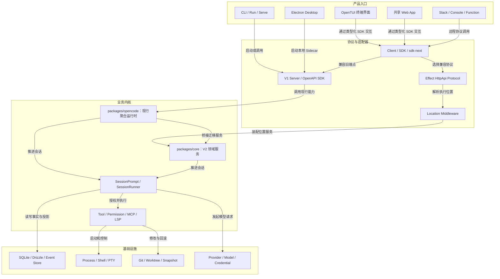

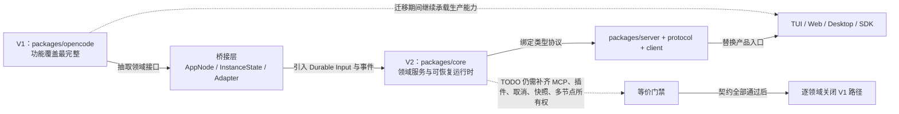

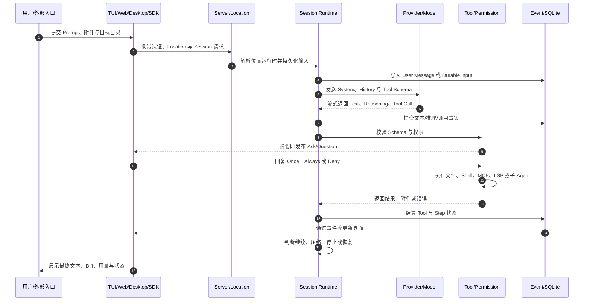

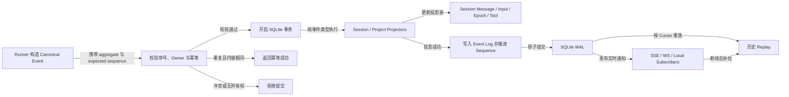

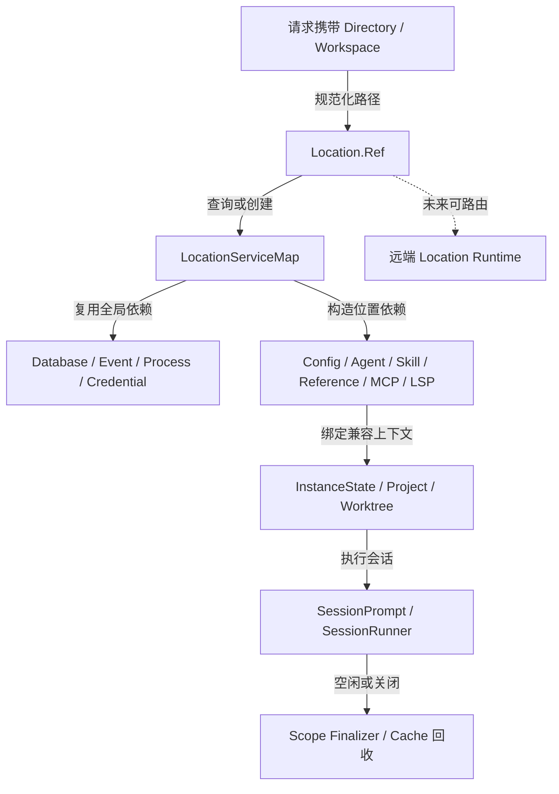

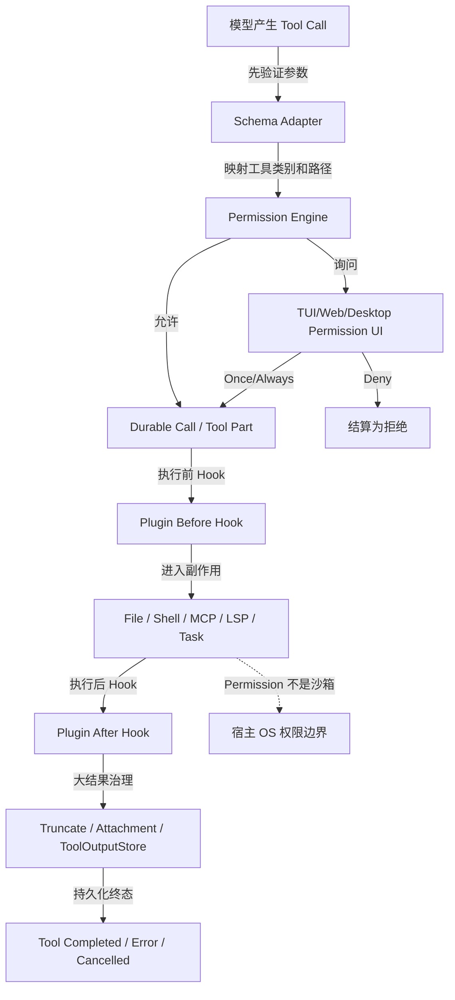

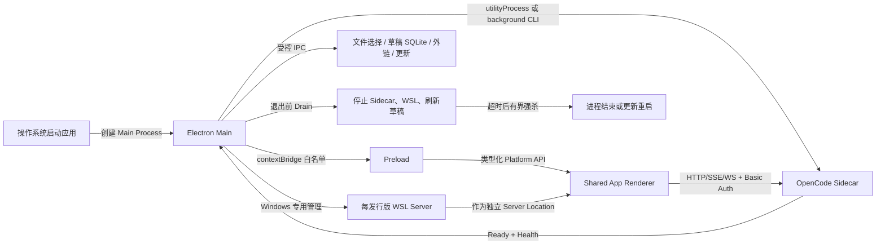

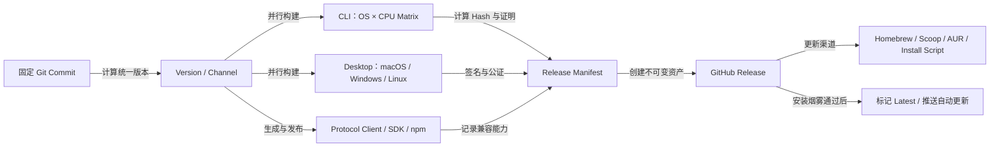

### 源码审阅方法

本次审阅按以下顺序推进：首先固定默认分支的具体提交，防止高频更新使结论漂移；随后建立包与入口索引；再沿 CLI/TUI/Web/Desktop 到 Server、Session、Tool、Provider、Event/SQLite、Process/Git 的真实调用方向阅读；最后交叉检查 Schema、SQL、测试、CI 与发布脚本。对未完成能力，以源码 TODO、桥接调用和兼容开关为依据标注“迁移中”，不把目标目录误写成已全面接管。

审阅特别关注六类问题：一是状态事实由谁持久化；二是副作用前后是否存在 Durable Boundary；三是取消与进程退出由谁完成 Finalizer；四是 Location、Session 与权限是否可能串线；五是旧/新协议如何协商；六是安全提示是否被错误描述为隔离机制。

### 阅读导航

1. [Monorepo、包边界与构建工具链](#第-1-章monorepo包边界与构建工具链)
2. [CLI 入口、命令路由与进程退出](#第-2-章cli入口命令路由与进程退出)
3. [Effect AppNode、LayerNode、Location 与依赖图](#第-3-章effectappnodelayernodelocation与依赖图)
4. [Project 身份、目录登记、Git Worktree 与 Sandbox](#第-4-章project身份目录登记gitworktree与sandbox)
5. [配置发现、优先级、Schema、迁移与策略](#第-5-章配置发现优先级schema迁移与策略)
6. [Agent 注册表、系统提示、Skill 与 Reference](#第-6-章agent注册表系统提示skill与reference)
7. [V1 SessionPrompt：现行会话主循环](#第-7-章v1sessionprompt现行会话主循环)
8. [LLM 流式适配、Provider 变换与 SessionProcessor](#第-8-章llm流式适配provider变换与sessionprocessor)
9. [V2 SessionRunner、Durable Input 与本地执行协调](#第-9-章v2sessionrunnerdurableinput与本地执行协调)
10. [Event Store、Projector、SQLite 与会话投影](#第-10-章eventstoreprojectorsqlite与会话投影)
11. [Provider、Model Catalog、认证与多供应商适配](#第-11-章providermodelcatalog认证与多供应商适配)
12. [工具 Registry、本地工具、插件工具与 MCP 工具汇聚](#第-12-章工具registry本地工具插件工具与mcp工具汇聚)
13. [文件读取、检索、编辑、Patch、Snapshot 与 Revert](#第-13-章文件读取检索编辑patchsnapshot与revert)
14. [Shell、PTY、后台任务、Task 与子 Agent](#第-14-章shellpty后台任务task与子agent)
15. [Permission、Question、Always 规则与 Doom Loop](#第-15-章permissionquestionalways规则与doomloop)
16. [上下文压缩、Tool Prune 与 Overflow 恢复](#第-16-章上下文压缩toolprune与overflow恢复)
17. [MCP Client、OAuth、资源、提示与动态能力](#第-17-章mcpclientoauth资源提示与动态能力)
18. [LSP Server 生命周期、诊断与符号能力](#第-18-章lspserver生命周期诊断与符号能力)
19. [插件 Host、Hook 总线与扩展信任边界](#第-19-章插件hosthook总线与扩展信任边界)
20. [V1/V2 Server、Protocol、Client、SDK 与内嵌模式](#第-20-章v1v2serverprotocolclientsdk与内嵌模式)
21. [TUI：OpenTUI、Solid、路由与终端交互状态树](#第-21-章tuiopentuisolid路由与终端交互状态树)
22. [共享 Web App、Session UI、协议兼容与多 Server 路由](#第-22-章共享webappsessionui协议兼容与多server路由)
23. [Electron Desktop、Sidecar、IPC、自动更新与 WSL](#第-23-章electrondesktopsidecaripc自动更新与wsl)
24. [日志、事件、错误、遥测与运行时可观测性](#第-24-章日志事件错误遥测与运行时可观测性)
25. [安全模型、信任边界、Prompt Injection 与强隔离](#第-25-章安全模型信任边界promptinjection与强隔离)
26. [测试体系、CI 门禁、构建与发布矩阵](#第-26-章测试体系ci门禁构建与发布矩阵)
27. [Slack、Function、Console、Enterprise 与外围集成](#第-27-章slackfunctionconsoleenterprise与外围集成)

---


## 26.1 Monorepo、包边界与构建工具链

> 领域分类：**全局架构**　｜　源码基线：`dev@10765ff2a9da`

### 1. 章节定位

OpenCode 已经不是单一终端程序，而是由旧聚合运行时、新领域内核、服务端、协议、客户端、TUI、共享 Web 应用、Electron 桌面、插件与外围集成组成的产品级 Monorepo。理解包图和发布图，是避免把迁移中的目录误写成“已经完成的新架构”的前提。

### 1.1 主要源码入口

- [`package.json`](https://github.com/anomalyco/opencode/blob/10765ff2a9da8c3b88e4de873aa383a49c318912/package.json)
- [`turbo.json`](https://github.com/anomalyco/opencode/blob/10765ff2a9da8c3b88e4de873aa383a49c318912/turbo.json)
- [`packages/opencode/package.json`](https://github.com/anomalyco/opencode/blob/10765ff2a9da8c3b88e4de873aa383a49c318912/packages/opencode/package.json)
- [`packages/core/package.json`](https://github.com/anomalyco/opencode/blob/10765ff2a9da8c3b88e4de873aa383a49c318912/packages/core/package.json)
- [`packages/server/package.json`](https://github.com/anomalyco/opencode/blob/10765ff2a9da8c3b88e4de873aa383a49c318912/packages/server/package.json)
- [`packages/protocol/package.json`](https://github.com/anomalyco/opencode/blob/10765ff2a9da8c3b88e4de873aa383a49c318912/packages/protocol/package.json)
- [`packages/tui/package.json`](https://github.com/anomalyco/opencode/blob/10765ff2a9da8c3b88e4de873aa383a49c318912/packages/tui/package.json)
- [`packages/app/package.json`](https://github.com/anomalyco/opencode/blob/10765ff2a9da8c3b88e4de873aa383a49c318912/packages/app/package.json)
- [`packages/desktop/package.json`](https://github.com/anomalyco/opencode/blob/10765ff2a9da8c3b88e4de873aa383a49c318912/packages/desktop/package.json)

### 2. 架构位置

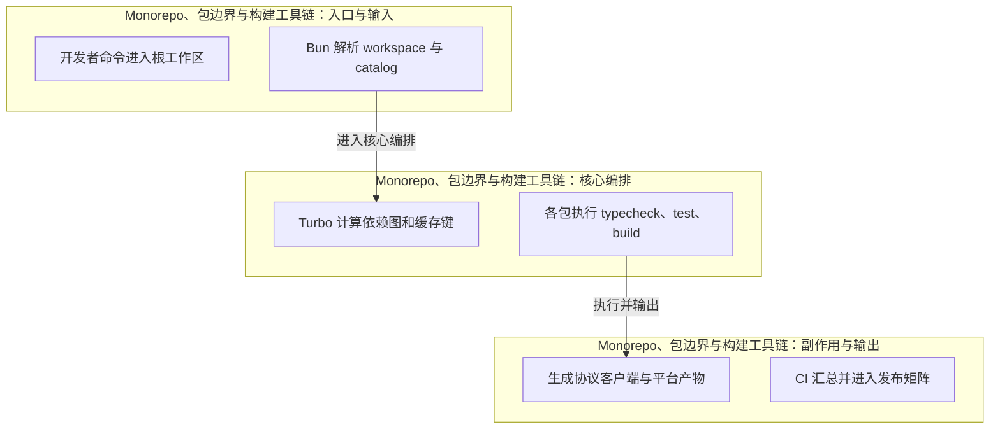

该图把入口、核心编排和副作用分开。图中的边界并不意味着每个源码文件已经完全按层归位；在双内核迁移期，`packages/opencode` 中仍存在组合根、兼容桥和领域逻辑共存的情况。

### 3. [源码事实] 关键实现

源码事实 1：根工作区使用 Bun Workspaces 和 Turbo 组织安装、构建、类型检查与测试。这一实现不是孤立细节，它同时影响调用边界、状态可见性与故障恢复。阅读时应继续追踪它的上游输入和下游事件，确认同一概念是否在 V1、V2 或客户端中存在另一份表示。

从真实调用链观察，根级 catalog 统一 Effect、Solid、AI SDK、Drizzle、Hono、OpenTUI 等核心依赖版本。它体现了项目在兼容性与目标架构之间的折中：外部行为尽量稳定，内部逐步迁向更细粒度的 Effect 服务、类型化协议和可持久化状态。

本模块的重要设计点是“packages/opencode 仍承载大量现行会话、工具、Provider、MCP、LSP 与 CLI 功能”。其工程价值在于把原本容易散落在 CLI、服务端和界面中的逻辑集中到可测试边界；代价则是依赖图和迁移桥接更复杂。

代码中可以确认：packages/core、server、protocol、client、sdk-next、tui 体现按领域服务和适配器拆分的 V2 方向。这意味着评审不能只看函数返回值，还要检查 Scope、事件提交、数据库事务、子进程或 Hook 是否在同一个生命周期内完成收尾。

围绕“条件导出区分 Bun、Node 以及平台原生实现，SQLite 与 PTY 都采用这一模式”，OpenCode 采用了显式服务或协议边界。该选择有利于远程/内嵌双模式和多界面复用，但要求调用方严格携带 Location、Session、Tool Call 等关联上下文。

源码事实 6：共享 UI、桌面壳、SDK 和服务端同仓演进，使版本一致但也放大跨包影响面。这一实现不是孤立细节，它同时影响调用边界、状态可见性与故障恢复。阅读时应继续追踪它的上游输入和下游事件，确认同一概念是否在 V1、V2 或客户端中存在另一份表示。

从真实调用链观察，发布版本在多个可发布包之间同步，CLI、桌面与客户端处于统一节奏。它体现了项目在兼容性与目标架构之间的折中：外部行为尽量稳定，内部逐步迁向更细粒度的 Effect 服务、类型化协议和可持久化状态。

### 4. 主流程与调用链


### 4.1 典型交互时序

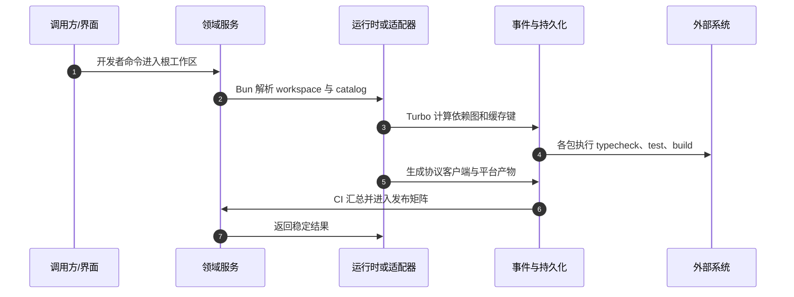

### 4.2 状态机

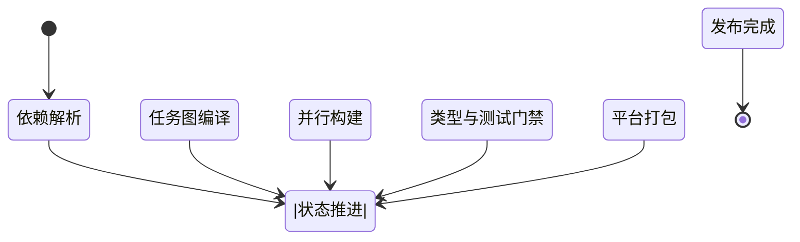

### 5. 数据、身份与状态边界

源码事实 1：主要定位键包括 Location、Project、Workspace、Session、Turn、Tool Call 或外部请求标识；本模块属于“全局架构”上下文。。这一实现不是孤立细节，它同时影响调用边界、状态可见性与故障恢复。阅读时应继续追踪它的上游输入和下游事件，确认同一概念是否在 V1、V2 或客户端中存在另一份表示。

从真实调用链观察，输入与状态应区分事实、投影、缓存和界面本地状态。事实可重放，投影可重建，缓存可丢弃，界面状态不能成为服务端最终事实源。。它体现了项目在兼容性与目标架构之间的折中：外部行为尽量稳定，内部逐步迁向更细粒度的 Effect 服务、类型化协议和可持久化状态。

本模块的重要设计点是“源码入口共 9 处，存在目录级入口时需要继续阅读同目录的 index、schema、sql、adapter 和 test，而不能只看对外导出。”。其工程价值在于把原本容易散落在 CLI、服务端和界面中的逻辑集中到可测试边界；代价则是依赖图和迁移桥接更复杂。

代码中可以确认：错误优先使用 tagged error 或稳定协议结构，至少包含阶段、可重试性、关联 ID 和经过脱敏的上下文。。这意味着评审不能只看函数返回值，还要检查 Scope、事件提交、数据库事务、子进程或 Hook 是否在同一个生命周期内完成收尾。

### 6. 必须守住的不变量

不变量 1：必须保持“跨包只能使用声明的 exports，不能依赖另一个包的内部文件”。若该条件被破坏，常见后果不是立即编译失败，而是会话串线、权限范围扩大、重复副作用或重启后无法解释状态。

协议约束 2：“V1/V2 同名概念必须通过显式桥接转换”。它需要由类型、数据库唯一性、运行时检查和回归测试共同守护，不能依赖开发者记忆。

扩展本模块前应先验证“平台条件导出在 Bun、Node、Windows、macOS、Linux 上都能解析”。这是区分兼容改动与架构破坏的关键检查点，也是故障注入测试应持续覆盖的条件。

不变量 4：必须保持“生成代码与手写代码边界清晰，协议变化后工作树必须无未提交差异”。若该条件被破坏，常见后果不是立即编译失败，而是会话串线、权限范围扩大、重复副作用或重启后无法解释状态。

协议约束 5：“根依赖升级至少验证 CLI、Server、Web 和 Desktop 四类消费者”。它需要由类型、数据库唯一性、运行时检查和回归测试共同守护，不能依赖开发者记忆。

### 7. 并发、取消与资源生命周期

源码事实 1：“开发者命令进入根工作区”与位置服务、配置或依赖准备可以并行，但最终进入“Turbo 计算依赖图和缓存键”前必须得到同一快照。。这一实现不是孤立细节，它同时影响调用边界、状态可见性与故障恢复。阅读时应继续追踪它的上游输入和下游事件，确认同一概念是否在 V1、V2 或客户端中存在另一份表示。

从真实调用链观察，当多个请求同时到达时，应以 Session、Location、Project、Tool Call 或资源键选择正确的单飞/锁粒度，不能用全局互斥掩盖竞态。。它体现了项目在兼容性与目标架构之间的折中：外部行为尽量稳定，内部逐步迁向更细粒度的 Effect 服务、类型化协议和可持久化状态。

本模块的重要设计点是“取消信号需要从调用入口传播到模型流、数据库事务、插件 Hook、MCP/LSP、子进程和输出写入；任何不响应组件都需要有界超时与最终清理。”。其工程价值在于把原本容易散落在 CLI、服务端和界面中的逻辑集中到可测试边界；代价则是依赖图和迁移桥接更复杂。

代码中可以确认：完成事件、资源 Finalizer 与 UI 通知的顺序必须固定：先形成可恢复事实，再释放资源，最后对外宣布稳定终态。。这意味着评审不能只看函数返回值，还要检查 Scope、事件提交、数据库事务、子进程或 Hook 是否在同一个生命周期内完成收尾。

围绕“热更新或兼容切换时，正在执行的操作继续使用冻结快照，新请求再使用新版本，避免同一 Turn 中途更换规则或实现。”，OpenCode 采用了显式服务或协议边界。该选择有利于远程/内嵌双模式和多界面复用，但要求调用方严格携带 Location、Session、Tool Call 等关联上下文。

### 8. 失败模型与恢复

失败模式 1：包导出遗漏导致源码模式可运行而发布包无法导入。最危险的结果通常是“部分成功”：外部副作用已经发生，但数据库、事件或 UI 没有得到同样结论。处理顺序应先固定可恢复事实，再释放资源，最后发布稳定错误。

故障场景 2：“Turbo 缓存键不完整造成跨平台陈旧产物假成功”。测试不能只断言抛出异常，还要检查 pending 工具、进程、订阅、事务和权限 Deferred 是否都进入可终止状态。

恢复关注点 3：V1/V2 共用数据库却采用不同字段或错误语义。应区分可重试、不可重放、需要人工确认和可自动补偿四类结果，并为每类保留足够的关联标识与诊断信息。

失败模式 4：原生模块只在维护者平台通过，目标平台启动失败。最危险的结果通常是“部分成功”：外部副作用已经发生，但数据库、事件或 UI 没有得到同样结论。处理顺序应先固定可恢复事实，再释放资源，最后发布稳定错误。

### 9. 安全与信任边界

安全约束 1：构建脚本和可缓存产物不得写入密钥。这里必须把“交互确认”与“强隔离”区分开；前者改善用户决策，后者需要 OS、容器、网络和凭据层面的额外控制。

信任边界 2：第三方 action、原生模块和构建容器需要固定版本或摘要。任何来自模型、仓库、插件、MCP、远端客户端或 renderer 的值都应在最靠近副作用的位置重新验证。

安全约束 3：内部调试 API 不能因协议生成而成为公开 SDK。这里必须把“交互确认”与“强隔离”区分开；前者改善用户决策，后者需要 OS、容器、网络和凭据层面的额外控制。

信任边界 4：发布 job 的写权限只授予真正需要上传资产的步骤。任何来自模型、仓库、插件、MCP、远端客户端或 renderer 的值都应在最靠近副作用的位置重新验证。

### 10. 性能与容量

性能关注点 1：主要成本来自跨包类型检查、原生依赖编译、协议生成和桌面 E2E。建议同时记录吞吐、P50/P95/P99、内存、文件句柄、子进程数和写放大，避免只用单次本地耗时判断优化效果。

容量约束 2：“包边界过渡期的重复实现会增加 bundle 与冷启动”。优化时应优先减少重复 I/O、重复 Schema/工具构造和细粒度事件写入，再考虑增加并发；否则并发只会把锁竞争转化为更难诊断的抖动。

性能关注点 3：合理任务图和缓存键比盲目增加并发 runner 更重要。建议同时记录吞吐、P50/P95/P99、内存、文件句柄、子进程数和写放大，避免只用单次本地耗时判断优化效果。

容量约束 4：“同步版本简化兼容判断但会增加无变化包的发布频率”。优化时应优先减少重复 I/O、重复 Schema/工具构造和细粒度事件写入，再考虑增加并发；否则并发只会把锁竞争转化为更难诊断的抖动。

### 11. 测试与验收

验收用例 1：从干净环境执行 bun install、turbo typecheck、test 与 build。用例应固定输入、预期事件、最终持久化状态和资源清单，必要时在副作用前后分别注入失败。

回归门禁 2：“检查全部 package exports 在 Node 和 Bun 条件下可导入”。涉及文件、Shell、PTY、SQLite 或进程时，至少在 Linux 与 Windows 运行真实实现，并补充 macOS 发布烟雾验证。

端到端验证 3：修改 protocol/schema 后运行生成并确认 git diff 为空。除了界面结果，还要核对 Server 响应、事件序列和数据库投影，防止 UI 显示成功而后台处于半完成状态。

验收用例 4：在 Linux、Windows 运行核心测试，在 macOS 运行发布烟雾。用例应固定输入、预期事件、最终持久化状态和资源清单，必要时在副作用前后分别注入失败。

回归门禁 5：“对数据库迁移执行历史版本升级和投影一致性验证”。涉及文件、Shell、PTY、SQLite 或进程时，至少在 Linux 与 Windows 运行真实实现，并补充 macOS 发布烟雾验证。

### 12. [架构推断] 设计取舍

取舍 1：双内核共存允许持续交付而不是一次性重写，但读者和贡献者必须承担更高的认知成本。这类选择通常用额外的内部复杂度换取外部兼容、恢复能力或多表面复用；是否继续沿用，应通过迁移成本和真实故障数据评估。

设计判断 2：“单仓统一版本减少协议漂移，却使边缘产品改动更容易触发全仓发布”。它不是绝对优劣，而是当前仓库规模、Bun/Node/Electron 多运行时和 V1/V2 共存条件下的阶段性最优解。

这些判断依据当前固定提交的代码组织和调用关系。它们用于解释为什么实现呈现当前形态，不等同于项目维护者已经公开承诺的长期路线；后续提交可能改变边界。

### 13. [工程建议] 可执行改进项

1. 为每个包维护 owner、稳定性、public/internal/generated/migration-only 元数据
2. 增加禁止跨包深层导入的静态规则和有到期日的迁移豁免
3. 生成 V1/V2 领域对照表并要求迁移 PR 填写数据、事件、权限、错误兼容策略
4. 输出构建关键路径和缓存命中率，持续消除重复工作

### 14. 代码评审问题与参考答案

### 评审问题 1：领域边界

本模块是否仍只处理“全局架构”职责，还是把 UI、协议、存储和平台差异重新混在一起？评审时应从入口沿依赖图追踪到最终副作用，确认新增逻辑落在正确层。

### 评审问题 2：状态一致性

不变量“跨包只能使用声明的 exports，不能依赖另一个包的内部文件”由哪些类型、事务、唯一键、Owner 或运行时检查共同保证？必须指出失败后谁负责把状态结算为可恢复终态。

### 评审问题 3：取消与并发

当流程处于“并行构建”并收到取消、重复请求或进程退出时，是否会出现双执行、迟到写入、悬挂子进程或未释放 Scope？

### 评审问题 4：安全边界

安全约束“构建脚本和可缓存产物不得写入密钥”是否在最靠近副作用的位置验证？上游 UI 或模型侧检查不能作为唯一保护。

### 评审问题 5：容量与性能

针对“主要成本来自跨包类型检查、原生依赖编译、协议生成和桌面 E2E”，是否已经定义可重复基准、数据规模、P95/P99、内存和资源上限，而不是只比较开发机单次耗时？

### 评审问题 6：迁移兼容

若该领域同时存在 V1/V2 或 Legacy/New 路径，新实现是否通过同一契约测试？差异是否被显式记录为 Capability，而不是由客户端猜测？

### 评审问题 7：可运维性

故障“包导出遗漏导致源码模式可运行而发布包无法导入”发生后，日志、事件、数据库和 UI 能否给出同一结论，并允许用户知道下一步是重试、恢复、回滚还是人工处理？

### 评审问题 8：验收标准

建议把“从干净环境执行 bun install、turbo typecheck、test 与 build”纳入 PR 门禁，并同时断言最终资源清单、事件序列和持久化投影，避免只看返回字符串。

### 15. 推荐阅读顺序

先阅读本章列出的第一个入口 `package.json`，确认对外服务或命令；再沿调用链进入状态、Schema 与适配器；随后阅读事件/SQL/进程 Finalizer；最后以测试和客户端调用验证外部行为。遇到同名 V1/V2 类型时，应回到固定提交的 import 路径确认真实依赖，不要仅凭名称判断新旧。

---


## 26.2 CLI 入口、命令路由与进程退出

> 领域分类：**运行时入口**　｜　源码基线：`dev@10765ff2a9da`

### 1. 章节定位

CLI 是 TUI、无头运行、Server、Web、attach、模型与 Provider 管理、Agent、MCP、Session、数据库和升级命令的统一入口。入口代码虽短，却定义环境标识、错误输出、退出码和所有长生命周期资源的最终收尾方式。

### 1.1 主要源码入口

- [`packages/opencode/src/index.ts`](https://github.com/anomalyco/opencode/blob/10765ff2a9da8c3b88e4de873aa383a49c318912/packages/opencode/src/index.ts)
- [`packages/opencode/src/cli`](https://github.com/anomalyco/opencode/tree/10765ff2a9da8c3b88e4de873aa383a49c318912/packages/opencode/src/cli)
- [`packages/opencode/src/cli/cmd`](https://github.com/anomalyco/opencode/tree/10765ff2a9da8c3b88e4de873aa383a49c318912/packages/opencode/src/cli/cmd)

### 2. 架构位置

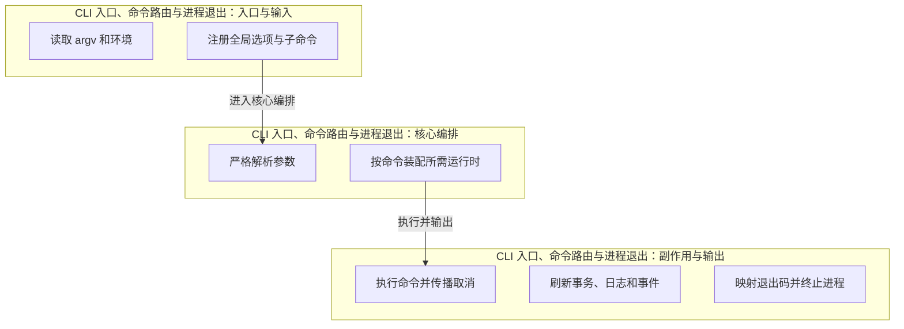

该图把入口、核心编排和副作用分开。图中的边界并不意味着每个源码文件已经完全按层归位；在双内核迁移期，`packages/opencode` 中仍存在组合根、兼容桥和领域逻辑共存的情况。

### 3. [源码事实] 关键实现

源码事实 1：入口基于 yargs 注册命令并开启严格参数解析。这一实现不是孤立细节，它同时影响调用边界、状态可见性与故障恢复。阅读时应继续追踪它的上游输入和下游事件，确认同一概念是否在 V1、V2 或客户端中存在另一份表示。

从真实调用链观察，启动时设置 AGENT、OPENCODE、OPENCODE_PID 等环境标识，便于子工具识别 Agent 上下文。它体现了项目在兼容性与目标架构之间的折中：外部行为尽量稳定，内部逐步迁向更细粒度的 Effect 服务、类型化协议和可持久化状态。

本模块的重要设计点是“默认交互入口与 run、serve、web、attach 等无头或远程形态共享相同命令路由”。其工程价值在于把原本容易散落在 CLI、服务端和界面中的逻辑集中到可测试边界；代价则是依赖图和迁移桥接更复杂。

代码中可以确认：顶层 catch 负责把 tagged error 与未知异常转换为用户可读输出。这意味着评审不能只看函数返回值，还要检查 Scope、事件提交、数据库事务、子进程或 Hook 是否在同一个生命周期内完成收尾。

围绕“进程完成后采用显式退出策略，以应对 MCP、LSP、定时器或子进程继续占用事件循环”，OpenCode 采用了显式服务或协议边界。该选择有利于远程/内嵌双模式和多界面复用，但要求调用方严格携带 Location、Session、Tool Call 等关联上下文。

源码事实 6：attach 将界面与 Server 分离，为桌面 Sidecar 和远程连接提供基础。这一实现不是孤立细节，它同时影响调用边界、状态可见性与故障恢复。阅读时应继续追踪它的上游输入和下游事件，确认同一概念是否在 V1、V2 或客户端中存在另一份表示。

从真实调用链观察，开发态 bun dev 与发布后二进制复用同一参数接口。它体现了项目在兼容性与目标架构之间的折中：外部行为尽量稳定，内部逐步迁向更细粒度的 Effect 服务、类型化协议和可持久化状态。

### 4. 主流程与调用链


### 4.1 典型交互时序

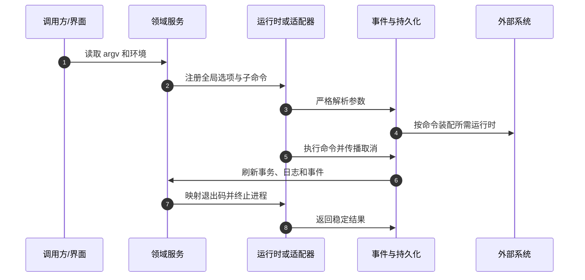

### 4.2 状态机

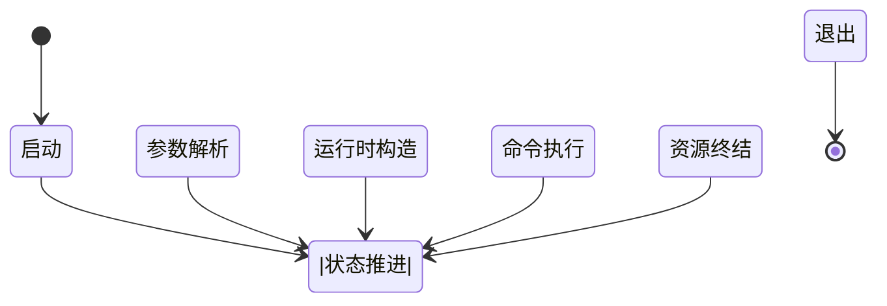

### 5. 数据、身份与状态边界

源码事实 1：主要定位键包括 Location、Project、Workspace、Session、Turn、Tool Call 或外部请求标识；本模块属于“运行时入口”上下文。。这一实现不是孤立细节，它同时影响调用边界、状态可见性与故障恢复。阅读时应继续追踪它的上游输入和下游事件，确认同一概念是否在 V1、V2 或客户端中存在另一份表示。

从真实调用链观察，输入与状态应区分事实、投影、缓存和界面本地状态。事实可重放，投影可重建，缓存可丢弃，界面状态不能成为服务端最终事实源。。它体现了项目在兼容性与目标架构之间的折中：外部行为尽量稳定，内部逐步迁向更细粒度的 Effect 服务、类型化协议和可持久化状态。

本模块的重要设计点是“源码入口共 3 处，存在目录级入口时需要继续阅读同目录的 index、schema、sql、adapter 和 test，而不能只看对外导出。”。其工程价值在于把原本容易散落在 CLI、服务端和界面中的逻辑集中到可测试边界；代价则是依赖图和迁移桥接更复杂。

代码中可以确认：错误优先使用 tagged error 或稳定协议结构，至少包含阶段、可重试性、关联 ID 和经过脱敏的上下文。。这意味着评审不能只看函数返回值，还要检查 Scope、事件提交、数据库事务、子进程或 Hook 是否在同一个生命周期内完成收尾。

### 6. 必须守住的不变量

不变量 1：必须保持“轻量命令如 version/help 不应构造完整 Agent 运行时”。若该条件被破坏，常见后果不是立即编译失败，而是会话串线、权限范围扩大、重复副作用或重启后无法解释状态。

协议约束 2：“命令返回前完成必须保证的写入和 finalizer”。它需要由类型、数据库唯一性、运行时检查和回归测试共同守护，不能依赖开发者记忆。

扩展本模块前应先验证“目录参数在 TUI、run、serve、attach 中使用同一规范化逻辑”。这是区分兼容改动与架构破坏的关键检查点，也是故障注入测试应持续覆盖的条件。

不变量 4：必须保持“批处理退出码能够被 Shell 和 CI 稳定解释”。若该条件被破坏，常见后果不是立即编译失败，而是会话串线、权限范围扩大、重复副作用或重启后无法解释状态。

协议约束 5：“顶层错误不得泄露认证 header、完整环境或 Provider 请求正文”。它需要由类型、数据库唯一性、运行时检查和回归测试共同守护，不能依赖开发者记忆。

### 7. 并发、取消与资源生命周期

源码事实 1：“读取 argv 和环境”与位置服务、配置或依赖准备可以并行，但最终进入“严格解析参数”前必须得到同一快照。。这一实现不是孤立细节，它同时影响调用边界、状态可见性与故障恢复。阅读时应继续追踪它的上游输入和下游事件，确认同一概念是否在 V1、V2 或客户端中存在另一份表示。

从真实调用链观察，当多个请求同时到达时，应以 Session、Location、Project、Tool Call 或资源键选择正确的单飞/锁粒度，不能用全局互斥掩盖竞态。。它体现了项目在兼容性与目标架构之间的折中：外部行为尽量稳定，内部逐步迁向更细粒度的 Effect 服务、类型化协议和可持久化状态。

本模块的重要设计点是“取消信号需要从调用入口传播到模型流、数据库事务、插件 Hook、MCP/LSP、子进程和输出写入；任何不响应组件都需要有界超时与最终清理。”。其工程价值在于把原本容易散落在 CLI、服务端和界面中的逻辑集中到可测试边界；代价则是依赖图和迁移桥接更复杂。

代码中可以确认：完成事件、资源 Finalizer 与 UI 通知的顺序必须固定：先形成可恢复事实，再释放资源，最后对外宣布稳定终态。。这意味着评审不能只看函数返回值，还要检查 Scope、事件提交、数据库事务、子进程或 Hook 是否在同一个生命周期内完成收尾。

围绕“热更新或兼容切换时，正在执行的操作继续使用冻结快照，新请求再使用新版本，避免同一 Turn 中途更换规则或实现。”，OpenCode 采用了显式服务或协议边界。该选择有利于远程/内嵌双模式和多界面复用，但要求调用方严格携带 Location、Session、Tool Call 等关联上下文。

### 8. 失败模型与恢复

失败模式 1：未知参数误落入默认 TUI。最危险的结果通常是“部分成功”：外部副作用已经发生，但数据库、事件或 UI 没有得到同样结论。处理顺序应先固定可恢复事实，再释放资源，最后发布稳定错误。

故障场景 2：“命令逻辑完成但后台句柄未关闭导致 CI 永不结束”。测试不能只断言抛出异常，还要检查 pending 工具、进程、订阅、事务和权限 Deferred 是否都进入可终止状态。

恢复关注点 3：显式 process.exit 发生在日志和数据库 flush 之前。应区分可重试、不可重放、需要人工确认和可自动补偿四类结果，并为每类保留足够的关联标识与诊断信息。

失败模式 4：Windows 与 Unix 信号行为不同导致退出状态漂移。最危险的结果通常是“部分成功”：外部副作用已经发生，但数据库、事件或 UI 没有得到同样结论。处理顺序应先固定可恢复事实，再释放资源，最后发布稳定错误。

故障场景 5：“attach 目标不可达却留下半初始化 renderer 或终端模式”。测试不能只断言抛出异常，还要检查 pending 工具、进程、订阅、事务和权限 Deferred 是否都进入可终止状态。

### 9. 安全与信任边界

安全约束 1：命令历史、argv 和错误需要对 token、密码、带凭据 URL 脱敏。这里必须把“交互确认”与“强隔离”区分开；前者改善用户决策，后者需要 OS、容器、网络和凭据层面的额外控制。

信任边界 2：serve 绑定非 loopback 时必须清晰提示认证和网络风险。任何来自模型、仓库、插件、MCP、远端客户端或 renderer 的值都应在最靠近副作用的位置重新验证。

安全约束 3：import/upgrade/plugin 类输入要视为不可信路径或代码来源。这里必须把“交互确认”与“强隔离”区分开；前者改善用户决策，后者需要 OS、容器、网络和凭据层面的额外控制。

信任边界 4：帮助和版本命令不得触发网络认证或加载项目插件。任何来自模型、仓库、插件、MCP、远端客户端或 renderer 的值都应在最靠近副作用的位置重新验证。

### 10. 性能与容量

性能关注点 1：冷启动主要受重模块 import、配置发现、数据库迁移和原生模块影响。建议同时记录吞吐、P50/P95/P99、内存、文件句柄、子进程数和写放大，避免只用单次本地耗时判断优化效果。

容量约束 2：“按命令声明最小服务子图可显著降低 version/help 延迟”。优化时应优先减少重复 I/O、重复 Schema/工具构造和细粒度事件写入，再考虑增加并发；否则并发只会把锁竞争转化为更难诊断的抖动。

性能关注点 3：显式退出前的收尾必须有界，不能用无限等待换取理论完整性。建议同时记录吞吐、P50/P95/P99、内存、文件句柄、子进程数和写放大，避免只用单次本地耗时判断优化效果。

容量约束 4：“服务模式吞吐不应被 CLI 路由层的重复初始化影响”。优化时应优先减少重复 I/O、重复 Schema/工具构造和细粒度事件写入，再考虑增加并发；否则并发只会把锁竞争转化为更难诊断的抖动。

### 11. 测试与验收

验收用例 1：遍历全部命令执行 --help 并确认无业务副作用。用例应固定输入、预期事件、最终持久化状态和资源清单，必要时在副作用前后分别注入失败。

回归门禁 2：“无效参数、未知命令、缺少必填项的退出码契约”。涉及文件、Shell、PTY、SQLite 或进程时，至少在 Linux 与 Windows 运行真实实现，并补充 macOS 发布烟雾验证。

端到端验证 3：注入悬挂 MCP、LSP、PTY 与 timer 后验证有界退出。除了界面结果，还要核对 Server 响应、事件序列和数据库投影，防止 UI 显示成功而后台处于半完成状态。

验收用例 4：Ctrl+C、SIGTERM、Windows 控制事件下验证事务与终端恢复。用例应固定输入、预期事件、最终持久化状态和资源清单，必要时在副作用前后分别注入失败。

回归门禁 5：“attach 的不可达、认证失败和协议不兼容 E2E”。涉及文件、Shell、PTY、SQLite 或进程时，至少在 Linux 与 Windows 运行真实实现，并补充 macOS 发布烟雾验证。

### 12. [架构推断] 设计取舍

取舍 1：显式退出牺牲一部分优雅生命周期来保证用户和 CI 不被第三方句柄永久阻塞。这类选择通常用额外的内部复杂度换取外部兼容、恢复能力或多表面复用；是否继续沿用，应通过迁移成本和真实故障数据评估。

设计判断 2：“统一 CLI 入口便于发现和兼容，但也容易把所有服务过早装载到每个命令”。它不是绝对优劣，而是当前仓库规模、Bun/Node/Electron 多运行时和 V1/V2 共存条件下的阶段性最优解。

这些判断依据当前固定提交的代码组织和调用关系。它们用于解释为什么实现呈现当前形态，不等同于项目维护者已经公开承诺的长期路线；后续提交可能改变边界。

### 13. [工程建议] 可执行改进项

1. 把退出原因建模为 success、usage、domain、interrupt、internal 并集中映射
2. 实现 ShutdownCoordinator，按顺序关闭输入、Session、Tool、MCP/LSP/PTY、Server、DB、Log
3. 建立活动句柄泄漏测试
4. 为每个命令声明最小 AppNode 子图

### 14. 代码评审问题与参考答案

### 评审问题 1：领域边界

本模块是否仍只处理“运行时入口”职责，还是把 UI、协议、存储和平台差异重新混在一起？评审时应从入口沿依赖图追踪到最终副作用，确认新增逻辑落在正确层。

### 评审问题 2：状态一致性

不变量“轻量命令如 version/help 不应构造完整 Agent 运行时”由哪些类型、事务、唯一键、Owner 或运行时检查共同保证？必须指出失败后谁负责把状态结算为可恢复终态。

### 评审问题 3：取消与并发

当流程处于“运行时构造”并收到取消、重复请求或进程退出时，是否会出现双执行、迟到写入、悬挂子进程或未释放 Scope？

### 评审问题 4：安全边界

安全约束“命令历史、argv 和错误需要对 token、密码、带凭据 URL 脱敏”是否在最靠近副作用的位置验证？上游 UI 或模型侧检查不能作为唯一保护。

### 评审问题 5：容量与性能

针对“冷启动主要受重模块 import、配置发现、数据库迁移和原生模块影响”，是否已经定义可重复基准、数据规模、P95/P99、内存和资源上限，而不是只比较开发机单次耗时？

### 评审问题 6：迁移兼容

若该领域同时存在 V1/V2 或 Legacy/New 路径，新实现是否通过同一契约测试？差异是否被显式记录为 Capability，而不是由客户端猜测？

### 评审问题 7：可运维性

故障“未知参数误落入默认 TUI”发生后，日志、事件、数据库和 UI 能否给出同一结论，并允许用户知道下一步是重试、恢复、回滚还是人工处理？

### 评审问题 8：验收标准

建议把“遍历全部命令执行 --help 并确认无业务副作用”纳入 PR 门禁，并同时断言最终资源清单、事件序列和持久化投影，避免只看返回字符串。

### 15. 推荐阅读顺序

先阅读本章列出的第一个入口 `packages/opencode/src/index.ts`，确认对外服务或命令；再沿调用链进入状态、Schema 与适配器；随后阅读事件/SQL/进程 Finalizer；最后以测试和客户端调用验证外部行为。遇到同名 V1/V2 类型时，应回到固定提交的 import 路径确认真实依赖，不要仅凭名称判断新旧。

---


## 26.3 Effect AppNode、LayerNode、Location 与依赖图

> 领域分类：**运行时内核**　｜　源码基线：`dev@10765ff2a9da`

### 1. 章节定位

V2 不只使用 Effect Layer，还封装 AppNode/LayerNode 图来声明服务、依赖、平台适配、分组与替换。Location 与 InstanceState 进一步把目录、项目、工作树和工作区从全局 cwd 中剥离，使一个进程可以承载多个位置运行时。

### 1.1 主要源码入口

- [`packages/core/src/effect/app-node.ts`](https://github.com/anomalyco/opencode/blob/10765ff2a9da8c3b88e4de873aa383a49c318912/packages/core/src/effect/app-node.ts)
- [`packages/core/src/effect/layer-node.ts`](https://github.com/anomalyco/opencode/blob/10765ff2a9da8c3b88e4de873aa383a49c318912/packages/core/src/effect/layer-node.ts)
- [`packages/core/src/effect/app-node-platform.ts`](https://github.com/anomalyco/opencode/blob/10765ff2a9da8c3b88e4de873aa383a49c318912/packages/core/src/effect/app-node-platform.ts)
- [`packages/core/src/location.ts`](https://github.com/anomalyco/opencode/blob/10765ff2a9da8c3b88e4de873aa383a49c318912/packages/core/src/location.ts)
- [`packages/core/src/location-service-map.ts`](https://github.com/anomalyco/opencode/blob/10765ff2a9da8c3b88e4de873aa383a49c318912/packages/core/src/location-service-map.ts)
- [`packages/opencode/src/effect/instance-state.ts`](https://github.com/anomalyco/opencode/blob/10765ff2a9da8c3b88e4de873aa383a49c318912/packages/opencode/src/effect/instance-state.ts)

### 2. 架构位置

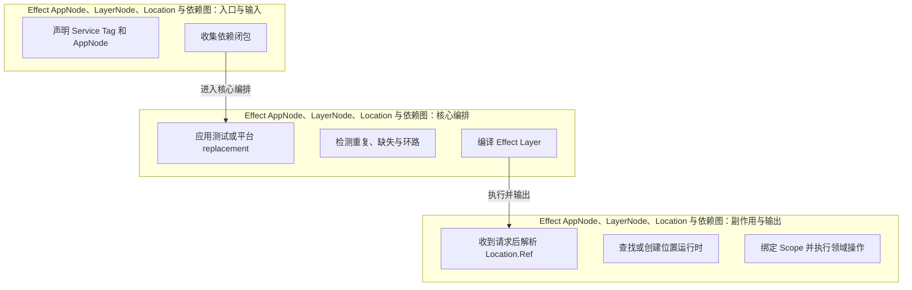

该图把入口、核心编排和副作用分开。图中的边界并不意味着每个源码文件已经完全按层归位；在双内核迁移期，`packages/opencode` 中仍存在组合根、兼容桥和领域逻辑共存的情况。

### 3. [源码事实] 关键实现

源码事实 1：LayerNode 区分未绑定节点、分组节点和具体 Layer 节点。这一实现不是孤立细节，它同时影响调用边界、状态可见性与故障恢复。阅读时应继续追踪它的上游输入和下游事件，确认同一概念是否在 V1、V2 或客户端中存在另一份表示。

从真实调用链观察，编译阶段递归解析依赖、应用 replacement、检测缺失依赖和环路。它体现了项目在兼容性与目标架构之间的折中：外部行为尽量稳定，内部逐步迁向更细粒度的 Effect 服务、类型化协议和可持久化状态。

本模块的重要设计点是“同一 Service Tag 在运行时 Scope 内获得确定实现”。其工程价值在于把原本容易散落在 CLI、服务端和界面中的逻辑集中到可测试边界；代价则是依赖图和迁移桥接更复杂。

代码中可以确认：AppNodePlatform 把 Path、FileSystem、Process 等 Bun/Node 差异纳入组合根。这意味着评审不能只看函数返回值，还要检查 Scope、事件提交、数据库事务、子进程或 Hook 是否在同一个生命周期内完成收尾。

围绕“Location.Ref 是目录、workspace、project/VCS 上下文的稳定键而非普通 cwd 字符串”，OpenCode 采用了显式服务或协议边界。该选择有利于远程/内嵌双模式和多界面复用，但要求调用方严格携带 Location、Session、Tool Call 等关联上下文。

源码事实 6：LocationServiceMap 按 Ref 惰性构造和缓存位置相关服务。这一实现不是孤立细节，它同时影响调用边界、状态可见性与故障恢复。阅读时应继续追踪它的上游输入和下游事件，确认同一概念是否在 V1、V2 或客户端中存在另一份表示。

从真实调用链观察，InstanceState 为仍在 packages/opencode 的迁移代码提供 project、worktree、directory、workspaceID 上下文。它体现了项目在兼容性与目标架构之间的折中：外部行为尽量稳定，内部逐步迁向更细粒度的 Effect 服务、类型化协议和可持久化状态。

### 4. 主流程与调用链


### 4.1 典型交互时序

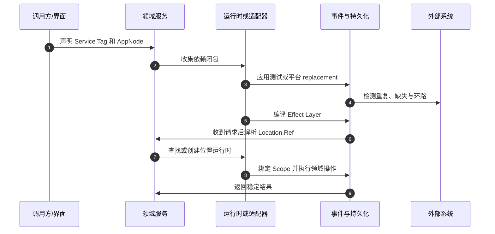

### 4.2 状态机

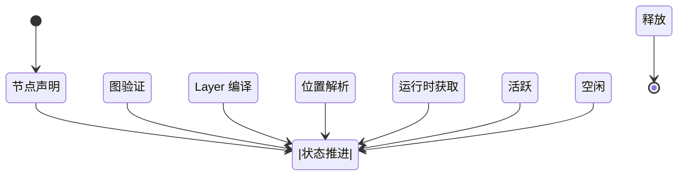

### 5. 数据、身份与状态边界

源码事实 1：主要定位键包括 Location、Project、Workspace、Session、Turn、Tool Call 或外部请求标识；本模块属于“运行时内核”上下文。。这一实现不是孤立细节，它同时影响调用边界、状态可见性与故障恢复。阅读时应继续追踪它的上游输入和下游事件，确认同一概念是否在 V1、V2 或客户端中存在另一份表示。

从真实调用链观察，输入与状态应区分事实、投影、缓存和界面本地状态。事实可重放，投影可重建，缓存可丢弃，界面状态不能成为服务端最终事实源。。它体现了项目在兼容性与目标架构之间的折中：外部行为尽量稳定，内部逐步迁向更细粒度的 Effect 服务、类型化协议和可持久化状态。

本模块的重要设计点是“源码入口共 6 处，存在目录级入口时需要继续阅读同目录的 index、schema、sql、adapter 和 test，而不能只看对外导出。”。其工程价值在于把原本容易散落在 CLI、服务端和界面中的逻辑集中到可测试边界；代价则是依赖图和迁移桥接更复杂。

代码中可以确认：错误优先使用 tagged error 或稳定协议结构，至少包含阶段、可重试性、关联 ID 和经过脱敏的上下文。。这意味着评审不能只看函数返回值，还要检查 Scope、事件提交、数据库事务、子进程或 Hook 是否在同一个生命周期内完成收尾。

### 6. 必须守住的不变量

不变量 1：必须保持“服务依赖图必须为有向无环图”。若该条件被破坏，常见后果不是立即编译失败，而是会话串线、权限范围扩大、重复副作用或重启后无法解释状态。

协议约束 2：“replacement 满足原服务契约和错误通道”。它需要由类型、数据库唯一性、运行时检查和回归测试共同守护，不能依赖开发者记忆。

扩展本模块前应先验证“平台实现不能泄漏 Bun/Node 专属类型到领域接口”。这是区分兼容改动与架构破坏的关键检查点，也是故障注入测试应持续覆盖的条件。

不变量 4：必须保持“同一请求中的配置、Agent、Session 和权限来自同一个 Location.Ref”。若该条件被破坏，常见后果不是立即编译失败，而是会话串线、权限范围扩大、重复副作用或重启后无法解释状态。

协议约束 5：“Scope 关闭后节点持有的进程、订阅与连接全部 finalizer”。它需要由类型、数据库唯一性、运行时检查和回归测试共同守护，不能依赖开发者记忆。

### 7. 并发、取消与资源生命周期

源码事实 1：“声明 Service Tag 和 AppNode”与位置服务、配置或依赖准备可以并行，但最终进入“应用测试或平台 replacement”前必须得到同一快照。。这一实现不是孤立细节，它同时影响调用边界、状态可见性与故障恢复。阅读时应继续追踪它的上游输入和下游事件，确认同一概念是否在 V1、V2 或客户端中存在另一份表示。

从真实调用链观察，当多个请求同时到达时，应以 Session、Location、Project、Tool Call 或资源键选择正确的单飞/锁粒度，不能用全局互斥掩盖竞态。。它体现了项目在兼容性与目标架构之间的折中：外部行为尽量稳定，内部逐步迁向更细粒度的 Effect 服务、类型化协议和可持久化状态。

本模块的重要设计点是“取消信号需要从调用入口传播到模型流、数据库事务、插件 Hook、MCP/LSP、子进程和输出写入；任何不响应组件都需要有界超时与最终清理。”。其工程价值在于把原本容易散落在 CLI、服务端和界面中的逻辑集中到可测试边界；代价则是依赖图和迁移桥接更复杂。

代码中可以确认：完成事件、资源 Finalizer 与 UI 通知的顺序必须固定：先形成可恢复事实，再释放资源，最后对外宣布稳定终态。。这意味着评审不能只看函数返回值，还要检查 Scope、事件提交、数据库事务、子进程或 Hook 是否在同一个生命周期内完成收尾。

围绕“热更新或兼容切换时，正在执行的操作继续使用冻结快照，新请求再使用新版本，避免同一 Turn 中途更换规则或实现。”，OpenCode 采用了显式服务或协议边界。该选择有利于远程/内嵌双模式和多界面复用，但要求调用方严格携带 Location、Session、Tool Call 等关联上下文。

### 8. 失败模型与恢复

失败模式 1：新增服务忘记加入组合根导致运行时缺 Tag。最危险的结果通常是“部分成功”：外部副作用已经发生，但数据库、事件或 UI 没有得到同样结论。处理顺序应先固定可恢复事实，再释放资源，最后发布稳定错误。

故障场景 2：“V1/V2 节点互相依赖形成隐蔽环”。测试不能只断言抛出异常，还要检查 pending 工具、进程、订阅、事务和权限 Deferred 是否都进入可终止状态。

恢复关注点 3：符号链接和大小写产生两个 Location.Ref。应区分可重试、不可重放、需要人工确认和可自动补偿四类结果，并为每类保留足够的关联标识与诊断信息。

失败模式 4：位置缓存提前释放而活跃会话仍引用服务。最危险的结果通常是“部分成功”：外部副作用已经发生，但数据库、事件或 UI 没有得到同样结论。处理顺序应先固定可恢复事实，再释放资源，最后发布稳定错误。

故障场景 5：“Layer 构造中途失败但已打开资源未回收”。测试不能只断言抛出异常，还要检查 pending 工具、进程、订阅、事务和权限 Deferred 是否都进入可终止状态。

### 9. 安全与信任边界

安全约束 1：测试 replacement 不得无意绕过认证或放宽权限。这里必须把“交互确认”与“强隔离”区分开；前者改善用户决策，后者需要 OS、容器、网络和凭据层面的额外控制。

信任边界 2：客户端提供的目录需要服务端规范化和允许范围验证。任何来自模型、仓库、插件、MCP、远端客户端或 renderer 的值都应在最靠近副作用的位置重新验证。

安全约束 3：依赖图可视化只展示类型关系，不记录动态密钥。这里必须把“交互确认”与“强隔离”区分开；前者改善用户决策，后者需要 OS、容器、网络和凭据层面的额外控制。

信任边界 4：第三方插件不能直接修改全局依赖图。任何来自模型、仓库、插件、MCP、远端客户端或 renderer 的值都应在最靠近副作用的位置重新验证。

安全约束 5：跨项目 Reference 必须经过显式目录授权。这里必须把“交互确认”与“强隔离”区分开；前者改善用户决策，后者需要 OS、容器、网络和凭据层面的额外控制。

### 10. 性能与容量

性能关注点 1：图编译结果应在运行时复用而非按请求重建。建议同时记录吞吐、P50/P95/P99、内存、文件句柄、子进程数和写放大，避免只用单次本地耗时判断优化效果。

容量约束 2：“无依赖服务可并发初始化，但大量磁盘和网络启动需要限流”。优化时应优先减少重复 I/O、重复 Schema/工具构造和细粒度事件写入，再考虑增加并发；否则并发只会把锁竞争转化为更难诊断的抖动。

性能关注点 3：位置运行时惰性加载降低启动成本却增加首次进入目录延迟。建议同时记录吞吐、P50/P95/P99、内存、文件句柄、子进程数和写放大，避免只用单次本地耗时判断优化效果。

容量约束 4：“缓存位置服务要有活跃引用和空闲回收观测”。优化时应优先减少重复 I/O、重复 Schema/工具构造和细粒度事件写入，再考虑增加并发；否则并发只会把锁竞争转化为更难诊断的抖动。

性能关注点 5：错误消息的最短依赖路径比纯编译速度更影响维护效率。建议同时记录吞吐、P50/P95/P99、内存、文件句柄、子进程数和写放大，避免只用单次本地耗时判断优化效果。

### 11. 测试与验收

验收用例 1：构造缺失依赖、重复标签、直接与间接环路的最小图。用例应固定输入、预期事件、最终持久化状态和资源清单，必要时在副作用前后分别注入失败。

回归门禁 2：“replacement 能替换深层依赖且旧 finalizer 不执行”。涉及文件、Shell、PTY、SQLite 或进程时，至少在 Linux 与 Windows 运行真实实现，并补充 macOS 发布烟雾验证。

端到端验证 3：并行多个 Scoped Runtime 验证状态隔离。除了界面结果，还要核对 Server 响应、事件序列和数据库投影，防止 UI 显示成功而后台处于半完成状态。

验收用例 4：同一目录的相对、绝对、符号链接与大小写变体只构造一个位置运行时。用例应固定输入、预期事件、最终持久化状态和资源清单，必要时在副作用前后分别注入失败。

回归门禁 5：“Layer 获取中途失败时资源逆序释放”。涉及文件、Shell、PTY、SQLite 或进程时，至少在 Linux 与 Windows 运行真实实现，并补充 macOS 发布烟雾验证。

端到端验证 6：会话在 UI 切换目录后仍在原 Location 执行。除了界面结果，还要核对 Server 响应、事件序列和数据库投影，防止 UI 显示成功而后台处于半完成状态。

### 12. [架构推断] 设计取舍

取舍 1：细粒度依赖图换来可替换和可测试性，但提高类型图学习成本。这类选择通常用额外的内部复杂度换取外部兼容、恢复能力或多表面复用；是否继续沿用，应通过迁移成本和真实故障数据评估。

设计判断 2：“按 Location 缓存减少重复发现，却必须承担路径规范化、失效和资源回收复杂度”。它不是绝对优劣，而是当前仓库规模、Bun/Node/Electron 多运行时和 V1/V2 共存条件下的阶段性最优解。

这些判断依据当前固定提交的代码组织和调用关系。它们用于解释为什么实现呈现当前形态，不等同于项目维护者已经公开承诺的长期路线；后续提交可能改变边界。

### 13. [工程建议] 可执行改进项

1. 输出机器可读 AppNode 图并纳入架构差异检查
2. 为 replacement 添加来源、环境和用途元数据
3. 禁止领域代码直接读取 process.cwd
4. 为 Location.Ref 建立跨平台规范化规范和属性测试
5. 实现位置运行时引用计数、资源清单与有界空闲回收

### 14. 代码评审问题与参考答案

### 评审问题 1：领域边界

本模块是否仍只处理“运行时内核”职责，还是把 UI、协议、存储和平台差异重新混在一起？评审时应从入口沿依赖图追踪到最终副作用，确认新增逻辑落在正确层。

### 评审问题 2：状态一致性

不变量“服务依赖图必须为有向无环图”由哪些类型、事务、唯一键、Owner 或运行时检查共同保证？必须指出失败后谁负责把状态结算为可恢复终态。

### 评审问题 3：取消与并发

当流程处于“Layer 编译”并收到取消、重复请求或进程退出时，是否会出现双执行、迟到写入、悬挂子进程或未释放 Scope？

### 评审问题 4：安全边界

安全约束“测试 replacement 不得无意绕过认证或放宽权限”是否在最靠近副作用的位置验证？上游 UI 或模型侧检查不能作为唯一保护。

### 评审问题 5：容量与性能

针对“图编译结果应在运行时复用而非按请求重建”，是否已经定义可重复基准、数据规模、P95/P99、内存和资源上限，而不是只比较开发机单次耗时？

### 评审问题 6：迁移兼容

若该领域同时存在 V1/V2 或 Legacy/New 路径，新实现是否通过同一契约测试？差异是否被显式记录为 Capability，而不是由客户端猜测？

### 评审问题 7：可运维性

故障“新增服务忘记加入组合根导致运行时缺 Tag”发生后，日志、事件、数据库和 UI 能否给出同一结论，并允许用户知道下一步是重试、恢复、回滚还是人工处理？

### 评审问题 8：验收标准

建议把“构造缺失依赖、重复标签、直接与间接环路的最小图”纳入 PR 门禁，并同时断言最终资源清单、事件序列和持久化投影，避免只看返回字符串。

### 15. 推荐阅读顺序

先阅读本章列出的第一个入口 `packages/core/src/effect/app-node.ts`，确认对外服务或命令；再沿调用链进入状态、Schema 与适配器；随后阅读事件/SQL/进程 Finalizer；最后以测试和客户端调用验证外部行为。遇到同名 V1/V2 类型时，应回到固定提交的 import 路径确认真实依赖，不要仅凭名称判断新旧。

---


## 26.4 Project 身份、目录登记、Git Worktree 与 Sandbox

> 领域分类：**项目与工作区**　｜　源码基线：`dev@10765ff2a9da`

### 1. 章节定位

项目身份不等同于当前目录。Project 结合 Git store、主 worktree 和目录关系生成稳定身份；Worktree 则创建隔离分支目录并登记为同一 Project 的 sandbox，随后预热位置运行时和可选启动脚本。

### 1.1 主要源码入口

- [`packages/core/src/project/schema.ts`](https://github.com/anomalyco/opencode/blob/10765ff2a9da8c3b88e4de873aa383a49c318912/packages/core/src/project/schema.ts)
- [`packages/core/src/project/directories.ts`](https://github.com/anomalyco/opencode/blob/10765ff2a9da8c3b88e4de873aa383a49c318912/packages/core/src/project/directories.ts)
- [`packages/core/src/project/sql.ts`](https://github.com/anomalyco/opencode/blob/10765ff2a9da8c3b88e4de873aa383a49c318912/packages/core/src/project/sql.ts)
- [`packages/opencode/src/project/project.ts`](https://github.com/anomalyco/opencode/blob/10765ff2a9da8c3b88e4de873aa383a49c318912/packages/opencode/src/project/project.ts)
- [`packages/opencode/src/worktree/index.ts`](https://github.com/anomalyco/opencode/blob/10765ff2a9da8c3b88e4de873aa383a49c318912/packages/opencode/src/worktree/index.ts)
- [`packages/opencode/src/project/instance-store.ts`](https://github.com/anomalyco/opencode/blob/10765ff2a9da8c3b88e4de873aa383a49c318912/packages/opencode/src/project/instance-store.ts)

### 2. 架构位置

```mermaid
flowchart TB
  subgraph G0["Project 身份、目录登记、Git Worktree 与 Sandbox：入口与输入"]
    C0["规范化输入目录"]
    C1["解析 Git store 与 Project ID"]
    C2["必要时迁移旧 ID"]
  end
  subgraph G1["Project 身份、目录登记、Git Worktree 与 Sandbox：核心编排"]
    C3["Upsert Project 和目录关系"]
    C4["生成唯一 worktree 名称"]
    C5["git worktree add 与 hard reset"]
  end
  subgraph G2["Project 身份、目录登记、Git Worktree 与 Sandbox：副作用与输出"]
    C6["登记 sandbox 并装载 Location Runtime"]
    C7["执行启动命令并发布 Ready/Failed"]
    C8["reset 或 remove 时先释放资源再清理 Git/磁盘"]
  end
  C2 -->|进入核心编排| C3
  C5 -->|执行并输出| C6
```

该图把入口、核心编排和副作用分开。图中的边界并不意味着每个源码文件已经完全按层归位；在双内核迁移期，`packages/opencode` 中仍存在组合根、兼容桥和领域逻辑共存的情况。

### 3. [源码事实] 关键实现

源码事实 1：ProjectV2.resolve 根据目录与 VCS 信息解析稳定项目标识。这一实现不是孤立细节，它同时影响调用边界、状态可见性与故障恢复。阅读时应继续追踪它的上游输入和下游事件，确认同一概念是否在 V1、V2 或客户端中存在另一份表示。

从真实调用链观察，ProjectDirectoryTable 允许一个项目登记多个目录并定义冲突处理。它体现了项目在兼容性与目标架构之间的折中：外部行为尽量稳定，内部逐步迁向更细粒度的 Effect 服务、类型化协议和可持久化状态。

本模块的重要设计点是“旧项目 ID 迁移在事务内更新 project、session、workspace 等归属”。其工程价值在于把原本容易散落在 CLI、服务端和界面中的逻辑集中到可测试边界；代价则是依赖图和迁移桥接更复杂。

代码中可以确认：项目聚合服务清理不存在的 sandbox，并可后台发现 favicon 元数据。这意味着评审不能只看函数返回值，还要检查 Scope、事件提交、数据库事务、子进程或 Hook 是否在同一个生命周期内完成收尾。

围绕“Worktree 创建生成唯一 slug 和 opencode 命名空间分支，可选择带分支或 detached”，OpenCode 采用了显式服务或协议边界。该选择有利于远程/内嵌双模式和多界面复用，但要求调用方严格携带 Location、Session、Tool Call 等关联上下文。

源码事实 6：创建后先 hard reset 填充工作树，再通过 InstanceStore.load 预热目录运行时。这一实现不是孤立细节，它同时影响调用边界、状态可见性与故障恢复。阅读时应继续追踪它的上游输入和下游事件，确认同一概念是否在 V1、V2 或客户端中存在另一份表示。

从真实调用链观察，删除前停止 fsmonitor、释放 InstanceStore，并在 Windows 对文件占用进行有界重试。它体现了项目在兼容性与目标架构之间的折中：外部行为尽量稳定，内部逐步迁向更细粒度的 Effect 服务、类型化协议和可持久化状态。

本模块的重要设计点是“reset 定位默认分支、fetch、hard reset、clean、递归处理子模块并验证最终状态为空”。其工程价值在于把原本容易散落在 CLI、服务端和界面中的逻辑集中到可测试边界；代价则是依赖图和迁移桥接更复杂。

### 4. 主流程与调用链

```mermaid
flowchart LR
  F0["规范化输入目录"]
  F1["解析 Git store 与 Project ID"]
  F0 -->|进入下一阶段| F1
  F2["必要时迁移旧 ID"]
  F1 -->|进入下一阶段| F2
  F3["Upsert Project 和目录关系"]
  F2 -->|进入下一阶段| F3
  F4["生成唯一 worktree 名称"]
  F3 -->|进入下一阶段| F4
  F5["git worktree add 与 hard reset"]
  F4 -->|进入下一阶段| F5
  F6["登记 sandbox 并装载 Location Runtime"]
  F5 -->|进入下一阶段| F6
  F7["执行启动命令并发布 Ready/Failed"]
  F6 -->|进入下一阶段| F7
  F8["reset 或 remove 时先释放资源再清理 Git/磁盘"]
  F7 -->|进入下一阶段| F8
```

### 4.1 典型交互时序

```mermaid
sequenceDiagram
  autonumber
  participant A0 as 调用方/界面
  participant A1 as 领域服务
  participant A2 as 运行时或适配器
  participant A3 as 事件与持久化
  participant A4 as 外部系统
  A0->>A1: 规范化输入目录
  A1->>A2: 解析 Git store 与 Project ID
  A2->>A3: 必要时迁移旧 ID
  A3->>A4: Upsert Project 和目录关系
  A2->>A3: 生成唯一 worktree 名称
  A3->>A1: git worktree add 与 hard reset
  A1->>A2: 登记 sandbox 并装载 Location Runtime
  A2->>A3: 执行启动命令并发布 Ready/Failed
  A3->>A1: reset 或 remove 时先释放资源再清理 Git/磁盘
  A1->>A2: 返回稳定结果
```

### 4.2 状态机

```mermaid
stateDiagram-v2
  [*] --> S0
  state "目录输入" as S0
  state "项目已解析" as S1
  S0 -->|状态推进| S1
  state "项目已登记" as S2
  S1 -->|状态推进| S2
  state "Worktree 创建中" as S3
  S2 -->|状态推进| S3
  state "Runtime 预热中" as S4
  S3 -->|状态推进| S4
  state "Ready" as S5
  S4 -->|状态推进| S5
  state "Resetting/Removing" as S6
  S5 -->|状态推进| S6
  state "Removed/Failed" as S7
  S6 -->|状态推进| S7
  S7 --> [*]
```

### 5. 数据、身份与状态边界

源码事实 1：主要定位键包括 Location、Project、Workspace、Session、Turn、Tool Call 或外部请求标识；本模块属于“项目与工作区”上下文。。这一实现不是孤立细节，它同时影响调用边界、状态可见性与故障恢复。阅读时应继续追踪它的上游输入和下游事件，确认同一概念是否在 V1、V2 或客户端中存在另一份表示。

从真实调用链观察，输入与状态应区分事实、投影、缓存和界面本地状态。事实可重放，投影可重建，缓存可丢弃，界面状态不能成为服务端最终事实源。。它体现了项目在兼容性与目标架构之间的折中：外部行为尽量稳定，内部逐步迁向更细粒度的 Effect 服务、类型化协议和可持久化状态。

本模块的重要设计点是“源码入口共 6 处，存在目录级入口时需要继续阅读同目录的 index、schema、sql、adapter 和 test，而不能只看对外导出。”。其工程价值在于把原本容易散落在 CLI、服务端和界面中的逻辑集中到可测试边界；代价则是依赖图和迁移桥接更复杂。

代码中可以确认：错误优先使用 tagged error 或稳定协议结构，至少包含阶段、可重试性、关联 ID 和经过脱敏的上下文。。这意味着评审不能只看函数返回值，还要检查 Scope、事件提交、数据库事务、子进程或 Hook 是否在同一个生命周期内完成收尾。

### 6. 必须守住的不变量

不变量 1：必须保持“同一 Git 项目的多个 worktree 共享 Project ID 但拥有独立 Location”。若该条件被破坏，常见后果不是立即编译失败，而是会话串线、权限范围扩大、重复副作用或重启后无法解释状态。

协议约束 2：“主工作区不能经过 sandbox reset/remove 路径删除”。它需要由类型、数据库唯一性、运行时检查和回归测试共同守护，不能依赖开发者记忆。

扩展本模块前应先验证“项目 ID 迁移与 session/workspace 归属更新原子完成”。这是区分兼容改动与架构破坏的关键检查点，也是故障注入测试应持续覆盖的条件。

不变量 4：必须保持“Ready 只在 checkout 与位置运行时装载完成后发布”。若该条件被破坏，常见后果不是立即编译失败，而是会话串线、权限范围扩大、重复副作用或重启后无法解释状态。

协议约束 5：“reset 返回成功时 porcelain 状态必须为空”。它需要由类型、数据库唯一性、运行时检查和回归测试共同守护，不能依赖开发者记忆。

扩展本模块前应先验证“递归删除目标必须位于受管理根目录”。这是区分兼容改动与架构破坏的关键检查点，也是故障注入测试应持续覆盖的条件。

### 7. 并发、取消与资源生命周期

源码事实 1：“规范化输入目录”与位置服务、配置或依赖准备可以并行，但最终进入“必要时迁移旧 ID”前必须得到同一快照。。这一实现不是孤立细节，它同时影响调用边界、状态可见性与故障恢复。阅读时应继续追踪它的上游输入和下游事件，确认同一概念是否在 V1、V2 或客户端中存在另一份表示。

从真实调用链观察，当多个请求同时到达时，应以 Session、Location、Project、Tool Call 或资源键选择正确的单飞/锁粒度，不能用全局互斥掩盖竞态。。它体现了项目在兼容性与目标架构之间的折中：外部行为尽量稳定，内部逐步迁向更细粒度的 Effect 服务、类型化协议和可持久化状态。

本模块的重要设计点是“取消信号需要从调用入口传播到模型流、数据库事务、插件 Hook、MCP/LSP、子进程和输出写入；任何不响应组件都需要有界超时与最终清理。”。其工程价值在于把原本容易散落在 CLI、服务端和界面中的逻辑集中到可测试边界；代价则是依赖图和迁移桥接更复杂。

代码中可以确认：完成事件、资源 Finalizer 与 UI 通知的顺序必须固定：先形成可恢复事实，再释放资源，最后对外宣布稳定终态。。这意味着评审不能只看函数返回值，还要检查 Scope、事件提交、数据库事务、子进程或 Hook 是否在同一个生命周期内完成收尾。

围绕“热更新或兼容切换时，正在执行的操作继续使用冻结快照，新请求再使用新版本，避免同一 Turn 中途更换规则或实现。”，OpenCode 采用了显式服务或协议边界。该选择有利于远程/内嵌双模式和多界面复用，但要求调用方严格携带 Location、Session、Tool Call 等关联上下文。

### 8. 失败模型与恢复

失败模式 1：git worktree add 成功而 sandbox 登记失败形成孤儿。最危险的结果通常是“部分成功”：外部副作用已经发生，但数据库、事件或 UI 没有得到同样结论。处理顺序应先固定可恢复事实，再释放资源，最后发布稳定错误。

故障场景 2：“项目迁移事务中断造成引用悬空”。测试不能只断言抛出异常，还要检查 pending 工具、进程、订阅、事务和权限 Deferred 是否都进入可终止状态。

恢复关注点 3：启动脚本失败使工作树可用但 UI 只看到失败。应区分可重试、不可重放、需要人工确认和可自动补偿四类结果，并为每类保留足够的关联标识与诊断信息。

失败模式 4：Windows 文件占用导致删除元数据和目录不一致。最危险的结果通常是“部分成功”：外部副作用已经发生，但数据库、事件或 UI 没有得到同样结论。处理顺序应先固定可恢复事实，再释放资源，最后发布稳定错误。

故障场景 5：“符号链接或大小写判断错误误认主工作区”。测试不能只断言抛出异常，还要检查 pending 工具、进程、订阅、事务和权限 Deferred 是否都进入可终止状态。

恢复关注点 6：子模块 reset 部分失败留下表面干净的主仓库。应区分可重试、不可重放、需要人工确认和可自动补偿四类结果，并为每类保留足够的关联标识与诊断信息。

### 9. 安全与信任边界

安全约束 1：项目启动脚本等价于任意代码执行，需要显式信任和权限。这里必须把“交互确认”与“强隔离”区分开；前者改善用户决策，后者需要 OS、容器、网络和凭据层面的额外控制。

信任边界 2：worktree 名称和分支参数必须 slug 化而不是字符串拼接。任何来自模型、仓库、插件、MCP、远端客户端或 renderer 的值都应在最靠近副作用的位置重新验证。

安全约束 3：删除、reset 和图标读取要验证路径、大小与 MIME。这里必须把“交互确认”与“强隔离”区分开；前者改善用户决策，后者需要 OS、容器、网络和凭据层面的额外控制。

信任边界 4：远程 API 创建 sandbox 需要认证、Project 归属和配额。任何来自模型、仓库、插件、MCP、远端客户端或 renderer 的值都应在最靠近副作用的位置重新验证。

安全约束 5：Project 列表事件不能向无权用户泄露其他目录。这里必须把“交互确认”与“强隔离”区分开；前者改善用户决策，后者需要 OS、容器、网络和凭据层面的额外控制。

### 10. 性能与容量

性能关注点 1：大型仓库 checkout、submodule 和启动脚本是主要延迟。建议同时记录吞吐、P50/P95/P99、内存、文件句柄、子进程数和写放大，避免只用单次本地耗时判断优化效果。

容量约束 2：“后台 boot 改善 API 响应但需要阶段进度事件”。优化时应优先减少重复 I/O、重复 Schema/工具构造和细粒度事件写入，再考虑增加并发；否则并发只会把锁竞争转化为更难诊断的抖动。

性能关注点 3：并发检查大量 sandbox 和 favicon 应设置容量上限。建议同时记录吞吐、P50/P95/P99、内存、文件句柄、子进程数和写放大，避免只用单次本地耗时判断优化效果。

容量约束 4：“InstanceStore 预热减少首轮延迟但提前占用 watcher/LSP 等资源”。优化时应优先减少重复 I/O、重复 Schema/工具构造和细粒度事件写入，再考虑增加并发；否则并发只会把锁竞争转化为更难诊断的抖动。

性能关注点 5：需要定期对比 Git worktree、数据库 sandbox、磁盘目录和运行时缓存。建议同时记录吞吐、P50/P95/P99、内存、文件句柄、子进程数和写放大，避免只用单次本地耗时判断优化效果。

### 11. 测试与验收

验收用例 1：多 worktree 共享 Project ID 与独立 Location 的集成测试。用例应固定输入、预期事件、最终持久化状态和资源清单，必要时在副作用前后分别注入失败。

回归门禁 2：“旧 ID 迁移后逐表检查 project/session/workspace”。涉及文件、Shell、PTY、SQLite 或进程时，至少在 Linux 与 Windows 运行真实实现，并补充 macOS 发布烟雾验证。

端到端验证 3：并发创建同名 worktree 只产生唯一目录和分支。除了界面结果，还要核对 Server 响应、事件序列和数据库投影，防止 UI 显示成功而后台处于半完成状态。

验收用例 4：主目录、管理外目录和符号链接目录的 reset/remove 必须拒绝。用例应固定输入、预期事件、最终持久化状态和资源清单，必要时在副作用前后分别注入失败。

回归门禁 5：“含 ignored 文件、子模块和 Windows 锁文件的 reset”。涉及文件、Shell、PTY、SQLite 或进程时，至少在 Linux 与 Windows 运行真实实现，并补充 macOS 发布烟雾验证。

端到端验证 6：创建中断后孤儿扫描可识别并修复。除了界面结果，还要核对 Server 响应、事件序列和数据库投影，防止 UI 显示成功而后台处于半完成状态。

### 12. [架构推断] 设计取舍

取舍 1：把 worktree 初始化异步化可改善交互，但需要把 Ready/Failed 视为持久状态而非瞬时通知。这类选择通常用额外的内部复杂度换取外部兼容、恢复能力或多表面复用；是否继续沿用，应通过迁移成本和真实故障数据评估。

设计判断 2：“独立 sandbox 提供代码隔离，却不隔离网络、凭据和宿主进程权限”。它不是绝对优劣，而是当前仓库规模、Bun/Node/Electron 多运行时和 V1/V2 共存条件下的阶段性最优解。

这些判断依据当前固定提交的代码组织和调用关系。它们用于解释为什么实现呈现当前形态，不等同于项目维护者已经公开承诺的长期路线；后续提交可能改变边界。

### 13. [工程建议] 可执行改进项

1. 把创建流程改为可持久化作业并记录每个可重试阶段
2. 实现四方孤儿对账和一键修复
3. 对启动脚本增加超时、输出上限、取消和信任提示
4. 抽取统一 PathOwnership 安全组件
5. 给 sandbox 记录来源、状态、分支与最后健康时间

### 14. 代码评审问题与参考答案

### 评审问题 1：领域边界

本模块是否仍只处理“项目与工作区”职责，还是把 UI、协议、存储和平台差异重新混在一起？评审时应从入口沿依赖图追踪到最终副作用，确认新增逻辑落在正确层。

### 评审问题 2：状态一致性

不变量“同一 Git 项目的多个 worktree 共享 Project ID 但拥有独立 Location”由哪些类型、事务、唯一键、Owner 或运行时检查共同保证？必须指出失败后谁负责把状态结算为可恢复终态。

### 评审问题 3：取消与并发

当流程处于“项目已登记”并收到取消、重复请求或进程退出时，是否会出现双执行、迟到写入、悬挂子进程或未释放 Scope？

### 评审问题 4：安全边界

安全约束“项目启动脚本等价于任意代码执行，需要显式信任和权限”是否在最靠近副作用的位置验证？上游 UI 或模型侧检查不能作为唯一保护。

### 评审问题 5：容量与性能

针对“大型仓库 checkout、submodule 和启动脚本是主要延迟”，是否已经定义可重复基准、数据规模、P95/P99、内存和资源上限，而不是只比较开发机单次耗时？

### 评审问题 6：迁移兼容

若该领域同时存在 V1/V2 或 Legacy/New 路径，新实现是否通过同一契约测试？差异是否被显式记录为 Capability，而不是由客户端猜测？

### 评审问题 7：可运维性

故障“git worktree add 成功而 sandbox 登记失败形成孤儿”发生后，日志、事件、数据库和 UI 能否给出同一结论，并允许用户知道下一步是重试、恢复、回滚还是人工处理？

### 评审问题 8：验收标准

建议把“多 worktree 共享 Project ID 与独立 Location 的集成测试”纳入 PR 门禁，并同时断言最终资源清单、事件序列和持久化投影，避免只看返回字符串。

### 15. 推荐阅读顺序

先阅读本章列出的第一个入口 `packages/core/src/project/schema.ts`，确认对外服务或命令；再沿调用链进入状态、Schema 与适配器；随后阅读事件/SQL/进程 Finalizer；最后以测试和客户端调用验证外部行为。遇到同名 V1/V2 类型时，应回到固定提交的 import 路径确认真实依赖，不要仅凭名称判断新旧。

---


## 26.5 配置发现、优先级、Schema、迁移与策略

> 领域分类：**配置系统**　｜　源码基线：`dev@10765ff2a9da`

### 1. 章节定位

配置控制模型、Agent、权限、MCP、LSP、格式化、插件、压缩、命令、Reference、Skill 和实验开关。V1 loader 承担丰富的发现与兼容，V2 core schema 则把目标配置边界类型化，因此当前是双配置模型共存。

### 1.1 主要源码入口

- [`packages/core/src/config.ts`](https://github.com/anomalyco/opencode/blob/10765ff2a9da8c3b88e4de873aa383a49c318912/packages/core/src/config.ts)
- [`packages/opencode/src/config/config.ts`](https://github.com/anomalyco/opencode/blob/10765ff2a9da8c3b88e4de873aa383a49c318912/packages/opencode/src/config/config.ts)
- [`packages/schema`](https://github.com/anomalyco/opencode/tree/10765ff2a9da8c3b88e4de873aa383a49c318912/packages/schema)
- [`packages/opencode/src/config`](https://github.com/anomalyco/opencode/tree/10765ff2a9da8c3b88e4de873aa383a49c318912/packages/opencode/src/config)

### 2. 架构位置

```mermaid
flowchart TB
  subgraph G0["配置发现、优先级、Schema、迁移与策略：入口与输入"]
    C0["发现配置目录和来源"]
    C1["并行读取文本"]
    C2["解析 JSONC"]
  end
  subgraph G1["配置发现、优先级、Schema、迁移与策略：核心编排"]
    C3["替换环境变量与文件变量"]
    C4["迁移旧字段"]
    C5["Schema 解码"]
  end
  subgraph G2["配置发现、优先级、Schema、迁移与策略：副作用与输出"]
    C6["按低到高优先级合并"]
    C7["生成来源诊断"]
    C8["发布完整配置快照并重建受影响服务"]
  end
  C2 -->|进入核心编排| C3
  C5 -->|执行并输出| C6
```

该图把入口、核心编排和副作用分开。图中的边界并不意味着每个源码文件已经完全按层归位；在双内核迁移期，`packages/opencode` 中仍存在组合根、兼容桥和领域逻辑共存的情况。

### 3. [源码事实] 关键实现

源码事实 1：V1 支持 JSONC、schema 提示、环境变量替换和从文件读取变量。这一实现不是孤立细节，它同时影响调用边界、状态可见性与故障恢复。阅读时应继续追踪它的上游输入和下游事件，确认同一概念是否在 V1、V2 或客户端中存在另一份表示。

从真实调用链观察，全局、项目、.opencode、环境/内联和托管来源按明确优先级合并。它体现了项目在兼容性与目标架构之间的折中：外部行为尽量稳定，内部逐步迁向更细粒度的 Effect 服务、类型化协议和可持久化状态。

本模块的重要设计点是“对象字段可以深合并，但权限、插件、instructions 等顺序敏感数组需要专门策略”。其工程价值在于把原本容易散落在 CLI、服务端和界面中的逻辑集中到可测试边界；代价则是依赖图和迁移桥接更复杂。

代码中可以确认：插件相对路径会被规范化并追踪来源。这意味着评审不能只看函数返回值，还要检查 Scope、事件提交、数据库事务、子进程或 Hook 是否在同一个生命周期内完成收尾。

围绕“旧字段迁移和 V2 到 V1 lowering 会产生诊断，避免无法表示的字段静默丢失”，OpenCode 采用了显式服务或协议边界。该选择有利于远程/内嵌双模式和多界面复用，但要求调用方严格携带 Location、Session、Tool Call 等关联上下文。

源码事实 6：V2 Effect Schema 覆盖 shell、model、agent、permission、mcp、compaction、skills、commands、references、plugins、provider 和 experimental。这一实现不是孤立细节，它同时影响调用边界、状态可见性与故障恢复。阅读时应继续追踪它的上游输入和下游事件，确认同一概念是否在 V1、V2 或客户端中存在另一份表示。

从真实调用链观察，配置状态按 Location 缓存，热更新可能级联重建 Agent、MCP、LSP 与插件。它体现了项目在兼容性与目标架构之间的折中：外部行为尽量稳定，内部逐步迁向更细粒度的 Effect 服务、类型化协议和可持久化状态。

### 4. 主流程与调用链

```mermaid
flowchart LR
  F0["发现配置目录和来源"]
  F1["并行读取文本"]
  F0 -->|进入下一阶段| F1
  F2["解析 JSONC"]
  F1 -->|进入下一阶段| F2
  F3["替换环境变量与文件变量"]
  F2 -->|进入下一阶段| F3
  F4["迁移旧字段"]
  F3 -->|进入下一阶段| F4
  F5["Schema 解码"]
  F4 -->|进入下一阶段| F5
  F6["按低到高优先级合并"]
  F5 -->|进入下一阶段| F6
  F7["生成来源诊断"]
  F6 -->|进入下一阶段| F7
  F8["发布完整配置快照并重建受影响服务"]
  F7 -->|进入下一阶段| F8
```

### 4.1 典型交互时序

```mermaid
sequenceDiagram
  autonumber
  participant A0 as 调用方/界面
  participant A1 as 领域服务
  participant A2 as 运行时或适配器
  participant A3 as 事件与持久化
  participant A4 as 外部系统
  A0->>A1: 发现配置目录和来源
  A1->>A2: 并行读取文本
  A2->>A3: 解析 JSONC
  A3->>A4: 替换环境变量与文件变量
  A2->>A3: 迁移旧字段
  A3->>A1: Schema 解码
  A1->>A2: 按低到高优先级合并
  A2->>A3: 生成来源诊断
  A3->>A1: 发布完整配置快照并重建受影响服务
  A1->>A2: 返回稳定结果
```

### 4.2 状态机

```mermaid
stateDiagram-v2
  [*] --> S0
  state "未发现" as S0
  state "已读取" as S1
  S0 -->|状态推进| S1
  state "已解析" as S2
  S1 -->|状态推进| S2
  state "已迁移" as S3
  S2 -->|状态推进| S3
  state "已校验" as S4
  S3 -->|状态推进| S4
  state "已合并" as S5
  S4 -->|状态推进| S5
  state "Active" as S6
  S5 -->|状态推进| S6
  state "Reloading" as S7
  S6 -->|状态推进| S7
  state "Error" as S8
  S7 -->|状态推进| S8
  S8 --> [*]
```

### 5. 数据、身份与状态边界

源码事实 1：主要定位键包括 Location、Project、Workspace、Session、Turn、Tool Call 或外部请求标识；本模块属于“配置系统”上下文。。这一实现不是孤立细节，它同时影响调用边界、状态可见性与故障恢复。阅读时应继续追踪它的上游输入和下游事件，确认同一概念是否在 V1、V2 或客户端中存在另一份表示。

从真实调用链观察，输入与状态应区分事实、投影、缓存和界面本地状态。事实可重放，投影可重建，缓存可丢弃，界面状态不能成为服务端最终事实源。。它体现了项目在兼容性与目标架构之间的折中：外部行为尽量稳定，内部逐步迁向更细粒度的 Effect 服务、类型化协议和可持久化状态。

本模块的重要设计点是“源码入口共 4 处，存在目录级入口时需要继续阅读同目录的 index、schema、sql、adapter 和 test，而不能只看对外导出。”。其工程价值在于把原本容易散落在 CLI、服务端和界面中的逻辑集中到可测试边界；代价则是依赖图和迁移桥接更复杂。

代码中可以确认：错误优先使用 tagged error 或稳定协议结构，至少包含阶段、可重试性、关联 ID 和经过脱敏的上下文。。这意味着评审不能只看函数返回值，还要检查 Scope、事件提交、数据库事务、子进程或 Hook 是否在同一个生命周期内完成收尾。

### 6. 必须守住的不变量

不变量 1：必须保持“配置优先级不受文件枚举顺序影响”。若该条件被破坏，常见后果不是立即编译失败，而是会话串线、权限范围扩大、重复副作用或重启后无法解释状态。

协议约束 2：“最后匹配的权限规则顺序在合并后保持”。它需要由类型、数据库唯一性、运行时检查和回归测试共同守护，不能依赖开发者记忆。

扩展本模块前应先验证“一个操作期间读取同一完整配置快照”。这是区分兼容改动与架构破坏的关键检查点，也是故障注入测试应持续覆盖的条件。

不变量 4：必须保持“敏感替换值不进入日志、事件和前端状态”。若该条件被破坏，常见后果不是立即编译失败，而是会话串线、权限范围扩大、重复副作用或重启后无法解释状态。

协议约束 5：“V1/V2 无法表达差异必须有诊断”。它需要由类型、数据库唯一性、运行时检查和回归测试共同守护，不能依赖开发者记忆。

扩展本模块前应先验证“托管安全策略不能被低信任项目配置覆盖”。这是区分兼容改动与架构破坏的关键检查点，也是故障注入测试应持续覆盖的条件。

### 7. 并发、取消与资源生命周期

源码事实 1：“发现配置目录和来源”与位置服务、配置或依赖准备可以并行，但最终进入“解析 JSONC”前必须得到同一快照。。这一实现不是孤立细节，它同时影响调用边界、状态可见性与故障恢复。阅读时应继续追踪它的上游输入和下游事件，确认同一概念是否在 V1、V2 或客户端中存在另一份表示。

从真实调用链观察，当多个请求同时到达时，应以 Session、Location、Project、Tool Call 或资源键选择正确的单飞/锁粒度，不能用全局互斥掩盖竞态。。它体现了项目在兼容性与目标架构之间的折中：外部行为尽量稳定，内部逐步迁向更细粒度的 Effect 服务、类型化协议和可持久化状态。

本模块的重要设计点是“取消信号需要从调用入口传播到模型流、数据库事务、插件 Hook、MCP/LSP、子进程和输出写入；任何不响应组件都需要有界超时与最终清理。”。其工程价值在于把原本容易散落在 CLI、服务端和界面中的逻辑集中到可测试边界；代价则是依赖图和迁移桥接更复杂。

代码中可以确认：完成事件、资源 Finalizer 与 UI 通知的顺序必须固定：先形成可恢复事实，再释放资源，最后对外宣布稳定终态。。这意味着评审不能只看函数返回值，还要检查 Scope、事件提交、数据库事务、子进程或 Hook 是否在同一个生命周期内完成收尾。

围绕“热更新或兼容切换时，正在执行的操作继续使用冻结快照，新请求再使用新版本，避免同一 Turn 中途更换规则或实现。”，OpenCode 采用了显式服务或协议边界。该选择有利于远程/内嵌双模式和多界面复用，但要求调用方严格携带 Location、Session、Tool Call 等关联上下文。

### 8. 失败模型与恢复

失败模式 1：损坏 JSONC 阻断整个位置运行时。最危险的结果通常是“部分成功”：外部副作用已经发生，但数据库、事件或 UI 没有得到同样结论。处理顺序应先固定可恢复事实，再释放资源，最后发布稳定错误。

故障场景 2：“缺失环境变量被展开为空导致错误认证或危险默认值”。测试不能只断言抛出异常，还要检查 pending 工具、进程、订阅、事务和权限 Deferred 是否都进入可终止状态。

恢复关注点 3：数组合并重复启动同一插件/MCP。应区分可重试、不可重放、需要人工确认和可自动补偿四类结果，并为每类保留足够的关联标识与诊断信息。

失败模式 4：热更新只改了一半服务，旧会话读取混合快照。最危险的结果通常是“部分成功”：外部副作用已经发生，但数据库、事件或 UI 没有得到同样结论。处理顺序应先固定可恢复事实，再释放资源，最后发布稳定错误。

故障场景 5：“lowering 静默丢掉 V2 权限或 Provider 语义”。测试不能只断言抛出异常，还要检查 pending 工具、进程、订阅、事务和权限 Deferred 是否都进入可终止状态。

### 9. 安全与信任边界

安全约束 1：配置可触发插件、MCP、本地命令和远程 Provider，应被视为代码级信任输入。这里必须把“交互确认”与“强隔离”区分开；前者改善用户决策，后者需要 OS、容器、网络和凭据层面的额外控制。

信任边界 2：文件变量读取不能把秘密回显到诊断。任何来自模型、仓库、插件、MCP、远端客户端或 renderer 的值都应在最靠近副作用的位置重新验证。

安全约束 3：远程客户端不能任意指定服务端配置文件路径。这里必须把“交互确认”与“强隔离”区分开；前者改善用户决策，后者需要 OS、容器、网络和凭据层面的额外控制。

信任边界 4：托管层需要不可被项目层绕过的强制策略。任何来自模型、仓库、插件、MCP、远端客户端或 renderer 的值都应在最靠近副作用的位置重新验证。

安全约束 5：配置来源和覆盖历史需要可审计。这里必须把“交互确认”与“强隔离”区分开；前者改善用户决策，后者需要 OS、容器、网络和凭据层面的额外控制。

### 10. 性能与容量

性能关注点 1：大型目录递归发现应限制范围并缓存。建议同时记录吞吐、P50/P95/P99、内存、文件句柄、子进程数和写放大，避免只用单次本地耗时判断优化效果。

容量约束 2：“Schema 解码通常不是瓶颈，插件动态 import 和文件变量 I/O 更昂贵”。优化时应优先减少重复 I/O、重复 Schema/工具构造和细粒度事件写入，再考虑增加并发；否则并发只会把锁竞争转化为更难诊断的抖动。

性能关注点 3：热更新应按字段影响图只重建必要服务。建议同时记录吞吐、P50/P95/P99、内存、文件句柄、子进程数和写放大，避免只用单次本地耗时判断优化效果。

容量约束 4：“频繁文件变化需要去抖并取消过期重载”。优化时应优先减少重复 I/O、重复 Schema/工具构造和细粒度事件写入，再考虑增加并发；否则并发只会把锁竞争转化为更难诊断的抖动。

性能关注点 5：最终值、来源与转换历史可显著降低排障时间。建议同时记录吞吐、P50/P95/P99、内存、文件句柄、子进程数和写放大，避免只用单次本地耗时判断优化效果。

### 11. 测试与验收

验收用例 1：构造完整来源优先级矩阵逐字段验证。用例应固定输入、预期事件、最终持久化状态和资源清单，必要时在副作用前后分别注入失败。

回归门禁 2：“权限、插件和 instructions 数组的顺序、去重、禁用语义”。涉及文件、Shell、PTY、SQLite 或进程时，至少在 Linux 与 Windows 运行真实实现，并补充 macOS 发布烟雾验证。

端到端验证 3：环境变量、文件变量、缺失值和秘密脱敏。除了界面结果，还要核对 Server 响应、事件序列和数据库投影，防止 UI 显示成功而后台处于半完成状态。

验收用例 4：历史配置升级和 V1/V2 lowering 对照。用例应固定输入、预期事件、最终持久化状态和资源清单，必要时在副作用前后分别注入失败。

回归门禁 5：“热更新期间并发启动会话只见完整快照”。涉及文件、Shell、PTY、SQLite 或进程时，至少在 Linux 与 Windows 运行真实实现，并补充 macOS 发布烟雾验证。

端到端验证 6：托管策略与项目冲突时验证不可绕过。除了界面结果，还要核对 Server 响应、事件序列和数据库投影，防止 UI 显示成功而后台处于半完成状态。

### 12. [架构推断] 设计取舍

取舍 1：兼容旧配置降低升级摩擦，却让新增字段必须维护两套表达和诊断。这类选择通常用额外的内部复杂度换取外部兼容、恢复能力或多表面复用；是否继续沿用，应通过迁移成本和真实故障数据评估。

设计判断 2：“热更新提升开发体验，但对长生命周期 Session 应采用开始时快照而不是无边界动态变化”。它不是绝对优劣，而是当前仓库规模、Bun/Node/Electron 多运行时和 V1/V2 共存条件下的阶段性最优解。

这些判断依据当前固定提交的代码组织和调用关系。它们用于解释为什么实现呈现当前形态，不等同于项目维护者已经公开承诺的长期路线；后续提交可能改变边界。

### 13. [工程建议] 可执行改进项

1. 提供最终配置解释器：值、来源、覆盖链和诊断
2. 引入 Secret 类型并禁止默认序列化
3. 建立字段到服务的影响图实现精确重载
4. 把 V1/V2 配置差异纳入自动契约测试
5. 为强制托管策略定义单独不可覆盖层

### 14. 代码评审问题与参考答案

### 评审问题 1：领域边界

本模块是否仍只处理“配置系统”职责，还是把 UI、协议、存储和平台差异重新混在一起？评审时应从入口沿依赖图追踪到最终副作用，确认新增逻辑落在正确层。

### 评审问题 2：状态一致性

不变量“配置优先级不受文件枚举顺序影响”由哪些类型、事务、唯一键、Owner 或运行时检查共同保证？必须指出失败后谁负责把状态结算为可恢复终态。

### 评审问题 3：取消与并发

当流程处于“已解析”并收到取消、重复请求或进程退出时，是否会出现双执行、迟到写入、悬挂子进程或未释放 Scope？

### 评审问题 4：安全边界

安全约束“配置可触发插件、MCP、本地命令和远程 Provider，应被视为代码级信任输入”是否在最靠近副作用的位置验证？上游 UI 或模型侧检查不能作为唯一保护。

### 评审问题 5：容量与性能

针对“大型目录递归发现应限制范围并缓存”，是否已经定义可重复基准、数据规模、P95/P99、内存和资源上限，而不是只比较开发机单次耗时？

### 评审问题 6：迁移兼容

若该领域同时存在 V1/V2 或 Legacy/New 路径，新实现是否通过同一契约测试？差异是否被显式记录为 Capability，而不是由客户端猜测？

### 评审问题 7：可运维性

故障“损坏 JSONC 阻断整个位置运行时”发生后，日志、事件、数据库和 UI 能否给出同一结论，并允许用户知道下一步是重试、恢复、回滚还是人工处理？

### 评审问题 8：验收标准

建议把“构造完整来源优先级矩阵逐字段验证”纳入 PR 门禁，并同时断言最终资源清单、事件序列和持久化投影，避免只看返回字符串。

### 15. 推荐阅读顺序

先阅读本章列出的第一个入口 `packages/core/src/config.ts`，确认对外服务或命令；再沿调用链进入状态、Schema 与适配器；随后阅读事件/SQL/进程 Finalizer；最后以测试和客户端调用验证外部行为。遇到同名 V1/V2 类型时，应回到固定提交的 import 路径确认真实依赖，不要仅凭名称判断新旧。

---


## 26.6 Agent 注册表、系统提示、Skill 与 Reference

> 领域分类：**Agent 上下文**　｜　源码基线：`dev@10765ff2a9da`

### 1. 章节定位

Agent 模块把角色模式、模型、系统提示、采样参数、步骤上限和权限规则组合为可执行身份；SystemPrompt 再叠加模型族模板、运行环境、项目指令、Skill、Reference、MCP instructions 与插件变换。它决定模型看到什么、能调用什么，以及长上下文中哪些信息只按需披露。

### 1.1 主要源码入口

- [`packages/opencode/src/agent/agent.ts`](https://github.com/anomalyco/opencode/blob/10765ff2a9da8c3b88e4de873aa383a49c318912/packages/opencode/src/agent/agent.ts)
- [`packages/opencode/src/agent/prompt`](https://github.com/anomalyco/opencode/tree/10765ff2a9da8c3b88e4de873aa383a49c318912/packages/opencode/src/agent/prompt)
- [`packages/opencode/src/session/system.ts`](https://github.com/anomalyco/opencode/blob/10765ff2a9da8c3b88e4de873aa383a49c318912/packages/opencode/src/session/system.ts)
- [`packages/opencode/src/skill/index.ts`](https://github.com/anomalyco/opencode/blob/10765ff2a9da8c3b88e4de873aa383a49c318912/packages/opencode/src/skill/index.ts)
- [`packages/core/src/skill`](https://github.com/anomalyco/opencode/tree/10765ff2a9da8c3b88e4de873aa383a49c318912/packages/core/src/skill)
- [`packages/core/src/reference`](https://github.com/anomalyco/opencode/tree/10765ff2a9da8c3b88e4de873aa383a49c318912/packages/core/src/reference)
- [`packages/schema/src/agent.ts`](https://github.com/anomalyco/opencode/blob/10765ff2a9da8c3b88e4de873aa383a49c318912/packages/schema/src/agent.ts)

### 2. 架构位置

```mermaid
flowchart TB
  subgraph G0["Agent 注册表、系统提示、Skill 与 Reference：入口与输入"]
    C0["读取 Location 配置"]
    C1["发现 Skill、Reference 与项目指令"]
    C2["构造内置 Agent 和默认权限"]
  end
  subgraph G1["Agent 注册表、系统提示、Skill 与 Reference：核心编排"]
    C3["应用用户覆盖并选择默认 Agent"]
    C4["识别模型族和运行环境"]
    C5["按权限过滤 Skill/MCP/Reference"]
  end
  subgraph G2["Agent 注册表、系统提示、Skill 与 Reference：副作用与输出"]
    C6["执行系统提示插件 Hook"]
    C7["冻结本轮 System Messages 与 Tool 描述"]
    C8["交给 Session 调用模型"]
  end
  C2 -->|进入核心编排| C3
  C5 -->|执行并输出| C6
```

该图把入口、核心编排和副作用分开。图中的边界并不意味着每个源码文件已经完全按层归位；在双内核迁移期，`packages/opencode` 中仍存在组合根、兼容桥和领域逻辑共存的情况。

### 3. [源码事实] 关键实现

源码事实 1：内置角色包含 build、plan、general、explore，以及隐藏的 compaction、title、summary 等辅助 Agent。这一实现不是孤立细节，它同时影响调用边界、状态可见性与故障恢复。阅读时应继续追踪它的上游输入和下游事件，确认同一概念是否在 V1、V2 或客户端中存在另一份表示。

从真实调用链观察，Agent 模式区分 primary、subagent 与 all，避免所有角色都能直接成为默认入口。它体现了项目在兼容性与目标架构之间的折中：外部行为尽量稳定，内部逐步迁向更细粒度的 Effect 服务、类型化协议和可持久化状态。

本模块的重要设计点是“默认权限总体允许常用工具，但 external_directory 与 doom_loop 等进入 ask，plan/explore 再收紧编辑和委派”。其工程价值在于把原本容易散落在 CLI、服务端和界面中的逻辑集中到可测试边界；代价则是依赖图和迁移桥接更复杂。

代码中可以确认：用户配置可禁用、覆盖或新增 Agent，权限按有序规则合并。这意味着评审不能只看函数返回值，还要检查 Scope、事件提交、数据库事务、子进程或 Hook 是否在同一个生命周期内完成收尾。

围绕“SystemPrompt 根据模型 API 标识选择 Anthropic、GPT、Codex、Gemini、Kimi、Meta 等不同提示模板”，OpenCode 采用了显式服务或协议边界。该选择有利于远程/内嵌双模式和多界面复用，但要求调用方严格携带 Location、Session、Tool Call 等关联上下文。

源码事实 6：环境段注入模型、目录、worktree、Git、平台和日期，而不是让模型自行猜测。这一实现不是孤立细节，它同时影响调用边界、状态可见性与故障恢复。阅读时应继续追踪它的上游输入和下游事件，确认同一概念是否在 V1、V2 或客户端中存在另一份表示。

从真实调用链观察，Skill 以 frontmatter 文档被发现，系统只列摘要，正文由工具按需加载。它体现了项目在兼容性与目标架构之间的折中：外部行为尽量稳定，内部逐步迁向更细粒度的 Effect 服务、类型化协议和可持久化状态。

本模块的重要设计点是“Reference 声明项目外相关目录并进入有限 external_directory 白名单”。其工程价值在于把原本容易散落在 CLI、服务端和界面中的逻辑集中到可测试边界；代价则是依赖图和迁移桥接更复杂。

代码中可以确认：MCP instructions 会按实际可用工具过滤，插件还能变换最终系统提示。这意味着评审不能只看函数返回值，还要检查 Scope、事件提交、数据库事务、子进程或 Hook 是否在同一个生命周期内完成收尾。

### 4. 主流程与调用链

```mermaid
flowchart LR
  F0["读取 Location 配置"]
  F1["发现 Skill、Reference 与项目指令"]
  F0 -->|进入下一阶段| F1
  F2["构造内置 Agent 和默认权限"]
  F1 -->|进入下一阶段| F2
  F3["应用用户覆盖并选择默认 Agent"]
  F2 -->|进入下一阶段| F3
  F4["识别模型族和运行环境"]
  F3 -->|进入下一阶段| F4
  F5["按权限过滤 Skill/MCP/Reference"]
  F4 -->|进入下一阶段| F5
  F6["执行系统提示插件 Hook"]
  F5 -->|进入下一阶段| F6
  F7["冻结本轮 System Messages 与 Tool 描述"]
  F6 -->|进入下一阶段| F7
  F8["交给 Session 调用模型"]
  F7 -->|进入下一阶段| F8
```

### 4.1 典型交互时序

```mermaid
sequenceDiagram
  autonumber
  participant A0 as 调用方/界面
  participant A1 as 领域服务
  participant A2 as 运行时或适配器
  participant A3 as 事件与持久化
  participant A4 as 外部系统
  A0->>A1: 读取 Location 配置
  A1->>A2: 发现 Skill、Reference 与项目指令
  A2->>A3: 构造内置 Agent 和默认权限
  A3->>A4: 应用用户覆盖并选择默认 Agent
  A2->>A3: 识别模型族和运行环境
  A3->>A1: 按权限过滤 Skill/MCP/Reference
  A1->>A2: 执行系统提示插件 Hook
  A2->>A3: 冻结本轮 System Messages 与 Tool 描述
  A3->>A1: 交给 Session 调用模型
  A1->>A2: 返回稳定结果
```

### 4.2 状态机

```mermaid
stateDiagram-v2
  [*] --> S0
  state "发现中" as S0
  state "默认角色已建立" as S1
  S0 -->|状态推进| S1
  state "用户配置已合并" as S2
  S1 -->|状态推进| S2
  state "上下文组装中" as S3
  S2 -->|状态推进| S3
  state "本轮已冻结" as S4
  S3 -->|状态推进| S4
  state "执行中" as S5
  S4 -->|状态推进| S5
  state "重载或失败" as S6
  S5 -->|状态推进| S6
  S6 --> [*]
```

### 5. 数据、身份与状态边界

源码事实 1：主要定位键包括 Location、Project、Workspace、Session、Turn、Tool Call 或外部请求标识；本模块属于“Agent 上下文”上下文。。这一实现不是孤立细节，它同时影响调用边界、状态可见性与故障恢复。阅读时应继续追踪它的上游输入和下游事件，确认同一概念是否在 V1、V2 或客户端中存在另一份表示。

从真实调用链观察，输入与状态应区分事实、投影、缓存和界面本地状态。事实可重放，投影可重建，缓存可丢弃，界面状态不能成为服务端最终事实源。。它体现了项目在兼容性与目标架构之间的折中：外部行为尽量稳定，内部逐步迁向更细粒度的 Effect 服务、类型化协议和可持久化状态。

本模块的重要设计点是“源码入口共 7 处，存在目录级入口时需要继续阅读同目录的 index、schema、sql、adapter 和 test，而不能只看对外导出。”。其工程价值在于把原本容易散落在 CLI、服务端和界面中的逻辑集中到可测试边界；代价则是依赖图和迁移桥接更复杂。

代码中可以确认：错误优先使用 tagged error 或稳定协议结构，至少包含阶段、可重试性、关联 ID 和经过脱敏的上下文。。这意味着评审不能只看函数返回值，还要检查 Scope、事件提交、数据库事务、子进程或 Hook 是否在同一个生命周期内完成收尾。

### 6. 必须守住的不变量

不变量 1：必须保持“默认 Agent 必须存在、可见且不是仅 subagent”。若该条件被破坏，常见后果不是立即编译失败，而是会话串线、权限范围扩大、重复副作用或重启后无法解释状态。

协议约束 2：“隐藏辅助 Agent 不得获得文件、Shell 或网络工具”。它需要由类型、数据库唯一性、运行时检查和回归测试共同守护，不能依赖开发者记忆。

扩展本模块前应先验证“系统提示中的 Location 必须与实际执行位置一致”。这是区分兼容改动与架构破坏的关键检查点，也是故障注入测试应持续覆盖的条件。

不变量 4：必须保持“不可用工具不能通过 Skill/MCP 文案宣称可用”。若该条件被破坏，常见后果不是立即编译失败，而是会话串线、权限范围扩大、重复副作用或重启后无法解释状态。

协议约束 5：“Reference 只开放显式目录，不能自动扩大到父目录”。它需要由类型、数据库唯一性、运行时检查和回归测试共同守护，不能依赖开发者记忆。

扩展本模块前应先验证“本轮请求一旦开始，Agent、权限和系统提示快照保持稳定”。这是区分兼容改动与架构破坏的关键检查点，也是故障注入测试应持续覆盖的条件。

### 7. 并发、取消与资源生命周期

源码事实 1：“读取 Location 配置”与位置服务、配置或依赖准备可以并行，但最终进入“构造内置 Agent 和默认权限”前必须得到同一快照。。这一实现不是孤立细节，它同时影响调用边界、状态可见性与故障恢复。阅读时应继续追踪它的上游输入和下游事件，确认同一概念是否在 V1、V2 或客户端中存在另一份表示。

从真实调用链观察，当多个请求同时到达时，应以 Session、Location、Project、Tool Call 或资源键选择正确的单飞/锁粒度，不能用全局互斥掩盖竞态。。它体现了项目在兼容性与目标架构之间的折中：外部行为尽量稳定，内部逐步迁向更细粒度的 Effect 服务、类型化协议和可持久化状态。

本模块的重要设计点是“取消信号需要从调用入口传播到模型流、数据库事务、插件 Hook、MCP/LSP、子进程和输出写入；任何不响应组件都需要有界超时与最终清理。”。其工程价值在于把原本容易散落在 CLI、服务端和界面中的逻辑集中到可测试边界；代价则是依赖图和迁移桥接更复杂。

代码中可以确认：完成事件、资源 Finalizer 与 UI 通知的顺序必须固定：先形成可恢复事实，再释放资源，最后对外宣布稳定终态。。这意味着评审不能只看函数返回值，还要检查 Scope、事件提交、数据库事务、子进程或 Hook 是否在同一个生命周期内完成收尾。

围绕“热更新或兼容切换时，正在执行的操作继续使用冻结快照，新请求再使用新版本，避免同一 Turn 中途更换规则或实现。”，OpenCode 采用了显式服务或协议边界。该选择有利于远程/内嵌双模式和多界面复用，但要求调用方严格携带 Location、Session、Tool Call 等关联上下文。

### 8. 失败模型与恢复

失败模式 1：默认 Agent 配置指向不存在或已禁用角色。最危险的结果通常是“部分成功”：外部副作用已经发生，但数据库、事件或 UI 没有得到同样结论。处理顺序应先固定可恢复事实，再释放资源，最后发布稳定错误。

故障场景 2：“新模型 ID 未匹配合适模板而落入通用提示”。测试不能只断言抛出异常，还要检查 pending 工具、进程、订阅、事务和权限 Deferred 是否都进入可终止状态。

恢复关注点 3：项目指令或 Skill 过大导致首轮接近上下文上限。应区分可重试、不可重放、需要人工确认和可自动补偿四类结果，并为每类保留足够的关联标识与诊断信息。

失败模式 4：插件删除关键约束而调用链无差异记录。最危险的结果通常是“部分成功”：外部副作用已经发生，但数据库、事件或 UI 没有得到同样结论。处理顺序应先固定可恢复事实，再释放资源，最后发布稳定错误。

故障场景 5：“Reference 路径失效，模型反复读取失败”。测试不能只断言抛出异常，还要检查 pending 工具、进程、订阅、事务和权限 Deferred 是否都进入可终止状态。

恢复关注点 6：生成 Agent 返回重复 ID 或非法结构化对象。应区分可重试、不可重放、需要人工确认和可自动补偿四类结果，并为每类保留足够的关联标识与诊断信息。

### 9. 安全与信任边界

安全约束 1：Agent 权限是策略与交互层，不是 OS 沙箱。这里必须把“交互确认”与“强隔离”区分开；前者改善用户决策，后者需要 OS、容器、网络和凭据层面的额外控制。

信任边界 2：项目指令、Skill、Reference、MCP instructions 都可能包含提示注入。任何来自模型、仓库、插件、MCP、远端客户端或 renderer 的值都应在最靠近副作用的位置重新验证。

安全约束 3：系统提示不得包含密钥、完整环境变量和不必要的本地隐私路径。这里必须把“交互确认”与“强隔离”区分开；前者改善用户决策，后者需要 OS、容器、网络和凭据层面的额外控制。

信任边界 4：插件变换系统提示属于高信任能力，需要来源和审计。任何来自模型、仓库、插件、MCP、远端客户端或 renderer 的值都应在最靠近副作用的位置重新验证。

安全约束 5：生成 Agent 应先形成草稿供用户审阅，不能把模型输出直接启用。这里必须把“交互确认”与“强隔离”区分开；前者改善用户决策，后者需要 OS、容器、网络和凭据层面的额外控制。

### 10. 性能与容量

性能关注点 1：固定系统提示和工具目录会占用每轮输入 token，应按来源统计。建议同时记录吞吐、P50/P95/P99、内存、文件句柄、子进程数和写放大，避免只用单次本地耗时判断优化效果。

容量约束 2：“Reference 与 Skill 按需读取可避免全量注入”。优化时应优先减少重复 I/O、重复 Schema/工具构造和细粒度事件写入，再考虑增加并发；否则并发只会把锁竞争转化为更难诊断的抖动。

性能关注点 3：大量自定义 Agent 会放大角色列表、task 描述和配置解析成本。建议同时记录吞吐、P50/P95/P99、内存、文件句柄、子进程数和写放大，避免只用单次本地耗时判断优化效果。

容量约束 4：“模型模板分叉增加维护成本，适合抽取共享段并做 token 回归”。优化时应优先减少重复 I/O、重复 Schema/工具构造和细粒度事件写入，再考虑增加并发；否则并发只会把锁竞争转化为更难诊断的抖动。

性能关注点 5：Skill/Reference 发现可按 Location 缓存并增量失效。建议同时记录吞吐、P50/P95/P99、内存、文件句柄、子进程数和写放大，避免只用单次本地耗时判断优化效果。

### 11. 测试与验收

验收用例 1：快照每类模型的最终 system messages 并验证关键字段。用例应固定输入、预期事件、最终持久化状态和资源清单，必要时在副作用前后分别注入失败。

回归门禁 2：“覆盖内置 Agent 的模式、可见性、步骤、模型和权限”。涉及文件、Shell、PTY、SQLite 或进程时，至少在 Linux 与 Windows 运行真实实现，并补充 macOS 发布烟雾验证。

端到端验证 3：禁用默认角色、仅保留 subagent、非法 default_agent 的错误路径。除了界面结果，还要核对 Server 响应、事件序列和数据库投影，防止 UI 显示成功而后台处于半完成状态。

验收用例 4：Skill/Reference 多来源同名、失效和权限拒绝。用例应固定输入、预期事件、最终持久化状态和资源清单，必要时在副作用前后分别注入失败。

回归门禁 5：“插件变换前后生成安全差异并验证不可删除段”。涉及文件、Shell、PTY、SQLite 或进程时，至少在 Linux 与 Windows 运行真实实现，并补充 macOS 发布烟雾验证。

端到端验证 6：统计各提示来源 token 占比和模型升级回归。除了界面结果，还要核对 Server 响应、事件序列和数据库投影，防止 UI 显示成功而后台处于半完成状态。

### 12. [架构推断] 设计取舍

取舍 1：多模板能针对模型习惯优化工具表现，但长期维护成本高。这类选择通常用额外的内部复杂度换取外部兼容、恢复能力或多表面复用；是否继续沿用，应通过迁移成本和真实故障数据评估。

设计判断 2：“按需 Skill/Reference 节省上下文，却要求模型具备可靠的发现与主动加载能力”。它不是绝对优劣，而是当前仓库规模、Bun/Node/Electron 多运行时和 V1/V2 共存条件下的阶段性最优解。

取舍 3：隐藏辅助 Agent 简化主循环，却需要严格阻断工具权限。这类选择通常用额外的内部复杂度换取外部兼容、恢复能力或多表面复用；是否继续沿用，应通过迁移成本和真实故障数据评估。

这些判断依据当前固定提交的代码组织和调用关系。它们用于解释为什么实现呈现当前形态，不等同于项目维护者已经公开承诺的长期路线；后续提交可能改变边界。

### 13. [工程建议] 可执行改进项

1. 引入 SystemContext IR，记录每片段来源、优先级、token、信任级别和可修改性
2. 把关键协议约束设为不可删除结构化段，插件只能在受控区变换
3. 建立检索式 Skill/Reference 目录
4. 为 Agent 配置提供默认值差异预览
5. 会话开始时保存 Agent Snapshot 以支持重放和审计

### 14. 代码评审问题与参考答案

### 评审问题 1：领域边界

本模块是否仍只处理“Agent 上下文”职责，还是把 UI、协议、存储和平台差异重新混在一起？评审时应从入口沿依赖图追踪到最终副作用，确认新增逻辑落在正确层。

### 评审问题 2：状态一致性

不变量“默认 Agent 必须存在、可见且不是仅 subagent”由哪些类型、事务、唯一键、Owner 或运行时检查共同保证？必须指出失败后谁负责把状态结算为可恢复终态。

### 评审问题 3：取消与并发

当流程处于“用户配置已合并”并收到取消、重复请求或进程退出时，是否会出现双执行、迟到写入、悬挂子进程或未释放 Scope？

### 评审问题 4：安全边界

安全约束“Agent 权限是策略与交互层，不是 OS 沙箱”是否在最靠近副作用的位置验证？上游 UI 或模型侧检查不能作为唯一保护。

### 评审问题 5：容量与性能

针对“固定系统提示和工具目录会占用每轮输入 token，应按来源统计”，是否已经定义可重复基准、数据规模、P95/P99、内存和资源上限，而不是只比较开发机单次耗时？

### 评审问题 6：迁移兼容

若该领域同时存在 V1/V2 或 Legacy/New 路径，新实现是否通过同一契约测试？差异是否被显式记录为 Capability，而不是由客户端猜测？

### 评审问题 7：可运维性

故障“默认 Agent 配置指向不存在或已禁用角色”发生后，日志、事件、数据库和 UI 能否给出同一结论，并允许用户知道下一步是重试、恢复、回滚还是人工处理？

### 评审问题 8：验收标准

建议把“快照每类模型的最终 system messages 并验证关键字段”纳入 PR 门禁，并同时断言最终资源清单、事件序列和持久化投影，避免只看返回字符串。

### 15. 推荐阅读顺序

先阅读本章列出的第一个入口 `packages/opencode/src/agent/agent.ts`，确认对外服务或命令；再沿调用链进入状态、Schema 与适配器；随后阅读事件/SQL/进程 Finalizer；最后以测试和客户端调用验证外部行为。遇到同名 V1/V2 类型时，应回到固定提交的 import 路径确认真实依赖，不要仅凭名称判断新旧。

---


## 26.7 V1 SessionPrompt：现行会话主循环

> 领域分类：**会话运行时**　｜　源码基线：`dev@10765ff2a9da`

### 1. 章节定位

V1 SessionPrompt 是当前功能覆盖最完整的会话编排器，统一处理用户消息、附件、Agent、Provider、工具、MCP、插件、权限、压缩、快照、标题、重试和中断。它成熟但依赖密集，也是 V2 事件化重构要拆解的主要复杂度中心。

### 1.1 主要源码入口

- [`packages/opencode/src/session/prompt.ts`](https://github.com/anomalyco/opencode/blob/10765ff2a9da8c3b88e4de873aa383a49c318912/packages/opencode/src/session/prompt.ts)
- [`packages/opencode/src/session/processor.ts`](https://github.com/anomalyco/opencode/blob/10765ff2a9da8c3b88e4de873aa383a49c318912/packages/opencode/src/session/processor.ts)
- [`packages/opencode/src/session/message-v2.ts`](https://github.com/anomalyco/opencode/blob/10765ff2a9da8c3b88e4de873aa383a49c318912/packages/opencode/src/session/message-v2.ts)
- [`packages/opencode/src/session/status.ts`](https://github.com/anomalyco/opencode/blob/10765ff2a9da8c3b88e4de873aa383a49c318912/packages/opencode/src/session/status.ts)
- [`packages/opencode/src/session/tools.ts`](https://github.com/anomalyco/opencode/blob/10765ff2a9da8c3b88e4de873aa383a49c318912/packages/opencode/src/session/tools.ts)

### 2. 架构位置

```mermaid
flowchart TB
  subgraph G0["V1 SessionPrompt：现行会话主循环：入口与输入"]
    C0["提交 User Message 与 Parts"]
    C1["ensureRunning 获取单会话执行权"]
    C2["读取历史、状态和压缩边界"]
  end
  subgraph G1["V1 SessionPrompt：现行会话主循环：核心编排"]
    C3["解析 Agent、Model、System、Tools"]
    C4["创建 Assistant Message"]
    C5["启动 Provider Stream"]
  end
  subgraph G2["V1 SessionPrompt：现行会话主循环：副作用与输出"]
    C6["Processor 写入文本、推理和工具事件"]
    C7["执行并结算工具"]
    C8["判断 stop、continue、compact 或 overflow"]
    C9["更新 Session Status 并清理资源"]
  end
  C2 -->|进入核心编排| C3
  C5 -->|执行并输出| C6
```

该图把入口、核心编排和副作用分开。图中的边界并不意味着每个源码文件已经完全按层归位；在双内核迁移期，`packages/opencode` 中仍存在组合根、兼容桥和领域逻辑共存的情况。

### 3. [源码事实] 关键实现

源码事实 1：用户输入先被持久化为 message/parts，再进入 ensureRunning 保护的单会话循环。这一实现不是孤立细节，它同时影响调用边界、状态可见性与故障恢复。阅读时应继续追踪它的上游输入和下游事件，确认同一概念是否在 V1、V2 或客户端中存在另一份表示。

从真实调用链观察，主循环加载裁剪/压缩后的历史并判断最后用户、助手和待执行任务状态。它体现了项目在兼容性与目标架构之间的折中：外部行为尽量稳定，内部逐步迁向更细粒度的 Effect 服务、类型化协议和可持久化状态。

本模块的重要设计点是“每个 assistant turn 先创建消息骨架，再交给 SessionProcessor 消费流式 chunk”。其工程价值在于把原本容易散落在 CLI、服务端和界面中的逻辑集中到可测试边界；代价则是依赖图和迁移桥接更复杂。

代码中可以确认：工具表由本地 Registry、MCP、插件、Provider 特殊工具与结构化输出终结工具动态合成。这意味着评审不能只看函数返回值，还要检查 Scope、事件提交、数据库事务、子进程或 Hook 是否在同一个生命周期内完成收尾。

围绕“工具权限同时受 Agent 默认、用户配置和消息级覆盖约束”，OpenCode 采用了显式服务或协议边界。该选择有利于远程/内嵌双模式和多界面复用，但要求调用方严格携带 Location、Session、Tool Call 等关联上下文。

源码事实 6：Processor 将文本、reasoning、tool call/result、usage 和错误持续更新为 parts。这一实现不是孤立细节，它同时影响调用边界、状态可见性与故障恢复。阅读时应继续追踪它的上游输入和下游事件，确认同一概念是否在 V1、V2 或客户端中存在另一份表示。

从真实调用链观察，一次处理返回 stop、continue 或 compact，主循环据此结束、继续或进入压缩。它体现了项目在兼容性与目标架构之间的折中：外部行为尽量稳定，内部逐步迁向更细粒度的 Effect 服务、类型化协议和可持久化状态。

本模块的重要设计点是“上下文溢出时触发 compaction 和用户 turn replay”。其工程价值在于把原本容易散落在 CLI、服务端和界面中的逻辑集中到可测试边界；代价则是依赖图和迁移桥接更复杂。

代码中可以确认：中断路径需要把 pending 工具、状态和快照结算到稳定终态。这意味着评审不能只看函数返回值，还要检查 Scope、事件提交、数据库事务、子进程或 Hook 是否在同一个生命周期内完成收尾。

### 4. 主流程与调用链

```mermaid
flowchart LR
  F0["提交 User Message 与 Parts"]
  F1["ensureRunning 获取单会话执行权"]
  F0 -->|进入下一阶段| F1
  F2["读取历史、状态和压缩边界"]
  F1 -->|进入下一阶段| F2
  F3["解析 Agent、Model、System、Tools"]
  F2 -->|进入下一阶段| F3
  F4["创建 Assistant Message"]
  F3 -->|进入下一阶段| F4
  F5["启动 Provider Stream"]
  F4 -->|进入下一阶段| F5
  F6["Processor 写入文本、推理和工具事件"]
  F5 -->|进入下一阶段| F6
  F7["执行并结算工具"]
  F6 -->|进入下一阶段| F7
  F8["判断 stop、continue、compact 或 overflow"]
  F7 -->|进入下一阶段| F8
  F9["更新 Session Status 并清理资源"]
  F8 -->|进入下一阶段| F9
```

### 4.1 典型交互时序

```mermaid
sequenceDiagram
  autonumber
  participant A0 as 调用方/界面
  participant A1 as 领域服务
  participant A2 as 运行时或适配器
  participant A3 as 事件与持久化
  participant A4 as 外部系统
  A0->>A1: 提交 User Message 与 Parts
  A1->>A2: ensureRunning 获取单会话执行权
  A2->>A3: 读取历史、状态和压缩边界
  A3->>A4: 解析 Agent、Model、System、Tools
  A2->>A3: 创建 Assistant Message
  A3->>A1: 启动 Provider Stream
  A1->>A2: Processor 写入文本、推理和工具事件
  A2->>A3: 执行并结算工具
  A3->>A1: 判断 stop、continue、compact 或 overflow
  A1->>A2: 更新 Session Status 并清理资源
```

### 4.2 状态机

```mermaid
stateDiagram-v2
  [*] --> S0
  state "Idle" as S0
  state "Busy" as S1
  S0 -->|状态推进| S1
  state "上下文组装" as S2
  S1 -->|状态推进| S2
  state "Streaming" as S3
  S2 -->|状态推进| S3
  state "工具执行" as S4
  S3 -->|状态推进| S4
  state "Continuing" as S5
  S4 -->|状态推进| S5
  state "Compacting" as S6
  S5 -->|状态推进| S6
  state "Completed" as S7
  S6 -->|状态推进| S7
  state "Interrupted/Error" as S8
  S7 -->|状态推进| S8
  S8 --> [*]
```

### 5. 数据、身份与状态边界

源码事实 1：主要定位键包括 Location、Project、Workspace、Session、Turn、Tool Call 或外部请求标识；本模块属于“会话运行时”上下文。。这一实现不是孤立细节，它同时影响调用边界、状态可见性与故障恢复。阅读时应继续追踪它的上游输入和下游事件，确认同一概念是否在 V1、V2 或客户端中存在另一份表示。

从真实调用链观察，输入与状态应区分事实、投影、缓存和界面本地状态。事实可重放，投影可重建，缓存可丢弃，界面状态不能成为服务端最终事实源。。它体现了项目在兼容性与目标架构之间的折中：外部行为尽量稳定，内部逐步迁向更细粒度的 Effect 服务、类型化协议和可持久化状态。

本模块的重要设计点是“源码入口共 5 处，存在目录级入口时需要继续阅读同目录的 index、schema、sql、adapter 和 test，而不能只看对外导出。”。其工程价值在于把原本容易散落在 CLI、服务端和界面中的逻辑集中到可测试边界；代价则是依赖图和迁移桥接更复杂。

代码中可以确认：错误优先使用 tagged error 或稳定协议结构，至少包含阶段、可重试性、关联 ID 和经过脱敏的上下文。。这意味着评审不能只看函数返回值，还要检查 Scope、事件提交、数据库事务、子进程或 Hook 是否在同一个生命周期内完成收尾。

### 6. 必须守住的不变量

不变量 1：必须保持“一个 Session 同时最多只有一个主循环推进”。若该条件被破坏，常见后果不是立即编译失败，而是会话串线、权限范围扩大、重复副作用或重启后无法解释状态。

协议约束 2：“工具副作用前先存在可追踪 call part 和授权结果”。它需要由类型、数据库唯一性、运行时检查和回归测试共同守护，不能依赖开发者记忆。

扩展本模块前应先验证“Assistant finish reason、错误、usage 与 parts 一致”。这是区分兼容改动与架构破坏的关键检查点，也是故障注入测试应持续覆盖的条件。

不变量 4：必须保持“continue 只能发生在上一 turn 的工具全部结算后”。若该条件被破坏，常见后果不是立即编译失败，而是会话串线、权限范围扩大、重复副作用或重启后无法解释状态。

协议约束 5：“中断后所有 pending tool 都转为稳定终态”。它需要由类型、数据库唯一性、运行时检查和回归测试共同守护，不能依赖开发者记忆。

扩展本模块前应先验证“同一 turn 的消息、Agent、模型和工具集合保持冻结”。这是区分兼容改动与架构破坏的关键检查点，也是故障注入测试应持续覆盖的条件。

### 7. 并发、取消与资源生命周期

源码事实 1：“提交 User Message 与 Parts”与位置服务、配置或依赖准备可以并行，但最终进入“读取历史、状态和压缩边界”前必须得到同一快照。。这一实现不是孤立细节，它同时影响调用边界、状态可见性与故障恢复。阅读时应继续追踪它的上游输入和下游事件，确认同一概念是否在 V1、V2 或客户端中存在另一份表示。

从真实调用链观察，当多个请求同时到达时，应以 Session、Location、Project、Tool Call 或资源键选择正确的单飞/锁粒度，不能用全局互斥掩盖竞态。。它体现了项目在兼容性与目标架构之间的折中：外部行为尽量稳定，内部逐步迁向更细粒度的 Effect 服务、类型化协议和可持久化状态。

本模块的重要设计点是“取消信号需要从调用入口传播到模型流、数据库事务、插件 Hook、MCP/LSP、子进程和输出写入；任何不响应组件都需要有界超时与最终清理。”。其工程价值在于把原本容易散落在 CLI、服务端和界面中的逻辑集中到可测试边界；代价则是依赖图和迁移桥接更复杂。

代码中可以确认：完成事件、资源 Finalizer 与 UI 通知的顺序必须固定：先形成可恢复事实，再释放资源，最后对外宣布稳定终态。。这意味着评审不能只看函数返回值，还要检查 Scope、事件提交、数据库事务、子进程或 Hook 是否在同一个生命周期内完成收尾。

围绕“热更新或兼容切换时，正在执行的操作继续使用冻结快照，新请求再使用新版本，避免同一 Turn 中途更换规则或实现。”，OpenCode 采用了显式服务或协议边界。该选择有利于远程/内嵌双模式和多界面复用，但要求调用方严格携带 Location、Session、Tool Call 等关联上下文。

### 8. 失败模型与恢复

失败模式 1：Provider 输出 tool call 后断流留下 pending part。最危险的结果通常是“部分成功”：外部副作用已经发生，但数据库、事件或 UI 没有得到同样结论。处理顺序应先固定可恢复事实，再释放资源，最后发布稳定错误。

故障场景 2：“工具已完成但 after Hook 或持久化失败”。测试不能只断言抛出异常，还要检查 pending 工具、进程、订阅、事务和权限 Deferred 是否都进入可终止状态。

恢复关注点 3：用户取消时 Shell/MCP 子进程不响应。应区分可重试、不可重放、需要人工确认和可自动补偿四类结果，并为每类保留足够的关联标识与诊断信息。

失败模式 4：Compaction 请求自身再次上下文溢出。最危险的结果通常是“部分成功”：外部副作用已经发生，但数据库、事件或 UI 没有得到同样结论。处理顺序应先固定可恢复事实，再释放资源，最后发布稳定错误。

故障场景 5：“插件 Hook 异常掩盖已产生的文本或副作用”。测试不能只断言抛出异常，还要检查 pending 工具、进程、订阅、事务和权限 Deferred 是否都进入可终止状态。

恢复关注点 6：ensureRunning 内存状态丢失后恢复逻辑误判 Session 可重新执行。应区分可重试、不可重放、需要人工确认和可自动补偿四类结果，并为每类保留足够的关联标识与诊断信息。

### 9. 安全与信任边界

安全约束 1：附件、文件 mention 和 MCP 资源要限制路径、MIME 与大小。这里必须把“交互确认”与“强隔离”区分开；前者改善用户决策，后者需要 OS、容器、网络和凭据层面的额外控制。

信任边界 2：权限提示不能代替宿主隔离。任何来自模型、仓库、插件、MCP、远端客户端或 renderer 的值都应在最靠近副作用的位置重新验证。

安全约束 3：插件可修改消息、参数和工具定义，属于完全信任扩展。这里必须把“交互确认”与“强隔离”区分开；前者改善用户决策，后者需要 OS、容器、网络和凭据层面的额外控制。

信任边界 4：分享与事件输出应脱敏本地路径、环境和 Provider 原始响应。任何来自模型、仓库、插件、MCP、远端客户端或 renderer 的值都应在最靠近副作用的位置重新验证。

安全约束 5：结构化输出终结工具不能绕过普通工具授权边界。这里必须把“交互确认”与“强隔离”区分开；前者改善用户决策，后者需要 OS、容器、网络和凭据层面的额外控制。

### 10. 性能与容量

性能关注点 1：每轮重建系统、历史和工具 Schema 带来 token 与 CPU 成本。建议同时记录吞吐、P50/P95/P99、内存、文件句柄、子进程数和写放大，避免只用单次本地耗时判断优化效果。

容量约束 2：“文本/reasoning delta 逐条持久化会产生写放大”。优化时应优先减少重复 I/O、重复 Schema/工具构造和细粒度事件写入，再考虑增加并发；否则并发只会把锁竞争转化为更难诊断的抖动。

性能关注点 3：并发工具降低壁钟时间但增加排序、锁和恢复复杂度。建议同时记录吞吐、P50/P95/P99、内存、文件句柄、子进程数和写放大，避免只用单次本地耗时判断优化效果。

容量约束 4：“长会话依赖 prune、compaction 与输出截断控制增长”。优化时应优先减少重复 I/O、重复 Schema/工具构造和细粒度事件写入，再考虑增加并发；否则并发只会把锁竞争转化为更难诊断的抖动。

性能关注点 5：大单体编排器使小改动触发广泛回归和较重 import。建议同时记录吞吐、P50/P95/P99、内存、文件句柄、子进程数和写放大，避免只用单次本地耗时判断优化效果。

### 11. 测试与验收

验收用例 1：纯文本、单工具、多并发工具、拒绝、失败、取消完整路径。用例应固定输入、预期事件、最终持久化状态和资源清单，必要时在副作用前后分别注入失败。

回归门禁 2：“每种 finish reason 的 stop/continue/compact 选择”。涉及文件、Shell、PTY、SQLite 或进程时，至少在 Linux 与 Windows 运行真实实现，并补充 macOS 发布烟雾验证。

端到端验证 3：在工具 call 持久化前后故障注入并检查是否重复副作用。除了界面结果，还要核对 Server 响应、事件序列和数据库投影，防止 UI 显示成功而后台处于半完成状态。

验收用例 4：上下文临界值、自动压缩、overflow replay 与媒体降级。用例应固定输入、预期事件、最终持久化状态和资源清单，必要时在副作用前后分别注入失败。

回归门禁 5：“并发启动同一 Session 只允许一个 loop”。涉及文件、Shell、PTY、SQLite 或进程时，至少在 Linux 与 Windows 运行真实实现，并补充 macOS 发布烟雾验证。

端到端验证 6：最终 message、parts、status、events、snapshot 一致性。除了界面结果，还要核对 Server 响应、事件序列和数据库投影，防止 UI 显示成功而后台处于半完成状态。

### 12. [架构推断] 设计取舍

取舍 1：单体主循环能快速组合功能并保持现有行为，却让依赖和恢复边界难以局部推理。这类选择通常用额外的内部复杂度换取外部兼容、恢复能力或多表面复用；是否继续沿用，应通过迁移成本和真实故障数据评估。

设计判断 2：“内存单飞简单高效，但无法单独解决多进程或崩溃恢复”。它不是绝对优劣，而是当前仓库规模、Bun/Node/Electron 多运行时和 V1/V2 共存条件下的阶段性最优解。

取舍 3：动态工具汇聚灵活，却增加每轮 token 与供应链信任面。这类选择通常用额外的内部复杂度换取外部兼容、恢复能力或多表面复用；是否继续沿用，应通过迁移成本和真实故障数据评估。

这些判断依据当前固定提交的代码组织和调用关系。它们用于解释为什么实现呈现当前形态，不等同于项目维护者已经公开承诺的长期路线；后续提交可能改变边界。

### 13. [工程建议] 可执行改进项

1. 把循环阶段显式化为可恢复状态机
2. 建立统一 ToolExecution Ledger，记录 call、授权、开始、副作用和结算
3. 将 title、summary、compaction、清理拆为持久化作业
4. 在 V2 等价前为 SessionPrompt 设置依赖和复杂度门禁
5. 以契约测试固定 V1 外部行为供 V2 逐项接管

### 14. 代码评审问题与参考答案

### 评审问题 1：领域边界

本模块是否仍只处理“会话运行时”职责，还是把 UI、协议、存储和平台差异重新混在一起？评审时应从入口沿依赖图追踪到最终副作用，确认新增逻辑落在正确层。

### 评审问题 2：状态一致性

不变量“一个 Session 同时最多只有一个主循环推进”由哪些类型、事务、唯一键、Owner 或运行时检查共同保证？必须指出失败后谁负责把状态结算为可恢复终态。

### 评审问题 3：取消与并发

当流程处于“上下文组装”并收到取消、重复请求或进程退出时，是否会出现双执行、迟到写入、悬挂子进程或未释放 Scope？

### 评审问题 4：安全边界

安全约束“附件、文件 mention 和 MCP 资源要限制路径、MIME 与大小”是否在最靠近副作用的位置验证？上游 UI 或模型侧检查不能作为唯一保护。

### 评审问题 5：容量与性能

针对“每轮重建系统、历史和工具 Schema 带来 token 与 CPU 成本”，是否已经定义可重复基准、数据规模、P95/P99、内存和资源上限，而不是只比较开发机单次耗时？

### 评审问题 6：迁移兼容

若该领域同时存在 V1/V2 或 Legacy/New 路径，新实现是否通过同一契约测试？差异是否被显式记录为 Capability，而不是由客户端猜测？

### 评审问题 7：可运维性

故障“Provider 输出 tool call 后断流留下 pending part”发生后，日志、事件、数据库和 UI 能否给出同一结论，并允许用户知道下一步是重试、恢复、回滚还是人工处理？

### 评审问题 8：验收标准

建议把“纯文本、单工具、多并发工具、拒绝、失败、取消完整路径”纳入 PR 门禁，并同时断言最终资源清单、事件序列和持久化投影，避免只看返回字符串。

### 15. 推荐阅读顺序

先阅读本章列出的第一个入口 `packages/opencode/src/session/prompt.ts`，确认对外服务或命令；再沿调用链进入状态、Schema 与适配器；随后阅读事件/SQL/进程 Finalizer；最后以测试和客户端调用验证外部行为。遇到同名 V1/V2 类型时，应回到固定提交的 import 路径确认真实依赖，不要仅凭名称判断新旧。

---


## 26.8 LLM 流式适配、Provider 变换与 SessionProcessor

> 领域分类：**模型调用链**　｜　源码基线：`dev@10765ff2a9da`

### 1. 章节定位

LLM 层把会话消息、系统提示、工具、Provider、认证、模型变体与插件 Hook 转换为 AI SDK 流式请求；SessionProcessor 再把供应商 chunk 归一化为可持久化的文本、推理、工具和用量状态。这里是供应商差异与会话一致性之间的翻译层。

### 1.1 主要源码入口

- [`packages/opencode/src/session/llm.ts`](https://github.com/anomalyco/opencode/blob/10765ff2a9da8c3b88e4de873aa383a49c318912/packages/opencode/src/session/llm.ts)
- [`packages/opencode/src/session/processor.ts`](https://github.com/anomalyco/opencode/blob/10765ff2a9da8c3b88e4de873aa383a49c318912/packages/opencode/src/session/processor.ts)
- [`packages/opencode/src/provider/transform.ts`](https://github.com/anomalyco/opencode/blob/10765ff2a9da8c3b88e4de873aa383a49c318912/packages/opencode/src/provider/transform.ts)
- [`packages/opencode/src/provider/provider.ts`](https://github.com/anomalyco/opencode/blob/10765ff2a9da8c3b88e4de873aa383a49c318912/packages/opencode/src/provider/provider.ts)
- [`packages/opencode/src/session/message-v2.ts`](https://github.com/anomalyco/opencode/blob/10765ff2a9da8c3b88e4de873aa383a49c318912/packages/opencode/src/session/message-v2.ts)

### 2. 架构位置

```mermaid
flowchart TB
  subgraph G0["LLM 流式适配、Provider 变换与 SessionProcessor：入口与输入"]
    C0["并行解析 Model/Provider/Auth"]
    C1["转换会话消息"]
    C2["应用模型默认与 Variant"]
  end
  subgraph G1["LLM 流式适配、Provider 变换与 SessionProcessor：核心编排"]
    C3["执行参数、Header、System 插件 Hook"]
    C4["建立 AI SDK Stream"]
    C5["修复和归一化 chunk"]
  end
  subgraph G2["LLM 流式适配、Provider 变换与 SessionProcessor：副作用与输出"]
    C6["Processor 更新 Message Parts"]
    C7["结算 Tool/Usage/Cost"]
    C8["完成或映射 tagged error"]
  end
  C2 -->|进入核心编排| C3
  C5 -->|执行并输出| C6
```

该图把入口、核心编排和副作用分开。图中的边界并不意味着每个源码文件已经完全按层归位；在双内核迁移期，`packages/opencode` 中仍存在组合根、兼容桥和领域逻辑共存的情况。

### 3. [源码事实] 关键实现

源码事实 1：请求准备并行解析 Provider 信息、language model、配置和认证。这一实现不是孤立细节，它同时影响调用边界、状态可见性与故障恢复。阅读时应继续追踪它的上游输入和下游事件，确认同一概念是否在 V1、V2 或客户端中存在另一份表示。

从真实调用链观察，ProviderTransform 把统一参数映射到各供应商请求体与 providerOptions。它体现了项目在兼容性与目标架构之间的折中：外部行为尽量稳定，内部逐步迁向更细粒度的 Effect 服务、类型化协议和可持久化状态。

本模块的重要设计点是“插件 Hook 能修改 chat.params、headers、system 与 messages”。其工程价值在于把原本容易散落在 CLI、服务端和界面中的逻辑集中到可测试边界；代价则是依赖图和迁移桥接更复杂。

代码中可以确认：流式层兼容不同 Provider 的工具名大小写、未知工具和原始 chunk 差异。这意味着评审不能只看函数返回值，还要检查 Scope、事件提交、数据库事务、子进程或 Hook 是否在同一个生命周期内完成收尾。

围绕“输入显式携带 session、assistant message、model、agent、system、messages、tools 与 AbortSignal”，OpenCode 采用了显式服务或协议边界。该选择有利于远程/内嵌双模式和多界面复用，但要求调用方严格携带 Location、Session、Tool Call 等关联上下文。

源码事实 6：Processor 按事件更新 text、reasoning、tool、step、usage 和 error parts。这一实现不是孤立细节，它同时影响调用边界、状态可见性与故障恢复。阅读时应继续追踪它的上游输入和下游事件，确认同一概念是否在 V1、V2 或客户端中存在另一份表示。

从真实调用链观察，工具 call ID 在模型、Processor、执行器和持久层之间保持稳定。它体现了项目在兼容性与目标架构之间的折中：外部行为尽量稳定，内部逐步迁向更细粒度的 Effect 服务、类型化协议和可持久化状态。

本模块的重要设计点是“可选 OpenTelemetry tracer 记录请求阶段，但隐私策略决定是否采集内容”。其工程价值在于把原本容易散落在 CLI、服务端和界面中的逻辑集中到可测试边界；代价则是依赖图和迁移桥接更复杂。

代码中可以确认：usage 与 cost 依赖供应商信息，需区分确定、估算和未知。这意味着评审不能只看函数返回值，还要检查 Scope、事件提交、数据库事务、子进程或 Hook 是否在同一个生命周期内完成收尾。

### 4. 主流程与调用链

```mermaid
flowchart LR
  F0["并行解析 Model/Provider/Auth"]
  F1["转换会话消息"]
  F0 -->|进入下一阶段| F1
  F2["应用模型默认与 Variant"]
  F1 -->|进入下一阶段| F2
  F3["执行参数、Header、System 插件 Hook"]
  F2 -->|进入下一阶段| F3
  F4["建立 AI SDK Stream"]
  F3 -->|进入下一阶段| F4
  F5["修复和归一化 chunk"]
  F4 -->|进入下一阶段| F5
  F6["Processor 更新 Message Parts"]
  F5 -->|进入下一阶段| F6
  F7["结算 Tool/Usage/Cost"]
  F6 -->|进入下一阶段| F7
  F8["完成或映射 tagged error"]
  F7 -->|进入下一阶段| F8
```

### 4.1 典型交互时序

```mermaid
sequenceDiagram
  autonumber
  participant A0 as 调用方/界面
  participant A1 as 领域服务
  participant A2 as 运行时或适配器
  participant A3 as 事件与持久化
  participant A4 as 外部系统
  A0->>A1: 并行解析 Model/Provider/Auth
  A1->>A2: 转换会话消息
  A2->>A3: 应用模型默认与 Variant
  A3->>A4: 执行参数、Header、System 插件 Hook
  A2->>A3: 建立 AI SDK Stream
  A3->>A1: 修复和归一化 chunk
  A1->>A2: Processor 更新 Message Parts
  A2->>A3: 结算 Tool/Usage/Cost
  A3->>A1: 完成或映射 tagged error
  A1->>A2: 返回稳定结果
```

### 4.2 状态机

```mermaid
stateDiagram-v2
  [*] --> S0
  state "准备" as S0
  state "请求已发送" as S1
  S0 -->|状态推进| S1
  state "文本流" as S2
  S1 -->|状态推进| S2
  state "推理流" as S3
  S2 -->|状态推进| S3
  state "工具调用" as S4
  S3 -->|状态推进| S4
  state "工具结果" as S5
  S4 -->|状态推进| S5
  state "Usage 结算" as S6
  S5 -->|状态推进| S6
  state "完成或错误" as S7
  S6 -->|状态推进| S7
  S7 --> [*]
```

### 5. 数据、身份与状态边界

源码事实 1：主要定位键包括 Location、Project、Workspace、Session、Turn、Tool Call 或外部请求标识；本模块属于“模型调用链”上下文。。这一实现不是孤立细节，它同时影响调用边界、状态可见性与故障恢复。阅读时应继续追踪它的上游输入和下游事件，确认同一概念是否在 V1、V2 或客户端中存在另一份表示。

从真实调用链观察，输入与状态应区分事实、投影、缓存和界面本地状态。事实可重放，投影可重建，缓存可丢弃，界面状态不能成为服务端最终事实源。。它体现了项目在兼容性与目标架构之间的折中：外部行为尽量稳定，内部逐步迁向更细粒度的 Effect 服务、类型化协议和可持久化状态。

本模块的重要设计点是“源码入口共 5 处，存在目录级入口时需要继续阅读同目录的 index、schema、sql、adapter 和 test，而不能只看对外导出。”。其工程价值在于把原本容易散落在 CLI、服务端和界面中的逻辑集中到可测试边界；代价则是依赖图和迁移桥接更复杂。

代码中可以确认：错误优先使用 tagged error 或稳定协议结构，至少包含阶段、可重试性、关联 ID 和经过脱敏的上下文。。这意味着评审不能只看函数返回值，还要检查 Scope、事件提交、数据库事务、子进程或 Hook 是否在同一个生命周期内完成收尾。

### 6. 必须守住的不变量

不变量 1：必须保持“同一 Stream 的 chunk 顺序保持”。若该条件被破坏，常见后果不是立即编译失败，而是会话串线、权限范围扩大、重复副作用或重启后无法解释状态。

协议约束 2：“迟到 chunk 在取消后不能再写入”。它需要由类型、数据库唯一性、运行时检查和回归测试共同守护，不能依赖开发者记忆。

扩展本模块前应先验证“Tool Call ID 全链路稳定且唯一”。这是区分兼容改动与架构破坏的关键检查点，也是故障注入测试应持续覆盖的条件。

不变量 4：必须保持“请求变换不能突破模型上下文、输出上限和可用工具集合”。若该条件被破坏，常见后果不是立即编译失败，而是会话串线、权限范围扩大、重复副作用或重启后无法解释状态。

协议约束 5：“共享 Provider Client 不混用不同 endpoint 或凭据”。它需要由类型、数据库唯一性、运行时检查和回归测试共同守护，不能依赖开发者记忆。

扩展本模块前应先验证“usage 的确定性状态显式表达”。这是区分兼容改动与架构破坏的关键检查点，也是故障注入测试应持续覆盖的条件。

### 7. 并发、取消与资源生命周期

源码事实 1：“并行解析 Model/Provider/Auth”与位置服务、配置或依赖准备可以并行，但最终进入“应用模型默认与 Variant”前必须得到同一快照。。这一实现不是孤立细节，它同时影响调用边界、状态可见性与故障恢复。阅读时应继续追踪它的上游输入和下游事件，确认同一概念是否在 V1、V2 或客户端中存在另一份表示。

从真实调用链观察，当多个请求同时到达时，应以 Session、Location、Project、Tool Call 或资源键选择正确的单飞/锁粒度，不能用全局互斥掩盖竞态。。它体现了项目在兼容性与目标架构之间的折中：外部行为尽量稳定，内部逐步迁向更细粒度的 Effect 服务、类型化协议和可持久化状态。

本模块的重要设计点是“取消信号需要从调用入口传播到模型流、数据库事务、插件 Hook、MCP/LSP、子进程和输出写入；任何不响应组件都需要有界超时与最终清理。”。其工程价值在于把原本容易散落在 CLI、服务端和界面中的逻辑集中到可测试边界；代价则是依赖图和迁移桥接更复杂。

代码中可以确认：完成事件、资源 Finalizer 与 UI 通知的顺序必须固定：先形成可恢复事实，再释放资源，最后对外宣布稳定终态。。这意味着评审不能只看函数返回值，还要检查 Scope、事件提交、数据库事务、子进程或 Hook 是否在同一个生命周期内完成收尾。

围绕“热更新或兼容切换时，正在执行的操作继续使用冻结快照，新请求再使用新版本，避免同一 Turn 中途更换规则或实现。”，OpenCode 采用了显式服务或协议边界。该选择有利于远程/内嵌双模式和多界面复用，但要求调用方严格携带 Location、Session、Tool Call 等关联上下文。

### 8. 失败模型与恢复

失败模式 1：认证在请求启动后过期。最危险的结果通常是“部分成功”：外部副作用已经发生，但数据库、事件或 UI 没有得到同样结论。处理顺序应先固定可恢复事实，再释放资源，最后发布稳定错误。

故障场景 2：“网络断开导致 finish reason 与 usage 缺失”。测试不能只断言抛出异常，还要检查 pending 工具、进程、订阅、事务和权限 Deferred 是否都进入可终止状态。

恢复关注点 3：插件修改参数后不满足 Provider Schema。应区分可重试、不可重放、需要人工确认和可自动补偿四类结果，并为每类保留足够的关联标识与诊断信息。

失败模式 4：未知工具修复错误映射到危险工具。最危险的结果通常是“部分成功”：外部副作用已经发生，但数据库、事件或 UI 没有得到同样结论。处理顺序应先固定可恢复事实，再释放资源，最后发布稳定错误。

故障场景 5：“Processor 写数据库失败而模型继续产出”。测试不能只断言抛出异常，还要检查 pending 工具、进程、订阅、事务和权限 Deferred 是否都进入可终止状态。

恢复关注点 6：Telemetry exporter 阻塞或无限积压。应区分可重试、不可重放、需要人工确认和可自动补偿四类结果，并为每类保留足够的关联标识与诊断信息。

### 9. 安全与信任边界

安全约束 1：认证 Header、API Key、OAuth 与原始请求必须脱敏。这里必须把“交互确认”与“强隔离”区分开；前者改善用户决策，后者需要 OS、容器、网络和凭据层面的额外控制。

信任边界 2：自定义 baseURL 表示数据发送目的地改变，需要用户知情。任何来自模型、仓库、插件、MCP、远端客户端或 renderer 的值都应在最靠近副作用的位置重新验证。

安全约束 3：工具名修复只能映射已注册工具。这里必须把“交互确认”与“强隔离”区分开；前者改善用户决策，后者需要 OS、容器、网络和凭据层面的额外控制。

信任边界 4：Telemetry 默认不应上传完整提示、附件和工具输出。任何来自模型、仓库、插件、MCP、远端客户端或 renderer 的值都应在最靠近副作用的位置重新验证。

安全约束 5：插件修改 header 的来源需要审计。这里必须把“交互确认”与“强隔离”区分开；前者改善用户决策，后者需要 OS、容器、网络和凭据层面的额外控制。

### 10. 性能与容量

性能关注点 1：并行准备依赖可降低首 token 延迟。建议同时记录吞吐、P50/P95/P99、内存、文件句柄、子进程数和写放大，避免只用单次本地耗时判断优化效果。

容量约束 2：“动态 SDK 和 Provider Client 应按安全缓存键复用”。优化时应优先减少重复 I/O、重复 Schema/工具构造和细粒度事件写入，再考虑增加并发；否则并发只会把锁竞争转化为更难诊断的抖动。

性能关注点 3：文本与 reasoning delta 适合按大小或时间窗口合并。建议同时记录吞吐、P50/P95/P99、内存、文件句柄、子进程数和写放大，避免只用单次本地耗时判断优化效果。

容量约束 4：“Telemetry Span 需采样与批量导出”。优化时应优先减少重复 I/O、重复 Schema/工具构造和细粒度事件写入，再考虑增加并发；否则并发只会把锁竞争转化为更难诊断的抖动。

性能关注点 5：成本计算不能在热路径执行远程查询。建议同时记录吞吐、P50/P95/P99、内存、文件句柄、子进程数和写放大，避免只用单次本地耗时判断优化效果。

### 11. 测试与验收

验收用例 1：用录制流验证文本、推理、工具、usage 投影。用例应固定输入、预期事件、最终持久化状态和资源清单，必要时在副作用前后分别注入失败。

回归门禁 2：“随机切分 chunk 边界确保 Processor 不依赖供应商分片”。涉及文件、Shell、PTY、SQLite 或进程时，至少在 Linux 与 Windows 运行真实实现，并补充 macOS 发布烟雾验证。

端到端验证 3：每个 Hook 的失败、超时、非法修改和取消。除了界面结果，还要核对 Server 响应、事件序列和数据库投影，防止 UI 显示成功而后台处于半完成状态。

验收用例 4：取消后注入迟到 chunk，数据库不得变化。用例应固定输入、预期事件、最终持久化状态和资源清单，必要时在副作用前后分别注入失败。

回归门禁 5：“未知工具、大小写差异、重复 call ID”。涉及文件、Shell、PTY、SQLite 或进程时，至少在 Linux 与 Windows 运行真实实现，并补充 macOS 发布烟雾验证。

端到端验证 6：Telemetry 开关、脱敏和 exporter 故障隔离。除了界面结果，还要核对 Server 响应、事件序列和数据库投影，防止 UI 显示成功而后台处于半完成状态。

### 12. [架构推断] 设计取舍

取舍 1：统一 AI SDK 屏蔽供应商差异，却仍需大量特殊变换。这类选择通常用额外的内部复杂度换取外部兼容、恢复能力或多表面复用；是否继续沿用，应通过迁移成本和真实故障数据评估。

设计判断 2：“流式增量提升交互体验，但对持久化和事件系统造成写放大”。它不是绝对优劣，而是当前仓库规模、Bun/Node/Electron 多运行时和 V1/V2 共存条件下的阶段性最优解。

取舍 3：插件 Hook 提供生态灵活性，也让最终请求不再由静态源码唯一决定。这类选择通常用额外的内部复杂度换取外部兼容、恢复能力或多表面复用；是否继续沿用，应通过迁移成本和真实故障数据评估。

这些判断依据当前固定提交的代码组织和调用关系。它们用于解释为什么实现呈现当前形态，不等同于项目维护者已经公开承诺的长期路线；后续提交可能改变边界。

### 13. [工程建议] 可执行改进项

1. 定义 Provider Canonical Stream Event 规范
2. 合并高频 delta 并保留最终强制 flush
3. 发送前生成无敏感内容的 Request Manifest，包含模型、工具哈希和 Hook 来源
4. 显式类型化 usage 的确定/估算/未知
5. 按 endpoint、credential fingerprint、region、variant 构造客户端缓存键

### 14. 代码评审问题与参考答案

### 评审问题 1：领域边界

本模块是否仍只处理“模型调用链”职责，还是把 UI、协议、存储和平台差异重新混在一起？评审时应从入口沿依赖图追踪到最终副作用，确认新增逻辑落在正确层。

### 评审问题 2：状态一致性

不变量“同一 Stream 的 chunk 顺序保持”由哪些类型、事务、唯一键、Owner 或运行时检查共同保证？必须指出失败后谁负责把状态结算为可恢复终态。

### 评审问题 3：取消与并发

当流程处于“文本流”并收到取消、重复请求或进程退出时，是否会出现双执行、迟到写入、悬挂子进程或未释放 Scope？

### 评审问题 4：安全边界

安全约束“认证 Header、API Key、OAuth 与原始请求必须脱敏”是否在最靠近副作用的位置验证？上游 UI 或模型侧检查不能作为唯一保护。

### 评审问题 5：容量与性能

针对“并行准备依赖可降低首 token 延迟”，是否已经定义可重复基准、数据规模、P95/P99、内存和资源上限，而不是只比较开发机单次耗时？

### 评审问题 6：迁移兼容

若该领域同时存在 V1/V2 或 Legacy/New 路径，新实现是否通过同一契约测试？差异是否被显式记录为 Capability，而不是由客户端猜测？

### 评审问题 7：可运维性

故障“认证在请求启动后过期”发生后，日志、事件、数据库和 UI 能否给出同一结论，并允许用户知道下一步是重试、恢复、回滚还是人工处理？

### 评审问题 8：验收标准

建议把“用录制流验证文本、推理、工具、usage 投影”纳入 PR 门禁，并同时断言最终资源清单、事件序列和持久化投影，避免只看返回字符串。

### 15. 推荐阅读顺序

先阅读本章列出的第一个入口 `packages/opencode/src/session/llm.ts`，确认对外服务或命令；再沿调用链进入状态、Schema 与适配器；随后阅读事件/SQL/进程 Finalizer；最后以测试和客户端调用验证外部行为。遇到同名 V1/V2 类型时，应回到固定提交的 import 路径确认真实依赖，不要仅凭名称判断新旧。

---


## 26.9 V2 SessionRunner、Durable Input 与本地执行协调

> 领域分类：**V2 会话内核**　｜　源码基线：`dev@10765ff2a9da`

### 1. 章节定位

V2 SessionRunner 以 Effect、Durable Input、ContextEpoch、EventV2、Projector、FiberSet 与 LocationServiceMap 重建会话主循环。目标是让输入、步骤、工具授权和终态都具备可持久化解释，而不是只依赖一个进程内循环是否活着。

### 1.1 主要源码入口

- [`packages/core/src/session/runner/index.ts`](https://github.com/anomalyco/opencode/blob/10765ff2a9da8c3b88e4de873aa383a49c318912/packages/core/src/session/runner/index.ts)
- [`packages/core/src/session/runner/llm.ts`](https://github.com/anomalyco/opencode/blob/10765ff2a9da8c3b88e4de873aa383a49c318912/packages/core/src/session/runner/llm.ts)
- [`packages/core/src/session/runner/model.ts`](https://github.com/anomalyco/opencode/blob/10765ff2a9da8c3b88e4de873aa383a49c318912/packages/core/src/session/runner/model.ts)
- [`packages/core/src/session/runner/to-llm-message.ts`](https://github.com/anomalyco/opencode/blob/10765ff2a9da8c3b88e4de873aa383a49c318912/packages/core/src/session/runner/to-llm-message.ts)
- [`packages/core/src/session/execution/local.ts`](https://github.com/anomalyco/opencode/blob/10765ff2a9da8c3b88e4de873aa383a49c318912/packages/core/src/session/execution/local.ts)
- [`packages/core/src/session/input.ts`](https://github.com/anomalyco/opencode/blob/10765ff2a9da8c3b88e4de873aa383a49c318912/packages/core/src/session/input.ts)
- [`packages/core/src/session/context-epoch.ts`](https://github.com/anomalyco/opencode/blob/10765ff2a9da8c3b88e4de873aa383a49c318912/packages/core/src/session/context-epoch.ts)

### 2. 架构位置

```mermaid
flowchart TB
  subgraph G0["V2 SessionRunner、Durable Input 与本地执行协调：入口与输入"]
    C0["持久化 SessionInput"]
    C1["wake 本地执行器"]
    C2["获取 Session Drain 所有权"]
  end
  subgraph G1["V2 SessionRunner、Durable Input 与本地执行协调：核心编排"]
    C3["按 Location 加载运行时"]
    C4["读取 ContextEpoch、Agent、System 和 Model"]
    C5["物化 Tools 与 Messages"]
  end
  subgraph G2["V2 SessionRunner、Durable Input 与本地执行协调：副作用与输出"]
    C6["执行 Provider Turn"]
    C7["提交工具事件并启动 Fibers"]
    C8["结算 Step.Ended"]
    C9["继续队列、压缩或停止"]
  end
  C2 -->|进入核心编排| C3
  C5 -->|执行并输出| C6
```

该图把入口、核心编排和副作用分开。图中的边界并不意味着每个源码文件已经完全按层归位；在双内核迁移期，`packages/opencode` 中仍存在组合根、兼容桥和领域逻辑共存的情况。

### 3. [源码事实] 关键实现

源码事实 1：SessionInput 将 steer 与 queued prompt 作为持久输入，落盘后再 wake 执行器。这一实现不是孤立细节，它同时影响调用边界、状态可见性与故障恢复。阅读时应继续追踪它的上游输入和下游事件，确认同一概念是否在 V1、V2 或客户端中存在另一份表示。

从真实调用链观察，SessionExecutionLocal 按 Session 所属 Location 获取位置运行时，并在单进程内保证一个 active drain。它体现了项目在兼容性与目标架构之间的折中：外部行为尽量稳定，内部逐步迁向更细粒度的 Effect 服务、类型化协议和可持久化状态。

本模块的重要设计点是“Runner 并行加载 context、Agent 和 system，再解析 Model、Tools 与消息”。其工程价值在于把原本容易散落在 CLI、服务端和界面中的逻辑集中到可测试边界；代价则是依赖图和迁移桥接更复杂。

代码中可以确认：ContextEpoch 为压缩后的上下文建立代次边界。这意味着评审不能只看函数返回值，还要检查 Scope、事件提交、数据库事务、子进程或 Hook 是否在同一个生命周期内完成收尾。

围绕“工具调用先提交 canonical event，再进入授权与副作用阶段”，OpenCode 采用了显式服务或协议边界。该选择有利于远程/内嵌双模式和多界面复用，但要求调用方严格携带 Location、Session、Tool Call 等关联上下文。

源码事实 6：工具执行使用 FiberSet 并发，事件提交通过序列化边界保持可重放顺序。这一实现不是孤立细节，它同时影响调用边界、状态可见性与故障恢复。阅读时应继续追踪它的上游输入和下游事件，确认同一概念是否在 V1、V2 或客户端中存在另一份表示。

从真实调用链观察，Step.Ended 后根据 MaxSteps、队列、停止原因和压缩决定下一阶段。它体现了项目在兼容性与目标架构之间的折中：外部行为尽量稳定，内部逐步迁向更细粒度的 Effect 服务、类型化协议和可持久化状态。

本模块的重要设计点是“本地 interrupt、resume、wake 与 active map 管理会话生命周期”。其工程价值在于把原本容易散落在 CLI、服务端和界面中的逻辑集中到可测试边界；代价则是依赖图和迁移桥接更复杂。

代码中可以确认：源码 TODO 明确列出多节点所有权、完整 MCP/插件/结构化工具、取消结算、快照/补丁/重试持久化和 delta 合并等未完成项。这意味着评审不能只看函数返回值，还要检查 Scope、事件提交、数据库事务、子进程或 Hook 是否在同一个生命周期内完成收尾。

### 4. 主流程与调用链

```mermaid
flowchart LR
  F0["持久化 SessionInput"]
  F1["wake 本地执行器"]
  F0 -->|进入下一阶段| F1
  F2["获取 Session Drain 所有权"]
  F1 -->|进入下一阶段| F2
  F3["按 Location 加载运行时"]
  F2 -->|进入下一阶段| F3
  F4["读取 ContextEpoch、Agent、System 和 Model"]
  F3 -->|进入下一阶段| F4
  F5["物化 Tools 与 Messages"]
  F4 -->|进入下一阶段| F5
  F6["执行 Provider Turn"]
  F5 -->|进入下一阶段| F6
  F7["提交工具事件并启动 Fibers"]
  F6 -->|进入下一阶段| F7
  F8["结算 Step.Ended"]
  F7 -->|进入下一阶段| F8
  F9["继续队列、压缩或停止"]
  F8 -->|进入下一阶段| F9
```

### 4.1 典型交互时序

```mermaid
sequenceDiagram
  autonumber
  participant A0 as 调用方/界面
  participant A1 as 领域服务
  participant A2 as 运行时或适配器
  participant A3 as 事件与持久化
  participant A4 as 外部系统
  A0->>A1: 持久化 SessionInput
  A1->>A2: wake 本地执行器
  A2->>A3: 获取 Session Drain 所有权
  A3->>A4: 按 Location 加载运行时
  A2->>A3: 读取 ContextEpoch、Agent、System 和 Model
  A3->>A1: 物化 Tools 与 Messages
  A1->>A2: 执行 Provider Turn
  A2->>A3: 提交工具事件并启动 Fibers
  A3->>A1: 结算 Step.Ended
  A1->>A2: 继续队列、压缩或停止
```

### 4.2 状态机

```mermaid
stateDiagram-v2
  [*] --> S0
  state "Queued" as S0
  state "Claiming" as S1
  S0 -->|状态推进| S1
  state "Context Loading" as S2
  S1 -->|状态推进| S2
  state "Streaming" as S3
  S2 -->|状态推进| S3
  state "Tool Fibers Active" as S4
  S3 -->|状态推进| S4
  state "Step Ended" as S5
  S4 -->|状态推进| S5
  state "Compacting/Continuing" as S6
  S5 -->|状态推进| S6
  state "Completed/Interrupted/Error" as S7
  S6 -->|状态推进| S7
  S7 --> [*]
```

### 5. 数据、身份与状态边界

源码事实 1：主要定位键包括 Location、Project、Workspace、Session、Turn、Tool Call 或外部请求标识；本模块属于“V2 会话内核”上下文。。这一实现不是孤立细节，它同时影响调用边界、状态可见性与故障恢复。阅读时应继续追踪它的上游输入和下游事件，确认同一概念是否在 V1、V2 或客户端中存在另一份表示。

从真实调用链观察，输入与状态应区分事实、投影、缓存和界面本地状态。事实可重放，投影可重建，缓存可丢弃，界面状态不能成为服务端最终事实源。。它体现了项目在兼容性与目标架构之间的折中：外部行为尽量稳定，内部逐步迁向更细粒度的 Effect 服务、类型化协议和可持久化状态。

本模块的重要设计点是“源码入口共 7 处，存在目录级入口时需要继续阅读同目录的 index、schema、sql、adapter 和 test，而不能只看对外导出。”。其工程价值在于把原本容易散落在 CLI、服务端和界面中的逻辑集中到可测试边界；代价则是依赖图和迁移桥接更复杂。

代码中可以确认：错误优先使用 tagged error 或稳定协议结构，至少包含阶段、可重试性、关联 ID 和经过脱敏的上下文。。这意味着评审不能只看函数返回值，还要检查 Scope、事件提交、数据库事务、子进程或 Hook 是否在同一个生命周期内完成收尾。

### 6. 必须守住的不变量

不变量 1：必须保持“Durable Input 先落盘再唤醒”。若该条件被破坏，常见后果不是立即编译失败，而是会话串线、权限范围扩大、重复副作用或重启后无法解释状态。

协议约束 2：“单进程内同一 Session 只有一个 active drain”。它需要由类型、数据库唯一性、运行时检查和回归测试共同守护，不能依赖开发者记忆。

扩展本模块前应先验证“V2 Message/Part 由 canonical event 驱动”。这是区分兼容改动与架构破坏的关键检查点，也是故障注入测试应持续覆盖的条件。

不变量 4：必须保持“工具副作用前存在 durable call 与授权决定”。若该条件被破坏，常见后果不是立即编译失败，而是会话串线、权限范围扩大、重复副作用或重启后无法解释状态。

协议约束 5：“ContextEpoch 切换后旧历史不能重新混入”。它需要由类型、数据库唯一性、运行时检查和回归测试共同守护，不能依赖开发者记忆。

扩展本模块前应先验证“取消后所有 Tool Fiber 必须可达稳定终态”。这是区分兼容改动与架构破坏的关键检查点，也是故障注入测试应持续覆盖的条件。

不变量 7：必须保持“本地单飞不能被误当作分布式所有权”。若该条件被破坏，常见后果不是立即编译失败，而是会话串线、权限范围扩大、重复副作用或重启后无法解释状态。

### 7. 并发、取消与资源生命周期

源码事实 1：“持久化 SessionInput”与位置服务、配置或依赖准备可以并行，但最终进入“获取 Session Drain 所有权”前必须得到同一快照。。这一实现不是孤立细节，它同时影响调用边界、状态可见性与故障恢复。阅读时应继续追踪它的上游输入和下游事件，确认同一概念是否在 V1、V2 或客户端中存在另一份表示。

从真实调用链观察，当多个请求同时到达时，应以 Session、Location、Project、Tool Call 或资源键选择正确的单飞/锁粒度，不能用全局互斥掩盖竞态。。它体现了项目在兼容性与目标架构之间的折中：外部行为尽量稳定，内部逐步迁向更细粒度的 Effect 服务、类型化协议和可持久化状态。

本模块的重要设计点是“取消信号需要从调用入口传播到模型流、数据库事务、插件 Hook、MCP/LSP、子进程和输出写入；任何不响应组件都需要有界超时与最终清理。”。其工程价值在于把原本容易散落在 CLI、服务端和界面中的逻辑集中到可测试边界；代价则是依赖图和迁移桥接更复杂。

代码中可以确认：完成事件、资源 Finalizer 与 UI 通知的顺序必须固定：先形成可恢复事实，再释放资源，最后对外宣布稳定终态。。这意味着评审不能只看函数返回值，还要检查 Scope、事件提交、数据库事务、子进程或 Hook 是否在同一个生命周期内完成收尾。

围绕“热更新或兼容切换时，正在执行的操作继续使用冻结快照，新请求再使用新版本，避免同一 Turn 中途更换规则或实现。”，OpenCode 采用了显式服务或协议边界。该选择有利于远程/内嵌双模式和多界面复用，但要求调用方严格携带 Location、Session、Tool Call 等关联上下文。

### 8. 失败模型与恢复

失败模式 1：进程在 Tool Called 事件后、副作用前崩溃。最危险的结果通常是“部分成功”：外部副作用已经发生，但数据库、事件或 UI 没有得到同样结论。处理顺序应先固定可恢复事实，再释放资源，最后发布稳定错误。

故障场景 2：“副作用完成后、Completed 事件前崩溃”。测试不能只断言抛出异常，还要检查 pending 工具、进程、订阅、事务和权限 Deferred 是否都进入可终止状态。

恢复关注点 3：旧执行 owner 未释放而新进程恢复。应区分可重试、不可重放、需要人工确认和可自动补偿四类结果，并为每类保留足够的关联标识与诊断信息。

失败模式 4：某外部工具忽略取消导致 Fiber 悬挂。最危险的结果通常是“部分成功”：外部副作用已经发生，但数据库、事件或 UI 没有得到同样结论。处理顺序应先固定可恢复事实，再释放资源，最后发布稳定错误。

故障场景 5：“投影器错误使事件事务回滚”。测试不能只断言抛出异常，还要检查 pending 工具、进程、订阅、事务和权限 Deferred 是否都进入可终止状态。

恢复关注点 6：queued 与 steer 在恢复时顺序改变。应区分可重试、不可重放、需要人工确认和可自动补偿四类结果，并为每类保留足够的关联标识与诊断信息。

失败模式 7：ContextEpoch 压缩边界不完整导致重复历史。最危险的结果通常是“部分成功”：外部副作用已经发生，但数据库、事件或 UI 没有得到同样结论。处理顺序应先固定可恢复事实，再释放资源，最后发布稳定错误。

### 9. 安全与信任边界

安全约束 1：非幂等副作用不能仅因有 Event Store 就安全重放。这里必须把“交互确认”与“强隔离”区分开；前者改善用户决策，后者需要 OS、容器、网络和凭据层面的额外控制。

信任边界 2：Session Location 需要在执行前重新验证。任何来自模型、仓库、插件、MCP、远端客户端或 renderer 的值都应在最靠近副作用的位置重新验证。

安全约束 3：权限决定应保存匹配规则、主体和作用域。这里必须把“交互确认”与“强隔离”区分开；前者改善用户决策，后者需要 OS、容器、网络和凭据层面的额外控制。

信任边界 4：多节点需要 lease 与 fencing token 防止双执行。任何来自模型、仓库、插件、MCP、远端客户端或 renderer 的值都应在最靠近副作用的位置重新验证。

安全约束 5：Durable Input 不能允许低权限客户端写入其他 Session。这里必须把“交互确认”与“强隔离”区分开；前者改善用户决策，后者需要 OS、容器、网络和凭据层面的额外控制。

### 10. 性能与容量

性能关注点 1：并发工具降低总时间但应有全局/位置/会话配额。建议同时记录吞吐、P50/P95/P99、内存、文件句柄、子进程数和写放大，避免只用单次本地耗时判断优化效果。

容量约束 2：“高频 canonical delta 会放大 SQLite 写入”。优化时应优先减少重复 I/O、重复 Schema/工具构造和细粒度事件写入，再考虑增加并发；否则并发只会把锁竞争转化为更难诊断的抖动。

性能关注点 3：恢复查询依赖 aggregate/session sequence 索引和 checkpoint。建议同时记录吞吐、P50/P95/P99、内存、文件句柄、子进程数和写放大，避免只用单次本地耗时判断优化效果。

容量约束 4：“ContextEpoch 控制模型输入但事件历史仍需生命周期管理”。优化时应优先减少重复 I/O、重复 Schema/工具构造和细粒度事件写入，再考虑增加并发；否则并发只会把锁竞争转化为更难诊断的抖动。

性能关注点 5：并行加载 context/Agent/system 可降低 turn 前置延迟。建议同时记录吞吐、P50/P95/P99、内存、文件句柄、子进程数和写放大，避免只用单次本地耗时判断优化效果。

### 11. 测试与验收

验收用例 1：在每个 durable 边界杀进程并重启。用例应固定输入、预期事件、最终持久化状态和资源清单，必要时在副作用前后分别注入失败。

回归门禁 2：“并发 wake 同一 Session 只产生一个 active drain”。涉及文件、Shell、PTY、SQLite 或进程时，至少在 Linux 与 Windows 运行真实实现，并补充 macOS 发布烟雾验证。

端到端验证 3：工具 Fiber 混合成功、拒绝、超时、取消时 Step.Ended 可达。除了界面结果，还要核对 Server 响应、事件序列和数据库投影，防止 UI 显示成功而后台处于半完成状态。

验收用例 4：重放全部事件与在线投影逐字段一致。用例应固定输入、预期事件、最终持久化状态和资源清单，必要时在副作用前后分别注入失败。

回归门禁 5：“跨 Location 并行 Session 无配置和权限串线”。涉及文件、Shell、PTY、SQLite 或进程时，至少在 Linux 与 Windows 运行真实实现，并补充 macOS 发布烟雾验证。

端到端验证 6：ContextEpoch、overflow、queued/steer 顺序契约。除了界面结果，还要核对 Server 响应、事件序列和数据库投影，防止 UI 显示成功而后台处于半完成状态。

验收用例 7：模拟第二节点验证 owner lease 设计。用例应固定输入、预期事件、最终持久化状态和资源清单，必要时在副作用前后分别注入失败。

### 12. [架构推断] 设计取舍

取舍 1：事件化恢复显著提高可解释性，却不能自动解决不可重放副作用。这类选择通常用额外的内部复杂度换取外部兼容、恢复能力或多表面复用；是否继续沿用，应通过迁移成本和真实故障数据评估。

设计判断 2：“Fiber 并发与 Effect Scope 改善取消，但需要 durable 终态配合”。它不是绝对优劣，而是当前仓库规模、Bun/Node/Electron 多运行时和 V1/V2 共存条件下的阶段性最优解。

取舍 3：Local Execution 是合理第一阶段，却必须清晰标注与分布式调度的边界。这类选择通常用额外的内部复杂度换取外部兼容、恢复能力或多表面复用；是否继续沿用，应通过迁移成本和真实故障数据评估。

这些判断依据当前固定提交的代码组织和调用关系。它们用于解释为什么实现呈现当前形态，不等同于项目维护者已经公开承诺的长期路线；后续提交可能改变边界。

### 13. [工程建议] 可执行改进项

1. 为工具定义 pure、idempotent、idempotency-key、non-replayable 分类
2. 完成 owner lease、heartbeat 与 fencing token
3. 把取消结算列为 V2 接管阻断项
4. 实现 delta 合并、checkpoint 与事件保留
5. 对 V1/V2 Session 建立同输入、同工具、同终态契约套件

### 14. 代码评审问题与参考答案

### 评审问题 1：领域边界

本模块是否仍只处理“V2 会话内核”职责，还是把 UI、协议、存储和平台差异重新混在一起？评审时应从入口沿依赖图追踪到最终副作用，确认新增逻辑落在正确层。

### 评审问题 2：状态一致性

不变量“Durable Input 先落盘再唤醒”由哪些类型、事务、唯一键、Owner 或运行时检查共同保证？必须指出失败后谁负责把状态结算为可恢复终态。

### 评审问题 3：取消与并发

当流程处于“Context Loading”并收到取消、重复请求或进程退出时，是否会出现双执行、迟到写入、悬挂子进程或未释放 Scope？

### 评审问题 4：安全边界

安全约束“非幂等副作用不能仅因有 Event Store 就安全重放”是否在最靠近副作用的位置验证？上游 UI 或模型侧检查不能作为唯一保护。

### 评审问题 5：容量与性能

针对“并发工具降低总时间但应有全局/位置/会话配额”，是否已经定义可重复基准、数据规模、P95/P99、内存和资源上限，而不是只比较开发机单次耗时？

### 评审问题 6：迁移兼容

若该领域同时存在 V1/V2 或 Legacy/New 路径，新实现是否通过同一契约测试？差异是否被显式记录为 Capability，而不是由客户端猜测？

### 评审问题 7：可运维性

故障“进程在 Tool Called 事件后、副作用前崩溃”发生后，日志、事件、数据库和 UI 能否给出同一结论，并允许用户知道下一步是重试、恢复、回滚还是人工处理？

### 评审问题 8：验收标准

建议把“在每个 durable 边界杀进程并重启”纳入 PR 门禁，并同时断言最终资源清单、事件序列和持久化投影，避免只看返回字符串。

### 15. 推荐阅读顺序

先阅读本章列出的第一个入口 `packages/core/src/session/runner/index.ts`，确认对外服务或命令；再沿调用链进入状态、Schema 与适配器；随后阅读事件/SQL/进程 Finalizer；最后以测试和客户端调用验证外部行为。遇到同名 V1/V2 类型时，应回到固定提交的 import 路径确认真实依赖，不要仅凭名称判断新旧。

---


## 26.10 Event Store、Projector、SQLite 与会话投影

> 领域分类：**持久化内核**　｜　源码基线：`dev@10765ff2a9da`

### 1. 章节定位

V2 Event 服务把 SQLite durable log、聚合序号、所有权校验、事务内 Projector 与 live stream 组合成统一事实面。SQLite/Drizzle 同时承载 V1 表和 V2 session_message、session_input、context_epoch、event 等投影，因此数据库既是迁移桥梁也是容量瓶颈。

### 1.1 主要源码入口

- [`packages/core/src/event.ts`](https://github.com/anomalyco/opencode/blob/10765ff2a9da8c3b88e4de873aa383a49c318912/packages/core/src/event.ts)
- [`packages/core/src/event/sql.ts`](https://github.com/anomalyco/opencode/blob/10765ff2a9da8c3b88e4de873aa383a49c318912/packages/core/src/event/sql.ts)
- [`packages/core/src/session/projector.ts`](https://github.com/anomalyco/opencode/blob/10765ff2a9da8c3b88e4de873aa383a49c318912/packages/core/src/session/projector.ts)
- [`packages/core/src/session/event.ts`](https://github.com/anomalyco/opencode/blob/10765ff2a9da8c3b88e4de873aa383a49c318912/packages/core/src/session/event.ts)
- [`packages/core/src/session/sql.ts`](https://github.com/anomalyco/opencode/blob/10765ff2a9da8c3b88e4de873aa383a49c318912/packages/core/src/session/sql.ts)
- [`packages/core/src/database/database.ts`](https://github.com/anomalyco/opencode/blob/10765ff2a9da8c3b88e4de873aa383a49c318912/packages/core/src/database/database.ts)
- [`packages/core/src/database/migration`](https://github.com/anomalyco/opencode/tree/10765ff2a9da8c3b88e4de873aa383a49c318912/packages/core/src/database/migration)
- [`packages/core/src/database/sqlite.bun.ts`](https://github.com/anomalyco/opencode/blob/10765ff2a9da8c3b88e4de873aa383a49c318912/packages/core/src/database/sqlite.bun.ts)

### 2. 架构位置

```mermaid
flowchart TB
  subgraph G0["Event Store、Projector、SQLite 与会话投影：入口与输入"]
    C0["构造事件批次"]
    C1["读取 aggregate sequence 与 owner"]
    C2["验证 expected sequence"]
  end
  subgraph G1["Event Store、Projector、SQLite 与会话投影：核心编排"]
    C3["识别幂等重试"]
    C4["在事务内运行 Projectors"]
    C5["执行 commit hook"]
  end
  subgraph G2["Event Store、Projector、SQLite 与会话投影：副作用与输出"]
    C6["更新 sequence 并插入 events"]
    C7["提交 WAL 事务"]
    C8["发布 live 通知"]
    C9["客户端按 cursor 消费或 replay"]
  end
  C2 -->|进入核心编排| C3
  C5 -->|执行并输出| C6
```

该图把入口、核心编排和副作用分开。图中的边界并不意味着每个源码文件已经完全按层归位；在双内核迁移期，`packages/opencode` 中仍存在组合根、兼容桥和领域逻辑共存的情况。

### 3. [源码事实] 关键实现

源码事实 1：每个 aggregate 维护单调 sequence，commit 校验 expected sequence 和可选 owner。这一实现不是孤立细节，它同时影响调用边界、状态可见性与故障恢复。阅读时应继续追踪它的上游输入和下游事件，确认同一概念是否在 V1、V2 或客户端中存在另一份表示。

从真实调用链观察，完全相同的同序号事件可作为幂等重试，不同内容则冲突。它体现了项目在兼容性与目标架构之间的折中：外部行为尽量稳定，内部逐步迁向更细粒度的 Effect 服务、类型化协议和可持久化状态。

本模块的重要设计点是“匹配 Projector 在同一事务中运行，投影和事件插入原子成功或回滚”。其工程价值在于把原本容易散落在 CLI、服务端和界面中的逻辑集中到可测试边界；代价则是依赖图和迁移桥接更复杂。

代码中可以确认：Session Projector 处理 Created、Updated、Prompted、Text、Reasoning、Tool、Compaction、Revert 等事件。这意味着评审不能只看函数返回值，还要检查 Scope、事件提交、数据库事务、子进程或 Hook 是否在同一个生命周期内完成收尾。

围绕“replay 先读取历史再接入 live stream，需要用 sequence 避免切换窗口漏失”，OpenCode 采用了显式服务或协议边界。该选择有利于远程/内嵌双模式和多界面复用，但要求调用方严格携带 Location、Session、Tool Call 等关联上下文。

源码事实 6：SQLite 启动设置 WAL、NORMAL synchronous、busy_timeout、cache_size 与 foreign_keys。这一实现不是孤立细节，它同时影响调用边界、状态可见性与故障恢复。阅读时应继续追踪它的上游输入和下游事件，确认同一概念是否在 V1、V2 或客户端中存在另一份表示。

从真实调用链观察，Bun 适配器以 Semaphore 保护关键连接操作，并对事务获取使用不可中断区间。它体现了项目在兼容性与目标架构之间的折中：外部行为尽量稳定，内部逐步迁向更细粒度的 Effect 服务、类型化协议和可持久化状态。

本模块的重要设计点是“V1 message/part/todo 与 V2 message/input/epoch 并存，迁移必须定义权威映射”。其工程价值在于把原本容易散落在 CLI、服务端和界面中的逻辑集中到可测试边界；代价则是依赖图和迁移桥接更复杂。

代码中可以确认：慢消费者的 live buffer 需要有界溢出与 cursor 补拉策略。这意味着评审不能只看函数返回值，还要检查 Scope、事件提交、数据库事务、子进程或 Hook 是否在同一个生命周期内完成收尾。

### 4. 主流程与调用链

```mermaid
flowchart LR
  F0["构造事件批次"]
  F1["读取 aggregate sequence 与 owner"]
  F0 -->|进入下一阶段| F1
  F2["验证 expected sequence"]
  F1 -->|进入下一阶段| F2
  F3["识别幂等重试"]
  F2 -->|进入下一阶段| F3
  F4["在事务内运行 Projectors"]
  F3 -->|进入下一阶段| F4
  F5["执行 commit hook"]
  F4 -->|进入下一阶段| F5
  F6["更新 sequence 并插入 events"]
  F5 -->|进入下一阶段| F6
  F7["提交 WAL 事务"]
  F6 -->|进入下一阶段| F7
  F8["发布 live 通知"]
  F7 -->|进入下一阶段| F8
  F9["客户端按 cursor 消费或 replay"]
  F8 -->|进入下一阶段| F9
```

### 4.1 典型交互时序

```mermaid
sequenceDiagram
  autonumber
  participant A0 as 调用方/界面
  participant A1 as 领域服务
  participant A2 as 运行时或适配器
  participant A3 as 事件与持久化
  participant A4 as 外部系统
  A0->>A1: 构造事件批次
  A1->>A2: 读取 aggregate sequence 与 owner
  A2->>A3: 验证 expected sequence
  A3->>A4: 识别幂等重试
  A2->>A3: 在事务内运行 Projectors
  A3->>A1: 执行 commit hook
  A1->>A2: 更新 sequence 并插入 events
  A2->>A3: 提交 WAL 事务
  A3->>A1: 发布 live 通知
  A1->>A2: 客户端按 cursor 消费或 replay
```

### 4.2 状态机

```mermaid
stateDiagram-v2
  [*] --> S0
  state "Draft" as S0
  state "Validated" as S1
  S0 -->|状态推进| S1
  state "Projecting" as S2
  S1 -->|状态推进| S2
  state "Persisting" as S3
  S2 -->|状态推进| S3
  state "Committed" as S4
  S3 -->|状态推进| S4
  state "Published" as S5
  S4 -->|状态推进| S5
  state "Replayed" as S6
  S5 -->|状态推进| S6
  state "Rejected/Error" as S7
  S6 -->|状态推进| S7
  S7 --> [*]
```

### 5. 数据、身份与状态边界

源码事实 1：主要定位键包括 Location、Project、Workspace、Session、Turn、Tool Call 或外部请求标识；本模块属于“持久化内核”上下文。。这一实现不是孤立细节，它同时影响调用边界、状态可见性与故障恢复。阅读时应继续追踪它的上游输入和下游事件，确认同一概念是否在 V1、V2 或客户端中存在另一份表示。

从真实调用链观察，输入与状态应区分事实、投影、缓存和界面本地状态。事实可重放，投影可重建，缓存可丢弃，界面状态不能成为服务端最终事实源。。它体现了项目在兼容性与目标架构之间的折中：外部行为尽量稳定，内部逐步迁向更细粒度的 Effect 服务、类型化协议和可持久化状态。

本模块的重要设计点是“源码入口共 8 处，存在目录级入口时需要继续阅读同目录的 index、schema、sql、adapter 和 test，而不能只看对外导出。”。其工程价值在于把原本容易散落在 CLI、服务端和界面中的逻辑集中到可测试边界；代价则是依赖图和迁移桥接更复杂。

代码中可以确认：错误优先使用 tagged error 或稳定协议结构，至少包含阶段、可重试性、关联 ID 和经过脱敏的上下文。。这意味着评审不能只看函数返回值，还要检查 Scope、事件提交、数据库事务、子进程或 Hook 是否在同一个生命周期内完成收尾。

### 6. 必须守住的不变量

不变量 1：必须保持“聚合事件序号严格单调不跳跃”。若该条件被破坏，常见后果不是立即编译失败，而是会话串线、权限范围扩大、重复副作用或重启后无法解释状态。

协议约束 2：“事件与所有投影原子提交”。它需要由类型、数据库唯一性、运行时检查和回归测试共同守护，不能依赖开发者记忆。

扩展本模块前应先验证“重放相同序列得到确定投影”。这是区分兼容改动与架构破坏的关键检查点，也是故障注入测试应持续覆盖的条件。

不变量 4：必须保持“Projector 不执行网络或不可回滚副作用”。若该条件被破坏，常见后果不是立即编译失败，而是会话串线、权限范围扩大、重复副作用或重启后无法解释状态。

协议约束 5：“owner 保护事件不能由无权执行者提交”。它需要由类型、数据库唯一性、运行时检查和回归测试共同守护，不能依赖开发者记忆。

扩展本模块前应先验证“历史到 live 切换不漏事件”。这是区分兼容改动与架构破坏的关键检查点，也是故障注入测试应持续覆盖的条件。

不变量 7：必须保持“V1/V2 映射只有一套权威规则”。若该条件被破坏，常见后果不是立即编译失败，而是会话串线、权限范围扩大、重复副作用或重启后无法解释状态。

协议约束 8：“迁移按版本单调且可识别部分完成”。它需要由类型、数据库唯一性、运行时检查和回归测试共同守护，不能依赖开发者记忆。

### 7. 并发、取消与资源生命周期

源码事实 1：“构造事件批次”与位置服务、配置或依赖准备可以并行，但最终进入“验证 expected sequence”前必须得到同一快照。。这一实现不是孤立细节，它同时影响调用边界、状态可见性与故障恢复。阅读时应继续追踪它的上游输入和下游事件，确认同一概念是否在 V1、V2 或客户端中存在另一份表示。

从真实调用链观察，当多个请求同时到达时，应以 Session、Location、Project、Tool Call 或资源键选择正确的单飞/锁粒度，不能用全局互斥掩盖竞态。。它体现了项目在兼容性与目标架构之间的折中：外部行为尽量稳定，内部逐步迁向更细粒度的 Effect 服务、类型化协议和可持久化状态。

本模块的重要设计点是“取消信号需要从调用入口传播到模型流、数据库事务、插件 Hook、MCP/LSP、子进程和输出写入；任何不响应组件都需要有界超时与最终清理。”。其工程价值在于把原本容易散落在 CLI、服务端和界面中的逻辑集中到可测试边界；代价则是依赖图和迁移桥接更复杂。

代码中可以确认：完成事件、资源 Finalizer 与 UI 通知的顺序必须固定：先形成可恢复事实，再释放资源，最后对外宣布稳定终态。。这意味着评审不能只看函数返回值，还要检查 Scope、事件提交、数据库事务、子进程或 Hook 是否在同一个生命周期内完成收尾。

围绕“热更新或兼容切换时，正在执行的操作继续使用冻结快照，新请求再使用新版本，避免同一 Turn 中途更换规则或实现。”，OpenCode 采用了显式服务或协议边界。该选择有利于远程/内嵌双模式和多界面复用，但要求调用方严格携带 Location、Session、Tool Call 等关联上下文。

### 8. 失败模型与恢复

失败模式 1：Projector 抛错导致整批回滚。最危险的结果通常是“部分成功”：外部副作用已经发生，但数据库、事件或 UI 没有得到同样结论。处理顺序应先固定可恢复事实，再释放资源，最后发布稳定错误。

故障场景 2：“慢消费者缓冲溢出却未获知需要补拉”。测试不能只断言抛出异常，还要检查 pending 工具、进程、订阅、事务和权限 Deferred 是否都进入可终止状态。

恢复关注点 3：Projector 使用当前时间造成重放不确定。应区分可重试、不可重放、需要人工确认和可自动补偿四类结果，并为每类保留足够的关联标识与诊断信息。

失败模式 4：长事务触发其他 Session busy timeout。最危险的结果通常是“部分成功”：外部副作用已经发生，但数据库、事件或 UI 没有得到同样结论。处理顺序应先固定可恢复事实，再释放资源，最后发布稳定错误。

故障场景 5：“WAL 无法 checkpoint 导致磁盘增长”。测试不能只断言抛出异常，还要检查 pending 工具、进程、订阅、事务和权限 Deferred 是否都进入可终止状态。

恢复关注点 6：历史事件 Schema 升级后无法解码。应区分可重试、不可重放、需要人工确认和可自动补偿四类结果，并为每类保留足够的关联标识与诊断信息。

失败模式 7：磁盘满时事件和工具终态无法提交。最危险的结果通常是“部分成功”：外部副作用已经发生，但数据库、事件或 UI 没有得到同样结论。处理顺序应先固定可恢复事实，再释放资源，最后发布稳定错误。

### 9. 安全与信任边界

安全约束 1：事件体可能含提示、路径和工具输出，持久化与分享应分级脱敏。这里必须把“交互确认”与“强隔离”区分开；前者改善用户决策，后者需要 OS、容器、网络和凭据层面的额外控制。

信任边界 2：Owner token 和 sequence 控制不能由普通客户端指定。任何来自模型、仓库、插件、MCP、远端客户端或 renderer 的值都应在最靠近副作用的位置重新验证。

安全约束 3：SQL 只接受参数化值，模型输出不能拼接语句。这里必须把“交互确认”与“强隔离”区分开；前者改善用户决策，后者需要 OS、容器、网络和凭据层面的额外控制。

信任边界 4：Credential 表与普通会话导出严格分离。任何来自模型、仓库、插件、MCP、远端客户端或 renderer 的值都应在最靠近副作用的位置重新验证。

安全约束 5：数据库文件权限、备份和诊断上传要遵循本地隐私策略。这里必须把“交互确认”与“强隔离”区分开；前者改善用户决策，后者需要 OS、容器、网络和凭据层面的额外控制。

### 10. 性能与容量

性能关注点 1：每个小 delta 单事件会造成严重写放大。建议同时记录吞吐、P50/P95/P99、内存、文件句柄、子进程数和写放大，避免只用单次本地耗时判断优化效果。

容量约束 2：“事务内 Projector 数量和复杂度决定锁持有时间”。优化时应优先减少重复 I/O、重复 Schema/工具构造和细粒度事件写入，再考虑增加并发；否则并发只会把锁竞争转化为更难诊断的抖动。

性能关注点 3：aggregate+sequence、session+sequence 索引决定恢复和 UI 延迟。建议同时记录吞吐、P50/P95/P99、内存、文件句柄、子进程数和写放大，避免只用单次本地耗时判断优化效果。

容量约束 4：“长读事务会阻止 WAL checkpoint”。优化时应优先减少重复 I/O、重复 Schema/工具构造和细粒度事件写入，再考虑增加并发；否则并发只会把锁竞争转化为更难诊断的抖动。

性能关注点 5：批量投影降低开销但增大单批重放成本。建议同时记录吞吐、P50/P95/P99、内存、文件句柄、子进程数和写放大，避免只用单次本地耗时判断优化效果。

容量约束 6：“事件 checkpoint 和冷热保留是长会话必需能力”。优化时应优先减少重复 I/O、重复 Schema/工具构造和细粒度事件写入，再考虑增加并发；否则并发只会把锁竞争转化为更难诊断的抖动。

### 11. 测试与验收

验收用例 1：两个写者同 expected sequence 并发提交只一方成功。用例应固定输入、预期事件、最终持久化状态和资源清单，必要时在副作用前后分别注入失败。

回归门禁 2：“相同与不同重复事件分别验证幂等和冲突”。涉及文件、Shell、PTY、SQLite 或进程时，至少在 Linux 与 Windows 运行真实实现，并补充 macOS 发布烟雾验证。

端到端验证 3：每个 Projector 后注入失败并确认全回滚。除了界面结果，还要核对 Server 响应、事件序列和数据库投影，防止 UI 显示成功而后台处于半完成状态。

验收用例 4：在线投影与全量重放哈希一致。用例应固定输入、预期事件、最终持久化状态和资源清单，必要时在副作用前后分别注入失败。

回归门禁 5：“慢消费者触发 overflow 后按 cursor 恢复”。涉及文件、Shell、PTY、SQLite 或进程时，至少在 Linux 与 Windows 运行真实实现，并补充 macOS 发布烟雾验证。

端到端验证 6：从多个历史数据库版本迁移并验证外键与关键查询。除了界面结果，还要核对 Server 响应、事件序列和数据库投影，防止 UI 显示成功而后台处于半完成状态。

验收用例 7：磁盘满、只读文件和损坏 WAL 的恢复提示。用例应固定输入、预期事件、最终持久化状态和资源清单，必要时在副作用前后分别注入失败。

### 12. [架构推断] 设计取舍

取舍 1：同事务 Projector 提供强一致读取，却把投影成本放进写锁窗口。这类选择通常用额外的内部复杂度换取外部兼容、恢复能力或多表面复用；是否继续沿用，应通过迁移成本和真实故障数据评估。

设计判断 2：“SQLite 非常适合本地单机，但多节点写入需要新的所有权和存储策略”。它不是绝对优劣，而是当前仓库规模、Bun/Node/Electron 多运行时和 V1/V2 共存条件下的阶段性最优解。

取舍 3：保留 V1/V2 表降低切换风险，却加重迁移和一致性测试负担。这类选择通常用额外的内部复杂度换取外部兼容、恢复能力或多表面复用；是否继续沿用，应通过迁移成本和真实故障数据评估。

这些判断依据当前固定提交的代码组织和调用关系。它们用于解释为什么实现呈现当前形态，不等同于项目维护者已经公开承诺的长期路线；后续提交可能改变边界。

### 13. [工程建议] 可执行改进项

1. 为事件建立稳定 type+version registry
2. 提供投影重建、校验哈希和数据库健康命令
3. 引入 delta 批量与 aggregate checkpoint
4. 为 live stream 定义 cursor、overflow 通知和补拉协议
5. 对敏感事件字段提供本地保留、分享脱敏与过期策略
6. 每次迁移使用真实历史数据库 fixture

### 14. 代码评审问题与参考答案

### 评审问题 1：领域边界

本模块是否仍只处理“持久化内核”职责，还是把 UI、协议、存储和平台差异重新混在一起？评审时应从入口沿依赖图追踪到最终副作用，确认新增逻辑落在正确层。

### 评审问题 2：状态一致性

不变量“聚合事件序号严格单调不跳跃”由哪些类型、事务、唯一键、Owner 或运行时检查共同保证？必须指出失败后谁负责把状态结算为可恢复终态。

### 评审问题 3：取消与并发

当流程处于“Projecting”并收到取消、重复请求或进程退出时，是否会出现双执行、迟到写入、悬挂子进程或未释放 Scope？

### 评审问题 4：安全边界

安全约束“事件体可能含提示、路径和工具输出，持久化与分享应分级脱敏”是否在最靠近副作用的位置验证？上游 UI 或模型侧检查不能作为唯一保护。

### 评审问题 5：容量与性能

针对“每个小 delta 单事件会造成严重写放大”，是否已经定义可重复基准、数据规模、P95/P99、内存和资源上限，而不是只比较开发机单次耗时？

### 评审问题 6：迁移兼容

若该领域同时存在 V1/V2 或 Legacy/New 路径，新实现是否通过同一契约测试？差异是否被显式记录为 Capability，而不是由客户端猜测？

### 评审问题 7：可运维性

故障“Projector 抛错导致整批回滚”发生后，日志、事件、数据库和 UI 能否给出同一结论，并允许用户知道下一步是重试、恢复、回滚还是人工处理？

### 评审问题 8：验收标准

建议把“两个写者同 expected sequence 并发提交只一方成功”纳入 PR 门禁，并同时断言最终资源清单、事件序列和持久化投影，避免只看返回字符串。

### 15. 推荐阅读顺序

先阅读本章列出的第一个入口 `packages/core/src/event.ts`，确认对外服务或命令；再沿调用链进入状态、Schema 与适配器；随后阅读事件/SQL/进程 Finalizer；最后以测试和客户端调用验证外部行为。遇到同名 V1/V2 类型时，应回到固定提交的 import 路径确认真实依赖，不要仅凭名称判断新旧。

---


## 26.11 Provider、Model Catalog、认证与多供应商适配

> 领域分类：**模型生态**　｜　源码基线：`dev@10765ff2a9da`

### 1. 章节定位

Provider 层把 models.dev 目录、用户配置、环境变量、API Key、OAuth、云凭据链、动态 AI SDK Loader、模型能力和成本统一为 Session 可调用的 Language Model。它是 OpenCode 支持大量商业云、开放模型、本地网关和企业端点的兼容中心。

### 1.1 主要源码入口

- [`packages/opencode/src/provider/provider.ts`](https://github.com/anomalyco/opencode/blob/10765ff2a9da8c3b88e4de873aa383a49c318912/packages/opencode/src/provider/provider.ts)
- [`packages/opencode/src/provider/transform.ts`](https://github.com/anomalyco/opencode/blob/10765ff2a9da8c3b88e4de873aa383a49c318912/packages/opencode/src/provider/transform.ts)
- [`packages/core/src/session/runner/model.ts`](https://github.com/anomalyco/opencode/blob/10765ff2a9da8c3b88e4de873aa383a49c318912/packages/core/src/session/runner/model.ts)
- [`packages/opencode/src/integration/index.ts`](https://github.com/anomalyco/opencode/blob/10765ff2a9da8c3b88e4de873aa383a49c318912/packages/opencode/src/integration/index.ts)
- [`packages/core/src/credential`](https://github.com/anomalyco/opencode/tree/10765ff2a9da8c3b88e4de873aa383a49c318912/packages/core/src/credential)
- [`packages/auth`](https://github.com/anomalyco/opencode/tree/10765ff2a9da8c3b88e4de873aa383a49c318912/packages/auth)
- [`packages/llm`](https://github.com/anomalyco/opencode/tree/10765ff2a9da8c3b88e4de873aa383a49c318912/packages/llm)

### 2. 架构位置

```mermaid
flowchart TB
  subgraph G0["Provider、Model Catalog、认证与多供应商适配：入口与输入"]
    C0["加载 Model Catalog"]
    C1["读取 Provider 配置"]
    C2["按优先级解析 Credential/Integration"]
  end
  subgraph G1["Provider、Model Catalog、认证与多供应商适配：核心编排"]
    C3["选择 SDK Loader 与 Endpoint"]
    C4["构造或复用 Provider Client"]
    C5["应用 Variant 与 Transform"]
  end
  subgraph G2["Provider、Model Catalog、认证与多供应商适配：副作用与输出"]
    C6["检查模型能力和上下文限制"]
    C7["返回 Language Model"]
    C8["Session 发起流式请求并结算用量"]
  end
  C2 -->|进入核心编排| C3
  C5 -->|执行并输出| C6
```

该图把入口、核心编排和副作用分开。图中的边界并不意味着每个源码文件已经完全按层归位；在双内核迁移期，`packages/opencode` 中仍存在组合根、兼容桥和领域逻辑共存的情况。

### 3. [源码事实] 关键实现

源码事实 1：模型身份由 providerID 与 modelID 共同构成，并带能力、上下文/输出限制、成本和变体。这一实现不是孤立细节，它同时影响调用边界、状态可见性与故障恢复。阅读时应继续追踪它的上游输入和下游事件，确认同一概念是否在 V1、V2 或客户端中存在另一份表示。

从真实调用链观察，V1 Provider 合并 models.dev、用户覆盖、环境认证与自定义模型。它体现了项目在兼容性与目标架构之间的折中：外部行为尽量稳定，内部逐步迁向更细粒度的 Effect 服务、类型化协议和可持久化状态。

本模块的重要设计点是“动态 Loader 可以从内置实现或 npm SDK 构造 Language Model，并按安全键缓存”。其工程价值在于把原本容易散落在 CLI、服务端和界面中的逻辑集中到可测试边界；代价则是依赖图和迁移桥接更复杂。

代码中可以确认：Azure、AWS Bedrock、Vertex Anthropic、Cloudflare Gateway 等存在 endpoint、区域、凭据链和路由特例。这意味着评审不能只看函数返回值，还要检查 Scope、事件提交、数据库事务、子进程或 Hook 是否在同一个生命周期内完成收尾。

围绕“模型查找失败会提供模糊候选，帮助用户发现拼写或目录差异”，OpenCode 采用了显式服务或协议边界。该选择有利于远程/内嵌双模式和多界面复用，但要求调用方严格携带 Location、Session、Tool Call 等关联上下文。

源码事实 6：ProviderTransform 将统一消息与参数映射到供应商请求体、headers 和 providerOptions。这一实现不是孤立细节，它同时影响调用边界、状态可见性与故障恢复。阅读时应继续追踪它的上游输入和下游事件，确认同一概念是否在 V1、V2 或客户端中存在另一份表示。

从真实调用链观察，OAuth 与临时云凭据需要刷新并与并发请求协调。它体现了项目在兼容性与目标架构之间的折中：外部行为尽量稳定，内部逐步迁向更细粒度的 Effect 服务、类型化协议和可持久化状态。

本模块的重要设计点是“V2 Model Resolver 正将 Catalog、Credential、Integration 与模型实现收敛为窄接口，但覆盖范围仍小于 V1”。其工程价值在于把原本容易散落在 CLI、服务端和界面中的逻辑集中到可测试边界；代价则是依赖图和迁移桥接更复杂。

代码中可以确认：历史 Session 需要保留原模型身份，即使模型已从当前目录下线。这意味着评审不能只看函数返回值，还要检查 Scope、事件提交、数据库事务、子进程或 Hook 是否在同一个生命周期内完成收尾。

### 4. 主流程与调用链

```mermaid
flowchart LR
  F0["加载 Model Catalog"]
  F1["读取 Provider 配置"]
  F0 -->|进入下一阶段| F1
  F2["按优先级解析 Credential/Integration"]
  F1 -->|进入下一阶段| F2
  F3["选择 SDK Loader 与 Endpoint"]
  F2 -->|进入下一阶段| F3
  F4["构造或复用 Provider Client"]
  F3 -->|进入下一阶段| F4
  F5["应用 Variant 与 Transform"]
  F4 -->|进入下一阶段| F5
  F6["检查模型能力和上下文限制"]
  F5 -->|进入下一阶段| F6
  F7["返回 Language Model"]
  F6 -->|进入下一阶段| F7
  F8["Session 发起流式请求并结算用量"]
  F7 -->|进入下一阶段| F8
```

### 4.1 典型交互时序

```mermaid
sequenceDiagram
  autonumber
  participant A0 as 调用方/界面
  participant A1 as 领域服务
  participant A2 as 运行时或适配器
  participant A3 as 事件与持久化
  participant A4 as 外部系统
  A0->>A1: 加载 Model Catalog
  A1->>A2: 读取 Provider 配置
  A2->>A3: 按优先级解析 Credential/Integration
  A3->>A4: 选择 SDK Loader 与 Endpoint
  A2->>A3: 构造或复用 Provider Client
  A3->>A1: 应用 Variant 与 Transform
  A1->>A2: 检查模型能力和上下文限制
  A2->>A3: 返回 Language Model
  A3->>A1: Session 发起流式请求并结算用量
  A1->>A2: 返回稳定结果
```

### 4.2 状态机

```mermaid
stateDiagram-v2
  [*] --> S0
  state "Cataloged" as S0
  state "Configured" as S1
  S0 -->|状态推进| S1
  state "Credential Resolving" as S2
  S1 -->|状态推进| S2
  state "Client Loading" as S3
  S2 -->|状态推进| S3
  state "Ready" as S4
  S3 -->|状态推进| S4
  state "Refreshing" as S5
  S4 -->|状态推进| S5
  state "Unavailable/Error" as S6
  S5 -->|状态推进| S6
  S6 --> [*]
```

### 5. 数据、身份与状态边界

源码事实 1：主要定位键包括 Location、Project、Workspace、Session、Turn、Tool Call 或外部请求标识；本模块属于“模型生态”上下文。。这一实现不是孤立细节，它同时影响调用边界、状态可见性与故障恢复。阅读时应继续追踪它的上游输入和下游事件，确认同一概念是否在 V1、V2 或客户端中存在另一份表示。

从真实调用链观察，输入与状态应区分事实、投影、缓存和界面本地状态。事实可重放，投影可重建，缓存可丢弃，界面状态不能成为服务端最终事实源。。它体现了项目在兼容性与目标架构之间的折中：外部行为尽量稳定，内部逐步迁向更细粒度的 Effect 服务、类型化协议和可持久化状态。

本模块的重要设计点是“源码入口共 7 处，存在目录级入口时需要继续阅读同目录的 index、schema、sql、adapter 和 test，而不能只看对外导出。”。其工程价值在于把原本容易散落在 CLI、服务端和界面中的逻辑集中到可测试边界；代价则是依赖图和迁移桥接更复杂。

代码中可以确认：错误优先使用 tagged error 或稳定协议结构，至少包含阶段、可重试性、关联 ID 和经过脱敏的上下文。。这意味着评审不能只看函数返回值，还要检查 Scope、事件提交、数据库事务、子进程或 Hook 是否在同一个生命周期内完成收尾。

### 6. 必须守住的不变量

不变量 1：必须保持“providerID+modelID 是稳定身份”。若该条件被破坏，常见后果不是立即编译失败，而是会话串线、权限范围扩大、重复副作用或重启后无法解释状态。

协议约束 2：“认证来源优先级在 CLI、Server、Desktop 中一致”。它需要由类型、数据库唯一性、运行时检查和回归测试共同守护，不能依赖开发者记忆。

扩展本模块前应先验证“客户端缓存不能跨不同 endpoint、region 或 credential 复用”。这是区分兼容改动与架构破坏的关键检查点，也是故障注入测试应持续覆盖的条件。

不变量 4：必须保持“能力声明与实际工具、图片、reasoning、结构化输出一致”。若该条件被破坏，常见后果不是立即编译失败，而是会话串线、权限范围扩大、重复副作用或重启后无法解释状态。

协议约束 5：“供应商专属参数不泄漏到通用 Session 领域”。它需要由类型、数据库唯一性、运行时检查和回归测试共同守护，不能依赖开发者记忆。

扩展本模块前应先验证“OAuth 刷新单飞且失败不覆盖仍有效凭据”。这是区分兼容改动与架构破坏的关键检查点，也是故障注入测试应持续覆盖的条件。

不变量 7：必须保持“历史模型不可用时记录仍可读取”。若该条件被破坏，常见后果不是立即编译失败，而是会话串线、权限范围扩大、重复副作用或重启后无法解释状态。

### 7. 并发、取消与资源生命周期

源码事实 1：“加载 Model Catalog”与位置服务、配置或依赖准备可以并行，但最终进入“按优先级解析 Credential/Integration”前必须得到同一快照。。这一实现不是孤立细节，它同时影响调用边界、状态可见性与故障恢复。阅读时应继续追踪它的上游输入和下游事件，确认同一概念是否在 V1、V2 或客户端中存在另一份表示。

从真实调用链观察，当多个请求同时到达时，应以 Session、Location、Project、Tool Call 或资源键选择正确的单飞/锁粒度，不能用全局互斥掩盖竞态。。它体现了项目在兼容性与目标架构之间的折中：外部行为尽量稳定，内部逐步迁向更细粒度的 Effect 服务、类型化协议和可持久化状态。

本模块的重要设计点是“取消信号需要从调用入口传播到模型流、数据库事务、插件 Hook、MCP/LSP、子进程和输出写入；任何不响应组件都需要有界超时与最终清理。”。其工程价值在于把原本容易散落在 CLI、服务端和界面中的逻辑集中到可测试边界；代价则是依赖图和迁移桥接更复杂。

代码中可以确认：完成事件、资源 Finalizer 与 UI 通知的顺序必须固定：先形成可恢复事实，再释放资源，最后对外宣布稳定终态。。这意味着评审不能只看函数返回值，还要检查 Scope、事件提交、数据库事务、子进程或 Hook 是否在同一个生命周期内完成收尾。

围绕“热更新或兼容切换时，正在执行的操作继续使用冻结快照，新请求再使用新版本，避免同一 Turn 中途更换规则或实现。”，OpenCode 采用了显式服务或协议边界。该选择有利于远程/内嵌双模式和多界面复用，但要求调用方严格携带 Location、Session、Tool Call 等关联上下文。

### 8. 失败模型与恢复

失败模式 1：目录宣称支持工具而端点拒绝 Tool Schema。最危险的结果通常是“部分成功”：外部副作用已经发生，但数据库、事件或 UI 没有得到同样结论。处理顺序应先固定可恢复事实，再释放资源，最后发布稳定错误。

故障场景 2：“OAuth 并发刷新造成令牌覆盖”。测试不能只断言抛出异常，还要检查 pending 工具、进程、订阅、事务和权限 Deferred 是否都进入可终止状态。

恢复关注点 3：AWS/云元数据凭据链超时。应区分可重试、不可重放、需要人工确认和可自动补偿四类结果，并为每类保留足够的关联标识与诊断信息。

失败模式 4：自定义 baseURL 与所选 Loader 不兼容。最危险的结果通常是“部分成功”：外部副作用已经发生，但数据库、事件或 UI 没有得到同样结论。处理顺序应先固定可恢复事实，再释放资源，最后发布稳定错误。

故障场景 5：“动态 SDK 包导出变化或安装失败”。测试不能只断言抛出异常，还要检查 pending 工具、进程、订阅、事务和权限 Deferred 是否都进入可终止状态。

恢复关注点 6：模型下线后恢复会话无法解析。应区分可重试、不可重放、需要人工确认和可自动补偿四类结果，并为每类保留足够的关联标识与诊断信息。

失败模式 7：Provider 返回 usage 或 finish reason 不完整。最危险的结果通常是“部分成功”：外部副作用已经发生，但数据库、事件或 UI 没有得到同样结论。处理顺序应先固定可恢复事实，再释放资源，最后发布稳定错误。

### 9. 安全与信任边界

安全约束 1：API Key、OAuth、云凭据和自定义 headers 全链路脱敏。这里必须把“交互确认”与“强隔离”区分开；前者改善用户决策，后者需要 OS、容器、网络和凭据层面的额外控制。

信任边界 2：自定义 baseURL 改变数据出站目的地，应明确展示。任何来自模型、仓库、插件、MCP、远端客户端或 renderer 的值都应在最靠近副作用的位置重新验证。

安全约束 3：动态 Provider 包等价于执行第三方代码。这里必须把“交互确认”与“强隔离”区分开；前者改善用户决策，后者需要 OS、容器、网络和凭据层面的额外控制。

信任边界 4：远程 Model Catalog 声明不能作为安全能力保证。任何来自模型、仓库、插件、MCP、远端客户端或 renderer 的值都应在最靠近副作用的位置重新验证。

安全约束 5：凭据表和会话导出严格分离。这里必须把“交互确认”与“强隔离”区分开；前者改善用户决策，后者需要 OS、容器、网络和凭据层面的额外控制。

信任边界 6：OAuth 回调、state 和 PKCE 需要防重放与主体绑定。任何来自模型、仓库、插件、MCP、远端客户端或 renderer 的值都应在最靠近副作用的位置重新验证。

### 10. 性能与容量

性能关注点 1：动态 import、凭据链和远程目录影响冷启动，应分层缓存。建议同时记录吞吐、P50/P95/P99、内存、文件句柄、子进程数和写放大，避免只用单次本地耗时判断优化效果。

容量约束 2：“每轮重建 SDK Client 会损失连接复用”。优化时应优先减少重复 I/O、重复 Schema/工具构造和细粒度事件写入，再考虑增加并发；否则并发只会把锁竞争转化为更难诊断的抖动。

性能关注点 3：大型 Provider 列表适合按需加载模型详情。建议同时记录吞吐、P50/P95/P99、内存、文件句柄、子进程数和写放大，避免只用单次本地耗时判断优化效果。

容量约束 4：“OAuth 刷新和 Catalog 更新需要单飞与退避”。优化时应优先减少重复 I/O、重复 Schema/工具构造和细粒度事件写入，再考虑增加并发；否则并发只会把锁竞争转化为更难诊断的抖动。

性能关注点 5：成本计算应在本地常量上完成，不阻塞流式热路径。建议同时记录吞吐、P50/P95/P99、内存、文件句柄、子进程数和写放大，避免只用单次本地耗时判断优化效果。

### 11. 测试与验收

验收用例 1：每个内置 Loader 的最小契约与录制响应测试。用例应固定输入、预期事件、最终持久化状态和资源清单，必要时在副作用前后分别注入失败。

回归门禁 2：“凭据优先级、过期、刷新并发和撤销”。涉及文件、Shell、PTY、SQLite 或进程时，至少在 Linux 与 Windows 运行真实实现，并补充 macOS 发布烟雾验证。

端到端验证 3：工具、图片、reasoning、JSON 输出能力实测矩阵。除了界面结果，还要核对 Server 响应、事件序列和数据库投影，防止 UI 显示成功而后台处于半完成状态。

验收用例 4：动态包缺失、错误导出、版本不兼容的可操作诊断。用例应固定输入、预期事件、最终持久化状态和资源清单，必要时在副作用前后分别注入失败。

回归门禁 5：“同 Provider 不同 endpoint/credential 并发隔离”。涉及文件、Shell、PTY、SQLite 或进程时，至少在 Linux 与 Windows 运行真实实现，并补充 macOS 发布烟雾验证。

端到端验证 6：已下线历史模型的只读展示与替代选择。除了界面结果，还要核对 Server 响应、事件序列和数据库投影，防止 UI 显示成功而后台处于半完成状态。

验收用例 7：自定义 baseURL 的信任提示和脱敏。用例应固定输入、预期事件、最终持久化状态和资源清单，必要时在副作用前后分别注入失败。

### 12. [架构推断] 设计取舍

取舍 1：集中兼容层让上层 Session 保持统一，却容易演化为超大条件分支。这类选择通常用额外的内部复杂度换取外部兼容、恢复能力或多表面复用；是否继续沿用，应通过迁移成本和真实故障数据评估。

设计判断 2：“在线模型目录更新快，但运行行为仍需实测验证”。它不是绝对优劣，而是当前仓库规模、Bun/Node/Electron 多运行时和 V1/V2 共存条件下的阶段性最优解。

取舍 3：Client 缓存改善延迟，却必须使用比 providerID 更精确的隔离键。这类选择通常用额外的内部复杂度换取外部兼容、恢复能力或多表面复用；是否继续沿用，应通过迁移成本和真实故障数据评估。

这些判断依据当前固定提交的代码组织和调用关系。它们用于解释为什么实现呈现当前形态，不等同于项目维护者已经公开承诺的长期路线；后续提交可能改变边界。

### 13. [工程建议] 可执行改进项

1. 把供应商特例拆成声明式 capability/transport adapter
2. 维护模型能力的声明值、运行探测值与用户覆盖值
3. 定义 endpoint+credential fingerprint+region+variant 缓存键
4. 为自定义 endpoint 增加数据出站审计
5. 为历史模型保存可重放的 Model Snapshot
6. 把 V1/V2 Resolver 的支持差异做成自动矩阵

### 14. 代码评审问题与参考答案

### 评审问题 1：领域边界

本模块是否仍只处理“模型生态”职责，还是把 UI、协议、存储和平台差异重新混在一起？评审时应从入口沿依赖图追踪到最终副作用，确认新增逻辑落在正确层。

### 评审问题 2：状态一致性

不变量“providerID+modelID 是稳定身份”由哪些类型、事务、唯一键、Owner 或运行时检查共同保证？必须指出失败后谁负责把状态结算为可恢复终态。

### 评审问题 3：取消与并发

当流程处于“Credential Resolving”并收到取消、重复请求或进程退出时，是否会出现双执行、迟到写入、悬挂子进程或未释放 Scope？

### 评审问题 4：安全边界

安全约束“API Key、OAuth、云凭据和自定义 headers 全链路脱敏”是否在最靠近副作用的位置验证？上游 UI 或模型侧检查不能作为唯一保护。

### 评审问题 5：容量与性能

针对“动态 import、凭据链和远程目录影响冷启动，应分层缓存”，是否已经定义可重复基准、数据规模、P95/P99、内存和资源上限，而不是只比较开发机单次耗时？

### 评审问题 6：迁移兼容

若该领域同时存在 V1/V2 或 Legacy/New 路径，新实现是否通过同一契约测试？差异是否被显式记录为 Capability，而不是由客户端猜测？

### 评审问题 7：可运维性

故障“目录宣称支持工具而端点拒绝 Tool Schema”发生后，日志、事件、数据库和 UI 能否给出同一结论，并允许用户知道下一步是重试、恢复、回滚还是人工处理？

### 评审问题 8：验收标准

建议把“每个内置 Loader 的最小契约与录制响应测试”纳入 PR 门禁，并同时断言最终资源清单、事件序列和持久化投影，避免只看返回字符串。

### 15. 推荐阅读顺序

先阅读本章列出的第一个入口 `packages/opencode/src/provider/provider.ts`，确认对外服务或命令；再沿调用链进入状态、Schema 与适配器；随后阅读事件/SQL/进程 Finalizer；最后以测试和客户端调用验证外部行为。遇到同名 V1/V2 类型时，应回到固定提交的 import 路径确认真实依赖，不要仅凭名称判断新旧。

---


## 26.12 工具 Registry、本地工具、插件工具与 MCP 工具汇聚

> 领域分类：**工具平台**　｜　源码基线：`dev@10765ff2a9da`

### 1. 章节定位

工具层把内置文件与 Shell 工具、项目自定义工具、插件工具、MCP 工具/资源、Provider 特殊工具和结构化输出终结工具汇入同一模型 Tool Set。Registry 同时承担 Schema 适配、权限映射、Hook、输出截断、附件化和执行上下文注入。

### 1.1 主要源码入口

- [`packages/opencode/src/tool/registry.ts`](https://github.com/anomalyco/opencode/blob/10765ff2a9da8c3b88e4de873aa383a49c318912/packages/opencode/src/tool/registry.ts)
- [`packages/opencode/src/tool/tool.ts`](https://github.com/anomalyco/opencode/blob/10765ff2a9da8c3b88e4de873aa383a49c318912/packages/opencode/src/tool/tool.ts)
- [`packages/opencode/src/session/tools.ts`](https://github.com/anomalyco/opencode/blob/10765ff2a9da8c3b88e4de873aa383a49c318912/packages/opencode/src/session/tools.ts)
- [`packages/core/src/tool`](https://github.com/anomalyco/opencode/tree/10765ff2a9da8c3b88e4de873aa383a49c318912/packages/core/src/tool)
- [`packages/plugin/src/tool.ts`](https://github.com/anomalyco/opencode/blob/10765ff2a9da8c3b88e4de873aa383a49c318912/packages/plugin/src/tool.ts)
- [`packages/opencode/src/tool/truncate.ts`](https://github.com/anomalyco/opencode/blob/10765ff2a9da8c3b88e4de873aa383a49c318912/packages/opencode/src/tool/truncate.ts)

### 2. 架构位置

```mermaid
flowchart TB
  subgraph G0["工具 Registry、本地工具、插件工具与 MCP 工具汇聚：入口与输入"]
    C0["发现内置、项目、插件和 MCP 工具"]
    C1["标准化名称、来源与 Schema"]
    C2["按 Agent/消息权限裁剪"]
  end
  subgraph G1["工具 Registry、本地工具、插件工具与 MCP 工具汇聚：核心编排"]
    C3["执行 definition Hook"]
    C4["向模型发送 Tool Set"]
    C5["收到 Tool Call 后持久化"]
  end
  subgraph G2["工具 Registry、本地工具、插件工具与 MCP 工具汇聚：副作用与输出"]
    C6["匹配权限并等待 Ask"]
    C7["执行 before、tool、after"]
    C8["截断/附件化输出"]
    C9["结算 Tool Part 或 Event"]
  end
  C2 -->|进入核心编排| C3
  C5 -->|执行并输出| C6
```

该图把入口、核心编排和副作用分开。图中的边界并不意味着每个源码文件已经完全按层归位；在双内核迁移期，`packages/opencode` 中仍存在组合根、兼容桥和领域逻辑共存的情况。

### 3. [源码事实] 关键实现

源码事实 1：内置集合覆盖 invalid、shell、read、glob、grep、edit、write、task、fetch、todo、search、skill、patch、question、lsp、plan 等能力。这一实现不是孤立细节，它同时影响调用边界、状态可见性与故障恢复。阅读时应继续追踪它的上游输入和下游事件，确认同一概念是否在 V1、V2 或客户端中存在另一份表示。

从真实调用链观察，Registry 根据模型族、应用表面和实验开关选择 apply_patch 或 edit/write、是否启用 question 等。它体现了项目在兼容性与目标架构之间的折中：外部行为尽量稳定，内部逐步迁向更细粒度的 Effect 服务、类型化协议和可持久化状态。

本模块的重要设计点是“项目目录中的 tool/tools JavaScript 或 TypeScript 可动态注册新工具”。其工程价值在于把原本容易散落在 CLI、服务端和界面中的逻辑集中到可测试边界；代价则是依赖图和迁移桥接更复杂。

代码中可以确认：插件可导出工具并通过 tool.definition 修改现有描述或 Schema。这意味着评审不能只看函数返回值，还要检查 Scope、事件提交、数据库事务、子进程或 Hook 是否在同一个生命周期内完成收尾。

围绕“MCP 工具和资源被名称空间化后转换为统一 AI SDK Tool”，OpenCode 采用了显式服务或协议边界。该选择有利于远程/内嵌双模式和多界面复用，但要求调用方严格携带 Location、Session、Tool Call 等关联上下文。

源码事实 6：Zod、JSON Schema 与 Effect Schema 在边界处相互适配。这一实现不是孤立细节，它同时影响调用边界、状态可见性与故障恢复。阅读时应继续追踪它的上游输入和下游事件，确认同一概念是否在 V1、V2 或客户端中存在另一份表示。

从真实调用链观察，执行包装依次处理参数校验、权限、before Hook、工具、after Hook、截断和附件。它体现了项目在兼容性与目标架构之间的折中：外部行为尽量稳定，内部逐步迁向更细粒度的 Effect 服务、类型化协议和可持久化状态。

本模块的重要设计点是“长输出写入受控临时位置，主上下文保留摘要和引用”。其工程价值在于把原本容易散落在 CLI、服务端和界面中的逻辑集中到可测试边界；代价则是依赖图和迁移桥接更复杂。

代码中可以确认：V2 Runner 已建立 durable Tool Events 和 Fiber 执行，但尚未迁完全部 MCP/插件/结构化工具。这意味着评审不能只看函数返回值，还要检查 Scope、事件提交、数据库事务、子进程或 Hook 是否在同一个生命周期内完成收尾。

### 4. 主流程与调用链

```mermaid
flowchart LR
  F0["发现内置、项目、插件和 MCP 工具"]
  F1["标准化名称、来源与 Schema"]
  F0 -->|进入下一阶段| F1
  F2["按 Agent/消息权限裁剪"]
  F1 -->|进入下一阶段| F2
  F3["执行 definition Hook"]
  F2 -->|进入下一阶段| F3
  F4["向模型发送 Tool Set"]
  F3 -->|进入下一阶段| F4
  F5["收到 Tool Call 后持久化"]
  F4 -->|进入下一阶段| F5
  F6["匹配权限并等待 Ask"]
  F5 -->|进入下一阶段| F6
  F7["执行 before、tool、after"]
  F6 -->|进入下一阶段| F7
  F8["截断/附件化输出"]
  F7 -->|进入下一阶段| F8
  F9["结算 Tool Part 或 Event"]
  F8 -->|进入下一阶段| F9
```

### 4.1 典型交互时序

```mermaid
sequenceDiagram
  autonumber
  participant A0 as 调用方/界面
  participant A1 as 领域服务
  participant A2 as 运行时或适配器
  participant A3 as 事件与持久化
  participant A4 as 外部系统
  A0->>A1: 发现内置、项目、插件和 MCP 工具
  A1->>A2: 标准化名称、来源与 Schema
  A2->>A3: 按 Agent/消息权限裁剪
  A3->>A4: 执行 definition Hook
  A2->>A3: 向模型发送 Tool Set
  A3->>A1: 收到 Tool Call 后持久化
  A1->>A2: 匹配权限并等待 Ask
  A2->>A3: 执行 before、tool、after
  A3->>A1: 截断/附件化输出
  A1->>A2: 结算 Tool Part 或 Event
```

### 4.2 状态机

```mermaid
stateDiagram-v2
  [*] --> S0
  state "Discovered" as S0
  state "Normalized" as S1
  S0 -->|状态推进| S1
  state "Visible" as S2
  S1 -->|状态推进| S2
  state "Called" as S3
  S2 -->|状态推进| S3
  state "Awaiting Permission" as S4
  S3 -->|状态推进| S4
  state "Running" as S5
  S4 -->|状态推进| S5
  state "Completed/Denied/Error" as S6
  S5 -->|状态推进| S6
  state "Truncated/Attached" as S7
  S6 -->|状态推进| S7
  S7 --> [*]
```

### 5. 数据、身份与状态边界

源码事实 1：主要定位键包括 Location、Project、Workspace、Session、Turn、Tool Call 或外部请求标识；本模块属于“工具平台”上下文。。这一实现不是孤立细节，它同时影响调用边界、状态可见性与故障恢复。阅读时应继续追踪它的上游输入和下游事件，确认同一概念是否在 V1、V2 或客户端中存在另一份表示。

从真实调用链观察，输入与状态应区分事实、投影、缓存和界面本地状态。事实可重放，投影可重建，缓存可丢弃，界面状态不能成为服务端最终事实源。。它体现了项目在兼容性与目标架构之间的折中：外部行为尽量稳定，内部逐步迁向更细粒度的 Effect 服务、类型化协议和可持久化状态。

本模块的重要设计点是“源码入口共 6 处，存在目录级入口时需要继续阅读同目录的 index、schema、sql、adapter 和 test，而不能只看对外导出。”。其工程价值在于把原本容易散落在 CLI、服务端和界面中的逻辑集中到可测试边界；代价则是依赖图和迁移桥接更复杂。

代码中可以确认：错误优先使用 tagged error 或稳定协议结构，至少包含阶段、可重试性、关联 ID 和经过脱敏的上下文。。这意味着评审不能只看函数返回值，还要检查 Scope、事件提交、数据库事务、子进程或 Hook 是否在同一个生命周期内完成收尾。

### 6. 必须守住的不变量

不变量 1：必须保持“模型可见工具集与执行器实际集合一致”。若该条件被破坏，常见后果不是立即编译失败，而是会话串线、权限范围扩大、重复副作用或重启后无法解释状态。

协议约束 2：“同一 Turn 工具名唯一且稳定”。它需要由类型、数据库唯一性、运行时检查和回归测试共同守护，不能依赖开发者记忆。

扩展本模块前应先验证“Schema 验证和授权发生在副作用前”。这是区分兼容改动与架构破坏的关键检查点，也是故障注入测试应持续覆盖的条件。

不变量 4：必须保持“所有成功、失败、拒绝和中断调用都结算终态”。若该条件被破坏，常见后果不是立即编译失败，而是会话串线、权限范围扩大、重复副作用或重启后无法解释状态。

协议约束 5：“工具来源、版本与权限类别可追踪”。它需要由类型、数据库唯一性、运行时检查和回归测试共同守护，不能依赖开发者记忆。

扩展本模块前应先验证“截断不丢失恢复和审计元数据”。这是区分兼容改动与架构破坏的关键检查点，也是故障注入测试应持续覆盖的条件。

不变量 7：必须保持“插件不能静默覆盖内置工具”。若该条件被破坏，常见后果不是立即编译失败，而是会话串线、权限范围扩大、重复副作用或重启后无法解释状态。

### 7. 并发、取消与资源生命周期

源码事实 1：“发现内置、项目、插件和 MCP 工具”与位置服务、配置或依赖准备可以并行，但最终进入“按 Agent/消息权限裁剪”前必须得到同一快照。。这一实现不是孤立细节，它同时影响调用边界、状态可见性与故障恢复。阅读时应继续追踪它的上游输入和下游事件，确认同一概念是否在 V1、V2 或客户端中存在另一份表示。

从真实调用链观察，当多个请求同时到达时，应以 Session、Location、Project、Tool Call 或资源键选择正确的单飞/锁粒度，不能用全局互斥掩盖竞态。。它体现了项目在兼容性与目标架构之间的折中：外部行为尽量稳定，内部逐步迁向更细粒度的 Effect 服务、类型化协议和可持久化状态。

本模块的重要设计点是“取消信号需要从调用入口传播到模型流、数据库事务、插件 Hook、MCP/LSP、子进程和输出写入；任何不响应组件都需要有界超时与最终清理。”。其工程价值在于把原本容易散落在 CLI、服务端和界面中的逻辑集中到可测试边界；代价则是依赖图和迁移桥接更复杂。

代码中可以确认：完成事件、资源 Finalizer 与 UI 通知的顺序必须固定：先形成可恢复事实，再释放资源，最后对外宣布稳定终态。。这意味着评审不能只看函数返回值，还要检查 Scope、事件提交、数据库事务、子进程或 Hook 是否在同一个生命周期内完成收尾。

围绕“热更新或兼容切换时，正在执行的操作继续使用冻结快照，新请求再使用新版本，避免同一 Turn 中途更换规则或实现。”，OpenCode 采用了显式服务或协议边界。该选择有利于远程/内嵌双模式和多界面复用，但要求调用方严格携带 Location、Session、Tool Call 等关联上下文。

### 8. 失败模型与恢复

失败模式 1：模型调用不存在或大小写不同的工具。最危险的结果通常是“部分成功”：外部副作用已经发生，但数据库、事件或 UI 没有得到同样结论。处理顺序应先固定可恢复事实，再释放资源，最后发布稳定错误。

故障场景 2：“权限拒绝后 Tool Part 仍 pending”。测试不能只断言抛出异常，还要检查 pending 工具、进程、订阅、事务和权限 Deferred 是否都进入可终止状态。

恢复关注点 3：工具已成功而 after Hook 抛错。应区分可重试、不可重放、需要人工确认和可自动补偿四类结果，并为每类保留足够的关联标识与诊断信息。

失败模式 4：临时附件写入失败导致大输出丢失。最危险的结果通常是“部分成功”：外部副作用已经发生，但数据库、事件或 UI 没有得到同样结论。处理顺序应先固定可恢复事实，再释放资源，最后发布稳定错误。

故障场景 5：“插件/MCP 同名工具冲突”。测试不能只断言抛出异常，还要检查 pending 工具、进程、订阅、事务和权限 Deferred 是否都进入可终止状态。

恢复关注点 6：项目工具动态 import 部分成功。应区分可重试、不可重放、需要人工确认和可自动补偿四类结果，并为每类保留足够的关联标识与诊断信息。

失败模式 7：Schema 转换丢失约束导致危险参数进入执行器。最危险的结果通常是“部分成功”：外部副作用已经发生，但数据库、事件或 UI 没有得到同样结论。处理顺序应先固定可恢复事实，再释放资源，最后发布稳定错误。

### 9. 安全与信任边界

安全约束 1：项目工具和插件工具等价于进程内代码执行。这里必须把“交互确认”与“强隔离”区分开；前者改善用户决策，后者需要 OS、容器、网络和凭据层面的额外控制。

信任边界 2：MCP 工具必须保留服务器来源并继续经过 Permission。任何来自模型、仓库、插件、MCP、远端客户端或 renderer 的值都应在最靠近副作用的位置重新验证。

安全约束 3：Definition Hook 不得隐藏危险参数或绕过权限类别。这里必须把“交互确认”与“强隔离”区分开；前者改善用户决策，后者需要 OS、容器、网络和凭据层面的额外控制。

信任边界 4：完整截断文件的权限和保留不能弱于原输出。任何来自模型、仓库、插件、MCP、远端客户端或 renderer 的值都应在最靠近副作用的位置重新验证。

安全约束 5：远程客户端不得注入任意 Tool 实现。这里必须把“交互确认”与“强隔离”区分开；前者改善用户决策，后者需要 OS、容器、网络和凭据层面的额外控制。

信任边界 6：工具 Manifest 应标记副作用和幂等等级。任何来自模型、仓库、插件、MCP、远端客户端或 renderer 的值都应在最靠近副作用的位置重新验证。

### 10. 性能与容量

性能关注点 1：每轮大 Tool Schema 显著占用输入 token，应按 Agent/任务裁剪。建议同时记录吞吐、P50/P95/P99、内存、文件句柄、子进程数和写放大，避免只用单次本地耗时判断优化效果。

容量约束 2：“发现、动态 import 和 Schema 编译按 Location 缓存”。优化时应优先减少重复 I/O、重复 Schema/工具构造和细粒度事件写入，再考虑增加并发；否则并发只会把锁竞争转化为更难诊断的抖动。

性能关注点 3：小进度和文本 delta 合并后再持久化。建议同时记录吞吐、P50/P95/P99、内存、文件句柄、子进程数和写放大，避免只用单次本地耗时判断优化效果。

容量约束 4：“大结果流式写入而非全部驻留内存”。优化时应优先减少重复 I/O、重复 Schema/工具构造和细粒度事件写入，再考虑增加并发；否则并发只会把锁竞争转化为更难诊断的抖动。

性能关注点 5：并发工具应受全局、Location 和 Session 配额控制。建议同时记录吞吐、P50/P95/P99、内存、文件句柄、子进程数和写放大，避免只用单次本地耗时判断优化效果。

### 11. 测试与验收

验收用例 1：遍历全部内置工具的 Schema 正反例、取消和终态。用例应固定输入、预期事件、最终持久化状态和资源清单，必要时在副作用前后分别注入失败。

回归门禁 2：“项目/插件/MCP 同名冲突策略”。涉及文件、Shell、PTY、SQLite 或进程时，至少在 Linux 与 Windows 运行真实实现，并补充 macOS 发布烟雾验证。

端到端验证 3：Before/After Hook 的超时、失败和参数变换。除了界面结果，还要核对 Server 响应、事件序列和数据库投影，防止 UI 显示成功而后台处于半完成状态。

验收用例 4：超大 UTF-8、二进制、JSON、附件的截断与访问。用例应固定输入、预期事件、最终持久化状态和资源清单，必要时在副作用前后分别注入失败。

回归门禁 5：“Ask/Allow/Deny/Always 下 Tool Part 一致性”。涉及文件、Shell、PTY、SQLite 或进程时，至少在 Linux 与 Windows 运行真实实现，并补充 macOS 发布烟雾验证。

端到端验证 6：工具集合在配置热更新时原子替换。除了界面结果，还要核对 Server 响应、事件序列和数据库投影，防止 UI 显示成功而后台处于半完成状态。

验收用例 7：V1/V2 Tool Manifest 与外部行为对照。用例应固定输入、预期事件、最终持久化状态和资源清单，必要时在副作用前后分别注入失败。

### 12. [架构推断] 设计取舍

取舍 1：统一 Registry 提高生态扩展性，却把大量不可信来源放进同一工具面。这类选择通常用额外的内部复杂度换取外部兼容、恢复能力或多表面复用；是否继续沿用，应通过迁移成本和真实故障数据评估。

设计判断 2：“发送完整 Schema 让模型选择准确，但会持续消耗上下文”。它不是绝对优劣，而是当前仓库规模、Bun/Node/Electron 多运行时和 V1/V2 共存条件下的阶段性最优解。

取舍 3：Hook 链允许定制，代价是工具行为不再由单个实现唯一决定。这类选择通常用额外的内部复杂度换取外部兼容、恢复能力或多表面复用；是否继续沿用，应通过迁移成本和真实故障数据评估。

这些判断依据当前固定提交的代码组织和调用关系。它们用于解释为什么实现呈现当前形态，不等同于项目维护者已经公开承诺的长期路线；后续提交可能改变边界。

### 13. [工程建议] 可执行改进项

1. 建立 Tool Manifest：来源、版本、权限、副作用、幂等性、输出策略
2. 强制名称空间并禁止静默覆盖
3. 按任务动态裁剪 Tool Schema 并统计 token
4. 区分审计 Hook、变换 Hook、强制策略 Hook 的失败语义
5. 为大输出建立统一 ToolOutputStore 与保留策略
6. 完成 V2 MCP/插件/structured output 等价矩阵

### 14. 代码评审问题与参考答案

### 评审问题 1：领域边界

本模块是否仍只处理“工具平台”职责，还是把 UI、协议、存储和平台差异重新混在一起？评审时应从入口沿依赖图追踪到最终副作用，确认新增逻辑落在正确层。

### 评审问题 2：状态一致性

不变量“模型可见工具集与执行器实际集合一致”由哪些类型、事务、唯一键、Owner 或运行时检查共同保证？必须指出失败后谁负责把状态结算为可恢复终态。

### 评审问题 3：取消与并发

当流程处于“Visible”并收到取消、重复请求或进程退出时，是否会出现双执行、迟到写入、悬挂子进程或未释放 Scope？

### 评审问题 4：安全边界

安全约束“项目工具和插件工具等价于进程内代码执行”是否在最靠近副作用的位置验证？上游 UI 或模型侧检查不能作为唯一保护。

### 评审问题 5：容量与性能

针对“每轮大 Tool Schema 显著占用输入 token，应按 Agent/任务裁剪”，是否已经定义可重复基准、数据规模、P95/P99、内存和资源上限，而不是只比较开发机单次耗时？

### 评审问题 6：迁移兼容

若该领域同时存在 V1/V2 或 Legacy/New 路径，新实现是否通过同一契约测试？差异是否被显式记录为 Capability，而不是由客户端猜测？

### 评审问题 7：可运维性

故障“模型调用不存在或大小写不同的工具”发生后，日志、事件、数据库和 UI 能否给出同一结论，并允许用户知道下一步是重试、恢复、回滚还是人工处理？

### 评审问题 8：验收标准

建议把“遍历全部内置工具的 Schema 正反例、取消和终态”纳入 PR 门禁，并同时断言最终资源清单、事件序列和持久化投影，避免只看返回字符串。

### 15. 推荐阅读顺序

先阅读本章列出的第一个入口 `packages/opencode/src/tool/registry.ts`，确认对外服务或命令；再沿调用链进入状态、Schema 与适配器；随后阅读事件/SQL/进程 Finalizer；最后以测试和客户端调用验证外部行为。遇到同名 V1/V2 类型时，应回到固定提交的 import 路径确认真实依赖，不要仅凭名称判断新旧。

---


## 26.13 文件读取、检索、编辑、Patch、Snapshot 与 Revert

> 领域分类：**代码修改链路**　｜　源码基线：`dev@10765ff2a9da`

### 1. 章节定位

编码 Agent 的核心副作用最终落到文件系统。OpenCode 以 glob/grep/LSP 缩小候选，以 read 获取范围上下文，以 edit/write/patch 修改，再通过独立 Git Snapshot、Diff 和 Revert 建立可审计回滚，不直接污染用户仓库的 HEAD 和 index。

### 1.1 主要源码入口

- [`packages/opencode/src/tool/read.ts`](https://github.com/anomalyco/opencode/blob/10765ff2a9da8c3b88e4de873aa383a49c318912/packages/opencode/src/tool/read.ts)
- [`packages/opencode/src/tool/glob.ts`](https://github.com/anomalyco/opencode/blob/10765ff2a9da8c3b88e4de873aa383a49c318912/packages/opencode/src/tool/glob.ts)
- [`packages/opencode/src/tool/grep.ts`](https://github.com/anomalyco/opencode/blob/10765ff2a9da8c3b88e4de873aa383a49c318912/packages/opencode/src/tool/grep.ts)
- [`packages/opencode/src/tool/edit.ts`](https://github.com/anomalyco/opencode/blob/10765ff2a9da8c3b88e4de873aa383a49c318912/packages/opencode/src/tool/edit.ts)
- [`packages/opencode/src/tool/edit.ts`](https://github.com/anomalyco/opencode/blob/10765ff2a9da8c3b88e4de873aa383a49c318912/packages/opencode/src/tool/edit.ts)
- [`packages/opencode/src/tool/patch.ts`](https://github.com/anomalyco/opencode/blob/10765ff2a9da8c3b88e4de873aa383a49c318912/packages/opencode/src/tool/patch.ts)
- [`packages/opencode/src/snapshot/index.ts`](https://github.com/anomalyco/opencode/blob/10765ff2a9da8c3b88e4de873aa383a49c318912/packages/opencode/src/snapshot/index.ts)
- [`packages/opencode/src/session/revert.ts`](https://github.com/anomalyco/opencode/blob/10765ff2a9da8c3b88e4de873aa383a49c318912/packages/opencode/src/session/revert.ts)
- [`packages/schema/src/file-diff.ts`](https://github.com/anomalyco/opencode/blob/10765ff2a9da8c3b88e4de873aa383a49c318912/packages/schema/src/file-diff.ts)

### 2. 架构位置

```mermaid
flowchart TB
  subgraph G0["文件读取、检索、编辑、Patch、Snapshot 与 Revert：入口与输入"]
    C0["模型发起搜索或读取"]
    C1["规范化路径并匹配权限"]
    C2["限制 MIME、大小和范围"]
  end
  subgraph G1["文件读取、检索、编辑、Patch、Snapshot 与 Revert：核心编排"]
    C3["执行 glob/grep/read 获取上下文"]
    C4["修改前捕获 Snapshot"]
    C5["执行 edit/write/patch"]
  end
  subgraph G2["文件读取、检索、编辑、Patch、Snapshot 与 Revert：副作用与输出"]
    C6["计算文件 Diff 与工具结果"]
    C7["持久化 Tool Part/Event"]
    C8["用户查看 Diff 或请求 Revert"]
    C9["验证恢复后的工作树状态"]
  end
  C2 -->|进入核心编排| C3
  C5 -->|执行并输出| C6
```

该图把入口、核心编排和副作用分开。图中的边界并不意味着每个源码文件已经完全按层归位；在双内核迁移期，`packages/opencode` 中仍存在组合根、兼容桥和领域逻辑共存的情况。

### 3. [源码事实] 关键实现

源码事实 1：文件工具解析相对/绝对路径并判断 external_directory 权限。这一实现不是孤立细节，它同时影响调用边界、状态可见性与故障恢复。阅读时应继续追踪它的上游输入和下游事件，确认同一概念是否在 V1、V2 或客户端中存在另一份表示。

从真实调用链观察，read 支持文本与媒体附件，并设置文件类型、大小和上下文限制。它体现了项目在兼容性与目标架构之间的折中：外部行为尽量稳定，内部逐步迁向更细粒度的 Effect 服务、类型化协议和可持久化状态。

本模块的重要设计点是“glob/grep 使用高效扫描而不是让模型逐文件读取”。其工程价值在于把原本容易散落在 CLI、服务端和界面中的逻辑集中到可测试边界；代价则是依赖图和迁移桥接更复杂。

代码中可以确认：edit 要求原文本唯一匹配，write 负责完整写入，patch 适合结构化多文件修改。这意味着评审不能只看函数返回值，还要检查 Scope、事件提交、数据库事务、子进程或 Hook 是否在同一个生命周期内完成收尾。

围绕“模型/Provider 特性决定是否优先暴露 apply_patch”，OpenCode 采用了显式服务或协议边界。该选择有利于远程/内嵌双模式和多界面复用，但要求调用方严格携带 Location、Session、Tool Call 等关联上下文。

源码事实 6：Snapshot 在全局数据目录创建独立 gitdir，并通过 alternates 复用原仓库 objects。这一实现不是孤立细节，它同时影响调用边界、状态可见性与故障恢复。阅读时应继续追踪它的上游输入和下游事件，确认同一概念是否在 V1、V2 或客户端中存在另一份表示。

从真实调用链观察，Snapshot 尝试复制 index 作为大型仓库 seed，减少重复哈希。它体现了项目在兼容性与目标架构之间的折中：外部行为尽量稳定，内部逐步迁向更细粒度的 Effect 服务、类型化协议和可持久化状态。

本模块的重要设计点是“track 生成 tree/commit hash，patch/diff 比较快照，restore 使用 read-tree/checkout-index”。其工程价值在于把原本容易散落在 CLI、服务端和界面中的逻辑集中到可测试边界；代价则是依赖图和迁移桥接更复杂。

代码中可以确认：diffFull 使用 cat-file --batch 批量读内容，失败时回退逐文件。这意味着评审不能只看函数返回值，还要检查 Scope、事件提交、数据库事务、子进程或 Hook 是否在同一个生命周期内完成收尾。

围绕“revert 只处理补丁涉及文件，并需要考虑快照后用户独立修改”，OpenCode 采用了显式服务或协议边界。该选择有利于远程/内嵌双模式和多界面复用，但要求调用方严格携带 Location、Session、Tool Call 等关联上下文。

### 4. 主流程与调用链

```mermaid
flowchart LR
  F0["模型发起搜索或读取"]
  F1["规范化路径并匹配权限"]
  F0 -->|进入下一阶段| F1
  F2["限制 MIME、大小和范围"]
  F1 -->|进入下一阶段| F2
  F3["执行 glob/grep/read 获取上下文"]
  F2 -->|进入下一阶段| F3
  F4["修改前捕获 Snapshot"]
  F3 -->|进入下一阶段| F4
  F5["执行 edit/write/patch"]
  F4 -->|进入下一阶段| F5
  F6["计算文件 Diff 与工具结果"]
  F5 -->|进入下一阶段| F6
  F7["持久化 Tool Part/Event"]
  F6 -->|进入下一阶段| F7
  F8["用户查看 Diff 或请求 Revert"]
  F7 -->|进入下一阶段| F8
  F9["验证恢复后的工作树状态"]
  F8 -->|进入下一阶段| F9
```

### 4.1 典型交互时序

```mermaid
sequenceDiagram
  autonumber
  participant A0 as 调用方/界面
  participant A1 as 领域服务
  participant A2 as 运行时或适配器
  participant A3 as 事件与持久化
  participant A4 as 外部系统
  A0->>A1: 模型发起搜索或读取
  A1->>A2: 规范化路径并匹配权限
  A2->>A3: 限制 MIME、大小和范围
  A3->>A4: 执行 glob/grep/read 获取上下文
  A2->>A3: 修改前捕获 Snapshot
  A3->>A1: 执行 edit/write/patch
  A1->>A2: 计算文件 Diff 与工具结果
  A2->>A3: 持久化 Tool Part/Event
  A3->>A1: 用户查看 Diff 或请求 Revert
  A1->>A2: 验证恢复后的工作树状态
```

### 4.2 状态机

```mermaid
stateDiagram-v2
  [*] --> S0
  state "Requested" as S0
  state "Path Validated" as S1
  S0 -->|状态推进| S1
  state "Authorized" as S2
  S1 -->|状态推进| S2
  state "Reading/Editing" as S3
  S2 -->|状态推进| S3
  state "Snapshot Captured" as S4
  S3 -->|状态推进| S4
  state "Persisted" as S5
  S4 -->|状态推进| S5
  state "Diffed" as S6
  S5 -->|状态推进| S6
  state "Reverted/Completed/Error" as S7
  S6 -->|状态推进| S7
  S7 --> [*]
```

### 5. 数据、身份与状态边界

源码事实 1：主要定位键包括 Location、Project、Workspace、Session、Turn、Tool Call 或外部请求标识；本模块属于“代码修改链路”上下文。。这一实现不是孤立细节，它同时影响调用边界、状态可见性与故障恢复。阅读时应继续追踪它的上游输入和下游事件，确认同一概念是否在 V1、V2 或客户端中存在另一份表示。

从真实调用链观察，输入与状态应区分事实、投影、缓存和界面本地状态。事实可重放，投影可重建，缓存可丢弃，界面状态不能成为服务端最终事实源。。它体现了项目在兼容性与目标架构之间的折中：外部行为尽量稳定，内部逐步迁向更细粒度的 Effect 服务、类型化协议和可持久化状态。

本模块的重要设计点是“源码入口共 9 处，存在目录级入口时需要继续阅读同目录的 index、schema、sql、adapter 和 test，而不能只看对外导出。”。其工程价值在于把原本容易散落在 CLI、服务端和界面中的逻辑集中到可测试边界；代价则是依赖图和迁移桥接更复杂。

代码中可以确认：错误优先使用 tagged error 或稳定协议结构，至少包含阶段、可重试性、关联 ID 和经过脱敏的上下文。。这意味着评审不能只看函数返回值，还要检查 Scope、事件提交、数据库事务、子进程或 Hook 是否在同一个生命周期内完成收尾。

### 6. 必须守住的不变量

不变量 1：必须保持“所有路径规范化且不能逃逸允许根”。若该条件被破坏，常见后果不是立即编译失败，而是会话串线、权限范围扩大、重复副作用或重启后无法解释状态。

协议约束 2：“edit 匹配唯一，否则明确失败”。它需要由类型、数据库唯一性、运行时检查和回归测试共同守护，不能依赖开发者记忆。

扩展本模块前应先验证“二进制不能走普通文本编辑路径”。这是区分兼容改动与架构破坏的关键检查点，也是故障注入测试应持续覆盖的条件。

不变量 4：必须保持“Snapshot 不修改用户 HEAD、分支或 index”。若该条件被破坏，常见后果不是立即编译失败，而是会话串线、权限范围扩大、重复副作用或重启后无法解释状态。

协议约束 5：“同一工作区的 track/restore/revert 串行化”。它需要由类型、数据库唯一性、运行时检查和回归测试共同守护，不能依赖开发者记忆。

扩展本模块前应先验证“修改、Snapshot、Diff 和 Tool Call 可以相互追踪”。这是区分兼容改动与架构破坏的关键检查点，也是故障注入测试应持续覆盖的条件。

不变量 7：必须保持“Revert 只影响明确归属本次会话的变化”。若该条件被破坏，常见后果不是立即编译失败，而是会话串线、权限范围扩大、重复副作用或重启后无法解释状态。

### 7. 并发、取消与资源生命周期

源码事实 1：“模型发起搜索或读取”与位置服务、配置或依赖准备可以并行，但最终进入“限制 MIME、大小和范围”前必须得到同一快照。。这一实现不是孤立细节，它同时影响调用边界、状态可见性与故障恢复。阅读时应继续追踪它的上游输入和下游事件，确认同一概念是否在 V1、V2 或客户端中存在另一份表示。

从真实调用链观察，当多个请求同时到达时，应以 Session、Location、Project、Tool Call 或资源键选择正确的单飞/锁粒度，不能用全局互斥掩盖竞态。。它体现了项目在兼容性与目标架构之间的折中：外部行为尽量稳定，内部逐步迁向更细粒度的 Effect 服务、类型化协议和可持久化状态。

本模块的重要设计点是“取消信号需要从调用入口传播到模型流、数据库事务、插件 Hook、MCP/LSP、子进程和输出写入；任何不响应组件都需要有界超时与最终清理。”。其工程价值在于把原本容易散落在 CLI、服务端和界面中的逻辑集中到可测试边界；代价则是依赖图和迁移桥接更复杂。

代码中可以确认：完成事件、资源 Finalizer 与 UI 通知的顺序必须固定：先形成可恢复事实，再释放资源，最后对外宣布稳定终态。。这意味着评审不能只看函数返回值，还要检查 Scope、事件提交、数据库事务、子进程或 Hook 是否在同一个生命周期内完成收尾。

围绕“热更新或兼容切换时，正在执行的操作继续使用冻结快照，新请求再使用新版本，避免同一 Turn 中途更换规则或实现。”，OpenCode 采用了显式服务或协议边界。该选择有利于远程/内嵌双模式和多界面复用，但要求调用方严格携带 Location、Session、Tool Call 等关联上下文。

### 8. 失败模型与恢复

失败模式 1：符号链接在检查后被替换形成 TOCTOU。最危险的结果通常是“部分成功”：外部副作用已经发生，但数据库、事件或 UI 没有得到同样结论。处理顺序应先固定可恢复事实，再释放资源，最后发布稳定错误。

故障场景 2：“edit 原文多次出现却错误替换”。测试不能只断言抛出异常，还要检查 pending 工具、进程、订阅、事务和权限 Deferred 是否都进入可终止状态。

恢复关注点 3：写成功但 Snapshot/事件失败。应区分可重试、不可重放、需要人工确认和可自动补偿四类结果，并为每类保留足够的关联标识与诊断信息。

失败模式 4：restore 部分失败留下半恢复工作树。最危险的结果通常是“部分成功”：外部副作用已经发生，但数据库、事件或 UI 没有得到同样结论。处理顺序应先固定可恢复事实，再释放资源，最后发布稳定错误。

故障场景 5：“alternates 指向的对象库移动”。测试不能只断言抛出异常，还要检查 pending 工具、进程、订阅、事务和权限 Deferred 是否都进入可终止状态。

恢复关注点 6：磁盘满发生在 write-tree/commit-tree。应区分可重试、不可重放、需要人工确认和可自动补偿四类结果，并为每类保留足够的关联标识与诊断信息。

失败模式 7：Revert 删除用户在快照后创建的同名文件。最危险的结果通常是“部分成功”：外部副作用已经发生，但数据库、事件或 UI 没有得到同样结论。处理顺序应先固定可恢复事实，再释放资源，最后发布稳定错误。

故障场景 8：“Windows CRLF、编码和长路径导致 Patch 漂移”。测试不能只断言抛出异常，还要检查 pending 工具、进程、订阅、事务和权限 Deferred 是否都进入可终止状态。

### 9. 安全与信任边界

安全约束 1：文件权限不是沙箱，Shell/插件可绕过工具边界。这里必须把“交互确认”与“强隔离”区分开；前者改善用户决策，后者需要 OS、容器、网络和凭据层面的额外控制。

信任边界 2：.env 等敏感文件默认应 Ask，示例文件可单独策略。任何来自模型、仓库、插件、MCP、远端客户端或 renderer 的值都应在最靠近副作用的位置重新验证。

安全约束 3：符号链接、junction、UNC、大小写必须纳入边界验证。这里必须把“交互确认”与“强隔离”区分开；前者改善用户决策，后者需要 OS、容器、网络和凭据层面的额外控制。

信任边界 4：独立 gitdir 和临时完整输出含源码，应使用私有权限。任何来自模型、仓库、插件、MCP、远端客户端或 renderer 的值都应在最靠近副作用的位置重新验证。

安全约束 5：自动读取媒体要验证 MIME 而不只看扩展名。这里必须把“交互确认”与“强隔离”区分开；前者改善用户决策，后者需要 OS、容器、网络和凭据层面的额外控制。

信任边界 6：清理快照不能跟随恶意链接删除管理根之外内容。任何来自模型、仓库、插件、MCP、远端客户端或 renderer 的值都应在最靠近副作用的位置重新验证。

### 10. 性能与容量

性能关注点 1：大文件采用范围读取和 token 预算。建议同时记录吞吐、P50/P95/P99、内存、文件句柄、子进程数和写放大，避免只用单次本地耗时判断优化效果。

容量约束 2：“grep/glob 结果设置数量上限并支持取消”。优化时应优先减少重复 I/O、重复 Schema/工具构造和细粒度事件写入，再考虑增加并发；否则并发只会把锁竞争转化为更难诊断的抖动。

性能关注点 3：独立 Snapshot 通过 object reuse、index seed、batch cat-file 优化大仓。建议同时记录吞吐、P50/P95/P99、内存、文件句柄、子进程数和写放大，避免只用单次本地耗时判断优化效果。

容量约束 4：“每步全量 track 仍可能昂贵，应利用 watcher 或修改范围”。优化时应优先减少重复 I/O、重复 Schema/工具构造和细粒度事件写入，再考虑增加并发；否则并发只会把锁竞争转化为更难诊断的抖动。

性能关注点 5：diff 内容可截断但统计和路径清单保持完整。建议同时记录吞吐、P50/P95/P99、内存、文件句柄、子进程数和写放大，避免只用单次本地耗时判断优化效果。

容量约束 6：“快照保留与会话引用共同决定磁盘预算”。优化时应优先减少重复 I/O、重复 Schema/工具构造和细粒度事件写入，再考虑增加并发；否则并发只会把锁竞争转化为更难诊断的抖动。

### 11. 测试与验收

验收用例 1：路径穿越、符号链接、junction、UNC、大小写属性测试。用例应固定输入、预期事件、最终持久化状态和资源清单，必要时在副作用前后分别注入失败。

回归门禁 2：“edit 唯一、多匹配、无匹配、换行与编码”。涉及文件、Shell、PTY、SQLite 或进程时，至少在 Linux 与 Windows 运行真实实现，并补充 macOS 发布烟雾验证。

端到端验证 3：大文本、二进制、图片、未知 MIME 读取。除了界面结果，还要核对 Server 响应、事件序列和数据库投影，防止 UI 显示成功而后台处于半完成状态。

验收用例 4：并发修改同一文件与乐观冲突。用例应固定输入、预期事件、最终持久化状态和资源清单，必要时在副作用前后分别注入失败。

回归门禁 5：“磁盘满/权限拒绝时原文件完整性”。涉及文件、Shell、PTY、SQLite 或进程时，至少在 Linux 与 Windows 运行真实实现，并补充 macOS 发布烟雾验证。

端到端验证 6：Snapshot 不改变用户 Git 状态。除了界面结果，还要核对 Server 响应、事件序列和数据库投影，防止 UI 显示成功而后台处于半完成状态。

验收用例 7：restore/revert 中途失败可检测并恢复。用例应固定输入、预期事件、最终持久化状态和资源清单，必要时在副作用前后分别注入失败。

回归门禁 8：“大型仓库 Snapshot 性能基准”。涉及文件、Shell、PTY、SQLite 或进程时，至少在 Linux 与 Windows 运行真实实现，并补充 macOS 发布烟雾验证。

### 12. [架构推断] 设计取舍

取舍 1：独立 Git 快照提供强回滚能力，却增加对象库、清理和半恢复复杂度。这类选择通常用额外的内部复杂度换取外部兼容、恢复能力或多表面复用；是否继续沿用，应通过迁移成本和真实故障数据评估。

设计判断 2：“严格 edit 匹配降低误改，但模型需要更多上下文和重试”。它不是绝对优劣，而是当前仓库规模、Bun/Node/Electron 多运行时和 V1/V2 共存条件下的阶段性最优解。

取舍 3：按需范围读取节省 token，却可能遗漏跨文件语义。这类选择通常用额外的内部复杂度换取外部兼容、恢复能力或多表面复用；是否继续沿用，应通过迁移成本和真实故障数据评估。

这些判断依据当前固定提交的代码组织和调用关系。它们用于解释为什么实现呈现当前形态，不等同于项目维护者已经公开承诺的长期路线；后续提交可能改变边界。

### 13. [工程建议] 可执行改进项

1. 为修改加入 expected content hash 进行乐观并发控制
2. 统一 resolve-then-open 路径安全组件
3. 给 Snapshot 记录 Session/Step/Tool 引用计数
4. restore 前做预检查并提供事务式恢复计划
5. 明确 UI 中“回滚文件”不等于撤销网络/进程副作用
6. 建立 Snapshot Store 完整性与 orphan 修复命令

### 14. 代码评审问题与参考答案

### 评审问题 1：领域边界

本模块是否仍只处理“代码修改链路”职责，还是把 UI、协议、存储和平台差异重新混在一起？评审时应从入口沿依赖图追踪到最终副作用，确认新增逻辑落在正确层。

### 评审问题 2：状态一致性

不变量“所有路径规范化且不能逃逸允许根”由哪些类型、事务、唯一键、Owner 或运行时检查共同保证？必须指出失败后谁负责把状态结算为可恢复终态。

### 评审问题 3：取消与并发

当流程处于“Authorized”并收到取消、重复请求或进程退出时，是否会出现双执行、迟到写入、悬挂子进程或未释放 Scope？

### 评审问题 4：安全边界

安全约束“文件权限不是沙箱，Shell/插件可绕过工具边界”是否在最靠近副作用的位置验证？上游 UI 或模型侧检查不能作为唯一保护。

### 评审问题 5：容量与性能

针对“大文件采用范围读取和 token 预算”，是否已经定义可重复基准、数据规模、P95/P99、内存和资源上限，而不是只比较开发机单次耗时？

### 评审问题 6：迁移兼容

若该领域同时存在 V1/V2 或 Legacy/New 路径，新实现是否通过同一契约测试？差异是否被显式记录为 Capability，而不是由客户端猜测？

### 评审问题 7：可运维性

故障“符号链接在检查后被替换形成 TOCTOU”发生后，日志、事件、数据库和 UI 能否给出同一结论，并允许用户知道下一步是重试、恢复、回滚还是人工处理？

### 评审问题 8：验收标准

建议把“路径穿越、符号链接、junction、UNC、大小写属性测试”纳入 PR 门禁，并同时断言最终资源清单、事件序列和持久化投影，避免只看返回字符串。

### 15. 推荐阅读顺序

先阅读本章列出的第一个入口 `packages/opencode/src/tool/read.ts`，确认对外服务或命令；再沿调用链进入状态、Schema 与适配器；随后阅读事件/SQL/进程 Finalizer；最后以测试和客户端调用验证外部行为。遇到同名 V1/V2 类型时，应回到固定提交的 import 路径确认真实依赖，不要仅凭名称判断新旧。

---


## 26.14 Shell、PTY、后台任务、Task 与子 Agent

> 领域分类：**执行系统**　｜　源码基线：`dev@10765ff2a9da`

### 1. 章节定位

Shell、PTY 和 Task 把 OpenCode 从文本助手变为高权限执行器。Shell 运行批处理命令，PTY 提供交互终端，Task 创建子 Agent/子会话，后台能力承载长任务。它们共享进程树、输出、预算、取消、权限和 Session 归属问题。

### 1.1 主要源码入口

- [`packages/opencode/src/tool/bash.ts`](https://github.com/anomalyco/opencode/blob/10765ff2a9da8c3b88e4de873aa383a49c318912/packages/opencode/src/tool/bash.ts)
- [`packages/opencode/src/tool/task.ts`](https://github.com/anomalyco/opencode/blob/10765ff2a9da8c3b88e4de873aa383a49c318912/packages/opencode/src/tool/task.ts)
- [`packages/opencode/src/background`](https://github.com/anomalyco/opencode/tree/10765ff2a9da8c3b88e4de873aa383a49c318912/packages/opencode/src/background)
- [`packages/opencode/src/command`](https://github.com/anomalyco/opencode/tree/10765ff2a9da8c3b88e4de873aa383a49c318912/packages/opencode/src/command)
- [`packages/core/src/pty`](https://github.com/anomalyco/opencode/tree/10765ff2a9da8c3b88e4de873aa383a49c318912/packages/core/src/pty)
- [`packages/server/src/handlers/pty.ts`](https://github.com/anomalyco/opencode/blob/10765ff2a9da8c3b88e4de873aa383a49c318912/packages/server/src/handlers/pty.ts)

### 2. 架构位置

```mermaid
flowchart TB
  subgraph G0["Shell、PTY、后台任务、Task 与子 Agent：入口与输入"]
    C0["模型请求 Shell/Task 或用户创建 PTY"]
    C1["匹配权限和执行预算"]
    C2["创建进程、终端或子 Session"]
  end
  subgraph G1["Shell、PTY、后台任务、Task 与子 Agent：核心编排"]
    C3["绑定 Location、Tool Call 和取消信号"]
    C4["流式读取输出与进度"]
    C5["处理退出、子 Agent 完成或断线"]
  end
  subgraph G2["Shell、PTY、后台任务、Task 与子 Agent：副作用与输出"]
    C6["截断并持久化结果"]
    C7["唤醒父 Session 继续"]
    C8["结束时回收子孙进程和订阅"]
  end
  C2 -->|进入核心编排| C3
  C5 -->|执行并输出| C6
```

该图把入口、核心编排和副作用分开。图中的边界并不意味着每个源码文件已经完全按层归位；在双内核迁移期，`packages/opencode` 中仍存在组合根、兼容桥和领域逻辑共存的情况。

### 3. [源码事实] 关键实现

源码事实 1：Shell 根据平台选择命令环境、cwd 与环境变量，并把 stdout/stderr、退出码、Signal 和取消映射为工具结果。这一实现不是孤立细节，它同时影响调用边界、状态可见性与故障恢复。阅读时应继续追踪它的上游输入和下游事件，确认同一概念是否在 V1、V2 或客户端中存在另一份表示。

从真实调用链观察，Task Tool 只枚举 Permission 允许的 subagent，并将子会话结果返回父 Tool Call。它体现了项目在兼容性与目标架构之间的折中：外部行为尽量稳定，内部逐步迁向更细粒度的 Effect 服务、类型化协议和可持久化状态。

本模块的重要设计点是“子 Agent 有独立上下文，但需要继承 Location、预算和可委派权限上限”。其工程价值在于把原本容易散落在 CLI、服务端和界面中的逻辑集中到可测试边界；代价则是依赖图和迁移桥接更复杂。

代码中可以确认：长输出通过截断与附件避免撑爆主上下文。这意味着评审不能只看函数返回值，还要检查 Scope、事件提交、数据库事务、子进程或 Hook 是否在同一个生命周期内完成收尾。

围绕“PTY core 以 Proc 接口抽象 bun-pty 与 node-pty/ConPTY”，OpenCode 采用了显式服务或协议边界。该选择有利于远程/内嵌双模式和多界面复用，但要求调用方严格携带 Location、Session、Tool Call 等关联上下文。

源码事实 6：PTY WebSocket 协议用普通 UTF-8 帧承载数据、零字节前缀 JSON 承载 cursor 元帧。这一实现不是孤立细节，它同时影响调用边界、状态可见性与故障恢复。阅读时应继续追踪它的上游输入和下游事件，确认同一概念是否在 V1、V2 或客户端中存在另一份表示。

从真实调用链观察，历史 replay 分块发送并以绝对 cursor 与实时输出衔接。它体现了项目在兼容性与目标架构之间的折中：外部行为尽量稳定，内部逐步迁向更细粒度的 Effect 服务、类型化协议和可持久化状态。

本模块的重要设计点是“PtyTicket 使用短期随机值、作用域匹配和一次性消费限制连接”。其工程价值在于把原本容易散落在 CLI、服务端和界面中的逻辑集中到可测试边界；代价则是依赖图和迁移桥接更复杂。

代码中可以确认：父会话取消必须终止进程树、子 Agent 与后台结果回调。这意味着评审不能只看函数返回值，还要检查 Scope、事件提交、数据库事务、子进程或 Hook 是否在同一个生命周期内完成收尾。

### 4. 主流程与调用链

```mermaid
flowchart LR
  F0["模型请求 Shell/Task 或用户创建 PTY"]
  F1["匹配权限和执行预算"]
  F0 -->|进入下一阶段| F1
  F2["创建进程、终端或子 Session"]
  F1 -->|进入下一阶段| F2
  F3["绑定 Location、Tool Call 和取消信号"]
  F2 -->|进入下一阶段| F3
  F4["流式读取输出与进度"]
  F3 -->|进入下一阶段| F4
  F5["处理退出、子 Agent 完成或断线"]
  F4 -->|进入下一阶段| F5
  F6["截断并持久化结果"]
  F5 -->|进入下一阶段| F6
  F7["唤醒父 Session 继续"]
  F6 -->|进入下一阶段| F7
  F8["结束时回收子孙进程和订阅"]
  F7 -->|进入下一阶段| F8
```

### 4.1 典型交互时序

```mermaid
sequenceDiagram
  autonumber
  participant A0 as 调用方/界面
  participant A1 as 领域服务
  participant A2 as 运行时或适配器
  participant A3 as 事件与持久化
  participant A4 as 外部系统
  A0->>A1: 模型请求 Shell/Task 或用户创建 PTY
  A1->>A2: 匹配权限和执行预算
  A2->>A3: 创建进程、终端或子 Session
  A3->>A4: 绑定 Location、Tool Call 和取消信号
  A2->>A3: 流式读取输出与进度
  A3->>A1: 处理退出、子 Agent 完成或断线
  A1->>A2: 截断并持久化结果
  A2->>A3: 唤醒父 Session 继续
  A3->>A1: 结束时回收子孙进程和订阅
  A1->>A2: 返回稳定结果
```

### 4.2 状态机

```mermaid
stateDiagram-v2
  [*] --> S0
  state "Awaiting Permission" as S0
  state "Spawning" as S1
  S0 -->|状态推进| S1
  state "Running" as S2
  S1 -->|状态推进| S2
  state "Backgrounded/Attached" as S3
  S2 -->|状态推进| S3
  state "Stopping" as S4
  S3 -->|状态推进| S4
  state "Exited" as S5
  S4 -->|状态推进| S5
  state "Result Settled" as S6
  S5 -->|状态推进| S6
  state "Orphaned/Error" as S7
  S6 -->|状态推进| S7
  S7 --> [*]
```

### 5. 数据、身份与状态边界

源码事实 1：主要定位键包括 Location、Project、Workspace、Session、Turn、Tool Call 或外部请求标识；本模块属于“执行系统”上下文。。这一实现不是孤立细节，它同时影响调用边界、状态可见性与故障恢复。阅读时应继续追踪它的上游输入和下游事件，确认同一概念是否在 V1、V2 或客户端中存在另一份表示。

从真实调用链观察，输入与状态应区分事实、投影、缓存和界面本地状态。事实可重放，投影可重建，缓存可丢弃，界面状态不能成为服务端最终事实源。。它体现了项目在兼容性与目标架构之间的折中：外部行为尽量稳定，内部逐步迁向更细粒度的 Effect 服务、类型化协议和可持久化状态。

本模块的重要设计点是“源码入口共 6 处，存在目录级入口时需要继续阅读同目录的 index、schema、sql、adapter 和 test，而不能只看对外导出。”。其工程价值在于把原本容易散落在 CLI、服务端和界面中的逻辑集中到可测试边界；代价则是依赖图和迁移桥接更复杂。

代码中可以确认：错误优先使用 tagged error 或稳定协议结构，至少包含阶段、可重试性、关联 ID 和经过脱敏的上下文。。这意味着评审不能只看函数返回值，还要检查 Scope、事件提交、数据库事务、子进程或 Hook 是否在同一个生命周期内完成收尾。

### 6. 必须守住的不变量

不变量 1：必须保持“每个进程/子会话归属唯一 Session、Tool Call 和 Location”。若该条件被破坏，常见后果不是立即编译失败，而是会话串线、权限范围扩大、重复副作用或重启后无法解释状态。

协议约束 2：“父会话终止后不遗留无主执行”。它需要由类型、数据库唯一性、运行时检查和回归测试共同守护，不能依赖开发者记忆。

扩展本模块前应先验证“退出码、Signal、Timeout、User Cancel 明确区分”。这是区分兼容改动与架构破坏的关键检查点，也是故障注入测试应持续覆盖的条件。

不变量 4：必须保持“子 Agent 权限不高于允许委派范围”。若该条件被破坏，常见后果不是立即编译失败，而是会话串线、权限范围扩大、重复副作用或重启后无法解释状态。

协议约束 5：“PTY Ticket 只能消费一次且匹配 ptyID/directory/workspace”。它需要由类型、数据库唯一性、运行时检查和回归测试共同守护，不能依赖开发者记忆。

扩展本模块前应先验证“cursor replay 不重复不漏字节”。这是区分兼容改动与架构破坏的关键检查点，也是故障注入测试应持续覆盖的条件。

不变量 7：必须保持“Shell 环境从受控基线加显式扩展构造”。若该条件被破坏，常见后果不是立即编译失败，而是会话串线、权限范围扩大、重复副作用或重启后无法解释状态。

### 7. 并发、取消与资源生命周期

源码事实 1：“模型请求 Shell/Task 或用户创建 PTY”与位置服务、配置或依赖准备可以并行，但最终进入“创建进程、终端或子 Session”前必须得到同一快照。。这一实现不是孤立细节，它同时影响调用边界、状态可见性与故障恢复。阅读时应继续追踪它的上游输入和下游事件，确认同一概念是否在 V1、V2 或客户端中存在另一份表示。

从真实调用链观察，当多个请求同时到达时，应以 Session、Location、Project、Tool Call 或资源键选择正确的单飞/锁粒度，不能用全局互斥掩盖竞态。。它体现了项目在兼容性与目标架构之间的折中：外部行为尽量稳定，内部逐步迁向更细粒度的 Effect 服务、类型化协议和可持久化状态。

本模块的重要设计点是“取消信号需要从调用入口传播到模型流、数据库事务、插件 Hook、MCP/LSP、子进程和输出写入；任何不响应组件都需要有界超时与最终清理。”。其工程价值在于把原本容易散落在 CLI、服务端和界面中的逻辑集中到可测试边界；代价则是依赖图和迁移桥接更复杂。

代码中可以确认：完成事件、资源 Finalizer 与 UI 通知的顺序必须固定：先形成可恢复事实，再释放资源，最后对外宣布稳定终态。。这意味着评审不能只看函数返回值，还要检查 Scope、事件提交、数据库事务、子进程或 Hook 是否在同一个生命周期内完成收尾。

围绕“热更新或兼容切换时，正在执行的操作继续使用冻结快照，新请求再使用新版本，避免同一 Turn 中途更换规则或实现。”，OpenCode 采用了显式服务或协议边界。该选择有利于远程/内嵌双模式和多界面复用，但要求调用方严格携带 Location、Session、Tool Call 等关联上下文。

### 8. 失败模型与恢复

失败模式 1：主进程退出而孙进程继续存活。最危险的结果通常是“部分成功”：外部副作用已经发生，但数据库、事件或 UI 没有得到同样结论。处理顺序应先固定可恢复事实，再释放资源，最后发布稳定错误。

故障场景 2：“无换行巨量输出占满内存”。测试不能只断言抛出异常，还要检查 pending 工具、进程、订阅、事务和权限 Deferred 是否都进入可终止状态。

恢复关注点 3：子 Agent 相互递归委派耗尽预算。应区分可重试、不可重放、需要人工确认和可自动补偿四类结果，并为每类保留足够的关联标识与诊断信息。

失败模式 4：父会话结束后迟到结果重新激活错误 Session。最危险的结果通常是“部分成功”：外部副作用已经发生，但数据库、事件或 UI 没有得到同样结论。处理顺序应先固定可恢复事实，再释放资源，最后发布稳定错误。

故障场景 5：“Windows 与 Unix 引号/Signal 行为不同”。测试不能只断言抛出异常，还要检查 pending 工具、进程、订阅、事务和权限 Deferred 是否都进入可终止状态。

恢复关注点 6：PTY replay 与实时数据交错导致丢字节。应区分可重试、不可重放、需要人工确认和可自动补偿四类结果，并为每类保留足够的关联标识与诊断信息。

失败模式 7：Ticket 在握手期间过期。最危险的结果通常是“部分成功”：外部副作用已经发生，但数据库、事件或 UI 没有得到同样结论。处理顺序应先固定可恢复事实，再释放资源，最后发布稳定错误。

故障场景 8：“ConPTY 关闭后后台进程残留”。测试不能只断言抛出异常，还要检查 pending 工具、进程、订阅、事务和权限 Deferred 是否都进入可终止状态。

### 9. 安全与信任边界

安全约束 1：Shell 和 PTY 等价于当前用户任意代码执行。这里必须把“交互确认”与“强隔离”区分开；前者改善用户决策，后者需要 OS、容器、网络和凭据层面的额外控制。

信任边界 2：命令、环境和输出可能含秘密，日志与分享要脱敏。任何来自模型、仓库、插件、MCP、远端客户端或 renderer 的值都应在最靠近副作用的位置重新验证。

安全约束 3：Task 委派防止权限升级和隐藏 Agent 滥用。这里必须把“交互确认”与“强隔离”区分开；前者改善用户决策，后者需要 OS、容器、网络和凭据层面的额外控制。

信任边界 4：远程 Server 暴露 PTY/Shell 需要强认证、TLS 与网络隔离。任何来自模型、仓库、插件、MCP、远端客户端或 renderer 的值都应在最靠近副作用的位置重新验证。

安全约束 5：Ticket 只是建连补充，不替代前置身份认证。这里必须把“交互确认”与“强隔离”区分开；前者改善用户决策，后者需要 OS、容器、网络和凭据层面的额外控制。

信任边界 6：输出历史按 Workspace 隔离。任何来自模型、仓库、插件、MCP、远端客户端或 renderer 的值都应在最靠近副作用的位置重新验证。

### 10. 性能与容量

性能关注点 1：输出流式消费并设置内存、数据库和附件上限。建议同时记录吞吐、P50/P95/P99、内存、文件句柄、子进程数和写放大，避免只用单次本地耗时判断优化效果。

容量约束 2：“子 Agent 并发、总 token、步骤、工具数和时间统一预算”。优化时应优先减少重复 I/O、重复 Schema/工具构造和细粒度事件写入，再考虑增加并发；否则并发只会把锁竞争转化为更难诊断的抖动。

性能关注点 3：终端小帧需要批量和背压。建议同时记录吞吐、P50/P95/P99、内存、文件句柄、子进程数和写放大，避免只用单次本地耗时判断优化效果。

容量约束 4：“PTY 历史采用有界 Ring Buffer 或持久游标”。优化时应优先减少重复 I/O、重复 Schema/工具构造和细粒度事件写入，再考虑增加并发；否则并发只会把锁竞争转化为更难诊断的抖动。

性能关注点 5：进程树有界终止不能无限等待。建议同时记录吞吐、P50/P95/P99、内存、文件句柄、子进程数和写放大，避免只用单次本地耗时判断优化效果。

容量约束 6：“后台任务列表和附件需要保留期清理”。优化时应优先减少重复 I/O、重复 Schema/工具构造和细粒度事件写入，再考虑增加并发；否则并发只会把锁竞争转化为更难诊断的抖动。

### 11. 测试与验收

验收用例 1：短命令、非零退出、Signal、Timeout、Cancel 契约。用例应固定输入、预期事件、最终持久化状态和资源清单，必要时在副作用前后分别注入失败。

回归门禁 2：“忽略 Signal 并创建孙进程的有界终止测试”。涉及文件、Shell、PTY、SQLite 或进程时，至少在 Linux 与 Windows 运行真实实现，并补充 macOS 发布烟雾验证。

端到端验证 3：超大 stdout/stderr 与无换行输出背压。除了界面结果，还要核对 Server 响应、事件序列和数据库投影，防止 UI 显示成功而后台处于半完成状态。

验收用例 4：子 Agent 并发、递归和预算耗尽。用例应固定输入、预期事件、最终持久化状态和资源清单，必要时在副作用前后分别注入失败。

回归门禁 5：“父 Session 结束后的迟到结果”。涉及文件、Shell、PTY、SQLite 或进程时，至少在 Linux 与 Windows 运行真实实现，并补充 macOS 发布烟雾验证。

端到端验证 6：Windows PowerShell/cmd 与 Unix Shell 矩阵。除了界面结果，还要核对 Server 响应、事件序列和数据库投影，防止 UI 显示成功而后台处于半完成状态。

验收用例 7：同 Ticket 并发连接只一方成功。用例应固定输入、预期事件、最终持久化状态和资源清单，必要时在副作用前后分别注入失败。

回归门禁 8：“大 replay 与实时输出按 cursor 精确重建”。涉及文件、Shell、PTY、SQLite 或进程时，至少在 Linux 与 Windows 运行真实实现，并补充 macOS 发布烟雾验证。

### 12. [架构推断] 设计取舍

取舍 1：并发子 Agent 提高探索速度，却会快速放大 token 和副作用面。这类选择通常用额外的内部复杂度换取外部兼容、恢复能力或多表面复用；是否继续沿用，应通过迁移成本和真实故障数据评估。

设计判断 2：“PTY 的原始交互能力优于普通 Shell 工具，但更难恢复和审计”。它不是绝对优劣，而是当前仓库规模、Bun/Node/Electron 多运行时和 V1/V2 共存条件下的阶段性最优解。

取舍 3：后台执行改善长任务体验，必须以持久作业而非匿名 Fiber 管理。这类选择通常用额外的内部复杂度换取外部兼容、恢复能力或多表面复用；是否继续沿用，应通过迁移成本和真实故障数据评估。

这些判断依据当前固定提交的代码组织和调用关系。它们用于解释为什么实现呈现当前形态，不等同于项目维护者已经公开承诺的长期路线；后续提交可能改变边界。

### 13. [工程建议] 可执行改进项

1. 实现统一 ExecutionBudget 覆盖 token、步骤、进程、并发、输出和时间
2. 使用 Unix 进程组和 Windows Job Object 管理子孙进程
3. 维护子 Agent 调用图与深度/循环检测
4. 把后台任务升级为 durable Job，具备 owner lease、进度和恢复
5. 为 PTY 定义有界缓冲、cursor checkpoint 和远程访问策略

### 14. 代码评审问题与参考答案

### 评审问题 1：领域边界

本模块是否仍只处理“执行系统”职责，还是把 UI、协议、存储和平台差异重新混在一起？评审时应从入口沿依赖图追踪到最终副作用，确认新增逻辑落在正确层。

### 评审问题 2：状态一致性

不变量“每个进程/子会话归属唯一 Session、Tool Call 和 Location”由哪些类型、事务、唯一键、Owner 或运行时检查共同保证？必须指出失败后谁负责把状态结算为可恢复终态。

### 评审问题 3：取消与并发

当流程处于“Running”并收到取消、重复请求或进程退出时，是否会出现双执行、迟到写入、悬挂子进程或未释放 Scope？

### 评审问题 4：安全边界

安全约束“Shell 和 PTY 等价于当前用户任意代码执行”是否在最靠近副作用的位置验证？上游 UI 或模型侧检查不能作为唯一保护。

### 评审问题 5：容量与性能

针对“输出流式消费并设置内存、数据库和附件上限”，是否已经定义可重复基准、数据规模、P95/P99、内存和资源上限，而不是只比较开发机单次耗时？

### 评审问题 6：迁移兼容

若该领域同时存在 V1/V2 或 Legacy/New 路径，新实现是否通过同一契约测试？差异是否被显式记录为 Capability，而不是由客户端猜测？

### 评审问题 7：可运维性

故障“主进程退出而孙进程继续存活”发生后，日志、事件、数据库和 UI 能否给出同一结论，并允许用户知道下一步是重试、恢复、回滚还是人工处理？

### 评审问题 8：验收标准

建议把“短命令、非零退出、Signal、Timeout、Cancel 契约”纳入 PR 门禁，并同时断言最终资源清单、事件序列和持久化投影，避免只看返回字符串。

### 15. 推荐阅读顺序

先阅读本章列出的第一个入口 `packages/opencode/src/tool/bash.ts`，确认对外服务或命令；再沿调用链进入状态、Schema 与适配器；随后阅读事件/SQL/进程 Finalizer；最后以测试和客户端调用验证外部行为。遇到同名 V1/V2 类型时，应回到固定提交的 import 路径确认真实依赖，不要仅凭名称判断新旧。

---


## 26.15 Permission、Question、Always 规则与 Doom Loop

> 领域分类：**权限策略**　｜　源码基线：`dev@10765ff2a9da`

### 1. 章节定位

权限系统把工具动作映射为 allow、deny、ask，并支持通配符、路径模式、Agent 默认、用户覆盖、消息级规则与 always 记忆。Question/Permission Deferred 把服务端待决操作交给 TUI、Web 或 Desktop；doom_loop 通过额外确认打断模型重复调用。

### 1.1 主要源码入口

- [`packages/opencode/src/permission/next.ts`](https://github.com/anomalyco/opencode/blob/10765ff2a9da8c3b88e4de873aa383a49c318912/packages/opencode/src/permission/next.ts)
- [`packages/opencode/src/permission`](https://github.com/anomalyco/opencode/tree/10765ff2a9da8c3b88e4de873aa383a49c318912/packages/opencode/src/permission)
- [`packages/core/src/permission`](https://github.com/anomalyco/opencode/tree/10765ff2a9da8c3b88e4de873aa383a49c318912/packages/core/src/permission)
- [`packages/opencode/src/question`](https://github.com/anomalyco/opencode/tree/10765ff2a9da8c3b88e4de873aa383a49c318912/packages/opencode/src/question)
- [`SECURITY.md`](https://github.com/anomalyco/opencode/blob/10765ff2a9da8c3b88e4de873aa383a49c318912/SECURITY.md)

### 2. 架构位置

```mermaid
flowchart TB
  subgraph G0["Permission、Question、Always 规则与 Doom Loop：入口与输入"]
    C0["合并 Agent、用户、消息和 Saved 规则"]
    C1["规范化 Tool、命令与路径"]
    C2["从后向前寻找最后匹配"]
  end
  subgraph G1["Permission、Question、Always 规则与 Doom Loop：核心编排"]
    C3["Allow/Deny 直接结算"]
    C4["Ask 创建 Pending Deferred"]
    C5["发布 Permission/Question 事件"]
  end
  subgraph G2["Permission、Question、Always 规则与 Doom Loop：副作用与输出"]
    C6["用户 Reply once、always 或 reject"]
    C7["保存作用域规则并恢复/中断 Tool"]
    C8["结算所有受影响状态"]
  end
  C2 -->|进入核心编排| C3
  C5 -->|执行并输出| C6
```

该图把入口、核心编排和副作用分开。图中的边界并不意味着每个源码文件已经完全按层归位；在双内核迁移期，`packages/opencode` 中仍存在组合根、兼容桥和领域逻辑共存的情况。

### 3. [源码事实] 关键实现

源码事实 1：规则包含 permission、pattern、action，并按顺序应用最后匹配语义。这一实现不是孤立细节，它同时影响调用边界、状态可见性与故障恢复。阅读时应继续追踪它的上游输入和下游事件，确认同一概念是否在 V1、V2 或客户端中存在另一份表示。

从真实调用链观察，没有命中时进入 Ask 而不是隐式允许。它体现了项目在兼容性与目标架构之间的折中：外部行为尽量稳定，内部逐步迁向更细粒度的 Effect 服务、类型化协议和可持久化状态。

本模块的重要设计点是“edit/write/patch 等工具可归并为统一 edit 权限类别”。其工程价值在于把原本容易散落在 CLI、服务端和界面中的逻辑集中到可测试边界；代价则是依赖图和迁移桥接更复杂。

代码中可以确认：Ask 创建稳定 ID 与 Deferred，发布事件后等待客户端 Reply。这意味着评审不能只看函数返回值，还要检查 Scope、事件提交、数据库事务、子进程或 Hook 是否在同一个生命周期内完成收尾。

围绕“once 只解决当前请求，always 增加更长期规则并可批量解决匹配 pending”，OpenCode 采用了显式服务或协议边界。该选择有利于远程/内嵌双模式和多界面复用，但要求调用方严格携带 Location、Session、Tool Call 等关联上下文。

源码事实 6：deny/reject 需要把相关 Tool Call 和 Session 状态共同结算。这一实现不是孤立细节，它同时影响调用边界、状态可见性与故障恢复。阅读时应继续追踪它的上游输入和下游事件，确认同一概念是否在 V1、V2 或客户端中存在另一份表示。

从真实调用链观察，external_directory 对项目外路径单独询问。它体现了项目在兼容性与目标架构之间的折中：外部行为尽量稳定，内部逐步迁向更细粒度的 Effect 服务、类型化协议和可持久化状态。

本模块的重要设计点是“doom_loop 根据近期调用指纹检测重复并请求用户介入”。其工程价值在于把原本容易散落在 CLI、服务端和界面中的逻辑集中到可测试边界；代价则是依赖图和迁移桥接更复杂。

代码中可以确认：core 中的 Saved Permission/SQL 表明 V2 正把临时问询和持久策略分离。这意味着评审不能只看函数返回值，还要检查 Scope、事件提交、数据库事务、子进程或 Hook 是否在同一个生命周期内完成收尾。

### 4. 主流程与调用链

```mermaid
flowchart LR
  F0["合并 Agent、用户、消息和 Saved 规则"]
  F1["规范化 Tool、命令与路径"]
  F0 -->|进入下一阶段| F1
  F2["从后向前寻找最后匹配"]
  F1 -->|进入下一阶段| F2
  F3["Allow/Deny 直接结算"]
  F2 -->|进入下一阶段| F3
  F4["Ask 创建 Pending Deferred"]
  F3 -->|进入下一阶段| F4
  F5["发布 Permission/Question 事件"]
  F4 -->|进入下一阶段| F5
  F6["用户 Reply once、always 或 reject"]
  F5 -->|进入下一阶段| F6
  F7["保存作用域规则并恢复/中断 Tool"]
  F6 -->|进入下一阶段| F7
  F8["结算所有受影响状态"]
  F7 -->|进入下一阶段| F8
```

### 4.1 典型交互时序

```mermaid
sequenceDiagram
  autonumber
  participant A0 as 调用方/界面
  participant A1 as 领域服务
  participant A2 as 运行时或适配器
  participant A3 as 事件与持久化
  participant A4 as 外部系统
  A0->>A1: 合并 Agent、用户、消息和 Saved 规则
  A1->>A2: 规范化 Tool、命令与路径
  A2->>A3: 从后向前寻找最后匹配
  A3->>A4: Allow/Deny 直接结算
  A2->>A3: Ask 创建 Pending Deferred
  A3->>A1: 发布 Permission/Question 事件
  A1->>A2: 用户 Reply once、always 或 reject
  A2->>A3: 保存作用域规则并恢复/中断 Tool
  A3->>A1: 结算所有受影响状态
  A1->>A2: 返回稳定结果
```

### 4.2 状态机

```mermaid
stateDiagram-v2
  [*] --> S0
  state "Unmatched" as S0
  state "Allowed" as S1
  S0 -->|状态推进| S1
  state "Denied" as S2
  S1 -->|状态推进| S2
  state "Asked" as S3
  S2 -->|状态推进| S3
  state "Waiting Reply" as S4
  S3 -->|状态推进| S4
  state "Allowed Once/Always" as S5
  S4 -->|状态推进| S5
  state "Rejected" as S6
  S5 -->|状态推进| S6
  state "Settled" as S7
  S6 -->|状态推进| S7
  S7 --> [*]
```

### 5. 数据、身份与状态边界

源码事实 1：主要定位键包括 Location、Project、Workspace、Session、Turn、Tool Call 或外部请求标识；本模块属于“权限策略”上下文。。这一实现不是孤立细节，它同时影响调用边界、状态可见性与故障恢复。阅读时应继续追踪它的上游输入和下游事件，确认同一概念是否在 V1、V2 或客户端中存在另一份表示。

从真实调用链观察，输入与状态应区分事实、投影、缓存和界面本地状态。事实可重放，投影可重建，缓存可丢弃，界面状态不能成为服务端最终事实源。。它体现了项目在兼容性与目标架构之间的折中：外部行为尽量稳定，内部逐步迁向更细粒度的 Effect 服务、类型化协议和可持久化状态。

本模块的重要设计点是“源码入口共 5 处，存在目录级入口时需要继续阅读同目录的 index、schema、sql、adapter 和 test，而不能只看对外导出。”。其工程价值在于把原本容易散落在 CLI、服务端和界面中的逻辑集中到可测试边界；代价则是依赖图和迁移桥接更复杂。

代码中可以确认：错误优先使用 tagged error 或稳定协议结构，至少包含阶段、可重试性、关联 ID 和经过脱敏的上下文。。这意味着评审不能只看函数返回值，还要检查 Scope、事件提交、数据库事务、子进程或 Hook 是否在同一个生命周期内完成收尾。

### 6. 必须守住的不变量

不变量 1：必须保持“规则顺序和最后匹配语义稳定”。若该条件被破坏，常见后果不是立即编译失败，而是会话串线、权限范围扩大、重复副作用或重启后无法解释状态。

协议约束 2：“每个 pending 请求只能结算一次”。它需要由类型、数据库唯一性、运行时检查和回归测试共同守护，不能依赖开发者记忆。

扩展本模块前应先验证“Ask 回复绑定主体、Session 和 request ID”。这是区分兼容改动与架构破坏的关键检查点，也是故障注入测试应持续覆盖的条件。

不变量 4：必须保持“副作用只在 Allow 后开始”。若该条件被破坏，常见后果不是立即编译失败，而是会话串线、权限范围扩大、重复副作用或重启后无法解释状态。

协议约束 5：“Always 具有明确 Project/Session/User 作用域和到期语义”。它需要由类型、数据库唯一性、运行时检查和回归测试共同守护，不能依赖开发者记忆。

扩展本模块前应先验证“Reject 后相关 Tool 进入稳定终态”。这是区分兼容改动与架构破坏的关键检查点，也是故障注入测试应持续覆盖的条件。

不变量 7：必须保持“Doom Loop 指纹包含决定语义的关键参数”。若该条件被破坏，常见后果不是立即编译失败，而是会话串线、权限范围扩大、重复副作用或重启后无法解释状态。

### 7. 并发、取消与资源生命周期

源码事实 1：“合并 Agent、用户、消息和 Saved 规则”与位置服务、配置或依赖准备可以并行，但最终进入“从后向前寻找最后匹配”前必须得到同一快照。。这一实现不是孤立细节，它同时影响调用边界、状态可见性与故障恢复。阅读时应继续追踪它的上游输入和下游事件，确认同一概念是否在 V1、V2 或客户端中存在另一份表示。

从真实调用链观察，当多个请求同时到达时，应以 Session、Location、Project、Tool Call 或资源键选择正确的单飞/锁粒度，不能用全局互斥掩盖竞态。。它体现了项目在兼容性与目标架构之间的折中：外部行为尽量稳定，内部逐步迁向更细粒度的 Effect 服务、类型化协议和可持久化状态。

本模块的重要设计点是“取消信号需要从调用入口传播到模型流、数据库事务、插件 Hook、MCP/LSP、子进程和输出写入；任何不响应组件都需要有界超时与最终清理。”。其工程价值在于把原本容易散落在 CLI、服务端和界面中的逻辑集中到可测试边界；代价则是依赖图和迁移桥接更复杂。

代码中可以确认：完成事件、资源 Finalizer 与 UI 通知的顺序必须固定：先形成可恢复事实，再释放资源，最后对外宣布稳定终态。。这意味着评审不能只看函数返回值，还要检查 Scope、事件提交、数据库事务、子进程或 Hook 是否在同一个生命周期内完成收尾。

围绕“热更新或兼容切换时，正在执行的操作继续使用冻结快照，新请求再使用新版本，避免同一 Turn 中途更换规则或实现。”，OpenCode 采用了显式服务或协议边界。该选择有利于远程/内嵌双模式和多界面复用，但要求调用方严格携带 Location、Session、Tool Call 等关联上下文。

### 8. 失败模型与恢复

失败模式 1：客户端关闭导致 Pending 永久悬挂。最危险的结果通常是“部分成功”：外部副作用已经发生，但数据库、事件或 UI 没有得到同样结论。处理顺序应先固定可恢复事实，再释放资源，最后发布稳定错误。

故障场景 2：“Reply 与 Session Cancel 竞态双重结算”。测试不能只断言抛出异常，还要检查 pending 工具、进程、订阅、事务和权限 Deferred 是否都进入可终止状态。

恢复关注点 3：路径未规范化导致 external_directory 错放。应区分可重试、不可重放、需要人工确认和可自动补偿四类结果，并为每类保留足够的关联标识与诊断信息。

失败模式 4：Always 模式过宽，后续自动放行危险命令。最危险的结果通常是“部分成功”：外部副作用已经发生，但数据库、事件或 UI 没有得到同样结论。处理顺序应先固定可恢复事实，再释放资源，最后发布稳定错误。

故障场景 5：“Deny 返回时工具已抢先开始”。测试不能只断言抛出异常，还要检查 pending 工具、进程、订阅、事务和权限 Deferred 是否都进入可终止状态。

恢复关注点 6：指纹忽略关键参数造成误判。应区分可重试、不可重放、需要人工确认和可自动补偿四类结果，并为每类保留足够的关联标识与诊断信息。

失败模式 7：保存规则成功但恢复 Pending 失败。最危险的结果通常是“部分成功”：外部副作用已经发生，但数据库、事件或 UI 没有得到同样结论。处理顺序应先固定可恢复事实，再释放资源，最后发布稳定错误。

### 9. 安全与信任边界

安全约束 1：仓库 SECURITY 明确 Permission 不是沙箱。这里必须把“交互确认”与“强隔离”区分开；前者改善用户决策，后者需要 OS、容器、网络和凭据层面的额外控制。

信任边界 2：远程客户端不能为其他主体/Session 回答或保存 Always。任何来自模型、仓库、插件、MCP、远端客户端或 renderer 的值都应在最靠近副作用的位置重新验证。

安全约束 3：权限界面显示真实路径、命令和工作目录，不用模糊摘要误导。这里必须把“交互确认”与“强隔离”区分开；前者改善用户决策，后者需要 OS、容器、网络和凭据层面的额外控制。

信任边界 4：Always 规则可审计、撤销并尽量有到期时间。任何来自模型、仓库、插件、MCP、远端客户端或 renderer 的值都应在最靠近副作用的位置重新验证。

安全约束 5：日志保留决策依据但不记录完整秘密参数。这里必须把“交互确认”与“强隔离”区分开；前者改善用户决策，后者需要 OS、容器、网络和凭据层面的额外控制。

信任边界 6：Ask 断线后应暂停而非默认放行。任何来自模型、仓库、插件、MCP、远端客户端或 renderer 的值都应在最靠近副作用的位置重新验证。

### 10. 性能与容量

性能关注点 1：规则多时线性反向匹配可预编译索引但不能改变顺序语义。建议同时记录吞吐、P50/P95/P99、内存、文件句柄、子进程数和写放大，避免只用单次本地耗时判断优化效果。

容量约束 2：“并发 Ask 适合合并展示但独立结算”。优化时应优先减少重复 I/O、重复 Schema/工具构造和细粒度事件写入，再考虑增加并发；否则并发只会把锁竞争转化为更难诊断的抖动。

性能关注点 3：Saved Permission 按 Project/Tool/Pattern 建索引。建议同时记录吞吐、P50/P95/P99、内存、文件句柄、子进程数和写放大，避免只用单次本地耗时判断优化效果。

容量约束 4：“Doom Loop 窗口有界且只保存摘要”。优化时应优先减少重复 I/O、重复 Schema/工具构造和细粒度事件写入，再考虑增加并发；否则并发只会把锁竞争转化为更难诊断的抖动。

性能关注点 5：Pending 队列需要上限和超时/断线策略。建议同时记录吞吐、P50/P95/P99、内存、文件句柄、子进程数和写放大，避免只用单次本地耗时判断优化效果。

### 11. 测试与验收

验收用例 1：重叠通配符和最后匹配矩阵。用例应固定输入、预期事件、最终持久化状态和资源清单，必要时在副作用前后分别注入失败。

回归门禁 2：“并发 Ask 的 once、always、deny、cancel、断线重连”。涉及文件、Shell、PTY、SQLite 或进程时，至少在 Linux 与 Windows 运行真实实现，并补充 macOS 发布烟雾验证。

端到端验证 3：符号链接、大小写、父目录和环境变量路径。除了界面结果，还要核对 Server 响应、事件序列和数据库投影，防止 UI 显示成功而后台处于半完成状态。

验收用例 4：授权提交前后故障注入确保副作用不抢跑。用例应固定输入、预期事件、最终持久化状态和资源清单，必要时在副作用前后分别注入失败。

回归门禁 5：“Doom Loop 相同、相似、合法重试指纹”。涉及文件、Shell、PTY、SQLite 或进程时，至少在 Linux 与 Windows 运行真实实现，并补充 macOS 发布烟雾验证。

端到端验证 6：Saved Permission 跨用户/项目/会话隔离。除了界面结果，还要核对 Server 响应、事件序列和数据库投影，防止 UI 显示成功而后台处于半完成状态。

验收用例 7：过期与撤销 Always 后立即生效。用例应固定输入、预期事件、最终持久化状态和资源清单，必要时在副作用前后分别注入失败。

### 12. [架构推断] 设计取舍

取舍 1：最后匹配规则表达力高但对用户解释较难。这类选择通常用额外的内部复杂度换取外部兼容、恢复能力或多表面复用；是否继续沿用，应通过迁移成本和真实故障数据评估。

设计判断 2：“Always 减少摩擦，却容易形成长期权限漂移”。它不是绝对优劣，而是当前仓库规模、Bun/Node/Electron 多运行时和 V1/V2 共存条件下的阶段性最优解。

取舍 3：Doom Loop 是体验保护而非恶意命令检测。这类选择通常用额外的内部复杂度换取外部兼容、恢复能力或多表面复用；是否继续沿用，应通过迁移成本和真实故障数据评估。

设计判断 4：“Deferred 统一多界面交互，却必须处理断线和重启恢复”。它不是绝对优劣，而是当前仓库规模、Bun/Node/Electron 多运行时和 V1/V2 共存条件下的阶段性最优解。

这些判断依据当前固定提交的代码组织和调用关系。它们用于解释为什么实现呈现当前形态，不等同于项目维护者已经公开承诺的长期路线；后续提交可能改变边界。

### 13. [工程建议] 可执行改进项

1. 在 UI 永久显示权限确认不等于沙箱
2. 为 Always 增加作用域、到期和一键审计撤销
3. 将 Durable Tool Call 严格放在授权后、副作用前
4. 采用结构化命令/路径指纹改进 Doom Loop
5. 持久化 Pending Permission 以支持客户端重连
6. 生成最终决策解释：命中哪条规则、来源和优先级

### 14. 代码评审问题与参考答案

### 评审问题 1：领域边界

本模块是否仍只处理“权限策略”职责，还是把 UI、协议、存储和平台差异重新混在一起？评审时应从入口沿依赖图追踪到最终副作用，确认新增逻辑落在正确层。

### 评审问题 2：状态一致性

不变量“规则顺序和最后匹配语义稳定”由哪些类型、事务、唯一键、Owner 或运行时检查共同保证？必须指出失败后谁负责把状态结算为可恢复终态。

### 评审问题 3：取消与并发

当流程处于“Denied”并收到取消、重复请求或进程退出时，是否会出现双执行、迟到写入、悬挂子进程或未释放 Scope？

### 评审问题 4：安全边界

安全约束“仓库 SECURITY 明确 Permission 不是沙箱”是否在最靠近副作用的位置验证？上游 UI 或模型侧检查不能作为唯一保护。

### 评审问题 5：容量与性能

针对“规则多时线性反向匹配可预编译索引但不能改变顺序语义”，是否已经定义可重复基准、数据规模、P95/P99、内存和资源上限，而不是只比较开发机单次耗时？

### 评审问题 6：迁移兼容

若该领域同时存在 V1/V2 或 Legacy/New 路径，新实现是否通过同一契约测试？差异是否被显式记录为 Capability，而不是由客户端猜测？

### 评审问题 7：可运维性

故障“客户端关闭导致 Pending 永久悬挂”发生后，日志、事件、数据库和 UI 能否给出同一结论，并允许用户知道下一步是重试、恢复、回滚还是人工处理？

### 评审问题 8：验收标准

建议把“重叠通配符和最后匹配矩阵”纳入 PR 门禁，并同时断言最终资源清单、事件序列和持久化投影，避免只看返回字符串。

### 15. 推荐阅读顺序

先阅读本章列出的第一个入口 `packages/opencode/src/permission/next.ts`，确认对外服务或命令；再沿调用链进入状态、Schema 与适配器；随后阅读事件/SQL/进程 Finalizer；最后以测试和客户端调用验证外部行为。遇到同名 V1/V2 类型时，应回到固定提交的 import 路径确认真实依赖，不要仅凭名称判断新旧。

---


## 26.16 上下文压缩、Tool Prune 与 Overflow 恢复

> 领域分类：**上下文工程**　｜　源码基线：`dev@10765ff2a9da`

### 1. 章节定位

长会话需要在模型上下文限制内继续工作。OpenCode 先清除较旧且可再取回的工具输出，再用隐藏 Compaction Agent 总结较早历史并保留最近尾部；V2 进一步以 ContextEpoch 固化压缩代次。Overflow 恢复还可能重放最近用户输入，因此必须处理非幂等副作用边界。

### 1.1 主要源码入口

- [`packages/opencode/src/session/compaction.ts`](https://github.com/anomalyco/opencode/blob/10765ff2a9da8c3b88e4de873aa383a49c318912/packages/opencode/src/session/compaction.ts)
- [`packages/opencode/src/session/prompt.ts`](https://github.com/anomalyco/opencode/blob/10765ff2a9da8c3b88e4de873aa383a49c318912/packages/opencode/src/session/prompt.ts)
- [`packages/opencode/src/agent/prompt/compaction.txt`](https://github.com/anomalyco/opencode/blob/10765ff2a9da8c3b88e4de873aa383a49c318912/packages/opencode/src/agent/prompt/compaction.txt)
- [`packages/core/src/session/compaction`](https://github.com/anomalyco/opencode/tree/10765ff2a9da8c3b88e4de873aa383a49c318912/packages/core/src/session/compaction)
- [`packages/core/src/session/context-epoch.ts`](https://github.com/anomalyco/opencode/blob/10765ff2a9da8c3b88e4de873aa383a49c318912/packages/core/src/session/context-epoch.ts)

### 2. 架构位置

```mermaid
flowchart TB
  subgraph G0["上下文压缩、Tool Prune 与 Overflow 恢复：入口与输入"]
    C0["估算历史 token 和模型上限"]
    C1["先对旧 Tool Result 执行 Prune"]
    C2["计算最近 Tail 预算和边界"]
  end
  subgraph G1["上下文压缩、Tool Prune 与 Overflow 恢复：核心编排"]
    C3["隐藏已处理的旧 Summary 对"]
    C4["调用无工具 Compaction Agent"]
    C5["持久化 Summary 与 Tail Start"]
  end
  subgraph G2["上下文压缩、Tool Prune 与 Overflow 恢复：副作用与输出"]
    C6["创建新 ContextEpoch"]
    C7["必要时 Replay 最近用户 Turn"]
    C8["继续 Session 或报告不可恢复 Overflow"]
  end
  C2 -->|进入核心编排| C3
  C5 -->|执行并输出| C6
```

该图把入口、核心编排和副作用分开。图中的边界并不意味着每个源码文件已经完全按层归位；在双内核迁移期，`packages/opencode` 中仍存在组合根、兼容桥和领域逻辑共存的情况。

### 3. [源码事实] 关键实现

源码事实 1：Prune 从新到旧累计工具输出 token，并保护最近上下文和 Skill 等关键结果。这一实现不是孤立细节，它同时影响调用边界、状态可见性与故障恢复。阅读时应继续追踪它的上游输入和下游事件，确认同一概念是否在 V1、V2 或客户端中存在另一份表示。

从真实调用链观察，达到最小可回收阈值后把旧工具输出标记 compacted，而不是删除审计状态。它体现了项目在兼容性与目标架构之间的折中：外部行为尽量稳定，内部逐步迁向更细粒度的 Effect 服务、类型化协议和可持久化状态。

本模块的重要设计点是“Compaction 根据 preserve_recent_tokens、tail_turns 和模型限制选择保留尾部”。其工程价值在于把原本容易散落在 CLI、服务端和界面中的逻辑集中到可测试边界；代价则是依赖图和迁移桥接更复杂。

代码中可以确认：旧 Compaction Summary 被识别并作为上次摘要输入，避免摘要链指数增长。这意味着评审不能只看函数返回值，还要检查 Scope、事件提交、数据库事务、子进程或 Hook 是否在同一个生命周期内完成收尾。

围绕“隐藏 Compaction Agent 权限全部拒绝，只负责生成上下文摘要”，OpenCode 采用了显式服务或协议边界。该选择有利于远程/内嵌双模式和多界面复用，但要求调用方严格携带 Location、Session、Tool Call 等关联上下文。

源码事实 6：摘要应保留目标、当前状态、关键决策、文件变化、未完成事项和风险。这一实现不是孤立细节，它同时影响调用边界、状态可见性与故障恢复。阅读时应继续追踪它的上游输入和下游事件，确认同一概念是否在 V1、V2 或客户端中存在另一份表示。

从真实调用链观察，Overflow 可把最近普通用户消息重建到新上下文，媒体附件用占位或引用降级。它体现了项目在兼容性与目标架构之间的折中：外部行为尽量稳定，内部逐步迁向更细粒度的 Effect 服务、类型化协议和可持久化状态。

本模块的重要设计点是“V2 ContextEpoch 把摘要、尾部起点与新输入划入明确代次”。其工程价值在于把原本容易散落在 CLI、服务端和界面中的逻辑集中到可测试边界；代价则是依赖图和迁移桥接更复杂。

代码中可以确认：Prune、Compaction 与 Replay 必须阻止已完成非幂等工具被再次执行。这意味着评审不能只看函数返回值，还要检查 Scope、事件提交、数据库事务、子进程或 Hook 是否在同一个生命周期内完成收尾。

### 4. 主流程与调用链

```mermaid
flowchart LR
  F0["估算历史 token 和模型上限"]
  F1["先对旧 Tool Result 执行 Prune"]
  F0 -->|进入下一阶段| F1
  F2["计算最近 Tail 预算和边界"]
  F1 -->|进入下一阶段| F2
  F3["隐藏已处理的旧 Summary 对"]
  F2 -->|进入下一阶段| F3
  F4["调用无工具 Compaction Agent"]
  F3 -->|进入下一阶段| F4
  F5["持久化 Summary 与 Tail Start"]
  F4 -->|进入下一阶段| F5
  F6["创建新 ContextEpoch"]
  F5 -->|进入下一阶段| F6
  F7["必要时 Replay 最近用户 Turn"]
  F6 -->|进入下一阶段| F7
  F8["继续 Session 或报告不可恢复 Overflow"]
  F7 -->|进入下一阶段| F8
```

### 4.1 典型交互时序

```mermaid
sequenceDiagram
  autonumber
  participant A0 as 调用方/界面
  participant A1 as 领域服务
  participant A2 as 运行时或适配器
  participant A3 as 事件与持久化
  participant A4 as 外部系统
  A0->>A1: 估算历史 token 和模型上限
  A1->>A2: 先对旧 Tool Result 执行 Prune
  A2->>A3: 计算最近 Tail 预算和边界
  A3->>A4: 隐藏已处理的旧 Summary 对
  A2->>A3: 调用无工具 Compaction Agent
  A3->>A1: 持久化 Summary 与 Tail Start
  A1->>A2: 创建新 ContextEpoch
  A2->>A3: 必要时 Replay 最近用户 Turn
  A3->>A1: 继续 Session 或报告不可恢复 Overflow
  A1->>A2: 返回稳定结果
```

### 4.2 状态机

```mermaid
stateDiagram-v2
  [*] --> S0
  state "Below Limit" as S0
  state "Pruning" as S1
  S0 -->|状态推进| S1
  state "Selecting Tail" as S2
  S1 -->|状态推进| S2
  state "Summarizing" as S3
  S2 -->|状态推进| S3
  state "Persisting" as S4
  S3 -->|状态推进| S4
  state "New Epoch" as S5
  S4 -->|状态推进| S5
  state "Replaying" as S6
  S5 -->|状态推进| S6
  state "Compacted/Overflow Error" as S7
  S6 -->|状态推进| S7
  S7 --> [*]
```

### 5. 数据、身份与状态边界

源码事实 1：主要定位键包括 Location、Project、Workspace、Session、Turn、Tool Call 或外部请求标识；本模块属于“上下文工程”上下文。。这一实现不是孤立细节，它同时影响调用边界、状态可见性与故障恢复。阅读时应继续追踪它的上游输入和下游事件，确认同一概念是否在 V1、V2 或客户端中存在另一份表示。

从真实调用链观察，输入与状态应区分事实、投影、缓存和界面本地状态。事实可重放，投影可重建，缓存可丢弃，界面状态不能成为服务端最终事实源。。它体现了项目在兼容性与目标架构之间的折中：外部行为尽量稳定，内部逐步迁向更细粒度的 Effect 服务、类型化协议和可持久化状态。

本模块的重要设计点是“源码入口共 5 处，存在目录级入口时需要继续阅读同目录的 index、schema、sql、adapter 和 test，而不能只看对外导出。”。其工程价值在于把原本容易散落在 CLI、服务端和界面中的逻辑集中到可测试边界；代价则是依赖图和迁移桥接更复杂。

代码中可以确认：错误优先使用 tagged error 或稳定协议结构，至少包含阶段、可重试性、关联 ID 和经过脱敏的上下文。。这意味着评审不能只看函数返回值，还要检查 Scope、事件提交、数据库事务、子进程或 Hook 是否在同一个生命周期内完成收尾。

### 6. 必须守住的不变量

不变量 1：必须保持“压缩后保留任务目标、状态、决策和未完成事项”。若该条件被破坏，常见后果不是立即编译失败，而是会话串线、权限范围扩大、重复副作用或重启后无法解释状态。

协议约束 2：“Tool Call/Result 配对不能被尾部切分破坏”。它需要由类型、数据库唯一性、运行时检查和回归测试共同守护，不能依赖开发者记忆。

扩展本模块前应先验证“Prune 只改变模型可见内容，不抹去审计事实”。这是区分兼容改动与架构破坏的关键检查点，也是故障注入测试应持续覆盖的条件。

不变量 4：必须保持“同一 Parent 只有一条有效 Summary 链”。若该条件被破坏，常见后果不是立即编译失败，而是会话串线、权限范围扩大、重复副作用或重启后无法解释状态。

协议约束 5：“Overflow Replay 不跨越非幂等副作用屏障”。它需要由类型、数据库唯一性、运行时检查和回归测试共同守护，不能依赖开发者记忆。

扩展本模块前应先验证“ContextEpoch 单调推进且旧 epoch 不回流”。这是区分兼容改动与架构破坏的关键检查点，也是故障注入测试应持续覆盖的条件。

不变量 7：必须保持“摘要模型无工具权限”。若该条件被破坏，常见后果不是立即编译失败，而是会话串线、权限范围扩大、重复副作用或重启后无法解释状态。

### 7. 并发、取消与资源生命周期

源码事实 1：“估算历史 token 和模型上限”与位置服务、配置或依赖准备可以并行，但最终进入“计算最近 Tail 预算和边界”前必须得到同一快照。。这一实现不是孤立细节，它同时影响调用边界、状态可见性与故障恢复。阅读时应继续追踪它的上游输入和下游事件，确认同一概念是否在 V1、V2 或客户端中存在另一份表示。

从真实调用链观察，当多个请求同时到达时，应以 Session、Location、Project、Tool Call 或资源键选择正确的单飞/锁粒度，不能用全局互斥掩盖竞态。。它体现了项目在兼容性与目标架构之间的折中：外部行为尽量稳定，内部逐步迁向更细粒度的 Effect 服务、类型化协议和可持久化状态。

本模块的重要设计点是“取消信号需要从调用入口传播到模型流、数据库事务、插件 Hook、MCP/LSP、子进程和输出写入；任何不响应组件都需要有界超时与最终清理。”。其工程价值在于把原本容易散落在 CLI、服务端和界面中的逻辑集中到可测试边界；代价则是依赖图和迁移桥接更复杂。

代码中可以确认：完成事件、资源 Finalizer 与 UI 通知的顺序必须固定：先形成可恢复事实，再释放资源，最后对外宣布稳定终态。。这意味着评审不能只看函数返回值，还要检查 Scope、事件提交、数据库事务、子进程或 Hook 是否在同一个生命周期内完成收尾。

围绕“热更新或兼容切换时，正在执行的操作继续使用冻结快照，新请求再使用新版本，避免同一 Turn 中途更换规则或实现。”，OpenCode 采用了显式服务或协议边界。该选择有利于远程/内嵌双模式和多界面复用，但要求调用方严格携带 Location、Session、Tool Call 等关联上下文。

### 8. 失败模型与恢复

失败模式 1：摘要请求自身再次超限。最危险的结果通常是“部分成功”：外部副作用已经发生，但数据库、事件或 UI 没有得到同样结论。处理顺序应先固定可恢复事实，再释放资源，最后发布稳定错误。

故障场景 2：“摘要遗漏关键文件或未完成修改”。测试不能只断言抛出异常，还要检查 pending 工具、进程、订阅、事务和权限 Deferred 是否都进入可终止状态。

恢复关注点 3：Replay 导致已执行 Shell/网络副作用重复。应区分可重试、不可重放、需要人工确认和可自动补偿四类结果，并为每类保留足够的关联标识与诊断信息。

失败模式 4：图片/附件占位不足以继续任务。最危险的结果通常是“部分成功”：外部副作用已经发生，但数据库、事件或 UI 没有得到同样结论。处理顺序应先固定可恢复事实，再释放资源，最后发布稳定错误。

故障场景 5：“Token 估算与真实 tokenizer 偏差”。测试不能只断言抛出异常，还要检查 pending 工具、进程、订阅、事务和权限 Deferred 是否都进入可终止状态。

恢复关注点 6：用户新输入与 Auto Continue 竞态。应区分可重试、不可重放、需要人工确认和可自动补偿四类结果，并为每类保留足够的关联标识与诊断信息。

失败模式 7：Prune 标记部分提交，Context 与数据库不一致。最危险的结果通常是“部分成功”：外部副作用已经发生，但数据库、事件或 UI 没有得到同样结论。处理顺序应先固定可恢复事实，再释放资源，最后发布稳定错误。

### 9. 安全与信任边界

安全约束 1：摘要仍会把历史敏感内容发送给所选 Provider。这里必须把“交互确认”与“强隔离”区分开；前者改善用户决策，后者需要 OS、容器、网络和凭据层面的额外控制。

信任边界 2：插件修改 Compaction Prompt 属于高信任能力。任何来自模型、仓库、插件、MCP、远端客户端或 renderer 的值都应在最靠近副作用的位置重新验证。

安全约束 3：完整 Tool 输出即使从上下文 Prune 也仍需安全保留和过期。这里必须把“交互确认”与“强隔离”区分开；前者改善用户决策，后者需要 OS、容器、网络和凭据层面的额外控制。

信任边界 4：Replay 必须读取 Durable 副作用分类。任何来自模型、仓库、插件、MCP、远端客户端或 renderer 的值都应在最靠近副作用的位置重新验证。

安全约束 5：分享摘要前需要秘密和路径脱敏。这里必须把“交互确认”与“强隔离”区分开；前者改善用户决策，后者需要 OS、容器、网络和凭据层面的额外控制。

### 10. 性能与容量

性能关注点 1：Compaction 增加额外模型调用、延迟和成本，应记录触发频率与净节省。建议同时记录吞吐、P50/P95/P99、内存、文件句柄、子进程数和写放大，避免只用单次本地耗时判断优化效果。

容量约束 2：“先 Prune 工具结果可明显减小摘要输入”。优化时应优先减少重复 I/O、重复 Schema/工具构造和细粒度事件写入，再考虑增加并发；否则并发只会把锁竞争转化为更难诊断的抖动。

性能关注点 3：Tail 估算和消息序列化应增量化。建议同时记录吞吐、P50/P95/P99、内存、文件句柄、子进程数和写放大，避免只用单次本地耗时判断优化效果。

容量约束 4：“批量更新 compacted parts 减少 SQLite 写事务”。优化时应优先减少重复 I/O、重复 Schema/工具构造和细粒度事件写入，再考虑增加并发；否则并发只会把锁竞争转化为更难诊断的抖动。

性能关注点 5：压缩质量比压缩率更重要，应评估后续任务成功率。建议同时记录吞吐、P50/P95/P99、内存、文件句柄、子进程数和写放大，避免只用单次本地耗时判断优化效果。

### 11. 测试与验收

验收用例 1：固定长会话验证 tail_turns、preserve_recent_tokens 和 turn 内切分。用例应固定输入、预期事件、最终持久化状态和资源清单，必要时在副作用前后分别注入失败。

回归门禁 2：“Protected Tool 与 Prune 阈值上下边界”。涉及文件、Shell、PTY、SQLite 或进程时，至少在 Linux 与 Windows 运行真实实现，并补充 macOS 发布烟雾验证。

端到端验证 3：压缩前后任务恢复评测。除了界面结果，还要核对 Server 响应、事件序列和数据库投影，防止 UI 显示成功而后台处于半完成状态。

验收用例 4：Overflow 含文本、图片、文件和 Tool Calls。用例应固定输入、预期事件、最终持久化状态和资源清单，必要时在副作用前后分别注入失败。

回归门禁 5：“摘要模型失败、再次 Overflow、用户取消”。涉及文件、Shell、PTY、SQLite 或进程时，至少在 Linux 与 Windows 运行真实实现，并补充 macOS 发布烟雾验证。

端到端验证 6：Replay 与已完成非幂等工具的屏障。除了界面结果，还要核对 Server 响应、事件序列和数据库投影，防止 UI 显示成功而后台处于半完成状态。

验收用例 7：并发新输入和 Auto Continue 的确定顺序。用例应固定输入、预期事件、最终持久化状态和资源清单，必要时在副作用前后分别注入失败。

### 12. [架构推断] 设计取舍

取舍 1：自由文本摘要灵活且模型易生成，却难保证关键字段完整。这类选择通常用额外的内部复杂度换取外部兼容、恢复能力或多表面复用；是否继续沿用，应通过迁移成本和真实故障数据评估。

设计判断 2：“结构化 Checkpoint 更可验证，但可能限制不同任务的表达”。它不是绝对优劣，而是当前仓库规模、Bun/Node/Electron 多运行时和 V1/V2 共存条件下的阶段性最优解。

取舍 3：保留较大最近尾部提高连贯性，却减少可压缩空间并增加每轮成本。这类选择通常用额外的内部复杂度换取外部兼容、恢复能力或多表面复用；是否继续沿用，应通过迁移成本和真实故障数据评估。

这些判断依据当前固定提交的代码组织和调用关系。它们用于解释为什么实现呈现当前形态，不等同于项目维护者已经公开承诺的长期路线；后续提交可能改变边界。

### 13. [工程建议] 可执行改进项

1. 用结构化 SessionCheckpoint 补充自由文本摘要
2. 为每个副作用写入 replay class/barrier
3. 建立压缩质量基准，测后续任务成功率和事实保留
4. 批量 Prune 并给完整输出设置保留期
5. 记录每次压缩的输入/输出 token、原因和恢复结果
6. 统一 V1 Compaction 与 V2 ContextEpoch 语义

### 14. 代码评审问题与参考答案

### 评审问题 1：领域边界

本模块是否仍只处理“上下文工程”职责，还是把 UI、协议、存储和平台差异重新混在一起？评审时应从入口沿依赖图追踪到最终副作用，确认新增逻辑落在正确层。

### 评审问题 2：状态一致性

不变量“压缩后保留任务目标、状态、决策和未完成事项”由哪些类型、事务、唯一键、Owner 或运行时检查共同保证？必须指出失败后谁负责把状态结算为可恢复终态。

### 评审问题 3：取消与并发

当流程处于“Selecting Tail”并收到取消、重复请求或进程退出时，是否会出现双执行、迟到写入、悬挂子进程或未释放 Scope？

### 评审问题 4：安全边界

安全约束“摘要仍会把历史敏感内容发送给所选 Provider”是否在最靠近副作用的位置验证？上游 UI 或模型侧检查不能作为唯一保护。

### 评审问题 5：容量与性能

针对“Compaction 增加额外模型调用、延迟和成本，应记录触发频率与净节省”，是否已经定义可重复基准、数据规模、P95/P99、内存和资源上限，而不是只比较开发机单次耗时？

### 评审问题 6：迁移兼容

若该领域同时存在 V1/V2 或 Legacy/New 路径，新实现是否通过同一契约测试？差异是否被显式记录为 Capability，而不是由客户端猜测？

### 评审问题 7：可运维性

故障“摘要请求自身再次超限”发生后，日志、事件、数据库和 UI 能否给出同一结论，并允许用户知道下一步是重试、恢复、回滚还是人工处理？

### 评审问题 8：验收标准

建议把“固定长会话验证 tail_turns、preserve_recent_tokens 和 turn 内切分”纳入 PR 门禁，并同时断言最终资源清单、事件序列和持久化投影，避免只看返回字符串。

### 15. 推荐阅读顺序

先阅读本章列出的第一个入口 `packages/opencode/src/session/compaction.ts`，确认对外服务或命令；再沿调用链进入状态、Schema 与适配器；随后阅读事件/SQL/进程 Finalizer；最后以测试和客户端调用验证外部行为。遇到同名 V1/V2 类型时，应回到固定提交的 import 路径确认真实依赖，不要仅凭名称判断新旧。

---


## 26.17 MCP Client、OAuth、资源、提示与动态能力

> 领域分类：**扩展协议**　｜　源码基线：`dev@10765ff2a9da`

### 1. 章节定位

MCP 让 OpenCode 连接本地 stdio 或远程 Streamable HTTP/SSE Server，动态获取工具、资源、Prompt 与 instructions。它把外部进程、远端服务、OAuth 和动态 Schema 引入会话主循环，因此连接状态、认证恢复、名称空间和进程清理必须是一等设计。

### 1.1 主要源码入口

- [`packages/opencode/src/mcp/index.ts`](https://github.com/anomalyco/opencode/blob/10765ff2a9da8c3b88e4de873aa383a49c318912/packages/opencode/src/mcp/index.ts)
- [`packages/opencode/src/mcp/oauth-provider.ts`](https://github.com/anomalyco/opencode/blob/10765ff2a9da8c3b88e4de873aa383a49c318912/packages/opencode/src/mcp/oauth-provider.ts)
- [`packages/opencode/src/mcp/catalog.ts`](https://github.com/anomalyco/opencode/blob/10765ff2a9da8c3b88e4de873aa383a49c318912/packages/opencode/src/mcp/catalog.ts)
- [`packages/core/src/mcp`](https://github.com/anomalyco/opencode/tree/10765ff2a9da8c3b88e4de873aa383a49c318912/packages/core/src/mcp)
- [`packages/schema`](https://github.com/anomalyco/opencode/tree/10765ff2a9da8c3b88e4de873aa383a49c318912/packages/schema)

### 2. 架构位置

```mermaid
flowchart TB
  subgraph G0["MCP Client、OAuth、资源、提示与动态能力：入口与输入"]
    C0["读取 MCP 配置"]
    C1["按 local/remote 选择 Transport"]
    C2["必要时执行 OAuth 或客户端注册"]
  end
  subgraph G1["MCP Client、OAuth、资源、提示与动态能力：核心编排"]
    C3["initialize 并协商 Capabilities"]
    C4["缓存工具、资源、Prompt 与 Instructions"]
    C5["名称空间化并注册到 Tool Set"]
  end
  subgraph G2["MCP Client、OAuth、资源、提示与动态能力：副作用与输出"]
    C6["执行调用和变更通知"]
    C7["断线重连、刷新认证或标记失败"]
    C8["Location 关闭时释放 Client 与进程"]
  end
  C2 -->|进入核心编排| C3
  C5 -->|执行并输出| C6
```

该图把入口、核心编排和副作用分开。图中的边界并不意味着每个源码文件已经完全按层归位；在双内核迁移期，`packages/opencode` 中仍存在组合根、兼容桥和领域逻辑共存的情况。

### 3. [源码事实] 关键实现

源码事实 1：MCP 状态区分 disabled、connecting、connected、failed、needs_auth 与 needs_client_registration。这一实现不是孤立细节，它同时影响调用边界、状态可见性与故障恢复。阅读时应继续追踪它的上游输入和下游事件，确认同一概念是否在 V1、V2 或客户端中存在另一份表示。

从真实调用链观察，远程连接优先 Streamable HTTP，并在兼容场景回退 SSE。它体现了项目在兼容性与目标架构之间的折中：外部行为尽量稳定，内部逐步迁向更细粒度的 Effect 服务、类型化协议和可持久化状态。

本模块的重要设计点是“本地连接通过 stdio 启动命令，设置受控 cwd 与 env”。其工程价值在于把原本容易散落在 CLI、服务端和界面中的逻辑集中到可测试边界；代价则是依赖图和迁移桥接更复杂。

代码中可以确认：OAuth 管理授权元数据、回调、令牌与动态客户端注册。这意味着评审不能只看函数返回值，还要检查 Scope、事件提交、数据库事务、子进程或 Hook 是否在同一个生命周期内完成收尾。

围绕“初始化后依据 Server capabilities 暴露 tools、resources、prompts、logging 和 instructions”，OpenCode 采用了显式服务或协议边界。该选择有利于远程/内嵌双模式和多界面复用，但要求调用方严格携带 Location、Session、Tool Call 等关联上下文。

源码事实 6：tools/list_changed 等通知触发动态工具集合更新。这一实现不是孤立细节，它同时影响调用边界、状态可见性与故障恢复。阅读时应继续追踪它的上游输入和下游事件，确认同一概念是否在 V1、V2 或客户端中存在另一份表示。

从真实调用链观察，MCP Tool/Resource 保留 Server 来源并经过 OpenCode Permission。它体现了项目在兼容性与目标架构之间的折中：外部行为尽量稳定，内部逐步迁向更细粒度的 Effect 服务、类型化协议和可持久化状态。

本模块的重要设计点是“资源结果受 MIME、大小、文本/附件转换和截断限制”。其工程价值在于把原本容易散落在 CLI、服务端和界面中的逻辑集中到可测试边界；代价则是依赖图和迁移桥接更复杂。

代码中可以确认：Finalizer 关闭 Client、本地子进程和可能的后代进程。这意味着评审不能只看函数返回值，还要检查 Scope、事件提交、数据库事务、子进程或 Hook 是否在同一个生命周期内完成收尾。

围绕“V2 SessionRunner 尚未完整迁移全部 MCP 能力”，OpenCode 采用了显式服务或协议边界。该选择有利于远程/内嵌双模式和多界面复用，但要求调用方严格携带 Location、Session、Tool Call 等关联上下文。

### 4. 主流程与调用链

```mermaid
flowchart LR
  F0["读取 MCP 配置"]
  F1["按 local/remote 选择 Transport"]
  F0 -->|进入下一阶段| F1
  F2["必要时执行 OAuth 或客户端注册"]
  F1 -->|进入下一阶段| F2
  F3["initialize 并协商 Capabilities"]
  F2 -->|进入下一阶段| F3
  F4["缓存工具、资源、Prompt 与 Instructions"]
  F3 -->|进入下一阶段| F4
  F5["名称空间化并注册到 Tool Set"]
  F4 -->|进入下一阶段| F5
  F6["执行调用和变更通知"]
  F5 -->|进入下一阶段| F6
  F7["断线重连、刷新认证或标记失败"]
  F6 -->|进入下一阶段| F7
  F8["Location 关闭时释放 Client 与进程"]
  F7 -->|进入下一阶段| F8
```

### 4.1 典型交互时序

```mermaid
sequenceDiagram
  autonumber
  participant A0 as 调用方/界面
  participant A1 as 领域服务
  participant A2 as 运行时或适配器
  participant A3 as 事件与持久化
  participant A4 as 外部系统
  A0->>A1: 读取 MCP 配置
  A1->>A2: 按 local/remote 选择 Transport
  A2->>A3: 必要时执行 OAuth 或客户端注册
  A3->>A4: initialize 并协商 Capabilities
  A2->>A3: 缓存工具、资源、Prompt 与 Instructions
  A3->>A1: 名称空间化并注册到 Tool Set
  A1->>A2: 执行调用和变更通知
  A2->>A3: 断线重连、刷新认证或标记失败
  A3->>A1: Location 关闭时释放 Client 与进程
  A1->>A2: 返回稳定结果
```

### 4.2 状态机

```mermaid
stateDiagram-v2
  [*] --> S0
  state "Disabled" as S0
  state "Connecting" as S1
  S0 -->|状态推进| S1
  state "Needs Auth/Registration" as S2
  S1 -->|状态推进| S2
  state "Initializing" as S3
  S2 -->|状态推进| S3
  state "Connected" as S4
  S3 -->|状态推进| S4
  state "Refreshing Tools" as S5
  S4 -->|状态推进| S5
  state "Disconnected" as S6
  S5 -->|状态推进| S6
  state "Failed/Closed" as S7
  S6 -->|状态推进| S7
  S7 --> [*]
```

### 5. 数据、身份与状态边界

源码事实 1：主要定位键包括 Location、Project、Workspace、Session、Turn、Tool Call 或外部请求标识；本模块属于“扩展协议”上下文。。这一实现不是孤立细节，它同时影响调用边界、状态可见性与故障恢复。阅读时应继续追踪它的上游输入和下游事件，确认同一概念是否在 V1、V2 或客户端中存在另一份表示。

从真实调用链观察，输入与状态应区分事实、投影、缓存和界面本地状态。事实可重放，投影可重建，缓存可丢弃，界面状态不能成为服务端最终事实源。。它体现了项目在兼容性与目标架构之间的折中：外部行为尽量稳定，内部逐步迁向更细粒度的 Effect 服务、类型化协议和可持久化状态。

本模块的重要设计点是“源码入口共 5 处，存在目录级入口时需要继续阅读同目录的 index、schema、sql、adapter 和 test，而不能只看对外导出。”。其工程价值在于把原本容易散落在 CLI、服务端和界面中的逻辑集中到可测试边界；代价则是依赖图和迁移桥接更复杂。

代码中可以确认：错误优先使用 tagged error 或稳定协议结构，至少包含阶段、可重试性、关联 ID 和经过脱敏的上下文。。这意味着评审不能只看函数返回值，还要检查 Scope、事件提交、数据库事务、子进程或 Hook 是否在同一个生命周期内完成收尾。

### 6. 必须守住的不变量

不变量 1：必须保持“未认证 Server 不暴露可执行工具”。若该条件被破坏，常见后果不是立即编译失败，而是会话串线、权限范围扩大、重复副作用或重启后无法解释状态。

协议约束 2：“每个工具保留 Server 身份和稳定名称空间”。它需要由类型、数据库唯一性、运行时检查和回归测试共同守护，不能依赖开发者记忆。

扩展本模块前应先验证“工具列表变更原子替换”。这是区分兼容改动与架构破坏的关键检查点，也是故障注入测试应持续覆盖的条件。

不变量 4：必须保持“MCP 调用继续经过 Agent Permission”。若该条件被破坏，常见后果不是立即编译失败，而是会话串线、权限范围扩大、重复副作用或重启后无法解释状态。

协议约束 5：“资源读取受大小、MIME 和路径约束”。它需要由类型、数据库唯一性、运行时检查和回归测试共同守护，不能依赖开发者记忆。

扩展本模块前应先验证“本地进程随 Location Scope 回收”。这是区分兼容改动与架构破坏的关键检查点，也是故障注入测试应持续覆盖的条件。

不变量 7：必须保持“OAuth state、回调主体和 Server 配置绑定”。若该条件被破坏，常见后果不是立即编译失败，而是会话串线、权限范围扩大、重复副作用或重启后无法解释状态。

### 7. 并发、取消与资源生命周期

源码事实 1：“读取 MCP 配置”与位置服务、配置或依赖准备可以并行，但最终进入“必要时执行 OAuth 或客户端注册”前必须得到同一快照。。这一实现不是孤立细节，它同时影响调用边界、状态可见性与故障恢复。阅读时应继续追踪它的上游输入和下游事件，确认同一概念是否在 V1、V2 或客户端中存在另一份表示。

从真实调用链观察，当多个请求同时到达时，应以 Session、Location、Project、Tool Call 或资源键选择正确的单飞/锁粒度，不能用全局互斥掩盖竞态。。它体现了项目在兼容性与目标架构之间的折中：外部行为尽量稳定，内部逐步迁向更细粒度的 Effect 服务、类型化协议和可持久化状态。

本模块的重要设计点是“取消信号需要从调用入口传播到模型流、数据库事务、插件 Hook、MCP/LSP、子进程和输出写入；任何不响应组件都需要有界超时与最终清理。”。其工程价值在于把原本容易散落在 CLI、服务端和界面中的逻辑集中到可测试边界；代价则是依赖图和迁移桥接更复杂。

代码中可以确认：完成事件、资源 Finalizer 与 UI 通知的顺序必须固定：先形成可恢复事实，再释放资源，最后对外宣布稳定终态。。这意味着评审不能只看函数返回值，还要检查 Scope、事件提交、数据库事务、子进程或 Hook 是否在同一个生命周期内完成收尾。

围绕“热更新或兼容切换时，正在执行的操作继续使用冻结快照，新请求再使用新版本，避免同一 Turn 中途更换规则或实现。”，OpenCode 采用了显式服务或协议边界。该选择有利于远程/内嵌双模式和多界面复用，但要求调用方严格携带 Location、Session、Tool Call 等关联上下文。

### 8. 失败模型与恢复

失败模式 1：Streamable HTTP 断开后未知工具是否执行成功。最危险的结果通常是“部分成功”：外部副作用已经发生，但数据库、事件或 UI 没有得到同样结论。处理顺序应先固定可恢复事实，再释放资源，最后发布稳定错误。

故障场景 2：“OAuth 回调失败长期停留 Needs Auth”。测试不能只断言抛出异常，还要检查 pending 工具、进程、订阅、事务和权限 Deferred 是否都进入可终止状态。

恢复关注点 3：动态注册成功但令牌保存失败。应区分可重试、不可重放、需要人工确认和可自动补偿四类结果，并为每类保留足够的关联标识与诊断信息。

失败模式 4：SSE 回退重复订阅或重复调用。最危险的结果通常是“部分成功”：外部副作用已经发生，但数据库、事件或 UI 没有得到同样结论。处理顺序应先固定可恢复事实，再释放资源，最后发布稳定错误。

故障场景 5：“本地 MCP 主进程退出但孙进程存活”。测试不能只断言抛出异常，还要检查 pending 工具、进程、订阅、事务和权限 Deferred 是否都进入可终止状态。

恢复关注点 6：资源返回超大或伪造 MIME。应区分可重试、不可重放、需要人工确认和可自动补偿四类结果，并为每类保留足够的关联标识与诊断信息。

失败模式 7：工具列表频繁变化导致当前 Turn Schema 漂移。最危险的结果通常是“部分成功”：外部副作用已经发生，但数据库、事件或 UI 没有得到同样结论。处理顺序应先固定可恢复事实，再释放资源，最后发布稳定错误。

### 9. 安全与信任边界

安全约束 1：MCP Server 位于 OpenCode 信任边界之外。这里必须把“交互确认”与“强隔离”区分开；前者改善用户决策，后者需要 OS、容器、网络和凭据层面的额外控制。

信任边界 2：本地 command、远程 URL 和 OAuth token 是高信任配置。任何来自模型、仓库、插件、MCP、远端客户端或 renderer 的值都应在最靠近副作用的位置重新验证。

安全约束 3：Resource 与 Instructions 可能包含 Prompt Injection。这里必须把“交互确认”与“强隔离”区分开；前者改善用户决策，后者需要 OS、容器、网络和凭据层面的额外控制。

信任边界 4：MCP Tool 不能因 Server 已认证就自动 Allow。任何来自模型、仓库、插件、MCP、远端客户端或 renderer 的值都应在最靠近副作用的位置重新验证。

安全约束 5：远程 URL 应限制协议并防 SSRF/本地网探测。这里必须把“交互确认”与“强隔离”区分开；前者改善用户决策，后者需要 OS、容器、网络和凭据层面的额外控制。

信任边界 6：动态客户端注册和 token 存储需要最小权限。任何来自模型、仓库、插件、MCP、远端客户端或 renderer 的值都应在最靠近副作用的位置重新验证。

### 10. 性能与容量

性能关注点 1：多个 Server 可并行启动但应限制进程和网络并发。建议同时记录吞吐、P50/P95/P99、内存、文件句柄、子进程数和写放大，避免只用单次本地耗时判断优化效果。

容量约束 2：“动态工具变化需要去抖，避免频繁重建 Tool Schema”。优化时应优先减少重复 I/O、重复 Schema/工具构造和细粒度事件写入，再考虑增加并发；否则并发只会把锁竞争转化为更难诊断的抖动。

性能关注点 3：HTTP/SSE 连接复用、心跳和指数退避。建议同时记录吞吐、P50/P95/P99、内存、文件句柄、子进程数和写放大，避免只用单次本地耗时判断优化效果。

容量约束 4：“资源采用流式读取和硬大小上限”。优化时应优先减少重复 I/O、重复 Schema/工具构造和细粒度事件写入，再考虑增加并发；否则并发只会把锁竞争转化为更难诊断的抖动。

性能关注点 5：OAuth 刷新按 Server 单飞。建议同时记录吞吐、P50/P95/P99、内存、文件句柄、子进程数和写放大，避免只用单次本地耗时判断优化效果。

容量约束 6：“不健康 Server 不应拖慢其他 Server 和主会话”。优化时应优先减少重复 I/O、重复 Schema/工具构造和细粒度事件写入，再考虑增加并发；否则并发只会把锁竞争转化为更难诊断的抖动。

### 11. 测试与验收

验收用例 1：本地 stdio、HTTP、SSE 回退和 OAuth 全路径。用例应固定输入、预期事件、最终持久化状态和资源清单，必要时在副作用前后分别注入失败。

回归门禁 2：“动态增加、删除、修改工具 Schema”。涉及文件、Shell、PTY、SQLite 或进程时，至少在 Linux 与 Windows 运行真实实现，并补充 macOS 发布烟雾验证。

端到端验证 3：断线发生在 Tool Called 前后并验证幂等策略。除了界面结果，还要核对 Server 响应、事件序列和数据库投影，防止 UI 显示成功而后台处于半完成状态。

验收用例 4：本地进程树崩溃、忽略关闭和强制回收。用例应固定输入、预期事件、最终持久化状态和资源清单，必要时在副作用前后分别注入失败。

回归门禁 5：“超大资源、无效 UTF-8、错误 MIME 与恶意 Instructions”。涉及文件、Shell、PTY、SQLite 或进程时，至少在 Linux 与 Windows 运行真实实现，并补充 macOS 发布烟雾验证。

端到端验证 6：两个 Server 同名工具的名称空间与 Permission。除了界面结果，还要核对 Server 响应、事件序列和数据库投影，防止 UI 显示成功而后台处于半完成状态。

验收用例 7：OAuth 重启恢复、state 重放和注册失败。用例应固定输入、预期事件、最终持久化状态和资源清单，必要时在副作用前后分别注入失败。

### 12. [架构推断] 设计取舍

取舍 1：统一 MCP 生态极大扩展能力，却把不受项目控制的 Server 行为引入核心执行链。这类选择通常用额外的内部复杂度换取外部兼容、恢复能力或多表面复用；是否继续沿用，应通过迁移成本和真实故障数据评估。

设计判断 2：“动态工具提高可发现性，却让同一 Session 不同 Turn 的能力面可能变化”。它不是绝对优劣，而是当前仓库规模、Bun/Node/Electron 多运行时和 V1/V2 共存条件下的阶段性最优解。

取舍 3：本地 stdio 易部署但进程生命周期复杂，远程 HTTP 易共享但认证与重试更难。这类选择通常用额外的内部复杂度换取外部兼容、恢复能力或多表面复用；是否继续沿用，应通过迁移成本和真实故障数据评估。

这些判断依据当前固定提交的代码组织和调用关系。它们用于解释为什么实现呈现当前形态，不等同于项目维护者已经公开承诺的长期路线；后续提交可能改变边界。

### 13. [工程建议] 可执行改进项

1. 为 MCP Tool 写入 Server fingerprint、版本、幂等性和 Schema hash
2. 提供 per-Server 并发、超时、输出和资源配额
3. 持久化 OAuth 状态机支持应用重启恢复
4. 把外部 Instructions/Resource 标注为不可信来源
5. 实现 Server 健康、重连和工具差异可视化
6. 完成 V2 MCP 等价迁移前保留明确 Capability 降级

### 14. 代码评审问题与参考答案

### 评审问题 1：领域边界

本模块是否仍只处理“扩展协议”职责，还是把 UI、协议、存储和平台差异重新混在一起？评审时应从入口沿依赖图追踪到最终副作用，确认新增逻辑落在正确层。

### 评审问题 2：状态一致性

不变量“未认证 Server 不暴露可执行工具”由哪些类型、事务、唯一键、Owner 或运行时检查共同保证？必须指出失败后谁负责把状态结算为可恢复终态。

### 评审问题 3：取消与并发

当流程处于“Needs Auth/Registration”并收到取消、重复请求或进程退出时，是否会出现双执行、迟到写入、悬挂子进程或未释放 Scope？

### 评审问题 4：安全边界

安全约束“MCP Server 位于 OpenCode 信任边界之外”是否在最靠近副作用的位置验证？上游 UI 或模型侧检查不能作为唯一保护。

### 评审问题 5：容量与性能

针对“多个 Server 可并行启动但应限制进程和网络并发”，是否已经定义可重复基准、数据规模、P95/P99、内存和资源上限，而不是只比较开发机单次耗时？

### 评审问题 6：迁移兼容

若该领域同时存在 V1/V2 或 Legacy/New 路径，新实现是否通过同一契约测试？差异是否被显式记录为 Capability，而不是由客户端猜测？

### 评审问题 7：可运维性

故障“Streamable HTTP 断开后未知工具是否执行成功”发生后，日志、事件、数据库和 UI 能否给出同一结论，并允许用户知道下一步是重试、恢复、回滚还是人工处理？

### 评审问题 8：验收标准

建议把“本地 stdio、HTTP、SSE 回退和 OAuth 全路径”纳入 PR 门禁，并同时断言最终资源清单、事件序列和持久化投影，避免只看返回字符串。

### 15. 推荐阅读顺序

先阅读本章列出的第一个入口 `packages/opencode/src/mcp/index.ts`，确认对外服务或命令；再沿调用链进入状态、Schema 与适配器；随后阅读事件/SQL/进程 Finalizer；最后以测试和客户端调用验证外部行为。遇到同名 V1/V2 类型时，应回到固定提交的 import 路径确认真实依赖，不要仅凭名称判断新旧。

---


## 26.18 LSP Server 生命周期、诊断与符号能力

> 领域分类：**代码智能**　｜　源码基线：`dev@10765ff2a9da`

### 1. 章节定位

LSP 模块按语言和项目根管理 Server 进程、JSON-RPC Client、文档同步、Push/Pull Diagnostics 与动态 Capabilities。它不是每次工具调用启动一个命令，而是按 root+server 复用长生命周期语言智能服务。

### 1.1 主要源码入口

- [`packages/opencode/src/lsp/index.ts`](https://github.com/anomalyco/opencode/blob/10765ff2a9da8c3b88e4de873aa383a49c318912/packages/opencode/src/lsp/index.ts)
- [`packages/opencode/src/lsp/client.ts`](https://github.com/anomalyco/opencode/blob/10765ff2a9da8c3b88e4de873aa383a49c318912/packages/opencode/src/lsp/client.ts)
- [`packages/opencode/src/lsp/server.ts`](https://github.com/anomalyco/opencode/blob/10765ff2a9da8c3b88e4de873aa383a49c318912/packages/opencode/src/lsp/server.ts)
- [`packages/opencode/src/tool/lsp.ts`](https://github.com/anomalyco/opencode/blob/10765ff2a9da8c3b88e4de873aa383a49c318912/packages/opencode/src/tool/lsp.ts)
- [`packages/schema/src/lsp.ts`](https://github.com/anomalyco/opencode/blob/10765ff2a9da8c3b88e4de873aa383a49c318912/packages/schema/src/lsp.ts)

### 2. 架构位置

```mermaid
flowchart TB
  subgraph G0["LSP Server 生命周期、诊断与符号能力：入口与输入"]
    C0["识别文件语言"]
    C1["向上解析最近项目根"]
    C2["选择 LSP Server Definition"]
  end
  subgraph G1["LSP Server 生命周期、诊断与符号能力：核心编排"]
    C3["查找或下载可执行文件"]
    C4["spawn 并 initialize"]
    C5["didOpen/didChange 同步文档"]
  end
  subgraph G2["LSP Server 生命周期、诊断与符号能力：副作用与输出"]
    C6["等待 Push/Pull Diagnostics 或符号响应"]
    C7["去重并返回 LSP Tool"]
    C8["崩溃重启或 Location 释放"]
  end
  C2 -->|进入核心编排| C3
  C5 -->|执行并输出| C6
```

该图把入口、核心编排和副作用分开。图中的边界并不意味着每个源码文件已经完全按层归位；在双内核迁移期，`packages/opencode` 中仍存在组合根、兼容桥和领域逻辑共存的情况。

### 3. [源码事实] 关键实现

源码事实 1：LSP Service 维护 clients、servers、broken 和 spawning 集合。这一实现不是孤立细节，它同时影响调用边界、状态可见性与故障恢复。阅读时应继续追踪它的上游输入和下游事件，确认同一概念是否在 V1、V2 或客户端中存在另一份表示。

从真实调用链观察，根据文件语言和 Server 定义向上寻找最近项目根。它体现了项目在兼容性与目标架构之间的折中：外部行为尽量稳定，内部逐步迁向更细粒度的 Effect 服务、类型化协议和可持久化状态。

本模块的重要设计点是“Server Registry 覆盖多语言，并定义命令发现、安装/下载与 root marker”。其工程价值在于把原本容易散落在 CLI、服务端和界面中的逻辑集中到可测试边界；代价则是依赖图和迁移桥接更复杂。

代码中可以确认：同一 root+server 并发启动通过 spawning 单飞。这意味着评审不能只看函数返回值，还要检查 Scope、事件提交、数据库事务、子进程或 Hook 是否在同一个生命周期内完成收尾。

围绕“Client 基于 vscode-jsonrpc 在 stdio 上执行 initialize 和后续请求”，OpenCode 采用了显式服务或协议边界。该选择有利于远程/内嵌双模式和多界面复用，但要求调用方严格携带 Location、Session、Tool Call 等关联上下文。

源码事实 6：touch 打开或更新文档，并可等待新诊断。这一实现不是孤立细节，它同时影响调用边界、状态可见性与故障恢复。阅读时应继续追踪它的上游输入和下游事件，确认同一概念是否在 V1、V2 或客户端中存在另一份表示。

从真实调用链观察，同时兼容 publishDiagnostics 与 pull diagnostics，并去重和检查时效。它体现了项目在兼容性与目标架构之间的折中：外部行为尽量稳定，内部逐步迁向更细粒度的 Effect 服务、类型化协议和可持久化状态。

本模块的重要设计点是“动态 capability registration 可能改变文档同步与诊断策略”。其工程价值在于把原本容易散落在 CLI、服务端和界面中的逻辑集中到可测试边界；代价则是依赖图和迁移桥接更复杂。

代码中可以确认：启动失败进入 broken 缓存，配置或二进制变化后才应失效。这意味着评审不能只看函数返回值，还要检查 Scope、事件提交、数据库事务、子进程或 Hook 是否在同一个生命周期内完成收尾。

围绕“Location 关闭时终止 Client、Process、Timer 和文档状态”，OpenCode 采用了显式服务或协议边界。该选择有利于远程/内嵌双模式和多界面复用，但要求调用方严格携带 Location、Session、Tool Call 等关联上下文。

### 4. 主流程与调用链

```mermaid
flowchart LR
  F0["识别文件语言"]
  F1["向上解析最近项目根"]
  F0 -->|进入下一阶段| F1
  F2["选择 LSP Server Definition"]
  F1 -->|进入下一阶段| F2
  F3["查找或下载可执行文件"]
  F2 -->|进入下一阶段| F3
  F4["spawn 并 initialize"]
  F3 -->|进入下一阶段| F4
  F5["didOpen/didChange 同步文档"]
  F4 -->|进入下一阶段| F5
  F6["等待 Push/Pull Diagnostics 或符号响应"]
  F5 -->|进入下一阶段| F6
  F7["去重并返回 LSP Tool"]
  F6 -->|进入下一阶段| F7
  F8["崩溃重启或 Location 释放"]
  F7 -->|进入下一阶段| F8
```

### 4.1 典型交互时序

```mermaid
sequenceDiagram
  autonumber
  participant A0 as 调用方/界面
  participant A1 as 领域服务
  participant A2 as 运行时或适配器
  participant A3 as 事件与持久化
  participant A4 as 外部系统
  A0->>A1: 识别文件语言
  A1->>A2: 向上解析最近项目根
  A2->>A3: 选择 LSP Server Definition
  A3->>A4: 查找或下载可执行文件
  A2->>A3: spawn 并 initialize
  A3->>A1: didOpen/didChange 同步文档
  A1->>A2: 等待 Push/Pull Diagnostics 或符号响应
  A2->>A3: 去重并返回 LSP Tool
  A3->>A1: 崩溃重启或 Location 释放
  A1->>A2: 返回稳定结果
```

### 4.2 状态机

```mermaid
stateDiagram-v2
  [*] --> S0
  state "Unknown" as S0
  state "Resolving Root" as S1
  S0 -->|状态推进| S1
  state "Resolving Binary" as S2
  S1 -->|状态推进| S2
  state "Spawning" as S3
  S2 -->|状态推进| S3
  state "Initializing" as S4
  S3 -->|状态推进| S4
  state "Ready" as S5
  S4 -->|状态推进| S5
  state "Diagnosing" as S6
  S5 -->|状态推进| S6
  state "Broken/Restarting" as S7
  S6 -->|状态推进| S7
  state "Stopped" as S8
  S7 -->|状态推进| S8
  S8 --> [*]
```

### 5. 数据、身份与状态边界

源码事实 1：主要定位键包括 Location、Project、Workspace、Session、Turn、Tool Call 或外部请求标识；本模块属于“代码智能”上下文。。这一实现不是孤立细节，它同时影响调用边界、状态可见性与故障恢复。阅读时应继续追踪它的上游输入和下游事件，确认同一概念是否在 V1、V2 或客户端中存在另一份表示。

从真实调用链观察，输入与状态应区分事实、投影、缓存和界面本地状态。事实可重放，投影可重建，缓存可丢弃，界面状态不能成为服务端最终事实源。。它体现了项目在兼容性与目标架构之间的折中：外部行为尽量稳定，内部逐步迁向更细粒度的 Effect 服务、类型化协议和可持久化状态。

本模块的重要设计点是“源码入口共 5 处，存在目录级入口时需要继续阅读同目录的 index、schema、sql、adapter 和 test，而不能只看对外导出。”。其工程价值在于把原本容易散落在 CLI、服务端和界面中的逻辑集中到可测试边界；代价则是依赖图和迁移桥接更复杂。

代码中可以确认：错误优先使用 tagged error 或稳定协议结构，至少包含阶段、可重试性、关联 ID 和经过脱敏的上下文。。这意味着评审不能只看函数返回值，还要检查 Scope、事件提交、数据库事务、子进程或 Hook 是否在同一个生命周期内完成收尾。

### 6. 必须守住的不变量

不变量 1：必须保持“Client 键至少包含 Server 实现与规范化 Root”。若该条件被破坏，常见后果不是立即编译失败，而是会话串线、权限范围扩大、重复副作用或重启后无法解释状态。

协议约束 2：“文档版本与 Diagnostics 对应，迟到结果不能覆盖新版本”。它需要由类型、数据库唯一性、运行时检查和回归测试共同守护，不能依赖开发者记忆。

扩展本模块前应先验证“Initialize 完成前不发送依赖 Capability 的请求”。这是区分兼容改动与架构破坏的关键检查点，也是故障注入测试应持续覆盖的条件。

不变量 4：必须保持“失败缓存可在配置/二进制变化后失效”。若该条件被破坏，常见后果不是立即编译失败，而是会话串线、权限范围扩大、重复副作用或重启后无法解释状态。

协议约束 5：“同一 Root 不重复拉起相同 Server”。它需要由类型、数据库唯一性、运行时检查和回归测试共同守护，不能依赖开发者记忆。

扩展本模块前应先验证“关闭后所有 JSON-RPC 请求和 Process 可终止”。这是区分兼容改动与架构破坏的关键检查点，也是故障注入测试应持续覆盖的条件。

### 7. 并发、取消与资源生命周期

源码事实 1：“识别文件语言”与位置服务、配置或依赖准备可以并行，但最终进入“选择 LSP Server Definition”前必须得到同一快照。。这一实现不是孤立细节，它同时影响调用边界、状态可见性与故障恢复。阅读时应继续追踪它的上游输入和下游事件，确认同一概念是否在 V1、V2 或客户端中存在另一份表示。

从真实调用链观察，当多个请求同时到达时，应以 Session、Location、Project、Tool Call 或资源键选择正确的单飞/锁粒度，不能用全局互斥掩盖竞态。。它体现了项目在兼容性与目标架构之间的折中：外部行为尽量稳定，内部逐步迁向更细粒度的 Effect 服务、类型化协议和可持久化状态。

本模块的重要设计点是“取消信号需要从调用入口传播到模型流、数据库事务、插件 Hook、MCP/LSP、子进程和输出写入；任何不响应组件都需要有界超时与最终清理。”。其工程价值在于把原本容易散落在 CLI、服务端和界面中的逻辑集中到可测试边界；代价则是依赖图和迁移桥接更复杂。

代码中可以确认：完成事件、资源 Finalizer 与 UI 通知的顺序必须固定：先形成可恢复事实，再释放资源，最后对外宣布稳定终态。。这意味着评审不能只看函数返回值，还要检查 Scope、事件提交、数据库事务、子进程或 Hook 是否在同一个生命周期内完成收尾。

围绕“热更新或兼容切换时，正在执行的操作继续使用冻结快照，新请求再使用新版本，避免同一 Turn 中途更换规则或实现。”，OpenCode 采用了显式服务或协议边界。该选择有利于远程/内嵌双模式和多界面复用，但要求调用方严格携带 Location、Session、Tool Call 等关联上下文。

### 8. 失败模型与恢复

失败模式 1：Server stdout 混入非 JSON 内容破坏 framing。最危险的结果通常是“部分成功”：外部副作用已经发生，但数据库、事件或 UI 没有得到同样结论。处理顺序应先固定可恢复事实，再释放资源，最后发布稳定错误。

故障场景 2：“下载的二进制不可执行或架构不匹配”。测试不能只断言抛出异常，还要检查 pending 工具、进程、订阅、事务和权限 Deferred 是否都进入可终止状态。

恢复关注点 3：Root 判断过宽导致加载超大 Monorepo。应区分可重试、不可重放、需要人工确认和可自动补偿四类结果，并为每类保留足够的关联标识与诊断信息。

失败模式 4：旧 Diagnostics 迟到覆盖新文件。最危险的结果通常是“部分成功”：外部副作用已经发生，但数据库、事件或 UI 没有得到同样结论。处理顺序应先固定可恢复事实，再释放资源，最后发布稳定错误。

故障场景 5：“Server 崩溃后 broken 永不恢复”。测试不能只断言抛出异常，还要检查 pending 工具、进程、订阅、事务和权限 Deferred 是否都进入可终止状态。

恢复关注点 6：Close 与进行中请求竞态。应区分可重试、不可重放、需要人工确认和可自动补偿四类结果，并为每类保留足够的关联标识与诊断信息。

失败模式 7：多个 Server 对同一文件给出冲突结果。最危险的结果通常是“部分成功”：外部副作用已经发生，但数据库、事件或 UI 没有得到同样结论。处理顺序应先固定可恢复事实，再释放资源，最后发布稳定错误。

### 9. 安全与信任边界

安全约束 1：自动下载 Language Server 需要固定来源、版本和完整性。这里必须把“交互确认”与“强隔离”区分开；前者改善用户决策，后者需要 OS、容器、网络和凭据层面的额外控制。

信任边界 2：LSP 进程可读取项目文件，属于本地高信任组件。任何来自模型、仓库、插件、MCP、远端客户端或 renderer 的值都应在最靠近副作用的位置重新验证。

安全约束 3：诊断文本是不可信输入，不能直接拼接命令。这里必须把“交互确认”与“强隔离”区分开；前者改善用户决策，后者需要 OS、容器、网络和凭据层面的额外控制。

信任边界 4：远程 Location 不能默认启动本地 LSP 读取远端路径。任何来自模型、仓库、插件、MCP、远端客户端或 renderer 的值都应在最靠近副作用的位置重新验证。

安全约束 5：Server 日志可能包含源码和路径，需本地保留策略。这里必须把“交互确认”与“强隔离”区分开；前者改善用户决策，后者需要 OS、容器、网络和凭据层面的额外控制。

### 10. 性能与容量

性能关注点 1：大型仓库初始化和索引是主要成本，必须按 Root 复用。建议同时记录吞吐、P50/P95/P99、内存、文件句柄、子进程数和写放大，避免只用单次本地耗时判断优化效果。

容量约束 2：“过多语言 Server 并发启动争抢 CPU、内存和文件句柄”。优化时应优先减少重复 I/O、重复 Schema/工具构造和细粒度事件写入，再考虑增加并发；否则并发只会把锁竞争转化为更难诊断的抖动。

性能关注点 3：诊断等待窗口平衡新鲜度和 Tool 延迟。建议同时记录吞吐、P50/P95/P99、内存、文件句柄、子进程数和写放大，避免只用单次本地耗时判断优化效果。

容量约束 4：“Root/Binary 发现适合缓存并精准失效”。优化时应优先减少重复 I/O、重复 Schema/工具构造和细粒度事件写入，再考虑增加并发；否则并发只会把锁竞争转化为更难诊断的抖动。

性能关注点 5：空闲 Server 需要有界回收，避免多项目常驻。建议同时记录吞吐、P50/P95/P99、内存、文件句柄、子进程数和写放大，避免只用单次本地耗时判断优化效果。

### 11. 测试与验收

验收用例 1：Fake LSP 覆盖 initialize、Push/Pull Diagnostics、动态注册。用例应固定输入、预期事件、最终持久化状态和资源清单，必要时在副作用前后分别注入失败。

回归门禁 2：“并发 touch 同一 Root 只启动一个 Process”。涉及文件、Shell、PTY、SQLite 或进程时，至少在 Linux 与 Windows 运行真实实现，并补充 macOS 发布烟雾验证。

端到端验证 3：迟到、重复、不同文档版本 Diagnostics。除了界面结果，还要核对 Server 响应、事件序列和数据库投影，防止 UI 显示成功而后台处于半完成状态。

验收用例 4：崩溃、无响应、错误 framing 和 Close 竞态。用例应固定输入、预期事件、最终持久化状态和资源清单，必要时在副作用前后分别注入失败。

回归门禁 5：“每个下载型 Server 的平台/架构/校验测试”。涉及文件、Shell、PTY、SQLite 或进程时，至少在 Linux 与 Windows 运行真实实现，并补充 macOS 发布烟雾验证。

端到端验证 6：多根 Monorepo 最近 Root 选择。除了界面结果，还要核对 Server 响应、事件序列和数据库投影，防止 UI 显示成功而后台处于半完成状态。

验收用例 7：Location 切换与空闲回收。用例应固定输入、预期事件、最终持久化状态和资源清单，必要时在副作用前后分别注入失败。

### 12. [架构推断] 设计取舍

取舍 1：复用长生命周期 Server 提供高性能语义信息，却引入进程、缓存和版本同步复杂度。这类选择通常用额外的内部复杂度换取外部兼容、恢复能力或多表面复用；是否继续沿用，应通过迁移成本和真实故障数据评估。

设计判断 2：“广泛内置 Registry 改善开箱即用，但自动安装带来供应链责任”。它不是绝对优劣，而是当前仓库规模、Bun/Node/Electron 多运行时和 V1/V2 共存条件下的阶段性最优解。

取舍 3：等待诊断提高准确性，却会直接增加工具响应时间。这类选择通常用额外的内部复杂度换取外部兼容、恢复能力或多表面复用；是否继续沿用，应通过迁移成本和真实故障数据评估。

这些判断依据当前固定提交的代码组织和调用关系。它们用于解释为什么实现呈现当前形态，不等同于项目维护者已经公开承诺的长期路线；后续提交可能改变边界。

### 13. [工程建议] 可执行改进项

1. 抽象 LanguageIntelligence Port 支持本地 LSP、远程索引和预计算服务
2. 为每个 Server 设置 CPU/内存/并发/重启退避
3. Diagnostics 记录文档版本、产生时间和 Server Instance
4. 下载产物加入 hash/signature manifest
5. 实现空闲关闭和健康状态可视化
6. 远程 Location 明确协商 LSP 能力

### 14. 代码评审问题与参考答案

### 评审问题 1：领域边界

本模块是否仍只处理“代码智能”职责，还是把 UI、协议、存储和平台差异重新混在一起？评审时应从入口沿依赖图追踪到最终副作用，确认新增逻辑落在正确层。

### 评审问题 2：状态一致性

不变量“Client 键至少包含 Server 实现与规范化 Root”由哪些类型、事务、唯一键、Owner 或运行时检查共同保证？必须指出失败后谁负责把状态结算为可恢复终态。

### 评审问题 3：取消与并发

当流程处于“Resolving Binary”并收到取消、重复请求或进程退出时，是否会出现双执行、迟到写入、悬挂子进程或未释放 Scope？

### 评审问题 4：安全边界

安全约束“自动下载 Language Server 需要固定来源、版本和完整性”是否在最靠近副作用的位置验证？上游 UI 或模型侧检查不能作为唯一保护。

### 评审问题 5：容量与性能

针对“大型仓库初始化和索引是主要成本，必须按 Root 复用”，是否已经定义可重复基准、数据规模、P95/P99、内存和资源上限，而不是只比较开发机单次耗时？

### 评审问题 6：迁移兼容

若该领域同时存在 V1/V2 或 Legacy/New 路径，新实现是否通过同一契约测试？差异是否被显式记录为 Capability，而不是由客户端猜测？

### 评审问题 7：可运维性

故障“Server stdout 混入非 JSON 内容破坏 framing”发生后，日志、事件、数据库和 UI 能否给出同一结论，并允许用户知道下一步是重试、恢复、回滚还是人工处理？

### 评审问题 8：验收标准

建议把“Fake LSP 覆盖 initialize、Push/Pull Diagnostics、动态注册”纳入 PR 门禁，并同时断言最终资源清单、事件序列和持久化投影，避免只看返回字符串。

### 15. 推荐阅读顺序

先阅读本章列出的第一个入口 `packages/opencode/src/lsp/index.ts`，确认对外服务或命令；再沿调用链进入状态、Schema 与适配器；随后阅读事件/SQL/进程 Finalizer；最后以测试和客户端调用验证外部行为。遇到同名 V1/V2 类型时，应回到固定提交的 import 路径确认真实依赖，不要仅凭名称判断新旧。

---


## 26.19 插件 Host、Hook 总线与扩展信任边界

> 领域分类：**插件系统**　｜　源码基线：`dev@10765ff2a9da`

### 1. 章节定位

插件可以扩展认证、Provider、工具、配置、消息、请求参数/Headers、Shell 环境、权限询问和命令执行，是 OpenCode 最强的进程内扩展面。插件顺序、来源、Hook 失败语义和资源释放会直接改变 Agent 的最终行为。

### 1.1 主要源码入口

- [`packages/opencode/src/plugin/index.ts`](https://github.com/anomalyco/opencode/blob/10765ff2a9da8c3b88e4de873aa383a49c318912/packages/opencode/src/plugin/index.ts)
- [`packages/plugin/src/index.ts`](https://github.com/anomalyco/opencode/blob/10765ff2a9da8c3b88e4de873aa383a49c318912/packages/plugin/src/index.ts)
- [`packages/plugin/src/tool.ts`](https://github.com/anomalyco/opencode/blob/10765ff2a9da8c3b88e4de873aa383a49c318912/packages/plugin/src/tool.ts)
- [`packages/core/src/plugin`](https://github.com/anomalyco/opencode/tree/10765ff2a9da8c3b88e4de873aa383a49c318912/packages/core/src/plugin)
- [`packages/schema/src/plugin.ts`](https://github.com/anomalyco/opencode/blob/10765ff2a9da8c3b88e4de873aa383a49c318912/packages/schema/src/plugin.ts)

### 2. 架构位置

```mermaid
flowchart TB
  subgraph G0["插件 Host、Hook 总线与扩展信任边界：入口与输入"]
    C0["发现内置、用户和项目插件"]
    C1["解析包/文件地址与版本"]
    C2["动态 import"]
  end
  subgraph G1["插件 Host、Hook 总线与扩展信任边界：核心编排"]
    C3["适配导出形态"]
    C4["注册 Hooks、Tools、Auth、Provider"]
    C5["按阶段和来源顺序触发"]
  end
  subgraph G2["插件 Host、Hook 总线与扩展信任边界：副作用与输出"]
    C6["聚合变换或失败"]
    C7["Location 重载时原子切换"]
    C8["Scope 关闭执行 dispose"]
  end
  C2 -->|进入核心编排| C3
  C5 -->|执行并输出| C6
```

该图把入口、核心编排和副作用分开。图中的边界并不意味着每个源码文件已经完全按层归位；在双内核迁移期，`packages/opencode` 中仍存在组合根、兼容桥和领域逻辑共存的情况。

### 3. [源码事实] 关键实现

源码事实 1：Host 同时加载内置插件、用户配置插件和项目本地模块。这一实现不是孤立细节，它同时影响调用边界、状态可见性与故障恢复。阅读时应继续追踪它的上游输入和下游事件，确认同一概念是否在 V1、V2 或客户端中存在另一份表示。

从真实调用链观察，Loader 兼容直接 Server Export 与历史导出形态并产生诊断。它体现了项目在兼容性与目标架构之间的折中：外部行为尽量稳定，内部逐步迁向更细粒度的 Effect 服务、类型化协议和可持久化状态。

本模块的重要设计点是“公共 Plugin API 暴露认证、ProviderContext、Workspace Adapter、Tool 与广泛 Hooks”。其工程价值在于把原本容易散落在 CLI、服务端和界面中的逻辑集中到可测试边界；代价则是依赖图和迁移桥接更复杂。

代码中可以确认：Hook 覆盖 config、event、chat.message、chat.params、chat.headers、tool.definition、tool.execute.before/after、shell.env、permission.ask、command.execute。这意味着评审不能只看函数返回值，还要检查 Scope、事件提交、数据库事务、子进程或 Hook 是否在同一个生命周期内完成收尾。

围绕“插件可注册新 Tool，也可修改现有 Tool Schema 和描述”，OpenCode 采用了显式服务或协议边界。该选择有利于远程/内嵌双模式和多界面复用，但要求调用方严格携带 Location、Session、Tool Call 等关联上下文。

源码事实 6：变换型 Hook 按配置顺序串行，顺序本身是行为契约。这一实现不是孤立细节，它同时影响调用边界、状态可见性与故障恢复。阅读时应继续追踪它的上游输入和下游事件，确认同一概念是否在 V1、V2 或客户端中存在另一份表示。

从真实调用链观察，插件初始化、Hook 和 dispose 应绑定 Location Scope。它体现了项目在兼容性与目标架构之间的折中：外部行为尽量稳定，内部逐步迁向更细粒度的 Effect 服务、类型化协议和可持久化状态。

本模块的重要设计点是“插件能读取认证与请求上下文，信任等级高于普通 Skill”。其工程价值在于把原本容易散落在 CLI、服务端和界面中的逻辑集中到可测试边界；代价则是依赖图和迁移桥接更复杂。

代码中可以确认：V2 core 已出现 Plugin 服务和等待机制，但 SessionRunner 尚未完成全部 Hook 等价。这意味着评审不能只看函数返回值，还要检查 Scope、事件提交、数据库事务、子进程或 Hook 是否在同一个生命周期内完成收尾。

### 4. 主流程与调用链

```mermaid
flowchart LR
  F0["发现内置、用户和项目插件"]
  F1["解析包/文件地址与版本"]
  F0 -->|进入下一阶段| F1
  F2["动态 import"]
  F1 -->|进入下一阶段| F2
  F3["适配导出形态"]
  F2 -->|进入下一阶段| F3
  F4["注册 Hooks、Tools、Auth、Provider"]
  F3 -->|进入下一阶段| F4
  F5["按阶段和来源顺序触发"]
  F4 -->|进入下一阶段| F5
  F6["聚合变换或失败"]
  F5 -->|进入下一阶段| F6
  F7["Location 重载时原子切换"]
  F6 -->|进入下一阶段| F7
  F8["Scope 关闭执行 dispose"]
  F7 -->|进入下一阶段| F8
```

### 4.1 典型交互时序

```mermaid
sequenceDiagram
  autonumber
  participant A0 as 调用方/界面
  participant A1 as 领域服务
  participant A2 as 运行时或适配器
  participant A3 as 事件与持久化
  participant A4 as 外部系统
  A0->>A1: 发现内置、用户和项目插件
  A1->>A2: 解析包/文件地址与版本
  A2->>A3: 动态 import
  A3->>A4: 适配导出形态
  A2->>A3: 注册 Hooks、Tools、Auth、Provider
  A3->>A1: 按阶段和来源顺序触发
  A1->>A2: 聚合变换或失败
  A2->>A3: Location 重载时原子切换
  A3->>A1: Scope 关闭执行 dispose
  A1->>A2: 返回稳定结果
```

### 4.2 状态机

```mermaid
stateDiagram-v2
  [*] --> S0
  state "Discovered" as S0
  state "Loading" as S1
  S0 -->|状态推进| S1
  state "Initialized" as S2
  S1 -->|状态推进| S2
  state "Active" as S3
  S2 -->|状态推进| S3
  state "Hook Running" as S4
  S3 -->|状态推进| S4
  state "Degraded/Failed" as S5
  S4 -->|状态推进| S5
  state "Disposing" as S6
  S5 -->|状态推进| S6
  state "Disposed" as S7
  S6 -->|状态推进| S7
  S7 --> [*]
```

### 5. 数据、身份与状态边界

源码事实 1：主要定位键包括 Location、Project、Workspace、Session、Turn、Tool Call 或外部请求标识；本模块属于“插件系统”上下文。。这一实现不是孤立细节，它同时影响调用边界、状态可见性与故障恢复。阅读时应继续追踪它的上游输入和下游事件，确认同一概念是否在 V1、V2 或客户端中存在另一份表示。

从真实调用链观察，输入与状态应区分事实、投影、缓存和界面本地状态。事实可重放，投影可重建，缓存可丢弃，界面状态不能成为服务端最终事实源。。它体现了项目在兼容性与目标架构之间的折中：外部行为尽量稳定，内部逐步迁向更细粒度的 Effect 服务、类型化协议和可持久化状态。

本模块的重要设计点是“源码入口共 5 处，存在目录级入口时需要继续阅读同目录的 index、schema、sql、adapter 和 test，而不能只看对外导出。”。其工程价值在于把原本容易散落在 CLI、服务端和界面中的逻辑集中到可测试边界；代价则是依赖图和迁移桥接更复杂。

代码中可以确认：错误优先使用 tagged error 或稳定协议结构，至少包含阶段、可重试性、关联 ID 和经过脱敏的上下文。。这意味着评审不能只看函数返回值，还要检查 Scope、事件提交、数据库事务、子进程或 Hook 是否在同一个生命周期内完成收尾。

### 6. 必须守住的不变量

不变量 1：必须保持“同一 Hook 执行顺序稳定且可追踪”。若该条件被破坏，常见后果不是立即编译失败，而是会话串线、权限范围扩大、重复副作用或重启后无法解释状态。

协议约束 2：“插件修改 Tool 后仍经过统一 Schema 与 Permission”。它需要由类型、数据库唯一性、运行时检查和回归测试共同守护，不能依赖开发者记忆。

扩展本模块前应先验证“Dispose 在位置关闭或版本切换时执行”。这是区分兼容改动与架构破坏的关键检查点，也是故障注入测试应持续覆盖的条件。

不变量 4：必须保持“插件实例不跨不相关 Location 共享可变项目状态”。若该条件被破坏，常见后果不是立即编译失败，而是会话串线、权限范围扩大、重复副作用或重启后无法解释状态。

协议约束 5：“Hook 失败策略按类型明确”。它需要由类型、数据库唯一性、运行时检查和回归测试共同守护，不能依赖开发者记忆。

扩展本模块前应先验证“项目本地插件未获信任前不能自动执行”。这是区分兼容改动与架构破坏的关键检查点，也是故障注入测试应持续覆盖的条件。

不变量 7：必须保持“不能静默覆盖内置工具”。若该条件被破坏，常见后果不是立即编译失败，而是会话串线、权限范围扩大、重复副作用或重启后无法解释状态。

### 7. 并发、取消与资源生命周期

源码事实 1：“发现内置、用户和项目插件”与位置服务、配置或依赖准备可以并行，但最终进入“动态 import”前必须得到同一快照。。这一实现不是孤立细节，它同时影响调用边界、状态可见性与故障恢复。阅读时应继续追踪它的上游输入和下游事件，确认同一概念是否在 V1、V2 或客户端中存在另一份表示。

从真实调用链观察，当多个请求同时到达时，应以 Session、Location、Project、Tool Call 或资源键选择正确的单飞/锁粒度，不能用全局互斥掩盖竞态。。它体现了项目在兼容性与目标架构之间的折中：外部行为尽量稳定，内部逐步迁向更细粒度的 Effect 服务、类型化协议和可持久化状态。

本模块的重要设计点是“取消信号需要从调用入口传播到模型流、数据库事务、插件 Hook、MCP/LSP、子进程和输出写入；任何不响应组件都需要有界超时与最终清理。”。其工程价值在于把原本容易散落在 CLI、服务端和界面中的逻辑集中到可测试边界；代价则是依赖图和迁移桥接更复杂。

代码中可以确认：完成事件、资源 Finalizer 与 UI 通知的顺序必须固定：先形成可恢复事实，再释放资源，最后对外宣布稳定终态。。这意味着评审不能只看函数返回值，还要检查 Scope、事件提交、数据库事务、子进程或 Hook 是否在同一个生命周期内完成收尾。

围绕“热更新或兼容切换时，正在执行的操作继续使用冻结快照，新请求再使用新版本，避免同一 Turn 中途更换规则或实现。”，OpenCode 采用了显式服务或协议边界。该选择有利于远程/内嵌双模式和多界面复用，但要求调用方严格携带 Location、Session、Tool Call 等关联上下文。

### 8. 失败模型与恢复

失败模式 1：初始化一半失败留下已注册 Hook。最危险的结果通常是“部分成功”：外部副作用已经发生，但数据库、事件或 UI 没有得到同样结论。处理顺序应先固定可恢复事实，再释放资源，最后发布稳定错误。

故障场景 2：“Before Hook 改参数后不满足 Schema”。测试不能只断言抛出异常，还要检查 pending 工具、进程、订阅、事务和权限 Deferred 是否都进入可终止状态。

恢复关注点 3：After Hook 抛错掩盖已完成副作用。应区分可重试、不可重放、需要人工确认和可自动补偿四类结果，并为每类保留足够的关联标识与诊断信息。

失败模式 4：插件保留 Timer/Process 导致退出悬挂。最危险的结果通常是“部分成功”：外部副作用已经发生，但数据库、事件或 UI 没有得到同样结论。处理顺序应先固定可恢复事实，再释放资源，最后发布稳定错误。

故障场景 5：“两个插件冲突修改同一字段或 Tool”。测试不能只断言抛出异常，还要检查 pending 工具、进程、订阅、事务和权限 Deferred 是否都进入可终止状态。

恢复关注点 6：版本升级后旧状态不兼容。应区分可重试、不可重放、需要人工确认和可自动补偿四类结果，并为每类保留足够的关联标识与诊断信息。

失败模式 7：Dispose 与正在运行 Hook 竞态。最危险的结果通常是“部分成功”：外部副作用已经发生，但数据库、事件或 UI 没有得到同样结论。处理顺序应先固定可恢复事实，再释放资源，最后发布稳定错误。

### 9. 安全与信任边界

安全约束 1：插件在同一进程运行，可绕过 Permission。这里必须把“交互确认”与“强隔离”区分开；前者改善用户决策，后者需要 OS、容器、网络和凭据层面的额外控制。

信任边界 2：打开不可信仓库时项目插件默认不应自动加载。任何来自模型、仓库、插件、MCP、远端客户端或 renderer 的值都应在最靠近副作用的位置重新验证。

安全约束 3：插件可接触 Provider Header/Auth，需能力声明和审计。这里必须把“交互确认”与“强隔离”区分开；前者改善用户决策，后者需要 OS、容器、网络和凭据层面的额外控制。

信任边界 4：外部包版本、来源和完整性需要锁定。任何来自模型、仓库、插件、MCP、远端客户端或 renderer 的值都应在最靠近副作用的位置重新验证。

安全约束 5：Hook 不能把敏感值写入事件、日志或 Tool 输出。这里必须把“交互确认”与“强隔离”区分开；前者改善用户决策，后者需要 OS、容器、网络和凭据层面的额外控制。

信任边界 6：企业策略可禁止高风险 Hook 和项目插件。任何来自模型、仓库、插件、MCP、远端客户端或 renderer 的值都应在最靠近副作用的位置重新验证。

### 10. 性能与容量

性能关注点 1：同步 Hook 会增加首 token 和每次 Tool 调用延迟。建议同时记录吞吐、P50/P95/P99、内存、文件句柄、子进程数和写放大，避免只用单次本地耗时判断优化效果。

容量约束 2：“动态 import 与初始化按 Location 缓存”。优化时应优先减少重复 I/O、重复 Schema/工具构造和细粒度事件写入，再考虑增加并发；否则并发只会把锁竞争转化为更难诊断的抖动。

性能关注点 3：Hook 跟踪要低开销并支持采样。建议同时记录吞吐、P50/P95/P99、内存、文件句柄、子进程数和写放大，避免只用单次本地耗时判断优化效果。

容量约束 4：“插件增加 Tool 数量会放大 Schema token”。优化时应优先减少重复 I/O、重复 Schema/工具构造和细粒度事件写入，再考虑增加并发；否则并发只会把锁竞争转化为更难诊断的抖动。

性能关注点 5：重载需并行准备新实例后原子切换，避免长时间停顿。建议同时记录吞吐、P50/P95/P99、内存、文件句柄、子进程数和写放大，避免只用单次本地耗时判断优化效果。

### 11. 测试与验收

验收用例 1：Fake Plugin 覆盖每个 Hook 的顺序、变换和错误。用例应固定输入、预期事件、最终持久化状态和资源清单，必要时在副作用前后分别注入失败。

回归门禁 2：“两个插件冲突修改同一值的确定结果”。涉及文件、Shell、PTY、SQLite 或进程时，至少在 Linux 与 Windows 运行真实实现，并补充 macOS 发布烟雾验证。

端到端验证 3：Hook Timeout、Cancel、Dispose 与资源泄漏。除了界面结果，还要核对 Server 响应、事件序列和数据库投影，防止 UI 显示成功而后台处于半完成状态。

验收用例 4：未信任项目插件不得执行。用例应固定输入、预期事件、最终持久化状态和资源清单，必要时在副作用前后分别注入失败。

回归门禁 5：“插件升级和状态兼容”。涉及文件、Shell、PTY、SQLite 或进程时，至少在 Linux 与 Windows 运行真实实现，并补充 macOS 发布烟雾验证。

端到端验证 6：Auth/Header 不出现在诊断和普通事件。除了界面结果，还要核对 Server 响应、事件序列和数据库投影，防止 UI 显示成功而后台处于半完成状态。

验收用例 7：内置 Tool 覆盖必须被拒绝或显式批准。用例应固定输入、预期事件、最终持久化状态和资源清单，必要时在副作用前后分别注入失败。

### 12. [架构推断] 设计取舍

取舍 1：进程内 Hook 提供最大灵活性与最低调用开销，却几乎没有隔离。这类选择通常用额外的内部复杂度换取外部兼容、恢复能力或多表面复用；是否继续沿用，应通过迁移成本和真实故障数据评估。

设计判断 2：“兼容多种导出形态降低生态迁移成本，但增加 Loader 分支”。它不是绝对优劣，而是当前仓库规模、Bun/Node/Electron 多运行时和 V1/V2 共存条件下的阶段性最优解。

取舍 3：串行变换保证确定性，却线性增加请求延迟。这类选择通常用额外的内部复杂度换取外部兼容、恢复能力或多表面复用；是否继续沿用，应通过迁移成本和真实故障数据评估。

这些判断依据当前固定提交的代码组织和调用关系。它们用于解释为什么实现呈现当前形态，不等同于项目维护者已经公开承诺的长期路线；后续提交可能改变边界。

### 13. [工程建议] 可执行改进项

1. 建立插件 Capability Manifest 与启用授权页
2. 区分 built-in、user-installed、project-local 信任等级
3. 为每类 Hook 定义 timeout、failure policy 和 span
4. 使用 namespace、优先级和冲突诊断取代静默覆盖
5. 记录插件 hash、版本、来源和审批者
6. 长期探索 Worker/WASM/Sidecar 隔离高风险插件

### 14. 代码评审问题与参考答案

### 评审问题 1：领域边界

本模块是否仍只处理“插件系统”职责，还是把 UI、协议、存储和平台差异重新混在一起？评审时应从入口沿依赖图追踪到最终副作用，确认新增逻辑落在正确层。

### 评审问题 2：状态一致性

不变量“同一 Hook 执行顺序稳定且可追踪”由哪些类型、事务、唯一键、Owner 或运行时检查共同保证？必须指出失败后谁负责把状态结算为可恢复终态。

### 评审问题 3：取消与并发

当流程处于“Initialized”并收到取消、重复请求或进程退出时，是否会出现双执行、迟到写入、悬挂子进程或未释放 Scope？

### 评审问题 4：安全边界

安全约束“插件在同一进程运行，可绕过 Permission”是否在最靠近副作用的位置验证？上游 UI 或模型侧检查不能作为唯一保护。

### 评审问题 5：容量与性能

针对“同步 Hook 会增加首 token 和每次 Tool 调用延迟”，是否已经定义可重复基准、数据规模、P95/P99、内存和资源上限，而不是只比较开发机单次耗时？

### 评审问题 6：迁移兼容

若该领域同时存在 V1/V2 或 Legacy/New 路径，新实现是否通过同一契约测试？差异是否被显式记录为 Capability，而不是由客户端猜测？

### 评审问题 7：可运维性

故障“初始化一半失败留下已注册 Hook”发生后，日志、事件、数据库和 UI 能否给出同一结论，并允许用户知道下一步是重试、恢复、回滚还是人工处理？

### 评审问题 8：验收标准

建议把“Fake Plugin 覆盖每个 Hook 的顺序、变换和错误”纳入 PR 门禁，并同时断言最终资源清单、事件序列和持久化投影，避免只看返回字符串。

### 15. 推荐阅读顺序

先阅读本章列出的第一个入口 `packages/opencode/src/plugin/index.ts`，确认对外服务或命令；再沿调用链进入状态、Schema 与适配器；随后阅读事件/SQL/进程 Finalizer；最后以测试和客户端调用验证外部行为。遇到同名 V1/V2 类型时，应回到固定提交的 import 路径确认真实依赖，不要仅凭名称判断新旧。

---


## 26.20 V1/V2 Server、Protocol、Client、SDK 与内嵌模式

> 领域分类：**服务与协议**　｜　源码基线：`dev@10765ff2a9da`

### 1. 章节定位

OpenCode 同时存在成熟旧 Server 与新的 Effect HttpApi Server。Protocol 将 Health、Location、Agent、Session、Message、Model、Provider、Permission、FS、Skill、Event、PTY、Question 等领域组装为类型契约；Client/SDK 既可远程 HTTP 调用，也可通过 in-process fetch 嵌入同一 Handler。

### 1.1 主要源码入口

- [`packages/opencode/src/server/http.ts`](https://github.com/anomalyco/opencode/blob/10765ff2a9da8c3b88e4de873aa383a49c318912/packages/opencode/src/server/http.ts)
- [`packages/server/src/api.ts`](https://github.com/anomalyco/opencode/blob/10765ff2a9da8c3b88e4de873aa383a49c318912/packages/server/src/api.ts)
- [`packages/server/src/routes.ts`](https://github.com/anomalyco/opencode/blob/10765ff2a9da8c3b88e4de873aa383a49c318912/packages/server/src/routes.ts)
- [`packages/server/src/handlers`](https://github.com/anomalyco/opencode/tree/10765ff2a9da8c3b88e4de873aa383a49c318912/packages/server/src/handlers)
- [`packages/server/src/auth.ts`](https://github.com/anomalyco/opencode/blob/10765ff2a9da8c3b88e4de873aa383a49c318912/packages/server/src/auth.ts)
- [`packages/protocol/src/api.ts`](https://github.com/anomalyco/opencode/blob/10765ff2a9da8c3b88e4de873aa383a49c318912/packages/protocol/src/api.ts)
- [`packages/protocol/src/groups`](https://github.com/anomalyco/opencode/tree/10765ff2a9da8c3b88e4de873aa383a49c318912/packages/protocol/src/groups)
- [`packages/client/src`](https://github.com/anomalyco/opencode/tree/10765ff2a9da8c3b88e4de873aa383a49c318912/packages/client/src)
- [`packages/sdk/js/src`](https://github.com/anomalyco/opencode/tree/10765ff2a9da8c3b88e4de873aa383a49c318912/packages/sdk/js/src)
- [`packages/sdk-next/src/opencode.ts`](https://github.com/anomalyco/opencode/blob/10765ff2a9da8c3b88e4de873aa383a49c318912/packages/sdk-next/src/opencode.ts)

### 2. 架构位置

```mermaid
flowchart TB
  subgraph G0["V1/V2 Server、Protocol、Client、SDK 与内嵌模式：入口与输入"]
    C0["CLI/Desktop 启动或连接 Server"]
    C1["装配全局 AppNode 与 LocationServiceMap"]
    C2["绑定端口和 Auth Middleware"]
  end
  subgraph G1["V1/V2 Server、Protocol、Client、SDK 与内嵌模式：核心编排"]
    C3["客户端探测 Health/Capabilities"]
    C4["选择 Legacy 或 V2 Protocol"]
    C5["请求携带 Auth 与 Location"]
  end
  subgraph G2["V1/V2 Server、Protocol、Client、SDK 与内嵌模式：副作用与输出"]
    C6["Handler 调用领域服务"]
    C7["提交 DB/Event 并返回 HTTP/SSE/WS"]
    C8["客户端 Schema 解码和更新 UI"]
    C9["Shutdown 先 Drain 后强制关闭"]
  end
  C2 -->|进入核心编排| C3
  C5 -->|执行并输出| C6
```

该图把入口、核心编排和副作用分开。图中的边界并不意味着每个源码文件已经完全按层归位；在双内核迁移期，`packages/opencode` 中仍存在组合根、兼容桥和领域逻辑共存的情况。

### 3. [源码事实] 关键实现

源码事实 1：旧 Server 负责现行 CLI、Web、Desktop Sidecar、OpenAPI 和事件流。这一实现不是孤立细节，它同时影响调用边界、状态可见性与故障恢复。阅读时应继续追踪它的上游输入和下游事件，确认同一概念是否在 V1、V2 或客户端中存在另一份表示。

从真实调用链观察，端口为 0 时优先尝试 4096，冲突后再选择可用端口。它体现了项目在兼容性与目标架构之间的折中：外部行为尽量稳定，内部逐步迁向更细粒度的 Effect 服务、类型化协议和可持久化状态。

本模块的重要设计点是“旧 Server 关闭时主动终止 HTTP/WebSocket，避免长连接阻止进程退出”。其工程价值在于把原本容易散落在 CLI、服务端和界面中的逻辑集中到可测试边界；代价则是依赖图和迁移桥接更复杂。

代码中可以确认：新 packages/server 用 AppNode 组合 Database、Event、Session、Permission、PTY、Credential、LocationServiceMap 等服务。这意味着评审不能只看函数返回值，还要检查 Scope、事件提交、数据库事务、子进程或 Hook 是否在同一个生命周期内完成收尾。

围绕“Protocol 由多个 Effect HttpApi Group 组成，并应用 Auth/Location Middleware”，OpenCode 采用了显式服务或协议边界。该选择有利于远程/内嵌双模式和多界面复用，但要求调用方严格携带 Location、Session、Tool Call 等关联上下文。

源码事实 6：生成 Client 统一请求和错误解码，目录通过 Header 或 Query 传播。这一实现不是孤立细节，它同时影响调用边界、状态可见性与故障恢复。阅读时应继续追踪它的上游输入和下游事件，确认同一概念是否在 V1、V2 或客户端中存在另一份表示。

从真实调用链观察，Client 包保持纯契约边界，不反向依赖 Core/Server。它体现了项目在兼容性与目标架构之间的折中：外部行为尽量稳定，内部逐步迁向更细粒度的 Effect 服务、类型化协议和可持久化状态。

本模块的重要设计点是“sdk-next Embedded 把 Server Routes 转为 WebHandler，并以 opencode.local in-process fetch 复用协议”。其工程价值在于把原本容易散落在 CLI、服务端和界面中的逻辑集中到可测试边界；代价则是依赖图和迁移桥接更复杂。

代码中可以确认：Shared App 根据 Server Capability 选择 new/legacy layout。这意味着评审不能只看函数返回值，还要检查 Scope、事件提交、数据库事务、子进程或 Hook 是否在同一个生命周期内完成收尾。

围绕“协议版本仍处于实验/迁移阶段，V1/V2 外部行为需契约对照”，OpenCode 采用了显式服务或协议边界。该选择有利于远程/内嵌双模式和多界面复用，但要求调用方严格携带 Location、Session、Tool Call 等关联上下文。

### 4. 主流程与调用链

```mermaid
flowchart LR
  F0["CLI/Desktop 启动或连接 Server"]
  F1["装配全局 AppNode 与 LocationServiceMap"]
  F0 -->|进入下一阶段| F1
  F2["绑定端口和 Auth Middleware"]
  F1 -->|进入下一阶段| F2
  F3["客户端探测 Health/Capabilities"]
  F2 -->|进入下一阶段| F3
  F4["选择 Legacy 或 V2 Protocol"]
  F3 -->|进入下一阶段| F4
  F5["请求携带 Auth 与 Location"]
  F4 -->|进入下一阶段| F5
  F6["Handler 调用领域服务"]
  F5 -->|进入下一阶段| F6
  F7["提交 DB/Event 并返回 HTTP/SSE/WS"]
  F6 -->|进入下一阶段| F7
  F8["客户端 Schema 解码和更新 UI"]
  F7 -->|进入下一阶段| F8
  F9["Shutdown 先 Drain 后强制关闭"]
  F8 -->|进入下一阶段| F9
```

### 4.1 典型交互时序

```mermaid
sequenceDiagram
  autonumber
  participant A0 as 调用方/界面
  participant A1 as 领域服务
  participant A2 as 运行时或适配器
  participant A3 as 事件与持久化
  participant A4 as 外部系统
  A0->>A1: CLI/Desktop 启动或连接 Server
  A1->>A2: 装配全局 AppNode 与 LocationServiceMap
  A2->>A3: 绑定端口和 Auth Middleware
  A3->>A4: 客户端探测 Health/Capabilities
  A2->>A3: 选择 Legacy 或 V2 Protocol
  A3->>A1: 请求携带 Auth 与 Location
  A1->>A2: Handler 调用领域服务
  A2->>A3: 提交 DB/Event 并返回 HTTP/SSE/WS
  A3->>A1: 客户端 Schema 解码和更新 UI
  A1->>A2: Shutdown 先 Drain 后强制关闭
```

### 4.2 状态机

```mermaid
stateDiagram-v2
  [*] --> S0
  state "Unbound" as S0
  state "Listening" as S1
  S0 -->|状态推进| S1
  state "Authenticated" as S2
  S1 -->|状态推进| S2
  state "Location Bound" as S3
  S2 -->|状态推进| S3
  state "Handling/Streaming" as S4
  S3 -->|状态推进| S4
  state "Draining" as S5
  S4 -->|状态推进| S5
  state "Force Closing" as S6
  S5 -->|状态推进| S6
  state "Closed/Error" as S7
  S6 -->|状态推进| S7
  S7 --> [*]
```

### 5. 数据、身份与状态边界

源码事实 1：主要定位键包括 Location、Project、Workspace、Session、Turn、Tool Call 或外部请求标识；本模块属于“服务与协议”上下文。。这一实现不是孤立细节，它同时影响调用边界、状态可见性与故障恢复。阅读时应继续追踪它的上游输入和下游事件，确认同一概念是否在 V1、V2 或客户端中存在另一份表示。

从真实调用链观察，输入与状态应区分事实、投影、缓存和界面本地状态。事实可重放，投影可重建，缓存可丢弃，界面状态不能成为服务端最终事实源。。它体现了项目在兼容性与目标架构之间的折中：外部行为尽量稳定，内部逐步迁向更细粒度的 Effect 服务、类型化协议和可持久化状态。

本模块的重要设计点是“源码入口共 10 处，存在目录级入口时需要继续阅读同目录的 index、schema、sql、adapter 和 test，而不能只看对外导出。”。其工程价值在于把原本容易散落在 CLI、服务端和界面中的逻辑集中到可测试边界；代价则是依赖图和迁移桥接更复杂。

代码中可以确认：错误优先使用 tagged error 或稳定协议结构，至少包含阶段、可重试性、关联 ID 和经过脱敏的上下文。。这意味着评审不能只看函数返回值，还要检查 Scope、事件提交、数据库事务、子进程或 Hook 是否在同一个生命周期内完成收尾。

### 6. 必须守住的不变量

不变量 1：必须保持“需要目录的端点经过同一 Location 中间件”。若该条件被破坏，常见后果不是立即编译失败，而是会话串线、权限范围扩大、重复副作用或重启后无法解释状态。

协议约束 2：“HTTP、SSE、WebSocket 都执行认证”。它需要由类型、数据库唯一性、运行时检查和回归测试共同守护，不能依赖开发者记忆。

扩展本模块前应先验证“Client 包不依赖 Server 实现”。这是区分兼容改动与架构破坏的关键检查点，也是故障注入测试应持续覆盖的条件。

不变量 4：必须保持“Embedded 与 Remote 返回相同类型和 tagged error”。若该条件被破坏，常见后果不是立即编译失败，而是会话串线、权限范围扩大、重复副作用或重启后无法解释状态。

协议约束 5：“Protocol 生成物与 Schema 完全同步”。它需要由类型、数据库唯一性、运行时检查和回归测试共同守护，不能依赖开发者记忆。

扩展本模块前应先验证“旧/新同名端点有版本或 Capability 规则”。这是区分兼容改动与架构破坏的关键检查点，也是故障注入测试应持续覆盖的条件。

不变量 7：必须保持“Shutdown 拒绝新请求并有界关闭现有流”。若该条件被破坏，常见后果不是立即编译失败，而是会话串线、权限范围扩大、重复副作用或重启后无法解释状态。

### 7. 并发、取消与资源生命周期

源码事实 1：“CLI/Desktop 启动或连接 Server”与位置服务、配置或依赖准备可以并行，但最终进入“绑定端口和 Auth Middleware”前必须得到同一快照。。这一实现不是孤立细节，它同时影响调用边界、状态可见性与故障恢复。阅读时应继续追踪它的上游输入和下游事件，确认同一概念是否在 V1、V2 或客户端中存在另一份表示。

从真实调用链观察，当多个请求同时到达时，应以 Session、Location、Project、Tool Call 或资源键选择正确的单飞/锁粒度，不能用全局互斥掩盖竞态。。它体现了项目在兼容性与目标架构之间的折中：外部行为尽量稳定，内部逐步迁向更细粒度的 Effect 服务、类型化协议和可持久化状态。

本模块的重要设计点是“取消信号需要从调用入口传播到模型流、数据库事务、插件 Hook、MCP/LSP、子进程和输出写入；任何不响应组件都需要有界超时与最终清理。”。其工程价值在于把原本容易散落在 CLI、服务端和界面中的逻辑集中到可测试边界；代价则是依赖图和迁移桥接更复杂。

代码中可以确认：完成事件、资源 Finalizer 与 UI 通知的顺序必须固定：先形成可恢复事实，再释放资源，最后对外宣布稳定终态。。这意味着评审不能只看函数返回值，还要检查 Scope、事件提交、数据库事务、子进程或 Hook 是否在同一个生命周期内完成收尾。

围绕“热更新或兼容切换时，正在执行的操作继续使用冻结快照，新请求再使用新版本，避免同一 Turn 中途更换规则或实现。”，OpenCode 采用了显式服务或协议边界。该选择有利于远程/内嵌双模式和多界面复用，但要求调用方严格携带 Location、Session、Tool Call 等关联上下文。

### 8. 失败模型与恢复

失败模式 1：无密码 Server 绑定非 loopback。最危险的结果通常是“部分成功”：外部副作用已经发生，但数据库、事件或 UI 没有得到同样结论。处理顺序应先固定可恢复事实，再释放资源，最后发布稳定错误。

故障场景 2：“V2 Client 调用 Legacy Server 得到模糊 404”。测试不能只断言抛出异常，还要检查 pending 工具、进程、订阅、事务和权限 Deferred 是否都进入可终止状态。

恢复关注点 3：Location Header 缺失落入错误全局项目。应区分可重试、不可重放、需要人工确认和可自动补偿四类结果，并为每类保留足够的关联标识与诊断信息。

失败模式 4：OpenAPI/生成 Client 与 Handler 漂移。最危险的结果通常是“部分成功”：外部副作用已经发生，但数据库、事件或 UI 没有得到同样结论。处理顺序应先固定可恢复事实，再释放资源，最后发布稳定错误。

故障场景 5：“Embedded Handler 的 defect 未映射导致行为不同”。测试不能只断言抛出异常，还要检查 pending 工具、进程、订阅、事务和权限 Deferred 是否都进入可终止状态。

恢复关注点 6：事件流断线无 cursor 补拉。应区分可重试、不可重放、需要人工确认和可自动补偿四类结果，并为每类保留足够的关联标识与诊断信息。

失败模式 7：Shutdown 被模型流、PTY 或 WS 长期阻塞。最危险的结果通常是“部分成功”：外部副作用已经发生，但数据库、事件或 UI 没有得到同样结论。处理顺序应先固定可恢复事实，再释放资源，最后发布稳定错误。

### 9. 安全与信任边界

安全约束 1：Server mode 需要强密码，非 loopback 还需 TLS 与网络隔离。这里必须把“交互确认”与“强隔离”区分开；前者改善用户决策，后者需要 OS、容器、网络和凭据层面的额外控制。

信任边界 2：Basic Auth 解决身份但不提供细粒度授权或传输加密。任何来自模型、仓库、插件、MCP、远端客户端或 renderer 的值都应在最靠近副作用的位置重新验证。

安全约束 3：Location 是授权输入，服务端不能信任 Client 已验证。这里必须把“交互确认”与“强隔离”区分开；前者改善用户决策，后者需要 OS、容器、网络和凭据层面的额外控制。

信任边界 4：Embedded 模式不能绕过 Auth/Permission Middleware。任何来自模型、仓库、插件、MCP、远端客户端或 renderer 的值都应在最靠近副作用的位置重新验证。

安全约束 5：OpenAPI/SDK 不暴露 Credential 内容和内部管理接口。这里必须把“交互确认”与“强隔离”区分开；前者改善用户决策，后者需要 OS、容器、网络和凭据层面的额外控制。

信任边界 6：SSE/WS 防止跨来源和会话数据泄漏。任何来自模型、仓库、插件、MCP、远端客户端或 renderer 的值都应在最靠近副作用的位置重新验证。

### 10. 性能与容量

性能关注点 1：长事件流、Location Runtime 数量和 SQLite 写锁是主要容量边界。建议同时记录吞吐、P50/P95/P99、内存、文件句柄、子进程数和写放大，避免只用单次本地耗时判断优化效果。

容量约束 2：“Embedded 模式省网络但仍经过 Schema/Handler，换取行为一致性”。优化时应优先减少重复 I/O、重复 Schema/工具构造和细粒度事件写入，再考虑增加并发；否则并发只会把锁竞争转化为更难诊断的抖动。

性能关注点 3：OpenAPI 和 Schema 编译结果应缓存。建议同时记录吞吐、P50/P95/P99、内存、文件句柄、子进程数和写放大，避免只用单次本地耗时判断优化效果。

容量约束 4：“Server Shutdown 成功率、强杀次数和 Drain 时间需要观测”。优化时应优先减少重复 I/O、重复 Schema/工具构造和细粒度事件写入，再考虑增加并发；否则并发只会把锁竞争转化为更难诊断的抖动。

性能关注点 5：SDK 按领域拆分导出以控制体积。建议同时记录吞吐、P50/P95/P99、内存、文件句柄、子进程数和写放大，避免只用单次本地耗时判断优化效果。

容量约束 6：“事件批次与 cursor 优于高频轮询”。优化时应优先减少重复 I/O、重复 Schema/工具构造和细粒度事件写入，再考虑增加并发；否则并发只会把锁竞争转化为更难诊断的抖动。

### 11. 测试与验收

验收用例 1：Legacy/V2 Server 同场景契约对照。用例应固定输入、预期事件、最终持久化状态和资源清单，必要时在副作用前后分别注入失败。

回归门禁 2：“认证缺失、错误、正确密码覆盖 HTTP/SSE/WS”。涉及文件、Shell、PTY、SQLite 或进程时，至少在 Linux 与 Windows 运行真实实现，并补充 macOS 发布烟雾验证。

端到端验证 3：非法 Location、跨项目路径、多目录并发。除了界面结果，还要核对 Server 响应、事件序列和数据库投影，防止 UI 显示成功而后台处于半完成状态。

验收用例 4：Embedded 与 Remote 运行同一测试并逐字段比较。用例应固定输入、预期事件、最终持久化状态和资源清单，必要时在副作用前后分别注入失败。

回归门禁 5：“OpenAPI/Client 生成后 git diff 为空”。涉及文件、Shell、PTY、SQLite 或进程时，至少在 Linux 与 Windows 运行真实实现，并补充 macOS 发布烟雾验证。

端到端验证 6：事件断线、背压、cursor 恢复。除了界面结果，还要核对 Server 响应、事件序列和数据库投影，防止 UI 显示成功而后台处于半完成状态。

验收用例 7：Shutdown 存在 Session、PTY、MCP、LSP 和 WS。用例应固定输入、预期事件、最终持久化状态和资源清单，必要时在副作用前后分别注入失败。

回归门禁 8：“旧 Client/新 Server、新 Client/兼容 Server 矩阵”。涉及文件、Shell、PTY、SQLite 或进程时，至少在 Linux 与 Windows 运行真实实现，并补充 macOS 发布烟雾验证。

### 12. [架构推断] 设计取舍

取舍 1：统一 Protocol 让多表面复用同一语义，却要求严格版本治理。这类选择通常用额外的内部复杂度换取外部兼容、恢复能力或多表面复用；是否继续沿用，应通过迁移成本和真实故障数据评估。

设计判断 2：“Embedded Fetch 避免重复实现，但保留了一定序列化和中间件开销”。它不是绝对优劣，而是当前仓库规模、Bun/Node/Electron 多运行时和 V1/V2 共存条件下的阶段性最优解。

取舍 3：双 Server 允许渐进迁移，却把兼容探测和测试成本推向客户端与发布链。这类选择通常用额外的内部复杂度换取外部兼容、恢复能力或多表面复用；是否继续沿用，应通过迁移成本和真实故障数据评估。

这些判断依据当前固定提交的代码组织和调用关系。它们用于解释为什么实现呈现当前形态，不等同于项目维护者已经公开承诺的长期路线；后续提交可能改变边界。

### 13. [工程建议] 可执行改进项

1. 发布正式 Protocol 兼容政策
2. 提供 Capability Manifest 而非仅版本字符串
3. 为流式事件和 PTY 定义 cursor 恢复为一级协议
4. 建立 Embedded/Remote/Legacy/V2 共享契约套件
5. 默认只监听 loopback，外网绑定必须显式确认
6. 统一 ShutdownCoordinator 覆盖 Server、Session、PTY、MCP、LSP、DB

### 14. 代码评审问题与参考答案

### 评审问题 1：领域边界

本模块是否仍只处理“服务与协议”职责，还是把 UI、协议、存储和平台差异重新混在一起？评审时应从入口沿依赖图追踪到最终副作用，确认新增逻辑落在正确层。

### 评审问题 2：状态一致性

不变量“需要目录的端点经过同一 Location 中间件”由哪些类型、事务、唯一键、Owner 或运行时检查共同保证？必须指出失败后谁负责把状态结算为可恢复终态。

### 评审问题 3：取消与并发

当流程处于“Authenticated”并收到取消、重复请求或进程退出时，是否会出现双执行、迟到写入、悬挂子进程或未释放 Scope？

### 评审问题 4：安全边界

安全约束“Server mode 需要强密码，非 loopback 还需 TLS 与网络隔离”是否在最靠近副作用的位置验证？上游 UI 或模型侧检查不能作为唯一保护。

### 评审问题 5：容量与性能

针对“长事件流、Location Runtime 数量和 SQLite 写锁是主要容量边界”，是否已经定义可重复基准、数据规模、P95/P99、内存和资源上限，而不是只比较开发机单次耗时？

### 评审问题 6：迁移兼容

若该领域同时存在 V1/V2 或 Legacy/New 路径，新实现是否通过同一契约测试？差异是否被显式记录为 Capability，而不是由客户端猜测？

### 评审问题 7：可运维性

故障“无密码 Server 绑定非 loopback”发生后，日志、事件、数据库和 UI 能否给出同一结论，并允许用户知道下一步是重试、恢复、回滚还是人工处理？

### 评审问题 8：验收标准

建议把“Legacy/V2 Server 同场景契约对照”纳入 PR 门禁，并同时断言最终资源清单、事件序列和持久化投影，避免只看返回字符串。

### 15. 推荐阅读顺序

先阅读本章列出的第一个入口 `packages/opencode/src/server/http.ts`，确认对外服务或命令；再沿调用链进入状态、Schema 与适配器；随后阅读事件/SQL/进程 Finalizer；最后以测试和客户端调用验证外部行为。遇到同名 V1/V2 类型时，应回到固定提交的 import 路径确认真实依赖，不要仅凭名称判断新旧。

---


## 26.21 TUI：OpenTUI、Solid、路由与终端交互状态树

> 领域分类：**终端界面**　｜　源码基线：`dev@10765ff2a9da`

### 1. 章节定位

新 TUI 使用 OpenTUI 与 Solid 构建高刷新率终端应用。它通过一棵明确的 Context Provider 树管理 Renderer、SDK、Location、Route、Theme、Config、Models、Permissions、Project、Sync、Prompt、Keymap、Clipboard 和 KV，而不是让页面直接调用内核。

### 1.1 主要源码入口

- [`packages/tui/src/index.tsx`](https://github.com/anomalyco/opencode/blob/10765ff2a9da8c3b88e4de873aa383a49c318912/packages/tui/src/index.tsx)
- [`packages/tui/src/app.tsx`](https://github.com/anomalyco/opencode/blob/10765ff2a9da8c3b88e4de873aa383a49c318912/packages/tui/src/app.tsx)
- [`packages/tui/src/runtime.tsx`](https://github.com/anomalyco/opencode/blob/10765ff2a9da8c3b88e4de873aa383a49c318912/packages/tui/src/runtime.tsx)
- [`packages/tui/src/context`](https://github.com/anomalyco/opencode/tree/10765ff2a9da8c3b88e4de873aa383a49c318912/packages/tui/src/context)
- [`packages/tui/src/routes`](https://github.com/anomalyco/opencode/tree/10765ff2a9da8c3b88e4de873aa383a49c318912/packages/tui/src/routes)
- [`packages/tui/src/components`](https://github.com/anomalyco/opencode/tree/10765ff2a9da8c3b88e4de873aa383a49c318912/packages/tui/src/components)
- [`packages/tui/src/ui`](https://github.com/anomalyco/opencode/tree/10765ff2a9da8c3b88e4de873aa383a49c318912/packages/tui/src/ui)

### 2. 架构位置

```mermaid
flowchart TB
  subgraph G0["TUI：OpenTUI、Solid、路由与终端交互状态树：入口与输入"]
    C0["初始化终端 Renderer"]
    C1["构造 Context Provider 树"]
    C2["连接 SDK 与 Server"]
  end
  subgraph G1["TUI：OpenTUI、Solid、路由与终端交互状态树：核心编排"]
    C3["加载 Location、Project、Session 和主题"]
    C4["进入 Home 或 Session Route"]
    C5["处理 Prompt、Command、Permission 和 Dialog"]
  end
  subgraph G2["TUI：OpenTUI、Solid、路由与终端交互状态树：副作用与输出"]
    C6["消费 Event Stream 并批量更新 Solid State"]
    C7["按需打开 Diff/Console/PTY"]
    C8["保存本地状态并恢复终端退出"]
  end
  C2 -->|进入核心编排| C3
  C5 -->|执行并输出| C6
```

该图把入口、核心编排和副作用分开。图中的边界并不意味着每个源码文件已经完全按层归位；在双内核迁移期，`packages/opencode` 中仍存在组合根、兼容桥和领域逻辑共存的情况。

### 3. [源码事实] 关键实现

源码事实 1：入口创建 OpenTUI Renderer，处理帧率、鼠标、键盘、终端尺寸和 Windows 输入差异。这一实现不是孤立细节，它同时影响调用边界、状态可见性与故障恢复。阅读时应继续追踪它的上游输入和下游事件，确认同一概念是否在 V1、V2 或客户端中存在另一份表示。

从真实调用链观察，App 按层装配 clipboard、exit、paths、runtime、keymap、args、KV、toast、route、config、plugin runtime、SDK、permission、project、sync、data、theme、local、prompt 等 Provider。它体现了项目在兼容性与目标架构之间的折中：外部行为尽量稳定，内部逐步迁向更细粒度的 Effect 服务、类型化协议和可持久化状态。

本模块的重要设计点是“路由以 Home 与 Session 为主，并通过 Dialog/Overlay 承载模型、Agent、MCP、Provider、Permission、Diff、Console 等交互”。其工程价值在于把原本容易散落在 CLI、服务端和界面中的逻辑集中到可测试边界；代价则是依赖图和迁移桥接更复杂。

代码中可以确认：SDK 可以连接内嵌或远程 Server，TUI 不直接依赖领域实现。这意味着评审不能只看函数返回值，还要检查 Scope、事件提交、数据库事务、子进程或 Hook 是否在同一个生命周期内完成收尾。

围绕“命令面覆盖 Session、Workspace、Model、Agent、MCP、Provider、Status、Theme、Docs、Diff、Console、Suspend 等操作”，OpenCode 采用了显式服务或协议边界。该选择有利于远程/内嵌双模式和多界面复用，但要求调用方严格携带 Location、Session、Tool Call 等关联上下文。

源码事实 6：流式文本、Reasoning、Tool、Permission 和 PTY 事件需要合并后触发局部重绘。这一实现不是孤立细节，它同时影响调用边界、状态可见性与故障恢复。阅读时应继续追踪它的上游输入和下游事件，确认同一概念是否在 V1、V2 或客户端中存在另一份表示。

从真实调用链观察，草稿、Prompt 历史、路由和本地偏好分别持久化。它体现了项目在兼容性与目标架构之间的折中：外部行为尽量稳定，内部逐步迁向更细粒度的 Effect 服务、类型化协议和可持久化状态。

本模块的重要设计点是“continue/fork/submit 等动作需要单飞，防止快速按键重复触发”。其工程价值在于把原本容易散落在 CLI、服务端和界面中的逻辑集中到可测试边界；代价则是依赖图和迁移桥接更复杂。

代码中可以确认：退出必须恢复 raw mode、光标、鼠标协议和终端屏幕。这意味着评审不能只看函数返回值，还要检查 Scope、事件提交、数据库事务、子进程或 Hook 是否在同一个生命周期内完成收尾。

### 4. 主流程与调用链

```mermaid
flowchart LR
  F0["初始化终端 Renderer"]
  F1["构造 Context Provider 树"]
  F0 -->|进入下一阶段| F1
  F2["连接 SDK 与 Server"]
  F1 -->|进入下一阶段| F2
  F3["加载 Location、Project、Session 和主题"]
  F2 -->|进入下一阶段| F3
  F4["进入 Home 或 Session Route"]
  F3 -->|进入下一阶段| F4
  F5["处理 Prompt、Command、Permission 和 Dialog"]
  F4 -->|进入下一阶段| F5
  F6["消费 Event Stream 并批量更新 Solid State"]
  F5 -->|进入下一阶段| F6
  F7["按需打开 Diff/Console/PTY"]
  F6 -->|进入下一阶段| F7
  F8["保存本地状态并恢复终端退出"]
  F7 -->|进入下一阶段| F8
```

### 4.1 典型交互时序

```mermaid
sequenceDiagram
  autonumber
  participant A0 as 调用方/界面
  participant A1 as 领域服务
  participant A2 as 运行时或适配器
  participant A3 as 事件与持久化
  participant A4 as 外部系统
  A0->>A1: 初始化终端 Renderer
  A1->>A2: 构造 Context Provider 树
  A2->>A3: 连接 SDK 与 Server
  A3->>A4: 加载 Location、Project、Session 和主题
  A2->>A3: 进入 Home 或 Session Route
  A3->>A1: 处理 Prompt、Command、Permission 和 Dialog
  A1->>A2: 消费 Event Stream 并批量更新 Solid State
  A2->>A3: 按需打开 Diff/Console/PTY
  A3->>A1: 保存本地状态并恢复终端退出
  A1->>A2: 返回稳定结果
```

### 4.2 状态机

```mermaid
stateDiagram-v2
  [*] --> S0
  state "Booting" as S0
  state "Connecting" as S1
  S0 -->|状态推进| S1
  state "Home" as S2
  S1 -->|状态推进| S2
  state "Session Active" as S3
  S2 -->|状态推进| S3
  state "Dialog/Permission" as S4
  S3 -->|状态推进| S4
  state "Disconnected" as S5
  S4 -->|状态推进| S5
  state "Reconnecting" as S6
  S5 -->|状态推进| S6
  state "Exiting" as S7
  S6 -->|状态推进| S7
  S7 --> [*]
```

### 5. 数据、身份与状态边界

源码事实 1：主要定位键包括 Location、Project、Workspace、Session、Turn、Tool Call 或外部请求标识；本模块属于“终端界面”上下文。。这一实现不是孤立细节，它同时影响调用边界、状态可见性与故障恢复。阅读时应继续追踪它的上游输入和下游事件，确认同一概念是否在 V1、V2 或客户端中存在另一份表示。

从真实调用链观察，输入与状态应区分事实、投影、缓存和界面本地状态。事实可重放，投影可重建，缓存可丢弃，界面状态不能成为服务端最终事实源。。它体现了项目在兼容性与目标架构之间的折中：外部行为尽量稳定，内部逐步迁向更细粒度的 Effect 服务、类型化协议和可持久化状态。

本模块的重要设计点是“源码入口共 7 处，存在目录级入口时需要继续阅读同目录的 index、schema、sql、adapter 和 test，而不能只看对外导出。”。其工程价值在于把原本容易散落在 CLI、服务端和界面中的逻辑集中到可测试边界；代价则是依赖图和迁移桥接更复杂。

代码中可以确认：错误优先使用 tagged error 或稳定协议结构，至少包含阶段、可重试性、关联 ID 和经过脱敏的上下文。。这意味着评审不能只看函数返回值，还要检查 Scope、事件提交、数据库事务、子进程或 Hook 是否在同一个生命周期内完成收尾。

### 6. 必须守住的不变量

不变量 1：必须保持“界面状态由 SDK 响应和事件事实驱动”。若该条件被破坏，常见后果不是立即编译失败，而是会话串线、权限范围扩大、重复副作用或重启后无法解释状态。

协议约束 2：“同一快捷键在当前 Focus/Route 只触发一个动作”。它需要由类型、数据库唯一性、运行时检查和回归测试共同守护，不能依赖开发者记忆。

扩展本模块前应先验证“Permission Dialog 的 ID 与服务端 Pending 一一对应”。这是区分兼容改动与架构破坏的关键检查点，也是故障注入测试应持续覆盖的条件。

不变量 4：必须保持“远程断线不能伪造 Session 仍在运行”。若该条件被破坏，常见后果不是立即编译失败，而是会话串线、权限范围扩大、重复副作用或重启后无法解释状态。

协议约束 5：“退出后终端模式和光标完整恢复”。它需要由类型、数据库唯一性、运行时检查和回归测试共同守护，不能依赖开发者记忆。

扩展本模块前应先验证“所有 Route 切换保留正确 Location”。这是区分兼容改动与架构破坏的关键检查点，也是故障注入测试应持续覆盖的条件。

不变量 7：必须保持“迟到事件不能写入已切换的 Server/Session”。若该条件被破坏，常见后果不是立即编译失败，而是会话串线、权限范围扩大、重复副作用或重启后无法解释状态。

### 7. 并发、取消与资源生命周期

源码事实 1：“初始化终端 Renderer”与位置服务、配置或依赖准备可以并行，但最终进入“连接 SDK 与 Server”前必须得到同一快照。。这一实现不是孤立细节，它同时影响调用边界、状态可见性与故障恢复。阅读时应继续追踪它的上游输入和下游事件，确认同一概念是否在 V1、V2 或客户端中存在另一份表示。

从真实调用链观察，当多个请求同时到达时，应以 Session、Location、Project、Tool Call 或资源键选择正确的单飞/锁粒度，不能用全局互斥掩盖竞态。。它体现了项目在兼容性与目标架构之间的折中：外部行为尽量稳定，内部逐步迁向更细粒度的 Effect 服务、类型化协议和可持久化状态。

本模块的重要设计点是“取消信号需要从调用入口传播到模型流、数据库事务、插件 Hook、MCP/LSP、子进程和输出写入；任何不响应组件都需要有界超时与最终清理。”。其工程价值在于把原本容易散落在 CLI、服务端和界面中的逻辑集中到可测试边界；代价则是依赖图和迁移桥接更复杂。

代码中可以确认：完成事件、资源 Finalizer 与 UI 通知的顺序必须固定：先形成可恢复事实，再释放资源，最后对外宣布稳定终态。。这意味着评审不能只看函数返回值，还要检查 Scope、事件提交、数据库事务、子进程或 Hook 是否在同一个生命周期内完成收尾。

围绕“热更新或兼容切换时，正在执行的操作继续使用冻结快照，新请求再使用新版本，避免同一 Turn 中途更换规则或实现。”，OpenCode 采用了显式服务或协议边界。该选择有利于远程/内嵌双模式和多界面复用，但要求调用方严格携带 Location、Session、Tool Call 等关联上下文。

### 8. 失败模型与恢复

失败模式 1：事件速度超过渲染造成输入卡顿。最危险的结果通常是“部分成功”：外部副作用已经发生，但数据库、事件或 UI 没有得到同样结论。处理顺序应先固定可恢复事实，再释放资源，最后发布稳定错误。

故障场景 2：“Permission Dialog 关闭但服务端 Deferred 仍 Pending”。测试不能只断言抛出异常，还要检查 pending 工具、进程、订阅、事务和权限 Deferred 是否都进入可终止状态。

恢复关注点 3：快速按键重复启动 continue/fork。应区分可重试、不可重放、需要人工确认和可自动补偿四类结果，并为每类保留足够的关联标识与诊断信息。

失败模式 4：断线重连后 Tool Result 重复显示。最危险的结果通常是“部分成功”：外部副作用已经发生，但数据库、事件或 UI 没有得到同样结论。处理顺序应先固定可恢复事实，再释放资源，最后发布稳定错误。

故障场景 5：“Windows 输入序列被解析为不同快捷键”。测试不能只断言抛出异常，还要检查 pending 工具、进程、订阅、事务和权限 Deferred 是否都进入可终止状态。

恢复关注点 6：终端宽度变化导致 Diff 重排高耗时。应区分可重试、不可重放、需要人工确认和可自动补偿四类结果，并为每类保留足够的关联标识与诊断信息。

失败模式 7：退出异常留下 raw mode 或隐藏光标。最危险的结果通常是“部分成功”：外部副作用已经发生，但数据库、事件或 UI 没有得到同样结论。处理顺序应先固定可恢复事实，再释放资源，最后发布稳定错误。

### 9. 安全与信任边界

安全约束 1：终端文本、命令和文件名必须转义控制序列。这里必须把“交互确认”与“强隔离”区分开；前者改善用户决策，后者需要 OS、容器、网络和凭据层面的额外控制。

信任边界 2：OSC 链接和外部 URL 只允许安全协议。任何来自模型、仓库、插件、MCP、远端客户端或 renderer 的值都应在最靠近副作用的位置重新验证。

安全约束 3：远程认证信息不能显示在状态栏或日志。这里必须把“交互确认”与“强隔离”区分开；前者改善用户决策，后者需要 OS、容器、网络和凭据层面的额外控制。

信任边界 4：Permission 文案不得暗示沙箱隔离。任何来自模型、仓库、插件、MCP、远端客户端或 renderer 的值都应在最靠近副作用的位置重新验证。

安全约束 5：剪贴板内容属于敏感输入，不自动上传或记录。这里必须把“交互确认”与“强隔离”区分开；前者改善用户决策，后者需要 OS、容器、网络和凭据层面的额外控制。

信任边界 6：恶意 Tool 输出不能注入终端控制命令。任何来自模型、仓库、插件、MCP、远端客户端或 renderer 的值都应在最靠近副作用的位置重新验证。

### 10. 性能与容量

性能关注点 1：每个 token 不应触发全屏重绘，需合并事件并只更新受影响节点。建议同时记录吞吐、P50/P95/P99、内存、文件句柄、子进程数和写放大，避免只用单次本地耗时判断优化效果。

容量约束 2：“长 Session 使用折叠、虚拟化或增量布局”。优化时应优先减少重复 I/O、重复 Schema/工具构造和细粒度事件写入，再考虑增加并发；否则并发只会把锁竞争转化为更难诊断的抖动。

性能关注点 3：主题和语法高亮预热减少首次展示抖动。建议同时记录吞吐、P50/P95/P99、内存、文件句柄、子进程数和写放大，避免只用单次本地耗时判断优化效果。

容量约束 4：“窗口宽度变化下代码块和 Diff 重排是主要 CPU 成本”。优化时应优先减少重复 I/O、重复 Schema/工具构造和细粒度事件写入，再考虑增加并发；否则并发只会把锁竞争转化为更难诊断的抖动。

性能关注点 5：事件队列必须有背压，优先保证键盘输入延迟。建议同时记录吞吐、P50/P95/P99、内存、文件句柄、子进程数和写放大，避免只用单次本地耗时判断优化效果。

容量约束 6：“断线重连按 cursor 补拉，避免全量刷新”。优化时应优先减少重复 I/O、重复 Schema/工具构造和细粒度事件写入，再考虑增加并发；否则并发只会把锁竞争转化为更难诊断的抖动。

### 11. 测试与验收

验收用例 1：伪终端录制 Home、Session、Prompt、Tool、Permission、Diff 核心流程。用例应固定输入、预期事件、最终持久化状态和资源清单，必要时在副作用前后分别注入失败。

回归门禁 2：“不同尺寸、色彩、Unicode 宽度和 Windows 输入矩阵”。涉及文件、Shell、PTY、SQLite 或进程时，至少在 Linux 与 Windows 运行真实实现，并补充 macOS 发布烟雾验证。

端到端验证 3：高频流式事件下输入 P95、帧率和内存。除了界面结果，还要核对 Server 响应、事件序列和数据库投影，防止 UI 显示成功而后台处于半完成状态。

验收用例 4：Permission once/always/deny 与 Server 状态一致。用例应固定输入、预期事件、最终持久化状态和资源清单，必要时在副作用前后分别注入失败。

回归门禁 5：“断线、重连、重复事件和 cursor 补拉”。涉及文件、Shell、PTY、SQLite 或进程时，至少在 Linux 与 Windows 运行真实实现，并补充 macOS 发布烟雾验证。

端到端验证 6：退出后 raw mode、光标、子进程完全恢复。除了界面结果，还要核对 Server 响应、事件序列和数据库投影，防止 UI 显示成功而后台处于半完成状态。

验收用例 7：快速重复快捷键的动作单飞。用例应固定输入、预期事件、最终持久化状态和资源清单，必要时在副作用前后分别注入失败。

### 12. [架构推断] 设计取舍

取舍 1：高刷新终端界面提供接近桌面应用的体验，却对事件合并和跨终端兼容提出高要求。这类选择通常用额外的内部复杂度换取外部兼容、恢复能力或多表面复用；是否继续沿用，应通过迁移成本和真实故障数据评估。

设计判断 2：“庞大 Provider 树提升状态边界清晰度，但增加理解和初始化层级”。它不是绝对优劣，而是当前仓库规模、Bun/Node/Electron 多运行时和 V1/V2 共存条件下的阶段性最优解。

取舍 3：共享 SDK 保持远程/内嵌一致，却让 TUI 必须完整处理网络断线语义。这类选择通常用额外的内部复杂度换取外部兼容、恢复能力或多表面复用；是否继续沿用，应通过迁移成本和真实故障数据评估。

这些判断依据当前固定提交的代码组织和调用关系。它们用于解释为什么实现呈现当前形态，不等同于项目维护者已经公开承诺的长期路线；后续提交可能改变边界。

### 13. [工程建议] 可执行改进项

1. 建立 TUI Event Coalescer 和渲染性能预算
2. 将 Permission、Tool State、Disconnect Recovery 下沉到共享 session-ui 状态机
3. 统一终端控制序列转义和安全链接策略
4. 维护 Golden Terminal Recording 但避免脆弱字符级快照
5. 为每个 Command 声明并发策略、适用 Route 和 Capability
6. 记录首屏、首 Session、首 Token 和输入延迟

### 14. 代码评审问题与参考答案

### 评审问题 1：领域边界

本模块是否仍只处理“终端界面”职责，还是把 UI、协议、存储和平台差异重新混在一起？评审时应从入口沿依赖图追踪到最终副作用，确认新增逻辑落在正确层。

### 评审问题 2：状态一致性

不变量“界面状态由 SDK 响应和事件事实驱动”由哪些类型、事务、唯一键、Owner 或运行时检查共同保证？必须指出失败后谁负责把状态结算为可恢复终态。

### 评审问题 3：取消与并发

当流程处于“Home”并收到取消、重复请求或进程退出时，是否会出现双执行、迟到写入、悬挂子进程或未释放 Scope？

### 评审问题 4：安全边界

安全约束“终端文本、命令和文件名必须转义控制序列”是否在最靠近副作用的位置验证？上游 UI 或模型侧检查不能作为唯一保护。

### 评审问题 5：容量与性能

针对“每个 token 不应触发全屏重绘，需合并事件并只更新受影响节点”，是否已经定义可重复基准、数据规模、P95/P99、内存和资源上限，而不是只比较开发机单次耗时？

### 评审问题 6：迁移兼容

若该领域同时存在 V1/V2 或 Legacy/New 路径，新实现是否通过同一契约测试？差异是否被显式记录为 Capability，而不是由客户端猜测？

### 评审问题 7：可运维性

故障“事件速度超过渲染造成输入卡顿”发生后，日志、事件、数据库和 UI 能否给出同一结论，并允许用户知道下一步是重试、恢复、回滚还是人工处理？

### 评审问题 8：验收标准

建议把“伪终端录制 Home、Session、Prompt、Tool、Permission、Diff 核心流程”纳入 PR 门禁，并同时断言最终资源清单、事件序列和持久化投影，避免只看返回字符串。

### 15. 推荐阅读顺序

先阅读本章列出的第一个入口 `packages/tui/src/index.tsx`，确认对外服务或命令；再沿调用链进入状态、Schema 与适配器；随后阅读事件/SQL/进程 Finalizer；最后以测试和客户端调用验证外部行为。遇到同名 V1/V2 类型时，应回到固定提交的 import 路径确认真实依赖，不要仅凭名称判断新旧。

---


## 26.22 共享 Web App、Session UI、协议兼容与多 Server 路由

> 领域分类：**Web 界面**　｜　源码基线：`dev@10765ff2a9da`

### 1. 章节定位

packages/app 是浏览器与 Electron Renderer 共用的 Solid 应用。它管理 Server 列表与健康、协议 Capability、Session/Project、Prompt 草稿、文件、模型、标签页、评论、通知和设置；packages/session-ui 与 packages/ui 则把会话状态和视觉组件从具体运行环境中抽离。

### 1.1 主要源码入口

- [`packages/app/src/entry.tsx`](https://github.com/anomalyco/opencode/blob/10765ff2a9da8c3b88e4de873aa383a49c318912/packages/app/src/entry.tsx)
- [`packages/app/src/app.tsx`](https://github.com/anomalyco/opencode/blob/10765ff2a9da8c3b88e4de873aa383a49c318912/packages/app/src/app.tsx)
- [`packages/app/src/context`](https://github.com/anomalyco/opencode/tree/10765ff2a9da8c3b88e4de873aa383a49c318912/packages/app/src/context)
- [`packages/app/src/pages`](https://github.com/anomalyco/opencode/tree/10765ff2a9da8c3b88e4de873aa383a49c318912/packages/app/src/pages)
- [`packages/app/src/components`](https://github.com/anomalyco/opencode/tree/10765ff2a9da8c3b88e4de873aa383a49c318912/packages/app/src/components)
- [`packages/session-ui`](https://github.com/anomalyco/opencode/tree/10765ff2a9da8c3b88e4de873aa383a49c318912/packages/session-ui)
- [`packages/ui`](https://github.com/anomalyco/opencode/tree/10765ff2a9da8c3b88e4de873aa383a49c318912/packages/ui)

### 2. 架构位置

```mermaid
flowchart TB
  subgraph G0["共享 Web App、Session UI、协议兼容与多 Server 路由：入口与输入"]
    C0["加载本地偏好与 Server 列表"]
    C1["对目标 Server 执行 Health、Auth 与 Capability 探测"]
    C2["创建按 Server 隔离的 Context"]
  end
  subgraph G1["共享 Web App、Session UI、协议兼容与多 Server 路由：核心编排"]
    C3["加载 Project、Session、Model 和设置"]
    C4["选择 Legacy/New Layout"]
    C5["提交 Prompt、Permission 或文件操作"]
  end
  subgraph G2["共享 Web App、Session UI、协议兼容与多 Server 路由：副作用与输出"]
    C6["消费 Event Stream 更新 SessionUI"]
    C7["持久化草稿、Tabs 和本地状态"]
    C8["离线时保留草稿并等待重连"]
  end
  C2 -->|进入核心编排| C3
  C5 -->|执行并输出| C6
```

该图把入口、核心编排和副作用分开。图中的边界并不意味着每个源码文件已经完全按层归位；在双内核迁移期，`packages/opencode` 中仍存在组合根、兼容桥和领域逻辑共存的情况。

### 3. [源码事实] 关键实现

源码事实 1：entry 初始化 Solid Render、Locale、Sentry、浏览器通知、Server URL 和安全外链。这一实现不是孤立细节，它同时影响调用边界、状态可见性与故障恢复。阅读时应继续追踪它的上游输入和下游事件，确认同一概念是否在 V1、V2 或客户端中存在另一份表示。

从真实调用链观察，App 装配 UI、SessionUI、Router、TanStack Query、Server、Global、Settings、Tabs、Models、Platform、Prompt、Files、Comments 等 Provider。它体现了项目在兼容性与目标架构之间的折中：外部行为尽量稳定，内部逐步迁向更细粒度的 Effect 服务、类型化协议和可持久化状态。

本模块的重要设计点是“Platform Adapter 区分浏览器和 Electron 的文件、存储、更新、外链与系统能力”。其工程价值在于把原本容易散落在 CLI、服务端和界面中的逻辑集中到可测试边界；代价则是依赖图和迁移桥接更复杂。

代码中可以确认：Server Context 支持多个 Server，并按 Server+Directory 对状态和草稿分区。这意味着评审不能只看函数返回值，还要检查 Scope、事件提交、数据库事务、子进程或 Hook 是否在同一个生命周期内完成收尾。

围绕“应用根据 Health/Capability 选择 new 或 legacy layout，避免新 Client 调用不兼容 Server”，OpenCode 采用了显式服务或协议边界。该选择有利于远程/内嵌双模式和多界面复用，但要求调用方严格携带 Location、Session、Tool Call 等关联上下文。

源码事实 6：Query Cache、Event Stream 和本地 Optimistic Update 共同维护实体状态，需要统一 Reducer。这一实现不是孤立细节，它同时影响调用边界、状态可见性与故障恢复。阅读时应继续追踪它的上游输入和下游事件，确认同一概念是否在 V1、V2 或客户端中存在另一份表示。

从真实调用链观察，草稿异步持久化并按 Server/Directory 键隔离。它体现了项目在兼容性与目标架构之间的折中：外部行为尽量稳定，内部逐步迁向更细粒度的 Effect 服务、类型化协议和可持久化状态。

本模块的重要设计点是“长会话通过折叠、虚拟化和增量渲染控制 DOM”。其工程价值在于把原本容易散落在 CLI、服务端和界面中的逻辑集中到可测试边界；代价则是依赖图和迁移桥接更复杂。

代码中可以确认：安全外链只允许 http、https、mailto 等明确协议。这意味着评审不能只看函数返回值，还要检查 Scope、事件提交、数据库事务、子进程或 Hook 是否在同一个生命周期内完成收尾。

### 4. 主流程与调用链

```mermaid
flowchart LR
  F0["加载本地偏好与 Server 列表"]
  F1["对目标 Server 执行 Health、Auth 与 Capability 探测"]
  F0 -->|进入下一阶段| F1
  F2["创建按 Server 隔离的 Context"]
  F1 -->|进入下一阶段| F2
  F3["加载 Project、Session、Model 和设置"]
  F2 -->|进入下一阶段| F3
  F4["选择 Legacy/New Layout"]
  F3 -->|进入下一阶段| F4
  F5["提交 Prompt、Permission 或文件操作"]
  F4 -->|进入下一阶段| F5
  F6["消费 Event Stream 更新 SessionUI"]
  F5 -->|进入下一阶段| F6
  F7["持久化草稿、Tabs 和本地状态"]
  F6 -->|进入下一阶段| F7
  F8["离线时保留草稿并等待重连"]
  F7 -->|进入下一阶段| F8
```

### 4.1 典型交互时序

```mermaid
sequenceDiagram
  autonumber
  participant A0 as 调用方/界面
  participant A1 as 领域服务
  participant A2 as 运行时或适配器
  participant A3 as 事件与持久化
  participant A4 as 外部系统
  A0->>A1: 加载本地偏好与 Server 列表
  A1->>A2: 对目标 Server 执行 Health、Auth 与 Capability 探测
  A2->>A3: 创建按 Server 隔离的 Context
  A3->>A4: 加载 Project、Session、Model 和设置
  A2->>A3: 选择 Legacy/New Layout
  A3->>A1: 提交 Prompt、Permission 或文件操作
  A1->>A2: 消费 Event Stream 更新 SessionUI
  A2->>A3: 持久化草稿、Tabs 和本地状态
  A3->>A1: 离线时保留草稿并等待重连
  A1->>A2: 返回稳定结果
```

### 4.2 状态机

```mermaid
stateDiagram-v2
  [*] --> S0
  state "Boot" as S0
  state "Loading Server" as S1
  S0 -->|状态推进| S1
  state "Compatible" as S2
  S1 -->|状态推进| S2
  state "Ready" as S3
  S2 -->|状态推进| S3
  state "Session Streaming" as S4
  S3 -->|状态推进| S4
  state "Offline/Degraded" as S5
  S4 -->|状态推进| S5
  state "Switching Server" as S6
  S5 -->|状态推进| S6
  state "Error" as S7
  S6 -->|状态推进| S7
  S7 --> [*]
```

### 5. 数据、身份与状态边界

源码事实 1：主要定位键包括 Location、Project、Workspace、Session、Turn、Tool Call 或外部请求标识；本模块属于“Web 界面”上下文。。这一实现不是孤立细节，它同时影响调用边界、状态可见性与故障恢复。阅读时应继续追踪它的上游输入和下游事件，确认同一概念是否在 V1、V2 或客户端中存在另一份表示。

从真实调用链观察，输入与状态应区分事实、投影、缓存和界面本地状态。事实可重放，投影可重建，缓存可丢弃，界面状态不能成为服务端最终事实源。。它体现了项目在兼容性与目标架构之间的折中：外部行为尽量稳定，内部逐步迁向更细粒度的 Effect 服务、类型化协议和可持久化状态。

本模块的重要设计点是“源码入口共 7 处，存在目录级入口时需要继续阅读同目录的 index、schema、sql、adapter 和 test，而不能只看对外导出。”。其工程价值在于把原本容易散落在 CLI、服务端和界面中的逻辑集中到可测试边界；代价则是依赖图和迁移桥接更复杂。

代码中可以确认：错误优先使用 tagged error 或稳定协议结构，至少包含阶段、可重试性、关联 ID 和经过脱敏的上下文。。这意味着评审不能只看函数返回值，还要检查 Scope、事件提交、数据库事务、子进程或 Hook 是否在同一个生命周期内完成收尾。

### 6. 必须守住的不变量

不变量 1：必须保持“不同 Server/Directory 的 Session、草稿、权限、文件和 Query Cache 严格隔离”。若该条件被破坏，常见后果不是立即编译失败，而是会话串线、权限范围扩大、重复副作用或重启后无法解释状态。

协议约束 2：“布局选择基于 Capability 而非猜测版本”。它需要由类型、数据库唯一性、运行时检查和回归测试共同守护，不能依赖开发者记忆。

扩展本模块前应先验证“页面通过 Client SDK 调用领域 API”。这是区分兼容改动与架构破坏的关键检查点，也是故障注入测试应持续覆盖的条件。

不变量 4：必须保持“健康失败不能把缓存事实冒充当前 Server 状态”。若该条件被破坏，常见后果不是立即编译失败，而是会话串线、权限范围扩大、重复副作用或重启后无法解释状态。

协议约束 5：“浏览器与 Electron 的能力降级明确”。它需要由类型、数据库唯一性、运行时检查和回归测试共同守护，不能依赖开发者记忆。

扩展本模块前应先验证“迟到请求携带原 Server key，不能写当前界面”。这是区分兼容改动与架构破坏的关键检查点，也是故障注入测试应持续覆盖的条件。

不变量 7：必须保持“Optimistic 状态最终由 Server Event 对账”。若该条件被破坏，常见后果不是立即编译失败，而是会话串线、权限范围扩大、重复副作用或重启后无法解释状态。

### 7. 并发、取消与资源生命周期

源码事实 1：“加载本地偏好与 Server 列表”与位置服务、配置或依赖准备可以并行，但最终进入“创建按 Server 隔离的 Context”前必须得到同一快照。。这一实现不是孤立细节，它同时影响调用边界、状态可见性与故障恢复。阅读时应继续追踪它的上游输入和下游事件，确认同一概念是否在 V1、V2 或客户端中存在另一份表示。

从真实调用链观察，当多个请求同时到达时，应以 Session、Location、Project、Tool Call 或资源键选择正确的单飞/锁粒度，不能用全局互斥掩盖竞态。。它体现了项目在兼容性与目标架构之间的折中：外部行为尽量稳定，内部逐步迁向更细粒度的 Effect 服务、类型化协议和可持久化状态。

本模块的重要设计点是“取消信号需要从调用入口传播到模型流、数据库事务、插件 Hook、MCP/LSP、子进程和输出写入；任何不响应组件都需要有界超时与最终清理。”。其工程价值在于把原本容易散落在 CLI、服务端和界面中的逻辑集中到可测试边界；代价则是依赖图和迁移桥接更复杂。

代码中可以确认：完成事件、资源 Finalizer 与 UI 通知的顺序必须固定：先形成可恢复事实，再释放资源，最后对外宣布稳定终态。。这意味着评审不能只看函数返回值，还要检查 Scope、事件提交、数据库事务、子进程或 Hook 是否在同一个生命周期内完成收尾。

围绕“热更新或兼容切换时，正在执行的操作继续使用冻结快照，新请求再使用新版本，避免同一 Turn 中途更换规则或实现。”，OpenCode 采用了显式服务或协议边界。该选择有利于远程/内嵌双模式和多界面复用，但要求调用方严格携带 Location、Session、Tool Call 等关联上下文。

### 8. 失败模型与恢复

失败模式 1：Server 切换后旧请求或订阅迟到。最危险的结果通常是“部分成功”：外部副作用已经发生，但数据库、事件或 UI 没有得到同样结论。处理顺序应先固定可恢复事实，再释放资源，最后发布稳定错误。

故障场景 2：“Legacy/New 判断错误调用不存在端点”。测试不能只断言抛出异常，还要检查 pending 工具、进程、订阅、事务和权限 Deferred 是否都进入可终止状态。

恢复关注点 3：健康检查短暂失败导致应用状态全部重置。应区分可重试、不可重放、需要人工确认和可自动补偿四类结果，并为每类保留足够的关联标识与诊断信息。

失败模式 4：草稿异步写入迟到覆盖新版本。最危险的结果通常是“部分成功”：外部副作用已经发生，但数据库、事件或 UI 没有得到同样结论。处理顺序应先固定可恢复事实，再释放资源，最后发布稳定错误。

故障场景 5：“Query Cache 与 Event Reducer 双写产生冲突”。测试不能只断言抛出异常，还要检查 pending 工具、进程、订阅、事务和权限 Deferred 是否都进入可终止状态。

恢复关注点 6：浏览器通知被拒绝但反复请求。应区分可重试、不可重放、需要人工确认和可自动补偿四类结果，并为每类保留足够的关联标识与诊断信息。

失败模式 7：超长 Tool 输出或 Markdown 造成渲染卡死。最危险的结果通常是“部分成功”：外部副作用已经发生，但数据库、事件或 UI 没有得到同样结论。处理顺序应先固定可恢复事实，再释放资源，最后发布稳定错误。

### 9. 安全与信任边界

安全约束 1：认证 Token 不进入 URL、Referrer、Sentry 或普通持久化。这里必须把“交互确认”与“强隔离”区分开；前者改善用户决策，后者需要 OS、容器、网络和凭据层面的额外控制。

信任边界 2：Markdown、HTML、代码块、链接和终端文本统一防 XSS。任何来自模型、仓库、插件、MCP、远端客户端或 renderer 的值都应在最靠近副作用的位置重新验证。

安全约束 3：外链协议在 Browser/Electron 两端一致。这里必须把“交互确认”与“强隔离”区分开；前者改善用户决策，后者需要 OS、容器、网络和凭据层面的额外控制。

信任边界 4：多 Server 事件不能读取另一 Server 的草稿或凭据。任何来自模型、仓库、插件、MCP、远端客户端或 renderer 的值都应在最靠近副作用的位置重新验证。

安全约束 5：文件拖放、剪贴板和附件在客户端与 Server 双重校验。这里必须把“交互确认”与“强隔离”区分开；前者改善用户决策，后者需要 OS、容器、网络和凭据层面的额外控制。

信任边界 6：Sentry beforeSend 做字段级脱敏。任何来自模型、仓库、插件、MCP、远端客户端或 renderer 的值都应在最靠近副作用的位置重新验证。

### 10. 性能与容量

性能关注点 1：大列表和长会话依赖虚拟化、Memo 与 Event Batch。建议同时记录吞吐、P50/P95/P99、内存、文件句柄、子进程数和写放大，避免只用单次本地耗时判断优化效果。

容量约束 2：“Health/Capability 探测缓存并指数退避”。优化时应优先减少重复 I/O、重复 Schema/工具构造和细粒度事件写入，再考虑增加并发；否则并发只会把锁竞争转化为更难诊断的抖动。

性能关注点 3：多 Server Provider Tree 使用 LRU 或卸载策略。建议同时记录吞吐、P50/P95/P99、内存、文件句柄、子进程数和写放大，避免只用单次本地耗时判断优化效果。

容量约束 4：“草稿写入去抖并带 revision”。优化时应优先减少重复 I/O、重复 Schema/工具构造和细粒度事件写入，再考虑增加并发；否则并发只会把锁竞争转化为更难诊断的抖动。

性能关注点 5：Source Map/监控不能显著增加首包。建议同时记录吞吐、P50/P95/P99、内存、文件句柄、子进程数和写放大，避免只用单次本地耗时判断优化效果。

容量约束 6：“Markdown/语法高亮应增量化且限制超大输入”。优化时应优先减少重复 I/O、重复 Schema/工具构造和细粒度事件写入，再考虑增加并发；否则并发只会把锁竞争转化为更难诊断的抖动。

### 11. 测试与验收

验收用例 1：浏览器与 Electron Adapter 跑同一核心 Session 用例。用例应固定输入、预期事件、最终持久化状态和资源清单，必要时在副作用前后分别注入失败。

回归门禁 2：“两个 Server、多个 Directory 快速切换的隔离”。涉及文件、Shell、PTY、SQLite 或进程时，至少在 Linux 与 Windows 运行真实实现，并补充 macOS 发布烟雾验证。

端到端验证 3：Legacy/New Capability 组合与降级提示。除了界面结果，还要核对 Server 响应、事件序列和数据库投影，防止 UI 显示成功而后台处于半完成状态。

验收用例 4：Health Timeout、Auth Failure、Offline/Recovery。用例应固定输入、预期事件、最终持久化状态和资源清单，必要时在副作用前后分别注入失败。

回归门禁 5：“万级事件下滚动、输入延迟和内存”。涉及文件、Shell、PTY、SQLite 或进程时，至少在 Linux 与 Windows 运行真实实现，并补充 macOS 发布烟雾验证。

端到端验证 6：XSS、危险 URL、Token 脱敏和 Sentry beforeSend。除了界面结果，还要核对 Server 响应、事件序列和数据库投影，防止 UI 显示成功而后台处于半完成状态。

验收用例 7：草稿 revision 防迟到覆盖。用例应固定输入、预期事件、最终持久化状态和资源清单，必要时在副作用前后分别注入失败。

回归门禁 8：“Optimistic Update 与 Event 对账”。涉及文件、Shell、PTY、SQLite 或进程时，至少在 Linux 与 Windows 运行真实实现，并补充 macOS 发布烟雾验证。

### 12. [架构推断] 设计取舍

取舍 1：共享 App 最大化多表面复用，却要求 Platform Adapter 保持严格边界。这类选择通常用额外的内部复杂度换取外部兼容、恢复能力或多表面复用；是否继续沿用，应通过迁移成本和真实故障数据评估。

设计判断 2：“Query Cache 提升开发效率，但与事件流同时存在时容易形成双事实源”。它不是绝对优劣，而是当前仓库规模、Bun/Node/Electron 多运行时和 V1/V2 共存条件下的阶段性最优解。

取舍 3：兼容布局保证迁移连续性，却增加长期维护和测试矩阵。这类选择通常用额外的内部复杂度换取外部兼容、恢复能力或多表面复用；是否继续沿用，应通过迁移成本和真实故障数据评估。

这些判断依据当前固定提交的代码组织和调用关系。它们用于解释为什么实现呈现当前形态，不等同于项目维护者已经公开承诺的长期路线；后续提交可能改变边界。

### 13. [工程建议] 可执行改进项

1. 集中 CompatibilityService 管理 Capability 与 Layout
2. 草稿写入带 revision/compare-and-swap
3. 所有 Server Event 进入统一实体 Reducer
4. 建立共享 SecureRenderer 处理 Markdown、Link、Terminal Text
5. 对大 Session 建立渲染预算和采样性能测试
6. 淘汰 Legacy 前生成使用率和缺失 Capability 报告

### 14. 代码评审问题与参考答案

### 评审问题 1：领域边界

本模块是否仍只处理“Web 界面”职责，还是把 UI、协议、存储和平台差异重新混在一起？评审时应从入口沿依赖图追踪到最终副作用，确认新增逻辑落在正确层。

### 评审问题 2：状态一致性

不变量“不同 Server/Directory 的 Session、草稿、权限、文件和 Query Cache 严格隔离”由哪些类型、事务、唯一键、Owner 或运行时检查共同保证？必须指出失败后谁负责把状态结算为可恢复终态。

### 评审问题 3：取消与并发

当流程处于“Compatible”并收到取消、重复请求或进程退出时，是否会出现双执行、迟到写入、悬挂子进程或未释放 Scope？

### 评审问题 4：安全边界

安全约束“认证 Token 不进入 URL、Referrer、Sentry 或普通持久化”是否在最靠近副作用的位置验证？上游 UI 或模型侧检查不能作为唯一保护。

### 评审问题 5：容量与性能

针对“大列表和长会话依赖虚拟化、Memo 与 Event Batch”，是否已经定义可重复基准、数据规模、P95/P99、内存和资源上限，而不是只比较开发机单次耗时？

### 评审问题 6：迁移兼容

若该领域同时存在 V1/V2 或 Legacy/New 路径，新实现是否通过同一契约测试？差异是否被显式记录为 Capability，而不是由客户端猜测？

### 评审问题 7：可运维性

故障“Server 切换后旧请求或订阅迟到”发生后，日志、事件、数据库和 UI 能否给出同一结论，并允许用户知道下一步是重试、恢复、回滚还是人工处理？

### 评审问题 8：验收标准

建议把“浏览器与 Electron Adapter 跑同一核心 Session 用例”纳入 PR 门禁，并同时断言最终资源清单、事件序列和持久化投影，避免只看返回字符串。

### 15. 推荐阅读顺序

先阅读本章列出的第一个入口 `packages/app/src/entry.tsx`，确认对外服务或命令；再沿调用链进入状态、Schema 与适配器；随后阅读事件/SQL/进程 Finalizer；最后以测试和客户端调用验证外部行为。遇到同名 V1/V2 类型时，应回到固定提交的 import 路径确认真实依赖，不要仅凭名称判断新旧。

---


## 26.23 Electron Desktop、Sidecar、IPC、自动更新与 WSL

> 领域分类：**桌面宿主**　｜　源码基线：`dev@10765ff2a9da`

### 1. 章节定位

Electron 桌面端不是简单 WebView：Main Process 负责单实例、窗口、深链、代理/系统证书、日志、崩溃报告、自动更新、文件选择、草稿数据库和本地 OpenCode Server Sidecar；Preload 用 contextBridge 暴露受控能力，Renderer 复用共享 packages/app。Windows 还管理多个 WSL 发行版 Server。

### 1.1 主要源码入口

- [`packages/desktop/src/main/index.ts`](https://github.com/anomalyco/opencode/blob/10765ff2a9da8c3b88e4de873aa383a49c318912/packages/desktop/src/main/index.ts)
- [`packages/desktop/src/main/server.ts`](https://github.com/anomalyco/opencode/blob/10765ff2a9da8c3b88e4de873aa383a49c318912/packages/desktop/src/main/server.ts)
- [`packages/desktop/src/main/ipc.ts`](https://github.com/anomalyco/opencode/blob/10765ff2a9da8c3b88e4de873aa383a49c318912/packages/desktop/src/main/ipc.ts)
- [`packages/desktop/src/main/window.ts`](https://github.com/anomalyco/opencode/blob/10765ff2a9da8c3b88e4de873aa383a49c318912/packages/desktop/src/main/window.ts)
- [`packages/desktop/src/main/wsl`](https://github.com/anomalyco/opencode/tree/10765ff2a9da8c3b88e4de873aa383a49c318912/packages/desktop/src/main/wsl)
- [`packages/desktop/src/preload/index.ts`](https://github.com/anomalyco/opencode/blob/10765ff2a9da8c3b88e4de873aa383a49c318912/packages/desktop/src/preload/index.ts)
- [`packages/desktop/src/renderer/index.tsx`](https://github.com/anomalyco/opencode/blob/10765ff2a9da8c3b88e4de873aa383a49c318912/packages/desktop/src/renderer/index.tsx)
- [`packages/desktop/electron-builder.yml`](https://github.com/anomalyco/opencode/blob/10765ff2a9da8c3b88e4de873aa383a49c318912/packages/desktop/electron-builder.yml)

### 2. 架构位置

```mermaid
flowchart TB
  subgraph G0["Electron Desktop、Sidecar、IPC、自动更新与 WSL：入口与输入"]
    C0["启动 Electron Main"]
    C1["设置环境、日志、代理、证书与单实例"]
    C2["注册 IPC、Deep Link、Updater"]
  end
  subgraph G1["Electron Desktop、Sidecar、IPC、自动更新与 WSL：核心编排"]
    C3["启动 V1/V2 Sidecar"]
    C4["等待 Ready 消息和 Health"]
    C5["通过 Preload 完成 ServerReady"]
  end
  subgraph G2["Electron Desktop、Sidecar、IPC、自动更新与 WSL：副作用与输出"]
    C6["Renderer 挂载共享 App"]
    C7["用户调用受限 IPC、文件和 WSL 能力"]
    C8["更新/退出时 Drain 并停止所有子进程"]
    C9["超时后有界强杀并关闭"]
  end
  C2 -->|进入核心编排| C3
  C5 -->|执行并输出| C6
```

该图把入口、核心编排和副作用分开。图中的边界并不意味着每个源码文件已经完全按层归位；在双内核迁移期，`packages/opencode` 中仍存在组合根、兼容桥和领域逻辑共存的情况。

### 3. [源码事实] 关键实现

源码事实 1：Main 启动时隔离 dev/test/beta/prod 的 appId 和 userData。这一实现不是孤立细节，它同时影响调用边界、状态可见性与故障恢复。阅读时应继续追踪它的上游输入和下游事件，确认同一概念是否在 V1、V2 或客户端中存在另一份表示。

从真实调用链观察，设置单实例锁、深链、窗口恢复、系统代理与 CA。它体现了项目在兼容性与目标架构之间的折中：外部行为尽量稳定，内部逐步迁向更细粒度的 Effect 服务、类型化协议和可持久化状态。

本模块的重要设计点是“Sidecar 可按开关选择 V1 utilityProcess 或 V2 background CLI”。其工程价值在于把原本容易散落在 CLI、服务端和界面中的逻辑集中到可测试边界；代价则是依赖图和迁移桥接更复杂。

代码中可以确认：V1 Sidecar 等待 ready 消息后使用带 Basic Auth 的 Health 轮询确认真正可用。这意味着评审不能只看函数返回值，还要检查 Scope、事件提交、数据库事务、子进程或 Hook 是否在同一个生命周期内完成收尾。

围绕“停止 Sidecar 有固定超时，正常 stop 未完成则 kill”，OpenCode 采用了显式服务或协议边界。该选择有利于远程/内嵌双模式和多界面复用，但要求调用方严格携带 Location、Session、Tool Call 等关联上下文。

源码事实 6：Preload 只暴露类型化 API，不直接泄露 ipcRenderer/Node。这一实现不是孤立细节，它同时影响调用边界、状态可见性与故障恢复。阅读时应继续追踪它的上游输入和下游事件，确认同一概念是否在 V1、V2 或客户端中存在另一份表示。

从真实调用链观察，IPC Handler 使用 Schema/参数校验，并对危险路径和外链执行 Main 侧验证。它体现了项目在兼容性与目标架构之间的折中：外部行为尽量稳定，内部逐步迁向更细粒度的 Effect 服务、类型化协议和可持久化状态。

本模块的重要设计点是“文件选择返回短期 Token 和元数据，读取时再次绑定 WebContents sender 与字节预算”。其工程价值在于把原本容易散落在 CLI、服务端和界面中的逻辑集中到可测试边界；代价则是依赖图和迁移桥接更复杂。

代码中可以确认：草稿和 Blob 使用独立 SQLite，退出阶段 Flush/Close。这意味着评审不能只看函数返回值，还要检查 Scope、事件提交、数据库事务、子进程或 Hook 是否在同一个生命周期内完成收尾。

围绕“Windows WSL Controller 按发行版安装、启动、健康检查和回收 Server”，OpenCode 采用了显式服务或协议边界。该选择有利于远程/内嵌双模式和多界面复用，但要求调用方严格携带 Location、Session、Tool Call 等关联上下文。

源码事实 11：更新流程在重启前先停止 Sidecar、WSL Server、刷新草稿和关闭窗口。这一实现不是孤立细节，它同时影响调用边界、状态可见性与故障恢复。阅读时应继续追踪它的上游输入和下游事件，确认同一概念是否在 V1、V2 或客户端中存在另一份表示。

### 4. 主流程与调用链

```mermaid
flowchart LR
  F0["启动 Electron Main"]
  F1["设置环境、日志、代理、证书与单实例"]
  F0 -->|进入下一阶段| F1
  F2["注册 IPC、Deep Link、Updater"]
  F1 -->|进入下一阶段| F2
  F3["启动 V1/V2 Sidecar"]
  F2 -->|进入下一阶段| F3
  F4["等待 Ready 消息和 Health"]
  F3 -->|进入下一阶段| F4
  F5["通过 Preload 完成 ServerReady"]
  F4 -->|进入下一阶段| F5
  F6["Renderer 挂载共享 App"]
  F5 -->|进入下一阶段| F6
  F7["用户调用受限 IPC、文件和 WSL 能力"]
  F6 -->|进入下一阶段| F7
  F8["更新/退出时 Drain 并停止所有子进程"]
  F7 -->|进入下一阶段| F8
  F9["超时后有界强杀并关闭"]
  F8 -->|进入下一阶段| F9
```

### 4.1 典型交互时序

```mermaid
sequenceDiagram
  autonumber
  participant A0 as 调用方/界面
  participant A1 as 领域服务
  participant A2 as 运行时或适配器
  participant A3 as 事件与持久化
  participant A4 as 外部系统
  A0->>A1: 启动 Electron Main
  A1->>A2: 设置环境、日志、代理、证书与单实例
  A2->>A3: 注册 IPC、Deep Link、Updater
  A3->>A4: 启动 V1/V2 Sidecar
  A2->>A3: 等待 Ready 消息和 Health
  A3->>A1: 通过 Preload 完成 ServerReady
  A1->>A2: Renderer 挂载共享 App
  A2->>A3: 用户调用受限 IPC、文件和 WSL 能力
  A3->>A1: 更新/退出时 Drain 并停止所有子进程
  A1->>A2: 超时后有界强杀并关闭
```

### 4.2 状态机

```mermaid
stateDiagram-v2
  [*] --> S0
  state "Process Boot" as S0
  state "App Ready" as S1
  S0 -->|状态推进| S1
  state "Sidecar Starting" as S2
  S1 -->|状态推进| S2
  state "Health Verified" as S3
  S2 -->|状态推进| S3
  state "Renderer Ready" as S4
  S3 -->|状态推进| S4
  state "Running" as S5
  S4 -->|状态推进| S5
  state "Updating/Quitting" as S6
  S5 -->|状态推进| S6
  state "Stopped/Error" as S7
  S6 -->|状态推进| S7
  S7 --> [*]
```

### 5. 数据、身份与状态边界

源码事实 1：主要定位键包括 Location、Project、Workspace、Session、Turn、Tool Call 或外部请求标识；本模块属于“桌面宿主”上下文。。这一实现不是孤立细节，它同时影响调用边界、状态可见性与故障恢复。阅读时应继续追踪它的上游输入和下游事件，确认同一概念是否在 V1、V2 或客户端中存在另一份表示。

从真实调用链观察，输入与状态应区分事实、投影、缓存和界面本地状态。事实可重放，投影可重建，缓存可丢弃，界面状态不能成为服务端最终事实源。。它体现了项目在兼容性与目标架构之间的折中：外部行为尽量稳定，内部逐步迁向更细粒度的 Effect 服务、类型化协议和可持久化状态。

本模块的重要设计点是“源码入口共 8 处，存在目录级入口时需要继续阅读同目录的 index、schema、sql、adapter 和 test，而不能只看对外导出。”。其工程价值在于把原本容易散落在 CLI、服务端和界面中的逻辑集中到可测试边界；代价则是依赖图和迁移桥接更复杂。

代码中可以确认：错误优先使用 tagged error 或稳定协议结构，至少包含阶段、可重试性、关联 ID 和经过脱敏的上下文。。这意味着评审不能只看函数返回值，还要检查 Scope、事件提交、数据库事务、子进程或 Hook 是否在同一个生命周期内完成收尾。

### 6. 必须守住的不变量

不变量 1：必须保持“Renderer 只能通过 Preload 白名单访问原生能力”。若该条件被破坏，常见后果不是立即编译失败，而是会话串线、权限范围扩大、重复副作用或重启后无法解释状态。

协议约束 2：“ServerReady 仅在真实 URL、凭据和 Health 可用后完成”。它需要由类型、数据库唯一性、运行时检查和回归测试共同守护，不能依赖开发者记忆。

扩展本模块前应先验证“Sidecar Stop 单飞且幂等”。这是区分兼容改动与架构破坏的关键检查点，也是故障注入测试应持续覆盖的条件。

不变量 4：必须保持“文件 Token 绑定 Sender、路径、大小和有效期”。若该条件被破坏，常见后果不是立即编译失败，而是会话串线、权限范围扩大、重复副作用或重启后无法解释状态。

协议约束 5：“开发调试端口不能进入生产包”。它需要由类型、数据库唯一性、运行时检查和回归测试共同守护，不能依赖开发者记忆。

扩展本模块前应先验证“退出前停止本机与所有 WSL Server”。这是区分兼容改动与架构破坏的关键检查点，也是故障注入测试应持续覆盖的条件。

不变量 7：必须保持“不同渠道 userData 和自动更新源严格隔离”。若该条件被破坏，常见后果不是立即编译失败，而是会话串线、权限范围扩大、重复副作用或重启后无法解释状态。

### 7. 并发、取消与资源生命周期

源码事实 1：“启动 Electron Main”与位置服务、配置或依赖准备可以并行，但最终进入“注册 IPC、Deep Link、Updater”前必须得到同一快照。。这一实现不是孤立细节，它同时影响调用边界、状态可见性与故障恢复。阅读时应继续追踪它的上游输入和下游事件，确认同一概念是否在 V1、V2 或客户端中存在另一份表示。

从真实调用链观察，当多个请求同时到达时，应以 Session、Location、Project、Tool Call 或资源键选择正确的单飞/锁粒度，不能用全局互斥掩盖竞态。。它体现了项目在兼容性与目标架构之间的折中：外部行为尽量稳定，内部逐步迁向更细粒度的 Effect 服务、类型化协议和可持久化状态。

本模块的重要设计点是“取消信号需要从调用入口传播到模型流、数据库事务、插件 Hook、MCP/LSP、子进程和输出写入；任何不响应组件都需要有界超时与最终清理。”。其工程价值在于把原本容易散落在 CLI、服务端和界面中的逻辑集中到可测试边界；代价则是依赖图和迁移桥接更复杂。

代码中可以确认：完成事件、资源 Finalizer 与 UI 通知的顺序必须固定：先形成可恢复事实，再释放资源，最后对外宣布稳定终态。。这意味着评审不能只看函数返回值，还要检查 Scope、事件提交、数据库事务、子进程或 Hook 是否在同一个生命周期内完成收尾。

围绕“热更新或兼容切换时，正在执行的操作继续使用冻结快照，新请求再使用新版本，避免同一 Turn 中途更换规则或实现。”，OpenCode 采用了显式服务或协议边界。该选择有利于远程/内嵌双模式和多界面复用，但要求调用方严格携带 Location、Session、Tool Call 等关联上下文。

### 8. 失败模型与恢复

失败模式 1：Sidecar 已 ready 但 Health 永远不通过。最危险的结果通常是“部分成功”：外部副作用已经发生，但数据库、事件或 UI 没有得到同样结论。处理顺序应先固定可恢复事实，再释放资源，最后发布稳定错误。

故障场景 2：“Update 安装被 Sidecar 停止阻塞”。测试不能只断言抛出异常，还要检查 pending 工具、进程、订阅、事务和权限 Deferred 是否都进入可终止状态。

恢复关注点 3：Renderer Crash 前草稿队列未 Flush。应区分可重试、不可重放、需要人工确认和可自动补偿四类结果，并为每类保留足够的关联标识与诊断信息。

失败模式 4：恶意 Renderer 伪造文件路径或 Token。最危险的结果通常是“部分成功”：外部副作用已经发生，但数据库、事件或 UI 没有得到同样结论。处理顺序应先固定可恢复事实，再释放资源，最后发布稳定错误。

故障场景 5：“代理错误把 Loopback 请求送往外部”。测试不能只断言抛出异常，还要检查 pending 工具、进程、订阅、事务和权限 Deferred 是否都进入可终止状态。

恢复关注点 6：WSL 发行版休眠/删除后状态残留。应区分可重试、不可重放、需要人工确认和可自动补偿四类结果，并为每类保留足够的关联标识与诊断信息。

失败模式 7：重复 Deep Link 在窗口未就绪时丢失。最危险的结果通常是“部分成功”：外部副作用已经发生，但数据库、事件或 UI 没有得到同样结论。处理顺序应先固定可恢复事实，再释放资源，最后发布稳定错误。

故障场景 8：“Utility Process Gone 后 UI 仍显示连接正常”。测试不能只断言抛出异常，还要检查 pending 工具、进程、订阅、事务和权限 Deferred 是否都进入可终止状态。

### 9. 安全与信任边界

安全约束 1：桌面同时防御 XSS、危险 IPC、路径越权和本地进程控制。这里必须把“交互确认”与“强隔离”区分开；前者改善用户决策，后者需要 OS、容器、网络和凭据层面的额外控制。

信任边界 2：Basic Auth 仅用于 Loopback Sidecar，密码不得进入日志、Sentry、深链和草稿。任何来自模型、仓库、插件、MCP、远端客户端或 renderer 的值都应在最靠近副作用的位置重新验证。

安全约束 3：open-external/open-path/execFile 需要协议、路径和应用白名单。这里必须把“交互确认”与“强隔离”区分开；前者改善用户决策，后者需要 OS、容器、网络和凭据层面的额外控制。

信任边界 4：Picked File 授权与附件预算在 Main 执行。任何来自模型、仓库、插件、MCP、远端客户端或 renderer 的值都应在最靠近副作用的位置重新验证。

安全约束 5：生产构建关闭 Remote Debugging。这里必须把“交互确认”与“强隔离”区分开；前者改善用户决策，后者需要 OS、容器、网络和凭据层面的额外控制。

信任边界 6：Updater 验证签名并防降级。任何来自模型、仓库、插件、MCP、远端客户端或 renderer 的值都应在最靠近副作用的位置重新验证。

安全约束 7：WSL 与本机 Server 凭据和目录上下文隔离。这里必须把“交互确认”与“强隔离”区分开；前者改善用户决策，后者需要 OS、容器、网络和凭据层面的额外控制。

### 10. 性能与容量

性能关注点 1：桌面冷启动由 Electron、Renderer、Sidecar Spawn、Ready、Health 和首屏共同决定。建议同时记录吞吐、P50/P95/P99、内存、文件句柄、子进程数和写放大，避免只用单次本地耗时判断优化效果。

容量约束 2：“系统证书、Shell 环境和 WSL 探测缓存”。优化时应优先减少重复 I/O、重复 Schema/工具构造和细粒度事件写入，再考虑增加并发；否则并发只会把锁竞争转化为更难诊断的抖动。

性能关注点 3：大附件避免多次 IPC 复制。建议同时记录吞吐、P50/P95/P99、内存、文件句柄、子进程数和写放大，避免只用单次本地耗时判断优化效果。

容量约束 4：“草稿 SQLite 去抖、批量和 WAL”。优化时应优先减少重复 I/O、重复 Schema/工具构造和细粒度事件写入，再考虑增加并发；否则并发只会把锁竞争转化为更难诊断的抖动。

性能关注点 5：多 WSL Server 限制后台进程和健康探测频率。建议同时记录吞吐、P50/P95/P99、内存、文件句柄、子进程数和写放大，避免只用单次本地耗时判断优化效果。

容量约束 6：“自动更新 Timer unref 并在退出清理”。优化时应优先减少重复 I/O、重复 Schema/工具构造和细粒度事件写入，再考虑增加并发；否则并发只会把锁竞争转化为更难诊断的抖动。

### 11. 测试与验收

验收用例 1：V1/V2 Sidecar 启动、Ready、Timeout、Crash、Stop 同构契约。用例应固定输入、预期事件、最终持久化状态和资源清单，必要时在副作用前后分别注入失败。

回归门禁 2：“单实例、macOS open-url、Windows second-instance 深链”。涉及文件、Shell、PTY、SQLite 或进程时，至少在 Linux 与 Windows 运行真实实现，并补充 macOS 发布烟雾验证。

端到端验证 3：伪造 Sender、过期 Token、超预算附件和路径替换。除了界面结果，还要核对 Server 响应、事件序列和数据库投影，防止 UI 显示成功而后台处于半完成状态。

验收用例 4：Renderer/Utility Process Crash 与恢复。用例应固定输入、预期事件、最终持久化状态和资源清单，必要时在副作用前后分别注入失败。

回归门禁 5：“代理、NO_PROXY、系统 CA、企业 TLS、离线组合”。涉及文件、Shell、PTY、SQLite 或进程时，至少在 Linux 与 Windows 运行真实实现，并补充 macOS 发布烟雾验证。

端到端验证 6：WSL 未安装、发行版损坏、CLI 缺失、Server Crash。除了界面结果，还要核对 Server 响应、事件序列和数据库投影，防止 UI 显示成功而后台处于半完成状态。

验收用例 7：更新重启和强制退出后无遗留进程。用例应固定输入、预期事件、最终持久化状态和资源清单，必要时在副作用前后分别注入失败。

回归门禁 8：“多窗口共享 Updater/草稿/Server 状态”。涉及文件、Shell、PTY、SQLite 或进程时，至少在 Linux 与 Windows 运行真实实现，并补充 macOS 发布烟雾验证。

### 12. [架构推断] 设计取舍

取舍 1：进程隔离提高稳定性和安全边界，却增加 Ready/Health/Shutdown 协调。这类选择通常用额外的内部复杂度换取外部兼容、恢复能力或多表面复用；是否继续沿用，应通过迁移成本和真实故障数据评估。

设计判断 2：“共享 Web App 降低 UI 重复，却要求 Platform IPC 契约长期稳定”。它不是绝对优劣，而是当前仓库规模、Bun/Node/Electron 多运行时和 V1/V2 共存条件下的阶段性最优解。

取舍 3：V1/V2 Sidecar 切换有利于灰度迁移，但需要完整双路径 E2E。这类选择通常用额外的内部复杂度换取外部兼容、恢复能力或多表面复用；是否继续沿用，应通过迁移成本和真实故障数据评估。

这些判断依据当前固定提交的代码组织和调用关系。它们用于解释为什么实现呈现当前形态，不等同于项目维护者已经公开承诺的长期路线；后续提交可能改变边界。

### 13. [工程建议] 可执行改进项

1. 抽象统一 ServerProcess Port 管理 V1/V2/WSL
2. 为 IPC 定义机器可读 Capability 与 Runtime Schema
3. Picked File Token 增加 TTL、使用次数和窗口销毁回收
4. 建立桌面启动阶段 Trace
5. 把本机、WSL、远端统一建模为 Server Location
6. 更新前执行资源清单检查并记录强杀结果

### 14. 代码评审问题与参考答案

### 评审问题 1：领域边界

本模块是否仍只处理“桌面宿主”职责，还是把 UI、协议、存储和平台差异重新混在一起？评审时应从入口沿依赖图追踪到最终副作用，确认新增逻辑落在正确层。

### 评审问题 2：状态一致性

不变量“Renderer 只能通过 Preload 白名单访问原生能力”由哪些类型、事务、唯一键、Owner 或运行时检查共同保证？必须指出失败后谁负责把状态结算为可恢复终态。

### 评审问题 3：取消与并发

当流程处于“Sidecar Starting”并收到取消、重复请求或进程退出时，是否会出现双执行、迟到写入、悬挂子进程或未释放 Scope？

### 评审问题 4：安全边界

安全约束“桌面同时防御 XSS、危险 IPC、路径越权和本地进程控制”是否在最靠近副作用的位置验证？上游 UI 或模型侧检查不能作为唯一保护。

### 评审问题 5：容量与性能

针对“桌面冷启动由 Electron、Renderer、Sidecar Spawn、Ready、Health 和首屏共同决定”，是否已经定义可重复基准、数据规模、P95/P99、内存和资源上限，而不是只比较开发机单次耗时？

### 评审问题 6：迁移兼容

若该领域同时存在 V1/V2 或 Legacy/New 路径，新实现是否通过同一契约测试？差异是否被显式记录为 Capability，而不是由客户端猜测？

### 评审问题 7：可运维性

故障“Sidecar 已 ready 但 Health 永远不通过”发生后，日志、事件、数据库和 UI 能否给出同一结论，并允许用户知道下一步是重试、恢复、回滚还是人工处理？

### 评审问题 8：验收标准

建议把“V1/V2 Sidecar 启动、Ready、Timeout、Crash、Stop 同构契约”纳入 PR 门禁，并同时断言最终资源清单、事件序列和持久化投影，避免只看返回字符串。

### 15. 推荐阅读顺序

先阅读本章列出的第一个入口 `packages/desktop/src/main/index.ts`，确认对外服务或命令；再沿调用链进入状态、Schema 与适配器；随后阅读事件/SQL/进程 Finalizer；最后以测试和客户端调用验证外部行为。遇到同名 V1/V2 类型时，应回到固定提交的 import 路径确认真实依赖，不要仅凭名称判断新旧。

---


## 26.24 日志、事件、错误、遥测与运行时可观测性

> 领域分类：**可观测性**　｜　源码基线：`dev@10765ff2a9da`

### 1. 章节定位

OpenCode 的可观测性有两条互补数据面：Durable Event/Projector 描述可重放业务事实，结构化日志、错误、Trace、Sentry 和桌面崩溃记录描述运行诊断。二者都需要 Location、Project、Session、Turn、Tool Call、Provider Attempt 和 Process 等关联维度，但不能把敏感正文当作默认遥测。

### 1.1 主要源码入口

- [`packages/opencode/src/util/log.ts`](https://github.com/anomalyco/opencode/blob/10765ff2a9da8c3b88e4de873aa383a49c318912/packages/opencode/src/util/log.ts)
- [`packages/opencode/src/global/event.ts`](https://github.com/anomalyco/opencode/blob/10765ff2a9da8c3b88e4de873aa383a49c318912/packages/opencode/src/global/event.ts)
- [`packages/core/src/event`](https://github.com/anomalyco/opencode/tree/10765ff2a9da8c3b88e4de873aa383a49c318912/packages/core/src/event)
- [`packages/server/src`](https://github.com/anomalyco/opencode/tree/10765ff2a9da8c3b88e4de873aa383a49c318912/packages/server/src)
- [`packages/app/src/entry.tsx`](https://github.com/anomalyco/opencode/blob/10765ff2a9da8c3b88e4de873aa383a49c318912/packages/app/src/entry.tsx)
- [`packages/desktop/src/main/logging.ts`](https://github.com/anomalyco/opencode/blob/10765ff2a9da8c3b88e4de873aa383a49c318912/packages/desktop/src/main/logging.ts)
- [`packages/desktop/src/main/index.ts`](https://github.com/anomalyco/opencode/blob/10765ff2a9da8c3b88e4de873aa383a49c318912/packages/desktop/src/main/index.ts)
- [`packages/session-ui`](https://github.com/anomalyco/opencode/tree/10765ff2a9da8c3b88e4de873aa383a49c318912/packages/session-ui)

### 2. 架构位置

```mermaid
flowchart TB
  subgraph G0["日志、事件、错误、遥测与运行时可观测性：入口与输入"]
    C0["接收 CLI/HTTP/UI 操作"]
    C1["建立 Correlation Context"]
    C2["记录阶段开始、输入摘要和预算"]
  end
  subgraph G1["日志、事件、错误、遥测与运行时可观测性：核心编排"]
    C3["执行 Provider、Tool、DB、MCP/LSP/PTY"]
    C4["提交 Durable Event"]
    C5["记录耗时、用量、错误和资源结果"]
  end
  subgraph G2["日志、事件、错误、遥测与运行时可观测性：副作用与输出"]
    C6["事件流驱动 UI"]
    C7["异常脱敏并写本地诊断"]
    C8["用户显式导出或选择远程上报"]
  end
  C2 -->|进入核心编排| C3
  C5 -->|执行并输出| C6
```

该图把入口、核心编排和副作用分开。图中的边界并不意味着每个源码文件已经完全按层归位；在双内核迁移期，`packages/opencode` 中仍存在组合根、兼容桥和领域逻辑共存的情况。

### 3. [源码事实] 关键实现

源码事实 1：V1 使用结构化日志和 Global Event Bus 记录运行行为。这一实现不是孤立细节，它同时影响调用边界、状态可见性与故障恢复。阅读时应继续追踪它的上游输入和下游事件，确认同一概念是否在 V1、V2 或客户端中存在另一份表示。

从真实调用链观察，V2 Durable Event Store 是 Session 恢复与投影的事实源，不是普通日志替代品。它体现了项目在兼容性与目标架构之间的折中：外部行为尽量稳定，内部逐步迁向更细粒度的 Effect 服务、类型化协议和可持久化状态。

本模块的重要设计点是“Server 需要记录请求、Auth、Location、流式连接和 Shutdown 阶段”。其工程价值在于把原本容易散落在 CLI、服务端和界面中的逻辑集中到可测试边界；代价则是依赖图和迁移桥接更复杂。

代码中可以确认：Provider 调用需要首 Token、总耗时、重试、Rate Limit、Token 和 Cost 维度。这意味着评审不能只看函数返回值，还要检查 Scope、事件提交、数据库事务、子进程或 Hook 是否在同一个生命周期内完成收尾。

围绕“Tool/Permission/Process 需要从 Called、Asked、Started 到 Completed/Cancelled 的完整时间线”，OpenCode 采用了显式服务或协议边界。该选择有利于远程/内嵌双模式和多界面复用，但要求调用方严格携带 Location、Session、Tool Call 等关联上下文。

源码事实 6：Web entry 初始化 Sentry 并应在 beforeSend 做 URL、Token 和用户内容脱敏。这一实现不是孤立细节，它同时影响调用边界、状态可见性与故障恢复。阅读时应继续追踪它的上游输入和下游事件，确认同一概念是否在 V1、V2 或客户端中存在另一份表示。

从真实调用链观察，Electron 区分 Main、Renderer、Window、Utility、Server、Network 与 child-process-gone 日志。它体现了项目在兼容性与目标架构之间的折中：外部行为尽量稳定，内部逐步迁向更细粒度的 Effect 服务、类型化协议和可持久化状态。

本模块的重要设计点是“事件流 Cursor Lag、Projector Delay 和 Buffer Overflow 是 V2 容量指标”。其工程价值在于把原本容易散落在 CLI、服务端和界面中的逻辑集中到可测试边界；代价则是依赖图和迁移桥接更复杂。

代码中可以确认：取消需要记录触发者、原因、传播链和最终资源回收结果。这意味着评审不能只看函数返回值，还要检查 Scope、事件提交、数据库事务、子进程或 Hook 是否在同一个生命周期内完成收尾。

围绕“诊断包应在本地聚合版本、配置摘要、日志、进程状态和数据库健康，而不是自动上传完整会话”，OpenCode 采用了显式服务或协议边界。该选择有利于远程/内嵌双模式和多界面复用，但要求调用方严格携带 Location、Session、Tool Call 等关联上下文。

### 4. 主流程与调用链

```mermaid
flowchart LR
  F0["接收 CLI/HTTP/UI 操作"]
  F1["建立 Correlation Context"]
  F0 -->|进入下一阶段| F1
  F2["记录阶段开始、输入摘要和预算"]
  F1 -->|进入下一阶段| F2
  F3["执行 Provider、Tool、DB、MCP/LSP/PTY"]
  F2 -->|进入下一阶段| F3
  F4["提交 Durable Event"]
  F3 -->|进入下一阶段| F4
  F5["记录耗时、用量、错误和资源结果"]
  F4 -->|进入下一阶段| F5
  F6["事件流驱动 UI"]
  F5 -->|进入下一阶段| F6
  F7["异常脱敏并写本地诊断"]
  F6 -->|进入下一阶段| F7
  F8["用户显式导出或选择远程上报"]
  F7 -->|进入下一阶段| F8
```

### 4.1 典型交互时序

```mermaid
sequenceDiagram
  autonumber
  participant A0 as 调用方/界面
  participant A1 as 领域服务
  participant A2 as 运行时或适配器
  participant A3 as 事件与持久化
  participant A4 as 外部系统
  A0->>A1: 接收 CLI/HTTP/UI 操作
  A1->>A2: 建立 Correlation Context
  A2->>A3: 记录阶段开始、输入摘要和预算
  A3->>A4: 执行 Provider、Tool、DB、MCP/LSP/PTY
  A2->>A3: 提交 Durable Event
  A3->>A1: 记录耗时、用量、错误和资源结果
  A1->>A2: 事件流驱动 UI
  A2->>A3: 异常脱敏并写本地诊断
  A3->>A1: 用户显式导出或选择远程上报
  A1->>A2: 返回稳定结果
```

### 4.2 状态机

```mermaid
stateDiagram-v2
  [*] --> S0
  state "Context Created" as S0
  state "Operation Started" as S1
  S0 -->|状态推进| S1
  state "Streaming/Executing" as S2
  S1 -->|状态推进| S2
  state "Event Committed" as S3
  S2 -->|状态推进| S3
  state "Operation Completed" as S4
  S3 -->|状态推进| S4
  state "Failed/Cancelled" as S5
  S4 -->|状态推进| S5
  state "Retained/Exported" as S6
  S5 -->|状态推进| S6
  S6 --> [*]
```

### 5. 数据、身份与状态边界

源码事实 1：主要定位键包括 Location、Project、Workspace、Session、Turn、Tool Call 或外部请求标识；本模块属于“可观测性”上下文。。这一实现不是孤立细节，它同时影响调用边界、状态可见性与故障恢复。阅读时应继续追踪它的上游输入和下游事件，确认同一概念是否在 V1、V2 或客户端中存在另一份表示。

从真实调用链观察，输入与状态应区分事实、投影、缓存和界面本地状态。事实可重放，投影可重建，缓存可丢弃，界面状态不能成为服务端最终事实源。。它体现了项目在兼容性与目标架构之间的折中：外部行为尽量稳定，内部逐步迁向更细粒度的 Effect 服务、类型化协议和可持久化状态。

本模块的重要设计点是“源码入口共 8 处，存在目录级入口时需要继续阅读同目录的 index、schema、sql、adapter 和 test，而不能只看对外导出。”。其工程价值在于把原本容易散落在 CLI、服务端和界面中的逻辑集中到可测试边界；代价则是依赖图和迁移桥接更复杂。

代码中可以确认：错误优先使用 tagged error 或稳定协议结构，至少包含阶段、可重试性、关联 ID 和经过脱敏的上下文。。这意味着评审不能只看函数返回值，还要检查 Scope、事件提交、数据库事务、子进程或 Hook 是否在同一个生命周期内完成收尾。

### 6. 必须守住的不变量

不变量 1：必须保持“业务事件只在事务提交后发布 Live 通知”。若该条件被破坏，常见后果不是立即编译失败，而是会话串线、权限范围扩大、重复副作用或重启后无法解释状态。

协议约束 2：“日志与事件共享稳定 ID 但用途分离”。它需要由类型、数据库唯一性、运行时检查和回归测试共同守护，不能依赖开发者记忆。

扩展本模块前应先验证“同一 Tool Call/Provider Attempt 可跨进程关联”。这是区分兼容改动与架构破坏的关键检查点，也是故障注入测试应持续覆盖的条件。

不变量 4：必须保持“错误保留类型、阶段、可重试性和 Cause Chain”。若该条件被破坏，常见后果不是立即编译失败，而是会话串线、权限范围扩大、重复副作用或重启后无法解释状态。

协议约束 5：“关闭遥测后不发生远程发送”。它需要由类型、数据库唯一性、运行时检查和回归测试共同守护，不能依赖开发者记忆。

扩展本模块前应先验证“敏感原文默认不进入日志、Metric Label 或 Trace Attribute”。这是区分兼容改动与架构破坏的关键检查点，也是故障注入测试应持续覆盖的条件。

不变量 7：必须保持“高频 Delta 不逐条写诊断日志”。若该条件被破坏，常见后果不是立即编译失败，而是会话串线、权限范围扩大、重复副作用或重启后无法解释状态。

### 7. 并发、取消与资源生命周期

源码事实 1：“接收 CLI/HTTP/UI 操作”与位置服务、配置或依赖准备可以并行，但最终进入“记录阶段开始、输入摘要和预算”前必须得到同一快照。。这一实现不是孤立细节，它同时影响调用边界、状态可见性与故障恢复。阅读时应继续追踪它的上游输入和下游事件，确认同一概念是否在 V1、V2 或客户端中存在另一份表示。

从真实调用链观察，当多个请求同时到达时，应以 Session、Location、Project、Tool Call 或资源键选择正确的单飞/锁粒度，不能用全局互斥掩盖竞态。。它体现了项目在兼容性与目标架构之间的折中：外部行为尽量稳定，内部逐步迁向更细粒度的 Effect 服务、类型化协议和可持久化状态。

本模块的重要设计点是“取消信号需要从调用入口传播到模型流、数据库事务、插件 Hook、MCP/LSP、子进程和输出写入；任何不响应组件都需要有界超时与最终清理。”。其工程价值在于把原本容易散落在 CLI、服务端和界面中的逻辑集中到可测试边界；代价则是依赖图和迁移桥接更复杂。

代码中可以确认：完成事件、资源 Finalizer 与 UI 通知的顺序必须固定：先形成可恢复事实，再释放资源，最后对外宣布稳定终态。。这意味着评审不能只看函数返回值，还要检查 Scope、事件提交、数据库事务、子进程或 Hook 是否在同一个生命周期内完成收尾。

围绕“热更新或兼容切换时，正在执行的操作继续使用冻结快照，新请求再使用新版本，避免同一 Turn 中途更换规则或实现。”，OpenCode 采用了显式服务或协议边界。该选择有利于远程/内嵌双模式和多界面复用，但要求调用方严格携带 Location、Session、Tool Call 等关联上下文。

### 8. 失败模型与恢复

失败模式 1：Sidecar 崩溃前缓冲日志未 Flush。最危险的结果通常是“部分成功”：外部副作用已经发生，但数据库、事件或 UI 没有得到同样结论。处理顺序应先固定可恢复事实，再释放资源，最后发布稳定错误。

故障场景 2：“投影落后但 Health 仍返回成功”。测试不能只断言抛出异常，还要检查 pending 工具、进程、订阅、事务和权限 Deferred 是否都进入可终止状态。

恢复关注点 3：Provider Timeout 与 User Cancel 被归为同类。应区分可重试、不可重放、需要人工确认和可自动补偿四类结果，并为每类保留足够的关联标识与诊断信息。

失败模式 4：日志序列化泄露 Authorization 或 Prompt。最危险的结果通常是“部分成功”：外部副作用已经发生，但数据库、事件或 UI 没有得到同样结论。处理顺序应先固定可恢复事实，再释放资源，最后发布稳定错误。

故障场景 5：“Event Stream 重连造成重复指标”。测试不能只断言抛出异常，还要检查 pending 工具、进程、订阅、事务和权限 Deferred 是否都进入可终止状态。

恢复关注点 6：Exporter 故障反向阻塞主会话。应区分可重试、不可重放、需要人工确认和可自动补偿四类结果，并为每类保留足够的关联标识与诊断信息。

失败模式 7：大量 Token Delta 淹没关键控制事件。最危险的结果通常是“部分成功”：外部副作用已经发生，但数据库、事件或 UI 没有得到同样结论。处理顺序应先固定可恢复事实，再释放资源，最后发布稳定错误。

故障场景 8：“多进程时钟与版本不同导致时间线错乱”。测试不能只断言抛出异常，还要检查 pending 工具、进程、订阅、事务和权限 Deferred 是否都进入可终止状态。

### 9. 安全与信任边界

安全约束 1：Prompt、Tool 参数、命令、环境、路径和 Headers 采用字段级 Redaction。这里必须把“交互确认”与“强隔离”区分开；前者改善用户决策，后者需要 OS、容器、网络和凭据层面的额外控制。

信任边界 2：诊断包导出前扫描 API Key、Basic Auth、OAuth、云凭据和私有源码。任何来自模型、仓库、插件、MCP、远端客户端或 renderer 的值都应在最靠近副作用的位置重新验证。

安全约束 3：Sentry/Crash Dump 遵循用户同意与数据最小化。这里必须把“交互确认”与“强隔离”区分开；前者改善用户决策，后者需要 OS、容器、网络和凭据层面的额外控制。

信任边界 4：日志查询 API 需要认证和范围授权。任何来自模型、仓库、插件、MCP、远端客户端或 renderer 的值都应在最靠近副作用的位置重新验证。

安全约束 5：Metric 标签使用低基数分类，不把 Session ID 作为聚合标签。这里必须把“交互确认”与“强隔离”区分开；前者改善用户决策，后者需要 OS、容器、网络和凭据层面的额外控制。

信任边界 6：共享链接和错误报告不携带原始本地绝对路径。任何来自模型、仓库、插件、MCP、远端客户端或 renderer 的值都应在最靠近副作用的位置重新验证。

### 10. 性能与容量

性能关注点 1：Token Delta 按 Turn 汇总，记录 TTFT、TPS、总时长和 Usage。建议同时记录吞吐、P50/P95/P99、内存、文件句柄、子进程数和写放大，避免只用单次本地耗时判断优化效果。

容量约束 2：“日志缓冲有界并支持轮转、压缩与保留”。优化时应优先减少重复 I/O、重复 Schema/工具构造和细粒度事件写入，再考虑增加并发；否则并发只会把锁竞争转化为更难诊断的抖动。

性能关注点 3：Event/Projector Lag 与 Client Cursor Lag 分开测量。建议同时记录吞吐、P50/P95/P99、内存、文件句柄、子进程数和写放大，避免只用单次本地耗时判断优化效果。

容量约束 4：“跨进程 Trace Context 轻量传播”。优化时应优先减少重复 I/O、重复 Schema/工具构造和细粒度事件写入，再考虑增加并发；否则并发只会把锁竞争转化为更难诊断的抖动。

性能关注点 5：Provider/Tool/DB/MCP/LSP/PTY 各自定义稳定 SLI。建议同时记录吞吐、P50/P95/P99、内存、文件句柄、子进程数和写放大，避免只用单次本地耗时判断优化效果。

容量约束 6：“长会话日志和事件体积纳入磁盘预算”。优化时应优先减少重复 I/O、重复 Schema/工具构造和细粒度事件写入，再考虑增加并发；否则并发只会把锁竞争转化为更难诊断的抖动。

### 11. 测试与验收

验收用例 1：敏感字段在日志、Sentry、错误响应、诊断包中都被脱敏。用例应固定输入、预期事件、最终持久化状态和资源清单，必要时在副作用前后分别注入失败。

回归门禁 2：“并发 Tool 和 Provider Retry 可凭 ID 重建时间线”。涉及文件、Shell、PTY、SQLite 或进程时，至少在 Linux 与 Windows 运行真实实现，并补充 macOS 发布烟雾验证。

端到端验证 3：日志目录只读、磁盘满、文件锁下主业务降级。除了界面结果，还要核对 Server 响应、事件序列和数据库投影，防止 UI 显示成功而后台处于半完成状态。

验收用例 4：Sidecar/Renderer Crash 后诊断包含最后阶段和退出原因。用例应固定输入、预期事件、最终持久化状态和资源清单，必要时在副作用前后分别注入失败。

回归门禁 5：“Event Replay/重连后指标不重复”。涉及文件、Shell、PTY、SQLite 或进程时，至少在 Linux 与 Windows 运行真实实现，并补充 macOS 发布烟雾验证。

端到端验证 6：高频长会话测日志量、CPU、I/O、内存。除了界面结果，还要核对 Server 响应、事件序列和数据库投影，防止 UI 显示成功而后台处于半完成状态。

验收用例 7：取消链路确认所有资源结果可见。用例应固定输入、预期事件、最终持久化状态和资源清单，必要时在副作用前后分别注入失败。

### 12. [架构推断] 设计取舍

取舍 1：Durable Event 提供强业务解释，但不适合记录所有调试细节。这类选择通常用额外的内部复杂度换取外部兼容、恢复能力或多表面复用；是否继续沿用，应通过迁移成本和真实故障数据评估。

设计判断 2：“完整 Trace 有利于排障，却可能增加隐私和运行成本”。它不是绝对优劣，而是当前仓库规模、Bun/Node/Electron 多运行时和 V1/V2 共存条件下的阶段性最优解。

取舍 3：本地优先诊断符合产品定位，但跨设备支持需要用户可控的脱敏导出。这类选择通常用额外的内部复杂度换取外部兼容、恢复能力或多表面复用；是否继续沿用，应通过迁移成本和真实故障数据评估。

这些判断依据当前固定提交的代码组织和调用关系。它们用于解释为什么实现呈现当前形态，不等同于项目维护者已经公开承诺的长期路线；后续提交可能改变边界。

### 13. [工程建议] 可执行改进项

1. 定义统一 ObservabilityContext 和 Error Taxonomy
2. 建立 Provider、Tool、DB、Event、Process 的 Span 生命周期
3. 核心 SLI 包含 TTFT、Token TPS、Tool P95、Event Lag、Projector Lag、Cancel Cleanup、Sidecar Ready
4. 增加本地诊断包清单和自动 Redaction 测试
5. V1/V2 使用统一字段便于迁移对照
6. 为业务事件、诊断日志和用户分析定义不同保留策略

### 14. 代码评审问题与参考答案

### 评审问题 1：领域边界

本模块是否仍只处理“可观测性”职责，还是把 UI、协议、存储和平台差异重新混在一起？评审时应从入口沿依赖图追踪到最终副作用，确认新增逻辑落在正确层。

### 评审问题 2：状态一致性

不变量“业务事件只在事务提交后发布 Live 通知”由哪些类型、事务、唯一键、Owner 或运行时检查共同保证？必须指出失败后谁负责把状态结算为可恢复终态。

### 评审问题 3：取消与并发

当流程处于“Streaming/Executing”并收到取消、重复请求或进程退出时，是否会出现双执行、迟到写入、悬挂子进程或未释放 Scope？

### 评审问题 4：安全边界

安全约束“Prompt、Tool 参数、命令、环境、路径和 Headers 采用字段级 Redaction”是否在最靠近副作用的位置验证？上游 UI 或模型侧检查不能作为唯一保护。

### 评审问题 5：容量与性能

针对“Token Delta 按 Turn 汇总，记录 TTFT、TPS、总时长和 Usage”，是否已经定义可重复基准、数据规模、P95/P99、内存和资源上限，而不是只比较开发机单次耗时？

### 评审问题 6：迁移兼容

若该领域同时存在 V1/V2 或 Legacy/New 路径，新实现是否通过同一契约测试？差异是否被显式记录为 Capability，而不是由客户端猜测？

### 评审问题 7：可运维性

故障“Sidecar 崩溃前缓冲日志未 Flush”发生后，日志、事件、数据库和 UI 能否给出同一结论，并允许用户知道下一步是重试、恢复、回滚还是人工处理？

### 评审问题 8：验收标准

建议把“敏感字段在日志、Sentry、错误响应、诊断包中都被脱敏”纳入 PR 门禁，并同时断言最终资源清单、事件序列和持久化投影，避免只看返回字符串。

### 15. 推荐阅读顺序

先阅读本章列出的第一个入口 `packages/opencode/src/util/log.ts`，确认对外服务或命令；再沿调用链进入状态、Schema 与适配器；随后阅读事件/SQL/进程 Finalizer；最后以测试和客户端调用验证外部行为。遇到同名 V1/V2 类型时，应回到固定提交的 import 路径确认真实依赖，不要仅凭名称判断新旧。

---


## 26.25 安全模型、信任边界、Prompt Injection 与强隔离

> 领域分类：**安全架构**　｜　源码基线：`dev@10765ff2a9da`

### 1. 章节定位

OpenCode 能读取和修改代码、执行 Shell/PTY、启动子进程、访问网络、加载插件并调用 MCP，因此它是高权限自动化执行器。仓库安全说明明确指出 Permission 不是代码执行沙箱；真正的强隔离需要容器、虚拟机、受限用户、文件挂载、网络出口和临时凭据策略。

### 1.1 主要源码入口

- [`SECURITY.md`](https://github.com/anomalyco/opencode/blob/10765ff2a9da8c3b88e4de873aa383a49c318912/SECURITY.md)
- [`packages/opencode/src/permission/next.ts`](https://github.com/anomalyco/opencode/blob/10765ff2a9da8c3b88e4de873aa383a49c318912/packages/opencode/src/permission/next.ts)
- [`packages/opencode/src/tool`](https://github.com/anomalyco/opencode/tree/10765ff2a9da8c3b88e4de873aa383a49c318912/packages/opencode/src/tool)
- [`packages/opencode/src/mcp/index.ts`](https://github.com/anomalyco/opencode/blob/10765ff2a9da8c3b88e4de873aa383a49c318912/packages/opencode/src/mcp/index.ts)
- [`packages/opencode/src/plugin/index.ts`](https://github.com/anomalyco/opencode/blob/10765ff2a9da8c3b88e4de873aa383a49c318912/packages/opencode/src/plugin/index.ts)
- [`packages/server/src/auth.ts`](https://github.com/anomalyco/opencode/blob/10765ff2a9da8c3b88e4de873aa383a49c318912/packages/server/src/auth.ts)
- [`packages/desktop/src/main/ipc.ts`](https://github.com/anomalyco/opencode/blob/10765ff2a9da8c3b88e4de873aa383a49c318912/packages/desktop/src/main/ipc.ts)
- [`packages/core/src/credential`](https://github.com/anomalyco/opencode/tree/10765ff2a9da8c3b88e4de873aa383a49c318912/packages/core/src/credential)

### 2. 架构位置

```mermaid
flowchart TB
  subgraph G0["安全模型、信任边界、Prompt Injection 与强隔离：入口与输入"]
    C0["标记输入来源和信任等级"]
    C1["解析 Location、主体和 Agent 权限"]
    C2["规范化路径、URL、命令与资源"]
  end
  subgraph G1["安全模型、信任边界、Prompt Injection 与强隔离：核心编排"]
    C3["执行 Allow/Ask/Deny 并展示真实影响"]
    C4["在宿主或隔离环境执行"]
    C5["限制网络、文件、进程和凭据"]
  end
  subgraph G2["安全模型、信任边界、Prompt Injection 与强隔离：副作用与输出"]
    C6["净化输出、事件和日志"]
    C7["记录审计摘要"]
    C8["异常时回滚文件或终止资源"]
  end
  C2 -->|进入核心编排| C3
  C5 -->|执行并输出| C6
```

该图把入口、核心编排和副作用分开。图中的边界并不意味着每个源码文件已经完全按层归位；在双内核迁移期，`packages/opencode` 中仍存在组合根、兼容桥和领域逻辑共存的情况。

### 3. [源码事实] 关键实现

源码事实 1：不可信输入包括用户 Prompt、仓库文件、AGENTS/Skill、网页、Tool 输出、MCP Resource、Plugin 数据和远程客户端参数。这一实现不是孤立细节，它同时影响调用边界、状态可见性与故障恢复。阅读时应继续追踪它的上游输入和下游事件，确认同一概念是否在 V1、V2 或客户端中存在另一份表示。

从真实调用链观察，模型输出必须经过 Tool Schema、Permission 和最靠近副作用的参数验证。它体现了项目在兼容性与目标架构之间的折中：外部行为尽量稳定，内部逐步迁向更细粒度的 Effect 服务、类型化协议和可持久化状态。

本模块的重要设计点是“Ask/Allow/Deny 改善用户决策但一旦 Allow，命令仍以宿主当前用户权限执行”。其工程价值在于把原本容易散落在 CLI、服务端和界面中的逻辑集中到可测试边界；代价则是依赖图和迁移桥接更复杂。

代码中可以确认：Shell、PTY、插件和项目本地 Tool 可以绕过细粒度文件工具权限。这意味着评审不能只看函数返回值，还要检查 Scope、事件提交、数据库事务、子进程或 Hook 是否在同一个生命周期内完成收尾。

围绕“MCP Server 的 Schema、Instructions、Resource 和结果都在信任边界之外”，OpenCode 采用了显式服务或协议边界。该选择有利于远程/内嵌双模式和多界面复用，但要求调用方严格携带 Location、Session、Tool Call 等关联上下文。

源码事实 6：项目本地 Plugin 等价于打开仓库时执行第三方代码，应有显式信任门槛。这一实现不是孤立细节，它同时影响调用边界、状态可见性与故障恢复。阅读时应继续追踪它的上游输入和下游事件，确认同一概念是否在 V1、V2 或客户端中存在另一份表示。

从真实调用链观察，Server 非 Loopback 绑定把本机代码执行能力暴露为远程攻击面。它体现了项目在兼容性与目标架构之间的折中：外部行为尽量稳定，内部逐步迁向更细粒度的 Effect 服务、类型化协议和可持久化状态。

本模块的重要设计点是“Electron Renderer 即使通过 ContextBridge，也要防 XSS 到受信 IPC 的攻击链”。其工程价值在于把原本容易散落在 CLI、服务端和界面中的逻辑集中到可测试边界；代价则是依赖图和迁移桥接更复杂。

代码中可以确认：Snapshot、日志、分享和诊断包可能间接持久化密钥或私有源码。这意味着评审不能只看函数返回值，还要检查 Scope、事件提交、数据库事务、子进程或 Hook 是否在同一个生命周期内完成收尾。

围绕“Doom Loop 只是重复调用防护，不是恶意行为检测”，OpenCode 采用了显式服务或协议边界。该选择有利于远程/内嵌双模式和多界面复用，但要求调用方严格携带 Location、Session、Tool Call 等关联上下文。

### 4. 主流程与调用链

```mermaid
flowchart LR
  F0["标记输入来源和信任等级"]
  F1["解析 Location、主体和 Agent 权限"]
  F0 -->|进入下一阶段| F1
  F2["规范化路径、URL、命令与资源"]
  F1 -->|进入下一阶段| F2
  F3["执行 Allow/Ask/Deny 并展示真实影响"]
  F2 -->|进入下一阶段| F3
  F4["在宿主或隔离环境执行"]
  F3 -->|进入下一阶段| F4
  F5["限制网络、文件、进程和凭据"]
  F4 -->|进入下一阶段| F5
  F6["净化输出、事件和日志"]
  F5 -->|进入下一阶段| F6
  F7["记录审计摘要"]
  F6 -->|进入下一阶段| F7
  F8["异常时回滚文件或终止资源"]
  F7 -->|进入下一阶段| F8
```

### 4.1 典型交互时序

```mermaid
sequenceDiagram
  autonumber
  participant A0 as 调用方/界面
  participant A1 as 领域服务
  participant A2 as 运行时或适配器
  participant A3 as 事件与持久化
  participant A4 as 外部系统
  A0->>A1: 标记输入来源和信任等级
  A1->>A2: 解析 Location、主体和 Agent 权限
  A2->>A3: 规范化路径、URL、命令与资源
  A3->>A4: 执行 Allow/Ask/Deny 并展示真实影响
  A2->>A3: 在宿主或隔离环境执行
  A3->>A1: 限制网络、文件、进程和凭据
  A1->>A2: 净化输出、事件和日志
  A2->>A3: 记录审计摘要
  A3->>A1: 异常时回滚文件或终止资源
  A1->>A2: 返回稳定结果
```

### 4.2 状态机

```mermaid
stateDiagram-v2
  [*] --> S0
  state "Untrusted Input" as S0
  state "Policy Evaluation" as S1
  S0 -->|状态推进| S1
  state "User Decision" as S2
  S1 -->|状态推进| S2
  state "Authorized Execution" as S3
  S2 -->|状态推进| S3
  state "Result Sanitization" as S4
  S3 -->|状态推进| S4
  state "Audited" as S5
  S4 -->|状态推进| S5
  state "Denied/Contained" as S6
  S5 -->|状态推进| S6
  S6 --> [*]
```

### 5. 数据、身份与状态边界

源码事实 1：主要定位键包括 Location、Project、Workspace、Session、Turn、Tool Call 或外部请求标识；本模块属于“安全架构”上下文。。这一实现不是孤立细节，它同时影响调用边界、状态可见性与故障恢复。阅读时应继续追踪它的上游输入和下游事件，确认同一概念是否在 V1、V2 或客户端中存在另一份表示。

从真实调用链观察，输入与状态应区分事实、投影、缓存和界面本地状态。事实可重放，投影可重建，缓存可丢弃，界面状态不能成为服务端最终事实源。。它体现了项目在兼容性与目标架构之间的折中：外部行为尽量稳定，内部逐步迁向更细粒度的 Effect 服务、类型化协议和可持久化状态。

本模块的重要设计点是“源码入口共 8 处，存在目录级入口时需要继续阅读同目录的 index、schema、sql、adapter 和 test，而不能只看对外导出。”。其工程价值在于把原本容易散落在 CLI、服务端和界面中的逻辑集中到可测试边界；代价则是依赖图和迁移桥接更复杂。

代码中可以确认：错误优先使用 tagged error 或稳定协议结构，至少包含阶段、可重试性、关联 ID 和经过脱敏的上下文。。这意味着评审不能只看函数返回值，还要检查 Scope、事件提交、数据库事务、子进程或 Hook 是否在同一个生命周期内完成收尾。

### 6. 必须守住的不变量

不变量 1：必须保持“Permission 文案不声称提供沙箱”。若该条件被破坏，常见后果不是立即编译失败，而是会话串线、权限范围扩大、重复副作用或重启后无法解释状态。

协议约束 2：“远程 Server 默认只监听 Loopback 或强制认证”。它需要由类型、数据库唯一性、运行时检查和回归测试共同守护，不能依赖开发者记忆。

扩展本模块前应先验证“路径在授权和打开时都验证，尽量缩小 TOCTOU”。这是区分兼容改动与架构破坏的关键检查点，也是故障注入测试应持续覆盖的条件。

不变量 4：必须保持“插件/MCP/Skill/配置保留来源、版本和 Hash”。若该条件被破坏，常见后果不是立即编译失败，而是会话串线、权限范围扩大、重复副作用或重启后无法解释状态。

协议约束 5：“危险副作用授权发生在执行前”。它需要由类型、数据库唯一性、运行时检查和回归测试共同守护，不能依赖开发者记忆。

扩展本模块前应先验证“凭据不进入模型上下文和普通日志”。这是区分兼容改动与架构破坏的关键检查点，也是故障注入测试应持续覆盖的条件。

不变量 7：必须保持“多租户主体、Project、Session、事件和秘密全链路隔离”。若该条件被破坏，常见后果不是立即编译失败，而是会话串线、权限范围扩大、重复副作用或重启后无法解释状态。

### 7. 并发、取消与资源生命周期

源码事实 1：“标记输入来源和信任等级”与位置服务、配置或依赖准备可以并行，但最终进入“规范化路径、URL、命令与资源”前必须得到同一快照。。这一实现不是孤立细节，它同时影响调用边界、状态可见性与故障恢复。阅读时应继续追踪它的上游输入和下游事件，确认同一概念是否在 V1、V2 或客户端中存在另一份表示。

从真实调用链观察，当多个请求同时到达时，应以 Session、Location、Project、Tool Call 或资源键选择正确的单飞/锁粒度，不能用全局互斥掩盖竞态。。它体现了项目在兼容性与目标架构之间的折中：外部行为尽量稳定，内部逐步迁向更细粒度的 Effect 服务、类型化协议和可持久化状态。

本模块的重要设计点是“取消信号需要从调用入口传播到模型流、数据库事务、插件 Hook、MCP/LSP、子进程和输出写入；任何不响应组件都需要有界超时与最终清理。”。其工程价值在于把原本容易散落在 CLI、服务端和界面中的逻辑集中到可测试边界；代价则是依赖图和迁移桥接更复杂。

代码中可以确认：完成事件、资源 Finalizer 与 UI 通知的顺序必须固定：先形成可恢复事实，再释放资源，最后对外宣布稳定终态。。这意味着评审不能只看函数返回值，还要检查 Scope、事件提交、数据库事务、子进程或 Hook 是否在同一个生命周期内完成收尾。

围绕“热更新或兼容切换时，正在执行的操作继续使用冻结快照，新请求再使用新版本，避免同一 Turn 中途更换规则或实现。”，OpenCode 采用了显式服务或协议边界。该选择有利于远程/内嵌双模式和多界面复用，但要求调用方严格携带 Location、Session、Tool Call 等关联上下文。

### 8. 失败模型与恢复

失败模式 1：恶意仓库指令诱导读取 SSH 或云凭据。最危险的结果通常是“部分成功”：外部副作用已经发生，但数据库、事件或 UI 没有得到同样结论。处理顺序应先固定可恢复事实，再释放资源，最后发布稳定错误。

故障场景 2：“允许 Shell 通过管道、重定向、子 Shell 扩大能力”。测试不能只断言抛出异常，还要检查 pending 工具、进程、订阅、事务和权限 Deferred 是否都进入可终止状态。

恢复关注点 3：符号链接把工作区路径映射到外部敏感文件。应区分可重试、不可重放、需要人工确认和可自动补偿四类结果，并为每类保留足够的关联标识与诊断信息。

失败模式 4：远端 MCP 返回隐藏指令或超大载荷。最危险的结果通常是“部分成功”：外部副作用已经发生，但数据库、事件或 UI 没有得到同样结论。处理顺序应先固定可恢复事实，再释放资源，最后发布稳定错误。

故障场景 5：“插件依赖更新后窃取 Provider Header”。测试不能只断言抛出异常，还要检查 pending 工具、进程、订阅、事务和权限 Deferred 是否都进入可终止状态。

恢复关注点 6：无密码 Server 暴露局域网/公网。应区分可重试、不可重放、需要人工确认和可自动补偿四类结果，并为每类保留足够的关联标识与诊断信息。

失败模式 7：Renderer XSS 调用文件、外链或进程 IPC。最危险的结果通常是“部分成功”：外部副作用已经发生，但数据库、事件或 UI 没有得到同样结论。处理顺序应先固定可恢复事实，再释放资源，最后发布稳定错误。

故障场景 8：“调试包上传完整私有 Session”。测试不能只断言抛出异常，还要检查 pending 工具、进程、订阅、事务和权限 Deferred 是否都进入可终止状态。

恢复关注点 9：快照只能回滚文件，网络/数据库副作用无法撤销。应区分可重试、不可重放、需要人工确认和可自动补偿四类结果，并为每类保留足够的关联标识与诊断信息。

### 9. 安全与信任边界

安全约束 1：官方部署应提供容器/VM、只读根文件系统、受限挂载、网络 Allowlist 和临时凭据。这里必须把“交互确认”与“强隔离”区分开；前者改善用户决策，后者需要 OS、容器、网络和凭据层面的额外控制。

信任边界 2：Server 使用强随机密码、TLS 反向代理、来源限制和审计。任何来自模型、仓库、插件、MCP、远端客户端或 renderer 的值都应在最靠近副作用的位置重新验证。

安全约束 3：Extension Trust Store 记录 Plugin/Skill/MCP 的来源、Hash、签名、版本与审批。这里必须把“交互确认”与“强隔离”区分开；前者改善用户决策，后者需要 OS、容器、网络和凭据层面的额外控制。

信任边界 4：模型上下文显式标注外部不可信来源。任何来自模型、仓库、插件、MCP、远端客户端或 renderer 的值都应在最靠近副作用的位置重新验证。

安全约束 5：分享、日志、Snapshot 和诊断包执行 Secret Scan。这里必须把“交互确认”与“强隔离”区分开；前者改善用户决策，后者需要 OS、容器、网络和凭据层面的额外控制。

信任边界 6：桌面 IPC 使用 Schema、Sender 绑定和最小 Capability。任何来自模型、仓库、插件、MCP、远端客户端或 renderer 的值都应在最靠近副作用的位置重新验证。

安全约束 7：Credential 采用最小作用域与短期 Token。这里必须把“交互确认”与“强隔离”区分开；前者改善用户决策，后者需要 OS、容器、网络和凭据层面的额外控制。

### 10. 性能与容量

性能关注点 1：路径安全尽量使用句柄或 Resolve-Then-Open 降低 TOCTOU。建议同时记录吞吐、P50/P95/P99、内存、文件句柄、子进程数和写放大，避免只用单次本地耗时判断优化效果。

容量约束 2：“Secret Scan 增量化避免每轮全仓扫描”。优化时应优先减少重复 I/O、重复 Schema/工具构造和细粒度事件写入，再考虑增加并发；否则并发只会把锁竞争转化为更难诊断的抖动。

性能关注点 3：隔离环境通过预热镜像和只读依赖缓存降低启动成本。建议同时记录吞吐、P50/P95/P99、内存、文件句柄、子进程数和写放大，避免只用单次本地耗时判断优化效果。

容量约束 4：“Permission 规则编译缓存但保持最后匹配语义”。优化时应优先减少重复 I/O、重复 Schema/工具构造和细粒度事件写入，再考虑增加并发；否则并发只会把锁竞争转化为更难诊断的抖动。

性能关注点 5：安全审计事件摘要化，避免本身成为敏感数据仓库。建议同时记录吞吐、P50/P95/P99、内存、文件句柄、子进程数和写放大，避免只用单次本地耗时判断优化效果。

### 11. 测试与验收

验收用例 1：仓库 Prompt Injection 红队基准。用例应固定输入、预期事件、最终持久化状态和资源清单，必要时在副作用前后分别注入失败。

回归门禁 2：“Shell 管道、重定向、PowerShell、WSL 逃逸组合”。涉及文件、Shell、PTY、SQLite 或进程时，至少在 Linux 与 Windows 运行真实实现，并补充 macOS 发布烟雾验证。

端到端验证 3：符号链接、Junction、UNC、大小写、TOCTOU 路径攻击。除了界面结果，还要核对 Server 响应、事件序列和数据库投影，防止 UI 显示成功而后台处于半完成状态。

验收用例 4：无认证/弱认证 Server、CORS、SSE/WS 泄露。用例应固定输入、预期事件、最终持久化状态和资源清单，必要时在副作用前后分别注入失败。

回归门禁 5：“恶意 MCP Schema、Resource、工具名冲突和超大载荷”。涉及文件、Shell、PTY、SQLite 或进程时，至少在 Linux 与 Windows 运行真实实现，并补充 macOS 发布烟雾验证。

端到端验证 6：Plugin Hook/Auth 泄露和供应链替换。除了界面结果，还要核对 Server 响应、事件序列和数据库投影，防止 UI 显示成功而后台处于半完成状态。

验收用例 7：Desktop XSS 到 IPC/Deep Link/File Token 攻击链。用例应固定输入、预期事件、最终持久化状态和资源清单，必要时在副作用前后分别注入失败。

回归门禁 8：“日志、Snapshot、分享和诊断包 Secret Scan”。涉及文件、Shell、PTY、SQLite 或进程时，至少在 Linux 与 Windows 运行真实实现，并补充 macOS 发布烟雾验证。

### 12. [架构推断] 设计取舍

取舍 1：高权限是编码 Agent 有用性的来源，也使默认信任模型必须坦诚。这类选择通常用额外的内部复杂度换取外部兼容、恢复能力或多表面复用；是否继续沿用，应通过迁移成本和真实故障数据评估。

设计判断 2：“Permission 提示降低误操作，却不能抵御恶意代码和已授权 Shell”。它不是绝对优劣，而是当前仓库规模、Bun/Node/Electron 多运行时和 V1/V2 共存条件下的阶段性最优解。

取舍 3：进程内插件性能好、生态简单，但隔离最弱。这类选择通常用额外的内部复杂度换取外部兼容、恢复能力或多表面复用；是否继续沿用，应通过迁移成本和真实故障数据评估。

设计判断 4：“本地优先减少云数据面，却不自动保护宿主凭据和网络”。它不是绝对优劣，而是当前仓库规模、Bun/Node/Electron 多运行时和 V1/V2 共存条件下的阶段性最优解。

这些判断依据当前固定提交的代码组织和调用关系。它们用于解释为什么实现呈现当前形态，不等同于项目维护者已经公开承诺的长期路线；后续提交可能改变边界。

### 13. [工程建议] 可执行改进项

1. 提供官方 Hardened Profile 和隔离部署指南
2. 在每个 Permission Dialog 显示非沙箱说明、工作目录、展开命令和外部访问
3. 实现 Extension Trust Store
4. 非 Loopback 绑定强制认证并支持 Token Rotation
5. 统一 Path/URL/Command/Redaction 安全库
6. 持续运行跨仓库、网页、MCP 的间接 Prompt Injection 红队测试
7. 探索高风险插件的 Worker/WASM/Sidecar 隔离

### 14. 代码评审问题与参考答案

### 评审问题 1：领域边界

本模块是否仍只处理“安全架构”职责，还是把 UI、协议、存储和平台差异重新混在一起？评审时应从入口沿依赖图追踪到最终副作用，确认新增逻辑落在正确层。

### 评审问题 2：状态一致性

不变量“Permission 文案不声称提供沙箱”由哪些类型、事务、唯一键、Owner 或运行时检查共同保证？必须指出失败后谁负责把状态结算为可恢复终态。

### 评审问题 3：取消与并发

当流程处于“User Decision”并收到取消、重复请求或进程退出时，是否会出现双执行、迟到写入、悬挂子进程或未释放 Scope？

### 评审问题 4：安全边界

安全约束“官方部署应提供容器/VM、只读根文件系统、受限挂载、网络 Allowlist 和临时凭据”是否在最靠近副作用的位置验证？上游 UI 或模型侧检查不能作为唯一保护。

### 评审问题 5：容量与性能

针对“路径安全尽量使用句柄或 Resolve-Then-Open 降低 TOCTOU”，是否已经定义可重复基准、数据规模、P95/P99、内存和资源上限，而不是只比较开发机单次耗时？

### 评审问题 6：迁移兼容

若该领域同时存在 V1/V2 或 Legacy/New 路径，新实现是否通过同一契约测试？差异是否被显式记录为 Capability，而不是由客户端猜测？

### 评审问题 7：可运维性

故障“恶意仓库指令诱导读取 SSH 或云凭据”发生后，日志、事件、数据库和 UI 能否给出同一结论，并允许用户知道下一步是重试、恢复、回滚还是人工处理？

### 评审问题 8：验收标准

建议把“仓库 Prompt Injection 红队基准”纳入 PR 门禁，并同时断言最终资源清单、事件序列和持久化投影，避免只看返回字符串。

### 15. 推荐阅读顺序

先阅读本章列出的第一个入口 `SECURITY.md`，确认对外服务或命令；再沿调用链进入状态、Schema 与适配器；随后阅读事件/SQL/进程 Finalizer；最后以测试和客户端调用验证外部行为。遇到同名 V1/V2 类型时，应回到固定提交的 import 路径确认真实依赖，不要仅凭名称判断新旧。

---


## 26.26 测试体系、CI 门禁、构建与发布矩阵

> 领域分类：**工程质量**　｜　源码基线：`dev@10765ff2a9da`

### 1. 章节定位

仓库质量保障由工作区单元/集成测试、类型检查、协议生成一致性、HttpApi 架构门禁、Playwright E2E、桌面测试、多平台 CLI/Desktop 构建、签名、公证和安装烟雾组成。对含 SQLite、PTY、Shell、Electron 和原生模块的项目而言，真实跨平台行为比单一覆盖率数字更重要。

### 1.1 主要源码入口

- [`.github/workflows/test.yml`](https://github.com/anomalyco/opencode/blob/10765ff2a9da8c3b88e4de873aa383a49c318912/.github/workflows/test.yml)
- [`.github/workflows/typecheck.yml`](https://github.com/anomalyco/opencode/blob/10765ff2a9da8c3b88e4de873aa383a49c318912/.github/workflows/typecheck.yml)
- [`.github/workflows/publish.yml`](https://github.com/anomalyco/opencode/blob/10765ff2a9da8c3b88e4de873aa383a49c318912/.github/workflows/publish.yml)
- [`turbo.json`](https://github.com/anomalyco/opencode/blob/10765ff2a9da8c3b88e4de873aa383a49c318912/turbo.json)
- [`packages/opencode/test`](https://github.com/anomalyco/opencode/tree/10765ff2a9da8c3b88e4de873aa383a49c318912/packages/opencode/test)
- [`packages/core/test`](https://github.com/anomalyco/opencode/tree/10765ff2a9da8c3b88e4de873aa383a49c318912/packages/core/test)
- [`packages/app/e2e`](https://github.com/anomalyco/opencode/tree/10765ff2a9da8c3b88e4de873aa383a49c318912/packages/app/e2e)
- [`packages/desktop/test`](https://github.com/anomalyco/opencode/tree/10765ff2a9da8c3b88e4de873aa383a49c318912/packages/desktop/test)
- [`packages/opencode/script/build.ts`](https://github.com/anomalyco/opencode/blob/10765ff2a9da8c3b88e4de873aa383a49c318912/packages/opencode/script/build.ts)
- [`packages/desktop/electron-builder.yml`](https://github.com/anomalyco/opencode/blob/10765ff2a9da8c3b88e4de873aa383a49c318912/packages/desktop/electron-builder.yml)
- [`packages/containers/README.md`](https://github.com/anomalyco/opencode/blob/10765ff2a9da8c3b88e4de873aa383a49c318912/packages/containers/README.md)
- [`install`](https://github.com/anomalyco/opencode/blob/10765ff2a9da8c3b88e4de873aa383a49c318912/install)

### 2. 架构位置

```mermaid
flowchart TB
  subgraph G0["测试体系、CI 门禁、构建与发布矩阵：入口与输入"]
    C0["锁定 Git Commit 与依赖"]
    C1["执行 Lint/Typecheck/架构门禁"]
    C2["运行 Linux/Windows Unit/Integration"]
  end
  subgraph G1["测试体系、CI 门禁、构建与发布矩阵：核心编排"]
    C3["生成 Client 并验证零 Diff"]
    C4["启动 Server 执行 Playwright E2E"]
    C5["构建 CLI 多平台多架构"]
  end
  subgraph G2["测试体系、CI 门禁、构建与发布矩阵：副作用与输出"]
    C6["构建和签名 Desktop"]
    C7["生成 Release Manifest、Hash、Update Metadata"]
    C8["发布 GitHub/npm/渠道"]
    C9["在干净环境安装和启动烟雾"]
  end
  C2 -->|进入核心编排| C3
  C5 -->|执行并输出| C6
```

该图把入口、核心编排和副作用分开。图中的边界并不意味着每个源码文件已经完全按层归位；在双内核迁移期，`packages/opencode` 中仍存在组合根、兼容桥和领域逻辑共存的情况。

### 3. [源码事实] 关键实现

源码事实 1：CI 在 Linux 与 Windows 运行核心单元测试和 E2E。这一实现不是孤立细节，它同时影响调用边界、状态可见性与故障恢复。阅读时应继续追踪它的上游输入和下游事件，确认同一概念是否在 V1、V2 或客户端中存在另一份表示。

从真实调用链观察，Typecheck 通过 Turbo 按包依赖图执行。它体现了项目在兼容性与目标架构之间的折中：外部行为尽量稳定，内部逐步迁向更细粒度的 Effect 服务、类型化协议和可持久化状态。

本模块的重要设计点是“协议/客户端生成后检查 Git 工作树无差异”。其工程价值在于把原本容易散落在 CLI、服务端和界面中的逻辑集中到可测试边界；代价则是依赖图和迁移桥接更复杂。

代码中可以确认：HttpApi gates 把架构边界变成可执行门禁。这意味着评审不能只看函数返回值，还要检查 Scope、事件提交、数据库事务、子进程或 Hook 是否在同一个生命周期内完成收尾。

围绕“Playwright 覆盖 Shared App 与 Server 的真实浏览器路径”，OpenCode 采用了显式服务或协议边界。该选择有利于远程/内嵌双模式和多界面复用，但要求调用方严格携带 Location、Session、Tool Call 等关联上下文。

源码事实 6：原生依赖和条件导出需要在目标 OS/CPU 运行而非全 Mock。这一实现不是孤立细节，它同时影响调用边界、状态可见性与故障恢复。阅读时应继续追踪它的上游输入和下游事件，确认同一概念是否在 V1、V2 或客户端中存在另一份表示。

从真实调用链观察，Publish 同步版本并构建 Darwin、Linux、Windows 与 ARM64/X64 CLI 产物。它体现了项目在兼容性与目标架构之间的折中：外部行为尽量稳定，内部逐步迁向更细粒度的 Effect 服务、类型化协议和可持久化状态。

本模块的重要设计点是“Desktop 通过 Electron Builder 生成 macOS、Windows、Linux 安装格式并处理签名/公证”。其工程价值在于把原本容易散落在 CLI、服务端和界面中的逻辑集中到可测试边界；代价则是依赖图和迁移桥接更复杂。

代码中可以确认：发布还更新 SDK/npm、GitHub Release、校验和、自动更新和第三方包管理器。这意味着评审不能只看函数返回值，还要检查 Scope、事件提交、数据库事务、子进程或 Hook 是否在同一个生命周期内完成收尾。

围绕“CI Containers 预装 Bun、Node、Rust 与 Linux Desktop 依赖缩短构建”，OpenCode 采用了显式服务或协议边界。该选择有利于远程/内嵌双模式和多界面复用，但要求调用方严格携带 Location、Session、Tool Call 等关联上下文。

源码事实 11：Install Script 根据显式目录、XDG、HOME/bin 等选择目标路径。这一实现不是孤立细节，它同时影响调用边界、状态可见性与故障恢复。阅读时应继续追踪它的上游输入和下游事件，确认同一概念是否在 V1、V2 或客户端中存在另一份表示。

### 4. 主流程与调用链

```mermaid
flowchart LR
  F0["锁定 Git Commit 与依赖"]
  F1["执行 Lint/Typecheck/架构门禁"]
  F0 -->|进入下一阶段| F1
  F2["运行 Linux/Windows Unit/Integration"]
  F1 -->|进入下一阶段| F2
  F3["生成 Client 并验证零 Diff"]
  F2 -->|进入下一阶段| F3
  F4["启动 Server 执行 Playwright E2E"]
  F3 -->|进入下一阶段| F4
  F5["构建 CLI 多平台多架构"]
  F4 -->|进入下一阶段| F5
  F6["构建和签名 Desktop"]
  F5 -->|进入下一阶段| F6
  F7["生成 Release Manifest、Hash、Update Metadata"]
  F6 -->|进入下一阶段| F7
  F8["发布 GitHub/npm/渠道"]
  F7 -->|进入下一阶段| F8
  F9["在干净环境安装和启动烟雾"]
  F8 -->|进入下一阶段| F9
```

### 4.1 典型交互时序

```mermaid
sequenceDiagram
  autonumber
  participant A0 as 调用方/界面
  participant A1 as 领域服务
  participant A2 as 运行时或适配器
  participant A3 as 事件与持久化
  participant A4 as 外部系统
  A0->>A1: 锁定 Git Commit 与依赖
  A1->>A2: 执行 Lint/Typecheck/架构门禁
  A2->>A3: 运行 Linux/Windows Unit/Integration
  A3->>A4: 生成 Client 并验证零 Diff
  A2->>A3: 启动 Server 执行 Playwright E2E
  A3->>A1: 构建 CLI 多平台多架构
  A1->>A2: 构建和签名 Desktop
  A2->>A3: 生成 Release Manifest、Hash、Update Metadata
  A3->>A1: 发布 GitHub/npm/渠道
  A1->>A2: 在干净环境安装和启动烟雾
```

### 4.2 状态机

```mermaid
stateDiagram-v2
  [*] --> S0
  state "Checkout" as S0
  state "Dependencies Ready" as S1
  S0 -->|状态推进| S1
  state "Static Gates" as S2
  S1 -->|状态推进| S2
  state "Unit/Integration" as S3
  S2 -->|状态推进| S3
  state "Contract/E2E" as S4
  S3 -->|状态推进| S4
  state "Build/Sign" as S5
  S4 -->|状态推进| S5
  state "Release Assembled" as S6
  S5 -->|状态推进| S6
  state "Published/Failed" as S7
  S6 -->|状态推进| S7
  S7 --> [*]
```

### 5. 数据、身份与状态边界

源码事实 1：主要定位键包括 Location、Project、Workspace、Session、Turn、Tool Call 或外部请求标识；本模块属于“工程质量”上下文。。这一实现不是孤立细节，它同时影响调用边界、状态可见性与故障恢复。阅读时应继续追踪它的上游输入和下游事件，确认同一概念是否在 V1、V2 或客户端中存在另一份表示。

从真实调用链观察，输入与状态应区分事实、投影、缓存和界面本地状态。事实可重放，投影可重建，缓存可丢弃，界面状态不能成为服务端最终事实源。。它体现了项目在兼容性与目标架构之间的折中：外部行为尽量稳定，内部逐步迁向更细粒度的 Effect 服务、类型化协议和可持久化状态。

本模块的重要设计点是“源码入口共 12 处，存在目录级入口时需要继续阅读同目录的 index、schema、sql、adapter 和 test，而不能只看对外导出。”。其工程价值在于把原本容易散落在 CLI、服务端和界面中的逻辑集中到可测试边界；代价则是依赖图和迁移桥接更复杂。

代码中可以确认：错误优先使用 tagged error 或稳定协议结构，至少包含阶段、可重试性、关联 ID 和经过脱敏的上下文。。这意味着评审不能只看函数返回值，还要检查 Scope、事件提交、数据库事务、子进程或 Hook 是否在同一个生命周期内完成收尾。

### 6. 必须守住的不变量

不变量 1：必须保持“CI 从锁文件和固定工具版本构建”。若该条件被破坏，常见后果不是立即编译失败，而是会话串线、权限范围扩大、重复副作用或重启后无法解释状态。

协议约束 2：“生成命令成功后工作树必须干净”。它需要由类型、数据库唯一性、运行时检查和回归测试共同守护，不能依赖开发者记忆。

扩展本模块前应先验证“每个测试使用独立端口、XDG 目录和数据库”。这是区分兼容改动与架构破坏的关键检查点，也是故障注入测试应持续覆盖的条件。

不变量 4：必须保持“跨平台用例执行真实 Shell/PTY/Path 语义”。若该条件被破坏，常见后果不是立即编译失败，而是会话串线、权限范围扩大、重复副作用或重启后无法解释状态。

协议约束 5：“发布资产可追溯到同一 Commit 和 Version”。它需要由类型、数据库唯一性、运行时检查和回归测试共同守护，不能依赖开发者记忆。

扩展本模块前应先验证“签名密钥只暴露给最小 Job”。这是区分兼容改动与架构破坏的关键检查点，也是故障注入测试应持续覆盖的条件。

不变量 7：必须保持“Update Manifest 与实际资产、Hash、平台一一对应”。若该条件被破坏，常见后果不是立即编译失败，而是会话串线、权限范围扩大、重复副作用或重启后无法解释状态。

协议约束 8：“失败重跑不产生不同内容的同名资产”。它需要由类型、数据库唯一性、运行时检查和回归测试共同守护，不能依赖开发者记忆。

### 7. 并发、取消与资源生命周期

源码事实 1：“锁定 Git Commit 与依赖”与位置服务、配置或依赖准备可以并行，但最终进入“运行 Linux/Windows Unit/Integration”前必须得到同一快照。。这一实现不是孤立细节，它同时影响调用边界、状态可见性与故障恢复。阅读时应继续追踪它的上游输入和下游事件，确认同一概念是否在 V1、V2 或客户端中存在另一份表示。

从真实调用链观察，当多个请求同时到达时，应以 Session、Location、Project、Tool Call 或资源键选择正确的单飞/锁粒度，不能用全局互斥掩盖竞态。。它体现了项目在兼容性与目标架构之间的折中：外部行为尽量稳定，内部逐步迁向更细粒度的 Effect 服务、类型化协议和可持久化状态。

本模块的重要设计点是“取消信号需要从调用入口传播到模型流、数据库事务、插件 Hook、MCP/LSP、子进程和输出写入；任何不响应组件都需要有界超时与最终清理。”。其工程价值在于把原本容易散落在 CLI、服务端和界面中的逻辑集中到可测试边界；代价则是依赖图和迁移桥接更复杂。

代码中可以确认：完成事件、资源 Finalizer 与 UI 通知的顺序必须固定：先形成可恢复事实，再释放资源，最后对外宣布稳定终态。。这意味着评审不能只看函数返回值，还要检查 Scope、事件提交、数据库事务、子进程或 Hook 是否在同一个生命周期内完成收尾。

围绕“热更新或兼容切换时，正在执行的操作继续使用冻结快照，新请求再使用新版本，避免同一 Turn 中途更换规则或实现。”，OpenCode 采用了显式服务或协议边界。该选择有利于远程/内嵌双模式和多界面复用，但要求调用方严格携带 Location、Session、Tool Call 等关联上下文。

### 8. 失败模型与恢复

失败模式 1：缓存键遗漏平台或锁文件造成假成功。最危险的结果通常是“部分成功”：外部副作用已经发生，但数据库、事件或 UI 没有得到同样结论。处理顺序应先固定可恢复事实，再释放资源，最后发布稳定错误。

故障场景 2：“E2E Server/Browser/PTY 子进程残留导致 Job 悬挂”。测试不能只断言抛出异常，还要检查 pending 工具、进程、订阅、事务和权限 Deferred 是否都进入可终止状态。

恢复关注点 3：Windows 文件锁使清理晚于测试结束。应区分可重试、不可重放、需要人工确认和可自动补偿四类结果，并为每类保留足够的关联标识与诊断信息。

失败模式 4：生成 SDK 漂移但结构恰好兼容未被发现。最危险的结果通常是“部分成功”：外部副作用已经发生，但数据库、事件或 UI 没有得到同样结论。处理顺序应先固定可恢复事实，再释放资源，最后发布稳定错误。

故障场景 5：“macOS 只在签名发布时才暴露原生问题”。测试不能只断言抛出异常，还要检查 pending 工具、进程、订阅、事务和权限 Deferred 是否都进入可终止状态。

恢复关注点 6：npm 先发布而 Desktop/CLI 失败形成半发布。应区分可重试、不可重放、需要人工确认和可自动补偿四类结果，并为每类保留足够的关联标识与诊断信息。

失败模式 7：Update Manifest 引用错误资产。最危险的结果通常是“部分成功”：外部副作用已经发生，但数据库、事件或 UI 没有得到同样结论。处理顺序应先固定可恢复事实，再释放资源，最后发布稳定错误。

故障场景 8：“安装脚本下载旧缓存或未校验内容”。测试不能只断言抛出异常，还要检查 pending 工具、进程、订阅、事务和权限 Deferred 是否都进入可终止状态。

### 9. 安全与信任边界

安全约束 1：Fork PR 不获得发布和云 Secret。这里必须把“交互确认”与“强隔离”区分开；前者改善用户决策，后者需要 OS、容器、网络和凭据层面的额外控制。

信任边界 2：第三方 Action、Container Image 固定版本或 Digest。任何来自模型、仓库、插件、MCP、远端客户端或 renderer 的值都应在最靠近副作用的位置重新验证。

安全约束 3：E2E Server 只绑定 Loopback 并用随机凭据。这里必须把“交互确认”与“强隔离”区分开；前者改善用户决策，后者需要 OS、容器、网络和凭据层面的额外控制。

信任边界 4：日志/Artifact 上传前扫描秘密和私有路径。任何来自模型、仓库、插件、MCP、远端客户端或 renderer 的值都应在最靠近副作用的位置重新验证。

安全约束 5：发布使用 OIDC/短期凭据和最小权限。这里必须把“交互确认”与“强隔离”区分开；前者改善用户决策，后者需要 OS、容器、网络和凭据层面的额外控制。

信任边界 6：Release 提供 Hash、Signature、Provenance/SBOM。任何来自模型、仓库、插件、MCP、远端客户端或 renderer 的值都应在最靠近副作用的位置重新验证。

安全约束 7：Updater 验证签名并防降级。这里必须把“交互确认”与“强隔离”区分开；前者改善用户决策，后者需要 OS、容器、网络和凭据层面的额外控制。

### 10. 性能与容量

性能关注点 1：按包图增量测试缩短反馈，但 Protocol/DB/Desktop 保留全量周期门禁。建议同时记录吞吐、P50/P95/P99、内存、文件句柄、子进程数和写放大，避免只用单次本地耗时判断优化效果。

容量约束 2：“预构建 CI Image 减少系统依赖安装”。优化时应优先减少重复 I/O、重复 Schema/工具构造和细粒度事件写入，再考虑增加并发；否则并发只会把锁竞争转化为更难诊断的抖动。

性能关注点 3：收集 Test P95、Flaky Rate 和 Cache Hit。建议同时记录吞吐、P50/P95/P99、内存、文件句柄、子进程数和写放大，避免只用单次本地耗时判断优化效果。

容量约束 4：“长 Session、万级 Event、大仓 Snapshot 放夜间性能流水线”。优化时应优先减少重复 I/O、重复 Schema/工具构造和细粒度事件写入，再考虑增加并发；否则并发只会把锁竞争转化为更难诊断的抖动。

性能关注点 5：CLI 包体积、冷启动、Desktop 首屏纳入趋势。建议同时记录吞吐、P50/P95/P99、内存、文件句柄、子进程数和写放大，避免只用单次本地耗时判断优化效果。

容量约束 6：“发布矩阵并行但资产汇总严格校验”。优化时应优先减少重复 I/O、重复 Schema/工具构造和细粒度事件写入，再考虑增加并发；否则并发只会把锁竞争转化为更难诊断的抖动。

### 11. 测试与验收

验收用例 1：每个 tagged error、cancel、timeout、finalizer 单元测试。用例应固定输入、预期事件、最终持久化状态和资源清单，必要时在副作用前后分别注入失败。

回归门禁 2：“V1/V2 Server/Session/SDK Golden Contract”。涉及文件、Shell、PTY、SQLite 或进程时，至少在 Linux 与 Windows 运行真实实现，并补充 macOS 发布烟雾验证。

端到端验证 3：Linux/Windows/macOS Shell/PTY/LSP/Path 矩阵。除了界面结果，还要核对 Server 响应、事件序列和数据库投影，防止 UI 显示成功而后台处于半完成状态。

验收用例 4：历史数据库迁移、崩溃中断、幂等重跑。用例应固定输入、预期事件、最终持久化状态和资源清单，必要时在副作用前后分别注入失败。

回归门禁 5：“MCP stdio/http/OAuth/断线集成”。涉及文件、Shell、PTY、SQLite 或进程时，至少在 Linux 与 Windows 运行真实实现，并补充 macOS 发布烟雾验证。

端到端验证 6：Electron Sidecar/IPC/Updater/WSL E2E。除了界面结果，还要核对 Server 响应、事件序列和数据库投影，防止 UI 显示成功而后台处于半完成状态。

验收用例 7：Release 资产下载、Hash、启动、升级、卸载 Smoke。用例应固定输入、预期事件、最终持久化状态和资源清单，必要时在副作用前后分别注入失败。

回归门禁 8：“Process Leak Detector 验证无遗留进程端口”。涉及文件、Shell、PTY、SQLite 或进程时，至少在 Linux 与 Windows 运行真实实现，并补充 macOS 发布烟雾验证。

### 12. [架构推断] 设计取舍

取舍 1：增量 CI 提升速度但可能漏掉隐式跨包影响。这类选择通常用额外的内部复杂度换取外部兼容、恢复能力或多表面复用；是否继续沿用，应通过迁移成本和真实故障数据评估。

设计判断 2：“同步版本简化兼容，却让无变化包也参与发布”。它不是绝对优劣，而是当前仓库规模、Bun/Node/Electron 多运行时和 V1/V2 共存条件下的阶段性最优解。

取舍 3：预构建镜像缩短任务，却增加镜像供应链和更新责任。这类选择通常用额外的内部复杂度换取外部兼容、恢复能力或多表面复用；是否继续沿用，应通过迁移成本和真实故障数据评估。

设计判断 4：“多渠道扩大覆盖，也增加半发布与状态协调成本”。它不是绝对优劣，而是当前仓库规模、Bun/Node/Electron 多运行时和 V1/V2 共存条件下的阶段性最优解。

这些判断依据当前固定提交的代码组织和调用关系。它们用于解释为什么实现呈现当前形态，不等同于项目维护者已经公开承诺的长期路线；后续提交可能改变边界。

### 13. [工程建议] 可执行改进项

1. 建立同一 Contract Kit 对 V1/V2、Embedded/Remote 运行
2. 增加 macOS 核心 Smoke Matrix
3. 所有子进程测试接入 Leak Detector
4. 生成 ReleaseManifest 包含 Commit、Protocol Capability、资产、Hash、Signature、SBOM
5. 发布标记 Latest 前执行安装烟雾
6. 维护 Flaky Budget 与禁止无限重试
7. 建立启动、TTFT、Event Lag、Tool P95、内存、包体积性能基线

### 14. 代码评审问题与参考答案

### 评审问题 1：领域边界

本模块是否仍只处理“工程质量”职责，还是把 UI、协议、存储和平台差异重新混在一起？评审时应从入口沿依赖图追踪到最终副作用，确认新增逻辑落在正确层。

### 评审问题 2：状态一致性

不变量“CI 从锁文件和固定工具版本构建”由哪些类型、事务、唯一键、Owner 或运行时检查共同保证？必须指出失败后谁负责把状态结算为可恢复终态。

### 评审问题 3：取消与并发

当流程处于“Static Gates”并收到取消、重复请求或进程退出时，是否会出现双执行、迟到写入、悬挂子进程或未释放 Scope？

### 评审问题 4：安全边界

安全约束“Fork PR 不获得发布和云 Secret”是否在最靠近副作用的位置验证？上游 UI 或模型侧检查不能作为唯一保护。

### 评审问题 5：容量与性能

针对“按包图增量测试缩短反馈，但 Protocol/DB/Desktop 保留全量周期门禁”，是否已经定义可重复基准、数据规模、P95/P99、内存和资源上限，而不是只比较开发机单次耗时？

### 评审问题 6：迁移兼容

若该领域同时存在 V1/V2 或 Legacy/New 路径，新实现是否通过同一契约测试？差异是否被显式记录为 Capability，而不是由客户端猜测？

### 评审问题 7：可运维性

故障“缓存键遗漏平台或锁文件造成假成功”发生后，日志、事件、数据库和 UI 能否给出同一结论，并允许用户知道下一步是重试、恢复、回滚还是人工处理？

### 评审问题 8：验收标准

建议把“每个 tagged error、cancel、timeout、finalizer 单元测试”纳入 PR 门禁，并同时断言最终资源清单、事件序列和持久化投影，避免只看返回字符串。

### 15. 推荐阅读顺序

先阅读本章列出的第一个入口 `.github/workflows/test.yml`，确认对外服务或命令；再沿调用链进入状态、Schema 与适配器；随后阅读事件/SQL/进程 Finalizer；最后以测试和客户端调用验证外部行为。遇到同名 V1/V2 类型时，应回到固定提交的 import 路径确认真实依赖，不要仅凭名称判断新旧。

---


## 26.27 Slack、Function、Console、Enterprise 与外围集成

> 领域分类：**产品生态**　｜　源码基线：`dev@10765ff2a9da`

### 1. 章节定位

核心本地 Agent 之外，Monorepo 还包含 Slack、云函数、Console、Enterprise、Web、Stats、Identity/Auth 和 CI Containers 等外围包。它们说明产品正在形成“本地执行内核 + 类型化协议 + 多入口控制面”，也要求外部事件幂等、多租户隔离、短期凭据和长任务调度与本地单机模式明确分离。

### 1.1 主要源码入口

- [`packages/slack/package.json`](https://github.com/anomalyco/opencode/blob/10765ff2a9da8c3b88e4de873aa383a49c318912/packages/slack/package.json)
- [`packages/slack/src`](https://github.com/anomalyco/opencode/tree/10765ff2a9da8c3b88e4de873aa383a49c318912/packages/slack/src)
- [`packages/function/package.json`](https://github.com/anomalyco/opencode/blob/10765ff2a9da8c3b88e4de873aa383a49c318912/packages/function/package.json)
- [`packages/function/src`](https://github.com/anomalyco/opencode/tree/10765ff2a9da8c3b88e4de873aa383a49c318912/packages/function/src)
- [`packages/console`](https://github.com/anomalyco/opencode/tree/10765ff2a9da8c3b88e4de873aa383a49c318912/packages/console)
- [`packages/enterprise`](https://github.com/anomalyco/opencode/tree/10765ff2a9da8c3b88e4de873aa383a49c318912/packages/enterprise)
- [`packages/web`](https://github.com/anomalyco/opencode/tree/10765ff2a9da8c3b88e4de873aa383a49c318912/packages/web)
- [`packages/stats`](https://github.com/anomalyco/opencode/tree/10765ff2a9da8c3b88e4de873aa383a49c318912/packages/stats)
- [`packages/identity`](https://github.com/anomalyco/opencode/tree/10765ff2a9da8c3b88e4de873aa383a49c318912/packages/identity)
- [`packages/auth`](https://github.com/anomalyco/opencode/tree/10765ff2a9da8c3b88e4de873aa383a49c318912/packages/auth)
- [`packages/containers`](https://github.com/anomalyco/opencode/tree/10765ff2a9da8c3b88e4de873aa383a49c318912/packages/containers)

### 2. 架构位置

```mermaid
flowchart TB
  subgraph G0["Slack、Function、Console、Enterprise 与外围集成：入口与输入"]
    C0["接收 Slack/Webhook/Console 请求"]
    C1["验证签名、Token、时间戳和主体"]
    C2["映射 Tenant、Organization、Repo、Channel 与 Project"]
  end
  subgraph G1["Slack、Function、Console、Enterprise 与外围集成：核心编排"]
    C3["生成 Idempotency Key"]
    C4["通过 SDK 创建、Steer 或继续 Session"]
    C5["消费 Event Stream 并聚合更新"]
  end
  subgraph G2["Slack、Function、Console、Enterprise 与外围集成：副作用与输出"]
    C6["长任务交给 Durable Worker"]
    C7["刷新短期凭据"]
    C8["记录租户审计、用量和最终状态"]
  end
  C2 -->|进入核心编排| C3
  C5 -->|执行并输出| C6
```

该图把入口、核心编排和副作用分开。图中的边界并不意味着每个源码文件已经完全按层归位；在双内核迁移期，`packages/opencode` 中仍存在组合根、兼容桥和领域逻辑共存的情况。

### 3. [源码事实] 关键实现

源码事实 1：Slack 包依赖官方 SDK/Bolt，将 Channel/Thread 消息转换为 SDK 会话操作。这一实现不是孤立细节，它同时影响调用边界、状态可见性与故障恢复。阅读时应继续追踪它的上游输入和下游事件，确认同一概念是否在 V1、V2 或客户端中存在另一份表示。

从真实调用链观察，Function 包使用 Hono、Octokit、JOSE 等处理托管 GitHub/认证入口。它体现了项目在兼容性与目标架构之间的折中：外部行为尽量稳定，内部逐步迁向更细粒度的 Effect 服务、类型化协议和可持久化状态。

本模块的重要设计点是“Console 拆分 App、Core、Function、Mail、Resource、Support 等子区域”。其工程价值在于把原本容易散落在 CLI、服务端和界面中的逻辑集中到可测试边界；代价则是依赖图和迁移桥接更复杂。

代码中可以确认：Enterprise、Web、Stats 与本地开源运行时同仓演进但部署边界不同。这意味着评审不能只看函数返回值，还要检查 Scope、事件提交、数据库事务、子进程或 Hook 是否在同一个生命周期内完成收尾。

围绕“外围入口通过 SDK/Protocol 调用 Server，不应直接依赖 V1 InstanceState 或内部表”，OpenCode 采用了显式服务或协议边界。该选择有利于远程/内嵌双模式和多界面复用，但要求调用方严格携带 Location、Session、Tool Call 等关联上下文。

源码事实 6：Webhook/外部事件通常至少一次交付，需要稳定 idempotency key。这一实现不是孤立细节，它同时影响调用边界、状态可见性与故障恢复。阅读时应继续追踪它的上游输入和下游事件，确认同一概念是否在 V1、V2 或客户端中存在另一份表示。

从真实调用链观察，Slack/GitHub Installation/Organization/Repo 与 Project/Session 映射必须租户隔离。它体现了项目在兼容性与目标架构之间的折中：外部行为尽量稳定，内部逐步迁向更细粒度的 Effect 服务、类型化协议和可持久化状态。

本模块的重要设计点是“云函数适合认证、路由和入队，不适合直接承载长时间 Agent Loop”。其工程价值在于把原本容易散落在 CLI、服务端和界面中的逻辑集中到可测试边界；代价则是依赖图和迁移桥接更复杂。

代码中可以确认：外部平台消息速率低于 Token Stream，需要聚合和节流。这意味着评审不能只看函数返回值，还要检查 Scope、事件提交、数据库事务、子进程或 Hook 是否在同一个生命周期内完成收尾。

围绕“控制面应通过 Capability Negotiation 兼容不同 Server 版本”，OpenCode 采用了显式服务或协议边界。该选择有利于远程/内嵌双模式和多界面复用，但要求调用方严格携带 Location、Session、Tool Call 等关联上下文。

### 4. 主流程与调用链

```mermaid
flowchart LR
  F0["接收 Slack/Webhook/Console 请求"]
  F1["验证签名、Token、时间戳和主体"]
  F0 -->|进入下一阶段| F1
  F2["映射 Tenant、Organization、Repo、Channel 与 Project"]
  F1 -->|进入下一阶段| F2
  F3["生成 Idempotency Key"]
  F2 -->|进入下一阶段| F3
  F4["通过 SDK 创建、Steer 或继续 Session"]
  F3 -->|进入下一阶段| F4
  F5["消费 Event Stream 并聚合更新"]
  F4 -->|进入下一阶段| F5
  F6["长任务交给 Durable Worker"]
  F5 -->|进入下一阶段| F6
  F7["刷新短期凭据"]
  F6 -->|进入下一阶段| F7
  F8["记录租户审计、用量和最终状态"]
  F7 -->|进入下一阶段| F8
```

### 4.1 典型交互时序

```mermaid
sequenceDiagram
  autonumber
  participant A0 as 调用方/界面
  participant A1 as 领域服务
  participant A2 as 运行时或适配器
  participant A3 as 事件与持久化
  participant A4 as 外部系统
  A0->>A1: 接收 Slack/Webhook/Console 请求
  A1->>A2: 验证签名、Token、时间戳和主体
  A2->>A3: 映射 Tenant、Organization、Repo、Channel 与 Project
  A3->>A4: 生成 Idempotency Key
  A2->>A3: 通过 SDK 创建、Steer 或继续 Session
  A3->>A1: 消费 Event Stream 并聚合更新
  A1->>A2: 长任务交给 Durable Worker
  A2->>A3: 刷新短期凭据
  A3->>A1: 记录租户审计、用量和最终状态
  A1->>A2: 返回稳定结果
```

### 4.2 状态机

```mermaid
stateDiagram-v2
  [*] --> S0
  state "External Event" as S0
  state "Authenticated" as S1
  S0 -->|状态推进| S1
  state "Tenant Mapped" as S2
  S1 -->|状态推进| S2
  state "Enqueued" as S3
  S2 -->|状态推进| S3
  state "Session Running" as S4
  S3 -->|状态推进| S4
  state "Streaming/Throttled" as S5
  S4 -->|状态推进| S5
  state "Completed" as S6
  S5 -->|状态推进| S6
  state "Retried/Failed" as S7
  S6 -->|状态推进| S7
  S7 --> [*]
```

### 5. 数据、身份与状态边界

源码事实 1：主要定位键包括 Location、Project、Workspace、Session、Turn、Tool Call 或外部请求标识；本模块属于“产品生态”上下文。。这一实现不是孤立细节，它同时影响调用边界、状态可见性与故障恢复。阅读时应继续追踪它的上游输入和下游事件，确认同一概念是否在 V1、V2 或客户端中存在另一份表示。

从真实调用链观察，输入与状态应区分事实、投影、缓存和界面本地状态。事实可重放，投影可重建，缓存可丢弃，界面状态不能成为服务端最终事实源。。它体现了项目在兼容性与目标架构之间的折中：外部行为尽量稳定，内部逐步迁向更细粒度的 Effect 服务、类型化协议和可持久化状态。

本模块的重要设计点是“源码入口共 11 处，存在目录级入口时需要继续阅读同目录的 index、schema、sql、adapter 和 test，而不能只看对外导出。”。其工程价值在于把原本容易散落在 CLI、服务端和界面中的逻辑集中到可测试边界；代价则是依赖图和迁移桥接更复杂。

代码中可以确认：错误优先使用 tagged error 或稳定协议结构，至少包含阶段、可重试性、关联 ID 和经过脱敏的上下文。。这意味着评审不能只看函数返回值，还要检查 Scope、事件提交、数据库事务、子进程或 Hook 是否在同一个生命周期内完成收尾。

### 6. 必须守住的不变量

不变量 1：必须保持“外围包只依赖公开 Protocol/SDK”。若该条件被破坏，常见后果不是立即编译失败，而是会话串线、权限范围扩大、重复副作用或重启后无法解释状态。

协议约束 2：“外部 Event ID 幂等处理”。它需要由类型、数据库唯一性、运行时检查和回归测试共同守护，不能依赖开发者记忆。

扩展本模块前应先验证“租户、主体、Project、Session、日志、事件、秘密和账单一致归属”。这是区分兼容改动与架构破坏的关键检查点，也是故障注入测试应持续覆盖的条件。

不变量 4：必须保持“Webhook 签名与重放窗口验证”。若该条件被破坏，常见后果不是立即编译失败，而是会话串线、权限范围扩大、重复副作用或重启后无法解释状态。

协议约束 5：“短期凭据按 Installation/Repo 最小作用域”。它需要由类型、数据库唯一性、运行时检查和回归测试共同守护，不能依赖开发者记忆。

扩展本模块前应先验证“长任务不依赖单次 Function 生命周期”。这是区分兼容改动与架构破坏的关键检查点，也是故障注入测试应持续覆盖的条件。

不变量 7：必须保持“Capability 不支持时显式降级”。若该条件被破坏，常见后果不是立即编译失败，而是会话串线、权限范围扩大、重复副作用或重启后无法解释状态。

### 7. 并发、取消与资源生命周期

源码事实 1：“接收 Slack/Webhook/Console 请求”与位置服务、配置或依赖准备可以并行，但最终进入“映射 Tenant、Organization、Repo、Channel 与 Project”前必须得到同一快照。。这一实现不是孤立细节，它同时影响调用边界、状态可见性与故障恢复。阅读时应继续追踪它的上游输入和下游事件，确认同一概念是否在 V1、V2 或客户端中存在另一份表示。

从真实调用链观察，当多个请求同时到达时，应以 Session、Location、Project、Tool Call 或资源键选择正确的单飞/锁粒度，不能用全局互斥掩盖竞态。。它体现了项目在兼容性与目标架构之间的折中：外部行为尽量稳定，内部逐步迁向更细粒度的 Effect 服务、类型化协议和可持久化状态。

本模块的重要设计点是“取消信号需要从调用入口传播到模型流、数据库事务、插件 Hook、MCP/LSP、子进程和输出写入；任何不响应组件都需要有界超时与最终清理。”。其工程价值在于把原本容易散落在 CLI、服务端和界面中的逻辑集中到可测试边界；代价则是依赖图和迁移桥接更复杂。

代码中可以确认：完成事件、资源 Finalizer 与 UI 通知的顺序必须固定：先形成可恢复事实，再释放资源，最后对外宣布稳定终态。。这意味着评审不能只看函数返回值，还要检查 Scope、事件提交、数据库事务、子进程或 Hook 是否在同一个生命周期内完成收尾。

围绕“热更新或兼容切换时，正在执行的操作继续使用冻结快照，新请求再使用新版本，避免同一 Turn 中途更换规则或实现。”，OpenCode 采用了显式服务或协议边界。该选择有利于远程/内嵌双模式和多界面复用，但要求调用方严格携带 Location、Session、Tool Call 等关联上下文。

### 8. 失败模型与恢复

失败模式 1：Slack 重试创建两个 Session。最危险的结果通常是“部分成功”：外部副作用已经发生，但数据库、事件或 UI 没有得到同样结论。处理顺序应先固定可恢复事实，再释放资源，最后发布稳定错误。

故障场景 2：“GitHub Installation Token 过期导致任务中断”。测试不能只断言抛出异常，还要检查 pending 工具、进程、订阅、事务和权限 Deferred 是否都进入可终止状态。

恢复关注点 3：Function 超时但后台副作用继续，重试形成重复执行。应区分可重试、不可重放、需要人工确认和可自动补偿四类结果，并为每类保留足够的关联标识与诊断信息。

失败模式 4：租户映射错误造成数据泄漏。最危险的结果通常是“部分成功”：外部副作用已经发生，但数据库、事件或 UI 没有得到同样结论。处理顺序应先固定可恢复事实，再释放资源，最后发布稳定错误。

故障场景 5：“平台消息长度限制截断授权信息”。测试不能只断言抛出异常，还要检查 pending 工具、进程、订阅、事务和权限 Deferred 是否都进入可终止状态。

恢复关注点 6：Rate Limit 导致每 Token 更新失败。应区分可重试、不可重放、需要人工确认和可自动补偿四类结果，并为每类保留足够的关联标识与诊断信息。

失败模式 7：Control Plane 先发布调用不存在的 Server Capability。最危险的结果通常是“部分成功”：外部副作用已经发生，但数据库、事件或 UI 没有得到同样结论。处理顺序应先固定可恢复事实，再释放资源，最后发布稳定错误。

故障场景 8：“Webhook 乱序导致旧状态覆盖新状态”。测试不能只断言抛出异常，还要检查 pending 工具、进程、订阅、事务和权限 Deferred 是否都进入可终止状态。

### 9. 安全与信任边界

安全约束 1：Slack Signing Secret、GitHub App Private Key、Installation Token、Provider Key 分域存储。这里必须把“交互确认”与“强隔离”区分开；前者改善用户决策，后者需要 OS、容器、网络和凭据层面的额外控制。

信任边界 2：外部协作平台内容仍可能 Prompt Injection。任何来自模型、仓库、插件、MCP、远端客户端或 renderer 的值都应在最靠近副作用的位置重新验证。

安全约束 3：多租户访问每层都校验组织和 Project 归属。这里必须把“交互确认”与“强隔离”区分开；前者改善用户决策，后者需要 OS、容器、网络和凭据层面的额外控制。

信任边界 4：Webhook 具备签名、重放防护、速率限制和审计。任何来自模型、仓库、插件、MCP、远端客户端或 renderer 的值都应在最靠近副作用的位置重新验证。

安全约束 5：外部平台按钮不能自动等价于本机危险命令授权。这里必须把“交互确认”与“强隔离”区分开；前者改善用户决策，后者需要 OS、容器、网络和凭据层面的额外控制。

信任边界 6：Control Plane 不持有超出任务需要的宿主文件权限。任何来自模型、仓库、插件、MCP、远端客户端或 renderer 的值都应在最靠近副作用的位置重新验证。

### 10. 性能与容量

性能关注点 1：Token Delta 聚合后再更新 Slack 消息。建议同时记录吞吐、P50/P95/P99、内存、文件句柄、子进程数和写放大，避免只用单次本地耗时判断优化效果。

容量约束 2：“Function 只做轻量认证和入队以减少冷启动/超时风险”。优化时应优先减少重复 I/O、重复 Schema/工具构造和细粒度事件写入，再考虑增加并发；否则并发只会把锁竞争转化为更难诊断的抖动。

性能关注点 3：按租户限制并发 Session、Provider QPS、事件和日志保留。建议同时记录吞吐、P50/P95/P99、内存、文件句柄、子进程数和写放大，避免只用单次本地耗时判断优化效果。

容量约束 4：“SDK Capability 探测缓存并随版本失效”。优化时应优先减少重复 I/O、重复 Schema/工具构造和细粒度事件写入，再考虑增加并发；否则并发只会把锁竞争转化为更难诊断的抖动。

性能关注点 5：长任务 Worker 使用 Lease、Heartbeat 和幂等副作用。建议同时记录吞吐、P50/P95/P99、内存、文件句柄、子进程数和写放大，避免只用单次本地耗时判断优化效果。

容量约束 6：“CI Container 镜像按 Digest 缓存和更新”。优化时应优先减少重复 I/O、重复 Schema/工具构造和细粒度事件写入，再考虑增加并发；否则并发只会把锁竞争转化为更难诊断的抖动。

### 11. 测试与验收

验收用例 1：Webhook 签名、过期、重放、乱序和重复。用例应固定输入、预期事件、最终持久化状态和资源清单，必要时在副作用前后分别注入失败。

回归门禁 2：“Slack Thread/Channel/User 到 Tenant/Session 隔离”。涉及文件、Shell、PTY、SQLite 或进程时，至少在 Linux 与 Windows 运行真实实现，并补充 macOS 发布烟雾验证。

端到端验证 3：Rate Limit、消息长度、编辑失败和断网恢复。除了界面结果，还要核对 Server 响应、事件序列和数据库投影，防止 UI 显示成功而后台处于半完成状态。

验收用例 4：GitHub Token 刷新、权限撤销和安装删除。用例应固定输入、预期事件、最终持久化状态和资源清单，必要时在副作用前后分别注入失败。

回归门禁 5：“Function Timeout、Queue 重投与幂等”。涉及文件、Shell、PTY、SQLite 或进程时，至少在 Linux 与 Windows 运行真实实现，并补充 macOS 发布烟雾验证。

端到端验证 6：旧 Server Capability 下 Control Plane 降级。除了界面结果，还要核对 Server 响应、事件序列和数据库投影，防止 UI 显示成功而后台处于半完成状态。

验收用例 7：跨租户日志、事件、秘密和账单属性测试。用例应固定输入、预期事件、最终持久化状态和资源清单，必要时在副作用前后分别注入失败。

### 12. [架构推断] 设计取舍

取舍 1：外围集成扩大产品入口，却必须通过稳定 Protocol 与内核解耦。这类选择通常用额外的内部复杂度换取外部兼容、恢复能力或多表面复用；是否继续沿用，应通过迁移成本和真实故障数据评估。

设计判断 2：“Serverless 易扩缩，但长 Agent Loop 需要持久 Worker”。它不是绝对优劣，而是当前仓库规模、Bun/Node/Electron 多运行时和 V1/V2 共存条件下的阶段性最优解。

取舍 3：同仓开发促进版本协调，但商业控制面与本地运行时应保持部署和数据边界。这类选择通常用额外的内部复杂度换取外部兼容、恢复能力或多表面复用；是否继续沿用，应通过迁移成本和真实故障数据评估。

这些判断依据当前固定提交的代码组织和调用关系。它们用于解释为什么实现呈现当前形态，不等同于项目维护者已经公开承诺的长期路线；后续提交可能改变边界。

### 13. [工程建议] 可执行改进项

1. 统一 IdempotencyService 和 TenantMapping 模型
2. 所有长任务采用 Durable Queue/Worker
3. SDK 提供 Capability Negotiation 与结构化 Retry Hint
4. 建立多租户安全测试套件
5. 用依赖规则禁止外围包导入内核内部路径
6. 按渠道记录事件聚合、速率限制和最终一致状态
7. 发布外围与 Server 的兼容矩阵

### 14. 代码评审问题与参考答案

### 评审问题 1：领域边界

本模块是否仍只处理“产品生态”职责，还是把 UI、协议、存储和平台差异重新混在一起？评审时应从入口沿依赖图追踪到最终副作用，确认新增逻辑落在正确层。

### 评审问题 2：状态一致性

不变量“外围包只依赖公开 Protocol/SDK”由哪些类型、事务、唯一键、Owner 或运行时检查共同保证？必须指出失败后谁负责把状态结算为可恢复终态。

### 评审问题 3：取消与并发

当流程处于“Tenant Mapped”并收到取消、重复请求或进程退出时，是否会出现双执行、迟到写入、悬挂子进程或未释放 Scope？

### 评审问题 4：安全边界

安全约束“Slack Signing Secret、GitHub App Private Key、Installation Token、Provider Key 分域存储”是否在最靠近副作用的位置验证？上游 UI 或模型侧检查不能作为唯一保护。

### 评审问题 5：容量与性能

针对“Token Delta 聚合后再更新 Slack 消息”，是否已经定义可重复基准、数据规模、P95/P99、内存和资源上限，而不是只比较开发机单次耗时？

### 评审问题 6：迁移兼容

若该领域同时存在 V1/V2 或 Legacy/New 路径，新实现是否通过同一契约测试？差异是否被显式记录为 Capability，而不是由客户端猜测？

### 评审问题 7：可运维性

故障“Slack 重试创建两个 Session”发生后，日志、事件、数据库和 UI 能否给出同一结论，并允许用户知道下一步是重试、恢复、回滚还是人工处理？

### 评审问题 8：验收标准

建议把“Webhook 签名、过期、重放、乱序和重复”纳入 PR 门禁，并同时断言最终资源清单、事件序列和持久化投影，避免只看返回字符串。

### 15. 推荐阅读顺序

先阅读本章列出的第一个入口 `packages/slack/package.json`，确认对外服务或命令；再沿调用链进入状态、Schema 与适配器；随后阅读事件/SQL/进程 Finalizer；最后以测试和客户端调用验证外部行为。遇到同名 V1/V2 类型时，应回到固定提交的 import 路径确认真实依赖，不要仅凭名称判断新旧。

---


## 26.28 Monorepo 包清单

| 包/目录 | 主要角色 | 当前源码定位 |
| --- | --- | --- |
| [`packages/opencode`](https://github.com/anomalyco/opencode/tree/10765ff2a9da8c3b88e4de873aa383a49c318912/packages/opencode) | 现行聚合运行时 | CLI、V1 Session、Provider、Tool、MCP、LSP、Plugin、Config、Project、Worktree、Snapshot 等生产能力的主要事实中心。 |
| [`packages/core`](https://github.com/anomalyco/opencode/tree/10765ff2a9da8c3b88e4de873aa383a49c318912/packages/core) | V2 领域内核 | Effect AppNode/LayerNode、Location、SessionRunner、Event、Database、PTY、Credential、Reference 等新式服务。 |
| [`packages/server`](https://github.com/anomalyco/opencode/tree/10765ff2a9da8c3b88e4de873aa383a49c318912/packages/server) | V2 服务适配器 | 把 Protocol Group 绑定到 Effect Handler，装配 Auth、Location、Session、Permission、PTY、Event 等节点。 |
| [`packages/protocol`](https://github.com/anomalyco/opencode/tree/10765ff2a9da8c3b88e4de873aa383a49c318912/packages/protocol) | 类型化协议 | 以 Effect HttpApi 与 Schema 定义 Health、Session、Message、Model、FS、Event、PTY、Question 等领域 API。 |
| [`packages/client`](https://github.com/anomalyco/opencode/tree/10765ff2a9da8c3b88e4de873aa383a49c318912/packages/client) | 协议客户端 | 实现纯协议 Effect Client，避免反向依赖 Core/Server。 |
| [`packages/sdk`](https://github.com/anomalyco/opencode/tree/10765ff2a9da8c3b88e4de873aa383a49c318912/packages/sdk) | 稳定 SDK 表面 | 生成或封装旧 OpenAPI Client，为 JavaScript/TypeScript 调用方提供便利接口。 |
| [`packages/sdk-next`](https://github.com/anomalyco/opencode/tree/10765ff2a9da8c3b88e4de873aa383a49c318912/packages/sdk-next) | 新 SDK/内嵌模式 | 把 V2 Server Routes 转为 WebHandler，并以 in-process fetch 复用远程协议语义。 |
| [`packages/tui`](https://github.com/anomalyco/opencode/tree/10765ff2a9da8c3b88e4de873aa383a49c318912/packages/tui) | 新终端界面 | 基于 OpenTUI 与 Solid 的独立 TUI，组合 SDK、路由、主题、权限、Prompt 和 Session 状态。 |
| [`packages/app`](https://github.com/anomalyco/opencode/tree/10765ff2a9da8c3b88e4de873aa383a49c318912/packages/app) | 共享应用 | 浏览器和 Electron Renderer 共用的 Solid App，负责 Server、Session、Prompt、Files、Models、Tabs 与兼容布局。 |
| [`packages/session-ui`](https://github.com/anomalyco/opencode/tree/10765ff2a9da8c3b88e4de873aa383a49c318912/packages/session-ui) | 会话 UI 状态 | 抽离消息、工具、权限、会话列表等跨界面共享状态与交互模型。 |
| [`packages/ui`](https://github.com/anomalyco/opencode/tree/10765ff2a9da8c3b88e4de873aa383a49c318912/packages/ui) | 视觉组件 | 共享组件、图标、主题、Markdown/代码展示等设计系统能力。 |
| [`packages/desktop`](https://github.com/anomalyco/opencode/tree/10765ff2a9da8c3b88e4de873aa383a49c318912/packages/desktop) | Electron 桌面宿主 | Main/Preload/Renderer、Sidecar、IPC、Updater、Draft SQLite、系统集成和 WSL Server。 |
| [`packages/plugin`](https://github.com/anomalyco/opencode/tree/10765ff2a9da8c3b88e4de873aa383a49c318912/packages/plugin) | 插件公共 API | 定义 Plugin、Hook、Tool 和 Provider/Auth 扩展契约。 |
| [`packages/auth`](https://github.com/anomalyco/opencode/tree/10765ff2a9da8c3b88e4de873aa383a49c318912/packages/auth) | 认证辅助 | 承载登录、令牌或认证相关共享能力，供本地与托管入口复用。 |
| [`packages/identity`](https://github.com/anomalyco/opencode/tree/10765ff2a9da8c3b88e4de873aa383a49c318912/packages/identity) | 身份领域 | 为用户、组织或托管产品身份提供独立边界。 |
| [`packages/function`](https://github.com/anomalyco/opencode/tree/10765ff2a9da8c3b88e4de873aa383a49c318912/packages/function) | 云函数入口 | 基于 Hono、Octokit、JOSE 等处理托管 GitHub、认证或路由场景。 |
| [`packages/slack`](https://github.com/anomalyco/opencode/tree/10765ff2a9da8c3b88e4de873aa383a49c318912/packages/slack) | Slack 集成 | 使用 Slack SDK/Bolt 将消息与线程映射为 OpenCode SDK 会话操作。 |
| [`packages/console`](https://github.com/anomalyco/opencode/tree/10765ff2a9da8c3b88e4de873aa383a49c318912/packages/console) | 控制台产品 | 包含 App、Core、Function、Mail、Resource、Support 等控制面子区域。 |
| [`packages/enterprise`](https://github.com/anomalyco/opencode/tree/10765ff2a9da8c3b88e4de873aa383a49c318912/packages/enterprise) | 企业能力 | 承载企业部署、策略或商业集成，不应反向耦合本地 Session 内部实现。 |
| [`packages/web`](https://github.com/anomalyco/opencode/tree/10765ff2a9da8c3b88e4de873aa383a49c318912/packages/web) | 公共网站 | 产品站点、文档或下载入口等 Web 内容。 |
| [`packages/stats`](https://github.com/anomalyco/opencode/tree/10765ff2a9da8c3b88e4de873aa383a49c318912/packages/stats) | 统计与聚合 | 构建公共或运营统计，不应读取超出目的的会话隐私。 |
| [`packages/snapshot`](https://github.com/anomalyco/opencode/tree/10765ff2a9da8c3b88e4de873aa383a49c318912/packages/snapshot) | 快照相关包 | 为快照、差异或相关共享逻辑提供包级边界。 |
| [`packages/containers`](https://github.com/anomalyco/opencode/tree/10765ff2a9da8c3b88e4de873aa383a49c318912/packages/containers) | CI 构建镜像 | 维护 base、bun-node、rust、桌面 Linux、publish 等预构建环境。 |
| [`packages/schema`](https://github.com/anomalyco/opencode/tree/10765ff2a9da8c3b88e4de873aa383a49c318912/packages/schema) | 共享 Schema | 定义跨包稳定数据结构，迁移期需要避免与 Protocol/Domain 重复建模。 |
| [`packages/util`](https://github.com/anomalyco/opencode/tree/10765ff2a9da8c3b88e4de873aa383a49c318912/packages/util) | 通用工具 | 提供无领域状态的共享函数；应防止逐渐演化为隐藏依赖中心。 |
| [`packages/effect-drizzle-sqlite`](https://github.com/anomalyco/opencode/tree/10765ff2a9da8c3b88e4de873aa383a49c318912/packages/effect-drizzle-sqlite) | Effect SQLite 适配 | 把 Drizzle/SQLite 连接、事务和平台实现接入 Effect 服务图。 |
| [`packages/llm`](https://github.com/anomalyco/opencode/tree/10765ff2a9da8c3b88e4de873aa383a49c318912/packages/llm) | 模型底层抽象 | 承载更底层的模型接口或适配能力，帮助 V2 缩窄对 AI SDK 的直接依赖。 |
| [`packages/script`](https://github.com/anomalyco/opencode/tree/10765ff2a9da8c3b88e4de873aa383a49c318912/packages/script) | 仓库脚本 | 集中生成、构建、版本和维护脚本，需与 CI 的固定环境共同验证。 |

```mermaid
flowchart TB
  UI["app / tui / desktop / session-ui / ui"] -->|只通过 Client/Platform 访问| API["client / sdk / sdk-next"]
  API -->|遵循类型协议| PROTO["protocol"]
  PROTO -->|由 Handler 实现| SERVER["server"]
  SERVER -->|调用 V2 领域| CORE["core"]
  SERVER -->|兼容现行能力| OLD["opencode"]
  OLD -->|逐领域桥接| CORE
  CORE -->|使用共享契约| SCHEMA["schema / plugin / util / llm"]
  EXT["slack / function / console / enterprise"] -->|通过 SDK 集成| API
  BUILD["script / containers / workflows"] -->|构建、测试和发布| UI
  BUILD -->|构建、测试和发布| SERVER
```

**依赖治理原则。** UI 不直接导入数据库、进程或 V1 内部实现；Client 不反向依赖 Server；Protocol 只描述契约；Core 不依赖 Electron 或浏览器；外围控制面通过 SDK 调用内核。迁移期确实存在兼容桥，但应被机器可检查的 import 规则标记，而不是任由临时依赖永久化。

## 26.29 V1/V2 迁移状态矩阵

| 领域 | V1 事实中心 | V2 目标边界 | 当前判断 | 风险 |
| --- | --- | --- | --- | --- |
| 会话循环 | SessionPrompt | SessionRunner + Durable Input | V2 骨架可运行；取消、MCP/插件、快照、多节点仍待等价 | 高 |
| 消息与 Part | V1 MessageV2/Storage | Canonical Event + Session Projector | 双模型并存，需要重放与显示契约 | 高 |
| 执行所有权 | ensureRunning 内存单飞 | SessionExecutionLocal / Owner 设计 | 单进程已明确，多节点 Lease/Fencing 未完成 | 高 |
| 上下文压缩 | V1 Prune/Compaction | ContextEpoch + V2 Compaction | 需要统一 Checkpoint 和 Replay Barrier | 高 |
| 工具执行 | V1 Registry/Processor | V2 Tool Event + FiberSet | 本地基础已具备，生态工具尚未全部迁移 | 高 |
| 权限 | V1 Permission Deferred | Core Saved Permission/SQL + V2 事件 | 临时问询与持久策略正在拆分 | 中 |
| Provider | V1 大型兼容层 | V2 Model Resolver/Integration/Credential | V2 覆盖模型族仍少于 V1 | 高 |
| MCP | V1 完整 Client/OAuth | V2 Runner 接入待完善 | 不可提前删除 V1 | 高 |
| 插件 | V1 Hook Host | Core Plugin Service | 需要逐 Hook 等价表 | 高 |
| LSP | V1 完整生命周期 | 未来 Location/远端代码智能 Port | 当前仍由 V1 事实中心承载 | 中 |
| 事件 | Global/局部事件 | EventV2 Durable Log + Projector | 新架构关键基础，需版本治理与写放大优化 | 中 |
| 数据库 | V1 表与存储 | V2 Drizzle Schema / Event Projection | 同库共存，历史迁移和权威映射关键 | 高 |
| Project/Location | Instance/Project 聚合 | ProjectV2 + LocationServiceMap | 新边界已被 Runner 使用，但桥接仍多 | 中 |
| Server | 旧 Hono/Effect Server | packages/server HttpApi Handlers | 产品入口仍需兼容和 Capability 选择 | 高 |
| SDK | 旧 OpenAPI 生成 Client | protocol + client + sdk-next | Embedded/Remote 统一方向明确 | 中 |
| TUI | 旧 CLI 内 TUI 路径 | 独立 packages/tui | 需要避免两套交互长期分叉 | 中 |
| Web/Desktop | Legacy/New Layout | 共享 App + V2 Capability | 兼容开关仍存在 | 中 |
| PTY | 旧服务路径 | Core Proc/Protocol/Ticket | 抽象较完整，客户端兼容仍需测试 | 中 |
| Snapshot/Revert | V1 成熟实现 | V2 TODO 中的持久化接管 | 不能只迁接口，必须保留恢复语义 | 高 |
| 发布与兼容 | 统一版本但旧新共存 | Release Manifest + Capability | 需要以契约测试而非目录存在判断完成 | 中 |

```mermaid
flowchart LR
  INV["建立 V1 行为清单"] -->|固定输入和事件| CONTRACT["编写跨实现 Contract Test"]
  CONTRACT -->|实现最小能力| V2["V2 领域服务"]
  V2 -->|比较正常、失败、取消、恢复| DIFF["行为差异报告"]
  DIFF -->|显式标注未支持| CAP["Capability Manifest"]
  DIFF -->|达到等价| SHADOW["影子运行/可选灰度"]
  SHADOW -->|无重大差异| SWITCH["默认切换"]
  SWITCH -->|观察使用率和回滚| RETIRE["删除 V1 路径与桥接"]
```

迁移完成的定义应同时满足：外部请求/响应兼容；状态和事件可恢复；权限与副作用语义一致；取消和退出无资源泄漏；Linux/Windows/macOS 关键路径通过；旧数据库和历史 Session 可读取；Client 能通过 Capability 而不是目录名选择实现。

## 26.30 核心领域数据模型

```mermaid
erDiagram
  PROJECT ||--o{ LOCATION : "拥有执行位置"
  PROJECT ||--o{ WORKTREE : "登记工作树"
  LOCATION ||--o{ SESSION : "运行会话"
  SESSION ||--o{ SESSION_INPUT : "接收持久输入"
  SESSION ||--o{ CONTEXT_EPOCH : "形成上下文代次"
  SESSION ||--o{ MESSAGE : "包含消息"
  MESSAGE ||--o{ PART : "拆分内容部分"
  SESSION ||--o{ EVENT : "产生聚合事件"
  EVENT ||--o{ PROJECTION : "事务内更新投影"
  PART ||--o| TOOL_CALL : "表示工具调用"
  TOOL_CALL ||--o| PERMISSION_REQUEST : "可能请求授权"
  TOOL_CALL ||--o| TOOL_OUTPUT : "产生输出或附件"
  SESSION ||--o{ SNAPSHOT : "关联文件快照"
  LOCATION ||--o{ MCP_CONNECTION : "管理外部协议"
  LOCATION ||--o{ LSP_CLIENT : "管理代码智能"
  LOCATION ||--o{ PTY : "承载交互进程"
  MODEL ||--o{ PROVIDER_ATTEMPT : "发起模型尝试"
  SESSION ||--o{ PROVIDER_ATTEMPT : "关联模型调用"
```

**事实与投影。** V2 Event 是可重放事实；Session/Message/Tool 等表是查询投影。Snapshot 是文件状态事实但只覆盖文件副作用；Permission Saved Rule 是策略事实；草稿和 UI Tabs 属于客户端本地状态。设计评审应给每个新字段标注它属于事实、投影、缓存还是界面状态，并定义删除、重建和版本迁移规则。

## 26.31 工具目录与风险分类

| 工具族 | 主要用途 | 典型输出 | 主要风险 |
| --- | --- | --- | --- |
| read | 读取文本或媒体 | 文件内容、范围、附件 | 路径权限、大小、编码、MIME、敏感文件 |
| glob | 按模式列举文件 | 路径列表 | 模式爆炸、结果上限、外部目录 |
| grep | 内容检索 | 匹配片段和位置 | 超大仓、正则成本、秘密暴露 |
| edit | 精确文本替换 | 修改结果与 Diff | 多匹配、并发冲突、换行编码 |
| write | 完整写入文件 | 新内容与状态 | 覆盖用户修改、磁盘满、原子写 |
| patch/apply_patch | 结构化多文件补丁 | 补丁结果与 Diff | 路径逃逸、部分应用、模型格式差异 |
| shell/bash | 执行命令 | stdout/stderr/exit | 任意代码、进程树、输出和取消 |
| pty | 交互终端 | 字节流、cursor、退出 | 远程访问、缓冲、Ticket 和进程回收 |
| task | 调用子 Agent | 子会话结果 | 权限升级、递归、预算放大 |
| question | 向用户提问 | 结构化答复 | 断线、重复回复、主体绑定 |
| permission | 请求操作授权 | once/always/deny | 非沙箱、规则过宽、迟到结算 |
| skill | 加载工作流文档 | Skill 正文 | 提示注入、来源、过长内容 |
| lsp | 诊断与符号信息 | 诊断、位置、符号 | 服务崩溃、迟到版本、供应链 |
| web/fetch/search | 访问外部信息 | 网页或搜索结果 | SSRF、数据出站、提示注入 |
| todo | 维护任务状态 | 结构化待办 | 与真实执行状态漂移 |
| plan | 切换/更新计划 | 计划文本或模式 | 计划权限与编辑边界 |
| MCP tool | 外部 Server 工具 | 任意结构化结果 | Server 信任、OAuth、幂等与输出 |
| MCP resource | 读取外部资源 | 文本/附件 | 大小、MIME、注入和权限 |
| plugin tool | 插件注册工具 | 插件定义结果 | 进程内完全信任、覆盖冲突 |
| structured output finalizer | 结束结构化输出 | Schema 对象 | 提前终止、绕过普通完成逻辑 |
| invalid/fallback | 处理未知 Tool | 稳定错误 | 错误映射成危险工具 |

```mermaid
stateDiagram-v2
  [*] --> Discovered : "发现并记录来源"
  Discovered --> Visible : "Schema 适配和权限裁剪"
  Visible --> Called : "模型产生调用"
  Called --> Asked : "规则要求询问"
  Called --> Authorized : "规则允许"
  Asked --> Authorized : "用户 Once/Always"
  Asked --> Denied : "用户拒绝或断线策略"
  Authorized --> Running : "持久化调用后执行"
  Running --> Completed : "结果与终态提交"
  Running --> Cancelled : "取消传播并清理"
  Running --> Failed : "错误归类并结算"
  Completed --> [*]
  Denied --> [*]
  Cancelled --> [*]
  Failed --> [*]
```

每个工具都应拥有 `source、version/hash、permission category、side-effect class、replay class、timeout、output policy、redaction policy`。没有这些元数据，V2 即使持久化了 Tool Event，也无法安全决定崩溃恢复、自动重试和上下文裁剪。

## 26.32 事件目录

| 事件族 | 表达的事实 | 主要消费者/投影 |
| --- | --- | --- |
| Session.Created/Updated/Deleted | 会话生命周期事实 | Session 投影、列表和 UI |
| Session.Prompted | 用户输入或队列进入 | SessionInput、Message 投影、执行唤醒 |
| Session.Step.Started/Ended | 一次模型步骤边界 | 状态、预算、恢复判断 |
| Message.Created/Updated | 消息骨架与元数据 | Message 表和客户端实体 |
| Text.Started/Delta/Ended | 模型文本流 | Text Part、实时 UI、最终内容 |
| Reasoning.Started/Delta/Ended | 推理流 | Reasoning Part、可选展示与审计 |
| Tool.Called | 工具请求已持久化 | 授权和副作用前 Durable Boundary |
| Tool.PermissionAsked/Resolved | 权限问询与答复 | Pending、Saved Rule、Tool 状态 |
| Tool.Started | 副作用开始 | 执行时间和恢复风险 |
| Tool.Progress | 受控进度 | UI 反馈，需合并高频更新 |
| Tool.Completed | 工具成功终态 | 输出、附件、会话继续 |
| Tool.Failed/Cancelled/Denied | 非成功终态 | 错误、恢复和 Step 结算 |
| Context.Compaction.Started | 压缩开始 | Session Status、诊断 |
| Context.Compacted | 摘要与新 Epoch | ContextEpoch、后续消息选择 |
| Session.Reverted | 文件回滚事实 | Diff、Snapshot 与 UI |
| Project.Created/Updated | 项目身份和元数据 | Project 列表、目录关系 |
| Worktree.Ready/Failed | 工作树后台启动结果 | Sandbox 列表与 UI |
| Permission.Asked/Replied | 通用授权生命周期 | 多界面 Deferred 协调 |
| Question.Asked/Replied | 用户结构化交互 | Session 暂停/恢复 |
| PTY.Created/Output/Exited | 终端生命周期 | Buffer、Cursor、客户端状态 |
| MCP.StatusChanged | 连接、认证和失败 | Tool Catalog 与设置 UI |
| LSP.Status/Diagnostics | 语言服务器和诊断 | 代码智能状态 |
| Provider/Auth Changed | 模型或凭据变化 | 模型目录与重载 |
| Server.Health/Shutdown | 服务生命周期 | 客户端重连与桌面退出 |

事件命名只是第一步，更关键的是稳定的 Schema 版本、未知字段保留、解码失败处理、事件体隐私和重放测试。高频 Text/Reasoning/Progress Delta 应批量提交或形成可重建片段，控制 WAL 写放大；控制事件和终态事件则应优先保证低延迟、不可丢失。

## 26.33 配置优先级与热更新

| 配置来源 | 相对优先级 | 职责与限制 |
| --- | --- | --- |
| 内置默认值 | 最低 | 提供可运行基础和内置 Agent/权限，不依赖用户文件。 |
| 远端或组织级基础配置 | 较低/受管理策略另行处理 | 为托管场景提供共享模型、Provider 或策略基础；不可与强制企业策略混淆。 |
| 用户全局配置 | 低到中 | 作用于用户所有项目，通常位于 XDG/用户配置目录。 |
| 显式 OPENCODE_CONFIG 文件 | 中 | 由启动环境指定，便于脚本或不同配置集切换。 |
| 项目根配置 | 中到高 | 随仓库共享，定义 Agent、命令、MCP、LSP、格式化、权限等。 |
| .opencode 目录内容 | 高 | 包含 Agent、Command、Plugin、Tool、Skill 等可发现扩展，顺序敏感。 |
| 环境变量与文件变量展开 | 值转换 | 在 Schema 校验前后按实现阶段展开，必须防止秘密进入诊断。 |
| 内联 JSON/环境覆盖 | 很高 | 用于临时运行、测试或桌面注入，应有大小和敏感字段限制。 |
| 企业强制托管策略 | 最高且不可被低信任来源覆盖 | 安全类 deny、网络或扩展限制应放在不可覆盖层，而非普通深合并。 |
| 消息级/会话级覆盖 | 只作用当前请求 | 模型、Agent、权限或结构化输出的临时选择，不能静默写回全局配置。 |

```mermaid
flowchart LR
  DEF["内置默认"] -->|作为低优先级基础| REMOTE["远端/组织基础"]
  REMOTE -->|合并用户偏好| GLOBAL["全局配置"]
  GLOBAL -->|应用显式文件| CUSTOM["OPENCODE_CONFIG"]
  CUSTOM -->|进入项目语义| PROJECT["项目配置"]
  PROJECT -->|发现目录扩展| DIR[".opencode 内容"]
  DIR -->|应用临时参数| INLINE["内联/消息级覆盖"]
  INLINE -->|最后执行不可覆盖策略| MANAGED["企业强制约束"]
  MANAGED -->|Schema 校验和规范化| SNAP["Config Snapshot"]
  SNAP -->|新 Turn 使用| RUN["Location Runtime"]
```

配置热更新应把“发现新文件”“解析/Schema 校验”“动态 import/MCP/LSP 准备”“原子切换”和“旧 Scope 回收”分开。正在执行的 Turn 使用旧快照，避免模型、工具与权限在中途改变。安全强制策略不能依赖普通深合并，因为高优先级项目配置可能覆盖它。

## 26.34 安全威胁矩阵

| 威胁 | 攻击路径 | 主要控制 | 剩余风险 |
| --- | --- | --- | --- |
| 仓库 Prompt Injection | README/AGENTS/源码注释诱导读取秘密或执行命令 | 来源标注、Permission、隔离环境、Secret/Network Policy | 工具已获 Allow 后仍可造成宿主副作用 |
| Shell 命令扩展 | 管道、重定向、子 Shell、下载脚本扩大原命令能力 | 展示展开命令、受限账号、容器、网络 Allowlist | 字符串级命令匹配很难覆盖全部语义 |
| 路径逃逸 | ../、符号链接、Junction、UNC、大小写差异 | 规范化、真实路径、句柄校验、工作区归属 | 检查到使用之间仍有 TOCTOU |
| 恶意 MCP | 不可信 Tool Schema、Resource、Instructions、返回值 | Server Trust、Namespace、Permission、大小限制、OAuth | 远端 Tool 的真实副作用由其 Server 决定 |
| 恶意 Plugin | 进程内 Hook 读取 Auth 或改写 Tool/Prompt | 显式信任、版本 Hash、能力声明、隔离探索 | 当前进程内模型几乎等于完全信任 |
| 无认证 Server | 远程客户端控制本机文件与进程 | Loopback 默认、强密码、TLS、网络 ACL、审计 | Basic Auth 不等于细粒度授权 |
| Desktop XSS→IPC | 渲染内容触发受信 Main 能力 | CSP/Sanitizer、contextBridge、Schema、Sender 绑定 | 一旦高价值 IPC 过宽仍可能被滥用 |
| 凭据泄露到模型 | 环境、配置、日志或 Tool 输出包含 Token | Secret 类型、Redaction、最小注入、Provider 目的地提示 | 模型请求一旦发出无法从第三方撤回 |
| 诊断与分享泄露 | 日志、Snapshot、Sentry、导出包含私有源码 | 本地优先、Secret Scan、用户确认、保留策略 | 自动脱敏可能漏掉业务特定秘密 |
| 重复副作用 | 崩溃恢复或 Webhook 重试重复执行 Shell/网络写 | Durable Boundary、Idempotency Key、Replay Class | 任意命令通常无法自动幂等化 |
| 权限 Always 漂移 | 过宽模式长期自动放行危险操作 | 作用域、到期、审计、撤销、差异提示 | 用户仍可能主动批准高风险规则 |
| 供应链替换 | 动态 Provider/Plugin/LSP/安装脚本被篡改 | 锁版本、Hash/Signature、SBOM、Provenance | 上游合法版本也可能引入恶意变化 |
| 多租户串线 | 组织/项目/会话映射错误 | 主体绑定、每层授权、属性测试、独立密钥 | 本地单用户假设不能直接复制到控制面 |
| 资源耗尽 | 无限输出、工具并发、事件增长、LSP/MCP 进程 | 统一 Budget、背压、Ring Buffer、配额和清理 | 复杂任务需要允许高预算，需可解释调节 |
| 模型供应商出站 | 自定义 baseURL 或代理把数据发往未知端点 | 展示真实目的地、Endpoint Trust、网络审计 | 用户选择第三方端点后仍存在数据风险 |

```mermaid
flowchart TB
  U["用户输入"] -->|可信但可能误操作| MODEL["模型上下文"]
  REPO["仓库/Skill/网页"] -->|不可信指令| MODEL
  MCP["MCP/网络资源"] -->|不可信数据与工具| MODEL
  PLUG["Plugin/项目 Tool"] -->|高信任代码| HOST["宿主进程"]
  MODEL -->|仅产生提议| SCHEMA["Schema 与规范化"]
  SCHEMA -->|匹配规则| PERM["Permission / User Decision"]
  PERM -->|获准后执行| HOST
  HOST -->|文件与进程权限| OS["宿主 OS"]
  HOST -->|外部请求| NET["网络/Provider/外部系统"]
  ISO["容器/VM/受限账号"] -->|真正限制| OS
  ISO -->|网络策略和临时凭据| NET
  HOST -->|脱敏与最小化| OBS["日志/事件/分享/诊断"]
```

最重要的安全结论是：Permission 负责决策和可见性，隔离环境负责能力上限。两者互补，不能互相替代。把 Ask 弹窗称为“安全沙箱”会给用户错误保证；把所有操作都默认拒绝又会让编码 Agent 失去价值。因此产品需要安全配置档位、可解释的真实影响和官方隔离部署模板。

## 26.35 测试矩阵

| 测试域 | 关键场景 | 核心断言 | 特别环境 |
| --- | --- | --- | --- |
| Session Loop | 文本、并发工具、停止原因、队列、取消 | 消息/Part/Event/Status 终态一致 | V1 与 V2 同一契约 |
| Durable Recovery | 每个 Event/副作用边界杀进程 | 不丢输入、不双执行、可解释恢复 | 需要真实子进程和 SQLite |
| Event/Projector | 并发 sequence、幂等、重放、投影失败 | 事务原子与重放 Hash 一致 | 含历史 Event 版本 |
| Database Migration | 多历史版本、磁盘满、只读、WAL 损坏 | 行数、外键、查询与恢复提示 | 真实 Fixture 非空库 |
| Provider | 模型能力、认证刷新、流式错误 | Canonical Stream 与 Usage 正确 | 录制响应 + 少量线上冒烟 |
| Tool Registry | 来源冲突、Schema、Hook、截断 | 可见集合与执行集合一致 | 内置/Plugin/MCP 组合 |
| Permission | 重叠规则、并发 Ask、Always、Cancel | 只结算一次且副作用不抢跑 | 主体和作用域隔离 |
| File/Edit | 路径、编码、并发、磁盘故障 | 文件完整、Diff/Snapshot 可解释 | Windows/Unix 路径矩阵 |
| Snapshot/Revert | 脏仓、未跟踪、子模块、失败恢复 | 不改变用户 HEAD/Index | 大仓性能基准 |
| Shell/Process | 孙进程、Signal、Timeout、巨量输出 | 有界终止且无泄漏 | Windows Job/Unix Group |
| PTY | Ticket、Cursor、Replay、Resize、断线 | 字节不丢不重且作用域正确 | ConPTY 与 Unix PTY |
| MCP | stdio/http/SSE/OAuth/动态工具 | 状态机、Namespace、资源限制 | 恶意 Server Fixture |
| LSP | Root、启动、Push/Pull、迟到诊断 | 文档版本与进程回收 | Fake LSP + 真实代表语言 |
| Plugin | 所有 Hook、顺序、Timeout、Dispose | 确定性、无敏感泄漏、无资源残留 | 多插件冲突 |
| Protocol/SDK | Schema、错误、Embedded/Remote | 两种运行形态逐字段相同 | Legacy/New 兼容矩阵 |
| TUI | 键盘、Permission、断线、流式压力 | 输入延迟、终端恢复、状态一致 | 伪终端录制 |
| Web App | 多 Server、草稿、XSS、事件对账 | 状态隔离、Revision 和性能 | Browser/Electron 共用套件 |
| Desktop | Sidecar、IPC、Updater、WSL、Crash | 有界退出、Sender/Token 安全 | 多 OS E2E |
| Security | Prompt Injection、路径、Server、扩展 | 攻击链被拒绝或隔离 | 持续红队基准 |
| Release | 多平台资产、Hash、签名、安装升级 | Manifest 完整且可追溯 | 干净虚拟机/容器冒烟 |

```mermaid
flowchart TB
  UNIT["纯函数/Schema/Reducer 单测"] -->|组合状态与错误| INTEG["SQLite/Process/MCP/LSP 集成"]
  INTEG -->|固定对外契约| CONTRACT["V1/V2 与 Embedded/Remote Contract"]
  CONTRACT -->|真实界面流程| E2E["TUI/Web/Desktop E2E"]
  E2E -->|平台特有行为| MATRIX["Linux/Windows/macOS × x64/arm64"]
  MATRIX -->|故障与容量| CHAOS["Crash/Cancel/Disk/Network/Long Session"]
  CHAOS -->|干净环境验证| RELEASE["安装/升级/签名/渠道 Smoke"]
```

测试数量不是唯一质量指标。对于 OpenCode，更有价值的指标包括状态机覆盖、故障注入边界、跨平台真实进程测试、历史数据库迁移、资源泄漏、V1/V2 差异、发布资产完整性和 Flaky Rate。任何无限重试都会隐藏并发和生命周期缺陷，应设置重试预算并输出首个真实失败。

## 26.36 故障演练与恢复案例

这一附录把源码中最容易被“正常路径测试”掩盖的问题改写为故障演练。每个案例都要求同时验证数据库事实、事件序列、外部副作用、进程资源、客户端状态和用户可见解释。

```mermaid
flowchart LR
  INJ["选择可重复故障注入点"] -->|记录前置事实与资源| BEFORE["建立 Baseline"]
  BEFORE -->|在 Durable Boundary 前后触发| FAIL["Crash / Timeout / Disconnect / Disk Full"]
  FAIL -->|重启或重连| RECOVER["恢复输入、Owner、事件与投影"]
  RECOVER -->|核对外部系统| EFFECT["验证副作用是否重复或未知"]
  EFFECT -->|核对所有 Finalizer| RESOURCE["检查进程、端口、文件、连接"]
  RESOURCE -->|与 UI/日志对账| EXPLAIN["形成可操作诊断"]
  EXPLAIN -->|全部满足| PASS["通过故障门禁"]
```

### 9.1　模型流在 Tool Call 后断线

**触发场景。** Provider 已输出调用 ID，但 finish reason 和 usage 尚未返回。这类问题通常不会在一次顺利完成的集成测试中出现，却会在真实用户取消、操作系统更新、网络抖动或进程崩溃时暴露。故障注入必须固定 Session、Location、Tool Call、Event Sequence 与外部请求标识，才能区分重复执行和正常重试。

**不可妥协的不变量。** 固定 Tool Called 事实；不要在未知状态下盲目重发整个 Turn。验收不能只看界面是否最终显示“失败”或“成功”，还要检查数据库中是否残留 pending、事件是否跳号、子进程和连接是否释放、快照是否可用，以及外部系统是否产生了重复写入。

**恢复算法。** 比较 Provider Retry 能力、Tool 是否已开始和副作用 replay class，决定恢复、询问或人工处理。实现上应把“可以自动恢复”“需要重新获取事实”“必须询问用户”“只能停止并保留诊断”四种结果显式类型化。任何无法证明幂等的副作用都不能因为重试框架方便而自动重发。

**观测指标。** pending tool 数、断线阶段、恢复耗时、重复副作用为零。此外应记录故障发生阶段、恢复 owner、重放事件数量、补拉 cursor、资源清理耗时和最终用户操作。指标标签只使用低基数分类，Session ID 放在可查询日志字段而不是全局 Metric 标签。

**自动化验收。** 测试先在故障点前保存数据库、文件系统、进程树和外部桩状态；注入故障并重新启动同一固定提交；随后等待恢复达到稳定状态，比较 Event/Projection Hash、Tool Ledger、Snapshot/Diff、外部幂等键和资源清单。相同测试至少在 Linux 与 Windows 运行，涉及 Electron、ConPTY 或签名更新的案例再进入目标平台流水线。

**设计复盘。** 若修复只是在 UI 增加重试按钮，而没有定义 Durable Boundary、幂等语义和恢复终态，问题只是被推迟。正确修复通常需要同时触及领域状态机、持久化、适配器 Finalizer、协议错误和前端恢复提示。

### 9.2　进程在副作用完成后崩溃

**触发场景。** Shell/网络写已完成，Completed Event 未提交。这类问题通常不会在一次顺利完成的集成测试中出现，却会在真实用户取消、操作系统更新、网络抖动或进程崩溃时暴露。故障注入必须固定 Session、Location、Tool Call、Event Sequence 与外部请求标识，才能区分重复执行和正常重试。

**不可妥协的不变量。** 将调用标记为 uncertain，而不是自动当作失败重试。验收不能只看界面是否最终显示“失败”或“成功”，还要检查数据库中是否残留 pending、事件是否跳号、子进程和连接是否释放、快照是否可用，以及外部系统是否产生了重复写入。

**恢复算法。** 使用幂等键或外部事实核验；不可核验的命令要求用户确认。实现上应把“可以自动恢复”“需要重新获取事实”“必须询问用户”“只能停止并保留诊断”四种结果显式类型化。任何无法证明幂等的副作用都不能因为重试框架方便而自动重发。

**观测指标。** uncertain 次数、人工确认率、重复写入率。此外应记录故障发生阶段、恢复 owner、重放事件数量、补拉 cursor、资源清理耗时和最终用户操作。指标标签只使用低基数分类，Session ID 放在可查询日志字段而不是全局 Metric 标签。

**自动化验收。** 测试先在故障点前保存数据库、文件系统、进程树和外部桩状态；注入故障并重新启动同一固定提交；随后等待恢复达到稳定状态，比较 Event/Projection Hash、Tool Ledger、Snapshot/Diff、外部幂等键和资源清单。相同测试至少在 Linux 与 Windows 运行，涉及 Electron、ConPTY 或签名更新的案例再进入目标平台流水线。

**设计复盘。** 若修复只是在 UI 增加重试按钮，而没有定义 Durable Boundary、幂等语义和恢复终态，问题只是被推迟。正确修复通常需要同时触及领域状态机、持久化、适配器 Finalizer、协议错误和前端恢复提示。

### 9.3　同一 Session 被两个执行器唤醒

**触发场景。** 多客户端、重启或网络分区导致并发 owner。这类问题通常不会在一次顺利完成的集成测试中出现，却会在真实用户取消、操作系统更新、网络抖动或进程崩溃时暴露。故障注入必须固定 Session、Location、Tool Call、Event Sequence 与外部请求标识，才能区分重复执行和正常重试。

**不可妥协的不变量。** Sequence + Lease + Fencing Token 阻断旧 owner 提交。验收不能只看界面是否最终显示“失败”或“成功”，还要检查数据库中是否残留 pending、事件是否跳号、子进程和连接是否释放、快照是否可用，以及外部系统是否产生了重复写入。

**恢复算法。** 新 owner 等待/接管并从 Durable Input 与 Event 恢复。实现上应把“可以自动恢复”“需要重新获取事实”“必须询问用户”“只能停止并保留诊断”四种结果显式类型化。任何无法证明幂等的副作用都不能因为重试框架方便而自动重发。

**观测指标。** owner 冲突、fencing 拒绝、恢复延迟。此外应记录故障发生阶段、恢复 owner、重放事件数量、补拉 cursor、资源清理耗时和最终用户操作。指标标签只使用低基数分类，Session ID 放在可查询日志字段而不是全局 Metric 标签。

**自动化验收。** 测试先在故障点前保存数据库、文件系统、进程树和外部桩状态；注入故障并重新启动同一固定提交；随后等待恢复达到稳定状态，比较 Event/Projection Hash、Tool Ledger、Snapshot/Diff、外部幂等键和资源清单。相同测试至少在 Linux 与 Windows 运行，涉及 Electron、ConPTY 或签名更新的案例再进入目标平台流水线。

**设计复盘。** 若修复只是在 UI 增加重试按钮，而没有定义 Durable Boundary、幂等语义和恢复终态，问题只是被推迟。正确修复通常需要同时触及领域状态机、持久化、适配器 Finalizer、协议错误和前端恢复提示。

### 9.4　Event Projector 新版本有缺陷

**触发场景。** 在线投影与历史事件事实不一致。这类问题通常不会在一次顺利完成的集成测试中出现，却会在真实用户取消、操作系统更新、网络抖动或进程崩溃时暴露。故障注入必须固定 Session、Location、Tool Call、Event Sequence 与外部请求标识，才能区分重复执行和正常重试。

**不可妥协的不变量。** 停止继续写入受影响投影，保留 Event Log。验收不能只看界面是否最终显示“失败”或“成功”，还要检查数据库中是否残留 pending、事件是否跳号、子进程和连接是否释放、快照是否可用，以及外部系统是否产生了重复写入。

**恢复算法。** 修复 Projector 后从 checkpoint 或零开始重建并校验 Hash。实现上应把“可以自动恢复”“需要重新获取事实”“必须询问用户”“只能停止并保留诊断”四种结果显式类型化。任何无法证明幂等的副作用都不能因为重试框架方便而自动重发。

**观测指标。** rebuild 时间、差异行数、事件解码失败数。此外应记录故障发生阶段、恢复 owner、重放事件数量、补拉 cursor、资源清理耗时和最终用户操作。指标标签只使用低基数分类，Session ID 放在可查询日志字段而不是全局 Metric 标签。

**自动化验收。** 测试先在故障点前保存数据库、文件系统、进程树和外部桩状态；注入故障并重新启动同一固定提交；随后等待恢复达到稳定状态，比较 Event/Projection Hash、Tool Ledger、Snapshot/Diff、外部幂等键和资源清单。相同测试至少在 Linux 与 Windows 运行，涉及 Electron、ConPTY 或签名更新的案例再进入目标平台流水线。

**设计复盘。** 若修复只是在 UI 增加重试按钮，而没有定义 Durable Boundary、幂等语义和恢复终态，问题只是被推迟。正确修复通常需要同时触及领域状态机、持久化、适配器 Finalizer、协议错误和前端恢复提示。

### 9.5　Worktree 创建半成功

**触发场景。** Git worktree 已建，Project Sandbox 或启动脚本失败。这类问题通常不会在一次顺利完成的集成测试中出现，却会在真实用户取消、操作系统更新、网络抖动或进程崩溃时暴露。故障注入必须固定 Session、Location、Tool Call、Event Sequence 与外部请求标识，才能区分重复执行和正常重试。

**不可妥协的不变量。** 记录阶段和路径，不把整体只标为普通失败。验收不能只看界面是否最终显示“失败”或“成功”，还要检查数据库中是否残留 pending、事件是否跳号、子进程和连接是否释放、快照是否可用，以及外部系统是否产生了重复写入。

**恢复算法。** 孤儿扫描对比 Git 元数据、数据库和磁盘，提供继续初始化或删除。实现上应把“可以自动恢复”“需要重新获取事实”“必须询问用户”“只能停止并保留诊断”四种结果显式类型化。任何无法证明幂等的副作用都不能因为重试框架方便而自动重发。

**观测指标。** 孤儿数量、自动修复率、清理失败率。此外应记录故障发生阶段、恢复 owner、重放事件数量、补拉 cursor、资源清理耗时和最终用户操作。指标标签只使用低基数分类，Session ID 放在可查询日志字段而不是全局 Metric 标签。

**自动化验收。** 测试先在故障点前保存数据库、文件系统、进程树和外部桩状态；注入故障并重新启动同一固定提交；随后等待恢复达到稳定状态，比较 Event/Projection Hash、Tool Ledger、Snapshot/Diff、外部幂等键和资源清单。相同测试至少在 Linux 与 Windows 运行，涉及 Electron、ConPTY 或签名更新的案例再进入目标平台流水线。

**设计复盘。** 若修复只是在 UI 增加重试按钮，而没有定义 Durable Boundary、幂等语义和恢复终态，问题只是被推迟。正确修复通常需要同时触及领域状态机、持久化、适配器 Finalizer、协议错误和前端恢复提示。

### 9.6　配置热更新撞上活跃 Turn

**触发场景。** 用户修改 Agent/Permission/MCP 时模型正在流式执行。这类问题通常不会在一次顺利完成的集成测试中出现，却会在真实用户取消、操作系统更新、网络抖动或进程崩溃时暴露。故障注入必须固定 Session、Location、Tool Call、Event Sequence 与外部请求标识，才能区分重复执行和正常重试。

**不可妥协的不变量。** 当前 Turn 使用冻结快照，新 Turn 才切换。验收不能只看界面是否最终显示“失败”或“成功”，还要检查数据库中是否残留 pending、事件是否跳号、子进程和连接是否释放、快照是否可用，以及外部系统是否产生了重复写入。

**恢复算法。** 并行准备新 Location Runtime，原子交换后延迟释放旧 Scope。实现上应把“可以自动恢复”“需要重新获取事实”“必须询问用户”“只能停止并保留诊断”四种结果显式类型化。任何无法证明幂等的副作用都不能因为重试框架方便而自动重发。

**观测指标。** 重载耗时、旧 Scope 存活、跨版本混用为零。此外应记录故障发生阶段、恢复 owner、重放事件数量、补拉 cursor、资源清理耗时和最终用户操作。指标标签只使用低基数分类，Session ID 放在可查询日志字段而不是全局 Metric 标签。

**自动化验收。** 测试先在故障点前保存数据库、文件系统、进程树和外部桩状态；注入故障并重新启动同一固定提交；随后等待恢复达到稳定状态，比较 Event/Projection Hash、Tool Ledger、Snapshot/Diff、外部幂等键和资源清单。相同测试至少在 Linux 与 Windows 运行，涉及 Electron、ConPTY 或签名更新的案例再进入目标平台流水线。

**设计复盘。** 若修复只是在 UI 增加重试按钮，而没有定义 Durable Boundary、幂等语义和恢复终态，问题只是被推迟。正确修复通常需要同时触及领域状态机、持久化、适配器 Finalizer、协议错误和前端恢复提示。

### 9.7　MCP OAuth 在桌面重启中断

**触发场景。** 浏览器授权完成前应用退出。这类问题通常不会在一次顺利完成的集成测试中出现，却会在真实用户取消、操作系统更新、网络抖动或进程崩溃时暴露。故障注入必须固定 Session、Location、Tool Call、Event Sequence 与外部请求标识，才能区分重复执行和正常重试。

**不可妥协的不变量。** 持久化 state、Server、PKCE 和阶段，但不明文泄露 Token。验收不能只看界面是否最终显示“失败”或“成功”，还要检查数据库中是否残留 pending、事件是否跳号、子进程和连接是否释放、快照是否可用，以及外部系统是否产生了重复写入。

**恢复算法。** 重启后恢复待授权状态或安全重启流程，拒绝旧/重放回调。实现上应把“可以自动恢复”“需要重新获取事实”“必须询问用户”“只能停止并保留诊断”四种结果显式类型化。任何无法证明幂等的副作用都不能因为重试框架方便而自动重发。

**观测指标。** 授权成功率、重放拒绝、过期清理数。此外应记录故障发生阶段、恢复 owner、重放事件数量、补拉 cursor、资源清理耗时和最终用户操作。指标标签只使用低基数分类，Session ID 放在可查询日志字段而不是全局 Metric 标签。

**自动化验收。** 测试先在故障点前保存数据库、文件系统、进程树和外部桩状态；注入故障并重新启动同一固定提交；随后等待恢复达到稳定状态，比较 Event/Projection Hash、Tool Ledger、Snapshot/Diff、外部幂等键和资源清单。相同测试至少在 Linux 与 Windows 运行，涉及 Electron、ConPTY 或签名更新的案例再进入目标平台流水线。

**设计复盘。** 若修复只是在 UI 增加重试按钮，而没有定义 Durable Boundary、幂等语义和恢复终态，问题只是被推迟。正确修复通常需要同时触及领域状态机、持久化、适配器 Finalizer、协议错误和前端恢复提示。

### 9.8　LSP 持续崩溃

**触发场景。** 项目配置或 Server 缺陷触发重启风暴。这类问题通常不会在一次顺利完成的集成测试中出现，却会在真实用户取消、操作系统更新、网络抖动或进程崩溃时暴露。故障注入必须固定 Session、Location、Tool Call、Event Sequence 与外部请求标识，才能区分重复执行和正常重试。

**不可妥协的不变量。** broken 状态和指数退避保护资源。验收不能只看界面是否最终显示“失败”或“成功”，还要检查数据库中是否残留 pending、事件是否跳号、子进程和连接是否释放、快照是否可用，以及外部系统是否产生了重复写入。

**恢复算法。** 展示诊断、允许用户禁用或修复后手动重试。实现上应把“可以自动恢复”“需要重新获取事实”“必须询问用户”“只能停止并保留诊断”四种结果显式类型化。任何无法证明幂等的副作用都不能因为重试框架方便而自动重发。

**观测指标。** 每 Server 重启次数、CPU、退避命中。此外应记录故障发生阶段、恢复 owner、重放事件数量、补拉 cursor、资源清理耗时和最终用户操作。指标标签只使用低基数分类，Session ID 放在可查询日志字段而不是全局 Metric 标签。

**自动化验收。** 测试先在故障点前保存数据库、文件系统、进程树和外部桩状态；注入故障并重新启动同一固定提交；随后等待恢复达到稳定状态，比较 Event/Projection Hash、Tool Ledger、Snapshot/Diff、外部幂等键和资源清单。相同测试至少在 Linux 与 Windows 运行，涉及 Electron、ConPTY 或签名更新的案例再进入目标平台流水线。

**设计复盘。** 若修复只是在 UI 增加重试按钮，而没有定义 Durable Boundary、幂等语义和恢复终态，问题只是被推迟。正确修复通常需要同时触及领域状态机、持久化、适配器 Finalizer、协议错误和前端恢复提示。

### 9.9　Permission UI 断线

**触发场景。** Ask 已发布，但 TUI/Web 关闭。这类问题通常不会在一次顺利完成的集成测试中出现，却会在真实用户取消、操作系统更新、网络抖动或进程崩溃时暴露。故障注入必须固定 Session、Location、Tool Call、Event Sequence 与外部请求标识，才能区分重复执行和正常重试。

**不可妥协的不变量。** Session 进入 paused/pending，绝不默认 Allow。验收不能只看界面是否最终显示“失败”或“成功”，还要检查数据库中是否残留 pending、事件是否跳号、子进程和连接是否释放、快照是否可用，以及外部系统是否产生了重复写入。

**恢复算法。** 客户端重连按 Pending ID 恢复；超时可 Cancel。实现上应把“可以自动恢复”“需要重新获取事实”“必须询问用户”“只能停止并保留诊断”四种结果显式类型化。任何无法证明幂等的副作用都不能因为重试框架方便而自动重发。

**观测指标。** Pending 时长、重连成功、误放行为零。此外应记录故障发生阶段、恢复 owner、重放事件数量、补拉 cursor、资源清理耗时和最终用户操作。指标标签只使用低基数分类，Session ID 放在可查询日志字段而不是全局 Metric 标签。

**自动化验收。** 测试先在故障点前保存数据库、文件系统、进程树和外部桩状态；注入故障并重新启动同一固定提交；随后等待恢复达到稳定状态，比较 Event/Projection Hash、Tool Ledger、Snapshot/Diff、外部幂等键和资源清单。相同测试至少在 Linux 与 Windows 运行，涉及 Electron、ConPTY 或签名更新的案例再进入目标平台流水线。

**设计复盘。** 若修复只是在 UI 增加重试按钮，而没有定义 Durable Boundary、幂等语义和恢复终态，问题只是被推迟。正确修复通常需要同时触及领域状态机、持久化、适配器 Finalizer、协议错误和前端恢复提示。

### 9.10　桌面更新时 Sidecar 不退出

**触发场景。** 模型、PTY 或 MCP 长连接阻止正常停止。这类问题通常不会在一次顺利完成的集成测试中出现，却会在真实用户取消、操作系统更新、网络抖动或进程崩溃时暴露。故障注入必须固定 Session、Location、Tool Call、Event Sequence 与外部请求标识，才能区分重复执行和正常重试。

**不可妥协的不变量。** 进入 Drain，拒绝新任务并记录活动资源。验收不能只看界面是否最终显示“失败”或“成功”，还要检查数据库中是否残留 pending、事件是否跳号、子进程和连接是否释放、快照是否可用，以及外部系统是否产生了重复写入。

**恢复算法。** 达到期限后逐级取消、终止进程树，最后强杀并写明结果。实现上应把“可以自动恢复”“需要重新获取事实”“必须询问用户”“只能停止并保留诊断”四种结果显式类型化。任何无法证明幂等的副作用都不能因为重试框架方便而自动重发。

**观测指标。** 正常 Drain 率、强杀率、遗留进程数。此外应记录故障发生阶段、恢复 owner、重放事件数量、补拉 cursor、资源清理耗时和最终用户操作。指标标签只使用低基数分类，Session ID 放在可查询日志字段而不是全局 Metric 标签。

**自动化验收。** 测试先在故障点前保存数据库、文件系统、进程树和外部桩状态；注入故障并重新启动同一固定提交；随后等待恢复达到稳定状态，比较 Event/Projection Hash、Tool Ledger、Snapshot/Diff、外部幂等键和资源清单。相同测试至少在 Linux 与 Windows 运行，涉及 Electron、ConPTY 或签名更新的案例再进入目标平台流水线。

**设计复盘。** 若修复只是在 UI 增加重试按钮，而没有定义 Durable Boundary、幂等语义和恢复终态，问题只是被推迟。正确修复通常需要同时触及领域状态机、持久化、适配器 Finalizer、协议错误和前端恢复提示。

### 9.11　远程 Server 被错误暴露

**触发场景。** 用户绑定 0.0.0.0 但未配置密码/TLS。这类问题通常不会在一次顺利完成的集成测试中出现，却会在真实用户取消、操作系统更新、网络抖动或进程崩溃时暴露。故障注入必须固定 Session、Location、Tool Call、Event Sequence 与外部请求标识，才能区分重复执行和正常重试。

**不可妥协的不变量。** 启动前阻断或要求显式高风险确认。验收不能只看界面是否最终显示“失败”或“成功”，还要检查数据库中是否残留 pending、事件是否跳号、子进程和连接是否释放、快照是否可用，以及外部系统是否产生了重复写入。

**恢复算法。** 生成随机凭据并建议 Loopback/反向代理，记录监听地址。实现上应把“可以自动恢复”“需要重新获取事实”“必须询问用户”“只能停止并保留诊断”四种结果显式类型化。任何无法证明幂等的副作用都不能因为重试框架方便而自动重发。

**观测指标。** 非 Loopback 无认证实例为零、认证失败率。此外应记录故障发生阶段、恢复 owner、重放事件数量、补拉 cursor、资源清理耗时和最终用户操作。指标标签只使用低基数分类，Session ID 放在可查询日志字段而不是全局 Metric 标签。

**自动化验收。** 测试先在故障点前保存数据库、文件系统、进程树和外部桩状态；注入故障并重新启动同一固定提交；随后等待恢复达到稳定状态，比较 Event/Projection Hash、Tool Ledger、Snapshot/Diff、外部幂等键和资源清单。相同测试至少在 Linux 与 Windows 运行，涉及 Electron、ConPTY 或签名更新的案例再进入目标平台流水线。

**设计复盘。** 若修复只是在 UI 增加重试按钮，而没有定义 Durable Boundary、幂等语义和恢复终态，问题只是被推迟。正确修复通常需要同时触及领域状态机、持久化、适配器 Finalizer、协议错误和前端恢复提示。

### 9.12　长会话 Compaction 丢失关键状态

**触发场景。** 摘要遗漏未提交文件或下一步。这类问题通常不会在一次顺利完成的集成测试中出现，却会在真实用户取消、操作系统更新、网络抖动或进程崩溃时暴露。故障注入必须固定 Session、Location、Tool Call、Event Sequence 与外部请求标识，才能区分重复执行和正常重试。

**不可妥协的不变量。** 结构化 Checkpoint 与自由文本 Summary 双轨。验收不能只看界面是否最终显示“失败”或“成功”，还要检查数据库中是否残留 pending、事件是否跳号、子进程和连接是否释放、快照是否可用，以及外部系统是否产生了重复写入。

**恢复算法。** 从 Snapshot、Todo、Event 和最近 Tail 交叉恢复，必要时提示用户。实现上应把“可以自动恢复”“需要重新获取事实”“必须询问用户”“只能停止并保留诊断”四种结果显式类型化。任何无法证明幂等的副作用都不能因为重试框架方便而自动重发。

**观测指标。** 压缩后任务成功率、事实召回、重复工具率。此外应记录故障发生阶段、恢复 owner、重放事件数量、补拉 cursor、资源清理耗时和最终用户操作。指标标签只使用低基数分类，Session ID 放在可查询日志字段而不是全局 Metric 标签。

**自动化验收。** 测试先在故障点前保存数据库、文件系统、进程树和外部桩状态；注入故障并重新启动同一固定提交；随后等待恢复达到稳定状态，比较 Event/Projection Hash、Tool Ledger、Snapshot/Diff、外部幂等键和资源清单。相同测试至少在 Linux 与 Windows 运行，涉及 Electron、ConPTY 或签名更新的案例再进入目标平台流水线。

**设计复盘。** 若修复只是在 UI 增加重试按钮，而没有定义 Durable Boundary、幂等语义和恢复终态，问题只是被推迟。正确修复通常需要同时触及领域状态机、持久化、适配器 Finalizer、协议错误和前端恢复提示。

### 9.13　PTY 断线后重连

**触发场景。** 客户端只收到部分输出并持有旧 Cursor。这类问题通常不会在一次顺利完成的集成测试中出现，却会在真实用户取消、操作系统更新、网络抖动或进程崩溃时暴露。故障注入必须固定 Session、Location、Tool Call、Event Sequence 与外部请求标识，才能区分重复执行和正常重试。

**不可妥协的不变量。** Server 保留有界输出和绝对 Cursor。验收不能只看界面是否最终显示“失败”或“成功”，还要检查数据库中是否残留 pending、事件是否跳号、子进程和连接是否释放、快照是否可用，以及外部系统是否产生了重复写入。

**恢复算法。** 按 Cursor 分块 Replay 后切换 Live，溢出时明确要求全量重建。实现上应把“可以自动恢复”“需要重新获取事实”“必须询问用户”“只能停止并保留诊断”四种结果显式类型化。任何无法证明幂等的副作用都不能因为重试框架方便而自动重发。

**观测指标。** 丢/重字节为零、Replay 延迟、Buffer 命中。此外应记录故障发生阶段、恢复 owner、重放事件数量、补拉 cursor、资源清理耗时和最终用户操作。指标标签只使用低基数分类，Session ID 放在可查询日志字段而不是全局 Metric 标签。

**自动化验收。** 测试先在故障点前保存数据库、文件系统、进程树和外部桩状态；注入故障并重新启动同一固定提交；随后等待恢复达到稳定状态，比较 Event/Projection Hash、Tool Ledger、Snapshot/Diff、外部幂等键和资源清单。相同测试至少在 Linux 与 Windows 运行，涉及 Electron、ConPTY 或签名更新的案例再进入目标平台流水线。

**设计复盘。** 若修复只是在 UI 增加重试按钮，而没有定义 Durable Boundary、幂等语义和恢复终态，问题只是被推迟。正确修复通常需要同时触及领域状态机、持久化、适配器 Finalizer、协议错误和前端恢复提示。

### 9.14　SDK 与 Server Capability 不匹配

**触发场景。** 新 UI 调用旧 Server 未实现端点。这类问题通常不会在一次顺利完成的集成测试中出现，却会在真实用户取消、操作系统更新、网络抖动或进程崩溃时暴露。故障注入必须固定 Session、Location、Tool Call、Event Sequence 与外部请求标识，才能区分重复执行和正常重试。

**不可妥协的不变量。** 先探测 Capability，不靠 404 推断。验收不能只看界面是否最终显示“失败”或“成功”，还要检查数据库中是否残留 pending、事件是否跳号、子进程和连接是否释放、快照是否可用，以及外部系统是否产生了重复写入。

**恢复算法。** 切换 Legacy Adapter 或禁用功能并解释升级要求。实现上应把“可以自动恢复”“需要重新获取事实”“必须询问用户”“只能停止并保留诊断”四种结果显式类型化。任何无法证明幂等的副作用都不能因为重试框架方便而自动重发。

**观测指标。** 不兼容调用数、降级成功率。此外应记录故障发生阶段、恢复 owner、重放事件数量、补拉 cursor、资源清理耗时和最终用户操作。指标标签只使用低基数分类，Session ID 放在可查询日志字段而不是全局 Metric 标签。

**自动化验收。** 测试先在故障点前保存数据库、文件系统、进程树和外部桩状态；注入故障并重新启动同一固定提交；随后等待恢复达到稳定状态，比较 Event/Projection Hash、Tool Ledger、Snapshot/Diff、外部幂等键和资源清单。相同测试至少在 Linux 与 Windows 运行，涉及 Electron、ConPTY 或签名更新的案例再进入目标平台流水线。

**设计复盘。** 若修复只是在 UI 增加重试按钮，而没有定义 Durable Boundary、幂等语义和恢复终态，问题只是被推迟。正确修复通常需要同时触及领域状态机、持久化、适配器 Finalizer、协议错误和前端恢复提示。

### 9.15　Windows 文件锁导致删除失败

**触发场景。** 防病毒、编辑器或 LSP 占用 Worktree/Sidecar 文件。这类问题通常不会在一次顺利完成的集成测试中出现，却会在真实用户取消、操作系统更新、网络抖动或进程崩溃时暴露。故障注入必须固定 Session、Location、Tool Call、Event Sequence 与外部请求标识，才能区分重复执行和正常重试。

**不可妥协的不变量。** 先停止拥有者并采用有界重试。验收不能只看界面是否最终显示“失败”或“成功”，还要检查数据库中是否残留 pending、事件是否跳号、子进程和连接是否释放、快照是否可用，以及外部系统是否产生了重复写入。

**恢复算法。** 最终失败时保留路径和占用诊断，不无限循环。实现上应把“可以自动恢复”“需要重新获取事实”“必须询问用户”“只能停止并保留诊断”四种结果显式类型化。任何无法证明幂等的副作用都不能因为重试框架方便而自动重发。

**观测指标。** 重试次数、清理耗时、残留目录。此外应记录故障发生阶段、恢复 owner、重放事件数量、补拉 cursor、资源清理耗时和最终用户操作。指标标签只使用低基数分类，Session ID 放在可查询日志字段而不是全局 Metric 标签。

**自动化验收。** 测试先在故障点前保存数据库、文件系统、进程树和外部桩状态；注入故障并重新启动同一固定提交；随后等待恢复达到稳定状态，比较 Event/Projection Hash、Tool Ledger、Snapshot/Diff、外部幂等键和资源清单。相同测试至少在 Linux 与 Windows 运行，涉及 Electron、ConPTY 或签名更新的案例再进入目标平台流水线。

**设计复盘。** 若修复只是在 UI 增加重试按钮，而没有定义 Durable Boundary、幂等语义和恢复终态，问题只是被推迟。正确修复通常需要同时触及领域状态机、持久化、适配器 Finalizer、协议错误和前端恢复提示。

### 9.16　Release 只完成部分渠道

**触发场景。** GitHub 资产成功，npm/桌面/包管理器失败。这类问题通常不会在一次顺利完成的集成测试中出现，却会在真实用户取消、操作系统更新、网络抖动或进程崩溃时暴露。故障注入必须固定 Session、Location、Tool Call、Event Sequence 与外部请求标识，才能区分重复执行和正常重试。

**不可妥协的不变量。** 不可覆盖已发布资产，保存 Release Manifest 状态。验收不能只看界面是否最终显示“失败”或“成功”，还要检查数据库中是否残留 pending、事件是否跳号、子进程和连接是否释放、快照是否可用，以及外部系统是否产生了重复写入。

**恢复算法。** 幂等重跑失败渠道，全部烟雾后再标记 Latest。实现上应把“可以自动恢复”“需要重新获取事实”“必须询问用户”“只能停止并保留诊断”四种结果显式类型化。任何无法证明幂等的副作用都不能因为重试框架方便而自动重发。

**观测指标。** 渠道完成率、重跑次数、资产 Hash 一致。此外应记录故障发生阶段、恢复 owner、重放事件数量、补拉 cursor、资源清理耗时和最终用户操作。指标标签只使用低基数分类，Session ID 放在可查询日志字段而不是全局 Metric 标签。

**自动化验收。** 测试先在故障点前保存数据库、文件系统、进程树和外部桩状态；注入故障并重新启动同一固定提交；随后等待恢复达到稳定状态，比较 Event/Projection Hash、Tool Ledger、Snapshot/Diff、外部幂等键和资源清单。相同测试至少在 Linux 与 Windows 运行，涉及 Electron、ConPTY 或签名更新的案例再进入目标平台流水线。

**设计复盘。** 若修复只是在 UI 增加重试按钮，而没有定义 Durable Boundary、幂等语义和恢复终态，问题只是被推迟。正确修复通常需要同时触及领域状态机、持久化、适配器 Finalizer、协议错误和前端恢复提示。


## 26.37 术语表

| 术语 | 在本文中的含义 | 常见误区或注意点 |
| --- | --- | --- |
| AppNode | V2 中描述 Effect 服务节点、依赖和构造方式的组合单元 | 不要把它当作普通单例；其生命周期与依赖由 Layer 和 Scope 决定。 |
| LayerNode | 把 AppNode 的依赖图物化为 Effect Layer 的装配机制 | 错误的共享层级会造成跨 Location 状态串线。 |
| Location | 代码、配置和执行发生的目录/工作空间位置标识 | 它是路由与隔离输入，不只是展示字符串。 |
| LocationServiceMap | 按 Location 创建、缓存和释放位置服务图的容器 | 多位置并发时必须避免错误复用和泄漏。 |
| InstanceState | V1 以目录绑定项目运行上下文的兼容机制 | 迁移期它与新 Location Layer 桥接，不能突然移除。 |
| Project ID | 识别仓库身份的稳定标识 | 不应简单等于当前目录，因为多个 Worktree 属于同一项目。 |
| Worktree | 同一 Git 仓库的独立工作目录 | 创建、启动脚本、登记和删除必须按 Saga 处理。 |
| Sandbox | OpenCode 对额外工作树或执行目录的产品语义 | 它不自动意味着容器或安全隔离。 |
| Snapshot | 独立 Git 对象库中的文件状态快照 | 它用于文件回滚，不撤销网络、数据库或外部进程副作用。 |
| SessionPrompt | V1 中功能最完整的会话主循环 | 成熟但聚合大量依赖，是迁移契约基准。 |
| SessionRunner | V2 基于 Effect、事件和 Durable Input 的会话执行器 | 存在新目录不代表已覆盖 V1 全部能力。 |
| Durable Input | 先持久化再唤醒执行器的 queued/steer 输入 | 可防丢输入，但仍需所有权和幂等执行。 |
| Steer | 在活跃 Session 中加入影响后续步骤的用户输入 | 需要定义与当前流式 Turn、队列和取消的顺序。 |
| ContextEpoch | 一次上下文压缩之后的消息代次 | 用于阻止旧历史在新上下文中意外回流。 |
| Compaction | 把较早历史总结为较短上下文的过程 | 摘要不等于完整事实，关键状态应结构化保存。 |
| Prune | 从模型可见上下文移除可再取回的旧 Tool Result | 不能删除审计记录或破坏 Tool Call/Result 配对。 |
| Overflow Replay | 上下文溢出后在新上下文重放最近用户输入 | 遇到非幂等副作用必须设置重放屏障。 |
| Canonical Event | 跨运行时稳定表达会话事实的事件 | 事件类型和版本必须可长期解码与重放。 |
| Aggregate Sequence | 同一聚合内单调增长的事件序号 | 用于并发冲突、幂等判断和有序重放。 |
| Expected Sequence | 提交者认为的当前聚合序号 | 与数据库不一致时应拒绝而非覆盖。 |
| Owner | 允许推进某 Session 或聚合的执行所有者 | 多节点场景需要 Lease 和 Fencing Token。 |
| Fencing Token | 随所有权代次递增、阻止旧 Owner 继续写入的令牌 | 只使用超时 Lease 无法彻底阻止网络分区后的旧执行器。 |
| Projector | 把 Canonical Event 转换为可查询投影表的纯事务逻辑 | 不应在事务中调用网络或不可回滚副作用。 |
| Projection | 从事件事实派生的 Session/Message/Tool 等查询视图 | 损坏时应可重建，不应成为唯一事实。 |
| Checkpoint | 加速重放并保存结构化恢复状态的边界 | 必须与事件序号、Schema 版本和投影 Hash 对齐。 |
| WAL | SQLite Write-Ahead Logging 模式 | 提高读写并发，但长读和慢 checkpoint 会导致文件增长。 |
| Busy Timeout | SQLite 遇到锁竞争时等待的上限 | 只增加超时不能替代缩短事务和写入调度。 |
| Tool Registry | 汇聚、规范化和暴露本地/插件/MCP 工具的目录 | 名称冲突、来源和 Schema Hash 必须可追踪。 |
| Tool Manifest | 描述工具来源、版本、权限、副作用和幂等性的元数据 | 没有它很难安全恢复、审计和动态裁剪。 |
| Tool Part | V1 消息模型中表示工具调用生命周期的部分 | 成功、失败、拒绝和取消都必须稳定结算。 |
| Tool Fiber | V2 并发执行单个工具的 Effect Fiber | Fiber 结束不等于 Durable Event 已成功提交。 |
| Replay Class | pure、idempotent、idempotency-key 或 non-replayable 分类 | 决定崩溃后能否自动重新执行副作用。 |
| Permission | 把动作匹配为 allow、deny 或 ask 的策略系统 | 官方说明明确它不是沙箱。 |
| Always Rule | 用户一次确认后保存的长期权限规则 | 必须有明确作用域、到期、审计和撤销。 |
| Doom Loop | 通过近期调用指纹识别模型重复工具请求 | 它只打断重复，不判断命令是否恶意。 |
| Question | 工具或会话向用户发起的结构化交互 | 需要持久 Pending、主体绑定和断线恢复。 |
| Deferred | 在服务端等待客户端答复的异步占位 | 必须保证只结算一次并处理取消竞态。 |
| Provider | 模型供应商及其目录、认证、端点和 SDK 适配 | 同一 Provider ID 仍可能有不同 endpoint、region 和 credential。 |
| Model Snapshot | 会话开始时冻结的模型能力与关键配置 | 避免模型目录更新后历史 Session 失去解释。 |
| Provider Transform | 把统一请求转换为供应商专属参数和消息的逻辑 | 特殊分支需要录制响应和能力实测。 |
| Variant | 同一模型的 reasoning、速度、上下文或供应商参数配置 | 缓存和用量统计必须把 Variant 纳入身份。 |
| TTFT | Time To First Token，模型请求到首个可见 Token 的耗时 | 应分解 DNS/连接、Provider 排队、请求准备和 UI 渲染。 |
| MCP | Model Context Protocol，连接外部工具、资源和 Prompt 的协议 | 认证成功不意味着其输出可信或其工具可自动允许。 |
| Streamable HTTP | MCP 的现代远程传输形态 | 断线恢复需要辨别调用是否已在 Server 执行。 |
| SSE | Server-Sent Events 单向事件流 | 重连需 Last-Event-ID 或等价 Cursor，避免漏事件。 |
| OAuth PKCE | 公开客户端授权时防止授权码拦截的机制 | state、verifier、Server 和用户主体必须绑定。 |
| LSP | Language Server Protocol，提供诊断、符号和代码智能 | 长生命周期 Server 的 Root、版本和进程回收比单次请求更关键。 |
| Push Diagnostics | Language Server 主动发布诊断 | 迟到诊断必须与文档版本比较。 |
| Pull Diagnostics | Client 主动请求当前诊断 | 等待窗口需要平衡新鲜度和响应延迟。 |
| Plugin Hook | 插件在配置、消息、工具、请求和权限阶段执行的扩展点 | 进程内 Hook 具备高信任并改变最终行为。 |
| Capability Manifest | 声明 Server/Client/Plugin/Tool 支持能力和版本的结构 | 比用版本字符串或 404 猜测兼容性可靠。 |
| Protocol Group | Effect HttpApi 中按领域组织的端点集合 | 应与领域错误、认证和 Location 中间件共同版本化。 |
| Embedded Fetch | sdk-next 在进程内调用同一 Server Handler 的 fetch 适配 | 省去网络但仍保留协议和 Schema 边界。 |
| Location Middleware | 从请求提取、验证并绑定执行位置的中间件 | 客户端提供的路径不能被服务端直接信任。 |
| Sidecar | Electron Main 启动并管理的本地 OpenCode Server 子进程 | 需要 Ready、Health、Auth、Crash 和有界 Stop。 |
| utilityProcess | Electron 提供的隔离实用进程形态 | 通信与退出语义不同于普通 child_process。 |
| Preload | Electron 在隔离上下文中向 Renderer 暴露最小 API 的脚本 | 不得直接暴露 ipcRenderer 或 Node 全能力。 |
| Picked File Token | 桌面文件选择后授予一次或短期读取权的令牌 | 应绑定 Sender、路径、大小、次数和有效期。 |
| WSL Server | Windows 上在某个 WSL 发行版中运行的 OpenCode Server | 每个发行版需要独立进程、凭据和 Location。 |
| PTY Cursor | 终端输出流的绝对字节位置 | 用于断线 Replay 与实时流无缝衔接。 |
| PTY Ticket | 短期、一次性、作用域绑定的 WebSocket 建连凭证 | 它是补充认证，不能替代 Server 身份验证。 |
| Backpressure | 消费者跟不上生产者时限制、缓冲或降级的机制 | 无界缓冲会把慢 UI 转化为内存和磁盘故障。 |
| Scope Finalizer | Effect Scope 关闭时释放进程、连接、订阅和数据库资源的动作 | Finalizer 也需要超时、顺序和错误聚合。 |
| Tagged Error | 带稳定类型和结构字段的领域错误 | 协议层应映射为可操作状态而非纯字符串。 |
| Request Manifest | 一次模型/工具请求的无敏感摘要 | 可记录模型、工具 Hash、Hook 来源、预算和目的地。 |
| Secret Redaction | 从日志、事件、诊断和分享中删除敏感值 | 必须使用字段级规则与测试，不依赖简单正则。 |
| Release Manifest | 绑定 Commit、版本、协议能力、资产、Hash 和签名的发布清单 | 它帮助检测半发布和跨渠道资产漂移。 |
| Contract Test | 对外部可见行为而非内部实现进行的同套测试 | V1/V2、Remote/Embedded 和多界面迁移应共享。 |
| Golden Replay | 固定输入、事件和工具桩后验证最终投影的回放测试 | 比脆弱的每个 Delta 字符快照更适合流式系统。 |
| Process Leak Detector | 测试结束后检查遗留子进程、端口和临时目录的机制 | 对 Shell、PTY、MCP、LSP 和 Electron 尤其重要。 |
| Monorepo | 在一个仓库管理多个相互依赖包的方式 | 统一版本不代表所有包属于同一运行时信任边界。 |
| Turbo Task Graph | 根据包依赖和输入输出执行/缓存任务的构建图 | 缓存键必须包含平台、锁文件和生成配置。 |

## 26.38 固定提交源码路径索引

下表把正文引用的源码入口映射到章节。链接全部固定到 `10765ff2a9da8c3b88e4de873aa383a49c318912`，避免默认分支后续变化导致读者看到与本文不同的实现。目录级入口表示应继续阅读该目录下的导出、Schema、SQL、Adapter 和测试。

| 固定提交源码入口 | 关联章节 | 类型 |
| --- | --- | --- |
| [`.github/workflows/publish.yml`](https://github.com/anomalyco/opencode/blob/10765ff2a9da8c3b88e4de873aa383a49c318912/.github/workflows/publish.yml) | 26.26 测试体系、CI 门禁、构建与发布矩阵 | 文件 |
| [`.github/workflows/test.yml`](https://github.com/anomalyco/opencode/blob/10765ff2a9da8c3b88e4de873aa383a49c318912/.github/workflows/test.yml) | 26.26 测试体系、CI 门禁、构建与发布矩阵 | 文件 |
| [`.github/workflows/typecheck.yml`](https://github.com/anomalyco/opencode/blob/10765ff2a9da8c3b88e4de873aa383a49c318912/.github/workflows/typecheck.yml) | 26.26 测试体系、CI 门禁、构建与发布矩阵 | 文件 |
| [`SECURITY.md`](https://github.com/anomalyco/opencode/blob/10765ff2a9da8c3b88e4de873aa383a49c318912/SECURITY.md) | 26.15 Permission、Question、Always 规则与 Doom Loop；26.25 安全模型、信任边界、Prompt Injection 与强隔离 | 文件 |
| [`install`](https://github.com/anomalyco/opencode/blob/10765ff2a9da8c3b88e4de873aa383a49c318912/install) | 26.26 测试体系、CI 门禁、构建与发布矩阵 | 文件 |
| [`package.json`](https://github.com/anomalyco/opencode/blob/10765ff2a9da8c3b88e4de873aa383a49c318912/package.json) | 26.1 Monorepo、包边界与构建工具链 | 文件 |
| [`packages/app/e2e`](https://github.com/anomalyco/opencode/tree/10765ff2a9da8c3b88e4de873aa383a49c318912/packages/app/e2e) | 26.26 测试体系、CI 门禁、构建与发布矩阵 | 目录/包入口 |
| [`packages/app/package.json`](https://github.com/anomalyco/opencode/blob/10765ff2a9da8c3b88e4de873aa383a49c318912/packages/app/package.json) | 26.1 Monorepo、包边界与构建工具链 | 文件 |
| [`packages/app/src/app.tsx`](https://github.com/anomalyco/opencode/blob/10765ff2a9da8c3b88e4de873aa383a49c318912/packages/app/src/app.tsx) | 26.22 共享 Web App、Session UI、协议兼容与多 Server 路由 | 文件 |
| [`packages/app/src/components`](https://github.com/anomalyco/opencode/tree/10765ff2a9da8c3b88e4de873aa383a49c318912/packages/app/src/components) | 26.22 共享 Web App、Session UI、协议兼容与多 Server 路由 | 目录/包入口 |
| [`packages/app/src/context`](https://github.com/anomalyco/opencode/tree/10765ff2a9da8c3b88e4de873aa383a49c318912/packages/app/src/context) | 26.22 共享 Web App、Session UI、协议兼容与多 Server 路由 | 目录/包入口 |
| [`packages/app/src/entry.tsx`](https://github.com/anomalyco/opencode/blob/10765ff2a9da8c3b88e4de873aa383a49c318912/packages/app/src/entry.tsx) | 26.22 共享 Web App、Session UI、协议兼容与多 Server 路由；26.24 日志、事件、错误、遥测与运行时可观测性 | 文件 |
| [`packages/app/src/pages`](https://github.com/anomalyco/opencode/tree/10765ff2a9da8c3b88e4de873aa383a49c318912/packages/app/src/pages) | 26.22 共享 Web App、Session UI、协议兼容与多 Server 路由 | 目录/包入口 |
| [`packages/auth`](https://github.com/anomalyco/opencode/tree/10765ff2a9da8c3b88e4de873aa383a49c318912/packages/auth) | 26.11 Provider、Model Catalog、认证与多供应商适配；26.27 Slack、Function、Console、Enterprise 与外围集成 | 目录/包入口 |
| [`packages/client/src`](https://github.com/anomalyco/opencode/tree/10765ff2a9da8c3b88e4de873aa383a49c318912/packages/client/src) | 26.20 V1/V2 Server、Protocol、Client、SDK 与内嵌模式 | 目录/包入口 |
| [`packages/console`](https://github.com/anomalyco/opencode/tree/10765ff2a9da8c3b88e4de873aa383a49c318912/packages/console) | 26.27 Slack、Function、Console、Enterprise 与外围集成 | 目录/包入口 |
| [`packages/containers`](https://github.com/anomalyco/opencode/tree/10765ff2a9da8c3b88e4de873aa383a49c318912/packages/containers) | 26.27 Slack、Function、Console、Enterprise 与外围集成 | 目录/包入口 |
| [`packages/containers/README.md`](https://github.com/anomalyco/opencode/blob/10765ff2a9da8c3b88e4de873aa383a49c318912/packages/containers/README.md) | 26.26 测试体系、CI 门禁、构建与发布矩阵 | 文件 |
| [`packages/core/package.json`](https://github.com/anomalyco/opencode/blob/10765ff2a9da8c3b88e4de873aa383a49c318912/packages/core/package.json) | 26.1 Monorepo、包边界与构建工具链 | 文件 |
| [`packages/core/src/config.ts`](https://github.com/anomalyco/opencode/blob/10765ff2a9da8c3b88e4de873aa383a49c318912/packages/core/src/config.ts) | 26.5 配置发现、优先级、Schema、迁移与策略 | 文件 |
| [`packages/core/src/credential`](https://github.com/anomalyco/opencode/tree/10765ff2a9da8c3b88e4de873aa383a49c318912/packages/core/src/credential) | 26.11 Provider、Model Catalog、认证与多供应商适配；26.25 安全模型、信任边界、Prompt Injection 与强隔离 | 目录/包入口 |
| [`packages/core/src/database/database.ts`](https://github.com/anomalyco/opencode/blob/10765ff2a9da8c3b88e4de873aa383a49c318912/packages/core/src/database/database.ts) | 26.10 Event Store、Projector、SQLite 与会话投影 | 文件 |
| [`packages/core/src/database/migration`](https://github.com/anomalyco/opencode/tree/10765ff2a9da8c3b88e4de873aa383a49c318912/packages/core/src/database/migration) | 26.10 Event Store、Projector、SQLite 与会话投影 | 目录/包入口 |
| [`packages/core/src/database/sqlite.bun.ts`](https://github.com/anomalyco/opencode/blob/10765ff2a9da8c3b88e4de873aa383a49c318912/packages/core/src/database/sqlite.bun.ts) | 26.10 Event Store、Projector、SQLite 与会话投影 | 文件 |
| [`packages/core/src/effect/app-node-platform.ts`](https://github.com/anomalyco/opencode/blob/10765ff2a9da8c3b88e4de873aa383a49c318912/packages/core/src/effect/app-node-platform.ts) | 26.3 Effect AppNode、LayerNode、Location 与依赖图 | 文件 |
| [`packages/core/src/effect/app-node.ts`](https://github.com/anomalyco/opencode/blob/10765ff2a9da8c3b88e4de873aa383a49c318912/packages/core/src/effect/app-node.ts) | 26.3 Effect AppNode、LayerNode、Location 与依赖图 | 文件 |
| [`packages/core/src/effect/layer-node.ts`](https://github.com/anomalyco/opencode/blob/10765ff2a9da8c3b88e4de873aa383a49c318912/packages/core/src/effect/layer-node.ts) | 26.3 Effect AppNode、LayerNode、Location 与依赖图 | 文件 |
| [`packages/core/src/event`](https://github.com/anomalyco/opencode/tree/10765ff2a9da8c3b88e4de873aa383a49c318912/packages/core/src/event) | 26.24 日志、事件、错误、遥测与运行时可观测性 | 目录/包入口 |
| [`packages/core/src/event.ts`](https://github.com/anomalyco/opencode/blob/10765ff2a9da8c3b88e4de873aa383a49c318912/packages/core/src/event.ts) | 26.10 Event Store、Projector、SQLite 与会话投影 | 文件 |
| [`packages/core/src/event/sql.ts`](https://github.com/anomalyco/opencode/blob/10765ff2a9da8c3b88e4de873aa383a49c318912/packages/core/src/event/sql.ts) | 26.10 Event Store、Projector、SQLite 与会话投影 | 文件 |
| [`packages/core/src/location-service-map.ts`](https://github.com/anomalyco/opencode/blob/10765ff2a9da8c3b88e4de873aa383a49c318912/packages/core/src/location-service-map.ts) | 26.3 Effect AppNode、LayerNode、Location 与依赖图 | 文件 |
| [`packages/core/src/location.ts`](https://github.com/anomalyco/opencode/blob/10765ff2a9da8c3b88e4de873aa383a49c318912/packages/core/src/location.ts) | 26.3 Effect AppNode、LayerNode、Location 与依赖图 | 文件 |
| [`packages/core/src/mcp`](https://github.com/anomalyco/opencode/tree/10765ff2a9da8c3b88e4de873aa383a49c318912/packages/core/src/mcp) | 26.17 MCP Client、OAuth、资源、提示与动态能力 | 目录/包入口 |
| [`packages/core/src/permission`](https://github.com/anomalyco/opencode/tree/10765ff2a9da8c3b88e4de873aa383a49c318912/packages/core/src/permission) | 26.15 Permission、Question、Always 规则与 Doom Loop | 目录/包入口 |
| [`packages/core/src/plugin`](https://github.com/anomalyco/opencode/tree/10765ff2a9da8c3b88e4de873aa383a49c318912/packages/core/src/plugin) | 26.19 插件 Host、Hook 总线与扩展信任边界 | 目录/包入口 |
| [`packages/core/src/project/directories.ts`](https://github.com/anomalyco/opencode/blob/10765ff2a9da8c3b88e4de873aa383a49c318912/packages/core/src/project/directories.ts) | 26.4 Project 身份、目录登记、Git Worktree 与 Sandbox | 文件 |
| [`packages/core/src/project/schema.ts`](https://github.com/anomalyco/opencode/blob/10765ff2a9da8c3b88e4de873aa383a49c318912/packages/core/src/project/schema.ts) | 26.4 Project 身份、目录登记、Git Worktree 与 Sandbox | 文件 |
| [`packages/core/src/project/sql.ts`](https://github.com/anomalyco/opencode/blob/10765ff2a9da8c3b88e4de873aa383a49c318912/packages/core/src/project/sql.ts) | 26.4 Project 身份、目录登记、Git Worktree 与 Sandbox | 文件 |
| [`packages/core/src/pty`](https://github.com/anomalyco/opencode/tree/10765ff2a9da8c3b88e4de873aa383a49c318912/packages/core/src/pty) | 26.14 Shell、PTY、后台任务、Task 与子 Agent | 目录/包入口 |
| [`packages/core/src/reference`](https://github.com/anomalyco/opencode/tree/10765ff2a9da8c3b88e4de873aa383a49c318912/packages/core/src/reference) | 26.6 Agent 注册表、系统提示、Skill 与 Reference | 目录/包入口 |
| [`packages/core/src/session/compaction`](https://github.com/anomalyco/opencode/tree/10765ff2a9da8c3b88e4de873aa383a49c318912/packages/core/src/session/compaction) | 26.16 上下文压缩、Tool Prune 与 Overflow 恢复 | 目录/包入口 |
| [`packages/core/src/session/context-epoch.ts`](https://github.com/anomalyco/opencode/blob/10765ff2a9da8c3b88e4de873aa383a49c318912/packages/core/src/session/context-epoch.ts) | 26.9 V2 SessionRunner、Durable Input 与本地执行协调；26.16 上下文压缩、Tool Prune 与 Overflow 恢复 | 文件 |
| [`packages/core/src/session/event.ts`](https://github.com/anomalyco/opencode/blob/10765ff2a9da8c3b88e4de873aa383a49c318912/packages/core/src/session/event.ts) | 26.10 Event Store、Projector、SQLite 与会话投影 | 文件 |
| [`packages/core/src/session/execution/local.ts`](https://github.com/anomalyco/opencode/blob/10765ff2a9da8c3b88e4de873aa383a49c318912/packages/core/src/session/execution/local.ts) | 26.9 V2 SessionRunner、Durable Input 与本地执行协调 | 文件 |
| [`packages/core/src/session/input.ts`](https://github.com/anomalyco/opencode/blob/10765ff2a9da8c3b88e4de873aa383a49c318912/packages/core/src/session/input.ts) | 26.9 V2 SessionRunner、Durable Input 与本地执行协调 | 文件 |
| [`packages/core/src/session/projector.ts`](https://github.com/anomalyco/opencode/blob/10765ff2a9da8c3b88e4de873aa383a49c318912/packages/core/src/session/projector.ts) | 26.10 Event Store、Projector、SQLite 与会话投影 | 文件 |
| [`packages/core/src/session/runner/index.ts`](https://github.com/anomalyco/opencode/blob/10765ff2a9da8c3b88e4de873aa383a49c318912/packages/core/src/session/runner/index.ts) | 26.9 V2 SessionRunner、Durable Input 与本地执行协调 | 文件 |
| [`packages/core/src/session/runner/llm.ts`](https://github.com/anomalyco/opencode/blob/10765ff2a9da8c3b88e4de873aa383a49c318912/packages/core/src/session/runner/llm.ts) | 26.9 V2 SessionRunner、Durable Input 与本地执行协调 | 文件 |
| [`packages/core/src/session/runner/model.ts`](https://github.com/anomalyco/opencode/blob/10765ff2a9da8c3b88e4de873aa383a49c318912/packages/core/src/session/runner/model.ts) | 26.9 V2 SessionRunner、Durable Input 与本地执行协调；26.11 Provider、Model Catalog、认证与多供应商适配 | 文件 |
| [`packages/core/src/session/runner/to-llm-message.ts`](https://github.com/anomalyco/opencode/blob/10765ff2a9da8c3b88e4de873aa383a49c318912/packages/core/src/session/runner/to-llm-message.ts) | 26.9 V2 SessionRunner、Durable Input 与本地执行协调 | 文件 |
| [`packages/core/src/session/sql.ts`](https://github.com/anomalyco/opencode/blob/10765ff2a9da8c3b88e4de873aa383a49c318912/packages/core/src/session/sql.ts) | 26.10 Event Store、Projector、SQLite 与会话投影 | 文件 |
| [`packages/core/src/skill`](https://github.com/anomalyco/opencode/tree/10765ff2a9da8c3b88e4de873aa383a49c318912/packages/core/src/skill) | 26.6 Agent 注册表、系统提示、Skill 与 Reference | 目录/包入口 |
| [`packages/core/src/tool`](https://github.com/anomalyco/opencode/tree/10765ff2a9da8c3b88e4de873aa383a49c318912/packages/core/src/tool) | 26.12 工具 Registry、本地工具、插件工具与 MCP 工具汇聚 | 目录/包入口 |
| [`packages/core/test`](https://github.com/anomalyco/opencode/tree/10765ff2a9da8c3b88e4de873aa383a49c318912/packages/core/test) | 26.26 测试体系、CI 门禁、构建与发布矩阵 | 目录/包入口 |
| [`packages/desktop/electron-builder.yml`](https://github.com/anomalyco/opencode/blob/10765ff2a9da8c3b88e4de873aa383a49c318912/packages/desktop/electron-builder.yml) | 26.23 Electron Desktop、Sidecar、IPC、自动更新与 WSL；26.26 测试体系、CI 门禁、构建与发布矩阵 | 文件 |
| [`packages/desktop/package.json`](https://github.com/anomalyco/opencode/blob/10765ff2a9da8c3b88e4de873aa383a49c318912/packages/desktop/package.json) | 26.1 Monorepo、包边界与构建工具链 | 文件 |
| [`packages/desktop/src/main/index.ts`](https://github.com/anomalyco/opencode/blob/10765ff2a9da8c3b88e4de873aa383a49c318912/packages/desktop/src/main/index.ts) | 26.23 Electron Desktop、Sidecar、IPC、自动更新与 WSL；26.24 日志、事件、错误、遥测与运行时可观测性 | 文件 |
| [`packages/desktop/src/main/ipc.ts`](https://github.com/anomalyco/opencode/blob/10765ff2a9da8c3b88e4de873aa383a49c318912/packages/desktop/src/main/ipc.ts) | 26.23 Electron Desktop、Sidecar、IPC、自动更新与 WSL；26.25 安全模型、信任边界、Prompt Injection 与强隔离 | 文件 |
| [`packages/desktop/src/main/logging.ts`](https://github.com/anomalyco/opencode/blob/10765ff2a9da8c3b88e4de873aa383a49c318912/packages/desktop/src/main/logging.ts) | 26.24 日志、事件、错误、遥测与运行时可观测性 | 文件 |
| [`packages/desktop/src/main/server.ts`](https://github.com/anomalyco/opencode/blob/10765ff2a9da8c3b88e4de873aa383a49c318912/packages/desktop/src/main/server.ts) | 26.23 Electron Desktop、Sidecar、IPC、自动更新与 WSL | 文件 |
| [`packages/desktop/src/main/window.ts`](https://github.com/anomalyco/opencode/blob/10765ff2a9da8c3b88e4de873aa383a49c318912/packages/desktop/src/main/window.ts) | 26.23 Electron Desktop、Sidecar、IPC、自动更新与 WSL | 文件 |
| [`packages/desktop/src/main/wsl`](https://github.com/anomalyco/opencode/tree/10765ff2a9da8c3b88e4de873aa383a49c318912/packages/desktop/src/main/wsl) | 26.23 Electron Desktop、Sidecar、IPC、自动更新与 WSL | 目录/包入口 |
| [`packages/desktop/src/preload/index.ts`](https://github.com/anomalyco/opencode/blob/10765ff2a9da8c3b88e4de873aa383a49c318912/packages/desktop/src/preload/index.ts) | 26.23 Electron Desktop、Sidecar、IPC、自动更新与 WSL | 文件 |
| [`packages/desktop/src/renderer/index.tsx`](https://github.com/anomalyco/opencode/blob/10765ff2a9da8c3b88e4de873aa383a49c318912/packages/desktop/src/renderer/index.tsx) | 26.23 Electron Desktop、Sidecar、IPC、自动更新与 WSL | 文件 |
| [`packages/desktop/test`](https://github.com/anomalyco/opencode/tree/10765ff2a9da8c3b88e4de873aa383a49c318912/packages/desktop/test) | 26.26 测试体系、CI 门禁、构建与发布矩阵 | 目录/包入口 |
| [`packages/enterprise`](https://github.com/anomalyco/opencode/tree/10765ff2a9da8c3b88e4de873aa383a49c318912/packages/enterprise) | 26.27 Slack、Function、Console、Enterprise 与外围集成 | 目录/包入口 |
| [`packages/function/package.json`](https://github.com/anomalyco/opencode/blob/10765ff2a9da8c3b88e4de873aa383a49c318912/packages/function/package.json) | 26.27 Slack、Function、Console、Enterprise 与外围集成 | 文件 |
| [`packages/function/src`](https://github.com/anomalyco/opencode/tree/10765ff2a9da8c3b88e4de873aa383a49c318912/packages/function/src) | 26.27 Slack、Function、Console、Enterprise 与外围集成 | 目录/包入口 |
| [`packages/identity`](https://github.com/anomalyco/opencode/tree/10765ff2a9da8c3b88e4de873aa383a49c318912/packages/identity) | 26.27 Slack、Function、Console、Enterprise 与外围集成 | 目录/包入口 |
| [`packages/llm`](https://github.com/anomalyco/opencode/tree/10765ff2a9da8c3b88e4de873aa383a49c318912/packages/llm) | 26.11 Provider、Model Catalog、认证与多供应商适配 | 目录/包入口 |
| [`packages/opencode/package.json`](https://github.com/anomalyco/opencode/blob/10765ff2a9da8c3b88e4de873aa383a49c318912/packages/opencode/package.json) | 26.1 Monorepo、包边界与构建工具链 | 文件 |
| [`packages/opencode/script/build.ts`](https://github.com/anomalyco/opencode/blob/10765ff2a9da8c3b88e4de873aa383a49c318912/packages/opencode/script/build.ts) | 26.26 测试体系、CI 门禁、构建与发布矩阵 | 文件 |
| [`packages/opencode/src/agent/agent.ts`](https://github.com/anomalyco/opencode/blob/10765ff2a9da8c3b88e4de873aa383a49c318912/packages/opencode/src/agent/agent.ts) | 26.6 Agent 注册表、系统提示、Skill 与 Reference | 文件 |
| [`packages/opencode/src/agent/prompt`](https://github.com/anomalyco/opencode/tree/10765ff2a9da8c3b88e4de873aa383a49c318912/packages/opencode/src/agent/prompt) | 26.6 Agent 注册表、系统提示、Skill 与 Reference | 目录/包入口 |
| [`packages/opencode/src/agent/prompt/compaction.txt`](https://github.com/anomalyco/opencode/blob/10765ff2a9da8c3b88e4de873aa383a49c318912/packages/opencode/src/agent/prompt/compaction.txt) | 26.16 上下文压缩、Tool Prune 与 Overflow 恢复 | 文件 |
| [`packages/opencode/src/background`](https://github.com/anomalyco/opencode/tree/10765ff2a9da8c3b88e4de873aa383a49c318912/packages/opencode/src/background) | 26.14 Shell、PTY、后台任务、Task 与子 Agent | 目录/包入口 |
| [`packages/opencode/src/cli`](https://github.com/anomalyco/opencode/tree/10765ff2a9da8c3b88e4de873aa383a49c318912/packages/opencode/src/cli) | 26.2 CLI 入口、命令路由与进程退出 | 目录/包入口 |
| [`packages/opencode/src/cli/cmd`](https://github.com/anomalyco/opencode/tree/10765ff2a9da8c3b88e4de873aa383a49c318912/packages/opencode/src/cli/cmd) | 26.2 CLI 入口、命令路由与进程退出 | 目录/包入口 |
| [`packages/opencode/src/command`](https://github.com/anomalyco/opencode/tree/10765ff2a9da8c3b88e4de873aa383a49c318912/packages/opencode/src/command) | 26.14 Shell、PTY、后台任务、Task 与子 Agent | 目录/包入口 |
| [`packages/opencode/src/config`](https://github.com/anomalyco/opencode/tree/10765ff2a9da8c3b88e4de873aa383a49c318912/packages/opencode/src/config) | 26.5 配置发现、优先级、Schema、迁移与策略 | 目录/包入口 |
| [`packages/opencode/src/config/config.ts`](https://github.com/anomalyco/opencode/blob/10765ff2a9da8c3b88e4de873aa383a49c318912/packages/opencode/src/config/config.ts) | 26.5 配置发现、优先级、Schema、迁移与策略 | 文件 |
| [`packages/opencode/src/effect/instance-state.ts`](https://github.com/anomalyco/opencode/blob/10765ff2a9da8c3b88e4de873aa383a49c318912/packages/opencode/src/effect/instance-state.ts) | 26.3 Effect AppNode、LayerNode、Location 与依赖图 | 文件 |
| [`packages/opencode/src/global/event.ts`](https://github.com/anomalyco/opencode/blob/10765ff2a9da8c3b88e4de873aa383a49c318912/packages/opencode/src/global/event.ts) | 26.24 日志、事件、错误、遥测与运行时可观测性 | 文件 |
| [`packages/opencode/src/index.ts`](https://github.com/anomalyco/opencode/blob/10765ff2a9da8c3b88e4de873aa383a49c318912/packages/opencode/src/index.ts) | 26.2 CLI 入口、命令路由与进程退出 | 文件 |
| [`packages/opencode/src/integration/index.ts`](https://github.com/anomalyco/opencode/blob/10765ff2a9da8c3b88e4de873aa383a49c318912/packages/opencode/src/integration/index.ts) | 26.11 Provider、Model Catalog、认证与多供应商适配 | 文件 |
| [`packages/opencode/src/lsp/client.ts`](https://github.com/anomalyco/opencode/blob/10765ff2a9da8c3b88e4de873aa383a49c318912/packages/opencode/src/lsp/client.ts) | 26.18 LSP Server 生命周期、诊断与符号能力 | 文件 |
| [`packages/opencode/src/lsp/index.ts`](https://github.com/anomalyco/opencode/blob/10765ff2a9da8c3b88e4de873aa383a49c318912/packages/opencode/src/lsp/index.ts) | 26.18 LSP Server 生命周期、诊断与符号能力 | 文件 |
| [`packages/opencode/src/lsp/server.ts`](https://github.com/anomalyco/opencode/blob/10765ff2a9da8c3b88e4de873aa383a49c318912/packages/opencode/src/lsp/server.ts) | 26.18 LSP Server 生命周期、诊断与符号能力 | 文件 |
| [`packages/opencode/src/mcp/catalog.ts`](https://github.com/anomalyco/opencode/blob/10765ff2a9da8c3b88e4de873aa383a49c318912/packages/opencode/src/mcp/catalog.ts) | 26.17 MCP Client、OAuth、资源、提示与动态能力 | 文件 |
| [`packages/opencode/src/mcp/index.ts`](https://github.com/anomalyco/opencode/blob/10765ff2a9da8c3b88e4de873aa383a49c318912/packages/opencode/src/mcp/index.ts) | 26.17 MCP Client、OAuth、资源、提示与动态能力；26.25 安全模型、信任边界、Prompt Injection 与强隔离 | 文件 |
| [`packages/opencode/src/mcp/oauth-provider.ts`](https://github.com/anomalyco/opencode/blob/10765ff2a9da8c3b88e4de873aa383a49c318912/packages/opencode/src/mcp/oauth-provider.ts) | 26.17 MCP Client、OAuth、资源、提示与动态能力 | 文件 |
| [`packages/opencode/src/permission`](https://github.com/anomalyco/opencode/tree/10765ff2a9da8c3b88e4de873aa383a49c318912/packages/opencode/src/permission) | 26.15 Permission、Question、Always 规则与 Doom Loop | 目录/包入口 |
| [`packages/opencode/src/permission/next.ts`](https://github.com/anomalyco/opencode/blob/10765ff2a9da8c3b88e4de873aa383a49c318912/packages/opencode/src/permission/next.ts) | 26.15 Permission、Question、Always 规则与 Doom Loop；26.25 安全模型、信任边界、Prompt Injection 与强隔离 | 文件 |
| [`packages/opencode/src/plugin/index.ts`](https://github.com/anomalyco/opencode/blob/10765ff2a9da8c3b88e4de873aa383a49c318912/packages/opencode/src/plugin/index.ts) | 26.19 插件 Host、Hook 总线与扩展信任边界；26.25 安全模型、信任边界、Prompt Injection 与强隔离 | 文件 |
| [`packages/opencode/src/project/instance-store.ts`](https://github.com/anomalyco/opencode/blob/10765ff2a9da8c3b88e4de873aa383a49c318912/packages/opencode/src/project/instance-store.ts) | 26.4 Project 身份、目录登记、Git Worktree 与 Sandbox | 文件 |
| [`packages/opencode/src/project/project.ts`](https://github.com/anomalyco/opencode/blob/10765ff2a9da8c3b88e4de873aa383a49c318912/packages/opencode/src/project/project.ts) | 26.4 Project 身份、目录登记、Git Worktree 与 Sandbox | 文件 |
| [`packages/opencode/src/provider/provider.ts`](https://github.com/anomalyco/opencode/blob/10765ff2a9da8c3b88e4de873aa383a49c318912/packages/opencode/src/provider/provider.ts) | 26.8 LLM 流式适配、Provider 变换与 SessionProcessor；26.11 Provider、Model Catalog、认证与多供应商适配 | 文件 |
| [`packages/opencode/src/provider/transform.ts`](https://github.com/anomalyco/opencode/blob/10765ff2a9da8c3b88e4de873aa383a49c318912/packages/opencode/src/provider/transform.ts) | 26.8 LLM 流式适配、Provider 变换与 SessionProcessor；26.11 Provider、Model Catalog、认证与多供应商适配 | 文件 |
| [`packages/opencode/src/question`](https://github.com/anomalyco/opencode/tree/10765ff2a9da8c3b88e4de873aa383a49c318912/packages/opencode/src/question) | 26.15 Permission、Question、Always 规则与 Doom Loop | 目录/包入口 |
| [`packages/opencode/src/server/http.ts`](https://github.com/anomalyco/opencode/blob/10765ff2a9da8c3b88e4de873aa383a49c318912/packages/opencode/src/server/http.ts) | 26.20 V1/V2 Server、Protocol、Client、SDK 与内嵌模式 | 文件 |
| [`packages/opencode/src/session/compaction.ts`](https://github.com/anomalyco/opencode/blob/10765ff2a9da8c3b88e4de873aa383a49c318912/packages/opencode/src/session/compaction.ts) | 26.16 上下文压缩、Tool Prune 与 Overflow 恢复 | 文件 |
| [`packages/opencode/src/session/llm.ts`](https://github.com/anomalyco/opencode/blob/10765ff2a9da8c3b88e4de873aa383a49c318912/packages/opencode/src/session/llm.ts) | 26.8 LLM 流式适配、Provider 变换与 SessionProcessor | 文件 |
| [`packages/opencode/src/session/message-v2.ts`](https://github.com/anomalyco/opencode/blob/10765ff2a9da8c3b88e4de873aa383a49c318912/packages/opencode/src/session/message-v2.ts) | 26.7 V1 SessionPrompt：现行会话主循环；26.8 LLM 流式适配、Provider 变换与 SessionProcessor | 文件 |
| [`packages/opencode/src/session/processor.ts`](https://github.com/anomalyco/opencode/blob/10765ff2a9da8c3b88e4de873aa383a49c318912/packages/opencode/src/session/processor.ts) | 26.7 V1 SessionPrompt：现行会话主循环；26.8 LLM 流式适配、Provider 变换与 SessionProcessor | 文件 |
| [`packages/opencode/src/session/prompt.ts`](https://github.com/anomalyco/opencode/blob/10765ff2a9da8c3b88e4de873aa383a49c318912/packages/opencode/src/session/prompt.ts) | 26.7 V1 SessionPrompt：现行会话主循环；26.16 上下文压缩、Tool Prune 与 Overflow 恢复 | 文件 |
| [`packages/opencode/src/session/revert.ts`](https://github.com/anomalyco/opencode/blob/10765ff2a9da8c3b88e4de873aa383a49c318912/packages/opencode/src/session/revert.ts) | 26.13 文件读取、检索、编辑、Patch、Snapshot 与 Revert | 文件 |
| [`packages/opencode/src/session/status.ts`](https://github.com/anomalyco/opencode/blob/10765ff2a9da8c3b88e4de873aa383a49c318912/packages/opencode/src/session/status.ts) | 26.7 V1 SessionPrompt：现行会话主循环 | 文件 |
| [`packages/opencode/src/session/system.ts`](https://github.com/anomalyco/opencode/blob/10765ff2a9da8c3b88e4de873aa383a49c318912/packages/opencode/src/session/system.ts) | 26.6 Agent 注册表、系统提示、Skill 与 Reference | 文件 |
| [`packages/opencode/src/session/tools.ts`](https://github.com/anomalyco/opencode/blob/10765ff2a9da8c3b88e4de873aa383a49c318912/packages/opencode/src/session/tools.ts) | 26.7 V1 SessionPrompt：现行会话主循环；26.12 工具 Registry、本地工具、插件工具与 MCP 工具汇聚 | 文件 |
| [`packages/opencode/src/skill/index.ts`](https://github.com/anomalyco/opencode/blob/10765ff2a9da8c3b88e4de873aa383a49c318912/packages/opencode/src/skill/index.ts) | 26.6 Agent 注册表、系统提示、Skill 与 Reference | 文件 |
| [`packages/opencode/src/snapshot/index.ts`](https://github.com/anomalyco/opencode/blob/10765ff2a9da8c3b88e4de873aa383a49c318912/packages/opencode/src/snapshot/index.ts) | 26.13 文件读取、检索、编辑、Patch、Snapshot 与 Revert | 文件 |
| [`packages/opencode/src/tool`](https://github.com/anomalyco/opencode/tree/10765ff2a9da8c3b88e4de873aa383a49c318912/packages/opencode/src/tool) | 26.25 安全模型、信任边界、Prompt Injection 与强隔离 | 目录/包入口 |
| [`packages/opencode/src/tool/bash.ts`](https://github.com/anomalyco/opencode/blob/10765ff2a9da8c3b88e4de873aa383a49c318912/packages/opencode/src/tool/bash.ts) | 26.14 Shell、PTY、后台任务、Task 与子 Agent | 文件 |
| [`packages/opencode/src/tool/edit.ts`](https://github.com/anomalyco/opencode/blob/10765ff2a9da8c3b88e4de873aa383a49c318912/packages/opencode/src/tool/edit.ts) | 26.13 文件读取、检索、编辑、Patch、Snapshot 与 Revert；26.13 文件读取、检索、编辑、Patch、Snapshot 与 Revert | 文件 |
| [`packages/opencode/src/tool/glob.ts`](https://github.com/anomalyco/opencode/blob/10765ff2a9da8c3b88e4de873aa383a49c318912/packages/opencode/src/tool/glob.ts) | 26.13 文件读取、检索、编辑、Patch、Snapshot 与 Revert | 文件 |
| [`packages/opencode/src/tool/grep.ts`](https://github.com/anomalyco/opencode/blob/10765ff2a9da8c3b88e4de873aa383a49c318912/packages/opencode/src/tool/grep.ts) | 26.13 文件读取、检索、编辑、Patch、Snapshot 与 Revert | 文件 |
| [`packages/opencode/src/tool/lsp.ts`](https://github.com/anomalyco/opencode/blob/10765ff2a9da8c3b88e4de873aa383a49c318912/packages/opencode/src/tool/lsp.ts) | 26.18 LSP Server 生命周期、诊断与符号能力 | 文件 |
| [`packages/opencode/src/tool/patch.ts`](https://github.com/anomalyco/opencode/blob/10765ff2a9da8c3b88e4de873aa383a49c318912/packages/opencode/src/tool/patch.ts) | 26.13 文件读取、检索、编辑、Patch、Snapshot 与 Revert | 文件 |
| [`packages/opencode/src/tool/read.ts`](https://github.com/anomalyco/opencode/blob/10765ff2a9da8c3b88e4de873aa383a49c318912/packages/opencode/src/tool/read.ts) | 26.13 文件读取、检索、编辑、Patch、Snapshot 与 Revert | 文件 |
| [`packages/opencode/src/tool/registry.ts`](https://github.com/anomalyco/opencode/blob/10765ff2a9da8c3b88e4de873aa383a49c318912/packages/opencode/src/tool/registry.ts) | 26.12 工具 Registry、本地工具、插件工具与 MCP 工具汇聚 | 文件 |
| [`packages/opencode/src/tool/task.ts`](https://github.com/anomalyco/opencode/blob/10765ff2a9da8c3b88e4de873aa383a49c318912/packages/opencode/src/tool/task.ts) | 26.14 Shell、PTY、后台任务、Task 与子 Agent | 文件 |
| [`packages/opencode/src/tool/tool.ts`](https://github.com/anomalyco/opencode/blob/10765ff2a9da8c3b88e4de873aa383a49c318912/packages/opencode/src/tool/tool.ts) | 26.12 工具 Registry、本地工具、插件工具与 MCP 工具汇聚 | 文件 |
| [`packages/opencode/src/tool/truncate.ts`](https://github.com/anomalyco/opencode/blob/10765ff2a9da8c3b88e4de873aa383a49c318912/packages/opencode/src/tool/truncate.ts) | 26.12 工具 Registry、本地工具、插件工具与 MCP 工具汇聚 | 文件 |
| [`packages/opencode/src/util/log.ts`](https://github.com/anomalyco/opencode/blob/10765ff2a9da8c3b88e4de873aa383a49c318912/packages/opencode/src/util/log.ts) | 26.24 日志、事件、错误、遥测与运行时可观测性 | 文件 |
| [`packages/opencode/src/worktree/index.ts`](https://github.com/anomalyco/opencode/blob/10765ff2a9da8c3b88e4de873aa383a49c318912/packages/opencode/src/worktree/index.ts) | 26.4 Project 身份、目录登记、Git Worktree 与 Sandbox | 文件 |
| [`packages/opencode/test`](https://github.com/anomalyco/opencode/tree/10765ff2a9da8c3b88e4de873aa383a49c318912/packages/opencode/test) | 26.26 测试体系、CI 门禁、构建与发布矩阵 | 目录/包入口 |
| [`packages/plugin/src/index.ts`](https://github.com/anomalyco/opencode/blob/10765ff2a9da8c3b88e4de873aa383a49c318912/packages/plugin/src/index.ts) | 26.19 插件 Host、Hook 总线与扩展信任边界 | 文件 |
| [`packages/plugin/src/tool.ts`](https://github.com/anomalyco/opencode/blob/10765ff2a9da8c3b88e4de873aa383a49c318912/packages/plugin/src/tool.ts) | 26.12 工具 Registry、本地工具、插件工具与 MCP 工具汇聚；26.19 插件 Host、Hook 总线与扩展信任边界 | 文件 |
| [`packages/protocol/package.json`](https://github.com/anomalyco/opencode/blob/10765ff2a9da8c3b88e4de873aa383a49c318912/packages/protocol/package.json) | 26.1 Monorepo、包边界与构建工具链 | 文件 |
| [`packages/protocol/src/api.ts`](https://github.com/anomalyco/opencode/blob/10765ff2a9da8c3b88e4de873aa383a49c318912/packages/protocol/src/api.ts) | 26.20 V1/V2 Server、Protocol、Client、SDK 与内嵌模式 | 文件 |
| [`packages/protocol/src/groups`](https://github.com/anomalyco/opencode/tree/10765ff2a9da8c3b88e4de873aa383a49c318912/packages/protocol/src/groups) | 26.20 V1/V2 Server、Protocol、Client、SDK 与内嵌模式 | 目录/包入口 |
| [`packages/schema`](https://github.com/anomalyco/opencode/tree/10765ff2a9da8c3b88e4de873aa383a49c318912/packages/schema) | 26.5 配置发现、优先级、Schema、迁移与策略；26.17 MCP Client、OAuth、资源、提示与动态能力 | 目录/包入口 |
| [`packages/schema/src/agent.ts`](https://github.com/anomalyco/opencode/blob/10765ff2a9da8c3b88e4de873aa383a49c318912/packages/schema/src/agent.ts) | 26.6 Agent 注册表、系统提示、Skill 与 Reference | 文件 |
| [`packages/schema/src/file-diff.ts`](https://github.com/anomalyco/opencode/blob/10765ff2a9da8c3b88e4de873aa383a49c318912/packages/schema/src/file-diff.ts) | 26.13 文件读取、检索、编辑、Patch、Snapshot 与 Revert | 文件 |
| [`packages/schema/src/lsp.ts`](https://github.com/anomalyco/opencode/blob/10765ff2a9da8c3b88e4de873aa383a49c318912/packages/schema/src/lsp.ts) | 26.18 LSP Server 生命周期、诊断与符号能力 | 文件 |
| [`packages/schema/src/plugin.ts`](https://github.com/anomalyco/opencode/blob/10765ff2a9da8c3b88e4de873aa383a49c318912/packages/schema/src/plugin.ts) | 26.19 插件 Host、Hook 总线与扩展信任边界 | 文件 |
| [`packages/sdk-next/src/opencode.ts`](https://github.com/anomalyco/opencode/blob/10765ff2a9da8c3b88e4de873aa383a49c318912/packages/sdk-next/src/opencode.ts) | 26.20 V1/V2 Server、Protocol、Client、SDK 与内嵌模式 | 文件 |
| [`packages/sdk/js/src`](https://github.com/anomalyco/opencode/tree/10765ff2a9da8c3b88e4de873aa383a49c318912/packages/sdk/js/src) | 26.20 V1/V2 Server、Protocol、Client、SDK 与内嵌模式 | 目录/包入口 |
| [`packages/server/package.json`](https://github.com/anomalyco/opencode/blob/10765ff2a9da8c3b88e4de873aa383a49c318912/packages/server/package.json) | 26.1 Monorepo、包边界与构建工具链 | 文件 |
| [`packages/server/src`](https://github.com/anomalyco/opencode/tree/10765ff2a9da8c3b88e4de873aa383a49c318912/packages/server/src) | 26.24 日志、事件、错误、遥测与运行时可观测性 | 目录/包入口 |
| [`packages/server/src/api.ts`](https://github.com/anomalyco/opencode/blob/10765ff2a9da8c3b88e4de873aa383a49c318912/packages/server/src/api.ts) | 26.20 V1/V2 Server、Protocol、Client、SDK 与内嵌模式 | 文件 |
| [`packages/server/src/auth.ts`](https://github.com/anomalyco/opencode/blob/10765ff2a9da8c3b88e4de873aa383a49c318912/packages/server/src/auth.ts) | 26.20 V1/V2 Server、Protocol、Client、SDK 与内嵌模式；26.25 安全模型、信任边界、Prompt Injection 与强隔离 | 文件 |
| [`packages/server/src/handlers`](https://github.com/anomalyco/opencode/tree/10765ff2a9da8c3b88e4de873aa383a49c318912/packages/server/src/handlers) | 26.20 V1/V2 Server、Protocol、Client、SDK 与内嵌模式 | 目录/包入口 |
| [`packages/server/src/handlers/pty.ts`](https://github.com/anomalyco/opencode/blob/10765ff2a9da8c3b88e4de873aa383a49c318912/packages/server/src/handlers/pty.ts) | 26.14 Shell、PTY、后台任务、Task 与子 Agent | 文件 |
| [`packages/server/src/routes.ts`](https://github.com/anomalyco/opencode/blob/10765ff2a9da8c3b88e4de873aa383a49c318912/packages/server/src/routes.ts) | 26.20 V1/V2 Server、Protocol、Client、SDK 与内嵌模式 | 文件 |
| [`packages/session-ui`](https://github.com/anomalyco/opencode/tree/10765ff2a9da8c3b88e4de873aa383a49c318912/packages/session-ui) | 26.22 共享 Web App、Session UI、协议兼容与多 Server 路由；26.24 日志、事件、错误、遥测与运行时可观测性 | 目录/包入口 |
| [`packages/slack/package.json`](https://github.com/anomalyco/opencode/blob/10765ff2a9da8c3b88e4de873aa383a49c318912/packages/slack/package.json) | 26.27 Slack、Function、Console、Enterprise 与外围集成 | 文件 |
| [`packages/slack/src`](https://github.com/anomalyco/opencode/tree/10765ff2a9da8c3b88e4de873aa383a49c318912/packages/slack/src) | 26.27 Slack、Function、Console、Enterprise 与外围集成 | 目录/包入口 |
| [`packages/stats`](https://github.com/anomalyco/opencode/tree/10765ff2a9da8c3b88e4de873aa383a49c318912/packages/stats) | 26.27 Slack、Function、Console、Enterprise 与外围集成 | 目录/包入口 |
| [`packages/tui/package.json`](https://github.com/anomalyco/opencode/blob/10765ff2a9da8c3b88e4de873aa383a49c318912/packages/tui/package.json) | 26.1 Monorepo、包边界与构建工具链 | 文件 |
| [`packages/tui/src/app.tsx`](https://github.com/anomalyco/opencode/blob/10765ff2a9da8c3b88e4de873aa383a49c318912/packages/tui/src/app.tsx) | 26.21 TUI：OpenTUI、Solid、路由与终端交互状态树 | 文件 |
| [`packages/tui/src/components`](https://github.com/anomalyco/opencode/tree/10765ff2a9da8c3b88e4de873aa383a49c318912/packages/tui/src/components) | 26.21 TUI：OpenTUI、Solid、路由与终端交互状态树 | 目录/包入口 |
| [`packages/tui/src/context`](https://github.com/anomalyco/opencode/tree/10765ff2a9da8c3b88e4de873aa383a49c318912/packages/tui/src/context) | 26.21 TUI：OpenTUI、Solid、路由与终端交互状态树 | 目录/包入口 |
| [`packages/tui/src/index.tsx`](https://github.com/anomalyco/opencode/blob/10765ff2a9da8c3b88e4de873aa383a49c318912/packages/tui/src/index.tsx) | 26.21 TUI：OpenTUI、Solid、路由与终端交互状态树 | 文件 |
| [`packages/tui/src/routes`](https://github.com/anomalyco/opencode/tree/10765ff2a9da8c3b88e4de873aa383a49c318912/packages/tui/src/routes) | 26.21 TUI：OpenTUI、Solid、路由与终端交互状态树 | 目录/包入口 |
| [`packages/tui/src/runtime.tsx`](https://github.com/anomalyco/opencode/blob/10765ff2a9da8c3b88e4de873aa383a49c318912/packages/tui/src/runtime.tsx) | 26.21 TUI：OpenTUI、Solid、路由与终端交互状态树 | 文件 |
| [`packages/tui/src/ui`](https://github.com/anomalyco/opencode/tree/10765ff2a9da8c3b88e4de873aa383a49c318912/packages/tui/src/ui) | 26.21 TUI：OpenTUI、Solid、路由与终端交互状态树 | 目录/包入口 |
| [`packages/ui`](https://github.com/anomalyco/opencode/tree/10765ff2a9da8c3b88e4de873aa383a49c318912/packages/ui) | 26.22 共享 Web App、Session UI、协议兼容与多 Server 路由 | 目录/包入口 |
| [`packages/web`](https://github.com/anomalyco/opencode/tree/10765ff2a9da8c3b88e4de873aa383a49c318912/packages/web) | 26.27 Slack、Function、Console、Enterprise 与外围集成 | 目录/包入口 |
| [`turbo.json`](https://github.com/anomalyco/opencode/blob/10765ff2a9da8c3b88e4de873aa383a49c318912/turbo.json) | 26.1 Monorepo、包边界与构建工具链；26.26 测试体系、CI 门禁、构建与发布矩阵 | 文件 |

## 26.39 逐章工程核验卡

这些核验卡用于把文档结论转化为代码审查、设计评审和发布前门禁。每张卡都要求给出源码路径、自动化证据和失败注入结果，而不是只写“已处理”。

### 13.1　第 1 章「Monorepo、包边界与构建工具链」核验卡

1. **入口证据**： 从 `package.json` 出发，画出到最终副作用的调用路径，并记录组合根、领域服务、Adapter 与持久化各自的职责。若存在 V1/V2 两条路径，必须分别给出。
2. **状态证据**： 用测试证明“跨包只能使用声明的 exports，不能依赖另一个包的内部文件”。测试至少断言返回值、数据库/事件、资源清单与客户端状态四个方面。
3. **故障证据**： 在“包导出遗漏导致源码模式可运行而发布包无法导入”发生的精确边界注入失败，证明恢复不会重复不可逆副作用，也不会留下永远 pending 的状态。
4. **安全证据**： 对“构建脚本和可缓存产物不得写入密钥”执行负向用例，确认校验发生在最靠近副作用的后端边界，不能只依赖 Prompt、前端禁用或客户端参数检查。
5. **容量证据**： 围绕“主要成本来自跨包类型检查、原生依赖编译、协议生成和桌面 E2E”定义数据规模、并发、P95/P99、CPU、内存、磁盘和取消上限，并保存与固定提交可比较的基准。
6. **兼容证据**： 使用同一 Contract Fixture 比较 Legacy/New、V1/V2、Embedded/Remote 或 Browser/Desktop 的外部结果，所有差异必须有 Capability 或迁移说明。
7. **退出证据**： 从状态“并行构建”触发用户取消、客户端断线和进程关闭，证明 Scope Finalizer 有界完成。
8. **上线证据**： 将“为每个包维护 owner、稳定性、public/internal/generated/migration-only 元数据”转化为可观测验收项；若暂不实现，必须记录风险、Owner、触发回滚条件和后续里程碑。

### 13.2　第 2 章「CLI 入口、命令路由与进程退出」核验卡

1. **入口证据**： 从 `packages/opencode/src/index.ts` 出发，画出到最终副作用的调用路径，并记录组合根、领域服务、Adapter 与持久化各自的职责。若存在 V1/V2 两条路径，必须分别给出。
2. **状态证据**： 用测试证明“轻量命令如 version/help 不应构造完整 Agent 运行时”。测试至少断言返回值、数据库/事件、资源清单与客户端状态四个方面。
3. **故障证据**： 在“未知参数误落入默认 TUI”发生的精确边界注入失败，证明恢复不会重复不可逆副作用，也不会留下永远 pending 的状态。
4. **安全证据**： 对“命令历史、argv 和错误需要对 token、密码、带凭据 URL 脱敏”执行负向用例，确认校验发生在最靠近副作用的后端边界，不能只依赖 Prompt、前端禁用或客户端参数检查。
5. **容量证据**： 围绕“冷启动主要受重模块 import、配置发现、数据库迁移和原生模块影响”定义数据规模、并发、P95/P99、CPU、内存、磁盘和取消上限，并保存与固定提交可比较的基准。
6. **兼容证据**： 使用同一 Contract Fixture 比较 Legacy/New、V1/V2、Embedded/Remote 或 Browser/Desktop 的外部结果，所有差异必须有 Capability 或迁移说明。
7. **退出证据**： 从状态“运行时构造”触发用户取消、客户端断线和进程关闭，证明 Scope Finalizer 有界完成。
8. **上线证据**： 将“把退出原因建模为 success、usage、domain、interrupt、internal 并集中映射”转化为可观测验收项；若暂不实现，必须记录风险、Owner、触发回滚条件和后续里程碑。

### 13.3　第 3 章「Effect AppNode、LayerNode、Location 与依赖图」核验卡

1. **入口证据**： 从 `packages/core/src/effect/app-node.ts` 出发，画出到最终副作用的调用路径，并记录组合根、领域服务、Adapter 与持久化各自的职责。若存在 V1/V2 两条路径，必须分别给出。
2. **状态证据**： 用测试证明“服务依赖图必须为有向无环图”。测试至少断言返回值、数据库/事件、资源清单与客户端状态四个方面。
3. **故障证据**： 在“新增服务忘记加入组合根导致运行时缺 Tag”发生的精确边界注入失败，证明恢复不会重复不可逆副作用，也不会留下永远 pending 的状态。
4. **安全证据**： 对“测试 replacement 不得无意绕过认证或放宽权限”执行负向用例，确认校验发生在最靠近副作用的后端边界，不能只依赖 Prompt、前端禁用或客户端参数检查。
5. **容量证据**： 围绕“图编译结果应在运行时复用而非按请求重建”定义数据规模、并发、P95/P99、CPU、内存、磁盘和取消上限，并保存与固定提交可比较的基准。
6. **兼容证据**： 使用同一 Contract Fixture 比较 Legacy/New、V1/V2、Embedded/Remote 或 Browser/Desktop 的外部结果，所有差异必须有 Capability 或迁移说明。
7. **退出证据**： 从状态“Layer 编译”触发用户取消、客户端断线和进程关闭，证明 Scope Finalizer 有界完成。
8. **上线证据**： 将“输出机器可读 AppNode 图并纳入架构差异检查”转化为可观测验收项；若暂不实现，必须记录风险、Owner、触发回滚条件和后续里程碑。

### 13.4　第 4 章「Project 身份、目录登记、Git Worktree 与 Sandbox」核验卡

1. **入口证据**： 从 `packages/core/src/project/schema.ts` 出发，画出到最终副作用的调用路径，并记录组合根、领域服务、Adapter 与持久化各自的职责。若存在 V1/V2 两条路径，必须分别给出。
2. **状态证据**： 用测试证明“同一 Git 项目的多个 worktree 共享 Project ID 但拥有独立 Location”。测试至少断言返回值、数据库/事件、资源清单与客户端状态四个方面。
3. **故障证据**： 在“git worktree add 成功而 sandbox 登记失败形成孤儿”发生的精确边界注入失败，证明恢复不会重复不可逆副作用，也不会留下永远 pending 的状态。
4. **安全证据**： 对“项目启动脚本等价于任意代码执行，需要显式信任和权限”执行负向用例，确认校验发生在最靠近副作用的后端边界，不能只依赖 Prompt、前端禁用或客户端参数检查。
5. **容量证据**： 围绕“大型仓库 checkout、submodule 和启动脚本是主要延迟”定义数据规模、并发、P95/P99、CPU、内存、磁盘和取消上限，并保存与固定提交可比较的基准。
6. **兼容证据**： 使用同一 Contract Fixture 比较 Legacy/New、V1/V2、Embedded/Remote 或 Browser/Desktop 的外部结果，所有差异必须有 Capability 或迁移说明。
7. **退出证据**： 从状态“项目已登记”触发用户取消、客户端断线和进程关闭，证明 Scope Finalizer 有界完成。
8. **上线证据**： 将“把创建流程改为可持久化作业并记录每个可重试阶段”转化为可观测验收项；若暂不实现，必须记录风险、Owner、触发回滚条件和后续里程碑。

### 13.5　第 5 章「配置发现、优先级、Schema、迁移与策略」核验卡

1. **入口证据**： 从 `packages/core/src/config.ts` 出发，画出到最终副作用的调用路径，并记录组合根、领域服务、Adapter 与持久化各自的职责。若存在 V1/V2 两条路径，必须分别给出。
2. **状态证据**： 用测试证明“配置优先级不受文件枚举顺序影响”。测试至少断言返回值、数据库/事件、资源清单与客户端状态四个方面。
3. **故障证据**： 在“损坏 JSONC 阻断整个位置运行时”发生的精确边界注入失败，证明恢复不会重复不可逆副作用，也不会留下永远 pending 的状态。
4. **安全证据**： 对“配置可触发插件、MCP、本地命令和远程 Provider，应被视为代码级信任输入”执行负向用例，确认校验发生在最靠近副作用的后端边界，不能只依赖 Prompt、前端禁用或客户端参数检查。
5. **容量证据**： 围绕“大型目录递归发现应限制范围并缓存”定义数据规模、并发、P95/P99、CPU、内存、磁盘和取消上限，并保存与固定提交可比较的基准。
6. **兼容证据**： 使用同一 Contract Fixture 比较 Legacy/New、V1/V2、Embedded/Remote 或 Browser/Desktop 的外部结果，所有差异必须有 Capability 或迁移说明。
7. **退出证据**： 从状态“已解析”触发用户取消、客户端断线和进程关闭，证明 Scope Finalizer 有界完成。
8. **上线证据**： 将“提供最终配置解释器：值、来源、覆盖链和诊断”转化为可观测验收项；若暂不实现，必须记录风险、Owner、触发回滚条件和后续里程碑。

### 13.6　第 6 章「Agent 注册表、系统提示、Skill 与 Reference」核验卡

1. **入口证据**： 从 `packages/opencode/src/agent/agent.ts` 出发，画出到最终副作用的调用路径，并记录组合根、领域服务、Adapter 与持久化各自的职责。若存在 V1/V2 两条路径，必须分别给出。
2. **状态证据**： 用测试证明“默认 Agent 必须存在、可见且不是仅 subagent”。测试至少断言返回值、数据库/事件、资源清单与客户端状态四个方面。
3. **故障证据**： 在“默认 Agent 配置指向不存在或已禁用角色”发生的精确边界注入失败，证明恢复不会重复不可逆副作用，也不会留下永远 pending 的状态。
4. **安全证据**： 对“Agent 权限是策略与交互层，不是 OS 沙箱”执行负向用例，确认校验发生在最靠近副作用的后端边界，不能只依赖 Prompt、前端禁用或客户端参数检查。
5. **容量证据**： 围绕“固定系统提示和工具目录会占用每轮输入 token，应按来源统计”定义数据规模、并发、P95/P99、CPU、内存、磁盘和取消上限，并保存与固定提交可比较的基准。
6. **兼容证据**： 使用同一 Contract Fixture 比较 Legacy/New、V1/V2、Embedded/Remote 或 Browser/Desktop 的外部结果，所有差异必须有 Capability 或迁移说明。
7. **退出证据**： 从状态“用户配置已合并”触发用户取消、客户端断线和进程关闭，证明 Scope Finalizer 有界完成。
8. **上线证据**： 将“引入 SystemContext IR，记录每片段来源、优先级、token、信任级别和可修改性”转化为可观测验收项；若暂不实现，必须记录风险、Owner、触发回滚条件和后续里程碑。

### 13.7　第 7 章「V1 SessionPrompt：现行会话主循环」核验卡

1. **入口证据**： 从 `packages/opencode/src/session/prompt.ts` 出发，画出到最终副作用的调用路径，并记录组合根、领域服务、Adapter 与持久化各自的职责。若存在 V1/V2 两条路径，必须分别给出。
2. **状态证据**： 用测试证明“一个 Session 同时最多只有一个主循环推进”。测试至少断言返回值、数据库/事件、资源清单与客户端状态四个方面。
3. **故障证据**： 在“Provider 输出 tool call 后断流留下 pending part”发生的精确边界注入失败，证明恢复不会重复不可逆副作用，也不会留下永远 pending 的状态。
4. **安全证据**： 对“附件、文件 mention 和 MCP 资源要限制路径、MIME 与大小”执行负向用例，确认校验发生在最靠近副作用的后端边界，不能只依赖 Prompt、前端禁用或客户端参数检查。
5. **容量证据**： 围绕“每轮重建系统、历史和工具 Schema 带来 token 与 CPU 成本”定义数据规模、并发、P95/P99、CPU、内存、磁盘和取消上限，并保存与固定提交可比较的基准。
6. **兼容证据**： 使用同一 Contract Fixture 比较 Legacy/New、V1/V2、Embedded/Remote 或 Browser/Desktop 的外部结果，所有差异必须有 Capability 或迁移说明。
7. **退出证据**： 从状态“上下文组装”触发用户取消、客户端断线和进程关闭，证明 Scope Finalizer 有界完成。
8. **上线证据**： 将“把循环阶段显式化为可恢复状态机”转化为可观测验收项；若暂不实现，必须记录风险、Owner、触发回滚条件和后续里程碑。

### 13.8　第 8 章「LLM 流式适配、Provider 变换与 SessionProcessor」核验卡

1. **入口证据**： 从 `packages/opencode/src/session/llm.ts` 出发，画出到最终副作用的调用路径，并记录组合根、领域服务、Adapter 与持久化各自的职责。若存在 V1/V2 两条路径，必须分别给出。
2. **状态证据**： 用测试证明“同一 Stream 的 chunk 顺序保持”。测试至少断言返回值、数据库/事件、资源清单与客户端状态四个方面。
3. **故障证据**： 在“认证在请求启动后过期”发生的精确边界注入失败，证明恢复不会重复不可逆副作用，也不会留下永远 pending 的状态。
4. **安全证据**： 对“认证 Header、API Key、OAuth 与原始请求必须脱敏”执行负向用例，确认校验发生在最靠近副作用的后端边界，不能只依赖 Prompt、前端禁用或客户端参数检查。
5. **容量证据**： 围绕“并行准备依赖可降低首 token 延迟”定义数据规模、并发、P95/P99、CPU、内存、磁盘和取消上限，并保存与固定提交可比较的基准。
6. **兼容证据**： 使用同一 Contract Fixture 比较 Legacy/New、V1/V2、Embedded/Remote 或 Browser/Desktop 的外部结果，所有差异必须有 Capability 或迁移说明。
7. **退出证据**： 从状态“文本流”触发用户取消、客户端断线和进程关闭，证明 Scope Finalizer 有界完成。
8. **上线证据**： 将“定义 Provider Canonical Stream Event 规范”转化为可观测验收项；若暂不实现，必须记录风险、Owner、触发回滚条件和后续里程碑。

### 13.9　第 9 章「V2 SessionRunner、Durable Input 与本地执行协调」核验卡

1. **入口证据**： 从 `packages/core/src/session/runner/index.ts` 出发，画出到最终副作用的调用路径，并记录组合根、领域服务、Adapter 与持久化各自的职责。若存在 V1/V2 两条路径，必须分别给出。
2. **状态证据**： 用测试证明“Durable Input 先落盘再唤醒”。测试至少断言返回值、数据库/事件、资源清单与客户端状态四个方面。
3. **故障证据**： 在“进程在 Tool Called 事件后、副作用前崩溃”发生的精确边界注入失败，证明恢复不会重复不可逆副作用，也不会留下永远 pending 的状态。
4. **安全证据**： 对“非幂等副作用不能仅因有 Event Store 就安全重放”执行负向用例，确认校验发生在最靠近副作用的后端边界，不能只依赖 Prompt、前端禁用或客户端参数检查。
5. **容量证据**： 围绕“并发工具降低总时间但应有全局/位置/会话配额”定义数据规模、并发、P95/P99、CPU、内存、磁盘和取消上限，并保存与固定提交可比较的基准。
6. **兼容证据**： 使用同一 Contract Fixture 比较 Legacy/New、V1/V2、Embedded/Remote 或 Browser/Desktop 的外部结果，所有差异必须有 Capability 或迁移说明。
7. **退出证据**： 从状态“Context Loading”触发用户取消、客户端断线和进程关闭，证明 Scope Finalizer 有界完成。
8. **上线证据**： 将“为工具定义 pure、idempotent、idempotency-key、non-replayable 分类”转化为可观测验收项；若暂不实现，必须记录风险、Owner、触发回滚条件和后续里程碑。

### 13.10　第 10 章「Event Store、Projector、SQLite 与会话投影」核验卡

1. **入口证据**： 从 `packages/core/src/event.ts` 出发，画出到最终副作用的调用路径，并记录组合根、领域服务、Adapter 与持久化各自的职责。若存在 V1/V2 两条路径，必须分别给出。
2. **状态证据**： 用测试证明“聚合事件序号严格单调不跳跃”。测试至少断言返回值、数据库/事件、资源清单与客户端状态四个方面。
3. **故障证据**： 在“Projector 抛错导致整批回滚”发生的精确边界注入失败，证明恢复不会重复不可逆副作用，也不会留下永远 pending 的状态。
4. **安全证据**： 对“事件体可能含提示、路径和工具输出，持久化与分享应分级脱敏”执行负向用例，确认校验发生在最靠近副作用的后端边界，不能只依赖 Prompt、前端禁用或客户端参数检查。
5. **容量证据**： 围绕“每个小 delta 单事件会造成严重写放大”定义数据规模、并发、P95/P99、CPU、内存、磁盘和取消上限，并保存与固定提交可比较的基准。
6. **兼容证据**： 使用同一 Contract Fixture 比较 Legacy/New、V1/V2、Embedded/Remote 或 Browser/Desktop 的外部结果，所有差异必须有 Capability 或迁移说明。
7. **退出证据**： 从状态“Projecting”触发用户取消、客户端断线和进程关闭，证明 Scope Finalizer 有界完成。
8. **上线证据**： 将“为事件建立稳定 type+version registry”转化为可观测验收项；若暂不实现，必须记录风险、Owner、触发回滚条件和后续里程碑。

### 13.11　第 11 章「Provider、Model Catalog、认证与多供应商适配」核验卡

1. **入口证据**： 从 `packages/opencode/src/provider/provider.ts` 出发，画出到最终副作用的调用路径，并记录组合根、领域服务、Adapter 与持久化各自的职责。若存在 V1/V2 两条路径，必须分别给出。
2. **状态证据**： 用测试证明“providerID+modelID 是稳定身份”。测试至少断言返回值、数据库/事件、资源清单与客户端状态四个方面。
3. **故障证据**： 在“目录宣称支持工具而端点拒绝 Tool Schema”发生的精确边界注入失败，证明恢复不会重复不可逆副作用，也不会留下永远 pending 的状态。
4. **安全证据**： 对“API Key、OAuth、云凭据和自定义 headers 全链路脱敏”执行负向用例，确认校验发生在最靠近副作用的后端边界，不能只依赖 Prompt、前端禁用或客户端参数检查。
5. **容量证据**： 围绕“动态 import、凭据链和远程目录影响冷启动，应分层缓存”定义数据规模、并发、P95/P99、CPU、内存、磁盘和取消上限，并保存与固定提交可比较的基准。
6. **兼容证据**： 使用同一 Contract Fixture 比较 Legacy/New、V1/V2、Embedded/Remote 或 Browser/Desktop 的外部结果，所有差异必须有 Capability 或迁移说明。
7. **退出证据**： 从状态“Credential Resolving”触发用户取消、客户端断线和进程关闭，证明 Scope Finalizer 有界完成。
8. **上线证据**： 将“把供应商特例拆成声明式 capability/transport adapter”转化为可观测验收项；若暂不实现，必须记录风险、Owner、触发回滚条件和后续里程碑。

### 13.12　第 12 章「工具 Registry、本地工具、插件工具与 MCP 工具汇聚」核验卡

1. **入口证据**： 从 `packages/opencode/src/tool/registry.ts` 出发，画出到最终副作用的调用路径，并记录组合根、领域服务、Adapter 与持久化各自的职责。若存在 V1/V2 两条路径，必须分别给出。
2. **状态证据**： 用测试证明“模型可见工具集与执行器实际集合一致”。测试至少断言返回值、数据库/事件、资源清单与客户端状态四个方面。
3. **故障证据**： 在“模型调用不存在或大小写不同的工具”发生的精确边界注入失败，证明恢复不会重复不可逆副作用，也不会留下永远 pending 的状态。
4. **安全证据**： 对“项目工具和插件工具等价于进程内代码执行”执行负向用例，确认校验发生在最靠近副作用的后端边界，不能只依赖 Prompt、前端禁用或客户端参数检查。
5. **容量证据**： 围绕“每轮大 Tool Schema 显著占用输入 token，应按 Agent/任务裁剪”定义数据规模、并发、P95/P99、CPU、内存、磁盘和取消上限，并保存与固定提交可比较的基准。
6. **兼容证据**： 使用同一 Contract Fixture 比较 Legacy/New、V1/V2、Embedded/Remote 或 Browser/Desktop 的外部结果，所有差异必须有 Capability 或迁移说明。
7. **退出证据**： 从状态“Visible”触发用户取消、客户端断线和进程关闭，证明 Scope Finalizer 有界完成。
8. **上线证据**： 将“建立 Tool Manifest：来源、版本、权限、副作用、幂等性、输出策略”转化为可观测验收项；若暂不实现，必须记录风险、Owner、触发回滚条件和后续里程碑。

### 13.13　第 13 章「文件读取、检索、编辑、Patch、Snapshot 与 Revert」核验卡

1. **入口证据**： 从 `packages/opencode/src/tool/read.ts` 出发，画出到最终副作用的调用路径，并记录组合根、领域服务、Adapter 与持久化各自的职责。若存在 V1/V2 两条路径，必须分别给出。
2. **状态证据**： 用测试证明“所有路径规范化且不能逃逸允许根”。测试至少断言返回值、数据库/事件、资源清单与客户端状态四个方面。
3. **故障证据**： 在“符号链接在检查后被替换形成 TOCTOU”发生的精确边界注入失败，证明恢复不会重复不可逆副作用，也不会留下永远 pending 的状态。
4. **安全证据**： 对“文件权限不是沙箱，Shell/插件可绕过工具边界”执行负向用例，确认校验发生在最靠近副作用的后端边界，不能只依赖 Prompt、前端禁用或客户端参数检查。
5. **容量证据**： 围绕“大文件采用范围读取和 token 预算”定义数据规模、并发、P95/P99、CPU、内存、磁盘和取消上限，并保存与固定提交可比较的基准。
6. **兼容证据**： 使用同一 Contract Fixture 比较 Legacy/New、V1/V2、Embedded/Remote 或 Browser/Desktop 的外部结果，所有差异必须有 Capability 或迁移说明。
7. **退出证据**： 从状态“Authorized”触发用户取消、客户端断线和进程关闭，证明 Scope Finalizer 有界完成。
8. **上线证据**： 将“为修改加入 expected content hash 进行乐观并发控制”转化为可观测验收项；若暂不实现，必须记录风险、Owner、触发回滚条件和后续里程碑。

### 13.14　第 14 章「Shell、PTY、后台任务、Task 与子 Agent」核验卡

1. **入口证据**： 从 `packages/opencode/src/tool/bash.ts` 出发，画出到最终副作用的调用路径，并记录组合根、领域服务、Adapter 与持久化各自的职责。若存在 V1/V2 两条路径，必须分别给出。
2. **状态证据**： 用测试证明“每个进程/子会话归属唯一 Session、Tool Call 和 Location”。测试至少断言返回值、数据库/事件、资源清单与客户端状态四个方面。
3. **故障证据**： 在“主进程退出而孙进程继续存活”发生的精确边界注入失败，证明恢复不会重复不可逆副作用，也不会留下永远 pending 的状态。
4. **安全证据**： 对“Shell 和 PTY 等价于当前用户任意代码执行”执行负向用例，确认校验发生在最靠近副作用的后端边界，不能只依赖 Prompt、前端禁用或客户端参数检查。
5. **容量证据**： 围绕“输出流式消费并设置内存、数据库和附件上限”定义数据规模、并发、P95/P99、CPU、内存、磁盘和取消上限，并保存与固定提交可比较的基准。
6. **兼容证据**： 使用同一 Contract Fixture 比较 Legacy/New、V1/V2、Embedded/Remote 或 Browser/Desktop 的外部结果，所有差异必须有 Capability 或迁移说明。
7. **退出证据**： 从状态“Running”触发用户取消、客户端断线和进程关闭，证明 Scope Finalizer 有界完成。
8. **上线证据**： 将“实现统一 ExecutionBudget 覆盖 token、步骤、进程、并发、输出和时间”转化为可观测验收项；若暂不实现，必须记录风险、Owner、触发回滚条件和后续里程碑。

### 13.15　第 15 章「Permission、Question、Always 规则与 Doom Loop」核验卡

1. **入口证据**： 从 `packages/opencode/src/permission/next.ts` 出发，画出到最终副作用的调用路径，并记录组合根、领域服务、Adapter 与持久化各自的职责。若存在 V1/V2 两条路径，必须分别给出。
2. **状态证据**： 用测试证明“规则顺序和最后匹配语义稳定”。测试至少断言返回值、数据库/事件、资源清单与客户端状态四个方面。
3. **故障证据**： 在“客户端关闭导致 Pending 永久悬挂”发生的精确边界注入失败，证明恢复不会重复不可逆副作用，也不会留下永远 pending 的状态。
4. **安全证据**： 对“仓库 SECURITY 明确 Permission 不是沙箱”执行负向用例，确认校验发生在最靠近副作用的后端边界，不能只依赖 Prompt、前端禁用或客户端参数检查。
5. **容量证据**： 围绕“规则多时线性反向匹配可预编译索引但不能改变顺序语义”定义数据规模、并发、P95/P99、CPU、内存、磁盘和取消上限，并保存与固定提交可比较的基准。
6. **兼容证据**： 使用同一 Contract Fixture 比较 Legacy/New、V1/V2、Embedded/Remote 或 Browser/Desktop 的外部结果，所有差异必须有 Capability 或迁移说明。
7. **退出证据**： 从状态“Denied”触发用户取消、客户端断线和进程关闭，证明 Scope Finalizer 有界完成。
8. **上线证据**： 将“在 UI 永久显示权限确认不等于沙箱”转化为可观测验收项；若暂不实现，必须记录风险、Owner、触发回滚条件和后续里程碑。

### 13.16　第 16 章「上下文压缩、Tool Prune 与 Overflow 恢复」核验卡

1. **入口证据**： 从 `packages/opencode/src/session/compaction.ts` 出发，画出到最终副作用的调用路径，并记录组合根、领域服务、Adapter 与持久化各自的职责。若存在 V1/V2 两条路径，必须分别给出。
2. **状态证据**： 用测试证明“压缩后保留任务目标、状态、决策和未完成事项”。测试至少断言返回值、数据库/事件、资源清单与客户端状态四个方面。
3. **故障证据**： 在“摘要请求自身再次超限”发生的精确边界注入失败，证明恢复不会重复不可逆副作用，也不会留下永远 pending 的状态。
4. **安全证据**： 对“摘要仍会把历史敏感内容发送给所选 Provider”执行负向用例，确认校验发生在最靠近副作用的后端边界，不能只依赖 Prompt、前端禁用或客户端参数检查。
5. **容量证据**： 围绕“Compaction 增加额外模型调用、延迟和成本，应记录触发频率与净节省”定义数据规模、并发、P95/P99、CPU、内存、磁盘和取消上限，并保存与固定提交可比较的基准。
6. **兼容证据**： 使用同一 Contract Fixture 比较 Legacy/New、V1/V2、Embedded/Remote 或 Browser/Desktop 的外部结果，所有差异必须有 Capability 或迁移说明。
7. **退出证据**： 从状态“Selecting Tail”触发用户取消、客户端断线和进程关闭，证明 Scope Finalizer 有界完成。
8. **上线证据**： 将“用结构化 SessionCheckpoint 补充自由文本摘要”转化为可观测验收项；若暂不实现，必须记录风险、Owner、触发回滚条件和后续里程碑。

### 13.17　第 17 章「MCP Client、OAuth、资源、提示与动态能力」核验卡

1. **入口证据**： 从 `packages/opencode/src/mcp/index.ts` 出发，画出到最终副作用的调用路径，并记录组合根、领域服务、Adapter 与持久化各自的职责。若存在 V1/V2 两条路径，必须分别给出。
2. **状态证据**： 用测试证明“未认证 Server 不暴露可执行工具”。测试至少断言返回值、数据库/事件、资源清单与客户端状态四个方面。
3. **故障证据**： 在“Streamable HTTP 断开后未知工具是否执行成功”发生的精确边界注入失败，证明恢复不会重复不可逆副作用，也不会留下永远 pending 的状态。
4. **安全证据**： 对“MCP Server 位于 OpenCode 信任边界之外”执行负向用例，确认校验发生在最靠近副作用的后端边界，不能只依赖 Prompt、前端禁用或客户端参数检查。
5. **容量证据**： 围绕“多个 Server 可并行启动但应限制进程和网络并发”定义数据规模、并发、P95/P99、CPU、内存、磁盘和取消上限，并保存与固定提交可比较的基准。
6. **兼容证据**： 使用同一 Contract Fixture 比较 Legacy/New、V1/V2、Embedded/Remote 或 Browser/Desktop 的外部结果，所有差异必须有 Capability 或迁移说明。
7. **退出证据**： 从状态“Needs Auth/Registration”触发用户取消、客户端断线和进程关闭，证明 Scope Finalizer 有界完成。
8. **上线证据**： 将“为 MCP Tool 写入 Server fingerprint、版本、幂等性和 Schema hash”转化为可观测验收项；若暂不实现，必须记录风险、Owner、触发回滚条件和后续里程碑。

### 13.18　第 18 章「LSP Server 生命周期、诊断与符号能力」核验卡

1. **入口证据**： 从 `packages/opencode/src/lsp/index.ts` 出发，画出到最终副作用的调用路径，并记录组合根、领域服务、Adapter 与持久化各自的职责。若存在 V1/V2 两条路径，必须分别给出。
2. **状态证据**： 用测试证明“Client 键至少包含 Server 实现与规范化 Root”。测试至少断言返回值、数据库/事件、资源清单与客户端状态四个方面。
3. **故障证据**： 在“Server stdout 混入非 JSON 内容破坏 framing”发生的精确边界注入失败，证明恢复不会重复不可逆副作用，也不会留下永远 pending 的状态。
4. **安全证据**： 对“自动下载 Language Server 需要固定来源、版本和完整性”执行负向用例，确认校验发生在最靠近副作用的后端边界，不能只依赖 Prompt、前端禁用或客户端参数检查。
5. **容量证据**： 围绕“大型仓库初始化和索引是主要成本，必须按 Root 复用”定义数据规模、并发、P95/P99、CPU、内存、磁盘和取消上限，并保存与固定提交可比较的基准。
6. **兼容证据**： 使用同一 Contract Fixture 比较 Legacy/New、V1/V2、Embedded/Remote 或 Browser/Desktop 的外部结果，所有差异必须有 Capability 或迁移说明。
7. **退出证据**： 从状态“Resolving Binary”触发用户取消、客户端断线和进程关闭，证明 Scope Finalizer 有界完成。
8. **上线证据**： 将“抽象 LanguageIntelligence Port 支持本地 LSP、远程索引和预计算服务”转化为可观测验收项；若暂不实现，必须记录风险、Owner、触发回滚条件和后续里程碑。

### 13.19　第 19 章「插件 Host、Hook 总线与扩展信任边界」核验卡

1. **入口证据**： 从 `packages/opencode/src/plugin/index.ts` 出发，画出到最终副作用的调用路径，并记录组合根、领域服务、Adapter 与持久化各自的职责。若存在 V1/V2 两条路径，必须分别给出。
2. **状态证据**： 用测试证明“同一 Hook 执行顺序稳定且可追踪”。测试至少断言返回值、数据库/事件、资源清单与客户端状态四个方面。
3. **故障证据**： 在“初始化一半失败留下已注册 Hook”发生的精确边界注入失败，证明恢复不会重复不可逆副作用，也不会留下永远 pending 的状态。
4. **安全证据**： 对“插件在同一进程运行，可绕过 Permission”执行负向用例，确认校验发生在最靠近副作用的后端边界，不能只依赖 Prompt、前端禁用或客户端参数检查。
5. **容量证据**： 围绕“同步 Hook 会增加首 token 和每次 Tool 调用延迟”定义数据规模、并发、P95/P99、CPU、内存、磁盘和取消上限，并保存与固定提交可比较的基准。
6. **兼容证据**： 使用同一 Contract Fixture 比较 Legacy/New、V1/V2、Embedded/Remote 或 Browser/Desktop 的外部结果，所有差异必须有 Capability 或迁移说明。
7. **退出证据**： 从状态“Initialized”触发用户取消、客户端断线和进程关闭，证明 Scope Finalizer 有界完成。
8. **上线证据**： 将“建立插件 Capability Manifest 与启用授权页”转化为可观测验收项；若暂不实现，必须记录风险、Owner、触发回滚条件和后续里程碑。

### 13.20　第 20 章「V1/V2 Server、Protocol、Client、SDK 与内嵌模式」核验卡

1. **入口证据**： 从 `packages/opencode/src/server/http.ts` 出发，画出到最终副作用的调用路径，并记录组合根、领域服务、Adapter 与持久化各自的职责。若存在 V1/V2 两条路径，必须分别给出。
2. **状态证据**： 用测试证明“需要目录的端点经过同一 Location 中间件”。测试至少断言返回值、数据库/事件、资源清单与客户端状态四个方面。
3. **故障证据**： 在“无密码 Server 绑定非 loopback”发生的精确边界注入失败，证明恢复不会重复不可逆副作用，也不会留下永远 pending 的状态。
4. **安全证据**： 对“Server mode 需要强密码，非 loopback 还需 TLS 与网络隔离”执行负向用例，确认校验发生在最靠近副作用的后端边界，不能只依赖 Prompt、前端禁用或客户端参数检查。
5. **容量证据**： 围绕“长事件流、Location Runtime 数量和 SQLite 写锁是主要容量边界”定义数据规模、并发、P95/P99、CPU、内存、磁盘和取消上限，并保存与固定提交可比较的基准。
6. **兼容证据**： 使用同一 Contract Fixture 比较 Legacy/New、V1/V2、Embedded/Remote 或 Browser/Desktop 的外部结果，所有差异必须有 Capability 或迁移说明。
7. **退出证据**： 从状态“Authenticated”触发用户取消、客户端断线和进程关闭，证明 Scope Finalizer 有界完成。
8. **上线证据**： 将“发布正式 Protocol 兼容政策”转化为可观测验收项；若暂不实现，必须记录风险、Owner、触发回滚条件和后续里程碑。

### 13.21　第 21 章「TUI：OpenTUI、Solid、路由与终端交互状态树」核验卡

1. **入口证据**： 从 `packages/tui/src/index.tsx` 出发，画出到最终副作用的调用路径，并记录组合根、领域服务、Adapter 与持久化各自的职责。若存在 V1/V2 两条路径，必须分别给出。
2. **状态证据**： 用测试证明“界面状态由 SDK 响应和事件事实驱动”。测试至少断言返回值、数据库/事件、资源清单与客户端状态四个方面。
3. **故障证据**： 在“事件速度超过渲染造成输入卡顿”发生的精确边界注入失败，证明恢复不会重复不可逆副作用，也不会留下永远 pending 的状态。
4. **安全证据**： 对“终端文本、命令和文件名必须转义控制序列”执行负向用例，确认校验发生在最靠近副作用的后端边界，不能只依赖 Prompt、前端禁用或客户端参数检查。
5. **容量证据**： 围绕“每个 token 不应触发全屏重绘，需合并事件并只更新受影响节点”定义数据规模、并发、P95/P99、CPU、内存、磁盘和取消上限，并保存与固定提交可比较的基准。
6. **兼容证据**： 使用同一 Contract Fixture 比较 Legacy/New、V1/V2、Embedded/Remote 或 Browser/Desktop 的外部结果，所有差异必须有 Capability 或迁移说明。
7. **退出证据**： 从状态“Home”触发用户取消、客户端断线和进程关闭，证明 Scope Finalizer 有界完成。
8. **上线证据**： 将“建立 TUI Event Coalescer 和渲染性能预算”转化为可观测验收项；若暂不实现，必须记录风险、Owner、触发回滚条件和后续里程碑。

### 13.22　第 22 章「共享 Web App、Session UI、协议兼容与多 Server 路由」核验卡

1. **入口证据**： 从 `packages/app/src/entry.tsx` 出发，画出到最终副作用的调用路径，并记录组合根、领域服务、Adapter 与持久化各自的职责。若存在 V1/V2 两条路径，必须分别给出。
2. **状态证据**： 用测试证明“不同 Server/Directory 的 Session、草稿、权限、文件和 Query Cache 严格隔离”。测试至少断言返回值、数据库/事件、资源清单与客户端状态四个方面。
3. **故障证据**： 在“Server 切换后旧请求或订阅迟到”发生的精确边界注入失败，证明恢复不会重复不可逆副作用，也不会留下永远 pending 的状态。
4. **安全证据**： 对“认证 Token 不进入 URL、Referrer、Sentry 或普通持久化”执行负向用例，确认校验发生在最靠近副作用的后端边界，不能只依赖 Prompt、前端禁用或客户端参数检查。
5. **容量证据**： 围绕“大列表和长会话依赖虚拟化、Memo 与 Event Batch”定义数据规模、并发、P95/P99、CPU、内存、磁盘和取消上限，并保存与固定提交可比较的基准。
6. **兼容证据**： 使用同一 Contract Fixture 比较 Legacy/New、V1/V2、Embedded/Remote 或 Browser/Desktop 的外部结果，所有差异必须有 Capability 或迁移说明。
7. **退出证据**： 从状态“Compatible”触发用户取消、客户端断线和进程关闭，证明 Scope Finalizer 有界完成。
8. **上线证据**： 将“集中 CompatibilityService 管理 Capability 与 Layout”转化为可观测验收项；若暂不实现，必须记录风险、Owner、触发回滚条件和后续里程碑。

### 13.23　第 23 章「Electron Desktop、Sidecar、IPC、自动更新与 WSL」核验卡

1. **入口证据**： 从 `packages/desktop/src/main/index.ts` 出发，画出到最终副作用的调用路径，并记录组合根、领域服务、Adapter 与持久化各自的职责。若存在 V1/V2 两条路径，必须分别给出。
2. **状态证据**： 用测试证明“Renderer 只能通过 Preload 白名单访问原生能力”。测试至少断言返回值、数据库/事件、资源清单与客户端状态四个方面。
3. **故障证据**： 在“Sidecar 已 ready 但 Health 永远不通过”发生的精确边界注入失败，证明恢复不会重复不可逆副作用，也不会留下永远 pending 的状态。
4. **安全证据**： 对“桌面同时防御 XSS、危险 IPC、路径越权和本地进程控制”执行负向用例，确认校验发生在最靠近副作用的后端边界，不能只依赖 Prompt、前端禁用或客户端参数检查。
5. **容量证据**： 围绕“桌面冷启动由 Electron、Renderer、Sidecar Spawn、Ready、Health 和首屏共同决定”定义数据规模、并发、P95/P99、CPU、内存、磁盘和取消上限，并保存与固定提交可比较的基准。
6. **兼容证据**： 使用同一 Contract Fixture 比较 Legacy/New、V1/V2、Embedded/Remote 或 Browser/Desktop 的外部结果，所有差异必须有 Capability 或迁移说明。
7. **退出证据**： 从状态“Sidecar Starting”触发用户取消、客户端断线和进程关闭，证明 Scope Finalizer 有界完成。
8. **上线证据**： 将“抽象统一 ServerProcess Port 管理 V1/V2/WSL”转化为可观测验收项；若暂不实现，必须记录风险、Owner、触发回滚条件和后续里程碑。

### 13.24　第 24 章「日志、事件、错误、遥测与运行时可观测性」核验卡

1. **入口证据**： 从 `packages/opencode/src/util/log.ts` 出发，画出到最终副作用的调用路径，并记录组合根、领域服务、Adapter 与持久化各自的职责。若存在 V1/V2 两条路径，必须分别给出。
2. **状态证据**： 用测试证明“业务事件只在事务提交后发布 Live 通知”。测试至少断言返回值、数据库/事件、资源清单与客户端状态四个方面。
3. **故障证据**： 在“Sidecar 崩溃前缓冲日志未 Flush”发生的精确边界注入失败，证明恢复不会重复不可逆副作用，也不会留下永远 pending 的状态。
4. **安全证据**： 对“Prompt、Tool 参数、命令、环境、路径和 Headers 采用字段级 Redaction”执行负向用例，确认校验发生在最靠近副作用的后端边界，不能只依赖 Prompt、前端禁用或客户端参数检查。
5. **容量证据**： 围绕“Token Delta 按 Turn 汇总，记录 TTFT、TPS、总时长和 Usage”定义数据规模、并发、P95/P99、CPU、内存、磁盘和取消上限，并保存与固定提交可比较的基准。
6. **兼容证据**： 使用同一 Contract Fixture 比较 Legacy/New、V1/V2、Embedded/Remote 或 Browser/Desktop 的外部结果，所有差异必须有 Capability 或迁移说明。
7. **退出证据**： 从状态“Streaming/Executing”触发用户取消、客户端断线和进程关闭，证明 Scope Finalizer 有界完成。
8. **上线证据**： 将“定义统一 ObservabilityContext 和 Error Taxonomy”转化为可观测验收项；若暂不实现，必须记录风险、Owner、触发回滚条件和后续里程碑。

### 13.25　第 25 章「安全模型、信任边界、Prompt Injection 与强隔离」核验卡

1. **入口证据**： 从 `SECURITY.md` 出发，画出到最终副作用的调用路径，并记录组合根、领域服务、Adapter 与持久化各自的职责。若存在 V1/V2 两条路径，必须分别给出。
2. **状态证据**： 用测试证明“Permission 文案不声称提供沙箱”。测试至少断言返回值、数据库/事件、资源清单与客户端状态四个方面。
3. **故障证据**： 在“恶意仓库指令诱导读取 SSH 或云凭据”发生的精确边界注入失败，证明恢复不会重复不可逆副作用，也不会留下永远 pending 的状态。
4. **安全证据**： 对“官方部署应提供容器/VM、只读根文件系统、受限挂载、网络 Allowlist 和临时凭据”执行负向用例，确认校验发生在最靠近副作用的后端边界，不能只依赖 Prompt、前端禁用或客户端参数检查。
5. **容量证据**： 围绕“路径安全尽量使用句柄或 Resolve-Then-Open 降低 TOCTOU”定义数据规模、并发、P95/P99、CPU、内存、磁盘和取消上限，并保存与固定提交可比较的基准。
6. **兼容证据**： 使用同一 Contract Fixture 比较 Legacy/New、V1/V2、Embedded/Remote 或 Browser/Desktop 的外部结果，所有差异必须有 Capability 或迁移说明。
7. **退出证据**： 从状态“User Decision”触发用户取消、客户端断线和进程关闭，证明 Scope Finalizer 有界完成。
8. **上线证据**： 将“提供官方 Hardened Profile 和隔离部署指南”转化为可观测验收项；若暂不实现，必须记录风险、Owner、触发回滚条件和后续里程碑。

### 13.26　第 26 章「测试体系、CI 门禁、构建与发布矩阵」核验卡

1. **入口证据**： 从 `.github/workflows/test.yml` 出发，画出到最终副作用的调用路径，并记录组合根、领域服务、Adapter 与持久化各自的职责。若存在 V1/V2 两条路径，必须分别给出。
2. **状态证据**： 用测试证明“CI 从锁文件和固定工具版本构建”。测试至少断言返回值、数据库/事件、资源清单与客户端状态四个方面。
3. **故障证据**： 在“缓存键遗漏平台或锁文件造成假成功”发生的精确边界注入失败，证明恢复不会重复不可逆副作用，也不会留下永远 pending 的状态。
4. **安全证据**： 对“Fork PR 不获得发布和云 Secret”执行负向用例，确认校验发生在最靠近副作用的后端边界，不能只依赖 Prompt、前端禁用或客户端参数检查。
5. **容量证据**： 围绕“按包图增量测试缩短反馈，但 Protocol/DB/Desktop 保留全量周期门禁”定义数据规模、并发、P95/P99、CPU、内存、磁盘和取消上限，并保存与固定提交可比较的基准。
6. **兼容证据**： 使用同一 Contract Fixture 比较 Legacy/New、V1/V2、Embedded/Remote 或 Browser/Desktop 的外部结果，所有差异必须有 Capability 或迁移说明。
7. **退出证据**： 从状态“Static Gates”触发用户取消、客户端断线和进程关闭，证明 Scope Finalizer 有界完成。
8. **上线证据**： 将“建立同一 Contract Kit 对 V1/V2、Embedded/Remote 运行”转化为可观测验收项；若暂不实现，必须记录风险、Owner、触发回滚条件和后续里程碑。

### 13.27　第 27 章「Slack、Function、Console、Enterprise 与外围集成」核验卡

1. **入口证据**： 从 `packages/slack/package.json` 出发，画出到最终副作用的调用路径，并记录组合根、领域服务、Adapter 与持久化各自的职责。若存在 V1/V2 两条路径，必须分别给出。
2. **状态证据**： 用测试证明“外围包只依赖公开 Protocol/SDK”。测试至少断言返回值、数据库/事件、资源清单与客户端状态四个方面。
3. **故障证据**： 在“Slack 重试创建两个 Session”发生的精确边界注入失败，证明恢复不会重复不可逆副作用，也不会留下永远 pending 的状态。
4. **安全证据**： 对“Slack Signing Secret、GitHub App Private Key、Installation Token、Provider Key 分域存储”执行负向用例，确认校验发生在最靠近副作用的后端边界，不能只依赖 Prompt、前端禁用或客户端参数检查。
5. **容量证据**： 围绕“Token Delta 聚合后再更新 Slack 消息”定义数据规模、并发、P95/P99、CPU、内存、磁盘和取消上限，并保存与固定提交可比较的基准。
6. **兼容证据**： 使用同一 Contract Fixture 比较 Legacy/New、V1/V2、Embedded/Remote 或 Browser/Desktop 的外部结果，所有差异必须有 Capability 或迁移说明。
7. **退出证据**： 从状态“Tenant Mapped”触发用户取消、客户端断线和进程关闭，证明 Scope Finalizer 有界完成。
8. **上线证据**： 将“统一 IdempotencyService 和 TenantMapping 模型”转化为可观测验收项；若暂不实现，必须记录风险、Owner、触发回滚条件和后续里程碑。


## 26.40 建议迁移路线与发布门禁

```mermaid
flowchart LR
  P0["P0：状态、取消、安全和契约"] -->|解决恢复阻断项| P1["P1：生态等价和性能"]
  P1 -->|完成 V1/V2 差异门禁| P2["P2：灰度、删除桥接与远程调度"]
  P0 -->|包括| P0A["Tool Ledger / Replay Class / Owner Lease / Pending 恢复"]
  P0 -->|包括| P0B["Server 安全默认 / IPC / Redaction / Process Finalizer"]
  P1 -->|包括| P1A["MCP/Plugin/LSP/Snapshot/Compaction 等价"]
  P1 -->|包括| P1B["Delta 合并 / Event Checkpoint / UI 虚拟化 / Tool Schema 裁剪"]
  P2 -->|包括| P2A["Capability 灰度 / Shadow Compare / 删除 V1"]
  P2 -->|包括| P2B["多节点 Lease/Fencing / 远程 Location / Durable Job"]
```

### 14.1 P0：先解决会破坏事实或安全边界的问题

第一优先级不是把更多目录改名为 `core`，而是确保 Durable Input、Tool Called、Permission、外部副作用和 Tool Completed 之间存在可恢复账本；完成 Session Owner Lease/Fencing；持久化 Pending Permission/Question；让取消覆盖 Provider、Tool Fiber、Shell/PTY、MCP/LSP、Plugin Hook、事件流和数据库；默认安全监听 Server；统一 IPC/Path/URL/Secret Redaction。P0 每项都必须有故障注入测试。

### 14.2 P1：补齐生态能力并控制容量

完成 V2 对 Provider 特例、MCP、Plugin Hooks、LSP、Snapshot/Revert、Structured Output、Compaction/Overflow 和多界面事件的等价；引入 Tool Manifest、Model Snapshot、Capability Manifest；合并高频 Delta、建立 Event Checkpoint、ToolOutputStore、长会话保留策略和 UI 虚拟化；按 Location/Session 施加进程、工具、Token、输出与时间预算。

### 14.3 P2：灰度替换并删除长期兼容成本

先让同一真实请求在 V1/V2 产生可比较但不重复副作用的 Shadow 结果；随后按 Capability 和用户渠道灰度；保留快速回滚；确认旧路径使用率、历史数据、SDK、Desktop/TUI/Web 和外围控制面全部迁移；最后删除桥接、双 Schema 和兼容 Layout。若未来支持多节点或远端 Location，再引入 Durable Queue、Owner Lease、Fencing Token 和远程执行安全模型。

### 14.4 迁移完成定义

- 正常、拒绝、失败、取消、进程崩溃和重启恢复均通过共享 Contract Test。
- Event Replay 与在线 Projection 得到相同结果，历史数据库可迁移、检查和重建。
- Tool 副作用有明确 Replay Class，无法证明幂等时不会自动重复执行。
- Server、TUI、Web、Desktop、SDK 和外围集成通过 Capability 协商而非实现猜测。
- Linux、Windows、macOS 的文件、Shell、PTY、进程和桌面路径均有真实测试。
- Permission 文案不承诺沙箱，官方提供强隔离部署方式。
- 发布资产、SDK、协议能力、Hash、签名和 Commit 绑定到同一 Release Manifest。

## 26.41 跨模块接口与一致性审查

大型 Agent 系统的严重问题通常发生在两个模块的交界处，而不是单个类内部。下面按正文顺序给出相邻领域的接口审查卡；实际实施时还应根据依赖图补充非相邻关系，例如 Permission 与 Desktop IPC、Provider 与 Telemetry、Snapshot 与 Compaction。

### 15.1　Monorepo、包边界与构建工具链 → CLI 入口、命令路由与进程退出

**交接事实。** 上游“Monorepo、包边界与构建工具链”输出给下游“CLI 入口、命令路由与进程退出”的内容应被定义为稳定命令、事件、Schema 或 Adapter 调用，而不是共享可变对象。评审时从 `package.json` 沿 import 和运行调用追到 `packages/opencode/src/index.ts`，标出同步调用、异步通知、数据库事实和缓存。

**事务边界。** 上游不变量“跨包只能使用声明的 exports，不能依赖另一个包的内部文件”不能在进入下游后失效；下游不变量“轻量命令如 version/help 不应构造完整 Agent 运行时”也不能依赖调用方自觉。需要明确哪一侧持久化事实、哪一侧可以重试、失败时是否回滚，以及外部副作用是否已经发生。

**取消与资源。** 在上游状态“并行构建”触发取消，同时让下游进入“运行时构造”，验证 AbortSignal、Effect Scope、Deferred、Fiber、Process、Socket 和数据库事务最终都达到稳定终态。

**安全继承。** 上游的授权或数据校验不能被下游理解为无限信任。特别检查“构建脚本和可缓存产物不得写入密钥”与“命令历史、argv 和错误需要对 token、密码、带凭据 URL 脱敏”之间是否存在权限升级、路径重新解释、认证上下文丢失、敏感字段进入日志或不可信扩展修改参数。

**兼容测试。** 构造最小 Golden Fixture，同时跑当前实现、兼容桥和目标实现。除了返回值，还比较 Event Sequence、Projection、Tool Ledger、Snapshot/Diff、进程清单和 UI Reducer。优先覆盖上游故障“包导出遗漏导致源码模式可运行而发布包无法导入”与下游故障“未知参数误落入默认 TUI”同时出现的组合。

### 15.2　CLI 入口、命令路由与进程退出 → Effect AppNode、LayerNode、Location 与依赖图

**交接事实。** 上游“CLI 入口、命令路由与进程退出”输出给下游“Effect AppNode、LayerNode、Location 与依赖图”的内容应被定义为稳定命令、事件、Schema 或 Adapter 调用，而不是共享可变对象。评审时从 `packages/opencode/src/index.ts` 沿 import 和运行调用追到 `packages/core/src/effect/app-node.ts`，标出同步调用、异步通知、数据库事实和缓存。

**事务边界。** 上游不变量“轻量命令如 version/help 不应构造完整 Agent 运行时”不能在进入下游后失效；下游不变量“服务依赖图必须为有向无环图”也不能依赖调用方自觉。需要明确哪一侧持久化事实、哪一侧可以重试、失败时是否回滚，以及外部副作用是否已经发生。

**取消与资源。** 在上游状态“运行时构造”触发取消，同时让下游进入“Layer 编译”，验证 AbortSignal、Effect Scope、Deferred、Fiber、Process、Socket 和数据库事务最终都达到稳定终态。

**安全继承。** 上游的授权或数据校验不能被下游理解为无限信任。特别检查“命令历史、argv 和错误需要对 token、密码、带凭据 URL 脱敏”与“测试 replacement 不得无意绕过认证或放宽权限”之间是否存在权限升级、路径重新解释、认证上下文丢失、敏感字段进入日志或不可信扩展修改参数。

**兼容测试。** 构造最小 Golden Fixture，同时跑当前实现、兼容桥和目标实现。除了返回值，还比较 Event Sequence、Projection、Tool Ledger、Snapshot/Diff、进程清单和 UI Reducer。优先覆盖上游故障“未知参数误落入默认 TUI”与下游故障“新增服务忘记加入组合根导致运行时缺 Tag”同时出现的组合。

### 15.3　Effect AppNode、LayerNode、Location 与依赖图 → Project 身份、目录登记、Git Worktree 与 Sandbox

**交接事实。** 上游“Effect AppNode、LayerNode、Location 与依赖图”输出给下游“Project 身份、目录登记、Git Worktree 与 Sandbox”的内容应被定义为稳定命令、事件、Schema 或 Adapter 调用，而不是共享可变对象。评审时从 `packages/core/src/effect/app-node.ts` 沿 import 和运行调用追到 `packages/core/src/project/schema.ts`，标出同步调用、异步通知、数据库事实和缓存。

**事务边界。** 上游不变量“服务依赖图必须为有向无环图”不能在进入下游后失效；下游不变量“同一 Git 项目的多个 worktree 共享 Project ID 但拥有独立 Location”也不能依赖调用方自觉。需要明确哪一侧持久化事实、哪一侧可以重试、失败时是否回滚，以及外部副作用是否已经发生。

**取消与资源。** 在上游状态“Layer 编译”触发取消，同时让下游进入“项目已登记”，验证 AbortSignal、Effect Scope、Deferred、Fiber、Process、Socket 和数据库事务最终都达到稳定终态。

**安全继承。** 上游的授权或数据校验不能被下游理解为无限信任。特别检查“测试 replacement 不得无意绕过认证或放宽权限”与“项目启动脚本等价于任意代码执行，需要显式信任和权限”之间是否存在权限升级、路径重新解释、认证上下文丢失、敏感字段进入日志或不可信扩展修改参数。

**兼容测试。** 构造最小 Golden Fixture，同时跑当前实现、兼容桥和目标实现。除了返回值，还比较 Event Sequence、Projection、Tool Ledger、Snapshot/Diff、进程清单和 UI Reducer。优先覆盖上游故障“新增服务忘记加入组合根导致运行时缺 Tag”与下游故障“git worktree add 成功而 sandbox 登记失败形成孤儿”同时出现的组合。

### 15.4　Project 身份、目录登记、Git Worktree 与 Sandbox → 配置发现、优先级、Schema、迁移与策略

**交接事实。** 上游“Project 身份、目录登记、Git Worktree 与 Sandbox”输出给下游“配置发现、优先级、Schema、迁移与策略”的内容应被定义为稳定命令、事件、Schema 或 Adapter 调用，而不是共享可变对象。评审时从 `packages/core/src/project/schema.ts` 沿 import 和运行调用追到 `packages/core/src/config.ts`，标出同步调用、异步通知、数据库事实和缓存。

**事务边界。** 上游不变量“同一 Git 项目的多个 worktree 共享 Project ID 但拥有独立 Location”不能在进入下游后失效；下游不变量“配置优先级不受文件枚举顺序影响”也不能依赖调用方自觉。需要明确哪一侧持久化事实、哪一侧可以重试、失败时是否回滚，以及外部副作用是否已经发生。

**取消与资源。** 在上游状态“项目已登记”触发取消，同时让下游进入“已解析”，验证 AbortSignal、Effect Scope、Deferred、Fiber、Process、Socket 和数据库事务最终都达到稳定终态。

**安全继承。** 上游的授权或数据校验不能被下游理解为无限信任。特别检查“项目启动脚本等价于任意代码执行，需要显式信任和权限”与“配置可触发插件、MCP、本地命令和远程 Provider，应被视为代码级信任输入”之间是否存在权限升级、路径重新解释、认证上下文丢失、敏感字段进入日志或不可信扩展修改参数。

**兼容测试。** 构造最小 Golden Fixture，同时跑当前实现、兼容桥和目标实现。除了返回值，还比较 Event Sequence、Projection、Tool Ledger、Snapshot/Diff、进程清单和 UI Reducer。优先覆盖上游故障“git worktree add 成功而 sandbox 登记失败形成孤儿”与下游故障“损坏 JSONC 阻断整个位置运行时”同时出现的组合。

### 15.5　配置发现、优先级、Schema、迁移与策略 → Agent 注册表、系统提示、Skill 与 Reference

**交接事实。** 上游“配置发现、优先级、Schema、迁移与策略”输出给下游“Agent 注册表、系统提示、Skill 与 Reference”的内容应被定义为稳定命令、事件、Schema 或 Adapter 调用，而不是共享可变对象。评审时从 `packages/core/src/config.ts` 沿 import 和运行调用追到 `packages/opencode/src/agent/agent.ts`，标出同步调用、异步通知、数据库事实和缓存。

**事务边界。** 上游不变量“配置优先级不受文件枚举顺序影响”不能在进入下游后失效；下游不变量“默认 Agent 必须存在、可见且不是仅 subagent”也不能依赖调用方自觉。需要明确哪一侧持久化事实、哪一侧可以重试、失败时是否回滚，以及外部副作用是否已经发生。

**取消与资源。** 在上游状态“已解析”触发取消，同时让下游进入“用户配置已合并”，验证 AbortSignal、Effect Scope、Deferred、Fiber、Process、Socket 和数据库事务最终都达到稳定终态。

**安全继承。** 上游的授权或数据校验不能被下游理解为无限信任。特别检查“配置可触发插件、MCP、本地命令和远程 Provider，应被视为代码级信任输入”与“Agent 权限是策略与交互层，不是 OS 沙箱”之间是否存在权限升级、路径重新解释、认证上下文丢失、敏感字段进入日志或不可信扩展修改参数。

**兼容测试。** 构造最小 Golden Fixture，同时跑当前实现、兼容桥和目标实现。除了返回值，还比较 Event Sequence、Projection、Tool Ledger、Snapshot/Diff、进程清单和 UI Reducer。优先覆盖上游故障“损坏 JSONC 阻断整个位置运行时”与下游故障“默认 Agent 配置指向不存在或已禁用角色”同时出现的组合。

### 15.6　Agent 注册表、系统提示、Skill 与 Reference → V1 SessionPrompt：现行会话主循环

**交接事实。** 上游“Agent 注册表、系统提示、Skill 与 Reference”输出给下游“V1 SessionPrompt：现行会话主循环”的内容应被定义为稳定命令、事件、Schema 或 Adapter 调用，而不是共享可变对象。评审时从 `packages/opencode/src/agent/agent.ts` 沿 import 和运行调用追到 `packages/opencode/src/session/prompt.ts`，标出同步调用、异步通知、数据库事实和缓存。

**事务边界。** 上游不变量“默认 Agent 必须存在、可见且不是仅 subagent”不能在进入下游后失效；下游不变量“一个 Session 同时最多只有一个主循环推进”也不能依赖调用方自觉。需要明确哪一侧持久化事实、哪一侧可以重试、失败时是否回滚，以及外部副作用是否已经发生。

**取消与资源。** 在上游状态“用户配置已合并”触发取消，同时让下游进入“上下文组装”，验证 AbortSignal、Effect Scope、Deferred、Fiber、Process、Socket 和数据库事务最终都达到稳定终态。

**安全继承。** 上游的授权或数据校验不能被下游理解为无限信任。特别检查“Agent 权限是策略与交互层，不是 OS 沙箱”与“附件、文件 mention 和 MCP 资源要限制路径、MIME 与大小”之间是否存在权限升级、路径重新解释、认证上下文丢失、敏感字段进入日志或不可信扩展修改参数。

**兼容测试。** 构造最小 Golden Fixture，同时跑当前实现、兼容桥和目标实现。除了返回值，还比较 Event Sequence、Projection、Tool Ledger、Snapshot/Diff、进程清单和 UI Reducer。优先覆盖上游故障“默认 Agent 配置指向不存在或已禁用角色”与下游故障“Provider 输出 tool call 后断流留下 pending part”同时出现的组合。

### 15.7　V1 SessionPrompt：现行会话主循环 → LLM 流式适配、Provider 变换与 SessionProcessor

**交接事实。** 上游“V1 SessionPrompt：现行会话主循环”输出给下游“LLM 流式适配、Provider 变换与 SessionProcessor”的内容应被定义为稳定命令、事件、Schema 或 Adapter 调用，而不是共享可变对象。评审时从 `packages/opencode/src/session/prompt.ts` 沿 import 和运行调用追到 `packages/opencode/src/session/llm.ts`，标出同步调用、异步通知、数据库事实和缓存。

**事务边界。** 上游不变量“一个 Session 同时最多只有一个主循环推进”不能在进入下游后失效；下游不变量“同一 Stream 的 chunk 顺序保持”也不能依赖调用方自觉。需要明确哪一侧持久化事实、哪一侧可以重试、失败时是否回滚，以及外部副作用是否已经发生。

**取消与资源。** 在上游状态“上下文组装”触发取消，同时让下游进入“文本流”，验证 AbortSignal、Effect Scope、Deferred、Fiber、Process、Socket 和数据库事务最终都达到稳定终态。

**安全继承。** 上游的授权或数据校验不能被下游理解为无限信任。特别检查“附件、文件 mention 和 MCP 资源要限制路径、MIME 与大小”与“认证 Header、API Key、OAuth 与原始请求必须脱敏”之间是否存在权限升级、路径重新解释、认证上下文丢失、敏感字段进入日志或不可信扩展修改参数。

**兼容测试。** 构造最小 Golden Fixture，同时跑当前实现、兼容桥和目标实现。除了返回值，还比较 Event Sequence、Projection、Tool Ledger、Snapshot/Diff、进程清单和 UI Reducer。优先覆盖上游故障“Provider 输出 tool call 后断流留下 pending part”与下游故障“认证在请求启动后过期”同时出现的组合。

### 15.8　LLM 流式适配、Provider 变换与 SessionProcessor → V2 SessionRunner、Durable Input 与本地执行协调

**交接事实。** 上游“LLM 流式适配、Provider 变换与 SessionProcessor”输出给下游“V2 SessionRunner、Durable Input 与本地执行协调”的内容应被定义为稳定命令、事件、Schema 或 Adapter 调用，而不是共享可变对象。评审时从 `packages/opencode/src/session/llm.ts` 沿 import 和运行调用追到 `packages/core/src/session/runner/index.ts`，标出同步调用、异步通知、数据库事实和缓存。

**事务边界。** 上游不变量“同一 Stream 的 chunk 顺序保持”不能在进入下游后失效；下游不变量“Durable Input 先落盘再唤醒”也不能依赖调用方自觉。需要明确哪一侧持久化事实、哪一侧可以重试、失败时是否回滚，以及外部副作用是否已经发生。

**取消与资源。** 在上游状态“文本流”触发取消，同时让下游进入“Context Loading”，验证 AbortSignal、Effect Scope、Deferred、Fiber、Process、Socket 和数据库事务最终都达到稳定终态。

**安全继承。** 上游的授权或数据校验不能被下游理解为无限信任。特别检查“认证 Header、API Key、OAuth 与原始请求必须脱敏”与“非幂等副作用不能仅因有 Event Store 就安全重放”之间是否存在权限升级、路径重新解释、认证上下文丢失、敏感字段进入日志或不可信扩展修改参数。

**兼容测试。** 构造最小 Golden Fixture，同时跑当前实现、兼容桥和目标实现。除了返回值，还比较 Event Sequence、Projection、Tool Ledger、Snapshot/Diff、进程清单和 UI Reducer。优先覆盖上游故障“认证在请求启动后过期”与下游故障“进程在 Tool Called 事件后、副作用前崩溃”同时出现的组合。

### 15.9　V2 SessionRunner、Durable Input 与本地执行协调 → Event Store、Projector、SQLite 与会话投影

**交接事实。** 上游“V2 SessionRunner、Durable Input 与本地执行协调”输出给下游“Event Store、Projector、SQLite 与会话投影”的内容应被定义为稳定命令、事件、Schema 或 Adapter 调用，而不是共享可变对象。评审时从 `packages/core/src/session/runner/index.ts` 沿 import 和运行调用追到 `packages/core/src/event.ts`，标出同步调用、异步通知、数据库事实和缓存。

**事务边界。** 上游不变量“Durable Input 先落盘再唤醒”不能在进入下游后失效；下游不变量“聚合事件序号严格单调不跳跃”也不能依赖调用方自觉。需要明确哪一侧持久化事实、哪一侧可以重试、失败时是否回滚，以及外部副作用是否已经发生。

**取消与资源。** 在上游状态“Context Loading”触发取消，同时让下游进入“Projecting”，验证 AbortSignal、Effect Scope、Deferred、Fiber、Process、Socket 和数据库事务最终都达到稳定终态。

**安全继承。** 上游的授权或数据校验不能被下游理解为无限信任。特别检查“非幂等副作用不能仅因有 Event Store 就安全重放”与“事件体可能含提示、路径和工具输出，持久化与分享应分级脱敏”之间是否存在权限升级、路径重新解释、认证上下文丢失、敏感字段进入日志或不可信扩展修改参数。

**兼容测试。** 构造最小 Golden Fixture，同时跑当前实现、兼容桥和目标实现。除了返回值，还比较 Event Sequence、Projection、Tool Ledger、Snapshot/Diff、进程清单和 UI Reducer。优先覆盖上游故障“进程在 Tool Called 事件后、副作用前崩溃”与下游故障“Projector 抛错导致整批回滚”同时出现的组合。

### 15.10　Event Store、Projector、SQLite 与会话投影 → Provider、Model Catalog、认证与多供应商适配

**交接事实。** 上游“Event Store、Projector、SQLite 与会话投影”输出给下游“Provider、Model Catalog、认证与多供应商适配”的内容应被定义为稳定命令、事件、Schema 或 Adapter 调用，而不是共享可变对象。评审时从 `packages/core/src/event.ts` 沿 import 和运行调用追到 `packages/opencode/src/provider/provider.ts`，标出同步调用、异步通知、数据库事实和缓存。

**事务边界。** 上游不变量“聚合事件序号严格单调不跳跃”不能在进入下游后失效；下游不变量“providerID+modelID 是稳定身份”也不能依赖调用方自觉。需要明确哪一侧持久化事实、哪一侧可以重试、失败时是否回滚，以及外部副作用是否已经发生。

**取消与资源。** 在上游状态“Projecting”触发取消，同时让下游进入“Credential Resolving”，验证 AbortSignal、Effect Scope、Deferred、Fiber、Process、Socket 和数据库事务最终都达到稳定终态。

**安全继承。** 上游的授权或数据校验不能被下游理解为无限信任。特别检查“事件体可能含提示、路径和工具输出，持久化与分享应分级脱敏”与“API Key、OAuth、云凭据和自定义 headers 全链路脱敏”之间是否存在权限升级、路径重新解释、认证上下文丢失、敏感字段进入日志或不可信扩展修改参数。

**兼容测试。** 构造最小 Golden Fixture，同时跑当前实现、兼容桥和目标实现。除了返回值，还比较 Event Sequence、Projection、Tool Ledger、Snapshot/Diff、进程清单和 UI Reducer。优先覆盖上游故障“Projector 抛错导致整批回滚”与下游故障“目录宣称支持工具而端点拒绝 Tool Schema”同时出现的组合。

### 15.11　Provider、Model Catalog、认证与多供应商适配 → 工具 Registry、本地工具、插件工具与 MCP 工具汇聚

**交接事实。** 上游“Provider、Model Catalog、认证与多供应商适配”输出给下游“工具 Registry、本地工具、插件工具与 MCP 工具汇聚”的内容应被定义为稳定命令、事件、Schema 或 Adapter 调用，而不是共享可变对象。评审时从 `packages/opencode/src/provider/provider.ts` 沿 import 和运行调用追到 `packages/opencode/src/tool/registry.ts`，标出同步调用、异步通知、数据库事实和缓存。

**事务边界。** 上游不变量“providerID+modelID 是稳定身份”不能在进入下游后失效；下游不变量“模型可见工具集与执行器实际集合一致”也不能依赖调用方自觉。需要明确哪一侧持久化事实、哪一侧可以重试、失败时是否回滚，以及外部副作用是否已经发生。

**取消与资源。** 在上游状态“Credential Resolving”触发取消，同时让下游进入“Visible”，验证 AbortSignal、Effect Scope、Deferred、Fiber、Process、Socket 和数据库事务最终都达到稳定终态。

**安全继承。** 上游的授权或数据校验不能被下游理解为无限信任。特别检查“API Key、OAuth、云凭据和自定义 headers 全链路脱敏”与“项目工具和插件工具等价于进程内代码执行”之间是否存在权限升级、路径重新解释、认证上下文丢失、敏感字段进入日志或不可信扩展修改参数。

**兼容测试。** 构造最小 Golden Fixture，同时跑当前实现、兼容桥和目标实现。除了返回值，还比较 Event Sequence、Projection、Tool Ledger、Snapshot/Diff、进程清单和 UI Reducer。优先覆盖上游故障“目录宣称支持工具而端点拒绝 Tool Schema”与下游故障“模型调用不存在或大小写不同的工具”同时出现的组合。

### 15.12　工具 Registry、本地工具、插件工具与 MCP 工具汇聚 → 文件读取、检索、编辑、Patch、Snapshot 与 Revert

**交接事实。** 上游“工具 Registry、本地工具、插件工具与 MCP 工具汇聚”输出给下游“文件读取、检索、编辑、Patch、Snapshot 与 Revert”的内容应被定义为稳定命令、事件、Schema 或 Adapter 调用，而不是共享可变对象。评审时从 `packages/opencode/src/tool/registry.ts` 沿 import 和运行调用追到 `packages/opencode/src/tool/read.ts`，标出同步调用、异步通知、数据库事实和缓存。

**事务边界。** 上游不变量“模型可见工具集与执行器实际集合一致”不能在进入下游后失效；下游不变量“所有路径规范化且不能逃逸允许根”也不能依赖调用方自觉。需要明确哪一侧持久化事实、哪一侧可以重试、失败时是否回滚，以及外部副作用是否已经发生。

**取消与资源。** 在上游状态“Visible”触发取消，同时让下游进入“Authorized”，验证 AbortSignal、Effect Scope、Deferred、Fiber、Process、Socket 和数据库事务最终都达到稳定终态。

**安全继承。** 上游的授权或数据校验不能被下游理解为无限信任。特别检查“项目工具和插件工具等价于进程内代码执行”与“文件权限不是沙箱，Shell/插件可绕过工具边界”之间是否存在权限升级、路径重新解释、认证上下文丢失、敏感字段进入日志或不可信扩展修改参数。

**兼容测试。** 构造最小 Golden Fixture，同时跑当前实现、兼容桥和目标实现。除了返回值，还比较 Event Sequence、Projection、Tool Ledger、Snapshot/Diff、进程清单和 UI Reducer。优先覆盖上游故障“模型调用不存在或大小写不同的工具”与下游故障“符号链接在检查后被替换形成 TOCTOU”同时出现的组合。

### 15.13　文件读取、检索、编辑、Patch、Snapshot 与 Revert → Shell、PTY、后台任务、Task 与子 Agent

**交接事实。** 上游“文件读取、检索、编辑、Patch、Snapshot 与 Revert”输出给下游“Shell、PTY、后台任务、Task 与子 Agent”的内容应被定义为稳定命令、事件、Schema 或 Adapter 调用，而不是共享可变对象。评审时从 `packages/opencode/src/tool/read.ts` 沿 import 和运行调用追到 `packages/opencode/src/tool/bash.ts`，标出同步调用、异步通知、数据库事实和缓存。

**事务边界。** 上游不变量“所有路径规范化且不能逃逸允许根”不能在进入下游后失效；下游不变量“每个进程/子会话归属唯一 Session、Tool Call 和 Location”也不能依赖调用方自觉。需要明确哪一侧持久化事实、哪一侧可以重试、失败时是否回滚，以及外部副作用是否已经发生。

**取消与资源。** 在上游状态“Authorized”触发取消，同时让下游进入“Running”，验证 AbortSignal、Effect Scope、Deferred、Fiber、Process、Socket 和数据库事务最终都达到稳定终态。

**安全继承。** 上游的授权或数据校验不能被下游理解为无限信任。特别检查“文件权限不是沙箱，Shell/插件可绕过工具边界”与“Shell 和 PTY 等价于当前用户任意代码执行”之间是否存在权限升级、路径重新解释、认证上下文丢失、敏感字段进入日志或不可信扩展修改参数。

**兼容测试。** 构造最小 Golden Fixture，同时跑当前实现、兼容桥和目标实现。除了返回值，还比较 Event Sequence、Projection、Tool Ledger、Snapshot/Diff、进程清单和 UI Reducer。优先覆盖上游故障“符号链接在检查后被替换形成 TOCTOU”与下游故障“主进程退出而孙进程继续存活”同时出现的组合。

### 15.14　Shell、PTY、后台任务、Task 与子 Agent → Permission、Question、Always 规则与 Doom Loop

**交接事实。** 上游“Shell、PTY、后台任务、Task 与子 Agent”输出给下游“Permission、Question、Always 规则与 Doom Loop”的内容应被定义为稳定命令、事件、Schema 或 Adapter 调用，而不是共享可变对象。评审时从 `packages/opencode/src/tool/bash.ts` 沿 import 和运行调用追到 `packages/opencode/src/permission/next.ts`，标出同步调用、异步通知、数据库事实和缓存。

**事务边界。** 上游不变量“每个进程/子会话归属唯一 Session、Tool Call 和 Location”不能在进入下游后失效；下游不变量“规则顺序和最后匹配语义稳定”也不能依赖调用方自觉。需要明确哪一侧持久化事实、哪一侧可以重试、失败时是否回滚，以及外部副作用是否已经发生。

**取消与资源。** 在上游状态“Running”触发取消，同时让下游进入“Denied”，验证 AbortSignal、Effect Scope、Deferred、Fiber、Process、Socket 和数据库事务最终都达到稳定终态。

**安全继承。** 上游的授权或数据校验不能被下游理解为无限信任。特别检查“Shell 和 PTY 等价于当前用户任意代码执行”与“仓库 SECURITY 明确 Permission 不是沙箱”之间是否存在权限升级、路径重新解释、认证上下文丢失、敏感字段进入日志或不可信扩展修改参数。

**兼容测试。** 构造最小 Golden Fixture，同时跑当前实现、兼容桥和目标实现。除了返回值，还比较 Event Sequence、Projection、Tool Ledger、Snapshot/Diff、进程清单和 UI Reducer。优先覆盖上游故障“主进程退出而孙进程继续存活”与下游故障“客户端关闭导致 Pending 永久悬挂”同时出现的组合。

### 15.15　Permission、Question、Always 规则与 Doom Loop → 上下文压缩、Tool Prune 与 Overflow 恢复

**交接事实。** 上游“Permission、Question、Always 规则与 Doom Loop”输出给下游“上下文压缩、Tool Prune 与 Overflow 恢复”的内容应被定义为稳定命令、事件、Schema 或 Adapter 调用，而不是共享可变对象。评审时从 `packages/opencode/src/permission/next.ts` 沿 import 和运行调用追到 `packages/opencode/src/session/compaction.ts`，标出同步调用、异步通知、数据库事实和缓存。

**事务边界。** 上游不变量“规则顺序和最后匹配语义稳定”不能在进入下游后失效；下游不变量“压缩后保留任务目标、状态、决策和未完成事项”也不能依赖调用方自觉。需要明确哪一侧持久化事实、哪一侧可以重试、失败时是否回滚，以及外部副作用是否已经发生。

**取消与资源。** 在上游状态“Denied”触发取消，同时让下游进入“Selecting Tail”，验证 AbortSignal、Effect Scope、Deferred、Fiber、Process、Socket 和数据库事务最终都达到稳定终态。

**安全继承。** 上游的授权或数据校验不能被下游理解为无限信任。特别检查“仓库 SECURITY 明确 Permission 不是沙箱”与“摘要仍会把历史敏感内容发送给所选 Provider”之间是否存在权限升级、路径重新解释、认证上下文丢失、敏感字段进入日志或不可信扩展修改参数。

**兼容测试。** 构造最小 Golden Fixture，同时跑当前实现、兼容桥和目标实现。除了返回值，还比较 Event Sequence、Projection、Tool Ledger、Snapshot/Diff、进程清单和 UI Reducer。优先覆盖上游故障“客户端关闭导致 Pending 永久悬挂”与下游故障“摘要请求自身再次超限”同时出现的组合。

### 15.16　上下文压缩、Tool Prune 与 Overflow 恢复 → MCP Client、OAuth、资源、提示与动态能力

**交接事实。** 上游“上下文压缩、Tool Prune 与 Overflow 恢复”输出给下游“MCP Client、OAuth、资源、提示与动态能力”的内容应被定义为稳定命令、事件、Schema 或 Adapter 调用，而不是共享可变对象。评审时从 `packages/opencode/src/session/compaction.ts` 沿 import 和运行调用追到 `packages/opencode/src/mcp/index.ts`，标出同步调用、异步通知、数据库事实和缓存。

**事务边界。** 上游不变量“压缩后保留任务目标、状态、决策和未完成事项”不能在进入下游后失效；下游不变量“未认证 Server 不暴露可执行工具”也不能依赖调用方自觉。需要明确哪一侧持久化事实、哪一侧可以重试、失败时是否回滚，以及外部副作用是否已经发生。

**取消与资源。** 在上游状态“Selecting Tail”触发取消，同时让下游进入“Needs Auth/Registration”，验证 AbortSignal、Effect Scope、Deferred、Fiber、Process、Socket 和数据库事务最终都达到稳定终态。

**安全继承。** 上游的授权或数据校验不能被下游理解为无限信任。特别检查“摘要仍会把历史敏感内容发送给所选 Provider”与“MCP Server 位于 OpenCode 信任边界之外”之间是否存在权限升级、路径重新解释、认证上下文丢失、敏感字段进入日志或不可信扩展修改参数。

**兼容测试。** 构造最小 Golden Fixture，同时跑当前实现、兼容桥和目标实现。除了返回值，还比较 Event Sequence、Projection、Tool Ledger、Snapshot/Diff、进程清单和 UI Reducer。优先覆盖上游故障“摘要请求自身再次超限”与下游故障“Streamable HTTP 断开后未知工具是否执行成功”同时出现的组合。

### 15.17　MCP Client、OAuth、资源、提示与动态能力 → LSP Server 生命周期、诊断与符号能力

**交接事实。** 上游“MCP Client、OAuth、资源、提示与动态能力”输出给下游“LSP Server 生命周期、诊断与符号能力”的内容应被定义为稳定命令、事件、Schema 或 Adapter 调用，而不是共享可变对象。评审时从 `packages/opencode/src/mcp/index.ts` 沿 import 和运行调用追到 `packages/opencode/src/lsp/index.ts`，标出同步调用、异步通知、数据库事实和缓存。

**事务边界。** 上游不变量“未认证 Server 不暴露可执行工具”不能在进入下游后失效；下游不变量“Client 键至少包含 Server 实现与规范化 Root”也不能依赖调用方自觉。需要明确哪一侧持久化事实、哪一侧可以重试、失败时是否回滚，以及外部副作用是否已经发生。

**取消与资源。** 在上游状态“Needs Auth/Registration”触发取消，同时让下游进入“Resolving Binary”，验证 AbortSignal、Effect Scope、Deferred、Fiber、Process、Socket 和数据库事务最终都达到稳定终态。

**安全继承。** 上游的授权或数据校验不能被下游理解为无限信任。特别检查“MCP Server 位于 OpenCode 信任边界之外”与“自动下载 Language Server 需要固定来源、版本和完整性”之间是否存在权限升级、路径重新解释、认证上下文丢失、敏感字段进入日志或不可信扩展修改参数。

**兼容测试。** 构造最小 Golden Fixture，同时跑当前实现、兼容桥和目标实现。除了返回值，还比较 Event Sequence、Projection、Tool Ledger、Snapshot/Diff、进程清单和 UI Reducer。优先覆盖上游故障“Streamable HTTP 断开后未知工具是否执行成功”与下游故障“Server stdout 混入非 JSON 内容破坏 framing”同时出现的组合。

### 15.18　LSP Server 生命周期、诊断与符号能力 → 插件 Host、Hook 总线与扩展信任边界

**交接事实。** 上游“LSP Server 生命周期、诊断与符号能力”输出给下游“插件 Host、Hook 总线与扩展信任边界”的内容应被定义为稳定命令、事件、Schema 或 Adapter 调用，而不是共享可变对象。评审时从 `packages/opencode/src/lsp/index.ts` 沿 import 和运行调用追到 `packages/opencode/src/plugin/index.ts`，标出同步调用、异步通知、数据库事实和缓存。

**事务边界。** 上游不变量“Client 键至少包含 Server 实现与规范化 Root”不能在进入下游后失效；下游不变量“同一 Hook 执行顺序稳定且可追踪”也不能依赖调用方自觉。需要明确哪一侧持久化事实、哪一侧可以重试、失败时是否回滚，以及外部副作用是否已经发生。

**取消与资源。** 在上游状态“Resolving Binary”触发取消，同时让下游进入“Initialized”，验证 AbortSignal、Effect Scope、Deferred、Fiber、Process、Socket 和数据库事务最终都达到稳定终态。

**安全继承。** 上游的授权或数据校验不能被下游理解为无限信任。特别检查“自动下载 Language Server 需要固定来源、版本和完整性”与“插件在同一进程运行，可绕过 Permission”之间是否存在权限升级、路径重新解释、认证上下文丢失、敏感字段进入日志或不可信扩展修改参数。

**兼容测试。** 构造最小 Golden Fixture，同时跑当前实现、兼容桥和目标实现。除了返回值，还比较 Event Sequence、Projection、Tool Ledger、Snapshot/Diff、进程清单和 UI Reducer。优先覆盖上游故障“Server stdout 混入非 JSON 内容破坏 framing”与下游故障“初始化一半失败留下已注册 Hook”同时出现的组合。

### 15.19　插件 Host、Hook 总线与扩展信任边界 → V1/V2 Server、Protocol、Client、SDK 与内嵌模式

**交接事实。** 上游“插件 Host、Hook 总线与扩展信任边界”输出给下游“V1/V2 Server、Protocol、Client、SDK 与内嵌模式”的内容应被定义为稳定命令、事件、Schema 或 Adapter 调用，而不是共享可变对象。评审时从 `packages/opencode/src/plugin/index.ts` 沿 import 和运行调用追到 `packages/opencode/src/server/http.ts`，标出同步调用、异步通知、数据库事实和缓存。

**事务边界。** 上游不变量“同一 Hook 执行顺序稳定且可追踪”不能在进入下游后失效；下游不变量“需要目录的端点经过同一 Location 中间件”也不能依赖调用方自觉。需要明确哪一侧持久化事实、哪一侧可以重试、失败时是否回滚，以及外部副作用是否已经发生。

**取消与资源。** 在上游状态“Initialized”触发取消，同时让下游进入“Authenticated”，验证 AbortSignal、Effect Scope、Deferred、Fiber、Process、Socket 和数据库事务最终都达到稳定终态。

**安全继承。** 上游的授权或数据校验不能被下游理解为无限信任。特别检查“插件在同一进程运行，可绕过 Permission”与“Server mode 需要强密码，非 loopback 还需 TLS 与网络隔离”之间是否存在权限升级、路径重新解释、认证上下文丢失、敏感字段进入日志或不可信扩展修改参数。

**兼容测试。** 构造最小 Golden Fixture，同时跑当前实现、兼容桥和目标实现。除了返回值，还比较 Event Sequence、Projection、Tool Ledger、Snapshot/Diff、进程清单和 UI Reducer。优先覆盖上游故障“初始化一半失败留下已注册 Hook”与下游故障“无密码 Server 绑定非 loopback”同时出现的组合。

### 15.20　V1/V2 Server、Protocol、Client、SDK 与内嵌模式 → TUI：OpenTUI、Solid、路由与终端交互状态树

**交接事实。** 上游“V1/V2 Server、Protocol、Client、SDK 与内嵌模式”输出给下游“TUI：OpenTUI、Solid、路由与终端交互状态树”的内容应被定义为稳定命令、事件、Schema 或 Adapter 调用，而不是共享可变对象。评审时从 `packages/opencode/src/server/http.ts` 沿 import 和运行调用追到 `packages/tui/src/index.tsx`，标出同步调用、异步通知、数据库事实和缓存。

**事务边界。** 上游不变量“需要目录的端点经过同一 Location 中间件”不能在进入下游后失效；下游不变量“界面状态由 SDK 响应和事件事实驱动”也不能依赖调用方自觉。需要明确哪一侧持久化事实、哪一侧可以重试、失败时是否回滚，以及外部副作用是否已经发生。

**取消与资源。** 在上游状态“Authenticated”触发取消，同时让下游进入“Home”，验证 AbortSignal、Effect Scope、Deferred、Fiber、Process、Socket 和数据库事务最终都达到稳定终态。

**安全继承。** 上游的授权或数据校验不能被下游理解为无限信任。特别检查“Server mode 需要强密码，非 loopback 还需 TLS 与网络隔离”与“终端文本、命令和文件名必须转义控制序列”之间是否存在权限升级、路径重新解释、认证上下文丢失、敏感字段进入日志或不可信扩展修改参数。

**兼容测试。** 构造最小 Golden Fixture，同时跑当前实现、兼容桥和目标实现。除了返回值，还比较 Event Sequence、Projection、Tool Ledger、Snapshot/Diff、进程清单和 UI Reducer。优先覆盖上游故障“无密码 Server 绑定非 loopback”与下游故障“事件速度超过渲染造成输入卡顿”同时出现的组合。

### 15.21　TUI：OpenTUI、Solid、路由与终端交互状态树 → 共享 Web App、Session UI、协议兼容与多 Server 路由

**交接事实。** 上游“TUI：OpenTUI、Solid、路由与终端交互状态树”输出给下游“共享 Web App、Session UI、协议兼容与多 Server 路由”的内容应被定义为稳定命令、事件、Schema 或 Adapter 调用，而不是共享可变对象。评审时从 `packages/tui/src/index.tsx` 沿 import 和运行调用追到 `packages/app/src/entry.tsx`，标出同步调用、异步通知、数据库事实和缓存。

**事务边界。** 上游不变量“界面状态由 SDK 响应和事件事实驱动”不能在进入下游后失效；下游不变量“不同 Server/Directory 的 Session、草稿、权限、文件和 Query Cache 严格隔离”也不能依赖调用方自觉。需要明确哪一侧持久化事实、哪一侧可以重试、失败时是否回滚，以及外部副作用是否已经发生。

**取消与资源。** 在上游状态“Home”触发取消，同时让下游进入“Compatible”，验证 AbortSignal、Effect Scope、Deferred、Fiber、Process、Socket 和数据库事务最终都达到稳定终态。

**安全继承。** 上游的授权或数据校验不能被下游理解为无限信任。特别检查“终端文本、命令和文件名必须转义控制序列”与“认证 Token 不进入 URL、Referrer、Sentry 或普通持久化”之间是否存在权限升级、路径重新解释、认证上下文丢失、敏感字段进入日志或不可信扩展修改参数。

**兼容测试。** 构造最小 Golden Fixture，同时跑当前实现、兼容桥和目标实现。除了返回值，还比较 Event Sequence、Projection、Tool Ledger、Snapshot/Diff、进程清单和 UI Reducer。优先覆盖上游故障“事件速度超过渲染造成输入卡顿”与下游故障“Server 切换后旧请求或订阅迟到”同时出现的组合。

### 15.22　共享 Web App、Session UI、协议兼容与多 Server 路由 → Electron Desktop、Sidecar、IPC、自动更新与 WSL

**交接事实。** 上游“共享 Web App、Session UI、协议兼容与多 Server 路由”输出给下游“Electron Desktop、Sidecar、IPC、自动更新与 WSL”的内容应被定义为稳定命令、事件、Schema 或 Adapter 调用，而不是共享可变对象。评审时从 `packages/app/src/entry.tsx` 沿 import 和运行调用追到 `packages/desktop/src/main/index.ts`，标出同步调用、异步通知、数据库事实和缓存。

**事务边界。** 上游不变量“不同 Server/Directory 的 Session、草稿、权限、文件和 Query Cache 严格隔离”不能在进入下游后失效；下游不变量“Renderer 只能通过 Preload 白名单访问原生能力”也不能依赖调用方自觉。需要明确哪一侧持久化事实、哪一侧可以重试、失败时是否回滚，以及外部副作用是否已经发生。

**取消与资源。** 在上游状态“Compatible”触发取消，同时让下游进入“Sidecar Starting”，验证 AbortSignal、Effect Scope、Deferred、Fiber、Process、Socket 和数据库事务最终都达到稳定终态。

**安全继承。** 上游的授权或数据校验不能被下游理解为无限信任。特别检查“认证 Token 不进入 URL、Referrer、Sentry 或普通持久化”与“桌面同时防御 XSS、危险 IPC、路径越权和本地进程控制”之间是否存在权限升级、路径重新解释、认证上下文丢失、敏感字段进入日志或不可信扩展修改参数。

**兼容测试。** 构造最小 Golden Fixture，同时跑当前实现、兼容桥和目标实现。除了返回值，还比较 Event Sequence、Projection、Tool Ledger、Snapshot/Diff、进程清单和 UI Reducer。优先覆盖上游故障“Server 切换后旧请求或订阅迟到”与下游故障“Sidecar 已 ready 但 Health 永远不通过”同时出现的组合。

### 15.23　Electron Desktop、Sidecar、IPC、自动更新与 WSL → 日志、事件、错误、遥测与运行时可观测性

**交接事实。** 上游“Electron Desktop、Sidecar、IPC、自动更新与 WSL”输出给下游“日志、事件、错误、遥测与运行时可观测性”的内容应被定义为稳定命令、事件、Schema 或 Adapter 调用，而不是共享可变对象。评审时从 `packages/desktop/src/main/index.ts` 沿 import 和运行调用追到 `packages/opencode/src/util/log.ts`，标出同步调用、异步通知、数据库事实和缓存。

**事务边界。** 上游不变量“Renderer 只能通过 Preload 白名单访问原生能力”不能在进入下游后失效；下游不变量“业务事件只在事务提交后发布 Live 通知”也不能依赖调用方自觉。需要明确哪一侧持久化事实、哪一侧可以重试、失败时是否回滚，以及外部副作用是否已经发生。

**取消与资源。** 在上游状态“Sidecar Starting”触发取消，同时让下游进入“Streaming/Executing”，验证 AbortSignal、Effect Scope、Deferred、Fiber、Process、Socket 和数据库事务最终都达到稳定终态。

**安全继承。** 上游的授权或数据校验不能被下游理解为无限信任。特别检查“桌面同时防御 XSS、危险 IPC、路径越权和本地进程控制”与“Prompt、Tool 参数、命令、环境、路径和 Headers 采用字段级 Redaction”之间是否存在权限升级、路径重新解释、认证上下文丢失、敏感字段进入日志或不可信扩展修改参数。

**兼容测试。** 构造最小 Golden Fixture，同时跑当前实现、兼容桥和目标实现。除了返回值，还比较 Event Sequence、Projection、Tool Ledger、Snapshot/Diff、进程清单和 UI Reducer。优先覆盖上游故障“Sidecar 已 ready 但 Health 永远不通过”与下游故障“Sidecar 崩溃前缓冲日志未 Flush”同时出现的组合。

### 15.24　日志、事件、错误、遥测与运行时可观测性 → 安全模型、信任边界、Prompt Injection 与强隔离

**交接事实。** 上游“日志、事件、错误、遥测与运行时可观测性”输出给下游“安全模型、信任边界、Prompt Injection 与强隔离”的内容应被定义为稳定命令、事件、Schema 或 Adapter 调用，而不是共享可变对象。评审时从 `packages/opencode/src/util/log.ts` 沿 import 和运行调用追到 `SECURITY.md`，标出同步调用、异步通知、数据库事实和缓存。

**事务边界。** 上游不变量“业务事件只在事务提交后发布 Live 通知”不能在进入下游后失效；下游不变量“Permission 文案不声称提供沙箱”也不能依赖调用方自觉。需要明确哪一侧持久化事实、哪一侧可以重试、失败时是否回滚，以及外部副作用是否已经发生。

**取消与资源。** 在上游状态“Streaming/Executing”触发取消，同时让下游进入“User Decision”，验证 AbortSignal、Effect Scope、Deferred、Fiber、Process、Socket 和数据库事务最终都达到稳定终态。

**安全继承。** 上游的授权或数据校验不能被下游理解为无限信任。特别检查“Prompt、Tool 参数、命令、环境、路径和 Headers 采用字段级 Redaction”与“官方部署应提供容器/VM、只读根文件系统、受限挂载、网络 Allowlist 和临时凭据”之间是否存在权限升级、路径重新解释、认证上下文丢失、敏感字段进入日志或不可信扩展修改参数。

**兼容测试。** 构造最小 Golden Fixture，同时跑当前实现、兼容桥和目标实现。除了返回值，还比较 Event Sequence、Projection、Tool Ledger、Snapshot/Diff、进程清单和 UI Reducer。优先覆盖上游故障“Sidecar 崩溃前缓冲日志未 Flush”与下游故障“恶意仓库指令诱导读取 SSH 或云凭据”同时出现的组合。

### 15.25　安全模型、信任边界、Prompt Injection 与强隔离 → 测试体系、CI 门禁、构建与发布矩阵

**交接事实。** 上游“安全模型、信任边界、Prompt Injection 与强隔离”输出给下游“测试体系、CI 门禁、构建与发布矩阵”的内容应被定义为稳定命令、事件、Schema 或 Adapter 调用，而不是共享可变对象。评审时从 `SECURITY.md` 沿 import 和运行调用追到 `.github/workflows/test.yml`，标出同步调用、异步通知、数据库事实和缓存。

**事务边界。** 上游不变量“Permission 文案不声称提供沙箱”不能在进入下游后失效；下游不变量“CI 从锁文件和固定工具版本构建”也不能依赖调用方自觉。需要明确哪一侧持久化事实、哪一侧可以重试、失败时是否回滚，以及外部副作用是否已经发生。

**取消与资源。** 在上游状态“User Decision”触发取消，同时让下游进入“Static Gates”，验证 AbortSignal、Effect Scope、Deferred、Fiber、Process、Socket 和数据库事务最终都达到稳定终态。

**安全继承。** 上游的授权或数据校验不能被下游理解为无限信任。特别检查“官方部署应提供容器/VM、只读根文件系统、受限挂载、网络 Allowlist 和临时凭据”与“Fork PR 不获得发布和云 Secret”之间是否存在权限升级、路径重新解释、认证上下文丢失、敏感字段进入日志或不可信扩展修改参数。

**兼容测试。** 构造最小 Golden Fixture，同时跑当前实现、兼容桥和目标实现。除了返回值，还比较 Event Sequence、Projection、Tool Ledger、Snapshot/Diff、进程清单和 UI Reducer。优先覆盖上游故障“恶意仓库指令诱导读取 SSH 或云凭据”与下游故障“缓存键遗漏平台或锁文件造成假成功”同时出现的组合。

### 15.26　测试体系、CI 门禁、构建与发布矩阵 → Slack、Function、Console、Enterprise 与外围集成

**交接事实。** 上游“测试体系、CI 门禁、构建与发布矩阵”输出给下游“Slack、Function、Console、Enterprise 与外围集成”的内容应被定义为稳定命令、事件、Schema 或 Adapter 调用，而不是共享可变对象。评审时从 `.github/workflows/test.yml` 沿 import 和运行调用追到 `packages/slack/package.json`，标出同步调用、异步通知、数据库事实和缓存。

**事务边界。** 上游不变量“CI 从锁文件和固定工具版本构建”不能在进入下游后失效；下游不变量“外围包只依赖公开 Protocol/SDK”也不能依赖调用方自觉。需要明确哪一侧持久化事实、哪一侧可以重试、失败时是否回滚，以及外部副作用是否已经发生。

**取消与资源。** 在上游状态“Static Gates”触发取消，同时让下游进入“Tenant Mapped”，验证 AbortSignal、Effect Scope、Deferred、Fiber、Process、Socket 和数据库事务最终都达到稳定终态。

**安全继承。** 上游的授权或数据校验不能被下游理解为无限信任。特别检查“Fork PR 不获得发布和云 Secret”与“Slack Signing Secret、GitHub App Private Key、Installation Token、Provider Key 分域存储”之间是否存在权限升级、路径重新解释、认证上下文丢失、敏感字段进入日志或不可信扩展修改参数。

**兼容测试。** 构造最小 Golden Fixture，同时跑当前实现、兼容桥和目标实现。除了返回值，还比较 Event Sequence、Projection、Tool Ledger、Snapshot/Diff、进程清单和 UI Reducer。优先覆盖上游故障“缓存键遗漏平台或锁文件造成假成功”与下游故障“Slack 重试创建两个 Session”同时出现的组合。


## 结语

OpenCode 当前最值得关注的不是单个模型或工具数量，而是它正在把一个功能密集的编码 Agent 运行时重构为可组合、可嵌入、可远程、可恢复、可由多种界面共同驱动的平台。V1 已经提供广泛的真实产品能力；V2 则引入了更适合长期演进的 Effect 服务图、Location、Durable Input、Event/Projector、类型化 Protocol 和独立客户端。两者之间的桥接不是缺点，而是高风险系统渐进迁移的现实选择。

真正困难的部分也因此更加清楚：事件存储不能自动让 Shell 幂等；Permission 不能替代沙箱；共享协议不能自动解决版本兼容；多界面复用不能自动消除迟到事件；独立快照不能撤销外部副作用；进程内插件不能仅凭 Hook 类型获得隔离。高质量演进应围绕这些边界建立可执行不变量、故障注入、Capability 门禁和资源预算。

本文固定到 `dev@10765ff2a9da8c3b88e4de873aa383a49c318912`。阅读后续提交时，建议先查看包依赖、SessionRunner TODO、Protocol Capability、数据库迁移和发布工作流的差异，再判断哪些“迁移中”结论已经变化。只有当外部行为、恢复、安全和跨平台测试都达到等价，目录层面的新架构才真正转化为产品层面的新内核。

---

> **使用提示**：与其他附录的分工——1 讲模型机制、2 讲方法论、3 记来源、4 列产品、5 辨异同、6 索引图版、7 详解 OTel、8 上手 DeepEval、9 评测观测平台选型、10 上手 Mem0、11 详解记忆晋升机制、12 盘点 Coding Agent 赛道、13 盘点可观测赛道、14 盘点评估赛道、15 盘点 Memory 赛道、16 盘点自进化赛道、17 盘点多 Agent 赛道、18 盘点 MCP 生态、19 盘点沙箱赛道、20 盘点 RAG 赛道、21 盘点 LLM Wiki 赛道、22 盘点 Loop Engineering 赛道、23 解析 Pi 源码、24 解析 Claude Code 源码、25 解析 Codex 源码、**26 解析 OpenCode 源码**。对照阅读：V1 会话主循环（26.7）对第 3 章、上下文压缩与 Overflow 恢复（26.16）对第 5 章、工具平台与 MCP（26.12/V.17）对第 7/8 章、Permission 与 Doom Loop（26.15）对第 13 章与第 23 章 2.6（"Permission 不是沙箱"正是附录 19 的隔离谱系论点）、LSP（26.18）对第 9/23 章、事件存储与投影（26.10）对第 12 章事件模型、快照与 Revert（26.13）对第 12 章 checkpoint；23/24/25/26 四册对读，双内核迁移是 OpenCode 独有的课题。分析锁定 dev@10765ff（[C-45]），二次开发前先核对上游变更。
