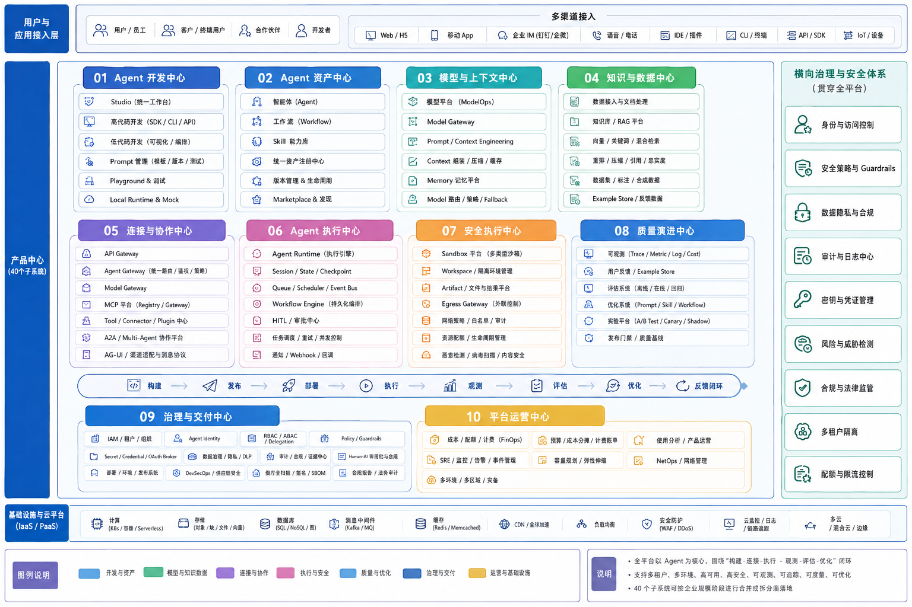
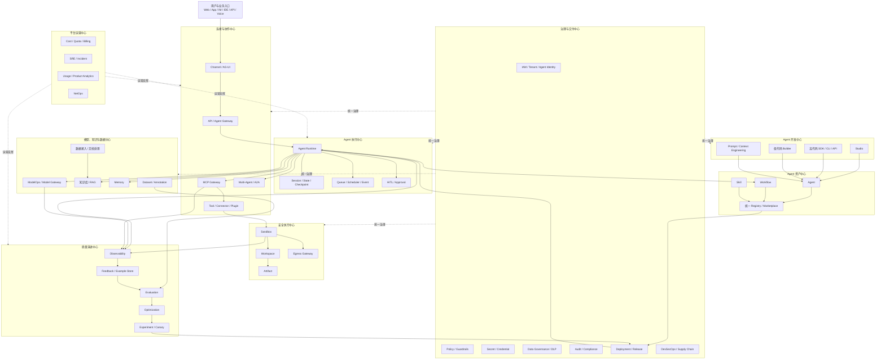
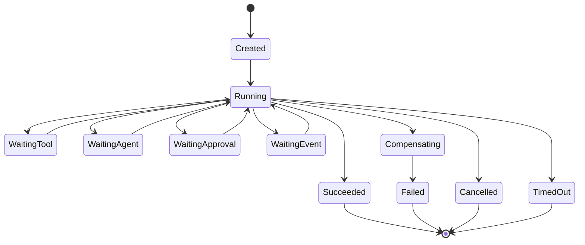
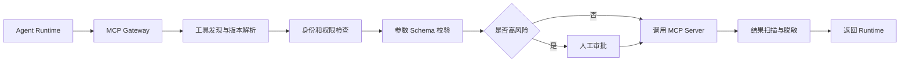
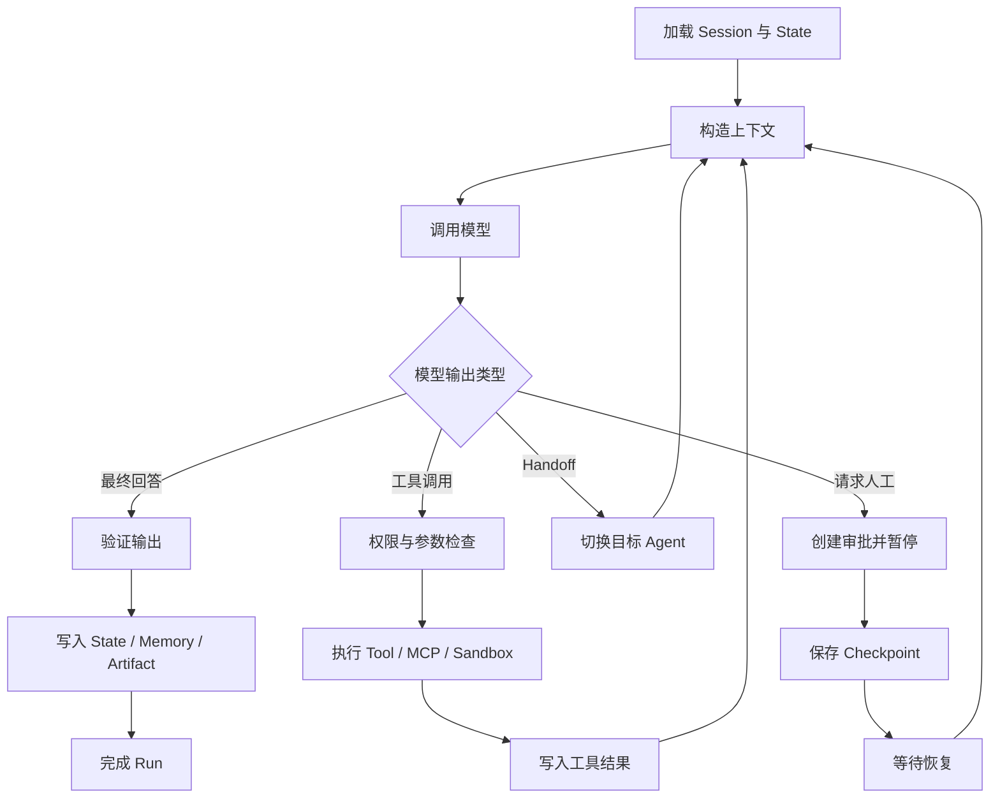
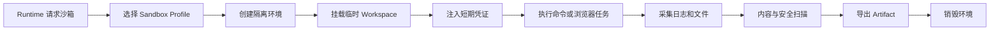
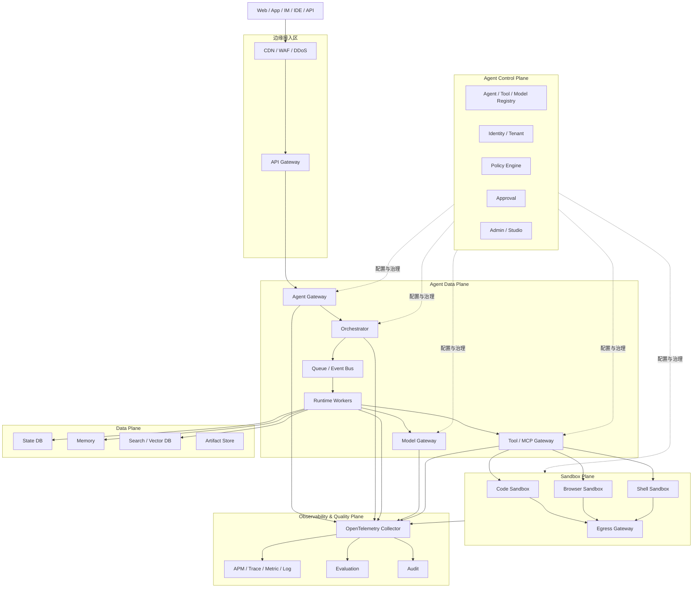

# 附录 27：企业级 Agent 平台系统全景

> 定位：**企业级 Agent 平台的全景架构蓝图**（全文收录，信息基准 2026-09，各子系统能力以官方页面为准 [C-50]）。与相邻内容的分工：本书正文按"能力递进"逐章建单个机制（循环/上下文/工具/记忆/观测/评测/多 Agent/落地），本附录反过来给一张**平台级俯视图**——把全书 40 类子系统在一张企业平台里如何归位、分几层、走哪条主链路讲清楚：七层架构与五个平面（产品/控制/执行/数据/治理）、十大产品中心与 40 子系统盘点、构建→连接→执行→观测→评估→优化→反馈的完整闭环、统一资产模型、云服务拆分与部署拓扑、分阶段建设路线、非功能性要求与架构误区。它是把散落全书的机制"拼装成一个企业平台"的装配图——正文讲每块砖怎么烧，本附录讲整栋楼怎么盖。子系统与正文/附录的对应见文末对照。



## 27.1 核心结论

企业级 Agent 平台不能只理解为：

```text
大模型 + Prompt + Function Calling
```

完整的平台应当是：

```text
Developer Platform
+ Agent Asset Platform
+ Model & Context Platform
+ Knowledge & Data Platform
+ Tool & Integration Platform
+ Agent Runtime
+ Secure Execution Platform
+ Evaluation & Optimization Platform
+ Governance Control Plane
+ Cloud Operations Platform
```

其中：

- **Studio、高代码、低代码**解决 Agent 如何构建；
- **Agent、Workflow、Skill、Prompt**解决能力如何建模和复用；
- **ModelOps、RAG、Memory、Context Engineering**解决模型和上下文如何供给；
- **Gateway、MCP、Tool、Connector、A2A、AG-UI**解决外部能力如何连接；
- **Agent Runtime、State、Queue、Checkpoint**解决任务如何可靠执行；
- **Sandbox、Workspace、Artifact、Egress**解决不可信动作如何隔离；
- **Observability、Evaluation、Optimization、Experiment**解决质量如何持续提升；
- **IAM、Policy、Secret、Audit、DLP、FinOps**解决企业级治理；
- **SRE、NetOps、DevSecOps、Release**解决平台如何规模化运行。

整体设计应遵循四条基础原则：

1. **控制平面与执行平面分离**；
2. **概率性 Agent 决策与确定性 Workflow 分离**；
3. **可信编排与不可信执行分离**；
4. **构建、运行、观测、评估、优化形成闭环**。

---

## 27.2 总体架构与分层

### 27.2.1 七层架构

```text
用户与应用入口层
    ↓
Agent 构建与资产层
    ↓
接入、连接与协作层
    ↓
Agent 编排与执行层
    ↓
模型、知识、数据与记忆层
    ↓
安全执行与基础设施层
    ↓
质量、治理、交付与运营层
```

### 27.2.2 五个核心平面

| 平面 | 核心职责 | 典型子系统 |
|---|---|---|
| **体验平面** | 面向开发者、业务人员和最终用户提供交互入口 | Studio、Web、App、IM、IDE、CLI、AG-UI |
| **控制平面** | 管理 Agent、模型、工具、Skill、Workflow 和发布配置 | Registry、Marketplace、Release、Policy、IAM |
| **执行平面** | 执行 Agent Loop、Workflow、模型调用和工具调用 | Agent Runtime、Workflow Engine、MCP Gateway、Sandbox |
| **质量平面** | 采集执行数据并判断 Agent 是否正确 | Observability、Evaluation、Feedback、Optimization |
| **基础设施平面** | 提供网络、计算、存储、安全和弹性能力 | Kubernetes、Serverless、Database、NetOps、SecOps |

### 27.2.3 推荐架构总图



---

## 27.3 Agent 构建、资产、连接、执行与质量系统

### 27.3.1 Studio

### 定位

Studio 是统一的 Agent 开发、调试、评估、发布和运营工作台，是平台的交互入口，不应直接承担核心执行逻辑。

### 典型工作台

```text
Agent Studio
Workflow Studio
Skill Studio
Prompt Studio
MCP Studio
Dataset Studio
Evaluation Studio
Trace Studio
Sandbox Studio
Release Studio
Operations Studio
```

### 核心能力

- Agent、Workflow、Skill 可视化设计；
- 模型、工具、知识库和 Memory 绑定；
- Playground 调试；
- Trace 查看；
- 数据集和评估器配置；
- 版本 Diff；
- 发布、灰度和回滚；
- 权限、审计和成本查看。

### 边界

```text
Studio UI
    ↓
Studio BFF
    ↓
Registry / Evaluation / Release API
    ↓
版本化资产
    ↓
Agent Runtime
```

Studio 不应绕过 Registry 直接修改生产 Runtime 数据。

---

### 27.3.2 高代码开发

### 定位

面向专业开发者，通过 SDK、CLI、API、容器和基础设施即代码实现复杂 Agent。

### 核心能力

```text
Agent SDK
Workflow SDK
Skill SDK
MCP SDK
CLI
REST / gRPC API
Local Runtime
Mock Tool / Mock Model
Test Harness
IaC
```

### 适用场景

- 自定义 Planner、Router 和 Agent Loop；
- 复杂状态机；
- 深度企业系统集成；
- 自定义协议和流式交互；
- 大规模多 Agent；
- 特殊上下文压缩和 Memory；
- 自定义运行时中间件。

### 关键原则

高代码 Agent 同样必须经过：

```text
Agent Registry
Model Gateway
Tool / MCP Gateway
Policy Engine
Sandbox
Observability
Evaluation
Cost Accounting
```

不能成为平台治理旁路。

---

### 27.3.3 低代码开发

### 定位

通过可视化拖拽和表单配置，让业务人员、应用开发者快速构建 Agent 和工作流。

### 核心能力

- 节点拖拽；
- Prompt 配置；
- 模型和工具选择；
- 知识库绑定；
- 条件、并行、循环和人工审批；
- 变量映射；
- Playground；
- 一键发布。

### 底层要求

低代码最终必须生成标准 DSL 或 Manifest：

```yaml
kind: AgentWorkflow
version: v1

nodes:
  - id: classify
    type: agent
    agent_ref: intent-classifier:v3

  - id: query_order
    type: mcp_tool
    tool_ref: order.query:v2

  - id: approval
    type: human_approval
    condition: "${refund.amount > 500}"

  - id: execute_refund
    type: mcp_tool
    tool_ref: refund.execute:v4
```

### 关键原则

```text
低代码 Builder ─┐
                 ├→ 统一 DSL / Manifest → Registry → Runtime
高代码 SDK/CLI ─┘
```

高代码和低代码只是不同创作入口，不应形成两个互不兼容的平台。

---

### 27.3.4 智能体系统

### 定位

管理 Agent 的静态定义、版本、能力、Owner、依赖和发布状态。

### Agent 定义

```text
Agent =
Identity
+ Instructions
+ Model Policy
+ Tools
+ Skills
+ Knowledge
+ Memory
+ Workflow
+ Runtime Profile
+ Sandbox Profile
+ Evaluation Policy
+ Governance Policy
```

### 关键对象

| 对象 | 含义 |
|---|---|
| Agent Definition | Agent 静态定义 |
| Agent Version | 不可变版本 |
| Agent Deployment | 某环境中的部署 |
| Agent Session | 用户会话 |
| Agent Run | 一次完整任务 |
| Agent Turn | 一次交互回合 |

### 主要模块

```text
Agent Registry
Agent Definition Service
Agent Version Service
Agent Capability Service
Agent Publishing Service
Agent Discovery Service
Agent Dependency Resolver
Agent Policy Binding
Agent Deployment Service
```

---

### 27.3.5 工作流系统

### 定位

提供确定性流程控制、持久化状态、人工审批、补偿、重试和审计。

### Agent 与 Workflow 的分工

| Agent | Workflow |
|---|---|
| 理解自然语言 | 固定流程控制 |
| 模糊推理 | 明确状态机 |
| 动态选择工具 | 确定性节点执行 |
| 生成候选方案 | 审批、重试、补偿 |
| 局部自主决策 | 全局可靠控制 |

推荐模式：

> **Workflow 控制总体边界，Agent 负责局部智能。**

### 节点类型

```text
Start / End
Agent
Model
Tool / MCP Tool
Skill
Code / Sandbox
Condition
Loop
Parallel / Map
Subflow
Wait Event
Human Approval
Handoff
Notification
Compensation
```

### 状态机



---

### 27.3.6 Skill 子系统

### 定位

Skill 是可复用的“做事方法”和能力包，不等同于 Tool，也不只是 Prompt。

### Skill 内容

```text
能力描述
适用条件
执行步骤
Prompt 片段
领域知识
示例
脚本
模板
资源文件
工具依赖
权限要求
输入输出 Schema
测试用例
评估规则
```

### Skill 与 Tool 的区别

| 维度 | Skill | Tool |
|---|---|---|
| 本质 | 方法、规范和复合能力 | 可调用动作 |
| 内容 | Prompt、知识、脚本、流程 | API、Function、MCP Tool |
| 是否依赖模型理解 | 通常需要 | 不一定 |
| 是否组合多个工具 | 可以 | 通常单一动作 |
| 示例 | 安全代码评审 | `git.create_comment` |

### Skill 平台模块

```text
Skill Registry
Skill Package Manager
Skill Resolver
Skill Dependency Manager
Skill Security Scanner
Skill Test Runner
Skill Version Service
Skill Marketplace
Skill Usage Analytics
```

### 生命周期

```text
创建
→ 静态检查
→ 安全扫描
→ 测试
→ 评估
→ 审核
→ 发布
→ 安装
→ 使用观测
→ 优化
→ 新版本
→ 废弃
```

---

### 27.3.7 网关体系

“网关”和“网管”需要分开：

- **Gateway**：面向业务、Agent、模型和工具的七层接入治理；
- **NetOps**：面向 VPC、DNS、负载均衡、Service Mesh 和网络策略的基础设施管理。

### 五类核心网关

#### API Gateway

负责：

```text
HTTP/API 接入
JWT / OAuth 校验
API 版本
限流与配额
WAF
请求转换
访问审计
```

#### Agent Gateway

理解 Agent 领域对象：

```text
Agent
Session
Run
Turn
Event
Approval
Artifact
Handoff
```

负责：

- Agent 和版本路由；
- Session 绑定；
- Run 创建；
- 请求幂等；
- 流式事件；
- 租户隔离；
- 风险预检查；
- Webhook 回调。

#### Model Gateway

负责：

```text
Provider Adapter
Model Registry
Capability Routing
Rate Limit
Quota
Fallback
Circuit Breaker
Token Accounting
Cost Accounting
Safety Policy
Streaming Normalization
```

#### Tool / MCP Gateway

负责：

```text
工具发现
版本解析
身份认证
权限检查
Schema 校验
人工审批
限流与熔断
结果过滤
调用审计
```

#### Egress Gateway

负责 Agent 和沙箱的网络出口控制：

```text
域名白名单
IP 白名单
DNS 过滤
HTTP 代理
DLP
恶意下载扫描
带宽限制
云元数据地址封锁
网络审计
```

---

### 27.3.8 MCP 子系统

### 定位

MCP 是 Agent 连接外部 Tools、Resources 和 Prompts 的标准协议，但企业 MCP 平台还需要补充注册、权限、凭证、审计和供应链治理。

### 核心模块

```text
MCP Registry
MCP Gateway
MCP Client Manager
MCP Server Manager
Tool Catalog
Resource Catalog
Prompt Catalog
Connection Manager
Credential Broker
Policy Enforcement
Schema Cache
Health Check
Rate Limit
Observability
```

### 典型调用链



### 安全控制

```text
Allowlist
Tool Pinning
版本锁定
签名校验
权限绑定
Schema 校验
结果隔离
调用审计
```

---

### 27.3.9 Agent Runtime

### 定位

Agent Runtime 是平台真正执行 Agent 的核心系统。Agent 子系统管理“定义”，Runtime 管理“运行”。

### 核心对象

| 对象 | 含义 |
|---|---|
| Session | 用户与 Agent 的会话空间 |
| Run | 一次完整任务 |
| Turn | 一次交互回合 |
| Step | Run 中的单个执行步骤 |
| Model Call | 一次模型调用 |
| Tool Call | 一次工具调用 |
| Checkpoint | 可恢复状态快照 |
| Artifact | 文件、报告、代码等产物 |
| Event | 执行过程中产生的事件 |
| Approval | 人工审批请求 |

### 核心引擎

```text
Agent Loop Engine
Session Manager
State Manager
Context Manager
Memory Manager
Task Scheduler
Queue Consumer
Workflow Adapter
Tool Executor
Model Client
Checkpoint Manager
Retry Manager
Budget Manager
Cancellation Manager
Concurrency Manager
Event Stream Manager
Artifact Manager
```

### Agent Loop



### 生产级能力

```text
持久化状态
断点恢复
异步任务
定时任务
事件驱动
重试与退避
调用幂等
超时
主动取消
并发控制
Token 预算
费用预算
工具次数预算
循环检测
流式输出
通知与回调
```

---

### 27.3.10 沙箱子系统

### 定位

沙箱只负责隔离执行，不负责规划和决策。

```text
Agent Runtime：决定做什么
Policy Engine：决定能不能做
Sandbox：在隔离环境中执行
Observability：记录做了什么
```

### 沙箱类型

```text
Code Sandbox
Shell Sandbox
Browser Sandbox
Desktop Sandbox
Document Sandbox
Data Analysis Sandbox
Build Sandbox
Test Sandbox
```

### 平台模块

```text
Sandbox Manager
Sandbox Scheduler
Image Registry
Environment Template
Workspace Manager
Filesystem Manager
Network Policy Manager
Secret Injector
Process Supervisor
Resource Quota Manager
Artifact Exporter
Malware Scanner
Sandbox Telemetry Agent
Lifecycle Reaper
```

### 生命周期



### 安全原则

```text
每个任务独立环境
默认无网络
默认无长期凭证
默认非 root
禁止宿主目录挂载
禁止 Docker Socket
限制 CPU、内存、磁盘和 PID
限制执行时间
任务完成自动销毁
所有外联经过 Egress Gateway
所有命令进入审计 Trace
```

---

### 27.3.11 可观测子系统

### 定位

传统 APM 判断服务是否可用；Agent 可观测还要解释 Agent 为什么这样决策。

### 四类遥测

| 类型 | 内容 |
|---|---|
| Trace | 一次 Agent Run 的完整执行链 |
| Metric | 延迟、成功率、Token、成本 |
| Log | Runtime、工具、沙箱、基础设施日志 |
| Event | 状态变化、审批、Handoff、告警 |

### Agent Trace

```text
agent.run
├── gateway.request
├── policy.authorize
├── session.load
├── router.select_agent
├── workflow.execute
├── memory.retrieve
├── rag.search
├── model.generate
├── skill.activate
├── mcp.tool.call
│   └── sandbox.execute
├── approval.wait
├── model.finalize
├── output.validate
├── memory.write
└── response.stream
```

### 统一关联字段

```text
trace_id
tenant_id
user_id
session_id
run_id
turn_id
step_id
agent_id
agent_version
workflow_id
workflow_version
skill_id
skill_version
model_request_id
tool_call_id
mcp_server_id
sandbox_id
approval_id
artifact_id
```

### 核心指标

```text
系统：Availability、Error Rate、P95、Queue Lag
Agent：Task Success、Steps、Retry、Loop、Handoff
模型：Token、TTFT、Latency、Fallback、Cost
工具：Success、Timeout、Invalid Arguments、Denied
沙箱：Provisioning、OOM、Timeout、Egress Block
RAG：Recall、Relevance、Citation、ACL Filter
成本：Cost per Run、Cost per Successful Run
```

---

### 27.3.12 评估子系统

### 定位

```text
可观测：Agent 做了什么
评估：Agent 做得对不对
```

### 评估对象

```text
最终答案
结构化输出
Agent 轨迹
工具选择
工具参数
MCP 调用
RAG 检索
Handoff
Workflow 路径
Memory 写入
安全行为
成本和延迟
```

### 核心模块

```text
Dataset Registry
Test Case Manager
Evaluation Runner
Evaluator Registry
Rubric Manager
LLM Judge
Code Judge
Rule Evaluator
Trajectory Evaluator
RAG Evaluator
Safety Evaluator
Report Generator
Regression Analyzer
Release Gate
```

### 离线与在线评估

```text
离线：发布前回归、模型对比、Prompt 对比、Skill 对比
在线：生产抽样、用户反馈、Shadow、LLM Judge、人工审核
```

### 发布门禁示例

```yaml
release_gate:
  task_success_rate:
    minimum: 0.92
  tool_correctness:
    minimum: 0.98
  safety_violation_rate:
    maximum: 0.001
  cost_regression:
    maximum: 0.10
  p95_latency_regression:
    maximum: 0.15
```

---

### 27.3.13 优化子系统

### 定位

优化系统根据 Trace 和评估结果，生成受控候选变更，再通过实验、评估和灰度验证后发布。

### 闭环

```text
Observability
→ Evaluation
→ Root Cause Analysis
→ Optimization Candidate
→ Experiment
→ Regression Evaluation
→ Approval
→ Canary Release
```

### 可优化对象

```text
Prompt
Instructions
Few-shot Examples
Model Selection
Model Routing
Tool Description
Tool Schema
Skill Instructions
Skill Activation Rule
Workflow Topology
Retry Policy
Context Selection
Context Compression
RAG Query
Reranker
Memory Policy
Budget
```

### 核心模块

```text
Failure Miner
Trace Analyzer
Root Cause Analyzer
Candidate Generator
Prompt Optimizer
Skill Optimizer
Tool Description Optimizer
Workflow Optimizer
Model Router Optimizer
Experiment Manager
A/B Test Service
Canary Manager
Optimization Registry
```

### 关键原则

优化系统不得直接修改生产资产，必须生成版本化 Change Set：

```text
创建候选版本
→ 自动评估
→ 人工审核
→ 灰度
→ 生产监控
→ 全量发布或回滚
```

---

## 27.4 模型、数据、治理、交付与运营系统

本章进一步展开模型、知识、数据、协作、交付、安全和运营能力。全文列出的子系统代表**逻辑能力边界**，并不意味着每项能力都必须拆成独立微服务。

---

### 27.4.1 模型与上下文类

### 14. 模型平台与 ModelOps

管理：

```text
商业闭源模型
开源模型
私有模型
Embedding
Reranker
VLM
OCR
ASR
TTS
Moderation
```

核心模块：

```text
Model Registry
Provider Registry
Model Deployment
Model Endpoint
Capability Registry
Model Lifecycle
Benchmark
Fine-tuning
Cost Profile
Routing Policy
Fallback Policy
```

与 Model Gateway 的边界：

| ModelOps | Model Gateway |
|---|---|
| 管理模型、版本、能力和部署 | 运行时路由、限流、降级和计量 |
| 回答“企业有哪些模型” | 回答“本次请求用哪个模型” |

---

### 15. Prompt 管理与 Context Engineering

核心模块：

```text
Prompt Registry
Prompt Template
Prompt Version
Variable Schema
Few-shot Example
System Instruction
Context Assembler
Token Budget
Context Compression
Context Cache
Prompt Testing
Prompt Diff
Prompt Release
```

主要职责：

- System、Developer、User 指令分层；
- Prompt 版本管理；
- RAG、Skill、Memory 和 Tool 上下文组装；
- Token 预算；
- 长会话压缩；
- Prompt 灰度和回归。

---

### 16. 企业知识库与 RAG 平台

核心模块：

```text
Knowledge Base
Document Store
Chunk Store
Index Service
Vector Search
Keyword Search
Hybrid Search
Reranker
Query Rewrite
Context Compression
Citation Service
ACL Filter
RAG Evaluation
```

主链路：

```text
问题理解
→ 查询改写
→ 租户和权限过滤
→ 关键词检索
→ 向量检索
→ 融合
→ 重排
→ 上下文压缩
→ 引用生成
→ 忠实度检查
```

企业级重点：权限过滤、多租户、文档版本、增量索引、删除同步、来源引用和数据血缘。

---

### 17. 数据接入与文档处理平台

负责企业数据进入知识库和 Agent 平台前的采集、解析、清洗和索引。

```text
Connector
Crawler
CDC
File Import
OCR
ASR
Document Parser
Table Parser
Layout Analysis
Chunking
Metadata Extraction
Data Cleaning
Deduplication
PII Detection
Data Lineage
Index Pipeline
```

数据源包括：PDF、Word、Excel、PPT、Wiki、邮件、数据库、数据湖、CRM、ERP、ITSM、Git 和对象存储。

---

### 18. Memory 记忆平台

概念边界：

```text
RAG      = 查询企业知识
Session  = 保存当前会话
State    = 保存任务权威状态
Memory   = 保存跨会话经验和个性化信息
```

记忆类型：

| 类型 | 生命周期 | 内容 |
|---|---|---|
| Working Memory | 单次推理 | 当前临时信息 |
| Session Memory | 当前会话 | 对话、计划、工具结果 |
| Long-term Memory | 跨会话 | 用户偏好、历史事实 |
| Organizational Memory | 企业级 | 成功经验、流程模式、故障知识 |

核心模块：

```text
Memory Extraction
Memory Store
Memory Retrieval
Memory Scope
Memory Consolidation
Conflict Resolution
Deduplication
TTL
Consent
Revision History
Memory Evaluation
Memory Governance
```

---

### 27.4.2 工具、资产与数据闭环类

### 19. Tool、Connector 与 Plugin 中心

管理的对象：

```text
REST API
GraphQL
gRPC
Database Tool
SaaS Connector
RPA
Browser Tool
Shell Tool
CLI Tool
Function
Webhook
MCP Tool
Internal Service
```

核心模块：

```text
Tool Registry
Connector Registry
Tool Schema
Tool Version
Tool Risk Level
Authentication Binding
Permission Binding
Tool Test
Tool Health
Tool Usage Analytics
Tool Deprecation
```

MCP 是协议；Tool Center 是统一能力管理平台。

---

### 20. 统一资产注册与 Marketplace

管理对象：

```text
Agent
Workflow
Skill
Prompt
Tool
MCP Server
Model
Knowledge Base
Dataset
Evaluator
Rubric
Runtime Profile
Sandbox Profile
Policy
Template
```

核心能力：注册、搜索、Owner、版本、依赖、签名、安全扫描、发布、废弃、安装、卸载和使用统计。

资产状态：

```text
Draft
→ Testing
→ Reviewing
→ Approved
→ Published
→ Deprecated
→ Archived
```

---

### 21. 数据集、标注与合成数据平台

核心模块：

```text
Dataset Registry
Test Case
Golden Answer
Expected Tool Call
Expected Trajectory
Labeling Task
Human Annotation
Synthetic Data
Adversarial Data
Dataset Version
Train / Dev / Test Split
Data Quality
Dataset Lineage
```

数据集类型：

- 单轮和多轮对话；
- RAG；
- 工具调用；
- 轨迹；
- 安全对抗；
- Prompt Injection；
- Handoff；
- 沙箱任务；
- 业务端到端任务。

---

### 22. 用户反馈与 Example Store

采集：

```text
点赞 / 点踩
用户纠正
重新生成
人工接管
任务取消
工具纠正
最终业务结果
人工审核标签
生产异常样本
```

每条反馈需要关联：

```text
tenant_id
user_id
session_id
run_id
trace_id
agent_version
prompt_version
skill_version
workflow_version
model
timestamp
```

闭环：

```text
生产运行
→ 用户反馈
→ Example Store
→ 数据清洗
→ 数据集
→ 离线评估
→ 优化
→ 灰度发布
→ 生产验证
```

---

### 27.4.3 多 Agent 与交互类

### 23. 多 Agent 协作与 A2A 平台

核心模块：

```text
Agent Directory
Agent Card
Capability Discovery
Delegation
Handoff
Task Routing
Shared Session
Shared State
Message Bus
Trust Boundary
Permission Propagation
Result Aggregation
Conflict Resolution
```

协作模式：

```text
Router
Supervisor–Worker
Agents as Tools
Handoff
Sequential
Parallel
Debate / Review
Event-driven
Hierarchical Agent
```

关键点是 Agent 发现、任务委托、身份传递、权限衰减、进度查询、Artifact 交换和 Trace 关联。

---

### 24. 渠道接入与 AG-UI 平台

支持渠道：

```text
Web
App
企业 IM
语音 / 电话
IDE
CLI
API
Webhook
IoT
数字人
桌面应用
```

核心模块：

```text
Channel Adapter
Conversation Gateway
Event Stream
SSE / WebSocket
Message Rendering
Tool UI
Approval UI
Artifact Preview
Voice Session
State Synchronization
Notification
```

典型 Agent UI 事件：

```text
RunStarted
TextDelta
ToolCallStarted
ToolCallCompleted
StateSnapshot
StateDelta
ApprovalRequired
ArtifactCreated
RunCompleted
RunFailed
```

---

### 25. Human-in-the-loop 与审批中心

核心模块：

```text
Approval Queue
Review Task
Task Assignment
Approval Form
Parameter Edit
Comments
Escalation
SLA
Delegation
Multi-level Approval
Dual Control
Approval Token
Resume Runtime
```

人工介入类型：

| 类型 | 说明 |
|---|---|
| Approval | 批准高风险动作 |
| Review | 审查 Agent 输出 |
| Correction | 修改结构化参数 |
| Escalation | 转交专家 |
| Takeover | 接管会话 |
| Exception Handling | 处理异常流程 |
| Labeling | 标记结果质量 |

审批结果应绑定具体动作和参数摘要，避免审批后参数被替换。

---

### 27.4.4 运行时支撑类

### 26. Session、State 与 Checkpoint 平台

| 对象 | 含义 |
|---|---|
| Session | 用户与 Agent 的会话空间 |
| Run | 一次完整任务 |
| Turn | 一次交互回合 |
| State | 权威结构化业务状态 |
| Checkpoint | 可恢复执行快照 |
| Event | 状态变化事件 |

核心模块：

```text
Session Service
State Store
Checkpoint Store
Conversation Store
Context Snapshot
State Versioning
Concurrency Control
State Migration
Session ACL
Retention Policy
```

关键原则：

```text
聊天记录不是业务状态
Memory 不是业务数据库
Trace 不是 Checkpoint
上下文窗口不是持久化存储
```

---

### 27. Queue、Scheduler 与 Event Bus

核心模块：

```text
Task Queue
Priority Queue
Delay Queue
Dead-letter Queue
Scheduler
Cron
Event Bus
Webhook Trigger
Backpressure
Retry Schedule
Rate Control
Worker Dispatch
```

适合长时间代码分析、批量评估、文档解析、多 Agent 调研、浏览器自动化、定时任务和事件驱动运维。

---

### 28. Artifact、Workspace 与文件平台

Agent 的结果不只是文本，还包括文件、代码、补丁、报告、图片、数据表、日志和构建产物。

核心模块：

```text
Artifact Store
Workspace
File Version
Snapshot
Upload / Download
Preview
Malware Scan
Metadata
Lineage
Retention
Sharing
Access Control
Content Addressing
```

关系：

```text
Sandbox Workspace
→ 执行产生文件
→ 安全扫描
→ Artifact Store
→ 授权用户访问
```

Sandbox 是临时执行环境，Artifact Store 是持久化结果平台。

---

### 29. 部署、Serving 与发布系统

核心模块：

```text
Deployment
Environment
Release
Configuration
Feature Flag
Traffic Routing
Autoscaling
Rollback
Health Check
Dependency Validation
Release Approval
Change History
```

环境模型：

```text
Local
Development
Testing
Staging
Canary
Production
Disaster Recovery
```

一次 Agent 发布通常同时包含：Agent、Prompt、Workflow、Skill、Tool、Model Policy、Runtime Profile、Sandbox Profile、Policy Binding 和 Evaluation Baseline。

---

### 30. 实验、A/B Test 与 Canary 平台

实验对象：

```text
模型
Prompt
Skill
RAG 策略
Workflow
Tool Description
Memory 策略
Agent 架构
单 Agent 与多 Agent
```

核心模块：

```text
Experiment
Variant
Traffic Split
Cohort
Randomization
Metric
Guardrail Metric
Statistical Analysis
Canary
Shadow Run
Champion / Challenger
Automatic Rollback
```

---

### 27.4.5 身份、安全与治理类

### 31. IAM、租户、组织与 Agent Identity

身份类型：

```text
User Identity
Service Identity
Agent Identity
Agent Version Identity
Subagent Identity
Task Identity
Sandbox Identity
Tool Identity
Delegation Identity
```

核心模块：

```text
Organization
Tenant
Workspace
Project
User
Group
Service Account
Agent Identity
RBAC
ABAC
On-Behalf-Of
Delegation
Token Exchange
Session ACL
```

委托链：

```text
用户
→ 应用
→ Agent
→ Subagent
→ Tool
→ 业务资源
```

---

### 32. Policy、Guardrails 与内容安全平台

权限回答“谁能执行”，Policy 回答“在什么条件下可以执行”。

核心模块：

```text
Policy Registry
Policy Engine
Policy Enforcement Point
Input Guardrail
Output Guardrail
Tool Guardrail
Action Guardrail
Content Safety
Risk Classification
Prompt Injection Detection
PII Detection
Policy Simulation
Policy Audit
```

策略执行点包括用户入口、Router、Model Gateway、MCP Gateway、工具调用、RAG、Memory、Sandbox 和最终输出。

---

### 33. Secret、Credential 与 OAuth Broker

核心模块：

```text
Secret Vault
Credential Broker
OAuth Client
OAuth Consent
Token Exchange
On-Behalf-Of
Dynamic Credential
Short-lived Token
Scope Binding
Credential Rotation
Revocation
Usage Audit
```

推荐模式：

```text
用户登录
→ Agent 获得任务身份
→ Credential Broker 换取短期凭证
→ 限制到具体工具和 Scope
→ 执行完成后自动失效
```

---

### 34. 数据治理、隐私与 DLP

核心模块：

```text
Data Classification
Data Catalog
Data Residency
Retention
Consent
Purpose Limitation
PII Masking
DLP
Data Lineage
Right to Delete
Cross-border Control
Training Opt-out
Model Provider Policy
```

示例策略：

```text
公开数据       → 可使用所有批准模型
内部数据       → 仅企业账号模型
机密数据       → 私有端点或私有模型
高度敏感数据   → 禁止进入生成模型
```

---

### 35. 审计、合规与证据中心

必须记录：

```text
谁创建了 Agent
谁修改了 Prompt
谁发布了 Skill
哪个 Agent 调用了哪个工具
代表哪个用户执行
使用了什么权限
谁批准了高风险动作
沙箱执行了哪些命令
最终修改了哪些业务数据
```

核心模块：

```text
Audit Event
Immutable Audit Log
Configuration Change Log
Approval Evidence
Policy Decision Log
Access Review
Compliance Report
Evidence Export
Retention
Legal Hold
```

---

### 36. 成本、配额、计费与 FinOps

成本组成：

```text
模型 Token
Embedding
Reranker
OCR / ASR / TTS
向量检索
工具 API
MCP 调用
浏览器
沙箱 CPU / 内存
存储
网络出口
Trace 存储
评估模型
```

核心模块：

```text
Usage Metering
Quota
Budget
Cost Allocation
Chargeback
Showback
Billing
Cost Forecast
Anomaly Detection
Cost per Run
Cost per Successful Run
Tenant Cost
Agent Cost
```

关键指标不是单 Token 成本，而是**单成功任务成本**和**单业务结果成本**。

---

### 37. DevSecOps 与 Agent 供应链安全

需要治理的新型供应链对象：

```text
Agent Package
Skill Package
Prompt
MCP Server
Tool Definition
Sandbox Image
Model
Dataset
Evaluator
Workflow
```

核心模块：

```text
CI/CD
Static Analysis
Dependency Scan
Container Scan
SBOM
Artifact Signing
Provenance
Skill Scan
MCP Scan
Prompt Security Scan
License Scan
Policy Check
Release Gate
```

---

### 27.4.6 运营与基础设施类

### 38. SRE、Incident 与运维中心

核心模块：

```text
Health Check
SLO / SLA
Alert
Incident
On-call
Runbook
Root Cause Analysis
Auto Remediation
Failover
Disaster Recovery
Capacity Planning
Postmortem
```

Agent 特有故障包括模型供应商不可用、工具持续失败、死循环、成本异常、沙箱积压、Memory 污染、Handoff 错误和质量回退。

---

### 39. 使用分析与产品运营平台

核心指标：

```text
DAU / MAU
Agent Adoption
Session Completion
Task Completion
Automation Rate
Human Takeover Rate
Feature Usage
Tool Usage
Skill Usage
User Retention
Business Conversion
Time Saved
Cost Saved
```

用于判断 Agent 是否真正产生业务价值，而不仅是技术上可以运行。

---

### 40. NetOps 网络与连接管理

核心模块：

```text
VPC / VNet
Subnet
DNS
Load Balancer
Private Endpoint
NAT Gateway
Firewall
WAF
DDoS
Service Mesh
mTLS
NetworkPolicy
Egress Proxy
Traffic Mirroring
Cross-region Network
```

推荐分区：

```text
公网接入区
控制平面区
Agent Runtime 区
Sandbox 隔离区
数据区
模型服务区
可观测区
运维管理区
```

沙箱网络原则：默认禁网、禁止云元数据、禁止访问控制平面、禁止跨租户、所有外联经过 Egress Gateway。

---

## 27.5 十大产品中心

上述逻辑能力可以归并为 10 个产品中心。

| 产品中心 | 主要子系统 |
|---|---|
| **01 Agent 开发中心** | Studio、高代码、低代码、Prompt、Playground、Local Runtime |
| **02 Agent 资产中心** | Agent、Workflow、Skill、Registry、Marketplace、版本管理 |
| **03 模型与上下文中心** | ModelOps、Model Gateway、Context Engineering、Memory |
| **04 知识与数据中心** | 数据接入、文档处理、RAG、Dataset、Annotation、Example Store |
| **05 连接与协作中心** | API Gateway、Agent Gateway、Tool、Connector、MCP、A2A、AG-UI |
| **06 Agent 执行中心** | Agent Runtime、Session、State、Checkpoint、Queue、Scheduler、HITL |
| **07 安全执行中心** | Sandbox、Workspace、Artifact、Egress、恶意内容扫描 |
| **08 质量演进中心** | Observability、Feedback、Evaluation、Optimization、Experiment |
| **09 治理与交付中心** | IAM、Agent Identity、Policy、Secret、DLP、Audit、Release、DevSecOps |
| **10 平台运营中心** | FinOps、Billing、Quota、SRE、Product Analytics、NetOps |

---

## 27.6 子系统之间的完整主链路

```mermaid
sequenceDiagram
    participant User as 用户
    participant GW as Agent Gateway
    participant RT as Agent Runtime
    participant WF as Workflow Engine
    participant Skill as Skill Resolver
    participant Model as Model Gateway
    participant MCP as MCP Gateway
    participant SB as Sandbox
    participant Obs as Observability
    participant Eval as Evaluation
    participant Opt as Optimizer

    User->>GW: 提交请求
    GW->>GW: 身份、租户、限流、策略检查
    GW->>RT: 创建 Session / Run

    RT->>WF: 加载工作流
    WF->>Skill: 解析 Skill
    Skill-->>WF: 返回 Skill 版本与依赖

    WF->>Model: 调用模型规划或生成
    Model-->>WF: 返回回答或工具调用计划

    WF->>MCP: 请求执行工具
    MCP->>MCP: 权限、Schema、风险检查

    alt 需要隔离执行
        MCP->>SB: 创建沙箱并执行
        SB-->>MCP: 返回结果与 Artifact
    else 普通 API 工具
        MCP->>MCP: 调用业务服务
    end

    MCP-->>WF: 返回工具结果
    WF->>RT: 更新 State / Checkpoint
    RT-->>User: 流式返回结果

    RT->>Obs: 写入 Trace / Metric / Log
    MCP->>Obs: 写入工具遥测
    SB->>Obs: 写入沙箱遥测

    Obs->>Eval: 回流 Trace 和样本
    Eval->>Opt: 输出失败模式与评估报告
    Opt->>Opt: 生成 Prompt / Skill / Workflow 候选版本
```

### 27.6.1 构建链路

```text
Studio / SDK / CLI
→ Agent、Workflow、Skill、Prompt 定义
→ 静态检查
→ 安全扫描
→ 数据集评估
→ Registry
→ Release
→ Deployment
```

### 27.6.2 运行链路

```text
用户入口
→ API / Agent Gateway
→ Identity / Policy
→ Agent Runtime
→ Workflow / Agent Loop
→ Model / RAG / Memory / MCP
→ Sandbox / Tool
→ State / Checkpoint / Artifact
→ 流式返回
```

### 27.6.3 质量闭环

```text
Trace / Metric / Log / Feedback
→ Dataset / Example Store
→ Evaluation
→ Root Cause Analysis
→ Optimization Candidate
→ Experiment / Canary
→ Release Gate
→ 新版本
```

---

## 27.7 统一资产模型

平台能否真正统一，取决于是否建立统一对象模型。

建议一级对象包括：

```text
AgentDefinition
AgentVersion
WorkflowDefinition
WorkflowVersion
SkillPackage
SkillVersion
PromptTemplate
PromptVersion
ToolDefinition
MCPServerDefinition
ToolboxDefinition
ModelDefinition
ModelPolicy
KnowledgeBase
Dataset
Evaluator
EvaluationSuite
RuntimeProfile
SandboxProfile
PolicyBinding
Deployment
Session
Run
Trace
Artifact
OptimizationChange
```

### 27.7.1 Agent Bundle 示例

```yaml
kind: AgentBundle
apiVersion: platform.agent/v1

metadata:
  name: finance-agent
  version: 5.1.0
  tenant_scope: finance

spec:
  agent:
    ref: finance-agent-definition:v5

  workflow:
    ref: finance-workflow:v12

  skills:
    - invoice-analysis:v4
    - payment-risk-check:v3

  toolboxes:
    - finance-read-tools:v7
    - finance-write-tools:v2

  model_policy:
    ref: finance-model-policy:v6

  runtime_profile:
    ref: durable-standard:v3

  sandbox_profile:
    ref: code-no-network:v2

  evaluation_suite:
    ref: finance-regression:v10

  policy_binding:
    ref: finance-agent-policy:v8
```

### 27.7.2 版本要求

- 生产发布引用不可变版本；
- Draft 与 Published 资产隔离；
- 依赖版本可解析；
- 资产支持签名和来源证明；
- 发布记录可审计；
- 支持灰度、回滚和废弃。

---

## 27.8 控制平面、执行平面与治理平面

### 27.8.1 控制平面

负责管理：

```text
Agent Registry
Workflow Registry
Skill Registry
Model Registry
Tool Registry
MCP Registry
Dataset Registry
Policy Registry
Deployment
Release
Configuration
```

特点：请求量相对低、强一致、负责配置，不执行长任务。

### 27.8.2 执行平面

负责：

```text
Agent Gateway
Agent Runtime
Workflow Worker
Model Gateway
MCP Gateway
Tool Executor
Sandbox
State Store
Queue / Event Bus
Memory
Artifact
```

特点：高并发、弹性伸缩、处理流式连接和长任务，需要租户隔离。

### 27.8.3 治理平面

横向覆盖所有层：

```text
Identity
Tenant
RBAC / ABAC
Policy
Guardrails
Secret
DLP
Approval
Audit
Cost
Quota
Compliance
```

### 27.8.4 质量平面

负责：

```text
Trace
Metric
Log
Feedback
Dataset
Evaluation
Optimization
Experiment
Release Gate
```

---

## 27.9 推荐的云服务拆分

### 27.9.1 控制平面服务

```text
studio-bff
agent-registry-service
workflow-registry-service
skill-registry-service
prompt-registry-service
mcp-registry-service
model-registry-service
tool-registry-service
dataset-service
evaluator-registry-service
policy-service
identity-service
tenant-service
release-service
optimization-service
audit-service
billing-service
```

### 27.9.2 执行平面服务

```text
api-gateway
agent-gateway
agent-runtime-api
agent-runtime-worker
workflow-worker
model-gateway
mcp-gateway
tool-executor
sandbox-manager
sandbox-worker
session-service
state-service
memory-service
artifact-service
event-bus
notification-service
```

### 27.9.3 质量平面服务

```text
otel-collector
trace-service
metrics-service
log-service
cost-analytics
evaluation-runner
online-evaluator
feedback-service
example-store
root-cause-service
experiment-service
dashboard-service
alert-service
```

### 27.9.4 可以合并部署的系统

| 合并平台 | 可以包含 |
|---|---|
| 开发平台 | Studio、高代码、低代码、Prompt |
| 资产平台 | Agent、Workflow、Skill、Registry |
| 连接平台 | Tool、Connector、MCP、Agent Gateway |
| 上下文平台 | RAG、Memory、数据接入 |
| 运行平台 | Runtime、Session、State、Queue、Scheduler |
| 质量平台 | Observability、Feedback、Evaluation、Optimization |
| 治理平台 | IAM、Policy、Secret、审批、审计 |
| 交付运营平台 | Release、Experiment、FinOps、SRE |

### 27.9.5 建议保持独立的安全边界

1. **Sandbox Platform**：不可信执行边界；
2. **Credential Broker**：凭证安全边界；
3. **Policy Engine**：不能被 Runtime 绕过；
4. **Audit Store**：防止执行服务篡改审计；
5. **Model Gateway**：统一模型出口；
6. **MCP / Tool Gateway**：统一动作出口；
7. **Egress Gateway**：统一网络出口；
8. **Artifact Scanner**：防止恶意文件进入企业系统。

---

## 27.10 典型部署拓扑



### 27.10.1 网络分区

```text
Public Zone
├── CDN
├── WAF
└── Edge Gateway

Application Zone
├── API Gateway
├── Agent Gateway
└── Channel Service

Control Plane Zone
├── Registry
├── Policy
├── Identity
└── Studio

Runtime Zone
├── Orchestrator
├── Worker
├── Model Gateway
└── MCP Gateway

Sandbox Zone
├── Code Sandbox
├── Browser Sandbox
└── Shell Sandbox

Data Zone
├── State DB
├── Vector DB
├── Memory Store
├── Artifact Store
└── Audit Store
```

---

## 27.11 完整研发与运营闭环

### 27.11.1 生命周期

```text
设计
→ 开发
→ 调试
→ 测试
→ 评估
→ 审批
→ 发布
→ 部署
→ 运行
→ 观测
→ 在线评估
→ 根因分析
→ 优化
→ 回归
→ 灰度
→ 全量或回滚
```

### 27.11.2 生命周期与子系统映射

| 生命周期 | 主要子系统 |
|---|---|
| 设计 | Studio、低代码、高代码、Prompt |
| 开发 | Agent、Workflow、Skill、MCP、Tool |
| 测试 | Local Runtime、Sandbox、Mock、Dataset |
| 评估 | Evaluation、Rubric、Dataset、Trace |
| 发布 | Registry、Policy、Release、DevSecOps |
| 运行 | Gateway、Runtime、Workflow、Sandbox |
| 观测 | Trace、Metric、Log、APM、Cost |
| 优化 | RCA、Optimizer、Experiment、Evaluation |
| 运营 | FinOps、Product Analytics、SRE、NetOps |

### 27.11.3 Eval-driven Development

```text
数据集
→ 执行 Agent
→ 采集 Trace
→ 多维评估
→ 定位根因
→ 修改 Prompt / Skill / Workflow / Tool / Model
→ 回归
→ 灰度
→ 生产反馈
```

---

## 27.12 分阶段建设路线

## 阶段一：基础可运行

目标：让 Agent 能统一构建和运行。

```text
Studio 基础版
高代码 SDK
低代码 Builder
Agent Registry
Workflow
Agent Runtime
Model Gateway
Tool / MCP Gateway
基础 Session / State
基础 Trace
```

## 阶段二：安全可控

目标：让 Agent 可以进入企业环境。

```text
IAM / Tenant
Policy / Guardrails
Credential Broker
Sandbox
Egress Gateway
Audit
Artifact Scanner
HITL / Approval
DevSecOps
```

## 阶段三：质量可衡量

目标：从“能运行”转向“知道是否正确”。

```text
Dataset
Evaluation
Rubric
Trajectory Eval
RAG Eval
Online Feedback
Example Store
Release Gate
Cost Analytics
```

## 阶段四：规模化平台

目标：支持多团队、多租户和多场景。

```text
Marketplace
ModelOps
Knowledge / RAG Platform
Memory Platform
A2A
AG-UI
Queue / Scheduler
Durable Workflow
Canary / Experiment
FinOps
SRE
NetOps
```

## 阶段五：持续优化与自演进

目标：形成可审计、可回滚的自动优化闭环。

```text
Failure Mining
Root Cause Analysis
Prompt Optimizer
Skill Optimizer
Tool Description Optimizer
Workflow Optimizer
Model Router Optimizer
自动候选版本
自动回归
灰度发布
异常自动回滚
```

---

## 27.13 关键非功能性要求

### 27.13.1 可靠性

- Run 状态可恢复；
- 工具调用幂等；
- 支持超时、取消和补偿；
- 队列有死信机制；
- 关键状态有版本控制；
- 支持多可用区和灾备。

### 27.13.2 安全性

- 默认最小权限；
- Agent、Task、Sandbox 使用独立身份；
- 高风险动作审批；
- 凭证短期化；
- 沙箱默认隔离；
- 所有出口受控；
- Prompt、Skill、MCP、镜像进入供应链扫描。

### 27.13.3 可观测性

- 端到端 Trace；
- 统一 `trace_id / run_id / tool_call_id`；
- 模型、工具、沙箱、Workflow 可关联；
- 支持 Token、成本、业务指标；
- Trace 可回放但敏感内容默认脱敏。

### 27.13.4 多租户

- 配置隔离；
- 数据隔离；
- 知识库隔离；
- Memory 隔离；
- 工具凭证隔离；
- 配额和成本隔离；
- Trace 和审计隔离。

### 27.13.5 可扩展性

- Agent、Tool、Model、Skill 使用插件化适配；
- 运行时无 Provider 分支；
- 协议和内部模型分离；
- 支持版本化 Schema；
- 支持多语言 SDK。

### 27.13.6 成本

- 按租户、Agent、模型、工具和 Run 计量；
- 任务级预算；
- 循环检测；
- 模型降级；
- Context 压缩；
- 缓存；
- 以 Cost per Successful Run 作为核心指标。

---

## 27.14 常见架构误区

### 27.14.1 把 Studio 当 Runtime

Studio 是构建和管理入口，不能承载生产长任务。

### 27.14.2 高代码绕过统一治理

自定义代码也必须经过模型、工具、身份、策略、Trace 和评估平台。

### 27.14.3 低代码资产不可版本化

如果低代码流程只存在数据库中，无法进行 Git 审核、Diff、回滚和自动化测试。

### 27.14.4 把 Tool 当 Skill

Tool 是动作；Skill 是完成任务的方法和能力包。

### 27.14.5 把 MCP 当完整工具平台

MCP 解决协议统一，不自动解决权限、审批、版本、审计和供应链安全。

### 27.14.6 把聊天历史当业务状态

聊天记录不能替代结构化 State 和 Checkpoint。

### 27.14.7 把普通容器当安全沙箱

普通容器不能自动满足多租户不可信代码执行要求。

### 27.14.8 每个 Agent 直接调用模型和工具

会造成凭证分散、成本失控、策略不一致和审计缺失。

### 27.14.9 只建设 APM，不建设 Evaluation

APM 判断“系统是否健康”，Evaluation 判断“Agent 是否正确”。

### 27.14.10 多 Agent 越多越先进

只有当存在明确的工具、权限、模型、知识或责任边界时，多 Agent 才值得引入。

### 27.14.11 优化直接修改生产

所有优化必须形成候选版本，经过评估、审批和灰度发布。

### 27.14.12 逻辑子系统等于微服务数量

上述子系统用于描述能力边界，不代表第一阶段需要逐项建设为独立服务。

---

## 27.15 最终总结

企业级 Agent 平台的核心运行链路包括：

```text
Studio / 高代码 / 低代码
→ Agent / Workflow / Skill
→ Gateway / MCP
→ Agent Runtime / Sandbox
→ Observability / Evaluation / Optimization
```

围绕核心运行链路，还需要统一建设以下平台级支撑能力：

```text
模型治理
上下文工程
知识与数据
Memory
工具资产
多 Agent 协作
渠道交互
状态与队列
文件产物
发布实验
身份策略
凭证隐私
审计成本
供应链安全
SRE 与 NetOps
```

完整企业级 Agent 平台最终应形成以下闭环：

```text
构建
→ 连接
→ 发布
→ 执行
→ 观测
→ 评估
→ 优化
→ 再发布
```

最终架构可以概括为：

> **Studio 是统一入口；高代码和低代码是两种创作方式；Agent、Workflow、Skill 和 Prompt 是核心资产；Model、RAG、Memory 提供智能上下文；Gateway、MCP、Tool、A2A 负责连接；Agent Runtime、State、Queue 和 Sandbox 负责可靠执行；Observability、Evaluation、Optimization 和 Experiment 组成质量闭环；IAM、Policy、Secret、DLP、Audit、FinOps、SRE 和 NetOps 覆盖整个企业平台。**

---

> **使用提示**：本附录是"平台装配图"，与各机制章/附录互为俯视与深潜——观测子系统见第 14 章与附录 7/13、评估见第 15 章与附录 8/9/14、沙箱见第 9 章与附录 19、MCP 见第 8 章与附录 18、记忆见第 10 章与附录 10/11/15、多 Agent 见第 17–19 章与附录 17、安全治理见第 13 章、成本运营见第 16 章、RAG/知识见第 11 章与附录 20。40 子系统不必一次建全（27.12 分阶段路线）；名单与形态会过期，"十中心 × 五平面 × 一闭环"的骨架不过期（[C-50]）。