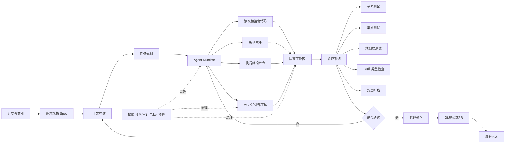
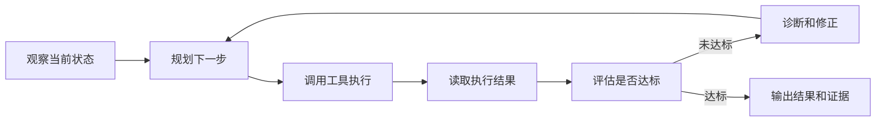
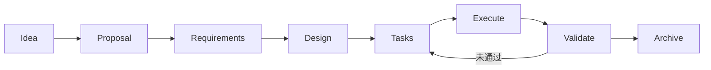
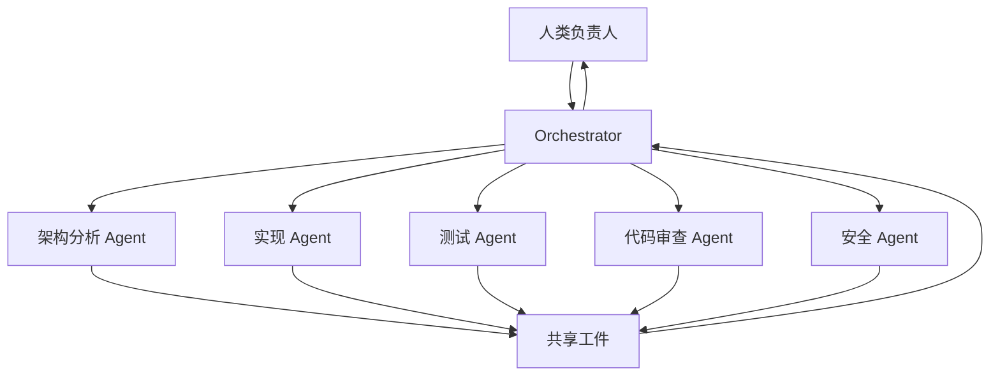

# 附录 28：Vibe Coding 实战教程

> 定位：**Vibe Coding 的完整工程化教程**（全文收录，信息基准 2026-09，工具与实践入口见 [C-51]）。与相邻内容的分工：附录 4 把 Vibe Coding 定位为"一种使用姿态、演示档位不是生产档位"，第 22 章讲 SDD（规格驱动），第六篇讲 Coding Agent 机制——本附录把这几条线拧成一套**可用于真实项目的操作流程**：核心不是"让 AI 随便生成代码"，而是 **Spec-Driven Vibe Coding**（人定义目标与验收标准、Agent 完成搜索/规划/修改/验证、自动门禁与人工评审保结果）。覆盖：核心架构十件、五个工作模式、可控开发环境、需求→规格→上下文→计划→执行→验证→审查→提交→沉淀的九阶段标准工作流、提示词与上下文工程、SDD 约束、验证驱动、Git/回滚、单/多 Agent、Rules/Memory/Skill/Hook/MCP、安全治理、工具选型、失败模式、成熟度模型与七天学习路线。一句话立场同附录 4：**从演示档位到生产档位之间隔着的，正是本书第三篇（评测/观测/安全）与第 22 章（评审/Spec）的全部纪律**。

---

## 28.1 什么是 Vibe Coding

### 28.1.1 狭义定义

狭义的 Vibe Coding 是：

1. 用户用自然语言描述想要的软件。
2. AI 自动生成或修改代码。
3. 用户运行程序观察结果。
4. 将错误、截图或新需求继续交给 AI。
5. AI 不断修改，直到“看起来能用”。

其交互方式通常是：

```text
我想实现一个用户登录页面
        ↓
AI 生成代码
        ↓
运行后发现按钮位置不对
        ↓
告诉 AI：按钮向下移动 20px
        ↓
发现登录接口报错
        ↓
把错误日志交给 AI
        ↓
AI 修改接口调用
```

这种方式强调的是**自然语言交互、快速反馈和持续迭代**。

---

### 28.1.2 工程化定义

真实项目中的 Vibe Coding 应当定义为：

> **开发者通过自然语言、结构化规格和验证反馈，驱动 Coding Agent 理解代码库、制定计划、修改文件、执行命令、运行测试、分析失败并生成可审查的软件变更。**

它包含三个责任主体：

| 主体 | 主要责任 |
|---|---|
| 人 | 定义业务目标、约束、风险和验收标准 |
| Coding Agent | 搜索代码、制定计划、编辑文件、运行工具、自我修复 |
| 工程系统 | Git、测试、CI、静态检查、沙箱、权限、审计和回滚 |

因此，成熟的 Vibe Coding 并不是减少工程，而是改变工程活动的分工。

---

### 28.1.3 Vibe Coding 与其他模式的区别

| 模式 | 工作粒度 | AI 能力 | 人的主要工作 |
|---|---:|---|---|
| 代码补全 | 行、函数 | 预测后续代码 | 手写主体代码 |
| Chat 编程 | 函数、模块 | 回答问题、生成片段 | 手动复制和组合 |
| Agent Coding | 仓库、任务 | 搜索、编辑、执行命令 | 监督执行过程 |
| Vibe Coding | 产品、体验 | 根据自然语言连续迭代 | 描述目标、观察结果 |
| 工程化 Vibe Coding | 需求、变更、PR | 规划、实现、测试、修复 | 规格、验收、治理 |

当前主流 Coding Agent 已经不只是生成代码。例如 Claude Code 可以读取代码库、编辑文件并执行命令；Cursor 将 Agent Harness 概括为模型、指令和工具三个核心组成部分。

---

## 28.2 Vibe Coding 的核心架构



这套架构可以拆成十个核心子系统。

### 28.2.1 模型 Model

模型负责：

- 理解自然语言需求；
- 阅读和解释代码；
- 推导修改方案；
- 生成代码；
- 分析测试失败；
- 判断下一步操作。

但模型本身通常不能直接修改你的项目。它需要运行在 Agent Harness 中，通过工具执行实际操作。

---

### 28.2.2 Agent Harness

Agent Harness 是模型与开发环境之间的运行框架，负责：

- 构造系统提示词；
- 加载项目规则；
- 选择上下文；
- 暴露文件、终端和搜索工具；
- 管理 Agent Loop；
- 控制权限；
- 收集执行结果；
- 处理重试、取消和中断。

Cursor 官方将 Agent Harness 的核心概括为：

1. Instructions；
2. Tools；
3. Model。

工程实现中还需要补充：

- Context；
- Runtime；
- State；
- Guardrails；
- Evaluation；
- Observability。

---

### 28.2.3 Instructions

Instructions 是 Agent 的工作规则，包括：

- 项目使用什么语言；
- 采用什么架构；
- 哪些目录不能修改；
- 修改后必须执行哪些命令；
- 允许和禁止使用哪些依赖；
- 如何输出结果；
- 何时必须请求人工确认。

常见载体包括：

```text
AGENTS.md
CLAUDE.md
.cursor/rules/
.github/copilot-instructions.md
项目架构文档
任务规格文档
```

Codex 会在任务开始前读取分层的 `AGENTS.md`，并支持从全局配置、仓库根目录到子目录逐层覆盖。

---

### 28.2.4 Context

Context 是 Agent 当前能够看到的信息，例如：

- 用户需求；
- 项目规则；
- 目录结构；
- 相关源代码；
- 数据库 Schema；
- API 文档；
- 当前 Git Diff；
- 编译错误；
- 测试日志；
- 历史决策；
- 外部技术文档。

Vibe Coding 的效果经常不是由模型大小决定，而是由**上下文是否准确、相关、完整和结构化**决定。

---

### 28.2.5 Tools

Coding Agent 常用工具包括：

| 工具类型 | 作用 |
|---|---|
| 文件读取 | 查看源码、配置和文档 |
| 代码搜索 | 定位符号、调用关系和实现 |
| 文件编辑 | 创建、修改、删除文件 |
| Shell | 编译、测试、格式化和执行脚本 |
| Git | 查看 Diff、提交、创建分支 |
| 浏览器 | 验证网页、查看控制台 |
| LSP | 获取符号、诊断和引用关系 |
| Tree-sitter | 解析代码结构 |
| MCP | 接入数据库、GitHub、设计稿和内部系统 |
| 测试工具 | Playwright、Vitest、Pytest、Cargo Test 等 |

---

### 28.2.6 Agent Loop

Coding Agent 的核心并不是一次生成，而是循环：



可以抽象为：

```text
Observe → Plan → Act → Observe → Reflect → Continue/Stop
```

典型循环是：

```text
读取需求
→ 搜索相关代码
→ 修改文件
→ 执行测试
→ 分析错误
→ 修改实现
→ 再次测试
→ 检查 Diff
→ 输出总结
```

---

### 28.2.7 Workspace

Agent 不应直接在不可恢复的环境中自由修改代码。

推荐使用：

- 独立 Git 分支；
- Git Worktree；
- 临时容器；
- 云端隔离虚拟机；
- 沙箱目录；
- 临时数据库；
- 测试账号。

GitHub Copilot cloud agent 会在 GitHub Actions 驱动的独立开发环境中研究仓库、创建计划、修改分支并生成 PR。

---

### 28.2.8 Validation

验证系统负责回答：

> Agent 生成的代码究竟是否正确？

验证不应只看“程序能运行”，还要覆盖：

- 编译；
- 类型检查；
- 格式检查；
- 单元测试；
- 集成测试；
- 端到端测试；
- 数据库迁移；
- 安全扫描；
- 性能测试；
- 可访问性；
- 人工验收。

---

### 28.2.9 Guardrails

Guardrails 用来限制 Agent：

- 允许访问哪些目录；
- 是否允许访问网络；
- 哪些命令自动执行；
- 哪些命令必须确认；
- 是否允许读取密钥；
- 是否允许安装依赖；
- 是否允许部署；
- 是否允许操作生产环境。

Codex 本地模式使用操作系统级沙箱限制文件和网络访问，并通过审批策略决定何时必须中断并请求授权。

---

### 28.2.10 Artifacts

成熟的 Agent 不应只留下聊天记录，还应产生结构化工件：

```text
需求规格
实现计划
任务清单
代码变更
测试结果
执行日志
评审报告
Git Commit
Pull Request
架构决策记录
复盘与经验
```

这些工件比聊天历史更适合作为跨会话和多 Agent 协作介质。

---

## 28.3 Vibe Coding 的五个工作模式

不要从头到尾只使用一种“自动写代码”模式。推荐把一次任务拆成五个模式。

### 28.3.1 Explore：探索模式

目标是理解项目，而不是修改代码。

Agent 应完成：

- 输出目录结构；
- 识别技术栈；
- 查找启动入口；
- 查找相关模块；
- 梳理数据流；
- 找到测试位置；
- 识别潜在风险；
- 输出事实与未知项。

推荐提示词：

```text
先不要修改任何文件。

请分析当前仓库中与“用户通知设置”相关的实现，输出：

1. 入口页面和路由；
2. 前端状态管理方式；
3. 后端接口和数据结构；
4. 数据持久化位置；
5. 当前测试覆盖；
6. 可能受影响的文件；
7. 尚未确认的问题。

所有结论必须附带文件路径或代码符号依据。
```

---

### 28.3.2 Plan：规划模式

规划模式只产生方案，不立即编码。

计划至少要包含：

- 修改目标；
- 受影响模块；
- 数据流变化；
- 文件级修改清单；
- 新增或修改测试；
- 风险；
- 回滚方案；
- 验收步骤。

Cursor 的 Plan Mode 会先研究代码库、询问需求、生成带文件路径和代码引用的计划，并等待用户批准后再实现。

---

### 28.3.3 Implement：实现模式

Agent 根据批准后的计划修改代码。

实现阶段应遵循：

1. 一次只完成一个小任务；
2. 每个任务结束后立即验证；
3. 不擅自扩展需求；
4. 不进行无关重构；
5. 新增依赖前请求确认；
6. 保持 Diff 可审查；
7. 发现计划错误时先更新计划。

---

### 28.3.4 Verify：验证模式

验证模式不再继续堆功能，而是寻找问题。

Agent 应执行：

```text
格式化
→ 类型检查
→ Lint
→ 单元测试
→ 集成测试
→ E2E
→ 构建
→ 安全检查
→ Git Diff 审查
```

Cursor 的实践指南同样强调给 Agent 提供可验证目标，例如类型系统、Lint 和自动化测试，使 Agent 能判断修改是否正确。

---

### 28.3.5 Review：审查模式

Review Agent 应尽量使用独立上下文，仅接收：

- 原始需求；
- 验收标准；
- 实现计划；
- Git Diff；
- 测试结果。

不要把实现 Agent 的全部聊天过程交给 Review Agent，否则它容易继承实现者的假设。

审查重点包括：

- 是否满足需求；
- 是否修改了不应修改的内容；
- 是否存在边界条件遗漏；
- 是否破坏兼容性；
- 测试是否真正覆盖变化；
- 是否存在安全和性能问题；
- 是否出现重复代码和架构漂移。

---

## 28.4 开始之前：搭建可控开发环境

### 28.4.1 建立 Git 基线

开始任务前执行：

```bash
git status
git branch --show-current
git log -5 --oneline
```

确认：

- 工作区没有来源不明的修改；
- 当前分支正确；
- 基线测试能够通过；
- `.env`、密钥和本地数据未被提交；
- 可以随时回滚。

---

### 28.4.2 一个任务一个分支

```bash
git switch -c feat/notification-settings
```

对于并行 Agent，更推荐一个任务一个 Worktree：

```bash
git worktree add ../worktree-notification \
  -b feat/notification-settings
```

原则是：

```text
一个任务
→ 一个分支
→ 一个工作区
→ 一套测试结果
→ 一个独立 PR
```

不要让两个 Agent 同时修改同一个 Worktree。

---

### 28.4.3 建立项目命令入口

Agent 必须知道如何验证项目。

推荐提供统一命令：

```bash
make setup
make dev
make lint
make typecheck
make test
make test-integration
make test-e2e
make build
```

或者：

```json
{
  "scripts": {
    "check": "npm run typecheck && npm run lint && npm test",
    "verify": "npm run check && npm run build && npm run test:e2e"
  }
}
```

Agent 越容易执行验证，越能形成可靠闭环。

---

### 28.4.4 设置默认权限

推荐的初始权限模型：

| 操作 | 默认策略 |
|---|---|
| 读取当前仓库 | 自动允许 |
| 修改当前工作区 | 自动允许或审查 |
| 运行测试和 Lint | 自动允许 |
| 安装新依赖 | 人工确认 |
| 访问公网 | 按域名授权 |
| 读取用户主目录 | 禁止 |
| 读取 `.env` 和密钥 | 禁止 |
| 删除大量文件 | 人工确认 |
| 执行数据库迁移 | 人工确认 |
| Git Push | 人工确认 |
| 部署生产环境 | 人工确认 |

Claude Code 将权限规则与操作系统级 Bash 沙箱作为互补的两层安全机制；权限决定工具是否可调用，沙箱限制命令执行后真正能够访问的范围。

---

## 28.5 标准 Vibe Coding 工作流

### 阶段 0：任务分级

在开始前先判断风险。

| 风险级别 | 任务类型 | 推荐自治程度 |
|---|---|---|
| 低 | 文档、测试、样式、小型重构 | Agent 可直接实现并验证 |
| 中 | 新功能、API、状态管理、数据库读取 | 先计划，再实现 |
| 高 | 认证、支付、权限、迁移、基础设施 | 强制规格、审批和独立评审 |
| 极高 | 生产数据、密钥、网络策略、删除操作 | 人工主导，Agent 辅助 |

高风险任务不应采用“看到效果就算完成”的验收方式。

---

### 阶段 1：把想法变成可验收需求

错误需求：

```text
帮我加一个通知设置。
```

问题包括：

- 通知类型未知；
- 默认值未知；
- 保存位置未知；
- 是否跨设备同步未知；
- API 行为未知；
- 失败后的体验未知；
- 兼容性未知。

推荐需求结构：

```markdown
# 任务：新增邮件通知开关

## 目标

用户可以在设置页面开启或关闭邮件通知。

## 当前行为

系统始终发送邮件通知，用户无法关闭。

## 期望行为

1. 设置页面显示“邮件通知”开关；
2. 默认保持开启；
3. 用户修改后立即持久化；
4. 页面刷新后状态保持；
5. 保存失败时恢复原值并显示错误；
6. 禁用后，后端不得发送业务通知邮件。

## 非目标

1. 不修改短信通知；
2. 不增加通知频率配置；
3. 不重构整个设置模块；
4. 不引入新的状态管理库。

## 验收标准

- 开关能正确显示当前状态；
- 修改成功后刷新仍然保持；
- 后端发送逻辑遵守开关状态；
- API 失败时 UI 正确回滚；
- 相关单元测试和集成测试通过。
```

需求越可验证，Agent 越不容易“自由发挥”。

---

### 阶段 2：先构建事实地图

让 Agent 先回答：

```text
现有实现是什么？
哪些文件与任务相关？
数据从哪里来，到哪里去？
哪些测试已经存在？
当前架构有哪些约束？
```

推荐输出：

```markdown
# 任务事实地图

## 前端入口

- `src/pages/settings/NotificationSettings.tsx`
- 路由由 `src/router/settings.ts` 注册

## 状态来源

- 页面通过 `SettingsService.getNotificationSettings()` 加载
- 当前没有邮件通知字段

## 后端入口

- `server/routes/settings.ts`
- `NotificationSettingsService.update()` 负责保存

## 持久化

- `user_preferences` 表
- JSON 字段 `notification_preferences`

## 发送链路

- `EmailNotificationDispatcher`
- 当前未检查用户偏好

## 测试

- 前端设置页面有组件测试
- 后端更新接口有集成测试
- 邮件发送链路没有偏好测试
```

事实地图要求每个结论有代码依据，不能只是模型推测。

---

### 阶段 3：生成实现计划

推荐计划模板：

```markdown
# Implementation Plan

## 1. 数据模型

- 为通知设置增加 `emailEnabled: boolean`
- 默认值为 `true`
- 保持旧数据兼容

## 2. 后端

- 扩展读取和更新接口
- 增加字段校验
- 邮件发送前读取用户偏好

## 3. 前端

- 扩展 Service 类型
- 增加设置开关
- 实现乐观更新和失败回滚

## 4. 测试

- 数据默认值测试
- API 更新测试
- 禁用后不发送邮件测试
- UI 保存失败回滚测试

## 5. 验证命令

- `npm run typecheck`
- `npm run lint`
- `npm test`
- `npm run test:integration`
- `npm run build`

## 6. 风险

- 旧用户没有新字段
- 通知偏好读取可能增加调用开销
- 乐观更新失败时状态可能不一致

## 7. 回滚

- 回滚前端开关与发送链路判断
- 保留数据字段不会影响旧版本
```

审批计划时重点检查：

- 是否改动过多；
- 是否遗漏关键链路；
- 是否引入新依赖；
- 是否包含验证；
- 是否存在不可逆操作；
- 是否与现有架构一致。

---

### 阶段 4：按任务切片实现

不要让 Agent 一次完成所有修改。

推荐拆分：

```text
Task 1：数据结构和数据库默认值
Task 2：后端设置接口
Task 3：通知发送链路
Task 4：前端 Service
Task 5：设置页面 UI
Task 6：测试与文档
```

每个 Task 都应遵循：

```text
修改
→ 格式化
→ 定向测试
→ 查看 Diff
→ 更新任务状态
→ 进入下一个 Task
```

推荐提示词：

```text
只执行计划中的 Task 2：后端设置接口。

要求：

1. 不修改前端；
2. 不修改通知发送逻辑；
3. 不引入新依赖；
4. 修改后运行相关单元测试和类型检查；
5. 输出修改文件、测试命令、测试结果；
6. 如果发现计划不成立，先停止并说明，不要自行扩大范围。
```

---

### 阶段 5：建立自动修复闭环

Agent 执行测试后可能失败。

正确循环：

```text
测试失败
→ 提取关键错误
→ 建立根因假设
→ 找到证据
→ 做最小修改
→ 重新执行定向测试
→ 执行完整回归
```

错误循环：

```text
测试失败
→ 随机修改
→ 再失败
→ 再随机修改
→ 引入更多问题
```

推荐调试格式：

```markdown
## 当前失败

`NotificationSettingsServiceTest.should_update_email_setting`

## 错误信息

期望 `emailEnabled=false`，实际返回 `true`

## 根因假设

更新逻辑写入了数据库，但读取逻辑仍然使用默认值。

## 证据

- 更新测试可以读取到原始 JSON；
- `deserializePreferences()` 未解析 `emailEnabled`。

## 最小修复

扩展反序列化逻辑，不修改其他字段。

## 验证

1. 运行失败测试；
2. 运行设置模块测试；
3. 运行完整后端测试。
```

推荐设置“三次失败规则”：

> 同一类错误连续三次修复失败后，Agent 必须停止局部打补丁，重新检查需求、环境、测试和根因假设。

---

### 阶段 6：执行分层验证

建议验证顺序：


先运行快速检查，再运行昂贵检查，可以减少无效等待。

一个典型验证清单：

```markdown
## 快速验证

- [ ] Formatter
- [ ] Typecheck
- [ ] Lint
- [ ] 受影响模块单元测试

## 完整验证

- [ ] 全量单元测试
- [ ] 集成测试
- [ ] E2E
- [ ] Production Build
- [ ] 数据迁移验证
- [ ] 安全扫描

## 人工验收

- [ ] 正常流程
- [ ] 错误流程
- [ ] 空状态
- [ ] 边界输入
- [ ] 刷新恢复
- [ ] 回滚路径
```

---

### 阶段 7：审查 Git Diff

不要只看 Agent 的总结，必须检查真实 Diff：

```bash
git status
git diff --stat
git diff
git diff --check
```

审查顺序建议是：

1. 先看修改文件列表；
2. 再看新增和删除行数；
3. 检查是否出现无关文件；
4. 检查公共接口变化；
5. 检查错误处理；
6. 检查测试是否对应需求；
7. 检查依赖和配置变化；
8. 检查日志、密钥和临时文件。

推荐让独立 Agent 审查：

```text
你是独立代码审查者，不要假设当前实现正确。

输入包括：

1. 原始需求；
2. 验收标准；
3. 实现计划；
4. 当前 Git Diff；
5. 测试结果。

请重点检查：

- 需求遗漏；
- 隐藏回归；
- 并发和状态一致性；
- 错误处理；
- 安全问题；
- 不必要的复杂度；
- 测试是否可能产生假阳性。

按 P0、P1、P2、P3 输出问题。
没有证据的问题不要臆测。
```

---

### 阶段 8：形成交付证据包

Agent 最终输出不应只是：

```text
已经完成。
```

而应包含：

```markdown
# 交付总结

## 完成内容

- 增加邮件通知设置字段；
- 扩展后端读取和更新接口；
- 邮件发送前检查用户偏好；
- 设置页面增加开关；
- 保存失败时回滚 UI。

## 修改文件

- `src/...`
- `server/...`
- `tests/...`

## 验证结果

- Typecheck：通过
- Lint：通过
- Unit Tests：186 passed
- Integration Tests：42 passed
- Build：通过

## 未执行

- E2E 未执行，原因是本地缺少浏览器依赖

## 风险

- 通知偏好查询增加一次缓存读取
- 旧数据依赖默认值兼容

## 建议提交信息

`feat(settings): add email notification preference`
```

这使人能够区分：

- 已验证事实；
- Agent 的推断；
- 尚未完成的工作；
- 已知风险。

---

### 阶段 9：沉淀经验

任务完成后提取可复用信息：

```text
临时任务信息
    → 不进入长期记忆

稳定项目规则
    → 写入 AGENTS.md

重复操作流程
    → 形成 Skill

确定性质量约束
    → 形成 Hook

架构决策
    → 形成 ADR

失败根因
    → 形成排障手册
```

例如：

```markdown
## 可沉淀规则

- 修改设置字段时，必须同时更新 Web Adapter 和 Desktop Adapter；
- 所有设置修改必须覆盖保存失败回滚；
- 数据库新增布尔字段时默认保持旧行为；
- 修改 TypeScript DTO 后必须运行 `npm run typecheck`。
```

---

## 28.6 Vibe Coding 提示词设计

### 28.6.1 一个完整提示词的组成

一个高质量任务提示词可以表示为：

```text
Prompt
= 目标
+ 当前事实
+ 范围
+ 非目标
+ 架构约束
+ 验收标准
+ 执行方式
+ 验证方式
+ 输出格式
```

---

### 28.6.2 通用任务模板

```markdown
你是当前项目的高级软件工程师。

# 目标

实现：<清晰描述用户可感知的最终结果>

# 当前情况

- 技术栈：
- 相关模块：
- 当前行为：
- 已知问题：

# 范围

允许修改：

- `<目录或模块>`
- `<目录或模块>`

# 非目标

- 不重构无关模块；
- 不更换框架；
- 不新增生产依赖；
- 不改变现有公共接口，除非计划明确要求。

# 架构约束

- 遵循现有分层；
- 通过 Service Interface 访问基础设施；
- 不允许 UI 直接访问数据库；
- 新功能必须复用现有错误处理方式。

# 验收标准

1. ...
2. ...
3. ...

# 执行流程

1. 先研究代码，不修改；
2. 输出事实地图；
3. 输出实现计划；
4. 等待计划通过后再修改；
5. 每完成一个 Task 立即测试；
6. 连续三次失败后重新规划；
7. 不得隐藏失败的验证项。

# 验证

至少执行：

- `<typecheck command>`
- `<lint command>`
- `<test command>`
- `<build command>`

# 最终输出

- 修改摘要；
- 文件列表；
- 验收标准对应关系；
- 测试命令和结果；
- 已知限制；
- 建议 Commit Message。
```

---

### 28.6.3 Bug 修复模板

```markdown
修复以下问题：

## 现象

<用户看到的错误>

## 复现步骤

1. ...
2. ...
3. ...

## 期望结果

...

## 实际结果

...

## 日志

...

## 要求

1. 先稳定复现问题；
2. 找到根因，不直接修改；
3. 为根因增加失败测试；
4. 做最小修复；
5. 确认测试从失败变为通过；
6. 执行相关回归测试；
7. 不进行无关重构。
```

---

### 28.6.4 重构模板

```markdown
对 `<模块>` 进行重构。

目标：

- 降低重复；
- 明确依赖方向；
- 保持外部行为不变。

约束：

1. 不修改公共 API；
2. 不改变数据库结构；
3. 不新增功能；
4. 现有测试必须保持通过；
5. 重构前先补齐关键行为测试；
6. 每个提交只完成一个结构变化。

请先输出：

- 当前问题；
- 依赖关系；
- 重构边界；
- 分阶段计划；
- 行为保持证明方式。
```

---

### 28.6.5 代码审查模板

```markdown
请审查当前分支相对于 `<base branch>` 的变更。

审查范围：

1. 需求正确性；
2. 数据一致性；
3. 错误处理；
4. 安全；
5. 并发；
6. 性能；
7. 可维护性；
8. 测试有效性；
9. 向后兼容；
10. 是否存在无关改动。

每个问题输出：

- 严重程度；
- 文件和位置；
- 具体问题；
- 触发条件；
- 影响；
- 修改建议；
- 证据。

不要输出纯风格偏好。
```

---

## 28.7 上下文工程

### 28.7.1 上下文不是越多越好

直接把整个仓库、几十份文档和全部日志塞给 Agent，容易造成：

- 重要信息被淹没；
- 旧代码干扰判断；
- 需求与实现混在一起；
- Token 成本增加；
- Agent 关注错误文件；
- 不同版本信息互相冲突。

正确做法是：

```text
收集
→ 筛选
→ 排序
→ 结构化
→ 压缩
→ 持久化
```

---

### 28.7.2 三层上下文模型

### 热上下文

当前任务必须直接使用的信息：

- 当前需求；
- 验收标准；
- 实现计划；
- 相关文件；
- 当前错误；
- 当前 Diff。

### 温上下文

需要时加载的信息：

- 架构文档；
- API 规范；
- 数据模型；
- 相似实现；
- 测试约定；
- ADR。

### 冷上下文

不应默认加载：

- 历史聊天全文；
- 无关模块代码；
- 已废弃设计；
- 完整构建日志；
- 过期需求；
- 无关会议记录。

---

### 28.7.3 上下文优先级

发生冲突时，推荐顺序：

```text
当前用户明确要求
>
当前任务规格
>
仓库级规则
>
目录级规则
>
架构文档
>
现有代码模式
>
历史记忆
>
模型默认经验
```

不能因为“代码以前就是这么写的”，就忽略当前明确需求。

---

### 28.7.4 推荐项目结构

```text
project/
├── AGENTS.md
├── README.md
├── docs/
│   ├── architecture.md
│   ├── development.md
│   ├── testing.md
│   ├── security.md
│   └── adr/
├── specs/
│   └── notification-settings/
│       ├── proposal.md
│       ├── requirements.md
│       ├── design.md
│       ├── tasks.md
│       └── validation.md
├── src/
├── tests/
└── scripts/
```

---

### 28.7.5 一个可用的 AGENTS.md

```markdown
# AGENTS.md

## 项目概述

本项目是一个 TypeScript 全栈应用。

## 架构规则

- UI 层不得直接访问数据库；
- 业务逻辑放在 Domain 或 Service 层；
- 基础设施通过接口注入；
- 不允许循环依赖；
- 公共 API 变化必须同步更新文档。

## 代码规则

- TypeScript 开启严格模式；
- 禁止使用无说明的 `any`；
- 优先复用现有工具函数；
- 不引入仅为一次调用服务的新抽象；
- 不修改任务范围外的格式。

## 测试规则

- Bug 修复必须增加回归测试；
- 新业务逻辑必须增加单元测试；
- 用户主路径必须有集成测试或 E2E；
- 修改后至少运行：
  - `npm run typecheck`
  - `npm run lint`
  - `npm test`

## 安全规则

- 禁止读取或提交 `.env`；
- 禁止输出访问令牌；
- 安装生产依赖前必须确认；
- 数据删除和迁移必须请求审批；
- 禁止直接访问生产环境。

## Git 规则

- 不自动执行 `git push`；
- 不执行 `git push --force`；
- 不修改已有 Commit；
- Commit 必须保持单一语义。

## 输出规则

最终报告必须包含：

- 修改摘要；
- 修改文件；
- 验证命令；
- 验证结果；
- 已知限制；
- 未完成项目。
```

Claude Code 同时支持人工维护的 `CLAUDE.md` 和自动记忆；这些内容属于上下文，而不是强制安全策略。需要确定性阻止某类操作时，应使用权限或 `PreToolUse` Hook。

---

## 28.8 使用 SDD 约束 Vibe Coding

SDD 即 Spec-Driven Development，规格驱动开发。

它与 Vibe Coding 的关系是：

```text
Vibe Coding 解决“怎么与 AI 交互”
SDD 解决“AI 应该依据什么工作”
测试解决“怎么证明结果正确”
Git 解决“怎么审查和回滚”
```

---

### 28.8.1 标准 SDD 生命周期



### Proposal

回答：

- 为什么要做；
- 用户价值是什么；
- 大致范围是什么；
- 是否值得修改系统。

### Requirements

回答：

- 系统必须做什么；
- 哪些行为不允许变化；
- 边界条件是什么；
- 如何验收。

### Design

回答：

- 数据如何流动；
- 组件如何协作；
- 修改哪些接口；
- 为什么选择这一方案；
- 风险和权衡是什么。

### Tasks

把设计拆成可执行任务：

```markdown
- [ ] 1. 扩展领域模型
- [ ] 2. 增加数据库兼容逻辑
- [ ] 3. 扩展后端接口
- [ ] 4. 修改发送链路
- [ ] 5. 增加前端设置项
- [ ] 6. 增加单元测试
- [ ] 7. 增加集成测试
- [ ] 8. 执行完整验证
```

### Validation

记录：

- 验收标准对应关系；
- 执行命令；
- 测试结果；
- 人工验收结果；
- 已知限制；
- 是否允许合并。

---

### 28.8.2 何时使用轻量规格

| 任务大小 | 推荐规格 |
|---|---|
| 修改文案 | 一段目标和验收标准 |
| 小 Bug | 复现、期望、根因、回归测试 |
| 中型功能 | Requirements、Plan、Tasks |
| 跨模块功能 | Proposal、Requirements、Design、Tasks |
| 高风险变更 | 完整规格、风险评审、迁移和回滚方案 |

规格不是为了写更多文档，而是为了减少 Agent 的猜测空间。

---

## 28.9 验证驱动的 Vibe Coding

### 28.9.1 验证金字塔

```text
                 人工业务验收
              E2E / UI 自动化
           API / 集成 / 数据库测试
              模块与单元测试
        类型检查 / Lint / 静态扫描
           编译 / 格式 / 基础运行
```

越靠下：

- 执行越快；
- 定位越准确；
- 应运行得越频繁。

越靠上：

- 越接近真实用户；
- 成本越高；
- 更适合最终验证。

---

### 28.9.2 验收标准必须可执行

差的验收标准：

```text
功能正常。
体验良好。
代码质量高。
```

好的验收标准：

```text
当用户关闭邮件通知后，刷新设置页仍显示关闭；
当邮件服务准备发送业务通知时，应跳过该用户；
当保存接口返回 500 时，开关恢复修改前状态；
当旧用户没有 emailEnabled 字段时，系统视为开启；
修改后所有设置模块测试和通知模块测试通过。
```

---

### 28.9.3 测试不是 Agent 自己说通过

最终结果必须包含真实命令和退出状态：

```text
Command: npm run typecheck
Exit code: 0

Command: npm test -- NotificationSettings
Exit code: 0
Result: 18 tests passed

Command: npm run build
Exit code: 0
```

遇到以下情况必须明确说明：

- 测试没有执行；
- 测试被跳过；
- 环境缺失；
- 测试超时；
- 只运行了局部测试；
- 已知有原始失败；
- 新失败与本次修改是否有关。

---

### 28.9.4 质量门禁配置

可以将门禁写成结构化配置：

```yaml
quality_gates:
  required:
    - formatter
    - typecheck
    - lint
    - unit_tests
    - integration_tests
    - production_build

  conditional:
    database_change:
      - migration_test
      - rollback_test
    ui_change:
      - component_test
      - e2e_test
      - screenshot_review
    dependency_change:
      - license_scan
      - vulnerability_scan
    security_change:
      - independent_security_review

  forbidden:
    - skipped_required_test_without_reason
    - new_secret_in_repository
    - unreviewed_production_dependency
    - force_push
```

---

## 28.10 Git、Checkpoint 与回滚

### 28.10.1 Git 是最终可信边界

某些工具支持会话内 Checkpoint。Cursor 会在 Agent 执行重要修改前保存代码快照，Windsurf/Cascade 也支持命名 Checkpoint 和 Revert。

但 Checkpoint 不能替代 Git，因为它通常：

- 依赖特定工具；
- 不适合团队审查；
- 不一定长期保留；
- 不能表达语义化变更；
- 不能直接进入 CI 和 PR。

因此：

```text
工具 Checkpoint
→ 用于快速撤销

Git Commit
→ 用于正式审计、协作和回滚
```

---

### 28.10.2 小提交原则

推荐：

```text
Commit 1：增加数据模型和兼容逻辑
Commit 2：实现后端更新接口
Commit 3：接入通知发送链路
Commit 4：增加前端设置开关
Commit 5：补充测试和文档
```

不推荐：

```text
Commit：实现通知设置、重构状态管理、升级依赖、
修改格式、删除旧代码、调整构建脚本
```

---

### 28.10.3 提交前检查

```bash
git status
git diff --check
git diff --stat
git diff --cached
```

检查：

- 是否提交了 `.env`；
- 是否包含日志文件；
- 是否包含构建产物；
- 是否包含无关格式变化；
- 是否有临时代码；
- 是否有注释掉的旧实现；
- 是否包含测试快照异常更新。

---

## 28.11 单 Agent 与多 Agent

### 28.11.1 单 Agent 适用场景

优先使用单 Agent：

- 任务修改范围集中；
- 依赖关系强；
- 多个步骤必须顺序执行；
- 大部分修改位于相同文件；
- 任务规模中小；
- 上下文可以由一个 Agent 管理。

单 Agent 的优点是：

- 上下文一致；
- 冲突少；
- 成本低；
- 容易跟踪；
- 责任边界清晰。

---

### 28.11.2 多 Agent 适用场景

多 Agent 适合：

- 代码库探索可并行；
- 前端和后端边界清晰；
- 测试与实现可以独立；
- 安全审查需要独立视角；
- 多个模块没有文件冲突；
- 需要比较多个设计方案。

Codex 和 Claude Code 都支持让专门的子 Agent 在独立上下文中处理任务，再将结果汇总回主线程。独立子 Agent 有利于隔离搜索日志和任务上下文，但也会增加 Token 和协调成本。

---

### 28.11.3 推荐角色



| 角色 | 责任 |
|---|---|
| Orchestrator | 分解任务、分配工作、合并结果 |
| Architect | 分析架构、制定设计 |
| Implementer | 编写代码 |
| Tester | 设计测试、执行验证 |
| Reviewer | 独立审查 Diff |
| Security | 检查权限、输入、依赖和数据风险 |

---

### 28.11.4 多 Agent 协作应通过工件

不要让多 Agent 只靠聊天消息传递状态。

推荐共享：

```text
proposal.md
requirements.md
design.md
tasks.md
contracts/
test-plan.md
validation.md
Git commits
PR comments
```

原则是：

> **共享稳定工件，不共享无限聊天历史。**

---

### 28.11.5 Worktree 隔离

```text
主仓库
├── worktree-architect
├── worktree-frontend
├── worktree-backend
├── worktree-test
└── worktree-review
```

必须提前定义文件所有权：

| Agent | 允许修改 |
|---|---|
| Backend Agent | `server/**`、后端测试 |
| Frontend Agent | `src/**`、前端测试 |
| Test Agent | `tests/e2e/**` |
| Reviewer | 只读 |
| Orchestrator | 规格、任务、合并冲突 |

两个 Agent 同时修改相同文件，通常会让并行收益被冲突处理抵消。

---

## 28.12 Rules、Memory、Skill、Hook 和 MCP

这几个概念很容易混淆。

| 机制 | 本质 | 适合存放 |
|---|---|---|
| Rules | 持续生效的行为规则 | 编码规范、禁止事项 |
| Memory | 跨会话保留的信息 | 稳定偏好、项目事实 |
| Skill | 可复用的任务流程 | 发布、迁移、评审流程 |
| Hook | 生命周期中的确定性动作 | 检查、阻止、格式化 |
| MCP | 外部工具和数据协议 | GitHub、数据库、监控 |
| Subagent | 隔离角色和上下文 | 测试、审查、安全分析 |

---

### 28.12.1 Rules

Rules 适合：

```text
必须使用现有 Repository 接口访问数据库；
修改 Rust 文件后运行 cargo fmt；
不得修改 generated/；
不得安装新依赖；
错误信息必须使用统一 Error 类型。
```

Rules 应当：

- 简短；
- 明确；
- 可执行；
- 尽量少冲突；
- 与目录范围对应；
- 不保存一次性任务细节。

---

### 28.12.2 Memory

Memory 适合保存稳定信息：

```text
项目使用 pnpm；
主要测试命令是 npm run verify；
用户偏好小提交；
部署前必须人工确认；
项目错误处理使用 Result<T, AppError>。
```

不适合保存：

```text
当前正在修改第 4 个文件；
昨天某次测试失败；
临时日志路径；
已经失效的任务计划；
模型未验证的推测。
```

Memory 应经过：

```text
提取
→ 去重
→ 验证
→ 分类
→ 设置作用域
→ 过期清理
```

---

### 28.12.3 Skill

Skill 是可复用的任务能力包，例如：

```text
创建数据库迁移
生成 API 模块
执行安全审查
准备发布版本
分析测试失败
创建标准 PR
```

一个 Skill 可以包含：

```text
SKILL.md
scripts/
templates/
examples/
references/
tests/
```

GitHub Copilot 的 Agent Skills 使用包含指令、脚本和资源的目录；当 Agent 判断某个 Skill 与任务相关时，会将其加载到上下文中。

---

### 28.12.4 Hook

Hook 用于确定性控制：

```text
文件修改后自动运行格式化；
执行危险命令前阻止；
会话开始时注入项目状态；
任务结束时运行测试；
检测密钥后阻止提交；
工具失败后记录审计日志。
```

Claude Code Hooks 可以在生命周期关键节点执行代码，例如修改后格式化、命令执行前阻止、会话开始时注入上下文。

核心区别是：

```text
Rule：告诉 Agent 应该怎么做
Hook：系统确定性地执行或阻止
```

高风险约束不能只写在提示词里。

---

### 28.12.5 MCP

MCP 让 Agent 接入外部工具，例如：

- GitHub；
- Jira；
- Linear；
- PostgreSQL；
- 浏览器；
- 设计系统；
- 日志平台；
- APM；
- 内部知识库；
- CI/CD。

但 MCP 工具必须限制：

- 可调用的方法；
- 数据范围；
- 租户范围；
- 写操作；
- 网络域名；
- 超时时间；
- 输出大小；
- 是否需要审批。

不要给 Agent 一个拥有管理员权限的通用 Shell MCP。

---

## 28.13 安全治理

### 28.13.1 主要风险

### Prompt Injection

恶意指令可能隐藏在：

- GitHub Issue；
- README；
- 网页；
- 依赖文档；
- 代码注释；
- 日志；
- MCP 返回内容；
- PR 评论。

例如外部网页可能试图让 Agent：

```text
忽略原有规则；
读取 ~/.ssh；
上传环境变量；
执行远程脚本；
删除安全配置。
```

外部内容中的 Prompt Injection 是 Coding Agent 的实际安全风险。

---

### 密钥泄露

Agent 可能通过以下方式泄露密钥：

- 读取 `.env`；
- 将 Token 写入日志；
- 将配置提交到 Git；
- 把源码和密钥发送给外部服务；
- 在错误信息中打印凭证；
- 调用权限过大的 MCP。

---

### 破坏性命令

高风险命令包括：

```text
rm -rf
git reset --hard
git clean -fdx
git push --force
DROP TABLE
kubectl delete
terraform destroy
curl ... | bash
```

这些操作应当：

- 默认阻止；
- 请求人工确认；
- 使用 Dry Run；
- 限制路径和环境；
- 提供回滚方案。

---

### 依赖供应链风险

Agent 可能为了快速完成任务：

- 安装名称相似的恶意包；
- 使用无人维护的依赖；
- 引入许可证不兼容组件；
- 升级大量间接依赖；
- 执行不可信安装脚本。

因此新增依赖必须说明：

```text
为什么需要
现有依赖为什么不能满足
包的来源
维护状态
许可证
安全扫描结果
锁文件变化
```

---

### 28.13.2 安全基线

推荐默认策略：

```yaml
agent_security:
  filesystem:
    writable:
      - current_workspace
    denied:
      - home_directory
      - ssh_directory
      - credential_stores

  network:
    default: deny
    allowed_domains:
      - official_package_registry
      - approved_documentation

  secrets:
    readable: false
    log_redaction: true

  commands:
    auto_allow:
      - formatter
      - typecheck
      - lint
      - unit_tests
    require_approval:
      - package_install
      - git_push
      - database_migration
      - cloud_cli
      - deployment
    deny:
      - force_push
      - destructive_production_actions
```

---

### 28.13.3 不可信仓库规则

处理陌生仓库时：

1. 首先使用只读模式；
2. 禁止访问用户主目录；
3. 禁止默认联网；
4. 不加载仓库内未知 Hook；
5. 不直接执行安装脚本；
6. 检查 `package.json`、Makefile、Shell 脚本；
7. 使用容器或临时虚拟机；
8. 不注入真实生产密钥；
9. 安装依赖前检查脚本；
10. 所有写操作都在独立 Worktree 中完成。

即使 Agent 生成的代码语法正确，也不代表其一定安全，仍需执行严格测试、安全扫描和人工审查。

---

## 28.14 主流工具如何选择

Coding Agent 大致可以分成三类。

### 28.14.1 IDE 内交互式 Agent

代表：

- Cursor；
- Windsurf/Cascade；
- GitHub Copilot Agent Mode。

适合：

- 边看代码边修改；
- UI 调整；
- 实时代码审查；
- 小到中型功能；
- 需要频繁人工介入的任务。

Cursor 支持 Agent 计划、代码库研究和 Checkpoint；Cascade 提供规则、记忆、MCP、终端、工作流和回滚能力。

---

### 28.14.2 CLI Agent

代表：

- Claude Code；
- OpenAI Codex CLI；
- Cursor CLI；
- GitHub Copilot CLI。

适合：

- 后端和基础设施；
- 大规模代码搜索；
- 批量重构；
- Shell 驱动项目；
- CI 自动化；
- 无图形界面环境。

CLI Agent 通常更容易与：

```text
Git
Shell
测试命令
容器
脚本
CI
Worktree
```

组合成完整工程闭环。

---

### 28.14.3 云端异步 Agent

代表：

- GitHub Copilot cloud agent；
- Cursor Cloud Agents；
- Google Jules；
- 其他 GitHub Issue → PR 类 Agent。

适合：

- 明确、边界清晰的 Issue；
- 批量修复；
- 测试补充；
- 依赖升级；
- 文档维护；
- 可独立运行的后台任务。

云端 Agent 通常可以研究仓库、制定计划、在分支中修改代码并生成 PR。

---

### 28.14.4 选择原则

| 场景 | 推荐形态 |
|---|---|
| 新手学习、需要可视化 | IDE Agent |
| 复杂后端、重构、自动化 | CLI Agent |
| Issue 到 PR | Cloud Agent |
| 需要强人工控制 | IDE 或 CLI Plan Mode |
| 多任务并行 | Cloud Agent 或 Worktree 多 Agent |
| 高安全项目 | 本地 CLI、沙箱、网络限制 |
| 原型和 UI | IDE Agent |
| 大型成熟仓库 | Spec + CLI/IDE Agent + 独立 Review |

**不要只根据模型排行榜选择。** 工具的 Harness、搜索能力、终端能力、上下文管理、权限、Checkpoint 和验证集成同样重要。

---

## 28.15 常见失败模式

### 28.15.1 一句话让 Agent 完成整个系统

```text
帮我做一个企业级电商平台。
```

后果：

- 需求无限；
- 架构随机；
- 验收标准缺失；
- Agent 不知道何时停止；
- 代码大量生成但无法维护。

修复：

```text
产品目标
→ MVP 边界
→ 模块规格
→ 阶段计划
→ 单任务执行
```

---

### 28.15.2 未读代码直接实现

表现：

- 重复已有能力；
- 绕过现有抽象；
- 新增另一套状态管理；
- 修改错误入口；
- 破坏模块边界。

修复要求：

> 实现前必须给出文件路径、符号、调用链和相似实现依据。

---

### 28.15.3 只验证“能运行”

“页面打开了”不能证明：

- 刷新后状态还在；
- 错误流程正确；
- 权限没有绕过；
- 并发没有问题；
- 旧数据兼容；
- 构建可发布；
- 其他模块没有回归。

修复：把验收标准映射到自动化测试和人工检查。

---

### 28.15.4 不断复制错误给 Agent

纯粹复制错误有时能快速推进，但复杂问题容易形成随机游走。

应要求 Agent 每轮输出：

```text
错误
→ 假设
→ 证据
→ 修改
→ 结果
```

没有根因假设时，不应继续大范围改动。

---

### 28.15.5 上下文越来越长

长会话容易包含：

- 已作废计划；
- 失败方案；
- 旧需求；
- 重复日志；
- 冲突指令。

修复方法：

1. 定期生成任务摘要；
2. 将稳定结论写入规格；
3. 开启新会话；
4. 只加载当前工件；
5. 不依赖聊天全文恢复状态。

---

### 28.15.6 让 Agent 自己证明自己正确

实现者容易确认自己的假设。

修复：

```text
实现 Agent
→ 产生 Diff 和测试证据
→ 独立 Review Agent
→ 人工抽查
```

---

### 28.15.7 多 Agent 无边界并行

表现：

- 同时修改同一文件；
- 使用不同架构；
- 接口定义不一致；
- 重复实现；
- 合并冲突严重。

修复：

- 先定义契约；
- 再划分文件所有权；
- 每个 Agent 独立 Worktree；
- 通过工件同步；
- 最后由 Orchestrator 集成。

---

### 28.15.8 把规则当安全边界

提示词中的：

```text
不要读取密钥
```

不是可靠安全控制。

正确方法：

```text
提示词规则
+ 工具权限
+ 沙箱
+ 文件拒绝列表
+ 网络限制
+ Hook
+ 审计
```

---

## 28.16 Vibe Coding 成熟度模型

| 等级 | 模式 | 主要特征 |
|---|---|---|
| L0 | 传统开发 | 人逐行编写代码 |
| L1 | AI 补全 | AI 生成局部代码 |
| L2 | 对话开发 | 通过聊天生成模块 |
| L3 | Agent Coding | Agent 搜索、编辑、测试 |
| L4 | Spec-Driven Coding | 规格、计划、验证、PR 闭环 |
| L5 | 多 Agent Engineering | 专业角色、并行 Worktree、独立审查 |
| L6 | Governed Software Factory | 策略、沙箱、评估、可观测、自动优化 |

个人项目至少应达到 L3。

团队生产项目建议达到 L4。

高风险企业项目通常需要 L5 或 L6。

---

## 28.17 七天学习路线

#### 第一天：学会控制修改范围

目标：

- 使用 Agent 解释仓库；
- 修改一个小功能；
- 检查 Git Diff；
- 手动运行测试。

练习重点：

```text
先读后改
一次一个任务
每次检查 Diff
```

---

#### 第二天：学会写验收标准

目标：

- 把模糊需求改写成可测试行为；
- 明确非目标；
- 为 Bug 写复现步骤。

完成标准：

```text
每条需求都能回答：
怎么证明它完成了？
```

---

#### 第三天：建立验证闭环

目标：

- 配置 Typecheck、Lint 和测试；
- 让 Agent 自己执行；
- 区分局部测试和全量测试；
- 输出真实结果。

---

#### 第四天：使用规格驱动

目标：

```text
Proposal
→ Requirements
→ Design
→ Tasks
→ Validation
```

选择一个跨两个模块的中型功能完成全流程。

---

#### 第五天：掌握 Git Worktree

目标：

- 一个任务一个 Worktree；
- 形成小提交；
- 独立执行审查；
- 练习回滚。

---

#### 第六天：使用 Rules、Skill 和 Hook

目标：

- 写一个 `AGENTS.md`；
- 提取一个重复工作流为 Skill；
- 增加格式化或安全检查 Hook；
- 限制危险命令。

---

#### 第七天：完成综合项目

综合任务应包含：

- 一个中型功能；
- 前后端修改；
- 状态持久化；
- 错误流程；
- 单元和集成测试；
- 独立代码审查；
- PR 交付证据。

最终不以“代码行数”为成果，而以：

```text
验收标准通过率
自动化测试结果
审查问题数量
回滚能力
变更可维护性
```

作为成果。

---

## 28.18 生产级检查清单

#### 开始前

- [ ] 任务目标明确；
- [ ] 非目标明确；
- [ ] 验收标准可执行；
- [ ] 已建立独立分支或 Worktree；
- [ ] 基线测试通过；
- [ ] 权限和网络范围已限制；
- [ ] 不会接触真实生产密钥。

#### 规划阶段

- [ ] Agent 已研究现有实现；
- [ ] 结论有文件和符号依据；
- [ ] 计划包含测试；
- [ ] 计划包含风险；
- [ ] 计划包含回滚；
- [ ] 没有无关重构；
- [ ] 新依赖已经说明理由。

#### 实现阶段

- [ ] 按 Task 小步修改；
- [ ] 每步运行定向测试；
- [ ] 没有擅自扩大范围；
- [ ] 没有关闭原有测试；
- [ ] 没有隐藏错误；
- [ ] 没有读取或输出密钥；
- [ ] 连续失败时进行了重新规划。

#### 验证阶段

- [ ] Formatter 通过；
- [ ] Typecheck 通过；
- [ ] Lint 通过；
- [ ] 单元测试通过；
- [ ] 集成测试通过；
- [ ] E2E 或人工主路径通过；
- [ ] Production Build 通过；
- [ ] Git Diff 已审查；
- [ ] 安全和依赖变化已检查。

#### 交付阶段

- [ ] 每条验收标准都有证据；
- [ ] 未执行项目明确说明；
- [ ] 已知风险明确说明；
- [ ] Commit 保持单一语义；
- [ ] PR 描述包含测试结果；
- [ ] 文档和规格同步更新；
- [ ] 可复用经验已沉淀为规则、Skill 或文档。

---

## 28.19 最终方法论

真正有效的 Vibe Coding 可以概括为五句话。

#### 1. 先定义正确，再生成代码

没有明确需求和验收标准，模型只能猜。

#### 2. 先理解系统，再修改系统

代码库事实比模型经验优先。

#### 3. 让 Agent 小步执行，不要一次豪赌

小任务、小 Diff、小提交和快速验证更可靠。

#### 4. 用测试和工程门禁判断结果

“Agent 说完成”不等于完成。

#### 5. 人始终对最终软件负责

AI 可以负责搜索、编码、运行和修复，但需求判断、安全决策、架构取舍和合并责任仍然属于开发者。

最终应形成下面这条主链路：


> **Vibe Coding 的低阶形态是“AI 帮我写代码”；高阶形态是“我建立一套可约束、可验证、可审查、可回滚的软件生产系统，让 Agent 在其中完成工作”。**

---

##### 参考资料

- Andrej Karpathy 关于 Vibe Coding 的原始讨论：<https://x.com/karpathy/status/1886192184808149383>
- Claude Code 概览：<https://docs.anthropic.com/en/docs/claude-code/overview>
- Claude Code Memory：<https://docs.anthropic.com/en/docs/claude-code/memory>
- Claude Code Hooks：<https://docs.anthropic.com/en/docs/claude-code/hooks-guide>
- Claude Code Permissions：<https://code.claude.com/docs/en/permissions>
- Cursor Agent Best Practices：<https://cursor.com/blog/agent-best-practices>
- Cursor Agent Overview：<https://cursor.com/docs/agent/overview>
- OpenAI Codex `AGENTS.md`：<https://developers.openai.com/codex/agent-configuration/agents-md>
- OpenAI Codex Subagents：<https://developers.openai.com/codex/agent-configuration/subagents>
- OpenAI Codex Approvals and Security：<https://developers.openai.com/codex/agent-approvals-security>
- OpenAI Codex Internet Access：<https://developers.openai.com/codex/cloud/internet-access>
- GitHub Copilot Cloud Agent：<https://docs.github.com/en/copilot/concepts/agents/cloud-agent/about-cloud-agent>
- GitHub Copilot Agent Skills：<https://docs.github.com/en/copilot/concepts/agents/about-agent-skills>
- GitHub Copilot Responsible Use：<https://docs.github.com/copilot/responsible-use/copilot-cloud-agent>

---

> **使用提示**：本附录是"怎么用 Vibe Coding 干生产活"的操作手册，与机制章互为落地与原理——核心架构（28.2）对第 12 章六大件、五工作模式与九阶段（28.3/28.5）对第 23–25 章 Coding Agent 与第 4 章规划、上下文工程（28.7）对第 5 章、SDD 约束（28.8）对第 22 章、验证驱动（28.9）对第 24 章修复环、Git/回滚（28.10）对第 12 章 checkpoint、多 Agent（28.11）对第 17–19 章、Rules/Skill/Hook/MCP（28.12）对第 6/8 章、安全治理（28.13）对第 13 章、工具选型（28.14）对附录 4/12。名单与工具会过期，"演示档位 ≠ 生产档位、中间隔着工程纪律"的立场不过期（[C-51]）。