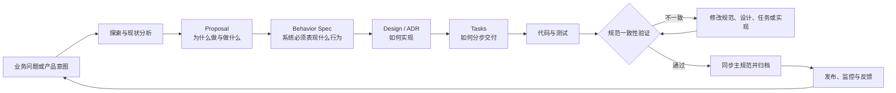
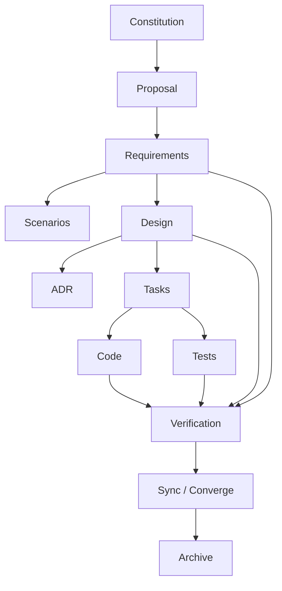

# 附录 29：SDD 规范驱动开发实战教程与框架选型

> 定位：**SDD（规范驱动开发）的完整教程与框架选型报告**（全文收录，信息基准 2026-09，框架入口见 [C-52]）。与相邻内容的分工：第 22 章讲 SDD 作为组织流程方法论（OpenSpec 三阶段、评审重心转移），附录 2 的 2.5 把 SDD 定位为"外层过程方法论"，附录 28 讲 Vibe Coding 的操作流程——本附录把 SDD 讲透并落到工具：以可执行、可验证、可演进的规范为核心控制面，需求/设计/任务/代码/测试/系统现状之间建持续可追踪的闭环。覆盖：五层契约模型、与 Vibe Coding/Spec-First/TDD/BDD/DDD/ADR 的关系、核心闭环与工件体系、Current/Change/Delta Spec 三分、Requirement 与 Scenario 写法、完整实施流程、主流 SDD 框架全景与对比选型、存量引入、多 Agent SDD、企业治理、反模式、效果度量与可复制模板。一句话立场：**SDD 是给 Agent 的高质量上下文与验收标准的单一事实源**——正是第 22 章"确定性下沉到规范"在工具层的展开。

---

## 29.1 什么是 SDD

### 29.1.1 基本定义

SDD 的核心思想是：

```text
规范不是代码生成前的一次性说明，
而是贯穿需求、设计、实现、验证和演进全过程的事实控制面。
```

传统开发通常是：

```text
需求文档 → 设计文档 → 编写代码 → 测试 → 文档逐渐失真
```

SDD 希望建立下面的闭环：

```text
业务意图
  ↓
可验证的行为规范
  ↓
技术设计
  ↓
实施任务
  ↓
代码与测试
  ↓
规范一致性验证
  ↓
系统规范更新
  ↓
下一次变更
```

可以用一个公式概括：

```text
SDD
= 意图作为事实源
+ 结构化逐步细化
+ Requirement 到 Evidence 的全链路追踪
+ 规范与实现的持续收敛
+ 可审计的变更历史
```

### 29.1.2 SDD 不是什么

SDD 不是：

- 在编码前多写几页说明；
- 把 PRD、设计、测试全部堆进一个超大文档；
- 让 AI 自动生成 `requirements.md`、`design.md`、`tasks.md` 后立即编码；
- 以“任务勾选完成”代替实际验证；
- 以“测试通过”代替需求满足；
- 要求所有小改动都走同样重量的流程；
- 把规范固定成永远不能修改的合同。

真正的 SDD 强调：

1. **需求可观察、可测试。**
2. **设计可追溯到需求。**
3. **任务可追溯到设计。**
4. **代码和测试可追溯到任务与 Requirement。**
5. **偏差必须显式处理。**
6. **完成后的规范必须反映系统真实状态。**

### 29.1.3 五层契约模型

SDD 可以抽象成五层契约：

| 层级 | 核心问题 | 典型工件 |
|---|---|---|
| Why | 为什么要做 | Proposal、Product Intent |
| What | 系统必须表现出什么行为 | Requirement、Scenario、Constraint |
| How | 准备如何实现 | Design、Architecture、ADR |
| Steps | 如何分步交付 | Tasks、Milestones、Dependency Graph |
| Evidence | 如何证明已经完成 | Tests、Trace、Metrics、Verification Report |

这五层应当相互连接，但不应混写成一层。

---

## 29.2 为什么 AI Coding 更需要 SDD

AI Coding Agent 可以显著提高编码速度，但也带来新的工程风险。

| 风险 | 直接让 Agent 编码的常见结果 | SDD 的治理方式 |
|---|---|---|
| 需求模糊 | Agent 自行补全隐含假设 | Requirement 和 Scenario 固化行为边界 |
| 上下文有限 | 只理解当前会话或局部文件 | 将意图保存为版本化规范工件 |
| 输出具有随机性 | 不同 Agent 产生不同架构 | Constitution、Design 和 ADR 限制实现空间 |
| 容易范围膨胀 | 顺手重构无关模块 | Proposal 明确 Scope 与 Out of Scope |
| 容易虚假完成 | “已生成代码”被视为“需求完成” | Requirement → Task → Test → Evidence 验证链 |
| 多 Agent 理解不一致 | 架构师、实现者、测试者各自解释需求 | 通过共享规范工件进行 Handoff |
| 长任务上下文丢失 | 重复分析、重复实现、遗漏决策 | 工件成为跨会话、跨 Agent 的稳定状态 |
| 错误被测试掩盖 | Agent 为通过测试而调整实现或测试 | 独立 Verify 检查真实需求与实现一致性 |
| 迭代后文档失真 | 代码变化但规范未更新 | Sync、Converge、Archive 或规范同步机制 |

因此，可以把 SDD 看成 AI Coding 的确定性治理外壳：

```text
概率性的 AI 生成能力
        +
确定性的规范、任务、验证和审计机制
        =
可治理的软件交付
```

---

## 29.3 SDD 与相近方法的关系

### 29.3.1 SDD 与 Vibe Coding

Vibe Coding 通常是：

```text
想法 → Prompt → Code → 运行看看 → 继续修改
```

它适合：

- 原型；
- 一次性脚本；
- 低风险实验；
- 需求尚不明确的探索阶段。

SDD 则更适合进入正式交付：

```text
想法
  ↓
规范化意图
  ↓
行为契约
  ↓
设计与任务
  ↓
实现与验证
```

二者可以组合：

```text
探索阶段：Vibe Coding
正式交付：将验证有效的结论沉淀为 SDD 工件
```

### 29.3.2 SDD 与 Spec-First

**Spec-First** 只强调开发前先写规范。

**Spec-Driven** 强调规范在整个生命周期持续发挥作用：

```text
开发前：定义目标
开发中：约束实现
验证时：作为判定依据
上线后：接收监控、事故和用户反馈
下一次变更：作为现状基线
```

一份写完后不再维护的需求文档，只是 Spec-First，不是完整的 SDD。

### 29.3.3 SDD 与 TDD

TDD 主要回答：

```text
如何通过测试反馈驱动代码设计？
```

SDD 主要回答：

```text
为什么做？
系统应该表现出什么行为？
采用什么架构？
如何拆分实施？
如何证明完成？
```

推荐组合：

```text
SDD Requirement
    ↓
BDD Acceptance Scenario
    ↓
Contract / Integration Test
    ↓
TDD Unit Test
    ↓
Implementation
```

### 29.3.4 SDD 与 BDD

BDD 的 GIVEN / WHEN / THEN 适合作为 SDD 中的 Scenario，但 SDD 的覆盖范围更大，还包括：

- Proposal；
- Scope 与 Out of Scope；
- 技术设计；
- 架构决策；
- 数据迁移；
- 任务拆分；
- 可观测性；
- 回滚策略；
- 验证与归档。

### 29.3.5 SDD 与 DDD

DDD 为 SDD 提供领域语言和系统边界：

- Bounded Context 决定 Spec 的领域划分；
- Ubiquitous Language 决定 Requirement 中的术语；
- Aggregate 和 Domain Service 影响 Design；
- Domain Event 影响 Scenario 与集成契约；
- Invariant 影响状态机、验证和故障处理。

可以理解为：

```text
DDD 负责建立正确的领域模型，
SDD 负责让领域意图持续驱动软件交付。
```

### 29.3.6 SDD 与 ADR

ADR 记录关键架构决策，通常回答：

```text
为什么选择这个方案，而不是其他方案？
```

SDD 中的 Design 描述完整实现方案，ADR 只保存需要长期保留的关键决策，例如：

- 采用事件溯源还是状态快照；
- 使用同步调用还是消息队列；
- 使用单体事务还是 Saga；
- 使用全局锁还是乐观并发控制；
- 选择兼容迁移还是破坏性升级。

---

## 29.4 SDD 的核心闭环



这个流程包含三个循环。

### 29.4.1 设计循环

```text
Explore → Proposal → Spec → Design → Review
```

目标：确认团队准备做正确的事情。

### 29.4.2 交付循环

```text
Tasks → Implement → Test → Verify → Fix
```

目标：确认团队正确地完成了事情。

### 29.4.3 运行反馈循环

```text
Release → Metrics → Incidents → User Feedback → New Change
```

目标：让运行事实反向推动规范演进。

---

## 29.5 SDD 的工件体系

### 29.5.1 核心工件

| 工件 | 回答的问题 | 生命周期 |
|---|---|---|
| Constitution / Principles | 项目永远必须遵守什么原则 | 项目级、长期 |
| Current Specs | 系统当前具有什么行为 | 长期、持续演进 |
| Proposal | 为什么要改、准备改什么 | 单次 Change |
| Delta Specs | 相比当前行为增加、修改或删除什么 | 单次 Change |
| Design | 准备如何实现 | 单次 Change 或长期 |
| ADR | 为什么采用某项关键架构决策 | 长期 |
| Tasks | 如何分步完成设计 | 单次 Change |
| Tests / Evidence | 如何证明 Requirement 已实现 | 与实现长期存在 |
| Verification Report | 规范、设计与实现是否一致 | 单次 Change |
| Archive | 当时为何修改、如何修改、验证结果是什么 | 长期审计 |

### 29.5.2 工件依赖关系



### 29.5.3 追踪链

成熟的 SDD 应建立：

```text
Requirement
   ├── Scenario
   ├── Design Decision
   ├── Task
   ├── Code Change
   ├── Test Case
   ├── Runtime Evidence
   └── Verification Result
```

建议为企业项目增加稳定 ID：

```text
AUTH-001
SESSION-004
AGENT-EXEC-007
PERMISSION-012
OBSERVABILITY-005
```

---

## 29.6 Current Spec、Change Spec 与 Delta Spec

### 29.6.1 Current Spec：当前系统事实

Current Spec 描述：

```text
系统现在已经达成一致、已经实现的行为。
```

示例目录：

```text
specs/
├── authentication/
│   └── spec.md
├── sessions/
│   └── spec.md
├── permissions/
│   └── spec.md
└── observability/
    └── spec.md
```

Current Spec 不应混入：

- 尚未批准的计划；
- 未完成的设计；
- 临时实验结果；
- 已废弃但尚未清理的旧方案；
- 只存在于聊天记录中的想法。

### 29.6.2 Change Spec：准备改变什么

每次变更使用独立目录：

```text
changes/add-tool-execution-timeout/
├── proposal.md
├── design.md
├── tasks.md
└── specs/
    ├── agent-runtime/
    │   └── spec.md
    └── observability/
        └── spec.md
```

Change Spec 描述的是：

```text
本次变更准备增加、修改或删除哪些行为。
```

### 29.6.3 Delta Spec

Delta Spec 只描述变化，不需要重复整个系统规范。

```markdown
## ADDED Requirements

### Requirement: Tool Execution Timeout
...

## MODIFIED Requirements

### Requirement: Tool Call Result
...

## REMOVED Requirements

### Requirement: Unlimited Tool Execution
...
```

| 类型 | 含义 |
|---|---|
| ADDED | 新增以前不存在的行为 |
| MODIFIED | 修改已有行为，应提供修改后的完整 Requirement |
| REMOVED | 删除已有行为，并说明原因和迁移影响 |

归档后：

```text
ADDED    → 加入主规范
MODIFIED → 替换主规范中的旧 Requirement
REMOVED  → 从主规范移除
```

### 29.6.4 为什么要分离 Current 与 Change

这种模型解决了四个问题：

1. **当前事实和未来计划不会混在一起。**
2. **多个 Change 可以并行开发。**
3. **审查者可以只阅读本次 Delta。**
4. **归档历史可以解释系统为何演进成今天的状态。**

---

## 29.7 如何编写高质量 Requirement

### 29.7.1 基本格式

```markdown
### Requirement: Session Idle Timeout

The system MUST invalidate an authenticated session after
30 minutes of continuous inactivity.

#### Scenario: Session expires after inactivity

- GIVEN an authenticated user session
- AND no request has refreshed the session
- WHEN 30 minutes of inactivity have elapsed
- THEN the session is invalidated
- AND subsequent protected requests require re-authentication
```

一个 Requirement 包含：

1. **规范性行为陈述**：系统必须做什么；
2. **可验证场景**：在什么条件下，发生什么操作，应得到什么结果。

### 29.7.2 Requirement 的七项质量标准

### 1. 原子性

一个 Requirement 只表达一个主要行为。

不推荐：

```text
系统必须支持超时、取消、重试、日志记录和错误恢复。
```

推荐拆分：

```text
REQ-001：系统必须执行调用超时。
REQ-002：系统必须支持用户取消。
REQ-003：系统必须定义可重试错误。
REQ-004：系统必须记录终态事件。
REQ-005：系统必须在重启后恢复必要状态。
```

### 2. 可观察性

外部测试者应当能够判断行为是否发生。

不推荐：

```text
系统 MUST 优雅地处理错误。
```

推荐：

```text
系统 MUST 在工具调用失败后返回稳定错误码、用户可理解的错误摘要和可关联的 trace_id。
```

### 3. 可测试性

不推荐：

```text
系统必须具有良好性能。
```

推荐：

```text
在并发 100 个只读调用的基准环境中，调度层增加的 P95 延迟 MUST 不超过 20 毫秒。
```

### 4. 无歧义

避免使用：

- 尽快；
- 合理；
- 正常情况下；
- 适当处理；
- 必要时；
- 高性能；
- 用户友好；
- 尽可能。

这些词必须转化为可观察条件。

### 5. 有边界

应明确：

- 哪些用户；
- 哪些租户；
- 哪类资源；
- 什么状态；
- 什么平台；
- 多大的输入；
- 多长的时限；
- 出错后什么结果。

### 6. 实现无关

不推荐：

```text
系统 MUST 使用 Tokio timeout 包装子进程 wait 方法。
```

这是 Design。

推荐：

```text
系统 MUST 在执行超过配置截止时间后终止该执行，并返回 TimedOut 终态。
```

### 7. 可追踪

每个 Requirement 应关联：

```text
Requirement ID
Design Section
Task ID
Test ID
Code Location
Verification Evidence
```

### 29.7.3 MUST、SHALL、SHOULD、MAY

| 关键词 | 含义 | 示例 |
|---|---|---|
| MUST / SHALL | 强制要求，没有例外 | 所有跨租户查询 MUST 被拒绝 |
| MUST NOT / SHALL NOT | 明确禁止 | 未审批工具 MUST NOT 被执行 |
| SHOULD | 原则上应满足，允许有理由的例外 | 失败结果 SHOULD 包含恢复建议 |
| SHOULD NOT | 原则上不应发生 | 系统 SHOULD NOT 自动重试非幂等调用 |
| MAY | 可选行为 | UI MAY 展示剩余预算 |

SHOULD 不能只是语气较弱的 MUST。使用 SHOULD 时，应能回答：

```text
什么条件下可以不满足？
例外由谁批准？
如何记录例外？
```

---

## 29.8 如何编写高质量 Scenario

### 29.8.1 标准结构

```markdown
#### Scenario: User cancellation wins before completion

- GIVEN a tool call is running
- AND no terminal outcome has been emitted
- WHEN the user requests cancellation
- THEN the runtime marks the call as Cancelled
- AND emits exactly one terminal event
- AND ignores later process output for state transition purposes
```

### 29.8.2 Scenario 需要覆盖的风险维度

| 场景类别 | 示例 |
|---|---|
| 正常路径 | 调用在超时前成功完成 |
| 空输入 | 参数为空 |
| 边界值 | 刚好在截止时间完成 |
| 超时 | 子进程持续无响应 |
| 用户取消 | 用户主动停止 |
| 并发竞争 | 完成与取消同时到达 |
| 重试 | 第一次失败后是否允许重试 |
| 幂等性 | 重放请求是否产生重复副作用 |
| 权限 | 用户无权执行或取消 |
| 多租户 | 请求引用其他租户资源 |
| 进程崩溃 | 外部 CLI 或服务异常退出 |
| 应用重启 | 状态是否恢复 |
| 升级兼容 | 新旧数据格式同时存在 |
| 可观测性 | 是否产生 trace、metric 和稳定错误码 |
| 降级 | 外部 Provider 不可用 |
| 回滚 | 关闭新逻辑后是否恢复旧行为 |

不需要机械覆盖所有类别，应根据 Change 风险选择。

### 29.8.3 Scenario 常见错误

### 错误一：只重复 Requirement

不推荐：

```markdown
### Requirement: User can log out
The system MUST allow a user to log out.

#### Scenario: User logs out
- WHEN the user logs out
- THEN the user is logged out
```

推荐：

```markdown
#### Scenario: Logout invalidates the active refresh token

- GIVEN a user has an authenticated session
- AND the session has an active refresh token
- WHEN the user confirms logout
- THEN the active access token is rejected
- AND the refresh token cannot create a new session
- AND the client returns to the unauthenticated state
```

### 错误二：只有 Happy Path

复杂系统的主要缺陷通常出现在：

- 超时；
- 重试；
- 取消；
- 并发；
- 权限；
- 资源不足；
- 部分成功；
- 跨平台差异。

### 错误三：把实现细节写进 Scenario

Scenario 应描述外部行为，而不是规定内部类、函数、数据库或库。

---

## 29.9 Proposal、Design 与 Tasks 的写法

### 29.9.1 Proposal

Proposal 回答：

```text
为什么要做？
准备改什么？
哪些内容明确不做？
怎样算业务上成功？
```

推荐结构：

```markdown
# Proposal: <Change Name>

## Intent

## Problem

## Scope

## Out of Scope

## Users and Stakeholders

## Success Criteria

## Constraints

## Risks

## Open Questions
```

Proposal 不应该：

- 大量描述类名和函数名；
- 提前锁死全部技术实现；
- 混入详细测试步骤；
- 包含无关重构；
- 把多个独立目标塞进一个 Change。

判断 Change 是否过大的信号：

```text
“另外还要……”
“顺便重构……”
“同时统一……”
“以后可能还需要……”
```

### 29.9.2 Design

Design 回答：

```text
在已批准的行为规范下，系统准备如何实现？
```

推荐结构：

```markdown
# Design: <Change Name>

## 1. Context
## 2. Goals
## 3. Non-Goals
## 4. Current Architecture
## 5. Proposed Architecture
## 6. Domain Model
## 7. Interfaces and Contracts
## 8. Adapter / Infrastructure Changes
## 9. Data Model and Migration
## 10. Concurrency and Lifecycle
## 11. Failure Semantics
## 12. Security and Permissions
## 13. Observability
## 14. Testing Strategy
## 15. Rollout and Rollback
## 16. Alternatives Considered
## 17. Open Questions
```

### Spec 与 Design 的边界

| 内容 | 位置 |
|---|---|
| 用户点击停止后必须结束执行 | Spec |
| 使用 CancellationToken 传播取消 | Design |
| 超时后返回 TimedOut | Spec |
| 使用单调时钟计算 deadline | Design |
| 每次调用只能有一个终态 | Spec |
| 使用原子 CAS 保证终态单写 | Design |
| 所有 Adapter 行为一致 | Spec |
| 通过统一 ToolExecutor Port 适配不同实现 | Design |

### Design 最重要的是不变量

```text
INV-001：每个执行最多产生一个终态。
INV-002：进入终态后不能再迁移到其他状态。
INV-003：取消、超时和完成竞争时，只有一个事件可以提交成功。
INV-004：应用层不能依赖具体 Provider 类型。
INV-005：非幂等操作不得自动重试。
INV-006：任何终态都必须产生可关联的观测事件。
```

不变量会同时指导：

- 领域模型；
- 并发控制；
- 测试；
- Code Review；
- 故障分析。

### 29.9.3 Tasks

Tasks 是从 Design 到可验证实现的执行计划。

推荐格式：

```markdown
# Tasks

## 1. Contracts

- [ ] 1.1 [REQ-001] 定义统一终态模型，并增加状态转换单元测试。

## 2. Domain and Application

- [ ] 2.1 [REQ-001] 扩展应用层执行接口，支持 deadline 和 cancellation。

## 3. Adapters

- [ ] 3.1 [REQ-001] 为 CLI Adapter 实现有界终止，并通过卡死进程集成测试。

## 4. Observability

- [ ] 4.1 [OBS-001] 增加执行 Span、结果属性和终态指标。

## 5. Verification

- [ ] 5.1 运行单元、契约、集成、端到端和跨平台验证。
- [ ] 5.2 完成 Requirement 证据矩阵。
```

一个高质量 Task 包含：

```text
动作 + 产出物 + 对应 Requirement + 验证方式
```

不推荐：

```text
- [ ] 实现超时功能
```

推荐：

```text
- [ ] [AGENT-EXEC-001] 为 CLI Adapter 增加 deadline 传播，
      并通过“子进程不退出”集成测试证明运行时可以有界返回 TimedOut。
```

---

## 29.10 完整 SDD 实施流程

### 29.10.1 阶段 0：确定变更等级

不是所有改动都需要相同重量的工件。

| 等级 | 典型变更 | 推荐工件 |
|---|---|---|
| L0 | 文案、注释、简单 typo | Issue + 基础验证 |
| L1 | 单模块普通功能 | Proposal + Spec + Tasks |
| L2 | 跨模块功能或重构 | Proposal + Spec + Design + Tasks + Verify |
| L3 | 权限、支付、数据迁移、运行时并发 | L2 + ADR + 威胁模型 + 回滚 + 独立审核 |
| L4 | 跨仓库、平台协议、组织级能力 | L3 + 兼容矩阵 + 多团队审批 + 发布治理 |

SDD 的目的不是增加仪式，而是让规范强度与变更风险匹配。

### 29.10.2 阶段 1：Explore

Explore 不修改生产代码，主要回答：

- 当前行为是什么；
- 用户真正的问题是什么；
- 调用链在哪里；
- 哪些模块受影响；
- 有哪些约束；
- 有哪些候选方案；
- 还有哪些未知信息；
- 是否应该拆成多个 Change。

推荐输出：

```markdown
## Current Behavior
## Relevant Components
## Constraints
## Candidate Options
## Risks
## Unknowns
## Recommended Change Boundary
```

进入 Proposal 前应确认：

```text
问题可以用一句话表达。
当前实现已被基本理解。
影响范围可以枚举。
关键未知项已显式记录。
没有把多个独立需求合成一个 Change。
```

### 29.10.3 阶段 2：Proposal

审批重点：

```text
Intent 是否正确？
Scope 是否完整？
Out of Scope 是否清楚？
是否存在范围膨胀？
成功标准是否可判断？
```

### 29.10.4 阶段 3：Behavior Spec

审查重点：

```text
每个 Requirement 是否只有一个行为？
是否可观察、可测试？
是否混入实现细节？
关键失败路径是否覆盖？
与当前主规范是否冲突？
ADDED / MODIFIED / REMOVED 是否正确？
```

### 29.10.5 阶段 4：Design

将规范转化为工程方案：

```text
领域边界
接口契约
数据流
状态机
并发语义
失败语义
迁移策略
安全控制
可观测性
测试策略
发布和回滚
```

审查重点：

```text
每个重要设计决策是否能追溯到 Requirement？
是否存在无需求支撑的顺手重构？
设计是否违反 Constitution？
是否考虑错误、并发、取消、恢复和兼容性？
```

### 29.10.6 阶段 5：Tasks

审查重点：

```text
Task 是否有明确产出？
是否关联 Requirement？
是否包含验证任务？
顺序是否满足依赖？
是否存在一个巨大的“完成全部功能”任务？
```

### 29.10.7 阶段 6：Pre-Code Review

正式编码前应按顺序审核：

```text
1. Proposal
2. Requirements / Delta Specs
3. Design / ADR
4. Tasks
```

检查清单：

```markdown
- [ ] Intent 与原始需求一致
- [ ] Scope 没有隐藏扩张
- [ ] Out of Scope 清晰
- [ ] 每个 Requirement 可测试
- [ ] 每个 Requirement 至少有一个有效 Scenario
- [ ] 高风险边界和错误路径已覆盖
- [ ] Design 没有违反项目原则
- [ ] Tasks 可以追踪到 Requirements
- [ ] 测试、迁移、观测和回滚没有遗漏
```

### 29.10.8 阶段 7：Apply / Implement

实现纪律：

1. 一次只处理一个可验证 Task；
2. Task 完成后运行对应验证；
3. 有证据后才勾选完成；
4. 发现设计错误时，不静默偏离 Design；
5. 发现需求错误时，不只修改代码；
6. 需要改变意图时，先更新 Proposal 与 Spec；
7. 禁止顺手修改 Change 范围外模块。

发现问题时，应回流到正确工件：

```text
需求遗漏      → 修改 Spec
架构不成立    → 修改 Design / ADR
工作拆分错误  → 修改 Tasks
代码缺陷      → 修改 Implementation
验证缺失      → 增加 Test / Evidence
```

### 29.10.9 阶段 8：Verify

Verify 不只是“测试是否通过”，而是检查三个维度。

| 维度 | 核心问题 |
|---|---|
| Completeness | 所有 Requirement 和 Task 是否完成 |
| Correctness | 实现行为是否真正符合 Spec |
| Coherence | 实现是否遵守 Design 和架构约束 |

推荐验证矩阵：

| Requirement | 实现位置 | 测试证据 | 结果 |
|---|---|---|---|
| AGENT-EXEC-001 | Runtime deadline wrapper | timeout integration test | PASS |
| AGENT-EXEC-002 | Cancellation propagation | cancel-before-complete test | PASS |
| AGENT-EXEC-003 | Terminal state guard | race stress test | PASS |
| AGENT-EXEC-004 | Retry policy | non-idempotent retry test | PASS |
| OBS-TOOL-001 | Telemetry instrumentation | span assertion test | PASS |

验证证据可包括：

```text
静态检查
单元测试
契约测试
集成测试
端到端测试
故障注入
并发压力
数据迁移验证
跨平台验证
安全检查
可观测性检查
人工体验检查
```

### 29.10.10 阶段 9：Sync、Converge 与 Archive

完成后，应使规范与真实实现重新一致。

```text
Delta Spec → 合并到 Current Spec
Design 偏差 → 更新 Design 或实现
Task 状态 → 与实际证据一致
Change 工件 → 进入 Archive
```

Archive 不代表丢弃文档，而是：

```text
Delta 已经转化为当前系统事实，
Change 历史被保存为审计记录。
```

---

## 29.11 主流 SDD 框架全景

当前 SDD 工具和方法大致分为四类。

### 29.11.1 独立 SDD 工具链

可接入不同 AI Coding Agent，规范通常保存在 Git 仓库中。

代表：

- GitHub Spec Kit；
- OpenSpec；
- cc-sdd；
- Tessl Spec-Driven Development Tile。

### 29.11.2 开发环境内建 SDD

需求、设计、任务和执行界面直接集成到 IDE、CLI 或 Web 环境中。

代表：

- Kiro Specs。

### 29.11.3 广义 AI 软件工程方法

不仅处理 Specification，还覆盖产品、架构、UX、开发、测试和多 Agent 协作。

代表：

- BMAD Method。

### 29.11.4 项目上下文与工程标准层

主要负责工程规则、项目约束和长期上下文注入，可以和 SDD 框架组合。

代表：

- Agent OS；
- AGENTS.md；
- Repository Instructions；
- Project Constitution。

---

## 29.12 主流 SDD 框架对比表

> 下表中的“高、中、低”是相对工程评估，不是框架官方评级。具体命令、功能与成熟度可能随版本变化，落地前应以官方文档和当前版本为准。

| 框架 | 定位 | 核心流程与工件 | 规范事实源与演进方式 | 验证能力 | Agent / 工具可移植性 | 适合场景 | 主要代价 |
|---|---|---|---|---|---|---|---|
| **GitHub Spec Kit** | 完整、阶段化、组织级 SDD 工具包 | Constitution → Specify → Plan → Tasks → Implement → Converge；可配合 Clarify、Analyze、Checklist | 以项目原则、功能规范、计划和任务为中心，通过 Converge 让实现与规范收敛 | **高**：跨工件分析、质量检查、收敛循环 | **高**：可接入多种 Coding Agent，支持扩展和模板 | 新项目、平台工程、组织级研发标准、强治理 | 工件较多，小改动使用完整流程可能偏重 |
| **OpenSpec** | 轻量、变更驱动、存量项目优先 | Explore → Propose → Apply → Verify → Sync → Archive；Proposal、Delta Spec、Design、Tasks | Current Spec 表示当前事实，Change 表示增量；归档时合并 ADDED、MODIFIED、REMOVED | **中高**：检查 Completeness、Correctness、Coherence | **高**：Markdown 工件，工具绑定较低 | 存量项目、频繁小变更、多并行 Change、审计历史 | 默认治理较轻，严格 Gate 需要结合 CI 增强 |
| **Kiro Specs** | 开发环境内建 SDD | Requirements / Bug Analysis → Design → Tasks → Execution；Feature、Bugfix、Quick Spec | 以每个 Feature 或 Bugfix 的 Spec 工件为中心 | **高**：需求分析、依赖感知任务执行、属性测试能力 | **中**：工件可读，但高级能力与 Kiro 环境集成 | 已使用 Kiro，希望获得一体化体验 | 与特定开发环境耦合较深，跨工具治理成本较高 |
| **cc-sdd** | 长时间自主实现的 SDD Agent Harness | Discovery → Requirements → Design → Tasks → Autonomous Implementation → Independent Review | Spec 作为边界与交付契约，强调任务隔离与独立评审 | **高**：TDD、独立 Reviewer、自动修复、边界检查 | **高**：适合多种 Coding Agent | 长任务、自主循环、多 Agent 并行、独立评审 | Agent、Token、Worktree 和 Feature Flag 管理更复杂 |
| **Tessl SDD Tile** | 可安装到 Agent 的 SDD 方法包 | Requirement Gathering → Spec Writing → Approval → Implementation → Work Review → Verification | 使用 `.spec.md`、目标文件和测试链接，不以完整 Change Archive 为中心 | **中高**：格式校验、测试链接、实现漂移检查 | **中高**：可注入现有 Agent，但依赖 Tessl 体系 | 给现有 Agent 快速增加“先规范后编码”纪律 | 更像方法插件，不是完整项目治理平台 |
| **BMAD Method** | 广义 AI-SDLC 方法 | 产品研究 → Brief / PRD → UX / Architecture → Stories → Build → Review → Test | 通过产品、架构和交付工件传递决策，不是严格 Current + Delta 模型 | **中高**：包含开发、评审、测试等角色 | **高**：适合多角色、多 Agent 协作 | 从产品想法到完整交付、复杂业务项目 | 体系较大，角色和工件较多，单个小 Change 可能过重 |
| **Agent OS** | 工程标准、项目上下文和 Spec Shaping 配套层 | Discover Standards → Inject Standards → Product Planning → Shape Spec | 维护长期编码规范、架构约束和团队惯例 | **较低到中**：重点是上下文一致性，不是完整实现验证 | **高**：Markdown 工件可供多 Agent 读取 | 存量规范提取、工程约束注入、配合其他 SDD 框架 | 不能独立替代 Requirement、Task、Verify 和 Archive |

---

## 29.13 各框架详解

### 29.13.1 GitHub Spec Kit

### 核心定位

强调从项目原则开始，逐步形成需求、计划、任务和实现收敛：

```text
Constitution
    ↓
Specify
    ↓
Plan
    ↓
Tasks
    ↓
Implement
    ↓
Converge
```

### 典型工件

```text
Constitution
Specification
Clarification
Research
Implementation Plan
Data Model
Contracts
Tasks
Quality Checklist
Convergence Report
```

### 优势

- 项目原则、需求、设计、任务分层完整；
- 适合新项目和组织级标准化；
- 可以通过 Clarify 消除歧义；
- 可以通过 Analyze 检查跨工件一致性；
- 可以通过 Converge 让实现向规范收敛；
- 自定义和扩展能力较强。

### 局限

- 对非常小的改动可能过重；
- 如果机械执行，容易退化为文档流程；
- 不天然突出 Current Spec、Delta Spec 与 Archive；
- 需要配置风险分级，避免所有 Change 使用同一流程重量。

### 适用场景

- 新项目；
- 平台级基础设施；
- 组织级研发规范；
- 需要 Constitution 和强质量门禁的团队；
- 需要自定义行业模板、合规规则或安全流程的项目。

---

### 29.13.2 OpenSpec

### 核心定位

强调当前事实和待实施变更分离：

```text
specs/
    → 系统当前已经实现并达成一致的行为

changes/
    → 准备增加、修改或删除的行为
```

### 典型流程

```text
Explore
  ↓
Propose
  ↓
Apply
  ↓
Verify
  ↓
Sync
  ↓
Archive
```

### 优势

- 非常适合存量系统；
- Change 边界直观；
- Delta 清晰，审查成本低；
- 多个 Change 可以并行；
- Archive 具有良好的审计价值；
- 纯文本工件便于跨 Agent、跨 IDE 使用。

### 局限

- Constitution、安全 Gate 和企业审批通常需要自行补充；
- Verify 更多是规范审核入口，不等价于严格机械证明；
- 多个 Change 同时修改同一 Requirement 时需要冲突管理；
- 团队不维护 Current Spec 时，仍会产生 Spec-Code Drift。

### 适用场景

- 存量项目；
- 高频增量需求；
- 多个并行 Change；
- 需要长期审计历史；
- 使用多种 Coding Agent 或 IDE 的团队。

---

### 29.13.3 Kiro Specs

### 核心定位

将 SDD 直接集成到开发环境中：

```text
Requirements / Bug Analysis
              ↓
            Design
              ↓
             Tasks
              ↓
          Task Execution
```

### Spec 类型

- Feature Spec；
- Bugfix Spec；
- Requirements-First；
- Design-First；
- Quick Spec。

### 主要特点

- 规范创建、任务状态和执行体验集成；
- 可以根据任务依赖构建执行波次；
- 对 Feature 与 Bugfix 分开建模；
- 可以从 Requirement 中提取系统属性，配合 Property-Based Testing。

### 属性测试示例

```text
Requirement：
任何用户都不能读取其他租户的数据。

Property：
对于任意 tenant_a != tenant_b，
tenant_a 的身份都不能成功读取 tenant_b 的资源。
```

### 优势

- 一体化开发体验；
- Requirements、Design、Tasks 状态可视化；
- 支持依赖感知的任务并行；
- 需求分析和属性测试较突出。

### 局限

- 高级能力与 Kiro 环境耦合；
- 团队同时使用多种 Coding Agent 时，统一治理成本较高；
- 不突出 Current Spec 与 Delta Archive；
- 跨仓库长期规范治理仍需外围机制。

---

### 29.13.4 cc-sdd

### 核心定位

面向长时间自主实现和独立审查：

```text
Discovery
   ↓
Requirements
   ↓
Design
   ↓
Tasks
   ↓
Autonomous Implementation
   ↓
Independent Review
   ↓
Debug / Revalidation
```

### Boundary-First

它强调先定义边界：

```text
当前 Spec 负责什么？
明确不负责什么？
允许依赖哪些组件？
向外暴露什么契约？
哪些下游模块需要重新验证？
```

### 任务执行模式

```text
独立 Implementer
        ↓
TDD：RED → GREEN
        ↓
独立 Reviewer
        ↓
通过 → 下一 Task
失败 → 修复或交给 Debugger
```

### 优势

- 适合长时间 Agent 执行；
- 每个 Task 独立实现、独立评审；
- 强调 TDD；
- 强调组件边界和依赖；
- 支持中断后继续；
- 适合把大型需求拆成多个 Spec。

### 局限

- 多 Agent 和 Reviewer 增加运行与 Token 成本；
- 需要管理 Worktree、Feature Flag、任务边界和依赖；
- 对代码库模块边界要求较高；
- 如果系统高度耦合，仅增加 Spec 无法自动获得并行交付能力。

---

### 29.13.5 Tessl Spec-Driven Development Tile

### 核心定位

更像一个可以安装给 Agent 的 SDD 方法包：

```text
Skills
Rules
Specification Format
Validation Scripts
Evaluation Scenarios
```

### 典型流程

```text
先澄清需求
    ↓
编写规范
    ↓
等待批准
    ↓
按照规范实现
    ↓
检查实现、测试和规范是否一致
```

### 典型能力

| Skill / Rule | 作用 |
|---|---|
| Requirement Gathering | 通过访谈消除模糊需求 |
| Spec Writer | 创建或更新 `.spec.md` |
| Spec Verification | 检查实现、测试和规范是否一致 |
| Work Review | 按批准的 Spec 审核结果 |
| spec-before-code | 未批准 Spec 前禁止编码 |
| one-question-at-a-time | 需求访谈一次聚焦一个关键问题 |
| spec-format-compliance | 校验 Spec 格式与必要字段 |

### Spec 与测试链接

```markdown
---
target: src/subscription.ts
---

## Capability: Cancel Subscription

A customer can cancel an active subscription.

[@test](tests/subscription-cancel.test.ts)
```

### 优势

- 引入成本较低；
- 可给现有 Agent 增加规范纪律；
- Spec 与目标代码、测试链接清晰；
- 适合从 Vibe Coding 逐步迁移到 SDD。

### 局限

- 不负责完整产品规划；
- 缺少完整 Current Spec 与 Delta Archive；
- 缺少组织级 Constitution 和正式阶段治理；
- 更适合作为增量方法插件，而非唯一研发治理系统。

---

### 29.13.6 BMAD Method

### 核心定位

BMAD 更接近包含 SDD 思想的广义 AI-SDLC：

```text
想法
  ↓
产品研究
  ↓
Product Brief
  ↓
PRD
  ↓
UX
  ↓
Architecture
  ↓
Stories / Tasks
  ↓
Build
  ↓
Code Review
  ↓
Testing
  ↓
Retrospective
```

### 多角色协作

```text
Business Analyst
Product Manager
Product Owner
Architect
UX Designer
Developer
Test Architect
Reviewer
```

### 优势

- 覆盖从产品到工程的完整过程；
- 支持新项目和存量项目；
- 规划深度可以随任务规模调整；
- 适合多 Agent 专业分工；
- 产品、架构、开发和测试工件衔接完整。

### 局限

- 对单个普通功能可能过重；
- 角色和文档较多；
- 不是严格的 Current Spec + Delta + Archive 模型；
- Product Brief、PRD、Architecture 和工程 Spec 之间容易重复。

---

### 29.13.7 Agent OS

### 核心定位

Agent OS 主要解决：

```text
Agent 不知道项目长期形成的编码规范、
架构惯例、技术选择和团队约束。
```

典型流程：

```text
Discover Standards
      ↓
Inject Standards
      ↓
Product Planning
      ↓
Shape Spec
```

它适合沉淀：

- 命名约定；
- 目录结构；
- 错误处理模式；
- 测试惯例；
- 架构规则；
- 技术栈约束；
- 团队编码标准。

### 正确组合方式

```text
Agent OS / AGENTS.md
    → 提供项目级 Standards 与 Context

OpenSpec / Spec Kit / Kiro / cc-sdd
    → 提供单次功能的 Requirement、Design 和 Tasks

Test / CI / Evals
    → 提供机械验证
```

Agent OS 本身通常不负责：

- Change 生命周期；
- Delta Spec；
- Requirement 到 Test 的完整追踪；
- 实现审核；
- Sync、Converge 与 Archive；
- 发布治理。

---

## 29.14 不同场景的选型建议

### 29.14.1 存量项目频繁迭代

推荐：

```text
OpenSpec
   +
项目级 Constitution / AGENTS.md
   +
CI Verification Gate
```

原因：

- Current Spec 与 Change Delta 分离；
- 不需要一次性为整个仓库补规范；
- 每次 Change 都可以增量完善系统事实；
- Archive 适合长期审计。

### 29.14.2 新项目或组织级标准流程

推荐：

```text
GitHub Spec Kit
   +
自定义模板 / Preset
   +
Security / Test Extension
```

原因：

- 可以从 Constitution 开始建立项目原则；
- Specification、Plan、Tasks 分层完整；
- Clarify、Analyze、Checklist、Converge 适合正式流程；
- 容易扩展成组织级规范。

### 29.14.3 已使用 Kiro 开发环境

推荐：

```text
Kiro Feature Specs
   +
Kiro Bugfix Specs
   +
Requirements Analysis
   +
Property-Based Testing
```

原因：

- Spec 创建、审批、任务和执行一体化；
- 依赖图与并行任务可视化；
- 不需要自行拼装多个外围工具。

### 29.14.4 长时间自主 Coding Agent

推荐：

```text
cc-sdd
   +
独立 Worktree
   +
Feature Flag
   +
外部 CI Gate
```

原因：

- 每个 Task 独立实现和审核；
- 支持中断恢复；
- 强调 TDD、边界与依赖；
- 适合多 Spec 与长任务。

### 29.14.5 给现有 Agent 快速增加 SDD 纪律

推荐：

```text
Tessl SDD Tile
   +
现有测试系统
   +
Pull Request Review
```

原因：

- 引入成本低；
- 可增加需求访谈、Spec 编写和审批规则；
- Spec 与测试可建立显式链接；
- 不需要替换现有研发体系。

### 29.14.6 从产品想法到完整交付

推荐：

```text
BMAD Method
   ↓
Product Brief / PRD / Architecture
   ↓
OpenSpec 或 Spec Kit
   ↓
管理具体工程 Change
```

职责应清晰：

| 层级 | 负责内容 |
|---|---|
| BMAD | 产品目标、用户、业务范围、Epic、架构方向 |
| SDD Framework | 单次工程 Change 的 Requirement、Scenario、Design、Tasks |
| Coding Agent | 实现 |
| CI / Evals | 验证 |
| Archive | 系统事实与决策沉淀 |

### 29.14.7 通用决策规则

```text
强调 Current Spec、Delta 和 Archive
    → OpenSpec

强调 Constitution、完整阶段和组织扩展
    → GitHub Spec Kit

强调开发环境内建体验、并行任务和属性测试
    → Kiro Specs

强调长时间自主实现、TDD 和独立 Reviewer
    → cc-sdd

强调给现有 Agent 快速安装规范方法
    → Tessl SDD Tile

强调从产品分析到开发测试的完整 AI-SDLC
    → BMAD Method

强调项目标准提取和上下文注入
    → Agent OS，作为配套层
```

---

## 29.15 存量项目如何引入 SDD

### 29.15.1 不要一次性为整个仓库补规范

常见错误：

```text
先把整个系统全部重写成 Spec，
再开始执行 SDD。
```

问题是：

- 成本极高；
- 很多行为无法从代码中准确恢复；
- 文档写完前系统仍在变化；
- 团队容易在真正使用 SDD 前放弃。

推荐从真实的小 Change 开始。

### 29.15.2 第一步：选择真实小变更

例如：

- 去掉一个 UI 标签；
- 增加一个稳定错误码；
- 修复一个超时问题；
- 增加一个权限校验；
- 补充一个 Trace 属性；
- 修改一条重试规则。

不要把“重构整个 Runtime”作为第一个 SDD Change。

### 29.15.3 第二步：重建局部事实

只分析本次涉及区域：

```text
相关入口
调用链
当前行为
现有测试
状态存储
失败方式
外部依赖
```

### 29.15.4 第三步：创建 Delta

对于已有但未记录的行为：

1. 说明当前行为；
2. 定义准备修改后的行为；
3. 在完成后将修改后的行为同步为主规范。

### 29.15.5 第四步：逐个领域积累

领域目录示例：

```text
specs/
├── authentication/
├── sessions/
├── agent-runtime/
├── multi-agent/
├── tooling/
├── permissions/
├── memory/
├── skills/
├── extensions/
├── workspace/
├── observability/
├── evaluation/
└── desktop-lifecycle/
```

目录应按领域能力划分，而不是机械映射代码文件夹。

### 29.15.6 第五步：逐步增加治理强度

```text
阶段 1：Proposal + Spec + Tasks
阶段 2：增加 Design 与 Verify
阶段 3：增加 Requirement ID 与追踪矩阵
阶段 4：增加 CI Gate
阶段 5：增加独立 Reviewer 和 Archive 审计
```

---

## 29.16 多 Agent 场景下的 SDD

### 29.16.1 核心原则

多 Agent 场景下，最重要的不是共享完整聊天历史，而是共享稳定工件。


### 29.16.2 推荐角色

| 角色 | 主要职责 | 禁止事项 |
|---|---|---|
| Explorer | 读取仓库、定位现状、调用链和风险 | 不修改生产代码 |
| Spec Author | 编写 Proposal、Requirement、Scenario | 不提前锁定内部实现 |
| Architect | 编写 Design、ADR、任务依赖 | 不增加无需求支撑的范围 |
| Implementer | 按 Tasks 实现和测试 | 不静默修改已批准行为 |
| Verifier | 独立检查完整性、正确性、一致性 | 不因测试通过直接判定完成 |
| Security Reviewer | 检查权限、租户、数据和供应链 | 不只检查语法漏洞 |
| Release Reviewer | 检查迁移、回滚、平台和发布风险 | 不忽略运行期证据 |

### 29.16.3 多 Agent 的五条纪律

### 1. 文件是共享状态，聊天不是

关键结论必须进入：

```text
proposal.md
spec.md
design.md
tasks.md
ADR
verification.md
```

### 2. 作者与验证者分离

推荐：

```text
Agent A 编写规范
Agent B 审核规范
Agent C 实现
Agent D 独立验证
```

### 3. Handoff 携带稳定引用

不推荐：

```text
继续完成刚才剩下的功能。
```

推荐：

```text
继续 Change add-bounded-tool-execution。
只实现 tasks.md 中 3.1—3.4。
对应 Requirements 为 AGENT-EXEC-001、002、003。
不得修改 Proposal 和 Scope。
完成后提供测试命令与结果。
```

### 4. 一个 Change 一个 Worktree

```text
main
├── worktree-change-a
├── worktree-change-b
└── worktree-change-c
```

可以减少：

- 文件冲突；
- 上下文污染；
- Task 状态覆盖；
- 构建产物混淆；
- 并行 Change 的规范冲突。

### 5. 新发现必须回流工件

```text
需求遗漏      → Spec
架构不成立    → Design / ADR
任务拆分错误  → Tasks
代码缺陷      → Implementation
验证缺失      → Test / Evidence
```

### 29.16.4 多框架组合时的唯一事实源

不要让两个框架各维护一份独立的：

```text
requirements.md
design.md
tasks.md
```

应指定唯一主工件管理者，例如：

```text
OpenSpec
    → 唯一 Proposal、Requirement、Design、Tasks 事实源

cc-sdd
    → 读取这些工件并组织实现、TDD 和独立审核
```

无法建立工件映射时，应优先只使用一个框架。

---

## 29.17 企业级 SDD 治理

### 29.17.1 Constitution

Constitution 表示跨 Change 长期有效的原则。

示例：

```markdown
# Engineering Constitution

## Architecture

- Domain code MUST NOT depend on UI frameworks.
- External systems MUST be accessed through explicit interfaces.
- Application services MUST NOT branch on concrete providers.
- File system, database and process access MUST remain in infrastructure adapters.

## Runtime

- Every execution MUST have cancellation and budget boundaries.
- Every state machine MUST define terminal states.
- A terminal state MUST be committed at most once.
- Non-idempotent operations MUST NOT be retried automatically.

## Security

- Every privileged action MUST pass an authorization decision.
- Default policy MUST fail closed.
- Cross-tenant access MUST be rejected and audited.
- Credentials MUST NOT enter prompts, logs or traces.

## Data

- Every schema change MUST include migration validation.
- Irreversible migrations MUST include backup or recovery procedures.
- Derived data MUST be rebuildable from authoritative data.

## Observability

- Every critical execution MUST have a trace_id.
- Every terminal state MUST produce structured telemetry.
- Logs MUST NOT contain secrets or sensitive prompts.

## Quality

- Every Requirement MUST have verification evidence.
- High-risk Changes MUST include failure and rollback scenarios.
- A Task can be completed only after its validation passes.
- Archive MUST require specification consistency review.
```

### 29.17.2 CI Gate

推荐增加：

```text
Gate 1：规范格式验证
Gate 2：活跃 Change 工件完整性
Gate 3：Requirement ID 唯一性
Gate 4：Requirement 与 Scenario 对应关系
Gate 5：Task 与 Requirement 追踪
Gate 6：代码变更必须关联 Change
Gate 7：测试证据完整性
Gate 8：迁移与回滚检查
Gate 9：安全与权限检查
Gate 10：存在 Critical Verify 问题时禁止合并
```

### 29.17.3 PR 模板

```markdown
## SDD Change

Change:
- `<change-name>`

## Intent

本 PR 解决什么问题：

## Requirement Coverage

| Requirement | Implementation | Test |
|---|---|---|

## Design Deviations

- 无
- 或列出已批准偏差

## Validation

- [ ] Unit tests
- [ ] Contract tests
- [ ] Integration tests
- [ ] End-to-end tests
- [ ] Security checks
- [ ] Migration checks
- [ ] Rollback checks
- [ ] Observability checks
- [ ] Cross-platform checks

## Risks

## Archive Readiness

- [ ] Tasks complete
- [ ] Specs synchronized
- [ ] No critical verification gaps
```

### 29.17.4 风险分级审批

| 风险类型 | 额外工件 | 额外审核 |
|---|---|---|
| 权限与身份 | Threat Model、Abuse Cases | Security Reviewer |
| 数据迁移 | Migration Plan、Backup、Rollback | Data / DBA Reviewer |
| 并发运行时 | State Machine、Race Analysis、Fault Injection | Runtime Reviewer |
| 公共 API | Compatibility Matrix、Deprecation Plan | API Governance |
| 多租户 | Isolation Requirements、Audit Evidence | Security + Platform |
| 支付和资金 | Invariant、Reconciliation、Idempotency | Finance + Security |

---

## 29.18 SDD 常见反模式

| 反模式 | 表现 | 修复方式 |
|---|---|---|
| 文档驱动而非规范驱动 | 写很多背景，没有可测试行为 | 使用原子 Requirement + Scenario |
| 超大 Change | 一个 Change 修改大量无关能力 | 按单一 Intent 拆分 |
| Spec 混入代码 | Requirement 写类名、表名和函数 | 将实现细节移到 Design |
| 只有成功路径 | Agent 只生成 Happy Path | 增加错误、竞态、权限和恢复场景 |
| Scope 没有边界 | Agent 顺手重构其他模块 | 明确 Out of Scope |
| Tasks 与需求脱节 | Task 来自 Agent 自由发挥 | 每个 Task 关联 Requirement |
| 勾选即完成 | 无测试也标记 `[x]` | 要求 Evidence 后才能完成 |
| 实现者静默改 Spec | 代码与规范一起被偷偷调整 | 规范变更必须重新审核 |
| 测试通过即归档 | 测试未覆盖真实 Requirement | 建立追踪矩阵 |
| Archive 过早 | 错误 Delta 进入主规范 | Verify 后再 Sync / Archive |
| 整库补规范 | 成本巨大且快速过时 | 从真实小 Change 增量生长 |
| 规范永不更新 | Spec 只用于第一次生成 | 生产反馈形成新 Change |
| 所有改动同样重 | typo 也写完整架构设计 | 使用风险分级 |
| 一个 Agent 全包 | 自我确认偏差严重 | 作者、实现者、验证者分离 |
| 只保留聊天记录 | 无法恢复稳定上下文 | 工件进入 Git |
| 双重事实源 | 两个框架各维护一套 Spec | 指定唯一主工件管理者 |
| 伪追踪 | 表格里有关联，但测试无实际断言 | 验证 Evidence 的真实性 |
| 为测试改需求 | 为通过现有测试降低 Requirement | 先确认真实意图，再修测试或实现 |

---

## 29.19 如何衡量 SDD 的效果

不要只统计“写了多少 Spec”，应衡量是否减少错误和返工。

### 29.19.1 规范质量

```text
含糊 Requirement 数量
没有 Scenario 的 Requirement 比例
只有 Happy Path 的 Requirement 比例
Spec Review 阶段发现的问题数量
Change 平均范围大小
```

### 29.19.2 追踪覆盖

```text
Requirement → Task 覆盖率
Requirement → Test 覆盖率
Task → Evidence 覆盖率
关键非功能需求 → 自动验证覆盖率
```

### 29.19.3 一致性

```text
Spec-Code Drift 数量
Design-Code Drift 数量
已勾选但无实现的 Task 数量
归档后补修规范的频率
```

### 29.19.4 交付效果

```text
开发中途需求返工率
Code Review 大范围重做率
Change Failure Rate
回滚率
线上逃逸缺陷
从 Proposal 到 Archive 的流转时间
```

### 29.19.5 AI Agent 质量

```text
Agent 范围外修改率
Agent 虚假完成率
首次 Verify 通过率
因上下文丢失导致的重复工作
不同 Agent 实现的一致性
人工纠正次数
```

### 29.19.6 推荐追踪矩阵

| 指标 | 计算方式 | 目标方向 |
|---|---|---|
| Requirement-Test Coverage | 有有效测试证据的 Requirement / 总 Requirement | 越高越好 |
| First Verify Pass Rate | 首次验证无阻断问题的 Change / 总 Change | 越高越好 |
| Scope Violation Rate | 存在范围外修改的 Change / 总 Change | 越低越好 |
| Spec Drift Rate | 发现规范与实现不一致的 Change / 总 Change | 越低越好 |
| Rework Ratio | 返工工时 / 总实现工时 | 越低越好 |
| Archive Lead Time | Proposal 到 Archive 的时间 | 在质量稳定前提下降低 |

---

## 29.20 可直接复制的文档模板

### 29.20.1 proposal.md

```markdown
# Proposal: <Change Name>

## Intent

## Problem

## Scope

## Out of Scope

## Users and Stakeholders

## Success Criteria

## Constraints

## Risks

## Open Questions
```

### 29.20.2 spec.md

```markdown
# Delta for <Domain>

## ADDED Requirements

### Requirement: <Observable Behavior>

The system MUST <behavior under explicit conditions>.

#### Scenario: <Specific Case>

- GIVEN <precondition>
- AND <additional context>
- WHEN <action or event>
- THEN <observable result>
- AND <additional result>

## MODIFIED Requirements

### Requirement: <Existing Requirement>

<Provide the complete new requirement and scenarios.>

## REMOVED Requirements

### Requirement: <Removed Requirement>

Reason: <why this behavior is being removed>
```

### 29.20.3 design.md

```markdown
# Design: <Change Name>

## Context

## Goals

## Non-Goals

## Current Architecture

## Proposed Architecture

## Domain Model and Invariants

## Interfaces and Contracts

## Data Model and Migration

## State and Concurrency

## Failure and Retry Semantics

## Security and Permissions

## Observability

## Testing Strategy

## Rollout

## Rollback

## Alternatives Considered

## Open Questions
```

### 29.20.4 tasks.md

```markdown
# Tasks

## 1. Contracts

- [ ] 1.1 [REQ-ID] <task and expected evidence>

## 2. Domain and Application

- [ ] 2.1 [REQ-ID] <task and expected evidence>

## 3. Adapters

- [ ] 3.1 [REQ-ID] <task and expected evidence>

## 4. UI / API

- [ ] 4.1 [REQ-ID] <task and expected evidence>

## 5. Observability

- [ ] 5.1 [REQ-ID] <task and expected evidence>

## 6. Verification

- [ ] 6.1 Run unit tests
- [ ] 6.2 Run contract tests
- [ ] 6.3 Run integration tests
- [ ] 6.4 Run end-to-end tests
- [ ] 6.5 Run cross-platform validation
- [ ] 6.6 Complete requirement evidence matrix
```

### 29.20.5 verification.md

```markdown
# Verification Report

## Summary

## Completeness

| Requirement | Task | Implementation | Test | Result |
|---|---|---|---|---|

## Correctness

## Design Coherence

## Security

## Data Migration

## Cross-Platform

## Observability

## Deviations

## Critical Issues

## Warnings

## Archive Decision
```

### 29.20.6 ADR 模板

```markdown
# ADR-XXX: <Decision Title>

## Status

Proposed / Accepted / Superseded / Deprecated

## Context

## Decision

## Consequences

### Positive

### Negative

## Alternatives Considered

## Related Requirements

- REQ-XXX
```

---

## 29.21 可直接使用的多 Agent Prompt

### 29.21.1 规范与架构 Agent

```text
你是本项目的资深软件架构师和规范工程师。

目标：为当前需求建立一个可实施、可测试、可追踪的 SDD Change。

要求：

1. 先读取项目级工程规范、现有系统规范、相关代码和测试。
2. 只做探索、规范和设计，不修改生产代码。
3. 输出当前行为、目标行为、Scope、Out of Scope、约束、风险和未知项。
4. 将需求拆成原子、可观察、可测试的 Requirements。
5. 每个 Requirement 至少包含一个有效 Scenario。
6. 根据风险补充：
   - 正常路径
   - 边界条件
   - 错误处理
   - 并发竞态
   - 超时和取消
   - 权限与数据隔离
   - 幂等与重试
   - 数据迁移
   - 回滚
   - 可观测性
7. 生成 Proposal、Specification、Design 和 Tasks。
8. Design 必须说明：
   - 组件边界
   - 依赖方向
   - 接口契约
   - 数据模型
   - 状态机
   - 错误语义
   - 测试策略
9. 每个 Task 必须能追踪到 Requirement，并包含验证方式。
10. 最后判断是否达到 Implementation Ready。

禁止通过虚构代码结构填补未知事实。
```

### 29.21.2 实现 Agent

```text
你是本项目的实现工程师。

请严格按照已批准的 Specification、Design 和 Tasks 实现当前 Change。

规则：

1. 开始前完整读取所有规范工件和项目工程标准。
2. 不得实现 Scope 之外的内容。
3. 一次只处理一个可验证 Task。
4. 先建立失败测试或明确验证基线，再修改实现。
5. 完成 Task 后运行对应测试并保存证据。
6. 没有验证证据不得将 Task 标记为完成。
7. 发现规范遗漏时，不得自行猜测并继续实现。
8. 发现实现必须偏离 Design 时，必须记录偏差及原因。
9. 不得静默修改 Requirement 以适配已经写出的代码。
10. 最终输出：
    - 已完成 Tasks
    - Requirement 到代码的映射
    - Requirement 到测试的映射
    - 测试命令和结果
    - Design 偏差
    - 未解决风险

不要执行最终归档。
```

### 29.21.3 独立验证 Agent

```text
你是独立的软件质量和规范一致性审核者。

请审核当前 Change，但不要立即修改代码。

从以下维度检查：

1. Completeness
   - 所有 Task 是否完成
   - 所有 Requirement 是否有实现
   - 所有关键 Scenario 是否有测试或其他证据

2. Correctness
   - 实现是否符合 Requirement 的真实意图
   - 边界、错误和竞态是否正确
   - 是否存在只满足测试但不满足规范的实现

3. Coherence
   - Design 决策是否反映在代码中
   - 依赖方向和组件边界是否一致
   - 是否存在范围外修改

4. Operational Readiness
   - Migration
   - Rollback
   - Security
   - Observability
   - Performance
   - Cross-platform
   - Deployment

建立：

Requirement → Design → Task → Code → Test → Evidence

追踪矩阵。

按以下等级输出：
- CRITICAL：禁止合并或归档
- WARNING：需要修复或显式接受风险
- SUGGESTION：非阻断优化项

最后明确给出：
- 是否允许合并
- 是否允许同步主规范
- 是否允许 Archive
```

---

## 29.22 最终总结

SDD 的核心不是“先写文档”，而是建立一条可审计、可验证、可演进的研发链路：

```text
业务意图
  ↓
Proposal
  ↓
可验证 Requirement
  ↓
具体 Scenario
  ↓
技术 Design
  ↓
可执行 Tasks
  ↓
代码和测试
  ↓
验证证据
  ↓
主规范演进
```

判断一个项目是否真正实施 SDD，可以问六个问题：

1. **开发前，团队是否对“做什么”达成了可验证的一致理解？**
2. **实现中的每项主要工作是否可以追溯到 Requirement？**
3. **测试是否在证明 Spec，而不仅仅是在覆盖代码？**
4. **代码偏离 Design 时，是否会被显式发现和处理？**
5. **完成 Change 后，规范是否同步反映系统真实状态？**
6. **多 Agent 或多人协作时，是否共享同一套稳定工件和唯一事实源？**

框架选择并不是最关键的。真正重要的是以下闭环是否存在：

```text
意图被写入规范
        ↓
规范经过审核
        ↓
设计可以追溯到需求
        ↓
任务可以追溯到设计
        ↓
代码可以追溯到任务
        ↓
测试可以证明 Requirement
        ↓
实现偏差能够被发现
        ↓
完成后的规范反映系统真实状态
```

只生成 `requirements.md`、`design.md` 和 `tasks.md`，但没有评审、验证、同步和演进机制，仍然只是 **AI 辅助规划**，不能称为完整的 SDD。

---

#### 参考框架

- GitHub Spec Kit
- OpenSpec
- Kiro Specs
- cc-sdd
- Tessl Spec-Driven Development
- BMAD Method
- Agent OS

> 版本提示：SDD 框架仍在快速演进，命令名称、支持的 Agent、验证能力和工作流可能随版本变化。正式选型时，应结合当前官方文档、团队工具链和项目风险重新验证。

---

> **使用提示**：本附录是"怎么用 SDD 约束 AI 开发"的操作手册，与机制/流程章互为工具与方法论——SDD 定位与五层契约（29.1）对第 22 章与附录 2.5、与 Vibe Coding 关系（29.3.1）对附录 28、核心闭环与工件（29.4/29.5）对第 22 章 OpenSpec 三阶段、Requirement/Scenario 写法（29.7/29.8）对第 15 章验收标准、框架选型（29.11–29.14）对附录 4/12、多 Agent SDD（29.16）对第 17–19 章、企业治理（29.17）对第 13/20 章。名单与框架会过期，"规范即单一事实源、需求可验收、变更即提案"的方法论不过期（[C-52]）。