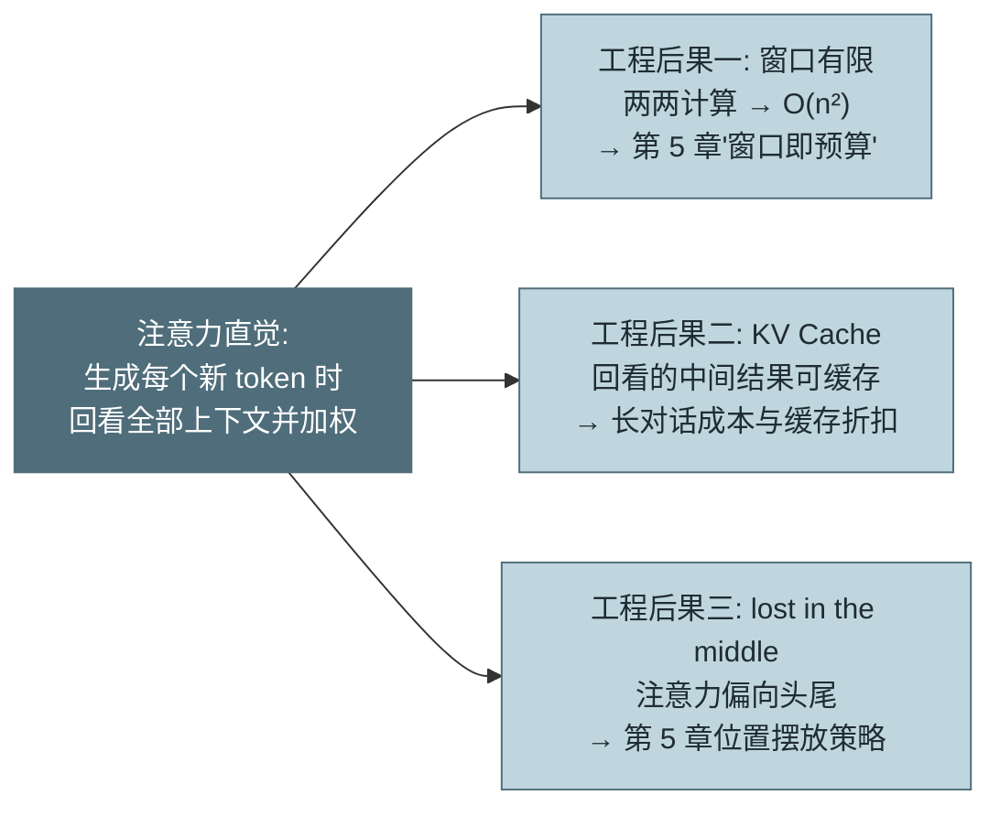
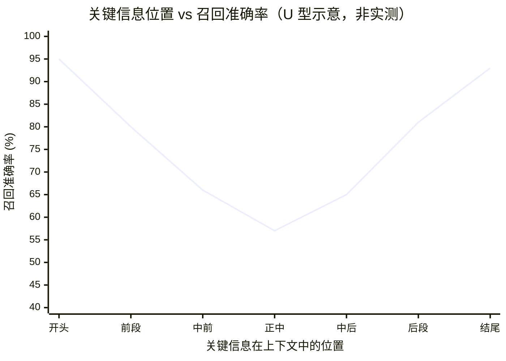

# 附录 A：LLM 基础 Wiki

> 词条式组织，为无 LLM 背景的转型工程师兜底。每个词条只回答一个问题：**这对 Agent 使用者意味着什么**——不展开训练细节与数学推导。正文遇到相关概念时以"参见附录 A.x"引用；每组词条末尾列出正文的引用章节。

---

## A.1 模型机制

### Transformer 直觉理解：注意力在做什么

**一段直觉。** **Transformer** 生成文本的方式是"每次预测下一个 token"，而预测的依据来自**注意力机制（Attention）**：生成每个新 token 时，模型会回看上下文中的**所有** token，为每个位置计算一个"相关度权重"，加权汇总后形成"此刻该说什么"的判断。可以把它想象成一个开会记录员：写下一句话之前，他把整个会议室里每个人说过的每句话都扫一遍，按相关程度分配注意力，再落笔。这个"全员扫一遍"就是自注意力——它没有天然的顺序偏好，也没有天然的遗忘机制，一切都靠权重分配。

**三个工程后果**，全部从这段直觉推出：

**后果一：窗口有限。** "每个新 token 回看所有旧 token"意味着计算量随上下文长度平方级增长（n 个 token 两两之间都要算相关度）。窗口上限不是产品经理定的配额，是计算与显存的物理约束——这就是第 5 章"窗口即预算"的物理根源，也是上下文不能无限堆的原因。

**后果二：KV Cache（见下一词条）。** 回看旧 token 时用到的中间结果（Key/Value 向量）可以缓存复用——这是多轮对话"越来越贵"与 Prompt Caching 能省钱的共同机制基础。

**后果三：lost in the middle。** 注意力权重是学出来的分布，训练数据的统计规律使模型对上下文**头部与尾部**的信息分配更多注意力，中部信息的利用率显著下降（实测细节见 A.5）——第 5 章"位置就是权重"的摆放策略由此而来。

*图 A-1：注意力直觉与三个工程后果的推导关系——这张图回答"为什么一个机制学直觉能解释 Agent 工程里的三条铁律"。 Transformer/注意力的论文原图见附录 F.2。*

**外部资料指引**：想看图解直觉，搜 "The Illustrated Transformer"（Jay Alammar）；想动手拆解，看 Karpathy 的 "Let's build GPT" 视频；论文原文 "Attention Is All You Need" 留给确有兴趣者——对 Agent 使用者，上面三个后果就是全部必需品。

### KV Cache：为什么长对话越来越贵

生成第 1000 个 token 时要回看前 999 个——如果每次都重算它们的中间表示，成本无法承受。**KV Cache** 把每个已处理 token 的 Key/Value 向量缓存在显存里，新 token 只需与缓存做一次交互。对使用者的三层含义：**其一**，显存占用随上下文线性增长——供应商的长窗口定价、并发限制背后是真金白银的显存；**其二**，多轮对话每轮全量重发历史（API 无状态，第 2 章），服务端每次都要重建这份缓存——**Prompt Caching** 的本质就是把"前缀部分的 KV Cache 存下来跨请求复用"，所以它要求前缀逐字节一致（改一个字节，其后所有位置的计算都变了）、所以缓存读远便宜于重算（第 16 章的 0.1× 折扣有其机制依据）；**其三**，首 token 延迟主要花在"把你的输入全部过一遍模型"（prefill 阶段，建缓存），输入越长首字越慢——第 16 章延迟构成的第一项由此而来。

### 上下文窗口的物理含义与限制来源

**上下文窗口（Context Window）**是模型单次调用能处理的 token 总量上限（输入+输出）。限制来源有三：注意力的平方计算量、KV Cache 的线性显存、以及**训练时见过的长度**——模型对远超训练长度的位置外推能力有限，这解释了一个重要现象：**标称窗口 ≠ 有效窗口**。窗口 1M 的模型不代表 1M 内的信息被均匀利用（A.5 的衰减词条）。对使用者的纪律：把窗口当成"昂贵且利用率不均的工作内存"，而不是硬盘——超长内容外置（文件/数据库），窗口里只放当前需要的（第 5 章的全部方法论，机制根源在此）。

**本组正文引用**：第 1 章（LLM 能力边界）、第 2 章（历史全量重发）、第 5 章（窗口即预算、位置摆放）、第 16 章（缓存价差、延迟构成）。

---

## A.2 推理参数

### temperature / top_p / top_k

模型输出的每一步是从概率分布中**采样**。**temperature（温度）**缩放分布的尖锐度：低温（→0）让高概率 token 更占优（趋向确定），高温拉平分布（更发散）。**top_p（核采样）**只在累计概率达 p 的最小 token 集合里采样；**top_k** 只在概率前 k 的 token 里采样——两者都是"截断长尾"的手段。对 Agent 使用者的要点：这些参数控制的是**多样性-稳定性权衡**，而非"质量旋钮"——调高温度不会让模型更聪明，只会让它更敢赌。注意：新一代推理模型（如自适应思考形态的模型；本书正文占位示例统一用 claude-opus-5 / claude-haiku-4-5）已在 API 层**移除或固定**了这些采样参数——模型自行管理采样策略，使用者的控制面转移到推理档位（effort）上。这是一个趋势信号：**采样参数正在从"用户旋钮"变成"模型内部事务"**。

### max_tokens、停止序列

**max_tokens** 是输出长度的硬上限——超限即截断（`stop_reason: max_tokens`），截断不是完成：第 3 章要求把它作为独立分支处理（续写或报错），当作正常结束是隐蔽 bug 源。设置原则：给足余量而非贴着预期（截断重试的成本高于多留的配额），流式场景可放宽（第 3 章）。**停止序列（Stop Sequences）** 让模型输出到指定字符串即停——在原生工具调用时代用途已收窄，主要残留场景是特殊格式约定与成本控制（提前止损冗长输出）。

### 采样确定性与 Agent 场景的参数选择

工程师的直觉是"生产系统要确定性，把温度设 0"——对 Agent 这个直觉**只对一半**。事实一：temperature=0 也不保证逐字节可复现（浮点并行计算的非确定性、批处理动态性），确定性只能靠外部机制（评测的 k 采样统计口径，第 15 章）。事实二：Agent 的多步任务里，适度多样性是**自愈能力的原料**——第一次失败后换个思路重试，靠的正是采样的非确定性；全链路压到近零温度的 Agent 在失败后倾向于原样重蹈覆辙。实践默认：跟随模型供应商的默认参数（它们针对工具调用调过），只在评测数据支持时偏离；确定性需求走结构化输出（A.6）与外部校验，不走温度。

**本组正文引用**：第 3 章（max_tokens 分支、流式）、第 15 章（非确定性与 k 采样）、第 16 章（推理档位与成本）。

---

## A.3 Token 体系

### Tokenization 原理与常见分词器

模型不读字符，读 **token**——由**分词器（Tokenizer）** 把文本切成的子词单元。主流方案（BPE 谱系）按训练语料的统计频率合并字符：高频词整词成 token（"the"=1 个），低频词拆成碎片（"Tokenization"≈3 个）。对使用者的要点有三：**其一**，token 边界反直觉——数字、代码符号、非英语文本的切分与人的直觉不符，这解释了模型数不清字符数、对精确行号计算不可靠（第 23 章"行号是簿记"的底层原因之一）；**其二**，不同模型分词器不同，同一段文本的 token 数不可跨模型直接比较（第 20 章选型时成本对比要用各自分词器实测）；**其三**，估算用经验系数即可（英文约 4 字符/token，中英混合约 2.5，第 5 章的水位估算），精确计数用供应商的计数接口。

### 计费逻辑：输入/输出/缓存 token 的价格差异

计费四类，价差有机制依据：**输出 token 最贵**（约为输入 5 倍）——每个输出 token 都要完整跑一遍模型的逐 token 生成；**输入 token** 按 prefill 批量处理，单位成本低；**缓存读**（约输入的 0.1×）只做缓存命中查找，跳过重算（A.1 的 KV Cache）；**缓存写**（约 1.25×）在正常处理外加存储开销。对 Agent 的含义已在正文充分展开：input 因历史重发占总量 90%+（第 2 章）、命中率是第一成本杠杆（第 16 章）、台账必须分类计价（第 16 章坑）。此处补一个机制提醒：**思考/推理 token 按输出计价**——推理型模型"想"的每个 token 都是输出价，这是第 4 章推理预算权衡的计费基础。

### 中文 token 效率问题

同样的信息量，中文文本的 token 数通常高于英文——多数主流分词器的训练语料以英文为主，中文字符的合并颗粒度更粗（常见 1–2 字符/token，对比英文 4）。对使用者的三个实际影响：**成本**——中文为主的 Agent 系统，同等信息密度的上下文费用可比英文场景高数十个百分点；**窗口**——同样窗口装下的中文信息量更少，压缩水位（第 5 章）要按中文系数校准；**选型**——模型对中文的分词效率是第 20 章评分卡"成本"维度的隐藏变量，评测集必须用真实中文任务实测而非按英文基准换算。趋势注记：新一代模型的分词器普遍改善了中文效率，但"跨模型不可直接比"的纪律不变。

**本组正文引用**：第 2 章（历史重发的费用结构）、第 5 章（字符估算系数）、第 16 章（分类计价与成本杠杆）、第 20 章（选型成本口径）、第 23 章（精确计数的不可靠）。

---

## A.4 训练谱系

### 预训练 / SFT / RLHF / RL 的分工

四个阶段各自赋予模型什么：**预训练（Pre-training）**——海量文本的下一词预测，赋予语言能力与世界知识，也决定了知识截止日期（第 1 章"时效缺失"的来源）；**SFT（监督微调）**——用示范对话教会"如何当一个助手"（指令遵循的直接来源）；**RLHF（人类反馈强化学习）**——用人类偏好训练奖励信号，塑造"什么样的回答更受欢迎"；**RL（可验证奖励的强化学习）**——用测试通过、答案正确等客观信号训练多步推理与工具使用，是推理型模型与 Agentic 能力跃升的主要来源（第 26 章 GRPO 属于此谱系；企业侧后训练的方法选型见第 26 章）。

### 对使用者的意义：为什么模型会"讨好"

RLHF 优化的是"人类觉得好"，而人类标注者系统性偏好自信、详尽、顺从的回答——副作用就是**谄媚（Sycophancy）**：用户质疑时轻易改口、倾向于同意用户的前提、报喜不报忧。这对 Agent 工程的直接含义散布全书：模型自评不可信（第 3 章终止判定、第 4 章反思、第 15 章 Judge 校准的共同根源）、"要求批评就必有批评"（第 4 章坑 4）、用户诱导可以压过系统约束（第 6 章红队场景）。工程对策也因此一致：**关键判断外置给确定性机制，模型的"同意"永远只是弱信号**。

### 模型版本迭代对 Agent 行为的影响

同名模型的版本升级不是无感的：指令遵循的松紧、工具调用的积极性、输出风格、拒绝边界都会变——为旧版本调优的提示词在新版本上可能过度约束或失效（提示词对模型过拟合，第 20 章退出成本的一部分）。纪律三条：模型版本 pin 死、升级走第 15 章回归 + 第 20 章评分卡重评、变更标记打上指标时间线（第 14 章）。一个值得记住的现象：**模型升级的收益分配不均**——Harness 好的系统立刻吃到增益，Harness 差的反而被行为变化打崩（第 12 章的推论），"升级即免费提升"的假设不成立。

**本组正文引用**：第 1 章（能力边界的来源）、第 3/4/15 章（自评不可信的根源）、第 12 章（升级红利分配）、第 20 章（版本 pin 与重评）、第 26 章（后训练方法谱系）。

---

## A.5 能力与缺陷

### 幻觉成因与缓解思路

**幻觉（Hallucination）**不是 bug 是机制本性：模型被训练成"永远给出流畅的下一个 token"，在知识缺失处它输出的是**统计上合理的编造**——形式正确性与事实正确性在训练目标里从未被区分对待。成因决定缓解思路的分层：**检索增强**把"回忆"变成"查阅"（第 11 章）；**工具验证**把"声称"变成"核实"（第 3 章 Verifier、第 9 章只读工具重验）；**引用溯源**让答案可回查（第 11 章）；**提示层**只能缓解不能消除（"不知道就说不知道"降低但不归零编造率）。Agent 工程的立场：**不追求消除幻觉，追求让幻觉在到达副作用之前被廉价拦截**——这就是全书验证机制的存在理由。

### 长上下文衰减（lost in the middle）

Liu 等人的实验 [C-08]：把关键信息放在长上下文的不同位置做问答，正确率呈 **U 型曲线**——头尾高、中部显著下跌（20 文档场景中部跌幅达 20 个百分点量级）。

*图 A-2：lost-in-the-middle 的 U 型曲线（示意，非实测数据）——这张图回答"为什么关键信息要放在上下文两端"。准确率随位置呈两端高、中部凹的 U 形。曲线形状因模型而异，务必用"关键事实插入不同位置"的探针任务实测你所用的模型（本图重绘自 [C-08] 要义，非复制原图；若渲染器不支持 xychart，其数据点即为 U 形示意）。*

成因回到 A.1：注意力分布偏向头尾是训练数据统计规律的产物（重要信息在自然文本中确实多在开头结尾）。工程含义已在第 5 章 2.4 节完整展开（关键信息占两端、中部是压缩靶区、变笨先查位置），此处补两点：**长窗口模型缓解但未消除**——百万级窗口的均匀利用仍未实现，"窗口够大所以不用管理"的推论不成立；**评测自己的模型**——衰减曲线因模型而异，用"关键事实插入不同位置"的探针任务可以半天测出你所用模型的实际曲线，比引用论文数字可靠。

### 指令遵循的边界、越狱与注入的模型侧根源

模型在语言层面**无法区分"指令"与"数据"**——两者都是 token 序列，"系统提示优先于用户输入、用户输入优先于工具结果"的优先级只是训练出来的**倾向**而非架构保证。这是提示注入（第 5 章）与越狱在模型侧的共同根源：攻击者的本质动作是构造让"倾向"失效的输入（角色扮演、编码绕过、长上下文稀释系统指令）。趋势与边界都要说：新一代模型的指令层级训练持续加强（系统提示的抗注入性显著提升），但**概率倾向的对抗鲁棒性没有 100%**——这就是全书反复出现的那条工程铁律的机制依据：提示层防御是降低成功率的缓解，确定性闸门（Hook/策略/沙箱）才是保证（第 6、9、13 章）。

**本组正文引用**：第 1 章（教训二的根源）、第 5 章（注入防御与位置策略）、第 6/13 章（概率 vs 确定的机制依据）、第 11 章（检索缓解幻觉）、第 15 章（长上下文评测）。

---

## A.6 结构化输出

### JSON Mode、Constrained Decoding

让模型输出机器可解析的结构，三代手段可靠性递增：**提示词约定**（"请输出 JSON"）——纯概率，格式失败率 3–8%（第 7 章）；**JSON Mode**——推理引擎保证输出是合法 JSON，但不保证符合你的 Schema（字段可能缺失、类型可能错）；**约束解码（Constrained Decoding）**——把 JSON Schema 编译成状态机，采样每个 token 时**屏蔽所有会导致非法输出的候选**：当前位置按 Schema 只能是引号或数字，其他 token 概率直接置零。格式合法性由此从"模型大概率遵守"变成"解码器不可能违反"。理解这个机制的关键价值在于知道它的**边界**：约束的是语法结构与枚举值，不是语义——模型仍可能选错工具、填错业务值（第 7 章的完整论证）。因此工程姿势是：**能下沉到 Schema 的约束尽量下沉**（enum 化、required 化、格式 pattern 化），把语义错误转化为机制可拦截的格式错误。

### Schema 约束与 Function Calling 的关系

**Function Calling / Tool Use** 就是约束解码的最大规模应用：工具的 `input_schema` 即约束状态机的蓝图，模型输出的 `tool_use.input` 保证 Schema 合法（实现注记：各家 API 的默认承诺强度有别——部分供应商需显式开启 strict 模式才保证严格校验，集成时按文档确认，应用层校验兜底不省）。两者的关系可以一句话说清：**Function Calling = 约束解码（格式保证）+ 工具调用微调（选择与填参能力）**——前者是推理引擎的机制，后者是训练的能力，缺一不可（只有约束没有微调的模型会输出合法但荒谬的调用）。对使用者的推论：结构化输出不限于工具——任何需要机器可靠解析的场景（第 4 章的计划提交、第 10 章的记忆提取、第 15 章的评分输出）都应走"定义 Schema + 强制工具调用"的路径，而非解析自由文本；本书代码里反复出现的 `tool_choice` 强制模式正是这个推论的落地。

**本组正文引用**：第 2 章（文本解析 vs 原生协议）、第 4 章（结构化计划提交）、第 7 章（约束解码与 Schema 设计）、第 10 章（记忆提取）、第 15 章（Judge 输出解析）。

---

## A.7 模型选型速查

### 能力 / 成本 / 延迟三角

三角权衡的机制基础：能力与模型规模正相关，规模同时推高单价（成本）与单 token 生成时间（延迟）——所以"又强又快又便宜"在同一时刻不存在，但**跨时间存在**：模型代际更替约 6–12 个月，每代都在把上一代旗舰的能力压进更小更便宜的型号。两条实用推论：**其一**，选型结论自带半衰期（第 20 章的半年重评机制由此而来）；**其二**，三角是任务级而非系统级的权衡——同一系统内按步骤路由（第 16 章：规划用强模型、机械步骤用快模型）比全局单选更优。速查判断次序：先用**能力**筛掉不达标的（评测集说话，第 20 章），再用 **cost per successful task** 排序（第 16 章口径——便宜但成功率低的模型在此现形），**延迟**作为场景约束单独把关（交互式 P95 红线 vs 批处理不敏感）。

### 开源 vs 闭源、私有化部署可行性速查

速查表（详细论证见第 20 章三档光谱，此处为决策提要）：

| 问题 | 答案指向 |
|---|---|
| 数据有出域硬约束？ | 是 → VPC 网关档起步；物理隔离要求 → 私有化开源 |
| 任务以 Agentic 多步为主？ | 开源与旗舰闭源差距在此最大（工具调用可靠性/长程稳定性），评测必须用 Agentic 任务集 |
| 负载稳定且利用率有 40%+ 把握？ | 否 → 自建 GPU 单位成本大概率反超 API（第 20 章 2.8× 案例） |
| 需要最新能力（缓存/批量/多模态）？ | 闭源 API 领先数月到一代；开源生态跟进有时滞 |
| 微调自主权是硬需求？ | 开源权重自由度最高；闭源托管微调受条款与绑定约束（第 26 章） |

一句话收束：**开源 vs 闭源不是理念站队，是"合规约束 × 负载形态 × 能力要求"三个变量的求解结果**——变量变了解就变，所以速查表比立场有用。

**本组正文引用**：第 16 章（路由与成本口径）、第 20 章（部署光谱与评分卡）、第 26 章（微调与权重自主权）。

---

## A.8 向量表示（Embeddings）

### 什么是 embedding：把语义变成坐标

**嵌入（Embedding）** 是把一段文本（或图像、代码）映射成一个高维向量（几百到几千维的浮点数组），使得**语义相近的内容在向量空间里距离相近**。它由专门的**嵌入模型**产出——与生成模型（GPT/Claude）是两类模型，别混用：生成模型"写文本"，嵌入模型"把文本变坐标"。相似度通常用**余弦相似度**（看两个向量的夹角，不看长度）度量。一句话直觉：embedding 把"这两段话意思像不像"这个模糊问题，变成了"这两个点离得近不近"的可计算问题——这正是**语义检索（Dense Retrieval，稠密检索）** 的全部基础（第 11 章 2.3 节）。

### 嵌入模型的谱系：从词向量到多模态

三代演进，每代解决上一代的一个结构性缺陷：

**第一代：静态词嵌入（word2vec / GloVe，2013–2014）。** 一个词固定一个向量——"苹果"在"苹果手机"和"苹果好吃"里是同一个点，歧义无解；句向量只能用词向量平均，语序与否定全部丢失（"没问题"和"问题没"一样）。它证明了"语义可以变坐标"，但只到词为止。

**第二代：上下文化嵌入（BERT 谱系，2018 起）。** 同一个词的向量随语境变化，歧义问题解决；但原生 BERT 的句向量质量差，**Sentence-BERT 类双塔结构 + 对比学习微调**才让"整句变一个可检索的向量"实用化——这是 RAG 稠密检索真正的起点。

**第三代：LLM 底座的现代嵌入（2023 起）。** 以大模型为底座训练的嵌入模型成为主流，特征四件：**指令化**（同一模型按任务指令产出检索/聚类/分类不同用途的向量）、**多语言**（跨语言检索同空间）、**长输入**（数千至上万 token，直接决定分块上限——见第 11 章 2.2 的分块参数）、**可变维度**（Matryoshka 表示：同一向量截前 N 维仍可用，存储与精度按需换挡）。代表按谱系记：开源系 BGE（智源）/ E5 / GTE，商用 API 系 OpenAI / Cohere / Voyage——名单随代际更替，选型用 MTEB 类榜单粗筛 + 自家语料实测定夺（榜单过拟合的警告与第 15 章同款）。

**旁系一：稀疏嵌入与 BM25 的三角关系。** BM25 **不是嵌入**——它是词频统计打分函数，无需训练、天然可解释；**学习型稀疏嵌入**（SPLADE 类）是模型产出的**词表维度稀疏向量**（每维对应一个词的权重，含模型补出的同义扩展词），介于两者之间：像 BM25 一样走倒排索引、可解释，又像稠密嵌入一样懂同义——混合检索里 BM25 与稠密之外的第三条路（第 11 章 2.3）。

**旁系二：多模态嵌入（CLIP 谱系，2021 起）。** 图像与文本映射进**同一个**向量空间——"红色报错弹窗"的文字能直接检索到截图。这是 Multimodal RAG 视觉向量路线的机制基础（第 11 章 2.5）；同理还有代码专用嵌入（自然语言查询检索代码片段）。边界提醒：跨模态对齐的精度低于同模态——文搜图可用，别指望它替代 OCR 级的精确匹配。

### 对 Agent 使用者的四个工程后果

**其一，语义泛化是能力也是噪声源。** embedding 擅长"上传失败"匹配到"对象存储写入异常"这种同义泛化（稠密检索的价值）；但对**精确 token**（错误码 `ERR-4032`、工单号、函数名）失灵——它们在向量空间里与相邻编号几乎等距，泛化在这里变成了误召回。这就是第 11 章"必须混合检索（稠密 + BM25）"和"Coding 场景 grep 反超向量"两个结论的共同机制根源。

**其二，向量出域 ≈ 数据出域。** embedding 不是不可逆的哈希——通过反演攻击可从向量部分恢复原文语义。所以把知识库向量存到域外向量服务，等于把降维后的数据送出了边界，合规审查必须把它算作一条数据出域通道（第 20 章 2.3 节出域三类通道之一）。

**其三，换模型必须重建全库。** 不同嵌入模型（甚至同模型不同版本）产出的向量空间不可通约——query 用新模型编码、库里是旧模型的向量，检索结果就是乱的。升级嵌入模型 = 全量重新入库，这是入库管线的重大变更（第 11 章入库五步的"向量化"环节），不是一次热更新。

**其四，维度与量级决定选型和成本。** 维度越高表达力越强但存储与检索越贵；嵌入调用按 token 计费（比生成便宜但不免费，海量文档入库是一笔可观的一次性成本，批量化可省约一半，第 16 章）。向量库选型（FAISS/Chroma/Qdrant/Milvus）的量级甜区见第 11 章 2.3 节的选型矩阵。

**边界提醒**：embedding 只解决"语义相似"，不解决"事实正确"——它能召回相关文档，不能判断文档说得对不对（那是检索后由生成模型 + 验证机制的事，第 11 章、A.5 幻觉词条）。也不要用 embedding 相似度当"答案质量分"——相似 ≠ 正确（第 11 章坑 5）。

**本组正文引用**：第 10 章（记忆库的语义召回升级路径）、第 11 章（主体：稠密/混合检索、入库管线、向量库选型）、第 16 章（嵌入调用成本）、第 20 章（向量作为数据出域通道）。

---

> **使用提示**：本附录与附录 B 的分工——A 回答"模型为什么是这样"（机制兜底），B 回答"工程方法叫什么、在哪一章"（方法论导航）。各附录分工：A 机制、B 方法论、C 来源、D 产品、E 易混概念辨析、F 图版索引、G OTel 详解、H DeepEval 实战、I 评测观测平台选型。都是工具书，不必通读，正文引用到时查阅即可。
