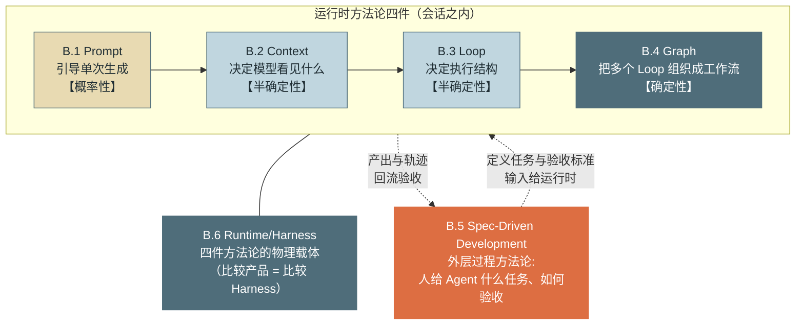

# 附录 B：Agent Engineering 方法论速查

> 定位：**方法论速查 + 正文导航**。每个词条严格保持三段结构——**定义（一句话）+ 核心原则（列表，每条附一行理由）+ 正文映射（去哪章看什么）**，不承载正文内容。六个词条覆盖了本书全部工程方法的命名体系：当你在设计评审里需要说"这是一个 Loop Engineering 问题而不是 Prompt 问题"时，本附录就是那本共同词典。

---

## B.1 Prompt Engineering（提示工程）

**定义**：通过自然语言指令引导模型行为的**概率性**手段。

**核心原则**：
- **分层（身份/约束/工作流）**——三层的稳定性与变更频率不同，分层同时服务可维护性与缓存前缀对齐（第 6 章 2.1）。
- **明确性优于长度**——常驻指令每一行都在付费并稀释注意力，模糊的长篇不如精确的短句（第 6 章坑 3 的教训）。
- **示例驱动**——一个好示例的行为约束力常胜过一段描述，格式类要求尤其如此。
- **正负例配合**——"何时不用/不做"与"何时用"同等重要，缺负例的指令在边界场景自由发挥（第 7 章工具描述、第 11 章检索工具的同款原则）。
- **记住它的天花板**——提示词是概率性引导，验收标准为零漏过的需求（安全/审计）不属于它（第 6 章决策树的第一问）。

**正文映射**：第 6 章（主体：分层设计与三控制面选型）、第 4 章（规划与反思的提示形态）、第 22 章（提示词变更的组织纪律）、附录 A.5（指令遵循的模型侧边界）。

---

## B.2 Context Engineering（上下文工程）

**定义**：管理进入模型窗口的信息的**构成、优先级与生命周期**。

**核心原则**：
- **窗口是稀缺资源**——每个 token 背负计费/延迟/注意力三重成本，任何内容都要回答"值不值得占这个位置"（第 5 章的总纲）。
- **按需加载（渐进式披露）**——索引常驻、正文按需：Skill 清单、工具搜索、检索分页是同一思想的三次实例化（第 6/7/11 章）。
- **压缩有损需可控**——结构化摘要模板 + 损耗度量 + 失败回退，压缩是优化不是正确性依赖（第 5 章四步管线）。
- **位置即权重**——关键信息占两端、权威状态尾部重申，中部是压缩靶区（第 5 章 2.4，机制见附录 A.1/A.5）。
- **防注入**——上下文里的数据通道（工具结果/检索/文件）都是攻击面，标记来源 + 指令隔离 + 确定性闸门三层纵深（第 5 章 2.3）。

**正文映射**：第 5 章（主体：构成剖析/压缩/污染防御）、第 6 章（CLAUDE.md 与 Skills 的载体设计）、第 10 章（记忆的注入端）、第 18 章（交接包=跨 Agent 的上下文工程）、附录 A.1/A.3（窗口与 token 的机制基础）。

---

## B.3 Loop Engineering（循环工程）

**定义**：设计 Agent 的迭代执行结构——**何时继续、何时终止、何时升级**。

**核心原则**：
- **终止条件先于能力设计**——不做对就烧钱的唯一决策；三层设计：模型自报 → 外部校验 → 无条件预算熔断（第 3 章 2.2）。
- **预算熔断**——轮数/token/费用/墙钟四种预算，检查前置于每轮调用之前，熔断后走收尾轮而非硬杀（第 3 章）。
- **内外循环分离**——确定性故障（重试/退避/限流）挡在概率层之外，模型不应看到限流（第 3 章 2.3、第 7 章重试器）。
- **失败可恢复**——完整轮次边界不变式 + Checkpoint，中断与恢复是设计内事件而非事故（第 3 章 2.4、第 12 章）。
- **一切迭代结构都要有界**——max_turns、重试预算、重规划上限、图回边上限、Reviewer 打回上限是同一条铁律的五次落地（第 3/4/17/18 章）。

**正文映射**：第 3 章（主体：状态机/终止/内外循环/流式中断）、第 4 章（规划与反思对循环的扩展）、第 15 章（Eval 对循环行为的度量）、第 16 章（失败经济学与降级阶梯）。

---

## B.4 Graph Engineering（图工程）

**定义**：将多步工作流显式建模为**节点与边的执行图**，以获得确定性与可恢复性。

**核心原则**：
- **显式状态**——类型化共享状态、按 key 分区写权限（"读可以宽，写必须窄"），并行分支声明 reducer（第 18 章 2.2/第 4 节）。
- **条件路由**——路由函数可为代码或 LLM 判定，但出口必须枚举，超纲即图定义错误（第 18 章 2.4）。
- **回边有界**——图里的无限循环是拓扑级 AutoGPT，每条回边带 max_visits，超限显式降级绝不静默续转（第 18 章）。
- **断点可恢复**——节点边界即 checkpoint 边界即一致性边界，与单 Agent 的轮次边界一脉相承（第 18 章 2.6）。
- **人工介入节点（interrupt）**——落盘先于返回、resume 幂等、人工输入走 state 通道可审计、超时显式出口（第 18 章）。
- **簿记归运行时，智能归模型**——派发表/回执表/到齐判定由图维护，模型只做拆解与裁决（第 18 章的一句话总结）。

**正文映射**：第 18 章（主体：图执行器全部机制）、第 17 章（拓扑=图的组织形态，先选拓扑后写图）、第 19 章（跨节点 trace 与归因）、第 12 章（事件与状态持久化的底座）。

---

## B.5 Spec-Driven Development（规格驱动开发）

**定义**：以结构化规格文档为**单一事实源**，驱动人与 Agent 协作开发的**过程方法论**。

**类别注记**：B.1–B.4 是**运行时工程**（Agent 如何执行任务），SDD 是**开发过程方法论**（人与 Agent 如何协作）——它作用在会话之外的组织层，与前四者不在同一个执行栈上。

**核心原则**：
- **先 Spec 后代码**——在意图层拦截错误比在实现层便宜一个数量级，500 字提案优于 1400 行 diff（第 22 章）。
- **变更即提案（propose → apply → archive）**——非琐碎变更走三阶段流程，意图从会话的挥发性里被救出、可检索可审计（第 22 章 2.1）。
- **Spec 是给 Agent 的高质量上下文**——去歧义需求 + Scenario 验收标准，一份文档同时服务人（评审）与 Agent（执行）；写文档的投入产出比在 Agent 时代翻转（第 22 章的核心论断）。
- **可审计的决策记录**——主干 Spec 是系统"应然"的真相源，与代码"实然"可对照做漂移检测（第 22 章第 4 节）。
- **写 what 不写 how**——Spec 承载需求与验收，实现自由留给 Apply 阶段，越界写 how 的 Spec 秒过期（第 22 章坑 3）。

**正文映射**：第 22 章（主体：OpenSpec 工作流完整走一遍 + 真实变更包）、第 6 章（CLAUDE.md 与 Spec 的分工——环境说明书 vs 需求契约）、第 15 章（Scenario 与评测用例的同源关系）、B.2（Spec 作为上下文的交叉点）。

---

## B.6 Runtime / Harness Engineering（运行时 / 脚手架工程）

**定义**：模型之外的一切执行脚手架——**循环驱动、上下文组装、工具执行、状态管理、事件与拦截**的总和。

**核心原则**：
- **Harness 质量决定同一模型的表现上限**——同模型不同脚手架的成功率差距可达数十个百分点（第 12 章 45%/78% 实验；模型升级红利的分配也由它决定）。
- **事件驱动**——循环单点发射语义化事件，GUI/观测/审计/成本/训练数据五方消费，一次发射消灭多套埋点（第 12 章 2.5）。
- **状态可恢复**——Checkpoint（时间轴）+ worktree（空间）+ 完整边界不变式，中断、迁移、抢占都以此为前提（第 12/13 章）。
- **确定性拦截层（Hooks/PEP）**——站在模型意图与真实副作用之间的必经之路，安全与合规的验收标准由它而非提示词承担（第 6/13 章）。
- **六大件可替换**——循环/上下文/工具/状态/事件/拦截逐件解耦，这既是自研的模块化纪律，也是评估任何框架与托管运行时的检查单（第 12 章图 1、第 24 章）。

**正文映射**：第 12 章（主体：六大件/集成方式/生命周期/Checkpoint/事件模型）、第 3 章（循环驱动）、第 5–9 章（上下文与工具执行的各分件）、第 13 章（拦截层）、第 14 章（事件→观测）、第 20 章（托管 vs 自建的选型延伸）。

**与 B.1–B.4 的关系**：四个运行时方法论的**物理载体**——方法论回答"该怎么做"，Harness 是"做"发生的地方。

---

## 六者关系：一页纸导读

*图 B-1：六个方法论的层次关系——这张图回答"六个名词谁管谁、控制力如何递增"。运行时四件沿 Prompt→Context→Loop→Graph 的箭头控制力递增（概率性→确定性）；Harness 是四件共同的物理载体；SDD 站在会话之外的组织层，与运行时构成"定义任务 ↔ 回流验收"的闭环。*

**四件的递进逻辑（会话之内）。** 一次模型调用的行为由 **Prompt** 引导——但引导是概率性的，同一提示词下行为有分布。**Context** 管的是比指令更根本的东西：模型看见什么（历史、工具结果、注入内容的取舍与摆放）——看见的世界决定了行为的上界。单次调用组成多步任务靠 **Loop**：何时继续、何时终止、失败怎么办——循环结构是任务能否收敛的决定因素。多个循环再组织成协作流程靠 **Graph**：显式的节点、边与状态把协调从概率世界拉回确定世界。四件的排列不是难度序而是**控制力序**：越靠后，行为越是"声明出来的"而非"引导出来的"——这也解释了全书反复出现的迁移方向：**安全与合规需求沿着这条箭头向右走**（提示词约束 → 上下文隔离 → 循环熔断 → 图结构保证 + Hook 拦截），因为验收标准越硬，越需要确定性的落点。

**Harness 是载体不是第五种方法论。** B.1–B.4 回答"该怎么做"，**Harness** 是"做"发生的物理场所——提示词要有人组装、上下文要有人管理、循环要有人驱动、图要有人执行，这个"人"就是运行时。由此得到本书最实用的两条推论：其一，**比较 Agent 产品就是比较 Harness**——模型能力人人可买，六大件的工程质量才是差异所在（第 12 章的对照实验是这条推论的数字证据）；其二，**评估框架/托管运行时用六大件清单逐件检查可替换性**——缺件或不可替换的部分，就是未来的技术债清单。

**SDD 在另一个栈上。** 前五者都活在"任务已经给定"之后；**SDD** 管的是之前与之后——人如何把意图变成 Agent 可执行的规格（propose）、如何验收产出（Scenario 对照）、组织如何留下可审计的决策记录（archive）。它与运行时四件不构成递进关系，而是**包裹关系**：SDD 定义边界条件（做什么、算做对），运行时在边界内自治（怎么做）。图 B-1 的双向虚线就是这个闭环——Spec 作为高质量上下文流入运行时（这是 SDD 与 B.2 的交叉点），轨迹与产出流回验收（这是它与第 15 章评测的交叉点）。

**一个使用示例收束。** 设计评审里有人说"这个 Agent 老是查错表，加一句提示词吧"——用本附录的词典重新分诊：如果是模型不知道表结构，这是 **Context** 问题（注入 Schema 或语义层模板，第 21 章）；如果是查错后不自纠，这是 **Loop** 问题（错误回喂与 Verifier，第 3/7 章）；如果是绝不允许查某些表，这是 **Harness 拦截层**问题（行列权限 + PEP，第 13/21 章）；只有"倾向于先查 A 表再查 B 表"这类软偏好，才真正属于 **Prompt**。**先分诊再开方**——这就是方法论词典在日常工程里的用法，也是本书希望你带走的第一反射。

---

> **使用提示**：与附录 A 的分工——A 回答"模型为什么是这样"（机制兜底），B 回答"工程方法叫什么、原则是什么、在哪一章"（方法论导航）。遇到具体问题时的查阅顺序：先用 B 的词典分诊问题类别，再循正文映射进对应章节；机制疑问回 A、近亲概念分不清查 E。
