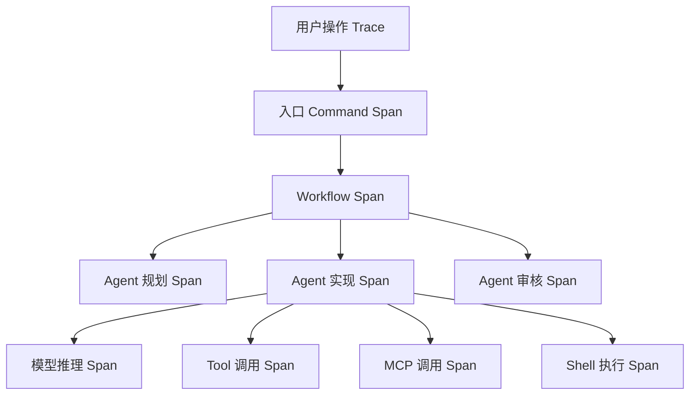
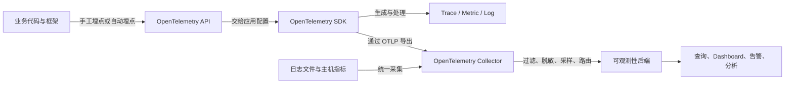
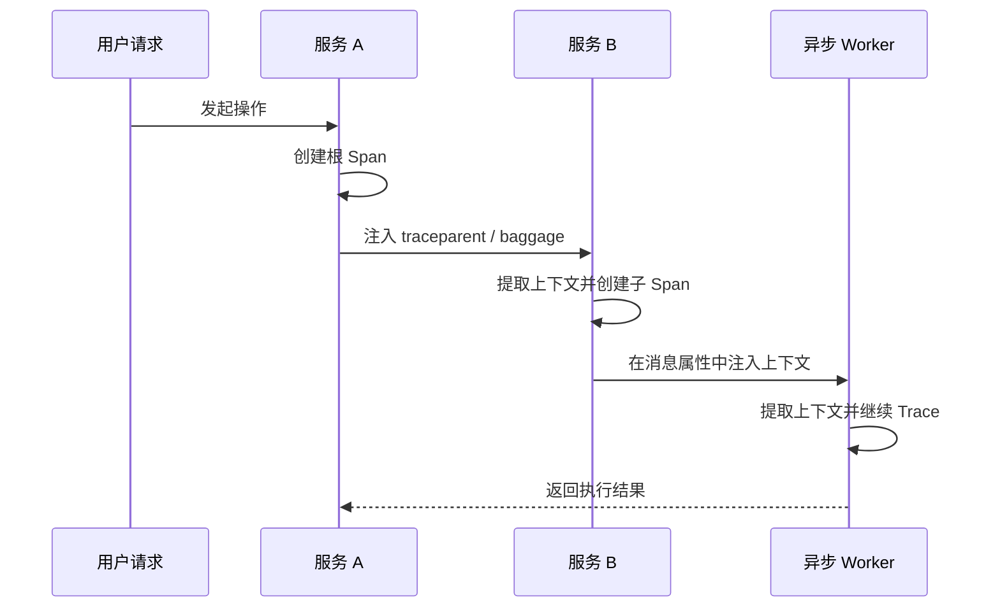
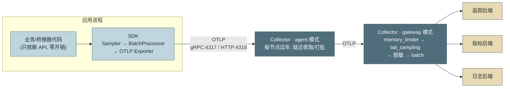
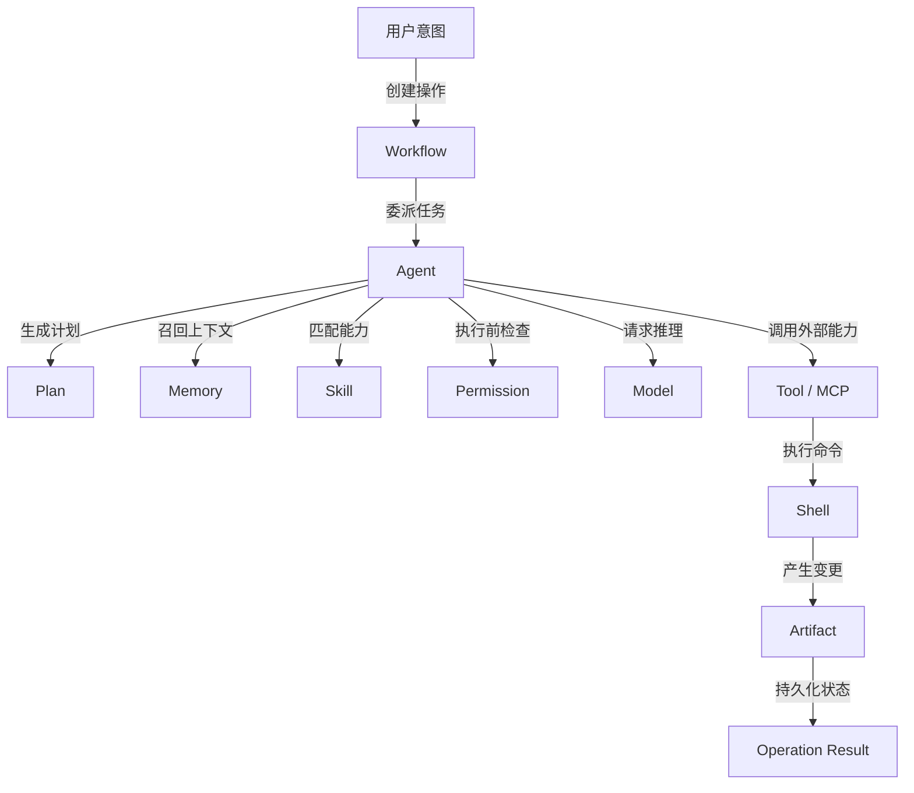

# 附录 G：OpenTelemetry 详解

> 定位：**OTel 本身的机制兜底**。正文第 14 章讲"Agent 怎么用 OTel"（四层 Span、GenAI 语义约定、采样策略、方案阵营），本附录讲"OTel 本身是什么"——数据模型、SDK 流水线、上下文传播、Collector 与语义约定，供没有 OTel 背景的读者补课、有背景的读者查细节。词条式组织，每节末尾标注正文的消费位置；规范与文档入口见 [C-28]。

---

## G.1 是什么：观测标准化的收敛点

OpenTelemetry 由 OpenTracing 与 OpenCensus 两个前辈项目于 2019 年合并而来，托管在 CNCF，是当前**供应商中立的遥测标准**事实上的唯一候选——API、SDK、传输协议、语义约定四件套全部开放，几乎所有观测后端（开源与商业）都支持接收它的数据。对本书读者，这个中立性就是第 14 章"语义兼容即反锁定"的制度基础：**埋点写一次，后端随便换**。

一句话记住它的野心与边界：OTel 标准化的是**遥测数据的产生、加工与搬运**，不做存储与查询——后端（追踪库、时序库、日志库）仍是你自己选的（第 14 章四阵营）。能力边界一表立清：

| 能力 | OpenTelemetry | 可观测性后端 |
|---|---|---|
| 代码埋点 | 支持 | 通常不负责 |
| 上下文传播 | 支持 | 消费关联结果 |
| 遥测数据模型 | 统一定义 | 解析和存储 |
| 协议传输 | OTLP | 接收 OTLP 或其他协议 |
| 过滤、脱敏、采样 | SDK / Collector | 部分后端也支持 |
| 长期存储 | 不负责 | 负责 |
| 查询、可视化、告警 | 不负责 | 负责 |

它取代的是"链路追踪 SDK + Prometheus Client + 日志框架 + 厂商 Agent 各接一套"的旧局面——那种拼盘的代价是字段命名不一致、上下文无法关联、业务代码被后端绑定、数据治理逻辑散落各处。

## G.2 数据模型：三支柱的字段级认识

先立一个总纲：三支柱的每条数据都是同一个三层结构——

| 层级 | 回答的问题 | 典型字段 | 纪律 |
|---|---|---|---|
| **Resource** | 谁产生了数据 | `service.name`、`service.version`、部署环境 | 只放**进程级稳定信息**——用户 id、会话 id 等动态字段不进 Resource，放各信号的 Attribute |
| **InstrumentationScope** | 哪个模块/埋点库产生 | 模块名、版本、Schema URL | 自动埋点库据此归属与升级 |
| **Record** | 具体发生了什么 | Span / Metric DataPoint / LogRecord | 动态属性的家 |

四类信号各司其职、不可互替——**混用职责是观测设计的头号误区**：

| 信号 | 主要回答 | 不适合承担 |
|---|---|---|
| **Trace** | 这一次请求经历了什么 | 长期聚合趋势（那是 Metric 的活） |
| **Metric** | 系统一段时间表现如何 | 单请求完整细节（高基数陷阱） |
| **Log** | 某个时间点发生了什么 | 严格的分布式因果（那是 Trace 的活） |
| **Baggage** | 哪些上下文要随行到下游 | 凭据、隐私、大文本（明文过每一跳） |

**Trace / Span。** 一条 Trace 是一棵 Span 树，由同一个 `trace_id`（16 字节）串联；每个 Span 有 `span_id`（8 字节）与 `parent_span_id`。Span 的字段面：**name**（低基数操作名——第 14 章 `agent.turn` 命名纪律的出处）、**kind**（`INTERNAL` / `SERVER` / `CLIENT` / `PRODUCER` / `CONSUMER`——队列场景用后两者，第 21 章 MQ 集成的 Span 该标 `CONSUMER`）、**attributes**（键值对，语义约定的挂载点）、**events**（Span 内的时间点标记，如"重试第 2 次"）、**links**（跨 Trace 的弱关联——批处理任务关联多个来源 Trace 时用它，不伪造父子关系）、**status**（`OK` / `ERROR` + 描述）。放在 Agent 场景里，一棵典型的 Span 树长这样：



*图 G-1：Agent 场景的典型 Span 树——这张图回答"一次用户操作在追踪里长什么形状"。入口、编排、各角色 Agent、模型与工具调用逐层成树，与第 14 章 2.1 的四层追踪树（task.run/agent.turn/tool.call）同构。*

**Metrics。** 六种仪表（instrument），按"同步/异步 × 语义"记：同步三种——`Counter`（只增，如 token 消耗）、`UpDownCounter`（可增减，如在途会话数）、`Histogram`（分布，如轮次/时延——第 14 章"长尾禁均值"的载体）；异步三种——`ObservableCounter` / `ObservableUpDownCounter` / `ObservableGauge`（回调式采样，适合"当前值"类读数如队列深度）。两个易错概念：**Gauge 记"此刻是多少"，Counter 记"累计发生了多少"**——选错仪表聚合就是错的；**时间性（temporality）** 分 delta（区间增量）与 cumulative（累计值），导出时由 SDK/后端协商，跨后端迁移时对不上号常出在这里。Metric 的最大风险是**高基数**：`conversation_id`、`trace_id`、`operation_id`、完整 URL、完整文件路径都不应作为 Metric 标签——标签值必须有界且可估算，例如 Runtime、Agent 角色、错误类型、权限决策、模型系列。

Span 内部还有三种表达方式，选用有讲究：**Attribute**（整个操作的稳定属性——模型名、最终状态、重试次数）、**Event**（生命周期中的离散时间点——`tool.retry`、`permission.denied`、`context.compacted`）、**Link**（非父子的因果关联——批处理扇入、多 Agent 结果合并、跨会话重试链）。一条选用纪律：**同步调用用父子 Span，异步扇入与"一个任务对应多个上游"用 Link**——用父子表达扇入会伪造出不存在的调用层级。

**Logs。** LogRecord = 时间戳 + severity + body + attributes + **trace 上下文字段**（`trace_id` / `span_id`）——最后一项是三支柱互通的关键：日志挂上 trace_id，排障就能从 Span 一键跳到当时的日志。既有日志框架（Python logging、Logback、Rust tracing 等）经 Bridge 或 Collector 接入即可，不必重写。第 14 章 GenAI 内容采集"以日志承载而非塞 Span 属性"的建议，机制上正是利用这条关联。

三支柱串起来就是理想的排障动线（**Exemplar** 是 Metric 侧的关键机制：数据点上附带样本 trace_id，让"告警跳 Trace"一步到位）：


*图 G-2：三支柱协同的排障动线——这张图回答"指标、追踪、日志在一次排障里如何接力"。Metric 发现问题、Trace 定位环节、Log 给出细节；Exemplar 与 trace_id 关联是两次跳转的机制保证（第 14 章 2.5 五步动线的信号层视角）。*

**正文消费位置**：第 12 章（事件是 Span 原料）、第 14 章 2.1/2.2/2.6（四层树、指标口径、span 命名）、第 19 章（links 与 graph_run 归因）。

## G.3 API / SDK 分离与信号流水线

先把全家桶的分工一表立清——OTel 把"埋点到后端"的旅程拆成标准化的环节：

| 组件 | 职责 |
|---|---|
| **API** | 供业务代码和第三方库创建 Span、Metric、Log |
| **SDK** | 负责采样、聚合、处理、批量和导出 |
| **Instrumentation** | 对 HTTP、数据库、RPC、框架、Agent Runtime 等埋点 |
| **Context** | 保存当前 Trace、Span、Baggage 等执行上下文 |
| **Propagator** | 在 HTTP Header、消息属性、RPC Metadata 中注入和提取上下文 |
| **Semantic Conventions** | 统一属性名、Span 名称、Metric 名称、单位和语义 |
| **OTLP** | OpenTelemetry 原生传输协议 |
| **Collector** | 接收、处理、路由和导出遥测数据 |
| **Backend** | 存储、查询、可视化和告警——不属于 OTel 本身 |



*图 G-3：组件协作总览——这张图回答"每个组件在数据旅程中排第几棒"。注意 Collector 还统一收编了 SDK 之外的数据源（日志文件、主机指标），这是它超越"转发器"的地方。*

**API 与 SDK 是刻意分离的两个包**：库代码只依赖 API（`get_tracer().start_span(...)`）——没有装 SDK 时这些调用是零开销空操作；**部署方**在进程入口装配 SDK，决定采样、加工与导出。这就是"框架与库可以放心内建埋点"的原因，也是第 14 章桥接器"循环零侵入"的同款思想。

SDK 内部是一条流水线（以 Trace 为例）：

- **TracerProvider**：全局装配点，携带 **Resource**（进程级属性：`service.name`、`service.version`、部署环境——第 14 章 `RESOURCE` 即此；所有信号共享，多租户的 tenant 归因也常挂这里）；
- **Sampler**：头部采样决策——`always_on` / `always_off` / `traceidratio`（按比例）/ `parentbased_*`（跟随父 Span 的决定，跨服务一致的关键）。注意：**尾部采样不在 SDK 里**，那是 Collector 的活（G.5，第 14 章坑 3）；
- **SpanProcessor**：`SimpleSpanProcessor`（逐条同步导出，只配调试）与 **`BatchSpanProcessor`**（缓冲批量异步导出，生产唯一正解——第 14 章代码用的就是它）；
- **Exporter**：OTLP（标准）、console（调试）或厂商专有——生产统一 OTLP，把"接谁家后端"的决策推迟到 Collector。

Metrics 与 Logs 各有对称的 Provider/Reader/Exporter 结构（第 14 章的 `MeterProvider` + `MetricReader` 即是）。

**OTLP（OpenTelemetry Protocol）**：统一的导出线协议，三支柱同协议——这是"换后端不改埋点"的技术保证。两种载体与默认端口：

| 协议 | 默认端口 | 常见路径 |
|---|---:|---|
| OTLP/gRPC | `4317` | gRPC Service |
| OTLP/HTTP | `4318` | `/v1/traces`、`/v1/metrics`、`/v1/logs` |

## G.4 上下文传播：traceparent、baggage 与传播器

跨进程的 Trace 连续性靠 **W3C Trace Context** 标准。`traceparent` 头的四段结构值得拆开记一次：

```
traceparent: 00-4bf92f3577b34da6a3ce929d0e0e4736-00f067aa0ba902b7-01
             │  │                                │                │
             版本 trace-id(32 hex)               parent-span-id    flags(01=已采样)
```

上下文传播决定多个服务、线程和异步任务能否形成一条完整 Trace，动线如下：



*图 G-4：跨进程与跨异步的上下文传播——这张图回答"traceparent 在哪些关口被注入与提取"。同步调用走请求头、异步任务走消息属性，每一跳都是 Inject/Extract 一对动作；漏掉任何一半，Trace 就在那一跳断开（下文断链五因）。*

配套三件：**tracestate**（各厂商的附加状态，透传即可）；**baggage**（业务键值对的随行机制——`tenant`、`session_id`、`graph_run` 跨服务传播的标准载体；纪律见第 14 章 2.6：明文出现在每一跳，敏感值绝不入）；**Propagator**（注入/提取的执行者——HTTP 头、消息属性、A2A `_meta` 都是它的载体，第 18 章跨协议透传的机制层）。

Agent 场景的特殊之处：传播不只跨 HTTP——跨队列（消息属性带 traceparent，第 21 章）、跨挂起（interrupt 恢复后接回原 trace，第 18 章）、跨组织（A2A 委派，第 18 章 2.7）。**每引入一种新载体，先回答"traceparent 从哪进、从哪出"**——这是多 Agent 排障不退化成"各查各的日志"的前提（第 14 章 2.6）。

**断链五大常见原因**（Trace 断成两截几乎总是其中之一）：异步任务未继承 Context（线程池/回调执行器丢上下文是重灾区）；消息生产者忘了 Inject；消费者忘了 Extract；Context attach 后未正确 detach（污染后续无关请求）；中间件（网关/代理）吞掉了 traceparent 头。排查口诀：**断在哪一跳，就查那一跳的注入与提取**。

## G.5 Collector：遥测的数据工程层

Collector 是独立进程的遥测管道，配置由三类组件拼成流水线：**receiver**（收，OTLP/各协议）→ **processor**（加工）→ **exporter**（发，可多路）。生产级流水线的标准编排顺序：


*图 G-5：Collector 流水线的标准编排——这张图回答"processor 该按什么顺序排"。memory_limiter 放最前自保，脱敏在采样前（被丢弃的数据也不该带敏感字段外泄风险），batch 永远垫底。*

五类组件的完整分工：

| Collector 组件 | 作用 |
|---|---|
| **Receiver** | 接收 OTLP、Prometheus、日志文件、Jaeger、Zipkin 等数据 |
| **Processor** | 批处理、限流、脱敏、过滤、转换、采样 |
| **Exporter** | 输出到 OTLP 后端、Prometheus、Kafka、文件等 |
| **Connector** | 连接两个 Pipeline——如 spanmetrics：从 Trace 实时衍生 RED 指标 |
| **Extension** | 健康检查、文件存储、认证、pprof 等运行能力 |

一份最小配置骨架（含持久化队列——后端短暂不可用时不丢数据）：

```yaml
extensions:
  health_check:
  file_storage:
    directory: ${env:OTEL_STORAGE_DIR}

receivers:
  otlp:
    protocols: { grpc: {}, http: {} }

processors:
  memory_limiter: { limit_mib: 1024 }        # 自保：内存超限丢数据不丢进程
  batch: {}                                   # 批量导出，背压友好
  attributes/scrub:                           # 脱敏：出边界前统一执行（第 14/20 章纪律）
    actions:
      - { key: user.email, action: delete }
  tail_sampling:                              # 尾部采样：会话结束后按状态决定保留（第 14 章坑 3）
    policies:
      - { name: errors, type: status_code, status_code: { status_codes: [ERROR] } }
      - { name: sample-ok, type: probabilistic, probabilistic: { sampling_percentage: 10 } }

exporters:
  otlp/backend:
    endpoint: backend:4317
    sending_queue:
      storage: file_storage    # 导出队列落盘，后端抖动不丢数据

service:
  extensions: [health_check, file_storage]
  pipelines:
    traces:
      receivers: [otlp]
      processors: [memory_limiter, attributes/scrub, tail_sampling, batch]
      exporters: [otlp/backend]
```

常用 processor 速查：`batch`（必备）、`memory_limiter`（必备，放最前）、`attributes` / `transform`（改删属性——脱敏与规范化）、`filter`（按条件丢弃）、`tail_sampling`（尾部采样，contrib 发行版）、`resource`（补资源属性）。另有两类配套组件：**connector**（流水线互接，如 spanmetrics 从 Trace 衍生指标）与 **extension**（健康检查、认证、`file_storage`——给导出队列加磁盘持久化，后端短暂不可用时不丢数据）。

**部署按规模四档**：

| 模式 | 数据路径 | 适用场景 |
|---|---|---|
| 应用直连 | SDK → Backend | 开发环境、小规模系统 |
| Agent / Sidecar | SDK → 本地 Collector → Backend | 桌面应用、单机服务、节点采集 |
| Gateway | 多应用 → 集中 Collector → Backend | 集中认证、统一治理、多租户 |
| Agent + Gateway | 本地 Collector → Gateway → Backend | 大型系统、跨区域、统一采样 |

大型系统的常态是**两级串联**——敏感数据处理集中在 gateway，审计一个点（第 14 章图 3 的位置）。

**采样两类**，决策时机不同、能力互补：

| 维度 | Head Sampling | Tail Sampling |
|---|---|---|
| 决策时间 | Trace 开始时 | 收集到部分或全部 Span 后 |
| 优点 | 开销低、易扩展 | 可保留错误、慢请求和关键 Trace |
| 缺点 | 不知道最终结果 | 有状态、占内存、路由复杂 |
| 典型规则 | 按 TraceId 保留 10% | 错误 100%、超时 100%、普通成功 5% |

尾部采样有个专属陷阱：**必须按 TraceId 一致性路由**——同一条 Trace 的 Span 分散到不同采样实例，采样决策就把 Trace 拆散了（负载均衡按请求轮询正是这么拆的）。

两条运维纪律：**Collector 自身要被监控**——队列长度、拒绝数、导出失败是数据丢失的前兆，不监控它，丢数据无声无息（第 14 章"观测自身的成本"的邻居）；**遥测通道不是事务系统**——网络重试会产生重复、队列溢出会丢失，**订单、权限审计、任务状态、恢复证据等事实数据必须走事务数据库/审计存储**（第 20 章"同源分管"的另一面：观测库可容忍丢失，审计库不可以）。一句话立界碑：**业务数据库记录"事实是什么"，OTel 解释"事实是如何产生的"**。

端到端信号流一图收束：



*图 G-6：从应用到后端的完整信号流——这张图回答"埋点数据一路经过谁、治理发生在哪"。API/SDK 分离让应用侧零负担，OTLP 统一线协议让后端可换，两级 Collector 把采样与脱敏收进集中治理点（官方架构原图见附录 F.4）。*

一句话定位：**Collector 之于遥测，如同第 21 章的查询网关之于数仓**——所有出入流量的必经点，治理逻辑集中于此而不散在应用里。

## G.6 GenAI 与多 Agent 系统的落地方式

Agent 系统的观测目标不是只记录一次模型 API 调用，而是解释**完整执行链**：



*图 G-7：Agent 平台的完整执行链——这张图回答"观测要覆盖哪些环节才算完整"。理想的可观测性是让用户意图、编排、Agent、Memory、Skill、权限、模型、工具、MCP、Shell、产物和最终结果处于同一条可关联的执行链中，而不是单点记录模型请求。*

以 VaneHub AI 一类桌面 Agent 平台为例（本书贯穿案例），可设计以下 Span：

| 层级 | 推荐 Span | 关键属性 |
|---|---|---|
| 用户操作 | `vanehub.user_operation` | 操作类型、入口、最终状态 |
| 入口 IPC | `tauri.command` | Command 名、错误类型 |
| 多 Agent 编排 | `invoke_workflow` | Workflow 名、参与 Agent 数 |
| 单 Agent | `invoke_agent` | Agent 名、角色、Runtime |
| 规划 | `plan` | 计划轮次、任务数 |
| Prompt 组装 | `vanehub.prompt.compose` | 模板名、上下文大小 |
| 上下文压缩 | `vanehub.context.compact` | 压缩前后 Token、丢弃策略 |
| Memory | `search_memory` | 查询类型、结果条数、耗时 |
| Skill | `vanehub.skill.resolve` | Skill 名、版本、匹配结果 |
| 权限 | `vanehub.permission.evaluate` | 能力、决策、策略来源 |
| 模型推理 | GenAI inference Span | Provider、模型、Token、完成原因 |
| Tool 调用 | `execute_tool` | 工具名、结果、重试次数 |
| MCP | MCP Client Span | Method、Server、协议版本 |
| Shell | `vanehub.shell.execute` | 命令类别、退出码、取消原因 |
| 持久化 | `vanehub.operation.persist` | Operation 状态、版本、错误 |

同步调用用父子 Span；多 Agent 并发合并、批量处理、跨会话恢复和重试链用 Span Link 表达因果（G.2 的选用纪律在此落地）。核心指标应覆盖的十个领域：

| 领域 | 指标 |
|---|---|
| Agent | 执行次数、活跃数、成功率、耗时 |
| Model | 调用次数、错误率、首 Token 延迟、总耗时 |
| Token | 输入、输出、缓存读取、缓存写入 |
| Tool / MCP | 调用次数、失败率、重试次数、耗时 |
| Permission | Allow、Deny、Ask 次数 |
| Memory | 查询耗时、空结果率、召回数量 |
| Skill | 匹配成功率、加载失败、执行耗时 |
| Loop | 轮次、重复调用、预算耗尽、循环终止原因 |
| Cancellation | 用户取消、超时取消、系统取消 |
| Collector | 队列长度、导出失败、拒绝和丢弃数据量 |

GenAI **内容采集按风险分级**（第 14 章 2.6 三级的完整口径）：

| 模式 | 采集内容 | 建议使用场景 |
|---|---|---|
| **Metadata Only** | 模型、Token、耗时、状态、工具名、大小、哈希 | 默认生产模式 |
| **Redacted Content** | 截断并脱敏后的 Prompt、工具参数、响应片段 | 受控调试 |
| **Full Content** | 完整输入、输出和工具结果 | 用户明确开启、本地环境、短期保留 |

不要默认记录 System Prompt、用户文件正文、API Key、环境变量、完整 Shell 输出、完整模型响应和个人记忆。GenAI、Agent、MCP 语义约定迭代较快，建议增加内部 **Telemetry Adapter**，由适配层映射到 OTel 属性，避免业务领域模型直接依赖快速变化的字段（G.7 的稳定性问题、G.8 误区表最后一条）。

桌面/本地 Agent 应用还应满足六条纪律：Collector 仅监听 `127.0.0.1`；Collector 崩溃不能拖垮主应用；Flush、关闭和子进程回收必须有明确超时；离线队列设置最大磁盘配额与最大保留时间；提供遥测上传开关、内容采集级别和一键清除入口；可观测性默认 Fail-open，**但权限审计和恢复证据必须进入业务存储**（G.5 界碑的桌面版）。

## G.7 语义约定与稳定性

**语义约定（Semantic Conventions）** 规定属性怎么命名：通用域（`service.*`、`http.*`、`db.*`）多已 **stable**；**GenAI 域（`gen_ai.*`）处于 Development 阶段**——属性名相对稳定但未定稿，版本以 [C-04] 为准（第 14 章的 pin 纪律）。两条使用规则：自定义属性先查约定再造词（第 14 章"规范属性与自定义属性分开登记"）；SDK 与约定的版本经 **Schema URL** 声明，升级 semconv 时后端可据此做属性名迁移。一个并行生态要认识：**OpenInference**（Arize Phoenix 谱系）——在 OTel 之上补 AI 语义（LLM/Retriever/Reranker/Tool/Agent 的 span 类型与属性），与官方 `gen_ai.*` 约定解决同一问题、尚未合流；两头都在演进，业务代码经内部适配层隔离（G.8 误区表最后一条），别直绑任何一家的字段。

## G.8 落地顺序与常见误区

**落地顺序七步，"先回答问题，再做埋点"**：① 定义观测问题（为什么失败/哪里最慢/token 花在哪/为何重试/有无循环——第 14 章场景引入的三问就是范本）；② 建 Trace 主链（用户操作 → 编排 → Agent → 模型 → 工具/MCP/Shell → 持久化）；③ 接 Collector（otlp receiver + memory_limiter + 脱敏 + batch + 持久化队列）；④ 补核心 Metric（第 14 章 ★ 最小集）；⑤ 关联结构化 Log（统一带 trace_id/span_id）；⑥ 定采样策略（错误超时全保、普通成功概率采样）；⑦ 监控 Collector 自身。

常见误区速查（每条都是真实事故形态）：

| 误区 | 后果 | 正确姿势 |
|---|---|---|
| 把 OTel 当后端 | 接完仍无处查询 | OTel 只管产生/搬运，另配存储查询后端（G.1） |
| 每个函数都建 Span | 噪声与成本失控 | 只覆盖业务阶段与外部调用（第 14 章 2.6 名字表即边界） |
| 高基数 id 进 Metric 标签 | 时序爆炸、账单失控 | 动态 id 放 Span/Log，标签只用有界枚举（第 14 章 §4） |
| 默认采集完整 Prompt | 隐私合规风险 | 默认 metadata_only，内容显式开启（第 14 章 2.6 三级） |
| 尾部采样随机路由 | Trace 被拆散 | 按 TraceId 一致性路由（G.5） |
| TraceId 当业务主键 | 采样/重发下无业务语义保证 | 业务用独立 OperationId 与幂等键（第 12 章） |
| 遥测代替审计存储 | 重复或丢失的"证据" | 事实数据入事务/审计存储（G.5 界碑） |
| 不监控 Collector 自身 | 数据丢失无声无息、难以发现 | 监控队列长度、拒绝数、导出失败（G.5 运维纪律） |
| 业务代码直接绑快速演进的语义字段 | semconv 升级即全库改名 | 内部 Telemetry 适配层隔离（第 14 章桥接器正是此层） |

## G.9 本书的 OTel 用件对照表

全书用到的 OTel 机制一表收束——也是"读完本附录回正文"的导航：

| OTel 机制 | 本书位置 | 用来做什么 |
|---|---|---|
| Span 树 + 低基数命名 | 第 14 章 2.1/2.6 | 四层追踪树（task.run/agent.turn/tool.call） |
| Counter / Histogram | 第 14 章 2.3/§3 | 指标模板"类型"栏与桥接器仪表选择 |
| Resource | 第 14 章 §3 | service.name 与租户归因 |
| BatchSpanProcessor + OTLP | 第 14 章 §3 | 生产导出形态 |
| traceparent 传播 | 第 14 章 2.6、第 18 章 2.7、第 21 章 | 跨工具/跨 Agent/跨网关的链路贯通 |
| baggage | 第 14 章 2.6、第 19 章 | tenant/session_id/graph_run 归因随行 |
| Collector（脱敏/tail_sampling） | 第 14 章 2.4/坑 3、第 20 章 | 出边界脱敏、失败会话全保留 |
| GenAI 语义约定 | 第 14 章 2.4/§4 [C-04] | gen_ai.* 属性与内容采集开关 |
| Logs 关联 trace_id | 第 14 章 §4 | 消息内容采集的正确承载 |
| span links | 第 19 章（归因） | 批任务关联多来源 Trace 而不伪造父子 |

---

> **使用提示**：与其他附录的分工——A 讲模型机制、B 讲方法论、C 记来源、D 列产品、E 辨异同、F 索引图版、**G 详解 OTel**、H 上手 DeepEval、I 评测观测平台选型、J 上手 Mem0、K 盘点 Coding Agent 赛道、L 盘点可观测赛道、M 盘点评估赛道、N 盘点 Memory 赛道、O 盘点自进化赛道、P 盘点多 Agent 赛道、Q 盘点 MCP 生态、R 盘点沙箱赛道、S 盘点 RAG 赛道、T 解析 Pi 源码、U 解析 Claude Code 源码、V 解析 Codex 源码、W 解析 OpenCode 源码。第 14 章是"用法"，本附录是"原理"；顺序建议先读第 14 章带着问题回来查。
