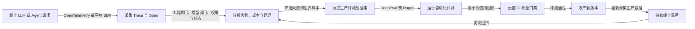
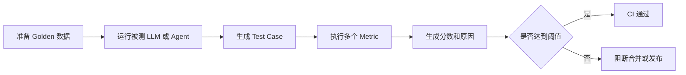
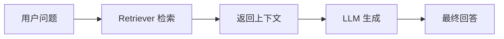
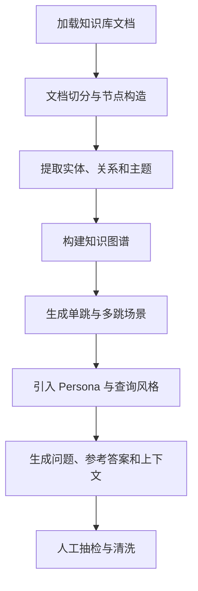
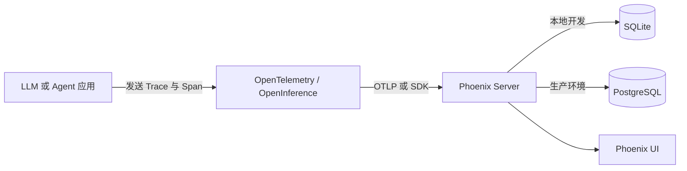
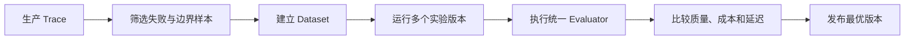
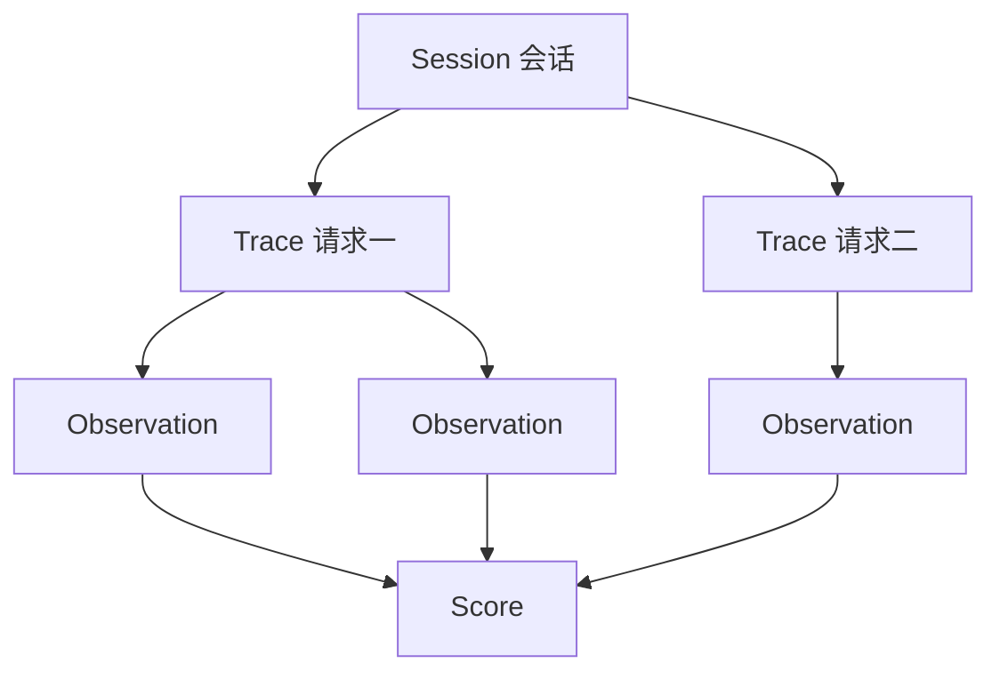
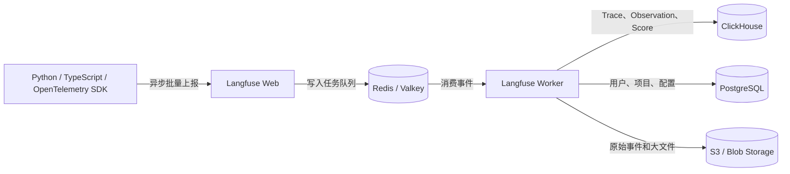
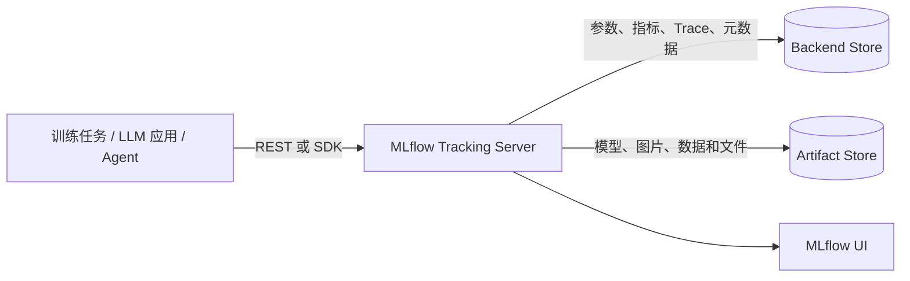
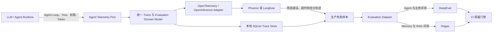

# 附录 I：评测与观测平台详解与选型

> 定位：**DeepEval、Ragas、Arize Phoenix、Langfuse、MLflow 五个项目的完整调研与选型报告**（全文收录，信息基准 2026-08-27，官方入口见 [C-32]）。正文第 15 章的框架/平台两层选型表是"地图"，本附录是"地形志"——每个项目的定位、数据模型、能力、优劣与适用场景逐一展开，并给出组合方案与统一评测模型设计。DeepEval 的上手教程另见附录 H；观测底座 OpenTelemetry 的机制见附录 G。名单与版本会过期，选型方法不过期。

---

## I.1 结论先行

DeepEval、Ragas、Arize Phoenix、Langfuse、MLflow 都涉及 LLM Evaluation、Agent Observability、Prompt Engineering 或 AI Engineering，但它们并不是完全同类产品。

| 项目 | 核心定位 | 最接近的工程类比 | 最突出的能力 |
|---|---|---|---|
| **DeepEval** | 面向 LLM、RAG、Agent 的代码优先评测框架 | LLM 领域的 Pytest/JUnit | 自动化断言、Agent 组件评测、CI 质量门禁 |
| **Ragas** | 面向 RAG、Agent 的评测指标与测试数据生成框架 | RAG 质量分析实验室 | Context、Faithfulness、Retriever 故障定位 |
| **Arize Phoenix** | AI 应用追踪、评测、实验、Prompt 管理平台 | 轻量级 AI 可观测与评测工作台 | OpenTelemetry/OpenInference、Trace、Dataset、Experiment |
| **Langfuse** | LLM 应用全生命周期工程平台 | LLM APM + PromptOps + EvalOps | 生产 Trace、Prompt 管理、成本分析、在线评测 |
| **MLflow** | 统一传统 ML、LLM、Agent 的 AI 工程平台 | MLOps/LLMOps 统一控制面 | Experiment、Model Registry、Prompt、Trace、模型生命周期 |

可以按职责分成两组：

### I.1.1 指标与测试执行层

- **DeepEval**：重点解决“如何把 LLM/Agent 行为写成自动化测试并设置通过阈值”。
- **Ragas**：重点解决“如何判断 RAG 的检索、上下文和生成环节哪里出了问题”。

### I.1.2 数据、可观测与工程平台层

- **Phoenix**：重点解决“如何用开放标准采集 Agent Trace，并围绕 Trace 做评测、数据集和实验”。
- **Langfuse**：重点解决“如何管理生产 LLM 应用的 Trace、Prompt、成本、用户、评测和标注”。
- **MLflow**：重点解决“如何统一传统模型、LLM、Agent、Prompt、Dataset、Experiment 和 Registry”。

因此，生产环境通常不是五选一，而是组合使用：

> **Phoenix、Langfuse 或 MLflow 负责追踪、数据沉淀、实验和管理；DeepEval、Ragas 负责专业评测。**

---

## I.2 五个项目在完整质量闭环中的位置

一个完整的 LLM 或 Agent 质量闭环通常包括：



对应关系如下：

| 工程环节 | 更适合的项目 |
|---|---|
| Trace、Span、Session 采集 | Phoenix、Langfuse、MLflow |
| Agent 内部执行链调试 | Phoenix、Langfuse、MLflow |
| RAG 专项评测 | Ragas |
| Agent、Tool、多轮对话、组件级评测 | DeepEval |
| Prompt 版本与实验管理 | Phoenix、Langfuse、MLflow |
| 数据集和实验对比 | Phoenix、Langfuse、MLflow，DeepEval/Ragas 也可参与 |
| Pytest 风格 CI 门禁 | DeepEval |
| 传统 ML 模型注册与部署 | MLflow |
| Token、成本、延迟运营分析 | Langfuse、Phoenix、MLflow |
| 人工标注与审核 | Langfuse、Phoenix、MLflow |

---

## I.3 DeepEval：LLM 和 Agent 自动化测试框架

### I.3.1 项目定位

DeepEval 是一个 Python、代码优先、本地优先的 LLM Evaluation Framework。它强调把 LLM、RAG 和 Agent 输出当成普通软件行为一样测试：

1. 定义测试数据；
2. 执行被测 LLM 或 Agent；
3. 构造测试用例；
4. 指定评测指标；
5. 设置通过阈值；
6. 在本地、测试环境或 CI 中执行断言；
7. 当质量退化时阻断合并或发布。

普通软件测试与 DeepEval 的关系可以表示为：

```text
普通软件测试：
输入 → 调用函数 → 实际结果 → assert expected == actual

DeepEval：
用户问题 → 执行 LLM/Agent → 实际回答与执行轨迹
        → 评测指标 → score >= threshold
```

### I.3.2 核心数据模型

#### I.3.2.1 Golden

Golden 是评测数据集中的标准样本，通常可以包含：

- 输入；
- 期望输出；
- 标准上下文；
- 检索上下文；
- 预期工具调用；
- 预期任务结果；
- 测试标签和元数据。

Golden 的价值是把“应该表现成什么样”沉淀为可版本化的数据资产。

#### I.3.2.2 Test Case

Test Case 是一次实际执行产生的测试对象，常见类型包括：

- 单轮 LLM 测试用例；
- 多轮对话测试用例；
- 多模态测试用例；
- Agent 组件测试用例；
- 模型或 Prompt 对比测试用例。

Test Case 可以包含：

- 用户输入；
- 实际输出；
- 期望输出；
- 检索上下文；
- 工具调用；
- Agent 执行轨迹；
- 模型和 Prompt 版本；
- 业务元数据。

#### I.3.2.3 Metric

Metric 负责接收测试用例并输出：

- 评测分数；
- 是否通过；
- 评分原因；
- 失败信息；
- Judge 模型调用信息；
- Token 与成本信息。

Metric 可以分为：

- 确定性规则指标；
- LLM-as-a-Judge 指标；
- RAG 指标；
- Agent 和 Tool 指标；
- 安全与合规指标；
- 自定义业务指标。

### I.3.3 主要能力

#### I.3.3.1 G-Eval

G-Eval 允许使用自然语言描述评分标准，例如：

> 判断回答是否完整、专业、可执行，并且没有遗漏用户提出的约束。

Judge LLM 根据：

- 输入；
- 实际输出；
- 期望输出；
- 自定义 Criteria；
- Rubric；
- 评分步骤；

生成分数和评分理由。

G-Eval 适合无法用字符串比较或简单规则完成的语义质量评测，例如：

- 回答完整性；
- 方案合理性；
- 语气一致性；
- 是否遵循角色；
- 是否真正完成任务；
- 是否遗漏关键约束。

#### I.3.3.2 RAG 指标

DeepEval 提供典型 RAG 指标：

- Faithfulness；
- Answer Relevancy；
- Contextual Precision；
- Contextual Recall；
- Contextual Relevancy。

它适合把 RAG 评测直接放入单元测试、集成测试或 CI 中。

#### I.3.3.3 Agent 与工具调用评测

DeepEval 可以用于评测：

- Agent 是否完成用户目标；
- 工具选择是否正确；
- 工具参数是否正确；
- 是否遗漏必要工具；
- 是否调用了禁止工具；
- 是否出现重复、无效或高成本步骤；
- Agent 轨迹是否符合预期；
- Retriever、Tool、Planner、Worker 或子 Agent 是否单独失败。

对于复杂 Agent，仅评测最终回答是不够的。最终结果正确，仍可能存在：

- 误用高权限工具；
- 调用顺序错误；
- 依赖偶然结果；
- 重试次数过多；
- 不必要地消耗 Token；
- 绕过审批；
- 中间步骤泄露敏感信息。

因此，组件级和轨迹级评测比单纯的 Final Answer 评分更重要。

#### I.3.3.4 多轮对话评测

适合评测：

- 上下文一致性；
- 角色持续遵循；
- 用户目标是否在多轮中完成；
- 是否遗忘早期约束；
- 是否发生错误状态继承；
- 是否错误使用历史信息；
- 多轮压缩后是否保留关键事实。

#### I.3.3.5 合成测试数据

DeepEval 可以从文档、上下文或已有 Golden 中生成测试样本。

适合补充：

- 边界条件；
- 对抗输入；
- 长上下文；
- 多约束任务；
- 不完整输入；
- 工具故障；
- 权限拒绝；
- Prompt Injection。

但合成数据不能替代生产真实样本，推荐采用：

```text
真实生产样本 + 人工设计关键样本 + 合成边界样本
```

### I.3.4 典型执行流程



### I.3.5 优势

1. **适合 CI/CD 回归门禁。**
2. **评测代码可以与业务代码一起版本化。**
3. **Agent、Tool、RAG、多轮和组件级测试覆盖较完整。**
4. **支持自定义指标和自定义 Judge 模型。**
5. **适合本地执行和私有模型。**
6. **Apache 2.0 许可证，便于二次开发。**

### I.3.6 局限

1. 核心是 Python 评测框架，不是完整生产可观测平台。
2. LLM-as-a-Judge 会产生调用成本和一定随机性。
3. 团队共享、在线评测、Dashboard 和生产监控需要配套平台。
4. 对 Rust、Java、TypeScript 主工程，通常需要独立 Python 评测 Job 或服务。
5. Judge Prompt、模型和温度发生变化时，分数可能漂移。

### I.3.7 最适合的场景

- Agent 自动化回归；
- Prompt 修改后的 PR 门禁；
- Tool Calling 正确性测试；
- 多轮对话测试；
- 权限、安全和角色遵循测试；
- 单 Agent、Multi-Agent 工作流质量验收。

---

## I.4 Ragas：RAG 质量评测指标与测试数据生成框架

### I.4.1 项目定位

Ragas 最早聚焦 Retrieval-Augmented Generation Assessment，核心问题是：

> 当 RAG 回答不好时，究竟是 Retriever 没找到、排序不好、上下文噪声过多，还是 LLM 没有忠实使用上下文？

当前 Ragas 已扩展到：

- RAG；
- Agent 和工具调用；
- 多轮任务；
- 多模态；
- SQL；
- 通用 Rubric；
- 合成测试集生成。

但它最成熟、最有辨识度的能力仍然是：

> **对 RAG 的 Retriever、Context 和 Generator 进行分层评测。**

### I.4.2 RAG 分层评测思想



Ragas 不只给最终回答一个总分，而是分别评测每一层。

| 指标 | 评测对象 | 主要问题 |
|---|---|---|
| **Context Precision** | Retriever 排序 | 相关文档是否排在无关文档之前 |
| **Context Recall** | Retriever 召回 | 回答所需的重要信息是否全部检索到 |
| **Faithfulness** | Generator | 回答中的断言是否能被上下文支持 |
| **Response Relevancy** | 最终回答 | 回答是否直接回应用户问题 |
| **Factual Correctness** | 回答与参考答案 | 回答事实是否和标准答案一致 |

### I.4.3 指标含义

#### I.4.3.1 Context Precision

用于判断检索结果排序质量：

- 相关 Chunk 是否靠前；
- 无关 Chunk 是否靠后；
- Top-K 是否包含过多噪声。

低分通常意味着：

- Embedding 区分度不够；
- Query Rewrite 不合理；
- 缺少 Reranker；
- Top-K 过大；
- Chunk 粒度不合适；
- 元数据过滤不准确。

#### I.4.3.2 Context Recall

用于判断必要事实是否被召回。

低分通常意味着：

- Chunk 切分丢失语义；
- Query 未覆盖关键实体；
- Embedding 模型不适合领域；
- 索引未更新；
- 多跳检索不足；
- 过滤条件过严。

#### I.4.3.3 Faithfulness

用于判断回答中的陈述是否可由检索上下文支持。

低分通常意味着：

- 模型使用了参数知识而非检索知识；
- Prompt 没有限制依据上下文回答；
- 上下文之间存在冲突；
- 模型发生幻觉；
- 上下文被截断或压缩过度。

#### I.4.3.4 Response Relevancy

用于判断回答是否切题。

需要注意：

> 回答相关不代表回答正确；回答正确也不代表它忠实使用了当前知识库。

#### I.4.3.5 Factual Correctness

用于比较实际回答和参考答案中的事实是否一致。

它可以帮助识别：

- 知识库内容错误；
- 回答遗漏事实；
- 回答加入错误事实；
- 参考答案和当前知识库不一致。

### I.4.4 如何根据分数组合定位问题

| 评测结果 | 可能原因 |
|---|---|
| Context Recall 低 | Chunk、Embedding、Query Rewrite、Top-K 或索引更新有问题 |
| Context Precision 低 | 检索噪声大、排序差、缺少 Reranker |
| Faithfulness 低 | LLM 未遵守上下文、发生幻觉或上下文冲突 |
| Response Relevancy 低 | Prompt 未约束回答聚焦用户问题 |
| Factual Correctness 低、Faithfulness 高 | 知识库本身可能错误或过期 |
| Faithfulness 低、Correctness 高 | 模型可能凭参数知识答对，但未依据当前知识库 |
| Recall 高、Precision 低 | 信息找到了，但噪声过多 |
| Precision 高、Recall 低 | 找到的内容准确，但遗漏必要事实 |

### I.4.5 Agent 与通用评测

Ragas 还可用于：

- Tool Call Accuracy；
- Tool Call F1；
- Agent Goal Accuracy；
- Topic Adherence；
- Rubric Scoring；
- Semantic Similarity；
- Exact Match；
- BLEU、ROUGE、CHRF；
- SQL 执行和等价性；
- 多模态 Faithfulness 与 Relevance。

不过，如果核心目标是复杂 Agent 的组件级断言和 CI 门禁，DeepEval 通常更直接；如果核心目标是检索质量分析，Ragas 更专门。

### I.4.6 合成测试集生成

Ragas 可以从知识库文档生成测试问题和参考答案，典型流程为：



它比“对每个 Chunk 随机生成一道题”更适合覆盖：

- 跨文档查询；
- 多跳推理；
- 不同用户角色；
- 不同表达方式；
- 隐式问题；
- 长尾知识。

### I.4.7 优势

1. **RAG 指标体系完整，故障定位能力强。**
2. **可以将问题定位到检索、上下文或生成阶段。**
3. **支持有参考答案和无参考答案的部分指标。**
4. **测试数据生成能力突出。**
5. **适合比较 Chunk、Embedding、Reranker 和 Top-K 策略。**
6. **Apache 2.0 许可证。**

### I.4.8 局限

1. 核心是 Python 评测库，不是生产 Trace 平台。
2. 指标对 Judge 模型、Embedding 模型和 Prompt 较敏感。
3. 合成数据必须经过人工抽检。
4. 不能只看一个总分，需要结合多个指标分析。
5. CI、权限、团队协作和长期数据存储通常需要连接其他系统。

### I.4.9 最适合的场景

- 企业知识库；
- 文档问答；
- Memory Retrieval；
- Workspace 搜索；
- Skill、工具和文档检索；
- Retriever、Reranker、Chunk 策略对比；
- 多跳 RAG；
- 检索质量回归测试。

---

## I.5 Arize Phoenix：AI 可观测、评测与实验工作台

### I.5.1 Arize 与 Phoenix 的关系

需要区分：

- **Arize AI**：公司；
- **Arize Phoenix**：可自托管的 AI 可观测与评测项目；
- **Arize AX**：商业产品。

在开源项目选型中通常讨论的是 **Arize Phoenix**。

### I.5.2 核心定位

Phoenix 的目标是形成一个轻量、开放标准优先的 Agent 工程闭环：

```text
Tracing
   ↓
Annotations / Evaluations
   ↓
Datasets
   ↓
Experiments
   ↓
Prompt 优化
   ↓
重新部署和追踪
```

主要能力包括：

- Trace 与 Span 查看；
- LLM、Retriever、Tool、Agent 调用分析；
- LLM-as-a-Judge；
- 人工标注；
- Dataset；
- Experiment；
- Prompt 管理；
- Prompt Playground；
- Span Replay；
- Token、延迟和调用信息分析。

### I.5.3 OpenTelemetry 与 OpenInference

Phoenix 的关键优势是强调开放标准：

- **OpenTelemetry**：提供通用 Trace 和 Span 模型；
- **OpenInference**：在 OpenTelemetry 之上补充 AI 语义。

OpenInference 可以表达：

- LLM；
- Embedding；
- Retriever；
- Reranker；
- Tool；
- Agent；
- Prompt；
- Token；
- 输入输出；
- 模型参数；
- 错误和状态。

这样做的价值是：

1. 业务代码不必绑定 Phoenix 私有数据模型；
2. 同一套 Trace 理论上可以发送给其他兼容后端；
3. Agent Runtime 可以先统一内部语义，再适配不同观测平台；
4. 有利于后续迁移或双写。

### I.5.4 部署架构



一般可以采用：

- 本地开发：Phoenix + SQLite；
- 团队或生产：Phoenix + PostgreSQL；
- 内网部署：应用仅通过 OTLP 或 Phoenix SDK 上报数据。

相较于需要 ClickHouse、Redis 和对象存储的平台，Phoenix 部署拓扑更简单。

### I.5.5 Dataset 与 Experiment

Dataset 通常保存：

- 输入；
- 可选参考输出；
- 元数据；
- 来源 Trace；
- 标注；
- 失败分类。

可以从以下来源构建 Dataset：

- 生产 Trace；
- 人工标注；
- 历史评测；
- 手工导入；
- 失败案例集合。

Experiment 用于在同一 Dataset 上对比：

- Prompt；
- 模型；
- Retriever；
- Reranker；
- Tool 组合；
- Agent 版本；
- 参数策略。

理想流程是：



### I.5.6 Prompt 管理

Phoenix Prompt 可以保存：

- Prompt Template；
- 模型调用参数；
- Tool 定义；
- 输出格式；
- 模型配置；
- Prompt 版本；
- Tag。

Span Replay 可以复用历史调用输入重新执行，从而验证修改 Prompt 后：

- 质量是否改善；
- 延迟是否变化；
- Token 是否增加；
- 工具调用是否改变；
- 是否出现新的失败模式。

### I.5.7 许可证

Phoenix 使用 Elastic License 2.0（ELv2）。

通常允许：

- 免费自托管；
- 企业内部使用；
- 修改源码；
- 在自己的云环境运行。

需要重点注意：

- ELv2 对将 Phoenix 的主要功能作为托管或管理服务提供给第三方存在限制；
- 它不同于 Apache 2.0 或 MIT 这类宽松许可证；
- 如果计划把 Phoenix 包装为商业 SaaS，需要进行许可证审查。

### I.5.8 优势

1. OpenTelemetry/OpenInference 兼容性好。
2. Trace、Eval、Dataset、Experiment、Prompt 闭环完整。
3. 自托管架构相对简单。
4. 适合本地开发、内网和中小团队。
5. 适合分析 Agent 内部步骤和工具调用。
6. 对已有 OpenTelemetry 基础设施的团队迁移成本较低。

### I.5.9 局限

1. ELv2 对托管服务有明确限制。
2. 不提供传统机器学习 Model Registry 和训练生命周期。
3. 大规模长期 Trace 保留需要评估 PostgreSQL 容量和归档策略。
4. 在成本运营、复杂多租户、企业 PromptOps 等方面，需要与 Langfuse 做进一步比较。

### I.5.10 最适合的场景

- 私有化 Agent 可观测平台；
- 本地优先桌面应用；
- 内网研发平台；
- OpenTelemetry/OpenInference 架构；
- Agent Trace 调试；
- Dataset 与 Experiment 闭环；
- 中小规模团队快速落地。

---

## I.6 Langfuse：LLM 应用工程与运营平台

### I.6.1 项目定位

Langfuse 是一个面向 LLM 应用的 AI Engineering Platform，主要覆盖：

- Observability；
- Tracing；
- Prompt Management；
- Evaluation；
- Dataset；
- Experiment；
- Annotation；
- Token 和 Cost；
- User、Session 与 Release 分析；
- Dashboard。

它不是单纯评测库，而是持续运行在开发、测试和生产环境中的 LLM 数据平台。

### I.6.2 核心数据模型



#### I.6.2.1 Session

表示跨多个请求的完整用户会话，例如：

- 一次长对话；
- 一个持续几十分钟的编码任务；
- 一次多 Agent 业务流程；
- 一个跨页面操作流程。

#### I.6.2.2 Trace

表示一次相对独立的业务请求，例如：

- 用户发送一条消息；
- Agent 执行一次任务；
- RAG 完成一次问答；
- Orchestrator 分解并下发一次计划。

#### I.6.2.3 Observation

表示 Trace 中的一个执行节点，类型可以包括：

- Span；
- Generation；
- Event；
- Agent；
- Tool；
- Retriever；
- Embedding；
- Evaluator。

#### I.6.2.4 Score

Score 可以挂载到：

- Trace；
- Observation；
- Session；
- Dataset Run。

Score 来源包括：

- LLM-as-a-Judge；
- 代码评测；
- 人工标注；
- 用户反馈；
- 外部评测框架，例如 DeepEval 或 Ragas。

### I.6.3 自托管架构



组件职责通常为：

- **PostgreSQL**：用户、组织、项目、Prompt 和平台状态；
- **ClickHouse**：高吞吐 Trace、Observation 和 Score 分析；
- **Redis/Valkey**：缓存和异步队列；
- **对象存储**：原始事件、大文件、多模态内容、导出数据；
- **Web + Worker**：接收数据、处理异步任务、展示 UI。

### I.6.4 Prompt Management

Langfuse Prompt Management 通常支持：

- Text Prompt；
- Chat Prompt；
- 版本号；
- Label；
- 环境标记；
- 变量；
- Prompt 组合；
- 模型配置；
- Playground；
- Prompt 与 Trace 关联；
- 客户端缓存和回退。

典型发布方式：

```text
Prompt v12
  ├── label: staging
  └── 自动评测与人工审核通过
         ↓
Prompt v12
  └── label: production
```

Label 可用于：

- staging / production；
- 不同租户；
- A/B 实验；
- 灰度发布；
- 不同模型线路。

### I.6.5 Evaluation

Langfuse 支持多种评测方式：

| 方式 | 使用场景 |
|---|---|
| LLM-as-a-Judge | 正确性、完整性、语气、相关性、安全性 |
| Code Evaluator | JSON Schema、工具参数、业务规则、确定性约束 |
| 人工 Annotation | 高风险样本审核、Ground Truth 构建 |
| API/SDK Score | 接收 DeepEval、Ragas 或内部评测结果 |
| 用户反馈 | 点赞、点踩、评分、任务是否成功 |
| Experiment | 固定 Dataset 上比较 Prompt、模型或 Agent 版本 |
| Online Evaluation | 对生产 Trace 按条件和采样率持续评测 |

Langfuse 的优势是把离线实验和线上评测统一到 Score 数据模型中。

### I.6.6 成本与运营分析

Langfuse 可以按以下维度分析：

- 模型；
- Prompt 版本；
- 用户；
- Session；
- Feature；
- Environment；
- Release；
- Tag；
- 地域或租户。

常见指标包括：

- Token；
- 成本；
- 延迟；
- 调用量；
- 错误率；
- 自定义质量分；
- 用户反馈；
- 成功率。

这使 Langfuse 不只回答“模型质量是否好”，还可以回答：

- 哪个版本最贵；
- 哪类用户消耗最多；
- 哪个 Prompt 导致错误率上升；
- 哪个模型在质量和成本之间更合适；
- 哪些 Session 发生了循环或长尾延迟。

### I.6.7 许可证

Langfuse 采用 Open Core 模式：

- 核心代码使用 MIT；
- Enterprise 相关目录和功能使用商业许可证。

选型时需要明确：

- 当前需要的能力是否属于开源核心；
- 是否依赖企业版权限、审计、组织治理或高级部署能力；
- 二次分发时是否涉及 Enterprise 代码。

### I.6.8 优势

1. LLM 应用数据模型完整。
2. Prompt 管理、成本、Trace 和 Evaluation 结合紧密。
3. 同时支持在线和离线评测。
4. Python、TypeScript 和 OpenTelemetry 集成丰富。
5. ClickHouse 架构适合大量 Trace 分析。
6. 人工标注、Dataset、Experiment 和 Dashboard 能力较强。

### I.6.9 局限

1. 自托管组件较多，运维成本高于 Phoenix。
2. Open Core 模式需要确认功能和许可证边界。
3. 不以 Pytest 断言为核心，CI 场景通常需要补充 DeepEval。
4. 高级 RAG 指标通常仍会接入 Ragas。
5. 对小型本地桌面项目可能显得偏重。

### I.6.10 最适合的场景

- 集中式 LLM 可观测平台；
- Prompt 频繁迭代；
- 需要用户、成本和 Session 分析；
- 需要在线评测和人工标注；
- 大量生产 Trace；
- Python/TypeScript LLM 服务；
- 多团队共享 LLM 工程平台。

---

## I.7 MLflow：统一传统 ML、LLM 与 Agent 的工程平台

### I.7.1 项目定位

MLflow 是五个项目中覆盖范围最广的平台。

它同时支持两条主线：

### 传统机器学习

- Experiment Tracking；
- 参数、指标和 Artifact；
- Dataset Lineage；
- Model Packaging；
- Model Registry；
- 模型版本；
- 模型部署。

### LLM 和 Agent

- Tracing；
- LLM/Agent Evaluation；
- Prompt Registry；
- Evaluation Dataset；
- 自动在线评测；
- Token 和 Cost；
- AI Gateway；
- 工具调用和 Agent 轨迹分析。

### I.7.2 基础架构



### Tracking Server

提供：

- REST API；
- MLflow UI；
- Experiment Tracking；
- Trace；
- Model Registry；
- Prompt Registry。

### Backend Store

保存结构化元数据：

- Experiment；
- Run；
- Trace；
- Model；
- 参数；
- 指标；
- Tag；
- 时间戳。

### Artifact Store

保存大文件：

- 模型权重；
- 图片；
- Parquet；
- 数据文件；
- 模型包；
- 评测报告。

### I.7.3 传统 ML 能力

这是 MLflow 相较于另外四个项目最大的差异。

#### I.7.3.1 Experiment Tracking

记录：

- 超参数；
- 训练指标；
- 数据集；
- 代码版本；
- 模型；
- Artifact；
- 运行环境。

#### I.7.3.2 Model Registry

提供：

- 模型版本；
- Alias；
- Tag；
- Lineage；
- 描述和注释；
- 从实验到生产模型的关联。

#### I.7.3.3 Deployment

可以将模型打包并部署到：

- 本地服务；
- 容器；
- 云平台；
- Kubernetes；
- 推理服务。

如果组织同时存在：

- XGBoost；
- PyTorch；
- 推荐模型；
- 风控模型；
- Embedding 模型；
- Reranker；
- LLM；
- RAG；
- Agent；

MLflow 的统一价值较高。

### I.7.4 LLM 和 Agent Tracing

MLflow Tracing 采用 OpenTelemetry 兼容模型，Trace 内由层级 Span 构成，可以记录：

- LLM；
- Tool；
- Retriever；
- Agent；
- 输入和输出；
- 延迟；
- Token；
- Cost；
- 错误；
- 业务元数据。

通过树形 Span 可以判断：

- 哪个工具失败；
- 哪个模型调用耗时最长；
- 哪次检索返回空结果；
- 哪个 Agent 发生循环；
- 哪个子任务导致成本异常。

### I.7.5 Prompt Registry

MLflow Prompt Registry 可以用于管理：

- Prompt 版本；
- Alias；
- Tag；
- 模型配置；
- 参数；
- Prompt 与 Experiment 的关联；
- Prompt 与评测结果的关联；
- Prompt 从开发到生产的生命周期。

### I.7.6 LLM 与 Agent Evaluation

MLflow 可用于：

- Dataset 离线评测；
- 历史 Trace 评测；
- LLM-as-a-Judge；
- 自定义 Scorer；
- Groundedness；
- Answer Relevance；
- Context Sufficiency；
- Tool Call Correctness；
- Tool Call Efficiency；
- Safety；
- 多轮 Session 评测；
- 自动在线评测。

Agent Evaluation 不仅检查最终输出，也可以检查 Trace 内的工具和中间行为。

### I.7.7 AI Gateway

MLflow AI Gateway 可以统一管理多个模型供应商：

- Provider 凭证；
- 模型访问；
- 路由；
- 模型切换；
- 权限；
- 成本治理；
- 统一接口。

适合需要集中治理 OpenAI、Anthropic、云模型或内部模型的组织。

### I.7.8 优势

1. 同时覆盖传统 ML、LLM 和 Agent。
2. Model、Prompt、Dataset、Experiment 的 Lineage 完整。
3. Model Registry 是另外四个项目不具备的核心能力。
4. 支持 OpenTelemetry 兼容的 Trace。
5. Apache 2.0 许可证。
6. 适合已有 MLflow 基础设施的组织平滑扩展 LLM 能力。

### I.7.9 局限

1. 覆盖面广，概念和部署复杂度也更高。
2. 只做 LLM Trace 时，可能比 Phoenix 或 Langfuse 更重。
3. 对 LLM 原生 PromptOps 和运营分析，交互路径不一定最轻量。
4. 只需要 RAG 指标时，Ragas 更直接。
5. 只需要 CI 断言时，DeepEval 更自然。

### I.7.10 最适合的场景

- 已经使用 MLflow 的组织；
- 传统模型和 LLM/Agent 共存；
- 需要 Model Registry；
- 需要统一 Experiment 和 Lineage；
- 需要训练、Fine-tuning、Embedding 或 Reranker 管理；
- 需要统一 AI Gateway。

---

## I.8 五个项目横向对比

### I.8.1 能力对比

| 维度 | DeepEval | Ragas | Phoenix | Langfuse | MLflow |
|---|---:|---:|---:|---:|---:|
| 离线自动化评测 | **强** | **强** | 强 | 强 | 强 |
| Pytest/CI 质量门禁 | **最强** | 中 | 中 | 中 | 中 |
| RAG 专项指标 | 强 | **最强** | 强 | 中到强 | 强 |
| Agent 轨迹评测 | **强** | 中到强 | **强** | **强** | **强** |
| Tool Calling 评测 | **强** | 中到强 | 强 | 强 | 强 |
| 生产 Trace | 中 | 弱 | **强** | **强** | **强** |
| Prompt 管理 | 弱 | 弱 | 强 | **很强** | 强 |
| Dataset/Experiment | 强 | 强 | **强** | **强** | **强** |
| Token/Cost 分析 | 中 | 中 | 强 | **很强** | 强 |
| 人工标注 | 依赖平台 | 弱 | 强 | **强** | 中到强 |
| 在线评测 | 依赖平台 | 弱 | 强 | **强** | 强 |
| 传统 ML Tracking | 无 | 无 | 无 | 无 | **最强** |
| Model Registry | 无 | 无 | 无 | 无 | **有** |
| 本地库使用成本 | **低** | **低** | 中 | 较高 | 中 |
| 自托管复杂度 | 无服务端 | 无服务端 | 较低 | **较高** | 中 |
| 开放标准 | 中 | 中 | **OTel/OpenInference** | OTel | OTel |

### I.8.2 许可证对比

| 项目 | 核心许可证或模式 | 需要注意 |
|---|---|---|
| **DeepEval** | Apache 2.0 | 宽松开源 |
| **Ragas** | Apache 2.0 | 宽松开源 |
| **Phoenix** | Elastic License 2.0 | 免费自托管，但限制将主要功能作为第三方托管服务提供 |
| **Langfuse** | Core MIT + Enterprise License | Open Core，并非整个仓库全部 MIT |
| **MLflow** | Apache 2.0 | 宽松开源 |

### I.8.3 核心差异总结

| 需求 | 第一选择 | 原因 |
|---|---|---|
| PR 中阻断 LLM/Agent 质量回归 | DeepEval | 代码优先、断言和 CI 体验最直接 |
| 定位 RAG 是检索还是生成出了问题 | Ragas | 指标分层最清晰 |
| 轻量私有化 Trace、Dataset、Experiment | Phoenix | 部署简单、开放标准优先 |
| 大规模生产 LLM 可观测和 PromptOps | Langfuse | Trace、成本、Prompt、用户、在线评测闭环完整 |
| 统一传统 ML、LLM、Agent | MLflow | Experiment、Model Registry 和完整 Lineage |

---

## I.9 典型场景选型

### I.9.1 只需要给 LLM 或 Agent 增加 CI 回归测试

选择：

> **DeepEval**

原因：

- 测试代码与业务代码一起维护；
- 支持阈值断言；
- 可直接阻断 PR；
- 支持 Agent、Tool、RAG 和多轮对话；
- 便于构建稳定回归集。

### I.9.2 重点是企业知识库和 RAG

选择：

> **Ragas + DeepEval**

职责分工：

- Ragas：Retriever、Context、Faithfulness 专项分析；
- DeepEval：业务指标、Agent 任务完成度和 CI 门禁。

### I.9.3 需要轻量级私有化 Trace 与评测平台

选择：

> **Arize Phoenix**

适合：

- 本地或内网；
- OpenTelemetry/OpenInference；
- 单服务加 PostgreSQL；
- Trace、Dataset、Experiment 和 Prompt 闭环；
- 希望较低运维成本。

### I.9.4 需要完整 LLM 工程运营平台

选择：

> **Langfuse**

适合：

- Prompt 频繁迭代；
- 需要 Token、成本、用户和 Session 分析；
- 需要人工 Annotation；
- 需要在线 Evaluator；
- 可以承担 ClickHouse、PostgreSQL、Redis 和对象存储的运维。

### I.9.5 企业已经使用 MLflow 或同时存在传统模型

选择：

> **MLflow**

适合：

- 传统 ML、LLM、Agent 共存；
- 需要 Model Registry；
- 强调 Dataset、Model、Prompt 和 Experiment 的统一 Lineage；
- 已有 MLflow Tracking Server、数据库和对象存储。

---

## I.10 推荐组合方案

### I.10.1 轻量研发方案

```text
DeepEval
   +
Ragas
```

适合：

- 小团队；
- 项目早期；
- 主要关注回归测试；
- 暂时不需要集中式可观测平台。

### I.10.2 生产级 LLM/Agent 方案

```text
Langfuse 或 Phoenix
        +
DeepEval
        +
Ragas
```

职责：

- Langfuse/Phoenix：Trace、数据集、生产样本、实验和可视化；
- DeepEval：Agent、Tool 和业务回归；
- Ragas：RAG、Memory 和 Retrieval 专项质量。

### I.10.3 企业统一 AI 平台方案

```text
MLflow
   +
DeepEval / Ragas
```

MLflow 管理：

- Experiment；
- Trace；
- Model；
- Prompt；
- Dataset；
- Artifact；
- Registry。

DeepEval/Ragas 提供更专业、更灵活的评测逻辑。

---

## I.11 通用 LLM/Agent 平台落地架构建议

典型的 LLM/Agent 平台通常同时包含：

- 单 Agent 与多 Agent 编排；
- Model、Tool、Skill 与 MCP 调用；
- RAG、Memory 与上下文管理；
- Prompt、模型和配置版本；
- 权限策略与人工审批；
- Token、成本和延迟治理；
- Retry、Timeout、Cancellation 与 Loop Detection；
- 本地、私有化或云端部署；
- Web、桌面、服务端或 CLI 等多种运行形态。

架构上不应让 Agent Runtime 直接依赖某个观测平台的 SDK，而应先定义稳定的内部遥测契约，再通过 Adapter 接入不同后端。

### I.11.1 推荐架构



### I.11.2 DDD/Ports & Adapters 设计

建议增加以下 Port：

```text
TelemetryPort
EvaluationPort
DatasetPort
PromptRegistryPort
TraceExportPort
AnnotationPort
```

建议 Adapter：

```text
LocalSqliteTelemetryAdapter
OpenTelemetryExportAdapter
PhoenixExportAdapter
LangfuseExportAdapter
DeepEvalRunnerAdapter
RagasRunnerAdapter
JsonlDatasetAdapter
```

核心原则：

1. Domain 不依赖 Phoenix、Langfuse、DeepEval 或 Ragas SDK；
2. Runtime 只产生统一事件和领域对象；
3. 通过 Adapter 转换为 OpenTelemetry/OpenInference 或第三方格式；
4. 本地或单机模式可以只写 SQLite；
5. 团队模式可以异步导出到外部平台；
6. 评测结果以统一 Score 模型回写内部质量平台或评测存储。

### I.11.3 建议采集的 Span 类型

| Span 类型 | 主要字段 |
|---|---|
| Session | 用户会话、工作区、入口、持续时间 |
| AgentRun | Agent、Runtime、模型、Prompt 版本、状态 |
| AgentTurn | Turn、输入、输出、Token、耗时 |
| Planning | 目标、计划版本、步骤数、修订次数 |
| ToolCall | 工具、参数摘要、权限、结果、错误 |
| MCPCall | Server、Tool、协议状态、超时 |
| SkillExecution | Skill、版本、来源、输入输出摘要 |
| Retrieval | Query、索引、Top-K、文档引用、得分 |
| MemoryRecall | Memory 类型、候选数、命中数、置信度 |
| ModelCall | Provider、模型、Token、成本、延迟 |
| PermissionDecision | 请求权限、策略、决定、审批来源 |
| AgentHandoff | From、To、任务、上下文摘要、结果 |
| Retry | 原因、次数、退避、最终结果 |
| Cancellation | 发起方、阶段、是否完成清理 |
| Evaluation | 指标、分数、阈值、Judge 和版本 |

### I.11.4 Phoenix、Langfuse、DeepEval、Ragas 的职责

### Phoenix 或 Langfuse

负责：

- Agent Trace；
- Tool Call；
- Multi-Agent Handoff；
- Token 与成本；
- 延迟与错误；
- Retry 与 Cancellation；
- 权限决策；
- Prompt 版本；
- Session 分析；
- Dataset 与 Experiment。

### DeepEval

负责：

- Agent 任务是否完成；
- Tool 选择是否正确；
- Tool 参数是否正确；
- 是否违反权限；
- 是否出现无效循环；
- 是否遗漏必要步骤；
- 多 Agent 协作是否符合预期；
- CI 回归门禁。

### Ragas

负责：

- Memory Recall；
- 知识库文档检索；
- 能力、工具或技能检索；
- Context Precision；
- Context Recall；
- Faithfulness；
- 多跳知识检索；
- Retriever/Reranker 对比。

### MLflow

对于以 LLM/Agent 应用研发为主、暂不涉及模型训练的平台，MLflow 通常不是第一优先级。以下需求出现后再考虑引入：

- 模型训练；
- Fine-tuning；
- Embedding 模型管理；
- Reranker 模型管理；
- Model Registry；
- 训练数据和模型 Lineage；
- 统一 AI Gateway。

---

## I.12 统一评测模型设计

### I.12.1 Evaluation Case

建议统一评测用例：

```text
EvaluationCase
├── id
├── suite_id
├── category
├── input
├── expected_output
├── expected_tools
├── expected_constraints
├── reference_contexts
├── metadata
├── source
└── version
```

其中 `source` 可以表示：

- manual；
- production_trace；
- regression_bug；
- synthetic；
- imported；
- security_red_team。

### I.12.2 Evaluation Run

```text
EvaluationRun
├── id
├── suite_version
├── candidate_version
├── runtime
├── model
├── prompt_version
├── started_at
├── completed_at
├── status
├── aggregate_scores
├── cost
└── environment
```

### I.12.3 Evaluation Result

```text
EvaluationResult
├── case_id
├── metric_name
├── metric_version
├── score
├── threshold
├── passed
├── reason
├── evidence
├── judge_model
├── judge_prompt_version
├── token_usage
└── latency
```

### I.12.4 推荐指标分类

| 分类 | 指标示例 |
|---|---|
| Final Answer | Correctness、Relevance、Completeness、Clarity |
| Agent Goal | Task Completion、Goal Accuracy、Constraint Satisfaction |
| Tool | Tool Selection、Argument Correctness、Tool Sequence |
| RAG | Context Precision、Recall、Faithfulness、Answer Relevance |
| Multi-Agent | Handoff Correctness、Role Compliance、Consensus Quality |
| Memory | Recall Accuracy、Precision、Freshness、Conflict Handling |
| Permission | Policy Compliance、Approval Correctness、Least Privilege |
| Runtime | Retry Efficiency、Loop Detection、Cancellation Cleanup |
| Cost | Token Budget、Cost Budget、Unnecessary Calls |
| Safety | Prompt Injection、Data Leakage、Unsafe Tool Use |
| UX | Time to First Token、Total Latency、Interruptibility |

### I.12.5 CI 门禁建议

不建议只用“平均分大于某值”作为门禁，应采用多层规则：

```text
硬门禁：
- 权限违规数 = 0
- 数据泄露数 = 0
- 禁止工具调用数 = 0
- 关键任务完成率 = 100%

质量门禁：
- 总体通过率 >= 95%
- Faithfulness >= 0.90
- Tool Selection >= 0.95
- Agent Goal Accuracy >= 0.90

回归门禁：
- 任一关键指标不得比基线下降超过 3%
- P95 延迟不得增长超过 15%
- 平均 Token 不得增长超过 10%
```

建议区分：

- Blocking Suite：阻断合并；
- Nightly Suite：夜间全量执行；
- Release Suite：发版前执行；
- Production Sampling：线上采样评测；
- Red Team Suite：安全专项测试。

---

## I.13 分阶段实施路线

### 阶段一：统一 Trace 语义

目标：先把 Agent Runtime 内部执行过程标准化。

实施项：

1. 定义 Session、Trace、Span、Event、Score 领域模型；
2. 覆盖 AgentRun、ToolCall、ModelCall、Retrieval、PermissionDecision；
3. 本地 SQLite 持久化；
4. 支持 JSONL 导出；
5. 增加 Trace ID、Span ID 和 Parent Span ID；
6. 保证取消和失败路径也能正确闭合 Span。

### 阶段二：接入 Phoenix

目标：获得低成本的 Trace、Dataset 和 Experiment UI。

实施项：

1. 实现 OpenTelemetry/OpenInference Adapter；
2. 将内部 Span 映射为标准 OpenTelemetry/OpenInference 语义；
3. 支持配置采样率和数据脱敏；
4. 支持本地 Phoenix 和远端 Phoenix；
5. 验证离线、断网、重试和背压处理；
6. 不让外部观测服务阻塞 Agent 主执行链。

### 阶段三：引入 DeepEval

目标：建立 Agent 和 Tool 的自动化回归门禁。

实施项：

1. 从生产失败 Trace 构建 Golden；
2. 建立单 Agent、Multi-Agent、Tool、权限评测集；
3. 建立自定义业务 Metric；
4. 将评测执行集成到 CI；
5. 保存 Judge 模型和 Prompt 版本；
6. 对失败结果提供 Trace 反查入口。

### 阶段四：引入 Ragas

目标：建立 RAG、Memory、知识库和文档检索专项评测。

实施项：

1. 为每次检索保存 Query、候选、排序和引用；
2. 建立 Context Precision、Recall 和 Faithfulness 基线；
3. 比较 Chunk、Embedding、Reranker、Top-K；
4. 建立多跳检索集；
5. 对合成数据进行人工抽检；
6. 把结果回写统一 EvaluationResult。

### 阶段五：根据规模决定 Phoenix 或 Langfuse

继续 Phoenix 的条件：

- 本地优先；
- 团队规模有限；
- PostgreSQL 可以满足容量；
- 重视 OpenInference；
- 运维资源有限。

迁移或补充 Langfuse 的条件：

- Trace 量明显增长；
- 需要复杂 PromptOps；
- 需要用户、租户和成本运营分析；
- 需要在线 Evaluator 与人工 Annotation；
- 可以维护 ClickHouse、Redis 和对象存储。

### 阶段六：出现模型生命周期需求后评估 MLflow

触发条件：

- 自训练 Embedding 或 Reranker；
- Fine-tuning；
- 多模型版本治理；
- Model Registry；
- 数据和模型 Lineage；
- 企业级 AI Gateway。

---

## I.14 风险与治理原则

### I.14.1 LLM-as-a-Judge 不稳定

风险：

- 同一输入多次评分不同；
- Judge 模型升级导致分数漂移；
- Judge Prompt 变更破坏历史可比性；
- 不同模型评分尺度不一致。

治理：

- 固定 Judge 模型版本；
- 固定温度；
- 版本化 Judge Prompt；
- 对关键指标采用多次评分或确定性规则；
- 保存评分原因和原始证据；
- 定期使用人工标注校准。

### I.14.2 指标平均值掩盖关键失败

风险：

高分样本可能掩盖权限违规、数据泄露等严重问题。

治理：

- 高风险指标采用零容忍；
- 分离安全门禁与质量门禁；
- 对关键用例设置单用例必须通过；
- 不只看总体平均分。

### I.14.3 合成数据偏差

风险：

- 问题过于简单；
- 风格单一；
- 参考答案错误；
- 合成模型和被测模型存在同源偏差。

治理：

- 合成数据只作为补充；
- 强制人工抽样审核；
- 优先加入生产失败样本；
- 使用不同模型生成和评测；
- 持续跟踪合成样本的实际区分度。

### I.14.4 Trace 数据泄露

风险：

Trace 可能包含：

- 用户输入；
- 文件内容；
- 命令参数；
- API Key；
- 路径；
- 企业代码；
- 模型上下文。

治理：

- 默认脱敏；
- 字段白名单；
- 本地优先；
- 支持用户关闭上报；
- 明确数据保留期限；
- 对 Secret、Token、凭证做自动检测；
- 对第三方导出做权限和审计。

### I.14.5 观测系统影响主流程

风险：

- 网络阻塞；
- 后端不可用；
- 缓冲区占满；
- 导出线程崩溃；
- Trace 导致性能回退。

治理：

- 异步批量上报；
- 有界队列；
- 超时和熔断；
- 失败降级到本地；
- 观测失败不得阻塞 Agent；
- 设定采样率和最大 Payload。

### I.14.6 平台锁定

治理原则：

- 内部使用统一领域模型；
- 优先采用 OpenTelemetry/OpenInference；
- 第三方 SDK 仅存在于 Adapter；
- Dataset 使用可导出的 JSONL/Parquet；
- Prompt 和评分结果保留本地权威副本；
- 支持 Phoenix、Langfuse 或其他后端切换。

---

## I.15 最终建议

### I.15.1 本地优先或中小规模 Agent 项目

推荐：

> **Arize Phoenix + DeepEval + Ragas**

职责划分：

- **Phoenix**：本地优先、私有化 Trace、Dataset、Experiment 和 Prompt 调试；
- **DeepEval**：Agent、Tool、权限、多轮和 Multi-Agent CI 回归；
- **Ragas**：RAG、Memory、知识库和文档检索质量。

选择原因：

1. 与本地优先、内网部署或中小规模团队的基础设施条件匹配；
2. Phoenix 部署拓扑比 Langfuse 更轻；
3. OpenTelemetry/OpenInference 便于保持 Runtime 与观测后端解耦；
4. DeepEval 适合构建可阻断 PR 的测试门禁；
5. Ragas 能补足 Memory 和 Retrieval 的专业评测。

### I.15.2 团队规模和生产数据量上升后

当出现以下需求时，可改为或补充：

> **Langfuse + DeepEval + Ragas**

触发条件：

- 需要集中式平台；
- 需要更强 PromptOps；
- 需要用户级和租户级成本分析；
- Trace 规模较大；
- 需要在线评测和人工标注；
- 有能力运维 ClickHouse、Redis、PostgreSQL 和对象存储。

### I.15.3 模型训练和统一 MLOps 出现后

当项目开始涉及：

- Embedding 训练；
- Reranker 训练；
- Fine-tuning；
- Model Registry；
- Dataset/Model Lineage；
- AI Gateway；

再引入：

> **MLflow + DeepEval/Ragas**

### I.15.4 核心架构原则

最终不应把系统设计成“依赖某个观测平台的 Agent Runtime”，而应设计成：

> **具有统一 Telemetry Port、Evaluation Port 和 Dataset Port 的 Agent Runtime，由 Adapter 接入 Phoenix、Langfuse、MLflow、DeepEval 或 Ragas。**

这样可以同时满足：

- 本地运行；
- 私有化部署；
- 后端可替换；
- 数据可迁移；
- CI 自动化；
- 生产观测；
- 未来平台演进。

---

## I.16 官方资料

### DeepEval

- GitHub：<https://github.com/confident-ai/deepeval>
- Documentation：<https://deepeval.com/docs/introduction>
- Evaluation Datasets：<https://deepeval.com/docs/evaluation-datasets>
- G-Eval：<https://deepeval.com/docs/metrics-llm-evals>
- Component-Level Evaluation：<https://deepeval.com/docs/evaluation-component-level-llm-evals>

### Ragas

- GitHub：<https://github.com/vibrantlabsai/ragas>
- Documentation：<https://docs.ragas.io/en/stable/>
- Context Precision：<https://docs.ragas.io/en/stable/concepts/metrics/available_metrics/context_precision/>
- Agent Metrics：<https://docs.ragas.io/en/stable/concepts/metrics/available_metrics/agents/>
- RAG Test Data Generation：<https://docs.ragas.io/en/stable/concepts/test_data_generation/rag/>

### Arize Phoenix

- GitHub：<https://github.com/Arize-ai/phoenix>
- Documentation：<https://arize.com/docs/phoenix>
- Self-Hosting：<https://arize.com/docs/phoenix/self-hosting>
- Architecture：<https://arize.com/docs/phoenix/self-hosting/architecture>
- OpenInference：<https://arize.com/docs/phoenix/resources/openinference>
- Prompt Management：<https://arize.com/docs/phoenix/prompt-engineering/overview-prompts>

### Langfuse

- GitHub：<https://github.com/langfuse/langfuse>
- Documentation：<https://langfuse.com/docs>
- Data Model：<https://langfuse.com/docs/observability/data-model>
- Prompt Management：<https://langfuse.com/docs/prompt-management/overview>
- Evaluation：<https://langfuse.com/docs/evaluation/core-concepts>
- Token and Cost Tracking：<https://langfuse.com/docs/observability/features/token-and-cost-tracking>

### MLflow

- GitHub：<https://github.com/mlflow/mlflow>
- Documentation：<https://mlflow.org/docs/latest/>
- Self-Hosting：<https://mlflow.org/docs/latest/self-hosting/>
- Model Registry：<https://mlflow.org/docs/latest/ml/model-registry/>
- Tracing：<https://mlflow.org/docs/latest/genai/tracing/>
- Prompt Registry：<https://mlflow.org/docs/latest/genai/prompt-registry/>
- Agent Evaluation：<https://mlflow.org/docs/latest/genai/eval-monitor/running-evaluation/agents/>
- AI Gateway：<https://mlflow.org/docs/latest/genai/governance/ai-gateway/>

---

### 一句话记忆

- **DeepEval**：把 LLM 和 Agent 当成软件一样做自动化测试。
- **Ragas**：把 RAG 的检索、上下文和生成质量拆开评测。
- **Phoenix**：用开放 Trace 标准构建轻量 AI 可观测与实验闭环。
- **Langfuse**：管理生产 LLM 的 Trace、Prompt、成本、评测和用户行为。
- **MLflow**：统一传统模型、LLM、Agent、Prompt、实验和模型生命周期。

---

> **使用提示**：与其他附录的分工——A 讲模型机制、B 讲方法论、C 记来源、D 列产品、E 辨异同、F 索引图版、G 详解 OTel、H 上手 DeepEval、**I 评测与观测平台选型**、J 上手 Mem0、K 盘点 Coding Agent 赛道、L 盘点可观测赛道、M 盘点评估赛道、N 盘点 Memory 赛道、O 盘点自进化赛道、P 盘点多 Agent 赛道、Q 盘点 MCP 生态、R 盘点沙箱赛道、S 解析 Pi 源码、T 解析 Claude Code 源码、U 解析 Codex 源码。第 15 章是"选型地图"，本附录是"逐项地形志"；许可证与版本信息以各项目官方页面为准（[C-32]），发行前按附录 C 清单复核。
